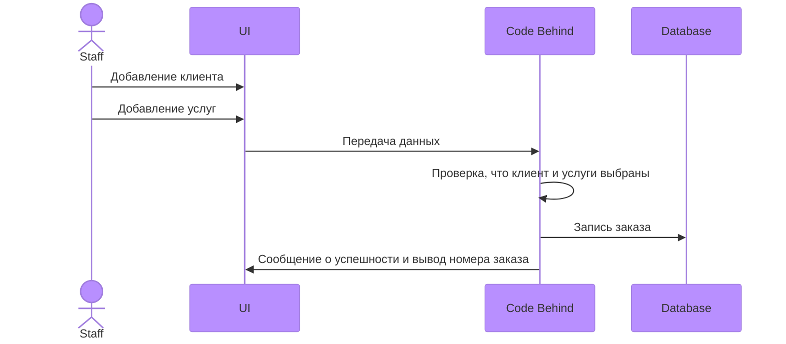

# ИС для сотрудников проката на Горнолыжном Курорте "Игора"
Выполнила Малышева Александра Юрьевна ИП 20-3

Скрипт для заполнения данными таблиц, находится в файлах проекта

## Диаграма Базы данных

Диаграмма последовательности для прецендента Формирование заказа
---

