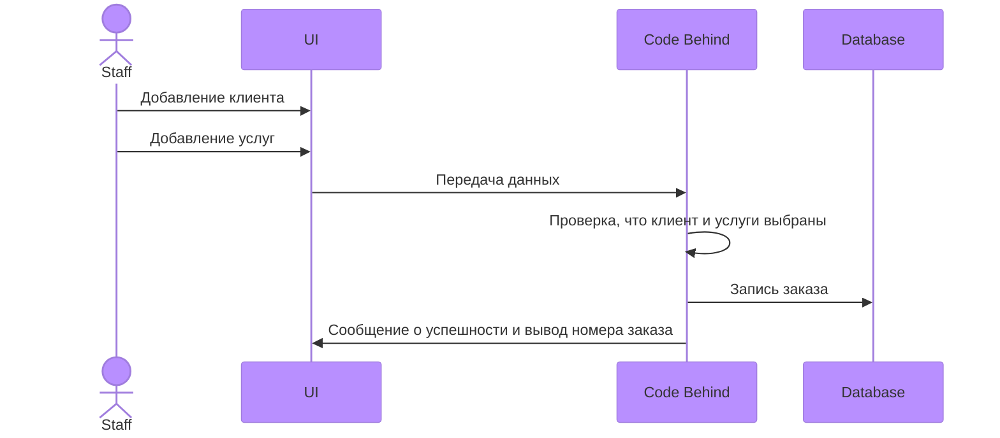

# ИС для сотрудников проката на Горнолыжном Курорте "Игора"
Выполнила Малышева Александра Юрьевна ИП 20-3

## Диаграма Базы данных


Диаграмма последовательности для прецендента Формирование заказа
---


Скрипт
---
```
USE [ResortDB1]
GO
SET IDENTITY_INSERT [dbo].[Clients] ON 

INSERT [dbo].[Clients] ([Id], [KOD], [FIO], [Passport], [DateBirth], [Address], [Email], [Password]) VALUES (18, 45462526, N'Фролов Андрей Иванович', N'1180176596', CAST(N'2001-07-14T00:00:00.0000000+04:00' AS DateTimeOffset), N'344288, г. Санкт-Петербург, ул. Чехова, 1, кв. 34', N'gohufreilagrau-3818@yopmail.com', N'cl12345')
INSERT [dbo].[Clients] ([Id], [KOD], [FIO], [Passport], [DateBirth], [Address], [Email], [Password]) VALUES (19, 45462527, N'Николаев Даниил Всеволодович', N'2280223523', CAST(N'2001-02-10T00:00:00.0000000+03:00' AS DateTimeOffset), N'614164, г. Санкт-Петербург, ул. Степная, 30, кв. 75', N'xawugosune-1385@yopmail.com', N'cl12346')
INSERT [dbo].[Clients] ([Id], [KOD], [FIO], [Passport], [DateBirth], [Address], [Email], [Password]) VALUES (20, 45462528, N'Снегирев Макар Иванович', N'4560354155', CAST(N'1998-05-21T00:00:00.0000000+04:00' AS DateTimeOffset), N'394242, г. Санкт-Петербург, ул. Коммунистическая, 43, кв. 57', N'satrahuddusei-4458@yopmail.com', N'cl12347')
INSERT [dbo].[Clients] ([Id], [KOD], [FIO], [Passport], [DateBirth], [Address], [Email], [Password]) VALUES (21, 45462529, N'Иванов Иван Ильич', N'9120554296', CAST(N'1998-10-01T00:00:00.0000000+04:00' AS DateTimeOffset), N'660540, г. Санкт-Петербург, ул. Солнечная, 25, кв. 78', N'boippaxeufrepra-7093@yopmail.com', N'cl12348')
INSERT [dbo].[Clients] ([Id], [KOD], [FIO], [Passport], [DateBirth], [Address], [Email], [Password]) VALUES (22, 45462530, N'Филиппова Анна Глебовна', N'2367558134', CAST(N'1976-05-31T00:00:00.0000000+04:00' AS DateTimeOffset), N'125837, г. Санкт-Петербург, ул. Шоссейная, 40, кв. 92', N'zapramaxesu-7741@yopmail.com', N'cl12349')
INSERT [dbo].[Clients] ([Id], [KOD], [FIO], [Passport], [DateBirth], [Address], [Email], [Password]) VALUES (23, 45462531, N'Иванов Михаил Владимирович', N'7101669343', CAST(N'1985-11-04T00:00:00.0000000+03:00' AS DateTimeOffset), N'125703, г. Санкт-Петербург, ул. Партизанская, 49, кв. 84', N'rouzecroummegre-3899@yopmail.com', N'cl12350')
INSERT [dbo].[Clients] ([Id], [KOD], [FIO], [Passport], [DateBirth], [Address], [Email], [Password]) VALUES (24, 45462532, N'Власов Дмитрий Александрович', N'3455719630', CAST(N'1998-08-17T00:00:00.0000000+04:00' AS DateTimeOffset), N'625283, г. Санкт-Петербург, ул. Победы, 46, кв. 7', N'ziyeuddocrabri-4748@yopmail.com', N'cl12351')
INSERT [dbo].[Clients] ([Id], [KOD], [FIO], [Passport], [DateBirth], [Address], [Email], [Password]) VALUES (25, 45462533, N'Серова Екатерина Львовна', N'2377871623', CAST(N'1984-10-24T00:00:00.0000000+04:00' AS DateTimeOffset), N'614611, г. Санкт-Петербург, ул. Молодежная, 50, кв. 78', N'ketameissoinnei-1951@yopmail.com', N'cl12352')
INSERT [dbo].[Clients] ([Id], [KOD], [FIO], [Passport], [DateBirth], [Address], [Email], [Password]) VALUES (26, 45462534, N'Борисова Ирина Ивановна', N'8755921148', CAST(N'1976-10-14T00:00:00.0000000+04:00' AS DateTimeOffset), N'454311, г. Санкт-Петербург, ул. Новая, 19, кв. 78', N'yipraubaponou-5849@yopmail.com', N'cl12353')
INSERT [dbo].[Clients] ([Id], [KOD], [FIO], [Passport], [DateBirth], [Address], [Email], [Password]) VALUES (27, 45462535, N'Зайцев Никита Артёмович', N'4355104594', CAST(N'1999-10-14T00:00:00.0000000+04:00' AS DateTimeOffset), N'660007, г. Санкт-Петербург, ул. Октябрьская, 19, кв. 42', N'crapedocouca-3572@yopmail.com', N'cl12354')
INSERT [dbo].[Clients] ([Id], [KOD], [FIO], [Passport], [DateBirth], [Address], [Email], [Password]) VALUES (28, 45462536, N'Медведев Святослав Евгеньевич', N'2791114390', CAST(N'1985-07-13T00:00:00.0000000+04:00' AS DateTimeOffset), N'603036, г. Санкт-Петербург, ул. Садовая, 4, кв. 13', N'ceigoixakaunni-9227@yopmail.com', N'cl12355')
INSERT [dbo].[Clients] ([Id], [KOD], [FIO], [Passport], [DateBirth], [Address], [Email], [Password]) VALUES (29, 45462537, N'Коротков Кирилл Алексеевич', N'5582126286', CAST(N'1976-05-26T00:00:00.0000000+04:00' AS DateTimeOffset), N'450983, г. Санкт-Петербург, ул. Комсомольская, 26, кв. 60', N'yeimmeiwauzomo-7054@yopmail.com', N'cl12356')
INSERT [dbo].[Clients] ([Id], [KOD], [FIO], [Passport], [DateBirth], [Address], [Email], [Password]) VALUES (30, 45462538, N'Калашникова Арина Максимовна', N'2978133653', CAST(N'1999-08-13T00:00:00.0000000+04:00' AS DateTimeOffset), N'394782, г. Санкт-Петербург, ул. Чехова, 3, кв. 14', N'poleifenevi-1560@yopmail.com', N'cl12357')
INSERT [dbo].[Clients] ([Id], [KOD], [FIO], [Passport], [DateBirth], [Address], [Email], [Password]) VALUES (31, 45462539, N'Минина Таисия Кирилловна', N'7512141956', CAST(N'1985-10-13T00:00:00.0000000+04:00' AS DateTimeOffset), N'603002, г. Санкт-Петербург, ул. Дзержинского, 28, кв. 56', N'kauprezofautei-6607@yopmail.com', N'cl12358')
INSERT [dbo].[Clients] ([Id], [KOD], [FIO], [Passport], [DateBirth], [Address], [Email], [Password]) VALUES (32, 45462540, N'Наумов Серафим Романович', N'5046158433', CAST(N'1999-04-15T00:00:00.0000000+04:00' AS DateTimeOffset), N'450558, г. Санкт-Петербург, ул. Набережная, 30, кв. 71', N'quaffaullelourei-1667@yopmail.com', N'cl12359')
INSERT [dbo].[Clients] ([Id], [KOD], [FIO], [Passport], [DateBirth], [Address], [Email], [Password]) VALUES (33, 45462541, N'Воробьева Василиса Евгеньевна', N'2460169505', CAST(N'1999-01-13T00:00:00.0000000+03:00' AS DateTimeOffset), N'394060, г. Санкт-Петербург, ул. Фрунзе, 43, кв. 79', N'jsteele@rojas-robinson.net', N'cl12360')
INSERT [dbo].[Clients] ([Id], [KOD], [FIO], [Passport], [DateBirth], [Address], [Email], [Password]) VALUES (34, 45462542, N'Калинин Александр Андреевич', N'3412174593', CAST(N'1999-01-07T00:00:00.0000000+03:00' AS DateTimeOffset), N'410661, г. Санкт-Петербург, ул. Школьная, 50, кв. 53', N'vhopkins@lewis-mullen.com', N'cl12361')
INSERT [dbo].[Clients] ([Id], [KOD], [FIO], [Passport], [DateBirth], [Address], [Email], [Password]) VALUES (35, 45462543, N'Кузнецова Милана Владиславовна', N'4950183034', CAST(N'1999-01-24T00:00:00.0000000+03:00' AS DateTimeOffset), N'625590, г. Санкт-Петербург, ул. Коммунистическая, 20, кв. 34', N'nlewis@yahoo.com', N'cl12362')
INSERT [dbo].[Clients] ([Id], [KOD], [FIO], [Passport], [DateBirth], [Address], [Email], [Password]) VALUES (36, 45462544, N'Фирсов Егор Романович', N'5829219464', CAST(N'1993-09-02T00:00:00.0000000+04:00' AS DateTimeOffset), N'625683, г. Санкт-Петербург, ул. 8 Марта, 20, кв. 21', N'garciadavid@mckinney-mcbride.com', N'cl12363')
INSERT [dbo].[Clients] ([Id], [KOD], [FIO], [Passport], [DateBirth], [Address], [Email], [Password]) VALUES (37, 45462545, N'Зимина Агния Александровна', N'6443208059', CAST(N'1998-09-03T00:00:00.0000000+04:00' AS DateTimeOffset), N'400562, г. Санкт-Петербург, ул. Зеленая, 32, кв. 67', N'cbradley@castro.com', N'cl12364')
INSERT [dbo].[Clients] ([Id], [KOD], [FIO], [Passport], [DateBirth], [Address], [Email], [Password]) VALUES (38, 45462546, N'Титов Андрей Глебович', N'7079213265', CAST(N'1985-10-23T00:00:00.0000000+04:00' AS DateTimeOffset), N'614510, г. Санкт-Петербург, ул. Маяковского, 47, кв. 72', N'cuevascatherine@carlson.biz', N'cl12365')
INSERT [dbo].[Clients] ([Id], [KOD], [FIO], [Passport], [DateBirth], [Address], [Email], [Password]) VALUES (39, 45462547, N'Орлов Николай Егорович', N'8207522702', CAST(N'1985-07-27T00:00:00.0000000+04:00' AS DateTimeOffset), N'410542, г. Санкт-Петербург, ул. Светлая, 46, кв. 82', N'thomasmoore@wilson-singh.net', N'cl12366')
INSERT [dbo].[Clients] ([Id], [KOD], [FIO], [Passport], [DateBirth], [Address], [Email], [Password]) VALUES (40, 45462548, N'Кузнецова Аиша Михайловна', N'9307232158', CAST(N'1998-10-04T00:00:00.0000000+04:00' AS DateTimeOffset), N'620839, г. Санкт-Петербург, ул. Цветочная, 8, кв. 100', N'jessica84@hotmail.com', N'cl12367')
INSERT [dbo].[Clients] ([Id], [KOD], [FIO], [Passport], [DateBirth], [Address], [Email], [Password]) VALUES (41, 45462549, N'Куликов Никита Георгиевич', N'1357242839', CAST(N'1999-04-23T00:00:00.0000000+04:00' AS DateTimeOffset), N'443890, г. Санкт-Петербург, ул. Коммунистическая, 1, кв. 10', N'jessicapark@hotmail.com', N'cl12368')
INSERT [dbo].[Clients] ([Id], [KOD], [FIO], [Passport], [DateBirth], [Address], [Email], [Password]) VALUES (42, 45462550, N'Карпова София Егоровна', N'1167256636', CAST(N'1993-10-01T00:00:00.0000000+04:00' AS DateTimeOffset), N'603379, г. Санкт-Петербург, ул. Спортивная, 46, кв. 95', N'ginaritter@schneider-buchanan.com', N'cl12369')
INSERT [dbo].[Clients] ([Id], [KOD], [FIO], [Passport], [DateBirth], [Address], [Email], [Password]) VALUES (43, 45462551, N'Смирнова Дарья Макаровна', N'1768266986', CAST(N'1976-03-22T00:00:00.0000000+03:00' AS DateTimeOffset), N'603721, г. Санкт-Петербург, ул. Гоголя, 41, кв. 57', N'stephen99@yahoo.com', N'cl12370')
SET IDENTITY_INSERT [dbo].[Clients] OFF
GO
SET IDENTITY_INSERT [dbo].[Orders] ON 

INSERT [dbo].[Orders] ([Id], [KOD], [DateAdd], [ClientKod], [Status], [DateEnd], [TimeRental], [Client_Id], [TotalPrice]) VALUES (2, N'45462532/20.02.2024', CAST(N'2024-02-20T02:48:56.6912149+03:00' AS DateTimeOffset), N'45462532', 0, NULL, NULL, NULL, NULL)
SET IDENTITY_INSERT [dbo].[Orders] OFF
GO
SET IDENTITY_INSERT [dbo].[Services] ON 

INSERT [dbo].[Services] ([Id], [Name], [KOD], [Price], [Image]) VALUES (8, N'Прокат сноуборда', N'JUR8R', CAST(1200.00 AS Decimal(18, 2)), 0xFFD8FFE000104A46494600010101012C012C0000FFE1031445786966000049492A00080000000A000E0102002E000000860000000F01020006000000B40000001001020015000000BA0000001201030001000000010000001A01050001000000D00000001B01050001000000D8000000280103000100000002000000310102000C000000E00000003201020014000000EC000000698704000100000000010000C60200004D616E206A756D70696E67207769746820736E6F77626F6172642066726F6D206D6F756E7461696E2068696C6C0043616E6F6E0043616E6F6E20454F53203544204D61726B20494900002C010000010000002C0100000100000047494D5020322E382E323000323031373A30353A31372031363A30363A3439001C009A82050001000000560200009D820500010000005E02000022880300010000000100000027880300010000004001000000900700040000003032323103900200140000006602000004900200140000007A02000001920A00010000008E02000002920500010000009602000004920A00010000009E0200000592050001000000A60200000792030001000000030000000992030001000000100000000A92050001000000AE02000090920200030000003837000091920200030000003837000092920200030000003837000000A00700040000003031303001A00300010000000100000002A00400010000008007000003A0040001000000380400000EA2050001000000B60200000FA2050001000000BE02000010A20300010000000200000001A40300010000000000000002A40300010000000100000003A40300010000000100000006A403000100000000000000000000000100000088130000380000000A000000323031353A30333A30322031323A30353A313000323031353A30333A30322031323A30353A313000E07EBB0040420F0066D94B0040420F0000000000010000000300000001000000640000000100000080B15500B305000000213900BE03000004000301030001000000060000001A01050001000000FC0200001B01050001000000040300002801030001000000020000000000000048000000010000004800000001000000FFE12F4E687474703A2F2F6E732E61646F62652E636F6D2F7861702F312E302F003C3F787061636B657420626567696E3D27EFBBBF272069643D2757354D304D7043656869487A7265537A4E54637A6B633964273F3E0A3C783A786D706D65746120786D6C6E733A783D2761646F62653A6E733A6D6574612F273E0A3C7264663A52444620786D6C6E733A7264663D27687474703A2F2F7777772E77332E6F72672F313939392F30322F32322D7264662D73796E7461782D6E7323273E0A0A203C7264663A4465736372697074696F6E20786D6C6E733A6175783D27687474703A2F2F6E732E61646F62652E636F6D2F657869662F312E302F6175782F273E0A20203C6175783A53657269616C4E756D6265723E3533303330383338313C2F6175783A53657269616C4E756D6265723E0A20203C6175783A4C656E73496E666F3E3130302F31203130302F3120302F3020302F303C2F6175783A4C656E73496E666F3E0A20203C6175783A4C656E733E45463130306D6D20662F322E38204D6163726F2055534D3C2F6175783A4C656E733E0A20203C6175783A4C656E7349443E3139303C2F6175783A4C656E7349443E0A20203C6175783A496D6167654E756D6265723E303C2F6175783A496D6167654E756D6265723E0A20203C6175783A417070726F78696D617465466F63757344697374616E63653E3832362F3130303C2F6175783A417070726F78696D617465466F63757344697374616E63653E0A20203C6175783A466C617368436F6D70656E736174696F6E3E302F313C2F6175783A466C617368436F6D70656E736174696F6E3E0A20203C6175783A4669726D776172653E322E312E313C2F6175783A4669726D776172653E0A20203C6175783A53657269616C4E756D6265723E3533303330383338313C2F6175783A53657269616C4E756D6265723E0A20203C6175783A4C656E73496E666F3E3130302F31203130302F3120302F3020302F303C2F6175783A4C656E73496E666F3E0A20203C6175783A4C656E733E45463130306D6D20662F322E38204D6163726F2055534D3C2F6175783A4C656E733E0A20203C6175783A4C656E7349443E3139303C2F6175783A4C656E7349443E0A20203C6175783A496D6167654E756D6265723E303C2F6175783A496D6167654E756D6265723E0A20203C6175783A417070726F78696D617465466F63757344697374616E63653E3832362F3130303C2F6175783A417070726F78696D617465466F63757344697374616E63653E0A20203C6175783A466C617368436F6D70656E736174696F6E3E302F313C2F6175783A466C617368436F6D70656E736174696F6E3E0A20203C6175783A4669726D776172653E322E312E313C2F6175783A4669726D776172653E0A203C2F7264663A4465736372697074696F6E3E0A0A203C7264663A4465736372697074696F6E20786D6C6E733A786D703D27687474703A2F2F6E732E61646F62652E636F6D2F7861702F312E302F273E0A20203C786D703A526174696E673E303C2F786D703A526174696E673E0A20203C786D703A4D6F64696679446174653E323031352D30342D33305431303A30343A32382B30323A30303C2F786D703A4D6F64696679446174653E0A20203C786D703A437265617465446174653E323031352D30332D30325431323A30353A31303C2F786D703A437265617465446174653E0A20203C786D703A526174696E673E303C2F786D703A526174696E673E0A20203C786D703A4D65746164617461446174653E323031352D30342D33305431303A30343A32382B30323A30303C2F786D703A4D65746164617461446174653E0A20203C786D703A43726561746F72546F6F6C3E41646F62652050686F746F73686F70204343203230313420284D6163696E746F7368293C2F786D703A43726561746F72546F6F6C3E0A203C2F7264663A4465736372697074696F6E3E0A0A203C7264663A4465736372697074696F6E20786D6C6E733A70686F746F73686F703D27687474703A2F2F6E732E61646F62652E636F6D2F70686F746F73686F702F312E302F273E0A20203C70686F746F73686F703A4C6567616379495054434469676573743E35314534364142394137363045363735464532453846363136363737314344383C2F70686F746F73686F703A4C6567616379495054434469676573743E0A20203C70686F746F73686F703A436F6C6F724D6F64653E333C2F70686F746F73686F703A436F6C6F724D6F64653E0A20203C70686F746F73686F703A49434350726F66696C653E735247422049454336313936362D322E313C2F70686F746F73686F703A49434350726F66696C653E0A20203C70686F746F73686F703A55524C3E687474703A2F2F7777772E6973746F636B2E636F6D3C2F70686F746F73686F703A55524C3E0A20203C70686F746F73686F703A436F70797269676874466C61673E747275653C2F70686F746F73686F703A436F70797269676874466C61673E0A20203C70686F746F73686F703A446F63756D656E74416E636573746F72733E0A2020203C7264663A4261673E0A202020203C7264663A6C693E61646F62653A646F6369643A70686F746F73686F703A37386665626432622D313738632D313137382D623930332D6537353861323261643130353C2F7264663A6C693E0A202020203C7264663A6C693E786D702E6469643A34396230336539372D306465332D346438332D623739352D6332303432316137343861373C2F7264663A6C693E0A202020203C7264663A6C693E786D702E6469643A63663238343766652D633539332D346232652D393236372D6362613563626261396338663C2F7264663A6C693E0A202020203C7264663A6C693E786D702E6469643A63666436373738332D373666632D343961652D383938642D3836313461636134386561393C2F7264663A6C693E0A202020203C7264663A6C693E786D702E6469643A65663235346535652D633636662D346663312D626639612D3166346139346265623037653C2F7264663A6C693E0A2020203C2F7264663A4261673E0A20203C2F70686F746F73686F703A446F63756D656E74416E636573746F72733E0A20203C70686F746F73686F703A44617465437265617465643E323031362D30332D32335430373A30305A3C2F70686F746F73686F703A44617465437265617465643E0A20203C70686F746F73686F703A4C6567616379495054434469676573743E35314534364142394137363045363735464532453846363136363737314344383C2F70686F746F73686F703A4C6567616379495054434469676573743E0A20203C70686F746F73686F703A436F6C6F724D6F64653E333C2F70686F746F73686F703A436F6C6F724D6F64653E0A20203C70686F746F73686F703A49434350726F66696C653E735247422049454336313936362D322E313C2F70686F746F73686F703A49434350726F66696C653E0A20203C70686F746F73686F703A417574686F7273506F736974696F6E3E436F6E7472696275746F723C2F70686F746F73686F703A417574686F7273506F736974696F6E3E0A20203C70686F746F73686F703A486561646C696E653E4A756D70696E6720736E6F77626F61726465722066726F6D2068696C6C20696E2077696E7465723C2F70686F746F73686F703A486561646C696E653E0A20203C70686F746F73686F703A536F757263653E6953746F636B70686F746F3C2F70686F746F73686F703A536F757263653E0A20203C70686F746F73686F703A496E737472756374696F6E733E4D6F64656C20616E642050726F70657274792052656C656173656420284D5226616D703B505229203C2F70686F746F73686F703A496E737472756374696F6E733E0A20203C70686F746F73686F703A4372656469743E476574747920496D616765732F6953746F636B70686F746F3C2F70686F746F73686F703A4372656469743E0A20203C70686F746F73686F703A55524C3E687474703A2F2F7777772E6973746F636B2E636F6D3C2F70686F746F73686F703A55524C3E0A20203C70686F746F73686F703A436F70797269676874466C61673E747275653C2F70686F746F73686F703A436F70797269676874466C61673E0A20203C70686F746F73686F703A446F63756D656E74416E636573746F72733E0A2020203C7264663A5365713E0A202020203C7264663A6C693E61646F62653A646F6369643A70686F746F73686F703A37386665626432622D313738632D313137382D623930332D6537353861323261643130353C2F7264663A6C693E0A202020203C7264663A6C693E786D702E6469643A34396230336539372D306465332D346438332D623739352D6332303432316137343861373C2F7264663A6C693E0A202020203C7264663A6C693E786D702E6469643A63663238343766652D633539332D346232652D393236372D6362613563626261396338663C2F7264663A6C693E0A202020203C7264663A6C693E786D702E6469643A63666436373738332D373666632D343961652D383938642D3836313461636134386561393C2F7264663A6C693E0A202020203C7264663A6C693E786D702E6469643A65663235346535652D633636662D346663312D626639612D3166346139346265623037653C2F7264663A6C693E0A2020203C2F7264663A5365713E0A20203C2F70686F746F73686F703A446F63756D656E74416E636573746F72733E0A203C2F7264663A4465736372697074696F6E3E0A0A203C7264663A4465736372697074696F6E20786D6C6E733A786D704D4D3D27687474703A2F2F6E732E61646F62652E636F6D2F7861702F312E302F6D6D2F273E0A20203C786D704D4D3A4F726967696E616C446F63756D656E7449443E45454436333641324142363337434333344239454241354244303237384146453C2F786D704D4D3A4F726967696E616C446F63756D656E7449443E0A20203C786D704D4D3A496E7374616E636549443E786D702E6969643A33616334666166662D303765622D643534362D383936352D3666643434393431623133393C2F786D704D4D3A496E7374616E636549443E0A20203C786D704D4D3A446F63756D656E744944207264663A7265736F757263653D2761646F62653A646F6369643A70686F746F73686F703A37386665626432622D313738632D313137382D623930332D65373538613232616431303527202F3E0A20203C786D704D4D3A4F726967696E616C446F63756D656E7449443E45454436333641324142363337434333344239454241354244303237384146453C2F786D704D4D3A4F726967696E616C446F63756D656E7449443E0A20203C786D704D4D3A496E7374616E636549443E786D702E6969643A33616334666166662D303765622D643534362D383936352D3666643434393431623133393C2F786D704D4D3A496E7374616E636549443E0A20203C786D704D4D3A486973746F72793E0A2020203C7264663A5365713E0A2020203C2F7264663A5365713E0A20203C2F786D704D4D3A486973746F72793E0A20203C786D704D4D3A4465726976656446726F6D207264663A7061727365547970653D275265736F75726365273E0A20203C2F786D704D4D3A4465726976656446726F6D3E0A203C2F7264663A4465736372697074696F6E3E0A0A203C7264663A4465736372697074696F6E20786D6C6E733A64633D27687474703A2F2F7075726C2E6F72672F64632F656C656D656E74732F312E312F273E0A20203C64633A666F726D61743E696D6167652F6A7065673C2F64633A666F726D61743E0A20203C64633A7469746C653E0A2020203C7264663A416C743E0A202020203C7264663A6C6920786D6C3A6C616E673D27782D64656661756C74273E782D64656661756C743C2F7264663A6C693E0A2020203C2F7264663A416C743E0A20203C2F64633A7469746C653E0A20203C64633A7375626A6563743E0A2020203C7264663A4261673E0A202020203C7264663A6C693E42616E736B6F3C2F7264663A6C693E0A202020203C7264663A6C693E45787472656D652053706F7274733C2F7264663A6C693E0A202020203C7264663A6C693E4D656E3C2F7264663A6C693E0A202020203C7264663A6C693E4164756C743C2F7264663A6C693E0A202020203C7264663A6C693E536E6F77626F617264696E673C2F7264663A6C693E0A202020203C7264663A6C693E46756E3C2F7264663A6C693E0A202020203C7264663A6C693E43617563617369616E204574686E69636974793C2F7264663A6C693E0A202020203C7264663A6C693E416374696F6E3C2F7264663A6C693E0A202020203C7264663A6C693E4A6F793C2F7264663A6C693E0A202020203C7264663A6C693E53706565643C2F7264663A6C693E0A202020203C7264663A6C693E426C75653C2F7264663A6C693E0A202020203C7264663A6C693E53706F72743C2F7264663A6C693E0A202020203C7264663A6C693E5661636174696F6E733C2F7264663A6C693E0A202020203C7264663A6C693E4F7574646F6F72733C2F7264663A6C693E0A202020203C7264663A6C693E41637469766974793C2F7264663A6C693E0A202020203C7264663A6C693E57696E7465723C2F7264663A6C693E0A202020203C7264663A6C693E536561736F6E3C2F7264663A6C693E0A202020203C7264663A6C693E4D6F756E7461696E3C2F7264663A6C693E0A202020203C7264663A6C693E536E6F773C2F7264663A6C693E0A202020203C7264663A6C693E546F7572697374205265736F72743C2F7264663A6C693E0A202020203C7264663A6C693E536E6F77626F6172643C2F7264663A6C693E0A2020203C2F7264663A4261673E0A20203C2F64633A7375626A6563743E0A20203C64633A6465736372697074696F6E3E0A2020203C7264663A416C743E0A202020203C7264663A6C6920786D6C3A6C616E673D27782D64656661756C74273E782D64656661756C743C2F7264663A6C693E0A2020203C2F7264663A416C743E0A20203C2F64633A6465736372697074696F6E3E0A20203C64633A63726561746F723E0A2020203C7264663A5365713E0A202020203C7264663A6C693E70796F74723032313C2F7264663A6C693E0A2020203C2F7264663A5365713E0A20203C2F64633A63726561746F723E0A20203C64633A7269676874733E0A2020203C7264663A416C743E0A202020203C7264663A6C6920786D6C3A6C616E673D27782D64656661756C74273E782D64656661756C743C2F7264663A6C693E0A2020203C2F7264663A416C743E0A20203C2F64633A7269676874733E0A203C2F7264663A4465736372697074696F6E3E0A0A203C7264663A4465736372697074696F6E20786D6C6E733A6372733D27687474703A2F2F6E732E61646F62652E636F6D2F63616D6572612D7261772D73657474696E67732F312E302F273E0A20203C6372733A52617746696C654E616D653E494D475F363133332E4352323C2F6372733A52617746696C654E616D653E0A20203C6372733A56657273696F6E3E382E353C2F6372733A56657273696F6E3E0A20203C6372733A50726F6365737356657273696F6E3E362E373C2F6372733A50726F6365737356657273696F6E3E0A20203C6372733A576869746542616C616E63653E41732053686F743C2F6372733A576869746542616C616E63653E0A20203C6372733A4175746F576869746556657273696F6E3E3133343334383830303C2F6372733A4175746F576869746556657273696F6E3E0A20203C6372733A54656D70657261747572653E343835303C2F6372733A54656D70657261747572653E0A20203C6372733A54696E743E2B313C2F6372733A54696E743E0A20203C6372733A53617475726174696F6E3E303C2F6372733A53617475726174696F6E3E0A20203C6372733A53686172706E6573733E32353C2F6372733A53686172706E6573733E0A20203C6372733A4C756D696E616E6365536D6F6F7468696E673E303C2F6372733A4C756D696E616E6365536D6F6F7468696E673E0A20203C6372733A436F6C6F724E6F697365526564756374696F6E3E32353C2F6372733A436F6C6F724E6F697365526564756374696F6E3E0A20203C6372733A5669676E65747465416D6F756E743E303C2F6372733A5669676E65747465416D6F756E743E0A20203C6372733A536861646F7754696E743E303C2F6372733A536861646F7754696E743E0A20203C6372733A5265644875653E303C2F6372733A5265644875653E0A20203C6372733A52656453617475726174696F6E3E303C2F6372733A52656453617475726174696F6E3E0A20203C6372733A477265656E4875653E303C2F6372733A477265656E4875653E0A20203C6372733A477265656E53617475726174696F6E3E303C2F6372733A477265656E53617475726174696F6E3E0A20203C6372733A426C75654875653E303C2F6372733A426C75654875653E0A20203C6372733A426C756553617475726174696F6E3E303C2F6372733A426C756553617475726174696F6E3E0A20203C6372733A56696272616E63653E303C2F6372733A56696272616E63653E0A20203C6372733A48756541646A7573746D656E745265643E303C2F6372733A48756541646A7573746D656E745265643E0A20203C6372733A48756541646A7573746D656E744F72616E67653E303C2F6372733A48756541646A7573746D656E744F72616E67653E0A20203C6372733A48756541646A7573746D656E7459656C6C6F773E303C2F6372733A48756541646A7573746D656E7459656C6C6F773E0A20203C6372733A48756541646A7573746D656E74477265656E3E303C2F6372733A48756541646A7573746D656E74477265656E3E0A20203C6372733A48756541646A7573746D656E74417175613E303C2F6372733A48756541646A7573746D656E74417175613E0A20203C6372733A48756541646A7573746D656E74426C75653E303C2F6372733A48756541646A7573746D656E74426C75653E0A20203C6372733A48756541646A7573746D656E74507572706C653E303C2F6372733A48756541646A7573746D656E74507572706C653E0A20203C6372733A48756541646A7573746D656E744D6167656E74613E303C2F6372733A48756541646A7573746D656E744D6167656E74613E0A20203C6372733A53617475726174696F6E41646A7573746D656E745265643E303C2F6372733A53617475726174696F6E41646A7573746D656E745265643E0A20203C6372733A53617475726174696F6E41646A7573746D656E744F72616E67653E303C2F6372733A53617475726174696F6E41646A7573746D656E744F72616E67653E0A20203C6372733A53617475726174696F6E41646A7573746D656E7459656C6C6F773E303C2F6372733A53617475726174696F6E41646A7573746D656E7459656C6C6F773E0A20203C6372733A53617475726174696F6E41646A7573746D656E74477265656E3E303C2F6372733A53617475726174696F6E41646A7573746D656E74477265656E3E0A20203C6372733A53617475726174696F6E41646A7573746D656E74417175613E303C2F6372733A53617475726174696F6E41646A7573746D656E74417175613E0A20203C6372733A53617475726174696F6E41646A7573746D656E74426C75653E303C2F6372733A53617475726174696F6E41646A7573746D656E74426C75653E0A20203C6372733A53617475726174696F6E41646A7573746D656E74507572706C653E303C2F6372733A53617475726174696F6E41646A7573746D656E74507572706C653E0A20203C6372733A53617475726174696F6E41646A7573746D656E744D6167656E74613E303C2F6372733A53617475726174696F6E41646A7573746D656E744D6167656E74613E0A20203C6372733A4C756D696E616E636541646A7573746D656E745265643E303C2F6372733A4C756D696E616E636541646A7573746D656E745265643E0A20203C6372733A4C756D696E616E636541646A7573746D656E744F72616E67653E303C2F6372733A4C756D696E616E636541646A7573746D656E744F72616E67653E0A20203C6372733A4C756D696E616E636541646A7573746D656E7459656C6C6F773E303C2F6372733A4C756D696E616E636541646A7573746D656E7459656C6C6F773E0A20203C6372733A4C756D696E616E636541646A7573746D656E74477265656E3E303C2F6372733A4C756D696E616E636541646A7573746D656E74477265656E3E0A20203C6372733A4C756D696E616E636541646A7573746D656E74417175613E303C2F6372733A4C756D696E616E636541646A7573746D656E74417175613E0A20203C6372733A4C756D696E616E636541646A7573746D656E74426C75653E303C2F6372733A4C756D696E616E636541646A7573746D656E74426C75653E0A20203C6372733A4C756D696E616E636541646A7573746D656E74507572706C653E303C2F6372733A4C756D696E616E636541646A7573746D656E74507572706C653E0A20203C6372733A4C756D696E616E636541646A7573746D656E744D6167656E74613E303C2F6372733A4C756D696E616E636541646A7573746D656E744D6167656E74613E0A20203C6372733A53706C6974546F6E696E67536861646F774875653E303C2F6372733A53706C6974546F6E696E67536861646F774875653E0A20203C6372733A53706C6974546F6E696E67536861646F7753617475726174696F6E3E303C2F6372733A53706C6974546F6E696E67536861646F7753617475726174696F6E3E0A20203C6372733A53706C6974546F6E696E67486967686C696768744875653E303C2F6372733A53706C6974546F6E696E67486967686C696768744875653E0A20203C6372733A53706C6974546F6E696E67486967686C6967687453617475726174696F6E3E303C2F6372733A53706C6974546F6E696E67486967686C6967687453617475726174696F6E3E0A20203C6372733A53706C6974546F6E696E6742616C616E63653E303C2F6372733A53706C6974546F6E696E6742616C616E63653E0A20203C6372733A506172616D6574726963536861646F77733E303C2F6372733A506172616D6574726963536861646F77733E0A20203C6372733A506172616D65747269634461726B733E303C2F6372733A506172616D65747269634461726B733E0A20203C6372733A506172616D65747269634C69676874733E303C2F6372733A506172616D65747269634C69676874733E0A20203C6372733A506172616D6574726963486967686C69676874733E303C2F6372733A506172616D6574726963486967686C69676874733E0A20203C6372733A506172616D6574726963536861646F7753706C69743E32353C2F6372733A506172616D6574726963536861646F7753706C69743E0A20203C6372733A506172616D65747269634D6964746F6E6553706C69743E35303C2F6372733A506172616D65747269634D6964746F6E6553706C69743E0A20203C6372733A506172616D6574726963486967686C6967687453706C69743E37353C2F6372733A506172616D6574726963486967686C6967687453706C69743E0A20203C6372733A5368617270656E5261646975733E2B312E303C2F6372733A5368617270656E5261646975733E0A20203C6372733A5368617270656E44657461696C3E32353C2F6372733A5368617270656E44657461696C3E0A20203C6372733A5368617270656E456467654D61736B696E673E303C2F6372733A5368617270656E456467654D61736B696E673E0A20203C6372733A506F737443726F705669676E65747465416D6F756E743E303C2F6372733A506F737443726F705669676E65747465416D6F756E743E0A20203C6372733A477261696E416D6F756E743E303C2F6372733A477261696E416D6F756E743E0A20203C6372733A436F6C6F724E6F697365526564756374696F6E44657461696C3E35303C2F6372733A436F6C6F724E6F697365526564756374696F6E44657461696C3E0A20203C6372733A436F6C6F724E6F697365526564756374696F6E536D6F6F74686E6573733E35303C2F6372733A436F6C6F724E6F697365526564756374696F6E536D6F6F74686E6573733E0A20203C6372733A4C656E7350726F66696C65456E61626C653E303C2F6372733A4C656E7350726F66696C65456E61626C653E0A20203C6372733A4C656E734D616E75616C446973746F7274696F6E416D6F756E743E303C2F6372733A4C656E734D616E75616C446973746F7274696F6E416D6F756E743E0A20203C6372733A5065727370656374697665566572746963616C3E303C2F6372733A5065727370656374697665566572746963616C3E0A20203C6372733A5065727370656374697665486F72697A6F6E74616C3E303C2F6372733A5065727370656374697665486F72697A6F6E74616C3E0A20203C6372733A5065727370656374697665526F746174653E302E303C2F6372733A5065727370656374697665526F746174653E0A20203C6372733A50657273706563746976655363616C653E3130303C2F6372733A50657273706563746976655363616C653E0A20203C6372733A50657273706563746976654173706563743E303C2F6372733A50657273706563746976654173706563743E0A20203C6372733A5065727370656374697665557072696768743E303C2F6372733A5065727370656374697665557072696768743E0A20203C6372733A4175746F4C61746572616C43413E313C2F6372733A4175746F4C61746572616C43413E0A20203C6372733A4578706F73757265323031323E2B302E31303C2F6372733A4578706F73757265323031323E0A20203C6372733A436F6E7472617374323031323E2B31363C2F6372733A436F6E7472617374323031323E0A20203C6372733A486967686C6967687473323031323E2B383C2F6372733A486967686C6967687473323031323E0A20203C6372733A536861646F7773323031323E2B323C2F6372733A536861646F7773323031323E0A20203C6372733A576869746573323031323E2B33383C2F6372733A576869746573323031323E0A20203C6372733A426C61636B73323031323E2B35353C2F6372733A426C61636B73323031323E0A20203C6372733A436C6172697479323031323E2B383C2F6372733A436C6172697479323031323E0A20203C6372733A44656672696E6765507572706C65416D6F756E743E343C2F6372733A44656672696E6765507572706C65416D6F756E743E0A20203C6372733A44656672696E6765507572706C654875654C6F3E33303C2F6372733A44656672696E6765507572706C654875654C6F3E0A20203C6372733A44656672696E6765507572706C6548756548693E37303C2F6372733A44656672696E6765507572706C6548756548693E0A20203C6372733A44656672696E6765477265656E416D6F756E743E303C2F6372733A44656672696E6765477265656E416D6F756E743E0A20203C6372733A44656672696E6765477265656E4875654C6F3E34303C2F6372733A44656672696E6765477265656E4875654C6F3E0A20203C6372733A44656672696E6765477265656E48756548693E36303C2F6372733A44656672696E6765477265656E48756548693E0A20203C6372733A436F6E76657274546F477261797363616C653E46616C73653C2F6372733A436F6E76657274546F477261797363616C653E0A20203C6372733A546F6E6543757276654E616D653E4D656469756D20436F6E74726173743C2F6372733A546F6E6543757276654E616D653E0A20203C6372733A546F6E6543757276654E616D65323031323E4C696E6561723C2F6372733A546F6E6543757276654E616D65323031323E0A20203C6372733A43616D65726150726F66696C653E41646F6265205374616E646172643C2F6372733A43616D65726150726F66696C653E0A20203C6372733A43616D65726150726F66696C654469676573743E33444138434534413632364345333641314430433535424631353737393343393C2F6372733A43616D65726150726F66696C654469676573743E0A20203C6372733A4C656E7350726F66696C6553657475703E4C656E7344656661756C74733C2F6372733A4C656E7350726F66696C6553657475703E0A20203C6372733A48617353657474696E67733E547275653C2F6372733A48617353657474696E67733E0A20203C6372733A48617343726F703E46616C73653C2F6372733A48617343726F703E0A20203C6372733A416C72656164794170706C6965643E547275653C2F6372733A416C72656164794170706C6965643E0A20203C6372733A546F6E6543757276653E0A2020203C7264663A4261673E0A202020203C7264663A6C693E302C20303C2F7264663A6C693E0A202020203C7264663A6C693E33322C2032323C2F7264663A6C693E0A202020203C7264663A6C693E36342C2035363C2F7264663A6C693E0A202020203C7264663A6C693E3132382C203132383C2F7264663A6C693E0A202020203C7264663A6C693E3139322C203139363C2F7264663A6C693E0A202020203C7264663A6C693E3235352C203235353C2F7264663A6C693E0A2020203C2F7264663A4261673E0A20203C2F6372733A546F6E6543757276653E0A20203C6372733A546F6E6543757276655265643E0A2020203C7264663A4261673E0A202020203C7264663A6C693E302C20303C2F7264663A6C693E0A202020203C7264663A6C693E3235352C203235353C2F7264663A6C693E0A2020203C2F7264663A4261673E0A20203C2F6372733A546F6E6543757276655265643E0A20203C6372733A546F6E654375727665477265656E3E0A2020203C7264663A4261673E0A202020203C7264663A6C693E302C20303C2F7264663A6C693E0A202020203C7264663A6C693E3235352C203235353C2F7264663A6C693E0A2020203C2F7264663A4261673E0A20203C2F6372733A546F6E654375727665477265656E3E0A20203C6372733A546F6E654375727665426C75653E0A2020203C7264663A4261673E0A202020203C7264663A6C693E302C20303C2F7264663A6C693E0A202020203C7264663A6C693E3235352C203235353C2F7264663A6C693E0A2020203C2F7264663A4261673E0A20203C2F6372733A546F6E654375727665426C75653E0A20203C6372733A546F6E6543757276655056323031323E0A2020203C7264663A4261673E0A202020203C7264663A6C693E302C20303C2F7264663A6C693E0A202020203C7264663A6C693E3235352C203235353C2F7264663A6C693E0A2020203C2F7264663A4261673E0A20203C2F6372733A546F6E6543757276655056323031323E0A20203C6372733A546F6E6543757276655056323031325265643E0A2020203C7264663A4261673E0A202020203C7264663A6C693E302C20303C2F7264663A6C693E0A202020203C7264663A6C693E3235352C203235353C2F7264663A6C693E0A2020203C2F7264663A4261673E0A20203C2F6372733A546F6E6543757276655056323031325265643E0A20203C6372733A546F6E654375727665505632303132477265656E3E0A2020203C7264663A4261673E0A202020203C7264663A6C693E302C20303C2F7264663A6C693E0A202020203C7264663A6C693E3235352C203235353C2F7264663A6C693E0A2020203C2F7264663A4261673E0A20203C2F6372733A546F6E654375727665505632303132477265656E3E0A20203C6372733A546F6E654375727665505632303132426C75653E0A2020203C7264663A4261673E0A202020203C7264663A6C693E302C20303C2F7264663A6C693E0A202020203C7264663A6C693E3235352C203235353C2F7264663A6C693E0A2020203C2F7264663A4261673E0A20203C2F6372733A546F6E654375727665505632303132426C75653E0A203C2F7264663A4465736372697074696F6E3E0A0A203C7264663A4465736372697074696F6E20786D6C6E733A706C75733D27687474703A2F2F6E732E757365706C75732E6F72672F6C64662F786D702F312E302F273E0A20203C706C75733A4C6963656E736F7255524C3E687474703A2F2F7777772E6765747479696D616765732E636F6D3C2F706C75733A4C6963656E736F7255524C3E0A203C2F7264663A4465736372697074696F6E3E0A0A203C7264663A4465736372697074696F6E20786D6C6E733A4765747479496D61676573474946543D27687474703A2F2F786D702E6765747479696D616765732E636F6D2F676966742F312E302F273E0A20203C4765747479496D61676573474946543A417373657449443E3531373039383336343C2F4765747479496D61676573474946543A417373657449443E0A20203C4765747479496D61676573474946543A646C7265663E4558623034486E43486830426778726C4C6E67614C673D3D3C2F4765747479496D61676573474946543A646C7265663E0A20203C4765747479496D61676573474946543A496D61676552616E6B3E333C2F4765747479496D61676573474946543A496D61676552616E6B3E0A203C2F7264663A4465736372697074696F6E3E0A0A3C2F7264663A5244463E0A3C2F783A786D706D6574613E0A3C3F787061636B657420656E643D2772273F3E0AFFE20C584943435F50524F46494C4500010100000C484C696E6F021000006D6E74725247422058595A2007CE00020009000600310000616373704D5346540000000049454320735247420000000000000000000000010000F6D6000100000000D32D4850202000000000000000000000000000000000000000000000000000000000000000000000000000000000000000000000001163707274000001500000003364657363000001840000006C77747074000001F000000014626B707400000204000000147258595A00000218000000146758595A0000022C000000146258595A0000024000000014646D6E640000025400000070646D6464000002C400000088767565640000034C0000008676696577000003D4000000246C756D69000003F8000000146D6561730000040C0000002474656368000004300000000C725452430000043C0000080C675452430000043C0000080C625452430000043C0000080C7465787400000000436F70797269676874202863292031393938204865776C6574742D5061636B61726420436F6D70616E790000646573630000000000000012735247422049454336313936362D322E31000000000000000000000012735247422049454336313936362D322E31000000000000000000000000000000000000000000000000000000000000000000000000000000000000000000000000000058595A20000000000000F35100010000000116CC58595A200000000000000000000000000000000058595A200000000000006FA2000038F50000039058595A2000000000000062990000B785000018DA58595A2000000000000024A000000F840000B6CF64657363000000000000001649454320687474703A2F2F7777772E6965632E636800000000000000000000001649454320687474703A2F2F7777772E6965632E63680000000000000000000000000000000000000000000000000000000000000000000000000000000000000000000064657363000000000000002E4945432036313936362D322E312044656661756C742052474220636F6C6F7572207370616365202D207352474200000000000000000000002E4945432036313936362D322E312044656661756C742052474220636F6C6F7572207370616365202D20735247420000000000000000000000000000000000000000000064657363000000000000002C5265666572656E63652056696577696E6720436F6E646974696F6E20696E2049454336313936362D322E3100000000000000000000002C5265666572656E63652056696577696E6720436F6E646974696F6E20696E2049454336313936362D322E31000000000000000000000000000000000000000000000000000076696577000000000013A4FE00145F2E0010CF140003EDCC0004130B00035C9E0000000158595A2000000000004C09560050000000571FE76D6561730000000000000001000000000000000000000000000000000000028F0000000273696720000000004352542063757276000000000000040000000005000A000F00140019001E00230028002D00320037003B00400045004A004F00540059005E00630068006D00720077007C00810086008B00900095009A009F00A400A900AE00B200B700BC00C100C600CB00D000D500DB00E000E500EB00F000F600FB01010107010D01130119011F0125012B01320138013E0145014C0152015901600167016E0175017C0183018B0192019A01A101A901B101B901C101C901D101D901E101E901F201FA0203020C0214021D0226022F02380241024B0254025D02670271027A0284028E029802A202AC02B602C102CB02D502E002EB02F50300030B03160321032D03380343034F035A03660372037E038A039603A203AE03BA03C703D303E003EC03F9040604130420042D043B0448045504630471047E048C049A04A804B604C404D304E104F004FE050D051C052B053A05490558056705770586059605A605B505C505D505E505F6060606160627063706480659066A067B068C069D06AF06C006D106E306F507070719072B073D074F076107740786079907AC07BF07D207E507F8080B081F08320846085A086E0882089608AA08BE08D208E708FB09100925093A094F09640979098F09A409BA09CF09E509FB0A110A270A3D0A540A6A0A810A980AAE0AC50ADC0AF30B0B0B220B390B510B690B800B980BB00BC80BE10BF90C120C2A0C430C5C0C750C8E0CA70CC00CD90CF30D0D0D260D400D5A0D740D8E0DA90DC30DDE0DF80E130E2E0E490E640E7F0E9B0EB60ED20EEE0F090F250F410F5E0F7A0F960FB30FCF0FEC1009102610431061107E109B10B910D710F511131131114F116D118C11AA11C911E81207122612451264128412A312C312E31303132313431363138313A413C513E5140614271449146A148B14AD14CE14F01512153415561578159B15BD15E0160316261649166C168F16B216D616FA171D17411765178917AE17D217F7181B18401865188A18AF18D518FA19201945196B199119B719DD1A041A2A1A511A771A9E1AC51AEC1B141B3B1B631B8A1BB21BDA1C021C2A1C521C7B1CA31CCC1CF51D1E1D471D701D991DC31DEC1E161E401E6A1E941EBE1EE91F131F3E1F691F941FBF1FEA20152041206C209820C420F0211C2148217521A121CE21FB22272255228222AF22DD230A23382366239423C223F0241F244D247C24AB24DA250925382568259725C725F726272657268726B726E827182749277A27AB27DC280D283F287128A228D429062938296B299D29D02A022A352A682A9B2ACF2B022B362B692B9D2BD12C052C392C6E2CA22CD72D0C2D412D762DAB2DE12E162E4C2E822EB72EEE2F242F5A2F912FC72FFE3035306C30A430DB3112314A318231BA31F2322A3263329B32D4330D3346337F33B833F1342B3465349E34D83513354D358735C235FD3637367236AE36E937243760379C37D738143850388C38C839053942397F39BC39F93A363A743AB23AEF3B2D3B6B3BAA3BE83C273C653CA43CE33D223D613DA13DE03E203E603EA03EE03F213F613FA23FE24023406440A640E74129416A41AC41EE4230427242B542F7433A437D43C044034447448A44CE45124555459A45DE4622466746AB46F04735477B47C04805484B489148D7491D496349A949F04A374A7D4AC44B0C4B534B9A4BE24C2A4C724CBA4D024D4A4D934DDC4E254E6E4EB74F004F494F934FDD5027507150BB51065150519B51E65231527C52C75313535F53AA53F65442548F54DB5528557555C2560F565C56A956F75744579257E0582F587D58CB591A596959B85A075A565AA65AF55B455B955BE55C355C865CD65D275D785DC95E1A5E6C5EBD5F0F5F615FB36005605760AA60FC614F61A261F56249629C62F06343639763EB6440649464E9653D659265E7663D669266E8673D679367E9683F689668EC6943699A69F16A486A9F6AF76B4F6BA76BFF6C576CAF6D086D606DB96E126E6B6EC46F1E6F786FD1702B708670E0713A719571F0724B72A67301735D73B87414747074CC7528758575E1763E769B76F8775677B37811786E78CC792A798979E77A467AA57B047B637BC27C217C817CE17D417DA17E017E627EC27F237F847FE5804780A8810A816B81CD8230829282F4835783BA841D848084E3854785AB860E867286D7873B879F8804886988CE8933899989FE8A648ACA8B308B968BFC8C638CCA8D318D988DFF8E668ECE8F368F9E9006906E90D6913F91A89211927A92E3934D93B69420948A94F4955F95C99634969F970A977597E0984C98B89924999099FC9A689AD59B429BAF9C1C9C899CF79D649DD29E409EAE9F1D9F8B9FFAA069A0D8A147A1B6A226A296A306A376A3E6A456A4C7A538A5A9A61AA68BA6FDA76EA7E0A852A8C4A937A9A9AA1CAA8FAB02AB75ABE9AC5CACD0AD44ADB8AE2DAEA1AF16AF8BB000B075B0EAB160B1D6B24BB2C2B338B3AEB425B49CB513B58AB601B679B6F0B768B7E0B859B8D1B94AB9C2BA3BBAB5BB2EBBA7BC21BC9BBD15BD8FBE0ABE84BEFFBF7ABFF5C070C0ECC167C1E3C25FC2DBC358C3D4C451C4CEC54BC5C8C646C6C3C741C7BFC83DC8BCC93AC9B9CA38CAB7CB36CBB6CC35CCB5CD35CDB5CE36CEB6CF37CFB8D039D0BAD13CD1BED23FD2C1D344D3C6D449D4CBD54ED5D1D655D6D8D75CD7E0D864D8E8D96CD9F1DA76DAFBDB80DC05DC8ADD10DD96DE1CDEA2DF29DFAFE036E0BDE144E1CCE253E2DBE363E3EBE473E4FCE584E60DE696E71FE7A9E832E8BCE946E9D0EA5BEAE5EB70EBFBEC86ED11ED9CEE28EEB4EF40EFCCF058F0E5F172F1FFF28CF319F3A7F434F4C2F550F5DEF66DF6FBF78AF819F8A8F938F9C7FA57FAE7FB77FC07FC98FD29FDBAFE4BFEDCFF6DFFFFFFDB0043000302020302020303030304030304050805050404050A070706080C0A0C0C0B0A0B0B0D0E12100D0E110E0B0B1016101113141515150C0F171816141812141514FFDB00430103040405040509050509140D0B0D1414141414141414141414141414141414141414141414141414141414141414141414141414141414141414141414141414FFC20011080438078003011100021101031101FFC4001C0000030101010101010000000000000000000102030405060708FFC4001B01010101010101010100000000000000000001020304050607FFDA000C03010002100310000001FE9FE9806A403082D6000380002920850201002140805408048580A924D252C4800E05551ACAB22E512B362158A924D8AC9B26924A1491591452048B102215936CD936202448AC42B2692249A5485728042A493514AC4082350553602124D45CCD890A0918C070C70DA72368443B094A70135364D9364B3162A8B22CCF5124D8DA1968DA256BB66ED9DED9D21C9C5D7972F4E51616264A485AE5C37CAE6EA5DB3BE8E7D3B3975EAE7D3B3976A5CB58E6DE2D7A79EF4CEA2E532ADCB59A5E5E9C7B78F7ECE7E88B9C358E5E9CBA71D749A172B8E2EBCB4CE9A89ACDED8B34AAE5174CDEFE1DBA39EF5CAA57172DCD566AB23526C42B24A05CEC8B26CA8044593689A4B72D4A9105289D33B3EBFE3FD36A4380158539404600000020B15800840345408054804821452124D200A2019351AC2A945522B26942B10AC9B27599159216215CCD4D254937285624402A9A8D409449342225954A924D2548AC9A110088D49A42B9070054D200455093733A88402B18E1CB4A2396E5689A485201A3549348CEE55CCD45920936151424D265D25A9AD32A6B5CEB5CEB3B9E4E9CB9BA72CEE67599B900D25DF1D958922E76CF4E9E7D3BF8F7F438766BE77A3CF8EB9D4DDC75F3EBAE351AC90196F379D79DE8F2F4F3EDD18E9D5CBB4DCE766F9DD4DE7A9E57A3C7CFBCF6F2EC8B96E69916DC32571DE7AF9EBBB8F5DB1BB96A5EBE3BDB1AA571349159351605CAE1565A886233B2751C38A958C4A0C44D7D6FC8FA64380158D41820008028082885A8485808040850201520132502A11134806251154DCCEA4A2B242D9B9910AC42B26E6690AA592922B26A6A6A5132AC48AD42B26D48A913732922B122A54926C150AC4489954955885490429052122A00948D4485422A9B9631CAE2A5A96A5A0015259B12310AC4888B948AD8B10E920AAC42A9B99A702E92EF8DEF9D65ACF075E195C65BCC5C2B10151D7CFBB5CEE26E6E6BAB9F6EBE7D7AF974CB79E2EBC22CD258B9675F2EAAA2CC77CB7C6D98EB3D5CFAF4F3EDBE3A7374E752DCD7772F47274E3E37ABC796A6D8DE9358EB3D1CFA6D9DCAE92EB2E3665BCC5CDCBAE75D18E9D9CBA74F3DF4F3DF5F2DD66953645248A8D4D336A35CEB3D4110A900848AC4A00D5C8968FAAF91F4DC00AC6AC00100000000040155245600200428100A8122429502454800402B26C9D494562555372926909154D8A924D24549158AC927484572848AC42A5534124DCAB26666911A08593484A09124D8895562158580282B10AC4886A926C5489B26C562454E08A2B3AB2F3AA0015B2CCD8A9089666C560A085528525118A9136B1A5CBA675AE75373C9D3963A9CFBE31733733ACB5A9AE8E7D2A59B2359A97A31BEBE7D2F373D4CB59CF588B9CF596BA66DCA05892A6AE5E8E7D7A79F4E7E9CF1D67AB9F6735B677CFBC72F5E3C3D78B5D71BD26FD2F3FAB7C74CB59132D630DF3E8E7D959CFBE73674F3E9E971EFAE6F5F3EBD9C3A6D8B4B151646A226C4BB62ED9A9558901936CA21591667A38A8A57151F57F23EA386A0D58000D008000292880020AA922B00102014085408485805249A40020159372AC9A9A4934AC48AA448AC9A2A4562122A48AE66A6A6C9B25122B152158A92A22E558911293536173352A811136048AD48A9208521058955822A4089559362A4CA15084AD001C5CD692DCA0A822C8B98B10E544D8A900AC0965DD218C90296870D72D632D49662CE7DF24CB33D66359A9ADB1BD269ACB2D74977C6854917396F0ACA9A115B5208C8B34CEA93AB977EAE7D71D672D66359D73D39F788A4CE1BC65A9BE2ED9EBEBF97D9AE7AD25CB8D986F0926C929ADF1ADE5D717B3977DF1ADB1A48D66812322B4CDD335C52A4548CEC54C232DCCB501C6B9B5289F61F17EA8AD6A0A00072000008D4150200041558AC40204028100A9058A4281521588048A952B949364D22695891548AC49362B52152808562B22C564D422B124D8AC9B522A42A4928AC48922A695922B12A49B124D21294A8122B001215208A90AC41491524560008E524285A8A95AD4052C591733648E5126A6841A199A41690D1AA289B41928AE70D673D73933DE1238562B12B1CAAC726B9DDCD509158933B8D577C7442A6B2CED9D45CC5CEF9DF572EDA67796B3CFD39F1F5F3A22EBA31D5CBE5FA7C62ED8EBDBCBAFA3E7F5EF9DDE754AE5C758565E77373A4DF4E37373B635D3CFADCB52CD88656572E99B9E892E5A96B36E58D48B32D48D47152C6A49160973420BF73F07EB3572BA000720080288D4040292A0000A4936020456305402A04890A05484852113ACAA4824D93534A922B1092695928A900AC4215891593A4333528AC553733485625552891589124D4D81364D8951364A4D937490A54002245688089B109152A10154D82000395A10AC65CD08095A89364936200124D03504148072D2845C450150CE5ACC5C2B158E5572082A599B404D73AA548AC0CF5C9C6F8E9635A9BA8D73ADF1D30DF2E6E9CBAB9F4EFE1E90E7E9CF8FA72E6EBCB2D676C75EAE7D793A72E2EDE61D1CBB674E3AF9F6E8E7D7B3976ECE5DE2E72D66E5D26BA79EB5CEC56AE2A56025A8D3374CDD3363510152B8B9431DCE7DE72D642A548AA52681C33EFFF003FF69AD4140023810510560000829625400015362441422401410521208514911340926C572AD9B132AA6D9B1589152159360B2240548564DC92AB99A9B99B2526A6C54AC9B5215289154A45CAB10AA45602549364A4A4DB3458A900588054404D8A922A48510AC9B10C048D42A51906396751CD355492126E64403026C612B560A926C15ACDCE5733ACA444D8AC9655545280459372966C9B1A215CC59B674D1C50C12E74D33AEBE7D749A8B9E7DF16BD5CBB6D8D7275E7CBD38AACF59DB1D3AB976E2EDE7E2EBC674A9B49C9D39F4637DBC7AFADE6F6FA7C3D48D25A943A39ED5915A674E349AA962CA975CEB5C5D33588042B02F35563B9CBD313604A67A9288CF5852ED37173FA3FE73EED0D4004105101C35000001055400800564D80A8440886A0A90AC100A1249A09B9562B26C44D4D8A922A9B26849B010842A4081362A9B95641362B99158A913A921484936249B26E64564D25402B11364A2B12CDCCD0215020B246A90A94564D218915242C15203958CA84A21486A12914999A9B9528502AB2A5705AE548A9124D93A917337328ACCEE1AB548CA86DAB9564D92996A242C965971434564A5CD6B9E9D18E9D1CFA52AB9A89A8B9E8E7D39FA638FAF0A86D5675B677E7F6E1C1DFCB9DC7672F47A1C7D5959C7D78E91E8F0F577F1EFAE3A7A5C3D1ACD248B9D73BBCEB4974CE90A91A66D4BB635AE2B1C2ACE958150970E99C379CEE73D4CAE72D6404C379CEE6A6927EA7F98FD1528080D05118401680380001015A0800562B1082C0424280542B090A284926849B275124DCCD2A9A42454AC9B269208085495221580AC9B99B22C90B25152A9A1154D2245729154B3362B269134089448AC552153424A2A1426C404D8134AC485A00926C4008905635B91CD2A552851128855292CAA4952B56AE5002889B15924DCA42EA2E33D666C54812A26C0A9A5A820A446B3172AC8B1B352B0606A6CB97AB975B9AD26F5CE9C9B676AB0DF2BCEB93AF1E7DF365CD6772D797A72E2EBC79F7C3A71BF77C7F534CED19EA5CBBE3A6B8D7ABE7F5EF8DAB33B349ADF1AE8C6F4C6A6C541A675A66EFCF579A5380CF5269C359AE7DE32DCC358E6DE397AF2940463ACC58152FEB7F96FD310D018020AE41446A000A8184800AD04082CDCAA41422150240056105149124D2B26C564D4B334A90A924D8522752515808420105885646B3164A2B10AA6C5485602154A4D244CCD8524564D224549124D2158AC9A4089550B28AC0945A222C56003124D20456012B0296A68442B2126C049225680811A80A090A4882C8B0102AB124593ACA0454402A43B259115AC564D899155830D533535D9CBB39ADF3D7AB9F4B847176E386B94EB9F3EF9E76166B9E889A9B9C77CF8FA719BCBB39FA37E7D7D0E3EDDF1B72EB9D38EEE3E8ECE5DE2C2A4D25EDE5D76C6AA5638DB9EF6CDD31A29220049B558973D4C779E6E98CAE78FAF2E3E9CF0DF3B96E6B2B89B2A517F5FF00CA7EA08680C01057020A0C000540020312A004553602A110829000AE441415928AA6C9B9553733522D015928AC42A42B124D2441481105226E73D66526C2A4562A9A4014894549250B26C4882959248A924A16A4564D093424AAB1548A812226C8D4544016245491002D435A8144402A945621086120A52044A89B948588112949559216215CAB1226958C04859358DC03B2E150A91A24564DE6E5EAE7DEA5B976CF572063BCF3EF80996B9C5CCEA6B9EACCEE26E933CBD3971F6F361BF30CFABE6FA9EB797D9D7CFD1A67779BDDC7BE93A72F4E5AE35D5CFAF4637B677A66E93553551D1CB7AE6D4215888A564563BCE7A9164D91596B1CDBE7C5D71CDD38B976CEF3B88B1CB35FB27E47F54C1915820352001D10000A80000010022A9B015080A908041725246226C49162B2752526A69502B1208AA69508926C4AAC4245409154D9364A2B25152B26A695088421524562448AC42A2C912A454924562B10AC55202B026911424D4D245620A44B2AC01424A1AD4AE2A26A6C4310944112808C42856A4493728560AAC2554AD4CAB11362B9560AAC072BB94ACC3588B86A52460341015892E5ACEAE6E966E1C2B6A472C6B32C73F4E42CD99EB9E5AC8A9797AF0C75C9B3E8F9FDDEA79FD9E8F0F56F8E9B677D7CBAD4DF9FDBCF1ACF6F0EDDFCBBED9DDCB52D4D24D3374CE9C5E6E92B8CF4C379CF59C379CF530DF272EB3A6573CDBE7CFBC65AC21567739DCCD23F69FC7FEB1A08D4414461280142394B0955000082A00B100AC420B010A9000AC1045484CCE9373362B229134A8049B9540854AC42B1089B158910854AC96669588564D934854AC449362A04C8934AC11052590442A48AC42B22C540809A48AC95564D4D934AC21502666C4A002251296A570D552450815A14940425251158926A59553620154A16A42849A9B99B902D48D46456B1711646B2856088572D9736D065A8699E8D4651363857379D5CB1A99DC4EA22358BCEA2B97AF9F9B7C5A7A7C3DDDDC3D3EAF9FD7D1CFA24DB1D34CEF3D6783B71D337D3E1E9EDE5D834CE918EF2CD336A5B977E7A719EA73F4CE1BC61ACE3AC65A9ACD6F8D699D73EF1CBD318DC2B30DE31D633B35CE9CBFB3FE43F58D046A020AD08158521C1442A000048282B010AC0542021520015CAA1026924DCCD93A8926A454AC054995481152A42454926826E552158922C9B1220A9B15A9269054A4D8A9224562B1220A40A8482255482C949B26C05422A911362B6526C54AC91508AE49529648918288D5C35402182B800041288A82526E66C42B100AA6C415285024054AC964B049A6B164D93733621592C4EB220032A6AA572D17351735011701B675AE7A4A55A932D662E6A5C77CF97A71CB7CFB78FA7D7F2FBBBF8FA3A39F4CB594BD5CFA4DCF274E61D7CFAF6F2EF79AD6E6B2D61289AE74E5DB3A0C37CF9779F37BF9F8BAF9EE69CD7463A76F2EFDBCBA238BAF2E6DF3CF58CB59C75994D73A6D7ECBF90FD5B641A8082B420A6128002A00004828149010AC41490015020A4C94910A92458B599A96552268B10AC48A922A414848A90AC42B15924D8926C949B1514915215215226C44DC88AA6C4CA0A91AA0440AAC00926C562B121522B249A5528AA68122B12152215880040352510A144025A570E50110854926A2E66C1122A43150A926C44D832D4B659126C5536226C9A8D6124D2615265591ACAB09695C54052567743812E50DF1D6E5DB3D32D612E5BE78EB9C6B280ECE5DBD2E1EAE8E7D66CD33D37C69245CCD4D915E8F0EE4D32E6982A4D7376CEEA5C758E1EDCBCFEDC7CEEFE5E5E9CEB3ADB3BEAE5D3D7F3FB3AB9EF3B9E4E98E7DF29B26AA5CAE6E6AA6BF60FC97E9DA03501001A880D4829000002205029024D08521224281282B0655004D4A4EA2B22E55922A41491524562151621204D210AE668A49364D88949D4942C42A4AAC09A4889A9B15899549122A04A200A82920226C2C94055362A915924D8A902093514050CA5420152420153500015AB92A5704A2AA9B99B249B22E4456210E9296218926C9405409158915B351733645CCDCCD85CA242E55CCD8AD483220AE5A66A2F3BD25D73D2B3AD73BE8C7470D66CE5EBC71D627596BA675D5CBA7573ED7359EA7671EFD5CFA67661BE7AE740E5D33B9B9A525A5A966A6E7A31B72F0F5E1E57A7CBC9D31CBD3965AC7573EBD1CFAEB9D7A3C7BFA3C3D329C9D39E7AC22A69CD3A51367EBBF93FD2B001A8080D4041400000044A000AC1449B01508856088015508AC044D249D49B9564D924D149015885602A48AC421521592162B11364D8926A6C48AA6C402A4A22B26C4B162B94852124D2A20A2120AAC4310AC042B15934926A5154D894122B0456C8AC10940A226A6C9B1CA005205603872D4AA894B26D9655B29172904549915508AC42A68872AB26C949B0A91AC5CAB6599B98D666C562448AE5522759960B12882545CBAE3A6935AE37D38EBD3CFA7463B6B9D61AC79DDFC98EF11ACEB3A392E4DB1D4547A9E7F67A1C3BD4B1608973D622E41AE5AC7374C3926998EB396B1C9D397375E64BCDBE58EF3DBC7BF672EB737DBC7AF7F1F46F9E9958AE4940113529FADFE57F48E51056008288C0001400044000A0AC042B1508848588000540AC044D889D6559364D924D16215891508AD115244201548AC562455364D929362B10AD562454912A0A9B2515936245491502B12A040048A85480AC42B026922A96554D201202B40044936A4005522B26C72B505400E57288D509522B269136249A48AC0112880AC42B000049B10AA50A9B251512C6B3373364DC89362B98B0B1284DC2B092A69A38A5D71AEDE7DFA7975E9C75EBE5DF3D639F7CB87B70E4EBE79B26E75CEB7C75D33B6BD5CFA7ADE5F677F1F4E99D67A9CDBE5CBD3965BE7CFBE752C6A70F5E135171AE768E3EBCB9BA626E75CEF977CF9BA70E8E7DFAB9EF7C75ECE5DBD3F3FABB39768AA92DACEC05196F395C7EBDF93FD354A00D404014460000A022005029200B3720A8448A8404A05245600226924EA2B99A4CCD4D08A954B2A9214A9204808290AC9B049A564A4D935372AA456148488548553729122A9B1521582A044024560A800564D8AE52AA11085522A24542A15C0A28215C92AB1134005200529CAE08542CA2A4935352CCD8A801020AA891D809121486895054D92CCD2A9645166C4CCD91731733AC46B334AC736D0650220042E44D337B797ABAF975EFE3E8472F4F3E5ACF375E2ACCEC9B3A31D35C6F6CEF6C6BBB8FA3D6F2FB37C74E6E98C37CF97A72E6EBC797A719B79BA72E5E9C5CBD18EA99736AE79F78E6E988B8CACCF594CD4DF5F3EDAE35E8F0F4F5F2EDD5CFA74E3AB8CED5728CB58E5E9CFF0066FC87EA9CAE00560000828034400A200A0588042B01524485088015508AC4AA84481162B2744CAB2454AC42B942A5621521220A4020B25158AC9B26A6A6C9B9564D2442152158854926E522B12AB268501010805728540AC42B120AAC9456A12149401512242E920102AB944EA0A0C9A054E572B89405489B26A2959364589269C3510000056822B5A290B112A5459373364580910AC44DC4591719EF334A92160C80395CA0333AC399B9D77C6FD0E1E8CF59E6E9CF4CA3595654D2B972B5D717AF977EDE5DBD5F37B35C74E6E9CB3D632D6393AF2E5EBC4966C8D4735D5CBAE7AC61BCC5C73EF1C9D78AA8670DF39AE8E7D7A79F68B9B9AE9E7D7B78F6EFE3DE6AF3ACF599B2139BA4FDBBF1BFAB0ACD0076900200A20000A20A000AC009B01058915080814557258964292081353733A2655924D14915885620B10AA448A90C48524562A949A9B26C9B159364D885496515885624564D89152A4A002002548AE668548524562B24485482AB94A2AA4802134D00548C4936354A50AA84431E7424D485B173246B39E937324DCAB249A70D44A5A86D3090A201A8936222A3599B124D93731620412455173373164EB19EB39EB0C9B1AB8D33BA92A695CCB2DAD73AD73B130DF269439759AD33B638B9AEAE5DBD0E1E8EBE5DAE6B3D62530DE30E98E6E9C9C699E81367573EB59D7374E5CDD397374E5CBD38A5CF58C7589B34CF4A962CD33BEAE7DBB78F7DF1BC379D336A5E7DC498EB1FBC7E27F64C72B94B01CA00020000A0000A84009A110524115088155008AC42B503282924EA4D8915922A54915885422158A90915212001648A952B26C949B26C9B26C56259A9B948A924D80926C54A8128802824056458A92016226C48AA45422056A9268120AC218E502C42A014A1102B9489A42A55299EA677396B11A996A2B33CEF58F3FCDDFB3DBE402295ADCB72900526450115B162B994926C8D66510AE444A2CDCCDCE7733AC46B1164591AC4DCDCD396E6AE5B950DA7231C46B988D5AEB8D692832E6BAB975EEE3DFAF97A76CD72239BA626A3598BCEA6F4C69AEF8D39AE7E98E5E9C793AF2E2EBE7D26B3B9E7DE22C16A6B1D62E5EBE5DFD1E1E9DF1D397A72CB590C358C378C358FE8BFC0FEF018E560000AC20000052C215800134202A11022B0129481045412AA8448A95CCD2B10AE513482C44D2B1022A0562122A940029202B113A4A4D8AE62C9D49A44D24949B15213258855340A8404A009152B26C48A92089154DA91592A50089550102808E2A1A940A811340290E1CB3534AC491A99D9158EF196B18EA66CFCEFE4FF0051F35AE3F359BF47ECE1BD74F6E7EE7AFCBEDFB7C7AE94699D5120CAA0485A8492889B22C9B99B15890504CCD45C4D91ACE5BE7293A9370D5235A95CB72D4D346B2C88C9B98D471A49A676CB9ABCEFB396FAF977F438FA7AB975715358EF1CBD39F374E21BE3AF5F2EDB636CCEE7CFEFE7E3EDC72D62F3AB9AE6DF2E3EB88D67A39F44B371275F3F46D8E99DC4D91673EF1C5D78F2F4E5FD2FFCEFFA13018E560000035004008000856002A11090B0128AAC057208056A4048AC9B158A909158854A922A42B10AC05422122A94288288562A09B26C8B99B22C9D45485508AC9456245620A292A41024290AD488115934AE659568226C56255482958A572256AE04A570C6AA9584D162104A081520AAC8B9CF532D4CEE72D671D63D5F27B3E8FE1FD7FCE39EBF2DE5BF91B9CA0B35D4EAEDCFE87D1CFF0051FB9F2BBFBF9DAD454D34949B0A2108564A1649353732858926C09B2526E73D672DE15CCDCCDC21B491A88D6F3A689294049B26E446953573572ED8DE99D74E3AFAFE5F5F770F404D93671F5E3CDD38D4D76F1F47A3C3D28122E79BA639F78CB7CAB3BB9A139F79E6E9C924DB96B18EB14BD1CFA45CAA8ACACE2EBCB87AF9BFA73F9CFF00456A0C15C35100000000000548AC0054221216025054032A90A8128822A49361648AC56210A950215922B0B24284402A48806542A949B1546A4D90CCEA4D922A564D4A2B132AC90A540082C4889A09B5202B154B0AC4AAC420A48AA692CD8220A20565454AE5608282B50225256889A9B1AC93665BCE7661BC6573F4BF33E97E97F9CFB7F97FB3CBFCD989F29CF7CB8DC6344BBEF3D3D71E8FA7CFF47E8C7EABF7BE3F576E4D05A868A880552CCD4A0A5891511372AC9B6589B99A491646B39EF945CC5C0AA8445A9025CD215C0B4D245702B2A50725CD7463AF672EBDFC7BBCD7491CB734093AF97A3D0E1DF3D670DF216562E32D671DC8B88D49B12EFCFA2AE3EBC393A71C773A79EEA6B2B9C3788B30D678FA70FE9DFE73FD1982B00570C000000000042A10150089150894510A4CAA42A00480855372AE415A926C042A42A0562158AC42A408082C438A572B966CCB78945A9359DCCDC84D2B22A6958926E522A42A029416245485522B049A9B948A952448A9A8A24D49362A42B1CA918D6F26AE5A548094548292964A0AAA6A2C9B9CF59CACC37951FB37E3BF53F17DF8FF002D27CC73D65913512CC68BAD6BACF47A387DFF00BBC7FA4FDFF92B450AC246A5842B66C4928A932A854C8A333645889D62573B98D673D73CF789655C934B5800A9584535379A68695CBB8ACD16E5134CF4E8C75DF1AE9E7D2A32DE2536CEAF377C7566F8E959D6D9D65A99DCD4BAE76263BCE1AC72F5E39EB38EB38EB9F573F476F1EF8EF9F3EF9E5AC54B9698EB9F3EF9E7739DCE3BC7F4F7F37FE92C141802B00800000054020020A11022B128A202B04548540091054DCCDCA0A42B12250540AC9A42B04548548485008152B87296CD996B0AC9A9B98B26C42158AA695CCD889B0124D2B012174416249B26C42B26C56226C05529360AC42B425158AD480901979D35723515095C1690288A91364D99D91667A996B386F9FB9F3FDDEE7C6FADFCE2CFC872E912E9342F34CF3E34E6F699BD35DE7ECFDBE6FD23F47F137EBC5089B9256936942458812526922B90042A5624CEC8B99B31D73C3A70CB5CA6E6A68B00B2F3AA9B12A7468DA9B15CABCC572DCD06D9DED8D76F1EDD9CBBF374E396B1CDD39EF8DE996B9DE934E59B8BCE9CD2A8B9A12A5499EA65AC7374E786B9374F47877BCEA6CCECCEE79BA73C758CB58C77CA58CB53FA87F9B7F4E70C705A000D48292000A002002A20A110AC40A214904290854090154D937222A408AC40252A4562A9A11216CD8C44A14004972D4D02B33D49667526C9B26C9158854AC42B15928A90AC9A485884A22A64D8926A5159362A42B11364D0894B05424548408C06AE563966C2540356D38042455364591646A67667ACF3EF9FD0FC8FABF29E3F57E29E5F4618D92A3199F3B3AE1CEB7AF4634B3A359FA5F4F2FB6FB9F27E83E97CF9A042448284D9362026C965134AE4010AC9B24CEE253DEF8DFA0F8AF17B3E43DDF1BEA3EDFC2DBD3E4D33D294AD33D1C8D5B4AA35C58926C565E76C1AA974CDF4387A7B3975E5EBCA2E797A708B34CB6CF44CCDCD4D6D8E9B67A45C867AC67721D5CBD0AC0CB5CE6B83B71D33AEEE3E8166E79B7CF2D671D7294CB79CAE33D73FEA7FE67FD482A180028031000002880052082C408A81050241152015204415373372AD4008AC482A152A44D8AC05688AC48811521AB8B9A7289351ACCD9364D936249B10AC9A9B0454915093485624560A9558902750124D88564D2B10AC9A9409A482949152001CB528301084AAC0256352055622523526C8B33D673D4C378FACFCE7D8F9AE3E9FE7BE3D7CCC6F392650C33ACB9749936D4F6B73AF73E87D3C7EEBEE7CBF7FE8FCECB5251520652C8A933362A42444DCCD889B948A9567731661F37EBF81F95FD179FE9E1F1D9D7917CBFA27E9FF0035F41F5BE35D6B37A4D8CA068B73D7055370D66E26DBCEDADE6EB8DF563B4DCC5CF4F3EB3673EF965AE552CDE71AE7AE3AE99E9AE74933D7244DC06D9EEE6E6B5C5B9D39F78C37C75CF4BCEC4C7589B66C8B8CF59C75CE53FAA7F997F53070C0600A00000000000A840042B010052410A4215020443159164EA00A90456021134AC9A05482A6E53208029CB4A4AC9A966351059362B2510A91372AC9A126C5422A42B10085490154DCAA1154A02A9454AA6C9B9422695008854825A572DC3544A2A42A940639B4C8354924EA4591646A67ACE3BC7D17C2FADC3E0FA1FCD5E6DF81CBA2C6BD8B3D8D3B358E9CF4F4FAE3DFEB8E6DF3F9EF563EABE8797A3AF0FA5F7F830D662E668124D88448AC564DC92C58AC9454926E62E433D639EE7C1FC5FEDFBB5E7F84E5EBF0F97AB85E1F0F9FA3EA3EB7C9FD47F5FF008BEAE9CB49AA6D5A9158AC8B88D73CEF39B159AE7AD67771A677AE7A63AE7171BE7A5CDD461BE396B137988E2F3B9D73CF5C9C952E99EBA67B054A99E8C7A2E6C5C75894CF5911CDC5C54DE7713667ACE571FD51FCCBFAA0B52300046A28000000020A24290220A4002B00429085481010C09A9B954A8442410A44D245534A9509172A9C16210E29A00467AC82B159202B122A4A915935372AE55245536082A0100A95937282C4895588560458AA6C9268B122B4241128ACA8A95A90AA6A51521C0A82C502972966C9B22CCF523532D63AFE2FD5E7F97EFCB3AF98F07D6F2B3D3879EFC4F37B30F2FB36C6FCDEDC396E7F66FD6FE3FC9FADE19C5F6B5CBDFF00A7F3F0DE33B848A92CA2A8B109154DCA45729A4CCD908AA6C8B9CEE3C6E3BFC63F05FB5FE85FABF3FF0030F0FDEF9FE9F37CCC63C7C7A25AFABFAFF13F57FD8FE2F6CF5A6E3594CAA9D4465AF3E5AE6A95C699ECE6865A39AD26E532D71A6C9964D2666F3B9BD71D31DF0C37C349ABCEB5CEAF3D74CF5D73BD33D76C74645CDCEADD39F7E7E0EDE349537AE7A67708CF58C75CFF00AAFF00987F5906386014239400000000105204414080110508522681020000226C562B26849B010D522B26954D04DCAB26C7282B005A96A508B23591524EA4D80910AC94540AC9B049B152B25055491288510AE552A48AC42A489154D9364854AAB158941214948632A51A480855208E692152885422154D93A99D99EA459F6BF99FBFF2DCFA7E3BF95FDA791CB7E374E5D19DBAF479F7EEE7DB7E7EAFCF7DDF23F6AFD07E563F47F1BC0F9BE9FA3F5F93EBBEDFCBC7588B94AAC949B1136CB335208A9589154A2B256693127CDFCEF6FE2DF90FD376EA5F9FE9FD77A7AF17B3F39F1BE6F672675F5BEDC7EABFBAFE6FAE7A537179CEA67BC8B37396B967AE62E7AE4E2A6E2E1AD4B52DCD65AE2E6EE2531DF29B966D8EB737CFBE1379A2A42AA5E9E5E9DB3D22F255AE3ADCBD3CBD136E5AE7CDD3CD9EB353A54D67AE69973786B97F56FF0030FEBA0431C030A0218000000080562A00400852040549558080118804152CAB27448AC04A0AC42B26C4AC54901503941804B3ACC58202ACF598D470AA50A949B15890A48AA6C42A4889B18090B55CA402C90A44D889B26A6E50AD42B012AB102A181528895235544A905042A1108564D4D8AC8B33B27522CFA5F99F43E5BE7FBBF2BFC77EE7879F6F2F9F5ECE3EAD7DFF0026FC9F47D0E5EAD73D7F3CF6FC8FD9BF45F91FC89E7E9E98FD13EAFCFD7E9787EB7E8F85580AD94926C44DCCD89558E554AE45489124D678DFC97E7BECFC07C9F7FCFF003E8B3BE9F37D6EEEFC36F6FC8E0C7AB1DF9FF64FDC7E1BAFD1E6D33D69A9B85AB1ACC6B39DC67AC4D9179C5E4AE50AE5CD0953579B3573773596B963AE315726B9E819EB1173160540979BA4D6B9D4D89967770F6EF8EF96B1C7D7C7172D496750905CF59FEADFE5DFD75A8A4308614C0020000A0004002B10058A0A10152554801040009A48AC100152A48A922152456D4326A6C20B442563942379CB580000559EB20A85493733645CCD85215934221589150894158AC11058842A54926C9B26C4A89A6A24D021281610C150AC4A0C25402414B10848AD9B26CCF598B27526C46DF17EC7E73F8FFD9F87F3BED795CB7F4FF63E0FDE7DBFCC7063D1F9F7E7FF00571E0FA6FEF7E578FE97C3FC77E4FD0EDDE7EA7E87CFF26EBF4AFB5F37DAFA1E0FBAF7F940248B26A6E610B102B9AA0A00E2E5BF63E7FBFE47E4FD1FC93C9D3CEE5D3C9F2FA3A7D3C7D1E5EFFAEEAE8FA1F2BE2B86BF55FD6FE43D9FA3F3EA5A6E29A2D33D673D73CEE66D8B88D728BCE6E26E5208280CD4DAAA95267AC24BCDB9D058BCB0DF391A8800CACAE695C399DB3D35CF7D33D30DF0C75C82A6922B34CD4D7F55FF002FFEB8283515C0AE428018041400008054081158020152AA900224280854137220014404D46A240562A72D4223501CAD400829246A67BC20123B49552456358B9564D996B1362A56485A9158811002162159214AC48A9013621593522A56395521510A844AC01524D201C2B50900511096926959151711A4D917257CFF00CBFA1EB7C6FADF9BFC1FD4F9DC3D3F65FA1FC87C87C7FD5FC1F7F85FA7FD5F93D9D27E6DE2F47E73E0F587A9BC609DBF47CBE9F5C7A3EBF37EFBFA6F85A6F122B916122E62A2E069CBACAF3BE1C6E7CFDFCFF93F472F2FA382CF92C5F85F2FA79F9EB1E1D0B3E97DFE158EFCFBE7F49F5FE4FE9DFA7FCD973514DCEB33751AE79EA4DC67AC67616C39AB9CF5CA2F38B86A8D73D448B9CF5C5C5CE8AA2E2E6AF3D55CE3AE59DCC8522A44A008A1C95215A674E5573520D4ACDC54AE6BFAB7F977F5D60A00D5CA0C000600020150020402920800A92AA40890A40A202B9110A905010C9A8B92920AE2A554918966950979A24D46A46A4DCAB095580283026E513A99DCE7BCCDC8B162A010556080009154D93604D9361058856A26C562152010D50A9203A052A1521582C891216800100B5249D48B99B26A6C49E6677FCFDF90FD17EA3D71ADCFE11F2BE877E7BFCDCE7840007D375C7259C19B86DD7DB9FBBEFC7EDBFA2F83EBFA39F373E9F0DE0D7DF7D5F26B71D9AC4276F97D3E4783DBF25C3B7CA79D1C7AF9BE7EF1BC7B3E8C7972C65C92FC9F8BDB9F1D74F5E77A9D5B9EC77F2FD87D7F97F75FA5FCF3DE04705D45C2BA9B8CF532D627598B92D86426F3CF5CE2F28B92CACEEE6F1DF9E6C48D40512A6F3B8CF59042010E5290408140846928979B4D4A677348E5FEAFFE5DFD7C1C0A02B09A6160038000560A8002C48020002A4B3409042810A8448588054843018136249A065E7550854933D2759A96A1013667A46B2202A44D821621152B26B3D633D673D454E26C56014402A68842B11372AC9B10A922B4122A44D8A90D482826800246A089A9454926C6A848A8472CD8AA6C9B22C562A5665ACFE37F9FFB3F1DF27E97CC797A7071ED300001767A7DF97D3FBBCBF25F3BDBC38DFD7F9BF6387BF9F07B7F13DFAC7EB3F67C5D07979B09F59EDF37A9D397E7FF0013E87E6FF2FD6AE7A75939EFC8CEBB68F4674EDC78B975F5F3EAF92F245A9FBE7D2F9FF49B78127C1FABC7FAFF00E9FF003F9EF996216B12B1AC46A45CC691645C2B32D61512AB99B84C46B9C582DCD63AF3E7AC34544B4E95352CE5AC2B22E4520454A1AA04015C882D24D22E5709532E297FAB7F97FF005D700C205015AB828000041500090A10040281136A0441400915890454AD4824D00308054915084B4BA6757902A9B1150AC564567A67BCCD95342045CAA8B26E6351AB8A95CB3733A9164D811ACCD93458435044D8AE40109158AC9454AD42B122A42A400AC48A80544D828244AAC8B10A8442A480955CCD2B22959362A48ACE6C6FF2DF85F63F28F8BF43C5F2FA225682CC056E33F40FA9F3BF3DF95F4AEBF40F37F5FF008CF77F28C3B784CBD5ED3ABBF1F338D599F6DEC9FA57D4F17E2DF0FD7E673DE58DF3F3E8B3279F4FB8F479FE2F1DFD5EBEFF00D3F8FDC378FCC7D9F8DF2BCDD7EFBD5E7FADEDCA0E8FBFF07ECBE9FCF63B955164EA45CCD65BC67A9153731ACC6A4B29111733AE6989B99B8A6A2CCF5C66E4691535A4DA672D633B85642000A008410E80425434D335917296A11FD65FCB7FAFB01C8C200516A68B10C4000002B04000028442026810005249B911504D8854901508E5054860386BA66EB8D54A000CCECCF78564563B2B18854995667ACC593A38A94082C72B542B23532D633D6558C54809B26C56102201508AD446B2856215020019360A2B84B364D4DCA55491934848AA6C112AA49364D9362A9B158A9027C9FE7FEEFE49F3BD5F9F7CFF00563CF7AEA6715BCDEE4674ECFBBF7F8BE07E6FBF4EB8FB0F17F4FF009AF6FF0038CBBF933E55ED76678DDEF1971E9EA7B3CCF2E4E3D39B8F49CDEFE98F4FAE3D1F37BFEB78FEAB83B4F94F57C3F27B7C1ADF3E9E9CF4E77D7F471FD5FF0047F03E93D5E6A042C564D91A9153739EB39EB39D8AA358CB4CF588B9724D4EB12CAB98BCE6C5499CF5C95AE5A6E2F3667739DC96222C40310E12A4A520B0860AE1CB172A8912FF005AFF002CFEBA02B091AB90056D00000008A80400002900091520001024D8B50442B122A91508052010A9C54AE05A1C38A96A5B950A91372AC8D48A9B027444DCC6B3162A0144072DE6B55622359C3A622E152A0493A92936020B0854E56259B1581364D8A9220A6A42B057282154591A93491002AB026C404D8AC44D9353733A882C15C791E6F4781F9DFD8FE55C7E57CA71EBE7634ADD7B633E771E7D1EA75E35F43EAF3FC8F97D15BCF779FEE75FB7C5E63E6466CE77B75C61CB7D1E9E51CB551972DDF4C4F2EB9E519BF45EBF3F7F1F4F9BCBE879DECF8A74746F9F6F4C7ABDF8FDD7D2F9BFA07D5F9DB33A402B954B522C9B98A2C82358CB522A759CB78C7599D49448A931364D996B92B12C6B92B99B8A9A4B362B26E2A6D261BE72C2B102A51447225654AE2A54935172E0253FAD3F967F5E60A0C70000C20A15C0A22A10000A20A004024414800126C9B0A09B948114AC42A05482C4AD08A521A90C70C7152881534AC6A915935164D46A2B26C8B26815802D4699D4D93645996F11ACA0158A911ACCD822123515588A84AAC054E557334856024294D305112CD8A9567711A82A49A408A8026C54926C55364D8AC0A8B9AFCEFE3FD3F9BF97FA0FA79F3FF268F98CCE4E7D8ACB9EF3C6A39EBDEF5F9793975E2BAAD605234EB8CB96F4EB34DE31E5BEDF5F033383C3EACB1BE8EDCFB35AF73E5FF47F9EEBF905EAF8BEEF4E7F3F9BD5EAE26E7BBE9F3FA9D31FA7FD7F99F4DEDF05675A4B728858AC8A9B8542CDCC565ACE5ACC6A4591ACC6B19D4D934AA2F38B99B22E55C46A4D93719EB9854D351A4C46B196B117317117290554905A821B4D49009269248AC0FEB3FE59FD79C8C14018E0001A00A4A5080510500000024042A0110926C5454D82245536222C5A20040006D38702B8A80054E19500028245535164EA2B26C9A9B948AD072D4AD44CB79C77CE2C9D420A9B026C4936000000A8281203500408A859B9439A10509A9B99B66C9B98D442B1136255624540A922B152158D5C6B8E9E3F9FB7C57CFF005FE5FE5F47E97C77F9BE77F1F89CBCBBC9CDE6EB7D33A74CEDD71CBE6EDA75CD5CD6E4E6DEF3870E9BF6E77A97D71B6B3C9E6EB871ED566BAC69ACFABE3FD3FD279BFA2FCDEBF0597B3F35CBE8F2F4FAFCDE8EF3EFFABCFF00B1FDCF8DDFD395E6DCB4B520A58C94564D888D666C8B33D4CF52533D4551ACA4CF599B26E73D663598B132AC9A8D73C77CE29AD4C5E7A4D99EF396B9E7702E3BE7160CC8C7150C92A6889A8B8563CEA6E66E52FF0059FF002CFEBAD0086A00C20A21A30005002812000A00202150002049B26C564D822A90B26A6C9A9B01C35015C31CAC700020A25454D242908055364EA45CAB25552B1205CD3959353665AC65BC4D93614AC9A489158842B0506021CAD5214E1283010AC4025602A9B252749B99B26C09A44D9364D4D8829058810A0F3BC7F4383E4FEBFE67CBEAF93F4FE53B758F96E7BAE1AF9EC74F371AF17CBE89C5E8F4F1D7795A678E939234DE6B5199F3A5555F4CDEA63C3A4415E977E027270ED337DFE6FB7EFF001FD9F76BE8717B3F33E8FBFF002BFA27DDFCBFD57D4F85B66EB9BB63772B404318915242A6C446A67731733A2275248D633B158931DF3CB78CEC9D6559364DC45164A46B8A695B22A9B94CE3BC45CAB22CBCE922B251595179DE779C593722259449FD63FCB7FAE0038015800C007214C1400090A4256204540080010026C564D934AC4890A949D2695845CA02A18C21C30500054E2E1085602B524EA458AC9A72CD88632A6AA022CCB798D666C8B98D666922B26C414910AC544351589001CAD41952B96684945480295226A2C9B99B26C55364D889B26A6C9A2C409341E2F97D3F1BF3FD9E47CBFD4795C7F5ABD7F83DFBFCAF266FDCC6FE0FC9DBCF5FD4BD5E6FC47E67D07BCF4FA787BD37F539FB95C7E870EBE6FCE5F95E16B0F59B272C3974DBAE5EF2A5CB86EFAE7A3A73F5BAF1BA31BFA1F5F0E8EBC7DAEFC7DDF679FEAFE87975E9E773379D546F8D6B9D699B4D10593602B0443152655A8CEE66C54AE50ADCB799B972E7AC61BE78EF94591A65BE6D128045C4D2456CDB3798B373CFBE5362B6B372DF29B208D720D31D048B9CEE01995C393FABBF977F5C0144700D50C0006820AC6200012880A801000915800009152B26C5648581348070C4AAC00540C700E5042B2A5B96501520B22C8D49B05A9422C6054AC258D673D663526E66C9B235122A564A16CA2B122B158292B51001AB95A884B5153401164EA2404B3A8915B3645CCD91A889B26C9A09B26A6C9B92922ABC6FF1CF89F53E5FCFD7E73C5FA5FB8BF4BC0EFF008CF066BF4CF470F8FE1E8F27CFD7C836B9E1F2FA7DCED7D6F479FB3B72F52E7DEDE3966BE578FAFE5383CAB8AB6D9C3974352ACCF1ADFAF3DFAE3D8E9CF68ECD67F60FD17C7F7BDDE2646B1370A2A5D3374CEAB2D33AD26B4CDA969489D655CCD265AA0A194AAD126C09B0444EA4D9267BC65AC4D91646B11A93724D46B34D4D928136459370E6A6E32D62359CF49B9CB598B98BCF3D633B965E6A6A35CE6275926A5CFF00AB3F977F5915800C20A2056080023056020001502000122B1580000082C9454020215889D2454C00000070E1800E505420AAC446B31A934E5A959348A870D15B96B18F4CE772C09B26C56493A0249B0A480AC40A203515C54A040AC072B556458AC9B254B26924D4DCCD4D93A929364D2B26A50A48ACC26BE57E77B67C3ECFCFB33F3FF3FA3C5F1FBBF6EF7CFCB7978FDADE7BDD3E9B97BFF17F2F9FB3D1C68FBED67E5FB63F4EEBCFDA6BBB5097BACE8E93E6ABF11F97ECF9EAD2E6ECE7C6A65DFA636D48E574B3AB78FACF6797F75FD57C1C37CF3D736D3905D3374C5D33AB974CEAE2A5A96A509B99D662C572E5281230055631ACA02B22E6973B9C7788D64511565ACAB22C8B33D6052B3B99B1888B15C4A67A986F8E7AB2CAA8B9C75CA35CC51648B848359DE7FD53FCBFFAA8AE500600300086001610C056800201000AC48580002200152B122A404D934AC8A5635728080E50638060396A268105813667ACC51552DE6CD2A0A8246B3596B396F11ACA1589152A9B26849A48AC0140158028843572831CA2D4A915089427522C9A42B26E66A6C9B26C9B2695890AE2CEFE37C3EAF5B1D3E97D5C3F2CF97EEF8AE79F2173AF2BC5EBF3B9EBBFD3CBD5CFA7F61BF43E935E3FC85E2F1F58C73AFA3CF6FA5E5ECBD7DFEDC7BF8F97B7CCC7AFCDCFB3831DB95D3A75C8F3F9FC0DFE13E57E9FE77B3A6625F37CFDBAFA73EEF37D7F43AF5F1BA7C2F6BBF1F7FD3C7F73FD67E7B937C66E495CD52E98BAE6EB9D699D5E6D4B4566D4D2B2759CF594822A70B51203570C16E6921620A48ACC75CD82B23598B30DE33D45645824D996B2AC44D914C9B31DF3C6E73D736AE0ACAF3CB58172D662DCEF2A5CEE72D72FEA6FE61FD50815AB94018000C0246014080140012020B1580000220158282B1092695934A920AA9891510C72B1C3955800C7283854AC493A67A9341795CA809A070E1996E63BC46B334999A54AC44D8AC9A4800520041404141C0A86054D0A9046A89B2749454AC55164D82452B33D652791E6F47C17CFF5FC4F9FA73E2F269F6DDDE0F17E63E5EF55C5E3F45DCE737D7E9E3FA375DFD9F5E3F7DC3EEFF396BE57C7E31E874E7F67E1FD0F99E7FBDBBF45378E7BF167AF3E7BF1E0F3ADF9CDF9B273C39F9FAA7CEF27D59A97AAE3E97CBFB9F7BCFF00B5F9FF0077F3CF88C7E6BDFF00778FDEF770FDEBF4BF9EE6DF38B1C12D1A675A677B635A67579B52B4A96F3A116A67AC458C4942A9B940035714A152B158204D8C0491A99EB39EB396B0A8154598EB0AC8B33D65584B1A996B19DCE7ACA457012AAA2E62E31D666E73B99B31D72FEA3FE63FD5040612B10D5C03500068E0A4A2240281000082C0048000AC041481152122B668442A5490B086B59B52B40540E5100510124E91A4593631CBA66D4B364D038A8172DE73D633DE65113A4B2A9504D4D9372521C0148011A9282000A21AA002A52C44D8A919EA4D936CD89150866F0FCBFA1F8979AFC272D735D7162F263AE1CFACC6D229AC30CB3BBD4FA5D72FDA37D3EDB3FAFF00C5F8FD4FCD7D7F84E5EDE2B65E3B3B9C39EA6AF51A568D34D0B231A84DFCBF6BBF9FD6C7D1F07E8BD5F27E83E5FF0060E37B3C7F47F3AF90BF03DCFA1E3F6FD5C7F73FD1FC1D7B708443524D73AD33AD73BD736A5ACE9A54B72B95593ACCDCA1322AD6521528288D58E02D418E04560A9154DCC6B31646B3535364591A9291AC61BCA49A8D672B8CF599B99B66E32D6496932B26E73D22F3CF4CB5CF1D72FEA2FE63FD4D20003052018E01B400E42D04CAA1012960A20000242C0402B051100854C0959D456226C72B89D40BCD7288C9A54E2A570A922A119151A46A088612B10085654046B3364D8AC44D4D8AC56CD24562B250150310C48D49410582825115218E002695226C9D4CEC83E538EE3974FCE7E6FABE73C9DBE9779FCF78EBE779F6C66FA2CEFE99C73AF3B96F22EE5EB38E7ACC7775E7FD09CFFA1FCDCF07E45EEFC51AC41B5CE735CBE7E8ADADCDFA6265CB9EA6559A975B959E9EDF0FD77B59FD2F36BC7AFB3F9DFA9E6FD77A7C7F49F9FF00BFF9379DCDECFA38FB7F43C7F55EDF27EA1F6BE4E773231CB72DE75AE75AE74E2F369AB8ACD0561490B12046B11720A901421C1652D4AC118902A59B23599B942A009B15231DE31DE26C4B17396B19EB288D48B8C37C92AB259CB589A9672D670DF29B3FA73F9A7F5025100001C0A0D00572B5010454900A14414400408AC0414202511521000A8542B158812A572D0843049A8D1C5E4D50AE66801546A4A148054E548A8448C049362A549154D9362B524D91A80204D003120AD489A1100D551052018864D4D8A5F8EF3F4F2FCFD3E4BCBDBC4E5AF87F17A3D3E9CFE6F877D6E3AB1EBBE3F73CBF57E6F8F1B0EEEB8EBDCD359F279DF3B8FA1556A11BF59FAB79BFAAFA1F6BF91FE79CB3E35392CE5E7D225D7B73D750A58AA6626F4DE5E35973D7D2F9BFA27573FB75D3E5FD9FBBE766F9BF0FCBE17B3E6FD9FCC7BBF9F789E5EFE976E7F41EFF002724BFB87E8FE17ADE9F3010D5C5CD699D6B9D3974CDB96A5A9426E5805936091A99EB12C8218D4400A5B958E15CA460B364EB3291ACE99DD4B3ACE76354996B38F4C2022E73D673B99B99A9B39F7C33D49274CEF29A8B994CB7CE13FA57F9BFF4D6A42B01CA510C0201802B548201400000828404080A812002A404D200A42B1512054D543228415A226952ABC9C8A922A1415249B15021510A93200AC158926C54926C564D04593A934AC4082831091A8A4850A8126A6984350064AFC970DF0E35F37E0F47E39F3FD08F379F5C53CDE7DBAB7CB8F1D7B7A71DBCBF73ED3CDFBAF8AFA5FCB6F5CFCAE7DFA77967776E7EC7AB863CEFCD79BD1CBCBA915B9F4DF4F3FB17BBE67E51E3EDE3E34E6729BE4C75DBB72D0484D466BA718F2E9D3DB97A1A7DDF2FD8FDDFB7E5FDAFD4FCCE8E7D58BF01C77F8BFCAF5793CF5C59BD3A9ECF6E476C7E89F5BE6FE8DF5BE6246AA296E5ACDB96A6B4CDB9AA870C48AA849362B22E72DE1582128351123295A8CB54CCD9719EB2AC64D45CDCBA67596B2AC72AB22CCB599B26A35816523589B24CB5CB2D65591667733AC661759EB9C33FD1DFCEBFA48A401621804A00C200B094A01069A082AA068A511502B00100915002154D003100203521508A805480A847011A8A9CD1422059B132A8094409B15CA00A700AC8B158128D75CEF3D630E902F363532DE520310810560A0092348B0525E5C8D4ED5F80F9BEAFC77E6FAEE4F8DF374DF59F279F40B6B9D6334B344D358ECF2FE87EDBC9FD4BF3DFA9FC53D8E9CF94F273A9B4B8EEE9CFBF69EB88CEBC3E5DB2C6FD8F6F97F73FABE0FC6FC3ECF1BCDD566CCBAF4C3D4CF9D7A9A52CEB0C6F6BCFE9FD5CFF0069F6F0FB9F4F3CFA49E5DFE1FC1F73E93DBF07DED63E5F8FA3F18F97ECF93E7C43A6BD7E98C3A63EEFEA7CFF00D3FEBFCCA58B0422A5B9AA2B3AA95C35A941B2C72AB98B26C8B23789B960020406008AC608AC64DCCD801173735A4B1733485604D91667A937328AA6930267ACCD99DCE7A8989B32D651173373FD0FFCF3FA40305200B09442881404006A828184850001052015024402A042B01052018E048A5A88BCD6A807001353AC88284D4D2B1C02A48915A4000160215CCD32A5BCEA2E63599B04DB1D35C6AF3AC7786BBF3D87375E7C7DF965BCC58AC4000B59DFCF793D7F1BE7F5FC57831FA47D6F075F6C557C57CBF67E5FF3BD9F33C7A75B9FE91F43CDF11E5EFE4277F4C799C7A75D724BAEA28C1709A93D1D72E3C75FD23E77F61A7E83E07E87F079EBE5F43ACDFAF3E4E7D3CDCCAD634DEBA3BF1F3274EAEFCF2833BFD63E8F93F2DF2F7E3E3D70F2F4ADE74DE6EE6AE6ACCF3D329AECD6365FE8FF00B1E3EBE98F95E3BF9FF07D8F94F9DFD0EDCBFA7BECFF0031EFD73FCDF97BBF09F9BEFF0015F37AB53ACF7BB71E1B3F4AFB7F2FEE7E8F8749A21580E5A86AE681C054B431C08AC8B22E66D9D626E4411502454E4284562B2A1ACDCAB911521235D73ACF590948D645123594A91599EB33645CB962E66C5645CCB3359EB299CEE45FE83FE7DFD141802884A00582A46001029490A07200A0E15002A040882908540AC0042B0100AC05600A8A95CAC0480001353A92852442B100283811514E15880D33AE9E5D39BAF3C77CDCBD9C7AF7F9BBDCB1722E99D331DE3CEF4F0F37D7E7CF522C28840797E3FA3F86FE77F59F29E2F77CC66DFB7F27E5C7B7D3CDE672EF55E54E916EB27E85DBCBE173E9C7AC5EB7B5CE71D7B9C98D76EF971CEBE7E6FA3BE1967B5F1F47E91E2FEF5137F2BF43F8C7CFF6F87E8F59833E874C79E9CDBCBEB35E9CFBBACCA74EADE39B1AFB2F4F0FCCFC5EBFD019F99CBC8CDD2E6652699935D57331C79DFE91BFBDF11C7E4F275F1F673F77D579FF00AE7EC5F4BF98FDD7BFF39F2CE9F887C3FDBF959F1789D3F3FD5AE7E9EF3ECF5E7C2BFB0FE8BE27B3EAF35CD5CA901CB52B945015A54AE18AC64A4D8999A9D6659572AC9B0A408C12750655814215C8215CB86B7341172CCECCB79199B84D054D46B19EA4B211711AC0254936459366771367F42FF3DFE90200A20218004A5088010054850300570080281020255621508AD001122A5491580829080158254AE015025564A2A424480A952A70C00682DE6E99A18EF379D67BC45CED8DF5F1E9DBE7EDAE3A6D8DB942379E3EDE7E0F471F3BD5C31DE23448287CAF83E9FE03F96FDD7DCFD6FC4FC5627CDF2E9F2BE7EC1D3275DCF92E89640F59C7AACD7A73BDDEDD4C56AE73CDDF53826F4679A2E6BBF97D2FB8F0FF0074E8DE7E57DDFC93CAF7FE4B5DE1EE56E7A3D708F7BD1C7B7A67D1E98EED4C33AEFAF92E1DBC4F3F4CB96BC497C3E7A75A636AA13A1ACA678F3D3A35CFD3E5F6FA33EEF27BFE5F7CF4FA6F1FF55FD4BECFF32FA8FA9F23C997C2F9BF6FE47E5FEE3E4FA7E0781C3D8DF2F4FA67857F7CFD47C0D7A7356386AE114B79D25072B2A0159173362153926E66C573364DCCD858D52346AAC9B89D60560CCD82D0901CAD58995625CF598D73CF5972D4AAC223533D734A89B8949D48B9ACD9A9B26E73B9FE86FE79FD255002040001056020012001400C014054820020554221502A00110AC41621588548540915CB95CB4B24D8584A0855280A95024600AC717152EB8D7472DB38FBF3CB794CB977C6B6E7AF47CDE9E8E5D6A5008D678FBF0E1EFC787D1C39BA61546A00BF81FE5BF67F95783AFABECF81E373D8C5675D5BCF2F2DF5DCFCEDE9866C5B47A9BE1EEF671B3D5BC6F69759D9D5674EA731C933E7E75E9F591E7FA1F598FEE5EA7AFF0037C1EEFE47CFD7CBEB75C7ADD79FD27ABCDF4DEAF3CD24144654BA675F0BE4F5FE73E2F4FA7E7EBE3B59D9E3F2D78FCF55A56B39637CEBBEB9E92BC6FDD9F4FC2D7CDDF97ABDEF3FF508BE6FDAFEFF00F2DF67D5E3F479DFCC3E5FE83F33F17A3C6DFC5EFD67D3DE73D63F78FD47C2EAEBCD0D24635ACDB9A728385550923533D673B99A6565372AC5422B132AE55AC2E50585CC5937232D2749B2A5A811CD14E015C4DB1739EB19EB9B51A4CAB133149054833359EB0894A9BCF5CF3B8FE86FE79FD2C0A11000220001808620A000043000001000A810A8001058848520B122B5022B50AE66C0112B5049360A9010A922B5202A0A9597932B3AD7376E7ADF1BD31634E4EDC71DE34976E7D3B38F6ECE1DEF3401599EB3CDD38F9DE9E3C5E8E18EF33A888D4F2BC7EAFE71FCAFEDBC8DFC3D3A71F6FB73FD4BD7C7E2B8EFE6B8DE1CDEFCF4F3D9F173AF278EFD6E98F4BBF3F4BB63C2CDF6FD3C7913D8EB9F4BD13AF78F4BA4ECE98D778EAAF0796F0F17EA3EBBD1EDFB0FA7F88D7A79A3533B99D449362B25150051AE77F877CDF6F99E6F461C7B78B9706139D69B8ED6919AD0499BB8FA5F2FEB7C1EDF0B3E5F43EA78FF004CE2BE4FA8F5FE47F7FF00ADF85F27A67E6E74FC87F3BFD4FE6BB7F37CD3DCEDCB6EBCFF007AFD37C37638CB798B99296F374CE953CDB9514248D4C778CAE4B1CD542158915CCD95013A8AC2E5582173351725C0067ACB4A8540ACA95CB37291567AC67AC4D4D8D122454482CDCA156779CDC8AF366DC75CFF00A27F9DFF004B10B491500024284000014400040A00000000AD10100A8010C4149150890A9A41444D93624290A9214804885620542A70E59D4919A46DCF6CBCEBA39EF6C5D716F3A0CF794953579D74F2EBA634D4124D996F1874E5C7DF9F177E3CFD79458AB3D3F08FCD7EA38787BFE6F5F0FEFBEBF8FF0047F671FBAF376DB9EBE1386F65FA8EFCFF002DE37E5539B1783BE3F48FAFE0FA3F4F3F88F0F7CF449F53ECE3E9EF343940158E18D4025235124DCC6A45CAA9B99B05A95E3A7E0FF2BE971AFCF78BD339B8A658D5D9D3B51965562896D66FBBE5FD8F0EFE7789BF85F4DE6FE91D73EBCEBE5FF4F7DFFE51E776E7F3FD33F937E67F6FE23E5F91AF99EB74C75FAB8FEF3FA3F8AF78A8CF598B26CB9ABCDA94572B8A9581364599EB2239410AC9B99B26E520358D65585CAB15824DCAB95722E7AE6AC1026E55542B26CA95591645CCDCAB22E5AD4D4D824DCA48B15844D908245C4A7F457F3BFE9C0E529200008810A0040000A20A000214290A80509428150246A0811051059362A4354936226E552A56226C24540A52C04AAA6CA974CDBCEB1DE66E697A396F7C6B4CEB6E7BD3377C6AF3BA9A48152DE6D674E00026CC3AF2E6EBCB9FA6397B72E6EBCF3D6058D3F2CF81FB0FCB2FC5FD1FE8F8BF5DF779D548ADD31AA97CCF579B2DCDF9EBE4BC7DFE8BDBE7E8D4095420B10C9B1050886054B364D8AC48D66CCF59CF599B26C16A5DF1BF8BF9DF43F31CEBC0F1FA3978F46994D179E9758619AEBA90CA9B337BB97DADB8FDAF9DF4FE33B79FD0FA9E1FD339AF9BED3E9FE0FEFBEC7E679FC7D7F25F81FD2B7DFCDF97EBF92D99ECF572F77DBE5FD8BEE7C8DA6A359CB58454B79D54B53550D486B79A5CE764554A82C44DCCD8ACCAE26C7612AB237855371372D5C4DC9733ACC6B39DC1604DCAB049B153966E66E66C04822B26922B085667AC4D90C24CB7CA59149AFE91FE6FFD4D84A22A41600105084140944015000EC25100B4955024056882A42900AC020A4800A84548562122A9A564D884891535A95CD4D824A46A22E6BAF8F48D4CB7872F4F3DF670E9A675AE6D66D4D5CD5E74D12D43CD7280002ACB7CF83D1C32DE79FAF2E4EDC558E691CB3AF365D9E8F3EFCFA698E973517396F3C5DF8E7BCA180019E99510538144CF5027595728063542B26E522A4B3646B396B285679BCF738E93C7B7C0F8BE8FC9739E078FB619D69673671DBD9E5F1DBAD2DAB85379E5CB8DFB3C7F55874F9DCFD3E27B9E6FDB77CFD3F33C3FA7FDFF00E5DF31E7E7FA1CFADF9B7CBFD5FC975FC2E771D9EAE55A9FB87DDF8FEC7AF8099DC45953572B96A5A95ADE6D4B529595C4D54A0ACCEE73B9564D91ACC6B02B82C564DCC58AE55542A5713ACAB33BCD526635942B89A560227598B948C5444D9372ACCEF3A950AE6123598BCE6E33BCF4CF5FE92FE6DFD5C1891051058800011808001500201685400A805625540001362B000121481050564D8128D66C9A9B26C1095AAB11B73DED8D4D65BCF3EF0A9538EAE7D36C6A59B97AB96EB359A675A637AE75734E507043940000113BCF1F6E1CDD79F3F4C71F7E01B63A4D91A8905B9ABCEF5C5C7A6793B73CB788D44C8A902A5CF4C34705054B1AC948CB788B905600097379EB211731A9360B9EB1A63759BE5E37EDD6B9D7E5FF0037EDFE75BF2F91E2EDE772DC3384BDFD279BCF6EC7ACE79CAACB1D3A758D274FA9F27F51F03D1FCEA272FADF2FF63E5B8FA0F7FF0033F53AFE7FF78F573FE74F9BFA1F8CC7C7E0D63EABDBE7E56FF77FB3F22FDDE4D250CF5970E69ADE6D4AE34CEF4CEC26E6359CF5904065AC63BE79EB224EA6770A9891824D8AC485315CC59370AC9D449370955CCD91731AC84D8926C2C10548AC49179A1CD67AE39DC2B940B179D4DFF49FF35FEB020080A88056020001A0025010015305070D451044AAD42B001588560245482C07282B15922B1089A564DCA2A69A9254D7572E9AE2E3B98F4C72F4E68635DF1BE8E776E7BD33ADB1A432A5A976E7BB9A7004AE000000113ACF3F5E5E7FA7861D318EF9D4D54AD6B3ACB788B36CEEB355BCDD79F3F4E7364EA2456396A56B16674E6A6E6A52B1DE34CEA6CC3A633D666C9B92926B9E9D1CB596E67BCE5AC63ACAB35CEDCA1B6371646B3AE6FE15F3FE87CFEE789E2EFE3F93BEDBC69A2ACCCE6A3331CC89BD2CD351A7B3E4FD7EAE9E2FA7F21B71FA985F165AE3D1ACFBBD33F4DC7EDFCD4F8DE776E7F4DE9E5F45D33FAAFDFF00891D31A4D3966C072D4D54699D3872CDCAA0C7A72C77808B048B33D673D666E113A9372AE41201639559372862B99B26E5591733AE63691591731ACA49A44EB0E26C072C6B152C5C249B9CEE33D734899A9A06BFD29FCD3FAC80082201A88A922000A24540000000283568E515231889B268150245413620A200B012259B26922B26C56E99BD1CB73579A1AE6E99D6762B39FA66351979B79B72EB8B4BBF3E95954A8B9AD33ABCD0619A000000089D672E9CF83D1C38BBF20D31BA22CA972DE66CD33ABCEB2DCE4EDCF3D61809235155E68222D25430B26C64EB322AE7E985667ACAB37E7D049B26C8D4C3788B349AEAE5D73D662CC778B97E77C9E9FCB3CDEEF9698F0BCFD33F3F4C979F37A7A66895E6E5AC335DBA6B2A0CEDD9B6B3862E78E9A6A76F4E729A49EF74CEFA1BE7F5DEEF2FEA7F67E5EDA24A1200B72DE7579BAE3A385645CCD996F1CFD78E5ACCEB3362444D8A95C459372B5992359964A572E564A4D8C2C4265546B31731A937208645CAB248D6530A9202B01C4D90C67AE5170239558C25FE95FE67FD6DA300441443010AC150AC001010051028A0C1281A43868C44D885682158AC42A048AC43010AA2C9B158AE52F472E9D3CBA46B3A6752972ED8D395AE7ACC6B280B9AD32A962C66DCF7A67752D4B52B80704A0000000AC9D672D4E6EBC79BAF3CF50ABCDCF5942ABCD5535CBDB19EB31A959BAE759EB196F28A854E59591AD46D9D067ACF2F6E535A6684D98EF11A818EF056B8D067A996B3367770EDAE378EF13A9BF3DFE29E3F4FD874BF8171DF25CF372DF3635A2F3F2DB4CB179F1D119E759CDB89CAFA2EE32E1B9CEBA3BF3997A7A73EBD63E9FD9E7F47AE7F44F778FECFE9784B1C1424594B52D66B36E7D3A79F5926E72D66359CB5CF0EBCF2DF38B98D6675259A95C4D91A8AE1AAB31DF3CEE73D666E4415A4D8AC110D532AD8D6111ACC8AE66C4C8AAA2E059B26E66E0655CB9A94949D6109065AA472FF004D7F30FEB979A052158AC9B95408100100A922B444000AC00654A280391A804D928C54AA692002B26C1522A044D9172A9509BF3E9B73D38D33AB96A5D33AD336A5BCE959360A91AB86A91979D5439AA807290000000A842A6C8B32DF3E7E9CF93B73B974CEF97AF16BA634D72DE397AE71E98CF515979BBF3DC5CF3F5C5E6F473DA5CF79CE9CA8D25DF1B7196F3CBDB946B28BCDA95524CF79C378E6EBCEA5E8E5D1AD46D8DEFCF6212EB9D7C0CD547D7D9FCBEF4F93D3CDE373B9F1EBCFC77C5C3BA48CDCF3BCB9EEFA635E933C6AACD2CAB9C796F0E3D3D5F5F1C396BD0F4F94E7D3D6F670FA7F470FDE3EDFCCC75CD0D44564D54246D38D73AE8E5D591661BC46B39EB19EB19EF0AC9B26C24B9448B158267ACE5D31CDD3945CAB26E524D80AE558915385402C5C45CCDCCD2B95489B89B1CD0CCD8AE645733724B9EB9B14164DCD6771ACA63FA8BF957F6154C04AC608059164D2B22E415002158854002880D5CB528A236469808408A920AA89189234564D2B10AA5955362A71B73DF572E8AC728074F3DF472E9A67572A041449A639584AD100E570E50000011005AAC1234C77CF97B71E1EFC7A39F5663BC5E74E33DE79BAE70DE30EB8148E8E7BDF9EA6B2DE5C76F0EB52F07A78E5A9A674E36C6F4CE831DF3C3A663597172CD05473F4E6A839BAF372ED8DD47670EDD1CB6D66C8D3E76CFA3CDD337F25D5FC57BF3F0F9DF1BC5EAE7F376C79ECB12B3B7D3E79B793CFDE636DCDF784932D9AA547D87D3F9718DFCC787DFF004DEDF3FF00457E83E2E9517091522E548D5235700A9C12B2359CB78CF588D666C72D45C4DC964246B38F4C7374E5CFD39458588564DC8891589268456218AA2E62F3549445517034995709449B04949B89B1ACB337136354827F4FFF002BFEC2CA815053100090505646F1362010520A2150242896872B05722A728001620086699A2111A63D3335362B24564A164DAE35CDD71AD33ABCD55AE35B635D1CFA5E74E005600218E0008002560000240014B1522359E6EBC79FAE30DE6A55605465ACF3F5C71F7E79EA6B9DF472D85E6EFCEEB9DCA61D33D9C7A0795EBF3E7A545CBAE3752DC67ACE7ACC58CD71BBCDA972DE387D1C5AF571E996F3CBD79699DE99BDFE6EFBF3D46A61D33CFD30CDF9EE97E1BA67F9CCF90F3FA3CDF07AB3E7B9CD8E57AFD5CBEF3D7C7DDDCFCAFC9DB09A12B53A758CE35D4535D773F5BEFF009FF53E9E3D09F19E3F5F83E5F4FF004BFEA7F3FEA2CDCCD8A84072B10E19364D8D1CDB89B9CF79CF58CF599B046540AAE72D631DE32DF3E6E9CF1DF3CF78048AC9655881558333620A493422655A82A6E651333ACCDC5676AE50D6182A5159173379CD8D108FEA2FE55FD875CDD71BE6EBCD28312020B12900CCF788DC4085A800563950D5C5CB28A8294900A205000B937E7BD71A6129673F4C65B98F4CE5AC249A9B05ACE96A09796B9D566EB9E9A62F4635A63772D4AE50007000040102B000000044016AB01565AC707A7CF8EF2179A200B9EF3C7DB9E3D32E5EDE1D77E7BBCD105BCD55C9DB976F0EDB635E3FB7CBCDD713632F3ADF9EF4CD9B23531DE11BE3779A0930E99674F2E952F3F4E71A9BF3E9D1CB552E3D33CDD71C3E8E3AE2E98D5CD7F3D37F887CFF00670F97AE9CF57B98675EC77E3FADFAF97B67E4D9BF27CB7873E847677E3D1A9C1C7AEBAC5AFD4FBBC3F5BEBF1374ED939378F5DAFD4BE978F4CEE2E5554A8564DCA46B528265588029246B39EF39EB1364D952B927533B9CF58CF78C378C37CB2DE33D666E4A964B2515885604D89128CAB532AE668548C446B0926E448BCDB559DCD802045C4DCAB99650ACFEA8FE51FD8EB373D672D4435028442A04804339BB62751C300086AC15C5CB792ACF51235AC95895AB802CA975C5DB1ADB1B7284D4DCE7ACF376C73F4C67A99EB29069C52D4815287473E9B73D6D8D698DE92D674C00702B8021053800000000480502A42B31DF3E2EFCA35036C5A816A5CF531DE73DC4979B79B52EB9D54B79ACE3EDCE6CEDE1D7CBF5F9F8BBF254179BAE7579A19EA7276E51ACD4BAE37A66D66D2EFCF7D3CB644EA65BCD66D4B3596F1CBDB1CFD39D4B1ACFCB63AFE51E6F47C973BF03C3B72F9FAF6F4C7BFDB97F427AB8799D71F9471EBF17E6EFE7F2DC2DD6D65EF2A48C6BEDFE9FCDF7FD5E79E7AD0C73A8ED8FD8BD5CBDCEB8D31AE7E9CC2A6826E73DE2534CEAA56824D889B0A9B26CCF788B99D49B915267ACE5BE71ACE5AC63ACE5BE78EF11AC4DCCD937224D04DCA4560A926C48D558926C0126C1531364DC024152310C48926C56249B89B9FEA7FE4FFD971DE669C544D0016215A90080232E99E7EDCDC50E512F3A72B1CB72D1592ACF4CF5872DCD2B1C5CD5E6C6B3A62F473DE99D54BA676E152B22CCB58CF7971CFD71C7D711A8AC0A975CD20A72ED8DEFCAE99D699E9A65534E01C12B0000000000000120014A90524CB79C3A729B155E6824B9A162E5561D3136233DE45D3374C6BAF8F455C3DF85CD73F4C65BCE5BCC6A566B57254B1A9CFD39E3D331AC91AE37B635AE35D5CBAF571E950AA6C0446A73F4CE3D3011678DB9F8AF97D1F2BE6F47C8E35CDD33C3CBA7BDDB97F53FA3CBF9A7A38FE6573C9D31873BE5783E8F9DE3F4EDBCE9A8F59F4FA71FB4FA3E0F43AE0CAE5B9326FCFDE7F50EB9FB8EDCF7E7BE5EDCF2DE75C6A3533D663580D71BD31AD335599EB19EB00AA6C8D663522E33DE26A6CCB798B8CF58CB79CF58C758CF788B33D623589B26C5602457291294926C4CAB026E66C14109957248A9888B9700AC48C42B92156779CD9FD3FF00CAFF00B0A568E570A90C5454822024049CBE8E4B51C54B79BA635412DCACB90566759EB223526B48DB1A711A9D1CB7D1CFA5CD10C62026C9ACB7800E1EFC31E926CCB71C699B5285E6EFCF7B62DE7779B72D4AE57043500000000000000048052B1525132DE72DF39A48AA6C8D4BCEB7E7B6067ACE5BC61BCE3D33CBD79B3AF8F4EEF3F5DB1BE6EBCF9FA676C6D246A67ACF1F7E5CDD71AE2DE6D4B1A9CDD718F4E68566B8D7571EBB637DDE7EBB636435446A67BC73F4CE5BCF9167E7FAD7C0F0EBF39E5F4724746B3F13E4EDAF49FD67EDF1795EBF37E29ACCEB1E757349D3A799E2F67CFF00CEFA1B6F3F41EBF1FDE7D2F9F18D6A74EA466E1CFA61D71D727EADDB3F4B535874C4D9B63716717A382B9ACEB4CEF7E7D35C59B9C7789D650267BCC591ACCDC67B99EB396F196B196F9E5ACC6A65BE796B19EB31733646B11713A934221589015928AC9B192CCEB13612893499006A23966E10D65158995600888B84BFD37FCB3FAFD2811AE6865A544D21508136212C473F6E6BAE1C6B8D6996B8D8BAE6698D31A90591A934AD4892E6B5C5D25A8DF9F5D33A70000005491ACCD88E7EBCB1DE44CF724BCD563975CEBA796F4CEEF35CB528387280000000000000000020B26C5682B22E73DE66C42B26B3D6533535AE37AE74C8B38FB72E5EDCF0E9CC3AB974EDF3F5E8E7BCF598D37E7B5663BCF2F5E7E7FA787375C2AD336A058B31E98C778566B8D7779FBF4F2E9B73DED8D5454DAB22E71DE7C1EB9FCB74F91CEFE639EFCDF3F7F3717C1F3F4676F4C7F557B3C797ABCFF85DD78D796B70F4EEDF2E8D35BBF03C3EAF7FB73F5BBF1D759E6E5D2D3BF5926BCFCEF5EBCFD8CDFDB34A5C7798D675C6A74E5EBCF8BBF9D56986D8E9790699DC6B2E59B32E989B9CF588B98DE66B1DF3CB79CB78C778CB58CF588D672D673DF38B22E26C9B22E27599A57289A1122B26933372AE51362412A6826E5254D4DCB596415C8A0926E52004D88FE97FE59FD7FA31A8D66F37AB9EF9BA673B0108280446635F2EE79FA63D1ED9725E75BE35A675AE35A65A675A4AE5608A9196B38EF2A9CBBE2F473E952E99D54AE000000A91508AA2E66CBCE827599B31DF325D73BDB9EEF3A70C256000000000000000021882842924D0AAC8B26E73D64A008B32DE66E7A39F5DB9E952B393B73E6EBCD254BD1CB7D3CF779D0CAB6B3A5673F4C71F7E5E7FA7865B9373353721A676E39BAF28DCD79EBB7876DB1AEBE1D6E57179D15CFA9F99F59F9769F238DFCDF0DF070EB84B137CDC377A9FD19EDF174FAF87E6FBE6F7CFCB62A6B1B9D34F5FAF2CBCDECF93F99EFF00D23EE7C7C73AF5F78F379F4CF37D3DF3C967798CDFD631D7EE39ED59CFD32ACC379F3BD5E78D48B96B796B8D504BAE759EA2672DE2359BCEB0E9CB2DE66E6359C7A631DE72DE33D672D632DE23598B9CF59CB5CE6C8B9564D99EB13ACCDC4D8842B99A9B122644541361202B9734AC6244CA59B9105056088402447F44FF002EFEB9DD9DE877F0E99EA7274C0A445942182866999C9A86B3D8BA170291ACD699699BAE75AE36D5204D9364D9454B59D5CB52B958E0180800540856202E50094CF51554699AE5793500000000000000000400085140915226A6E635235940093534ACDF9EAF3A553672F5E78F4C24D33AD73AE8E5D37C6D20B1713A9CFD33CDD79F99EBF372F5C46B20179D6B8D5C63BCE5BCDE6F671EBBF3DDE6A34CEB7E7BF0B73F13EAF84CBCAE5D3E77CFDB8F3AE2E1D63176E934E98F7333FAF7EAFCEF0773F36DF2FCFE31B8DACEEAEBDBC1F0FB3CBF17B30CEBF53FBDF09B5DDAC7373BCF35E976E7CB73EDE7A4E6FEE5E4F5E9ACE3BCE7BC91CBDB1CBDB961BC46D78BA4B78D692B8A96359CB59C7A729B022E71E9CF2DE66E71E99C77CF2DE73D672DF3CB59CF59CF588B23598D622E62C9B15CE7AC4DCCEB322B99B909159379A0026C2015CB54890A2026E52000A58872A122AFDE3F96FF005BAB9F771D6C84A5022690D1C2579BC5BCF359D0BCB677675DF9BD39A854E2A5D25B9AD71BA9552B9948D658E5704D699B52B0018288008748480AAA520001020B500E500000000000000000408028852A62442A55364591AC4D03111A952ED8D100AB1DE30E9CEA6B6C69C6B8DEB9D3955986F13661D31C5E8E5E4FB3CBCDD7150D5C6B8DEB8B708CB7034CD719E9B635BF3DF1C7E65E9E5F9AD7C3F83D5E0F8FD7CF9DC66CE74EC697B7F4EFBFE7FDCF6C7F3F74E7F2533526966BB75EB1E1FCEF7F99E5F5F4E9327EBFF7BE18B9A4CAFAF3F5353CDE7D3E8A5FD77C3ECE8EB8E7E98E7E98A95AE3BC67BCF2F5E497AB974BCD5579B72DE6C59CDDB9C5CAACF588D639FA72C7A633D633DCCB7CF1DE6359CB58CB78CB58CF59CF598B99D4CEE26C8D666C491AC46B13731703424D93733704B372AC100548D520890152407294900054880FD93F96FF0059E9D4F773BDA5D5796E7797494206692F3931E6EB3D52E7A9F3799E9EDF438E9EA73DE92B50B8D71BA570085645CAB2F3A6B2986B3D3CF772AB26AA2A505415000A92022A5000070A98412B0000000000000000001002140524041489A564D89001CAA82A1AA27588B26B4CE9929AE7579D893661D394D73F5CF8BEEF1F9FE9E2C72DE6D4B79BAE6D64AA6C56CD889D4D39EFE5D9F8DEB8F86E7D3C0E6E0E98F3B9F4F03E57D3E5F3FA1A1539BF6BEBF37F5EFBFC7F2FAC7E1BD79FCE33CD9D659D6BACFA27C87C7FADD7A9B5BBDCFEAFF73E1C2E3D71373EBDBDF9D6FCFA7EBDE0F67759E37BBCDCFD79E5AC7671ED35874E7CFD308E8E7D3AB974A8CB59B974C684553645857177F3F375E39EF396B39EF19EB396F196F39EB196F396B196F196F11731ACC54DC67AC45CCD928ACCB7CD331ACA49D6120D4DCA456244008AC048C40808403100000847F41FF2FF00EB5927AB8E9C972D7CEB8E89AF4F3AAA811BE75CCCE2764D68B82795BC627A2D6C76E35E8F3DE99B79DD2D40004D81508E4DE39779EBC6BAF9EDCA868D5196B1A4DCA2B35CE8010023500070414043500000000000000000000408051490010A81050200010C64D91719EE5E6DE74D44ACE98AA2E72DE32DE71DE7C3FA1E3E1F472D315AEB8D699B165E4546A0566C6B2963974FCF378F89AF071ACA5F98C30B26B0CEFCBF9FEEE1F17AAB72F59FDEBDBE4FDC7D3C3F2BEDCBF22B8F35292A3D6E99F9DF93F57CCE1D7BBAE2B3D36D67F4DFBBF0CE98F66E7CFCEFDF6A70FD5FC3EDF7B9F4E6EBCBCEF571C7799B34CEAA393B73C778E8E7D2A5E8E5B5491AE99B59AD6E522359F3FD3C387BF9B0EBCB2DE33D673D4CB7CF3DCCB58CB78CB78CB59CB78CF598B23599B99B32D739B26E6515C46B31711AC891AC0B373280AC402641A824004162800290E0128897FA2FF977F5BE5B9BCA9AC19ED9B84E805C6B68ACD51D0D45CD4D735CF2A7CDDCFB975D8B15D3976E35DDCFA7467579D30001C6767CA77E1E1EB1F42D7B9C7AF772E8E0A00044D9365CAD62CA80072B0184380414E50000000000000000000040800501480048052005110C060493ACE1D3179B79D54A51152CD91ACE5BC230E98F0BE878F9FAE6A034CD72E5BC4D952B966C56699DFC9F3D7E63D33E69F29C3A78DCF5573BEE77EF1935CB2F2E75E2F83DDC7E2F47D17D4F9FFD0BD31F53D79FE219E9F9DF97BF269D179777A786F79783F23EC12FA9DB9F3637E8FAFC9FA8FDBF919E35ECAF41EC71EDFA1F8BD3EAE773A88CB78CB58C7A642A5E7E99CF794B874C74F2DD44D06D8D6DCF5A67579B3A935E6FABCFC5DFCF1ACF375E386F196F11BC65A996F38EF965BC46A67ACE3BCE7AC67ACA48D49663588B95645CA4CB7CA6E559370AA6E532805422123511584AAC004031086029403FA2BF97FF005BE267B71AC8E4B9F426BA566C473981849EDE7A1638161382CF28EEAEA584D628A5E9CEBD1E5D3AB1AD33A63847C1F7F2FE789F77D35F5BCF7EC79FBD09050562B30DE64DB36E50044D67ACDCB5152D4AE1C0A91A8000000000000000000000088002D100001502402810E1801353667BC567455E6CD09A6751667ACAB127277E5E67AB872F6E689A9D4199B26CA96F3A55A62FC5F3E9F8274E7C9CBAD5C78FC7AA62F48B2F59DAEF293A758C3977F3FCFD3BFBF2FE8EDBE1BCFE9F8FDCF81F37A3DEE9CFDCB8F553D5EFC7CEF3FA3832E797E7BA3E97DDE0FD17D9E4ECCBD9E7D3EC3CFDFDDE1DF1E9845E7572DE6C6A61D39C593672F6C63D31CDD71BF3DEB8B3654B52DE75D1CF5AE3552E5ACAAE7E98E0F4F08D63CFF4F972D672DF3CB789D32DE71DF3C3A73CB59A9ACB78C378C77CE3598B26C9B98B89B99B1545C46B9CDCCDCCD8AE52249B9043548AC048D5202B08140443504023FA13F977F5ACD3AA6B7592A52C644BF30C797C77EA76C7D34DD9AC07976664C74DAC93595D038A5DF37D0E7BEACDE8C6B8779FC4F5E7FA2B7F49E7DFD1E7B054E10AB3D4E3E9CF1D4EBC6B6CEB5CD648A954DCD4B59B3661D32E3AF8F463940000000000000000000000012000000001408280018402A126A6C02AF3513550ACCF59166E797B72E0F472E2EFCB2DE5599EB336080CBCEAF1B5E5EFF0FDF97E539BF07C7B2E9C73CEB9B1ABDE7494DE37A72F8BE0F679BE4F5FA9EAF37DA7D1F07ED18EBF9478BDDF67DFCEFDDE4F9DD4F295C4E42A4EAEFCFD7C6BEB13EED3DDF3F5F5FCFDB9FAE26A6C9B34CEAA5A842AC7789B31E99E6EB871BF3DE1D318EF1B637A6741B62EFCB6AA359BCD6B1A9E7FA38799EBF267ACE5BC73F5E59EA65BC63D31874E68BCEF2DE793AF0E5EDC72D626C8B26E63598B8564B2AA2E635CA6E50AC48B5996459B86D241121442B01000C488140108FE8CFE5FFD6EE563952024D2683963CA93D1D3797437CEA6DE467CB65AF5A9649A5744D420ACEBC6BAB17AB37A33AF03A729CDFA6E5DAA5CF59CF536C55586E799BE7C1B9A1EAF3D77F3E9528808064D9F3FDB8E7B9E66B1DF75EB72E9AE6B4EBE5D36C69CA000000000000000000000090510005100000A00288020A05422A8B1CB5022B593645952C6A7177E1E77AB8F276E596A34CF5954246A38D71D3E331BF7B8EB03F2FDE7826BE4A4F9CC6B9B4D759E4E5D1D99F2DF99F3FDF18D4675D9DF8FEC1F5BE77EA7CBBFCD7AB87C0F7E79623CE8CD704252560874CFDA6F1FAE72DFD2F97BE7B93638A54389D44310CCF59E1F4728B36C6B87D1C73D4DF9EF7E7BA8E8E5B0B96A5000C3789D678FB72C7A6393B71E5EDCB97AF1CBA632DE6B3B9B33DE783BF9B0E9CB97AF28D6652351599DC45CAB26C573171172AE559280AC5732C9639A562652350409363570AC4000212FF457F2EFEB5A152A95582925CA0926A495D62E6D211E633F1B33F57BD6D526A74E75D59B51ACBDD8DF462D2D46567463624EA455467679BD71E274C7CB39FD867A7D1F1EDD38D08A80004179B78F3BA6365D33745A89B33AE6E99E6B8F5B876F4387500000000000000000000004800000000D41200305048502A1234A870009234562B32D67CFF4F1E4EFCB93AF3624CF592A6C8D471E3F9FB7927DDF97D1F9B76E7F81EF872675674E9CECE19D692F87F3FDDE6F97D5AD6DD33B6A7A173FB87D0F1FCC7AF8F97E9F39C7672E8E54A43A52ACD256843EB8F5F79FDFF874F7F8F472D465B98F4CB8431CAAC9B33D6393BE2F3ACF59E4EDCB8BD1C7A78F4E8E7BEBE3D7A796F9BAE23526E7A396F5C6EE5DF9EB5C6F3D679BAF3E4EDCB8BBF1E3EFC70E9CF3DE7B38F6E4EDCB8BBF1F33D5E5E4EDE7E7E9CF3D673D622A6E66CCF5CE3588A48ACCF5CE2E15C8834915260A4A226558D494B99456395AA6551000817F73FE61FD57D7CF5A0250968ACD2A522A5733697CE67D39AB8479A1A85669BCBB4D7566FABCBA6D2ED9B79B513A95284D99D5986B3E3F4C7C075E1EE4D7D571EDECF2EB792A56000310086004D9E27A38E5A9DF8D5CD669C7D31E9F1E9E870ECE0000000000000000000120000000014E50000000115A4852A9B1A394510274CEE79BAF2CB79E1F472E5EDCE6E5CB9EB2A84C7788D4D3CFDF878F4F4B876FC4BBF2F88EBC30B8F3F96FBB78C6DCDAF9CF1FA7C5F9DF42EBB3B6650CEBED7A73FD1BDFE3F96F4738DE6227152A012128AA53252830E98F63A67FA2FCFD3D5E3D19874CE3BC54B734E2A5C778E6EBCE3533D4BCD8D48D4C778A966CA8DF9EC32DE1274F3E9D1CBA74F2E9D9C3AED8D065BCF375E5C3DF965BC67BCE5ACDCBC5E8E7E57B3C9E4FB3C9CBD7873F4E7874E796B11A9164D91711ACC5CCDCCD91731AC46B00904402B0404882E5000AC072AB95051029624FDA3F98FF0055F631D37A02035CE9C2A8ACEB38F199C8F61BEA8E8C5541063A9CEC68D30AF4796FD3E7D35CB69AC75983596A30DE7A31AF37A73F0779F81CE7A6CFD3275F6F8F5A9410E847028080C252804548055167274E786F3D5CF7E870EC40000000000000000002400288000006A00000000090A54200002B26B0E9CF87BF256799EBE19EB3508CF599D4BCEA359CB59F5BE77B7C6B3F9F3B63E6E4F437CF7DE3E63875E79AF4F79E0E1D3E43E5FD495D759A3AF4FD9BAF1DFEA78BC1E999C954C4C2113620949A9B1CAB2250A83AE3ECFAF3FDEBCDDB49A09B1CAD119EB3CBDB9F375E7CDD654BA6535874E7D5C7A699D63BC4D972E98A1A675BF3D7572E9DBE7EDA675AE2DCB96A72F6E5E6FABCF36699B3646B3C3E8E7E57B3CBE5FAFCBC7DFCF86F9E1D39E7ACE7A99EB31ACC567AE71646B33728CF588D626C4890456246201320588115C934D522B90215024FDD7F997F54E89769402E5D7152A26B1D3924F02E6A5F79AE04F673AD8A966B3B32B8164F3E5D0F4D7D6E5BEBE7BCECE7B9D9AF07AF2F778F5F9BDF2E5EB3E3B18FB3E7D7EB274EECEB5C68A4548C0141843005542080A88002A6A2E5CB72E99D1000000000000000009000000A20A218280000002462A54020021593A72F5E3CDD719EA79BEAE025E759EF38EF11ACA01CBE0F1E9F9776E7F2D87CEE2F45CFA9AD5D7C9F0EBC3C7BF85F2BDE974ADB7CFD13FA4FA3E1BEA787CDEBCA2542444C2268104259831A2814AE47A1D39FEE1BCFDFF9FAE99A2C6B33665BCF9FE9E3C7DB9F375C2B34CEB4C6958937C6F5C6BA396D563BC63BE745E6F571EBD5CBA7472E996B3AE6EB8DCD9C7DF9785F43C2CF47CBE8E8E7D31DE397B73E3EFC7CDF57978BBF0E6EDC71DE33D673D4CF59CF522E6359CF522E6358915996B9CDCAB66E026E532008105056245724359B904008AC51FD05FCC7FAA4A02296E5D71A8A415C173E5C7CFE73C58D7E8DD35C89DED6571D98DC54D67ACA1CBF258CFA1B7B15EAF3E9EF79BB35E5DE7CDE98CE3E477CBE1B9CFD2F5AFB0E1DFD2C6D54D996A5E6D8E050610D40045422A48282A493550C44D63BC566F573E959A0000000000000009000000A20A21AA406A0000000AC542024290AA2CC7A73C3A678BBF2E4EDCC01599EB3CFD79C81C38DFE299DFC778FD3F37CB7CD99A76E5F41EAF376EE19CF83CBD18FC9FA7DFD796FBCFDC59F5BE8E7F01EAE1229558AC70892454E1521675218B230511CA6F3EFFA7CFF00D1FE5EFA6753646B3CFD71E5FAF879BEAF3E5AC4DB4BAF3DF4F2D6F8EB8EF196F1D3CB7DFE6ED72F3F4E7C7DF965ACE9974F2E9A675DBC3AE5A9875C698B96F3CFD79F375E3167671EC463D39E99D65A9CFD79F17A3872F6E186F9C6B396A46A67ACE7AC46A46A67731ACCD9246B196B9AA964B66E66E052564DC2454013700E6A6E445602251C7F407F32FEA529348A95AF46350854AF1A79A9DD35CACFA6BCF5BA79E7AD9DD56562345F4796F9359E5DE03D6E5D3BF9F4E3D67E77AF3F531BFCEF3CBEA377ECF877F4F9F405665ACA19A4AE5610D41C04EA3854A89154D67ACE3A8CD32A5A8162CCF59E6D67E4BBF0F4B1BFACF27AB6C680000000000001200000000140400030050004161491589445488D4CF58E4EDCF8BD1CB0E98CF51235C37CF1E98701F9EF2EFF0094F2EFF3BE1EFF0039C3A635CBCF5335EA7ABCFEBF5E3FA8CD77F0EDF90EA7EBFACF47B7CFF15D7999D215C800B36210A18AA42544E35304A0E842177E5FD25ACFB18DA4A8F2BD9C3C9F679B2DC08B58E3D0F376EFF3F69A8D666CDB1ADB173B3CCF5F9F0E9C6F375CEEF374CD467ACC6B2ACC3A7312A5D71AE7E9CD5CEFCFAE99E99EB3CFD797276E196F9E5ACC6A67BCE7ACC591ACC567ACC6B31A9293663BE7173362A562440A1372AE25914A480809B9A9635CD414A4FDF7F99FF509B32AE3B3597B7177CEE2A501B4E03CFB9E167DE9D31B3C467B17D09ACECF8DC475F6B366A6D194701F31895D27D1CDFCA4E3F79C7BFD8F2EED55996B286B7152B86AE0000158A922B524D63BCF9FD79F36B3DFCF7D59AE5600A934CEB4CDF17D3C383A6758FA1F27A37E7B0000000000001105001002885010296001000D41214A922B15389A9B1546B3C9D79E1D39E5BCE5B99EE72F5E5CFD39B1C07F3DF93D9F9F797D1F3FE0F4E72AA49102F5F4C7EC9D33F0927EDBE8E3F35EEF3F85A938A5164A00148225440442B4099A50B354A514446B3FB6FB3CDF60959B8F49E6FAB861D3134A82535CEBD2F2F7F47CBDE3539FA73CB79A97A796F2DE787BF0E6EDC9209AE7579B79D4D91AC2B33D61173537396B0D75C6DAAB33B9C7A73CF588D673DCCF589A8B2359CB598D673D49B27522B2D672DF3948D610AC402B011372AC9669A9B950ED8B8A95329058BCFF007AFE6BFD3A0CEB0A7276E35A4D4D4D84A4AE512133B36590890315FCA38E7C2E77F5DF54F66DF36263B25F96931D4FB2C6BED7CFE8E9CEA6C602A610C70D4800009B152B26A2CCB59E2DE7CEEDCD1EAF1E9ACB4AD2A40174CEA6B9778F3FAE33D648ECE7AF67CDE8D71A000000000000110510C140015840014040144A580AC0564D00B3645CAA131DE73D4CF79CF59E5EB8E6EDCB8FB72563867C04E9FCDBF2BE8799E3F47298F1DE7CF7E8FAFCF9E3A7727E9BDF97E89EBF3FC17AF8652CC4D85244A220A72ACD562A492B0504B1282CD4144111A9FAD7D2F0FD876C6FCF79EB3CFD711ACC8AD726B9D6B8D6DCF5AE76485A8CF58EBE3D23530E98E3EFC72DF324A86B79BA6759EB0022B059B124D82C6B152D4D248D4573874E79EB0AD9ACB788B98D4CF523589A8D48AC77CF3D611162B01526426A6C42B0448AC4AE41592CCD91AE5FBA7F36FE948938B59E54F531BE99A09104A48A9200D48C47CFC9F2FCEE29EEEE7D26B5CF67898BE81DD5F9F72C7EA13A7DBF0F4D22B6B35890180E554E000026C9D48A9B22CC7538BA63CBEBCD9EA72E9AE6E92B2860041CDBC4551A47772E9B6340E5D33A70000000000000020A20A00200002A200A0002C9454A8113A99EB136394234CF4CF58C3A73E3EFCB8FBF2CF5956397F9C7CDEAF8AE3D3C1F277C5AC38F4E6F3F569E875C7EEBDF86FEDF3FCD75CA40562151604A0A4A0856092B2AA0228858A9487B8B35446E7ED9EEF17B9EBE0D6B36351591453974CD72D4063BCCD972A34CDD32467B892359CF58A812A572031CA0AC126C4B3ACCDCB96A59B1CB96F39EB33A93646B31ACC591A93667A91646A67AC65BC4D934AC90557291545CA15886A9122B2A54A2248BCFF68FE79FD05C5CD706F1AE75CC9E8E77A102490044A4A28A093E0F39E53D1D4FAE6FC6B9C25F96E0FA4ED3E933BFAAF3F5F571D158E2E69C2A070A808600004EA65A889B99AE6D4E0E9CF83AE33B9F439F4E9C6ECB8A86AC63114952DCACBCEAA59B26E45E8E7BACD00000000000100510050110000000500149158915AA924D67AE7359EAB49A42B2359E4EDCB87D1C9545CE7BCFF31F97D99E1F2BE2F47CFE379AE1E6EDEFDC7EE9EDF2FCCFAF8F26B2D40B15215858593282941D8844D8A026A609A52CC50A94259B9FE83F7F8F5F57063966C5536A1581AE35A66E7ACE3B934C9B95579BBF3BA66872F5C63D39D4540CD4AE1C357023544DC953528C6AE59B9CB799B909B23599A8D49B23598B33D666DC77CE35033D615226C9A1158844D8A9AA448D6592912CFEA7F81FDCF9999B635D1ABE431EECDF4CD74E74AE6565915095CD204625F87CE3EAF3D36E992BC3B8F8BF3EBF5FD74F4F3AEBCDA972B9F53974D73A05603815214E057000ACCF526A6CCB53CAEBCBCDE988D472AB9ECC6FAF9EB59AA28A570C144B1CCD2B572CDCDCD726F146D9D6D8DF473D9000000000020A9188062000A00054200245422B5136159EB196A65BCE7AC8148454B8F4C707A38CD951C3DB9FF3E78FDBE54BE770E9D1A9F9FF0097B7E9533F65EDF3FC976C312D202A5608B50B11302812B10AC4164A0B32A89506281547B3D397EE9F43CB3BC4D65ACCEA215AAC16B2E8E7BCF530E9CE349AA8ACA3532DE558E2A58B89D66F36A5A95C8C7172B91AB95AA4166E66C1153808D650AC44EB289B12C6B2AA3533D4C778CF599B26E5567ACA154DCA26C054AC945402A4111173FA57E07F6DF9EF9AE91FA975EB373C367CB673F52DFA935291A484A948061591F9AE39F83E5E95B7D87A73E9D7C6F8FA7EDFD77C571E9CD63ACFD079FBF4E3422A0144400031C3942359CF48B31DCCACC6E79379E0E98CEC49B4D76F3D692DCBAC68AE68B1CBA32E28B9A96554532179B79F3BAF1F63877F438F5BC5A9400000000404000001400052442B001052152B124591BCE3A9CFD79E3BCED8D39A5624055C9DB965BC6B8DF93D31F9273F47C7E6FC4783D1B72D7EC9DF9787EBE3E3EF2C4480A90F5941624540A520949558AC290229554C0294B0954B18BFA7FD2F17DE7A78E5BC89351ACCACE9360A91AA454AC942C4B37335360C88C07152DE7543872545454A0E1AD4B3728573360395502B10AC4934A913A9164E996B38F4E796B224D93646A4D8095593624549158815216A6559FABFF3FF00DBFC4F39EA69F50E8ACC0F9C63D89AF4DACEC814A851340CA39CF81C67CBE1BE9EB9FB9EB239EFE4F95FABE8FA03DFC74F678F4B94501010220A00A96B3554D99EB3CFB9CFACC986B3CDBCF2EB38EA4D8151DDCF7ACB72EF2DC39696D74CE6A6A80564591685A2976CEB5C6B93AF39AEEE3D34C6800100000580000000AC00048A801548502B124D93665B9874C7374E7CFD71AE35D1CFA386B9EB01874C67ACDCBF39ABFCF7CBB7C679F7FA0E5F69DB9FC077C4C3A00448508F51580AC226929066A8296A22405288A54A2252265F4B78FDCBEB782ECCF7844D8AA3566E62C2A688562A408AC08B91559360890B1CD5432B374CD6979391AD4A0E1AB95C2B95528AC06A013624055364D99EF39EA4599EF19D9362A5665ACCD8A9CB172545CB9554DC0AE51069246B3FAF7E07F6A954A51080492B24CAA26A526801478278BCEFBB5F7B8E9ACD7CA4E7F2ECFE9D3B7B7CF7B4AE560240548290025E6D4D067ACE1B9CDAC71EF3D39D7074C73EA736F19D3454E037CEBA72DF3BDB36CBCDB6B691CA152A16B38EA241758D71AE4D4FCC7D3E4F6F5AF474F77CDDBD3E1D77E7D1C020000428A431000200242900A90A9214926C70AA6CC3A4CB78E6E9CF8FBF347572E9D3CB6C8D4CB79CB599B36C6BE3EDFC1F974FA9AE0E9CFC255652B90B548A80A6811443B0B1592A91299A54EA12CE74F595282856294262A5FDA7EA783DAF4708B154D4D93AB16248D45536389B010AC55162B96A41604A17334E34CD6396F2A96A2A2A570D4472D4AE0A94564D8AC72880AC42A44EB31A45CE7ACE5B91AC90AA6C9B22C564D2A949B91441486AAE45103F59FC27ECD02A44D2901448899A9B111622449CD6FE7BE771F1D7F42DEDD36F3EA393A73ADA5B95C03150210A900CB8D3162BC7EFCBCAEB8E6D671B3CDB3AF177E93AF3AE6DE48AA2018CEBC6B7CDEAC6B44BCEADADB2564DB79936E7ACE6858E5DF352FC2FABCFE76F1EFCDF466FD179BB333AF47875D71A00408501481000010588042A5408560249D64113665B67A98EF3C3DF8E7BCEFCF7D3CF579D098EE544EA28FCDF3BF8BE98F8ED32C6AD1D54B56020462A04480586A2152473532AB0B926942D4500A1089CBA74FD77E8F8FE87D1C66CCF592B3B27533D1246A4D20158829204D91ACA6582AB1C4D8A84454357152D454B5205E6D454AE2A572B1508AC421A21588572B48B99B22A3515996B2095593537289B154D936241A11AA2A05481FAAFE1BF6086A841094844A25912CA2A840A97CFCBEC78F6ED972D4D25D635CDB95A80035096554814B51B62F36F3E3F6E5F3FDB9E5A929C367159E6DCFDA73EDE8E75C7D3020AE100ECDB3AF439EBA73AA8D736D77C5559EA5461A99585951ACD6D9D4B3C5BCD2F81DF8FB3C7AF81DF9FE69D387B1D33FA2F97D5F49E3F475F2E80082C0290200020A048854AC4148000491AC4D61D0A84CF59E3EDCF9BAF3D337A796F5C6991A9A63581F19A7E39A9E000CA2EA91D252C0040162A5621DCC8805292AB0825424542255132FD5F7E5FA67D1F27A1BC65BCAB08CB798D4958D48D49454808D41026E582CD9372A9A4D8E5055373365422A571AE74AC24B8A95C699D54B52D4A23810511580856216A4A46B3362A9B124D4D4D89559362444E899540DA4934AC0ACD168FD43F0FFAE1584210825484A950A99D58BDB9D6F9D459CDACE3A8CECC5EACEFA7175940005612A48B22C9B2E6B4CDD65E2DE38F78C353CEE98F37A675C6B2D4CF53CAB8FABE1DB93A64B34940000AB8F57974DF36E3596E5EAE7B5661ACF075C61A9BE6EB2E9969356A93E735CFE37D1C35EAF869CBEBFA5EA97A2A23EE3CBE8FA3F0FAEB34415580502400056889059B1058A90000092358CF4E7E927504231E99CF596699B79A8C6CF1A6BF26DCF85AE6CD957651555650EC60244A21424D080A9588205212A100854B3559F53DF8FDCFB7CFF45DB9E9963BCC6B3BF3DE3BCC6B386F39E99EB0962C9B15A915885602B0A48058C4800AA6E66E50CA9A07152B66A5ACAA5D33A725CB536494A91CD172800126C564D46B336249A48A9589426C5491082C90B6A48B26958152B567E91F8AFD66D9D080940815642A3697AF1ADE5E6D4E0DE78F59665ACD9ECF2E9E8F3DF4E75D1CE8256244B667638E5E999AD0BCB6C69AF9DD79DCAACF37A63C1EF8F313A4E2B9B97EC7876F17B72D2AE5068085551EAF2E9DBCF5A4BA2EB97573E9CFBC787E8E297A33ADA46B72DC3333E5BD1E7F2BAE2EB697D24D66B7CEB5CDF47974DF1AEDE3D35E7A6252C2920000252922A562442A000101246B31AB1646A67A8939B53F3CE99FA23E852F9EBCCAFCDF73F32AE3CDCE5CC4B7737543B028A108010A42B18A8B1512AB14AA0D452ACD5622D3EBFD3C7EFF00DBE6F4F7912E5D71AE3EFCE528CF59C759CB4CF523599B229592215C8B1A82522556346369C4DCD35373364DCA00180E57151515179D54545CDD4AE180482AA724DCAA9D49B995562A8A491AC300955003945293320B1AC9322AA1428FD1FF0017FAAD00728D122094951D39BE79E2F4C4E9F3789EAE9E8EAF0B3EC57A19D7D1F9BB75635B66C801362AD335CBCBBC7CEFA7977635E9F3D0ACACB9B53A73A2C56F89D797CF77E5F95F1CFBDD2FD06E79D89F758EFF0033DB8FA535E84D30415588A8EFE7AF5F8F5DA6B499ACEBCDE98E0E98E1EB8F4B9EF6CDDB36D76CD60048014AAE43A31AA5E7DE7937CFB7974EBE7BDF96CA0054020200A42A56245480480204D46B2A911A88F9B9AFCF7B71F915BED8F5779FABE3BFCB373C3CDCB1A920451763AAB2A82C6A90A42100580802C54228943509673AD2CFB4F4F1FBBF6F9FBFA738D4DF9E9C2A46FCF5C1E8E22E7B996A239BA73A8C7798A2C949B26C9B1D24560A235A829252B511C46A4D92031CA008D335952DE552D45CB50E570288D513AC458AC94562B52CDCB22E66E06C2A1AB8142A51235088B26C6B28D50CFD1FF1DFA8A1AB9A2420950E5B97E4667F19F2DFAEF5E78B2F9DF36FF4DF7F2FAFD555AC7D070EBEC71E9AE2E5B891ACD4D92648ABC7EBCBB33BF63874E7DE73A84A5EAC5BCEB83AF3ECCEBE7FBF2F0BB73F9F4F9FCCFB8DDE7C5F52D5A9A1A4AC621510D7D0E77DCF3F6D0672DCF8FD79FCCFA397A535E972BE9F2E9A4D5151A4ACD164624A5D3379B58E5E99A8DB3AD65EAE7BF2FD1C7D4F3F5EAE5D00A400882D10124D2A42B0404088564EA454D046A7C76F3F85DCFD22FEF1CB7E06B3F8AFA79FC966C6759C4ACC4956395D5EA558C6B41630251087621D2434482A841728E9D4FB5F472FBCF4F1E9EBCD538CF59BCEB5C5CB59A973DC8B972F3F4C54D71F6C0CB5C378CB5915591731614AC416200B2E50A59475508622692356A4934AD24B5BCDACDA96A2E2A5BCD6887058AC9B22E522B522A9B0089D440A232A5A9A4979B7359EB31A8999A9B2A548929A0FD07F21FA7D601E74E0A59BCF6612FC3B3F0DE7D71635DFD71F5DDB3EBE9F4FAD3B9B97D4E5BF7FCFDB6CDC77152495CEE62C911E76F057D0F9FBA3CEE9CB9F52A5B265F8CEFC79ECFA9E7D3CCDE7C7E9CFAD7E4AE3D16FE2BCEFBEEEF70FA4F3F6F2BB73C752A268019E873DFD079BB333B31B33B387A638F7955ED79FAEB00CB96E5DE695924A5191E17A7CFB4D7A9C7A457CDF6E3F9FF4E7E9749F73CBA7D3F87D5DFC3AB10580008291362152B100AC0493646A4D2A4996F3F92D9F914BF7F6476C7C1D65CF58CD44B220002AC25AB9BD4AA07632A15210802C74A920A22273753EFBDFE4FBBF472E8DE66C933D4DB173D4CECEEE1D787BF2D33AE7E98D337A31A4BC1DF9231DE75972D666C4331DE71D626C5489D663597288CA56882B7E7B8D48B18A85400A0AC48152D65A4D5456572D4003048D411204D4D808056048D5235A870D5C0088166E5AC58C904A5FB7FC97E97BF350F3A481C87E6AE792FC6793A7DA7AF3E773BD3B9F6FB7B0D34D8F4F96FDCE1D6E5CF48B199A63739594BD19BA35CF73ACB52F87DF8F567515959C7ACF8FBCF91ACFCDF1D5E9C6CFDF6B58EA7E4FC3318E9F39E4EBF6DEEE1FA5777D171DF9FD7259D12C092AD67A1CB5F47E6EF9D985CE75449C9BCE3ACEB2F7F2DAAD32D25B5DE6830B80C7539779D336E5C779CECF95EDCBF2398FB7ED3ED33D3B717D4E1D7DAF2F7E9E7B5420020A48AC4B35362A480AC564546A4DCA23522BF358F87E99F8EE99E4E7A502E52C4A15614A28554956553A74152B1202106A34752852892F37EFABE93D7C3E8BDBE58D66F36A6B2D633D44AE35CDC7531DE7A79EF1DE6E2A5CB467275E7BE2E99D61D3396B2D55986F186F196F0088D48B15C954A860AC0D33A54AC2562B0804152CA1AD45CD5C566B42194A02245677F9BD1CFD39F375E7367671EB59BC3E8E21D9C3AF4F2E9C5DF9459974C010D41928D1CAAC4A2226C0A97ECBF29FA3F473AB94C8B129CF7F80F9F1E5E37EFF00A79FE85E8CFC4F27D4757A4D7A52F61ECF2DFB7C7AA33A48D73B9848A934855C5BCF4675BE6D2F1EB19D7074C79FD33E8F3D79DD33F0ECFC0F8FAF89E7DFD1FB78FDEF7CFD2DBE6D9F967975C3CB5FA5FB79F8997172DFD1F6C7D2F47AB8D01635A8F4F9EBE93CBDF1D4E4D673AA108623484692E91A4A1C5D79F573DEB2F3EB22E76746741E6F6E3C1D73CBB88D41147ADC7A7B5E5EDE871EC090A0408AC5522A9B122A564567A9364D6767907E5C7E67A9C5612E630225944AC65503B1C3AAD463A68E180A9023D472C8911735E849FA2FA797DA7B7CB5536226CDF1AE7DE31DE45079A1CDD71B635373B67786F2E59D4E6E98D737A39EF1DE275240E5EB8139FA73C3A622A6A749B96014E5DF1AC7A602A54822B76C6A2C1015B52AB229C38B9A07252888695152FAFE3F4FDA7C2FABEFFCEF5F374C73F4CF99EAF3FD0783D7D3CB7E67AB87671EBBF3D79DDF94D7771E9C1E8E3C5E8E579BE27B7CDE9F9BB7176E7E3FB7CB86F1B63647CDFD3F07A9E5EF167770ED96F3CBD79FD7FE77EE5454259AF3D12FE27E2D721FB3FBB093C94F71A85E84F6B9EFDCE1D5928C6AD62CCACCD15952CD952EF2EB359D9F3BE8E1C5A9C5B827CEE5DFB38F93E57E638EBE97D3CF299FBFD74567995D0449F9E70BAB5EAF4C7D77479797D5B5A55459EDF0E9EF79BBF174C71F4C6362AA86972854D54BAE5ACA866766F3586B386B39D98EE3CDE0EB9C35955ACB46D233AF9EFB3974F3BAF3FA2F277EEE3D40B01091585226D9B94093646A65B915E0CBF961F9C6E79E66003120AA240615AD82C8EE5C56B354C015C04132B2B52A958F7CFE8FAE7F4EEBCFD7B9D3B73290E33D4C759DF1BA8B9787B73A977E7AB9AE2EDCB6C6B83BF1DF3B72E1D33518EF2D7B38EC383D1C64A33D4A8E6EB8C778CB532D667522E6E515D896856384140E562A70860AE500ECF3F52CE2EFCC37E7AFAEF8FF0043D9F0FA3E5FEB78BE93E67B3D2F375FA2F9BEDF37D3C41225F47875D3366CE1EDCF6C6B6C6B87B72F438F5D71A8D679FA678FA603AF9F4D71AC77CE2BB396F2D4672F5C75F2DE99D45972FC4FD1F1DAB948F0758E2B3D26BC893E3E3DA3ECAEF7CDF4B9EB9F59ECC6FBF1A6050E505667663586B3AE5BE748A345C9387A67E4FD3C7A25F4B17976E0D67C1B9E897E378DFACE85ACF535B469A9F3189E5667E89ADFB3CF73A63A986A7C3CC7D2DBEB2DAEB9BF57E2EFD39DF1EF1E775E716082A2866B1AE75AE75A40074E758D9167174CF374C079FBCE3A581D39BE872D7772E9E7F6E5F9276E1C1D73EA9F79C7BFD8787D1EB79FB1480562B142B558AC4226E62BE7B4FC96CFCCFA679144160520144250408C65E8082E6874E9C0A430339400B9ADCF7FD5E7FD43D5C7E8ECDB9E90C8B26C5586B39EA0336E7BC77856F2F4E62AB1561A9D5CF45A92A55646A67ACF4F3D63B99EA67ACAA0D73559CFBCF9BE9E17196A6F8D63BCED9B34AC6B164D02B02A5A96F3AF53C9DD579FE8E596F3F5BF1FDFF5FF001BE8FB1E3EF86F3CFD71C1DF9FBFE0F574F3D63ACC6B3B63579BCBD71E3FAB872EA7AFE7EDB66F175C7ABE7EB366B9BC9D30D71D675CEBB396EE5BCDE5EBCFCBF472E6DE7AF9EBBB974D33A7196A3387B73F27BF3FA4F17A3A31A8B3E3BDFE6A184BE6C95A9CD5E79E54CF74DFBB35E8E2EF976CDEF9A882AB480126B2397788B3A71B0DA54692E75F2BE8E3E775C7B7CF5EC70E9E477E7C7B795AC7CFE2FC7F1BF7DE89CACFC571BF71DA7D35D449CD5EA635F4FE5EF9EA795D79F9FD700CA3496E5FA1F275C2BCFDE71EB8EACDB854136692F4E2EB9DDCBA45477F3E8E38FA632D4E6DE70D672D1245736B2ABD5E3D3AF9EB5CEA2CF0FBF2F3FAE3E3FAF1FA1C74F679F4FB0F0FA7BB8EC50562A44D880548F8BB3F27EB9F84D6780910901ACA02108625068CAB4A686A31C8290086020B0B3D4F473FD33D1C7F40CBAB1A9B05D7171DE79FA670D670DCCB539F596327535CDD337CAF4F1D259B35CEE2A8EAE5B562A9B35CDE7E988D4134CD9ADB1AE2EDCD91B996A7374C6F8D72F4E7D3CF42E1D30CCB52E393B739AB945E9E3D3D6F27A2B2FBFF00CFFD4F47CDDBB78F48D4F2FD1CBD7F377D71787B72F3FBE3A79EBD1E1D4B33B35CD5673EF386E092BC7D31E971DE1BCD4B96A6B9BD18D65A972EB9BC7D3172F2F4CFB1E6EBCDBCF8FE9E5DBCB5E47A3977F1E9EBF0E9AE6F1F5CF473DE1BC7CCFB7CFDBCF7EBF9FAF3EB3E0FA7950A3C13F2CE59FA4ED9EFB9FABE7E871F02E7F673A7D5677A4AD2A6B3B9CF59ECC74A90A4655C9BE7956D2A1979D726F3E7A7E378CD6AFDEFAB9FDD797B76E35E277E7C5B9C9BCFE73C671AFABD33F25E7DF7749FA6F69EA952FCADC7B135F47C7A744BE6F5C736F214692F2D9F3773F4BC3B71EF1F98DE7FA8EF5F45C3A5C61B5C15D38BD38D692DE6B5D231B3C9EB8E9CD8DC9B9144DB377CD6B9D9D58DEB9B70966C0F98F470CBAE7B31AEDE7AFA1F27A3B397464D89152A47257E7BA9F976F9FCCD3D30AE28CD4490010084218095A50C54C7A82102A018C928F4BB73FD3BD1C3F46C6BD1E3B72B8284D26B83B72F3FB63C8F472A856469CDACF3F5C76675A489580ACD31B6BAE6ED9B71359EA2A68E59B92B5CEAA2F2559EA71F6E7C9D71164D99E972FAFE3F47BDE0F4FB3E2F4F89EEF346A73F4C74F1E9EAF9BB7D17CEF561BCF176E5DDC7B24A96A26B4971D663531D4E8C6B6CD00C759E4E99DF367531D4D734253AB9EEA383B63A79EB596F3787AE159CBBCF4E37DBCB51A9C5D3293B79EF83AE3D5E1D72D494E0EDCEA36CEBCFEB823BB9EFB39EBE4BDDE6A14BF8F73CFC4F93BFE9FF0043CDFA267AFCDEB9FB7C7AFAB8DCF4995CEB2D2693595947A7CBA4584675C3D31C5BCBA337CAE99DB37CCDE3CD8E44CB4F3F37ED36FD07C5E9E0E98F2FA63CDEB9CAE734E7B7C793E03CFAFBAEF3EA2B75B8F9DB955F6FE6EDEC71E9E576E5C3D73C7BCB2E5E3D4F9CB9FCFF0085FA5ED9F466F958FB3E7D7D1DCB5D236CBB71AD7375CEAA5A88B38BA67CDE99E1DE363B73AEEE7AB8E8C6B7CEA52A5AB6F36E2D72B9A82D45C5CB366F9D74F3DB42154D7E6BDB1F8EEB3E4C98C6BAB55CC70192888064A0A84310C982AD1934EE45148452B040E83F4FF4F1FD4EE7D3E3D0CAA69151B4BA4BC5D31C1D71C7D71C7D71C3D79964EA73EF2CEEE7AA5E3EDCF495CAE2E5EAE7D2E11D7CF51A99EA5415EEF87D3C1DF965BCE98B72EF8D336C6A6B83BF2EAE5D36E7ADB1BEFF003F4D33AE3E98EAC6AE5DB3A0E7DE793A63AB9EB0DE76CEB87A63A31AF478F4CB526CDB379BA67AF9EE2CA966C566B8AAB87AE3AB179FA4CACEBE766D832D4E9E76E5F9CF670F4396FD6F3F58B001538D7372D49A64588E3E98D7378FA67BF9EF7C6A6CE7D4EAC5F27BF2F2FB619CF1F8370CF173DFEBDECC7D02FD0F9FB75E37C5BCFCDFA78F766F4E35859843D4F7B8F5E9C6B9F598AE6D67CFE99E3DC56671CBA9EB73D7074CE99654B53B337DCE1D3A33AF17B73E7D4E1DE559285BE6259E9AE92B34959A4BE971BEB71EBCBBCF8FDF9F2EF39D94AC94E6ACACF8DCCDA35D67E9AEBA97A33AEAC5EAC5EDE7BD73A8B3495171449CBBC4D51B675D5CF56B2458CB8D26992972DAB8D257186A73EF3474E2F4F3D87CAF6C7E2DDF9F8F97999D611755A71C79E640201002A046254005A002A480C21DACD379FB7DF3FD8F79FA5E3D2B160E7B1AED9BA4BB4B29C9B99EF293CAEF8F1FD1C66CD2B1D6743D5E3D3CAF4F2D7375CD2AA5DB1AB855BE35B6552B46B51A4D6D8B9D7473D6F8DC6A74F3D7473DEB8BC5D33A66CD699A18EA73EF3E8F2DE1A9DBCF5C9D33BE35D38B9E845116736F352F8BE9E3ECF9FAD1F15F47C9F53E2F4F2EF3AE6F97DB9F6637EA71DF075C6766F9BF1FEEF3E828F6FCFD3D8E1D7E77D5C43BF97413D1E3BF5FCFD823539379C3796BD18A1C3D7186A6F9BA4BA45CB95986B3E7F5C7B7E7EBBE75C9BCF91DF9736A333CDF89CE3BFA5F8CC63F5475F4F9EFE5B59F89E9CFDCDBED79F4DA39B53CEB3DAE7BFA0E1DB877CF87A631AF3378CB5743689368F4F9EFCFE98F638F4C3533B37CEBE6778F9AE98EED4E9B778BB269A731A1D4B29A4BACD232B9A3DEF376F3FAE26CE2E99D634CEB1D45600BB66FBBE7E81E27A3972EE546F9BEDF9FAF4E34461BCE92EB9BA4693544D98D817172B10A9C32E69971AE75A66B54935363963533B9DB374CDF1B73F2EF4F2F023C397CD08E35E638A5C004020462A0B26591A3A621A0B221A14F53DDEFCBF66DE7EF78EFB3874ACDE1DE7935369758B958C92E1567A9E1FA3979BD33C47AD18EA691E8E37E6F7E57572F6F2D4D2358A976CDDB1ADF359B66EB9D396288DB1BDF173D36C38FA677CEBA715CA0E39BA674CD55719E9A66DC4D5461A986F3E476C7B3C36CCEBE7BD7C3E9BC7DFCAEFCFF0039FA9E2F99EFCFAE5D63EC7C7DFA337C9ED9D333D6E3D7C9ED8A4F3FA4BCDFA9F2F6FABF177F3FB73CD6CF5B874CEBB396E2CF3BB639779F4F8EEE5F37B73D3368F1FBF3F6BCFD3496E5CB524DF3748F2FB73F0BD3CBE83CBD99E07A39647C7CE7ED5DFC8B3E5F9BAFEA5D67E3DCE7C7797AFE99F4F87D96E7A98DD4457ABCB5EB72EA93C5EFC803CCDCF23A6526EB8A76675B47BFC3A4EA716F309E66DF9BB1DB107BDD1DC76015635D2594E5AD65EC9AC2E7CCB19E866E35A1B27B7C3AF5E2F9DD73C3D7135B66FB9E6EBEE79FAF3EA79BD79FCE7B3865677F3DFB1E7E9D38D67596A74E2EB9BB4D5CB162414482C630036CEEE1AD46D8D63ACE9357965B98D94AE1A2B2283C1D67C3D3E1753E553CE8E4BACECF3F379611340080076508994A602018890D67BBA67F57F470FD5B96FD6F375D71A939F539B53B31A698EA636049D59D332B19E474CF9DD71C51D935EA62E92EA24E8CEB5CDA967531DE3B79748B1574635BE453097232B345B81527075CFA9C77A4699B52AA7005011E4FA39FA1CB6C9AC359E4DE6E5E1DE3E9BC7E8E5EB89B3E27E8797CCEB89B0B3C0ED8F3BAE3CBE93E97CFBF3FA676C6FDFF003F4FD2FE67B35CD8B28DB1AE5E99EDE5BC753A3372B22BB79EA2B1D679B726CF9CF570F578F4A979F59E1E99EEE7BF5F8EF5CEA13BB96F3D2A39BA63C4F472F37AF3F4F8EF8F732AE54FC13CD3D9E8F47AE3C1F276727D2E9F59D27BFD9C7B9C9668BEB73D7B9C3A7A18E9E1F6E3E1F7C7ADCB5E0F6C79DA92984704687B6D45CDE36573EB347828ABE7F9DF94E37F4BF567D6B3D152A80E44F3A2E9C7D2F3E9A9F1DD39F29F50B958CEE97E9BC9DAE5670F4CF0F5C7772DFD1F93BF673DF175C7CFFA7CFF003FEAE54BE9F1D7B9E6EDACBE7F5C691D7CF5BCD6F8D150935293445CB635674635BE34152838E6E99A9422C5516394B33B33B205199F35A9F9CE9F11185975C8BE46359D8A90002030112031D008C85CE3EAFA67FA1B5CFDECDECE3D2F371A8B3694032A699593595915E174C675E9E2F26A7074CF5675946F9B335ED62DD9D58D67648CA5B8611D135D38D349A933B39F79D337697496A3CBED8F439EEE2E2A5E4DCE8CD8B0026A2CE1E99EFE7AC3524E4DE7DAE1D3CBEB8F479EBC4F4F1F3FA67A337C0F472F8AF779F937979D7EA1F2FDBEE70DF3D7B1C77BE6C56D9B8EA63ACE5A9D7CF7CFACEF9D5C7274CFAFE7EB9D9E7F5C787EAE3C9BCF672DFA7CB4CE3E936CBB7974F07D5E7EBC6FD2E3D0AEAE7ACECE7DCACBE73D7C7CCEBCBE87CDDFD9F3F5E9C6BE3FDBE5C2BF00F1EBD8F4F3FB7ED3C4F2EBF549DBDB9AE0E9CB93733AE7D4D25F5396FD4E7D39759F92F570C6BE8FCFD7E37D5C2D653F30E53EBFB3D59AF4B3AF9CB9FCB7C5AD6DEDE93D7E99F43AE3C8CDFCDBE67A7AF4B4FD27E979FF0041E868C71CCBE26B3E8CA63522CDF97D67C4E3BFD03D38EBB3D7C6BD3E5AF578F46A1E7F5E7DBCF7D5CF5EA72EBCBBC6935F17EFF270F4CED2FABC37E971E9CBD31D7CF5E872E9ACBA4BBE35A6759EA70F4E7D78D793DF9F5F3D459E9F1EA01D18D67A9357973F49AE6888CF510AA48A948B9B950CE6396BF39EB3C08F9C8F9ECB3B78E5E7962C562B018864A9650821D0023E8F78FD1FD1C7F43F277FAEE5B233B26AE2698E22A2CCB533B11C7A9E7F4CF1991B1DB8D65BCF0EA70C6D8DF09EC9F49CF5B4B1667673EA4D9D58D5CB71D59D756351645542AE7D672B37CDDE6831D6657A7374968473EB28C35101E3F7C7B3C37ACBCDA8F372DE774F93F670F23AE3DEF3F4DE5F77874E1DCF439EB934F6F874DF1A9B387AE37C6A2C56655B6682ADF173AB35CEB7C58A8B3E7FD7C213AB3AECE7BCAB97789AF5B8740F37B73E0E98EDE7BF57874C7708E8CEBCFEB8F99F5F9FD6E1D7DCE1D36C6B1D4F99F5F9BCE3F9FF00C6EA8FDCFD53EC78FA2E383A639378CEB1D34CBA25F5B8F6F9DEDC7E67AE7C5DE3BE5F6F3BFCE6F3F0B96BE83BE3C88F48D65F88F2F5F9EE3ADAE65A567DFF00BB8F93267CFA7C678BB466F574C7A7D73FA9FD0E3F4FA9A8E303CFAF85E4F96F2768CDBE93EB3D7CBE03E777F4FBF3FBBF573FBCCEFBB1AE3EBCFDCE3D32E99E2E999CBD6E5D3B396BCDEB9EEE7AE1ED89B3E8BC9DFBB9EBBF974D25D73787AE26CDB3A65E6E5A9CDBC73EA6D9B9EA7772DF4E36AB6C50E7E998B2A5C7503A715CB96F396A202480B9C6C04635CD67996FC9D7CE35E465F392F9B2F39CE99A161400C9018086A8EDB3F40EBCFF0042F4F1FB2F276F6BCFD652E5E2E99EAC6BCCEB8ECC5E7D4EBCDA9432D4E2D67B31ACB539B5396CF36CEDC6FA6C9383A63097C0D66F3BFA144BD58BD46A22A52CA856F5E2F562C535CEC465546919D9B67414459A4ACC359A97B31BE6D65934E1D9C5BC6B35E4F6E6ACF538F4A4EAC6FC6EF8FA2F37452CD8CE7DCD737CEEDCFD2E3D1C4570F5C76F3DA4C6B48E0EB8E4D4FA1F37649B675CFBCF772DF1F5C71F4CF1EF172FA1CB7BE6CD38B9555E586A54A9383B620EDE7ADB3AD25B88B0383B63C2F470F32CF95C67EEB976F7F3BDA5E3DE787A73C2B9F533A17B39EBE4B58F8DDE7825967D0DBE3FCBD7893D8EB8FABF4E3D4AF82E17E37C7E8E5E7AFA9F670E7CCF3F9EFC3F3F4EEED8F43AE7CBF3EFA6BDAF4E3A373E5FC7D7EA3DDC7F41F4F2F697C293E99ACECF3ABF30F1EFC2F375F4FBE16F3F53DB22FC870D79FC35D1BCFE85EEC7D565EDCBEA63711DFCF7F41E6EBA675E8F2DEB2854B96F32331B33D4D25C759EAC6E2C6675C7BC75E35AE6F463552846A4D888B154D6766D9BA66A39FA666949A4BA66F374C65661ACE6675CB66537C95F37D278D2F0E75E2635E0C72A7971CA266A801086AC75735FA7673FB8C7BB9791DF9E35D98B4BA66F36F3AE6C5691CFA9D59D065739D5C3566693532CD9059C5BCD1E66A6C692DE6F32764BD2B366F9B34252F6635D19B95904D2188CF534CDD25A3C4F472F3F79FA9F2F6911365CBD39D736F3E0F7E51A9CFACF85E9E7E9F2BDD8D7B5C3AB8F43975FCF7E9F8FE13E8797DBF3F5F3FAE32B32B3EAFC9DBBF9F4F23BF2FABF17A3797D1E7A72F5635AC7A5C3A02ACECE8C6A2959E2FA39797D73F9C7D6F1795D79F2EA6367ABC3B7B5C35F51E5EECF37AF3ECC6FEA7C9DFD0E7AF33AE7CBE984CFD4F8FD19E9D38B96B28E8C6959F35EBF3F5E75EB79FAD4AD31D4E7DE79B78C2CC2DE4DCE7D4E2DE78B3AFACF277F95E9CF9ECF0B787D73F8EFCBEFF7FEEE5F77EAC74336BE1CBF92F87A7A5D27E97ECE5F93F87A33DDEF99B3E93AE7B17D35F9399C8F3F9EBBBA63EDF57B17C44F5D7546A939ABE8BC5E9FCFB9BF1CCDECDE7B6E7ED753EDF1BFB9E7DBEB7CDD9AB8BCD6065ACE93516382B1D675CEB3B1929ACD71F4C74635A4B96B3528692C1A454B3663BCDE75151ACB85536699D544D63ACC59B675AE684D9CFBCF26F39D99A79FBCE5359AF95B79DA6899AF899D0BCC7869F9E70DF24858124965BA7D633FB4673FA462F5C35C759F23BE04D65DF1A9B2E58B35CDC372E32B349AC6CE8971456635ACBD39A8CEC0E5D4D222B33A25CEB486649CBA6F0524B3B79EE8C3539F5981AC9BCB86B28DF3AF1FB73F27B73C6B7964DA3339B70417A23AF17B33AE0E98DE3C8ED8FA7F27A38FA63F3AFA9E4F9CF471E3D4ECCB9EE70AEB4DE5DF37CFDB92CB4FA6F377FD1BE5FB7C5EFCBC1F473FA5F2F6567ADC7A71EF3B66F773DBB3E23DDE5F94F670D6DE1D4E1D6734CACD12DAB883B57597A39EBCEE99C2CD63495C6D2D9D58DFB5C374BC1D39FF00417E6BEBF4637F39E9F3F87EAE3EAF3DF4E035CBBCE55C9A9D5CF707D179BB791D71C5ACF7E75B463A9C727CE7AB8FB7CF73A9E66F3EDF0EBF33DB9476C667898791D31EF6E752DAD4AB9EB5B224ECCEBD9E3D783A639B59EA5EEE768DF343D8E1DBCBEBCF3D4F63CBDBD5E7BDF35AF36E166372D6E3AB1BCACBCDA28CEC4692C58C6A8139F53B79EFCCEDCFD0E5BCECDB3AE5DE36CDDB3B70CC7799ABCDCF59CF534CD467A9AE6863B92426F34E35CD6B173CFBCF36B352F2EF3E6D999C7ABE7E9C1A98590BA1CEBC36F033F05C6FCA70EA93357A9EE27EDF1F7DA9CFD71E873D7BDC742E76736B3E6F5C6ABD58D386B511605CB95915BE536B930D49AEAC6B2B35968C6C8ADB2A973D46A2540BCDBCF3EA061652C2744A18D9CFA9265A99D6366D2F3EA498EA458866D291C5BC49C1D33E4F6E786B34B9EA716B39E9A46B586B3E5EE65ACEE67609D3286548C6CE850CEA605A8DA1AE496A96597552744D4D636E0CED35E872DCEA795D79DCBAA04D1967A82D2DC692FA5C3555CDA9EF79FAFB1C77D19BFAF7C1FA71A4A7374CF5E35E577E4E5F5B876E1E9CFCBEB8EFE7BEDC6B9B596B86A71EF1BE75CFACF99D31F4BE6EFBE5CDB9D18B86E49BE6E92CD986A72EB3D98D49671EF3E476E7EE70EBBE6E1A9E676C7573BD39D72EF3D58D23410476F3DAB2A5C7533D4F9DF4F172FB7C3A77F3DF2F4CF26B3D19BAE6F4E752339779A3A31AD7373D4F1FBF2F4796EA5F9DF570CCFA3F377566166F9B1649D9CF7B66AB15482C6B08054E5CECCF5251ADCB46D8D32A30D679F590A5E6B9E3D4E2B3934F2777A231AEB8F98EDCED7CEA23E7D3E93C5DF8B79FABF4F1FA6E5D2759F98F473F7B8EF0D67E77B63D1E7AF6796FD1C6B6CB7CEB6977CD8A513652E99AC493514E2CE1DE2E5CEBBB1AE1DE77CDE6D4ECCEB2B3A3374958E0AE7D4C359473EA45991BE6F26F389A56F2C99D9CFA91550C463A985690CE5D671D4CF5393A67CEE9CE6CE9CEB2B39779F5F8F4DE569F21EDF3F97D31CBB93667677E759D2292552C554985AE3412D249B440296094D739D38D7EA9F2BD9C3D33F7FF003BD5EB70E9F9EFD3F2FC17D0F2FE93F33D7F1BECE3D397772DFD8797AE36F36F1C7A7D079FA7773D6B9BA66E7A799D39FCC7AF87D0F9BB7D8FCFF5AA9B1116510079DD79F9FD27A3C77EB72DF95DF1DBCF5C7BC7369E9F2DDC458A9CB86F3B66F0EF3D79D6B9AD3CFE998A69EA71E9E576C6D9BE775C6567ADC7A68AECE0DE3B71A08AA8F0BD1C7A33AF5B8F4DB1AB89AC779E4DE6E547A5C777172A5CF51584BCBD33C3D31D98D72EB3E873DF97DB96D9D7B5E6EDF39ECF3795D797B1C7BE7677F2DF4E75C9BC89D18D35E4D4EDC5E7DE7AB1B49CBBCE935D39B2099EA48C090034976C5CEBA73A8B9CECC759A9409439ECD268B32D67C6ED8E9E7BF5F9E8AE9C5E5E98A973B349ADF170DE436CDE4DE63538B79E4D4CEE7A73AEBC6BA33ACECA8A2E5E6D673A675E34186B3C9A76E2C56B123569CBACE9359D8938F4F5B96F796E10565624C353330A8AB48297592D73B32A494A2496D4A736B3CDA9E6F5C77637CBD31CBBCF36F3C3D3196A636726B3EA73DF9FD32ECF2BAF3E6E922CCA9598E8A4ECCEF9EE52DE74D135D584D7A9CB70BF45E7E9ED71D791D73D38D6B2A3D5E3BF5F8F5F4F96B5CEA6CF03D3C39F53EA3C9E8A96E37C6999E9D3CEF9DDB1BE6E5A972EB9BA66F9FDB1CDAC54BD78D63A929EEF97D0E154D979B8EF3E677E5D5CF7D9CB6D599D9C1D70CEBE7ADF373ACEC6226C72E91C7B9D78B47CDFAB96875E35BE6EF9A01E774C76674E3B39EE6C8ACB59B972D4CB5304F5396F2B3E73D5C7DCE1D7AF9E90D71D678BA63D1E5D36C554CCECA32AA8E4E99EAC6B97799AF99F5F9FC7EFCBE9BC9DFC5F471E3DE70D4EAC689AFB8F9FEAF4F8F4F9BF679FA3166B597B39EF8BA62E5D73AF538748D4DB1AC379A80C351882A2CCECD7375CEA6CB9533C1D714756359D236CDE5DE7AF1B94C75348D658ACB59CE959D18D226A536CEB87A63A26B7C5CE9186B1BE749033B10511A4B1663A9956F9B438E2DE7AB3AB95A675ACB8D9CDA81AC339B53AB1AD25DE54691359D81CFA819A35C6CDB36A999D8E269116499D935CFACE1B24F33B73D65C359463A9CBBCF3EB38EE4D63ACE358EA736E72EB32BEEF0DF9FD273EA7B7C3A5E5EB72E9EDF0EBF53E2EFD39AE5DA56458D71B30D659B675B66DCA15186E69088B3A79EA6A6822CCECEBE7BF33BF3E0E98F4B9F4EFE3AC3739359DA56011969E774E7F5BE0F512B0040465B972C9424CF52A32D39F536CB3B7B30C74ACB5979379A2E5A38B79EACDB962B3D4A8DB171DCA8F37B677C5EACDCECE4DE7A73A6699B9EA237C6B2D67CFEB8A97BB9EB977159AE6F85E8E3EF79BB3AE4DE7BB9ED2397C4F4F00E4DCFA1F2F6F0BD3C59BE75E277E5E0FA3973586A706F3F53E4F47D5F93B6672F4CF16F9F8BDF3A4BF51E4EFD19B167A1C7A746753677F2E98EA332B9EBE7BE2EBCF0B33DCF2FB72F98F572FBEF9BEBEFE5D38FAE37C5DF3A8B9D7362B9BA636CEAA26C72C5808E0ED8238B73AB2EAC6B0D0B26BB39EA535CEB9F79ECE7BCB59A978F79A8D2571360397480E7DE5CAAB4973B2E5494B9D926773ACAD79359CEB78E7B050F1FAE3D1E7BF579EAE5DF341935282B1C58136451196A0459359D99D240D65C359E7DCA970D676CD9AB2E5ECC6B7CDD26A6CD7351E5F7E7D9CF5D38D23AF9EB8FAE6133D4EEE5D38FA632D4939F596BE9F1DFCD7AF87AFC3AD9CBACFAFC3AEF9B86E7462B9449AD735CACE7E99CECF37B73E2E99F538F4EAC5F03D3C9A74E35E476C54BF55E4EFD1CF4ACE5DE7CFE98E6D67E97C9E8B972D666B3B37CAF3749A47274CDCAD73B9C34EBC5E1E9993A336E39B53AF1AEAC5C36D329AE6DE42974CB48A979F72A39F5348DF373D1C067A9E4F6E7ED70EBA651A99D226CE3E99F438EFCAEFCBE63D7C3DAE1D7D5E3D30D4E0EBCFA31AE9CEB7CDF90F6F9FE8FCBD7E3FDBE6E3E99F538F4B494CD62BEB7C7E8E9C6FCDEDCBA31AEFE5D343E4BDBE6F7BCDDBCDEB8F37AE3EA7C7DFC1F4638B7CF2D672B7EDBC3E9EEE7BF3BAF3F63CFDB2D4D33793A63A31AF1BBF3F13D3C3B79EBCCED8F23AE3BB1BFAFF0017A3B79EFAB9EBCAEFCBB39EA8F3FA615986A76635CFBCF97D33DF8BE5F5CF1EE73D9EB72DE5A9F4BE5EB9D797DB1EAF1E8D26AE3A71AC7599ADB1A8B1254B72911632A560636692AA5665674675CFA9B6586A6D9B9EA49AE6B11CDBCE36236CDE1DE769A66B2EF9B70C6675AC5CB52E90C2A515480AA526B3B33B15233B26CB973A9B39F598D1CA2F5E2F6634CF438F4CF511A47174CF26F3E9F1E9E6F6E7CDACFB3C3AEF9D656795DF9692FA1CB772D422E5D7341996A5CB5134E11AE6E3B9CFBCEB9B3A9E576C6F9B72E91E6F5C7ADC3A45548AB5CD9AE5DCE0E9CFA3343E8FC3EA1038FB63AF96DC310A9C4D452B34CD9B001CA273EE1571E6F6C23D0E5BD72E6DCE3E99CECA31B3C9EDCB0D5FAEF177E3EB846D9D78BDF8F93D71ED71E9CFB9D3978DDF970EE6767DAF87D5E9F1DF93DF9E3A9BE6E3A9E774C7AFC7A5CB51DBCF79EA74F3D7175C78FDF9F8BDF9793DB9FD5793AFCA7AF8F91D305BD39BF5BE4EFECF0E9F11EEF2F6F3E9F6DE0F561BCFC9FAF8655D333F4DE5F475635959D39D6B9D67721DFCBA6764D74E3579B1661BCE766D2D4AE5499EA4D9BE37C7D79E75D7CF56676493651E5F6E7D58D63ACEF9D6B9BAE6F374CF2EF372F563626D8D61BCEF9D232D673AE7DE7BB96C4E7D4DF3A708621C326B3B2E29612962CA88D472E92C588B95C736F38599D242B9F5358E3D19E863508CDB37CEE9995F4317A33A94EACEAA2865CA023249A8B1567667A99A00AC46D2E9348DB2E8C6A3530D46746359D915AE536E5ACE3A9D7CF7AE596E5C295916692ED8D542A8B19C3D71B66879DDB1E871DEF8D33CDEF89B36CDD737A79EB3D4CEB97A675CDE9C571364579BDB1E872DF9FDB1E276E3E576C7AFC37F77F33DD17373596B288ACB53B39EAF3552039F79A8F3FAE6E5F4B8EA2B9F79E7DCE4E9883CAEDCB15FA2F3F59ADF37E3FDBE6F3779663BCF762F36A6D9D459E5F4C2AE1E99E7B2CC379CEE779BC359C6CFD4FE57BBC3F471C759F27B63D2E3D39BA67CDEB8FA3F2F5DE5E7AFA6F2F7EFE7AB9629263ACFA3C7A75637CFBCF4635E576E4E5B36CEBC3F471E4D4FA4F2F6F23D1CFD2E3BF3BAE3E1FDFE4FAFF17A62BCEEDCF33DAE1D7AB1AF578F4E8CDE0E9967A5C7772DCB16692863A9A4BE675E7D58D74E2ED9D4D5465A99EA795DB8B58B3B31AF13BF2B97E8BCBD826954A67A9D9CB7ACD24923533B2979F59D65E1EB8A8D73434CEAA1150134C93489A8B02A58B34952674CA85572A4E7D662B1B156D9BCDA94656545AB2E594D25E2DE52F762C9ACBB4A8CACEBC6AC9284511A82B446764D38C752A359749AB975CAF370DCDB3797A67A79EAE556395812635CDD71D19B8EA6F8A1C7D73DDC77B66C8C00E2EB8EAE7A8D66A6A6CA96A5B8CB5387AE3D1E3D250114BCBD31461A71EF1CDB9EBF0EB7196B3CBD328DB17D8F37571C9D739EB3A637366F9A1AE3596E6B8D310C482E7A9CFACE7459C1BCF0F4C7662F85E8E78D7D3797B7466F93D79B583A61D795D319EA75635E8F3D65A99D41DD979BD278BDB9F7E2F9FD672EB1EEF1DE67CA7AB961BCB96CEDE7AF33A673DE7CEE9CFAB1BC753B337D3E5B6CD2F5635D58D63A9ED70EBE07A396D8BEC71DFD1F97BF274CC9DBCF7F35EBF3F4E35F41E6EFC1D39F2EF186A7466DCAE6BCFEB9F538F4EEE7A5665675635D58D6F8D00797DB9F0F5C7A7C775295D3CF57284516455C811624CF4DF162C8ADB373D4C7533B3B39EFE7BD5C5CBD59BA0C90AE8C5F9BF5F1A8DB37AF1AE9E7A72ED9BACA8714218114E15002026C72894B29CDBCE15D39B3638C7520CAB419516A473EA59073EA7566F4E6DCA8C3536CDF07BF3EBC6BB7377CDE9CDB9558D52351249B0546B2DC052C9B67579358B33D4B972D671D485336353AF15971C3DB1B66F6F1E80AC8A4319CFBCB22B1D65115A4BD38BA66E99BC7D33BE6D4692F83EAE34BDFCB7CBBCE92EB9B86E54793D79EFCBA7559EEF8FB1596B31A9D3CF6A235039BA66E38F79DF1AEFE5D159C7BCAA2CE6DCE9C5CB4B932B7A71448AD25B970D6552348A974CD9A4736F3B49CDD10CE7596B34BD58D5467A907562EF8DE5ACF3EF315DBCB4AA40B5C3533B3488B38FA67CEE99E5D4E7DE6A3D2E7D3E8FC9D7CEEDCF8F79F23BF1EEE7D35C6B97A638B73EA3C9DF83A628C6E7B79EFAB3AF0BD1CBCFEB8E7D3E87CDD7CBEBCFDEF3F572E99BEB70EBA4B86E74F3AC8AC759B8E4E99EEE5BF23D1CBA71BEFE5BC752A38FB73E4DE74CDC3799B24EFE5BA5E7D67CEEDCFD0E5BCEB68E9E7BE8C6B97A672B32D4EAC59B44CEC0D73AB8B9495A48C60389A62248AA1C02A0062192986A4986B3D19A115858115BC231AD239F52CE7B3AB3ADE5B872AB39F538B79D25E9CDE9CEB48B08D65620569269152E99D502F175C6B9BD7CF586E70F5C07563786B3056744BBC971E7F7C70F4E7E4F6C7D2F97B7ADE6EA11A20B397715972E99BACB2787E9E3E7F4C7D2F93BF4E3571359D94AE22CE7E9983A31A0CB526B3B11E7EF1F9870F5FE9DDBCBF55E4EDCBD32ACBCA685E8E7A0C7532D67B796E6B93A652E90CB959094054B96A049B66B18E033D22C72C59BE6AA00CECD72A5CB59A966C72B33D4DB162B0DE437C6B3D1C972F3F4CF2F4CDE2EB2EF9B95996A7174CE7ACF4E35EC79BB785EBE1E6F5E7E476E3CFACF95D73EDF0EDF5FE2F4635DFCB716456556797DB97A9C7A795DB9F174CF97D71F45E5EFEBF1E8936CEB4240D25E9E77CFED8F1BD1C94BF53E3EFCBD33E17A397466A03A71ACECE1E98EBCDEDE7AA14BD39B95952E91B66A5B80E3EB9E0EB8E9C6B1D413AB1AA978FA63AF9EB5CD559D972C056994D3800542A4900A7082AA01808461ACB54692E5ACC916726A691450E5C3533B32B297AF16E5561289C1D33B4A528A3696A3A73A0669290CB94AC24C6DD25DE5766B2F8BE9E38EA7B7E6EDBE6F3EA793D71DFCB7B4ACCF539B79A4F03D3C7DCF376F6FCDD98E38FAE4B36C58A8D2505DB35C692B865C6751A99E90996A75F3D5C4D226CE2EB9A8DF1ACB52E5E7D4F67CBD0509D6518EF21BE344B72AA492973596B3A4D5404D9360674C08B33B37CE91E7F5C74E6F5635957CD7AF87B9C3A6F8D6D9B8EA339779ECE7A67CDFB3CE2F7F3D7673DF3EF3CFA9D18BD9CF79EA6B8B15D38D4599EA65A99EA5C211E47A396D9BE872DA3AB1AC6B588B3E17E978FE3FD7C787A63E97CBDBEC7C5E8F4B974F33AE30D67D9E1D71D4C2CDF37D7E1D5AF99DB938F77CBDFE43E87978BA73EAC6FB79EFD4E3D3B796D8933D2E50BCB4CD9ACB528465A9CDB98EB3DBCF5B66E1BCF3EA6F9B51A66F3F4CF572D4546A6D8D4EA12E3BCC52467462E5A65ACEB9D7CF7A78F074C7D1F97B4D8D7AF9EE8A8600294B20414E01538A1808A80E5DE45DB370D66962CC6E73A8B36972A48855A4BB64A98E22B2D4E6D4B8C68A718D77635DFCF41654BBE4C4B35C95BE6EB2E7A8D26B597A79DCB6D32F3B733D2E30DE3A71D358D232AEAC15459A4A4692E762A9ACF531B3C6F472F5B874F4F8749ACB52E26999D5C699ACCECD2520ACB51008673EA7A3C77CDD31C3D79F672E9D3CF59EE126B9D6B9D0458E1563B915BE2F26F38EE5C23CFE98D737BF9EDD5E6F9BDB9F4E35E775E7F3DE9E5C9A7D179B7EB72EBE8F2DE1A9E37A39785DF979DD71F45E7EBC3BC7B7C37DFCFAF99DB9F3EB3DFCF7EA70EBA467A6B86F9D67A9C9BCDE6BA7172FC5FD1F27B5E7E9CFBCDCB72FA7C7A746359EA63A9E0FA797ADC37F2FECF3F97D79F8DDF1F65E2F4FD7787D1E4F7E7F29EBE1EA72DE99793DB9FD079BB77F3DF5E36E2E5DF35CB86F3AE6FCA7B7CDE0FA38F8FDA7D0F9BAFDB783D5DDCF4924170DE77CEBA31797A66F377CDCEB3D4D3378BAE26E6E5F3BAF3DF370D48AF5F874E7DE7C4F471F539757172F46341519EA7075E7EDF9BB6566D2F26F396A238F73D0E5AD7366B48D25C6CA5C7508D25667621265A8E2A5B5071452D4332B2E542A44A65A99594219C7BCD4744B04D5C22C09AC352A31B39F7033030D4DB37D0E7BEEC6AE19A4AD50CB974C85555150E0A566673EAA46BA91586B3D9CEC5BD1961A9B66B033A667663A9E871DF9BDF9F5635BE2F36E72F4C75F3D8072F4CD4693571C5D31BE75A66872F4CF4E35BE3424AE1BCF6721488AD33783B73E9C6B6C6AE5AC9AF374CCD7174C230DE77C6B2B26B8778F9FEFCFE8FCFDBD3E7ACCD65E2DE7BF9EB87A63CFEB9F4B96BAF1BEAC6B4978BA63C5EFCBD0E7AE9C6B1DC49AE6C69D18BA4BBE35E776E78EA7673DCD76F2D067672F5C78BDF963679DD73F27ECF37466CD9EAF1EBF75F3FD6937CEA6CF33B631D67A31AC6BC6EFCB0D67D9E3D7E8BC9DBCEED8EDE7BECE5A8AB9793A67B39EBA31AE2E98E8C5D259AC753CEEB8D619959D19D49ACBDBCB6CBCBCAF4730EFE5BE6DC13A71BB8E2E98D258B2E56BCBBC7673D691959B66F97E8E7F0DF43CDF45E5EBEB71DE5A9DDCB7C1D73EA71E8E33B30DCA972D67B396B4CD055151663A9E377E5DBCF7D19BD7CF742120A9191516389AD25405CB16699B6736A7466C58864D4A48C09ACF59C82B0B31D471A4B663A9D39D459C3BCED9ACC7524933B3AF3AD23A31ADE5DB2F3FA4F479EF6CD659AE6CD4172E99A5936396E5C3722CDB2CF40CA8AE9E76F28D24D2158966B9B79CF59F438745552D479DDF9F175CFB1E6EBAE5C1D73CFD27A7C35CFB726F097A3379778A5E4DE38FA67D6E1D7A79EFB79DF27BE3DCF2F4A9A8B1C91A9E17AFCFEBF9FB61A9535D187274CB5E7D67BF9F4F1FBF1E7D4F5F875EEE5B559D9D7CF5C9D33F31EBF3A3E8BCDDE8ECE5AC36B962CD33793A636971B28EAE7BB8E3EB8DF1A8B3E4FDDE5E3E99D25FA8F17A3597A71AF37B73E8C6BC2F5718B3A79EBC7EFCBC8EFCF0B3EDBC3E9CF59F33A6336BE97CBDBBB1ACECCB53E7BD3C7B79EFBB9EB3AEEE7B4691AE68B366B9BA4B59A1E1FAB876F3E9E8F0DF374CF4635CDBCF075C76F3D71F4CFA1CBA11E677E48EFE7B71959A35E576E5E8F2DE5572F075E7E8F2E9B6358EF3DDC77351663BCCD74F3D547174C70F6E68E8C6BC1F571F7BCDD7CAEFCBDDF2F76B7172D47274CB37C6B8BAE3B7968565467661B91632B375CD2B4C9AB8552692A408AB8166C9A218C926B4C95389ACAC6333ACAE70D4CEC8B30D249ACECCA848B3497A7379F505B846D0891AD1AC75E2E92F1749DDCB56BA4BCFD33D38D6F8D61B6D85C71749B476F3D380CB4D22A01008A855216218D62CE5E8DB2E8E7554D61A81DFC7751C5DB33571CBBCC5813672EF3B66F97DB9F91DB1EFF009BAF4635EA71EB9D98EF9F5F3DE3A972F4F2D7CD7BBCB15D7CFA7B7E6ED797275C4D9957A3C7A789E9E5E971E98EA692F8DDB8E1A7D1F9BBA484F27B63697BF96FD1E5B0CF510CCEC8AE6DE7B39EBA33ACB524DF0E3EB9F0FD1C797A63BF9EC1C54D7AFC3A73EF3C3D71E8F1DD2B8162CB971D671D4F47974ACAE31DBA79DE2ED9D7366CD7177C6B97A679F79D25E3E98F57CFD599D98EE793DF965A9EFF0093B958EA79DD79ED9BD18D079BDB9FA3C7A7075E7E8F2E99594BE7F5E41CFA9D58DEB2D47673DEF8D46A73EB3E776E7D18DFAFE7E9C7D73E776E5CFA9EC79FAFC07D2F1FC57B387BFC3A7D0F0E9F43E7E9242EB2EF8D7AFE7E996A333D2F29A9B1C52F0F5C7A1C779699D825474E3525C4D226955C380CB472E919D49166B14451134933A8B2173D672B9F9AF47385EFC5C353C5EDCED72B98B5C5C9E276CFAF8D669BE77E9F3BD5954A9349A66D2B209A67465B6696C59BE75A65CFB9E5FA396F9D7D678BD1E5F6E7E871EBC9D313675635A66E1B95054D6F8BD18D4A655CFD27461D3CF572C6B2872AB12C6A12EB0134CCEAF37A79DE5E99A387B6383B73D73AD7176CEB1D676CEB3B22CDF35AF473D736E7FFC40035100001040103030303040104030003010001000203110405101213202106223114304015324150231624607007334217254334FFDA0008010100010502FF00A16BB8EC422152AEDADDAAD054BF87944AE4AD72A5C9129A885C506EC130211A6468355A7BD5A0805C5715C116209C2C5D161B56AD49E53106A0895CD39DE5A514105CA9751725CFC7593274D92D02839725687DAA45AABEC5AB57DC7FE84B56AFEE10ABBED376B4F476BEC1B56ED4DF98D0A45D49F279EA5AB41D49B222E5CD751199075A73BC17796BA9092CAAB5C505C5394B2526BB91BDB920E5CAD7F20ED4BE147252132132EA21220F56AFB8940ABD8F752AFB35FF00313F8D6AFEED2AED0804F08A211ED087604D29A507A794E43C20E4E7A648BA8B9A739724D7A7B9353534792FF025A4644C759BF0F7297E41E2BA8B9A2E4D548A055A25157484884A9B220E4D7A6BD03D97B5EC0A0763BD2A55FF00445FE3D6D4A971406C0A7144229DB56E10ED6A0AE9172E489F1C9140AE4B922EDAD5A0534AF84E7141DE5A6D72A5D64E93CBDD6AD7241D68792C1E2910A9395F9B451085A8CF9050726141C8395A3DB687DB2AD5ABFF009A5FDE055FDAAFBB5B056AD12B92E4894773B83DA1725C95A255EDC552AEE099B1088A41F48BBC19173569DB04CF966FC539AB82E2B8AE2835359B310415AE4B92BEE055F65AE4AD5EC76B40AB56AFFE82B57F9251DEBB2B7E4B921E50ECB45DB355EF482E28B7668B4056C4A7144AE7B04FF01EE40A6BD46E4C7AE568397515A2B96D4804D6AE29836B5C95AB56AD0D8EE15F615C9072B57B5AB568B972FF00A2AFB2FEDDAB5689D8F657D8E4B92E4B96D6AD056AF6B4D0AA938ED16F26CE5FCB42E3E24F8A5F082E5484E9932EAA8FCAA442E0A935A8336F9EF0152036A54ABB4A7144ED6AD5ED6AF6BFFA2EFEFDABDAD5FDDB57B03B5A057256B9208785CAD144269A424B56A428BB76FCFF00122BD804414531E9AF50BD072BB4022D4D1B1DBE55203701520156D4A9576145155BDAB568940AB45FFF00435FE6DFDFBD826EF6BE516521B49B0D815CFC48FB56BA94A27DA68B4F8516526851BA9753C35C99BDA05008055D8366F65769451D8945CAF6B4E2B9AE6B97FD096AFF001CFD8BEEAEEBDC268DAF6E2A939CAD72523D7240A2572A5CED3D3822A13E58EF1768B015C7CB46CC34A3758D8A6941C9BDA106A0DED2A956C514514E29CE5C97245C89DFE3FE395FD857D8BEEBDEBEDDABFB4D29A76679D822538A2E45DE1C55A0E577B11B3DA9C135D45B91E19949B2DAF9406F1AB45EBE55A694D2AF701009A3EC5AB44A2538A7272722E57B1DEFFE88AFC9AEEA4761DD5B84DD83A9725CD724E368AFE2956CD44AE4B92B4F6F872B56A2728CDA0A900989C8BE8B1E879418821B8436BEDE4B922E45EB9AE5B3939385A286C76B40FF00D2B5F85488FB9681DED7257E77A442F8451D87947C278B5C535A981449815201313827B50F058535DB8DAD35EB9A0F5CB728A25128BA97240A28A29CA95227625143FE8AAFC4AFB37F62D5ED6BE761B5D6E76E481D8B57154B8A2D4189CD4E6229A9A98144116A0507AE49C8FCB5EA33B828AB5C97341C839072E4B9273D19519117AE69AE5C97C8735386C5144ABD87FD434ABEE157B5AE4815C95AB40AB57E7B1A77E08B552AD9C2D398B8A636946D4DF0AFC14D0AA91442AA513E9072B41CAD14503B7F20AE48BD3DE9F2A74E53722D19531F69A82727228A2A9521FF004ED2AD87DDBDAFB6F6B56AD5AB56AF6A5548268DBE552211DC3535A9836E4AAD34271576A93933E42E4B92E4B96D6814367A7BD49227CA8BED0DA32985724E29CE455AA5C552A447FCE6BFB83B576DAB5CB6B415A1E500B8AE08B53910A9714D6A1E131C9CE5CD31C8278DAD55A015EF74B9A0E45CBA884C8CCA5C8524E517DA73AD5D263B66951BD029C8A2152ADA95223FE6F5FD9D2A442AEE3BD768281569A9A104D442736D39BE50DAD5A0538A6FCC68045B6BA28C74AAB6281D9DE1735D55D545C8CA4233A74B6B9DECF7520FB2C2814D4C298E476A54ABFE7B5F8F7F895F62957D9ADABB9AEF2C9535D69A504E45AA40AD5EC1C9A76F851B94650D8A7229C7C735D64E9D3A5F3CED7241E8F94E46D52B1522FE43A93644244C9546FB41DE0F7144FF00D7D69AE4C7D212263D39E8C89DE510B8A21043609A134A8CD84E28ED21D8A705C505C1556CEF29C112BE51DC7CB534D18E54254D7DA0512AD5AE49C9C7FE85ADABEE5ABDAF6BFCDB56AD5ABEF0531E9AF4E91735C97256AF60AD35C9AE51A8CF82E4E2BE5527EC51549AD41B69D1D222B6722152288D98DF2A935D49AE51BD091191072257245C9C7FE8FB56AD5EF6AD5ABFCEB56AD5AB40F7357245C8941CAFB42099E531072BD8F845E9CEDC045B4804C09E116A2D4F0A952288D8145EB9F90989A15A2509117A2F5D45CFFE8D3B1455AB4F788DB5E3EAD8FC9A55BF256AFB6F7BEE3F60EC51ECF940AB5C95ABDC2B5CB7B41CB92E7E39205724C7A6B934EE51679E9AE08B53760D4022D4452727221009CD54A904588B57C2614C3E3E53F6E49E517AEA7FD1C51D895F27D5987FA7644DEA2924C997579E47C5EA59937D4323947EA07DC5ADE33D4723266F7DFE1947723CF65A055F6DED74B920E5C97256814C7A6CA9AFB43CAF85E13939D49C5029A9A156CE6A7B110B820D5D24F85712837C808B5715549857257BBD3FC273BFE8C28A289456069336A0727478E18F58874F2DFA3C499EE9002645D6A4C929473D2C1D4E4C6930F3599B1AB56AFEC9FB87EDFCABDAFB2FB6D028395A8FE63083939C10722549B04CF29A3728A73571415F8F0418C2E9AE9A2DA4514D57B5A2538A7277CFFC12957FC18A28EDA3E93F5A78B6367A975C6623350D5E4C87BE525172B569A535CA3752C1CE38D262E4B7321DEFF0ABEDDEC15F65ABFB14828D364A5D55D55D45D4577B04C40F8739725CB63B15C97246441FE414539A9E8140EC4AB45C89B47FE0E7FE0C5151B0CB2E342DC4C7F50EBECC18755D4A4D42622D74D18974574970418BC84D779F4FE688DE47E1D77147B0AFE7EEFCECD4106A68A56894D7ABB41041C9A839751172E483D73568B9172715CBC39CB951648B95A71442E1B7345C89569C51FF00839FBB4AB6AFED8A2B438EF2F53D5FA4CD6F50765CEE6DAE95AE92E9A732B60106A0140C0F386C6B5B8CFEA63FE15F7B8228AE4B96D7B03F6792BBDAD040A8CAFE0944AE5E43D75107AE6BAABAA849E39A2E5CD751759751128A213AD141F498FB0AD1348B938A251F2895689FF9C57E294569A7A78DAC4843243C9FE15845E119429265D4B4C2989C3C44DE2B15CB467979AFC9C6D2DA63C999D2660D7CC3910E44592C07608143E1056AD5AE4AD5AB56AD072E683942F465F1CD39C89F3CA907AE68CABAAB9A0F5CD17AE68C8B9A12510FF1CD7347CECFF059221258E48B91722512AD38AB44DFFD18514569CC6C78FAF609962CA06195D222F2BDEE4607A73626A3362B57D6C210CEA50CB1642F85A7E2CB94B09AD8643DC7F009D9C0CB2FAC75B6C199A867FEAD8C3547C6BEABE81D81AC459C3C840AB40F693B5AB5CD17ABDC269A46441F6814E088574BA88BD072E69B22EA2E6BAB4BA88BED724245CD0917341EA41B0752E6B9A2E5CB6F9451FF0083DFFC14EC515A6C9EDD7F5DC6C6C5CFCB8A695D991B5324CB98C5A16B59C22FFC79AA4CBFFC7E224DF46696D51681E9DC02707D3790DD6BD0788DD3B4FD1BA0C3312B4E05D927EC9EFF00E3B4A7BC307A7756865D7BD65A539EF63616E950400C9AE62CB04E6474634AD664C796291B2B01EF3B72DED02820EA45F7B5F96BD1957308ABED715CD076CDECA4D6AE2AAD108856B923DA57C7FD1851454C4614591AAE9D993E440F6324CAD17153FD5CF63DFEAED51E26CFC9CB4D6AAF3AF45D4C2D2F23AF8524EE93D3948FC604FC730FE315A9FF00FE0827763CDA4EB30EB5A7E4B71E2D260D49D8906A5074F2270D3293C5BA06598F2DA86C7B0EC771F0B92E4839724517AE56AD5D2E4B92E49AAD39CAD0726956B9DAB40AE41028B90779A45387871A3C9725CBC725C939177FC14F61FEEEBEC9457D0636BDA664644381A34E5CE0F05C8F8757BEAD90B09608ED3F1DB2C1A4FF00826D3CF5FD29FC45ABC5F53E9EF2E77D93F6AB6A5C57A80F4B4E70E0B1736581992C6E9F91A44DA7C7263E73F235CCC81D16538723A3E9F23F26BCA3B523F62D5ABEC3BB95AB568228EFC9722B926BD5A24A6C842EADA6CAB9DA251723E76FE6F7253BFBAADEB6A54AB73DA7FBF3DFA1E574A6862BD5CFBB10309526396C81AC6B218A72D64DD4024A4C93CE47B323D22C390BD65A889F54F4EF1C9C98F3E0D1F270FD558F972FD8BFB923C44C7EAB979CB5BCEB7BFDC1AD8A3114DF5995919ED8329DF5C335E3E9A3C3C29325F8F13A1C7010EE28ED5DF748395EE55AF941044EC76BDF92122E7689F3683931EAED3C5A72E4AE95ABF1FDD52AFB47BEB7A55FF0107897077EB59F8DF4B9B1BF82CA04C9E9BD18EB1939BEB9D2707227D274FF0051459314B812F500585E9D935ACEF527AA198F1AC5C993126D63543A841D4378FEAC743061FAA639E5EC3F66952E2A4CA86191908AF5566359A662E64E33B5100E4C722E25CB063634B3D23932410BA6D1609336174DA416BF143571D8F695FCEC7B42A5548AB5CAD14770A955227BAD725CB76BE9751734E3B5ABDAFC7CA3FF00033F66957FC0F2338E93AA6563E1FAA63CCC7970A48F164D467F51EA4CF4EE98ED1238F0647657A7F234DF5CE26A914F9DE9CC05AF7ACF235566CCC39462BE774D9067151C0C31E262D181958D48FB76A54A956E106129D510973F160136A78D041A99C9CB38CDC1D1866EBB23F1750CCE184C9DD3E53E4E64C5C931C58EC66B321375AD4256BB272B2C68DE9B12000015D87B6BB2B7AD81451EC282F856AD38FDAB56AD5A6944EF48ED689FF88D23FDC1ED2B3A01938F8F95369B991FAF8B5647FE40C1C5C797529A5D424F5267491CB33E677669DA50C8665E41CC927C693124BA4C7B82C69A66BB48932E2C2EA48F0F8C533D47343A97D590BEB205408216169D267BB52CBC3D1657FABF14636067EA1A94BF552649D35B119B2350765B5DA8E438B66E13CD92D391AB6409182DA6E9CDE41750D4320E5858CF2EC3D132250C674E2A54ABB8F7154AB701108F7847F001DBF9B5FC7F7E76A55F76D5F611FD69FC1217AAB4C2CCBC91D5C799B48F735BC9D2B1B1C90BAF1F2F2DD98F58B1749B9F92637439D3C4E9B58CA7AD2B2B2355D3F271F0B429BFD5188E5FAFE14AEC46C7D1A940D57D55904CF90E98E43040F33C31E0E959021C7C3C9FA77F0E0FD5B21C351EA9964CA99BF55A5E8993AD3E46BE27D5AF4669EDFD2323D29A7651C8F486269F8F859B2666A24DAA54B8ED4ABEE90AB6F94E1E7B2F72BF9FC2E5BDFF0072152E2B8AE2B82E2ABED57D9A5C57154ABFBA96164F1EBFA38C1C59E229CA952AED1C068287838F1D43906E76A7958BAAE5E12CBD467D40F3E2B9AF4EEBACC078F52E0B593CA5C227727492F90EFF001C6EF0D1673DDCF36471924C1C79321F07A462C0595EA9834D59F93FA865798D697EADC9D3F1E1F5E382D43D66753C0D0344FA08E952A54A952A548854A952ADE95779446DF3B00BE1523F897B5ABFEE47791B90ABF02952A45A8FE1D7F447B7D610C3FA7E6EA414A7938144B57CAE9954020391778591FE1C2017F1A64FD483205483C23FBBF9BF1687C0FDCD75A99DECC53EE7140FB5D0C71C1A5E9395AA64B1B367E637D338DA68C8F50C382EC9D527CC757242DA85B9371A37AC5D11D932695A4334E8C3552A54A952A54A9715C552A4422D55D94A955EE510A95765F657DCADA97C6F5FDDDAB56AD5AB56AFB0854A957E0147F12952A55FD0D2D573FF004BC2D4E0FD5B487E9E25832305CC93A1EE11B55D226D15FB060613F50C8D7266BA0A41624DF4F2E557D41F0EFF00ECFB9CE09BE534290051BB8B5CFB317852B2CB7E0AD2F56C8D324C9F52CF913CB9726422D55440B10B3CB2EF4EF4F3A611C2C8981AA952E2A910A952A54B8AA5C5522116AA54A956D5B10AB6A45155B52E34A9579E2ABC11F76B63FF0001B57BDF79FB43B0944ABFC6ADA952ADABEC1DCFDFA54805EA6C0C9D473599379F81E889B370753C69716678A57E7CA71A43C226CE973B638F50CA195204114C345FF32151FC9F28369C1B49CD043CED1F8684EC16E4C13633D8B1A274B3EB5A14FA3E4448FCB00E51451018B86FCB974ED119883E5008054A952E2B8AE2B8AE2B8A211088442A548B5162E0B8AE28B17154A95221522DDF8EDC57054A9108855DF4A95761FF00861FB35D8513F935F7ABF069065ACBD560C385D999BAC41463960F53E6C5A7EA396669DF7212539EBE517786464AE9D170A3B96ABB6B90F11FC868F25CA491008465CD6101AD70E3A7EA02074F03646C9010ECCCBC9CB9BA74A20D721005A5E8CECE9713122C28E97154A956F4A952A54A9522D548B5715C5715C5715C57145AA910B8AE2B8AA442E2B8D2AEC2AAD7145AA952A54A952AF1D846FF00C1FF00835FDC03B4FE4D7E7529352C78B2758D68697363EB4FCEC38E3C8D6F3B569FEA8E2623A45046DE390781919316DDEC22257011A2E5CB66F61F696F94EF0020EA4E7EEC6D31F10723010BA76B133E5C34DCFC7C82600E1D0378DA34B94FC0F4FC58AE0004104152A55F62971442A54A9715C57145AB8AE2B8A2C442A55B90A952E2B8F9A3B552E2A9522D54A9520D548F756E7FB2ADABFA128FE652AFCAD5B52FD33199AE6667E0E8F9CCD359AB669CC38ACE18DA86B2FC58B47EA6A327AB1CDD2E10C933218A4F33EB5A1FD0DFBFE5EE7F1585A0E46631AED1F4B0EF5334198E93AB29B40CA81BB916BE0BD04E280B54A28ECFD339ABE99F4D80A83D399792CFF46653CC1E898C371FD2F87018A38E065A1B0410436A55F6A952A55B7145AB8AA548845AB8AE2B8AA54B8AA5C5705C5715C552E2A939AB8AE2B8AA54A956C3628EE7FAFA54ABFA32AD5FF6D1B1D2BFD5599D61A56A2217626506AFD3CE1E363659D425764C9ABE569FC34A9BD5590FCCD6B50C96E2E28C79AB27027820C4C693372353D360D2DFA5452BD9910E24924381A7B88D3637B1FE9A8A46E6FA75D8A3270A56040ECE087907C20392A51C3C8C61902FA82E5A6E9D36A39781A1E3E9E2F6F9EF1B0FC0A54A952A5C5522116AE28B57045883116AE2A952E2B8AE2885C55222D704635C7C96AADA952210F1B7F1FC9DEBFB0B56AFF30761FCFBFC6A52CAC8237FAA62863CBF569C9D37231FEBF4DD4F4CC9D26486CC90B737126D4F258D874D8FF45D33D2FA4E7E5E467E2E91A4BE5C39629DD1CED074FC9923970F1F40D2E1C8665E5364D2647C5A86A4D55EAEC84DD27D53226FA7BD40137035E896A3A2E6BD9A9E8995A6B90F03A64A2DE07E5345AB6C4BAB248A57189BC5CF87D327A5ABBD13DC3EC9FB94A952A5C552A442E2A9715C1162E2A9714422152A442A55B52A44228854B8A2C4589CC5C5522AB6AFEBAD5AB57FD19FE8CFDEE2B23261C6193EAB8637693EA387559B22B1E4D7661AAC181AB7FB57EB25ADD1756FA1D475CD625D632F4E9DB8D9726AB3DFA6FD3EED732B364D322930B1F373E3C9860CFD6E7D5E374FA4F4F50D4B0BE9F59F51FAB354C376AD8FEA8C1C45FEBCC86A93D73A8BD3FD5BAA3D3F5DD45CA4D432E541F35B32B3234ED4F2645A9696D2D160B7DCA401CC053449228F4F1C24D33A0730F3CAC11C8E823A7AAC88F6841043F22952217154B8AA5488446D4A9522152AD8EE4221559ADA9522D5C571442A556AA93BE3FB0AFC53DD5DEE08FE65FE056F93A9C58F36A3EA493AB3E73DEDCCD4A26E2E95AA8C1D4358F57B4AF50FA819243D5746E73B907DA90F51AD55E3437E6E161E9FE8687EA33F234EF4D697ADEAACCA7AC4CA7E19F44CB1C3AA6666C32E6372A1E273A10BF518D3B53623A9928EAAE5FA9C8BF5098A7654AE51E74D8F2E53A3CB57C571EAB9B18926874C772FF169EB35C649C3B9C903B810EE19CF37DC1043F1AFBAB6A54A910A9715C5715C5108B57145BB56C46D4A952ADA910885C510A9147FAEAFCD1DF6AD1FCF1F66F7BDA260966F52BC6918B2EB8E825CACBFF29CA4F25E8DA7B4B507A0C0E0D61088E241E0E70E2ED2608F2F3FD2DA4E4E667E5EB18B8BA5EB9AEC19924AE0F7A23C4048530F3CBC0715D541C4AF76DD362E61AAC9456211D6961B11466376069DEE9B3BA6B171A5C9935C706987F730793E462CCDCAC4ED0821F64FE4D22D54A952A5C571442E2B8AA5488442A442E28F752723FDAD2AEEBFB27BEF7B56AD13FD51F0B90E2EF536089F2BD4103F161D6A7D5233A93A39B53F51C99FA86A192EC9CC96DCA375AE5523A20F1D3E2A584B135E83E917DA73534F8C7F9D4B53E38D9D23F31F32746E897F1E2A252BADDD35C2D08F8A739EBCED6ACA0D7B971F38783238FF0087113D8ECA5FAA4B1B3032AD993AA08E2CB7F5CC6DA4C58FEF8FD35AB085E47704361F8B7F76B62A95221108854A910A952E28B510ABBDDB16FF00CE09016ABEA48B00EB5ACCD8B164EB533B41C3D69D8F1FEA6617BB566C7262E5FD3EA19B28EB687245F55AC41D1CA8E60F2EF63DBFBB9F964C1C9D192A6C55F1BFCA8FE71B27843A063731EA06B19A97EE548F800F10C620D402E54BCB91F0B95A6C44A2F6B0F17CCB4F81AC8669FC62604D9260F49E6CADD43D1B93146C8E4C499F911CD8F2B5B0C4D1E217285D4DC72B48CBFAEC0DA952AD86E157DB3F6EF7BDAFB2FBCF690AB72152A5488477A5C557F7A37BFCAAFCBB056A3EA2834E933BD53062614BEA86F0C8D564CAC8D4359972F232722431C0F2F61F867BA220878B2DD33C6A3AAB03E02D697BE171602584397258F95C100D7366D3C4AD971DF11DB92C299D92C8E5189A46B78FD1CC1549DE0345EC0F15E4AA0892BA48C8D8D0E7396C5E62C77CC703D379F910E0FA3B1E22E863823707B83E37386B9A47D7634C0D65932B1A98A277B60F8F49C9FE5A54A956D5B0D87E3DF6144AB568EC363DB5DC42A442A446C42A54AB62157FC6404027054A970458ABEFDA1654F9316301970B9ABD51AB1C38F52D6E78E4D675219B833E64F94FEAB86345E2499ABFF6C18C3FC8E1CE3FFF0084CCB630FF00BAC184FEA391EF8263E2220B27C5EA1763BD86931AB1DC5AEA7A19B6A4C264C1D1162A5A53F86648F8B030B267766CF54B9903F7A08ED44A6C28BF8A2494CC7B5A6E933EA72E9BE87C5C56C5898980C131C87CC1B0C5A8FACB1A08F4CCF9755C1E8716EB19791A60D7DD0BB3C1E478D16C56B1B1F8A8C50F4A37FDEAA54A95760ECBFC3B56AF7B57DA0ABECE5B9DCF79EC3BD7FC482A47B0476844BA748B508AD74174948DA447D8A59FACC3878F3FAE216331B57CB9169FEA2823C46FAA74E727FA9B4F68CDF569933353F54E7C990ED5F25E99AC4CE73BD5D9B9785AF664F97934E9601C5F0640E3238F97C7C651FF00B226F16BA3A31FFEE7C663640C13445A62CCC6C163232DF764C5E71CFB1E7890593B66C6A5D3F1037DC0961735B9429F19130983E3A30C063C8D57027D5D9345D19E475202D1A4D04AE9D2A5E13815C53235CEDDA4411E8B8536A063391EA5D371CBFD713C8EC9C99F29F85812E74FA669ECD3B4F77B47AC73845A4E4BDEF959E10F2233E631E1ADF1E9486A143ECDF7DFDABDAD5EF6AF6BECB56AF63B956AD5ABD88ECBECAD8EE557F696AD5EF7F92D5E29DB016991A6B5715C1745749108A953BBF3F52874E8F59F504D910B7527CD8D2CFD32FCA8C44DCE91ABEAC4B8633A46A8B3DD163137B46017E2EBD9D83166E4CB90231E5AEB8671CE03E0F4F907B68BD9ED83F74D1F46777F9E2D3DDC5D2B2F39BED7359CD64E2F1C86B784AE6D8E8B82EA1224F2A20518C931B7838C7D56C7232DF102D6E23A3394F7FE8B10E7267FA59988C93499990F0A168F84012890D5E4A6B004F7F10DF2E1AE4B98CCBF3336CA83DB2F4FCFA270DADC29642D5AAEAAED3B1B2F539B56CAC82F95C585A63F8C789442D578D0E1E8E9482BFBD6AF73DB6AFB6FB2F6BEE051DCED6AFED057DA7FB8B57BDAB56AD5FE000B8A2DDAF7684D29A5055BB8272784E0ABB75CD6DBA63354D6E4CD9B3F56C6FA283D43365C9AF6A633A42CB1D224C7FE07E4E378AF0AB684DB656F26627951C3EDC167283259409E31167B1BEE6CF1F4DF951F56089DC321D1F46570FF00772FEE8CB41D55F59F9111EA869459C9371E90D3A42CC6D132A44CF4AE6390F46CE445E90902FF0046C0F117A378C9FE8B87967E0643E1F4D69D8D3E76B5AA7EA9939B933B8FCEC234E36B8A6B7C3DF4BF726C6B11DC24CF8D319647EE91FEDF496B11374F932F93B3315BA8C38BE8E85CD38434ECACFF0073D8A036D81DED1E5B88D030EBEFDAB56AD5ABFBF6AF6BFB2762AF7BED28EC7BABFBABDED5ED7DB6AFEC80804E6A732B7017C260B4D6A03B0A7A7A776816755CDFD4354CD8BFDDCC333360FA775987C8610271723E02E50C758B9109C796BC26B6C867191F1D47A6B6DB08E6EC7FF1B67672124638323F0620D6CB073662B16441D353C7D66989DD796C9D3F4F93364CCF4C678C96E9B93717A6F367517A41CB0FD3B8988EB5E7B42057AA3FDBBF2F2C1860D2BF45C0C1F4DBF284B898382CC9CA1283E488D1146434B8A0CD81A57D6628DB6832816B81F4F6A1FA961BB189735BC19EB0C4E3266E3D40C0B19FE0F80CFD983630157DD28956AD5FE01EDBECB57DA55AB5C95AB568ED6AD7CA3DD7FF0000BFB9480402010D8B5398B826841AA36203B4A72911EDD4F24E1E2E765BE76C38F24A7172F234C8F4FCA2D47D167296A3A06A3A540C81B04D2C91B1BA8686EC6D2F4ECF3A6CFA8BE3D4329B8EB1608E35FA7C7C3A3D418A258E6663F459C4B7221C59721C7D3597C19E9FCBA67A5B25E87A5652BFD1CCEAEA1E958A70FF004C654060F4DE62C2F4EB78C10478CCDE95775EC17A9B2DDA9E768B9E746932F5C9F2A76E548DC7F943CAF0172B5C6D74A97008B506DEDA601D29E3E9CB8F27F9BF634B8BD7A6727E9757740D8D4A7DDAB639D430A2024C52C10B61F6B8796C6CF219D366C7BC76947BABF12D5AB40AB56AD5A3D97DC55ABD8AB569C7FE1610D820100A952A5C174D74D704D15DC514F09C11DCAFFC813CB0EBDA5E76973452B23CA9345F4999B0B4AD1B1B4A7B72610888F2599BE88D333E5C2F4569D82BE8DF5EA0F474BAAE60F43C6E8B51D0F06063F4D8B31BA6FA730F4EC66451C4327D31FEE3FD30EA77A4D8F58BA74187F8F2B4BE014C766C7D48B8D23F2EF0BE0F1B41A02B577B12AE95AD31D4B3FDB2B5DC4C0FFA869A606BFA6EC6C88F2B1733881D3764A9E3FF00F6DA945C726944EF01FD392399B9115ABD8FDBA442A54A952ADA957E0828EF6AD5ED6AD5AB455ABEDB56B96FCB6E6B97FC1822152A41041883506A0361B52A402AEF72253BCA723B90BD4FA749ABEBF9D8430727D2BE9A74128652E2BA6B8281EFC774F9F2BD35F235CE67350FF89F27A671259E0C58F1594A952A54B8AAFB67ED85AF7A7BAF1185D332589D03F6AF211F09CEA5C913B1BBB587374E5D47DC002B1DEE8DE383439F6BD3BAEBF11D98DE29FAB3F4BD274D05ADD59B6D2142E4E36DD27599B4E95AE0F6A76E3EC9EDAFC33DD6AF7B568EDFC6F7E6D72477B56AD5928BBFE055DA10F87355201342685486D5F75C13B67A3B909D031F24B8304D3D7901715C116229E3CD2A54A952A4477D2AFB76AF63D995A963E0A8737272990E1E7E549A9E0C9A74F9AC2F6FFF00374891565EE7F94F29BF176895CBCBDD4BAA794137594F8BD34D5852724E6A705A5EA03374ED5DC7333F58D1449A7E6C4EFA63E08F0E6F92D6CF9D2E938B9189A722ABECD2A446E373B5AB57B5FDB3DE76BDC9455DABEDBA56B96D68944AA476FE3FBE0D5C1714E1D81376E283106EE1043EE94F08A7221054885C57154A90DA43B1ECA54A9382A54A952E3B52A4477D2A548EF4A935A9D1726E2E8D8D88EF84D5EADCF7B751C892DCF8F922DA4E7D35AF322678528B7DA1E11368785FB88A083E8B409E29A2E8BE27F07F8707D57A6729B899BE94D21FA967359633E27C590E4E3E74B78C7874E9862CF066CD9D81B1EEAD8769DB92B4512AD5F65AB56AFB2D5EC55ABFB37B13B5AFE6FBAD172BBDAD1FEFE900823B382236A549A82A402A54AB6087DD29C13FC2B47CA0DDE93B7AD9E7BEB62A952A548AA4027054A9576342E28B76211D9A2D70406C4AB4D5A8667EA3AACC0274C028E47E44B344E7BE3FF12EAF9727785CBC725CD355A056064863B3E58DE09A5F57253E47212BDA867CF1AC0F526762C98FA8FD4A35C9A39B9F1CF890FA7743FD467790E287652E2A906AE0AB6B5689DAD5AB568F65AB56AD5AB56AF6B56AD12AF7B56AD5AB5F08EF7D96AFB3E11289EC3FDE345AE2B8AA548054A916A2C5C1715C106AA4102876521F74ED2854804156E5520AD38A76F4ABECD2E2B82F8450169CC5C5714421F23C2B56A910884530EDC51D805EA3D47F4FD3998C60C1CB95169E76213F52E6A3CA4518E9B6ED14E75A2E41725CD19135CBA813A55D44D97CF5792F2983DD0B0852B3DF0E2963F4DD2A6D4A48E26411F7843B295228AB57B5ABFB76B92B56AD5AB56AD5A3D96AD7F3B1476276B5C95AB57B1DAFB07F74C44EC1521B52A45AB82E2A900A952210436AFBE76785C761D948045144ABD82AFB410548B510878576B8A21162E09DB5A1E510A916A0DF2D6780D4F8D086D74D67F3F51FA83D55A7362D29CD7230B9AE91F648F60FF181417345D60ABA45EAED5D6F569D4D424544805A536D476E311E31B6374EB4EF4DF1541ADED1D8D402A455AB4E28ED5D95D94AB628EF7D96AD5ABEC3D96AF6B56AF63B5ED6AD1EF0B8AE2A952A5C57155FD9376A4371B52E2B8AE2B8AE2A952A5C552AFC2727225342778450DC944A255EC104ED820CB5C2911B52A41A8376723B521BD273518D16A6FCD5A0D5C1089704188C769ACA5EABD6DBA7637A434B6E269DA8610CEC2CC674E5961F6CC046FF00852145FEEE6B92BD83156DC5062AA4E6AE0A3F99318D9D3658D8D347DE47A733A5D375177CF6D768283D7345C8EC51477A41AA952A5C55228944ABFC0BDBE3F0CA055ABEDBDE9715C571FE848FB8CDED5AB4D4157752AFC629E8A6271D80D8945C9CEEC6B5715C574D06A684E1E1E86C021B522110A9520C458B82A4E54BA768C74820826841AB8A3B4FA06064E4B181A17AD3D3EDC819029F94438BA445D7B7CAA5C6D451B429B70504552015715CD69D8D2BB1A6C766535B34B8CEC4CA6BE4648268D11DF4ABBC847B46D5B94E44A3B5ED7B5F7DABFB1FC6F5B5FE45EC47E652E2B8AE28B157DA0AF7A4D6AA43F34A2538EC11DC94E29C7668B5C174D0082A5C511E58139AA41446E3728855B054B8A704E09A8353DA837CF14C626B556CE2894D282B5EACCB641A7EA5A9FEA13BDDCD39DE6F6B51C4E72D2342EB3B53D231A0867674DEA93451F804DA06D1508331C4D304231FF6FD146F76B1A774C61585A74271B0822A952AFBA7EC1455A25147B2F7B56AFB09ECBECBD8AFE3F01A1147EE157F92100A956C427311622DEFAD86C0EC3F3DC9C514362100A939A8B5704234D8E900B8AE0B820C45A88F31A23C4CDF35B84156C51568156AF629AC41ABA69D1AE09AD43629FB34AE4AD7AB9F99AACAF74AC6F373463E3BF2A68F15F231F11649A7E9B366CBA7E8B0686B50F50E2430E5E43F21EE7F9A549A6D7F0F696A61F695A4E03A37072BF31CBC5643DB943D29A050037A402A55DD4A95761FB04AB451451EFBECBDAFBEF6BEDFE7EE062F845DF78F856AD5FD8ADABEC56D4A906A0106AE2AB6A453916A23BA956ED410D87E6393952A4D088402A4E6AE2B82AD82B56AF6A52354655F8955EC504172D9C8956B9A0F5C95AA4C1BD2E3B945397155B6BF9D24303BD29D576BDA64FA34B387C862C87E3A873678E2D13439B569B4DF4EFE958D9F891C4B57CEE9C872CF171E47F94DF06E91F29B6E381A7B20631BC949E1CDF729C16AC7A0FD09FD4D28045A88EC3BD2A54ABEE947628A3B1EF3F62FF20C8B97DEB52157BDABFB27BA956CD6A0D5C501DCE0805C6D3A24E6D2A446E37A4DD86C3F30A2152210DAD045715C516AA455A0F5CD072694E5F0792736D74916AE3B5EC13916A3B5A0E41C814D287656C53B72B51CBFA68F2F4F1A84D92FCEC519B9F2E4CDC83C498FEED2B4D9753CBC1C1C4F4B69FAE7A95F90E9F2A5C872920648B2311F1943CA08F96E169D2662874E8B1D165085A5491F201B43C3D63444657A4A5EAE9CD6F92111B5223B405C116F6523D877255ED68A3F876AF7B57F62BED5EF7F72D3858F856AF60ABEC1ED1BD268407D823729C1522156C3709A3FA03DA4AB40ABDA9108B5108A2E41C98530ECF1B7145AB8A2D4FF000AD072B57B3BB1BB3537B8A2A965EA98D86333D4D348B2B332E653EBD269920D7064BA68C6A0DCCC5FA2934E866D4B23D3FA143E99C0D6F34F09F59C8748332370958D26882C0B27057C10B074C74EA368899CB914CF08FCBDCB8F19322211E37A7F0FE934802B6726B1527847701040A76F5DD5B1D8A3B147EF9FB27E7B4FE006AAAFB44D00F45DE50D86E02E2B8AA5488548B57155B043CAA4021F68EC516A2D5D34635C17154A935A805C552AFCD3DA42ADAD0DC84F4516A6B534266C42E0A910884E2A455BDAB4511BB53504DEE2B52D5A0D323CAF551CD32EAB8A1666B40CCFD578364D6DC5B23A29543953E21C2C79755CCF4CFA5E1F4E43EA0D567E9674D980F824444AF2C4D6DA00211DAD470034E16911C0085E6903E588A947BD89B887319D2E238F8E2AAD0652240521DC21DB48EC4769D8A28EE7EE5ABDEF63D9FCABEDBEC1B1EF057C6CD16AA839DF65C697C89DFC044FE7B84DD86C36A54A952A4422A9526054ABEF52A41AB8AE08B516AE280407F4E761B94E4500A930203B4A714F4E3BDAB568228ECD4D41376BDE695903356F5635AB3321FA933270E463270E8939E0A34B8AFDA40B5FF8FB496E9D87AD7A8B3B2649B58CCE736B9919317458E5F4A5A9D13D34B9A631E3233998E4CAE9A5F96FF327C0652AF78F0C27C1FD8CB71D034F1CF8A77C715C294869128AA5480436AD8AB47628EE514514763B9D8FDC3BDEF5B5FDBBFB18C5DC795A098284926E50ED2A938A747CC45170549ADB5C1556C360877D20D5483557E057652A54ABFA73B526EE5391082A41376A55B1453949E1172B57B0082A442A4D4C40D2E6B9A0EDB51D621D3C6AFAC4994F9B3DC56464CE44B92497BC947E6C841E880F1E9ED31DAAEA9240D6B73757C6D323CCD6B4ACF3971C25D1580D3204D7BD34972D433BC8F0C87C8C7BE9987DD2783F28B7C86FB646D18B1D8EC0D1301F973418EDC684A25028B93C5A2C4E1B06AE2805C57141A88442A55B108EE5145145147728F69D8ED7B9EEBFC58B36C332FDED7D8E67EC83E5C9D2F0264E6E2EA07243147375044A9715C152A5C506AAFB21D7FDF522D54876144221062E28040773939CA5759EC086C552A40A255A69416665B628F2DD88167C2243911CA9EF2097DA2B92B057109A28FA1742FA2C0CB94B19ACC53CD917C4F51756932442C2CBCF24FF00F4F77F8F19BC931BC57FF723BDC64F11B39B8FC39A5CE83065919A7E9D1E9B8AF92917A32206D15C938A250F96855B81B109C152A5F0894EDCA28EE7EC1ED3F60ABDEF6BFC1E896A8F1C92D61681B4938696BEC5A3D9CA89954B1BA67438FD3593752F2501706E34B403C1DE900ABBE952A4EF86A1B5F75FF654B8AADE95769402AD821B9DDCA6752BDE9520373D80A2AE9BA96AFC43F3E2844FA8E33DF3CC02327514AC6CAA780C4503E485F0EF4B698756D598D6B06AB2F08F5696A4926EAA2D4439451B9CB31FF4F03FE18DE51FC8C7F696B839A4FBA46F23C69628A6C6D122C7859919985A7FD32914A5725699F0F5748BB66B50088D876162E08B539A8EC7628EC51451FB67FA02CB4D92A473FDBD45D4E4246F1313B9A1E15EDC903625F09915A636914EA4EE2E22568734DA0F2D51E426B81FB35B1349D3D232F22C436AECF76C572FEE6BB021B57614514E591F3B855B5AB44AB568A0A7C88B11BA9FA82272C9F5339AA5D7E594CDA9B676C8C2487398A5F72E6A7C7E1B7CA23CFF00E32C17759F20AD6F500D598E73DFFCDF8580E6C6ECECAFAC963F2BC08DC6DDFF00F48DA638436C88C16CB1F9E0DC6C30D9256E91A5334E88B93FCA7B174D74F6E369ED4196BA6AA904556C152E2A9704E6A784E088DCA3B145145147ED1FCF2A367BE4908340B638E9CE609047074C9F3B7F21B689A41B6BE377B3927C1E24618DF8CEE4D3B3642D4CC94D98141DDEF77019DAAB5831F2A6CB2CF6885A4802BBEFBEFF00B63DC373B52914A2C862E2A90D8ABED0D2E5AAFA931F4E591EA396677D58C819A473E7E44949B91C50918F0E89ABE99AF4EC57B14D8E98C2F74585D21E84FF00168B9739831DD375B2A7CE75FD73D333C5B5E2401D466F12D718F123EB8E34FC48FEA331EDB6C4D24F121B0E3F23FA5CDA8E4E0699169ACBDA91622C5C5705C53DA804E752B41044ECDD8055B394A115C1108EE4228A3B108A3F68FE71425A7001C0B0856E7189A5A3628BC05F522FEA79CA3E372E4F9A8E430CAB199C19D81D49B3109B3841E0F6EBBA9F4D191CF5A693D3831C923C77BDF48143BA90F0B92BFECCF694363D92A7317C765A2761B15144643EAAD464820939BDDCF8932529643D4F0E5D117C297043904496966510B2B2E168C3707B7AD2B57A698DC0D07D45EA4E43133239E594FD64F8DE93D4B2845E84C9299E8BC4897FA734C0A5F4CE9A53FD24C95ACF4D6761ACBC774591E9AC2748F6621A6E20896268F365187478634D21A1EE4D3D948B777272F2488D56C1B6B8A0104363B48CB463445077CD22156C422110A97145A9C11FB2763B1FCA7DA30724C8F8EDC40DC270F197CDA79B82C18DDCAF729EF2D7CB0F553185886E0F65A6C8992A12A0565CDD18B2647E46469DA1C990B1B0D98CCEE2F013F210364143BE95224046701473F257FDC1DCA727A3F640F18F96321BAF43D77E56048C13F363992A9407AA7B575485D7425A5D50E45C0366CCB5F2B4F7709F0F0DD9595AC4FC4606839BEA773BD17A6686E97D438D8C32357CDCA46DCAB6A54A3C99A04357EB0D2E5C210E0E9ED9C47838EC738F20762361BDEC5AB8A2C4E6A6B15276C0AB4533B6916052313E3A5C13DAB8A211088442E2A9382704E1DA7FAB92112238039471F0086F3B6DB1E474D75FAA47C5AB41576363B4C8E906A685A9074CB07468E021A1BB39D481BDDF2B58A5CD4FC92E5182E5142837BA9121AB335410BBF523C7F5074AF612E51B3C12E6A13109B2072BFED4EE54853D1DA910A91DD8DE4B55D4CE4BF181860D423B825D470B19D3FA870321B930697329F1FA4407AE9B8A7445088A9246C29F2BA43C17F2CB8A4D0A42ED4B2B0B1D832BD57231B34AFC892ABECB7DA74DF504B8A74CD523CF68476A55B9DAF729EAD5F87B95A050402036B5E36B5F28C769D07830A7C4BA29F1A2D4588B174D704E6A23CBC7DB3B5FE55FDCB4DECC9C60F697498F342E258504134AAE4BA299026B106AA549B10BDEB671A536580A693C3B2DF24D8B82E2D8E20C1F6258FA83F4E8D7D1357D2353600C4646B5736B938028B084E9648D63E47507F6676B44A794E2A956C763B35BC8EA7A90862D1B4D7B8B71430FAAF59821C69495C0B908C841B61ED2D5D57233706CF9A5C836CB5B68B3826345E0E9B3EAB918631BD2F06565CB972AAFB9A76A7269F2E93AA47A8C14A9527156AF7ADAD1288B3C1393C78B4104D2AD12AD724D7EC135AB8AE9A9224624F853A24E8508BC887C3A2A4F6A7B7CBC2A54A956E7B4FE5FD47B9A7C760EEE5E4BBDAC95FD469BDE6C46C85ACE288D9BB46E4DF283501BDEE4ABD9D306ACAC8E6CC896489F841F96DC5D3E3C7407DE77C4F8EE25B0BC2630AE29CDF1FB0C3917FDA145E9C53DCAF73B56EF05B8D8BA4872D4754C6D171753F5365E79733999E2FF000C5901CAD946ADDE5664E222E90C8B879E01A00A5FCE83E9B9B5874B9D8FA6408FDFD3353934F9F4FCF66763F2569DB00AB77145C8BD735C9145749556C0D2E6AED3B6684D4D09A152E28B53DA8B574D18D74916787B54A13C27045A88442A446C47691F973FB1F09F65F60EC2AD64CFC1333F88690E6C67B0844221056B92867A5D609B2872B4E911943130F245F48BED01C44F942F3B29B1C27567AC366466C9878FD3681F834A9522CB4EC7460A511703FD894E3B38A94A6A3B12AD028ECE6378EA5ACB3021D6B3A6CE9999565A50F8CDC4E9BA09ACF503566E5B6363BDC4348425A5D6B5131D2BB4DF44330B173F55394CFC12BD39AB9C2C86C81EDBECBD8BD1727395AB5CE917A2F2A328AA450283B66841336069072B44A7BBC3A408480EE548148148D4422110885C552A548855D842AFC01F66787A8A26F06EE3B0A2EA524A0299CDE6D0C99E5BC19D720C6E25B7B9477973A380C3A84722E76317F6BDC9AD28E1F39679BA6D8F22473C48D85B3EBF13DF2E4B432795FA84981E9C6B191E1888323E3F93CA907DFF006053F6727F9406CE4772983DDA86ABC64CFCA76632F8AC98781C79F986B93C078CBC631BFEAB8B0C85CEF84E34CE9F51BA769536A19181A7E99E88C5D43519F539FF000FE0FA5F55FABC7DA91569CF4E913A7A472175535EAED1F0AD35F483ED55A211148941C9AE40A639735D44D957597594D2787BD35F4A396D7245E9CE4E16A4088442A4422152A4422152A54A952A55F8A7EC0ED9880A4A7ACD6B98DD3E4719FF0073236B039DF11937DA185EB3F469269E1D31B186B788C52490282925A5FF00B0CAE6C2B577BE78F1B1DFD5C6D11F3B717021C56ED6B9FE19EE73804D98206FFAE28A7271476BD8A3BE766330B173B53775323325E94D9530435099A999CDE70E5891365A528E627C50B03D359DA806E8D8D8B20D3B0F257A57D3D8FA83F2B52C2D118E717BBF1742CDFA3CF63B936D172E49CE534C8C88F9DAD0726A29C17CA6A69DA5F08B917A6B9734D93CF34E7AEB52135A74A9D3DA255A6393A4A5D5B568A70B4E6A21522152215221522152A54A916AA442A54A952ADE957652AECAFB369BDB3C5D40DC221F3620959069EC8135A8E37BCF86C72FBC3AF63B00A3708C4B2733B415186CC0A9F2F8A9338B9D14ED6C7AA6B2E7E569D83365B31F022C7EC2760D55F7B922F5D541D7DA5C89B4F84B96A1F578C74ECE796472091BFD694F4511BDA7BB608AF54CB4323A25B348CE948EB7BA3154812C31EA133537540E5E93D259A9C9EA8F54EA380F19B9B9AFD0FD2A3A5AC6BE72DBF8ED3C5DA364F5F4EE5B58A9A5A4E37B1DDAA3F2833C705C2B6055A7F94FF0AD5A0F56BA8B9AB5C97247E6F6E549CFB4134A3B4888548854A97154A952A442A54A916ED48ED4AB6A54A957D8A54ABB49A4D90F2EA796FD8CA7B9ADC2C87BCA70B5263BDAF843B671A197ADFD3C989AE090C53895854401533DAD765E5BB19991AE3DAB1F3E4CC460E10C70E66A0FD2FD390E120037773B7AFBEE7D29326902E90B23A5F1B5F600AE964CC1CBA41A31F23A46399B27F5A5397145AB82213BB7D51953646A998139FC1C72392FF1B9181C5796AB58EDEBCDAD6A7A8E890E9D8F959D9587A469FE916EA5ABE46A727E415E969BFF00D6F51734E953DD67B5A1448228A29A7691C88B55B5A0E40AB4773B04EDDA9CEF20A7054A9522152A4588B571548B552A548B552A54A952A54AB7A55B52ADA952A54A952ADCA34D4C68BF8FB045A1186F67C2B52F966A5812999AC735DA5F26C04ACACDE83700F55DA845F50D934A6A12FD01C0826CE10C0D85BD94ABEEDAB45E9F9149F31728D9C8B471EFF84650D4EC90BA8D7173AD320E45B8C632C363FAABD8854A9108852055B95EAECC8B1B4E9DE6432B5527B5024263CBD3A1E4B4B2E8B2F43F4F64FA83266D5313448A491D2BBF06FEC15E9877FF00AF0F5D44FB47B78841B49A6975575572B4E283934A7A253BB2D0289EFA55B15F0B96E5A88442A45154A910A952E28845AA952E2A952A54A952A54A952A54A952A54A910AB72A56734D8A4696DD0FBBA967FD3346B72C4864CBA9C98BA308DDC9B107E400A37B279D990D64B932D443272F37274BD0BA69AD0C1F816AF628A91F49CEB4D6F24C1C55ED6AD5EEEB5C152105A18C010D0156C1DFD69D884E09E110AB7F56CB2E56B2EC514F5565E3CA078A8B94CFD07D2706978FA96B926637F2DCBD398E468DB5F656DC972568AB5CD72B5C909573BD8B152E2AF6B56AFEC9EE2AB6A54A952A54B8AA548B552A54A952A54A952A54A9520152A54AB7A442BD9DFB43BC890274E79B1D637BFB3ABC9C666613B31418EEC5981F19B308C41C7262970329B930E9AF023D21D3B70F4D870D9F0AFF000CB8351C96A7E5273CBB68F61F629068ECB45C8212206FFA63B156B92BEC902236A4EF0B5897A9A83B0DFF00A6E668D958CDE0417F9DB48D0F2F5BC8C3C6D37D21165664D9D37E657276034E36968237DE1AAA912AFB41A41CB9EC5D4AD5ABDAF6BFBA51DE956D48B5715C571548B5522A952ADEB6A54AB6A55B57610A79C44BF52013354123E70E2218E533114A33F72D67E4C7F5386D6B23798C92471CC60745A766B999D0304CD631B1A12A93243043399901F8368B94DC9CBA04764650282BFB96BF82494C28BC3447287FF4A4A2512AF6B56AF67A76D4A7F6C5A4E8AED4A7D667FD4752CA7BB0A47698DD4629E07432E85E887E4C393ACC78F8DF9DA1E11CFD4E7F0F3C4B08EEB40AB4E3BDAE4AD38D2B5C9735D545D6AD02AD5ED6AD5FDC2A952AECA54A952A548B556D48854A952ADAB6ADAB6AEDA59B18E1932F2381CBAF18F6710B2271103AC11261667D4B7BEF797FF5CFC639F27579D62EAF317E3EA6667674BC31745C5FA9CB8A56431FD509E5EBB5A063BF21F144231F804AE48944A7B93B76140AE4B9770DA952ADAD5DA213CF14EEA3DD8F1968BA40DFF46514E2B92077F85688B4E080DB53774F01D96E834C8F50C4D3629352FF002E0E267EB73E2689A77A599A96AB3EA92FE715E96C438F10716AF836AF6B56AD5AB5C95AB568956AD12AF6BDAF6B56AD5ED7BDAB56AFBED5F757694557D9AEEA54AB6A54A78BAAC97453CF0B4EE891E029216C8B2B49121C2C518CC47ECCEFE31C988ECE77FA765BC4D01CD97174A6C6757C4FF6FA7FFB6663C87254584563E0F121B5F804A2F5C8A2517273D39CAF709A6F6010FB47B38A6B02F84E75A130696BC3BFA228A7AB4D72BDAB6B4ED82D78F1D335AD43AB24B805CB41F493329997AE43A7C2E717BBF3F4CC276A197144D8A1E5E3ECDABEEBDEF63B5ED6AD5F7DFE2128F655FDEAFC42696A19AD8D906B11E347A5E5CBAABE3D3C3474C357A8397D2E91A464CADC6D319106B037ECDF79723227CA84C0B8FC1968BA445EAEFB5A5028143B0056AD5EE4EE1059398CC666A3EAC709F0F5C1911B27EB181AE606497FD014514F08A0530EE514760BD5104B91A7C7A3FD74D8FA369BE9E3A86B33EA0E2EB57F9F144EC9974CD306998ED771ECB56AD7CEF7B5F612AD5FD8B5F2AD5AB56AD5ED7B5AB56AFEEDF61EEA55F66BF19E6D6BC6968BA2CBA94B838316040E7DA0DB471DAE4D686FD9B57D8362EA5919C1A9DA827E694ECA2F073BA4FF00D69AF51B8CAE91BC761DB69A5350DC6F7B5A251D8209FF00B73E474260C18B39CDD298C6C31881E3F687357D5B5AE63C3C7E65EC514538208207B2971574BD418526A9932EAB06042F90BCFF00418F8B265C9A468ADC26BD9C5EEF62F9EEB56AD5AB56AF73B5ABEDBDAD5AB56AF6E4AD7256B96D7B5FE6D2AEFAFBF4A971B5F4AE729B40192FC1C68F0A27CB6B92050436B57DF6AFB24969644C69DE50659C984F4F1227B467633A450C5F4CB4F70916411F61853761B0411DCB97357B041391C213A93A786C76AEC7183A7C752D603149EA29E59B166C80EC3CCF6C337547E5944ABD8A70442086D5BBDEB55F51C1A7AD4B569F5092FF00A0F95A5FA7A6CF7E2604583135EE00DB4A36D1DC0ABDED5ED6AF7BDEF7B57BDAB41CAD5AB568157FD157E2061726E238A6E1B42E2C6232B5A9D92BEA1093926A0877DAB568957B043C29F238AFDE9D1DA923A4E7F051E4D832DA7BFDAC67D54906274237DF21DEDF98FE10D826A722E0D4F9D59720100AB7B5AA7A8A0D2C7FAA999AF9E48BA2752C9C87E1E072859A244C933319C62D27167C758AF21E0FE594EEC72E2AB6089464A59DAA43851EABEA79B2D39C9C7F3DB6F387E9DC9C8585A263E1ABA14E997029C7C8617444F970A4E451EDB56AD5F65ABFB615AB57B057D96AFEE5FDEA54AB6ADEBB58FE5F6D9117A6C0D0BA8C8D3B39A13F3ED7D497174ED5CD37CA8989AD4020AF7BDC8B5F01D28577BB53949448F014EA4169D33222D903C4CE2B0B2E385C3239B1F6F7015DE1427C2AD9A10F0A472964B735A86D686EEF2B33468B25FF00A0C411D27C43A4470A0CE2A9322E4BE9DCB1E3E9A7E4712C7F21F974AB691E02CCF584588EC0D731B355A2E004F96D8C6A7EAA11AC8CB932642E44FE6DA646E94E0FA6A49962E9D8F84095FC0697A7BA46B788B78E0F6DF1FE0D8D8AB57DA7CF65FD93F6AF70E56AD5FE25F6D2A54A9522AB7AEC0D0DFB4D600B2F568B1C335274EA5CE6C6B275E8D870B35B96D9185CD822731C163B2CB1940357C2BEF967E989739F23A081CAAB73252E65E444B8D22B29CA5B70D65B3C526979C1D098DCF8F4DD3CB72E77F061D40C6F8B2BA9F620721B52E7C449906DFA83006CBC8B0D80BE10EDA5C42E01710BA0D2BE9DA9B1866CF4D8FCB0A63AFF0030AFD7711CF76A53EA19DAE697AACF97911EA1832E8DABEA31B350F51C7891E76AD3E7B8B95AB57F991432643B0BD30E7AC7C18311A8943C00D5CA9AEE5222E8FA64F02086AFD88C813B8F05E2913E3E155EC4F9EDB56AECF65FDA1DB6AFEF5ED7F6E91DEBEF86DAE418B5CD53A303A79A6762E77D2C79B9AD990FF70ED1705D0329714D6AC58A835ABE15EF6AD72A465465E0D764899D0E2826B887145D4B9A1E531A9CF0D46704FC37342B5AA617D4C7A5E98715DC87184F51D6BA4C284407D8C7F25BB5F83E56530D744DC6DE2237260DC2B43BAE93F298C5F58D72EA93B34205AD1264F192298483F24AF5467FD0E9707A93E9D9E9BD65FA53BA9D45AA6B58DA7B3375E926692AD13B5F65FE3C18F264BB0BD305C31F0A2C36F25688A21A488E8BC3E83994DA01485ABE4860A007395ED6A716A6FCE406F5480363E5712155F7DEC3BC79FB236B57F6AD5ED7F7A901E691FB57DE6668536A3140CCAD7AD66492E418DE03980E5CA3D3ED7B70F458F1CB5A1A100A0C7B4C650BA45D7B5AB5C9735F2AA964C4F996361F4D46DA0F349CE4E281A4250A5CF644DCCD55F23E0CB7B6439D6CCACDE4D80BADCF0064E53A595ED70823D5A4C2C8C3CE190D63943137A72D075F7637EE6A2512AD1A7274169D1D261A31BAC7604372504F36A4C66C8E66388C8A6874CB53D5FE9238BD54E90C1EA06CAFC5C9F10E407ABFC43D96BFF20487E918CC7CD60F4E374E197EAA31C2F95D2BAD12AD5FD81F87146F99DA7FA6B9B62C58F15B48A712360A41EEBE2ABFC67C2E5D55F29AC24063DF2716A0DE688731A07B4D35C5BEE2171E2F70F2E0DE24782DADA91EFF008D8C83A44D957DE77B5686D6AD5AB56AF6B56AD5ED6AFEEDEE7603BA29039DDB95274A2FD5BA9919D2B5CDE5593361753122D243A282318471263280AD35B6A1C7B2D67145CAF7E49CE5E500805F08B9314991D312E4BDEE60F0E4E91496E0E84A91843B52D47E9960EB9CE2FD55D3E4C2793325BFE3CB96787224D6640D9643349A0B9CB1A4B7BA7E424F6A63B6BECC5FDE3E1C885C6D556CE65A742A235B5A1B0DBE15DECE978A2E2F4D6F144F8A7393DB4B54D2BEB227FA7A664FA6E96D8133DA23914797C54730907E09EDB5EAFD363D447EB58FA5C79193264BED5EC55FE4DA8E374C74AF4ABA76CDE9FC52EAE2DF2BC91FB1DC45B87BBE48E6E4416AFE14EC3D46031C9C3DAEA09AF3239878AB32C9C3DA69CBA5E2881E2E834908C443CFBBEC5F65ABA5E2BEE0436B57DD4B1F065C97C98F244F3B418D264BF230E5C435B63E14D965FA4E5B0BB126608A092771147BAF7BDFE57C6CD869E3B64883E3D6C7D3674390E7C983A7BF272B29A21C5C1C97C93C98EDB6FB191790D6AC786D0A682E56AF63B12AD5A32F14672F31B0A2485C2D3B882FC86B449920AEBD98DC0B677AD5351742A7824CC3FE485F88FE9334BCD128F91361C72AD6316A6C5D2259CE160370E2CAD6462CCFF52C91AD3B5739C9AFA2D363B313F7578727156AD5A3B71DC6D74BA89EF739CD0A9397C2E569ADB4F706074A0A92425168283295223C3438A81B2050CE49FBE7B0B966EA50603353F5A3DCB27324C97F244ED6AFF26D3585EE8B04B8691A6BFA1C97C200904D16B5A88F2EAA2DA5D35D077292375B620F91C5BC9F1D060057488638702C26BCD3839A43513C838929C2985BC538805C9DCB89B0ED89BDAF6F8D82922742ED8F8DAF60EE2EB47C7DAB56AD5AE4AD5AC4D327CC583A147035D92D6039349B3C724B93A6E2E4E460E245871CA1AF4FD2F12471C5818E73B832A472609647C6C644A7D3312477FA7B1BAAEF4FE1F197D3F15B742C5E03D38C7277A7B243CE85980626852CE32344E9378397E9197D3C7D33272636E8392F8068598E12E95950043773B8819C394F392CD6584CFA5E3193231B1C44CCB8C3E2C0C26309C1E67231ED98D196B228494CF68E5DA76255EC63B4181A8268B533B88967F327B8702B8D2CCD466C77C3925EC9F1A3C8193911E0B30613A8E564C3146B0F15D0CB19F639C8E24723FD9122C32B32B429A798FA6DE63D23479710CC0C6D875A609239048DD82C06597A714E722E57B5ED6AF66ED56880D41D681A4E997593A4B5657D59609321D2AB41D7B00B8ED0F10EC8CF8B1DB1E67330CE1E3EF1DF50D5B1F4F6EA3EB491EB232DF90F27EE0FB37B92AF6B57B004AC0D027CC583A363E3B5D0421C5D65009C28BBE0FC5B536A44E627871939961C791A24748DAA0D468307B4B1CD20BCC8E68255F14E7B8908B1A184D975273F8AF04179A70001A2EE208208255EDFCFF3FC5523E77BEC3D9F1DB061CD9472B124C3976E93F8687A4B72464E830CAD3A065B4E1FA698D0CF4FE234F882399E5CA2F7B4E35A8F18102268686F1523F8359348E7BA3739EE9591B58FEA9E257C0BB4EBB775DE3E939065421D3B406BB90858FE67C83087A7D317D47BA37B5E9CEE2AB98A1486FA8E6880627F901672595A5C732C867E9D2E06ACECA7F0E4D8A30C4C6A73793A28290F1DE512894DDAF609CE75E512D63DDE61F712CA4F6A7C2D7AC994091D216C32E531EFD3F1591C791A7364731B1B5A1E834B867E54B8CA0972331DA7C2434E25AFA6E28B38A7B0386A3A2751FA7C6E861D82C26F163CDA7F84F779DAF6E4AD0D82BDB8D9E9D04EA4F62E96D90E704CB210098DB4C8970044B1F05EA0D532193479D3BA3C2D46588E1E77596264F547DD2B50D6F0B4C1AAFAE27C85364BE7793F937BDAB416068F3E7BB0341830D74E97137548D22D1CFCA20517225723C8175BC14262E7751AD1CFA4E3235E59217275B6469A4D91CC616B9C87ECB058CA4E6F34DF6A2F69341AD7513C38A04AE7E0871258384A3A319696A0D2BE53981AEFE658DAC706B78486D369C8A3F07B2ED35A5C60D272B21D36939303C42E72F858DE9D9E618DA46362901E8E0C32176958AE474BC5C61171922E341EC2530712DF28BBCC87A8725B23462EA1044A2C86E50965E3143A9725C9CBC957C1AE91CE6BAA36324A524EE6B59207B11F8749C03F25C99CE44C7B189A5A9AE6B4C91F3422E0A4792D7E39E21D307C2F7961281BEDFA78A57BF84484EC6ACB95F51E11C80D6E3E1A8266BC075AE9B9E99186ED6B9207B2D39C8BAF66FC5A0B92054D991E38CCCE1326B8396247C9D2C74D78442763B0BF53D499888E7C7932626435B0666772643992C33E1BDD2260F0F81B22E0C81623BDDCBC72B593205C97CAAD82BA3149FE37E6B6047588645D5E44395A0E44AB4DF2876353189E8ECE2AD5AF94E8D162AF31B7C06A0D4E6DA9B4C8A674FA6C51B5F9F0433C6E0C6E2661060C9128FB47C0D4BD558580B52F56E666A96473D1FC8B57DD87A74F98FD2FD2CD89458AD898630BA6B8521185C5A1786A3D268A045236C7B5E5A01E318F083017906432024D267B9744963BCB5B75D3B8A360A7B516B57B42039A3CA343CB2BC31A69EF9321CD163835EE0CE064F6B9CC786B70E42C6E392E6E1CAC7478E325D26374A20C64AD8319F33F2F1FE9F22910178A69A0C826956368795908E859227D2F478F4F4660D735A0294D344B239ADB2D59323A30CCF72865730F5189EEA0CB02BCB9796A9185E230F61C893A4E3041949A236C6FB63638DD5D19B9FB982416C7C7C5AC3D569E0D0226394A1CC6473BD72B687B5E24C691EE7E29701A5F2761E991E32E0C6A0400F7BDCE840026E284AC6CECD46274931E6C85B3F667EA2CC761D6723EA31279F25334A9659191B31D9921BD0FA725FA7E1B8A6B5AD5C9725C9172E49BBDA2538AE4822F4C36659780120593AAF01ACEA193D5C1D4DF3AC7F0DD363F66414F4E4E5ACE95264CB8DA5744191B88DCAD543A7C59064CD8ED1411F8CB95D1BF0E634C9B90A754ADF242BA40ECF9F8ACBCA918ED3B586C91EA9CB223662E545938521E9C5E53CD20E5CB666E360FE2A4D41AC52EA454798389CBE47A8AF66AA5C2D744268ADB920BF931878CAD12095CDC5E906E3950B1D198A5FB191950E2B351F5BE3C0B52D7F335125D62BC3C277E2DED7DD8B81365BF4CF48862830A381A18B8AA5C108D18E9B27852FC3836E16B893298DCE775239EE54DE20921C390EABC96A8EA460B745D1E48B7835D1F25143FE56B29ED6A2DA556EAB3D3B420243A073135A9AC2C4181362EA35D82F7993178A8E3963220EBB9D8DD34DE5D29636B64188F8E6C5D265C88BF42C458F1E3628D5745FAF9F1BD36D6363F4C0EB8D2F0992C5A261B241E04A7906B4F27E4358832394514D05399CB692511B79754182373191F422E3E3F803886B38A904C4FF17418D734DD9710BA00B591D27FEC8393138B7916D9007171EA3E5887177B990105AE6724F786361C92F5D132CCE73611D773C8F09CDF71F729A46CAE0EE8B5923640FD2BEA0C5A662E1BA498B643FB762BD444B676CDD27E8D922611D35BA9C124CB0B01C616E9F184F788D092D5AE4814F7A8FDC40F1B3FC273E975791E549F94D6B7EB2DC7378A9731F21972254D79272B0C64370B47E8C90E3DBA06F4A295F66429DB16DA7C01C32B4E6CB1BB483D7C0D31B0358CA1B6A38AE9160C52D60E384F6A7C3E6462E286D241C966E9D24A2787330E4C3CCC8633F5CC7475F634E0EB904AC393D540AB4D4DF09BB0DAAD4B8E1C9D888C2E6A682D5182E3C5714C8D7155D802A446DC17482E0846BA7E5A4B55F61F0B5AF558C7766E54D94F276685F09E53BF2E1C77CEED2BD22E78C3D3E2C56359D8106AE34A572365B240E5D17932726B893C1B316BA903D5770F224E2D70EA49FB646B7AF332242F8BAABA263209E6D548C76BA4E72E1C960E4863251D597A683174E8361B7F4496F4D3A11C1981531D34191BA633A716163B1EDBEAB8F060707811B5AD8CF9F2B988C3B1D92BE6C93196BCC8CE895342E91370A90D4230BA971BE711B5AFE6828E66175829CF0C4D3E1CF4DE6551D9D94C6C86939CD0D64B13D00AFDF2D481B3F12C6787710DD4A43CA2774D8D7F215E7A749ACA4E0E72E0A95807C72F055342EA75092A77718FE9E3310F7A6B8344BC88FA7E6DE16B3335B1EF39E31EB390E9327174E9B28E95A68C48DBFE47458ED682429B25B135F2F3747B3DFC10CE6213099D04741CAD190353E5B123BC7C20F25490F24CC4F2CC41524039370F98769FC50C750E2F231618619E70C689B929245F3D93CC633131B226B7B4058D251F9529A0EF28F6BE063D498CC7B26F4D325907A6D9C30F43FA67359D341C9A534A6FB93456E36A5C53A1051802E986206D06A1DB486F4A9520C549CE2173714247264B7BFA8721D161CD1789A02A46D37E5552FE1E53B6B57F8CD6971D2BD2F3E6AD3746834F688D71A24A27669A4DF909EE46D1149E2D39E4294791296A0F5FB886B29A4442E846E1C87BA3E320672E6A26B4348E62A806DA6B48686AE16833C186C3600BA7E38724C8C2E95AE8D26B690605C435751C133FCAA46F251B38322690EC9F7B62C7953DAEE9B61E2AE96446721B0C7D314151E65E01B44735D08C17DF4B1C4AC99B0717648A85F371959991331A5D4594325EF899A83207BDB94D74393E1F9CD333F1DA64C999F137232A5B872D8638F20F5231387644A1B03B516BCC5A89C2536A7CC72CB9598B06406B5949C173A4FCAA3F513950C93D4723671D08EF3C7058FA80746C99E593CE58D8DD5159289E11B87D4431C93432FF00EC90C89FCEF221E6CD9CDEB372BD34C128E9E1630D76797274D85CD8E5CD631666BCC8D6A19F3CEDD2A57BE288F8B4F3C93B08487131446BE049227488DBD4DCDA838D35D66E9758288F274AE11B216F588606079429751B10CCD738139F34AE8F288424E49AEEC961EA0863E01129BE76E54BAC9937177D686B3AE66748EA44A636D3A323B591F258F8A00C8C76A7E390A903499EE2C6F108AB4DD8055B108B6D0601DB480D86EC165C43535C1CACA2EA413805C68008395DAD5717EA71A7C4729B19CD5341C4B81AF1C644427FE469FA4E46A12693E968308362F019E13E5A5D5B7B232A9040A7494B9172E9AA4E53816F6F9FA96BA231710FC71228A37941D1B5DC7CBADE046EA8E07391C7735CE680B83974B886338A0D422B5C170423B5C0054B8AE0AA85D9B0A49F8B84AD7A2360439714DE65EE242F714D6D29181E5A287C2F0827CCC45C1CE97537B658263307BC46A625B1BF243658B2E390676508C671EBC8E6CBCDDA81E8419322C7C8FA1193ABF55D27A81E2476BB15E1EB104F2EAF9114AB1B304472FEA315D83AEBD8F669D2CF2BE2152C2C7066362E4C30F4DABFFB95CFB04D17A92191E646BA250CA1ED90B406C30873B2A38CBDAD919269104EFF002D019C53DA1AB816863BEA00C70D54D07227744D8B2DDCE1925E232448F533F8470FA8190CA331D92DD4F2BD9E9EC6EB65666A116245A96B6E91DD791F268F8A4C6C608D46539E9BEE3132D46CA52BA9492796795D40D53E4B53A4B4C9082E9572504BC0C9399DF081131CFB4F9175564CA5CB3FADD5639FC22CF69904FC546EBDEF66A71A464A4C9DAAED49E019A946FE47AA864F15D6E7B6333DAF6DA92045B5B46DE471F1E8F0A0E6AC8F01E7CDA83E581527209AA900A9157F643552A5C134799BE63FDA88B5561A38AAB3417108F85CECE46991CCFC9D19BD1CBD32573F360E8C8240A475B8B7C483F16D62624D9B2693E8E6AC7C48E0636345AB8F80494F80CC8B422DA4E08F85FC512822FA5C812EFDB3D2E95A9E112361674DA58C2846C5D2000C78C26C6D0D0D15E2F85AFA70571007105704C1C406DA2D1B523E107AE48B9792083C78BD92068A03BBE379A77364127B6F96DED72F614F8DDD2C764923D8CE01E1AE5E5EB5981B1AD3B01D31C76F3CFCF823C85A664B311DA8361739EE4ED6DC716DD2C6347CE31695A0F5CC3831E3B1F851CCC1850C4DE93131AC0E74C0CBC9A10807277CF479230B021E5BFB43DF4A09FA8D99BC949F545F1C3D36B31217A6086323344B36288A13D346404367017CB5AEF2E4E98356665C66287284B1F50B2383125332CAF10E44BC33DBA9646408F4D9246CB972E9D2418F99AC3D9E8C7B9617A571F187D336352474BA8E09BC9CA16A8852F81953520FE459E193C96E31128B78A6E4B6F232835ED98DF4C96093E99ACD61A41D55ABEBF92FADF6CD9CEB8F36259FAC44C2CCA6C9971CD1F4E2C96395EF69F316A3947972EA28DB4F81CD53C7C9B3BFA270A7764BC3404F684C6268503699F24B149182BA2563C54A16A7780E599250402814613C86AE7C8B426840201512A970A47C2F251F6BB8D2E04AE05526B1520156D6A4F281F168AFE3922EB1CA8175A06D1F69F05168AD46691AFCFC89E195F03A295EDE29A14ADF2EFB57F6095F2745D14EA591A7684DC08598B41B17155C54DE4464841B45A11F6A6C9C95A7837C1B5C82925E0DCAC89541929D92149380A3F0086F0E5239CE2FE18D97ED6BF92BE4EAF174AD7940F9BB5FC724D3E55ABF169E2D08E935CDB050DA4B7C9CB6B41C9C38CA24B4E94001E1199A1365E4D74CD6276588E425F47826C21AEFA00E94867093538A138F93D71AA4EE84616AEE94E44324EB375EE92965785FA93F8E998C32F2DBE98C22CC5D1B0F11ADF4FE0097F4FC769F68272630E6C9C81988524F4D81A5C5EC6B444592BDCE6310979322EB3D523ED53E646C68D42225FA896B30B519A774B14AE92790B44187246A381DCDF1358D76639B2C73C2137283E269739359C94D2062F37242F709DD8ED74DA617B61D2E1C3640016B85ED931F38B5387A197A44EC8D4521CB337A7A5C9CAD2F498F062778523B6705D2053225146800D53CB43265B303ADD2378C2F980709C14F36337AD1E7478A246C11F02ECC63467EA30CC33A67C2FC3D4ED666BA1A34ACF390C0F190ECCD38C0262659987E987EA72B9680E1236FB1C13C7BE1E0148F603F50C8837D47038EB59E3A7A46B8D84C390D7812750C6C2E5041EE92411B71DDD453BF826C9C93485190575046D6E4754CAEF6E43EDE99E542DA5C8A2C9243163B9A9B8EE5D32BC3535A1CAA9700E5363F2909158F9B2191E0B442EE61A6D8DF8AE215FBB92269CE7FB9A6D56DF1B1477055F809AD0AACE433D9931CC44FC724E4B61E2094E09CD55F816B46D1CEA4FC4F4DE340B45D1DBA79B4F202924E2D61F04DAE281B4E282752BE2B91713FBA5710C92B94CEF18AF8FAB239B3CF1621626C4D747216CAF6B9CC51C92E5630A9727127E4637FB7A9E0F95D5A0F7F2746E75875AFE012985029DE50348F9560274CC083C15CA973A05E69C5E518410CF802D7F34139E41E36671CD745CD8DC5ED0E664492B7A9C256755B1B3A484AC6A6E5F544B23BA39185314DD673216E26A32491973326485AF2DC9D15B98E7E99198A3F4FE9F1BA38E289A55A738C6848E2C7F070AA73E570774BAA9BC6156E21ADF12FED1E5AD63434342F93278133E381322C5C90CC78A211B85CAF74638B9CA3EA3847EC6BFF006981AF52E9CD994787F4E19654B3169BE42F82CB865C94ED0E672D3F4838C85F2F75C8D0080B519CC30654AE9F26280BCE8F8622C78E10D4F7527B91289A5F2828C590046DCDD51B199F56E6A59E42B032B83B2751EA0D5B5118EB035D2E932B5A0D67D63A4669BA9F5DFA87A83A0ECDD71D3371E7799326575C71DB60E12CDC61C3C5C4D4BA0ED435AEB303BCD995D2E198DBA6EA7F42707596E586481C139394D0978CBCB970E49B5791F364EA8F99B87033965BA0FA738B2F541CD6B746CDE2DC7D52161FD760699F5312AC0CAF664CDC9DD4A5F5842C4CA52CEE786E61E4725F227616495F41916CD238C7169E006E2C6D403552C8C86C4BAA69A4A69B42DC812D32425CF7E531E22B08C6E9DCD8870AE2D1ED43CA253B62538207896F927E5C2C767CA2295941F49B2145492295BC59938203A7C586359780DEA4CC7AE3C93DB5F7F1F0A7CB3A4FA69AE58D17D3AC18870E4BF83FB5C790BA6BE43CB9DC5178772556AA91F289E07FF64623E6C18ECE4FC7E72CFA6C8F38584E8C6434A84452C72E2D1CAC30C8CC7D4743A6F49CFE0C719F82825EB26BB90600A82AA54804D16A3D8355AF92E6723D0610D85A1506AA4D1E3FFA250780BAB4B9DA7CD498E253970008696AB6C67AA1722E68F0FB671C8FF2AC7C1E92663F173A3B788DAA4D6B0E1959E43E4E20CEDE5F21EFA4C608D916689252D2F0E1422610C85A5B33FDE9D418C73A45317059795FE18B3DD108A4EA35DFE341D69B9239FF000E6A2580CCD190200C88BDE87C3795F976D749DE43435A80685CBCCCDEAA8315F133FF005812145558A11A6BED4934676CD617B22F4A7D5490E87063458F8E21638A7945129CE5C973514C18358F5074D4D9C3A5167718F0755766CD9F9CDC26FF00A95DC9F23B53387A09E38BA431AA4C06C8DD4A0769C5F9FC9D18EBBB48D3AE6D64064FCB8C5F123E59788638C52464BFE89C4699A70EB6B71B5822C7122C0C7744B09B229E630458BABFD4480D870B39580DC866A3A0BE378D2A7718B46958720080E959B056B9A844228B9C91996709B2C9CB0CB8C38267A1065CA46959441D1728AC6D1F2235FA6726C7A4634686346C0450BD9CEF1CE9735C9FCDD0BB90243A40D8DC5F4B978B1C5F1095A30C034DE4F7F101B42AD387B5AEE40F83B11E38FB6935794E476E24A6B4AA09D7C89F2E41390A09C69B331D2372086AE05CA5D2091268CE62934F79070255242E62F8FB4D63A47689E8C7E49C1D2E2C38C30059580D2A167B5AAD35B43E1D7C935AD0B82778784293BC28E41C8B7906FB17EC4FA6B8F2733E98973436053C0C9191C741E1DD611821F8ED7C7C3FCF2C3ED662F58B3186418718C40DB9B17B4D871F87AF8518D8F844F9E54AD02AED38841056B3B2B8374FC82D9119007D5923DD1C85CB98534868E5CA1AFD49D186EB21CC9B27AD3E3E46570C7C96364EA00A3979ABE2DD675E09F2B5637A97331993EBB933C835DC88E666B591D5D2FD48DC619DEAD0E6699AB8C4919EACC3788FD438EE035064CCC627225C89A3610D7483F637F700C0D0C91AE5C93A30E3E56366032EAFEA16E1AC9D5F2731C72F25C065CA1373656167AA334B74CF534D8F2BFD638F6CF586370C8F5242F58BEA9C7516AD8F96B9DAC9D531F153FD5182D6E2EBD14E9B9F0F17E5634AC6BA3E2F99AF57C553250F3C94982F32323B51E204F95B19BA46546444DA7229C51727C89B2C933E3D071564FA48CEF77A3DF2C18FE9E3A4CBA969ADCA667603F1A4D070C0858DA4172016A58A32229746E32E168320931F15B8F1FA801664E8F8E731D3E84C6CF91A2B9E71F4B6889BA342547A742C5A8E98F74D3E246C8A2D15B39834F904B047C13DA1ED382D648DF0DD8B03918021E9A88B35CF44C72359CD823C49B2833032C3743F4A646A2F97FF001FF4DFA6FA671B091E2C1E17105DFC6C246B9EB905E2EC22EB42C8E3EE2EE2D2E3C7F89638F2D91C7D36D057C916F25D3057808350B289A4E3E01A4E5F1B515FC21E15DECEEE732CBD94EAA459C948C28BBC71E4D971BC16713FB9BC1B52C44CA6272384CC859BA0B78E4C26092D5EC4AE48141699E9EC9D4568FE9A8B0443008C229C427B7A6438EDF0800E554AC57EE013DC42043531CD9236328464112BD8C4FA953E3517826CAA20F0F15C40735C9F613E11232082D831800216B9331E3E063F05BC9BD36078ADB8141355DA91D48C89AFE4E73DAC4C9D8F5CC27339274BD16F50719F3E93E6E684945D932BCFD44BC8E64C8E5495D62D0756923861D75CD6C3971CA71A2EABE4C0C67038F821F91938CF8B18E1CD2E3CF87891CFEA18228F3B547E548F9015D4E679B5B1F5455A04202D1A8DA4A24DB5CB4BD4CE2C9FEADC186377AAB0D3FD5737D5FF00ADB9323F589007AB719E1FEA4C307FD5D0A1EA7C77364F5062322CBF53C89D90F9DE0B58A5939173F89F25717261E0BA88CA486B858369B23A32ED4731A9D3BE47195D6DC872EB39C1AE90264B2AEAF14CD4668947EA2CA609BD47965D2EB595966384357F19D3C58219AA373144D748BE9DE83080E6B8A92091A198D24AEFD22672FD09E5E19160C32649CA6E2B32989D13DE3E8229D49A563F0CBD1B0BA38BA048C7C7A13B9CFA310DFD1B2562691C62CED098651872323FA795CB51F4ECB343A7E11C75D2E478AF8564AE8E6BCB71321CB2743966662E833C2D93D392719B457C63F48CD6A6E9396E58FA2CAF32688F0EFD16E2FD26289D8D8B0C472734B6582619EE1A6E3365663B793626B113C53B3236A13A6B1BCF93CA8DAE4E778A4E3C571057C0747EE68F05A17EE3D329A38A25AED9914945C1AA499AE918E0409391BF2267F21259F941154B8ECE6A0113E57F369BE51346F609C534D8AD9E36E29F1D2923F3C29923139949E13FDED23927DA8D81AF91A564E333262CDD1F835D71BB9A2E4C0E91D83A2E6EA191A3FA33134E73B230B11D27A87160923D7F0A54D7B5E0D224295A134A1F3FB8702E4E5C7C13E422551728985AF2DB3C28C910716B131DE5C6831C8369016A40EBE9061E2E42E9DE48BE3FCB7F691EC71E080E69DC827C8E41EE41CE0448575084E2AED1B4E0B81AF2D5D57A739CE36EA2D5C1162E348469C2938596F874F19088F3E41972DE4B750918C7BF921E4B4792484652E53DDFB888C714F369AD254715AE549EFA5FBC00E4D605F08DEDF2E43C225705D35C5089A15506C7C9D7C119005D414640A20E98334ACC944FA66462379F9E89910608C162AA5262CCD6B634020836D16D2C4D37232D6569393889B893CC62F4DE6C84FA51F795E99635AE16D0CF0F8637A18B0B0780C7B1ED5087B8F10B226E9A76ABC4C59A32135AE69971C38B6A289CDE2094E95A1AC95CF95D3DE5539C0BBA40E606A64E250265F531A6481C4036F0CAE9C5C590E3093E9E3B74102E31B58ECA34D764A8BACE6993CBDDC94E462B5B9D6EC89DB0371F31F944129D90F5ED7A63133A7CBA44260684650BEA18E73E31289F43E6F6685270C7C1FA74D684E9ACFF0091F2CD93D250CC646D52638A9276B1332D8F41BCC0BAFE1A79A9B50E848C98393A491498F9733BF479141174584C713A3CBE6F0D6F373C425BD4E5D4A5CC6C4143DA77BDAED79446E0EC10703B08E939B48222C3D9E5D0972744E0E9214F61B7699371C4C390E56B90F2901A51C4ECA5958EF84FE97912333342932E4D3BFF001EC38CC97FF1B46560FA4D98D147A3B3083F49C6997FA524E58FE99C460CAD0719A991E740D66A59004390F2BEA799149A574FCDF9A523B8A37C586C05CB88AF6D597CAD8D31ED7A0453853DE6C72A37E18E2C90BFDD99EE02414D96931D607EE27628F92EFDDE11614EFDA3CB4029FE08E5556833C705C5165A2C422F1C118D10884C8F92278273F92AB47C070E4A56A8A07CCD1A3CCE6CBA3CB12669D7237D3D2B841E9D79537A70853C0E8DDC0973DAE043CD00E51B43072748E20D70A5E5749522CF1D2215715EF5C1CAD12530F974A9AF5768782E95C5064B2A834E9E7C81E92C58E26FA4F1C4B81A5E2E1C6EE318F52E5B5B87A369C750C897D318DD37FA4B284CCF474EF58BE8D73669B0A091AED1B0A213699872458BE9BC1893347C3E6EC082A288343A262058D59B98E03EBF25AEC3CB3337679A03CA73BC9B5EE29E1FC67C4EB96E86D587A64788E2B8B1EE2016E4E375DB8B893C2AB8A7B9AC6B638DEBA9C4D582C0F018226C11C0E2D60616F92E6A3FEE0478E582084C6F213A23CF25C626CBAA08045986695FFE66B7D917F12472BE4F0C2E8A27A6D42D01C43F54E4B172647434517862E569F64F1254992C888CCEB331B9B48710C6BAD1213295DBBA2C2E2D6C4D74FCDAC6C85D9171B20C78E540749B2E7F058F9ADC80D14B31BFE4BA106631D1C99631DF1E4F5407393E5E9B637BB8C6FE483813361F22D6710DC9F7B9BD540F26CAD91D230C89CE34D21C085C89409DBCD7CEC366AE15227B8315B482105C7CF493B1EC9C40E5161B212FC4E6D71E99C9826965668F8E64871D90230C6880A9C65EA714D92DCD606A2D0E463015F177F326307BA38389C983A83E8447132173935A42682034270F24506FC07724EBB0DF73CA14BE14B1F5031FD055C5B132898C5F16A67B53D8110E08B03D16FBDC3C1F6A84F201E1CEAF1E422DB4E678E0002085C78993E2F880D0574C6CD0BF62E16B805D35C02E0D5C5ABA11F138F181C2301F1C4E63E282A3E806930B8CCD89AE93892E7BD87AD295264CAD3D69ADBAA6501F533091D9F3B91964913DB680442F051F041A5C2973A45B6991F22FE2C5107B947A7CB969D8EF8D43A3654910D13324583E9C9F9C9E9EEB3A7F4949CE3F48B13FD22D728FD1EEE43D258DC99E9EC2608F061887D1B1F266309390C786E2CD95098FFCE0E346F7F18E04D709050606FF00909F03E8C1796357498516001BF0002A673C1E12488441A78368C2D2046D02D5AAB555B73A39134A163BBAACE08B7C52745C8CB0FBD9139A5B602268BFDC1A38A27CF5133992F6D88E0112FDC03435646647F51031BD69E496250CC6467545B9ED0BAEC533CF523F265904442750561A0342E3ED23997C1606978DCF836A6699183072396335FC3C26AF6299FD364127279F7100343A4007F1E1A79D2FFD8A9AC432DAF7BE56B1327E4EE26766A30C8F2D73F1161EB0241939DCE4397C809FA6E7E5FD4334ED50E3BB1325B2B39B4367CD6493F531F1DDD46CCE6B9E4F3E4C81BC9CEC873962C4F60E22BF6944AF9440726E3D39CDA7CD1BDEA846C750465604FB40800481CEE4844A6C474AF8E1E01D23625296D3DC58C8CB8B2673DB249E5ADFDAF89B235A004EAAB3659726407488121E459600C134E2311E45B4CC02320C893C05C6C52FE5D637FE08402731104868A1249C139DE0DCA2267105527416A3A03F69210E3CA82E549F389142798A0B9342E40A8BE19347C8B97257B1451678E09B1D2E169D097AE242E0B8D2AB5C51458AAD71D9E2D714E87919B0D8D460E230DA2333FBE47B6CC91DB4378A7C68C76BA24A3038A763393B124A38F204EC791370679DD07A727E0DD12791E34C979B3D3F97226FA672FA8CF4939CB1FD338ED91BA4E1B5FF004F0B4418CC81BD38DCBC2E1C4FCAFAA6A9A17C89B1BA3124C18C63B9B0469EDB0D14DE45CF2E5D3175E78F8A4E8854240521692248DAB90A9721EB9CFCA3F721407554B97C146FE4DF7598D514EE49F8F3487B6F6E681B45D5B5A0F25172738F16E410BA961AE16B88B6C61AE3F0EEA14C0E5E6D49850CA5A191AE568F95C03500D5C414E243C3DA0CCCF30CB248494E6F92D9236B1FCD94644C04277273D8D21EF0298DE9B4C9331D14AE91F248D8D1C889CD871FCE4FF89926A2F85D8F9632592E43226FD78728EE9E53074999195C8C59A0323C87E64CE7B18C9F34DC195251CA6B965E9D1E4BA5C1CAE674DCB025C57C4D6C9D27E9788350943E2847F9E59A5D2D919998618FAA428F36689D06AED9045A945213131B31CA31B239BAED3039EFFE1F418BA8D1B653CB543994669AD65E506B467399361E475D9F281F73A2EA1AF1CC262919C93E16BC91EDF81E15D270B5C831BD5018321AF79D4A109BADE33945962BACD019A8444E43BDACCA0F21CD0D63A36212B0AE932221FCC0611B3FE58ABB420A56730183806F12AAF66D391685C97EE5C3DDC8955E0C2C606B0B5F20F6DF25C2D3E0F6717B5ACC991CB9A12208A14AB6A55E005C571458B822152E2B8A2D5C516EE69C8C6C5D18D371612CE8C6174E3AFF006EC5D6C65CF17933A257F8C2E0C29F4B830810B14BD564F0B25B20DB431A80F0FF002A491B1C7148D72959ED71110EA991493885BFA812DC7C892532CB5119782875112364EA5450492BE389CC56A473AFE43406AE0134955B784E6172E3D30FC77488E9A3946DE9A01A165EA2D6BB1A49A40FC97469D9B334C5A9737C46DBF0B95A7BE94994589F97210247956F4E7C898E9388EBD7172F2D5E6BCA9FAA535AF72E9125A407F49EE978F4C758DBBAAE4D6C9C5C24A6C2F25A0A013AD37C83E1A19D56F1E9A31AE9801B1803C2716B499F8B610E98D323712D786811B78721C010581CC8B0A5C621BC5A9D69C431B11E6A673931EE4D7FB72D86E60E73B4E6CE9F3B396470CA8E0C17408E99D751411E0896DD19FAA89EF12CB04B95C1DFA970589972313F2B99E611CB1188F2BAAE6F4A04E74D289DF2050CE5C861C330978B54D8F6ED363A6EB8E2C6695D62A4C78E667E80D2C3A24EC6BB4EC9E38D859665682E4D7279904A2415EF717FB58C982EA52CCD4A26A82639723B08CC26D3E659385363370F36585433FD4B59C189F206B3EB382864EBB1D2F400D45C53A599C27932A23FE7FA78639C8C8C4CC7BA0C7C88D92E267E439FA4E710DF4D645C5E9E8A066269B8534A628D3B0A1727E8F8C5F8D82C883F12224E1C54712305B1B18E9D9CCC62979B63B91356188ABD82B56AD3E4E2AC146D5940F9FE082D4510490C15FCDDED5E2805310C4291752F1C59F2DB041B5CA835EBA9E7A8D6AEA721D601753CF2083812AF6A54A952E28B7CF05C516D1E28B5715C14518E461B77428BF1B9AFD302FD2A22868F1B5D1E9EC0F7D810C6571F07DA98792254F398933284A5B2787C52B9D0C1272640C8D16DA9298D2FB1F4FF0050D8719B1B5B100AAD749AE5D06AAADDDF34A9780AD5ECE903575ACDA2F00752473B83CA0DE2884ED31933E2C71134E3B1C4C2C01B03422F0D5FBD643FA6D87DE496874AF656D49F11711F1DD657116ABCF10B8A02913439F24E75269B194E35887C0361AA4E31AFABA7E565B1A065B20886A8C9166CD2560EA66077D507B5DC1EBAAC23EAA38D936AE1AA4D6A5BC6D4C749FACDBF2752686FEA12B13B5896E1D71E1ECCA1903AAD025D44465BA9891E390972B50860275D8E338B931E5B1AE86311EA10F086532B5B8E791A689236CCB320CA997E8D2E4499FA4498D2197A514A249A5967998EE96496634190B4E95D24F3E6153E61865C7D7216AC2D520C81905FD5CA9F27ACFCCCCD30372E1D4562E3451B3E95DC598C2131BCAEAD239283CA0EB4F1E4F125A7C1A44002B9AFA7B223657B4011B6CF1458C4636B916802CD80D7260F1769ED25363714E694C0E0B2B2382898C923E623706F051075009CE05AF0C0D823A0216BD087897F273630422F16240F5238013C8218B1B244E5D6C42F8F4DD68EC36F08228342FE6D3BE112BCABE5B7F0155A61E413DC6E405EE6FCF025D33096C6EA0E16D6486A394B97F0E9435BC9A5C5A29D1BA351643AFF00735A4B4194B08715CE8725C87695C539AA971442ADFF009F841527B7928DBC452726BC93C6DC282E2797D3722D8591AE97BBDD7C64739AC20F208B4B8F06A2680723252BB0DF85F3B1F09D92D05AFB0E90A30BDCF68E02D177892373D087A6B9F24215C434559905063B92EA1B0F57B3A4E2DE26577ED6CFE03F9B534CEF9FA3D7568BC02B904256932643224CCC63D35DCB7E415A91FC5324B6CB96E071DF23D7F1CD4B371534FC1A65F63329CD591379C4D5042E39CD6363CDEB97E4B18DCACDE6F391D4337BDB8EE7C48F54472E647C3073E381B2E4BACE53B9CB95E4E60472C219AFA766725F5B47F51F126587A8A4065C3C8821C79751FF002499ED781942291BAE161C89866A0CE8BF1353FA787F51122EBC2F7375185AC1A8C64756195B132189F3E7F9FAD7850653651CA27AE8C4D718E30A7CB8205167C120EB45CE5C486513697892B317D358A1F169B0C09EF9A19B1E591E7361832866C031A4D1330B866E5CDD7972E57A8F39D1A83576D49A862951B637B3DC54A26A6BFA684A7917B8104B835C4A36B8783135A2EDB2C2CB640C423DB8AA4F053BDAC9FAEE4D665052624C5D1C4E2350D21D96DC1D24E2C4D67263F1C102311B5AF0539FC431EF9036E952736C13C035CE2BA8027BA399535E3AF13247CEC9D780D14003DB5E555A6855E485C552E3E50542FCEC55A3E53C2F81FF00D06BB9B7C8280A7706840714134517B4055CD0704F8E362C7BA6F91234DC008047204F00DF6BC1B1C958E56AEF678B001AA54885C17009DF3F23820AB6FE07CD291AEB0DA08AAB0056C5C0232D00E0E24F81E0F0B4F686B5AC7131B484EF0BCA0A91163E91B61A1A36250282B013A8A634F3FE28D95568351900773685D4E4ECA9C85165A67ED053C828B039749AD5C106D2A4EC9E2BEAC2190D284AC91C7C06F51193806F32EE217878E9350148F10B95A7B09460431FFC926289149A730A974B25334F3C32F4CE998E29A37E2623487E9C1CA4D0C38C5A042C47408F947A3C51A974964A1FE9E600CF4E3137D3F1D8D262A8F46858F76898F2C90FA7B12077D1C2C593A0E264AFF49C1CBFD31840E5FA4A321BE92E2DC6D326C7C7C8D0DB3472FA5F32FF00D319A87A5F3147A06744F93D3B9458742CF6A6E066465FD6EA9FA96B4663828F39E1372721CD1972A1A8F02CD53DC75708EB01A71337EBE3C9D37283B0F1732158B1654920C7715F4B134C3D38E47492B166E6C919D3F55FA83318E25F55051CC6B1479C5C1B35A3D321FA5E3CC24D270DA7134F89ACFA38613D68E302494BCC765948AB0AF8A97265E47EAE4763C7235BC6471740983C2E348B6D11C916F10014EF09AEB4F786812B1726845C2CCED6AF904F1467B0C349EFA64DA83A37C19F2C8F9A699AE1D6717F34FE003638917716CD0C7D58FE9E22E631C981918EB35ABAB69AE415F655223B6FC7F2AB6BAD8A9ECC78BE5BD3469A3F8F681768B7DE80D8D5B9DC5AEF72A0A838339AE4420EB00A702571372B79324EA44A2CB6B909ADCC7820156AD5A2682A549C2D7C0169BE156ED620AB671A4250E568C89F2D2122712504078A017309E7A8E68E207C2BA5CD725F28F84E71D9CE28F323AC1806534A16F4170413E7E258792BF27C36485CF7B60A54D6B7A61E9B0B138D00E254AF6B07D5B5AA1CD8265348036A95809CD6A635A171083002E6AA29F2027DC54B04AF58F03E2D8A745CD0B6BA5739C1AC7840141CFB2D0E42121C3C6DD4626BD7328B8AF72A7A169AFDBE117F1432459F29CDB4F716A10D89A07951B276A00DC8EA41C6839EE2D56B9A927E299387ABA0E780ADAE5D18D74989F87039361C78D5B11E929208655FA1E1CA64F4B40F517A5D8C117A7A589D1E1E607BDC31D9F54A6D4B8A7EA12010E5B65664CD3745B94CE908B132250E6B44BA7B72C410450452C2D7B7170046DE31874D9BD5965CD63143AD164D366C73AFA6E5309991B1FA83386066094364E6BE1379734504676B5EE93C32595EEBA526A0D89F0E632657E0AE49D74726261391086092399B92C0E8E1C7E9B062B5C9CF6B4CF9B1D412C790E76332343ACE4EA4D2E5468B5C53F098F6B7060A6E2C718E01CBE99853B1E26A6318D5C174FCF1037AEDAD8EDFCAF9ECA54AB60C0D52B095D3B45F6FE9AF84E08A280A3E149419FB984738D8DE25DE110448C91A50F239EC7DE2460A38AC2445D34264D7841FC9725F06D134AEF6E486C36ADA691C147C9C148F0D1D50F42357C418B92E904E62A41B48953C8A695EC6C1A97192393AA87C22A82B09F29081712E2530AF09C54F89D54CD35EC7C4C21B55B045813478A09CFA02DE8C45C7A5E380683E0044397D3F359388CE1FE99C939F8986E859654D1751747C359C148F34C98DF25CAD4B286064A5C414E257F9AF84A5125ABC941A1A8AA759620A9714E8792FA76A0DE3B7155B3BDA2301CA59046237F3540AE9B51E217CA7B7926B388A4F7F04D707877142938786D307CAE3B736AF05185AE3D16AE29D279791631E208358508DAD4E963853B3A2687EA8C60392E9A3C7964BE54B20F273A3253E46B09C8629751E99C2D79D3B98DEA0FD2E0716E0C4D0EC4694CC08D89DA6311C6A0708BA48B01900CBD2CCC5BA34308768D2644F0E8F288DB8B0C23840F4CC38D83C30B9CF0B94AD4C7751CF1ED84BDAB3DB33969D2E514DF68939B94FA57D41C4C418626765B9DF4F9522FA37F01A7BEE5D0DB2C8DD3A28D362E29F0736C786C638F95F4AC29B8B1350858D34B8854BE54EC73D7D2B892C1135B036DCEF735C9FE1087AC5B171548A1202513E186C6FF1F6C76D522D3CB8203628A78445265B80557B48085239483C42DE28B9580B92B469E1A9C171F736EB9F912A8E50EDAB90E54392F843C1A4D14B225310123ADAF36D7D81379E76B39923C61C2E681CB6C8BE11F306392D5A76C63E4E74456560F5CE1633A31F1BC9771C68B42A44D2BDC00A9556DE11D894414612E4D6F108AA54A471058E3B3980AE21A39D9DCA23C08C84D3E697155DAE607202B7F8457808BB6B464A5F52C41D6392764D161E4BC14F7B62190E964962E407F3FC7B1784E9D81E0ABA5A84CF68C0998637402DB4D8C87B874E50236C8BE457254175596291283894EF2BA4D7205BC5AA47F4D3E46CCE870A3911C7606863504E89CE31B0012F16B73B1865C993A666B5D0E9F90561E8B3BE48619580BDB8EDC9D69AC10EAFD76E2CFCD8329FCB84D318F0E40230435EF590C32AC4C492177C3727269E32826E7D38C6C98C71F000EC4A2EF26AC156BC2B45CAD39FC548FE2D8B31AE0FCDE2E8E5120250FDEE9BDD1D95249D30D92C19A9CD3C84B208D473725768DAF8525B87C0E0EA69F77872E7C48C8E4E7380591A980E134BCA2909617F5142D734F22BCA08A1DF7B8EF7921D17EDAB55407C38A736C5D0AF2B902BF931F344043DDB15F0BE4109E43170719092B906A348D717535CCCA0AFC0F2A891F046D6AC381C7F73627310A69FE7E5514CF1B1F9F912051B38A739727122E87844DAF17B17A0E28F94D4F4139B6AB8A793526616BB1A7E62D39D4BA8B92E6B9225735C9172E615ABD880AB6A5F23800B9297238239FC547961CBA968C8E57E1BB1752B2559D9F2041ED5CD4F98C853739AF2725813B318D4FD4D8A2D4A37A392C218FE6652D6B7FC00BE5674E4D418C6646AA543ACCA1EC95F4C7099716B53E70149A9B2233EB0F91479392A4CC97E9F1E0983ACB536521B31F7398D7B6205CC861E9874A010FEA2E3E1595240E7A8B15B0A7B4950972C894471FEA9D3946A0C96219AD72932990A85EDCD2C6C7198E50E4F0508FA69FAA3B1E56670962CAD54E338EBFCD8ED48F2D3B54698BFC65B9991ED933E7C42C075563B0B1A31F43119A26478D00804CD6E3F4C064A98D7AFE0318C05E5EA4F7C79189204F25A9F9E217E3EA0739400BE26B7882D4622F4316CB9ED89ED903978A7CC9B220EB47CB9C59C9DF0DE25151D54B397BD8E75E4E49C75899D248BA0643201003FEE1D146F89A5EE7A6428973409C84D7F34FE4463C2F2F1E07036A404A6C08B007FE9D13DCD600B8AF0C5C82B4640D57E03C95650255D22E2AD1752E7E6D075AB46C2BB568157B3E50C2EF857BBBCB59C9116835551E9F17D21E01A5D40505E57F16B95A3E0077B08B52B7920517D15747DCC4C9E9AC9439BC815749A55A028590BCAB28F12B85A0C555B1D9CCF05A835705548AA36D1E3CDFF001C7C8F1B92814F7F140F50F01C5F86D73990060A5284DD832D3888D7D40287B97C2BF0E7D16BAC34A926E204BC90942E5B04F7009C2D08D18D748047DA1DC947600795E5116890D03203CF4F92930FA8E735902FAD612EC68E6034F604DC201F998EF99A348CA7AC4D1C40D8E589A8E68E72344A06230166231A27C28E450E91D37334F631ECC5658646D2E687A9638D3B4C866747810C2BE9ED4AEE9A3657D2D8FA5B73714354915815132698C8D663C92C6C64788D735D3960E98EA05D705492B96465BF1445ACB5AB3B55FA95317030EA1D18C66D28A7FD416260B70E3FA4EA3C08E252E4C512C869CB4DC063590E9F0B9A341C7A7FA6E06AFF004EC1587A763E286C41D0C58F2472CB1098B319AC1D38C97431B1490C7288B1DB1B5E78013BDC9A095D3E29CF01A5C5CC82194CB2BA4696722D1891CEE2C8F158CCA120A7B50048E548C940E3F27B62F7167268C56B5364F2286CEC60E74971C51FBC74D7803A003D83DCF89AF4C85B1A64816563F5D67E34982B4CD53EB187269472073E59D8C58F99D57794E3E391A3D42E7071066FA70C789E363030711B145F49E79097AB78D23D1639CE0DF15B0088DB8AA5C5520DA202E2876BE2E4FAED0BFF00B2AB623C52E549EF40AE4B923200DEBD2E60877EDB5D4B4FF6AF0116F25F0B89E69A55A62269098DB5D6AF7B54BF6212AEA02BC2BDDCD402088B549C2936D00A95D2B5FC6D4A50A234839172E4B929A44C712E6B7C299BCD478B44378A7DA735C532046981B21719A2E6030854E1235E698FB5FC4AC2E2DA56AD7F0F77169CC719082E6B7A80F4DE5DC8A962EB8C6C66E3B5F9643E27F31938D23DD1E9EE72823E8A1187291C1818F0FDA734D959EE8A3F707338B1AC7A0D542341C1CD6C769C1728DAADB227E3B42646DA11B42F0B97B80B39127498ED4DCD73F567918FA8CA5DD4FA96471F453DC9EE617E44DD18CE4CEC4E9E694098C6DC89E463A6965CC0742C8AC7C46E162B8B264748C5BFF4BB257E1E063E0A2DE4A9D5D02A7D2FEA65874511266088D418A607BBAAE4C8245F4DC93B11886435A29CF1107275DB210D2F2D6A932ECE3932A77C324F2E90341C809EF73D3A611C6CCF694C782DEA3429F2CB54337D42F0D33BCB03328B948F003329AE7BA4E2CC79699F545EA5926BC693987CCC61192D26EC3E3E4031B0833D9E6EA8C38A73DAC526A113447A932547318D924CD6C61D9D1CD2450458F0C6E124D1B21623035E5B13630185CB806A7CA2231D3935BC56440D9042C1146E4CF8F94E45DC50903CFC20D4172DFC6C152F0510AA952E2BE17CAAB219B7957B52A5C139C1A5BEE04DAAA25E8CA57245FE09BDAD585264B6205F6AD09297545725C9750AB4D55B7240A1F0C7862325AB1717C03EE325076428E515E689B40223C3DC4188DABD8A1F35B10A952BA43CAA55DA6911E5A763B3D8A36804154A4F09AE45E9D2AE6ACA2CB5CC46E3378932484EC9939E3CD6C0492DF890D28E191A831E53A1728C3827379B72E07C659993F18649DEA37DEC6324B627266280F2446D95F2DC2D7D4F90D639927F8E7E6E1873BDB2098F27481EE7628E59580E9562E248C10C0E0F1F25A8C76390893656C89F1C6E431DAC4F619DEC8B8A79A1FF00CB58171F1242656C9A37553F4789823C4642D6E498649B35E540F9A45D3685913B4017220C284744C21E5B13233262F50F46C3B1181330C38F0A4216841A182AC8A4F6B632783D1F09A50F29D2F93961886534B46435EFBF0094F24A6CF6ECD6C970E3B8A67188171298E2E4F8E4738465A9F1BA40E8016C98CDB7444C317CBA0F0DC7E0640027485EBA8D68B64E19A7C4E53BB8A003C3206B57016E8F999036201CDC831C32B0B4F89DBD405AF8998BA817493E50819A8EB2C918D965C89BF47CDAD3592B0B99686297293127908C18EA1C318C9A5492B634D9439AD25CE923691C98C025F2E879AF0C5D53D5F1548B1CE3D1B4C81AD5C571DBC5ABF0156DF2BF6A1279B45CBA8023236C78D895F2894F7AEB7832F976645CDD25A3252975FE8BE0F51B0BA4D5D85CFD5A16BA5D7097B7597F0CAD48BD9F532C8CFD59FCF2753646DC6CB775F3647873B57726EA2A3C88E500DB6D5F956A9C8F85C95A0E568388568B6D324E218EF13BDCE5378582F739C4D33A96FBA6BB22917F21084F7F1425B465A0D7DA764714C9B92E6B9AEB04E71728FC2BD8A1BD2E2B8A0AB6F94E098E5C93D9C9362E22614B951E69B6BF8FA7B3D109D8ED2BE91A53719AD5C03482A472FFC40037110002020103020503030403000104030000010211100312212031041330404105225132506114607071062342521533628144A1C1FFDA0008010301013F01FF0006D15EBB1E6CDC3621A368961085112122C6F28AC515868BA1619211421963644ACD9B8B2CDC2989FF008CEBD15997A359588E2C948BC58A45966E1CD1763636290A58EE508A1929D09DE2CDC597D499B8DC6E2FFC654574A2868650FA9742626265D8C78B1C852371B86CB14893108458A66E1164993EE2746E3717D0B178B37162658989FB1AFF000F574574BC3CBCAEB45D165965E13C58DDF4262786C4C5C966F1C8962C5213B2386B0D979A1588B13117FE25AEAAF4D9658FA1FA363658DF457A0B2D0A5459B8BE98912F346D28AC24561745FF008D1FACBA2CB18BAB68D610B16363373108649884C8B22F099BB0D9BBA12285FE2ABF4ECB2F2FA28A2BAACB2F0F28B2F28A1E219961E11448AC22CF348CCDC479C51B4A115FE3DBEAAF52CB2F178458CA11BAF132F31C4CB2CA298C8B14A884ACBF557B4B16377F8E2F0E22589742659276337D109D91E49698D50910746E1317BBB2F16365965FF825FAF7EED0BA28A1965939179B371224334DF22E1166D28584C8BE9B175AF55BCDFF00866FDA5FA0F2989E1743636390DD9627D322484E88EB10F109BA14D162CC4B1BE85D55EA3786C65F45FF008A6BD07879584CB2CB18C656563717892B448E44424445848586C5217B1B2CBC318FA1FF0084ABF65B2F2D965F434358794DE25DC7123122880B0888C6B11EBB2CB2FA6C65962E879BC58FFC435EBB2FD4B2F146D28A1C4511A1C4644889111AC2658C629117D765965E2C6CDC6E2CBC5E1ACB197FE32BCD88B2F17D0F29E769456287C9280A04551142C3161BCC196589FA165964A439B42D4B378A57843C31F42FF0957AAC5E857AF78B2FA28A10962B0D745114471797962116265F5B1BA2521C872B162222F0C65E2B090D7F849FBA7D75D565E5611451434328A28DA222366E1310D66845E3B16291659B8DC6F25A84B518E43788BC590965E28AC515FE137EE68A2BA28A1E28AEB4212108686AC6862C59626311110D1B0D856531E371B8DE58E547984A66EC3746FB7422C4213C328AE97FE2CAF4686B158A2B298A621618D12458DE1313CC2445F43C366E14C7A8399BACB14B0C78B2425C96290A447508C8BF41BFF06DFA35EEDFAB627C916291190E46E18CAC2E8426470D8F12C318E2236E58FA9611191B852CDE2C63FF0010515EF1ACD91626391B8B2CB2C62B2C4C4C89166E1E65878A144DB638515863C31E2194E84C4C521C84CBC5FF00842FF657945965F52117458DF53C222471796C6F2868484319433E4AC3E308DC58842C365966E1C8DDFE11BC24DF6145CBB13D094115D165F5D97EB3CB1F4771165965F4DF42659B86CB2C8C85213E8A3694313C508A1A18F2D62843451D88B161E59B8BFF0009732748868C21A14FB8A09704A2BE4F2E2797163F0F064BC2B5D87169F3D2FD57E93CB42E8BC5E2FA9B132CB2F098A6295F431B1B13108AC3449636946C25A7451421A3695445F4B18DFF007FD7B2D1F0B2D6E5F623A30D2EC6EE45FC946D360E0325A6A6B93534DC3BF53EB7EA3C3E8BC5567BFAD62111131BC327844448787868ACF71C51B0DA50F08BE8631F7FEC6AFEC96785F0CB53EF9763B224EDD23B74B286A992829AA2707074FD8F72BD079AACDF45F42787D693C444CDC6E37B3717844782C932CBC3CD966F371631A1965E1B2CB1B1FF0063D7F64463BE4A28845422A24E7F81762BAA8687135E171BF637E850D159587DC4CEDD497A1142284AB0C4F0B1622CDC378DC6EC36363370D8A542916328AC58D8D963917FE0D78F071FBF712911451424566BA271271DB2AF52BD243CB1D8CBA37742285DC4BA58BA116472CB2CDC291B8DC6E148B2CB148DC6E2F2CEE6EA232BC58CB2C6CBB258BFEF8AF6CCF08AA2D8FB8BB7A723C446B9F6963E85CF08F09F4B7ADCC8F11F4CD2D28DF746A7D354F9D266BF879E87EA1358422B0BF258C6C522CB2F1626589903765F72E8521325216A09899B90E48B1C8DE29899658F126467429596365E1B112C3FF0733C3ADB0476E73595166D66C66D3B624D2EE6BBB57ECAB378BC7D3BC3B9CBCE6B8891D69CB724FB9A726AF4FF0027F4DF24B45789528EA23C4FD327177A64E1283A90996290FB9CE5B3B16CBE0DFF00937979459BCDCD898C78DC3909F26F23A86F148F328F30DF66F16A3378B54DE5925C718523731C8B66E1F386FF006CAFEE5F0BCC4EE28D1B4DABE4B823CD8A16B5FE945EABED024B5DBA513CAF131E685AB24FEFEC4F5AFF004E357F4FB243E86CB149E9684742852DB23C3294B595939C62DA6684D34C5CAA3C67825AF0B5DCD6D19683DB21313EA68BB370B91165E148DD9521EA1B90C794225D8DECDCF10A6CACB4FB118947728DA5B37165F3D1C0F8E7FC1AF1A3094237849CDD4559A7F4FD79AB97DA7FF4D8FCC85F4DD221E13461DA246115D91478A85C37AF8233F374ECD786D949611AEAA37E95FA6D67463FF747FD8F944938BA67D363296AEEFE0D64E5ACDCF8E4D293D8C8BFB44F8A3EA3A519E8B95728425865FC65B3B31E5763F82E8DC299B86C7366E2CEC58E6591C4A58B222E1DA14DB3E0521345A1B37722E712439726E2D966E378C72FF07E8CB7C1334F6B9D48D1D3869E929451DFBE5A64212A16959E42AA62D35A6A91E361B758F9A3CB695B3C48FD8D743451E134FF00ED52FC09EE250B3E9FE224A5D8FABE8C534E26A692504D10E6251E3631D0F0CE537CBEC572258EE50FA18D0F17F92FA5A2B0CB7842C32BA2D9199649B233713CDB16AFC8A763252A2ED9758DD96C7FBD575515FD9DE13529EC67691A12DDE1D10839763C892FD4423A508EE90FEA3A709D11D75A8B823AB479A6ACB7CDC51F51D48CB53ED3434D28D92BB699AB073E226AF879C55FB58C1CDD234FC3434B99F73474EEDD11E0729CBF49F4FD2FFB123C737AB37BBB0B64A3C3E0825FA8D6D48C16E933C4EB4B5B51BBE0AEB63563EC3433FD66F17429178EE4B8E888F82CBEADC6E1F72C52A2123824AD0DF259745D17C6133BFF0083D3A76427BB93E9B3DDA5B4D1D47A7C13729BB67D43C57951F2E3DCF2A72566878BD4F0CE99E1FC7696B2EE3D48A572678EFA92571D234B45C9F99A986ACD28C96A3521227E117C1A9E1E51EDEA2C56288E9CA5D91A7E17E6469C2317F69A9A69C6E26937499387C9BB6FC1E0FC52D3D557D8F17E545FD92B36C47BDC7ECE0F18DB9B52624561E5E1F43C7C650D0951C966EB243CC50E2575D65E1368DE7984B165FF0063BFECDF0EEE2CD0F112D091E1FC7E9EAFEB3C478DD3D185A67DDE227BE447462B4A8F11A514F693D19E9F3037788D4E3934FC3A8F32CDA7F68E3F6D0A0D7724D8DEE1AEAAC7250909336B1424DD2447C3CE4E8D3D3845727F0BB15CD0B964E3B34C4AB814A892525C13FF00AFEE7D86A111A86EB7D8F19E35F3188DDF5BC3E96891DCA3B0992CD963623B166E1FAC879A1E2CDD7FE0E7884B6C855254792DF3162D19B7F70952A479B3FCF539223C72C4D4BB156797B9F089782D67DA26A68C53FB4F290A26A782B5BE2E8F258F49A369B4D1F0EF548F8257762F07144F43474D7623A4A3DC7DB836D6E1288CAE1B345727125457070559251AA66A34FF00F4788D68C3F4F725FC9457531F4B192450C4288D7C0DE6CEF9457B7AFED27FBFF85D4DD1AFC117427D6DD722FB95C90ED3506FB918EDC7D2BC0AAF3248FADF89F29AD0D2E3F238C7E48C63DA8D5828BE0829EAFD88FE9D9FD3C97298E1F925A29F63474B6479C236B72E492EC89C772A42E6C869AD8C4B6DC59083DBB4D5F0FA9E1A0B526A90A9F25D728D4FBA567287F77735D6CD29486EC78AC515E87F2328AC3121F05DAE492E94F2FA5FAF794FF7AA28A28A2BDAD1457EF709384AD1A3373E59117A1CF9B72C47B9E1349474228F1B273F1136FF002322384646D51FD26DBE4A3534B72B479523E49F08844AE49AE4FE475B5D09714787FA6EAF887BBB47F268C7474E4A1E0A1BE5F9678B868C53FEB67BA7F85F02FB7B1C4FB771E9FE4A63FB3991E2FC43D596D8F6C565F43C32B1587DF14328EC7738C49562B1143287ECDAE85FD80FDBD0FF007AD186C85918F047A3722EC6E8447997FF00BCFD1BC579DE1A9F789E23FF00BD24C62ED8AE73F184B93550915C8DB77C1BD4572784F0FA5AB2FF00B6548D0D3D2FFF0087A57FFE52EC6BF8AD0D2E35E5E63FC2EC6BFD5F5651D9A2B6C7F82536DDB1F2763CC92F9353C4EC56D9ADAF2D528AC5158ACB45659587D0D15651DC6356532B2EFA10FF00B3ECB2FDDBF6558AF46BDE68E93D59513F0EB4FC2FFAFF00FD3735D8F3290B52CDCCEE25423B8DED4692E5E7E93E33FA6D5FBBB3E0FAAA4BC5CF608FFCB1708B1F03645B24AD8A24CD34E5F6A1F7C4F4D4B867877FD3BDCB93C4FD57C46BC763748DD677C31FF26AF89DBC44BDDDCA2BAD9451451435865158A28A1A28F92897F03CD1B68A3E4DA343F597F61DE6FDADFBAA2BF60F0B505B87E3632F0FE5B458C45612B3BF07635BBC6469C76AE72B825CF247B1144BF0761BE0BB13688FE712E59A3A8F47514D0FC068FD4BC3AD6D2EE788FA6EAF87B7DC911D4F927F95895FC0DC9F7252D9CC8D5F10E7C2ED8AE868A1AC514561F451451450D14562868A28944AC56369B068A2868AF42848ACBFF0951184A6EA28F225F2460A38F9AC26915F26D3B097364A68DF6277D09954C47FEB0C488C3E71BA992BBB4347D1FEA72F033D92FD2CD5D287888F9DA478FF00A5CDCF7E8C49F849E92FD344AD70C9596CD5D6F2D726A6A4B51DBC575B4515D358A28A28ACD628A28A2B0D15451F3D1DCDB45628A2A8A28ACAC3CFC0FF00B5DFEF1E1BC1CFC4494511FA0F878E9294E5C925A3E0743FEA5C8DF3B989FC9F38AB1452CBD448DCE6288961F47718BF2343425990A55D853B2CF03F54D6F04FED7C1A3F59F09E23F5FDAC72D0D45F6C91F50FA769F8A5C5264BC068F8577AFA8A8FA978ED2D5D4DBE195446EFD665158A28ACD1451B4AEAA28A28AE448A36D1B468AB36945706DB231A18CA2B158EC3C35FDE75EEB4B4F7F73CA8C59F47D3F3752FF06BE9FDAA8FA86BF99ABB63F055B2A8872CAA1A34E335C0CEC851B1BDA687D393E7C44F68FC37D323C6E3C4F85D2845EA684AD7E08FDFD974763B911886FF0038932C4CB25E2211E1B3FAD8C7B0FEA325D912FA8EB3ECE87E275A5DE6C726FBFB8A28AE868A28A28A2B146C36945145091289B4A28A1A1A2AC6210CA28487FDAB7EFDFB88C253EC68C362A27F93E8FABE5F88517F27D5BEA3B6F4347BFE492DBF6AEECDBB117BB9349716C8FDDF70DA2124DD2146DF04A3B5FDCC9CA299E66A2FD111CB59F791FF0067FF00214F517FE8D1F19A9A6FB12D45376BA131F0C5C9DB0E67EA36139AD38DB3575E53E317D35EF1AC51450D09636958A2878A289146D2A865668AA170773E0EF9686BFB49FEECA2E5D8D3D0A7C9DB83724D90719F63467E56A466FE0FA9F89D0F13ABBF4635FC9A6AFEF64FFEC96D43D17ABF6C11FD1B50B735FE8B47DA29451BDB76892715F916EF846DFCC8A81F67E0A8FE0D8BF0C569F712DCBEDCDD17676189391B631EFDC8ABB67FE8F12BFEB631B2FDED15965668A2B15D2F158A28A18D6286871251284866D195FE06506C87867FFA1E8A25A0EFED169AD16913AEE28DF28D583D969726869EC89A975C11D35C391084B565B21DC5F4ED3D1E7C46A57F089788869B6BC3F08DCD236F16C6B6AB3474A7A9FA4F0DE067E2353CB8B34BFE373D4E65A847FE2FA6BF5CD90FF8DF845DEC8FD0BC0C7FF362FA5783876D342F03A11FD3047F4B07DE28FE8A1FFC533FA0F0AF870A3EA5F4E978595AEC5E17718B6AEE784F093F10EEB83EABE097808C79E590E2048D7FFED324C78BFD8EB143F5DAB7847C0868DA565F255121FF00693FDC23A4DF2474E290A290BF24AE8826B9625BB93629AA230A17E08FDAE87886B3D36F68F5653EC785FA36B7884F73A35741F87D47093B1125BB83E990B6CF0BADE03C2C9A8B23F55F05B7F593FAE78287FE897FC8BC2AEC9B27FF0026D3FF00CC09FF00C9B51FE9821FFC8FC53EC912FF0090F8CFCFFF00D0FEBDE3BFF98FEB3E31F799A9F50F11AAB6CD925BB928FD38FA7FD061A918EACDD91D3D3F0C928A3FE4973F12BFD0D7147625F741A25D4BD37EDEB359A28A28AC3C3C31E5159ACB1FE3FBCD7AD087992A3C8844A2AF0B812153E0D876633B8F9172A98BB93D152DB08773C1FD2578392D5F15F1C90FAA783D1EEF9678ED55ADAF29C7E71639B8766277DCA28DA51C62D959FA5EDFEA129A3C57D3E32FB970789F03A9E1E3BE487356781F109784828F269C27A92DFA87D73556AF8D7B7E091242EF46AC76CABA97A6FDD35D4D0D1457431F38DBE83A1FF685FEDAB93CB9FE0869393A923C98445048DB62811A5D8944DA9A22A86290D6284C6BE4977E0FF8FF00D2FCA8FF005BADDFE0FF0091F8E8DC7474FE04CB52EC32899054AD9BCDD46EDC70718AC6E8A21196A3A823E9BF49D6BF327C0D68784FE646B68CBC72FF00B7B1E27C13D0D4699FF1FF001DB1FF004D3F9EC7D53C64B43C3B7A5DC727296E90D92EC374CF15A77F77A0BF68A287D159A287E848B7FDF51D39485A4991D38A7C0F4D395A365A16E7F68E371173DCD2D196B6AC211F93EB5F4F5E0B5EA2B866DA3F52E314486467F0FA3B1D9D9FD7C747E94B55FE28D7D57AD3DECD3B6B9C5887C9297C178A1F18AFC8E55D8DADF73ED8763FE3F08BF0F29B46BF88FF00CC4F33474BEED591ADF5DF0FA7C47927F55F0BE2D6DD4542D5F235B7E9BEC6B7D6F4BC4F829465FA8E5CB0D128F24959ADA7E5CAB35ECDFB4BEB7E8225E834515FDEDB24FB11D2936287E0EC461C114892A623FF0047143EEA47D279F17A7FECFF009368799E1E3AABE317B7959AB2B1E66C23A89E68F11E2B55E9AD1FFCA1334DBDB8621E56286DFC0A2E47DB01CAF967FB3C0FD5BC3785F09E5B7C9AFF005C9CB8D2544F527A8F74DDE612A785C31E26B1E2D76651457EC4CBEAB1FA6F0F0F0F0F0C7DFF00B71E28A1AF634CDAF3A5A77CB23A4BE449263824AD1B79B24AD113B3262E195F711697DA7FE0FA2694B57C5E9D1F53D2F3BC1EA47F83E465D17786CEE52F93CBFF00E2466D7714D3C6BA6E02B21C2C559DBA2D2378959C21EA7E06D2E47393EC3FE4BFC1A7A3A9ACF6C1590FA36BB8DCF82709424E0CA3C3E979DA8B4FB59E23C3EA78596D9F4498CF15D97B57EADFA2BA6FD4A287FDB343E851369B68A369B0DA35E8C62E5C21784D493A4B917D23C54BFF0026A7868C1EC9449E9352A4793A9F83C99FE0D3D0DAAE4460A8DA871A42F0F14ED908A4B83B1CD8B1F0219F143FD227C925CDA12B547D1FC0C3C2E84655F734356A8D78F97AD280FBE29A2231B2CDFB196A46CDBD84DF788E7706418B944391BAEC2B1D1B867222CEF894F7329B3CA67D3BC369EAEBA8EA7621A31D15B74A347899C7C368BD5D4272F324E4FE71E060E5E2235F07D51EA7F50D6A743247897CFBFBCD97D578BE978B2CBC51DBA9F450FF00B5161E284848A28D86C1AAC487D491E1FC1EA6BBE11E13C169F877F7773527E1F45A93913FAB6928FF00D6AC9CA5AB3729336A63FB6546C1C6DAE8718911BE70B878B17027C8F8565DAA3952448F071DFA8A2463B5258FADC3CAF1D3487D8B2C6E8DC58D8C5C3392C72BE191FD43EDC8B5383771943E8476547D33C0686B41B9773C4E9F97A8E2867829F97AF190A29F27D6BC6FF53AFB23FA5634E3BE5B4FA5F848E8B7367D47C26BEB6A3D4A2AB878B192359DCDFBBBF46F17D6F08786CB2F09E6F0F0997D17FBCDFB9A2B1794262174318C7D5E0BC37F51A95F02843C3E9F1F04DB94DB6F93CB497634E1B4B2C6AC83E99217048B242177E84D2635F691E627D35A5E220DFE51DC933FE44ABC5B7FC1BD51B8B1BB2D7E47A91F963D682F93CF88FC427F07F50C7E22FE05AEC5CF249B4A85C09612E9DA762CFA5F88F275D5F63EB708C269FCE21C485ACDE8C12F947D47425A3ACDB2C8CDC5EE42FAC6BC55247D3F5F4753C379F3F835A6A7AB292C343192EFFB3D8FA6FA5962E8BC5FF63DFB56BA5212E96318FA572CF03A6B4B4B7AEE78BF15BA3B22528BE4B2EBB8B93F4A2CF913BE89964C6B0B36592A22ECDD47818CB5355287714F83EABF598780D3FF00F23C47D41F8B9EFD47C9BA3F91EAC10FC42F844B5A52F4749FC0AEF91F25A3911F3878B2F1174ECF1FE257897092FC63C2683D7D45046968AD38A48F17E0D788853478AF0D2F0DA8E0CAC7D2F537397879F6678DFA7BF0FF00F647B61E244FBFBA7E8BF4AF37878B2C6C4C6F365F4597865D7EF979B2FD5AEA68A11425D6C7D5A51AFB99A905E1BC3F0F923F73E49A8BE19B7F05FC1C3A2523965F3435642D2E712BF81B7D99C924A8B377036BBB3CF89E744F391E71E711D5AEE79B167D27EA1E13C1CB7EAF73C7FF00C9F5272AF0BC235B5F535E5BF51DBF5B4B843FE0A2B91959F9E8451F49FA7E8F8B86FD4F83C6E9793E225A67D275569EBD4BE4E2087396A7113EBDE1AE0B53E5619A3A9E56A29A138788F04DBFC12EEF0C93A43FDAECB2CBF59BE8B17387FD98B359A28A28DA6D12E97963E9FA642E6CFAACA94630EFF2296D46A789E7ED3CE937C9E6C0B525C0A4D0E527853F2CF3C5AB2FD4CF32BEE9325AB29337316B3AA67997DCF3686DBF71DD589D0BA2B2B0B3FF001FD4A94E07D6E3B7C5B7F9232DAED1E03C47F5BA4AFBA1C969AA3C7692D7F0F288D6D74C6773E99ABA9E2543C32EDF27D474FCBF13355864B9E07C77F635D55EA57A765E2FA1965F5DE2CB4763CC37AFEC7AE84515D0B1457A0C65E18FA3C0EA4747C34B557727A93D67BA46AEA71B222451B4A6464E04B5A4FB1BA7F91F3DC87DAEC7AF2EC8E5F7C5668A2BDBE8BFB686A88BB5D1BBA1F47D2B5D68F8857F27D734B7EDD558F09E265E1F5151A6F4F629C7E49EA37C51F53FA7CA2FCE814479747FC774E3B65A9F27FC874F6EB297E70F81F7357494D5C7BE5FEC2FD1BE8787D0F165963CDD974290E4D8E42FEC86B1450BA2BD56B32CA288EA4A2A87ABF8C24514561AFD863172EC6DA7C89A8F634A13D75F6A23F6BAE8A62545628A11447ED76784F14BC4C7C9D53C77D3DF87FBD76C7D13C529FF00D13EE4F4CD4D2528B4D1E3345F87D67034D52DC7D27C74BC26BAFC33FE4324F4A0F0C671135E352B5EB35D4D965979BF4DE1F4BF42C4FA7B1796C6C486B8C2EDFBED628A287D2B14515D0BD76318D0B34514565FA15D14515ECD2286DBE1E11F4FF173F0727A901CF7C9CD89F477CB196278D39B84B7234547C7F8552FCF73C6F879784D67A6CF0DAAF4B514D1A528EB69AD45F26AED4BEE67D7941EA465064A497DAB1E3B5B57C4787D39C9719EE495AA3C4BE6B2FD5B2CB2C6CB2CBCD965965E6CB2F365F4BE8BC3CFC978B2C7C890D8E45DE2C9617EFB425D0FD058AF64C65E12E87D2FD2AC5143CBEB4BA18F08A17422B6C2B111F0888F1786515D1F42F1EBC3C9E96ABFB59F5DD6F0DE21465A4ED8B817D4BC4C74D694654912D7D5D4EECEFF0025266C46978F87F4FF00D36B4783818A9F289EA25C137B9DE174D1451B4AC5E1BCD965F4D965965E2CB1965965E2F3659797978787D3CA1B1B3BE5FEF88A2BAA8A28A28A2BAEBD6789228AF49FAD46DCA4358AF4962878A34E16CD46B8A228B3B94264B912ACD668AC725145159BB3E06F83575969F0BB8DEE76FD6A18CB2FA5FA365978B2CB2F17D5632F0C6725E131C8B2C6325C1DCE4B1617EF4BA5745145158AC50BDA3F52F0B0FD4A1E6B0CACDE1943450914346D2887FD71B23FC96397045F05F42CA8F4D8AD947087B8FF007893E68BAE593D7FFE23F497459637EB3CDF4596597D579B2F365E1F459BB81B1B10D5668894514514515FB9AEA59A28A28ACD1457B363C2F42FA10F34574D15863CACD0D1450B1451B4A28DA2428EE649EE7850DEAD0C861725706D36958722EF165E132F1B85AE9BDB238F824B935A371BFC0FD34CDC6E2CBCBE8A2B345618C7EAAE86C476C3C21F5F72BA997E95146D2BF6D5D485D75EDD8F087D0D9637D09145145090C7D0BAE8A2B0F1B4DB9422BA52C27B7088C684B365D1293643D0B2CD692DDC11D47A6EC752250E1A1E1FBB631F45FA578F9285E8FC16771F45FB4AF7B451457A97D4BDF3EB786F09146DCD1584343F598D62868A28484B2C6C5D1B48C688A2B3292F81B788BBCDE1158751E593D5F31F0563467CD12E391BB7621E2B35E9BC3F458FD0B2FD1B166CE30F37859AC343E8784BF6DA28AFDB58FADA28A284B1451450F08A24BD35D0C48A28DA509743C22F10693E4DB1BBB36A63928A2CBE2C73F92EFB14762B2D5613B1F72CD7D58CBED5D09ED7B8F11A8E5F62EC25D0962BDAB78787E9DF53CB392CBCBE4F92CBF4D23B0DFAF7EE2B145158AC328AF497EC0FA2B3451457A14490B12EABC32CB2CB2F2BD1651588FF00227FC14991690E0A438C7BB2522533CD2338BE2CDB676E9EC3A5F7327ABBDD2EC553A42476121A25DF15D2FDA3CBCBF5AFA2F1787CE1FA4F0F37EC1FB7A1228AEA6B143457A142C2FD95628A1E6CB2CB10FA3694574B2879B2CB17A956478F8151B471A232F81F1CB24FE4BBE46C7F923AB287634F5A32E1E58BB9A9AAA04A4F53BE51F23E093E3835554A84B0FD1A1A1E68797E8DFB3B2CB2FA1F550B0B0F0FDA3C5E6BD4BE94BD47EA2FD8DE13E8A1ACD96262C3C51451432FA5F42C217A5B48A428D9B5AEE2957666EDDDD124A3C9295F2C9725236FE18B0D1A5ACFB4F0C9EBA5C446EDE1E512669ADD2487F736F2CA2863E8458F35D55878797EC1BEBBC3EE5F4BE878BC76F6AFD0A2B15E925EB5145145158AC24515FB1D15D6F142450B3450F0C7D6D650BD2AC28FE4A361CA2A2C9FDA894B7771BBC31F4F87D47FA593D573EC57CE10F3D9620EB945145145625E8D0F0D74BC3F636367CF43E8F9EB4FA161FB7637D0BD0A28AE95EC28A28A368D1584BF627D4FA98CAC2EA6318F365F521085D7747712284F1DCB35656CEE31FF0006E7F25E2951234B45CD7DC38A4A9099F02C771F72CBE7105F25668966B159AC32FD07D4F0FD4BE8B2F14562C5E8D97E82CA1BF53B94514515D745745145097B6A2BF6B5D0FA10BA98C7C1BBAE8A1084E8DC589F473F812FCA22ACA58A4517B4D496D8D95D122D63F834B47E65867CB3E058B1B11C594E5C236A4ABA5959A28A28A286868A2B0D7A0FA5F53C3C3677C3C5E6C6FA1E6FD6B1378BF5AF0B359A284BD1BFEC668A36FA2C6C93F4D6561CA8DCCF3591D442E4A3FD94725B1F289BDD21B372ACED1C71A5A5FF00A96177247C1F02458DDE284851DA8722C6C58B1E515D2D0CA2B163E87EBB587D2F2CBCD965FB1B2BA1BF42CEE244B2B359AEBA2B0FF7CA2BA28AF60C9BF5D1293ED1391424255DC6424E1CA34F556A61899DD1AB2DB110CF812A2C4D12924694374C47C889F612AC6EE8A230AE49122F111E2F097A0D143449658FADFB57EDA8BE87E857477E84FD5DC377E8739BFEC57864FD1BE84525DC6ECA46C4258A225573134B5B7712CD9AB2B69163EE7F1944BB9A5A7E5A18BB88F81CB9C51D8F823DC8476F3890D14565A28DB85D3456286890D0D0FA9FA2FA5A1E1F55FB743C2455955E9D617429165F5B74391CBC2FEC57EA324515E925676EC77284B2C584E852BEE69EAFC32525156C9EAB9F087C63CBBEE2D088FC34592F0AFE18E2E3DC6AD10FD2ACEECAA3E0D7D4D9A6C5C746C72EC2828668DA51451434574BC2EA90C711AEA79AC3E87D0CA1A2B0D1587EE6FA12EABEB62EAB2CBE99BB745612BEFE83785D558BFEC090D7A718D8DA8F07736FCF45E2F08688694A68D654D7E0491F2420897E10BEDEE3D78A3FA85F81EADFC1B57E0F32BE0F357E0F322CEE8F10F95128A2309485A6BE70D8BA28AE878ACA450BAA4ACDA32450FA1ACD143E97D0C787863C3E8AF6956575A5C9547CF557A97893A17024E5D88C6BAECBF5770A5FBE318FD24AC4FF0003EE24B0E22E0E0AB28DA50910D0F99635D5C6C4F8B231E3920A37CB353ED7C761C917D5CFC89D0D6E764617DC5143779785D2D1451425878595D54491289B4944A2878A12286863F4A87D55FB073D4D09977EA225DC8C3F25618B3639652F4653AEC6F37DE162D89FEF2C63F452B2FE10B8CEDFE4FB8BFC96B0A46F21196A1182897897DC8502E8F3B6BE09EA4B55DC84BD0A2A8EE45F34FD563CB65FA74380E04A06C2511A28DA6D286864BD36B179AE9A1FEC4D5FA14574D7531CB0E425625E8B566C46D369B4B59A394465FBBB631F43E8486E952211B2A89703E72F29391A7E1D2E6476C7718DA8F2C72B7649E12F4F6E22FE194566FAACBC50C794279B2C4F29146D251368E0380E0281B071248921A2BA6868AE86ABD0A2BD1587D77EB73D15ECAC7C94D0B92314BD763450BA14BF74658C6CBEA788AE2C50B3B0E43E45C154329FC9D8D3D1DEEDF614147B178589CD446FE5E1A12F55AC465D35D0CB2CB2F0CDA5562CDD8784845096286868A28DA6D289224890CA194565AE9712B14574D0FD05E8B17A6F82FD44CB2EF165D0B92C6C5C0E43AC7712F6B46D2857FB9BCC85D1658F15C0E75D8DD63C34424FB31AA36D9A5A6E4FF8C5A36FE0A12252E3ED2FD93476E4BE9BC6E2C79BA2CB62CBC5E16162FA1B37177D0C9124318F159A1A28ACC9158A28A2BA2868A28AC50BD16AFD4670FD3B2F10188D96EC6E84D9DBB8E7632D0A17DCAA12F757FB8BC318B0FA188948B66E148BE79CA90A36F814697185DCBA1C8DE9C79EC4A5B8AF66C4EB8EA6C6C73A379B8522EC7C165978AC32C4F099B8DC291BCDE4A4498A4465658D9648921A1AE9AE8A2B1435D2FA974A1E5143F5D8FBE10C5D6D32962396CEE3E090DA141C88C147A2FDCB2CBFDB9E18DFA285A62D38FE0F2E15D8F220C7E1DAFE4926B8A3E0441D31EA243D493FD28DF28F2C6E5F92521BBF6AC62C597894CDDD2B0D6166458D89962658D9B8DE390F506F098E546F2F0C686562BA28A28A28A1C4AC5628A28A2868AC5628A194515E92E9A286AF3585D49D0DE57058D9621C88DC8504BDB5965F4DE2896E4C8C99177FB7BE9B1BE8D342B6CA3689963A9771E8C4F23F02853E46A1F07DA8EC4A7F8F70D107C17994BA91128A2BA1F232CB13C6E2F16CBE8DD449D884F3278A28AC574574B58A194515968A28ACA4359A1AC574A658BD062787D56FE728637473F0725705DF088E9572FA2FD958D9CB3B745F4CA450A542927FB732B1587D3A5FA08E36FE0E4DC712EC50F834675F7513FB9DB2521CACAF70D1FA5B2CB1B1F5223D3786F159BF45E50D976345145668DA345628A2B1451435D145628A36E284B1451451B4657B643176C374225C947615C84ABDA596365FA5639169E1236D7623FB7514561AE9D356C89788B3B8E0909D12A686D22521F3EEE6F9659B87D742371BCB1E10C6C7D4FD278BCB451596514566B0CA28A36943451B4AC51451450D1451450D7C1B7A3B94F0BD56E8E51CB657E72B9765F232C8E9DF32F6EF2BD1AC6D36959BFDBDAC3E9D3FD2464EF17445E5AA1CC6FDE31ABDCFD7B2CDC5E28A2BD67D758A28AC51451450D595D545145145145145145628DA38F55F3EB3EE72CB7786C4AD628DAD91828FB6DC8721BC2F61622FF6CBE892E8641708BFB85245A647129A8929B7DCBF7AF8565D43FDE2CE7AE8AF46F0DFB47C7A158A28A28A195D14574574574B43746E370EC5DC7EB5A2BA12CD8E54277ED1D95ED2B8CDD0A57FB2BC5F5BCD125C1DB81702A7C8B8EC447A9F81BF7FA8F8DBF9353BD1C571E8D8DFA1659B8B2FD9BF46BA1A2B159AF5E87D88A2596E8B6277EA236DF736D0F29D1DCDD4536255ED5BEABF4A8AE97C0ED91476FD958D965F458C6858AC54A4CDBC0928929265FEC1397DC72B9F4ACBF4EF37ECAFA68AEA7ED28A1F22B455BBE86BF0255EA2E7B0DC8B6243585C9428FB2BE8BF417B04B37427FB1B1E117E87C897CB233FFE28DEFE46FDDD756A4B6AC5FA765F4DFB8AF675FB22E0B6DD0A0513EC2E451F656365E2FD0585EC253DA3D572EC2D4B2EC8AA13FD898F085E82EF65FF00039B477FD86F6F26A36F96275EEFBFEDD5EDD771BBE1118A8ACD2F636399B8B2CB37FC61FA2BD763FB7990AA7CA360BEDCEFA13BFD82B0FD243657EC2E4A3DC949CC6B91F1ECAFD1B2FA6CB2CBF74FD0AEBAF67B48A512FAEFD46C6F2C8DFC8CEDCB23CF24BD042F46FA1619B37771D40F31092EE4B53F06E6C5688CA88CAFDF597863F43B1DFF006273F843136B8476C3F7C9E2FF007BDA6D382D1B8BF66E559784F3DC4A97A4BA50F1677EB96AEDE0F32CE3B976463C1B495B5C104D7722F917EC0CAEBBFD89EAA5D896A3659CCB82B156ACFE47FB7BF6359A2B35D29FA94708DC5F4AF60867197D29D177E92EA63657A12D3F9361B4DB9A36B22A87213BF795D14FA6FF001EDEBD2BAEE3D5FC1295E7B8DC970F0F862BAF5EFD9562BD6787D1597E9566BAABD3A1CA8B2CBFC1784AB08AF49CA872B12E9BB2B32C25F93B612E7919BA8BF4174B639E17A5451B51B5155865084FDEC791DDE36FE05C9C62BDFF006EE4B57F04A565E3F928F8E47722D55B3B0A8EC59C5745FB2A28AEABF4EBDCD7B37CF06D49628EC2E88AF46CEDDC72B144ACDE6CBC4B3DF0B9F4D74BE85EA6E48DFF0082DE123843973C1195FBB6C766E3B8CEE57BFB439FE0722F342EE58D7C9DB944ABE3147CF2369761D089A57C1DB3457ECB65965FAF4515D75EA3924591E30D9457425E85E5A6C5110C79B1C921CAC4390DDE5F27C0AF2971E82EAACAF490C714CDB8DC4A6FE0E7E4DE26467EE9773EE43FE4DC57BF6894872CBCB4763E2F1DF091B5B6522AFB1CA5CE6BF18AE792BF23AED8AE87E86EE2A87E8BF42FDDA1E2BA973D4F8473DC4B9C37F26EF9197D095F558FA90E5439362197D1DCE72C4D31212A25C310FD08F7F4285E95D16D896397870B3735C742950A57EE17DA5B2AFB95EFEC96AD7E9E8EC56797C1FEF325C8B8657C9FC9762FCA3BB2B83B959EDDF15C9DFDC57AB4434653E1225A728BA68A288694B51D4513D29E9F12451443467A9FA50FC2EAAF81E8CD774474E52E22355C7B0AEAA228AA1BB63ED87D097A765D8B158B437858B23C0E862C7722F937FE31C94CE6FAE3DFD7B1B7D6DD179AE857F0465F9FDDAB12925D86DBC56125865146D7634FB0A36F918D7C8BF26DE1D8F8EE2F9C34D158767C1543C3BA3B7A4E2E3C3E9BC5D3F67A7E1E7A9D8D2F091873337A5C237171BB689E8E9CE5669423A6AA23AF91E869B7746C82F83B2298AD8925D912D0D397747F47A7767F47A544BC1C7E19FD26951FD127F23F053BE07E0F54D3F07297EAE09F83DAAD33648FE9756AE88F86D492B485E0F51C6CFE8F57F04BC36A4396BAB722CD326F9E30FB11A286B8C25EA51DB2C6FA1B68BC45D0C6F9E8ACC5B46E65B6EF09F4C3B8FD1BE9EC5E1C8DC378DD4377D6894D47B1BBE48CAFD957EC2E543D54BB1BDB1C8BFCF5702E4AF843EE7620D58DA2A8F8AC2FE4BBEE25F9C3BC34AB8CF6CD1DCA3B61FAF4574514474673FD289E94B4DD4B146C7574786F0EA5F74C9F848497DAA8FE8F50D3F0515FAC5E1349727115C12762E4D8287E4AFC15437426ECA65A484EFA7EE367E45C0E48B229DE36D8F83709A659DFAA52A238A3E4BE6B3DF097B06DFC12EA6FE316BE70E2719B1F244A2B35F8171D1018C7EAD65A2B0FA523B8D51276E8E052A14AFB1095FB0BFD81B25A9F81DB28ACFCF57232ECB5D91745D89FC0FBF022DA29F43578B4761958B392B8B25C229A29F7C553C4924F82B818BD04AF823E1F525F04BC3CE2FB1B1FE0A21E0E6FB90D0843B2393CB8BEE87A1A7F83C9D38F642E55143421163E49264269772EFB0DD2E05A99EC58F8131C989F196C72392D2150868A1FF038FE4E6F815F5D27DF2ED095F271116392BD2BEB6D21BBC21AE978EE242E858B1F5A7C1BA8DEBD05D290F2DF5AC563658E28DCACEDD852232BF55BFD85CC76CDA6D28A28AC70514766763B2C573C1563FE0A11B6D58C457025F928A470771F19486DCBF508AB2A8634FBB141D1B3F02D3926286FB1E9D2293BB23A6E4F846A4364A8ACA169CA5F043C2EA48FE967748D0F0EB4B9F92FF22432DFCACCDB5D8F308BA2D0D8BA18AC93AE4A52E59C51DB842453391947738290F85C09BC7038B369E5FE591D35138C36C8922E99BD58F915F4366D7DCE59B59D951F184ACE0BCD97E8D8878721724962089745D32EFBE146C974D9787D5C9197E47E9ACEF1C8523717D145142E9AB25A68A121589FA2D9BBF6172A1DB144A28A28A286868A2299747744B9ED9F9E062E51F148DB65570558A3C95D346D1C448AA28AB3CB6C94284A48DBB9F23850AE8695F0796D3A643C3B92FC23FA6D322A10EC6B787F35DA23E112FD42F04B772F816869A7D88F87D34ED2C48498E491499CE2B0DD1DCA45522BA1DE5668486478E86358587C0A455B3B16F0F0DD9D8EFD8F2EFB8A11897D297DC345F2224BE44AD1B46FA10FAEF165965D965E2FF388F0863EADD4ABA642B22B15D34516597658A48BE95D2D15D55E9D628A171D4D978AFD81BBEC28897550F0E2CDAC78BC7728EC77676656E7C097CE76D7451451A724B864B9651450A3C9B4DA6DE05A5CD33C9E4F25511D38AE59F39A42C7636A7C8E4FE0BB286AFB1B3F229A2CBCA6BA2FA372CDACB2F3362F52FF0018652CB36FE4A272AE881BFE1097E70A386FA6F0966C7D559A28A1446CBF5961FA3450962FA175B451D8BBF5ABA2D89E65FB0D8E7F8397DCDA57A763476C77290BED3FD8A8F829F73BF72291DF358A28DA6D28A1236D9424515459DF91A2844849FC8CAAC3E44AB379A47C0AEF9289762F914950E66E14CFB8521C8A437449B148BE45637C1B853AEE39DF63EE6453F92B166E373158B92913E0532C6C5DB1FECEFD85699DCB391ACF736D7C9FA51F751055DCB2C65F450961B2FD07C21738BC76373392FD4B2CB37177E8D1143457AD457A6BAEBA1FBDACB91CB144AC5F55E2B2D14771C4DB6242AB28653145BEE6D68AFC14509146D28A28AC515D165FA2D74DE3789D9D865F2292272A24F91B65F1429322EB91EA59E69E622334C9BB1324467F028B6343424855D961FF0018B1A6C7C098CA46E1F3DCD899FC14563B955893A14989B2EF319FCB2DBEE771AB637425652897D490D8DE6FA50F9171D37EC6CBA2F11195D0914512CA17B5AC317A54515EEDF1C9762889159ABF528AB28A36A28DA8A5452C51B4A28A12C562BD9365F52E44878D454462FB9F3C924991743E71BDD50B93CB6434AFB8A097636266C46D4248BE71B714566C4EC68E4AFC891C176228B2F2CB252542767228BBCC6368971DC5685F70FEDEC7DE6CBFD4562FA64F37D1658C45965979435C0CBF49F5C7B65AC24218C93E8432F0BA6BA68AC5753F5ABDCB66C6C501470C5E8B636265F47C8C4FD8D74BEAB2F165965E68DB8DE911959A92AEC2D4F81F3DC94E877DCDC4636CF290B4E28F2E26C4706E459B8B1142A6762FF02BF9CB92379BC8CDB1A6362894CAA3709A37718486F0D31D1E5D8B4D4459EE693F825DC5CBA395C2231C3E9586C623E3A5AF9C5E22871146FB0D1FC1FEC8F63B9B06BD058DC7C95B7A121F04791E108BA14B7121E10B1CB1468DACAC2C50E3CE2327D98FF917F3E837FB3CA546E93165FACA8EE5147713F93F93FD09FB0BEB5D4CA3FD14DE7B168DC37C0D337CA229367FFA12B3CBBEE3D3F816944492ED9BA2F8C516559DBD063A2A2CDA8433B8AC5C0CA3659B6843759926CF2D918565886C8F089344552121B1F4A3B0E45E10D956CDAD0DD611DFB0A3F91A488963CC561F029128FCF5AEE6C3693C292AE4FB45DC46F437645D12659B88B1BB2CB7D8DB23648F285A7F936A471894A8BFC1FEFA1C6DDB1C908AB2BDBDF4D7B26DE22BD05D756515F25159A3B0BA9752EAA2BAACB2C6C58ACDE781891B468A46F8F61165E2CEC29DBCA177CA19297029D0B9CDE19C0F9171E9B5628D1D8BCF62C6D618A3266CA4255E8264A57C65D8BF06C67E91C9B3B8C5DE8513B0E76C8BE7348B37237A1CB7117C8E43794EFA233A3CC43958B9393BF63689458E31432D9527F07972FC1E54BF0474E48F2FF22D38A36AE9B2CE7B1587C165E2AFB9B7A5FBADC5DF457A14574B88BD45D5476C51F3D1450B9ED95EC65222F1794F0D966E378E565B132CB3FD9A9ABF08B23ACD0F55B3CC699E6321AC97725E23F04274ED9E7C4F391BD3172368EE763BE2F15852F8353576F625AB266E66E66E68F3A44359AEE79E8FEA223D623ACBE4F3132C7351EE79D116A8A68DD1626872C7719B68A1406D2E11D8B2CEFD1658AD9B10E166C63B4F9C4752D7237F3D2A64A6DE21DC93E4BF81B677CB3F92DFC1CB79AEA5A7FF00C8EC70CDD15D8B4C51721E94AF823A49773B62BA2D76E9BEA75212AE8AF6F5EDAFA9F1E8BC7C610F2B35D145158AF49979BCD9639178DCCB65B2CB379E61762E7B9B51511B446BE44E287AA912D4BCDE2CBEA84E8F3A28F3A279EEF83FA817883CF4CF351E7A3CE1EAA25AC395F522FA77B373659B8B2D9BA45B37B3CD63D663D493147126A1C9BACAB36B1228A68516CF299E51C446EC56B1B133622515542D367943D2FC1E5B169D12D3E6CDACDAC707DCE4AC514CD8CDACF2D9E5B3C91E99E5C8F2E42D27F23D16795C1E5A5DC8C52EC872E684F77146D48DB8B37A371FC9C893C7FAE8AF9163B942CA4F0DE2F1B997EAAF52BD1B2F1BEBB9DFB158B1493EC59B921EA246F5E8575A2B0D617557A779BF42FAEBA1E6D9B9F459677CB77EDAF2933CB90E2D628ACB8BE8A298A1263D39214242D167923D2C5148A47C611449D1E60A57868EDD3F39B2CB2D74522A252291C16722BF92F0F81486E852BC5E1229158B2C6AC7A679628D62F0E5427796CDDD2E74CB2CA933CB62E0EC2963B1C97ED2BD1AC3C738685686D8DB365F7366DEC51E5362D2438216E46F6265FAB7D6B0CB2FDE5E7B8C4ACD8381B4F298B487A4343F46BD15D54C8C1B3C9542D2446114708D5E51086E63D11E8B168323A06C5D8D9136448E92169A36212291C1297E0DCC52BCB10F1C8C71B3CB230AE86AC4ABAA8EC24BA3B8909562866E13E47CE69E291DB1BC52E9A1BA3758AFA16291D8BFC1C92228EC39D119EEC4FBE14CDD42959637584F1451B8EF87673EA22BAE8A3694561A12E9B1328A2B2E250D1B4AF55975845617BDA2B3C1C61E6D96CB6798CDCCDEC6FAEBA1A299B59B58A0CF2E42D26792D9E433C93C83FA73C8479511411B51243B13685C9B51491DCED9DB8AE8672CA28A2BAAE86D88A2B143457A555972E443B13E8621F4D0CA36AC336B174375D84FAACEE76370DD16772716FB1CC45A84A56CB2CDD6467445E1CAD9B922EF17C0BF9377C2229F5A586ACED8B59B2CA1C6C48BA18C436EF342CFC8C5DF1D86C522CBB7EB5E3BF4575B174F1EE2868A223EF868A1A28DA5336B36B36B36B145B3CA7F2796CF2D8B4D9E4B16811D14797136C451A2962B1B86ACA2F15D358AC50865E1B39CD8E42E9A7E85F45F4597E938A7D5596277878BB3BF43C5B13B1BA2D0912E0DED0A5B87248DFF008161704A42997B99C21CFF000291B97C928A7D87091B246D684423BB965A472C70A1A2E85262D4429A67FA375176561E2F1214FF002364A46F232BCD5E50D0D755966EE4DE8F311B8DC298D9BB0A8B4762FD47E9DE2BA5AC5965FB7A291B51470705C4FB4FB4E0A47051487FC097E714B2D886762C6E8DE2931B2C531D8958974D75B46D16252136391B98A42CB370E45B391B65B3928EC738762B2B15D55E8574D8BA68EFC1B5AE943CC87642CB1D31468D9624A233EE1DB4366F2326395E2E8BB38472C76266D4C7C70868D346A901C533CA4796D1B2428C85FCE39B2CE7165929A3B9B6C70638B445B42767059BA85C9746F2D9C9CD14C6A424C6A4CD923CB679744629948DA8D885128DA6D2890B17E95FAEFD1B2FDB228A369B0D86C1470974B746EBC34CA625878DB628D158A46DF4ECBEBD8254514848BC317386D7453F5DF4313CB370E46E37929119FE4DC32CDC87A879A2D43CC1EA7E0F319E6316A8A5658E747997894D23CC22D491691BD09D9586AC6A4CF2DB7C8F4A99D914CE47B88A643BF24A46E23A888CD31F71DD9B9C0DEA7DC8A369542659B8BC3EADA52C5629159AE8AC21C85C9D8EC2CD114515845E18F813BCD7B87979B2F17D09E6FDB57A1B4A2BAAB37D7B8B2CAE8A2AB15979BE8EF878E4EF8BCD8E491B8BBE9658E42CB63659B86C8CE8DC8DD6364996311659190E45965965B1B659B8B11192A1CCDC5D1E60DDE14E8DE59BD1BD1698A91299BC52B38291486D23722D0E28708B16923621DA626492638D7634A44A4ECB6CDCD0A7F93721561DE2CBE8A2B0D0915D0C63B3EE36B12250B230A2ACAE8E7A7B62C74F1690DDFAD5EE7B0B2BD8566BDA3C2EADBE83F49B14858651456771B8DC5A78E4BA39CD74D146DB360E06C1C0498A26C1E91E59E51E59E58F48F28F2CF2D1E5A47968F2D236A1E9A67927948968FE0F2450A1E99E4C8F2A4792CF2A43D26795236B453299C8ACFB8B66E14CDE6F14B70E2C8C64849D9450B81B64A4C84EC748B46E37099C1B1336448C51B522CBC2E8727F07DC45328AF4ECE3179BC366F62931B6738624B0D74597ED58BDAB2DA2CBF6D78B2FAAC7CF4DFA166ECD62C5968ACD65B2CEDDC6F163A151450D61BB391C5B231AF578F4ACDDD1434C49FA0D978B3836A291B5148E0E071479698F451E48B4685167E93712D437B13436EB1C16386E1248693230381CAFB0E542D4A6395E2E8732122EFAACB136F1BE98A579B19B9168EE3123696390B936D1CF4ED36A36A28DA8A42A28AF70CAC57B26562F37EAB166CAC515D2D8D8A6277D57D4E2280BD1A2BA6ACAA3CE4E14D0961AB28AA2CB2CB1B2F3CFA74575A1F0278ACBE72DE38F468A2878A58A2D2372379BAC4DE245677511D53B9B11B11B4D88D851B4D944B4ECF2D2365F61699491C1B51D8B393B8C44937D886EF9C3B1E9D918ED1EE2A46D360F48D945146DC6D2914BA59B59545745595EF2BD65EE6F12B22B2C5D3450E24635D0C4BD85753F4EB35EC6F3B858EC3B6C59E317CE66C8B2B3C8AFA2F378ACB1BB142CDB9A10C92B1C19B24474D8932E896A9E659166E3966D116495918B58948DC6F3B9DBD4B18A43909DE5B10DE2F1D84FA1E2BA2CB1CCB6267717B75D0FDB5FA3457A558B7D77D0FA19B84FDA516391BC522CBC2C5F45E5CA8DC6E370E629A2F0CE0B370E629B13677C6E378F51B3748B624CBA2C96109165F43428D6112748DF46FB14D1BA85F70A9179DF46F1EA3479ACDC4267049FE0DCD1FA8DA91B79170559B68E7A5928B29974464D8B346D3B178B2FAD0D886E88C99B6C7C176C568EE258DC58EC8A7D0CA28DA563B74DFEDF65FA17EE19DCA36895618BA2FA562CB2FA1BA19B4DA51DB08BE8DC51B6CEC6F4559B4DA356796C50A1346E3B9450E367966C485129619B13362368F1B4DA6D28EC37F8145B3F49DCEC596363950B549CF70EC52A2C4F770463B4AB38439243E4D82823CA47948F2911828956849AEE35628A45148A12C5E2B2931DE36D9491673D142C6DE8DA3E10B92B1450D5895624AC6B6919D9B84C6E852E8E7175DCBB3B74B39137E957A55ECEFD7BF42FDAB174B1659B70F14762C78F9132F0C5D3BF93B8B16CEE4550E4276490A02E0A18B0C62E8ED8ACF71AC57449D1E60F518A6CBDC84AB0C6E8DCCB6CB1B63B91E5B1476A3B9E5A168918A8E6870B169D1B451A3928DA6D2F0B0961C88F39B3762E90A78B43909DE18A436296133716C459BB3D8B2C587347986E1CE86EC49258546DB2AB2DD0B12562E3AAFDD5755F5D978BF5D62CDC27D2D8BDC3425D5659C958B1B2D91E849945087C928B5D852909B13E851E4EC36C436592B22D9677368E362889668EC5D948AA3B890CF82B0D59E50F4D214684E87262B650D9DCA28DA5236946D428E2BA1F1D366E37177D164AC4AC5C65D9455943895C08DA2558BB2CBB1450C451587C1DC49E1AB39446639513D4B3966C6457E468DA6D66C146B0DD1786B16562F9E8A12F6F65978B3CC16A2379B91BCDE3916FB9BC7223224CDE6EF65219178BC6E2C4762CB133709DE6CFF5ECE89656369B4DA6D28AC33FFFC4003711000202000502050304030001040203000001021103101221312041041322305132405014606170054271231533528124A15391B1FFDA0008010201013F01FE9D5D15921E565E4C6CB1CB34BA6CB2F24558F343E8A12E9A2B2A348E0389451457F5DAF718C96544515950E25146934142450D159DF446363559D655D4D1A4D2691C46BFAE57BCC650B3A121A34942450D090C6328D250D142444E4A28A1FB14691A1A1A1AFEB7A166BDB79D6759D14574BC9228651A45112CA86B27D0BA9E54328AFB3457F51515EF515EF3CD14514564B363CECB2CB2F2B1BC9F4515D75D54566BFAB68AEBAF62CBC98DE68A2B342593434345145675D0DE4F3AFB1A2BAA8AFEAAA2B2AE9AE8792CA59C725932C8F451A0703492DB3BCACBF6EF3BFEC2A2BA6B2B18E3945159BCA3D4D0D1345743FB55D35D55FD7579C7A688ACB4924314C4C64959A4687EDBC9FB4BA2BA28A2BFAD18FA2F2595114565451A442CA43595963C98D743287D5637ED2CD1451457F5BB1AC9F42CA859574A621A1C078638F4CB2AE87D363F6D648422BFAE9E5451450BA9E5456498B392259B188A1ACAFA5FB1451451456685FD815D4BAD16363243C98C427931AEA68A28AE9AC922BFB228ACACBCACB1B1313C98C9122F268A164D12EAA28A28A28A12349A4A2868ACAFFAE68ACA8AF65E765F42132C6C931E6FA648ACABD8A144485114070348D0F25FD90FD8B1B1E559312CD0C6514575A12144512A879487921745E6BFAEABAECB2C59D8DE4C48A1AC97B3451451A4D2281181A4AC9ACE4B25FD6B7F62C793C909F4D64864B2B351ABAE8D2692851340A2564914328631AFEBFBF61A1C4687D0BA286B39225D0B248A348A0289A4A2B242CA88E54388E238925FD74BDF68D2342450845E6F36344964966B2422C65E685D4C63251348D74D085FD81434342894515D0F268689122859AE96CB14AF342E979B1A1A3494565450BFAE28ACABA99451457B0C657450967658C622CB175328AC98F2A349451A4AFE937251D98E4A3C987E263892A5D35957DFD14515ECD14515950E2343E84CB2CB1E6CBC90B35D0997931E4B2A11469FE92E37662F8894BC46A8F03C6D4ED8A52BD8F3A7F22C79FC8BC54D11F1717C919296EBEED7D9514514566D0E035D08484B263CD313CACB350A45E765E4CAE8422BFA471FC5C3036EE4FC462633DD9A5773FE1AA8F319E6B233148C3C5961BD8C2C5588B6FC8D15948914245651C9921F4A65F4291A8B2F37D159AFE90F19E2FCAF44392DC9DB22B4AB6363E842911764311E1BB461E22C456BF115EDC868D269349A73632848A2BA68A349A4AC908AE8A28A17F47CA5A23A9989378B372661E1D6EC93BE8AE84E88CCF0B371C4FE3F20F2B1BC90D7450CA28A28A2B248A1142450D142CAF2A2BFA4FC74AB0F4FC90C3EE4E5DBA5F4C7730D986F5453FBA5D15EED743192CD1451A4A28D269349451469349A7A165563595091425D1457F4723C6BB9A4761FB49913C2CAF6FB9E0F11FE4161BD3023E3F1A52A461FF9270DB151858D0C65707EC5654515956545145124692848451451A4D250D145145145145159A1C4D25091595142FE91F1F294A6D2EC43E9A1E579B9451E623CD35ED645A9719614253E0F0F1D0E97DCF8DC6F2E1A53DD93A8D366D34A62C7E62F7238CFC3CA32C36786FF00238788AA7B3135256BDCA28AE86289450B3D251450E26928D06928A34946928A23934514515FD29E363EB2F4F23C447986B93E0AC467E9E6CFD357D4CF2B0D732231C08AB948D5E1A44BC3426BFF001ADCC2F09A55E2EF961BF57DCE2627EA315E25928EA80F4C70F630E1ABD5131D3D45B4783F1B2C0954B830F1238B1D51F6ABAA8ACE8D2575A451593E8B1B2FA6BFA5BC4624658943B7FC8D68DE4E89F8BC083DB73F5EFB447FE4313E09F89C59F2C727DF2C27D995A654786C4FA5E4D9E1F114A6E2BB7DC7887FF867FF0008BA6424A68C6D31838AF930E7A21A6062C56B56492B19FE3B1A50C651BD98FDEA28A2B2A2B3A28A1E496543CAB2A2994574228A28A28A115FD1FE261A311A3114A10D8C59CB127526556689B566A3CC6395B3C1CAF0C7B2B64B1D3DA27808E942FB7F1D8A960B8FC925A484DA5C98F1586F6767869C118789AB15A64934F719E070E78D8C9D6CBED175BEAA286B24389A4712B2AE8AE85FB02CBFD9DE3B0B5475AEC4FD50462C6B149351E4F313E06E727485E1311C75512C371E47034915514CFF001F09285B3C5634A52D37B106B423C3E2C70B79183E2F0F11D7DACE6A0B5331BC66262FFED706362F09B1EE28C57D4624B5CF730A6A3F40F5A95D6E374A9985872C47A628F0F87E561A8BFB3AE85EED159B4359211457EC85FB31ABD998987A1693C646A764E3A84944F05E1FCC7AE5C0FC461C1E9B313C3E1F895A918DE16784F74537B24784F032954B13831FC4282F2F0B24E8C49A961C68B30FC73AA66178B8CDD3FB1962C21F53313C676818D8B2947D44272D54CC549B6427D99563C2D8C1C292EC2D91AA0A5EADCF04A2B0EE2A8B2FED28AF7EBA28D250BA6BF62AFD9BE2ED4D3ECCC5C18E3A31BC24F0B8307C2CF16754624A3810F2E234425286E8C3F1309AD3887FF8B87EAD8C6F14E7B47659B85C6CC15E5D243927C118A211A23C7B766A43C584776C978BC38ABB3171F124F612ADDF26ADAC7B2DC84B5E20DD9285F046528BDF720F5FA5722C5C4909CDAAEE782F017EA98957BD7D2FD9A284BEDABFA43121E64687AB0E567EA34BA9225E2A15E924DC9DBC9BBE950BDC6F56C8E052A14F4F2CC2C74B930672AA99A87221FE42A7E5B567988F3228B2CC7F12B039E49FF90DB8A1FF0090BB661F89C7C47F512C794B821BBDCF335289A9BD99DE8BF52898CF6378BB1ED2373551177BA211AFF53C37869E2539AD88AA54BED1FEF35F9FF1D83A67ABE49C78635D695B1AA75115539A5544A5A9D9C09B93B641EE471713B3278F89CD9E1E72C4826C9AC2C1979BDCFD6C0FD6614B69109C6BD02C5AE4F13E23CC97A496E551AAA3B7241F2C84B4FA8E3492C4F5A1BBA92272517661FF00E7B44B545D14DAA9182AA238458A0A3BA3C34BCCC58A16C5965FDA2FBCAFCE3CACB2CB2FED2CB2FF00398905891D2CF13851C3A8A2486515D1592A5814BF9C9AD8461FD244C47BA44717121C325892C4FAC6EB2F0FE2161BA9703F11875B3191DC94A8BF4917B1FC093B437BD9E752A43B97D461CDC5FA097FE4DD9BE1F3C11C5DB635FC8A5E67A62782F0DE44754B92CBEBBCEFDD5D57FB6D7D959658BF35E2A5AE7B93C4DF62796C722C37DCA484B5325B12DA1BFC7FFE8915B154C82F4216C3DE486FB97B162E0BDC5B93748C164989EC24956E2C29E23F4A278925B44A6FEA21BFD22C3BE48C52D91C0B71E141BE0C3F09ADD24607878E02FE4B2FD8B2F34CBFDC74514575D965FD8A17E671F1960C6C789E64F51A2C786DB3CA57B8A113688DD8FE0BD08841E2C8F10D524BB8908C58D6E8C2FA47C9FEEAC7EA90D10DC4A8C44883A439185B5D18ABB91E07C9858B286F131F13CDED44707BC88ACE2B2C2F0BAB798928EC8BF66CB2CBCACBCAFAEFD8BCEFF69D7DC57DF5FDEF8CB9C923454B39174724A55B0B65A98DB9181FED13167AE4A8421EE41D6C496E4DEE61FC8F71469954492689BEC85F261ED1B3116B89BC58B113D9915BEC4F0AB621F0C485FC89451083C475130BC3C61BBE7AECB2CB2CBE8B2CB2CB2CB2CB2FA2F2BCEF2B2FF75AFCD3928F24B1E289E2398D6C7F25D1BC86FB129EC3764A7B5230F0FB9E5F74C945C5EF9D128977127B8B681D888D939F612EECD0E4B620D69D2CBEC6224F743218B5C8B1F53F5323BEE88D1460E079AC861C7095472BEBB2CBCECB2CB2CB2CB2CB2CB2F2B2CB2F2B2FAECBFDCEBF318BE223848FD7E27C0E73C797A8FE10E3D8ED59B6CBBDF2582D8A3181A8B63DC8F471B8B725B24845D129588A16C894548F2DA1C6C786382142CC2D587C118E362FD313C2F83F2F79F271F6579596596596597EC5965E7659795979B7FB857DE597F758D8DE521F889CE3B189C9461AA572E072A4295EC626D13911898907BD0B9399EC4E7A4860CF1193C4C3C3DA3B9E7C88CA38AF4BE47852C2DDF43562D992DE8449957C144626865650F098B3DD23FF004DC493DC5FE293FAA461FF008DC0873B8B0A11E115F6D79597D2996597959795965965E5658996597F9BB2CBFDB729460AE4788C4D72B445F625F24237EA627AFD52E117ADB22B4EDDCC796FA5127A7D2453271695B2D8A29230F0DB5E989A60FEB9DFFC14703B41B2B0FF00FE33CBC197FA3462786525E997FF00D9E5CE1F566C92B16E90F612B2BE0503689AFE0C2C3962CB4A307C2C30F7EFF81B2F2B2CB2CB2CB2CBCACBCEF3B35165F53FCC515F805F967251E4C5F15FFC46F57A88C1CE29231213C2FA869C9523063386CD988E968890FF00C71D6C836BD4C738A7BF269959EA5C8E1292B34282A1494DF6487A386ECD4D7D302F13F83FF2FC9FF93FF97FFA16BF944A3A97D249B83A9E6959547221CA30E4D739F1B226F4D24763C1BAC65957DFD979DE565965FD8D9658997F96AFDA9639C63C93F1B1FF00521E25CBB8BC42AF51898D2C64CC3766BEC6062A8E26EF63C563BC69FF0006149276C789CA8918F764B1FE10E2E55ACD2A52FF0086BF813527489CD5A4C97888A6AD59FAC8D7A623F1B2F81F8AC43CFC4F93CD9BEE3949F7CB54977315CA6A8F0F8EEF462648924D098F53E09544C0F54BD4626F8840F0ABFF003445F84B2CB2FEDACB2F2BFDACBF213C78C3625E225264A4D8DAAA461494649B31B157D31253A548D4E0EC9625AD877C8FD5B9110BD6A858118EF363F1118CB643C5588BD28AA22F4EE623B655EE50A2CD12F816148F264795FC9E4FF2792878089786848C3BC3F4499C6E7D4F736BA278BD849C8C0F4D9176F51042F46229217E2ACB2CB2F2B2CBFE93C4C4F2E3A8FD54E566BDC6E8B39CA571DC533EA1238D85E963D9DA315B50B89E167249C99898BAF815BEC60AA8EF9C22A5C938D70589B358A5FC1BE548BACF108C9A213DE990C3251DCD5447E86619064B8B30E4A51B5F8BBCECB2CB2CB2FAEFD842FCB5FEC7E0F3F0EEACC5F1318C7D0ED9FAA9CBB93C693ADCF377A44B11DEC4A4D8A6C53698E57938D09965D8D7C09F623F0CC7C4BF44383C3E1F992DC922B4F39C09CADD2161F7668B34691B91BF7CACB7F054D92A8F2C72BCA88F8875A49ADC50DC695694455117B91DD1E0F1B7D0FF0024BAACB2FD95FBEAE89F888C09788689F89938EEC58F2D3A6F63CC776392FA84E992E4D6A29D9873BD8D4719A6344A1F1D1C8B72186E4CC0C2D08C5D9F4221012C9B39CAC51BE4734B82A53E49249D0C841B23E17165D89F83C4EC687552343BA25518D89771184F620CC0C4F3237F915ECAF62CBFDEEF1E11E49F8A8463689E337BB35B6C94DB7649917B64B8AC96FB18DC10DA6B2AE88C8DA8787A8961B8E6A47878465B935A4C44AD0FF811223BE6F3AF91CE313D789FF050AD91CEC8FD2E2B7C10F0297D6C84545545168B31A0A71B5C9FC989EA42CB0E5444F052E57EC35FB6EC45966A13FB1B46B8AE596B2F118DA7D289E3CFB12C472896FB97B564F259761FC9DCC67D8672AC469B34E488BA37FF005162DFD43C353E0782D0D51E17D33A26C9C6F71A383EA10DE54D9A46CDD91C3EEC8C5CF64470611E7715F114569FA8962C604BC62EDB98738CA0A46A3167A23A90E5193F48B38A23C1E0F97F90AFDCF7D2E6399A8B1CCF30D6458BD86D2E4978A8447FE4B09221E3311EF661F8BC371F533F5783FF00C87E2F057FB18DE375CAB0F8258B3636D8E5227E3B1251D3144E7A9DB3936A1F42CBB8C5C0DE9DCBB779616F868595A90D5651423CBD68517114F56D21C7B32387A248C48B6553311A4257BE4ACD221D64914598783A63B8E5080FC545706378A93E0726F9229C9D212D2AB2F10D47099869558B3440F06BD2DFE3566BF6457DF3C967290D9659ACD65E50175E37898E1231FC54F17FE0962496948F2A57EA152491C1AB62C5B66C5397C926DF2472E558C4B61942E47B339118FF004BCF017A58B919472686460691723F521497746D428B5F4937E8B23C9286E69EE50FA9B173662F8AC493A22F57223138CBC342A3A844E4B0E3A99898AF19DB212D39C55E503C3AD386BF20BF6857DA589E559B1A1F4A11113EAF13E23C95B724F11CE56C8C94609A42F11393DDD18B8AB138CAC4FAEB62050868EC35B086A892EE2E47B33C4702142CC05BD12C27762C3348A2686F8447067F02F0D89F07E9242F0AD771F858BE45E16BB8F012E0926BD228DEE49D8DBC9F4B6725188BB91E7297197849294747742893C38CE3A59FA282EE4E3E5B68FF005594487722478FC3D7EEC6C626279BCA4C6FA51110BA5BA463C9E2625334EE6A94D25F0565FC9269E5D86ABA1228C31675B145144637B128388E0E463C36A23848C2C078AEA247C14F0DDF2689FC0B026C8F847DD90F0F086FEC3315772555B0B6668F91A8C472C92C994564F730D55E588E9649B4ECC1C6F3636CD459E2E1C4853ECF28BCA043E95F9259515957ED9BCAF27958A458D9649F5A222E9C79FF00A8E6E721A20E50DE22933CBBF5772509C53F862493A6368961E98A97C909E9699892D6ED651F9628F74694C873428D1A1D91C172D91FA39D1FA597C0BC23178567E955DD989E194B83F4F38F04FC262C9D985E0BBCC8C14152F7B1DEA96DD85B2F50E42751ACF62F2AE99B6990E0C5CFC34F4CEBE4B623161E641C47C1D84220ADD0B35F88A2BEC68AE95FB39E4D9659659A8D46A1BF622C4FA11E3656D181A1B7A871D4E972CF0FE03D378ACFD2E1C554078189634E0E992C184B94470B0E3C22C96079EECFD092F0D877A133C853AC3C35FF00D987E1F0F0D551A5225E123AB544FD3FF27E993E5918463C2FB8E1D1256BAEFAB13EA30C6AF638C93D2ECE7722374637FEE3A23C648C37A5EA23BF1F637F7B5F6159D65457EC7BE86596597D77D684842166998F06F1544D0B09EC787C0A979931B2CD46A31231C4461F8782DD8E307B509A5C189FF923A45E170EED8A96C8B2CB2CB2CBFB7C65EA16E4D697D087D789F245EF94E3DF3F0BE234FA26598CD463A87C91C911E0C0C7786F4CB8CD7E5E8AE8ACA8A2BF64A7958D8FEC50B28F42638291E52EE58D965979265965E77F7739C61F53355AB43527C92AC37B98AAE37D1CE6BA5EE556C27D9E5254F3F0F88B121BF278896B92C34788C35286DD882B792206F2678795C74BE7EDA8A28A2BF035FB1DB35162E97958D8DFD9222210BA2CB2FA22B25D56265965965FD9B66A128ADD64CC75A9A88D52A1ACF9E05F03E7A38C90D6A547FD20ED135B179784953661C1C9F98F28C5426D0C8A23B2B23B3B3C2AF4DFD9514228A2B3A28A28AE8AF7ABAABAA8A2BF6158D8F35D2C793FB342225657D0B3BC97B5659658B35D6D965E4B3658FA1917AA6D8C9FF02B6C69B12ACAB3B1B1678AB7B461DD8CF2D1A228DD7635490B1A4549CB564914D2A2184E5BD108E955D765965F4ACA8A28AE9ACE8A28ACEB3AEBAFB1AFD80D9659658DE762916596365E4FECD6506597D28BCD216765FB565E76265965E7595F43CAC593662CF4C4C254AC9C869B3E962914D91D9163CAF3B35656391A8B2EF351F81C771429EE6160BC4E782315154BDEB108A2B2AF768A2B2A2BECEBF62CBD9B2CB2C6CBCAC7F6912F27EC22B27EF262CECB132C59B1162658E458A4399A89FF00E49D7647299428EF6CC45B95B1C656379EA393829E5564AA22C4F929D09C4FF8222B629BD9187E1FBC85B7B4CBE8A12CEFF135ED596596596597F927ECD965965E76597F668421885D085D2C59D9ABA6CBC90B379D898A458F2B2C73351A8521C872D284B4213A6396F451243D86CBDCBCEC8E1BEE694B2A2B2944D021E1EF6790D2B89C722BA3C3C9C67A5F717B6CD2692BD8B2FA2F35F92B2CB2FF001AFA687F7E88E4C595E49090974365966A2C6C421F52CACB35165E4B2D42966C6597D0DE55AB2913917972515661C12DC9FF001D2CA28ACB062F4EE6241622A23294484D5A90BEC57B885F96B13FBDB2CB13F6D95D0DE4FEF50909752424259366A350DE7659262645FB17D16589898C6C8B2CB1C86F34243CE3F2CD56391291632EB82107FEC4608697725B6542543392C62B96C8C2C150DE422918F85B5A21F088AA55F64BDB5F6F5F68C5EEAFBB6FA548D45FBAFEFD0B27D1626266A1C872CACD46A1B1313242641979B197D143E843659A8522C6F342C9945189754878925171A35492DC8C653669B34EF44615B0A972392391BCD3CA4A84F6198184E3EB917958EA4A8F0B83A7D72E7A6FEE57E29B392BDE5F7165E565F4A13F6DFE010B36C436589966A2FD88B25943AAB2424514692B37D17D0845E6FF008250FE4764A2C537122E7C223164608F2ECC48B8F6350F7C98B92E87B8AFE94616169DE4724B9C99123C21965FDE2FC4D15EFC7EDDB1B2FAD1658A627ECBFC02CAFAECB13CE8D250D0C472509D1AC4CBE945F450D1435EC2CD164B777637343C4DC8CD3270B7673B222AF642542CA78709F262E04A3BA18B710F830F09E211C350E324357947723B3301DC2C6F24F2B2FA5965F45FEC85BFDAD8DFBABD97F855935D162792122890F24F2B2CB1323B9434566BA1E4C7D48595164E4C96269EC2C44C9475ECD1A1C3E96426E5B118D6C88AA353352F83FE678B81FED138118782E7BCB812A5D5154623D306C8AD314B3436591166F359DFE72FDD8F43CECB2F2B2CB2CBCDE6FDE4CB350A46A2F2B1B2CB2CBFC1265F5C4458D8D8F24CB2CB1088F4D084F363C9F5A5DCFF0085A2589F0390F1690D465B8A538107AD918D7046347F0FAFC4612FA918780A1BBEBADF2924F666A2CB2CBBCA2BA1F52EB592FC93CABDC8F43C9FBAFEC6CB2CB2CB2C6FF10B279A108B2C917D284445D1593E86318FA52B12A2B5724B61C98DE547D2E8AB306151B17A782D96348ACD1898EA1B479354A52B79BE8A3859623AD91622CD4450845FEC179B147DDB35166AF7ACB2FEDACBFC558F342E97D48444AE97959631E5A4D2359289C17FC929BECC7218EC4DA14C694D1851B96962CB61D761668C6C6FF589D888B8C9E54288CEC5A5BB3536EF243288B2C4F2B2CB2CB2C427D09FE62BEC1E565F45FB55F9EB2F27D29963917EC21220BA5F53CA863231B6282258489E1C876B9357C8FE51ABE4B4CD284A99054846979D97962E37FAC727C10CE425628E4CB490E5A99189A4511A11424218D979DE4988B2F35D0BF21471D15EC565622F268AE87EDAEBBFCB5F4597D565FB28C357EF21B5C118F7793C45C1622718CF6662E1386FDB24FB0D0B66612D52A794465D945118B31A5A203171943679E9E8BDAC9E26AD91120514323925936365F55962627F9B5EC5FB0E3EEE9121F5ED9D7EC64230BA1979D14566CB6F822A86E8F319A93ED95B1977B331B034FAA3C0CE4ADCC28B49B7925D30662E279AC88F819DC8C76381E6CC49EBD970244452351AB2B22CB35163CAF3B2CB3509911313CD7E49E77F654389A7D84AC51ACE4CE7DEAFD85120597ED3691CF22351279DE7565518D83FED123172748860A86EF916F97995C1E74CFD4497285E257FB0A4A5BA113FA8E111F515B98387AA63C9E4E6A3BB253732B3D46A2CB2C8B2C4B2792C9E779220F2D42EA5FB19A1C4AE95E945DE5297B097B5457E7E227D55D339E92372F53C9CF293C974EA3131A10FFA6034D37DC6D95B13C4A4412FAA4396AE10B09B3F4ED8B01AEE6EB91E0DF71E04BE48E1CA25533C32E659592C48C478ADF0559143E8B2F342383566D96318FA232A35085D579D9627F916F614FAEFDAA1A34E5143DD9C0E59574D0A3ED5E5468250A2BF38842F664E892F923C1BE4992DCA67059658DD7262788BDA25980EA5469DC9324DE9B30D799B91C2D3C9496579A2D761C5484F4EC4E7A781CE42D85D7592658A4263658B279BE9B351164646A22CB13108B2F24C42FC8D2EB7ED5979322391792E8A144AC9C8BEBE48C3E4D069AC9B36669438FE651123ECC9E9147BB25C88B45A6544D39E9CA7891C32788F139349DC8AD2CD45390BC3A7F5118460A90DDF5D962767FD271EEB2595979AE94472A228AC9E4F2AE9D42C41621199AC8C8B148D46A2C4C447F33C3E9795965979B7D6A2564E5437ECA746B359AC7229B29ACACA4C9C2BF2E91142E85D0DD6E56A7A9939D235591EB72D2B7313C437B44AB6256550849C9EC421B5118D652917ED296538F745979228AEA595884CA18C6B2451435931B2CD44666B23314C53359E60A6458988BFCF3197D15D542559363917EF2132D0D979CA1F9548488A2B35D3396F44B128DE5C918D143E0B1678B8CA1B2E4949CB934F6292CE3173218692C931BF753CA70A2B25D48A349A4AC91A8BBCA8D392C98C6C6CB2C4C8B13350A46B3511641911165FE51FB4E2692B2A2AC7B1450C8C72D62931BFB2BCEC533512AFC9AC91043E9A164DDB6285F238EC2C9138FC099662E2E955DF2A6B735FC9AECD442372DC8C7ECA2CE761AA2BA944A1228A34D9A4D28921743593CA5950D6488A1458E2D66889122C42CACB2F3BE95F74BDE5EE244F266A12B1A43DC8C727B96A3C1A86FEE6ACD3F918E4843C974224E911815594A22DF3943E072D2B71CADEF949EC8AD5B8A24709B96C420A2BDD7D484495ABEA511445876796681C4AACA8712B2BC9143593469348E06834108890E24A050A224222C4C4FA6FF1AF822DBF6FEACE79A470727622A8734872BE8AFB9A1C46ABF208485D2B391AC96249F71CE6BB9FA8C4447C445F3B11929719324935B91C272E058515F533CB84B6428C7E08618957DAA647E06A9D145142442028F4343C93C98D65028A1A348E269144D1668140586259490A3668284213132CB2F3BCACB2F3BFC83DC4AB396E50A250CBA743950E77F6B451A4AE9AC94A84D3251B251D3F8E421179D09744C9550DED66A34A7C65BC5D91C79A163AEE4B1135B1EAEE2D4F6377D886125BBFB84CC45EAB2B3C380BA592351A8D593CA2472A3494692B2A2BA2AC486359C4B2CB2CB2CB2CB2CBE8BFC6CA49169E6D88D872485B9636397C7425F6490A26C86FD9847294750E2D7E3916596262E9C6BD74620D9E67CA3D0F86796D9BC792FE0BB3161FEB647D3B22187A88C140BFB8456A48D2691408AEA64C62164D65142CE8A2BD859B12C932F2B2F2B2CB2CB2CB2F24FEF1FD8CA362BE8624684703690E57F69450A2288DD7B3A45029A121CA872B24BF1A9965899645F4E24B4C496E3889225115A2336C94757061DEA29B2187F22D8BFB94612F4A1C4D22EABF92C68D2682848A19112174D7B6B2ACD32CBEABCECB132F2B2CBCACB2F2BE8BCACBCEFED9B13D424966F37277B0E673F6C966FD9BCB51ACBCEBF20991CAF3C5B721C150CA4C9AA651C09D9183230AFBC44254D47D9A28ACE8A28D069ACACB2FDE5D4B3B2CB2F2B2CBC932FA2FA6CB2FDBAE87EFB746CCACEC69DE4E54397DB69144AC9FD8564E257E2A8AE88B1656226EE4C97D2383ADCA64F7CA31D4430AB812AFBD5C918A72BCD570BADB2EC4BA9A1A2B248AE8AF7D75D9659659659795FB37EDB36C9E4FDD7D2A5BD65650A23545FD950A8BE87F67564A35F874BA28ACA22CAC83DCE7725B92F49F56E4B6142D91857DFE173ABE0C25E9B37BDC5EC50974564B2A349A44B2AFB4BEBB2CB2C4F3BFB34CC497630FA352F75F23C46B8238AD89D8D90E5BCB828B511CAFED6BA1FB965F4A566C89B2AFF0A848A2BA284263C9090DC60873DECD52910C37DC51AFBF660E1D4371A4F6CABAE8A28A28ACA8AE9ACEBD9AFC4D9794B0D312D2BA1EFEEC958B0BE48E1289C0D91CAC73FB2AE8AFB7B1B3928D36355F82594726BA966894FB2250BFA99A23D91187CFE070E1AE471B15F1F775FB1381C90A4AACF30B3B095726A2FEC28A122B2A12FB98C351A6303CB2A8934C71FC1210B26BAD97B157DC8E15EE6CB8F72CB2FECD272748C28A4B61ABE9AF76BDBACABF157F6F8BC1087790DD89657F6344606834890D0A0702FB842DF83E9E4F3093D59F97638D7DFAC9087935D165E527D9118A4AD8E5F818C5CDD22108E1A232B562DF75F7745655951451457E6EC6D0F712FB35122BAE447D87D6BA2BA51AEB815CCF2E876F62187F26C9D6538593869FBDAE85931F4DD1BB365F82584F99114A35438C5FA99B3C953DFEF9ACABF37A8D46ECA349A4ACDFBF18E5627934565C0E562F65F4B115628FB0B0EF76460BB6765899269935B0FEF17422CBE9E451AFBAAEBE782380DF2430A30E0A3D387BB66A424392525117C085FB1AFA5FB6D9653669349422B26F27EC2795752CD74B5650BD97D0F24848BEB44666B351AB372A35226EC50251AFBF4E8B8F4E9F9FC0A4DF043C3DFD4460A3C67697FD12837AA3C96C8BD48757FCE5CFE0EBF0B7EFA8FC8964E490B7E890C6FD951B14121BE8A2A8D59C72C4B5B89EA59C4A2BD892E8AB1214195EEEA66B65B7921B1925F7B2D8555B9B3E0525DC95245362D86FEFD272E08787FF00E4460971950F77A46CAB7B0AA3C952D4D2E0E4DD9CEC50AEF2FF009F83AFC87D28D5262952DC94C5EAE08AD2BA24C6FD8A2AC51A1C8E7A5945650C9AB230D19317B52E98E6C7EE2836686567BB230B5B92857DDA42D2684CE08C5B2A86FEFF004B2383F246297056565D12B4B62BE052BD8BBD991BEF939761B75B2209BFA856330DBD3EA16F9705F62FF0D5F657F674516913B62625A8D11124B8E86C6F2AF622D225218BA28D1628D0C51146BA5CAA5BE7296E2EB9756A2C63F7149A46ABCB491C35DC5A4D9928D92857DD70AC6E2C8EFF0049A172CD5F1F7E991809162153C9917B1C97BE9392B4EC7037D90E518AB45BEDC8DD725A93F4B3B9BB427B6E7F0CBB5B09FC0AEEF2BF734BD5762DBF1F7D4F6EA4292BA24F62FD4357B0B0D212AE9722CAF7146C51486212C96539692324D176F3939263C5A252D4CC2BD2312175CFA2FA2C7ED256703796C84C52EC794B92B4F19343C3B251AFB87EAD8504B935570377F7E9591F0E9EF3CF8E4FA916C4F6383D2B765DEC8FE3284B6BA1B528EC6ADD242F8634A287BECD94A312F738B46AFF00F65AEC7FF46EF82FE0D4AACE3F0D89E230F095C991C584D6A8B2F2C4C58612B9B30B1F0F195C1E566263E1E16F3647C6603FF616361CB8912C48C15CDD177BFDB36623D2C8C9C88C37B79295BE993F6E8D343CD58A2C51286225B2271733D51D8870739E2C6C8E037C89522534B91E22441A92EB9FB37D542487D1592562425D5271EE4A3F1F6B79DFDCDF4DE58706F91452E0FE46FE726DF28B159766AF935AA2325CB1C9A5B0AEB914AF61BEC6A56A85EABA255B649A659C0A84F7A45D893E442AB3B7B519A9AB8F5B56ABDEACAB3C6F178583F533C47F909E23AC2D90B0DBDD9E58E1251A5230FC563614296E63E34F19DCC8B6B74E85E2B1E2AB51E6E23DAC4ADD171E06E315689394B79330FC4E3457A647FEA38DA6BB8BFC8788BE48FF00919FFB447E3F1EDF63FF005392EC2FF258556C5FE4301F731BC7C21B43730FC76A7528D1A91FACC0BD3A8C4F158586E9B1FF0090C253D23F1F80BB90F178389B29755147884CC08F7CF82F36FDCB2F3428F5CF620B5BB29095754B0B533C95C10868596DD388C59515EDF2565A4D225968B1452EB9591C3721E192857BEB3B2ACE3EFD46C8E037F50F0A285868AA5B65626211B8FD227DD89AA293D8C48B68517B16D8B7763DF91A7BD15A56C37F0722491FC89BB69E4BF912B3F829771316C8B65A7F71898F8785F5BA3071A38F1D50CF5C6F4DEE78FF0018F0EA186F730FFC86241FA9D8BFC8E035B98DFE4E4DD61225FE431DAA379BB6462912D8F309623EC8D4EF72EF922AD8E314B91492428B931AD3CA2F35FC8B423CDF81DC850635449AAD846B6B815B347C124D0959C752CF666D1E04EF26379397D8C72658BA1BDCAE993A236C66A3566D5F4E26EC592E9A2BAEF34CBC974B9162958F65B086AC944C4857D857E0146C8E17C8AA3C1A8B2CFF00826EB7362DF7165B771D09A34D229BF532B521268692A62A6B719A5365A5B1DECDD31D89D0F729F7377B50B63559B1426B8356F447D6C4D31B5F49C0A568FF008424DAF522DD911DAF61C92DD989E33070D5B910F19833577479915DCB462FF92C385A8AB66278CC6C6D9C8F49E7CE3F4C85E2B197FB33F558D89BB912B8CAECBBDD8A4BB8F71EC511F4F241C4C4C29CBE91C5C366C8C6DEE4B07BA2977CAAD8925C8B77B0D7C8A098D34F351B141771D2E069BDC77DC76C8CA8D57C1154FD429F643D2D7AC9257B7B8879597ED575A8B64635949D098B3949456E29279EA69F4CB8CE2BAE4B734D8B0D9456559BEA6C59AE8BCDB2F2429D119D94CABE4940942BDCA628FE0288E1F73688E66B35166A2D9BBE0B91ABE4B36687BEC72EB2D4EA997A48B5DCB1EC6BA742F863A357A8937D84CB66E5D722A90F9C9BF922A387B406CB6872BA6C8F1C0A51BA43C685EC3C4DB71E3424B6DC9623C34B6238BAA55C0E528B5A5724F16305727460E27990D45966F632589870E646278FC1C3EF62FF002184E1A9EC78AF192F11B708D3B6C36FB912A2B863E72C38A9723C15CA2714FB9A5890F246CC4E874F844236A8D5387A62CDEEC5BEF21C91AA346CC8F2277B0FD3B23766A6469BDC715F256E535DC53490A7479FB6C8C4C6722DB189244AC8D94DC47852A23B325A3B74BC4DE85D3795159515ECD0C4AF250311B8F061CF56588C8885962435918289C12C549EC45EAE9651B0BA6B2942C8C4A69E4C5D0F37950B0C586381A28AE9B350FA6E88E2BEE6A1C8934C947D8AB349A6BF0318B67A623C4351659A8D46A1322CB649A2AD6E553A23E9E4DC56B92BD3B8A98EE2D1C4ADF26BA2EDD8A544A7B58DEC36265E5A8D697714D31BF91BB350E5A5D8B1E2B9238B64A5090F1342D858BAB66875ABE4849B4ECF3A328EA462F8C861CB7DE47EBF1CC49E262EF36785F1BFA78E99189FE4A527FF008F625FE4DE8A8ADC7E2FC438FD44BC6E3C938B794761B428365C96D9313F8C946CAD3DCD725B8DEA76CBCB91BB169CA874F2566A1B1724A99B9792D91196FB0B925F22742564A15C1AB4A3791A52C91C115A4FA869AE4F3F4FD23C6C4C41476E9C57B09D322ED0F272DCD424574BE9A2B2D2514259E9B1414781EC49DB12175795B8957562310989F53524F61168B438D89574BE9523517932CB1BF6ACB2CB2C7BF5287E092B231D3F50E743974D9644BDC5246B5C1169EE8D8AB3F83E92CAB685E947286F446D8E5D8D857D8D76761966A35A45D6C63E1B6EE247D31DCD4391A873D8D746A14DDFFC1F88F4DC4FD4EC3F152BB489E3E249695B21FD3472E91545B63CAAF835B4A91185F235A59A911925C9E65FD2794CADE850B1AAC9C5D1B8958CA1D1B65A1D59B94FB0D497397623B0E3DC6C576612F925B8D51FF4B2CD917F1D3B955CE51E77353BAB381AB151AEB82CC3C36F7E8C57BD0A0D88E072BC946C43CE8AA1BCE8484BA6C4365963950E764559425EECD64B25D6E299484AB37931F5A91A8BB382FDDBE8A438E705BE543FBE48587F25A5C0E45F4BC96562624B9626559FF0E0D4C7EA3F943B3865C5B48AAFA4937DCE372CB2CB2CB358E66A2E872F83551A86C722DB2BB21FA76131BB7B8C86DB8E6BB09ABDCD57C6517A493B373B159706A62E7725A5AD872B44377B896C3C3939511C27F06849EC3C3721796F6A250161ED6293ADC8C549DB23144A0EED31C76DC7A48C6D9E58F0B5FD2470ABEA3D09EEC9CA1D90DD88A1619A63F2350EC34E26A6613B2585B8E2AC8C6C6B728E5EC2F4BDC6A324708A151195719BD8DA4EF253DE89B144A3B6C21E764A5924564BA2862DD8F62EC595366842F7A868D069A164CBE96E894C8C98A59BD86FDAB2FDB6C5B8F2ACEF2ACA2F72FEFA85865A8F0398DE5595F456579222CD45D3148D745D6E3D55B335761521C912C44BE93CC4D509B7C9A91AAC6ECB35166A351A8B2CD45E6A25567C163AA3FE9B0D89D74A8B2A8584A894748B722B7DC51D8961C91870B20A951B1A37B1C5138EBD8860E9D85E1D56E790F8278328A3062D6C4A17B91719724F053DEC788A2B4D0A42931CA717C92BFAA476125DC6914294509A7C225115F61B970686C5B702C69456E7F2CBB136CBBD87E9359B918A6382A24A3C23452CE54F634A5C12D9187F225DC9E225C0A4DB22B3AC9B1890965425D2D0950F728A284869E49FD8559594D898A59B2522F288B290FA1FBD79D8D911F43CEF2A148D5F79156CA512536C722CBCAEBDB459659A99A99A9F26B91A9DD96F2B3CC65EF65B350DD965E57D76ABDB8C5514719EE27B92692B1BB15A3830256626225B12DA1B230DB8ECCC48396C42D6C51E4AD5A8E0F3B0EEACC5C7D3F4B1E2397D42C46B83CC933531B628EC6E6B11AA8D4F2E44894688B168ABB1BBFA473921EA668A564AD9650E39342349083B251A7C156C94E3559CE75223372E071BE493786C5AB1393CB8FC8AA3C0996564C7942250C4BADA2915956729A89195C85EC564C4FAE5CE56266A27224C5961ACE431143E8B2CBCFF009CAD17936597D0BA68AEB5F7513CC4878B6395E48793CAB3B792424868D2259ED59347F1EFA2CDFA16CBA285BAA28A299A58D51A5B345A3637351E652A37B160CA44A1A4C18A7C93C14B7445A8F04302F715707968C49698EC7EA6764B1F125DC7E2312AACF367F26E687C8D51A45124277B0ED215B34D3A63D2B8CB92386D9E5BF83CBECCC4C38AEE294688AEE4A69FA521C95509B6E91A361C6468DF736437F04559FF004525D88EAE458BF2878AE7B1262CF157A8C26A86C94353B1BECB24B3B1B1BC9222862E7A257624345658ADC5EC61E25F24B154484B52C9C496EC5E93CD661BB4575BC9225B22188A5B744A42564B622ACAA18CAB34E91222B2649945A44A68D48B392EB2B232A5C652C355685FC12DB83BE5CE747612D86BDE450FEDA30BE4D30449F659212E9592E85CEE212EE4AF816CAC722CE15E5B708FFA3CAB2A121D743EA5165145146C58FA28B23B1A91B772E291B09D0DDF629BD8D15C914AF623343C183DC961A4F666F15C92688E3E8FA458CEEFB8FC462BDAC6E4F9CD2B2958AD1FF44951AB49BCB7362C595BCD7F045366A9C76B1CA4C62499B7C8EB94C7B88D55DC58B5C8F1350C8C6CE0E4838C0FD444C4C6D5B2CB616F9226ED904DBD86C6F25D2F28C0492C9F04604E5A510C552351629592969258DF0424ECC4BEE463DC8D3745242998988922CDE4C78748C3C5D3C9192971D526E23C6DC962B7B230E3DC7C0E12BD85E609EC35679646346247721128D04E228D1A4D29722C487C9E6C3E478F6C962FC0F11B37CA316CAF93FE0F2E452DA90A0D6EC65A897BD9C8F7CD6542391ED92F66B2ACE86BECE297736EC623DEBAA8ADC6574F05D1A997B51A90E5622DA1484EC7B64ACA1ED93EA795E766A66AEAA2B2487959C9C959D323B6E4A763917B16C58388D58C4ACD2F9C92EEC6EDD0F0E9597421BDC96EA85B1DC74B9234421BEE4B0D3DEC6A85BF051A36C93F83717A77256F7A12CB6E9DD9BE51744A69F63928595D9428BC912D1DCD5B8DDE4BA28A1A1474962233D449E9567EA11FFBA43052144A26B4AB43C4B12D4616156E63A3B1DC729093A1C59E537C185855BB31BE9210D461C74F5E2605EF13C8991C06897A48B4C9C94622B68D5222E4C4875DCD705DCF3E1F27EA30FE4963C19E70F1A6CD4FBE5592451452AB3564ADF728A3713AE0D7F39245DE4B91AAE9BC9E4B3B2F2592EBA34FC1A68A2BDDB2CB2388F824FAEFA5ACB939CBFE9672265F63B179762C6E87B725E4CE3A1FB0BA30E06246D6559B451146942C3B3C914696E4A31EC4A2E8AEC3547FC303C3FF00B48A27E170E7BB238108AAA3C98B547931A317C3397D261F83A7EA317075AA88FC1CC7E1A4794E24FD2B92316F72D239382EC69945D65286D68C1F0CE7BC8860421C23440D11F81C13E4FD361F3462F858C97A45E0A5F23F05223E19AD89F849761E0CA1C94470653E05E131097876B93CA9764284D761A90A2D763FFA3742DB714D50D9298937BE5457451450E90F11BE0D71EE3C48F061A55B0E368C5C1D2F630634BA1AB1E0EE4306B728F11F260C7572794B91E1262894B26ACD279484ABD978F7F48D390AD1E5CA654A1B0DC6288E2C23C93C794B647395F456D796E6F956756CADF24DC06EF7CB82E8BCAFE06210D75BCD75597D57D3451A47B3EBBCAFA56FECACB8658C567193CEF2DC45D0E5F06A2C6D9796F9DF424514559A5945956511C3F912ACB4A34A3444D28A3CA5763C15C8E0D1275C0A732F108C669DD13D696C8947126EE88F86937B98785182D8AF6F170B52D8FD262498BC24FE4FD2C74D3E4FD07F23F05FC9FA3923F4D33F46CFD2497617869DF047C321452E3DBA4CF2A1F0255C6545145228787163F0D062F0D0F8238308F0395E514E5B0B0E89523522CB429458E491E7C4FD42A2DCDEE28E9E496965D1E64A3C0B164466DBB679B1487E2176238FF279D1258BBFA48627C9AE3C1A91AE32D84947A2D0F1228F32279B0F93CE81FA95F02C6B3CE81E743E4963C57D22F10BB9FA8DCF3E4D6C89CE4F66C8C3624BCBDEC726F71CBE0B2ACF2D9A4B7C1B0DA28FFA2DF34FB0F2E0B1EE7193922AC51690CAACB4A2BA6F24FA9F4AE859D89FB159724B0FFF0089C6CCBC926F81C651E4DFB0B0E72EC2F0F368781345566BA2F2BE979589D16310F3D8BF6164849674574DE54BA2F3BE88E7A51A174D0BA6FEDDB4878B05DC8E2467C6565E7A93E9B258B18F2471A32E18F122BB8FC4C11FAB443C57C899ABE05266A91DC4D12691646367923869E4BF8148E588FF00A51548AD8FFA559A0D346934B1A3FE0ACB9771CA7F26B7F26A91B9A4F48F4F6284A85EAD8D1DC8C75704A0A1928A381B1D9A8766934B42742C7F943F10BB22589A86C5136488C2F9251AE0FF00A35F028B638345D67C11C2B438D092EE2942279CBE093D45363856E5B2B51B1A4ACF9F7AB2BE9B2C4F2D437B10C9D2E445AE0946325B8921693CE4B81E23C4E50B11A3F52912F112EC471A4F93D0F91E1C471469ACEF3593E9AB2BA99444A287EC5F5D979D9795E6D9C95D086E8F3622C54CD67EA224BC42EC2F117D88BBEAAE8B2F2BF72D2258892B3F5726F63F552AE0C4C69CB915B3C347D46362F971178B9DD8BC5C2B71F8C8AE0978D55B0B124BD42C7C47DC58B889D93F1388C78F89C58B1644A4293376420BB9A204E359A18965B0A88CF4F03C7278AE596E8FE48CA894E2CE456C6DA2B2B2EC93921BBC93F83E9E4721BB595EC4771616A1C690BD3C9CBC93496E725C91C9FC21617764E2AF6CAACAF91168516CD1A5F24A9F056F43593BCB532DB146B91D11DD929347D42C3B2587A771986F6CA50776286A1C28A4257CB1A5C21A2BB8A7D997F0386D67050AAB71D143DB2AF6197B64959BF459A8D43959AC5FC89A48788FB0DD96F2DA8D36343765D1673929D6C3911951AED8E593E9E3A931ABC9B2F2627D4FA6CBEABCF92CB2CB2F2D4CD4CDCB65C87A8F50AC46CCA4694523CA81A570688892EBBCEF2743C48C7935263C6827479F05DC9F898FFAB178AADEC5E2D0FC5FC0BC657287E397647EB643F1388C78B27C9E6348C3645A2518325E935B4B63D52E47B1763DB2F30B66A658F28A5DCB48B2D9A8B28ACB9CAAC8C624B6659792951196C3921E687957C8E843959C7072460E89702498E3469299A5915B72312BE72472597F271C0A479B3E0B64763CC87C136BB64CDC8AB7B925B6C70722597251F4F06ECD0D2145B1C4FA4C3925C8EA64F00861D2341A6C50D2CC4C2D5B93834532386D2B2A522A86915BD92FE0D2B964DA7C17D3C0E42E08B4B9397B08D2C59551458A6921BB29C88A12B7B8EAC8A542E47FC09D0DF715945EC469723E36C9EE4636381A595A5657ECDE6908E06F3B1FCE7BE6950FA18D3EBBE8BF76C8CD9A89EE476426279265965A35235A3523521E2463CB1F898F63CF8A3CD88FC4411FAA850FC67C225E2A5479D89C59AA7DC94DC8D5246E5DE5A05248B4C51B6354CB1319548AEE59659629121594D942822A23DB2D22858D1B166C6C6A8AF6286567450871287958DB796C3ACD4E4876CA382CDCB171B94C8FC1249648B4C6A99F48E85490F810F7654592492B126CD32B252EC4371612912C3D02836795F23F842FE47BBD88C2878638A82126DD91C3F92504696B82188E3F58B121D8F36029A7C0CC5C4D0A914E5B9E98A238ADED4276F2704C960D0F0A48B75B9A13E071D26A496D92E4FE0A794112C3F82312103CB4D1386979EAACA862742974A2ACD3D8D34A8F264791225034B1E1322870A29B1A9334B2DCB634D179BF6132F739F62F3B6F259A66C694515EDD97EDDB2D8E522D96CF5334CCA98F51EA2D8ACB66A6469AF5324D7FAE4EDE4849B6493445EE7D469A14751E5928A428EE55EC4B0A85439243699424B27B965742745D8A491E60F737218449451A1334447875DC9654242858A08D2BE4A42511A8F63D05A3936CA3A7B969706A1F05A48BB28DBB968D8D487592AC9174725965E4AD9A49351D91BB37472CBAE0B2E9EA1E24645DE485BB25B114BB8D0D1023462E9EC28BEC46E0C789AB93CED3C0E4F105567A1A1694F6146F73CAB2704C50A28D1638D1BC84A31E4490E3DD0F1251EE46DEEC523159E1F731748A4D1FA87F02C78B3CD8929C287FC0C555451B216EC7128C3C26496947995C8B1624711489C13251D23B7B096E68B24B4B34EA3CA5F2251445419E9B1B8F623382EC4A517D853C389E761FC1FA98FC1FA86DD2278938A2D9E64858D32788D8A6CF3246B65B645D0CD86B2BF612F7D75D145145145655ECD97D56366A350A7479C79D23CF6C788E84499793CA31B1C28A134392EC39362647728D5A494DB1CB2D4D1AD979ACF7E84ACD395149168B2CF35C494ECD4D1A98E4CAB3822AC7B706E24FA14921FB179D96588A12CA089E4C56CD0460F9343933CA6B92115DCC4C2D5F49A2B9375C14CD0DB1608B0112C2DC5815B91C23CA4CF250F01761C34F26962C2B3C9A5B9D8861CA47E9DB2717065498F0A564A34399FC09B5C909417279F18AF490C6525B956C5496E251E4B812947831524B6230142D12C166260CA246AA99150A3443178344B0FE92726F9358E57D868A3414342371E7C6C6BF81C99B96CDCB65B2F37921B13F91FF000423F036D3DD157B9764B2426C9335346AB1526328A684456A64A3A45BE56BED5E485B6687934359565FC9C8E39D655F6887BE4869677B1ACD4D9A8D8B4376509D16F2A2B27D2A0C6848D4921EF9509A46AB2A8722EF28E54515924708E488ABB8D4522F49469CA8D2C50721E1343559D1424342822492E32A231144A1C48A2785668B3450A0D91851542D874F936BD85064F0DB147B1A50A269349A51A4D279628D0D138C9CB71616C2C3A34DA1E026463A39392785A9D9E51A5A3CA959E532A511EA688E1FC9E5A25068F52354BB972EC461290F0E4B7654A85392162CD327E2643C593E44A2D124970C8394774425A96E63C1728C3846B714628704C960FC0B0E63B5C9B0B48D59A4A4703CACD4DE49B1C99AB2BC90B923A5725C0538F036BB1878CA062632931BA6299763425F2C6921E68E4691A5894A26E8D32685171FB959EDD17D7BBD8964879723EB5D365E77D69A2FAA8AE8B13B1B24C5D08D65DF5A1BE8B2CA6532B62311C07924596597792C3B3CB343F929A47FD1E934D8E96C59BA353CB7284CD46AD853A16231627C9E66E4312F91B8BE09CC58B42C71E3B3CF679CD8B1A85E218FC41FA83CE63C76CF3E487E226CD726471E713F54CFD4CC878BF93F564B163276471E98BC540FD5619FAA80FC461B47EA6079F8679907DCF4D1E934A1C11A626989E5D8F08F24F249E1F96C8E2C09CF0DEC4A504B6352EC6A64ADA128B30E0998983A77447533448D0DF2385146E79B25C0B1664F119AE5234B652A2C79D58A11EE7FE3449C4B48521E5659659621A12B34B2994697DB2E4D3F23FE1096E2C24C961A488A89E91511B1B9157B9193A1EA793B65595F6B1E4917ED5746DD4854C7128AF6575B7D08D2514288D6766E50B61EFD1456696491B1A6CD07195E4A23DB34E8723765D1A9E6936693FE09176509B1B6596C4F2499B0A5144A49E7AA8E48A4B92D6548E0BCE99451B1B1B1B0D66959A324C458A4BB8DC59B11596C3CA851B1C6B2A3746A916C5893F92E6CF51EA14A4BB9E7CD0BC5B5C8FC5DF03F129F2878987425AD9A08E10B0D128344631BDCD2EF665CE2A8A162381294A4EC4DAE49E25BA46E461A55B141B2581688E1B89AB629B161BB31214354723AACD9A1D0A238C564B0AD6C3C36B3A11A24699594E3C917B8E566B7D849B2386C927135B67A7275F395A16251E648D6D96D1AD8A721B65965FDB5899795F5AE9EC35D299A9976514515EDDE5148952CA28D3459C966ACECA2284932585B6C355D4A26C219B888CE878A99265E763C92382CD45F46AA14ACF2F4CB558E59465A4D4376457C8E2514463638A5923D25C4E4E0BCB62F3B351ACBCAF34312B1AACB5337C93A1BBC92B1A68566E21DBE8A796A68D4CB1217F06A9705B353654A47952160B668512514511D8B126CD2C58764FC3A5B8DD1E748F318A63C46C58ACD5FC1AF61E23972431A8F39CB83CE515B92C757B21CE523D48788D9C948A88FD22E495330F4F731543988F71511C6D24E7AF923A0D504798ACF357C0BC452A3CC6CD57DC52A1CDE5AD9AE46A7DF2BCE2D2E4D68BB3514311AB49AB3AFB9BE9593E84210FA78E9A286BA2BA1895959E928C3689C91B651E771D0D64B2BA35119D1893BE8892917D565FB1AA86EFA50D656725753698FF8CAFA93AEBACF49A5959681ED924E4474A43ACF7C945D6785146245D9A87BBDCD91711E9CB8CB4BCE85FC9A9F08DC62562544B11C4D6CB792690D91B7C909685B91C5831CE1D993C78A1B8B2B510F0F7C8F034938D1A11718F239A1F22445D139A91DC8C36340F0CB686EC795146FD35925625F24B0C58638D14761446256389A47B115638D146C72476CAD0CE0AB340911C234A1A2A8957DB21FB77EC2DCBEA71F628B2D74BE84362452EBA2B262C93A3910A04E39246928ACE8A28A2BD8B288C2CF24787469AE451593CABA144A6511C36CF2CD0CF2C5843C2668635446CF5093BDC586C8E17C8F06234B81EC5B6288B09B238290E30E0508D92944E4D244B192958A2CAA2F3524894DC84D77255D8845B679368F2DA66862839125E58F531C445D8B05490F0A9D11C1523F4F4797D8C5C277B1EA211EECF2E12E0FFDA35CD9ADD0EE4CD5A4D565C47595B7B1542D9919A11A2C787A3B92D99659AA8F3049C90D35928FC8D0D1D8DC43BC98A34B71D108EA278691AF4EC2F51F48DA62490E4526692A8544A4AB6CAF246AF92F63CD6B61B2CE4ACAB2AEAA2BDAAB1753E8BF756559ECCD235ECEE5965F45FB57D491C1AB71620E779447958959A0E33A1A18A366934F4242351A8D4CE79157624567C9A2B93550A74857234335389E633590691E6C112C6D5C0D3347716C6A63932336878C798D8E6CB62D84D9E6C90F124CD42DF2D66B358A47D4C8C52E473498DB99B447B9A59A18A288C14C960598785A39150F0F53340E3E5EE4B135BDCD75B1BBDC8C64C8FA3B0F11D8F1648FD4485E2647EA65F04F12533553DC724D6C27439B65BE45293149A2526C5B9A521B45D896E5532528A42A19E638F0CB731C28DB2A349ABB0D9746B2B353A16EC7B1796AD86293439363890969212589B18B85A59A06B6145B258746C22BE4D8DB9669D5C0D6963765BCE842D2492EC5AFB3BDBECA8A285957B7A7AF928ACAB35D2879D75446514514450C6F28BA1CCBB164E4725117459D8686B24C7D095B3CB546C99E92D1484F4939390A1B1254464878A9127A8B688AB1AACA2263634C6DA2CE4A2C46ECDD0A4DF036CD4F2ED9415B161262C044F0A28AD0EC6F5090AE88C753DC508BD8518AE4AB2314C4A30DCF3E24A7AE46EB83CE99FAB689E24B1392E8D8D4858BA50FC458F12C94F521691CA3D8D74798CD366C89342A1CAC56C5027B0871146CD025469B63C21A299187C925A4DD915638091A2B82B7DC947E0D15C89449AAE0516CD1929516E469F9290E849B16131E134686D0B0DB141A56872949EE3D96C37266B68D4DF25A45DEE25A87B0DDF24655C1276F710F25955657EEDF45F5D8BA28ACABA546CACA8AF6DEF9BCA8501AC90F243CD74DFB8FA131E6868A3495959C9A45134A24B2622528B2D0A4874274C84D3E4787024A2B824B2B2C73D8FA989224D1188D6E4689C551A44A8532334B664A6BB129656595A871684D9A9B17A50E423B8D9629288B1E858ED8E6DF238EA4470D224A28B7C108B382CD46AAE0D4D8A746A16231E25166A65B79A6D9BA3FE8C6289E5D9E59A5A59AAEE387730DA1C8772121A1348B13A1485365EE3F9351AAC5F055145388F11A23F2C7B0E5F258A542B91F48DC58C86C5A913C2DAD11C3D4CC3C1A29256CF3606234F74266B429C4F318F1358C516CD343E3623265366914AB83934ED9DA350E6CB2FDAACE8A7D491451A19450B02C780FB0B09F716131609E52238746948F2911C3F925154411E523CB1C5AF7AC63228898891DCAC940A2425669286850B1C4A28D22543F62CBEA68A13A1CAC89450F2D66A359ACD65DE48FFFC400481000010302030504070604050304020301010002110321101231042241516113203271233040425281910514336070A1506272B1244382C1D15392E11534A2F006C24473B2C0FFDA0008010100063F02FF00FE532CCE30263E6A787329D49B70C96B9E6DBDFADB02E56C559BB4F6B588DEA5FF004C2ED6AE4764BD2A6E3BACEB0355676AF2F7B85A4AF4867AAF115E207A3900E394A96383C74FD67B6E52E2F2835951D4D9EF96F8DFD278214FEEECCACD21577FE0ECF444B8CDDE78342396C30D71041599B67711FACBDA54FC21FF00C940195A38273735D1CA6DEA038142A37F58DAC6EAE30994C68D09C1A7791738DBD56474DFF58CD43A302202709B7AA93A7050042638EBFAC550F1253A513EA6C80C368F80401E7C7FDBDA855ACFCAD3A0E69D4B67DCA4D6C9AAF6D964DA1AEC9C1F932ACF49E1E3A777AFEA0532778BCD8724F7F345A70B2B0255F77CCC2DEACCF95D78DCEF26ADD638F99539000BD1BE4F2C25BB94B8D5769F2E6994E9F874FF0093ED346835D91D55E1B3C9368ECE1CEA34864326DE416CD5E5B4767659D429DAFCD57A595B55809E1C16CEFD9DC412DDE128027255FD446CF04E0DF491625BA0F9A75473F5E0C0AD41CEFEA2BD0ECF1E4D43D1D5CAA5F959FD457A7FB4F66A7D332F49F6BB3E414D6DB854F305365EC703A4829F5F638A75437330876A83B6CA9F79ABF00F08FF0095D3FB29E007B449B00BEF4F32C1BAD67FBA350520D1909215475330DDD6971551F4CFA2075E1FF954FB4653A59D99806A6C58AF4AE2FA675941CC76669FD42D94D7A828D2AAFB972CBB1EC0EFB49C2D98F83F759B6CAFB2FD98C3EE5060CEB33365A9B63BE3AE565D9B64D9A80E61B29DFE232FF4B429AD5EA54F372D30ED1A2EC5075695F65D71EE54345DF3FF00E8C3F64FD980F0B331775F68AFFD0531EDDD808B2B0352A81BC39ADAA953BBFB69CB3609D476687CCE60F62A2E7BCD4352987792397C2A0714D6176E9B7EA1329ED349AF02DE4B6CA7F6733B23B2B6242ED5C73D43EF3AE8CE07AAEAAE30A94CDE442E4DA9BBF35F69D0E345C2AB7E57FF00644B8868D64D953A7B38ED09FF003CFF00FAFF00CA79221F047EFED0EEA62307B69D5ECC54DDB20D63FB70F037BFBA276871153DDC94E5D2ABC81BD66B1D0EF212AA35D67663230A4F8DD067F508D2768FD3CD7DA5B19F0D7A6F6A1CD58221D64D79BAED1BB3D434BE20CB6030DA690D5953B40B6E77FF00C7AB4F24F328ECD42AE6D9A835ACDDD1CEE256C8D0E9736EE0ABD4AEE3924811F2591CD3467C249F6573DE618DB92BFC1345167FD5A9CB9AA5473B9FD99DE738EB86F82F7FC3A42CD560369B218D547EE8D0C34DB774EA566EC054DAC896B98DFDD1150F695DC64823450C12553A6E8903DD16FD42046AB66DB00DD778EDA705B5D0E02A18F2D542D75403FF00F6D4AF50F3E8BEECD0EA8D66E97536EE84769FB32B3595B88E7E61767B4D334DC0FC8A399C1A17DE2F47628DF71D5EBFF4FF00B35C05366E1AACB08E43FE706D4A6ECAE098F759CE75DA0A6CF04CA5933168D4ACB55991A7DF1EC218E7FA43A306AA5F61AA2C60F1380C83FB20CA849CB3B8740555133D428E2B584E6D4839EC2C9A69D3687932331D42350C32B465CD6254D606B3CEA8BD94C53A47C2220FEA250DA5CCED283DA69BDBFB85F79D8AB81B445C7FCACBB55234FF009B82651D9BD23CF1E03A954BEC6D80FF008AADE370D44F14DA597AB9DD536A51AA59CA0AEC3ED5A61AEFFA9162BB5069D53C1ADBA34288FBB6CDF08D4E236B11903A13AA1D4995000EA819D51DE5479E41FDB0BDBD56F10C1FCC56FED14C7FAA50AA5C4B4E96D552A3B2FBC24F21E69C43FEF5B59F1D4D554A9E06367281C55169BB9ACED27AACC6039D653C548571987254A9D377A77CCCB6CCF2E6983B62FC960DE4AA83E96B543BCE226176B58D81D3E2400100701EC7D7F4C5EC224EA3CD32A36A3A9383B7A1767B76CC2B37E36A3F73A1E98FC4200476B7BCBAB139B31593B6B740B33DC5C7AF77B6ACECB4B90299428B7D1B7758C6F1592AB0D37F2386A7C9785C650A7572388F0DE481D56B0A5F709FB2B6976ECCD0D0354269FEE866A819FD76522E3076486B5BAB8A8DA2B8AEEE34A96A9FD96CC45402C5E66E9FFE22CC130E3629B4E96675474EE669684FA9577DB486620EAE5B266F155AA5C7A68B23E69B4939473BAA8C9BEA151A2EF045D34F8730801038661384861CC9E19B276A74BF04C6D70CA6CD4C78BC9319F088FD46ED58D96D5136E078AA4F03847A803FBA14F67A8EAA08DE8D0AABB552A347663B3105BD98D4A6B9D03288006195BFEA7734DA6CB46B0A595083E681756713E6A8875F7A332FBD57FC570801BA95E0781C9439AE03AACDB39F467E15BBE93A14FD9B652EA149A6E789424C959734D84F9A68A67FC466DE3D392DB6A678A8599183CD36A1BB73DC2D8803315481F50ACEF0AA55DA2034C38ACD4CE68E316551AD734383736FF1458EB1165053DCE607768EE2A7B1C87F92CAB6D6CAD50766D2405B35324C1749FD48731E243810A9E586B7427813EA8329B72E763DE7AC460101F34FF3C005E8AB39839029AEDA2A9791A4A8C0D3AEEF44E4E22B9262C004E3C4DD42270F9A0DE656CD0C0CA349F9401FFDE89CEE65329869703603AAED36FAE29B472D4AECBECDA2285306EE377BFCD56AE58D6768ECD0D57BB5368D3ECDD49BA0217A4D99BF22AB6C94765CAEA832E695DAD41E9DDFFC47EA4ECB9E3397DF7AF97C910C63611B46169C397704E94F640CFF0053CE241D5A11C029EEF96270A4E1583DEF9CCC8F0A1F77A79832EE71D02FBBD292F75B2010566DBF68148FFD2A7BCFFF00C28FB3E9761C3B4D6A1F9F0F9297BC93D4E3A2BB082B253A65C7A9B05C1D53E28D3F524D6C99CCE50278AFB3EB18FBCBDAE27C8494C7547E474C6EDECA3DD9D42E9DE0C6D86AE71F742A592CCAAECC3FA46EB71E8EB27FC3837BC7030AD8F69B3BF29E23815DA7674E8D588ED29882B79DDCB9850CFEC855DA896B7E01A941AC6863790FD4AD9E85280C8E27895B2EC0DAEECB4A696746B3EBB68BC920332CE8AA50A821EC30615EC7B9386D949C4B4D5A50D239AA79672B29B5827B908143BD970952B3B217384C6375798BA146BC662DCCD2DD085070875BAAF185928B4BCA0FAD156AFEC3F52F3E6ED0F0038ADA6AB4B693298DD7E91CEE8381DF06414EA83216D47C16CDC1552B54233BD74518C6120C1F51E7DE2A0EAA0ACA7C057694EEB3531717B7059F697BAA98CB278053AABCFCD7855981ACE2E3C176745B0389E27F524509352B1FF2E98929ADECB72389BADADD59F9039C2C3DD626D2A7BACD278536A1B2ECAEECB60A432B40F7BA95529E532DB97F06ADA854AB91EC1BADF88CAD3329CB6D7B9CCFAA03D459755CC725FF0049DFB2905AEF22BC0806537C738B2CF57D21E0DE0A0081C87EA40786677BAC012AABE9BC0A8D31D931B1FBADAEA822AD7B36799E2A9B9C6486DD76DB5BFB1D889DD6FBD54F459033B0ED1914E933DD673F329BB3D3F1F3E007354B61D9FC1E3A8EE2F2AAD6166D26CBDC509BF459BB273B698F0445D4AB602B542DD97663FE6D6B4F973595947EFEFF008EB9CADFFB540D9B620DF87B00B7D9F70ADF1D1F07CC27D46E4AF45A273D3770EF0C6D8DC4298B2E083DB4B74F3B2BB98DFF0052F495AFD029766A9D2602CB49818DE9FA9595A24A63D86599DC07CADFF2AAD17786AB627AA89D5C9BB5ED5B3D5AD23353D9DAD3BC39BBA2ADF69EDFBF4687869F02EF75BE49E6A6FED155DBA7FD951FB32890EDAAA19DA6A0E1FCA8B29EF68D68099B0523394E6AAE1EF3BFF081ECCC11210AD51B91A74CC6E5368D38CCEE24C00994FEF1F797112EECC4059B63FB3D8E2CB9DA2ADC37EB653B67DA9576BADC5BB3B7347CD0ECBEC6DBF691F13AD2A1BFFE2F5BCCB96FFD89B6ECFF00FF005BB32F4756AD39F7369A65BFBE88D434E00B38B4C8EE8C602E6A5C77B92DC6C1E65762D702EFE62A6055ABF111A7EA69A951C18C1C4A756A7B1BF6860319DD61F44E6D0F445CDDFCABECED9686F562D97745159B00F109A06A4AC9F7FF00BCED0C616D3D9E9D496D3E65E79054B62A0669D2DE7BBE37F12BFF005378F4F5373661FDDCAAED21BD8B237B69ADE16FFCA8CD5DFB4D496FDE9E7F7013E996E6CA6247143B4DDFEB2BB470CACE6F30A950A9E92BED03B5AA5BA86F009A48D9E9D369F79B24F9F346A5566D5F6A5577F9346996521F251F677FF8E33661C0BDABFC9D9FCA16F7DA4D679157FB6BF6503ED3D9F68FE5AB4D3FB4FB2764ACF23C541F94FEEA6A50731A7E718DECA31BDFA05BBE8D9CD31AD3E2BC959A4DB55B39E663F52BD2D56B3E775E8293AB01A9360BB2EC3B1744EBAAA20E959D91AEEBD56DD5A9BC9D9B673969727737234674D13E9646E43C91A85E4538F0EA56678C8D6F85AA9567303C31D9B2BB42B690C7C76FF88F1ABAF29D2EECF67A233557C4D90FF0ECA8EA3BB4CED4E9637FD211FBC6D94E8D20333D8D1BC07001BC256D15A7B6A1B288198D89EBD116517067C7B447F64DA6C69A7484BDF51C65EE03AAD9A839B9A90F1720A8D01B337B1A7F8A2379DD257F84FB2A933A985B9B25162DDECD9FE95FFB98F26857DAEAFF00DCB7B69A87CDC57E23BE454B6BBCFF00A9456A8FA8DF82A19057DE36404D1F799A9A7FF85381C218202CCE39B901C530D6378F023D2CB29D0AD9C3AD0FFD48EC1BE9768F8070F34FA43858E5B045BE069D613767A0219E273B8BCAA558F8458A6D0A4E1546604B97DD36577A1E279A9C2566E3C713B36CA1CEDAB6E834D838347BC546D755FB66D3AFDDE89B37FA9CBFC3D06D6754F781D7FE53D9B353FBB50264D36F13839CCB17372AA95EABC31B4E9932555A9989CCE264F15E25E25A15E15E15A05C159CAEE41F4EA16B82EDE93721FF003298FEE14A97599CB9A653D6758E0BB3CB2E162847A4ADCF8059DDCA517734152A8389953FA8AD6676B2799405271350B492E4EECA9B693F89372A49B937C396138EB6441C011A2D9E9D5314DCEB95B5EDB55DF74A025A6A0F759C9BC957A7B1D3FBBECDA39FEF3952631DE8A9880139DC313DDB05A2BC2D55AFDCBEEA02A598EE3C910749DE3F122DA4D24F92CCF0404ECBFD38094C77254AA36E223F5073488E68D397BE38B459551B254CDB4642E6C8E49F49D5DDDB0BB403E2545CC7905AE95B433B50F6BB76427BB5E2AE8045754468A463756594ACA79AD93EC7D937683037B523DF2BFF004F63FF0011D9EABB900A3921986A270950A063A4AD168B4C34C35CC79053662B7A47F352FD164CA245A546A8F67E2E7C901338946854F03CD8F2FD3DB985929B7B5A9FB2A6C15436AB849C8999AA9739F58B4CF2855693AA1EC1EC3F2721519A846BB19199A5A04DAE2151A8EF0B5C094F34FC0498469D61BA6E1DC96660DD7282AE3E78C1FAAE054B55F1E45054B68265F165B457A932EDC9FEEAA0678390EECF7ACA5D60ADBC5720898F9A86D82F4745F53C8206A1650E8E37599AF6D53C858A2082C78E05381FC4E48BA2F0A707FF004A94C71F1B774FE9CEA116B9A5E07BC152AE187355BB5AFE5CD17D5368B427BF4BA63DD686E559731C93309C0944201754F6F2BAA683F9200F10B2BBE47B906E1483652D5A7729D126C1CB744B9C61BE6835C37B2C956EF725AAD56F2B2E8B2B7E6506D3639DD1A106F65D90E750C26BAB135CF2D1A8064002D95BC140B809BFD29CE6B3D353199B1C7A207884DE98B8718C2BD3E044FE9A68A6A546B239940F6AC83A6F61D9B2AB5BF1379AA21A7B3691EE9B2D94B6EE7021FE69A2BBA61A18DF209D488CD790792BA90A57C94F16AF2299507CD79A6F9AA810E88291DC8D42CD49DFE9596B3737559A91F962CEA99B557F0B07A367C4E552AD432F7492AD6C35EF72C2EBB1D9DBE6EE010EDFD3BBAE8ACC635BD022DA2CF9945FB5D714879C2ECF64A5DA91EF1B054EAC646BB5CBA20A9ED2C68C8D30F69F7827F61BB4EA6FC725D141BE04F4C2A9E4CFD2DED47A519B2D8E89D14B7A2DBDC53EA8DA9E5DA8A20DCF343EF2FA82A7F3DC95F8C47C94F6D3F253B2E6EC98DE5C7994F6F6FA1F774F92DEA84ADE7AA7B3ECDB2BCB32E5CC353F354F3B1F4F7747885949F0E89A5339A08428E69C3AA151BA714E6F390883CD652A10A93BE755051FA28E49B7850755381562B93F9AE442878DEF8943C44E8E54CFBB9B5541B4F286D317739D0027B03C3C0F79AA149C6F8F2C2FA26B4714CA34467ACE12F74715E9F69A541BE775F8D536A77F2D82C9B3D3141BC0EA517557BAA3B9B8A652A6DCCF768152D99B7C82E799C0B3DEA8E01A166A9AC4586231AF53990D1FA565CF3F245CCA8E033105B9FF00D956A269D4AAFA910754585A43F914C86454634B7387788CAB427BB79D5AD0792D56D34F8D5812A70BD8214367ADD93069942CF59EEA8F3C4994E3D1548FEA4C7A6A0E29854C6A9D4CE857CD381F13542A5D4A8E985668F384542B282651EE4C490B2BD905444B7920EA6E31C414EADA6E65FDD06E92A9B856686E59A952A1FD804EDA72FF008706038DA7E49D8F20ADDCCCA935E4B58C6E5394EBD53882E8E4E3834E1536B8DE79CAD3C82B393AB54F085DBD6D1B66338044C4CAD22F84AE9852FE6DEFD2ACACBD589FE94DCCF298FD9B60A14E9FFD637AA7ACC222B55A741AD6F0678930526E56E512214810871E2A756F10B38B8E7D3BB1EF05E49BE4AAC6A2C802134F1941342841C9B5354CE4F10537FAA552F3C2E9BD616668B61014931E6A46CF5329F788D5656D079F92BD303CCA9CEC69E52AF59A3C96FD5BFF002B6141DAA697F4DD4B76978F923B2372C6CC4CE6316E08D5AF765219B27329BD93221D685D8D57C8670EB84052719EE79A9FDD745641A388BAFB9B8E5AAC2481CD591A75AEC28E6ACF8E09ECAC24D33C78ACE38E350F2186CE069907F6FD2985519134735E4C0B73E89D4DA343EE94D6C1752A0DCBB89C435D9418B85659B2CB5A567ECDB4A9C5831495272EE9C864ACA74F74F3EE0454C734F3CD38754179141595D3E93BE48742ACDDE07509A7920835BAF5D02ED2A0ED63C392E14762F9E594AFC3ECC7F3596FED007F4841D97B578E2FF5343686C6674B1C3984EA7B1522C7D510FCBC51AFB447DF2A08A6CF87AA352A5763298D4CADA337A725CD0C6E6BC71283194D9469B746B47F7E7DC81DDF3B77039B670D085E01F78659EA7FB614768D1AF191CB336EDC5D1C461B34EB907E94B5EC737338DDA5D07271855B2D11B3ECB7235FFE92A6C2AD5DE3C20734F76C6FF188711A152EA59AB4C88758BB9C266DCDA91B43835F91ED813F25558EA6C342B3A5CE68B353A9559A949BA116CC3822D0439DC1A2E56CB51AE352A6D04BCD36B0EE854DD52836B64D3B46A7ED0C9CF54C9079A994E3569F6834CA576FB3BE69E6CAEA67DD56468B69CEB7F9ACA88E0E5929B0BDFC909A4E007256A2E84272B3E6BC74C26BBB7F386A1D843381CDFDD1ECDADA9D414E26943BFA829DA35F842C9498183D74D124D2A4328EBCD3EAD5A799D10C9E6BB477284FA5F11928F76E65691DC36929C1461654DA4EE55DC72CABA2AB4B5B4B679A78772E2A35A875E9886F34D6FC200FD29A0E6CE5A0C68553EFA6A54A6DBD3D9BAAA54E839D52A569F42385F9A276A7BD99F463792CE29677C46676AA7365E8B839ABB4753CA788618941D4F6705DFCD7444B6786EE89956BED0C14DA22CD84EFBBD4CCDCF9729B109BB376D468ED1A96C97B89E5D151D8763D9DA6B37F13696BAC5767D936ABB5739C3550CA4C68E8D4FAB41E1A1E672397E2B27C90CF5B43EE840D3643A2331D7D9EA341825A422DF0908C6A38773A15CBD43C2279856D505D536A0D5A6553ACDF7DB2B54194A5CEE8ABECCD3E8D950E6238A3D7163B914DAAD321C3F4A68528CEC2D1A7BAAAB6953CCD698D3E817DFF0069B567196B7BB3A83C0A81B9E4A43DD2B78CACC13AABA4BDD7310165A4C0C6F4F6E3B66CC37C5DECFF00752D458EC638A9F503AA9C35B7153AAD13765AC7D0B8EE9E4AE77BCD6D354380310DF3599DE27DE4AA67B8D0F9349DC0A0E69969B8FD280F7365C2C85575205C341C3F847A5A803BE11AACF436586F3ACECB3F2446D9598DD9CEB4A971459D9C53E079A69F78632A538F0184F7B2B94F0C321D70D100E1E9A9EE92B67FB3C1B032FF00354DF4010ED9C7D5AB7AE3877035A1D55F1007454DBB40820DBF5408D2792CEDA79AA7C6FB9C68ECF19A9864E5F3463456C6183E68B4FBCA140C79ADEC0605A81D54E15DCF786B3B22E3F24EFB4EB3B2B739701C5C516C58A7D23E0A6F2C1F5C6BD77D1FBC53032C70928D691998375A44E62B66AB5A9F66E226DC7F552B57F7459BE48A31AAE8B9C725C96EEBEA4B49B205A64F4C03735BA2B927A056A6AD2DF25BBB4546FCD3FEF3BE6A192FEA9FE780D9DD2D6BA1F96755DA563976766B3EF74566E46F068E1FAA6434C55ABBADFF00754AA911DA931F25014E811E055B8AD654F1F59C96ABC41705752DFA2B710B3141CFDCD9C6AEE7E49B4D8DCAC6E83F553B0A47D133741E438954052195B48641FF00DF92D2EB3B9D3875411F3F5BA02B92DD32309982A9E4199C50A9B51BFF00D3FF00941A006B46807EAA3B67A4676AA82207BA39A15BFCDAD73D3A2AB474CC2C7914FA6E1D9D561870284A0220118F9FAD336F252136A32F28671950CA6C980C39B55D96FC3F558D7A9433D5264924A802074C1BB6D3194C815639735A10CF767977355AE3255B4F513839C498F742730D9EAFA0E055278105A6536A0D1C27F560537BACF324730117D9AD6881D023DDFF00659AB821BF0F352F197900611F8781EE4F0EE65033740B35482E3C0A0D3659BDE53AF028340971365469BBC41B7FD58AE68D171630E41F24FA658E6BA77A46018D45C3C3CD64E2853A34CD4A9D382656DB1C0D43A05E8B2E729CE33500E2BA77231B2ED6A587257D7134BA2FBED61AFE18FF007FD581428BFB3A95357FC21078FB4EAE7E655378DA33BEA820BC7145CED7A084ECA6EE6E55D9B232F9688E5F08F1BD65A51473789CFF00114ECFB56F812065458DA54EB33E321406B5879B54F1C6786218D125769504BF97727821CD521F04B7F7FD57DDF19E2782A951BF6857A9538E5B85B8F35DBE5057A62416E8D77057E28414CD9E8364B8DD3698BD4E2EE6B2D3776414BEA179D249C2E166176F4C630DD10CF88ADDF173C0AF2C329D0ACA782A9CBB531FAAA73D419BE16EA88A3149BCE24ADFCB5DBD4A8A5B396022E4AB54C8EE55164A9464F07B5398CAD9C83A46899429333D477259C8CFB41F1BBFD939E5FF002446696727050FA148CF21056E0CB85D17B3E98059AA6ED3FEEA1A21A3BB9575556B7BF9616CECE24663FAA65D54DF9047D2F654B9338FCD106A79A73367FC2E05CB89F9A3E8DAE1C8A96B3B377ECB71E426D3A60BEB542BB5AA43B6970B9E488D9D998F0459B487326F0E5AAD541EE07B6CE2632F359AAEF3F972F53468FF00D5A8D6FC900341F962DF9E4BDEE0D68E25166CDFF7222A36A386B74378B4700E5BE23AAD718C1FF696D0CDE75A9F34E6D0D9EA068FE550F739A7915D9D53984EB175ADB9ADD2AE14418575969EF54FECB3B9C4953CD01DE940215DDE1A621BE7F9277BF42209CD53E144BDE4F4E016ED62DF92FF00DC67F9C287CAB3A47768ECE0489BF92A749B66536D805BF73F0829FDBECEF73F810A6839D9793828385D414695275BE2529C99FD215BBDE2979975868A5AD9EA9B4DBA0FCB16FCF05B9E1DD354E716871EA4AF444B39CA83BCB92BA90AFDCFBD38456ADFB04E3D213DD3995C42E986B81632DCCA1C93914D1A7734440E0A136935B2E7A6D268DE8BBBF2D596985FF39667582C94DF907C5CD12EA8E946CFF9A258F9E8AEA0AE6DE784634A9112C17720C6886B44009D0BF990E7CF18015F53803C514020460302E5A433525358CA6E23F759DE65FCB97E4C8EE4AB77E71BE11F9CA6A1F92932583DD16514A83183A895BCCA67FD288FBBB2FD14B442B853C54394B6E301857DA1C2C1B0112A05C8E0A4EAA7139B92E4D1A28E084634FF00A46200E28073779C9B4690CD55FCB8041C6F588B9FC9D18C7AD93DDBFA9928E52A621AAEAFF97FB361CF539A30D595EE17E8ADA637EE5AE1481F2502E56676F396D0EF78D44EA8E55AABEED83198D948215C02B79AA414118D254A28029ACE04A88C64A0298F42CB663A2DDDEA87579D7F2C40EF42B7AEEC98778AB94045D4BBE9F97BA735D86CC727C4E449BE1215FB9CB1B890B497F24E86C3D5DAA8BAAEEE797944B19E89BBAD08D5AF51AD1D9F147B1A27A35A254B766734737D97A6DA28D1F32BD27DAAC07F955FED393FD2B77ED0FAB5451DBA93BCD7E1F6A39B0CADE696F13213EB47CD735A6F20E3B94F994336FF004E0A0587E59CC7BBD30BFAD2539C752839FB8D50D1F97A49868E2B72D4D64161EF1550D0776ACE5C56F34B4E3CD698730B55736514EC39E004EB654A9EA1CE01762C3E8E8B34428D06C0CE5CFA8FD0207ED3DB3B778FF2692C9F66EC14B6703DE22EBD2567472165724F7669D570F9ACBB5D16576F322EB26CD0DE391EB3D477FA429C927AAE5F9861DEB85366A56770CCE56EFDB1BFA90D6DCAD16863B97FC8C367A1E107EA98CE29DFB93C15EABEA3B953B28ADB11ADC378ACD45D5E81F84DC2F4753B41E50B45A2D168BAF257D3962DE6B65C82493211ABB7D4ECE9FF00D31E27AEC76068D8E836C328BA2FA8E2E71E27D548B20DA9BC39AB1DEFCC46165F5B3DF80512B2344A05F6F57E15A2D3BBAE1D7F20C04EA34AEEE256775CF55CCF34ED9E93B3D53AE5E1DDB61352C1453B0E6B9E002B85D9D06667141B4E368FB4220BCE8C46A56717B8F13EB839BA7108381BFE508F5B657EE4C28F62DC2BC52B90566FB05BBB6507F20388B38D821985B552E3E4D1A94435DD953F85AA752A46AAFAE1BA30CA3C4AE6501DC2FF00C2D99BE2A8E5F74FB31B95BEF56F79CA7D8039A777884D7B4FE4F1EB44A9F577EEDCA9C6EA0292E84614C6EF3287B45F4FE3ED07823FB05DAB8CA83842CED504E102EF2AF85F5C00682E27484DDBBED7A9D8B386CFEF390A345BD86CADD29B7FDFD8C5371DC2811F93E3D5DD0184057F5172AC71B601EE3F2565A2CCE2B231CB34AECE902EF240D417503F2C06CEBA2754771303C943B45999DC2423985C29771C1A56609B46853351E7926BDF976BFB508FFB51AB59F98F01C07B2485D9B8EF36DF962EAC54A18DBBF641CE36E48611DE80500D05CE43B6303E10A18C03F2CB9CED4D8429686886E4DE40769F45F8A57C43AA98CAB9E17C3353A27B3F88A2CDB36A208E0C0B2509A9FEABA22BEC4E3B3B35AE5F197A27ECBF63D20D27C55F528B9C4B89E27D9986774D8A07F2CC1C67D759429257674F4E881AA32356EB47F00CCC199AA5EA47F190DCD000447EE4A3EF4725A1852D3385AC85F379ADF6C7923B4BF67ABB5526694DB693D495F76A5B352D8D9A65A6438AA8C8CEEA9ACAA7B6FDA83EE7418DB521E27F9AFBBECC3B0D95B6CADE3ED00AA4EE9F96ACB7863215F1CAB7948C2EACA4E8B77450A4EA9D4E95993E259DC3B4ABF1156FE0396308E0AC7F8C54639AE631BA754DB5E2EACAEDFA2B3CB4AB43BC95E7E6ACA9D3024B8C5953FB328D6650A21B71475F9AECA8835AAD4D78A15B688DAFED2D43783166AAEB706F01ED51C8FE519F556EF18D539C56506E866C206AB3BB55955CAB5FC903546467250D11FC1A5BFC60B5CD6BAAD4B36787553C3BBACAB58F241DC5B74EAD51C5B4265FB4544766FB29833E8FDA0EA5173DC5CE3C4FB59F3C67877ADF926FEBADAADF1650D195AB33B55186F201BA2CCBB3A0DCC854AFBF53FB2B7E5FAA0F859BAD465D7EF34304B8DA02FBEFDB472E6F0ECDC4F9AEC6937EEFB237C3499EDA1F1C7F2947AE1642CA036D84AD6EBD1CE44DD650150D9431A07B3DBF256D07F9CA19580D5AE777318868599ED05BFC867B8296CD48BF9BB805144376DFB4F8D53A33C91A959E5EF3EDA07354690E22F8C9FC97750A42DED3D786EAE5AAE1812B266DD40C616FE19D3F8ABDDC84AED6B9C946731E6565A2D8A4CDC601C0214DE7CC23588FBAC0DDCDEF234CF8BA2FBE7DA2EFB9EC62F7F13FC97DCFECCA5F75D9B4CC3C4EF6FA54F84C959468DB21037B8A16FC972540410C34C27D5945E755BAE8685732836E5145E7C3386B650149D3F306D0EFE428CFE254FD8236F4A7DEE29D51A0673C4A14E8D37D6773E0136A6D85BB77DA22E298F0B166ACEB7060D07F003B41B39DA29E7F934852149C6EAD651EACA7645BCAFA2984548D55CADD0A4DCFE61A838BA1A851A3BD16B29DA2B3688F87572FBC54A7F76D946B5F68D5DE417DD7ECB6764CD1D5BDE729264F33FC01ACF778941A38580507F301211C8C867357C0866A8768323569FC43312B2536D82B885657FE1E1944869CD25CE31011A3B3ED61F53E0A03FF00D90A95FF00C66D7C186ED0BD23B77830683F808A6C12E2837FCC37255BF3089FC3E68318200C6EADEC3031D55D65173ED5645F50EE2CED648E70B45035C627F86E5AF57EEBF67521BCEE2F3D11D9FECDA7D852E2FF0079CA49FE02194DA4CAB0CD578BB92CB32541D7F2FE8817E8835A23DA0E5D51CEB7502E59B87B56F890AC2CA16725114CCC2C8098E8839DE15CFF008596B7D356E4340B3557CFF2F01FC0867F454F9945B4C5C7EE8B1BEF2EB847E5AB057B2BFB3C29EFE5856F6ADEBBB90519481D548D51A6C2ECBD16FEA5668BACB4D7A433FC273557E5E9C51651F434BF73FC061A0B8F440BFD137AA98CEFE65744006C9E984EA539E00206A8389B23C46BF962F85B0B9563ED572A461D7D8A3D4E775CAB059782B37BB7FE03CCF208B7B0A99A621D65943B2D5E2D38924C0459B36F3BE328BEAB8B9DD7F80431B98ACD5CE46F25E8D82799C2E869979AC8FF000792F14725E20E23E14E16CBC7A29D573FCAD2546612AC6CB79CA02B2B2B9F5D95AA49F556539A028E28ACF50CAB28CB3EBB5B2D6EA7D8A55BDB9D4D8F757A83FCBA0DCC538ECC1FB3BA8B80369714FAB5767DE2F05B906A56CE368A664025BD9898469526FDEE7E2F7506BA1F5F8B5856FBA1BF08FE01969B4B8A0EAEE81C9453A6062D745B92BB78C5B8219AE392107980094D711BFD14E814CA06755D571CD849FF00E3DCEBF93CE575D497132B78A950D12AFEB6CAE54053EA201C27197AB2B1B282B456F5BAFB05CAB1EEDBDB0C3FB3350E4CDC8714F66CA0ECACD37357F5255465AA3EBD49749D103F347B578CDF00D51A7B3B06CD4793353FC032D3692566DA1D1FCA1453606E3FF385C5B92BA0ED3CB9A96811D4A1947442C239C29B35D3A15BCFCA39ADDD7E217180B2390651E6B8E1AA98FC9B77221BAA25E6DC97926B354168ADEBA387A8D5436C103CF081AABABACAD3016AB21D14CDF092ADED9756C4C6A8E730834207DAE83498A625E7AF4FDD53A54F6739FA1BCF24DADB5ED0363A4E17A5399EBEEFB034D2A5F1B8CB9173DC5CE3C4FB7C31B283EB9B1E0165A6C0DF251A9E4B9622D1CD1899EB8179D00FD9044D840F7D741CD49E3C4F1507C5F094643B25F2950DD40D071473B0729E4B4FAA16B74440D502227972473181FBABE8A3DEF5C1B94483E2E2ACD8FE364A2D985E250815D5171B9F64B2BE3657C2C54BCA81E194118531650B31C7282B5FE006EA356A122F8DCFB4ECFF0078DA9BB36CEC92EF88F92ECBECBD9C533A1AF52EF28BEAD475477371F6F86892BB4DA1D929F24D0CA8F6D3F878200682C30B4A98F35123A2BE88735946F13680817D9DCB8A9CD242E71F4519EE7F6573317B27B882D83640890E44EA79941ED68079A8E7C0956DEE1AA69E1A4705AF815EF286F6BC7929330479ADEE0A27EBEB8AEBED01AC66BCD16BD84386B8E5A6D2E3D1455A6598914999D41A0E3FD3744BA93DA0712D45B4DA5E7F94282208F609EF194EC9A2BA0F3A2845A2E10CDAA01B8CFACB2BE17EFC008B82C8A62EA270BB5656355C405D54290AFECF1C3D7D943BD97356A819FDD16EC8DC83E376A8BEABCBDDCCFB7868172893BCE1EE05E9690A1C7CD11C070E0A0FC918420FD2CA1C4FC90F84F0E49DF0EB2A108F12D77BA20D178E5C100E916D2355E1B03E141FCB82CC0C71053F33B298E7AA6170BF2553E1067270D55BE93FDD5A1C8EEC4E97D13606A382D2E3EA838D90444D8F3081CBF443979A981F356F5395E32BA2631BF1EE0319BA147D8B7196F88E8B36D1151FCB8280D3FE90A723CFC907BA8E9A12B341A7CF2F144521AF1595CCCE3A840F62DB7C3659BB26071FE55205D661C51691B9C6742B2D3A607F485BF4449E4B35F27FD3946C5B3C9DA2DDAE47F504DB1791A90ED51DF78E5650DCAE1CE54F673D2566A9E81A3E21744B2B07C70CB0B459FB2307EA8BD8CB0B5CC2ED0403F01D57E1479945CFA2434711DD9508C22E2B4411944C292A1B657F660D636502FD55C22D0DE28D42202C9C50703BA86199C15AC8C29E0BAABA9591D62A47727D9B4F51BCBAACDEC735AA869E5C516ECCDEC87C47545EF797B8F13EDF6599FE8D8A3B3CDCE566EC47683A2DEBAE0B48478AD67FDB08038A8B8EB28B1A733667444893D5131D679A0278F8613ACC33C79277C4389FEEB29711234E0881364D2E6E6E802DEE7C5124FC948B792E03AA20988E4135CD7106248EA89E620EF688655CC7544E6856F7BA2055845AEA785847144701EABAFAE8A54CBFC97675603A26C71CF90E4D334593EA566CB0580E6A29D3EC9DCC1501AD7F9394ED0FCCEF85AA61C7A12806880340AF84C86F9A399F27F9559BF55BA1712BF0A0732A746AB952DA9216B873462E57847D56FBAFC82F0E56F395CD123552E3BAB92DE5E150E11D55A30BCA8EEC6A5668D70B852D0B2C2BAD15D5BD861AAFDDB841A15916541752D0B338C2B1BA8C3742D080A1D72AD8C1599962835DED5657B1EF485929661E48660495BC090B7541D7D7FA6AC337C0DB9459B337B0A7CF8A2E7124F327F806E8867C4503973BF995D105FB2B9BFF0074610FEEA419438F595CAEB76C3AAD345FD48F0EBA2ECD865A7E208DF37556DDE3253DB9A01E2B75DAF14EB6F2B42CD195A7E8A3DEE89D31254CEF72478A9E3C159B16B79A90E1F251C74CD811A085E7C54E97809CE3E217513BC756C619C8B7EC8F446F9FAB55D6E3B385ADFE1437A7FD91BE53C1477E0365C8B5B49CD8F8EC8B7B32F8F79824280C74F960C739CD631C2678A96D2CEEE6F5C1A89A945AE71E2EBA23B0A77D6CB2B3670F3CDD741B9207C316400B01C96EEEAE27F996B8436E51B485151F10B3D366E73722590B296C10B75BF557D3A1C21865E86697394359F2C01D71B688C15BC6DD5448F9ADD505CAC54B9F65B825173DDF45E832B875286701AEE52AFDEDE82A0596ABD1DD66AD65BBAA95A7B1EF10AC6DDE98509A61045BC510EE286170B747AC97985670F6C97354E5590B107D31652447AC93608B43BB7A9F0B110C7760CE4C5BC67F80014D84ACD5B79DC82CA000310A49FA22AF74753C958FC91F8BFBA316F359B9F5533AF0FF007401304F244B4E9CB8A264168E0D4036FE4AEEBF1856D78ACD337E1AA9040E8169F357D54BEC0F45CD8AC3EA8D82103E89D602173E2A62D0ADAA0EAAE161AF451F446744E00E5FEA4097CA6B9C0B41E7C549DD6CC2194CCE879A82E14E0DF2993F45537F265F8AD2A6EFE640B0550BDEECCD168BA0194DCFFE9E48D3DEB7C4216B3DCDDA6E7F935783B26FC552CB2340A809F1029CE27B4ABF1468B7EC14B78AE67922E7D205BCB89424461BAA1CDF9ACA69BAFC42F105CFC969F552AD65ACAF14792DE7C8F259F2E61D176D569879EA135B195BC965A43E6A621FCCA073FEEBC2489E05715238041C4C0454C590C911D14861214C23BA559A0210E8E89E1F565BD15A5FFCC4AE030D21AA6423327A05719428CDBAAC4ADE36E7DC226E9D056F29CC61438AB29766774599FEC524A865CACD25069C27BB2D5BE8CADDD10B2103B80FA99054137472429D5A84EBEB7755D5BD6DD66CB759468B4C2FEA3355A8DA63A945BB333B677C4744455AD0CF859A7F01CB4DB283F69B9F8506B1A1A3BFA48289CA47928CC2F0B84239758D5BCD074DB37150D1BADE9AA8BFCD40B156BCF35636E039A79F0AC8CF01B93C9186CDBDD2B2F8B8C8E0849F241BA23C7C95AE3485FF0018F00755E1CC9BCD6E8125704EE04ACBAD908B8E8BE2278C226F206B0B78C751A2710F060E5B6BF45A767C9CCB14D2D32E367088BA731C6E78C485BA1D468103C67C450B3E7F94A8A6D0C3C4F141F49C1AE8DECC89ACECEEE194C225F53D0FC3C519A47CB35936A35864709B6163640A2166895ADB92D65093384C1284B2C51616EBC106B04FCF180B9A9100ABEAB9232E91D708BAF782B146110418E68031F3C23C4B28160B79C437E1501B61C964CAE91CD6981CDAF25BC4B7FA4AB99501B9461281361C941397AADE77D02229F8B9A3DA9F9840919DDCDC80CA63C94C772C54A0301D9EA9BDA298BA81EC16EE68B321EA0F3500590B5FB9BAA1EA7D46E95BB70A6A02A0C4AB68BC5756F576F6B34B65DE7F179D022FAF55CF72BFF008634B907ED0728F8564A6C0D1EA4AF17D5679F328B5DE2EABFE1496A9B7921C80F2F247818E053E40FF0072A2C26E021FCBA7550C2D6C75B14E75B2C715D79F15BDA9E884DA5095D14EAB5BA3C78A9D022D7DB9225A2D3C57FCAEABFBAB15C3AE1D5E6E543C4663628DDBE293D5006A668262DA2CEE1DA543F1040E9022211738FC94971BF0081C93E6BAAE10B7A029702EF9AB580E08719E0A32FD16EBB29E683AABF7C7C2B52B30BCA97594874B55CA37BE1730B595D5690ACBFDD06CFCF097480A1AE9C392D6C17665A7FA96A610175001039A64E733C82D08F35610B9F9ABA89CAAF878B1F168B73EAB2976650D198F259DD4EFC89571F22B805017A4DE7744DBC10B2C6253959B657D54057C2E54F72E55BD867D48777E3D4DC2CB0B328FE0F95A6339895E654C658D501EDD641EF1D9D3E6500C64BBE23EAA0132BAE0E0D6C947879F1561AE8B7C5D1FEC175D1086EBF15D438DB457DD737C30B8C0E9FD93DC3DE3F347B417D3AA2045FE21C5469F257027985A4F4C0C68AE8F1C2CBFE30BF77C2A5C3CACB3416F9AB48520E628A2D173C96F81F540354BAC7961176A8CE4F9E1AFC941375A2BAF00FA239755BE2C79A3617E48E50B92150B82FC565F4051CCD6811CD659749E683BB501A8071DE590C8432839B9A019F53650EE3A65BACAEA77E7C53835B54C7224A05CFB1E10AE72F9A033E472F4D53303C57A163AA0E3010C94724FC457A5A97E8B9E301A495F828F68D80B5956FEE8383A1383A330408199435A412AEDDE5A6F226A7143B3310803BFD103072A817521A079A39DBF4D712D46A1B95BA345D935BC5073F5512B283254B4A19F5F55657EF4F772B7552EC27DA6FF00C06F85BB9D5B745CD8B2B882B9A1CBDB32D365BE2E083EA7A5ABFB77345705C3929EF4E304DBC9099BA731ED8C9E08B041AECB13A8E0A6639B965F15F8A92C931C1498BE9D11882B8DAC20A19DA4D94E97BADC69579F92E8A35184E98F2F50DE13CD41709EEFF2F55BAD9438602F0A35F3C39E119E166D61646D3FAAB8872BA1946AA4BE08567827CD4F8BA2CD9CD279E0565998E01765ADECBC67A841C69E7E33C935C0CC7043200C0B3E592A723DAEE97599D2274829948372823F114D26F6ECD6405D8BB672C7BB8E52BB6FBCBDBE6D571DA144BA9B481EE852ED9C65FE60BB2A4DC8175E6B71BF3575CCA907214336D17F25E295BCE845C1F6E4A2CB7AE0A964D33FCA5369B3871424CAB492B3CBADC11DDFAA1161C958222095BA1D3C9667B328EA546EE04A734EAB33ACD44028D436017882394AD49254BC2B7B0068EED8ADDBDD6FD965F5D7FE1B1874EE4226728559C1F99DAA00CB5C44E44F736400F8CAED5077BDED3929532F3D10A9B51CC7FE985969B03472842D8C2F2EA8400D2B4F526C4F9591CCD3F24C65980130404D179D245A7AACDC4AD1655A4F9ACB685CBB90B456F53657402F0CB0F55A7AAF098E8169186ABC4B760ACBA22C734E5E3385EE802DB2B3613AA66753637A2787D68A6DD3994E75327301EF2754700E79E3C90A8DDD24DC7043294DA2207F4A8A4733FE146A3A8E503838DCA68AD41ECE39965A2C14FAACB51A1C394201ADCA0700BE253944A804CAD6EA660288B2E0DF25C5C572C0995C4F985A0B702B20A42FA169596ABF31E49C623E68CB3FEE4EA5072F4519CCBB99417251E15386B83B7B796ED6CBFD4A03FB4F920FC9BBD70727B90A74C4052F2B2D330AEE242DE7952E127AA868C23D41C626EA108E38495772D6CA70E8B7A116852D4D92A0776CAF8C2B2328C68B5F68B77437DE3C15EDEC654CDB0BAA60B6D9B76A0D427D46B3354A754FF888E9A1591E2EA0D95FD98327E4A18003173CF1E78415A5D4A3C57241480BFF002AD30A782868EBF25395C3A7244033D53412328DEF34776E55EE5DFDB9A64888B0213E7DDBFC90B8D6374ACE6E5735A773AFA9E4B59EE82B87733678E630DE5CA510A541D5019A4940D82BF1533FE941ED7E58D616F6888016ECC2F47E7641AF21BE6B7DFB8BB20D2393976841CA78A2350807878A67E10AEDA91CDCE5E8E8B4753745FF007704F55228D31D72AD02CB2B447408402F27E1465B9566336521A41E654F1E88B9975BCDE38595DC118A84B8724E7B65D1AD908A2E83C4852D3F2593310EE69D56A54CEFE08BCC39C56670199465D538D891C56665D495BC10D005B8755BCE002C99CF9A0E656067926B8373BF9953972F446F8109DD56F6AB73443E0E28003D69C444C26B8EA81857D11635D752D2B7D4315D1604E7CA3C94F1512A4BA4F7F55AACCE72CB22512D59745DA17EAAD85F09EF74F51A157D168A3DEE4A66CAC812103DAE4E8B493CCAECDEC8F84C6AA5CE0C253B34156FA2D15EFEC664ADDF94AAE3B42CA6FF001D953350769500CB950CCE31BD0D1AB4FB292F90C1FBA8EC8926F253EAF66D0E79FA05D310A31D70B5FA604734019165BB20688921C7A8374C6E475BDED54BA9C8D3C916327281C2F98744039CE3FCAF3AF4521DBDC82C8772993AAACFDF8A7E17BA39F14DAA488034272D964A14FB3CCCF00766BFFF00782E77B908718E5DC81645D16EB8595F1D7B9AADD16C2EACB40A5C23E7DC985A594C2DD76F2BCBDC8766D3657A66501904ACA4C223B4CDD117947B3782B7EC9CE0E01BAC2C9974E4839F41F3F146A9BFE19C4FF32B80D8D02F4CF3966400BB20C68A5C9078A0D9514DA1A3A624019A546595078A195BBA39ABFD0619422746AF117211657D1401031BDD12E60BF20854EC879E8ACD2E9E056BF25018EA93D55E899EA565752C83A2800ABABD39F92CAC0EA7D5019DEF8C2042130ACD9F25BA728577B42CD51F9CF2E18C9C0C225E8641F44DB5D69EA24A80540C25CB2B51E6B790CBBC5768F6A8360B2304A8F0AD495BCB31594952D224A73D108950A745AE1AF74EA42D6C833359024A899729634ADE9CAB7DCBC4BC4148D3BDD1405969B4BCC7057A66FC901D93AE849F49CD6F3A7C969F556FD95B457CCEE802F462E86780EE415AEAE2028959DC5A07545AC39B9F051234E3C15E08E6165C3A633EC10717CC12469CD36A345C1FAAFC373AAB7570D139F48656EBBDC5101B1178F61F4349CFFE90B3560E754F80B4851900E10B31D71E0B4C330FA63A2E4B5454A2458ACBA26B7FFB2BB4B48F0A39EA45F307F159EA3699766CD22FFBAFC4C8DEBCD78F3767C172075CA15483A8F0F32B29CEE804165D64A85E046EEF786E9CE82E7CF35A654D312388FF00CA9B34204E88D85F8AD0594AB1EF70575A616B2F14ABDD69F35716C745084C616D513ACABE16B2BD407A29591B52E78299DEF89125E5DE681CC5787F65D8E6DE16D2CA575E48324672A0BBE8B2B44CF2598839BAA2D2DBA1685A4A74B9669DD522DD544C9403669C2D04735E8C66E8106B681A93AE5E0BC0479ADE5650ACB79D2B79CD1C964CD0D593B70E3C9405CD5C2D56B8EAA56A8EF01F25BD50B949A96F2531BAA78E1254AF16984012B3BEC831AD1EA64AC8C45CE3745E516F0C2DA2953C56F5D658B271A68CEA892A48B2CA028055B55AA9894042DD695E96C80669CD01C50CA578A54ACA4637D512C0A32ADE240424CA01C14531759A5467285C9284DD6E53A951BCDAD2A7B0A9FF006AFC28F9AFC3FF00E4B7837EAB79F1E4BC198F371443581B3AC2D271B5CAB89F25C965CA63E244FF00FE8CA8CA7CD59865DAB90004AB3801CCAD56F891C96E38B00F7546526109B1E5DCE581C254FAA8EEE888D102A00FA220B7359078A8418885D3E24606F4ABB0AB88F561AC05C4F009B536BDD1F004194D81A0725A22F6EB8C2E787457C02E78744788E6A7828E6A616B75BBE24D7E621DCB544061F252580B9BCEE9EFD41E45483BA79ADF6DE353754C02605E2354F26C750D9DD4D367B3867BA71696B6A34EB1A744E6B0B1953990A21B4C8EB6285A39ACAE5CD152B97A9EBDC86EA56575E700DD27099D11320852AC55DB23985BCCCA892A584B4F9A9A8C868E6A0C365669DD0A5B307A2971011A345C75F182A6565696BD83E259FB420FF2A1533E77F329C438CBB5BAFF0012D33F185976669CC7DE29EFAD99D9BE6AEE779429CD1E6B8F905F86E6008363E884340430D02311849128C593E9B806B82ECE8EFD4FD8297D43E4D519C86F557AA7EAB35325A4710564ED54D679AACE4AD4DDF347331CC2B336A3B37240552494323C792E0BD2B837A230E33E4BD1B87FA96F546B4F9ABD66FD54670479A815403D14F692849959005623E785D651AA93EA7231A5DE498EACDCCF8D0AA8591901B05965B4C755060F508F346D640C770F3445C9527C2A0052B7B442026E5D14382F0AF0A0699CA3A2F49AACEC5D15CA82B334218DC2DD65FA29DA8BCBBE165804FA9B1D67878D2956D0F9151A60EECE8D4AAD6EA58D985E9A9BB67A7EF3DED8FA269D96A5BDEED95373BD2D46F13A7D109394705CD4CFCBB85A0DC6104DD7518488FAABC29B79A31AAFF8575964F9B506C93D49BE1E5DC9747A98EFC8EECF73AAE814C85385D6ED911D38ADE8952CD565208F3F501D94D3A7F11421BBDF11EE415D31D172C2E1480AF8025185ADD4050E256EFD103C912A702803A27C3508168F92EAE1AC239F5FAA6E4B0435B5940DD531F39506C16A6DA5D49D4F05CBCD1BD95BBB75AE32849533650CFAA92A429CC7E48199215DCA0B9187107A2CBE2591CCFF00529CEEB7344D6767E85196803A2B3B21E72837B76D97A5AB7FD964155AE8E24A9A67B43C829AAFBF068E0A5CA1AA1650171285942D70DD0B421439E7B3E8ACF7B8F2852367739DE683D8D2CA23FCB5BBB31CDD4ADEA1F45BC1CC281C856EE9D5026BB5BD21123680F772472B69B49F7829719256ABC5656D16EA24857C2ED95F877519616E9BAB567479A9799EA570C3524E1E23F55E333CD6ED4721C548A997A342DF71F9626AD452D36560B82BAB02AEC2A034AB9016F3864E8A18D1644D36B894E79190722839D53E481A8741A2888779AECFEEED7CEA78AC8C1B93E24ECCEDC1C429A527A140E5F94AA9DBD304F042A52698F842CDD990D56A6E3F246A3A91016E83F20A5CB4575BA095B9B2BC8D6543A83909A2501932F9A196A3678A01B543EA7C287A39F228FA28F32BD2FA31F5286476EF12EE09B0E39A35E0A1F55CE77C2C6A0EA744B5FCC945BBC5FC9A8D27517870D6D098FF00BBD37571FE6BD809FAA97358634B2DD00740AEA332E4B3E6CEE42F23CD3B7B55E6806F8421BA5E5668CA702FE285E70220B4735E32AE49F35CF0B3881D56A800EBAD15B03BBBBD17848F6B1DC850A0A9370B78C850E68289A66FF0A870838C34171E8BB1A541D9B893A04C3B5D46D5DA0E80E8835D51A1656CD46FC4D5F8907A8520C8C35C6CAE84AD74C67086DA3894675E784B55F54EE589938EEC1E889CDF22BC940B2F92F88E105745C11CB62755CBC97557128725AE1AE3AE162B5957BA8EF69DCBAB14D1311C939B98DD49938712B45A611FDD755752A4E8880168B742E4A095A8C345A4AB8C6D8E8B45A6360168148D3A29652711E483AAD220735018B9281AE16E2A4B486F3572ACDF9E31C5452618E656FD3FA201B4DDF44272B426FA41D501449CEA3457BADE68747347D1B44F20AD644B6E848C06F42F0A86D8A971532BE1F2525C7C90C8DD0DD5FC5C95DA506906656E6E051AADE1014B5125D23A2D2DD1650CB2DE85BD747235A16514D998EB64629B4758597233E8878479230D254B699F9ADF86F9210D9EA8C9202ED034BFA941BA7540BA559B0CE6ACD91D546420A272C1D09477FE88B725CEA48D57894FEEBA28E2A24808BA9D5730A19B6A7CF45E32EE72BC30158143D19CBCC9595A11CD60A46A543A27030EBF5524CF9285AE0016D9020D96EB51D3EA8135F29E8A24B8F32891E2594B4828EB2B7AC39A90E05AB9FB05FB9733DDB63612B31868EA53065B0333C10A8CE0208C08A6DCF1C965208772598513979A148ECE73BBC26113B5BFB7711A0B009E46D0F12774468981D97B4D09013B257A8D9D72A738B4BC9E25C896D6861F8B55BC5EF77345B4F307F394E63454C9C40594B88F30838BA4ABA17C616AACA51C02953C15D596AAC1755D392D3037909A38A0355CD03FDD157C4725F2571656D355A42BCAD3027F65A5B0386BDF9C0008F44712D0C5E013D56F007C965320A33017A4A819E4A45511D54356F70C2EA39AE65428CD75739BA2B0853C70D254E585E15A611185D6AB5C2F7560BC261329169666E6100E73A4ABD539545260C08899B05960B5BC4ACAD90EE6A1AF0E6F35BF5403D1073EB4B4744DD9DC2CA3B10B27640059882FF359FB16E65258DFA286880AF75A05E8DB2549698525B1DD8030D72A1044ADF7595EA396692E3D70B932B2EAA03B29443AAE662B3654959AC7AABA9995196C8A7652ACC8EABC52A4B96E10427364DFF65BC64AD578A7CD5A9E6401610571C9E4B2B64755AC9E6B9A059BC3915C8ADE19940686B56673B77A27B29D9C39F144D46E433F5539402A653485AC050A0B7347152DA64A97587259BF652A1586984C4944E817A35175BA25668BA2787253A059655919C32976F21F09E2BC3288256ED32E59EA436782D41590A6BA9D434DDFB2975C859485CA14032816BE02D5A55863A2BFA89C249538CF05AAD6CB5448D56F996EA80601E4BF0A58B3BA9FC910C60603C96824F150B84282257453AE04E557C3317224151942D77968A21745AAD56AA66EB54787929D109518DC2DDE289387328A95D135D375D1594C2CCED54770ABAB2CCAC38AE3AF05A2165A5F09479F7A495AE0E1307821732ACE971D732397DEE0A3B3BF2521B94705626159C578DC4ACD2421BE8BF399F3539CABE3A0C26CB552ADAABBA16AAC8E569859A9B4B8745191C0F50BB4CB656A6E5E9E96EF29593B16B1BCC2DDA832F55BF527C97A37C79ADEAC23A0525C4B792FC3054329B4041C5A2DA210B45BCD96AB85BCD056EB4355B1859B8ABE1618EEABADE2AC168B9778D8ADD612AED20F5EE4830ACB92BEB8582B8B2B080B450DBADE11838B5B054395ACB23A54805B3C94B5B60812D850A70114BB40AED8E8806F88E1A2E586EEAA1C2EA0CE5E410A9937968A01CA9CE1541E4867027A2928DE55C2DC175BD646D8D9755D56F69C94ACBC55D3ED19519280A6C25A1025A5A88245913365AAD506FBC9F4DDF25A43B00CF756EEBD159CA0E8B289056F8D11A6C894735A70E1874C7A79A16B2DC30B7B78A9885A5D0CBFBADEDD56D1468AE651DFCA85F3157401744ADDBABEAA4095AC239DD210E5D106E1A2943B3765401BA36511DC8CB239A0255FBF6D55F0185D4EBD55AC55EF8725E6B2E12A17453C38A21A4185E4A5688DB0CA089E9DEE0A1745A295AFFCF7B48EE4772DAA36994E981C90E2B481C970B71565A61A4AF015E15E072F0B9784AC8DA4E739135076639221AD26165ECDD9BC97823CD7844735352AFC82692E90107F62C91C611CAC68F9286B4342F082A00532A66CB28D5482B55137C2E71B2CAB9AF0AE585F0B9500AE6A1A16F371D158298EE5978A07A8D3BBA606355BC15AEBC5F55AAD54AB2E015CE32E602A040470B688DD68A1ADB22BB46BA168001C54E049708532B5B2BAD2029CDF256E2AC2178730591CC2D505407C2CD9B32B008661BB85CA01972A5D65BA6E512EC0EEEF05961652565A76572B2D40B36CD672DFA47E4B38A7652F610B327D4AADDD0B207650A2CEA5CD1776AA7C6DE61718521F23915BC32A83BAB353A9079239C69C508FDD4B9DE430D242CD30392E3808595FF5477A1659972107452708CDF25C50C34C066D42E986B75A617B2CDC117078CAAEF08EFDD586AA4C0577052378ACB233725789465F3E68DC2ED270B9F57E5DD2A54AEAB4526D841E2A4085C94E36375BA62E802DBF727D6E9DFB8C344E9D70B85E10BDD5EEADDCAB82D0210D057842BB428A4C1E6A6AE5F92B342E1384031885612B9612D6ADE101159F295E1214C2970818DB195A773556572A7315ACA95946AA709C923A28348AD3B9A4AB36178168AC2E8E65A777702BBA1788A2DCCBC50D44EAA48B2F4710AF12AC8C885AE1AAD515A90A334AE7D70E7869756DE28B9D2D5737C3755CAE88D3472BE5A7877656E85390A982B3280D5BDBAC0B784C22D89051CB50A9A8F33D17C456B04F059B293752F393A22D758A808B836C55CE164014DB6F2DD103AA033ACAE01CB7A88E7A2ECDB62B5455B45A82C3CD169D118AC67823BE0F2EAB494DDD2DEAE51504F50AC2C9AFE1C95ECAC442E6B2910708D4A2C2D2D0352B71C40E655A1CB3164F92199A61074C74598A255DAAD62AF747D0B90229D8A6E5607CAD3D22DF86F92315E1A8FA7CC7A8594D4606F4503680AFB4422EA8F354F559BB3CA4702872E4B796B97A02B5711D549001E68788C755E095A2E8A0688F250428895CBD700DD30B772214603BBC14AEB846165CFA61AAD7D8EF85CAE2A7318E4B3493D25400A4F7230802EA118D143F456C345A2D216545410A22CB4F5F61657C64A80AEA21698D96F1EF4CFA8D1697C74EE698C028F15A613AA8885966E86672DCBADCD54560B738ADED54665AADDBE12E3BC83744035C8999575BD709BD9AD569641AD5776EA88DE502E8984E8D558DD1E0A65662B75F750C8F34DEDF87240B017B49D026B0332D93BB36E6F259323B3728599D4DC0792CC29B9C39A68AAD2D8E6880A50CC60ADD7C9E48BA9C390F44E19AD6599EDDC2BD392D2782F4575973EAAF54A3C40530559698C6A7192A429735AB828530B40AE02B010B4505B015DB9959B0B485630AEEB2DCD56F15BEECAC432D491CD16EF79A9064AB90899445D4069F92925DF357560B45762B8C256622559B94E125483ECF231D6CACA0DCF1C238F35075C2D7433715907D51E2A3E92A47D15D446EF30B9F92DE5FEFEBE387A8D141D15B0BAB05385F1E985BD5E8A732BF72EACAFEA6CA5405752D526C1419EEC4AB9569EFCA86B56F08C638E1AA891816B96B2A059735C95CCAF12219AA25EFBACB1279A873917876E95AAE38D81C39E2331B2F477562B5598395F782CD4EC56F192B20501BBC9B232C6A8095E2519ECA4394354EAA4885A05B804A92002B50E595810044152E5D5679ED3A1534E98694EF47F30B7E9C75592A38BAFA286039164234472B5DF45BCD77D1101D086737406A816BE159E139373492B4B2B09570BC30AF8495AACDDA394EBE78DF0D709A5FBAF1059C54BADEBAB3A16573CB9468AE8AB2DD64AF0E5571DCE6AE2CB8200B947882EAAD7506CB5F5C31D3B96C2D84A278224AD27036BAB08C0AE6AE88845F1A2905755630AEA38283A2E9868AE5485E7EA7A7A9B7A9B285AE3AF7A14F72FEB3556565054E36C24630BC32BC0578656EB5705759B82938C00AEACB585E32B3132AEBC642F45516FDCA069B64A97D22E0B35DB3C16ABC655C9715E37792E38789C4ABB8957248E4BC28B9C3379A2E7345D486CF9A8810BC107A2F1BA1419FAA9A4ECA57E292E5D96EF9AE4EE616EB810AF956AD434FAA9905DC97827E6A4D22BC0E1F252693A1710AD254E477D15DAE1F257533802D374ECC61666EF845FD9A0E736075473990B452D27C94C4853A2C8FB29CB256F01289680BC375BD0BC21073D8028BFD56592FF353A28CEAD95CD40956185B08633E6A2000B7944001788AD7BBCF1BABD96AB55AA82709D16EA975495651054766E432B655ECBC614182B40A2C15EAA90E92AEE712AC0AD15969EC8630B596AA11CBC14ACD9ADCBBB3AA06EAE54B4AB9EEDF42B8895E239509B3BAAB056F591DC9F55756C2FEBEE558A93DC8EEDCE12B456C6E546712B771D16986984CAF0AB15E35BCE9C6EBF956EAD56AAF84CAB9C6DDCBE11DC88C2D2B452500C30AF7525B7C345A40C2EB9AF015A1C35C340BC2B7A9B7E8A1AC6AF085E15F821DF25269C15B8F737A27667E6E4A5B56DE486F0CB84AB298433360AF46D250ED299278C859C1C87A21EF2CC4E43CC2ECC6F950DDD2B354398ACC6116B6F0B7B55BBA200D48539BD1A042E451FEE8E13C31D541522EACD10AEA1DA2DD386AA255DCA1CE8525C085BA54678EAA03FB452E4003A2805100ACD04ACC4E51C903964AF0461AABB8FD546AAD85C4AD15863A7B3590CA55EC51636CEEB8E8BA6075338140E078E13C16B2BFDF1E870D63A224110542E9EBEC15F1D548C2495AF7615943C42E9DEB0C6FDC90E31EAE3B965BC885DAD2ACE653F850CEECC79E1AC2D55D594463A4AF0C616C3C4B557C34F5B2A461A772CA27D595A61718C05BCE859959461AAD0ACC345116C6C15F0B214F2857014E5BF456512630F1151DA1539E5BC96E36E55805E92EE47B374534D0FAD30A0DD44050D10140215AEB495C4228E644D31991656640E6B4C24BC8F250C04CF350D6ABBE159FBDCD49AA4A0F2F365E1950D600A089522CA30B302B363BB0D30AEE2A2EA608501A4A1BB849EE463CFD945D7FBAD67100715A77061650A4D94C633AA07DCF253A29D544C85285ED85EC889BE10861D3B8238F15A95E257BA88C374ABE175BAA4F7670196D0B7BBB27D9ADEAE655FD8F55386984600B45909EE85AE305DBCA73ADD32AE56E95BCEEE44E3255B544D456D172532A1CD95E151160A068ACB557BAB221872BD10D1980E214BE9BA166FC26850E7C8E6A5CE5BB757394A249928CA25AF80A4D4BAB9565014B9D81C226509394AF14F72EADDDD3190A0D9CB4952AD8103B9736EFD944DD6B8E8A02D5650B33412B782B2BFB11EE444AD231843BB632A54AD50E1DCBA84070533BBC9461D7091757562AEB5EEF35BA7EAB98F536C2DEC16F68B095E12AF6565A7A88985E25AAD56ABC58DCAB5F09761BA6CB55BA165859F37C9057C2E64A21BA2CE0121780C9525DAAF1613AF4539329E6B9E362B5C6CE844F1562A1C8AE8A5B75C966715672EA8C2D75577270033379ACD2118332A0A969BADFD5498514D0ED0184099680B782B38B5A5435DF35AAB2D55CABACCADA2805131997E1BBE8B4B85F84EB7108705186B0B79C4F7065518C1C3C2AC1495B8614715E15E1598AD565CD0A33282D9EAA540570B446042DFC270B29698504CACC44A803BD3EB0779A39AB777AAB857C4BB9F7B5EE7FCE1640FBC30836C2E108B84173C238F7B9E16FE0BAFACD15C2B2BE1A6372A1B7532B52AEB2F0522EA742B36AA19BAB55350E672221650A09505D2A11002D1668BA248565AADE52B75A2569080CABC385CE1AE1B8AFBAA15AC16B385B55641C55CACAC128C82B283AAD5368C7CD6EACCE7D9640A0B96ED580AEF94403AA332E465CE522A957766F350C52F121005B2A34596257855DAADA6061AAF8EE88473785401215D8A5D482395A0056B29CDDC2E75D4A89572A00C67099C2214C2D15C2B2D56ABB50F92382F0DC6AAE216EBA575461AA70DD5AD965615BEE9EF735A2817595C3D6698E9DD69E5DD0BA7ADD3BA278E17C2655D5D59755D70BFF000BBF735573EA6547056C249C209846F2A061AADE2A254F7B78E1A604A95ACA850558ADE2ADDC944E1657BA81AAD2700D375BA16670DD52D614372E893216468CC55DC2537764F150E688566EAA4B886F20B2D31756BA82AC159F0E57A84A30898995610B78CAD2CA72E8A0595D6F2B29525595F0D31E8AEA14AD54B55D440565A2EAB2BCC15BB752F5BAB45BC32E36C24ADDC2EAE57882D6CB45A2C8F67891C832A879B2DD8570A1B6C23094616F286F7655BD4E9EC3AE12875C2CA16BDDD5093AFAFE784C2D51BABE1AFF000BB05A5B0B63E29572BC4B5950A5825476656F051C70B1444AD55B09728C38ACB12B450B32CCC7655BEE944CDBB975AABA90B58EF44AF14217BA194495F8650CAD2A48B2CC42D255F4561186F05BAD532B2932A614E984E138EAAD890028C2231DD594AB5D0CD650BA2D216B657BA8D141432EAA1653AA852B3B958D97894E79526E835814396EE3CD18B15F89995D4230164732149500DD0634EAA5AE592B36FCD68A610DFCA15CEF2924BBCF0BAB2B857C2005BCB557F0AB637F55CB18385AEA27E4A38FA811F341BDA343959CAEB28659455640E6102C399BC42D4ADD10A725FCD000E576A6131EE7901A23CD09F0725B873211C4A6E66E46EA256E80EEB10A4B5487479A9064776D7F5364575439AE9FC2671D3BBFFFC4002A10000300020202010303050101000000000001112131104151617120819130A1B140C1D1E1F050F1FFDA0008010100013F21FD49F4C27F48D7D0F8825C3E18C9C3FA9AE5FD0FF49A1A1FD6F87FA6C7CDFA1F0D72C686CA5E1A17309F44E2F13E849C31F26B9579F0688684AA18825C1074D0910DCF63F219F837192E3B74CA9B90342D135792C97041129883266FC1821986252317C623C485086306047791218B9C243D093FD0DC19154C4606582BB1878238B099463E1F2B90CA422F0D94A20B89B2946313FF0021A1AFADF2F97F53193EA689C3FADF0F87C32FD17E9A3E2F0FEAB8E37CDE58D138A511D97DF1B1733983E0B81A343C8D70D70F884E1C899F041E4A213E0C3D0E68F9321EE0E3BD8F427C92C7087620A1A3862149B25B1EC10C62E512C9B18897C04AF62FB8F4EC7790EB8316449B321222B8779834292843D32301B8310D51D0F23C824F668C8F1A662C2E0A3E197E812106B89C35C894E114A2E1FE827FE13FD063E1FD0F97F4CA4FA1AE1FD0FE8BCBE5F37EA7F4D1BFAF7CF45E4C831F344CA52885CB20D737928C7C343D90841A20D0C3E5A171A2229B16BE0C38EF8D8C3C43550F0BD0869C112C63C329DE0F691D328F660A364BECC3B29B16998887C108296C585D1B0116EC88DE7C441A791AFF00D1738332E495D1518987B4C039F7C50ECA7051B1B831462E4C3C89F51686B865BC2297FA89FD4B1FE83FA58FEA641A1FD6F963E58FE87C528F2335CEBEB7F54E1F0C7C744E53138209F138686865FA35F441A1951389C21908AE1B51914591905132343687A16F831464127F71F238E1C4C47832EC908AC8A60BC332455EE960F320C420465161C4919932F88F02FC1710668B1921134418D4384F8A30C253830D946F23130C27CD2F0D9479E1C5CEBC5FEA1FF50F87FA8FE89CBE18C6B87F43E58FE97C51FD146C6F25FA71CD1F1D938778743E764E21084E1702E546A8C9EB8BC9AFA18C9CA21382460293223A1975C0D5886908342A8F29697026283C1419FB123F92035164F80F824E1E3E4CD164463CF936B8579747FF00714F6326CC98FCB43246E107E21B0516448259347D4A4C747E7169D3465C3730E397D07A3B13C70A1D0F86185C578B7390B232FA0BFF001DFD37E87CBE5F2FF458FF0045F2DFD2C6420D70F87C3197F460F9A3E1F0F8DF34D8CBC2117820D8F2C63E5B19D8B8981A21795A12E6F147BC18D183E1928C477930EC20B08A5E633A0B01AA4FB0E842613C9399BA205D7A26C6DAA26D9EE4D06B6321F219322110DB20603663B4C4363174601B10131074B8509C56644362C13E0851B1BE0E0A7161B1C31728BFA93FE85FE83E18D9797F43FAAF2C7F53FA20F97F53E1AA318D70FF0047BE18C63FA5FD1D8B8BCA17144CB82FE386C6CBC2DE2EC42F13E84CD8F4363E37EDC1785210724641A3F6263C0D5154C482A18590DC3262C323F1CCA6027A1C32622C228D28284F98312D12086F26A2E856CC7437F3C7B727BE8B31CA95C7B8A4A0850C212591209C2FD1905C083AE642363461C1415E0F85BA7CF8D1C7FE7B1FD2FE97FA2F97C31907CB1FD13866B86FE8BC31FD4CBCBE7AFAEF0FEBBC41898F8EF8D0D8F9BC13BD8F7C528BE9B0A31BC8C6C37C18F2265F26F8686B6418FE32585E861BB7E44CAA1908C27B714D50F47F0E04A44A0C64CB26EF0BC9A62D0D438929F4375ECC03CB42B4C97748B593189245F82221302A85CA41A8585C0427D11890B877371706E0F8988972456BF56FEABFE85F2F87C5E18F96F8A32F0FE8BF43E1B1FD4FE97C3E58F97C31F0C635FA2DECA3E5FD0DFD1794C4F8F9E1B294A30CA37C52947C2FD0791F81A1AE1BC14A75C57E7851907C4651BE37DE04E7AE53838627799358342B2090585C14F861E093C6C6C85BEC72DB6C78B2462D05BCA1EC310E9115FB1F0865FB1B945F4B990D4BC271061F08484E2A3328B86E51FB11140B7C9B7EBDFEB1F2F87C37F5BFA9FD6C6C65E18CA5FA1FD2C8343435F43E1894E19399C34420D70FF41FD131CA62E5FD03D1D9799CA27373F451B29DF0F837C7D85C3131C14A2241AA30D1D8B5EC486F83FC0F22D283C0A849FDB829150599090921F0E3E0C50FFE0627EBD9B10F4108A41D00F9AAB806E97879C8218DAE2708E14244FA17828E1B8B0DC790503CCA9EDC9B117FA25FD17FD03E1BE58C63E58F97FA8C7F431FD4C631FD308313884E60D0D13F420F87C52F2F96F8BCD1328DF0FF007FA1F5C4E504518F8AF851BA32978537C20CEF87C35788687285E5C76421FC8C78F42D7A2E57920D15436845FE8610C92F3C19C8F7C6B4E8C2F8E3C06D884E8F3F27A09A32485F6117D882B220CC2F9146F43A48D4451E026464208425E10C8F04E20CBCB420A0A320D471F8159706E27D09C5FD41FD0FFA07F45E5FD4FE87FA4C7C4FD27F4BFA190831909C344E272C66B966C68689CDE1F32F1442FA3B1E86A939420C84E21387F542710A3CF1FC70FC398420C267D9A362F1BE24E1066C3606C7F621A142E7287B7061F8D9A7035EC85468D3281565177626ABF91F36303B287D11B486697015E69209046CD87139C1BE18DC18627C3B8EC6F97C4173C6C36E1E257FAB7FD031FD0FF45FEAB18FE97F4D1BFA1FD33E9686B983E58D10835EF97FA17EAA265E1939841A20D1389C4251A1928D1B7D0F9687AE188DF138FE09783AF0B08652D2E0A37C41282F22A313C0DD0B88A326083BE357446C6DFB994F7F7198B1464C3AE8EF899386329466A4F8A5A1F74386728213C70B073F4015F6265186FA123CC737C3533E1931C1806FC911DF91BFAB7F53FD0A5E1B1B1BFADFF40FE97C3E1FD0FF0051FD0D0D72F7F44E272D0C7F43E71F5AD08FCF3D9385F427D107C35F44FAA7284F62CA3F8FA343C36365CEF9A74363FBB85E098676288B0CD18171B31D95305071A363B1968A425E885F02AF26DFD899C4823920C5215089A7C59E765C582C300D81851C8C9C2CB301425E8F6704AFA6041069F03C55B209FD5BFE85F2C63FD27FA0FE863FD26427F44D0D7D0F863E5AE213EA635FA178A5E61D109F4318DF0FE868842144CBC4E0C3D9B3F61B28F87C74518C0B831E117C1678312A694C851E784D980C327142436E8F0E88A190495484F47241C85B1D70559887C78339DA79054CC8333465C20D0B5C8704D971C989676317264F5C076CD499C1D518CD0DCC1F06BFAB7FD0318F8BFAEFEB7C3FEBB5CB59210677CB43FA20D108426084342E7A2F3064E5733235920F1C350799FA1B20C60353858783F73A1E47763270E8D972683E1E7A1E879342EC26626E6D04736CC07EC532CA13B1A7B28C6E0D34FEC687A70354FB34349EC8E8CCBA14A0DC58114115FE48F217A1DA0F81FD82E3C8B518F0647434443B3DA66F0218513AA127F7E24D3926CBE0830CA9FEB37F5DFADF0C6318FEA7FA0F963FA58F87FA2C63E1FD0F9D7E9B20F964FA2710688F8EB86883544B043B110C8BF469FB8C78E5A21D138D73AE36CB47916468FB1BE1E863C9221933E49EC9F91F1EB878FF0027ECD93C8F63DF8297C09FD9989FF60A84F420C24E2894D9813E4642A665E722F664CBA43DC7EE329A62A437121CA82CF649C48244F9148AF22576257638FD0F1F706629FE84F87557118C616B65B8A306B785B1FF0098C63E1FEBBFADFEA3E5FD2C7FA5787CB18C687F4F5C4270849C41A213235C759E27191EC8742E3632947FB0F03190853677C7452978FF00B7F4421D8CD968F042BC8F132763FB86B8688D8D090D3F24731F91E4FB674C4E3165FAE3C9C0A4C99A45113C8984981C1A7C5350522BEC90C1DEE4BEC543EC842AC71397821628DD19871D982174A57277381EC7B31D3C9B5867D9F1907C2D480DEF06486841F035921462FEA5FF0044C7C3FE81FD4C6318FF00498F87C3E5F3A2FD6F9A37F53CB210641F10831086F883435C4E20D0F8D1B5C6B86FE97F27C7D4CD108427D5FF0011D13D71387818F81A1A30343C14D107E98F64E1D9045F052099E040CC2546C2A111B27A32EC6F91DE081FECD344C121F1351F6458C56050B2298B5FE03EA2EE70601B2F22E750B33AFF00712BFB0CE8940D655D30ECCDD1950ACAF03212D0D2686A70D45C23D8BFF298FE864FE8DF0C6327D17EA7F43FD07BFD3BF4BFD07F4CFA66484E610849CC1EC631B3C9466B8675F421FD538DF0F5C3CF3D10634346C6E168DDE296F138EC6F8D09D321C4CC8AAC8A3A28DDB064127128F0BEC7A49D22D1306651CD90BD9DEC51A37ECF115A2C27048C9121E8A2CE8BB1DF6833E11DF932ACF0B011187C4C4B85FD3BFD665FA18FE87FD13E1A1A1A20F87F4BE1FD2FE87F4BE3BFA2FE83FD09F4344210686A93E86B84A210F66C6B878E1B1B1EBD8D8F0E17D70EC5F97D133C3E61083241E87387C52D294631A1AF03437C3EE362479099786BEE4D89422641B37E870A3BE2F8F21AFBFA1D949911983225C3C85D0791F12C32F910781948B03B8A7A11E8CC78E8586612300830C3A4898855F05C89898F74FF00B5FF008EFE963FA1FE84FD6687C35C3E1FE83E1F0FF558F9BC37F532F0BE9841A2109C42108420C9CB18DC1E0387C18A5E5CCF809D13FC7D4B7CB18D8CB7863746CA533CB1F431A57487D8DABFEE27B919DF989F1384F06C274BF62CB8707A3310859346C22C11FEC3A5E389DF63793B11ECE17964339E3609907A2AB455132C874CC7A17D609094FF0044990F0306BE444C67460BD0DE887C086B2D5F5C2CB56FCFFE637F4BFA1FE8CFD06868689C34344E272FE87F577F43FA1E397CB431FD7BE1FD0B1F4421084E6109920F883581A301988D386826ACF8B7DF82F25536292D0ABD0985AB0046D2FF0025144684C41715297253F228DCF430D8C781E0FB19714A52E0FD870EC3E1D863D9FD85923A3F914FB3E42F311FFA1FF68C87E868FB1B6D89F1C822B40FD0C261CF21A13C1B16F1B2462C80C8951F70F59618145A8A39FD8C27A0797148E96E86DD09373567050686D8C94D0F090C9B7D0BFF000DFE931FEACE2FD4C6343434344E60F87F4C245F44FAD93EA6319D7D3AE1FD709CC24213E89C4E2146F87E23E0556AA692EC629EA27488D2DF7594E2DB61BF21F26043684E5BBF8134D7C041F45E4D1B44BC024A6EE651F28E05138267DC642EB85C9787AE28C7BE19DFD2FF0071A1E385214746B80BB2FE4DFC94589D3CE97DF26D717CF855605264348F63D1E7891B363421712BCEACA2113E063D176C7FE1C39227A5F235743390BF51561145218C0DC9C3C9F50BFA06FF005DFD6F87F43FA5FE93FAE0D106318C6B8631909C3FA21084E273DFD106BF41AFD282272D13884BC4271A3675C3E66CF1394781A18FB793D4F1EFE05F19F63DD124B3F91F5BB8CAF67BFE1264E993144B13D4FDC6E377C2F231F650325B4FB14FF804D0BE021F81465C9386CBC36C7CEFD8F87CB65FCF08324CE49E0FBD2FBC8893BA2C97591383F716210BE0BF72E061E8CB5EC4E09FB821E5122396C63D88440266589F3A1A99F9160BD8C28786270F5FA0123F04704E21FD8386313D98620C36571A24548A29ECD06F87AFAAFF0048FF00A17CBFD17FAA919716A70C68686420D7307C4FA67109F475F4E87CBFA1A21064E1FD1FB1785CB2713E97CDE1B1B91B179F4F9176FF000246B21122C221C2F22EE26EC451B6FD0C1B89D31A5A52A18A947D1F7E15E1F14B04294D8F63196F1DCEFE879213EFCE9483FD8DACA1A1B1B1A8E335E8BB1B77181E1A3D8D9C182D14E8B0582150DC452E3D0B22133626A5F651E60D91909EECB1034B020F189414F4C6298F7C5A83973D1E686C1212D0A8C9F252D0DA34BECCFE877C7D6C9BDD2FFC37FA0F8BCBFD6BF4A4244E1303E58F983190835C4213EA6B968689C318C7CBFA20D0D1389F4A7CD36319B3B1F13864E58D8DF1EE65814443FBF23CBED9A40879D778459FE875D151C68C05E0862424C1AD0A29963BC232909C68D8BF63A1B1EF87AE35C765C6CA879E0D647A1E10F086A8823A3C17FF00A2342CC04EFA66B42784B638D9B7D7E4A35E0EF23C76685AC9A2E78F4209AE970E141C0E20E362D46C345C1041913657FF00BC32E49634316C576FF040F30BEB627E231142A6DFE0D0C50FCC7CB836F3FA74BCDFEADBFA6FEB3FA1AE1138A30C6318C6B983441AE49C21389F43441FD0D13E97F43E37F4320F84846C452F17F418F86337E08ED0D7C96EE4C94ABD709584A9E878E8DBE871197661338E7BEF05E0815EC8DF0451FCA305FAE7FC8F818FE87FF51BDE8F8C9971D0A2B8B819763CAF241B4E52B59A527BD148C8BB7D9B445FB7C0C772FEE2C09E73BF647810D1A1C1B143306C4D7FF0543CECFE329F035B64F07313466BCFC1EF425F23F6E15D856B7BE3FF009445FB60CB0C69919070CDE797CDB3C69E7087C3FF00D46F813EC7D51877FF0092FF0059FEA2E58C631F2FEA9C4E1906B9835F4320D133C3E272D7E93E27082FAF7CF4318C6318C7C161D0DFC2476AA1EF265431097485853D0FFF0080DC1120DAEC428E893464EFEE461F67F921C3F3C43FEC0D710EFCF0C78CF2F03B9E7F7365637DF6363706C79D67E0433B52BB7FDE0702F3A6772F8FD86358EB251AF32883F604D7D844DC651A9E8130E0DA62C50C78F9127935FF006694F9C17B433BE0AE1FF27A6CD6405FC8796CA2E35B13F628249F42E8C5EDC495432532D9D1E079121512FD07993C1303BC18488EF8E7EE63FA29C8E8981E1F26C7FE4BFD47FACB1CB18FFA0641F1D0C7F531AE2106B864FA5FD488354489F551329AFA58D0D0DCBE0CB8F27FE04B9BD998176995E113DA1E865E091F8BF90C54D1E9FF00B0EC187E1B3911B6F30DB1562F370C95914EB3430F876FF98AE9CD4BB78ACF6DBFD858C6A1B12344E172365AC6EF0CD6B964FBF09946DF9E06C89165769DB5F6133F94922C7C162BE4D7D9CEBC3E02E62DB1E0B41D80C6BACDFF00BF07A664F098D355D1AF22A6F74A0DE7465B7D8FCF67664FF23785FF0042FEC66B7F71797F2780BF92BDF813ABFCF3D9F7C4AB3FE114A5270F8C6DB7592FEE4CD7FB0B21F50FDDFD8D0FD8BBFEC659A1E1E51997429860D8C6F1B15879C576FA1D218C61E50F0F667A1049AEFBFF00C9686427EB3FD04529461BFD068686BF46107CC20FE99C343434344FAD8D7D289C35CF7CE8A5FA1E788761F05303ADAF81DFB7C0EBBDE83D85EDDFEF818E69EB07F08C18FBFF00E48151D4697E11AA5F21F981959BE1F7C54647A93F8167811FF963F7FF0026DDE842EA58FDCBFEAF9122588512585F01CE5E157EC41A1FDC87EC7835E063FA10C8C9C2D64C0CFE4F8C0DF8185DB4DF4918540E7D2D7E5462A78A2CE33FF782B06D91DDB5FC8B67BEEBCB1437664CD56BCB9AF82DA7BEF63A2D4E6137B40B2DA6279DDF93C7119A7B33F26D4AD8FA7465B4EFFA175EF43FCB6645DA1B1E8B84A09B7E8C2166107D105828BA1F23A69F65F9826D4CD13BD88C3E7D97D3FCB18D285772FE064DBD6785F8B4DA5E06DA308E18E30CA346C9CF06C360D3F63FC9DEFEC87D9A383D1E395FF8EFF498C7F4B7F55FA18DFE9CE1A27D6DF33EA9C3270C7C41F0C6B89CB272B9641AC8F883FA3A2978791FD0B03C98D29FDC5EC492DCBFF9D222375B4CBC5DFE06D25F16FF007FD8F028290A4855D25FD86D9374E9F810F390A6D6BD095C0E4DB2D6683F23E8CBC7A473F74213F7E4C5276D085F3B15A4A7DB834C7CBCB1A1F2F877E389484A7791E863E87C164F1FE02BCE84C64F268A90393E9B82FC793AFDA06D378C0894B377B353F626095849D1CBAA6C3ED75BA32F813EE347A16384CBC16DFD90D17D878F43674BE0E84F39C9A7627988C7A3D35C2F01FF00ED907E04DA6C4FFEC6DE9C1C098669F9862762E85970450BBA132472942FEE2FB885DC0AFB0810DE4D0DE3602BEF227784BB23FF0081E494AC8EB4363E4DDFF94C9F4BFADFD109CC210484A93835C4FA4FE963E5FD53EA9F4420F87F441A1AFA67090BF068BC319D13A2733835D93E87818F9124878AB2CB14870C93AB97FC9655BCB684566DEE8D269686CA9A52D98F80AB4F35E0BED28EBBD3F03457693E07F1C69482A9E6A9B09796DE9100B162D24FD3AF967E0845691E10683FDC707B3FE652C2E3C31E57AF93E431960C651F635937C1AA3A3245739548DDFF00D07E699B3902697FD14AFC97B7FEC26B958A99F278FB93275118E28ECBEFF7154C508E9A73F0603A5845137F013CB1025F74C4C7A63CB636C7F93E079E1E75FC173E9781FF00A197B32593616D813CAC95FCFC9E05F42F9FB0B1F235D14BB63CE09BC937C0C35C1BF45FF2284584F885762C20F7FA18BC8FC841FF00813677031A1AB3E7F61FE45EB67B19BF1EC658BEC5B37F63BFF4AFF51FEACE213E97C427084E13E830D0DC42709CBE613F4270FF004A7D0C631FD1E87F4B27091AE2DFA1E45A3AFA2728318C631A2E28448BA1797FFC6C7776895322C6D188875E4D031C77B1B9409E630A48B8C55F62F24B42EA7F095DFEC2E83DFD619E3E118C4038A8B42DBBFC19E63E8242105D2A56DBA497EE65C9CAC9FCF81BCE4BEC4C63F03C2A3FE0B91F0F83D1F93E51BE18D7FC86B04C7C91F93D014A5731A3FF0080FA598F797DFA19436D60BAA6F57CBB7FB096E38DC25D29F774834ED8BF7FC189246C9C7E847CD941F2B2D894FDB0A0EE1E6780471B301AF81A1AABC933AC7C13069FE4C90E4E87FB86B335E87DC24DE50F5F25F62793E410D6470C4F25ABA43CECF81B6F834D9F807BFF00037C17863654850312DE4EA255DB178D259AF062F4437C907F91A3993286E3B8A12D34AECD67287958FF00C06FF4697E99FA635CC2109C3E0FE983109C188343FD28427E8BE5F2D0F9686BF418F9BCDE1FD0F9831A241A1A18F111D436C4DC9434A555EBD8F7CA35F99C7ECD1931910DBD10AA499D6F42DEDD7E30A18072A9D7F03E50BD13137FB2C9DE0F6D9424D269C3C5EA7633AD0D0C3FEF7B1B1AF9BC3423457A8C69478E85EC4E98C52406FA2E2ECC4DC2F945EF0D343363E18196178D76264F66C66267A143D79437D91B490A93EBFD88AB98F05D9F9F23B18EA99A1E0771720EEB89A1BB4B0F830649FC88BBE7E7CD95E8AADE39ADAC3BAF30A19D959FC0D66B11424B2DF9CF026270F46C787EC67A31F6C1FB8D750C8686A217193FEC6684DE854E3D02D126C4AC23AA0B8CA1F71B7D42CE09B39A43852C6302CA19E3F72CFD0DFD8A469B3F229160C9B7BFE9EFE83FD2DFE8343FA570F884E27D47F4D21391A20D0F97FA3083272FEA63E20D72D0D108421098CFD4971D4E37F477F4B18F1C34343C47B35A0CAA2C8C5F49FDCAED74AB2F87A33AE558C3E42BC55E11B37B63334A51D8C9CECA4FEE24E84DBF32103DD29B7BF0F0531386DC7EDFF6E74B18AF3518C3B9073681D42F74436A93D21CA3CE4BFB06C3A8A5F2641E1FB9B0CB0ED1511E0D02C8B479E43F9283D1246FC21839E47F73FEC184E77DB9E76DE8661FFE20200D3F4B2DEFCB1924A69E6EFF0082C4419250C9565B4862C5B4B7044A01EC3B970389B64F240C5936EB542FBED108AE9E92147C18CE97624B69688602C70D0886BFFA3547F23589D8F0C21ABE86BFC0D637F81FB8D7FF004DFAE1A3B86FAD1A4E2E696AF287AB08410CB0B46257FC0C9C6DFD1478174D19727D9451E7223CCFC4367D9B670FD09FDB857FA3BFA747FA3AE37CD294BC3435F42210841A1B2F09F2C6B87C3E294A53641A1849CBFA5FD10841FE831F309F4243FD0841AFB1D0FE9BC77C518C3F5C3208630A6D9134CD9CA4C7BC8B7ED00DFDB45368E15079C6CA8D2BB997265E80D6DBEDAFD38E333057F3E064AB46DBE074586414A21624B2690534F44B023CDE9FAA22FF0023C2AB7A46C3F23EC4BD56BCABE491B07696BFB11C85F5FDCD129A9DA69EC89F6805D7A13D19E47E7D1613BBF74C22D137E6F41861F4F53558DE2ABED1FE7C74875560C784A892F84A1685A97A26A503AD0460CCD7CE0A1E19EAD53F819370D646CCBA7926AB25DA332A4FEC4A65DA76221CF056EFE047B4B070F0178C71C307FC9CB27C8C791A1AE85C6C69E46963FB9DE8686A7B6279187877B1AC7DBF22FC19E3460946FC178BD68C344CE7475A34CFEE7A0D979FDCFE4D9BE18B8A51384188BEC787F71E687E1713F1FF0097BE2FD4FE95C4E209C909C318F983E68F813363E268641A1AFD368841A213983E1AFA61084213E97A20D70EFEBA3E5EB87AE1F13B3ED1FC009F2B5F28C9835FAB34A55CAD11228884677F62B28051CDE1B6F53FB09A7E0637FCB6259C6D8BCDA8E77B76BE0702F7309B33B0853CD0CE0133792494FE4909371664ED8DC6E07A0AA45E09A2328B2D6835DABCB9FC8C224938FEFE05C7B616153399693660E6756BE83E449037836BED497353CCA67F91D409F0E5FE428E8F151EB3A1AE44CCE17DD8D6D389B27888608064CFA23388293F2274ECE98FA1B9676916DAF6DC5433AB52AF63D3166579D51CFC1F53D09C1868687AE27D8689E7C13B1DBB2649F986263064D1831E3A161590E1AEC6A6F46BB14CEC96E7FB7193BB2707E1F0D41F5C5C7D5A636265F626532DE78B0F6FEB9FEB3CF34A528DFD29997D0185C0E08343432649CB5C18CBCA66C6865F13618688412E58F8BCB1AE5A20F89F44E272D7D0D71463E1B1FD3DFD0D8D9FB8F8B9A3A3EC53FCEAB2AA98198B1C1A7DFCBED7A1A563D091899F17C929B15B7452D4AE75B32DFE4D94D27A622B26DEC35879C8DA8EA18DDDF40540F9E026D32CF26F23C679B718800DBB57D0D3BCCD9FB250B555BBF6433F21CA5381AFF03834249A4BB7EC645B6D63B8BD165785E487B7CB3F42FF0049FD8C07875179748A2431B526CE84A705C2C81FDCBC600C2149106E47608EFC311B343E07DF7C6FD0787F7E2E083EFC8D1B1BB1AFC8FF00927FCC4A744A974612C089F820F7789FFD133B1B3C8D3EDFB0F3C9BE46FD8D2E2F1D095477CA23E678C0C58D70F827FD78FF005E9B2F34A52FD09180994BC4E46B8C431396418C7C22717883E07C45213E863FA68F8831E46B8343271084E6109083581F1FB178EC6B2424E1AE5EF863DF0C424635C24CD35BEB0278F90B2F8D9155F61107911ECF4C75F085D825FEE60783C33EF42E7E33C128A69543E9DD3F331693719B49E3D96ABBF060DF66CC8CE07609D5EDB1379CC28F99E094FB1A9064E2874E267DE7F065482C0FCECCA6A6D9079C8A297CFF00C68372EA96CFBCFF001064606DD19EECFB2D91E45D0B3C4B447911E7013FC8136D3FB4C3D17063AE7F8E461A180C30F1F03AEB87A047DFA1F0E9F64A381C38C490B635F836F831B782B6A8F3A253DFC9ABE46DD7FBAE2DD1A12BA1C939A754BC213FC0C6A8BEE1AC9B1F8178D8D7FE4DFA1FD34A5E288A5E0B8D15F4035484FA58D70C6884FA5212FA1B9BE60CBFA4D0D107F404CFD108244E20D0D1D1395C3CF13631F1272D609CEF1C319A16E2B0ECD96E93C07F81D2694497E2DE679195E6A4C4DB5F6D1091373C8A155ADA25625FD877A21B316DE0B83B1A52F59276D896B60B7B8AA7E1BFB8B09C2F74AA2CE51B3BF93310D6CF07D95C0D5F0B42E445B12CA43DCE8A86206532A6198B1FF0564FFE988575BCD5AF7933EFAF6FB649D109989645B4706DA6524F41C66E560F93C2149CE9311115F1C8C8FC83CFE465D8FF0078F01E23C3DF1C2C7748763BE15827D8758C2A42BA3E38D132FA4365E4F453A10FC06B70BAC7FE229B1F60D17DBB1AD18BD13043AE3F83A3B21445C793F8343E0C0A5FB0F3FF008ADFD0F9BCD294A5FA6FD08A2E0A5E1725E5AFA0C635FA065E51F2A51B1BFAA13E87C4E2706BE810D89C418C831394E1D1E78BF6FA1F0D0C689C11C83A65526C6E7D7A4B7F25D74F989B6DD695EE8DE80882A9977CA13C339303D6B783D0D5639BD0DB691AFD8929C61339014661A73EF0C372C3D167F728D9992194377AC8AFC4636FA08DB3F04E1F2390BA629B66658F82692690BC8FF7D9316971E0506237BC766C70C1CE86BE9289A21764E715AF0334DA328A7EDE47102C399F0CA9CFB5A5F2FA3BF03AFC7E495E7955E86E32E0616C40C6DCA6D2A7B8FD46B3EE7C8F81F018F88FCC7968697D98FD8D3BAFC8B3F9F07FB13675CE861E5E5E85FBBB3B06C1F0687764A88258E7544C70FC1B77C33B17FE23FA9F2D94A5FD15F52E6978A5FA0C63FA8970C7E06F96528D8F9BFA938D89C3442109C41AE1E49C27A1907F9E1E07CD18F898E208BB5D2EC942371AFF007180CE2A8CA3FB0BBF6BC9D6022F7916A3EE0A3B57A65632AE75E908FBD04A4D0C3FD86DB64C6412271E44C8F06686E669DEC5AF466CD13F2595EC53FA32BF6E11BFB252BAF6217B30C476318889DE20B364831D9F4F812E1875A684C8191D984E52A2741A1A6150C6720FC0C1C1AEB6C9C53D76FF00FA26CFFF006010414893842180F9EE861F11F9F030E50C3AE8658CBD90EB8D7A1CF3E6F81D21B851E4EFA22981ECDB03861425795F39133C3F03458FC1FB47E838AA18180A3E476EE0FB65FA16592182F479C89578C0904E32BFAAA52FE83E1F347C3FD182FD2EB9BC294A36363651F33821065E2D0FE865FAE97F4D084213E87C41A18F97CB19DF14B9FA260C9E0F46F0AF9E919F06ADDFB075FACEBAB697B784500DCE97FD0C7A5C4CF9F9ABC952EE84579A3C8DF6F42697DA8CB2446B0C5AAA98EA8E974416DD2135907B78C8D8693532360DF13AA6C2D0899DECAEEAD1C7347A2C25E72CDE2E099ECDBAFC0DF2A2D6F1D18D1AF4B6149BF6D19CA3BA0F79DFC215A6DDA3F231D178DABEDF910A495E85C8945C084FA6520E9F25F1E231F0333D03AE0F8EC3F0E0FD929F67835A60B439A2C4CE47F326369817C477F26DDFC53F16368257B52121E5E8EDE89835F736D1E6E86A181A1604EC689FAB4BFD33E1F0FE863E2709C2109F45FAD7D4D8D8DF307C412113E81F0D0F87FD1A4220C604E213E8631F1AE1EB8D8F28687C5E3EFCCE4730C5F2CC37480D1F74333EDAA9B98F4A7EE337E70FCF65C66D2353F867639A7D6ABF77B7E4F1F22D75777F94C506B5FB92C5B2A92C5B4925ED98468F214C3EB13022F3486D13362125EC1224B23CF26C8F837F62181F5EFF00114CBFBB3D0E93D0C1FE5767EDFEC6A5418D3F86D71E306F27C93A98D51CBEE4545B1AD0618591897291E9413F53D8470FF711C3A1EEFC99F55E06C5F86317E92EC0535274A377D990909F7E6CB8E83C3EA84E20D18F8D9981F01C0CAC49971965B3303AF438623AFAF03A1E1A17E27C7E479FB3F28674822F18F63C4C1AA3EE3F5A39560EAE093E46C897ACFA11578CFB13A947B128BDA117AF9193AFD7A5FD765294A5E1A1A2108427D1E70FE9A529797C235F531BE521938489CB0C30F863E5909FAB3EB83FA597863E1F2CA53631F1DDE2974FC48C54ACD3DA8AFCA0EB12653C230285B22D7A8FFD0933B7DBC0E5AF5ECC1E55051ED2BAEDF08BF0921BBD2AF022A30D44661F842C66DDADB120569D5787DAD3F228DED176BC8DE6EAC054F0B64F4B27DD06DE909FE4C42F86F2FF0008735222FCD6F099125934F4AFEC8EC4355FEC2112379699D58B6B8FB31D27345FC1C14D9E80BF94D33C90DE50F7AC1757826E87C05E4C1240D4A4A8C2EE919836DE53D8C486C2BA2216DBE0D7C1193FF23687C3B2091302427D85C29098271D97E96B986DB35E0F232FF23AE2C320F82E0F878301B9E73F1C218CB113E2395C086D180C6B041C9F61FEC27AFB9D07B907ECC8B5497DBEA0FB7B1AA10CADFE46BC95FD252FE8DFE81F0F957FA363E50FEA3638D94BC3FA98F98344FA97D778320C7F4518C631EC641A1E07BE6418DCED359275633FDA27DB97E4F547ACDE7754DB4BE7B3C570760EB49497BA3BCB4B0A9A45E1F23603CFC9347AE916B3F6EF5FF3119AA355AA6DAEDBD217319B9ABA72C4AE3F23A83B7657B2F23111CE128B9F1B14D46E95AF8A2647A47432B7E2C6FC9746B933E610CDA7BE1B25E889D6AE9FEF0CC90F109F83094FC9FE0655BF9B5FC8F30079FEFE977C8B72F381BB62CB5F036B04A7817D2C899C3FC07376A44FE96C7EAB3E10FCE816C9766886206F26EFB090D4E165D0C40FB5F7115202653A10B2209604848424221441F145C27C60842707C19FD297F4A0CB0D118C6F178190DBC0BD06B9FD22773D9531227CF7C18347950A17914AAFF83D0C9F91AE89435F81BC3C77C5FE86FE952FE8BFA2F230C377E8A52FD0B8BC2FADB1B2F09087CAE58A3FA98FE8DFD73E95C5FA1AE3641884FA58F87C3F2364C9932BFD5BFE01B90BA2DA89648EC3BDDCAA2A93E97808556EA67FC4F464689D3AFE09527C6B125977954C4497B3AE65E1F6FD8871B82B16AF942FD4953CA7E5FF000770C9CCBC125B6C8520A5963D3E75DB6F445B922DFE017CDF82AEA54EFDDB493B280ACF457AEDFDFF00624C0C0915FA5F46513379FE0F312FC9883C6B47ECFF0060B15458927F086B4F71962FC3E3FF0023BB2BF1077627E20670B49524BF2DA618DE2E8FD6BE7F7190DBBE37AFF9B314194F8EC7836925AF62AE6C36A4EC49DFCA7603A5CD497AF02525A5411D3332591A146CB12714A8460BE80B3F475C3C0F02C8D64486B8BC27CA3A2109FF00230F5C288D878F0DC7F97271AF3F4388FE105E9C2527183DF03D85F91FFF00025E8D05F77C96C74754D3BF038F08A7C6FE4DFBD7436F648609F878E879F8FA2FFE3B1F109F5A7109C3FA2F2FE83E50B84FA67020D70C78FA193F4E7D544F85FA18F4344E58F9868316609B96CDA7CDBA17775626F78F2C536337CFF2427CEAFBD7EBD19356607D3C189836D25E119347498DA156E333A6810974C0DDA31F4EC6133ED21A7FB917DC5309537DCBA10D98693C06F4DD7DB225BA6C22EC6C6A0E5EA65E1E0E8844F58186722DD9ECCACAF83CE071B722C3DF6CB1171ECF09F928B0CB6F49816E4CB112A7B1135FE309FF0007F02F8DDC13E6112760882A6493ACB8B45B2E3EECEAB145FC135D676144C536761B4CF0C07E01E46BEDC4C1A17D110B942D0C686A8B85C41F14A51604F8210C4343108186368DC7076E8FDC342BC3F02035B63113318D6C61A5343DB5E05FC9963F8133EDB11E47A193FC882C57C23C0F38FE9E94BFA77F420FE93E53E1227D289CDE1F0FE84370D94A510E075C1F0C7CB1F0C7FA0B99F468BCDE14B479E58D14629783550D4BCF295288DB292D45EF257D6A2685B5654DE4AE98F1C7F01EBB304D763DAFDCCE999548DBA633403E3BB429CEBE51DF572869BB1C9ABBBD14BD1B10CDE3A5B7DE7DE4722F55785FB0966CF04AFF00B90F4314B1E1989364FC849DC0A7E46D95FD8FB5F782AF187DB3053A37F2E0A2445B5D5A28344CF4BFD09D5B517F221AD834BE0B6F5E84C0371B5819C8228617A15A0E5EA08B6CC361A2B7CA518D343C710484E442E5097284213E8DF1042D09FD86CA52E047435824E20F7CB3180A8659618BFDC763C86E87C0FF00E06479743813F712AFD8D60907879581AC992F22A4F062B63FFC9BF43FA5107C097D0DF059172CA5E4DFD14A514BC8B8147CBFA270F86BF457146CBF432944CA51BC14A518D09B3C25E45FBA5E05ADCBB68C7040F0ABFD8566A30051D088B76C8AB6B4F0FD7C742CAF685E31A2C7A32E60BD56CC0BA668E2CDBAA398C5E0C2D0EEE2B14A85BCEA55B41AF644F816952DB585B5F09FEFF026249B18F80BF6367B36959353707787A12C1AD1195B37D8DFB37C22992ADAF82FCCD956F638FA959E463398E5E2A16A5464D29EC4AE1B03538FEE348C3DACA1DDA7446570B4E5215D05CA4B22C91DADD0DE946C4CB706D4824AFA547E9BFE4927068841211B705C11A170C6F26F8688420CDF28442F042260D147A1220C7CBA1212990DBE4C1ECDFF00D8872D7A1E43E2FB8410F2D1810D7D87DC1AC7A209561C6BB1D8FF005EBFD43E694A5E1BE5F29127D2F84E099787F4BE6734A5E6947FA2F8BFA7D7D34A5E1FD0F943549E58C7F397104F11A124C14DF95EB4898FDCC3FE6BA861FE44D36419CFA333B3F96671B40795475E4FB12FFF0007939B7C97F5F26AE2B4B5A2318612C9B48F667F37B1BA7F9D0CB4B091FEE7818B064771468457B5B1C7C83358B2BF717890FDD0638C4B379C847E96096958D0EA27978178ECC0705D16F25156D88F043E4C736C5BE446CBB1EA4FD8FDD409C5F8D0B6DFAD0E02DB9618C4A7367E5CD0A4F3F23F042FCDA80E683944166CD2FBF64F4BC1B1A93F911C33EE70C4A30D1757E47E464E0B81705CB2171D0D71303E5F0BF47F3F42D0B3C9B32E4DF0CD84E931C5C8D8FEC28C48FB0F450790D7A25EB89E4564CFD702132F035FF21F71B62A705A25D77FAF78BFD3BFA9BFA1220CBC52947F429785294A3FD1BF4BE1F0F8850D0C7CDFD39F45E29BE528DA62F345D02CB7B14228951FF80908DDDBF71A474EBE0D542F94EC584D03A52113DB65A63768C98B6AB898A69E02B4C6DC601F6CED56320AF3089D42426E2A71031F6B23759CAF8378FEC12069ECD8DF81A53632BB2B13A3A0E25F23E6654797EC646A6BFB762471F62E874CF0CB5BE964DB3E43D8D42B0969F618717E22875A2F669ADBF261ACECC4780BE53C001A0502D75FF11B3B9CFF00F831EF6A4603DC63C8FCB81848F302761F4FFB87B015A15CD09193DD675FB183E7A1B6BC1FBFE9C48412E1326075C2E1F0F87C363FA7A2647C2C718098DA13C8C3326DC1A9462D5EC6FB7144C63D8781D87DC64E4410E8D8C993F20E069837F6356DD17CD33CBFFC6BFA1084E2FD509F4D1F14BCD1FEB31F30A70E618562A4390D97EA31B2F074EDE068ED449A2E7DE9A2A2132A2262AD1FF61F932AB31DDFB1EB5D12618FEE356638D244462550CFF1F911353457A1D25631A69F0C1A1DD2F82A475BF8161FB784F3531F2254DE123FC0C60D04C2DED604689793B0F1D886A33B1C305C8F631F5F2346C2CA641537B6D9A0B295B43722FF0078FA35F71C742353282EEB376BCFE21C0686F95B0F20E0EE4F2F02E1A4FEC3A4F026EE10FB983B1B10D17E03572BF6C7663237FF006D1B77DBA27D8C2A5D2913A2A78D413E7E960FF632EAD49CBFCB15A6562E1460636D09005D954C70CA389A266B2BF344D36CC49A87B13EC22CC8CCF5E87BE9357EE84BE8DE8242C13852E0BC2F63170C781B19AE2F34A5C94BC165C2FB1E0581B0F1FE8A3886438369BF43C0DE0428F83E1BEDCBF5D8D8D41AC2FDC4C7F83AF241AA279C93C8D4661E7FF317346F8A5FA50F865E58F9A32978BF541F286A20D10947877214689485E9C043241FD4A937D2DBE9085B434BA5BFC956DDBC013609621BB5F08492A65E1F021FCA02CF4F445D5AD0C7802EC462CE7FA0B355F6C426EC7B238F9ED842C252ECABCBFE45EEB3CD0EAFB4A3C69F6329C2BE8A35E560A3D1AF03DB8D2F86484DEA7787B1AF4B7056F1AFC8BB246283BAEC31AAA0DAECA23EF8BD2A6C3DC1585FF99B4D7C0DD7C7B325A34A1DD0E3A5FE581F726C4768917F24485A1D8EDE6188FB18979377DD3367B6B05E2D9E8A5349FC8AA259660759F02C5E2246112C8C2DC78125F2C7DA8BEC1790D111181DA30F2FDED7F61750BA036C91AA47EE39AAF286827E7F71FA15257F221DC83A33DD48EFF61E98B0C741BFA5D10B7E1ECBA0BBFC125286BFFA01332841A1109C22F04262194A643751463E2C294BC29870A5C1F2116FF3C294A65C10B84B8D18FEC5819FFA343DB8C43C51BC973863C07197307F27B10D18FCF43421B49FF96CA5294A5E2F2214BCA109C31F37E9BF55E210D89F2F07C25094861D093C0911130425A60C6F99C254A166BA157A63924F5F0219968B0D6A2F8C11CF61A6327953065ABF096065A3C29A2C353CCC6F535DDF23E732935A2F570F523AC664EC4C545EE8D2B4B813FC8C786D9C510EEC5FDE62FC551FF7C13D96E47873EE8EB122F0427CCC089D81D48BE720B6876161BE574577AAF68D73C993EE69D9A38C74568ADFB108CF3D32747D84C5B58123A9FC8C913BEA91270D27F03FDA5E429CFC470CB077810863ED90A6E955DDFF00C44B9BB46CF0B50937A532D8D73E88B03A181DF529D8F7F2644D444C91A246DA14C4A24565351D42A1E912F9BC88B2D18A1A20A7EC032CB1D8DEA5FE23BFC9E4AF03C7D0A275B7D230B758D04B17D2122DBA111888D853B4BA1827A3C25DB7DF86E36AE3EE6BE94210D97A63A18BCA9786E0C685294BC1B3C1441BE14A5C94EC40DF6E16C58781C5E16F098C6F3EF85943C75C32F934C9B190C0993C7FE63FAAF0CA5E4A5FA13E0BC5294BF42651BFA4564D0B1C5BBC488944642138C03C2C671884E5864DA7A79176D47BB85ECEE1429209F67A67E49FA2DDF5E3421EE90DABABB8328616B748852968335C3D4EED0E52C32D3BE8C60D45C12C8EFB43DA2638A7EE1352B7514D2D194BD0A5139762F18864F58C169165F63B5C4A45AAEA928D165A4592FC13C17D2F80557784685695A7041C1BF029A9261AF4C7969EF0C6B874727577E4D24BEC78714CC09BE48F1147E1145EFCA3FD4433EFE6767F97F9427E247FBC4DFB82AC48F97E46D96FC137FD43ECF42AE69F1BF111914BABC20DC3C2E88F457E8C2B2FA1BA6FC8BCB2C952416F37E869BD7C537A580E6FBBED3C0C87F23044BA1FDF5184B51B8625F82D6CFD0973625D13AFA328A15D9D5E89D35F61D4796D8F2B221267B07CFDC3400D618ECD7C0BF1C21097297D0D8D38BE0C86294B3D8DF14A684518D97D0DF2524A7626529743651A8CCB82D9727809FDC6EE87865FB53428F07E437E8B91A648A0DCD11BFD05FD1DFD07FAB07F5D13E146F92F06CA52F252FD085B2735443187C59890AB8A1F4682F0CE8D0D108434D997CAFE517AE83A7974D12F02A5406EB5DCF3A1EC0D1EAF17F06CA24D28BE45C76416AA9FA2E228853EF7F716BA3F82DBE236469E75E157F9435A5DE7C01D3BEFB2298BF724C6B68CD3CC758F43C990E9E1EC97A492FF00713A08C3F670D12665A2B2E971A43C3D3D0B926BC124861AFB06F974345CD6E2368662AE7135E46F28D1EFE9743CB19A2B6490FB6CD9EF01671A3FB81FB3DA7F81D96D4D0BEC36D583F6E21D8B95A2C8FB94BFEF661C90562F461B2C596AFF009164CCF39FB108FD073B60D748F7B906F6DB6F92E6B449D138989CCBE10ADB6F2C45D762697B46335B14F2368D909B4942C4BB7B3DDB9B2CCB95A8C5BF3E51BDFB2D502A0DCF4399A7F253595FDC6ADD3FD8B268C02FAD05A8497FF0879F7C1EC45109ECBC4114B46370B18F0A534528F64C1AE7B29B18C63A18F451683D89E322E0BFE2363746C6C718DF8B28B51B7E85A303D8730F247A1AF3F92F813CAFEE3CA1B9B639C7FE83E60FEAA51BE297852F0D979A262C897D231094A2330D970D08105F4318EFC1478E18F063E9CB1BA37B0984D7BEAFAADF64D949CC35AF63D0B66C08DD3A15E051EC3BB269F8FB9D4DE3D8AD7DC2DBFAAF2FEDB1FE32EF61F86D0EC47FB50A4020044EFF0005FBDA969F6664A25324BE13EC7F6864906BC89F2252BD1E45B65E1FD8B56CD2CA8524B1FEE1802CCD9D02AABE4BBC161056C85749B21A4BDA6444D37879912FDCB7FD84B6517E67EE265D316DFE46A029837F221E94A19DE7A37F27C381DBF963D8EDD8D724E697823C8D453AC5F6FF00BC1AC48745E43EA537489E6512A6E58BD197A6DDF25BC7AD09BFD8E4922BB644BDA31B9E103DEDE870914E8430D777D0A41E742B36869783B836898F25EBD27CE8450EB596CD56319FB06934625136B5A10BDC3AF41F0E8D614D6DB25F93C4FF0085426607E13A211A28D8210D0F998952420D192E1A7C2EB87CDE10F8A77EC7F91944F8EA6FE8A0F83E5C3F03D743637BF421D94BB2C1EFC6063C0D705637DC4CFD9F328849DFFCD9F5BFA5F14A5294BC59C5164687C21BEA4D145974642542FAA9F14BCCA0D0C5C11F0B8D3DBB5FF265872B753BDDD75B2BCB4F0EC8ABA48AE495FC7C931156F31EDD78122BF93A2C5538C8D393E99F60E7C8D259A3E7C14991FF0031AB6310B15D1942C3CCCE73F715344E0FDA52D1CA96B0689959EBFC080CCDE4D5FE05151F48429DD514C37E1F831B13EF2C7C0C3CF3FF00A8DA1990AC2BE48C84210822DE28C68634343E18F844F930FDC2929B51A7E443CF7230BE442F6426DD932A782FC0ADDA79EC5782151A7DBE05AD99048E247F2749CAD323DA1830ADE54DBAB5B1E2A1D72975F381D2A6D580AD269EF2770F18E8DE69B5D7E4B94A2183A5D3C953D20CEE93E0D87486B379210F44E5109918C1C71E661A30630CA6C686B867D8A5C8F2CD70F47F25C7030DFC96982E28D9AD0CBC29915E69A76C71E8D76542792E06E7A34F1E469E87ED4B60DA4B647DC6E2DDE0D1EB5F5DFF00CCA31FD2DF14BCCFA5318AA1F214A1118350B84FA217D4663CE61CE5E3C5BD7D1B7FC19240AE4F3FB8B2C6C6B6104693EDF8F81483A1D16961B43423EE0206B48FBD886AF2A37732AEB2B5CFE2954E3092DF784844F172ECCF8B198F993EB468CF0DF106B034318DF0B6360EE294FBF4FF00050B3CA3E5E14ED0F4C49355E71D19C17926C479673E44DFEE6A0B0536C72C0B15D3C2A2AEB25A7580CD6AA91757D884B60829B0EC160C6B152797FE0936B7CA0999F1D66F088F1D3D85E481EF47808E0BDF0622EAF8FCA27F0D3D0B83E498B89C510B83C70952706B9632714689396C4F5C3343120F62791B2F18607D8A37FB8FA0C34D09DECA1AAB63C41333DA1E3486BC182F03FF00E8DB98498DDBFF006615F42CD7F23C4D9A3304F117E57D0CBFF9CFF4D09138483435C364CBE825A62120908209138825FA1642BA34219104B8E77464B0DAF1FBB25345B1286B4E19B3ED98C57C2040961FE87325C420D0F81AFA13294635BFA0620C992417651ACCFF00610D97AC7E30944E0C8AFEF6799FAD85F428D95F66DDE8A4DE8E91F02F487E47BE9A15D9DDC4D19081942D91EF5D8B21122DDEF8BB61F81368A9A6C8420BC8A4BC3B6D7436D3455EDA5F65FC93DADF68DAFEE46A5D8F22E4F23FC03FC1B628F0C8589D0A9CD143B17B13128F8CE509F095105C484E10781D9461961BE14A318CA6C526C634B851E5F1478F65E0FF0081A5C97ECCA235A1AFB2B0D9DBB13CDC32BFD8BFFD1FFCE94DEC51DFE4D8FDC713A317BF3C1D046D60EC4F0EFF00F19FE9BFA5F0FE883122E23062E1F1B0E4AB8E61490BE8104BF532E0C45A883105C0C861150208C7810B91A213EB0ECAB1E04321F11F0FE8743E431AA64B85494372976464A875BB2FCB128362062366EDB3FF0008B2C1DE3C21C8DC7C1DD890B57BEC65F31B0B96C25CF95B27A6BB63A6911193D9DFFDCA57D86B63EC87C29248B04B284F6D2CACFC8FD278687254BE4C51EF50A993C8A981236B3B77D88A4DB6599FC1A2C88EAC194F7A7C36CC6FA7C6DC14EC2686DFCF8199CC98A742128DFA2D13C88E8420971920B9170C6322E0D868C7F1C961BA36531E7F9946CBC18B58DF8E0C5F2697BE5BD1D0D97D9AFB2E4EC2DE85928539BC21BABC7F61BC7CF43D0F2CFF00A1AF8BE8FDC1377C17D7EC2C9F8F7D8DAC0D8B2FFC7D4FF46FF43084FE8EF0C7CA432CCE62683CF06420E84538AA42BE80BF5CD0B0FC295C2F04A2082D897078E0A3441AE20841079F3A81F064F90743E084215252108696B994987D893E10663E7C216B94FC630BFC893E89913922215B88F509BD517C0C38DB0C78B6F43796330636428B9F43558EC78B55D15767E0CFB0201D7EC2142F01CDE082B28A21D8F0AD5FB92343C9958A7E42D91AA77ABB1590B293463DA92ADE1244B2962E1E0DC16F4B3692BC0B190A68213261D0C79E120905CC6059C1E0621BC883E2C90C3E2F072BE9643C06F869C9EC5D8D8FC3FCF1C0CFE078783FE79E37279A3D0B8FB686F2D9EA8F4ECF42C45C9699D3877FFF0004F110DAAB86C94B9FD37F4DFE89A1AFA67EA31F0FE8D8A37163CF7871BFD1FA70D89820C61108209FAC65CBBC283E4B78E1C946C9CD86B8431A1A27190ECC081A8BE03E08882106FE475C707024204A86C5A1D1EC47DEC725DBFEF230B655E547F965DFF070C24A9251AD9BB158EB157971DB506FB333AAA7804997967E088B9CFC11C68AF78F025277635BDC2D2C7DCD0E5A5BE84D820CDE7011109FC194E872B4FF00213B61E52D52AC3BEFF40A048440D638918D909933C12BF4250BC3A1FDBC5F23E3BC1D318CF438320D0F0585820A28CB95E8C38FCBEC76CF0F970B9C6C730FA35FE8C78B77B15658FB5FB5191A0DE67F033B13F47EE1D3E15AD0F2B079583065A86C5885846BD1F87A297F4A7E95E2FEA344FA9FD0F8BCB6318F97110A25436E2B9EBF53FAF0AB5C1704BF5B21AE061A9C5AA353875C083248CC3C462A6683510C487A1106B9DB83B30931DB7D017316424437045F859F1B43F8390B0C508950E9748FF8FC161692EBB41AC65DA8948A2E974C42F19F30BB35A13E67B19A8F303F5FC1DC1FF2090F521B6C60F666D656D1EE7F642E8C9D4F0FC8AFFF007232CB6FF917ABD9087857B24AF80384D731964379B31FDC6A8810C220F421F1E1FC0B8BC2AB8E08790C64E0D6465E0A7653251A8342E26B1CD7FF00A5C0E195C1B2B323634A421E703658CDBFD0D97FF8CDFB63AEEAF3E4A5F05BAC0F2EBEC6BE0CA7675E44C0A5EE0F2D95E09359D8C37816893D1F25C7843591BC1224244A35E0DCBE6FE95294A52944FF005A7307F5BFD18B84A242083FA8856308AE0BF598F860B8AC6018CB878310EE45187AB85C8B480650E1074F8E048371852FA7A1886263C0C222A628D0CA54250F75120DD87615DCA8D3AFEE1C975FC00FF24D079E6853A62D88204B5982643603C06CFE0FF8C6DB6336F04AE97CB264DC52FF00E0D30308A9FA3B199F90C4B830184A4855E5954A23CF62835468CD76BC0F91BFA270981E0A22445425881879E09C21097FEBE8677C7030E418B4D0F1C7EE5C9DC297C144FEC27F729FDC78CF438C6D099862A19BC173A1DC0CC6C786351E46C79D1B5954FF00A1985CF1D7A2E3CB1A53010B85E570A619234E2E06A7EA5E289FD14A52FD50842704FD25C149F429DB184A2E108427242108427EBBE748C688B12F0BC7D1EB748254A8A10EC6E88331920D91391787F4079F5C1904C391322A1A0B8430466CBAE52465125AD5D5FC52197892221054BBEDAFE235B7C51BE8284EB14AAF08AA5337A7C1914FE44D8AC99D28C9E5C3A8A31E53C8BF71963A13A7E84B8FB1B2CC946D852D3CDF804D1E0AB299916E108B6B75F06855289702346CCF1382106CAFC9484E241A1F2C61F0D0D8C371317837C2CE4F8D17F05A3C3F8E2DF936E6890FE3D95ACF47E47F33D18D1973E4C629DFAF1C1E8F6ECDE3439943C9B3581B1BFD8B91DD17CE4FB70910A52F34A52F0D90E6F2FEB5CDFA6FD6A857C1BB203109C31AE608782B13147C1020B8FA6109C4FE91C9941AAC4820916739566CA8CD68C78D3247258CBA7C06851318A5C09C8484E31CEA53172A7C19AE0F1C194A0C311E48FCA13F307375152D23486C12BDD2425A1E7B30F6637BE844547559F97817167E8988255FC8A6068C72B146A48EB0AC97E0E9F462976876A0E404A5A4D55219488F090B095EE4A5D9512EFA3A7A829634B2F3E04C70C91DB06035048E8DF106894FB7086B020C64342E28D783E13706CA51F0AFE79362DE2E4D0569944DC1E285BFD8BE056E69A6BA1B54DBB1FDDC27F745A59ED0B383C1F7FF00441C1F9E86B8B95728BF71B11662A48DB9BFA145E178A5294BF42441AFA2138BF5B5C09087F428D4E1F09107CA999387108A2FEADB03A8D5714A8CE0628878DCC8293821FD3D4C6A5F82C0EC7CFA7261150F81B1694E1C9116211139E086DD206C664A85BEDA6CB9DE4D4989068854C01B75D7A4BB64924B721D9B2BE06F759898F667CD0608E89586B09114A35560D6DFB0C9E0C0C4A355F28527D2251E4BBD9BE842B3B4696AEA279621379F916E4B3B7B4216ED6ADE04886B065C2F2188D77C74419F0E0C4FA0C63F8E12197818631F81B836528DF0DF06CA534F65E17C0DF837F2CFDCB0BFE87ED92B475A5FF068F45BB18BD16E8A7F051BC1A5468C7D1E62A361BE6FD14A5294DA337D02F33942090C351F08A362E10820B8F0FA01A18412B1DC0FE85C1473A09C17F587C133C70E5A6357C2CB512AE3016440905075C5079183D630B225120D386C78B9EA3B29C1510C40910743CC4A70C30F474CC10DB4CD12AA77E74BC9110EF2BEC654FE5171C72779D8FC0F319867E9ECF8A0368D842B47D859E97967C857547BFF0006283A4CA9F2DE854C5E2866F9CB953F82DB4F2167DBA266E118019F33FC985AE98AEC6888924ED7442BBC86178652D7A31573B140B67BA79D9BF1B1988A2275910C6C1482F2E462421389A1A1A1AC0D0F86C6186C61B83E546E09F1787627CBFC9725FF00E9A1DF82D5AFC96F75953C7EC8A98FF61B4F0C6E21FEC21F9DA1E517D9E0B82EE1787FB1D791B6319D486CCA2FA6978A52944242B132F2265E10B84C627144E8C485C0D64A73A02E20D0D722D7855718085C27D025C57F587C69CCC10DF0C841D0C4B83606EB817B0F2885A868B418E311284F86C632E0483628FA5DDB864E0D7235920C524C92B1A3D84B0F99240A8975C8FEF608493102C0C3F211447B1BB5326E9224C4ABD6587B77CE460CA28C782F56E04FA1F943323DE835DA1B07D7634B22C1DC6A8EAC1DE821C5EEE7F611618295E486692D3C0084F8DAFC8EC570F6F34B082E2DB82C480C8242D16322034312BEC7C4D6468684C907C0C363C86186C6C63631BE7F7E294BCF668FFB2619A3F0459F92F669D8E7BC956FFE63C9BFFE9A34F3B3B7F26F26822DFF0002F83F61C34A0C631D178428FE9A5E28D8B8135C84C4E104848825C4C70685C514487A15B22409F54E06A084C19C7C82E4909C1048425FD4BFA2C6313E44C545342A62E4C18D6F829CA96455C2F9CBB6621713D707C51C4603F1083435C1385D327B02BB6617F7035975EB214092B77EC2A7CC1FDC45F2A3FDC461067B834B35120DCB22BFC2119DC370F484E1342458E7DF4FF7245441E2D17982D842BAAD65AF62544D4BFB0996958FA1D8930A6BA930244B36BC8AB0F453C465F91706BC617E44756BDE0C51253DB201BAC4DF02CC9A3636232182E43435C5A887B1E786861A430F91BE4631B1E47CF45C8CA6B8A3781B1BFB14B5FB1BB82C2C6CD15E8763E2FDB88A53F628F2374BD16946C6329BE164A0E43792946CBCB70B4CD174C5B0DF05C92BC0BEB146031078370C8417E831093866E3A63BC09CB4BE94504508427F566343425C2C684185A2702F81CA102E24E282C85CCA03518B04F8CB12921978E4889C132946C6C6ACB65456C26D7E6BF20AA82F4A3817968270D9DF611AD8F4D466C39E93A105A0EB351A6327C9D2A0BFC50D66FE09E8EA25474489C1985624EEDF27CE7E091D592FC189A006037E0852F5E61217EE4CB6BAD9764FF22DFC6494DCD21B1E1F460EBD8AC27FCA2BFE04989AA2432C18CA1E02E35964C894D38546AFB267849B3F707C366DF1637231BE0F8631E463E694FD8382E4A31FF606FB9E4BF62BCAA2C8AF67E07C89FF00C84DD2FEC217259D9723646F237DCA528FEC3E2E288374A040A3E1B28D94BC39D9D21BDE39A1CF44999FA6D184BE9066023133286A10412FD17C41A1F28FE80109FF00E00C63FA2543420B8AE34E2B4A9888E19CA63716859F150C30986A209934C73242BA3144294DA499827BEFAE7EC8EECA0B109DE85EC1857DEB64CD24415978F060BCA26511EC748D54ADF076834A63B09BCA20BABE57530538AE886D53EE53958BB079097E6637A1297D836A49A758ABFC49A13BD4EC894BA5D0E77B300B0F7B3B878C9BD53F829111D611E5F6C4110CC4114439B33185C93104B1A121A0D916CD0D86879E0DC1E707C18D990F83E1E4781946C6FC9F03627919958DCBE0ED96525F63F6468D0B9F5C585C94BD9F71BA365E170517D28D6C2B190AB09D2294D0C0A5E5303424A1BC17A231428E3C53825C888420D0D11C13C84BF4E0F868412E587C6825FD7B18CA5E13E0C41214DF360E2A849C25E2F0FA15C319315E44F814CB8595E09128CCB313242B74AF5F22E3BD268F48D67FC4C4A5E01C1CCD62DA26C9A2362BF41127B312D8FA2C56FE02D5C6313431555DDA3C8A8690D8A3A672FB941113FD8578745E741AC12F631635DA7F616CDF71BFBD1191BFF00E6B1D9A9D8D429D6CC51AFD1963C0F98270C91A5F72B0438BC1F934EEE5BEDF918C440442A32688B2745051CA5C09BE375C157C69387AE187D406C7C30C70C6C7A1A3E4DE461BBC9BC94DF0D8C783FEA3C31BEBA2E0B0ACA5FE4BC21FD2F9545E0562DE18843437282791B2946CA5E2832300D9E8CB89DE8AA8B78BE4A2B8084FA18B8B04E822FF0049084FFC07C3435C4171285C894FADB61C82E18DE46F86FE41104B8A7190F23020504F480F9164A1153B6F353BEDD18DAC5DB7F074545E30C9B69B7B3FCA0AB6FD8BE861181C26CFC0C74A70DEC56D7AC08ED7B62E8CA56786274E4B1D98B53E45A5B5F06336ED1C1C58A36EED945ABBA3931C6852C212581B4A05A09C52247662B5A05CB200AB7E46ACD3BA4235C6865B28E1CDC4C572F30B4446A762465242E316045E23087C20F97618F831B1F0C63FA0D21BA34746CECBE84F233B2E7FD0D9FF0026437B19B0DE4FF8BE9BCAC17F431D096F4226C77D89918B22282BE144CEB8706605A20C88A6EDB617F1086128B24FA012FACB8A16436702534315B122717FF45083E0C388328CE1FD05068413E831BC1A8E7C14D90485808404C5C98DF03462CA27D8F927E3CBE03CF9FBECBC6DDE43E728F4EB23724B3B28275F92BA81632B06E34C4A622AA516F4892C653485746B05169C6CEC86959CF90EDD87598E9655D887ACD5109B2CA3323C88926A14EB077AA90A42CFAECB812E7116CDC34302B6868BCF1263F30CD51AA2E8BE10D86641B415BE066602EC4A9065C812B109388CA2141744B8379E0F47E420C49C139318C791E06763188C79A7631FD1D8DC7E0653B86F8F9FA5FEA25AB43909C06A9091A93C8FA86C261607486C71C4601AB42D4C909015FC6B8D5498340CB619D889120BEB242104318EB8220D82709C3D193F42460229DFFCF842106B89C4E0D0D7D03545C9FD07416842E1441B82A4392A2E45B785490F7A52C64C8CC87693D8B431A63BE989C37A3F80F2D7A9EFDF43A5850AB5253D973FF1A377E44E91892846671ECCDD9FE07144D54DDB20DCB3F23BE02028D4633E3C18C637D05F42F560369F069D8C460ED227C0615CE4FC0E5B66AB60C21101A2A6FA1FE59F97FC7F0241C66C9C0D05463062507C1D02815A1A894C72270CB9B51513E76434342707C30104139320D0D0C641893E07D9B1AC9FB9F7E2C1F5FC71D71479FA7BFD55C33718A28B03F7036CDE38FB305858436CD06A237D9858513A3984279B1DB453B0E09C63EC3223B110FEB4E804A508C7B42B55644F787D628CEC491A2B6F8A417FF2A7D73982609910B86C6E18C35C304C7050C78C21BE2827C328E303478C653A144855EF7F71C524D5B79685A2BA2F7F079B63F463345425548CD7D0F0534996E29D0C4B13C84C5D0909F02E91AA692FC180979208835A143B4D7AD894166DCBE18DCB41E96864CA4A21E13C8855B98ABE4AEB0E106D0FC5311F44282EC6894109C4D792B73827FDE8D9F97CFF0008CC6E8ED728F3170D98942343263E063308612BC1A9A12A1A989478121063E04144E4413E8687CB43420D6513146A933820C688427C7331FD0BC4CC1B288B0F68735288CA1978686C59268F4265E643C52D7C68C5812C6E25090D9D8B8630E364993BC2F2DC44BEC13A4338D68554AF047E39848C7D346F856CF0BF436366304114FF00F2E1084FA5048D3109C90641A322C35431E38C0AF0DC253C05362DAD2C1B63D8DBC9ACCA2BF81BACBE7A177A8FD14C1E1F45E13EE2AD06AAB57C16AB46210ED9F89F0E35532D182A8BA7050BFB0C4DE594B89BF2C51A3112FD9218848DE4984E7181B603E51C60BB3024E4762BE56C3D674B1665127810754D3C1413A7C28BE4234D53F2224DD30947D06C66CCE3E0109291A48614E1320CE41960D58D09C2301B360620668485C705C77DD7D112030D7D2633464E04C8C6318F7C319A0D707F1C1FEE4FB0D7D1389F4BE521AE663E9567118F499113593A0B86216685BCB83D6769E6114A1311A7064F50860D06CA517344E8727B8360A6218BF0E8B38D9848805FB76C5C93D9A296F146F884588CF33C0846C4A70DF0CCB11486F0D4B10F3424FF00D0686B8D890D13E84E0A6C2F0C6C79E7BE14D90CC6C303596137D99F70FC84D018F117D7704D430A567DC88D618A2F029C896A605B84FF00C9A1E1CBCD99EAFDE16BCFC91C85B99507F241878A4C7C7FF0680D14ABDBFEC3DD662C1F9EFF00814B0012AC7F1088DD73ED9B525E2FDC73F608D37518094BC9959BF220FC6EA31855DE6404960210B09410992CE32F166B9F52635860364855C1387A322581DF0AC33822311FA294278EC310C631883E1F0D51A3D0D7D13EE33AE2DFAA63943FA59388684FE95C28CA3288C32171B82951AD995444E1D0F361F038A90EA28B2C6A0D352026C8664800DED8A224E241C743360C4AC0EC0D265B1EB210BE99C1656E1920BC0D15B0E5C436581C3B01D780B36247FF009CF84B87F427D01F6310D381049C229F0965BF022378B576153592AD7B29124DFC30F6FBB2522FC8978C648C2F4CA0E0560AC690F94C84204884D8707634D49BC5D268579E88D4F6583C23A37A25D8CCEBAC741E7D13BF219087917ADF5B17D621A19D06DE8680D7AEE8449FAF91B06C2C8DC53C2FA07A13C716C89B83288DB831B248B931426DC603618C503EE8BAC98106307518C4F0C0C2C9701A18D10686865E189DF18712E304FA67A1E8FE385CBE17D1304E2725AE6F0BE86C6F92F0F269433604A293630D91898942B10990E46821659E5B1D09446DB676E07D2DB62A36FE164CC8BC21392449F5D315702AD8BE784E3A1D71D9A479825C1A10F6A6DA159F1FF9A677F5B5C268CE591B72C84A0C31880F0D327C8B8A6F6DF821ADDC196D21095D9D018BE0DA4B0756DFC1D55148687E06545E46604EAF21957916FA31063954823BCE2CCC2F6234EDD3D08FF852C21ACB10849F43E28D94A388A4F1A2B4662381907C6F22E0F85867030538554763B45C581263369961E44A507892CAF0E4D1975C1E31E11711E60CB0C30D0D0841AE18909CD6CD9304FB91A21090D12713862E1905F441B2516B1B294BCA8D8C6C6A86D0A8931D322E1E4ED30C5190918944893163904B87E222D20646964DD31AE51F6323B46F441B4F45622C55EDF6C4A58345FAE109CA514FF812F0C49646E25E434AAF19E38C4EFF00E64FA98C661B080EF859E2B230D70FDB662E11955DB2035D6FA5B6FF0024F92833F9083271C983C3C1946B20CC274B1A8D743565FE0659CC374BF653F62110FDB3E0771FAF94F430F537AC9DC63BB3ADEF841AFA6F2FE8D8CC6A81619B6B2841861AE05F42C82D7156642A6437473132A13CE068C4E9805A65E145F1F1F1B462FC095320248DA662AFE831F01A283441A214449C7F02E3F7E60D521097E95F422139D41547C294A69CB630F062DE279243B719A67146205990C1704CB432104B569A01494710BFB07AD610BC114442A814A874FB0188CAF42DBCAF410848A5FD29CC211C24420B6EA1AD56C977BFFA66265AC821B46A2162E4578CAC51AE168E852C9E46373F184969233164C2457D839F813F027127ECC69A2CCE97A1A8DABF2FB32C952F6D69564B6626C68991659AEFF39FE0445C1C4BFDC610DD1F0F87CAFAD31299ED7DF4392A9A11D904F85169153DE376C451D7456550B4A17C101038C4319211604921282991C4A413ECEE4C3260D4A1BF90DDC8B0CB2F92689E49C7D899FEE4212FAF641AF2463441A122136320978F268E8939661103C38A5E0B4365E0B6C9DA0F5E82E11CC92522626F92E42BE1B3210E86482D7C8CD47239A333A18D4163A50173EC317B92AD9FB1F525E5B19D47D55C684BA77F619A8F68404A4974BE9097EAD2F3786882608FFD037086284A244121A709E46288FA5912A153B97EB6D9938A27D06E92AC3AF554C6BD93F92099841F82FD40F639B1DEC34FF90E57D3842D107F8BC2411368FB4FEBC7CEC6F67BF49E121B83CF0DF2F8835F45FA532B5606B346AAE58425C3030268CFBE2B199193EACA0A024A07230E49BE0CA3C47EC7B07064658CA3FB70260BC96E27A79F7C8197CD1861F130F23426099F234349713031A4B848DBC1064121AE3B17625D9F21907C52886C9703131B32EC6C2860E862E70D346BB2F2068C6C6EF1492D646CABD08A38D1882222C94D9A88FC221BA7E07D7B3D233923497175895F1944851879417D509FA546BCA18CEDCF205AE3FF0035F04302E6C2E0D5120E2C8C69CD607666E62236AF3B645A1A7A48921A63F29806D7A04C666EFC1A269BA83191EF03154A860807E1476DD57FCB28AFB9206DD0AF967F70EF1AEDF813665C44D95B28D97E978FA5A2138EBE87A1B8F3415D7B5465287C58E1318DEC6EC63FE42E13BC192228558C0BA1B30530F22B1E32468C4263DA21A340B981806854151B8A43B38DE7C2F88F8AF9B659C381F01E4CEDE4C4FF00E8F421303CB925C9068981AE0CE864E18D89E47064CE86CBC6185E771E09C861522983B12E436D5D120F84A238AF5D17090951B1622D08427F24FC3391D7C98E7ACE9ED8B944FCC129C37C10C82E509FA14A381286BD0D09BE6C1086682713D9741192D3ED31699FF98D8F8E42F0650D8B8BB1385DFC376DB7FE8652DBD778418E522A12E6D5F21F695E0CBC0BCD9BFA67F99537EBF6F2344C5E93DC12FDCC28785CAF6D0966171ABBA20AB3235EDF0210E331FDC32F0FE8BC344E1F2C7F5FA75DC09AD5E066274681989146784E7614503A1AE44C92321520B46029E04532ECA7D8E8A5D8DE6461B09E7C8E63838D1AAE1B81988CB2C32CB2F8AC381C714C8E8484E0E7E49C18636E88344121A2606B832F01AC10632463522B91786528B86CC0E45433C4AD1411D9313C151F814E4D88B52944543995088B63F2806F3587C913C893D4B31AB48D96362B2242946E919EC4A884E27E852946C4EEC4608D9A216B914413E14A44C50D1077B0A30CC9841FF8C3FA1F29C5DF13E06237CB1D6976530D1474DD41990D7985BFBC12BBF0266520F6C8FC72F4A244F47F03E62B1F217E0EDA94D5CB66BA3527E474132658FF00ED8E6CF81F4171F5BFA2E443FD15D5B3809650D5C63CF0F8CE8CC421E2E2EF866123A070DBC8F1A149838543303D0C4C9BC180D468547FB108289F0BDF83E2B41F307E83E65C8CD87C0E1BC190F836E109795C1B0A3E4D8F14F9343F88C2CB0318944CCC7F431309E07CD29452C63BA8528F28418469641E424846F8044DED38FB61FA46F9AE9F4227C2F3C11526F54834AF95B6272305290847093F45F146599F305B985209F09F14D892D855B241EA0AA2D1988584D31E9BBFFC563E5B1BE0CB8CB37465E179708D0D7D08D69D86FD19EC42585BD9022D5A18E1C12C7478C8BCA00BAAAB6ADF4FC8B44BA23F33CB31DE215F806B40AD95B1BFD66F9629465FA1C768C162ECD4C09946D310689C2332B6F19AB9094762B2184C114A2E2B83659725342E0E02F323FA1D98B1C57DC780D0957CCED303610790CE11E5C1F0730EC77E0DB9DFD84F81CB1CF8FA531D638BFCB8C0BCF67FD8749DEECA313037462946E0E901F032F346CA5294A51B2CFC4B4DB5D1F74904FCFEC2EA890B1B1A9BE3A435AF12B23185E87BE91907BB58F810091178489C4FD26C6196C663B24281EC4C229F05065C58332D9BD791AB71213D0B035885811AD1963FFC763E2C2FE8461B087A3A56F3697FF4AA946FA19FC7C097C0893220C6C151718AAD984DA6EFFB7A1292C4C053D94BCBE5F34BC5E18CD70F8A52FD2B21DAF086CD46DC5A43E19A092142FA33813528526357661251DC5841FEE2C87485F41ABECD93EE346B95C9D1323FC8A361A196597EB81F7E3A0E58E0B2D689F06DF23867F21C8F81B8C32CFE22AE0930F5C32F62546BF0336C714E9E21EB2D17BCA1292C1981F146131B294A528C4534DB1D335496608F4332CAD8C2158DA322DE267B1B4E83BAAF14297C74A864244FD56C7590828C8AF6853C0682D9090B3C289F08BC2321012E17082192559984FF00E40D8E4765A31AE5A71611F7BFE7636D81D91DA3CF9781B7745447E07A2301B63CF1D985F96C4290771E3CC3834BE0D7D178A51B294A2E5FD0C9C3FA1F14872DA1880C8831A3A8CDE4C97EABA317030DD2E06CACF3B8E06D42E1E7C151608DE14B0A6F8FC8D138B8E18B041A21A190D4F81D980AA30C3390FD82D9E8FE5C2084C8FD0830FD0C49C1C091DBC129D93812D65394F62B2B3F82A5BB7C4532C67E91946CA52F14689363182C7811DB4F6CAAB46B07A8707696241F79B4878B832BD8E2CC1E7FD1A5FA1B1B1B18C423FD0F21B649C68C25C65C131328994A2E114A3116FC63A4D884187FD65294BC51BE1B9F486BC1C8ACA6A26448D4CE309FFB0DBE2F19B18CF509A0A5D5F2BF815BB650ABE04D2A34DEA7F0264FBC28F418964E5F936C94D734BCBE2F2FEB64270D097D0C53154FB021DE20403A361C9605EEECBC3651B10A312A5C2D8DF0C84821A70A2E147902E0AE0A7C3928997963441F17464B8318713C9383A1FA9032CE23764F507C463E7F81A7068A12C6B84EB8258F6606F0CFE49EB035FB18667DCB1A05D3C27D159BC529626F0A0F6F222E349094A70C6CA52978528F3E12EB73DB1AC3DCD0928888D3B2F1F81185257C8AF94A2141D277031430949497EA2E58DF0BE1AD0866C36522C88824A2745CA10CF041C1A186D81848F1B1B59C1069E7FEA45FA994A51B187222C8AF0D5E4838DD4E8F487F112D4FF4087BE7BBC9E110B7F8C8D0CFF7EC3DB139136CEFFBC99B54F13ED897D73E99F53E35F5DE5E22F261B7A1DB9BE4F81B379E0D8F832E1897E46EFB2E7D11832A8F03FED1B178A6209D315085828116F22285C157FF004C3E3652B85E19097835CCFC7911083FB06A7C70CEB1FB121DB368631068B7581E1F93EC7E1F3C3D3443E391E3E58902FB62645D82E01AC899CDE2924F61B187C76528994A2DB627D31FC196A1AF288677E0232643DEA44BEEFB0EF34F02CF47B10A314B17E8D2F0B96F9C6E7F43951F268C90538984F84212171A28D06CA2C8D5BD1E00DA528F44C3620C3FE9AFD54BC3E1F1618DB815210C3C0B0E484CF6E4F6D5FD86D4FCAD6374A2CAD8FB2141ACAD33F1FDDFEE30E194207E79F97B1FD146FF005AFD2FEB6C48162EFA840312C075957146C6F8636529A0C36528D8DC3685A37B3F617F0609328A84C410C84E09944CBEC5FBF04CBCC3EFC5E2F2CB93A19063640D8641E5AF03446EC1A1EF3C763DBEC634F8C7C8D10F83E07F0FC13181A9C4270F89C318F96CBCC447B71FB1186FF71F90BEC2BB3657122A99B75D2142EDAD3DB11BB0A3085F45294BC2978421B82052EC525B2428DB1846CBF120BF44CA731084B81C0B91B9C5702E462C245DA6ECE3227363FB3BAD28DBEC7604EFF4F7E865E586E34462F9543625302B84C0CC9212B075D19D8D199F76FE45D696AB54FBF259E178A4C7CF04E947F531B29787CBFD56C74A76283E09444F6E9703C3CECB82F0DCC0B492C8D8DE385A382946CC031A94BC365294413A32F9E19FB311508266453E420B82969D978A52946CAF87E43758C62649EB8849C3E2EF2C8326C9189198217724E89498263F49A1F109F4680AA49E48B9A479087AA1D52A18A6A98AE20988A5294A5E4BCA0B02D7233A64721AECC2688F7F9144DF80F0D4C906A89386CBC286511B704246FC436E1F01B8D8419AF2182D9E8F9C810414A376D8ADB028B2CEE0125AFE9AFD0F5C5186F8A0B51988A318CA363CB16230D063855D33FA0A0FF29EC6C6F61B7DBE1708A3FD0A26329797C765197EA6C7E03B4C09EE801AE645769E056CD497919F61A59DFC0D8DC294636FA038E14B8187D75C10B44FEC52C290DABB30FA329DB136F591602E6AF2C89DE173C2979D7455CDD8CBC3CD18FF00618D518C62C8D0D4F4484C8D43C2FE44B23C3D90FE068582CEB27628FA1AF1FA96883441F026C12A231ADE0F4263AA11DF025E1C8411870A5E5B28CE5C216109C47D923236F66E86D454CD63DFEE16C16101A6917F47A36E37128B04AF43705A327C10B386B81DE2F00ACB424F02C22999F03AC57EC55E4084A933D06B0DB76C7258D05FF485FA9AE1B043836271652CD4591E04C9A427A1136BC97E4633349D27F00ED9784F84263627C5FA1978A3652FE951B2B68956321D6C14A55B1F61F8744D2ECC03C211CF17F7334B7794328DC7BD0DF9D714C935C1B85E0C530186E9785C94865E1F0684E3E083969E7D1B7F9179991F90CD89A0989944CA529D714A3792F2D97D8DF1EE93241A34B8B91F63235C7FD9E70E1AA64592517E7F46106420C250F1A1E55F24DD71C9E876398B6851448BF4E03C077C282E109589C46720FE5E27294E1605A61C2322332B1FEB68321382105145866884E13E05C13C1373A1553B6E9758B24CC742E667E90BE6B8936074ADEC6C445F989223851629B4B0CA2FEA999082A8A6D0997884312D2230242031269D76197DA2A64D796EB655945C21328B96FE8A37FA779A37045DF1D082EAAF9115BD64532887A6988AF5E8AD1D36DF930D03F245F2961B7B20870E8324F632EBEE53CC139BDAF286F236B3E0DF8FB997FA1F07E052C2F25A7E193178EF878F456270BE48EF5EB820AB8666684E8BE4AD70C294A5C94A5FA2FF00C8BE468374D8DA45836365E1F0D7A17C10D31FB1B0E1E488823E886C645C25F73E37E9FA45C1A2DAE34CD47A110C2956361DB98D10E3483E4C27787B0E6611C2623427C1B1B1A6241E4C50AB300516A1911E10CE8E4F54B3343D1517346F86C95084122AC548207661E5250B823668A2CB434245F4510E9708436BC7A17825045BAA1ABA1196C2307E052DFEB3FD263E1A18DC90D6DF986309234955750838727D3A2A129D154D5B6D938F5742F8189577C85B2885F42FA6F0F9A5FA9F14A3415186781BAFDC221D6F90CC8EE1ADA25BE952C94B12E6117B131E9C54DFF067A0761AEEC15AFEE3CCE94CFB79FD86D2B4EAE6D78335DDA26B437E76CADE20FA14B1FC9714782FDCB46A3553E86CB91605CF16F14B17138359D132484E30CACB1213104587B0EA2E0B784FB2978BA2CD1786CA51FE4FE0EC7F381E84E997D1B1E5E787D88636C8950F8437E3E30246A3F4564CCA33A01BB7F6820EEF92F8C0B0D89968CD8C32239231C71066946CA2C22A17420C9ECDECCC026279211CE5A16957B218F424CA698CEBAF429ABB26C4437328F498A4A3FB760EDD413294A52899920A2150D3D82209AFB057E01932C1909E0A525332C43A2DD1BAD19B4223035442C303F07BFD5BFA4C7C31B1924DBE8895DB29F99A33398F3D7534BD8C8D58ABD196B4B085E5BEECAF2D232AA2AAFE7E06710ED127F236FADD5C0F81F04213FA114BCD2FD34A528FE86E140478479C2A762D382DB992F5FC9930992D51DC6E89B706B6350BE5944DFBFDCC9A93A814977FC146DA349AC145FDCA8896892DFC8AA25F4ACEC711DDD21455B28D75EC67D515FDA0EE178FD8D95AF29A762753835A7AC0FC3F93A12A3ACBBF0741FE0A59CDE4BEC7E29FB944CB85FC992FEE4B9DCD90DE8F23591171C2634134C4F4265E0B1F92E0A5E33A2F9E1D28DC3A197D70BF7A3183BF1C5BCC44C9109536A7F02218C358D1A777E884C104B25CFE83321A59949F5292C7CC3E12C0A73CF6D0AB2CD105EFEB825F065329381C51D72C3A2372AE0B4C9E72A10204B03289190B591090A32CDFE0A5196F432D32924AB655D1536D90CAA923946DB4B6C535E345294A513E0A60438E1BB8C2F4366AEF9630BA88A21461F0A5C2208C391FC451B32C26E243AD1E736C42D578ECC71E7F51F2FE9A3651B29783AB11C7726DBF098E5584BABF9C187CCD17B27DECBD07576C198A7595868EEF54F919577B1F11B1F045E09899445294A365294BF552F29ACA1300117A2D5D9A34F0B664D79F7FE04313C3F690626AB689CD5E498BE46321CF78DAC45EC6BB70F49B3E0C72BA7724ADF3E3C8B445250B15FB14A188E34DC79A341E3F04E874B26D7EC385382CB29E3AC0E75ADCF921ADA46EBFF637F092A5AF27BD67A237E6AEA690EE6525E44A561ABE18B125B1E3FC96D3A32D8D94519E19AD7DA09E727F07F25F65FB8DF811FD9D9DD3657F836C585E8DE32CA5184E2161B104278426273F91328BE4B8C1723390D8E0B8E3A3F8345FDC8358E57B34C831857823F23C43FB8E0F88425F91216475C2E28DC43C946968510B566B690D09EE133D0D2176CAD14F0C484892215294DA144D10A0BC596A86195D08DA2043562014825BC3E09055E58F98DE18AC53FB86A325F77DC5EE8C7A614F34E88959CD97C2758AC56D81156489E01C8545294A26384C70260D7C8A8C8B6A90CE623784F9E9C6B973347777DC5C4B050215831A758E0503D3E44A35B635AB8162AF2247FA8FEAA3186F86C61641711EDD4481C0B8B4DCFF00C429DAD942F0886CF1947F8331046DAD8F8AF9A72B84FE8517D0F8BF5519D880C7B0986E4F38AB018C0BA93238905B5F47918C6EF4BE0BEF5D21536EDA1FE46593236E3265DE247FE06CF4831DBC2F46364F1EFC90EB9A36DCF0399E17CCB9FDCD05573261B16AEB67962F3F816E6786EF0B0FD7FF0047236AF647B1155727598DE3EE6C5B9BADFA11C357194D33A88C6AE3F2B641329BB048931D7AD06E19AD8DFE4530B48F6E644DFAD34216F9A2C63AE0B91BC1B98342D99E13A5982FC0DC7B4E36F45A70251CCFDCD1B64BE0E878EEF0B2B84F4270B44C20D8D7082086865C1B30B9E11C5B303F2E2D2DE77F05E2FF00C845859DA1342E7C09A67C468C9B832763F81BC0A9123E688F85C4DD806256FC14ACB3D918C29B181A682F1C91217DB517B1D432E3395560529019A586E3DE8CBBE6AA42EE0823DC4323487AA1B8A48D80B9B7A5CE90A4526D084A0BD0BEF702DA439F608D6CDA19F34D97064C76DB8297748663484ACD172E0628994CC61C1EC1AB0943C218C43287BC621E5C119B3A1C5C99A8C978A4257B103ED4624EC98C58F7D81231A6088B1AEB222D13FD07CBFA98DC3651B18B4135E74C48691A85FE88DE47C81F136370A51BFA509978A5FA1FD34A51C14BE1A42279B766201469BEC251A2209F81B4DA696E0E35E9CAA297562A2C4B8EC4B7683F2B08C23C65599EC6DADB6FDD7FC867E7EC4AB38BE448D646B2CB1DAEB444A68C6EB754F04712AAB3C8EC2D0BC5F5F81F56670C93C8DD280CB6B3F13ACB43C1AF8ADF85D4250C0B237FF781F16DBD9D5EFD096B65783EB19122769DB067AF11EB37225394AB185F7FFBD94B4A8AD2596AFAD936FB60AA134B1DC1937356D67B7FE06AC4354AFF00A1C7169DF0E9BFC8CADC9D8F5855313887C6DE4A5F07A197C68C8944997DF83656C517FA17EE368FE4E89C3844B859636385E44CB829F71E44CC66E6F34F053E4C4B151AD08D632A92895E1B0BEE0F5634FEEB824A7F71CD192CCD23CECD847EC6EA0CE248493DD506D86034D1190D0DDE86D21B62A5C59CBAD8DFC8A82CCFEE61A33FA3B1133A2B9E36E19C2E302C58A3CF821913A41D64B0C94222EB4B184C28283E2A3B649C85025724D260D818A4354BB0BA49702D131A1590B4DC2ADCFC0991B6B2FC0F288CA64313070A9405664EF811D3496FD05B5BB835591D376D8E970AD97842D3808FA0321B26049697031C42539E89D283121C089B2A4327374C1B18E30869A429B0841AB01E668EEAB4BD9254627F53FA1FD0F93636291307E93797D8F0BE7F6CBA1BC7EDB4CFBE06C4186F8A513E2F14A5132F34A5294A51BE1C0EA4F42781737DE0FD119E9513CBF41B4ADC090378AADCE1AA2C3779948A875E6F25D694BEB9219222C661FF007F930C95D15918B86FCFF91FF8EF426CBCF9CB29B3477D2F0FFBF82C8F96BAF1F7CE4499B9EDFA3C19D131DAF9467AB35D9CF862F0A2B749AAFF001FB12BE12ADE6F81DBD4A37D84252156E34DBC04AD8C24A6FE0B2484C1BF21E44E9C24D777FEF66EA9BBB34FDD1302C125D7E7EC3615E529EBE7D1E5286D16899D8C5E8BC0D13C744EBEE335B38FF98355B45EBC0DF7887D80EE8F645A8698595FC9B0D98029E196FF0092D68AC308DFA363ADE58BF029AAA2DF610DB497A47A213F7289FDCBEC87E045FC145FF171CFC9BF91571581E2EFA06FD8D1E3FE44E99A41360974CE6178A49B5F0516AF0A41B0A3D6CEB6619F894D0E2A9B5C23F61A3C9102B3C6C6A52E744BDA0CE6B4D808E75781228A8AEE9BF9836BF5FD17E76640F7667E14D27F94BFE20BE1668ACDE2DC1A39F2C6E72BAC77EC634C745BFC8CB904CADBEC5BF52DB5FC6CB77F885922D09B4BF02A2DD506BF7256AE682E8F4784CCF81B1349104E50F6D0EB22A2CB0A796416BA12C49638989343A2104F41169073E845318B7845186404126C4BE4D623045358960BC68EB7D3F08E77B1D416FE0DA13654A3E4AB45939D95C2BD08D7C2379D746D3C136450635A0831B21D5EE5820DF4D994DB4799D1DC02084CA8BC98DE8345C306544DE4BDD114F8AC3E82AC15896D701C9E896F27518D462E98C3C21BAECBA1B285AE84B26D029E53E8911697D858C89D5F4BFD2B19E2422E5BEC7E5D9FFD4DBCA1B46B1944C6528D97E93E172994BC297957E83426FE07C90F6E76D1D31EDABF020AADB6BD18C4B89F626A61699ABAFF00268BF7BDE8D2AA559B4A4960B2A0757156D5CAC8D0F2130EC6974EBECF2A7FDA18DCA69365F3D77FF33310D89BC10D4CEACD57DFDCBF51E6CD95F1F91695AC56EBBBF05F58F40D7C3B256E62663698F86B0EA3BDF7F26D318F39FA32BBAA13D3C416AA8BC9BFF97F9435A42978DE4EFD946EAF3E4D8F6246AF2611694083B53F8C3FD8A64984D1F3E466495AC7FB3AF6C9BC95EFF038DAFABF7325DD9A868236A3B9B9F03F6C60B579C0E2AB4746DE7FEF6450FD1A3ECCAD9F0D95B49CABD1BD3D194CBC186CD35E21E4DFF03386DE66C4BA43DF9F03490FC9F1AF275B18ECE8474EAF9167B167E7883841EE30BEE292194C07B3D898AFDDFB4F9199B71C4C578F6D5F74CF7D14F1F9850E86F897DC5575FE1915742209CDB0BA16CD2331BE604C78D5D0924B4F7027142FE05BDCF805A54DEC14DA2166F66A43E9766675050297FB04973EE3717E07A426ED3C0523630E33E70608FEC2048EBA29D3D3D9704D7B89D26BE97646A24F81AE263B1B637C0B5D5F48B4527AD0F549AFA5F82843E465964A6746550D895316F449DB1B1229209B010D5C4C7289CD88B4E17346C61C641289C467C2D318156C31D0EE4C8B5C198A4139C9D0CF0F44C8E89344E4551A2C186D05D47087F9DA142B8F22D80ED106EBA1DD073454257BCB81A056BB10B8257E44BE0408C04883C0BE44117A687E09BE84D986B4E3A04BF4364ED2346859F23D480D11631C9B54C1C1A8C11D1E567E7206C43541B3CEA687C0693F41FD0F8C861A0A40AD1DDFEFD0C2FDDCA655899465E2F14BF422C2979A5294BC30D960F829E9515329E842267A691D2741A90F721583FF00242B35A8F690CCF87A5209EA7BC6198239225AF192D92DA35D999947DD65627A3FDC97C8EBDD0D478FC8C61783FDB59DDC9427DAEEFD84CDDDC7193B47456F1527BD0A6EA70C9444CA4EB2DB9E4C2DBB6187DEBD8DA462F33255335CCA9BC7A16B4BDB93CFC7A1A33BE998F3E7B12E251BEFEC616C8D3090CE57A36E7E4C1B463F03EEAAF80FC35254F45A855933AB5FF7E4566AE5BD3B91054780E5FBFF00DEC6D8255C5EC79A1626B0FE17F235E287CFC3FEC596A7654EBBFDC711A76F7A316D5732B27342DD1E198CC0A44B7D9E1FEE3D92B4D7A1452D893DE4B2F5B9E469233BFD82AA91194F3E879866FA3047567A194F1E90DE4A378A34EB9F45DC63D2CB264456D27F71C659536C643244BB95FB1B4787DD114B1D91F0556F9B9F0862A491EB02142C6A5505C8AEEE9F1E0F28016DC768C79A024EB612C12368F90A6288F22DEE3EA184926FEC3EAFA3C0C6702DA657F024F620A2D5C9C12F4ED3CA484BB6FC2D96CDAF6F0BAC84F3144BC91059E5890AD6F23DD20A6702E1A4BE194C43134DE2BF5E08BCCF67987B12E189DCF9868F11F61D5AD7B6B48F883128B08EDC20AE9D5D8841FAC8A77EC3421DDDED28946D06E8EA10B8784C7428DE454611B65A67F668D10325C2088CE14E050BA4235E78703E45E1880F19660326244354E51CFE0C11320B0B0A457398E03C3A095EDE8FBD092A7AE84A7C1CBC27EC6ACD38601AED9AE84FC1457D09118DB422E2D9254828E495191D1052D15F628795A9459C9E07B1BA29CD7A31288AA19320AB194190D2177032C4EC5748621706634390E520636364702A676B44A937464B02E6726F97F5B273123B6622CF87EECCBA3F33F966418DEC677865E1FD37865297E9BC52F252FD17EE77D1171EAF40809CE921AC25FB0FF22A9BF81E491F2D6DA1B89A44FC579190B7E52C0B47B56B3F5FFC29B54E36B7EC75F3431B5EAD609F81BBE7E5B8A2914ACDE18D62FC97EF9B7865EB02789324F4FB48EBB32AC5E30344EB21AF05B0D90DF93A95B12255CD1783CFF3F6152169D4DD943C9C47AE982B236D5F5A84FF000D6F2A84AD68D9E82F37F721F404D2EADF661E4B5962F92D448E0EF62D16D34D7DC7098704B4CE2CF2F42951AB4D7E04D46DFB690D811C671DBF5A1F5EB4D2CD34B3A7F611B2314B49A51783597048D2D75F91DA9926F567AF9FDC8A346901DD851A8C8EFE43E2B2667EF7834C7FF01E68A244FCC1AE07989589724C316686FF00E02CDFDFC8AE56F6E8F7449A6A0A71DEE7FC1B77ECFEC362F414D25F24D577A23C219D336F8156EF2625C9AC560D746AD3EC0DF6749EB84B8237EB4E04561BF52F933767C8B8AACC6A2FE42AA3CF85A1EE1857767B46C99D3380BEB91E957F91FC09974CA24957AE64369EF90B5AA59CCC5228D761CF7A0648256965D5CB11295F10CA93E4562DE1F6347F96F638E1D9602D1B4E312359BE2080935D3458B8F94847370CA2C19F2B2B250571D8FE5FE068C80A38FEE3425F23B3230FC2E8CEDEC03EA5796E864684C27A6C46218C3485144A5EDE05C68C20460D835D15EDA2EEAF90BCBDD6475DB4496D131D4CA614AC1EBC0862E0B8205362E06CA3E1FB4590F8BCB09E0D14F25DB4AF437A2FB1DA1379372B6628B8B09532F26BE088D24EC675B99C97CB9ECDD35F0258850C50970D9E279107308849647F1047B33089050D23505FC4A262BD06B6AE99939B1F7C0EA52426C762745114CC6E08C85907A219F6C8890765B16C41593B0DCF0354C94866C62544455798F8980F2C417AB0554D8B787F4B52C7B9150118D21B83E08B306C5E1E1DF9651BE597E942E1385E2F0BC90D948C4F65D9EDA12298BF08C1AACC3FC0AF0916BBF42F7DF8136F1D08D124DD93D504B1D7B12B31E0AB5E4AFAB9B75C507AA48BF004B06A8BFCBFEF052927D8A743A11A7124D89A98393E3CFF00DD090ED6324BAFFA1FAC09A7A5B1F9E8660CE74F13C76C64FA29B6D413EE6E93D19454E85579F91D71D57833074D4BFF006CDE12792D76A0AAB23A578C4D052351CF0365369D4F182A93F6199F23124D1B8AFDCC4554F56FEC35DE933A82871235E567EC3CF2ECA983D031851B5F819583AE9A1EF86B43EEDFF9095538DE4F5FE7F71F8CDEFEEBF966FDF376AED8783490A2146F2DD5EBAF46296B24F875D9B301951EF791F53946FBCF134636ACE5C17BFC8E4FF518F3F9637166354F4766AD24421893291D75E1B87555899A8C734B54742244492F021B9104505F0648AD6D230515F912DC84AB088453B4F304B33A3EC3692497EC35BA0BA4B23A6CE8AE33DF87B0B7322D27424D9467CB0FC0B77E5665B6F2F22942E147B136966F649D3312D87A5ED2170552F46E9BB7E0C3DA7B10AA90A686FB88FA73DDA9FC89B1A7E03B03D77E0728E1792553D43CBEB065AE3D4DB2511ED16AE8BD9AB657528C953D57B1E6812063A3781464C6629DA15952690CD302CF933D2B550C5AAAFDA19C3AED915D9758D8D135C304D68D4193B43F0DF3A3101D1534BA84D13140EEBB0B276F1D9FBA83A8A70115C04242B4100F8683BC3B12E0C89F067C29E8024A5704FA8CD321E07A02D2BD168BB635188E83BE325856864806C3A3284211D5CA768964410CB22642B42118D121BE0682B2155D3A312E4B4C7A5F9045B5F114620465A10822C601A90686C61D68E498F82E400A7E91A5C210CC0C8243A3D2245A420A2E23157D0C91B784BB10BA560057C8AABAA7A20EE03C31184AB367E8A36394BCB194BF4B10B9A5297E962BB83F08552FC810041296710A932ACDFD8DBC7E44D086420D4E6D7B17F28A8EE1C3DD6D89B2354C65472F2821969D58410906D3961153B4DAACFB1D8BD8732C06ABA1CB2DF021E5536A5B0F031136B73AFF00628EC6F69BE89B13006AB0425B839E92EDFC160C29947F03ED0CA955FF00049FF71A1C2669A1AB1AF64A492C78382BC1DBC34D60C4CBAC49E8923355F0453BFD8C8BB653FB844E72409F16D59098E6995E8C64E3F066050AFEC67AE18CA513B4DC76D4ECF92525F613D792A3AB80F89E7FB164965BBF2B218E738E95347D2FD871B6390C0CEC3877E1699419C58E824784924157F3641ED4DD743C9E3D0342F37C684450594F43A4EE3C87F65BED232B6AAFBC48CEBD7D07BB7DD5E18A783CAD980B7D05E09BC366409B4AD51569D2362AE3AD0B12C810A9437919D6634868284F663CBEECAFBC242353B808FDA193E4061DBF8A271241C32D3C894274ADF4694668B027050148A57A144463D532811A99C94FDACA0DF4AF6C867E418EF09D248430D1D8AB36FEE3482CA25F054A91F9A37DE7904B22B210836DB79848F6133F24684489C713A042C786606B18DE8BA6D7612BB521A4C696D3B170D6D6C513E9C48BF7FBB343B9C8CD3A8506824A21F628C39D4254B8D93472214166882608798B3D88B52A2F518EB03D594CC4F514C108CA84B5486AE864E084DD12F4BDF81591B0CEC7A245E8C40211A1091052E49A43D0F04F9718C2A5B1A19129D0F08E1A5262B663C12A48AC28458CF8567639D8A84AF1059A3C7174043C48CA2C1AE18921048364A20DB42F530530188D87AC0A47D16E4BC29D1B7D07D74AC935EB2D1243A24CBB1ED1D8B687ADF18162950E67FB10D716F9294BCDE197842E1F14BC511448495B1FB0DB1D8967F7030EBA3B84E677D99ED17D911282B71C7009979208DB233DA6AF9EC595AAD557F61AD4D566BC3E42DAC8B94C6C4EA8CEDAA4BA256A7B5269AFF22CEE477848BF239B22E134FAC1D8FAFB4BEE3FD91B8457DF8D0EDED43EBD92CEBF712949B8DDF22E8D959AFB87DAFBAC72BEE66C96B95E02930595E0F92C6E927D840665EE606E18795D0F2C6BD105FE4740E410DB4B245F7DC0E0AA916C724AC6A216D899B6E6EC9924A7B421E3E1A1AF61E7C0D2F9A9916B7DC9889A4B0CD5A6566998F05275F23CEB5F4204DC4D58E5A634CA3F098E877A8E9AD2597E4E891E2197B3E05FA4C794B10BB98D21A262EC31E199A497E42F8B688E53F9A29E643B70F064DAB5D3C0A2D4B0DD24357F901DBDE0553329DA0B3BA55B6B1F818E91BB4B0CD8BF043433B508B4DADB1213555E54CFF066E6B3AD7C8C2B59D885E2F53213939BC05625588345EC6E86510154B0F22397FAC41FB213EE9F6C87A634656B3E3F98245C6F55952B5F746EC13C0A18427AC5E19000ADA329BE7EC24AAD5446620DF966EA9DB261927ED61294F831A9B4F2CB2BD41DBC4218217819E41E45AA9E774DBE0A5201D8F89B9F6C46E34333D9E8666DB2CB915077966E18C26F493A6687CB86CA123D159944E82472637A1107989E0DE7886998B508C5C2F4AE3096C5BD1952D305138150D7A2E370A27815E2661CD72946A959BC44DC8BDE16BC1A2506EA8436717885E622C8C2C23330C781695D0A40878B9196147091234A8821890C40EC46C823D3A332D60CC2258635E4AC6B99F2309E2932085D4645C120469AC828EF29279A2B9AAD6546639EBBC08A3ABABD09324EC475A3DD78CE1AE1B2F0C5C3E17D378A5E1094D7936829A4AF2B016B587E08F5E4CC557E084FF0078341D6BE078D1309F6BA1BF088224CE8282ACB7C71D605305B3F020D45C26637FB7DC6D03366A779F6C53D2EADADE3FEF46A256D828CAD45EAAFFB1DD75FDCC9B152F7EE31A5B4E5AEBE6FD8B530C2D0FC8FE73053E3B1E714B7E191BE43B68952197E02C67E8E6302BF991AF396319324843720BC7BF021337E43D057D8F69842BF424522C1F1113A2AF2242BD1BF7C419D86E8463D1EDBFB228CEB1C19B91706AF5BCBD0C67B9E479685E723321FB05A27D969E83765D55F44E97554C6C61BB8D28CA98BDAF06C55F68C232C84841FD517DC26909E37399623D792D2643BD3CC882DA57916C6AB8A6199CE34AAAC0A81B27107F246E66921BE1E07A77197A0EF61E52F9423FDCEEE7B15959BE98BD01A53E608B413C605F108EDD0EFB1642EC2B63CAAED85D192B2AE960952B9E4308CDEC2A8F6131C16EF786E9D9DBECD0A47F25CA91AED8A015E5814B0787D0E4DD7590AD2BF7C6B4A2461AD4B3EE0BB61DACB1A2AA7EE137427E02C495745B3369BAAB6321476865EEF45A3513EE07F340A40BA439D79C486301324FD18C2D77D936D0D22C9AF48551B2EA8AFF922A890C22FC965548464459B242D1ED17C5B1ECE714C39643D19D6CFBC8B167C8DBF0883140A9AFC0222B56A33A86FAF22E53CFC0D6A960B828B879F197B335AE451C717A3B19561AA53631F084EF913A2A1B425347621DB946C888C44CF921F82EFC17618C5087E086E63E1870486CA2FA1330A7A1419B1511A12049EE35552271E479ED8F476C29A9E3C87AAE4F33C9DBD2DA17984CD0F994BB20CCE14D0849552B13D92058158B972BC6F2610E6CEA15DF7D8D74498F051BFA2F346529794F8651055F12A0A6C1AB42F962FC2244421A0967EC5462FDC4B11FCBE87112A9A3834A8DA1493F62253CF88336F81BB5E8EC59EC5F2C5209DCFDC819294D2AC1FF71AD60BF25D8CD3542276AF7F3FB09730CD259277F716DDB7833818726F9A6749463D58CF90F908BD25813C12EC36D1768C92604D6DAC907C7D0D30D17A0BD3446C84BA1A492FEE4980A3C897B1D6253B7FB2165F3E58FB06EF4304D1FC9E04921792E06F317E0D0D09AEC6F3A257B22EA8FC85A9FC27CB04D2BE1EC7DB8770736959E3B22D2C7AF23083BB4FC8AC0A16D64BA44822EB9284D36DAEC625337D84C9056681BB7E337A9FF835C3666189BC07FB84B6F16BF71284F71290FE2D9F8377C9FB0908F315B89AF07B51A32CC4E59D028269A0BBAB25E5C4682BA7323CA04F5509477D8372763B176655F5D3C02DAB5F558EE92BD8E6675F921E82D219BBEC06C2AF4698725E04891E5374803F934C858BA2EDA8FEF4146079F70A0D16D57EE41D95D121B0F34C211E3C8C6D1A8869FD823C231C23C0EF91DE07762BA1ED335B5C367781DE019EF828D8FB7B1BE61F2B43273025A1E7136021B98F582B323163F721D172B33C61A671A82667C6A511BA05A7D3D10094486F65E50E905EA92BFC875343578EC5D832B36631051880DB5F4572AFC99E537E8C8A51E0C4EC61863C10AB224CCBAC5C61F22DB5319C790C325F059A4431A0C19E11DB039F28D24F0710B6379299E364849B1E22E38146411D50E6D6B1EC6D975EB852E96C554015B97DC29A2A9F83D6274DAD7C937AA678133D090A92157C0CBCA888DA43BD0D13E8693BEC529E5D1BE816CADF63111525C9F8107863CBEC49D76EA19DD15AAB446B3D8BC8909BE269D0E8DA67B937FF00D2A8BE8C46338D0A4C247FA347C294BC22F05705963351E5365E5F91B0853787E58ADFB1B354C52165283D85F0C45BEE19FAD435D68B04A9B54BAA6F0BBFC1E11E1B7D915B526C26250C9F7FDCBD942CB5B432D4AA2A6F1ED7CFA2EEB21E35A0C4E8E9A372C113EDAFBFD869F4236D353CCFFBB14B58649AF8079D95EC1F8BFF007635B2DB0BFF00365764E592E30F658F21DCF5946145F713E48BA3526FFB9D7192D69D347A7E46F96D32CBFDCF9960BAAC848CAB6266C76AC5396F01284F3EB8515BD9577D08C18C982C04EE518F6602E2BF686C9EA581B1B7D8C7BE84CCAB1A43A4CA58C0DEA87A7C83547DE1E9AC1E2DF9182AD482F975130C513A3C8DCCE7684A9A246D9871AECF62090C548E9905ABB256C4AB47587A97C8A67688D8DD91A2791A9B2BBB62FDCD9A6901E81AFDC555A3AEB1F8158AC9084597DE10E37A48CD365E1433373D0CF051160113EC5A6274487C437441DF6ED1910809BA83E45BB85625F30CF824BB63DA178D0008DD59B69F73E268142C62DCB7444FC0D0B287A25A1E5083E06675F9181096145297B2F316D0FEC14A47DA89D070628BEF4CAFE4747CD623DE5BFB45E11A44E86838659B12D17CE211A39F813A31778256DAA3F4E3D99168DFA985F6C84BB4D2190A92891E8222CCBA165625F9296452D190F459B6635329A15D3E53A0B155D3C99F524124B0D8CEEC63596DF26C5B1AAB42CD49AFDCADEAED51509E0E0960393F90CA91B1C213E1E8C477B191978428DCBF934112CCA4B5DF2218B7B35033ED92027414FAC081418F111C314250BB24038C196781025271CEA52B01EE4960DF1CF47697D841E13B0B14D849D4EF804315E83DB929A434F21E18C5A888D94B07461142B1C180D864672D8A765594DAD9E08A0CBA22154D9D3F06D29A1D474345A1087D88C96BB4678D1744B8251298604EC890E259D0E4849588FC8F5082CFE47FBA466A96D4F43F2217D874AFF6CFF23BE085A126D2F0C8EC0C49D54FCA25C3CAE865F3C4E3F429BE1F34A309B17F580B29DA1B9DF469911E432CA5F9086B713FD88493B7B192CE4A696049755FC94B8D26F7D98B029A9525ED8ABB6C366F1EC5106C46117B79105B39DDDAFE4777C1E2E4ABD78FB99CD132CF69FF0079EC7F6CE330D876A7F3FDCAC8B16CED7F96F22950749DF44CFF0061B1B871F8349D7FC0A8F696EA96A3FEC27EF8B40D6C8B31AF5164406ACF419A714734B23B4BD4D6291EDE319F87E49F5D52BB2FC479A2305EC7810B24FEC646E5B88931D785F25E63559F936213C87BD7E0F0CBDF82051F183BF48C24A660D15A32563DBFDD98C6829DADD8974CFC1B0D3D0E23FDE4449DE55334C5DAC8C6688DABF9134B69E8CB41F27E4D96949F7723B1DDC781FCA534E0ABF5950DAEB3F2A1A688E3747B1854B0D31EAC9AEDB42362636C9562BA581E67106301664E890BA361A4DB2CE84411DCA3491EB787A16EE482824227BA18D09E5D5F833013490CBFC22126F22C67DEBC19DB1D21B3C9E1D14CA9E0C0E8A5E0676B4927DF626F2F732563D31E58BCFF0023452D87A26CAEBCE0486BC4208596322677A1D360A86058741D6164F224689A74CA244279B7181215F9F40F67F6854AFBC16E113F4564EBF8103D668520F197052B0D7A63B23EE6434ACFD8A4A7F01696134556FF00AD8F7E3908CFD2F0C6E0909FBBE789C7BC305EEE98AF63744EB4E45B5A5F22122E2A719BAE18FE1035660C5AE440DE4427F746750358FBC594D8638169E06E2569E073F09A45AA63378864849B96BB139A826AE5D895443A12E137ED99A7EE2DF91920B66891BBC31EBAD2E845CE455810D10EDF22382CBBF5A220CBB31F654FE4619635A2C7DB113CC9E426129E4604D07FDFA195A84B94376604EB8357260A3CE0752A11B55535D0789B4F290E7C90CA33517F3E098CACBEABD4161BDBC2410F6F6C61AD20C66093A18E1E4A87664F1640DD853440DB4BF0C4EA0EAECC9C6BFEC093842C570B14D054A663E8BF89416B5D286B024B79424E831531942085CC6C595912D7B2131132235A18B0121A1B83758DCC709644036686231A6D181B2DBC35D08CABBD0C6702F87B1127634C21F2DCA654F031103C9A2A5C7EE8AE995D154A34D0D97E9685F433B1C947DBA4254BAC62FC9B5452704B0477FDE6930C4D74BD9299C6F4253ED9425D49634256353EC1E6E9BC6057B21FE9AC53E9BC7B1AEA89BD892AF77C90D96574CCDAB3BEC43F0F35362B90D2CB6DBC86CE95919BBF68FF00913B227C075878FBAD415AA8B2EC5A69ECCCB06AA2CB13F73CC246AE378EE9BFDB495DEF24A049B925D18727F9F9189642C739F7D2FCBD4A79B76A6F3CCC4AC8A41BAB23AAF2B3BFF6356B85C613AACF0BFE45EA47610F1FD82528E1C26FEFBFCE0562F36B5FDFD106948D11863456174C78669E71ED192667FB2199B69A13D91B5B62565BA42D233D4128AF9838B2FDB10C8D2F91A52184D1DA7A15E77965E8ED0A540D02FC312B699DC991A4FC99BA98CA2BD0E8B7F80C595BA0E862553F7E0C027DE67297DC8323C8958C8CB213288B4F612AC1F5D49A27D746CC7CB182299A62642D1A69AC4118926124522A4C69672FBA2677BC992A493CB262DD106E5F26257A0DB83D7A1B597D0A96C59909273B3764314CCF6366B176DD8A6A98EB62998EC0D60CE9AB269BD33BA19C0F2E0E04D62BF27A48213183C604A5F714D8A510DF970CED2C0CA694BA12474F81AC4DBC9972BEE236D713F026C7EE36A55F64E897D22644C3C51F87AA826E99A0C3447E42D8172D0F305042F45E4779B7DA896470CD743E64BD98BDBB82724A70A4CD8B58E050391B1839E4DBF28DEA9698BD2A5C8962C1C2D1EC6B649F315E1B7A15A55E432A9813C54315099B47A512C117487B86454532D9D4D21DEA0989B342D53D06C1B2C8D94296FEA8820E341332B6EC468C5EC932181F43DEE2CF666078332418611AB022330A4ABC5314AFD8D8978142A9B5D0F1E42F0C723E0049D465BBA1FBD62D214D1E9B997459BFB8837C2ABE50BC2AC1A3D47E9FCE0C5439AC362307C462962152DB33501B436B78C8D1454FA7D09EE9EFDA125A3BDB3F619165E4F058E914FF00999C1EDA1BBFCE48D2CEF1B6908FFB084E9E7B2FDC5D0D61B5813B474B9642AEBF63EC5519A880B61B13137F0E8EA710F2042D6BB1A474D2F42F83A3A1913C342B3C0E92511928697D0CE37D0F9BDC1997E1472170DB4F1B432A94B115766E425507805EA3E94324960F4E87D591939DFB1056B5FB8C9A7B2E9A1A7B604CBC51BA84C5C2462C249158D01EDEE7F274FBE413847425CBF64DFD606727F23777DB6908735B1D8B0FC0D93D8CA2129B4D542289368A49F43AA67D8B56CAFB1904B62CFD8C6694D642CDA33BDA1A65E5551D452F7743682ADB61EFE3EC35746F558FB15723AABFF435C350CD0FF61D5CB77A2FF66723BFA9F1A1920E5D645313C2436A1498F858D3EE1756E71D3B7C4EF036C18F0FC15D6C76936B69BFB69DEF639B4B38DBEC3DFEFF00629A2DF4BAF0C66F52BA97268B5DE0B4675E3B24C32B4A892C14F968C5FB0F0845A7EE65746CE99A5993CA3A619835A77D9AF81A7B3B8FD3761A50EEFA13CE705C1E06D9DD8FDB109310B8F510508D7B1779AC5A3B3CE79CD41F4DF65F779C220FDF3644917ED6CD89AC66E9AFEE3864F345918D0667D834FB8D658A8D6507D871B7A6F345E49309328DF57E88621D02AD3CB581835E88A3EB9C6D3AF81FDB132F6A3848FA0AAB538AB630B4FF009C413DF9E84CEABD313EDE9BC8FC2A79861491F088C9470F532305E478227DC37BBE5981177B618612F4243FC76930CDDEC5D3AF209D3492F68BC776DB2B51EBB0BF838A520517C121081BD60BE69F93862EC378F3C36227C594C922D3D61442FC51A9250FC49E88B41A2F0B321BD32A2E909CDDF7994CC9B433C2930D7C2315AD253A1228ADF1B9C46C448CC447A42650B98532B5B6F4D1CD2EE791D9A176C95AB1E568686F40B4BCC727216B20911E66456CC876403D213593C19BDA9D9865CA457EC0C2A342C136C8956194682FC2383F221E854AA7EC788DE3423A8235F810E59133B4815A9DF08558189B4A8CE4416F71DD7A166CA946682F83FCA50A6EB0EF4CD8B1EC5FC0AC256AC1BD2F2C9B7C23DB10DFC762ABF0898DE53664E7EC21114C2C3D1BEB86664FA9960AB5D0B27CB2A17721D9B1A5C09BA3C51FE413B186CC4F83E650FDA32C112791750FA0DFB3F01ADDA25D8C33AF2462F1854CA61A1CC7DD895F1DBB511567F02523434D952F479435E8B2B64884382FCE84ACA1BAF0493C7D86C20B80DF546679124846C587013C6458A38F2417E0C23EE601DA68EA1DDC8CFAE745EC5B75C0F4620B28F23FB198DE2F058C33C674676B2C27BAE8D3118AB0F5F050B82931705A8F98CFA72FE10C8BB6F23625C5C44CB109D869DE430BA826939D3FE4D53582D2A31B3C86A8FC74848AC8FAF263089E45F0A30CE9E8C80CE99910D6BC11D649B9E048D9B835859B1211797DDB10EB8784170797A1E10508A762CDB9F6A992F058F24C363EDBBFB0EF67FC5818837EA4F244A47723E9ECD1C53CBEBE068A9F717F6FE0763C1F8CD196993CB6921D19BCF43C8787CD3D124AB0C8CAAA7CA326DE3E426922DAAD15E0B69A445E49ADC63E1819D6B0F00BE44D5146D7813DD7A13932F257F2D4AB625D87BDAB33546B46C7BC0C15FB4F239D2EF4356DC666467D8DC6DE59F05599B4CCA63442CBC32604D7D8D30411A48341479D8C098A22AE07864CDE519F274A1FBF1803A6B7E98F606348AE3F66A95E589165A07A95B862E1BEF25895F05DE2B5E86B15A1CDC7F746DF2CF6E04CA8D773DC0A153523DFCB27F80616333EE85C5EA992C75DB7B31B693A4ECBF53CD51D61C845AF561594EC2967DC3DBA7AA3724C47547193E03D43B96652A7B34ECFD19BE4FBC4DB7DC209E690B4EFD83182C04753EC6CBEE424959969AC39DFB931926C0904D47942DC344549D2D6A21D0D40D4A243CF84306E64AD7F9174835CAF845F7D819337BC4159F9230E9767B11591D6D9A1AF51629ED807ECBCC503BEBED4ECF35321C7F31161EE9849C55A8454F4A32C6D6BFC3B3A867E4439669956E0796E9B21E18DB0FE0739BD316DEFF0348F4EC12C8CF024B37825703E9094D2A8650C10B5EA974C9EA2A24337E5049AF3F650B723D2155357619C3478152B594F49A612A5CDC2092CD9DCE6FC4D890CDABC8FC92183B717E4535F5B3893CF92C1EF239B81407F01B64DF968C0A96EC22A369B7E06D81BED52DDC3EC619A4B2F4C54942F310CEF627566148B8C1BF054757765D1D6F88E872B227B6B28926DB7D1DE216121CDCDDB7A8D962EFE4A9520C6919D9D18ABF71FF10C870934DBC781E30AE57444484F3BB36294C1D99718C523E7B24A979CFA1FDAF34490D5A76D93C5CF284F24325A7A12AE6951837462657C19115AC3833671606C2C1C34CB92F0392AB3E5100789BE8C62531B325E0FB21CDFD8EE29F25BCFC19D5609BEC5EF2295391AA51CDB13579329386F37C14D6E9B7D0EB35E1BB19C7D7D3E57A470945D61B2111E5B36444783F486ADB51667C8BE9ED749312EA462227F9133156F03788AF4389BF06EEEE20F123F056C5E1A4C59075E7423B88F615A56AEE1A8B4619FEC4167F22C0111BE4DD109B5CB532F626DD3D08EB477E46BC93FEE118AF88C8DABD1ACD6DF93A1A1BD3F0F02318332DCF236960D4E84242570BC1EFEC3226225B7B29BD2C9A6B6CC1B16FBC413C9B4EDC6209B09FB1CD93C07A6F0753169E4986FE474A4D4EF2FFBB13586D32D35A1C6B73AA443EF6463C93094D95FDC96DE68C796D9D7B1B96B9E9ECCCC5AA4F9852054DB4BC13EC4EFFD1FFCC48CCB084C94B484578F3074F59CE0EE1A5E10FE59B45546C2BC2C056F5E45BE437B3A317B17DD82576846E41DA6EFC13010395CF90C4A9AED21753A84331C237C32B6E8AF2898E549A61CC01C67ABC99F11AF4C4E4BFBCCA306313B475AA65B0B26D45ACCFBC358E32A359334F6F233C45DB122D58F6C5CEC6868C008364DB58F03DEB8703B8314D9864097E23665F244372FA2B058169C1A8C11ECC0D4BAFC8D3396323CBD21B99BFB0AEC3E021027F7F31B3F7DA0AF463BF024AABEC488BBBA635C8F2EC7E0E56277154582A921B280D489220525F943D99ED3581A12C44843D237830ED1FC1FBD80F15AE9159CBD88BA4927A0AA7DEE66B92E80BCADB2C40ACD74B4E4229763F424DF37192035F2647AEBAC61835E4841F12158933F341CD89CA6D6051A13C244788F6252ACE708BE701F4033D042F23B4C64892B49483F1D10AE1937DC4B9DABE548A9DE618AC81E0406C7F38E96E56596C6D2DDC1CBE5054A6BD0FF0041CC9823D6067F22E678BA811D4D37FBA18BC0788B43768AB5B7EC53BD36640DA5D7B3DA190B1016AD4487ED031D253B6EC5EB84E45E48BD113C9B2C1D550C4AF20D6F3FB8AA8146BAFD12685E21F933AF0289509373F9325AEB0660AF6BA2285AD0E6217B6F46448BB1FB6409C92A30611975E45FBB298174A54F3A1A9D68CC6CE379D8951BA93C21A565C461E53A75047B2B1B1950ABEC6DEF81B6D3864546B1763C3F43DA1369F6186B13C906230F506F2788FB9F1A763AB8100D24B5933DF0371437A282CD76AC0990C82E81FB9065942DF6496117F0587265B21029E007BC5047FB8E198E6AC53AA3E64945149669AC67F63CC954A362EF7902AA888EA26C4EC7532649A25F8261BE52644346EBF25FB03326A3145974508EC4B4C6EFCAFC1EED7C09F67C9950D4F22D895AF1E4759FE4580CAA60ED86C6AAF9A0B3769892BD7E485194F050C4FF00244F2D8A4ED74C3D09A344EB787E3A1ABED0852068502528B02774360C1EA3BFB0B4D76125D2FEC2D55A78F023A94D75FB986394BF225D456A19EA72C1AD9874054AF276A90EC8F2E2F0DFF7372B3B3C2FFBE4BD92BD8D582DF50A786D2C22962C4597A782A967A1492AE86DD2ECF57F820B5F819B950EA6D214E2DBB0FF002C5376BDBD0DBC9F932DBF9BD1E0F870688AF4E0BE921BB644F743CE8EF59124428C4B1592D2E5D66CA518B3D98DFF00986DA90C67F92A2C04134191BF94700D430FAF34244CFE81A4D9E83C147B6479DD7C0972AE2657EE04CD8FDC465841573F82A6C66C6BE072B58BE495144EB3BE07D0DA62BB305922BD0CF0D4C610837BCA0F5A56E89DB7D3101C7B7B1B55243557782115566D43A8897567B6B812B7E8C2F8DD8B615C1AEC40A7DC191DA78431A8DA4E2898CC270B0C98991EA424AAAF91AF5220DDE82D36F818357B1A137F636D73E094CF431232D3ECC1AAD781A55C9F031EE06C8D549D233DB4D8D08CFBEA64BC8D1ABFEC444632D21B44C6F832694B55B66A9A14A55E182D9A258C194D07D42E2FE90C7517A1E16772A8E905F22A9F611B6219C7B026C5B31309E4257AC70C6168566FA8879ABC1F0D33A2D6B3F6E0593452855A3013EEE96D2D0D09276125493B2DBC89DECF9C9016041748AA4740EB02EAF9C1667FED026AD3A43766D34FC9052FEE84BB96BDB1798F58BBD0B0526B677792BC9842A0E464F23BA781603693497DC76226497609BB7C972489F6772FB33465E2235CA3F00100CAFE45E0910B03C54DA5D15B025232699DFA7D0C349F61EF733B867DE938DA883F0C764A7F24B55D6DBEC7484EBB3562A211D6FCC86F60ED3256EDA62AD63B7B54A116F7B317AB3DA1A9B8E99904D8465AD9E0591BC942909A2D727C31B19C9695D3DF08B0887513D52394D4E1DC7E1077A0955C1E4AD3EE7D99987D37D0B72C952F22134EA346349F26C6E5EBD5E0D95C38946AA7E70A9849307411F5921A163351FB7431EF6FF06D560768AF4870249458490FC2523454FA6672EBEB4250D3E1A677E847676CCF3EE12FA7924B32F08726D3624A37B68DD493505DDDEA8B492A3F655926AB5583464FE0B31E98B435D620946BB3A2DB976A3D8B2FA3B84383CA4743D6495E994A698DC1E66C1D5418AEA75D1BF921E62DFCB171A6B461ABE5781E08EF832B4277B5AFB144785B22CADEE0A1E1E96CC1852D6DE7F611B4C1B455D2E11AD7610AACF3E4766C12F5A14D4455E84B49EA19688C78D5BADA35D8E7429DB7F73245D8DF4F32FF0044920BA507270E8DAA4E7DCB00D6B612C977AF087C0D072C569E1220334F670F73EC2D663C933BEBD89FB5792A97C80B6C04A367F235A2D9DA3B85F23874C7E4D7DD31096513CC59E169CDBE8C06791525DFA1667DB2F154360898B770D05AFD0B59EECE187176D45B693B793D6BD26B26F97CA84B764F013FC2778837A091549B1BD0429FBD2275E64165EF8613A29ECFB2003EC1788A743BB4ED880E875D92A6E5F22F35AB550DA5F605C059A6C6AC78E0B2B62EEC37D54B8231BA8641913A9DF437806F234D43AD8997648E877AC92984618D41E84AFCA52093CB12E32BE0518B472304395257E4B0FC8C4E5E44A3BA0EC548540FC121DA4C19B68A2CB4A7C8A93D319A76BDF912BA70FA11448324C79B81774CF2091BAFF7066F67D8D0B591B52A364F1ED0F43F2F81D6F33A0A22F40970C4C1D850D21B2B2DF639888ED9888143820A4A774D487F2305EF288462F0FE4C12A8786185268E1EC699C5BBE85BE0FD09A9D7C874A535E7A12B0223B28BBB6CC46D65D8B32D85BB752F41A6E1231538D2F2344BB8867176F250617D78131B32D0FF00DBED08207D9B1F9E743009219896C5EE7A15CFC3782E9B7636B6378DB89111AF23338305654A79254A9E592E7A2BB45A7E93686DE02858A0683FC912728BD985D44356A22E462980FE0539B6DB74247E774558D45FC541D5089EC4F157A090C8A78EC2638E83956381DA7F905ABB03930748DBBDD34215DDF43C208BC8BB8216A165955E079C77F42B444DDBEA86F853A1317E0522CD6A91195F03654B27965C1F72031F6750BC90BFBC1566EAF4866ADC99A4A5F61A5BB8D8F13243969E535E0DE08A169FA34941BECBF7311227F811F4118F7DDD19A31F392544B2C5344C79451130F217A23A43694C3A7DE515E5A4D1A8C326EF2B6D92532FD2D214F2C3834BBCA6276FA423AB3D9E844E918E7130989B2F8C903EFDD1C0C885B26C835154F212F173E4C30DE7F929F50ED4EC449C909D2BF4C5E84BA3B6E97C99370F0C7E6634A8E30A979FE028330DFCD5930690DA5DB453E1BEE8B16C9E8436DBC93F864718F636E6506B5636CF54E9CC054A169BC6DDEC79ABA6C4750BBF237B465781838FE8CB2AC3A1EE3C071B1C6F80E22FC020DA6FF10591B45EE330925ED0D3C43E0B963AD1A62B4CB3CE313511B9D53015EFF3C1F64D7EDC1ADFE81BAB7579108851034860FC07B6A3AD243DFF00B42B2817D8A01DE8054793879514CC601EB9B299A1DAC46F3260B042EAACF00FC4C080BA992091A48EAD0F23A6E262C7902EE08B5570345B1E4FA08C18DFA1DD83137D3031E5A12D08E8497D90BE98436A51A25B21682DD2ED8DB3B3ECF0B29858253318C6A1A39FD8318D97A0B5E026BF7F9231B1A7904D3F20BAC6FE0F24861685378F22B4B42D21AC044BB88C1DBD859E06DF4259362100522CBEC734A37B43537F9008A4DFB96AF4768728FC445DA3A31E9B3FCB0C152BBF2353B8B2915D85BD64746134F486940B532F3628663FE44E27F90EAD409C8F9414313043A1B476CBD0EF5FC052512CAE0F67618F04A2FB0813E36FC08E85ECAD145DA1E7C8605B4C9B12F6AC4CCD60A85F1A5E2DE45D6AEF0295961E1F4348257C64AFC8D3128EDD5F615895D5E8BE92D96D43084D00E6910B28886349B32C2E63286643C1D88695E7AC09349741E2F42A3DCD0AB691FD2287B5625646427E4748F816420E9C1B36BFD06FAE22D96B4D99B0C3D109BB8352E86FC34F1FB9A621095B2BF64849E812B6FB0781A748FBA10D34F229719F46849574370EB010C6BB5726ADFDCCB2171065DE3C952DB7098A2CCD8888372B25B31C453A3783061BD8945F60570DE553289EC65B5122636591DBDB74A55989EC6FC8B58A2AC89850EF70214E64637499A2AD95AB8D897E6C586CDD8582C5195E869D8CAB6E9F8F02C48FC2FD86C6B1713B37AEC46A8F99AD09C58963EE2FB82CF9487D3C0C8D03632ABEC49B9E5F91B67025A58886ABCD30D288D9877AF235D487A3CA1FE4F027B22D3314D7930534446EB1FB1E3A7664BD101E245E892B88EC67275C0E6D22A9F61A8B869524CA581CE93A176D3E073576E9A3093CC75024CD1599F7A09808DD7E028FB3C121BDDB621D6AF01864A2F23CCAFB021FA7026E09B316B6C54AC36A0769C9863A65CBF82B99E26222432E84BD0B297CE43346BD0F1E9C598F0396931544B509335F06A786469854E91D207BD10D5AB2635AC4886A86BC3208810D8D4E431828609EC646723D4ADFB43D4F0135B0D079676CF8148D4F66D19165A7C082C0FC045AA93EA0D91A513257984565D17FF63A5FD8816D444CCED2130C0976298DF0C4F9DA3A164CDFC3305D5E48DFA3F91A454EC60E7E0677CFBB15529C3C8C456DE284CB0CB71659B77BB2912B7C87D517C837F76FBE0A693A2B9215557D088B47832FF70757686783CBAF4394DB19931A32E936168CE7B13AC767B3C64A9DE3D906D9D895648A49B9E4A1B0D8C55E114E4FC8EC4129E463AAA212895B770BC0F74D3B2C040693E9F2575D8211AA2859B4CB027634C9F26469B7B3D810D221A06BD41CAB2560B2E12C546D174B2610B6BA423ACF8D8AB0C783EC325C18AE0735D3464EF026565883AD37D484B1C33813C1866A696882DAF0CA2429DBE013451B157ACB03B89BAD3A1AAC1ECD54067B790E65F9A1E96D7916E2FA609A2142A10FB09B36FAD9ACCE5BCE0835CC5505E11F2110B33E9880E4977412C8F984C5DBAD442686CD60F3F71379274D844F45AE29BA454D33342691D2FB1298CB00EFE5061BE66A36C6317CA215027D865D37E8650A944C24283C9BC46C58C91811D247A4E35B03A0D64E804C9579ACD00864A863CEF674CECB0D0D7308569408E9868B464359A3352C48AF181655D1E4BA42E62BE450B4F664DE10F2180A3F4D1E04A3F7192F2352D179340DA42EF97E86DF638FA3BD097624B6C8D74E410557D42D1AD1E1C5A241378F919A94CC9A48D7706B3D5BD3BA625FEF0E95BF63C0F87E44AE5FD8C9ECBCBC164DBC18AE2542F0AB2257D85CBFE0D0E891C7C9B8CEFE0AA283AA9E49201936D89FBB1E24B136BE303DFE1FA1A429A3A1A1BF62F812DD9F9A29AC5E581D21F96087D7C788FC92B0D95B314CDA758A6D31844AAE1BCCC9B1CCC1B7DBF634F31FDF43DAE98FA0D07030B70A9AC01692336112435E85E16E020E91715C9F3105A370C9C06968C7E46346BAD0C04CBAC125E4EBD1469488071645B0BF6983DC6B3084C0A4D497108D93E92925D8F8686E71DE85562B51EC483F060C5221322C7095416A4DF724C4A32FD0B7E247ABD0D9391AF5076614C6E8781D860C05BC1AA37F445793EC6A9AF6456C9F42C8DE455484855DAFDC61D83509244A5BE423506F628ADF23591EB1EE96884F8E3DDA63290F22B51144FB536F686A737A63B2257691A1562BF8F93093C87313D07BB52F4CC9DDCF22D82F91A5F3702EE8790AE31F6EE4AB1259422645D90DA6C658744F9818A3B6D8692EB1413C45EA296443F551F339261C819B6AE992D98848256792512A7AD2B028A6D363B5A426E44D3662535AEC546C4B7B2FB8B34DEFE05609418F1D764A67E03C485364005FF0991444B2B02CCE35EC89248FC10512A2C9E4F9182C84548E49748777B28F5E97A154C34BA7C885FB42067F016AB0F26CEC6705E08EC698F077B568A52EDE3C44ABA15D971D9E855A58EAD27B8653EB419F66033A8DB11757DC6C1CBD31C27FBA2190A15A5C189274A880CB0CD4F6220AE7DC7568FDB807292A3446CF0EC7F92C4ECC86A87B0F5EC7142E87DAC1A67F61ABE0D19D8B057EEC70CE18AE93129BD19FC23BAFEDB332FCE0CE7A429633122D4359436DB3744AEEBF23F38C73FB0A58CB589D0B3562F6C8DA153C644FD2BD885554844892975B3BE82E6AA7B43CEFBFB885D4676828A557583236B7470495580DEC3CE49A9663CC684E7D7CF13F05CCDB37E8D850C4A9E3D9371F181A4653C8F3774BD8D11BB93D919FE04B2CE06BBCD3647903E6F6242610982F23CA02A628DF434A3D1854A64D1C1A23D43D17427379C976C7A9082550C615879F62637D8886495930B64E68D0433F92F044A1241DA0DB06CB53A05950B008AF40AAF63328254429C71D8B0654F068D8281FB5F4540FC0677A44130C6F03D971C20F3D0D3065E6094C70DC1A31723C44A26B0C4678D0D31757FA1653361781E5D09976FB21AABF2506622B4DE06416BC16B91E446ADD9BE5210F7975D9DA044136058649D37485ADE631489F85E07B3A3438AD30E517E06BE98FE1658843496F1A17B38C5B8C298E84B870C587710975E5992F091CD298E27E8CC788CB7E966A2608C57913CD36FDD16C41A76282C912AB03AB3C2953FF00233C55D89C5B119637B3B4CF62C266798237E4082849A0FA429757491B48E9129C1BFF007D17DDFD8C0CBE12448717D8784EC316B9CA0406DD2948D24AB03B822D409D45D509597A31746662F43D6447DA199FEE1342CE116A55F4D3D9934F550D2CD3D97085F434D3E0C55416534F429C7086273C7B16B42F285D591F71C491B29BC3C21A8B669D8D62691F18C76DADB9E045AA847E5DD1160EC885CCBBA352AEECC53D9C382F07EE139563B2595FC8F1A4B7A1CDAB0C971F42113EC6060936BE064F6334941AF5B417A150C89C071B49E0C0352E8C1FB2A5494843CAC97C8994C6E60CB01A70C57023A1A2A2EB647C2314FB3260D3E9C464F299D14BE44D1E33E46ABB086D65E3C0AA442D30F23936B49099D3C8BA5DF22AD3D708A681A6555B90632E8853BF17B3AC23F0275D09AB299828A3CA322FC190332D0815ABFE63F76B9F68DE6C37ACED9B652D8B73DA3197A0D976C88EB4DADA133D08D36F48CB27A16699426374F9E148719DC7C57FEC246448096348848F712344842A9F0359C723C99292A3141B1C825F2CDE231C6476EC9727454A5A3682CF246FB433D3236C8463CB8A6C88247659C443583683DC643E4499D2C0B21B2E9E6C884B44E31B147C108E3C2CA6EFB44688337D1BF436093AD5161A108BCB74489B732CB1B21685F6049A3EC32A565E8772491950566E46CA65D127D9E44B73029EAFC89D02173A2427C571E447098E4A23BA030CDC30DF9E3C4DB574C79D3296C6B2BB91740F5E07054C04F973588417DC98F33484FC8A929FC9031A7E4BF646DFCB892B4AD331355020AB3D780B088910E54BCE43C27D919269E6C44E46BD6A62067E286477C6F4655FA01392976541246657DB04DCB27DCA9CFBC2F9297B685708517A83FA9836E7FDB1F7254308FEE093F624963F218E83D87C1BECCEA0976845634622A1ACA1B48C49F051376969BC8905F927D9883C8329B1A64F6D17BD64370511189BCF935E37C22908F8315EAD86861A942F241DB57D1F08A703A627D3A219F3C3DD5BE4C493EECC47FBB15517C224498CB82628E62CE462FBF6D1719E76680B348769E507CC2BE0625597C9331FE45E46CB7C41E89141B132B81A07B0C8903AFC18E46340A3AC3A554594C9704853C3E59DD87D21B44AC5E6F8923514FB6A17F518F8A4824CFB02A0D633DF04682CCD3927D1983E5A416D5E19903F917608CF8518D74E0FC886D0B0A0B070464ECC89CE09E5C53593AF224C06B3E04B046DD0A7A7E743A5FB88C421BD49767946AD09F5418E8DF260DA7D310B2B6271E58CDF333E4E74A8E9A48F6352A8F8131E8E2096BA599D728F70572B1EC429DD69B14ABE441382BA190D33C3D8896D1A6F44F89DCE315A587590FB2BEC64B0466FE0DB1D33353A1A9826AD967E86E83D4958ECC0E4FA19320D085A2AD99E8838D93125A7449E0325A64EC6C49D4C98B0602F079A9061245132C2AC216083084A198E5268D28D88EA60F042559221A51356347086A4D968F05F9599A46D0C07D05C107F1A88CA7636DB821F437E44DB56F425D06E4664368D94A22A242911489131ADD4C934DA7422D6F9845750B56A286A126062EC9B177E2191D52FB79316CBA624F6A1D592A6824B40D2DD506B71B54435818343AF46B8C0BB0456CABF22D3E02955187A0D196D1836144B7EC5DC6CAA2C635915737E44D95932144158638D8E1780FC131D9FB07517C9B1E4419442C2C3A3EFFC46190D7C10AAF90CA03F0970CF7A7E0BE981923EAC151A3F063D1CDD9F43922BA209D6F47BF420DCB1DF87A1C9030255E85284BBFC8880743435ED4174A61B63A40053BE56CC756F67F6FD4E802D21F77E0431CB116FB7C99AABF0C6A9BF6CF7C7AD357D829DF4F6112F0269457B3F898A4C1EBC51504623104020A364A74B7CCEC81FDC11B51899B1F025555FDBE2612462F8132CE3261BCB6264AAFD914020A2D8C609ADA30267690D106FEC0C8D4B0FC04C7B95183EE1069AAFDB3D4436F74EB417494620E1930E1D7827A20F2D106BF724F81E306D47146CC3654C6DC0F0613C1F71FB3A36F7E48B7B17E1B1A5F6F020AB288121DFC992A24FDC46280D1FEE692382736908E2B52781574505D8CBD09527DF932082AC967A368A3F4333FE634671EC46A6BCCB09513321F7E4267AFDCC249E5CC8F1BB3544152C265FEAECBFB8EC4C0A49658F04575ED824BFB19BC0F6F91619D09DE7A3B2215959D22A267745844BD09090D0977121E02C233070922A1E17167520DFEE31499284082D95690C376232899E8AA870DB128D4446102819D02816662885B3F2C8B0F01293113D6068B26EC122423714E346F22AA0E021346C47DA3A830F61EDCC097309D616CE57617618F937A13284E41957E4491A36336734C8946055F4668E853A25F313F042CCA24454F21748CA246413B488B6C55AA3833B5102570257544A6302C3D0841131D35909A50F623B503C016E8874647AF4112D02A5B213D08D8AC4D0CCE382EA85B6CC44CCD1FA0E35813569E10A8921E82BB2091A4255B14C98E784F9FDE91968C5FD8D834A949027B507AC12D35E242676DDB1224EC6E4ACB74C0E89E3F64BB44DC70629DE4CAA098F1F20C28D1A85E8C74DAB5F7473317F241C45EC49A773B199A7B99BC27D883410BD5AA392A6C923F7B82A37D8E21B513334ACBB2AAD13C2334F0F47B6633445382362D6D05F08745D0D973C06B1028A2979A4554FE10B0DABB8FB038762BE9471DEFC8D94410C5A8C81F4443E50DD6ADD8D130343537C118A2F9085D102F1E126FEE6F22119304E006A282D71B622E3C086DB642647E08E3C8F03B47045EA6E3BE1B17233F73EFC4E313D909387E0D7A20D6BC13A607DCB0F686B9E9BFB88CCFC2F635EA212BEA7647A0E894957182DD98862A557F23F43E049355286412BF08C2930FC88FB853C2AF910BCA132B118D660D3C09952245DE435EEB46565B56F2CB7CEC62BC18B3060DE27AAA891BF8CE0AB9B3D952587F614D76F24E07D991DEE8AD2D09B85E02EA7531E11711329E1E286B2A2C3576C6FC1B4AD1888F90CC4F3D0BA06D0BFC998A431AD87279D0ADAECD868B63B2B1A90CACE8C0D4FB141358630112F09EC141151F52E4892D9BDC60545421906A710F106B17212E0ED0952300606B68AD8C726492266607C65D0CC1283B6D431BA4C11D2127688F03232E73C37CE4420B8A1D132712B0A16B970F44C334C6D1B6E230B4D7937D6889C97086A87445209CD06FB3887586D36268B1842CAD7E44343C0E8EB3F612616DD366FE4C552463118AA7C89B4C1A79589DB1A4242E942925A3376413658D0326B22449365AD93A32897D879B4E879613E0432A7B2E2A4EE0C0BFB0726DD10911D9430427223B23A65F20CF16DB68CE7D47DB30CF6905873EE385D0B7A902FC3B0C216242577D098E4D329EAEC6A7035A26D9AD07D0A39B30CD0D3CEC90B26351BE5A3E69FDD8E85F81A2924248693832EA197B341AF48658304AE05C5ECC63596C43A1534CBE8EBCF4CC7E43BBAC566EF912955360C4528CC0208B27508557046CD0A4E08EBC09CE5D3A217016848CFF02F1950FB824625285B977D99F619431A06CAD626311ADC62828F59A46122CECC84CB19E86B181E11D70A3660A36751F1458FE0783C8A2537EC40493ECA52D7C50E5E0D5EE9A1B709AED4462CB294955F22A1E322A611871E8B1936F62D95345CB07E13424E4E1E9E06D4D0B307C0BA13D089E0FA12474D23AAE65A1F54F7A7D21B296EF7EC68531FC8565C56FC98E6175E8F2AD5C327DCD312155FE09132F27DCF632484D8B3FF002390D24F652F24CA0B70BC822188FC483C6181A6B57E7C97DEBD8CA302634B6348B60DD63530FC194C8C558951242B03CB1A9C1C103450B7A3159E1B0CE08C6992782D491518196862262A24109513993C194908830D0537B128E48D0D649D3E0C3A518F0A38A386CAC1EFD14B636E10147037DD2FC2C2536122CBC0499AA620A3E8F2126CCE5618E4265CBFD83A9948C5883744C31F4714F04B66C7145513A8DBEA0BAEF7B72B1EC4AA7085AE7E46211431F60ABF994451E0BA13F1B64C9D466C406E51C92EC3533F8C49C6823C08645E3B1E983EC2F44EA2C90EA21D5756CEFD7DB62B788970B7E8B739813BAE4E4D22D8CB01AAF86363BA439273D98BF0A4BB227B8C87321077A13B5542E16BEC6639ECCFC5E4212DBE453A218C4FF6A11E8DAA8611FBE12357E4F4D023A55EC2BEF7B43169CCC893D8936EE349E02008776D791786B25901C6521472F13440D5B8222BF90CC8A31BAF489AED3D19440BA64B699BFD8A2873C88AE959E264D26C88CC8893BDA19EDB9646670BBAA414B4BA203275B63A71DFB830CB46346DFB0C2F263D597E04B99A1DEBB42396CB84C2B58DDDD0CAE8F2313AC0B8A094D57D1223378213D83F052261BDB84F4E21A3D896490C49D21AE2A5B0E9069F822F2798B242FC1D83EC7C94DA49A82A92766CCBA1BC84F6767475E8F299FF00B18CE5AF303B579BF65BECACF46621ED0AE170F0642E82331B5FB8FC4A255EDF9AEA8ED928F04526D688B0EFA487496FE295B1A6F42772C1A55D18F44AD259FB8564DAAB643963AA50D5742F24279F06746DD5EC96F6FCF66831278C8DA91B2BDFF817B9853CB125A75D9446F46A661ED6F28869884442027B26D0AB95068351FA25321AB6350B1A12EC4C4D34218816581320C79820E5C4D9E824191607A650987022D13462450E82D7B32944318DA0DF853A634CB4DD88234DF44EE2CA6AD1231BC6057D8C7241830792FD059F47E8AC32AF71D86D51AD84E96466051032680DDE9D7A11AE23D568C8930B0A43440DA8FEC7C4521BEAAF9319F7E062944D18E25EC53C73159F6C862A888BF612B6ABE44F752E6E06844D126E07698279854A5901C6440DD8FD8AD798B21E1979C86837EC6AA221736607FF00E044BE5D8835F910DBB3C6308B6A91BDFC0C9A5F0361A9E07ADD8A6E4F2910CABCB439D88360BF70AE53A235E37E4BA0F44764A24E40B13F8E358DDA3056F61A559E5B10341F264C91CDE720968BE28F88748B369ED130C3D1A9189CDA51A1606292681381524A3F22EC231646F2660B0302133DA2E9707269932F5F2D10647491895FD82DC1A146B1A63D9DD465457D0ED98F0374144158E095712F237656C4D5631674819B07CE8F4458AB1A73B869472020962EB418AB26518644179C0EF8689DC13C8B4E2F023B87E06FA24F66BD482765BCC7EF009F03ED93D5C611A6412782EECACAAC837D8931F80FC1042569E44DD54B8E88278107A65AD5832783AD1A7A1BBBE052F3932E91ADD88BBD33B659A64755AC0E7744D31212D6F71D0D770AE989B1E99349A1678F80DB592FB898D9FB049BB5447CC3A79236674085A1AD134281E09C57E42C4343A6FE5188B1293E0469E56088896BD8A8DB1D88393F78ED50A6E3B9E5096E8FD0E95A967D9036A06AD56D39AC31DE2224A84E7C0B7B1521A36C6FA319816C60F46638164BC1E91521CC29D93606AE432CD9783498A19445439AE0580A0BD463EB06336690FA15416859E051B3252D8240AD0C04E16489C0F78AB42BBA112E6D301F932A0A78428D84EA8574E35E4583A974849A31ECFC0722FB86E221ACC0C0D20F9C97C1939B8A638CC7762894436431BB4F3E846593D8BAD499614094B181D6910D0C6A1FED0D9A64502988B67CF179AE1723A5A4D105342817EAB067F8C5B458BF3CD47F218525D8A72876E7C412FF009E24BBE44C26BD8809DFB0AEF37D686D22F02D089591B7A94E744C3814355767D9736D4BA1611F837B837D9B17B049BEEA8991AFCB1286A0AC8AF73A32FC0D16488D3A07155145BC7D1361A34F4679A4B4E4554A2EF0127A2231AF937342CBC8C2C8151F80D5C465906868534E10A69DBC9168109134C4F51A9B88314668435B06331098D5A35D88CDBBD90DB66029A62F78601BC94043C9455549B1053AD10F6F47B3588C60FB7815DA66DFA2E636DDA231B35703A4BE063720DDA09A0535621236EB333C2335DE18AA5B6C4A4B9123317B6E0D691E9B256F22B22C70246DE442576CB9DBF4266E31616859E88A369221FB095A13645D0966632E0D26D5445ADF91E0311DC62518FECF8133CBAA09DF266B58F46489F61492DAD9E87D8864C3D06A8AFF00C0849A4BEE920A8FF6100C7F4378CFE49CE71E4B650D083443CB1AE51BCB1D3F4264CC9967C8651B1C359C9323C3D980C9B306325F91098B50D4F0CF9339DA56FC0E704FF24686941365833D83790B9566B427809AFE48FB8990D11D842706BC1A0641A1268BCAB212B0E14AF094AF0243D0F01D70D284D87C44FD0C4C9842B7305E1611B71B2425C6057B1D033761C02B5BC3A306E06707D9CA2B543F23ED088A83D7A181B510331295D7A1C43D6938FC121DF6288B23DB3568EF3787A1FE8A2295D214060866CB2D25C36B98CBA21DFC053CC30CB087BAC16A20F34A33B8A1922151930284BB32A638843B36040D36F61797F70DC19B96EF08C717D87EA1F6124A27E7848AF537C61D190CA349981AD184ABEC233E9FA27081D9821F574644AE060FC866684995066C6CB7D36F63215C8945346359509C86BC5176323916075CF1ECC9623B0857D066898C5ABF42A932D905365CC0A9603FCA0F14510653E45B75837660232B8D215A65309688845DD685D4831D08596A26D8D57E131D7CFC9153485544A41882D817E048AF942B1FE32DBEC1B9B0F765C4C2637EF07972486C69B0E46D89221F9333081ECDB468973A8607C1437346EEE478BE482DA583722B9E8E18BC09DB12528849086AC38E026B4B19F409FA163C0D97C0CECC91D244A1487A3EE63CE07D03D26684D255878630274FB62568323C9F2059697DB23F669418CAAEC65D89F66E93D3229091F65F05B45790B7A20DE4A6A9DF0C42B6FF00710C63D9B19DC569B698EDB85C6B24F343DB661927BCD19C155B7098D9F2C8EFE49A04649EC52D49368BFEC9840CFB7D0CBD9B70693D965B49BB30120EC174A3BB8C8733B416A499DA34CB16834ED15F626469FCCADD41DE862424C74C8130C50BD8B755C2CE0B121563DB7A1528A8A46D0654DD4E2524A8929443E0404344979B0ECB45BB264683943F323445ECC486208221C2D1D2E2A4C0634C823A25B62585E203C816E6497A310EB136090A3474277C24D1A8268C47FFDA000C0301000200030000001024FA5E46D7B611934D9A0CABCB171D4690FC02BF758B27174AF3D7CF79677BDD65F0135214CB3D1013BC91809409B9D1C75CD580D05CF87778408DFE3E30BA40DFAD4276ED9522DC154F9D5D527473B199A8EA3E4AFF00B921A18327B6955BA4924B324DB14192FBB264BD8DD8A72E46BB638E2AC9BED7ECDC1FD27F2866E01B9BA8794DB0DCBECC7C1B8A65E22D10899F39AC6862EF87A5528F40CEC39063B55654F7D5F15EA2954BF23F5C4E2EB8182C5FCDA5143DBCD64D66D2EB8189A668327D32E95FF7B4533E0C412730E198C2D5846799BD5A060C4E760E93340724D38E2931B7B4364C74A234F0287142951378276DDFDD567EA8F53BBD892AA64C1E1BD60D96DA7431E6ADAF92232350F0EDEE924B3FFEDBF535B6CE064D3E6CA727D2635C03A1A95C614BCA335E813A8F5CD21D3BB77D8102B8FA7C2C8D031474BE7F5A6CD3271320B427E6E25A13B232165456658587B3D6D830AC503A839951DD8825B555F716AE7F1FAD589244A4D9DF26A6B4CFA054AD59B7C1B0EDCFA7392C310C66E53B28800BC12D84EED59E61D1FBA8C939A0DE3D3AF50C026D8B81A862937F32C8D2ED95D556189831C4DB76D6A929BBE3D6F543B8B507123303E199D5F68C656A24936B6DD28FEDD524CDA0CA61CBB8D1E826C787293EB9AF5388C1F729E4E15F873496AF2AB5EB9CE23870A804F712BFBBED4DC39DE3D9DCA3B670AE1431EB8C2F05F1FF0063E94AD7139E192EF504752243B71BBD5783E12B086D249ADFEEB7E57D9074FF0048DA27EBBB9688AD42158F0F7BB73EC35B8373C3649EE93E8E33F860D29D675BE55B4F5EE827D7793479E5E60413DEAED45268BA504307CD6CF38E73E0B390C32FE4E96D05C59FF45D9EB9208EBB395124E27BEDF6F8BFB202F03BDB25B904D5F75FB4AFACD13B18DDD32F78F21785AD9EBDAEFF00F3B10025610C675B59D8C9872160592D47CCB341E5BA14F6BD53868DAA29AC88667DD015E0260D8861666D16B66896279101A363E4C524BEFF00A5B6DF46F64E8073C94D0B05F458AE50C58A8BFC8D294687728E09414EF76D4C867E953CF1C777AF31342D5EE6AFE30566A9F5207614E9D497EE028C7CCD1589E80611184317D37618E365808276749691A9307D252EE97EF72FC916FBF8FE549E56E48D3B0772E2D4D9D093318CFB7AEDC3A518A31A1DF5021FA7A83D22D35F9C0B4C97260F8306D13E952FEC2C2DE3D3295630463CC553C8FD26567BB4F2CF55B24710F61ECD04F1810C0E0F2AC8B819F5BE7BA49481FF001FE99C168BFF007B11D24CDCA9F9D3D12778B56A2A40A2C1C4F86EAC0B9E999EA301C9E973A654F7C498F9F7DD6EFF004C3C00B82E2B0FCC7B540CA30FBD2C5113EDE8984301271E30459BF749B385481C78075D1975BCDF6492DB7A57CD5016CB256A57E5D79C91AFBA2DF88F94E7A771721385C1F93DA0E3ACE9FEFA1ADE3420BD969C3D0D71B7E1CD570AF1474E4BC8846351D906A5CA66A0AFC02E2D0BAEA7A0FD6E4044A3D2B6EFEB068B5DCBF5F8DB0492BE6C97CCD10A0B2C45223ECEDEC99A90BAAE505B663E93614984437B1F983BDE4F451312DDC0BD34F3066A40A469325C4DFA0E029D9D42730EFB23C3221C91E4A9EB6FDF12F752271DA062716AC67916269284C4CFB7B9DB4A8A926EB33599A85365131B8B4C5A45E248E094A6FC3B289BD5BB915F879FDE94A3490A6288703A94913CC56817FB3649BD358B41E30565E7AD53C14395898301135F871C2C5FB0D6F6D93932AC92DD19F86C98C503CBA5F1790882D36DD3AF9328C324ED123F34CAB9D6648E3D5682E87D58F61AD281BA70B3E30EB204ECC6EDE90FC5631DF2BC08D4DCE84CAB65BC603B835246F6A08BBC45AC867B2636ACF18956A57404E9DFE00F6DB7BACE92F9CFA5F164A494DB6F91B59E66D12085A562397CA2CFBE4D3940E9EFF85BEE922AD8FCF5FE64058C6797065068C4D203205CCA38962BC322061921C4FF009DBA52D5EE9FA15C91E37765238D5661386A861DFC4F8AC5A30D5BEAC1D2CFA4FD1F8425D33E908E123F576AED27D1CFBC38AE86547E5839421CBBAB9D293C9BBCDAC22D4F7F186411B19020641B7613ECA0EE99EF29F0C0925FB3064533F2726CD7562511F27ECCC5EE0D5B8BEE7376D59FDF2C434BBE3FFF00F4BF49A9E6D9E495CC9A747FB8A9D78A86C2F3AA0ECF69C0BB582CDFF6648D298B4C37C33D46EE39C5CB6A3E5905916D9A949D1E621A761AACB84AB7E1C6B95A2F62DE4B1820A59775C3B6E95136170C70D78271B8AD4124EEABE49EEDFF006ECFB695E8D2BBFDB6A17F1266C7571C22FAC643AB3FAC060FC0B51C91112C0C868A8B78CD67BB9273247019B966F4D48809CD419B9D248FB0C8F15003E61AB0F871CC59FADA6B00C0871FC6CEBB60CB75D29E51C76FF49FDDB6D67DA42F14D6E379176D73031C8C8FB914EDC535C294EBD2039412C9300A6476E4E83E108C9ECD6488A2ECC56450D66AE05A949A1C0BC42112E8EC430A75405F7B306CF7364FCB9DBECB9220D2E181CBF2F673EAEC21FC965F6CFF00CDA46B458DD3FDC55C917734C8A691422F6BC7B7049C9275C505194AC40CCAFF004D198E12290098A7EAC8061A83FEA2302D5C0BF3E2E066619A0442A444CE082D6F1C3DC7D23E7E0757D29008A798EE6BAA74AC3C25BE1A7D77FEF9B56B27371BED3231850538FC23A62C6F72E7B1F3D97A88D74C67977421597582426355BA46F262D5DFB22D13B85461EDB9C50E067E4EED0C864AF08F112D1E553451A87903CCF6AF8366A524161DCB5AEA2D36A523D369B6D24DCBDC3C471F76AB6C3C30796A72A346CF17FDED085B6D54AC2A5F74EB20A96590929F266365E1C16BABC1BC77D023FAA40F4B009FCBCD9E4DF1237A83577A4D2844F176A7FECC616FC06FAFC4957B3D92229B45B4A7ED85B6DA2ADEE171C6DB35B2745A397567179671114FE8757CD0B25C1F8D8A5B92699E0AC75CC230A5532435B28072CFDFF59A91BC77A31FD472A3127EF9CBD57322780483C20330A4AA5CD81F2D3CB8A40B9D070EB127B79696EDB68024B7DF4BAF72FA929EE759DB766D8B50550338E39EA02E9F48187AA66364B9A3EEF2F26A5254E7E6E9B60A26A5E7C3D9FF001EA4AE5D18B0DADBAF393EB5E727503F6C8A1027EB7247E05DC4EF105D8E8D6F262D81038299D5FEFBFDFF007A5C6B37FC8E2B6171E1B9AC810EE7034129465F04723AA3567801605D27271BD3604151E0E4931FFDEEF2F4394730ACF991381DEEA339AEC10DC4EE3C8BC8BC7ECDC0BE607A61E5C90C200CF4F0CD63846A7686931B76FB696FC2682C3E98735A39D3273458E806A108DE2399B0C42AE19A2B6A8861621A9D7E13C1015F623B0EF05F30F1D1019730E048B598FE7170BC068E8A97B8CF11539110F0E48F6CFDB32DBC061264C666E8CD2651D08652693FF7FB9293E9CDFCDC41D2A616E1A7CA131461D9C424DC05204035789943D469CBD7D21561A87C59C2DAAF3684E3E4003D2D7F4418687B1167B9F02D0EE96EC06824F91C1DDABD8DB40BE4F368135978668438499DAD3EB0B9251C126584BBE0C3E62F01B35491DD8B782AA2E213C09DE663AD1D1A291F119C3CA1AEE4CA1AC3881EFF00CC0AAAB62767E07E65C9A267F59B50C824D0AC77AD00062DF2B82357D412F9464490A0D175D6AAF6468B14B23E2172016586C26824999D6DF022893A70167DC75A95ADA45CCD94578892289C8A78D77A993B97D4716474BE10C823D091894E7467A5311EA9EC2335AADFB0BD5B05A755604BF9C6B160FE490BA83E04695DC66557B935AB0CBE4B6166480C1249492DD2C423F3180ED4B23A99D949E793E07FFDC719F610ECBF71F8DB3131FAD19EC7C200FC879B8610728DA5FE2F97A6706D39497D32FF00B1D07A1567A2509E76F806C800877F87153F368A45F07DAD1A8258B21D2AD981B80249205A711F5F7B108AFAB249A87FE5C6EA854C04E0DD1C3F0C663350DCA694ED9C3D711D0DC303BC27D591C4D39F88977111E209AAD2B3BFE6E062239AE7605FD10D1E910D96B651F38BE69899D68EFB03C540EE0684D9E06442DB659308D05FBFB814A20B6FB79D5C674454D4E9905D67003D7C663B4B40ED33014F6F2FF3B5CB91D9629671DCFD1BECA8A7BC856BDC146F438710CA0E3954682812E479FC0B450F38A15969AF14A6271EF6EEE5104E5721101808020B6F52D999DDCCF40B78777931180E61B8542704D4A28C1E981170EB3FC1A8F22ADAB9AB428862F3F2B8F249AC85EAB7C326F7334FF5626B9541122FF69E2325357AF94524D75B4F90CF0B70900AA63AD658E3E0E061C4006DB4806D9EC7CEEA3636993EFBE841E5E321F977C877FAB5899DD85FDEAC9DAD78BFE6A6D5E3A5643788CA525D0B7C9D6077621E00B2AD6DA0FF000F2AE6649FB9E91330CE632EBFC8FF00AB625A3FB2FCD79F0F82992E096BA8E29B0180486526567E71A1FA7999B63FD3275D56FACF9F94B95351C0AC0C29876E59C4B1D0846D4921038496A8802F4D8D3385C963426C5690D18151EB073F9CCE8AFD9549D196B39ECCE3ECD5A56604E34E4BC4E881DE66ED7E5D2B6000DA059B12F6504B9D9A25CC4FBB069FBDBDAA7EEF774B1A51F5AD93448018956BCA8B1E1BE385C9F96A256241F1E2B5382B9B2DB51F4141F41FEC590EEBA2D83E8BEA4D798EDEEC5A3F050CE4502891340F17DFD775ED965344B2AB6C6CB7B3A6FEB70F36A592A09902597D41A5ECBD5B93B34D7CBD65B84F2998A7A19DED9E8929B029C2A6725F597780B08B6DACD67CC109FBAC1761C0B0742997720E4EFDC8D320E9972EC2C54F149098D028B1AE96BEBD24915B2D2CFC9B23D20A73B39920DE29728DC1B9375228E768249E26CDC3D1B106767F28F083B1FBA480742A2696714725399129D5B609FF00733DF92EEE8182F2ED4B7783D2AB415B40B9A45962697E5C69FA424593138632FEC9E5B6494B6F60DEEAFD8BDD3FCDA54A65126D490E00E46C74E9A4D7D6435488D2096E08534C06D8511AF9E88D8C52A25BAEA45CFD8DB9EC68DE9998F8613CA2534402B6CB4EF0FB8F8F3F9BBF28DA56B12BF08F10651A069F1B4BEDB2765F5B36473E4B3F4BBC35D985D69E37F2549A95584834E4DBA1AC780615B8BB9EC96B370312666E8BFA20E50B7B8456D2F1AB3EB4B97D32005B3F7A28A8C36EF11F3BBC0E35C564BDB2BA442AD339172839BAD3E650AC83D8D3BDB659021BD6D9AF41EF5F35C61E58F7DF9FF4326B71ACA7C459A94A8D409D231FAE826408E36EF03A0C4E1602E6DBDCB8AEF987F15358120BF98C4E1EE8799C0DE869EBEDEEC9976B75FD8CDDFE5487E865D5999C890860DB346C20080451EC37FC2360AE427D905CCB38A5BF7F264282E74E1255C22AE22D558894809917C692693ACDFAB027615197CA3F2DF000A0FDA3E8CB684E4F77DC7A8EAE5DD9BA8C2705E953A05C1BC49AAE24734501C4F420D757AD681B6980876D384CF3188336EB456012555A64E6A96FA0F8E44F5604246EB201D2F1ECA679E4A5D012624C5D315CD7CD16FD11DC1ADE75F5BC4DCBDCB68A92BD36BD482F39474ECEA2B67343848A01B6E57D3311F6FB00A017480033608C97EEA642F44CF7CF35626F322461BAB8CA35ACAC25C0119DBE2E73AA5B9DA04C3C6E40192F087D2852992608ABB4BBF49EAA8D108D0603CCA9447CC2202A5EAD81E814D5E614BF9AC34DE501AC77FA73EE5F460E427436DBBBB5FEFD852F9B38132639B749364CD0C963E6DFE6D4D7257DF0718F64E56D981CD1BC56A393F896DACDCFBA6283765EDF9405BA482A8F62934B21ED121EB4CE9F492CBE9E12D41D6DEC259A548AC60F0F37FDFA5968113BC06F597F95D1650187DBFCD8DCD341B5B77B9516C07CDCB50CF6D33E2F8565A6C0687C96040388FBEC374D75D8AA9E15523AFF00CF3D3ED76C0B1F860CAF546C4BBD105BB5485433D5984BF6C166916C8F3734C6C441FEFE24F4B5CD825F5B698960ECA4C28B1EF6D6B6BE9B049893F92B4A788919791639ED9541074A05078F70E6CF7D969C8850C2A727BDA7704E50127427350C32B4E88E8350CFE69A4CECC7553BCAAF0AED96F5A77BC34E6C282F549ADE91DE82DC92EB12DB072A11DB1B3AA5DD547ABB64687005669D723199F00BB5F20B7894ED6144CEA43E240794D935B71A5C74DFC1AA7A8BDD801DCEE4D879306B994C9F51A9AF1DBB27A02E49D3A24C8F237D078EB4E4969CF95C6F0B117E4168E257A955EEF2793FEBAF7E2C94DD779BE9EC581B149FE7E92DCC7CD1C25B63D75B14CBEE4DB1476CBD3DFB7A2CF090882C75D12E42541FC70E11ACBF401EBCF4C1FC23DD9D2BA21A271F3DB8C2BAC64417FE46B1B5E323EEF18500B93558FB700C49AB68F77029EF8C640C396BE7657AD762243E54C34F68832C842B44E6B0232C05EFDECA636C6972554F15556165C2A7825AC8E0DF4C027D258CCCCAC59107FDE4284CDAE05E8B87A113F7FF0058A9D2AE6E418DBCAFD0BC85695985CDF09061BD659BDBCD7248392FA949A1A91AAA06829764584C436A0D7A21722FAE6A1021E41C088689BF36486E020D3AE3AEE99FBE2583FEE96A91EB7B4F263A2C1D63EA5DF3D787A3C88705F668BBD01B7E531A8BF72B9B1943F208F1BD0263A946E975C6B500A5AD8FD565B4EEC722B7824E19A0F002ECB3CC95801496CC19E7D3885E27EC8A8500CE4758E1A500117815E56C87546C9AADC75EDAB713DEAB1E47217309D39D8F23E4D48778A83B7ACA964315A3C76CFDBEA840A01DA1ACFF002E9B0780C94058BFE9003193F465135DDFFD507575C8483FD60DBB1C7E835316BC21BC20FD177D919559E293652238790283D14518509FCED556889AB08D8A65EDB63621C5B59AE85945CCC040DF12855ED9B4D6AD84E7FF00599E247DBCABA4DB79FE92414A27FF00E63F82A4BDCAB141394FFC91595D91EDFE0060BD99A434B1851D4626018283478C26B91481FB13454ACA9BB63728B3B01056C4524247485C8EB96E7C95151213947699709B34B0C2AB04BDE28FB48B962F251D582DD0EC7BA298830A1BFA52749C49FE18B6FBD6838B44DDA7C205215905AB5FE01F008307D2CCA556B1A4EAE32969DFDC8CF301D42C048220258365235C6C6FF2F26AE96406D0CB42E48597830793776DB7C20D350D07CB60DC52C67AEB940C7F70155F1812AED774B77D3435D7C3D659143B365466AC5D7CDCFF00AA2BA2AEC593EC27547F16368ECF66610163C22C8C300964869328DFCFC9046EDF50A8A4064C7143C9ABE763DF1F693B596353A03C5842AA1BEA03BD3C1DF7F689F97C41EBBEB7AD0D52F7FC4B9C94D6EB3B90841989AEA3D6505D0706A6405E436023604B75A8C5999A9CC2684FAFB81B21DB64EAC204B24925F3A54ADE378C7CCC2113C4AA2ADBCEAC47DD7973F3445519F142D6910A419871152F843AFF00A38E043E244539B08AD38FBEF785C9825EA5C133FE269F60533AD0A46261962B65A5F54C86E9F24293C3F43B24E0924824BF96CB6CE539B6FBC1C2CCC1B9C29CC051A90F8EC55D2DD8559702EE8718261C9A996A15979EE5655D04719DC0DFCC9ACD894CD509A0347BF8569F24B37FB6AADBE9E6BAB9A8ABBBAFFA6FA23F7D076A550C1BB20A0079926FFD34B2E42B40F5D141CF0C6AC96DFDB2B275794156E190A03321A26D67134DC3229A59D57E3931A0F830B6414D541BB4A05C4D631F775B3BE0A02761B75947A8A5F946AD8A465A5744AB01140B5AEC867C05B1C0A7358838164EFD6D8AFC683B957194BC7FE338AD709BF20A03977F583C7B28C35B6D45B3E6A14941BE7A0449E3CF626E6602EFE2AB55E88EC9CACA99FBBB360D0D07F8FF00EA483CB97A742635A77C4075EE649E7F43EC22C34EEBB05C31596A4F6D6CDCC93CCA9A576A0394E970F4F49741B3F740A468F6B3122E9B6D70D7DD58D994821ADB6DEDCC417D49B819A4EE74E4267637BA503F2E655B458804165BCBB4145633F0D160E13FB12F73015EA25166C3252686533EAF6D9B7B76EB53BCDF8A92345EEB5A8716A1B606A687AA81D92A878964DB6D6CA17294D091EE1D68621B266CD72E7C0E675DB2A7AF1C98CA3B1B52D6717F40026B5FE702E35E97951959276DF6C857C6B076FB66B44C9D22079462EC83B6D2EDFC17BF3D56038AFBF4A77ADE04BF48CF4ABCE4B6965426DB6D6C4AB825144A215D12BA7E499CB2A72EEDC4944B15EAD3BBEC329D0D2F8930857ADFBDEE5D6BDC188B1C087641B41C03247D6BF92CEF5D0A4803C72755AC056C7A59726EE417045767F62101018E91A1F29DE0AC7B64B4A6DB6952BF50BD1D424F14ED4BC64B5DB7FD702BF5E6476B7B44E818989DE1AC1E4F2F135C255357D87538692A279A87D70F18848B5A4A4AC2BC5E091D23A656BB9E1E9E27452CEAFBDD31FF0068F4E9F482FD40B55B3D7255F28136DA5291DBD671D1E5127DEF13759A531D1C5A3C665CC57558EC2755885ECBACE1E4CC1C528880FA48FEEBB9DC57D20C3A07CF3A9DE89E4A03128B609CA5C5C99D8B5EDD8EDEB770DB9EFA7FDB960E383905D194471C3CE7FEA9B693EC5320F405C4C067E4CD125BD9AA8C05D07833E720B097B3AFB742B21BF11C5FF2F3CE81E8CF6AD69D83F8410D0F23E98CDF7CEA2973E33A0257ED4C86CD20CB4E5C1CEA9471BE8D3E09D988E98CC5577B397C12C102CCCDB6B7E9D974EEC1DDC24CCED4FDDAC09CD7CECA3AB9D2AE148BB7FB24AAEE84C8715F290266911984BB36378DF463DFD1DC6C2C302795D67C42184251530B1CC5961B88055C219E1F96B7D4718A02B766019FB8A40D226413F26DA69FE201A959BC11B64694EA5DEC519D825D09119DD22F2357659C83DB069FBFF97AF27E499663D12C8C6C535B8E7954179C660DD097F0B027A2F03DDE901A0A3DD3B338208F03BDF5BDBC09E3C68A6706AA286649144568DB6DA6BF8C67F6D6D0908FEA2959FF0032AE4DDCBC0181EB3AFBD57B790C9BD93189DDC177B71BF2EEE6A0890E5072912CE23DC5BE2D356346609F2DEB2952475CBE4A872B905D2D8DA7C8B32F7D8503511FEBA3055F9608B36DB6DB6DA5FE93060106F33825906A1C274E8DC707C3A5E5BC2B704F752842EEF582B76C1B648C02FE1FF559EF51F0FD5AED020F057B6A5010F488D4EE863938ED7A829070601371EA17726710AEEB4117C95F1DAD5202F5A1D36DB6DB6DB4BE44E704768C89278E80864E2D8FB10C054239F4A9E2D6B24CF5E150DB8AF37DDA102A44B0CC69E41D6468F8B34A0DDD2064E51F5023C6BE025AA03762125B6845F7DC298DFB09CD0B485800CEE799DDF249AA549B6DB6DB6DB6DE5F2BC0446FB40B27E6AD327BC8988A252D943D87D1DFBF5D1990139E4DC2F1BE229D3EA7E00F07426E300886E130F5152C3298EADFAD0D76A4DAFA2D7CCBF2543F0A116ECB8C6B2D489A10C992B620A2E6B926DB6DB6DB6D67A203A397A2B9638016B08EE8934E75173B163F152059B4E1C36A72B4B65946D55D0FFB8C62B738DDB47410FB25A12FD127F58FAB02BD97D4CD97A8B2EEC6102E07177806A1DFD89DEE829242D37FD40D466749B6DB6DB6DB4B6DC8047DE99DF49A8B4784043281D55E829817EE63890E530849EFB686BDAF0E7CF578E71B0620B45CF51FBE82F8643C03A161DDA9182F7FF85790BD1E0799FBE9B87BD7CE662D86BDF1D94A06132C3D233CAA4DB6DB6DB49B5BFDD417723358B282F17CFAA96DE2CC558B88FD71F3CC7463892A03E8AFA7AA59FB443EBD6B78510D5830A5F6E72B10254685FA122809292200006D57394BFF0025C6960DB2A8258AAAA8A184A511424E281540326DB6DB6D369A6F6F50A327807EED9947A835CD5417B3AE3C7364A058EE248FF29EF6D8DF863C9A3C033287DDDACAB10261CD8B209A3A8D7ACA62EC808637F65AFA5D5C79CA06C384D3814FD124AC2686766239B0876E208B25D26DB6DB6DB6DB6967D0A4EEF9112DB9AC150E73EAADE91DEC19E50CDFFB5D30E9634FCBF1763E984A2D95F3CBD04AF06CE3A09EC09F0661C649F881EC122C76C2B79A458413598E281B5B8B0724A01A503934E54855DC208DFA936DB6DB6DB6DB6B7ECA120FCCE9FF00D0E555C6F8CCFCA4C0DED416A651806B4402886AD5FE727659F6DC647726DBB240763F749EF3CEF19EEA6525D2F8655A4426939181AAD91CDA2C2F0BEF8A3E36A25C6C9A956D9FCAD40D74DB6DB6DB6DB6DB4DBFF8092417E0DE50A8F0E31B2E32D812EBACEFE104B163368C2962E31B6EC596B77C48AEDC5DFB827BA0A1919C4A1FA282284B7C3A9C7756CFE5006CD281D0D9D1D1D6B4AC7F4CA2160FD9E528EC51983AB6DB6DB6DB6DB6DB6D2FFF00EFBE5648409437B266944066A6E4C9BA9A17BA764EBFDB1AC3CA83AD4CD1EB691EDFF87C8C8F530100BC55ADC33D6F7AE7A62AE35995ABC8060AAE6EBB35928636E8A0DDC54029D8FA3B22F9D5783BD69B6DB6DB6DB6DB6DAFBB7BFF00FD485BEA84FDBA0578A5FDCA1419ACDA0413C374ED4D6FD79FD361B947933D2AE7F8804E584319B0CF5F46CA57F8DC1C587D2CE446C86C556A3ECC81477EF33B2DA75584ACE48E0756563A382D0F136DB6DB6DB6DB6DA5FEFF00FF00D2FF00B4BD518001FC990E9F840A9B186C4F158CF83466012282375516D9D62247A4AC974B16D92E6D4DA7DF466B336BC620EAE3A6AC7FF8FAAA8F3FA04FB739DF2A0DDC97523780DA651069313ACD946DB6DB6DB6DB6DAFFF00FF00FF00536D26DCEA6B610174C1DC3D068FECE86DEF2FEB610140BD51871598E3E31A0AAABAC6A5003B1FE18D0F24663B95986D4858EC40039F819EC12692CE405023D7A8395AC5F2B771615696956B3108CE0DB6DB6DB6DB6DAFFDFF00FF00D36DB6D2EA0368A4EA016C11936D56ED001CA9E6B6EE6A8FEFF78031FC37441A743E4EF4C62DD663D7D7B15D02E1AB798DBF0C8E380502A7323EFCEA27FD1E47DC5CAC4BD890C330743DB120536C83D036DB6DB6DB6DAFFF00FA79DA4DB6D7764A06E0DB1F1DFF00F842B48BA3E29804FF002061B4878F268B074A38E4E4B9AC5C525838817C836CC4238672D80ACB290654EDCB4D7634C09E2C0776440BCF24B698E988B907923847CA34DFA786DB6DB6DB6DADFF00FEB9D7ED36DB4A51EBAE89AB34AD3A305944EF43FEADEE1EA8BB655299C913F3BD06B4EEFF005C3D279D0FF06696642A35A3884F61C8ADF9922B0D53C7314D747B12808F51A54E086E261E235588EC3272443E54DB6DB6DB6DFDBFFF00E93FFDB4DAC003A97340479D3781D1C9D3C1754B6AC09CBB2B0AAD509D696DBBD0D3F3755BF48E9D5CA6DEC965361B4B812270F459FA238284EFD2EE449AECCAA34DE7570D76E59E26DA61CEA05841658AE05B6DB6DB6DBE04FF007A7E827FDAEA66DEF06EF0BDFDDF52870FBA7CBFE628539D96568343D4125F2E3DD8BDCCB5285CDEF93D5B1AE33FCCC75D7A942380E015933FAFEC0367CBA1B424211CA419402565B6DF9403824144F0031A936DB6DB6DA7E7693577E06D755416D451EF063EF6266D299762FDE7F02229D85D364FF9181B3098E1E4A81D575A46D5F5B3E21A49D960166D40AD1542B1D1D18F414576714CB5AFB4912C63887EDA8D36F9916885FA906A60D2DA8DB6DB6DB6934D34DB4AFD6447A29035793476978D0A50B0C4FB079CDAF0EC1D111A765418A0ABDC4A7856975E2A42312DBF7446FA56545876085F34CE3D6BEA1811C6C23F5BED6D8B85B70A07064DB637A4698E9BCB4C2B14B381B6DB6DB69B4DA4FF00FF00FE1200B01A6B096A20625B5873898C2B4A7A08AF65A194B36C67035BAFDA379D3E434ED573B91A08E449C0CAEB0B62450695A48E2BB3C5EFF1B756EF06D6D359AC9295E309B7A186CC87DA44679ED9C33406DB6DB49AEFF7FF00B08800F185C55DF216A9DDAA96C921483907472BB0E2FD3752F23DF08665B47E8CBEB31981842C014B421CBBB4B2A9C540BEE0D68B77B48EEDDC4376765EC8D1E913B60D3405AED40E18C5BB9D71D03BCE9E8EDB6D349BFF006D92485DB6D392F0551D5EC9C3376B902898E5C44EA9DEBE63B9071041F40F3A1CCFB66E3680CDA7E9B9DBFA083D38A3089799612CA23F196120AD16A2E6C48D1EE18A40227E040A6726A3E49B6CDE67CD1FF9C7345B4F6DB5865A95B27495E412BC3C57E2A99DAD779A46DDD45D95B40C95FCEAD6E2BB8F9995EC9FEC7CE73B2DDB148BCD9802F72B331FC1BC5E2B9664B6F35701B534E11CB0C12B9805421AEB8387DAD63AFAABCC8ACB1A657CEF8C4F6D9B1049241CB76DE5A7113D65E81550835479CB954F8C8E3504202786C8F2D89A8922C86A39388B426AA2E94BDFD4D55F378FC0AB50917E73401B541982CF27446D18B3D4EC09BE2443DA1B99E104997B1F300F1C77814DCA8D2DCB12DB46BFFF0042A2A119CB4E51D4FCE6755B9B8265A25D44EA00AD38B121807464706EC6D4EA18CB56589AEF3143C3ACC57A1AF101F64FDCC51F5460901D7DCD9CC4441E2984E100027AB4FD82C7F18CDC7CB6E2646C0A8FF9258B129A7D1FFBCDB426A43642FD29916BF89866F5E1AECEEBD270C63DE8F5100CB72AA4AE0DE81065E8F2289244D3370C3A2052165578D30651F0F920FEFD365153E8FA34D82F490527FDBC4AAD6FF00030B5D652D40992E114268A02DA61EBE26D344AF13E704AF866BB15121A31E6F69C15A97046A24DA39D5B8E3B445D0DCA23C91210E2EC737092B6D03FB44261FE702E488D8BA954F1DD806BF3E068BC67D83F6F7425C4D766FED370E52B312DDEC472C05EB116D270D09F6904361A5F6136D6E7B94FE7B263774C4463A41FBDED181EF0BC6DF48548C6E29B9222F5AFED0607F17E2EA6AA0236B40B41B7F0C6F5EE50D55B89C78E4EC31C1D9785128DDC8B268D6E069511F1C99BA82295F3A05217F3C0130595CC154BEDA9A852DEEE94C9377F8B887E65F7E6CEDD88293035F976F8D592307E2EBCA49A0377F75E3312956475F5905F8C343401F7D11B907B69E6304C587FF4FF002C0874277286C711FADDD15B14158CD9B44A125F0A7E58053D95B4C6AEBEE363A07D2A9378E5C3021789B14CFB9F67284F0D8185AAF0C0B2F6C3E1C9599B8C4099E7367B77A24FB8761EE85FF57B19885AB6FF0045D84ADC9F2BF18EBA0E525700B36303695A4745B398ADB8525ADA795FA1150937147314E6D7BE7F271AD163337A6B2CE9FACC9C58C2B07511F9C4EFD5F1DEC8CA2008E0756C3E026DAB03E68BD75754D3D955CD887C6BF72FF54FEE3738B208ABA5CD519D13B837008DDFA097A3B69B4EEBEFEA52F06D6FFAC19BEA472B0FE47719D8403B2A72DBC8C75CFD63BEB5DADE8E01A941FA36C7B0533FE17260E3E91F5C8D5DC1422BA573420B029673323AB35FA5C30F9B1900DBC55455C301B94488E7CB8DD51722E22A184D9D2E4C4E4E4C66DC13EC8DF545B3CB68502E5FD40CB9C863A491769D8074E2B6A6ADB1ECB5A6465FE1CDC420E83055A8E7D349C5B2E0EAA2FB5F408BF0822B932C13BE00E718C47A7CB23DA623527C6FA682E42689FEF862C34D38B29BEC46DC0972F001448202964A9126ECF937DC89D2BCAF7AA6CE1EE58762D71AC19C5FCC86E1358F15B8F714D84D00E084E5D664D9BE7D127CA13ACDAD43F002366CEF7CF9498C3F402019C329DD0E4DAC49378DA61C59150698907C36B7A252F2EB089FD6B6ED813B93C3220ACE8ECB3BE53B8DC8CC3DD4B63268C8E4CC13A568EB4C1E0AC035DD5E29A0BB728DD5EDDAD812DE16C8D26606D24B377B09844D1323AEB8E411197A1D350D2EFA450E81239C8BA52B81F6A158A0503ED749249C4FA0C06919CEEE5E88A85031504CD9833A0B07B5999932A555D03CEDB245E7A2B1F9E9EC34213E9747DB723D0F434BB8611046A38A2B8A64567FA413C5F2D3E4905BF3C3D852C0EA270A9A661AF3127DB2DFD9B6482CFF00E9E65B4D7993EAF92A0D78CBDE86EE10C08E149501DCC0AB23BD7113492E00EF835A943F44B2530CDD5E657AACE593FBE48294AD7C4406E419D832AAC23B5C2928F4CF951D026EA40C4097137B0D1D45E2F0784DAC3385897DE6F40920F53EF05C0E7833A9484A0EDF3E411B87251D887EAA0CD1EFAC485D06B4FD9522D3E33107E2D4D0E9E65D684A8D46C03952D15B988D9140CE3DA71D7CC42088FA07A178DFE58FA8C4237DE21B469D431BA039D5D5411249BC2FF6D926252E694CA786A755DCC36E2C4A263CE596352CAB85F11894460AEBCF2F782E686EE599ECB50CD88549F300D2406557EBF458A698B4908021048BDA36F1B25A52BF6B104804C87A910F7CBF7B0C3950EBE8B17EEB7FEFD8726626B6E3335BEC3DA47A1A28418C4A20FF001D30EA39172E7C61593285E2E369132A7A5BDBB46B202B69DA3C9695C10F9E029E09A6903822B83E0DC2990B8809CE6D9EA2C7B003DC02DB3CFB6DB141B673E6EE0699F030A0226AAA0B5D8220EB6C939A7C04AAFBC5CDA5264749FEBDC2278FC9E6017AE92DACC9ADB0B97B3170CE2513286671341F15CE4D2E1E2A7952DAEA88EEB4A33283E942B4A879C7669B8F9D4DF1973A101A64D76C0A000A1F053CCDFBB7B0CA4FC01BD7BCA25770D1BA5BC89F94A78CEB659AD4A520FD16AA88C4FC5D7083C58415982F48BB2B304973CF3F441C00373D2DBB0BF11A51B288BC3428B56F3646C0871A16999EADFA2637FF00AF188DBD74CD23C4A4E2D9B06D001CFCB1413BD179527056E22218C0537B0DE397F008A046DFE3022011E8400B8C8F4EB4448AFAB29E4A38D013364B466C0271B89E1A6DA8D95950A516A46C43D7589D1CFB27CC964C3859CBD123D2F5136ECE9398F9A92F649D4942AB4C4D4919320BE8478495D4536E2E5F45501F92EA9A1588F8AAEA1C8C08BB43DCA1F5B67FD9F87FF9EFE4C820DB144FE462DACE63874FC678552AB341404BB7975AD8BBD75F61004F3FC997D8B7E23EF65E3A75977B3C83CA65381E63143A91D763B2ABF6A6F62EDE485A550D05F12FE8C684858C711D0DAB016CBF6D814B1D3C0223F35CAFD63D4FCB03A3CB3DA4C2AB81AB14F831A7062DF22C5A2723A465E469F43316ECBAB3AFF7B643E8773D8235442FC89E94635FD8AE618E5137D8F409979CA50B185AB3C1562A5A6AE1167D69E912B854BE83EB67ACFE166B0B598C5700EC372AB8B79C6D43447908168B953F11C9F16E6A605FCC8150F58EE696275B7489857141A2D026BB9F8606B292076038BB9C38DDDD021FB2B449F3D0C636C08DD83317E8B8DDC317FE5642E24589EBD809B4E58AB2E79A4AE89350E99495FDAE5DB555DF6AD7C3C7613E795B621EB182B3159FE8DEDEF4A85B330A31056C93A804B3727ABCA253C0B811B5CBA1ABFF005F80B26029273BC0064C91583F63A3BD1DD285E1F042DAF2C55D7B32E5C6BB8AB4F9E550EE7B73F91DDB1C4509BF6AC16812B0DA77C6D5FBC8E187B145E6723F0121B822980021681A5286A4FF007537E6BAF28710444F56E214115737C86D737F0AD70E74D8DF743847AB8FA681C12A8A5EA425E8900665FC1AE2481E838A1ECD721C95596BDEEB504D2CB5766873792C25329CCCC69E964E7DDEA9A86287EB7885862F6ACD4CBB0493475E5DAE6DB3DB21DFEE6CB13B3F086202755D43E5F64E2B6B7FD95195708F84A60109F544B4C7F24FEA81BDBAE63B26B41A526278CF3FF758A1F7CC7F03D50EC110D191EEFB52556437980263422079FCF3C389F188EFD0EFF4C47DAA975ED4F97200C4CD880F81A0BA93E98D6351400FA603E9FA4088599D446992D2EC8D39ABB4CEF36BD82B537B857BA40309CAB565978B6C59B8F0F1D4BCB30F1BAFFF00D9281454389981AA0205AB9630134C7C62ABAD93390921ADDB2E994AD0B91EE6A28D7FACB76499B99EEE18FE26DEEEED6942D5F44CEE0C3F5F4C316F1618650CE199E88D49CD3BE9EBB5E5200F4B460EE0D4A2EF1E0A2BBA1948B8D001E5E9325917948AD7933A2AC4165206AFBB8BB8B75D606A8CE663C8CC960C32E2D1473EC21AF6EDCA5C619AC88501B678F75B93B7BB2B6D77EF02146B837FE8D71D6FB17425DCFDAF87A6DC205FF617AE0DB11E3E563402950F292B8FE7CF52181B4E413E76541C21DEF0F58B9F9D45AC75B03186201E8C87CB3F53E4176B5B8962E2E611E7AD481AB7B22D7A1358457ACB2091451FF884723E0ABF1CA9E3011A0F1CEB881C9864A9274C847E2B7D0A4618819DDE22966F9FC218A924FF00F869E2093E37914C0548D0F7C700567D61812419C646BCFC4B0B4C29C865CF6ACA2F6B9FE288720B2FE5C948AC8522C885BD3AEAF114EDEBC0F682BC3A2DA79776618A73771A66279E767AB41B26A04189C6AB27CBD20767ECF9976D8BFC989F646416810E2FE00ABA4FB6BC3716801857FCFD27677A9711629EF24C3FAC64E4200408F8F1FF0063288267FB2C6F5ECB7CD3303B664DB36303B22CD8DEA55D821306944BDAD8DB3F0CAC320969EEFDB36B38B889CFA32F523FD5D4EC025A425EBABDB7073FF61FCB659A4262420676E8A06AAE706EF4006D0ECAF2CD265638AA55A2D06965E14C7D0DD4DF46E9144144071C4A53946D2CCE971D772ED36213F5DEADA04F08A6E2F4B337797E85D11684F96B7C020CAA3D4D72D9F4436D9421271FCB57B222766E0754C5C474FCCDD521B144E3EECF970708C9B58CF2C81974B3663C3CC25EEF91CE1682B64AE19DF1C73B3E387A3B5390C725FDB4FDAED61FB6140336A36A5A0C7ABF50235D3235ED22C1451A059F50EE91E44A8DEFF37A10AB09C21A8D7449F12F273372CCC4CBC644AB8D099E1E028BDA13FB4878146A0051F009AA1E483014370EC9B08129BEA71ECCA0095FF2CB8EB886461E094045F4244B8C42E6B0C1E3F1B3D8179304E057F28F44140E730FB6DC3089B22FFF001D70DB901F54762A5FA6CC8CCA7205130871A28D2DC462BC111267D18471304D8F0E126C55425781373C47646FB85AA7318979BE6D7B6867A7A31B9BB031B2B06E54E9D622B65204F969D74A84E497CF9E20FA7997429CE5E99F6E300A49C8ADF6B47C70A4939D67CA700A7FCD618552F40209945C86E3A5CD6C1F1D6509B0168D73CB5B009AFF0096AB4EB86593BCC0BDA52A1ED1844A589BEAB702787AA005CDC5083CA8D97080579896D25A518B525876A2EBCB852740CB73CECD25E086BA2B1C7CE40974AA3FBA7A934ADD103379285AFFC4002A1101010100030002010401040301010000010011102131204151306171F0408191A1B1C1D1E1F150FFDA0008010301013F10FD2CB3E39659F27F573E0CF09070CFC5E5E5E1FD0C9F865E5ECDDDBCB3F363B9FD26DB6DB67BE186649B794F8E470B8C4CD9CEDEF0924DBCA1E0F566F06E4F0719043F9846C27C964B5B725BADDBAE05F4DA4F6EB81E9BB44DB4EF854EE00C7B6EF03641D491A67316842592D8F3878EADC74949CB5774BEA75E4190C338768CDB2FA585FBB78DE0B796D993E19659C6F1BC8C70FF0081BFA39F27F473F4723979797E4F1B67C1F8379C2CF1BF178DF8ECB6C5EF19C6DBC3CBC6CC71ADBBC33CE7C186279CDF87B65EF1BC2E5ECCF967563F0C2ED249647E2DE36D94BD4CB24FB97EA5C93A888FDA0D9E1EBD47609675199243AB07DBBF76C6609D11F9581B1450842B6527D46E6B64EBDD8F23ED78915BF6DC23F2B0407BB0F5C1CE4C43DB25DA3F2861B6D9EF8DB661BAB67E191C67031DFF00999F17FC46D93E070DBF078F212797E0CF0DB9F1F6266DB6D9B6DBEB83E2FC9E58F93C2592F0FBC16F76C3C1FA2CBC393C6F18D925D9175238136670378210D945E27BBF69E5E124F4708706114F086C19077BB093DB21DDDDDDBAF67510CA9B1186409C9960CC7DF71D2EFEAD300EDDAC4C204965B79C1DC6D11ABB58F51C0D1E078796DE4F249F91382DBDFD7CE72CFD07F55F83F366D9E4F9EF393C659F149E1E76DE099EBE5BC1C6DBC3C17B659C6FC53F47DB3E196C43090EF270DDDB697BC2A73965E4B968BC66F0C6F2C18CC9659F76CBAB3B84FB6770FC4F5090D8EADC91D92087B94E1B2A7A4E0BB4EB61D5B18659BC2B61690A4DF990664D1C019E9D5BF9B444DB2027765A409310F61EA71F670F520CD5EE22BC083B6CDBF01E0B7E5B67C36DFD6DB6DB6DB7F413FC87F4DFD064E36D993879C9E0E1E5E19F96CB6FC3BF8EDB6F39C6F0F3B7B6706597BC790C3BCEF0CF3964CCE3387BBA469175C7B071B12E4A7814F77DC90923484FBB76D32584FB8F6010B01B0948B3865964A977B7A5F73BD9203BE1773661DA5FCCA1689193EE59623B8243ED9D9C74431D6487D83EF07B8BEEF386FEAADB6F0F7796DBFA7E5BFA3BFA4FE8BFA19CB3C3CBF1CF8EFC52CB38DE19E37E4CF53C2CBF1FBB67F4B78CEB9DB66F278CB339F78F649BDE0B6DB7AE19EECE7BBDE09919E06EA4B23CDBC878CE14E4B3AD99DC93366D96432C0B08309BF98C4C5C44CE12CB2EC58F07619C28B424961D6C96E96416D7A9756B60DD1D5BB63236DD908D7B6EC9DC5D16B63916DBC6F02C77F1DFBB786F64B61B7E1B0CB0FE82FEA67C5F96FC9FD16DB7E077FE06DB3F07978EFE1B6CF391C8DB6F0F1F56F76DB3CEDBF0DE3CE764E378781FCD93DD9DC5BDF76F56DB6EDE4BCBC7D70C70DE12CE321892F2E93D382DBC366C9EFB6989967707566D88C08DCC1BA4AADF5DCB2EFC4EEDC89742EFC63EEC232CDBAC3583BB3F7789A1D4698C383984752E771B94CC2756231E42CEDA118CC390F1F5C65904F191C1C3C2CBB6DB2DB6EC3B6E5BB6FCD7F54FD4DFD17E2CF2CF1BCEDB3F17F452797E0C709C271B6B6DBC659659C6439C6F1E5B3F17E1B3CB2F0F23C3E4FB3CF9F17E1B6EC16704B0ECF23C326B3B6BB2969318F2DFCDD366F04B3BBF9973B9B2EC2576215EA436411A222C2D8EEE9DCE9B0CCE9DC795B2BDDFBCEC3591CB6106ED1146F52EE5ABAB36905EAD183648BA9BC8EEC89986D9C64965967270CC132CB6CB3895BB38F93FA79F038CE5FD779787858FF15B659FD1DE1E124EECF867C17E0F1B6DB60C9C6FC1E72F797BE5BCE767182F2D86DBA967B927838326C8920BB9D8F233852E9EA49CE1F2EDB38CB62EA6C9BC2C6D96FDB826FBBB2DC8EE23A84E1D7506C0161DC6DB4E066C2D846E58EDD909EE0407B9624FD226F33EA6DCB7B876082F38783AB63DBCF83C9C2CDE4B22633308CDDB81FE4B3CBFE033FA0F0BC3C6DB6F3BCACBC6CBFA39C3C6CFE93070F0C5B13F0CE1679F3878CF89165D85B751C6965B66FC841C12F7D5F7D4DB6DB33677266F2F6EA4898B7AB763AB6266C27DB7B827F6B7B8EC9EE10E3D81C95B1999918B270F88765E027ABF220975F24004C834487DB231C6FDE0F2DE656FDE1E4F79D8821927C1B2CE1EA666E8972DE1B2F1BF0627FC2279797E470FCD7F45E367871E72CB787E0CF1B6DB6DBFA097DFF89EC93F0D9CB2EEDFCF23975C6D871911F17E0332459671B3C6DB7ECE16D6397CB24B2D97F31C649C64B938219B64D802FA9F611D16F7616969659C2E8978B1B236EA2DD2FCB0E97B3D490EAE80B4696E5A04AF203E43BDB7A8C5F2610212DD2DE1750F204113CF9EF0DA5832DD939ED6DE12E476C6DC87E07F864F2F2FE83C6CFC1E578387E6F19F0DF8B33FACFE796387E1EF193C9F0F2DF9B1CA5ACB64EC77796C44F3BC24596739659C65964F3ADED9072F2F09B675C1FBDD5BDC931367A9D8EA6CD38F560C30923DE2B39D5D8E247B6A3D31F949F9BF69F52E163EEC7939978903B250C95326CC6DBE5A819363E4E8583C0B60D8EA22D888B7E3B2CB939BBDD99E4EDD4FB1FBCDEA3B97087AFF002DFD4F7E0BC3C2FC9E1F8BFA3B32593CBCBF1786DE1F81F0CF864C4FC1F9B7737B64C179697B65B9C2F39C7B059CE596472CE1F641B2CE7CB2C924E77225FC701DF39258CEEC793B3FBDB6FE26DCEAF6C83B8C74C4FADB5FAE02F6BA6CD2CB4B1614F2D32632A3EC8BB3D8EAD80FA8944B0961DC76C865EE3A5B5A8E4FB87382196D8E017C4B3A964E257D4999F25E19264F497F31895BA70FF8CFEB3F06786D97E4CFE9367C199E5F83FA0BDCFE227E072C709F0F3E3F7F07E03333C796F0DDDB11C6FE81364709C12490719677CEDB6E4B075670CEAF2F25CB7B8967B98972DE179076521DB23F36E5A138D993C75F635753ABA79186EF66EC442F9777575E897DD97DBEA8E37D91D364DDEC5EAC3AB6BCE07A9961E0707696D424924B3AEB80F71376492CC84A543D440FF90FF86F7C3FA0CFEA3CAF0FF81979F2D9E33878C92CCF83F16C92787BE3BE33E04905DF0756F1EF3ED91641F0DB65DB678EE76CB2CB262DC89FC59333DC9DDB6EB3DCF9C7DC9F9965CBF74F90E36A59C0FC2D89BF76AB0F58CA7761E2E9BEE6314F6419D58CD8F8BA36494E4A2411B7ABF646CEAE892CCEEC58DF2366FA861EAFB898F79D7B63E5DC3309EDBC61DBC4BA9664A7B93B9213ECF24FCB7FC07F49F9BCB67C5FD0DE7679797F51F8A7E81CBDF1E5E4C9C664C4F2C4F1B7B367E6790B2C9E5CE7DBB26372FB8EFCE7C8EE4B32CDE09C3F1396C842F3BB664E193BE04EE7731ECB3ECF5E5967526F93EDBF77B6E41B76D44DC97E9B77A9D9D431E1D93FBCA7CB3AB097EAF241F6E9E5D90BC3A8A1B0752B76C87D4D2DFDF0ED99BB6CC3133EA1ED1F18700EDA19E96B25961D4BEF804C4E0C27E0FF008CFCF7967E4CFE8BF278F387E2CCCFE9BC32F39C1F17E04FC0278F27E01C3C9659F12CB20E35B78EEF61782D6F6C89B65BB861659D5967C372DE165BDE1BDE19FC477664C966724EE0BF690CD9EAFE782E16BF71DF90BB2FD4E2DB0F91D4AD2ED1F686F575EAFBA73F780F13ED7491BD5DB616D896F5C1990E996984E0C8EE48E081B327EAFDF07F320F633C9123EDB5B9230C4C3DE4B242E0048DE0FEAEFF008FB33F2787AF86F3BF266CF8BF067F4DE5E5E1FD562F278F27F432CB2782639CCE378CD82DEE0DBCB60DB32DEADB79CFA8386124F1ED9CF9C3E59C365965F76477377C66F07813EAFB934CE27DAE924A3CBD36617966F76776F9B75B2EAEDE5F670C3C19B271827152E91AB09753EFBB0903247A2238F241384F9612DF27A9C5F9DF85B7D97B13A9172756F5D5EE881E46AED7ED99F6C847E5C3238DBA11FE29F0797F45F93C3F37E2FE9BC3792FE83C64B9C3C2F0FC1B7E6BC6E4B6DBFA39C2DF5659787C72CFD02CEADEF8CE32F381967CB619E198EB8C9B3E59F06DE32405924965F73D79C6161F61B3F3C13B8D4EA76DB275BE827B38BD41EC45A1B4EA76C6EC8FC49848757E680E1EACE752DD13880F628C6FC56B65F65D863272CFC400C8EF658D33ECD297644B62583848E16E8F63FCC67F5927F4133F55F83CE5E7CB6F7867B99F831C3FA4CFC379EB8CE4E3EF8CE3F9B2CB2CE739F780920E0E3EF8752F56FE6749F32FAE5D13D45D33C325DF1B3F1CFAE722D99B264BA771B36630E13DF19F89EDB33CBF667F79EAFC2F058FB6174F713D4FD27B0EF8A1F70EE3AEED87600EF02D06583838CB1BD619E4245B4757636C48723B09EADD959425FB9ABC2CE22F6F70E9B2E4E8EA1B12BA1C1FE167C5FD2267E6F093F27E1967E9B3670C9FA6CF73C6CC1CBCE4DBCEF0F23D7C46DB38DE33838F7E0C41CE59C0DED967193D5BC270ECB6EDB68DB9E4BF9B6F2F6C6C92C93E006F193D4979C30DB3DF0CC967E24265425EB63F36892F77DCFEF06F53064906317B3853EA313733A8D7778BF34A262D0BBD97B227DCBAE4FB7AB7196C9F8980C6185B251DCF0705E2ECC790D609380B9C5817D3C2E3CB671D4BD77F23F573F45FD078DF83C336CFC7F9E73E2A7E927C9F8792E70CB6F0FE81F0F2EB8599B7E5BF0DBF7E3EE0F8670F07C7260DB38CE5397A5B6DB97BC7F3C2F56DBB17DCF1B96DF77796593EDF52F09BC2DBB665B96CF564FBC37A97EA565C17BDDEEDD87EA5924875756299DD0F5D43040C1A5D18C6C5DAC1EC33A97B9EA0BA24D932161611C63A4349C464DE97427EE109879289ED2B2C1CDE13EADD9FBBF6DF6C05E77E59FA19C6FC5E5F979C33F1796787E59CBF1CF8EF39C65965964F19670965977672D9F1F7E0D9C79C3CBC672F070BB13D473E5B1C66C11F1F6CB32CE12CE3C9991F67DCBA4B1AA3C9EE91A57BFBB5F5639F0134E3F68DFA961D904C59C9F67AB6C92065C9EF8F78C6CEECF776865A4E7D4EF91DB2E9D5D63B6130887BC12F73F84EEC3D42969DDF9474CB4348E918E027A89387567B9EFB63EE7308BEACDD8C43B9D7561758E92770757D923B17A36BE4A3DB59E4CF4EA3B2F56BF76CD3B27F2B3F03E3B6F19659CEFEB873BFA2F2FE9659CE7C379CF8E70FC365979FB996D8F833072C709F1FBBD8E1E039DDB3860B35D8EA6C8E339CDB324B3839CF86F0CCB2E4000D6327DBEFF9FF00D4661EFEE59F6FAB03A2FBC5FB4456F7B1C2DFB8863DBF659D44B7636CC9244CBCB38F2D9EE7D93D924D32E9D47B26C1BD4BD27C8EE3F300B782DE2FDE7DBABEBA870DBF72FCB1F4BA11070BBB642FB506F778CE4B2CED3BB4E23631C8AF648CEB8F69BB05B2E8C34B59191E3755B2DD65B977E38750FC0FD0DB7E6DBF07E272B6FF008B9796FCD3E19F14B26C9B2CB2492C99F93FA4CFCD8E32CE36F62DC9E73AE32EB879C3DF19C071B65EF0F0B2CBDDF547E5FF00A8EC36BA10EB56C87EACB66FC168EACB45F21D36C5B3C36CDB32DB61BF0B5B384D9B3BE4FCCB2FD4B6EF63744F5E43DFB6BF31E47E48FDA5FDE1C6DAFDCF4750DBDDB6CE9ECFE09D49EBC877DE062276EEC74808187AEE44B718D87777E259085FB27F7832F5077D5A5A454CE9382592B3EE716C392CAF1B3759C1CEFF008AFC02F38F0FD26DE5FD65F8E70724CF824F19659C3CBDF19C65964967C9F79F25E5F6397F43785DE4B0F780BEFE07C7CBBE196665F511FF00EA90C8F27A0FA47506C65D643677D4DFB5317C64CBCBEAD96627B99859D83EB91923339C73784BBBCCBF89DEF252C60076F656E4BD649F643DF5392F6FAEEDC7ABA048C9F57DDFB31DDE5ADAFD5A3A8D24B6775B7F561F76DF6C3210D7B96A0E40F9C44CFE6D5992E77C4EFA5A20AC6A03D59307EA11098B065FB25BF1CB5F96FF008E70F0FE92F1BFA5BCBF37E393A9B3866CB279C92C92CE1BF9E5E338CF83385B3EFC1F8670D91659C3C7AF04B7BCFBC84F0D9CB3C3337A8606785BF501DBF360EEFB82F6EDF592C42967E4F88ECB2CD22CCE336CCE58F265FA9B3BE3C64A7924D9261670EAD495B3D4BB64F2713259D2D6DC756F939B7DF56C8FD48BDC99D6CFB96BF71D2C6CF71F881F618C6B85B2DB3F6DDEB81D463C98304836ADB904F60B2F7C0328E9DC39A48AEE809B3D6753DE3A9AAF074FBB2FB903FE16FEB2FE92FC365F81CB671BBFABB2CCF0F19C3CB3CE596739C175659271933664F39C9F279790832CE36EE2DE320E1E19E36792DBA5F53F92E6B762DB633011EECBB71926396CF76C703ABD2C8F378C9B2CB2612FE2D6CB7D2FE2F6CEFA93ABA6990CB71974C20F8C319047DEC85EAEC796AAA7B1BB84E284DDC6E8752FB4B9D41DF5004B39056E9EDA425BBE4D23EF3DB3AD978386238F387164274CB97798FDAC6DFE67F3BB4C96B27A75C19AD5BA753C644F6B0E25FBCBF53D7DF86DBF0DF9175FA7E70F0FE92F39FAB9F0D9F9070F5333C3F37E39672F3B6F0D9C270D9271DD99C667C1F83F067E81C6FC1E59E18637EF23699E5112E1D4EECE6C437DCC8AEDF8C385EC9DEF04FE7826D9B7967D81B27DEAD87A8892FBBAC9C868F48EFABFE208713F1FD63BDBF873FF00013BD7FF00164EDEED2C3637482827B2FD36B61D76458F503E31D6CFA5BDCD8EAED0BD37ED8E41DC9CCB65D9BEA1F6E01B1EEFA1E54072F4414D84EA7EF06E4193DF8FABC36CBCE162DBF2BAEEC752F7777005BD5DFBF96FF84FCBC9FD27E1EC9F37E1927C37E010596F0BC3C24D9C671BFA09C64132413CBC672D93BCBF3F78FAE024837DB3E5B0CC70F2F7C3337A8BB5DBDC9A83A19631F94D9D6C8EC21BEA605B92EF127A27FF002FC5DD27E1E73F73C3C2C5B96ACC6A6106752A328B64BA7DB7CDFA2EB10FAC939AF52EFD1C4FFBBA490F4FDDED92C79996391B5BB325E3214BBFDFFE475DCA7D5B3D7EDF8B7193A7ED1D8C77FF00DA43E5DAD6D12CC649FDD0CB56376B52725B9EC8689475BDC7F72536D1E99FA249DBFF00B97D4B43FDFEFF007FDB46378BA3163B41CF6675EA17252FA9B42EACB3D5F65E9224B979F7FE67B792FCDF824FC596707E8B3F23AB6DB6DCE5F92496593F2FBB2CE72C9FD1C99BCE0387978FE608E426CB3E27C9EF97B9993B9603F5B23D49A0DF593ED709F3CBEC63DA7FB5A003FC48348FF4B30B66E4387E67BED86264B27AE324B72DB78493F3040979B12CA127DCACDD17B08E98CEDFDD6C95EA1A1BECAFF7DC0C6A8C853E772A3C1FDEEF1A3687B68FB7D9FDFF005FEFB39EC0FF007FBFDFF9B1F360FCF7766BFDFEFF007F6574FEFF007FFBB2B31F3FBDC1423FFC609D3F7FDFEFB3E1BA3ABFDFEE426597B21205B71EACAC3C9791BA497120CFAFEFFEFF00F50A6487EE13CFCBFBFF009FEFEDF8184C495D15FEFF00F7FF0093479FDFEB0577EE3AFF005D93433CE0032E9DCB8C9FA4A7B245CBA376214D12FBF6D42DC3671F07BF01E3DE37E3BFA7E7E8BF27E0F1967E833C6723C1CBD4D9B3FA1ED932493670BCEDBC6F0F193F25E192CE18FD0223E2F19B7EFC3C7D70F1BC39C8C2FB873B3AB7C15AE01FBFFE89D3B5FF00486EAAFF00ADE59FEBDDE00461913A5EDFED76FF00F583F08B9FDFE381AE4A3F94CF236ECF38B66FA9CBD8EA4DBEE7BC9EEFB27C936EA7F67FDD9737BD947FA1743747FE91898707FF007F1654031663B7B2AD5FCA01F71DFE26F64DC1939D463B4B9A65A26A419D7E2453F7FEFF007FF3757FBFDFEFED0B98FF007FBFEDFED6AF6C7AFF007F367789CBABF2243A939B7B242761B76EFEA7B757EF8033FBFDFEFB0DD083BFC5B8E96CE8438F078792FE87F3098FB0BF6827FBF50AE117D4030C058CA79626963860AE426049CC648E1DB61F3C99F7F76DD490FCC79DF86FE9BFE064F5CB3C127E8259C6496707566D93CE6CFC738DB678796CE492CBF6E1B6F7F458E52C2CE3260E3323AE0F867397DC496705FBCD93CBD47221F86C6D8595DAA4CB240E138A922EE17D65887A7FF1121F491DE11E159F5FFB9ABBF52C9E7CE7C2DD25778FDF8CD9380EE4367E6EA7BE013D4AB085D581766E777E155CC88ECDDD9087AFC480CFC465CFCC3FCF07DBF95FDA6903F991C91D36D48EBD1FDFEFFF006F0677245EC3CFDA08F5FDFEFF003618C254EC6DA7F5FDFF00B8D756E7596826CAF9FDFEFF007B937FBFDFEE593BFDFF00F671FDFEFF007FD6043BF6CA5878CBBEC9FB6C7B67EF0ED27B49F9852D5FBB0F24406EC6483A9AEDFEFF00E647AB27F75EB92F8CA359EC7F7FBFDFCDF51FDFEFE61C4D94B7B1A16FDECD55B7FF00E067C8F8BCE7CDE72665965965978670BF14E5E724F9E59C75F06FE679DBF8F8E4F2D97BCB77CE4F7F0F79DBD827826CB2FB9E1E766D2F07C8DD8BF8D5D1996FD6621A9696836FA164CB0F85F858EFF1F9B3AB7204CEE59CEBEA630ECBA374FDBEA5CF6D86D272E836D96587BB782F66FE25B3A9BD3B80F76DDDBBF84C48027569EC86603F3EFF00B5D2BBFB5B47687ACBA6426F3EA784AB04084EBA231D31A4F45FBC9F9835DBD2F18D9BB817EC20AE793F6ABCF6EF3F991F568B93D5B1BD33A761EFAB7133B1C3DB967DCBF32FA37477675DC96496770E42CB5D1BECD347DDFB22EDF88B07FF0056A7AFBBB86210D9789EED8CF697EE53EE7F0E36DFF343E3BF06DCB7E39667CB38DF867C9678DE724EECE3092C99E7EB8CF83FA39C6F19F0CB79F2CCE09B2F38CEF97E39C3F163867C9F3964216128A384C1DC412EE8EDFF001189211E5F8615E1B2502FBA6FBFFDBEE670671BCBC0F73DDB413EA6AAEECFB1F7F9FF00EF2CB3C26DE4B6C3929ED8ED246A0D59C843FE188602F2B2E771085F47C6074ED624EC63B0219DFC4E4A3D7E218460FCDBF34F7FF9636D31B3C9E5FB4F792CBF9B7F509EDA25DA265DA4EE4050BEFF007FBFF76EC75B53A954E0C9EF1B640619EDFCC8AF5747769DBFDFEE4A372CE7CE0CB13BB68E42CCEE57485B961327ACF4F56C6D379FE97597BD3FDFEFF7AF13B5F80DBFE51F0D9F93F349FD2CF83F36DB6F3964F0CF0FCDB38CE1F2797E1B3F1CCE378EACF867E8ECFC4F83333C270423D3FEBEEE9DFED1D8B1B3A57EA14BFDFF004BAB7EA52BB90DF7FECFFDCF6AE3F7EAC9EF7FE3950C0EDEEED140197A3F516B9E59275B259D70CC9350B24FABE9437796A02FF160077FBDD33268167D095987703D720FC81C237A966B1FCC30968C3F99CC5C3F2F910374FF00988AFF00F9FF00D9DEB619846DFBCFE6EAFB88CF57632C4F243EE4244F5BB716090F4DFEFDC9DC8E9B6DDFDFF7FBFDE91BFDFF00F651319216E9013BB4F21F71EB637D1F535EB26475F04E49EF78CEA7649F7D495EEFDCB3BBD75E5DFA6ECF2D17E4FF001F6DB7E470FCFCB7F45BCF8849659C6F1BF14DBCE338D86DE365DB2CB24CBDB2CBCB78C9F8A59270FC73878C9F87B07C723938CB3AF8131C2F1BC2CFED33C32CF7EBEFF896F1A583FE45F8C3F9DB2C3214C5FC85A1047DB09AB49F467A5A33BAFBFC3FF9996BDFAFC461B967D04A5E06A3E431EDF45B61905BA8E07DDDE34588009FCC403DFF00AFFDDB9D33ACC32398191B63C0846BDC0C1B797EAD70779221FDC0467D4A1CF191D2CA5C3F925C7A10CEF7FE12545EB6DB47B04752F7C643BC87DDDF7606709DC3239EDAF73807F7BFAFEFF7DBB79FDFEFFEEEE44B33B58757EF6648CC94107E64EBB3FBFDFEFE4E1ACE2CFCDDD9070587C19B393A7A82DC4FDEFEFD49D757ED6770FEBE1BCEE7F81BF0DFD45CB7E1B96FC93E2705ED93F378CE52CBCB65E06F6486D993C659C6F392593CB26D93CB167C33E4D9C37D71FB70FE23879F38663DE1B6678667C93BBBD7BFF4B124CB1F2C0C6F447EBF25B2EFFD6019B7B2C773F30FD2DA8FDECDA2528E9313ED0FA687E70FF9BE8D2C5E8B770F703F9D8C41C167EB3A1E33CB244EBD9DBDB27EBF82403F766EDACE4BEFF1ECC351EBF7B3624283FC687C192006C647EC7FBB32D6059D6363EACCEAF13336067B932C3EE4BF9826B7D9D32157EF273108F7E7F77FBFF560F73D751DA9DFB26474E489D30619639F7268FF00F918F505ED93BEA2F2DD87E6383E0F39270759291AF6F3CE3E87E4705BFA8BCE7CB7E793D5BF16DB6DB6DB6DF891DDD383356B82672C9059649CBC31C1ECC927D4C2312CB383E0F1BC7B249659C04F7C67C4B2CB39CB383E0CD9CF9C3B1F06797DE18C7D518A6FFE2E86CB6D2DB797BE8BAF2EE7B110EBF71E1758539DF7BFE9205AEBFEEFC626297B6770AE96D6A5EE927D848F596E8086968032283A7F119B8FC4B4FA4BA82D94CBD5D1FEF7ECA62E87F6FF00DB27FF00B70BF9FF00C161F6EAFB1609877508F5793193A4EBFDDB1BD59F50476C6CB37B8590EAFD9267BC32244D9D1B0F6C6EFF007FAD9F849D2407560F968EA0C80F5F9B0DD65FEFF7FBFF00114E8B5BDD97D97F16FE38EE7F11E70F5791F9B2CB38DE32E9EAFC126C126C3BB6CB3E43FA6BF2CFD45F86DBF3DF905BDC7C761B26739672C933F2DE036C1B249838CB3E0CBC671BC659793259F14E33E0179C659F1CE7384B3787E0B6CF09C677088F593D30C32C81BA3D92F217AB06DDA7E3F6DFF4096DC6776E84FDF0F3FE249F946EFECB1C1A07E6758B3A9CD24ED927E6D865A99792486203A67DFE671D7700FE4BDEA36984FD8FE5DC0FFB343FEDEC848DF5D3FDDF6D13B60ECE7B6099DAEB87F07B33F83F1C15ED97AE09637248383C59B043EEC4896A0EACB3201C6CF4F67CC1327F7FBFDFF976F505D93F7832DC54F669617FEA4DEE4EA0BE413ABF89B633D924D8F261CB7592C5F2CCB2C494FBBAB7AF86FCC87F47DFF0779CE36DFD6DB6DB57EE89B6DBB6692659F1F7864B0B20E12C823E0BD67C59C36F3BC059C849C32664965F7F0CDBB419C63F239FE387ABD99F8A71BC7ED6580B05C75C23FEE9E80D81A3ECA3C9FA6457B04F1B26FB8F0FBFA9067EBAFF0057B659F6DF3C7AFF005FBFF4B5F68BA7FAF776361F0E301678B52F23640581764D980358261874BFE099FEB5F988E57E8E8FF8B5EEDC59DCFD0810423DFE7FF5296ADBA70CD93BB36492CEE1BC1D13D223DAE9D93AEA13AF67B58CFDA77D58CC9D3ABCF9676EA1103E9FDFEFF7F230D833B27D7216B6BD5A5C240C320C61C4861A4F7C6DF51C2776465FBDF57DC9D6DADEA7062CE3F6E4FD0DB6D879DFF0D7E0FE96DBC96DBF36F04DDE1F93C313C6FC17862CBBCEDEF0F73F0384F8B6719659C999C073979CB25913F25F82E7290596416AAF591F6BFF005188097BCB49FC461EDE8FA94588016CFA03DFFE244FB2CCF976751C626688C1DFBB384ED6C2A7F1754AF505ED3F88184A26258F22F7F67EFCFF00CC70983DCFA918EFD4098F2EF9F64F4DD1BDE44C4674C22BCE26C4CEACB3380C7067274B21D49649F99AB6630E0BC585E2FD9B4BDDADEED4C2D0EC03EF10C9C877E4E966DF2373AEE5C7A97677DCDBF71ECDE9E417620F2D1D59D599D5A5B16ECE5F9EF2FC067E1BF3D9F8367C765E5F86DE5B6FC3CFD61E1F82DBF2CB3966597796DB659F91C936471964F1927566D91649D4744F2F7C670BC3793F2796386E82FED06E0C7F7B355FF4877EA0F06FDAFE761690D30030B14A039B60626900EBA9F78DEEC3AFA98F4C9771F8BC65D65D3766A5FA2400C17D0645D2CBBAC6FF00EFFBFC425477FD93F0CC968FA1E8FF001F87F6BBE2FF00432FA4997484FB8CD5ABF52A588D5991E490596640F2249049B74F64C9ED20EE2BF84CCB367AEE4933A4FE115DB39693474D9EA7592F53ED80F2C762CFD480E4E67D75757719EE59F51D3B8FBD85FC4BB9C3C875B7E5D8D58FB4BBEAF6F3F43DFF0029E3397E4F3BF0CFF077966DE1E720F9124F83CBF0DFD0F6CCF8659F36CB24E1EF8C93E0FC77E19F88F8C1FB92ABAFACB462760FCBB9DFFB6DBA5ED8B77DDEEBEAD4CFDE30EE7B760C338673DB069D101091A31BCBA9EBB8EB8DB0121ABC014D3D8025FA2DC96B3407A231DFD5BDD97A3E58CAFE7F3FDC9BAFDF7B3FEAF051F667FCE59061E83AFF00B48B1E67EEFEF22D6220FBB2CC82CEECB3AF86435E0C4E0474659964C76F1F13F793F366C9765BB2178BDF67A4E75237E0DF67E612C075C5E56C7B6A7D0DB318F778F2F1B746CD6EE7722593A7B1E757858939EFC898BDF99FE16FC73E2D9C85965967C77F59B780B26CE3B8B3867967E49F22CE76D8E3382CB2E967E83F1FE397E1BC7BC9BD58463BDC6ACE87FF002F31FF00E45EBF8FDADFF0FF0072FB587631A77F726B3DA7AB5984EF6CEF58461DB669C7B826C87739FCD8213FD5FF00BFFBB5D5B7F8F24CD8FE67F10FD2E8696BBD97DC77B600D9BBDB66648CD81ECB59D5A9FEC6059A7FBFCDFF00909B60A7B83FD5BB95B7B0757A44771C659271EF1FBD936E708325926497491F77492CEA4B79578BBCE1BB4B23BF677E4848E9B90B7AB5E64E19DF9C2810BF179C8EC7538764BA372C6BAE1D9C239B67509D486C3B7EAEACBDCFE3E7B6FEBEFE82E5BC6FC939CB2CB2CFF1D65E0838CE338DCE17382CF29CE4967E8ECD9647C3C8E338670C496F0C9273F531F066FDF9630EC8A8EED802FA11D7FDFF00FB906C98E9D79F9FF5BA5FD4FB9459D9F7FF00B9C966106A8AB5E7D4DD36D71ADD17A8C8D1FC1DFF00CF9BFEF19C7FD3EED3B87EEB9FFDBBC237FD6D0EE6F0C3335EDF931FFEC97D1EEEFA9362EECBB10FB4B9DB7556FC16BE7C9C7ADF56AD40E12F720976793B7018C1F764719B6493D4B6C7E397826CB364B26C92CE04EFBBB7737472B9A4401658644309EB898B4DEA751F743BC9E9107993AD94A5EAC2286AF59FDFEFFE672D77BBA3BE1DFF00037F557E5B6DBC6C67C1FF002578383AF879F05B2DB6F0B7BF16794B20BC98F91F0FE6D9E3263E0CCF1F73CBCFB65939822F0EFEFF00FA8E9932D32DD1FA85566864F91F68CDFE3F333CF17C3F6B5A7D7DD8BB03E8F6E8033F2D7F3FC499EDEFAEF67703BB7BFD3BECA9FF00888F03F7736C3DD7E656C3D6BFDED7FF00A643B03FBFBCFD10FDC8D9ED97966B207500EBF50A3F79FD5E016ACED0367D5B987EE05BF19FF7383D8D3CBDD965EC166419D591070933C1D4DB318DE75C65923670687009996646244E64EB82692304C3583BE484EF83029B60EB07533A61F204BA1743B0F32F5B0F0FEFE609FDFEFF007EA7CC97BF2DB63BFF001F78D97F5B7E1B2EDDFC172DFD3F7E0CF27E8BD4F2F2FE86F2D9FA1B1C67E3E0D967C3386C9E3F7B78CD97CCBD5D23FD75667A18A3ED93BEA5ED7720EAFCE1D9756299EA53AB4FAFA829EAF2D917E5D8C23A9F6BDB75AFACA70AFE0FFDCFA1FF0043CFFEDBA1D659FEBBEBAFB9FF000FF13C6AFE020F52FE5CFF00ABA03FD67FBFEB6275BF898C27FA7FF24B983F8248ECBFC77FF19654E9DEC9B0EFD13F123C97A9268839D7B0EDECDBF3C7FCFED1A78F53F17A3F3250FDA58BFDF6D1CBA5E44DEEDEE22223CBCE0EF967ABD93BE127F6B62261E5394B24D2CB2667D4C1247E24B2C92482D6DDB2CEE4E9B35CBD0B3F176365F043BB7EBFBFFD85E25D49FB805B43F698F176E772DB7FC1DB7E1BFE1E5967C37FC16CE478CB39F6F38126D9C3C367CFDE3CE33E19F1F61B6D98E1E1E1E32CB384B3A9B37A8DD797E5D7716B54DB30BEBAFC703BA899F710814FAFD47C67D91167EFF7FC133D35666E8FE4EFFDBEAD880FB96F73675E4477F1FF001A6FFC4AB77F2F67FA7ED13CCFF7FF00D5D4097F61FF00CCA7FD61FF009621DFBFBBFF00A2F081FBEBFF00ABFF0008BFFB27A01FC0FF00EC8FFF001FFABD37FE2ED646D18234E460EBD9145D90187BC3A3FDFF00F43FCC744FA33FBD7FDBF7305E807FCEB606B9A2ED3FBDE9B38C938ED111CE47192422C9B2CF86F04392F2D9364059924C491C9C596706335333BD8583E43A9F7802CEA47EE1F76DE9900EE43F33DE4CB34875A9FDFF00D41EA7EDF3DB778DB7E41F3DB78DFD1DFD0CFD0D8FD1CE5FD0238DF8ECB33FA4F277FA1979F11E7F75B2FD7C5B78796F6397433D9FCDEA3EBFA81FC40F4449B7B12257A247DC201219B5F61004337DA6F41F7BFF00B9B637C3E8FBEFF2FF00F9EDB0329AB9EAFF007ABC335A438469BAE637D91EABF090DAFA927ADFCAE8F23ECB4C193B0EC011EBFD25121BF4FF00E8EC8AF41F3F78818FD507D1D5E503F16CCEBAFF00A87FEEF130EDE8A567F52649F21C1C3D70133FB42CDB2CBA9E3D9B220BDEE61B6DE53F3796E7B66CCDEFB26F577B049306B0169C1D5936308313AEEF5B2646A93E5E4F4F7C00901E5E74647CF96F3EF3B1CE72F0C7E8EFCF7E64FC36C92CFD2F38DE497E3BCEDB3065B6D9E1F865E4CB3F027E07C163E1BFA2CDE7B7E0B437CFF7EA2080FCC3BB34FDFBB6F0C900600C6CE10016E8208B33207A665191611D976637607D8747EDFF007180EBD47E0EFBFF0058ADF9EF3F2F7FF9D645D61BDAF52BEAFCB8410B81663E0B907DDBA1D31D7DDDBDB0FCCF4762C97FEFFDAC74EBFEF0BA1FBCF76ED67D33D8E3F2D65EBFE4FC7FA96AFBE7CF37EE589AEDB79769DC4431E9EC99D4C593C1C3DE0E3F6E5F794B24926DF92DB1611A5E5B7D71E7933BF51DF09B064F760F060EE4B2C90C99677DD8261C26D24BBF597AEA5FF6E17405908921BFA071EF3B6FC17E1BFE5B1FA65B2CFC7CE738D8B6DF86CCFC3678DB6DFD1FBF990DBF062CE1E01653AE8BA4759C83AF7F3042EFEE0A0C015F4FFD42A91C00887DD0312C4427F3F7FF0030D6B094CCC94E5D32EC4C3183E4DFB46F8F21CCFE633EE981FBF9FF00D678BAAECBF210E33DBB96BDC1577E3C25F96EDEB6C405633DA87A7760BAB087A06B0A2DDF7F6C971E93CB7E21FDD9EECCFE3FBFF99E377F6F7FF521E8D749F714B8CCCFA7F7B446CA6E5F8A206C1D199791320D888E02C839CE5B1E1386FE81E71B332C36CB6CDD21DBC2DEEFB872DE1ED9C2C9F724C9BC49AC9917ED241DDEDF74A3D8FA1F0781E0F98F0BC6FEBA7EA6DEDB91673BFA3BF0CBBBBB16F2DB78CE1E365E59E19F863CBFA23C3F25E766D88EFC8A310F59FEB6687FAA4CC0E484F7016587127048790AE9E48C1E3634FE1FF764AEDE3FC3FF00D3FE6EF3493D0BA66C2D67DB3AF57703F774EF4D8361219C8FA67F2DB36C4EFDC1D85D0C24C9149074773AD8FB211D2F5A4EDF593FE8DE3B3B83D6A1FC067FF6DB18FCBEFF007FD667A0FE6EDF2493BBCB75C8C3EF6DEAD824EE37F276703ECC4C820FBE0EECD82DEAC2FBE1E524E19390E3AB27AE0B25C61961FA94A2D6DC97F16F70DA7A91C6DB365D96B96F76964326F126B0C8F72FDF25D20EE5BD447D41DEBFE06EF0FEA67C37F5138CBCB7F4F78CB22DE46678CDE1E13E1EF2CFC03608776470E2C89F07E25BCB6C1BE43FD5AB81DC98E3036AC268B14E1E6700C476701D7A78409783E9B1BFE24599D0FC44C7C75FE0EDB2A35127FA77262202641809FC5912086DBAAA1D57477C1846D01F504E1F7200877A60473A84BF6C1B399DC7D0B4B85E8B3B1B6EA13ABD96120ED6DDBA9B10BF690B18FAF5BEB6383B8FE0631EDF5FBCEE6B3DDE5B190C6660C596596417F1C1316DB3271F5337B0B32F38EAEEDB7EEF2F2DB6DEEF16C98DB6F7DCF45B7412772CB67F6972DB16DB92CF0B0CFE67F24AC99769C77762CEFA9367AF677EE7A6CCF8FBFA0F3BF0D9FD4CF8BFA3B93DFE9AF19F0DB786DB6D8B6DF8BC870165966CAC3E0751AB1975B292CC9F6F3E2B03B1C67ECCBFFC67FEEE8413DDFF00CCB077FBFBCFD9FF00585FFF0017846D8174605A185B0F7F6FA951E2CDE97A6DB449F3A95EAC34D96B6AA5240968593293E2F63FFA4BFCF81FB1FF0071B3F113FDE760F14FFC5D666E8C6DCF258776AC3A90FB6BD3A937ED3BEBEA0767FA47FC48415902E7707B378261EB20EFE2352EE05BB60FDE5DA40FCFD49A42FA86EDBB375F563C8FE274FF0083F338AED6CC99F66C9F400CFE3F176FB39B320977124FC16C77C3167716475C6E471BC6F0CF0CCCF3B6DECA9C196FC2C70B6DBBD5933489ECF077287A9D70C7DC4CDED2EDF72DB0F79762CEBBE17A9FB7D412DC807F472CE7D9E4E17F5C3F4F6DB6DB779F2D878DB6DDB3E19796F0BC671DDBC65B6F1BC6475C3ACE66A3BE99AB62E0E0377BD4BC3CE964FABF3F515F78F7FF00509633EBD6CB7F2BCBB2A3DCFB228F91FEFF00C416D47D1CB08F37FD620DD6B3BEEEC10EEB3A72E864D0F000516A9BD32FB264BED80DF033FDA7F787C22EFF00BF7FF994ED04E98149C93BD5A176E99996C9E8610F71043B8B81B26A23FF00A4EB1F70F45D6475C80305D168F5B0D7A9877FBBF1FC405301E1B83E25DABCF6444FA42DC94CBEDDB97F301F42F59F894DF43A93BD9D1D47A875130FE3FDAEE2DE37E672DDF8DBCB6CF0B2E43960E565B65B5B622BEF0EA6DFCDB75B192B6FC2E9C616AED69F5032EDBF9BA5A25FB2DFBB09EBDCA3E4C7EF7693BEA5F39CB386DE76F67E4BFA9BC9C6FEA27CF6E96F3B6EC36CBCBF22DF86D905A9C43C17781F7C0AD41670394CFC0B19F8F6778C0334257F7DD9DC12BFBC7A5606E2D8223DFB74FED790DBB7F301B2D5DFBBC4BF12B537BEE077CB54EE7A136F3D25EDEDE641FF00611D3640C2FDFC1FF51D065E65BDD6F2125E8FF783D87FBC975337EF24A01D8423AED78509077F76A10C69746DD7568F71EE4812D9B195B03D4A6EFEEDD3FEBFDD8081AF6CDF67867E67EFB057FD0EA033A6731BF422260957D4EE07B055C936C3A8F997E37652727044179C670DADBD4A5B6DB2CB2F0D93D17BC796DA4936CB6CB6B02ED3B0CC2CCDEA1EE5DEED9EC0DD86BC2E390EACAFA97F37693A91BB9ECB7EEEF76C6C9FDAC3DFD01E76DFD5D876DB7E27E93F33E0BC16DBF06F1B6DBCEDB6DBC6E5B319C041269633641796CF1871BC8F7197096591C0B2376FFAB39FF9B615DB1AFB92203A7E6C7D35839D5AF4FDB603A703F997BC974901EECF769D13DD8BADD97A8C4ADEAECD5812FD4006304DBA33FDEC0EB36475787DCDD3AFCCB1B8BED2341F9B87ED2ADDDBDDFCDF7C10CCAC4BF0DD207965D42B1226FBB79A9765DC3354B075670FA9EAECC3FCC9F8BD39BE828970DFC31F3D7D7F16B20C22616789AFFE25C8DD6F77ABD73F7B3BB367D8E0EEFB8E7CE19996DB725E1E598691D31FBCCEEDB3DF0FE61C3D71B2EDEDBF98F2163F2B359DBA4A3D1C763BCDECB1EE1B778E97EEB47A9464B4476944BA4A59FA09F0DB6DB7FC9CF9BF02497E016DB33DB7278378DB7E79B0440C82D924EB855048D5DF07C19BDC6467AF80E3ECBF0C9FF73EBED39787A5D7FE2E824EA374F492669D3031D46D03C9F46E6C312B4968D792943B94199770B23DD9C048C0984EBBB766EC9F9277A19C759FF33BD17487679B3F5C3C907F38FBFED2B5A7DB32A7096593C2E5B6C599DC1EEFB86A37B98CEB4C148416AB07563D27F13B966C1CEEE84893B7E75DD8D180F5FC45BC3A7FEB80B61D422F7E9270469E3339A7FDA1D5F864121683F8BB76C64E12F03BC10DB0D9664BC2C93B1DC1C36592719659F72599C2417ED3ECD9AF524CC2EDB78B7BD47E520F2DFC4BD4212DFB70B85BC312E5B69696EF93B2BB196361D7B6EFE46E93FF00F2F2CE5E727E3B6F1BB6F0FE83C6E5BC33F311036CCF2132CE1DE28CB0F91F24DBAC3679F67626810243F27FD7FE6565703EE2F31CFBBB8F3187B1A0A3BA61316CD84258D1B221D128BEAF0B7CB69631F963C2D0C0BD56CB2CB2CF86CDB75C3C27731DC9C2444740F2441C1EECBD383D7561F70164EAF5C7B760FA0FFB7FFB6B1F41FF0089CBEA87537A1FFDDD97DD81BBFF009FEFD4C9EC7533C83C44AE1ED7E43F3FB4ACE3BBEE3DC729FB8AB3D16CBBD59311CE5B17575C7725AB12CB2CD92664993E44C9BC24993D37DDD9932C99F677219EADB76DCEA674B7EA62ECBF5765E3A943382EA3DEE65C8F3653C99BE58C8877C338EAD3B3CE73FCA3827F437E593C92F0B671E72DB6F19671964C3B13313D9391A8CC1064704E40C83E42784C75BA72CDB33B98DFFEB3A9D3EAC0ECEA09D71C8E99AFC919832015207D25769E13A6AD6CE18584F232C9DE1E4E5E3784EA4E1BEE621831117777567D71B86CFD32DD8F6231EF5243DB3A78E9FEF750F9D3FF00890DC9F1F4BDC34371B128E8CC87A7D2EB6C859F1F43F82CBCF117D9760CEBC9FF0037670A5B6221E3CBBB6DB6793BB2C49B4BA999DB659C93267A9D87621384C8FB3EDE332F0E2DFBB6F25B6BEC92FF005B749061990F5DCEDB1B965EA584FF0032B9812947A7D49A4061FDFF007FAB04EFAFEFDC84C3E4FF008D967CF2CFD0F3E192F0F1964F2F241B6124F5C64178C77C19DDAD8E0082C881F00FD0D8C92487DCF7C0D99DA3D7E247C59AEC845C4E27F17759659CE59C67C32CB24E7CB6DB649DE36D93AB2483B9127F0ECF517FB77FFABAE2AFEFFF00A258B29EE4557D5BDE58411B6DD12F567761B03D4B6D6DA01EC51357A37EFF00FBF8827B7ED7EF12F67A37FE4FFCFF00BC19D16C1B65B187D7F102383B7BF1FF00589FEEFF00DE7074CBF6CE1DF5687930C9B245FBF0703C8302F06591CA4C6A1965226CB293936F024C81C8777BC3C7ECE37BB6594F271EA55BC7768EFB76DDE6379D428EFDCA7861ECE9D4A075FDFEFF007603CF67DC6FEBFF00E7F7F13BD3FBFDFEF92761FDFEFE65D0FEFF00F9CBFE21FE36F392FC74BD92F2DE3026042798F57BC6F27BE0401C1042083F5123DCB21A5842024BB4D03188E1A1D44F6C9C259670CB2CF80CB24C93979FBB364B3AEE78F6C93BE277D4189D1F5E1FED79C3EF83A4FC9FD64FB43B07B6F56AF9741DCF87F16E1B7DC9193ED993EAD7C81A78CF83C67F2FCFFE6FA87F26F7B1BCDC0376E07FAE43415F71DFFA89A1474B2D84CFF521D365C9DC9B8F005CE7A22D520F0446C5976C10DB32CEFE0BF04C5599765CE1A278F16DAEDBBD4C7D96F5DCFDA5FCDB85A5D4A6D3EADE264B0D6DDF6DEFABF09EDD4AE64F4C6C6750158192E17FC9FDFF00F65797AFEFFE277E88428F92FA94C96BD59CBFE61D7C36DFD1CE1786CDE36CDBC97909B57D8C4F03AB338CB23AE0080D99C32C88FD563B3CE09AF0E641B0046082CE1DB3649659077659133818BC59010B2491B1D936CE0CC9024FA87E380C76730BAB46DBDDD4FCA2F38C4D24064163AF634DBDC36EF673CBCB3B93BB2C1F67E1B142F4FF001F5C0D17C41D7FF651DDFE59C5AC5133E8CCF49E92E3A999B6A8F45DDAA3CE4B3DB64036221BE0CDC88B7D56C33C4EEDD972DB663F02DCE1DA57B88EA6ECF6965C2F5189D4B665AE07E9BB1D5F52776EDEA48C3BD9786321F766DBE3FDFF009FEFFAF5F4DE978C2504C8DDEA7DC237DF1D3649FE29CB0F5167E8E4FC3385CF925B2C39C0DE4CB20B2EF83F0C35C08718C4E32C881F03F49EF1288849B16CF7645B2F178C92CE0E4E7D9DF0CC976D2C24E09906B9184B2ED9249664B1EECDF6D5D2EE131189D1241EBEED0D601027608EC1F882F219FC411DBB976487BB76204EA7F021B1F9CAFC4E1DC9C65EA7C187C5B6080FFF0004FA1B659F98E9978FBE0623AB6D937B99BE462DB2DBC1FC4F92F09F8952DB538009E92E44785F56CFD866FBEA5FBB7EADEED7DCBBB18B39E5860E753872569B08F79605D9D4F58598C84DC869D4278FEFF597B460DFEFF7FBF778DBADEBAFEFF7FBE12D9FDB8DFD0CB3FC13E3967C1F96CFC9978638BE71ED9CB0B098F3034CE1813F85A18780B39F7F4DED923233164F5C64121C2CF004974E32783E2326CE219796EF0C86F07A9621DC203630F7809AFB1BBADE9FAFF4FF00DCFB260723E812F48438BD4BADDBDDAC91EE177A9166FB802CD76EBC2C3D843D13F59AA99B901E764A7D32EAC70B1A499EBA1257BE376CBF6E0FDEDEF6DB788593D4C5712C924EDB6F77B6ADE4D924F06D6F16F76B2B6A75ECF6E1A13F8B65C97BC6C6C218EDEF64FDAD7DCE36EC74D2EDDFB6FDFB0D2327474FEFF7FF00B2A2413B3FBF99C01FEFF7FEBEAD5CBE8B39EDD85FEFFE6EB3B83AFC4ED8679F018913576259CEDB6FC738CB3E3BC072FC72F3E19F060E4E5F88EB938F21641BC53C4E202C8134C59FAECF06F12C367A2F58E1F25D96790CB791DC6E6E67C0862CCE4C9B52F076BBA6AAEAD9B1880B02310D9DC24783E1683F475269C6EBB426E3BF99EFC8AAEB8BD402F50043E1685F56B267BDD9B799C610632F0C857AD83B419FD13EF3872DEB84E3F99722FDACA3F3B13B98ACF670784B0F1C2C9D4C4CEF8297D5B324F56CBDDB7DE70F56E96CBB97EE7F32E76D84B752EBB5B2DEB21DEA5F6168CC944EFF00BFDFFE5A3263FDFEFF007FDB1DD65C76FBBC63FDDFEFF7C988E6C32DBA6438752CDC8E9696FE8624BC16599C6F3BF3DE087964C8E5BDB390DE32C9B26CCF8E70D99F00DB0EB7E10B33E3870CBF8F99F2DB7E0CF312237996D901C69D72175EAC63BB48C5B9CC6380612EE260871ECC9659B11FA444CE01D48650C7E22F50EA31673D9D0C059773F794F76E87524FB32FAF27AFA9FD9606B753F50FC9757ED3D5B76F96892A5DA7ED24E7F9897D7C81F47B269FB2ECEC6C322FE2F6DEA7BB2CE3B9655B6CE127878EA1BAF2CCEF85994A56DB2BC34B6C9FDA25C97EADD87AB138BDCF782C174B5F61FA9FC3019D312EFB6A3EC9BDDEEA73EC76CB1AED9AE4F6DE744FD99758CD9DDC97AEEFF4E378DF8ECDB6F09B2878CBAFD0CE02CB1B52DF8E59CE73A65446659670CCFC08E05906C723F4CB3E6FC7797A96CB26C744F1B297380EFE04191ED8E091918E3C6C2436DB3259C16599193C823A710C67838165E70EC96C36CF7D13932F536A6DD18B36F04F130EF6403ABB853C90ECF6E413A631EC1A4C74B13C87FCC8D5954C8D4DEC9E14F45ABF92BC3B59B7DACCE0E9C7B74593926F51C1C93813D71BDC3F89EFD9EA594A5B72DB659D95E1FBA5EEF6F21B65C674B5F67161D26CC6700DEBB9E9839BB7DC39BF8B299087EF0D727F247F3FDFEFD5E3AFEFFE24308337EA197596E6379C36DBD90BC7E0FCD93E3B6FC32CB38D98EAF6C20BBB7E0B6C0416413A9E049E1E02C24B2C861B23A608FD1CFF0011F5298B3644836CE0784A25976E720FC498D9499DD672449C32C4896DE07018BBCA18761CBC56797AB628AF61CE19F52BEAD932473EECF6409F85FE8E1BF53831821D7B0F5DF1F42FDE28E03EE13D7200EE1993B92BF43FE5E0C92C83EE4EEF1B763777B64C96593C6CCF1E719B332E702EDD2596CB6DA5BDF0ADE776DBDDBDF51D25FCDBF8BF89CB76176771BECBBB759FDFEFF7BBA7B231BC93BC24F467A9F81017A61CBF763B25C3FBFDFEFF00A4A869627BF760F45BD5BD5A5F96D3A5A445D7E964B9C36DB6DF967C466D86CDB39C8810ADF0C98F576F27832FBE3BF86732223E59FE2B799F78C889F5070790072369C193C0796F57765898F8164FE11C0710ED90E338CB32259783A6E93ED85FC234C4483B3CBA86C9DFA762AB77198FFB5F96D1F5D5F523F881D974FDE09E11D753E641BE42A99AB93ECC441D1078DE0F458621FCFF00DF704D4C7827B9192EF7106D9258FD491CB32599E4F5CEECB2997259D4F73D4A6EF816D96782CFCF1BF8B786F5B66B7D7509FEFF007FBFF0A40991D19707FBFDF64AF71A1A4EEEFA7F7FBFDDB44B7F7BF16F52A792E757597AC3C8F3F36A4FABC96F97F3C77CEFC32F62C0E4F56DEF1B0F05B1F16DB723B920B2CB37E007C097B7DD06F35C59247059113C47023FCB67C93BE189B7827060B09B447E7C0528EC88DB26CC736A2DB761BBB2219C0A45211C739659933364B0D64319D208EFA809E4AB6406669D8AF780E10D23FDBFDE27C987E9BC725A6CB3112BEB771FFCC01E5D7D5EA3B6C9ED6CFF002B475F47FD7FF2D19217DC124E6701D441B6D6C6131DF0F533CB2659765D96598B3264BF996DE1E186D2DDE5F6EAD8C77B3F8974F6C2EC384B9EB69EDDBB8D7DB33EEF1EEC35B37B2F3D5E30B75EA5BD64B9EFF7FBD40F60EB187DCF9C6FE9E47C1F3B8E43C08E190739B1CA591C0BCE5183E79649910D24EEC92CE0E020D6FDB81C9FE41CA4964912B780784D99F82667169B027302C88A98CEB7A861C9661D4CB6CF8EB2DE020926678CDF21FDB0FA3A87AAC87A7512D834CEAFCC0E9EA4FDA495ACF94E0ECB418CA2DA76463D8FA6510464064C7B3F9FC4FB2DDDD0BC8D06266DAFF168A75BB2FDD57FF9FF0011D17DF0210E49BDB482C05867326F511E899EF84D9C726D5B2FE7832CB6CF7E4C73BDCA5D5D4F56DF82DEB5B65CF25D7A977AB72D0B0A4D9EA71E889FC11B67FBFDFEFF00C5B6990C866FC27BB712FDF0FC360B3F418E0EE3C1EF07B0DB6FD4706704BBB2C92CE3DB380FD24B324D262AD4A3931BB419C20E19C9FE2BF1679C9D70F21782248F7D4CFDB80D31CE13BBD4086492C27DD85B90DB6D9B613C7BE064436C3B2CB3DCEEE11F9D8BE5BBA23F082BEC6D9E93F56C7EC4BDBC4CBDC271EC87B20B44BD7244BEA10F6877B3B9D0B0682733AB19C5E9083EAD309EC99BE81FF2F56430E1D275199425A49F7677DC6C756C326D9DC0917ED7D92E4DB7BE70DE0CE4CC9F899E19364B6DB76DDB6FD9210BEB85EA7DEA5FEB6EAEDF797EC41B1DF5B6DFB63F11A5BC0A36E797ACB1F67A765F9973D86665EF930380EE0C25DF8ECF19677D59A4F3CE0F781E059C0E9C0587014A26C81E041041F0DF9E593C2024B6385C40F0E471967F9270F038CF8188B32DC96EAC36264360B1B38194B8ADE14E1A858767C9E1F72DB5BC3621E17EDB34EEFC2C7E17D5F70C9061DBA1A4A18F3DE8FF00B943DB60FA87D98F1E92331941CB4D6F72C1803D0FFB979E17664BDA59681D4F496CC0DA71381B1F6B827526C62584AECBB3DB6CEA3B44F50B80179961EE5EA7D9E1EAF532E76CCCFEDC361B3D4F0CF7264C3F996DFCDF5D4C1EE56D651DCFA86EDD93FBA1CEE7A64BFD99E8BCEEDED65FC5B9DC29F72ECBC34E4B6C7C5B9ADB7B103637A872D96391E13AB384867805BAC62CE4E0379326E9E07299067C73F436F6CF8322C44719FE2EFCC9E1F86F0F7677C16649CF19B0CBD59649613C47533B4CDB6DB0892630671098BBBC032FD119B66A17B85EA234EC865273E4E9AC6A7D95D59DF44E826C29EC8F4962718760267DFE21D709E7B6787E60044BA88C0D8B96B7BBEC9410042FA96197A8ECD78144263817B3859A2C593D931C9BC93F13D4CF06785E0F5D4FEDC330C6761B3D3B613DB0BF9E0BDF53A937D87BC9174DBE58D98DD3AB5CCB73CB56ECB3EF0493317ED321C0B3B80C24A7E0FC49EEDC6557A963F6C3A43AB24E1907035E5870D9C3105B91BE73E1BF3DF867C73FC7F7F4189B24D9E3DB2CB22CCE5B495F50ACC8360C826678F1C5A75F008DE5936C964B0C821EE2185BFDC6875B69EFA89DC8CF90BE4FD960BB3B9C2E078591D4A03C947C9196DD119F567D1FC46765F64FF30F82EE2648381DEC6B324500EE2ECF6CA5D8B2D9F3829F6084F0082F2D2DC463D486F524CF07F3C33C2F28332CB2FDDF7904E33C65EEEF653CC875EA1F65F70DEB6ECECFDDDFDDEA7B4F06F6FBB793AB7BE4BAF82275D16247EF6D84796FC02DC6E922AC3D836990B3CF611EECDE1841B03E2CF0316408EBC8DE16EDB2CF9A59C6FC5FFF00847393AE19C67026593E4F01649072CCDB3D906DDE08B3F31CBC27033A417B7841A7AB06FD4C30793BB622B3EEFE62E69225BD97647AC03A279D121EAEFC82D1DC477316797E0CF4B380D560C6508F6176C413A4080EBDBC4A5642ADE2DCB84E9B37802C9F60B38CB48CDA12132F72EB83FBCF764F533C1E127A936749E1725FCC88ECF7BB077B32F790E32F5397DCFB0E1BD99FDF8FBE7CF99F1FC98432F569EC3B0C8EF838D87A9C235DB1D4CEDD41072F6DCB1B77C82CC23E2D9C2E4AE010D9F06F7C3D771C9E73F48FFF00819659659F0CE1EC93382248238678378BBB116470B96DB933619B5B97A268E986ED6FB4B04ED9C3D929A5D1C7CE2BF714599E5ACC888FAEFF00F1227F6947A4F5D49B6B6EDA87A7D619DC955E25CD5DCC96D7A5D0EE0F6C7618D7B2C978198899E37020CE0D85D11DD8E1962C3C81E7160F07B99924DBA4C924CC9664904F67AF67DB0F243DB0B5DDBBD43BEA6F7EE572D495EA7B5E93D5B7B2F0FC1FD41DEC91C2EB24240C63E898EADB3780DF6D0E536C67567E791D5A9E487B1B81F301ACEF90D07DC57B832DF92E59BED9C77BCEFE967F8CFF0085BC1C78888E187865E7A90D6070C89661CE3278482439F6B61A591B3E41DDD8C83648D061783B2DBBBFD6D412DE058FF413DDB01D2D39DDE32900F695C11A5BFCCCB7A275B41408FEF7100476E477D4BAE447DC3EDB2DDA71E4D7BF3E918940B618970B80B2F27B8A41657BB293AE1B2485E4CC48719641493EACEF813309EC6926E3237ECB2F53D5D7B04925F77D75757979F13E39F130DEF725DBE481DFC087B9D3D7C365B4F20A750CF7E3E432282F7E0B92C0468633F6819FA01ADDB8CE0994C75EF0DFFF00959F0CB2CE5B3B82F2263DE19B26ED6B27C3725DE089EE77FB4C02DDF5E5826FE63277B94213F9BA1B7A5E2D5EEC90E1F99CCBB10F4DBA8FF4FF006B7772CC3FB867B4860EFF00125E4C78EE17CC43190275578C7BB7C2DC1FCC7E574EF2EF33085DC10F389ECC70C70F1B2CA4562E64B696A1911C31C25470BB31AEA196592702591D65C7249992161EC99362EC4872EC43583F313DE3EA48FCB9EACCBAF5959E3209FD077C27ECBA73B3126DAE193E23BD5BC6596E33A76EE0B2CB20B248B61FC47E70ED8240D6FD810F6BA2DB762DE104EE21EA35F86CDAB67E6C943D907969EC3FFF004738CBCE32C99F6C875C3A49C3D4BC670730B321DDDD112C245D94DF7921EECACC9FA5B19170211FF8ACC8357D4021641F529F5756F2E8BFDE53F9B5F8BEBBB36CE1D7CB0B1174E5BE9ED83B28EED83024B203070CB6DB3787BCD71EC161C965A33C3A9E32C9E9C2A44CBBE2E2124CFCB6388EC2649FDE649ECB26C59D790604EA4BEE724DF62675D5DDFC5A3659113659C1275FA2750FC1E5EE75D6C19CFF00105D565D37664F56DBC65D96DA59F98338193E8176EC01E7083D92DE7092D25895ED83393E0B96EC9B0D6ECB619ECE9E417B0B6FFF00CDCF83F07E2BE326482498B6E4FF0002EA093BD933DEBF9801D41F1D3073465A790E30E6481E99CD3CFCC4E1ECE7AB4CDB0A2418924616B7F7FEF6F4D6C38CB3BE02C92C32BB97AD3A64FC8879CB33962D98E5DB6EEE030D8C19C6DA3C6CBB3BE04B43BE38C92E52DBCE3D50C61B271924F524DF9B27A93D973DBA459BD4F4B1FABBCEA7DB32FDC43083AB2F2F6C0ED9E0BEAC9B2CF9EC7CB790E3780FE5033C9C06F12659975C047795D90FBE125F54B9292FA84B278CB3E1F7E3F159B39E462C251EC936D96F75A74FFF00C4CFD378CB38785CE0579F8897845C20A91EC18FA2435B0B90E7B2EBB871C9F65303665EEB418756E43DB611DA5A0BFDA76757ABEF6CB23938CB2C9FC2EFCB5E433259C5B7B0593627522BCC7ADB585925A5B2F73376BC06DA7C25BB5F44D76475B36C6EFE62679659B24EB83459DF3A2CEACFB63F0C2B7B075E49DDA3B8C4EB66598D9967E2CEB6CEA4E0F90CB20B24B2670C4F1BC1F0C8BA887589F0EDDCF2703DC1B641C75C16EF1BF44C9269EA51D5AEBC2645BFA9D89FEAD433871F640F2FAD877FFE5BFA0B262E075C04C490CE1C8D3AC61C2C9B7A6C2EDEA5F87D93F51F627F09BCBFFB45E0C8D0B76B7AEECBA1F59F54D6DD6D212C839DE0E7DE32D24DEAD0C7DB6D99220672F26238917BB0D85903830C41D9F71EF0778E067C06C4ECCF53C88F71D9C427812CB4B0D90643C60B42D1ED9D5F946364EE0FCDED9F768F20B67D59D7766F9659D5F5210DEACE4FDACC649E1E65E39DE778CE0EFA97D232777591F1F6D8B6D9CF6C9DC1F16CEBA241EE4F690745F4431DDB384B1ECEE5DAC3BB0EA0CF8EFC32CB20B2CE738C24B3F8CBB27FC47FC8C8E5E5EF0B92DBB492E4BC0D42C8001B2432EE1BE5B685ABE98FA647A5AD48758128E4F89D6575FA9D5E3F79CF45EF09F1620E18F8FE0975FB602690DEF033367A4EBB96F76DEF03AEC9DA7A4D90860138C08C89610084B65BAA410786491D8F7690EF80B382593C0ED28B3F3665D1A5D1DB3B98E3B9FA5F86C9F6D89DC813E0823ACE7DB5323D8EB9277DC9ED90598F7C25964C8E8CB790CE4E365EEC6F7624992E1D5E97767298F383D80BD4A17697584525686C984270843AAD59F5603594F26ED0630B0F7E39FA3E5B6FE865A905FF00F8F93FA0DDB9185919B23DE075957A676DB7B92EF7F768C4CEB6CD22D06C83C30653AD8EA2D34BED5C27BCE7E1F6C8BAE8FD505931CE433B996BEE38C9B4E1ED8164F1E3DF0EA1F94123766C84932511C61BBA7A756B8545DAEA95662FA138E17501B091B092C924D9892497E5C33B998366967567792063007BB1B109D7C270EE5EEEDD926B85926C90FA86CDD3018FB43E990B3E270724A7DDE9D5D1D6182712C12EBABA3C6DB3DF076F50DDCB2964BD10671F4118AC0DBBF6C43BBD2E8BC62F38D987E86F0F39F178DBDE3F9904535FE03FFF000193818B64D925898AF965EBB23D9A622ED346D74717604441ACDD1F5062FB777FEE4F881B76BFF08B7B7593D44FE9FB11CBC9EA6809F52D36D904D5B2E8953DB1D4436A4D2C2CE236CBA9E4BFB6ED8D1630C8D587969D5B36E5D7D4E3BB0BD4067D88D9F71E19313AB2498C45D393EC382756B6C13B925D7CBA76705E6176F513F621593DB63F086C8FB99A9DFBB7A90B37E3E5EBE2EA18E100833B835EF83D17ABDB278C8A22F72591F51ABF0CB7C2606DAAABD43E9C2EE3EEF38596C83380E33E3EDBF159E1D46F19C209765B3EB1D59B584F5FE679C6FC9E5F933C524BB2626FC1327A400425CB59EC838DD1806769FE75387BD9474FDEDBE9FE49107FEA535DEEFF007A957263EB65D12EFE91C6C36FCBB12F1FE392964753DD964137A86B1A27564B058B6008E797EEBA5ADB0AEF2AC94BFB9F6DEEDBE8966ADA7CBDBAB242638999C124CB382599664996364EBCBA5DBC85743AF62CB53B9BEBAB122487903C18E6C9C0093A919667C3467B5ADE3CE0F83499E06D88E91B96B966B0AF45870586D83C93E92A66A723D185D4D62FB3005B6CAF0FF0567163C010876DCE1B61065B913D17434B67FF00CBC7978B132C485D2639C1A3D90366928F575F4D821DF51A78FF0049FA3042C5B5A5FCFF00E2CF81627E26EBF510325FD0CEA79D962CE0F8ED2E2BBCA84F67ADEFC1D858226663F2E32F27BB5F73FB4391061C9EA49923B8BB4904ECDC8C2DE564F02496199F92FD964F13119DCF17659B67E2CEFAE1A82ED7BD9FC242558FF31D92105B4CF99E991F47EA1767A9B23A983EF826C8878D25DB32D87E196CDD2C66B6FA3C61BBF6DD96BE9B551FDB233D5B6FCF3E7BCE84C782A60D8EBE59004921CB64BF56BEC7B44A77FAD9CE7EBEDBCEFC596D9B278189C49DF2CBA9F56360F92BE499DC80C66349C637917485D9FBDA5DC1870F27C03978CB2083926DE572F2A1F06BDE4CD979C07E2E92CBAC6AC2C8CCB7B94C0833A94DEC69E5B0CB4B6DB3A8384B2C83389D5E726CDE1630327D85EB383D3A931B26643BC99DBD87EC76B7BB2599C7768B279866CDA9859F6C467DF6D5ACF4EF0DDC9007ABBCE5B7BC6CDB6FC7C47DC3D92F42D6EAB658F727C2F1B3F4FBFC49000978CB2CB3F49E36D99965BF506C30E0B6EB9DB183EB3F80811DB607199E476CB7FF00E0BF266DB79C2C24C6F725967190BF99184C8EDB62DCDE136C1DF969D1E5F878CF8A725967C3CE36DB639CDF8BAEFE6DBDEAD5F7E1965B96C332DBDCA626A5BECE33F95878E4DA8CBA5BF04E326D380E5D5D4122927DCC4E0EA664F078B1B74BF1A07B67D4F560D926CC54F07699DA267EAE934D10131FB49E13DC4F9C1ECE311379C6F0F57B07C50F69F5CB0F33106C1A377E4AF6039138721CEFE9AF1925E4C76DA7081F9659671BF02D2704BAD628EFF85BC6FEBFEDCB31696960865B3812CB25961FC51AD7D168EA09607807B8DEDD7E275C6739C32DBC796CBC670DE5B6DEC7CDF627C8C630E93F67EF8CBCB6DE0D7574967DB4E1B7F36C49F2D32C265DE3CBBFBE0FC73F566D96596724FE2FC920C965966FB2659BD4F4B1266FEB875E017A99905F76257DD9D59849B74B3EA4FC4865EAC92FBB3EB8006C25B5A190FA457B7039F782C839DE7075B476B32CE277600D9BF5007B7ECB070838DF8F7C6FC578C96DE05D93264437BC6DBF17825CB5956076B163BB03A8BFCB6DB6CB6F19F05C3AE338D8779BF00D007EA2776CB11D16FE6EC6DEC55DD7B67B77E6CFCB2CE3D6CE72CBC86DB7838E87F04C33F0BB747722075C6DB6DB6E43638379DE1676D5BE0E9E03A5B2EDB9EDB6E5BF8B6D8E73A99B4B6DBB59649C77F7C67767E66659670BC10C99B2658272F592460FCD927E2CB764CB3649B2C1DC7ED688DD532F0E07D437659E3E191D776FC18F5B2BB2BECD92756752680402DDD818427611FA1B6F272B792CBB79C6932F030E102D3CE0B395E022388738D5F6F65E24D205A7A877FC8DF8659C6CB2CBBC2B0B51AB24DB3380D20E5D9C9C1C3C8834E183D7CBCCE894F4793FA0BF03839F6FBE1E5BEA38CB3809D69F5E7FE614D4F4CAEF76CC4B6F1BF5C152C32F76C2CBB6CE92F76B7EEB7A863B5BBD96F217BCEADB0CFE2CD9B378DE1BB7DC967265967090B2499BF8B325D6F784B324FBE133DB263ABF8B3ADB5298032F1DAD1CF4FA58C0185D72756F3B6DB681C6FC2B7E98477EE4C950962F585F6B0679FAEB3D4C5765C96752DBC9C750FB9E0D838C82CBC96CE306CEECBF24E04BBEC150BFA59FA5B6FCF6DE1F8749F0B925996F53641B00080231FB2D7D5F86EDEFF4924F913C2DB241C66C4CB392E84F59C4DBCE3F2C9B78DCBF0E1B6DBB2E70D9EEDBA92DE3A963BE372C7EA3F7852DE361CB786CDE099CEF2B968DF53776DB2E4CBC3ED84D93F321BCAF7248F1D4FB659F4701D4F9D4F5F2CE7DE0E76DF83D996CF579DBA3BB0792CED27A843F700473B6DBC66D9F008259671E707B9F382CB77F15F9E17D7231CEDBC33C13EC40364B7C43A1F63E893B37E5877FCB5CB796F380D9E994AD9D92647821817D43DEFF00DD749B7733F4F2CB32CBDBCB6386C83602FBE0B62DB6240D4A7D8C8BAB7BEEDB65E16DD65B65B67E0ACB6DB692DB6CB2C3B63E2DB6DDB53DB76D6F6DB3F16F03C2709DFC75BB96D6DB4FB9EDE5938CB27A922FBB26FDEC082473A81BF3B3193F1659D7C0F807275C667C96624739225DF3859D600F2DE32CBBB2CE36DB79F62711785A97298CBDC9876C739CB2CBAE7D4F9C05F5C9C772E5B6C5EDD0EA5BFAE1D45E33202BEBB84FBBF047FE3365E5378DB78CD271247B8E986D896F6C93839DB2AE119E1FD2CE19BDE32CB38622DF9913B1CEA730B07A322F7396F1B7BC7DDDFC7786666E436DB6DA9296E776B86BF76FE635F2DEBAE1FB381376DC2DB6FAE42CBABEF8DE7278DB67B39D2F616659663797B059B6193EA3A96EB631937CB1C1F2CB6F782F394B0B1B6B0184EA138222DE1B6F2BCEF2404DC2C1CEA0085FABD4E113B3D7E87E17AE4860D933966F19083B95FE8AC9D5B44EEC4B1ED6C9BAF24F1FE19DFD049E17383A9843B85221D9E0B36723BEAC3F432CE7A38DB6DBC6DB78DB78CF83C671918FABF9FA9AEEBDDFBB13AB1BBB418D9C17F36B6C36CCB6CB6DB9C3C3EDD0CDD375C2DB30E5B96D8792DFBADD2D8FCDADFCC6DB1DDAFDDBB1C7F377C7DF2ACBD70DFC47E6C92CBB0E12EE6EF83EE31E1BEE7DBB8EEC8F996F059CE4260FDD824BC9E1DD883F31F9B33E1DC5B92DB2FE217838F317B230CE3A2F66C3ACB0E9CE71EF2378E0EF821C14268B02CE07A89CFB8BABB95DD2F189F0180C418E0BDBA90E92D3FC07F49B24DF80EF867721E44B6C7EF6BC20FCD9F0DB6DB6D7F49E339CF86721287AC475D99EF8E620EEDE4F6EB0D49D12F898609EC9DECB3AF70FE65EF8DD965B6DE76D96DEF87CDBBE58D8DB5FB8CFB9D8FDF84E3DB78D4B6EEFAB35831E71FA8E059BECDD3659B204184979F0CEAC8248FC24FA6CB174B1B367B46C59B065A5A5B6F271EF21B07EED86ADB5594B61D875B05979F0DC8784D6E8319421B621789D7518737F1792CEC7DDB627B63F41FD719C06C192DF2D18D5FC71B7B796C9B0AC4FE2C9D160FA9D821BE487D5EE6C7C8C73BFA8D9F2DB65E378665E49BE4236245E166C0F266FB67F8596591339586EAEA58D91DB8756AB2BF7669DC0E3F101F5D86FB07DB53F12D03CBC37DFEFF7FF0093A5E4EF1ADFBCDB6CB6FD5B697E16DB6D913D10599C3EF397F374C8C7EF28B386770CBD9C0F56DD3085B97D5F76DE70251F89BF6BB593D703BBB626F0BDB2C90981F9906678F196167E381D7216DF51C131F94430B6D83D94F420326F20AC7E51DDE5BF018EB90BD25F6FBB2CB72D43E03F824DCED6032C53BB70FD27F89DB3237FA0B18BEB81024DFDA00EADFBE07BC1F1F6CB1633BE401E38F31DB596F933D3F3CFD3DB6DE37E3B79002D874EECC7FEE70352B332D04F718FD4CB38CB2CF9396CEDB2F070A76569D7597D4A6DFC4180BC8C7A5B9F61FF0098608FE7EFFF00C9C61DDBAD3C90EF6730EFB6377EE75FBA67335FF889596E59BD0776CBDF1925DEF0DD7DCAB6F3F56CEBBE1FB2CCB203DBF6873BE5EC1120BC0E9786C6DFB5FB2CFA6FE78449F6F26CBEEDFBB6D90923BBF7B24B064B083649FC5826C93F6B03BE3DE3238226390DBA268C7ACF6D223D79017650F5D5D9DC96DB2C3BB37DBC975E026CB73BBF64A0D9A2D3B9C7579685A889127C2F0EE1DECCE9D96AB538D7895DC7E5BC97A8B78637DE646910CE4F965B7F32AF642E4DAED2E8EE30B381FD2BF17E4F19CB64746C026BEFFC427BCEAEFB4C381338CB1B338CB26CF96DBC6FC197E19C38497B3F9D247B787B26750936CBDA1077FDDFFDD882FEB61D0EBFF7FF00521E2F537CFE20A6F8C07A617FE61EFF00E3801A0968F99098A4F7F768EF235D4F57B6DEDE5B7EE591D7919BC9D7732C73DC719B37BF0C20BABDE8831E372D97091F5C5D773F84B96E5BBC7D589C241F525EDFCC74DD3C05BDF04BF99F784EF8F1D58FDD965BC9C2F0B01DB09B1EA4D622D7E6FDD3C05AC16CCF1B969C377D8EBC98BBB58DEA5ACDE40E11949F493C6C591BC6BADDB81B13AB76F185D33D5B6DBC6C5EF9D9787EE48C32D39DB638DE1612DEA43B803D4613F859B3D5B99D1C49CEC812DDF9776FC5E33E0B2C70CB2C9719022AFF007F3240F6DAFA8D76C459659C659C0F1B6DBC67C72CF8E5E4F7058122EEC976BFBCC93AE03CD2EEEAF522A7FD27AEE51A9D7F3FB49BDFD7F7FDE54D7EE319F7F1FDFDA3BB4EBEBFBFDFB85D26233FEBF8C830DC901D49EC9EACFB3DBA23C4ADFC200FCA4EA71DC5925D2DD9F636EE2F2CFC484FD5F7F776EC206D0F79CF886D86D86586E96AFBC66BC3FB5B756F09C6FE2F2F78DB6F4E30662F2FE2EF2F197E617EF01B0B38FE624298B7AB63B65D93E3F2BA04987F127534989676C27860E01D5B6DACB9C12F977C05E4BB083AC843F3C1EB93FB4DDAC0AC2C1ECAFAF03A81FDED7C8CE10D325AC97A24C8EECF90CF09BED9C232E79D739C1C3D1B6EF0D3E0802DEB781309BB0E37B8477EDD438ECBE98BC7E83C6CF3B6DBCACBCE5AD24B98DBED0059C16DB2DB96DB36F39C659F27E3DDDB607B383F04BD3FDD92CE976985EB72C0F73EE376B91B63BDEA4407DFFCDD66EDFB7E3FDA6E9BFF00C83DCF96C1464E1D3D84B64981DDAE4D8EC77FDFEB3987EBFE3FE7FBFBCF5F7CFEFD58E77F760BEFB60B75DFFAFF007F893E9FDE598DFEFD4BD9E0B3F126D9DFC316CBAB36102EB38EAC272EBEF9F64E01B641D59CB90F0D849B1573D522EE12BCB0DD914EF43877FA9CCD273B7FE904AA07ED2A82CAB5ED8D965DCCF7C6E45BC1D4BA770F061D3978235D30BA32175361648180433D7838DEF2DB78D9D64E472EBEF10FCCA961F6726B496EC4BDDEB2CF5F6D3B91B96B11E1098AFC4EDC81F6C09C23D497A1BB8765B7E0671B6F1B2F186FC472ED31C824CE760D823DB6D5936071FC40C4F71173E67E2FC5765E3360BC9D6CB2CB2CB3E196593659CE73BC3CE4125965F937BE7928EAF71BCE984884B8F4DE059313F1031FC4B3ABEB9EDF71EFFBFDFDADC0FA800FFF005637B3FD2C4FD9FD3F980F47FBFBDA34675FEFDC3AA26E7E1F8FAF6EF3AFEFF321D771ADEAF41CF7FBFDFF00592F7EA4C0B2B123524F1CBC0F976B73FBFF00127D967DCF7270C8966C131E2F1BDCE8776ACF6863039B6EEB3D59C1C63645D7D73B6936DB117D3AFCC5FA3FF13D0273E8C31F05AA99FC7DD8C7D8A706DD19FF00A966E37F897B0B5EE0D8F9753FED4C6DABD5D7E247C67FACB7CFF9801D6FFAC6EED0D08C81DE7FCC0EF45B1AFF00D3274F2FEBF66DD0B11E9FC4390A7A27E38DE3263C09995D63E93227AB4364BDDA6083A918EA5F8AC4BCA580F11F98EE785A33DD8C992864C41F61727A083A6C898EF1B7ADBA3CBDEE01EAC0DD988B86FC80BAE1B2E4AB6B6DB0CAC68E3780D908061C908D5A796E43124F21E71B2CEF7099EA13007C9FD1FB9838747B3DF39C673967C3EF84E196EEEECB2CB2CB2C9387A83D446766DFACFF00EB29767F107ED2633FBCE64FE161E12BBEC20BB2D5AFFAC0C7EFE581C0FF00D48D6FBFDEE40D1FEFD7F7FD7CB31426608DFEF929FF005FE923AFFE5381A1FDFF00CC93DC7E17CB015FFECF6AFF00E7FF00321F52CC13772D434FB901B20BA909A7FF0064567D4EFB2EAD52CD6FBCBDF2F255F62CB3ACB2C8338CE04CC82CE1DA4334BEE159C3EF59F98D434FAB21A3FBF99070C7FD61356BFB4C685BA40961C753AEF60CED043A40F10095E259D67B8B474C0E7B785D3E4EFD4E8F2C276B27C80751AECBB059EFF6B1EAC782CEF7C020F2C4772199C045B07BB09B97AEDFB677DDAEC83F3011F95EBD58FBF0395E376588E42D193A1DF03B6773240BF9428750274881EEC05B1DCE1C9210875DF0D1EC99331A18DBC90365B0C9675C67C361BCE36FE2CD7BB1C307D4A1E1242BEF017B63ED809676472DF1B22EFC8A17A3F3F6F3E0F18D87AC8F0BBFBB6DB6DB6DB6DE36D9B6DBDB1B1B2CB20E739CE76C208975E3FBAC4907D90D642C8068CBB36BBA790EA0FD7DC35DC0776976FBB27B1D4AEEBAB4767B68D5F609D5A77E1FF17863EFFA4623B19EDE8BB3B947A3FF00DB01A361EA33A5D9D33A3A93D4953F61D7F7F8987D93AB36427DFF001FDFEFF32F7DDDA3B03EDDFE2EFE3FFC80EEF53D75661B3997DF3ECAB0773B863F9EA5876FE2DFAD5ADCC811605DBEAFEF03EBCBBAECFEF23ACF77975FF989B0EAC06127D431C82F7B3DB0BBF08BFC5D1283DC7576136E9217D0BB7DB7129E8F6C0EFDBB3A201DC28849CCB1F25CE98D7AC417D241EB6FE30CED65A609335426563B97F30AFCB133AB4976122D32765DBBB47CB14039DE3CB79DC95C1E5BC8BC2BBDE0EB213C60771BB847AC4E141961ECB5E7325DDB769DBC667070DE2FC9285BAF1B6CB6C5D1BDE4F6FC976F2737AE3F05DBCE6D9C0EB606222CE9A90BBC93C25A768FBAC3EFF4B38F2FC36AFBCA59F26EEEE0B2CB3E673B9C7777C2E44747B698B8FAE3D20FAB206C0F642474E9B5DC8A438DFCC1D9FDFE6F00582A5792BB9E7ED05427E4B76F21F6206696B06FC9166F99C79E4FD04E3EA0E9841D041D7767ED27D498AF3FEA03D161771A21FF0037445760004BD3D1BFDF212C502E7FDFFB4096E67E70FF00F2EEBDFF00A3FD60E9BA1D458D2FFD8E57D4974F924F2F2930BD987EF23EF3F369AEFF00283B00EC981DDA1B0761B6F0A12633F44BF7AC0EA497AEB2FE2D482FDC03EDA3A4F5B8302744A86FDDDFBB74F6024E0D23A6B382D3BB70D5E5A65DBEA53D4BCE986A9046120870D653D7900EEC303B61B12C751FBDB9C1EC2387B1869EEC4C87E96082103F24DD9805886D9C5ADF8AE4DB7EF6AED2CEA3F2C99D444ED817D65F74BF137D702D89A747DC931BAB6C70B8EC2F6EDE58DF95FCDB96DF52FE24F44F9826BE31E63EC3D6C7736F271B92D9B43B904AF916773AE8E1B6C5DACD98675C6B1AF08F52BB2EA64BF4403B7D6F2FC742025FD432D9B0FF0083BC3C67C4385201DC9FAEAC60F0C4DCCE4DBF07DC9F8C9074B68DFA94BAFF0089705FCDA783A233C944C2D29278F56117AFEFFAC6BF53EE1F82E8C77231B79230B03225966DDE1A74486757E188C3B19612AD2D5F9FF49D53DFEFFF006153B28F9D7EFF00BF57E067EE7BDFB183EBEFEA178CB1D9F97D83FA76330E59AB8C7AAD6EC3F81765813B906792DF202374102DCB21B3AF6D0EAF564B9EC973323A458CB7A833C833BB4F2FE6FE209EB7B21773202F1D41F575B8C9B67E65AE10676CF660594CC936511F6D764A7B6D9C08877ACF7DB13CDBBFB4208D97DF59EFE5D66F274C5ABA4CB1D2E9DDB749C76CFB7D16F2B3D96C1AD9D72B84BDEF0D93997ABAF92A6BEED6E49DEDA5FC24D843DE1B3C3DD866FDDF513DBADEF217C82F63D93EA6259059337E8CE7A610EB046E5B7EACD3A7AF8E9B23ABD937A96623064776659131F86D9673962C38776D43BF8E3D4A4BDEB86491D71B6DB6DBF1DE49BBE12CCE33E3BC2876CEAE9ED8C19C65901C177275C0D35208E3ECE8421DCB3ED8767EDFD247FAC385493ABF3DDD07ED1D1FA5EBF4BBC9CCEED2EEFBEE0EACFB25437CB0F6C0300748A5FDF6B82EE696BD91D3EDB0C9EFF7FBD497D7DEBFBC7597CD92CB58DEDF8BC35847B582372C6F1BF6946A23042DEF93FA461D5782F1B24877C8FDE53DB68CB8433F85DDDFD5B3B64E5A1EDA791DCFB763A8FAB06CE059381340D87492C83275E883F3C685D6CE3605DBA8AF9B303A8CB52C18424A7576EE6187A72F907B5656BD8C877EACD803BB4CEA10BEE38DC80CBAF5754F0825A4BF51C26C0F06CDB7BC0D4A3DD918445BD9E19727B21E4B2FAC9E33ADD2673E0D93F8867DDB0C1BB75BCF214470727E1ED830B66C80991C75C6441C6596411332549588D5EF94858C75183D5B96B137D59659659F0DFD1CE339D9C905F41D6CEC84E9F0D8ED8EA5B3E89249468126F76A3AFB8CFB2CD591E7760087BFEB7D62BB3BE93CBDE9F5FDEACC47DDBE8F70043FE64F16410B207EAED7849D11F85E6EE47F711D7DBA20D8ED974ED20F481F2306907564BD1C2073087D9BC8E72C19B74DDECE2D936CBEA7759678821F2EBD657681ABECD86900FB3F61BA215C9DBAB36123A60CC484E8BB7B63013BFE67F69A3A3A2C7DA31264827E85A9A12FB922FE2BEC22CC7D879E5998128F73D1B1EBDA591BB5B3897D05B1D9C9F49666F8FB2F63201F53B70B7E11FBD8E810DB2C978FCB09E92ECEC28776DB0FD44CC21A8027F08F7B848ED96AF6316FDC33C2DEF3B1DF08BF6DEE0969CF52C1B2679F0C8839AC7F52B8DC8EE0CBA9F2D8B60DB32F649D402CF91EC723B9C3B846DFA65CBDF64DBA79616E431D2FDA483212DCBF7FF0778DE32CE4A4259EB744759D2FC2DD71839199ABC32607A67B499EBEAFA2C7DA44CF6C52923B5B4EC65D4818966C8F042BAC075C34F21BF6C165DACD985EF0F7BB7B21C74D91AB2E785DB05A417975123F328BB287C9E29EA5D7527ED28F60169ADC91F72CD207DC24C6DBB673D85F724B6DB362E8B43A4C7890DD873BEE1FB259D9611F727C10B3C107D98D3D919DB1A6EC83C80362DEA5CC174F641FCD89DC3E520F8BAD97A5A3AB06A415CE5A164D1906BD980FC411D6362D6F6B1D71B7BD4585F55D91DC248DD9561C9562E8F72D7500CAB2E796B3ADD3CF61D7B94F2DCB7EEDB7839D842F67A94C834E423EE61A426265B13EDD267425EEDE1DBDE1E0B20E1E0F9EB05966F00E3E386C832C90B0B21FA9DC6A158965F5751FA39641659659F1D96609BF3058CC4CBB4CB510DD24B279F25CE1924CE81E58E892F71190C83FABC997471DECAD8CCB2DD7CB0202C58402F3A2DB6DFC5EFB6759623DD9C16CB79C697B66C9B99C3DBAB46EBEA4720AF2C2C33DF57D69DEB20DCA9AD207DD95B63E9C007A16A6B37940609063671007C93D2D204F5D597CB245E4E3B9465B7966F02D1EA17B8C399766592FCA7447D6F4855904938A21D36830EE6E98B705BAB82BB5B3A9FE790174D655E61746AD9078497E30AC475E5B877C03B0753DB26DBD903938F2184B235DB7EEE1E63B230F60AE8588C218E24EBD9E749721E0ED8423A7510EA8481F7366C109EB216167E2C98DD0E1DD9C06C7E21742ECC10E03AB15EACFCCA27ABDF27A73EECCF613DDA8118C59165D10DDADB76DBAB6D96DFC5BB79DB7B3D4F93AF64FB2F382CDB2CF8EF3BFA597931C602F382FAB3209736DDEEDEE7DD0B0BA6C093CB6EE62C75D5D67F33AFEEB59AC9847E6F6CEADE361E37ADB61EFE1FCC9B18B4879ECDBCEE4F4EDDB869648D482E8DADD70F5A4E0773D42FA3238CBA8318B097A5AF26CBEA31EE13C8374207B0B07D48391A9C7B3D7F3777C9C1B68DC9CED77366EF489EBC8C77207D95F535992DD273A3D9035619D92359439C30BD235EED3D88F2FE241DDDF9B3E830031D364FDEDB30DD0AE250357ECFBB135996DBC6590C803BE2DB293357F36FD106C20F702EA3B75BF29C7C8D71B0FE2C103721DD868439315EC8FCC032DBC0F0CC3F33F980F843B9270DC911D6DFC40B3ECB1928F3A236C489075B46CBA97E78EDD43BB73CB293E91F65BB03AFB80F7B667961EEDB5B9399FBDAE021AB27BB0ECEA3CB33BE37BB6F1B08678F2DF82C5BF5F05B53EA3AB20382F67AF86707CB38CE3CA7B28F62E0BC3D752CEAFABD823BF26F673C2DBDBA970EA5F65D72D9D904C2F2C60EDD2C7C903F2BBCD58EB018B78D25DF217DB66D86D9C61CBDB424168F96DB2DDB675AFC4AD8B76B67B2A7535770219922F507D9B03653E4AF69DD91D4088D4BA5D2209DF6027E107BCBC271B2A1A8E3D5D1EA56DF6C0742EFDFA8349FDA3F780FA832F5EAE87760F64137206C7D493C2EC6A5A7497E0BB193B9D308F3DBB5E6BA48EBC2F0E5BD9FBAD8ADAC318591D7101DB7F3101DB01233E215B0ECDBB84A495C99EB6FE474090EC9377BC82BFB46ACF12A6433A81F53F8490EA7A1B13A957B833AB036D5FDA55C123F7F17B6C38B2F767EEC2637426DD3445A90F1206C2DDB6493758CDBB5365F70B7094306CFE2BC0C8C9FBC7F68B0782CFC413CE5361DF976FB0A392408E8EE19D4A7DC1CCB008EA3BE1E3783A8EE67F37BC6F0F0BF8B61B66110FEF19F7C3CE3F993F532E8F6F31763D9756B6DB3E4A36E16BBB2F5CB2CCF2CD871934D2E8C81B0B60CF6018E48FE6010672E327A20BDB1BB8B2836E463DDF503DBF6BCB3EECB36F17B071EC9B272017459FBC1D5D4B00B113E9B4F1D1EA04BA3DB2CBBE5E3DB6E2EFE4A476EEEC8FC520E2026C82CF968FDCE3A20C6C4848B2641C609A675F27324BD124FAB4C1374C963C933D8763BE71D3D97ED63A133A6CB9E41BE5DD97DE709747961EDBC451BB77E98E93F9B3EAC2114FBC78BC5839FAD925949F786DE32ED97A277EE1D361F6BB332EE7DDDA5BF6BB752FE0B2F27465D516CA3BBA4EE3E9904077B7E66F345D663B21576D5F65CBF0A784D94E3D939F57D622450E246B08884EC885C974301E0DEDD5F6CD66A691A315F49B03D049FB4BC2F5D5AF52F16A7A4BDEA1473222F3D9FA176346533D90607E9C8CDCC970830EF8E843B2E37775997D6DE9B6C6D8CF39B03F764FB330F52EC5FBDD64DB1DB1B13C9787E6CE04CCF65FC41242F643A876DD20CBCE00FBB3F378F07E27A97E64FB873A8EA4067B3AB447D24336302DDC4D3BBECC83B7670901EC841BF73DDF8368DE707E22CE36D86DFCF0E44616DD5D5DBDDBF76372C9E9E0D19BEA5CA0BC776CEA33D63DEE31DC25EA70360C3F7BAF965BB067DF8C16670E04F585EE09A5DFE467237C5E2F1601036DFC587B67F683544267A2DA9EDFBF08D233CD9EFC277BA3C81EF7843C761E38F81067520D59076D87D81F1B5FCDD0EE5F44A5EC7E117ACE7D97E4F144AF0F65E0BBE8401AFB2E918CBD8F616FD9EF11DE2CABC6E1D7B3062F7748C3DE1375B6582D8F6EAF313B8DBD80FA82BBB286296366E82FDEEFEE7F0B6DB6FE2D7EAC41D6FED01E650D9A36B8CD61D176CB4FDECC7B24E7A6EAF5BB7D7233DB8D3C6EB6D19FB11BF76772E1A4AE4F9DC0736C19745A366D8F1BA3A83ED8D65C961C66DCB75B19E0197F1773CFF3C32773876CC919FDA189B53AE087212585B34DB2CE01923A834D90745DBED9744F26DD4F51DC9D5D7DDD2691FBC921CF6E9E9121246E4F7E49F6DD27F3763789EBDB47709E99D791A3BBE960C0CEA4C2F7A6E8EE78CEB82DD9701D6D080DB26F774BF2BF04E9873836E2DDB094191D318ACAED3F6DD9D4D3360DED0BEC67533EE52D5F271D4A5EFB9849FBF0AFD5AC8BB6CDECEBB9DCFEC1273CBF31C277EE34C2C3EB0CDDBF0924D9EE7ABDF2743259F5C36DFDE3AB5D91F19F45D2142FABF231F92FB8635DD8383E5D2445F5760F653D85E3890F6D2F53EC384FC90F7B6C1EA4F30AEDF6F43363C2538791B5DB3367DF64762702FBB2DBC219031D176759D84969E11F82FD9953B23CE5074CDE0F7C5AFD4D7EB01E9EADBEBBB762EFF6B29EC9CC3DB4EBB46033B81BA8401E5D3D90B0C06F6D61597635974CB3C3C4A9F5B60F7E5E773DD81CED90D2FB1E5AFCC33D6519BE932842BD4231DBAB6ECECEA34F96EC64F19C270BADD71B2DB71978258764E1E3271DC9F7C0F1D96E5B6E726A3B02301BC1A124EDBB253AF7A957B2590FF768D9C21C1EF53DDDBD9DFAB25EECFB97F37BE451BB419E5A3075C172160C82777ABA7DD8FDDDF84B7D431E773D9DCB966F9764A2D7C6D6D5ACC79F0D6D4ADAC9649D59189C98EDEEEBE4F5EDAFD4D3F64EFE78DC973D2C3B5B6E5F62F60FB84F2EEF3D8D86506FE2C92C87B96EF3A8D92F25EACD872047E67D95E5F8237523DF2DBF518D6C8181DBC2677C09EAFCD39D5F5131F24C3DEECFC93AEAEDECE5D967E97474EA473482FD58E174FA87CC69EC2C18EA4C35B7F16E42AF72D37EAF2CFDC6BCB17D174F566C87DCC00E05F565FB72027AF4587CBA378156FB4B5C2CDDCDFC6DEFC97F8B07BCBF7234CCB44070C2E70357463A76DF9D04EBCB15F2F0138EECCEC87F30905DC6F7B8DBEA3BEEE820B2BEA5BEC17AC3129D8B4E92C365FB43ABA5A70C18F7C3C0DB6CED96707779108F92704E3EA4D91919D2DEAEDEC1DCCF25BB796BF65A125EA41D750730B6BB40F69DF7B28DDBEE467A97511F6CBEB77BA883BBEF2C973C9DCD84CBAE3C2FBD907B6EDF578CB0FE6658DBDDEC2C443F3129C36777DDD58E4C7965F7DDDBC659649659659C84F53AF20DEEDC260906424908D39109BDB31E364E43EA0CB6F2303849FC4DF9599EC1BDD871ED9B6773D77297B85FBB2CFCCBB6FF005218965354664E19923026EC3A833AB56123DB175992479286643EE0FD4FE38CF27EE8033FD2FBD2C9DF04B0BB1DC9F09DCE1A4BEC41F760EF338B8DFB1C67999387760F76E5E93A8012372C0F224FCDE3A90EAD5ADECAD9E1992433257B790F05E1C28F560329EC60BBCD67EA4D9DDFBDA16FE2756D3D43ECBA3A261EEDEB5876DB05BADB3AD84764CD410EA17BBC2DEA8064191ED2A1D31262CEFC0D7920E8850D6D3C847A64FA318358C38DE2DD30B47463F266319338D6F6EF2F7839686650F6E99E33877E012FCE5C7A9176FCB0058587903B38F6D18C3B21903E5E45A3AB19B7EAC8436C607209E9EA7A8FCDBB3B1ECFB975E5E750DEC81110C21330F6E921BB7649BDD9DD96C7E5875E724D2C3EE7A8EBBBF8BCF601B0F671823AB2C2CB2C2EACC827324124838EAE9E8903E4E4A8F5C4FDD60E97EEDDFBB2BF723EF0D8483D497DF1C1EAEA0E03D085EC2CFEA49E42785BFB9820C167F185BAB06EB0569E88DADB3238CBDE2E9EE51EEFA1130876DE17AD64B0D905EC93C93D233EC9B300F2DB64DB33BE47F977390275E4830A2CFCCCC4DBBC66C47D77C1746F7D4879685A5B297AE8B1F8907441384A161F578EA1BD4F5C6CDD808E9846FBB173B9FDEEEEBEE21367BBDB325336FE2EAE9E5FBAEA0161F51BEF244DD008D3670C6F53818911FAC29DFB6991E17D3B3D8857D9D748EBB1500F6C2F1BA97F17B20DDB2024DE20077297D44FED6FE6F57E17EE916ED848F723F3243A929DC4E92E91B9DC8619D4E5A966EAD2F524ED647D2C7A2FC9666021D4D9C3EF7C78DB3FB5FCD9922C7920719677B10676CE58CFD21FABC98CDCB0B425A757638D2D887585B6FC1B2C83F3659B6596719C671FB5B3C7687EA705D3DBB44B48C5A4FEDB4CF905DDE4FD64FE0BF66F188F716F08F96F877B91ED80EB01DE4E1E453F6EEBC0BA5DB63C9BB422410E9D7048E8B55EA7F1C30E193824122C1F76929D16EFB87487861D4B4DBBB3877EA5FE3A5A4E66F01973AB6C5BB6CAE4710EF19004DDC6FDC6DE486A4616D8364058F67DEAD08BBA4FDADCEEF5621AC21D5DFA81FB9D63ABC647459B22C60E8CA1831FBB74753EC23111DD87A89F594FABA3BBBE2CF21C286377E477D94EA2B44F6587720EC96377A3C046B843DB652D41320BA0B0DD568771F4CB5D5BEA1D5FBED889A745F54DE0C8C365EEF6DEEECB253EEFD90303ED9D71D5A4F7E5D3B6CE6DDB5BD48776F0481EC0BC46BA6D0242D2C16B763A8DB67B8F81C90FBB3A8EA16CB7EE3F361ECB6EF7063DDA6413190790633C66DD1B6A796E7E01905FB7C3F7E1B26CB387AF8F4C8E010B1678BAF00C3F0B388933F8BF31047A4933F10164C0131861D4F4B6C22EC684C7BB02D0EDA12FA4ABB90E15BD20CE1AED9CA6C992BC425D1ED8B84CB09AECECE5A4B250C97EC5B07D461DC5D32223A5DDB78417B6A3A72D2D99DDB63F5033B90B635BA98676CEAF3AE19070A1753A82F73876CE24607566F6F04030F2F90610CB6E17666FD42FB0991D7609BF3C9DEECB2F967EF6F12DA75747B8762C1C641E5E809963757E28D3B8E9C94243AB4E92C5D960436DD5DCB3CB5B9F50196874CD1803B0DEA1D792F640BB384F47703ECBA5E485E96E23CBB4E11CC63B6706C52C4E396FF128744A65816FCA83E3299B2A66C7E6B23596E27C2598FEE4FE6C5820105BA3D5DEC6BDB0DCB33E07C1039C772B0F1FB4DED9D43DDAF1F5747760EB8DBAC8872F7BB6DBB7560B7AB486DB78DF9A6D96709659640DBDF17566CC13EE0DD9D3A24FBE1FDE3264F11032211C6124DBA12EF774C2323305A402CE5E32D0B7941C37AB655F2C7EE0C92C2EC332B3427938BD9E12FB4A0FB60E70F6518DCEFE39C6B01659DD859F8B2C65BF8973CE1FE39BAB05D5C62C801DD97C9BDB2987CB0FB00F1B2223C95E5D5ACEE2CC98DB49F701D2C8770F480B2177BF2E8882196A201047087BB201B078BAC268368792F404A3D4F7F208ECBD796A71309C3DC0889AE8BF1A45B08839D5AF360FDB83F29E01BD4E477C201B66F77E4C17774196252FC921F24327603EC1D793DC9F88D49F8B47B64E401D30ED2FE56B3B8944C90185F6B65BA3B2A9D413B646C2333D96358D792E10F5DDABF9F9BD9071D4F0DDFDCF7C7D719BDC77C2BBD4358E433E4748E0E2337BB3EAEC91EAFAEA2FC2DB7F36DA7C5E12C909F90ED9298EA0261BD8EBCB1DBB7B04F2F53B62B05A49BDD8B4F0B780E91C6EF0F523C222AD2EC19C2F529B7363EED8166B0E3786DEB2E162B78FDF2A792AECB356939725B7EE0AF0016383CB4B659113C092FB0F5B6D858974223AC0B2CA0C13DB57ABBDD892784EBD9010133D96A5375EAEFE17EC48FAB63DCAC988FB81B24D9D7B1F530FEEDBB78D9724B61600BF7ACB9B68F6EDC217B1776EF7675627775D0FD11AC9358CBDF01E12833E9138CCBA49E25E14FB88867D46F43461FC5A30A7B1DE56DABEC2F84EF0706C3A7B07BB072CB3F16AD05AF90455D93EE7F121F630C9306423D4A9E10A8DCEEC8249710AFD5825282776AEA1EA5A063747DC23F1FBE33794E196777717DC37EE71BF89EFC9F6F3BE0DBD362CB0E4EAC2F6D190ED6889E09BD4B9D474DEF1FCFC138CB24B2C4D9C0B6C83A8784770838549360CBAB497A87BBBCCE3161840B066EF97BB1BB0671B2C3C6D8638EE77EACDB094DB6DEE73A24FBBC71E3BB0B663A41907DCE7A60F8101FAB45E74119F27EC853B61EB60D8B3F161F76CECAFAB4B308FCDF411B3B98F217B7DD2183760858804EA08319E219A92FDC3ACDF386C3EF1F44DFB28CB527D26853B8097613F5A75D4B53CB44AFE597ECDA2EC8BB3BB176CEEEED02EF986FB24EEC2EA07719BC6D92FCF60F20FD903DA5FC2C1AC83962C27ECC8212D9C1B4B72D9827503D94CFE3075DF04926D996330CB616D9A1E493D6EADCBCF51F95B024194C26D53BF9881EF0540CBB1C8EAF62316A1D8F9F7F3CE07EA78DA6DDCB273EAF4CBAFAE3EFE2B3ECFEF7F11B6B0C330770D27D105E03F88E3785F826DE11DFC431E7A9B16CC710E9C67E2CB03BE0B590647965BC378D9764676C6E9D36235B3938BB4F7C22EC23EECB07D833D4300771AB1EC2FC166581C87A840583B247B2C4ED821D3ABECA4F4D9F8964D8EA55F204EDB1FA95E01F7842FE10FE2D95604BBBB8778F271C377DE172EDDCEF2074C0CEDAE42BC6FE65B0FA8D5E13D2EDEF07ED4FDA58FD5FC6C7E123EB8CAF23276C8BA6D7DB2838E1D4A4ABC8B7AEE06E903320ECC265D21086B60EE7593F0B8C3F7677ED910642FB11E46EFC3238CFE121E4F527061F36CD8BC76D8F5757B683A899D361E36135904799656481B6BB07EA3AFAB27592FDDFB90125E24FD87D6CD8203FC3CE337A833C83F5C377CE4FC5E8BEA4D23ABCBC6138DBC9EE126CCB10DBBC3C7879DE4B0B2F24FD494B250BBF569E34BAF3EBE129E593DDA23E2E217EE7A8EEC9999061D77796448470B976DABC599CE4FDD3ED3ED494F6178DB8F4657D4399DA00C216C4AE751F958CA96ED81C63B26DE719C311D7C560329A59B6670BF881030E00F61197ED19F53E461C67E38D3F174C8B1C14BDE47B486D83D9824492578B6636E49594CF4F769775AF5901EAD980273109F67066DA581F497C5F72DB8E18C1F1B1C7D575E2D7D5A2360EA493517811D5A5E86489396DEDBFCDAFB625EE0748CF84F5C80718FBB282ECE70222BE5D938647DE5EE1FDA5C23ED8073A7D70FF8C8EF278C1EA4E3DE7364CEE59BA5BC6DBF9F27189FC591096C3A719B6DEF1996F0A96B0F1F85BB1C49F71BC273AB5B0EF1EDDCA5B65B7937AB4238D7021CEF2059C75C36F0DA60CBF9E7250ADE49B005BAC64DB3DC9D6467B875EEC3EA07DD84F523C1FBC90101275793F0DCB72C5EDB3865B74F5291F42D436F5C0409336DFC4DF564633DBD840EAD593E97E4BD360DB0B1B6ECB90BD9C7CB1EB69C2CEE0851010044A6067764227D452D3B49DDB13ADBA75803A87353597B076908FBBC773F849D2F75BC36EEEA28F72C3B6C188ECBA9725EFBBAF9B8961B0BED8B04DB7BB170B7010ECE5C844EA582F1DF1DAFAB590EF1B90570BA5F4469B2E772B0A7F8CBF5789B3A894DBCFD6DB66B79C33793DD8793D58ADB6F0DA0E905B7F17B77F0F38FD918F8807C1F2312E757646F1B61EDBC878DE049B79E5A9633B6CB696DB2DB6F0B6DB6FC33EB900EC1B3B67D5AFB6DF25F8CAE65AFBB666EDADB2584942181641608645FB6157BB1F76EA4490B685D42EE198120925D011A6B2C5A3657DA2AD6CEADA7761248D41C6A4AF8C111FA9BE3047777606921C91EA5BF61E907EA6E896F2EC6CC4A1939EE04C6046D8991F7589C9F6487C751CE4111F458A37EF8C0EE5596996AD92EF2D4F04B690363768D4A380FB753F846A1DBD9CF19BAFC487E2C7B32F525F678A9F4605D50095E8DF6CA9D16BEE35246129D780EF780FD47DC6F58D9805836134E173DB6356B0B6E4AF96B2E5B6C5BB765BF1D37277EB8DE19DC89EE0BC833E1A71DF97D71D33D479C3F9E37EB8FBB52278B77AB723B2F6F38DCBB5D59636670F06FB6F1D1C6DDEF5F0CE7EF8258430E925785DDE387F164B9C477BE75D92FB0C838879D820DF2353F8590D65C753ABDCBEF965A16170B4FB3A4E5ECF64DC91DA7F10966EE07527709E9DD91C6298EA2140B09EE04F6202C3F574EB2C7E8BBFB7AC8C4D004E900EE0048C098B3F52CBDD887BBE8404A3238D08EAEED634C3807F56C7AC8FBB4F64AFDCE0BE84A41F670985CB292C212E437EAC6E9EDA4BA6169EE41C804ECB2BB2C3D46A2769DDB6E13B75863DC9A5821CEA3ABEE74EDAD2FBACD81D59D883EA1F10DF5A6EF64CE3D9908917C8BCEEDEB498EE613600809872B9253A9FC2F2322B1D7C1E32CBA59064167C9D3BC3CB797DF7659C259692C756DB6F562D27CE36F384DF78C77781FCC30CB91077E1BC16AD1B0BB8E58B3E0590EF3D72749E756E71B6CFEAD6F507074899907EAC63F29E96A1BC6B108D75C156C1C6DECB84EB0D88B47B62F03B03B5DBD4C25595ED8F980C8243C7883137584805B2EA6EC6BB9B43DBAF109DB0100BCB7BEECEEC1B2B5BE85BBBBE85E56590B8D9FA9F467EA4222B78CB7E987B643A32BE42FB74C49B77E5B6477E571453F843FBBB490D8C98176C3ED9DDEAFB19CF5BB3A97DA721C901625564C07DC24859797D98C27875690102F6CB8697DCDDBC9A7BEC82C6F09BD4057F1B4DAFB943D827B01B3BA40217DDA023B7B80F247A81E20DBC87D5DB5832180184F3E5B61B203F4338F6CE33E19C8F19C942F4DB75B097EAFC2DB7E2E2ED3134B6DB6DF8B7D439D5B75B7886C4FE303C3CE12DB7859EECB324DB2CB61DB2CBCE0E70E09E34202387A876593E71D52A3A765DF86519750DBD4B86D93F309945A863273666C491EC0F53E58F963B07ABA16DEA2E7766E42C967A84E5A9744CF71304844837ECB60228D9F122BBB09611F940F6494633AE104752BF25784FD0B1EB1846C3F138E1F609F274EDDFD9AEDD82CFB6059C014A379118CF692756520ABEAD9DFA8FAB1F44FEAC74255B609844C2520DEA54F792384F5DB3582FDDBD4CF3A203D304B126C0F57B81F76D9324ED9371223B0CD4C18F598722FDC37C26C199B68D882013AB5D81F6E823B4EBDBCB7C332457881DC9665D5D719C646723F0D3E3B2F225E865BA7B24EAFB5257AF24BEE7BF57F19FEA721425EFC8CF24DCB17B9FC27F6423F77D5B6C5EDDF1BF02D921C224DD267DBCBB3B6CC7579971B1BEA496938F2186DB67F32C3721E18BA9B6EAEADBC7E3BD4918BC45E5AFAE5824366090092585FFFC4002A11010101000300020103030403010000000100111021312041513061714081F091A1B1D150C1E1F1FFDA0008010201013F10E77E3B6DBF3DB7F50FD0DF96DBC1F22F3E23F33F488FE873E07C32CE0E4F89659F0CE36D9FD2DF916C30C36DBCEDBC6CC9225B7DC60B2C8D590E03911E0A69CBC4B6325932DBC3515EE58D810CB20BABDD8978089D124752ECDDB8E5DDBBDF74C4E2790965911F16D861B66CE0B2C92CB2CF811CEFFE34E0F81F1238DFD6CFD0CB3E191FAF9FAB9C7D73E4FE8659673E4311C1C6DB0DB6F39325924597988823DB385B6DE373906F73BB09BA78E4EAC2387B429C4AB1D2D6485F779769DB62FB160C92CB5225A2F49393BB79D93CE63659672701259C0C3F1DB6F7E29CEFF4DBFA67E81FA27E89C1FA03FD36719FAA7CC8E0B3E09C649F13E596591FA1B6F1B0FC19994790C7C3C926D87784D8426989EE783997E5CCC5AF16B82EA16CE88B81D5EB8BCC9CB058B631932C82336C19ACC7835B192CE32CB20B249383E1B6FC0B387E0FC37FAC3F5C88F91F0383E67E91FA259047F507CDE52C7E471964FCCF96F1B2DB2DECA618C30F218999E0B678306C4083BE07E24DE0C3165966490CB3609190CBB1C7A2CACB3612613EED86D80D86590E43B391EA49866B320B2CB22492CFD21C32CF9EC7CB6DFD43F48FD63F54FD03F48FD1393E79CE59CE707CB383F512CF89F1D87E5BF0DB6DE72C8238020E061B6EA4F87726CF0E241071B90DB7BC7BC3391DBC6196CEE30C716416F246F37B8E182B79C83334E4CD9BCD977C1C64CCF86446659C32C92CB2CE5F96FE81FD7659F2CF99FA047C4FD50E08F9641641F07F44E0FD56CB2CB383E19FD111116F05E4369C8899F1C8813247032DEA356CB2D38086406CC8136D62C93E0DE899DEC836571B2F00CA64BD596484936C592499659104593C01C6596707931FADBFD611C9FA67CB3F40FE80F99F1CFEA3248B24B2C98E3DB3E09F3CE08B2C820E0E3781B7E4F64C710703B824EE78659649B760590EAD67781297A925EAC6CBD5DB3769E33987D2DEE1E3BB31D5DCE90C967C1659E03C3787823B82CCE320B2CB2CB32CE18F8E59FA5BFD01FA8707C0FE98E4FD4CFD038CF9E7E8259FA29C127059659C659659659FAC596591CE7C8B39C832C9338CD9ED3F858484CF77488836C3B2CE0279C3C2FBE18C196C2425BF2ACC4972194C3753D5B2DB6CB2CB6DB6DB6E7C0E05BC070C82092C8E2FE967EB1FD09C9F33E19659C77FA67CCF99C9FA7BF23E3967E81F0CB24F807E9BFA672701659CE59F2D2CB3E191366C993337ED25B91B65D9E49127E6EED8C1B1AB1924D0B2D823DACBE1C932596DF87AB386F1B0FC36380F01132C82353C39FA2FC378CF90FF0052707F447C0F89C87E99FA07E9131C16F19FAE73967F479C91F22C83E45BF00B2FDA2528EE4C9488B06CB4F0912276BA3BC57510D26593211C17076C9E3221F89D42F38DE1671F01E06DB7780E01042390620BCE337F41FD2CB393E2707EB1C11C1F23E07EA1F0CB3F40FD0DFD01B78EBFAC381FD0DB7E79C64719659796DBF03E1B7B67E964380925DCEC108363B5D2CD9FC2CCE077915A18CB2E4A5E4B76CE97AB3B89E48324359395C98ADE7DB390B1820C108422259167193F37F572CF89FD01C907EA9FD39FA07C4F81CEF27C8EB81F91F1CE1FD1DE37E3B6F3BC6DB6DB6DB6FC87E243FA3B6C330B243F0632323DB618E01134C08D837E70121907D403D92D256361B1B2C67A98BB2ECF1E24B36C60E08E0435078932382C89B238C933F41FD13F48FE84E0E0F89F03F58F91F2CFD03F40E4F96FC0FD7CE4F86F1BF1DE37938DB7E5E44705ED99F1F2D87F4339649322CB26675F0195EFB1E479759204772C2EDC4F6EF2CB65C5637549A479126CB3796D732590411883929911045B0C104113FA0FE89FD0167C738CB2CB220F99F11FD33F44FE94FD63F437E4FCBCF9AFF4836DBBC6597B67CCB2CB2CB3878CDEF8F638FD93C0C44DE07D2464B58E4528D7526CB74B51E708CE3248209D71631A52EB0A111F0879106D2220B385FF00C71FD39C1CE7F57B16F27C0E0B62DFD76CB2CF96FCB2CB3E3B6DB6F21791C6C7C4F87DC91659C89D72649659D591D7190EEEF6DFBE2261FCDB6F72CBE9E1A3B692D2CC62596EC10F56EF138B2756475127536491AB4B3B6F606C2267749BD44411D5B6ECC7E91FD41FA47E99C9FF00813F576DF911CEF1BC9F23FA43E39F2D89F89C11C0F39C61C8719F52596596599659C6E4A3328841B7B860E0EBC9E03DBD7B98B2D6D2CCB65652111E0CE3249E5AF343E04C86C6C21082CB780CB2FD1F79CFE9B3F4CFE94FE90FE90FD0DE4F86F24BFA99C3C771FD01FA05BC16DB113F9E086D876CE32CB2C98CCC8CF52D83BBBC6A50DB9C3A25D8F0742CA49F099684B66CDED9B2AD42BBCC1B6F004023166F1249C290861B65B6D961FD7F3F58FD723E19FD59F2392F3FA1383F54B6DE178D8B7F4DE33F44FE8BCE0B6DB61C883C16DB0DEDBCFB6709249C14DD2196306464C8C9B3893F3021D75689631C4D5BB1126F70641B1BE0FDA3E90304B18CDE5A4E48E93C03986D86D878C8FEA8FD739393FA13F473F4CE0FE8C3F43783E5BC6FC0B7F47CB79CE739CB38CFD6DF96F1B6C30C7059C6C4DB78DDE33F365D1C58425885D9EC036413C0CB76087E25EF8381767177E4B2E463DE0F7833862D94B74974929D7C0353A923E4413FD59C9FAA7C0E4E0FD4DFD0393E67F4C7EB1F1DDF96FC772DB7839CB2C83F432CFD4383E647576B238CBCE379CE3D9364B7999BC27DE192E04C3EAC9EA5BC1831BC0166447922CFD706E8CDD2505991365E380D2FC938B192CB2CE021BFD49FA6727C488F81F23FA1383F4C8FFC36C71BF1DBC97E07C720B2CB2C938CFD4383878CB20B2CB3821FCDB1659659649F0D9675745DB04F1132CC8B160DA7074877105E770F5CC86DB09CFBC01D8E0AD86387D5B0C360B79839C4176883FAE3F588FD4DF81F3DF91FA87EA9CE707EA67CF6D8E37E1B6DB2DB16FC4B2CB2CB38CB2CB3F5739D882CF91111112751C19333E3DAECC622333867865B647660659D4771CCD986A539E4768D4E1CB7621B611BE0993CB166C4447E31C5BE7397FA43FA20F979C9FD08C3C6C5B16FF4E727F419C3C9FA3B6DB1CEF04447765934276C76A9907575CE70CE19C65965964167C0EA279CB26222187822F09263C0CEFCE12CB2CB2C98CFCE225DB980D9C1D5D3CE6A0DE4B28C43BC1630F52CADEAD9ECCE005D31FA8A378F0CE03F31BFFC20FD13E5BF03FA021E761861FD43F4CB7F54FEAB2C888B2507D135E91FFAFF00B9903F8FF3EECCF3DEB29F68AF4AF6B19ECEB05AE96492719C659659C7BF2CF96447026F21EB8CEEF2C924938CB2CB20BB707F09FB70C90B782C67AB34BBBB5A5849C17E25E3F2710C5674B7F6CB2CB1356EC7BE01C670ED1FF8B1C1FD58DBC8C436DBF0DF89FA67BC9FA5907C5E5F8EFC76DE739222082223EDF8FF00DDF40BF1F4499D25370E07DDF8AECB0B1F6DAD53FED69BD4D96596459F23E1E7C82C8B61BDEAF7DE5B778C9EACFC59B659C641C7525924C6270529927F182175C3A4BB8EEC82390F76376487029A63B82165966C408BC7FE38FD13F5B618782392DB7F44F86FE97B1FA1B6F1BF2C9E1E4F8EFC7DE4888E10FD9FF6BB13563895EE4E4DE36F72B2EE18420FA7E9E7CBC87E1BCF911FBF03BDF2059C27E6CDE3EECD9991659664CFE27AB49CE1AC71B304996CA3A4F6E227488B60E504F49C46CB8A24B20E043178FF00C58719C9F33F536DB7818E4F8916DBF1DE0F89F0DE0E088F99FA39CE725E7CF7920E08893C0BDA261169EA5675B19981C12F8B4F6C56F6878DE3DF81FA19645BC1C8C309CB11D9665ECF1F5643F9E0BD9FDB8EAF3853334B205A499324CD4A7898E0DD90701F842F5D493A38FA4321CE3EF131059041FF008ACF8E7CCFD33E390447CB38382DE76DE77E05BF13F48F96FC19BCE33F4CE488E3307DA2F568E3C96DE3643E4BC112C6B09D72A6739C9FA79F225BDC3F71DD9B74E33EF84E1F2DBD88BBB2745992365DA1087BC821789DF06EE389C33DE38587EDBA7904750C08EBA9ACD8386908E0083208FB47F48CF91FAE7E99FAEF244707F45B6FE916F3BF0CE37E5B6DBFD09C112DBF0004257AECB37B284776EBCED9753EE72FD087E7BC9F0EBE59C7764B8D6CCDDFE7FCFF00DFFA4FDB1FDC9AF37E433FE6EF4246C9EA65E1FC700BB4AE19C1383733C336DE6C21D5866B4D37E44F01DC711C6EC97B79B71D5BDC44B69C3C820446060EE0CEB87FA2CFE94F96FC4FD77938223F4CE4FD5DE0B6DFD03E4F1B2FCF27E5B11111175100F64E5DF62DBBF1A797A8C9D87C2FC0BD4417E167E600F2FF003B8778F38F782CE08F8E7C338320E0D72751FF0076D06A7AFF00DC001C0F673002C7169D9F57FD282DE3B259241664701058593F8C7E762CB261BC08262872CDE057A6596D383D635EF033DD8C91EC7798D6A0F6F6D2CFD4658070F2F23871FE8B3FA2F3E243C6DBCEFF0044D9659641FA03116FE8EFC4F96F230C3FA27EABF178392221B659F79634CFB8C8FA23A023AF1EBB7E12F00FF9FDECA07FBE42F3A7FBB20D8FAF7D7FBC60BAFC1E7F7FCFFC5A0605B10863F40F89F0DF81782B08DA3C3F83EFFBC6D9D936AB0EAFDA1B18A8024E5FCDB035FF00B47974924E0E3DB23CCB227D71927524EE18C8167534FCAD907507D5966C937659FB907B61F5042F38F207B7670DC87A8601E01675F023BEB97F5B7FAA3F4C7E0739F0CF8107E96FC363F48FD0DE088B63E3BC9F07FA02088889B07C33FBCBA7FF00880601FE7E6E985FF9F98FAB2EC803FB5E93FDBA9FE9954884FB23799B3F2E0FF9FCE4D917F7BC7EF11F0F3E6671E7C0F81609BF6FF890D3A32259FDED91DFD211ECEBBDFF003BB44D742F07C209897E008CE0B1166C59047707193EC9D77CC8E011D641641BC0D700597D13306B26F4C93B2C9530A3D852396FE225DC689A82F51D3808FD167F527E816C7E99FA3BCADB16F1B167EA1FA9BF0DFD2DF8EF0BC7BC9FA1B1F8F891C1169DE3DFFADBBF792DD058587086C8136D4C6485F61D65DD7D9FFB94DFB1FF00EC864C09DDF77EFF00EBFEE05175FF007BB447CC8E3380E08E378DB72243DFFF00ABD0322CC6F50BF44823E9E4A04FEFFF001B29FB4B7BFC5F9862DEA5861863939DE33F16593B75C99EE3AB20FB90B51073963929F70206EB6A4E7A82351D71F574E3360CE19FA39F2CF967E99FA85BCEFC4B6DB6DB6DB6DB7936F60F88DBF2DE33FA83F5FD9F7F58888888B3FDBFE17A9F65A5778A4B4CFD9628B243269F774F6053F19282E9999EAFAFAD92A3D902BF4DF49AF9BF7167CB20FD44EB811F8317DB30A0BF77565E495FC5DE740E8260477F6CB7C3F9923762C3F530FA00EED987818782392FE79C93AB365104DE436CB326482C82CB2EEEE49BD7B83A92D38F109E30D38F62CEECE136F3DE73FAD3F44B2CB39DFD1DB61E36DB6DB65FD06C36DB6C36F04727CB7F4CE4F9EC7F503C6C7711017C2243F5E71FF7DD0175E74FF7B70F1F89AFAFE4FF00DD9EE8FCDB3B0DFE697F9F9BCE47DA7FEBFEF877A37E54FEFF0089423F8B387B20DD6FFB7FF383939CF8EDB6DA7DCF808FFBDDA8FF007996D77EAFD87DEA246FE72DFDF22D6F6C723E3F249EE31BF3942329F3F3FDE78363822223CE4B6FBE5EADC6518CF7874EE18765CBAFB97F16DBB1F2C9989CA19E9C47183677C7AB323E39C3FAF967EBE73E7CB3818F8EF25BC6C7EAB6DB61B618E4FD33F4CE77879DB78DB6FDBE4BFAA704430C3E9427F7F4FF00DDD35EFF003FF76D67A8B2C102F5FF003BBBE6C6C6CD39FF000FFD4F80D7EDDC3BFF00BCE51D78D93E95D20B36B6D73EE6E761B7E1B6DD4A4A48FB9FC9118C3F76F6C7F1779A6F90A5757AFDCE5FE13CDFA1B37E05EA3EC5B8612C62D074AD7F8FFEC10FBDF9F7FCCBC1DBFDBFF5013CBFE60187C061618722FDE1FCC5B6C41E378111C7D6599137B3FA6049B6596490673B1FB59647C99C67E9E59FA67E8FB6475CE739C1F178DB6D882C99E487E59659C1C0C30F27E96DB1FA0473B6FC37F4F7E2B1F10E08F810ABFEDFCFD43B0C47BFFDED94FF004FFF0050303BFE3252FAB28B22D7E2E35E5D6F12C7DF4D8709C6E1750A7E4CCFF7965F76DA1E9619EDA5F610B7698A0ECBC2133D9F5F7FED29D3BFA327CBD0FAF3FE2C537AEF4BA4D756E7F9FE12B47AB6BF08712F64BF42336F5BD5A032507C7B8C1A3D42F56AC3B9341AC90C0FF741F516DB6F070430DA7C0621B7B87850EF7059C65E707ED3EC416718FC37E39C66C9D4DF5C7DC71BFF0088CE7CFD578DB781E365E48F89F00B27950C5B6C3FA7B6E5B6DB6F3B1C0FCF79DFD03F432393E0437403AFF91EDB01644BBF2EA2006DDF7F16A6FE9CFB7F79F6190FABE831E1378F0B576F560177BEB42DA0C80FD36CCBAB07E92A9A18FEF251B3A640CBECEDBA3EFBA6BCDFFD49E1F4B3EC3E4DFEA7622F9250BFEB7706FCD1F98336F6491D332FF51FFD0803088706DB0FC761B6DFAE76EE1B763BBCF397B1C65E45F597D7071EF0965FBF1FCF3EC49C25974F39CFD23FF139F2E96F2879F76D8618E3792D87E1D3670310E2D861E7793E47236DBCEFC37E23C3C6FC8B7F4723E19C128F06C039D7FAB66E4321374F64E4C76C0FB6A1E68BFD32F6CA630B006D3DC9A2DF183F1002BC87A169F76CA894E8CDC767BCBB8C2ED3789DCD7E6212F432F6B23D0FE7C8A6A8F27FCFDE7A43D93A8ECD3C58EBB1342EB0E0F7FF006FDA6136D861B618836F01B78D861E36DDB6EE196F1B6CB7BDC42C8F8AFC7778CE36782CE32CF867F527F459659647C5664B2CF80C3BC286DE4B782386DE338DB78108ADB7E07E8EF0436FC779DE36DCB778FBF8673BFA470117BF05C57444F44B5872D9DBEAFD8A0BD4F9B02F71FA13FBABAADB1585DB7F9ECFE91960EBC2D1A8C415630B2336122DAAED969214546B7FDA36E99FE932FB368D5D9686097ABFF487935E5F465A27136CBFF575F357DCF00C36DB0B6C3108396F00A1E76D877BB521BC8872D2DFABDE00B2F2DE079C92FDACE1E4EA5E36F6CE3EBFF1596725979CE59659C365967231990596E436C639361E061B6DB7E0FC470DE77F5B6DB6DB6DB7878DB7E1B6C3FA44727047C36D54D7E891D75B7D8B9663EAC30AD5DC218122BD63D6467F7754F0F595F70DFEC745F45F84F23BDFCB431BA3F613F2F27081AD89240EC2576DD8620C6B29C9DB1FC9F52BEC2FC916E9B19E474E5EF97D8B0BF5361BAFC7FDC06184EADB6DB61B6DB6218884D8ED10786DB6C3F76C3C36D8FDE2DE37ABB5A10F569B5D86DE37E59C671BC1DFFE20FD3CB2CB3E0D9CBCA70CB2CB2C8F81C1C0FC0E1E0B22041CE71907CF7F436DB6DB6DB786F1B1F039383F47782DB6D96447C0FF00785D6F57B0AF50CEDB0BAFB9DF1795EC1A10EE606F8A751FD081FEBF706E8C31933DCD86C83F8BB2FE122389F4D8577AB1CF287DA484140FBBC43DDF9D2647E53AD7B17B0F2CA22E758CE9B0AECEFBFF008F2DC2596DB61E0720E018618E02188F86109B6DB1348EF0F53C36EF147AB6186DE0E766DB65B66FDE39C9E33FF045BC67272165967E8BFAC4707CB6D979104719C65907F45BC8DB6DB6F1B0F05B6DB16C7C72CE0F86DB19AB227A77F8B7C00098FDD229FBAEC5675FC109D203A48F5853489A2EC981B74B76332077386869EC62FDAF4CFDACEDF6CBB823AEB19ECF98E034603EC103351FF743EBEEF2AEAEC34FE607DCB531DB27D752E2181F7FE7DD9DB2598B2DBCEC723618E0FD9108421C8E91AE031C04310C4C32EF9C6F711E5B8DA620EDB6DEF1B2F7CBC1F8E1709F638EBFAECF91C1CE727E93FAD9659641F3D97E19C063E07E8659FA5B6DB6DB6EFC0E463E07C0E0B3E3B6E4F15D7F12CA82EF0BB69133D1262FB419BB2A3B3CF27480AF70BBE5EE76CA5EA7DA20C67D67E2F63DD9FC4BBFC22347EE0A37986F2450FCDA7AFA8C09D928E9B167DCC5A35F6FA91ECA80409DF7F0FA2006132CB6DB6FC0E761B618786EC72087010A2430F1B0DB0B81A2D0B6ED7EEE0391F4E1B6E5A445BF5133FB436F27FE1888F911C6DB6DB6DB6FC33E593F2082CE77E1B36F07C031C16FEAE7C59B7876B78DF911FA0739F0CB210D64D9CFE26B8DD7ED9C752F85FEE8733EFCFE3F330C7B0E8FCDD952F246FD930DA467EE6100401CC1FCDA01AFDFCBBBA7FD88174AFBFF00E4F3E3F9FCC77027A59F77D8B5932C2BF1B330F61AC9D7A24D80B79926421D1FDFABBC41FE7F11D9FE916263FBBFF91D821FC403C999999EB8DB7E673B96DB137810761B61E413A43F8E06ADE063E00793B3811E96C36C313310C4C7F579F22CB2CB2CE77E1B6FC06F07CB2CF93F320E5E378DB6DE0208392392DFD466DE749BBE3C8F896704707271966447C32DD18445E166BF9CC03F765E4543E8FBB7BFE47D4143EBE7FD41EDDBD901D8C67F2FBFF3F6B0EE5E3485EAE81F723ECFDDE82D00F8FA1BFF00C8FF0051F9EA17EDFE7F79F67F01DFFDC245CFC68FFE407A75F9DDFF0088EE1C7BBA58B4F6365F491FED1800456E6BECA7B16CCEFF0078711BF97FD5902C19C2DB2DB2CB33F03E47CB6DB61B72311063809DE2B4E46F26C3BC061CBAC4F11F6B78D861EAED7647B91D10DD7E865967EAE7E89CE7EB86F267EB16724472C72F210838CE0E73E073B6DBFAB9645B11673911C07C8E76D88D5126273F6FFBBDA77F1C1135A3A7EE63EDB11DE7E8FF00B809B43B5FCBFF00C8751DFD5AFD0BF98EE1578C75D3C9FDA7F36B1E402FD7B7F8BEAA3F6EDFE6D8D03F00E7FA747FBD9332FE7FF9FF0072DD18B17D7FD0FF00A807D3FD132769FDB3FE18754AFECE7FCC08317C8970EE55DCA78483CFA86F701F947A9FB922ED6FB22EC6631F7BFF0010C6ACF83D4B2CBC3F0C88F8E7C76D84E37936189BCA706DBB0F70DB6C36DBC6DB0C30DBC0A715D4B16DB6BF0CFD53F5B3F5B2C82C8819F10B3E0FC1F98472CB1CBC90C727C0F879F3DF8BCE71B6F3BC1F23E3FB71B748DD513A3BFBCD67AFC391D3D1264F02C98FB38D4753732C79FF005603C1E105F119DFC8FBFB80FC441D1B2790E3FD07FEE757D07F6DBDE3CFCBFF005608FEEFAFFD7F68FF0041317EE247027F9FC4830123F05BFB1576EED94C2EFB1E08C128C24F8FE6FBDBBC8B584E9F247870FCCFAB75B5F7027D5F45F73F3744FE5FF863D47C19999F99DC7736FC9E5F86EDEDB0F039030C36DB6DB0C36F05B6C30C385B36F72C7DAFD910786E5BB1EC7C33FF001073B6FCB79DF96723C91CB36DBC3C6DB286DE0FE837E79C659F022D87E7B6C70C7D99E0747EDFF77B9184F8353D3B77D6289275D47946BB4F1F9CBEAE85E59ABFE6DE48FDAF6105A7C87EA70CBFBD49DADBFC92B64F8437DAC1D9087D433D11437DC9FB6F4A7EEBF0FF00DC3898FE046B1FFF0027477D4E6BE5943F07FDDB6BEEEF181F9E0DE6DF83333C3CB3110FC46DE72CB38CF88DB6DB0C30C08F800C70106DB58618616DB78DCEE186D86D88E73F55FD0CB39CFD1CFD0D87E07C1385B783E1BCE70441F064B20E32C9820C88E4F81FADBFA2F1991C9164163C6444C8DB3F4C27D03BB76D9DB1684E9EC031C6BF690E8934A94003CA7FE979859ECBA817452FF22CDEE4C2ED46C190590EE17760F645EA6FE31BB8E5F8DB3D09767090E65E136FF459313FD5FCD8B525767FD278FF006CEDE5A47D469BDF86F0CCF0F2CC4436DB6F07E81F3DE3638D8FCA11B6210E031109B0C30DB90F027A38D8EFCB6D92DDA338DE3DB2CE739CF99FA59FD11CB6C3C17E05933F0C93823E19659C65965905911C1C1790FC0FE91E43BB2CB22184FA94F57EF1FE19B23F4167430FEDD48F63FCB1DD9679236AF4AF25A999DABD33762E98CC85890A6CD8DF91E9A1C7826CBC7AC1805B382FAEAE93596193CCC1A4287A06CCFAB75D2D3F1757A2FA887D19756CFE0B2F4611D5A7B2EE0776CD3EED3B79C3A67BB29E4B049D3D9FF50DB6F1B333C33F1391B6D88BCF9E70DBF0DB62391C961CB6D21EE50DB6C36F21061F817DF09DEE321E33FA5CFD3CFD2CF89CEDDFC4E126CE0F811CEF19C659CE591FA79FD0659F32384766FDE9FDBFEECDCC3FDE22FD99F8FF008B5D7FD123836DC1F4FF00BCE2B2379E5AEFEDFE676AFF00F48D1922BB8ED87181E995BAF63A38C42FA4F6EE08C7D8067DC0836323C974D935EA5C3658581AFAC06F579632BDA675D04C37A1746359F7309108697882C6778FE617787F886CD8C1F54558EE4C23B57FC483A427F7FF00DDB6DB2DB333C36CF1E43796C7247E8BC67059C241C1649C167565E7258E06D8B650DA5B0C3C6C404BF7CF9FA99C67EAE7E867047C439D96D8B384B2C8394B20B2CB20B3E5BFA27C8B48623E673BFA3967C3CF641EDD433BF7CFA85614B5E2264C24D132DAEF71BA183EFF0093FE65B3FB7FAD8793A31B52165C273A7CBB688BC9350A5AC84F9F6D90E9772B191764B23E9F23B7A971839AB752EFDC13B86F51A679087FBB67E47F13FBBFF30DBFDB3FEEE850B0F609661E922F4925FB5E6CCB5A7E65930FD7EDB6DB6F0B332CF2F07C0E0F9EC70F192592410165916496645FBD96443F0CFC7036C30C37D4396EC36DE4A5FF00C76DB6F19F2DB6DE7DB239CF81FA8F07C57263E082710B0EFE96704165E487DC8B402D011F66DFAFF311049D4387EF7659CFE3185071B4DE97BBEA59DA6FBB20FC93FEEDE750E33C48F1286CEA192F4FCC27B560C309BEEF4E55D9207F280B4B14F257D5DF66006161E5DFD4FA1821DC0752F843F9194B0B06BFDA28E8591AA3B7C3F78AA97FD9611EDB0B7DC99ECAFC0C87CBC72CDB3EDBBC2EE71B6DB6CB7B6CBC671967C08888F8E59659C659671ED9675165EF09B640E5EFC44701CFF30447B0F1B0E45BF8B6DDFE8338CE327FA3CB3E2D907193F2382CE4FD7D8795E03CEE4041778985B599A492DD8F91BAB2D75ECFCE936435914B7F6FF3F111727F7FFE42B9FF00B7FD406E3FDFFEA5EE31FB4ABDC96AC84D6E833ACDD77FB7E263F6871DC6836B7BB720EEDEF21EC808D838618640510697D4A67DEDEFB7F60EBFD2F391D64751F6F75968C13CBED74CCFE1B1E1DFE60F1FEF2A8F349832529BD5D6168D4E6F50C61F738F60792FA4EBF708D8F67A611110BEDBAEFF00690D8737EFEE6F56B1A0EDB3CBD04776E9F7D5E82E9D71B78BBD8FE43FF164F56C33C6DB3C64D9CE4591C11CF7C659659B659059241659671965967C024B2CB261BDB2CEA0BCE77821E0B7F44FD23FA03F472CB2CCB2CE32C59259659C6DBC9F2DE32CF9671B6F0D77812E70AC4332E531A8EEE97620E7785C9B2BDFE2E87B88BA4CF4BA5841E7FDC1F4643DFDB53EC1F7667449682F0983F6CBB05ADDB6EF1C9E8873083B5F46F0311C30F4B3097BCBA07ED612E5B87EF0C821FB06212FBD80374E90340EC9AE764891F529ABAFC5A3176C119FB3ED618A8EA7D4A5EADDB4CEA0BCBA32D4100E64E3577C06EFF175F507E4BFF10DF49BFD179543C2EC89EDFBC3D41D98C5EAEAE588FEFF00EBDF09659C3CEF2F0D9C059C9F0082CB3E190719659659659CA41CADE02CB38488B2F2384B2F238C8FFC69CF567CB2CB2CE33865967C7DB3E19641F059CDADEF00CE1DB43B996DB651D95D50DB6F258AED6C9D58A2E3FEBFF1748867E3D98319D169E582EDD67A52DEEDDB6DEA153094C1AB748DB5E62D005E32D1B3256E3F7827B0E91CEA6EC9289FED1A04CDB3BD1086BD477973F864F43FF4CFF991EFFBA10F41FEFF00F57FF21740BFE2DFDECFE3FF00B2DA9FF6FF00A9CC7D7FBFE2048B561799FA8D76E8757F37B67516963EAE962862EA08EB235EA0C9FD8B12543D33D65BFE93ABF5663C4B0C97499F7B3C30FC9979DF810365925904725BF1C88E0B2CB3867196739641904593659241F98B22338391BDB3F36BFD3E7F4E71BFA19659CE59C659659659659F149B7815831B1C2C976C2DA5F8971EB6C36F008B3A4EB648DB00ECE9D4A35CEA4EE743A7923A1927E63BD7F6E20F76B2D977233187705D60C93A9F42313D7A9698936A805F5BD9643F299ADE5E0F5917FA85A39BFF0046FA30FF003FBC0FFD321D35FDE00BAE37961B101F875FDBFCFF00990FCB0ECFB84F73437BF2D0C3A2CD927A251AF7830C2364D5AE5D3FE6EC2301C48413B3A67261298FA7F8930E2C3DBB372ECDDF4FC1FF001185B1E4D933F0792082CB2CE33E3B1DFC039238238CE13F165967059C083EF90266644D965D9DC6DB66C91D5EF966F7FA39F0CB3FA5F3FA7CB3E19659CE7C32CE17382CC5E0313F341E078ABF02399477C113F67F6FFED857A3F12FAC0B40ED3BFE7EECB1BF461601FF000FED628D218968CFF0C8183720FB6675227E48B0F0905BEA3675811D564B1D61F099FE919E7FC8BF637D848C83FD9FFD81C59763A3FE7EF740FF00B9606BFD88E0E1169096DB6FC32CE1903FC97D8E91474274FCACED8358C176934819DCCD9B792807A96F7BB27E2F60C9BFB07FD4277C0712FA18C06FB2C6ED648FB80184F038CC99E324E36F622386DF8E9F01E4E4F811C659C896596591C1059C65966C417E57EEB20932C2139FF8DDF99F1CE32CFD14E4E19E4BC86022F49733496DE36221E40B6197DCAA3F78E437F680C17E8FF8EE05A85FA3AC3F7E98FBD3F2F6FF009FC5D006D8C319B1FF00D525FF0027760EE71D79FB5E10DFEFD4222D7FBFFF000B50FA7BF4FDFBB3B2FEE9B00C3AB41337EBEAF3D7FB2FF29FFD8B852DB6DB6DB66CCF9111C9C33EC8A2F485E4CE1BEE0D800B16EDF5CB08B3488EA47A3EC0B661FAEE0403CFFB8BEC65588178D96C49C02BEA401F0D9D5911C3CEF193C8C3C376DB6DB6DB61E48E4E4793809220B2CD88965907D596116165DCD9DC1B677031F85905AB378EBEFF00F1B9C9CE7C4FD56620DB329CCEE4486678DB6598BBF118EF074BB72DE07E79FF00DEE5007536577F52B198B85D4B1CF4CBE9B0BA3901821AA637697FD2238E1FA0037E6DEF05E71B6C3CE70C920DFCCC1D4D85B6ED9AE17E4CB25EE3B973A899818473BFDC5A19F79D0797D3F8FDA5E61215E9FF003044B7B7857B104F47FB43B27C0CFC9E0BEF8DE363938F78CC88EE39CE4EE3218B37E1967D719041049967779124185F95D18EDE30B166CCC1113BEF9CE33E39FF0090DE37878DB6DB63849EB836604FB9596D965B6DB65BDF9B9DB28EB85E0FE63F31F6B72E867039E26E36C8E466DBC07E3B6C36C7CCE70B2238DB7603708EB1FEBD7FDDDCB03F07FDBFFA9E2F0F8D84387AB7ADB5566EBF89EAFCAF65B6596733A9D3567C1FC3306C8465F0E9E046A3D7FC3F16CE7E2DBD420EB7739F824872DF9270F56CB0F2F041670210E0CB2380E7B8882C8B2C8B238CB220FB832CCB24B0B3F1C60D9C3F78360760B63ABEA4EFE27FE27393E67C3578584B177977C1C31B7393ABCB932CB6F1B2FE895DA78CB65961BA7062ECB377773286DB6DB7E20238E1B6E43096FCB61B6238DB6C6E93A876FDFAFF00AB6EF043BF9FFD59A7EA7925C21564EBABEE1B8BEF08EADD64C4F7EDD2349B8A7ABD7F4B6DFE220A9B7EC3CDBEAE6ECFE58CEC32459E9E899D8F23D6FB7FDAEA63387965E1E33EE3806CE411C80EACE1DBE032CB386599041671ED9659641670C82C93F31E70CEE0E0EB913A5964164FC8FEAB6DFE83CF911CAC2723B44752849C8659705936DB6CCCF3B2FE91E43781D130EED96532E703B8D90E5B6CDB2F03F00EB86CB2861B6DE36C2DEC2B59470F23EB2E01B2F307D61D4419831639CEB89BE64E24C2DC2C12B0FCC5B75A30FDB0DE9B27DBDB9B0F8509E41F5FFDCB21EDB1576C88D2DEF09B65EF784D8395654C71C776CB20EE167C174820B2C89967C4320E19644CB2082CB23105EC7217DD9C059F9B378C907D822677DC1C059FD06596739FAFBF1DFD3D8E48E32BBF155AE01B633F22B897B86924B6DB2CB3FA838C2C4C5878659C1EECE279F0107878DB6DE3722F7B7609C709C06A5EA7581667018618EDB976E06404EC9EBD1FE7ED27EFAECC38443094E898636FB9DF92EA5DF67F0833B964F938876C407B3BF3A83E6DD5ECEC1E6D97735D84DA47C7A7FCE05D01CED9F067C9E47828470070CE08B22D882CB2CE04266F2659645F5DC7E2F7BB2C83AB3EA2082CFB80FAB1B386590647B1DD98C059B7DF0D967E8EFE867F4273B1F33E44472160EF85C8666DB639F8E46C4433C2CB3FAA44B2350EF018778D9618358440925BDC76C704F1BCB30E70AD906CCEF81067ADDAC921929C432722D9AD605B597F94FDFF00EAF0169F094D503A27DA3042764E2D4C9761C9FC257D4B8E88D35B54C9FB18F8DF57484D66CA717181FB6C963436C063DF5600C2DE1E59E3383363B83944443BB38D2F221B72D888B2CB2CB2C2CB2CB23A82CD8B39CB06C82CE4780B0E190413C67E2CEE24B76F86A1710D8BA78CFD3CB2CB38C93F50F8EDBFA27C7B3376CB2CB9C05F0FB6DA8AEA5E19E37F4C8E1D984F2ED09E440820B24BA70CEA5C9CC6A1DE4663AB61C36DDF898F0018E96E4EE7325D9EE66248CFA9EBE7FDD927DBDDDE467D0D9CD62D0FA6FA188EA4F6FCDE2D97252E123BE930CEECC1FB902D08EF74DD89C24EAEF01C9A217A2459FC47ABAE339DB7BBDE46CEBB2D10E0888638DB44CDB6189BB1082CB223BE72FDF8CFCD964967041258B6316649F57577CEF3D0F39CE7E63BB2C6CF9EDA87C437BFA07C3394F8E5967CB6DB6D86DE0F91C3C5E32C9010996DB6DB6DB6DB6DB78D96D9FD5390CC8EC72DC987C0100B65CE37504BBCEAEE9EB79E4A92DDC328791819BBBC16196B33FB5E2793C63B65A6EA1B23EC2CF49F67FC49FE93D627B9D4AFE6EC7B0BF36D6176CF67F94A8DB1DF9C843619C772F7E5A7AFE27BF7BA95F271BE91BA75C0F1FCDE73B6CBC6585871BC088E52ECB7780821082CB20B3EECB3E196599659071EF1FB705DED967E38DBEECBCBB8EAF2F7BB20CE33EFE59C67CB381169FAADBC67E96DB2CD0412D61B6DF8EDB30D989C6F12F27F4F6DB7F4F3E401C97625F801671970EF692DADA8D1765DF6C4F0923C643136596716B88A79E5D9C2F58E377CB11E01924110DF0BDB3C2F70BBDDB29763A6D2CED61D9EC8D36BF68C90C93A1A7929E2ED748A61B01E8B7430BB353BB01F74550B559453E01FED316DB6EF0BF0DB6DBCBEEFE625C1CBC641104208B2CB2CE30B2CB2CCE320B38CEE0EF962639047BC25926CF3B11BE5B3F06785AD8FD04E7C96D96739F35B6DF86DBF37816DB61CE021A86D8E198786C938333C3F1DE76DFE84844C82ED2C32E44C21E4BB2DB3E03F92D0E38375DDAFAF902098182C8259C2D196B3C7781C40C8F1E90DCFB20021E29833A8634F2575FB6AFCA03DFB81E32AB7D97CFAB3F179E5B7B7A649DF8893CBEA0DFA9FCADE4733F73CFD89781B660DB6F1E5BC6DB6F1EC44472F21041C0208E32CB20B38CB2CB2CB2382CB20B0B3F165EC599E5F567DDFCF2C5FB5BBF1FC3770C4719C6719C659CF8DDCB2CB3E1BCEDB2C30F0FC76DB644D59E0D8618658770C36FC765F816665B78DB79DB7FA00E4E0BAB6DE05C02E120A53C3236493A5B91C77C83B8E104C392C9BC7C8EFC05C704CB726CB6C39C577808472325B009043F290747B6088F6CBEED7FCA64831BBC7DFDB13A21F893DEE7E671D007F17D8C76D87BBA6BEA63072D903613977FF00113A4DD2E9DD9327D87E3FE3AFFD4B08EF01E1E01DE365CF2DB61BDE3621E0B7B862CDB20820820E04719059C9C659CE5965F5665997977C025EBC37ED796739F9B3838C8E0A4C932DE1FD0C64BF1B27AE32C9B387948878C9322596D86C394B36DB0C4A60CE2D6D864E1866D94B333F05FE9B2380F019EE2C921BA45D2DD82ED31E289E438E04220BED89B2F265914762419E2BC24E761E0E1BD702006B7634673AEC91ECC0C22636FD2F020383DDDBB87217A7723EC430D258DBA2990D9E779F9BF7F46413D88773E643790E97EAC7FDCFFCEFFEECC875E0FA986A38599679758DC316E442186D8B780B208208220888F967CBBE33EACFCD9B65966D8F91C7BF0D9B38CD8DF8E70D9B647CF78381C658B2C9972DB665B6586D886795962784BC6FC76187661C67D430DBC3C2ECB3E166797FA438392222C859C0965B18BB21E1A1242118E25EA61452F078E06044E38CE2D963C6CBB0C726C2FBEAC1E104EF19575D25FA7BB141D2EBFB49F5EE1FCA7D8C6160F569EC73E9770F513BEBF8834897A19CF0FC21C8325EE1E1F67561EFF717D9E594FD07FF007FDE5D63A970BF696B0E194F7270D8781DC475C0C31B111DC104470707EF17BF0392C838CB382CB383CB238CE0B2EEC82CB2CB23E6C1DE763E19670CE26792CF23781C0706DB769EAD94FE916C5D31710B22C36CF018C7836DB7FA9222DB65E46EC933EDB0CB7DE062D389EF184F5951130D8E4366C9670596916671E93BC12CB20820CB434E108443BD9431581AC88E6C5E0C6F05EA4FDD8B7E97D641A1ACA846EC0B0A74C3C00C0CF4586F566EF2586D98D6A1893C34DFE0EEEFDB7BBBD8276816CAFAB665C39185B6DABC86380BEBBE070222088F81D44739659059D59059179C61EDF5CE7E39C92CB36C920D20B2CE73849D5B2592EB18E73E43C10576E8BA9E0F7C324E36D86D86184B4B49ECB6CBFA7B6C3C185DC53985E36DFEB088F88CA782FC15933B4999BCA4237A8E71DD90243D86430DF51BA362364925922C2059EDF5082631D903209DDD4B1D1E411BB2FE43FF0017E2450DE9BE930BEAC634EA3F99C7B3FE1043EB7D6C76E4B2CEE5C63CB49013EF574BDA62EEEBDCEAD9EE067022CB312CBDC3644F91EC791110447ED1111C1D473911164107E38CB20B0836CE778CE7DB2CB39CB2CF8E739F0B327A9AB7DCD965F73DFCC88C4C591177865999B6DB61E359E066CBFA27C765E7618E059FEA4F9111CE59179C16D9F04665C97786E5B6F070F7158B96492CA1C8847C516D374B192DBB7CB319673BC5E4D2CFA64A74C53A70DD5DDD2253F0FBFE25902FADAA1F65F83625D93DE99F57EBF36626EC3791FB59D97BB676DAF6C70BBE9016149443B86C21B022EC5EF72263C962EB8072D9CBE88762223B88888E02238382222C820CE0B2CBCE32CE482CEECB38CB3E07CF07CB04EA482707272CF96C1B1049264FAB6D71D965262FC496DBD9C4BC6DB659FA7B6FC36DB65FEB4E0E061B6D9808495B6F03C07018B2ECF0411C1EC0E1B65E0F043D5BB0D833DB10D87E6ED12476924D1C64F4764D70648603D6D9E2C57E0BCA8F77D60369E5E5B919888E4DEDFCCFA32D430DB23A65ACB0035B7F129417C9B6FAB589A161767943A961230B8599BBC0A610D604E4470222220888888B3816220E092392CE02C82CFD0CFD11964D1E184FC9B34E1B867052B6FE6DAD1F056FC4E365B64EF527E67AE02C09780EDEC93CEFE8EFF587C0F86C39C3778D88CDB6222630665E4883BBDC1EACCB6D96D96498E082486C471EC2CE0418E9D19EC063278EE0A765D8C0DCC83892FD41DCF7DDDBDBD6CC3F79778085B7D6F3A434B3E237506D815EAC9DB3D4792E1384AFD891875036705EE059B632E5A5846A196DE348CB3BB1F6DA22222188888E0E7CE0E0E08EAFAE0F891FAD967C738D90C83BB2494E73BC31BB9389EF83F6BCBDE136FC13A4B7B3F12DB635F38624A6DB6DE02F16913333938DF8BC12FF00547C779DB6DB6DE378DB621E198967808838766E84CF0B806C9910C4CC8B01DCF56FDAF6F4CF9711FC405DCD3DB1F87767FF008A43D7DC3A0641BBEF4BAFFDC0F9646C9963C6C26ECBABE1E5DFAFA8000BD59B150BF8201752917C97BC2787B2AE0032CB91EEE9C2E674CE8DE07576BB67AF80716FEC9F783486D94444770C311C1C16C7C0EE381F866FEB6FE86F2BAC82D660A33DF39D4B936FE3E0396EDE764C3B3DC87D85F25123F15B64566D6C3D97EA01EA587C720BC978E838CE19F0DFEBCF977FA836CCF2F041C6DDD9E12CBBDB3AD91249C1642EB23DFCFE2007921E893781FC46211924CDFF0008FC3FB59475B0BB607D7E5FFD4059DA367D8C8EB036CC191DA4B1B23CF364EC2C1B492C925B7B2BCEE2F591FC174832148843AF3E24A7C91F6CEA13098CB2F0F658C0C39116C3B110C703BE06187E031C8C30DB6E750DFCF23C6FCBDFE83D9EADBABDF8A58047C43EED38CB78DB361CBF04AE378F7ABD16FA6C645F52EBF0D82CB5927E424F7C189FF81DB78DB78F79DB6DB6DB792D979193822D8BAF1EEC4719B18E1263A80EBEC41F4970EEECC87EE41874EE07B1916CE908EA13337F085866BB85E90B1FB136040D4FAB4E747ED0FB99FCCFD8BB731016295CC18096CC93AD98BF72CFD2E8375FC5D78C9DB58639C25AC43A4703086DA099BB65875116DD25B647050392D6F30C3B0C30C41B6F71C01F80F244707045B0DD73BFA5BC6DBF3DCBDB2CB1B3963448B9075DD9C3C1D974B6DB78F3E2C098996CDBC0BA3DFB3B76DAB32F6C82137E593092725E0E7A386C2613EDE8251FF85DB7E5B6F3B6F1B30DBC1C6C713D4B8223E190FF0039B77D4F3BCEFB1D9DDEEC2040BAB5F4417C8C40601ABABB9D7FBC69BA7BD36903E5AAD820FB9860EFFDA61DADDA5B2E5DF6CB03DDA906C49007C24E83FBCD30723A565C0E4BB3C66F0DE0EBC9BA4282F0364C89F05D4B1885C62FBC3589A4B65119AF02C96C475111F11CE778378DB7E1BFD0E7CDE4D3725E7D781C87E2CC3E2B9C659399D4B2DBA1B67E4A7813D5EDD42613D804B97E2B4FC76D819D13310E70042C4A589FF84DFD2385E0E4F80420B72DEE197EE1E1846B7F36C8533DEAC27A8938FD960F1D832D33270EC1D406AF7F898DF1F88D9B77D2417EEEE0FED08C083FBD8270995B2EF2DBC06790F46DCEBC419F4C9ADE272C4EB8796709C3C485D9BA662705025B05AB138C8320858306583D5DF8430402CEF1ED969287E030C7C07EB8CDE36DF91FD2FDF3BF0CE1E586D70F88B538BB98CDB7BBA70E0EE0E3D8EEDFBBF65E3917895B78CF9CDF116CAF9C0282901F6FC2BD07FE34F99C672071B6DE3A4B0700350A42C1BA229AB60130319239C0E8EFA94FCC2D1EED13D0103752C3540FE3160382F099EFC19B781CBE96103AB1FC5C19BB088C3A9B62C619081C7F3BBAC64081C49DC348166CE3A9585EED96513A7937A4F6B6387AA7106D861862D8E477E1871B6DB6DB6DBBFA07C379CEB65B38787E5ECD93D73BC6F0CC259C16637EA226BD59907DF1BB0DB7776E101DCCF933760F86DBCEFC3A31FDF10F017EA3B3BB3EC933FF001ABF120DE101E031F03D431C167F1BE8589B03C4620F880FB6270F2DD223D276EB67B10F0581E4F4DE2745D48C200B095B7E6D9CEE59C39FC5B74F1E1908659793144F0731D492D864424EA45996127A9773FC41C4F0E3CA8E59591A6ECE05D4B2210618618721886D873F4BCE77E2FC1B6DE4F3826CE1E4E18366FBE59C1F1C8BEAD4B2C8C1AC25D40E90DED8FB32D7AB1359D3B81F448EDEB89779DE76DB79DF86DBC36D867005F628EBFF00147CF223DD9D43B832E90D9B05938E1E1B2289D6C03A4F7A873860ECDBD6441923DEAC13118D7D5D9960FE6C6058E2DD1C6E793F27E0964C5F4B1837E32AC66796D965922C678C0131831EC6160CB2D87E9937B92349248B26565321630D9165708296F0793E05286210830C4DB6DE15B6F56DB6E5BC68F236F1BC6CFC77E0A4EFE2F191C9E70A6F6CF8E70B2707A83ED911930B76B08DB4B080FE6C99D09E94C7DDAF9C1FA3B6DEFC32CB38CE06D93147FE20F91C05D21BBB7525B6DDE1BB93A85A11FAC81840FDD87659191D5D27710ECDD7E92E9F79D0B263EA48058981ADD11DFE6C97DCBC9F03E2ADCE1E54F7A8F3FB36DB165B5D7D17B20974E60C786939971850E9019EFD5B92719DA295DEEB77C7913656E5E3797D90700C30C31061861B6D86DD2DB6D863BE3623BE1BF9B6386396638D878CE59F7938593E271DBEE7B89F382CB3850ED90477061841903D9578FBDBC42ACB3164ABABA89E76C1C1D77E7B6FE96475CBC89964F5FF00863E2704431DB2E0D90E43B09EA21D8BE4B3CEA7A76838FC067346AED16C2ACA64449075747FE9D97D6CB9DBFBCF9E6101C096DD8FD17849B65F864C85FDD6C420D8E2FDEC2419E719C0423A6ECC67ABB5DD65DBA8A71D9D728738931CC4FB01DD859B76433A4E3834BEB3808420C3106210836C41861B6DDB6DFCF1BDC36F1B6DB6C5B6DBC7DC5BF0787CE73E201D136C7B32445B6C57CE593D659E5F9E09056C10F63AD1778082D95979DB7E39CE4110E2C4E7C0D4010C0FAF63E848B1FF00C29FA889EF0CCF8589980B22F58CC3B97BD9D4835583D6C221D5F63B2BCE5A27B0E77A7F0C8D3F7F98140C675D40FDB29E12E5EC19FAA967C7C6F24B5FDCBAD902B69DB10381E7C4F270C4136B90DB3248CB4B36631896EB0658830756491B46770E00C7811086A210E021084D876D8D70391DDB6DB6DB0DB6DB16DB6F3B6DB6DBC9DC96612F393F0391B76EB9E9582F5077131D125F6FC980D660D9EF29BBD4245582CBEC79DB78DF91C1C85ADBC83693259659772D8ACA76C3AC22F77FACCFD0382CB39381E26628F83BC16CF0BB5D19D7EF7635FC483D46BAA3D70651A77FC5BF63FBF71DF601E64BA0C07E3FF76CFA6C8BA89EBD9FCA5DF20FCFE86DBF165E18F82CBB3BAD8BF15891D5DC71D7B3B50DE00F62FC537DB20F2DEB8753188C77C10E5E773DDD2198DB9B263C00B621361453808701AB7806D86DCB6DB6DB6DB6D8D865987BB6DB6D865FCC71E46B2BD93E0F3BCBC7B65A13BD1807083224DF658756929EDD0CBCD9A66D96DB6DB6BC6FCC38C8221C502C12EFC9EA5584C9B64B0F608231B07AFF00C167E86591611098474E2DE48137EFC268593DB077777525E980C7B87B7488EDF50CDBABE859384EAF60F9AF39C6C333670C493377B4A078E7507B861B7865F789D5A5DE7168269591C7826C6CE3D926077673BCEC33DF0F6FCA1B70E0213763C861B63B43D5B10E406791BC080B6F56DB6F01E1A97F16C7DADE763A946279DF9659670F46D9FA5FDA5D80776413FA20D23A978F165E4AC0965DE36DB6DFD0082CB2338DA0C9725B67CCBF121CED964A6532DA3ECF5DFF00C06FCB392CDB38381E250C0E4A4FA33FEE36B6F10C8F0E03F4BA59EC87B8BD5B6EF3BC0FC1E320F836593330F73F09B6FD71FCC00E96F05BDDACEB988364E7560B0C8E0DCF60F2A432418D9F0DE77E0CBBB6250C3C08420F21A21B0E1BF70EDBC36D848781C1B92DB6ADB6DB1DDB0E77C3CB7B9EEE9069B3CB07E8E0240EE0072FE176E3D461F71C66C5B325B78CFD30BA390D852FDC038D3C3C3C3F15796C8DB3F838147F587C4E0E08E02CE24C8B7895BDC41B750FCC1EA7AC14880608DBEE57844FFE509C3E41641F060E37839CE1B2C82EA4B23A0B72FAE134C6E8FC1F22C7900DF20B3B82EAD387703F76B132CCB367F0B2CB2CE1EB8FDE1E73BBCE16C30DB6F76E5B1098885ED1C075C36DB6186DB6DBB5B6C336F1F5C6D96205E3092EA0FD03F2618476F504127568EBD4A675EDAB0C71C6739659C659F00820B226107CF8D26CF8859CB65905AEC0127DC252FF005ACB2CE038CE020E0CE32238E4BA9BD5D08D6AFBEED752D2CD931B327AC6C45E88407D419F31F9EDBC16FC35B77AB2CB2CEE525BA25E4E82F58CB575F5215EECE02CB2C93252F0641670C60BDB658B1F766C2C989659649659259CEC5B1C67D4756C4DDE76D8626A21C01EAD8830DB0B6E43696DB6FDDB6DB6F25BBD5A5AF49ABADEBC06F777E33FB707C1F8FB64D37EC099C48BC591B6EAEAC9886C926567E8672F21BC04110442CE05ED967CB78DE06A4DB2008780650AF0267F45967C73E47390410B493938E072F782C7895F73C9B35BF7C59A1ECA30F6467A62F90E083E4CF279C6CDBC7DCADB6CBC3FC4207DBBBF855E9183AB220B3F16659C3300B17E5132C462CE32C386492124C92CD926CCB2CE09658DD9CE5907567071B96C3C6F02C30C3C1C6EDF5C16DB0FD5991C0DB6FE6DB1C07191D18F02CE35200EF8CE5F8659CE485F5771683A8932265E583DBEA255FD0CB387E0104408208D41059C249DD9367C56DB620E727AE0B1AA312C6CBFA6CF89F2CF86739F2042CDE2C9861DB3BE1ECDD87F89865D0E47FBDFCD7EFF00F560430E8F91C8DBF378082C89E365EFE1937B1E11A8FA5DDD5CE41C10596596416597ED66D9F766416591EE592649613333CB364B24B38CB2CF964D9C965F71110411E470796E750EC797EFC90F1DC36DBC6DBF9B7E19F379CF8AFA679ABD71075D129B1564C7B4FE129F8E59659659670F01B106F0AC23D8DF08707C124938CE560DB2CE08E599164751EDB2F6493DCCE165E499FD167C32CE3382CE420E0EEC49CD90C771938CAD0C3D670FAFF1FF00778075F98C705EFE86DB6FC06DB7BC3241C2CB7D70D9CB2F123350CF77BE58FD59644CDB30D6020B3822CB36083925FB7196592499670C9D49649664965925965997D59C6719C059041F883822DE36DE06DBEB9DBDE7786F1B6FCB38DB78F7E5965BBD1F548F0B0BCB4793AF09C659059659659CADEC36D7D81F50611B432FB19013DF9E493336F3BF8E4380E196ECF76465D476B1F560EEFBEA47EAD0D99E7F499C67CB2C8380CB27789E0C823A2613DB4CA1DD9FB4ACBB0DB6DB6FE86416472B6C70F767C36DB727871DABFF00AC19CC2613CAE8F636C82CB20B38CB2CB38C822C92CC92CB36C181B393275E4E7DCC790FE1659659659CFB7F1CE459111DF71116C3C3D7036EF56DBBC2C3DDB91366DF52E436FE83C79F039DB24AF6DDC6C7879CB2CB39CE33967BB687638125FC46277075D5D4CBC59F0DE44CCF2B2DBC88378672F065B3B86359A60B336064120907EB867EA0F046ACB219C3D58E0F50CB303D41FB240384AB7BC9C65967C42CB24F8BC6CBF16D96DD70B3E5D7E3EE380C1983E98C34F1B4B4E3FCFF00EC59966C1F8BAB24FBB2390B2CD820B20B2CB12CE02CBD92C9207A7CB27F0B32C93EA42C92C9E32CF8FD472167C36D86F5E76DB4B6DB6DB7781BAE3727E6D9C6FC172492DF2D81B1C482665FA19641649C3ADA76DE462D2CD977A8C44B8D8158CFD04E4F2A50A7E4B009766DE338CDE044F523B91EF44A1DB3EE5F9E23237B431FEA8897193D4BA39159836481F107665E4E33E6BCEC36DB1C33671DA4CE4EAD9607A0D9FEF87FBDD80BBB6E980FDFFCFF006B47F7B030E8908E2F90C10764B734CBB11FBC7566F5646DE719659F0CE3CBF7B7EB8DEB82C3947EAC92C990B2492C2CB06CE339EBE01640F1E719AC167C766DB7F36DB6DADA5B78966DB619C67C1E1E4096F9C01C1B010813D712ECB27E18C99C6176BD43FBB26498F6D17DC713AE0226BD5861CE719670C78DE164F77E6B23663BC64F5CF4B1E920D9F6CBF76DB04297A9687768FD6393E647030DBC07AB00767B64CB3B873A2586DD03097E47CB7F40B7E05E4B6EC4A5D08D6F43FED1986033AB7BEBFCFF003FE2749FF6FF003F1663FF0057FC97479BF9FF003FDE0F1C1FCF51C177FF006FDAED70EBFCEFEFFCFDE33A59F884F20FBB07BBAF238C830BF720B3AB3EECF865EB79C11E7077F042CEF8499EE6649659659659C659C107191C916599F0F21B6DB6DFC430F03CBF9B67BE33E0F0F0BF8B4EE0D817ACC81A719648096D85BB05965964D9C42358FC23BE7BC08F6BDE0C5E0797784CE9AEC35EE7774B2CE32CE3381E16D286533924C9F387E3B6DADAD97DDFB92CB1BA5D1840FB84ECFD0CB3E19FA447211BE4D797914A1FB3C9C90E85D866F858F32B2F3BC0DEFC37E19C96DB6DBCECC3C36DD01DB4EDFF00685E98580474EED207BFCFF9F8B53A7EB7F9FF0089D1E5FCFEDFB7FB7FEEED83F1BD2FFDBEFF00B7EC46A5FF00EBFF005FDBFE08338BAFFA7FC48989FE7F9FF50F7079FE7F9FEB0F31F3FDE07DF5FE7F9FF71977B9FEEBEC80DBDB73B5EAFBEA0EBBF8E6D964187C33BB2DCB6DCE37A9BEF949992CB386773671D73D4107071965977CF9CEDBC36C5AF1BC7EDCEDBF079785CB16711613BB14092EDC9D43CAE5BF5C1EC19C7B64126C18D3094EB39D5AA832CB27A9C26186B76B93E00E310C1DE107B0C37E19F2EB3C7DF0CD898E772B79C9E3CF826F9780411DD92259138433FE932082CB2C889D5724CF3A3FDEEC0BDED80C9FEAC777B656DB7E5B1C3FA8104F26701BE43F844FE70993D75639909364206EA577F9FF008FFF0024A87F8CF75EFCFA8127BFF8CFBB5D9EFF0063F1F8FCFE33DDFAEE2F57FE7E3FCEA741C7BFE64DFB19E9F9FCFED7D8CFFA436F8FC78FFCBB612714608D6BFC63FE9FFB933A233E9EC95C4E3B63BBCE37394DE9BC9C7DBEBE24A16DB61C7B791C249B27724C924CD937B644CC8836CDF86F1B1F9E7F8BEADB666C243BF1DE5E7C97E026DEECF523DEF910C8B2D8EC8DE9CB676906C62CB2CE32F391D4C27AC60824EE5425B1888990FB7B2F6CBCE03086269C2742DA7767CBCCF19631A4220B0D238D964F2C719C1D70058EE756137A237E7507831C75D489FA99CE59659C0704104E6A7A890082B2052E3A8BB6DB6DBC6DBC8C719F17E245B6F1E4B6AE461D917F6801AF92CC0EF6F41C24D076E80F93D60047DFFCFF00AFFB43D84B445AEBF5FBFF009FDA17A7DBFF005FED08FE0FF6DF2FA09F93AEFF00DBEE7AF478D3F9F7F9FF00F20EFE57FD2047C3BCFCEF9FF1F52F8DF7FCD8500F7FE3B749F10FBE1FF32853AFFB419BEBFC26FF00030F709BDEED862F2DDF866F012DB13CFAFE7FBC118BBC675D73EF0F5C0CF7648593C2496776596596596591659C665FC7CB26CDE10B3AE0B6510DBCBC03B3F01AC850A18C4667491F9BDE0972CBC9D47E507C03EDE179C9E0192EF0E407E6C584035B65070382EA67538F3B9B49A1B74201D65B3F0CE3C704368977812291EF8C9B78CBDF820223E41DDB00F713D88670F5006475B722F12BF9670727CC38CB20E0E4AD6CC8C12CDE3DE4E5836CCF623E43C9071B6DB6DA12AF92ACCD6C8FA3E8633D8C7CBA4B8BBC07FF007B9DFD5B1A169D3DFF0048C0BF53F860EFBFE3BFE206BC7AFE3DFAFCDAAE8E9FF9FE6D077CDFF58BF10FF7FF001FEEFF0031047B014B7437FEFF007F2D238A7F9F9841BD77FE7F6F626F71D75D7F9FE7F6BB23EBF07EFF0089DE173C7EBEFF003D7AE6750B83DF77EFFDBFCFDAEEF9FF00A7FBF9FE7E6D1FD93A0EF8FAFCEFF9FCDA180E9FE3CFAFFA48FB7DB21BABFF00DFBC81E97DF73B1C7D59C65D1C7B658A8DDEFEDCEC7CB7797D9B38CB2CF82931F27F762204603DEDB2BC85D81DBC0D30EC2E84FE7AFF0099E0257EB48F007EF0061D1B4F87B012739C9D5EDB9289C3C1C21E4C49F7298CFC266B36F267AB1E89D60CF81C930D803B91F504296921BF246618C5C97717911A6A59A484F1CB830BB0A78127C3B5049247C3CDBC0596591E44ACCE5E32FC221ADEB82CDB44B22EA53A8C21959E1C26750F3791F323E2411C745DBC837D8C3CE0FC4B6D878D8BDE0FD0DB786F3B3F42FE7B7F160E7FD23CC67FCDEE8FEFFBE402303454FF005EEC587FAFDF51A1FC9FEF9FFDF725A17D82B7FCFF004BEFF49EF075FF005FE7F7B1BD1BF9FB7FF9FE773B72F7EEF9FF00E7E21D0764F7FCFF00EDB1FCFF00C7F8663B9FB27EDF925B269BFE9D3FF1FF00BFCCB01C359F5EB7EFCF6D37BFF8FF005CFBFF003D83EFA9C23BB9FB7BFE7FF20D3AF89F9FE3FF00CFED01E3D3FE9FFEDA2FF2FE3FBC1D6FF9FF00D9018EC9609BFE7DC344F7F88C71AFF9FEB7BD367D419167023E4F536D2D3CFF004E447B2E8B3F1322073F73EAC4C23BB6CB2EAEBE29670CE193743DDF83DBFEC51FFC97D3FD635D69FEB26EB3E96D23F0DEF20EBE5EDA7ED300BBFCF701EDC3F764DCD89A8A277FEF7ABFF9B1C99FEDFEF61DE7EEFBFF004F250C0E7EC7FBC73A5FE1FF00F673681FDBC9C5D1FCF6FF00C4D228FE32433A7F665CECBF87AFF5B3B01FBDDFFAB3FBBF7A7F7CFF00587F79FEF6DBA9F93C96CEFF00D9943BCFE7AE5E5A12D024EBAE70983A8658C9EDB23E01C7B65B0894F0F5056C88E9BAE13F1075927E6C0D7CB619D48196AD2CB3A9BEBBBF68B65953B4586C3B2EB2CB2C66C8CE2113A59C64965964F0F51AA51C1A2DE5F96C2428DB364CE74E1E309AD600C99499FAE2D0BF65AECC1F4F96FCCE0E3C8E3785E76DB61B6D9BCC8EF42070EA33EF5030EB77BDBFE7FD7ED3F83681F5217A3FFB6B7B819AB686B8FF006FF7D84C3C733DFF0037FCFC4423D796113FB7F1E7FD5B5CFAF77EFF009FF366BA533FDFFB7F3F8FABA19E3FE9FC7ED6B0838FF7FC27F9FC7B740FDBFCFC7F1110F3F77FE7FCF7F307F83FE30180FF008FF37FFB03D177F9FF003A82C3BFF3FD3FF73D60377F7FE5964F5A07F0FF00CF7FE7DC1807E1DF3D7F8FC7E3FF00904D7FC7F17F1BFCFF009BB111BFE751B67D3F76454B5D8EFE201C7DEFBFAFDA003F6C591D75785D66DD8F76EC01D12FDB7FC59DEFC0B7EAFBE37665B6DC80D19F44B7F8992F7C7ECDEFFD24F0976BF82DA66FC27FD5A049FC9FF5B74807E5F7FD2C610FDC2D5AEAFADE44F78C63A0DBF647EF29A52BBA96B71EAC01EDD30B264237C9ED913D919F424FEDA1C3D7EF6DDDD64BDDD01F2EBC776077DBD22FBADBCD57AB22EED1F50BBBF11BC7927A4A1D223A4B3B070870EEFC57BC67C0E083A9F8301EB11621846A5179DF1A6180797B7DD9DDD120D3B976264F0827B0184621F7672C98391072DE0F8081C3671B9E5D9CE0D960DA40670F21965CBF05A1DBC8DA2C6ECDCDCB0589DC1D8F89F3381C857C8FCEE8F3FA22CF82DBC6DBC6C6CD7EFF00312E0CE3961EC853C7560C7D4238219BDC79F99319EA19E9F6F63F5FF7FB7E3AFED2433F6EBDFF0095966789F87F3FE7574BACFDBFCDFF00DC2F7DFD4E09D9F5FE7FCDD89F3FCFF8FF00780E1BD4E13FFBFF0098C89D4FEEFE27BC3CFEFF00E12013CFF3FCEBC9F403ABAC58E9F50476DFCFF16A6BFE1246EFEF93E992277D7FCCFF004FFD41DDDF209FC37FB7F7FF008FFD4201F1FF008FE4FF00DFF13ED0E8F1FE7EBFB4068C8E8F7FEF7D0DF640FAFD9FF7FF003FF57D6AB4583FE7FEA7AB9D7E619BA67FEE5861B1DF6C3AE46DFCF1F70644E984300FF1DC6F1D7D3D33D84E7F36C68CB280E7EDFEB11D23F075FEF28EDEE060C07D1D59CBD5FBFF00CFE6D9AC3F075261D3F9FBB49F4607E5346FFB48E991D758636393BBB817DEAFDAE86E3D9D4FD8B03A2FB529A7A92DE08DED4D612A274F6376D1DFB7D64BCDDF0C144342FB048E821D144A0C320C8387A41F4481F154F224D8CF27A96CFE8BEBBB04A78CB2C9B390D8070F766718F1E0D962C96ECA1DE3611FD227ABA57EE3CE36F63DAC760C9BDB3E0D9D7007E205D4C9C59B302CBA4F65E4F0DF416F91659791F9425B774897658CA324AFE49F086984EFE0707C7612020C30FE90E065E3EFE391A99EDE427D5ABB6BEDE3DF4963810C0DBF816A99D4A1E9FE6FFF00B67A5F3FC211AF7017EC94EB7F99E4BBA8687F9FEDFED2047DFF003F39FB1000276FE73D3E97FCFC9005E9FCC2CC0EBEBFE67E9F3FEE4E933CFE3FCFA92383FCDD89B60E9E7F9F76ACEE9FFB9DF7A63EC6359DCF6AA586BB2CD7F9FDA1EF37B8B73C4321EBFEFF00EB60EB0503FCFE7D80837CF3FB7D7F9F990A0C7FF7F7FF009989F53F1F5FCFFA40C76737FB7F7FE3FBC62CF99BFB5A01DBCDE8FC66FEFF00E7B02F6DCF35CFE3F3FE7EF7D13FBBB7FB67FF006050C5DFD7F8FF006FFEB30FF2FCD8EF3BFC3A4415D34C35EE53A8FE5BCED3F077FF00C926A8FA67C07ECFE7F9B6FE590E7D22AE9D12CC7D802C784269D2074F17ECCCBAD95EDB40C239DB607912F36CBF67F376572FA1095B4EB616B31CF49EB65DBD3249AB5F761210B123D6F72415FD314606513BE30AD49C07BAECDEA2415EA3BDEE69C0BA8C9EB1D61683B8BDC4FD0EF96CCEDBC63A92869284AAF50BB3F82704EB6A6646AC4FC020FC593DF5023D4F13E8B4758611CAEECBD7C0C4779192E35B1103C4193C7F10D3248EDBA9EC7C0D4E040B480318DDDEA4BAC364833E1CBA47729957623D9B7A8CB5805870CB75B64B6EBEEC932FA86BABC100F709017D8599F0391788FCA0746227FA23825E779DE55EA31FCB333CB032FC86B917DBE41D1BB18687F9FE7914CEF6091E373BFC46B1F8B3D976FEF2E34B46C574599F8FF3D8FA1DFE7FB66FED640EFF00CFEC7FF3FD273E8DD1FB9EFF009FF1673AE7F31F8CFE73BFF4FF003EEEC61FFEDDDFF1FE7F9F9B51FF00B84F7A85EE7064206160966B8B577C84F5E431587D85FE23FEE053D7EFFE7F9F718EFACFADFE33FC6141F14FF3FE3FDA0EA6FECFBFE787FEEEA60DC7F6FDBBBEC3FC1ECEBCF7FE4D7B828E078EEF5FF322F819FB3FFCFF005FEF6C104BE1E1FCEFB28A699FB9FE9FE925A13FDADD1537AC8C031F7BDD89FC9FD7FA58A3FBB0DBAEBBFB773ABDB1D76772046ED253DB2D3F1DD86C771962CEF36347208EDE5DBB7AEAFB975AF09931F2F5EBCBB3B20C0900D61E8B43F53BE9671B3F160C29183B95DD3A8772C9E1DFE6E9A5B6384EEC1ECCE0C4C6A1B02745975767B64E611F43B651A7720BA2447CC74E22107081D6C6EE0F2C81CBB460D0B4F91E65974B5E5B7B3324982E871BC06B10C1DD9B096EA5DFD8098240C78C2077765645E20F826C8EE46709E4C9C2C7A958FC41C9C4B49DCB49DFB20E2DFBF33D2CD25924F7C366DB6CBA81F701BA6C1C9F86DB7E1DDB0F1D2DDA99D48034933920D8BD64C7B9783F68FE936DB78DB7E08B020133752ACAB6DB2DD2536336013F1AC714009D429EA48C1B63D1FCBFDFF98781E9FC4B00BF7F8C1FCFFD48D7BEBA6D57F7F7F6FE3FCC97B177FD4DFDECF3EDFB7FFB2EBFCCBB3F03FF00500A9F521E2D2EDF8318FAEAE80FF16FA3D85F77E6698FBC9ABEFD5B5D2C369616483AFF003F6B417C1D7FF96DA373EBFC3FF70CEA3B987EDFC6EDA383737BF73F3FEF054C3F1635F93BB1E14AE81E4B1163A751969C358C611F65853F6BA376E846CE183AFDE57BBEE4CB0BC09DCF7D04618483D95750D7B23EEF903DDBF6B3EC8783F642393B412BF764D3C4EDB5EAFF0069CF4B449166A869CCB47BB099DB6EF3BF23D3D98176C5FA81CCBB2EDF564C0334321BAE849E1D27F064510EB616752D9BD7C01F7C43A29D400C3C9E9ACCAC6650C325C06DB8C3BB662C84D87066C990CA4D5B62C16CC426185AA73C0751CE6DE7C1E1B536F23B1D7C9DC3976497EDC1E78C84900BB5BC271B6A4843B7131318F86F0F225B3776018098C8D2C889D324EA1D477EC19CEFF49BF0095B075E4973ADFBB3BE07EA64D964C213D8987B291220E9FF00E5846FD48FABAB707FCC239BD5B68BE7E3AFF78C5C7FFB1C75D8FBFF00C9CC5F5FDFFE7FCFFEEC3F47F6B1D575EFEDF89E887AFC3BD7FB7F78778EFDBB3D6E4E0CD90B23A58CF93B48C32BEDAD363EA9889E977F2DD5646F26C0F491D2ECC7B741D26604762BCB3418F90B37D89EFB6BD0B4427A21A6902FDC3F5B73DB19E13F11992D7364E42EB526E98CD7C903E90EE875299425F49C41CD3800469136204CA9DC30DCD223D3B2158B2CF7168ADD2D86DA76B67ECDC0E77ABAFBBC293613C80B5C856ADF55EAC1F7D41D1579EDE9D5D65BDC7DDBA716D80F95AD60D82C3EE2732D7A25CD609DB767445CEE3DDEC1974B4E4278D86C24C81787422D3CCA507256D1DC07B10F241B3E3BF07AE3380264B58061B12080FC932F519EE16F64DBA265983BE1E3CB78D844A7DB7F45B22D409ED83D901EE7AF214BB3DCACEA4CB287E56ED977697764FC76DB7F5C361EDF67D5E4FF0055DD76DF71AB1CEA783644C0E1B7EE93D23A391D8DF7D9557EE1F5C92BE96D8C08E98FA9A1BD7F9FC437BFBEED2D7DC7F08EAF5329E4FB17BBEE4F924E8EEEB7EE967EF09F6FDD375F7766C4277CB6197D8216FD891E0C3F7403EAE9684E1EA5DEEF7B23724FA81DE42193F4B02EBC83E60545721D48E6753F47ABCA6918372036CFABC672C4A25216C7DAB20240E26D6FFB4467562B3B0BA62C9BD3913A16C59DE0FB36F35964EF21C21FF6BA97BB66507C8EBA4A0440FB92B2603B477B5D4E17B1E58507D594EEC28ED99D89DB2D1A4ADA6209DA20EC4BD9A3AF2EB383980DE188F45F74B6D1BA24CB4CF04906416C42766B8044C363EDF52C4B573F492D8B24CB26BA75C764870089C3C2DEEEC3F8B6B0EACE2F2DD82786CDBFA6C5B709C5A1772F70C396E3A486DC3616D5BB3F690234F7089D4F5D9E5BBDDB64FF004A136193EEEE43B6D37B898DBA3B8305375877EE1DBDBEED3EA60B323D9B6FAC6D1AFB6DEE03A2CFB59662DF7327776DDC32C2D301427D915A21DACA6DDB32C60FCDD0F509AB69EBB9597F3365F5AF0376DE756C8F53DEC9DBF57678463D87B5803DCCB89D6D19076D8A4D6683D8C31E31207AB16A3F28051C5AF9618433A0FED39AB6576EDD5BA7B9A66F521B648ACCC97DEF77E6EE1BF627063B5A61903B0F5B1D20AD1D5805D0C6D8FDE67B9E4418EFB69DDD8E3001B0DFA84FB1475D4BB3A91A265ABAEF83DB4E4B0D8266021DEB0837B85BACB1AB12139EF1A480BB37472B3F98FDA3B6D26B1017ABCBDBDA61D495FC71965966F1A9E8B57D56FDDA26C44CCF678476988FCAD2C0B4B169DC4BC5C158C9B296F25B07B76F203D5EDD11D8FD2DDF24BDB328C3C152DDAC91491DB20BBDC9862CD60C92F4CBCE00DB92638DBF9899E9879EADF86FC4F8EF7901ED7CBEACDD0966EF11BD92ECBEACD9C59D43F96EC931B472FB97D51E193D3EE754763770FA8028CD321564C9E1DDAED9BDD9C367D5F7964F5C677677C74BB498EE4B59DB1859BED9F9B367B5F413961FD4FA42770AC8EC11F420D64749D197A042B0406ADF7781FDF1798EED9B63E11E977D8D9F324C773B24D3A55AFBD8527D282E5D8EF59303A765E8BAC5D8744E08F32958FCA6B42EBEFA4153A217B84C30AF5EA58C041FD8B547505D6C8C3EA5998F8167EA7ECCE6423D20CE962A43CA7090736599871B8D9EBF31296696527A843E8836C23A86D1C3B753DDB3617996F1CE0669E439DC07919EA1EB1B553C50CEBB6ED20D83B4B79CB3B6F763C3CE7DB08DE1E41BECF766B539E100128401D4CE3E788B9AD8A7B2DE4E136DD565D3BB4F2EDEC0E47DCFD567ED95EC792BA6770EFB68E8BA4ED03BBF57757F321706C3447AED3ECBE0BC7BB3AB4FB06E24F5610B79DDBB791DF71F0CEE65DBCF38621F528F4C2DDCF7C1FA87C36EF882F446AC7ED69B4764EF6CC964CF783D5AFBB36C0EE3CD80C072F4D40187B93B207BF2D8E658E0ED9C509C31B99AEBF30EA4EF879D469B03B8E324CBEFB90FA8491A4F71D40BE48EE51EB29BB3D401EE316F70BD5B9C77E1033BB1997E43AB47AEA04F78EB5977BB12D0BEAE2D409F730ABAE327321008A07A641D206AB0D5447BC69D58BD41DD7324B5B6AD25D11772BA5F825EC581CFB95B9997B76747096756556F0EEDAECC306570BF6E4198D50B47933F45DDAB607487E2277C3761C0904035BD6127D9BDC80F08FAB939966359A30E07732EC267D568C0B05E036F27B9613AB974EB296C770583B764CA6480D2126B1C33DCF13EA4926A6A3BD61EA2C56C411AEEF04FA447201BC12C8E00D9FCF9C0043A90A185B333EF933DA716984C0C009D4878C949CD63B4B224E85FA5DE0752BD092F65F4DBF98DEBAB3BDE43BFA5D3D943C901B11043C2EFDC030EA5C6AAD7F29EA0DEEFC27A7A8ED293197444B1CB2F3E05D49B3F85917EECD6E8EDD9B3DF912DBC1F2DB7E0DBBE5EE888ED2B87964FB1EE418D8AC0CC88EE70DC877D8EB2CD2F58DD9B386D924FA2EE06CCDF255E7B685D61218EADD0C8233EAED0ED2F725E8BBF6DD76DFAB7F32870D95C74460EAC3EE53DC2BEDBF825EFABEBD83F129BCD99F76BDB00DC8B49DDA74BBF16CB01D67B3A2D1C63EC5E3CB50023F14F96DF85658E4B0CBAF51A3A1C02647A9803D584E32D7D891D48C47763A31AE921D9DA1F9596EABAC5BBB6FA638F657623DEED3C41F526F61DD87C64FB9F7B9FC19423F3966C60F52FA12AEACFCDF832B84FC424FDFB74EAD076D7527117EB8C6CF5A363D83A9DC108EACD82ED7E13BD110D646480D89610E8BBF3257376B09238B377768D6D2A80408732489D2C1DB2B76FC4B174B5FDB10E90FA9461166DA2E58C5836BFB211C49415808D8EEBD957E6EFA45CD943BD9B3B99E9161C47FAC8F51FFF0005E4338742EB772DDD50F7EF0C7E8BB35B0F437EEB1D1EFF001010DFF6904DD98F7E23DAD8DECDB13E4AFF002969D36D73772D1EA74EADCF27BAB46C1A6CE757DE90F797ACE30FB18DEB23F7E304895BC59D70C827583610720E098AEC4A61C896E5BC6F1BC8F0B9D4FE52DF6D46C57649F764AAF77A5992BF5C05C99DF63B933A871C93D4C352307F0B3E65F96C9B9B3A4119E8B5BD36BAE96F40FF00EC7D3C6FB7F72718EA43E771D37634BB17A7C5AD965967E2083F53365A3ADD81643CDB708D4C88EB25790AF643F8C2BA6588175F12E2EE574EEEDFBA118C0AE094C0FED0FC94F06C423D67A9EB65EEFF00B5DA3F3EA50E8C83E643E8251DD8DB0C56A53DB7BBD752D7B0BB6FDD0C60C675B3E1B6FAD082C80BB09FAA0F825D8C50C6C7DC5BD2376C3A93B77C175BCACB4538F3A764BE8AD1B99768CCDE89AA810F4614125F084D59BD1198A611C108097BCE3F482C3D49310F54B264DBC4425D71D40318D496FD30022F4241B17705830064FE2B32FA4C84C48D772FB5CE0F6D9673A1DB33CCE5DABEC7A205AB3DC5AD7B5FABCC77FB463D031BE4DBBFC5A0CCB3BEF8FE096045D59E82F1FB48C63A7FE2707AB7AC8E83009BDE135B9FEB3B82A58C2167642A4FD260321AC11D6D3C8E8B160C3BB4D8F76D96C01EDD4B7DB67F0CFEDC791D23A637B68424178C28E53BDB45DBD92DE6B6DE16DB6C12FDF93F84BBC11BE92C5977EDEF52A5BB3BB85D8E33FB40645E891EC9ED0C7582EC85F50FD5DF0803ABA67B16EBA48135B0C35DC8334EECB084EBDC0DB71D21C65DBE5D589FDE7F165A4570750A2128F611D46FD5B1CCBEC8230934C81332E9CC8FC165D8595ECB585386E83243D61790E764E206EAD4317D2B640C63CE01DD6CEF79FDE3B6384D8761DCF7005E17047DC7F2B43DF5B77A9BBA7633C5B7F5946119872477B5607262C19C6C3275659F8B2CC9F64FE040307197DB0487D2FDA92FD5E817A904EF578A9E1DB752F2232F7E24301EB39830FAB213E23BBB6503C89B20740BC065BBF56989DA7DB008ED8172FEEC68D47997B30C9FACAF6C065D424A487ADF6D09F709103A7615C612D4EAFDD939D2766C1D3BBA2D3ABB220FCADA3D28D0B9962C8CB575D7ED3E0265BEC7810BF535C3A6121D12EA75186FB5F50EC6E429D7B7AE5D2446A042E3781DDB3F891E081EC59BDDA7B3B85F4B609049CBBB3A9CB77B9C9EC99DCEBEC38DBC3EEEC9483AB5B34B21960967D70C3E9931B7852DB1ABA2DD618758E10B07CE01920712E9DF52AB0C786CAE0D9CC1906346DDA9350F57A44AE891BE103ECD927CEEC0F2C1E427D97AEA0EB67F11FB5A0F7312149D18C827C421AC3F04BB2E438EED3865A49F6C797DC93EE919BB01973DB0F97D890F4B0CB17682CC8CFA8EBCB1F574FD5A7D4007575BB0F01B6710F0F9D4860808EE9547200F2F260204BAEB860C999EB05E7BC2F1A5B6DDCEB6671BC6F1B85EC12597A12B8C7B1CDD274DB69F70EC1B6D2F2532C5EDB8B3B3679CCE4F522AF9B07591B34F4DA3D3E46BDBB908300F70A63E5D8DD9FB442609CEB277BE5AE04412FED23A18F7270FC98D74B6F8CFD976F0BEFD90EF7B94C89BD469AA41AABED82F6ADADEA0E8AC8FA5B073B46FD720F16FB1C920C6593D47B90FB6F56DDA0DEA6EBAB1377CB0FD497509B2752F78C02344FE249E6F760772FB3BBD3019077AF041EF0CC453A91D027376F593CDD90CBD21F6A0BBB7D09ABB32078F966C3380C61D499EC9D43BB84FB941C16327199610F29C328B6CB0EDFC7037480F00907708FB4D0C6C94309A5DDA6DD622BDF70ED65EBE176918640B13B96E88DD1D4EE38DB5E85E40BABABB93EF8E61B6C37D8CDC8773B66FB6F796E190FC4A3D9DDEE3CEE0B2CEF6226DE2EBADAF65B0FA9F205F2FE61863CB581F71ECB8F5691E7575E5BC9A4313D5B106DB1EB818EEDCEA0D63A9C2F5641F6F2D901B20C2F1B1E0608D63F6880E3B6C1C2EDFCD8E1BDF0F6EAD2CB27F16591D4E7D401EDF619397CB7312DD3B49EAB4CC6B61D37BBB8797682F193303B9A4DDACEF0BA53AB242DC1917593E49F75BBBCB1830BC189086BD5D3C81356336E9D66C83E5F412F81039E45D1A1D468EAF7A5DC0776FD982612D9653AB71CC8477B29D81B27A67A3CBE8175DA028C7D10E31ED91DF6C8B761FDEBB363B39DD849D8D8F27526F56D070EEC73C61E56DA79B0FA65D34990D4D643B8FD1CD9F6421930E121D40FA597AC186964610902D5513499DCDD59E4F60BCD338B7D931966B0B23AB1EFD96DF724312D7E131F5B3F650626343676E4F01877D12075994083FA803DB69423ED8243EACBAF88EEED8E13A1747386DFAE4E927A8C3D7B0D27BCEE0F4A5EEB1ED0BEB28FDF7D836249D3C850699B063A9EC986081C1BD037DC8094F4646CB0E9DC3AF52FD490CC27CEE0E94BBF6F7BB2F6FA368BDDB7442CB5BB49E4230A690F50F78D9B6CE8910DB7BBA6DC89A5EA33EEDD308FDEF6D4B50E4B7EE8C5AE1AB56B7D1090EE051C8FC10D76400EFEADCDDB798BB007767D6429E5D78CB3E467D20BEA04705991C3F5BDB661DC87ADD4A8F336E0CFBA67CEC807A33CD497E978AB0FD92A6077749B7A49601F6C87643DB792F77E18ED10FA20BEED3C2E98EDDB4190DE58C25EDBD752A75209F4E5A7500F70B652DADB50E5BE1B72E81DBEE317A9EA688765806242F691617A960D3B658F4C87D60EBDBAF7303A96765D117AB75B15ECDD8927A3754B12C1859B19616761DB16C3A673BE27A92F762B657DDEB60E355D9A7B2C769FB990B536400669BDF858C30BAF8CDB4CA01032AA5D9F7BBB19F577EDF2CF107A6762EC0B1037DB458177CFBBC63B66E9061607670C976FA8C8667DEAD9E16CDDDB38900D2E9A4B0ED0558935BD5E93B06FF0037642F6B53A96AEFBE11AFD482F57E591DEC8BD1DCB1DFB7E53F8C4BADB77E23C921AE41A423A4AED1CEC58DE92A4919D9233D8CE0B2B980EA0E03B27B6CAB5987A86F21E9B7BDA461EADDE0C4F80FE65FC441067B91F21DE462EED3A22D8A19EC3F578DB5FAB17A97D5D595B15F6ECE18B5833BB36F38EE23ED6CBB6C63DB6DB6F2D861B6DBF784B63248F63492419C0C0B065D3BB08C5920BD613EE35F63F3C7E782D82B8F641AB386EDF6D3DAD80721EB09620675331DB7E45EB56C8CBA3AC97EB75729EA4D22EC9CF85832D7AB1A31826F36F1ECF6FCCC4DC22BEC41D13DE485B8C435BA3A6CC45763F75EE6C9C981961F9403C9B6F2EEC6C60772DFE6191A2CB3EA49F7101BDC2F96CF60FE38D0790991DBDC67D92F0BACE05C1BD6DD3B85569F65FC251D6C074A50975B3860DE89E10BC0870B4F44D79C031C04DDD7EA5ECD93F7B146EF482D2589A2DBEEF09EE6537A5A3BA4D92FA3A9A44C932FBD5BBB0883DBA7A8EE385C8E3B5A39B378A1A6594FDDEA13D9F18480CBC8061FB255D31BA770993689A7B8C017DEDB7D5FB8EEDADFCC4F6DAF7703B245DCEA51DBA82ECF24EB7231EADED87F57B9FA481D43DC76E5DFD58BF724F6D2EADAC5823B8FA093F0977B6D9C229D177E3D12763C947579048E4F524E98D87C380C216FD7072CD9752A2E3BE3527F13A750BE58DE753A30B0B7BD2118CA25EB2F2DC877BB57B21B8F06B12DB7EF6C4B6DB18E03C6F0776C37BC1A79057DF0932DFCBB7A6FDEBF05D37E5B54975B2F4B67E33F4B76B18F2081AB2F295DBF24E21D84DA81F563CDA2C8F6C3F537BE02ADDB3E98FC1BDC8D7964D67064C1F9203D972EAEE3FA46BAF0BBCCC9555D1226CC647621FAD8C69003ED8B08B48205EDB19FBB2BB7CB4057B66D87968A7B5D7D597A9F12C07905D64F997687967308CF5117A877DC892F592DFB13D3E585C9D7CB7D641B6BD4BDB587A3D46DEFA808D3C081277BAECE96C6104F44EE7493AB01E41818CBEE207A19572666481AB2FDE6C5DA3A18BC2C7537ED6596AF34B08DB362FB9BA25B0756BEEECEEC7A4F76F9218AF664476649753451865DC40F565F5DC9E920F710F215F6DEEE41DD1F960D8967975773F090746EF2FBD876180FA5F73A9BC1BCB6D396CC4AE27EA6F4234D3A9A298B0EEB97EFF51FF28AEFB496C2F4203B8E3D4738CB283BB19AB01E423C96F3B86751A439DB26F621B3DEDBA0401A42E6B302CE1FDACB2C95F6C4EA32024EAFBD8C7B63A843DB6FAB02FDE5EF615B6F19B77B326C99D4A7B99F9CB6E8F76F25058CA0E339DB6DB63A70D876DB6DB73A460BB9D7034796122CCBACC80BAC3E1767B8C7CB618C1D6C3DE43AB3DF4867714D8277616974C03EE77F6436472D4EC67B1B7E4613CF8B6DB15964FB2F8E39DC35B17761E5DBC8FCA09848F6C9D43F72BEE1F6B2EDD638E962263C6DAF91199617AE7B82CBFBC87BB282DD87AB5BEDFBA750572E9EDA7B26307A90DC933EED5E5B29BC43D01C479208D83502193B9336DED87677079608DBA978B233EACD11A4D1E89FED3A98E753D8ED7CBD2C30D9417B1E40CC80302157179ABBF8C1CF2C6372B316A51DAC1C12D3A653BF61E962CE59849764418FB88E92EE7CBD96A1DDC94F50BAFCB3D723F29321DCBAEE306C3B8D21570B4EEBA18A4B9767672C589F8582F584BEC07A32A78CBBC5B03EE41EC27840F730CD4D1DF1A3448F8A48DEA5F0C822369D5B570241D4E58C20C7A1879D3342AE4CA0CE756C3EA4370BA31F83C7764752A7191EF0175B667975ECF6CDB90C7AE0198D813E5A04C1EE1AEC74C1BB09E5F7096C43A87BD4240F6F1C64D7AB29B2176F2C6C7E1E45B0ADB0DBCF97EFC65B2C9C57CB508870D255F6C18BA7921C5BC65E3BB13A87A4A8061C41AF7302D98DEBAB360CBB8D5C946B62E43F718992D75647684B1D4BEC6C7A252EED024AE48049673C3F8957BB4AF5ADDFC82EA610BEE2D424D83BB5E6491B79D7A0CBEAD8EED7B137F651CBEF714CEF0E3A773AEB1DA15DCBA243A5B53EEC85932EAE89AB723DB0F0168D99D08F34461E4314C5B304B3F57E5C460EB810BD123D9EB25E0753748B8EAEC574ED7AB139DCA6A45D4B66E4F12479B3E891C1B3C9B4288CECBC9FD2F60CD617ED4B3E665D0B89F7191D697A8EEF610FBAF3197EE55DA2EE4D827F227D06EC048CEE18EE4174C03BD8C3B2F7DC2309319DD645EB27A5EDFB2DFCCCFC587A12EAAAFD403A429EA16882ED251EA53EE43DB463ECF646F4DB6ECB1EC837B03A184F2EE42D4D3AE13DDBB5D275644B3E1BC6E4B6F50DB6DB6CF56B9617ED127E630F6EC777AE4F992A3A9E9CBF99B4CF732F50ACF47523BB0C00B8CCBF377F21C760F4434931B2EF3A2FD9B31E164E6DB0C3115E47978EDA665B6FB9D0B6C9DCE9BA807A871976EED31B644F6037671342C1ECCA0081F21BEC612DB2C76DE64A5DF1907E247EE605B43065F72991974F254310DF575ED17AC5E96B7243C90F2112D9FA32A6BE5E825FBB211F7A31755A46BD40BF2B4F44A930ABDB0AF2E9EC07D40FB24F42FA17E059F9927487A2EA23B4839244FC4BE88CBC9A229DF52FE257977FB058403081BD9B7B8D89E5BF612EE092B99C74BDDE5F67831B491A6437DD820F830B7049847B62E6965F6491D5D3698DF4C0184831EAEC4D90525372199BA4D86CE207A77ABF0BD474146BA65FD465F61E8A69B25D7A8EA5AB524FB74C74C2DFDB1FB58FDDF8221AE31D9CF502D1B5FA91BE5FB93A8C100EE34C8BB587649E27184EA167643762C47B83C465837A8DF0C46DACD9476DD4EAD7EA4D50E1897DAF00BCA90A7870173AFB21F2D8F8659CEFE384DE0B076BA3B7EE8D6FBDBB5EECCEA13333963C8D3847465AFD5F78CFE05849DC91D5BD753C61F4CE79E5B095F727C0EF8DB7EE47DDBACE13DF76F1D5F4CDADEC15C945FBA3675C806797F32370B5745BD8E65A9F780DB76A4C8360FB983EE12F52D696CF673A93F96DBD4EEDA9AC7C1061AC1AC62D0E8B52D74980575B03B989593B197BB5049A5D0366CA658C610C6D1E88C74DA7D2FACBCD2DFCC47D1383F7908A7529E5A1D42C4E633DBA10BE5F7CAFBB3B00BF75BF59D58F7C7B7D0BF9419E161EC0672E46EC5E14A8C1BB3A90D905DBB8FDA3F2BF3A7FB59AE4367DAFC4DDFEDF423DE5B3F28FDFC693F4DE3244623B2189CEE4D08CF50BECAEA47A6F67349DC77297F139877683D4E6C5C1B59870A799E43DFEDE1968CE772D7784744B7B9E0E087ED09A24DC627B6C1F25FCCBD983B8CF4B5EDEBA2D3B086E85AA31ACB66A6493904D48AEB01B1D1B075F71BE6F50FB413603C2458126EE4BA29F8E47DC9F5B52ED3EFE86FD71EF27C76D98EA53EC47B74B301798C44F1A5BC721C65D8EEE9C487B7967E6FDA3A64D8227EC2DCC71C3D324836CCE33F32F0F52DABD9DEDA3A97591B5D99274D82EA09D12BF16EC7027DF39DDA6B857D8FDE1C856C60F5901D40FB87E380EFBE001890AF53ABEE4D87E4BBB5B49C3DC109EDB0961D7B9C84FBBF149D6F2BA44F961F579B24EF97D185821A37EC9C48B5603D9207DCDCBEA03E961E2531D7DCA08CCEFB6DD3C8C5A653EF0F0EE1AE4D3A67E3B52FA20579ECDDA45B6B3F990C607B25F4C9DB45E43B7E327EC6ECB2756DEDA65CD60E6896663DB3DA8A08CA62C2319A6CA7B883A804275C19BB897769EAC4CD97653BCBA6BC591B7664C67739DBC8BEF2EFC6CFCF725308696F749777635217DB4F2189C1E331D51F64B513D43D438004D5BCC17DA3ABE9236027EE48ECCD5A4E318EBBB2E896FB97315BF8B52ADB97702C0DC86F6566474D587EF65670C2756AC6CA380931FD77E3B0996ADFDB8DCBBF596C77609E56C3EE4F84F7A82C5B2CFC7B1AB2FDA1FBC97AC9F5C98FE121D85FBDB8ED9ADF95ECF6771ECB62D5890FC5FC48CDBA457B98F533F8B31D7858D90BA823206D9DD83C5DBDDB7963203A2132C1B671DCAE1ABC62C69C60C21666AD9762DCB5889DC17518B55742EF93A84DD6E90801B35FB95F56B168F1ECA25579CD82D5EA236109E270E586F501207ABB3B9486062BB24EAFBEAFDB22FBC2227D59BEDA22682166641E842DA5B3ACFE85A0F52FDA576C4D49120DEA41D168EA61929AEEE9DB79653D3761B08E9ECFA33FBC2664DBA5A23E9E2C2572F1415877778109E0491B34EE5405D3A48004BE8263A08D3B8BBC7605DA02DA6AE8D4BC21B1AF2166C063A751D3192CC9D83F3033DB37C966EE441D3CB53B99E11F949F4BA05985BF49060A7441592D7F160F63B49F4B0BB935DCB46186DDC70ED9C1AC8CE9B38E31EF503D491D585D4C4C7EA7BF0026EDEFDB72DEE7F30438D9AF389EDFB463A86F2C8BD8E9EA3F307B580CFB80B16EE376053197EAF5EE5CF2D36FA9E32D1753B94B16FAEEE8B43CB4D907585A8CBF36D7E4BA27A67B81257275780BDC88C21667BE06C26E30A7562F525A5AE5CC80BF6CA856ED59C0B6BC6DE369977BD6C3F73F8BB27A06C074B1F5611AB02C209BDC94FAB4F9C0A88F4C84CA7717B201EE21968E16638C21DC83D8C3653D217C04AFB13D17A9C27D8C8302C3E92161D6421CDD983C041B27D93DBCBEFBB06EB12E920788FAE1367D5325740120C498E931ECCFC5F8881AF4DE1A275202D20E6A16BC4E1C21D903547D771E46CFB9DCF5A4A525F73F64BE96A3D4AA0077EC7B524F5B92DFB8C722A64217601D40EB938E82D05E25DAE71BEDB08EB4419D24AE587DC6FDB6F708BA10C6909EDBEDA00C4D7E419DC9BD4BB11BE8846B25F27EB6C9362622EB67CB661ECFD44274162C4AF6B18BB9AB186D9DE492C190B202C3878B24CB2C1B2CB2CE0417F176F78C393A6C7D4752DBB3A02D98DB1E30E32CC8ED91DC873DBA747937634E334EACF49D328D8859F721B664AED832121F518BA7B27EAD330CDF871ADBC16992F77597DC009EF8F6024B792AA284D54912C2F7D9CC944703BB1D8D160C2DD3895ED9913232CF67F08C7DCB3D476E000B24FBBA843B815D5B1B31D02FA4978591A433194EA7664AEB24B7645F71D752DE92C684AEEED1B63D9266C430953B93F59FE101CBD16EBF77D9B681EDD3A2C0753BEACF657A2567E5D27A4238FB3F616960F77DC94C25E811F69B78C5A361EA2DEE682460B7BD76B933D44742635277EA475976647BA27B333DEECEA339AD993ED6ECF6520BEE7BCB03CBEA257A40D16019EC5F6B207A6471AB56D1DDAFAC941EA35DC698C80873236D94F413D759164EA41966FBF0B7F776BB09C4BABC8BA59BDB37777D21F68FC5B3EC4F597B6FC21AD8D804F210E11EA65DA5EFC18FB11A883DDD5ADEE8012F7CAC3C6DB6EDB92EFB2EDBC7DDDDDF06505BF026FA8B6FE21E320BD82C85B77B56B6CE03BE5DDB9E5EDA665FC49F891FB91837A9E9267C32DB23745DF074B2533084B2EE04B6DDACEACEF81B651D2611E0CE207776757AC5C354CFDC24BF51AA726C2ACB38F4836C2C77B88B4FB641F8BEEEA20350E06746C9984C12F257321ECC288C5E45E827A927A9BC4EBDB11762CCBABA92C44F6EED7ACA1C9CF52FBB3B8B3B52F1119EE53ABBB3E92E18DD7426111EE03ABD8F2F60DF7B01A22D15D12471495DB15933A63EB257C63D5401AB21C0EEEEA1F65BEAFAA3EF3ABEA92F660C1643B5E13F7A1DCD96B56D4C2FA174773F48F51626B03CCBBB4376450E010FAA4F661C21A1498FABA36D9DC677B3BFC4A1A21B1B393319AD1C0B41263ADA36598464E031D178B3DF3958F62D51E71117517B561E99ECC7BB6FC2716FA5E08F09B4C78432F3DBB7906F52FD5BB3F49CB33BE7B60785CB13DB72DB781DDE5B93C3A92CB6DB50527A720CEE153A84F6C7DECE199C658C9E63164EB865961C37BC6493EC1816291EE4EA3724E58790C942EC06396496A65B6199B66C890DB7BF0361D212E47184D4913DB7BBBF00D8E0C08162632E46FB0074DDB205EA3B749927E12BC26FBBB222F221DDE198F64410EC9277378207B22997909D239875335272C7746718358198486423C8CFB0BC70033A9EA2488D88EB2FD258EDACC6E47E6EEE65D43E97A4C0F4CBB86D5ECA7893F6CE8B43B48FB6C799757424F564CBBF72DD4A72D43274EE2606E88D60FC5A21CD61F6943D4EC6D98F721F511003104EE23C826B010105DC87C85EB28E964EE09B99988FBCB3935E907D16D6F065D710DEC92B4959BCEAC134C913DF97D243BC2477846301A2EA09DEB38C5DF8C56B0921D2C3FA917A3A9860647F3C4AD7700803D5AB59E9DB78A1BF59075F6EC7BB4822C1E4CEAD7DC26EF6EF38CFCCDB3BB1D338CFDEC83F36BD200D9EF8C2F22D389D7B8C353A8C7A46BA2C1AB18D762CF524833B9DBD8D2BDDB90270EBD9167AB0E38EB10FD0643C931C6CF8757BE59C671964621AC322FBB1E403A836392456D3D8CB2E2388DBC833E1DEDC108F925DEC4EC6D96F0ED30F1B90EDB796B78DAA5B3A3ABF7D8BABA756E15B2536849DC5BFFC400291001000202020103040301010101000000010011213141516171819110A1B1F0C1D1E120F13040FFDA0008010100013F100FA04AAFA55BE7E812A54AA657D152A54A948A2128FA547FE52544C7D1CC63F54C41627718104A1994A1FA62477041184A3B9B44B6244AB89D6E3D4CB12A241B8E62449A1F473B9C47FD8B171BFA3BEA240EB30AB10732EA1869F822DF1123D732F732225EE0DF2CAA63F7959AFCC48E37162FA2B1D3CC4EF77A958587E7C458EBC458AE3880082898867D62B8C4CFC7F11CF99636352B3E3CC74631C750E1BE79973CD44304A278B851FC4A5AE3D188223E8B06B47317E239E0C1F338D19EE15B827B7E2515DCACDD59DCCB550E8D928A5E1802EF3DD4059E1B81E98EE55FA54706B51E03DE57FEAC2559ABDC39F11C993301BE660E3555EF0145C24A287673514486BED2EE538FBC5E378E2087064E58887C07BCB45A7BB817E5F1335BABAD7332E860ADE7ECCC45E1D5F734239B8858F987E821AA27B3889728DF71A5E6EB9F31165E2FE250E5E2C37156AF3DC76C5CF86596146EABCC337B8E24F9A819555F7A956A38E656AF822AEDB3EB0D0035E252D61C618C0EBD2142275B80BA6977589DCA173058CDD4BAAFA89414F5856B67A043702BA220A284DDCE7E2DAD5C24A4ADD4722EE1E471BA80158E68CCA9CB456A596E51E6255E73A3962638E90CCA1877D45143AE21162D6337897D9C75F118A556205154F2C47639E69183C1066FC77E6570B4BE2366EEF7FCC3D979975418F5F30D09AEE5161F305A0E205568F5801965162B0606AAE7E50812EEEA5AE6F151A16667989612EA546A517FB7073328F873BC4F7239E1F894178F78DC4A2ADA85B2C5AFE27E50F2F5894C5436573DCB2CEE04AFA189B9A619F5810254A95FF552A247104654495FF491E673195F563304A3EA4A955F438CC4FA08C48624D477E2244A8AAF98388C2471F549C9CC7DD1F99D2DF68EFCC7C5457DA2FDE59EB14ADCE5120957BBA9EAA8E4F3E62A9939CC6925DB2F0B71E9DD45E71647ABF98EB7388D33CCC97399FB51D3F304AAFBB115BA895BDC4ADEA3BC475DB068DF30BD2E595DAE22DAB6F446A8A6D238FF006012289B7DA229ABA82B8E33D4B8DD872C471FF929B3571A0EDF11DBDF98AAB18609DBF987A810470F52F435DC58370B7158806F2F1360226ECF6E6523D7291B70B2D665D55415FA3B838BB52161E9C4BACA332ACBD3CC16ED97798D9765CC5112EEFD668FF39880673F11C7C7E278970154A6FEF1B319771C46DD5D428ED48AD5687AC4814F1C445B8F697D978383BFEE01E70EA5A8B9FBB18E17D3508073EF896586FD3312B878B37150C0171588D914C2E99C2169C45552C0E47F7C4B2E8C7DBDA10B05D54BECAC41B0CE48AC1ABE622842D3FA9D594C4A039C4126BEEC00B8D62A2B4A3D5D5475751CA6A296726FE7F4940B75E496FF00F105026A520D78811E6BF302B2EE1D453E9996AF47ACAD8DFC217AC710D3FF00AFDB95530AB330BAAB41A59853F3017D06710E622964A2D799656D5466097F899068342E770D3542750EEFC32A52AA16C32C2B8CC1E5B35CF13202F5E62EC1C6B5FBB98BF88567E2330AC6A17DF7FC44AB474DC01ECF3FB883B315B97E4D7985539C6460A6E6953867DE3C665C5CF31F454A3999094ABEE2261E21E7B816D5F31AF9F5898DDCB1B2287C6A170C58767D018E2BA8B98DFF00A8E6C79F4CC52A03FA8F86A1F43EA108A95FF5BFF8254489EF2E2473F43FE77129F1F44FF8C475044224A87D5446729B473F4318F4C1161146244F7891934655448D4B223E9318B8C316E3BA82AE77DC4AF31D461957BDF5057889425F117BFB454F4C778FF62EB39F11E152BED1FDCC75170EE5E770149F6788D0626F8CF51DEAA2A73E2503FA811A4C338F136DCA30E4956751C7AF13F571319FB46B2BEB381A7528D9A97D977E20E7B98788D9FBDD406EFC4EB43E6279949FD84D1BBEF73B38EA65C67A831F781BA5312945CB835F104A7CF5131982DB8C70D5BD46AF0E38B897AE2145E288A33DE1F598A2FAC71AAA6213C4A3AF89586BB963A3DCD40E1E7514FB4D87E488A337DB3913981B6D6F2DDC06AF8D411EA1F2CCE787CC0A1DA770295B0FBCEA755ADCC9FEC9B37D3D2391BFCC64E6F98E6F89812CEF39A8ADD3D6D8B743DD62562F3DBCC5D3C6DE7FA9903DAD95067DA0747AC3637DA5355CC70535589886DE9203BBF69AE3C7398B6C27DA58B2EEE2DB6D5FAF9836AD0CE3A874C06688C4AB7EB3A87214C117E19633630DDCB45697975040BC565965877B8195DF6739800E13AB9725F96AB30A14B88A5D9C1320359EB118AF9E41825ECD4B9072C798C1587ED000EAF9E22E95B0A094AB03E6234375A1544BD97BE20ED78824CDBB97B3EF1C958C7C4148B382A1B579A83A963F663A65076C5683EE31C070B0FEA57C9F330AD7F1FBB97CDE79B8C8DC22CA95A6B2CF99992E1CD4C76C33B172E4FEE19212C0220C630FC5C470798251A941FA4C98E08A9DD42857E658B11B8D3CC03ACD4ACF7095F409503FF9EE712BE8C48E106A55C7E9AFF8AA8902244FAB3AFA27D2BEAB369A463B8E6318917E84CC63F56D1D66313CC4E35F4198D8CCC1CC1129951C6E55C4964A316AF899FF0026D5154731060AC40C5FDEE5AE399732F589498BF4823599968A9B2AC094AA4F88B4ADC7BEE36C3D918F7D4CE0C4BCE31E228F130B1788E79AEA6DB3EF12F78BC6E5D5ECF2662F55E8C457AC6AF6929AC3E84BBCF100FAC0E6A53AF3C439138EC865A7F13A78883296212C24BBCCABD83EFC4B66AAC955EA4C8D1AD4BAAB1F6962B1C454B392509C3CC4AF4EA37C332DA976E22D2D05757294D1E9398460AD05BD4B1CFC4060F580B7787B8FCB53E551C2BED294C53E928755CD4B474D67D08BD3EA4CA26FC424C554BD5CA16CE256F43FBD4DF8BB991FCCB5D34F3331ACD85C4A2C66BADC4657C73B947382F18951ED9F1A8A2CBF30ABE9DB2C77311A8E40630DCA1DD97141D7598EA5657CCBF1F15182B7AEAA15EEB9B8957657919468C7A7EF98B6DA91F2B6ABA894055FC431B17DB1EF2C2672F8F3122973599D4C571CFD04185D9662A33021F8F32B0AE7B20656882145AEA26D8345C3453E73CCB90D3E9B8EC65F39D4A92FD319A95B9CEFCC6A19B6EEB7002E7A3E65FB798F57CE73CCB43253612F0F17EB0E89E19424A7A89882B7DC2656ED94B67A788C02D78F1110AD1BB8A942A0CC48882951D7131BA3DE5B939EE0B3708D54CBD4BC3F114731CCC98522E251E932F2F9FA09ED88E1D44BAF3B8587A203BF78D8D6BC4F0F72950840812A57D49572AA57D2A54AFADFFC2415E657D13FEDFA57D1FA312254AF98CE6713DBE87E87113CC63B89108E3718AC751C1F5244B63944F78953CA3A9D3506C5B25BF4E58D4F4971E6089F695CEE6D773D13B18EFA896737E23D7C8B019E3C46B8C71994C443A97E7315BAE7D331737BF4892B25DCA077EB2C56E388E79148A54BBBA8B6F72CFDE62D1B6A355B259A88EF31E65F777EB2EF689ABD71114C67D2516B978626EF7E916FB7A45870CBF8E63DC1ED7CC72E9F4F3347F5C42DB31DB01575326F15AAEA16E5B990E62AD6E7039C62E00F64102DC2352F1B7BC40580953039C7105F3678E6363F811B1C66597177E798965E88E5ABED986931E9165B65EE55D99A63BA522B3A1CCC7567F1028C6BB22A3D446AEA681DEA70EFE2382EBD6063257A4005A44C592B51ACE2A20E3256628C9FCC5D0FC4E155B2FCD53E26533EDA829B4AC538CC614D6495D88D74CAD68BA810BBF0D7DA54D50F1A8505B8943241BB6E59C51150B33F687B298DC216297D7EFA473374E586E285AFEE6737558AEE39F1C7881E776C2CF4EC8C7586AE0EDA33F1ED30F19F12AFB6B6913FB54BC9979BCE65396B9960CDDEEA3B16AC46ABAB6B6CCADEABE6E5C50B752C55E6FD506EB29543F1A94A36E1EF9821A4F0B2F5B7BB89D09C4B18BBE6CE7DE3074E329F88ECBBB5E69BF308E77120BC5D67884A861D12B36E77045AB1EE37D72F99E426A9E60C3577959DCC9CF70DF3E53B403832CAA51ED3237F0427A4518EF788776200DCF6F7714BC7316DAB7DE61035D0BD4ED15D4A4C3501EBB9770369983DF7CC20DCCEE6D8039DF8895B1ACC4AE1F8886ECD7DA58F4961A73FC4C14D6A5BE1432A376C736B35F43E83FE6ABFE82B31254AFABF4DC77E22532A5FD16BFC9771FA313E8C7FE1D7D4918E23845F3371FA1DC5F68A2CBFA7519CA2C63B9CC632AA24188311B08E2F1171158EE3A8915F98923AC31575F994112F3CC4EE244A4DDCD659FEA3B476E660EE2240B839F79797AE98B789776C5CE6FC47FACCAE3CF7DCBEE223DC5E5DEE19BCD139278FF273EF18B0D99F4978BE65D79BFBC5BCD91D62FD6E59C38EEE2E1B8EB5C6E647ACD266A55306FCC4B52583AF24B7087B430CA40D34DDE9B9606551E9B9806EBA9CA15CAFCC02DDD401C41458840DC7C5AB5744D7B8B9BE2E0807F72EBCE664613C47A66DEE70BCFE255BBFB4723533755C474A78EA16BC432DD5403072C178544BBDBDD42B06BB8B49AC43C2F8977935EB1018D7E208AACD77CC466BDB31B7EA46538BDFEFEEA2ACE9EA055063F7F7E606F583B951E4CB1F2739C84A818786006F12C5E57C3100C5F0D318F0F3114AE7B98D7DE7C4700C67B88CDB9E208B46BD62BBD3E63B1ADDCDD1ABFEA0E7B85D53822ECA29DF516EB87BB8EBABBD41B21BD7AC13942946CE2A1BAC74620928C39F5863273CC6BAFCC4BB362AF39398A0F6FCC19938F98C7A30D38720C28095F69B35DB7752B2DCB8BFBC45C5AB4CC452AF370EA1F6E752892D9D43B36A554C88706E01797D6728C17EA4B92DA7A961C97E92E6F859518CB98B6BD3F7973F00EA0584AE86315B2A3058D78D4C05F0D62196EFB224D8CA5BB8FB3D7112AF7EF330A370A797A4BA94BA79DC565E8897E252B3333EB3AAE2A6FED186AE58DE7BB8A0EB3C4B92FF00F250D76D1394656EF38B863BC8C5AC6B98CB9C9F7BFA040FF8A815FF003CC0FF00848CDCAFAD4167D12A557D1C41BFAB1CC63F47EA30C4FA6A258C63B97F43F45188AFA3A8048998C7705C65E662E26A3DFE63C22C609A44F113112316691625F31C3E2220ACF59978F12F98AA5C77B8D3C47CCE3884EA056A50717705EF98375117BEDA89738F8C988B931EF31B9F9862EE1B7BF1147F31AA7365F72F79B8B8395E208D75515F1F68F1F88B4257604543DDDE2537AF99A2EE14E2A20BABBFC4C3CDCBBE636EB9E2244AFE5164BF4B269B21F023870BEF2CD4B0E79731D9B22DBE2637F89E5AA9882F71F789970EAA5DEBBD4A9BAACCC1238E6DF30A0AD47D68EE3961F119EEBF731C9DBE2297DB71B67EF2ADEAF8A94578EC2737BF69DBABAB8265551705FEA666CAF7945F3985CC36F0F961A6D6F72E30DC5368E65A94D6710D8ACC74D5EA66613D344A1618FDDFEF306C553E236BB05809E22527DD1E21F038A9401D7A4D1396B378FDDCA95790B677831AB94D979808CDB75AB8E16F15143D793988EE95196A6791D98A94177E8C0B766CA581A18CF11888B2517BA30AB2FA7C44ACD5C4A8F2E222CD54C5931D454393E630BBB7BB3DA5ECAD7CCC2BB6FC4D91D928A5678F1DC400BBF13C9997AC444D0F1CD4CF4CADB1C7FB3058AD66FF00152BE0ADE73179A36C4473ED008B9BD577084AA96154BC6251157B94682AF3750D5271599EE09891331770B89157318C5F043ED858F5E65E28625F9967689D61FCCAF8F32D555C46F2986C2B50EA6FC4146B7E26FEB28C2B1D46ABEA5F0FC4E1E7B88EAA8E3CC41B2D1D5B067AFACCF880DDDF70D56BC1035B6739FDFDB973FC8DCD24A10C43FE4A25CBFA903FE92A24DCF5FA32A254E23F56865B7E258CAB8C75F4BFF84B8E22E7E8CDBE85A8C71CC5C45DFD18B2F17F42C733788944FE23DCDC4D73062E6A5635154730DE799A47E5F43E91E71F464E62E3552BDD8974051B8C2530663B45C4C91E9D116DAFB92F19A661E3D62DFF0090F39A8318FC4AC3C44A889C3DE62679C4B2B7C4B5B081D1DCBE66D336E712D1389783368F311043E23E4CEEA603DE382AFC43DFD216D65D1152F18F12C9E398B9A65D6F12BE22D9C57CCB346D9778A3E209CDDDF98366ADDE664F999DDE6E30F4442099F1132AE065E9F99661FE62D3191F329BE9250E9B8BC51D532EABDF98D1CEA1A51ED2F67C37018063A8BF8C5730BD034F9945BD15158BCF179CC1CF8ABD6E39D144D21B62506288FB1DC1D5ED7E6246F0BD544597CE05882E8DFB4BE12DAC95E638644EE66BF5B8A28AF4BDCA29B0CB880D503F7B8E57B898BABE6EE5377AC65E6547448DDFEE70B05AAC44ED16683534526D7115B39EB9625588E317CC25C351468B3CFB4422B1E7F7F6E0CBC9D290208F5EB70EEDF8CEA1632AE33B22F760D5918159715FCCB16D9EF317EC8876978D19845D37C19968CFFB1CD38F1B8F8878A717C4D9586BE2382D6B701365EB8800D73DC06C484DA6B2E6271788D0DE882BEECE61DD45E877174CBA3E6283D007DE2CB5AF997C1A3B808C87772E095DE084379AE653297DA030B3312EF9E2CC4457BD39941C8799774F4893377CCB0C7F915B33DCC0DF3C5C59EB12DF98A3B798407F30BE7CC1BC6A2EBA9D9A86662213CF705144FB9C4E03FDCA37289D0EE155F9FDFDDCE1D1DD4540CD5F2CD45AE665CEFA7881A29BBC3E6125FA3E9181F72352B29E1855D2995D314A37C0C21F4BFF009AFA5FBCBFFE04CC63F5665F4A8EFE8E4892EA5DC6547EAC23F4B18A99B8AA2C6162E26989716A608BA888BE8BB96B8B165C656C8E18EAA28F52A20AF312FBA89129626226218EF12DC45FDB9FB705BE6210DE627798BD4C0F315CE8B9FC4C39F98B64DAEAE7839F48B77065E3BC416BDEFE8D4453B63FB9978F6B8E1EE2D617C4BABACF8EA2D863C4E56DCE0960CE5F0C55862D357112B30219A8D6E5668DF1511E52FD2273F31A7F171AF3CB2DADC78732E91B828EF3AA66DB9655C5C7E92B143277F117CFA7111BB732EDE7DE7AE98D345FA4C4DFAC798A2F39DD41007E3B861C1317CB8F581D6E06CAAFD6217059B88806AE17198D835635CF30776B174FDAB51B5CE7B9765E22993AEE3B4AFE630378B9B38638B999569F495618E533AE2EA56AB72C8E6CE20D6B5E9D41C8D9F8A97F150A31478608F7F5941E3AC312E785F98A734042D3C1DAEA0518F588379F4D625C2B27DB1171D87EFA431BEAFD7A9E1E0636440DE315D54407094EF3989A60F0C5C17F398FAD271FE4C9E7E6E61A71F339831989B5AA13007738932978E3DA20349D2FA4B6358F38FDE60AD9C988C0E12F7E92F3BB79B8863C730817DB5320A87DA5CF667C5CBDAF2066742DFDFCC248B5706FF7505C52F2273D7E62C505BE7131A3CB703615EE20E2FA755FDC3018B7C437678C5CBA263666984D14FA4459695BA6203F9338B4DD42C955C454579C5B00C441BC751CDE2594C6E659600A730CAAC993397A4A3B9A37315C55788D5FF133FE25278E250354CE59E65EDFDE2A1D4603F880C9CC53871C8C6D6DE6E6FAC377BFDFDF119B9D63C43357BF8B829A3E629B5E2F860F7096FD0FF8E7FE2BEAB3FE53E8CE3E8E2318FD1FA3BBFA5D4351FF0097E848CF5458F117DA7445B8DC63B8CDC118B589ED2FDE2D4C22C771971E62FB47F3F4122FAC53CEA33EC8BD63CA3422D57E231D752D2FED1735BF58D54739AE66571ED2809B33C446FC4AAF3E844AA352A0CC415FDB873B5F69A1597C5471EBE9025B51C1E2FB896BC352BCDF88E1A9AC7B4F25E38DC7C37F79919227183CCD5651F132E6CEAA37A96595F1516A0EEDF59A0639F4AD47793105196AB1996FA12F226A61EF310E0E26B3CD61838B41F13218CF9886AF0930F35DE3CC716DBE2A5031BE312F2DB862EEB2F989CEB1C457428F78B9E3334BC679BE22DBBA9BC443ADFE6053C4CB7BB9A1910CD4005D7BD4A39E60D17F2BCC45932F8960F65F114B7531FCE222AEFE35112AEB8DCE6FE66B0D68223928586ED6EA0C73F99D07B84735FC45376AE67606FB9C2B4DEE3AF3031954E8CE66A732B5FB51ECE1C3173CFA446CD90D77FC91C5431E261AE9EE252F7319BF68B4C23BDB0F4E7DB128D357B85CAEEA9F1345B6C65E8F562F61C0608A8C51F152F66D63DE93D2E312DCFAF11A567A622CD73BAE63517880A555F8E2106D2FBE6151828F8FDFE231CEDBD6E284C05E2FF7C4B9336F30281AECF89642378A498F95FEFF0090DAA19D86723C3963F75F12F4AA0E73CFFE4A72EECF8B7F6A16CF1014300D033208578EFF006E5183B1822386B9332ACBCAD671DC033D704303931989A5D45BCB5A9866E5CE564C1155AFFC9785D471E73E2252473DC3711D2E5D0DFD2384ABDFBC0AB88577172D6F64352A25C8EEEEE203E62739C2E615F9E312A6D7DC6001C569A94ED66B30F6CF5701C2AF51C5DDFAB30D7C11B457B045C5AD71C4BABFCC0FF83FE2BE87D38FA5465FD17F548CA9A8CD99B8FD59BFADC5BFF97E865117B8FD0A728822D45FA8A3CE630DC494462A317F58C63ABD448BC44FA5623FAC6AE5FB45D6E728B31D4BCCE377E62597C770C14EA983DA1A1F112DB8FF00B2E2472889818C26EBE230E1AB8992202B58DB109D79942F52CD091596E50B778E19BACD313ADC736B29FF00C8E1C6FA9DF8C35115BAC66C829AE2261A987ADF3C4BCF532D37E61966BD88605FC929E73ED30A7A8818F97996DD60F130062CFB452CE796A23ACC2AAC85D719E669E799414EFA947F38E26068C9105A3BEA1CF5CBF7F79954E42FD20B75AE70C7A68F134B191D4AE31447B56F55701E0BBF113E7C42AD188B5E9CC28F1E92960BF31359E772ED5CDCA2856E0C31A3CC6CFF005329AF6635F1E91B257DE626B7CD6222D35E488A6B935281748441E52068E3100200BE2A51964F68A16699A5B4708440777E650A43C541BE6D2CDC6FAE596A2D6A6384B3ED104E17A62DA613789480A5A78956C6BB942877C1DCAB01076D4A58A8178B81196EBBBA8A95AD223420F13AC745B8F12950AA30FF0031CAE0D60886133A831DD35C1364179DB08343BBB8EABE75E626A88CA6C06DF0C5B9727F7514102D1A4E79FEA20178E8D12FE4DB647073F8F31D0AACD4B60D3922CAAC287274799405B4805EB5C4B4A5B74F3F68ACA95C5CC2DDDB0771A1BC255C40644DE25ED5EE097276F68056AAB0F5015346B1B80CBDAE7C0608B2EEE6077100B7EAC215C35C625B41C75326730305444A3728557C10C9844C6220F58AAFC42FCD470662866637E22C37323300392AE295D5F5B94B43143A1CDC7BC3588B7B31D42B37ABF32E5338E62402F9B788B76DF73238AAEA2FCFA3C42FEB7FF01FF3CCE7E952BFE2E5C1F47E87E8FD388C7718FD13FE5FA16318C3162D4BFA31BBCC608B18C1123BA89F4D547E895A8E7506E0EE2462B11A0FBC63CFD1DC75D4B8C31CC58D5CAB582559FEC657B9F99A388DB88C8A1C5417B9931C1E3D6053E7A94468F67A44D715CB1FC6553AF7882D710BC62A013175513212E25EA71E753A648FB88380FB4A7D0963C71DC1DF0FDA5E3132BE1312F298F49E65D6664D6C95326711B3C9B850BFCC56B5B813DBF32AAC47515E21779DF388381CDC1796A00AAF598095974C4A75F3CC55FF0093331AFCC29C57AC0D6B210AF863E3A898AFF60EC7DA35B8E1F5F13B6AFDA6F4589B25DBC51CCA739625D63E623BDA77313B63859AF31B59637016D7C4B0E2FCCC2DFDAA505FCA25D71E350BA526A14716D562739A3D657863B18DE237A6B27B75192EABD49B06062FA62362B077D46B90D8EBC4ECE2FC78FDF896B930DCC05E70F713CE6F1116E6B024435B0F0511638C9D770585D67A8A8551FDF52FDB9EA5A64F422A9A5E565456EF0662E14BE28C4A362E06ED9C2AAA3043B19486F651D4CDA4A6895B607F38EA31A5EAFDF88C05D5D6E8EA54612AA31BC3BC6BF582C285EAF9AFD7319B1CE475FB506F36F096F3297005E1B895106292A8E6318CA76FDFDEE080A539755F1D428ABAADFF00710982CCE0C412AF82AA10885FC59369AD6EAA02ABD319AF57D40ABB1C5CE700BA8184AF1130E4CE606ADAF89D7A370E57C421D259B20E7F9949AF441B4E2644B9888731937ED2C52E7BA8BA1C9C4B3B532E61B7D666B5A82C6F3FBE91AB9F98AD14D69ADC506B3FBC4B62EC2DCDF1142BDDF88D69DDF316F9C71D4A32ABF2C06DA67375A87D3DBE84D79FA1FF00172E6BEAFF00D32FEA2C8C7EBB8918FD18C70CB9717EA3163B9A45F98B372A398C638839FA388FDE2E35EF1DC6245AC27D57DA2FDE6555983BCC05C75DC4AC4F7A897CDC15A6263C44F79ADDC77F405C5CC4BF3133B2FD6582B717F48EF32F799571C255F88FE90D78896EA0C415860C15789BE6A34FF20D433BC44AA68BF0416E196192A7977B89AC1899FF00944B22617A983D469C35E23938B225FC4707FB11B7AF338BFC44F21CFEFEF71BF615D42B19C5F13347F788862B11ECBBE0EA64250EE52635001ED8A956B5BED831A3A882EADA89CEA9D42D379D63895EA66A578DC1BD6705330D07F33610C32AFB4A7D2F101AAF989A31EEC7C7D264038EA5BF18829F334D1E4F9965CE44F980E07D37C470184ADF1325BCCD9D9E08A98A0AE0E661C713617E9050F9C4317775A987B3168C9E3F7F731CB0619427155CCC5C6298607A86B9FD71298183C1A8E0F275C415AF79BFDF680DE4A61B8DE626BB0F3322AC5945603DE7515A215DB99B14A4C9E228F7D5F5FDCAA818BFC73372C5D3A98EAC7A66E733DEE62D8D7E22971BBC95D453931AF6950868D4CE9779F7963218CE621D318E398D41E8C421CB5DE630A3DB59D4A0001C840A9DBF7E3FC8283A4F41AFDF9899228CA1F1FD438D9626337FBFC45B0CF7D7EE7ED2FCC06F1FCCC99036C8D678FDF486A046B78AFDF1188CDD598BF5CC41A28E39818852030293E63E800E40FDF594BCF5C119954F752C4A67974C7A1C3F8F69460877A8C1CA44B9CFB32CA5E260E51E23562FBBEA037F49A338F1058FEE25DAD909F68295B2274E3DE5B0C77F69795A5856B7EACCE6FD48D6ACF849585B77E912F55EB02AC1ED9992B8F981EACEA2331DEFF772F597DF9857E8D5CB2C58CF17382E33C6603265DEDFDFEE735ECB50DFD3539FAF3F4BBFFBBFA3FF004BF5B8A2DC65FD1FA2E5CF3165B2FCC562A65CC589DCF24C1B8B18C72FD17E8597FB71DC625FD189163AEE244B8CB8F51662C6AF1B8B516FCCD229C4D98FAC0D44B2244984718798B84D0458A77C4775F98E78F88B718EE7AEFF0011C130772AE20D12A8F32C4ACFA4F72267D6562DCCC06669D7B44FDA9559ACB1B63310BFDCC55B86562DF8220DE8992F500719833EB13E6253CAF888D039BC5D4C91A2FA95854CC4BD7D8954C5BF794E3AEF8958AC7ADC537C38CCA30E750BCEB0EA0B4C769DDEAA2BF5F1C4138FBA2FCF7142DA18E57AFDA0135E2E3BBEA796A01EEEA3AD4C382EF38DCC38F679816BE7961873D5E651E9710F1F2C137D9CF921D693B94DECA8EEB514C85F9B961B7513D3CF92360FCDC5CAB4D3CCC5DB8216F5EDCCDBCF4C4135C6FCC506013995C17759C4401A0E370006326A15B1B8AF1707C67B234F3CE082A0EF102CB86EEE235804F11F91C4696B1D55413375E5E26D7797BD6E1406CAAB3995ECCA4A11E58AFE618D3A750B98CF8E2545542DA3CE21AA291D83361CEF4B116AFE620ABA737FBF1005379BCDCC03668C1B8977256F9FDE27C19CD6E59556F32D856F48FF0030F7C3CF894B54D9DC02A018CCA4F942BA6EDA48DDC37CD5CC6192CE78810D7A3C9C431414E135ED0457961E209B00156D5CA970B4B7030C6808E869DCD6726D79F12D258674BA86791E901C5C8605FBD4637F3F3170696383AF5D4746AEEF7DC20AE06D8946EEB6F7114A4C9CFEF9811BC7701DBDE00B9C7318BB71C5CBC5EAB98841333B5BE6576B98CCDBDEE58613D495E3ED09B9F6B85B6F1FA4DEAB921B5A5FF528B9C15AD314DD2F26A0100DD56638906DF98A38BAECCCAECE3F89701AA2B25FC4676D5E5CC6EFA732950B7755AC798AD5555B96B104815E1B3F316EEAD76FFB095FFC9254AFAEFF00E57EBC4DFD1A63FF000C7EACDC7E8EA317115C5B8CD209847E972F31973D311F48EA29751891C45CC4C44CFD0E22C5CC5E22F922D63717B8F8E2398913FB8DD5463E60E6E3819F115CFACA89EB3C35EF3CEE5D663BEE0BEB16B996BD450594EFCC4CF53781F31BCF8CEA215E6270B5125CAFDA51BC5C4C2A6253EAF8898F307F7D5CAE2BE58338313926EA539C6A27F5030AE7713711466EB1B88A43128D3B898DEB4B1550DDB2EF2F1F79790F6C1062AEF1FE4D1886C0CF46A55E1C7F1128E5BE09CBDC06B764143352D2CACFA7D178EDF49A5355E5E234DE49CF066C49778D7894AF3C732BC3E65ACD3DC76F3C329AD62378282DF99CB7DCD3588ADB1B83C71334F7BCC038EF64017529029BE73889B4E20A76F8998877BA8E74D572DEA08552EBB882CA5E5F1FB89CA63CC40EC7D214B74E1D546FC78F58D96B3D6A599CE48320ABC7B44B550BAD472BB1AB226719DE0DCB56D7C4578C116AB2C162E73ACC76354DE2E552B6FF00300535750032E38F9EE165AB9F1121AA3873AFDFEA0AE5177ABF486457A54AD46FF10C02CE85E3CC5B3403751D01EB8AC40EB6F290020DD6A2A82D2B7DFF00505812B1ED3168DDE888D96BCF37008823460D12ABDE36DC5199B58F5A88D867AEA500CA9AA8C5A1E25C4181C78885DC3D75FBFCC020F378B77B9A814E39CF9088A0D515FBFBC4E80E3129ECACE908A7421F73F7F8982DFB7EF8840AD35C45A970AFA400560EE2FDCEE22EB6FDFF007F9950F6CFBC2C11E655AF188D15DC6E24E63919A8B2E6BA80AA6EAEE3646B3194A7350B7817E62E0E618CE66B33EF2B55DECDC640EFEF1B12D0BDD4216CEA9EA251BACA55B2C63BBCF89A1ABBCE620FBEA31CD8BA1FDF688AB49E26DE31732B2AA5630CAF4D2AFA9059337C9A83AE7B972A0346E1FF0047D6A6E3F47C7D17FE57E8C71F5CB5F562D4BFA31FA3F4AFA3E971E7FE0315171D463989123F318C631633432BCE625D6E262A316E2C48E6691CF17E93B6A2D7889F1712A2DF31CB1E751C44EA6B01F47246CC7F314F48FA479D4C7A5C731DE399CBFDC79F31CB9E63C479AFB4AEC899EA3A985EEE56F8F7894F32ADA895B89AFCC45633EB1F1BF58D20C5579A8E5673E62250C4B3B7B6351505295133E271AAF044A0EC9B5B8969CC70D21C627C33B8D1EAA398D6335D4C6B1F1117497DC7D577C7306B035F68DD2FBE1E2160551C677506B5FE2533C41CE0018A6784F3109E7B9651BB759980DF1D7101B6DDCE788AEAB67516D39F5800E1AEE767C4E9669D46AAFB620C2DC570CC396C356CB1E425F02567231700446B8F7265F32DBB1ABC6E5A6D71CCB51E73F32BE256D558F88D783AB96679E1CC52C77300C51CCC91C36C28B2BB8B54C5473CAA528BE3675153D5D5F11521DA6FDB98EA501BA96D60CB983452DE650F9DEB3128D599DFB4CB26B8DC540385CD78F11437D3B5FDEE21D9783DA5946B79BC3135B55ADD608A72D7285CB06EAD3AC4D296F5056303E71501A53CD9FBE3F10D46F994BE1EBF7D651963672C32539E3175152941D1FD4C8A6DC60F30AAC6EB1E230071D90AFF0024C3B93B09C4ABAD11C9B122B45C3DDCA9707A1FB9840C00CDE6A0092FC772F4CB8AEBF7F9854704FB45D1877898415DD1322B1A8D8BA51E58C2EDCE2CE664A8177494FF0030BD1A1EED859BA5CE48828DFDD89B191A58E057DDFF00C95B5719F7F132AE7159EA504D0FBB8998BC730F5BE33A9906EF31AA66FDE583860731C431C01EAE3616D870E2322CBEC887A19331AE650E1EBB94E5A0FB985563973718375EB1C32DD799B1CE7D630CBEFF00CC6D6D51EB12F3782056ABC6A319AC8608C87C6A105186F6B921FF003A66BE9AFADE25E25CBFF95FF8E67118B3F565C5B991FA3EFF0047E8C6691FA9B7D47245F68FD1EE6D512BE8B98E23F47E846E2DF27D44C32E3DC4AE6A1BDF315E7F3137539789E951771C788EF199E7F118C583B96F1066387C7D0EF788E5E6263F8983E08E4CE62FDE291E27ABEF2F39DC707F32B89B0EA5AF8B89CEA55F9818F1E65AF3F68618831AF889CC4A5BD415CDFA469EBDC70BD7512DDDCAE7886B7F7DC4CE70C34C4A8EF98D97E66D0735C6253C939A997F39A88F0A6593766F1318163F08D0A4AEA9CC472A2EE981F067B82B534BDCBED6F98B6EBD48946F6D5DCB51A02383F9EE0E7C7306E9BA753B8365555B0C1BCB7E8C32A41FCC6A82B2F4986475A96062F31CDB75CDC4E6EFEFA958D5A56D8AF8F9981673C4477FEC29D159ACF3322D3DE3ACE7D27B45A61AEAD8A0B17618798819C563108B35FA4072CEB7F6A8858EBC3988E4A1A4A266CE6D8EF7A96F12B7AA941A3920ABB3D2605A14665C5BD869DB15C3D9F6FB4C1B70DD4C0E82B55A99DD281988AF3E4B86E99E310BB437C7AFA4A06846AA9055D9E47F7AFCCB058C629E7DE5404006BAA8355416D8326A5AEBAC676792170E018E65AE3670D4BAAB12DA352C73E1D3F7FF002221C8E3172A0DE11AF3FB9976503C4E0A4BFBCB85E071EFD4C1A3D3CC4C86F07BFEDC0E2E84C6372C6B41BF118DA5045BBC9CFC4C4D2DFACC6BCBC9C4B01C53796385739B8298C571D44BAAA75E5EF3ED050685FC441EECA5FE22135ACCF284674BAE7B82D15470466029FE7314CDF85C54B4359E5E223E0F772D6BFD10E5FB440BC267D8F30169A2074E6F24AF67BA58CA7B4EA3C40D50F7E622986E81DCC2AC575B6282A65DBFBE661D56154BF31F19DBC54700B7C45797165755E929AECA1CD4A9A086B9976D9E6B89614E5D55C6E47E9147766E0935E32F116F3750A5968F57A940D078FDF7812EB18E600A75CB0FFA3E87FF00258FFC6BE8BFF0FD1C7D5FA27D3DE317875F44993F45A3B8A88B1C470C58B16A33712388E2389AF3133053162FBC6A26A3E6392764F5887316B1F98E48D6E56232E2FCC7C45C4583316B1177799E1F68B7FF00B1DCD54BA82ED8923FA46F71715F6A87EE66DAB9BF48ED82E25D31A1BF334D7E20E426F06189D40660A39F89811A8E6611319FC6A25DC75DC3074FDE7963311C6351C39627F8CC6E3163AABEB130738817C42EF3ED077544717B8EA2660BA94AD758C7302D533A8B6BD6B50BD7303E7C4AA18BAFCC0D1D27DA7104C67244A1B719E269DBC30290D3C5665D11C26E6D9C75285DAE65AEED3CC5AA2BB6E0C31AF9832F2139F7DC69ABB8D383BB981BB9A5B9F489797CC051BCFA42CB3C9B1DCB23DD468D6EFB636AE33D45281F4A9813D3501E56A6DD6BC44B2F4E8BEA2D32D738881456F8B8F00AE8F783145AF98180B9FBC68E6F92178056DBD4A5E2FE2289780EA88D6C2E3965BD0EAA7D95D1C4BC4D9CDE6396DDE05982B37E7B8200BAE9C4B6EB9CE096178DBF8991F47BC7CC76E3F7C4B3D232D5F996E877835CC06ACB150EB6A39861295CD39FF3F7DA580A1F6A94ABA3D2543E7B8C0AC71773123D696018D3DC6393AB9695769C4653D14C3A725E4C6A1CA70F388B077C32837DEA6A825BC770C5D17C9B948A53D23ADE0CD73FBFD410E1F37009C3111867A28C4D0ABA6182B9C8EDDFBCA4C82F75CCC1931D4617AEA646239F62679C4C8E56BE23B6AC62EF1178735ED1D6C29C9E6286CDD7FB2E297A9FE6595A85420B3972CBD2F1757F78DD9701B8C14F9443359D383F7F7D0CCB4359828672EC3F7CCB968261CFEF998558C15E254C9F2E3F7336ED2FA87C63ED01696CEA18A81931E214C2527316EEEFA981CEBBA8D9173BAE20C5F33284F4FF008212E1FF0007FC2FFC2FD58F8971D458B2E396FF00E6FEAC631C7D02E2431D44EBE8951232F1173F458C6271A8C7C62289A99ABFA31A6A0F79809E22AB8AB134FA2C48CD117F497F68EDBFC473AEA7ABE8E5B8268997AF50C9DF116E22E7B6652DCAF64B0DE523C7D88EFC47DF30C8371CFF0052F3FC13233F31DB16B3CC7A4F425E33F68BE639C544ECBF42256C20C1779DC787788D8A82EE6D9AF7831A98BBDC539AF3001ACCE4E75D4C0799C38F79A69CC517C470EF157336375F32D6F0AFDFF7F8993BAEA7963D7981756F2EE20375E352DC5557501C97EB0CD176788180D01E2559CF89A472B7AE676D37AA9B10EF532673CB1E757DF5172B474CC0B4A775E6294DF8699CB59F945C36A2595758F30C7597A960F1775B979AB68CFAC543BA94301AF1B976FEA2338F9957199632175C4287E3332A865AE236683B834D1E9447460D57A442D42A3853BE2136B7E634CB9726A397AF699355F3CC0B38F305B38F041758BE60D64ACF11418F8197DE33BF5674EF2C45CFA0F136F3E27506F8351C9C073E59406F079EA2573FBFBFC416F0CB43534CDA1D44A703DF3128E2AF266EA1440C754E2E04AA0144B2CF697390DD435D825D6A1229697F8E20145DD76EFA9494D5F8A98C71BEAA1F61EB880170F5A814FAF981AD6E7207996B145E458E5AB4D60EE36F5D12D4E3AF9834B560AB673064CD7706D2A4A16AE5F4559CB0D382B888147C75114E1FD4408A3D8C4B14983A94A1AE6F8F98BA138F3430B7A8C0F98321C1C7A4DB3C57A23BC9A3AD412895C7F715DCC9C3CCCA1EE229728EEF51005BF3B38850AE34F0F129165D66931A29F067B8ED5A1A2DC6A5EB25BC9C4C42E378B3898834CEAF9834E687DF894383C102D695D2CC9DFE65F853EF368AAFDA979BAF471029BFBDCD42D77122E2C73706C60454FD09EFF43EB7F4BFFA58BFF0E3E83166FE8FD1FF00A7E8CBFA3182611D57318C1E631518844A8C7EF1673163A8CBB231C7D1225623BA835C44CC36410608A189ED1AFF00C8B32E62E65751F5C4BB8BF88B291A6F1F11AA2D6A3ACEA0E6963E63AFF63E0ABEE5F3F983D6A26F7E661C7E9F41CFAF98B8FEA66E0FBCB2B751687F99CE158855EBD672D6FCB1C3863E5CC7DEE653188EFC46B18BA841788DDFDE63571E22632C46978887CCA77A9818F89FA9111F33DBE6279F98D0C4A71BB88AD5F1FBE91C177A95958536B8D3CD79E66454A33ADC7025DFAF72D58DF4EE056AEF9F598DE2F3F33DC9A52F2BD44B1FFD88BB31C31559C75E93645CF5163C7994B9E22B7835BDC785DAEBC8457CDDF1DCBB6E7870F9E7980A6DD75B8BC9ABD4469735ABE25F3C9CB2EEC6CE3CCE46FF00888AB00088DB9CD5E272BCF32B7CA752ADC7F70002F3D5CE5A7DE52AE14EA550D244B77770A50FBB1AB00682FB999CE7B955CD560B96E1BF9C4C3826B188DAF9C77772D55CE9F5B967058CA9DEB9EE250D6312A34DF35160FC9C44558CF3F83F3322A61F24C0BDF1E259BCFA4BAB79359FBCD70F80CC697ABDD625558CF67517BB1DA712E8455CE3C7ED451E5C18CCA1F9D3988AB27772A52D9CE698066F8EE52D8D541083335879C430D34CDF708CAABAEE00573E7770929C765C517C715CC32B783F7F6E74C317BD7EDCD1CD55FA423E5E35F131830746E2DE73FCC6061FB41307DFFD9839F7E62DDBC7169F9F788C193AACD441E0AF38805D374D17D46AD553BFC4E792F763EB2E00B7190C29155CFAD4681745731AC527B713832DE7F7DA2A55B3156788CAB4DE0D450AC8BA173FBB960E54AFDFE6002E3F1F3EF1065D023A8F258675FBE658F1DDFDA565B47610981B72B97152DA2BBF10E82E36F886D932F589630A2E3B9698CCD9541C2623837ED4402F29FD44E58AA41ACCF48ACFA1FF00C2FF00E2E5FF00DDDC572E5E3E8B163FF1B8FD18B12D16319B3CCE519B890623351F5899F58C4A892B31DCEA3BFEE5DC5AFEA6F98CA890544B9B25132468DEA0EE22C1E63165E1EE2FFEC4FC44CD9EB1547C6E3AF1163BC312B98BE63E38DC4B31B9A4F68B502FCC4D4B38E206EE55E998C6C59B67845763F31BC57DE2AFA4757F69655F33EF1F5DEE5B5D9344BCEB11BC788995F68B46FCC537D44F2FC4A6CDFC478E77895FB72B377F6963E67CA64933BEBA94648893AFDFEA6E62BD0956158F312AD1A5E6226CA60A6982C5639C710142B076EE64F5E6616D5A441CB1E59C36D67AFDDC031EF98D88998A89C7AC507AF4980AE7DE60BD1E0E6373F5579948E70F3014B8CED6A67AD75702B8F22038E5E19774A56F572CCF6AF48196B7A8193A7882F654789A33CF3386F1F79A27077CC6A8729DC4BA337EB89E0D1E48616F19D3109E3D75039A33E91F938987AA00DF3E9028C15C32FE712C11B2E546E3E87AB1B0A3EF136978F310862FED096F66E59E50DD461BD38C41BBAC7663DA53584FBC1142585FB66395DAAE2BF7F5807866FD59C851E9CF5F9827239A71320A71B30CDC51601666FB2A268DBF6A5130C5575FBCCC5318E6BCC5AF1E8E22E7656CBCC23BB70469FDD473856FBD4749967A9A5EB1B374407257CCCE8AC98DC32BB2AB2F12BA72231446CBCA45ECE77B8CB940E2624CE30BCCCC59B8816EB52DC3656A26577E463658BCDCAB7A777D40E743D2C994EEF631694DBA7F7A22DD967B7337AB7A975B35B1AD9303CB94FDEE38BB23D16FC4BA901AE19594A2382AEE605F7B75F3002F34102376518BF99B35812A33469D67170B6505D59BEA06B4677FF932633D15B9C8DBADD475F4161FB9888B5D178B865DCA623A97E14DCC057DE3251B2FA89C150DDD770CCA8F5894E77F40D30FFED7F47EACDC5AFABF45FF009731FAB175A9C7D2E304C22C5AE62BCC58F118C75AFA6189F3123099C62244896CAB66BDA5C4F7951D448EEA242EBED0531364ABD23B9844B962F3517DA2E5BD788B5EBE62F7A8EAFF00316F4662F3715DFE25ECEE653D3E62E8C4D769366654BE6E35171FCCCD665615EA2D3E2E39BEBCCAA355C45A6F4457AA62AECF48B445AD468DF116B502DE78898977DC71E79834442CE672BDC72BBC9AF31C0F3E226F37EACBCDFE20BEE7536157F136FF00230C73B7772957FD4C0F1E91BE4DF72C6F771CB1F7818EA3D1AEA5FA47C46937F0F133BC5E20B18CA4D33ED734696E2A05B8E1B96A167B9B82D787C5C58BC56AA7901CCA2DF19B990AB6A351473C5B00F1C6F7FBFCC464DA62CF98D9755B8E41793CFDE084BADDE26EE4F30CF386E5E5CCB2F549774E1C55C02810BEA18BCDF882DEB7C5CB4B6EC33715AB77B3D668D6E0F019BC7989F18DE6586DC92829DF7150DB8788AB2DEB332E384D7F11D631372FFC981355E234E75C75119BAEE3814166A35590F58B56D7DB8832E87B3B8FA5E1F694037BDF9952943CC7903697BA8040374687EFF53402F4C535870732FC28AF460CAB6FD6FEF2DD19CC3B0129CD4B0D6BCC552D6B63985F8CEEF52816574440AD5C62FB88E9BAD0E39964D95F371068D3C1F88D40BA7454B52FF3C4BE2D2F0E7AB9717CEAA14BA039856BBF198AEC1E8EA5AA673CB9852DB5E30FCCDC01EE098A0E30FB4AA25BC115DDBB6A36E017C5CCCF2E698CD9813A81AB27A7ACC2B87CF12D5DC70364670FCCADAA6F8DFBFDFE23036AECE2760684B3309EBD7398989F7C4A8A5C65FF0061E368DA987A80D298D9D7E911708CB12B2D1777E20AE2F3B308128EADF98EE91038AFEFE2516D9AB713B6B9B69A8E58F94DFCC225B540F1EF1A7A41CF7C4B4ABBDFEE6352D1B5A0FEF9F988007B8F177296AEE125DF1C5F5FF92A9604C797E99E20CDC087D6FF00F9EBEAB517E8FD2EF5BFA63EAE7E8FD18C546A33DE6A2CB3C463F44EA611A625C49F08C1E2313318C656639448E7E8B188C753E09835326E3092D37532798E51230C4BAD303D44F99B7FA85CE93511B4894EB11133E351C7F91286E183FA957E928D4F744B311C479F105BEF88E00FB45F726C958E986F073A98ACCC04161C4C8C31DCBECBC751C9E7A97C73E2778A95BBEE35E047C7A5C1A3C4724B1C71E91BF4885C15C4D7C6A78BC451304C9D6B895BC98E26DF7C7ACC3D6186BD6A72FF00110AD7985CCE19C2DCBE667E1AD440EABC4D52ACEA3BE6DD66681FFB070DD1D42BB32B9EE055F57EF2B9D28B7152FC50D4BA98C35143592B3160E4864508E5B41B5E082500A5294A0AE2D5AF32B86EFC8D1DCA0896AB74565430165D7EFCCB2A9DBF79D87D7B882D959D55D928BA6C262C62F15FBEF02D1A0EA5435E5771B62C1FDFF21614E17130D5934DE5E26064F187F7128535B6271183B80F793328BB718F4940F272CC19C378594AE76EA641321D405A52CF4880B696AEBB88A2BD9252F386F31B05C41BD94ED852F55ED15F43C4EEE339B85D82DBA3A80701BD23F11889AF5BBB95427BE3E22262A9A6525845D9C1D7A7BCD0A9A5ED7150F1307E2BE21650163922E2976F596036ED7A8A610506E8FF00301E2AFCDB3183184A8B6F67710015855D476B9B5C9CC1A6A87AEBFD820F2BD4B02B9E9875C38BF5EE12AD6FDC988AA12EA28B5AFE331B8CD5BC105AC86377E7F32E0CBEFCC0CDD56AF3FBFE41E580EE1CB4EE64941456311AC86B97BFDB88CC6B371B5C9334E35897DA4A0E4BBF6895E0705C2ABC2DB8953785789492904EF886B65877F9956CDE31A979659C67A89686B78E5CCC0C5735B1E6396D93384D7B4CFC85F799655A7CD4A3F7608C147575FE79E603247A75FA408D3668A8E2A9D9AAFBC1B7662BF79DCA06B0D36067706585BE22C0CB47EFF130ED7FB51AD50B5BAF5959B1EBBFE7D6212F1F1BFA12E2FA5665CBFA6FFF0095D7D2E2FD351CC631CFAFD351D7D565C58B89931F9FA318C70C63120C415A9E352A244895F45CF718E62448C709CFD15E7E951226A03A83E858EB32AD7D0699892AAD88C5C15E911B60EB3111FE657BFACF5E654C9C7C47D444E223713F38CC706DF99CB7E91C12F01B8E6E2D63F59CE20C64B622BDB444C8F3129EB31FD66A391836BCC145C1439E638C31300C5739D798EAF88D7BCB395906C5E26179C789E3CE655B7C44C5E02363037CB2BFF25AB2C212FD372A978665FD470D662B57734C6789775B1CF12A9F5E27E7E621DBBEA2599FCCCA8E2F3444D3B9A7B6EE638EA63DE26059B25539F0E63A15F67F7510C6930CBF34E0DABA083798E1737050B5B619160A4E53B630930F0DABA9CC770A9B02606311F715B16C7AC428A0D1E3DDCAD3A5147DCA7EF1E31B22C7B33ADD5EA6C864A6E3D3C9B1DC57CBC71F10ABB297AAE70C5CE5B6F5B8801E7999E01EABFBFA4C439ACDC500048DB219BEEE235B1DB771052AFBF046D38F8FBCD1F5F88362FBD936633EBA8A85AD1C8CF06BA660E466F15320EB1894975670E3D20D95766C6E6DF5F798017953ED0320B873BAE3E6782F35572A5D39BCD9E3B94107179FFD9632570397F982B54295AFDF0FDA006B00862AAA590560319C7A4C80BAB3CC145A552A979DFF00306700CC66B1C30132F88014C51D7DB987B29C5D84CB239E68E617A76F3882DB600E9B8045C9EB0C345F344C026059647855B55ED2ACB975FBD42A0A134DFF003CC0266F8F2C2BC823BA86315BA7FF00276DEFFF00BFB98A16DD3A202A7E1DC2B0A6B598200D635715379F0C1978FDF8978D67454BE38358B976AABF11AB57BD23E3B8628A37DC23AFF62C471013019C4B8D1FB31AC62BDD9A75AD08CA21FD11B425DBCB18DE17D9E915A1237ED0414A4F1E7B96860DE61B8DE3C414C04BBFB56A6C85F627EF12A3C6E7033E2FF7A86B6B7DCB451BBE65E154BBBB659365DF3CCC96937B885D3937AFA0FD2E2FAF3F41FA5C3FEAB3F4E88E7E8C5BFA2C58E26E5DFD57E8B12F12D638CC7E8FD0B348E48EE3F439D318BF411224A3D6352AF9FA54625CC3713995895895EF13318FD02B330D41C1B871D4F97D04AF5820A204BC455C707AF3CCA060F6271CDCE7FB88328C6854A6A362215292A55FE63D1A97C6BD62598F88855C763ED30794EA2798A17322FE6295DB2B3D477B0F4884F05B2B37AE65D45C5852C79AE65D67DE59A8777EBFD41D73E93D72712CBD777CC142EEF89A7881C310A139818BCCB188EFEF9986EF1122F19EA5555878895D08F71B1FBB89775174AF8FDF596593A2272FC4692EB700DD95E48BC3ADCC2F9F595A2AF1C4B3219ACE7752D5E6B7FACA04A2965783CB5E0EE0E642E3AF95F908B143935C49D2736DECAAAAAAADDF31C666C0A547B0A5B53619A2ECCB48AD0F5E63E69BCD04AA3825354B3A80165343B7F9706A9BBBBD57F907ABB0F0392535902ADBE478836B3396525181AA95B4EFF6E06EF60BC6E574A978BF31D295838258C3FC8EDFB52EB2EBCCC5B4F48EF48356B2F559C7CCA29BA891B3FA8E4735CC5432B77110B6F46052CBBAE7F7D6217831706F4BA991734F477040516F552F6C47C46CF078442525D70C58B4B8DD9F799B82DDE0945655B60B74EEFF007C469E00E0317C69F4FDB96DB80E579F30D70114A39FDC7129464BF0FD886F565A5A3CE88455629BA3DA5532232C1A413E0FEA0872DF942903AA2028D15E9076096CEA60DA8B95DB2FEA37719D967EE66029BF7CEE5A1B29C5DD4EC229546BC45A1B70820539E730CF471A9633813D3189C65871447434B56F3E7F773332A13DF89585E5F4B639B619E238F162D2BEF2F16155E198882A73FBF1335BB5C23B8CAAA9BE21AACB9ED6068DE732F55E782E1ADD7A6236F4AE5612D1C9E788592C507D639D259E61950ED14B078390E60A397C663AAA6F3671329AA78CEE620D2F1143839046F73549282968EAB5F895E64F69A6EEF889BC2D38EA58AD3DF10410C5D141009847DE1058A50C9A8C2AB161C21FF039DD422E1FF06BE8FF00C6BE8BDB1FADCEE28B3F3F4BFAE0FA3BCC586399CCD47E8EA2C47A8FD0C5AFA31632A25C118BF460D4BB959DC711CB1FB44812CE331E88FD19804947D03B8F0FCC76A99307B44489446C41E331388DB11BB223463FD894F529BEE76E257ED4C0236FEA55CF315A9A46E3EB98977CCAE2E72C5C222F79D4BBB7E23A5B20958EA03C9702DB2E5B6C77B2DE66CE20EEA5B5599ED87398BAFBC6AF361DCBCF8DC34B0471B42C355A87FECC9A03ABAC4A0CEEA05E76C157FD4077B89BC62346185489EDE27E3C4703FCCFED5DB12F88B49499EA59332F899BD787707771550E130B199447B8C35CAE5883A8810CA0F0316CC48E4A0380945A8CDB4F52F2228E69729C6CA5B99DCBF242561DC1B577D4785899AC465465A3E6188A78A704CCE532E3A9CE614E68FE2265B38AEA00BCE4F69CC34595DC4385AFDC44EF64C1FE79A9B71D6E0DD25EDC9F822BDCBA405E69CC47D50CFEFBC0A23C25E0B38E62E4BD566A3F3DBDF70592AA9DDF98D4BAC5D9D4795D26D5D87CCA5570E7EF174A5271CC498D3E49647354C91360979E4849AABC1E91100F74E2675BAC5DB1B15BCA9E20DAEFD09FFB0B146D35FBE21A98177FC44694397BFDC4CF00BC99C57FB8F9963C94CAD7F100ED97C75DC6C66BDE66CBBCDF883495EEC5B0CF21CFEEE00A5A8E97A76473A457C4D9762E0B893CB8B6A2AAF7CFEFEE23088FABBCC2F20B2FC1AFDFB408AB4E0E7F750B47036A97282FED346879DCE577AB8A0F0B44369737DB054CE3A764117BBA39DCA54EB72F4B0AD34C5A92CEFA86AD0C72C21C0C7BBBEADFB102D2E7B2150E450A85C600337C4A41878A4D452906B3BF6897E04DC18EC16FD212DE7BD475B56D55F997243111655E319251ADE4DC21864CEA172A0D18E7F5880708F35333014D4A55B439DB1E8DB4505C1406F3F0FF0092B5AC9AFDFDE2113668BB0DF5E9A843E83F431071D419EF39FA5FD37352FE9717897FF0CDC77F47FE37163FF058E65FD1711712FE6652E3E911F4731256271162C798C4CC42A31969716A39E655CA25132950E36A8C73C4344CDEA27BB2ABFA88F7820C6A31507AF89E089D4574663946B12278899CCABF4EA27BCC9128E1EE25BAB78FA3D9B9971E8471C7C41BC4D359993E606F5F788EBED171FC4F0FB46A52CB123629965DE7CF9855CFC4EB42FACD3DCD35CCAC62A36DE69D6E69B8555983B993BE2058638D42F97114A5C32F0C7556DBCC48BB4EE39563D26E8C1CE4F10378F894DDD47AD414711576EFA88D39A46251B986FED181989C5F729CD6E2B5392AAE0A7EAC4B44120565FA89EADB01A96553A88EA26FC46E8F58D3DBB228C879B8A97E045AA032F1BFDC4AAA81BA33193CF57FBD4BB0410E20368D9E86D2A209C3AD45526A5CBB50662AAEB1A86D9BA8ECB8B961F84ED42F7B88B78C75FBEB1580BEBC4CE8ABF59951CDE3ED0140B5AEE3955B67CC4B365DD5BDC42C62F8462DF0512C41C9AA7980B36E38EBEF1FCB37028DE9DA7EF70D5015F1EB29457BDEE200AD6BE25E6C31757C4B4573C632CD8A51283261EA73CDFA06898E904C38E3E652C59DD07F71DC1775FBF32D0702FF005F98596C0E9CDDAEFD39CCB115E5DC41BA6DF6BF3DEE1C251DA73D7EDC4005A83B7B8F9699EDC446D6B12A8FDFDB9615B60B7F7D3E21682DC7091D9AE7728CED2F18E3C7C410B2DEB3172A2ACBB4DC12C5EAEEB30545AF6D7BC0281835FCC36B29E9FDFEFDE21A3278749141581DE23DC5B7CD6FF7FB96C83C6E5843ACF64C387B4BCC9ECC40682BD75FB9942DE79EEFEF04B2598CE2043872EFF7FC96ED508C3465D308E06ABF7C4365C9C2DDCE66B5B60EB62BB94347912E3555A4BB97C2CD61BE7D6232B02F8B9B062EEEFCC5501A5E9E602DB325369D407E8E6E1D29CBAE224B18A2B9592A8EEF239857635790B99C55F971E904D70FBCBBE0140EAA2036DF78C6311E58B5950970FADC264832E728C5E60E7E859772E307EAFD2E2FCFD17FE5CFAC58BF4BFA2D7D17130D459771971DA789CFD18C7D62C597D4BE38EE2CC31261179FA6E721080846B318B48209A6EA3F781CC49491B8CEC8EE5CBEF11ECC70CE7D22FCB5CC6937E63FA25751A6C818B952A7A92E5C1DF328AFBC4392E56F3EE4C1AC47FF00113C7C474658EABF31EF43DCC97F24E71F68943A60A216DCD35F315AE3F489CB6F1131E256F02D73137C76C1D372D63441C51EB01ABC16CC463DA0D5EDE216B0D06AA58066B9C3E264EEAE5998FB25B5ED1CA97501CD1AE63F68E54CE7B62536DD44D6AE637D11658AAE72DEE569CD3AC544BE7BAB965571DC40ADB8CE61EE286757C1F05CE2D69631189272BB65BB0A7F119300DF5E6734E39DC0C0A358A39EE640407EEE732CB73F32C1D16DEA02CAA75F880594AA724B13102AB07729014BA73731E3EC35F8234116D3BE2005BC1C95B8EF755C9B959314983C30CF1E7CB32B796A37D244A6F7DCCBD2F9625D5EC328209F350016BEDED37CB8DFEF71B38A4357E60B5E9CFA4C1CB74EF681632EB8838A561B17647B0AABCEA65E2834D6F3363375ACC425BB017158DFDBED0E72F38E898B45C10E01B6A212A7184AB811668C55C54EF6BEDA8596AD0CF6B9BFC3F31D75870EFF005975032C5E587202358FDF494B291260579D7F70E1EA2281EFF6B9801851CB7AF3FCB2A25286D67ED2A009AA4D5BFDEE6145EEBDC81777BDAF304B56D9EEBE23A6687A71CEB98C0AA7BD57CCA0614AB5DEBFA84AB2BCE1FBFE4B1871A2552E8F8EBCC3DBC87FCFCC156E5354CAD5957129BC1E1E25F6250E50E73C9100F277A84DD9C87A7C40252245ACA1E000BCD60B959434E730000BDDD566BD2254DAEA215378B18882AACEAF7AAFB44CDD9AB2A08555C7B2742C2C63D39BF0473A5239BA223BC8EB99B1B0695B8DC069AF782AAB32E6FF007CC06863CE223C5E1C3ED04295C1870B146EC31710564F06FF007FD96336E6FB828859FBFBED33E1B3586EBF7F88A3CE787B4D6686AF83E630726F4D67F7FB86763B75FBC41B9678BBCA7E20D4186654095F53E8BF4BFA199827A7FC3F4B8B17FE53EAC73EBD47E8CB8BF471632E3F477353118B863E25FB47E8BB7C4BA73B8E7E972E3BF11F0CBAA9C4086CF10892A1E7E8E53099C4DC48388EE27518E6618C26E38778E222C1DB1C188C489C57CCF94D9CB128F30019B9477B8E17C4CAC726862559D415FDC4B71F13CCC44BA89967A72BE1805BD7E65DBA7DE2A7C430BC3F78FEE25594DD450AEA251FE416E9957C535F136E0A752B4D173EFEEA0BA0E344AC19E7A8E2B35446EDFC0CC5735C5FF7142F0F3CC3BDB070CE262C97593ED2B0C5FAC45262E0CBF68AB533C3F2C577CCDF492A9D0436F9F1337059D4ACDF92D942850AD66BFD22936896F8FDB809395C6F17108B4279FDEE2D834055771403278C7A4C0D9E81B8D36DE6FF002FEF98D9837AC2352F1DE7109B03679867263451F17F697128156473F01C12E84D4334917B162198D1E4FCC4CD519773AD35AC7330D379D0098546AB75AB9C65ABED8E5B3E379E250800B35C4D60BFEE20E2F86D81148D97D1DC5B2B79DC5A2E6F927A41C04BCE6FA2F88DAE2DF1F88B8C657C39968DD8413081EB8821C29FD4A0ABC71D7502D82EB9CFEFFB2DCDB7F88300D9C07E11C9E32B40573CD564D35736E491854015AE839C96ED9794575EF9D478EBA959BB6D8F2DB63F136837656AD99B46F8A3015CFF00EC0E9D68BFDDC05D2FBC6A12825BB2F31576A95A04FDD4BCB33A5ABF68B81ABEA15FB60DCC6ED4E8F1B978AB5A68AF5F5FFC85D8633AA5EDF312D154E5A7D660A03B5EFF0075086A9D17BEE2C7C05EE1D81D66AD477FF90569E87ACDABCA50D63F70404297C5C03E29FBFBE60AE836E2B1EF2CFA4298EA1B0BBA5FEFD21617456316862251B01AC7AC2D93C5E73FB5190BB7BBEACA5B1CEAFD2606839C2BC43E54F479801B0F7CB0F02F819416953D0E3FF610B6AA6FB9584AA0BBDF12C0D5C5F3332BDAEBF7C41BD5D4D8D8763C445105E55FC6FD626FCA7A473DA0DEBFC8F56C18AF10AC72D77F3297164E2E3AF775C32D1A73C9B88ABC71E22201BE5B83AD66FCD7B402EC39782629494C66BF773046052F0F3E3F7EDF4186E5CBFF00918C4C4E66A5D7D6ABE9C4B97F462F9A8B1FAB18C65C73ADFD171F475181EA317EAE255FD18C58C12FE8C6DF33445E23F473EB2AA7E2102E08BC4BA8CA8BE62F78E63A8E22663A8DA44C4717DC4C1F4639F31DFF0092A9BEA25A4D31F3117882E279DCAAE1059E75066057888CCF2FBCDBAC44C717309930798948C712B12CB9AFA2887B4C056376D634B8B945D9EB38FEE77754E60CEB5F789557888BE4E2766A078C4E177E9CC1592591C7A4C2E3AB94B9F88FBA392E87F98E4DC71687BCBADCBC5712D66A62CC12EF3F683EE9EB9AD4EFAD476D7C44C6595729B9E0F0CA3D5F31002B1E9322F10D9DE302CBD1511B1816F78B4196125F37FA40D94B0E2E2AB30DE2A2176AC8FEFEE22354AB116FAC08F3D541EE9617645BFC8BF780E4AD603C6548E33A6011F00C2A858B649E3B892AA5BF8F7F8867D8476F10BE7E1E344C5E91839128CFAEEE949F3927C6A8A0B6ECB9916986250AC57888D2D2D5CD2AECADD46C21ED7022E337FA4B3952FAD44B532EAEE36317DE3F73111C7958D3CD9DCB5E87C5C30ADA2A62AE9CCB5EB5798B8D0F1764DB9B75BE62DF01E936185F12ABC87290AD533E7114CE0A3BFBCAEEDA4E273AD247710E4B579673AA736021C0324B57DB3674D1AD584CD2CDE335B8F1323ECAA2D6C1BEE12BA9005F93AB10AFE503EB80E57E3ACDFF0091CA99633873C3FC4A4141CA775C7BCA46CCD3D730950D62DF2D4BD08B5D3CF1FEC553D4AEAEBF132701CB7CEFF7F7365B806AD6B3FF00B015488D5D83BE3F7EF280412AF78B1E7F99C2E726AEE643643439B6506A71E106D5E4C20E1F1F9973E17A3EF70E20D2DBAABA9BCEF070FF00DFB47686DA058A06A9ABC6596E08DD51444470598D57EFEF91CCDFAF39FBC2CD61CE05D7BFC4CC15697670C2A014EB2DE26253A36F7FDC4441A070EFF6A088A703A3EDFBF694156386177073701BC557FB2ADB76ECF1FB89BF655F73CF5D61C26A5396C0CED12E2C3C36F10048E2F2DB5FAFEF08BA8039F48388D17FBF788808872FF52B53297820D0CAB253F11C2EB61F3FB71005B5781F5998E9BB5F5959929A53EF1737385399CCB5586FFD966F34D2719C4658EAE933F9F882C6EA9561DFEE2252D9439805956D6DC734F8EE0A71C9BCD94E9FA5C197065FFCE8FF00AD4DCB8C77F55FA3F57E8C631FA39CF339FF00905470FA3512E579951311225C4892A254BB8EA697165CE39630817CC0CC15B8C60469EB2C9632FE8D5C71EF1C47312EFA95DCC128F68951D54692E39EE7C9E088AE1CC6C7EF133EB1C18D7CC14447F9D44CDD7BCED1C182F7AF11D95F69C6F312E263EF3AF3E6239377C4B28AF4B62EC3DA624D7AC4F5E2C99556A3AEFAA8995495439F76341877F78E52AEA182E76E3F99635AF4958CBBEA0646E1462B985036E987ADC69751BF17707CE8C929C57DE261896B21E6717AEE0644D42E81EC305B2EA20FE22D1CFA906AC1FCC701DDC460B551BBBC5788D0A372E817C6750D7982CCD60CCB0A36FDE70353AB45ADB7E58D4EEE3D009470E2EE270362825F2A9338BB2A2FB58FCCA380E016BEF799A3B4037D8A8117BA5AFF009EBCC295CF40BD88DD2BCDD0901AAB97578A414323401AC2D6BB96F620C1948520AB33C59EF4AB1D1469CA850775E1BC229403D20A006A8C01A807B79D17863D85F6F30CD503C3335D9C63CC58BBA7039C4B00D3C933930BBD45C2AF44FDF3168D533582A3B1E00BBD56E06FA4D618ADDAD1888DE1BF2CEDCE398A03838757006BBAC414BCD99BE7D2280E4D351BF43840C3E25B237673A8BBD655CD662CDE833EF71568A697839EA2961C1DE28FE279C762DD7895D30AF436C74BCDD1F2D8327DF50B611946E87450EFB6B0C455D4DCA5296705D352C0BE27572C99C3355BA8AD5672DC07C956615D457B10435B291D1F649AC5DDBD42EEF68722D349FB718DC8CE9A7D7F799DE53CB5CDF996AE46F6957BCEBFF62DB623419BC18FF73102CC1619E4EBDFF9F794E0071AAADFEFEDC155BCEABAF4F681352DDBFBFBFD24DE4D0F5E9FBCCA0C01641D777DFEEA0802683162F79628DBC1A5CFF9E65A8D5532FF0062DCB82F79FF00DD413851ABE3728077870E5FDCC13C585DB9F6F38895B637663A9724B618372BADF0AD5DC2A98D3787B7F7E60352B23BB78D78D6E1DD02DEAF3E256B9EDCFEE3F3039282F19AC7DCAFB472886D0CF7AFB7DE1A755A6B87512DE40C856312936E05513AFE6BF3EC9AE9F6078FDF5EE303B4692B2155AE0D12C093474531ACF73031A656EC7F9E60ABA070E4AAFDB8A869680DD639BF58B81B66CCE7F6BE26752F149BCEE0B988A6AED7CFEF516E50A6CA89401A68F329F1DE33C4DC303769ED3D38367BFEFBC2A0BC79363B96AE6CF345FEBF12DB44344D540238C8E4E259823BE4FDD45A0D28E3257EEA55B08F15E95FBE910B948776F106114E2712E5D41B8FD3CD7D35F4B21F5BFAAD4B8BFF002FFC3123A8B12F3CFF00C88988FD523F306398905410544891FB468E731060DCBF11FA0A4246C273CCBB98DFD2A58C5A9659DC71B89C44F99E91225C6137E65915C44AD11331C1AA8B52EEABE618CEFD204B28CCA8D0897E2257110F695F789638B8D9FE256A0D46F2BF4991A80AC1888E351B30AE39A89C6EBA82B38942B58894BFCC698FE62535D62A516E73EB053A823532B9BA310DD70543558F99777F138BCEFE251AEA23B3328CBD189D9BE239BE2BC406BD60CAC5EF5079AA62D38C5C5A56711169575B58AA5DF21DC52E2A61F32F5AAE71086313927C40E502FBE27003EE0A41B10E593A8A69D54055D361AF67C45D598F3E08DBC98B0678617D97687C415B202803BB6AE0A57629C59CFAA6C500F83787C11368B72E7EF0845EE0C56A31A11BC34BF725CEB6CB805FE6E5A977DA89B42BD6AD9BEDFBDCC06E67AAD1F99CD93FC961F653E71C37AF3E4633F6887B3CF9251584CD1116ECBFB4086FCCA2AF462EF706328DE54CE23CE55FE609DF9F0C46804EAB32AEF978F4FDF10D8B2C6E2096F95A2894182FCF8F488C709E388D8D65D5CBF079730086E86BD7A9C3097AEE35C8C673ED159438FC42E68D9577192ADB7ACA3F40659A1694EAF31DE12E16145AE8DF8E20A3322C25C8DC314EB3BA95D11551865A55735EA771E130A8DDCB92B43CF1300C219A8E81697151F044B7C155FE4C3F036A59C1FBE259605186BF998C7674BCF9EA6006ADE2BDE5DB5654BABDF7FBE62EC26CD98980AB20DAD95E3E7F1281251791FE78829453C0E7F7B999EC871DB683E0FC6E51B17C1FE7F7ED1746F7C1ACBFBD7C456D40BC987EDADCA6043ADE39EFDA5695BA0C966B35CEE3459871DB31A4360ABCA9DC76CCBE8E9C7FB0DB265C56AEA5A29C3A86655A147EF3CC5B6D3D7CFBC31CA5814AF4AFDE63A63270DD8EE22A977BB35E7CC125644BA78CFEE650A368631B896D4654711D86326002E65A0766E9B3A7B8C53A4D841528BACD1AFBC6C00DB4897F071105639AE37BF584005B4D167ED4C016DDF2E9FEA2EAD30BBC67CCBB4D1C9174555D43386AD57F887578ADAEABF798054A1CEFED01E379A5838387A31168A5F8AFCFB45145B26AB06F12A40A52EEEB7C78FDA9902E73AA6AAF3D665605576DD7BFACD16BA08A7F0EF1D40BADD8CDEAB1ACD73FBCB3C16D0CE11BFC7D460D9F4D7D3506FF00E398FD5FA32E5C5971FF008B8FD1FA2C5CCFCC66A25FACAFA8B8CA663F116314B65DEFE8B72AFDA3DCC9892A8FEE379EA30AB860F12AE36972098819FA269F465F1E20511C21A96BB89C4EE2EE925245CEA665DFD1E11CF112EEE0C44958C4AAF68BE23F1184E764E6A399E39EA25FFE468C4DFF0071253F4A38FBCB7CEE20FF00536ECEE267753071ED51C31C1E26CA33057F732ACFDCC72EEEFF0012B0C4BBF31AF8AEA05E6BE3B9465F5803BB772F6BD4B19B899C6EE6DDCB5979E8897A6711476C6FC429828E371FF602BDF4336B9962EFC4B6F4F68F87C4C8D86264C9C7316ACD7A71367335D573E93D74FA4DEECDD418EA8AF4986DB091B074D5411EBC112D0DB55A1DAADB7121B6A397CBED3624ECDFEE23280AA44BC9FB52AB0DA0E35BBF79862C072B5B2249702C8F8FBCA4B3218D27EE600373C6ED9F98AF969F90C487AD3F7948AD65C8493DBEE89D51FAA2CA01836FB5A840103CD806AD0A71B1C11AC6BCD006CF9CFCCB2B7465DEE355B761F48F2AE658B2DF982A19AE84C285B1F1EF71B1A6ACF894D2E8E08323CAB3A540FC36B2D92F091036E6F63A988C5B00A714EBA8DBAD717F88D8280C6A279599732EAE5BE894E496ED37ED28DAA06D344A58CE6DB2505BB43E6288CDBEB73C9A7CECB8E710EA8AB57C8C48E5B2A0B4AA6A8AB9FCCCF6F0B5D02AB91CEBCC0FB7B44A80302BB625D7D6A8CAB9860B162C0EE171422A83B0D7A44D61EAF7843C4C740E53837E582F9E694325EA5F9EC65E383F7F994D283623B7BFB42A54BBB5ABBC663A8567BB53DCAD2802FEF320AD1128E3DAE2A9A31A6E8F9FB44E435AAA78AFBC6987B0BCFEF983025818071982D5A15339B8A30706CE8F5975C15D1583885A862F18E75FD4A68A56ADADFF001FFAC306CA345712C1302EEB973F98A869776FC9FBF12AC9939179FE6FE60A0B09CA71EDFBFCC29CE294A7E3CFFB00AE0D5B7CFAC42226349FBE632916DDB98E7612916622023017FBFA4A4CB5BD7AC34D2B3B4A4FEE6CD16776E3E6146D7C3958819C3C38F58E05CAC100FEFB4405B5E4ECDFF71D092AAB3C39E2105341696DF896A269542ECCEF1BD3A971B566723EDFD7B4A56F6EBB7A7B4C6383C53F3ED318C1E2EDFDFDDCCA10A655D2DE0FDF8972F00D0D67359F9FDCC285070CB7FA579872B2AB97ACFC7A7E6292C1E793C77AFDF5965C5A5651DEFABE2E5B9EDA634F3504D16CCD0CDBDF9FDCC4AABCBDEAB9CBFB5E92E1F420CBFF008B972E5CB972E5FF00C08FD2BE8C65FF00C731D4E7EB709563DCBFA2C5A8D44C462A397D1518CDFD2998D9C7D2C3ED8D6AC95F68D5D4F295A847A65FD0EE31844A25B2A9A8DA41118D1E22A34F11B39C4B89EF139B9B8B9895E67E89E39828C4718869B9CF447137EB1DEA5F12AD9B8D1FEA577CCAC75137B82F8CF506375058FE20BBACC6AEAAFD634D21E2072C4B30F660E4D44A4CD62256652BC665578AFDD45EC4C0EAE067CFDE558FCC78183A9C62EBF7FB8AAF99659797B967AFA47395A60B5B9F69A2F4F71CE7C7011B2ADF0DCA7FAB98AC256BCC72767710779F7895FDCC14E3F1EB0637167551A359BDCC9C6BFC8CBB7039A7F732E577E90433392E01C7B9090A82B5628C0B2681C7930DFBC1D3451D3DC5D02472CBDBDD80806E97AABF12E6B056A3BBAC95CF889022D6035E6074D830079D4D0A55B65DDB2B25450735FA32223B17E141796ECCFA93523D0CE7E04497EC8108A66AD94BB6A9A283B96AC4DE201677928620734C2BE10CA2964539BB293C789768005A24B55CA77BA8C2F43B4ACDCAD96BBDC6EE18CF88EB1D3BC7EEE2D54FC4B9AAA56AEBC45B4446FF0030A1A4D6CACCB36C5D63C41ED19F4F79A47206AA5E0D3F9CD441D53E4D54F2A4DE660A0EC580D9B1D67ED2F825195FF5FBC4B23CAB81B8CEED9362C65A0E28DBBE8566F9059CBA2E15607024456373D9C54A3B9DB9C55F933830C666DA9F630A795897EEE6AD1F8142F923CB49E2712D09409505B43565DDF7327502E6F626D5A393C47F6A849BF5AFE6A1A9EA83266B1BAED9785966F370D339BEF25EBF8821968053747CCC17741C26B133CA2C615FBC5BA1D1F4442322275AE7F7DA3C051F4D5E3FF610AFD1C7A77F335682F206FF009DFEE2217C5B7A8AE0A5065354ECB2B1A3F56160242ACBC7EE25978E8E39FDB88702B366F3FF00BF986D17DDA2BF75EF0B8BA5D09D57EB0F1B5674661AB605D8B7DAEE31530DD50E7F75F1F367D2B8BC626F8AB9E3372D48073C77C622A0615CDFC5C0B9ABCE92E5EC8F4E3F75FB88346503ABF4C4558B5756AFDCC7115D38F89B2E33EF057D3E22DB23DF52A1A4D5F72E19C1FB8F880051DBAFDFE2181357C7EFE62A0A686D0B86D5A9BF079F89DB19158BF1F9955B3CB015E6FF007A82F40F88EFAF90FB41554C16F4AB96E958D1D7E912301C5ABEB8F985AAADB73B7D1FDE6601767DDBF5E6201502F7F7990A6178AEB9CFC78829B340886DAB989600C57EFF00ECB972E5C1972E5FD061388608D5FF00CDC597712E57BFD2E6BFEBE48BEF1CF32FEB752E5DFAF51518B83195B8CA547EACD44B890B441EB0255C099EA6DF40A0660DCC09B418E7EADC99A613E7293046AE276420C73FD4C97D4513A89ED11CC7F13C5E225C48E17FA4C3FF0061E112561ADC77E2E21728DDC5A59A62C047D234ECF5837A8E79DC70633894766E0A5CE6386C87FEC43CFA4B87673B987D6215FD4719EA515FDEE56317133467F241531ECFB4D1A2FD20A1F31010D7A7115BC366A74719AB89F1D554ACF6F73D17E914EADEEE0C25C73FF90D359629758F7272FC40D71DC4D17EF15AE7820B1FEF71A8B72663EC6FDE5177B2B505C977E92BFC4839134CBFEAC4B47A286B2737297137CB8A6540CCCE13FB9A860B3A6BFD211E1F302D83DB56D681EC95D8519631769AA4C6318B8E498703671CECFE6BD40E980AFCDA9F4FB43CB61371C1CC777B3188A4E2A0BD4356CE02DDECB6DBE5CA5AC39552AAAE55865ACA52FB3DE6843BE391DECD51E18A358C5C4DE730FCBF511A282F55CCB5E0B6A7E0F304806D0738E29E48AACCBBD6E2DAE9C678194470ECC5CC5714F51F2BE8310080D98982BDB18660B786FE5FD6580521F304094ADDBFCCB44D7AB336BB5DA665DA1674BA60C605F4F5FF00D9DA528C1CCAF24647CE90F2D1E61F01C2D51AAD66DC1B62FE281320509D9AA70639B9971DD0D4B34C633E0844A02B58B57BF59425A349E73F98872D6ECD313C705ECA65A2EAF3A6084F3CA4C8C005379BA87C5FCAC68BC86F20AA562AE3E2EECB80C50694563881C3A6470419D94BD44314BE1FE630041F4983BAAD17500671AC3C469BF82FB4A000EB4D5D4C9B02E1D63F7F732A652B15BE225B40E400BBEFED082A52AA9D7EEA3496D59DE0EE2052D7E73AD4B85A0ABEF8AFB4F57035E3E7D202F2A263896CB597555EDFCCB13464EB8F7FDDC3505B6FABCCB5A39ACDBA7F58C385636446862F3497F3DC72A2CAC670E3F7EF33D02BBEFF006D86DD146EFED1CE1869B79FB4B767069318EA1598347175FDFF00B2CD8ACADD631FEFC7A45726ECBF0EF8F6FDA80283574358BEBEDF68B77530A44ABC8FDA673E226BC4F539E6593155AB86B64D37304982D0D11C37885CB4C25D32813183D359FCCE58AC5F1C4282D58A12DBE67DA1BFDAD917830C7EFEF105A62B3F8FB4C37526D1FF0062D5052B14BFBFA4165CB9BFDFDFC44B0B607AFB7EFF00E1C258D64337D73FBE3EBA832E1A9B87D1FADC3EFF004FBFD373D65CB08BE63E15F57E9BFAAAF48DC65EFEB7F462D6A3CAB3F98C7E8B5E20F52E21E930E20A522C5E23F419960451B5849F080110B095798E22DEE1B35F4545A25CB8862188B87DDF450C43B2E14398E7B8F33A45F9FA39CDCAC6A6CD711189703BE22B344698D437D247D912B1CF98E37ED071364CC7130EA271819638C41BFCC44CFABE67A0EA21A89CD5AC1CEEE59E668BF6B9E6F51A6F88D38A39B9CF79986BBBF6882D944ABAE5E2261D3EB13E63935CF5170735C5699934625A18E22FA1D4B2DCFEFBCB17758CC321C7BCC886FCBB208D517BD931A57A4DE588D5EFA961DDFA443F4876FDE0D500F2CC5A3C971C6FFF0066571BD87130B7EB0F055354080E2EC5F6860F864AA636C4D52EBCEA2DD7B7BE9B91E2EF5881D60CBA557A007FE445D54EE219C3B41C078977437A69B5BFDA88D1DD39303C841BB4A21D4789F273C30EAFCCDEC060679E23C907B41171E18FAAB46B1B81C2525F99404B6F17CBEF52A7C8C00AEB070C74D925DEB9B1AF4FC47B42C9ABBD9123AAA1BB85CFE789741EBA888BE6B8F2442E5114342BCE2A5541AE6F11EAAB0B550F90D60B81D633C372A50F43CEA575EAE42E2112340F8DBF116D234B0BAAB57D020C00928A5428A61A73AA4F109D41A2B14E4B0A0E519A8589485BC26C335468DB6CE0CF0A8AB4E51DBD7BC7B5297AA7B3E8B1764C594512DADB9DEE30929342930FA46890A43467FA8EA4FD17F68B5EDB819476E2320166DD20C84A02D25E00B79212D3E8BCD8DA2ECCE9B828020816640E0160F9B364066D44A034070405A8B4E605182C1DCE5EF9F07EF731E4BE2B9B2FE22429C8E2E039CE8110CD6F7899176AABBE6FF7FF00206C4F0C2BFBD45CA8A3968F7B839E076EABF580835D618FDFF226C0E415DD471A45D56E5F8C039C33EBF994315A5F2FBFF11169A4C3CDBDEE000E6C0D7F711ACB3CAD7F5FB98EF61A519CDFCC429159E33EE6E55190305B043A65C5E8BE3F881A90E4BF0EBF7B816D99BB4ABCE250B45D5E7F8F5F1297B505EB0F9F8B83A6015A3A89CA83C3DC7C4BC697109E98E3A8D2FA764C9ADF72F25EE730CAEA8E9868EFC4B2DAE4E4C44AB2EBD3318F42B788E0C5E31DC11E4E2E5C687C62791E506C226824ADEFFF0023A5412DDD15528A0AC5AC89008164168C5FEEE6C331CD4459D59058BBEE5F382BC7B44B3779E5D1FEFD2E73F5B832E5FD165CBFF8BCC58E52E2FD2FE97F5D463F08BE197F5B8CB2E2E65D63F997496C5DBED2E5915F47AA1178975FD0A8E612830B119C73F4D0328230399445FF00C8933FA295F455451C431DCC3D252208B68CDFA8F13C257CC753788EEE16799BBCE62418AB9B75880113B9F7469517063FA898B89BF11F89DCF8958E23B77302BE6E1BA3372CCDBA89BC66345EFC4B71B66717C77CCEEF1E6279D6FA9A0AD772CF25BB8DDF57CC453C40B7574E2563CCAB371A70D53926AD4B987A75CC6D5CF83894674F3A8E3D1A82FDB98D98F387728BE2B881B6A2EAB7534A7E25D738F2EA2D27AEF72D3C7A470BBD3102328A7426D944BA731C3C9EB052D518C17C4CD2CB2161CDD4CFE3D360AC9E11ACCAEB3AD82503E7738D58380C6542B1D17132E1ABA6C2387AC47CFBC829D5E8EBA8F17445029EB5EB33E085EA5FFC578DFA419B566BF778ADC4263AA556ACD955E6DCF981F28434D3A4AC279F59748F94EE1DE3C8B5EDBEE0EDDB69CBE1F7D421A8572F9B2C57176336712C06B6195FCCB560E55CA8F2C5C6C60D28CE5D04108101756AC868C483512157A56DE8C0C13BB20777A606B8CE996CB249F481CACB2380DE070A2BF29489053E87400073CCCEABB8A4D582AEAFED0445BDF6082EAC507815C544D5DDD1C31A5141C02B691F806E0343F8283A14E737AE2D487B01CE529CF32CE94058133A821D23B165066157158CA171EB4BD63102BB144D8CB8CDBA4EF911347BFB4A2EFBB5DAFD7DE378BC5EF1CEB8F1197AAAE097604B6B34D9E22EA71001AB028BCB46B6E6A1CAA211468AC1EB1B3C9F77EF50BD5BA96A7698BCC42B2C57F9FEE1CDB5D56E0B6947ED02B063F497340B7152D4DB65177CFEFC40EC85FA5911B51D253F7FB957C8AFCF8FCCA15D158AC731B1D9CDDDCC8516CBBE7F3CCB9BA2C3D6F9FDF68145B2D0283D46525C378215FAFEE64B592D5DF9FDFBC7B00B4DE3F74CA72DBD18B4787CCA2B34BDBF1E652D723C0BBEE38CAE0CF752B450461628AF937036456CB7E2E202B1D7EFEFFB42C0BD65D8CC06CE30E6EFF71FBA2ACD88671042D3AEE006B63A89585AFEE19CF2711577DB7B8698C79625B59AC44414CD1DCC3FB62D75041C7C438D5F444503F6EA2D728C5B4CBF9FD19569506FDE5F4CAEEFB58645A87340BFDD40501A7AFBCC9C8B7C65F32D33E3764B2FA2FF00BFBCBFF819F6FADC230752E0C1972F1B8B7F57FE78FA2C6E5EF88B99EB2FE8FD2F3BFA388B165E2F51786E2FD0CB970D4583A891954430C64A199C4A6362290828817151F33BCF4CFBA067312F44CA1CCAE65CFD33C9F40246A06E59C665778A821666894112997F30CD46B8955CC4CB72AD631956D6DFA0A6E345DC0AD4542110AFE677CCDA51D432EB3007F8894674F0C4BC673B8167F58955AD331F498E38BD3C7899DB29C6FB730155BEA3BD111AAF594E794E655E0A95EE30941EEAE58DF35FBB9D0ECAA79831BE37A8F9635A9989C19BE7FD895FC546F87116C0BDE3D183545B7EB713816922B1CEF4D41AACABE62E52F5CC77D8D6388A978FDFD6244DE661E7E398001CFE250DE573B95E80BE0769F099BF0CB0C0041AE26FFA869000C6F23D3FB51965D7FD318B2000F2AE8816C4081160EF073D10DE6E42D918D2CD1CB07053BD402A6D555439E71808C805A5046848942A9D0F47257395E2ABE6AE29B66E13A8A2F65037A1F48952A596D41EB967C4259A6AD00D6D00356F71BD86192ABE230C6A559EDC4BB7A2D72C589C31912F4A6C39ADA001238D3C8C0C263A88955A1B96DCABB55E57A8A5119C40C1DD087AD90F0D45D24516E9B6CFEA51FD277F1C1F7A00753406740F7143623679447DCB7BC6559E0364B86B7280A90D2F1EC38CB5C402F6DC986C994D6CCF52D3C99CAF41BDC1257F1B41A47AA804C2D0C61CA06879E333247BF808638EA281ACCE26851AEE1D88A22305950BAE38B8CDB017D881571441CA4AE4EE3D5E8A5C0A555674B7CC5819C75ED1156B9DDCBF3415C622E5BDBBB82FA1C9BA8E136739D448DA58C97D4369AC75FBEF142B95A1E38AE373356AD5D9781846363340EF71B65ACD56637BD6CCA57E3A8969407358E3FA972CB78F9FFD98C2E7596EEB88EF8A0D9BAF6F82331AF3E235CB6E16F6C446F6D6BC1FBF69BD01BF374DC649A3CF12D15B0601CCDC250C8BFBFAC6958514D6CD6A2155943A3F7D605916ABBBEB989305C6988A2D2879F3137C878976A625CD5620C52A64AC99E234B3FF00B98D64C8567CCF7B957AE7B89435C3B9B89A1BD6651C556196F35EB0A15C0B95D61ABD3F3B8D28BF16CA6FCA159A0120115A31E863FBFC429583E42C832E5CBD4BFA7106BD20CE3EB7F4BB25CBFAAC58FD2FEB7F45082DC47EABF4FB9123AFAB1CC5CC1C37D4BA8BF50F38C648BAFA0FC7D3341173CC6D16115BB992EBE663C40870FA754170F43E9A8CBA34BB873E22A2297FB8175050F312E545E32E9BBB65C75045317DA6DAAA8F8666092CAF99503A82B134974C3C20E66C87C5CA74788945EE25BFC4C03D41D3F862BBFC44CD75281115FE265BD44B36FBCDF18E370C65865AA7AA89D4AA7F8895ABE70C2EF7503312AEF7D4C0DE7EF0714EBD658D77CB1239A38C4CAD7ED1319EAB73215BBEF105035551CB8C5789931AE25D1C8F8977848AE90DEB15571A5D73C45AFF0018B5CFA4E0CD7A46AB27A2601DC5016A8D6E5B4638B8ACD6CE6AE1BCB670C44B6124592930D3B88F4B7D4452AB601831B1B48C8A0DAF35E69F89862B30150C411BAF995691FA9E7AC4415B9586B10865C8AF26D15BC780F58558E26091044E206800BBB5BFC465D4E673AFF259A33588C5285DE582B78E58FCA535A62B0747F3FE1120746E01C8DB59A82B2255A85A43EDEF2CFCB4D50D2FB7139BB21CACBFCC42D30995C51CD7A11ACB48B5E0A3FB83A15CACDBE600C86DED1C5410BD5A188952006012D2A94595DA788CCC89ACE5BFE666E5D76097C9E898554016BB532D7191B800454302BCAA6E85DEE20418159C6BDF3EECA1E56BEBD2144034A2DB956AEFD2220D0BAEB5F56178795054BA2B2A595E618C6BF74E2BB7EC7BCC78AB3C6E06D5EDDC08F438B657855B9CE210B6FDA54E8EAAE39D6F356CEB5BD39E7F111DE5F5975AA618B77AB12AD235A4F13790BBB4EE26F495C9CCB50C9A19730CB74ECC9FFB00A5ACE41BEFFD86D235865C7AE7F75C44BDA7AB55500A377C570FFDA94C4C0326BAFF00C9982B7D69CFFE7CC4EF0C9FBF1C4A4A11A6B23C7EFF00E4644A2B358CC04B0A13E35FF92B4172B9E9FBD4A37519CC322AD75E355FBFA47104BD7E51DE21715C7FEFF7088B2D976F1E7F7B98B16AD5E6BF7A88A4C9D7728ADD6302E25852F29DD6258860A7E63C9DDFF1153479954A8AD8F1EB3379CF8656BA814B33ED0B0BD6CBFCC5B4B2B12B059752A8E8338832BAEEA3B0EDBBB9831786F0388EC705E2D3AAF88ACF1EF1314871D4AAB6D792374715D772E5C197065E25FD060CBBFF00E0B17FED8B05E62C7CCA8CA952E2C7E2334C5BF31CC5A630B4BE79F318B970A46B1F646061989334505503D44B286063552C882CAB3B975AA511CB50304710627A20C7987306F313E20CC2D2ABE8330BF980CDF501E2506494BA8878F8FA108E25F9DFD141B8B9FA5FCCBBEBCC612E2A25CC60AF1016C513662A6DAAE2894710788F0AF110C62513C7986454B7C44C64F688573750BF1EFF009817387CB3C5ED1E12CE5FD420A58F75D4572A7B7115415ED179C3E6283BBCE256595376FE6652F7A8ABE9F071CC2CC38E225E2A9EE50E9EB1131D6FE2785F69632F82551A4B82EF38A121F46E2F8C9DC555C777D445E2E3630DEEBB664AD3E79D4AB6B3E6A58DB9DF8F3082ECB624CD0F2AAD3581CB37AD6AB04D63C19FB420459D1410072ABCD44AE9F2B59F68B3C7C0623DC7DD357BEFFC44B0DD6602A58BE3A955D5405CA4E9DD5F6111D1E59700DD6AA2240AA76818FB44259BB3A6E56800D96CAAD562CB65E032876B8236C9A36CF731065DC0A671F5F982B51D6E322018045BF961CD77A5F8EBEFF68B73009EA711F66DB7DE070E0BC47321A6505ADB2A45515DAC8122FD91DEFDAE056233AC9805B1E575DD5C07356210E95CDE5B227765D4BCA981E07BA2CB8CB29EAEA6655BB2F27F5FBC1AE68E4C410CC62D541E11B7A2FDA0B3FA540BB463DA5B755854716E7D5DB3F06EF12F95BBA23861DF8A8F2305E5620B3470EA32055F57328BF4AEBA99AB39E59944CFBCBD44E6BA25D82E9EB1ADEFCC5D51BF331D996EC2506B1B74AE638177FAC71CFC405D56E3CF52AB597C7E652C190E39FDFE65E7B4AEEAF114E0979CBEB7EF3298AB604CBD6A64B25860F17D4DB35AFB37FBFB9D496AC037FBFD428A17A70CC0D0300FF50419E16652D48789E1F4FBCB602017F93F7D20BBA318EFDBA9656B19C3C789CCB938E62D3C3AE6304AE6B257A4CAEB3D5F33AD37A8D8783AF480A14BF12B90BBA4F58E0379E620611AEFF77FBDC3663D689457EBE7DA614AE135711359F4E22682955820146B3CCA9A01A85AA46C73AD44D239EE8ACCABA3D0F596AEECC05662B81C5608592E1F4BCC1D41FADC1FA5FD1FAB3516E73FF6C688B17E9A9B89F45A234C48EB1348B18B14BCE22DFACB9C461862E10A57DA0C6159473507DCCB997999A473DCA3CCA1126A552A59A8D58B1A8E1125621BB6A5EE23946D2AA6A3F4098238F4FA29CCACDCCA56E0A3D67F72AEA61CDCC1ABBF115CFDE6FC4A979FE22F13341599E6B98343CCA8974973EC4A49FAEA5CBE63B63DA385470F31796618D101AEFCC4C388D8274C9136B52895DCABCFDAA3612B070CE5705ECC47A2C9480D557CC2C56FC42AAEB8977FE4A87A3B960F67C66593559FC44F4CC7218A58078C6A1798D5FF00171C1656A25737889CDFDA2602BE6E2BBF6A8E2E9B5E65036EB8205A9983F4869D1543612F9A295A8BFDCAA5F805515549EF30512360B6D340DA36BABA8BA20AC04C28913462D058DEADC9BFC4B2A2E00E173F6C4E1D851465FD313F25F31B9DA1D46C50EF50A41B5A88B77402FF00ECED1EBB743C99D19832F528182AB7C4BD2DBF3D5E2D969F2A94D1930DB7D8D4A722A5B80750AFBC27368D04C7ED32F24BB6B19949CD0ED586241BE5BBF318C99E57DF5368513966C096F1F6FCCA4EACE82F3700406EE9265EE8DC5ADA29DBFB024CD935178726DA4BE966585313EE3DC2A0DD6C4988C839BEB1294F80EE22F06995F2698426D59F5F2B5FA47EC96DF15B3E6147DA128EF1BE32CC82EAFC43C3DFDFCC4AB67A9A8ECAB89015E9E596D67C3302D8CABB66E131E09D01E6E35A7AAAB27897868CD65C4F7DF3537343331759F32DA3E1D410B81E03246E191D9FBFBE610CFDCB97BA5AEBCCB1A1AE2EFEFB89C5DDAB5982340682FF007FD950C2ADF39CFEFF0011872AC167E91A0558185EF7FC46988D8DAE7FAFDEA20DD3149DC00BC8E54D7B7A1FAE4294B2974FEF8855C0D3027AFF00E4B514A01070FEE7F7102A9342A0C46DDEE96F3AEE1403B6EFA175FBD43DD4F2FE3F98009E162AFF005950531CD3AFEB1FBCA0D1BF28DB60F58BAE96522F797579F69A1A416EA7DCE372B032DCD375DC36E6BCD458D505D370453D8524BB71F7798A12551913F7D222ADEEBC73058A531EE4157DA3429D8F794C9DEF3130F1EB0CCA97F431071EB37065F704979972E5CB972E5FFD6A3F4771F49B891952A698EA50CB8B17E87116368B1FB4DB72AC6F2DDC5459706DDC1ADFD178842E61308830C77339B6E1866368C228FAFD0A3062E55DFD1F74CCBB988C5CC7ED06A6D388A35BCD4DB4E65E6E5904BE0986A20E6AE22527AF52EF58E7C4239AAF99577DFA4AEA347B8E583335DCBB945417E636E264F71311EB1ED297CC33C478F31A67F1306B3F497E256C98FF00E4145169E9B8AB1D60636E3E60C638F132D567A332AAC6FB9BBC5F2E25179F17ED16C4CFAC56C5D744197F13496D7A10C8CDB71F32AAFF00999DE0B750569A3E23AE477880A5E53C6A0B292EE58E078C4EFE99EA0AF80EEE59C5FACB7C2F9952BC094B2D38B36A036855B7D90A29A2065D4B96EDC0AF12B2E01A33E23401D2B7C223C8993C3DCC681E43D2FEDFBB548A706AFCC44B28CF3FBFBE226BB660EBA6E300BB68C711D2AAADE65962A350ABC607C3104E1AAA6A55C0A5885B7BC3E92C26DBBCBB837E68A1B8E289B5A6504C0DDC53DD26AF9CCA9340ABEA3005D367E713966D5D6499325763BEE3BC02588DF99C846F78CC2D5B5B8A3451D1F68E8BBDDBF3F88019F034B675006952CDBFC4791B2F2B8B5E370D35FB5829483C37733E64F8EE622832AE93901629861DA4D2D0A6B9855479BD1D2E0079628D862F231A723B62EC695EE0B833CDF3281721F32FF2AA315ED2869C0C6416DE605B57AC44EA8F1AE260FB0FCCB857D9A9498E26E351BCE238D7141826956F9B9698E2E412D380626C41C772A1396DB54471A783985A9A5F8AFDFEE03C346FB2234D52628E7FD83C969C6BF704A16DB1DCA7216BB33CF5FBB994D6EC4AC92D5B4F79D6BF5942D10319FE7DE69962E3DDD415C5C677FDC92882A905A686B9E73A9472D2F03ACF88D5CAB931FCFEEE5CD265569FD7A6A15B4714F0FF003FAF139E3459F3CFF2CB40CF6DF6FE206134F835C63E5845402A5D949FBFD4ACBC632D62604E4DD12B0B6CBD1CF99736C8DE6DAF99914F18D439DE71A809C64F8FDD433E9CFF00B0A2B91BE4D42C29DADF8BDDFEFB4B80A5E2EB1028A0B0CDC1876B7712ED4714155E20349AFDD407787862B6DEB389642F039C43507B838FA12E5C3E841FA73F4BCFFD5D7D39FA6E6E54A9514D712A54D4489369588E22E63A8B1458B89E59947CA65EB2FEA30CB0D6B32B30826A0FBC5B972D63C92E0F99C2612F31A46FCC58B88BDC53944667E7E8CA96F99532F1999128884B23C660D45EDE91E319C51658B199388B0C30AD46B7CC68DCBFFD88BE59BB7E20F155080B7DC7871C44B0F98C29D54AC6B9947BE61CB242C11BBAB39C4E254AA3C9DC7D550C264BBCE3500EB188D14A707110AF9ADE0974DAA1ACB8CF89CD30EAA107461B251ACDF4E6206BE260670F39D44CB92E5DD9D66A3A1E39946EF7EB8657C38F48EF7E2686BCDF112AEE8F5C40E0A7064965E9BE38872868B5603D610B0AA64F6527A5CA5CF2CB5480B5854B930B11B833DC445AEFBBDCB5938D950CCB55AF6F99CEB86E5AF050044BE61738C77F89CE3B637C9DBDB34C68C7811DAAD97678398B52B61AFDE61F92E40C3743953995B35052C5E1D30288E03DE3730068E4B88EA55DBEBDBFBCCF1DAC0388E96F2AB0F1D7EF73178458AE666780DAABBBCD7DA0C2B834E547F7F9F3711C2B4D9B97DBE36CD199A2F83F48CD8B76D79A82264B2BA789650C0A6BF588E9DD64F687ED13A165801BB3DE17E486F3007005FE6305E5467355AB9462ED610F66BFA99CBBE0FDD31C428AB1200FBD3D0F99C940C3606D7F1A25F928F12EC05E7417399186338C84A0F0E78FDF30DB154199AD557B4A70F6E2056B1E225853543E9982AD2EBA9DC446DFB6E50BFC45F54439AA3D2676AF5C410ACFBEA3990C770529FDB798595C273038A2FA995393BBFCC5C95E688E6E287ED032C920DBA4B6CDE7EF1BB7B439CE62B3D71CC4A7567EFEF70A9B34DD76621872A650EBFF003FF08860B742BBE2A556CB55E1C1E5EE51730AF8D7EFEE42AB80640DBD7A4183C5190D35DFB905E4291C0E4AFF003ED70B941CA63C329D8D8D5AA7EFF50810C43634FEEE338159C37FB730BB6866CC456EB415F3532C0D78FDFDF5961C8E7C7E60C38774DF1FB99B4BB48F35AFBC28A14775B6CFEBF985E0419129360CF41CF57FBDC00692AE900BAB950A52BCD19F7992D83579EBFF006E2541B1D6259C0CFCE600E1BC5D9BFDD44C358260E7C6750E632E307E978832F12C99B83073FF005719718B52E2E6A5353299545EA5FC4B972E2CD7D0BF4316E3622B8C712D8C6E1BEE12B1186A16D4C3E8102A0FD1972E0D41BFA2FDA3975F430F28E3D4BA60946E368AF71F3F42DF469A9A4091A11DB2EC3067198EA2D7F31CDCD98D3A9716FDE2E5EA3402CBAF1173E61B66794E8838837D5C3BE0CCAFB4AA95475F4DDE2168D5D7CC7A4E1F4353CFA40B6B0CE3502A781AE225BBC4551DF73E2EA0A1C58F04CDEEE253D27B4AF431D4AE00A37A8A94E85F48DB5F1297FC54D379AAD45F74532A5AF536A33CFAC683925DD9BE0C457ACF88655FB3C4036F8A8542CE766620DF520F56B3DD7100403DC5E4302ECAD51DB0AF96B40FE4ED7CAAAEA1858C96BB87C7B9661505E52E1722C9E212ACD51374D76955B70030E23D46E966318B379A215CCF639E8B1EA239A62B617561F35E8C75258AA0825A46674355751EE006D2C3129C007155C66391CEAEC3F7A8D151AB179999E309DC4E17AC0F70BB1FBD6FDA16B4339CF0CC8B97DF101D630D3825CA00C9DF57307A63FC88C69523C911A19E2FBFDB610DA522351E4798564A0AE1BBC631BEFF0073055610ABD84FD3571A34BCEDB62D89B684B1F1F897B5BB627EEE2876D60CBD2BF13114322F74E2E30B6B5ED17A616F02F95882E9A01683B36BF6F59A4AF051EC4220D67E78FDF9839CE252BF07B40BB3BF898561F59C0E2B20410B5AADCD572C0B0ADBEDED104C1F789BBE636744EB5F698CA6E3B3550752B0A33D468EAF9CCAABDD4040F9A2377F846CD5BC62539DBA96AB50E1C42431EF28C9D5FAC778637152CE07A8F963552D4D0E6252D15E9FDFBB05D5DDFEFB85E9A1EB1ED2F1B5D89BFB7CC568505DB86542BD7A07DF730129AD15F6FDFF0065D058E6F1D45AB9053E3D62D52AE8B413F7FD8375D0CBC7CFF7DCE7980FA5F0D7EFDE64416F253E581111A1D56F3BFE656F279DB9759D6F9EBC445115A9AAF771037C89C1BFDAFB4A0206C6B7980CAA9C016FF770B5AAEB8CF8FDF685F82B19BF581894BC05169E9BE6051A055BAF5FFC958ABB2AF2FF003146D00B6B4FBDFEFDE3D8BA3FF60E19615944E4B31BE22551EA5CA63CF4F886A1352BE8EA12E0CB97DCB61E532FFE0B52CB973F88B7F4B979972E5CB8BF4171208FD0D9173F41798E3BC91B7A432D42A7D5B43E833080972A5C712EA0DB7162F88B5165FD1CF15F4A83E8AF798E7D235F48223015A88C18F132E2582911B2AA3A2A2B63AD4AB70E7337E668D7DE5246FDE564D44FFD8C6FA9AF49BBDC529EE6AF8835744DCD3E60E6EA0DEA5F7CC33E2A54A3A84E87B8DBC4C9753B8F98F3899A48D8981E62798DDD18F1378FB934DE7A85AFF21C37EB71BC638D753456BDA2A2E6A2CB1A2F1150C297CC72B4F9F5989660E1210DD623ABDD198E4C65FBCD4EBC4B175798D3B17F99DE0BBD398B973EB31A81D1D16A6E83821A5E9C200265033754E37D7221A802EB9305F2AF1085B4E7357F2952CD2001402EAEADE0E2D21F2F2F126D185DF2DB887D1420304C9E02FF0001D4C33C34C9C0BD6E8D17EB063D6CA5D1865131E17B8F9C6EDC34DD57A432ED08AAC0082AF9ABABC4BA8850D05B0102F9747986E8C1315FBDCA875C6E05B8D7A85122951D394D17FD447952943806AEADF963E5F941754AB1EACF461A0A91F9CA91AB84F996D86C78E622162A75F3028F5C605AC46BD94CB5D4053066ED974E2AC7F7D21B55022FD3D26686C730D26394FE254517ACD96CE7865072F44AFCC5C71ADEAE323859580D3A0BFDA8BD8ADB403FA711BE933C1E5486BDAA379A36AB57C11D274EDD3DD73F12A083907B19FBC41BB8396F6F2B00A56738E66CC37D31150A7CC4A7970EE0C98E3750A98F89C1558FDA883588878649652BE752A8F4EA6DF27445BDE2E36F35FC4A4CFEB29AAF98AD77B8985BAF588BBAF7B807F51BA31933598944AF68F4355EB2ED10CC0383E2606F1ED34AB1D40154B82835C554E97CC35E25AD859C6654251637EB7105C859923B9C5E75AEA51061623A517CDD7E20362E4A35CC6C80F63FAF68617343CE3896D9196F358F4972559E1435FB9A8A314C9A68BEBBE6518529BE6BF7152C880644BBF10A95DE2A969BF31EC4BF08B881E16A7E0F702DE31695AFDFBC2E80037ABAF4FBF5006DE1CD75FA44BA2C71AAB57170100E43875FB70D644A2DABB3CFBF9FF5742846B938FDFDC681757D67E2302F4E003EF29051386C62CFDFD261E071AFDF10366C579D9FB5330A00575CE3F3C7F53036A2A9E315D438E0D4D01AE8DCD475F4BF697897739FA1EB06BE9C41979961846FFE37CC6EA6B12F12FE9A8B17E8A89B4C25BFE43C11870FEE2A5A5DF04CBD2561CA157A947D17FF000C1485A16FA55FD14DC198348B6C771FA5E239EDCBF797E25906239732B12C6187F502A38239F4497E866705FA4D31D4A3DC72ADBB986A6FA8B98E7FC8863A9E657B425106A35A81E6A05DE3E80D51AFCC4480E78861DC1205FC6A65961A895B98F316E29F24CAC8E55CC5EF337A21ADD544C62982C31F6DC6CFE311AA6DD730F913D20047C4EF6F5516838E75067B75B8703DF31694ADCBBA31BC5EA68A75D4781B7CC0CEE5F49CABC1E58C402048CA1D8B07919E5B2EBF93D67F13031EA2B27CC37E608AA69558AF2B0706D84AD918D6802941D38BB845220956401815800628D5459805088B741DF6F8A971C1654E80ADAB5142A4CAA25534943CABE61F8DA8D7083C6E577DCD40B156C5735504703447B2F1C1CAC4059163E0B80EEDC09571555170F7762864C5C0AF1EA8E0E1E2A88DE15C0D6F40A9557B917DD6D8C2F101F300F7A8C96A9B8DE04AF73442A41CDC6841B7670BE705629933511D7A8C7A43CBC0D6A3D7A195B65D3497334D9A2F551125D797B41081C352E207070B0714B832BC5E0FF2360E9B219CD711C659B584B576E035017E33F3AF1EEDB2ED7DF2840EDF3EF10002AB011C8EB3D7BC0B56F79852EE9AF12974D9859546C6554D5674E6E536B014332D7AA78BEE01A77F78697808E46205EEF98E0CEBED17F5C4D378F583C43BF3C445E7ED1171B3B9B7503BDEB71CD66A6EF988698018886C0BD543BD7AC551BC38266BAF7421AAFE7A894A297D65EC9E266599FC4E5CEA782DFB92D57C71FBFF00906AC29AC62A099A431F1B9D411E750F417BCC0D3931886AE0AF5FE27586F758DC3ABACEAE64681AC67713532633881B4766AEB7002A81E997B56751688D1D63F6EA5CC70D395FF3D3E20700779AF6FBC74B29746B8BFDF5946315B569C529F336B055941FF7CFED911A514B6DD3D7F92CAD6AD13661FEBEDEB17944D3DDFAFCCCCF06B55B8018C5B3F7C63F6E7BF5727B5FF72FADE357F1FC7BC3BEC1E7E1311C96A3765F4FE7F12A030A5C18BC6220050F18E3BFDF49719CC1CC1CC1972E5FB45831CC60DC1830972E61F42C5FA5CB9717E8C3F5E7E83F4BF78E2244A33FF188AA2D4023A6630065CB9F89534C183065D4AB81028977165DC62C6EA38A6E1998132DC4CB1310578899958982797E9BCA1F1977F4AD91D45B8B7EBE26B115D79FA3DE57B463FF000B992F50EEA78F30EBAE654F1515FBC30733041BF59A655CE61DA6C7F3162220A313CA2E7DE3A9C11C379D5CCF89BFF33B2BDE62DFFEC2B6BB09834351B19B3B80A5595BCCE0D1D7713B2F825D56B267ED16F5E686216ADF0C4BECDC3F576CAF00EDE82077B05BB36945A6378CE659DD2DD6C67195434800672C4C3C798D0FA1A7557B800A84B74D6BB19BBF762B2C25AF48E30D28097595D02F4B02BCA50C300C68F017CB29B2A2EF311FD33E5B78201EA7857DA1DD66CE50CC0DA73A191C7C7036B58225A946A9B5DDBC1C2570CAD7FAF10D0270DBA969E2057D062FB108904C000A06ADEC28E32117F7072D2B3A0A583D54474627A0155A06801BD6B336784019C6634D1AB7C9335B4401DC1155E904046871A4F3168B6C31F6248259D5712EA073AB8105C049E393B7E61603B7865B6EA63811E2D61ACA7BBB63DCA6D9E6249559978EA54AD9636150ECA90D57EEF12DE8451366336ED7C41019CE0BC78187CC1952514CB5FF00B1A6656D60267BDC15A951D698574CBE197B6DF8FE237D5D32BC8B7C4A236AF3FACF98E20737E952F4675E8CAEDEF3B8073F686800D1A4BA9653E27C21440D798F2A6DF1029BF994B5DF398654CF5B82AB32F5530BE6A5E7D79815FC4BBAD5CB5CE7F13068C6751CBDBE636BE5E252F0E62A1CBB228B3AFDE2005560F371CF19A99975558AF697779E6C2A1EEAAB15758856D6331A71677C408D578206AB4638806E95E8B8A0D5A566BEF2B15C0FE221C01CF302F8E3398A1C363C750A05B7CE4D4B13A78B25B7FDFDCC123E58C416D2C556F14430D617899191BA3C45D6032F7282E95B2F329B494E18FDCFE60AB4ABC1CBCFF11C855BCA726EF53231E411E78FCC24ACBBC71440282A7CDBAF39FDF11AAEC1366BD31FB9F1190D2FDDEB067A8080AD62B95E38EF3EF05268F671A9C0D8E30E3FF65294B34179EFDF7FFB301B47174DD67D3F6B51101B05285956EFEDF684A07905E87825FD17CCBBE679978972FEB7065C1A66FEB73022CE612E5CD4B831C3187DD2F1367D752E5DCBFA18FC46C98B4C69184B9445ED0199FA10D60A0CB5953C3E98422CC5B262E25F9FA5FC449E2A99A36F4812E83130D42D957730C47770710D9F40E625B2A98F38F98B88CD226ECDC62E33F68FC91FA03316E3C712AF3122BFC633702FD655789F66E0FC4E56C1CFF30DC01C6A20F4CFBCF2850EC80D2FB4C171F8772F37712C5FE23AF113BCCAD1064BF995E33C4CEF38F31F36DF7161D1AE20363BF1A8D8575CF5055039E0E62E741699F61CFDA67E80F4B21A335A2DA8E03D185EE95C519893BCFAD00E59CD561BA88814912D2E39B716D2EE32587814E6BED162FC228BDA3C2E3DA00B319C7C17076D1B84026AAB5C1476A8CF883C9C232000E40B39D42014A002739E0A543A4C55212CCEF9D803F0443A6FE9D701814E3006650649F2DA5A0D3BDEDB813C2BF95C360AD0CD6B30B3F75BB1D8F9382EDE2812B68D4BC058A74AA255ED94AF46F1C6E8DE54055B57C5461655B8C218B4005B25B5C5CA191C8F5EB6CCC51AB11F153850D8BB8BF26288710C8D7A4DA0869BF0880B64A51F98D1BDC649ECCB6C24D070F7F580A5DA9174AD4A3D24FE46F97AF1D3C285226FDFB971C85B36A0D6FD821C0BB4B4AF8FC4001F2957994ECDC7B79CB1A296EBDC1E7CD425A670D744E3BADC3100805628B7EEB1B816FC4F8DF89A586935CC64BDAD65DD1E0D5928344CB2BF1D4B1723DE62CEFD020C1F6EE5B5663CCA50EA1B6BF38CC1CAEE053E39EE18DB4EBC41BE6CE200701EC8EB793ED2D9560E563A3E93E4BD45ED5DD44A1287C40E35ADE6562C333031CFF50CD102F05134DE33AB85161F33F4C0B5452C4779863E3CC109BB876E3CA1A3AEFC45CF7FDC76145F26E2966C3C9FCCC6AB1E798D282C3F14E7985E98DDE60D38ACE8CC08E463DEE3CCA1BC5F72E20021A1F98E768DDE45FE6326F17BA29963D85DCA4A7D01A88E2CC1AF1FB8820E78B22F75EE9772856FD2E170D33897AE2ADAD7CFBFF52E1C074F1C9D6E2AE116EFB625A2DB3971FAC7380DF21FCE21872B17FDBF30E9740D5D1FCEFB9C84169E1FB7F69CA12B34D598FDF785669F52AD8F989565B861AC3344D2D5A878F4F315E95B12B29FD4A058F858F2E7D61CAD44DD73FBFB897F4BA80832E5D41972F3F4B9738837F4B8B88CB972E5CB8EA5CB8B447CFF00D3F4BA9772E2C63A996A0DC48FB26B82612ABE8C5AC40CDEE610CC2080AFA0C43E846E5414C4CC5AF49DBEA23020B221F58D46253033080DC6F2D229108C1326A5C4B489C414E63867AE6253C46EDFE673704B9B2267C4ACDCE65CAB6706B3026BFF00668C712F15507EF99918D44BCC2855FBCCF9F1146A0E606310D662AED98167111A954FEE63F18E60BEA0A673FE4ABCF31B182BD629A66D8301B60B83378AB95C6651C00B786F97C43CC8B247958D7ACA0F502C366116596AEDDEAE506C073128E816D70BB8B0DA8E60ACFDFED03C9996BF6536DE5EACE62176A39482AF9BE0D541365B565506DABA1AA6D886F7187AF3F3041599E5F333F745B024E3F0328E0CA6C20F604C61580B587493B40DAE1793581D45A386D5226D007271CF01F552424A01B9583377C3042AD3950AABCEE58B267970BFBE8F10080055D855E5BB83688528B2E5B62E96A7441E035453DE98AB92D79FBDFDA1C8E7047DE16CF606F7BB9535F180C4C8579E22451614503F1FD7F11A39830BC1ECF5981FF5554DB2ADEB272AAC380A31FB83F58DB4204F40FEF8F58C6EBE01A0AEABCF9BB8B7058A0F6A9EE55CC4C09829F19CD719732F782D2D9D5E7E3F1153DA93ABCFEFA434986D52F50C99CA25FF001CC0C5A014E84C7E66A695AF3322F0FE628C36178655B41E204A4D76C1AC78CC48187DDCC747A6AD9613667371D98771DF2C2E91C7AFA4E0E6ABB9869505192E20649C4D988338CBE311C89F9981C532AF4C6C571DC0DBE5815E602AF87BE60DECBD7881AC34C5E55E2187BDFAC7DD7115E78F30096D39B67682DD66792ABF3286CCF55036E386205D9EBE65AF38E12578EFB9900975E6EBF6E54ACA8CD3CA9DCB383FC262A67B1F30977B3764205553F79E4C98B97B6B957DB7195DB4CCD83CD112B9DE57E20AA1B7596508BB63D2ABA324A9E5E717D6E3296A2EBAFDFEE0EC5023666A9A8372B26AD83FA812DB1CAECBD1AFC4535001A507BFE6055E790EAAAE29BC8396F19E7FF25AE0A5D38BBF1E91C1655F6378FDC772C2C2F0367DEBA990019339B7BBEB3F6DE659AB65325DDEAAC78E39C45D306B15598CB83352FCCB97065CB972FEA32E2C73F459788B9DC7FE05CF78FD5F58B1C4BFA1FAAD463B25133651A8E3D7E96466529A96ACB1257139E61504AFA32AD8234E212E64FD4B1DDC5DEE38C4BE239679961CC339887E8056E331086E1AEE327C2554107889B63BFE62F9940388FC2C04FB22A9FC4CDE20F110657BCAB8975307C7704A89770B5C71E49871C4AF13F55119964BAC4DBB22BEABCCA6F4D77A881A869E65638A89685D7AC03E2327A912773C1510BE37106F26E64FF11347DA551C4316D5D072D710A21B41587432A3E18C5693E3375829DDF333F188729DE7467F32D0D16583762C0A117AE6DFDF32E45282A3D4033B8E0EACFB46C19E58C3EB376C3176FBFEF3F8141EA516264CBF3000CFB351D101784C893630675D8FDE540786A93756F7556F72852076C5D24123745ACB2DC08029A59643A0AB6DA2621AD868019396867B58AAE6E46131FB51B6E57E130980178F4FFC80260E91C3E1F8945010D2D55FA110CCA1495CB11210F1C0CB1932A6D37152C22636F797C801E423E63D4A8F2240AFEDAC5FF52EAC9697927EF52822D1756F51A0B00CC18A1429CB1B7473B78D3DFAF780965CAB56CEBEF2BA5ED6CDA2FCF9D772CB12CB21AE37D41245744ACFBFA451114DC95B73F682B282F6471214280AF4C902C58AB3ADCB0D4FAD181F72FDC9DC2905AB38EBD58DAE4B96B68965D1BCCB95AAF49DAF5D4180BC7705EFDF15094FE2160D72CE16ED3C439F3773D8C6A35E07B895AA83969B38AB836A3EFC6E70AD5F24D18BFEE5D636F88F3CC70ABBB7691389ECF15346F0DC385F3325B16538FCC2D486E1801CBDC164FAE602ED7EF99540BB3F32CCBA8EC954758E5C43171A811110729E6AE16DFCC4427B5C5238AE56E000A2BAA87415E2AF10B55D8BD9E9197575AB304F54BF1FC4316A72BC4C87598EAF4F7801C137E2F8C70456ECCFDA654ABC7B895F42E0FBFE660C2F93DFA457761C0EBE488264BE5D6230ECD0E7BAFE201C6BA1B8D614E72355F2C350962D2EBF3EDF1033C671578715D40B3B18CFE7F11750B4B0BE666D30759DFEDCBA53749B1D4254E3E97065E21073065C1832FE83C7D2A2CB9717CCDFD352E1F5DC597F4BCC5EBEAB2E2DEBE85B866A5DC571331CC48BF304D26483BEE5712A17EF3CFD07D93241F5D261378B04EA639972FE669072CE71059B656AB88D219458891AB1098D118FD08C4CDC73C54708E260F98BBCE266EAB9895644F1F41CE619E2788FAC5CF9F332F6980CE63B732CCEA60C1A67BE2188B11459C4C312CF3E1960CB986571118E62BA8FA3DA38683D625F27DE3B7D5CA0B998AA83DD8AA9F741F1DDC74D1C34DA66D0078E215114ED022E71607DE3918B9A8B58216F1E8CB610736D13BC7F9104C24E535CAF4BC1AAB48F3DD54851BE2722D7B455344C5F5FC932630823EB7FBEB2BEF210359D35FBF896A2516547B3C75F6EE30CA36B462CCF5D4CA038CB364418E5032C050C175786AF330268B2F34C094119AE6580CDB3C3DC6A920446324C8EFF00F6307DA728AA6D8AF7E196B196893E20B576042161403D15ABFCCA84073685AF7DC04052026D20140AA7678FDF78A18194D38A7115EE030D66E5475DD9B7E208BB456DC41AADB447E16711BC7F2EEE2AB099E0D4B44AFE26E149AEE38B436A9A23A27AC367BB039092AEA97A6F895DB3DBE4F0770D97706CF4EA593640D54C5D5D2E37EF304AA1B4F2F6DFDE577745070C97EF091C121DBDFC7DE6E487432C125559BD7994969A8DEBF73291573365B47B38B828A27C9009D905C62B5303C738604A753466F150B8375DC58AAAE31C44A07F30E04F6A65204BBBD91551CC0FC5CB6CEA02318339985C5BB89969F6978B1B9DFAC6F45BF3179C331BB820C46CBACCBF4887098EE72DFACA8DD6228D64E52392D53ACCCD1D9EB00BBCE208C7937A60E0330ECD5545E8355703D51E7FB9815EC4384DF1EF2CE45C1A8067181CACABA28FDFFC99D59B39FDF494A89F794975BDC4515C7500695FB75046214EC9720335B804F09A96533878E2E3B62DF1042991D987B83650D71FBFB894BC2F82A3531C6EF4C42A8A1C335CD98C47CACE6ECFC4B4E9C5F38FDDC57CE57662E225BB685D737FBDC386A85E36BC4D2A1F2CFA4C11412A81F5FCC11C12D1C62AEE2381F4DDE3F7ED12C0D707DAFF0039FA5CE66E57D2F309A83F5B87D175062CB8C57E83197F4DFD565C5972FE8CD7D179EA5FB468C2DE23484D952C964BBFA0B819D4B62214AFA0C73F4DCB572E8FA22E22F58B2E5C5A2A739CEA330CC7106508ADC63732411BD4CC99446E3865F11CC79EA2EE25788D5B173516A39744565EBF886A267CCAF6F10F32E36BE673078332FD5E8C4EA0788E22FB4A130B9A772AD6F24E44C9EA4304D458C6A253D545C789E733B44BF2FF00DAEB2C3D4655582D6D016A671716050735BCC206BAD26F8B431DC7F015DDDF76557AFBF513AC00840955A301E0F32A097F72254F8B25C51D5C53545678FF001062D18291170DD00CF7046BEAAB4A176FB5C0C346156D177EDFDC150872EC38667A15552CD1F1FB4CAF96CA51767FE467BCC275D98F6F4FC52942D14C3E5F6FDCCB8C15287931F31B080D5EB71D876C2CB107232A1A27273ED2DAA389E17048583736683F2445440B2AB28F0BFCB07564B5560A7C5DCAD54058E6AA8ACE7A982DA5B277E2A54DA2D60E7CFBE25902D407D2E604B7553888576DDDDCB02D3C0AF795C041E220B1730BAFDA8860559C5D319D9B5C28BBAEE040505D5A26BE5B567DFD220E05D947CF3C4A286C32B5FED4657034562FCB1A3368F9A2A8F99ACE3208F450F98E8B122D0671785F1718190D72F49D4AE8F8E4538A78E618C541336E0FDF13259FB23230872E6090BD871C4458058DFBCA5D44376431EE3F0C1931737C6262AE889E5E2185FEDC35C5F731DDB5CDCED79F30C3D3A252EF8E388509A5828BD7ACDD516BEF16F46FE664E4F585B8724F1660CBE6558E311F7B662B7F3139F4B86DDC7239CFE65AAECBE60E3BC1BE60B586FC3A979D6E0D5B4D77B839F1E671E4AEE1B567D23436557A4B301EB8E23759E6899143155550680EF05CE3AF6F3FA404C5050EA2DA7DAE2292B05659AA9BBCDFB47C8DBCC70511CB5532E7ED28C7DAEA64E419B65154D35DEA05573FB706C577CD6E28F24F105E09F30F43DE522F7C46BA1578F13C4FDCF1379ED6E330D0E28E605641454BE0B8D85FAAEE61AA2DC6FDA2A386B57AFB4722C8E37E37FBDCB531E9CAFA8545A91758BCF5F30B801D85FC9ED3081AE0FF00CFDCFD77197F51A9A9735E7E9DCBA216975CC6B2FCCB8FFD6E711C4B8B2E5C63D7D2E2C5979FA19716E2CB892D59A80AF896FAC01B880C7DA3665C3B7D0E115F98FD154C2358888A87C23197D0EE2D458EE245EE2E25CC31163A97D4BB208FDFE87E62BBFA39623478F0C41C9820BB839DCAA631ED2F131ED28A8E3B86B70711D4BE2515895F79E112366A2B90E676BF68347DAA59C6C8D70F7B987E75385D51DF10898D8287AF52DED8A21E41667D61908D027A45EDB350777921B568E3FA96BCBCDD0D1FC4612CDE6F1529CE56D61186C8D1196BB68CF898570C22C1EBE3EFE63F2A0ADDF32E5E7D5729F375B812B6D23BBB985900EACCFE6032014DD71886CCE60E1CFE654E1040D99CDDEF1027218D7A78F4FEE5B4D226531F133A5D9218BD4068F02AFB799607295CFA5DF8871CC24D53D38F0FED4A8426DBEDF3ADC706096D844D52AE9AAEA198041722CAF75D45D4A5BCA0F76CCFF917D664E454FB929F78B5575C2C77C442E435812AB8FBC36A695CBB8950A9EE9608342D0BFD40B065A1597F7FBA8FF2949798C141E3383DE540A0E036B2958DE9B7D20E524DDDB1E65ED9518068AD1CA50192936F5757F3E658EE05D0F97D90EC36C777366C7BFB4565C0A65D152A0F1516F3FA471D6D4134D6488D3619016EEF169E6A0D3568D6DCD3F114C1BA938D6FE6188A0BE665EEB9DEE5A1A00ACE5FDC0DAA6503A617C10FE59773FCCA61D5F8850D73A996CA5CFAC4AD6BB89FECABC66884D3E970B5BCF30B47B8630C9588D5FF00B36AE2AAE2DF37EB00D56200797C4C8FD636F1056B1168A9CCDC76E31ED106A9B9BAFC78863CE78B8D67C4C1847078C6E6064B86DCE163B598A6161BEB9E63634FC62A3D6BC29331F9B96512CD6E5191E2600C2564DC5346BF352C6BAE5975ABFEE02DD0BD6E1597C7172D47FEA016516C116DA7757101575D316AFB6EEFF88F0A6DF596A83E5F10233835BC7ED4582ED7254B47095E620AB31BDEA21EDEEB333E0287AD3EB1C96AB9CCB84D2752D5251C7A7BC00A0D5B8E7F330A645EF8DCBB18F1D6660AB5FF0098CC359739F5F89A702B177FBDC402CAC35B484BB375CD4C965A582EFBDFB7D0FA3CC4959FA12F1097060917E9767D065D32EBFE6FEAFD12731F9972F31973C4617C45ED8E3719752D959FA71F04ACB08162F9B8DFD0D4A8CA8951816CBAB8CBB9798613F4CD457B80948B8DC7E971FA2471165CBB839A8EA067EAE3106309FDA7CD2854450D7C455A949888688837C40AF1CC1EF72F3E63B8E0CCBEA6DBB21BE270DE65E5CCDE6A2A364DE751BF2C45368677288336AC724A0DCC13E177CC23AEB82A605EC8DB2B9C951FA6B2D23C9587105BBE8784B9A68FB40336DC57890F67C62177C02C1CC0D602E00D36FDCF3B762EFAF59CCB66D654EE8853AE088FA5772AF01FF9E929C6B60D02BF7F31804A2E6DBD1F1AF796CCA1B5641372A0820AB5D187703F8D184C51E3B3C5EB8DC7A052C04FFE6A525084A6FE6E18E5995B01CE3583F3E65FE9F4CBD4E10BA39335988B305B7751C5501CBDBF987576CAECFC5E65BED2A1A25EBBFF00D865CDD42B177EFF00B98D7D363F7E238420D7AA33B7CABC42E5010BD5DE33F6F79BCC41AB071E036F129BBAF6B2A81D0608F0D80D3CCDC8746DC65948A5816DFBC20B19B7DD0CB429E35FBFEC0EC2E0B2179AED440285466AF9981AF4D46EE62697D9E90C5D5AD1093520B60395FE130DD6EE6D6680E73DDC640A66B9F0475E166C7FC9F68114F08FEFF6436E2B22F06BFA262474822D2159AD732F4FD46972AEE3F96BC2D8748D3EEC703B901827E3ED464010325F8FEE1943022315C7F3F784E2D25EB985206AFC7EFDA5A72155699C2304ED22137D7528F7E9EF1A2D1E699668A6DE085D4E9886515EE4362B35295AB35440157E660D538F98747985DCE7B82BDDBE33353466DACF99E59BEE0D9975356667B9E1E76465F18CD44159572EAF97AA82D5FBC5C2556669EBCEA6261CFACBEEEC9434E6003150CF0AD724B8B55E0304A0196F1332929306219058F2E227CAF2B29A2D83A99355BA8E94380E52C857188A8287F13372591972E2AAB1034E878186292CDB100A70354989670BD63F9F8803460BC9FDFEF132359725CA1A038CCAE5ADB93B946F3961495EF2E5B3A5D7E65B9F1DFF00306D2FD96A2E559A273E7F1191DD98BA3F7A8228A07092DC48F0E261501C9E1FA7DA2600E015D57A433B3AFBF9FDE210D142BAF48A251596EAFE3E7F316534A39AFC7F92C1A71CBDFEFF0011B390345FAFEFBBF4BFABAFA6A731C7D2EA5E65CB9B9799716A5C183149752F1F4AFA6C8FD5FA6A2C58E66A39978B8B37F4A46091352D2A2B0A5403CC5263C429988058311022F79841BFA09B460C6D151F4317F45CB8E258106E3680331C422AC1FF006FA21A8F6A835416CE1A0F88B17096AAE190E133A03291A13F592E3BF12A6F8EE1CC4AB1BB63B8BEF02985EBA8801CEAD7A8B80827DF42042B368354BDD31640689C0D5E0C5FE25EFDA90C51B42D38BBEB0C392C3011FB257313A712EDCB962386F5BE331530915BB62E2AB01EF1DBEAF7F8141EC8EBE6C558AE40C68005FEFAC3F574BAD343950D12C2EDB145596B65E097603195AB370298B0775A6AF7531A8B3705796F2DCA42E69C6F3787D2380B0C0EBD7610F9941E9FDCC8C50C1545F38F47F12C9C805FDBF0405850AEADF899FAEE038CEBDEC8EB4DA5AAA0DFAF119E441A29072579D432146F466AABC10C28843A14C7A43692A5C386206AD1A3B45FEA01AD1106B9FF002F3DC1E8AA2AA183F897D0AEC722FF0031EA4D851E59CD5FEE7B8C92D6D637E3DFE771547A579BFEE045AD14BCF10813608C3DACF8CFAC420B590D9C4022040CA9D0ACDF70F1E8A38F2F304C6C4CA55F7C24120C142B90AB40D9D4AE5E00B531850B250B0E4EBB21AB1E42F2E263E76D07986A82AAE9CC4661C6C5BCB3094A46B5EF133849902D8504A381960AA6536E6E5C802DA7956C854211BB195A2679788000EF68581F329F0755BF2BFB4BE38D6A6EB2D546C2512E21962FDB88A1EB2845F43AF4839127D1DF8065F11A456D556659E2DC40134756D4645B272A06F903E4C0C0D6C0C93DF31A87771A735FC4BAF7465BFD7F300472E2AB1F12E076B3B6A0BDB4C3ED1B7622B742FF000991546F9883919E66CBC1C7536E0F884E713611A796A14C6A5257FED4497B63438330AEE2318C7732DC42FAC434D90BB8C847B35E91E046E62288D2CC5F88C79E23BA6F9F68B9C2D9C46EBAC4464E7551DDBF99AB4DBEB1E98F313E05EB0CAAF04C7C565B894CD9CC59CA15AEBC18A802DEEA3A650D35FBFAC68EF1B8177D5FAC4B663DE6781FBC7055F6110DDB934FF1290B46B788DB23E312EA65DE9EA093759378895ABBF4D4A556C0EE5A95DF8E23C149EC237B598DFF00528A58C411B007BA839557997CD49E712C556E77BB895ECB5EF884A6C31A8B0DFB6BD2E685ADE3F3062B479ADC435E897C975CD43E0A2D6A1C727D73FECA04E42EBA7C4A2A9043164A3815C09BFA7B43535F45977F47E8EFE8F5F5BC43A8CBF8FA5CBFA0E2772E5C752E5C58CE65D45B8E3C4BE66FE8E6513ED323E8328BB8B7E8A372C984B19E65EE5C4F5C2B1B4BB9911C35291C4A6BE85CCB639771625C5A97E7E8BCC23D4582DCC88933CD542977014B8C054C598CAA5C160C0083C116E54736C2961500D4CEC54E2312DB59407E23B625FF00B343313E9B5D64396BC9EB5C7A4F6D68A2D01D2EDCEEB12A70E1467130D3D97E63E650003E448A8C02EC95EA340ADAAC14A02B4307B1B9658696A2588F052D54580CF98F8F9D7A4B5CF8E03F2057BB3365F3D755FDCA1316C6DECBC1D721F388DC70EEAEAF017A9CE264060CF580AEBD3250A9B04C88AF1EBCC27D605AD5E137ACBE6085B814BD267EEC7B22880C871C7BCC5A29E5E902CC8B77D9FA32A10E15446F8FB3FE479275F3AFEB31EC532C143A4DFEEA208AD6CC21FF008E22574181B54CE2664004A5ABC40800115F040CFAB2F2AD632CBFB72EA0C07A5070F39FD6351D2323559CFF001FDC2330ABD02FD7888D00F853FBF3090014B8AC98C5028D34F580AB36D8DFBD4C06C5AE0A7DE29A3A51823F191B3D6F318A4E8B2CFE3FB8AA9CB560791BC3FBCC6062B4915FBB8647B4A174BFB2880C1D55A2F2D73DC725C950CB0C800B3B6B15739F0C6A18AB2E4CE98F49C303E62A400D0085C528DD16EFCC1D5929BE5CFEE61D29470EDE25C59B3877534D6B435599A040218B23284121B1EE3BD68C99B5C2AA83347E44EAF77374B3200EAD8AE96ECCAE889BB0559BB0977EB5CB4703B5F8892BE162A2E128692EBB404A05EA995EB95E58FE7067040002BDA24AEAB0D1BFCC36A1E1BBCFEE6596AA357CC3BEECFC4C7E146E19130B06ED8BF60948DD573A943551B1FB71B8DFA4CB49877FBF241AAD3DA559CE35FAC5B2EBEF300F15922ECD42CD5FA770206AAA37DAA35CF88C37CCB974577E2053672CC01A63DF51CDD6B5156B3E931DFE6368A646E18DD4DBF898ACC48F4FAEA6547198F96B8EA284E1F11A7F7A9B33C7C45EC7B10AEDCFE65179CF72D6F06A58CD1DF71B01AA8DB8B9728BE253B837850C25AEFB7D21A053EE71051319F05CA34BCED8D85560CDE65A3C1E3310658D77068976DD38CCCD8F9FDF498002EAF3C661A6317F88EF05DD22B168AE9BC625821756E0B88E8DD5730F0A7146571306785B3063F7F88000B46D408D4B6384E6E2DD0A15B28A8F6D766624CB5EB8F9F1C45C28C6B3A2BF488D0305AB58FDE67380185C85CA952B3F4B8EEA0C25FD771FA5CB9CC77F5B83FF00172E8971972FE8CB97EF1751FA73F47319CC04A951BE22D917372D2F3147A439FE61AC1DC2F309423940E732D7AF58F946148D2218D2558D4525A389E8B0302DD4D9DC0FF2067C4B3FA8DA92DA2B45A4A8CACB37213250B0AB504E252509A80A6104941635B338AE2EF52DA7ED2E61F115EB08E4E15E552AE26A4CED1B479E6E6324368446CEB21035401CCB48B875567068A34701C429A6B4C169558576BC70139683CED1CA758CBC62040A3B3D0979BE65C98B32AFE3D6B2792517144371FE2FF93C2BB0A3994E05A6157158751A8E028E586D4BA70C018AA08BBE1D70EA21428639154B0D00C06D54D8263E61896D2D0A6C7968C8C2EBACB433DFB4CB44317C71E6B1F788A2DEEB6D712A60B29F0FDC7ACBBBB15EAAB2FE7DAE220BD28C5B8A984282C3295BCF257CFCA5F2A2065CB1F158EA3094B815EB6759B95A0D8918726BEDF69E131B2ECC79F7FF00C882B680EA05526D833461EF1F789355C753AB87C95683487F7FD4D55B64559D58FCCA7663868AFF0060A24EC513C98BF7EA03AA28270E3350A86BB16DFAFA71092AB4DC4F72B0C76F47DBA08E1FA31797DB6A2205D607874381EF73D0C3413A7306E8F3973539558F589E2417C6C16E8B6F83CC3C42A1655AF5350E5AD1B350BD7257E630C05A6FEF10ACACBB45111705B03E6A7BE053AE65C5DECC7370E8170A6EFF007F89508EFAEBA8FC10BA31FBD4BB46CD3FBE900AF207F3FBDF997E60B03946AD202C8E7786F886BD5A67ACEE1DDB22B8BE237B40ACA1BEDE904D7AAAF811F6A780A1B11EC9649040F0386E5701CEEC1BCA1F5C45403497ACEBEF139587F7D7FA940B739DEFF7F887C610E9194BC84670227C34FF00655AE79E2061D5F3D436BC5B178890D61C78837CDDC5D5FABA95B393F880193B88F34D69EA5F5C61A25158D77F881C54AAAB706B8818DB5D7130DE5973C71E63936FC7332B8866DF3C6A62CB5EF3339FFD99B49165571ED1D15D2038E0F78B66FCE2744D4DABF107D86E2BD3839999F694BAD9DC0D5F5503B699D4C342578B6A171C67F11CDF6F68B1CDDF1ED06CD7A5F5128997ED10B519D662099C0F7313AF04118B7DEE6AADEFD2615D9E3F7C42BC95EBA97D75BDF0C49E2F879EB1ED1D30673A88BB28BFDFEA67E47F51D95EB7FBE91A2ABB71EB89D896BD46B5874FEF98F22E5C2EEE29E7455BE9155568C51C4B2D1338DFEF715686AB8C40D1461969C797F7ED284696DA59F6FCC5590BF3DC53620BA5BCF7EBFBE91241AAD5FE6300B16F9B2656D575AE3FF7F98FFC6FE8C599B972E5CC546799C4B9C46137F4BFA5C1C7D0B2FEB7F45FA2EEAF51891C7D788CB9518CA5CB108F5BFA317A8B052999476945CB1F43F42DAFA5971984F546F0B660E7C41837154719389AE6A205751821881BA7111E7E89A411CE561006BEAC794B6E602B92306172CFEE58B51CBC461C2DA6B11DF6E49228A770E95BE32CE0FA1445B02E75C3D4C770EDAD56D5B00AF0507988AD96E46E94C5B6F895650AD761A3AC0FDFB880C2742ACBE1C65F48B8CEC315BB2FCADB458182814B280D0002ABD318E882BE194A94D2E815C0C16E902142D227B61F31CA46C34EA9CC5C06D42F00BDFA6481B042A8C5A77FBED1A9D7B40628EE68A8111D64E7D3FC8A46A2EF86345EFBF8E65059070D6175CFEF88A2A276319DD46A6C02AF8D1ECE2182E010EB67B24604BDD257DEFEF039AB5551CF9FB4CD852CE06364C855EECBBF30705A6B5757497FBFEBDDB792A1CC06D583258AFC2349686CDA34620EB6855DE4668F1B744CBD6A88174030C7886A3B336FE2194E1CA81E4B5FB43A5772E5F319B5B0853B3FB5C58580A31A22B5DAA52B5BA8336C395C5B6F2F7153290738CC03FC00F00226DAB4BE29E2537CD5A52D3334A537D543B437174CA38AFC7ACC22B9D8323D709731D35114D62115ECCD2E20DECE59766FC85E8560CD05EE90BD4A84D8391F0C09E4C62B31F516CECA3F7F303889B84B08E566BDBE60A00D1BD4C3855BC1555FE405A5A19AD410DC294E3BF58E6DB832CEFF00C841BCA56463342AA03DC3BC1342E8AFE6385274317D43BA3AD2554EA98DB7E397447B76AD0DA09F765D5FB9311609844FBCA1E4AA0E1AE671B2F89505DBBEB4FB542AB3E133CD25721098B8AE63C75E2148DD7C6372F41563980ADCDF3017E6602553E614C71C5CC98F73B8E8ABC5F31CAF480DF3C4B5339260F15E91E6FE602DB7CD116B2F2ADDFC403ACA44D6CADE732AAD0C6DE11BCB9FCC13FB8B8F5C4B5177126F51AD9BB94BC57A1CC54DE0E35AFDFE2237D77504B17BF3A9501AC388D560C6262D0A95CE7996720C678FDC446597C90C4E5C3A222C78DC2DCEBA225F398E1B31291C86B8883CB5B7A971467A208D64AC518FDFF612D0D26CAC9B86A168B33880E6D12ED370AFCF37CC311B6EEBB88A0547A8CB652CE5C434954DF59D47517AB05DBFCC2A1E5BBAB8ADB036C7E91A6EE8F067C6F8C4028C38B7EF9962CB23766C3193F32FA1A14B55BC73FBFCCCC0539C5405A379C119E7AC64D6BF11C4AEBEBCCB83712E5B065CB97E65FB4B8EA37F558316A5E7E972FE972E5CB971DC7ED1CEE5C5FA6FA89E7E8E23A8C7EB847752A30337B8B1FA5F99687D7B22C61CE343A8C30B9DCA23E52EA5BDCF1FA295B8A9FDC1447511CB18A95045880965C130230FF514E2A5E2C960C4AC95353534958CA2459108ED90425F17E60F68D85D6CD4A36B6D56ABA76E259BCEC0B1B2AD9669AE00B8D741081CF016A43D18FE980D1C5656AD73F1899F8174A30A814164B4670C76C70C05D0A55A47161304A7226C553896AB0C067292B75E11BEDBB6C27A3BBCC4B8409A0D003E6FC4A0612800E14834B30AB0E015F11AA5307BF1E6A13AC9FCBA06A4AE8750CC80D60EEF83D255EAAE15096F6C45A7902DC07906E77A8E6554D8AE74FEDB1A6D541C1952F97EF2B8B885739E3DEE2CE51DA6C612FE25CF42BAAA177ED97DA2ED20113E01B83524A5011E8B2984974DFB6F32F853BCE3E32F6873A1B0B63A2E1F5422CACE039ECC1D448B300889A5288F88D8E8D06E39A6F99964F55681E6895E99F3393A6F27B4CAFAC6E46D6520105658CDDEE3B398F6CC71AE5C66381D47F9F98D6AB71A78861627AC5D386EB305658DDAB32FC75B6DC07574798CA768C29A6D7AADFC471DB621C8F43F10AECCB7685C7A5EFDA0D9016FB3BE7F244560C93DD7FE4B8096CD3FCFB3170AB3471728D5CE17C679F7B860F62732DF883530B4FC2A254ADD6568A5E62429540B337FB88BD7B056FD606F7708631823860B49E17A7C3EF3B828ECD73D7FB10D2D6DF794F0059A5D8FA39F685B55038868C01C2772B0A96B265D1F52BCE61006942C0D7B891A9816A559C3B739EA52851E78972546714403B143D410C10001C141FC40A0A8837B65D554972F073BB57ED309BFB44A70D772ED0E8EE080B73DCBDB4E6582FEF326CD5DC6B104037117DB05B619ADDC2BEDCD429498F48FC2B3FBF88256EF730358F5DCA1A352C8EAF624AA7D212EBBE2784B98439320FAC185E6155DF8EA18A260F9DB17B3C4D7F212991C95A62E4F5CB2D8355AB984255B8B9939C25CBCD5ED820B40C6E2D167862AB77595DF11CCE2C2CD6219F7F932B17AE39A208B45D6C894C3BE4EA091302EBD653BA7D31B8CE91E788D07B18C62273C76D4A4176F63F7C444C359AAE4F59743ABFF00D87AE8F7980139CDF1A8D4D7558F598D8F639FDFE25806DE45E7EF1A6D9B7271E259D16FE78CF11232E1EAEBF7F7D1ED1698CDEE6C74ABBC57E92EAAAEF1BF6A8840946A9388D289556DF35F12E5FD5FA6BE8EE335FF00372FE972EE3F3F5BB8CBCCE27118A4B9716A2C7E8FD35F45A97F3187CC6918B88C654AE618FD1A977A8B72EA613E647F4C61DA3E52F1FC4EC8B3D12AA53C415C46EE2B846772A92B3DFA432E206994EA5A44E22AB88DE6B09538200310257D1263166665CA56A5832A75327F7063FA8D60E6567EC20A8471D6EA2EAD0EA4140A00014F175C477107149C716D56DC78DC1039D44D3141AF1CD65DC286C34C027C36E085C0264907C45257AC1878A463F5FB4D6E83E9505726D445F91C35E930430952C0500560A8A886EF7AA235C80C5C2DA66D212AFB1C2EE342CD7B49915506F3CB5500475C7360001A6CDA2AF69FC916AA2143602E821D20C180F889080281D6D1F6562089E400F53F98BEC00F6FB2B1F10252D6C04A5B705F8836B5B8B65565B6F128996E256B70FBFE269BF798154D1027387A9D8DBEB16C747AC47744CAB1C621186875050F9EE65FB12AE3534CEE39C8CA1F1CC17B7D66AFD732BE9E63A6109AA483EF0B8298C41B3D710A45263B0DD46438A170EFF6A3A8A28CE6EA38A2534BF69BA0D46D751B3641939792571DB8B1CD4086F2E56EAA674C14D2036DB2DFF30C405598EFF5B940DBA5FE3F7B88A954B71C77999B35B1F24BFE87EC1FEFDE305008ADA85841D3BAF726C16883983AA11785863897EE45D673E1B85D8A36C207128864957CBA99E3C6502C9F024F68A52FB2BAD95EC90448446B789E4C253CA597AA47F7D607C38A3B20A7A9101ADF3DC4C17E388084FA6799AEFD3C416CE5E2B51EB7AC7511ACEEE70526739DC2EB4DD6A1E99975FD31099C9CE22337F7998DD633128DF826D557AC2DC40AD0DF88E15555B951D12DCF328BCE3C4E43AF8980E7CDC29455330B2E9F307A4047F89609A65DDD39F1063744719B1FCC69C7F9FB887068828CB8E2341AD905727C45E07EFF00B141C6DCD45F0F766E6C5BEE2034DBFBFBF329FC3C4BA4A73E37320717DE2E3902FF005500A6F15BBD408AA5359F498B3597BA97AB61ACBAFDD468A2C3528381C53B398ADD59C622230BD5EAA34A5358B78F1F8981412F7587F7FB88E46D47E2273BA2F5D7EE25856F8F7EDF7964374714B61544B727BFF530176BCB5DC4D96A5D628CF88E324EB74F9FDE23931B51D5FEBF7948963B6B11C90706D1B6F5FC411B53E775BEBEB51F59B6730818E657FC3AFA9F4BFF008E7E9B9506E5CE63371D47E67BCD13C4BED8CB972E5C7E65E25C42A38238FA183C4CA6D327B895F462D4F922CDA3F29732CBF12DD731BF58C59437097FB8366FDA78E3485B9ABCCD99D294355338C0010CAD472EE60EBE850C0AFF009363175941DC68ADC59C3989E2ABC4F154B8B2614B52C525EA385B36F70B022695356CD580862A3E081E40C1C29A3F484A31AA8FB950762FC4AA081BA14CCBBF4B65DBDDF730518D9F38A104D9B1869D164AA367DC8074D08E20B12E99B41F93030155B6E3B875E0144F52ED7D60ED818F8424EA23CA5BBCD4A0E6D8E624BFC7DA384BFBE25A0772EB3B3C4B6BAF69C541CE20BE4CCA34C37327A3A227A8BB2CB1BAAA97F6EA5FD98E5952DED06F55FBFECB3DF789D0ED8F0A73F329C239DA5B2333EAD6F95599C34C0CDDE907DA6AFA5238A61124B4DB7C4D286052A1A36C01A6B5FBB8E777A6D552E086B818D45BDF79D6E1D48E353BC7F13B126BF58EF6939A6DC7F912C081BBADFF00ECB20903798D43614531BAF4897371A21D68DD7AA5E80C6D47DB8C4B98236B777E0604E00DE7F32B8A0696CE37C98894BEFA5E3F331A13A0A9A7CE6FDA28B54C51B9E5B16F3E210EBA59AF5FEE67695EB511D9C1C3282B6B6BE2C881532E19E0BFDF24050685A1458C761CFA62A5B8314C56A23EAB2ECCEF72CD75AF4899DDBAA88A357B836DCC0E995AA289851B265CFF00B15073ED01C16F531239AC6A56767BCDA635D71DCDB5F100F0F99AA9438DF8807A84EB3BF37306D311C2D9EF0BB9E3573121F78ACABE62BEA6E2F27DE21B97A30E6167700DBCEF71AA775B977CBBF11508FEFED44DB3E35101D3DFEF888E106AAE37F8AC92DBA72B8DEA2D19671E9F7986DAAC35E2E2850E3645ACB7CB115299AE2B71EACA1F1EFF003115AB4E18836C2EC97C2DBCD4057005339E21561616875FB5281116B2631446F201BF5FDF9812953D5C701FBFA5C18456F1BF31AE5B41CBC71FB5D4354594B906A591C2598389905A5D9C33F9F597CCA471CFE65E83DD7D83F88981159576FCDF1EB284586DADF8CFB1053A0BB4AAE710CD4D4B991111BCCBA97065C5B9BFA71F57337F5B975F4D41884A8C7E8EF1162CBCC75A892AA5F88B2E5F5399B8E22F996B1448CAA8B8985C67712E38C45A25D91CC625C4788658C70AA8AB8F243E3E91B8E025649BAF6855CCC9A98D894644B90C68845D2B84546DF403FE986988247114B95DB598AD50B7F52F35382A100B1B391C938FC8F71F97564BAA8650BABBDC1A394B588D3861031014CA96CC151021B94F35E6507E602F589B4A6E98E17B9544562D64E2367F50F094AAF6981371AD4EE70B2A31BFCC4AC267F112F06B70538E620BA96C1A48641ED886ED1DC40E9BA88D7F0CB5D5C6F5E773EEFCCC1618CFB4B61F6CCB360A8A45D9E2117B82DF0732C476296DA0BDDA97A70C2CEE94B33D3C62A5E225A6C96C55610C22B4C5D0441A5A39A6219059B1E19A4B2AED76FEDCA000C82BB969154A8D04EBD6000942DA35FBF78AAE94AD83BCC2941A2FC9EE2F2898B5FE737E3EF01650468ADE1FB4F32759BFDF10A96946EDF78836D97AE7A80A5169A379885CACDE5E633503C8B71FDCB615F42A06005F1051B74754F11B83C62F91ADB8C7B4DF19B0BBCF5635106F3C21D858F3672C0AA46C5B70E2585901D6FCC532FF0084CFE687601CC2710725A82F4041A7C76B687BAFB9719D3D454D3F1365996536DEAE537F7800716E88287788D0982AF7F3007E2A6172C552B1C544B1E662F116DF19DCDEDB5D4D3ED12DF30E5BA652DFA45991730739ABF1012AE966FCB5E20E75700285FAC00753342DAE8F5947381806AFD7198BB236E4BADDEA15639AA22C853D26F87EFB80338623A8D6D3F10D98CF9EAE0E8DDDF9F6884ADD9F68B6A073C1323F9AF13C1A5338D1060A33A6A6C16755A8316DC99CEE201540391F3F6952880028CFEFEF50CD5538A377CCB99034D957EF1A090E57FBEB2D61DB5DFCD7EFE6FE9ED75EDF3FC45D669F97EFEFBE141B29FF00488EE4ADD21C7F87DA0DE9668CB8970736DE7FC8ADD0A8E42BD710C82F068E37EBE37F983A5D9C50FCE63DA3408AD6ABF6A18D0A6F36A17C6A210183575F9DFEF52AA8187467F7D61506585BE5BF1C793E83C465C7E9F999AFA5CB832FE957F4BFAAFD1972E1B977F4CC6554489F57E8841133E65CBF697162D32E5E61ED12A3A975162D4F562C546B5308B3737281009326A391ADCA4C9F312862A2A5A3322365C5EC958464C9D4B0620AC660C3885DCB63A9941DFD00952A07FDB0D3B953715F3A9751E8DCB6BAEE567D1B7094B9A80B150544BD4A928640BB79FCFD161F4E239CABB2726BDE0D750B835996DB5788E5A8632C8EB529B3F78F1A99A8231BDC5BF4E20CBE39896FAF1062DFC4AAE3DE6F640CF7EBCC417ED9E6306AA2AB57F8983AFB40D95466C4881C3E952FE4F1177F81D12EBF34E25B2C81EACE478F58A496526E4F07B420E7F3088C73B60938105656B90ABACC11D6B70BE83C3A80A154C31EF1C1A3DA553D7EFF00119100A5AC63132559D697E08B4BDB8AEA7C665A301A34032A988E3F98AC44058E3C6E3BD06F14EA3500D82E0DC424C1D677C6662736E938EE3F4BC9C67F7ED19B5ACD61A73F99508067413C7DE21B06D1BAF1F98306A898FDF898879555CC9064A02A160B215179B0AE09C9C0B0F68C2075AE426613951DAA20F95042034E43D73001C57351F2599B5DDC69AC9AD841914EBEC5A4A3376B0B5F068A68AF175AF24BE7B7150B535BD5C46F1716B82ADEBFC82BA69D902EB19BE26183BC40271EEC7BD59D4ABAC2E76F3089AFF602B27B06A5E2BF334FB31E573EF1465F981C2F57730A5FBC10C9707791E25B8D7514655F399A78E2E5AE8F3187583B9E35DC5593165CD56F7D66696B8EFB99E48DF7BCE2A25B8BE312F8EBD66F5F78AD5B9B8DC74FDE2DAF871297973C7301C99F2110E467CE883B386922E2F17E18A29488E70C014A7A712EADBA78856D50E284CFBCCDC6D8A9A317C04AE6041407407888820B30E371C436E7798961AC74DFEEFE3C46C01292EB877CFEEE5AC4B6AD3AA4FCFE661720E3A4CAEF61C8E79E35294A4AE72FF1094517558BA39BA85A535425DB21FDFF00B1A8DD063FA7B460C534BBBBCE79F9D4E125F79A0EAEBA8B5C02ACC45258699E8E7F9273838CDEDCF1033A01AB743E62D1E69C2BD26A7E65C65090533712AA5471F4B97F12E9F10B458B073FF1A7E835F41827AC3313995589589938D45C57513E8B5A8DC4891CFD1B97186FCCBA8B2AF713512314B1CFAC751798FEDCF48AF88197174C7A2CAA0A8EA6C18C8C62057A8035334520C170ACA8C750158219EA3228AA9619A103E950FF00E0FD04B46B0EE5292E07BB3041EC85592056A5507265C18863A868DE21E73F11F065AF719CB88067198467CC76ADCB60B6D4A0798A5C10E97ED0B0DFA4D88667995B78AEE67F88F77CC5158658D63823739BF8965F7E23D0750FB444D8A5D21D637E20E3389B05C047DE189E1B9B86080E74C769A5992A5015A32AF0414C85D75F95FCA3E3B6F83F6A1B6EC9CD540E6D7426F52BABC228186BD7708EAB0416D6FF008860A1F23A0363FC4159FC97BF496A1B4DA15FBFBE2354A5AF2CFE20161477AF5FC467403CD07B7CC25B7BEDAF7A8916D0172E7CD78FFD987002CBF18FD61ED6AE96199D4901B388107475CFF1074820DBD2730636AA9EBD4671094AD5A84527914ABD330D25D50303E45C93DC1858155E662901A2CB8A197436DF4114D36E2E8B78DA1C3A8F072FC0FF00C2DE253B1CF6214078C4E042B98A95FF0088BAD6F1029EEB2CA0B6ACE236802A7A93AB9BCBF882D53F6E664DA6F0545EE77C4753A730CAB5DC0CA5C83100B3922D566E7B2C7CD8B0DA63996BB2B51BDDBCC7B1F796C71C46FC5FA7D01E6B8859F1AFBCA610425877EFA96BBCEAA161F2E6E5BCFBAF1125D39BC953A2D3570B56D4D4B1714B4C460E1E997AA1472F105CD9EA7EFEFC46005558869ACD56DA97593C59DFEDC40BBAB72CC6D25C74F8F5816AA516EB5D096442D02BA485966D4AFBEE0B8275AECF1F27EDCC54CB75831AF105CAF2BA677FBF315D83B1DD1FBE9172E4EF94E31FBDC7BA58BB10A7DFEF04979D382FD7FC89615456EF83B79F688C3DAF55EF1B83972A628F582DCA9EADF9BFDFC600C8EEC6BCC51D94DD187EDC56E0F03E6080321878C9FBF10574EF3A96EC86D375FB728AE4BBCE7885D35CDEC2A0DFD6AE32EE5C3A8FDE71D411FA6E5D462E5CB972E32FE97739CC1C41A97897E22F507E969F412253F44FF825C732A13552EA3ABD91CC4EA1EBE85F98B31CCDE20AC913A3728DAA0456F1B86666855CDB5ED36AA65D4213D401A4EA201C622159B0829B82F5359B4BBD2510257FF2B8E88C6E5AB225DA53C532FC43AB65E438838961C41D8C142607731A1B950EC2794DD41D6A5BF469B9807105F1F452F12FDC0F12D0835F699A5C730064CC51211684CDAA8D15ACCF8315E1D4A26AAE5EAB7ACA26634AF79917BA8C2E312D7752CD3AE3895CF9867054A0979972D15CC5B4C2676CF967B34357D899F8B9C612CF0A1ED2D96DBCF4EFF7D6730AB25E6FF5867A18532AF3882FA115BDB8CE659957ABA05E6568996F3545B5515695AEDEF12AD883555889A86F7C4DE663CDDF8837226ED55916DD312651DEB4ABF1F30536A51461ACFF0052ADB4BE614280C0099DFF0072C4ECC176FEE20605694A9602510CA92A208261C673FBE928CA77E6EDCC200974AB7F307B59E56EA02A21295AD1FC4C3905B45E5E0844E085E1E677AABAA2534B91AF2BB57965162ADC101C5DE3D5854414BD3A97015BCB7CC2979CD6B882C0C5F88142F07DC81B0AF312AAB1286B3530FF003ED2E9EE5C5AB82B47F4810F4DDB33B17631C374F96399582356EB37EF0A943DCD057512B8F882CE1EAA25FE59980E0313A2DD46BA3E7D61D202D3CC0AABBE048BB68ADAD42D2AC3C11877E20431E17B29F30B06698250668C61FF00252F7ADD477E064135C9BF4A82A6C5A3ACC699055F730E6B1C66A36D4AACB8F4FC4485B7935E9FBED389AE9E1E7D609B76795B496ACE05BA3FB862E9ABAFB469DA003E3BC4C2C4A3FD238A5016901108D0E69AB53797FF0062880873D3AE2A5ADAEEDCEB1C77052D157E7D39FDC4282B746B1C4C80DEAAF7E95356ED03BDC0B2B5AA0DC268B0362EBC46A8B0E2FE5E637831C5E8BFDF9956375C9DF7E632C0C5E581C05BC0DEB7FBFECB5B5E6CDFAD46AD56830A6A609782C105F172FEBDCE65E7E988971F7C4892A54AFA5CBA964A32E3620FBCE25C16E1A8B78E25C1972C4884FB91A44C4ADC751CFD046EE71F456CBCFD1717EA54CB1F40CF5004B88ACDB89C86609F12DCCC885B351B1A94A58751666A5EB53C1A99710E88FB09403154C880EA5302A07FF35C7D0AA33E6562D627122CCA501799EBCC443043506665899DD4BA9109338E5897CA1428ACC9750D42B9A4094AEA55100094C625CC1E630BF98CA5863AA55C87135A1F13407C462C5CAE345CB19254F6C0B164ACCE26F5C798E5D18DC78A1F62202EC82D8950AD339582078AF9672E2A86FEFB74F30580158D1047D557EAC3516545C5F3E8C1FD6A151C129F1A881679594DAF50FEF047439B96ACFEFF0051E82D0718BF3E20D3542E8FD6E088879D17FEC436DD62B2CD7AFA4F21D772F5C3CD93249A0A18BA817B38267632F52B0EE62CE4D98A0741498B662B1E205CD820290ADBFB8B8C10CE04B236C2DD3D25DB6AD5B6578816317916DF88D92D9A2ADF076B050360E6F8A35E87CC04B5C002B001A806CAC73391D1F78315ED994D6FC402DA39CF532C913A5AEE02C5DD4BC386B550A9E6F3159F983D8BA7B8B1B8377DD9558A1E6539E20B4D6F11E7F6A1391F118764BED6546CFE6BFA96B5CD717283BA60D670C6F77111BE0E732C7F6A2C31F684796FD62173546D26179B0EA2AF25FA3ED0BA6EEB8BD440A378F5989D38F12CBC9B946B2FC5C6CA70EE89D0D8B5866CB341B5B802F439CE2E59585A32563E25956029786512DC86973C911862DC708266C0571BDC0E15BA7C1FBAFB41A587883F7CC04A00DF0FF11625503225BF888A005C9EB19494147C3AFDEE234CAF1A711D02AF506ADC340F3C24B695C62B1F1F32C5790D8FC7E9360B1B2BAC7EFDE372B6C1C375DF07550CC98476FDE363A52FD6FF007EDA8B7414755310BC0694FCFBCA533BBC1B7CC6C54C38355EBF304A540F4C380A0BB53CEE6217EC10AC37FE2164A46230FF00D33812A986A134DC46B12936545FA2E5C597163A8C6F9FA8A1F51C2187D163B836419CC3CC19BFA2591238FA312EE30902A38660A88DE6557FB1EE2E35163F115FA458C5A83987985BB8650B29CC286624A752E9610CE225E081CE254E2605510CB50784F0C4388843117FF358C60820112516E05EE0B2028372F6E2803110205AB899DB8E2DE636CCED1F08E2364EA6B88D97E3EA8AB4A31CB2ACA7D02EA8226EC4C5550DACCF47B7D027577143D655E8DC05DD4159253637E91078E261A00CEA0081550F9A97EEBC42A40F88ADB5082CB66905CC04404B864E052C3CE7895B6C2D265E62F48BBB21A66F15D19ABC026A6EEA10D34D46944140E5EB3E37EF37287A315666F98626016C4A8A212DD3AB82AAD992DD0BFF00912F8C9AF1D415A5F473E23616D52DCAE180DDB80D47D616EB98E7982F25DFB42CACC735008BBF5F3FD4132D9697C3CCC01F9232B97337384ED94BA930AE4E18E6D994D6839E6B3E99B98479DBF712F49F060B4FFC9898177C8CAF5F92B2DBCBD2380B9BA9481BD67AE22168E3D65E0BA6F3D42BD3CC6D5C6FD0977355C5D6BF730A2C64E13A890EBA82EAFD398050A2EF7FDCBFC1E70CA7553B577118BF823E7F3BE25BD412CE1630B8BBC1023996C59E23EE2E66955DB8441E1B80E68F59A5557AC6461FCC7957FEC6BB266A95FB46BA18959BEAAE253C66F111567CC1A3830CA54AC9AA4B975B6D7DD788E036F3A8BA1ABC7EFE62875EEBBD3296DB6EAAD806EF90A3F7D60DAD7AABCFDA0A80B47AFE22046ACACF3F69E681B3AEBF7C46645BB7BCD788D44E4CD9CBFBF68CE4D7B63DBDBEF06D34D6875BFDFD6376857B3F3326A95BC839A96B508AEF7FAC360AEF8DF5B9434A4FC5FED73F8884B6EC7639FF003FDA8A92CD70AE35D7C4166CA792FD33E9F9F84C0C5F3CF9F38FDEC4E12CDE2BF750642C97579FFC85D09B363ABF48DB9B4790F51D8369C1FD3ED2B856DD0B9FDA8DA3DF82FF007FC8235C838E60A8009E758FF67A97DA72BBBBEFF731D0DCCF12DF431E62AE596E6523D115E21B4403CA45186E22CCBB974CB89E238FA246733CCBAFA07308F24B97476CBF6FA3E13EEFA16FA8E627D1CCCA786E57F485E2919489E918C5C458F51127300D6330530FA91BBC410618B372A6171A8654867102368523097E9042B3681948C148621FFD1CCD60332D551A3492A7D2A3883D130C0C970EB111EFEF2F86687131235011F04885C62960C41B5816EA58DCAC4058007528AA960FD225D400E0F8FA0B4A8F81708E494325403C3B95330CBAB8C8857AC6BAD33918BCB08351831FEC5AD62626BD60C2A620AF0898AAAF0200155550B8E551030050780F888A955AE66C408EF01EC4EA2F666843222F3ADFAC5015447BACFC7DE614CA65BABC046D85E6858BB47476B942882C5AEA600141F98823EA38949B4EB3E6508858A0CFBB395695B6154749C3081002AEF8B800B606CB7418ACC0362D4A57D8FDEA12CDAD0772E0DDB89890CB3B8341839A75FC412AC7B65668757305A9710263FA855772CB986311F795743121BF145975EDAF6895AF11F35E9BC3072FADF351118E704BA2E8388583D6FF007EF1146F15A4D473BDF237351AF312AF9B851FE8896D5D6F7BFF0062E5EDDF72D4DADF8DC09A7EC6A37BBFC4EA6F9C4EDE1DFEFBCB3421DC37B38F598B2DCFAC280799C3F188A095BF11A0A665DB92076E6055EAFA98DBA2A1236F1995B7D771B2D2FC4C33F9EA3A58E250C18F681A631E599E2EA2A73823B1A5B38AA95913ED2D0EACD175ED1780C6DB95BE2B3C2E65B6DD1EAC928E471CE766ABF13ACDBBFF0065942FB5704A31A4BC517FC639BCC10C8D83490FDAB8A34A1AB2899BA5F2A28DF1312949E16FF7DC0B74F615F1F1FBCD918B769A3F7105032E4C7DEBE60D06F0CA9D3CFAF1B8E436E2EADC38FDF98942D277C1AFF2344D058B79ABFB46A96F953AFF006E15606F146BF6E0A066AF7C1E62AD0335BCFC4503A719C9AEE5B95CBBF4F696AD15E5E9FE4C29978FE2215E1406BCC46ECB6AC01E97CEE19964185D33496A8769764BCFD0BEE59DB2E4B310BDC45823152E5A5E26B31592BB9AD45A9B8CCCE30C41F39FA0465CB2E5FD1716A67E95298AA2708B1C105FEA31BA8C3A8E31860B9D13C44B7C459043F3972140110BA8CE21087D210FA57D462A10D7D6B12A540FFB73F47E8EA2CA0B971B61E4C0B88D812C6D97CC12BE27963E0E22AA632A3882986EA30F528CB32E35288D900A40AE2374BB25E1318383B863D43825BB97C25DF46A43B998C4028B2D20829C47B65A2CB81C612344532D4BF01C54D1FCCA8EA143108B30BBC43B66E68432506E5743C5CA87870D7EEC0BE33EB507CFCB1CC87475FECBC39BD9CE25889478660C2C6B104D06CC6456AD1957A96C46231E5D34E7DE500EA1E4ABC9FE4462856E00B5324DB2D567D1895BCE6C8A292F1582FB80C3A66ABC7ACD897CADF53695A339FDEFEF08D6E8D79E66BFE52D3F7DA39120FA0476C55207A1FB70A86A3BE5B8EE805EF09F5D7C4689934DB9D55197FF00229F427044AB4F1755E230211E307311B189F0734CA6D9FCFCCE4596CE5DA95B85186E560E5E4AEA553619335ED014BA3A81498437E637539BC4A5A450F4D72417ADEAC84D828CEA604A5B829D65C5C297C8EA14D98DC6B2D9BB60A7F8839805A2BB81B19E388906B3737977531649BABD3117CE750CB1A39C331ABBF7E63874CDD87DE2A88DD74F11E0BE1E39FF0066DD9BC4A064BE5BDC50ACA7C1137CD891438C71FBE929A8E718FE664002DE0DC5A5DECFFC980E2F9D67CFF105703835FBD303B0CDF23116CD6EC15DC7A2AD037DF728C143E6BF58D022C7068CEBF3885CEC4692FF003E3FF22AB69E5BA3AEBFF65B2BA29477FECB2F25E5C0FF000FAFED4A869514519509D3901F5FDB81B9A1C215506837E3F7CCBD80EE9F77F89B0CB3BEBC3FC956A9B380945638E34C23C9D86BEF3F41855BB260828AC3A8035A5659573CDC10EE753108C156A0F3A97CFD0B06E6E2CBFA5F994A992C3E84C57398AD4F54E1F4749764B6E078C401F10B062512D20D541B85E349A984BBFA1084586E610627A3E88B9205D9103510732E318B31CE659010C7040E1986661958E66E30D42351D150B7D0102BEB52A27D389AFA57FF002D7D562DCAD433CE23A530D11D6350D1994B3511AD54B5ACC6A621CB33056A54813412DE221B9518231BC5C4304812870AB10B6556089420BC46B09705DC1185DCE734C1E185E02661BD4B161183510D64564264F32A504A031E22D11DE3B8AC8664705CD5996129EA76834A1B76B361AA86AF21E41C2710116A0C3BE612996EA65A780165C528B3745B47B9F32B5680DACB4FF6728C96239780CC4E81D4A04DD39EF751C812C2360DE77FE40897B5DA79ACE208A0B68A63C62297304B07A82A55B563E3CC1C81C6583503809F79A9544523A1BEBEB2BA20946772C392EE07D5F9D4A6C391839DCCC063015C54B535E4E1F68EB4B3E2167DC237D34DC55B97BEBCC3E7F58781ED2E5DEA1778879696BB8FFDA60BC63C453DBC1FC45469CD405E5E33FBDC1A946583CE22AF6EA295C79B268797C6A2A82F3DD4315C81F32F1C271050AD57EFEFBC16F5702178ABE798B6792C0CD6E62E17B7982AEF19CF88A7BADCCA9A95198695AF48DB648B0AF88EF19CF3085BFF00D985F5E625F59F2775A8B78896633C04A0BC3F889939E2DDC55F6273C47A38EE29C1FE92F6D974E33142190BDEBF799552DB301AF10170B38FDA8A2384BB238A2B8577DFEFFB1414778AA375FBFAC1D5EEB9718D7896342576D1A968B697DB5C7CF7F78D3255F3BA8E2EDB29E27146FAA3F7C470A0C52A52EEB3EB14900158C62F9FDFC4A85CD3DB972D7AC1601768226C60164BE6E960856C0BE9F4B8E696B4F8FDFCC2DB2E8C67CCA3817A8DA06CEDE77994EC15F3FBD4A1606CC799BC09AAAE626112BC914B41A3AF130DC51AB9C29732FCCB7DE16972F316A31E5F4612D2E2D5C43CE1E70B4A32CB9B87281443705B444B98E1178FA02F51CC0C12CEA6902E72462C7115A8A171D11137006E358B5F4A8258513A1288289B65C16596666BE8020A3328AAA2E26B0400FF00837FF152A54AFF00E0CBFAAC59A9A47D475621E11B304C56901D100648064815618848D910DD7D16C30440854CC2896371A3107D516EC2211C20DA13CADA954B501626A6BE8732BED0481DD2F5A8231111060B6E7487CAFD600C6E0108352A10F6209639656D42506256B2C352C686326632C16DAA799DAE8EB2F5338E602ADE92C7BB10828416DD8D44A37282B7661F68D582385AA81D59896AD0B2CC368BAFF6294306E8E936750571A3E049AF70445D0BD59687B0C62F4F52F17CD1ADEF782AB15FDC7D1D5CB5CB3AFEA2584974DAFF0032E00A7246C7414A787F7B9B60A417377FBCC554295B87489ABAC7C4636B1D8B2945AF75BFCF9850506A18099754B1C18BD4C054359FBC0C65355E189D8693FA7982D392675807C54159A9ADE798C9AB20A7937D4B95444357BF304ECBA8D9B02FBB8641423BB65DA1BEE60DA67BACC5DBDF71071BBF99932E7735AEBCCC53F88982D3ACC5550CE70CE2BF19F5946DC56311702A8EE5055A788016E80EA081E398340FABCCE108AE3E258573CCC78C9E6282753371BF0C74E77137463D228738DDC56791E2729B620F8EFC45B68C0EE228E0E896DD9B8B5A79BFDF5995CD1BAE7F7706CB726BC3FB71D20D672C5754BE1A97C2F7CF98FA8F07F7EDDCB6546B07EFF7368CD15B1E72C352CD7EB106CAB1845BAF9FDFE32035E4DFEFEF53B822EA90C7EB31150B7B67F6E234085B82FF0075E7FB44B530636FA7DFF7512EE84D05738CD4740955A1BC7ADC54B66CCE6AB55A94736ABC59F32C354BE3CAEFF998BF7598A1E214469AE5FE62B65E7BD468261E288815C072C1942DF46BC5C2CF52EFB943D3357ACCA8D5DDF14C1579FBC41E08C662E65108B4CB8371A11858DA650F2893706FA802FF008802C65B08A10FA02DC4586E0A836C208EEE5998A8C1904663B974B9CCC09646D40E08565AFA2BE8A7E9A53E609B209A87566A3D1B87D016A2E601892042D530A9E2813882604B977F4AFF00F03F4AFA31C459A4C982AE5060EE54279204888B4C7D16388A54CC5284D0317571231B332D0DE32F51585CB8CC6AC71410B6D1220D6A35C6E0D264A835E2635D444C418DCE2552C01C6BB88A665C99961F410BC50CA312D51665B6620B689C44B2DFE2D7A164BF07328F7416D66B098F05E25E116A9F8591FB38954B8D225734304182820BF27EF88DAA367DB6410FC1309CAFA436B99C5DBE0B87A02D55E1E3FC943DE44C2B43ACBAF2CC2D76AF24A858DD634F5FBCA0D457100E49BD6B1C39B84970DA1E664596CB77DF3D31D6B0B00B5E2120231307A3B9A73551B5F4EA03D96E0171BCB7C1A817B04039DC2220402FCC4946B727EEFCCA7716981C3F69BFC10606789E1AA57EB8B1310E9B2F19494D2F89AD569EF2B507CF3088F344415661C67535F4F2C3862BD0963262A0B857B4100EC798F58E5FDFC416685AB1F1DC17AA7445D868E48334E25E910BF78FEBEDC4B0BE738B9B4371A5FA4A8D59532B9779FF00258E5CF10DF5AEA7721B71ED635DEFB9663702336E7EF1A5E1C6753F4260ADEB352D10F3C45C66F90DCF4F4F797BDF9F328B75FB732AA6F48CBAD29EF1402A92B99CBBD41039C94F64BAA1AAFD7F7000A1A72EE8986C3C63254C34A95A5FEE639E59315D5578C4199D28DBED7F6806D053BAE6F7ED352B68D569182EE9D59A82D9E478C87C540CF29EF43DC4B280B8CF5988180E1AA8190C0F6A5FE9F98AA56CC38DFC4AD00B778F1FB50B1AA33B39FDD47C507BB8B57683AAE7F6A056D85727A6BF7C4CD8A11BAA993AA07DEE342D0EFA9A5DF896BE818042E67510C197162C618B8F69579971AA80972FA4290BC4772D61189B96CA6149744CD13BA0AD7D0E535B993334321B860A8E01950994A2057D1DFD1BE6584BD0BF4D738230D2347C4103537894665CCBD8010951031084204AFF00F25C5F474C1CC14CC18F88846234FA22111C453694353702606E041E6339F4A262D8F422290D562E3588C351021194869820F745581B4E688655C3ED0E5C254ED996671442AF8963B868ED8DCB72D0B836402C09035F435636659614723D9BA435EF1F2B210413BC0F62618D19833F96310997B3BC31D665D326ED0BBC513E61EBB80C515A12DAF7A971A96B037974FB4A2ADF94A797D231B500145F84CC205951862AB77FF92DE3CC3FEDB25C987E18497C238B55F3EFF68DEC4DE71AC4B0901D9C7A30071E260788CBA169C5A2E58686B1E8FDA1B559CB65F62509200563F798042ABA7EF13A01E7CE60966EAC9106941E2A0EEC658EE610D1A8750DEE805BC1F765FF005FADE5CFB543BC33CC6B2388ACCB33B3A8AA33EF0AEF7C46A9B6D97ECAD9100E389659DF34C215D1D6603145B6F4E25B80CED82AC865974A6B894E457ACC5A4C24A1BC430C15EB2A56AB32E66B138BAC42EB4C75157F73B8F78D2D2A229E63CC65F4EA05EEBD61A34E4985F0C5A3172E9FC57D1B38F5886F75D7DA142CD6FC45179D2FEEE28516DC4F0155FBFBE65B54B6EA502A6B7DCA4D1472A5C41AA078DFBFF9105580E33B25C43928B4EFF4D4B26D146D46862D178C0E7E3106C61CEABAF58B6637D09E60995527217CFEFCC4580F9FC67BE60A2EEACACDE3F6A700547705CE2C0EFC47670DD47B7F7EB1A477CB3FBE90B0D7F56788CF3BEA20E4EC197A50A9EF2A1CE4F78574F36E650EE97DE2CD7BEE2CE3F10F282F08D92CAA30B8563B966188D0FA8CB735E259A9BDD401F5E2148369AF59531CDCF818BE22BFF23A8388CAA529DC4E65A0CC5425031997BD7D13AA032A55303ACB188D897A11C415F4D41971CFFC2D84058C55310E2A00D41B162AA7019831C90B712D7C4C7AA977129827D06508AFFF002B1FA3A82E1AFA16CEDFA56CA87EE3247146103CC616134C74B99635196A5D09C7D306550AB50D2A184A2CB6F33934EE5DFD3A0C010F58A1AF697BE664D5E3CC0DDCA82CA856E61F4CCEF99A4C13144AA01960107DD707E7C4A81635780F652FB54B506B6C89CFAB32A821976C5F9AF68A4D852C6AEFC6661FC2128EBFDDC31B80FE5F93EF373F40B25FC4CD6515B52E571ACC5C6F6051E5FF002CBEF7806392F35995AD0148B6723C8E62C60B8BC9DC5CB7D02C33B8E1FDBD2160DAF0350B93A601B0C6FEF0DD4A55D1AAAFDF98560909052D584A8D875CAF7DEAA28E4F237983066360824155210DF83BD47D4381C63709B6007377081401B52A297295D336F5F6851C8F363744566546B14B1F168555156E0288A2B2EA59BC3B08AE81F484AB87BEE3098601A3387244B39EF9872B7D6A501C3EB0A5AFD22A06C221AC44ED003A78B81C6BD63D31E625A8F926D6B3DA1ABD9C608B4FF33076EE5595426738FDE2623AEA88FAACF999AD6F1B8F28B082EC23A655CE20BBAB3DA67B311D6E0CE31C454BED0E58AC710E69C8EA2C98BE73BF88B92CAAFB4BB5FE66CB85D971B62C6FB996BCA77906F358264ED4F01FBFAC777E57F7C45CEF86C5B18B96A879C3F7F480955E57B48A2DAADC0A152961918C567BAF9A98811547F715855A182AA200A8725BFBD45357796C7FB823A2E3075FB7135A374A685B46B572C52D570BC4A07381A3131F21B8F16D58D62641D6608B28F26AE116B55323FBEB139D39634BBC2FCCC4FB4C35A7B8AEB66BBC44BBF5977F3B96687717465A8DA2649388AE0D041CDCF6267F42CCCBD65CE4589A5C67DE53DEE5479669E2302C941C5C4D66E5AA0E6006E02F505A9642FE3E970D42EEBE93DA5BC18896A23320CB264D4AAA12FE81026BE9A8255C492D99B512F100330D881BA98DC41E21F30E2A8152A54A3FFC8C5FAB13E8A6D0D939812A988817188FB352E30D873E905135B8C637963535A55C20421B331611812B2A62C4B84B8F39C0545C75325AEA61DC5C372D047A6FD65C3F997C2305372D8772AFD6E60CF51ACC507529732534A03D3CB2B39545A5FE2F563786D2A0F75CC3A1C600BD1DF7BEA3A7419EC1F39EA0760B2C68CF7CBB80AD41B6ACFDFC46C64ABBCBE916D80BC590EC1978AB86A3761CE6E9CDEBE65F1080E276E3D22E2A9ED1813895B9EC4A0400EEB2E3D3A9CBCB60ABBABC7A9511594EB03F5D4191FDFEFCC070E669AFEF1788753F8B5C7E66F448DBD72F3CE2027789ACF1D46B10403BC9711CBCBF2851A00E45563B970D379AC7C770674D178801144DA1A6BF585456766623545865A3C57DC807A22D0582D995DAC68C1A3C179F242DD41200F58834DC33751E06E2B72C293157E932ABB9517BFE635EB1D415567AB018A4A8BD54E5ACEC960C567E65CF0277388E87F11DD6B1CF882AB56792EE35F578CEE2B692B77280BF765C9BF7E664B57282B16575D478AFB45D71C4CFCCC15CC157D258738966EAD8A2E6B8F3096C810DBC5EE1C2E312C65A3CBF98E2FE4C41CE0F5C54BA13D18DFEE494384167017AABC75292AD63557FF928BC34BB751ECCAB16EBF771458A2E979F5825D52EBC47602AB7CBE7F99D21EED0FF005A872A02B7BB852958D50EE52D9A56C68358ABF6B9A1B7A6E0448A6357128D61718371A385EF3DC14E9E6B7285517DCCADEDCEE15EC966B0871510F6F4E250B76EF31560DFE6375BD4547178D7A4BAF1E25D6E553A846EA5907706AAB8A1AD79A9BDC255AA7303B6231482D41CCBF28A2C6E0D66A1A7739858504059532B51BB0410AA821854893CE3D417F4AFA98CCD2C8B7100E2A2DC4A0C108A4830FA1F465CBFA39F4FA06254B655F412E242789E19E8FA5440A87FF8EE138FF97312389BFD0EAE394DA292D1B8AD82CF132FD42A02170E258AB7023F40CF047797E822F50610B8710C149388CB302D52EE4CC51B96F8F32C73A94BED176C4ADCCCFA94A9994AA188E772934C2CC661E49791B8B9A9F73E0FBB2EABEE8BF08D78BEE5E1F7D99BAAA96576D876F51C7DE60B2E4D1FDFF92A55455CF5A231219712EF755552B34A4F18EE657BAEF1FBA85A98C601B5656CFA9801BFB12916B972AB4515BC2EF88C1586F83DC08C4EDD53B2B0F1E2079D8A6E1A2A0E46EE055654D57EFA4041AED4FCC6656BF68915F554C2EEF9DFBCBD6C287DDD7B4E712CEB4FF22A85ED7BABDC177106B27EE6624BE4E3D3F12CA45CD5879868AA0AF6FDE2365E0D0BFC4CBB38EA4E45A32BD6B10119C0A84F2E0331AD5C119E55EB0413532412E59CEBA8CA554BB778B94E5A75092BB78B8A3B5FDA3E98C6C95B07B4AD6F57B80B3ADCA4F497589094AC678861E3F1312B2BCD4B1C340FAC01F7AA8F96AEB4109067D6362E34CD86FC416389837920CF179F79B6FCC2DE0DE25829995D6DEA20EE3F335F3DCB257B545B2B5CE67973E25976C661B75341A75715AC05D660BF3DE6BEF294B66C2A00A345665942D76D4B1AB51E5EE2C7A59786642656FA229AB6D7C78FF625D129BB55D4BA69BEB1051396CD38C92F1AB53ED32BD3F388DF94DAE510AA3D6E51976E65EC0DFAEB528ACBAE0CCC0FA53E636BA71C46F9EE1C9C57B4BA317DCC9C55E20EB07962ED239E60D0FE65ECDB1DBE917AD4DC7016F32B4035622D532251E26C3000879C7CA649BCCB30D4C65912286BD2115056B31722D2AE515F0458580CC9C03A826CC9130530433B6042823B1F11AE573089E25466CC03012205BA970477991E254109641A972FFE56A39FA5C2825CB8CA8DA52E1012BFFC959FABFF000C771DC312C965CAA237B967889D54435108AE929544CC082CA868C45A353958018DC1BA49530E2E2474443E81D0B0C0750901E731BDFBCD7353271F7863C7981E6508C2CF480FE92F5750C99CF88C732961F99809DA968AB8FA5DDCA775BA7CCB3B32FC8E833FCC1BAAB82CDD36D6BF7108A3619C1F2F72AC73616120E42DFBBD488BA19F3A8AA5DEB572A5B419EE58886B3C5FEE236D2F6B980AD4AA742BAB96DA306CAF2B168D97E2ABA2BD0FCC1330668A8A3296054C558785E532046D28D3128E035E317142A7237843F7A943F5A4F13230AB51C751E1434CB96CE223450814D18FE3FC95E60BA0F172D0DA8E1ABB81153CEBF7D62945655579840DD04D3DC2CA45520C77511C3726DA6EBDF1C7BC6D5C2B2597EF0E8BA8A8B710C7B94BD588EFF13369948F7DCB1ED3A94C4125E65428079F32BA37E633664F49D0C111A10F2388C3B4BBFB86681E6552143E608D349CCB37914F31406EBCC58AE4D4C6F577DCB3EB0166B1B80AB2DCFF001377D21737F78CAF499AE0CB8E7A8BD402F03BC4C1D459C20CC1EFC45A2ECC72C70D77F786AFEB5E2106DBC67D3F6E5407C67F7D250BCFC4A51D3101542DBA3ED01C285EB30BB31CEB3FB98DA6841B2AB100AB538C40649EFEE992DC9AB71501E5F3129947CB11975C4570E718CFDE5B9CDEE13180B97BA71BB977C5FB45B676D4E273B8B2C472BBA6E2DE675CCE1FC4C5E22EF98CC7A4304B6E35D40DD0661F5A2B6C1A1B4132B44B4C2D5422B985AC5CC6326E1C6294835ADB5999052CEA2E52A771D5153A982037B6548F0DC102CF6CB808CA8B09D26399F6A039201F548E08906CAE52A0641DF6B8C2D804011663047E58508B2C3DC03EB0FABAFA54086BE9F69EB095F4D42FFF00D1C45FA3F4624630C5BC44750E8A9533259C4A38A9832A0C45CCAA54CB72BD12B35324D102622C4DD943FEE3B7518728E6B30B1FCCC97A8C8EE21BE6604A8D6267898626D82BF751CC0C4F247BB39967B0153B0EA2DBAF081D16A8E56BCB004089B40790D1C7C464077A25635AE3E614585AC1ED333A8DD5421C86871E18D4A0AB37CC3B80E81E1951AFB55408037CE625CEA46E6FE186D000A00007DA62E2986B3AAF2E2587B6F566CD1EDD4B86B89B81354BAAD7A7C4416AE1418809C8271F113270E356A7CE22016C69A25C88500E00EA2CB5A93145D10AAE1944D64FEAE3C166E678B667D8BAC9FE7EE63198ADAEA08B50F9239A601E4F32F4B0C955DA1E7F710AD005A036F9BD8D4BD4C845E99EC6D95A2B98CEF821BAF98846D8803AE2343188EC7C466CA7A3AF338B374CAC3BA7104A7E489D11DD5FBC1E9B7C4DD46EAC87C5C2BB17C32ABE79A8E35FE46B0FCC3968B38AE66664F40993944ADF7FDCCD638E3EF00DDB6F06E03759805CF19CCC8FE651D6D981BCBE9283AAF1A89E656B05FA4C9AF9988FF30E58964F5B990EFC4470E22DFE84D11FBC037ED9FE253260ADACBA0DFBBC445D6977116899DD4D3755CCB6AEEC46B9B62D8F479D45BC92D7EFE25066D790C7A4774553D3FB980AEE8AAFBC5B5879FF0025531C7588D629F8C5468C7A3A96DE78E6384A4DFD36F5E2A61DFBC59C422F7171E25E6EE65ACD1DCC2EE38B3DA2D7A4E6392633994115D04C7A335C46376CF780997394DF881301D4ABB73F40A5815850ABA0AB8C4496B7285583505A100F0C4DF6E929BC56D20763784042D3E6002080F50FA1AFAB12D8400444AC68098F32BB912A2EA12288DA53A846A274DC06DA1095973019112C12509717E955121F46040951205CAFFF002DFD77FF00091EA244951B7D3E332944AFA2B30BCC2714AA2DB0513694A09B801F455F4AA6252A2A701A58DD4CC317CC07498F5889AF9984FCCC721D97074DC55B8FCCA26E3CF8868A27412C587B4FBC04758653D557BEE0C8DD0AF5630315D1C3BAA87E7A348A0A340196AEEE06552F3B2D78E88B53396EC410A27775099C4D35B2AB988C112EB2A3FA952B8733C90DC004514304CFB82D9B1FC5C48696707946A9CE92AA2FE631DCDBBF44C648AF4EBF7328DADE9FDC466ABBBABFE65E80B5E296730EFA8D9D767CB11A45976EAE08166BB21F68691DCCDDE1805E71084020028BA27EF88A929755BFDDC11A075B8DB8541413367EC4D81FB2C136E5038881E8DDE6AA90D100A68EB20FADC66D771A08DDEF8DCD02554A02C615C4A0B57104E4EA3072420BBA856138DC61819D4B15A2F703E4BB80F1EB30EE57132705C7115A86BD65353210AD28F699177C5CB6D8571739F52DE6AF6F52CBE6177DE60EB19F982DE7C71361CF96583D704AEE25FF003505FA44CDEA0729A798E5BFBCC5EF185BC1056D83271103AE251CF3EB15E1C204A6B3757306B262D65C28BF3FBEF12B0E912D29687B18B59BDAED964DE1D352DF02BF5EB141DE35EDEB2B944A079B9DAE68CEE58D55D0F51C9E0E23837E66AE265C917DFC47866A18BE2733273F4E3A97C5D47C44EF3166B3188A3D5DB113A9AC4416EB1E95F299C87D20B07172C01881A2F31431082FD6D8855A63A178860A36575084605B4F52EED2EA3E0B9218A5B1B9A7D3AF495D31280AF30B30F981E1837FF0172A2D4019CCB480BC8CDF1B42CAF98F48F597956E219A8ABF5AB98234F487A330EEE275A282384C12D98B3CC403A87D43EAC3FF00CBBFAF31FF009A891251326254AFA24AA8171A408988DBE92DE99ACDFE9412C33123A7E8592BCE612477EAE61434D4C3D600CEE5AE3ED0357CB1CE59706726E70EE045AD42AD5B111A1955C040BF6876DD115AE089B7A9E71ED2A57378148ABE2FFD969D52C7272B5D4A2D75C31D132AD8F6F795CE29C517D43EB5548F1194D1B34E39BFE3E26EC9A2FED3329568F68F9DB3D5E48D8F000208528280FF00745657BB1B42283905462DD010048B18060479ABD12AFEB8D70339563555BE2AA31581DE226704550E4F698902EABB95287038CA4ECC436564CC0DF4CCDB4E26460DEEEC652C689C6B23F69A074021A0E3ED00C1D8FCCC03A940109733015567798523182926557CAF1CCAA1C6E7A27E02322FED0324CC62E6DC626601444B2C800F30727115B4E7982540D15C5CB2C6E51B95D06FDE254D8F752F222BBDF32D2AA1B89569666DA88AF0788F9788EDAB358F109AE0C554335F6CCEAE7D61B94650F7FE225BFACC9E78CCA2EF5DC41E6BED2EF12D7B8DEB11BF312BD0C44979D30B756DEA980DDDE7D62571EDCCF5AAAE68E6B52B5282F38EB5736816387CC6C1383E22F2B6A9A7ED15B39C788A6CC0F7D425EF23430435546ABC4426110BF48A3219E2345B15F3133CFF00303D9F129A75CCC714F9992EB2732C359965C77D47CE2750D32DAEE3BED9502F713DE059133FE7D2DDB639D0660734AF53D660259F6B6E1AB9771C3E9525F202798051392C41002D46675B9890046567004ACC5441E2E0B95DE22A1B0ACCB665FEB1D6E5D131461FB55D470BD3E60F810098604350195A23DD8D85033D60CAC16505A8431FD8824607D3702388C525B0050E6364E7B99E6784A8E22FD07AC6A21A5B96B5982C065FFF00B6F1F5A95F4A8912554654AFA861F404A89502DC73D410810171022A6193E97584D040DC8D6BC4B03510D6668EA6461766A50E99779D132567B8212862520C2C86A58838050358BF78443DCA6C2201695EED9DC1306D2FC2F45EC1D5C56178E6DF68585DE05F3FE4BEAB670255DB6A786369A557FAF113DF7DDE6F98964E59283D7ED30D098E32FB7F8CC569AF9D43A884416BF5660A4256E1B6BEC4B422D907F874739891CF85F387A78BF48DC6C1B25E16AF309AD6A087BCA88ED86BECCE70050352AED743AF398F640B742FCCDC7B96B634750B01B3989E8660236009D8DDCAAA2CC607CBD0FBC5A8A191CF731C5F406A39500AAD4E6BB88DA762A4F50DFBC122943003AA2395FBC6DF312DBFC4D6752892F1618A8C3057198A0FDE2AB85885398D956231565CC7CC4BAADC256620D57DA6E2D788E8ADC55AA8E8F682DB8177AD4417570291547A9C716E60B59F3E91E2F32E5F012A63D6CA0BAFB417CFA7102F3EB32D57B4B2C1612EBB8C2C35E904B732959B993FCCD1C53D4CAF985AD7C9B80B77DF31E8F8EA573DF331EC1D5B05AEB75F3885660F45FDEE0A56DEA2D649CFA4C8D6337CC36EAC6AB97F49970AE5FDE350C444B5FDFCC6CE0BD988B465BA32472763E93BA7398807056629BC96C4E39B955F9B946FCC6E659DB2AF89545DCB3D5945788972BDE191D54ACF98F329D57B4497710EC95DD848C6BC11AACA0CBA18188B07D0436D502404DC6670621E54C602E5F925D081586EA5091573046C1DD904670E594D3137573317C429F10DC2D2A72B0157CB282DBF494238B82D91B4EC4804AFA56870469159A1FF00943534295B7D5851C50449CCEA86224C733B2036A10AB3B33C5C6A046165E250CC5C4A22C5CD5C17A096ED829B7030EC0B1B22D146EE08FF00FB5FA5FD6B113E951254A950255FD6A5B32C604512E86708B1712D999881A975AC40A1ADC711151AFCF88BA5C0558A03D40BC350710C7170A1177A50297756CB74E669A65A3AF5834DE7AF358F97B943A5CA53D980DC3DA5B110BBAECDF8CC5C1C0D7E267986AAE2781D154993F6A5930AE0E7D2189C96FEE3880DCF0E0086A88C2F6F4EA29E95395598E063B76563EF09B605AB73951D530A870E23A5BD9863BB95322535942036F42DCEB70B211705F1958F30246ACE7A5C6FD596A5B3BA83AC4B5D9172B01D55AF58BA656BB9A7128D57D21D467095F1A8428F4215F0FF00A422B5D56B39397187E6004336AA7D75FC4165E588FDAE218F8D4351FB87282671E272C20932A95CC7740BC6E2DAC9B311723DEA5913734D518D2E05F500F10176C5650FC4AAAE290DE112DA87B403A8C1688290288E63E3CC194344BE34F99B0A951B3310ABBC7DA30B596A6EAEA155A5C02A82B88267ED2834E7C4F4085DEFDE1B60A4F9DC1BC7DE6CDC16688F5A7D66DA33015EDE652682FF00313D1BE497CB5E93EE334DE06F6B1A10ADE4B89756DE735043AA35A828C1474731113B4E7DA34D56333FB205986E250159F10D517985FA63F88C2CBC32B1BC7995F1377D20A0CDF88C4CC23B9F64554C54A2DCAA591DB18B88B9BBFA73FDCA463509BEE18121D4130C103CB05A4C011BF310A58388AF00EF4CC1B29CDCA032F32B85995BBA205C6E05CCB11A0770139950C31933179B5080A9F00F337C04960F421B003AFA05CCA851085089BBBA26971EA36A01CAB14A2F7E666C3912B15EEA03A9A8C624ACA7515881020BF54F5EB17B602EB96057E9157102D974CA65C3D135AABA80287A20CC2E681BFF00F4F8FAF30E7FEB72BEB5F5A8C66BE94B667FA833199950B30313584283132828F0C6EF71B2DFACA178F49662BC4ADA8E3FF224AA8D58D6B7A101A2D388C2AF2788AD12A4E5BF8897FF0045E2C7707851BAA38BE197EF2BA8E0571680AF5979EE43D6C02235EB28FB43EF019502D7E2582CDF637FBA8CD5029566A025A0D3E9172C64DAFE718B9A540D111C5455A1B254F27118173529C4D8434198DFF90F6A8579ED403365E3DD350153A28EE5F1ED1A6A1CA5BCAB326E97CC6D4E51ABA82DD6C94FDA25134798E4F31E2A1671ED0B8CB62A998E891BFF00BCC309BD3D55C452BAEA355881857ACA569350137A815A3330C798AF29CCDCA86AA7A5EE19A4A8921AF579F11EF7A800CE423106E601922023CE2E2580D134B571EC6070FB478B155DEE05D599E11C330A3276418711AC0A0C455E1F59B0FBF114AEDB9E458A0F719BB8FBC561BBEEA5C6AD94A7779980E6F130381EA343A94F1E266C0578830EEB9CCB03903D65095BE264868E1EA2E343CF1151CD1C046C736906F22A4700CBAFF23819C132B8578BCCC96983B58EEF102B975B980A8EEB770A65DA54ADF4EA071AF330318B8F8CF54440A50F482CED0F88C2B7BF895463E4E2556B75CC4389B269775EB1E223FF002263100A67E950117E8BAB993A8351704599712F8ABA9882C6FCCB9811CC66F632DC2DC1E264554BCC40B96ED00E65A074C18A32CDA7E65AD2000A801AFA56D46A2222B960514458755CC2AD9700AB12A600660352D8C33160AC2E296ED56A3FA97E8A5B2306540FA22D7D2FEB718B568586A1AE4DAC5B0B011529C09F042AF4981B047543E6E20B7C4C831E8CAE91C4323036306CFF00F3BFFD2B337F5D7FCE9160FA24A8C134B8E3984999636E5DF31C93108E3D6117995324B1602DC620156AD78230F84CADAE20CD695C8ED4F78DDDF3AA8E0894D97AF85CF71E55936A7F3160B137698F48D85839C8F57A868805F2E4CF304B639538EA156F27004B11C602D7D0EE30B79CDBD3A8EDDCCAADF997E145B5EBE657B27AB837A92EDF4A984EF149DECB7447AC1D22DCE0E4BD7DE18D8DB83D1A0F13CD7166A515653D10DB989E139971C953EE969FEC15C02177A8AD8B10B234BA48046858723D402837A891A942EA67C30957BE215F31C9EFCC7007AC4B7110AE06185ED8D4FC252AB32BA83E91A1567BE6180F1BF30F06AE07AEA3E163F70C22D78944BB9417F8953CCE4105AD410D90AC8592A1A33C4261422CF98D6A1FFB11CA006B0E88608F62A5BE57D451ADC63C7AE201ACF9263BD1A6702554C9D4BCADFBCAEDBF78D7652732A52DF012AF45F8D4145A15F980DA2BC31C2BACEA2615D6A93503208ADDDDE21C8B0D011CB6B7D42F8187343BCCC1DDBA599087C19865931E499566B9C71307978AFDEA52BAAD4C0B58FDF8894E3E49D9BFEA381A2722728D521EF0533A41BB9456CAA885F5F889E9A9431ACC02082D172AA86601FECC3FA9CA219BCE3CC692C8A7921EB5AF13252E8E221717851BCB17DE0A5391EE12410E31A82C1822708A8D61654EE098B0C520128FA580996B28A8B61C1A856266A332B3C59D3665CEA18D7A7ACF59F0180B683ABC4BED8AD4B4F2C340009548C2FD6A54A8C670C257D15823ACC74868A28EE6DB1828EABF69800392033D77B802C6CFFF00556BE95F4CFF00F548E503EAC61B2544010442B6660B15F88E20A6E1A71A808C58D7718F11CF353DA244DED831F56725EDF59E3F8EF4075DB11821CB4ADA79475F7E72BFDA969C8D3B85948E1D8546BCB377FDC1B6E13098984E14BD9FB88809564AB3CDF3E2278476E7C51D453B22DE689750A505F3A8C465B68AE7BF102D2CDBC2B3FF00936EA586ECE7B609D1BD41790188ECA2D295BEEF7099F3ED127B72CA33D6F13355D46355DB07752951EE5DFD0C108371F747500F4572C0E29A1E7E80A32CBA8AB88B8BD4A38800CE2E007129A2FDE72D4C06CDD46F0EA2BB6F3318B7E25383DA1F9B52FBEA3E0DC602AEE64BE6E26033191737B4FAC614FDE2F1A988C434836D4378825833017246AC3DA20768750E6581093199B15334A965CD6352B7AF58876E6664EFC4C3BBF4264F4E6A0D5576FA4A0E2EE15FF2C43DD7A43D273075A71D12D2F26F5996C9BC7F73C553CD731281B0B66F9837651C56E20BBBBF4FDFFC94519B26DFDF12D5A4B75925E0E525AEAA978BA981E8636430AAA2B692C8DB89B2BDA05A57CC72475BC110AF2C22E40F32BBD577B888D19FE63BBE7D20E86F571479F48F07E2277BF328BD7BB33028BDC62AF5DCC96E19B3F750B30C2C5C4A3CC78193A8ED63C519B9745E14C144A58EDA29B887D22022735B88BC4D8F3072469E5880AD46AC06AE5C47E66F63E9295CCAF6F32CA1EA730564725C7AE2E30EF65CC2F73DD4525E20976B2B165FB28EB1DCAB389EDDCB06AC382A0198CCA5FD0204A95352A55CD254A9489765CF1113D4B234137134072A06C499000C41B3FF00C6FD3708C3FE4FFE771226254AFAAE3E8A895B788AB59635D472FC44113517546662C035F895DD430CE5A80E80538BF313BCC16FF8895554B17D621150A157AF170B2B15DAF1CC6F17B5F7FEC20D45D2AFC7F107505D779741A6D0871FBF896001B5D6F6FCC54E473C8F596B497DF5E2361D2AFA88C893343F318680814B5555F880D40CD7C1994BEA6B75A951E65B01CA369A533ACC400BE914582E559D4F0898EE3BCCD2DDCBCB983BC47399F9970733343B2623A12B068AE136B62A714693CC05CA6357BF31EF1D53F12FDDD446D38772C0BCF718ACEBB600CB89C87C3342F9F5885763E772BF88939BDD45D8A4952974DC2731BE5BF33D6CC464097206B94C8161CCB3490AE3256A2AD8B23F40881644E9882D18959A65543E61E71B95BFDCA9B5010DF1F89C3503AFF2782AF9D5C4CE37C4F15F88A68C31B5B5F7CC538BF11B8DBF9890715EA46452F5937042946F15E629D9B5BB7DFF007D63A6EDF35145A5D1ED1AAAADC2E2152AFD92505A28CB7B951BAE70402F15D11C82EDCEB3F100B2EDF99835EE731AEFE629555A735064CDDE6BB8D6F5330A885E6EFCC7DC1101FEC01D8BE19645B5E48B8AAAE2E2237BF3B3D252DE3887D54EE5B8DC0C7B42D0673308F2C2E4467B99A2068521D728DE7245D2C187738B41C42F60BB710960612A18B7298A0C6EA5D79450FABF29E004CEE122E18814C4C6BDB31C55988C2C6A584731AD6388E1C2EDA231702D14128E6B64F68C5871730D6C50A795E8874281B2FE5871DA80A09432CA22E602CA204D7D38FA55C0AFF8597F52E2FA444730D2356CC4169CC6AAE9837FFE2DFF00F95FAB2FE8B2E62974022C8A36CCD49573CCE241D22162FDA52598B7EB2E6C643E9327738C015F0A5A0916F05BE7312208D2EFF771EDC740C56E5335EB9F6894BF50185EE5E729C539AC7AC44502A16E222D90BEAA27D25D9D7BCA2C5F4211D9E469EA5CBDB0F57FB5084D8D2795E0CE59CC1991634389AB65E0631B550D71B50206037FF916DF78D4E8E236B17E8771B4E9BA954771E7B65D2C3BCBB8B885DCB96EF51442A007552874197271FBE482DEA61942E08064BF78094D4218E3C170D55FDE5CE6B52C2B9AA6D8EE570B33BAD46DB302A0D67EF0410142BF9D932BC4C1713D16E35ADFDC7DA905CDB7D9C40017551C00C5BB8613622933138A97C4612CBA8976E2F8E25027C256A5B386341B98CBA67093DE10F5DCA5AB7B476F9AC4A6D2C352B5BFBCBCAA8279B9D47C12BE31ED3662BDBEF386AAF0CA56B1EB2915332C3A7EF12B9EF3895889EA56E08CFC44239127039775B8569DBD3F798203B04417F6E30598E31BEEE37E8073EDFDCD1C86417302E436EBDE64738DF646ACB5D71C4B2D32867C47272DD4CDD35B83DCED8AB2B38DDCB9A34704753CE93F7D22575889793BE0E21C5AF301CAD03882A87EEC4053C3E223BF9A61B218FA187F040F53D422DA8C4B8F3533201F8884B6F2C68DAA2C0D6E351A16E9980582F2CE5C0AC5403157334D476CADDCB97352F550E3883A2D327DD89C995288AA1352020CBDC0151508A951E76C3C4BA83844A4A461F0C0A6341EB1B752AB94F2FF0050786751700282A20839CCD36E5D8101FA05B2A168522CBE63165C623F5A117485F706535284A7315CD189A2AF8B96E57FFE2BFAD4DEFF00FC0FD6EE0C712E3A8AC976E33C67B68C86771C9CCAF00E77B82AD3337FB1555C25A54169E099E920AD8351EB1EE12A17A8777C4B31DCDEE6FF00C8361FA4231EDA99AF780E706EBA95D0E209B85AF4BBE3ED03C6525D4A1C3559AB2A16E56A9A2FE66784C592F48620D4B340D939CE3E22F4FA0AB5AC96736175CD41A445A4F766B87471DC5AA76A4795F79730328FF234F566FF00CFA24711C194B6E2C3D239CC4E239E630197E62C0C1F32F3E23F546C3142F14BFBF10D2DE50804131F6868E18E5AD07771ED51D592E8A7D6581829C53AC450EFEF08AAF88E7275B8366E5AA1971A95156712F4CD3C5C4A6EE58E7E6300389ACEAE2B40FACCE7255440670C4A375FCCBDDE3D60DA98C61AF794296633158F58A150F3BDF7CC122DC62558DBE582ADA97A9A46E0F3B48911330CB2BB41EB2ABACB3A973062CC5CDF8AAEE08641C42CD7B4A6939EA275899EEAE2355826D33B21529A39731AB354F066675CD9283587837FBA94870066C9C060C6FCCC80B96DE98858BB6CB0DE48D4B06EB63110361A0B020B2D575C1BEE5F02EBDDFD62E980BA7F7DE5E9A06A36E0CF8CE22BE4BD9284D5455DD7BA7E2604D3A9756335ED12E4E4D92DE71F6F59605A6BC7EF88177AEE5E5A5E0EE0BC5557DE160FC4BC47F303DA134DC315DF117825D0211B990C7305AE90B492DD9C4AE06F095291C765CCEB63BB8342B0DD5EE158724E01F8400CE5CC456E3CC1F387A1418E1AF6236001AEE25B2F6B04B8D2DDF996081D6618BB4DB0EE41A7891F59865597E8345C93A2095CBA68BC9C4A583EA3EF04D051E25C10DCB704130324CCA2054A84115F47E8B17E88892045E5A4B348589466E0D41948F39E90FA0C5C8E65D9721521E0E654F870185991FF00EECE7E95F43E95FF0007FC5FFD5C7E8B16E5E62E22D32C8AE68C087A8EAC7DCB8255C106E5AA0E62BC99651BF1064CE65FF1ABBE81E31073D06070B375DC55320037D4596DC2593F7F7709BD548D8F551C85A6BD187DE62D0AF88C06B38A2F9DCAB34C5D3CE27A4018CE001AC7DDA68A7D408D00A38C04312209AA80A5D6435E7B837E78C5CD86437A32DF107E0D363EE910FAC2D1CC5EF2AF72E5C76351FA001944C2556596C04164AFA65815B8B171BC4A716CB2750138D4BD98FE23E9B0165B8E32152A7C88C8E56C4D9ECCA038CE4255718F88B45DF1A61A392F52C5D60EC94FC7A730EC3F0C3F0A941979BD4B84C817329C637131389DD83CCBD7CF8EBB98B2D3C047C36DEC8500B512C54BFC4CAA575A8CA606F3A96A6DCE65F93D592ECAC4A52F3F99806C388E8AE7BA968B6B3B5E615B879DC51ED658515EF015E33EF2EBE49B0B64BC4EA3BE53CEA7544F7957F6C63097E21239353A2655ACBE62E09750509C729005DD3C73174C50E28940AC6B204A5CDD7A31B8061380E3CC15A74369C4038C6D5F98746FBBEE163EDE9EB128B33C62202D262F04CB00295E9E9123585E7B880F2788914CD75012C1C78E676E38FDFB4CAC0F6BBFDDCE4CA9D998D2B1499EDF6805DD595FE4B5633B07AF495F44EEB3E936DD17467091751D92D5B8B1147700CEF994037516CEE3B7E832F1118EFCCBE7E830597C44CE653398EBF89E74895617C41B68706589B425DAA420141BB8D34D55AC2004364F748E598F3281ECD00CA9480C8D84A7F3270CAA3F65371FA522D2F50D913A685E3B8F9B00768F83882400E08D23CA5AA2D82F3B75F4D5429021015FF2B063F410733CB0A60C2B6C3D4A24367CCD05105652F709A4B5AB60B3588AD8C6F574E311446AC8ED63A4B192F57FFE03E8BF5A9C4A861FABF5BFFA7E9CA284BCCB822C66060B525A59952A01C43C91BACB1DC084D32D314B3C2948A43C8FF32E5422CCE6F1F6A89A8028273E21B14D605CBAD9A7500495D029F328155CD4BDA11408BC56F5B84D686F61F67315905265BA578DCC62B36E11CECDD0D370752C2354B94B801DAD449996B768AECED9E83718FAF9741D044A8EE11517CFD162FBC7C4A9B7D2EA2CADB1EF10C17303189C1B861975162C0B5A3CB2D736867D209C312AA4FEE5C0BC62333DFDE3B870E8250B8C78EBF7F89950F075345EE70057512963BEAA14358EB198345D4AB6D97D4C62D7D6252F89957FFB02EECF78A61E92F5752C2B297D4B0E1E27321383701DB6C2EC755730E31B8A37C39A82F6DF572DC31E605816DE3F582DC2D6C88CB732BBB3CFE631476E1A86D64538E665716A2BA3D6300AE74B1A9AC4F10BE278A583F301D557E63538AAE650E7F1283B6A1F066AE9983C1DF113746312F64BF4965563A883025672CC2B5BCDBD4CEDF4CF71906468658E715C72CA1C6B9175315383CCC9519F5A8D45E3A6156DE315129DD3E08E6376955715A305E6F883410F06D980616387163767100CAB5F109421FCEE282EACDFEBDC5B456931D639FDE2030D5722C0DA52D9B0B1FDFEE55C586529FDFD659C1E85C51906D73882082A5DC0043769BC77997884F7DC73DCA322752BE47788B4B9B309933EB00BD651895A8850110317111759C2DDB2A7253297304ADD40DB1ECB69CC296714DC141368E5C42B96C5867A8B120262F561F40560A88236D4131152A7510C08D4A812BFE9458D655A657CC02E666D36C79052E136D577058198EB982ADBA94B5F89747D023AB845AA99E1874652394F942D9425C797D20718DE70CEA2B3FF00D92540A95FFC2FE9BFADFD2E5CBFA2C51661AA97866094C21592C4A84A9DA5C14C4714EB9445D6A2C915A4DCB53F288CE25D518F565C26A2C5A9FEF512A86793D7F70DEE9EFF009864B7C25CD978615E00664117438D2FAFCCA4D89EEA2CCA3DC322D9BB1FC94764B8815A2CED59CDF41C112C2ADC1DACD917136EA7118E20BEF37034CD6A244B8E67131240A772C2524CDD4CA3B6E187D2F12FCCC152A78054BE84706D50A64F11A73809CEA237E78817E62EADAF1739402EF50DF7AD843CCAC053D798435BCDCDDD3C4A2914774547716B314B9F328431FDC2D98A8829752CC2A719EA7EFB410BF89468DF505052B3CB9399A334404FC4BB2D10D7A47384C44E8E7514F5F49944C31099AAD751434146EE15B9E74C0ABE979711608B4DA9AA8D8519D63A869C7BC042B2E21264F7C41B78F271320732B954294AAF596D6096A35381C9E652E8F34CD74C696386AAC85782C9766B1D54AA9939C41451A312C5A28593577C7EFEE215725DEBEF06D3583F1142F6D9106CC20A2B46B31F926EF3571670E4EE389469D3D4BA359AE218D008FDE605187C445E87F99614154E0C932B6AB15ED02B028ECD462A8B817DE62AAAB3783F5BB8A8D10358C32C34224A4E4F8F48E1328E5AA0790980C1CE6054B4EE5D0FE8597F13E33E08D76E66F99AF984E631B4642BE872CA0F6810FDC8CD32CAA8AF304C142A375E2C25A2720E5E1798EE6369A89CAA5AB5F6BA21D3F151CAF0FE60C207046FA80B30CD2575F454AAFA5E7FE88E60F73A25B19A821B9745E62BE6C847AEE099CD4C95315C2CC1FA8E63730A44BB65F54CE9F9A99F45C3ACC4203440E12E65528E4411FF00F511FF008A9598C632A5C5146302F2C602A399F7A5B922278942E26F52C1DB536448AEB8E000B5EA962888B44586AF50C3A0EF91A870DD78297D21DEE38E2CE27EEA187D5A96458304F80CADBC4DDCC9F9600C9E8F74D4AC741454D6157E9A897D665162FEBF437F4C0F319744C3FA9811B8A18D96C4B2D7E7CC487EF17997E25823C18C55916A5DC4F1BEE0950C9C0302D40476C0A805BC150F39B0D10747CC4A0A75D43778CC70D961D1B962C6D85507BF3037AAF685BC7E257BBF59AF6FF70B98D573C6251B7B8D85CDC53D48BA1D3CDC29C38AE20337C4AD227C4B73E6C8835818366B6BED8A01DF8949CD62E7636DE4B979F3055393CB7056F3779AB8235F90CC72BB70C6978B7E650FAD38C310CB37C5CCDBD9E638A32F8200158F3A823935E9AF88D74F6EE1532BC35057365E3D6582B1E8430C8019A26471FE4BB05D7138EBE60069E881E8C443E9E251B73F04C06FD495BA7D662CB746661A21E3CC6B4A4067ED1C3377B7E589CE3F945B2157787CC6DA3CE62B2825C668A0BC26E528EF8A7996DB754E8E216FFD8F629DB8BF4949B33E0A8227A5D55451C5359C9028C52BBE238D20A71FBC42A5B385A6A021435C92BB12ED6DFEFEE664B2ADEB6D4508CDE0B37C44592F7703745B51A96F5408249C43597772AA1DE22EFE841AFA392334265861E51B0C5431D52A002E578C3FD6519A1B0AA89723174CB599EA238DF27508D6565C845F82DE1B56588365B29E581FC32A32BDAF32A518F04CBBF6FA053E97897F5DCA863FE6B205B5A220771B4B0321485C798C3923A55A944CAFD5C54873FDCD66086A6905364DA65A42A21AB600628866009890683710B4CCE48058FF00F91975F4FB7D2FFED62C58B162DC5445CC320A6461E64B9BB80E518E2E5932A051086B100862206EA08E312D852937C558F888F705DD0D47F0060D6858A1AC5FB88D4561ACFF00EC0D9434F1C4AD26F61170446F764F01FA5C5330823973D1E33DA6A3975BB783A1A0F4970372E2C61798D1987D16348D08AC8B716D8BA8DFBCDC4EA27DA36D4C54189B65546285C4894003CB14448EA79FCBF694ADF98A7B8E6B531EDBDDDE6362F77D4739FBD45FBE65D0D6E02BEBF788AD5DFA7337185CC4370B2F12FC6654DB6E29208BDD408C1A6FAE632B659E264B5A2B99CAF73CE61B6DD245007C663B0AB77980838E3702CDB7334EBA943BF32E97212829EF290E78BD4038B98E5C5BD4B82F9ADC0518CFE2082DBCF5C4A0B7DE27156E33A958B94E652FB85AF834CD4256DC626EB6545681A3A99639DF880E0F9CCB70EC2F513BDBBD798EECFA110A9C7A7EE661595B5F70F0A6BF88160AA8F61AA89ADF922E686A518AF37700D10AD4CAEADF56A210861415C7AF31AAD0721ADC6C35EB2E6D3C188E58B6FDA26D78CD05FDA2B7629F335C65F894EAF278FE66C7FB513CF78BD73121471CDED8D828F6EE18E4FBC41D62F6E25136C383D3F7E624725E934CC27856CFDE63C28B7774DCD36597571BC03500B80E195CE56ABB94B1C97179D48AC0236D450096C58D2459850F3327AC07A63E8CCC4BC4F28C8AA0CC1C0500E521AEB5698F682EE0D2315900A886D20EA0AA5402AB7005525D88A0D55B58420077EE5CDD53516859E236180A22CBBFA5CB972FFE8A25CCA2512A751E029E0CBF69DE58AC5DC4DCBFBA050988411D40DFD009B7D077C410C6B2D22C663560AA35D66056DAB712C7CB9829C25A1F9CDB082263FF00AEBEA3F4B8CA972E5C65CBFA1047E82C7CA608B286659994B71AB70BB4330B8D2508EE13562B6C04C6237718D6C27A04C134D05BB0E01C5C1DC12C3405079FCB13EA820AB8E1EB288376BA935735BC4626F800A8DC11440AF482E87B7D88433E9EB0D72F3F30695555B55891B60D4AC6D2D9CC54C58ED399CC50717C45CD315CF51988F7328E11CA311265F12A73E624D188635CE01962AC1D615ADFDEE03C6C5DC27885EA1B6B6F77EF3320BBC1862D3D789499DAEE6FFB7152B7C577028BADFAC2B1DB2B67D8835FEC04151DC4540B3D2587BEA1465A2270E36CA4309176D35E2A5D664CB29B0DEB30B0377DB2E66DDD9106933EF3037544B4C62EB07133BE6FBD42A9AAEA0F154F4E608E73285987F750EEDD7988196E19E51F3FCCE1A7D7E605FF00B076EF78D412F16F55F31C1B6E5035899079E617B34DE4CCA037A3712380F67F7B9CF541A8B58C78895846F5A8AB7D9999DD6479B885E29DDCD877A99B44DCBAC70972C11C1CE3F7F5951E772B5B5F2F15F6DC7D13C4AB95236A5FEF10EF195CFA4DE514F2C3CB434CA0B6291B6313343D626498C19F5F795F001C8BF8943A6AB1F12DCAE470CDFA5FEFEB3A0F4C7C7F333BC63701161679222C37BCE38E622901FBCA2CA6E9852202B25B2BF7F497A0B74A2A9884D16FCB1FBF13820CA331F11064E1959751426DA8D98AF111099C9C44E92753261788B71EA66EE6DE66B71CF73D7B9C087C60A2BCC6737E81FC512EE93BF31756066F11390F11A20806D4DFB4B8CA85F9712C307647045BA256215E8E2184DB60C1CD6157506A5DFD5FA5CB972E107D1688E899E019973B9673046E009C400FD67C33F5528ED8433B86B9F984A5172B59AFA6EA5B32E25AC0B51A85D98771E051DC6585D1C46691568BD095411B80D4D3776C08A50458FF00F1DFFCDFD752E6BE97F4B8C5CB9798A732E28D234DC484BE5752DBEE53629BCA71CCF65036E7E9A8879DC1762554062CC5BEEC7F32FC2CB829FB0514FC4A08C024C86C75EB05EB707ED6F9D663425512E6654C076C23425705CDEF3591C60E666FDA5D0747F28214955C1133895788951689772BE8AA6A6A2C4CD4D2240B9A97997059363F897064CE25CBB6267A9CCBA3E870E232DA1B9D1A4E72B4994A6EEFFF0066529B46A86E29536F51AB56AD7A4CA25D7DA64BD2D4502AB6662285FBF52B4BAF5EE5D52B5D328C58EE98A6DE7712D32EAB8972C5ABD93297BE6E04136F55572F618BEB4C66BAF698D0B2F31B3BCE3B626CCEA595CD7157063590AD930B4EF8B89637BC6753BCF3AF7942CCFF00136ED3B18DC537E20F91BCC5E2F3AEE64EBD353B515EB00D5FCC4AD8BA3FD837637D302E8D19CF88DD461BE1B8192C317D9FBA8E2F0874971ACCB7CCCD7B8801AB398D9C178F7887236F9FCC52C40F2541663E4660F1492A9D8F19DE66D461F4881AF3528B393D625D8AF57D440739616920ADBA3B879280EA56D560E9333955638F78DB78AADAC1460BF597903575EE8AE14E9ECC4725CD539FDEE5725A5F9CC184B0CEFC44DD5F71E4A37FBF88666B361280763427EEE1684F46DD4A6B01E70617B8D94B56029FBDC407DF7E2628DAC5099234B539DD5D7EFF0031545E4721CFEFF7150851CBBF5FB454836543BE42D5623D651D1B949D0A8A610006D02D6B77619876287DE07189B3E8BAB8BE88DA3EEFA27787FEE3616554B002685D2B8222BBA1CC54A5F4398229AD60DC5A400D2F11875BC380B97E1EA59A87024ED9867AB1AEA1000F4FF8B972E5C5987D02C16FD16BE9D25C3B6B2C63D4A398C5E68882DAC7D1BB970E62F30631F8803052F984B75ED34930416A6D0E704C10040EA2C363C40F54085610665BB261B34BF489ED021DF784058BEB0DA0FBFF00DBF4B65C5FA73F57EBC4B9718BFAAD116E10C2FD09EF348DB8D72BF58560798560DCDA105B0DA05C82D732AB466226788CB4073A729EC655D47316D4D57110B4967DB6AF7494AD1AD7733E17C586AB840CF68159D8D63F8E022AFDB0B4F2C1C510DC5A8E902A32A557D1C1E62751B654A638E73352E5DE638433168F316E0E6A2A97798B18E62C595EE2CA055300812810B201B85686C69E485BACBCC2D466FC441DFDE7BBC6A2E738F58EF5F6966367AD47547E237AAAA634E4C4BABAAD9599E1FB4305AC7A4C43FB88963CE1AA834A73AB262B6CEEBF7F6E3985FB404E0FA5E26D75E1C547864DAEB899369BA0DEA0CB6FE35286F217FBF1290B7512B90E667D5F9AB8054B732F99635B61672B8C4CF97FB990F0E39C4595BA8299BCFCCC7C9EBC6A19FB622B9EF31154ACF515594B959C50C5916BC3AF177117FC241BB32F9A89A3A1DCBF18EA73581BEA2A1C51DC0BD0B8A3547D2514CD1575140D7CE31E7F12F4374BD453D359F4B801106B89515E0334B98F4A7C1CCB0A6BD75DC748291CB29351ADE7583F3186D31C9FC4A5AD8E70CB46B19BB6B3385D8DF5B88D1B613AF335C633BEBF7C4200E39D5F9850D3AE4FF62A2EF2A0BC7B441570EF30A64D9E7F7CC0E157546BAFBC6F3856747EDC04A2CA67D9122B23DDE5A99405E6ADBAF49512F52A3825543EF02A22256A5D87CFC4E5CC4C31417F8FA4DB150C32F3FD415562B3269E5030AE486D45229058FDDCB086BF3651310B1C11D092172FB4773D8BE3753BE20E031E2692E5C5A8C368C314FAC307CC144A1046FDE3F5B466D023211777424B199954F3BFA7B4B36DC0BC8FD2F31E99AA958865110EA28E5C92A84E59DCD22DC3E53E5995A3B6A2A2203A940AE132C0947B5422517664C5B97A357D730F255E4EA00ADA00B1BFFAF7FA2FD6E5CB9B97F45C4B8C5FA5D46562FD1518FA16C8E0804756784B17923629144170C5AA96E256EE27181164046A5F94A729127B85AD90822E831CBB87951288CC3F67C11E6FD398E5C2E550F072F996A570FA116F58965D1E9165D4352B11512CD6A1194630F1162CCA2B5BA97E65A5F7131163809CCBC46A2CBDB1653065A006AD8A2E3D955E3117A861B25D1109669D1102BEBDFDE35C7FEC45B10E0D56A3667717694E01DAC7D56479C45515F78DAB2BABB733037BF4DC4A0617A88D2D3DD4BF08264FE2505E2B8A894CA294DE7A8223BC6561E033DDC295577DD42A3CA645228B7C1CBB991A6B358DB162631D0C5D0A885EA6B47997B54F89D667BC10C4BEA6174DBC7920294F0CB054B75D398BB45DDDD68789A4CEB965B91E8C03498F59D0E114AA8B77879F043233C704C8DD4451EB98F9D1C1AA8ED8A974F8344CDAB7CE259E6FBEF107417FE4C933E51C1293E371ECBF58A075FDC0C192DCC05BBBDD4A216FF32AFA7E238B846F1CCB740FE255A097D9121BAF12E96F8CE62250E2B702BAF4E3D99616B5C9536ECBE6FEDFCC40D5AA38F30E6F9ABF0C01639E6F2C4A51455557ACC3BCB8C44A1291C3705D3575F3EBF8829C39C9FBE62F03C8AFF6295185CD5D7DE5304B53826A016B77D467BC771CC738DFD2E34C6CD67E961EBDC4BDC76371CB12AA8C46FB8B42DE232D925B32DA05D43E2C2D755E254AE1832BDC6B181115655016E921C09E84B26B0A42197E8358823698C1832C6F880116282A2D2A7A89EEFC4CB16E6F8881A06E33293750E8A986F61EF01E5C8B94E27A43244ED0C7AFD0DA0FCF995B8AFA23B12A118BFD7D018661823B2C560107032BD44BDCB5DC1B2369535F31B726A2186AD0BF7665046DCC3F10900570403957598A878F371C235DDC4520F8632623D7D6B335FF00C77FF172E2C58B1CA2DCB8C170E21567B101B2E0CE25A4B4255E88C5160629CC4A4B399410DD896F6843A80E597C671932897005169BD0CB4E479DEAC67E7DAA3406B52D5F2C1B609BDEE6F0045948B6C038CCA288458BF47E815463097643A8BD65D45E134A9A5454EF32E3E62CBCCC3171A6B80BCAB02A8CB8C619A7886D628B49E860DF08E56D4B4B36CE34665DCB46AD49ADBD6FE261073EF88F60CBE7996A735F685C4CBC40BBAB78A629DF715FACF457498F78E7C9534095B54B778C5CCAA8F895A64A498393F32E5B4704B37EBF69466F9DAC2EB56B52F42FE5535C38FBE3A895FCDF11B39C38579981A18C31CCDEBA82B5BC90A3C56AA154B42EB5A959C1D2F318325567302D58AC5D4170363ABFE3E60D4AC79BF307BB73CDCBCB407CE2E0D875F8854A5C69257C2FB7F7C41607E089D2FBDFA4AABA71DC5C72FBDCAE6AEACEC8E55A3CF70B15A1B8B6BC9AEA3957B9861EB2C1B4A8F6BC71CC68AD1739997AEA618FC456FAB11589BFC7E654CE717640575E6F50537BB35A9D1DF9E4940B8E7709703ED2F53A71C7EEA342D53DEA505ADE2CC90428E0B2BF989781AF4545705078773641CAAEA55E04FF003508ADF9ADC1B73A732C1C39797A825AB223AC8C3675CA39BF69C433F67AFCCA26D39AE29FD22D459B62463AFA2470DB12F88198AA713C171ABE67FE11A6389976BC12E52B7DCB6D5849BF783CAF832BDC668A47022BAD4B8BFA028982652F732832FE83146A164186DA80CD2CC36C42507A9BA2DCB29CC3C4DBC8C530092CC5934464AB164B6E2B0D62D9A180C402258666B5C4BCEB33865E2F88B886C370DBBB9942E674F71D1EB33835150FA4C897AFE508659CF11189B99B2CD4A571DEE35A53D25E00B7730C02ABA157286C6C6B102D155DFA81D2B54E691596DFBC6EFB76FE66184320C2E98793FE33FF0017F5E23165CBFA2C5B8B328B39FF008248CA94CACC2F2C80932AEE3664A2B1355CC5E2644283A9658B5005557BE0830CE0CE7F6C6E0252E6D7A5FCA326770B3065D50710566F33A3E8597F52C55E63E6288BF13598D8FA862DFA3F106A2C5B8B98B1634C4D99942E5701106B2D70D750E64610B842EFDEFDA3D0040EDB560E4CE25ADBC1BC8C50299317AEC9C7AC7510A851C5853C88BAC3296E4A2B9CBE48873E96CA632E09C4352C9B28662B557644F191751549E9BA2162F1FCC3266E351BBEAEE364AFBE3F799A318D60A8128B1AC4C577BF9608A19AE8FDF486B97A7DE153CFB446CD5687313A1782C79637CDD5F2BDC426C639B59C7A592F0B7CAE2502007AF32D42FDFF00A9A6CCFBC14B31000AA8D60DE7A99EC7AC998A8B1DD649A384E61302AD2B0A68F961B3E8C310091F1E6671758CF12D5571C7CCB29738E19AF5E658BC186AE5B4E0651A79A85EAC3CCAD9DF7E6553D4C0416B19628F9E4982FE6232EAB6315BABCE98AD37D66A3993788855CBDF7FBE65870E0BA18E5B37E187A0638AA8D0015CD9FB99BD17ED3351575C712DB6CC7617168AC55EE60AF14F25FB4B396138A811D3870FEFEE22845AEF31BAA0AA2EE519A1CF1FDA14FE6EBFB941A8A1E9C2C4381AE612A1E338A268E02F378C54E8D4A86F227BB0E75438DCBFA6BD22C74F71310DCAB8F69A41B8DC7A8A6EE1847A0952D2058FAEC18A0D4C789ED07A44777F786296002C7C771E82091A7D56E0DB11B30CB5CE14A36CB18A2B2A660A9B155EA0058DB2E3F1339AE371DD8EB994C39E8976D1E889AD2D62E58F70E4D1987990DC21363DC45CBF783D4C12AB24B3198CB1F3339AB80046116126B53212D2E5492FEA41525CB1B299324453A835895C216543B9D27570EDE897CB1A26845D782E8993EAD0A7766E3572A936C1094CE107B0E826E598B5D5E2A79C8834422758FAB1257FD6E3A9C7D565C5FAB9FAA7D39C7A5C556A083785A567C4BEEC1045CD240BC41C3339706DE61CCA6DBF086D80590AB00F2F1E84414642ADAC4EC838BCC3D6604A219C530CD62704B832E34DCE8FA55731C477F47E97173DC58C2E23F40ECC7125415AFC43B0444D23C1ECCAE90A503F0422CC180129D07A42DF8B54DD0729D79D40B542B6A8F50F5BE3C31936826DF55E6E3B05B0681C0D6A96AAB37772D8150B014068B681DF3048A512B871AA29CFDE58CB0839E2FF00A8A0CAEBD0FA7B4A00C06AC37142AAD0585DCD2680C66682DA75FB897E2ADE07EFB402E755E516EEF67998EEAD8D5CD208A407619CC58CDD3C92E8DEB90221ACD537EF295D9E6016705C390A2F9E7C46EB4701325E73BF78960BF8236EF1779BFDEE626ED0F553265DEA204AC1EB98A46D47E2238B856C8B2E68794772A6D2FAE620AE7D6A0E538B350549971C66E51327CFE66123698C7EFAC7775657886415E2B38851CB4F12C28954B2FB471AC4B39FBC176C18A8A6F3BE222A8FCCB669D732E9C78C91E6CC4D8E0AE08ED690F1575016D8BA09DAACE274697FC980C0711039583591AAFD6086294C65A8DB3A78BC477D9E5CC4A5B9CBCCC5145FAB5E906F22898E0B27DB1FE46FC73301428E1608D9142F5C54D816FC7A4011540AC6A735D566DEFC4484B358A7FA96BB4A1295C11B75B2B3003803C4E2D58E205F01BE6E52B9F7042B94D25EE5E6240B6A79954CAC5CDB1F6956E78800D799880B1AED8D3809C10D4A439BB50379656120AF030E19BF30583F12E64800E262CC039C4E861996413CC779D4BAA80B3894D72BCC5502F51B2A8B10C08716C01E844D82F70100A854E312B98A8A2502572D3CCAF84F0CAEBC039B96C0525DED630D683E2251D8848ED8B0F52EEB72CF78060C1F5CC205308AE1B954A22593618A1A75100F8B0E8565EE162ABE9C10264ED814CCC4991104A98F1956E71146B5D84CBC3B3D278111DA08511C54C79895E2EE30058F88239D6FC41E659AA434726A6FFE1FF963123F4318DC5FF8BB9788C2388243772DD7DE2A2FEC84A84F0590E302EA75A591CFE212D014568AA79DF12BD8D9DCA4154F8845696980841B42BED4E6341FCB5D7A1C12D96C4BBB8651DFD03060C7065D4672F8FA162FD6712C888062DCDC65D4B8B37176311C47CA036C5DD7406E5E02D7390C81141599BDFCC4A9844A12938F58ECB602E5DE97065F560828342B35CAB80BF696A432C611550B5BB39CD7889A00B9A54EC2CE6F1662E5BD4375AAE6C5BA6BF731FC0C3CECC0B79175ABC43DC80AA44AD8AF3CE9D3364252C22A9B1BC5633FA3E0A3944A6CC6CFDCFA4C145238C53E62596C1C8B9891039D5358CFDA5954C38B4BB65BB7553038B3BEFF007F98DCAAF610D5032E871E93081A365D41E719CBA95C071E9F1044550A76389A01C76FEFAC1C9F8770B2F29F9F12DBAAA7A09EB3BCCD90E39214D0DB78F58515113A4FDFDB9A646DEE16FEC8B28606363CC7955560A22D0DE6F87A9A2B37A3F7DE6AE9E1D7B435D45DACA1432F6ECF12D16F5C9CC559BF6858D21EB300185F70B2B61B2F33689558739BF5807067FAF1316F55B8221746A09964DF981C3DF24A556AB98DDD5B965D4645EA6072BF4FDFDB8DAC3E2F51AB6EBFA95D3BBFB4460DBB2237BC6622D3B6F7285B069CB14DAEEAE923EC29E66AED76F3E5809EF80FDF30B28A0737E219CD2BDA7DA2D8518FC1128DEB9B80368073A3895740FADC2816177B88B2DA038F497A676E69D42829E143516CCEB72A3AE7C4D217559C6ABFA882BEE18E661DB3A0CFFEC50685AEF52D0A14315FF932B8A37FAC630AB8B706E5F1598732B12B3186205D19601580CE5898C7157A8ED5EF0F9A0168C12B76E330E85BAA8E1347A47CB05B0A85DC8860824384BAACCC0399D58214731B952C9B788CD90CD92368B142B4A8C453BCC4115126D3C43C1BEA1527D131919B4B211201871E63A1CB71CF251099C00E6DB80029562B4DC726CBA06712967066B515042EAC474B7C525A188F8441FB7303316B0F74A1AB98A997030D3032351B64870D03B0DB31195C3708970B2B958512F10417B60DA11B46D02B51309D21B05C5DAC0D55F48328C530278980812EB6D42606AFA84AF7D43EA81157087E8FFCDC5971632E208B162C5979FA5CB9798EC62C6E5BE934651644EA816B16CB8BE7EB09EE49902E27D551C14D87CF52D16C8E103814585F3134CC045B06206B3DCACC46D442ED58F42F12BC1BA27CDF08F097DA68FAF7EF1BD4F32C63E5F4C6E08EBE81DC19734852369716BD631A620CB8B4CB984EB18A5C55E62C5B9E7ED07621943005D1AEBA7F066674D495EFBF6F10765813B512D680A0A5BBEFEF326D380381EEF35B23080DC516CE0C9ABA75F131C67B104E36AE4F2C5D6E5105B3B0E1685697CA6AD94344228806430846C4C862D6227FA44F3259B5E5F6F119A44550B346E9B31677A7D2E304E4D37DDF57BACF12E4AF7078D29BC8AF1B7AB81C092ADCA8A87363DDDDF159A844AC05CFA3FC639964699828E802C70735293630355B35B5C6E3C00001586DBE3DA64155EB6E2BAC408BEB5BC6DAA0E766A283A0650C2CADEB561F780A40B700C07BCCF79AF3A95168FAFEEE5977B18E1B0ACD6F31AB5C707734AE581144E727EFBC4004305968751C94F85FEFEE65032552FF00B00AC955D409A2FCBB9815421A472528386FF712B8C67AB8868577B62E866F8899EDEABDA62DA6B99449455B68CC0A9566B3FBE25BECF2D4AC9F9E678CE222E5779B8BD89B81556B26EA55315DDF72D46F4D40E5B618E6FBCCDA955B81C16B7DDDC1B583759664F6B97416A3E6A205BCE731CBEF6CD4F5D1A8B54738EE6EF36527A74CC7C91C0C699516EB9A89B2EF82605CDAED8857816AAF71CA2A8F3BB9652A6475717FC9ED860F498F1CEA0D6A556F306513D94886CAACE67AC477418F49904F37D7EFF30209C618A3302356BC2E9201BD671500AF1CD7BFF729061BA6A60950EDA8D3CA0608068EB3572DB0CF7AFDDCA042D843F730C6FEA462E266182591082B7C029AA66F3116B490061001A99C22321AF48214D815A83182A438431A601C517C4B0D7E2523C98211417B73730412E25A24B51E8215495955D4DF93571A66F7018E206D8826E5B560B39789640AEE2FA4F795B0F830DF0B4885181CC0BB052154CAB57113D6F4B8A95858F5A22DC410EDF11CD64370C93FBA522207506D5A861B8D23E773F3EE1977E67C90817BB9440A98E30D46D85C45C5419E6CA33917467D218BD91DDB73312F70447BCB06A65304496F4965B66D5280AC4A4174B95B15CB50D2120DEAB8205F11DE0AEE56936D21B7C820DEA79FF8A89508C7E99318FF00CAE3B4A62AA20C5915598E18A417C801E6A1E5215A886005ED395E120083CB300615A9299764D29CF00B138655A85C0F6DC1E58E518A2BBB42B7E23A255655CDB36E6C96BF4425DB290A7FC0085092DCFD14E22C60FA1B4BBEE0CB059716384F28E099B675E66307BCA672F3C1D5BF3289F9819F27B9B465B66AD3FF0060143652D65551458CF3F68695C34585C5F93AF309CADBE5AA6FE2BAE63581D2A513206ECB0DC7F62029E013806822F59F5066FC8568A8EAAF2F52C59840E804A35714382B9B25899A8A6555759AD37B3A8EC7A8E1ADADD18C68CF71C398F35B491DEF1CE618C96C555A7B9D7AF150D8C15CB0AC04614BDE52502B6A9B076B3977E3D21EE60C898AF2E755CC1A20AAB980BA5DF5B2EB888D9930B0AE318BC779F694D02916AF666F3A2DFBC1052530CE777DFF0047896B88798E42EBBCFC3D4B562FA07358C56D73F134E107368AB1CD3555EB1455589FBFBE9290DB9E5EFD606B9AAC46BCE7AF11EA56C4CFDE16DE90CC616E3B5B401204BC8FEFACAB10C2CE1BF683434D727F7D660DE95E8311C8AED732D695D64CD436F5B5B01FB5115E41D9C7B400374BD04A90D22C6BF9837B77466BAFDB81257A386EF330EC01569143419E72F511E028D5FE258B7457443A2AFF007F7E65CC1376A7033061CF34CE00E3913CFF0092DB2BA7AD44742D6AC82B385C21E38BE6BF7A96A0BBF315872ACE7F7C451913D2E2746EF5F302F9D6CCD7EE679A8EBBCC06AB14698CB05FE25C5D57CC5B1C5E4239455F8EA2EB9D8C7DE52BCBF6945C1E1EF1F879B2E5944C99B5DCDBC97949428872E6F996B36C504054DE323885C2BB778CC1BD567B8BB0060F11354D5717DC65872C099814112DF88B54E2F82D4A282942AFB9B2EBCEA0A0D29D81C4BA72F155102DFADF7FDC720E707D2F99CFBCDCB0866188BBFA9C2122F1CC5680EB2C61423E61005D06E5DD4D3622E63829C5C2736D3460951B65B5A6040E1EA0141828E26564BA51B8F85B821A002BE8A6E8810CC6A6AA3770CCB72DD31392CA0EE96D6A6C1DCDD47CC07454716847641EF7E95046F53534265C01A18DD9DC3DE628FB59B7DD8D05F458C51E1987096AB720CD2C07335025945275661D4E1951E4DF994FA85A5DB711B97C5C1325B6F48AC455C3A66368D6A169C735EB325CC43CCC153894732F2D21F2C3DA0FB46D95D92CECC4625C403F10B4599A05F115106D10EA29C225E2272D4B81A35B8D50ABE144D27CEA145A036C3E9B0E61B85C85979A193845E8416F12E42D06A8F542446E547EB71895123A8C74C52E5E629162C6113C92C8A04C73BA2857856013E4FA11DE5B5D529A8652897759A8624230522370B4AA5D5D4C807970FC2DC2F4856A3D59518D4F37D06D16E30BD4B628B9961F40CB84295445AFA2C41AFA2EE648B53999DCD18A0882C2F9744BD23B580F7611F005069E5F39F8E63C1408C9ADAC54804B15552B5B6F1475336155256CEEC79B1FD65DB26EE04E1C2E6E66D8AC5D1545F3E72FDA360B09DDAF5D71EFB63DC1904530DB97977BE6014B1910A4EF2FFD8795A052B002B8636345F9B97B8D8616405D03BA10BAFEE35BF4A128001728633B36C1B230B7152BF6F5C4C1346415164E6F5EF8B8338D6CAA9D95C52B9A35DD840D68B0885E940F4F2A28B20339E859ACBA20B12ACB7B0A5A870BB392A35AE6A045CACA56A879E1D470CC2D0165639F6C39EA5078A8897488BF343A388CBA5A4B747097BC03B4FC414945479002C3BDA3E7B2EDD91D23601901E794C5AB558CFA9601B62CC5612B2FA4D0AC4F282E9BF79603404239DF5C7BF09122F65B00D035C901B3358CF52DD29BC4AA977FCB068CCAAB1CC0F423CCC287183B809BAD635F982D63AACBF88082C29162170B6CCC6A81DCE14B35457077089040B0C19CBBFE60B40D39B6F110056F7756CD8A556AB6FACD054DE40C9ACC170A0ACA63DA65A0B7C1B8562B5AE73151D59559655AA17A9B2A838B262ACFA30815E9467E27A07392AA52072EA6309AE6BE3FA9A9B53B39EE525DD6336454CB3314D7084B78F007304DE052B0BFBDCC2E4B38364CD6DB08C0D9B3C5C681E1DE627DB9FEFEF312993882B380D15FDC70A0F41D4544C554D543DD12C8BC56BAF58B49464FCCBC62EF9B88840B1C4A2F4D61B8237AF5A85F3B4DF2F98F1869AE2E67BDE7706ACC170C36F8FF00219DBFF510BA1F4C4058F0E4DFEEE06DB3AACD750D03BF6DD1E702FF00301555975FC430162F1FBF78D5C5AF0867136AC1C5D5DFBCA9A323B2A5BAE78F300053886E0E23E5ED15B5CCAE385923737473545C0D667A0DDF9979AAD8A42C89368CB8854DC976CC54140A104F41E92F29B8DD444AF9881899854A0A200A18CEDB9658D56C4435529915ED1173A96D472550AB54B69704AB05F0096BADDB06B2AF131AB82032EBC4DAC5DEA5C9658B8E295B592757457ACC483686E09570E8F5A94C5699C464C0963E6215A2E961CC66B84B712F06FB7986B88C55E2A5A3BCABDC0A1A294626F0F6C061F151D9345E21815F8FA0692FE0E62A0F105F32C558C818351034196559D310514FA409711583A9582012E5310504B0A731B5DBA94A5A8F692D8A5624D083D40230AB821E634E116EB1371A140992791A61E5B52A928C30704534520D76108898318FD2E2C661F44B83318B2E5C58AA65C316796054168EE0B8B847330F9A8BEF93DD36FDA2ED8D1BDC4BD3C6BC11722E58A018310BDB72F3E8B942CC2B52CCC16E251061F464845CDA1174659771CC5424205B00228731B46930DEA04315349A319CAFBC1D4B4E92F5A9482C0053C285D428DD58227DD51DA49968B4BFEE660B8C24B9601A138F9F316B0D6EF514299ABFB8F0B0799EB01E45A634B9FB42A1852B88C7A8BBAF8B87DAB855D600A1BD553F58056AECAC1A6142FDB981A06D3A0AD8300BADE2C314972E962D0B5C5E1F5D433D208BB46AEB9D818DE7AB8060086D39853756E305F4DC67A88202DB1E6AF3AAC91A682B829A6AC22C0F78CCB5F008D4A29C146B3D5E773086AB482CD5779CB3933642C9253595421B28143FCE6292E9000181541455EA1970B400D30F0064E9D6155C6AD6D55D3A29E3390E52E82DE28602ADDD8A7B29388B15CEC16AE8B4D1ABE379956C0CA65E4EAEB19D378D631876800615418DE579958DC34AA2F8646CBCF79DCC6BB6600C1C8C69F31AB8874D07A0633051402AB4E03FF38C66009A4C37CFBC7AAB175380AC8DD9C30CADB06D81AA70EB5156166B588D0BCADE2A0B808FC51D4D1409BC09044DD64E1D7C452ABF3920D154012AF84E40B628B3CFBEA34A5E4BC6623368E5C8FC4060AAD9B8C6C2F9778FEE1419DBBE25D80BCB69304BC9C835D4AB359D7860B5B8BFDF79D8C78F5834A20715AA880CF8BB2504E12641AABDB58CCCCBD7529456BC772B85CBB62BA5A3985D89EEFEFA4A9594CEA34E696F3E7F58AC947C788462E9C2908613695AEDB6388CD26C397E1F5E62F610587F31185FF1FC4BEFA2CB01DAE00F585DA6E8F40B05F463674FA4568538B3E92C87EB801D5AD047A8404F01DDCBFBC4D77F372D621812B50EB96AAEA227434C44D88EA5C2977DF9966817C78F796DB3B72771160656AA5266DEA2AEDBF7CC6A33E812CE34E60836E34B13759DDBFD4574B90D7B40AC36FDB9515D0DB0C0BC1D8B0845D37A58B9BF2FEC4C0173F5BAC405C0B9B592DC30345F02CAE2B2838271DD40637FE46952D65F89BC508304B2C74D2F3018365A76458623C5DCB0357998931BCC314648DCB1007B826627988C4E4B00D12CA6210F31FAAA2571A5F72A096EF71D2CEB10295F6614703C4CBD0E330050C1BB8445BE984303CB08A98EA5982D8526F110B8313945B5579A86C404A5E21956B0468BC8F0EA0194EC23F5270D227C2ED38870987DD11709A9DC326ECBD265EE5660958864DDE235B7CC17658432F98F5D47A4CC2A5CA07B94B4428E57D202B6D402ABB622737E22D2AA048298D4443B98AA2B83DAC00BF654BE0ECEE354E5A8A724C801F59C4044ECC770C5D59E636B4F58E14A3513DA17A6E79A96EA13ED0528228403DC45646BCC4461ED66103C5404B3E8FD1FF8388FD0FC47718B3E22A1EE2CCB30CE43311F78A7A232C02D3BA428EF47BAE6D6FA2BD33A89CD81AEE65FA78332EF3173F40BE80D7115060E1169821170612D2328BDCDA1F4324B83689C5011CF4AB80D31698447546EB0E5A7E18E3738756708471B5F57CCBB082E12A187CD21302051B422EECA79BAC9EB19671042DCBACFBEB886A25048506C1BAAF2FE23312C8026A13BC628CE58A77102180A450AA18EDCE617704A08085021756DECEB881E828286C546BCBC18C8F510A2D3454299778ACB8E98D4C25E8A811C37EA6CACEE5184D42D30BE6AD55F86236DCBAA596DA3D4567886494179A1104037AB2B4F7004B69B105B4D97D99C7820252A644DEBBEEF0DEF09841B4F5C183B871A720DD65888E309B56925702B8D5ACA4E21376C1F0DF1E97D442A160FDD34A2CB4E32188B61DD82414B5B1AA319A94736A846894CB4B4E2DE2E13806CC89B12FCDD570F12BBDA102981682979E759A0B18691B39440B4391EA635150300129434802ECE4DF0B72F913110501B6B0166359B258FC99562C09F5AAA6AFE20C711C92ABCA2E8CBB0AF1B80C4058085D0B4052DB3EDB2E2D80B10C915A0BFE6297659082675A971DF83B832C851BC6A62803E6E352EAFC4ACBE4B48EC695BC9D575FBDC580E44D687C351E2202A6C0471D99CC281AA2B43EF0A2ACD5631FBB82A000226ED69C42D871BC662A1F51BAAD4694F02CFEA2904B7B5CE9AA6A2102E5A30782F3F3D41A64F3F982C377C81CFEFF5299C7782A50D552BADFEE60812D462E58E317ADCA41401BDFEFEDCB0F6564FDFDCCA0A94ACDB88505BAB743CCB838BFE900DB8D6F752A33957E9F980280E99E65A347AE6E66E0306A32B2F93B8A5D454BFDFE5F4B94E096108716516F5C45C125365074115D65183F92098AD382F818892F61C2BDA261F24F6672D90BD12D766207F25419041C170E02459D62C3B828D9F88045534A07A449380A6986280E091293CD90805AA890EF273082962B4AD5522F72921D1657B7478B85C6E521F717EF72E7A4FE48829BDEC136ECD01C057BC7ACE2470FA99F6A9ACCCA0FB993F73319216AFF0FC22FED4440ECC71E6E32A5AC805E15E5E18D0C2B9B2311A769746B7766FED2C0048807008950755F4AB1CD1F795D270A2DD75995703588E70B839EA04C4A3FD97539C2CD50A276435161C117B5B587A89B83433D40F5006082271E737053F50E60F280DC3510614996274416A27942DA788EEA5E2B9613B883DA5AE08EDCB440F54B5C4037897ECCEA05A26F30EA31C41A1AADC7F75EE5D8B1FB45EC5679DA388F66530E3C998552D8C4B47F34097A2100FCA24BC0D70129E9D0C425E08E62A8BFA41AB14F32D21BBADAC0B5C6DE234CA44298AF6F29710381DC06DA2EE35DC2EEA5C3AB02EE5B522F0C32D9E60827F30772A0569728CD5137665AE3DE23DB532A0B993DE5956DD43BBD62396259B41512FD982A1A2650E2336F53747C4A4A151216423422BCB04E3F48258E7A8658031516ADF1907B563CC5B8DC2D1E621C65F9948555C625B0848074BB8483865103726850AAB72811C47FE4C6318EE3131121C472E175712D256AF66330A1F2098DE86BEE8D9FAD3519DE25A11C2C4B0DA32B18DFD060C0B112F31620EA0CC108F8C2D8B99C6307885BD3E92959997314C4F47DC2E7285235E0128CBE9CE3CAB178264833C5437ABE76F705B1CD305E719C4D864A500D9AD676CF8252E72ED5229B2F939C7F301B631801A64C3DBEF5B945618970B368EA9FEE2E832152C5EF395CF3D30FE0B29954C78137AAF15165B326DB168E7CBE15898F1BCAECA3961C28C959820E934D60571979ABE730A46EA00008F2C22CA3C11A0F434A28542694378B5F30F46509582909BCD0CD5A0F628360050DF1A0BB5B79AC15672939D7C90708555F72EEB119288B1860C02DA0F8798801B89B050DE5417A2B59636405B0AE1573401420B9DF4B1B400B5775DF0BBCD7A947D2A2A8182D5AF36CE2B357011A650020A55CA2D2A5D5DEB9569EF4EF61ADB455E727BC7336FE142086962DEB2F1128D0173A55113B2679C671B705425AA145387CE9F1170F000393872AC3CD115B074AA06459B41C15E60EF9408A8954DF019A33E629C2E254A58C1BBAADDF918FD6689ACB865CF9EE8F30C0DD8CA2B4F73CE92FD181735672E367BFF00090117425B45FE65934DB0B7C6FD250088D8895805703E2939FB42CED65761C705FE25320AD858F775AAC7E200024AE3AB64CC52C9E49BC1884B65D6B10581D9A400F16708EA2D3582770ACAB6DA596D00B539FDB96A75E9A221655F3F10B6DAA2DB7F139214E6B47CFDE0703559DBCC6F817772C456B6165365E56B66E36783397751ACE73BFD4D07DE559800216DD73E3F3B83416AF3529D8ADE2F880C545054E8D2A54DD58912D544B0C6B9F49498151C0E6ACB8F4A7CCB869749EA781968A05FBA7B3ED50797BACC67C03F79499CC1010400C95866D5754B4FAC7495C65830398E9DFACC170082DF2DEE1790B68607B44957DD6D67EC79B473F6890DA0E8AF466180E8C19F612BC7B211A0E78DCCD94BDA9F881BA836C3C6F6F4040DAA7819312C3A2907CC25E795CAF25B184E4695BEB798D5369A8702AA15604C5E1BB97D9C7ACBC0BA365950314A01EEC468174A0CCD0720EC26C51CD72876ACE02DF8960352E00B286912EE5CC25E7C770CC5B9A79599D6700C28845AB954CC540D00BA20221C55352D216663A40EB13178F0303340DBC4101B7CC368622B3286A6A604F04A46206DF59D82E6037704F985950CCAD6EA1F2F7B7A8C322B4F713D95595587388FB0DCAAFF00A8FD1596A0C3B69ED01154F5C4B9C8E94DEF30D1DD41CC3954EF72ACA1ADDB0A9528C450A679892B58A2EE734188D47330D3718C36E6A63A5F15369520A042A92346EF30E62F0305A2A696B985585B0DC4368A5CAC64EB12B2B3CC3C416DE60AF789500B7D2083CA2000DF7157FA8A2A5209A2FE2384ED200ADF8660A0F69CD704E80B345EE2664B5105305CCAF941FE192DB25E4A505DC06026B8181A2866A04CD68098F59A4496E6BCB714C1B29C041AAB2D8D31C292919BFF0086318A2DCA8CD2389C447107A615F21AF7A8E2E3434FECF67CC53AE486F7633AAABCB2BDB108E7E962C8518B7F410B0611370A8E2671A3DC1EE0D420921FA4346598AAEA5CC28F33275084B48B7412E44D6A51DFAFA4EC60112FC1C4B18C4D02B12805405654A00FDFCCCE1A3351CBDE0D414B1380E59A5BE1BCF9F10340D99C8139E8F1D1282B7040E00688FEE86A85F41D2647E71D9E656A02806FB31E3714C0B0BA474F607F551D409B44255D5B8D68AEA186E0329F65ECF3166FAAC52DD3B0F20B0616BA203E30D4402F0505D6AF9655039732A9A1EAECC5E3926585C73AA6EC60D0629A6F58DD4E0B1291816B38BEBCE73186ACB44901CB3555FF009168BF2A2E695E4618318AE21AC54049D297E16D6042874C29AC8D67147E183E1B075AF51D2958F6E25B2A1C076DAC42D29EFF00DB9C2F2294AB42D33CEF1D40698F646296DD9841F5B31B8386AD5ADD968D73F397D534407608D36EFCE3F72D1B00CC0E0DD69ABDE33E2E62DC60755B5111CFA6E1364372E0346877EEB3A8A9E30A008C82F37EACAE8F6EE0BB565A6EE9BAD228A7419A94225607CE703A20BA8B0C06AB696B56F6CE6E0A56405179ADB40DD800AAB6B89422B88004A5B223915D2562150B25D058B32C126E8402B6166CDD6ACEE58E0B46C5F5E2FF002770F8B14C81A50C3581939AC38161318BA2736FB5FDA131A1400A66CE3238F4EC8A586B015A19BC6B2271E605C89632BCD6D616F3663306088CC43F2F1B825AF913A7EF116620521C99E653250A3B35FE105E83C4B38BB0E6ACB8B9295C14EE29743030A1F6F781AB6406CE80E657AA28C1EA0BF421ED80001D870DE3F8989D8B6957905FBC45C10BA0AAF68BB48B5259A29B4F3CC5E5B40B98E741F188FDB1B4AE5E4EE1FAE2F05A83ADF12F905A28E1575FC2B39943AAAD05739C1ED528ADDF601D5505788100606A0705439A7B1C29EBB845AABA7EC40CA725AD770CC50DEBF3301161D01DC57A82D2A3DEA31C8999978DCC2822B7AEAE549198862358AEC3C0C046056A3E52D89816A94BF1704E84650ADF59DCB0CC6E813D2E50C162E03ED321D40231DCA5E6EB1DFDA51682E9CB7E600459D808DC57C8E254E8EDC96080C2628214AE2EFC7B4B5C0521896D6C2A8D1E7351DD8100A94FA4BC2AE9330A588B688ECE586620210653B7CB05D456925708B7F1173D2FF24838AB5BA196B81D37FE44FF00EC1F32F315AD5732CD85C165628A2AC055B116AFAA3AA2869CC40CE0B66E0C8231ACB0838745EE10F1686532FB1A84C16215046E65A259EB065AE5E3E9077B8D5188592C16B1C2B87642F44A4CD77891A5F2916C15B29952646190121680A8169B857C63D228637B637761B0E62632722B4CE038451891653958DD37949C102E91CCA89335CC4DBD71690AC91A10754BE60C71EF16B429A9414F0EA68BF880450EA082A020F10672D10E917D45D9AC6C97D0142AAE06D76145ACABB90ED063B9B871D40511E5A8D39F79FEA4CC31B3A8EBC40A972D83308CF32F4B31017518E68F59885AE66F25ABC44BA023DC118097F8B8F413986071ED04D3509DDC723995B6737501246783308309A1A44420D74410A4D9DCA0861A820BDFD748B18C7B972961C10B5680F5812674B2C3F09ED70818497D07CAFB54656BB73B6D8CCB51F5AFA0A32F8208E3E8B72F19C4CF98662A21942D9842E20AC77350818C1525E5D7105CB7172E312EAB2EB11753958A1E57551025006689597B3C424C1815178FB5C18A74053CAA9F9CFCF88B91A4393AFDCCB20F20164FDB664A33255AC3654AFA57577E70B5CD351D48CB0DD6F9284C73EF1883BC31C2E7ACE3ACDE1B52B0593A2F9479F97B4C268B68918A7434D5FA70CA5072153755C085D9C7DA6251C10ADC29CAD5D26683B966B225ACD804C595CD73018C0E0D000815866F39EE775D1C05052CD2D2B4E15E18CC828356B6F38EF3BC3B80AE80C1CA0C3267939ACED4ECDC416B95B79691B3B6670EED4811603CB5FBA8255CB8300A8ACB5B68B5E58B38F0C0686F25EF1DF314B67A4CA12A363D8647514015B0190D1366306F38365CAAC8B44306036349747DA2FB556D6D9A42EE9BB304AB476858A2DAC194FF00D8D4953868C2B0E2AB8CDBEB33A4DE234D03267DF82E0CCFC90D71AB7186EE13250A80AE6ABCAFE31DB1882741DD778AF145F99620669A094C8AAF34F10C920D257E88BA71BDF64120916FAC85A569A792B99BE39B7345E14DB747F1314E5C09401C034DF38ED8D2FB36528A5E2812B6579BA0EE1AE4A5DFB36C146355374A597C2E6F01531EAA9BE7BDE43B0AB04473F99616804000C238467159E981769657215E40D2B56141C92B7AD86CCAAAEF86A9BC2A4AE11DA0200182A8C1778EB68D9105B932B43558CD7CC0A10AC954391E2F4F38958401B683656F8F1C412054162211CCCD4A7B562EF772C25014B4BE65E0C597ACEE9F98B8BBA408AE847E12B5D8D40E50D257C6A1B82838968B697B8A4930DDAF58E02D447BC71529D3F908D265BCF41633052F20B53C46A0E2935CCD871CD11C5B383FB370D5B9504FB4D7DAE0F4F41B47A27500B7E60CECB969BBF4A8DC4D4B421CC766E0E5366AEAA23F16E935EDCCBFA6292ECA5B60AB3E68CA95C43543AC653D61B3982813B968037E2D8B0B5283D3BE219857316BD2A23833D61D88F5730B64EE1BAA4AE0AFAEE138A8A12EFD6224A69E87A90B8EFAB13DAC5A0DAF463775B2903B73B9560265D1B9A1901D9FE1990BD60B13D089033026FD5BC4BA7050ACFAF35EB2DF6ADCBF4184CB81EB719D606BC21C1D78DFAA59086B4FB2155055E47CF52CE6EFA931B508F81E21D30871572E9D06DB5F0940E25FEB14B2EA3A82AA5ED82BA774750349A016F1332C4DDB11DE280E72C402DB982812CBDEF1897C01C8B5E30C00D1B606E8D4158D8DE67AC850F4F1150B297041B995C3A7310BBFA1009116AB43128BC4165E789A114CD2EA1B940857112327558A893005272F31553CBC45AF604A942F6AF30818C2FBC15406EF94B994B2F6B16A03EA40EFA0BD6A29D6C29784A1821ED0006988859A404E0B4BBCB0494FBE61BBB3338DD8BF480B37E080658F1000375A8D9DE3D22963C105E557CBA8AEBC6E0230283258F384B66EBD214DE730C4A362006D942998CD72E159739BEA5EC6999182AA353152FD48C8185D9D40297DA322CAE58D23699CC56D65EF88EC891856CF1CC2E67A0B89B0B961CA1A31896529C4A9556C46D230874022732B843787305A14C04EAA2050B1BEA55350EE0461B9715C631DCA9991956F8772DE82961BD86DFB4B788B1B17A1BF7B8C04A391D90D060BF3115B29AE600454BED8D54C2117916F30CE58AA36E65E65D6A6E69FA1663A9C8CC432C8566B5F4F84B5CB1541264C1345CE75F4183D65E15E8653DD830E282A9AF81CD76E6E24650A736836067C6636E916583F98847A2618B3996ED0D8414DFAFF0070C906C71EFCDC496F811155672FC787A8A2DE16C2F03AE4C7571BD1475251C0264D17E02C732FC5E780D9B0BD345BEDAA9538A5416E550DD3AB6F86C94B683A9836517617AF3CB2DE9826978C21A548B0580CBB138A1D06B9D2383AA0D150D9D1CEF51EEB5549032014EC55EDB9B63F9B281C8792ABCD68C95D162753084D062C6B3CE771F40294720B6DC9635EA6E299408528DE280A556C738B942E04299467B00A4E7DEF7114343469DD814A7C5B877886E474C1872E51A4C19ABBD73062F501814E10E1257028DC26C072E40BBF399BB81B2B558726D1B31EFDC24CC024A709A31CCB561AE5551E5C37CF98FF00C45D337A57E23688F5411DB0D9F47A6349019F141495DFFB111E06EE56D224F2731392341C26CADF97D880176C58730B8C97B6F5A9424130E052D6FD7E75731916D5A185B62CB3D8544F4ACDB496BCE12F3ECA4139AB1EECB45357760650C06252511AD308254D03BBE1F64A9B01BBA409964860639640D5C6216A172F21BE2B303DDC4A89D501915785CD56A6612E6C326B9533485258C091421F742A837469BE6657A0B647665893A5E520AB1439AB315C79B5E8E8A919B56AFA95177D780D0066F25DFCCAC9B8D7E4C36BEFED139016A8728DDFCC14DE29404760D8A711368ADB12D3C113440BCC486295C26E2B15C6AE035C6951270CA20D2FDA0F0818A131930BEAF4398E620C3ED10D6726DFDE60BA2B2F9665410C87F7344168E150486DCA970AEAD5AAC5F8202665980791D7B477C6E857F04526BFA21306E664F10A4C8DAFFA25ED304B07C846981D96CFBADC2640D5D67ED2BA853D24662B8523D9B407FC600AB05352282D53AA94842CDAD7D638CF4B55FC47C186480F850899E8A6FE0C2F910D6FCDE0817D0763B8FA4325D0B12801E06B1FE50B82B755784A8A870C16E1AA5010DC09A6B92AAE2095B499B81CDEA6DFD107207A0BE951C526068AECB117F0A4D25B8AEC287D3502E1B5B23E863ED2C5868607C0C25B61673BA6015FE430417E940C4884BD798C28DB5BDCD04C66AA0E56B958B4A9B59C11E825916D96343E1D1D116401862228959612CC396781442AB252419866655667BEC976352AADCC56098DCAD56D6EE3E5D566A0C5B384F58C55DC2C7CED62206E50D7DE0F466EEEA1C2DB689874541846500FC4BC9759DCCCD7B442A8D77C42C4D9B18F362A2B0F790E5AA185768329A800D060C4C4F7D4C9EE7149025F0C9813501DAF33162A0A553D61884761CBE20AFE62643F301D89E0635C574B9837072AC5E61BCA4420F1C4D708B89B6B0A21B5C19227636F89BC6F1B96567DE5B45315291DE23CA20A88E5B66A2C057286DC32245B036D952B2C5812C4656A4481BD4C4296C692FAB95B0CF144421537044E9F4BC3F981925FAC15B4DFA42E82205407D228A9970EC867E8C629602D5C11C6CA75A709DE6382C2C155DD34648C236C39DB8DD7A54B00EAF8F5E3B8CA29A6CAA637C47A6A2D01EDA99EE67F45D412C94EEBDE207198D565AEA78B95BBD4FBB2EFE85E62AE63A8B5C42AC7E9A3D60DEE063E8344D3B8E1CAB33308C2E16C831B196B2B5BB88AC519AE6167869BCEA60AD32561290AD96F2D4C20A39B94A79CB5B821801C2F10C6C3592155AF7C4C8542A0B0BAAD65EA348AE28859E1CBEFDC03CC08D7A1AD81833ED09140EA0D69319C6A1EB66E15976EF0975E0F30920A8CDAE3A47591DF30443D2615E6C2644C7F55293C3154AB5B6F8BAC3798BAE65AC9142CF776B7DEA33514561C2694E323596CC12D54BAAB674975407ABAF31220B0AC3250C205392DD856259A108651652D432AAF3332D413A2FE452850E732C1B3549CA745F2BBE6BC3544CA8A04C2AD4E5AF4732AA41170DE71C955DC20651CC4B7034EB8FB42B8318D253095578E1877464AED787DDBE67091C84D952FACD57714AB0CE775CF6FFEC1F5852AB670FB750122EE79B341500DB135631B6DA339F7844D20E011DF15E23855E01168E7CC05625B0534BBFF00C99005504C2B5D7079605D46886E009AF0FCBB8D9157A95274339B8B59BB6D52D1045DDBB955C0162D082D6D68D3EE62D01E565BC2B2EAAB6DD737BD9200051B4C8AF78028C423162332ABA282DA1B4F79A8FCB51787A14E0FE22BE6CA707E2E622328747F6D430595951D4B26F76815AE7832B7D658498595F954BC3D5A0BD8801F5E9423A41C4D3D54CB2962C6ACF5D9CCA91ED50229C0310B6DB4B1BCF713AA30BDCF128028B154C3B81B621500AEB065F0CB260195A2A2BADD4C4F58E50D0CDCB8906C25CCA60B228ACFC2ABA960768AFF00114050F237F04B2CBEC2A09580B287030253AB19BF88218B1852101115D3288A9C96CC58D1774FC4297CC9293FCC7225F86BE7B8E76A2DB42DF6C5742D82B7DACC03E4E1EB002A0A4B2B9AD4625BBD46A12DA061BA830DF3577F6881686F4EF733362EA55C6790D08ADF30164AAE5665296A86234329BC0B10C06DA7037F68B0B6942C03ED1704D39B8FDA3B436A94AEEA65CE02F8D4A358D13797B33717A8A8CCAB50C0B8D0C0BE21103AF2A6E2D662D900F79BA9168C6B526D1860A3D23102AA4A2B5A4B0790128717FA43A808B7046B906D21315F24002012F86F2CB4BE3862B371D55CA9A576C35D2C12C6FB20B13291155D4BF687AD1E84C18080C08C125D963D1597329C6BC47AEF57DCB5366B98A8ABC139F312DE37491503E3071206D4886450446A0650C608CBCCBCE77C467714A66C84E87AC1561C317701A0AE56B504D15D4A163F332D750AFF00B956E08201E90AC2447235081CCB85D5C24D7DE029FCCF98A5F70D18185BB62A6042184CD02DEE211655286599B3CEEFFC4BF4E238B60954EE012BED1E00C46191804B65D61B986A225B728660620C4FC98CC36F68DD9638A9C2C42435F5C20402C47AC13E82996575320D542A6C50E3CC56C2C8667A8450F6F895EC038B753218727A98A3B63897C70E60530C660FE29470B42B9418B70348C1C11E10C7980BB2D3739D874DEA14A7759933E9E750B9D4EC0D046682723F1378E7A7101DAC98C7315B9C4A4C4C89932C45B2CF99C7F7166506DB67AA61E7E9B44B2F24D257B4B5F899350F2472A8A884205D40E636D1429279A2FD65177186EFE09AA1BC8E3ED1088A1E3102A4D602BEE00AAE42F9F7E23533425E118C8E435E2F7AF58011626C8429BCEB71C40D2CCA022DDD0714FA770469773FCFAD7328A3ADA0C31421CF997C45805F36BF2F3F13341F03BF28BE8EAB2F52F3C4B5360EEEEF3B07F1077575D86382A933AF6EA83888DA052800A30AD5FE654A949E2179A603257A6655B1F961B04D3450E6C69AE22B020A0CFB6DC295AD793A81426417D0CA7F06BDA2127A8B86962B54658CFB1484E7110B29CD236E433075BE22296991842C70DEDF48A9717766382D55407B9C4B7D6A52C64679AB4CF5ED0AB9CD3620C9F74A4284350B176575EFC12D0AD868ED8031FE4480316C5DB7F1080DA03B66DF30AF8378265C6473029318821CF39848A5ECF26684F116A46C96315CE6BC1F69584343FC20B98EB2B188C074CAE2ABF6E68D33DBBB8B4C72234788E978B5B40F881521B2028370C16EEA598BC3CFC4A078D22A1ED56C0EDAD0BA04ADE7E60095191C3175C3FBE6268DF3415E88FD4110BE97CF987CD3816174D08FCF304299946BAB61F422A27DF2CB989A563B8242D995FBF64CC256A850741D4C34A1A6AEA5C512504C7BC370711B9832A7172D946B5661F525EF8366E040B55697E854D14AD68620B096AE5F94D40E27886A2A397599435F164817C42D10001DFF008876D5902D2B155A8697C7533EA9E4F762CA420074656DCA7CCB5547F1040665431733FA858CF92F041F877DF4371E66FF00017D9EF0F195A0BE56ADFBC16EA5116E14957302610782ED5D4A743B373EBEB0215727638A047DA111AAADBB755C4E6CBC21B293F1B8B0C5D5C1D656441473C4507AF30EE56D24338CDC85B29060AC1B61371A2A5CA1F6C4267E60066D9917D021580614A57A903B2E30BF1CCB503EF67AC0A172D393BA9988D955A45CE3062BE9A8034A5D2E495327294171012AD545426C00956B0B9E755076433FDBE46BCC6BAC19B92CD9B5C95DD108F8B5543E1C4E9A981BC76C16ED8AB264A6A31137E3E8ADB011DC1B63B98146232C446D981B2D2168F588939968A9A7607BB98543BE2005B1A08F494520F030002EB9770A560625CA571CDACB6884056A1E6F88350D9C5C3ED478949C1603E0B8099839AF98CAB0BD420635CC7C01EB296C5459282174C50A722D7516B3A838943DBE63E4B78205C37D30F230C3BCD26A1AB417AE2021737A8BAEA60BBF1100CC01BD189C10255A145E22AB02FB961DD352D8603A616CCCB7E9CC4CC9192A7A45479954960F3322A25466064D59B48AEBBAC401B108DB495E2695FCCAB1DA5D066A1109ADDCC14C4BAFACC98A0C41632F15139ACCBE2B10CBC9027118662B8129FA0B784D267C4DF25C742A546CA205E79223428D799722B9ABA96130CE1F12DD1C0906A9B52235068A221E65DDEA30B4E5C4F625D4E733D4A8147C56D69C7A30652A02B15A4AEFFA60272E6AB036A757A9506D209A6EF27BC65ADBA0AE057DA66DD853374F51BA944101126C44D305562B12DDCAFA0B898278433A8BEF3C480243C3A8DDD6FE8122D1E65E65951A4594F68DB5371361563A882EDE0FB91A4C16DCBE0E7DE569398818D1D4AC3B5561D44975A466384E0B3465F8216DE180559052D966175D452261D84A44678D4C00B5E78988A8162C8B8F8E61B781503466235062DA82FD8DD0D38D3192A2B266BAEA74414C61CD4B95D1D1AC47B746D2D679116CF5820F7216B1814561C07D6E2BB6CB164A03209CB8EBCE16467686795D99B2CDE9894C334D5C2BD615C18774E07081DD9A3D903BCAE52E94D6C5635AFF00D9929A6E5CB90AD5897E2C70C61B0C905D0CBC9EEAC964ADB4621B46F4AD5A7C75319D3680285538D7E3A9427B2281A7369BF47998C64DADB63CE8D3C46A8328A80128BEB9BDC244DD0664CBC67A944D6EBE5E97182AFBD599F6D17051970ADD79A3304521E3A9A4008474237B2982965730B7313D04B2894329FE4E0941CDF333832BCF7006001CB10FC1A334894DC1A4C2A1B47AF4F58242382658B155BF77BCA04651E84490BD94E200C063BBE21D02B4D29625778DAB5308C698DDB195A9ED6B1D6CEE2820B58B86B58A882F0B8BD621C56612ADAFC4C10046D05C6894693D3A8056A96B6CD6A51CFCB52E7B81CDB2B0B221B7D665040641F0C6DC6D41F596D7A68BF1B63A17CA2BF176D9EB99779D29147B339F5956680D5826372FEB6B4E8FE21151654A79D463351340C709C1C0F4DCBDBBEDB82E63255667B6E18DFD49E8F83DA51C076E485F83EFCCDF0D8152E90594E84CA1BC79654941B14744891006D34F9444F8A071C6B0C271CC2B4719FE225E22F17C5C116930D059E208DEB44F11CC30C9E65F0BA021E22C9417DD46C100A4A9F1DC38238D4B83AA43411DF68B02DED0085B87329B98BE513D638D43C27A86FED2E2EA593882EC58E2943D39C4798C9364BE7D6403A3D5673D99B3E6461EA8A0FD70C04A1325DF44204D9A2422FA975F22B302945348B35E3B85989913644AC3CAB72A32ABCB0230A4AB925F9C35D95FF11853202CA60ED2FC3EB1D53E521E738F36578DA5193C41594F498BBB9582008EA0B970C593733AC91245823F1A92C462FB9420698CF19F301AA2F987AF862FB8E1D843C5DE23D66A034DE751EEDFB1138988DF083CC35650BC3A870E868E2E64B17910732D2C8FCC2A15B977BF314C5FB40BB63705A5C7F1079985934880AB386253705A07CA38C09B4A9A8C8D8DCBC3A7808B5CE3B8CE011694EA6D0AEA2187F30CBED982847F982A5795A20A5CA2C420D0EF3057E58F45DCC8E6BCC4C56450A993DCAC3860BCAE5431291DF10290B752A99344537096F4B5B8AE29C9D445465C31D6BE20CACA399735491CBA61B8018AE56266A29770C1370188170CBA500E3D185966A129938A843E87CDC9346C0ED83115450393CC2C3019BEA1A319473977F3F31816E0250CBF848BE29D6A2EF2CDDF05ECEF1488ECD359DB628318E21284D402BA28AC7307A5D6162F038E3351E8CE3B8DC2BE8C92FB8CAA9810CEE0D1884BC468C2FE90CB12FCC5A9646EA2A98B12FF00B9B0825141DAF04B5C2B0149F254D1BC18744F688C3A29AE1F30453087BA229929D607A6331DDC2D5623930251C4A5A1D070266BD23DD12A6F66BD20A47078A5B15C6DFEB11755D60A19848AFC8ADC306B605041AEE394D88015AAE0232B1C71CC02429AB1F88136EAA8DFF70B44560694C34D51DD1C7B431BBA23540CACAABA7EFD5CC87F6649C2CAAD175430DC409310056055ADB3BCD838202DC5979375F6EB182BAA3E2C52D956B6D5DF5E62CE496D450ACD1C7DA37A5CB3677D7AB8F1C40F24ADC3F2E60106540835FEEF30164401BBFE227217D03F8E622AB560FF00D9B1CC8E1F6866F0DA255FAC482C331D412366B26E05637E096CA55E894C0FA4017575A84C6A5671CCBA400E0B85DB9AB335063D55D4DF2575889820775BF78344640A2DD86FF498083B05FCDC2302B5454B23A40B4A13982BA40C230C2F0775A6025AD788B2B91D7312A5BD04BDF801A206A056546FB625D905BB4A6180C5D40F1DF1CABD6556E760A8667D6E0D1B6A004CC91D5FAB12A8C8D847885815F2D1B8893694CBEB1AE39A1C8979B7D0ED59C4C0C1050BE8B95A92022B7653811BCC5BB43120F3E8CF104EA23EB7C602599895FD8E9BDCBD2039C7862065034B075997137D390DF6D2EF1883F0AD2947036DC6CB633C5CCBFF007E65445405F73BFBC769562023D202BC4C51296C594567A54020469423D18F8A74588942830767B42D6C85AB7987004FA0BE62BACE35F56A65338D9BBF421D4EBA39C2245B2A8033ACC3A89906AD08FF00131520C082C77F0D611F3FD316EB02CA17C1C46CB5BB007C17126B9B13CE7104102BD20EECD7AC151D819BAE9AC41057662D47A8CA31E2836FBB03B61A56B82521976962CE4B864BAF6220A1CE727CDC2328ECDD1F586D9501FD19811C91720C6B1B08A77ED217AFD20A1216D6E19AD30BBAF58ED8B1572BDB1AD62D7D43BCCD97C4036F73657B43B32DE212D19AADB95260E897C46CD798AA1058318BC98A84B79510015AE7CC0360C43A8676E5635CEB730C6BCD7136172DDB2DA69235E89E62D0ADA31FA69559B89A9B7701816ED8F8E0620C64D37689BD02C9788D1560BA0DC472F93E25D00EF58854AD56BC417E0EFA425180CBB47C2A322BA9423BBD41566E9608E39DB3CD4AD8B5A2250A0770063B5CD473519BCF52BA0606B6EA511A0EE14BAA279F329D9E64AE99E963ACB5E51C432B5E6551335153ED0D74212D55C234620B53DE7208A85E65AAF880CD91C30559BCF72A5A11C10C0B8EE35C09CC116EE3D1FA504AE25A9B98C23B5887622BB5C48A44BC826E0961356171CE5D44D62EAFB8804ABAC9812E30ADC01A5AF88101C785591ED68D0A547880752EAF48E319C6A386ACC2C8C8C5CC2A0B6AA23279711222A302EDDF98CD611646CF3480D1D0BE18565B4C45085BCF88A60E0FA4775DC145D4B06F6C0EBA97DE86B4363CFACEF6E000069C2B86E11D08D74D1828CE1C6A0725BA8E0957C25A65F82A6D13118859412AD38BEB52B9006F0B9C435A6E3A8B160C5989860D6634F0417CB155F1D42B3EC8708BE711554706083028D4D04C1D2DB700DFAF30A0A5BCC050B5DC0CCAF34DDFB4B82AF40C129229B2EF12B0A36130DCA42695A1F7ADC41508CFF0F1387701CDDBC5C340A5B6CFB46597DDB68B5B402C7E1F7842040DF58F5BBFFD99A374F465CEA1359A5876DF841AB19CCD1782ED2896B950B1240C8D2C8F83EE8C2902F0E51AE39BC1064B1612F6F8AB6EA0F7A1516981B2979B5DDD02C0B096422AD1559AF4D2BBA5E18DAA58C052155AA71A84C02611DAA6002D8D0ED66D08C99766361CDB4E818B376559306638923950E5976061CEA33CC5C8E5A68A1E39ADC080CF473DFB1E2575A0F2220DA0ED4C31EBE0858D80BBAF86001CCC07E914599C1583041BA8DBCFEFE2030D014C2979858BA62AAF99861B2F98C761E712E68C9CB1B9B178752808055CE69181DC0A9CBB4E022333A2650AEABD20D8722025E065EB2F3298E3150A4354E73B278656AE36645BA80E1E85E25701A41F1CF1ED1DF165DAF3285A00A37B8DA82AB467339C3C29888D4EE36B0E148D396E6004524505D7A44F276EC43669D1B0F0B25AE8A2C51E6382CDDA1DF71C809E53B8315168E08CD4DABA88C44C1DA634730543A31802B06E8A7011F855A4D70113F6E15622B30E585973AC50B16927698F0860BE60D20140EF546BDE20B837A9F4364978CEEE97DD50E522CC2BAC138582B0D436267432A704BA17C8AE2B9C282AAFACD6456C07CBC4DC540397DF983DF592ABED36C7E498A31C08557AC5414A5DBCC5423919C3DB10E645B821706729822803A01D7AC03D596A7B4BCDFED40FA3885B843A9F76CAED3356CEC8CBCA3FA2A23116143A41382A1BAF9BCDC26E042B0B840AA190108F42F5561C79899C776C3D20C557B28F59749A392C8E0E9374822D9670044A5EAD0A32BD6F556EDD41973CA96EDBC4E545BE2F4D418A2F652C68A6B60962C8AE62D99A20483A52E4D13088DBAC6F50AFC9BD129184BAD40E8A625CBC5F114D7E22B65AC5143E215150C2BEC8468B8A5400E59D737CC2536AD05EE678D5650819972C22B341818217226E29B3D33551B27158B07C21A60F32FF00CCB7B65A4C5412983028D9C422481E588034D49D4766C39799AC402E632D8943023476917B8414A1B1E6384E8C196A160D06DDCA338A3119BFB7996D875B98402B037296BC707B97043CDC7C7D1584B22029C8440558434984B8D25D6F1E5B2DD9904D5CD749B336CA9B6F820450084820D471C2F172B174C37B51E5DC59704D14B3379432CB10E0E2F17178746E5EABAD42E8CBB46E5C9D30A339EA3340B55657E2155675768352CCB1BA97435660A59EB15D7130AFDE06F2587B5169A297AA804C45B9A9E9A602A82CB94E82F07B310C5DD2B46D523FB0A6810E7D3C9143FB357BDF478860AA0B325DFC772CDC145283E4FE206829A05773B812A5FDA17CA8DC505847CCADBD5B49010DD2AA15ADDFC1070B76983A8D655798D2554E6E615662334A610DD2DE58480D052873330BB0C5CB3058D12C5A1C95DC50A69BC32CB5AB14DA5B7CC5CD305E349286E0375759828B6C405B74BD35385821C773AB0E0F881653C21D1C0D1DE5B2035FF6B7327678ED8322D16AE264D15F665CB5ADC6B6253C662CB9799778BFA5E237520DBFA94241920C2AA5223889FF0090E7B12965E19918635A142C748FC42BAAACB361F75E0F116D021B5D25B424142E281B82DC7198E6D90BBCB157457CDC61A40D83C8FE25C2A040948C2A1A300D7C403B3566C1987C8ADB667533000EA2907AAEA391191AC6364A71D9A53C2CAD8E7A2375ED9B0D05042B3F0133A00D1860C0B1BD1A5F730A856E2E0701DB5876E5B1165205A81585E32C1ECD183618A2A945C9A0816E74C7C1E911885A9A0DA1795561625901628CB48B0E697EC307C7C68468AA21A41559DC5086E9E54144C4A09D0C371E2E53245B549B04A2E03AC2303FF0D61B1801D208012D010106F1C02D88F3F280858A521BBE1D557BC19A3673E3B80212B068D6F0BC42108BAD2ABABEF3180404D5B8285F9837AB45730394F899685A5E8BDD41AC0421733EE3BB862A500A7BA02D90B8B9460DCA628F21CC022872B99C8EB44234CF1075F4499AE9B6D430670418B5CE16B9B1994B2D75ABF12C427A147862A694CAF66224461C536D453446C8CC050C08254270A666116FAC21379E13253DE12B1A929827752C857A20782E57CDC162F9CC3A9C850277BF584B3021365C0E88A62E0F136047DEB9618192E43D23B66D1983E62538E25EFC4CB5405874637187DE2C88797C1008EC2687D256C3210CED7BD42BC034C796240DC28178BFB4A015DDCB0EEEE677E36DF21AFB4A6318141ED2A055606311C14044123BB2A2C340057F994246246DD3C901C9A805FB3B865B16549F925953CE28FC40ABA746AAE5B80691687B85CD0EA5823D9640C34B9CE8989AC0A6CB05EA6C38BF2C0740070608D55A68035EF2B4D0EEF881D69CAE67A731D5802C58F8974C8B5F0265534AA91E22DA62A01F248A8F9856FD8CDE46336BD617B639ABF30B84F82C6C5F45A8F783D0EE9D1EB7966857DA8B7A12A964396634EDEC628E6C2212BDA16F6F00119A828D9AF4C4538D4A4C4C8CD40D3D99743D2C557827097B09737CDCB3ED3118A204B7640D332B454ACB60A30426458B6F3E679A4691924A06DBF12E35003F68A158BCC6018B94825900A3370B92369C46BD75E772F86965473735EC66C6F24EA6447214AB07377C44F60C9B9170DC58E239AAD10EA5F251942C87CB0E839B84CEEC2D698DA6DC00621B0E803501506DB1327ACB5989D51A031FBB8D63A3347771D216DBF4CB50D9A3989579EEB7D65818DB27330470D388C04BC531DB8F52612B0C06C788F29A43728541F685FA14A96E3DC18BB8EA5D351AD9EDCC3035B66F314CC2D8E0251CDC190905896CBDC1836B00F134CDAD22511AF23B9620BAB6DD116DD9EB3065AA0302123D937D10A0A02DBE612ED3B62E0A9050ED5C1FCCDF5382E17547106663A6CAF67E550EE40CA6FE9CBD583899C37CB1DB55D865815FA103DB104EEC2616A78CE23CC396D2A5ABAAC9E91E58F11DACF7D7BBED29E98B61F6F5F88C52BB0643DEF3006C450EC8EF110BD9960D3D00E207242D50DD6E87CC550485626B814A6F5EF28630BEB96469ABAC4BF79DC80B8A6A2938A152EBAE20F2835582863321F078950A01EF9808155C12A0189AB85577332D3574CDCCABB0A39962169FA47B92C4B1BD4BE04BAD4040979F48A29C54D90D772851C446AF4BCCC43746EE135180D10D76EC98E7290B159A13A8179D9699592AD42707AC54FBE40E3DDAFBC71BAFE415C6B18866DD500C8B5AF8AF33061E0721E1F4C906313EEDE0FEE0151EA6DA98D054BC4D4151398066F5299CC3552AE2612F3F4F1054784E48984FC08319285B74D0B61AC130CA469CEA9EBE499A8466958D631E195BA5B4566E318606D583FB889516D07894252A83F9207A46E0E3D65B46E9B5A0D6228E6268AF7CC68988A6FF0010B89C9B3C9EB1B8166994ED2F566CBB7B3A97733D0B0B45388B687801614958D870F07E928725E12092AF0725662656920A3237757B3D22EAE1216D0ADC142E19B75898BC47A6C832AD6C2DAADE2A32E80761161C74AAC76DC1088A285DD2CDDD385F250C1A092304D8D858AB577CD24456F404A0AC5B8A6BDFC4CB4C0664552B286BD42B12ED7574DC72EDAF375714530B89E8A05D191AC834AA1425096F9258AC95B285698D4721358508245E55AFE443442C8F3714176CB93DEB068006E05AC8C9BC7A8469608D9B362572BDAB10AA4E146301A39CF5F69AA6A08AEDCE0E9CC4A2122C8AD5D7134214A2B67E99B8BAD1465E3E71C4DD494DDB314163A89AEB5EF13430DC4B8A1A1B83AA5726FD6698BC36DFACAB4828FE11EA77A3BC5943129048E69F880C0027813101E0DEE6243D2C812EA4BC6E00B45EE56D166C6A62A0569DB157934A9BCBE750B836A02CFBC18CA5F425397195ADC6CD58F5302E00B4B23305F92A05DF30B46033226EE342006DC85B43FB8CED6F127A71044442C528E0A84CDD3603DE5957EAC7A561501F4CA3BB95E2683859E667D0050B249C29F988E1C8344A4805ABBFA4A003E01E3CCA988DD343ECC5C889596204DCB8670F794E62C4E6E78170AA78A9406B44B2F054616AC1983F9945B3BC47E32BEB39281CDD42D1F969EFB22804266B490C5715B8863006D6971E2586F6619AFEA58C54BA5E25A2860189ED0E22225FE19E5BBB3DD70A810AA09ED99597A80AA262D20C00DAFBC5756E4E7DE5E1F6F14CAF26E151C5D9DC06A972A9B1F58565E4BE65370D38F504256E432F082E13A100A3B220B86130E2D4D407496D4146A79B610ABC2E2902672E253491D07A46C02A3F8D5F08790CB49C744B61B3B64AED81D005FACBEC1AE838843396675B2D46650FE652F107D70C218C47CA98727BCA5058D96B164CD006A694E3D6252EBAEDD454A26A0C2E60652243134538822B9E92EE77D8448F82ACD1F352EA1B2D15FE71D8C43082E8222E0D0E82A1721D09B0AAF92A2B1F8196A5307593A3CC3C8D8D609B8C345F3081B2D5AF58CD6C332C5D81BB3A8DC25DDC116160F37125CA6D423C44A14AB85E44B7059E1818D46E344CAD2B1063796FA9B86629ABA83489A5650241AB0AFDEE23983220397B654188600EEAD250AEA68ACB2881014863709EAC1266D21843EE18F313211C1D7D0B858B3652D7C319A056AE8D1141AA53535EEFF50F4ECB54FC5857B43F7201047641142AA38116B7756F5F3045AAF7C43034100542F7B25F8DD5C8C7C1EF2E9B6B967E173DE5AB7A04D2CE4D63A38237A7E4DC79B6FE0995337F347CB683A3A8C2F8C2841E75E3C43CE68365BBAB61C69CD507EDF880855E1947CE73F11DF6A494DB78B27ADCC41A0E169D29BB9692C01047C4252105BB4C90382184C51B8CC94E1C4E587B884D1C91001A89BA8D511C62D717CCA0CE48C03D27C464A846BD604234344B014AA5D4CDD6CE225C8B670C60F44CA458ADC2368D6220928BA710D037B1068CBC621A5E7631FABDB44DD5F8965609B72D7CCB14B858BC53F21017CA0A397BEC798351B53E5E6C79F31296552EDE0BF885E451029F6471C5A155E0111A417558F4462399511D40A3B94B0F84B892126A51CC598D7FB003B8ED4AC08FA4C31085C1E5C7A1049B5010F794503C6A53F350E62D821A05C567518F14336A0B9A8CB4312CD48D5E265AC2CDF388D031F011C7739D37C300038739F5830A1B2F6AC2462CA030967732370B1434F1019BEE282BEDE6E014B16CB8E2ABF1A8414DD44547AAEA331CE4A6C35AF3E7CC6698567C4305E28BEFF7DC011B39097D8B884AEEF94E28A2D8A1C353028E1B254D2E8D6F6F31098780015777B064D6414E25E3DC51C14BA7E382D7876284B0305558D884F5C1E1102ABC9186A997079E7C996D24D2515C101655759BB5030866EB605A03838C1B97E07518E99C94030703A6F00CDEECDC29F0B0A9BCD2E4A97895962837541458545168E213E75581CB4990E1D3680DD9A53159505E6A6BF3B8316F22D42E1578D6AE565D175E35AE53BBF689CC4B61A253285EABF3F20C571D9E7AEE9EA128337457FD5EE514CDDB6D62140FBACD31B784CA140A6F1A971974106057757D32DA58DE68E62687B25C1A80E1E654747C2058D17962412DFE20C300E59A3D2640B31B94ADD0B600EA3605158061A0CF842A5FD2E2164B2B394EEC8C2815DC27BA640B28C52A3B25F5C5FA42AD83995A7E7C46B6AA020840768250936F98EB39040FE440C6CA8EDF262E9DED999FA92D8F743C702D6A257B40C902EC7F72F20EC9B6DDB72B4DE4D1F518A5D61009BE9FDDC0755A2CEA285B0194B6E0D7C4005D54EB78497614AA82B0E5B8E7C89FE54A64C826DF78DB00F4AF8451DAA0CAAF53139CC85427598B30E168FACA4459565E62097C2A1CCBC24CE84C41A36DC04600963150A6078560E0EA7095820156A86368194529EB023D1B8F9ED8C11D7F6F12C28AD9BBEC8DC370ABBAE808AACA165BDE29A852C3D418236AD88F49855D700FA25A84E15FAC8C3EF4649FED65598508D1E6000931F818669539DCE6058968EE88614846257D25700D68FD3704201780FCCB1E36CA0AFBCDF820440AD1ABA483051C16C40A6EBF94A974D38088D7D334FB41C58BB83055E60132F04B694B9065AA38202A6FC916B394A21B6A2CAD4AB554F51E22E257CA10889BD403DFB13C443F74EF4EB5F133DF2ACCF18994A06EEE71150103865ED1EC182166697935FB7018A1D43E0218168260A9A53C4BAF5A03119602344040CC28DC787319730D0B8D5C181C85D11110822B4427CB174659830B6F26600BC14592D58142AE2115295DC1975660B28DE4974383C4C5A50C4022A191CDCAC3E5671182D8033B96DD77177F12A563D90ED572C2BD01B8CE298F6AD925ED547C5C31B8BBC375529EAB4F64C90143041C8F9872975B5CDF7E55AA14356B50D059A0AA940288F82B2F657CD6135D26EBE931399CFF00BD086B45B2EDC19830C4168F4AFE22AA44C535797316192DA5F0955A81E5D448B2BF32EB2350CC8AC2B128541FB4298E167733A00AA8C8FEA22D8194BBAF58ED141AD07A8A952A6EF0DAAE27011A0594E6FF00F602BAF5828FAD5B01B80E851A7D2636D96D5F33303971DF7831AD7BB4588F656B27C47C5AEA4547B2CCFB4476B554539EEE01BDC2EAEB5008C0C3CDC7BB14B0311EF32F089E353202B352846E38195F240BAB3DD4452DA98A59BD40959BED2A096CCB70C4EE706219A97D7545484B1CF12EAC03CC0866CBC92B415AD1CC72D82B55D4A2B6DCDF72EE079B324641292947E65E399D1C90283ABE3897560DEFB8571C0FC44B17DC2D08F5E61659F36D978F1077923CEF3643E9560B3D60535179140AB036371D6BD603CB5414BAB8B2C8C88C0F86569115992B97CCEFA00329452862BF4EE51B6A55B96BB94AB9815B817E250B2B3A8EC4B1487EE7AC3C752ADAF5E21F8947500000A7A8B401DB1F4A66145DC35304A2FD8618ABAF34F8F681D0A5584CF0F31C49464A5CB0504C1DD440C8F839654BA98BB63FA8AC1319D020DE1B2A5977E913381154E60CC4DDCAE6BAAE881CA93576623F614857A1F4D5C368B5E5FBCAC19A2D3BF043853CE810D3A111BCD793C47B8E2AD6D833543086330A274C345DF705A81A9A15C92F59AED76B8AD54155DE59B37BB7F11B45658AA68029EDA4AC712FD4E8E26818E86B58E3337765CF0EECD0DF8C180BDACE42800D5B79D6DBBAE7E14C8768442B282ECE036E06E213A6BB00D9A5B7346331C8532CC5AD1D5F83A86089A575B7AD3BE71A964286EA10D9294CF775C42EA40017C1CE3BAEAEF31082ADDAA97A0F6D1E25B4AD57010EB678D1132A68418AD35C0E3B84D5A5AD941F1153FB11CF2701814DA9D558FDE78C3A481A2032770DA2DAC185FA466ACE6C35507BB5258751D191A01B9AF4A5E097749B21CC674AC64880065A73707D3A50A87C4C052C611981ECB00807BC636931DFAF7179808A007544C72AC2FA3F6E53322503B3D9207BC0A60AD61F0CB88415B67037FC45246B1A2BC90CDA57913E6E709DA936B8603A2FE70BEE0EB5A4B458900F47007B578F48DA30E1FB57BF30481E162820F8C92EFE828B6C4D00AB0E6377DBE5D41ECDA5DD31C2BC49903F881311D6D2DAF46DB3F88EBC9B9BFDA942599BB51E8413BE0626BA8AF89B8B1BE958897DD0C1E9DE212DA3727ECD6A38F28D6C7B10D948D9FB59158CAC02DF112F9808D1EFCC0D089925C3E72B761F9B8E91DDD757C6263E72269E332D6DAF005DC7A4819E5151658ABB1FC4A2712BBCB2FC6C89C41F602A61CC6B6569609921511C6B043422654B35C894444282D1A098EA650470AB1E90A06B01703C4477CB6557E621AF6A172CD10A61E5071A8633847743A0E3E62C30E72A3E18D6A96C6C8C1B7205D7DE0A1E979DFCC7125C1017CBB97ECF4554F2D6E1EC2E15063CC193882B95F1095EE2F12AF09CBC7CC6E307736B3FC4C075C8A405529762E32CF329A7B98C00EFB37002DCDAB1E097CADED03CAF6C2F0CA7EE9C4B936C7DA12E5460F0FDB728D6B0069E730C85C648D22178AE7C45913C47476410A717BB8B36132CAF01C542C08BAC23C3A9799A3651EE4B0DA9282B931A6E20A6DAEBB393C7AC17404EFB7529E2BBA1F8869914050EF2B8986AF00F2D4E4959195A0057550EA83CB05282D2F6FD2882D474013DD3E2208C2DBA8F7206A488C8EB0400EE2D2A1DA454D801C1E4631CB4D07D15800155506BD730C4B1DD93A2DCC5C229B03D00D1EAB322054E29E055BE28E23329DB12D0014C452EC51AD56965AF5488A4D2F26C2D382F75DD40C6F02578689BD830A2F65E1DE29808B4050D0192C238585406DEB81F26600DD14BE6639F30532DBA168F58468E72AA0971CB11A9435EAD3568E0DEFF000444EA1BA0A664690473D0B7880EC54A90A76110A70CAC5D556E243FAC6185031755378B96E0416E33CB8DCBFB106CBAC35DF8B9BAE82FA171D11B799374B03DC0011A102767A4692C521058BE156FB46329A365F9A86DCE4BD5BB8D17A68F1E372930A9CCA78AE195419F6C7E9EB106E20273AA5F96E09DA91BE110A21DECBF62214C6EE8C604ED8EA700D2FC230D2E1AC9799743560958203956399404BAF4810BBB7CC58822F012CCC2F1002B6F52A9BA34437397F32B5A05A246D40BEB0D30396234A8FCC1BFB0D90CC9AEA6066CD2C70C23DC80876979DC0ABA0E26958266E2EBCE2653CAEF52836E4F106EA55D6D399870BD4E20DE0AB76BA7A89A60974229C1E1646AC30D1706E59779D99B8055B104371D8EB41D712935D84B7BC3A80E4C54F86071BC1B7D2C2CC004553C31B3A538D95E0C799CB7EF0BACEAD18E9255809F00995CD8A6F64DFAB1F1F734C3E1AF7958D57511759AB8E2EC96E0BC6A0047EF13145CCF315187376F751085A1442EBB8417CDD35B3DE15950693E457F5112AB4C2AF8E1DC629094B308501997390FA918596A0388B7BA996DDFA1330050E380C45EF946FC6332A86E45DAEEBCD772C5AB2E867BE9DF25F77306DBD700F4C1152AA58E3D7BC46F68B08C785CC41704314D44A6B4CB0217C9CC205D176C61EFC47D8C855A3C12BAAA5777AB8A185354D54EA340622FAC990D67D39AD909182A059596DCB733004AB9856034968764665D59508CA0030D1AB6F5BFEE14293A65BB15BFE65E6976EC2AADECF2C55080B052F7478AFB4AA376A9414FE3DA63ACA80DA8D14A7E798E06C35115A41915AEEF11C78E4DFA286AA9F5472DDB315A965E97D2D6D852086CEAB1A76B1E0E6B4CD9EDFBB815683541985A7179B6AE5B55077755F306C8D357D354B5E389686B182FBF97F109167214B86B3FDCAB2BB5CAFF0073171DAB4D63159CBE933B95176E8F881360B470DFA6BE31022772F0BF32F09B36F35DDCC3A56394142F46BB4241C3C246AA52EF1B9CD0BBF5956615D1C7B44F96142D31FF0091151D50E347744A43CE705CCE25A102AE0200A19EEC732E19EED29F567870D7CE661001CA9D42E2B6954F88DA595D1D7987874E0DC6AB6060C1F6970AF32D2EE55DC0E141EF0659726E57EE227329459948AC2A35AE7F10A62542712B8CA5299F6806D4B22E256117298FBC50B473779FB423A00A130A02C3C6D8D7539D652895C3205301F02D995AF11217777C4CE555ECD041069CEF0CCD35572A1B50E4A09601C90B02BCAD6F99602E5006058C8675C414BA3256E154C5BF11D8A4C0D7F11E5D0075BF408153EBFD08EFF6B469F305891D7707028F0B4A8C7DB8763E2622C5348B86D10ACE58903723CBD62A6CDC8E3ED165396938EA0BB3EC0D4C453506FE23D52B79CAAA0E49B7ACCB621617508F09C2DA9F68B1586EB7EC96F093167CD79945A5492F898E210D364093A1C3551A0D64366AC9601545B5EF51689CAB0A8C1BD703E095956A820641A81822470046196058E56E116951BCB49DA0A089C4D1A162680F177FB453AC46293CC7552452F8A82A2E02DF68658DD1150E8C7B75971EB09C37D723C91823D5D337B6F4AE5165BDB8EE1907B4DA42044AF78FB66573359C5E33291A3D0904626D5F080C44A441ED6A73C4845BDF129D6D9E33D200680A0A921C13C90BEA1D0688B47A405B4D5317DA04C772D8266A333172F71A7B7A81C6F75857410B601B1AB75E63A140C94EA3BB88F18FF702B8F4636F880576215BF70D4C42A7E005DE79188140EEC631D9BADC5F2DE0580A391AF3292910A20525842777CA23A02E7060995AAC57B21BB03B2AEF888B690161E379ADCB35EEE21C681844039C81F3EF5F115278E0617D209A70A85D1E90E2B9290F486806AA095C28506F72B1BCEB03EB15622E1350A549B06A2C35F0C445E726A1D8AC0B4CBF799D4832AAF329286CAAE58E809442D50F1780B0DC292D0D16A0082544E04571DBBC81EB731B29C807311306859A8434D5895BDE6D8036F84259250243FA8BABF11B80F521A1072F69C4328A7730500EA541AF9F106ADBE2644ACC55B8B8356D55C2494DF2962E5880C8B18E229F599E573045E5550187D5896BC958ABCD42622DA6A300B49E388E088D9288D62FF303912F32C34A89E311284E2A0F107B0411434CDE93D3F98AEF0E8AE98D665DA8AB84DE388DFC4C6C0AAA96F5895D407450DEFDA2BF6D4CD5BF0CCCE85869E20F5D66EDD5C2FB8EFA7F8855BF3AAB81A5F682A1855D0702BD4AFE9813C9223707CD462E6C5B2FDA18EE122C0CA7ACAA9732E0F391ECC254BDF7AB789A9D7B91E31B943311BEC0A8C93E5AAA70DC593A1755F1FC4C4266100E3242FD8074F12F06F441821B0168FE3A8AF52358ABF6F4896040A35EBEB108E46C434B05BB21000AD1C085A36D730AA1464187CEE53450B45F97B9366815946E16D4584D4018B16A372D85DECB5F6E6026C98CD2424C61306FD1802B8A5972FF00518444E507972450380CC2BE23197901D77EBEF00EB0393ACC2DC79829F145AABE11849C65A9AF489CF85986086A060D359F986E598E45B77DFA4545B374D5FF002654455A52ECFD26257AB07F08394303867897FA97806B1B5FBC02AB285186E6F0E03BFEA35E84B20BAABC7B798C44C68AF22FBE71FA5B18469E138A16BECF04700ED2020AAEAF35D6732D1B8991028F1CF7881A733AE39CD24CE3BE19825A842B85D576796F5C42AAD65B28A7976EDFBDC067016868784AF1B8BAD710B2DE71DB8964BFB17796BF75516DD9C9451EDEFF00F92F162AB427ED6F884CB6DB2184F4F7620B012BAF1D772F0B229803488D8A550E17E9155D6379CFEB30BB4F79EA01E1DD30A0CD017F72232F15795FA45581682EC2F1F880B382D5B00DFE4823668BB059E3E7F889D24279DFAC42863820F9DC13523707D202C4404CAFACCB485D42F9A830456572A4E5CA22EDA02972AF137C26D33732D596BC25CE2B8BBCCC46395F21EB0B87C228F298E2B83C472B46FA667CE15561F585019D1D10ACBB976C25E73AE0459F3FBB9E4CB76448818A0C6A3B3339C40D961CE5CB0EAD9761B861159A63100829A78BF7973F4D8384B14C16EA5C98169C2012A2733055BBA0ABF12FD870B16BE406E7D601A8DA18E6AE01A42BCF510EAB263275750226992B5EAC47471A023A8A60D2F3ED00235D41978BE61C668B3BAF89B41AD489D63FD97F35568DFCC0D06ED29C2B0D060030E2306B9B1560824C3427A751C58D6143DA1AD4441B086E2B30C4E11B602365F59A411427413AFC089DB3B2F72FDCB0726319571D4DAA7C982B45A14B664DDF0799BF96A3046AAB46B0202E8A8090832F818A960B20A6ADAEE245E16C4AF8A96482A6D3C06255CB30B25D153BA54AC943BCC64C0A1B50E4D34554C5349B2A5CA05F72A25BCCD0B216A0EA52EE2963207F64B3A63904F88BC59320AA25EB14965733AFEDAB2CB75E2C612BC3034351696A978FF90B3DC829E0313919A0CFDD96D70AEA50F8AEA2AF572911C574632C466B44BD3C3A2390868F5DC0B40CC3DF693611B62A51AD40B28AF12BEA00BEE08161C77B31B475A5C1F12FFF00180B2062A3156A1D11B2CA22A72AB95F0803363068E03B2083FE5BF487B4FE3E128311B0CA6262B2400139B85757634C78882EB65E1D44022E9EC950AACC8EC9C8D141AF79E95F1B958EB91DA6E9DB57352D823608C50260264965279580224A2D8B16D4A21DCAD43E2068751EA28585D95698C33365181C06D021D405B65C6AE8E0EA15C7E96F305E27A3CF998EB9D167D570E8C0C8752E919A765F4851C03321E585A767928EE098131B0CC6BF9468F4A9954D80A147C59A546A195895298C699C1E653BDD975EDCC436E4B0311C8A7E51D21F04A2BFB9423CA8732804B3570BE0504E5058A8E58A4ACAE63C7863400A9CC3278063D4C9E65B733610CF770583D196350057A616509DDCA3655D452125726AE1BA0036129E28C90804341A3B41A81D0C6DCD75132679C5CEDEA00982800BB2E65610C57964838B522EA9CD188233361D9DE23001EA9AC6433174114B2A0C6DA95F808A560DB4E8ED835D90D3C88CDAE0ACC42A096CBE7D60F1D0077029B1A0B28F151D3B4D8060F31FAC2EDC07CC65FE26B1261B63086EDD32AC4E4185EA38E81582BDA294F78D54AA82F85610FE6560A0E055D7997F26B4D82F5CE8EA5512AB56FC7FB0F20041E157C9997E80344DDD7BC7669517CC15CB2C39D65A2D0C85D7B470DB293CF388037B15788622CF5CDCC96365423F3479E90981C236DE1E22B36B32C7ACA013BB56E9826F08D450085948B0C23217772B7522856DF4FE60298414BCFA476E6619D11CD370FACCF026DA2AF3433186154DD9BBC4219216197D4C70010D87BF6F79920B796AE8F69CE1432A7C3DE5F3476140D68A96E40541473C59C42244044CAB7752B80E0A351C98565F3B9510EC169EEB0267A31EF122F70CB5B7362D80F477894920F591D65CD6DAF30EDAB68BA659C6B37AAF581D961168D130AE6EBC4A25E0B68F164140A2348160F50C3036A11D17FBE6094B40C815F6F8988D00ACD42EC8A30B570E1E1FB4432E73656F92279C81565E13B4D721833AEAAB45BF597433D5225509CAD79FF7DA21A42DACF4139ACC2A64420E5B2F0607CE61FDF6010A9780F3935060501A97471CB2CAD4518828A7E1F796F7542D9D300D7FB19387764831A317656617776379C43A718717EF1F5215941D4E234AC630A940DDBCCB5B4FCA96A15AA061E844CA98888888B085EA894E200D9AB418860E1A4E63990B0D71E63D03F7DCA01F6CD5CCA6A58165986084DE3D608866D943C429694A05AF520118AD2B63FD85D65B41F74BC706064F59786DF28BD32D76528972AE06D0689847DE51ED0F5DA9195FBCAD942D614FDD4740D59CE143334183F45DAA592E350D638864998A2F32F92A80E117697D27199B49F78D16D8C44F33F3060072AC3452718E652B6DE60A3479DC1018BB62D22A220ABC10D0503A97F92BB87000631150A9E60C151B25DC5F291CB3A57EC5E0896E1311B2F8A9B859BC5B3908502D8C6D8A9DD58C432A6CDC7B0466846180C1D5DC1D7A3950B2201CC434F81A61B6AF034C7C0B2795464441C8370A338F10D163D897A1B6241B1AE87311A8A004619CB50F040D5AE225E04372F8524F1F32B51E06A133064A8DC1582C2D0904616A4ED9BCB8296899786A8A3EF1F07B15C47E3A9B0B9535AED44B7AA556AD7BC33A6E9A3DE01F602782550366A0CA09C0E62521740CC2B79C6D265A09809561A30EC6332D20DB85FF0034B2AFBAD5C180319C2E6293642EA2350E182C5F8E32E97E22188B61E98EAC7911A217F2286E04B1C5718A7899A1B897A1C2C28CE028E7388E5E8B5129B0EC844BE98AD98202B7D5540FEE28B80503D15710D54BA3103302752906A85791788D28F0A2DCB7E63FDC0E7EED07CC13419A4B1182DAB6EA2119A5C3A1636DB02436A0B95A315466D701BF3C6795C34E2BCC5E226931A09052E8FAC19CE02A7D995822A0C8F98DCA0AF67BC61FC13303350B503F68A980AC391815CCD55B710152F02D85568A372F1ED571063F8DA852EC34DA98366B0D398230754A27F72AA1000ACB098CD2A40B41A55D43962C0651A2C29A3300F23A5DC38176039F5960A43302EBB626586AD54CC2D69683D2300E301A202D0ACBED99A5470B5CA3196D13291161053AAF5886C45EC4581AAEEAB10028DF115F586AB47756CF58BE217085752C83A869F46C5E0F30B7350CA9CC761AACF388D0B9AED20EC09BB72C64455E1609D13C6E81B702C2AE355AD025E0A0C0539CC78727986C1C02C4415B1397897A50BA6B8AB94286FA991BEB1932B01B05D6405A7011A07A4A016062DCDC328BC1BD906C5073A3C63F3714BD00FBC1CA117D0460236806FE210DCE5526252542EE98C537E4FF00204174841B56332876C6522CD7072AB47A42ED0CD2064CCC71E6257FB0C3CAC0F5D1FD4CD241BD56FAC438545E07BD317181453757B3B2E02881A6F71F0E0005337994E1D8C96E5B373A6F52BDBF291401FCC5D9A06CED75054A32E18F2431D81C8E7DD2EAD956178829D4644D40996BC957E8F12E505BA7129598257AE579339DF19FC11BDF402A164E579C772B9A9DB45A8F09A9730265716B9579F4D4CA361564E5B668ABC171E7754A5064D539A7D218F95586EBC5D7DA010C55E4A7A98C1658557DB7DF7102D21CA80F59E71142834C8DE33789A8ADF34B671F11619CDACF30056B6CB9A8C018345E0F4B96936739173A88195E0C8CA02C1DD7DD949B915D748469092AE2B8383BE225A0167596E97F71E23400D8AE6CF72E55C01A1E3AF8898772453C11591D8A775E650A32CA96C41501F04344CB40B01396F0D8596DD65BB86CDD010FBC45A16D5FEA619F85ACB196592870EDB983653666817EB5350F89774CC08E7E20E0006EA7DA59526466FDF48400F692670F1615EB844C040BA9BAB6D56C7AA6025AE789696466D1B83B44C0692B92ADA1A267965C43DCD956C12C8B9A8152F98101E98D0EE99653548E22D623D04225A0EE503BDE4554DF98155CBC90922CAC11D0879043452DBA65C2DD4124038A94A13A5C2E55B862F594389912E90C9E811E2270DF99CA895482048C6132028BC918053C27247B633128E23205437687BA1B2D2A55A4DC6B372CEE22CA43BA59E08B13D84BC0D9DEA565B4A25A0AAF589002FA5EE374A23BBB8991BED8462BE6A202FD5D6E5BA74054704461FED82EDE824541AB090B0B3DAB19103E50647E5661FBFE6952D33D8EE5026076CB307BC211C00D144C222063CC1E5BC12E2CCC3D2131925931098BE1210C0B2AD4C1425FAA04A14F330C0118377E71C4065E3CA15E51C8CE0604CB7010A0A6CBE62A431E792168D7A55B08E8BC5B1085868E32E55DCDCB199AB6E6372C54B6A68D3430CA815E0E65062632CCA35DE58605B0ED48B11F4903E2E201534B1B2A36C20A6003D8AACA0EE0389D8F56BA208D65B5CB9055702271838C7002ED34232EF05EE3D4C54A8D1F254283D52A5D136CA032CA0EA050443D23F79544BE782011C0D935EAEA5293B136EA1D9B5D096390731BFCCDEC35B4FB398C25ABC74A245A0A7357AC21B4CA2415012D2C4EA6DD32397D25BE7588FBC3A82E658F0917B5175FE1C40E9DA861B1BD72310298DE8798758164E5805E4DA903E72344CAD46E38328CA8B94405FD1F46208E533E251D6B14E08E36267C2200A5C15DC6B0747A172D63967318F9692D06A0295EB5BDC41C8B82055F901EE5E2075497B6160712B0D7A401569E6351476F0C39C5B4C2494EAAE13CC0049E80C07265CA5A43161905182025C6398A567EDDE788D39DEAB713952C8399898B428F682556B3108000145E4BED87FC167DA3F60BAD1E20A1B157371C47239874A6B65403BEC0E2A60468398CB34E2A5A8CE19E252D88E7CC0B06DADC251B55551F7DC600C97CCA48E97255FE600DC9C5853094ADE1B9961D16EC9514733775082A9C7FB0BD33A3517AB40BB4FB4B5AEC3D3BA97A5C8D6F642D019B194234972E28D43034356005E1C3580FE52897153A1DBD4A15D22436F89722600B6FD6212699AFFD81EEF60A3FC8C40C793B8EACDEDC4A5C4B02528A1A64A770A75C5851EC332CB7374253FDC705D9B5CC0B8154A3FA894597C273F314112B1E266A452D1D910C407928AFEE6590E41770ACE0A58418A4A9A6E2186D283B8002A0F83984ACA1CC03D005581B98C85B5755AF30CB6974BBBF48DAE8CAC2E62AACD0ACDD466D61E039961E06AAAB1EAFF500C28D5DB692D5184A6CF4E609400AAE21222533BBADC1574AA50A826ADBFB4208B0131F58A831F29611D84E6EA5BB787373C3E555F10AA056ED0F99641570A541D87CE25F1EFB061D13BC94625464D6A92AA923741280F363C1C7ACBF25C49FE638658C6213CF9946959ED0D1A0E66061EDB9435F40C6910BE19765DB7119E924B15A0B4BCB1C517A46263C15169C6B50DB076D45DE5286BB8ED56C90C9034A2C031D43B85BBA979D5CB0A8E2CC918832F31E5683716DD09AE6657B60E221EB198A5C547A5A71126D0A1A96BAD7948E6C1ACCC01BE60A21E264F1EAA0CD32331B8DE2FF008D5E1B880253A83D884E01264D03C4CAD4BC52D966132525252EB71B909ECC2C5139479E755710036BCE89CAA6484BB29F01B8C1A05771A8AC31144C2B2CB89F59032DDB3B8B0B7E4CC2B6798EDF58A86F08081859459132FA2A5241F7C6620B2158B42294E3068C9A31A881E4FA32ABD40842B6D541A5768350CC8F45B24ACDFABE89606833695A14702E200198704AE0767640A843B6A142068D658564ED4A4E4F2903A9F4CDC6DDC3201550C9031BCC692B11738940179A688297BE51DCC6BA0C3700989C17B963A3CCCC32524C53F10D9555B042E8DD8DDC1633C0648A158F19A88439912FC4520A07BFA2296906425C9C826A7132AEB0573092C2F010ED752D903C42CA9794F88719C2303BABC4AC61BD6D6C02FB35B433BD836D4B0E4295ABF58CC34B6CAFBD3B8A5A19788AE042DAAB85A2A9E66180CC486CAADE397FCF57A2259C20181A61FD858D4425938999663CEC8BC6540B9F584143BA54BF13007B4BA82AA428381EE326E003F278840C2C0723D10A83D6D653EFED0EAA3D2F8941793356C662A8E4442CAF038DC44DA56357885420941AB86A278320CBA1A2328AA2224E601BB658FADF14707AC1252C31B87CB4853A47BC7149825BD44ACA0B17B1DEB51935B2E313C771DB2ED1A94206AF0EE060B7A1630A962E2BB7AC338F32B03D83CC0D470B0F5833DC2DEBB9B010E6C0C0C9B8D8B10F3DB743A614C69455D440A4CB2CF68D7C30A848D9BBA43EF9E61C6654547D8940A80D9EBD698E6A3A0C4609478FAF494B0ACA299B8AA927DE5FCA1B69AF6986E2CAD64BEA5D96E520BC051A212BC1C8E080C005064417412CAF3165F7AD1531E336B7A8775F2C1DC52C3A664A2BD8FCC62D6F35464850ACDE371B9B3E1C402A00396009F212815B161AA8A528396158D0B255DC2950A0A171FF00B186121B597D1FCCAAA46B37CBE625B5669BEE111C03654B10A8DDAC79FB4035899A0B3C35085CA263616B9965471660BCF88DA1501498A02B6D09F89A8938B2DFBCCD09701DF3070315A86CB4D951056561B3946C846F15C408B37BECC46DD636551A3FC95E1B4E703DF30CB23A9A41C130DD1A8F842DE5F73A2046CAD6D0F0181890FB74FABB9992B3098A3CDB290A382F76C7815BA1399B18BD650B618B6B3132177D401535DDE652132CABD45B4B3582A014E1E585B4F51825F1806EA5026E8755E615A3BAB0172D730100A798D4177B0E250AAAE49AD7823416C0DB51AB6B67DFEDC00534DE490BA8BA2BD2126E0BC663F672D96A8386C406EB23B506C0E90FA0477D3E09A6C84315C4976736F13CD0A2390D9D475F42CBDA4ED4D4B4A824A67AD10EB16DB685401E32A05B0CABE60A8C03ABD542A7655C3198095BA8CE88F152B7C0F702D26F1021C60040F20A806C0C788B588A34C7A46B1418D55D1E239814EE22B9101403ED0D5C8473750AC5F10B48E4F0F7886D2DB65A8CB88A556BCB2905778CE66008377DC25801404756DE6540540C31735086054110C9D88D616E121DF570B3B53CC36BC04AF1368B362D25D5D5B0BC4AC674A5269820066B3016E0A08B1FF48A06A0E1B82ABD0A0611A52DCCB709D2A38483C402D4668BAEA73839E931F574602405364A3107701D99A2E35491E5DC02DD47333B78217033A555BC4DE2D6C50A1DA0A960AC23835585EA33EBFCC207E02D0C4A1D32479812BC61CB0A2026D44A3A355A82049C1CC59522D16A28D28AAE2A0E2A346D860FB3A855ADAA4712D896F0A605D28607610320C58AD5C3150AD74F988AE647311A83782022A594353954AD18874802C0C688EB4DB9256047AD188E2E563325C307496480C15CC3AD97099F62275CAD4B4F5A822CA90840800D99752E0528AD129A634847F10572A95288C5CB66C3E91087DC8671DC4E867018C402ED54BBB2E2D46B4AB858ACDDB641D88CB521080D8182F706AEF17CF9AD4138D8B046405A5DB2DE602D5574619DE08C297342D3770696741733812EA853E910B17C1991928F6E21BBA0721D4A9932C447915A200C053863325998B5A7257042EC05868CBDFB041B8933A502A22A1EA54542E4A661667A5521515740A0AA0831126A8C0FB0DA31D0762FE3014B1A1C5CCA5C368B98CF5CA9B47527382965EE1CC5A488D8F3071728AD2AAF480ECE4CAF747BE2A65C72A935A8A304DD9CCD6D0A7C46D13AE883553A429F9806D9F6E57E870AC3D7A6DC9940C0E28B8B08F2DA5907E8622765766AA5874ECD99567638DB0B08F1445B238B5474B230B8A1C672E770A442EE26432F077075444E8C4CDB520C5989B5B91C046C6C8CE37181C5357BDCBA1AC94DB5F1184953A57F12B98C7056A05582D077059E5A55C1168A81A1801778D0110BD7854C57512D4918AE3DA261E266321DABE91A2D845E0CD56A2184D22A163D52D40A281199E4D0D9FDC694621558BE61E32B0DE3352828634A9543E00AA83EC3AD481192C75FC211380B6FDD12CCCC10271626666245DE24FDEE5D8362D0434A156853307541AC8BC31D73DD900FED840067C87CCCEA86906CE4FF00DEE5B0C2D6EEDE6CE25CF1C03A3ADB00120C2017E0C33825E0A2EB0DCA0B068B3A3EB13A55F030F722B2D564D0D4B2AEEB1FB994B3A60AE220A2F9086452A6EC80101CF12C1AB4E6B73640A62D0B8E165383EB0170B5C347DA3D04C52ECFCCB683C950009AA73C412360B0BD91292140DEFA4A08C562EAC8C8BA32AB6556002B47E6292992ECF94D9418AFBCD6823E6F5C15C1195EE1F083C91980A7999B6F4C72C1CD4E6EAF131351A21B081BA824F5E61D0292F61E2CC43EA54001A0EA0644F99400123A02DE20A08A8A4615A02711AE00EE5D2BD23674750E39570B849D18A6B9E562427DA020AD497B8B945040C6EA57236C1A15C1CB021FBC8D045108E35085BD4625998E7AA6366F4F31822FD254A42EA7C012F9DD282308295E9151E55025E8606330D1799DAEEA0E7788234885C64F8968083820FEF21512FC10F24A197356F445040E908B1988416448AC1BA862534D45799614DC3E221007A328C2B04558207B200B766B598626F4445596C6654D95278849505025F2A0B63C45F7518BCC0AD850188D9D55F880C0B06960CC323314465899814CA51337145696E7E12B29706E6A5612B4196E0DD02971968AB98A163E00CC5C1BB43A1E7117C85DE2A305E0CEE0D26B4CCB0DA3EF2E895C87515D698E2A35CC60417E5DC1E5755DCB513D2AA638E02336CADB198815258DE0894EF795EE6D1D5A125CEBB0F24276CC54256D19CC42BB730621BBCAA866E095E52911B11100DC82281B8E44379E42A5CE7F710B8EDD690184B0AC2A510C9A190DCA0415B1A8C368B0976406AB9AC8F68FB5A5D52FA9C611BF53E603D1B806A3501B5DC3ED391F0DACF0F336ACC15CBEF2D5A4A85753B116CB1B3BE2653DB3066109A8BEE8619D9725892B9DDC1A56EE81E933181CED31EC85968CF5F02CC3372E6C4C1EEB0DC4D26DC45806DE273C12B4266EE0EC999139068CBB2DCA5A836A096062A2F214DC2C056DE650C81AA20D07ED2A24BBC36654E2B62A1870100392C623DC409865827DC1153BDC4D81E90358F8307DA30B1050ED10AA0D1A66E0DB55C4EA368EAD595B890CB1B19656007AB330A055A20315CEE03258324788E59EEFF399BA2752D486E863D763CC6F63D2AA7B960DC164F522B25E0655D14EE2DC8F4237014B4AB2C9A7CD4AC9792E5B034D90C90D625EC36433E257BD4C2F2CA80A5C5DC0CCF1B0C5BED2E30A1C316CCD9C15A2612A237B97FD8821B003A6F988344570E218D0603BF6854C17C06FCB05D816AB25DEEE3508031E61D5EDB34130BA92B37E6085E1C599F796E66617FC4AB02D030F882C0F44229C1A0C9E638D9A37E0F10A482565A6F111E0C0BDDDE58634CE95E63F00141E7DA6C2E98D1E92C3B1D0717A95341CB463C5C23A36D1DDF084281EE3A324A2B6ED5DE70C0428E41A5EE5E8692F9FDF31EC591F0FBCBBA9D8ECE0874AB2026B9D1FB98EA2D8361F98152158A6822518F770F244149DB1BAF12A25B57D3E208AA01A15BF9884E2BAF24BD80EA21EC32C3418DC1D174BC72D4329407B301CF8B5759FC414554F4788743B15B7880CA2A1A8155D388633959520A40DA9F78CC7290168402003BE611AE104B519BE51801A7B9B0B4B6D52E21E0099FA234B05CCC4A40ED4F0C468ECB2AD8D798A3B5A8A528A43042158EE2B2C0C9E212AE4A82D0B6EE50520C37150F700698EE59BB509C046BAA87600BC041E1CB51F803A8B08C482F0F909ED1254370053E84B3DB1EA5DE23836CABBFC103EC23ED15D98C83A131B15E65002B9780F6A3B46656BA861BF24032B3647DA00669709373736E4D91C889C15D5E21B031D84BB05F411B51550F8888E2322E22FABE9630D473F3945E88CD2EB4B140178482876C0D29AEC6516A0503195EDAAE276A1AA9E77896C661000525DE7E670C6028A0A34F79B6BAAC545D66E6280E75FD468D06FF889C3959892F56FCAE0CC62B2C932C23089FD4B55478A620FC9AC011F8C9A532452216409066CBB8084D933634F9990258AA462C42DCD7E2164073947ED0390432DDF31DB4AA6BF84AB74305006664438B29E92D4564EC84F74A16610CB4E4FF11AD6839399C94137F51715E40A0F8B8A531C03989F53C52FD98AA75405B11285C1A7DA222AD70499B7D0AFE2603EE383E2308B6D771EB883327A2BED0A949C59B880177E1D4A502DD5CD1DEC34B8DC7390D8334F7878AD8662822162F41E084246283808950B202C282D6AC6CFBC61C70A2B436912E1AEF68FC104A9BBBB2E2B01E51D3E91011D061996ADB4C4CE397802343795B7B46E7A6296FB4AA2EC85C7A66507CD5E5422C256AB1D7C5C4418D101C0836622A3C8B5310E845739854E67119647313635F821132BAE84A8CEAB2B02E3D9A2E104FDA2D951646F521F10D5C3846C4C41F30F72A0B464233A49DC511697E00E882EDE4950A07113378EC8EC3CC61480385651B58CE21012D2D8542131E653F6D816402014B3BA0849E86096D43A4B72E64EA63E6016E10E215775B5C90156072A0C93B5195CBC6B3398A1D3558E65C6623A112AB2AC988E6487263E250150E0AB352CEAA0FD495130E46E2AE15E200D2ABEF4CC871E203499BEE041863C4E12AF79808D27A044356D7DA5970D66B8656D6E58B9D2E312CA322E9BA8ACB2796A025D6CD7888176D6D6036128F6752F11798081BE5510A701ACE88525231DD424EDDB6C545A4046D01B7D772A2A155776DCAA18C2918C7737D52A58B7DE0A043A4DC318E50F0B15357ADCCB946D865E581760CE1162E8962DCDE057A43EA74070DC534894AD5403DB8B8755D45DCBC959F7BE60B49F301F68E43412F0D3BE48A6C4F84C2C2AC7B3A7FD8CDEC6197B474588DF21C7A4349A6D4B40F7B25ED2512ADFCC75987792C351621E1C1F3E6521325577025E479204D629C542C72E595E30E55B215C18C6A054E6CC32F6F1B854315A1E65E8168CDBB8D4258DD45B8DBBCC2A36CCE72E22C63882565CC765FCC01B2636C44ADD66A63820F4625988F10441DEA669E46E2A01CB1CC60F2A2E7B8DCAB4072CA2E8A8F90ABE18679C7505C2E0C85B4BF507C98CACB018746E3812D0B76EE7754A7215AA833DC065A9C26985D678C0145EB120EE0CA712F436A1F3DB80F0139A29A899A97C4434CE9750BB0C1B8250BE6D84C0F29A5D3822E95518925DCDDAC1F696A97299B40454E1D412C0BDC7E3775B8E8B06A541475511286D0DC20ABBD4B22A1932DAB9A1E9310271C6A536DE9A312D62788D0060940974C314D1BABC44C3458EE263CC2CBD738AF52AD4E60944CBE03A8819B65AD6250397171B28CAC2A9CB0CB622C6F0E89654A4AB8E26F08D5C2DA0BE20E57C41A8D88DC957072767895037C84A1A3A31B817E334431417B870392A122259D81E6174A1DE99E08412846F03881A13AA771AAEC963C2CAE2E512A97137D478231B4D748F0DB7A40835AD0992C799BE3786E2A97BC34805CA70E13D08F435151366890B68A0E821A8DEF3158BD53841B5E69134F8632C9D593EE3111A70022E346CB4FBC22FC1A37FEA5E508D770A8AB3B04783558A08071AD8992BE375CC3FAF704E3F98F244E4D3CCB32328C163D68506B83ED1C02929B41B5DAC502F514C0CA42D81C3DA6411961D0A9E13B8A54D08EC87E058107103A1F694660CE997558E0300EAC633406D03A6D8A2861F452EB3CC4C80D9C13308B99341559EA01C4AE61D00B98DB38DBA963ECFA8BD2956B307042E20D87B608A4EF14DC3A64169842A837716A853DC3620E744E2C45A22BDF02B0781DF08937D00BA846FF96C329BDF0B52AC3D81C4BA4CE4B8F9628EC20AD0545BCFA4128BD32DA982C31861CE49B5C4286BC98B5ACBDEA325872A0FC44E58296D6000022C5657692AA90F245EBC220B64BE52E708A7A82B835C56E6C1239236DAA9E237EB0136142B3982367CC0714D61880B157D3A8A98283C468B8D4A9403CB15C535D132318F1001A1738872A71E92A80DAAA6BC1355306962265BAE2146FA98D56D85BDCB9BBAD4DE18E110B66D318359A96B88B47505760169B040569DE384BCCCAC43154772CCC8260E2041A2D947AC0204324085B899B5E65ECD452C3C08E7034C7E50D3295ABDF88D021A6DCFED40C426DE72F2CEF2E5F1033ACB8073D6A5E42A70B8E6CD93AF9944952DD1B941BA9AD039C45A8A7CC1C40634C4E4EAC61E4896B639A83C2E3D8F30CE15A9C38719AD78985ABD052CEFFF006329D98D0BFAC22142BB25DF24E437B2244B40E7393C4B3B18BE20E5AEBEE8AA246BEF365BCEEF11562E3C43BADBD5EA12ED0F7185E01A82BE26575142E21A155E6A6FD792133398AD31CB7050835577156090A72DEE3DD438CC04BC5542C1DA078E22853550C29CE21511CAE6345F6235F17274C4129C809580D4B94662504C4DB85CACD5332D47709E986405D78944A662C145C25C6FCB52EC618106E183CF307FB40DE31C18C1AAFB940054137CC6CA2FA96AE02141407042B5B2564986BB142B6770C87BD16CAF28D404A2B962734DA698535FCACB053306E4E70BA8597A2AD6167B75A588AE888A92B9832CAA239D4216A702E5D3B0300DA8885430C5C7310F0637762D04A9474B6324147A8459BDD102EED08B41D115A833CB2CE2C74460D38EA0524B60308F063B685E6574D3A96417ED0CCF71B15AC7101629096B03C43964EC614BABE88B7B3C996891804AC9CD4B122213A467D37A370EDE8771C05A51380B2E0D2D9BBEE63188750EB20DC49195A19465966688942589C91B73BDA10103299AD85F195D4D1AEB570632235A94760682EA1929C6792263A3D916E16E5DCC5DCB711B6A8E55BC2A6085A6FB334B45D113341971B17468A3103D1733B6966D016D1DC1B8CD6106D7376DCA2D882A155716AAAFE218000ADC35F0242E29B4EB631F2F0DE19508FA6F7FBC2B396249ED2AD37B5232B1A99A89CEDB46B3E841030B4D5BEA387CC0857E6082186F38B19CE324A6AB2EB12720402E661CDE81C1026B9BE48CD61CB88C10E0C1E60B0A7645ACFE1A7DA5C7EC8EC855015711060744769B979229855E579F78301BE33DA008F706E1CFA944180C99B151ADD58B165E95D8D9F78AF636728287880AF03298893A1B8DB7771DC0E0F68C9EF2526E1318887203A48678089D9A2104836910001CD52E1D4AB14B72D54656E5003EDE21162DEF889EA3C9040D7E1A82800771D17BC672C510BD62A285958826D9E5B82C11853960D579E460E63631A1DEFCC00BC5E6886A34CB66B558B95657DD998AC5A2179CFBEA3700AB8E3352E8ED0B0D6E17AE4AC0F7E2529A7E616DE879E63595D2EB885DB727DA5DB61B25269A563A9561184B2E5DABCF147B1886E27167DDFDC20AF5101004F21C273705C4981A5D7BCC325C0E9FE465769649831662202D8621865839B6CEA5CC23143A25C34B545DFF00115029728B7C9A89353BA68E3898765390D36BA94A61C0562FDF515A805D2E60285AC4653DAE7305E64177F32EAD0690C9862F6761ABFF0020342A0A18BC737C46A79C13A56EE10587A58A5B83BAC7FB0FAB0A36A1E9F784F5AA556DBC9798259C94E0747D99453456B421EB732060676FC44002C6D664975852786FE6260D596DFC4B9681CEC8E5C73C7117155CB16166E0152B7F7822AADC1D86B14FCE497D1DB2402EF0B8C18F31FE8785E7F48D4802D46A216E37062825E9432ADC74061130A203516F3532226D5C434F3BC1396DDDCAC016EE5E5335DC3C559A8F6A71AEE26DB00E6291C05B1401C4005C69B86CAD40EC5BED9BC02A326CAF1114739837C209E999B40FBC5619F580758822E08E750262A6FD4467A9B2312BCFCC46C07AC16600DE9811C42B9CB1362DED846D53C45A90A96BAC401BF882603DA5CD7E60AC9982CCEA1E90361B110CB87D264F012AF31A00A6E8AFA400A004B95512BCDC134C18146710E24467700806200B898890665017233561011A96DDF895E6EBC4B748761EF0EC074401003883534963114814B79D448B01B2E214ABE88D19572D01109F066A6730588243C912591C5DCCCA16D8000ED53897F057AC185B0CBD4FA6D19B2F059221B02ADE110FCB2EE33BA7516EE363C666D0190D4B42BDC241A6CBDC70B4ED0B9E3B09943088438E25104D730B020C4841A3A250100C3981E5F9711AE85550E88175954B2E8B6A20C17562A3948E23530512BA41083829AA8059765B87279E61242DF4FAC7F7784A3D04A6327F8504A60BDF0B3541A0A7995F2632A0C189ABA8493BCE1F495E46CA316E2B7738B6B975E63A2DA74114B9F302D051B6162550F4C4A0435D44FF0080BB8F78B768BE20F52763151D3700B65D15E9460B05D9739810E6206EC402184998E7CF315627A20296C7B262C52B81B03DE02E8A83A9BD541B0DBCCE4CD223B10BA88AF0CA25378C59B83917F412535A0B570D9B535D4A519A91A8D2B3DB008215AA25DC358976F2DDC1C4EC195D4B8CC1F03A2E2B35EE6089E71AFB9DC7685076C3340B98AE94DAED04AC4337CC42B6A9399E6BA95910D220D8485D440D1BA5EA38600A8BB21C022E980A28E123C667A71040BD29285E08DC8DA068EA31637097837C903225F68D676DD4B58D1EF35B2FAC6F9CE399E81E656D7758B9936A507BC05644E6F9F316A90F62185B85752CB4A720E3129CAD7CC41A5D3A137082CD3168CA5169BC78857415A042B734168CE1DC5284C899BCFEDC74415B1988E0060F8F79523C812AA225BD3D3C4766E8328B570CA937A4EA1C80746C4430791E3A96E4EF19803CDE4861A81B09654F2750ACCBAE497A880539347262087015777B8D12C3BD897140DDA7B4BC9054C146A0317A70E7E6204A0543207F9106375884AF4717A87DC714E4E5CC53521AA5D1FBE91DEEA3B38673DE3CEA14B5463D1D39D541EC3D0437ACC23D9A2D0CBCC405032F9FA4CD2827B6BA990018C3DC5700EFDA596361EE97029BAD2E6BF2400F6A425341700CA74973242AA311F3EF1B41A67C479A0CE588BEE4D3845C345E6A6A495C58EE2B310F81BC34426E7A8C32C438D39414231302438281E61A402DDD46029A81B2E2C1C6E00BA1D44199E8C85E94295A16AD40A6A01964E0E626201AC4562ADC3A33208299DC1163899A92C985CBDE64DC40B910608952E0652332C06C944DE202A232AB65A68CC5DDD4CB6C2A6EC968086B55446483B25A847568E58DB49029987C4324D46E2C4C7930CA929C3002B30755B2890A220505B33880F5157FAC4D4A9D66518BCAE1EA174614C44D5E61A32B8199FD8F3154E2D566551C770458701B8EE9D049968E570F542660012E2D2C8F7F2E11E1966B68410536E665510062F2209406A0463D287043C0C53452EF343B84CBBBB93C10318751BA594C45BB2A478B012F1172B4E58C60AC5E165D14FCC3A9C2ADDD4398BB8617530DB515A60DED14CEC7B8A24001B825C47A9D0F87647831791030EB92A008D9DC3E02D23632FCF7B8E082D081CB1EC89B73B3A97241C3A895206603170A868191CBA842A2982E384AB5351494B02F5332D1B2D4C4C8070523ADC3756A3762C0D3772B70561507ECEBB3C4084BC6C1F164E1A0FA21E530CAB81BC7CE058ADA2B2B9F78F7662EFABF889C70500CAE8DE09760752EA58DD47944DDCB69D9625C198A522286FB371E5B5D6D18E96BB9C43D00B41C0C399AB7B13384F734F34531902388A4D044C4657E02DDCC420E1981C5D11802B69B6286DE5495970186E56D1466885339E0B950683046761CA6E577ACE5953BE08596157946F0F4C77242A96B63BA5A0AD4740358E91E57385D45282F168378E6F72FFCF0615593A9A26D317DE287998451F07717B5145A3179B08E18E9EC5B14242F0D4488281D4A3C8EFD20BCB0AC46082656666E5D3AF8828AC5A84D2C7210A40F285E097E61844F78896A8EAA665B382E088A329DDF981D8BEAE230B8B7691AAD7C4DA1EB1BD689CC5B2B176516302FA9921541CBB8DB4BE097AD200B1F31AB647C3C77000B5F832F7615DF729AB5B5BAAB835812F81C7B45605A266CC43C707A60F2CAB063C72880156D00CBC08D39EA5A4B1C5679666C037F31B05F7334150AA1DEE267D02BC44C0CD6D009B5C2CA4810543BD6DFE626668337E2310B415AFBC6203BA64608294C190B505A5CE183E92B0582A94AF423F54539DFBCC286071DC42551C9AB6E51D39D2ADBB8D5F382FCFEF11379B25808DE92D43D7FB2EDD54B48534E3C68941AC0761786368A12B2CDBD653084A2E3BF39892D9932B14C69999A888B0EC2A9BDFACA8298B949DE388DADBD9BC17A8A18038B58946DB3B25DAECD724084DE1EA670F8896CBDDE218965CA46CA1BB4C3955752B72A3918968CF2CA8CBFA841A5FA432AB2460141B0201BAF1528E7DA02A97D2F135CC467BB9660AAEF7145E6682A90703A8B93947AAF8888890F7F4CBE4B516C058606F0EAE63B175101583821E082352E1BA3CC2CE31C4A1603B9785A872ABACE6550DB28C28EE560B055B236AB3D4E51042DC5CC9A98C4D82CB960456640974B3748EAC11E87CD344A6CE5DD41D6412258AB2FB3040C69CE331F08E2E38949C545E083C464183994B0072B1DCB72353BEAE8CBF95774C6B04565B601089AB7529AE160E614D1BCAC5311369E6D18E6835B84AACB2DA8F32CC732DC0F69E2607006A209A0665B976FC25D50B35728B0F4CF082C8D4D2B6BBC47F5034F52B24AB3A860F04666403CEE284C23995895B20E195345238DCAF04D00962B260AB4068E860AAA9CF4E698178D300C4055870A86EA7346E1B6AA4B20E38D98FD8D656EA6575E55967773262E183172AC59859C40D34B148D019ACA65A55D81D4CF89AEE59A2ED4FB4A784ED9F3361FACDC7B20B7AB831321534F2CC0C3B5C959604DDB6A18C8F636D711A0CE8B995A48D21C4BF3B17700B30BA5121EF4DD29483109D189F6854056B292D51A8518F488C106516AAB75E26CBF4C811C98864C2723ACD970B583406653176891271E8BD4BBBBE232A83171B3C7504290F0C5BED62E41587572C59375C47D39850DFAC891251708DFE200E7A4010B96650DC8651A74C7CA9E62817D040A509AB8775593D4203438840111B8CB86ADD42864D2C8DDDE03334AC3C21BBB98C59515CACB8C8F48E181CC082BC1C42BD4F483C03431882DBB22660BE261B741014713862F980A89868793B8C39A0987736BA96361C51D5230C410155F88F7A83958690F94622B860713BE38E6A1012E2E2F3AF7A82FDF197B4F74AD62AF108056DEB0F0DE15B41A227B819645D2A89434D07861E463A231C281CE094556B7442988F462FC88603406DBEE38D1B329A3985ECB40C1C329853A18D4CA6478A28FF6503A4D0D60969714CDF3D4B60206F83D201A8DCD2FDA2016BD5E8F780DC06D4198DD6ED5DEF300A39C8E73156C1EB5B86EA2C01E78837DD9CBA23E42C38B9A1460B4EA0BCF1AC436C0A9A38F102C8741DA251412F3AE5DC13714E2ACA964290F56A3749141FE60AC1B2DDBDC2A25C365C55803C77361CBCB15C295BADC512DF582B5DFA3032A9C1C41D54ADDAE10B965E2AE3805B0DC6F54B1D8E99780D680487A4B02961C2E22D671C7F296C4568275E20A63078F58A2D828A58A88ACE8E6D0F984325D19C6AE5ED0E9A5EBCF6CB613034B4388CBDD2EEA5C064AE88FBC31ECC5BB253F01CCB76EDCC6364D7DA1E2710734F646E41F799A726C525160AAF31B161ED11B2FEF2946EAF11592B3DC373A76C270E50D719A98ADD470C65ED9712B3604B02F7000CE34BE99E483533A9329B9734226A2D2E25A620F996E59B8219600688D0AFB44CCAC0D4512B08D752E0BDC1C752EAB14645F5C41425F33C41C118822605CAD76C7E14F46307DC21CB777A968153D31BFB3514A5F0259CC8BDC48698EE002016C31C3843886536A5B1933CB8BA0C413482F8A118638581C5E9545B76555DCAD20B989C554DCC8D4E063C75135919F2EA2576DBEE6140C3EC0982B05B1A0DB1720F1143403ADA10606B111C16C650450C47B61DCBC14B9609686EE1070C661B8FCD60837A18D6FBE728BA528C100CA436C5446E25624E163520E93631AC545DB07B4BF0DBA85AD6F77018F614788D4A8771C646D533D2A882C755808F0A5AE86E9E90C24ED05939F04D5D31B00718D22079A2AC7A98D4DF8DD7CC273AF95E5989EC0E2E10DAD762B5EF0E7BC5059E589EC6ECAF565C4E85B13099BE23301C87519ED8D55B22B2A1A548914A7231BFD650B442467945C0ABD770869597241A853054A21980AA83A8BA107817A24048773192BBF2CCF903171474070C197C5E21D8E021A043784B620CADADA739BC5C57B2E8478ABB0B313C1E598E25751CEC7C6E0E12B87281A018C911C0BB08D05860CB54662DE6590664B431AB24C3C4494CAFC47351C5D81B594EE0B719551667840B94842E063895B799B78B647A00404A839629384A10556621F743DB1B789D222DF1D8907089BA2E70C608C14C0D72FAB48159A845F853432D46CEA2A6573160EDD4055E899ED3963633CDC028F1C5D3D84328376CA24A989536A9C12DACF7940B43DAE20AAA382596033984059EAF5172B07931301A8C55DBC052A2BC55CB281F94024C259B6AF4E7714352C219BBD4B351DC741EA480A50AF350605B9CE3994C06BC54A705E32DC60389966661AD0C45B92EB007DE0847920A55DD5198816054C420022CA957FB707076E575149C1AB52CA89AC5D4BEED5382678322957A355A45D799E66A060C73310A82E33F28FB4DC1D5D01D402A497A6E5B5D5F9DC64E4FCA5615835141627B9739E41C866A02D43C7CBFD4182AAFC5E25760E2F23BF5888495D90345B91B715E0816D5DB3C30877C6628AFCF6CCC1019E7533C25E01E1888A2ADAAB8DA8996542928D60962447388955058572FA7C4AF2C0895F6C4B05C0D9A9D32985D3DFACA22AAC35997C661660141FAC410694E9833478F89895AE4566F3BD32A1451CC5B46CDD904E9F696A1497A5C23556A0FBB8FF009B12A107787E9B75B9472A5813826D1A87E1B8C75B8066A39673327198353071145CB90AF308A1B84460A252D6C213340A80852A5B8C472EA125EC87BCB13897D229D610968452AF5B9516B6F44BE08F085D8C5E5E63402729282FBF24C24454F09948B83DBD4CE1BF444D1CB9689978BA59912C60B7ABBA42A28574881CBF70486819B86969F097BA7798C6A2DA329E419CA2211A315075E1804B81B48BA8E3642D4554B95940EED3CC4D4D4BC01CC52F38B6533602EB88E7A582FACADDCAC0689DA0810755B115504F3001A240534E62C10EA0F2CECB0AA2CC80CB8B670C5C745C0D6654265950681E62EAB6E30A25724A4A7085490E9B8C05156B9CC70CDD5BF31D82E1764B830EC5C767D5830708E5A733037C0C426546F510C0507551C50FA46FC3750E09BC91630DDB500161DC29761A22944AB34852583153605DD9CA17241170BE6034DB690954B8614ED070C5703388292F5C570A42261302B533C5A6EA5C153CCEAC402C990D3A95C48204C10E562B3A4F98686DE91120E8BCCAAE3E11F4B01F302261A7B95856E33332F6A05074372DE219CC7E01F2189D0122246270C093499B8D081E088A83145EA5A9F7AE2782C818B6A1C047444D0B5CBD5C0508D786C41F0DB8E28BA257D5D4AC45ACEFCED94B5F1952446D03947406B987D872BE89C0C21E0C3BC8BCB2C9F458D5472D341779FDFC4AA0865C862FB9ECB58F9838068A8A19E41A8F5ADB0D91DD7955D91F0EB851A259043CA5B203CC1846980824C4D9E62C032E631599D0BC26A12A9C80CAC10AF30AAD35329C1E20DD93B8C1543E6372D68D5516CE6E65AA1DCBF82AB880BA0C7500655F222655E810F2A0EB510AA3E253CB7D4F438CF32B4ACA38104E2F2C3992C17CCA942C9BA80A9D843894A257085A751A8F5EB166C03C56E29657B9A8BB82DD1788CE883AE2021B01DCD0F59A210C21C6598EA42656B5CFA4EB19969EB071B76A6DF9C42208693A9490DC58F7A8B40AB4438B17F96137C5111A39FC7A4C4CDB015F9CEEA340C678879F6F30259ACD69E05BE77316B05D4E0038E7DE0E5C5BB30CA9FD40451F556974A3BC3CCBE82F2F082E5C916CEAA57313E506B7C7DA5A17976956A905F9B65289541319D916A116BAA983060F63F104A03B2A33839855C0B509F48D6565B5A7AD69DC550D859C9ED11A593B80B6B1311329EF2D65D807F309B4470F2451B5508AF3145A8EF8FB4A4E8966AF9CB36CF4862E8D3C712F5000C7198738AAB0D54664C32C225EB996D1DE0EA24AC431E6392C96150D5BBEE1811872B096DEF158183BB8F50DF88CD0C3CCC3B36C0B1CCC950FBC0CDF7855DDE18E5B51E620AABD639ABBF32F9373654A110A634511609776C0A32E2332F76A276CFACDBE13D21C446FB9A9D3349B7CCC9D1F58760A4A1472C6CB4F882B3D468820FB07518C84EA51B06BB252404304D42A1AC43156E7FFD9)
INSERT [dbo].[Services] ([Id], [Name], [KOD], [Price], [Image]) VALUES (9, N'Прокат обуви для сноуборда', N'JKFBJ09', CAST(400.00 AS Decimal(18, 2)), NULL)
INSERT [dbo].[Services] ([Id], [Name], [KOD], [Price], [Image]) VALUES (10, N'Прокат салазок', N'DHBGFY563', CAST(450.00 AS Decimal(18, 2)), NULL)
INSERT [dbo].[Services] ([Id], [Name], [KOD], [Price], [Image]) VALUES (11, N'Прокат защитных подушек для сноубордистов', N'JFH7382', CAST(300.00 AS Decimal(18, 2)), NULL)
INSERT [dbo].[Services] ([Id], [Name], [KOD], [Price], [Image]) VALUES (12, N'Подъем на 1 уровень', N'JHVSJF6', CAST(300.00 AS Decimal(18, 2)), NULL)
INSERT [dbo].[Services] ([Id], [Name], [KOD], [Price], [Image]) VALUES (13, N'Подъем на 2  уровень', N'DJHGBS982', CAST(700.00 AS Decimal(18, 2)), NULL)
INSERT [dbo].[Services] ([Id], [Name], [KOD], [Price], [Image]) VALUES (14, N'Прокат очков для лыжников', N'OIJNB12', CAST(150.00 AS Decimal(18, 2)), NULL)
INSERT [dbo].[Services] ([Id], [Name], [KOD], [Price], [Image]) VALUES (15, N'Прокат санок', N'HJBUJE21J', CAST(300.00 AS Decimal(18, 2)), NULL)
INSERT [dbo].[Services] ([Id], [Name], [KOD], [Price], [Image]) VALUES (16, N'Прокат шлема', N'63748HF', CAST(300.00 AS Decimal(18, 2)), NULL)
INSERT [dbo].[Services] ([Id], [Name], [KOD], [Price], [Image]) VALUES (17, N'Прокат вартушки', N'BSFBHV63', CAST(100.00 AS Decimal(18, 2)), 0xFFD8FFE000104A46494600010200006400640000FFEC00114475636B7900010004000000330000FFEE000E41646F62650064C000000001FFDB008400080505050605080606080B0706070B0D0A08080A0D0F0C0C0D0C0C0F110C0D0D0D0D0C110F11121312110F17171919171722212121222626262626262626262601080909100E101D14141D201A151A2026262626262626262626262626262626262626262626262626262626262626262626262626262626262626262626262626FFC00011080258032003011100021101031101FFC4009200000203010101010000000000000000000203010405000607080100030101010100000000000000000000000102030405061000020201030303030303030303030207010200031121120431410551221361320671140781422391A115B15233C16224724308F0D1F1823444253517110101010100030101010100030101000000010211211203311304415122143261FFDA000C03010002110311003F0076B39892B0091003118176804881087480701DE01DD4C0080C400E011A4024100C00F3DE012AD00280488A64923ACBE01C67D702F05FB982B27F58AD67EDD3053D1C90BB7D4C5EC733D57E4F98F19C125AFB94903A030F657F2AC5BBF91FC253B8A9075C43DCE7C2B3795FCB7C0ACE12BDD27D973E1542DFE525B5D9929233D24FB2BFF9EAB723F9579F5D58AA9EB0F654FF0035554FE5DF2EA0E6A12A68FF00F9EA17F947CB5E485400991AD1FF000AD3E07F24F35001C85DC44CE6FC8BF1AD9E2FF26D25BFCF57C63D477973E8CEFC6B529FE40F0F6001AC0B9FA4AFE919DF8D6E71BCE789E5541EBB975ED9C4BFE88FE3572BB388EBBB7A8F4F7031FB97F1A6D75D275F90367B09736262C18A46B9C30F487B0E7026924FB46310E9742C31A30CFD6394BA21D34D2574D0343009EB269BB102485924E8074A0EC4A0EC409388076201D009ED0341538804803103882BE90370C88252A35CC753D4EC2750712552BB631EBD3D621D17C471A0CFD61D2EA4719FAF51E91F4AD11A576EB81F4874E541A06061863F5874FA81557FDCC3FD61D1D10A148DC8574F530E8EB8251D4B2961A758C75CDC3DCBBF76DEC31AC0743FB4C6AC34C75F48B8002905351851D1A3E2406A7DB82BB87FDC63E1E75C2DFB2F61DA1C57B871F493C1D76D817138C4071188D6831A6BB11120880762010440231001D99D60104408388076D8046D8041EB88046201C44004AEB00EC461C53BC15027D20659188127B4050E209091001DB00E3D2003AFF480460403246273344E04038400C4605DA01020062043004003A180108017680460E600412005D7DB00954D6007DA01C0CB21A29631741A1063FF0058BD8F855FE4783C442D738007D645D099EB0BCAFF0022F8AE152C68FF00259D06245DB5C7C9E0FCB7F2179FE75C7E16F8AA6F4317B3AB1F163DFCDF25CB6DF75CC73F5333BB75E7E241E29C6A7749F7693E512BC305B71D3F58AFD173E50E1C21F701A9EF23FA1FAC48E2683317BABD608F0011AC3FA2BD6253821318937E85E90D6E315FAC9F72FE52B854EA41CE4FD63F745F898D658531A64778FDD17E30B1CEE5D4368B1801E84CD26D17E3055FE47E6286C557375EE4CD6698DF946955FC89F93F180DB7018F597348BF259E1FF2D7E495DE1F927E4AC4B9A63AF8BDC785FE60F13CAAD57943E37EF9972B2BF17ACF1FE7FC4791A95B8F7A9DDFDB91995D45C717BE157FB4E71DC4AEB2A06A4A9D7495D1107DA7A7594680204293613B11076230894060690276201D88046D80711881A7B40042C0D1AE6046AA660948A89D223F53968551B9F44035CC9EABD58DE67F31FC7FC38FF35ABBC755C8305FA3C9F90FE70F0F48229A7711D245AB9F379EE5FF003AF2EC2C28A0A7A1CC5D54F8F58D7FF30FE47631C3617B661ECA9FE721BF953F2565FF00CD887B2A7F9CBFFF00E9BF9230FF00CFD7F587B1FF00F31367F25FE4E0144BCE4FEB0F61FF00CD551FF3EFCCB259394EBAE657BA7FF9EBD0F89FE69FC97874A55C8FF36DEA7D61EC3FF9EAFF0092FE71F33C8E3355C3A7E2B98753D22F717E3C59FC6FF9BAFAAB4E3F99A373E757EC257BB2BF37BFF1BFC81F8D79254DB78473FDA748E6D9EBE6D84BB83C8D69B1581F432BD99DC706DC661DA3E910F5906369D41021C1D4633123AE2820680B00E2B008C4020C023100E3A4003AF6804ED1001C403B100591AC09216010418041800EB1871638C415004106055D807A881742460C004F58076040048800B66003DA0038806481399A0B48077780488C0BAC0080812748074027198010D201D00307480465A004A3D607043E910B618A809CF5CF68C4318535A6EB182A8EA4C9BA3F566F33F25F13C25626C0F8F4333BA57A3CA796FE44B99593863AF79177553E6F25CFF2FE4398F9B6D600FF006E64DD3A71F18A66A66D49CE64FB3B31F29069481DA45DD746710F5A804FD64F57607E3C49E97299B57BF593D3F2255F69F5ED174FF9DA235820622E9FF3A9753D22E9CC091307062B47A880D712479714263E8ED08A758FD8B8AF6D2DBB4E935953725FEDCB37E92E6D96B25DDC63DCCA9B29F325A83B6693677E4459495FB74334CED95F974EE0F96F27E3D83516BA94D46A7134F773EFE0F67E0BF963CAD016AE402C34C98E6AB975FE77D13F14FE41E0795FF1F25856FD8932E69CFAC58F518AAD516210EBDB066934C3B621AA3D46823F65C09D34C6B19F2A42C385F89021C0EC4610440920E9F5804E201D0082331742088BA6E1927035879386554B36323691D61D4D947C9E5F038237F32E5A131DCEB17B2F3F3AF0DF90FF0034781F1A5EBE1AFEE1D4E063A662BA69E95F37F37FCB1F9379662B438E3D07FB4687FD645D36CFCBAF29C9E673B93617E45AD6BB7FDC49FF00AC5EEE89F127E0257DDD448BA6D9F8C3178F95CC9F66B9C489F8C01893ED4FC23E23D047ECBF02F8C63188BD8396A24FE90F6067C4A7B6B17B51EB00B4E1BE90F61C8B295680FA48BAA8D625437196C6C1EDDE29BACB5F285BBF228B40ADCAEDE844DB1A657E317B81F99F9DF1B686AAC76DA7B9D26D34C37F17B5F05FCE3C8AAC55F235FC834071A692E69CF7E4F75E37F92FF18F228ACD7AF1D8FF006B4AF663AC57A1E3DFC2E657BB8D6AB7D732E529136538181AB7D22E95C9450838EB029D0F48D7C49C4082730088123581A310082201C3A40231008398009102480633411020EB0082207C41E9001C40571188101840008300820C03B1008234800958001580630DC7ACE668903100907580108C2600420498010C1801004403A01D002C9D3102167071D603A309BBA180352803563810B4B8C4FCA3F2CE3785AB158DF776024FB36CE1F3CF2BF98F98F22E42586BACFF0064C2E9D19F9330DDC87406D62493D0999DD3AB1F1481B4E448BA6D3E304510EA7A993ECDB3F335293B72049F66B3012BAFD62EAB870ADCA81893ECA993578AFB72448BA571C2825B188BD8B860A08D3117B1FB710943EEE9FA45743DC4286DDAF58BD959BD1FC47222F63B05F07BBF58BD9360BE02043DCB803510D887B0E05E823B4A9B3E12F4B29C8EF349A4FA956524B0EF9EB2A6917C06DE3845D7A4A9A4DD2BD94AE376669349EABD8808C769AE749B559AAB4BFB34C743369A45929B5727994D81EBB0A95EA4184D39F7F195EF3F16FE4DE77082557936579D499A4D3837F07D47C2FE61E2FCBD214305B8F6CE92E69CD658D8281806C8D65CA9ED802A47F4970BBD708C27100803580711AE6011981F11AC071C741F5326C3FF0082442C608E9EB5535D6D75AC112B19624810EAF95E5BCEFF00277E3FE351DA8B05F70C82AA7A199EB4DB19B5F1DFCBFF0034F27F9172CBFCAD5F1B5C28330BB74E31E5E76BE323B1DC370326EDD93E3160575A27B57FACCEE9B4F948584049D31F530F669E910D5919C9CC3A390E1C661506EA0C3A39281AAD3223E22E2200C1D35FAC557E8EDA22E97A89576EA61D1EAE6C31D045D3F57142067BFA43A3D4EAC65703AC56AA458AB8363217EB8ED32BA2F52393C73F7AAE44BCECE6155AB05092BACDA6D1AF9C2878F6B14B02171DBBCB9B617E30B6E3595B0284A91DE54DB0D7C1B3E17F33F39E16F4B2BB59AA53AA124E66936E5D7C78FAFF00E27FCA9E2BCB2A71F978A39040193A7FD66934E5D66BD8A7C1C8AF7F1DC37D4107334959FE14E8718E8652BBD015C98891EA2061EF02A9827A1C46B718046D30276DF58046D19804110093A08041580011024181A08D200188076204122010440200800958046201C440019748061E6733470300251AE6005184ED3D60122042020061401009DA2012047C0EDB1175214B0D2029E9439707418FB89F48BA26591E63F2FF001BE26C6AAC21AC1D3126E9A6717AF13E4FF933C9F25DEBE300A84FB4C8B5B67E76BCE72399CCE65DBF90E5DD8E753A4CED7567E7C4FC200FAFACC6D74CC8D40D01916B6868419D7A48B5B436BA01322E9522C2D582049EAE40D3C3365D86FB617720E2E7ED9B27E35C05F5995DF57FF07C6562C411AFFB48BAE24CFDBAB5A4E30247B0E00D6059A6A358FA7EAB34F18B2ADC57D99D64DBC1C347045B66FAC7B6677EBC381B7C7B104E3A473E829F578FADB89F2FF70D24DDA3A2A3C48B137B68245FAF0BA9E478CA51415EB1CFA74759EF48C631359A3F654BF8EDD7B4DF3A542B6120CD3D8FC2B9A98B1CEA26934CFD48BF898F77FB4D268AF15ECA98902699ACEC4DD50AAA1EA6546562BD7C76B3200EB2BDB8A80B38F629C2FB7073A74953E911ACCABBC0F2DCEE1306A98AB03D8CD27D1C9BF947D3FF0011FE4F52071BC830CE005266D9FA38F787D1F8DC8A39DC71C8A5810C3A09B4D39AE5CC0AE33D3D669C420E8249D8E022F64F4588E5E8E848D3223EABA0D84AE7D61D3E1B5D6369DC40D32098BDE42B965F9DFCB3C4F83E317B5D5B90350B999DD8CE2F5F1DFCC7F3FF003BE6B90EBC4B8D3C76D308719132BBE3BFE5F3F678B5E372892F612431D4F73FACCEEE3B71F390F08AA300640F599DD36F587F1F8B658738C2FD245D34CC70A19491AE048BA57106BC93E82394702791C5AEB23ABFA4D6659EA2ADBCAB193DA4803B4D3D186BA5F15B917B7C79388F5C87995769ADAB5D87539D4CE7D6BAE9C8C841D75325A0F6A1183AC3A6EAD01391174F89656DF8C684C5D3F53455B4671D62BA4DCADF12C284A93F70C4C697117AB2A95C6A619A714CD1A64F53349A2B096A8A4D26BACEE4A7524EB2E116F4647AFD7BCB958EB1D572D7536EE42411DC687336958EBE31EA7F19FE47F35E1DF01CDB50ECE7335CE9C5BF971F4FFC6BF953C2F96B2BE37208AF90FA12718CCD269CFBC3D7FC68CA5AB60E8750575972B1BE097AB0770EDD63BE077801AEB143EF530A9B977411AB88DB02EB888822308C4007BC008F480476800180463BC03BB400088041810488076201044004880462010440231A4381E7F49CCD138E9880300188046D318181A4093880101003034804E4402740234DA2A97764F592506F671EBFFC8426212AEC797FCABF3EE3F0A97E2F186FB1B2BB876D24DADF197CC397CFE472EE6B6D25D98E75ED33B5D59F922AAF72EBED3F4916BAB1F25844098C8C9EC6676BA3F99C01CF599DA521C9502703ACCED69326D7512D83DA45AD245BA6B38E9FA4C75A518BC72EE02F53D245DF0FABF4F8E7503768661AFA19ADC265242BEB14D2A3A8A6D47DA46A7BC5AD2B87B71B68C1182665EC44DDC5445D3AF79ACD9757A8E232F8CC11A75937E90BA6712A41C5001C36BACC377B5177C2585AA48EA3B995289A1D6AC576F448BAA5847654D804CEA297C90CEBD311E688A3671BDB369A0A96D795DBDC4DA69A4571C7009CCD3D8C9BB8D8D44D73A2E2A5B5D8749ACD22C56345ACC001ACD669162F55E37241E40F69F599DFA27D4F6E270D17D846449FE9471479ABC640081A99B628E28B7C7BB76DD26B2B3D610A150EE048CF4FA4D73A727D3E6F5DF88FF20F2FC4DCB55CC5E8E9ACDA6DCBAF9BEBFE17CDF0FCD7105B530248D409D78DB9378E2E329500634ED2D8BB189361F039D62FC0938FE91DA8845FCFE371D0973D06661ADB692BC27E59FC84D4A9AF8673804647ACCEEDBE31D8F94F98F2BE4BCB728F2390EC549C6DCC8BB767CFE1D278B49160766217FED996B6EDCFC7D5A36DBC734EC0BACCFD9ACCAAA56BB4E46A62F65FA9B597A86874F48BA383F932B8DBA9327AAE219412540D4C7342467DDC221CB15D26F9D96B04B5249C01A4D3DD8DC2F7178CB46180F734CB5B5E7068A8BE49EA0EB31BA6B307F169E3B31DFD7B45D57A96BC26B0B951A03FED0F62F523E32B9034225F4F82AD589EBAC9B5516023E307A49E9F042B2AE1BD245A9F532EB0D98274C450A649C81AB7F49705C965436499513EAAF65409C2CD2691728F81F19ED2BD93EA532291A89734771E15CF181C91A4B9B736FE4EA92DA2C0F5BED607423ACD73B737D3E2F67F8C7F28F95F16A38F7137A29C124E749AE76E2DFC78FA77E3DF9F788F3202BB0A6F3D8CD3D9C9BC786FBD48C430FB7AA91D0CBCD29E0B74225557438F58875C743888B8E22048C181BB060024461C601D8D2000710083D201183024110082201044020880762003880411A4007119B8F48079D0272AC60400C0D2309D2042020138804E34804F68012A66006B5107D62E8E2BF91F29C6E071CBB362C3DA47559CBE71F937E5B7DCE56AB08CFA1875B4C3C9BDB75D61772493DCC8B5D38C988BA6245AEA8722E933B5BE4D42C4FAE2455F562B5D326655522CD195C9C03E933B5AC8B08A19C698CF599EAAB8D3A6A4DD5865C2AEA4FACE6D693572BE128B1197ED63998DD27AB5C9DD5D88D5FBEB1F76666B8A7C8D7902CD554FFA4B97C28D5771865C11D848A769F48B793862A4B0F68025672C6ECC6F1DC84B4D175657B8DDA4BBF3ACFF00A4697ECB97C7E384E4262AB172991D47ACC7F951ECADC7E1DB75C9C7A90E58E866D8F8DFFC32D696B97E0791C3E4AD17020B6A3EB16BE767FC1364AF136922C1B0AFF6FACE4B2B49F41FED7D9F6904F487295D96DC72A0839262E554D2BDBC50165CEB4EA95DC42067D66B2B4962A5943019C4B9A3EABDC30983DE6D9AA8AD62ED2019AC2D215E9AD83E3389ACA8E13CAE65B7B606428E988F85C270D8D49C7795C1C22FA7E47D4E826B9F03846D032A659557B5180CE6691CFAC90A496D49D3B769A461ACBD57E1DF99723C4F2157711583F683D66B9D38BE9F37DABF1FFC9389E6B8AB60216E1FD999D39D39B79E4699AF736A7189B3157E4F2A8A2B258E4898EA9F1E67CC7E5D450A56A3AFEB39EFD1A670F0FF00917E5FC9705159959B403D663AADF3F378AE5DBCAB6CDCCDA9EA2475D38F9DFF00C3A95C57EEEB22D77FCE705B7325ADA35AF4D749220ABAF39935A449471DB31755C3BE32CA3B193D5704B412BF511744CB9D032E7FDA54D2AE55EBA09B350257B33B93D6A60DBDBED126E979CA1864964181E914AD2C236B8B3233997D4716F876B0B0A13D444384DD432DCC3B130EA7886A191B3EB175468AACDB91AC5D544A16275E926970DB2A5D991D62947151D0E712E51C00A8932BA9E1D4F1AB75393823D61D2E10E850151AE654A9E126AF61CF59A4677A4642BED32E22A2C5CB600D3D63E97AF497A1803B74265CD32DFCE278DCAE6712DF969243277066B34E0FA7C5F47FC3FF00978F1D6BE2792F78C81B8F69B674E2FA62C7D4B83CFF001FE4284BB8D706370CE320CD3D9CD6531EA287006A7B19645B2763D446B810A4C0576311124081208818488C20F480411001C403B100E20402088047F4804181208800E04020880415D2337140601E782CE558B10093D3119200803074804C0087480728C98F80E4AF6E589D04032BCDF9FA3834920FBA61AAA91F34FC87F20E572EEC873B0F419912BA33861A2BDEE4B7EB2B55D38C0C26DD2475BE7065499322D6D32B295CCED5C86A558D6676B490D4AC961E922D5C8BABC6C2E56636B48B74AFF916ADBAB0D0CC74A6C2F159708C4670272699EA2CD6DBADAB8E7000209692CF807E5A96352EAB59209F5D63E35942E7F72061400A710E0BA58E178CBAE4DF5A33953D21E96A6FD1A3E319BC7F3ABDC9BB0C0DAA47413AFE5F391C7BD3E8772F84F25E31FCAD558DDC753B863AE27AD7E78F58E29BB2BC9F23CE9F202B67A02D55FF008D74ED3CCFAEA4FC74E7747C5E771A8E4D56AD40056D7487C7EBE296AF5A9E4BCD70F9BE5A92D57F8EA5CE71D65EF52A73E193E4BE2E4F35ADA536D63B0FA4E3D65734B163F1EDE3D48A9875C6E3884C15D2A72780A5F7A8F6E35937E6D33B55B7844AFDB31B2AE6D4393C3703006933BD6936A1671580248D2395736C9E7507A89D5F3D36CF967DA198E7D2754ADE64B2994D6544DC975023A8C8956B3B07CA402A1B7A9958A9EB3F71DC413ACDBA94B5585C9EA6294BAA96EE527BCDB2CED57B172323AF79AA79D2B7B23EF5ED2E30FA65EAFF000FFCB6FF0019CA46248D7A674C197DE3CFFAE1F635FCB787C9F1CB7A361CAEBFACA9F5AE6B1E3BCCFE4F75EEF5D39241986FEB5732F2DE579B5A26FB1BFC875DB990E8CE1E7B97CCB396FF0027FD9D24F5DB8F9216A66196EF33B5D59CF20D6AEA0FF48BAB9069C424662B4F8EF88A920C9E9C862D2D8D3BC9BA6922DD5C7181BA656B58EFDBFB72A7317B1F1C697550DEB0F65A052C0EBF6987B18BF6DAE46998BD8B9D33E0DAA4187B1C85B71C8190348E68F8435449D06B2E54F015870F91D44AE970C7DC4E48D7327A8E0EC52F8C0E9D61D1C3281AE08D0C8B4F8EB2AC36008BA06B4B95D7A4575C0AFC8E3FF9085979D111B75C771358134A072406C1870B897A0105B3D0E22E8E1767148008D7597368B1439D559BB283A4E8C6A30D0E9AD9AA0586B0D54CD20D4C3A891D1FA5DB51442D8CE7B4D73A4DC29594682C03073369A737D3E51B9F8F7E5DCEF17CAA9D2C252BD361CCDA5706FE31F60FC4FF00917C779861C7E6384B8FDA66DD70D8F596D0AD5EE53943AEE972A25E1188D5EC1C6B104810162088104881A089410440231107110080201C440220104400488103119BB1009DBA400769ED00F3A04E55882C0082C6420201388040193002C81A119801D69BB2DD008AE91A65F9CF3D570A921482EC3599DDB4C3E6DE63CCD9CAB19B7687B4C6DEBA739649D7DD8C993D767CF02A9510E71AC76BAB39E0B01B264DAB311480089169C581536320E3333B572195AFB803AC8B5A48BFC7A1357B7DB8E82636AF8B54525D0D8A3F498EA83EBE0DD5916BE71D64DBE0E2D8B8DD82B90673E896A8AAC6C126676A6C72F0AD369C7DB9EB1CA55A3C4F1CCF4BBAA1F61D4ACD737CB0D69BFE0FCAAF86AEB37501E9B8E0B7713AE6A565AA9F27CDE1DFE54DBC540D558B8627ACE7FA5B19CF20AADBABE3371A872945BD53D667EDB47ACEA391C45AB8CA41E909F3B557521D5710595061A99AFF002B19DD74CFDB6D182351359F3A9B5C95FA0D62FE6534BD4F146DDFEBD66D9C26E936529F19C692EFCCA6D40A83A48BF38A9B05BC2575FE999CFAC46936CFB780AC0A81998EBE7FF5AE76C7E6F8B6DA74D2633C575E36C5E4701D5B681A4DF3B75E3E8A77705D5FA69349B5F7A07A1B18C4A9B2B3C13A2B32B8C89AE6B399525A7DE5B136EABD1CEB93B61196B2A3C8057337CB3B956624A89B44CF045A083B8751D66911B73BD89B6D071896E2DC7A7FC6BCF722EA8F195B0BD358B5E1C9A8B3E4B9FF00B20421FF002BF7131BC6BF3CB048B799796725B5EB32BAE3B7E785DFD9A2D7B7BCC35B76C9C70A028D24FB75527501743987572254580839D3D21D161878D6EAC1480D27D8486D74FF00886B939E926D6922C8A01700FDA46A265D570638FB49C6B26D541A54CE9B5BA769174A13D585117B006C3DA574E51AD0C4820779374569EDC71FB661D1899337E44D2B55C2DCDB4FB4FACD3FA0E96FC545F68196CF595369F609E1B0D7BC7EEAE3871DD7587B8E0D38EE463FDE4DD1706BC7B0B02474D21EC8A36AEC47C32909EB126168A18B9C643680CACDE294BF6562B9CF7EF36F7242F0CD39603530FE9D318A9AC52318EF0E82F6FDAA7206753DA389B05CBA29380A3025CDF1171D5734A8D04AF7EA6FCD1F08DD88BD8E609BA86071DA6934359F0AD756813691ACD33A736B159EF510481A6675674E7D7C81C7E4F2B8F706A98AD8BAAB4D65717D3E0FA27E11FCBBCDE13AF0BCD7F92924057F4137CD716BE7C7D7783E4383E4E94BF84E2DAD864E0F4FE93465722B2A743EDD53FE9022DB01B00C0753881049C7481A36EEFA4A01C40248D22012201246910091184402040388800911840CC038C020C03CF01ACE558808C08080160C0075271011214C628EB4DDD7B4552CFF0035E6E8E1F1D954ED6E930D68E4EBE69E6BCCDBC9B09DD9912BA33863D60D8C0B680F68ABA3385AAD6A0769E9999D75E207946A6B7FC430211B3AAA89D0C9B5A662C2263FA4CED6B24396BCC8B55C5BA28418698DAB91A3C6E32331F93DC71D04C75A23D14A57ED1A03D2616836D6B2C555B345222E9C3780154EC0323D449A2AED657E650C3682667631D69E8389C4E09E115CFF0099BA7AC7988BA59F1BE4078DE3DF4AD7F235A085CFACD2D9C6369177CBCAE38A5D71B4EEFF005996755169F5700295C8C389D789DFD47579B8F5AD3AE030E989BCC39F5ABD556ABE5ACA1389AE728B6AEF8C4544DA7B4AE23B622EB4066FAC5C54A525CAAA4C955A7D1E4EB29B4112A27A3B7928D5E9ACD7A19ECE81B24E3E922C3EC5946ADEADE35D3132B91D255141C118CC8F43F6239BC6564381237F39FF0086B8FA562727C7E3DD89C77C3AF1BACEE570F001132F6BD6F9DD52E4F1718DA26B8D379B67DFC5D4B7FACDF3B6B9556A76E9FEB369A5F08B5143656692B0D28F22A66CE4693A3359555B2BED35953C2ACD8A0EEF49BE630DD564A8F2EC14A36031C67B097F8E4D5EBD0D5C0A3C5D0B5D4E1AE232CC0CCB7AEA3D3AAF63D9C9BF7D9A81A0985D3A7E7F359E3541496034330D69D79CADAD05B04CC2E9AD8E7E3315CE3487B1E41F1A0D18623F66D22C717868EE30743D33235AA38D73C20F8AF439181899FB1719F6F8F3C7B48CE80C7769F221560EEC6A665ECD730C4500C9EAA9F5A02645A3A67ED90F591EC5D02F0C33E07497EE9BA5CE270813B5BA7ACCAED1743B380A5491DA1EE9F6AADFB56CE7B88FDCE6915F054BE584AFE8AE98FE3F073893FD0FDD07819ACE9AC3FA0F749E10D83DBAF7973E8576B038743D6A147B8758FF00A26E83CDE1965F8D46B88FFA14D2AF0BC2B9255B4C9D257F45747C9F1BB6B0806594924FE90FE83AACDE3AD65DE53D8229B3E80F09BE32CAB8C1D7B69359B5748F2494DD5D69457B027DE7A6B35CFD0941ABB0B00C3E9FD25FB4331B89805B19D24E767C0AF198D7B80D61EFE4956C46CE186A26F35E134ABB8CBB49EA712A69372CFBF8DB7DDD674E74CAE54EEA975360C0FED2274CD39BE9F2AAC69665EB9C749A4D38EFC5E93F10FCCFC9782E4074B49A97EEA893ACB9B737D7E5C7DC7F13FCBFC77E4FC31B18272147BD7EB3795E5EE5EB52CA324F6DB2A45E696469881A31AC5D2E3B66E8187100E80469981A4E20402233091008C461C60038300EC4004C0388D201E7C4E65896012330025383AF48808ED274D23E8722927E926E94CEF35E6AAF1FC7620FBB07122EC71F32F2FE7391CEBD9B79F8C1E939EAF1862DD6177C8EF2B31DD8CA697C1FD3A42B790ECE4E7BC8ADF30C442751215565570B9EE2455E60EBC6376324C8AD5614608CF799D35BA10D876AEA66354D7F1BC65AAE61636370D3339B5A23DEB514E10E7DDD7D667D0962BF1AEE19234062B4AD3BC7712D7E65552839B58630208D69B5E4B842AE6A71D548B531BB2256675CDAD37B93F8E7EDBC5D1CEDD8B6C61EC95EAE7D7D15C70D8FBB1D3A7EB17A51ECBB471516A361134C7C537455B63FDC349D531C677445BCAB4E9D07ACD114A1CAC5A114649EB1F5357F8CB6EF3818061EC9B0F6E1EE04B1C18AD1C567E0127686EB26D3E155F8A6AEDD1B021D2E2C8E1BAF46CC7EC38ABCBF1B6D832A657B12BA3DFC41B1B27B45D07A7255802DA1F4953F018E7E45D0FEB33DF9394BBB881ABFA4E4DFCDD19D32B95C3C6A7A4E7D7C9D19DB36EA0004CCF9C6F9DB2B93C72159A5E74EBC6D9B60D0E9D674E6B6F653B97026D9ACFF00EAA720165C033A309D467DCDF18CB6B89D399D73DD7193CDE697042E93B719717D36B7E2AB6F8B38F71997D74CF31AA94D8E8339338B5B74E30B95F19B685C74985DBB3338BF47170A17139B7A545CF87000330F63B4D350D98021EE33559F8793A88E7D1B4A35A19572BDBA622F71D59F89E8AD2C4B32EDA91E927D949B2C16261972E4EAD98A5F2650277608D047570EAEA0E739D267695AB54D0A66574CAD595E282267ECCAE874F13531DBD45DAEA719510E9AF6908BB1AF14BA00165F2A26D5ECE036718C187AD57F458E3F8A271911FAD2FEA69F15AE1758FD2A3FA19578A234610F4A3FA84F8C04918C087AD1FD05478D5439C43D68F775BC00F6EEC7487AD57F4E20F8CCD81974C4A99A3FA956709AB76362EEDC08CFEB1FAD1FD484A335EC0342758487FD5A3CEFC751F806EAB082BEABDCCDA457F5799BBC5E99274EE0475A4FA2ADBE30E469FA45355A4FA04F09943675D252BFA25E8A938EBDACFAC8EDE8F66472AA3F36D23ACEACDF0A86378A2154752E3484D8ACEE4F04A59F11FBA74E36CEB3EDE2AB6430D7B4E99F465548F1C576107A626D36E6DCA4F2294187538335958DCF57BC079EE7F80E6272F8EEC5091BD41D26D8DB8FEBFE77DE3F12FCCB85F9170EB50C1392C3EC3D674CD3CEDE38DBB2964C69AE70447D442F00E7B111715D46D68C91880440048D606E1F580411AC004C61D184308046201C730002201073D20180AA6732C5B0C404076804E0452A7AE0998F53C2A2879BF37478FA08DD87C4E5D6DA48F99FE45E6B97CBA99C312A49867CB49860A3BFC3B8F73ACBB98E89946EE906F9862A13AC8B5AC35064C8AD645AA971A7799E9ACC9855B3FAC8AB916A8E35AEA5906426A66574B3E8A5AF71918132DEB81A7C3E1B536EF5D4098FBF4FABDF00BAF55DF8244E61022BB12D348D429EB03E2D53533E98D41C999EAA6B678DC8BBE7A6EA90576F1F50C0758B37AE6DE9B08B7790E68E6D986B34C8C7A4EACE5CF6B4791C9BEFC5763628A8FB57EB37CE3AC350FE352B6E7B097E9C47BF211CB2286081B70EF34959FBD53E5F21428D8332FF004BAA9F1F26DB81FEC93C3EAFF1B875A36F232DF5934AD5B566270A30040E5116275326D301EB23D890F66E6CF711FB0E966CB33A690E80B5B6E7E90E8038473961930F6242F0D1C92254D152ADA6CA41603412A4E9269E55653639F737686A715349B694B97035C4CAE5AE76CCE6F082AFDB397796F9DB1795C7F6118D099CDF8EBC6991CAE2B2E8A3ACDB1B7566F54797C7C0027566AA7EB32E1B1B5E93ABE77A3E97C31BCADE0138E93D0F9E5E6FD76C9E2D4DC8E48503233ACECFC8E4FDAF4B4A53556A146A3433CEFAD74E32BBC6D4749C5AAE9CC5CE2B8272C31898D5DAB9C6DEEE34D261BA3D9A2BC6DC759CD7456ACD7C5001CF5115A2507ED439271D22EB6CE8478F62AE000049BA691CD4D66B0B8F745EC7D3078BE3BF0D9B762C1D239F4A3D953FE36CAF563A1E92AFD07F4A651C7DBA63322EBA9BBEB478B40EE2636A6E97ABE369A08A4EB0D68FAB8441CE3ACD6659FB2C1E26A01EF34CFCFAC75F45DE3708281A667467E48BF44FEC14DF9C6934FE311FD6ACFED2B423021FCA17F4A0F8103640C4BFE307B99F12F5033EB17F283DE976F1D48C81D64DF941EE31C54158D3530FE4AF710E0A63207EB17F21FD3A15E0E4E47687F31EC0E5F0815191A9D312BF997BA8278E2AEC31A453E47EEBB7A5AD46C1F6F71EB349F33F764DBE2B76B8C7D26773E553E94BFF008B05755C98A7CDB67E8D1E2FE33C6E5F1595484B946474D669FCCF5F4E3C9F97F1D5D02D4B746A8123F599FA71D1F1D7B3CDF1DFF70E40D4E3497A9C8EBABD5D9651723D837041D263D676A8F92CF22C6BAB1B59A74E2D1EAACDE31ADA4BF42BD44D27D0ECE32B97C60BAF7C604E9C6FAC759EB35E96CFB8693AA6BC31BF3E50B21C617B768E698FD3CAC784FC8799E1B9EBC8A0946423233DB33A73A79BF5F8CAFBD7E1FF009BF03F20E022960BCA503233D4CDB35E7EA79E372D4233A6BDE6B2A6F82D89181DBD63E2E40C9A9BE104403B100822010440D056301C6B184E200388071800E358041100C0507D6732C5BA20E1034E0B1D3A08711C0F3790389C66B18E0E34997D75E1AC8F9979EF2B672F94C59BD80CE5FD6998C0E673AB64F893EDEF35CC6F2296A5704E92FAD641851A624B6862B81D62AD643EBDB8D35331AD72B3B4A8C9EBDA435830E42E7B9E9155B6BC45AAB5BD6C35613977AE199F12D671D066616F4340DEB55205637161ACCFA01C747DDB9F46ED269C5FE3541AD56CE771D66768B5A1C5E2016B1CE933BE6B1D69B1C5E1EEC103026FF3C38B7B69D35FC0329A31D3E93B6618EB48753637D3ACDF3963699C5B5C654F68EC411E42AB369704E66638A695DAECBFF698BD952346AA582E927D81EA98312688061AC3A220F4CC9A7D0824EA22E17522BEF897C1D48AF5E91F07526ACAE8248E8178C58E31AC383A95A5E824F48E058A569E456C1F1D25C263793F12C54DF41C3A76954452F15E4597725FA38EF22AE568723175608D4199DCF5ACD32B93C0CA69D8CC778699DB1B99C66524E3A4E6E71D79DB1B9740277374CF49B674E9CE993E5529AEA2C3ACEFF8791F5D78792F2771B0844EBDE7AFF39C8F33E97B56FC3F11681F230CB9127E9F52C65A5471D99C9F533CFDEDD72786AD7C715AEBD6726B4D326A5230074FACCFD8EB538F41A9033198EE8581660823BCE6A7C58F9C8418EA7BC5D3E09588C7D64DAD21BF76864DABE96A02939127A2D316ADE0F6064F526B542C400EBB61D4DA6F17881B502533BA5FA38A01C621EACB5B5CA78E34D359D3F3F9B0D6DA14F13B99D99F932BB4DF4AAE1A6B3118EB616E5A2261BDADDA69C83D8B5F21503AB45C1D18F22A41DA730E0E80597DBD067F4943A91CBB28F6BC54756B8FC9A9CEBD224F7CAE56D5139273E98878574E555DA71A662B0A54D55D6BA995982D53E6EDDD953D26BEB385D554B546E661D6470FD92BC852416EFDA31EC92A979CA8C63AC5EB07B27F6E8EB9117AAE6C94A7E2B95C311B4E748E4F0777D6679AE1D5C8B8B04DDBB716FA9C4E7DBD1FF369E1A8E11AFC9815A15C9208997B3A75F56B792F09C9AD83AA93919231DA61AEF58DFAC52E4270578C09F659DC113B3E3BE4F2DB1AEB35ED7A41DA37230E932CBA75199CBA96E3B8687AED9D58BC65C677228D3A62744DB3DCF2A45082489B66B9B5955E4D6C4938C99BE74CBF9F567C0F9BE5F84E757CAA1880AC094EC66F9D3CFDFC3CBF41FE21F95F0BF23F1E2C538E48037AE44DA69C3F5C72B52D5C674D7BFD26D19CA0D215702D2515C14C0938D200256011198488C220110083008C402201806732DC3398018111F468808627B435A9048F31F987994AD4F1D0E4E271FD772B491F37F257BB36D43AB758F11B6633800A18139226CDE650B9CC9AD243C6400243591A1E3F8145A85ED38C7499DD796B20ED4E3D4709A9915AC7535B361ACFB73A49AD22FD75556BA5758CB138986F4A6CD1C04AAA6DFA582716EDA665DC036D4AE0E08EB339BE036B156151BB778B47C406666CF559155C6A78FA8104F5C6B30BA63BBC6DF8DA035A378C032B12D72EF71BD4D35A8C6349E9FCBE75C3BDC4DC2B51913A759676975AEED44702CD6895905849BA20730ADA9B46922D1D2B8FC50303D04CAF55D8B0A985C08E1095723EB2E2688800622B083B148870195503BCAF52E8AC4503021C308A88D630955ED891C1C1A2EDB011D3BC38386F2D51EAE9AF788D99F15884B2671DE3948836BE36F5F512AD38CBF25E39EC3F251ED7F499DA6AF45BCCA46CB4138EF2A0EADD16238C7507AC9B3ABC551F23C70DBB139F58756751E739D52A021B4C132333CF1D78D478BFC8B9615B629CCF5FFCDF32FA6E7187C3A0DB79B0EAA277EF5C9C71CF2DCE3D3B864741387E9A6B2353835A01BDBB4E5D6A71A4FD5D3B198606939B55AC5850B632A0180267D3ABCF500AA036667ABD1208D7B489856B21A08C81DA4D8AE18D86231DA403B185047593475C06E23235EF24BAB49502BA6924A9F5F197191A9EF2E467AAB9C7E36CD57A4DA6585ABFC7E3E5B337CE3ACEEA2CD5C61F209D58F958E7D6A2C5B7D746727A0E936EF195ACCB1B97C9B41AC1F8C98759D5DABC49B88F94EA2392ABB03CBFC5D986FADBA47CA3B1568F1D650C5586603DA2F82F50C2D788791ED02F48BC6E74D449A3DA29DD5B0CEC1B7E926D12915791BE8721874323FA46BC5C1E7AB2A031C1979BD4482FF9904FB3597D161A961BC6E6D3E91FBA5628E2AD9605618063E9F60F9DE39130C9DA4DE8F0A197438191EB0ED4D392E65AC800CACEBA5D25395B189B1720F486EF1AE54791CF1FB8C11B575FF79C3BFA477FCBFF00585A786AADE6D372285C104FD669F29DACBEBF5F2F61C8F0DC5E72E6A5F8F6A61C91A749E9CFF24E75CD3EDE5F2DFC83C35FF33AA9CAA31030279DF4CF9F0F5FE1AF0F37CDE3F26A55CAB01D3512E65D3FD66BF14914BBE7FA42DE0E55AE4785DDC33783D0748637E4B9D79F7A1FB8D04ECCEA33B097A46727A19B4D33E11C9A91402A324F49B674CB585FFC5FF27E57E3FE492DAC9F8C91F228E98CCE9CD797FE8F95BE63EFBF8F7E45C0FC8B86BC8E338F936816203AE6744AF3752AD595056FA09A329AE208D64F1A4BD4E30207C76911208800E2308C46612200244023100EC40236C03030272AD381880728CFD205C53F3FE487078A581C391A4C37A691F32E673AEE6725ECB35C13FE939ACEB5CBCFF36C2B731075ED3A711B64A451B77776EB2AB790D01703FEB22B590E156403DA676B6916918AA6C0703133E795F1586F370C1C897FF1722FF1D2FB76A744075330D58D235F8348E0F292E73900E80CE7DDEA9A6FCBFDE5AC557193DA71EBC0ABBCCA6DA3820A30E9A89866769C6225AEC8CDBBDE0CECB95C8D0E10B195546A09D672ECB5AE3D6F89E0A84048FBA659F9F5C3F4DB72BA2BA829185C4EBF9FC9C5BD2E57756C319047D27A18F0E4D5F24DB4BD96607D90D52E9D4D62B38EDF591ECD329739934572D3BBF588862AD87D34920299E91F142191FA08D352033027D232312ACE0FAC7215AB694284C995C49429CD801D44761CAEBD94305121456ED630627AC90E7B82839D64F08B16AEC231D606A8F5A8C9C6A623242FBF27A4902B28A6C5231D7ACB9F8559DC9E0AF1F0EA700F68429552F64F900CE8448D46F34F35F931F8EA663A68647CF1E5D79D787CC7C95FF25C54EB3DAF96790F57AB1E3E815D59C6ADAC9FAE99E72D7E2D64E140C69ACE2DE9D39CB4F874D40116749CBBA733E572AAEB738518130B5AF0F5A34C8D31DE676AB82A6C5561BC1DC245390D77676CF4122AE0EBDFDFA49156552B2A0FF748A54F4ACD9EE5E82454B943838924BB42646BD622B57AAACA900779B672C75A5FAEAD04EACE1CFAD2DF1AB21A75630C6E876D82972D913AE4656929C5B79966E3AA67599EB3D66F474F078E94222019C60CACE4A8DB87B5729DA6BEA5D714B5506E1A45EA3AAE78FBAC53B74EE71278162EE0545492047C0AD57113518D24EB209E578FA821718CCE2FADE35C46237111D9B40D3966BB5D1FF14F95E0B72FC8BA09DB8646F8EE000B80A491EB342B5AD471C9C6E1D21C42E0AF4C8D089A445A9DE5B42370EF0A2554E5A0653B40001EB33AAB4DF162ABEE5AED0369D04594F0EF25E26AE31663861D40F4117FA35CE36C5797F25C5576DC8313C8D6AF5DD35E1A5E2D6CFDBA1EACB3D1FF003DF2E4DFEBD1F8FF00201F88F495FF00230207ACF635F6FF00D78E593CBC35FC7E4FEFAD535EF424E00D4E67917E7ABA7A59FA7234B97E21B9BE0471B9DC334DE5B15DA0633FACF737F09232F8FDEF5F3AF35F8F7FC4F27E2BDB0F9F685EF3CBFBCE3D8F96FD957E7B421A8B7B4F69C99BE5AD64DFC47CBEDE93AA6D9D8CEB686CE3FD675CD7865A8AB6A6060741EB34CE8AC53B682012A3DD9EA7A4E8CEFCB9FE9F3EC6BFE11F9872FF0018F2AAE09FDBB9FF00229E93AA6DE67D3E0FD03E1BCA703CF78F4E5F08E45AB9619CE26D34F3F7F3E1EC84303D8F4972A24E208CF58EABA1C49851D8800E2308223309100122003DE01D008274806092272AC39074100657845667E8217F03C1FE67E5DACB4D4872A349C5F4AD23CA5CFF000565C98BE5E6B5CB059DACB1CB74CE93B646F9350606B31D3A32657A673D24D6D22C236804CEB690E08CDA0EF23ABE1BC4E32ADCA5FD7A49D697236B8695AD37558009D54CE6D6BCA88AD99DCA3E4943A18B5F81E8787C54AA80C4EAD38B654BB0F26DB0D79CA0EDF4938E2B2CF5A31CB28BD3B89BEF5E1BC8F4DE1B87AAE5671DD393EB78F51C6C52338D06937F9C797F4DBADE433AB1276AACEB9E185BD478A77B2F6C12504D7351636770C0C45BFC45812198E44C7AD326227ACD20A6606463AC641D4B1CC9A0688A17EB1F0D3453BDC2B74631C2AB5C8E3D54D81535046B1A686950C4F603A471236049C03D25253A0391D440D5EC20BE4C953B8F586B72DD2066F20228F6C90AAAA5CEB103AD5A96B1EB035475DDD22A643215D6661DD35973F0287940F65395ED0C8E305AF22C22CD08858A8F35F9772B3510A7398FE5FADE5F0F049C57B794091ED2759E9F79172F5AF4D0B5E73D074138F7AED6F88BDC77C2E31A99CDAAE8916907AF598D39166973D17ACC6C5C8B8AEC8B83AE66762B81C67F592AE2CF1A96B3DA7491496C51F18D4E449095453A938F4914AAC71ECF886D3D0C8A476C5670474928ABD4D432213F59EAB40EDDAB81A89D588E6D6962847600F69DD8CB9F5576BC2D799D1CE32B550A59CABF62F4061EC9B5BDC3E3AD150057F5952A57A92A5FE93589AB0C84025351DE5DFC275970B29DA1751D647474B5B6945C11AC9E8EB9C6E50D9F698FA3A16348185EB23547543C8536D95610E0CE3FACEB6C56770386C81F7EB9EF39B19ED6B74B0685D981A83A627A771C91CF74EE271951B18EB14C97BAEB71360040EB34991EC6A5195E9ACB994DA3FF008E382C0686172228F37898AC8E844E4DFEAE32F8CCF55DB89DA10C9C55D6EDCF5DD4FC8E7395D04DB78F6859D30B91C542A4CE0BF0F2DBDCDF1E151028EE67A1F3F8786575E567FCB49F917EA24EAF29E276A9AD4FC6ADB958165A5B2019BE7E923A373C29F90FCB7CB8E4A3D4AA508DA6823AFD4457FD76A7F971E53CEF85F37CB36791B50AF19892A5BA8CF69CDF4BECEEF86B8F3DCBA1EAAD4E35EF39B9C7777A778CE355712B60D4E8246B5CA7C62F94E23F1EEB3DBED0D813B7E5BEC2B9665FC7C99D1343D55EDE3FB7EB34CEFCB2D450E4D3F2685718EF3AB3A726F3D7ADFE2BFCD6DF07E55781CA6CF0EF3B753F6933AB35E6FD70FBC31AEDAC5D4B06A2D0193E999BE6BCFDC23041C1ED35440B49AAAEC6B1123118098CD18800E200257BC0220027BC0303ACE28D7552135047F59710A9E73C8A70F82ED9192265F4DF3C3491F2EE45A797CC67CFB739399C7FB5A6632FC95EADC8D99CA89D3F39C6B98CF505AC23FB7B4D2BAB10CFEEC1FE926B590E4A0B9132EB790D5AB50A245AD63478F4051EEEA04C6DF2DA006EF93201C09369F5A5C36653BB699CDF4A57CB478F554B92CBAD9FED30B5A48EF92EDF856D13A093615CADD3C9F8416EAEE24FE273394AF1DC67BF965D87530D697BD787B3F1BC20B8246A04C7E7879BF5FA7562DBC0B820FEB3D0C61E75BE43723DEE2AAB553D66BEA1B3C0E0A712AFAB0D62E91DD4FD048D5E954E75007484230749A40EDB93996125B0BAF59010AE00EB1748E1760690F6080EC41C1CE7AE61EC135DA71826394AC1ADA013ACAEA78EF9413D61D32D9B718740D3D2302718C67A47D08DE8BD048A0A1BADB303411182C5009022AA8AE1417D7A45D2758AA5B062A401C64284C33571E63F24AD2B6664D267F4AAE3C1F9977BDC56356CCDB1AF0D32AB6F0D38F48D3DEFD66B36E9C4555DC6C057FB61AAE9CAEA6F003377D67369A43EB70EC0FA48AD245DA9412261B5F163A8D3B4C55C1A8EF247A9DF2EC5041D621EA68B5EC5EB228E2CD2A70034CB48A7DB5A950AB33EA62D7117FC78F484A8DB578E8BB75EB3A731CDA59A50B69DA746239B4BB526CAF71F49DB88C88FDD3DE3E0A47B89C195C675B5E37C5371EB0EFF0071D4997233AD05438C9949716C4AF6E04AF30A8C29D267ADF4DC794A54C9E8259F3A895D07D76BE3675062EA474717FCD93FEF1FAF522E626BB7BFD22D63C34CDF0A58F8D58198E672AE914A07B82AFDA675F7B18D5B34157C7A748E01DEC4A0595D0B5522222B0FBA20EDEFBCB13A7A45535D622F210E983891ACAA3CFF0091E0BA1257B4C2CE36C97C7E4B14D8DA10312A68F5E55B956598C1FB654A9E1FC441F1820FF49D128E2D862EBB4999EA2F3435D81B7D560F6891DE3695907C6ADD617040F81B70CF7C4C33E2B5FA5E9BF9072F95E53C757C7E2AE16A1BAE03B91D04EBD6BC17CE72BC5F94F0CEB55365DF7B9C951DA706ABBF2C016BD3CA247B7637B73DE655D597792B45D510D82E4E491EB2F1E1714F9BE3AA5E2D76A6AC7EE9B6742D665AA06804DB3517CA8F229041C0D674E74CEFC99F6D16576AB29DA54EED3D675674E0FB7C5F5DFE2AFE415E427FC3791705B45A4B762275E34F23ED87D22DAD9327B7FD674CAE1F5E521949D4743DA15A04311A49A1DAC2041940244020C000880092440049300C14FACE5E2E8D4773A093D123C37E71E4C17145674E871397E9E6B591E49DFE3A891F711D62CE5B66323607B1998E499D0D730B53B4E044EAC4352A2CD9322D6BC5DA405131B5AC88AF3F283DA2B5AC68D6ECC3004C2DF2B5BF1BC5165A438D04C77A0D1A56927E3C6307139754E533915B2E08E9FF00A447EC4D37D49594233639D0CAE34CDEAD71F88C4877E9DA63BD32D5E56E784E06EB0301912733AE4FB7D78F4D5AAD2727D313B31F3E3CEBAEB2F95BC5E590649337978CEC6B787E25817E56EA617471A57E4600F5916950062323D64F134CA533EE32E033204B08DD8FD22E82EEB41391100065699F48E52541C026393A045EFDE001A195EBC2B522AB464911C87D0FBC82718C47C15012D383DA1C4ACAA2ED07B8EB1F03B72832E80D970F5916829AE3823FD24748EE21AF39B0E0E21D5457BEF40E554E758AAA2B1B496C088916EF38D62A4559CA6AD76F6EF33EAF2F25F92F3B70241FE922DEB691E4B8EA2EE61B1B454C99BE7F1722B73ED36DED8FB4682691D1885D1460EE3D21AAE9C8ECE402C2B1D049E3487D215319E922B5CC5CA5F71C8E930DC6922D7C8140C0EB31E2B8756AA4099925D067F488194E74C099E8AAF02401A4C6A29D5EB899A1738AC15B12B2CF6D44C13A7A4EACD72E97B8C14E4FA09D7F28E5D9FCAB1578BA753A09DB2313BF1CF1B843C975F7674CC7C457A4405D761D312E4452482848868A12E0B4C6D057C4C3A42640ABE336C627D65480E4E39025701BC6ABFCC07A499097AFAC2FBA6F98554DC6ED46B0D095479B6ED24118C8C4C3D5A078553120A75135C44568AA1DACCDF7094458567524FF0048BA0437E319D61D316E3A49E90EBDCD6ED5D2574E15CDE3763DE65BCAA5615FC63558CC04C7D55296556C5C36826B21F48DCF43E87D9995EDC2B56EAB95DB43A08FBD129EC176E4753D6458BF6507A5D59816D0CCFE938D33AE93C6E58E0D57865CAB6403EB0F7F0E8CF879EF2D45E943723920AEFD6A1FACE6D56D8DB0FF00E33341B9974CE75931DB8D31F935B1E46157497F91A74D3431E20DD9C48F72EB279158CE40EFD674E349EAA5D50DA48EB36CE952D67726AC6BF59D58D30FA66AA2F2391C1E7D7CDE312B6544369A749D7F3D3CBFB7CDFA23F03FCB28FC9BC35763B01C8A970EBDF227666BCBFA678D8652AC7D3B4D2563D2F69273DA1424F584341128C244004880091A40076C0018403CF8CE0FD2730E97E4794BC6E3166D34996EF1AE63E59E5794DCAE7392720B69393DADADE464F98BD6B514AF59D598BCB2E966C9CFF48F4E8C4394608133B5D195B51D3EB33B5AC3AB498DAD20EB51BBE915AD22ED24043B7EEC098E9A48D8F1BC7629BC82322727D34AF535402FB7A60F598D4F1739FC6B1A957AF50462294BD605B83C5345217FF3646E85D55CBC6A71B8459B6F51A4CBF587D751BFE2A814019E826F8CBCBFAEBA7732F5DB9CCECEB9E50706A6B6E0CCB95C691555ADEA930A114624F13D73A1CEBDA5F074A3D72469110C380BA4A810096EB3409DF8073DA6742B58DD84906F1EB2C401099F24D8E2F14300A07BA6F329EB58F8A52118E31DE3B94D2395C7A172A9A9E90E1C217869BC228FBBD63E19E9C1A3E1656C065858196FC7C1233DE4800E39398E8577E2B6E2C4E932B015F139E9A9127841B15F1A9C1ED11F495A9CF5D4C4A953A28C988237315C9FE92B9E095F9DC665E33B93D7A4C3538D331E0FCD59AB03AC89C74E6316B66AE8B9C8D1BED9D30F9E54D15B00B6A4F49A37C98D71501719F593FADE545351B5F7630049D5E35CAD0A7D9B8F4997B56F983470ABB7326C6ABB4A935EE6D4769CFA0757F4E922A387231EE33228E2C55853902654AACEECF499D45A75583FD24C4D3D080E08EB063AAD4A1C9AF3FDD37C30D2FF001FD8BEEFEEEB3D4F8C726CCBABF9B91471D3FB8E7FA4E895CFD7ABE3D4B4D4A8060604A88D53802351D65A3A8B10B6245F269A78A1F39E83A453100EBE1A952CDA63A4D26481F17B580EB98FD4918DABF587006B5DADBF3EEF4921712D165451A3942BFC2C338D614E464F9663F2A823BC935BF1EBB14583AC729558DCCC59CF794475288D491DFB44656DCB6DEF11882123F48B848472AFBBB88F865722D363EE8A857BAB423A673278714391C760A4E3021D353B9375781D448D43E2B71AEF89CA1D3261293596EAB681F495D055B5AE31D4CCF5E7F5A67C33F95C73602076ED32B1D134ADE54D9CCE32FC8B8F846D5007A4C753CB5CB27CBD6ABE369AE9FBDB3B8778475674CDBFC33F178897DA845960EF2F53C369A525D68D8E00FACE3DDB29F54F91C0565DA8B9CF59B63E94E32F99E31A9F71E87B4E9CEDA778C9E4A28072349D9F3BD46AF595CC5664257A77FE93AFE6E4FAE256EFF1D7E5D6784F2E9631DBC5B08571DA764D58F1FEDF37E83AEFA39DC4AF9749DD558B91B7EB3A6386E785F4F6C65C474FD61214446A0980018C204020C007198079F5D419CA6F37F9AF3BE2E31AC1D489CDF5ADB2F015296DCE75235339F3FADE462F35D6DE43313D0E93B33F8ACC2D719E915AEAC458AD7332B5B662CA8D0199DADA45BA6B393F4995AD243A9AD09C63599DAD245BAB887DA57FBB4C7D663AD358DFA3E3FDB2A2FDC9A34E2DD3B4438A1DD36F57EB339595AB9C843528407451A43AA2788BF25BB8753DA16B3D6B8F4FE338794C9EBD65E33D70FD76BB704AAA2DD9675672E2BE54F8FC7BB9C0A819C34D388BE1E9785E29A9AC023A47EA9EAE7ED580C8D732E640F935555F132DF7CAB90C866F43A4CF811BB3198B31F4058E06B22D09E355F2DAAA7A18481B55F0D2B607ACDB3115ABC2E3A229B1B418D26A40B392D9015BDB26D4ABFC8A1D8F5262EAA05AF21C388BA616BC924E704C3A00E4051EB004B3614C010EFF00E3327807C6F8D465C661EA15B9DB19815E922C01050274D4C99011671C952DDA67A54501CC4F94D3E9DE29A3E2BF96E6BAD4533DA65F5D34CBC47936165B83DE658F2EACB2B9C42A7C63A2F59DB93E795416015E4F5ED34ADB307453F3216C74996AF1AC8B14A8A6BDA06A6676F5B64C76C201DBBC59FD7464BE1D0DC8B9B1F6895ABC2BA5ED9656C14E8273D3CD59AD493A749CF4D6E860ABEE5CCCED0B28F5943A6B22A68A82B91FA48A8AB0981D359313571510A061D63E31D1FC666F982FACDF11CFA6CDB5E51541C1027ABF1FC71EDA1E2B8C1B955BB0D54759B4FD61D7A10A5B59A488D181495CC2A224A1D3D64CAAD188361C7ACD224D750D5E0759702BB5637800FEA23B415622AEA7FD267426AA91D0B13A8E933B40031D71A18F341953B0383AE659F59FE582B3671A88B83A2E33E2A0B14259470063B460C1955C8E900024A9DD11A43B76802ACDE0C3A6020EDFAC8E82F76060EB1C070F82E5D8FED38870E565F2F8C2B73B7551DE161B279B4965DC830D32BE0238FCBDBED7EBD07EB1C5C8B8AEC5893D0C7C5242939EF27D572AAF2680BF50663BCF9692B2B97C6070D8C953ED99C8D6687CBBEFF29527111417A4609977F1B634F33C9E33577329EABD7FA4E3DC75643C5E5257692C0303A4CE28BF2F5D3C8A4B53F70EC26D8D2BAF21CBE2B8462C3A4F4FE5B1C635F4587B686767CF4CB5094E2A568FD89D47EB37F7F2E0FAFCFAFA67F10FE71C94B57C473D89ABA231EDDA76677E1E77D7E7CAFAC5B4E096521836A31E866D9AE3D4E2BB0C4D2CF098EED20C241802CC61D008C40200C403CF1205648D3033393578A8F9D7E69CE3772CD79D01338BE9AEB7CC79D7BBE2A9CF665C45F28D9E7F3B9BAFACECE78699CACD299132D3A7316517132B5B48720E82676B58BBC738CE7BCCAB48B352A8393D661AAD22F71C9565B40CFC7A807A4CED52FD1F2BB7C84616C3DA736D357976D582A75130A99929EEB198B31CE7B41B7AF22F788A18DA1B1A189C7F5D71EA3828D5D983F6913BBE5F3F0E0DEBA5725ACBB9278E8090D3763DE3D0F8AF1A382AAC464B7ACA88B7AD2B2C2C991A7D26ACF806B5AA50D9CC57722B8A1CBE61B32AC64FF4947148B75F488F9C0A139D620629880B56D31170195EEAEC1B7B473C06B71ED362649D419A4A9B968BF27FC0A8257B27D559987693674ACE17BC6BA758B8200B64438A0E46447C243BA8947096C919CC070195EF17405ECDA303A47EC0A76075333B7A38046EC62838276C8C0E932DCE89E143F6F5ADECE175EB32F5AD63CF7E47CBD4F63D062737D3CB4CE5E4ACBF75C4B76E937F8E1D39F0CEE7B6F6D0EAC675CCF0E1469DCC00FB40115D37CAF7197E34217BCE7DE9AC3028C64F591D6D92DFDC4A93812A786F167834ECA892769F591BBD67ACAF5C94EC420E58F5991E7C0EA041C0EF30B55D58AD3B1333B47563E25DA7064F4588AA9C824B00474126D674FA94E3DDD228CED5CAC683698D9E9738A9BAD0C3FB6746239B7A695A4BBAB038006B3D4F95E39351E93C1AABD7BC8C627448E7B1B15EC1A8968A36008C8D048D52E179C1189120BE44CD93BA542E3B71F595D3E0820249EF1747037056FA4638AC54A9D0C572388D587A453C0E195E40D3597297197E41D8D9AF426038754A422E3BC070D2180C1874C75D876ED30E811DC064EAB00047208CF78075AD993C3085DDAE62F50AF6EE52488E4E0B0B5B73A9EF0063D48D5F5CE61D367F2B8E437B46933DE4E566F2B845943D64039E9E864E5A4A0AB90EA45567B5BEB2FB14D2ADC636F784D44F42E9ED218673D24EB3D5E76CFE52941AF6D6736BC37CF953E5A3D757CBC56D96B7DD8996B7D6D98C6E4F15C57F331CEECEE07AE663FAEBC699A38EABED63B41D449D7857EA68A9537866C6EE914D2E317CA716DA51DDD728FD089DDF2BD5C79CE630CE1068277E196A2B8F8EC5F46134F2C358455C8B783CAAF914B6D39CE9F49D1F3FA38FEDF1B5F6CFE37FCC53CEF0FF00657301CA41A1CEA44EDC69E3FD73657A9B2BD4E3FB4E0CE9EF86501A88875C4C0E16443A11887404F5804E918794F21C85A382EC74204E1FA5565F2CF29C8FDC790763A8C99C57CBA73199E59D5280A3EE337F9CF0B8C45605C91D274BA30B549D261A74616D0E931ADA458A304899D6922ED4B9331D55C8B35D649191D6616AE35B8FC6C22AF66EB39F545ABF454692376A83A09CFAA9EA6C4DD6657A199F44A9AEB05F698BADAEBC373C3D051B737412F3E6B83EF7C3D035942541F20693D2F9FE387543E138E2EE63DC7B7495231B5E8DEC2FB50E81656525BBEDD0F6956856E57206DC6665686658C19F398A2A249C8C09A1D08241824D4300B09A0C98818BB4EB00B1C6B00046630B6B6646A654A4167C1EB2A22A0383A4602720C0E50E4E6054B7DC4E207941240C77818083893401BEB22825DC2E645A0B4777621445D31B128083D6549D493BC0A99DBD0C9DCF0D72F11F91F2375D81D3338AC7465836A2ECDDDE757C9A759EA3E4E430FED51D66F6AA0E8A583649EF30D56F95F5DA70075986AB588BC85200846F9576562C07ACB6CB6B5BA2804E44CF548F6237291A8C4C8AAF5041D673E8F87E87A4CC27E44520663E0316BB1CEE55254779159E854B10483132ABF4B02B81D6389BF8D3F1CBAE7B4EAC470EEAE94F6E07F71D27A3873EABD6787A3E1E2560F52359D5185ABF585D9AC7D40F1ED27B48A03B46DCC40B39CEB1872EADF4801E486CC006C6CCA80B3D4C3A410348838332C72052E657B8EE80152C768FA45D06359B864F68197F260C01A791ECDB190C842A08ED0056B8800072A60A71756D0C0AD54BB001DB269C20F29957DD33D5548E3C9A1AADD63EC0BAB1F4021896F857ABCF786FCEFC179BF377F88E19636F1C67701A1C4E8BF0B2759D68F92E23B8DE9FF91359C97355EC4F02FB0902CFBE299AB8D4B4860A41D7BCD3FE0FFAABCBA83AEBFF00E84C351B674CE7A88DC33A118997ABA33A56A783C57AEFB390CD950762E3A9939CB5CE991CCE05D5D6AD6A950E0ECCF7127E996D9D32F97A018046D9971ACA4DBC8FDC53F015C96FB419AE35C692BCB793E1BF16E7471827A4F4BE7BEC2ACEF8B6EBEB3A65EB3B09E413B0AE73E92F2CF79F0B5E13CDF27C1F32BE5D0C51D082D8F4CCE9C6DE4FDFE2FD09F8C7E43C1FC9BC4D5CDE391BC2E2D51D777ACECC6BAE2D63917181DC411D3A4D1CD43881C01110469001319BB198C3C1FE5BC95ABC73E34244F37EB5A7CE75F3343F23B13D7399CF8FD75F38CCF357EEB001D3A4EBCC4C67D2077975D385AA80C4E7D3A70B358D2675BC59A3AE667A6917A8D584E6D2DA342827DC7A4E7D05D5E5D481467A191734F87AF25AD6D0E939F513C59AD1F20752664732B35262C50E3F4990DDE47A1E357B6B5C0C82359D3F39E5E6FD340E56EBAC4E3A1EE3389E8E7F1CF6BD478DE18E371976FDCC35334C32AB6E176FD62255BADC2E3A993AA19F7DD8FAC832157273EB086B03004D21D2D888D26D4A711030E7188C0C310B1006E70D90600F1CA3902349CB6E9EB99728107235949A20C4EB02CFE895BE903AE623AC470B38CEEFF68CCB6249240D24D087ACB6A24D809B693F6F5CC5C0B5C2E3A2EA758BD7A215E45537E1749ACC9317CAD8D571980D3399CBF5F0D32F05E4AD666258EB99CD23AA293161567192DDA75621D55C2D6A76FDCFD63B5B67F16B8B564E58FF0049869A459CD21B40062655AE48E41566D2547464AA118D993DBA4AB7C378B8F918CFDB32A2ACA352CAA00995232B6DAD8ED33D19E8F827EB3305B28EA7A9973F0AB4389C9B4526A0759969951A87190C3EB999B3154DA1399594EBF1BDE19D193DDA7EB3B7E53AF3BE8BBB912DAD0F733D0C47369EBB867756B8E83A4DD855B1A8804B584698D2011BC6D85013D2208C63E90036D6ACF78C16A63229890DF4921C1A503136EB9D659AB725739C48A4AD51657C1E92380DEA73D0402197D201D838E919803BAC00C5B0096F88EB98195B90369AC713A259B5C63AC8D2B2ADCA5070A3BCCBCB58F39F93D5CE5F1F727173F2588CBA7A1117CB766BCBA319EBE7DFC3BE34F8FF00CBB956F2495B506D427A124CF47EFF007973385AF93ECD6D6189653FAFD6725D4AE3E28DFC5DADF2A0E9DA39572AB53CFDD61ADB4224EAF92B7CAF5843D631A69238B955ACA890300E87AC8D46D9AA5C8A581EBDF3FE932CB6CD23CDF36DE6D1556A81452319C4CFEB5B62F979BE5D76B03DB130EBAE3319DAB70E8BEF53D2545C4733867C82FCAE06F5EA04DFE7BE29E679750AEE6523A693BF1A1C67DD5E189F5E867466F846896AC356558659BBCD337CB93EB9F0F57FC53F93BF80F26DC7B9BFF87C86C104F427A4EEF96E75E47DF3647DD599390AB655EE575DCA7D6754B2B82C2B0C3AE903812222411001C466123D230F967E79CBDB58A81EB3CBFB6BADFE338F129ED52663F2FD75EAF8627937DD709DCCF2457AC9AE9C2DD6265A74E5697ED98D6B0EA7ACCF4D22F5076904CE7D358BAACEC3774CCC6A92BC4B6C7186D21EDE0DADC4E3AD4B973A89C9F4BD26A71BE2386EE673693ECBD5F1D5AE56EDA4598E7FA69B2E36544AF659DFF3CBCFDD27C171DEFE5FCB6740674464F5D5B0FB474026D125DD6624692A17D996EB325293B166C46A91299950F8301D8E04B4EA1F551B9493DA0831480312427AC6062B244005FF00C6BD353004A2D8EF98013B595C0706BC8271995EC562CA5CA46331F7A5C33E45C759A4861241EF26C002EBEB174395F23021D0B15D5ECC98F85437A2E73E926F8040BF68383AC26F80862D63E4EA6698DA58FF00915BB292089C9FE8AD72F05E51C33851D499CD8AEB84B8DB853D9675E69D53519C93EBA49D36CC59A6EDB593DC4CAB6CC456C5C16322C6F8C891C3F58AC690DC226B13494499B01CF49357C3AA6D9A019DBACCE8E18AEACC09D3326C35A6AC5603E720CCEC0EA82D8FB1B4CF78155CBF883836D762B6E0FDA45BD65A87EF2D927A999C407553811D89D7E36FC3B6F0171D2777F9E7879DF48D54A7773503741ACF4311C5B7ABE3FB5571D3135E325BAF558034AAE2009B401D20024E1440C5A30100E5D50885A40DBAE92416464C6025710095241CF6950837636E61D04FC64EAB15A1C2B7CE22E9A0EE4D0F781218803AC400CE31255D2CB47D5203F6874073831CA9AE233AC54E2169DEFEB278AE9DCAF121A92597248D263BCD6FF1FA72BC52FE3ABC2F2C7935AED673AE04C7B5D1F5FAF87A1E2F21997637DD34CF5C161BB5B0770D3A4DFB5332C8E6717E2BC5ABA0CEB0558B955E2C000E98808695CFB61A5E6AA72293D0F798C9E5BE6A95F4A2AE0F79CFF58E8CD607914DB6155EF39F8EBC5627210A599F43ACD331D02BEDC505AA38246B34CFE93CC726B73633B6B933BF14E29DC85C8046349BE53A9D53B33A81D44DB358EF29ADC522B7E841CE7EBDA6D9BE5C1F6F97B4E3ED3FC53F977FCAF01BC672881CBA7FF193DC4EEF9D791F6CFABD95A9B5C29FED39336ACB37A5919391D2224912A00E04004F5807C4FF0035B8BF34203A4F135AEBA70C3002D2CC7B097F26D6BCDF29B7724FD276965C9D3333AE9C1F51C999E9D395BAF4D2635B45AA46066675A45CABDC409869A2FD2B85C09CDAAA5BAAB2AA1B3FD2656A96EAAEC65C11D661AACB55A1C4A08031D5661AACAB678BB4A807ACAF9DF2CB6D1B881C538EC313D1C387717BC151B78BBC8F734DA316B568190E4E18743368954E45D8240330D05276C833251080B34B83AB2954D20F63EB55532CAD18BB6A9503AC56102BC64831059AD46496D06220EDE3A010006AB7B0CCA0B028C0057B43814F979014F7261C1D2D78D61FEB26C2B44CAF49C18BF04A20EC3A9D0CD269406E595538D58748AE8010DADAB081716ABB52B20B7A6B036825F45CAA14E254A9A5736B555C67AC57C928FC78D24DC9C087F8CE732B109E6BF25E53306C7D9393FD15AE3F5E2790C5B96BE9991F2CBA2BB94E0903A05D275FAAA291726DDABF68EA64575661B952718D2675B6619537BCA8122C6B9BC392920EBA66456B0C7D84633A0933F57206BCABAEDE90AA3C395600F4322999F01661B4F499FB21A2781C8FDAAF22CD6A5E8267682CA161BD7AFA0916ABFE1FEEB42E4FDA24B3D1D5583A7A48EB2A6F43BBAC2E8AFE343C15AE973AFF00DFFED3BBFCF7C383EB3C57A6F189F272FDC3A0EB3D4F9479DB7A7A100A80E936DC6270383812143D8E48F4802EF42A600A53DE00D43034FC675FAC2422D4B23E1B512BD42597DD91DE2E003A1DA7E90E1015771115345A8C01C4405C165C90DD63FD03DAA5B2BEB2A6484FC60E73DE5FAF8148E4708A91A67323D525FEC3711DA4DCAA0791C1646C03D62F557483C66E83B43D47B3BE023EEED26F82FD72D6339840B3456A181EB8D654F03AB6B72DAFA8DA144BF14B379591E478D59B0BE265ACC5FD34CF156DFB4748678728C367AFFA4BB61DAE6A2BBD769D3D2657F4A6997629E35E57FB73D610E2E57A804368633E70AE568A76EA665235CD53B6A5540DDF139FED1D19AC3F21B10331199C9D767CEBCF790439054E934CD75C574A5D95C33617191FACBEA3FE87C8F8DAC78F2CA016C65BD674FCE9BCD3A1D9BF3F4027643EAAD95E4FA19A6695715434BA37DC4693595CF5A3F89798BFC4F92A79087DC980DFA6674E3E8F27FD5F3EBF42F16F4E678FE3F26BC3FCA81891D8E276674F339EA12B8E93527633100B0D6100630F837E4CFBFC91D7389E0BAB2CDE4103865B3DE747C9B3CDDBFF00998CEC3CC167D98122B6C9B49C10667A6F85F52A70673E9BC585704E048692AD71DB0661A6B1A7C7DA57ACE3DAAAFF001951D80274131A7D6D70B8EB61001D04C75596978714D6D90300F7133ACB54F5E33A2871EBDA18FD65BAB1C8BB6D2AA3A9C667A3F2AE3DBD1F8B41FB343D349A5AE7A672390AA4A8D749734519EE773662AA2EDD06049900A8A7284F497C2A6D24838C6654843C7795084534CC9B4C542297D62067201242AC60DAB8E42E5A57004B2AB7AC447D56FB48C6A65054E5A312808EF00B74D45B181A088A91CCA0939C456259F61751B71ACCEF86FF00F0348CB107AFAC26A2739B553CB7E4FE33C4281CAB0073A63334F966FF00D5FA568F86E4717CB716BE4F1DB7D6C358B7E2A359B169A9F81D4A1C0F48751C1722C7B14671A45EC38AAEE4B6BD22ED5648B54B9C03D6525E5BF273F0FF008739CCE4FA56F88F25583672C7A2759A7CA37A57947C3AAA7463ACE8D2F314EC2039087499BA62C56C98519CB4CEB5CACD08DB89131D56917BE3DD5658EB8D245ADB24A718B2963D045D6BD4F1A8635BB374074FD23B51EC7808EF8F4121729D53AA37D4CCAA571EFE59E20463FE0CCCA817139355670CB953DE4D83A73A024D95E80C9A9A14001CC9A8A7A90711489D34FC4D5B6DCCEEF9479DF5AF5DE193FCDF4C4F53E6E0DBD22A215199B560964C7DBDA2372D8C0E0993017C8248EB98F4092D81A493157610638166B6DC6593990131906C4DB88040C10C22057D841C4380582D9FAC38159EA647DC34818959970654A176B7CA827ACAE8158FBB18ED049432C33214175DDA9ED24D59F159D222059EE873A0BF8F0DAC3D4CDA8E21C097DC1C18C81CCAC1A371EB0E0ACE2843604CB8B2F91C5651BC743AE90E002EB820EB15827EBCF7E69E5DBC270872D97E4C9E821275D39CC4FE31E7ABF2DC35E50F667FB22B78AD67C36DAACD5BBAEE972464A6F5FC831D868661F4CB4C5F2C6F37C5DB5FB671EB31DD9AF3B7F1094FD264EBCD66DDBD59426AC0EAB369C3A7874E4B9AC2FBAC1B767D4692F37823CF793E0D9C5B5A92BB707A4ECC6BABE33ADADB74E9C958AEC086971CFA491F1B861A0273FD254AE4FAE7C3ED3FC49F91AF93F156705DBFCB41CA64EA40ED3D0F9578BF6CF97B07420EBA4ECEB9BA11170C26061C40DF9F3CCB0B3C83B0E93C27648CFF0028DF1F8F503AB19D3F25579D3B8D8C333AEAF1F86578E86675D198B34A674EC2675AE572A5D35FE939F4D61F5609915A4AB95AA07007F59869B65AFC5F89801D3338F6AAD24E090BF221D3D273EA9757788D65433839ED30D565AADCE2DA6EAC06D3127ACB55A69F1A71C923244798CB559601B79581F6E7A4F47E3871DBE5EA68B0A71142E981D26BACA2C27DF63E7A131485225C2AAEA359A50ACF8631480D52D80077EB35908F450BD44090482D8024DA4EB1C2AE31ACCFA66F1AA27DCDED9702C555E1B275C7784075F622D581D4CA808A954B0CC44BE07195727ACA814ED5F95C01D018A85CE23A22156EBD210916D5BF244BE259D771FDFEE139FE91BCFC798FCBF93CAE151B78B92EFD18769CCEAF8CEBE53E6B87E63C8F217F7258E4FD67A3F2FB66477FF3CBECBFC5FE32CE0FE3C95D9F764633E931D5ED72FDA663D3790E36E00A75F48EE5E75B142CAADE98C193C2EB9386C47B86A61983AE5A685ADD998064ED2AFE21F3DFCAAF0DC963D4E7199C5BBE5D5F38C1E281BED63A1C4E8F937E33395606BB23A0244DF51A662A67DD9F593C6D1A1C540C00C6A273EEB5CAFF001C053AF7985AD62C392B56E23393890B82A14BAB05F4E927AAE9BB8256A98FD62EA50C557555D4F5117579752A2DB40FAC554D53C03B6A46B000C7ED98D06792E255594141042E37492AAD65DF685D140C4491AEA3235CC94D36965CE0F584FD4E9BDE3EBC22D99D277FCA3CEFAFFD7A9F0ACAC411D67A588F3B4F40A1B18225EAB3E0D723AC8B405C675C662941762B95E989621041EF1989147AC40EAB76FD35952953F1AFBB41349092D923711A7687013B4A1C9FEE8B81250119F4E9008A86BAF48702390A3645602EA40700C5203DAB6182BA4A9039036759442D9A6B22AC0D800C80A96282604EF8946B98E04756071D257426D1E9A18816E4B63E910458729B7398057350C7D62E2BA754AAD5EC719D21C1D51BEB4AECDA045729EF951F33E0A8F33C71C7B8029F598EBC3B71A6270BF1D3E16E295EB4F6C6930D695F4BE1B896A594800E089B634E7B55ADB0202A3AB7786B4BCD65F90CBA608CCE4DC75E74C4B531B94F798F1D79AC5BEAF8B91F5CE91F5B9FCAE3D351AB92876D83072256688C6F3AE2EBDAD0DB99BD0779D5F3AD58566F0DA8D7B89D99A555AD0D8271358E6D89937F1863EE023EA2E7B1B3F817E43FF09E6697DDB50FB5C7A89D9F3D3C8FF47CFCBF402594F338D572683BAAB464113BB37AF33D4B18C7D6694C2575D2281046201F9D394DFF00C9B09D6786EE8CEF30E7F6CA3D359D7F2834C5AC7BC93DE7455FCEF830A01D2656BA3356EA3B1707BC8B5ACA6FCE00004CAE572995598607D2458D234691801FA93D04E7B1ACAD8F1B650E06FD0CE4DE56DAE35D52B633ED9C7A896A71D6AB1810463D261633D34A9E2B2E36EB98BD58DA7DC7E3A4ABE999D1F3C39F7A56E2ED3CA04749E8E7C461FF005BBF38F8C2F4C42EBA2C4D5615D4EA239121B6D2E64DA9E8029C884A3A7A00064F69A740BE4262B49D6380062450142588CC240BA3DCA01ED3490277385DA3A4001B3D18F48BA135609CC5D06E77743ACA948D4ACE323AC5418A003A98E50346EB2AE8B85DF513D353F4916756A7CBF09572827CA99035D7BCCAFCDB7CFE9EA4B7E1DE3AC70C2B1A19967E763A2FFA2B6A8E057C6A96AA461469A7D2746279717D7E974B94A54CD9B07DB37AC73F8A7CBF8DACF6018936191CA3B402BD64864F390EC66E991AC3E9E21C8F9EFE425439F5CCE0BE6BAF0C1E3DA36DCEC7A693AFE738D7ACC47072C7AE749AEAB5C472A8660245ADE468F1930DA7A4E7D34CC595D541CEA4CC6C6B22EAB07AB663A4CA8EBA9CA30603AE912E0D94966CFF004916AF9D1EDA82039F749E9FE050DB436719D73295C5D5B1F91787E8B8C0FD665A4D138B413939D71891D21FC40E10FB7302120547299D61C67ABC2DB686C93884FD2B3B1E8781606E257AF7D6777C9E77DA3D9FE3FC75F8C3FD713D4F9CEBCCD56F28398ECE95F036538E9235922C2953EB1673D0201DC1D349BFF390BAAD657EEC18AC3E94175C099E8E39394296C3779335C1C5C1C8A180CB6A66D9D9703772901DAA418BDC715ECB49EBDA2F61C425E3B9D239A1C3458A7495D3E26D3958274850460C713D5A182B282427788CABBDA0890AEAA3B1638124071B7AC40A6DDBA4DBC020CC043A68DE4F59410C75C460031BB580132A96C2CA09F8F69C88BA4ADCBAF5DD26E888AEC2A720E0CC753ADF34AE7235B4963F774986F0BB58C37D36B06FB7B452F0BD5636AB9048D0895EBD39E15B9152E0CCB71BE74C1F215800B0FED9CDD75E2B13909F2316F48BAEC9F8472794178C11F5EB35CE552322FE4256C8C1494CFBA74E32B67F30ADD6358836833AF02A9D80EDC19ACAE7D40576AAA90DA665C89EF233AD0C6D360C8DA74C4E8C5E38FEBF29A7DF7F87FCD9F29F8C7ED9DB75DC5D0E7D276FCF4F13E93D5EAED50A4E3A4EAFF88F5ECE80C944FC4181BF367258FCEC49C8CCF0F2EE54F33B052A3F49D9F389B5924A8CFD349A5AD71F86D614F5915D1945CE77003A08A4690CAF1A664D5C59428304EB99958D62F577064001C63A4CAE5AC5DA2E07A6844E5DE5AE635785602992726726F23D5BDE3DCA32B1CE272D63B8F5BE3EFA6D0A3134F9CEB93553E778E0541D7ED9D59CB9B5595E3FEE2D2FA86BD209D4F48742C6ED3135CA68426B22A47902390232C741D0C740C2855D7AC9A008ACED82748A12D2558FE92A0584D75E9895D00B6E2A7021D05565ED39EC7B402D5556C383DE54817E8A2B552C46732B8106A6D580D3B454002381BD86448A421EA220B1C6E3E5B2DA03EB2E0B5A629A1D56A201FACD244F54DA8F8CB28D64DCABD8DE350EF827403AE61325D172E954C95D33D655819362E5CE3B4CFA455C3DBA9D616064F94BC25457E9D667F5BE1597CE3CFBEE6623EA671E3F5D5979FA518F01CF776204F4731A2B8A4220EF8EB0DB7C09400C08ED32ADA2E54DB4924F698E9BE4DE29CB6A74132D35E3438B62A939D41E939F48E0DDD838C7419834886BCB38FA7593C690DACA3A9270310F5140325B05B30553F8D6B5231F764E46267A8CEB45A9B1E8160FB8EB898856B6CBABB54DAB803A7E92A25615AA67F93075104D9D22D203EB08767869F84E5EF0D49183DA74E35C717D70FA27E39613C603A6B3D8F8798F1BE9395BF59ED34E27FE0F3D6152162408A4312B692EE8A94E9EE2C759168851AD753D24A94AFA72FD7333B05A3E3F04D992CD8C7484EA48BF896D6D9073897A9C5109C8B05855F59983B76E381A43C812B9CE9DBBCD321629BB242B4D652ABFF186418E92A25284671E9184BD8147AC90A56DA5A49968083AC9E19FF0E572758B86AB60C360093A8406240848007A6651BB7C41001273D60078206E11753D493F5EB05176E0AE3AC720E2A14C3662E2E532AF8C8DB60C8ED33DC57593CEA89762A06DED31B1AE6AB56E7186D08950D178C5647591B8A8C2F2032AC3D671EE71D38AC2E556C01DBA7AC88EDCD502818E1B5135CD6D1DC9E10B38E6B550A4EA33359BE15AF3FCEA2EA5FE361B675E35D3EA83B11907B4E8CB3AAD66BA779A467A0A8DC8E31D7A4D25635EDFF88BCE9F1BE6EAE1E76D3C93B6C1F533ABE5A78DF6F9BEDBC9500FB7A1D47E93D0CF98E0BAFF0084EDC7785549C46220FCD378F791F59E1E1DDA51F3498543EB89DB8A88A0E80293DF329BE7F005FB030E368345C819935AC33006926B48754B9204CEB48790CBA090D32D2E1A305CB4E5DD8E9CB5F81D3EA0CE1FA29E878776E0A8C3138B55CDF47A0E0294C30EC269F2AE1FA34B97C917708ABF5513B73A8E6ACBF1EA0E40E91F3C93551B6A4449AC963ACD7352B098C43A9715EF1C0E5DA0FE92A80B36E6D3A49E05AE3D49D4F58A1199D4E2305BDC41C0882114DAD88747166945A9B1E92A5838B0C51D86BAC3D870C1C82ABB4768FDE1F0B3CE72BB64EB70854DB759ED27DB094966A5083D65C1C591C90D8503188A8E182C652187512A53F060B72E09E862F6455DA190BE166B84D53F24CC348F6A8C9B5D9727BCC39E42ADC5990B4BA187E69B6F1D89F49CDF6FC565F3AF2976E2DF406737CFF5D598A1C71FFF008D04F7733BB35A2B385F83EA4C5AADF04938125B458AF2507D665A75656B8C8738996AB4FD5AAB007E930D27870BB035112A7871453EF0611AC05175A3760644AF1134CA49B159B1823AC9B3876AC7190B6DB0F4CE263BA8AD8E4ABD06B646F6100913104F39BF73526DC640D6542E10AACB57AE21448173BF07B88E0AB1E1EC0399B9B465D71349FAE7DCF0FA77E36A5B881FEB3DBFF35F0F07EFFAF448BA4DEB297C183A4808C45CA11D22E52A5B36B0385BC662D9595E9D649519408A0ACDB199520E4A13A7AC3E922FAA07863E4C99CF20E8471C872A0FDD3698F0016556D2D823DBEB15811BF1823AC9E95584E638182DA7A47343872F272343ACBE8E39EDC8D4C3DA27841B3593D3E259F2BFA40CDE3F2B77B0C075D76D07264682AD8F0810082B2FF4C1B4E7E922F80B1522ED8E4E8E982A274032254F9D4457B43231057A43D78B949670048B4EABBB8264872301D6217A0E4D4A2B0DDCCCEE5A66F18BCB3B39031A293171A4A22EAE0FD62AD3AC8E7D79CE9393E91AE6B13935124A8983B7E7A645F51A9F767A1E92E574F5A1C5E5716C426EC0741EDCC76543CDF99BACBEF6B5C00065547E93B3E55518B7E1864759DB982C566EB99A4676043614FACA677357BC472870FC9F1B92A7186041FAE66BF2F1FAE1FB6648FD1DE3B995F92F17C7E657A8B10027F41ACF57E7A9C785AC5F611503F4ED2AFEAB5FA03F4E9113F335A4873FACF1331DB55BCB649407A11913AF05197638C1026ADB3F80182748AB587266456D93D50684C96B166A54EA263AAD22CD6A0618EB33B5AC6956E8C8AA34C4E6DB68D0E33D6A06DEB38F714D6E1392F9F49C9A8C771E9FC7DDFE31DCC315C5F48B7CA07E0247DB3AB0E4D42FC5D4A54E274256EFD30048A46D29EDCCBCA69AB9CC691374EB1F4057A43A0D5AF0BBE3E836B730A12D66DC9EFE9102726C6C7AC0972B408A31D61C02CFBB30E04AA13EEEF1F025D768CC9B016A14B49B0E2DD4A063074950D616CC7D6574083FBB222E9182D2443A5C12BE463D222E1D4DCE1C107A4DB15347CF7DE8187F59A6A9C64D8496FA4C4177BAAD24779455E6FCEB13C6D0646261F6FC5E63E71E61D6B248EBAE930F9E7CBAF3F8E5407C2D4E3FB9A75F38A675C1768C49ADF04920B69D226F93EA38C09969D31A1491A103F59869716457A6E1FAE2674C476B8CE3189056A030442CDF69D312E46991F1DA875D83DA49EF16A1D865340A99B2D953DC4550B7C45A2C26953D3DD9986A12CD54DDCBDE81B02A1DFB81238A8A9B7915A165CED0712826B7B5B5274F48A9C402CEC428C308E26A159EBE5A30D3046E9A461B9E1F5DFC5997FE36BD73BF1ACF63FCFF008F03FD33CBD0286C759D15CF06BD223740D0445481819934E05940D7B45D5051C01111EBAE0F69D18A9414C9D617C82AFA4152C3A899FA022B420831FB70E1DCAAC3D5D3587E8EA927118E47D21EA3A5BF01F56C1C893CE0570D752D8B0687A45D50C5E58E2093ABC3687AC008D6E043A4007E3604E90E8309F93AF68AF9380BD06DD23E0255B0311F4CEA90302647E8AB1C6505B066F8896822220C09D1C84ADCC15EC6C8F719CFB54635EB81E930356208D4C4624D70623138DD56BDA2AAEB2F9FC71657B468C3BC9AA9552853B0A9EA267C69D27975AB29F5986E35CD61F2282CFA769858EAC564F378D9D07DC3A9931D52B30EDAAE0597700467FA19B45E7C99E48D5CAE3A9AD549D4604D317956F237D760B194E983D27A39D781AFC28A60FB86B34CD636A0D44296F596CED4D285F8E531EF07729979BC717DFF001F6CFE22F2BFBAF00DC4B49DDC73A6677FC74F1FE91EBED500E3ACE9BFAC818D201F986F2779FD678D976D079B2071A823EFDB3AF051821B26695AE46926B68B358CCCF4DB2B08C17DA7A990D62D70A9DD927A4C755A458AC6A41E8266D61F42938D665A6D1A3C7654C64EB39B50DABE36D06CEBA4E3FA4469E93C7DEBB8289CF9AE5FA46AF25F3C3204ECF9B8765F8A6289ACEBFF008C96791602C267455CAC85A97EB2F29A0F93D23A946493A9936858AB6E0E62E8180EDA0E92E073129A4AA10B5D8DEF3D2223E9E3B338C080596A98102511878CC06600747158AE4995C08E4F1C8235D22E05BE2F8EA9ABDC6133D1D72F019DC843A47EA3A16A4D6C54F68AC1D4664F0E24130E2A47024779148EA9CAF5EF2B3523B559ABCE66BFF099D612A481202B5A013A99790C7FC8992AE11FD3ACC7ECBCBE41F9072C9B8853EB0F865D79FC682923F1DE3107524CDB70D9CD93B47D262DF0154C36B0ADF2B6817498E9D316AA60BFA4C74A59DE5C8DBD0099D0B54D1BD3274930AAAF2CABD82B4E82691A61352D44E350C22AD787EE210A83A7ACCEA7D47C03B56DC1F7053832749F55BE37CC976D570A6C1FF591C3912F5F328528C41AF398A995AB6A3402282A6A60877F68D21E5AB28F93FEED63CFEA353C3E9FFC67CB5E5F86DAE3DF59C0CCF6BFCFF8F9EFF4CF2F6234D2745722623740C2F9C69269159235F49169C43B9231EB2544D6AE1F0656496909C626D126A8CCD3E7E52E65C82269BCF80A96A6D3D67259E4DC8E5B0230320A3E40EBD654A1DF275C8853EABDD5259938133E288FDB0539020460A0819020040903DC25C8455983A91D21EA129903763430E1C05ED9D7B4542A96C1CC9A67556ED109053E9B80706692A575ACC8C832A6C957904B0CE7264EAF5519BC80E727B4CA9AB86C9C192623A1D3A4428C6A862A7152D4CC9AA9546EA4D396EC64C5755B470D2351AE2B3791505727B4E5D474E2B3F994215257A9993AA5635BC5ACB8DDDCE25CBE1AE28B89E328620236E3AE909BF2D2560795E08A796E186066767CF7D397AC4E4D6779C7F49D78A9D649CB7DA66EE7B05C5B3E3B4AB76D216B1FA67C3E85FC5DE65781E5ABE3B9FF000F20E313B3FCF5E47DB2FAE72ABF7FB7A1391FA4EF7252719D65427E5EE483F211F5CCF1B2ED57F26EF60AC1FB4289D390C8006F226CD33F860D24D6D9390F499D6D958AF5D4899D6916E8B5D4E019956B3F56549241CEB31ADD629D0CC74A5DA6AF90F5C4C754E347867E3C63AF49CBB15E83807055BD661D72FD5BA716F1580EB89AE2B83708E1336C2A7AA99D92F632E2E9DA4007A9D6016430F8C2E62F60671E93636175972B1E2C3715D0E08EB0B93EF0EA786E57006A62993EF56878F3555B98EA21EA3AAEB4AB5B93A895205901376D0349446EE443ED84249F7912A84A8B0B63B4903666418110E21806C66541C5AE35C8A3698E5349E4B29CD67A456A6859CBEA7AB75889C283B7312BA1C0CE20A9A43201D21C1D46718FA4383A78BC1AF11F785542ED5898D354F90A410C23E70A30FF002405B867F498FD234CBE25F925AE9CA6FA133B3FCD9F0EBCDF0F43C672DF8EF10B743DA1F5353B8115E57B1C19C91BE101BDD88EBA62CD4011F59CFA691A1C2E387D5F1B47ACCB4AEA2C28B71F8FA0EB17147D1CC272A345EF33B93F5725005C6C27DA6575AE671DB155F2066455FB06CB3181D98EB1C8932AB02D9F0A60A93AFF00AC542E5FC7A97C920B5F15123DC24F7C26FEB5EDE1AB38746DF411D673D2EB3EDE304B8E0FB0F68FAA97AAF6AD6546D2460C71160AF75340235DA3109FA76787B6FE27F2B532DFC2381675027AFF00E6AF13FD5F37D186015EBD27A173D795F94533FCF0B4E749361818E749167001D0ED20421A147B35EA230527DF1C358DC08CFA4A06237ACDBE7A67C1F59D3FA45DD582263BC9C26BAB6B66725C998EBA663E023631D0C380268612B813B7236910E04F4D21C0E23220046947AC83D7118771EB534ECF49790A9C9AB0AC048D64E335F72FB4F5331FC54A9048C09528A60B30C312B89E2ED5729AC03D445D2E02FB94FB47F58BAA8AEE84E029CE62FF00A55579148ADBD0C7551280327D66562C2D90711B3CCF24D922AF51539F66EA36810957867504E09E9993A6CAFC94C75D73397717964F26B604F79CBFF5D7866D9C7B2C3A7F69C99ACBC6B4078D7F158726BC84CE4891ECA954FCDF15B97C7FDD0E99D66FF2DF96B9AF336578F71E9D27766B454BB6F613A7359694CEE2EC723335B1956EF82E6B71799C4BD87DAC369FA89BFCB5C78FFEACF5FA1B89CB5E5F8BA396A721D1727EB89E87CFCF9795A9C8061B5B4E92F4AF9F97E5EE5598B19BD7A4F1F2EBEA2FAF7706B63D76F59D391D6105D49336699BE0698326B7C9C9A199D6D8594DD89956B0FA54EEDC7A48AD67EAE2AE0869956E72BAE001F74C6C35EE1B127367F6E931DC5C69F19EA241CF79C7B876373876D67014CC2CE39BE99EB6B8BF23263B30C4ACD70EE708A59EBE532118EB3AF1A73DAD1542C4132ED231B213491606AF852114BD8B91DA74672CED6911F35990BEDED2EB2AB2BF1D4B93D4427E2B3F8AFC8E51B3DA069153575500E924E086873181039FEB111F50C4A0942CCFA748C3AD2069DE677F4FA843EDD7FD631D4A3313A456974E08FEB174CD5AC81ACA3E0CE83104F0B6AF3A8EB02760010EA8B610E80062348A901D732A129F25B1A62577A96079C763C461DC893B6997C6BF24A47EE5F235C99BFC36EBCFE36F8615BF1FE267FB3AC5F5AA55C86AED1EADA4E78DF0AC494B48EB0AE98BDC404904F49869A45B7B487D89A03333E2D9E1ECA058A7248C9916AA2BA3A8386EF135CD395D9EBD89D448BE0ED58A996B005B109E40C692A5B19C182977C48E07EEF7DCBD35E9A7491AA0ABCB5A4145C9DDED126159D69F8BF2D554071B989EDCF593A88B1DE69ABAEF5BB8DAF1D8769193CB3C156DCC4E01E825F1AFAABB64A951ACA9FA5C58FC47CBB787FC8EAB9DB155C76B7A4F43E578E0FF005E1F7CE3DC97D2B6A1CAB0D0CF57E7AEBE73E99E519C091A9E4E7E38F492611A1D667B0E2C358A1945FA88C017AC70C60E250396567C15314CE9CE91621CE862DE84814E9398C440225D9E00428CF48A402C08F80053587017B373187023E3C758105BBE22E0E8B86412573A89AE21745C9A011BBD04AD67C1CAC5E652C18389C9A8A843D8476D64738A0AD9AEB1FB2B872F230605C16FDE09CC122AED0AE09D711C4DBE4BE5BADEE0818C691D5455562AE54F40667C3B78B616B75CF7854E35E556D403FACC355B6EAA726BC56498B346198CC99F8C6844AAD7AAD6B83ED1D663B9E179AA1C9560338FE938EFEBAF159D6DEB41CB778F9D74C9D27FE4E975296906BF491EA7C75ADC2BF80EB5B000769B7CE72AF3FAF21CAAF169AD469ACECCD6ACEE454C0E93A73596946FAC042C46D2274CBD6356781CB0D42313A507207FD66B3C387EB9EBEF3FC69E47FE43F1A14B1CBD3A60FA1D6777F9F4F27EF8E56F3AE0E3D34FF49D3B65F27E5BF243E3B594F4ED3C8CC74439C87F19591F72E866D9158367B5D84D6569F3BE115852C215D195BB2A55DBB4CCAB6C9883231DE675B657295FF1E0CCAD6D12D6B7DA3B49E34EAC56C9B724FBBB4CF5075678F792B82265A8D655C4BF6E307139EE7AA6970F965586D339F7889D47A5F15E47450E661F8E1FA61A3CDF8895B13FACDF35C7AC1DC766B1571D66F9F2CEAD1A9B45F5EB2F823D171528FDAAAA0C3779D318D5D4B28AE80B8F749D2152DB7712628B84EEC88A9B8662903B42358015432D83023EB42C40108171F8F5D55EE2753348142C566B300E922CF246DAA50051DE39923ABACAA8264EB267D7A8CF6117A9F5CEDD36C761FB01AC1085D156C590E47E92B844B649C091C2B6A3183AC3872D730DA35EF1AF8538DA3776304554E52FBA566794D60FE448CBC7381DBACBFA6671597C93F22A08BD98F7CCCFE5E1D59ABFE3AAF93F1FAC8EC7135DAE5557554D3B34C5D3821942B6E3A968AB7CD68F176FC539B4E8CC1555EFB33DE45ABE2E6FB062A073D84C925BA5615B27FC8BDA5C69219C5AF233AAB48D0E09C1DF873ED1DE28A978EA78CC475CA31CE616A97AB0115913058E9BBE930D502A9D38B62D87DC4E9FA4253E9B5A549690D9B4D873FA664DACF54EAC9AECFF003AEEE383A7E926589CE94B99566C7B6AC94EA07A0ED3495BE74AA5B693AF5C692E4393CA9F36B6081C7DE0E54FA4E8F9EBCB0FBE3AFAE7F16FE4C7C8F8C5E2DEDFE7AB4C4F4BE5A783FEAF8C9F8F719F7107A09BDAE04C8A2509EB33AB015273880280C1C1850255C479026E998C0EB3911CD118BF59A4D0767222D6883BB071200F3A4BE80B3AA8C93887401790ACD85D731FB030364F48FA00C486E90E8711B97588B8515C0301C22B774B4951FACBCDE0E1CFCA6DA548D0C7774D46F7665C63007498E8452B06BACCAAE2B58C17333B15293F2B1E92BA624B6C2703B75874B90EF9586861ECCECF281C8F7A8FAF78BDE979E97C9E6F0E845B6EB56B0EDB06E3824997FADEFCE58B2AC0699C8C800FAE62B1CFEBEB7C17C852AC54CCAE7AD279FD2CA1B2A2A3AC9B9E2A31F91C274BC1EB9EB12FA2B38B5EAC463021B9E1B658DCB6F737D3A4E1D47661E6BC8FC9C8E4FC20918E91E5DDF3938CEE454BC4BB0ED95C6B36F5EAEE601EEAAC41F0B15C751DA1EBC122B5F8B082BFDB2F22A95C9AEB36CD6759DC9A5B7E18E733AE567A89288BC71556A00C12CDF59ACD5736E3E91FC35F9004E59E13FB45CA40CFAF69D7F1D3CCFF004E5F54E42EC7208E93D19E63832FCB3E6976F36C53DA79323A2238C4D9E30EDEAADD26D20AC5E4236E6FA997178FC2D7DB81DE557466AC7C84E3E932B1B6162A6CCCAC6D16AA6EE4F49958D2530383D22E34E8AAFBF5D7EB234A8BFC74DF5962701663634872D94D836A9F709172B956F89656A46E339FE9915B9C1E45407B4EB3935965BC36F8DC836D7B49CFA459BE5C3F4CF1A9E3AD0876B7513AB15C9A5D0DBEC044D91D6C7192C0AB8336959E96C9C7DD0B504D835FD64C5C06D2206918C4410200D552351183906003D088709CF6B3753A4AE806E0A33174269B7E4B4675C4A94344852BAE823E8B0A6BAB50403D24F4B84DBCCABE3C0386917424571C8206E3DE637E9C54CACD7CACA811E7EABF416C663902692A6E4B76DA087D0E62D6B873296B55940EF32F75D81DA7183ACDB3E596A00D4B61C1FF0059D19CB262FE50F5D1C360C3391D62FA7E2F2F8CFE42199DACCFB4E647CE3A73F8B9F8F966FC7CAFA399A6D52ABB86F6B3740713074E2ABB582CBF03A08B5F8EBCC5DAD1D6ACCE6ADE2C71B25B4133AA5EE32D7659B8F459924AE5043C96DBD0E04B8D4FE3259861FD8048D405B80D953A452059A6EAD28F8CF5ED155A69565195F71332D01E00219BB7DC24157A1F1FC4E2732BAC5160F940C1CE26759681CAE0BD0C6823E425869250A3CA47ACD95940AB668BF49A66BA3158FE42AB388C3285C301A89D39F2D65F2AD612EAA31AB76F49A67C2B59EB6BF8DBCA9F1DE78544E2BB1C2E0FA1EF3B71A791FECF9BEE5BC32A91FDFDFE93AFBE1E158E4B411FED22D44886B0039ED09E568B09C02BD0C2840D75EF27A05897909C64623A103DBA08B84343EB280F11C017518CFA47602836EC8539C49CD04F205AE842FA4749538CD757C8507A62486A962101EF180B3E75E900E5B34C625C09C0FE9000DA99D22B438D6B174C8B957A428557E13BB020692783A55FE3883823AC3D47B02EF1D5A5795EB33E2BAAA2829A773DE1C1D73716E03D61C12F952E4537E369538CE411EB33B387CF2F9D7F2853E62C7A9EB2CAB461D40EE44AF96E4BE5DF8C7B47ACFE3FFCB079DF16955CB8E4F0C057CF72269AD32FA7C9E9DF161C15C348725F1408DF15A0119062D281CEAC060E3A498A65723960E547F591F46D9AC7E761CFB7A9EB3835FAECC56272956BBF701EE222EBAF1AE337CBF8BE47378B63D43DEA33A7D274FCFE9256B2F589C35B471C2B0C11A19BEF95A48ECB072C3EDE98910AC26F753AFF00ACD24458A378D707ACE894B50951EC653FD3FACD6572EA2EF8AE5727C6353CEE312AF55AA48FFDA3ACE9F969E7FF00A2787E8EE3DE795E3E8E436AD6D6ADFEA27ADF2FC7915F98BF2CA9AAF2AEA463227971D19AABE1F268B53AE0666D93ACCE4E45D8FACBFC3C5F049ACEF27B42E9D398245D6456F8FD58A980D2675A9C8C66762B86216EDD24D54AB149098CF599E9ACABA1F750421D4F598F1A4A1E3D6F4B6E3DE55F2A94D16E3BEB32B9546878FE4E0EA7139FE983B5E97C75EE007FED9C773CAE4FAE3B1B5C7BC9C39D09D26B8D71E7EF1634F8D66718D67566F5837F8F69D8B2E52D6565DD48CF585ACF8539D0184BE172780EFCC3A38355C024C03B4033EB1F01B512467B47C063B281D62B4715DAC04E14E90EF4703630D1645BC09A2EAEAD49D449FE87C15DE499B010E90F73E12F75A1093DE2A2427FCA40620EB3977F4E34984589CBB18222E9EB39EEBAD26106EE4F1AE5ADBA984DF1A48DDE058C46A3ACEEC5EB9F5E03E438BF26AD95C7495F49532AA0AB1AE7A4E69FAD6FE2F78DA96E4666D31EB3D0F965CDAA572929AEB66CE08E93AE7867C782FCBFCB2DB59A77640073397E9F49F8D3397CE7CCAB59E39AC4D52B3EE6ED37F8E3ADA7880FC5394D678EB2B539C93811FD73C3CDE9B686FDB367EE5399CD1D586771F3BFFF007663D3BF0D7BADC54807A6B396E5B34385F10E2063F719968BF128EB5A315D4191CE88A8FC90B6E4F5389B63156EAB9D766C0A7249D310DE3862F9CB59B9B4C899F0FD4FC6D2031D1BA48D66C5F1778FC81C70ACA3711FF49859D0771EFAEC770CB9361C622F52B572AE05B457FB9E3B15653A81DA65AACAD5DA6CE6BDFBD5BE72833FA4CA54C53E62DBC85B6C1AB29CE9DB33495ACAAF7DA1B88EAC736578074F59A67F552B39280B963AEFE826DECD66955F963C7F36BB97DADDCFA19D5F3F2E2FF4E3D9F72FC43CBA795F0D57BB73050AC7B8189DD9BFF1F3DF5F9DCDAD803B0E8BA0FE92AE1CF2F9414247EB1E671A537002622B080015EBDE4700C10669902086169742EB86CF632BA12002703B460C842432E54895411450F5D849E86659CF9331BDA188EF2FBC255E42A87423AF78760591621AC664F4F8597C98C71CAFEE94470D6011B3B88A841F48CC26A423DD15BE090AC535C69DA4C20B3EF70489713C26EAB0C41E824F16AE2A527A4407F02AA823580FFA5736B45A41E933D45C79DF2FE113C8D2C1C6E27A7D272EF15E8FF9FED278AF33E23C4DBE0BCCD9F102B4DDFF00599CDF1A7DECE75EDC17B13E6EB81DA7563CBC8BAED058E4B0F5FAC379E359077207A73F4D44CE2AF879CE61DB6301D24EFCAF354AE4C2923BCE3D65D98AA0295B2DC376D66563A2557FDF3D08FB002AC4AEB14BE5BE2BCF736EC3E0285C9D713AF15BCACE6D1980E84CDE5322E55DC14779AC88E2A5982C73D44D644EA943695249D5759A48E7D34B815A5DC350064FC9AFE84CDFE53CBCFF00F467AFD07E1CEFF07C4603AD63FDB49ECFC7F1E2EFC3F397F21D669F2D9F59E7F1AE6B17C1DB8E45887A32E92F2D6AA73942DAC4F632E960B7C0407B992EBCD283E0E3BC5C699A753EB22B594FAF53899D8BE9C8E172BD8C8AA8B0A8A0649CCCEB4868B405014E86471A4A8F98B1EB0E2A54AB2EEFFAC562A55FE311B4FF00B4C77075ADE3BC85E02D47A09C7F4C959D7A4E0F377615A63D72FD7E6DAE15CACC0749BE74F3F59E3D0714E172751DA766630D69659BDBA47622081CAE4C8E3494B07DDF48C1C189D23813695C281D6006AFB5008AD0AFC8B594F4D0CC6E8C39D30B09A084572C7316A808E3BD8C7D263D545BE2F8F5770A65E4D7AFF13585C839C76956A5C9425B5EC55D4779CDBCF5B4AEE2F1AB573F268564CF99FB11C8E0D36F27E54D71EB15F9ABD9A1C5A42106757CE39F7A339645B85C749D373D44D29DBC4C8C0D3133FE7177455FCDAF8B59D76803FD66B2F195F2F27E5FCF35CCD5D4D85C7593BFAF85E72F07F905F6B8DA0FEA6613CD744C33F2BC9FC539D4D432509DEDDC19EB7C73C88D31BF0C75ABFC59D5B264FF00A3C8C35FC8A9AEB723BCE18ECC32B8EDEFCF732EBB70BB4216B30C74130D37EAF52DB6B64CFE939F444BB5D80959273D65E62E451E59BADE52F1F3B776031F4CCEBCC917236B916F138BF155C5196A6BC584FF0079C4C767632FC8790FDB526C618C8E934F9FCBACEEB8AFE27CE727C85EBC75A89541967F4137FB7C24826FAF59C7A116ADCE722791BCF2ABA7D4DC645DD8F793A1133D155DF15CB7AEF7A6D3957074339F51162CF12D7A18BD2DFF009010E3AE04C789855842D8A950D2DCE5FEA3ACA8AEA391C557E3B00B871AB91DF12E53EA8F3782DC7AAAB06A1F51F4972B4CD6773F8E97D0C4AE1B43FD44E9F9EF87A9D7B4FE34F3D5F09978D79F6DC428FA19DB8DBC3FF4FCFCD7D4C6187A83D089D99D75E45F152CA30311AFA59639934E25BDC07AC830EA25C2A7236445490FA8C4A3422906380D136C67B116A65DC8EA3132B38A2EC98DA6A8C373633A93A43A0163DB49C1D607D4AD993D65174D423ACA234EED9980156DEDD60027AE623430198A92460AE0C400C769C81A47D00BAF52BAF58742BA32992128D8B003F6C3A05C8A05FD3ED126AE2BB71020C28D267A9E179D71E7FCDF188B12D2B8C4E2D4E56F77ED38BFE0585DC765271F533AFE35CB71C3799452F68D83DC9D5A6BF48268167F8F8AE4FDC7A0996727D79FB5031C11D4E4C8D46D951E5FB46272EDD7864F2599482BA100E4CC2BA62A57457CAACEF380BA9FD665DF2DB2A7CFF1A8382D78FBB76274E2B7CB0ECAC01FA89D39AA51E410BA8EA26F90AD655BF5CEB35958D2ACCAAE07E86692B2D2E78AE41019076D66FF003BE5C5F77DFBF0FE51E5FE2DC4B07F6AEDFF0049EBFC6F8787F5FD7C2BF94A829CF0D396C3C578DF176EDE7D609FBB43091D077984DB6BA81AE732AA62931D14192E9CA18038C75897048C4455A4A7A363599D690C505B5E922B58B01BA4CEC690C40A711714E54C3E7FB730543CFC2580CE3326C3EAF57C4AFE3DDBF046A267A3947C5E4147C16E9D2736F1D54ADAE173182EEDDD272EB1616A75BBE37C9AB3A8CEB2678717D3E75EAFC7794AEC4087ACE9C6DC3AF9D6A060FD0E827667CB0B38B0C87E3C8E92753C974BAAA56E9D7BC5C543FE2C02476819382C74D64D07A50CF8CE933B282F99436E51FEF22C03AF8F591A9D61218D429CD6A32477956076CDA481D26362A2C529B577938C471492EFBB796CAC5D471638630F9E9BA566793F28E554A5890DFA812EE47942055518EA63993E9A5F6EA26D9C31DD12D8550B91A7ACBB3888A9CDE5A56BBDDB6E0675EF22EA48D3F5E2BCD7957E55AC8A7D9D2726B6D318AF3BCCE655C7CA96183DF3167CBAB38793F3FE59052FB3DCD833B7E3F3EB7F5F0A1F885F65FE3FCA2B39DA54929FD27AD9CF1C5F4FD64FE3FCAF87C8119D173A7F598FDF29C3D3F95BC1E22B26BBA79DEBE5DB8665274048C623B1D78AB496E0E9DA61A8DFAB54B97D261A85D385CB4824EB886655CAA894A5EE6F270E4E93A26B8D33569A8AEC7EBEE0300FACC37AF276AAF3B855DE3E3BB55618C0ED37F8FD389B0CF0FC34F13F22F1D816E48D8E4F55023FB7DBA532D35B5DD76E7DBDA79FAAD643E9DC469D17599D5FA9B4F393E52EC0EE5D063D245CA2E5745CA085A1B687D30667EA9F54BBDF5AE0FB821C9F500C3D4AE5638DE66BAE8B29B46E57522B6FAC3D53EAA0F79B78EAACF9F8C9D23E2FD558B8B06A3044A3F21E2720F1B984E71A8643E87D2757CF5E1C9FE8F9F63EE1F8EF925E7F88A6D53FE4550ADFA8D27A1F2BD7CF7D7165693E713A7519C2875D7A4CA9C34153A0926E2B2E15093B7E915248618EB19A55C4AE83030C4B9AE171C584ABF482422CE5D69A1EB32BA5715DB97BBED3999DA64BB3E4357D612903E4B1B3BF522524499CCA0723853ACA0BBB81AF4E90000DDA062D9819F58801BA6B0080CB15373D8817A490A4E8CE323A4694569B7326849396C7A45D54311D806807596E101EFDE30C7F39C6C714DB9C9C671387EB395D3FE6CF6BC1F1BF91AAF15E59783CA4DB558E159BA601389B7C25AEBFF47CB91F44372DF52D88CA2A640E8C3A906746E3CAB38A1CBB9DFA7DB16234CC66DC353A4CB71B450E455B958E3A4E1FA3AF0C9BEB0C707A675983A32A573AD6CD580153B198D6D95637D2DC5BAA66CE0E544DFE7FADF2F3C4E5FDFA2E70275C529726BDAC597DC26F90AA4339F76934634BB2BDC703A4D25634DF1F535771C6A18759B62F9727DA787DC7F8C7995DBF8CFEDD4E5A96C30F49EB7CAF8787F5FD7CCBF95B825EA5E4012351387CB92C29C8ADFA6D61165D0D7F35492F5D8BFF00DC00995559665C9ED047F59936848DC5A53487D758D4991570CAB6938915AC5B1F16CC0EB22B59421083A992D20977664999EEF5927068B90093D22A6B02F7202838914D628A95BEE6C4CEAF2B947C89A06C8986E2EC5EE2F2DABF703A89CBACA78D9E1F9AB6BB14A1CE3ACCE5E39B7F37AEF11F9153690969C133AF1F5707D3E6DCAF955DE36A34DE6FAE5D63C9FC7655381D654A21E5B6AFEBD6330295EC22258E3B809B9A14837307209E80C8001D4E24A8CA531B9BBE214D006064F7996A29CD66176F69115D5FE3D3F2F1B715C8ED1FA8E812D5539C631A472704A0560CEC5B512E5A569949C65FA28F595EB59DD26ABE8466366B8E8274635C13319FCFF2C80316F6563A0117D3E8B988F31E53CDDB72ED27083A7E938F5AEB4CFCDE53CBF99AAA4601BDDEB273F3EBAF1F378BF27E5D2DBF6076273933B7E7F1E46F31C67F29DEC0E3FB40C99D1F29CABB3C2DFE080596790E2368B62E434EEB5E6FD58D7EDE1F96640307271F593B9D8C3E75BFC6B85BC1757392BD279FF4CBD0C13C752C5D09D7B486F0E51B2AC37527ACCB4DB2BDE31AA477673950265A8B51E472DADB481A2666933E1522EF12DE39AB6B1C11DE45CB490E7B7B01EDF598D8AE05AC47010FDDD8C24571CE851970727BC7634F55BDE55933A21995CAA43039ADC6BED699D854CB36A561975CF593C4D585B51B8C1B69DC846B26C4D0B2DDCD7B9AA7F8454A3209EB2F3385C0D361ACD61BDF8EA22D059142358E7381907132E8F64A2526A673F729C6221EC1E5548E010B861AC79D713F4F31EEBF8B7CB66BBB837B7F93766B13D2F87D1E07FA72FA05A7D85BD27A52F63CFCA90B58CC34A312D2AC24C0B2AE2C1A759A40E2011868AC051619C40389C4038DE507D24D1C25ACBDDB2BD2399540FED2FB2CCB7411FA0E9EBC55A9BA6730F42EA4D2B4D65B19C9D23F54ABEDEAD8818D917683DE1D0558E00C77EF0B41DC6E62818784A497BBDD95E92ED34A7246B93993D3435B9E926D2AE1628EB08971A9EC191D2693202575C0E9243AC55551EB26820E84193C3820CDA91D20700EECC3681AC3AA53F258FDAB86D481D2727FA6F8767F8A7FECF85FF2378DC730DC876E85B23E934FF17D3CF1ECFD7E7ED1E87F8E3F2BF23CEFC7D3897B65B86DF1FC84EA7D04F43EF1E1FDFE5CAFA11B09E386C759CB9D7197AF855B5F03A4CF77ABCA8725885D3BCE2FA3A70C4E4EE0C7FD673D74E0A5AF8D756771F7E34FD664E8CB02F36D177BD7DAC4CE9C378CAE50DD9D875C933AB0A55624F5E83ACDC95EC0013ACA8CF604380C46B804CB8E6B1A3C64038A2DC61B6FFD4CD31FAE7FB7E3E97FC3D6394E552DF6BFBBFDA7AFF2FC787F59E591FC85C16E5F8572300A09A6E33C3E197E55B67F7564FF00B4CA3A17ECE5D977C09AEC0BA9FACAA792ECFB70DD6655BE55D88034ED29A41D56965D64D5C3401DA66D2181B730FA44D21B6393893C69040EB22A8CC9CEBD64AA0F78D33D2231A302C076934D617DBA83A485E4DA6C723AE923517D6856DB8AA7F6F79CF729B5A1C43F10D759CFF4C15ABF5F2D41565383308C358EB67C5799B2861EEEB37CFD79E186FE4F55E3BCBF1EC232DEE9D38FB470EB0D16E52DBA8C63D44DFDE54D8E5B428EB120697E5769FE9048C367488E093EB25422DB1C7FDAC24981AE62DB7D24D8A82F63385638916792D34E8735D22BCE376BFEB37CE7C1755B9552228DBA904E7FAC9E728E922F08986952C57E83FE6A95E3BD6EB92740657F485E8C4E77E4A9465410BB7B66617479F9D79CF27F9626199CE83EB26797563E35E3BCC7E62FC8F6D5ECC769AE7E4E9CE391E7399E46FE4E72D89D38C71D19CA9574387DFBB24CDAEBC34B95CF80A216638DC2658DF92D4F03FC3CA2F97BB8CCFB16D070DFACEE9FF1E47DD9FF009A55F079CC8FB4918713693AE6C1DC4E4B5785CFF8DD7DDFACE2FAE5E87CEAF210183CE46F29D736EAF767064B6CD4D08C2ADDBB3BB499EBF5B6016562BB001AE466546D226A5624C55722D259B02EE1900EA26562B87DF6ADA15EB5C159322B82AC646F3D449B55D31AE362807B49A9BA34005003D6677F53D31B2106B8C483860DF5B00C747F492762CD56D614A20C13D63EA563857A5776FDA1B676333D515639FC2BB6B72CAEC4B08C6BA4CA567C26D142956ADB2A57DE3EB28713F35763607A49A73C8385E5EEF0FE4AAE653FD8DEE1FF00B4F59D1F1AE2FF004FC7C3ED1E23CA717CBF8FAF9343EE570091E867AD8D78781F4CFAD5814A8C9E8657EB329815CE73ACAB9E4E84F1EE087ACCAE946B585CC734023AE65831577400D6852DEE8F39ED2E9C2950349DB9F927D93B488B58E17B036E0E4EA26560E957A904635CC8AA8457597DCBD267544167A9FDDAC8B414F6AB364F7ED26D32FE4527484A176B2AF56D0759A74155D451F5391DA2B48C39273DA480F439CC7285AAB9281306693611B900DC3BCA229B074CC9243D41444601A02A3BC8AA8060E3EDD4C8E852F295357C32C46A75338FFD77C3BBE178F947E5DC26E5AB93924E462727F97EBCD3DBF96BB11F807871E3F8D6AD871F2BE409EB6BEFECF27FD7795EFEBE431A403E92679714A433F7FF00591AAA8ADCF6535FB7ACE5DBA70C4BC13D7A4C6BA32CEE46EADB7563711326F921B9DC7BD4AF2130CA26F96F9AC4E46C4B19EB18533A715A285E02E48380DD66F0959F6841F59AA02A57254753A4D231DC68D4E4F14AF751A4D313CB8BE8FA27F0EB9B1790C3EED93D4F9FE3C9FB423F2A4B6CF0F7A2EADB4F49B7D5CF1F04E787AAEB6B71FE404FEB31CC692B5BC3535F23C3D8E07F968FEDFD65E9A452B91C9662359835CD567DDB82E31912A3495206DC089B64F4183AC858D4FBB493570FAD777599DAD208AEA7111893731C45550641024AE0AB6D403A454D6182EDC2F5323FEAA19C71B175EF234A5A3CE5A2B04AEB2667A54DAFCDAE75593AF9A56EAF27558A0E718ED3975F257164F97A908C37499FF1B53634B81E6CF5ADBA4733C73EBE52FF00C6CF07F292A4066D3BEB2E6B8E7DFC5BBC6F3DC4E495556C7ACD73F461AF9AFAF27518399B4DC61E956EABB4CE75843F53459951AEB359989E8ED75DA35E9D245C9FB2BB5D8249381EB33B152ACF136DAC19BED1DCC9E15BD58F27E469408C98C20C1023EF0A31791F9471EB47361C77EB235A6F9CF5E7FCAFE77C7298AFB7A487467E4C2E47E6EC6A214E0F687AD5FF001795E779EE5DF697F9339ED99ACF9FFE5B63E73FF0CBE5F92E5DBA139137CE23A66550EE6FD7BCD070C4A830D4E233904146E0A0FF0058AB490EB5FE40108C81A4CA7E973A3F055F169F3D58B464B8C0CCEEF9DEBCAFF567F54BF3CE0DD4F2858F9DA4E53F49D998E0C2B715B3C6AD88072A33393ECEEC56970DB7290DD0749C963A329B9C9CA2C87464EAD1EAE3E58EA7A099EBCD6D106C16B023AAC7C692ACD19F8F5FF59969A41B2B1FD24348B1C720A151A1FAC8A9B535E88413DE4D33FE21ED23BF69204AC11CB30DCA3A08B846D28F7AEE6055049B0746B6B332ED20E0EDD7B4CF87D5A7E2B53763EF6237662E9743420219C03F216D049D1757979975BC76E3DFA1518507D64E731174CBADAEDC5154971A30334B21CF2B7C7043B2B0C31D665A3BE05650B62907B8C662C6B88DCEC7A9FE34F3A781C93E3792C16A73FE3FD7A4F43E5F4789FE9F9F97D4414CE7B34F4311E5EA7282FDAFA01D255BDF073F15C57819C74986BE74FA95B57D3188A654207DB3440D1C8E9199E1E5E08C56389D59D971CC646F6240E66174AE17A6E8FA385A1DACCD8D245115F938B3A0C4CAA94ECE3363234859E011586F9312205E5AD8018D3F49BC146A9AE3BC54449638200915448CE648183EB282C56011F49AF5905D3DD910E8458E0E22E9C29863588D34BAEFD61C8211E69C1E3155EF38BEF3AE9F9D786E4F8C17B9C8EB99E65C72F87A58FA59009C01C5DA31D4CEEF8CBFF5C9F6BD6AA022A55CEB89D77C396070A5719C199D6B143980A0D0CE6DB5C32AE719D75131AEACFE135FC4AC77771335CACCE471DB7B954DDF59A65D19627299812B8D4769D586B14F96DF2280ABA779D30EA93B0231FF006CDA23548672A7E41D4CB88D7E36B84A2EE1338FBB06699FD79DBFFF004F69FC35E4169F276F14FF00F717004F43E75E6FFA2364A2DCAC960CAB82089D7B71CAF897F21F8E5E179B6645DAAD998C8B8CDFC56F75E559C7EA2F0723F412AAE19CD52A4EBD7A4C2B68A5736C20FD23E349455AABAEE3D64D6F9A9B081255D171C83D4E0C55729AB611A01A48B1A4A3ACB64FD64D5C3AA7C751269A59B264B483CAED19EB98F867A15C67A99955439172B92741DA67549E6EC2B5923DBEB2B25402CA03918FD233E0D194038115CAE417CB53803BFA49F5E0E1DC7375566E5381E933D4398591CC657D0E3D44C6E06B11A5C0E7804157C1F4CCC6E6C73EBE4DCABF21E412013D06927B639EFC17F89F925EAD86D4473EB596BE2DBE2FE4353824B01E826B3EF639B5F1A2B7CB2B8DDBC0C769BCFA7847F2A45FE60327507122FD153E55177E4DFE21527B303AC8BF45CF9313C87E4D6D6AC0BEEFA45EDD699F8BCEF3FCC5FCB075D822FD75FCFE0C6B2DF6E37675CCD73975E7E6A97B59DBA4DE469EB154ED031D4CD53321CE743D4C1543EE5CA819F596CD358B5F0B83A9C49B550F5F1DCAD819D4AE7A19374A8B2DC2F8C2146F918EAC076997BF9540555BD1E6B87C87FB1980CFD733B7E3A79DFEA8D1FE51E15AFC6E37200C0235FA0F59E866BC8D7878EF0F6BD94B277AF4FE939BEF9757C6F5AFC57C1C749C55D70FB57073FEF33ADF2B0195AA07EEC4CEB684FC7AEE4F6831B48B14B90A17391EB32D3494EB15860869323477199D6CD75CC9D229EE8D9DDD0495F4EA393D41EBDA4D83A3A9CFCBB8EABFF6C242E2CD9C8BB6E8A153A9FD24D8388E2D9C735BEF07731CA1133D41C5EA6CAD55BE62C6D230807A4CF83867156A7DC4BED00635D3593C4F177C678EB39FE4D2AB884006E2DD8E23CC61A9C54E690BCEB3600056C437D711D6BF3AEDB65F69B02EB8D263AAAD8EA5D0A1EBE932A2798AEF5DD55EB6D6DB5D5B461DA6DF3DF1C5F5F975F50FC1BF275E7719789CB6DBC9AF45CFF77D67ADF1FB4B1E47DFE5C7A97AD81CF63DA77631E7AE1BE0C4A881EB36F4E895CFC642874C67ACCEFCCFAACAB818339F5E0C43224C316E3D669F87218B6E64FB8E38D99D22F7E9F0B7B71DF126D0856DDF4FAC7343851670C54F4F587416720EB0205FBC0D3A476780AF560DC0199C0D4158C0D3B4DA152B6E0E73AC54E218A8073A666555D5670459A18A0342E47D6501576ED183A4B47062CD2038531CB0D62E84B60C3A086054E445D356E4333A953D265ACF5AE6A90E3A6C276E08985F935FEBC66797E3B6D4B01E935CE388BAEABD36B58464E2568E41107E4C76133AB0729548C19CDB6B863DF502E768E9ACC6BAB3F883F01A773AE31DE66B8C7E75F7A30DA3D8FA0389A65D1189CEDC2C3BC6C63DCF79D586B966972BB906B99D0743C8E36D0A547B4F53349596EB3C91F23A81A769D1989D5F0D9F187E2E1363DC581FE92F3FAE0B3CB7BF8A891F97D684ED1ACEDC5707FA6797B004EE1FAE676CF2F35F39FE5CF17EC5E5AAF43AC573C5CAF9AF8CE51E2F92A6D07DA4ED3FD7493276348DFF0031C635BA9FED6C11FD667ACB5959CB5A58CC0FF4995AD252ACACD670341175D190A9D75828CC0041022AA867CBAF493C690D572448B1AC186322AE41AE4C4A82EFAC3A6B1ED4507AE6676755169021419EFD6635457904B0D29B7559AE29557DAC0038D6354A9DCE0FFE91AFA7F191D5B7919132D554593C92C34182240E9800C062753D6121D4A3EC7CAC8D66170E7E75DD46932FE70AE62CF1BC8DC0658C8BF38CAE22EB79774181A1F59170CEFCE14DF90DC0E09CCB98BC677E7123CDDEFA06C48B9A3F9C13F9166524B6B2266AF3F38CFBB94D63E3399BE70DB3F384D8EE74F49799E5BF39159C124E26B0156390367532E33D521EA2067A1972ABA1AC31CB11A28EBF595D45F2BFC2E3D350175DAEED71EB22EC486716AFDDF900DB7654A7200E926E94BE6BB2EF23F021DF5AF40265AD721D5D6F12A812E51B41386139FF00A794F78C5FCA91D0D678CB8F80EE18F513D0FF003EDCDF5C7B35F99CD1E7FF00125B18816D236B83D4FF00ACF531A793F6F9BE73E380A39CF493A3778FEBF83E178DB51B5863FACF36D7A116D995ABDBFDC2456B2A065170BD0F599D6934782BF1007D64DADB3441003A74915B41039317570CA6C02C5CE9268B9E9B7960D9CE449E2B81A1C7CC33A0859E0B83B1F36E54E22FF8D331637EE421DB4FA485590AA2F02DFDBEBEF2003E91DCF59DAD8BE9AF8E80EFDF81A91D4199EB3C6735D26B7B1F90BC75F6A32EF07F4F5932761DBC3F8FE53901D4AB9DE8319127F13ACF56E9AD6C46B5BDCE49C93F5986BE8993D563E1BB0AD569B06B898FB74ADEA9FC84DA08D0E4E65359387B05232FFDD23A8D1DC37E471EC5E4D0D8B6821B3FFB6747C3E9CAF3FF00D1F29C7D73F1AF354F97F175F21082E062C1E844FA5F97D26B3C787F4C72B5467B6BE934F9DB6B1E0F5EF37FA4921AADE9B751ACE0DE15D0A2332E663F8682AE0623BAEAA23244CAC1D06F209CC20E94DBDCF48F85D156E7BF68CFAB194B30075F48747406BD777612BA92390FA60095AFC0A0ADB6E0667954CB52BB58AE9A8EF362B100E7A0D62B091B37292DD448B930A229C93D7B49F5348D201D5A8390D190190E75381DA30E09D330E01BA80348FD429DCCD9916104A657263995CD2BF2001823FAC3857CB3BC8157A367A42AF318FC752AC49986AB6CACBA951B848B4D4B92EC75CCE6DD6F98A36DB804F7985AE895479BC9069D89D7BC38D73195C8E6D8E82A3FD9D25C8E89193E5EAE5145E459AA769D7F25B2AC620A91DE74C83AE6E5B11B3A895233D29BAE2DC0FEE9BE53BFC6BF00ECA1D318D3532E5F2E0EF96D7F1BD817F2EA0B03A93B4FD274E2B8BFD2F6EF91823B4F472F2EB07F38F1C79FE0ADD32C06447A12BE097A355732F46ADB3FD4488D657ACB0FEF7C3557E72EAA0191A6B1916651B1D0F79CF5A66858EE23774F589D39A9BAB50A083982D3C619700F430AA83B108B31E925A0AA2338935729A35E922B494C5D3AC85C3EA5563AC9B4C4466C0A3A084386D2ACF6364E00EF236AEAD9DA78C14F5CCC7BC5714ECC09A43E2176B9E98FAC742E71A8B1C103ED033999D5CBE116F1C210A1B25BD2094DB57C607BB5C74835C850B49A2AE508962904EA2676B3A335003AE0091088BF9200C634335991C56B598918EF2F87EAB3436D5CB6864DC9FA80D8EEC42EB0982F53695C1191AF78AAA0EF03EE1338A0D1F0383D8FD659F0BA451FB92580282532D4772ABA99CECD07684D2E11550CD8AF1D4EB2AE9522EBD153524670534C191D16353C7702BFD9E5081A7BD8CCB56B2B00940E272FE5E392413D6676DA98B1CBE5B5D8A80236EBA4CB8D23279A43302C738D2767C6F2C3B2718BCF5BA9A2C5E33B2D4DA951EB3D2F9FD3CBCFFB7C9E6B87B87314B1F7133BB5E6387D78F427721D7B63FDE706F3C75675E166ACB1F4DBD7EB39EB6CD396A70A48D41915A21D98808064889AE68ABB195BDDFE926C6F29DBC81951D7BC8E2A5738DCC846908A4AB35B615F4871631B56C009D07593C0B3BA93A8133A5D2ACCB1D33FD23C8B5A1E169E3BF36A16862C8CA4E075199AC8C775E93CEF8DF1DC5E6028587EE3DCB5B74191DE47D678638B7ACFF1979E2722EAC54B7BDE0A2E75233E931C67AD35AF2A89595BD868850E19667F5CF1ACD46EF8EB681C675B301FEE13829D894E7235D664FC6A1718F58E4449E59DFB8AD9C8031AE33FACBB96832F8AC0619C1D229114E427600342DF77E92278AC3EB9EC6EFE1FE74F87F25B09FF00E25E70CA7A09DBF1FF0045963C7FB7C5F56E3F228BEAF92870CA7041067D77F9B79B8799BCD86124FD47AC8D7EA205C0208EE272EDA102C0808E939351500D66E32787D1A57BA57A8E8BE007AC7EA5D4AD4A3B45EA3A4BD055B224F0BAE5A89391A45C3E8F6B9C8F595C1D059C51B72758EC26572502583F59127172AE71ACF6604D6514C5C839CCA2386D35919C131D0AE723FD64075870B98817F2631AC8079BE828323DD2A1A085233D20453E4097C2208DC7591C14C35835CA902AF269515E4F5EC24EA2A5F2C1F28DF12E4753DA63D6CCEAAC36274C6B229ACF2180A000707132D2E32F90E429EE7D2736EBA7119ACC7712FA0330ADE450E5B0AC924F5E92F31D188CBE4F207CDA6307ACDE65BF15795CE7B78AD43EA01D0CE8C40C9235DA7A09B92BD870DA4D6467AFD4261EC04F69AC89FA5F0DBA02D7C7673DC4A91C13F567F06E45CDF95F1CD60614E3FD674E2397FD31F416D67A39795437D22EE2B56464382311E92FCFFF0098F8E3E3FCF5B5630AC4B8FD6448BCDF0B1F8C723E6E05FC427DCA372893B8DB25DF5139DDD7A4E6AD64572B95DA74C7483A32EAD096C34163E3102CDA7B18AB48672C20391D62681A76E413D24D39561080D9132AD253C00F22B5C9B5000907AC8AA72139602047F0972AEBDE2AA860F72FD54CCEC6B0ABB04692A1A38D4B3E47412AA78B29C9B290D50E8C3133E0EF02C98C153EE880FE3DE324E58758BAD25728CE926D3EADF1E82159F3A0133B471162D8CB88E585E9551D1D986E9728BE0669DA77139F410E9F5CD616C02B8F48CC7559F131246A602C584B7DA5F18CCCAF52AB6B1DB9FACA9152507C563E12BD18CB9C57515D56A390D804763DE533BE5A47C55DFB0FDC3D880764C8DDFE9329576709F1D8F9C023403263A5E4BB55FF0071663ED2758A585D3139BC9AEB3429215860C3915CE9DC5E6DE9C52B67B883ED327598573C37862E7C967FB8E1CFA08BD632F782F35C2E05229FD9D86CDE3FCA7D3D65E61F59D7D75D8962EA028D3EB36F9F7A8FA58F0DCF47E3F2C95C8DADED9ED7CFCC791F6FD7BA4E12F33F1BE2795A86E2B8AEF03A8207A4E5FAE7C9E2DE28FCDB4EDEE743386E6BA735696C2B5606B234DA5562595F2BFD611B6463DCDEED215D10DDDB5BE31A899D8A8606F60D3512540FB4EE5D33297D8ECE5F539CEB170CFE38676D4ED512350AC5BA52BDC72746E86415B054F36EA59AD0763D7FF8ECEDD65CF289C3EEF27CBF20F5BDE59ED0701FB186E5A9F5F2DAFC6F9DC6E0F2D790F58E45A490C87AAFD62F8CFF00DA759FD25E783FC9F8FB7916DDE5978E6AA0B74C601FD23FF563FF000E6C7D797CAAF31919D0507DA501C8FACF2BD79FAF4737C756FF006DC05E17C8CF9E41EA24F60EC66B71D459ED3A1C67F597EC76ADF9035284F8CE4051FEB213C0D6F9C1271985CB3D2E8AEB64DBDCF799CBCAE6D6257A7FC4BF21B7C672178BC96DDC538F775C19ECFF0093FD1AC7EFE3CBFF0047CFFF000FA1F1B9345F48B2960EADAE9ACF7B1F5CFD27FEAF3759B06571AF79CFBCD9FA70AB155B1A4E7EC57E05AA5C6442C2EF5341D483D6381604D73C2411A42C8104644CFD40154EEFA45C0303595381240FF59764E065793A00D5673ED5291439035994E9AD2B6706699A12D90732C176B313BA4185DD8A624824B65B5E914A1613E2DBD3FACB80CB6B1B32AD288A6C84D7BCA227AC914D52DB712E17156E61A86ED234A8F35E709565D7A9D273D6B0AE3844A8E46BDA63AEB59C0D837AFBB4995AB8A1CAAC60EBACC36E9C46572D411EE6C62615D198CAE67203D241EDDE6D88E8CC64DCEA5491FD274C8DACF0A4D613A4DF2957E410067BCD64253B1983666D19542599381F713A4D7319FD2F87A0AAACF8E6DFD711FF00D71C9E5DF833FEDFF28E312D8567C9FE93AB11CDFE87D29C604EECBC94259B7025D4D7CD3F977F1E26B5F2358D546B8125597CEFC0F34F13C95767556F6B2FEB2751B66BD0790E329B0EC2318C8C77CCE7D46F3CB2FE3770D8FEDEB22BA320CB624AD1B4E74EB19C1306719313582A10BB7C63FD62A6B4A9B4EDEB898D5C584D3499B6C8D5B0F155A40F71C4923F8CE6B2C4FA45551CB61CE4773D24B5806CE727A470C4969034388E847C9BF43D7D64F13618A1B2A0751268E2C55A139EA6455745801B4E926AA43999D2AF407A7D6470FBC26CE6B20EA26B9C22FDB8E5B03560B699E8655C704BEC86D581FED1217C7721F795DBA095148AEB566C16EF15A6B5705AD42033342AB8ED2D717B8BC3038ED7ABE187AC13557895BF2AE284E4E7573DBF4962411560AD5EE2E54E922A77A1D75B282D9C1EE6676B6CCF0E0E37EDC825E1C3999C171D05978AACF610752748D9DD48B6DC4B5F94BC7AD86C723DDDA08F6E95CC038DCAB78AAF80A7DCC26973E06312D4F06BA1CB2DEFB0A8CA91DE2CFE0DCE239838F5F26B084FBF46D3B4AC563ACF595FC95F8FF8DF1C383CAE15FF003BF26ADD7276533D7F86DE77DB057E01E62BAD6FF17C863F05E8C514FF00DC23FA46580DEB58BBDBD8CE1D47466AF0DA6A04903131B1AF559C7523A7AC9E37C5723293861074CA62B297DC06926A8EACE41D267552B99709B7FDA0200D785CA9F70ED2BAD21B46E64624E0FA48D7E9D5AAEC4095A9FBBBC8B1162E1BF85C9E0D7C165C39B3DCC06B0CF84F1668A2AE233213FE2E80F7065F7A5AF0F4B5F17C573B826CF0886CF20A00B1C0C8D3ACD2679E5C97E9E78A9C3F39CCAB8B6F07944DC8ADA21FED9CFF006FB4B4FF00976F54C714EE1656D8A892028EC1BFFDA726ECB1D52F22CD1C67AEAB0DC3700323139F84A742B3311FDADD2162A5331906A71EE0623E88568303B885ACEACD6C077F68EB31D467CEAEA1ADD07FD66B9FA5E38FE9F3F2DEFC73F20B7C5F212B762DC6B3AFD27A7FE3FBDCB83EDF27D0D6F4BE816D44107B89EE6F72BCF9101C779CD72A1E00D4C38502806E2711486609B6615498EC24741278118122A9221038CD2A48E555F257F598EA2997F195241F5986A70E2C55A8C7A425373EE1D7495D1D2B736B9E911F405893893D1D43260665483A94618C1970744AFB98213A4646F276AA80BA8C7580570DA67B400BE4C692E1C8CBF21CB15B139D246AABD5E7AC76E5DE77740749CF5A48B0B586183EDDBEB33AD2453E5F242BED130D35CC63F2B99EEC4E6D5756232F95C80CF83E91672E89197CA2515B5D0CDF31B6633D9D703D66F23556E41C1C89B6626AA5C0E3399AC4D57BDF69006B99B48CAD754AA7915E3D759A4AE7FA37AEB1CF09D0698EF17FD73AC7E1DE3BF77F9070EB0704B1D6777CE38BFD3AF2FA3B82675E5E6856ACEA7B4BA953FC9BC4D7E57C35FC73AB05257FD2408FCE9E438D6F0B9F6D2410F53103FA18DAE6BD3703909CCF1697A8F7D5ED798EE37CD56B130CFB3407ACC34E8CE8A14861B7E933EB4E93F1609D7A4A691001C41A43F8C5530DDE4D33770DE58779955C395BBC86D93A9ACD809F4D64D5A6BD1B5920F66527DBFD623801F7E925A44B0C884516A359541AAA07EB23A721A859483EA7124AAFF1BC73DA8D7D8D84491AA9A4312AC4819492DB263303C715B9C313ED3F48F33CB3DDF0F59FC71F8BF87F21C5E5F9BF364371780DAD6DF6913D0C61E5FD3E95E57F27BB8167E4779F13FF00FAEDDFFC71D8891F4CF1DFFE3BD26BF7D048138FFEBAECF25024900CA870DE3A8368CF4127429FC95DEC4AF612233541B8BEB35B3C2E3BE5B3FF001E4ED2758A25613654F8AC1040C931B4CC15346FB8019218E49996B4C2CF26F90608C6BA0E140C3FAE6189D6DDE46A7E3FE0781C9D9C9E63D8952A33671FDC3A4EA9F3F0E4D7DB9E146DE172F926EE5D7C676E352C47C8076E822FE6E7FEBDA0E12727876A379046AE924286C608075FFA4CF59E3A70D1F2BF8A725E91CFF1E1EEF1EC72B6F7627A89B59E194FB72B3AEE2DBC309FB8AF67C63254F5D7A6673BABBD9D33E23C8E30B081F203D7E933EF9127863798A0F3784CFF007BA7B0027A013D3FF3E9C5F7CBCB7877FDBF3C599C143818FA759E86FF001E74FD7A4BCA393757A2B6A3FACF3FE91D19378A45AB863A898F1A7466ACD471DA456D8A4E9919931D39A35608768E86163586EE206933A61663BF531F04391548CFAC8AD2097FC672BAFD225091CBBE4E98934716916A08595B167DC3FA49A9D0ACF9F90AB5073F25C322563F51A9E1EFF89E6BC1F8AFC6D2AA1FF69CCD855CA0CEE7C6B99E8FA7715E67D3C69E53F797BA35B5AB3000B3D98EB99E2EFE5E5E97C7CC58F1156783C9E73BE52AF6EDFAC5AF9F84DBE4DAFCD6DADEB0BB838D99997A9F4BA37D6A188CE4E933A7162FDCF6060B8622674E9D570EE45F908CE667D49165815F1DCF69A4827EADF02C2E769E926D73EA7968B147D13B683F59ACFA7AB0FAE5E87F1DFC8DF87B78BC8D6B2701899E8FC7FD16BCBDFCB8F6745A9700F5B06AF13D2CDEC735870C05F5944E1D228043A4DB05532F84E6122C01C4CEA93081115A9437DA645AA50BAAF767EB33B3A11C7B111CEE93C07DA6BB3511C8093C52CB91D257A9A2AE21639F48BD43ADA36AED3DA5702BEC11076D20E4460A6E4B1F6B7F48C194ED6420C569ABF2F9029A8D8C3DA22F65E5E4FC8F3EDE4599A87B0998EB4D647711187BDB4995D2A4172EE2A320E0199DD349142CDAEA581CB4E7DE9BE630BC9BAD018D8704F499E675D788C5FDDB58483EBA19D133C6F211CD66C05CE732E45C52B08DA07A4D2295AD42C0907A4D72555ECC63044DA2552D53B864CDA31A7F0EA02F56619198DCDB7A0E7045E19DA319C453F58C7A2FE2AF1C391F9123E33F0AEF9E8FC9E67FAEF97ADF8CF53D674B902CC3EDC4A89A04C3124FDB8C308D9D9E5F1CFE59FC65F85E43FE4A9522ABFEEFA44D335E63F17F22BC7E59E3D9AD36E9AC8D46F9ADAE5D052F6AC0C0B3507E939771D38AA83D8DB4EB8D264E8955AE56DC5846702A4EDC4171CA8C7A417163E3C2891570D404E04CEB6CDE2ED2FF001B003B8D66555EC2C80CDFFBA41CA0DE07B7EB1AE572EECE3D6257459FA4041540677349AD21C137123B49AB3F8DC54B6EAD338CB0CE7A624F515A3E5EC4AAE6E1D4DEC20648E9253C54E3D2B601E8BA6B12BA3E5D0A5300FBBFB71D8C25F2CF53AAB6793F2DC7F1CDC0E3D8CBC2B4FF00F210779DD8DC131C2B8B522D5861B436A7F5997D74DF3E0E1B90646AAE304CE7E994EB60718D4779528368DC2E1E915A7166E53F1923A13892924D041EA0C1733D00429EFDB9D63E8B9E2D90195081B77F58D35349B49FF12E48275132E719CD768BC778BE7790F29471A952D758F9751E99EA6777C33EC8FF0047D6672FAE723F8F7C9253C4AB88FF002A6317EEFED07EE027AB8F97271E0FD3EFDADEF23E1BC1787FC59BC6720FC1C4BC0AF78196DCDDFF00D6697E5C8E7F7F2F07F947E09CD1C1BB99CAE7AF23834817516E80B851A2CF3F78F2F43E5F7EF81FE23F96F917F0B771B89C14E470F81FE35F5071A1C7EB1F3C1EFCF9793BBC3F98F39E5ADE3DC47CF60377231F6A0FFB7FD273EF0E9F86B8CFE55F52F097875AFBE963F25A3A1ED89C7AC3BE6D67F1EF13E1398BCE1E46F3C744AC9A87FDCF8D04EAF8DE387EF9EBE67E4E9FDAF3ACF8FA1244F531AEC70FAF1BDE10B72784D5BB0CD6338F59C5F79E5BE68EA75ADF07A9ED328D38BA1FFC18F5ED155425D54E3333AE8CA694524EEEDD24569055FDB9EA01935A41A57F239663B42F411DAB35137104199D54181B0FB86643495CA48ACE3BF680E8AA7360C6318D330D0E2E51654FC9AFDC5181033EB0CB0D46C7E41C45B79D4D1C152B4D8AAA71A82CDD66BDF08BF9C7B8FC33F1BF1E3C45DC3E6F2149B094DAF818C4EBF97CE6E7979BF5DDC7E3C8F9EF063C6790BBC7D16EFA01F93DA72359E77FA31E97C3B3FC96EFF54389528FF12E4EB918F59C1755DBA9EAD4A28AB03612483AAF7CF7995ED67FD0BE5AB1E49C9D8C3A08A4548B1C6E7F24114900A1EF22C6755398AAF6E534C9D44A8AEAC71B7AE83AC8D567AABF41D9EE6EB2B15855FADA97AC3AE8DDE6D36E6DE5B3E13CFD9E3EE155A4BF19F4FD27A5F0FA3CEFA61ED29E4557D22CAD8321D749E84FA7639BD78656415D3A473B474C59D18CD2EA48EF35E00839996838CC7543A4C538F493602DF20692780013775EB0902BDBC5C1262B026B50081093C83CB6CFEA26841A72492349405CA082924FDC645A1578B586A8923A49540E149C110E1567739769C88B866D37A25019BB7588F8F3FE63C97EEAEF86BFB0E844CB4D7315ABAABA46D03A4E7D46F0177236A9C0133FC350E45C6C5258CCB5A6B965DBC9159201CFA4C1B6633794F57258ADC739E936C3AF0C3BCD945EC8809AFAE93A5B74A3C8A9CE99FEBEB1F0E52CA824E635456B4B2A9026993AADB9899AC6754F921F70267466B0D34BC5D7F29AD40E8753F5955CDA59F23C8B51DB8E3D3224337D2BF84F86C472398465B6959EA7F9E7878FFEBFD6AB1266EC0B75EFDE544D28E9997073C32BF2FF00055F9BF0575046EB95494CFD24D8CFAFCF3CBE35FE3F9CF4B8DAF431EBF48B8DF35EC3897A792F1B57207FE64187FE939BE91D18AA2508B18377339DD39A5DBB436DED05C26CAF6F430692BAB6231F58AAE1E09333AD61F4AF4332D55C5864C2EFCC83E05589058F6870E397DD963FD20AEA53275E9882BA6A6872DD0C9AA83F8CB2E925A432BD3AC8ABE9E8E81723AE64D0239670D9C93DE48E1DC5AEB2EC2EB360EA208B4B2C0960A72A0F58084DA401A77EB2B35A75080636C2D339036360E933B4D0C3423B88E509462ABA75853877216C5A54A0F6B75C4225519F6D995191897C698BC59E271ACE5DDF15419B4CE146639967F4FA2DF8A455E4371F915FC8E41AE94390771E8D35986337D68F895E1F81B7927C9207615B14A8EB876E92263DAB3DEBD1EABF8AF8238BE4FF007FCFABDFCB3FE0623A133D5FF37CBD5E77FA7EB751F601629CAE7DC34D4631FA4EFEF9791CAF05FC81E738E0AF86E430DD69DC97F52B8F51DA727FA3FD325E3D0F87F9BDA74CFC7FC2F8EFC8BC671EB7B5AFF1DC1CD6BAE967AEE8673ED3AE5DCB8D3C5F9EE48FC6BF27E5F1BC363E0BF0AD4F6CB69A7F5986FC3D3F967B1D6728F82ACF10923CBF2A8DDCD6EC188D467F4985D34CCE3CB5EFC3A3C1AD2BFF00F52F61667F519CE273EABAF319DCDB0F2FDDC54294A81BCF4C9FAC89AE34B8EBCF797E254DCEE39230B61C31F4D67A1FE7DF5C7F5C710CE7C7F977E3AE4237FD3B4D7ED8F0E6CDF2B4CA4F20326A0E359C923AB8B63DAC4B0EA24D226C166E1A682456D9AE0FBB4EF22C6929D4ABEC217A49AD218A49386D0C85F44C5EB05D7A0D311714657617D4F7122C54A62AE32625C1294F8F68FBB3931555A9AC3B7D9A3AF43E9088D4EBD47179C470B8F52306B15C3367ACBCDF2E6DC5816D5CAFC838DC46B0D3C6B0EEB1C9DA0B19D72DE7861E93FEA6BFC63CCDBCEF234F15BFF914B1F8D5DB57A0FDA4198CF8DD5F2AFE99C7E29526FF001AF559CDAC2DA1C8751ACE4FA7CA4B5B4FA7B46870EF51CC37A9DD5B36EC1D313099827CF88F27C81CAE5B3043B5B456C622DE62BD95EAB0557EC7FEDE939AC573AE0DBEDE9EC264A7D56D42D400232FD8C9F52B90B726D76DA340239195CAD71F901542675EE62B59EB2D0AAF474DA7FB7B4DBE5F4B1C9BF9B63F1FF396712CDB667F6E4E0E67A9F2FB7872FD3E4F71C5BAAE454B652C0D6C27AFF1B2B8370FDBD84EDE4420B60E0CE7DEB8A8824769CF74BE00B83A4C6D0253912B24EC195C30B1C7593600AF58808ED3D62A645980DA45D012FA8CC5EC3896B762E449F71C259EDBF09E9D61D1C59E38545D87F48C957939472DD8CB9499FCE6F66E266774D2462F37956D95FC75B607ACCEE9A4CAB554D35B1B18E58CCEE9A485DD66F62ABDFBCCAD6B228F26C50DB73D3ACE6D6D7EACFBAFD5876330B7ADB3965725F04CAE379967B8667DE26996B0007B6CF6EE2C3ACDE2BAA8DC7A7E00767BC13997179AA776474CFE92A3455B14ED9A42A40386CF61348CE93CAC383B3D66B965A697850CAA3E9A933673681CDB19FCA293F6E312593EC1FC39C5E451E2B977D9A54CFECFD313D6FF0034F0F1BFD37C9B8D25B109D44A04B8973F05FC756E14FBB51D31FAC558BE4BFCBBF889E3F28F95E2AE6B6D6CC089AE5E3FF16F2638FCA3C7B0FF008EED07D0CCF73AE8C56FF3F87B1CB26A3B1FD671EA3A65516AD58E0F591572937D1819CC52B68505DBFA42B586D7660E2458D22CD78C7599EA348B0AEBF1E24F152819B0A57D61C3A951B940F4D6042009D475101D4DAEC4003B49E348771AE034C6B22C5C387BB51D4F69956905B197523412419BBD993A7A69170FA65750B7DA173F5822C4DB47C3ECCF5ED1744576D3398E2B81AC6EB460E04B5C5B1B87B80D06932D0EA7E1C8DDEB27A646ED87DD2F9D38B9C636326DC6E4C451154390A4118FFBA6D936E7E1DF90D1E07986E6A3E65C1033AE37759B4B1CFF004CDAB0DE66AE479BFF0096B00150E880631885DB392A8F95E6F17C979CAEF7056866059FFF006E75CC7F1D48DBEBF2BB9E5F56B7CBF8BF21E238FC4FC7C86E7F18A0A186A770EBA4F531F497F1E07DB3ACD1711BF385E72D7E52C55C9CA38230A3BE66BFF19E73DBDFF8F1DE7FF0AFCCBCA79BE4F26953771D9BDB7B1DBA7A89E6FDBE32DED7A38FF4CCCE65B5F8C7E574FE21E2ECF17CD4365AA75607235EBA8867FD171385BFF25FAF978FFF0091E15DE4EFE4D8E6CB198BF19DBD49CE3FA4C37F7EBAFE7F0B99C6916B3CA57E479FC8B505E571556719618D30647BC57A4EBC6337DA969CAA9391E922BA241D2C541AD7A3E9B66757195F9050EB53330C357A89D7FE6BE5C9F6179FF1EB7F1781E4E939F92B55B08FFB80C4F4357B1C1F949E236FA31FDEBFFA4E3D786BEF5738EED656378CE0E24D5CA9B588CF6122AA5540C0367BC5C6D9AB55581930BF74CF4D7A2A6C2321864C8B1A6465F6A953A8692DB91D5B151D22A39042D639ED88B867F1ACACB6E3D849D4169AF7AA30D83EE1931174CB2F3BAA7E2B1DE3EE11C855A1E6F99F3F1F895DABF13D0C1DAC53A913B3E1AB9FC737DB1D8FAD78EF0FE2FC9788A39BC4B41E78A7625AAD8CE9A06F59E867FF00678BBBACD7CD3CBF8AE7F8BE43A7920F65E58B205048C66797FE9F86BB78F4BFCFF5CF8EFE838B62B50C16CD0F553FDA678FACEA5F2F57B2CF0BCD7DF7F0ABA908238DD5F1827265FB4B1C9B9CA84E1DD7DA4AAEE60074EF30D09B37F6775047C8063B1FAC9EAAECAE7359410EE0E4F4F495939A0D2E96A9643823A88EC2B4EAB006ECCC2A2E4DAED70E31D1A3CDE33B86A719C3D4D513FE43D26F8D7FD73FD30D4F0DE7B97E39C291F254BF7033D3F87FA38F3BE9F18F61E2FF0023F1FCE500384B4FF619ED7C7EF2B935F3E2FDCEA751DBBCCBEBB94A428DD81A9199CDE563AD777BA54F29E8F334F1078464E62BA01396996B67E1CBD71166DA55D62803265D84ACEFAE6677A649B49FD64F0FA240D61C45E941F4AEC25BD6699C53EC1354C7FC8BDB5C4D3D116ABDE4BFDC3188B82317F20E4FC1C06F8C6E73D06673EDBE63CC70B95C97426E5C0ED30B5B662DD4F4BB307380A2676F1522A5DCCA8331ABAFDA272EFEB5BE72CBE43B872E7BCCA6BADE654B936A0D418F8D739677239045834F69971AC81B765699C8C34D7317EAA02EB058429F6CD64470836B12E09FD259C29D942FA9F59522FDAA9B364903A4D2452A1CB12B358CE97B198617AE759AC63AABE967C1C5C0FB8E92E573DAED806CB1F4247FFC256676B1DDE47DBFF8F2C7A7F16A10AE961CF4C4F57E3E23C5FBDEAB6348D059EF2814D997134BEF9F48F89B0AF29E368F2DE36DE2DC01DEA42FEB0B04AFCF1F93783E5782F2F671DC15DAC4A1E9A49B1B674F43E079F5F92E0FC4E7FCC83041EE3D6736B2E8CE8AE4D1F13ED4EAA7331D65AE6905D9C6D3DA66DF355D8E1F1156B2A4100C9B1A4A7D2C08399163494EAC1DB26AA54306CEB12BA35D5B00E3D6208C6D6233A400EB03BF793571738A6A47F70CE922B494676EF257A4CEAFA236B11B7D64F074FB2C67AD2BC0D3A98A42B4E43F1B2ECEBDE16094ABEECDBBCFAE22E28BB369191DE0A0A5607485AA59E300DA31D3D245232CDA8BB4193150855436146D733586D0F12EAACF56874D331759DACAE4FC8396D59D46ED04D3BE159FD39176B16C7B08DAC3F599FB34B99562B667E3FEDC6353A69AC5ED517308BE8B96A0769098C29976F1AFBC7A1FE34E78E079E466387C1DAA7A331EC3EB3AFE1F4F2F33FD7F097CBDDFE59E6139560E178E0C9CC721F9596D548EDAFACF467D63CACE2FFF00956FC9BF37F2F4F1B8DE3578E78FC7B2AC5EDDCA8D0B647498FDBEB38D67F92CBD7CEC7391DF9149CDB4BE7693AB0FEB3C7FA6ADAF67E1F4F59C28715EFDB4D15359C96D420074022CE4F5F594BBF8BCAE371A9BECB0856F6A560EB91A6B35E14C77CAC733C678EE370EACF205BCBB06EC03F6E7D62ABE282A04B436ED47491417E5D96FE258D60C9034226DF0D7973FD21FF8D704791FC379150397E358481DC0267AFF00F1E5FD3C3CFF000859C7735B7F731073FACC3511F3DF5A1454F559F1B1F6B6A0CCAC754A6588CE091AE0EB33A7D2B93C6428BB4E1A26F8A8E1FF008B3BB599E9A74D4556624E8666DB260655501864C96FD70202E3B4074B7D7F48E0E9DC76453D31A60C9D1558A1AADCCAE370FED91527A28453A6D1DA4742C71B8E3934AADAC54EAA1CEB91FA4A9F5B2B5F5EC12F33CB782BEAB2AB6C55A5B7226E201035C113BFE5F7797F4F9797D4F81F9C713CA7178C1FC69BF9F6AE1936F5FAE4CEFC59BFD79DA9E9ABCACAFC9BF0AE07068BFC8D63E0B390C0AD59FB18F5CCE6FF004FF9671DBF1FF556071C8E4DF4D39F6A1DAEE068C7D6787AF8FAD77FB7BF93B876F23C7DB62B9DC8AC46EEE5663AF99CC91CDE7BD96B2AB1FDBAFB97F598DC2A7CC37F35B954A7CC4600C288A4E36CFCD536BD2E4A7DA44D20BF38671ADBD580B0E14F799EF2C97AA724ED1AED39CCE7B114639965370619973BC6573D585F2567C9B8F43D63CFD2CAC37F35CA791657FF00C8ACED23FA4EFF0097FA6C72EFE2D5E27E4DCEAB6BB39653EB3B33F7EB9F5F26EF1BF24E3DEAA5F479BE7E91CD70D4E27904B4E03813A73C4FAAF851F76E97644F0165CA0E247A0E043647A49FE40C4200C9979F9F013CABF1A0E9168D515C1CE6647C0D6CA6CC9E92A41C5EDAAA42A7719CCD671268AEB50149D47597385C0722FAEAA8ED6E916B507AB279FE638EBC738C6F3DC4E7D69AE33E1E5AEB6DB9D9ED6CA9FB47D272EF4E8CE48DC81B1D04E6BA6D325B14DCC41C1339F7A54CB31B6ABB127507A4E5D76BA3115B95C90533DFD25623A24665F629C8F49B35914790EA54665C8B9152DBB721C939ED36CC3B0BE3DFBFFC6DA1EC669233B1077548ECDAE4E04A9045276EA7D6545120E3265C5422C23767A4D233D0B8484B3BF5D7A4D5CFBAB1CA5CA285EE726547353B8CBF2DD46ED54B002747CB3D72FDB5C7E85F0DC6AEBFC7F8688A176A09E96278797F4F2F390E17025748C70B292A5459E4A23065C09A5F6BF4C89559D8F25FC93F8657E7FC71E671D7FF009948C9C75D24AB35F14E172795E23C8E1C15646DB62FD3332B1D19AF61C815F3F8A9CCE31F61186C7ACE7DC6F9D33D8043AE8661C7466937206C30D0F789A4A581AEBD6456B05920E9A44B94FAEDE8048AB9465C991C54A919DDA6912FA91D758BA079048C6911CA357C1CFA49B1A4585B49122C6913B88C1FF693C06FC8C758B89A267B720AC041206B4EC224B4944D580FB7D24DAA32AA3209916A922920FB7AC3A4E746E86250553FCB91DA574AD32B0EAC4A1C3993D4709B70B7EFB4E09EF358A91A56F8CA0F09791C7B4596B11BD731587EFC515DF55D91A3A75F48E43EFB3DDF8EBFF13E57E316AF3D95F9783F1A2E8D99D1FCFF00FEBCABF4D5BF8F0B4721B81E45393C73B7E270D4E7FB7115BEAEFF009DF69C58E6F96E773B9AFCDB6C2B75DA58CA48CE3A1937EC3F84CD68F17C95D7A5D4722C372DA810331C9502736BE94FD2AB55C6E30E5D68CFB28A8F4EE7123DDACCCE36B95F9204E657C9E15695B569F19200C1D319334CEDCFAF9F9793E70B2FB1AC672CA18ED5CFA9CE93495B62714DD1D4063967F43D3134589AC663B88D47591C4D597546E13675DE3587CFC6986C9FC1B96BC1F31778EBDB6D5CCD1476C99ECFCEF63C9FBCA67E63E15B81CE75A47FEE586F3C737CAF3AA355AF771D093875D0CC351D99D2EED22B06BD588D663A872F925D77382DA7D2437CD2A9ACEE6C8C899E9B1CCEA00DBF748B1BE45B59803890DBA8B755200C11094752C1471C67473A4AE1F535D62BDA5CE62A17EDB2864ABE10030EB32A388BEDB59B6A8E824C9E471DC1F21CAE2F26BBC614A1E87512F52369E236391E4D3F23F20BC56414332E15BA02D89A61CBACF6BEC3F835DE3EFF000D4FF8AB4E57133431C0C929A6733DBF8DCCCC7CEFFAF3A9BA6FE5BE2EBF33C0BB8FC6B027202E1F3D307595F6CFB4F1633F85B2F98F1BC3FC7391E3F84FCDA39358BE85C1A5B04E9A4F1F5F0E7FD8F56FDFBF92A9BF83E6F3FCA1E3BBA9E53D7F2301803046933FE5D69FDF9FACBF23E179FE37651CBACABD8DECFA89CFAF958DF1F797F156DE364103FF002A1FB6736F0E9CFD0A0F68B1AA713255D53422DB51058861D22ACBA77137A3ED1A903333B1362CE6B7196EB151C43955C1EA6642E1638B71746ADFA4BFD65AC194D810E8D9F459A4FA7186BE4B955EDFDE3691D31349F573EBE2B54791BEB7C86389D58FB58CAFCDA957E4BCA000DDA779D33EEC6E1A9C4FC8E82337759B4FB22E179BCE712C4C5675335CFDBA8B8455E46B2C0336936FE913EA5F91F23C74C61A61AD1F19A7CCD4BDF399135E559895F335832AE95722BFF217C66BEA34127FA22E15C79CE73312DA130FECB9826CF2BCAB03239C03DE65AFAF5530A2DC807D99C9132BF55CC2BD970CE04E5DFD5AE72ACCDEE3ACCBDDB672458C1496DD22DEAA654ECB2B2DB81C8261C6B19FCD660491F69E91C8DB3142D253EED732F9D69CE2A73010415EFACD32D629D96960401A89BE6295C58EAC188C30EF34E22E560F296EA4FD3B4A90B8CFBAE5042CA99081B4E82064DEB348CB46F8D3F1972DF6CD5CDAABA95A3AB96EEA712A39EB53F0FF001639DCEE2F1C8DD8B01CFA6B3BBE13C383FD17CBEF2D5AD542529A2D6A147F49DD3C383F5E462371E9005B469A4B75972A43B739D71F58EA68EBB000DB87B1C608F58CA3E59FCAFF00C7CF593E67C7A650EB72AF6CCCEB595E0BC079AB38178A6CCB719CE0A13D0C8DE5AE6BD3F3F835594ADF51CABFDB89C7A9C74E6B29863DA7A8D24B695036A904CCEC6D9A975DFA8D3125A40AE8348AAA1CAC7231FD642E180E4E62AB1EC18CE642A26B75235D23A70E210A8EDF5915721A9F1A8D0E4991571C982DAC45D13B90703A408E0C5402645519558CAFB94664D3342ABBB33687133E8EACF1EAAC29D64DAA944CB5AA1D35CC0FA5D8808DA3EE82A5722D4830725CC70AD45D4DC885B3827A404AACFB5AB3F22E5BD4CD255C454EE80ED3B57D234D886B492CD9D4F78DA66012CB38EC2C5D71A0065CDF537E39464DB666D385CEECFEB15AAC722C26E6D1574EC66355ABDA754AF5827A1EF33D24F18D19BBC880B7BB6A94034334CA2C54DE84FC6012C0E66B08BB1F76A7461D257552BAB55B3DBDB3D7D609D55A1C65F902AEABDC49CDF28B67181E5B1C3F2B572533BAA75231E93D6FF3E9E7FDB8FA179AE353E5FC5273E93B88AD72C3D71D2757D3CBCDFA5E5F0F18958A6CD98FBB53FACE7D45636BD5294FB467331D46F3455D592DA8C199D8DB3A28B2E0853D3ACCEC74E696DC77386133D56D9A7D6ECA02F53DE64DBA671D16CB941EB9D440BA2F25454172A7DC0F4952AE2917C911A9668D581E804CB46B2BCB096E7FB477932086271FF75C86DA3790376160BEA30D75E6CA5B635200C0EB910F6E27C367C055E50329AB91671D9D866D2C76027BCBCFD74E2FB6336B7ECE479DE1BDC07337AAA901C1FF00C85A5DFB6FF19E7E798B3F8AF82E6797B2E4E4BD895361AD6248CFD26DF3F9EB51CFF5FAE735B3C7FC1EDBBC872EEE172DEB3411F0B139D40D066777C7E3CFD717D7EBD23F24E63DBE36B1E5F6D5E4B87ED66FFBC762273FFB2C99757F8B17D9E26C1659C8F991B1F5F533C2DD7B3986555596B92E70D9CE7E9311534A3FCEA3FB5846CE2497A6E77CE98C01171A485D1CA0E7DDD54C8D457166E7DAAA57AB1E932E2742E3DAEADEEEA65C610D62CBEE1A11AC9A9D43473B680CC73DA532B937F78AC34382639BACAE0C5E5918CCD27D195F9AE0E623538CEB3A67D3C22FCCCE3F35B3B77692B3F645F9AC0E55993B5B5033D66F3EECEFCD1FBB7B07BCC57EC73E686742B9046923FAABF9A05E00CE84885FB0F44B736B03A807D245FA8F409F23D73FEB27FAAFD0A7E6AED3EED64DFA1FA106E046E07133BB54C11672BDA48331BAEB499551CC393AC71A6724F2397ED2BEB2A45CCA9ADA71B04AE2A655F997305C471D19CB3ADB189EE713491A5CAB59706B3073A4DA4000304B28EB1F42B721DF1A6935C02E9B582B0FA4D1349B17738265421290173DC759341169D768FEF9A6596A9BC64C261BD66D18E979DB6F1EC206A1749AC8E4DD7B2FE21E21FF009C008DFF001D7B9FE84CEDF8479BFE8BE5F5BE4925CE275E9C797921892A769180E224D2994665C496C019494746DA46504A49BB6BE5F1ECE35EBBA9B46D653AE922AE57C37F92BF05E4F85E73F3B8C99E05A723034061FABCD64FE33E73637ECF927756FA267B4E7DE1D19AD3F2BE3EDE3BADABAD6DD3EA26163A2552B146DDE74F59958DB34753861B4099E9BE5C5415207512568A72A083D6155166A008915712CA41D7A49544332EE00438B3370231DE4D690DAC6C232645033966F688935235F698A886E70307FA485AC525C0D24D35814FB0587463D665471C88E8739D24DAA90DC923F5802D0B8721BA46706DCBA13195F70E865E615AE5E5D7711D727A0936512957D4CA496D001A4715D25597E23EB28E5002ABEE65C88CFA2E5DB4D9B762E3D63CC1D338BC6E2DB5DCF73E362FB54F732C70EE0DD56C3F28DB81ED130DFE8EF16156AB2966CF5E9207421AA05558E4492EAB5EEA5C84E83BCBCC58F83670D189B0659B4CCD633B48E7569BC7C5A863FE92A438EA9368025C89D55CA03AB6575F58AC616323CDF116C66B00F7819FE93A3E5AE397E9968FF1D79E08EFE0F96D9A9C13593F5ED3D2CDEC70EF07F9CF19F0725971A9D54FD24D8C2F80F8802E53491975FF00D265A8D65473A921CA81D265636C698F653F13333F7ED33B1D99AB1C6DED58D7339F4DB34D34923359F7779935E954935DA307DFBB5851D5BE4D09F1FC8C72CC7512675AE6A972180B15409AC69D70B8AE4749372055A9B4E8758B81A3E3B9FCBF19C92D5AAB7CEA5751D23E0B573C7D613E46B0A97B32723D476986E32BAADAF11C9E3BA2F1B9360AE8B9C12E74DA44DBE3A93F5CBACDB4EB398DC3365F4DA973D0E453BB55383A1C4AEF75E0BE99E47D13F1FF003DE3FCBFE2ADCCA542F20AEDE4257A10C343A7D67BDF0E7ABC5FACBD6C7078547138EFC8A6CC71AC457724E7503337DCE4F2C337CBE4BF937E47FF0023E4377276BD4A59772F600E0667CDFF00A6F6BE87FCF399FC537E07338D47CC176D406E19D7399C3BF9EBFF000EACFD24FDA5A50CFC717D766589C32F6131F56B3C9ACEA8C9621F66307F59111CB0B5279360AC7F7095C1D0F26AF81D405D07532351728EB66B412BF7634026561D4AA5D590F6778D8D8B7F2071AC8A5C23665F3FDA7A4A2F50DA595C01170BD522F72C4039DB2B85EA6D7CB21704EB2EFE22E0FA795DB3ACCBD9170755CE7AECDBD774A9B677061E5904EE38F48FDCFD10BCD074CC26A8B80AF337310A7595EC5E8AF65F8BB56D61D1E94BBFC8156C0327AAF4455CA36375D21D3F536CB49180710A7EAAF6DD81B73AF78A45CC955B0DDD66BC5CC93CDBF0E31D23E2BD5547249B34EA25715C22EBDEC7C4A91792ABBC02438CCBE2FA4DA2B369C09A104950BA47C0A778C923A626B8FC0AE06323D6689A8B3D8A067595135C9EEA49E8731504E32C0E7A4B8C74B748DEC542F49BC73EF4B252C0ACA1738EBFA4E9CC707D34FA77F0878DB1785CBF2F70FF00CDEDAFFF00A469913B7E51C1F6BD7BE7196335DB9B0F222446820B283B66998C8A612A26958D634576D8C9CA35C83822331F3781C0F2FC47E373115ABB06351F6FD6284F80FF00207E11CCFC67C8B5958FFE1DA73538ED156D9A0F05F908E471FF00E3B98723A576375986B2E8CE972DE19AF28C3D8DF61F59CDACBA73A57B6A14A8B3BF7131B1BE749D42860346D6471A4A5B962718C44A8771DFA0EF234B39C92C06228A062B167D638B95C3EEFD22AA94C0D9321729CB67C7AC8B02C8557AF70FB8C834B2290ABFDDDE251DC6003329EC34914FA6E5C75FB665C020E41CF51278AE9EB62103D61C3E85F687DC7FA0F58E0E9FE22EF1E9CAB4F3D375651B6AFD7134CA6B39362D8CF5E884E541EC23A48B19AE7D5B48A293F154A02E7F585388E5A5559010E4B0E91E544657B6A63346D62A4AE467432A54D5AE3D60D792755D267AFD07A9703E3AF5F59003B36E41393117491C77D49E865C574E1C4A7E063AEEC759719EA95550E1C11A8FACA12AC8AF043634949D53B2CDA20C0959C26AA794142F1D838DD611ED025C9CAC351E479AF7F17975F278E7E3752083FF00A4F47E57B1CFB8FA1F89E6A7E4FE0CDA081E4B8EBB597D71DE6DC79DB9E59816CE1DC2C236BA8C3CCAE4B3A69BD15DEA97A1CAD832665635CD6373B8E2E56AF1B429FBA6363B31A570BFB554553B81EF39F71D19AB141C31627ACE7E35035456DDEA33995C540BB5D659F1B1C0CE60D611CACA5C17AE3BCA8B853120E09D1BA98DAC3E8701885D500CE62A8AD3A991B888FF00DE0E999952EF577C5799E2F02CB5EF41756CADEC3D4130CE4FD51C87E3DC33C5CA2B0DCC1BA0CFA4C757CA7F9B63F16F27E351B93C4E66CD86AC565B5F71EA66FF002D711BF9B6BF19F0BC11E64D1573FE3F1D80E151B01AC3D8CEFF009FDF9A8F2FFD1F1F1D7B8FCA3CA50DF8EF369F1E47212AACA30ACE4A9C4EEFF47D7DB2E0F963CBE43C0E2F93F31C5E378DE3709C27C9EEE515C60E7FB8CF271F2B74F5FF00B7AE78FA10E2F038FC64F02CC3976F3BEE7F42060859E9FF00F2CB971EBEBE7AF2FF0095FE2DC9F0349FF287E3D8D9A80EA0FA19E3FDBE1315E9FF009BEBED19A0A9F1AAA594ED3F26DEE14FACF324776875D36568BCAAB5576DA23ACB8EE5DC854A37DE3AC8AA2BC4903904B9F6091612F791E62B9152282BD8C8E26ABD3704A893A9CC4205F96C361C6175C47C53AD5DF48B50FBB3D231C23E55ACE14659B5328703FB962C33A0976783F55B57E854E4CE7B946B29BB906BD4F5959C30F542F356C1EEEB0F539924DE58955C8226930AF529AF7A0E72731FA0F410E556FEE6C830F457A94790BBBDA7743D07A2DD1CA4DB823064FA0F41D7C9556D75061CE17A93CC506C251B56D610FD484DE1F0C703D6690F9C4729493863ED4D41F59514A8ACBAB1D3B4A8A57765525B334E020DBBDC9E8332B8077B2FC88DD001ACA808B5F1B87427A4A902ABB12C413ACD20011819948AEB305C13A8C4A4056CC1231ED3A4664FDD7EC5EF2B8CB4D5E2D695A9D72C0EB3A30E3DD5B1C76BAA75ABFF0025A4059DBF38F3BE95F73FC43C3FFC3FE2FC3F1E70AE132DF52759D999E1C7BFD5E3AB130447910312218C4A096E9022CAC69A5B2CA890906504631A8EB18186DA412358E215BCEF84E1F9FF001AFC1E5A82594EC7EE0C9D2F35F02FCBFF0005F2DF8CF2CB3A97E28394B07FB664D8D655AFC77F21E3F2EB1C0E710B67FF006ED3DA61ACB7CE9A5CDF1E6A3941F256FD08986B2E9C6946C529827A0D3132D46F9AE3B5C60759956B02AAC8DF4996950C76C60E21141BEAACE197A89715D756DBF48A9F56690A832D3354AEB141C38E864D69162819507D263A59BF71FD24C1501DB5225713D583631AC0333E2A3A9B015D64D8A1064C930E077C81CE9D44404CCBB76AA80CDD58C2522DAB213A8DDD312A191EF07DD2E18D6B3691B8E22A03C9A823F5CE91C54452369DC469E91533DD56CC151B7E927A9A6599550ABA7A98126BDCBFF8F5CF58A8410CCE40E91153555B1FA4A87D0D62F7247F6CD233D55A38148D3512932BA9452B96EB2A44EA859CAB1158CFACDFE68BF417ED3E75C903776F59A6B3E586BE8F23F93AAF15C8753BC74FD274FCA31BBEB1BC4F9DF25E1EE7E47118FF0090118FD674C8E4DBE85F8FF90E3F9DF142F7D39150DB70FAC9D659C5CF1561E3D96F1AEFFC673F14C6C5CAADC94166F455EA7ACCAC74E34CBB0F5A48F7AF79CDA8E9C52FE46F8769EB30F574CA3A2D66D01F7768AC693F037D8D51F77DC626B01B988C81927A4170B28C7FFA8F511B5868A47C4A53EE6382B15455AA5992A607471D04C69488AB8EAB8B33B8B751E909B69176B4296D680828483AF607ACCAF9A768B975271F9471B5AACEE561E92F3E1169FE2F8EF7F91E3D0B77C61ED5D574201D733A7E3E74E6FB4FFD6BEA1F96787BF89C05FF008AB0540203CD407DD6003EE69EB6B9C791F19DA7FE25E610FE3AB5F8FA0373293B5EB231D7A997F3C4B197DF5FFB717EDFF8BE19A79FCAA3E3BF8E4152A3A932E6B9E19EE7275E47F90B99CCF2DCBE3D9C7E3D95563A071EC23D679DFECC77CBB7FC1AF3C78EE5D77556B954D9586C399E1F1EF51F1B9D68A0F1B3EC0722468A43C2D6F4B5961F70D0499F82A38F4BF43A06D41936269DCAACD75007569161094D34D3BACF76E1D3D22512D6AA9160F703D04386E037D4CD9C1F48C74AB936A7B4E3E928755B4372873A625DBE07576B6D8CB9E9324EEAEDF5A59509519467BD5B0E9DA0B857CC6B3A8FBBBCD726AF7D996C67FA4B3757CA5B07C6463EB0E1A1F6F1FED39CC41155CCCC09F58AC0B2976E3863DE67A4DFD45AC45A483FA4987002C26CCB1C01349051DD630AC83F6B7432A4253B2D45A4337DC349727952A35A8548F59AF014C70463A4AE03FE30E88C3B3490AB7906D63E935CC0AC75638EF2C39B5D0F684454DA40381E92A22AB2EE2DB44B85D58AC25768235794CB4D2E0D6B6EF2DDC1337C3CFDD7B0FC13C557E47F21AB23FC5C7F737F49E8FCE3CFFA57D7AE7D4A8E81703F413AA4F0E6A43662B0A3C9F79918A01201C40236CA1C2D92544D8094481D6507182389ADB0D9EF184F92F1FC0F31C26E273D03D2DA648D419355D7C4BF3DFE2BE7F83B0F37C6AB5DC463BB0352B26C5675593F8F7E54D5B2F03C9826BFB439FB94CC77874E36DBE5F129B07C9411756750EBAE3F5986B2EAC6950F10021F76074C0D27359E5D134828C1F6E323D667634CA0819C30D212281B54BED1D203A95A3612CA7A7A49AAEB8DC4F6F6C9E2A570E467DBD04562A559AAC23014E7322C5CA63D8D5903AE7BC8E1F456390463DA0FA45C0EBF9829AC339F6CB983E9D53D6F5A9AB5DD23595746534D7490B7549ED27A11D24D07BBA9A57FEECE647025AD4162B11FACB89772F9BC72555500F522690BAA565E5ACC276856994AE5EC22CF492756B6D2ACA7381F49153D4D9B19B2BA0126975D5B7C83630D07431C33450C000B851003B2B5AC8DA724F5C47136A007CE0FDA66B217B1EB845C01AC116B91189F774F49AE6C67251D7521CEBFD25F1368D38C4233E3EE385C4DBE5971FD3E8F6BF85FE0CFCC51CAE77B6B3AA8F59E84F9CAE0DFD2FF00E59DFC8DFC6DC5B78D65B420DE41DA447E9C4E7E97FF002F8573781770B92DC5E47B0A1214FAC6DE5EAE7E27E69FC5F921BBFF0005C76B2F6D74CC19D8FA572694B116EA3DC186430ED33D43833C647E307A752BF7E3ACC6C5CAC3E7F1CD768BB1856EBEA7F598DCBAF3540E97D9A7B7D3B4C351D78A1AF35D8B60EFDBD2471A7B704F5B5DF25AE745E9993635CE8BE37208F71D7B45C6B9D18DEE6DE34935AF455922E0E3B1916A6ACDA54FF93FD448389E2D9F711DE46A0A3B98EE6C69918C498221137519B0E0AFDB3595A721BC2E685E45363FB3E260778EBA74979D72B2DE657ACF0BF9A71BFE48BF9B7B0AE7DBD4ABA7A34EEF9FD7BFAF3BE9F1E7E787AEFC739FE3AEE5723C82DEBC3AAF7FF0A21C12A3A0D27763EB2383E9F1B7CB4F99F93786F27FFC6DA54F16E02E461B5863BE3D274E759AE5D7CF4DFE6BF02FE1315ABE75C6D50AB9ED237997FE1E2EB3F95F2EFC9FC75BC5E1D67946BAFF00716B33D6080E3D3709F3FF007C667E47B9F1FADBFB5E678756EDA106E6008FA1C4F3BD7B5D97BCF0B7CCE3B57C540CB8DFAB11DA6BFCFC2332F7CD278FCEB016ACAEE007B49ED39F5875CB39F821CD7B0EDB46BF5995CD8CAC3390BB692C35DD141C25028546EC3ACA90C76589F1B14007EB2F892827CF8032586A73E924715B99EDE4295FB56693F15C39EE660AFD848B13A8BCDCA078AA546B9D4C4CF8ABC8B5AB704FB95A38B915AEBB20675EFF00A4BCAE455675DFBF1BBF59A41C8072E18B0D07A0950386EB343DA2E12036D7C0ED0E0E0FE66CE3B931589B17763D982A342263C493766B054FDD2A2E454E45F6EC1924AACE8CC3E00D99C7C832B8C897C055601B816FB73D2003CD1B2FF61C2FA0E92E19DC671B08275EB213556F652E71DFA997095C0C138D65870FBB27A462BB94A026E03ACBCB9F65D2A55779EB89A2250F14BBF254F6CC7C4EAB7B83433875A8E30327E9F49D5F3CB83E963EABFC57E1D28E05FE45C7F92FC2AE7D04F4719799BD3D839C924FE9FD26CC4BCEBAC03C989898C62005980718C0584A2A4959690E0C61D826084EC9463462A71F767B1E9014F02AB93F6D7A0B2B6FB811A60C9B0A57CEBF3EFE1FE2F90AECE7F84C25CB926BF5EF25A4D3E5FC0F2BE4BF1BE71E2F36A6F8D0ED7461D7F4CC8D63ADF1B7ACACF0BC9D1FBAE0B0D465EAEE0CE4D7CF8EACED52CF6BEDC74EB30D4756368DAB8C9EB336BEC43F1B2BBC1DB127A84460368D731F15292C8F5E8445C54A923201C49E1F4E570A000359362E532BB51F3B8EA22F53E885AD69D07DB2783A3BB86B7D7B5F407A097DE2BABBC5A178EAA8BA8035330DD3E98F50B546DEABA4C7ABE9695B13B0E84463A0B59518293A930B074606E63919110EA0F1458720748FA74078836923422356681B8B6750DD651DA7D156743AE3A45C49CD5A6DD4E0C9E010F6AE146B17A8EA7D808363123D043D5369EFF11008040ED995226D7280BAE73F49B48CE9DF256474DA62B0BA20A1C601D63C64AED6BC778CE4722E0AAB92DD009DDF3F975C7F4FB3DE7E33F81EF65E4F3CED5AF18ACF79DB8F8F1E6FD3E9E5ED80A6AAD6BA5708BA051F49D79CF1CB76A7E5B829CCE2B2635235FD63D64F35F05FE51FC3AFAEC6E5575E593D04C351D59D3E64FBB5C80B60EBDB044C7ADBF5E93F18FCBF93C5E457C3E59078ED81B8C3855EEEB3B185F41DD43E0B01D358BD5368B9DC6AB91435D58CE07DBE932D65B636F355AB1B2C0CBD7339371DDF3D2BE99618D40D265576F94DF6B1E22A8D0B7DC24F1A66AB52D80548EFA49ADB3560B7B368915D129FC7A885C999D0EB0800E3A49CAF22D8D5BA05D43758EC147C9DB8C139612664F251776DA33858F8D074B06B950E180315895BBF9765766C740EBD3F411675C17105E2FC88E2F95E3B584FED776A9D87A627567E95CFBC47A7F17F9171B89E6B91CAE603C8B39ED8248E883A4E9C7DB8E5D7C63D651F90F33C935DC6F1EDFB6F8C866DBD42FA99D53ECE3DFC1E5FC8788BFCC726FB68E4B720D2773D9674C8EB89E77D73D74FCB1C54E2FED2CBFF006D9286ADDEE1DC8FACE4997A134CF3CDE4DB9A14EE4FEE7316EF22A6A70DAB602AC753D349C1ADDE9F0CE60ACB2EDD0985BD19D1B61FF0228D73D6291574A7666B4213524EBF495C43BE35351161209E98829C9F254D81AC908B2A36380463D6395513C8E29AC001B4C6A232D43032AF0F1EB158C88B2C2EA17A9109170ADD50521FEE32F316AC40504FD74FD26849005AAC54FB80E92895F8B791632BEA7134F5285D977B891D4F487AAE41546CF9403E9158351A3472587DDD3B4C2C635DCE298041CB98E45450BCAFB973A63FDE6F98A562CDB141964963940174221042F733EADDA570E093058912692B9367BB4F6FACD20E22A600EB1D4D75ACA610576FF936D665E5CFB172D7E36541D86B358CD5F8EC42061D8CD6465AAF55E0293C9B552BD0DCC17F59DDF28F2FED5F74F17C05F1DE329E220195504FEA46B3BF9C79D699DA23810A0C03C909970C404380421C028C23198E150B2E04A84595949EB8758251832BA5D4C00BA0C0D2093EBBD81D7EDF48BD4E5617E59FC7FE17F27E3317A96AE611FE3B80035FAC9AD73A7C53CE7E1FF957E17CE670ACDC707EF4C9565FACCF53AD66EC5FF17F92F8AF2758AEF51C7E574FD4CE6DFC9D38FAAEF2386D58166372FF00EDD46273DC3AA6FA4ED575DA7D9FAC8F45FB40FEDD90E47DA0758F8A9A03D448CE8D1557B162A6230401170E684C113048CF69362E69CB456013FF00749574EAAA080827A888CD042B28EB89161C580339C1C4C359EA90BBD7A1327D0FA6FC6CC4308707436F0C3D8AD8C91AC0CCD98D3182223EA1770CE3BC382E95DABB779C3656570E68358B324F503ACB915D343306C8188B89E8991D9431D61EA5EC92CEB83EB1CC8EAC555538DEC70FDA3F52114F91C635023992B52554367B8ED2E42B448847B9B507A4AF5AC75BE367C07E3DCDF25785A50ED3DE74FC7E5D717D3ECFA9F81FC578BE2E956B503723D4F69EAFCFE523CFFA7D2D6C5A73FD3A625DAC6F928758751EA60DA06BDE54AACF8637E49E069F25C575080B60CCF595E74FCEBF9FFE17C9F19CD6BEAA88527DC009CFACF1D137C78C64DC003AB29C0ED83145FB75E87C57E5DCDE1703F6D636E453A0952B2D787B5F13E56B45A79169CF1B9631F404CCF53AD33783F2FC24AF90A78DEF5B476E8019C9F4CBAFE7F461DDC76A6E24EA263EAEA97A5A157041EB22C6D925EA04E41C1122C6B226946DC327333B1ACBC36CB995C01F6899D8AF64D986A4383A31C453273605E6155752354E8669E8D3F554725EC3A9D4EB995EBC390FF92C2B85D71215D1F1C9C7A3C9A9EAFD3406B14587461AB4CFD55EE6F205743FC42ADFBBED6334CB1D4EB6391E5FC5F3B8FE3F87C141473EA1B7916374C4D194BE48E25DE63877DE3C5D86CBAE252DB06A1961EF61EFE71B2393E43C67E3A9C5B70395CBB0EA0EA07D63DFDBA31865F0B83C96E628362A258F877638C6E938CFB23EDAF57A8FC8FF0012E078EF042CE1DE96DAA016208C9FF49A7D3FCFE1CFF1FBDB7F1E5791FE0B42D6C1F281B4E80F713C9DFCFCBD897B173C5F8AE67940EF5104D485D81F412F3F2EC70FD75EBF8A6F7177D88DB76E4199EB3C698B692ECC2AD8746CEA7D442357723927DA8BA6043D56527318E4E75115C05AA3949B1839C376327D4D14DBFB8BD533995C4DBD773C8ACFC60E30731F13C57B9CD6A1AB3B8B751E92A4548AEC4B12F9C85EB1F0E87937A945C0C604ACC4DA1E35E8149C60997C2E9047F97703F7644D20852E34CF5063B1A4AB0199AC5603133A5AD34AB5185661903ACC6B255E458AD63634C6B2A4548A2C0162339CCDB2650DC2C018E83A4D389EBAEB551C01FEB1FA810C0A776725A23E948E53B6B0E1BBE5254A8D331974A08CA7D6522D058E3A7795215A9160A9D1CEA0759532C35562F6F9A93681819C665E59DAAE0AA5400D759B465675E93F8F2FB799F96F038446007DCC3E93B7E55E67DA3F41DE36DB81F6AFB7FD27777AF3AFE97DBA450D00461E357A4CCC6BA8801A88010D600417A18013A82348C8961895D4F0B2B931971044A4A2309102B063A60F48090753BA9EBEC1FDBEB12E0EFA789CFA5E8E5D62DADC636B007022F53EBE77F957F08F8FE506E5F86B0F1F91A9080F5315C9CD3C172789F9B7E2CCD4F338ED7F181C6EC16D26570DA7D4EE2FE4BE139282BE5A1E37233D0E939EFCDD3351A958E238CF1EF5B108FB723333B86D2B9B86A08620FF00FBCCEE5A40371ABB1B5C83E933B17214BC24B188C7DBEB257CE25386C1883FFF002885872A7F6DEF2A73D24D574D3C6D854F5914FA3AABC31CF493C5756556ADB891C5087C6BD4E926C1D76EC1C83810E0EA197383EB0E1F50E9A4385692E9ECFACB991296AEA8081FD63B1A4AE037BE338126269E4145C26B349945D22B56DBB984B9E07B9B4F1F7FBB191E9045FA1AA9B9F6A698844FF48653C6B6DB3E3A97E473A6937C659EBEB1EBFF0019FE3BE4F2D96DE60295120ED33AB38EB87E9F67D23C5F88E178DAC55C55019460B4EBC7CB8E4D7D16D882496D58F7ED36673C9441922848D21C4A378C6BEB1C85D116C1C67231ACAB09E6FF002CFC5F8FE4B8CD940CCC273EF2735E5F9D7F34FC3397E17996595A9F8D899971D38D3CC05DE9A9C1EF22D7473AF61F89F36DE778BB382F83651AD7F4C4B66DFF00C7BCABF22C1C1E4616C53B509EF8996F2D31A5CF2DE3DBE4385C01D6736B2E8CED92D5D548C15F719CFA8E9C6C97AD4E723133746745EE35EAA33F59362FD8753516D6CCDF709162BD8BA153730EA8BAAC38A94BE4B55F1E13EF3F71951B4A45556E1B80D216ABD8FE2D56EC240CE73A48D55432B60A1838C376902AC51C96B36A2F6EA4C096B91E46DBA95A7680F574B040F9D5BF01CEF09C5E3F28F91E3FCB7ED3F1BF7CCBEB2F5F22F1DE5ACA2B15713FC4ADEE2C3ACCF557A83AEBE6F23907E47F9017CD449D359877A3F1B1E0BC6F153C8EFF0030DF2555EEF96A07DA48E989DDF0AE2FBF95DFC92BF147C58E5F19FE06BACF8EBA4367DBD3389D7F4FA4E31F961E4CD494B3555335BAEAE678FF004DCEBD3CDF0D8F17E4AEF1D45ACA706C435FFAC99B45CF59CD68B7385C6D3907D665AF2D719E3897B3DC570008A2D5DABDCECE3A012C2A065270A75CF497C0B7F1866F79DA1448E0178D729CD0FF00D8257128E75DFB9E6B6D1958AC0580D50650376EFF00682A105B626D1AB39D44AE1B8ECF872DD418E44F15EB751BB3A03D269C4F00C42ED3DC1E91C376DCA866D35C08E8EADD0859D4F6131D068F21D6BA822EA4C88863DAEE1DB33591A42B7004375970709E4DB96054626D2269032EDEE319090B0D18E9DA2A06B6B6EC758B83A842013BB4CCAE120DAA84FD63919EAAB58B658FB90644D244DA1B1D95F630D65F186AB4C83FB215F4D35FEB2A6595D29B7B42AF524F49B4CB1BB7D07F85BC0BF23F277F2AFAA515E84FACECF9E5E7FD6BECF791F215F539CCEBE3CFEF9075894EC6230F1806BF499A87FA40096006088016B1010FAC602C9B8E91916F5B095D2B0ADA7BCA43B128240810B1DA23890ABA675C748CD25987DBA67AC60DAEEC633DB48A81DC38BC9ACA722A5B55B421876FEB278181E5FF008BFF0011F31B81E3AD1691FF009076315CC135A786F2DFC11E538563723C2730B63554ED32B96F9FA698B7AFE6DF8F915F95E01E4D23FB946481FD263AC349F6A2A7F29F037955BC371AE6FED6044C75F3ADB3F6AD053E31937557A10DD3244CFF009D7467E9FF00937F65F360D4E981DC1126E2AE6E3878CE41D40C9917355EF1C78368D1D48333F4A7EF1CFC320E08C030F557BC29F8762E8BAE24D8D3DE23F67C87032703D24FA8F7831411EC3D445E947B43928665007687AD1ED12D53E310F5A57511FB50C9E866B9826A2A9F1D66581CEBD21AC5AB9B834F177291953AC99F3A2FD22DD3E3DD47B97FD66B3158DFA4317C6D8CD8DBEC3D2693E7D657E917F85F8EF3ADFF00C28D8FD26D9F8B0D7D5B1C0FC07C87308DC9F12E756E935CFC631D7D9EDBC2FE17E2BC6D4A5943DE3AB1136CFCE32D7D5B8EC028080285E80693A262473DD7687A0C81A9EA655A542AC7A7688E0F031EB0151904631022D801D2544594001D7D6574C6A495C30C8FAC8E171E2BF3DFC4D7C9719B6D61890707133D4692F1F9D7F21F03CDF0FCE7AEC42B5963AE3B4E7B9746764784F287C7F93AAFACFB58E2C1F4314955D7ACFC8A9B287A79D492A6C01AB65EC4EB1527A2FC73CD55E7F8BFB5B485E752318E85B133B85E764F92E232961B7543EE3E939F7875FCF4CC63BCED2707A89CB671D72F04500ACA81AFAC8AB9552AA18070C7018C9574A1A06542490758DA40050AC41FBBD3E90E35862D9B4ED519126ABAB355F5558C0CB7799D6B9A1BAD1612C34C8D2291452BB2E9D3F48F847A72ABAEB3B8127B45CEAA7E9ACE85729EE2F83830E173C8F837B5568F6EF0460AFD64D946A75A54ADB7217E8C4E8BD0AC5EACB7E1BFC0FC7794FE29FC9DF794E3A02C0B75727B62699EC725B2D655E697E13681AFFB9189E98FA47AD36C49C52AB9AECCB5ED0589D71D6726B3D6D166DBB27E1DBA0D4999D9C69216B7D593BB4523DBFA8873A3A6BF2D6BE2FC760059F41F4CC5EB4E55416AA56E00CEE9A486A55F1ECDDF2038C19AC1C58369B9857F5D5A6560AB8B5535536846CB6060C52A547882C0ECC8727BE63A1668B7E27CDC72AFDA072AB5A11AC67A861173912E1CB152C72CA483A665C86459BC90A3BCB89A275D8B93A98A1516F66A5491800C7535A1C6A2C2548FB48D26360896DCCB6127DC92384AB730C293AE7A9979692AB381AE3A4D72A54B32733689B0A66F70C7F595C4F0D73AC9E1211BDD931F081C9662DA9DA04A91168054F6635C01DE5467AF22BF9806DAAA5DA411932F3116A6FDB672401D540CCD2463A5EE4B909ECFEE51A4A8E7B7AA9FB6BD145961C6E3ED9D19CF5CFBBCFD7DA7F847C7DF4781E572EE5DA6F7CA823FB675E2383E9B95EF1B5639EAB3A1CB3F519EF2561CC03C80333526004B002EF0031D20042324A881B9D322054B7A44AEA2C2CA63AC7D2E3B02069C46120470248D63310C4443C646B0090CEA7206E07AC467D7776034EE33AC9E1F4D64E3DC9B39152BA9ECDA8FF787A74FAC7F25FC77F87791636DDC150EFDD703115F99FBBCFF0023F827F17BED36536B503D01327F9AB3F524FF0008594A9FD97916451D3A9937E6D27D558FF16FE6BC6D78DE4FE5FA11DA677E4AFEA4B7E19FC8559CEC1C9DBFD3333FE43FB14DE27F374522EF15F27E87117F257F62870FF291F7786618EA3323F8AFFB916F37C8F14E393E1AC07B9D4C3F88FEE87F2DC7080FEC6C47FF00E92613E23FB83FE7384061AAB01FFE830FE27FDC36795E23E0508ECE7D10C5FC47F75CE25DC92A0BF15DD8F4F61953E43FB35BC6F8EF27CCB42270B087BB09A4F917FF00435EBFC13CDDB66147ED80EE46657F1657FD0BDC6FE39E6B303CAE6875EEA06257F145FB36B89F84784E36B6D7F2BFA93A4D33F245FB3638FC7E1F0D7E3A15557D0097305FD3A6FCACA30A700FA4D260BBD09B187D73D4C7C4D76ECC12EDC73881A44038131076759500498150E6049ED810389211FD8DA89360EBC3FE7DFC79C5F2FC57B6B41BC6B9133B172BF3BFE4BF8E733C173985884565B438EC2471ACAF47F8CF98A7CAF8D3E3F958F92B5FF196EB802458D58BCBB79BE17C98E4F1894B11B21C771E911CCBE85E17F20F1DF9378E0FEDAFC8D43FCD583F71F5996F2D33AE28F3B8656CF9197691D87A4E4DE1D58DF546BB94B3023A4E5D474E682D6DC841D24A8A14595D2593BF78E35954AEB183EE7FB8CAE3495D55E55F0350DD4C5609565D554EE07390265636CD016D310E34860A4B0041D623329D9B585C35ED10171F657BAD3AF65115A0CA390CADB957DF9E926D0B1C2E7723F78A1011692723A894CB5E57AFFC8BCB5B4B706EBF1C343A20F58FA8CFC9449B49DE58E1BFA48D3598E1FC7B6AA36BD699B81C1CCCEAE4316CA99DADB09F909D56459D51FC6B78612DF9977B053F191EB2E65159E86DB5CB3F4C8C0FA4561C18E46DCA05114510B7DCF67C43452D345431775767C23A93D646A269F65C2A5F8C0DDB86A6448884F19BE30EAE704F49562A9D7EC735ECF7606B089AAC2D2BF2563BCA833FAAC83E371B8E41EB2DA24E12DCAEA0F48253A9639D73DA10509B3FFB38C111D4D6871F94E9C620E84680CCC884E4142E2CFEE11F0E1096D6D5956196CFB63E1879757C4C14E9B8692F30E29DD5EDD739CCD61DAAC54E65F59F521CEE30E27AE56C9247511F136A6A5FDC5A0D9A22CA6768F9B7A902AA06D03A98F89F6455C6076BB751A997230D681C53F3794257FF001838335913DEB52CA91AE2C0E141C7EB34CE5CDAD72B57F1AF01679FFC8B8FC20A7F66BAD8DD84EAC65C3F7FA3EFDC5E1717C7F15385C51B2BA97B7733A331C56A59B243773A30974A477692A4464F1E266A7675801AC01806900E5EB0038C840C40422022A08947C2ECA948CE23EA15F6127023E8185ED1C0EC6B2A1248D630E8818BD200604931843FA4B9134414F42748FA70D566F5D24DA7C314B0D41D0C5D2B386ADEC062020C5E7D63E2843938D07587A9753F383D75FE927D55D312CAF19DAA7FA43D1417AF88DAB528D9EC54187A047EDBC71EBC7A8FFF00C821E85D71E178A6539E2D27FF00E4126E47414F8CF13536E5E35593DF608BD4BD967E2E213A53581F4411CC8F6729A935AD0291E82693269F998E71117AA1492359507A27711A03FEB0A9B9092C7A893D2E3842E8E244268E8944A4B80F740DD9D7100E2620E12A041EB152A831120F48E040073995C4D3C6D2AD5B0F691AE64F0E5787FCFF00F8FF008DE678AF657582FB4918122C5676FCEFE73C3791FC6BCB1CE55412011E80CCABA668EE4799AB9D484B941B00C13336B2F850E1F3EFF09E41399C524142095ECC33F6995633EBEAFE3F9FC2FCA382395C1216C51FFC8A7BAB63130DE1B634C6E678DF82E6041C89C7BC3AF1B5674464F8CB659BA11DA6572DA683C8ADAA45476CA1EE2446F2B279C8C8E48D53380654692A2B528A4119CC29CAB2180451999D8DB340CD9692BE9BF2EC23073F48B87EC2F97E470C460093C134756CA7F4ED158AEA05E56C6207493C1D5AAF9AF5116A0C5B8CF4E998C4805DECCCF61C3B6BFA9F5936B489B12E5DA5DB46C60F6885AB4694041F93DD8CC8A5D29AA2C41DD92C7AC50745C6BADAD6C45C37D4CAEA2A6BD71AE83526676AE3AE3584241D6386ADB9EB5DF9FEB348A8EA390EF6963AFD61A89A337A8C82727B49911022C21D7774CC762CF6350E991261556B8AEF05323D4CB827E90CE43EDEB2B8A11BB241C74824EE3DAABB9AC1EEEC210557DE4F23E423BC77F1356EE7D9B73F69D4CCC4557B8BB920E01E9349150155C56CF76A2570DD7DCDC86F909E9A08E44D29C6E3D7A468B41B2544F4BB530303AF79A44DA670F88D7B6D53B13FB898D1D4F2B9352B9A38E3ED1AFEA25488B55509BF000C30EB1F196AACABFB327A2CD331CFAD0BC78159DDA7F90E9EB3691334D1E2D4F7F216A1A9CE31F59D18CB8BE9BF2FB67F1D7E31FF000BE2BE7E420FDEDFEE248D554CE8E393EAF46F66BB86B99B48E7CD475398AB64F693128CC64F20266A7778018801660043580181190B100202012353003E9D440C365408C881527E3611C46A276911881C12633A9C18D26AAEA2501810527073D600606B10304008428103118B4804119874BA30A310E8E89748C19BBDB00E19C62380273D21D0904C01A9A0C988097A13008074895EC90603D9DD4C07444E900EC6902AEE9AC70BAE5632A0EA17568C23BC024F5825260027AC093009ED0276B184E3300626C65D8FA823115134F01FC8FF00C75C6F2FC566A17FCA416DD8EF31B1ACD3F3B79AF0FE43C2F35E8E454C150901B1A4C6CF2D735437875018F53A0ED136916FC17E41CFFC7F9EBC9E2B680FBEBECCBD711F3A5F8FAB7179FC0FC9BC6FFC8F0485E4607CB49EA1BE933DE1BE2F5936D22B7C3260FF0077EB3877974E49B512FA823763A4C38DE69977D445DB58683A4A6B293BD83B6574126AA1D57C6CA1BBCCEC6D9A8B480DD24F176B8A7B37621C47422F655C0D7747C6B2AE0641C3A9CFDEABAFFAC387D56AAD7B1D8A7B99BA08BD01955CDF2B339C14FED85C1FB0ECE4176167FB48E2BD966FE4D8DC70A41F7743E933FF00A3A495615805FDC7A196A867CCCA8ABBB246933B170FA9AC5ACB67AC8B1151738500776188A413F15EDB7385EAA3ACB90F29BD7FC6151BA8CE25C834471D9AB423D655418AE55867591634866ECD832303326A876D9B9B03A08B89A02BA75C1F58E20A042823AE7BCB5230C351021A38C9D348B8AE9886B51B8FF48B89A1E55E8CC8C35C76952248DE09C9EF2E002A03663FD2550E55DA083EB100B38563B7D650A45B79570712F31954556EF2CCC7532AB3A916BA56C959D5BA995226AB9D0A85FBDBA994CEAC053B8281823A9979893493603501EDC6A65C8E5D9DC2E3358703A57D27449E18EAF23E8FFC4FF873733967C973548A50E533D0913A31979DF5BD7D66DB1B5DBA2E8800F413A232C93B61A34838901DDA50413A409E43B4CD494D7AC00FBC008758030748048263210CC02509CC00C0D600793DF582859F5825DF1E603816A5711F4B85FC673A43A48C106394B83D7128704330E9882E61D310188C878CEB00804E62A20B2710312E6043D4C5C248EB0E01CA0ECC0CC4CC09CCA7A88BA128A4F58C0C8C40D2AC3698008C83110C403810358070303E8B300E1AC70B8E02541C49D3A466180418253980769024C03A0421187403B4EB0470EACAB210E37299362E3C47E7FF00C75E3BCE70ECB29AC0BB04E71AE448B86B9D3F37FE51F8D73BC073DEAB948A33A6932D65D59AC9CA3E9A1FA489E15A9D687E39F90F27C0F915E45249E3E7FCB567A83D655F233E1F550BC1F35C31E4BC7B8B16E19741D50F70672EF0DE7D193671CD776DC6D09D7339AE5BE74A1C9DAD692CA547F699857466AA7256CDBB9147D7125A829C903FB7E90E2A5318D79F77511715EC1767DA46810C389F60574E06BEE07B42C6929ED582BB18EDD30044A955B84D671AFDE08DCA740657B2E16CEEFC97B18EAE655A38B41B50A46ECEBA4E6D2973E662A1701517B4CF864722D2F705418512F8A180C1B1993C5E47F2F627410E1543DAEDA91951D22E09F88B11A9AC3B0C6EEC6390F241B1F39F49720A95656D35DD15881264382753F5935A45877230CDD008B865FCBB9B29D21C233687A4927DDE9090B8AF72D895AE0687A995080ACD88701B5D9B702CFB4FA4389EBB92CA48DBA2F6870C857032CDA91D04BE0A95AC150E4E327A4091F28167E9D20550F73124768F845EEEA72331F05A45ADBBAEBFA4D32CAD726D0C49E92AB3B402CC3B281A19513D7561DD836318EF2A4676AF54A589F523ACD3319EB5C1D5963B13A0EBEB99A6639BE9A7A4FC2BC2DFE579C7874A12F9FF00236340275633DAE1FA7D1F74F17E3A9F11E3ABE0D000541EE3EA674E72E4D6BA7027FD35954A517B62D282409011DA5047D204F20BD266A12980488018ED0068E900904663218C620129D600420060C469EA60063A4027198011AD48E91A6C09AA0413511811F42767D251A3698188031C4D12AC6492B1509519841D1A88C086900E0358011100E55F5803974100839882573009611842FA40082E6258C0D201044135CA2043C40E2710346B1F42098FA488C3B11752807D61D098E12408C27020498C3B5807007100ED4000401A8D59D1FB8C403C6FE7DFC6DC2F3FC47B2B51F2907189969AE775F9B3F29FC57C87E39E41E9BEA635E4E1B1A4C351B4FA5632B0618C6BDBD626B2F5ADF8BFE53CEFC779C2D43BF8CE46FABA822167609E2BEA745DE37CEF04F3F86C0AD981628FB94FE939F5874674C8E6F0ED42C8577563ED7F49CDAF9B7CFD2B388350DB8C8331B96D374BB1555F2171993C6934AF7F15B6971A415D526B6E5701BED11F0F8D4A39145F5054FF00CABFFA45C5C56E43DB9DEFA63A4562E17BC3565BFBA4F17D1D2DC7351CFDFEB1D8A9454D847B546E3EB33B17298DBF691636A7A622E04A1080E4FBB30A62DF96CF7C4954A0ADC313BBFAC7475CF6D89955191EB090745C8E65975688C3EDEF1F0740F602BEDEB18EA11990E48D62025B8EFE91721F44CFB9BE8222B44A70DA7488769EF622A80049E8ED2ADE4165087ED950BA50C0425BFA195C3E85D89607A8EC21C65286D662C33A011C5CA6D61769DD17565DC0A8073819E92A240A55B27D23E26A54E324C49E82CA9186E1A0959A9B48001C81ACD232BA587555A83118FD6533BA28B5601246860CEEAB96C25708269226EAAE554B9AD4E7A6A6699EB0FA6977C6705EF7C52A5AEB080147D4CE9C63AE1FA7D1F72FC23F14ABF1EF1AA6C19E77280677EE019D38CF2B975656F96CE47503427D4CDFACB8350319F581A245505A2E04464880791C4CD4E1E9009801A980182600C0A319CC64210021A402418018C446223100319C40082C00FB4612040B8EC660382358C6630815E75804FC71971013118E3B69262A3825484A389C62574713B60389102E08620389C6B01C181174F8ED61D1C48CC3A389D4F687471217061D1C1A8C1874C5B61D0E00C3A5C76DC43A389ED00E5FAC0218C004C7D2411283B3A412803BC03A385462309813A302C690091D201188071040F58C536AB3030DD24588EBCD7E6FF8078DFC8F80E0D63E6C75EE667ACB6F9D7E64FCCFF09F27F8DF90B10567F6DBB0AD8ED238EACD79D1B2C5DA3EECE73257D697E3FF0092F90F05CB17F1D89A49F7D7FDB15825E3EA7E33CD78BF3FC657E3328BB1EFA8F5131B86B34A3E4F82BC7B80B3FBBA6273EB0D66D52FE2F465C6076331D65D19D11C8A0DA814FB7D0891C6F9ACEBB8AD5E558640EF0E2E5269BAAE3B657EF871529DF3FEE6CD7FD24D8AE94FFE22C08D24F0FA0AB39FFEA8EC3F63EBDFC77246A0FAC8AA9A4D7CFB14938073DCC3D4FD926E0EDBD8609F48AC54AEA2C6F9338CAC562A5319352CBD249F50CC9F0E4FDD1F074B0C3A36B2B83A22BB0291AE603A2B5FDE049E0EB858B839D18748B83D9C8772927EEF4858728D594919EDD645866BDAAC06DE822905A53E02EE3FACB911693F33DAE101C24D244FB22F2BBC7C59257EEF48FD51D0B3D961047D9DCC5CE2E53DDC05541FEB238BE937961B4673897226E80F6B6368EFD65F117469C7C4003EE91626D0DDBFE3551D1BACBCC4DD19C7E20AAB6B5CE7E934E32B48B1DB99851ED55EB2B8CED49A15BD8480A3BC720B42F7225F5F1E91BCBE8584DF3873EB7C6F2F1182554D60B5CE7403BCD661CBF4FA3E9DFC69F86AF1D4F93E757A8FFC7591FEF3B3E78707D34F7D758D674381DBF49B58C65F2841F4D3FF00D6B12C7BB4C403B320C27AC005CE0C003300F2933538758018C400862005D469002553181A8810E01C0C0081D6206F510316702004AD98118358CD301D10101D30631881230440244604008077C7009DB008DBAC7D02DBA43A01B710E84853D61D062AC3A061601DB62090201C160061601DB7581F0604071271881206201C7AC0048D72201188F81D88CB883190634A748074728A931F529ED1CA3A9023023D201DDA03AE58011E918E21720E605EA62DBB1B27A7A49B15587F97FE19E37F22E03D76563E420ED38D7333B1AE76FCCBF9CFF1B798FC7394EF5D4CFC5C92700CCF8B9BF2F22B62E581C823B1D358AC6DED0FE173795E3F90BC8E2D86BB94E700E847D64ABD9F48F01F9D78AF375270BCB28A39A3012D3F6999DC09AF2D6BFC55AB92577D0755B06BA4E6DE5D19D336CE30DCCADF6FF64C6E6BA73AEAB588806CB0664FAAA69479FE29768B6AED15F0D72471010D861B4893D686F242583701F4927D542AD505603225581613935D9857189372A83BB8D48AB359D62FC5C55505570DEB11C3DAC158000C93158AEB8BB8D3D64F0746E95FC6075681916293D2394BA25B00C0FF00795C1D29AFDD693D84AE1744A7FB89FA8870BA80F91BFA0EF17A89B152C0925BBF493727EEB2C8B5A06EC64F0FDD59EFC9D7A1ED1C8576852A14B0D25C88B5145C6B57C6A5B4CCAA5049BC26074EF33B17021D99D544243B537FF8DBDE724F49A4CA2D0D6B9049EBDA57AA2E8E5AC92C5B4F493EA5D3169F931D80EB1C89B51CF745515D472C66913414F1BE2A831FBDBB4A63ABC2DB731640339EB895222EBC2EFE3BE0CDBC816265B2D8C1EC6756238BE9B7D6FF000BFC0AFA79C3C8F92AF6D4A01A54F5FD675670E3D6FAF7E6C4542B58DA17ED51E935938CEF9463BF7EF0290499870C45220120E249A01C0D600B7CE60024C03CA033350840271AC008022006A7EB006007D63210CC00B3002020043AC40C0440C4BD71DA321600E90031D20120EB006640100906069049801690218C4008010092008FA1C00874270310E841410E8704D21D03021D028742310E84F68742443A1221D09C1EB0E9BB30E9A467BC09C6048CC41C6308941D1809825D1A53880411009C18D2E8E1084A34819EB008810B041804FD206181880F519826995DA57A8D3B09360948F25E1FC7795E3B53CCA95D5BAE9AC8B1734F89FF0023FF0001EAFCEF080F52C6B91C6934F8A792F19E43C5F29B8FCFA9ABB07723AFF58B8DB3A550EA482A48FA7A7E9278D671EBFF0017FE45F25E2B1C6E67FF002786DEDC36A5448B8EAE69EE38F7F8BF334ADDE39C1B7AFC5DF333BF36B8DF82F95E32DEB72FC67BE74330D61736CF7A1AA60065966172DF3B53E7F05CB8B29EFD448B969EEAE68B16B1BC1C0EB2387EC3A80DA4B2E54F63DA5AFA5DF454532A304415ECAC1AD5600F48B83D91782ABB8EABFF00AC387EE1A812A5C12C7B662B0FD8DA15F6E5B527AC9B0E6924053D73993C5FB18AB5635FBBD2120EAB58ACAF8C687A4B85D2CA0562A7FBB5134E23D8219CE7AE0604389F65EE4508BC6403FB867FAC9AACDEA38942B8C36857A4851CD60FB460E3B42435423E4739D008EC2581567885F4C8E92429569ED38EBD6689E8C7F930173A758B87EC6232D67D832443D45D2071FF0070E5EC7DA07412A46774B40F1D02FB4FD4CB4FB22C2AF686418AFD7F4870BA8B9DD87B3DAA075870AD453C5DDEF7EBEB0919FB89F4B0303B89E8B359967AD34BC6785E4791E52D7C7ACEE6C6E226F9C38B7F57D87F0FFC1385E2E94E5F2D43D98FB0F73EB3B3E7F3726F7D7A9B2C393839AF1855EC27458CC2992D93D31D24503418FD4C2010C40264F438F488CA6CC002002601E547FD7A4CD4253AC00BBC00C62012310060E91908400A004B0025FBA0063AC463EDF58C92A74C400D7A4025600C1AE860078D20691009C1810D6005DA01D9C88808402748070804C02440386201300E1009D2013A40273A40D1003D31F58C223240EB1041EB1874A0822309C412E0209718C20E601C098D2EEF1C210E928D22012D92A0881257A8CEB00372A7410059EB00ECC024181F06A486D3A42918B629CABFF7698EB32E2A5795FCCBF8C7F1DFCA28636D42BE4E3DAE06358B8BF67E7EFCDBF863F23F0173DDC3ADAFE28248235C093C5CDBC0DEB7D367C5C8428C3A868AC6B3477039FCEE0B8B7877352C35DC0C95FB71EE3C07F28B6D5E279DA85C874178FBA67AC1CDBD8F1B8BE3BCAA0B7C5F251EB6D7E3246E06677E6DF3B52E5F86B68B0AB6E561EA34996B0D66E28BF15AB539D55BAE66370D66949B8B65769653B95BA099F2AFDA23E0F7853FD625FB2397557801572477110E96AB515DB62FB4EB03955DD7DFB6B185843EA05566F00F4EF0E0944554584FD348B8B9A05B62A90547BA1C5F4B67B48F70D33A445D4DBC7F6EFAF56F4945E11525B90187DD0EA5A89C316202C7ED1D246877845AB8B7627619843F655385C83F79943A5575DA49EC203A66FB16BF8FB18F83D8DE3F8DBAC6DC34403595C2EA2CA4D7B96BEA063FACA91368138CD5805B5364D264BABB471A9DA4B8F728D23F5677434A3F70EAB80A0768B85D39BC6B380AA76AA9D61C1EC37E071C285CE40EDF587137708BB8B6DE42547628D26B9C561ADC8DCFC6BF05F27E56E1F1564203EEB186847D27467E6E4DFD5F5AFC57F0FE1781466205BC861DFB4E8CE1CBADB659D58E0B647FDB35FC6510AA73D34ED095A533681150202202C08821B48800B41413AC005B48100C03CAAE589006BD57F499A84A376A20062005DA012B006298C920C018BD2004201DDE00CFAC00975300303580108012F58014008126062060041A00620047A40542C08598073748010804C02440209D601D9801768070804C02606E80703AC093D630E022088C3B1283B102AE304BA324194138D201206041283881240950265076EED104A9804C03B100EC403B02005DA01C36A8F563D21C4F042CC75D21C5098517D66BB543A30C153839122C395E1BF30FE16FC5FF0021ADDE8A871B927FB97D6456B9AF89FE5FFC15F93783DD6F110F2A84C9D06749357D7CF797C1E670D8D5C9A8D4E3FEE1889528F85E4399C1716712D6AAC1D1973D64AFAF71E03F96F9BC741C5F2F4AF26AC60D8465A2B9EAF3A7ABE379FF00C43CDA03C7E41A5DBAD6FED506677E6DE6C7C8FC74E03F0AC5BC635DA738995C2E698FCBF13CC4D0AB87FA4C6FCD734AC9C6E621DB629C1F51AC8FE6AF67371AD0E0303B0F78BD0FD8478414EF5071F59372AF72CD0CD9C0C45C54D7402AAD41DDA983581155563E36999D3A3B12A0C30B90211374E214E485EA26BC4F406A63820624F15D58A85881813A11170CB05C599001C8EA62E088B28E38CD8A37587EEFA42C57556CAACB0E2B1880B515F1EC1600F293D3F93CB70A38EBED3DC8968E878F56D3807793EB28BAB638CA465FFF00E12A545AB1450D6E142E1469BA54AC6E9657C4D74386B1F73750A23E0BB3CD21DB4D3FF6FACBCE18EBEAD1F19F8A791F21784AA82A8464B1E989BE7E6E7BF67B6F09FC61C2A2D5BB9AD92067E33F6CDE619DFA75EBE9AB8BC3ABE2E356B556BA0C0D4CD6658DBD433066C8CCD19FAB828E807F5915A4C980493A20B98127188A874402D00082919800B4080D00F1DC0B9D93E23EDB69FF00713352D6413A7DA758012C00F4C403B1A690062671AC6431D2004040241300EFEE8030400C40241CC00C400C402600C1D2069804AC019DA0030210804C0273002100ECC0241D20130081D6004601D9804B75100ECE902EA43407539CC0D2230E3104E348C231283A055D8825388C90446031817689288C923A4A81328222091D6013DE00500E10098046601D9D63E8775EB0EA90743A407062D651A923E922C218B52C4DAC030EE1A45C9CD71E73F26FE33FC53F21ADCF278CA9730FFC83D64DCAE6DF20FCA3FF00C6BF234D8D6785B7E44C12AA62E2E5EBE63E73F05FCABC2585399C27F69D5D1491A7D60AEB0DBE6ADFDC1AB23A6723582BD9ADE27F30F3BE32D5345EDB54FB909D0C9E2A6DEDB81FCCFBD56AE7F1146DFF00EE0EA64FAB49F46FF8FF00CE3F12F2BEDB1C54FF00FBB49170BF75F64F1B62EFA39153213A0DC3322E1536ADC9F0ED6362B1943AEE1AC9B83F651BFC3DC809F7107BE245C2A6F8AEBE2B91F7804FD0899DC349F5155C664259EBE922E15FD48E420DF855D08CF484C1FB175D0D629C2C7C3E896B7DD8DB8326C54A9B6872BAF48B8AEAB7ED19C104E331713761B2B7AB08A0B47325EE3AF8BC82738C665FA15D9C3C75C464C7E89F7357C454583364B9ED349867EEB74787B118BAD5B81E83EB2BD0BFA1E3C5B3B0F94AA543FF0026E38C4730CF5F45AA38BC6F9455C406F074508323FD66B9F939B5F46FF07F00F2DCDC31AC555BFF0079EAB349F246BEAF49E13F8DFC7F8E70FCBB4F31BAEBD04D73F36575D7A641C6E300B420455F49B4CA2A1ADDC73ACAE117B64F4C63EDC4A50D57599D3E8E21D74093DA2A039C44104C0049817438EF00E3F6C15007A403C5F255A9B13929A239C34835C52B8F6FDADD2006B034C009620608010102488C0E01388017A4463ED19254400C40092005DE00609801080488010300ECC0260124C03818016E3E900ECC0241D201300E1002ED00980740260970EB00982A0A30ECC00860E9009DA2301C409206B002C6B1904F5C469A8C0CC648300EED02AE12893282620E804C61C201300ECC03A011DE069247481BA3376624D483AEB0E1255CAAE0EB0E0316FC601E926E55286FE2F8FE5D652FA52C56EBB94191EABF6794F3FF00C43F84F9B43F27112AB3A875006B27D4FAF9BF9AFF00F1854DAD678DE66C5ED530FF00D61C3EBC9F93FF00F1DFF36E2E4F1D16F41E87AC43D9E47CA7F1EFE61E2C9FDC706D18EBB016FF00A438736CAD9E6B88754BEA2BEA18621C5CDB4F83F9F7E53C0C257CA6C2FF006B4572AF76DF0FF977CBA32FEEEB5BC0EB22E15FD1BDC5FE57F0DC85039357EDB4EC24DC2BFA2E0FCCBF13E4265790771EC46245F9B49B8B9C3F25E0B90C025884B699240C49FE6B9F45D4F1FE30BB7C5C9AB3E9B849FE67FD116786AF01D6DACB1F4610FE6A9F42DFC1332925D46351AC9BF33FE85AF8BAC0DCC5723418221FCC7B95FF001DC66B46EBAA5FA1611FF34DDA2E5F1F5673C94257B0611CC33BF4553E638054D75AD96DA3A05538FF00512FD19DFA2FF138FF009072E85B3C7F8C373FF6FC99135CE18FF56DF89FC23F3DF24C1F9A078A41D36EB35F447F4ADAF1BFC3AA6F36F96E7BF32B6D59318061305EEF61E2FF001BF05E1D0278FA16B03AF7C99A4CA2AEBDD9D1405FA09A71002ED8FA40CB2498076B104819801051101AC9A11DE4AA2710317680018009800981F1D91880E049810601E49945B53D2DF683ED9065F02C6DAD43EAEA74812E648828420123AC40700210212C642CC00CC0C4A33118B2446491D20042006348018F580488010801080713AC03A00500E300910091AC02488010E900ECC02560040C020980488048CC07123AC0F82813A30E80108C0BB402408074027EB1A42358D34206B1C271100E80A1EF292212A04C41C3AC038E91848E9009807403A003DE3509874300E8175DDE234E902A8CEB1908E08815406C404125846B9326C310E49075E92787D1FCA64F0742CBC73F7A29CF5C8117075439DF8C7E3DE4013C9E1D4E0E84ED105CAF31E47F83FF008FF9FB9FF64B5DADFDCB0575E5BC97FF008CBE0AFCFED792D467A0C68205D79BBFFF00C5FF0020B691573832762444AED01FFF00183CB0FF00FBE19FD21E0FAA9CAFFF001C3F2BABFF00E9F95BFF00AE2497B29D9FC01F9FD6ACE8F961FF00BF1FFAC07B5427F0B7F27D35875B08C6B8DE60AF6A7F07F8B3F94B9EC69B393F12AF7DD0E43BBADCE1FF0003FE71B4ABF942A0F5D731C90BDE8F8BFF00E36F97B2F0DCFF0028D6213EE00995EA576F65E23F81BF0FF1E02F2B7F26DD0EAC7584CA7D9EBFC77E31F8DF8B2B5F138A8A147F70CFFD657A0F66886A14E2BAD514770009532C3D80FC91BB01B3FD25586016383A7FAC5C017248C9EB1AE5280C9D6169DA38BA4E80462004200600921381268708951D03464C020C0231000681A2002D0208807FFFD9)
INSERT [dbo].[Services] ([Id], [Name], [KOD], [Price], [Image]) VALUES (18, N'Подъем на 3 уровень', N'638VVNQ3', CAST(1200.00 AS Decimal(18, 2)), NULL)
INSERT [dbo].[Services] ([Id], [Name], [KOD], [Price], [Image]) VALUES (19, N'Прокат лыж', N'8HFJHG443', CAST(800.00 AS Decimal(18, 2)), NULL)
INSERT [dbo].[Services] ([Id], [Name], [KOD], [Price], [Image]) VALUES (20, N'Прокат лыжных палок', N'87FDJKHJ', CAST(100.00 AS Decimal(18, 2)), NULL)
SET IDENTITY_INSERT [dbo].[Services] OFF
GO
INSERT [dbo].[ServiceOrders] ([Service_Id], [Order_Id]) VALUES (8, 2)
INSERT [dbo].[ServiceOrders] ([Service_Id], [Order_Id]) VALUES (9, 2)
INSERT [dbo].[ServiceOrders] ([Service_Id], [Order_Id]) VALUES (14, 2)
INSERT [dbo].[ServiceOrders] ([Service_Id], [Order_Id]) VALUES (17, 2)
INSERT [dbo].[ServiceOrders] ([Service_Id], [Order_Id]) VALUES (18, 2)
GO
INSERT [dbo].[__MigrationHistory] ([MigrationId], [ContextKey], [Model], [ProductVersion]) VALUES (N'202402091822282_Create', N'ProjectResort.Context1.Migrations.Configuration', 0x1F8B0800000000000400ED1CDB6EE3B8F5BD40FF41D0535BCCDA49E6A1DB20DE45C6490A632697C6C9A26F0346A21DB512E595A86C8CA25FD687FDA4FD8592BA50BC4AD4C57636182CB09850E4E1B9F3F0F01CFFF6BF5FCF7E7C8D42E705266910A3997B3C39721D88BCD80FD07AE66678F5DDF7EE8F3FFCF10F67977EF4EAFC54CDFB48E79195289DB9CF186F4EA7D3D47B8611482751E025711AAFF0C48BA329F0E3E9C9D1D1DFA6C7C7534840B80496E39CDD67080711CCFF207FCE63E4C10DCE40781DFB304CCB71F2659943756E4004D30DF0E0CCBD4BE27F410FDFC3344EF084ACC4F0151FBBCE79180082CD12862BD70108C5186082EBE9630A973889D17AB92103207CD86E2099B702610A4B1A4EEBE9B6E41C9D5072A6F5C20A9497A5388E3A023CFE58F2672A2FEFC56597F18F70F092701A6F29D5391767EE3C0C20C2AE236F753A0F133ACDC4E249219B49B1FE83A39FF5812909D125FADF07679E85384BE00CC10C2720242BB3A730F03EC3ED43FC6F8866280B431E658234F9260C9021B2DD0626787B0F5725210BDF75A6E2BAA9BC902DE3D614442E10FE78E23A376473F01442A6111C4396384EE0DF218209C0D0BF0318C304511830E7A9B2BBB4D7E7DB8BB6CD9A015C2D6E2B0044858945BACE3578FD02D11A3FCF5CF24FD7B90A5EA15F8D94401F51400C982CC249063B6F7A07D2744324BAFF9D2F08973F05097EAEB6A6030FC44DDCAE5629C49DE19DFB7E02D374FF845C4620080F23B95FE2C4DFF5CE67D3DAA7347A9ACB9FB360130D72360CC4377FD3EA6FE8FFF7AF75FFC840895D275777035E82754EB604EF36F189405DE71E86F9E7F439D814C7FA24FFF495A904997495C4D17D1C56CBB86F5F1F40B2A64EE321364C58C659E2F555ED1C5A7FB5CE977F53E92E47E87ECF2172768C740A15E1D2E778E76E59DD7A498490D5E71F35A16AA8074B2ED1582CA14BEF0953003B242FA01744F4CFBB84FCABBC8B7CEF3A4B0F50A843FC4915EE1AFD493541F625C5387313A21F293F564EC61619DE770D75707AC4341ED016B9254C5E020FEA512B3F7EADDC738D98F845F1BBD2E7415EB784D5DFEF9600BE79DE371A4C1CC4DFDF25B94E8DE58964A145600D09B09700FE526DF2294020D9DAD13642DC646DBBB24B3198763FDBC560B51A60B974F937BB6DB5DBBB38C5C2895F0CFC1E320F5FE27580DEEFB5591F5511A2C78AAA08106275C956103F37DAF3529F45A215E7F1E322BD0AC1BACEA376366B0AB78C46C7B66A2215E2AEC22D91226F7522F3AE61F40493EAB0A3AEF9271066E4DF470A9F85A9F3304EA1CF661F37CF5EA09BB8067DA2B2BC606E03C30BF31D87DD14D6E1994DD432A477673B7E2F9F83155E661B7A1211846D197FEE47010A528237E616F511006740E34881017C03A2C83C2FCF90DAC9E211C90B8E6D187A9EA6B117E41CE26395EAE2256E486E994ED32DACF66C650AE69AB026D8106610E73573FFA2506000C8AE2935C0EA2228423C9A4C142A398A6C08E52E74CDB8E96E778309D6E5C46AA05C8EB6117007A2A570D3849D29F6E49215D575CF9E64D365B41B178DC416672435541020661785FD96E6AB710B8F292C3D435A460A32FA14EA1262216541ACAC3E92251555E81701F01904050627F11630D57D410151F2B065799D4F500030C9B681A051BF1640719B9096735293A860591E6E8A2E0B245F005ADC11C3B766D6D41244A59A1C082677F98221D2654D33AF0626BA4DBEC9CE3BF5A15FE38F38303CCE83D9205F7C552634F92A1B6FC5615EAB7B030B0CFEA9958F0DC457913BF34A75F5C4B4289FA8CA2CA6863A8BB36BB0D990A881ABBB28479C65517431FF6ED9BD12212A604CBD545390C0B0653B91400DACA1F4956C4D30BD0A921493EB11780234EE9AFB91324DF4C106AF52ED25BA59555A95B3A9E6D37F57B9226D60A7F71E351FAF086954A9732AA162F2EAC2BCF4058420D1A412E6719845C8948E685A9DA7D7F8E5F980FDFA3C2DC0AFCF07ECD7D7B5053C907AD41E12572BC083E286ED61B13A011E121BB487533EFBF350CAA16E1C2A921132878A5115D2D954D231599DA78A3E4B9E45360F2BE3693C373ADB4F1D937437A186B5BBB1A22235CEAF2F46EC21D46FE63C947AF4CD48D9782C76967011327697AE61DDDBF48FECE558F649F9A03D1CEECD9887C40DDBC3AA32763CA06AAC1B65F903B04C593E680F877FFAE541F1E36F46FB59443782FE57379EEE16605CF956BDDB502B2ADFE3840330D1DC161B7920BCBA09DC10BEBC1D5D2B6EBA63685A7E35EEA167FA75BBD1B222AD2D88381FD95F2C5ABE36F110CAA15D466B4DFE357F0A92FD6B3ED8C1BFD6D96AC1BDD6C3FBD778F1E6AA09305872C62E8A60D3AD62057AF9D63D954B7918952B565A5F02D1293F650BDBB92352657AA127529DB121FCF5833C83BB48E92B217BE1B02255CE4DF454023EF363A908FC12AD3218EF064601A849AE9E4228C08DA6186AD6AC275E0C5047DC064B594EC6D9864C6C812130B2B57A7D06AF27172B6023C8579F12DCA3D6B54B564931CA53D811C2528D524AF1AC4CEFB5F77729F9BE620A2DC88A5F029FE6FA96DB14C36842274C963F87D571504DB8062858C114174FA3EEC9D1F189D41EF6765AB5A669EA879AF4A8DAAF258A6C0FB54A013B629BAA91FA17F8E5F0FBD725A1179078CF20F953045EFF3CB8CB691834A573C92703B4C1312E4B79B862C2BF0EED631A86AAD09B349C877CE15417683D7A88DE87011497E931D82F37DEB4DB53C7EE96F7C170CEE30C3772AE2D645413579A4486A12A367EF471B452C3C7A8C4AAED1FFED845D7DC5D85E3815298B1403E7C9DB9FFC9579D3A8B7F7E650B3F38B9119C3A47CE7FF9ED8B42CF41DD0BEFC3AEC67364A359A850C83FBA4EE90AF909BA4F792DBF82F0103D511371BF5B2DE1CBD10F1AF009C5E5878B7BF49E962B021FD7D3CA25E163C70883A2B386BBAA3AB9296DD1AEE5F556DD8E836A9DE934B00BB905D4BB21C0AFED8044D733A977C0D79807B11779BB04F98DBAB1B05E39488A7B542193F47A1652F3D9F58EA5CE8E52BED7A72299C81F26F40001E13C46B4283F501F19C8E18DBC600342116B350F6673EE511E3280F2970BB881881E68025D361B3566FB195849B3DBA81F504EAE4D627697D8B1923DBD45173084183AE75E91199B83D403BE6A2434A9D8B83B576D2CA3615B7ADE5783ECE53A8602359530753AFB0EA248BAAC33274ABD148D027CA70AD54DC4FB57AAB6A79D3D2896C5238B5A0D6DD3F4B1239512E21F0D1ABB3CE1CC2541A32B53D35359F7B8EE008AD4E29F0E7BD01D5289F676C87556A1BD1E71D2FB6415AF29BD03B208758D570D7D57C55B24B9A53FC544D045006FEADA918173A793029FFBA6DBA2A12946DEA5D4356587725C07DDD0712243668E5981CDBEE8A09BDA62F4BD5EE6562F2DECB23DCC86274DEC972718B9D44110A2ED9B78D620167E86BADD2E5BDD4433E0FB545ABBBBD456A61D74B3B1EEABF6A63643994777B41B035173D9D10E88AF7AC62C88D7D792E8E37A8E0623FA076382A1FBAEAD9FAF5DFA9253130AAE2DFAF854E5113F8C4DB859F656554403D57E6CA23B742EAAE5432458E07E449A842B69B0AE41D09246043D214C607316681557F18A845135454AFE5D430C7C12439C273858010F93CFF47710F2DF89297F0AE1327A82FE02DD6678936142328C9E42A1DC96463D4DFBE7ED9922CE67B79BFCA79CC62081A019D0C7855BF4290BC2FA174CAE34F94703081A4E956F435496F4C735E07ACB20DDC4C81250C93E16053EC068131260E92D5A8217D807B7C7147E816BE06DAB2A3033907641886C3FBB08C03A01515AC2A8D7933F890EFBD1EB0FFF078F096F8A4B5D0000, N'6.4.4')
INSERT [dbo].[__MigrationHistory] ([MigrationId], [ContextKey], [Model], [ProductVersion]) VALUES (N'202402092010515_Edit', N'ProjectResort.Context1.Migrations.Configuration', 0x1F8B0800000000000400ED5C5B6FDCB8157E2FD0FF20E8A92DB233B6F3B05BC3B30B676C1783C4B1EB71167D0B688933562B51B322E5B551F497EDC3FEA4FE8592BA50BC4AD4C563270D020436457E3C371E1E1E1EFABFBFFD7EF2D363127B0F30C3518A16FEE1ECC0F7200AD23042DB859F93CD773FF83FFDF8C73F9C9C87C9A3F773DDEF2DEB474722BCF0EF09D91DCFE738B88709C0B3240AB214A71B320BD2640EC2747E7470F0D7F9E1E11C52089F6279DEC94D8E4894C0E217FAEB324501DC911CC4976908635CB5D32FEB02D5FB0812887720800BFF3A4BFF09037203719A91191D49E02339F4BDD33802949A358C37BE07104A092094D6E34F18AE4996A2ED7A471B407CFBB483B4DF06C418563C1C37DD5DD9393862ECCC9B813554906392263D010FDF56F299ABC30749D9E7F2A3123CA792264F8CEB428A0B7F19471011DF53A73A5EC619EB6613F1ACD4CDAC1CFFC633F77AC38D84DA12FBF7C65BE631C933B84030271988E9C8FC2E8E82F7F0E936FD17440B94C7B14832259A7E931A68139D6E0733F27403371523ABD0F7E6F2B8B93A900F13C6944CAE10797BE47B1FE9E4E02E86DC220481AC499AC1BF4104334060780D0881196218B090A936BB32D7FBABB3AEC9DA012E565735003561BA227DEF123C7E80684BEE173EFDD1F72EA24718D62D15E82714D1054C07912C87BD27BD0618EFA846F73FF31995F2BB2823F7F5D4ACE196BA89ABCD0643D21BEF340C3388F1FE19394F4014BF8CE67E4DB3F0B9673E99373EA5D5D39CFF9247BB6494B3E110DFFC4DA7BF61FFEFDFEAFE9E838ABA5EAEEE237888B605DB0ADE55165285FADE0D8C8BCFF83EDA95DBFAACF8F4999B04ED7491A5C94D1AD7C3846F9F6F41B6654EE336B57458A779160C35ED026DB85917C3BF99749F2D74BFFB10DD3B26DA85CA70E97DFAEC6E599F7A4D959037FB1F5B4275D300919CA3A944C286DE50A100BE499EC1204AD8AFD719FDA93A8BFCE07BEB0030D431FEA40E77ADFEA4EEA0FA92B29DBB09D98F541F6B27E34A8CE8BBC63A383361060FE84ADC1A660F5100CDA4551F3FD7EEB9214CFEA2F95DE5F328AF5B610DF7BB15C037CFFB4A838917F1F7D7596153537922556909D8420AF610C15FEB49DE4508644F6EBC4D103739AF5DD5A55896F6B0B54BC0663362E5B2E1DFD66DE7BABD4E319176FCB2E14BC83C7C48B711FA7F3C36E789BC4E8A086D852F62B06D3295BD170EC3ADE2BDA9D70DE59B3A84F889CA49B46B59CC9730B98359BD9D30E7F7338873FAF381A611A9EB324E310C79EFC3F6DE2BF4316DA08F749197C26D1178B940A61137C37A7961D3751FB3D3A99BBCD7F7D186ACF31DF3F5946057C19F864984224CE926C22027059C629C0651215671F3AA237179527AECF0DAC2F2C6D35567F24B2AD46847C548D7DAC2FF8BC6850590C7AD0D607D3290110F66B343954B812317468508BF9D3653B83F9A615392A401159276ADC03D9856E20F1B75B6604438BDD6F1BF3BCBB6D3493F295A992D5D3A5BE220427C6D942BBF5AF8065FF209C3CA9DE06AEB50C967A86B48A4332CDD149A1D4431518D7F19403C526A1882C63B60EA005283A864D831BC39606A005CB35D102C0C340294E1A5325CD09AC2053FF60B5D4C69013522EC70479CDE4658734788DA340508AE7735E294F972E65934031BDF36DFE4E69D86F06FF047028C48F36831A827215D086DBECAC55B099437E6DE22028B7FEA94630BF375A0C9BD52739D3E2FEFD3EB7BF7B9E5E2FDE412EC7634DE102EE2AB166F5DDEC22FBF5BF7BF9A4E4A8C79800D37D49C5A3E138D2BE8D159F94AA7A6945E4419266780803BC082B5659868DD641F6CF12AF55CB29BD5B5553B9BBA3FFBB94E1E18A341B3F768E478415963465D7009B525AF0F2C6A21400C32C3D97299C679826CE7D3B6D145BE451C5E34B88F2FCE89E2F8A2C17D7C73D92C8234ADEE48C2E5B1082534BB63F18B63118937BAE354F7C0224AD5D44F42E5E9549550D9AA239DCC151B53CD79AED9B3E259D4E5E1B4785AF78DDEEBA78949FA2FA196B1CFB38ACA5CA938BE6C7147682E514594A6F5D568D9BA2DF6D6701932F6D7AE65DCEBF48FFC2A51F54945A33B8E7089282209CDEE5875824904AADBFA7156DC08AA9C158DEE38E25DA00825B6BF1AEBE711DD04F65F9F78FAAF00EBC8D7EADDC6AEA2EA8246DA0033C369B15506D2358C240DE9CBEBB1B5F2A43B85A51547E30176661EF73C565666612515172DFB8B45ABEB0711A16AFA92A335F99468D8CC7922C46DC7E6DD9DF66576D035DD532A390F5D2A4E165681980C8D8985CFDC93A8EA283F90A8DED450F98651912D5D617681C4AF209C5855F300038D40CCB2381A8238C4680CD638DCAA003DA134500925DC6486A167A806D2C5817AD2365ACB6AE2CB353CE1032C4188EBAA3767CB064AB1069B40BFE6F4DB1EADAE5BB35A3A4FEDC2B7109ED653D27727552AADFB718D965B2BBBB06A98F4210A595E6DFD84094C66ACC36CFD4B5C6F0775874B80A20DC4A4BCC0F48F0E0E8F94B739AFE79DCC1CE33036A422F5C732B2CAF6502812F12DB6AD1464787555813FBC28043D802CB807D99F12F0F8E7D14F4CC6A169CF4642DAC05E97A55575AA50C9F5FDD84724E348951E868C97A158B5D2076DC0038EAF63019407D729C4AFBE7AE85E4F3D9F167C1D02173CCEF8452ED4E44FBAC4B50AFD71A4CA55F7431CAD526D3F29B37AED7D3875C5AB70561164A01541AC50081F17FEBF8B51C7DEEA1F9FF9C0375EB1088EBD03EF3FE2F46595DDA8D2F1AF635D4DE7C8265BA15215F5E43665AAA2A6E4DE1585D41AC163EC444F7A7DB15622D602BF68C02755F67E01714F5BFAC2CD1A5A8E827AE7B6AC40B7113553F5F3B6F5389BB3758B6825D2FB11208EED41445F973F389E6A4D33B8ABBC5B83E244FD44D88C1CA5C53D9A904D7B036B82C5E475CFAA5D4FAB441B525C4BF50F33E69F41BC4C112B878EF41C3EDD1B5110ED402C53ADA7995CB61526430EA87E39833B88D87E21F1E532516B329DC32A96DDC5FD88CA68638EB0BFC60EB5E4E4153A833124D03B0DCAC4D312E00084FA226139BBD6D985C259950CD72AEAA116E4AED7290CA8AD1AA7D7DEF72286644AEA0AAA346BD1AAC0AFD4A0FAA978FF46D57573B207C372B8C3D00B7B5DDE2F3C934949F18F818CE7DCE1ECD52D931B53DB4D54FFB8EE050CA9C33FBDEC46F79246B4B74DAEB709ED758B53AEFFEA784D2B835755687A43D4F284A8BCEA5BF8E15D4A155D06F0B607282AB8B03B69F8C237D3142DEF3BD4592A5BD366A8DA4DE896C7132A3277CC1A36FF6242B7BDF0303F5BB2BF5A3262572F9D5C64D2267EB583554A3D1421AF7D9BCC5AD422F6D0A77BCE575BF232109F5C743E54D25FE53CC3C32CFE90A8FB7D96A58AA23FD9AD81A8BDAAE71998AF9F3F39306F2ED530C7F5020F56F25F4C089687645D4FD3BAB5AF3835A976D8E1499A6E3CF287A919B7EBDEA94867A4D94FCD748F47787A750E0D16843F904BC3151C6D1B0856318860208509BCCF0A6DD23A5E5128AABB28C9BF4B4840486388D38C441B1010FA996E69B8F81B18D5ABFEF3E40E862B7495935D4E28CB30B98BA557292CEA699BBF786928D37C72B52BFE4CCD142C503223764B7A85DEE551DCFCED880B43FED102C1C2A9EAEA85E992FD5903B87DE2481F53E40854898F4781B730D9C5140C5FA13578804368FB84E107B805C1535D646507E956842CF693B3086C3390E00AA3194F7FA5361C268F3FFE0FD1ECCEDF275A0000, N'6.4.4')
INSERT [dbo].[__MigrationHistory] ([MigrationId], [ContextKey], [Model], [ProductVersion]) VALUES (N'202402092014267_Edit3', N'ProjectResort.Context1.Migrations.Configuration', 0x1F8B0800000000000400ED5C5B6FDCB8157E2FD0FF20E8A92DB233B6F3B05BC3B30B676C1783C4B1EB71167D0B688933562B51B322E5B551F497EDC3FEA4FE8592BA50BC4AD4C563270D020436457E3C371E1E1E1EFABFBFFD7EF2D363127B0F30C3518A16FEE1ECC0F7200AD23042DB859F93CD773FF83FFDF8C73F9C9C87C9A3F773DDEF2DEB474722BCF0EF09D91DCFE738B88709C0B3240AB214A71B320BD2640EC2747E7470F0D7F9E1E11C52089F6279DEC94D8E4894C0E217FAEB324501DC911CC4976908635CB5D32FEB02D5FB0812887720800BFF3A4BFF09037203719A91191D49E02339F4BDD33802949A358C37BE07104A092094D6E34F18AE4996A2ED7A471B407CFBB483B4DF06C418563C1C37DD5DD9393862ECCC9B813554906392263D010FDF56F299ABC30749D9E7F2A3123CA792264F8CEB428A0B7F19471011DF53A73A5EC619EB6613F1ACD4CDAC1CFFC633F77AC38D84DA12FBF7C65BE631C933B84030271988E9C8FC2E8E82F7F0E936FD17440B94C7B14832259A7E931A68139D6E0733F27403371523ABD0F7E6F2B8B93A900F13C6944CAE10797BE47B1FE9E4E02E86DC220481AC499AC1BF4104334060780D0881196218B090A936BB32D7FBABB3AEC9DA012E565735003561BA227DEF123C7E80684BEE173EFDD1F72EA24718D62D15E82714D1054C07912C87BD27BD0618EFA846F73FF31995F2BB2823F7F5D4ACE196BA89ABCD0643D21BEF340C3388F1FE19394F4014BF8CE67E4DB3F0B9673E99373EA5D5D39CFF9247BB6494B3E110DFFC4DA7BF61FFEFDFEAFE9E838ABA5EAEEE237888B605DB0ADE55165285FADE0D8C8BCFF83EDA95DBFAACF8F4999B04ED7491A5C94D1AD7C3846F9F6F41B6654EE336B57458A779160C35ED026DB85917C3BF99749F2D74BFFB10DD3B26DA85CA70E97DFAEC6E599F7A4D959037FB1F5B4275D300919CA3A944C286DE50A100BE499EC1204AD8AFD719FDA93A8BFCE07BEB0030D431FEA40E77ADFEA4EEA0FA92B29DBB09D98F541F6B27E34A8CE8BBC63A383361060FE84ADC1A660F5100CDA4551F3FD7EEB9214CFEA2F95DE5F328AF5B610DF7BB15C037CFFB4A838917F1F7D7596153537922556909D8420AF610C15FEB49DE4508644F6EBC4D103739AF5DD5A55896F6B0B54BC0663362E5B2E1DFD66DE7BABD4E319176FCB2E14BC83C7C48B711FA7F3C36E789BC4E8A086D852F62B06D3295BD170EC3ADE2BDA9D70DE59B3A84F889CA49B46B59CC9730B98359BD9D30E7F7338873FAF381A611A9EB324E310C79EFC3F6DE2BF4316DA08F749197C26D1178B940A61137C37A7961D3751FB3D3A99BBCD7F7D186ACF31DF3F5946057C19F864984224CE926C22027059C629C0651215671F3AA237179527AECF0DAC2F2C6D35567F24B2AD46847C548D7DAC2FF8BC6850590C7AD0D607D3290110F66B343954B812317468508BF9D3653B83F9A615392A401159276ADC03D9856E20F1B75B6604438BDD6F1BF3BCBB6D3493F295A992D5D3A5BE220427C6D942BBF5AF8065FF209C3CA9DE06AEB50C967A86B48A4332CDD149A1D4431518D7F19403C526A1882C63B60EA005283A864D831BC39606A005CB35D102C0C340294E1A5325CD09AC2053FF60B5D4C69013522EC70479CDE4658734788DA340508AE7735E294F972E65934031BDF36DFE4E69D86F06FF047028C48F36831A827215D086DBECAC55B099437E6DE22028B7FEA94630BF375A0C9BD52739D3E2FEFD3EB7BF7B9E5E2FDE412EC7634DE102EE2AB166F5DDEC22FBF5BF7BF9A4E4A8C79800D37D49C5A3E138D2BE8D159F94AA7A6945E4419266780803BC082B5659868DD641F6CF12AF55CB29BD5B5553B9BBA3FFBB94E1E18A341B3F768E478415963465D7009B525AF0F2C6A21400C32C3D97299C679826CE7D3B6D145BE451C5E34B88F2FCE89E2F8A2C17D7C73D92C8234ADEE48C2E5B1082534BB63F18B63118937BAE354F7C0224AD5D44F42E5E9549550D9AA239DCC151B53CD79AED9B3E259D4E5E1B4785AF78DDEEBA78949FA2FA196B1CFB38ACA5CA938BE6C7147682E514594A6F5D568D9BA2DF6D6701932F6D7AE65DCEBF48FFC2A51F54945A33B8E7089282209CDEE5875824904AADBFA7156DC08AA9C158DEE38E25DA00825B6BF1AEBE711DD04F65F9F78FAAF00EBC8D7EADDC6AEA2EA8246DA0033C369B15506D2358C240DE9CBEBB1B5F2A43B85A51547E30176661EF73C565666612515172DFB8B45ABEB0711A16AFA92A335F99468D8CC7922C46DC7E6DD9DF66576D035DD532A390F5D2A4E165681980C8D8985CFDC93A8EA283F90A8DED450F98651912D5D617681C4AF209C5855F300038D40CCB2381A8238C4680CD638DCAA003DA134500925DC6486A167A806D2C5817AD2365ACB6AE2CB353CE1032C4188EBAA3767CB064AB1069B40BFE6F4DB1EADAE5BB35A3A4FEDC2B7109ED653D27727552AADFB718D965B2BBBB06A98F4210A595E6DFD84094C66ACC36CFD4B5C6F0775874B80A20DC4A4BCC0F48F0E0E8F94B739AFE79DCC1CE33036A422F5C732B2CAF6502812F12DB6AD1464787555813FBC28043D802CB807D99F12F0F8E7D14F4CC6A169CF4642DAC05E97A55575AA50C9F5FDD84724E348951E868C97A158B5D2076DC0038EAF63019407D729C4AFBE7AE85E4F3D9F167C1D02173CCEF8452ED4E44FBAC4B50AFD71A4CA55F7431CAD526D3F29B37AED7D3875C5AB70561164A01541AC50081F17FEBF8B51C7DEEA1F9FF9C0375EB1088EBD03EF3FE2F46595DDA8D2F1AF635D4DE7C8265BA15215F5E43665AAA2A6E4DE1585D41AC163EC444F7A7DB15622D602BF68C02755F67E01714F5BFAC2CD1A5A8E827AE7B6AC40B7113553F5F3B6F5389BB3758B6825D2FB11208EED41445F973F389E6A4D33B8ABBC5B83E244FD44D88C1CA5C53D9A904D7B036B82C5E475CFAA5D4FAB441B525C4BF50F33E69F41BC4C112B878EF41C3EDD1B5110ED402C53ADA7995CB61526430EA87E39833B88D87E21F1E532516B329DC32A96DDC5FD88CA68638EB0BFC60EB5E4E4153A833124D03B0DCAC4D312E00084FA226139BBD6D985C259950CD72AEAA116E4AED7290CA8AD1AA7D7DEF72286644AEA0AAA346BD1AAC0AFD4A0FAA978FF46D57573B207C372B8C3D00B7B5DDE2F3C934949F18F818CE7DCE1ECD52D931B53DB4D54FFB8EE050CA9C33FBDEC46F79246B4B74DAEB709ED758B53AEFFEA784D2B835755687A43D4F284A8BCEA5BF8E15D4A155D06F0B607282AB8B03B69F8C237D3142DEF3BD4592A5BD366A8DA4DE896C7132A3277CC1A36FF6242B7BDF0303F5BB2BF5A3262572F9D5C64D2267EB583554A3D1421AF7D9BCC5AD422F6D0A77BCE575BF232109F5C743E54D25FE53CC3C32CFE90A8FB7D96A58AA23FD9AD81A8BDAAE71998AF9F3F39306F2ED530C7F5020F56F25F4C089687645D4FD3BAB5AF3835A976D8E1499A6E3CF287A919B7EBDEA94867A4D94FCD748F47787A750E0D16843F904BC3151C6D1B0856318860208509BCCF0A6DD23A5E5128AABB28C9BF4B4840486388D38C441B1010FA996E69B8F81B18D5ABFEF3E40E862B7495935D4E28CB30B98BA557292CEA699BBF786928D37C72B52BFE4CCD142C503223764B7A85DEE551DCFCED880B43FED102C1C2A9EAEA85E992FD5903B87DE2481F53E40854898F4781B730D9C5140C5FA13578804368FB84E107B805C1535D646507E956842CF693B3086C3390E00AA3194F7FA5361C268F3FFE0FD1ECCEDF275A0000, N'6.4.4')
INSERT [dbo].[__MigrationHistory] ([MigrationId], [ContextKey], [Model], [ProductVersion]) VALUES (N'202402092016316_Edit4', N'ProjectResort.Context1.Migrations.Configuration', 0x1F8B0800000000000400ED1DD96EE4B8F13D40FE41D05312CC76DB9E876C0CF72E3C3E0263C647DCF6226F062DB1DB4A74F44A94C746902FCBC37ED2FE424849A4784AA424B73D036381819B47B12E168BC52AEDEFFFFBEDE0E7A724F61E615E4459BAF077673BBE07D3200BA374BDF04BB4FAE147FFE79FFEF88783933079F27EA1E33E927178665A2CFC078436FBF379113CC00414B3240AF2ACC856681664C91C84D97C6F67E76FF3DDDD39C4207C0CCBF30EAECB144509AC7EE09F47591AC00D2A417C9E85302E9A76DCB3ACA07A172081C5060470E15FE5D9BF6080AE6191E568866722F884767DEF308E00C66609E395EF8134CD104018D7FDDB022E519EA5EBE5063780F8E67903F1B815880BD8D0B0DF0EB72567678F90336F2752504159A02C7104B8FBB1E1CF5C9E3E88CB3EE31FE6E009E6347A2654575C5CF847710453E47BF252FB47714E8699583CAB6533ABE77FF0F4A33E3025C1BA44FEFBE01D95312A73B84861897210E399E57D1C059FE1F34DF66F982ED2328E799431D2B84F68C04D78B90DCCD1F3355C35849C85BE3717E7CDE5896C1A37A726F22C451FF77CEF022F0EEE63C8348263C8126539FC3B4C610E100CAF0042304F090C58F154595D5AEBF3E571DF62DD004ECF2E2900ACC27847FADE3978FA02D3357A58F8F84FDF3B8D9E60485B1AA0B7698437309E84F2123A2F7A058A628325BAFD958F31973F45397AA04B93861B6C262E57AB02226778876198C3A2D83E21270988E2D791DCD72C0F5F7AE583796B533A2D0D6EC89FBF64EBE1B6864278B736BDD6866C968AD793EC9D2502ABD5E7ECC575495D99AC57899D2D8D4FF419D7DA07EF023C46EB8AA53A9A7CEF1AC6556FF1106D1AE854CDEE9A21A779965C6731A7C275CFDD322BF3002F799369BB6F40BE26CC1EB45B9AB5876E956AFAFB3EE9DD2757598104D5AA1BBE85A3192B5A94BE9F2BFEC9AF65B4494639B10CC4FB8EE9DD31E4DFED6BDD3F4AD060E7E4421BADFF651E62816ACD7FD575C754A2E00F00B98FD9787A042803E8193148B52B68C3D5BA9AFEAED22E57B3EDDE6FF09D64220FADBE86BF8A8B865D0D5416C2214A9B06B0E4249D8A2564EA35660A6097AF63184409F97995E3BF9A18D78FBEB70C00813AC69ED0308AD19ED001B22DA9DB155752E8D439925DC8F0B66BAC81D323A6B180D67E37CC1FA300EA516B3AEFA8796E11137B14BB2B758FB2BA0DAC11CE770DE0DDF2BE5167E255ECFD555EE9D4549648165A02D610037B8CE057BAC8A72805E48A6C43DB047E93F5DE954D8A616BDBEDDD32E1762E1717382B4E63B06E43FBCE7B99806E030D53EF65AC4C98D8F8192B1FBFD744299CC3E41EE6D42A954150C52F7F0171897FEF28421386DFA6F2845D95A535F33A185ADF86A7E12581F506D808E398F8D4765C5C3E442BB42C37444331C2265ECAD30EC3244AA302E38DB8497B0304403DA9694450437B7D215C1023652781A3382B6068CBF8B3F422FBEAC6F0C3A2C882A862A214A86EE27FE272D83FF5BA8381AD1BDC46BCCF311FA30DE61CB6610BFF2F0A1146A8CCCF119C6B12191441EECC66CAFEE628EB2658F0504D88E9DDD516ADE6AE6A4FA9D6C5E500528F79724239CFB71B379D1B3C9A605DF08053993698D509D88168E95C3661673AA439C5A37EB13DC926AFDD8D8B46626BA780D82F10A5CC08D466ADB16A1A53795BC0C65A168D2F27A34FA02E2112EE76D808B73E88A4A20AFD2200BAA775205A1BD103A4DAF63A088D3DE8C381BBEEA948B45AD703863A770A88468E7D44B0CB9F4A06D52E0904277A95A3F489861BA47FC491AF4ABD669C612E886F6E0D87AA3A07874A50BE9089145A502F461454DACDF6BCDFA273F852597710ADB5E11C08B67526A299D76213DD26F36E67E087D0AF31E9BCFA70388F66837CC95299D065EE6D0C3EAFB06CB776B0C060E27BF9D8413CBDED31C3DE6680CDEB14309A2A3637E48A1D9C83CD06FBA35CEE58D3E22DEBC4B1A31F96EED954490D631E149AA42A862D5B093BFFF8562EF5E2A531A6A7515EA06380C03D20EEFC519828C3C463CC6057E95AE249A54A8B1A5B3A9EFC4DE312DAFB82DE7AB47C3CC5A411A5AEA884CA9657277A247D0FC420D7849B8EB2B84C5253C8AA6B7615CAE1A7570DF6F3AB975B7E7ED5603FBFCD8FE281B4ADF690B87C271E14D76C0F8BE53AF19058A33D9C26758987D234B971A87E2F963954B7AA900EE6928EC9EA3C57F459B22CF2F6B0DA3CED313FC1F6616E9DFB06324F7D992DC4528564B5D378A55D70DA24211E50DB6A0F890BE3F1A0B8E637A3348D4F3781C668FD540B7531CC7B195DA9E381C246AE5AB667709BAC171E42D3F43D9AA42E57D6DD26B15BDE00A3649EFB329A56BF0CF1F3EB167B086DCA080FA56D7D3352367AEACE12AE2FE1EED235CC7B9B2E1B4B9C90CFABAAD11E0E9732C143E29A9DCEBE2A4C2F9D7C559B1B6555FE834C59D5E8707E72990FC201CAB5BF19ED6797CC29CED0268634E01435CD7CABD66DEC2E6A9EA3850330D7C4DF3A79203C3A0BDC107AB6AF6B626841EFE7D3D8A1B52F4F27D83AEC2448225FA8B44142953D562A57C3D0291E610F5BDA19AB261234102B677C309FC3A87AAF382B48D6037BE3B4A1558E22396B83184BB53B61D970AB7354C3705DD87420BB1B201368812E1CFCA674C048EA444AC0076A2D15819FA25506A3DF6C14801A931E28841ADC648AA106B907E2C50039E2365ACA72ECDCD69D60130C4E83EDAED707DC871AFF06D804F2D547F0B7A875FD92555E04E421CCA1602F03D20BC041138DEF2F2957C2F3F51092AB973D462109CD2F9F0B04931919305BFE1AD3E3800E380769B48205AA7364FCBD9DDD3DA922FDED5487CF8B228C35AF196A89B828B22DA49F46EC88ED4A301D9EFB59C11F5EE9953E823C7800F99F12F0F4E7D185D5E3A029C5D2216E20DF54C89ADC792ECFF4AF634BA7C7A12A94438FE7215F8AE602CDBD6CF9FBD07FA93078523D91CB84C7495729FD1DB25FDB7B030743C9083A4B43F8B4F0FF534DDAF7CEFE7947E77DF0AA036DDFDBF1FECB2F5EA7808FA8ECFD3EB4892F9F7D55732A14C37E0B56457F2FF86615A10E5F4DC17EB9D2B35FAD1CCB29BF0F86737ECC78D781AB439CF44050AA12C7A12A561A0EB1375285E1A4C4AAF586E1D4553E5C04C4ED3863135FE23CD385CEBFD97D359D219B6C870A956393EB94AE720CA37B5F158F29088FD093AE78989DBA74C416D4C15D61A67E2D6B9772DB68749E699FD95D9104D4DD10E0E73A20E1BADB071FA59D712B7B91F74B905FC8D1F767334749718B2A6492DEE0DA26EE69CCADEA4880C2AECEC38AA2B016C09C9871101F6529A9A68BD487426C1CD320DA8058C05C0D5EDA1C3E84910C9EDC730C373025A78A4C9CCD5A5D4F750CB0A4E07DE44F5DE0C5BF8139966009709A4A10F74AA941F236E6294F2E7053728DBA50E79BDCD6C4DDF390E42EB15DE58DE3323D863144D03B0CEAF8F511280210AAA69184FE3B57E72A9064346C4BE2866A90BD5CA750A0AE243C278FE7551449F736C41B7CAD148D02FC4E15CA4DC4DB57AABE07D82D2896C553A85A6264538CFA422A2578BD1A345EF2843327B54DAE4C5D0FDAEEDEFC2B28528F7D7ADD83EE3595686B879CB30A6DF58893B208A8BFA614E4C922D4158477D483D719030B3FBCCFB0A0EB6B9BA9145606DEDE8F14F06D976E81135399B2BE94DC5C49AE036EA85D56906F8F5615FBB64F8BBEB94C565EA5D928CA0A4DBB0EBAA10655E10C3D5554DED01E2D770C85B27ACCBB98240F30D2E2C02ED1BC9828EB601E3F425DEEA50BF4056DE54A9EBA8A92E54D24E6E94E558D3EBA025F34247CF96C6FD1B95A613D19599AAAF8FE5A7B433A9B3BDA9DAEBC3CD9FCE18A0988A7A5EC16C4EB73E6F437235E234DE8BF1A130C1F05E8FBCC40BFF425CB2A145D7411AF335E6AF2E5E4849B656F952D3952EDA726DAE1830A6A9A2476B7B8FF3F0F76F88A68DD8220A9DB290C04478B8D394B5719F5F8248CE81029687E0E1108B1177698A368050284BBC947ECAA6F34365FF53A49EE6178965E966853224C324CEE63A19C8FF88D5DEB575F8D10713EB8DC545F339C82048C66441E962FD34F6514B79F2E3BD5C4ED0D208843DABC69125992EFC8C1F533837491A596801AF6313FFA06269B18032B2ED32578844370BB2DE017B806C133CD763503E91784C8F683E308AC7390140D8C763EFE8975384C9E7EFA3F20050256A66A0000, N'6.4.4')
INSERT [dbo].[__MigrationHistory] ([MigrationId], [ContextKey], [Model], [ProductVersion]) VALUES (N'202402092045541_Edit6', N'ProjectResort.Context1.Migrations.Configuration', 0x1F8B0800000000000400ED1C5D6FE4B8EDBD40FF83E1A7B6D89B49B20FBD0B3277C84E9262B09B0F649243DF02C5D64CDCDAF2D492B3098AFB65F7D09FD4BF70926DD9FAB4658F33C92E820516892C522445521445E6FFBFFFEFE897A724F61E6186A314CDFCFDC99EEF4114A46184D6333F27AB1F7EF47FF9F9CF7F3A3A0D9327EF573EEF239B4721119EF90F846C0EA7531C3CC004E0491205598AD3159904693205613A3DD8DBFB69BABF3F8514854F7179DED1758E4894C0E217FAEB3C4501DC901CC4E76908635C8DD32FCB02AB7701128837208033FF2A4BFF0503720D719A91098524F089ECFBDE711C014ACD12C62BDF0308A504104AEBE12D864B92A568BDDCD00110DF3C6F209DB7023186150F87CD745776F60E183BD30690A30A724CD2A427C2FD8F957CA62AF82029FBB5FCA8044FA9A4C933E3BA90E2CC9FC71144C4F7D4A50EE771C6A6D9443C29F76652C27FF0CCB33ED44A427589FDFBE0CDF398E4199C2198930CC41432BF8FA3E0337CBE49FF0DD10CE5712C924C89A6DFA4013A4497DBC08C3C5FC355C5C822F4BDA90C3755016B3001A6647281C8C703DFBBA08B83FB18D61A21086449D20CFE0322980102C32B4008CC10C3010B996AAB2B6B7DBE3CE95AAC1DC1D9E29223A02A4C2DD2F7CEC1D31788D6E461E6D31F7DEF2C7A82211FA990DEA2881A300522590E7B2F7A0530DED01DDDFDCA2754CA9FA28C3CF0A5D9C00D751397AB1586A437BEE330CC20C6BB67E4340151FC3A3BF735CDC2975EF968DAF894564F4307B2E72FE97AB8AFE118DEBD4DA7B761C652C87A14DB5912B05A7D4E5F5C97F495D97AC5B6D74BD3137D228C76E1BB008FD1BA10A98927DFBB8671F1153F449B0A3B57B3BB6ACA599626D7692CA870F9E56E99E6594097BC498D9F6F40B666C21E642DD5DA434DA5007FB7934E3BB94A319154AB1CF8168E66AA68117A3F57FCCB2C84D9704B29C0DF2DA54FFCBADB2090066E231D63E55DE555CE31EA8F498E254FC3870688E4148D2512067A4D8502EA08F5040651C27EBDCAE84F5522E047DF5B06806175B8B7588F5C7ED7349CB98515DEF109CD892B8E6BE7ADF4D174DAB69EFF307B8C02888DE4541FEF8A15B04890FCA55E9593A47CE6140F0B014A5C5B0401258277E7D6E9DCD8FFBB770AAFE252AFB242A7C6327675D312B08614D96304BFF2453E4508B050DD853757EBE586B98DEDAAEEC462DA6EB69B2782E50AF793053E8BC1BA4931F6B66586BAB9F08C6DCB549928B3F133553ED1D6E45D3887C93DCCB857CA83A0C8A3FC0AE29CFEBEA76D9A34FD16A900FBBA484BE1B508B48CCAC79125C3F506C408E39885AD6E525C3E442BB2CC374C4329C13659AA60C76112A10853BA89007430600378B032CE1694D85E7F132E989372DB81799C6218BA0A7E812ED2AFFD047E8C711A44851095845995879097A321A0D79E946822CD26F3764EE5186DA8E4A80F9BF97FD398B062ADE31C297E65190A19E5DE64A2D9B7C0593BC352106823CC1C11366455D741774E8D51A4809007A52332AA1C5136CA6CE795B0073C447467D716C0F693A095D9F27C64A60C2254DB4369E195811BBCC62D8695E3C05558A392CFB02E21916E12D41F35C7B1B25B1AFF3202AEDE26148DB97420292CC084A1328D0E701EA068E0D50674AD5E5F60F4F5B95A2828843DD345C1D39DC2247342540DF73B5D514DB924F7A9331EAEA3021E2E7AF5522173E8C0BD7CF1D479B7FBA46EAF24D0CBF7BA8569A31F1250D43ABF35CF6A84AC73DDE6A05C5C94B853B59AB6F06E714A9D026C619E87EAB52B6ACA08A6651D01AF37985A0A0E8ECEC166438309A100A11AF19665F5C1FC8765FF27F9A4C4310DB0E165BEA6B65E89466EF44AA57CA54B534ACFA20C931340C03D60B1D83C4CB469B2E3B53814BE96EC5BF5DDE25E86CF673FF34BA531D8339B4D23C733CA5A4267145C424DD775C0A20604C42033E40AE6699C27C8966F68832EEEE1227831E00E5FA4FF45F862C01DBE7964179134A3EE98844773119530EC8EAB7E301731D583EE78AAF76F114B35D44F42E5A3832AA17254C7743455744C55E7A9A6CF8A6751CDC3C9789AF36D04F3A90391FE0664077D1913AADF9B55B533C4516D789A9766115133EA8E49C8C188A884E137A33455303382C61803340775B1C0BD8CAE94C91CC9908B91DD39DCEAE954C4500D7D872EC91AC3F5D6AEF25ED25FBB2C706FF330AF9F1C554F560CBAE3111E1B454CC2702FAF5864DF149F588CF5E3AC783954392B067B7856E1CD5072ADC2F89BD1FEFAFA318677ADAED503FCAB0DF2656CA07CCE12E1CB91DD5951F5CA24B9C6CC9092689581F496244943FAB27B5D932F9DE60890A7539CA33C0EE01ACAB1EBB31A6A1BF326BA789C54AEC461523C269E7AE9DE545539828154F5A687CA398C8ADCEB02B3C7CCFAE9C2855735BFD05B1BE4F492DB095B4F773A470D02376592068ABB423282169832646F4A07ACAC6EAD046ABECDF5A0A9012CC789AB3E98937443DD42856C04953067FD06D255EA573FAABA7756CB22AA53EAA3A6CE262A59C3A32A83D7DDCBA4A5F4CA29AC38237D8C4296CE5B3E630293099B3059FE27E68E824F3807285A414CCA4751FF606FFF4069857A3B6D49538CC3D89001D57B93E42DDB41BD51543BDFB68AA2E1C53E05FEE125C6E81164C103C8FE9280A7BF6EDDD1B31D36AD4B27A403AC992FADEA1185C2A2BF6FDBB3B31DA9521FCEF632146BA0FB60EBDF2FF37DE8BFD29132AA9EA8FD29DBEDAED67332C45E9B8852C0A1BD7B2F50089F66FE7F0BA0436FF1CF3B0EF7C12B0EB4436FCFFB4D5CBCACF9DBA2A5E4FBD026B16FE355DDA9D485F10D781543CCF8CD2A8170A46E7F8A096D06A3FA26ADE9603B52E5468221AAAF34108CCAACDE4E108E5D612C5CD3FA79D61AF0255CAB29BFF7CDDA55992C1C435B47B350A96A7D749D3255AD5372EF8BC2758DE0EDF564B0136EBD7CEBD36D77E26E0D1317EA19C0D490363B73DA9286F47ECB73B81E8BDB766F7045AE90F9ED572BEB998AE00696F2522D80197300209EA788D580477A1E9C9A150AA20D8825CAF50C8C8BDB6282ACF1A95F4EE00622E68F54E65CD66ACB44D7881505EF627FECB26431C5DBB370D8D3AA008714340FDA6F6B81D6E81B6E7B3BD6176A4D39EF60BB1DB2A57AE5A24B55F6BE96AABD44273086047AC74199869B031C8050778E2C83D94181AE38F28797F117D617D1D115A82DE7DDFFAC7C054532A5B7FB1BFE77A844EE5BBA6B156A7B53185D81948706EE0DB53A5F750B4D9D112D8D11E5A3020DA2EF53BAD16550642B2D579137D18786BEF9645AE0D456F66FEEA9B0B75498905B7A0154CC950A6B98AB7113664BD1B94633F7F73AD5FC8B916E4B65BC0DBF8D01F973CB4A16765EBA2B44DA52A1DCD0A503C4D83CF276DA3E646B134BD73B3B3DF4EE86D13B3BEA768CAE060FCB93B029CC311435393476E81CCB1FC6669C379074326E7E73EEBF572FCA748F5616FDB1999E48C29FD7A467228ED60D0A561A8160209D45F59C055AA5FC505428E253945BFB392420A407D57146A2150808FDCC7ABF8B3F6D5035C39E26F7305CA0CB9C6C72425986C97D2C1563B3A3B56DFDA25F47A6F9E87253FC11803158A064462C277A893EE551DC74FC9E1912071614ECCCAED2716C2F59FB355C3FD7982E52E488A8125F1D6ADCC064135364F8122DC1231C42DB2D865FE01A04CFBC66C08EA47B2364B11F9D44609D810457381A78FA2BD5E13079FAF90F338CC4B565560000, N'6.4.4')
INSERT [dbo].[__MigrationHistory] ([MigrationId], [ContextKey], [Model], [ProductVersion]) VALUES (N'202402161443010_Edit10', N'ProjectResort.Context1.Migrations.Configuration', 0x1F8B0800000000000400ED5C5F6FE3B8117F2FD0EF20E8A92DF6EC24FBD06B60DF21EB2485B19B38889243DF168C443B6A25CA15A95C8CA29FAC0FF791EE2B9494448A7FF4879215271B2C0E58C4146738339C1992C31FEFF7FFFD36FBF9398E9C2798E2304173F77872E43A10F94910A2CDDCCDC8FA871FDD9F7FFAE31F661741FCECFCC2FB7D64FD2825C273F79190EDE9748AFD4718033C89433F4D70B226133F89A72048A62747477F9B1E1F4F2165E1525E8E33BBCD10096398FFA03F1709F2E1966420BA4A0218E1B29D7EF172AECE358821DE021FCEDD9B34F927F4C92DC4494A269492C06772EC3A675108A8341E8CD6AE03104A082054D6D37B0C3D922668E36D690388EE765B48FBAD418461A9C369D5DD569DA313A6CEB422E4ACFC0C9324EEC9F0F863699FA94E3EC8CAAEB01FB5E005B534D931AD732BCEDD451442445C471FEA7411A5AC5B938927C5DC4C0AFA0F4E7DAF0FC249A82FB1FF3E388B2C22590AE70866240511A5CC1EA2D0FF0C7777C9BF209AA32C8A6491A9D0F49BD2409BE8705B9892DD2D5C978A2C03D799AA74539D5090493485924B443E9EB8CE351D1C3C4450788464108F2429FC3B44300504063780109822C603E6363546D7C6FABC3AEF1AAC9DC1E572C5195017A611E93A57E0F90B441BF23877E99FAE73193EC380B7944CEF5148039812913483BD07BD01186FE98C1E7EE4736AE54F614A1EF9D0ACE18EA689D57A8D21E9CDEF2C085288F1E115B9884118BDCECCFD9AA4C10146BE064FE1260F124D86551AD0F0779D5B18E59FF163B82D92F224FFF495679FCB34896F93889394ED5FEF40BA61537D97D47CF4922CF5356166D32AC1B5A6BD9CD3F0AC97937F4F7A7D92DE6133078DF691F246E16D9F9343049236B4472721AB32160B1BDE34C02417682C9330D25B6A1420D2DA39F4C398FDBC49E95FE5EEF147D7F17CC0B85A2C768D3984A788A13984A789DA1CC2138CAD301E4C9F421FD6A7B4F2E3579EF52A81D42F465AD33EEF95D84A5EC3535BC9E07B72EB4C6EECDFC327855749A93769EE536305BB3E6931D840CAEC2984BFF2413E8508A43B3BDD46D88E58C7AE9E4E1A427B50ECD28674F725D90C0F5ECEE17BF476462F5B03735B8FB224D27579BD7E954D021B2F9F76659F20B5B6F2B35F5798827BAC2A8CFCBB57767AE54D8289329145C3B7502AA0C114A2777DCE1D79D91A189859AC86657E1E58E2CB086CAA4A66EF38657CCBD3C5D8614ACD4CD7C66847A7450E23D5B657307E8029DF593183FE02A28CFE7D644C83D27511251806A2F7717BEF25BA4E2AD627A6C90BE3B6185C4AACE3D85C307C7DB37B99EFE725323BD3DF239DE07880418B04378E2D19AF3760461845ACB8646745EF315C132FDBB27D2415D8D693CF82384421A6721389C8CAA3CF304EFC3037ABBC31E6076975D00B14386DA7EA6AA52A4B6A57D4A8E1969A9126AFB9FB17438B0686E24C5C31E4077B95E3D16462B899A451BBA2DA36BF49B2A63DBF5487E1C76C7B759B8A00FD2CD8A86CB15C306F0721126E52044119033561758F611959B85C0575F119570F12A51A4323BE5A9DB4D932F45719F00396415F2ADF415E15600C06624A3A58F033521D8FEA04D62507DBCFD64A51EC93357269CE345388F295D4A5AEBCA56F6D3BE252C85B597C6AC9823BA6C442CCBABE7556F5B2D0593F679B5AB785A84D904A6257CED2A27B4358761AB04579BE7713C158DD604F8B2B6C7ED53D6DB8EB9E5D81ED96AE38D2DD77D9E278C5C5F7E207AFFF6D705CF098FAB8E65258482B46A22B0BDDE16A5FE9D054D2CB30C5849E99C10360CBF522888D6E6AEA6908273E969A5DCCD9E251C6FBB3BF7969AA763F501F36951D2FA96A31ED916B090D5F370973F80188405A733A5C245116A3A613661B755ECD93C9F3067BFAFCA427D3E70DF6F4D5FDAECCA46AB5E724DDD7CAACA4667B5EE2AE56E6241AEDF99457AF3297B2A99F858AF3A56EA1A2D5E4349B6A3EA6BBF3D4F0672DB3E8E161153C8D09B377EC144B71FFD069A07B9B91236E09756FCD1BEDF948F7833227A9D99E173FCDCB8C785B3FCDF2CB3E5DB3BCD19E8F7CCD27B392DBDF8CF78BB57E04FFE73BC9FE11D048F9323150DC40C9F445CBE1A2A8BC185252635AB30B6FB581524753ACA17C7933BE569D2046703671E4E8EF6DCDA42FE36EE2CA444F2C3527A6363ED5658996E8CAD61E29AAAAC62919AA6A7E334E539E18C7484FF911734072AAA77B195F29CA7A4A5EC85B0EB7B52DEF23640E65D34B6EFEBEBD24A71E636BF694A24461B77114DDADB687EC245E774DAF55234CAB58F96CC9A4CE759959C4C83D852A6B0D0385EA2D0DB56F10E655CC25669746A24A6EA5AA5EA8E8ED047ACDC676FF24081A7649B6FE505FE819687CCE6C0497A8AF1C0D94ABF0AF7E5275CFAC5189D2BB88E4222A525AE569565681BA9F621865A1A20B8309254F61C04A42DE0E13184F588789F7EF88270ADEE10AA0700D31296E5FDC93A3E313ED25C7DB795531C538886AAA68E6D30A75CA0E80520845F26DC3210C879DE5FC872312D01348FD4790FE2906CF7FDEFB41C27EDC8C4706016D606F919212062441DCFEBAEF9383FD44559E11EC6F431932D1875B4F84FDBB73FEFDFD4D82A68FEA6D06507D3F5155F0F99098D740E7A32A6B42D083B151A9D2864AB2817183BA44017C9EBBFFC9A94E9DE53FBE0AC20F4E1E04A7CE91F35F79F8026DB417BCFB7DC45551AD1AC35B478B5005E93CBA4FD541C6A8B80F396ACC10780F3FA92F0D7DB38EA28175474D253A74773FFF31E0B8DD99B32706F77DCCA80C747DD50DA5025B7DBD7DD5BEB9622FBF6A3C8FDBB957EB99DAECDE74D4EDF64979A07E6B7245D9B4285BCD49257ABFE1395D8FC19B666F207A4FAEE1F5C4D73906546808EE8FCE3F4C59B200D122410CB8189AA54CBAFA223FDC824895DAACA9D8E4386643C150FF720EB710B1E4A5E86533506B4D51B0D53CBB4BFBC118C6DA7298096FB2012F1E1BB5B8153A871124D039F38B3ACB02601F046698B012558704A6E3A81F5EC47F9A6F724777A0B6A266FFACF90A8E5457BFEC1FF8EFD089ECA7F4D02ED456341EDD81EA01C62618509FC23A00710B7EB8A81AD33DFE434227BA581E9BF0A7B5E0E2666C711DEB06706703EEB80D765CC7BD0981DA084A6EC524D78D506111AC20CBCD88E55AF14B94B39D719AACAF7E6E3153C35CBC24785A75471900DA89973631C2A3E3A305A8B90B26DD702956B70FA8412B59C0A34D8DD50F632BCE61D89D8AD7DFBAF59FAB1755BA0720DCBC6EA3295BFAFFA3D14503879B8A05BB1C46D05792B5E8B344EB84AF1A9A44BC8B76C0B982040434939FA5245C039FD0CFEC8557FEA2B27C6374113FC060895619D96684AA0CE3874801DAB0B5A76DFC1CF5AECA3C5B6DF307F963A840C50C598168853E6561543D0DBCAC396335B0608B5A59EB6073C91E59C1CD4E70BA4E9025A3D27C622DBE83F136A2CCF00A79E0090E91ED1EC32F7003FC1DBF356D66D23D11AAD967E721D8A420C6258F8A9EFEA43E1CC4CF3FFD1FA77965B826500000, N'6.4.4')
INSERT [dbo].[__MigrationHistory] ([MigrationId], [ContextKey], [Model], [ProductVersion]) VALUES (N'202402161739241_Edit11', N'ProjectResort.Context1.Migrations.Configuration', 0x1F8B0800000000000400ED5C5F6FE3B8117F2FD0EF20E8A92DF6EC24FBD06B60DF21EB2485B19B38889243DF168C443B6A25CA15A95C8CA29FAC0FF791EE2B9494448A7FF4879215271B2C0E58C4146738339C1992C31FEFF7FFFD36FBF9398E9C2798E2304173F77872E43A10F94910A2CDDCCDC8FA871FDD9F7FFAE31F661741FCECFCC2FB7D64FD2825C273F79190EDE9748AFD4718033C89433F4D70B226133F89A72048A62747477F9B1E1F4F2165E1525E8E33BBCD10096398FFA03F1709F2E1966420BA4A0218E1B29D7EF172AECE358821DE021FCEDD9B34F927F4C92DC4494A269492C06772EC3A675108A8341E8CD6AE03104A082054D6D37B0C3D922668E36D690388EE765B48FBAD418461A9C369D5DD569DA313A6CEB422E4ACFC0C9324EEC9F0F863699FA94E3EC8CAAEB01FB5E005B534D931AD732BCEDD451442445C471FEA7411A5AC5B938927C5DC4C0AFA0F4E7DAF0FC249A82FB1FF3E388B2C22590AE70866240511A5CC1EA2D0FF0C7777C9BF209AA32C8A6491A9D0F49BD2409BE8705B9892DD2D5C978A2C03D799AA74539D5090493485924B443E9EB8CE351D1C3C4450788464108F2429FC3B44300504063780109822C603E6363546D7C6FABC3AEF1AAC9DC1E572C5195017A611E93A57E0F90B441BF23877E99FAE73193EC380B7944CEF5148039812913483BD07BD01186FE98C1E7EE4736AE54F614A1EF9D0ACE18EA689D57A8D21E9CDEF2C085288F1E115B9884118BDCECCFD9AA4C10146BE064FE1260F124D86551AD0F0779D5B18E59FF163B82D92F224FFF495679FCB34896F93889394ED5FEF40BA61537D97D47CF4922CF5356166D32AC1B5A6BD9CD3F0AC97937F4F7A7D92DE6133078DF691F246E16D9F9343049236B4472721AB32160B1BDE34C02417A8D124EDC4ACE72DB5011059EC1CFA61CC7EDEA4F4AF72B3F8A3EB783E602259AC6D8D29836784A129836785DA94C1F389AD301E4C9F421FD667B0F2E3579EE42A81D42F4616D33EEF95C74A5EC33359C9E07B2EEBCC65ECDFC3E78057C9A03769EE536305BB3E6931D840CAEC2984BFF2413E8508A43B3BDD46D87D58C7AE9E4E1A427B50ECD28674F725D90C0F5ECEE17BF476462F5BF2725B8FB229A0CBF07AFD2A7B02365E3EEDCAB6406A6DE567BFAE3005F7585518F977AFECF4CA9B041365228B866FA13240832944EFFA583BF2B2353030B3580DCB7CFBBFC49711D85485CBDE71CAF8968789B1C3949A99AE8DD18E4E8B1C46AA6DAF60FC0053BEB36206FD054419FDFBC89806A5EB224A300C44EFE3F6DE4B749D54AC4F4C9317C66D31B89458C7B1B960F8FA66F732DFCF2B6276A6BF473AC1F1008316096E1C5B325E6FC08C308A582DC9CE8ADE63B8265EB665FB482AB0AD279F057188424CE526129195479F619CF8616E567963CC0FD2EAA0172870DA4ED5D54A5556D0AEA851C32D35234D5E73F72F86160D0CC599B862C80FF62AC7A3C9C4703349A37645B56D7E93644D7B7EA9ECC28FD9F6EA361501FA59B051D962B960DE0E4224DCA4088232066AC2EA1EC332B270B90AEAE233AE1E244A3586467CB53A69B365E8AF32E0072C83BE54BE83BC2AC0180CC49474B0E067A43A1ED509AC4B0EB69FAD95A2D8276BE4D29C69A610E52BA94B5D794BDFDA76C4A590B7B2F8D49205774C898598757DEBACEA65A1B37ECE36B56E0B519B2095C4AE9CA545F786B0EC34608BF27CEF2682B1BAB09E1637D6FC667BDA70B53DBB02DB2D5D71A4ABEEB2C5F18A7BEEC50F5EFFCBDFB8E031F571CD1DB090568C445716BAC3D5BED2A1A9A497618A093D338307C096EB45101BDDD4D4D3104E7C2C35BB98B3C5A38CF7677FF3D254ED7EA03E6C2A3B5E52D562DA23D7121ABE6E12E668031081B4E674B848A22C464D27CC36EABC9A2793E70DF6F4F9494FA6CF1BECE9ABEB5C9949D56ACF49BA9E955949CDF6BCC4D5ACCC4934DAF3296F5A652E65533F0B15E74BDD4245ABC96936D57C4C77E7A9E1CF5A66D1C3C32A781A1366EFD82996E2FEA1D340F73623475C0AEADE9A37DAF391AE03654E52B33D2F7E9A9719F1B67E9AE5777BBA6679A33D1FF99A4F6625B7BF19EF176BFD08FECF7792FD23A091F26562A0B88192E98B96C345517931A4A4C6B46617DE6A03A58EA65843F9F2667CAD3A418CE06CE2C8D1DFDB9A495FC6DDC495899E586A4E4C6D7CAACB122DD195AD3D5254558D533254D5FC669CA63C318E919EF223E680E4544FF732BE5294F594BC90B71C6E6B5BDE47C81CCAA697DCFC7D7B494E3DC6D6EC294589C26EE328BA5B6D0FD949BCEE9A5EAB469856B1F2D992499DEB32B388917B0A55D61A060AD55B1A6ADF20CCAB984BCC2E8D4495DC4A55BD50D1DB09F49A8DEDFE491034EC926CFDA1BED033D0F89CD9082E515F391A2857E15FFDA4EA9E59A312A57711C94554A4B4CAD3ACAC0275BFBC30CA42451706134A9EC2809584BC1D26309EB00E13EFDF114F14BCC31540E11A6252DCBEB82747C727DAC38DB7F388628A7110D554D1CC9714EA941D00A5108AE4DB8643180E3BCBF90F4724A02790FA8F20FD530C9EFFBCF7FB83FDB8196F0A02DAC09E1E25250C4882B8FD75DF1706FB89AABC1AD8DF863264A20FB79E80FA77E7FCFBFB9B84441FD5DB0C5CFA7EA2AA58F32131AF61CC6D952DB0387D11E8C1D8A054693F2599C0B8405DA2003ECFDDFFE454A7CEF21F5F05E107278F8153E7C8F96FBB82BDD1DDEF23AC8A62D518CE3A5A802A40E7D17DAA0E3146C57DC8416386C07BF8497D65E89B75140DAB3B6ADAD491BBFBF98F81C6ED4E9C3D21B8EF6346659CEBABEE2715D4EAEB6DABF6CD157BF955E371DCCEBD5A8FD466F7A6936EB74FCA03F55B932BCAA645D96A4E2AD1FB0DCFE97A0CDE347B03C17B7209AF27BCCE31904243607F74FE61CA920588160962B8C5D0AC64D2D517F9E11644AAD46649C526C7311B0A86FA9773B88588252F452F9B815A4B8A82ADE6D95DDA0F8630D656C34C74930D76F1D828C5ADD0398C2081CE995F94591600FB2030C38455A83A24301D47FDF022FED37C913BBA03B5D534FB67CD5770A4BAF265FFC07F874E643FA58776A1B69AF1E80E548F2F36B180FA14D6E1875BE0C345D198EEF11F123AD1C5F2D8043FADC51637438BEB5837603B1B60C76DA8E33AEE4D00D4464C722B24B96E840A8A6085586E062CD78A5F829CED8CD3647DF5738B991AE6E225B1D3AA3BCAF8CF4EB8B409111E1D1E2D30CD5D28E9863BB1BA7D400D58C9021D6D6AAC7E185B718EC2EE54BCFED2ADFF5CBDA8D23DF0E0E66D1B4DD9D2FF0D8D2E1A38DC542CD8DD3082BE92AC459F255A277CD5D024E25DB403CE152420A099FC2C25E11AF8847E660FBCF20795E513A38BF801064BB4CAC836235465183F440ACE86AD3D6DE3E7A07755E6D96A9BBFC71F43052A66C80A442BF4290BA3EA65E065CD19AB81055BD4CA5A079B4BF6C60A6E7682D375822C1995E6136BF11D8CB711658657C8034F70886CF7187E811BE0EFF8A5693393EE8950CD3E3B0FC12605312E7954F4F427F5E1207EFEE9FF6341C6AD14500000, N'6.4.4')
INSERT [dbo].[__MigrationHistory] ([MigrationId], [ContextKey], [Model], [ProductVersion]) VALUES (N'202402161900449_Edit13', N'ProjectResort.Context1.Migrations.Configuration', 0x1F8B0800000000000400ED5C516FE3B8117E2FD0FF20E8A92DF6EC38FBD06B60DF21EB2485B19B38889343DF168C443B6A25CA15A95C8CA2BFAC0FF793EE2F9494448A2245899265271B2C16582424E7E3CC7066480E47F9FD7FBF4D7F7E8942E719263888D1CC9D8C4E5C07222FF603B499B92959FFF0A3FBF34F7FFCC3F4D28F5E9C5FF8B88F6C1CA54478E63E11B23D1B8FB1F70423804751E025318ED764E4C5D118F8F1F8F4E4E46FE3C9640C29844BB11C677A9722124430FB85FE3A8F9107B72405E175ECC31017EDB46795A13A372082780B3C38736F93F89FD0237710C70919514A025FC8C475CEC300506E56305CBB0E40282680505ECF1E305C9124469BD5963680F07EB78574DC1A841816329C95C36DC5393965E28C4B420EE5A598C45147C0C9C7423F6395BC97965DA13FAAC14BAA69B26352675A9CB9F3308088B88E3AD5D93C4CD830938A47F9DA8C72FA0F4EFDA80FC248A82DB17F1F9C791A92348133045392809052A68F61E07D86BBFBF85F10CD501A8632CB9469DA5769A04D74BA2D4CC8EE0EAE0B4116BEEB8CAB74639550904934B9900B443E9EBACE0D9D1C3C86505884A490158913F87788600208F46F012130410C03663AD56657E6FABCBC689BAC19E06AB1E400D484A947BACE3578F902D1863CCD5CFAA3EB5C052FD0E72D05E8030AA803532292A4B0F3A4B700E32D5DD1E3CF7C41B5FC2948C8139F9A35DCD330B15CAF31249DF1CE7D3F81181F5F90CB0804E1EBACDCAF71E21F61E61BF01C6C3227517858263E757FD7B98361D68D9F826D1E944759D7571E7DAE9238BA8B434E52B47FBD07C9862DF57D5CD3B98AD3C45398998ECB00D718F632A4FE512F23FF1EF4BA04BDE3460EEAED03C58DDCDA3EC7C7702465EA155D84B48C58CC6D78530F955C22A34A9A89D9C83BAA0320A2D805F48288FD7A9BD09F8AC3E28FAEB3F20063A9FBDE764FED2DBC4D02E6CF434D618C4A3CE8F48D4A3CF0D446251EB26C9959C1E4998A5D1F248BCEAF3C8E960C557BB440A974EF152A0BACFEC1B200F81E2E5BC325FBFFF861E65582F4C0CEAE2E5A043690823D07F0573EC9A70081646727DB00071C6BDF55C389C1B57BF92E6D48765FE24D7FE7E508DFBDB7D57BD9AE9AE97A907307DDE9D7EB573976B0F9B265AF9C3CA4D6463CFB7D8509B8C7AEC2C8BF5B65AB55DEC6985416326FF816920FD49902F4AE6FCE036F5B3D1D338DAA6E99DD3016F82A049B3237DAD94F196E715F19DA4DA99AE9DE18EEE8B2C86E54D5ED358C1E61C24F564CA1BF8030A53F9F68CB50193A0F630C7D317AD23C7A816EE212FA545779AEDC06854B8175189D0BC0D757FB2AF5BC2CE966A7FA07A4124C7A28340F70C3E89261BD0135C23064E92A3B2DAE9E823559A55B768EA40CDB5AF2B91F0528C0946F22115959F439C6B117646A950FC6FC225D9DF412F94ED3ADBADCA98A24DD35556AB0A56AA4C16BE6FE4593C20028EEC42520BFD857114F4623CDCC24899A05558EF926CE4C677E29B3C3AFD9F6E29A9200DD34681436DF2E98B583000933C99DA0F0811AB77AC0B0F02C5CEC822AFB0C750549251B433DBEDC9D94D5D2E4AF02F00B96465F08DF425E26603400B1242D10FC8E548751DEC0DAF860E7D95A2EF273B2422EAD99A20A91BE9286D4A5B7D4A36D8B5F0A7E4B8D8F2D21B8614A1062D5D5A373552E0B99D57BB62E75938BDA38A9C476692C0DB21BDCB255810DC2F3B39B70C6F24D7C9C3F8AF3C7F3B1E1F57C7A0DB65BBAE348AFE9458BB3CA9FD2E73FACBABF2F4739C6D8C335CFCC825B3113DD59E80957E9A553534EAF8204137A67068F806DD7733FD28655438FC19DF85CD5E8A2AF16F7323E9EFDCC5353B5E7817AB729F57845458BE8884C4AA8D9BA4E98153480102435B7C3791CA61132DD309BA8B36C9E4C9E35D8D367373D993E6BB0A72F5F8C6590B2D51E497A0196A1A4667B2CF1FA2B2389467B9CE2315746299ABA6928BF5FAA1ACA5B75A4E958B131D59CC79A3D2B9145750F2BE73106CCCEBE936FC5DD5DC740F7363D47BC3BAAD69A35DAE3482F8E3292D46C8FC56FF332106FEB2659F67CA84A9635DAE3C82F893294DCDE014D7A34ACA049ED6FC697C4C961006FE2E7D2EEFE64A43C8C47E5EF59327DDE723C9FAC310FA365187550C9CA55B451E97933B656DE470630367181E96E6D66D2C3989B788051C354CDFDAB09A77C7A51C266D1DA214495B9BD4A842A9BDF8CD114F7CF21C2537661ED119CEAE90E632B7992B01217B296E31D948BD70D19A1683AE451F2DB0B72D54B71CD0955243CEC8EA162B8D56193DDEBEB1EFD95DC86AE152B9B2D40EA4C97A945CCDC91A92273D193A9CEDC50FDFA4196135D60F6042572EE56A2AA698FCE46A066806CCF4F82C0704AB2B587FAB4514FE573B0014CA23E0FD593AFDCBEBA71D5BEB25A5E4B1D22828BC86F2979AC6991536AFF54444B32E54358D151FC1CF82CC1B4DA6102A3111B305AFD3BE481820FB8062858434CF2B71CF7F46472AA7C69F276BEFA1863EC87353939FDD38FEA921DA1E62110C1B7A9AAA17F115B86DFBFBE013D83C47B02C99F22F0F2E7BD3F98D80F4DFB08C2A70DEC5BA9B8282A920AE6FEBAEF2711FBB15AF9CC617F1DCA05185DD03A7E01F0EE8C7F7F7B934AE707B536AD907E3F56ABC5F17D7C5E298AB71536AFECE95A32EF1FBE647EF029A4239BA465EDC577817CF83273FF93519D398B7F7C15841F9CCCCDCE9C13E7BFCD3AEC5C8EFE3E3C37CF870DE10F83C580C3DA545D891B65F731AB72D318DEC34EEA934FDFACA128C5C5834666B5D4783FFBD1CA87DB6373C79AE1F7B1A27261EEAB1E592B65B6AF7772DB3756EC6557C61BBF9D7935DEDAF5E1A6CB74BB4DCA1375DB934B4AD3A66CB52625EBDDA6E7741D2637AD5ECF6A43394BD8B11ED0D14A9BFAD429D2F587090B16209CC788155A067AB294EEBEC80BB620AC72AD676D6C621CD3A100547B2EE0162216BC2A72D94CD498B514B08A65B749DFBBE6B236E1A69763D9145B4EB46CDF125DC01012E89C7B7926670EB0077CDD4D5812AC8503DD70AA1D07B11FF35BF1E006D49436ED1E355FC190EA32A4DD1DFF1D1A91FD921EDB849AD2D2831B507D41B45EBCA82E615DC17343BD739E97A667FCC7982E74BE3D9AEA656B8BA1CDB5D075D0866254439D745399741DBAA962D65844DD58435D374359ED6055626DAEB0AE65BFA8CAB6538E49FBD5EE063519D6E290C5DE5573940B565BEBBBF59AE6C1EBB94511765B59B7E1D9ADEE1C50530F6551CEAD4B5CED185A705E36DE2A78FDBB5EF7B53AA8D01D0AD8F5073D1AB2A5BF1047370D1C6C4A08F6FC8CA05709D662CC02AD63BE6B281CF121CA05E71A12E0D3487E9E90600D3C42BBD91769D917A0C5375197D123F4176899926D4AA8C8307A0C2BA53C6CEF699A3FABD2AFF23C5D6EB33F2030840894CD80258896E8531A84E5A78C5735772C0304DBD48A5C075B4BF65118DCEC04D24D8C2C810AF589BDF81E46DB9082E1255A8167D887B7070CBFC00DF076FC5DD60CD2BE1055B54F2F02B04940840B8C929EFE4A6DD88F5E7EFA3F54F0CEFB28510000, N'6.4.4')
INSERT [dbo].[__MigrationHistory] ([MigrationId], [ContextKey], [Model], [ProductVersion]) VALUES (N'202402190803427_Refresh', N'ProjectResort.Context1.Migrations.Configuration', 0x1F8B0800000000000400ED5C516FE3B8117E2FD0FF20E8A92DF6EC24FBD0BBC0BE43CE490A633771102587BE2D188976D44A942B52B918C5FDB27BE84FEA5F385212298A14254A569C6CB0386011939C8F9CE1CC909C19DDFF7FFFDFECA7E738729E608AC304CDDDE3C991EB40E427418836733723EBEFBE777FFAF1CF7F9A5D04F1B3F30B1FF7918DA39408CFDD4742B6A7D329F61F610CF0240EFD34C1C99A4CFC249E8220999E1C1DFD303D3E9E420AE1522CC799DD66888431CC7FD09F8B04F9704B32105D25018C70D94E7BBC1CD5B90631C45BE0C3B97B9326FF823EB9853849C9845212F84C8E5DE72C0A015D8D07A3B5EB00841202085DEBE93D861E4913B4F1B6B4014477BB2DA4E3D620C2B0E4E1B41A6ECBCED10963675A1172283FC324897B021E7F2CE53355C90749D915F2A312BCA092263BC6752EC5B9BB88428888EBA8539D2EA2940D33897852ECCDA4A0FFE0348FFA209484EA12FBEF83B3C82292A5708E6046521051CAEC210AFD4F707797FC1BA239CAA2485E325D34EDAB35D0263ADD16A664770BD72523CBC075A675BAA94A28C8249A82C925221F4F5CE79A4E0E1E222834421288479214FE0322980202831B40084C11C380B94CB5D995B93EADCEBB266B07B85CAE380055616A91AE73059E3F43B4218F7397FEE93A97E1330C784B097A8F426AC09488A419EC3DE90DC0784B77F4F0339F5329FF1CA6E4914FCD1AEEA89B58ADD71892DE78674190428C0FCFC8450CC2E87576EED7240D0E30F335780A37B991286B58A501357FD7B98551DE8D1FC36DE1942779D717EE7D2ED324BE4D224E52B67FB903E9866DF55DD2D0E92559EA2B8B994D2B07D7EAF672A4E15E2F27FFE6F4FA38BDC37A0E6AED23F98D42DB3E25873024656A8F6E4256792C6636BC6980482E905124EDC46CE42D9501105EEC1CFA61CC7EDEA4F4AFF2B2F8BDEB783E604B3AE944A4EA15DDA42133DF8188469FC35DCA509FC3DD4AA3CFE10EC976311E4C9F2897CD2EB0ECFCC2BD64B5A07A8FE60695EEBD1C618935DC159600DF9C61A73364FF1EDE89BC8A0BEE69DB2F71C1B0B62ED5E00DC637C8BA6843BAFB9C6C869B1747F8665F9DF6C54EB55CD6A39CFBF4A45DAF5FE5D867F3E5DB5E3BF9A5D6563C7BCFCF18DCC3EF33F26F5AD9A995370926B58D2C1ABE86C73F35A610BDDF97ABD952B2B86E27F9957B892F23B0A98285BD0D87E19617F8B1ED86F24D0FAB6847E524EB755DCC57307E8029BF8CC05F5DE7171065F4EF236D476A431751826120461FB78F5EA2EBA4823ED1455E08B745E092A71B47E602F0F5C5EE65BE9F47A1EC447F8F5482E301022D3CCE38B264586F408C308A58FCC64E8ADE63B8265EB665173BBA605B4D3E0BE2108598AE9B4844561A7D8671E287B958E59B2A7F7BD627A50F73A7ED215A1D1D65D4EA8A0A35DC523152E73577FFA671610014CFC80A90BF85EB88479389A6661247ED8C2AF76ED3CA4C977029D4C15FA6F6EC9ADECDFD246864B6382E98B683100935298CA0B48106B3BAC7B0B42C5C1E4BEAF219AA07492D80412DBE3A9D94DDD2F8AF03F0178F465F32DF415EC52C3400B1251D10FCD1D284513D89BAD6C12E988DAB282EAE0AB9B4678A2844C4471AD2141152EF9A1D7629D65B497C6A09C115538210BBAEDE65EB7C59F0AC3E7C75AEDB4CD4C648A56557CAD2C2BBC12C3B05D8C23CBFBB0963AC92C4D3224BCCB3C953433A797605B65B7AE248E9E5B2C5F18ADCF2E23BAF7FC2352E30A63E6EC8BB8AD58A99E8C9023650E9A553D3955E862926F4110B1E003BAE1741AC0DABBB1E8339F1B9EADE45DF2D6E657C3CFB9B47731AEF03CD6653C9F192B216D311399750D3759D30CFF08308A40DCFB545126531323DF9DAA8F300984C9E37D8D3E74F2F993E6FB0A7AF52A83248D56A8F24A5446528A9D91E4BA4436524D1688F5366376594B2A99F848A079F2AA1A255479A4D151D53D579AAE9B3E25954F3B0321EA3C3EC6D3BC551DCDF740C746FD37244224ED5D6BCD11E474AC1C94852B33D167FCDCB40BCAD1F67793E4DE52C6FB4C791536B3294DCDE034D4AABD5D0A4F637634BE2E6308235F17B697F7B3252BE8C4515292099BE68399C4D36A8C75BD38CEAF530826A88E7467FDD3093BE8C7288FC85EA541A5E4B6D3855E6427172656B0F875245E26AFEA46A7E334A53BE16C77026F9F372802B69A67B195D29427A352BCE5B0E77AD2D93033242D9F4355FFCEA0FCE86DB9F0826D85DF1C470AB8B1C7B333765B895B8812E152B0D2B419A148D8945CCDC7351655460E0A27AAF86CA3708F378E312B3F48E88675BB1AA86147A2B811A5DB1BD9B0802C30DC4561F9A43320385CFC1465089E618CFC07515FAD56F55DD3BABC58CD421C2B988D89112239A95F19AEEEF12B4004E3184D5C0244F61C08237DE0E13184FD88089F79F883B0A3EE00AA0700D3129F224EEC9D1F189F259C3DBF9C4608A711035C4BBF4EF0CEA5B7680047F289C6F5B0A7F784D558E3F3C998F9E40EA3F82F42F3178FEEBDED5F9FBA16915F7016D601FE62465058D54BFF5F77DEBEFF75B6AADA67E7F19CAD5067DD07A969BBF3BE5DF5FDFA43AED51B54DABDADE6FA9F54AEC2136AF5460DB325B94B1F4ADCF0E7A545C5ACDA0D56B8F3D8374619364ACE552972880CF73F7BF39D5A9B3FCE71741F8C1C98DECD439727E6B9FBD776DF4FBB0DB22D23486358CE60106ABD43EBEB839ACF3D56EAB52F53AAA17556B60F7DB6DADAEB5DB8FF62C667D1F3B2A578CBEEAF5B256FFF915DCB2CC4F693B5D687D0EEBC34DAFD46E059227EA77DC5594A6F3CE6A3BAAA5F79B9ED3F598DCB47B034BE4E4F05BCF223647ABC719525C47F71FA6CCB241B44810AB0E0CF528243DD8901F6E41545FB51E0EB171484C860250ED39875B8898A7A9F16533516B3850C02A9ADDC5FDE042C1C648965E4364532178AC85D156E81C469040E7CC2F42240B807D10E866C2A24B1D2BD015A7DEF122FA634E708EAE406DF1C8FE5EF31514A929F4D8DFF0DFA112D96FE9A155A82DDE3BBA023557F1EA1577EA163655E9B614E916015F7A217F48E84617C7A3A9C8B3B182D75CC0DB046DA8A03414F7B6D5F636A19BCA3C8D95BFAD85BF4D3354497FABBA60735970E3F2CB52623BE198A45FEF6E1193612F5EB242B9AE8E7295656751B25E883B7A11B2A81CEEAA4536E4B39AEE010D453C1635C83AC7F58EB119E7B5CE9D8C3727CCFAEFD58B32DDA3EA5ACF9451972DFD7FBEE8A181C34D05C1F2BA08FA35672DC62CD13AE1A786B2223E4479E05C410202EAC9CF5212AE814F6837FB8C2AFF8EB0FC90E7227E80C112AD32B2CD086519C60F51ADA2859D3D6DF3E7A5E5F535CF56DBFC33F43158A0CB0C593467857ECEC2A8FAFEEEB2E18D658060875A1998607BC9BE64829B9D40BA4E902550293E7116DFC1781B5130BC421E788243D6768FE167B801FE8E273CCD20DD1B5117FBEC3C049B14C4B8C4A8E8E94FAAC341FCFCE31F64FE382AEE4E0000, N'6.4.4')
INSERT [dbo].[__MigrationHistory] ([MigrationId], [ContextKey], [Model], [ProductVersion]) VALUES (N'202402190808062_Refresh2', N'ProjectResort.Context1.Migrations.Configuration', 0x1F8B0800000000000400ED5C516FE3B8117E2FD0FF20E8A92DF6EC24FBD06B60DF21EB2485B19B38889243DF168C443B6A25CA15A95C8CA2BFAC0FF793EE2F9494448A2245899215271B2C0E58C414E7E3CC7066480E87F7FBFF7E9BFDFC1C47CE134C7198A0B97B3C39721D88FC2408D166EE6664FDC38FEECF3FFDF10FB38B207E767EE1FD3EB27E9412E1B9FB48C8F6743AC5FE238C019EC4A19F26385993899FC4531024D393A3A3BF4D8F8FA79042B814CB7166B71922610CF31FF4E722413EDC920C44574900235CB6D32F5E8EEA5C8318E22DF0E1DCBD49937F429FDC429CA4644229097C26C7AE7316858072E3C168ED3A00A1840042793DBDC7D023698236DE963680E86EB785B4DF1A441896329C56DD6DC5393A61E24C2B420EE5679824714FC0E38FA57EA62AF9202DBB427F54831754D364C7A4CEB5387717510811711D75A8D34594B26E26154F8AB99914F41F9CE65E1F8491505B62FF7D70165944B214CE11CC480A224A993D44A1FF19EEEE927F4134475914C92C53A6E9B75A036DA2C36D614A76B7705D0AB20C5C675AA79BAA84824CA229845C22F2F1C475AEE9E0E02182C2222485782449E1DF2182292030B80184C014310C98EB541B5D19EBF3EABC6BB07680CBE58A035013A61EE93A57E0F90B441BF23877E99FAE73193EC380B794A0F728A40E4C89489AC1DE83DE008CB774460F3FF239D5F2A730258F7C68D67047C3C46ABDC690F4C63B0B8214627C78412E621046AF3373BF2669708091AFC153B8C99D44E1619506D4FD5DE71646F967FC186E8BA03CC93F7DE5D1E7324DE2DB24E22465FBD73B906ED854DF250D1FBD244B7D8599D9B40A70AD612F471A1EF572F2EF41AF4FD03B6CE4A0DE3E52DC28ACED737208475286F6E8246455C4626EC39B06A8E4021955D24ECC7ADE521D0011C5CEA11FC6ECE74D4AFF2A378B3FBA8EE703C6D249272235AFE8260D99FB0E4434C61C1E5286C61C1E561A630E0F48B6CC78307DA2523687C0F2E3571E252B86EA5FB430A87CDE2B109658C3436109F03D18760643F6EFE183C8AB84E09EBEDD137D19838D40FF142290EEEC841A61DF62EDB46A1C31F8F420A7A50DE9EE4BB219EEB51CE1BBDB76BA2D5B2C735D8FB29DA00BF87AFD2ABB09365E3EEDB50D85D4DA8A67BFA03001F7584E18F977ABECB4CA9B0493DA44160DDF424E813A5388DEF581F825D62BB3036671DDFDF203C2125F466053A5367BFB23C32D8F1B63BB2355275D03A31D55BFEC2E751D5EC1F801A67CEB047F759D5F4094D1BF8F3475D7BA2EA204C340F43E6EEFBD44D749057DA2ABBC506E8BC2A5003A8ECE05E0EBABDDCB7C3FCF99D9A9FE1EA904C703145A04B27174C9B0DE801A6114B16C939D16BDC7704DBC6CCBF68B94615B4B3E0BE2108598F24D24222B8B3EC338F1C35CADF206989F94EB835EA0C0693B36572B529963BBA24A0DB7548D3478CDDDBF68521800C5A1B702E427F73AE2D164A299992451BBA0CA76DEC499696F2F2566F839DA5E5CD329BF9F068DC216CB05B376102261268513943ED0E056F718969E85CBD54E659FA17A90D4D22DD4E3ABD549992D4DFE3A003F4869F4A5F01DE4558645031053D201C1CF424D18D549AB8B0FB66F6DE4A2D80F2BE4D29C29AA10F929A94B53FE4ADDC276F8A5E0B7D2F8D412821BA60421665DDD22D7E5B290593D4FEB52B7B9A88D934A6C57C6D222BBC12D3B15D8223CDFBB0967ACAEB4A7C59D36BFFB9E1A2EBF675760BBA52B8E74195EB6385E7113BEF8C1EB7F3D1C1718531F37DC120B6EC5487465A13B59E52B1D9A727A19A698D0B33178006CB95E04B1D6AD1E7A0CEEC4C7AA47177DB6B897F1FEEC6F9E7B6ADC0F34BB4DA5C74B2A5A4C7BE45242CDD675C2BC1E0144206D38052E92288B91E924D9469DA7EB64F2BCC19E3E3FD1C9F479833D7D75E12B8354ADF648D205AE0C2535DB6389CB5B194934DAE39477B1324AD9D44F43C53952D550D1AA23CDA68A8DA9E63CD5EC59892CAA7B58398F3160F6F69D6229EEEF3A06BAB7E939E2DA50B5D6BCD11E47BA309491A4667B2C7E9A9781785B3FC9F2DB3F55B2BCD11E47BE0894A1E4F61E68D225600D4D6A7F33BE24760E237813DF97F6F72723E5CB7854716125D3172D87F3C906F3305A86510745F6ADA686A2E9CD5857750219C1BCC491A5BF7D99495FC6C0C4D58A1A981A4E5C6D38D5A58A1228CBD61E41A9CAE6D56252D5FC668CA63C718E1190F223EA8070D44CF732B652A4056B91206F39DCD6B8BCB79011CAA697DC3C7E0B61AD7EF06DD8858AA486DD565374B7DA50B2B37BD305BE92BFD0B56265A5254893B132B588917B325566270632D59B1BAADF20CCF39E4BCC6EAF445EDD4A5435B5D1DB08D42C8FED1E4910187642B6F6D09C1A1AA87C0E36824934E79A06F255D8573FAEBA6756CB5DA95D447011392C2557352BF346DDAF39B44452D185550E254F61C09248DE0E13184F588789F7EF88070ADEE10AA0700D3129EE6BDC93A3E313E531C8DB799831C538881AF26EFAEB8CFA941DA07E2114C1B7AD426178255A8E3FBC56013D81D47F04E99F62F0FCE7BDDF34EC87A6BD530868037BCE9494054252D5DB5FF77DB5B01FABB59708FBEB502EA6E883D6B348FFDD19FFFEF62655B78F6A6D5AADFB7EACD6EBD787F8BC52B76E2B6C51A5D3B7AA3DE851A76A358256E53EF608D2864DD2B176A7BB44017C9EBBFFC9A94E9DE53FBE0AC20F4EEE64A7CE91F3DFF6D17B5794BF0FBF2D325E6378C3681160B049F52F56A37C3EE4F56A1AA77B18487396E99BB510A53E78D480AC560BEF67385A05707748EE59F6FB3E6654AEAD7DD59D6AAD52F6F5366CAF1124CC077C3BB36A3DA4EBDD4D67E76E5B9407EAB7085794A655D86A2E2AD6FB0DCFE97A0C6E9ABD8105847252B067899FA3552B0D293DA4F30F53162440B44810AB9D0CF5DC285D6E911F6E4154E75A4FD2D8C436A64301A87E39875B8858D0AAC96533506B9252C02A96DD25FDE032CAC6FC9A5E6165533F79AC25F756E81C469040E7CC2F12370B807D10E86EC2725E1D1CE88653FFF022F663BEFE1DDD80DAB2A4FDA3E62B18525342B4BFE3BF4323B29FD2439B505B167A74036AAE71D6EB11D5296CAA616E29612ED2D0746FFF90D0892E964753096C637DB3B9BCB909DA505F6A287D6EAB7C6E423715C11AEBA25BCBA29B46A8CA19ACAAA6CD45D38DEC9785D676CA3169BFFEB9454D86B978C9FAEDBA39CA35A89D25DB7A99F2E825DAA2AEBAAB52DB70CBD6B40F682871B2A8D0D625AE7F185B705E09DE2978F3355EFFB97A51A17BD4A4EBF77734644BFFCF36BA68E0705341B0DB6604FD5AB0167D96689DF05543E18877510E385790808046F2B394846BE013FA993D32CB1F6F96CF9C2EE207182CD12A23DB8C509161FC10D56A75D8DAD3367E5E785FE779B6DAE66FFFC71081B219B2C4D00A7DCAC2A87A9D78D970C63240B045ADCC71B0B964EFBCE0662790AE13640954AA4FACC57730DE46140CAF90079EE010DEEE31FC0237C0DFF16B583348F744D4D53E3B0FC12605312E312A7AFA93DA70103FFFF47F0243E432BA500000, N'6.4.4')
GO
SET IDENTITY_INSERT [dbo].[EntryLogs] ON 

INSERT [dbo].[EntryLogs] ([Id], [DateLog], [StaffKod], [TypeEntry]) VALUES (14, CAST(N'2024-02-20T02:05:52.4930561+03:00' AS DateTimeOffset), N'саша', 0)
INSERT [dbo].[EntryLogs] ([Id], [DateLog], [StaffKod], [TypeEntry]) VALUES (15, CAST(N'2024-02-20T02:06:29.8856937+03:00' AS DateTimeOffset), N'саша', 0)
INSERT [dbo].[EntryLogs] ([Id], [DateLog], [StaffKod], [TypeEntry]) VALUES (16, CAST(N'2024-02-20T02:07:19.1425278+03:00' AS DateTimeOffset), N'саша', 0)
INSERT [dbo].[EntryLogs] ([Id], [DateLog], [StaffKod], [TypeEntry]) VALUES (17, CAST(N'2024-02-20T02:11:34.1990507+03:00' AS DateTimeOffset), N'саша', 0)
INSERT [dbo].[EntryLogs] ([Id], [DateLog], [StaffKod], [TypeEntry]) VALUES (18, CAST(N'2024-02-20T02:13:47.5619873+03:00' AS DateTimeOffset), N'саша', 0)
INSERT [dbo].[EntryLogs] ([Id], [DateLog], [StaffKod], [TypeEntry]) VALUES (19, CAST(N'2024-02-20T02:15:45.6529104+03:00' AS DateTimeOffset), N'саша', 0)
INSERT [dbo].[EntryLogs] ([Id], [DateLog], [StaffKod], [TypeEntry]) VALUES (20, CAST(N'2024-02-20T02:17:11.7463199+03:00' AS DateTimeOffset), N'саша', 1)
INSERT [dbo].[EntryLogs] ([Id], [DateLog], [StaffKod], [TypeEntry]) VALUES (21, CAST(N'2024-02-20T02:17:14.6011620+03:00' AS DateTimeOffset), N'саша', 0)
INSERT [dbo].[EntryLogs] ([Id], [DateLog], [StaffKod], [TypeEntry]) VALUES (22, CAST(N'2024-02-20T02:19:30.3415947+03:00' AS DateTimeOffset), N'саша', 0)
INSERT [dbo].[EntryLogs] ([Id], [DateLog], [StaffKod], [TypeEntry]) VALUES (23, CAST(N'2024-02-20T02:21:26.7326359+03:00' AS DateTimeOffset), N'саша', 0)
INSERT [dbo].[EntryLogs] ([Id], [DateLog], [StaffKod], [TypeEntry]) VALUES (24, CAST(N'2024-02-20T02:25:45.1966527+03:00' AS DateTimeOffset), N'саша', 0)
INSERT [dbo].[EntryLogs] ([Id], [DateLog], [StaffKod], [TypeEntry]) VALUES (25, CAST(N'2024-02-20T02:40:26.2110356+03:00' AS DateTimeOffset), N'mironov@namecomp.ru', 1)
INSERT [dbo].[EntryLogs] ([Id], [DateLog], [StaffKod], [TypeEntry]) VALUES (26, CAST(N'2024-02-20T02:40:28.6226334+03:00' AS DateTimeOffset), N'mironov@namecomp.ru', 0)
INSERT [dbo].[EntryLogs] ([Id], [DateLog], [StaffKod], [TypeEntry]) VALUES (27, CAST(N'2024-02-20T02:41:09.9474922+03:00' AS DateTimeOffset), N'Ivanov@namecomp.ru', 0)
INSERT [dbo].[EntryLogs] ([Id], [DateLog], [StaffKod], [TypeEntry]) VALUES (28, CAST(N'2024-02-20T02:41:35.5494414+03:00' AS DateTimeOffset), N'petrov@namecomp.ru', 0)
INSERT [dbo].[EntryLogs] ([Id], [DateLog], [StaffKod], [TypeEntry]) VALUES (29, CAST(N'2024-02-20T02:42:40.2174703+03:00' AS DateTimeOffset), N'fedorov@namecomp.ru', 0)
INSERT [dbo].[EntryLogs] ([Id], [DateLog], [StaffKod], [TypeEntry]) VALUES (30, CAST(N'2024-02-20T02:42:59.6239715+03:00' AS DateTimeOffset), N'shiryev@namecomp.ru', 0)
INSERT [dbo].[EntryLogs] ([Id], [DateLog], [StaffKod], [TypeEntry]) VALUES (31, CAST(N'2024-02-20T02:43:21.7502695+03:00' AS DateTimeOffset), N'smirnova@@namecomp.ru', 0)
INSERT [dbo].[EntryLogs] ([Id], [DateLog], [StaffKod], [TypeEntry]) VALUES (32, CAST(N'2024-02-20T11:15:44.1978429+03:00' AS DateTimeOffset), N'саша', 0)
SET IDENTITY_INSERT [dbo].[EntryLogs] OFF
GO
SET IDENTITY_INSERT [dbo].[Staffs] ON 

INSERT [dbo].[Staffs] ([Id], [Post], [FIO], [Login], [Password], [Image]) VALUES (1, 2, N'Малышева Александра Юрьевна', N'саша', N'саша', 0xFFD8FFE000104A46494600010100000100010000FFDB00430001010101010101010101010101020203020202020204030302030504050505040404050607060505070604040609060708080808080506090A09080A07080808FFDB00430101010102020204020204080504050808080808080808080808080808080808080808080808080808080808080808080808080808080808080808080808080808FFC000110802EE02ED03012200021101031101FFC4001F0000010501010101010100000000000000000102030405060708090A0BFFC400B5100002010303020403050504040000017D01020300041105122131410613516107227114328191A1082342B1C11552D1F02433627282090A161718191A25262728292A3435363738393A434445464748494A535455565758595A636465666768696A737475767778797A838485868788898A92939495969798999AA2A3A4A5A6A7A8A9AAB2B3B4B5B6B7B8B9BAC2C3C4C5C6C7C8C9CAD2D3D4D5D6D7D8D9DAE1E2E3E4E5E6E7E8E9EAF1F2F3F4F5F6F7F8F9FAFFC4001F0100030101010101010101010000000000000102030405060708090A0BFFC400B51100020102040403040705040400010277000102031104052131061241510761711322328108144291A1B1C109233352F0156272D10A162434E125F11718191A262728292A35363738393A434445464748494A535455565758595A636465666768696A737475767778797A82838485868788898A92939495969798999AA2A3A4A5A6A7A8A9AAB2B3B4B5B6B7B8B9BAC2C3C4C5C6C7C8C9CAD2D3D4D5D6D7D8D9DAE2E3E4E5E6E7E8E9EAF2F3F4F5F6F7F8F9FAFFDA000C03010002110311003F00F50F23DE8A93CEFDCF5A8EBF683EC03CFF006ACB9A1FDF7DA29DE73537CEFB3FBE6BA0026F279AC79ACFB5697FCB6FC6A197FD71AE83A0A7FD9BFECD63CD670F4AE92B37F73FED5070D6A3131FEC915435765EBF89AA541268F930FB5569FB55786F3F73450053FF008F8F6AB9E47BD57AD083BD005A8611F855EF2A6F4AB50C23F0A4F267F6AF3FDB9DD46891F9CFED56E1BCA87EC92D36BCF3D22ACD37DA26A87F7D707D6AE7D8BFCE2886687AD741CE47E47BD67D6C53A1847E141CE61F92D4D9ACFB56E53A6861AE8F6E4D6A271DE48F6A6792D5D1791EF50F93FB9AE8F6E717B139DF23DEA8CD67F956F4D0D4334335747B7398C5A8E687A9AB9E47BD1407B031FEC7EDFAD57AE828FB1FB7EB5D1EDC3D818F0C35A15621B39BB51E47BD1EDC0C09BA1FA5256CF923DAAB791EF47B739CCFA5F247B525141CE3A6F3BDA926E87E9494501EC028A2961E83E95CE04F3F6A3CE9ADEAC791EF4DFB14FEB41E810D413743F4ABF547F7DFECD004DA6DE7B7D6BAAFB67FCFBF35C6D6A43376AE734A358DE8661F856F69B7937F8D72B6734D5B5077AF3CF4A8D63B4FED387C9FD6B366BC87F0AC5ACFAE3FA91E97D70DE9A13F8D66CD3751517DB0FB5664D7BF68E715AFB139FDB973CFF6A5866FB47D2B1A8ADCE7F6E6C45FEB856C43356043FEBC7D2B4E19BB561EC4E9A276C3C9B8FF00471511D1E1B8861B7B780E2B02CEF3F7DFE91CD7550DE579D5B98F7F06A350E6E1D17F7DF67AB9FD8337935D2430C3707D2BB6FB1D9F93607B579BF5CA94CF4B0793C4F199B4DF6AC19ACFECE7A0AF66D4ACFC99A6FDC62B1E6D1FED066FDCD7651CE0C731C87FE7D9E49E48F6A5FF00963F8576D359C3FBEFDCFD8FC9AA7FD91FF4CEBD2FAE9E0FF639CA7923DAB3A6B3FDF576D368F36EEB583E54DE95D946B1CB5B07FDD31FEC7EDFAD66CD09FC6BB1FB1DE7FCF1358DE49B81356D46B1C3F53F667133433563FD93FE5DABD0BEC4BEB58F368FF67F3ABD2A358F1EB60CE3BC91ED47923DAB57C96A86BD0F6E70FB033E9BE4B56951E47BD3F6C1EC0C7A3C8F7AD09A1A2B6E7A673FB029C3FDEF26AE41DEA187FD1F8ABD077A6057A87FE3E3E95AFE48F6AADE47BD6144E833E8A28ADC3D80547FF1EFEF525141CE67F9DFBEE9534309FC6AD5141CE55F27F7D56A8A64BD7F135D0747B02086186ADF923DAA38BAFE22A487FD78FA573807923DA989F7455A9FB53A487E6A00FA5219BF73573CEFDCD60C3376AD2B3F3ABC73E80866FF00479A8ABDE4B53A8033E89FB51FBAFF0038A83CE1ED41E87B727ACFAB15621FF48CD0739CACD0FDA324034430CD71E95DB43A6FB543FD9A7D6B0F6C747B03061B3AABE4B57552C707926B9FF23DE8F6C73D6A26759F5FC2ACD58861A3C9F2BB5203620EF5A30F41F4AE7A0EF5661E83E95E79E8D13A7F3FDA8F23DEA8C308FC2B4A1F278AE73BE819B3423F0ACDBC87ECF9AEAA687FE5E38AC7BCD366FC2AA8D639EB5139DA9219BB51343D4D495B1CFEC05F387B525322EBF88A961FF47E2B9C08A5EBF89A7D579FB54B175FC457407B0332F21FCAB36B62F219AABD741E7D6A2644DD0FD2961866ADEF2A1F4A866847E15D1EDCE8F60637923DAA7AB1E47BD68793FB9EB41CFEC0C7FDEFF9CD433430D694D0F5350CD09FC68F6E15A894A6E87E95872F5FC4D747E47BD63CD0D3A278F5A89CFD5E8613F8D3AAD4308FC2B730F6255F23DEABD68515D1EDCDCCFF00F965FE7D28AD0A6FD9E2FEF5739D1EC087CD87D6B43CFF006AC7AB90CDDA80165EBF89ACCFDF63FD1EB7BC9FDCF5AA9175FC4561ED80A5E47BD5883BD4B2F5FC4D4B0C23F0A41EC021F3BDAB7A1F3B9ACC861FB4679ADB83BD739E85026B7FF54D59734C3F0ADE83BD63CFDAB9CE833FCFF6AAF5726B39A0A8EBA0F3CAF5620EF5279D0DBFBD4941D01563C8F7A8619A0B79B15AD5CE74501D0C23F0AD2F3BF7DD69D6FF00EA9A925EBF89AE73E80DDB39A1ADE86F26B886135E7F56A1987E15E556A3ED0F5307997B33D3B52BCB3B8AB90FEFACCDB8E6BCDF4DBC9BCE1F68B9AEF21BCFB3F19AF02B60BD99EF60EB53A860DE43FBE9BA55CD361FB4483A54577E4DC4D2FD9EB461F3BDAB6F6D20F634CC7D62CFECFF004AC1FECD9BCEFB467BD75534DF68C71537930DBC3EB5E951C65432FECAA660C309FC6B8FBCD1FF00D33FD1E1E2BD0A1BCAC987FE3EEB6A38C91E656CB6350E3A6D1EF2DF9C5735ACF7AF66997F73FEA6BCDF52D3774F5EC65B991E0E65969C2D73F3435E85359FEE6B9BF27F7D5EC51AC7CAFD4FD999B0D9F6A92B43CD87D6ABF9FED5B1CA60CD08FC2AAD684FDA8AE8382B18F0C3563CA9BD2B42187F7D55EBA041562686AC558AE71FB1317C96A87C8F7AD69A13F8D529BA1FA574D1372B5509BA1FA55F9FB55787FD2335B9CFEC0821E83E949562A1FDCFFB341CE27923DAA38BAFE229F562800ABDE4B543E47BD687FC7BFB50747B033FCA9BD2A597AFE26A5DCBFF003D6A6A5CF4CAA344F7886CEB621B3FB3F38A3C8F7AB1E7FB57807BC509A69ADE6A4A8E69BA8ACCF387B5745039EB914D375154FCEF2BBD150CD08FC2BA009A19BF7D5B1077AC186CFED137A5755670F715CF5CE8A05C86F2ABD384DF67EB51F9CD5E79E87B7249BFD4FD9EB1E6B39BAF6AD2FF008F8F6AD8B4D1E6BE86834A347DA1CAC30CD573EC90F93FE7AD4D369B796F31039AD2874DFCEB9FDB9CFF005239AF247B54F077AD29ACFF002AAB077AE734F6074567E4F926DFA0AD2874DF6AC79A6FDCF35343A97E559D6E63D8A06A792D547C8F7AD19BA1FA532E3FD52D719D1FC439F9B4DFCEB1E6B3FCEBB6861FDCF147D8E1B8FF0048AE8F6E63F54383860EDE4D13F6AE92F21EE6B1E687F7DCD74503CDF6065D58861AB9E4FD9FDF34B2F5FC4D3F6C747B029791EF47D8FDBF5ABDE4B5433F6A3DB0B929947EC4BEB556B428A4615CCD8613E755AA8FC9FDF74AB9E47BD3F6C73FB02BD2F923DA966847E157A91D065CD67DAB06F2CFF3AEDBF7758F343D4D7451AC71D6C19C7CD67DA97C97F6ADD9A11F854337936FEF5D946B1E67B130F6BFFCF0A9BC96AD2AAF5A0BD819B359FE74E9FB56C5519A11F8501EC0C5A743FE91CD4D3434430FD9A1EC6823D8C8B14791EF5A1077A2186B9CB33EA4D3FBD1E4F9135495D074162186AF792D50C1DEB420EF5E79B51A2410F41F4A59A11F855EAA3FF1F1F4AE73ABD819B3F6AABE4B5694FDAB3EBA0F3EB8B3743F4A679CD527FC7C7D2AAD741CE6841DEAC79FED599175FC454B0CC3F0AE73A281D25A7FAAAB559F0CD5A30F41F4AE3ADCC7B146B0CF25A9B343D4D5CA26F27C9E73599E810D9F93E756F79B37AD63D9C3FBEC56857063363D4CB7A1B30F41F4ABFB9FFE7BD63C1DE897FD49AE63DCF6E5AFB6416F37DA3B56F433C3710E3FD16B89F3BF7354ECE636F351EC0E5FADC4EAA7ED54F4FEF50CD37FD31E6A1866AE8F6061CF4CE93F7DE4FDA39AE6EF21FB46689B5DFDCD4367A9436F37DA2E2AB0746A53FB2658CC67B430752B39BFE5DEDAB899A13F8D7B64DF63BECFD9EB066D07B57A583C67B33C1C665BED0F25FB12FAD66F9537A57A16A5A3CDFE7B560CD0F535EC51AC7CDE3307ECCE3E1866E9535E59FEE7D457490C3E4CD44D0C35D9EDCE7F6072355ECE1FB462B7A184FE3490C3F67C120D747B739FEA66743E4F15256A4D0F5354FC8F7AE80209BA1FA567791EF5BDE4FEE6A97923DA80F60674DE4F159A21FB3F5AE926847E159BFBAFF38A7443D819BFB9F3A9D52CBD7F134BE4B56E79FEC086AC5490C3E7D5A8613F8D2E7A63F6251AD0F23DEAD430C353430FD9E6AC7DB1DFEC087EC4BEB514BD7F135A3FB9FF006AB26901F48551FF008F8FA569793FBEE950CD67F9D78FEDCF63D818F379DEF54BC99FDABAB86CFB53BECF17F7A9FB60F607290E8F79713438C574767A67FCFC715A50CD562B2AD5A469472D898B359C5E753A0EF5AD3598B8FF008F7E4D60FEFBCEFF00522B4F6E7604FDA8B387ED18ABDE4B54B0C3F67CF35E79CFEC0B70C3675BD673436F65E46335C7CD37915143A97DA21A3D81DD46B53A66EEA579FBEE68D2FF00D7573734DFBEAB9A6DE7D9E6F53587B10A358D8D4ACFECE3B935CAF93F6798FA5761E743719FDF566CD0C3482B7298FF00BEB887B7F8D41E48F6AD8F3A1F6A8A6F279A0A2E59CDDEB62186B958669ADFD2B62CEF3F7DE86B96B513AB075BD99D24D08F26B37FE3DFDA89A69BCE3CD57AC7D81EB154C3F68E958F7967E4D755FF001EFED44D0FDA61EC283CF38F83BD58A9BC96A4F25FDABA0E4F63232A9D3423F0ABD4DFF963F8D741660F91EF45589FB51E47BD079E58A2ABCFDAACC3D07D283A2811430F7A7792D5ADA7F7A9A6B3FCAB9FDB9D1EC0E6FF007DFED5539A61F856C4D08FC2B1E6847E15D9FBB396B513368F23DEAE4D0F5351C1DEB33C92BD539A1EA6AE7EF7FCE68A7ED8E8F6067D4B2F5FC4D5BF23DE89A1FDF56FEDCE7F6060FD897D6A3F25AB726847E159B5D1EDC3D810F9D35BF5153543670FE553430D01EC0AF4E9A11F856B557A03D815ECFCEAD883BD57A5F247B579E7A1409FCFF6A27ED4513F6A00AF55BEC67DAACD15D079E57ACBF27F7DD2B528F23DE80F60518619A830FD9FA56B537C96AE73A3D8146CE6EF5A3E70F6AA93427F1A7574050343CEFDC8FB3D5CB39BB0ACC87A0FA54F5CE7B07496737615A50F93EF58367DBF1AD883BD7935A89DD46B1721EFE7D1A876A961FF00523E9553F7DFED5729E91343A6FEE7A566FEE6DE6F6AD787A0FA563574D130AC589FB560CD30FC289A69AB36686BD7A079D5C8669BF7D5721987EE7D6A9F93FBEA487A0FA53F6C739E93A38FB3D695E4DD8D71F67A97FF00AEA1BCD7BF2AF23EA923D6FED2A7ECCD2D4A1FB47FC7BE6B8F9B4DFB456C7F694DE756C430D7A546B7B33CBADFBC3CFF00FB1EF3D6B2E6826F3ABD92B266D3211356BFDA4BF949FEC781E57359FE7534D67DABAABCB3F26B36187F73C576D1AC7CEFD52A1CACD67375ED5A9F678BFBD5A134336688613F8D757B731FA9993E47BD57ADEF27FE7DEB3FC96A7ED8DAB513999A1AA7FF006EDFA57595466847E15DFEDCC7D8183F619BD2A19A13F8D6D5579ACEBA0F36B5133FC8F7AD0B3EDF8D4D0C27F1AB1E4B505500F25A8F25AAD557AE73A074DE4F93DAB15BC9FF00F55684FDAA8FEE7FD9AE839CFA73FE3DFEB54E6BC87F0ACD9A19A8FF00965FE7D2BE7E81F405EF39AABCD3C36FE99AA359F379DE7738AE9F62675AB1BDF6B8AA686F7A1F26B95337DA3A55CB4FF8F8A3D899FB73B09A6FB3E40269D58B0DE7E75343790F5AE63AFEB94CDCAAB37FA3F154E6D4A1FC2B1F529A6EDDE8F604FB626FF8F8F7AC19A11F856B537C96A0F386C3343D6A4A8FC9F226A92836A3FBB17CE87DAA2FB6FF009CD47077AAF417CF50BDE7355A866FDF563FFCB6FB35147B037F6E6C54334C3F0ACD866A3CEF37BD73FB01FB6363ED9FB9AD2B3BCF3AB9D83BD5A8679ADFD715CE76D1AC76D077A3FE3E3DEB361BCFCEADC3FEBC7D2BCFAE7A546B115E59D475B9E4FEE7A566CD08FC2B0F6C066CD0D4221FB475AE93F7371F5AC7FF008F79BDEB739CC19A1AC7AE965EBF89AC69A1EA6BD0F6E73D729D4F67D7F0A82A1FDF5BFD2839CE921BC87A77AD2AE5E0EF5B963FEA4572D6A27A34492B1EBA0F2A6F4AAF5C746B1BD6A261CD67DAB33C91ED5D7D644DFEBCFD2BD2A358F3FEA661CBD7F13514FDAB42AAF92D5A1CE245D7F114FA2966E87E94015AB325EBF89AD9F39AA8CFDA802AF92D4EA2AC41DEBA00AF4568557F23DEB9C02AC55783BD58A0E80AAF572187BD2CBD7F134014BC8F7AAF5B155E839FD81CFD4D0C27F1A2684FE353C5D7F115BF3D339CB70FFA3E68FF00965FE7D28A20EF581D055F25A9D5A1543C91ED40043D07D2A7ACEFB61F6AB341D1EDCBD0CC7F1ADEB39A1ED5CA4DD0FD2961987E147B034A358F42866F22966BCF3BC9EF585077AB15E1D6A27B146B1B50CC3C9AABE543E955FCA9BD28AD0D09BFB37ED06B37FB37FD9AEAB46861B8AD8866B3B687FD4D67F5BA94CAA39746A1C4FF0063FD9F9C57377BA64B6FF5AEDA69BECFFE91F66A3C986E21F6AECA358E3AD8389E6FFBEFF66A1F27CF9ABAA9B4DC4D9CE6A6874DF6AF4FEB94CF36B60CC1B3B39ADAB4A19A6AB9E47EFBFD7543E4FEFA9FEECD0D21FF002C28F3FDAB3AF3AFE1591FDA173E9FA56740AAD58B5A94D0DBD60C337EFB8AA734D3555F39ABBA8D13CDF6E75134D0D539A686B3619A8F3FDAA828163CFF006ACDF39AAD4D0D67CFDABA6898562C5155EAC56E73156687FE98F350FF00674DFE456855E87C9F7A3DB9B7B18983F63BCB7FAD15D4CDD0FD2B3A686BA3DB95EC0AF59F3F6AB13F6AAF41E4D6A25497AFE26A955D97AFE26A2AE8394FA9A1B38BC9F4ACD9BEC7F8D695E4DF675AE566FF00489BD2BE7E81F515A894EF26EF58FE77EFBA5755F63FDCD63CD67F957A146B1E6D6A260EA1DA8D3669BCEF4ADEFECD86E2A9CDE4DBCDEF5D1EDCC7D804D31FC6A8D2F9D0FB54F077AE739C219BF7D5A5FF001F1F4ACDF23DEB461E83E95CE3F6C2FEFBCE87AFF4ADE861ACFF003FDAAD79D0DBF5AE73BE810DE4DD8D61D5ABC985C1ACD83BD073D734A1847E14937FC7BCFF005A9E1866F26A9DE4DFB9E6B9CE8F6053F3FF007DFEB7DE89BCEE2AEE9B670DC568DE43FB9E3AD7407B039A87A0FA54FE47BD4D0C27F1A9E5EBF89AE70121861E95A50C27F1ACDB287ECF9C56A79FED5CE7416A1FF47E2B4B4FEF5CDCD355C866ED41D146B1D679FED5426E87E9591F6D5F4AB90DE43D3BD79FEC0F4A8D62D5470FFA47B5473F6A6C3E77BD0490CD67507923DAB626E87E953D03F6271F359FFD31A5FECB1FDF15D7F93E6F6AAF47B71FD50C3861EF572CFB7E3573EC5FE7152C3D07D28F6E7651A225157A184FE3546BCFF6E75FB133FF007BFE7359B3427F1AEABC8F7ACD9A1FF977B8FF00F5D6946B197D48E5FC96A6CD0FEE79AEABEC7F67359B359F6AF53DB9C7FD9872B3423F0A487A0FA56CCD67F9547E4B5747B738EB5131FC96A6CD0F535BD0C30D66CFDA834F6063CD0D1077AD1F247B5675073FB02C51451400D8613F8D5AA8E19BF7DC54BE70F6A0E827861A27ED5A50C23F0A8A5EBF89A00CAA5F247B56BD325EBF89A0CFEA464792D50F91EF5D14308FC2A19ACFB573FB70A38331E1FF0048F6A21B3ED5B1F619BD2886CE6E95D1EDC3EA463CD0F5354E7ED5D27D8FC9FF008F8EB59B3793ED47B734F60737E4FEFAADF933FB56AF92D4D9A1EA6ABDB533CFF6061CFDAB42CECE8F23DEB4ACBEE9A93A0D6AB167DBF1AA7E77EFBAD5CB3EDF8D79E7A140D883BD4DE7436FD0566CD375159B34C3F0AE7F607A1EDCD2FB6FF9CD4C26FB3F5AC5AAFE6CDEB5D1EC03DB9AD7931B8CD430CD59FE7FB537ED7151F5339FDB9D259F9354EF2F21FC6B36CEF3FD77F8D2CDF7CFD28F601EDC4B3B3F3F8A77EFBCEA6CDAC439EBF8D63CDA9CDD6BD0F607373D33626861E95837967E4D5C86F3F2AD286186E0FA5064A8FB43CF6F7EE8A2CE11706BBCBCF0AFDA6A1FF846E6B7AEAFED2A6799FD9D50E23C91ED443D07D2B66787ECF37B554FB19F6AEEF6E316A84D67FF002F1CD74B670FE75726D366B887AD72FD6E26DF53F6870B5379CD5A179A3CD6F311CD66CD0FEFB9AEDA35BDA1C7F5395324A74337EFAAAD5A8611F856A49A5E77EE7AD4955E2FF522897FD49AE7028CD67F9553F27F7D56A8AE839EB99F34354FF795727ED55EBA0E0F627D5934DE7D51874D871F68F2735B5E543E9572187CFAF98F6C7DED6A2627930FB5675E69B0F5AE926B39BA566DE62DE1EB5BD03CDAD44E6FFE58FE35CAEA567FFD7AEB3CA9BD29BF629FD6BA3DB9E6FD52470661FB3F4ABD5A1FD9B379DFEA6B3E7ED5D3ED8E3547D99A10FF00A443FE8F59B79E7569D9F9D6DFE8F52CD09FC6918FB0336CE6FB44DD78ADE9BFD238AA76767F9D6F187FD46EAE5AD58ECA344C1874D07FE3DF8A26D37ECF5D5430C35A5359FDA074358FB73B3EA67130C1379350CD670F5EF5A5FBEB73E959D79D7F0AE731AD44821FF47CD1E74D6F4430CD7137BD694DA6E61CE714051A263FFCB6FC2AE4DA6FE75A567A6FDA2B4AF34C9A187D456FCF4CDBEA672B0DEC36FEB59B36A5F9D4D79673566C30FEFA99C75B98BB67D7F0AD9F3FDAA8C308FC2B60C3F67E9585636A3442CBEE9AE921D361FC6B90FB61F6ADD87539BC9E2B92B731EB172687ECF0D43A6CDF9543E77DA3DB150F9DF679CFAD57B0036AA487FD23DAB1E1BCEF5A9E7FB579F5CE8A35827ED55E7ED44D3555F39A8F607416BCFF006AB1077AC58663F8D6959CDF68C573D73AA8D6342A39A1EA6A4AB1CDBCD5CE7750083BD539A187A55CFF008F8F7A826E87E95CE056ACC97AFE26B4EA8CD08F26BD0F6E7398F37937137B566CFDAB466E87E959D3F6AE9A279B8CA257AC8F387B569DE7FA3C3EB5975DF40E1342B325EBF89AB70C3562BA00CC8BAFE22A5FF8F7FA55EF23DE8F23DE8F6E3F6263CBFEB8D4B0FDF1F4AB73F6AAF408D987A0FA556F3FDAA58BAFE2297C96AE7021AD083BD57AB1077A07ED8B1077AD087FD23358F5A30F41F4AF3CEFA06C7930FB556F23DEA4FB6FF9CD4F0CDF68CF141D3EC4C09A1FDCF354FEC7EDFAD7546CFECF0555F23DE8F6E1EC4E63C91ED514D0F9F5B1F639ADEA19A13F8D3F6C737B039AF247B54F077ABDE4B53ABBFDB9C1EC4C9F27F7D5A50CDDA8F27F7DD29DE4B57395468FB32D55883BD63F9FED45041A137D8EB1E8AAF5E87B02AB5617CE1ED5143FE91ED51F9FED537DA22FEED0496A89FB51E7FB557A00AB3427F1A87C9FB3FF00C7C5741077AAF359FDA39C501EC083CEB3F415A7E741E4FDA3ED55CDF9537A56850074DA6EA5FBEF535A5E77EE47D9EB8FAD2FED21E95E7D6A27A947184D343F689AAE7F60FEE7ED1F66AB9693C3710FDA2DF35A3E74FED456AD5828E0E89910E8FF006786B4ACF4D87A54334D366B4B47B3FB45739E951A34C35ED374DFB1CDFB9E2BC66F34D96DA6FF00539AF7EFB1D9DC7D28BCD06D2E21EB5D183CCBD99B66590FB4FE19F37F9537A54D670FE75E9D37857FE5DEDEDEB066D06F2C7FE58D7B147328D43E46B65B2A7F64E6E6847E150FFCB3AD89A1EA6A9CD0D7651AC70FB039FA2B52687A9A8FC8F7AD7DB1CFEC0CC97AFE26AA490FCD5AD3435525EBF89AEFF6E1EC0FAB7C9FDCD430CDDAAE4337EE68861AF873EE0BD71FEA96B98861FB47D6BB1F23DEB1FF00E5AFF9F5AF40C6B5121FECD1EB51F92D5ADFBEB886B366FF0047E68397D819B359FEE6B95BCB3F27FE58D7754E86123FE3E21C53F6C70D6CB4E26CECEA19A13F8D76D7B0C36FD6B9B9A19BCEFB479347B6397EA667F9537A56841DE89A09ADFEB459F6FC6913468FB309A786DFE9573CEFB47B62A9430FDA3EB51793FBEA0EA26BCEFF008567CB1C1E49AB534C3C9A86CFFD266FB3D00167E4DBC3C51FF1EFEF5B13410F93599E48F6A00586F3ECF37AD4DF6CFB44350F93FBEAB9FB9F268029CD08FC2B07C986C71FE715D279FED5837BF74500134C3F0ACD9AF289A19BC9ACDFF96DF8D079F5CD283BD6979D0F9358F65F74D6F41DE8AE74502182F3ECF0F6A586F21B8154A6866CD43E4CD6F0F6A0E72F79CD56A19AB9B9BCEE6AE45FEA450146B54FE5347CE171FF001EFC569C30F9F50E9DE4FB56979FED5E79E8D131E6FF0047C563C337D9A6EE6AE4DFE9137A55CB3B386E3AD1EE1BFBE6C43356959FFA44DFE900D63C3FE8FC54D0CD5E79D946B48D29BFD1F9ACD9A6ABDE73537F775CE761975A117FA9159F5D059C3FB9C515CE8A063CD67E7C39AC7FECD9BF7C4D7A159D9FE544D67C4DF68868F6E4D6C1FB43CAE6B3FCEB361B39BA5779796750F93FB9AF4A8E30F37EA472BF63F6FD6A1FB24B5D54D0F5359B3423F0ADBDB9C7EC0C5AB1E47BD58AB3E4CFED401CE4D09FC69DE47BD6C4BFEB8D57F23DEBD039CAF5621F26DFB1155EB42B9C0CFAB1077AAF5A14015EAC557AD0AE702BD5AB39BF2A6D15CE7A3CF50E8619BED1FF001F152F93F679FF00D4D64F9FED5D14537DA21AF3EB9EBD0336F2CFED1D2B1A687ECFF5AEDE1B3FDCD737790FEFB8E9451AC695A8983343D4D1359F6AD2B3B3FDF7A9AD89ACFF003AE8F6E799EC4E57F730C354EBB09B4CED9AC39A1F22BA281956A273FF00F2D2A4AB13F6AAF5D07199F3F6ACFAD09FB51E47BD7651AC61EC4C7AA9175FC456ECD08FC2B1FC9FB3CC7D2B439F92A1A7175FC455BAAF5620EF41B9762EBF88A7D470FF00A47B56959DE436D350064FF63DE7AD6859F86E6B7EF535E78926F27FD1E1AC7BCD4AF6E7FE5B547B191BF3D30D4BC9B19BECFE7560CD351FF5F3F8D539A1F22BACE037ACEF3F73FE8F30A9BED979FF002F1362B9B87CEE2B77CE87DA83A689B3F6B96B621D4A6FC2B9D83BD6B43790F4EF5E7FD4CF4E8E30D2B39AF3ED9FEBABB086F21B786B838752860FF48AB936B1FBEF4AF2FF00B34F6307997B33D0ACE6FCAB9BD7BC9BE9BFD1E6AD8D1F52868D4A181A6E2B8E8FB4A750F4AB72D4A679BC3A6C334DF67A8753D07A62BB6B3D37F3AC7D4A1FDF7BD7B1471923E6FF00B34E266B3ACD9A13F8D779E4C3E4D7373427F1AF628D63C1AD44E6E6847E151C90C058E61A7547E7FF00D3C7EB5E8199F42FF6A0FEE0A9A2BCFB3CD58167DBF1A9A6FDF7FA38AF1FD81D5EDA47490EA537E15379D0DBD72A6F3ECF17F85430EA5F689BDE9FB13D2FED23AA866FDF56BF923DAB8EADA87529ADEB2AD44D3DB9A5E4FD9FDF350FFCB6FC6A6F3BCF86B366F3ADFB715C6036AC793E6F6AC79A6A2CEF2BD03CFF006E6C5E598F278AE5A6860B7F4AF419BC9B8C7D9EB95BC87F3AE5A3582B99F6FF00EA9AA4BCC5BC3D689A11F854D5D4739C4FDB0F9DF67B8E2B4A19BECF0D694FA6FF00CBC71547C9FF00A78A0C392A17A198FE35721FF48E6B9DAB50CD3506FEDCD6ACF9FB541E70F6AAD3F6A0AF6D4CB33743F4AADFF2FB524DFE91ED50C3E77BD0494EF7EE8AA7F63FB41AD89B4DFCEA8D07391C365F67E335727ED562A8CD08FC28026B3F27CEAB13F6AC5B306DEB6211F68FF8F8A02814A1B386E297EC7FB9AD2F27ECFEF9AA73F6A0E82BD5EFB5C550C367FBEA26B398CDC579E140D8B4F26E2122E314450C3CFD9E8F27ECD08EF44FDAB9CF4280430D4D0D9F1FE91C566C3376AD4F3FDAB9CE80F23DEABC3E77344337D9A6EE68F3FDA80F6E43FF002DBF0AD2866ED5975620EF47B03A3DB9D24379DEA6FED39BFE3DFC9E6A9C334350C379FE995C1EC4F43DB963CA9BD29B368F3793EB534379FBECD5CF3BCDEF5CFC950EEA3469D439BBCB3AC79A130CD5D55E43FBFF007AA53743F4AEFA358F36B65B4CE7BC8F7AAF2FFA935AF0C3F68FAD2CD0D7651AC79BF5438FA3CFF6AD8F2A1F4A2F2CEBB3DB9CBEC0C783BD5883BD49E4F910D10CDDA839FD810FEE7FDAA754B2F5FC4D3EBA3DB819F34D572CE6EC2B366847E15343E767FD757381A53793ED443FE8F0E2B366F3B8AD0A028056A4334DD6B321E83E95AF5E79E81B50DE7EFA8BCF26B9B337D9FA54334D37FCF6AE7F607A1EDCB9E77EFBAD5CF3FDAB061BCFB40EA6B4A1F26E3DABA3D807B7352B9FBCEFF856855530FDA3A507398E61FB474A26B3FB39E82AD547FBCAE9F6C79FEC0861861A2684FE35A50D9D4D3793EF4BDB9D1EC0C19ACE1EF58FE4FD9A63DEBA986CE1B898D2FD8E1B702BA28D6397EA950E73EC67DA97C8F7AE866E87E9495E87B731F6073F3F6AAF3F6AD89A1AABE4B5140C7D8C8C5FF8F7F7A9A69879357BC8F7AA7343E450499744FDAA19BFD1F9A26987E15D07935AB172184FE3537EE6DFDEB2E961E83E95D1EC0DA8D63661987E15359CDDEB1FCFF6AD0AE73D2A358D0A2ABF9FED562B9C9342CF5298CC4574936A5373FBEAE3E19E1F3AAE4D3572D6C19EA51C6543BCD1C7EE47FA4553D621F4A34DD4BECF076AD89A686FBC9FB3D78FFC33DEA3FBCFB472BFD9BF69B3AE56F2CE6AF66FECD97D6B8FBCD07F3AECA38CF66726332D9729E3D37FAF3F4AAD5DB6A5A0DEDBD733E54DE95F4946B44F8EC651A87AA59DE43573CD87D6B87AABF6CFB39E67AEAF6071D1C648EDA6F26E3DAA1861F266ACD866ED52F9D3FB5739EA7B689D6F9CD56AB958752FCEB4A1BCAE7AD449A358DE8663E756F7FCB3AE2619BCE9ABAAB3FF00535E6D6A27A546B1CDDE59CD47D866F4AE926B3ACFF3FDAA8E2AC4967E9E756A571BFF001F137BD749FF002C7F0A2B9B73D3219A1EA6B3A11F67FF008F8ADDAC7F23DE8F6E3F604DFF001F1F5AA534367E4D69F9335BFBD63CD65F68E335D1EDCC7D8C8C19A63F8D63C3E77BD749359CDD7B5430C3E4557B6A671D6A253FDEFF009CD15D0791EF55E6D33B668F6D4CEAF6043670FE5534DFE8F3566CD34D0CDED50C3E75C7606A40D2BCBCFCAB1C43F68EB5AFE48F6A9E18680F60737379DCD5DFF8F8B3EF52CD67FBE868FF008F7FAD00538609AE3D71459CDFBEE7A56F43E4F93C66B9BFF969401BD7937EE7DAAAC5FEB851E7FB54B175FC4573816ECFB7E357269A1EB587E7FB55AB302E2B9FD81D05EAAF3F6AB1077A92F2CEB9C0C79A1EA6A9C3E77EFAB47C91ED553F73FED53F62739721847E144DFE8FCD165F74D24DD0FD291D02557F3FDAAC567F91EF401734FEF4B37DF3F4A4B3FF0047CE39A9A2885C7FA451EC0ECA35821BCFCAB7ACFB7E35CFD6A4334330F5AF3EB9EB65A695E4DF9D43FF001F1EF54FF775BD0C367D6BCF3B8CD9FB563CFDABA09FB563CBFEB8D74D130AC65C30FEFB8AB92FFA934557ADCF3BD819F557C96AD2F23DE8F23DEBD0F6E73FB03322EBF88A49FF00E5E2BA487C9F278CD63CD0C347B70F6053FF008F8F6A58BAFE22A4F267F6ABB0C30D3F6C73FB033A5EBF89A22EBF88AD9FB3C5FDEAA3FF001EFED47B60F6057AD0F3FDAB3E8A474502C566DE79D5B1FF001F1F5AA77BF745738156A6F39AA1A97C97F6AE8035E19BB54D0CC3F0AC687A0FA525739D06D4D0C354E1861ACD9AF26EB573CD9BD6BA3D81CFEDC9BF7DFED543E47BD1E6CDEB54E69BF7DCD6746887B7353CFF006AAF34D54E19BB543E77EFAB5F621EDCB5455586F3F3A04DF68EB5BFB039CB55913743F4ABF5992F5FC4D7A073D6AC3EAB5E75FC2A7F39AB1669BCFA0E3AD58A73F6ACF97FD71AD09FB557AF4281C655FDF7FB54EAD0AAF5D0057AD0F3FDAB3EAC57381B14DF39AB26AC51EC0F40BB175FC455BF3BF7DD2B3E8F23DEB9C0DC86F3BD747A3CDF679A1E2BCE20EF5BD6779F9D71D6A2560F195299EE5FDBD0F93F66FC2B36CEF21FC6BCE7FB42E7D3F4A6FF00697EFAB97FB3699F4DFDBA7A16A50C36F0F535CDFF0065C3459EA46E3E95B1BBCEF9BA573D1F694C9ADECEA1C7C365F68E33553FB361B7AEBBEC90FA1A82BE9BDB9F23EC0CF861A27ED47FC7C7BD5C9AC8DBC38EF5D1EDC3D81C7FEFAE3DAAE41DE89A19BCE3C54D0C3FF3F141C3479A99B10DE4DF8D7490DE4BE4D71F0CD0F9D5B1E74D7107B579158ECA358EAA1D4BF73D6B1FCF9BCEFD6A9F9537A54DFF002C7F1A47510CD79F67E335721D7BBD71F379DE77F8D2C5D7F1141E47D73FBA7A9E9B343715A7E48FF9E02BCF21BE9ADEBAAD37529AE2BCFAD8391ECE0F186BCDFEA4FD2A2F27F73D2B37FB4BF7D5341DEB9CF5A807D8FDBF5AC09BA1FA575BE73565DE43F689A9D1396B51A666D9F6FC6AE43FE91ED53187ECFD2A19A1EA6B731A060EA5666E2B36187BD76959FF0063F6FD6BD0F6E1EC0861B3FCAA69FB55CFF8F7F7AC713436F783A9AF3FDB804D0F5359BF639AE335B1F6D83D2A19A787C9AD3F78739143FE907ECF599359FEFB15B167E4DBCDF68E95721F26E3B935A570306CE11706AE43A64C21A21FF47E68B39BF7FEF41D14086187F7D44DFE8F37FA3D1F6CFF004CFF00EB557AE7173D32C55CD3FBD63CD37DA3C9EB5B10F91E4E44358D6A23A0539A1FDF557ABDF639BCDFB464D43E54DE94BDB07B001E4DBFFC7BD1343563C8F7AB337FA93F4A47A1EC0CEAA7FF002D2B62187F73C566CD08FC2839FD819BF6CFDF54D6737E744D0C347FC7BFD6839C779FED55E19BF7D51CD379F4DB387F2A0E9E7A86F7DAFECF53437937E358F34C7F1A5B3966B89B9AF3FD81DFF5C37FCE6A86AD43FE91CD694D0C3D2B9CECFE218F0C3E7D53ADE9A19BC9AC8BCEBF853A2675C83C8F7AB1E47BD65C3E7715A50CC7CEADCE726F3BECFEF9A77D9E2FEF5519FB51E6C3EB5D1EC00B9359F9D0D54861FB3FD2A97DBA6F5A9A1987E141CE36B3E7ED5A159F3F6A00AF4DF39A9F0F41F4A26E87E95D07397ACFAFE152CD0F5354ECFB7E35B1FBEF26B9CE9A2607923DAA7ABB2F5FC4D27FCB4A0DCA759F3F6AD09FB51FF1F1EF41CE63CD0D6851557FE3DFEB5E81CE58F39AA8D58AAFFBDFF39AE839C2A19A61F8524DD0FD2AB5741CE57AB90CD375A2187F7DC55C9A186802C5664BD7F1356E7ED55E8033EF3BFE159F3F6AE82B0E687A9AE8A07394E7ED55E966E87E9495D07385325EBF89A7D2F923DABA0E72B41DEAC558A283A0AF562883BD15CE741721F27C9AB950FEE7FD9A3FE58FE141D01FF2D66A6D14507396219AAC79B37AD67D37CE6AE7F60741AD0CDDAB423D632BDEB99F39A8F39AB1FAA19D2C64A27B15559E1FB443EF535979D5B5E4B549A1CCFD8FDBF5AD88BFD48A9A684FE35343E4F141D1EC0A7FD9BF6830DC57377967FBEE6BB4AAB3427F1A3DB856CB7DA1E7B0C3FBEE2BA4AB9E4F91354DFB9FF669FB638FEA466FEF7FCE6B42AF4D653186A186CFECFCE297B736F63239BBB87C89AA9C1DEBAABC845C66B9DA281C75A88DFF008F8FAD6959F9D58FFBDFF39AB90CDE45071D1FDD9B957ACE6FCEB061BCFDCD430EB147B03D6F6E75FE70F6A9E19E1B8FA56099BED1D29B5E7FB03A3DB9AB37DF3F4AD187C9F7AE6E19A1B89B8C55CF3BF7347B00A358B73743F4ABF077AC58663F8D694D35635A89E850219A11F8560EA50F5AEABFE3E21F7ACD9A1FDF73451AC675A89C7C30F9151CFDABA2F27F7D443A6FEFBD6BD6F6E79BEC6472BE7FB56959CDF955C9B4D87F1AC79BFD1F8A09269B52FDF75A21BCEF59137DF3F4A96CBEE9A08F6D22E79DFBEAB55933423F0AD2D1BB5675A89911CFDAB434D9A6E6A6FECD3EB4EACFDB9D344D8AAFE779BDEAE59C3FB9E2B366FF0047E6BC73D3AD442CE686A1BC9A1EF59BFF002DBF0AB9343FF4C79AE833F6E5386F26E9DAAAF9FED56BEC7F681443A6FD9EB4FDD99FEF0A7FF1F1F5A9BEC5F68E2A686CE6B787ED144D37DA21FB3DBD666666F930DBFF00A3D4DA6C3F9D539BCEF6ACC866FB3FD6BA3D80B9E99B32FF00AE35A50C3FB9CF9F9AC7337DA3A56969B0FDA21FB3F147B031F6C694337D9F3C5749673437D69F66AE6FC9FB3CE3D6B4BCEF2BBD71D6A27A782ADECCDE167F678BFC6B06F21ED5BD0DE437109EB54E6847E15C67B87370C3F67C120D4D790E21C98697C97F6A826F3BDE83CF31E698FE350CBFEA4D58F2A6F4AAFE4FEFBECF935E81C75B98C19AF3F7D5B10CD355C9ACE1EBDE886CE6FC6838C86AC41DE8A283D0A057F23DEABD58F3BF7DD2A9C334DD6839CD483BD58ACF8BFD70AD0AE73A0AF3F6AB30F41F4A4A2801D37FA47159B5A1450741913743F4A58611F854D4430D747B739FD815E8AB13434791EF5D1EDCE7F6063CD0D539A1EA6B62687A9A8E7ED5E81CE51FF8F7FA5279C3DA99E735579BFD239A0E72D5322EBF88A22EBF88A7D003BFE3E3E94DA2A3FDE50066CD0FDA3FE3DF354E684FE35A537FA3E2B36698FE35D073D721FDF79D45588BFD70A9BC96AE839C868A97C97F6A8BCA9BD2BA3DB9E87B0083BD4DE4B55A861A20EF5E78157C96A6F9DFBEEB56E687ECFF005AADE4B574500AE4352C5D7F115155A8611F85079E36ABD599BA1FA52507415E7ED55FF7BFE735A145739CE7B769B0C3DFB5741E4B57263FD1FF00D2066B37FE1249BCEAE73D2A3FBB3BEFB3C5FDEAA3790FD9F358367AC4D8AD89AF21FC2ABD8C8ECA3589A1FF0047CD57A8E1BC87AD4C66FB474AC7EA4757B72ACFDA8AB3E48F6A3C91ED5995FC412961E83E94BFBEFF0066AE430CD9AE7AE2F6266CD0F5359BF6283D6B62F00B7A6D146B1956C19CECD67F9D63DE43F9D76137FD3C75AC1BC87B57A140F06B5139BD3FBD4D3423F0AD2F27F73D2A39FB56FCF4CC7F861E6CDEB56BFB4BF73583F6E87D6A2FB61F6A7EC0E7F6E6EC3376AB90CD5CDD979D5B1E4CD6FEF5CE7A140D887FD1FDEA5F3A1F6AA931FB47FC7BD66FEF283A7DB1DB43790DC419AD2F3A1B8CF6AF3DB39BF7DFEBB8AD29AF3F739AF3FEA66F47333626F279AA7E7FB54DA6CD0F7EF5726B336F585136A347DA1CDCD09FC6B1E684FE35DB7D8BED1C5539B4786BBFEB8635B0723898611F856A792D5B9369BF9536A68D6F6871D1A262F92D5ADA6C354EA0F3A7F6AA343B11E4DBFF00A40ACDFF0096BFE7D6B9BFED29A6F27D2B72B9FD80FDB1D369B343DFBD17B67F6987D2B1CCDF67E95A5E7FB579F5CF528E32263CDA6FD9E1FB4668D37FD226FF0048AD89A1FDCD66C309FC6BA0C8D29A1B3F27FD1EB9B1E77FA4DC1AD8D3FBD4D0C23F0AE7A075FBB50C7FB67FCBBDC51369B0F93F68AD2B3D37F7DFD2AA4DE75BCDF66C51EDC9F6272977FF001F154F4D87F2ADE874DFDF75A86787ECF37B57A146B1E456C1C887EC9F67FF0048AA70F9DCD695E4B05BD66CD357412694330FC289BCEF3BB66A9D9CDF685AD88663E75738E89B16667B8EF57669BECF8E2A943790F4EF54E6BC9BA76AF3CF63DB05E4DF9543359F6AA7670FDA315BDFF2C7F1AE737A066FD8E6B7A8BEC67DAB46AC41DE8F6E063F91EF49F633ED5B3F638FFE7D6ABCFDA80303C91ED51793FBEE95A9E77FD3BD490D9C3D2BA3DB987B1336F21FCAB37C8F7AEDAF2187C9AE6E687F7D47B71D6A255AB14E9A19A9B418FBC2F923DA961847E153430D13F6A0ECF6057A2AC54DE41F27ED1CD73819FE4B53A97C99FDAAA4334D9AE83A3D816AA3FF009675721861B8A9A1B316F5CE1EC0C79A13F8D66CD0CDD2BAA9A13F8D63CD0FFD36E6BD2A358F2EB513959ACE6E94EF25AB6FC91ED552684FE35E951AC71FB02943D07D2A7ABDF678BFBD50F91EF5A18FB1915E0EF44FDAAC41DEA6FB3C5FDEA093067ED597343D4D6CCBD7F13597E48F6A7440ADE47BD6859F6FC6883BD5D8BAFE22B70F605BF27FE5DB34791EF441DEAC57381421E83E947923DAA79FB51077A0083C91ED552684FE35D0792D5466866F38F140181E48F6A21E83E95B1E4C3ED514D67DABD039FD811F91EF454DE4B5433F6AE739EB943CE1ED51791FF4EFFA55CA2BA00F72FECD1EB583FD83FEC7EB5D859CDD854334D0D79FEDCFAAFAA1C7FF0066CD6F443A6DE5F4DED5D8D9FF00A4FF00CB1AD79A686DE1EF4FDB13EC0F3710CD6FFE8F563CE6AD0BCB3FDF7A1AA70E9B35C56DCF4CF3FD8134DA97FCFBFE95359DE7E75359E8FF00679AAE7F667D9EB002E7EE6686A6FB24B58D0F41F4AD386F26EB5E7D73B28D609ACFB5539ACEBA083BD5A9B4DFCAB8FF00867A940F3D9A6A83C91ED5D5DE69BF67FF009639AC79ACBFE3E7ECE2BB28E30E1AD8332EB0F52FE2ADDF247B54579A6FDA3FE3DEBBBDB44F06B60BDA1E77456D4DA6CDF8555F2A6F4AF428D63C1F632A7F64D0D36686DF3F68E95B1FDA50DC438ED5CBD5987A0FA5709D946B48D4F39FDAADD9FF00AEFF004886B34CDF67E9572CE69AE2639A0EEA0694FA6C3D6DEA6B387F73ED54EF2F2610F1D6B9B3AC0B7E951EC6407A169BE55BF7ADEFDCDCC3E82BCC74DD63BD697F6F7EFAB8AB60E47A183CCA34CEAA1FF47CD437BF74566D9EB1DAAE621B8FF96D5C7F5199B7D73DA134D3435C7CDE779DDB35B1343FBEA8FECF17F7ABD438AB193591E70F6AD9BCEFF67C57370C3379D5D07915B19234A0EF56BCEBBAAB077AD883BD06D40A70F9DC56C59CD379208E2A9D53FB64D6F366B9CE8A07610CDE4566EA537EFB8E94B0CDF68CF159979FEBAB9FD81D55AB1A50CC3F0AD38BAFE22B02CE6FCEAE4D34D456A26D46B1DB43E4DBF622B366B386E26EF58F6779375EF5B10CC7F1AF06B513E8280087ECFD6B95D4BCE38C43F5AEAA698F9D58379F6CB79856D83ADECCD2B51395F205C4DFE914EF23DEB726F279AA7FF1F1EF5EC7B73E6EB51336187ECF8241A9A19BF7DC51FF002CEA4A0E71DE74DE77DA39C55C8669B35469D0CC3F0AE7F607751AC5CB3F26B4A7ED59BE4FEFAB4ACECE6B8AF3CF4A8107933FB55FAD0F2A6F4ACD861FB4679A0005E7D9E6FB3F5AD286CFED1CE2B0E687C9BC87D6BA287CEF27BE6B9CE8A063887ECFD6A183BD6C4BFEA4D73F4E88571D34D0D43E443E77E951D57AEFF6073FB7342ABCFDA8F3FDA8A0E728FEFBFD9AB90C27CEA9E2EBF88AB75CE745033E7ED567CE1ED53CD0D41E48F6AE73A04AABFF001F1F5AB55B5F625F5A7ED8E83061866B71EB5B10FF00A479D573EC9F68A866B3FCAB73A3D818F359FE558F343FBEAE93CEFB3C27D6A9FD8FED02B6A358C6B51316B3FEC7EDFAD6A4D0F9155FF795D7ED8F1BD894E18689FB55C8618611E94EF25ABBFDB8BD818B0F93C53BC96AB547FCB2FF003E95D079FEC0C79A1ACD9A13F8D747E48F6AA9359C3D7BD063EC6464C1DEACC3D07D299E4B53A832F6322F43FE8FCD3AA4861EF573C8F7A0D2899FE47BD1E47BD6C51E47BD06E67D157A184FE353430F7AAF6D4C3D8199E48F6AADE47BD6C536684FE35215A89933F6AA1E48F6ADFF00B1FB7EB50987ECFD29FB639FD8187E4B51E4B55A9BFD1E6AAF5B9CFEC0F5CFDE54BE48F6A8A1F3B8AB90CD5E39F6010CD379C39A2AEC5D7F114FAE83A3D819FE7436FF00F1F159BF6CFF009F79B9A9A6861987AD60CD0FD9F1CD74503C3AD44EAACF58FF009F8157269A1BEF7AF2BFB65EFAFE95D569B793FE14EB1E67B63BDB3D37ECF0D635E77FB3E6887529AE3FD1FED34EF3FDAB98EF2BD9CF35BCD5D243A97FCFC0ACBA5F387B573D6A27560EB7B337F8B886A9CD67FB9C543FDA47D2A1BCD4A1B7FF0046B8AF3FD81E9FD7A063CD0D10F9DCD6C7EE6E07AD57AE83230FC9FDF74ACC9B4DFB3C35D89B3FB3CDFE1514BD7F135D1EDCF2FEA4705F63F6FD6A39A1F22BBAFB24559B359F6AE8FAE1C7F533899A19B35721F22DFBF15B13423F0AA9F633ED5D1EDCF37EA950CC9A6EA2B1FEC7F689BB5755E4FEE6B3A2EBF88A7442B51303EC7796F3D5CFB24B5AF3743F4A9E1FF47CD238BD8859D9CD6FD6B4BEC7F67F26E0573735E7EFAB7A1F3A687ECFDE83BE810DE4D81F68F5A21F3EE3BF35721B3E7FD239AE92CECE1FC6BCFF006DECCEAA344E6E1B337154E6B3FCEBAAF23DEA19A1FDF51EDC3EA872B0D9D1CDBCD5D24D67374AADF659BD4D1F5C31FA8CCC4ACE9B3713FF00AEAEA7EC7F6786A9C3A3F9DF5ABA35BDA18FB195327B3FF8F7FC2A9DE75FC2A587FD1E6F5A86EFFE3E2B52AB9343343D6A6FB643E774AC5ABD0C27F1A2B8502E7F6943E77F9E95A5673761583359CDE756C59C3357975A89EB50C654360C3F68E953CBD7F1354A1F3B9ABDFBEF26BCB3DEA358E666D37ED159DF633ED5D8D579A186BA3DB99FB0395F266B7EB546BA6FF8F8FAD43FD8FF00E735E87B73C5AD47FE7D983FB9F26A1FF9695D54FA3C36F9AC78A1FB44D5546B18FB034A0EF5B10CD583FF001EFF004A9AB94ECA35BD99B134D50F9D0DBF5AC1BD9BED18CD4567D7F0AE8F6069EDCD1BC9A1F3AAE5A4DFF2EFFAD66CD0C3354D0F9D6F0D739546B1D24DE4F93FE35CADE79DE756C4379FB9AE6EF269BCEF5AE7A344ECAD5875117FAE15A1E4F9BDAA9E26B79BED1E45741E494E5FF5C6AE7DB7FCE6A9CDE75C4D54E687A9AE9A204D34C3F0AB96737E759355E1BCA3D8934719ECCEE27ED55E1FF4886B1ECEF3ED1D6B42B92B513B28E30645D7F115AF0CD375AC887EF8FA55BAC4ECA358D1F387B52F9DFB9AC79A61F854D67377AE73B28D6362687F7359BF629FD6AD53FC91FF003C0507AD40A5E4C1E4D66CD67374ADCAB10D9FDA39C5747B723EA303061847E159B79DFF000AE926F279ACC9BA1FA56D46B1E356C1989E4B543E47BD68793E576AAF5E97B73C7AD44CFA27ED5A151CD0F535E87B734F6064F92D5A5E543E94D8613F8D3A83CFF601562ABC1DEAC500325EBF89A8A0EF44FDAA6F39A802D59CDDE8F3BF7DD2AAF9CD492F5FC4D0740FA587A0FA533CE6A3CE6A0E7F6E5A83BD1F63FDCD1077ABB175FC457381813430D674BD7F135DDF950FA553934D878FDCD4BADECCE8F607470E8F35BF3577C9FDF74A97CE9FDAA7AE13EA0826E87E949556F3CEAE6C4DF67EB5D1402B9BF343F68FA5664D67F9D1F6CFDF5134D3435E81E3907D921F434B3793C52FF6943E4D52FDCDC4D41E7D7269AF3F2A9A19A6A9A1D361B8EF583359EA59AD3F7661CF50EA8CDF68E9573EC735C115C1C3FDA56FF4AD8D3752BC3EF5C7EC0DA8D6FEE9D75654D0FDA31CD68E9B79FBECDC56F4261B8FF9635E7D73D1A383FEF1CAD9C3799AD9861FB3FD2BA9FECD83D3F5ACDF27F7DD6BCFF6E7B1FD9BFDE219A61F8543F62FB471534D0CD50F9D35BE7BD7387B009ACE6E959BFD9A3D6B7BCFF6A2830F62737369BED599E48F6ADFF3A6B7AC79FB57B140F0AB5131FC9FDCF5AC79A1AE93CEFDCF5AC89BEF9FA57A140F32B14A69A6A219A1B887DAAC4FDAB9F83BD741CD5CDE86187CEAD2F361F5AE566BCFCEAE43790FE151EC6406A79CD5D179D35BD72BE741E755C86F3F2ACBD81D546B1AFE74FED53D9DE43E760D430E9B35C7FCB6A866B3F266AE0F626D46B54377C91ED5A70C30DC1F4AC1B39BF3AD29AF3ECFC66BCEF607BD46B137D922AE5A5EBF89AB70CDFBEAC79AF3F7D5E960E8FB33CDCCAB530860EDE4D43F639AE26AD2FED2FDCFFA9A86698FE35B1E59343A3C39E9F8569087ECFD6B27FB42E7D3F4A6FF00697EE6833A35A26C7EE7CEA21F26DFB73583E6CDEB5622FF00522B0AC77D1ADED0DC9A6EA2A687FD207FAEACDA219BECD37735E77B03BE8D634BC99FC9ACDBCF3AB47CE1ED5917979F9561EC4ECAD58AB56A198793459DE43D7B55C861FDCD6E715129CDE77B553FF963F8D4DA876AA7A77FD3CD02F601E7FB512FFA93504DD0FD289BA1FA574500AE674D343479FED50FEE6E3E9573FB34FAD7A0791442198FE3534334DD6A110FD9FAD5CB3105C76AE7AE7A74798B9FB9FF006A8FDCFF00B5534D0F5351C5FEB8573FB73B3D8124337EE78A2187BD66F9DFBEAD8F3BED101F4A0C2899D79FEBA6FA5729784DBD7553F6AE56EFFE3E2B4CB7A1C98CAC539A61E4D66F9335BD68C3F6DF26A7F3A6B8E3C9AF50E1F604F67D7F0A4FED23E947EFBC9A87FB2FF7DD6B9FDC1FB134A1987E15B1E77EE6B22187ECF9E6AEC5FEA4571D6A276D1AC36698F9D53C5D7F11507FCB6FC6B6AB8CF48B1563CFF6AC0F3A7F6A9FF7BFE73587B13D2A358D886CEA6FF8F7FAD538661F855CF3A6B8EB59FB191EF51C644B1F678BFBD5466861AB153792D57EDC3D8183E543E9597343D4D749E47BD539A1EA6BA28D63C1AD8330E7ED59F5D0541E48F6AECA358C6B5131A99E4BFB56EC308FC2A9CD09FC6B6A358F33D8946AACDE77BD69430FD9A1EC68AF5BDB9C95A899BFF2DBF1A86A610FD9FAD539A19A83849AABD5883BD4FF00633ED401051573EC5FE7144D0F534014EB62CE69AB3EB5ACECFF003A2B81A50CD57BCE6AAF0C3F67C120D51AE7F607A1EDCE9A1D4BF3A9A1BCEF5E6335E7E75A5A76A5E9F95695B067551CC8F4EFF963F8D66EA56709879ACDB39BFE5E3CEA2637971C76AD3D81E9FD7A054FECD9AE33715669D0CD89B1E4E2B621861AE7AE6540C18F4D866FAD539B409ADCE3FE3F2BB086186B634DF279FB4570D6C648ECA396C65FC438386CE6E9572BAA9A6B3E958F3430DC7FC7BD63F5E9935B07ECCC79A6FDF510F93ED537D8E6F3AA19ACFF0073F67AD3DB9C7F54A85CFB6436F0D1FDBD8FF8F7AE6E6B3BCF26A1B2F3AAA8D1898FF0FEC9E910EB1E7435143A97DA26AF3C9B589B1D7F1AB96737FCBCD65FD954CDA8E6550F548752B39BD4D73736A50D6699BECFD2A9C10FDA26F6ACBD81B56C648DE86F3FE98D6F59CD0DC57370F916FDF8AD2861EF5CF5C28D691B1790C1376AE566D366B8EF5B10FF00A44C4D6C430C34A8D6F666CA8FB43CF66B3FB3F38AC79ACE6EF5E9D79A6CDF8D634D670DBE4793CD6F47323CFAD93C8F3E9ACFB5735343F67FAD7A1DE43F9563FD897D6BD8A38C89E2D6CB6471D3743F4A6792D5D74D0C3D2B37EC7F6715D7ED8F1EB60E466D9F9D5A50CDFBEA6D14828FEECE821D4BECF5359DE7DA3DEB91AB565F74D01471875FE70F6A8A6FF48F6AC7FDE569D9C53DC57372533D8FAE096779F9D58FB3C5FDEAC59ACA6F3AA1FDF7FB54CE73A2ACFF0027F7DF67C9A2B36698FE35CE72D6AC755FD9BF68FF008F7AA7368FDAA186F6630D136A5F9D1EF8F9E99359D9FD9FFE3E3AD6A7950FA565CDE7793FE357619BED1F4AC2B1D34049A6A826E87E957619A1A3F73FED5731E80B67D7F0A49ACFF3AB9A7793EF5A5FBBAF3CF428D1A672BF625F5AD2B1FF005228BC9BB1ACD9A79AE3D715D073935EC3FF002F02B36184FE35721BC87F0AD2FDCCD0D0757EEFF98E6E7ED5721F27EC7DE8FB17EFAB621861847A50729CDC3670C337DA3ECD572687A9AD8861EF54EF2CFECFD28F6E57B1A663CD0D4D0C10DBFA66A6F27ED1ED8A58BAFE22824D7FDCDC7B553BCB3FB3F4AB14D9AF26FC6B9CF60CD874DF3BB0A8BEC67DAB5E19BF735343E4F14FDB1CE63FF65CD5837967FBEF435DD564DE59FEFBDABB68D6386B60CC5AC7ADA9ACE6EBDAAAF91EF5D946B1E6FB02BD58A93EC5FE7152F923DA9563A28191FBEFF66887CEF6ADE861AAF483D80C8BAFE22A586F0DBD27933FB556F23DE83A3DB9AD0F93EF534D343D6B2E8A3D81D1EDCBD0CC7F1AD2F3FDAB061987E15D341DEBCFAD44F63066841DE8A9A19A1AA35E39F5014EFB1CD719A487A0FA56CC330FC280395F27CAED58F5D85E59FDA3A563CDA6FEFBAD7651AC7935B0667D57F361F5AD8FB1FB7EB59F5D946B1E6D6A2579A1FDCD55F25AAD4D0CDE4D41E4CFED5D946B1C75A899D790FEE7155EB6A6847E158B5EC51AC78F5A895E0EF5B14791EF456871FB02BD13F6AB13F6AA33433507393430D6856245D7F1156E80347CE1ED591F6D5F4A9619BECFF5AA124D086E32681FB63426D366ACDD36CE6B7F515E87E543FF003D8527930FFCF1FD2BD0FAE1DFF53383D4AF0D8E6A9C3E249ADF8AEDB52D321BEAC19B4186C21C628A073D6E63A4D36F219BDAA19AF3F3AE6FCEFB3C03D2AE43FE91C573FB03D3FAE5337BCEFB3FFC7A547E6CDEB55E0EF5A50F93ED5C75A89D7471866FEF7FCE6A686F3ECE7A8A9A69BA8A21821F3AB8CEAA05C87529ABA0AE7EA686F21B7FF8F835E6D6A27751AC6CC30C171E954AF34D87F0A21D4BF7DE95A535E43D6B97F7875FB1A272BFD9B0DBE6B4A1D361B7AB9E7FB54D3430D4FB691C9F54899B359F6AA7FBEB79AB63FE597F9F4AC79A19AB6A35AA18E33064F6714F715D4C30FD9A1EC6B8FF00B6FD861AD2B3D7B10FBD15CC289BD343356F69B9B8AE6E1D4A1B886B4B4D9AB8F1A7AF40ECBF73E7562DEE9915C7D2A1861BCEB5721FB67FCF1E2BCB3D839BBCD1E6CD72B368FDABD6A698FE35C7DE43F681F68EF5DD47187938CC19C1FF0066FD9C5539B4D9BF1AEC2F2CFF003A0C3F68E95E951C648F95AD961C14DA6F1F67AA3F659BD4D773359CDE4E08AC19A13F8D7B146B1E0E3307ECCE6FF73E754D077AD29A187C9ACDAF40E5342AF4337D9F3C566FFC7C7B547E7FB5739CE6B7EFBCEAA5E48F6A779DFB9FB3F19EB55283BBDB44B50C23F0A9BCA87D2A0F387B533CE6A0F24D0F3A1F261AA359F35E543F6D5F4AE803B6B3FF00534563E9BAC76AD2337DA3A579FEC0EEA35A993430CD6F54F50ED5A9077A3C8F7AE73A8C5D37A9AD8379F679EAE59C3F951F6283D6B8FF0076551E629FFC7C4DEF5343E4F1525589ACE6EF599B183790FEFB8E94597DD3537930DBCDFE94454DFB9B7FAD7A073973EC4BEB50F9DF67F7CD4C66FB474AAB5CFEC0F43DB9466BC97CEF5AD28668268289BC9E6A187C9B7EDCD739D344A77BF7454D0D9CDDAA19BFD238A2CE69ADE6141B97AABF93FBEEB5D243FDEF26A1F27F7D5CE7A060FEFADCFA54D0C27F1AE83CE6ACB9AF21FC2839EB90F93F67F7CD1F6DFB47350C3A945FF1EFF66AA73430FF00C7C79C4D7751A273D6AC36AACD67F9D10CC7F1AB90CC3C9AEA3CF21D374DFB47D2B4A687F7355619BC8A926F26E21ACFDE3A2819BFF2DBF1A87C99BCEABB175FC45452FF00AE35A0147FE3DFE951F9CD56A6866A21F26DE1A0E7F6063CD79FB9A21BCAC6D4A6FB3CC78A8BCEFDCD7A079E75FE70F6A9E19BECF0D7130CD356F4337EE6B9FEA67760F19237BFB48FA56C59DE7E75CAFEEEB4BED71578F5B0713E9307991D87EE7C9AA5E74FED55219BF7356ABC7AD44FA4A35BDA17ACC9B8AB737FA93F4AAD077AB5FDA50F93FE7A51EC0EA31A6E87E959D077AE97317FCF6354BFB33ED15D079E55FB3C5FDEAC9AD597AFE26B2E6E87E95D140E3AD462675E59CD50C367F95694D375150CD31FC6BD4A358F2EB9469BE4B55AA2BD4F6E7935A899F59F5B3E48F6AA9359FE75D1EDCF36B5129C308FC2A1FF008F7F7AB9077AB1407B033EB23CE1ED5A92F5FC4D506B3FCA838EB513BEFED7FF00A6947F697FB55CDD9FFA93F69AD287C9F6A0F628D691A9E73562DEF9D71ED5BD0C23C9AA70D9FE74FDB1A7B0389F2A6F4A21BE9ADEBD27FB361F26B9A9F4DFFA635BFB732FECAA860D9EB1FBEFB3DC574B0DE43702B9ABCD066AE6FCEBCB7987A56DEC69D4FB4727B69533D23F73730FA0A9A19ABCF74DD4BF03FCEBAA87FD226AF36B513B28E30DE9A69B354E6D4E133543343374AC2FDEDC4DFDCA28D189B56AD235FF00B48FA56F7F697FB5583FD9A7D6B67EC67DAB8EB851C654FF009784BE77DA3DB152F9D3FB556AA534DF67C715CFEC0F5BDB9D7F9DFB9AA779343F5AA70DE43E4D43F6C86FE6AF3E8E0E4556C610CD37DA31C54D0F93C552866FB3FD6ACC1DEBA0E5A0687DB21B7E715D259EA50F5AE225FF008F7B6FAD53F3A7F6A3D81D3ED8F73D1F5286E21AB92FFAE35E27A35E4D6FE95DE7DB7F73FEBABC5AD44F672DC67B43B686CFCE847A5539B47FDF7615CDC3ABDE5B9FF5E335D559F8921BEAE13D275A350C19B4DFCAB1E6FF0047E6BB6F23DEB3BEC67DABD0F6E79B5A89C79EB37D2B3352861B8ED5E9BE4DBFFCF035CE4D67179D5A51C61C78CCB4F3D9ACE6F2704560CD09F3ABB69A1EA6B1E6D37F7DD2BDEA38C3E4F1996CBF94C897AFE26A94FDAB7FEC67DAA0BCD366F2722BBBDB9F3B5A8D431E19A6F38735627ED55FC9F2BB5141CE55F39A9FE70F6A8AF21EE6B37FE3DFE95D0739BD59F4DF3A1B8EA2A8D073D72F59DE7EFBD0D6F43376AE6EAC50739DD59DE7E55A5E77DA3DB15C4D9CDF9D6C7F691F4AF3FD81ED60F19ECCEAAA630FDA3A571FFDA47D2B4A1D4FBE2B8FEA47A5473289B1E6C3EB573EDBFB9AE6E1BCFB4719A9BF7DE7569EC0DFEB94C9BC99BCFF00B454D3423F0A9B1FB9FF005DEF595F6A9BD0D069CF4C64D0FEE6A9D9CD376AD8B3BCF3AAE430C35CFEDA7FCA74FB03066866AD286CE69EB4A1B3FCEB7ACBC9AF3CF428D138F9A1EA6A9F93FBEEB5E87359C3702B1A6F27CEED8AE83A3EA9E6558BFD48AA13743F4AD9F27F73557C8F7AE73A0CC97AFE26B1A69BA8AE9BEC517FCF6ACB9A1FDC7D9FBD072D6A260D5EF39A9BF62FF38A9A1B3FB38E86BD8F6E79DEC646343FEBC7D292B52F61FB3E3359BE4CD71D4D3F6C7156C1C887F7957219BF73527D8FFE9D6B3EF21EE69D1F67503D8CA997619BED1F4AD19BFE7E2B074DFE1AD89BCEE6A6B9D98224AC39A6EA2B7BF7DFECD43343D4D73FB73B3D81C7F93F68F6C543F6386DF35D24DE4F93DAB36186BD0A358F36B512AFD9E2FEF5579A19B35A5E47BD15D1EDCC7D814F4FEF573CFF006A2ABD739B51FDD9D359CDF9D69433572B0CC7F1ADEB39BF7DC579B5A89EF65B8C9173CFF6A9BCEFDCD1E7436FD0543E47BD79DEC647D27B72C79B0FAD374DBC3714EF23DE9BFE8F633564739B13594C61AC19ACE6EF5D259DE54D369BF68A9A3FBB3BBD8D3A913839A13F8D3BC8F7ADC9A1EA6A2FB19F6AF4A8D63C9FA999DE4B543E47BD684FDAABD747B7386B5133E0EF50CD08FC2B7A0EF45747B738EB60CE56184FE356A8A5F267F6AF43DB9C5EC4CE9FB567D6C567D747B739BD81DF6A5A6FE07F9D66C363FF002F19AF4EFB1D9DC4154E1D1E3F3B36F3579347323EC3FB08E57C9FDCF4AA7E743715D25E59FF00CBB566FF0066FD9C56D46B1C3F53F6666FDAFECF47DAFED153D9C3F68E2E0524D0D9DBE3D6BA0DA810FD93ED1585A8E9B091FEA715D7C3786DFF00E3E381573F737C3B570D1AD529856C153A8792D969BFBEFF00535721B3FB3F38AF42F261B7E958F0C30D777D70F0564FECCA76779F9D10C30F9D54EF2F213371D2AE4331FC6836279BEF9FA5529A19A89AF28F3FDAB9C0B9F6C86DE1CD539A1FB4C3D8543FB9F3AAF45FEB85061ED8E666F3AC4E39AA765A94DE771D6B7B5298DC43DC571FE44DE77E95D140F3AB56A9ED8D8BCBCAD2B3BCFB4C3E9593FD9F73EBFAD519A1BCB1E0F34B9299B51C64A99DB79FED537D922AF38FED89BCEFC6BA38758AC2B60E46D473289BD572CEF2B959EF3ED10F6AB96779FB9F7AC7EA8767D70EA8EB1F68FF008F815A5A3CD0DBCDF6815CAD58F3FDABCDAD8389D946B1EB10EB10D6F69B359DCCD8AF138679ADFD715D859EA5F9578F5B0723E93058C8D43D526D361FC6B06F347FDF0BAC66A6D1EF3ED1F5AEAACE6B3C578FFC33E91518D43CAFFB1E68669AA9F93FBEEB5EB53430D737A943F9D7A5471878F8CCB699E57359FD9FCFA3C9FDCD6F6A5343FB9E6AADC7FAA5AF628E30F8FC660CE4EF21FCAB361D366AEC2A9F93F67F7CD7A546B1E0FF00669CACD67F9566CDA676CD771546F2CF03FD75767B73C7AD8338F8611F855C9ACFF3A9BC9FB3FBE6A4AF40E3AD44C5F25AA1AD09A1AA7343D4D071D6A24755E0EF5079C3DA928384D6F39AAD79FED585E70FF9EE2AED006C79FED56A19A6B887358B57A1BCFB39EA28F607751AC6F59CDD854B3743F4ACED36F21F3B9A9AF26FCEBCFF00A99E97B72E59F935379FED581E70F6A9FED9EFFA5747B00F6E7616779FF3F02AE433C3E75713E7B7FCF6FD2AE69B79F679857975B067A547383B09AF3F2AC79A69A88EF3ED135179E6DBD71D1A27A7EDBDA44C7FED8FB3CD5BD67A943710D71FFD9D379DF68C5694367FEA7D2BB6B60E26596E655B98E92F2687EB5830C3379C38AD286CE6EBDAB621B39BCEFF0048B635E11F45FC429C36567E4D63CDE779DF68EF5E91FD83FB9AE566B39AC7FE3E2B4A3582B51307FE3E3EB5A567663C9E6B4A1D36CEE21FF47E0D7490D9C5E4FA56D5AB051A271F0CDF68C024D53BCD07F3AE96F2CFECF3551F387B565EDA4635A89CB7930DBD4D0F9371DF9ADE9ACFF73E7F9359B0D9FF00A67B57A7EDCCFD80430C33527923DAAEC309FC6AC792D5E79E81C6DDF9371FE8FE4D667923DABB0F247B567791EF5DD46B1E7FB031E686AA45D7F115B12F5FC4D664367375ED5D4707B1336F2686B37FE58FE35D54DA6CD50FF668F5A7ED8E4AD46A18F67E4D4D0DE7913628BC86683A563C5FEB8576FF001028D59533B0866A3F7DE75450C3F67CF35760EF5E6D6A27B147186BD9C53DC54B359CDE4E08A874D9BF73CF5AB936A537E15E6D6A27B146B18F6734D6F30AE92CF52FCEB0688BFD70A3D8D33ABDB9D54D34335539A13F8D66C3376AB96337DA26F4ACBD8C8EEA358CD9BCEF7A860EF5D0791EF55E1B3FB4738AB38FEA867CFDAABD6C4DA3FACD59B3427F1AAA358C6B5129987ECFD2B366FF0048C56F793FBAFF0048AA7F625F5AF5BDB9E5D7316ABD6E4D0F5354EBA0E7F6077904DF6787FD2288352FDCFF00AEAD39B4DFB4562C3A0CD6FDABC73EA3F7C6D433416FE9581A96A537D7D2A6FECDBDF5AE6E6FB658FF00C7C57A140C719583ED72D436737DA0FF00A454FCEAD0FF00A3D66436779E773C57ADEDA2785EC645CBCFF4787D6B4B4D9BECF09AA70D9CC4E2E2A19A19EDE11DEB9EB72D41515529CBDA1A42F3ED13D4D369B3CD3563E9B790CD31AE9FED537A1AF36B513AFF00891392BDD066F3AA1B4FF47ADEFB67EFBFD23AD53B387ED130B7B7AECF6E7256A21359FDBBA5179A3FEEAA6F26F2C6F7038AB97937EE79AC3DB056A3EE9C7CDA3CD71FF1EF50886F2DFAF5AEAACF52EBFCAA6F261B8E86B7F6E799EC4C18A687FD45CDB56943A6C37108B8C54DFD83E77FA455C86CE6B7C7A573FB73D5A346A7F29833427F1A9A1B39AE39F26BA4D33FE7E3ECF5A534DA6DBC3E82BCFF006E7551CB7DA7F10F25D4BC1DFBEFF47AC19ACE6B1FF47C0AF65FB5C3EA6A23A6C37DE95D9FDB279F5B21A7FF002ECF369BFD49FA556AF4C9B419AE2CF1D6B9BFEC69BCEADA8E65127FB0A5D8E6ECAF26B81C138AE93C9BCF26A19ACCDBD69697A943E4FF00AFAC7DB7B433A34A54FF008843A6CDF9D6C59CDFBFF7AC783EC7717BFE8F356F7D93ECFF00E915C75CEFC1EC761A6CD379337D9EBA4B3F3ABCF6CEF26B1ED5D879D37935F375A89F6144E921BCFDCD1FE8771F4AE6FF00B48FA54F175FC4567EC0DFDB8979A6D9D66FF66CBE7574DE54DE956BEC4BEB5346B7B334FEC7A750E0CC3F68E954FEC7F6815DB5E69B375A87EC4BEB5E951CCCF9DAD93C8F37FB24B44367F95779369BF9D1FD8FEED5E97F69533C3AD93C8F3DFECDFF0066B366D1E6B6C5C57AA7F66FD9CD53BCB387A76ADA8E6671D6C9CF2CFB19F6A49ACC5C43FE8D5E95FD8F0FAD51FECD1EB5D9FDA478FF00D8150F19BCB3F238AA75EA979A3F6AE566D37F2AF4A8E3227CFE332738FF00B12FAD4D0FFA3E6B7BC9FB3C23D6B1EF21FCEBAA81E6FB01DE7FB536198FE344309FC6A9F93F68987A50739D35519A79AE3D71442DFB9FF5D4B0C3F67CF341E80CA6F9CD52CC3ED1FF001EF50430F7A00B9E7FB51E7FB5144FDA80362CEF26B7AEDECEF21BE87DABCFBC96AD0B398DBE2B96B51F687AF83C67B33AAF23DEAE430D9DC718AC7B3BCAD8FB743EB5E6D6C1C8F5F2DC644B86CFECF79D2BA4FB0C3E9587077AD68663E4FDA04D5E6D6A27D260FD8973F7D6F0FA0AC1D63C9E7FAD4379AC7EFBFD766B06F352E9FCA8A38331C66654C21BE82DFF00E3DEDAB7A1BC867FF8F7AF37FB64DE774AB967A97EFBD057656CB4F368E707A16A5375AE6FCE86E28BC9BBD5386CE69EB1F606CF192A87496737EE47DA2E6A1BC8601FF1EFD6AAF91EF4D8619B35CE7A140D28FF00D5C350C337EFA88661F854334F0F9D4010F9DF689C7AD432FF00AE347EE6DC7A54334C3F0A0E82ACFDAB3EAC4FDAAC57A07396B4DB39FF000A866B29BCEAB10CDE4549E77DA611DAB83DB01CDDEC3F68C66B95FECD97CEAEF26866CD51AF4E8D63C9AD8331EAC43354D359FE754FFE58FE15A12694331866AD2137DA3AD72D175FC456BE9FDEAAB513A28E30D49FB55787FD1F344D355497AFE26BCD3D1F6C4B34DFBEAD2B3D4E1B69BFD4D72937FAF3F4A58661F857A1EC0CBEB9539BE23B0FED2FB47FC7BDB66A6FDEFF009CD60FDB57D2AE4331FC6BC8F627A9F5C37A1BDFB4738A7792D5CFCD34D9A9A1BCEF5BFB034FAE9A534DFB9AC19FB55C9AF21EB5A50F9371DF9AE838CC19FB565C52798BBABA0BC87B9AA7E543E95D1EDCE7F607A14330FC28FB64D6F9AA70CC7F1A21BC82E3FD1BC9E2BC8F627D8FB626F3BED1ED8ACDBC9A1AD287C9E2B36686CF56FF008F7ADCCAB513061FB1FF00CB0AB9FF001FDEDFD2B37FB366F3BFCF5A9ACFCEB0AF40F1E8D137ACE1FCAA1BCB3F3AB62CFC9B8FF48ED573F73E4D7073D43D2FAA44E3FF00B361B784FEE6AE43A64DD2BAAFB659DBD4336BDA6D61F5B91B51CB68D338F9F47F3FFE3E3A543369B35BFF00C7BE40AEC07D8AFB371459E9B6771E77D9E6A3DB54A679BEC69D4306CE19BC9007359B7BF7456F79335BCD5A5670D9DF45C56DEDC3EA879BFF0066CDFF002EF0DD7BD694367795DE7FA1566EA5E55BD63F5B32FECAA660C33CD6FF005AE820EF5CFDE09A687FD1EA19BFB4BC9FB476ADBD8FB4FB46B46B54A675D593369BF9571FFDB179E77FA40AE934DD7A630D71D6C1C828E651A82FF60CFEA6B46CBC9B1AD2FEDE86E21F6AC79BFD238AD0F49D18D337A1861B887FD1EB36F2187E95830CD35BCDEF44DAC5E5BFA570725436FAE53A81FD833791FF004ED5CDCDA08B687A735D543AF563EA5AC4D9EB9FE95B51F6C78F9951A35227130E8F796F31EF5D8D9DE7D9E1FB3F6ACCBCBCF3AB99FF004DFB6D7BB468FB43E6FDB7D5CF4486F7ECFCE2B620D621F24F35E3F36A57950FF6F4C7FE3E21AD3FB08DA8F11FB33D8BFB621F4AD0D36F26FF001AF25B3D6330D749A3EA5F6886BC9AD969D983CFA35247AA43A97E75D259EA50CD9CD795D9CD0FD2B4A19E6B7FAD7835B067BD47323D23ED9EFF00A55497AFE26B02CE6FB42D4D79376358FD52A1D9FDA42CBD7F135A7077AE7E1BCAB934DE7D757B027DB9B17B3C37109F5ACDB3B3FCAB37C99ADEAE7913793FA5741E7D726FB12FAD5EF2A1F4AAF0F9D71D81AB90D9DE57398D1A260CD670F5EF5833699DB35DE4DA6FB553FECD9ADEBD0FAE1C75B273C66F2CE11371D2B066D37DABD6B58D1F3589F659BD4D7D151C61F078CC9BD99E69E47BD1359FEE6BB086CEA9CDA64DD2BD6F6E78FF00D9A737455CFB17F9C547412361F27DEA19BC9E2AA4BD7F1354BCFF006AE8F6079F5CD8F3BCAEF479B0FAD67CFDAABD1EC03DB9B1E6CDEB479FED557CE6A750747B736ACE69BEB573FB48FA564D5783BD739D1EDCEC2CF5E9AAE7F69FEE7AFB5727562B9FEA67451C648D2F3BED131F4A26847E159B0CD5B10CDFB9A0F47DB18FF63F6FD68F27CAED47EFADE6AD8B3FF4898D02F60588BFD48AB565F74D3A687C8A6D9F935C158F4F0FFC60BEFB65BCDEF459CD37D6B5AAC59E9BF68AF38EDA067D5787FD226AD886CFECFCE2B4A1B284CD5C75AB1E951A2607D8A6FF009F735526FF0047C57A443670F6AC7D4A186DE1EA6B8FEB87A55B07FBB387A8FEC735BD179343DEA68752FCABD83CB13C99FDAA78619ADEA6B39E19A6FF005F9ADAAE3AD58F528E0E9D433EB266B3FCAB4E5EBF89A8BC8F7AD3DB9B51C1FB439F9BCEF278CD63CD0CD5D84D0FDA61EC2886CEBA28E30F3EB64E709E4BFB569F9537A5751FD97FBEEB534D0FDA324035B7F691CFFD8E73345589A1AA7FBCAAA04FB029F91EF441DEAC79537A549FD9B35BF15D3ED8E7F60472FF00A935661E83E94B0C3355EAE63A7D89426E87E94957AF21FDCF1D6B26832AD44965EBF89A48669BAD53FF0096DF66ABDE73574051E635FCE7F6A5F39AA8F9FED5079C3DAB9FD81D86FDDEA535BF4ACDF3BED108F5ADE9B4D9E69AB34D9FD9E6FF000AEAA3CA7A35BDB1A567379F0D1E4CD6F37AD6969B0C36D08A9BEC5F6EAE5AE7AF40E6FCEBCFF8F9A9879D710FFA9AEC26866B7F4A8619A1A3DB87B038F8619ADEF6B7BFB48FA5137FAEFB4566CD07FCBC1147B039CD2866B3B8C735CAEA565FBE8771AEAB4D861FF9E3CD1343F679AB9C55A8FB4A672B0F9F7DFE8FE756C59CD79635BD0D9D9DC0ED514BD7F135D1EDCE3A347D9924DFEA4FD2B3A6FF004786A9CDE779DFE352CDFEA4FD2B83D89AD6AC45E7437137A569C3F63CD7350F93ED45E196DE1ADCE4FAFAFE53D0ACFEC70722B1FCEB3B8AE3ECF529BAD4958FD5246DF5CA66D4FA3D9DC76359DF62873F69F245637F694D6F0E2B1FFB4AF2DEBD2A34647915B194FF0094EDA6BCB3B7FF0047140D4ACEDF8AE3FF00E3E3EB5BDFD9B34BFE9358AA3ECCD28E65226FED2857CEF4AC19A7FB44DFEA6AE59C1379D9F268BCFF0047985518BADED0A7342619AA383BD684DFE910D72D36A5F67AD28FB4A871BADECCEA66D07ED1EF5C7EB30CF63355C87C4B35C76AD8FF0090B43F67EB73D28A35AA61FF008912AB51A75BF867070EA309C5BD6943A0C37D319F8AE926F04FDA33F6787354E1D32F34B878AECFED28D43CBFECD97FCBC307FB3269E69ADED8FD8FCAA874D9AF2C47418AEAACEF0F9D8B8AB9793595C736F0D6347192FE533596D3A7FC3914E1D63F73E95BDA3DE4D3435830C30DC7FA46466B62CFFD1CC3FB9AE3AD44F432DE6FF978755FBEB13DEB4A1F3B8AD2D066B3BE861FB457550D9E9B5F37F5CF667DF65B96C6A7DA3899ACFF002A21866AEAA6FEF79350F93F6884FAD63F5D23FB2AA183E7FB51E7FB54D359FEFAB1E6B39BCEAECA079D8CE6363ED9F6735A567A94DD2B8FFDEFF9CD5CB3FF0047CE39ADF929997B691E910DE43D6A19A686B8F8663F8D10CC7F1AE2FAA1D7FDA6755F6386F61E6B1E6D1E6A2C66FB3CDCD6FD9EA505C43DC557EF0C7D8C6B7F12279B4DA3DE43D38AC79ACE6B735EB334DF68FAD614DA6FDA2BD0A39948F371993D3FF976798CD0F915CACD08FC2BD566D07ED1E99AC7FEC19FD4D7B147323E66B64F23C92F21EE6B33C91ED5E9FA968FDEB9BFECB9ABDEA35A9FF31F238CC1CA9FD939487A0FA569C30F7A9A6B3FCAA683BD6DEDCE3FA990CD08FC2A1FF9695A534334D443A6CDF8D2E7A6747D4C87CD9BD6887FD226AB9F62FF0038AB96767F67EB473D334A344A7FF1EFEF572A69A13F8D4D0D9CD3D606BEC4A7E47BD5CFB0CDE95A5670FE75BD0C3DEBCFAD58F4E8D1336187ECFF00F1F19AD2F261FF008F8B7A26866E958F36A5F679A83B3F86696A5E4DC420E6B06CFF00D1E6344D79F68E3354ECE6EC2BA0E7F6E74934D443A97EFBA563F9FED55EB9FEA6747D70EB3ED9FBE86EAB63FB4FF73D7DABCDECF52FDF7F5AEABCEFDCD79B5B0713D8CBB32362CF52FCEB67FB4A1B887FD22B9AD04FDA269B935A5790F735E6D6A27A983ADED2263DE430F7AE6FC99AE2BA43375FB3D5CB3D37AFF3AD09FE21CDD9D9CD5A95B9E48B7F38547E543E941D946898B0C27CEAE93EC5F68B2EB59BE4FD9A63DEB4ACE69BEB5E7D73D8C1D6F6663FD8FEC3F5AA70CDF68C024D74979343FF002F1C56F59D9C3E4FDA2DE1AC3DB1B7F10E56CFCEA9A6B3FDF62BA487C9F385C0B6AB934304D0567F5F5FCA7A7C94CF3CFEC89BDAB3A6D33B66BD23FE3DFDAB3752F26E210735EBD1C61E06332D89C4C3FE8F9A9A187ED19E6A69A1FDCF3573479BD6BB0F1CCDBCD37ECF0FAD60FF00CB5FF3EB5D7EBDFEA47D6B9087FD2335D1402B962A4FB17F9C53AE3FD52D3619BECF0D0043FD8FEED53793F67F7CD47E7FB5687FCB2FF3E95D0063F91EF4D8ECC6DE6AF7FCB4AB29D0FD6837E7A67A2C30C354E6D061F226B8ACDD375EB3BE9BECFE7735BFF6B87FE3DFCE18AF3FEA75A99F4B83C661EA7DA31ACF4D9ADE1C74AB90F9D612D6D79FED524D0F5359FEF0BA3CB50CD9BFD238AE6E684FE35D579B0FAD433430F935144E9AE7077937EFFDEB27CD9BD6B5A6B39ADCD539A11F857BF40F8DFE19721D4A5B7EF537DB26BEAE6F135C4DF67AB96537D9F38AC3D8987F68D42E41A94DFF001EF71537F691F4AA737EFBFD20566C1DEABEA74C7F5C37B52BCFDCFF00A3F159B67A97FCBBDC7E39A92B26687F7D53EC4C6B563A6F361F5A6CDAC69BE4D737E74FE4D55F23DE8F621FDA46B7DAE1F3BFCF5A7551B2FBA68FB67EFABBFD813EDCB9F6386E21A866D361F278A87EDABE95B167341710F04D73FBE674794A90D9C3710FFA3D6C59D9CD043490C30F930D6F59FF00A4671C579B5B1B23D2CB68C4C79BCEFF008F8C563EA5A3DE5C76AE926B3BCAD28661F8571AADECCECFA9FB43CC74D86F04DC438A9AF347B3B8F6AEBE6E87E9591359FE55B51C61E3D6CB7F72713369A619BFD1EB4B479BEC15A5369BF6886B99F26EEBD8F6DED0F07DEA7FC33B887529BFE5DE89A6F3A1AE5219BECFF5ABBFF2D2BCFF00607B14738F686C7F60C3710FAD71F368F796334D9AE921BC9BB56C45A9423FE3E6A68F307B1A350E3B4EF3BFE3DEE2BB186CECFC9FB4D1359C3710FF00A31AC0F3A6F3BECF9347F10C7F866FFF0069FD9EB4ACFC555CE59C30DC7FC7C54B369B3DBFFC7BD71D7C1D33D4A55AB53FE19DE5E78AACFC9C0AB90F892CE686B8386CFED10FFA4F5AB90E81799C579F5B0744F5A8E6558EF21D4A0B886AAFDA22FEED727359DE58CD8CD7550C137935CB5CF628D6F6C66CDE4FB55387CEF7AD9F261F3BFD71ACC9BC9B7F7AAA358F1FEA65C866A269AB3FCFF6AD6866FB762DEB631A344861BCAD2866861A866D361137DA28FDDD739D3468FB32E43FE9137FAEAB1544C3F67E944D0CC26AAF6D223D81A9E4B5634BD7F134FAB1E47BD2F6C62A8FB431E7B386E21AE566F27DEBB09A1FB3E39AE6EF7EE8AF672DAC78F8CC19C7CD67F95430D9C3057493F6ACF9FB57BD46B1F2BFD985786186AF792D5970F9DED57BCFF6AE839FD80791EF55E6868866A9AF2686E21E2801D527FC7BFBD6445D7F115AFF00F2CEBA0E72E7EEBFCE2AEC5D7F115854D9BCEF7AF3FD81D3ED8DEFB743EB59B359C37D37FA3D66D5CD361BCF3BFD1E8A3FBB1FF10A73699DB354E1B3ED5D84D673187ED144367FBEC563F5B36FEC7307EC53FAD539BC9F6AEC0D9C36F09FF49ACD9ACEB6A358C6B60CE6E1B387A57550C30F93F67358F37936FDF9A86CE69A8249ACC4F6FDABAABCBC87C9E2B066987E150C334330F5AE7F607B546B1BBE543FF3D854FA6CD3735C7FFC7BCDF68B5E2DABAAD07CEC7FA47AD79F5A89E951AC4336A73F9D5A50CD0DC43DEA1D4B4DFB77FA45BD6959D9FEE7D0573D73D2A358CD9BC9E288669BCE1CD694D666DE8BCD37F73E82BCFF0070F6BD804D0C3E4FFA474A48752FB3C359DF6C9BFE3DFC8AAF451A34CE1FADC8BDFDB1F679856C59EA5F6835C84D6735C520FF0047FBB362BA3D8051C648ECA7ED58B3427F1A87FB76A9CDAC77A9A183A86D5B19124A8ECFFD1E6F5ACD9B5287F0AA7E77EE6BDA3C6E7A66C5E4DFB9E3AD60D58AAF5D0606C59CDDE8D4FF0086B1FCEF2BBD137FA462BA002AC79B37AD57B3EDF8D4D379DEF587B123D8C89A19BF7DC568A743F5AC2AD0A4759E1367AC5E5BCDD2BB0D33C6179713579AD58866AFD23FB361FCA7E3F83CE254FED1F4869BE24FB45751FDB10FA57CCBA6DE4D6F5D24DE24BCF3BFD1E615E1D6C82350FBCCB78C7D99EE534D375AD28752FDCFAD798E8FE249B5606BAA335E5C74AF071993FB33E93079F7B437A6BC86E21AE6E6F279A9A09BED1367C93573EC7F68358D1F694CDAB72D43CFA5EBF89A826BC37137D9F8AEDBFB23FE99D60DE68F67E760CDCD74503C0FA9D439B86F3F2AD88661F851369B65E77A55C30C0DE45695B94C68914D37D9FE94934D44DA6F5FDF566FF66CDE77F9EB5A0EB5691A5FB9F268A821866B79AB7ECECE1AE7AE6D40C1F3BECF0DCF7150CD0C3F63FF0047AEABFB1E1B8847AD63CDA6CB6FDAB9E8E30DAB60A47370F9DED573F7DE4D6F69DA6FAFE5573FD0EDFCEB6E2ABEB74CC68D1A950C7B3135C43577ED579E82BA3D06CECBC9E6AE7F66D9F9DD2BCBAD8C89ED52CB65EC7F77231ECF58ED706B7A1F26E21FB45BD539B4787350D9FF00A3FF00A3D79B5BF787AD83AD2A7FC437A1D37ED158F79A0FE55A50CDFBEA86F2686B1A34654CEEF7794E3ECF4DFDF7A8AD29B47FB4427ECF5B06CE6B8FF48B7E0510C379E77D9F1CD6DF5DF6678B83CB7DA1C7CDA0FEE7815059E9BF679BED1DABBD9B4D9ADFFD20563F93F68987A56D47320AD93FB339BD4BEC971583E7FB57613F86FA5C0AE3F52D366B7AF4B2DF667CBE33DB53FB25CB3D7BECF0FBFBD6943359DF7238AE0BC99FDAB661F3ADFBF15E956C1D3FF97678B473297FCBC3B6874DFF0053719ADEFF008F787DEB89875287C9E6B4BFB4BF735E0D6CB647DB65B9C513A49BFD239AB90DE5E5BCD8CD60FF0069436F0E6BE6FF008A9FB5A7C31F83937D9FC51E24B5FB4D7CF9E951CC634CFAD27ED50C22F2E39ED5F0DF86FF00E0A1FF00B3AEB93436F6FE30D2EBECCF0AFC42F0AF8AACE1D4747D56D6F2DA6FF96B6F5E79EC60EB51A9F68D8B2866FB651A959CFF00855C86F21E9DEAE7F697DA219BF7347B69FF0029E951A14EA7DA306F21FB3C278E6A6D3716F5A70CD677D0FF00A47FC7CC3FE8F2D4167A6CC21E7AD747B733FECDFF009F643797959DF6C3ED5A3369B35C6383591368F796FCE2BAA8F29E0D6A35BDB1AF35E7DA21E954E1D4FA5B5C7EB54E186F3350CD08FC2951387EBD33AF87A0FA569F913793FA579E43A97D9EBA5B3D626F2A9D6A276E5B8CA7FF002F0DAF23DEA8CD67F951F6D5F4A4F387B514798D6B72D4322F34D87F0AC1FECDFF0066BAA9A1FB4438B5AC1FDF79D5E951C61E0E3289833423F0AA7E4FEE6B66F3AFE1504D0FEE6BD8A358F9BFECD39B9A1EA68866EDE755C9A1ACD9B4D1FF002EFD6BD4F6E79B5B07226FF8F7F7AA7E77EFBA543E4CFE754DF63F6FD6B6F6D127D8163CFF006AB5FBEB8FA55CB3B3FCEB4A186B9EB5633A3442CE1FDCE2B7ACE1FDFF00BD538661E4D436537DA338AE13D8A346276DFB9F26B1E6F26DE1ED8AA7FDA5FB9AC1BCBCAF3E8D13D2AD5BF724D0DE7E755669BCFACB87CEF3B8C56943673DC7615D9FC33CDA3ED2A156A58BAFE22B766D3730E738AC6F247B5146B7B40FA97B319E4B5496767099B9E951F92D56A1B3FB3F38AD028FEECA7790C3DEA6B2FBA6AE5E4D0F9358347B034F6E6F7DB3ECE6B4A1D4A6AE0FEDBFE7347DA26FF9F9ACFEA4551CE0EDBFB4BCFF00F8F88735A50EB1FF002EF5C1C379F67E33573EDBFBEAF36BE0E99F4983CC8EC65EBF89ACC9AF21FC2B1E69A6A3CE87C9A5EC43FB60B936A50886B361FF0048F6A8EB43CA9BD2917C950AF556684FE3573C9FB44C3D2B621D3710E739AE8F6DECCBA382F6872B0D8CD714793E576AEC2183B79354EF2CEB1A18CA66D5B2730E9BE4CD71D2B4A0EF44D675B7B731FA919A21FB3F5A86A69A13F8D1E4FD9E11EB5D1EDCCFD810D58F3FDAABFEF7FCE6810F4FB35747B730E4A858AAFE47BD5CB287ECF9C55893C9DDDAB9FDB9BFB03E688BAFE22B5FF77587077A9BCE6AFDC3D81FCEF40DAA2B3E0EF5762EBF88AE7F607751AC6EE9B793D8CD5E85A6EA5371FBEAF3D8611F856C43E77B57875A89F4983C654A67A468DAF4371FE8F5D868F786BCAF4D86186BD0B479BD6BE57198391F6193E65FF3F0EA2B0EF34D9A7EBD2B4ACB52FDF0FDCE6BAAB3EDF8D7CAD6AF5A99F6183A31AC7936A3A0DE19B9E45243A6FE75EB5A943F6887FD18D73BFD9B77FF003ED5B51CCBFE7E1A56C9F97F8713999B4CED9AC79ACE6F26B62F34DBCF3AA1FDEF9DF67AECA38CFEF1E1D6A323061D4BF7DD68FB643E77EB5766D361B7C70292CECEBA3F77FCC79BEF9BD67A97EE7D4D5C8661F857137B34D6FD6886F26F2720D73FF66D33D0FED2FEE9BD0F93ED59BA959C3FE1534379F9D66DE4D3CDDEB1A344AAD589B47BC9AC66AD29BC4DFB9358759779A65E5BE7D6B6FECDA071D6CCAB53FE19DB59EBD887DE926D4BED15C543E75BC3D6A6337DA3A51FD9B4CDBFB625FF002F0EC3CE9FC9ACDAC7B3D626AD9866FB47D2B8D51F666D4732F685BB3D4BECFF00F2DB35D859EB167FB9FB41AF3BAABFBEFB64358FD4E9D63B28E65530E7B943359DF4359DF6386E26FF0046AF36FB6CFE95B1F6CFB39AF3BFB3AA1EF51CFA8D4FE21DB4367DAA9CDA0D95C563C3A95EF93D2AE69BAC7DA31F68CD737D4EB5336FED2A353F8913366F07C3E4D60CDE1AAF4E9A686B9B9A686BA3078C953FB478B8CC9F0FFCA792DE68D796FC55387CEE6BD565EBF89AF36F885AF683E01F07EB7E30F10CD6B67A569F6B24F2D7D251CCA9F2FEF0FCFEB60FD9FF000CF827F6DFFDAEB47FD9EFC1D368FA3CD6B79E3CBB8BC8B38ABF98FF001278E3C49F1035EBFF001478A35BD5355B99ABD83E3F7C4ED63E3C7C5AF1278E3589AEBFD2AEBFD0E2FF009F6B3AF2B3E15D62DE1FB45B5B1AF89C66651F683E4A866E9BE75BDE1FB457E877EC67FB4878C3E11FC42F0DE8F71AE5D7FC207A8DD43617B653CDFF001F30C95F01E9B67E4FD6BBBD1B599ADECCDBFF00CBCDACBF688A5AF33DB1D747DA533FB1FD1BC490DF59FDA2DE6FB65AFF00CB296BB0B3D7A1EF5F977FF04FDF8C1378E3E15FFC23DAC5FF00DB355D3E587FEFCC95FA1130FB47FCB6AFADCB68C6B44F4A8E7D5299DE5E6A5E45E4171FF2ED37FA3D6C59F8921AF37FF8FEB316C6AE59D9FDA2184E2B871996C699F5596E7152A1EB567AF59DC4D52EA5A943E4C36E6BCC61866B79AAA43AC79F7973F68FF9635C9FD954CF4BFB48F548661F85644D0FDA31CD52B3D4A1FC6B621BC87A77A547DA5331546350E6EF2CE6FC2ABF9D775D97DB3FE7E2B1E6BCF266FB47935B51C61C78CCB6210C337FCBC569436737E35CDCD793DC771572CF589A1AD8C68FEECEAA1866AB1E543E9546CF5286E26F5AD9866B3B8ED5C1CF50F4A8D0A750E52F34DE9FCEB361D366FC6BB03E4FEFBAD53F27F7D5DF4732F66635B2D38F9B4D9BF0AC79ACE6EBDABD226B387F0AA7369BFB9F5ADA8E7073D6C84F3DFB17F9C5495A934337FCFB5667933FB57A547187C9D6CB65FCA56F3FDA8F366F5A92687A9A8EBB28D6397D816ACBEE9A3C99FCEAAB17FAE15A10CD59D702E59FDB20E05437967F9D4D6779FBEE2A59BA1FA5739E87B033ACE1FDF62BB0B3F26B8F9A6FDF54DFDA47D2B6AD5BDA13479699D87DB21B7C572B3793E77F8D66CD79F95539AF3F3ADA8D131AD8C8D42E5E4D0D60FF006A4D50DE4D355387FD239AF53D81E3E30D7F387B55FAE621E83E95A9175FC45014025EBF89A4861F3EAE791EF534309FC6B9CE82186CE1ED5A5E4FEFA9B57A6FF47E2B9EB9E851A252F247B55DB3D37ED10FA54DF639AE7FD456F59C3FB93F67AF1CF7B0744CDB3B3FB3FF00C7C62AC4FDAA410F4FB45495C7FBC3D6FDD99FE47BD4DA6DE0B786A6FB743EB58F79343DEBA1D19542BDB53A7F68ECBCE6AD6BCD36130E0D79EE9BA97D9EBAAFED8F3A1E95C5F53A87A583CCA8D431FF00B361F3BED171CD6F1D1C5C74AC1F3BF7DD6BA48753EF8AC6B7B637A3EC4E6EF34DFF00F5560CD67F673D057A47DB2CFC9E9EF5CD4DFEBCFD2BB68D697FCBC89C55F074CE77EC67DAA086CFF7D5D4547F64FB47FA4575FB6397D81CDCBFEB8D41E743ED5A7F619BD28FB3F97F2E715B9C3EC647CB3E4B536687A9AB9FF1F1EF47FCB2FF003E95FD007F2E95E961E83E94945074F3D43521BC9BAD6F59EA5F9572B077A9A198FE35E5D6A277D1C648F438758FB3F7ADDFF84ABC9FF8F5AF37F3BF7D56FCE1ED5E6D6CB4F628E667B9E9BAF43710935B167ACCD6FE95E2767A97D9E1AD2B3F124D633715E1E3326F687D560F3EF67F68FA434DD4B6FF00A3DC735BDA6DE4324FFE910D786D9F8F2CFF000AEC2CFC550DC7922BE2F1990C8FD0B2DE24A3FCC779A959FEFBFD4D63FF00669F3BFE3C2AE45E24FB463ED15BD67AC4337FCB1CD7CEFB19533E928D6A358F31BCF0DCDE77FA9A3FB37EC38AF42D4B5296DE69BD6B1FFB4ACFC9C5C435B51AD50F371996D13CDE6B31713FD9FC9AA70D97D9F8CD7A44D79A6D53F26CEFABDAFAE1E3D6CB62707FB9B8BCF4A2687A9AB979FE8F79EF507923DABA0E2F6267793F67FF0048EB537EE6E3EB59B34DE7D430C33435E81E77B73A0FB3C5FDEAE7FF00B34FAD5CFB6AFA51F6CFB40AE7F602F76A14FF00B36D3D3F5A2187ECF8241A9A69BA8A8FCFF6AE8F60654794D6B39BED0B5B1F63B3B8AE3ECAF3C99A1AE934DBC86E26E2BCFF00607A584AD1A824D670DBD617DB3ED1376AEC26861987AD43369B063ED1D2B3A15BFE7E18E372D97FCBB21D36F21FF978CD6959F93E7560CDA6CD0CD573CA9BD28ADCA6347195A9FD93B0B3FF005D5BD0E9B677D0F4AE3ECFCEB8B3AD2D37ED96F36735F375A89F4946B1726D07B57E1BFF00C15D3E367F61E8FA27C0EF0FDFE6E6EBFD2359AFDB0F1578C347F03F857C49E28F105FFD8F4AD3A29AE2597FEB9D7F1ABFB487C5ABCF8EFF0019BC73E38B89AEBECD7975F678BFE9DA18EBCDC656F66639951A34FF00867CEBA6FF00A3CDF68AF54875286DFC9838A86CF47B3B7B3FF48B0AD2874DB3B8861C1AF95AD58F1EB513061B387CEFB4793F6CAA5A969A6DE786E2DC7FA354FA943796D343FB9A861D4A7B7B3FF53F6CFDD7EF62A28D6313EFCFF826CF8F3FB2FE2A4DE17B89BFE42317D822AFE8134DE7FE3E21AFE48FE1BF8AAF3E1FF8DB44F1068F37FCBD473C52D7F595E0FD7A1F187857C37E28D3F8B6D46C2D6FE2FF00B695F7DC2B8CFF0097750F2AB51F687610FF00A3FBD538752FB0EA735BFF00D71BF8AB4A1B39BAF6AE57C55E77930EA18C7932FF00E4192BD6C6D18D43D5C1E32A533D6A1846A9E954ECF41FB7426E3FE9AD7210F890DBE9B0DCFF00D328EBB5D1F52FDCF5AF071983953FE19F6196E6546A7F109A6D06A186CE7B7FF48F3ABB086F219EAE7F66C3710E7B572FD70FA6FECD8D4FE1C8CE86182E3D2A5FEC7FB44DFEBAB7ACF4D861CE6B4A1B286E3FD466BC5FED23D0A393D3A8707359D9DBF9DFB9FF005359B3430F9C2E2DEBD2352D066F3F9ACDFEC19ADFFE58D7651CC8F3F19C3723839A19AA1B39AF2DE6AEC0E8F35C5533A3CD6F5E951CCA89E2FF0060E229934379DEA6FDF7FB354C43F67EB56FCE1ED5C7FC43DC2ED9CDF9D5C9BC9F6AE6A6F3BFE5DFA7BD2D99D4AE21FB39878A2B513968D6A84F2F5FC4D635E43DCD749369B79F5A9BFB37F735D1F5C31FECC3CDEF09B7AC19FB57A44DA3F5358379A6FEFBD057AD473289F3B5B2791C7C3E77B56F430CD54E6B39A0A984DF67EB5E97B6F687CFD1A25CFB1FD9CD1F6CFDCD4DFBCA8FC8F7A0F4BD81466847E152FD921F43567C8F7AB30FFA91F4A03EA672D343799A87EC4BEB5D54D37EE79AC7F3BED1ED8AECA358F07FB348BEC67DAA09A186B63CEF2BBD5387FD23DABB28D60FA9FB4327C96A921847E15BDF63F6FD6A9CD67374A28E369D40FECDF661E7436FEF54E6BC9BBD5EFB3C5FDEAA3359C3DE8A04FB02686F21E9DEB626F26E21AE5A2EBF88AE8E19FF0073F67FD2B8EB513D0A010DE7EE68FEDE9ADF8ACF9FB562CD31FC6B6A3832563654FF008723ABFEDE9BD0552FED2FF6AB95FDF7FB35379537A56BC94CE3FADC8DEB3BCFCEA9DE4DF9547E4B55787FD226C530F6D2086F3F7D5A50EA5FB9E954E687EC354E19AB1FE21D946ACA99D243A9CDD6AE7F694D6F59D143F6886A851EC699E9F3D43A587589ADF9AD9FB64371D26AE27CA9BD2AE430CD6E3D6B8EB51A62C1E652A67790CD0D4D34DFB9FB39AE6E1987E15D2D9CF0DF7B578EA8FB33EAB075BDA1BBA3D9D9F93FE915C3EA8D0FDAB30CDF256D5E5E43E4F1D6B99A28F31B56AC7CCF53792D56A186AC791EF5FD247F1F98F55FC8F7AD8F23DEA19A11F851400CDAB1077A3C8F7A28AE015A1E7FB567F9FED55EB9CE8F6E6F7F6945E4D167343715CCD15CFEC0E9F6C75934DD45749A0EA5F67BC87F7D5E6FE7FB55C86F263E4935E7FF00661BE0F32F667D210EA50FDEAEC2CF5E16C474AF95ECF5E9EDE61FBEAEAA1F154D8AF97AD90FB43EDB2DE30F667D3936B1F68866FB4566F930DC435E7BA3EBD0EAD07FAEAEF34DE86BE4EB65B2A67E8583CE238A2E7F63C3FF002F13553FB1FD866E66E296F3CEFB60B8B6B9E2A183C9F3BECF59FB036FADC4A5F63FB75E11534D67F6784DBE2B4BF75FE7158FA94F3DBC23A0A3DB9463FF00637EFBA566EB1E4DBC3F67AE921BC87C9AB7F6386FA1ED5A51AC63FD9B4CE121D366FC2A9FFCB6FC6BD385A43630CDF68AC7FECD8669BAD6D4732387FB34E3E687A9A2CE1FF9773F5ADEFB1FEE6A086CE6B787ED18AEEF6E79AE8FB333A2D1E6B8E6B634DB3FCAA7FB67EE7FD1F26E693CE9AE3C9AE73634B4DC5C5694D0FEE4FD9EB8FF003A6B7CF7AE934DBCFB3FA571D6C1C8F4A8E65ED0E921821B886AEFF658FEF8A82CE6B3B88735B1FBEC7DA7CEE2BE6FDB4A99F5947D8D4A660CDA67D9E6E9514DF6CCD76D175FC4552F125E59E95A0EABAC5C7FA1DB5A4534F2FF00D718E1A3EB818CC1D3F67ED0FC43FF0082AB7ED070F86FC1F61F03FC3F37FC4D750F2EE352FF00AE31D7F3EB6767FBEFB474FF009612D7D09FB4B7C48BCF8C5F19BC73E38D426FB48BBBA93CA8ABC060BDFB3CDF67B8847D9ABE5738C67B43E4E8D1269AF2F2DFFE5B5D56969BAC43CD4DFF0012DF3BECFE77158F79A47D9BFD22DE6CD7CC935CDEBC87ED10FDA2DE6CD72BFDB1F689BFD221FF00965FBD8AB4A19BECFF00E8F58F359FDBACFF00D493A9C32FFE04D7A140F1CC7866FB3CD35BF3FF004CA5AFE97BFE09E3F1521F187C1FB0F0F5CCC7ED3A4CBFF9064AFE75F41D374DD0E19BFB42BEC0FD9D7F69CB3F83BAF4D716F35ADB5B4DFE8F7B5E860B1B2A72F694CAC1D68F31FD31EB1E6DBDE43F67EB5E65E2AD4A1FEC1D56DF39FDD57C97E0FF00DB7BC2BE2AF0DC3FF135B51AAF9525BD783FC54FDAD2CEC74DD5ADEDE7FB67EEBFD557D851CFBD998E61CBFF002ECFD02D1FC55A76ADE1BF0F7EFBFD75D435E910EBD0FF00CF6E6BF9DDF803FB6078C349D62FFF00B634FF00B4DB7DBE49ECE2AFABA1FDAEA6B2D62C2E2E21FF0046F36BD2A39F53A879FF00BC3F67B4DD7A1E6BAA83C495F95FA0FEDA5E0930E896FA87DAABE9CF01FC78F87BE30F2ADF4FF125AFDA6697FD5563EC30F58F732DE24AD4CFABBFE12A9BD6BB0D37C615E3334C7F1AD2B39BF739AF36B6434794FB0C9F8C2A737EF247BC43E30F6FC2BAA8358B3B8EE6BE6F8758FB3CD5D569DAC4DC1AF9BAD93CA99F7196F15C6A7EECF61FB759FB5665E4505C572B0DF43715BD0CC7F1AF37EA95299EB51C653A863CD09FC6B1E637B6F08EB5DB4DA959DBC3FEABFD26B37C9F3FFD22EB15D9473331AD96FB4395F366F5AEAB4CD66110FA563EB10FFCFBD71334D796337FA3D7AFEED43E6FD8CA89ED9E743710D1F63F6FD6BC96CF52BBF3BFD226AEC34DD7B337A8AE4AD839533D2CB7191A87550E8F3560DE68FF00957A459DE7DA21AC7D4F4C9AF8FDA2DEBC7A58CA94E47BDFD9B1A91F84F13D4B47FB44DD79AC7FB1FD9CD7A74D67341585359CD715F4947383E371990FF74F3C9BED9F8510DE4DD6BB1F25FDAA94DA676CD7B1473289E7D6C9E457A77DB3ED02A6FDD7F9C55497AFE268A358F35E0E54C8A5FF00526B1EA6F39A9D5EC503C7AE3F4D8099BFD22BA387C9F7AC1A9A198FE3405037E5EBF89AC797AFE26B4EABCFDAB0C1EC7656A3ED0E6E687A9AA7E6FF00CBAF935D27D8BFCE2A19E1FB443EF5DB471879B5B0671F34C7F1ADED2FFD4CF58FE4FEFBA56919BECFD2BA8F34B7E48F6ACEF27F7DD6B4BFE5B7E144DE4FB547B691E87B03361B3AD8FEC8FDCFDA302A68613F8D6F43E4F15C55B3291DD470672B6767F955C9B4784FFC7BE2BA49A686B1E6BC9BA76A28D6A86CE8C69993343E456045D7F115D87FC7F43EB54BC8F7AECC156F6671FF00661830FF00A3F1419BED1D2AE1B39A69B3537F66F6B89AB6F6D4CC7D94BF94346ED5B1790F7358F0FF00A3FBD6F59CD0D79B5CF5A810C3FE8F0FAD6968F37D9F3DE8861B3A3ED715739DD835ECCB934D0D60F91FF4EFFA5697F6945E94BF6C3ED59D1A3ECCEAF6E7CF50C23F0A6D589FB557AFE8C3F91C64BD7F1354A6866AD0AAF5D0057A2AC51E47BD0067D57AD0F23DE8AE7033EABF91EF5A14573819F455EF25AA1A00CFAD0F3FDAABF91EF441DEB9C0EAB4DD4BECF5EA9A0F8926FF009EDC5787F9CD56A1BC9BB57938CCB7DA1EF64F9F56A67D2DFDA5FB9A9A19BFE5E2DABC834DD626FF0097898577767783C9E6BE5EB64E7DE60F3EF6876D6504DAA5696A5670FEE6DEB1F47BC9AE26FB3DBD6F7FC7BF93FF003F35F338CA3539BE13EC3078C8D48FC466CDA6F93D8510FF00A3C3EB5A5FBDBE97DEAE79167FF1EFDAB8CEDE4A663EA5E4DCF359BF6B9ADE6FB3E315D259D9FEFB8A866B386C6F2B9CE931E6B3FCEA9FD925AEC3C9FB44C3D2A69ACFEC36737DA09BCAAFAD99D6CB7DA1CAE8FA3C2B0FDA3AD5CFEC7FF4CED53433436F50FF00694BE757651AD2A879DEED321BCD361E947D8BECFC55CF366F5A9A6866CD6FEDA47156A34C86CFB7E35A567790DB5737FBEB7FAD66F9F796F31ABF6071FF00694B0E7A17F697FCFB8FB1DCD7C69FB7B7C5AD4BC03FB3AF8AAC34F847F6FEADFF0012BB2AFA56CE687CEC7DA6BF1B7FE0ABBE36D4ADF52F863E1FD3EFEEBECD0DADD5FD7879C65B4E9C4DA8F1254A91F667E1BEA5C79D71716D6DF69AE27F7371E757A7CD369BE24B39BFE3D74AD57FF20DCD7927F66CD0EA440AFCAFF887B1EDBD99BD359FDBACFECF6FFE87750FFAAAA76779A979DFE915BDA64367E77DAB509FEC7E4D7AD69B79F0AF56C7DA2FED7ED358FB191E3D6CCA99E6F67E14FB77FA479D583E25F8B5E15F0AE9B35BDC436BAAEBDFF4C2B63E39681AF5C69BA25C7C37D57FB634ABBBAFB3F9B6F73FF1EDFF005DABC4F52F01F853C0F65F67B83FF090F8A3FD44B2D7BD96E0FDA7DA3C1C6665ECFEC9E3FE2AF8C1E30D73CEFB3FFA1E955C1C3E2AD7BCEFF90AFD96BD3BFE130D1EFAF3ECF6F606B9BD4F4DD1EFBFE58FD8EBEAB0783A3FCA7C4D6CCA4749E09F8E5E2AF0ADE67EDFF6CB6AFB03C37F10ACFE2359CD716F8173E557E66DE59CD0CD35BD7B07C12D7AF34AF12585BFFC79DB4D5C79960E27A59766523F437C2BA3C3A4FF00C4C2DEC3FD27CAACEF1B5E4DE7583415A9E2AF8BFE09F03D9C36F6FF0065D575EF2ABE7ED4BE306A5AE5E7F685BFF609FDED783479A9CBDA1F5547F787D47E159BEDDA45B4F7FF00F1F30C55D869BF10AF21D4BED36F37D8EE7FE594B6F5E0FE15F8F30DBC30DBF8A344B5B3B6FF009EB6F5ECD6779E1BF1259FDA3C2F7F6B735BF3D31F2543F52BE137ED9967FD9B61A7F8E26E7FE7F60AFA8B41FDA8BE18EADFE8F6FAE5A9AFE7A7528758D266BFB7D3FED567A5CD179FE6D6C7FC255A95843A57FA47FA4D7AF473891C54719529D63FA7C8758B3B887ED16F722BB086F3ECE7A8AFC31FD9EFF6A7D4BC3B343E17F186AB757B6D37FAA96BF5BBC37F10B4DF11E9D0DC77AFA6C1D6A358F628E65ECFF787BC59EA5F9D7550EBDF67F6AF018758ADED3758171FE91713573E3721A750FA4C878D7FE7E1EFDA35E4334DF68B8CD6D79B0FAD7CFF0067E2ABCBE9BECF618B3B6FF9EB5E85A3EA5F61AF97AD904A99FA464FC5546B1DB59E9B35C79DF68AA7369B0F9DFF001EB576CF5EB3FF00978FF43356E6BDB39FACD5F3FF00BEA67D25F0F5BED1CD7F60C3EA6A7FEC7F76AB97BF74563CDE75BFFCB6AF4A8E325FCC79BF53A34FEC9D843A90B1FF0047B7E2BB68A483C915E336779F9576BA3EA50DC4DF67B8AF1F19833D2CB71876F0D9C3715CAEB1A6FD9E6FF47AEC2CECE1ADE834DFB6F15E6D1ADECCF7BFB37DA1E0F369BFBEF4ACD9FB57BC5E786FECF0F5AF37D6347AF4B079C44F1F1993CA99E637BF74563CDFE913015D25E59FE75CDC30C3E757D551AD4CF95C660E460DE43DCD53866AEAAF7EE8AC6F247B57BD47187C7E332D19F688BFBB5A5077AC7F23DEB4219ABD238E8D1F66685151C3E4F1573C8F7AF3FDB9EC51A25883BD579BFD1F15762EBF88AA579377AE6A5FC436AD47DD39B9A687AD473F6AB33743F4AC79BA1FA57D4D03E56B512FF9FED562B1EB52CFFD2338E280A0694337D9F3C51F6D9FD2B1E69BECF9009A741DEB9CE9E7A86C79FED54669A63351379DED459C335C57397FC437B4DB3F7FAD4D359FE7459836F5B10F93EF5C75AB48FA4A3469FB331E1D37F3AB9FD9A7CEFB477C54DE743E77D9F8A26D4FBE2B8FDF36AD46899B79A6FE759BF62FF38AB936A7DF154FEDBFE735E951E63C1F70961E83E9515E43DCD5C8619BC9FB455C10FEE47DA2B3F6D10393AB14791EF563C8F7AEA39FDB9E2F4791EF5A1457F44D13F97CCFA2AC51480AF50987ECFD2A6A28033EA49A1EA6AE791EF55EB9C0ABF648A9DE47BD58A2B9C0AFE47BD57AD1F267F6A8FC97F6AE7029791EF507923DAB4E6866E951D0066F92D4EAB14507391C337915AD67AF5E77B9AC8F247FCF014CACEB5189DD46B4A9FF000E477D67E2A9A0C7EFAB787C42FF00535E57077A3CEF2BBD72FF0066D33D2A39F620F7ED37C6D35C56F59EB16771F69FF4FAF98E1D4A6B71D68FF848E6FF009E15F3F5B86E27B196F1554FF97923EA8D3B52FDF7DA3CFADEFED8B3D526CD7CBB17892F2DECEB7B46D7AF2B87FD5A3EAB07C607D446687F739E2B63FD0EE21FF5C6BC361D6352B810FD9E1CD75567FF0009279B07FC7AE6BE2EB643ECCFD0B2DE24F68761368F0DC7FA47358F368FE4FD6B62CE1F1279335C79D6A6DAB9B874CF155C4DF67C9AE3C156F666B8CA3ED3EC9BD0FD8EDA6CF7AB9790D9DC7FC7BD73779FF0925BCDF65B8B0AA5F6D9BFE81E2B5F6D4FF98E6FA99B3F63FDF566CDA6DEF93D6A1875E86DE6FF0048E2BA4D37C55A0DC4335BDC4D6B675D3FDA54CF2FFB1E550F3DBCB3FB0D9CDA85C7FA1F93E65C4BFF005C63AFE6E7F6A2F89D37C70F186B7E28F1059DD695A0C375F60D37FEB8D7EB47FC1457F6BA87E077857C2BE07F0BD87DB3C4FE2797F7B2C1FF002EDA6C737EF66AFE6E3E27FC439AFB52D57ECF37D8C5A4B2578B9F633DB1E07B18E16B191AC43A0CDE7DBF85E6FB67EEBF7B5E27FF0009B59CD79FD8FAC7DAAD2DA1FF00557BFF002DAB95D4BC55AC6B937F67E8F0E6DA6968FEC7D4AC6CFF00D77DB7CEFF005B14F6D5F2B472DA74CC2B6712A86CF89358BCFB67D9F58FF46FFA6B07FA9F26B88F3A6B7BCFED0D3E6B5ADEF3ACEFA1FECEB827ECDFF2D62ACDBCF07EA5E1B3FDB16F7F6B796DE579F14B0551E497347D4EF2C66FED0D22FEEACEDBFD7CB17DA7FE3DABD0BFB7A1D5BCE3E27B0B5BCFB5C5FEB6B95F0DEBDA3EB930D3FC9FECAD5668BF757BFF002C6E6BB69BE1F5E5BF9371A85FD73D73D0A079BDE7C19F0ADF6B308F0FF8AAEBC3A26FF9653DB79D59B37C12F15430CDF67F12683E21B6FF009EB057D51FF084CD63A6CD71736DF63B686AE7857C1F79AA1B6FED09AD6CF4AA74738AD4CCF0793D1A87C8B0FC199AE3C9FED0A3C61A0CBF0FF48FB469FA55D7FD75AFD2C866D07C350FD9F47F0E0F10D45AC43A0F8934D9B4FD4344B5B3F3AB0FED2AD524767F63D1A713F1366F126A57FE75BDC5F7DB0574BF0F752BCC4D75E77FA2C55ED9F1E3E1B69BE16BCFB468FA57D9ADABC1ECF5286C74DFB3DBF5AFA4ADCB529FEECF172DE6A788FDE4BDD3DFB47F1269BE762E2BAA8752B3134371A7DFFF0064EABFF2CA5B7AF9D74DD4B30FDA39AE27FE124BCFB6CDFBEAF1E8E5B50FA6CCB39A344FD5CF86FF0010A6F11433785FC53FE99AAC317FC7EE7FE3E61A87C49786C6F2682DFF00E797FADAF8CFC13E309BCED12E0CDFE935F6F780FC1377E38D4A1B8E96DE5565FC391C7FC4FDE183E1BBC9ADE686E2E26FF49FF9EB5F7E7C31FDA1352F06C337F6C4DFE8D5F37DE780E1D278B8E4C35C4F8DA7FF00896FD9EDFAF954A8D639CFDE0F01FC60F04F8AACEC6E74FF0015697AADCCD17EEACE0B9AF6CD1EF3EDD0FDA2FF00AD7F397FB2EC3A97857C55FDA16F37D8FCEF2EDEE2BF7B3C13E2AD36FA186DEDE6AFD0B2DCE235BF88793470723E84D3751EF6F5D50BC9B10E26E2BCAE19A1FF00977EB5B10DE7E75F4DFD9B4EA1B60F38A94CF54B2D4A1F278E95BDA6EB1DABCAE1D4A1FBD5D269B79EDF5AF071990C7F94FBCC9F8ABFBC7AA7F697FCFBFD2B1E6BC9BAD63C39F27FD1FF001AA7E7FB57CCFF00631F6BFDBC6979D35BF515A567AC4C2B9BFB67BFE9562B1AD833B707991EBDA3F8ABECF0FB57A7683E3686E3FE3E0D7CBB0CD35BFD9BA57616779FF4DABC3C66431FE53ECB27E2BFF9F923EC08A6FB44350CDA0E99715E33A0F890F5F3B8AF66D1F5E86FA2FF008F9CD7C0E2F075B0E7DD60F191AC60EB1E03D36FBCEFB3C35E4DAC7C3D9AC6F3FD1E1AFA57FE3E3E958F796735CC358E5B9C56A662F074EB7F1227CA379E1B9ABCF6F2CE6F3B8E95F5A6A5E1B9AE2BC7F52F0ACDFF003C7FFAF5F6D93E7D1FF9787CAE71C372A9FC33C66F26EF59FE54DE95D76A5A3CD6FF00F2C3358FF639BC9FF483CD7DB51CCA350F85FEC7AC6779CFED5A5F6C3ED507D8FDBF5AD2B3D37F2A2B5689383C1D4A8539A63F8D435D27F66FFB355BECB37A9AC7EBA7B5FD8F3392FF0096DF8D1E437FCF1FD6B7BEC5FE7150CD09FC6BD8A3991E2FF60FB331FF00B34FAD6C4367F6787D6887CFB8EFCD6D571FD70C68E58733A943F9545175FC45695E75FC2B1A698FE35EC60EB7B43C1C651F78D2FDD7F9C558AE7FCFF6AB90EA5EF5D1EC09353CFF006AB535E7EE6B959AF3ED1C66A687CEF27BE6B83D89BFF68D4367ED87DAA94DA94D71514BD7F13597E4CFED5DF40E4AD8C91ABE7351E4B549670FE55D34FDA83B28D128E8F787FE3DEE2B7AB367B3FB44DDE8F266B7EB5E39D1EC0CDBC9BF7DCD4759734DFBEE6AF2F978FDF7DFAF40F3CF2DA77FCB1FC29B457F441FCBE3A6847E14DA28A006F92D50F9537A558A2800AAF3F6AB14573819FE47BD57AD0A2B9CE733EAC41DEAC54DE4B515CE828D57AD0F23DE8F23DEB9C0CFAAF5B155FC8F7A00CF83BD1E47BD68791EF557C96A0E721AAFFBAFF38ABDE4B53FC91ED415EDA4674D0D57ABD3427F1A879B79A8242B62CE6FB3E2B03CE1ED5761866CD739D1EDCF4ED375EF23C9B8E2BD8341F1A68DE4FF00A457CC70C35A15F3F5B278D63E8307C552C29F6D69BE30F0DF93F67F3AD735BD67AF7857FE3E2DEFEBE27B3BCFB3F5AF42D075EF26BE6F19C1E7E8583F123FE7E44FAEBFB4BC377D0FFAE154E6D4B41B187FFB9ABCAF42F1543DABBC86F3CF8715F0B5B21AD4CFD0B2DE2AC3D6FB213EA5E1BB8FF8F886D7FEFCD737ACD97C319FFE4210E975E85A66990DBC3F68B8AFCBBFDBF3E3F59FC39D07FB1F4FBFB5B3D566FF00555E2D73A6B6651A71F687C1FF00F0532D4BC37A1EBDE0FD43C1F0DADE79315D79B67FEBABF0ABC61F153E1BF89352FECFD63E1D5D0D2BFE7AD84DE4CD5EA1F16BE20F8F3C55797FF67BFD7AF2BC4ACF47F1ADC7FA45C43A5DCFFD7C430D63FC33F20C6633DB56F68749A3F857E09EAD9B8F0FF8AB54F0EDD7FCF2D521A86F3E12F8A859FDA347D5741F16FF00CF2FB04D58F79793697360783ED6F3FEB85CD71136A5A3F9DFDA1F60F14787B55FF9652C158FF10C4E435FF87BF10EC669A7B8F0DEA96773FBEAC1F0AF893C61A1EB1FD9F6FF006AFDF7FAD8AE21FF008F9AF60D37E2178C2DE6FB3E9FF102D755B6FF009E5ABD7D15A0C367A5E83FF0907C40D12D7FB561FF0055F60FDF571E32B7B336A347DA1C7FFC2B7B3B7D07FB62DF43367AAFFCB58A8FED2B3D274D874FB8BFB5D2BFE7AC56FF00BEAE6FC6DE24F1B6AD3436FA7FDAACF4AAE57C9D1EE2CFED17137FA4FF00CB7AF37DB4AA1EAD1A3ECCFA8BC3767F0F7561F67B8F186A979E77FCB9CF5ECD0CDE09D2FF00D1EDBECBF66AF89FC2B79A6DBDBC3F679BED95EA9378F2CFC984DC6943ED30D7A4721ECDAF6BDA0E930DCFD9FF00D0C5789F893E217FD0BFFF00135AE6F52F1E7EE7FE5EB35E4BAC78921B79B887EC747B02AB56383F885AF7FC2490CD6FA87DABFE7DEBE4B9BFD77D9EDF26BD6BC55A94D7DE77DA26FB4D713A3D9C371FE91710F35EC60FF774CF9DAE1A059EA77137D9EDF4FBAFDF455A579F0AFC496F0FDA2DEC2EABDFBC13A6E8F617961F68FF0096D179F5F6C43FF08DCDA6FD9EB8B1B9C7B3FE19D94727F6DFC491F947E15BCD4B4BD621FDC9B3FDEFEF6BF497E09FC549FC2BE75BDC4DFF0012A9A5FDEFFD3B5739E36F84BE1BBEF3B50B7B318862FB445FF4ED5E27369BA95BFDBFECFF006AC79527EEAE2BC8FAE47107B783CB6587FEF1F6678F3E3F783C4337EFB15F374DF1E341B8EA2BE2ED626BCFED3FB3DC4D5835F4947273E5B19997B391FA71E02F8F1A15C4D0E9FE75AD9D7E967C06FDA434DD0A63A7DC7FA65B4D5FCD6C33CD6FFE916F5EE3E03F8ABACF86F5287FD3EEEF2B6AD96CA99B65B9C7B43FB2BD07C6D67AE430FD9EC3EC7E7455DB430DE75F26BF157F64BFDA13ED1F60D3F58D6CFF00657FCF5F3BFE3DABF633C37AF69B71A6FF00A3CDFEBBFE3DEBDEC9F3EFF97750F4AB65B13B08613F8D6F43790DBE3D6B83D4BC6FE1BD0E1FB46B1AAE97A55B795FF2DE6AF947C6DFB6C7C19F0DCDF67D3F55BAF155CF95FF002C2BE9AB66B47F98E3A346A533F43E1D621F24579878DBE30F80FC0F0FFC541E24D2F47FFD1D5F8DBF13BF6F0F15EB867D3F479BFE11EB6FFA615F25DE78AB58F155DFF6CEA1AB5D5E79DFEABED15F0F8CCE3FE7D9F49431950FD92F157EDEDE02D266FECFF0FE8975AB5CFF00D3C7EE6BC961FF0082877892DE63F68D1341FB37FCF2F3A6F3ABF2D79B7866CCD6BF69FF00AED490EBDF67F5C579B47192A9F68D7FB4AB53FE19FD1DFC12FDA13C2BF18B489B58D1EE7EC773FF002D6CAE2BDCA1D4BF3AFE75FF00663F8A9A9697F16B44B7D3E2BAD2ADAEA592DE58BFE7E6BF78347D4A7F27EB5F6196E5BEDA26383E2A9533D6ECF5E9ADB15E8FA0F8F2F219ABC061D4A1FC2AE4379179D59E3386E353EC9F7B96F156228FDA3ED8D07E2759DF7FA3DC66BD22CF5886FF00FE3DF18AF80F4DD605BD7A4786BC7935BCDF67F3ABF39CDF82654FF867EB593F1B51ADFC43EC6FB1FB7EB44DA3C371E95E4BA0FC488AE3FD1EE3D2BD3B4DD7ACEFB1F679ABF3DC660F1147EC9F6D47191A9FC391CE6B1E15D338B8FB30AF30D7BC370F93FE8F0F15EFD59B79A3C3710E6AB079C56A62F634FF0094F8E6F21FB3E6B36198FE35F456BDE098EE3FE3DA1AE0FF00E11586C2BEDA8E7D4CF0AB64F2E6396B39BECFC5C0AB7FB9F26B4A6D33B66B07EC7796F375ADA8E33DA1B7D5244DE4D9DC5737790FD87FE58F35BDE4DE5BF5868FB1FDBBFE3E2B6A38CF6672D6CB7DA1E7B0CDFBEAD8866FB4C3D8574937857F86A687479EC6635E97F69533CEFEC1AC7152F5FC4D604D09FC6BB6D4ACFECE3B935CDCD07EFBED1FAD7B193E30F8CCCB2DF66737FBCA9A1B39EE3B0AD2FB17DA38A92BE93EB713C3FA995BEC67DAB76CE187B5539A6A3CFF006AC7DB93468934DA6FE750F930DBD4D0CC7F1A867ED587B628D8D3BFD756C4FDAB1F47F278FEB5D4CDFEA4FD2B9AB9EC65B838FB339E83BD579A6A9A6F3BDEB37CEFB47B62BA281C158C19A687CEA779FED524D0F5354FC8F7AF43DB9E1FD4EA1C7CFDAABD58AAF5FD007F310514515D0014BE4C3ED4945738051452F923DA80128AD0A2B9C0CFAB15628AE702BD1E54DE9562ABD73814FC9FB47B629DE4B55AA2802AF92D546B62A9C3FE91ED4014EABD6CF930FB51E48F6A0E73221B3FCAA19ACE1E95B134D0C23D2A3A00CFAB1479337FCF7FD6B4ACECE1E9DA80337CFF006A9BCE9AE3FE3DE1ADEFB0C3E9572186B9C7ED8C787FB4AB6218752C7FAEAD28611F855C8613F8D18C1FB691734D8752B7FF0098AD76DA6EA5A90FF98AD707F6CFF9F786AE59FF00695C4D6FF68BFF00F47AF9FAD83F687B183C64A9FF000E4779E30F1E43E15F0DDFDFEA1ADDD7D9A18ABF99BFDA5BE3978ABC49E24F126A16FE1BFED5B9BCAFD1AFDB93E304FE15D061F07E8FAA5AD9F9D17EF7F7D5F81BAF6BDA6DC6BDF68D6355F145DDCF9BFEABCE9A1AFC8338E5A723F42FED8AD52998FF00F08AF8935CCEA1AC781B3E64BFF3FF00FBEAA73783EF20FF008F8F07FD8EDA1FFA7F86BA4F1578F3581A6FD9F47FB2D9DB57C8BE25FED2D5A6FF008985FD7CD56ADED0C68E0CF6C3F0F6CFC550CD71FD95AA59FF00DBFD4D37C1FB3F261FF89AEBD67FBAFF009ED0D78FE83A3E60FF0048BFFF005549790DECD79FF12F9AEAB8FDB9D5EC0F6DF0DFC2B9BFB4A11717FF006BFF00A65710D7A778C3C49A3F836CE6B7D4344B5BCF27FD57FCB1AF37F86F35DDBD9FD9FF00D2AA9F8DB479B5C9A6FB41BAAF1F195BDA1D1468FB13C1FC61F1226F124D35BE9FF6AB3AC1F0DC30F9FF0068D46AE5E68FFF0008DCDF67FF0045B6AC6B3BC8619BFD4D7660E89863363D56CFC5567E4FD9EDEC33583378AA6879B8BFAF31D4B58FDF66B89BCF15576F254392B563D9AF3C6D35B9FF0048988AF2BD4BE21FEE7FD1E6AE0E6FED2BFF00F48E6A3FEC69BFE78FEB5E8D1A3138EB56919779AC4D7F37FAEAF5AF0AE7C987ECF5E4B79A6FFF00AABB8F01DE7FAEB7ADAB72FB138F2DF8BF787D35E1BBC87C986E3EC7FE930FFAAAFA43C1F3437D0FFC4BE1FF005DFF002CBFE7DABE63F0DCD79FE81719FF005317FAAAF48B3BDD4ADEF7FB4347BFAF95C6513EAB067B64DAC7F64DE7F63FFA2FD9A1FF005517FD31AF3187EC771AF7D9C7FCB697C8FF00BEEBB0D4A6B3F1859E95E29D3FFD0F52862FF4CB2F27FE3DABC7FC49A9430EA561716D0FD8FCE8BFD6FF00D36AF0297F10FA0F6E4DE25F81B378AF5EBFD1F4786D7FB7BECBF688BFE9E7CBAF9EACECE1F266B7B8D2BEC7730CBFBDFB45B57DCB79A94D632F86FC51E77D8EE668A3FDEFFCFB4D5E6FF157C2BA67C5D3FF0009468FFF0014F7C5AF37FD37FE58D9EB1FFC666AFB7C9F32F67FC43E1F38CB3DA7F0CF976F2CF4DB8C7DA2115CADE69B3693FF001EE7FD1AAE4DFDBDE1DD627D1FC4161AA59DCC5FE8F2C571FB9AF4FD3748FED4D36BEC28D6A750F8FA3ED29D43D37F675F18EB16379FF12FFF008F987F7FE57FCFCC35FA11AF7C42F885FD830DC68FE2ABAD2BFE5E3FE3E7FE3DA1AFCA3F857E6E87F10A1B7B8FF9EBE457E9943E151E30F0ADCDBDBDE7D9B5587FD557CAE655A34EB7B43EDB09F09E33A97C54F156B931B7F106ABAA5DDD7FC7BFEFE6A0EB1FDB83ECFF0069BABCB9FF00A616D5E79A96833697AC7F67EA1FE93750FF00CFBD75767E75BC30E9F6F17D92B43A8EAB4786CFCEFF0048B0179735DB7D8F47B8FF0096375583A3C3F699BFD75A815E9DFD830DBD9E6E26B5BAB6AF3FDB9D14689CACDA08FF0097786D4D60FF0066E9B7DE7417137D8EE7CDAEC3C9FEC9F3BFB3E6BABCB6AE535E167FB9FF00D1B5D98231ADCC7D17FB1CF85752D5BE36456FE4FF00A369D6B257EE3C30CF6FEB5F147FC13C7E15DE5BE837FF0010359FF8F9D47FD557E9C4DE1587FE78D7EB193E32346898FF0060D6C47F0CF37B3F3AAF79B0FAD769368FE4FD6B9B9F4D9B8FDCD7A946B5331FECDAD4C9ACF52FDCFF00A456C59EA50FE358F0E9BF9D4D6767FBEE2B1AF83A67A583CCAB533B6FEDE9BFE5E38AF42D07C57375B79EBC4E1F3BCEE31572CB5396DFEB5F2B996431AC7E8590F1856A7F68FAA347F89D7866FB3DC57B3683AC437D0FDA3CEAF86E1D62CFFE3E3C9AF4EF04F8A80C7EFBFD1ABF33CE383FDDFDD9FB2645C554EA4BD9D43EAEFDCFFB358379A0D9DC678AE0E1F187B7E15D569BAF43AB43F67B7AF81AD9656A67DC60EB46A7DA39B9BC2B35BF7CD73779E1B9ADEBD37ED70FA9A5FDCDC0F5A547192A66D468C4F1FF002A6F4ACD9ACFF3AF54BC861AC1BCFF0053F67CD76D1CCBFBA1FD9A717077ADC874DFB443443A6FB56F69B34D0D15B1814689E61AC6993793FCEBC9A686EFCE35F57EA5670DC579B6A5A0C36FD0D7D26439BC4F9BCFB21F68792E9B0FE75726D366B89BFD1E1AEDA1D361B73D2A6337D9FA57D57F699F2BFD8E79BFD8F9FB3DC5430C35DE4DE4DC7B560DE426DE6AF4A8E30E7AD9098F343FF3EF58F3427F1AEDBC9FDCF4AC1BCB39BA77AECA38C89F2F8CCB654C8219BECFF5AD98758FDCFA5737FBCAD2D374DFC4FF002ADAB729C547DB0BF6C3ED4BE77FD3BD6B43A6C30F4A77950FA563F5B89DDFD9D50CDF25A9B67670F93815BDFD9BFF002F1E773553EC67DAABEB875FF669E310FF00A466AC51457F4C1FC6A67D58AB14574015FC8F7A20EF562ABFEF7FCE6B9CE7087FD226AB145140051562ABD7380558A28AE7AE01451450738514B3743F4A4A00AFE47BD1E47BD58A28033E6F26DFB9150FEFBFD9AD4F25A9D5CE064FF668F5A6D6B792D50F91EF4015E186B4A1847E149E48F6AD98611F850047E4B5490C3354D47FC7C7FC7BFE95CE04DFB9B7FAD4F0D9CD34DFE91355BB3B386DEB4A1847E1463008FC96AF3BF1B78AB4DF0AE83AADC5C4DF63F262AF56F23DEBF3BFF6E4D5EF349F87BAADC69F6D740795FBDE6BC5CCAB7B3A67AF81F88FC73FDA13E274DE3EF89DAAEA1F6FFF0046F37F752D7CBBA95E683A1CD36B1A84DFF135FF009651572BE24F14EB1E4CC74F87FD26BE75D7B5ED7AFB1FDA15F83D65ED2B1F6B46B7B33AAF1878C2F2FAF26FB3DFD795DE6A42E3EB469B6779E771CD7493786E687FD23C9AF37D8FB334A38DA950A7A0DEDE19ABE90D061B3B8FF9622F2BE5D861BDB0BDAFA13E1EC335BC30DC6B13FD8FCE8BFD5579958F40F7187AFF00A3C36B5E59E3CD7BECF6735BF9D742B7B5ED7A1B1B39BECFFE87FBAAF9D75EF124DAE7DBFF00E3EBECF0C5FBDAF3A8D13A3DB9C199AF2E263FBEE2A29EF058D9CD6FE78A961FB67937F716F61CD53B3D1EEEE3171A85B57B1468D3A679BFC438FF00266D5BDAA6874DFF00A626BB6874D86DEAE7950FA563FDA46D4307FF003F0C78747B3E2A9DE69BF67C7FD36AEAA684FE358DE4FDB81FFD1558D1C61B7D50E2AF347EF583A3CD2E97A943715EA9E4F930FD9C579BEBD6735BCFD6BD2A358F371996FB33DCB4DBC9FF00D03ED1366DBFE3DE58ABD2341BCFEC9F3B4FF3B89BFD557CEBA3DE7FC4B7FD2315DE59F937C61B7F3BFD26B8F1944F4B0758F549B52F12687A943A87FA57F60FFCB58AB7BED9A3FD8FFD4DD6ABA54D75E7F9BFF3ED35737A3F8AA1D5A1FEC737FF0063A9BC37E1BFB3DE4DA7DC5FFDB2DAEE28FF00755F3BEC0F58F60B3D1E6B8861D3CFFC7B432CDE5560EB10FF0065430FDA2F87FF0069AD2BCD361B1D361FDF6A9F69F364AC0F126A3AC4D0C3A7DC586BD667FE3DFCDF27CE86BD0A344F3EB9B3A95E780FC55670F87FC71A56A9E2DB69BFD54B6FFB9BCD1E6FFAED5B1A37C2BB3B7D1FFE28F9BFE12AD2BFD7FF00CF19BC9FFAE35E57343E24F221FB4585A6AB730C5E7F9BF66F27ED35A5A0F8AB5FF0DCDFDA16E34AD2AE7FEBE7FE3E6BD2A3CC78DEC61FCA737E2AF87BF10ADFC61A86B1A3F83F54D2ADA1F2E7FF00535F6F7823C6135CE9B61F6784FD9A68BF7B58FF000F3E3F69971FE8F71FE99735D5789352D37C496736B1E1FB6B5FB35D7FADB2FF0053555AB7B43D2C1EC795F8DB4DB3D2F52BAD47C3B30FB4DD7FCB5ACDD367D4BF71E9FF003F1F69AF429ACE1FF846FF00D4DA5E5CCDFEAA5AF1FF00F53790DC5C43F63F265F3EA3DB1BE0E89EC1A679D71EDFF5DE1AEC34D9A1BEF26DEE3FD0F56FF9652D63E83359DC430FF67CDFF6CAB63FE9E3FE3F2DABCE3D1F624DAC69B37D8F8ACDF833E03D4BE2A78F2C7C0F690FFA37FAFBCFFAE35D57DB21D76CFED36FFF001F30FEFE5AFD80FD83FE06E9BE15F0DCDE38D62C2D7FB5751FDFD7D864F83F68655BE2F667D81F0F747D37C0FE1BD1347D3EC2D6CFC98A3AF40FED887D2B53FB36CBFBB54E7D07FE7DEBEDBD8D3A87BD46B56C3934D67677DC5539B47A2CECE6B7FF008F8AE93FE58FE343ADECCEEA347DA533CC66D366AA7F619BD2BD2BECF17F7AA8CD0C36F8FDCD7651CC8E1AD96D3383F266B8CF6A21B39BA56F4DE4FB5538663F8D777B73CDC1518D32943D07D2BB7D3601635CBD6859EA5FB9F4F6AF371983F687D664F99C69D63D534DFF0048C62BB6B39A6B7AF1FD0758F615DE4334D357E579965B2FF97913F5EC9F38A350EC26F3BCEFB477ADEFED286E3FD1FCEF7AE56CECE6F266FB474AC78748D4EDE6FB457CCD6CB699F6D47187AA7F66CDE4FF009EB59B368F363A7E15168FA95E79DF67B819AEBFED9676F5E19E8FB63899B4D9AAC791EF5B979E4DC43CD60FFCB6FC6B9E81DE5AACF9ACFED1CE2B4A1847E153FF00658FEF8AD68D6F66079B6A567F679BD2B95BC866AF729B4D87C9E2B06F341FDCFF00A3F35EFE5D991E3D6CB69C8F0DF3FDAA09BA1FA576379A3FD9E6FF0048E95CAEA5FE8FD2BEC3095A350F8DC660EA53336198FE34EAAF562BD4A078265F91379DFA5749A6C3F67AE77ED117F769B0DE77AE830A276B3743F4AC79BA1FA55F83BD68430C3713579158F4E8D1F686C69BE4F93CD8566DE793E7738AD2F3BF73D2BCF7589AF3ED8F5951AC767B1F66790D57AB155EBFB10FE08AC1077AB155E0EF5079C3DABA0F389FCFF6AB1547FE5B7E15341DE8034299E4BFB545E7FB54B175FC457380FA2966E87E9495CE01562ABD15CE014558F23DE8F23DE839CAF455883BD14007FCB2FF003E955EAC41DEAC50067D2F9C3DAACED5FF009E54D861A002ABD589FB54D0C27F1AE7026861EF5A5670FD9D69D077AB30F41F4A00510FDA3AD5C86CE1EBDEA6861FDCF1572186B9C09A187F7353430F7A961FF523E953C1DEB9CE7219AF3ECF0FFA9AFCDFFDAEFC61A6FF00C21FADDBEB107D8FFE5857E96DECD0DBD9CD5F01FED210F856E61BFF00F848344FB67FCB08ABE5F3EADFBB3E932DE87F2F9E30BCB3B79AFF00ECF9FB55783CDA959DC7FC7CD7D15F1E347B3D27C49AADBDBF36D34B5F31DE59C36F790DBD7E3E7D61D559E9B0F92350F3B159B7934DE71FB3CD54E1FF0048FF0047B7344367F68FF9626BC7AE74173CEFF9F7B0FB65CFFCF5AEDB40F3FCE86E351AE6F41D37529AF3ECF9E2BD22CECE0B7FF48E9EF5E79E814F58B39B5CFF008F8FF8F6AE6F52D061B7FF00AF687FD5576179AC7137D9F8B6AE6F5298DC43DC5073983359C16FA6E6DFFE7AD60FD8FF00E5E3C9AE93FE3FA586DC55C9BC99BFD1EDC5D573D73A689E6F7934261C510C3534D67FBEA86F26FF00A6D5CE77FD70CDBCBC86DAAE43E4671E4F15830F9371E762B525FF005268AE7395E687ED1E4FDA3FD0FCEAE275EB39BC9C5761337DA261F68ACDD4ACE6B98715B51ADECE42AD5BDA1C7E8FFE8FE4D76DFEA6686E3358FE1BD37ED1E7D6F430FD9FFE3E2BDAC61E45034A19ACEDEF21B8B83F63F3A5AF66FEC1BCBEB3D2B58D3E6FB67FD7BD780DE43358C30FFD75FF00555F457C2BB3B3D7347D56DFC3D35D59DCFD97F7B65FF3EDFF004DA1AF9FAD44F628D63DB347D1EF7FB366F10787FC4BFE930C5F6896CA7FF97986B8FF001E6B1E1BFECD9BFE1208754D2BCEFF00557BA5FF00CBB7FDB1AF42F86FE30FED5F07EAB6FE38D2BED3736BFEAA5B7FDCCD5E57F123C2979AE783E6B8F03CD6BE2DD07CDFF55FEA750B09AB4CB7A0632B7BA713368336B90FDA34FF00125AF887491FF4DBC9AE0EF61BCB1FF45B8FF43D57CAFDD79F5CDC379A9687AC585BDCC37567730C5F67962F26BA4B3F154DFBED3F509BFB27CEFF00B6D0FF00DB6B3AF50F03DB10E8FA94D6F786E2DFFD0EE6BEB4F04F8DAD3FB3BFB3F50FB2FF00D358ABE63F3ACEC7C9B8FEC4E61FF988D87EFA1FFB6D0D6C69DA9196187FB3FECBAAFF00D32B7FF5D6DFF5DA1AAAD47DA1DB46B1EC1E03F184DFDBD7FE1ED620FF0089579BE7D9CBE77FC7B57B0C3A3C3710FF00AEB5FB4F9B5F2B780F5F9BFE136FB46A10DAFDA6BE968758FF00A63FE935C39951F667D164E6C79335BFFA45761A3EA50DC427ED10D60D9C335F59FF00A3CDF631E6D694367379D0D71E0E89ECFB13DFBF67BF84B79F103E27587D9F8D061FF4896BFA0AF0DC367E1BD1EC347B7FE55F1CFECA3F07BFE107F04D86B171603FB5AEBF7F2D7D755FBA64393C69E1FDA1F9F63332A9EDBDA1DE7F6C7930F4A5B3D7A1B8AE226F3EE3B735359C3DC57BDF53A7FCA6D473891E916779F68BCFB45695E4DF9D707FDA5F6715A565A9C571F4AF16B6587D060F3EF671F666F4D3433513793ED58537DF3F4AD3F3FDAB8FEA47A14732A750E1F52FF479B8AA7F6C86DE1CD761359C33D713A959CD63DEBDCA07858C72A64336A7DF15721BD87C9AC1861FB443F69AA70F9DED5E87B030A39954A67550EA73F9D5DB69BAC4DFE7B578CC3376AD88758BCB7FF8F8AF3732C9E353EC9EF651C49530E7D15A3F8926FF009789B26BD0ACFC4967D2BE57B3D621B8FF008F8CE6BB0D375E9B9AFCD732E0F3F6AC9FC428D4FE248FA73CE86E26FF0047FD6B4BFB366B88B8AF19D1FC47FBEAF54D1F5EFB4438B8AFCEF32C9F114FEC9FAA65B9961EB7DA26F266B7E868FDCFFB3572F2686E21E2A9F930FF00CBBF02BE768D19533E8BDB93433435D2C5D7F115CA187ECFD2B4B4D9AB8EB5139EB9BD790FE558F0C23F0ADEF3FDAB42A4E73C8758D1FED1D6BC7B52D1E6F3A6E6BEA99BC9F6AE566D1ECF9FDCD7B596E7DECCE5AD47DA1F344DA6FD9E99E4B57AFEB3E1B87C93702B829B479ADFD6BEEF2DCE29D63E3F19904A99C1CD67DA8861F22BA49ACFF7D59B359CDF8D7B5CF4CF37EA3334A19AB62CE6EF583A6E9BF80FE75A5E4CD6FEF5E656AC7660DD4A7F64DAF39AB9EBEFF5DF855DFB67EE6A9EE964F9AB33A0F1F9A1FDCD64CFDABA8F23DEB1EF2CEBFAFA8D63F836B60CE7E8A5F247B5257A478F5A88514514188BE70F6ABB0CC7F1AA34B0F41F4A00D7A5F387B56755C87C9E2BCF39C92AC557AB1077A0E80A2AC557AE739C9A184FE34E9FB5490C3DBCEA7792D5CE0579A13F8D5AA29BE4B5005787CFB8EFCD5AA28A0077EE7FD9A6D15620EF401620EF5B90C3FEA7358F0C3DEB761E83E95CE05DF27F7353C5D7F1156E0EF4430D00588BFD48A92187F7DC54B0FF00A91F4ABF077AE70399D620B3F2669FA57C1FF1E2F21B8B216FFE8BFBEB59ABEF0F1268135F59FAD7C5BF16BE15C3AA59DFDBEA37F75663FE7AD7C9F117C27BD939FCD6FC7E861FF8492FFF00738AF86F5286659ABF4B3F696F04E9BA5F8926B7D1F5BFED53E6D7C37A968FF6897ECFE4FF00A4D7E375AB1F65EC0F31B3D4A5867E6BAA875EFDCFAD63EA5A3436F37D9EDE7E6B959A7FF961E7579E747B03D83409EF3F7D89BED9E756C4DA97D86B8FF0DC33597D9ADFEDFF00EBAAE6B134D6F3718CD79F5CE80BCD77ED1E7553FED217D37D9AB8ABCEBF855BB19A1CFD9BCEBAFB4D073D73D0ACE636F0F7FDF45FEAAB36F352C7FA3DC572B79AC4D59BE743713FBD739D1EDCE9372FFCF5ACDBC861FDC5C66A610FD9FAD53BB9BCEF26DEDF8A09F6D121861FB47FA479346A5FC55721866FDCDBD539A1EA682FDB14FF00E3E21868860FB47FA3D5CB3B3A9BEC4BEB5CE2395B387EC3A97D9FA512C399AFF03FD1BCDFB45694D6737F697DA33490F41F4AF60F3CEDE6D07FB72CEC350D3E1FF965E47FDB6AEDBE12E8FF00D95AF7D9EE3ED5A51F37F752D697C3DFB19874FB7B8E937EE2596BD5347D36CEC2F2E74FB8FF008F986BC1AD58F40F66D074DFECB9AFF47F18585AFD9AEE2F3E2D46DFFD4D7C43F13B4DF157C23F1B4D71A3FD96F2DA6F3BFE58F9D0DCC3FF00B5A1AFB4A6F1869BA1E83FF08BF8A3FD3341FF0096579FF2DB479A4AF9BF5ED1E6F0DCD0E9FE28B3BAD53C31772F9F67FBEF3BF7327FCB6B59ABB307CB4CE5ADED2A18FAF4DA3FC46D061F10E8F0FF00C245E545E7CBA35C5CFF00A668FE5FFCF1BCAF37D3341F0DF88BC9B7D1F55BAB3B9F37FE3CB5487C99BFEFF54DAC785752F87F796DE20F07EABF6CD2A697F752C1FB986E6BD23C370F86BE234335C5BC5FD95E33865CCB6507EE61B9AECFE25138A899BFD8379E159A6FF8FAB3F3A2FF005B0573B359E8FF00B9D42DE1FB1FEF7FD6DBFF00A9AEBBFB6358F0ACC747F3BFD17FD7F95478AAF7C3771A68D42E34ABAB3F3BFE5F6C3FF8CD7760CDEB94FC070EB171AFFDA35086D7C436D0FF00CB5FFEDDFEBEBE96D074DB3D72F07D9E6BAB2B9AF1FF0080FA3CC75E1AC68FAADADE5CC3FEABFE58CD5ED9E24D4A7D0FC610FF0068587F63F9DFF3EF538CA3ED0F6B27ADECCEDBF73A4FFA3FFCBCD7D51FB2BFC1FF00F85A9F10AC2E350E34AB5AE27C1FF0C66F154DA50F0BC3FDAB73755FB9DFB2EFC00D37E11F86E0B8F2AD6F3559BFD225ADB27CB4F5BEB7ED0FA1347F07C3A4E830E9F6FCD66D9F86BB57A759CD6770722AEFD8CFB57E894732961E9FB33A3FB1A8D6FB2788DE69BF679AB1ABDD2EF47F3A03CD70779E149AC2F3D2BEA32DCCE350F9BADC375A9FF0E279FCFDAABC33CD6FF5AEC26B3FB4738AE6EF34D9BA57B146B533E67EA75B9BDA059DE7EFB8AE921BCAF3FA9219A6F3BFE3E6B1FA9D3A86D83CCA54CF4286F21B7AD8BC9A1B8878AF379AF6610D167A97E75C7FD9A7A54738FF009F8749369A7FE5DFA571F369B37E15D245AC4371C54335E43DE8A3EDA99B62EB53A8737F6187D2A9CD67795D243099A6AB93435D5EDCDA8D18D4389F266B783DAA7B4D4A6B7C7EFABA3F27CF86B9B9B479ADE6A028D1A94CE92CF5E16C474AEC34DF154D6FFE8E66E6BC66F3CEB787DEA9D9EA537E15E7D6E1B8E20F6B05C615B0BF68FAD341F1B1F3BFD23915E85A3F8AACEBE2DB3F1266BAAD1FC55357C1E65C05FF003ECFD5727F153FE7E48FB9219ACE6FF8F79F9AB9670F6AF97741F187D0D7AAE8FE30FB47FCB6AFCB738E0FC461CFD7F2DE2AC3E2BED1EDB077AAFE7FB572B67E24FB47FCB735BD0FFA47B57C6D6CB6B533D6A3ECEA7DA24AC7AD0ACFAC68D13AE88EF261B8EB583368F0DC7D2BA4F23DE8AEFE7A823CC6F3C370E2B066D1FC9FAD7B05E69BFF00EAAE56F21FCABDBA3991CB5A89E7B0C347D8FDBF5AE83C8F7A2BAFEB950E3FAA1C6CB6535BFF00A3F9354BC99FDABBF9FB563C9A5C3BB9AEDFAE9CBF53393BCF0DFD9A1FB47935C7DE68FDABE90F1568F379D9B7AF3D9ACE1FC2BFA732DCE0FE49CCB86E99F3ADE68F35BFFC7C426B36684FE35F456A5A3FDA21FF00535E4BA969BFBFFB3D7D560F323E0F38C8654FF86705E4CFED47923DAB7E6D366ACD9A13E757A7471913E56B60CA35628F23DE8AD3DB1C61077AD0ACF83BD1480D2FF96DF854D553CE7F6A921E83E95CE7397EAC557A962EBF88AE7024F261F6A4A5F387B54F077AE73A083C91ED495A155E80F6057A2AC791EF45741CE410F41F4A9E8AB15CE06859F6FC6B7A184FE359167D7F0AD983BD006C41DEA58BAFE2288BAFE229F5CE06A59C3FB9E2A68611F854D077A219BF7D5CE053F126A5A3E87A39B8D42615F8FF00FB4E7ED21AF5F417FA3F83FF00E3DBFE5ACB5FAA1F12340FED4D37ECF710FDB2DABF217F684F86D79630EAB71A7C3FD936DFBEAF85E30AD50FA7C9F94FC55F1B6BDA97DB261A8CD7579A9CD5E4B79FE91FE91710D7A17C42BC86C358B9FB441FE935C1FF0069437D0FFA3D7E427D49E33AF79DE777C5798CD0FEFABE91D4F419AFA1AF2AD63C37796F0735CFEDCF40C1FED29ADE1FF469BFD7506F3F75FE913735CADE43377AC786F3F7D9AE7F6057B6A676135E77A84CDF67E95CAFF697FB544DA943F7A8F6079A749E7FB510CD5CDFDB7FCE6B4BCE9ADFA500749F6D5F4AD89BC8B7EDC570B17FAE15A1F6CFB44D5CF400EAA19879347EE7FD9AE6FED9F6735A5FF1F1EF401D259C3DC5495930DE7E55A9E73573FB03A3DB946EE19AE2686A9DE43F619A1EC3CAAE934CFE2AA7ACCD0DC4F376AE839CEDBC293D9F930F7B69A2FDED7B67DB21F26C3ED1FF001F50FF00CB5AF9EFC1137D9E6FB3F3F66AF549AF3FD0E6B7F3BED95E7D73D0F6E6F6B134FE49B7B8FF009E5FF906BA5F87BE36F07DC69B7FF0DFC710FF00C5317775FBAB89FF00E60F37FCF6AF9BBFE124BCB7FF0047FF0097A86B8FBCD6352FB67DA2B6A3440F7FF893E15BCF873A95FDBDC4375E21F0ADDFFAD8BFE7E61AF1ED1FCED0F52B0B8B7BFF00ED5F0CDE7FA3D96A5FF2DADBFE98CD0D7BC7C3CF1859FC46F07CDF0BFC51F6ABDF26D7FD0EBC1EF347D63E1CF8927B7D43ECBAAE9537FCB5FF009637F0FF00F1EAF4A81E5FFCBD3D97C49F63BDD1E19F59845E5B7FCB2D4AC3F7DF669BFE78CD5CEEBDA0CD63E15FF5D6B79A0FFCB2FF009E35A336B1FD976761AC787E6BABDD2A6A9ACFC53058C336A1A7C36B67E745F6796CAE3FD4DCD74503425F83334363E45BD7D6BE368752FECDB0B8D621FED5D2A4FF0096B71FBEAF9EFC1FA0FDBBFB2B50F0B016773E6F9F2D9D7DE1A0D9D9DF68F0FF00687175E57FAAAECFF97A74503EA8FD89A6D22E6F2C2E34F86EACAE61FDC57ED5598FB459FDA3FE9957C5BFB25FC06D37C37E1B8758B887EC7AACD5F7843A6FD9E13FB9E6BEE321C1FB3A3ECEA1D54798C1FED99ADEBB6D1F5E87FE5E335CAFF65C350C3A6CFE757D07B1A358DA8E32B61CF4EFED2B39B347EE6E3DABCDFC9BCB1FF49E95BD65ACFD9E187ED1C579F5B27FF9F67BD83E24FF009F87482D34D135C7EE6A19B41B3B887D6B1FFB4A1B89B15A5E74D6F07B547B2ADFCC7451C661EA7D9383D63C130F9DF68E2BC9B52866D2E636E48AFA3E1BC866CFDA2B335EF0DE9BAA43F68E86BDFCB732F67FC43E6738C86353FDDCF04B7FF54D4DF27ECFEF9AE9352D3A6B1EB0E6B1E7ED5EF51ADED0F8FF00632A666CD0CD9AA7FF001EFF004ABD5426E87E95D540C6B5634ACEF26826ABB36A53573F4BE74FED51F5181D947323A58663F8D6971710D7130DE7E55BD0EA50F93CD70FD4EA1E8D1CE3DA14F52B3FDCF35C5F91EF5E81E743710D7377967E4CDDAB7C1FB4A672633D9D439BF2A6F4A87ED935BCD5D57D8E19AB06F34D9A1C62BA8F37DEA66C59F8C26B738EB5DE68DE37B4FF008F7B79ABC56ABC337D9A6EE6B971990C6A1F4193F1556C2CBE23ECCD1FC61FB986E2BD234DF1EF4FD6BE15B3D626B7FF0096D5D5699E24BC879FB4D7C1E71C0744FD6B27F15247DED0EBDF68E99AD4F39ABE43F0DF8C31ED5EF1E1BF1859DC59F6AFCA73EE0FA987FE19FB670DF1CE1F147AA4331FC6AE7EE7FD9AE6F4DD62CEE21FB47535BD0DE43E7641AFCFFEA95299F6946B53A81343FB9E6B95D4ACFF002AEC21987E153793E6F6AC68FEECD0F25BCB387F1ACDFF00B76FD2BD666D061B8E7BD45FD8D0DBD76FD7299CE78FE66FF9F7AAF5EB9FD8F0F93FEA2B95BCF0ACAD31F27EE575FB58FF00301343790EA90FDA39AE6EFACFECF37FA8AF2BB3D76F2C7CEFB3CD9ADED375EBCB8BCFB3DC4D9AFEAEA3969FC93FDBD1ADF64EC21FF9F7A87FE11586FB3FB9CD7A1699E1B86BD234DD06CEDC7FA4435E5D6CE658797B33EB32DE1B8D6A7ED2A1F22EBBE0F9AE26FB3F935C26A5E0F9ADFF00E58D7DD3FD9DE1BB7BCFF8984F6B59BA978574DD7269BFB3F8B6AAA3C612A7FC489E1E33C378D4FF007791F9FBFD8F363ED3E48CD60CD0F535F7E6BDF07E1B7B4AF9C3C49E09FB0FFC7BF5AFAACB78AA9E28FCCF3FF0F6B614F0683BD58ADCD4B479EDEB27C96AFAAA35BDA1F9BE328CA9CBE1122EBF88A7D37CE6A7562709A155E0EF55E961E83E94017E0EF56A1987E159B5762EBF88A00D383BD59F247B563F9C3DAB63CE1ED5CE74152684FE34EAB1450067D58A97C97F6A487CEB8F6A0E72E41DEBA083BD62C309FC6B7A187BD006CC5D7F114FA2961E83E95CE06FC1DEA087FD78FA54F077ABB175FC4573816F52B3FB469B35BFFD32AFCA3FDA726D4B4BB3BF066FF46AFD6EF27ED100F4AF947E36785747F1268F7FA7DC6956B786BE3F89297B4A67B993D6F6723F91DF8CDFD9B71AC5FF00EE7FD1A69715F3AFF6C7D9F8CD7E89FED69F0AF47F0EEA537D9E6FF532D7E645E43358CDE95F8FD6A27DA1E91A6EB30F93F68B8AC1D63C9B8FAD72967343719B7EF576186F2DFF00E3DE6AF1EB51A61EDCE0F58D37D7EB5E7BA9598B7AF60D63B7D2BCDF52BC87F0A281D0713359DE7FCBBD1F619BD2AE4D790F7A3CD9BD68F6E7390C30CD57BCFF006AAF077A27ED401B1A6CD0F3573CEFDF75AC1F3BECF09F5A2198FE3401D1547677958F35E77AB9670FDA31401BDE741E75694334D6F37BD6043FF1EF07D6B4E187CFA00EC21BC87AD1343E7D63FD8FECF0F7ADEB2866F27D2B9C281A5A6FFA0CD5A579A94D0FFC7BD4DE6C3710FDA3C8ACD9BFEB8F15CE777B189721B38754F3BFE7E6B0752D1ECEE2198F9DFE934967A94DA55ECDF6786BB7FB659EAD0C3716F05051E57A3CD77A5EA515C7FC79DCC32FDA2BE908EF347F8A90CDA3EA135AD9F8CFFE597FD3CF99FF002DBFEDA7FCB4AF13F3ACEE26B7F4AD8BCD37FD4EB1A3CDF62FF978FDC7FCBB4D5E819D6A26F69B0EA5E15F3BFB46C3ED96BFEA2F6CAB1F58B3B3FB1FF6868F37DB34AFF965FF004ED5F51786E69BE2E7857FB62DE1B51E33D3E2FB3EB317FCFCC3FF002CAEABC321D37EC3A94DF66FF46B9FF8F7962AECC11C75CEDFE0FDE4D63A6CC38FDCDD57EC07C07BC3A9FF00625CF882C2D6F3FE9AF935F923F0F74D86FB4DD57FB1FF00D0FC997F7B675FB25FB31E83A97F63E87715EB51A3ED2B40AA3FC33F64BE1AEB1676FA3E956FE7D7A44D795E19A068F3FF0066D87FCFCF95FEB6BB7B3FB6DB9FB3DC57EB1FD9B4C9C1E6523D22CEF21B8FF8F8AB9E4E9BFF001F16D5C4D9F9B7144266B79BFD7570FD48F47FB497F29B1790FDA26ACD98F5171156C699FC55B1368F0DFC15D9FC337583F6913CAFFE3DE6F5AE92CE69AE213534DE1B9EDE69AA1861FB157418E0E8CA99D243A6FF00CFC1AB90D9D66C3A97DA26FF0048AB936A5F67AF16B60A47B147184379A3F9D07FA45737378562B887FD1E1AE93FB63C9F7A9B4DD63DEB7A3EDA995FB9AC789EA5E1B9ADE6FB3F6AE5752D327B7FA66BEA2BCD36CF56F4CD60EA5A0C3E4F36D5EBE0F32F667875B870F9A26E87E951F92FED5EBFA96830DBFF00CB1AE266B3FCEBDEA38CF687C5D6CB654CE3E684FE34EAE8A6B3FCAA9CDA6FE75B7B731AD44C7866FB3E78AB9F6CFB40A9A6B3AA70CDDA83A8B90CD46B1673793C1AAF5B3E743ED587B13A28D63CFBC8F7AA7F63FF00A75AF4E9B4D87F0ACDFEC7FF0039ADFDB87F66FF0078E5E0EF5A1077AB9359F6A21B216F363B567FBB3D0A05CB3F3ADE6FB45B9C57A168FAF416E31E7579EC1DEA630CD6F37DA0578B8CC1C6B7D93D4C9F32A944FA5B47F12D9F5B79ABBCD375E87CEF4AF92E1D4E6EB5DE683E2A16F0FF00A457E679C704FF00CFB3F70C87C42FF9F87D4535E4D710FDA6DE638ADED335EFF9F887FD26BC3741F12438AEC3FB48FA57E6F9970ACA9CBE13F54CB78928D68FB4E63D9B4FEF52F930FB579F683AF74FB457A143343357C6E6596D4A7F64FA0A35A353F8720F261F26B3E4B3F9BE535B90FF00A4424558F25ABC1ADCC07C3F369B0D8D53866F231F67AD8F266D53FD22DC560CD0CD09F4AFF40F92A1FC4E7B6783FC6D05B987ED1356C6B1F1221BE831A7CD5F31CD79375A34D9A6F3BD2BCEFF0056E3CDED0F628F1BD6A747D99DE5E5E6A5719FF4EAF5AF07F8AACE1F26DFED15E27FBEFF006AB6B47B3FB45E427AD71E33278D6A3ECCACB73EAD46B7B4E63EE8F3A6BED1E6AF0DD4BC37A91981B786BBCF0DEBD67E49B7F3ABD0E1F2AFB3716FD6BF1DF6D5B0323F7AAD470F9847E23E20F157C3DBDB8FF8F5B6AF13D4B419AC6636F719AFD3ED63C37677D37DA2DEDBFD26BE63F1B780FED137D9FC915F79C37C6DED23ECEA1F8FF18787BECFF798789F1FDE430F7ACBAF5DD63C2B7B6F371C571074736FD2BF48C1E32350FC0F1B90D4A32F84E668ABD343F67C7350F91EF5E91E3FB00A20EF451FBDFF0039AE839C3CFF006AD0ACFAB147B0034219FBF9D534D31FC6A8D2F9C3DAB9C0D9B2FBA6AF41DEB9F83BD6C433561580D28611F857490C27F1AC7B326E2B7B4FEF48E825F247B54F077AD29A11F8566C1DEB9C0D8B3FF535A30F41F4AAD17FA915243FE8F37AD7381D843E4FD8FBD7C7FF001B352D4ADF4DD57ECE7FD2BCAFF8F8AFAA6F3C8FB1CDFBEAFCE4FDA2BE2D6A5E0ED3750FDCFDB7F755F1F9F56F6744F4B2DA3ED2A1F863FB5D78935ED5B5EFB3EB117FA4C3E757E5AEBDE4FDB26FE95FA41F1FBE2A43E38D4A6B8B8B1FB1FEF6BE03F1259C371357E2E7DB1E5734135BFAE2A187589A0FF96D9ADEBC87FE9DB9AC1BCD37ECFF00E91CD15C0CCD4B529AE2B8A9A19BA575537FA39FF5354BC91ED5C7FBB3D0F6071FE48F6A4AD99BFD79FA563CDD0FD2B33CF129D0CD35559FB5519A6FF977E2BA0C6B5634A69BA8A9ACBEE9ACDFF8F8F7AB963FEB8573D73626BC845C43DFED35369B37A55EF25AB2FC9FB3CC7D2803B6D36686E3C9B8CD761A6C3F68AF2BD366AF48D366AE4F63203B086CFF00730D528619CC3F681FF3D6B386B06DFAD43A76BD6627C55D73A28172CE69E1EF5B1A6DE436FA9436FA87FC7B4D5C54DA97D9EA95EEB1F6E87B51EC0E8F6E7617821B1BCFB3F39FF9652D6C43359F9DF68D3E6FF53FF2CABC926D626B8B31FF004CAB3A1D626B1CDC5B9AE8A344F26B563D8269AD3CFF00ED0FF9EDFEB6BD0B4086CEFBB578CC37967AE5A7DA34F9EEACFF00E7AD6C786F5EFB0CD0E9F710FD8EE7FE594B4F92A1DD40F66F86FE24D4BE1978F21FB44DF63D2AEFCEAF42F1543677DA95FEA16FF64FB4F9B1FDB62FF9F6AF9BF52D4AF6FE136FA8576D36B17BE4F85BC416F37FA4F95F6796BD1A344E1AD58F42F04EB13697A97536773FF2CABF7E3F628BC86FACEDADF50CDA5CF9B5F893E0FF0087B378C6F21D434787FD27F73FBAFF009F6AFDCEFD8CFC37AC693FD95E1EF1443FF2D7ECF14BFF004C6BDDCB7F8C7660E8FB43F4FA187ECFE49FB30FB37FCF2AB9E743719ED5B1368379630FFA44354FEC7EDFAD7E9F83AD1A818CC1D4A660FDB3EC3F5A26BCFF00A6D5726B3FCEB07CA9BD2BD2A079AEB4A99A50DDCDE743E95E850EB10DC43FE915E570F9DCD6F59937158D6C1FB436C1E32A533D0ACF5987CE23AD4D79343FF3C6B91AE8ACBEE9AE5F607D251C67B439D8BFD70AAF362E26FF005D5D54DA0FEFFF00D7553FEC7F76A0C3EA750A70E83797165F6AE2B9B337D9FA57A759EA5358C3F67AC19ACECEE2F28F6E5D6C1FFCFB91CDFF006F4D6E3FD75749A0EBD0DCC3DCD43AF786E1B8FF0048B7AE6F4DFF0041BCFF0048E68F6073D1AD5A9CBE23AAFF0047BE9AB9BD4B47B3FAD6F4C7FE5E73FA5179662E20FF0047FC28A06F5BD9D43953E1B86E2CF815C1EA50CF6337D9EBD6ACE1BCC553D4B4DFB7406BD0A55BFE7E1E356CB0F2BF27ED1ED8ACDBCD37ECE2BB0FECD9ADFF00E58F150CF67379C3F726BB28D63C1FAA48F3DFDF7FB349E70F6AEC66D366FF009E35CDCD67F673D057A7EDA1FCC71FB195326866ED5A5F6B8AB06AC5606D46B1379CD5A10F9371DF9AE669D6737E547D4CDA8E30EAA1B387A55CF23DEB061D4BF2AD886F21B88335C1C950F7A8E3224D359CDDEB37FE3DFEB5D579FED58F79E4D79FEC4F4AB6644367AF5E5B57490F8AAF2E3C93E75713379DC516737EFB35956CB69D6FB27560B89311CBECF98F72D3752D487FA3DBCF5EA9A3CDA95BC26E2E2FEBE5DD375E36D0FAD76DA6F8AAF3B57E7F9C70AFD63F8713F5AE15F10BD9FF0010FAA34DD626B7AE921D7BE5FF00526BC4BC37E24FF977B8AF5DB7BCB3F2C7FA4D7E479970D4A9CBE13F62C9F38C3E2A9FB4E63E0DD07C61358D6C4DAF7DBBDEBCAECFCEAEAACE1FCABFB62B513F8568E6550EBAB52CF4DFB3FF00A45C6315168FE4F3D2B5E6866CD739ED50278BAFE22A5FDF41FE90261583FDA5FED56F433595C439F3857935A89D3ED83FB6351B7FF8F79ABB0D1FE2A6BDA5C3F67AE3E687C986A9F930DCF93F68AF1EB65B46A7F1227A382CCB1147F873944FB1BE1BFC48D4B5CF26DEE21FF5DFF2D6BD6A6D1B4DBEFF008FA82BE51F01EBDFD97343707FE3DABE9CB3F1B683343F68B8BFFB1D7E43C4996D4A35BDA61E27EE5C379C7D630FFED123CF7C6DF0C6CEFBCEB8D3CD7CDFAF7C36BCB7F5CD7DED0EA5A3DC79DFE9F6B583AF683A6EA871FE8B5D193F156330BFEF1138F3EE12C1E2BF8723F33752F0DCD63FE91E4D71F79A6CDCFEE6BEF6D7BC063F7DE95E573783E130FF00A4435FA865BC6346A1F85E65E1ED6A67C97343366A1F3FDABD83C4DA0436F8AF379ACFECFCE2BED7078CF687E5F8CCB654EB18F562ABD58ADCF2CB14E8611F85368A00587FD77FA3E31577CEFB3CE7D6A8D3A19BF7D5D1EC00EAACE6EC2BAA8663F8D71367DBF1AE9219BB570563A0ECADFF00D5353AB3E19AAE69B357301A5FF2C7F1A9A1FF00489BD2A6FF00963F85279D0FB57380BAC43FE87F673CD7E4EFEDA7A6EA5FD8F37DA3FD32DBCAAFD56F11FF00C7A0AFCCDF8FDE24BCB98755D1F58FF4CB69BCCAF82E26FE09F45929FCF7F8F34DBCB9D4755FB3FF00CF5AF07BCF0DCDE779F5FA4DE30D06D2FB5298087ED95E49FF00085697FF003EC2BF243E98F88A1F0ADE198FDA21A8352F078C0FDCF3357D8F79E0F8735E7BAC68F0F1C579F5CE83E21D7B40F27FE58579EDF43F679B8AFAA3C55690FF000D7CF7AC69BF67F3BED06B1F6D4CE83CC66BCFCEA8D5EBCB3FDF7A1A86CECE6AD79E99CFEC0A7343D4D66C3666E2BAAFB17F9C51E4FD9FDF34FDB9CFEC0C7861EF443FE8FEF5B1F63FB443DEA9CD6740134331FC69D4DB387F3AD286CE1ED41CE10E9B367ED16FC5749A6CDF678BECF4430F7A3C9FB3FBE683A02F262619AB8FBC9A6B6CDC7FC79D76D6605C5433699374A00E3ECB529BFE5B9AB9077AB9FD83379D5A5FD832DBC3F68C0C52E7A61EC0C7FDF7FB554E1B397CEF5AF48D37C3735F43D09ADEFF00843E6B7E6BA7DB9B56C19E61A6D9DE58DE7FA3E2CEBB78619AE3FE58FF00CB2FB47FD7B57A169BE1C86DFC9E3ED96D5DB43A6E8F6F3587EFBFE5AFEE3FE9DABA3DB95F54F33CC741F0DEA57D37D9FC9167FF003CA5AF66D37E1F6B1FF08DC3F67B0B9261BAAF4ED074DD0619E1FDF5AFDA3FE7957D31E0FD361BED366FDF7DB7F7B59FD7A673FB03A8FD92FE18EB17DACE9571A84375667CDFDD5EFF00CFCFFD319ABFA1CF827E09B3B1D37FB3FC41A57D9AEABF307E09F86F52D0ECEC2E34FF00F96D5FAC5E09F1B7DA34DB0B6D421FB1DCC3157DF65B96CAA47DA729EA65B8FC3D397EF0FA261F3BEC70DBDC7FA65674DA6D9F9DF67A8747F12437109AD2F3B4DBFC57A547075A99F515AB61EA7DA395D4B4782DC7FA3E2B898ECFECF357A75EF93710D71F79A39B8FF8F79ABE8B2DAD50F8FCCA8D3307C986E3AD73731FB3DE63BD7790D97D9F3F68AE5758D366FF008F8C57B146B1E0D6A266FF006F4D6F37BD6C59F8926F3FED17131AF3DF226F3BF4AB937FA3E2BB7EA74CF368E655A99ECD0EA50DC71E77356FCE1ED5E290DE7D9CF515A50EBD34FF00F2F35E656CB0F7A87121E8FF006B87D4D2F9D0F935C4C3A97E55B16779E7563F543B28E65134BFB4BFDAA21FB1FE3583790CDE77A553F3A6B8E8297B136F6DED0E93529BF3ACDFB64D6F54EC44DCDADC4D50EA59F2BFD1EBBFD818D6AC6941AC4DE71E6B7A1D4ECEE2BCAFCF6FF9EDFA55AA3EA679B47389533D2A69ACFCE14DFF0042AF34F39FDAB461BCFCEA7EA9503FB4A9FF0029DB4DE4DC435CDEA5A6D9DF7261A9ACEF26B9AB73743F4AE3A344E8AD5BDA1E71368335BCD9ED58DE48F6AEFE7ED58DF633ED5EC51AC787EC0E26687ED1F4AAD5D65E69BFFEAAE6FEC7EDFAD7651AC792E8FB329CD3751534334D49E48F6A586186A83DB48B90DE0B8AB9F6D5F4ACDF23DEAC573FD4CF4BEBA4934DD4566FEFBFD9A9A7ED55E9F2543B3EB83BCE9ADC7FAEAD287589ADFEB59755E0EF4BEA66347323D1B4DF154D6FE4D7A459F8A9BC9FDE4C4BD7CEFE73559FED2BCFEE9FCEBC1C670DD1ADFC489F5586E2DC451FB46FC30436FE99AB90DE7E5557CFF6AAFE7FB57E8FEC4F8CE7A8755A6EB10C55E85FDA50DC439AF0BAD486F26FF9F9AE4AD833A7079C4A99DB6A5E4F9DFE715369B0FEFAB8F86F3F7D5D85989AE21AF36B513D2A35BDA1DB7930DC74354EF2116E6B1E1BC9BA76ACD9A69BC9AE3FA99EA7B7347FE12497D0D69D9EBDA9633E75717077AF40D061B3B8FA5556FE19CB83C656A9F6B94D2D0757F125F5E1B7B79AEF15F66F8274DBCFECDFB46A13578969BFD83A1C3F6810FF00A454379F19BFE3DADEDEBF38CFB2D962BF871E53F54E0FCE2385FF0078A9CC7D45F63FDF7FA9AE5BC55E1B86E2CFED16FC7F4AF0687E2A7EFA1FB44D5EB5A6FC42B3BE86BE23FB071147F867E83FEB0E5F8AFB47CDFE25F07CD6FE75792EA5A6FD9E7EF8AFBDAF341D335C87FD766BC9758F0459F9DFF1ED5F7D90F14CBFE5E44FCAB8AB8263CDEDA9FC27C7F359D66DE59FE75F485E7C36B3B7137EFAB959BC370FFC7BD7DC51CE227E538CE1B91E13E4B53ABD42F3C2DF67F5AE226D37ECF5EF51AD4EA1E0E332795331AAC45FEB8558A22FF5C2BD03CDAD44D7B3EBF856F45D7F1158D670F715BD0C23F0AF3CE735E1E83E953C1DEABD68579E06B43793793FEA7356E1E83E955A0EF55E6F26DFB914573A0CDF126A50DBF1E766BF3C7F68AD1FED367F68AFB63C57F63BE866B8B79B8AFCCDF8B5AF6B16F35FDB6A1357E63C5558FA8C9E89F1FEBDA6C3717937D6BCF66D361FF502BD3B589A1BF9A6C4D5C4CD678873715F969F40798EB107D9E1E95F37F893CFB8866AFA8BC490FD9E19EBE69F124C3CEAF3EB9D140F01BC9A1FF988578CF8921FB44D61FB9AF72D621F4AE27FB1FCEFF8F886B9CE83C1E1D1FF007DD8D68FFC2370F9DDEBD9FF00B1ECEDE6154CE8308F3A803C4E6D1E6B7F3FF7358FF62FB3F93F6886BDB3FB07ED11FDA2B9BD7F47FB3F926DE1A00F3DF23DEA9FD8BFCE2BB0BC87B9ACF861F3EBA0F3CE7E187BD5FF00B2CDEA6BA7874D9AE21AB9A6D9FDA27FF53587B60F6063D9C3F9D694DA6FEE7FE9DABA4FECDFF976C7FAEAB9368331F3B8A3DB01E7B0FF00A3F35A50FF00A47FC7C54D369B3F9D54E1847935B817219ACEE0FD9FED3F63D561ADED1F58D36E2698F922CEEAB82BC87F7D6DA8DBD2DE4D0F93F6806B9FD81E81EE5A3CDA3DF43FE8FF00E87FF4CAA6BCF26E04D6FE77FA35786C37937FC7C5BCFF00E935DB68FAF7FCBB6A12D1EC07ED8EAACFFB63A99BED96D5D25969BA95C4C7F727ECF3563E83E4C337FC7CDD1AFA5BE1F430EA9345FB9FF46FF9652D3F627318FA3F83EF354FF47B7C9B9FF9E55F7E7C07F87BA9696613AC43F6CFDED697C3EF87BA6F92350B7D2BED96DFF2D6BEEAF07783ECF56B2B016FFF002C6BE9F27C1FD6AB7C273E32B7B33D0BE18E83F619A1D434FB0FB15B7FCFBD7D696737FD31E6B83F04E9A6DF4D86DEE21C57A3C3FEA47D2BF7CC9F071A713F3DF6D2A82FDB26B7CD6F59EB137FCF6AC0F247B5548619A1AF53EA6767D725FCC7A143AF7635D859FF00A9AF1F86F2BAAD335EF26607CEAF16B65BFF003ECF632DCE3FE7E1DF4BFEA4D73334D8335BD6C1D7A19A1FF47AE6E698F9D58D1A27A4EB46A183790C35833423F0AEDBC986E2B1EF34D9BC9FF47AF4A8D63CEAD47DA1C7F93E576A84C3F67E95BD359CDDEA186CF9FF0048E6BD6F6E727B0086686B4A1BC87AD667930FB55410FD9FAD79E741DEE9BA943E77FA41C56EC3F63AF3EB3EBF8575367377AF3EB9ED60F191A61A969B379DF68B7158FE4FEFBECF935E910886E2CFD6B8F9ACFC89B35346B1D95A899B37857CE87ED16D5CDDE59CD63FF1F15E9D0FFA9FB45539A18661EB5D5EDCE3AD833CE3C97F6ACBF387B57A1CDA6FB5707A959DEDBFA57451AC7838CC1C821D4A6AD88758ED5C7C1DEAE4334DD6B7E4A6473D43B5866B2B886A7F23DEB8F83BD58F3FDAB87D89BFB73A89ACFF00E98D60DE683F9D5EFED89BD2B421D4A1F279A3D89D55BD8D43839B4D9ADEA9F91EF5E85793C371D2B066B3ED5BFB73CDF60729E48F6A59A11F85755F62FF0038ACD9A11E4D7A1EDCE73959FB557AE826B3AC7F23DE9D130AC57A74D08FC29B45210DF25A8F25A9D563F75FE71401A30F41F4A4ADA874D9BC9ACD9A1AFA83A2B957C96A6C3E4F9D5720EF4791EF41CE4D6731B7C576DA3EA5FBEFB3D79BF93E44D5BDA6EA46DE6171710D70D6A277E0F19ECCF549A13F8D433699DB354E0D62CE7FF8F7868BCD4BFF00D75E29EEFB68F2FC4433430D16779367FD7566FF00C7C7B55C83BD72D6A271FB737A1BCD4AE3FE5B0A9BFB36F3FE5BC3FE8D5BDA0EA7A6D8F93F68AE93FB7ACEFB1F67879AE13D8F634EA7F1247035DF786FCEB7F27ED137FA35638D37ED137FA9E6BBCD1ECFED109B7C62BC8AC7A596D1F78DE875E9B4BFF8F69AEEB0758F155E7FCBBCD9ADE9B47D37C9FB3F4B9AE6FF00B36CFCDFB3F7AF228E0E9FF29F495B33ADECFD9F30B6779797D37FAECD6BDE68F676FA67FA44D8B9AA7E743650F5AC1D4B5EFB74D5D9F54A862EB7FCFC31F52B31FF002EF5CDCDE1BFB4439F26BD234DD1F6FF00A45C4FC576DA6D9E9B6F67D2D6BD2FAE54A270FF0066C6B1F285E6833F9F0DB8AC89B4D9ADE6AFABA6F0DC37134DFB939AF37D4BC1F319BED1E4D7665D9F46A4BD9D43E6732E0F953A7ED299E57670F6AD883BD6C7F60CDC9C7D8E8FECCFB3D7BFF5CA67C3E33075299043D07D2AFD4DE4B51E4B5419FB034AB2B5EFF8F38BEB5B3E77EE7AD79BF8ABFB4AE3CE36FF006AFB3579F8C03CAFC6379FD976737D9E7AFCCDF891AC5E6ADA95FF00DA2BED2F885378C2DE1FB3E9FA7FDA6DABE09F124D7971A94D6FA841FE93E6D7E53C487D265BD0F25BC87FD7563CD0FEE7FE7CEBD3A6B4D379AF3CD7A686DFFE3DEBF3EAC7B879378ABC9F247DA26AF9BF5E86CFC89BD2BD6BC53A97DBA535E27AC4DE95E7573A0F37D4BC9F3BFC2B07CE87C9AE926B39AE3FE3E2B37EC5FE715CE741CDCFDAA9C3E779D73715D54367FBEA3FB1FF007DDE8F6E0607D921F4358FAC68FF006E87B1AEF469BFEA4E3F0AA7E4F9BDA803C1E6B3FB34E6DAE21A21D1FED1F66FB3E2BD9BC49E119B56B3FB45B815CAE836735BCD0DB8A3DB87B031F4DD366FF978AD2B3D1E6B7FF9635E9DA6E9B08E3F2AD88747B3CFDA2B9CE73898741FB474C56F43A3FDA2CE7FB443FE935BDFD9A3D6A19AF26B1F3BF735D015CF3D9BC370FF00C7C7924D71D7BA3C3E44D5E9FA96BDFD93E7FDA21FF46F2AB83BCF1268F6F34F719AAA3CC70D6AC79EEA5A69B7F3AE3A5AD72B359D761AC78AACFCE86E04D6A6DAB066D7B47FF8F7FB7FE95DDEC03EB610D9FE55B1E47DA2187ED10DAFDA7FE594B5CAFF006969BFF2EF356F59DE4371836F351EC03EB9ED0EDB47D4BADBDCC35F577C26BC861D4B4AFF00D1B5F2BE9B0C3713439AFBF3F669F07E9BE25D621B7B887FD1BFE7AD4BA3ED0DA8D63F573E0CF83E1B1D1E1BFD3EE79FF5F2C5FF002C6E6192BEBAF0AFC3D87FD1B50D3FED56773FEBE2AE3FE0CF86E1B7B3B0B7CFFA343FB88ABEBAD1F4186C7FD22DEBF66E15C9FD9D33E3F32CCBDA48A7670C3F62AD38BAFE22A59A11F8545175FC457E9940F1C3C97F6A8BC8F7AD0FF965FE7D2886186803026E87E951430FEFB8AEABEC91543359D07A1EC0A70DEFD9F9C569437905C1EA6B0A69BECFF4A4B3BCAE7F606946B7B33BCB3B39A6A7792D597A36B1F66CD755FDA50DF66B83D89EE60AB46A1CAEA5D0566D77BA943A6DC43D4D727E48F6A2885731FC987DAAECD0D9D3BC8F7AAFFF002CBFCFA56E61EC4C79BFD1F150C379F955CFB14FEB534D67DA81573634DD4EF3C9FB3D6F4379F681D4D71F65F74D74DA7FFC7C9AE7F607A983AC49E77EFBFE3E3DE9DE735579B4DFCEB634DB2FB3CDFE91802B9CF50CDFF969515E69BF6886BB59ACE1E944367FB9C57387D4CF1FBCD1FB563CDA6DE43E82BD66687ECF782B6459E8F710FA5767F691E7FF0063C0F9E68AF5CBCF0DD9F4AE6E6D07B8AECA358F9EFECEA871F441DEA7BC8A7B7A83FE3E3DEBA0E2FE197BCE6AD087C9F7AC1A9A198FE347D4C28D63A59A1FB4639AC0FB27EF3FD754DF6D5F4A3EDB07A51EC0D79E994E6B39BF1ACFF25ABA2F3FDAB1E7ED5D06358C0F247B5674D0CD5D8793FB9EB50FD897D6811CAF91EF4791EF5D0791EF544C664F98D00779CF93F67E2B066B3AE921FB67E1537930DC75AFA03BAB51389FB1CF6FE49C73525759F6386E21C563FD8BFCE2BA0E2F6261F91EF45761FD9F73EBFAD73F359CC66E2B9FDB8EB51218669AAD7DB3FE9EAAA7923DA93C9FFA78AC7D8D3397DB4FF94D4B39BB0ADE8661E4D71B5A96734DDAB1AD44E9F6C7550C3379D5D268337D86F31715CAD9DE7D9FAD6C7DB21B8E715F375B067B347187A443A959FD2A1875E9C0FF00479B35C1C337EE6A1866AC7FB34F7B07991DB79D79FF001F1E6F147F694D711735910CD3F93FE919AB769343E7565F5181D9F5D37A1B3BCBEC9EF54E6D366B7AF4ED06186684D6F6A5E1BBCBE84FD9E1AF02B6651A323EAB0590FB689E1B35E5E67FD751A0EA5796F30B8F3BED95DB6A5A0FD9E1FF008F6AC786CE1B186BD2A35A358F3FD856A72FDE1ECDE159AD2E3FD22E2B6358D36115E1BFDB1F67E335EF1E09BCB3B8B3FF00489ABE3F32C1CA9D4F694CFB6CB7328E2A3F57A87936B1A6FEFBFD49AE22F21FB3FF00CB1AFB921F07E9B7D0DCE2BC67C49E15FB3DE4D6FE4F35D396F1846A4BD9D43E7389380EB72FB4A6780E9BA3CD702A6BCD1E686BD23FB366B7AD2FECDFB745815F5BFDA47E7DFD8478FF00FCB2FF003E95CDEB10CDE49CD7AA6A5A0CD6334D057CDFF12358BCB0FF0096DF63FDD53AD8C8F2FC47CBFF0066CA9D63C97E2778C34DD0F479BED38BC3FF003CABF2EF5FF3B56D62FEE2DE63F679A5AF60F8A9E2AD4AFB589B4FF3B8865FF5B5E33343E7D7E499C56F687BD83C1FB339BBC135BC35E33E2A9B15EC1AC4D0DBF9DF689B9AF977C6DAF4A269BFB3FF00D33F7B5F275CF6A81E6FAF5E7EFBFEB8D7956B1E4F9C7A576334DA95BF9DF68FB5626AE26F2CE69A6AF3C0C9A92CECE1ADAF25A9A61FDC9FB3D727B19019B670FEFB9E954EF21FF4B3E456C69A7ECF0D5CFB1FFCBC5711D07130C2669AA9CD67358CD9B7AF48FEC787D6A19B4DFDF7A50053B3B3FF0043E3AD71FA968F67FDA5CC3F63AF42B3D366B1878A86687F7D401CDD9E9BFB9F435A5F63FB3C35B117FA91583AC5E436F04D5D07398F25E7D9E6AC7D4B58F7AE575EF1B69BFF001EFF006CAF31D47C616771FF001EF8AE803AAF126B3F68961B7B89B9AF13D67FD74D536A5AF7F6B63A572BFD8FAC5C4D37FC7D577F3D33CBAD44E6EF3CEA87EC92D761FD81A8FF00CF2AB9FD9BF66C7DA335D3EDCD3D818367A3C35BD670436337FA3D1E4C3630FDA3FD16A9C3A943F853A279E7490EB1358CDFE8F366BEB4FD9BFE365EFC3FF1E689AC5C4C3FB2BCDFF4DAF8A669BCFAD0D3669E19A1ED5E9D1A310F6E7F6CDF04FC55A6EB9A3E95A85B4DA07D9A6FF488A583FE5E6BEBAB39A19A1AFE4BFF0063FF008E5E31F06DE5868FFDAB75FD8334B5FBF1F097E2D4D7DE4DBDC5FDADE19ABF5AC87388D4FDD9F3B5B072E6F687DB32F5FC4D45E47BD62D9EBD677D0D6D41DEBEEA81E495EAC557AB141D05AB39BF2AEAACE186E3A57130CC7F1AD2B3BCFB3F5AE5AD44F4A8D634B52F0AC371FF001EFD6B83BCD37ECF5EB5673C3710D43369B0DC7FCB1E2B0A35BD99EA56CB635A3FBB3C97CA9BD2B4ACEF26B6AEAA6D1FB560CD09FC6B7FE21C347055298B36A535C43DAA9437935BCC7A543FBCAA7E7FB5757B017D72A1D859CD0CFD6A69BC9F7AE3E1BCFCEB4A1BCAE7F6076E0F186C7950FA557A6F9CD4F87A0FA561C950EC3226FF0047981A21D46F2DC75AE93C986FB15CDCD673DBF6148C7F866C43AF55C8758F221AE6A1E83E953C30CD587B135FAE543621F154D9AD8B3F157EE7FE3DAB92FB2CDEA699FF001EFED4FD8D33A7FB62676336A50DC639154ACEF2B9B866AE820EF456A21F5C3426BCFB4719AA734DD4553F3FDAA0F387B54FB039FDB8B79141715CACD67F67E715D452F923DABA0F36B51A750E1BC8F7AAF5D55E69BF9560CD0F915D946B1C3EC0A75629B0C3FF003EF563C96AD0E721A2AC557A0E80F3FDA8A2AC50067D55F25AB6A8A0E83B0AAB670FEFA6AD8D4B4DFB3E78E6A9C3FE8F3115EC1E819B343354D0E9BF68AEF21B386FACF15C4FEFADFDE82AB512ED96A5F679BECF715AF79676771FF2C6B9BFDCDBFBD6C59DE7EE7C834EB051E538FBED37F7DF67AC7BCB3AF54FB1FDA3CEAD2D374DD36E269D750ACA8D60FECDF68782D5887CEE6BD0B5ED060B79BFD1EB8BF25AB7A35BDA1F37F539532D510F9DCD1E47BD58AE43A84FB61F6AD186F2B066847E149E70F6AE8F60551AC757FDA5FED510DE77AE53CE1ED53CD34D5CFEC0ECFED23DCBC2BE3C874996DBED10D7BC683F15347B886BE1587CEB887FD756969B7935BD7CDE67C311AC7D7643C795B0A7DD7A96A5A3EB1E4FD9E1AE226D1E1B89BD2BCB3C13E2587ED90DBEA130AFAB6CECFC2BAE599FECEBFB5AF8DC660EB607F867E9D83CCE8E69FBC3E7BD4B4DFB3CFDF15A5E1B9FC99B9B9FF46AEDB52F0D7EFBFD22AA43A3D9DB7FC7BD767B6A75227CED7CB6B61E5ED0F7DF0AEBD67710FD9EBD0A6D36CEFA187ED105ADE57C8BFF000924D63FF1EF5B1A6FC4ED7ADE6AFCE732E0F9737B4C3CB94FBAC1F1B51E5F6758F5AD7BE1B43E4FDA6DEBCDE1D366B19B8E6BD6BC37F10A1D72187FB40FD8EB6358F0DD9DF7FC7BFEB5C983CFB1147F778A3B2BE4387C753F69873C3758D37CED366FDCF35F9D7F1E352F0DD8C37F71AB5FE3F755FA7DE30D3752D2341BFF00DC7DB2BF19FF00690D07ECFA36ABA86B13577D1CE3DA1F9CF12E4FEC627E7EEA579A65C6A535C793FE8D5CDDE6A5FB9FF5350F9DF68331B786B3752867B786BCDAD58F88A279EF892F3ED1E77DA7A57CF7AC4D07FC7BDBD7B96B10CD7137308AF25D634798D7CED73BE81E6379E4DB7FA3DC7DA8571F359FDA26EB5EB53685F68FF48B815CACD0D79E079EF93F67866AC1BC9A6B2BDFF48AEF353F26BCAFC4937A50741BD67790DC4D9B7AE92CFC9F279CD795E8DA94D6F357A159C334FD6B9EB81DE7EE7FE5DFF1A26B2879B8F22B374DFF0048F38E6B63FD32087FE3E6B9C0CDF261B79BBD5CF2747FB1FDA3C9144367DAA09A1FB3E39A00E7352B3FCABC975EF0B6B171CD7B64DE7793FE35CDEA579EDF4AE72A8D13E5D9BC13379DFEA6A9C3F0C3ED179FE91FF1ED5ED9A96A5676FEB5CADE7892CE1866B81C7932D747B695436F607363C07A6DBFFA47D82D4529874DFDEDBFFC799AE5358F8850DBCDFE8E457926B1E3C9AE261719E6BB28D1918FEE699DBEB1AC59D792DE7893B572B36A535F678A9ACF46BCBEF5C57A9F538D3FE248F06B630B9FDA5F68FF008F7AB9A6E8F79AB4DF6806BD0BC1FF000E351BDF26E2E21CD7A459F83E7B19BECFC575FD72998D1A52A871FE15F87935F4D0D7AA43E0986DE1EDF6986B4B4786F3499B9AB979AC1B8BDFF489BEC7730D2A38C36AD4627A47C31D361B7D4A1FB45FFD9ABF513F67BF155E43E77F67EB76BAAFEF7ED1E557E45D97892CF5687ECFA87FA1DCC35ECDF04FC61A6F873C61A56A1A84DFEA7FD54BF69AF7B2DC654A758E3AE7F4EDF0C7E216A3AB43FD9FAC689C7FCB296BE8A87FD238AF857E0378F341B8D36C3ECF79F6315F7569B79697D0FDA34F9FED96D5FB965B8CF694CF8FAD44B54514BE48F6AF58E72B51077A2883BD0741B96779E4CDDABAA875287F1AF39AD68663F8D72D6A27A596D63BDBC86CEFA1FF004735CA5E69B375A9B4EF3BCEAEAACFB7E35C7FC33E93F8878A4D04DE7545E47BD7AC6B1E1AFF00979B7AF3D9ACFF003AF4A8E30F1F1996CA99CDCD0CD5179CFED5BB3423F0ACDF23DEBB0E12686F3F3ADE87FBDE4D7370CD5A50DE7E5456A27751AC7490CDF67CF1534D0C330F5A9ACF1710F5A9FC997FE781AF1EB9E97F10A3FD9BFBEFDC414BFD9BFECD5C866AD0AE73A0C9F266F27FD23A566DE69BF68FF8F6AEA7C91ED5761866869FB63AA8D13CC66D36F2DFFD2335721BDFB4738AEF2F21ED5CDFF66FD9E6C1028F6C72FD4CCCF267F6A8A1826F26BB087C9E2A94D0FD9FEB5B87B0302AC41DEB5FEC90FA1AC8861FB3CD41C1EC4D286186A19B4186E26E94EF39AB4619A0B7F4A2B9BD1A344E6AF341FB3FFC7B8AC1BCB39A1AF48F3A1B8CF6A26F26E3DA951ADECCE3FAA53A8795F91EF50FFC7C7D2BD226D361FC2B066D066FF8F8B5AEEFAF40C6B65A727456A4DA6F93D8553AB384AF4514DF25A803D4BCE86E2A1FF8F81FEA6B1E1987E15379B37AD7D01EAD1C644F48F0AD9CD7131AE3FC4BA3FF0064EA530B884576DE09D4A1F3AC2DF35D27C42D3669A1FED0F22BCDF6DECEB1F4EE8D3A987FDDFC47CFBE7FB55987A0FA545359F93354B3743F4AF48F91A3FBB366CEF3CEAD286687AD7370FF00A3DE7A576D359FE75E7D73AE890FEE6E07AD79EEA5A6CD6F3576137FA3F158335E7DA38CD07256AC607923DAA3F25FDAB761847E15A5E4FEE7A50717B138F9A187FE7DAA9D749359751E7566DE59FE55A51AC2F6060CD0F5347FC7BFBD694D09F3AA1F23DEBB0E720F261F6AD48BAFE22A97FCB2FF003E95620EF5CE741A134D35BCD5DB7857C5579A5CD5C1C3FE91CD6C597DD35E7D6A31FE53BB059956A32F694E47D69A378F34DD5ACFECF71FE862B626FB1DCC3FE8C7FD1ABE518269ADC9FB35779A0EBD3410FD9EE335F2BFD83ECCFB6A3C6D2AF1F6750F54874786E26A9BFB07ECF9F5A3C2BE2AD37CEFF4886BD83EC7A6EAD0FDA2DEBE6F198CAD465ECF94F732DC151C547EB1CDEF1E7DA0886C67FB457B5C3E2AD36E218BECF5E6F79A0F7AA7FD9B358CDF67F38D7879960A38AA87760F38C465B10F8A9E3CB2D27479BF7D755F87BFB4578C3FB5619ADF02BF52BE2D7FA77FA45C4C7ECB5F8B7FB486A50DC6BD3E9F61FF001EB5F3FF00D9B4E99E6E7D9F4AB1F3A5E78921B79A6B7D3E1AE5BFE2657DFE9171D2AE69BA68B79A6ADEFF00963F8D70D73E5289C7EA5A6CC61C77AF2BD4B4D1FF002F108AF5AD62F3F7DCFF003AF2AD4AF21B8AF973BCE426B3FDCFFA9AE2758B382DE6FF004786BAFD6358FB3CB05BDB9CD72D34379710FF00A41AE703CC758EDF4AF3DBCD37FE5E160AF4EBCB21F6CFB476AA7F6386FAF3D683A0F37B3D37F7D35755A65E7D9EF26FDCF13575567A3E61BFC438A4FEC7CC30DC77AE7022FECCFB04D0FEFAB47CE82E3FE3DEBABB2B3FDCFD9EE0572B36837BA5DE0E95CE0179E75C67ECE2A6D366FB3FFC7C628FF8F7F6AC7D4758FF00978B734010EA5790FEFABC1FC61E241E77FA3D4DE30F187D9E1E738AF9BFC6DE36FF0043CD71FBD50DF9E99BDE2AF1BFD9FF00D1F35E03AC78DAF2E3FD1FED35CD5E6BD35C545A6E8F36A937FA9AF7B07838D3FE21E456CCE553F8666FDB2F2E0FFAEFB65CD6BE9BA6DEDF4D5EC3E1BF879676F0FDA2E2BBCD3741B3B1860FB4435D1FDA54C28E0FDA1C4F86FC1367F63FB4DC435E91A6F86F4DB7F27F736B8A21FB1D89FB3DC0E6696B06F3C49F61FF0048F26BCBF6D2A8777B189EA90EB1FD9709FB3F5A21F1B59DC59FDA2786BC0752F1E4D715C4CDE2BBC331AF4A8E0E4797EDA99F44EA5E36D1EE3B5713AF6BD36AD34DF67B9AF1A8752FB44DCD4BFDA535BD7A54689C6AB7B43D3ECF53FB3CDFE91FE986BD0B41F12436F343C7FA3578158EA5F68866AD1B3D4BECF30F5AFA6C19E6D6AC7EE77EC5BF1B341FB67FC21FA85FFF00A54D2FDA34EFB45CFF00C7CD7EED7C37BC8756D37FD1BFD12BF8B1F0AF8AAF21D621B8FF004AFB4C32FDA3CDAFDB0FD92FF6CC874B8749F0F78835BBAB3B99A5FDD4B715F7596D5F6678FF00C43FA16861D4B3FEB6AE666FF9F7AF31F87BF10B47F1859C1716F7FF00F5D6BD83FE58FE15F7983AD1A871FB0336686A18611F856C4308FC293C91ED5D406479335BF4344330FC2AF4FDAABFEF7FCE68034B4D97ECFE95D24379F9D713572CE6EC2B3FA91E960F19ECCF5AB39A1B8A8752F07C371FF1EFF9571367A97D9C5779A6F8921B787FD26115E3D6A32A67D660F191ADFC43CAEF3419ADE63CD73779A6FE75EE5A97937DFE916F581E4D9FA8AECA39948F36B64F4CF0E9A1AB15E8DA968F0FF9EF5C1CD67F957B1EDBDA1E2D6C1CA99734DBCFB3D779A6EB10DC67ED1D3F95798C3E7715359CDF67FF008F7B9AE3AD47DA1B60F32F667B05E43A6DC1FB45BD66C305DDBF35C7E9BAF75CD779A76A50DC7FA3D79B5A8C8F7B075A3503CEFB47B62BAA86F21F261FDC9ACD874DB3A9BFE3DE6F6AF34F6A81A53430F4AE6E6B387BD74935E430566CDE4FB50757B6A6737359FE754E1847935D7567F91EF5E87B73CDAE6043D07D2B226FF48980AEC3EC735C4D59B79A6FDA26A744F3FD81C7D10F9DCD749F62FF0038A86F3479A1ADFDC387EA92337CE9ADF3DE8866ED5721B3AA7E4F913502F627490F93E4F19A3F73703D6B0619A1AB90CC7F1AC3D89DFEDCCDBCB387C9C1AE6E686BD02AAFD922ADCF3FD81E7FE4B557F2965F9ABB09ACE1EBDEA9FF00668F5AF43DB9CFF5321D3FBD5CF2A1F4AB1077AD0AFA8382890C3FE8F343F67AF54D375EFB769A34FB89ABC9BC97F6A9619A6F3B16F5C3F543D9C1E32A5336352D361F3BFD1E6C560CD67DAA6FB5CDE77F9E95A9FB9F2695131F76A181F633ED5BB0DEFD9F9C55CFB1FB7EB54EF34DE9F678690FD8C8C897AFE26B2E6E87E95BFE47BD66CD09FC69D138AB90C1DEB7B47866BE9A6AC9AD6D1FCEB6BCAF3AB9D982A3ED09A6D1FF007DDEB06F2CE6F3BDEBD6A1B3FB77FCB1C55C9B41ED5C7471BECCF63FB07DA44F9EFC9FDF75A9A684FE35D55E68F35B4D31A21B39BB57A9F5C3C1FECDF66707FBCA7792D5B93599B7A866B3ED5D344F1FF87229C30CD5A567E6DBD10C23F0AD8B387F2A55CA121E83E95A9175FC4545E47BD5A861FDF578E747B7362CFF00EBB715EA9E1BF124D07FCB6AF3186186B634DFF47EB5E7E32846B1D196E65528FDA3EA2D06F2CF54B3FF005D8AE92F341B3B8845C69F37FCB2AF98ECAF27B1FF0048B7B9AF48D1FC6B358D9CD6F7131AF85CCB86E54FF8723F4ACB78C28D6FF7889E63F16B4186DE18750B998FFD72AFC3DFDA121D37FE1309ADEDFF00E3DABF5D3E39F8C26B8D366B8B7FF963157E39F8DAF2CE6D4AFF0058B8EB5F1B997EECF2EB72D43C961D1EF2E21FF538A826B39ADFFD23C9ADFBCF15436D9B7B786B89D4F5EFB779D5F2B5AB18D0395D4BFD23FE3E2BCF6F2CFF003AD8BCD63C9BC39AE3F52D63DEBCD3A0CDBC87B9AE0F589BEDDE75BDBE735D1CDE75C4DF68EF5CB5E4DFEB87935CE07293430DBE3ECF5159D9D9F9C2E6E2AE08605F3EA6D3619E69BB50741BFA6F9221BFF3FF00E5B45FBAAD7874DB3B887ECF9359BE44C7FE9D2B4B4DC5BD73814E1FF96371C56CDE59D9DCC3F67B89B1497967F67847D9A1B5C4D5C7EA5A9CD0FF00A45C50053D62CFEC239E6BC1FC55A94C79AE93C6DE2ABDFB24D716F3730D7C67E30F891A9793F67B8FF8F9F37FD6D4BA3ED0AF6D4CC7F1BF8921F3A617137DB2BC0758D7A6BEFF0096D536A7A94D7D34D56F47F075E79DFDA1710E6BB28F2D3FE21E6FB69542A785BC3779AB5E74AF78D3341874BC7FD75A8741FB158D9CD5D24D3456F0C37171FF003CABCCAD5BDA1B60E8FB32E7DB7F7D50EA5E24B3FF00978B635C7CDAC423CEFB3F5AE3EF2F26FDF565470723B7EB94CDED4BC4937EF8DB579BDE6B13DC4F3553D4AF26FF000AC1F3BF7D5F494689E356C61B1FBEFF0066A6FDEFF9CD657DAA6F434FB3FB65F7FA3D751E29A5343FBEA9A3B3866FF96D50C5A6CC3FE3E6B7B47F0DDE5F79DF67E2BD0F6E3F624DA6E8FE74D0FEFABB68741ED6FF006AA8747D066B79BFED957616767AC5BC3F68B9B0E2BAA8E30CAB5126B3F0ADE793F68B73F6CFDD5749A6EA579A5CD0D69683AF4D710DB5BDC5B7FCB2AEF34DBCB3BE87FE26163FE930D7BD96E7071FB03ED2FD947F6A8F1B78075FD2B4FF00ED5FB6683FF1EFE55C4DFF001ED357F421F0AFE3F59F8AACE1FED1B6FF00499A286BF92FB2D37ECFE4DC68F0D7E9C7ECC7FB5143637961E1FF00104F6B6773FF004F15F5596E6473FB03FA34D36F3EDB9FB3D5EF23DEBCA7E15F8F347F1169B0DC5B8B515EF1359FE55F5F83C67B40F6072B54E687A9AE92186AA4BD7F135EB9CFEC0E6B337FCFBD10FF00A3E6B466E87E94CF25ABA0E7219FB55987A0FA55487FE7DEAD50747B73A6D3669875AD8FF963F8D705E74FED5A765AC4DD2E2BCDAD44F732DCCA9FFCBC37A1847E15CDCDA3FEFBBD6F43A97BD49451F694CF4B19CB50F38D4B4DFB3CD59DE54DE95E9379A6FDA3FD23A1AC09B47F261F4AF4A8D63E6EB65A72B077AB96734D0CD534D08FC293C91ED5CE1479A99D5D9F8926AE921D4A1B83D6BCC21E83E95BF67A975FE5515B0713D8C1E65ECCEC269AA09BA1FA554B3BC87F1AB934C3F0AE2FA99ECD1C646A17219BED18049A779B0FAD6643F7C7D2A1BCEBF8561EC49F6C6BC331FC69D5CFF9B37AD694330FC2B3F6320A210C3FBEAB9379371DB9A867ED54FF00E3E26F4ABF60226FB145E77DA38FCAA9DE43F9D6D7950FA5579A1FDCD03F6271FE47BD41E743ED5D5FD8FED10F7AE6E7D366E3F735D146B1C95A8843354D34C7F1A861B39BB54137FAF3F4A0C44ACFF3FDAB63C8F7AC7A0E73620EF441DEA68613F8D58F25ABEC0F1C6F9DF68FF8FBAA7343534D0CD6FE94EAE83D8F6E62F93FBEA9A19BB54D359FE551F92D41E79AD67A97D9FF00E3E2B7A1D4A1FF008F7B8E2B8DA5F387B51EC0E8F6E74B79CFFA45BE2B06F21ED50FEFBFD9AB90F9DEF5C1EC4CFF007643E47BD6F59C3679A86CECFED135695E59CD639E39AF3AB9EA503D3BC2B359DC415D8C30FEFBECD710D78C68D793430D7B668F399ACEC2BE5F32F694E5ED0FBCC9F19ED23ECCF3EF12786E6B8985C5BFFF00AAB9AD1F419ADEF31715ED934D0F5AE57EC6669FFD1B8AE7A38C0AD96C6A563CC75ED06130FDA2DF9AF379B4DF6AFA4352D37ECF0C3986BCDEF347FB3FD6BDEC1E30F89CE327383F23DEAE7D8BFCE2BA4B3D37AFF3A3EC7379D5D7ED8F9BFAA48C7861AD286CFF002ADEB3D361EB44D0CD485EC4861847E15A9E4B5578613F8D755FD9BF6786BCFF006E2F6067D492F936F67FE91573C987CEFB4715CAF8C6F2186CE6E78AF36B56F6744CE8D13E57F8CDE24FF890EAA78E6BF2D752D366D5AF26B8B8980AFB1BE397C42B3B8BC9BC2FA7CDFE8D0FFADAF946F353FB4426DEDEBF1BCE2B7B4AC7DAD139B9B41B3D261845CF35E57AC59FDA21FF0047AF54BDBBEF3D79E6B13438FF0047B9AF99AD58EFA078A4DA6CC26FF5C2A9CF67676FF69B8B9AF489ECFF00D4DC7FCF3AE0EF211719AE303CF758D62623ECF6F0FF00A4D71F7981E75C5C7FCB5AF4E9B41AE6E6D365B89BFD4D63EDA99D071367A3EA53430FD9E1AEC3FB1FCE9A1AEC2CF4D9A0E9D2A69BC9B7B3FB3F6F2AB940C1F26CEDE6FF00AED17EEAB36F2116E6A9FF00CB6FECFB8CFDA63FF5559B36B1F61F3ADEE280209B5E9ADFBD79C7893C55FD97E75C7FD32AEC358BCB3B887ED18AF947E21F8AACEDECFF00D1F50FD2B4A344F3CE57C79F122CEE219BFB3EBE45D63589B54BC9ADFAD4DAC6A535F4DDAAE69BA0CBFF002F19ADBDDA66347F786C786FC367CE86E2E31F66AEAA6BCFF522DCD430F9DE4F6A27BCB3861B0B7CFF00A9FF005B5C75BF787A547F765CBCF260861F5ACDD7BC49FF0012E9BFEB95737AF6BDF6787FD16B8FBD9B52B986951A3ED0C6B56F664D79A94DF8D60FF695E5C56943A6CD71FF001F10D697F639B79A1FB37FA657A7EE1C2611D3752BEF26E3CEA4874DCCD9CE2BAABCF3ADE687159F5E87B739EB927F66FF00B35A567A6C36F59B0CD35C0F4AD4AE7F6E79E75D670C36F0E6E21AEA74187ECFFF001EF35709FDB18B386AE69BA94D6F0FFA44D5A7BC741EA9FDA567638AB937C42FECB87ECFE4DA8B6AF199B529BF0AC79AF25F3BD6BB2801EE567E2BD37F73F67AC8FF0084926F3BFD77D92BCC2CC7DA2686DEBA49ACE6B71FE8FD2BE8281CE7A4683E30D4AC3FE3DE6BAC57B3683AF7DA3C9D42DE6FF4986BE69B3F3ABB8F0DEB1A958CDFE8FCD7B946B1E39FBE1FB1FF00ED15A95BC361A7EB17FF00E930D7EEA780FC5F0F8AB4D87ECE2BF8B7F04FC42D6343BCB0D4347BF167AAF9B5FB3DFB28FEDB1358CD0E8FE28B01F69FFA77AF7B07997B33D0A07EF94367F9D66DE59D63FC37F8A9A0F8E34D8750D3EFCDE7EEABD6EF34DFB4435F5583CCBDA1D5FD8FFF003EE47924D0F5350CDE77BD779369BF9563CDA6FE55ECFD7A07835B0671F3423F0A6D6D4DA6FE550F93F67F7CD69ED8CFD81833427F1A7549E4FD9FDF34EF25AB739CB5A67F156F5999EE3BD7370CC3F0ADEB3BCFB3F5AC6B513D2A358D89A1ACD9A1FB46480683AC1B8E954BCE1ED451A27B3F5CA6549ACFF3A87EC7EDFAD5EF39A9D527995CE5E8AB9E4FD9FDF344D67DABA0F3CA70F9DE7718ABDE73551A3F7BFE735D1EC0EAA358EAB4DD4A1B8AE93C986E21EBCD79BFEFBFDAADED36F7F730FF008D70D6A27B14718761368FDAB34C3F67E95B367A90B887FD4D5B87EC7713FF00A9C579B5CF628D18D4306A9CDFE8FEF5D24D670F7AC7BC87B5140DBD81079C3DAB4E19A1EB583E77EE688663F8D61EC43DB9D1555FF8F8FAD430CD56297B039CA3369BFF004DAA9FF669F5AEAA8FB1FB7EB407B0395BCB3FCEB27C8F7AF40FF8F8F7AC7FECD939F247C947B733AD44C0F261F6A59A19AB5A8AFB83E4CE7E8AD49AD56A6F222FEED740193FF2C7ECFF00AD1FBBAD2FF96DF8D51A00AFE543E94D10FD9FAD5CFF0096DF8543E5FBD0066CDFE8F0E6A6B3EDF8D4D347F953AB9C0D7B3BCFB3CD5BB35E437D0FFA48AE0E0EF5721FF5DF68E4D71FB33D4A358E92CFCEF3ABD6BC073437137D9EBC8ECEE9B935DE785E4923D4A1F27E4AF0738C1FEE4FA4C86B7EF8F4AD634C36F79F67828FECDFDF43F67AF66BAD361D42CEC3CCFF009E5583A6E9B08E3F2AFCDFFB4BD99FAD60F2DF6953DA1C85E68FE7699D6BC9352E82BEAEFECB8A2136DAF9AFC556F1AEB57E00AF5320CCBDA543C1E2ACB7D9C7DA1CCFD8FF007D46A5670DBD6CD9F5FC2B766D320F26BE8AB563F37FA91CDE9B670FF8D4DAC69BF67F4AD8D1D17CE86BB0F15693043670563FDA5ECC3FB37DA44F2B8611F85779FD8FFF0012CFB454DA7E9B0CD675D759DAACDA63EE3F72B8F198C31A3969E377935958C3FEBABE09FDA43E39E9BA1D9CDA369D37FC4D66FF0055157D01FB4078E2E3C3563AC359DB7EE6DA2F952BF09FC55E2AD5BC45E24B9D57589BED335CFF00ADAF99CE33838E8D1F6750ECA6BC9B56BC9B50B8B9CF9D54EF2686DE135E43AD7C4C9B4F84F93615C469FE36D4B529BE6F92BF33AD58F78F71BCFF00AEDC5737359D9FFA7D63D8BC9759DD73755A5F659BFD33F7D5E39D060887ED1D6B366D36CFC99BF735E85A6E9B0FD8FDAB6FFB2ED733653145703C2BFB066B8F3B278A26D07FD77A7955EA135C47E4F109AE4F59EF5E79D0707A9402DECFECD583043E77FA3F7AD89A15F266AE45AF9B4F5F2EDD28032F57861B7BC8715E57AF4337EFB3FF002C7FD6D75BF6C6926BFDD5E51AF6BD27DAAFE2D95D140E7AE713E2AF157D8619ADA79BFE5957C07E3CD7BFB535EBFF00B3CDFE8D5E81F153C597D335FC2C3FE59578DE8B1FDA96691ABA28FEECC28F35434BC37A6FD9E1FED0B8EB5E85673436FF00E91C571EBFB987E5A86FAFA6B3B5F316BC7AE7A382A31A744DED4B58FB3C35E5779797934DEB52497D34BE7558D363F3BEF57660A8FB33CDAE4D670C3FF1F171C56F4D0FDA26AC7BCFF479BD6AA49A94F1C3FB9F92B403AF9B538ADBC9AA736A70F939E7ED35CADAFF00A5FF00ACAD082D5648FCEFE3A0E72EFDB3EDD0FF00A4550A2E16E21FF5336CAAF0CD5D1407589AD3FE3E2AE4DF2CDFEBEA3864FCAB4BECF1F9541CDEC0CFA743E779DDB353793FBEEB53490F975E81CE10DE0B8AD2FB1F9337DA71F6CAD0B3B38CD6A431F926830F62430C30F950DC791FE935B16734D59BFF003EDF85741A6C6B2637735EC5011D1C367F6887FD48FB355BD1ECE686F3ED1E4FFA9AEA349B75934DE7AD5CB3D2E489A69BED3F3D7451C619D6A2765E1BB3B3B8BC86E07D97ED35ECDA68D4BC3BA9586B16F0DDD98865AF1DF0FC6B6B6FE4A8CD7BA693E24926B048F5087ED225ADA8E652E6333F663F64BF8CD67E7689717137FA37FCB5BCB7AFDCEF08EA567AE69B61716FAAFDB2DBFE594B5FC73F82FC5DAC7816FF00FB53499FE4F37FD557EC27ECD7FB576B11D8C3259D85D5B79BF7E2DEBE5D7D565B8C3D0CB6B7B33F6E26D066AC7BCB3C7FA3D71FF0D7F682B7F13C3FE9BA0CDFF7DAD7B6335BEA4B0C8D0ECAFA4A38C3DCFECDA350F2BB3D07CE9854179E159ADFDABD17EC30C3356843357A9F5C3CFA396C4F9BE7B39ADE6ACFAF74F106836F74C666AF31BAB358E4F22BD8C1E65ED0F9FC66552A27230C355EBA0F2443F76ABCD6ABF857A1EDBDA1C1EC6473F4CCDC7FCF635A9E5FC9E77354BEC30FA5741610FF00A47B55C86686A9AFEEFF00FAD4797EF47B002E41DEA6F3BF73546A4F35FD68F607394E7ED56A1F3BDAA9F3E4FDA38ADED37F8683A0A7FD9D37F915379335BF5ADF8BAFE22BA9FEC987CBC570563BA8E0CE26CEF3ECF0D6C59EB10D53BCB55CD61D723A3ED0EEA35BD99EB10DE69B710D66DE430DC57030DC49F856D5BDF4D1F355EC0F428E71CC7610F86ECEB8FBC866B79BED1E4D769E1FBE92EBFD712D5D8C3A759EA106EB8878AE1F6D2A67651A31A878845FEB854DE7357A55F7866DE0FBAE6B98BAD1638FA3D2F6C717D4E656A5F387B565C92797F5AAD35E4DD68F6241B5E7353566F4ACBA29FD50D3EBBED0FFD9)
INSERT [dbo].[Staffs] ([Id], [Post], [FIO], [Login], [Password], [Image]) VALUES (2, 0, N'Иванов Иван Иванович', N'Ivanov@namecomp.ru', N'2L6KZG', NULL)
INSERT [dbo].[Staffs] ([Id], [Post], [FIO], [Login], [Password], [Image]) VALUES (3, 0, N'Петров Петр Петрович', N'petrov@namecomp.ru', N'uzWC67', NULL)
INSERT [dbo].[Staffs] ([Id], [Post], [FIO], [Login], [Password], [Image]) VALUES (4, 2, N'Федоров Федор Федорович', N'fedorov@namecomp.ru', N'8ntwUp', NULL)
INSERT [dbo].[Staffs] ([Id], [Post], [FIO], [Login], [Password], [Image]) VALUES (5, 1, N'Миронов Вениамин Куприянович', N'mironov@namecomp.ru', N'YOyhfR', NULL)
INSERT [dbo].[Staffs] ([Id], [Post], [FIO], [Login], [Password], [Image]) VALUES (6, 1, N'Ширяев Ермолай Вениаминович', N'shiryev@namecomp.ru', N'RSbvHv', NULL)
INSERT [dbo].[Staffs] ([Id], [Post], [FIO], [Login], [Password], [Image]) VALUES (7, 1, N'Игнатов Кассиан Васильевич', N'ignatov@namecomp.ru', N'rwVDh9', NULL)
INSERT [dbo].[Staffs] ([Id], [Post], [FIO], [Login], [Password], [Image]) VALUES (8, 0, N'Хохлов Владимир Мэлсович', N'hohlov@namecomp.ru', N'LdNyos', NULL)
INSERT [dbo].[Staffs] ([Id], [Post], [FIO], [Login], [Password], [Image]) VALUES (9, 0, N'Стрелков Мстислав Георгьевич', N'strelkov@namecomp.ru', N'gynQMT', NULL)
INSERT [dbo].[Staffs] ([Id], [Post], [FIO], [Login], [Password], [Image]) VALUES (10, 0, N'Беляева Лилия Наумовна', N'belyeva@@namecomp.ru', N'AtnDjr', NULL)
INSERT [dbo].[Staffs] ([Id], [Post], [FIO], [Login], [Password], [Image]) VALUES (11, 0, N'Смирнова Ульяна Гордеевна', N'smirnova@@namecomp.ru', N'JlFRCZ', NULL)
SET IDENTITY_INSERT [dbo].[Staffs] OFF
GO

```