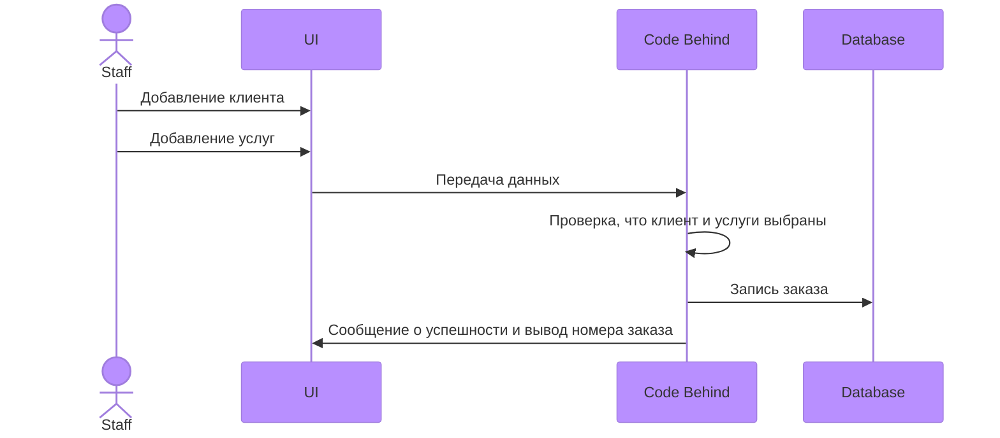

# ИС для сотрудников проката на Горнолыжном Курорте "Игора"
Выполнила Малышева Александра Юрьевна ИП 20-3

## Диаграма Базы данных


Диаграмма последовательности для прецендента Формирование заказа
---


Скрипт
---
```
USE [ResortDB1]
GO
SET IDENTITY_INSERT [dbo].[Clients] ON 

INSERT [dbo].[Clients] ([Id], [KOD], [FIO], [Passport], [DateBirth], [Address], [Email], [Password]) VALUES (18, 45462526, N'Фролов Андрей Иванович', N'1180176596', CAST(N'2001-07-14T00:00:00.0000000+04:00' AS DateTimeOffset), N'344288, г. Санкт-Петербург, ул. Чехова, 1, кв. 34', N'gohufreilagrau-3818@yopmail.com', N'cl12345')
INSERT [dbo].[Clients] ([Id], [KOD], [FIO], [Passport], [DateBirth], [Address], [Email], [Password]) VALUES (19, 45462527, N'Николаев Даниил Всеволодович', N'2280223523', CAST(N'2001-02-10T00:00:00.0000000+03:00' AS DateTimeOffset), N'614164, г. Санкт-Петербург, ул. Степная, 30, кв. 75', N'xawugosune-1385@yopmail.com', N'cl12346')
INSERT [dbo].[Clients] ([Id], [KOD], [FIO], [Passport], [DateBirth], [Address], [Email], [Password]) VALUES (20, 45462528, N'Снегирев Макар Иванович', N'4560354155', CAST(N'1998-05-21T00:00:00.0000000+04:00' AS DateTimeOffset), N'394242, г. Санкт-Петербург, ул. Коммунистическая, 43, кв. 57', N'satrahuddusei-4458@yopmail.com', N'cl12347')
INSERT [dbo].[Clients] ([Id], [KOD], [FIO], [Passport], [DateBirth], [Address], [Email], [Password]) VALUES (21, 45462529, N'Иванов Иван Ильич', N'9120554296', CAST(N'1998-10-01T00:00:00.0000000+04:00' AS DateTimeOffset), N'660540, г. Санкт-Петербург, ул. Солнечная, 25, кв. 78', N'boippaxeufrepra-7093@yopmail.com', N'cl12348')
INSERT [dbo].[Clients] ([Id], [KOD], [FIO], [Passport], [DateBirth], [Address], [Email], [Password]) VALUES (22, 45462530, N'Филиппова Анна Глебовна', N'2367558134', CAST(N'1976-05-31T00:00:00.0000000+04:00' AS DateTimeOffset), N'125837, г. Санкт-Петербург, ул. Шоссейная, 40, кв. 92', N'zapramaxesu-7741@yopmail.com', N'cl12349')
INSERT [dbo].[Clients] ([Id], [KOD], [FIO], [Passport], [DateBirth], [Address], [Email], [Password]) VALUES (23, 45462531, N'Иванов Михаил Владимирович', N'7101669343', CAST(N'1985-11-04T00:00:00.0000000+03:00' AS DateTimeOffset), N'125703, г. Санкт-Петербург, ул. Партизанская, 49, кв. 84', N'rouzecroummegre-3899@yopmail.com', N'cl12350')
INSERT [dbo].[Clients] ([Id], [KOD], [FIO], [Passport], [DateBirth], [Address], [Email], [Password]) VALUES (24, 45462532, N'Власов Дмитрий Александрович', N'3455719630', CAST(N'1998-08-17T00:00:00.0000000+04:00' AS DateTimeOffset), N'625283, г. Санкт-Петербург, ул. Победы, 46, кв. 7', N'ziyeuddocrabri-4748@yopmail.com', N'cl12351')
INSERT [dbo].[Clients] ([Id], [KOD], [FIO], [Passport], [DateBirth], [Address], [Email], [Password]) VALUES (25, 45462533, N'Серова Екатерина Львовна', N'2377871623', CAST(N'1984-10-24T00:00:00.0000000+04:00' AS DateTimeOffset), N'614611, г. Санкт-Петербург, ул. Молодежная, 50, кв. 78', N'ketameissoinnei-1951@yopmail.com', N'cl12352')
INSERT [dbo].[Clients] ([Id], [KOD], [FIO], [Passport], [DateBirth], [Address], [Email], [Password]) VALUES (26, 45462534, N'Борисова Ирина Ивановна', N'8755921148', CAST(N'1976-10-14T00:00:00.0000000+04:00' AS DateTimeOffset), N'454311, г. Санкт-Петербург, ул. Новая, 19, кв. 78', N'yipraubaponou-5849@yopmail.com', N'cl12353')
INSERT [dbo].[Clients] ([Id], [KOD], [FIO], [Passport], [DateBirth], [Address], [Email], [Password]) VALUES (27, 45462535, N'Зайцев Никита Артёмович', N'4355104594', CAST(N'1999-10-14T00:00:00.0000000+04:00' AS DateTimeOffset), N'660007, г. Санкт-Петербург, ул. Октябрьская, 19, кв. 42', N'crapedocouca-3572@yopmail.com', N'cl12354')
INSERT [dbo].[Clients] ([Id], [KOD], [FIO], [Passport], [DateBirth], [Address], [Email], [Password]) VALUES (28, 45462536, N'Медведев Святослав Евгеньевич', N'2791114390', CAST(N'1985-07-13T00:00:00.0000000+04:00' AS DateTimeOffset), N'603036, г. Санкт-Петербург, ул. Садовая, 4, кв. 13', N'ceigoixakaunni-9227@yopmail.com', N'cl12355')
INSERT [dbo].[Clients] ([Id], [KOD], [FIO], [Passport], [DateBirth], [Address], [Email], [Password]) VALUES (29, 45462537, N'Коротков Кирилл Алексеевич', N'5582126286', CAST(N'1976-05-26T00:00:00.0000000+04:00' AS DateTimeOffset), N'450983, г. Санкт-Петербург, ул. Комсомольская, 26, кв. 60', N'yeimmeiwauzomo-7054@yopmail.com', N'cl12356')
INSERT [dbo].[Clients] ([Id], [KOD], [FIO], [Passport], [DateBirth], [Address], [Email], [Password]) VALUES (30, 45462538, N'Калашникова Арина Максимовна', N'2978133653', CAST(N'1999-08-13T00:00:00.0000000+04:00' AS DateTimeOffset), N'394782, г. Санкт-Петербург, ул. Чехова, 3, кв. 14', N'poleifenevi-1560@yopmail.com', N'cl12357')
INSERT [dbo].[Clients] ([Id], [KOD], [FIO], [Passport], [DateBirth], [Address], [Email], [Password]) VALUES (31, 45462539, N'Минина Таисия Кирилловна', N'7512141956', CAST(N'1985-10-13T00:00:00.0000000+04:00' AS DateTimeOffset), N'603002, г. Санкт-Петербург, ул. Дзержинского, 28, кв. 56', N'kauprezofautei-6607@yopmail.com', N'cl12358')
INSERT [dbo].[Clients] ([Id], [KOD], [FIO], [Passport], [DateBirth], [Address], [Email], [Password]) VALUES (32, 45462540, N'Наумов Серафим Романович', N'5046158433', CAST(N'1999-04-15T00:00:00.0000000+04:00' AS DateTimeOffset), N'450558, г. Санкт-Петербург, ул. Набережная, 30, кв. 71', N'quaffaullelourei-1667@yopmail.com', N'cl12359')
INSERT [dbo].[Clients] ([Id], [KOD], [FIO], [Passport], [DateBirth], [Address], [Email], [Password]) VALUES (33, 45462541, N'Воробьева Василиса Евгеньевна', N'2460169505', CAST(N'1999-01-13T00:00:00.0000000+03:00' AS DateTimeOffset), N'394060, г. Санкт-Петербург, ул. Фрунзе, 43, кв. 79', N'jsteele@rojas-robinson.net', N'cl12360')
INSERT [dbo].[Clients] ([Id], [KOD], [FIO], [Passport], [DateBirth], [Address], [Email], [Password]) VALUES (34, 45462542, N'Калинин Александр Андреевич', N'3412174593', CAST(N'1999-01-07T00:00:00.0000000+03:00' AS DateTimeOffset), N'410661, г. Санкт-Петербург, ул. Школьная, 50, кв. 53', N'vhopkins@lewis-mullen.com', N'cl12361')
INSERT [dbo].[Clients] ([Id], [KOD], [FIO], [Passport], [DateBirth], [Address], [Email], [Password]) VALUES (35, 45462543, N'Кузнецова Милана Владиславовна', N'4950183034', CAST(N'1999-01-24T00:00:00.0000000+03:00' AS DateTimeOffset), N'625590, г. Санкт-Петербург, ул. Коммунистическая, 20, кв. 34', N'nlewis@yahoo.com', N'cl12362')
INSERT [dbo].[Clients] ([Id], [KOD], [FIO], [Passport], [DateBirth], [Address], [Email], [Password]) VALUES (36, 45462544, N'Фирсов Егор Романович', N'5829219464', CAST(N'1993-09-02T00:00:00.0000000+04:00' AS DateTimeOffset), N'625683, г. Санкт-Петербург, ул. 8 Марта, 20, кв. 21', N'garciadavid@mckinney-mcbride.com', N'cl12363')
INSERT [dbo].[Clients] ([Id], [KOD], [FIO], [Passport], [DateBirth], [Address], [Email], [Password]) VALUES (37, 45462545, N'Зимина Агния Александровна', N'6443208059', CAST(N'1998-09-03T00:00:00.0000000+04:00' AS DateTimeOffset), N'400562, г. Санкт-Петербург, ул. Зеленая, 32, кв. 67', N'cbradley@castro.com', N'cl12364')
INSERT [dbo].[Clients] ([Id], [KOD], [FIO], [Passport], [DateBirth], [Address], [Email], [Password]) VALUES (38, 45462546, N'Титов Андрей Глебович', N'7079213265', CAST(N'1985-10-23T00:00:00.0000000+04:00' AS DateTimeOffset), N'614510, г. Санкт-Петербург, ул. Маяковского, 47, кв. 72', N'cuevascatherine@carlson.biz', N'cl12365')
INSERT [dbo].[Clients] ([Id], [KOD], [FIO], [Passport], [DateBirth], [Address], [Email], [Password]) VALUES (39, 45462547, N'Орлов Николай Егорович', N'8207522702', CAST(N'1985-07-27T00:00:00.0000000+04:00' AS DateTimeOffset), N'410542, г. Санкт-Петербург, ул. Светлая, 46, кв. 82', N'thomasmoore@wilson-singh.net', N'cl12366')
INSERT [dbo].[Clients] ([Id], [KOD], [FIO], [Passport], [DateBirth], [Address], [Email], [Password]) VALUES (40, 45462548, N'Кузнецова Аиша Михайловна', N'9307232158', CAST(N'1998-10-04T00:00:00.0000000+04:00' AS DateTimeOffset), N'620839, г. Санкт-Петербург, ул. Цветочная, 8, кв. 100', N'jessica84@hotmail.com', N'cl12367')
INSERT [dbo].[Clients] ([Id], [KOD], [FIO], [Passport], [DateBirth], [Address], [Email], [Password]) VALUES (41, 45462549, N'Куликов Никита Георгиевич', N'1357242839', CAST(N'1999-04-23T00:00:00.0000000+04:00' AS DateTimeOffset), N'443890, г. Санкт-Петербург, ул. Коммунистическая, 1, кв. 10', N'jessicapark@hotmail.com', N'cl12368')
INSERT [dbo].[Clients] ([Id], [KOD], [FIO], [Passport], [DateBirth], [Address], [Email], [Password]) VALUES (42, 45462550, N'Карпова София Егоровна', N'1167256636', CAST(N'1993-10-01T00:00:00.0000000+04:00' AS DateTimeOffset), N'603379, г. Санкт-Петербург, ул. Спортивная, 46, кв. 95', N'ginaritter@schneider-buchanan.com', N'cl12369')
INSERT [dbo].[Clients] ([Id], [KOD], [FIO], [Passport], [DateBirth], [Address], [Email], [Password]) VALUES (43, 45462551, N'Смирнова Дарья Макаровна', N'1768266986', CAST(N'1976-03-22T00:00:00.0000000+03:00' AS DateTimeOffset), N'603721, г. Санкт-Петербург, ул. Гоголя, 41, кв. 57', N'stephen99@yahoo.com', N'cl12370')
INSERT [dbo].[Clients] ([Id], [KOD], [FIO], [Passport], [DateBirth], [Address], [Email], [Password]) VALUES (44, 45462552, N'Абрамова Александра Мироновна', N'1710427875', CAST(N'1999-03-26T00:00:00.0000000+03:00' AS DateTimeOffset), N'410172, г. Санкт-Петербург, ул. Северная, 13, кв. 86', N'lopezlisa@hotmail.com', N'cl12371')
INSERT [dbo].[Clients] ([Id], [KOD], [FIO], [Passport], [DateBirth], [Address], [Email], [Password]) VALUES (45, 45462553, N'Наумов Руслан Михайлович', N'1806289145', CAST(N'1999-10-11T00:00:00.0000000+04:00' AS DateTimeOffset), N'420151, г. Санкт-Петербург, ул. Вишневая, 32, кв. 81', N'lori17@hotmail.com', N'cl12372')
INSERT [dbo].[Clients] ([Id], [KOD], [FIO], [Passport], [DateBirth], [Address], [Email], [Password]) VALUES (46, 45462554, N'Бочаров Никита Матвеевич', N'1587291249', CAST(N'1997-06-29T00:00:00.0000000+04:00' AS DateTimeOffset), N'125061, г. Санкт-Петербург, ул. Подгорная, 8, кв. 74', N'campbellkevin@gardner.com', N'cl12373')
INSERT [dbo].[Clients] ([Id], [KOD], [FIO], [Passport], [DateBirth], [Address], [Email], [Password]) VALUES (47, 45462555, N'Соловьев Давид Ильич', N'1647306372', CAST(N'1984-03-06T00:00:00.0000000+03:00' AS DateTimeOffset), N'630370, г. Санкт-Петербург, ул. Шоссейная, 24, кв. 81', N'morganhoward@clark.com', N'cl12374')
INSERT [dbo].[Clients] ([Id], [KOD], [FIO], [Passport], [DateBirth], [Address], [Email], [Password]) VALUES (48, 45462556, N'Васильева Валерия Дмитриевна', N'1742316556', CAST(N'1999-09-30T00:00:00.0000000+04:00' AS DateTimeOffset), N'614753, г. Санкт-Петербург, ул. Полевая, 35, кв. 39', N'carsontamara@gmail.com', N'cl12375')
INSERT [dbo].[Clients] ([Id], [KOD], [FIO], [Passport], [DateBirth], [Address], [Email], [Password]) VALUES (49, 45462557, N'Макарова Василиса Андреевна', N'1474326347', CAST(N'1999-04-08T00:00:00.0000000+04:00' AS DateTimeOffset), N'426030, г. Санкт-Петербург, ул. Маяковского, 44, кв. 93', N'kevinpatel@gmail.com', N'cl12376')
INSERT [dbo].[Clients] ([Id], [KOD], [FIO], [Passport], [DateBirth], [Address], [Email], [Password]) VALUES (50, 45462558, N'Алексеев Матвей Викторович', N'1452339539', CAST(N'1998-08-02T00:00:00.0000000+04:00' AS DateTimeOffset), N'450375, г. Санкт-Петербург, ул. Клубная, 44, кв. 80', N'sethbishop@yahoo.com', N'cl12377')
INSERT [dbo].[Clients] ([Id], [KOD], [FIO], [Passport], [DateBirth], [Address], [Email], [Password]) VALUES (51, 45462559, N'Никитина Полина Александровна', N'2077443480', CAST(N'1976-09-19T00:00:00.0000000+04:00' AS DateTimeOffset), N'625560, г. Санкт-Петербург, ул. Некрасова, 12, кв. 66', N'drollins@schultz-soto.net', N'cl12378')
INSERT [dbo].[Clients] ([Id], [KOD], [FIO], [Passport], [DateBirth], [Address], [Email], [Password]) VALUES (52, 45462560, N'Окулова Олеся Алексеевна', N'2147357518', CAST(N'1999-04-03T00:00:00.0000000+04:00' AS DateTimeOffset), N'630201, г. Санкт-Петербург, ул. Комсомольская, 17, кв. 25', N'pblack@copeland-winters.org', N'cl12379')
INSERT [dbo].[Clients] ([Id], [KOD], [FIO], [Passport], [DateBirth], [Address], [Email], [Password]) VALUES (53, 45462561, N'Захарова Полина Яновна', N'2687363884', CAST(N'1976-04-21T00:00:00.0000000+04:00' AS DateTimeOffset), N'190949, г. Санкт-Петербург, ул. Мичурина, 26, кв. 93', N'johnathon.oberbrunner@yahoo.com', N'cl12380')
INSERT [dbo].[Clients] ([Id], [KOD], [FIO], [Passport], [DateBirth], [Address], [Email], [Password]) VALUES (54, 45462562, N'Зайцев Владимир Давидович', N'2376443711', CAST(N'1998-01-26T00:00:00.0000000+03:00' AS DateTimeOffset), N'350501, г. Санкт-Петербург, ул. Парковая, 2, кв. 7', N'bradly29@gmail.com', N'cl12381')
INSERT [dbo].[Clients] ([Id], [KOD], [FIO], [Passport], [DateBirth], [Address], [Email], [Password]) VALUES (55, 45462563, N'Иванов Виталий Даниилович', N'2568386237', CAST(N'1976-08-11T00:00:00.0000000+04:00' AS DateTimeOffset), N'450048, г. Санкт-Петербург, ул. Коммунистическая, 21, кв. 3', N'stark.cristina@hilpert.biz', N'cl12382')
INSERT [dbo].[Clients] ([Id], [KOD], [FIO], [Passport], [DateBirth], [Address], [Email], [Password]) VALUES (56, 45462564, N'Захаров Матвей Романович', N'2556439376', CAST(N'1993-07-12T00:00:00.0000000+04:00' AS DateTimeOffset), N'644921, г. Санкт-Петербург, ул. Школьная, 46, кв. 37', N'bruen.eleanore@yahoo.com', N'cl12383')
INSERT [dbo].[Clients] ([Id], [KOD], [FIO], [Passport], [DateBirth], [Address], [Email], [Password]) VALUES (57, 45462565, N'Иванов Степан Степанович', N'2737407501', CAST(N'1998-09-19T00:00:00.0000000+04:00' AS DateTimeOffset), N'614228, г. Санкт-Петербург, ул. Дорожная, 36, кв. 54', N'percival.halvorson@yahoo.com', N'cl12384')
INSERT [dbo].[Clients] ([Id], [KOD], [FIO], [Passport], [DateBirth], [Address], [Email], [Password]) VALUES (58, 45462566, N'Ткачева Милана Тимуровна', N'2581441645', CAST(N'1998-05-24T00:00:00.0000000+04:00' AS DateTimeOffset), N'350940, г. Санкт-Петербург, ул. Первомайская, 23, кв. 2', N'javonte71@kuhlman.biz', N'cl12385')
INSERT [dbo].[Clients] ([Id], [KOD], [FIO], [Passport], [DateBirth], [Address], [Email], [Password]) VALUES (59, 45462567, N'Семенов Даниил Иванович', N'2675427933', CAST(N'1976-01-04T00:00:00.0000000+03:00' AS DateTimeOffset), N'344990, г. Санкт-Петербург, ул. Красноармейская, 19, кв. 92', N'vconnelly@kautzer.com', N'cl12386')
INSERT [dbo].[Clients] ([Id], [KOD], [FIO], [Passport], [DateBirth], [Address], [Email], [Password]) VALUES (60, 45462568, N'Виноградов Вячеслав Дмитриевич', N'2967434531', CAST(N'1976-07-12T00:00:00.0000000+04:00' AS DateTimeOffset), N'410248, г. Санкт-Петербург, ул. Чкалова, 11, кв. 75', N'anabelle07@schultz.info', N'cl12387')
INSERT [dbo].[Clients] ([Id], [KOD], [FIO], [Passport], [DateBirth], [Address], [Email], [Password]) VALUES (61, 45462569, N'Соболева Николь Фёдоровна', N'3070449655', CAST(N'1976-05-02T00:00:00.0000000+04:00' AS DateTimeOffset), N'400839, г. Санкт-Петербург, ул. 8 Марта, 46, кв. 44', N'nitzsche.katlynn@yahoo.com', N'cl12388')
INSERT [dbo].[Clients] ([Id], [KOD], [FIO], [Passport], [DateBirth], [Address], [Email], [Password]) VALUES (62, 45462570, N'Тихонова Анна Львовна', N'3108451174', CAST(N'1985-03-23T00:00:00.0000000+03:00' AS DateTimeOffset), N'450539, г. Санкт-Петербург, ул. Заводская, 3, кв. 81', N'corine16@von.com', N'cl12389')
INSERT [dbo].[Clients] ([Id], [KOD], [FIO], [Passport], [DateBirth], [Address], [Email], [Password]) VALUES (63, 45462571, N'Кузнецова Ульяна Савельевна', N'3250464705', CAST(N'1999-06-03T00:00:00.0000000+04:00' AS DateTimeOffset), N'614591, г. Санкт-Петербург, ул. Цветочная, 20, кв. 40', N'otha.wisozk@lubowitz.org', N'cl12390')
INSERT [dbo].[Clients] ([Id], [KOD], [FIO], [Passport], [DateBirth], [Address], [Email], [Password]) VALUES (64, 45462572, N'Смирнова Анна Германовна', N'3392471644', CAST(N'1997-07-18T00:00:00.0000000+04:00' AS DateTimeOffset), N'400260, г. Санкт-Петербург, ул. Больничная, 30, кв. 53', N'may.kirlin@hotmail.com', N'cl12391')
INSERT [dbo].[Clients] ([Id], [KOD], [FIO], [Passport], [DateBirth], [Address], [Email], [Password]) VALUES (65, 45462573, N'Черепанова Анна Давидовна', N'3497487819', CAST(N'1985-11-06T00:00:00.0000000+03:00' AS DateTimeOffset), N'660924, г. Санкт-Петербург, ул. Молодежная, 32, кв. 59', N'bryana.kautzer@yahoo.com', N'cl12392')
INSERT [dbo].[Clients] ([Id], [KOD], [FIO], [Passport], [DateBirth], [Address], [Email], [Password]) VALUES (66, 45462574, N'Григорьев Максим Кириллович', N'3560491260', CAST(N'1999-05-26T00:00:00.0000000+04:00' AS DateTimeOffset), N'644133, г. Санкт-Петербург, ул. Гагарина, 28, кв. 69', N'deborah.christiansen@quigley.biz', N'cl12393')
INSERT [dbo].[Clients] ([Id], [KOD], [FIO], [Passport], [DateBirth], [Address], [Email], [Password]) VALUES (67, 45462575, N'Голубев Даниэль Александрович', N'3620506034', CAST(N'1999-06-14T00:00:00.0000000+04:00' AS DateTimeOffset), N'450698, г. Санкт-Петербург, ул. Вокзальная, 14, кв. 37', N'connelly.makayla@yahoo.com', N'cl12394')
INSERT [dbo].[Clients] ([Id], [KOD], [FIO], [Passport], [DateBirth], [Address], [Email], [Password]) VALUES (68, 45462576, N'Миронов Юрий Денисович', N'3774511438', CAST(N'1985-01-26T00:00:00.0000000+03:00' AS DateTimeOffset), N'620653, г. Санкт-Петербург, ул. Западная, 15, кв. 25', N'tatum.collins@fay.org', N'cl12395')
INSERT [dbo].[Clients] ([Id], [KOD], [FIO], [Passport], [DateBirth], [Address], [Email], [Password]) VALUES (69, 45462577, N'Терехов Михаил Андреевич', N'3862521377', CAST(N'1976-07-06T00:00:00.0000000+04:00' AS DateTimeOffset), N'644321, г. Санкт-Петербург, ул. Клубная, 32, кв. 10', N'itzel73@anderson.com', N'cl12396')
INSERT [dbo].[Clients] ([Id], [KOD], [FIO], [Passport], [DateBirth], [Address], [Email], [Password]) VALUES (70, 45462578, N'Орлова Алиса Михайловна', N'3084535966', CAST(N'1997-02-24T00:00:00.0000000+03:00' AS DateTimeOffset), N'603653, г. Санкт-Петербург, ул. Молодежная, 2, кв. 45', N'arjun39@hotmail.com', N'cl12397')
INSERT [dbo].[Clients] ([Id], [KOD], [FIO], [Passport], [DateBirth], [Address], [Email], [Password]) VALUES (71, 45462579, N'Кулаков Константин Даниилович', N'4021541528', CAST(N'1993-06-20T00:00:00.0000000+04:00' AS DateTimeOffset), N'410181, г. Санкт-Петербург, ул. Механизаторов, 16, кв. 74', N'ohara.rebeka@yahoo.com', N'cl12398')
INSERT [dbo].[Clients] ([Id], [KOD], [FIO], [Passport], [DateBirth], [Address], [Email], [Password]) VALUES (72, 45462580, N'Кудрявцев Максим Романович', N'4109554053', CAST(N'1998-05-10T00:00:00.0000000+04:00' AS DateTimeOffset), N'394207, г. Санкт-Петербург, ул. Свердлова, 31, кв. 28', N'danika58@rath.com', N'cl12399')
INSERT [dbo].[Clients] ([Id], [KOD], [FIO], [Passport], [DateBirth], [Address], [Email], [Password]) VALUES (73, 45462581, N'Соболева Кира Фёдоровна', N'4537564868', CAST(N'1998-03-14T00:00:00.0000000+03:00' AS DateTimeOffset), N'420633, г. Санкт-Петербург, ул. Матросова, 18, кв. 41', N'janae.bogan@gmail.com', N'cl12400')
INSERT [dbo].[Clients] ([Id], [KOD], [FIO], [Passport], [DateBirth], [Address], [Email], [Password]) VALUES (74, 45462582, N'Коновалов Арсений Максимович', N'4914572471', CAST(N'1985-02-18T00:00:00.0000000+03:00' AS DateTimeOffset), N'445720, г. Санкт-Петербург, ул. Матросова, 50, кв. 67', N'vern91@yahoo.com', N'cl12401')
INSERT [dbo].[Clients] ([Id], [KOD], [FIO], [Passport], [DateBirth], [Address], [Email], [Password]) VALUES (75, 45462583, N'Гусев Михаил Дмитриевич', N'4445581302', CAST(N'1999-11-23T00:00:00.0000000+03:00' AS DateTimeOffset), N'400646, г. Санкт-Петербург, ул. Октябрьская, 47, кв. 65', N'mariana.leannon@larkin.net', N'cl12402')
INSERT [dbo].[Clients] ([Id], [KOD], [FIO], [Passport], [DateBirth], [Address], [Email], [Password]) VALUES (76, 45462584, N'Суханова Варвара Матвеевна', N'4743598180', CAST(N'1993-09-13T00:00:00.0000000+04:00' AS DateTimeOffset), N'644410, г. Санкт-Петербург, ул. Красная, 17, кв. 69', N'vmoore@gmail.com', N'cl12403')
INSERT [dbo].[Clients] ([Id], [KOD], [FIO], [Passport], [DateBirth], [Address], [Email], [Password]) VALUES (77, 45462585, N'Орлова Ясмина Васильевна', N'4741601821', CAST(N'1984-06-24T00:00:00.0000000+04:00' AS DateTimeOffset), N'400750, г. Санкт-Петербург, ул. Школьная, 36, кв. 71', N'damon.mcclure@mills.com', N'cl12404')
INSERT [dbo].[Clients] ([Id], [KOD], [FIO], [Passport], [DateBirth], [Address], [Email], [Password]) VALUES (78, 45462586, N'Васильева Ксения Константиновна', N'4783612567', CAST(N'1999-08-01T00:00:00.0000000+04:00' AS DateTimeOffset), N'660590, г. Санкт-Петербург, ул. Дачная, 37, кв. 70', N'grady.reilly@block.com', N'cl12405')
INSERT [dbo].[Clients] ([Id], [KOD], [FIO], [Passport], [DateBirth], [Address], [Email], [Password]) VALUES (79, 45462587, N'Борисова Тамара Данииловна', N'4658621200', CAST(N'1993-05-29T00:00:00.0000000+04:00' AS DateTimeOffset), N'426083, г. Санкт-Петербург, ул. Механизаторов, 41, кв. 26', N'boyd.koss@yahoo.com', N'cl12406')
INSERT [dbo].[Clients] ([Id], [KOD], [FIO], [Passport], [DateBirth], [Address], [Email], [Password]) VALUES (80, 45462588, N'Дмитриев Мирон Ильич', N'4908634613', CAST(N'1985-04-13T00:00:00.0000000+04:00' AS DateTimeOffset), N'410569, г. Санкт-Петербург, ул. Парковая, 36, кв. 17', N'obartell@franecki.info', N'cl12407')
INSERT [dbo].[Clients] ([Id], [KOD], [FIO], [Passport], [DateBirth], [Address], [Email], [Password]) VALUES (81, 45462589, N'Лебедева Анна Александровна', N'5092642468', CAST(N'1985-03-30T00:00:00.0000000+03:00' AS DateTimeOffset), N'443375, г. Санкт-Петербург, ул. Дзержинского, 50, кв. 95', N'reina75@ferry.net', N'cl12408')
INSERT [dbo].[Clients] ([Id], [KOD], [FIO], [Passport], [DateBirth], [Address], [Email], [Password]) VALUES (82, 45462590, N'Пономарев Артём Маркович', N'5155465274', CAST(N'1984-06-02T00:00:00.0000000+04:00' AS DateTimeOffset), N'614316, г. Санкт-Петербург, ул. Первомайская, 48, кв. 31', N'karson28@hotmail.com', N'cl12409')
INSERT [dbo].[Clients] ([Id], [KOD], [FIO], [Passport], [DateBirth], [Address], [Email], [Password]) VALUES (83, 45462591, N'Борисова Елена Михайловна', N'5086666893', CAST(N'1976-05-23T00:00:00.0000000+04:00' AS DateTimeOffset), N'445685, г. Санкт-Петербург, ул. Зеленая, 7, кв. 47', N'damaris61@okon.com', N'cl12410')
INSERT [dbo].[Clients] ([Id], [KOD], [FIO], [Passport], [DateBirth], [Address], [Email], [Password]) VALUES (84, 45462592, N'Моисеев Камиль Максимович', N'5333675375', CAST(N'1999-06-17T00:00:00.0000000+04:00' AS DateTimeOffset), N'614505, г. Санкт-Петербург, ул. Нагорная, 37, кв. 31', N'carroll.jerod@hotmail.com', N'cl12411')
INSERT [dbo].[Clients] ([Id], [KOD], [FIO], [Passport], [DateBirth], [Address], [Email], [Password]) VALUES (85, 45462593, N'Герасимова Дарья Константиновна', N'5493684572', CAST(N'1984-10-13T00:00:00.0000000+04:00' AS DateTimeOffset), N'426629, г. Санкт-Петербург, ул. Весенняя, 32, кв. 46', N'ron.treutel@quitzon.com', N'cl12412')
INSERT [dbo].[Clients] ([Id], [KOD], [FIO], [Passport], [DateBirth], [Address], [Email], [Password]) VALUES (86, 45462594, N'Михайлова Мария Марковна', N'5150696226', CAST(N'1976-12-02T00:00:00.0000000+03:00' AS DateTimeOffset), N'603743, г. Санкт-Петербург, ул. Матросова, 19, кв. 20', N'olen79@yahoo.com', N'cl12413')
INSERT [dbo].[Clients] ([Id], [KOD], [FIO], [Passport], [DateBirth], [Address], [Email], [Password]) VALUES (87, 45462595, N'Коршунов Кирилл Максимович', N'1308703305', CAST(N'1985-05-22T00:00:00.0000000+04:00' AS DateTimeOffset), N'450750, г. Санкт-Петербург, ул. Клубная, 23, кв. 90', N'pacocha.robbie@yahoo.com', N'cl12414')
SET IDENTITY_INSERT [dbo].[Clients] OFF
GO
SET IDENTITY_INSERT [dbo].[Orders] ON 

INSERT [dbo].[Orders] ([Id], [KOD], [DateAdd], [ClientKod], [Status], [DateEnd], [TimeRental], [Client_Id], [TotalPrice]) VALUES (2, N'45462532/20.02.2024', CAST(N'2024-02-20T02:48:56.6912149+03:00' AS DateTimeOffset), N'45462532', 0, NULL, NULL, NULL, NULL)
SET IDENTITY_INSERT [dbo].[Orders] OFF
GO
SET IDENTITY_INSERT [dbo].[Services] ON 

INSERT [dbo].[Services] ([Id], [Name], [KOD], [Price], [Image]) VALUES (8, N'Прокат сноуборда', N'JUR8R', CAST(1200.00 AS Decimal(18, 2)), 0xFFD8FFE000104A46494600010101012C012C0000FFE1031445786966000049492A00080000000A000E0102002E000000860000000F01020006000000B40000001001020015000000BA0000001201030001000000010000001A01050001000000D00000001B01050001000000D8000000280103000100000002000000310102000C000000E00000003201020014000000EC000000698704000100000000010000C60200004D616E206A756D70696E67207769746820736E6F77626F6172642066726F6D206D6F756E7461696E2068696C6C0043616E6F6E0043616E6F6E20454F53203544204D61726B20494900002C010000010000002C0100000100000047494D5020322E382E323000323031373A30353A31372031363A30363A3439001C009A82050001000000560200009D820500010000005E02000022880300010000000100000027880300010000004001000000900700040000003032323103900200140000006602000004900200140000007A02000001920A00010000008E02000002920500010000009602000004920A00010000009E0200000592050001000000A60200000792030001000000030000000992030001000000100000000A92050001000000AE02000090920200030000003837000091920200030000003837000092920200030000003837000000A00700040000003031303001A00300010000000100000002A00400010000008007000003A0040001000000380400000EA2050001000000B60200000FA2050001000000BE02000010A20300010000000200000001A40300010000000000000002A40300010000000100000003A40300010000000100000006A403000100000000000000000000000100000088130000380000000A000000323031353A30333A30322031323A30353A313000323031353A30333A30322031323A30353A313000E07EBB0040420F0066D94B0040420F0000000000010000000300000001000000640000000100000080B15500B305000000213900BE03000004000301030001000000060000001A01050001000000FC0200001B01050001000000040300002801030001000000020000000000000048000000010000004800000001000000FFE12F4E687474703A2F2F6E732E61646F62652E636F6D2F7861702F312E302F003C3F787061636B657420626567696E3D27EFBBBF272069643D2757354D304D7043656869487A7265537A4E54637A6B633964273F3E0A3C783A786D706D65746120786D6C6E733A783D2761646F62653A6E733A6D6574612F273E0A3C7264663A52444620786D6C6E733A7264663D27687474703A2F2F7777772E77332E6F72672F313939392F30322F32322D7264662D73796E7461782D6E7323273E0A0A203C7264663A4465736372697074696F6E20786D6C6E733A6175783D27687474703A2F2F6E732E61646F62652E636F6D2F657869662F312E302F6175782F273E0A20203C6175783A53657269616C4E756D6265723E3533303330383338313C2F6175783A53657269616C4E756D6265723E0A20203C6175783A4C656E73496E666F3E3130302F31203130302F3120302F3020302F303C2F6175783A4C656E73496E666F3E0A20203C6175783A4C656E733E45463130306D6D20662F322E38204D6163726F2055534D3C2F6175783A4C656E733E0A20203C6175783A4C656E7349443E3139303C2F6175783A4C656E7349443E0A20203C6175783A496D6167654E756D6265723E303C2F6175783A496D6167654E756D6265723E0A20203C6175783A417070726F78696D617465466F63757344697374616E63653E3832362F3130303C2F6175783A417070726F78696D617465466F63757344697374616E63653E0A20203C6175783A466C617368436F6D70656E736174696F6E3E302F313C2F6175783A466C617368436F6D70656E736174696F6E3E0A20203C6175783A4669726D776172653E322E312E313C2F6175783A4669726D776172653E0A20203C6175783A53657269616C4E756D6265723E3533303330383338313C2F6175783A53657269616C4E756D6265723E0A20203C6175783A4C656E73496E666F3E3130302F31203130302F3120302F3020302F303C2F6175783A4C656E73496E666F3E0A20203C6175783A4C656E733E45463130306D6D20662F322E38204D6163726F2055534D3C2F6175783A4C656E733E0A20203C6175783A4C656E7349443E3139303C2F6175783A4C656E7349443E0A20203C6175783A496D6167654E756D6265723E303C2F6175783A496D6167654E756D6265723E0A20203C6175783A417070726F78696D617465466F63757344697374616E63653E3832362F3130303C2F6175783A417070726F78696D617465466F63757344697374616E63653E0A20203C6175783A466C617368436F6D70656E736174696F6E3E302F313C2F6175783A466C617368436F6D70656E736174696F6E3E0A20203C6175783A4669726D776172653E322E312E313C2F6175783A4669726D776172653E0A203C2F7264663A4465736372697074696F6E3E0A0A203C7264663A4465736372697074696F6E20786D6C6E733A786D703D27687474703A2F2F6E732E61646F62652E636F6D2F7861702F312E302F273E0A20203C786D703A526174696E673E303C2F786D703A526174696E673E0A20203C786D703A4D6F64696679446174653E323031352D30342D33305431303A30343A32382B30323A30303C2F786D703A4D6F64696679446174653E0A20203C786D703A437265617465446174653E323031352D30332D30325431323A30353A31303C2F786D703A437265617465446174653E0A20203C786D703A526174696E673E303C2F786D703A526174696E673E0A20203C786D703A4D65746164617461446174653E323031352D30342D33305431303A30343A32382B30323A30303C2F786D703A4D65746164617461446174653E0A20203C786D703A43726561746F72546F6F6C3E41646F62652050686F746F73686F70204343203230313420284D6163696E746F7368293C2F786D703A43726561746F72546F6F6C3E0A203C2F7264663A4465736372697074696F6E3E0A0A203C7264663A4465736372697074696F6E20786D6C6E733A70686F746F73686F703D27687474703A2F2F6E732E61646F62652E636F6D2F70686F746F73686F702F312E302F273E0A20203C70686F746F73686F703A4C6567616379495054434469676573743E35314534364142394137363045363735464532453846363136363737314344383C2F70686F746F73686F703A4C6567616379495054434469676573743E0A20203C70686F746F73686F703A436F6C6F724D6F64653E333C2F70686F746F73686F703A436F6C6F724D6F64653E0A20203C70686F746F73686F703A49434350726F66696C653E735247422049454336313936362D322E313C2F70686F746F73686F703A49434350726F66696C653E0A20203C70686F746F73686F703A55524C3E687474703A2F2F7777772E6973746F636B2E636F6D3C2F70686F746F73686F703A55524C3E0A20203C70686F746F73686F703A436F70797269676874466C61673E747275653C2F70686F746F73686F703A436F70797269676874466C61673E0A20203C70686F746F73686F703A446F63756D656E74416E636573746F72733E0A2020203C7264663A4261673E0A202020203C7264663A6C693E61646F62653A646F6369643A70686F746F73686F703A37386665626432622D313738632D313137382D623930332D6537353861323261643130353C2F7264663A6C693E0A202020203C7264663A6C693E786D702E6469643A34396230336539372D306465332D346438332D623739352D6332303432316137343861373C2F7264663A6C693E0A202020203C7264663A6C693E786D702E6469643A63663238343766652D633539332D346232652D393236372D6362613563626261396338663C2F7264663A6C693E0A202020203C7264663A6C693E786D702E6469643A63666436373738332D373666632D343961652D383938642D3836313461636134386561393C2F7264663A6C693E0A202020203C7264663A6C693E786D702E6469643A65663235346535652D633636662D346663312D626639612D3166346139346265623037653C2F7264663A6C693E0A2020203C2F7264663A4261673E0A20203C2F70686F746F73686F703A446F63756D656E74416E636573746F72733E0A20203C70686F746F73686F703A44617465437265617465643E323031362D30332D32335430373A30305A3C2F70686F746F73686F703A44617465437265617465643E0A20203C70686F746F73686F703A4C6567616379495054434469676573743E35314534364142394137363045363735464532453846363136363737314344383C2F70686F746F73686F703A4C6567616379495054434469676573743E0A20203C70686F746F73686F703A436F6C6F724D6F64653E333C2F70686F746F73686F703A436F6C6F724D6F64653E0A20203C70686F746F73686F703A49434350726F66696C653E735247422049454336313936362D322E313C2F70686F746F73686F703A49434350726F66696C653E0A20203C70686F746F73686F703A417574686F7273506F736974696F6E3E436F6E7472696275746F723C2F70686F746F73686F703A417574686F7273506F736974696F6E3E0A20203C70686F746F73686F703A486561646C696E653E4A756D70696E6720736E6F77626F61726465722066726F6D2068696C6C20696E2077696E7465723C2F70686F746F73686F703A486561646C696E653E0A20203C70686F746F73686F703A536F757263653E6953746F636B70686F746F3C2F70686F746F73686F703A536F757263653E0A20203C70686F746F73686F703A496E737472756374696F6E733E4D6F64656C20616E642050726F70657274792052656C656173656420284D5226616D703B505229203C2F70686F746F73686F703A496E737472756374696F6E733E0A20203C70686F746F73686F703A4372656469743E476574747920496D616765732F6953746F636B70686F746F3C2F70686F746F73686F703A4372656469743E0A20203C70686F746F73686F703A55524C3E687474703A2F2F7777772E6973746F636B2E636F6D3C2F70686F746F73686F703A55524C3E0A20203C70686F746F73686F703A436F70797269676874466C61673E747275653C2F70686F746F73686F703A436F70797269676874466C61673E0A20203C70686F746F73686F703A446F63756D656E74416E636573746F72733E0A2020203C7264663A5365713E0A202020203C7264663A6C693E61646F62653A646F6369643A70686F746F73686F703A37386665626432622D313738632D313137382D623930332D6537353861323261643130353C2F7264663A6C693E0A202020203C7264663A6C693E786D702E6469643A34396230336539372D306465332D346438332D623739352D6332303432316137343861373C2F7264663A6C693E0A202020203C7264663A6C693E786D702E6469643A63663238343766652D633539332D346232652D393236372D6362613563626261396338663C2F7264663A6C693E0A202020203C7264663A6C693E786D702E6469643A63666436373738332D373666632D343961652D383938642D3836313461636134386561393C2F7264663A6C693E0A202020203C7264663A6C693E786D702E6469643A65663235346535652D633636662D346663312D626639612D3166346139346265623037653C2F7264663A6C693E0A2020203C2F7264663A5365713E0A20203C2F70686F746F73686F703A446F63756D656E74416E636573746F72733E0A203C2F7264663A4465736372697074696F6E3E0A0A203C7264663A4465736372697074696F6E20786D6C6E733A786D704D4D3D27687474703A2F2F6E732E61646F62652E636F6D2F7861702F312E302F6D6D2F273E0A20203C786D704D4D3A4F726967696E616C446F63756D656E7449443E45454436333641324142363337434333344239454241354244303237384146453C2F786D704D4D3A4F726967696E616C446F63756D656E7449443E0A20203C786D704D4D3A496E7374616E636549443E786D702E6969643A33616334666166662D303765622D643534362D383936352D3666643434393431623133393C2F786D704D4D3A496E7374616E636549443E0A20203C786D704D4D3A446F63756D656E744944207264663A7265736F757263653D2761646F62653A646F6369643A70686F746F73686F703A37386665626432622D313738632D313137382D623930332D65373538613232616431303527202F3E0A20203C786D704D4D3A4F726967696E616C446F63756D656E7449443E45454436333641324142363337434333344239454241354244303237384146453C2F786D704D4D3A4F726967696E616C446F63756D656E7449443E0A20203C786D704D4D3A496E7374616E636549443E786D702E6969643A33616334666166662D303765622D643534362D383936352D3666643434393431623133393C2F786D704D4D3A496E7374616E636549443E0A20203C786D704D4D3A486973746F72793E0A2020203C7264663A5365713E0A2020203C2F7264663A5365713E0A20203C2F786D704D4D3A486973746F72793E0A20203C786D704D4D3A4465726976656446726F6D207264663A7061727365547970653D275265736F75726365273E0A20203C2F786D704D4D3A4465726976656446726F6D3E0A203C2F7264663A4465736372697074696F6E3E0A0A203C7264663A4465736372697074696F6E20786D6C6E733A64633D27687474703A2F2F7075726C2E6F72672F64632F656C656D656E74732F312E312F273E0A20203C64633A666F726D61743E696D6167652F6A7065673C2F64633A666F726D61743E0A20203C64633A7469746C653E0A2020203C7264663A416C743E0A202020203C7264663A6C6920786D6C3A6C616E673D27782D64656661756C74273E782D64656661756C743C2F7264663A6C693E0A2020203C2F7264663A416C743E0A20203C2F64633A7469746C653E0A20203C64633A7375626A6563743E0A2020203C7264663A4261673E0A202020203C7264663A6C693E42616E736B6F3C2F7264663A6C693E0A202020203C7264663A6C693E45787472656D652053706F7274733C2F7264663A6C693E0A202020203C7264663A6C693E4D656E3C2F7264663A6C693E0A202020203C7264663A6C693E4164756C743C2F7264663A6C693E0A202020203C7264663A6C693E536E6F77626F617264696E673C2F7264663A6C693E0A202020203C7264663A6C693E46756E3C2F7264663A6C693E0A202020203C7264663A6C693E43617563617369616E204574686E69636974793C2F7264663A6C693E0A202020203C7264663A6C693E416374696F6E3C2F7264663A6C693E0A202020203C7264663A6C693E4A6F793C2F7264663A6C693E0A202020203C7264663A6C693E53706565643C2F7264663A6C693E0A202020203C7264663A6C693E426C75653C2F7264663A6C693E0A202020203C7264663A6C693E53706F72743C2F7264663A6C693E0A202020203C7264663A6C693E5661636174696F6E733C2F7264663A6C693E0A202020203C7264663A6C693E4F7574646F6F72733C2F7264663A6C693E0A202020203C7264663A6C693E41637469766974793C2F7264663A6C693E0A202020203C7264663A6C693E57696E7465723C2F7264663A6C693E0A202020203C7264663A6C693E536561736F6E3C2F7264663A6C693E0A202020203C7264663A6C693E4D6F756E7461696E3C2F7264663A6C693E0A202020203C7264663A6C693E536E6F773C2F7264663A6C693E0A202020203C7264663A6C693E546F7572697374205265736F72743C2F7264663A6C693E0A202020203C7264663A6C693E536E6F77626F6172643C2F7264663A6C693E0A2020203C2F7264663A4261673E0A20203C2F64633A7375626A6563743E0A20203C64633A6465736372697074696F6E3E0A2020203C7264663A416C743E0A202020203C7264663A6C6920786D6C3A6C616E673D27782D64656661756C74273E782D64656661756C743C2F7264663A6C693E0A2020203C2F7264663A416C743E0A20203C2F64633A6465736372697074696F6E3E0A20203C64633A63726561746F723E0A2020203C7264663A5365713E0A202020203C7264663A6C693E70796F74723032313C2F7264663A6C693E0A2020203C2F7264663A5365713E0A20203C2F64633A63726561746F723E0A20203C64633A7269676874733E0A2020203C7264663A416C743E0A202020203C7264663A6C6920786D6C3A6C616E673D27782D64656661756C74273E782D64656661756C743C2F7264663A6C693E0A2020203C2F7264663A416C743E0A20203C2F64633A7269676874733E0A203C2F7264663A4465736372697074696F6E3E0A0A203C7264663A4465736372697074696F6E20786D6C6E733A6372733D27687474703A2F2F6E732E61646F62652E636F6D2F63616D6572612D7261772D73657474696E67732F312E302F273E0A20203C6372733A52617746696C654E616D653E494D475F363133332E4352323C2F6372733A52617746696C654E616D653E0A20203C6372733A56657273696F6E3E382E353C2F6372733A56657273696F6E3E0A20203C6372733A50726F6365737356657273696F6E3E362E373C2F6372733A50726F6365737356657273696F6E3E0A20203C6372733A576869746542616C616E63653E41732053686F743C2F6372733A576869746542616C616E63653E0A20203C6372733A4175746F576869746556657273696F6E3E3133343334383830303C2F6372733A4175746F576869746556657273696F6E3E0A20203C6372733A54656D70657261747572653E343835303C2F6372733A54656D70657261747572653E0A20203C6372733A54696E743E2B313C2F6372733A54696E743E0A20203C6372733A53617475726174696F6E3E303C2F6372733A53617475726174696F6E3E0A20203C6372733A53686172706E6573733E32353C2F6372733A53686172706E6573733E0A20203C6372733A4C756D696E616E6365536D6F6F7468696E673E303C2F6372733A4C756D696E616E6365536D6F6F7468696E673E0A20203C6372733A436F6C6F724E6F697365526564756374696F6E3E32353C2F6372733A436F6C6F724E6F697365526564756374696F6E3E0A20203C6372733A5669676E65747465416D6F756E743E303C2F6372733A5669676E65747465416D6F756E743E0A20203C6372733A536861646F7754696E743E303C2F6372733A536861646F7754696E743E0A20203C6372733A5265644875653E303C2F6372733A5265644875653E0A20203C6372733A52656453617475726174696F6E3E303C2F6372733A52656453617475726174696F6E3E0A20203C6372733A477265656E4875653E303C2F6372733A477265656E4875653E0A20203C6372733A477265656E53617475726174696F6E3E303C2F6372733A477265656E53617475726174696F6E3E0A20203C6372733A426C75654875653E303C2F6372733A426C75654875653E0A20203C6372733A426C756553617475726174696F6E3E303C2F6372733A426C756553617475726174696F6E3E0A20203C6372733A56696272616E63653E303C2F6372733A56696272616E63653E0A20203C6372733A48756541646A7573746D656E745265643E303C2F6372733A48756541646A7573746D656E745265643E0A20203C6372733A48756541646A7573746D656E744F72616E67653E303C2F6372733A48756541646A7573746D656E744F72616E67653E0A20203C6372733A48756541646A7573746D656E7459656C6C6F773E303C2F6372733A48756541646A7573746D656E7459656C6C6F773E0A20203C6372733A48756541646A7573746D656E74477265656E3E303C2F6372733A48756541646A7573746D656E74477265656E3E0A20203C6372733A48756541646A7573746D656E74417175613E303C2F6372733A48756541646A7573746D656E74417175613E0A20203C6372733A48756541646A7573746D656E74426C75653E303C2F6372733A48756541646A7573746D656E74426C75653E0A20203C6372733A48756541646A7573746D656E74507572706C653E303C2F6372733A48756541646A7573746D656E74507572706C653E0A20203C6372733A48756541646A7573746D656E744D6167656E74613E303C2F6372733A48756541646A7573746D656E744D6167656E74613E0A20203C6372733A53617475726174696F6E41646A7573746D656E745265643E303C2F6372733A53617475726174696F6E41646A7573746D656E745265643E0A20203C6372733A53617475726174696F6E41646A7573746D656E744F72616E67653E303C2F6372733A53617475726174696F6E41646A7573746D656E744F72616E67653E0A20203C6372733A53617475726174696F6E41646A7573746D656E7459656C6C6F773E303C2F6372733A53617475726174696F6E41646A7573746D656E7459656C6C6F773E0A20203C6372733A53617475726174696F6E41646A7573746D656E74477265656E3E303C2F6372733A53617475726174696F6E41646A7573746D656E74477265656E3E0A20203C6372733A53617475726174696F6E41646A7573746D656E74417175613E303C2F6372733A53617475726174696F6E41646A7573746D656E74417175613E0A20203C6372733A53617475726174696F6E41646A7573746D656E74426C75653E303C2F6372733A53617475726174696F6E41646A7573746D656E74426C75653E0A20203C6372733A53617475726174696F6E41646A7573746D656E74507572706C653E303C2F6372733A53617475726174696F6E41646A7573746D656E74507572706C653E0A20203C6372733A53617475726174696F6E41646A7573746D656E744D6167656E74613E303C2F6372733A53617475726174696F6E41646A7573746D656E744D6167656E74613E0A20203C6372733A4C756D696E616E636541646A7573746D656E745265643E303C2F6372733A4C756D696E616E636541646A7573746D656E745265643E0A20203C6372733A4C756D696E616E636541646A7573746D656E744F72616E67653E303C2F6372733A4C756D696E616E636541646A7573746D656E744F72616E67653E0A20203C6372733A4C756D696E616E636541646A7573746D656E7459656C6C6F773E303C2F6372733A4C756D696E616E636541646A7573746D656E7459656C6C6F773E0A20203C6372733A4C756D696E616E636541646A7573746D656E74477265656E3E303C2F6372733A4C756D696E616E636541646A7573746D656E74477265656E3E0A20203C6372733A4C756D696E616E636541646A7573746D656E74417175613E303C2F6372733A4C756D696E616E636541646A7573746D656E74417175613E0A20203C6372733A4C756D696E616E636541646A7573746D656E74426C75653E303C2F6372733A4C756D696E616E636541646A7573746D656E74426C75653E0A20203C6372733A4C756D696E616E636541646A7573746D656E74507572706C653E303C2F6372733A4C756D696E616E636541646A7573746D656E74507572706C653E0A20203C6372733A4C756D696E616E636541646A7573746D656E744D6167656E74613E303C2F6372733A4C756D696E616E636541646A7573746D656E744D6167656E74613E0A20203C6372733A53706C6974546F6E696E67536861646F774875653E303C2F6372733A53706C6974546F6E696E67536861646F774875653E0A20203C6372733A53706C6974546F6E696E67536861646F7753617475726174696F6E3E303C2F6372733A53706C6974546F6E696E67536861646F7753617475726174696F6E3E0A20203C6372733A53706C6974546F6E696E67486967686C696768744875653E303C2F6372733A53706C6974546F6E696E67486967686C696768744875653E0A20203C6372733A53706C6974546F6E696E67486967686C6967687453617475726174696F6E3E303C2F6372733A53706C6974546F6E696E67486967686C6967687453617475726174696F6E3E0A20203C6372733A53706C6974546F6E696E6742616C616E63653E303C2F6372733A53706C6974546F6E696E6742616C616E63653E0A20203C6372733A506172616D6574726963536861646F77733E303C2F6372733A506172616D6574726963536861646F77733E0A20203C6372733A506172616D65747269634461726B733E303C2F6372733A506172616D65747269634461726B733E0A20203C6372733A506172616D65747269634C69676874733E303C2F6372733A506172616D65747269634C69676874733E0A20203C6372733A506172616D6574726963486967686C69676874733E303C2F6372733A506172616D6574726963486967686C69676874733E0A20203C6372733A506172616D6574726963536861646F7753706C69743E32353C2F6372733A506172616D6574726963536861646F7753706C69743E0A20203C6372733A506172616D65747269634D6964746F6E6553706C69743E35303C2F6372733A506172616D65747269634D6964746F6E6553706C69743E0A20203C6372733A506172616D6574726963486967686C6967687453706C69743E37353C2F6372733A506172616D6574726963486967686C6967687453706C69743E0A20203C6372733A5368617270656E5261646975733E2B312E303C2F6372733A5368617270656E5261646975733E0A20203C6372733A5368617270656E44657461696C3E32353C2F6372733A5368617270656E44657461696C3E0A20203C6372733A5368617270656E456467654D61736B696E673E303C2F6372733A5368617270656E456467654D61736B696E673E0A20203C6372733A506F737443726F705669676E65747465416D6F756E743E303C2F6372733A506F737443726F705669676E65747465416D6F756E743E0A20203C6372733A477261696E416D6F756E743E303C2F6372733A477261696E416D6F756E743E0A20203C6372733A436F6C6F724E6F697365526564756374696F6E44657461696C3E35303C2F6372733A436F6C6F724E6F697365526564756374696F6E44657461696C3E0A20203C6372733A436F6C6F724E6F697365526564756374696F6E536D6F6F74686E6573733E35303C2F6372733A436F6C6F724E6F697365526564756374696F6E536D6F6F74686E6573733E0A20203C6372733A4C656E7350726F66696C65456E61626C653E303C2F6372733A4C656E7350726F66696C65456E61626C653E0A20203C6372733A4C656E734D616E75616C446973746F7274696F6E416D6F756E743E303C2F6372733A4C656E734D616E75616C446973746F7274696F6E416D6F756E743E0A20203C6372733A5065727370656374697665566572746963616C3E303C2F6372733A5065727370656374697665566572746963616C3E0A20203C6372733A5065727370656374697665486F72697A6F6E74616C3E303C2F6372733A5065727370656374697665486F72697A6F6E74616C3E0A20203C6372733A5065727370656374697665526F746174653E302E303C2F6372733A5065727370656374697665526F746174653E0A20203C6372733A50657273706563746976655363616C653E3130303C2F6372733A50657273706563746976655363616C653E0A20203C6372733A50657273706563746976654173706563743E303C2F6372733A50657273706563746976654173706563743E0A20203C6372733A5065727370656374697665557072696768743E303C2F6372733A5065727370656374697665557072696768743E0A20203C6372733A4175746F4C61746572616C43413E313C2F6372733A4175746F4C61746572616C43413E0A20203C6372733A4578706F73757265323031323E2B302E31303C2F6372733A4578706F73757265323031323E0A20203C6372733A436F6E7472617374323031323E2B31363C2F6372733A436F6E7472617374323031323E0A20203C6372733A486967686C6967687473323031323E2B383C2F6372733A486967686C6967687473323031323E0A20203C6372733A536861646F7773323031323E2B323C2F6372733A536861646F7773323031323E0A20203C6372733A576869746573323031323E2B33383C2F6372733A576869746573323031323E0A20203C6372733A426C61636B73323031323E2B35353C2F6372733A426C61636B73323031323E0A20203C6372733A436C6172697479323031323E2B383C2F6372733A436C6172697479323031323E0A20203C6372733A44656672696E6765507572706C65416D6F756E743E343C2F6372733A44656672696E6765507572706C65416D6F756E743E0A20203C6372733A44656672696E6765507572706C654875654C6F3E33303C2F6372733A44656672696E6765507572706C654875654C6F3E0A20203C6372733A44656672696E6765507572706C6548756548693E37303C2F6372733A44656672696E6765507572706C6548756548693E0A20203C6372733A44656672696E6765477265656E416D6F756E743E303C2F6372733A44656672696E6765477265656E416D6F756E743E0A20203C6372733A44656672696E6765477265656E4875654C6F3E34303C2F6372733A44656672696E6765477265656E4875654C6F3E0A20203C6372733A44656672696E6765477265656E48756548693E36303C2F6372733A44656672696E6765477265656E48756548693E0A20203C6372733A436F6E76657274546F477261797363616C653E46616C73653C2F6372733A436F6E76657274546F477261797363616C653E0A20203C6372733A546F6E6543757276654E616D653E4D656469756D20436F6E74726173743C2F6372733A546F6E6543757276654E616D653E0A20203C6372733A546F6E6543757276654E616D65323031323E4C696E6561723C2F6372733A546F6E6543757276654E616D65323031323E0A20203C6372733A43616D65726150726F66696C653E41646F6265205374616E646172643C2F6372733A43616D65726150726F66696C653E0A20203C6372733A43616D65726150726F66696C654469676573743E33444138434534413632364345333641314430433535424631353737393343393C2F6372733A43616D65726150726F66696C654469676573743E0A20203C6372733A4C656E7350726F66696C6553657475703E4C656E7344656661756C74733C2F6372733A4C656E7350726F66696C6553657475703E0A20203C6372733A48617353657474696E67733E547275653C2F6372733A48617353657474696E67733E0A20203C6372733A48617343726F703E46616C73653C2F6372733A48617343726F703E0A20203C6372733A416C72656164794170706C6965643E547275653C2F6372733A416C72656164794170706C6965643E0A20203C6372733A546F6E6543757276653E0A2020203C7264663A4261673E0A202020203C7264663A6C693E302C20303C2F7264663A6C693E0A202020203C7264663A6C693E33322C2032323C2F7264663A6C693E0A202020203C7264663A6C693E36342C2035363C2F7264663A6C693E0A202020203C7264663A6C693E3132382C203132383C2F7264663A6C693E0A202020203C7264663A6C693E3139322C203139363C2F7264663A6C693E0A202020203C7264663A6C693E3235352C203235353C2F7264663A6C693E0A2020203C2F7264663A4261673E0A20203C2F6372733A546F6E6543757276653E0A20203C6372733A546F6E6543757276655265643E0A2020203C7264663A4261673E0A202020203C7264663A6C693E302C20303C2F7264663A6C693E0A202020203C7264663A6C693E3235352C203235353C2F7264663A6C693E0A2020203C2F7264663A4261673E0A20203C2F6372733A546F6E6543757276655265643E0A20203C6372733A546F6E654375727665477265656E3E0A2020203C7264663A4261673E0A202020203C7264663A6C693E302C20303C2F7264663A6C693E0A202020203C7264663A6C693E3235352C203235353C2F7264663A6C693E0A2020203C2F7264663A4261673E0A20203C2F6372733A546F6E654375727665477265656E3E0A20203C6372733A546F6E654375727665426C75653E0A2020203C7264663A4261673E0A202020203C7264663A6C693E302C20303C2F7264663A6C693E0A202020203C7264663A6C693E3235352C203235353C2F7264663A6C693E0A2020203C2F7264663A4261673E0A20203C2F6372733A546F6E654375727665426C75653E0A20203C6372733A546F6E6543757276655056323031323E0A2020203C7264663A4261673E0A202020203C7264663A6C693E302C20303C2F7264663A6C693E0A202020203C7264663A6C693E3235352C203235353C2F7264663A6C693E0A2020203C2F7264663A4261673E0A20203C2F6372733A546F6E6543757276655056323031323E0A20203C6372733A546F6E6543757276655056323031325265643E0A2020203C7264663A4261673E0A202020203C7264663A6C693E302C20303C2F7264663A6C693E0A202020203C7264663A6C693E3235352C203235353C2F7264663A6C693E0A2020203C2F7264663A4261673E0A20203C2F6372733A546F6E6543757276655056323031325265643E0A20203C6372733A546F6E654375727665505632303132477265656E3E0A2020203C7264663A4261673E0A202020203C7264663A6C693E302C20303C2F7264663A6C693E0A202020203C7264663A6C693E3235352C203235353C2F7264663A6C693E0A2020203C2F7264663A4261673E0A20203C2F6372733A546F6E654375727665505632303132477265656E3E0A20203C6372733A546F6E654375727665505632303132426C75653E0A2020203C7264663A4261673E0A202020203C7264663A6C693E302C20303C2F7264663A6C693E0A202020203C7264663A6C693E3235352C203235353C2F7264663A6C693E0A2020203C2F7264663A4261673E0A20203C2F6372733A546F6E654375727665505632303132426C75653E0A203C2F7264663A4465736372697074696F6E3E0A0A203C7264663A4465736372697074696F6E20786D6C6E733A706C75733D27687474703A2F2F6E732E757365706C75732E6F72672F6C64662F786D702F312E302F273E0A20203C706C75733A4C6963656E736F7255524C3E687474703A2F2F7777772E6765747479696D616765732E636F6D3C2F706C75733A4C6963656E736F7255524C3E0A203C2F7264663A4465736372697074696F6E3E0A0A203C7264663A4465736372697074696F6E20786D6C6E733A4765747479496D61676573474946543D27687474703A2F2F786D702E6765747479696D616765732E636F6D2F676966742F312E302F273E0A20203C4765747479496D61676573474946543A417373657449443E3531373039383336343C2F4765747479496D61676573474946543A417373657449443E0A20203C4765747479496D61676573474946543A646C7265663E4558623034486E43486830426778726C4C6E67614C673D3D3C2F4765747479496D61676573474946543A646C7265663E0A20203C4765747479496D61676573474946543A496D61676552616E6B3E333C2F4765747479496D61676573474946543A496D61676552616E6B3E0A203C2F7264663A4465736372697074696F6E3E0A0A3C2F7264663A5244463E0A3C2F783A786D706D6574613E0A3C3F787061636B657420656E643D2772273F3E0AFFE20C584943435F50524F46494C4500010100000C484C696E6F021000006D6E74725247422058595A2007CE00020009000600310000616373704D5346540000000049454320735247420000000000000000000000010000F6D6000100000000D32D4850202000000000000000000000000000000000000000000000000000000000000000000000000000000000000000000000001163707274000001500000003364657363000001840000006C77747074000001F000000014626B707400000204000000147258595A00000218000000146758595A0000022C000000146258595A0000024000000014646D6E640000025400000070646D6464000002C400000088767565640000034C0000008676696577000003D4000000246C756D69000003F8000000146D6561730000040C0000002474656368000004300000000C725452430000043C0000080C675452430000043C0000080C625452430000043C0000080C7465787400000000436F70797269676874202863292031393938204865776C6574742D5061636B61726420436F6D70616E790000646573630000000000000012735247422049454336313936362D322E31000000000000000000000012735247422049454336313936362D322E31000000000000000000000000000000000000000000000000000000000000000000000000000000000000000000000000000058595A20000000000000F35100010000000116CC58595A200000000000000000000000000000000058595A200000000000006FA2000038F50000039058595A2000000000000062990000B785000018DA58595A2000000000000024A000000F840000B6CF64657363000000000000001649454320687474703A2F2F7777772E6965632E636800000000000000000000001649454320687474703A2F2F7777772E6965632E63680000000000000000000000000000000000000000000000000000000000000000000000000000000000000000000064657363000000000000002E4945432036313936362D322E312044656661756C742052474220636F6C6F7572207370616365202D207352474200000000000000000000002E4945432036313936362D322E312044656661756C742052474220636F6C6F7572207370616365202D20735247420000000000000000000000000000000000000000000064657363000000000000002C5265666572656E63652056696577696E6720436F6E646974696F6E20696E2049454336313936362D322E3100000000000000000000002C5265666572656E63652056696577696E6720436F6E646974696F6E20696E2049454336313936362D322E31000000000000000000000000000000000000000000000000000076696577000000000013A4FE00145F2E0010CF140003EDCC0004130B00035C9E0000000158595A2000000000004C09560050000000571FE76D6561730000000000000001000000000000000000000000000000000000028F0000000273696720000000004352542063757276000000000000040000000005000A000F00140019001E00230028002D00320037003B00400045004A004F00540059005E00630068006D00720077007C00810086008B00900095009A009F00A400A900AE00B200B700BC00C100C600CB00D000D500DB00E000E500EB00F000F600FB01010107010D01130119011F0125012B01320138013E0145014C0152015901600167016E0175017C0183018B0192019A01A101A901B101B901C101C901D101D901E101E901F201FA0203020C0214021D0226022F02380241024B0254025D02670271027A0284028E029802A202AC02B602C102CB02D502E002EB02F50300030B03160321032D03380343034F035A03660372037E038A039603A203AE03BA03C703D303E003EC03F9040604130420042D043B0448045504630471047E048C049A04A804B604C404D304E104F004FE050D051C052B053A05490558056705770586059605A605B505C505D505E505F6060606160627063706480659066A067B068C069D06AF06C006D106E306F507070719072B073D074F076107740786079907AC07BF07D207E507F8080B081F08320846085A086E0882089608AA08BE08D208E708FB09100925093A094F09640979098F09A409BA09CF09E509FB0A110A270A3D0A540A6A0A810A980AAE0AC50ADC0AF30B0B0B220B390B510B690B800B980BB00BC80BE10BF90C120C2A0C430C5C0C750C8E0CA70CC00CD90CF30D0D0D260D400D5A0D740D8E0DA90DC30DDE0DF80E130E2E0E490E640E7F0E9B0EB60ED20EEE0F090F250F410F5E0F7A0F960FB30FCF0FEC1009102610431061107E109B10B910D710F511131131114F116D118C11AA11C911E81207122612451264128412A312C312E31303132313431363138313A413C513E5140614271449146A148B14AD14CE14F01512153415561578159B15BD15E0160316261649166C168F16B216D616FA171D17411765178917AE17D217F7181B18401865188A18AF18D518FA19201945196B199119B719DD1A041A2A1A511A771A9E1AC51AEC1B141B3B1B631B8A1BB21BDA1C021C2A1C521C7B1CA31CCC1CF51D1E1D471D701D991DC31DEC1E161E401E6A1E941EBE1EE91F131F3E1F691F941FBF1FEA20152041206C209820C420F0211C2148217521A121CE21FB22272255228222AF22DD230A23382366239423C223F0241F244D247C24AB24DA250925382568259725C725F726272657268726B726E827182749277A27AB27DC280D283F287128A228D429062938296B299D29D02A022A352A682A9B2ACF2B022B362B692B9D2BD12C052C392C6E2CA22CD72D0C2D412D762DAB2DE12E162E4C2E822EB72EEE2F242F5A2F912FC72FFE3035306C30A430DB3112314A318231BA31F2322A3263329B32D4330D3346337F33B833F1342B3465349E34D83513354D358735C235FD3637367236AE36E937243760379C37D738143850388C38C839053942397F39BC39F93A363A743AB23AEF3B2D3B6B3BAA3BE83C273C653CA43CE33D223D613DA13DE03E203E603EA03EE03F213F613FA23FE24023406440A640E74129416A41AC41EE4230427242B542F7433A437D43C044034447448A44CE45124555459A45DE4622466746AB46F04735477B47C04805484B489148D7491D496349A949F04A374A7D4AC44B0C4B534B9A4BE24C2A4C724CBA4D024D4A4D934DDC4E254E6E4EB74F004F494F934FDD5027507150BB51065150519B51E65231527C52C75313535F53AA53F65442548F54DB5528557555C2560F565C56A956F75744579257E0582F587D58CB591A596959B85A075A565AA65AF55B455B955BE55C355C865CD65D275D785DC95E1A5E6C5EBD5F0F5F615FB36005605760AA60FC614F61A261F56249629C62F06343639763EB6440649464E9653D659265E7663D669266E8673D679367E9683F689668EC6943699A69F16A486A9F6AF76B4F6BA76BFF6C576CAF6D086D606DB96E126E6B6EC46F1E6F786FD1702B708670E0713A719571F0724B72A67301735D73B87414747074CC7528758575E1763E769B76F8775677B37811786E78CC792A798979E77A467AA57B047B637BC27C217C817CE17D417DA17E017E627EC27F237F847FE5804780A8810A816B81CD8230829282F4835783BA841D848084E3854785AB860E867286D7873B879F8804886988CE8933899989FE8A648ACA8B308B968BFC8C638CCA8D318D988DFF8E668ECE8F368F9E9006906E90D6913F91A89211927A92E3934D93B69420948A94F4955F95C99634969F970A977597E0984C98B89924999099FC9A689AD59B429BAF9C1C9C899CF79D649DD29E409EAE9F1D9F8B9FFAA069A0D8A147A1B6A226A296A306A376A3E6A456A4C7A538A5A9A61AA68BA6FDA76EA7E0A852A8C4A937A9A9AA1CAA8FAB02AB75ABE9AC5CACD0AD44ADB8AE2DAEA1AF16AF8BB000B075B0EAB160B1D6B24BB2C2B338B3AEB425B49CB513B58AB601B679B6F0B768B7E0B859B8D1B94AB9C2BA3BBAB5BB2EBBA7BC21BC9BBD15BD8FBE0ABE84BEFFBF7ABFF5C070C0ECC167C1E3C25FC2DBC358C3D4C451C4CEC54BC5C8C646C6C3C741C7BFC83DC8BCC93AC9B9CA38CAB7CB36CBB6CC35CCB5CD35CDB5CE36CEB6CF37CFB8D039D0BAD13CD1BED23FD2C1D344D3C6D449D4CBD54ED5D1D655D6D8D75CD7E0D864D8E8D96CD9F1DA76DAFBDB80DC05DC8ADD10DD96DE1CDEA2DF29DFAFE036E0BDE144E1CCE253E2DBE363E3EBE473E4FCE584E60DE696E71FE7A9E832E8BCE946E9D0EA5BEAE5EB70EBFBEC86ED11ED9CEE28EEB4EF40EFCCF058F0E5F172F1FFF28CF319F3A7F434F4C2F550F5DEF66DF6FBF78AF819F8A8F938F9C7FA57FAE7FB77FC07FC98FD29FDBAFE4BFEDCFF6DFFFFFFDB0043000302020302020303030304030304050805050404050A070706080C0A0C0C0B0A0B0B0D0E12100D0E110E0B0B1016101113141515150C0F171816141812141514FFDB00430103040405040509050509140D0B0D1414141414141414141414141414141414141414141414141414141414141414141414141414141414141414141414141414FFC20011080438078003011100021101031101FFC4001C0000030101010101010000000000000000000102030405060708FFC4001B01010101010101010100000000000000000001020304050607FFDA000C03010002100310000001FE9FE9806A403082D6000380002920850201002140805408048580A924D252C4800E05551ACAB22E512B362158A924D8AC9B26924A1491591452048B102215936CD936202448AC42B2692249A5485728042A493514AC4082350553602124D45CCD890A0918C070C70DA72368443B094A70135364D9364B3162A8B22CCF5124D8DA1968DA256BB66ED9DED9D21C9C5D7972F4E51616264A485AE5C37CAE6EA5DB3BE8E7D3B3975EAE7D3B3976A5CB58E6DE2D7A79EF4CEA2E532ADCB59A5E5E9C7B78F7ECE7E88B9C358E5E9CBA71D749A172B8E2EBCB4CE9A89ACDED8B34AAE5174CDEFE1DBA39EF5CAA57172DCD566AB23526C42B24A05CEC8B26CA8044593689A4B72D4A9105289D33B3EBFE3FD36A4380158539404600000020B15800840345408054804821452124D200A2019351AC2A945522B26942B10AC9B27599159216215CCD4D254937285624402A9A8D409449342225954A924D2548AC9A110088D49A42B9070054D200455093733A88402B18E1CB4A2396E5689A485201A3549348CEE55CCD45920936151424D265D25A9AD32A6B5CEB5CEB3B9E4E9CB9BA72CEE67599B900D25DF1D958922E76CF4E9E7D3BF8F7F438766BE77A3CF8EB9D4DDC75F3EBAE351AC90196F379D79DE8F2F4F3EDD18E9D5CBB4DCE766F9DD4DE7A9E57A3C7CFBCF6F2EC8B96E69916DC32571DE7AF9EBBB8F5DB1BB96A5EBE3BDB1AA571349159351605CAE1565A886233B2751C38A958C4A0C44D7D6FC8FA64380158D41820008028082885A8485808040850201520132502A11134806251154DCCEA4A2B242D9B9910AC42B26E6690AA592922B26A6A6A5132AC48AD42B26D48A913732922B122A54926C150AC4489954955885490429052122A00948D4485422A9B9631CAE2A5A96A5A0015259B12310AC4888B948AD8B10E920AAC42A9B99A702E92EF8DEF9D65ACF075E195C65BCC5C2B10151D7CFBB5CEE26E6E6BAB9F6EBE7D7AF974CB79E2EBC22CD258B9675F2EAAA2CC77CB7C6D98EB3D5CFAF4F3EDBE3A7374E752DCD7772F47274E3E37ABC796A6D8DE9358EB3D1CFA6D9DCAE92EB2E3665BCC5CDCBAE75D18E9D9CBA74F3DF4F3DF5F2DD66953645248A8D4D336A35CEB3D4110A900848AC4A00D5C8968FAAF91F4DC00AC6AC00100000000040155245600200428100A8122429502454800402B26C9D494562555372926909154D8A924D24549158AC927484572848AC42A5534124DCAB26666911A08593484A09124D8895562158580282B10AC4886A926C5489B26C562454E08A2B3AB2F3AA0015B2CCD8A9089666C560A085528525118A9136B1A5CBA675AE75373C9D3963A9CFBE31733733ACB5A9AE8E7D2A59B2359A97A31BEBE7D2F373D4CB59CF588B9CF596BA66DCA05892A6AE5E8E7D7A79F4E7E9CF1D67AB9F6735B677CFBC72F5E3C3D78B5D71BD26FD2F3FAB7C74CB59132D630DF3E8E7D959CFBE73674F3E9E971EFAE6F5F3EBD9C3A6D8B4B151646A226C4BB62ED9A9558901936CA21591667A38A8A57151F57F23EA386A0D58000D008000292880020AA922B00102014085408485805249A40020159372AC9A9A4934AC48AA448AC9A2A4562122A48AE66A6A6C9B25122B152158A92A22E558911293536173352A811136048AD48A9208521058955822A4089559362A4CA15084AD001C5CD692DCA0A822C8B98B10E544D8A900AC0965DD218C90296870D72D632D49662CE7DF24CB33D66359A9ADB1BD269ACB2D74977C6854917396F0ACA9A115B5208C8B34CEA93AB977EAE7D71D672D66359D73D39F788A4CE1BC65A9BE2ED9EBEBF97D9AE7AD25CB8D986F0926C929ADF1ADE5D717B3977DF1ADB1A48D66812322B4CDD335C52A4548CEC54C232DCCB501C6B9B5289F61F17EA8AD6A0A00072000008D4150200041558AC40204028100A9058A4281521588048A952B949364D22695891548AC49362B52152808562B22C564D422B124D8AC9B522A42A4928AC48922A695922B12A49B124D21294A8122B001215208A90AC41491524560008E524285A8A95AD4052C591733648E5126A6841A199A41690D1AA289B41928AE70D673D73933DE1238562B12B1CAAC726B9DDCD509158933B8D577C7442A6B2CED9D45CC5CEF9DF572EDA67796B3CFD39F1F5F3A22EBA31D5CBE5FA7C62ED8EBDBCBAFA3E7F5EF9DDE754AE5C758565E77373A4DF4E37373B635D3CFADCB52CD88656572E99B9E892E5A96B36E58D48B32D48D47152C6A49160973420BF73F07EB3572BA000720080288D4040292A0000A4936020456305402A04890A05484852113ACAA4824D93534A922B1092695928A900AC4215891593A4333528AC553733485625552891589124D4D81364D8951364A4D937490A54002245688089B109152A10154D82000395A10AC65CD08095A89364936200124D03504148072D2845C450150CE5ACC5C2B158E5572082A599B404D73AA548AC0CF5C9C6F8E9635A9BA8D73ADF1D30DF2E6E9CBAB9F4EFE1E90E7E9CF8FA72E6EBCB2D676C75EAE7D793A72E2EDE61D1CBB674E3AF9F6E8E7D7B3976ECE5DE2E72D66E5D26BA79EB5CEC56AE2A56025A8D3374CDD3363510152B8B9431DCE7DE72D642A548AA52681C33EFFF003FF69AD4140023810510560000829625400015362441422401410521208514911340926C572AD9B132AA6D9B1589152159360B2240548564DC92AB99A9B99B2526A6C54AC9B5215289154A45CAB10AA45602549364A4A4DB3458A900588054404D8A922A48510AC9B10C048D42A51906396751CD355492126E64403026C612B560A926C15ACDCE5733ACA444D8AC9655545280459372966C9B1A215CC59B674D1C50C12E74D33AEBE7D749A8B9E7DF16BD5CBB6D8D7275E7CBD38AACF59DB1D3AB976E2EDE7E2EBC674A9B49C9D39F4637DBC7AFADE6F6FA7C3D48D25A943A39ED5915A674E349AA962CA975CEB5C5D33588042B02F35563B9CBD313604A67A9288CF5852ED37173FA3FE73EED0D4004105101C35000001055400800564D80A8440886A0A90AC100A1249A09B9562B26C44D4D8A922A9B26849B010842A4081362A9B95641362B99158A913A921484936249B26E64564D25402B11364A2B12CDCCD0215020B246A90A94564D218915242C15203958CA84A21486A12914999A9B9528502AB2A5705AE548A9124D93A917337328ACCEE1AB548CA86DAB9564D92996A242C965971434564A5CD6B9E9D18E9D1CFA52AB9A89A8B9E8E7D39FA638FAF0A86D5675B677E7F6E1C1DFCB9DC7672F47A1C7D5959C7D78E91E8F0F577F1EFAE3A7A5C3D1ACD248B9D73BBCEB4974CE90A91A66D4BB635AE2B1C2ACE958150970E99C379CEE73D4CAE72D6404C379CEE6A6927EA7F98FD1528080D05118401680380001015A0800562B1082C0424280542B090A284926849B275124DCCD2A9A42454AC9B269208085495221580AC9B99B22C90B25152A9A1154D2245729154B3362B269134089448AC552153424A2A1426C404D8134AC485A00926C4008905635B91CD2A552851128855292CAA4952B56AE5002889B15924DCA42EA2E33D666C54812A26C0A9A5A820A446B3172AC8B1B352B0606A6CB97AB975B9AD26F5CE9C9B676AB0DF2BCEB93AF1E7DF365CD6772D797A72E2EBC79F7C3A71BF77C7F534CED19EA5CBBE3A6B8D7ABE7F5EF8DAB33B349ADF1AE8C6F4C6A6C541A675A66EFCF579A5380CF5269C359AE7DE32DCC358E6DE397AF2940463ACC58152FEB7F96FD310D018020AE41446A000A8184800AD04082CDCAA41422150240056105149124D2B26C564D4B334A90A924D8522752515808420105885646B3164A2B10AA6C5485602154A4D244CCD8524564D224549124D2158AC9A4089550B28AC0945A222C56003124D20456012B0296A68442B2126C049225680811A80A090A4882C8B0102AB124593ACA0454402A43B259115AC564D899155830D533535D9CBB39ADF3D7AB9F4B847176E386B94EB9F3EF9E76166B9E889A9B9C77CF8FA719BCBB39FA37E7D7D0E3EDDF1B72EB9D38EEE3E8ECE5DE2C2A4D25EDE5D76C6AA5638DB9EF6CDD31A29220049B558973D4C779E6E98CAE78FAF2E3E9CF0DF3B96E6B2B89B2A517F5FF00CA7EA08680C01057020A0C000540020312A004553602A110829000AE441415928AA6C9B9553733522D015928AC42A42B124D2441481105226E73D66526C2A4562A9A4014894549250B26C4882959248A924A16A4564D093424AAB1548A812226C8D4544016245491002D435A8144402A945621086120A52044A89B948588112949559216215CAB1226958C04859358DC03B2E150A91A24564DE6E5EAE7DEA5B976CF572063BCF3EF80996B9C5CCEA6B9EACCEE26E933CBD3971F6F361BF30CFABE6FA9EB797D9D7CFD1A67779BDDC7BE93A72F4E5AE35D5CFAF4637B677A66E93553551D1CB7AE6D4215888A564563BCE7A9164D91596B1CDBE7C5D71CDD38B976CEF3B88B1CB35FB27E47F54C1915820352001D10000A80000010022A9B015080A908041725246226C49162B2752526A69502B1208AA69508926C4AAC4245409154D9364A2B25152B26A695088421524562448AC42A2C912A454924562B10AC55202B026911424D4D245620A44B2AC01424A1AD4AE2A26A6C4310944112808C42856A4493728560AAC2554AD4CAB11362B9560AAC072BB94ACC3588B86A52460341015892E5ACEAE6E966E1C2B6A472C6B32C73F4E42CD99EB9E5AC8A9797AF0C75C9B3E8F9FDDEA79FD9E8F0F56F8E9B677D7CBAD4DF9FDBCF1ACF6F0EDDFCBBED9DDCB52D4D24D3374CE9C5E6E92B8CF4C379CF59C379CF530DF272EB3A6573CDBE7CFBC65AC21567739DCCD23F69FC7FEB1A08D4414461280142394B0955000082A00B100AC420B010A9000AC1045484CCE9373362B229134A8049B9540854AC42B1089B158910854AC96669588564D934854AC449362A04C8934AC11052590442A48AC42B22C540809A48AC95564D4D934AC21502666C4A002251296A570D552450815A14940425251158926A59553620154A16A42849A9B99B902D48D46456B1711646B2856088572D9736D065A8699E8D4651363857379D5CB1A99DC4EA22358BCEA2B97AF9F9B7C5A7A7C3DDDDC3D3EAF9FD7D1CFA24DB1D34CEF3D6783B71D337D3E1E9EDE5D834CE918EF2CD336A5B977E7A719EA73F4CE1BC61ACE3AC65A9ACD6F8D699D73EF1CBD318DC2B30DE31D633B35CE9CBFB3FE43F58D046A020AD08158521C1442A000048282B010AC0542021520015CAA1026924DCCD93A8926A454AC054995481152A42454926826E552158922C9B1220A9B15A9269054A4D8A9224562B1220A40A8482255482C949B26C05422A911362B6526C54AC91508AE49529648918288D5C35402182B800041288A82526E66C42B100AA6C415285024054AC964B049A6B164D93733621592C4EB220032A6AA572D17351735011701B675AE7A4A55A932D662E6A5C77CF97A71CB7CFB78FA7D7F2FBBBF8FA3A39F4CB594BD5CFA4DCF274E61D7CFAF6F2EF79AD6E6B2D61289AE74E5DB3A0C37CF9779F37BF9F8BAF9EE69CD7463A76F2EFDBCBA238BAF2E6DF3CF58CB59C75994D73A6D7ECBF90FD5B641A8082B420A6128002A00004828149010AC41490015020A4C94910A92458B599A96552268B10AC48A922A414848A90AC42B15924D8926C949B1514915215215226C44DC88AA6C4CA0A91AA0440AAC00926C562B121522B249A5528AA68122B12152215880040352510A144025A570E50110854926A2E66C1122A43150A926C44D832D4B659126C5536226C9A8D6124D2615265591ACAB09695C54052567743812E50DF1D6E5DB3D32D612E5BE78EB9C6B280ECE5DBD2E1EAE8E7D66CD33D37C69245CCD4D915E8F0EE4D32E6982A4D7376CEEA5C758E1EDCBCFEDC7CEEFE5E5E9CEB3ADB3BEAE5D3D7F3FB3AB9EF3B9E4E98E7DF29B26AA5CAE6E6AA6BF60FC97E9DA03501001A880D4829000002205029024D08521224281282B0655004D4A4EA2B22E55922A41491524562151621204D210AE668A49364D88949D4942C42A4AAC09A4889A9B15899549122A04A200A82920226C2C94055362A915924D8A902093514050CA5420152420153500015AB92A5704A2AA9B99B249B22E4456210E9296218926C9405409158915B351733645CCDCCD85CA242E55CCD8AD483220AE5A66A2F3BD25D73D2B3AD73BE8C7470D66CE5EBC71D627596BA675D5CBA7573ED7359EA7671EFD5CFA67661BE7AE740E5D33B9B9A525A5A966A6E7A31B72F0F5E1E57A7CBC9D31CBD3965AC7573EBD1CFAEB9D7A3C7BFA3C3D329C9D39E7AC22A69CD3A51367EBBF93FD2B001A8080D4041400000044A000AC1449B01508856088015508AC044D249D49B9564D924D149015885602A48AC421521592162B11364D8926A6C48AA6C402A4A22B26C4B162B94852124D2A20A2120AAC4310AC042B15934926A5154D894122B0456C8AC10940A226A6C9B1CA005205603872D4AA894B26D9655B29172904549915508AC42A68872AB26C949B0A91AC5CAB6599B98D666C562448AE5522759960B12882545CBAE3A6935AE37D38EBD3CFA7463B6B9D61AC79DDFC98EF11ACEB3A392E4DB1D4547A9E7F67A1C3BD4B1608973D622E41AE5AC7374C3926998EB396B1C9D397375E64BCDBE58EF3DBC7BF672EB737DBC7AF7F1F46F9E9958AE4940113529FADFE57F48E51056008288C0001400044000A0AC042B1508848588000540AC044D889D6559364D924D16215891508AD115244201548AC562455364D929362B10AD562454912A0A9B2515936245491502B12A040048A85480AC42B026922A96554D201202B40044936A4005522B26C72B505400E57288D509522B269136249A48AC0112880AC42B000049B10AA50A9B251512C6B3373364DC89362B98B0B1284DC2B092A69A38A5D71AEDE7DFA7975E9C75EBE5DF3D639F7CB87B70E4EBE79B26E75CEB7C75D33B6BD5CFA7ADE5F677F1F4E99D67A9CDBE5CBD3965BE7CFBE752C6A70F5E135171AE768E3EBCB9BA626E75CEF977CF9BA70E8E7DFAB9EF7C75ECE5DBD3F3FABB39768AA92DACEC05196F395C7EBDF93FD354A00D404014460000A022005029200B3720A8448A8404A05245600226924EA2B99A4CCD4D08A954B2A9214A9204808290AC9B049A564A4D935372AA456148488548553729122A9B1521582A044024560A800564D8AE52AA11085522A24542A15C0A28215C92AB1134005200529CAE08542CA2A4935352CCD8A801020AA891D809121486895054D92CCD2A9645166C4CCD91731733AC46B334AC736D0650220042E44D337B797ABAF975EFE3E8472F4F3E5ACF375E2ACCEC9B3A31D35C6F6CEF6C6BBB8FA3D6F2FB37C74E6E98C37CF97A72E6EBC797A719B79BA72E5E9C5CBD18EA99736AE79F78E6E988B8CACCF594CD4DF5F3EDAE35E8F0F4F5F2EDD5CFA74E3AB8CED5728CB58E5E9CFF0066FC87EA9CAE00560000828034400A200A0588042B01524485088015508AC4AA84481162B2744CAB2454AC42B942A5621521220A4020B25158AC9B26A6A6C9B9564D2442152158854926E522B12AB268501010805728540AC42B120AAC9456A12149401512242E920102AB944EA0A0C9A054E572B89405489B26A2959364589269C3510000056822B5A290B112A5459373364580910AC44DC4591719EF334A92160C80395CA0333AC399B9D77C6FD0E1E8CF59E6E9CF4CA3595654D2B972B5D717AF977EDE5DBD5F37B35C74E6E9CB3D632D6393AF2E5EBC4966C8D4735D5CBAE7AC61BCC5C73EF1C9D78AA8670DF39AE8E7D7A79F68B9B9AE9E7D7B78F6EFE3DE6AF3ACF599B2139BA4FDBBF1BFAB0ACD0076900200A20000A20A000AC009B01058915080814557258964292081353733A2655924D14915885620B10AA448A90C48524562A949A9B26C9B159364D885496515885624564D89152A4A002002548AE668548524562B24485482AB94A2AA4802134D00548C4936354A50AA84431E7424D485B173246B39E937324DCAB249A70D44A5A86D3090A201A8936222A3599B124D93731620412455173373164EB19EB39EB0C9B1AB8D33BA92A695CCB2DAD73AD73B130DF269439759AD33B638B9AEAE5DBD0E1E8EBE5DAE6B3D62530DE30E98E6E9C9C699E81367573EB59D7374E5CDD397374E5CBD38A5CF58C7589B34CF4A962CD33BEAE7DBB78F7DF1BC379D336A5E7DC498EB1FBC7E27F64C72B94B01CA00020000A0000A84009A110524115088155008AC42B503282924EA4D8915922A54915885422158A90915212001648A952B26C949B26C9B26C56259A9B948A924D80926C54A8128802824056458A92016226C48AA45422056A9268120AC218E502C42A014A1102B9489A42A55299EA677396B11A996A2B33CEF58F3FCDDFB3DBE402295ADCB72900526450115B162B994926C8D66510AE444A2CDCCDCE7733AC46B1164591AC4DCDCD396E6AE5B950DA7231C46B988D5AEB8D692832E6BAB975EEE3DFAF97A76CD72239BA626A3598BCEA6F4C69AEF8D39AE7E98E5E9C793AF2E2EBE7D26B3B9E7DE22C16A6B1D62E5EBE5DFD1E1E9DF1D397A72CB590C358C378C358FE8BFC0FEF018E560000AC20000052C215800134202A11022B0129481045412AA8448A95CCD2B10AE513482C44D2B1022A0562122A940029202B113A4A4D8AE62C9D49A44D24949B15213258855340A8404A009152B26C48A92089154DA91592A50089550102808E2A1A940A811340290E1CB3534AC491A99D9158EF196B18EA66CFCEFE4FF0051F35AE3F359BF47ECE1BD74F6E7EE7AFCBEDFB7C7AE94699D5120CAA0485A8492889B22C9B99B15890504CCD45C4D91ACE5BE7293A9370D5235A95CB72D4D346B2C88C9B98D471A49A676CB9ABCEFB396FAF977F438FA7AB975715358EF1CBD39F374E21BE3AF5F2EDB636CCEE7CFEFE7E3EDC72D62F3AB9AE6DF2E3EB88D67A39F44B371275F3F46D8E99DC4D91673EF1C5D78F2F4E5FD2FFCEFFA13018E560000035004008000856002A11090B0128AAC057208056A4048AC9B158A909158854A922A42B10AC05422122A94288288562A09B26C8B99B22C9D45485508AC9456245620A292A41024290AD488115934AE659568226C56255482958A572256AE04A570C6AA9584D162104A081520AAC8B9CF532D4CEE72D671D63D5F27B3E8FE1FD7FCE39EBF2DE5BF91B9CA0B35D4EAEDCFE87D1CFF0051FB9F2BBFBF9DAD454D34949B0A2108564A1649353732858926C09B2526E73D672DE15CCDCCDC21B491A88D6F3A689294049B26E446953573572ED8DE99D74E3AFAFE5F5F770F404D93671F5E3CDD38D4D76F1F47A3C3D28122E79BA639F78CB7CAB3BB9A139F79E6E9C924DB96B18EB14BD1CFA45CAA8ACACE2EBCB87AF9BFA73F9CFF00456A0C15C35100000000000548AC0054221216025054032A90A8128822A49361648AC56210A950215922B0B24284402A48806542A949B1546A4D90CCEA4D922A564D4A2B132AC90A540082C4889A09B5202B154B0AC4AAC420A48AA692CD8220A20565454AE5608282B50225256889A9B1AC93665BCE7661BC6573F4BF33E97E97F9CFB7F97FB3CBFCD989F29CF7CB8DC6344BBEF3D3D71E8FA7CFF47E8C7EABF7BE3F576E4D05A868A880552CCD4A0A5891511372AC9B6589B99A491646B39EF945CC5C0AA8445A9025CD215C0B4D245702B2A50725CD7463AF672EBDFC7BBCD7491CB734093AF97A3D0E1DF3D670DF216562E32D671DC8B88D49B12EFCFA2AE3EBC393A71C773A79EEA6B2B9C3788B30D678FA70FE9DFE73FD1982B00570C000000000042A10150089150894510A4CAA42A00480855372AE415A926C042A42A0562158AC42A408082C438A572B966CCB78945A9359DCCDC84D2B22A6958926E522A42A029416245485522B049A9B948A952448A9A8A24D49362A42B1CA918D6F26AE5A548094548292964A0AAA6A2C9B9CF59CACC37951FB37E3BF53F17DF8FF002D27CC73D65913512CC68BAD6BACF47A387DFF00BBC7FA4FDFF92B450AC246A5842B66C4928A932A854C8A333645889D62573B98D673D73CF789655C934B5800A9584535379A68695CBB8ACD16E5134CF4E8C75DF1AE9E7D2A32DE2536CEAF377C7566F8E959D6D9D65A99DCD4BAE76263BCE1AC72F5E39EB38EB38EB9F573F476F1EF8EF9F3EF9E5AC54B9698EB9F3EF9E7739DCE3BC7F4F7F37FE92C141802B00800000054020020A11022B128A202B04548540091054DCCDCA0A42B12250540AC9A42B04548548485008152B87296CD996B0AC9A9B98B26C42158AA695CCD889B0124D2B012174416249B26C42B26C56226C05529360AC42B425158AD480901979D35723515095C1690288A91364D99D91667A996B386F9FB9F3FDDEE7C6FADFCE2CFC872E912E9342F34CF3E34E6F699BD35DE7ECFDBE6FD23F47F137EBC5089B9256936942458812526922B90042A5624CEC8B99B31D73C3A70CB5CA6E6A68B00B2F3AA9B12A7468DA9B15CABCC572DCD06D9DED8D76F1EDD9CBBF374E396B1CDD39EF8DE996B9DE934E59B8BCE9CD2A8B9A12A5499EA65AC7374E786B9374F47877BCEA6CCECCEE79BA73C758CB58C77CA58CB53FA87F9B7F4E70C705A000D48292000A002002A20A110AC40A214904290854090154D937222A408AC40252A4562A9A11216CD8C44A14004972D4D02B33D49667526C9B26C9158854AC42B15928A90AC9A485884A22A64D8926A5159362A42B11364D0894B05424548408C06AE563966C2540356D38042455364591646A67667ACF3EF9FD0FC8FABF29E3F57E29E5F4618D92A3199F3B3AE1CEB7AF4634B3A359FA5F4F2FB6FB9F27E83E97CF9A042448284D9362026C965134AE4010AC9B24CEE253DEF8DFA0F8AF17B3E43DDF1BEA3EDFC2DBD3E4D33D294AD33D1C8D5B4AA35C58926C565E76C1AA974CDF4387A7B3975E5EBCA2E797A708B34CB6CF44CCDCD4D6D8E9B67A45C867AC67721D5CBD0AC0CB5CE6B83B71D33AEEE3E8166E79B7CF2D671D7294CB79CAE33D73FEA7FE67FD482A180028031000002880052082C408A81050241152015204415373372AD4008AC482A152A44D8AC05688AC48811521AB8B9A7289351ACCD9364D936249B10AC9A9B0454915093485624560A9558902750124D88564D2B10AC9A9409A482949152001CB528301084AAC0256352055622523526C8B33D673D4C378FACFCE7D8F9AE3E9FE7BE3D7CCC6F392650C33ACB9749936D4F6B73AF73E87D3C7EEBEE7CBF7FE8FCECB5251520652C8A933362A42444DCCD889B948A9567731661F37EBF81F95FD179FE9E1F1D9D7917CBFA27E9FF0035F41F5BE35D6B37A4D8CA068B73D7055370D66E26DBCEDADE6EB8DF563B4DCC5CF4F3EB3673EF965AE552CDE71AE7AE3AE99E9AE74933D7244DC06D9EEE6E6B5C5B9D39F78C37C75CF4BCEC4C7589B66C8B8CF59C75CE53FAA7F997F53070C0600A00000000000A840042B010052410A4215020443159164EA00A90456021134AC9A05482A6E53208029CB4A4AC9A966351059362B2510A91372AC9A126C5422A42B10085490154DCAA1154A02A9454AA6C9B9422695008854825A572DC3544A2A42A940639B4C8354924EA4591646A67ACE3BC7D17C2FADC3E0FA1FCD5E6DF81CBA2C6BD8B3D8D3B358E9CF4F4FAE3DFEB8E6DF3F9EF563EABE8797A3AF0FA5F7F830D662E668124D88448AC564DC92C58AC9454926E62E433D639EE7C1FC5FEDFBB5E7F84E5EBF0F97AB85E1F0F9FA3EA3EB7C9FD47F5FF008BEAE9CB49AA6D5A9158AC8B88D73CEF39B159AE7AD67771A677AE7A63AE7171BE7A5CDD461BE396B137988E2F3B9D73CF5C9C952E99EBA67B054A99E8C7A2E6C5C75894CF5911CDC5C54DE7713667ACE571FD51FCCBFAA0B52300046A28000000020A24290220A4002B00429085481010C09A9B954A8442410A44D245534A9509172A9C16210E29A00467AC82B159202B122A4A915935372AE55245536082A0100A95937282C4895588560458AA6C9268B122B4241128ACA8A95A90AA6A51521C0A82C502972966C9B22CCF523532D63AFE2FD5E7F97EFCB3AF98F07D6F2B3D3879EFC4F37B30F2FB36C6FCDEDC396E7F66FD6FE3FC9FADE19C5F6B5CBDFF00A7F3F0DE33B848A92CA2A8B109154DCA45729A4CCD908AA6C8B9CEE3C6E3BFC63F05FB5FE85FABF3FF0030F0FDEF9FE9F37CCC63C7C7A25AFABFAFF13F57FD8FE2F6CF5A6E3594CAA9D4465AF3E5AE6A95C699ECE6865A39AD26E532D71A6C9964D2666F3B9BD71D31DF0C37C349ABCEB5CEAF3D74CF5D73BD33D76C74645CDCEADD39F7E7E0EDE349537AE7A67708CF58C75CFF00AAFF00987F5906386014239400000000105204414080110508522681020000226C562B26849B010D522B26954D04DCAB26C7282B005A96A508B23591524EA4D80910AC94540AC9B049B152B25055491288510AE552A48AC42A489154D9364854AAB158941214948632A51A480855208E692152885422154D93A99D99EA459F6BF99FBFF2DCFA7E3BF95FDA791CB7E374E5D19DBAF479F7EEE7DB7E7EAFCF7DDF23F6AFD07E563F47F1BC0F9BE9FA3F5F93EBBEDFCBC7588B94AAC949B1136CB335208A9589154A2B256693127CDFCEF6FE2DF90FD376EA5F9FE9FD77A7AF17B3F39F1BE6F672675F5BEDC7EABFBAFE6FAE7A537179CEA67BC8B37396B967AE62E7AE4E2A6E2E1AD4B52DCD65AE2E6EE2531DF29B966D8EB737CFBE1379A2A42AA5E9E5E9DB3D22F255AE3ADCBD3CBD136E5AE7CDD3CD9EB353A54D67AE69973786B97F56FF0030FEBA0431C030A0218000000080562A00400852040549558080118804152CAB27448AC04A0AC42B26C4AC54901503941804B3ACC58202ACF598D470AA50A949B15890A48AA6C42A4889B18090B55CA402C90A44D889B26A6E50AD42B012AB102A181528895235544A905042A1108564D4D8AC8B33B27522CFA5F99F43E5BE7FBBF2BFC77EE7879F6F2F9F5ECE3EAD7DFF0026FC9F47D0E5EAD73D7F3CF6FC8FD9BF45F91FC89E7E9E98FD13EAFCFD7E9787EB7E8F85580AD94926C44DCCD89558E554AE45489124D678DFC97E7BECFC07C9F7FCFF003E8B3BE9F37D6EEEFC36F6FC8E0C7AB1DF9FF64FDC7E1BAFD1E6D33D69A9B85AB1ACC6B39DC67AC4D9179C5E4AE50AE5CD0953579B3573773596B963AE315726B9E819EB1173160540979BA4D6B9D4D89967770F6EF8EF96B1C7D7C7172D496750905CF59FEADFE5DFD75A8A4308614C0020000A0004002B10058A0A10152554801040009A48AC100152A48A922152456D4326A6C20B442563942379CB580000559EB20A85493733645CCD85215934221589150894158AC11058842A54926C9B26C4A89A6A24D021281610C150AC4A0C25402414B10848AD9B26CCF598B27526C46DF17EC7E73F8FFD9F87F3BED795CB7F4FF63E0FDE7DBFCC7063D1F9F7E7FF00571E0FA6FEF7E578FE97C3FC77E4FD0EDDE7EA7E87CFF26EBF4AFB5F37DAFA1E0FBAF7F940248B26A6E610B102B9AA0A00E2E5BF63E7FBFE47E4FD1FC93C9D3CEE5D3C9F2FA3A7D3C7D1E5EFFAEEAE8FA1F2BE2B86BF55FD6FE43D9FA3F3EA5A6E29A2D33D673D73CEE66D8B88D728BCE6E26E5208280CD4DAAA95267AC24BCDB9D058BCB0DF391A8800CACAE695C399DB3D35CF7D33D30DF0C75C82A6922B34CD4D7F55FF002FFEB8283515C0AE428018041400008054081158020152AA900224280854137220014404D46A240562A72D4223501CAD400829246A67BC20123B49552456358B9564D996B1362A56485A9158811002162159214AC48A9013621593522A56395521510A844AC01524D201C2B50900511096926959151711A4D917257CFF00CBFA1EB7C6FADF9BFC1FD4F9DC3D3F65FA1FC87C87C7FD5FC1F7F85FA7FD5F93D9D27E6DE2F47E73E0F587A9BC609DBF47CBE9F5C7A3EBF37EFBFA6F85A6F122B916122E62A2E069CBACAF3BE1C6E7CFDFCFF93F472F2FA382CF92C5F85F2FA79F9EB1E1D0B3E97DFE158EFCFBE7F49F5FE4FE9DFA7FCD973514DCEB33751AE79EA4DC67AC67616C39AB9CF5CA2F38B86A8D73D448B9CF5C5C5CE8AA2E2E6AF3D55CE3AE59DCC8522A44A008A1C95215A674E5573520D4ACDC54AE6BFAB7F977F5D60A00D5CA0C000600020150020402920800A92AA40890A40A202B9110A905010C9A8B92920AE2A554918966950979A24D46A46A4DCAB095580283026E513A99DCE7BCCDC8B162A010556080009154D93604D9361058856A26C562152010D50A9203A052A1521582C891216800100B5249D48B99B26A6C49E6677FCFDF90FD17EA3D71ADCFE11F2BE877E7BFCDCE7840007D375C7259C19B86DD7DB9FBBEFC7EDBFA2F83EBFA39F373E9F0DE0D7DF7D5F26B71D9AC4276F97D3E4783DBF25C3B7CA79D1C7AF9BE7EF1BC7B3E8C7972C65C92FC9F8BDB9F1D74F5E77A9D5B9EC77F2FD87D7F97F75FA5FCF3DE04705D45C2BA9B8CF532D627598B92D86426F3CF5CE2F28B92CACEEE6F1DF9E6C48D40512A6F3B8CF59042010E5290408140846928979B4D4A677348E5FEAFFE5DFD7C1C0A02B09A6160038000560A8002C48020002A4B3409042810A8448588054843018136249A065E7550854933D2759A96A1013667A46B2202A44D821621152B26B3D633D673D454E26C56014402A68842B11372AC9B10A922B4122A44D8A90D482826800246A089A9454926C6A848A8472CD8AA6C9B22C562A5665ACFE37F9FFB3F1DF27E97CC797A7071ED300001767A7DF97D3FBBCBF25F3BDBC38DFD7F9BF6387BF9F07B7F13DFAC7EB3F67C5D07979B09F59EDF37A9D397E7FF0013E87E6FF2FD6AE7A75939EFC8CEBB68F4674EDC78B975F5F3EAF92F245A9FBE7D2F9FF49B78127C1FABC7FAFF00E9FF003F9EF996216B12B1AC46A45CC691645C2B32D61512AB99B84C46B9C582DCD63AF3E7AC34544B4E95352CE5AC2B22E4520454A1AA04015C882D24D22E5709532E297FAB7F97FF005D700C205015AB828000041500090A10040281136A0441400915890454AD4824D00308054915084B4BA6757902A9B1150AC564567A67BCCD95342045CAA8B26E6351AB8A95CB3733A9164D811ACCD93458435044D8AE40109158AC9454AD42B122A42A400AC48A80544D828244AAC8B10A8442A480955CCD2B22959362A48ACE6C6FF2DF85F63F28F8BF43C5F2FA225682CC056E33F40FA9F3BF3DF95F4AEBF40F37F5FF008CF77F28C3B784CBD5ED3ABBF1F338D599F6DEC9FA57D4F17E2DF0FD7E673DE58DF3F3E8B3279F4FB8F479FE2F1DFD5EBEFF00D3F8FDC378FCC7D9F8DF2BCDD7EFBD5E7FADEDCA0E8FBFF07ECBE9FCF63B955164EA45CCD65BC67A9153731ACC6A4B29111733AE6989B99B8A6A2CCF5C66E4691535A4DA672D633B85642000A008410E80425434D335917296A11FD65FCB7FAFB01C8C200516A68B10C4000002B04000028442026810005249B911504D8854901508E5054860386BA66EB8D54A000CCECCF78564563B2B18854995667ACC593A38A94082C72B542B23532D633D6558C54809B26C56102201508AD446B2856215020019360A2B84B364D4DCA55491934848AA6C112AA49364D9362A9B158A9027C9FE7FEEFE49F3BD5F9F7CFF00563CF7AEA6715BCDEE4674ECFBBF7F8BE07E6FBF4EB8FB0F17F4FF009AF6FF0038CBBF933E55ED76678DDEF1971E9EA7B3CCF2E4E3D39B8F49CDEFE98F4FAE3D1F37BFEB78FEAB83B4F94F57C3F27B7C1ADF3E9E9CF4E77D7F471FD5FF0047F03E93D5E6A042C564D91A9153739EB39EB39D8AA358CB4CF588B9724D4EB12CAB98BCE6C5499CF5C95AE5A6E2F3667739DC96222C40310E12A4A520B0860AE1CB172A8912FF005AFF002CFEBA02B091AB90056D00000008A80400002900091520001024D8B50442B122A91508052010A9C54AE05A1C38A96A5B950A91372AC8D48A9B027444DCC6B3162A0144072DE6B55622359C3A622E152A0493A92936020B0854E56259B1581364D8A9220A6A42B057282154591A93491002AB026C404D8AC44D9353733A882C15C791E6F4781F9DFD8FE55C7E57CA71EBE7634ADD7B633E771E7D1EA75E35F43EAF3FC8F97D15BCF779FEE75FB7C5E63E6466CE77B75C61CB7D1E9E51CB551972DDF4C4F2EB9E519BF45EBF3F7F1F4F9BCBE879DECF8A74746F9F6F4C7ABDF8FDD7D2F9BFA07D5F9DB33A402B954B522C9B98A2C82358CB522A759CB78C7599D49448A931364D996B92B12C6B92B99B8A9A4B362B26E2A6D261BE72C2B102A51447225654AE2A54935172E0253FAD3F967F5E60A0C70000C20A15C0A22A10000A20A004024414800126C9B0A09B948114AC42A05482C4AD08A521A90C70C7152881534AC6A915935164D46A2B26C8B26815802D4699D4D93645996F11ACA0158A911ACCD822123515588A84AAC054E557334856024294D305112CD8A9567711A82A49A408A8026C54926C55364D8AC0A8B9AFCEFE3FD3F9BF97FA0FA79F3FF268F98CCE4E7D8ACB9EF3C6A39EBDEF5F9793975E2BAAD605234EB8CB96F4EB34DE31E5BEDF5F033383C3EACB1BE8EDCFB35AF73E5FF47F9EEBF905EAF8BEEF4E7F3F9BD5EAE26E7BBE9F3FA9D31FA7FD7F99F4DEDF05675A4B728858AC8A9B8542CDCC565ACE5ACC6A4591ACC6B19D4D934AA2F38B99B22E55C46A4D93719EB9854D351A4C46B196B117317117290554905A821B4D49009269248AC0FEB3FE59FD79C8C14018E0001A00A4A5080510500000024042A0110926C5454D82245536222C5A20040006D38702B8A80054E19500028245535164EA2B26C9A9B948AD072D4AD44CB79C77CE2C9D420A9B026C4936000000A8281203500408A859B9439A10509A9B99B66C9B98D442B1136255624540A922B152158D5C6B8E9E3F9FB7C57CFF005FE5FE5F47E97C77F9BE77F1F89CBCBBC9CDE6EB7D33A74CEDD71CBE6EDA75CD5CD6E4E6DEF3870E9BF6E77A97D71B6B3C9E6EB871ED566BAC69ACFABE3FD3FD279BFA2FCDEBF0597B3F35CBE8F2F4FAFCDE8EF3EFFABCFF00B1FDCF8DDFD395E6DCB4B520A58C94564D888D666C8B33D4CF52533D4551ACA4CF599B26E73D663598B132AC9A8D73C77CE29AD4C5E7A4D99EF396B9E7702E3BE7160CC8C7150C92A6889A8B8563CEA6E66E52FF0059FF002CFEBAD0086A00C20A21A30005002812000A00202150002049B26C564D822A90B26A6C9A9B01C35015C31CAC700020A25454D242908055364EA45CAB25552B1205CD3959353665AC65BC4D93614AC9A489158842B0506021CAD5214E1283010AC4025602A9B252749B99B26C09A44D9364D4D8829058810A0F3BC7F4383E4FEBFE67CBEAF93F4FE53B758F96E7BAE1AF9EC74F371AF17CBE89C5E8F4F1D7795A678E939234DE6B5199F3A5555F4CDEA63C3A4415E977E027270ED337DFE6FB7EFF001FD9F76BE8717B3F33E8FBFF002BFA27DDFCBFD57D4F85B66EB9BB63772B404318915242A6C446A67731733A2275248D633B158931DF3CB78CEC9D6559364DC45164A46B8A695B22A9B94CE3BC45CAB22CBCE922B251595179DE779C593722259449FD63FCB7FAE0038015800C007214C1400090A4256204540080010026C564D934AC4890A949D2695845CA02A18C21C30500054E2E1085602B524EA458AC9A72CD88632A6AA022CCB798D666C8B98D666922B26C414910AC544351589001CAD41952B96684945480295226A2C9B99B26C55364D889B26A6C9A2C409341E2F97D3F1BF3FD9E47CBFD4795C7F5ABD7F83DFBFCAF266FDCC6FE0FC9DBCF5FD4BD5E6FC47E67D07BCF4FA787BD37F539FB95C7E870EBE6FCE5F95E16B0F59B272C3974DBAE5EF2A5CB86EFAE7A3A73F5BAF1BA31BFA1F5F0E8EBC7DAEFC7DDF679FEAFE87975E9E773379D546F8D6B9D699B4D10593602B0443152655A8CEE66C54AE50ADCB799B972E7AC61BE78EF94591A65BE6D128045C4D2456CDB3798B373CFBE5362B6B372DF29B208D720D31D048B9CEE01995C393FABBF977F5C0144700D50C0006820AC6200012880A801000915800009152B26C5648581348070C4AAC00540C700E5042B2A5B96501520B22C8D49B05A9422C6054AC258D673D663526E66C9B235122A564A16CA2B122B158292B51001AB95A884B5153401164EA2404B3A8915B3645CCD91A889B26C9A09B26A6C9B92922ABC6FF1CF89F53E5FCFD7E73C5FA5FB8BF4BC0EFF008CF066BF4CF470F8FE1E8F27CFD7C836B9E1F2FA7DCED7D6F479FB3B72F52E7DEDE3966BE578FAFE5383CAB8AB6D9C3974352ACCF1ADFAF3DFAE3D8E9CF68ECD67F60FD17C7F7BDDE2646B1370A2A5D3374CEAB2D33AD26B4CDA969489D655CCD265AA0A194AAD126C09B0444EA4D9267BC65AC4D91646B11A93724D46B34D4D928136459370E6A6E32D62359CF49B9CB598B98BCF3D633B965E6A6A35CE6275926A5CFF00AB3F977F5915800C20A2056080023056020001502000122B1580000082C9454020215889D2454C00000070E1800E505420AAC446B31A934E5A959348A870D15B96B18F4CE772C09B26C56493A0249B0A480AC40A203515C54A040AC072B556458AC9B254B26924D4DCCD4D93A929364D2B26A50A48ACC26BE57E77B67C3ECFCFB33F3FF3FA3C5F1FBBF6EF7CFCB7978FDADE7BDD3E9B97BFF17F2F9FB3D1C68FBED67E5FB63F4EEBCFDA6BBB5097BACE8E93E6ABF11F97ECF9EAD2E6ECE7C6A65DFA636D48E574B3AB78FACF6797F75FD57C1C37CF3D736D3905D3374C5D33AB974CEAE2A5A96A509B99D662C572E5281230055631ACA02B22E6973B9C7788D64511565ACAB22C8B33D6052B3B99B1888B15C4A67A986F8E7AB2CAA8B9C75CA35CC51648B848359DE7FD53FCBFFAA8AE500600300086001610C056800201000AC48580002200152B122A404D934AC8A5635728080E50638060396A268105813667ACC51552DE6CD2A0A8246B3596B396F11ACA1589152A9B26849A48AC0140158028843572831CA2D4A915089427522C9A42B26E66A6C9B26C9B2695890AE2CEFE37C3EAF5B1D3E97D5C3F2CF97EEF8AE79F2173AF2BC5EBF3B9EBBFD3CBD5CFA7F61BF43E935E3FC85E2F1F58C73AFA3CF6FA5E5ECBD7DFEDC7BF8F97B7CCC7AFCDCFB3831DB95D3A75C8F3F9FC0DFE13E57E9FE77B3A6625F37CFDBAFA73EEF37D7F43AF5F1BA7C2F6BBF1F7FD3C7F73FD67E7B937C66E495CD52E98BAE6EB9D699D5E6D4B4566D4D2B2759CF594822A70B51203570C16E6921620A48ACC75CD82B23598B30DE33D45645824D996B2AC44D914C9B31DF3C6E73D736AE0ACAF3CB58172D662DCEF2A5CEE72D72FEA6FE61FD50815AB94018000C0246014080140012020B1580000220158282B1092695934A920AA9891510C72B1C3955800C7283854AC493A67A9341795CA809A070E1996E63BC46B334999A54AC44D8AC9A4800520041404141C0A86054D0A9046A89B2749454AC55164D82452B33D652791E6F47C17CFF5FC4F9FA73E2F269F6DDDE0F17E63E5EF55C5E3F45DCE737D7E9E3FA375DFD9F5E3F7DC3EEFF396BE57C7E31E874E7F67E1FD0F99E7FBDBBF45378E7BF167AF3E7BF1E0F3ADF9CDF9B273C39F9FAA7CEF27D59A97AAE3E97CBFB9F7BCFF00B5F9FF0077F3CF88C7E6BDFF00778FDEF770FDEBF4BF9EE6DF38B1C12D1A675A677B635A67579B52B4A96F3A116A67AC458C4942A9B940035714A152B158204D8C0491A99EB39EB396B0A8154598EB0AC8B33D65584B1A996B19DCE7ACA457012AAA2E62E31D666E73B99B31D72FEA3FE63FD5040612B10D5C03500068E0A4A2240281000082C0048000AC041481152122B668442A5490B086B59B52B40540E5100510124E91A4593631CBA66D4B364D038A8172DE73D633DE65113A4B2A9504D4D9372521C0148011A9282000A21AA002A52C44D8A919EA4D936CD89150866F0FCBFA1F8979AFC272D735D7162F263AE1CFACC6D229AC30CB3BBD4FA5D72FDA37D3EDB3FAFF00C5F8FD4FCD7D7F84E5EDE2B65E3B3B9C39EA6AF51A568D34D0B231A84DFCBF6BBF9FD6C7D1F07E8BD5F27E83E5FF0060E37B3C7F47F3AF90BF03DCFA1E3F6FD5C7F73FD1FC1D7B708443524D73AD33AD73BD736A5ACE9A54B72B95593ACCDCA1322AD6521528288D58E02D418E04560A9154DCC6B31646B3535364591A9291AC61BCA49A8D672B8CF599B99B66E32D6496932B26E73D22F3CF4CB5CF1D72FEA2FE63FD4D20003052018E01B400E42D04CAA1012960A20000242C0402B051100854C0959D456226C72B89D40BCD7288C9A54E2A570A922A119151A46A088612B10085654046B3364D8AC44D4D8AC56CD24562B250150310C48D49410582825115218E002695226C9D4CEC83E538EE3974FCE7E6FABE73C9DBE9779FCF78EBE779F6C66FA2CEFE99C73AF3B96F22EE5EB38E7ACC7775E7FD09CFFA1FCDCF07E45EEFC51AC41B5CE735CBE7E8ADADCDFA6265CB9EA6559A975B959E9EDF0FD77B59FD2F36BC7AFB3F9DFA9E6FD77A7C7F49F9FF00BFF9379DCDECFA38FB7F43C7F55EDF27EA1F6BE4E773231CB72DE75AE75AE74E2F369AB8ACD0561490B12046B11720A901421C1652D4AC118902A59B23599B942A009B15231DE31DE26C4B17396B19EB288D48B8C37C92AB259CB589A9672D670DF29B3FA73F9A7F5025100001C0A0D00572B5010454900A14414400408AC0414202511521000A8542B158812A572D0843049A8D1C5E4D50AE66801546A4A148054E548A8448C049362A549154D9362B524D91A80204D003120AD489A1100D551052018864D4D8A5F8EF3F4F2FCFD3E4BCBDBC4E5AF87F17A3D3E9CFE6F877D6E3AB1EBBE3F73CBF57E6F8F1B0EEEB8EBDCD359F279DF3B8FA1556A11BF59FAB79BFAAFA1F6BF91FE79CB3E35392CE5E7D225D7B73D750A58AA6626F4DE5E35973D7D2F9BFA27573FB75D3E5FD9FBBE766F9BF0FCBE17B3E6FD9FCC7BBF9F789E5EFE976E7F41EFF002724BFB87E8FE17ADE9F3010D5C5CD699D6B9D3974CDB96A5A9426E5805936091A99EB12C8218D4400A5B958E15CA460B364EB3291ACE99DD4B3ACE76354996B38F4C2022E73D673B99B99A9B39F7C33D49274CEF29A8B994CB7CE13FA57F9BFF4D6A42B01CA510C0201802B548201400000828404080A812002A404D200A42B1512054D543228415A226952ABC9C8A922A1415249B15021510A93200AC158926C54926C564D04593A934AC4082831091A8A4850A8126A6984350064AFC970DF0E35F37E0F47E39F3FD08F379F5C53CDE7DBAB7CB8F1D7B7A71DBCBF73ED3CDFBAF8AFA5FCB6F5CFCAE7DFA77967776E7EC7AB863CEFCD79BD1CBCBA915B9F4DF4F3FB17BBE67E51E3EDE3E34E6729BE4C75DBB72D0484D466BA718F2E9D3DB97A1A7DDF2FD8FDDFB7E5FDAFD4FCCE8E7D58BF01C77F8BFCAF5793CF5C59BD3A9ECF6E476C7E89F5BE6FE8DF5BE6246AA296E5ACDB96A6B4CDB9AA870C48AA849362B22E72DE1582128351123295A8CB54CCD9719EB2AC64D45CDCBA67596B2AC72AB22CCB599B26A35816523589B24CB5CB2D65591667733AC661759EB9C33FD1DFCEBFA48A401621804A00C200B094A01069A082AA068A511502B00100915002154D003100203521508A805480A847011A8A9CD1422059B132A8094409B15CA00A700AC8B158128D75CEF3D630E902F363532DE520310810560A0092348B0525E5C8D4ED5F80F9BEAFC77E6FAEE4F8DF374DF59F279F40B6B9D6334B344D358ECF2FE87EDBC9FD4BF3DFA9FC53D8E9CF94F273A9B4B8EEE9CFBF69EB88CEBC3E5DB2C6FD8F6F97F73FABE0FC6FC3ECF1BCDD566CCBAF4C3D4CF9D7A9A52CEB0C6F6BCFE9FD5CFF0069F6F0FB9F4F3CFA49E5DFE1FC1F73E93DBF07DED63E5F8FA3F18F97ECF93E7C43A6BD7E98C3A63EEFEA7CFF00D3FEBFCCA58B0422A5B9AA2B3AA95C35A941B2C72AB98B26C8B23789B960020406008AC608AC64DCCD801173735A4B1733485604D91667A937328AA6930267ACCD99DCE7A8989B32D651173373FD0FFCF3FA40305200B09442881404006A828184850001052015024402A042B01052018E048A5A88BCD6A807001353AC88284D4D2B1C02A48915A4000160215CCD32A5BCEA2E63599B04DB1D35C6AF3AC7786BBF3D87375E7C7DF965BCC58AC4000B59DFCF793D7F1BE7F5FC57831FA47D6F075F6C557C57CBF67E5FF3BD9F33C7A75B9FE91F43CDF11E5EFE4277F4C799C7A75D724BAEA28C1709A93D1D72E3C75FD23E77F61A7E83E07E87F079EBE5F43ACDFAF3E4E7D3CDCCAD634DEBA3BF1F3274EAEFCF2833BFD63E8F93F2DF2F7E3E3D70F2F4ADE74DE6EE6AE6ACCF3D329AECD6365FE8FF00B1E3EBE98F95E3BF9FF07D8F94F9DFD0EDCBFA7BECFF0031EFD73FCDF97BBF09F9BEFF0015F37AB53ACF7BB71E1B3F4AFB7F2FEE7E8F8749A21580E5A86AE681C054B431C08AC8B22E66D9D626E4411502454E4284562B2A1ACDCAB911521235D73ACF590948D645123594A91599EB33645CB962E66C5645CCB3359EB299CEE45FE83FE7DFD141802884A00582A46001029490A07200A0E15002A040882908540AC0042B0100AC05600A8A95CAC0480001353A92852442B100283811514E15880D33AE9E5D39BAF3C77CDCBD9C7AF7F9BBDCB1722E99D331DE3CEF4F0F37D7E7CF522C28840797E3FA3F86FE77F59F29E2F77CC66DFB7F27E5C7B7D3CDE672EF55E54E916EB27E85DBCBE173E9C7AC5EB7B5CE71D7B9C98D76EF971CEBE7E6FA3BE1967B5F1F47E91E2FEF5137F2BF43F8C7CFF6F87E8F59833E874C79E9CDBCBEB35E9CFBBACCA74EADE39B1AFB2F4F0FCCFC5EBFD019F99CBC8CDD2E6652699935D57331C79DFE91BFBDF11C7E4F275F1F673F77D579FF00AE7EC5F4BF98FDD7BFF39F2CE9F887C3FDBF959F1789D3F3FD5AE7E9EF3ECF5E7C2BFB0FE8BE27B3EAF35CD5CA901CB52B945015A54AE18AC64A4D8999A9D6659572AC9B0A408C12750655814215C8215CB86B7341172CCECCB79199B84D054D46B19EA4B211711AC0254936459366771367F42FF3DFE90200A20218004A5088010054850300570080281020255621508AD001122A5491580829080158254AE015025564A2A424480A952A70C00682DE6E99A18EF379D67BC45CED8DF5F1E9DBE7EDAE3A6D8DB942379E3EDE7E0F471F3BD5C31DE23448287CAF83E9FE03F96FDD7DCFD6FC4FC5627CDF2E9F2BE7EC1D3275DCF92E89640F59C7AACD7A73BDDEDD4C56AE73CDDF53826F4679A2E6BBF97D2FB8F0FF0074E8DE7E57DDFC93CAF7FE4B5DE1EE56E7A3D708F7BD1C7B7A67D1E98EED4C33AEFAF92E1DBC4F3F4CB96BC497C3E7A75A636AA13A1ACA678F3D3A35CFD3E5F6FA33EEF27BFE5F7CF4FA6F1FF55FD4BECFF32FA8FA9F23C997C2F9BF6FE47E5FEE3E4FA7E0781C3D8DF2F4FA67857F7CFD47C0D7A7356386AE114B79D25072B2A0159173362153926E66C573364DCCD858D52346AAC9B89D60560CCD82D0901CAD58995625CF598D73CF5972D4AAC223533D734A89B8949D48B9ACD9A9B26E73B9FE86FE79FD255002040001056020012001400C014054820020554221502A00110AC41621588548540915CB95CB4B24D8584A0855280A95024600AC717152EB8D7472DB38FBF3CB794CB977C6B6E7AF47CDE9E8E5D6A5008D678FBF0E1EFC787D1C39BA61546A00BF81FE5BF67F95783AFABECF81E373D8C5675D5BCF2F2DF5DCFCEDE9866C5B47A9BE1EEF671B3D5BC6F69759D9D5674EA731C933E7E75E9F591E7FA1F598FEE5EA7AFF0037C1EEFE47CFD7CBEB75C7ADD79FD27ABCDF4DEAF3CD24144654BA675F0BE4F5FE73E2F4FA7E7EBE3B59D9E3F2D78FCF55A56B39637CEBBEB9E92BC6FDD9F4FC2D7CDDF97ABDEF3FF508BE6FDAFEFF00F2DF67D5E3F479DFCC3E5FE83F33F17A3C6DFC5EFD67D3DE73D63F78FD47C2EAEBCD0D24635ACDB9A728385550923533D673B99A6565372AC5422B132AE55AC2E50585CC5937232D2749B2A5A811CD14E015C4DB1739EB19EB9B51A4CAB133149054833359EB0894A9BCF5CF3B8FE86FE79FD2C0A11000220001808620A000043000001000A810A8001058848520B122B5022B50AE66C0112B5049360A9010A922B5202A0A9597932B3AD7376E7ADF1BD31634E4EDC71DE34976E7D3B38F6ECE1DEF3401599EB3CDD38F9DE9E3C5E8E18EF33A888D4F2BC7EAFE71FCAFEDBC8DFC3D3A71F6FB73FD4BD7C7E2B8EFE6B8DE1CDEFCF4F3D9F173AF278EFD6E98F4BBF3F4BB63C2CDF6FD3C7913D8EB9F4BD13AF78F4BA4ECE98D778EAAF0796F0F17EA3EBBD1EDFB0FA7F88D7A79A3533B99D449362B25150051AE77F877CDF6F99E6F461C7B78B9706139D69B8ED6919AD0499BB8FA5F2FEB7C1EDF0B3E5F43EA78FF004CE2BE4FA8F5FE47F7FF00ADF85F27A67E6E74FC87F3BFD4FE6BB7F37CD3DCEDCB6EBCFF007AFD37C37638CB798B99296F374CE953CDB9514248D4C778CAE4B1CD542158915CCD95013A8AC2E5582173351725C0067ACB4A8540ACA95CB37291567AC67AC4D4D8D122454482CDCA156779CDC8AF366DC75CFF00A27F9DFF004B10B491500024284000014400040A00000000AD10100A8010C4149150890A9A41444D93624290A9214804885620542A70E59D4919A46DCF6CBCEBA39EF6C5D716F3A0CF794953579D74F2EBA634D4124D996F1874E5C7DF9F177E3CFD79458AB3D3F08FCD7EA38787BFE6F5F0FEFBEBF8FF0047F671FBAF376DB9EBE1386F65FA8EFCFF002DE37E5539B1783BE3F48FAFE0FA3F4F3F88F0F7CF449F53ECE3E9EF343940158E18D4025235124DCC6A45CAA9B99B05A95E3A7E0FF2BE971AFCF78BD339B8A658D5D9D3B51965562896D66FBBE5FD8F0EFE7789BF85F4DE6FE91D73EBCEBE5FF4F7DFFE51E776E7F3FD33F937E67F6FE23E5F91AF99EB74C75FAB8FEF3FA3F8AF78A8CF598B26CB9ABCDA94572B8A9581364599EB2239410AC9B99B26E520358D65585CAB15824DCAB95722E7AE6AC1026E55542B26CA95591645CCDCAB22E5AD4D4D824DCA48B15844D908245C4A7F457F3BFE9C0E529200008810A0040000A20A000214290A80509428150246A0811051059362A4354936226E552A56226C24540A52C04AAA6CA974CDBCEB1DE66E697A396F7C6B4CEB6E7BD3377C6AF3BA9A48152DE6D674E00026CC3AF2E6EBCB9FA6397B72E6EBCF3D6058D3F2CF81FB0FCB2FC5FD1FE8F8BF5DF779D548ADD31AA97CCF579B2DCDF9EBE4BC7DFE8BDBE7E8D4095420B10C9B1050886054B364D8AC48D66CCF59CF599B26C16A5DF1BF8BF9DF43F31CEBC0F1FA3978F46994D179E9758619AEBA90CA9B337BB97DADB8FDAF9DF4FE33B79FD0FA9E1FD339AF9BED3E9FE0FEFBEC7E679FC7D7F25F81FD2B7DFCDF97EBF92D99ECF572F77DBE5FD8BEE7C8DA6A359CB58454B79D54B53550D486B79A5CE764554A82C44DCCD8ACCAE26C7612AB237855371372D5C4DC9733ACC6B39DC1604DCAB049B153966E66E66C04822B26922B085667AC4D90C24CB7CA59149AFE91FE6FFD4D84A22A41600105084140944015000EC25100B4955024056882A42900AC020A4800A84548562122A9A564D884891535A95CD4D824A46A22E6BAF8F48D4CB7872F4F3DF670E9A675AE6D66D4D5CD5E74D12D43CD7280002ACB7CF83D1C32DE79FAF2E4EDC558E691CB3AF365D9E8F3EFCFA698E973517396F3C5DF8E7BCA180019E99510538144CF5027595728063542B26E522A4B3646B396B285679BCF738E93C7B7C0F8BE8FC9739E078FB619D69673671DBD9E5F1DBAD2DAB85379E5CB8DFB3C7F55874F9DCFD3E27B9E6FDB77CFD3F33C3FA7FDFF00E5DF31E7E7FA1CFADF9B7CBFD5FC975FC2E771D9EAE55A9FB87DDF8FEC7AF8099DC45953572B96A5A95ADE6D4B529595C4D54A0ACCEE73B9564D91ACC6B02B82C564DCC58AE55542A5713ACAB33BCD526635942B89A560227598B948C5444D9372ACCEF3A950AE6123598BCE6E33BCF4CF5FE92FE6DFD5C1891051058800011808001500201685400A805625540001362B000121481050564D8128D66C9A9B26C1095AAB11B73DED8D4D65BCF3EF0A9538EAE7D36C6A59B97AB96EB359A675A637AE75734E507043940000113BCF1F6E1CDD79F3F4C71F7E01B63A4D91A8905B9ABCEF5C5C7A6793B73CB788D44C8A902A5CF4C34705054B1AC948CB788B905600097379EB211731A9360B9EB1A63759BE5E37EDD6B9D7E5FF0037EDFE75BF2F91E2EDE772DC3384BDFD279BCF6EC7ACE79CAACB1D3A758D274FA9F27F51F03D1FCEA272FADF2FF63E5B8FA0F7FF0033F53AFE7FF78F573FE74F9BFA1F8CC7C7E0D63EABDBE7E56FF77FB3F22FDDE4D250CF5970E69ADE6D4AE34CEF4CEC26E6359CF5904065AC63BE79EB224EA6770A9891824D8AC485315CC59370AC9D449370955CCD91731AC84D8926C2C10548AC49179A1CD67AE39DC2B940B179D4DFF49FF35FEB020080A88056020001A0025010015305070D451044AAD42B001588560245482C07282B15922B1089A564DCA2A69A9254D7572E9AE2E3B98F4C72F4E68635DF1BE8E776E7BD33ADB1A432A5A976E7BB9A7004AE000000113ACF3F5E5E7FA7861D318EF9D4D54AD6B3ACB788B36CEEB355BCDD79F3F4E7364EA2456396A56B16674E6A6E6A52B1DE34CEA6CC3A633D666C9B92926B9E9D1CB596E67BCE5AC63ACAB35CEDCA1B6371646B3AE6FE15F3FE87CFEE789E2EFE3F93BEDBC69A2ACCCE6A3331CC89BD2CD351A7B3E4FD7EAE9E2FA7F21B71FA985F165AE3D1ACFBBD33F4DC7EDFCD4F8DE776E7F4DE9E5F45D33FAAFDFF00891D31A4D3966C072D4D54699D3872CDCAA0C7A72C77808B048B33D673D666E113A9372AE41201639559372862B99B26E5591733AE63691591731ACA49A44EB0E26C072C6B152C5C249B9CEE33D734899A9A06BFD29FCD3FAC80082201A88A922000A24540000000283568E515231889B268150245413620A200B012259B26922B26C56E99BD1CB73579A1AE6E99D6762B39FA66351979B79B72EB8B4BBF3E95954A8B9AD33ABCD0619A000000089D672E9CF83D1C38BBF20D31BA22CA972DE66CD33ABCEB2DCE4EDCF3D61809235155E68222D25430B26C64EB322AE7E985667ACAB37E7D049B26C8D4C3788B349AEAE5D73D662CC778B97E77C9E9FCB3CDEEF9698F0BCFD33F3F4C979F37A7A66895E6E5AC335DBA6B2A0CEDD9B6B3862E78E9A6A76F4E729A49EF74CEFA1BE7F5DEEF2FEA7F67E5EDA24A1200B72DE7579BAE3A385645CCD996F1CFD78E5ACCEB3362444D8A95C459372B5992359964A572E564A4D8C2C4265546B31731A937208645CAB248D6530A9202B01C4D90C67AE5170239558C25FE95FE67FD6DA300441443010AC150AC001010051028A0C1281A43868C44D885682158AC42A048AC43010AA2C9B158AE52F472E9D3CBA46B3A6752972ED8D395AE7ACC6B280B9AD32A962C66DCF7A67752D4B52B80704A0000000AC9D672D4E6EBC79BAF3CF50ABCDCF5942ABCD5535CBDB19EB31A959BAE759EB196F28A854E59591AD46D9D067ACF2F6E535A6684D98EF11A818EF056B8D067A996B3367770EDAE378EF13A9BF3DFE29E3F4FD874BF8171DF25CF372DF3635A2F3F2DB4CB179F1D119E759CDB89CAFA2EE32E1B9CEBA3BF3997A7A73EBD63E9FD9E7F47AE7F44F778FECFE9784B1C1424594B52D66B36E7D3A79F5926E72D66359CB5CF0EBCF2DF38B98D6675259A95C4D91A8AE1AAB31DF3CEE73D666E4415A4D8AC110D532AD8D6111ACC8AE66C4C8AAA2E059B26E66E0655CB9A94949D6109065AA472FF004D7F30FEB979A052158AC9B95408100100A922B444000AC00654A280391A804D928C54AA692002B26C1522A044D9172A9509BF3E9B73D38D33AB96A5D33AD336A5BCE959360A91AB86A91979D5439AA807290000000A842A6C8B32DF3E7E9CF93B73B974CEF97AF16BA634D72DE397AE71E98CF515979BBF3DC5CF3F5C5E6F473DA5CF79CE9CA8D25DF1B7196F3CBDB946B28BCDA95524CF79C378E6EBCEA5E8E5D1AD46D8DEFCF6212EB9D7C0CD547D7D9FCBEF4F93D3CDE373B9F1EBCFC77C5C3BA48CDCF3BCB9EEFA635E933C6AACD2CAB9C796F0E3D3D5F5F1C396BD0F4F94E7D3D6F670FA7F470FDE3EDFCCC75CD0D44564D54246D38D73AE8E5D591661BC46B39EB19EB19EF0AC9B26C24B9448B158267ACE5D31CDD3945CAB26E524D80AE558915385402C5C45CCDCCD2B95489B89B1CD0CCD8AE645733724B9EB9B14164DCD6771ACA63FA8BF957F6154C04AC608059164D2B22E415002158854002880D5CB528A236469808408A920AA89189234564D2B10AA5955362A71B73DF572E8AC728074F3DF472E9A67572A041449A639584AD100E570E50000011005AAC1234C77CF97B71E1EFC7A39F5663BC5E74E33DE79BAE70DE30EB8148E8E7BDF9EA6B2DE5C76F0EB52F07A78E5A9A674E36C6F4CE831DF3C3A663597172CD05473F4E6A839BAF372ED8DD47670EDD1CB6D66C8D3E76CFA3CDD337F25D5FC57BF3F0F9DF1BC5EAE7F376C79ECB12B3B7D3E79B793CFDE636DCDF784932D9AA547D87D3F9718DFCC787DFF004DEDF3FF00457E83E2E9517091522E548D5235700A9C12B2359CB78CF588D666C72D45C4DC964246B38F4C7374E5CFD39458588564DC8891589268456218AA2E62F3549445517034995709449B04949B89B1ACB337136354827F4FFF002BFEC2CA815053100090505646F1362010520A2150242896872B05722A728001620086699A2111A63D3335362B24564A164DAE35CDD71AD33ABCD55AE35B635D1CFA5E74E005600218E0008002560000240014B1522359E6EBC79FAE30DE6A55605465ACF3F5C71F7E79EA6B9DF472D85E6EFCEEB9DCA61D33D9C7A0795EBF3E7A545CBAE3752DC67ACE7ACC58CD71BBCDA972DE387D1C5AF571E996F3CBD79699DE99BDFE6EFBF3D46A61D33CFD30CDF9EE97E1BA67F9CCF90F3FA3CDF07AB3E7B9CD8E57AFD5CBEF3D7C7DDDCFCAFC9DB09A12B53A758CE35D4535D773F5BEFF009FF53E9E3D09F19E3F5F83E5F4FF004BFEA7F3FEA2CDCCD8A84072B10E19364D8D1CDB89B9CF79CF58CF599B046540AAE72D631DE32DF3E6E9CF1DF3CF78048AC9655881558333620A493422655A82A6E651333ACCDC5676AE50D6182A5159173379CD8D108FEA2FE55FD875CDD71BE6EBCD28312020B12900CCF788DC4085A800563950D5C5CB28A8294900A205000B937E7BD71A6129673F4C65B98F4CE5AC249A9B05ACE96A09796B9D566EB9E9A62F4635A63772D4AE50007000040102B000000044016AB01565AC707A7CF8EF2179A200B9EF3C7DB9E3D32E5EDE1D77E7BBCD105BCD55C9DB976F0EDB635E3FB7CBCDD713632F3ADF9EF4CD9B23531DE11BE3779A0930E99674F2E952F3F4E71A9BF3E9D1CB552E3D33CDD71C3E8E3AE2E98D5CD7F3D37F887CFF00670F97AE9CF57B98675EC77E3FADFAF97B67E4D9BF27CB7873E847677E3D1A9C1C7AEBAC5AFD4FBBC3F5BEBF1374ED939378F5DAFD4BE978F4CEE2E5554A8564DCA46B528265588029246B39EF39EB1364D952B927533B9CF58CF78C378C37CB2DE33D666E4A964B2515885604D89128CAB532AE668548C446B0926E448BCDB559DCD802045C4DCAB99650ACFEA8FE51FD8EB373D672D4435028442A04804339BB62751C300086AC15C5CB792ACF51235AC95895AB802CA975C5DB1ADB1B7284D4DCE7ACF376C73F4C67A99EB29069C52D4815287473E9B73D6D8D698DE92D674C00702B8021053800000000480502A42B31DF3E2EFCA35036C5A816A5CF531DE73DC4979B79B52EB9D54B79ACE3EDCE6CEDE1D7CBF5F9F8BBF254179BAE7579A19EA7276E51ACD4BAE37A66D66D2EFCF7D3CB644EA65BCD66D4B3596F1CBDB1CFD39D4B1ACFCB63AFE51E6F47C973BF03C3B72F9FAF6F4C7BFDB97F427AB8799D71F9471EBF17E6EFE7F2DC2DD6D65EF2A48C6BEDFE9FCDF7FD5E79E7AD0C73A8ED8FD8BD5CBDCEB8D31AE7E9CC2A6826E73DE2534CEAA56824D889B0A9B26CCF788B99D49B915267ACE5BE71ACE5AC63ACE5BE78EF11AC4DCCD937224D04DCA4560A926C48D558926C0126C1531364DC024152310C48926C56249B89B9FEA7FE4FFD971DE669C544D0016215A90080232E99E7EDCDC50E512F3A72B1CB72D1592ACF4CF5872DCD2B1C5CD5E6C6B3A62F473DE99D54BA676E152B22CCB58CF7971CFD71C7D711A8AC0A975CD20A72ED8DEFCAE99D699E9A65534E01C12B0000000000000120014A90524CB79C3A729B155E6824B9A162E5561D3136233DE45D3374C6BAF8F455C3DF85CD73F4C65BCE5BCC6A566B57254B1A9CFD39E3D331AC91AE37B635AE35D5CBAF571E950AA6C0446A73F4CE3D3011678DB9F8AF97D1F2BE6F47C8E35CDD33C3CBA7BDDB97F53FA3CBF9A7A38FE6573C9D31873BE5783E8F9DE3F4EDBCE9A8F59F4FA71FB4FA3E0F43AE0CAE5B9326FCFDE7F50EB9FB8EDCF7E7BE5EDCF2DE75C6A3533D663580D71BD31AD335599EB19EB00AA6C8D663522E33DE26A6CCB798B8CF58CB79CF58C758CF788B33D623589B26C5602457291294926C4CAB026E66C14109957248A9888B9700AC48C42B92156779CD9FD3FF00CAFF00B0A568E570A90C5454822024049CBE8E4B51C54B79BA635412DCACB90566759EB223526B48DB1A711A9D1CB7D1CFA5CD10C62026C9ACB7800E1EFC31E926CCB71C699B5285E6EFCF7B62DE7779B72D4AE57043500000000000000048052B1525132DE72DF39A48AA6C8D4BCEB7E7B6067ACE5BC61BCE3D33CBD79B3AF8F4EEF3F5DB1BE6EBCF9FA676C6D246A67ACF1F7E5CDD71AE2DE6D4B1A9CDD718F4E68566B8D7571EBB637DDE7EBB636435446A67BC73F4CE5BCF9167E7FAD7C0F0EBF39E5F4724746B3F13E4EDAF49FD67EDF1795EBF37E29ACCEB1E757349D3A799E2F67CFF00CEFA1B6F3F41EBF1FDE7D2F9F18D6A74EA466E1CFA61D71D727EADDB3F4B535874C4D9B63716717A382B9ACEB4CEF7E7D35C59B9C7789D650267BCC591ACCDC67B99EB396F196B196F9E5ACC6A65BE796B19EB31733646B11713A934221589015928AC9B192CCEB13612893499006A23966E10D65158995600888B84BFD37FCB3FAFD2811AE6865A544D21508136212C473F6E6BAE1C6B8D6996B8D8BAE6698D31A90591A934AD4892E6B5C5D25A8DF9F5D33A70000005491ACCD88E7EBCB1DE44CF724BCD563975CEBA796F4CEEF35CB528387280000000000000000020B26C5682B22E73DE66C42B26B3D6533535AE37AE74C8B38FB72E5EDCF0E9CC3AB974EDF3F5E8E7BCF598D37E7B5663BCF2F5E7E7FA787375C2AD336A058B31E98C778566B8D7779FBF4F2E9B73DED8D5454DAB22E71DE7C1EB9FCB74F91CEFE639EFCDF3F7F3717C1F3F4676F4C7F557B3C797ABCFF85DD78D796B70F4EEDF2E8D35BBF03C3EAF7FB73F5BBF1D759E6E5D2D3BF5926BCFCEF5EBCFD8CDFDB34A5C7798D675C6A74E5EBCF8BBF9D56986D8E9790699DC6B2E59B32E989B9CF588B98DE66B1DF3CB79CB78C778CB58CF588D672D673DF38B22E26C9B22E27599A57289A1122B26933372AE51362412A6826E5254D4DCB596415C8A0926E52004D88FE97FE59FD7FA31A8D66F37AB9EF9BA673B0108280446635F2EE79FA63D1ED9725E75BE35A675AE35A65A675A4AE5608A9196B38EF2A9CBBE2F473E952E99D54AE000000A91508AA2E66CBCE827599B31DF325D73BDB9EEF3A70C256000000000000000021882842924D0AAC8B26E73D64A008B32DE66E7A39F5DB9E952B393B73E6EBCD254BD1CB7D3CF779D0CAB6B3A5673F4C71F7E5E7FA7865B9373353721A676E39BAF28DCD79EBB7876DB1AEBE1D6E57179D15CFA9F99F59F9769F238DFCDF0DF070EB84B137CDC377A9FD19EDF174FAF87E6FBE6F7CFCB62A6B1B9D34F5FAF2CBCDECF93F99EFF00D23EE7C7C73AF5F78F379F4CF37D3DF3C967798CDFD631D7EE39ED59CFD32ACC379F3BD5E78D48B96B796B8D504BAE759EA2672DE2359BCEB0E9CB2DE66E6359C7A631DE72DE33D672D632DE23598B9CF59CB5CE6C8B9564D99EB13ACCDC4D8842B99A9B122644541361202B9734AC6244CA59B9105056088402447F44FF002EFEB9DD9DE877F0E99EA7274C0A445942182866999C9A86B3D8BA170291ACD699699BAE75AE36D5204D9364D9454B59D5CB52B958E0180800540856202E50094CF51554699AE5793500000000000000000400085140915226A6E635235940093534ACDF9EAF3A553672F5E78F4C24D33AD73AE8E5D37C6D20B1713A9CFD33CDD79F99EBF372F5C46B20179D6B8D5C63BCE5BCDE6F671EBBF3DDE6A34CEB7E7BF0B73F13EAF84CBCAE5D3E77CFDB8F3AE2E1D63176E934E98F7333FAF7EAFCEF0773F36DF2FCFE31B8DACEEAEBDBC1F0FB3CBF17B30CEBF53FBDF09B5DDAC7373BCF35E976E7CB73EDE7A4E6FEE5E4F5E9ACE3BCE7BC91CBDB1CBDB961BC46D78BA4B78D692B8A96359CB59C7A729B022E71E9CF2DE66E71E99C77CF2DE73D672DF3CB59CF59CF588B23598D622E62C9B15CE7AC4DCCEB322B99B909159379A0026C2015CB54890A2026E52000A58872A122AFDE3F96FF005BAB9F771D6C84A5022690D1C2579BC5BCF359D0BCB677675DF9BD39A854E2A5D25B9AD71BA9552B9948D658E5704D699B52B0018288008748480AAA520001020B500E500000000000000000408028852A62442A55364591AC4D03111A952ED8D100AB1DE30E9CEA6B6C69C6B8DEB9D3955986F13661D31C5E8E5E4FB3CBCDD7150D5C6B8DEB8B708CB7034CD719E9B635BF3DF1C7E65E9E5F9AD7C3F83D5E0F8FD7CF9DC66CE74EC697B7F4EFBFE7FDCF6C7F3F74E7F2533526966BB75EB1E1FCEF7F99E5F5F4E9327EBFF7BE18B9A4CAFAF3F5353CDE7D3E8A5FD77C3ECE8EB8E7E98E7E98A95AE3BC67BCF2F5E497AB974BCD5579B72DE6C59CDDB9C5CAACF588D639FA72C7A633D633DCCB7CF1DE6359CB58CB78CB58CF59CF598B99D4CEE26C8D666C491AC46B13731703424D93733704B372AC100548D520890152407294900054880FD93F96FF0059E9D4F773BDA5D5796E7797494206692F3931E6EB3D52E7A9F3799E9EDF438E9EA73DE92B50B8D71BA570085645CAB2F3A6B2986B3D3CF772AB26AA2A505415000A92022A5000070A98412B0000000000000000001002140524041489A564D89001CAA82A1AA27588B26B4CE9929AE7579D893661D394D73F5CF8BEEF1F9FE9E2C72DE6D4B79BAE6D64AA6C56CD889D4D39EFE5D9F8DEB8F86E7D3C0E6E0E98F3B9F4F03E57D3E5F3FA1A1539BF6BEBF37F5EFBFC7F2FAC7E1BD79FCE33CD9D659D6BACFA27C87C7FADD7A9B5BBDCFEAFF73E1C2E3D71373EBDBDF9D6FCFA7EBDE0F67759E37BBCDCFD79E5AC7671ED35874E7CFD308E8E7D3AB974A8CB59B974C684553645857177F3F375E39EF396B39EF19EB396F196F39EB196F396B196F196F11731ACC54DC67AC45CCD928ACCB7CD331ACA49D6120D4DCA456244008AC048C40808403100000847F41FF2FF00EB5927AB8E9C972D7CEB8E89AF4F3AAA811BE75CCCE2764D68B82795BC627A2D6C76E35E8F3DE99B79DD2D40004D81508E4DE39779EBC6BAF9EDCA868D5196B1A4DCA2B35CE8010023500070414043500000000000000000000408051490010A81050200010C64D91719EE5E6DE74D44ACE98AA2E72DE32DE71DE7C3FA1E3E1F472D315AEB8D699B165E4546A0566C6B2963974FCF378F89AF071ACA5F98C30B26B0CEFCBF9FEEE1F17AAB72F59FDEBDBE4FDC7D3C3F2BEDCBF22B8F35292A3D6E99F9DF93F57CCE1D7BBAE2B3D36D67F4DFBBF0CE98F66E7CFCEFDF6A70FD5FC3EDF7B9F4E6EBCBCEF571C7799B34CEAA393B73C778E8E7D2A5E8E5B5491AE99B59AD6E522359F3FD3C387BF9B0EBCB2DE33D673D4CB7CF3DCCB58CB78CB78CB59CB78CF598B23599B99B32D739B26E6515C46B31711AC891AC0B373280AC402641A824004162800290E0128897FA2FF977F5BE5B9BCA9AC19ED9B84E805C6B68ACD51D0D45CD4D735CF2A7CDDCFB975D8B15D3976E35DDCFA7467579D30001C6767CA77E1E1EB1F42D7B9C7AF772E8E0A00044D9365CAD62CA80072B0184380414E50000000000000000000040800501480048052005110C060493ACE1D3179B79D54A51152CD91ACE5BC230E98F0BE878F9FAE6A034CD72E5BC4D952B966C56699DFC9F3D7E63D33E69F29C3A78DCF5573BEE77EF1935CB2F2E75E2F83DDC7E2F47D17D4F9FFD0BD31F53D79FE219E9F9DF97BF269D179777A786F79783F23EC12FA9DB9F3637E8FAFC9FA8FDBF919E35ECAF41EC71EDFA1F8BD3EAE773A88CB78CB58C7A642A5E7E99CF794B874C74F2DD44D06D8D6DCF5A67579B3A935E6FABCFC5DFCF1ACF375E386F196F11BC65A996F38EF965BC46A67ACE3BCE7AC67ACA48D49663588B95645CA4CB7CA6E559370AA6E532805422123511584AAC004031086029403FA2BF97FF005BE267B71AC8E4B9F426BA566C473981849EDE7A1638161382CF28EEAEA584D628A5E9CEBD1E5D3AB1AD33A63847C1F7F2FE789F77D35F5BCF7EC79FBD09050562B30DE64DB36E50044D67ACDCB5152D4AE1C0A91A8000000000000000000000088002D100001502402810E1801353667BC567455E6CD09A6751667ACAB127277E5E67AB872F6E689A9D4199B26CA96F3A55A62FC5F3E9F8274E7C9CBAD5C78FC7AA62F48B2F59DAEF293A758C3977F3FCFD3BFBF2FE8EDBE1BCFE9F8FDCF81F37A3DEE9CFDCB8F553D5EFC7CEF3FA3832E797E7BA3E97DDE0FD17D9E4ECCBD9E7D3EC3CFDFDDE1DF1E9845E7572DE6C6A61D39C593672F6C63D31CDD71BF3DEB8B3654B52DE75D1CF5AE3552E5ACAAE7E98E0F4F08D63CFF4F972D672DF3CB789D32DE71DF3C3A73CB59A9ACB78C378C77CE3598B26C9B98B89B99B1545C46B9CDCCDCCD8AE52249B9043548AC048D5202B08140443504023FA13F977F5ACD3AA6B7592A52C644BF30C797C77EA76C7D34DD9AC07976664C74DAC93595D038A5DF37D0E7BEACDE8C6B8779FC4F5E7FA2B7F49E7DFD1E7B054E10AB3D4E3E9CF1D4EBC6B6CEB5CD648A954DCD4B59B3661D32E3AF8F463940000000000000000000000012000000001408280018402A126A6C02AF3513550ACCF59166E797B72E0F472E2EFCB2DE5599EB336080CBCEAF1B5E5EFF0FDF97E539BF07C7B2E9C73CEB9B1ABDE7494DE37A72F8BE0F679BE4F5FA9EAF37DA7D1F07ED18EBF9478BDDF67DFCEFDDE4F9DD4F295C4E42A4EAEFCFD7C6BEB13EED3DDF3F5F5FCFDB9FAE26A6C9B34CEAA5A842AC7789B31E99E6EB871BF3DE1D318EF1B637A6741B62EFCB6AA359BCD6B1A9E7FA38799EBF267ACE5BC73F5E59EA65BC63D31874E68BCEF2DE793AF0E5EDC72D626C8B26E63598B8564B2AA2E635CA6E50AC48B5996459B86D241121442B01000C488140108FE8CFE5FFD6EE563952024D2683963CA93D1D3797437CEA6DE467CB65AF5A9649A5744D420ACEBC6BAB17AB37A33AF03A729CDFA6E5DAA5CF59CF536C55586E799BE7C1B9A1EAF3D77F3E9528808064D9F3FDB8E7B9E66B1DF75EB72E9AE6B4EBE5D36C69CA000000000000000000000090510005100000A00288020A05422A8B1CB5022B593645952C6A7177E1E77AB8F276E596A34CF5954246A38D71D3E331BF7B8EB03F2FDE7826BE4A4F9CC6B9B4D759E4E5D1D99F2DF99F3FDF18D4675D9DF8FEC1F5BE77EA7CBBFCD7AB87C0F7E79623CE8CD704252560874CFDA6F1FAE72DFD2F97BE7B93638A54389D44310CCF59E1F4728B36C6B87D1C73D4DF9EF7E7BA8E8E5B0B96A5000C3789D678FB72C7A6393B71E5EDCB97AF1CBA632DE6B3B9B33DE783BF9B0E9CB97AF28D6652351599DC45CAB26C573171172AE559280AC5732C9639A562652350409363570AC4000212FF457F2EFEB5A152A95582925CA0926A495D62E6D211E633F1B33F57BD6D526A74E75D59B51ACBDD8DF462D2D46567463624EA455467679BD71E274C7CB39FD867A7D1F1EDD38D08A80004179B78F3BA6365D33745A89B33AE6E99E6B8F5B876F4387500000000000000000000004800000000D41200305048502A1234A870009234562B32D67CFF4F1E4EFCB93AF3624CF592A6C8D471E3F9FB7927DDF97D1F9B76E7F81EF872675674E9CECE19D692F87F3FDDE6F97D5AD6DD33B6A7A173FB87D0F1FCC7AF8F97E9F39C7672E8E54A43A52ACD256843EB8F5F79FDFF874F7F8F472D465B98F4CB8431CAAC9B33D6393BE2F3ACF59E4EDCB8BD1C7A78F4E8E7BEBE3D7A796F9BAE23526E7A396F5C6EE5DF9EB5C6F3D679BAF3E4EDCB8BBF1E3EFC70E9CF3DE7B38F6E4EDCB8BBF1F33D5E5E4EDE7E7E9CF3D673D622A6E66CCF5CE3588A48ACCF5CE2E15C8834915260A4A226558D494B99456395AA6551000817F73FE61FD57D7CF5A0250968ACD2A522A5733697CE67D39AB8479A1A85669BCBB4D7566FABCBA6D2ED9B79B513A95284D99D5986B3E3F4C7C075E1EE4D7D571EDECF2EB792A56000310086004D9E27A38E5A9DF8D5CD669C7D31E9F1E9E870ECE0000000000000000000120000000014E50000000115A4852A9B1A394510274CEE79BAF2CB79E1F472E5EDCE6E5CB9EB2A84C7788D4D3CFDF878F4F4B876FC4BBF2F88EBC30B8F3F96FBB78C6DCDAF9CF1FA7C5F9DF42EBB3B6650CEBED7A73FD1BDFE3F96F4738DE6227152A012128AA53252830E98F63A67FA2FCFD3D5E3D19874CE3BC54B734E2A5C778E6EBCE3533D4BCD8D48D4C778A966CA8DF9EC32DE1274F3E9D1CBA74F2E9D9C3AED8D065BCF375E5C3DF965BC67BCE5ACDCBC5E8E7E57B3C9E4FB3C9CBD7873F4E7874E796B11A9164D91711ACC5CCDCCD91731AC46B00904402B0404882E5000AC072AB95051029624FDA3F98FF0055F631D37A02035CE9C2A8ACEB38F199C8F61BEA8E8C5541063A9CEC68D30AF4796FD3E7D35CB69AC75983596A30DE7A31AF37A73F0779F81CE7A6CFD3275F6F8F5A9410E847028080C252804548055167274E786F3D5CF7E870EC40000000000000000002400288000006A00000000090A54200002B26B0E9CF87BF256799EBE19EB3508CF599D4BCEA359CB59F5BE77B7C6B3F9F3B63E6E4F437CF7DE3E63875E79AF4F79E0E1D3E43E5FD495D759A3AF4FD9BAF1DFEA78BC1E999C954C4C2113620949A9B1CAB2250A83AE3ECFAF3FDEBCDDB49A09B1CAD119EB3CBDB9F375E7CDD654BA6535874E7D5C7A699D63BC4D972E98A1A675BF3D7572E9DBE7EDA675AE2DCB96A72F6E5E6FABCF36699B3646B3C3E8E7E57B3CBE5FAFCBC7DFCF86F9E1D39E7ACE7A99EB31ACC567AE71646B33728CF588D626C4890456246201320588115C934D522B90215024FDD7F997F54E89769402E5D7152A26B1D3924F02E6A5F79AE04F673AD8A966B3B32B8164F3E5D0F4D7D6E5BEBE7BCECE7B9D9AF07AF2F778F5F9BDF2E5EB3E3B18FB3E7D7EB274EECEB5C68A4548C0141843005542080A88002A6A2E5CB72E99D1000000000000000009000000A20A218280000002462A54020021593A72F5E3CDD719EA79BEAE025E759EF38EF11ACA01CBE0F1E9F9776E7F2D87CEE2F45CFA9AD5D7C9F0EBC3C7BF85F2BDE974ADB7CFD13FA4FA3E1BEA787CDEBCA2542444C2268104259831A2814AE47A1D39FEE1BCFDFF9FAE99A2C6B33665BCF9FE9E3C7DB9F375C2B34CEB4C6958937C6F5C6BA396D563BC63BE745E6F571EBD5CBA7472E996B3AE6EB8DCD9C7DF9785F43C2CF47CBE8E8E7D31DE397B73E3EFC7CDF57978BBF0E6EDC71DE33D673D4CF59CF522E6359CF522E6358915996B9CDCAB66E026E532008105056245724359B904008AC51FD05FCC7FAA4A02296E5D71A8A415C173E5C7CFE73C58D7E8DD35C89DED6571D98DC54D67ACA1CBF258CFA1B7B15EAF3E9EF79BB35E5DE7CDE98CE3E477CBE1B9CFD2F5AFB0E1DFD2C6D54D996A5E6D8E050610D40045422A48282A493550C44D63BC566F573E959A0000000000000009000000A20A21AA406A0000000AC542024290AA2CC7A73C3A678BBF2E4EDCC01599EB3CFD79C81C38DFE299DFC778FD3F37CB7CD99A76E5F41EAF376EE19CF83CBD18FC9FA7DFD796FBCFDC59F5BE8E7F01EAE1229558AC70892454E1521675218B230511CA6F3EFFA7CFF00D1FE5EFA6753646B3CFD71E5FAF879BEAF3E5AC4DB4BAF3DF4F2D6F8EB8EF196F1D3CB7DFE6ED72F3F4E7C7DF965ACE9974F2E9A675DBC3AE5A9875C698B96F3CFD79F375E3167671EC463D39E99D65A9CFD79F17A3872F6E186F9C6B396A46A67ACE7AC46A46A67731ACCD9246B196B9AA964B66E66E052564DC2454013700E6A6E445602251C7F407F32FEA529348A95AF46350854AF1A79A9DD35CACFA6BCF5BA79E7AD9DD56562345F4796F9359E5DE03D6E5D3BF9F4E3D67E77AF3F531BFCEF3CBEA377ECF877F4F9F405665ACA19A4AE5610D41C04EA3854A89154D67ACE3A8CD32A5A8162CCF59E6D67E4BBF0F4B1BFACF27AB6C680000000000001200000000140400030050004161491589445488D4CF58E4EDCF8BD1CB0E98CF51235C37CF1E98701F9EF2EFF0094F2EFF3BE1EFF0039C3A635CBCF5335EA7ABCFEBF5E3FA8CD77F0EDF90EA7EBFACF47B7CFF15D7999D215C800B36210A18AA42544E35304A0E842177E5FD25ACFB18DA4A8F2BD9C3C9F679B2DC08B58E3D0F376EFF3F69A8D666CDB1ADB173B3CCF5F9F0E9C6F375CEEF374CD467ACC6B2ACC3A7312A5D71AE7E9CD5CEFCFAE99E99EB3CFD797276E196F9E5ACC6A67BCE7ACC591ACC567ACC6B31A9293663BE7173362A562440A1372AE25914A480809B9A9635CD414A4FDF7F99FF509B32AE3B3597B7177CEE2A501B4E03CFB9E167DE9D31B3C467B17D09ACECF8DC475F6B366A6D194701F31895D27D1CDFCA4E3F79C7BFD8F2EED55996B286B7152B86AE0000158A922B524D63BCF9FD79F36B3DFCF7D59AE5600A934CEB4CDF17D3C383A6758FA1F27A37E7B0000000000001105001002885010296001000D41214A922B15389A9B1546B3C9D79E1D39E5BCE5B99EE72F5E5CFD39B1C07F3DF93D9F9F797D1F3FE0F4E72AA49102F5F4C7EC9D33F0927EDBE8E3F35EEF3F85A938A5164A00148225440442B4099A50B354A514446B3FB6FB3CDF60959B8F49E6FAB861D3134A82535CEBD2F2F7F47CBDE3539FA73CB79A97A796F2DE787BF0E6EDC9209AE7579B79D4D91AC2B33D61173537396B0D75C6DAAB33B9C7A73CF588D673DCCF589A8B2359CB598D673D49B27522B2D672DF3948D610AC402B011372AC9669A9B950ED8B8A95329058BCFF007AFE6BFD3A0CEB0A7276E35A4D4D4D84A4AE512133B36590890315FCA38E7C2E77F5DF54F66DF36263B25F96931D4FB2C6BED7CFE8E9CEA6C602A610C70D4800009B152B26A2CCB59E2DE7CEEDCD1EAF1E9ACB4AD2A40174CEA6B9778F3FAE33D648ECE7AF67CDE8D71A000000000000110510C140015840014040144A580AC0564D00B3645CAA131DE73D4CF79CF59E5EB8E6EDCB8FB72563867C04E9FCDBF2BE8799E3F47298F1DE7CF7E8FAFCF9E3A7727E9BDF97E89EBF3FC17AF8652CC4D85244A220A72ACD562A492B0504B1282CD4144111A9FAD7D2F0FD876C6FCF79EB3CFD711ACC8AD726B9D6B8D6DCF5AE76485A8CF58EBE3D23530E98E3EFC72DF324A86B79BA6759EB0022B059B124D82C6B152D4D248D4573874E79EB0AD9ACB788B98D4CF523589A8D48AC77CF3D611162B01526426A6C42B0448AC4AE41592CCD91AE5FBA7F36FE948938B59E54F531BE99A09104A48A9200D48C47CFC9F2FCEE29EEEE7D26B5CF67898BE81DD5F9F72C7EA13A7DBF0F4D22B6B35890180E554E000026C9D48A9B22CC7538BA63CBEBCD9EA72E9AE6E92B2860041CDBC4551A47772E9B6340E5D33A70000000000000020A20A00200002A200A0002C9454A8113A99EB136394234CF4CF58C3A73E3EFCB8FBF2CF5956397F9C7CDEAF8AE3D3C1F277C5AC38F4E6F3F569E875C7EEBDF86FEDF3FCD75CA40562151604A0A4A0856092B2AA0228858A9487B8B35446E7ED9EEF17B9EBE0D6B36351591453974CD72D4063BCCD972A34CDD32467B892359CF58A812A572031CA0AC126C4B3ACCDCB96A59B1CB96F39EB33A93646B31ACC591A93667A91646A67AC65BC4D934AC90557291545CA15886A9122B2A54A2248BCFF68FE79FD05C5CD706F1AE75CC9E8E77A102490044A4A28A093E0F39E53D1D4FAE6FC6B9C25F96E0FA4ED3E933BFAAF3F5F571D158E2E69C2A070A808600004EA65A889B99AE6D4E0E9CF83AE33B9F439F4E9C6ECB8A86AC63114952DCACBCEAA59B26E45E8E7BACD00000000000100510050110000000500149158915AA924D67AE7359EAB49A42B2359E4EDCB87D1C9545CE7BCFF31F97D99E1F2BE2F47CFE379AE1E6EDEFDC7EE9EDF2FCCFAF8F26B2D40B15215858593282941D8844D8A026A609A52CC50A94259B9FE83F7F8F5F57063966C5536A1581AE35A66E7ACE3B934C9B95579BBF3BA66872F5C63D39D4540CD4AE1C357023544DC953528C6AE59B9CB799B909B23599A8D49B23598B33D666DC77CE35033D615226C9A1158844D8A9AA448D6592912CFEA7F81FDCF9999B635D1ABE431EECDF4CD74E74AE6565915095CD204625F87CE3EAF3D36E992BC3B8F8BF3EBF5FD74F4F3AEBCDA972B9F53974D73A05603815214E057000ACCF526A6CCB53CAEBCBCDE988D472AB9ECC6FAF9EB59AA28A570C144B1CCD2B572CDCDCD726F146D9D6D8DF473D9000000000020A9188062000A00054200245422B5136159EB196A65BCE7AC8148454B8F4C707A38CD951C3DB9FF3E78FDBE54BE770E9D1A9F9FF0097B7E9533F65EDF3FC976C312D202A5608B50B11302812B10AC4164A0B32A89506281547B3D397EE9F43CB3BC4D65ACCEA215AAC16B2E8E7BCF530E9CE349AA8ACA3532DE558E2A58B89D66F36A5A95C8C7172B91AB95AA4166E66C1153808D650AC44EB289B12C6B2AA3533D4C778CF599B26E5567ACA154DCA26C054AC945402A4111173FA57E07F6DF9EF9AE91FA975EB373C367CB673F52DFA935291A484A948061591F9AE39F83E5E95B7D87A73E9D7C6F8FA7EDFD77C571E9CD63ACFD079FBF4E3422A0144400031C3942359CF48B31DCCACC6E79379E0E98CEC49B4D76F3D692DCBAC68AE68B1CBA32E28B9A96554532179B79F3BAF1F63877F438F5BC5A9400000000404000001400052442B001052152B124591BCE3A9CFD79E3BCED8D39A5624055C9DB965BC6B8DF93D31F9273F47C7E6FC4783D1B72D7EC9DF9787EBE3E3EF2C4480A90F5941624540A520949558AC290229554C0294B0954B18BFA7FD2F17DE7A78E5BC89351ACCACE9360A91AA454AC942C4B37335360C88C07152DE7543872545454A0E1AD4B3728573360395502B10AC4934A913A9164E996B38F4E796B224D93646A4D8095593624549158815216A6559FABFF3FF00DBFC4F39EA69F50E8ACC0F9C63D89AF4DACEC814A851340CA39CF81C67CBE1BE9EB9FB9EB239EFE4F95FABE8FA03DFC74F678F4B94501010220A00A96B3554D99EB3CFB9CFACC986B3CDBCF2EB38EA4D8151DDCF7ACB72EF2DC39696D74CE6A6A80564591685A2976CEB5C6B93AF39AEEE3D34C6800100000580000000AC00048A801548502B124D93665B9874C7374E7CFD71AE35D1CFA386B9EB01874C67ACDCBF39ABFCF7CBB7C679F7FA0E5F69DB9FC077C4C3A00448508F51580AC226929066A8296A22405288A54A2252265F4B78FDCBEB782ECCF7844D8AA3566E62C2A688562A408AC08B91559360890B1CD5432B374CD6979391AD4A0E1AB95C2B95528AC06A013624055364D99EF39EA4599EF19D9362A5665ACCD8A9CB172545CB9554DC0AE51069246B3FAF7E07F6A954A51080492B24CAA26A526801478278BCEFBB5F7B8E9ACD7CA4E7F2ECFE9D3B7B7CF7B4AE560240548290025E6D4D067ACE1B9CDAC71EF3D39D7074C73EA736F19D3454E037CEBA72DF3BDB36CBCDB6B691CA152A16B38EA241758D71AE4D4FCC7D3E4F6F5AF474F77CDDBD3E1D77E7D1C020000428A431000200242900A90A9214926C70AA6CC3A4CB78E6E9CF8FBF347572E9D3CB6C8D4CB79CB599B36C6BE3EDFC1F974FA9AE0E9CFC255652B90B548A80A6811443B0B1592A91299A54EA12CE74F595282856294262A5FDA7EA783DAF4708B154D4D93AB16248D45536389B010AC55162B96A41604A17334E34CD6396F2A96A2A2A570D4472D4AE0A94564D8AC72880AC42A44EB31A45CE7ACE5B91AC90AA6C9B22C564D2A949B91441486AAE45103F59FC27ECD02A44D2901448899A9B111622449CD6FE7BE771F1D7F42DEDD36F3EA393A73ADA5B95C03150210A900CB8D3162BC7EFCBCAEB8E6D671B3CDB3AF177E93AF3AE6DE48AA2018CEBC6B7CDEAC6B44BCEADADB2564DB79936E7ACE6858E5DF352FC2FABCFE76F1EFCDF466FD179BB333AF47875D71A00408501481000010588042A5408560249D64113665B67A98EF3C3DF8E7BCEFCF7D3CF579D098EE544EA28FCDF3BF8BE98F8ED32C6AD1D54B56020462A04480586A2152473532AB0B926942D4500A1089CBA74FD77E8F8FE87D1C66CCF592B3B27533D1246A4D20158829204D91ACA6582AB1C4D8A84454357152D454B5205E6D454AE2A572B1508AC421A21588572B48B99B22A3515996B2095593537289B154D936241A11AA2A05481FAAFE1BF6086A841094844A25912CA2A840A97CFCBEC78F6ED972D4D25D635CDB95A80035096554814B51B62F36F3E3F6E5F3FDB9E5A929C367159E6DCFDA73EDE8E75C7D3020AE100ECDB3AF439EBA73AA8D736D77C5559EA5461A99585951ACD6D9D4B3C5BCD2F81DF8FB3C7AF81DF9FE69D387B1D33FA2F97D5F49E3F475F2E80082C0290200020A048854AC4148000491AC4D61D0A84CF59E3EDCF9BAF3D337A796F5C6991A9A63581F19A7E39A9E000CA2EA91D252C0040162A5621DCC8805292AB0825424542255132FD5F7E5FA67D1F27A1BC65BCAB08CB798D4958D48D49454808D41026E582CD9372A9A4D8E5055373365422A571AE74AC24B8A95C699D54B52D4A23810511580856216A4A46B3362A9B124D4D4D89559362444E899540DA4934AC0ACD168FD43F0FFAE1584210825484A950A99D58BDB9D6F9D459CDACE3A8CECC5EACEFA7175940005612A48B22C9B2E6B4CDD65E2DE38F78C353CEE98F37A675C6B2D4CF53CAB8FABE1DB93A64B34940000AB8F57974DF36E3596E5EAE7B5661ACF075C61A9BE6EB2E9969356A93E735CFE37D1C35EAF869CBEBFA5EA97A2A23EE3CBE8FA3F0FAEB34415580502400056889059B1058A90000092358CF4E7E927504231E99CF596699B79A8C6CF1A6BF26DCF85AE6CD957651555650EC60244A21424D080A9588205212A100854B3559F53DF8FDCFB7CFF45DB9E9963BCC6B3BF3DE3BCC6B386F39E99EB0962C9B15A915885602B0A48058C4800AA6E66E50CA9A07152B66A5ACAA5D33A725CB536494A91CD172800126C564D46B336249A48A9589426C5491082C90B6A48B26958152B567E91F8AFD66D9D080940815642A3697AF1ADE5E6D4E0DE78F59665ACD9ECF2E9E8F3DF4E75D1CE8256244B667638E5E999AD0BCB6C69AF9DD79DCAACF37A63C1EF8F313A4E2B9B97EC7876F17B72D2AE5068085551EAF2E9DBCF5A4BA2EB97573E9CFBC787E8E297A33ADA46B72DC3333E5BD1E7F2BAE2EB697D24D66B7CEB5CDF47974DF1AEDE3D35E7A6252C2920000252922A562442A000101246B31AB1646A67A8939B53F3CE99FA23E852F9EBCCAFCDF73F32AE3CDCE5CC4B7737543B028A108010A42B18A8B1512AB14AA0D452ACD5622D3EBFD3C7EFF00DBE6F4F7912E5D71AE3EFCE528CF59C759CB4CF523599B229592215C8B1A82522556346369C4DCD35373364DCA00180E57151515179D54545CDD4AE180482AA724DCAA9D49B995562A8A491AC300955003945293320B1AC9322AA1428FD1FF0017FAAD00728D122094951D39BE79E2F4C4E9F3789EAE9E8EAF0B3EC57A19D7D1F9BB75635B66C801362AD335CBCBBC7CEFA7977635E9F3D0ACACB9B53A73A2C56F89D797CF77E5F95F1CFBDD2FD06E79D89F758EFF0033DB8FA535E84D30415588A8EFE7AF5F8F5DA6B499ACEBCDE98E0E98E1EB8F4B9EF6CDDB36D76CD60048014AAE43A31AA5E7DE7937CFB7974EBE7BDF96CA0054020200A42A56245480480204D46B2A911A88F9B9AFCF7B71F915BED8F5779FABE3BFCB373C3CDCB1A920451763AAB2A82C6A90A42100580802C54228943509673AD2CFB4F4F1FBBF6F9FBFA738D4DF9E9C2A46FCF5C1E8E22E7B996A239BA73A8C7798A2C949B26C9B1D24560A235A829252B511C46A4D92031CA008D335952DE552D45CB50E570288D513AC458AC94562B52CDCB22E66E06C2A1AB8142A51235088B26C6B28D50CFD1FF1DFA8A1AB9A2420950E5B97E4667F19F2DFAEF5E78B2F9DF36FF4DF7F2FAFD555AC7D070EBEC71E9AE2E5B891ACD4D92648ABC7EBCBB33BF63874E7DE73A84A5EAC5BCEB83AF3ECCEBE7FBF2F0BB73F9F4F9FCCFB8DDE7C5F52D5A9A1A4AC621510D7D0E77DCF3F6D0672DCF8FD79FCCFA397A535E972BE9F2E9A4D5151A4ACD164624A5D3379B58E5E99A8DB3AD65EAE7BF2FD1C7D4F3F5EAE5D00A400882D10124D2A42B0404088564EA454D046A7C76F3F85DCFD22FEF1CB7E06B3F8AFA79FC966C6759C4ACC4956395D5EA558C6B41630251087621D2434482A841728E9D4FB5F472FBCF4F1E9EBCD538CF59BCEB5C5CB59A973DC8B972F3F4C54D71F6C0CB5C378CB5915591731614AC416200B2E50A59475508622692356A4934AD24B5BCDACDA96A2E2A5BCD6887058AC9B22E522B522A9B0089D440A232A5A9A4979B7359EB31A8999A9B2A548929A0FD07F21FA7D601E74E0A59BCF6612FC3B3F0DE7D71635DFD71F5DDB3EBE9F4FAD3B9B97D4E5BF7FCFDB6CDC77152495CEE62C911E76F057D0F9FBA3CEE9CB9F52A5B265F8CEFC79ECFA9E7D3CCDE7C7E9CFAD7E4AE3D16FE2BCEFBEEEF70FA4F3F6F2BB73C752A268019E873DFD079BB333B31B33B387A638F7955ED79FAEB00CB96E5DE695924A5191E17A7CFB4D7A9C7A457CDF6E3F9FF4E7E9749F73CBA7D3F87D5DFC3AB10580008291362152B100AC0493646A4D2A4996F3F92D9F914BF7F6476C7C1D65CF58CD44B220002AC25AB9BD4AA07632A15210802C74A920A22273753EFBDFE4FBBF472E8DE66C933D4DB173D4CECEEE1D787BF2D33AE7E98D337A31A4BC1DF9231DE75972D666C4331DE71D626C5489D663597288CA56882B7E7B8D48B18A85400A0AC48152D65A4D5456572D4003048D411204D4D808056048D5235A870D5C0088166E5AC58C904A5FB7FC97E97BF350F3A481C87E6AE792FC6793A7DA7AF3E773BD3B9F6FB7B0D34D8F4F96FDCE1D6E5CF48B199A63739594BD19BA35CF73ACB52F87DF8F567515959C7ACF8FBCF91ACFCDF1D5E9C6CFDF6B58EA7E4FC3318E9F39E4EBF6DEEE1FA5777D171DF9FD7259D12C092AD67A1CB5F47E6EF9D985CE75449C9BCE3ACEB2F7F2DAAD32D25B5DE6830B80C7539779D336E5C779CECF95EDCBF2398FB7ED3ED33D3B717D4E1D7DAF2F7E9E7B5420020A48AC4B35362A480AC564546A4DCA23522BF358F87E99F8EE99E4E7A502E52C4A15614A28554956553A74152B1202106A34752852892F37EFABE93D7C3E8BDBE58D66F36A6B2D633D44AE35CDC7531DE7A79EF1DE6E2A5CB467275E7BE2E99D61D3396B2D55986F186F196F0088D48B15C954A860AC0D33A54AC2562B0804152CA1AD45CD5C566B42194A02245677F9BD1CFD39F375E7367671EB59BC3E8E21D9C3AF4F2E9C5DF9459974C010D41928D1CAAC4A2226C0A97ECBF29FA3F473AB94C8B129CF7F80F9F1E5E37EFF00A79FE85E8CFC4F27D4757A4D7A52F61ECF2DFB7C7AA33A48D73B9848A934855C5BCF4675BE6D2F1EB19D7074C79FD33E8F3D79DD33F0ECFC0F8FAF89E7DFD1FB78FDEF7CFD2DBE6D9F967975C3CB5FA5FB79F8997172DFD1F6C7D2F47AB8D01635A8F4F9EBE93CBDF1D4E4D673AA108623484692E91A4A1C5D79F573DEB2F3EB22E76746741E6F6E3C1D73CBB88D41147ADC7A7B5E5EDE871EC090A0408AC5522A9B122A564567A9364D6767907E5C7E67A9C5612E630225944AC65503B1C3AAD463A68E180A9023D472C8911735E849FA2FA797DA7B7CB5536226CDF1AE7DE31DE45079A1CDD71B635373B67786F2E59D4E6E98D737A39EF1DE275240E5EB8139FA73C3A622A6A749B96014E5DF1AC7A602A54822B76C6A2C1015B52AB229C38B9A07252888695152FAFE3F4FDA7C2FABEFFCEF5F374C73F4CF99EAF3FD0783D7D3CB7E67AB87671EBBF3D79DDF94D7771E9C1E8E3C5E8E579BE27B7CDE9F9BB7176E7E3FB7CB86F1B63647CDFD3F07A9E5EF167770ED96F3CBD79FD7FE77EE5454259AF3D12FE27E2D721FB3FBB093C94F71A85E84F6B9EFDCE1D5928C6AD62CCACCD15952CD952EF2EB359D9F3BE8E1C5A9C5B827CEE5DFB38F93E57E638EBE97D3CF299FBFD74567995D0449F9E70BAB5EAF4C7D77479797D5B5A55459EDF0E9EF79BBF174C71F4C6362AA86972854D54BAE5ACA866766F3586B386B39D98EE3CDE0EB9C35955ACB46D233AF9EFB3974F3BAF3FA2F277EEE3D40B01091585226D9B94093646A65B915E0CBF961F9C6E79E66003120AA240615AD82C8EE5C56B354C015C04132B2B52A958F7CFE8FAE7F4EEBCFD7B9D3B73290E33D4C759DF1BA8B9787B73A977E7AB9AE2EDCB6C6B83BF1DF3B72E1D33518EF2D7B38EC383D1C64A33D4A8E6EB8C778CB532D667522E6E515D896856384140E562A70860AE500ECF3F52CE2EFCC37E7AFAEF8FF0043D9F0FA3E5FEB78BE93E67B3D2F375FA2F9BEDF37D3C41225F47875D3366CE1EDCF6C6B6C6B87B72F438F5D71A8D679FA678FA603AF9F4D71AC77CE2BB396F2D4672F5C75F2DE99D45972FC4FD1F1DAB948F0758E2B3D26BC893E3E3DA3ECAEF7CDF4B9EB9F59ECC6FBF1A6050E505667663586B3AE5BE748A345C9387A67E4FD3C7A25F4B17976E0D67C1B9E897E378DFACE85ACF535B469A9F3189E5667E89ADFB3CF73A63A986A7C3CC7D2DBEB2DAEB9BF57E2EFD39DF1EF1E775E716082A2866B1AE75AE75A40074E758D9167174CF374C079FBCE3A581D39BE872D7772E9E7F6E5F9276E1C1D73EA9F79C7BFD8787D1EB79FB1480562B142B558AC4226E62BE7B4FC96CFCCFA679144160520144250408C65E8082E6874E9C0A430339400B9ADCF7FD5E7FD43D5C7E8ECDB9E90C8B26C5586B39EA0336E7BC77856F2F4E62AB1561A9D5CF45A92A55646A67ACF4F3D63B99EA67ACAA0D73559CFBCF9BE9E17196A6F8D63BCED9B34AC6B164D02B02A5A96F3AF53C9DD579FE8E596F3F5BF1FDFF5FF001BE8FB1E3EF86F3CFD71C1DF9FBFE0F574F3D63ACC6B3B63579BCBD71E3FAB872EA7AFE7EDB66F175C7ABE7EB366B9BC9D30D71D675CEBB396EE5BCDE5EBCFCBF472E6DE7AF9EBBB974D33A7196A3387B73F27BF3FA4F17A3A31A8B3E3BDFE6A184BE6C95A9CD5E79E54CF74DFBB35E8E2EF976CDEF9A882AB480126B2397788B3A71B0DA54692E75F2BE8E3E775C7B7CF5EC70E9E477E7C7B795AC7CFE2FC7F1BF7DE89CACFC571BF71DA7D35D449CD5EA635F4FE5EF9EA795D79F9FD700CA3496E5FA1F275C2BCFDE71EB8EACDB854136692F4E2EB9DDCBA45477F3E8E38FA632D4E6DE70D672D1245736B2ABD5E3D3AF9EB5CEA2CF0FBF2F3FAE3E3FAF1FA1C74F679F4FB0F0FA7BB8EC50562A44D880548F8BB3F27EB9F84D6780910901ACA02108625068CAB4A686A31C8290086020B0B3D4F473FD33D1C7F40CBAB1A9B05D7171DE79FA670D670DCCB539F596327535CDD337CAF4F1D259B35CEE2A8EAE5B562A9B35CDE7E988D4134CD9ADB1AE2EDCD91B996A7374C6F8D72F4E7D3CF42E1D30CCB52E393B739AB945E9E3D3D6F27A2B2FBFF00CFFD4F47CDDBB78F48D4F2FD1CBD7F377D71787B72F3FBE3A79EBD1E1D4B33B35CD5673EF386E092BC7D31E971DE1BCD4B96A6B9BD18D65A972EB9BC7D3172F2F4CFB1E6EBCDBCF8FE9E5DBCB5E47A3977F1E9EBF0E9AE6F1F5CF473DE1BC7CCFB7CFDBCF7EBF9FAF3EB3E0FA7950A3C13F2CE59FA4ED9EFB9FABE7E871F02E7F673A7D5677A4AD2A6B3B9CF59ECC74A90A4655C9BE7956D2A1979D726F3E7A7E378CD6AFDEFAB9FDD797B76E35E277E7C5B9C9BCFE73C671AFABD33F25E7DF7749FA6F69EA952FCADC7B135F47C7A744BE6F5C736F214692F2D9F3773F4BC3B71EF1F98DE7FA8EF5F45C3A5C61B5C15D38BD38D692DE6B5D231B3C9EB8E9CD8DC9B9144DB377CD6B9D9D58DEB9B70966C0F98F470CBAE7B31AEDE7AFA1F27A3B397464D89152A47257E7BA9F976F9FCCD3D30AE28CD4490010084218095A50C54C7A82102A018C928F4BB73FD3BD1C3F46C6BD1E3B72B8284D26B83B72F3FB63C8F472A856469CDACF3F5C76675A489580ACD31B6BAE6ED9B71359EA2A68E59B92B5CEAA2F2559EA71F6E7C9D71164D99E972FAFE3F47BDE0F4FB3E2F4F89EEF346A73F4C74F1E9EAF9BB7D17CEF561BCF176E5DDC7B24A96A26B4971D663531D4E8C6B6CD00C759E4E99DF367531D4D734253AB9EEA383B63A79EB596F3787AE159CBBCF4E37DBCB51A9C5D3293B79EF83AE3D5E1D72D494E0EDCEA36CEBCFEB823BB9EFB39EBE4BDDE6A14BF8F73CFC4F93BFE9FF0043CDFA267AFCDEB9FB7C7AFAB8DCF4995CEB2D2693595947A7CBA4584675C3D31C5BCBA337CAE99DB37CCDE3CD8E44CB4F3F37ED36FD07C5E9E0E98F2FA63CDEB9CAE734E7B7C793E03CFAFBAEF3EA2B75B8F9DB955F6FE6EDEC71E9E576E5C3D73C7BCB2E5E3D4F9CB9FCFF0085FA5ED9F466F958FB3E7D7D1DCB5D236CBB71AD7375CEAA5A88B38BA67CDE99E1DE363B73AEEE7AB8E8C6B7CEA52A5AB6F36E2D72B9A82D45C5CB366F9D74F3DB42154D7E6BDB1F8EEB3E4C98C6BAB55CC70192888064A0A84310C982AD1934EE45148452B040E83F4FF4F1FD4EE7D3E3D0CAA69151B4BA4BC5D31C1D71C7D71C7D71C3D79964EA73EF2CEEE7AA5E3EDCF495CAE2E5EAE7D2E11D7CF51A99EA5415EEF87D3C1DF965BCE98B72EF8D336C6A6B83BF2EAE5D36E7ADB1BEFF003F4D33AE3E98EAC6AE5DB3A0E7DE793A63AB9EB0DE76CEB87A63A31AF478F4CB526CDB379BA67AF9EE2CA966C566B8AAB87AE3AB179FA4CACEBE766D832D4E9E76E5F9CF670F4396FD6F3F58B001538D7372D49A64588E3E98D7378FA67BF9EF7C6A6CE7D4EAC5F27BF2F2FB619CF1F8370CF173DFEBDECC7D02FD0F9FB75E37C5BCFCDFA78F766F4E35859843D4F7B8F5E9C6B9F598AE6D67CFE99E3DC56671CBA9EB73D7074CE99654B53B337DCE1D3A33AF17B73E7D4E1DE559285BE6259E9AE92B34959A4BE971BEB71EBCBBCF8FDF9F2EF39D94AC94E6ACACF8DCCDA35D67E9AEBA97A33AEAC5EAC5EDE7BD73A8B3495171449CBBC4D51B675D5CF56B2458CB8D26992972DAB8D257186A73EF3474E2F4F3D87CAF6C7E2DDF9F8F97999D611755A71C79E640201002A046254005A002A480C21DACD379FB7DF3FD8F79FA5E3D2B160E7B1AED9BA4BB4B29C9B99EF293CAEF8F1FD1C66CD2B1D6743D5E3D3CAF4F2D7375CD2AA5DB1AB855BE35B6552B46B51A4D6D8B9D7473D6F8DC6A74F3D7473DEB8BC5D33A66CD699A18EA73EF3E8F2DE1A9DBCF5C9D33BE35D38B9E845116736F352F8BE9E3ECF9FAD1F15F47C9F53E2F4F2EF3AE6F97DB9F6637EA71DF075C6766F9BF1FEEF3E828F6FCFD3D8E1D7E77D5C43BF97413D1E3BF5FCFD823539379C3796BD18A1C3D7186A6F9BA4BA45CB95986B3E7F5C7B7E7EBBE75C9BCF91DF9736A333CDF89CE3BFA5F8CC63F5475F4F9EFE5B59F89E9CFDCDBED79F4DA39B53CEB3DAE7BFA0E1DB877CF87A631AF3378CB5743689368F4F9EFCFE98F638F4C3533B37CEBE6778F9AE98EED4E9B778BB269A731A1D4B29A4BACD232B9A3DEF376F3FAE26CE2E99D634CEB1D45600BB66FBBE7E81E27A3972EE546F9BEDF9FAF4E34461BCE92EB9BA4693544D98D817172B10A9C32E69971AE75A66B54935363963533B9DB374CDF1B73F2EF4F2F023C397CD08E35E638A5C004020462A0B26591A3A621A0B221A14F53DDEFCBF66DE7EF78EFB3874ACDE1DE7935369758B958C92E1567A9E1FA3979BD33C47AD18EA691E8E37E6F7E57572F6F2D4D2358A976CDDB1ADF359B66EB9D396288DB1BDF173D36C38FA677CEBA715CA0E39BA674CD55719E9A66DC4D5461A986F3E476C7B3C36CCEBE7BD7C3E9BC7DFCAEFCFF0039FA9E2F99EFCFAE5D63EC7C7DFA337C9ED9D333D6E3D7C9ED8A4F3FA4BCDFA9F2F6FABF177F3FB73CD6CF5B874CEBB396E2CF3BB639779F4F8EEE5F37B73D3368F1FBF3F6BCFD3496E5CB524DF3748F2FB73F0BD3CBE83CBD99E07A39647C7CE7ED5DFC8B3E5F9BAFEA5D67E3DCE7C7797AFE99F4F87D96E7A98DD4457ABCB5EB72EA93C5EFC803CCDCF23A6526EB8A76675B47BFC3A4EA716F309E66DF9BB1DB107BDD1DC76015635D2594E5AD65EC9AC2E7CCB19E866E35A1B27B7C3AF5E2F9DD73C3D7135B66FB9E6EBEE79FAF3EA79BD79FCE7B3865677F3DFB1E7E9D38D67596A74E2EB9BB4D5CB162414482C630036CEEE1AD46D8D63ACE9357965B98D94AE1A2B2283C1D67C3D3E1753E553CE8E4BACECF3F379611340080076508994A602018890D67BBA67F57F470FD5B96FD6F375D71A939F539B53B31A698EA636049D59D332B19E474CF9DD71C51D935EA62E92EA24E8CEB5CDA967531DE3B79748B1574635BE453097232B345B81527075CFA9C77A4699B52AA7005011E4FA39FA1CB6C9AC359E4DE6E5E1DE3E9BC7E8E5EB89B3E27E8797CCEB89B0B3C0ED8F3BAE3CBE93E97CFBF3FA676C6FDFF003F4FD2FE67B35CD8B28DB1AE5E99EDE5BC753A3372B22BB79EA2B1D679B726CF9CF570F578F4A979F59E1E99EEE7BF5F8EF5CEA13BB96F3D2A39BA63C4F472F37AF3F4F8EF8F732AE54FC13CD3D9E8F47AE3C1F276727D2E9F59D27BFD9C7B9C9668BEB73D7B9C3A7A18E9E1F6E3E1F7C7ADCB5E0F6C79DA92984704687B6D45CDE36573EB347828ABE7F9DF94E37F4BF567D6B3D152A80E44F3A2E9C7D2F3E9A9F1DD39F29F50B958CEE97E9BC9DAE5670F4CF0F5C7772DFD1F93BF673DF175C7CFFA7CFF003FEAE54BE9F1D7B9E6EDACBE7F5C691D7CF5BCD6F8D150935293445CB635674635BE34152838E6E99A9422C5516394B33B33B205199F35A9F9CE9F11185975C8BE46359D8A90002030112031D008C85CE3EAFA67FA1B5CFDECDECE3D2F371A8B3694032A699593595915E174C675E9E2F26A7074CF5675946F9B335ED62DD9D58D67648CA5B8611D135D38D349A933B39F79D337697496A3CBED8F439EEE2E2A5E4DCE8CD8B0026A2CE1E99EFE7AC3524E4DE7DAE1D3CBEB8F479EBC4F4F1F3FA67A337C0F472F8AF779F937979D7EA1F2FDBEE70DF3D7B1C77BE6C56D9B8EA63ACE5A9D7CF7CFACEF9D5C7274CFAFE7EB9D9E7F5C787EAE3C9BCF672DFA7CB4CE3E936CBB7974F07D5E7EBC6FD2E3D0AEAE7ACECE7DCACBE73D7C7CCEBCBE87CDDFD9F3F5E9C6BE3FDBE5C2BF00F1EBD8F4F3FB7ED3C4F2EBF549DBDB9AE0E9CB93733AE7D4D25F5396FD4E7D39759F92F570C6BE8FCFD7E37D5C2D653F30E53EBFB3D59AF4B3AF9CB9FCB7C5AD6DEDE93D7E99F43AE3C8CDFCDBE67A7AF4B4FD27E979FF0041E868C71CCBE26B3E8CA63522CDF97D67C4E3BFD03D38EBB3D7C6BD3E5AF578F46A1E7F5E7DBCF7D5CF5EA72EBCBBC6935F17EFF270F4CED2FABC37E971E9CBD31D7CF5E872E9ACBA4BBE35A6759EA70F4E7D78D793DF9F5F3D459E9F1EA01D18D67A9357973F49AE6888CF510AA48A948B9B950CE6396BF39EB3C08F9C8F9ECB3B78E5E7962C562B018864A9650821D0023E8F78FD1FD1C7F43F277FAEE5B233B26AE2698E22A2CCB533B11C7A9E7F4CF1991B1DB8D65BCF0EA70C6D8DF09EC9F49CF5B4B1667673EA4D9D58D5CB71D59D756351645542AE7D672B37CDDE6831D6657A7374968473EB28C35101E3F7C7B3C37ACBCDA8F372DE774F93F670F23AE3DEF3F4DE5F77874E1DCF439EB934F6F874DF1A9B387AE37C6A2C56655B6682ADF173AB35CEB7C58A8B3E7FD7C213AB3AECE7BCAB97789AF5B8740F37B73E0E98EDE7BF57874C7708E8CEBCFEB8F99F5F9FD6E1D7DCE1D36C6B1D4F99F5F9BCE3F9FF00C6EA8FDCFD53EC78FA2E383A639378CEB1D34CBA25F5B8F6F9DEDC7E67AE7C5DE3BE5F6F3BFCE6F3F0B96BE83BE3C88F48D65F88F2F5F9EE3ADAE65A567DFF00BB8F93267CFA7C678BB466F574C7A7D73FA9FD0E3F4FA9A8E303CFAF85E4F96F2768CDBE93EB3D7CBE03E777F4FBF3FBBF573FBCCEFBB1AE3EBCFDCE3D32E99E2E999CBD6E5D3B396BCDEB9EEE7AE1ED89B3E8BC9DFBB9EBBF974D25D73787AE26CDB3A65E6E5A9CDBC73EA6D9B9EA7772DF4E36AB6C50E7E998B2A5C7503A715CB96F396A202480B9C6C04635CD67996FC9D7CE35E465F392F9B2F39CE99A161400C9018086A8EDB3F40EBCFF0042F4F1FB2F276F6BCFD652E5E2E99EAC6BCCEB8ECC5E7D4EBCDA9432D4E2D67B31ACB539B5396CF36CEDC6FA6C9383A63097C0D66F3BFA144BD58BD46A22A52CA856F5E2F562C535CEC465546919D9B67414459A4ACC359A97B31BE6D65934E1D9C5BC6B35E4F6E6ACF538F4A4EAC6FC6EF8FA2F37452CD8CE7DCD737CEEDCFD2E3D1C4570F5C76F3DA4C6B48E0EB8E4D4FA1F37649B675CFBCF772DF1F5C71F4CF1EF172FA1CB7BE6CD38B9555E586A54A9383B620EDE7ADB3AD25B88B0383B63C2F470F32CF95C67EEB976F7F3BDA5E3DE787A73C2B9F533A17B39EBE4B58F8DDE7825967D0DBE3FCBD7893D8EB8FABF4E3D4AF82E17E37C7E8E5E7AFA9F670E7CCF3F9EFC3F3F4EEED8F43AE7CBF3EFA6BDAF4E3A373E5FC7D7EA3DDC7F41F4F2F697C293E99ACECF3ABF30F1EFC2F375F4FBE16F3F53DB22FC870D79FC35D1BCFE85EEC7D565EDCBEA63711DFCF7F41E6EBA675E8F2DEB2854B96F32331B33D4D25C759EAC6E2C6675C7BC75E35AE6F463552846A4D888B154D6766D9BA66A39FA666949A4BA66F374C65661ACE6675CB66537C95F37D278D2F0E75E2635E0C72A7971CA266A801086AC75735FA7673FB8C7BB9791DF9E35D98B4BA66F36F3AE6C5691CFA9D59D065739D5C3566693532CD9059C5BCD1E66A6C692DE6F32764BD2B366F9B34252F6635D19B95904D2188CF534CDD25A3C4F472F3F79FA9F2F6911365CBD39D736F3E0F7E51A9CFACF85E9E7E9F2BDD8D7B5C3AB8F43975FCF7E9F8FE13E8797DBF3F5F3FAE32B32B3EAFC9DBBF9F4F23BF2FABF17A3797D1E7A72F5635AC7A5C3A02ACECE8C6A2959E2FA39797D73F9C7D6F1795D79F2EA6367ABC3B7B5C35F51E5EECF37AF3ECC6FEA7C9DFD0E7AF33AE7CBE984CFD4F8FD19E9D38B96B28E8C6959F35EBF3F5E75EB79FAD4AD31D4E7DE79B78C2CC2DE4DCE7D4E2DE78B3AFACF277F95E9CF9ECF0B787D73F8EFCBEFF7FEEE5F77EAC74336BE1CBF92F87A7A5D27E97ECE5F93F87A33DDEF99B3E93AE7B17D35F9399C8F3F9EBBBA63EDF57B17C44F5D7546A939ABE8BC5E9FCFB9BF1CCDECDE7B6E7ED753EDF1BFB9E7DBEB7CDD9AB8BCD6065ACE93516382B1D675CEB3B1929ACD71F4C74635A4B96B3528692C1A454B3663BCDE75151ACB85536699D544D63ACC59B675AE684D9CFBCF26F39D99A79FBCE5359AF95B79DA6899AF899D0BCC7869F9E70DF24858124965BA7D633FB4673FA462F5C35C759F23BE04D65DF1A9B2E58B35CDC372E32B349AC6CE8971456635ACBD39A8CEC0E5D4D222B33A25CEB486649CBA6F0524B3B79EE8C3539F5981AC9BCB86B28DF3AF1FB73F27B73C6B7964DA3339B70417A23AF17B33AE0E98DE3C8ED8FA7F27A38FA63F3AFA9E4F9CF471E3D4ECCB9EE70AEB4DE5DF37CFDB92CB4FA6F377FD1BE5FB7C5EFCBC1F473FA5F2F6567ADC7A71EF3B66F773DBB3E23DDE5F94F670D6DE1D4E1D6734CACD12DAB883B57597A39EBCEE99C2CD63495C6D2D9D58DFB5C374BC1D39FF00417E6BEBF4637F39E9F3F87EAE3EAF3DF4E035CBBCE55C9A9D5CF707D179BB791D71C5ACF7E75B463A9C727CE7AB8FB7CF73A9E66F3EDF0EBF33DB9476C667898791D31EF6E752DAD4AB9EB5B224ECCEBD9E3D783A639B59EA5EEE768DF343D8E1DBCBEBCF3D4F63CBDBD5E7BDF35AF36E166372D6E3AB1BCACBCDA28CEC4692C58C6A8139F53B79EFCCEDCFD0E5BCECDB3AE5DE36CDDB3B70CC7799ABCDCF59CF534CD467A9AE6863B92426F34E35CD6B173CFBCF36B352F2EF3E6D999C7ABE7E9C1A98590BA1CEBC36F033F05C6FCA70EA93357A9EE27EDF1F7DA9CFD71E873D7BDC742E76736B3E6F5C6ABD58D386B511605CB95915BE536B930D49AEAC6B2B35968C6C8ADB2A973D46A2540BCDBCF3EA061652C2744A18D9CFA9265A99D6366D2F3EA498EA458866D291C5BC49C1D33E4F6E786B34B9EA716B39E9A46B586B3E5EE65ACEE67609D3286548C6CE850CEA605A8DA1AE496A96597552744D4D636E0CED35E872DCEA795D79DCBAA04D1967A82D2DC692FA5C3555CDA9EF79FAFB1C77D19BFAF7C1FA71A4A7374CF5E35E577E4E5F5B876E1E9CFCBEB8EFE7BEDC6B9B596B86A71EF1BE75CFACF99D31F4BE6EFBE5CDB9D18B86E49BE6E92CD986A72EB3D98D49671EF3E476E7EE70EBBE6E1A9E676C7573BD39D72EF3D58D23410476F3DAB2A5C7533D4F9DF4F172FB7C3A77F3DF2F4CF26B3D19BAE6F4E752339779A3A31AD7373D4F1FBF2F4796EA5F9DF570CCFA3F377566166F9B1649D9CF7B66AB15482C6B08054E5CECCF5251ADCB46D8D32A30D679F590A5E6B9E3D4E2B3934F2777A231AEB8F98EDCED7CEA23E7D3E93C5DF8B79FABF4F1FA6E5D2759F98F473F7B8EF0D67E77B63D1E7AF6796FD1C6B6CB7CEB6977CD8A513652E99AC493514E2CE1DE2E5CEBBB1AE1DE77CDE6D4ECCEB2B3A3374958E0AE7D4C359473EA45991BE6F26F389A56F2C99D9CFA91550C463A985690CE5D671D4CF5393A67CEE9CE6CE9CEB2B39779F5F8F4DE569F21EDF3F97D31CBB93667677E759D2292552C554985AE3412D249B440296094D739D38D7EA9F2BD9C3D33F7FF003BD5EB70E9F9EFD3F2FC17D0F2FE93F33D7F1BECE3D397772DFD8797AE36F36F1C7A7D079FA7773D6B9BA66E7A799D39FCC7AF87D0F9BB7D8FCFF5AA9B1116510079DD79F9FD27A3C77EB72DF95DF1DBCF5C7BC7369E9F2DDC458A9CB86F3B66F0EF3D79D6B9AD3CFE998A69EA71E9E576C6D9BE775C6567ADC7A68AECE0DE3B71A08AA8F0BD1C7A33AF5B8F4DB1AB89AC779E4DE6E547A5C777172A5CF51584BCBD33C3D31D98D72EB3E873DF97DB96D9D7B5E6EDF39ECF3795D797B1C7BE7677F2DF4E75C9BC89D18D35E4D4EDC5E7DE7AB1B49CBBCE935D39B2099EA48C090034976C5CEBA73A8B9CECC759A9409439ECD268B32D67C6ED8E9E7BF5F9E8AE9C5E5E98A973B349ADF170DE436CDE4DE63538B79E4D4CEE7A73AEBC6BA33ACECA8A2E5E6D673A675E34186B3C9A76E2C56B123569CBACE9359D8938F4F5B96F796E10565624C353330A8AB48297592D73B32A494A2496D4A736B3CDA9E6F5C77637CBD31CBBCF36F3C3D3196A636726B3EA73DF9FD32ECF2BAF3E6E922CCA9598E8A4ECCEF9EE52DE74D135D584D7A9CB70BF45E7E9ED71D791D73D38D6B2A3D5E3BF5F8F5F4F96B5CEA6CF03D3C39F53EA3C9E8A96E37C6999E9D3CEF9DDB1BE6E5A972EB9BA66F9FDB1CDAC54BD78D63A929EEF97D0E154D979B8EF3E677E5D5CF7D9CB6D599D9C1D70CEBE7ADF373ACEC6226C72E91C7B9D78B47CDFAB96875E35BE6EF9A01E774C76674E3B39EE6C8ACB59B972D4CB5304F5396F2B3E73D5C7DCE1D7AF9E90D71D678BA63D1E5D36C554CCECA32AA8E4E99EAC6B97799AF99F5F9FC7EFCBE9BC9DFC5F471E3DE70D4EAC689AFB8F9FEAF4F8F4F9BF679FA3166B597B39EF8BA62E5D73AF538748D4DB1AC379A80C351882A2CCECD7375CEA6CB9533C1D714756359D236CDE5DE7AF1B94C75348D658ACB59CE959D18D226A536CEB87A63A26B7C5CE9186B1BE749033B10511A4B1663A9956F9B438E2DE7AB3AB95A675ACB8D9CDA81AC339B53AB1AD25DE54691359D81CFA819A35C6CDB36A999D8E269116499D935CFACE1B24F33B73D65C359463A9CBBCF3EB38EE4D63ACE358EA736E72EB32BEEF0DF9FD273EA7B7C3A5E5EB72E9EDF0EBF53E2EFD39AE5DA56458D71B30D659B675B66DCA15186E69088B3A79EA6A6822CCECEBE7BF33BF3E0E98F4B9F4EFE3AC3739359DA56011969E774E7F5BE0F512B0040465B972C9424CF52A32D39F536CB3B7B30C74ACB5979379A2E5A38B79EACDB962B3D4A8DB171DCA8F37B677C5EACDCECE4DE7A73A6699B9EA237C6B2D67CFEB8A97BB9EB977159AE6F85E8E3EF79BB3AE4DE7BB9ED2397C4F4F00E4DCFA1F2F6F0BD3C59BE75E277E5E0FA3973586A706F3F53E4F47D5F93B6672F4CF16F9F8BDF3A4BF51E4EFD19B167A1C7A746753677F2E98EA332B9EBE7BE2EBCF0B33DCF2FB72F98F572FBEF9BEBEFE5D38FAE37C5DF3A8B9D7362B9BA636CEAA26C72C5808E0ED8238B73AB2EAC6B0D0B26BB39EA535CEB9F79ECE7BCB59A978F79A8D2571360397480E7DE5CAAB4973B2E5494B9D926773ACAD79359CEB78E7B050F1FAE3D1E7BF579EAE5DF341935282B1C58136451196A0459359D99D240D65C359E7DCA970D676CD9AB2E5ECC6B7CDD26A6CD7351E5F7E7D9CF5D38D23AF9EB8FAE6133D4EEE5D38FA632D4939F596BE9F1DFCD7AF87AFC3AD9CBACFAFC3AEF9B86E7462B9449AD735CACE7E99CECF37B73E2E99F538F4EAC5F03D3C9A74E35E476C54BF55E4EFD1CF4ACE5DE7CFE98E6D67E97C9E8B972D666B3B37CAF3749A47274CDCAD73B9C34EBC5E1E9993A336E39B53AF1AEAC5C36D329AE6DE42974CB48A979F72A39F5348DF373D1C067A9E4F6E7ED70EBA651A99D226CE3E99F438EFCAEFCBE63D7C3DAE1D7D5E3D30D4E0EBCFA31AE9CEB7CDF90F6F9FE8FCBD7E3FDBE6E3E99F538F4B494CD62BEB7C7E8E9C6FCDEDCBA31AEFE5D343E4BDBE6F7BCDDBCDEB8F37AE3EA7C7DFC1F4638B7CF2D672B7EDBC3E9EEE7BF3BAF3F63CFDB2D4D33793A63A31AF1BBF3F13D3C3B79EBCCED8F23AE3BB1BFAFF0017A3B79EFAB9EBCAEFCBB39EA8F3FA615986A76635CFBCF97D33DF8BE5F5CF1EE73D9EB72DE5A9F4BE5EB9D797DB1EAF1E8D26AE3A71AC7599ADB1A8B1254B72911632A560636692AA5665674675CFA9B6586A6D9B9EA49AE6B11CDBCE36236CDE1DE769A66B2EF9B70C6675AC5CB52E90C2A515480AA526B3B33B15233B26CB973A9B39F598D1CA2F5E2F6634CF438F4CF511A47174CF26F3E9F1E9E6F6E7CDACFB3C3AEF9D656795DF9692FA1CB772D422E5D7341996A5CB5134E11AE6E3B9CFBCEB9B3A9E576C6F9B72E91E6F5C7ADC3A45548AB5CD9AE5DCE0E9CFA3343E8FC3EA1038FB63AF96DC310A9C4D452B34CD9B001CA273EE1571E6F6C23D0E5BD72E6DCE3E99CECA31B3C9EDCB0D5FAEF177E3EB846D9D78BDF8F93D71ED71E9CFB9D3978DDF970EE6767DAF87D5E9F1DF93DF9E3A9BE6E3A9E774C7AFC7A5CB51DBCF79EA74F3D7175C78FDF9F8BDF9793DB9FD5793AFCA7AF8F91D305BD39BF5BE4EFECF0E9F11EEF2F6F3E9F6DE0F561BCFC9FAF8655D333F4DE5F475635959D39D6B9D67721DFCBA6764D74E3579B1661BCE766D2D4AE5499EA4D9BE37C7D79E75D7CF56676493651E5F6E7D58D63ACEF9D6B9BAE6F374CF2EF372F563626D8D61BCEF9D232D673AE7DE7BB96C4E7D4DF3A708621C326B3B2E29612962CA88D472E92C588B95C736F38599D242B9F5358E3D19E863508CDB37CEE9995F4317A33A94EACEAA2865CA023249A8B1567667A99A00AC46D2E9348DB2E8C6A3530D46746359D915AE536E5ACE3A9D7CF7AE596E5C295916692ED8D542A8B19C3D71B66879DDB1E871DEF8D33CDEF89B36CDD737A79EB3D4CEB97A675CDE9C571364579BDB1E872DF9FDB1E276E3E576C7AFC37F77F33DD17373596B288ACB53B39EAF3552039F79A8F3FAE6E5F4B8EA2B9F79E7DCE4E9883CAEDCB15FA2F3F59ADF37E3FDBE6F3779663BCF762F36A6D9D459E5F4C2AE1E99E7B2CC379CEE779BC359C6CFD4FE57BBC3F471C759F27B63D2E3D39BA67CDEB8FA3F2F5DE5E7AFA6F2F7EFE7AB9629263ACFA3C7A75637CFBCF4635E576E4E5B36CEBC3F471E4D4FA4F2F6F23D1CFD2E3BF3BAE3E1FDFE4FAFF17A62BCEEDCF33DAE1D7AB1AF578F4E8CDE0E9967A5C7772DCB16692863A9A4BE675E7D58D74E2ED9D4D5465A99EA795DB8B58B3B31AF13BF2B97E8BCBD826954A67A9D9CB7ACD24923533B2979F59D65E1EB8A8D73434CEAA1150134C93489A8B02A58B34952674CA85572A4E7D662B1B156D9BCDA94656545AB2E594D25E2DE52F762C9ACBB4A8CACEBC6AC9284511A82B446764D38C752A359749AB975CAF370DCDB3797A67A79EAE556395812635CDD71D19B8EA6F8A1C7D73DDC77B66C8C00E2EB8EAE7A8D66A6A6CA96A5B8CB5387AE3D1E3D250114BCBD31461A71EF1CDB9EBF0EB7196B3CBD328DB17D8F37571C9D739EB3A637366F9A1AE3596E6B8D310C482E7A9CFACE7459C1BCF0F4C7662F85E8E78D7D3797B7466F93D79B583A61D795D319EA75635E8F3D65A99D41DD979BD278BDB9F7E2F9FD672EB1EEF1DE67CA7AB961BCB96CEDE7AF33A673DE7CEE9CFAB1BC753B337D3E5B6CD2F5635D58D63A9ED70EBE07A396D8BEC71DFD1F97BF274CC9DBCF7F35EBF3F4E35F41E6EFC1D39F2EF186A7466DCAE6BCFEB9F538F4EEE7A5665675635D58D6F8D00797DB9F0F5C7A7C775295D3CF57284516455C811624CF4DF162C8ADB373D4C7533B3B39EFE7BD5C5CBD59BA0C90AE8C5F9BF5F1A8DB37AF1AE9E7A72ED9BACA8714218114E15002026C72894B29CDBCE15D39B3638C7520CAB419516A473EA59073EA7566F4E6DCA8C3536CDF07BF3EBC6BB7377CDE9CDB9558D52351249B0546B2DC052C9B67579358B33D4B972D671D485336353AF15971C3DB1B66F6F1E80AC8A4319CFBCB22B1D65115A4BD38BA66E99BC7D33BE6D4692F83EAE34BDFCB7CBBCE92EB9B86E54793D79EFCBA7559EEF8FB1596B31A9D3CF6A235039BA66E38F79DF1AEFE5D159C7BCAA2CE6DCE9C5CB4B932B7A71448AD25B970D6552348A974CD9A4736F3B49CDD10CE7596B34BD58D5467A907562EF8DE5ACF3EF315DBCB4AA40B5C3533B3488B38FA67CEE99E5D4E7DE6A3D2E7D3E8FC9D7CEEDCF8F79F23BF1EEE7D35C6B97A638B73EA3C9DF83A628C6E7B79EFAB3AF0BD1CBCFEB8E7D3E87CDD7CBEBCFDEF3F572E99BEB70EBA4B86E74F3AC8AC759B8E4E99EEE5BF23D1CBA71BEFE5BC752A38FB73E4DE74CDC3799B24EFE5BA5E7D67CEEDCFD0E5BCEB68E9E7BE8C6B97A672B32D4EAC59B44CEC0D73AB8B9495A48C60389A62248AA1C02A0062192986A4986B3D19A115858115BC231AD239F52CE7B3AB3ADE5B872AB39F538B79D25E9CDE9CEB48B08D65620569269152E99D502F175C6B9BD7CF586E70F5C07563786B3056744BBC971E7F7C70F4E7E4F6C7D2F97B7ADE6EA11A20B397715972E99BACB2787E9E3E7F4C7D2F93BF4E3571359D94AE22CE7E9983A31A0CB526B3B11E7EF1F9870F5FE9DDBCBF55E4EDCBD32ACBCA685E8E7A0C7532D67B796E6B93A652E90CB959094054B96A049B66B18E033D22C72C59BE6AA00CECD72A5CB59A966C72B33D4DB162B0DE437C6B3D1C972F3F4CF2F4CDE2EB2EF9B95996A7174CE7ACF4E35EC79BB785EBE1E6F5E7E476E3CFACF95D73EDF0EDF5FE2F4635DFCB716456556797DB97A9C7A795DB9F174CF97D71F45E5EFEBF1E8936CEB4240D25E9E77CFED8F1BD1C94BF53E3EFCBD33E17A397466A03A71ACECE1E98EBCDEDE7AA14BD39B95952E91B66A5B80E3EB9E0EB8E9C6B1D413AB1AA978FA63AF9EB5CD559D972C056994D3800542A4900A7082AA01808461ACB54692E5ACC916726A691450E5C3533B32B297AF16E5561289C1D33B4A528A3696A3A73A0669290CB94AC24C6DD25DE5766B2F8BE9E38EA7B7E6EDBE6F3EA793D71DFCB7B4ACCF539B79A4F03D3C7DCF376F6FCDD98E38FAE4B36C58A8D2505DB35C692B865C6751A99E90996A75F3D5C4D226CE2EB9A8DF1ACB52E5E7D4F67CBD0509D6518EF21BE344B72AA492973596B3A4D5404D9360674C08B33B37CE91E7F5C74E6F5635957CD7AF87B9C3A6F8D6D9B8EA339779ECE7A67CDFB3CE2F7F3D7673DF3EF3CFA9D18BD9CF79EA6B8B15D38D4599EA65A99EA5C211E47A396D9BE872DA3AB1AC6B588B3E17E978FE3FD7C787A63E97CBDBEC7C5E8F4B974F33AE30D67D9E1D71D4C2CDF37D7E1D5AF99DB938F77CBDFE43E87978BA73EAC6FB79EFD4E3D3B796D8933D2E50BCB4CD9ACB528465A9CDB98EB3DBCF5B66E1BCF3EA6F9B51A66F3F4CF572D4546A6D8D4EA12E3BCC52467462E5A65ACEB9D7CF7A78F074C7D1F97B4D8D7AF9EE8A8600294B20414E01538A1808A80E5DE45DB370D66962CC6E73A8B36972A48855A4BB64A98E22B2D4E6D4B8C68A718D77635DFCF41654BBE4C4B35C95BE6EB2E7A8D26B597A79DCB6D32F3B733D2E30DE3A71D358D232AEAC15459A4A4692E762A9ACF531B3C6F472F5B874F4F8749ACB52E26999D5C699ACCECD2520ACB51008673EA7A3C77CDD31C3D79F672E9D3CF59EE126B9D6B9D0458E1563B915BE2F26F38EE5C23CFE98D737BF9EDD5E6F9BDB9F4E35E775E7F3DE9E5C9A7D179B7EB72EBE8F2DE1A9E37A39785DF979DD71F45E7EBC3BC7B7C37DFCFAF99DB9F3EB3DFCF7EA70EBA467A6B86F9D67A9C9BCDE6BA7172FC5FD1F27B5E7E9CFBCDCB72FA7C7A746359EA63A9E0FA797ADC37F2FECF3F97D79F8DDF1F65E2F4FD7787D1E4F7E7F29EBE1EA72DE99793DB9FD079BB77F3DF5E36E2E5DF35CB86F3AE6FCA7B7CDE0FA38F8FDA7D0F9BAFDB783D5DDCF4924170DE77CEBA31797A66F377CDCEB3D4D3378BAE26E6E5F3BAF3DF370D48AF5F874E7DE7C4F471F539757172F46341519EA7075E7EDF9BB6566D2F26F396A238F73D0E5AD7366B48D25C6CA5C7508D25667621265A8E2A5B5071452D4332B2E542A44A65A99594219C7BCD4744B04D5C22C09AC352A31B39F7033030D4DB37D0E7BEEC6AE19A4AD50CB974C85555150E0A566673EAA46BA91586B3D9CEC5BD1961A9B66B033A667663A9E871DF9BDF9F5635BE2F36E72F4C75F3D8072F4CD4693571C5D31BE75A66872F4CF4E35BE3424AE1BCF6721488AD33783B73E9C6B6C6AE5AC9AF374CCD7174C230DE77C6B2B26B8778F9FEFCFE8FCFDBD3E7ACCD65E2DE7BF9EB87A63CFEB9F4B96BAF1BEAC6B4978BA63C5EFCBD0E7AE9C6B1DC49AE6C69D18BA4BBE35E776E78EA7673DCD76F2D067672F5C78BDF963679DD73F27ECF37466CD9EAF1EBF75F3FD6937CEA6CF33B631D67A31AC6BC6EFCB0D67D9E3D7E8BC9DBCEED8EDE7BECE5A8AB9793A67B39EBA31AE2E98E8C5D259AC753CEEB8D619959D19D49ACBDBCB6CBCBCAF4730EFE5BE6DC13A71BB8E2E98D258B2E56BCBBC7673D691959B66F97E8E7F0DF43CDF45E5EBEB71DE5A9DDCB7C1D73EA71E8E33B30DCA972D67B396B4CD055151663A9E377E5DBCF7D19BD7CF742120A9191516389AD25405CB16699B6736A7466C58864D4A48C09ACF59C82B0B31D471A4B663A9D39D459C3BCED9ACC7524933B3AF3AD23A31ADE5DB2F3FA4F479EF6CD659AE6CD4172E99A5936396E5C3722CDB2CF40CA8AE9E76F28D24D2158966B9B79CF59F438745552D479DDF9F175CFB1E6EBAE5C1D73CFD27A7C35CFB726F097A3379778A5E4DE38FA67D6E1D7A79EFB79DF27BE3DCF2F4A9A8B1C91A9E17AFCFEBF9FB61A9535D187274CB5E7D67BF9F4F1FBF1E7D4F5F875EEE5B559D9D7CF5C9D33F31EBF3A3E8BCDDE8ECE5AC36B962CD33793A636971B28EAE7BB8E3EB8DF1A8B3E4FDDE5E3E99D25FA8F17A3597A71AF37B73E8C6BC2F5718B3A79EBC7EFCBC8EFCF0B3EDBC3E9CF59F33A6336BE97CBDBBB1ACECCB53E7BD3C7B79EFBB9EB3AEEE7B4691AE68B366B9BA4B59A1E1FAB876F3E9E8F0DF374CF4635CDBCF075C76F3D71F4CFA1CBA11E677E48EFE7B71959A35E576E5E8F2DE5572F075E7E8F2E9B6358EF3DDC77351663BCCD74F3D547174C70F6E68E8C6BC1F571F7BCDD7CAEFCBDDF2F76B7172D47274CB37C6B8BAE3B7968565467661B91632B375CD2B4C9AB8552692A408AB8166C9A218C926B4C95389ACAC6333ACAE70D4CEC8B30D249ACECCA848B3497A7379F505B846D0891AD1AC75E2E92F1749DDCB56BA4BCFD33D38D6F8D61B6D85C71749B476F3D380CB4D22A01008A855216218D62CE5E8DB2E8E7554D61A81DFC7751C5DB33571CBBCC5813672EF3B66F97DB9F91DB1EFF009BAF4635EA71EB9D98EF9F5F3DE3A972F4F2D7CD7BBCB15D7CFA7B7E6ED797275C4D9957A3C7A789E9E5E971E98EA692F8DDB8E1A7D1F9BBA484F27B63697BF96FD1E5B0CF510CCEC8AE6DE7B39EBA33ACB524DF0E3EB9F0FD1C797A63BF9EC1C54D7AFC3A73EF3C3D71E8F1DD2B8162CB971D671D4F47974ACAE31DBA79DE2ED9D7366CD7177C6B97A679F79D25E3E98F57CFD599D98EE793DF965A9EFF0093B958EA79DD79ED9BD18D079BDB9FA3C7A7075E7E8F2E99594BE7F5E41CFA9D58DEB2D47673DEF8D46A73EB3E776E7D18DFAFE7E9C7D73E776E5CFA9EC79FAFC07D2F1FC57B387BFC3A7D0F0E9F43E7E9242EB2EF8D7AFE7E996A333D2F29A9B1C52F0F5C7A1C779699D825474E3525C4D226955C380CB472E919D49166B14451134933A8B2173D672B9F9AF47385EFC5C353C5EDCED72B98B5C5C9E276CFAF8D669BE77E9F3BD5954A9349A66D2B209A67465B6696C59BE75A65CFB9E5FA396F9D7D678BD1E5F6E7E871EBC9D313675635A66E1B95054D6F8BD18D4A655CFD27461D3CF572C6B2872AB12C6A12EB0134CCEAF37A79DE5E99A387B6383B73D73AD7176CEB1D676CEB3B22CDF35AF473D736E7FFC40035100001040103030303040104030003010001000203110405101213202106223114304015324150231624607007334217254334FFDA0008010100010502FF00A16BB8EC422152AEDADDAAD054BF87944AE4AD72A5C9129A885C506EC130211A6468355A7BD5A0805C5715C116209C2C5D161B56AD49E53106A0895CD39DE5A514105CA9751725CFC7593274D92D02839725687DAA45AABEC5AB57DC7FE84B56AFEE10ABBED376B4F476BEC1B56ED4DF98D0A45D49F279EA5AB41D49B222E5CD751199075A73BC17796BA9092CAAB5C505C5394B2526BB91BDB920E5CAD7F20ED4BE147252132132EA21220F56AFB8940ABD8F752AFB35FF00313F8D6AFEED2AED0804F08A211ED087604D29A507A794E43C20E4E7A648BA8B9A739724D7A7B9353534792FF025A4644C759BF0F7297E41E2BA8B9A2E4D548A055A25157484884A9B220E4D7A6BD03D97B5EC0A0763BD2A55FF00445FE3D6D4A971406C0A7144229DB56E10ED6A0AE9172E489F1C9140AE4B922EDAD5A0534AF84E7141DE5A6D72A5D64E93CBDD6AD7241D68792C1E2910A9395F9B451085A8CF9050726141C8395A3DB687DB2AD5ABFF009A5FDE055FDAAFBB5B056AD12B92E4894773B83DA1725C95A255EDC552AEE099B1088A41F48BBC19173569DB04CF966FC539AB82E2B8AE2835359B310415AE4B92BEE055F65AE4AD5EC76B40AB56AFFE82B57F9251DEBB2B7E4B921E50ECB45DB355EF482E28B7668B4056C4A7144AE7B04FF01EE40A6BD46E4C7AE568397515A2B96D4804D6AE29836B5C95AB56AD0D8EE15F615C9072B57B5AB568B972FF00A2AFB2FEDDAB5689D8F657D8E4B92E4B96D6AD056AF6B4D0AA938ED16F26CE5FCB42E3E24F8A5F082E5484E9932EAA8FCAA442E0A935A8336F9EF0152036A54ABB4A7144ED6AD5ED6AF6BFFA2EFEFDABDAD5FDDB57B03B5A057256B9208785CAD144269A424B56A428BB76FCFF00122BD804414531E9AF50BD072BB4022D4D1B1DBE55203701520156D4A9576145155BDAB568940AB45FFF00435FE6DFDFBD826EF6BE516521B49B0D815CFC48FB56BA94A27DA68B4F8516526851BA9753C35C99BDA05008055D8366F65769451D8945CAF6B4E2B9AE6B97FD096AFF001CFD8BEEAEEBDC268DAF6E2A939CAD72523D7240A2572A5CED3D3822A13E58EF1768B015C7CB46CC34A3758D8A6941C9BDA106A0DED2A956C514514E29CE5C97245C89DFE3FE395FD857D8BEEBDEBEDDABFB4D29A76679D822538A2E45DE1C55A0E577B11B3DA9C135D45B91E19949B2DAF9406F1AB45EBE55A694D2AF701009A3EC5AB44A2538A7272722E57B1DEFFE88AFC9AEEA4761DD5B84DD83A9725CD724E368AFE2956CD44AE4B92B4F6F872B56A2728CDA0A900989C8BE8B1E879418821B8436BEDE4B922E45EB9AE5B3939385A286C76B40FF00D2B5F85488FB9681DED7257E77A442F8451D87947C278B5C535A981449815201313827B50F058535DB8DAD35EB9A0F5CB728A25128BA97240A28A29CA95227625143FE8AAFC4AFB37F62D5ED6BE761B5D6E76E481D8B57154B8A2D4189CD4E6229A9A98144116A0507AE49C8FCB5EA33B828AB5C97341C839072E4B9273D19519117AE69AE5C97C8735386C5144ABD87FD434ABEE157B5AE4815C95AB40AB57E7B1A77E08B552AD9C2D398B8A636946D4DF0AFC14D0AA91442AA513E9072B41CAD14503B7F20AE48BD3DE9F2A74E53722D19531F69A82727228A2A9521FF004ED2AD87DDBDAFB6F6B56AD5AB56AF6A5548268DBE552211DC3535A9836E4AAD34271576A93933E42E4B92E4B96D6814367A7BD49227CA8BED0DA32985724E29CE455AA5C552A447FCE6BFB83B576DAB5CB6B415A1E500B8AE08B53910A9714D6A1E131C9CE5CD31C8278DAD55A015EF74B9A0E45CBA884C8CCA5C8524E517DA73AD5D263B66951BD029C8A2152ADA95223FE6F5FD9D2A442AEE3BD768281569A9A104D442736D39BE50DAD5A0538A6FCC68045B6BA28C74AAB6281D9DE1735D55D545C8CA4233A74B6B9DECF7520FB2C2814D4C298E476A54ABFE7B5F8F7F895F62957D9ADABB9AEF2C9535D69A504E45AA40AD5EC1C9A76F851B94650D8A7229C7C735D64E9D3A5F3CED7241E8F94E46D52B1522FE43A93644244C9546FB41DE0F7144FF00D7D69AE4C7D212263D39E8C89DE510B8A21043609A134A8CD84E28ED21D8A705C505C1556CEF29C112BE51DC7CB534D18E54254D7DA0512AD5AE49C9C7FE85ADABEE5ABDAF6BFCDB56AD5ABEF0531E9AF4E91735C97256AF60AD35C9AE51A8CF82E4E2BE5527EC51549AD41B69D1D222B6722152288D98DF2A935D49AE51BD091191072257245C9C7FE8FB56AD5EF6AD5ABFCEB56AD5AB40F7357245C8941CAFB42099E531072BD8F845E9CEDC045B4804C09E116A2D4F0A952288D8145EB9F90989A15A2509117A2F5D45CFFE8D3B1455AB4F788DB5E3EAD8FC9A55BF256AFB6F7BEE3F60EC51ECF940AB5C95ABDC2B5CB7B41CB92E7E39205724C7A6B934EE51679E9AE08B53760D4022D4452727221009CD54A904588B57C2614C3E3E53F6E49E517AEA7FD1C51D895F27D5987FA7644DEA2924C997579E47C5EA59937D4323947EA07DC5ADE33D4723266F7DFE1947723CF65A055F6DED74B920E5C97256814C7A6CA9AFB43CAF85E13939D49C5029A9A156CE6A7B110B820D5D24F85712837C808B5715549857257BBD3FC273BFE8C28A289456069336A0727478E18F58874F2DFA3C499EE9002645D6A4C929473D2C1D4E4C6930F3599B1AB56AFEC9FB87EDFCABDAFB2FB6D028395A8FE63083939C10722549B04CF29A3728A73571415F8F0418C2E9AE9A2DA4514D57B5A2538A7277CFFC12957FC18A28EDA3E93F5A78B6367A975C6623350D5E4C87BE525172B569A535CA3752C1CE38D262E4B7321DEFF0ABEDDEC15F65ABFB14828D364A5D55D55D45D4577B04C40F8739725CB63B15C97246441FE414539A9E8140EC4AB45C89B47FE0E7FE0C5151B0CB2E342DC4C7F50EBECC18755D4A4D42622D74D18974574970418BC84D779F4FE688DE47E1D77147B0AFE7EEFCECD4106A68A56894D7ABB41041C9A839751172E483D73568B9172715CBC39CB951648B95A71442E1B7345C89569C51FF00839FBB4AB6AFED8A2B438EF2F53D5FA4CD6F50765CEE6DAE95AE92E9A732B60106A0140C0F386C6B5B8CFEA63FE15F7B8228AE4B96D7B03F6792BBDAD040A8CAFE0944AE5E43D75107AE6BAABAA849E39A2E5CD751759751128A213AD141F498FB0AD1348B938A251F2895689FF9C57E294569A7A78DAC4843243C9FE15845E119429265D4B4C2989C3C44DE2B15CB467979AFC9C6D2DA63C999D2660D7CC3910E44592C07608143E1056AD5AE4AD5AB56AD072E683942F465F1CD39C89F3CA907AE68CABAAB9A0F5CD17AE68C8B9A12510FF1CD7347CECFF059221258E48B91722512AD38AB44DFFD18514569CC6C78FAF609962CA06195D222F2BDEE4607A73626A3362B57D6C210CEA50CB1642F85A7E2CB94B09AD8643DC7F009D9C0CB2FAC75B6C199A867FEAD8C3547C6BEABE81D81AC459C3C840AB40F693B5AB5CD17ABDC269A46441F6814E088574BA88BD072E69B22EA2E6BAB4BA88BED724245CD0917341EA41B0752E6B9A2E5CB6F9451FF0083DFFC14EC515A6C9EDD7F5DC6C6C5CFCB8A695D991B5324CB98C5A16B59C22FFC79AA4CBFFC7E224DF46696D51681E9DC02707D3790DD6BD0788DD3B4FD1BA0C3312B4E05D927EC9EFF00E3B4A7BC307A7756865D7BD65A539EF63616E950400C9AE62CB04E6474634AD664C796291B2B01EF3B72DED02820EA45F7B5F96BD1957308ABED715CD076CDECA4D6AE2AAD108856B923DA57C7FD1851454C4614591AAE9D993E440F6324CAD17153FD5CF63DFEAED51E26CFC9CB4D6AAF3AF45D4C2D2F23AF8524EE93D3948FC604FC730FE315A9FF00FE0827763CDA4EB30EB5A7E4B71E2D260D49D8906A5074F2270D3293C5BA06598F2DA86C7B0EC771F0B92E4839724517AE56AD5D2E4B92E49AAD39CAD0726956B9DAB40AE41028B90779A45387871A3C9725CBC725C939177FC14F61FEEEBEC9457D0636BDA664644381A34E5CE0F05C8F8757BEAD90B09608ED3F1DB2C1A4FF00826D3CF5FD29FC45ABC5F53E9EF2E77D93F6AB6A5C57A80F4B4E70E0B1736581992C6E9F91A44DA7C7263E73F235CCC81D16538723A3E9F23F26BCA3B523F62D5ABEC3BB95AB568228EFC9722B926BD5A24A6C842EADA6CAB9DA251723E76FE6F7253BFBAADEB6A54AB73DA7FBF3DFA1E574A6862BD5CFBB10309526396C81AC6B218A72D64DD4024A4C93CE47B323D22C390BD65A889F54F4EF1C9C98F3E0D1F270FD558F972FD8BFB923C44C7EAB979CB5BCEB7BFDC1AD8A3114DF5995919ED8329DF5C335E3E9A3C3C29325F8F13A1C7010EE28ED5DF748395EE55AF941044EC76BDF92122E7689F3683931EAED3C5A72E4AE95ABF1FDD52AFB47BEB7A55FF0107897077EB59F8DF4B9B1BF82CA04C9E9BD18EB1939BEB9D2707227D274FF0051459314B812F500585E9D935ACEF527AA198F1AC5C993126D63543A841D4378FEAC743061FAA639E5EC3F66952E2A4CA86191908AF5566359A662E64E33B5100E4C722E25CB063634B3D23932410BA6D1609336174DA416BF143571D8F695FCEC7B42A5548AB5CAD14770A955227BAD725CB76BE9751734E3B5ABDAFC7CA3FF00033F66957FC0F2338E93AA6563E1FAA63CCC7970A48F164D467F51EA4CF4EE98ED1238F0647657A7F234DF5CE26A914F9DE9CC05AF7ACF235566CCC39462BE774D9067151C0C31E262D181958D48FB76A54A956E106129D510973F160136A78D041A99C9CB38CDC1D1866EBB23F1750CCE184C9DD3E53E4E64C5C931C58EC66B321375AD4256BB272B2C68DE9B12000015D87B6BB2B7AD81451EC282F856AD38FDAB56AD5A6944EF48ED689FF88D23FDC1ED2B3A01938F8F95369B991FAF8B5647FE40C1C5C797529A5D424F5267491CB33E677669DA50C8665E41CC927C693124BA4C7B82C69A66BB48932E2C2EA48F0F8C533D47343A97D590BEB205408216169D267BB52CBC3D1657FABF14636067EA1A94BF552649D35B119B2350765B5DA8E438B66E13CD92D391AB6409182DA6E9CDE41750D4320E5858CF2EC3D132250C674E2A54ABB8F7154AB701108F7847F001DBF9B5FC7F7E76A55F76D5F611FD69FC1217AAB4C2CCBC91D5C799B48F735BC9D2B1B1C90BAF1F2F2DD98F58B1749B9F92637439D3C4E9B58CA7AD2B2B2355D3F271F0B429BFD5188E5FAFE14AEC46C7D1A940D57D55904CF90E98E43040F33C31E0E959021C7C3C9FA77F0E0FD5B21C351EA9964CA99BF55A5E8993AD3E46BE27D5AF4669EDFD2323D29A7651C8F486269F8F859B2666A24DAA54B8ED4ABEE90AB6F94E1E7B2F72BF9FC2E5BDFF0072152E2B8AE2B82E2ABED57D9A5C57154ABFBA96164F1EBFA38C1C59E229CA952AED1C068287838F1D43906E76A7958BAAE5E12CBD467D40F3E2B9AF4EEBACC078F52E0B593CA5C227727492F90EFF001C6EF0D1673DDCF36471924C1C79321F07A462C0595EA9834D59F93FA865798D697EADC9D3F1E1F5E382D43D66753C0D0344FA08E952A54A952A548854A952ADE95779446DF3B00BE1523F897B5ABFEE47791B90ABF02952A45A8FE1D7F447B7D610C3FA7E6EA414A7938144B57CAE9954020391778591FE1C2017F1A64FD483205483C23FBBF9BF1687C0FDCD75A99DECC53EE7140FB5D0C71C1A5E9395AA64B1B367E637D338DA68C8F50C382EC9D527CC757242DA85B9371A37AC5D11D932695A4334E8C3552A54A952A54A9715C552A4422D55D94A955EE510A95765F657DCADA97C6F5FDDDAB56AD5AB56AFB0854A957E0147F12952A55FD0D2D573FF004BC2D4E0FD5B487E9E25832305CC93A1EE11B55D226D15FB060613F50C8D7266BA0A41624DF4F2E557D41F0EFF00ECFB9CE09BE534290051BB8B5CFB317852B2CB7E0AD2F56C8D324C9F52CF913CB9726422D55440B10B3CB2EF4EF4F3A611C2C8981AA952E2A910A952A54B8AA5C5522116AA54A956D5B10AB6A45155B52E34A9579E2ABC11F76B63FF0001B57BDF79FB43B0944ABFC6ADA952ADABEC1DCFDFA54805EA6C0C9D473599379F81E889B370753C69716678A57E7CA71A43C226CE973B638F50CA195204114C345FF32151FC9F28369C1B49CD043CED1F8684EC16E4C13633D8B1A274B3EB5A14FA3E4448FCB00E51451018B86FCB974ED119883E5008054A952E2B8AE2B8AE2B8A211088442A548B5162E0B8AE28B17154A95221522DDF8EDC57054A9108855DF4A95761FF00861FB35D8513F935F7ABF069065ACBD560C385D999BAC41463960F53E6C5A7EA396669DF7212539EBE517786464AE9D170A3B96ABB6B90F11FC868F25CA491008465CD6101AD70E3A7EA02074F03646C9010ECCCBC9CB9BA74A20D721005A5E8CECE9713122C28E97154A956F4A952A54A9522D548B5715C5715C5715C57145AA910B8AE2B8AA442E2B8D2AEC2AAD7145AA952A54A952AF1D846FF00C1FF00835FDC03B4FE4D7E7529352C78B2758D68697363EB4FCEC38E3C8D6F3B569FEA8E2623A45046DE390781919316DDEC22257011A2E5CB66F61F696F94EF0020EA4E7EEC6D31F10723010BA76B133E5C34DCFC7C82600E1D0378DA34B94FC0F4FC58AE0004104152A55F62971442A54A9715C57145AB8AE2B8A2C442A55B90A952E2B8F9A3B552E2A9522D54A9520D548F756E7FB2ADABFA128FE652AFCAD5B52FD33199AE6667E0E8F9CCD359AB669CC38ACE18DA86B2FC58B47EA6A327AB1CDD2E10C933218A4F33EB5A1FD0DFBFE5EE7F1585A0E46631AED1F4B0EF5334198E93AB29B40CA81BB916BE0BD04E280B54A28ECFD339ABE99F4D80A83D399792CFF46653CC1E898C371FD2F87018A38E065A1B0410436A55F6A952A55B7145AB8AA548845AB8AE2B8AA54B8AA5C5705C5715C552E2A939AB8AE2B8AA54A956C3628EE7FAFA54ABFA32AD5FF6D1B1D2BFD5599D61A56A2217626506AFD3CE1E363659D425764C9ABE569FC34A9BD5590FCCD6B50C96E2E28C79AB27027820C4C693372353D360D2DFA5452BD9910E24924381A7B88D3637B1FE9A8A46E6FA75D8A3270A56040ECE087907C20392A51C3C8C61902FA82E5A6E9D36A39781A1E3E9E2F6F9EF1B0FC0A54A952A5C5522116AE28B57045883116AE2A952E2B8AE2885C55222D704635C7C96AADA952210F1B7F1FC9DEBFB0B56AFF30761FCFBFC6A52CAC8237FAA62863CBF569C9D37231FEBF4DD4F4CC9D26486CC90B737126D4F258D874D8FF45D33D2FA4E7E5E467E2E91A4BE5C39629DD1CED074FC9923970F1F40D2E1C8665E5364D2647C5A86A4D55EAEC84DD27D53226FA7BD40137035E896A3A2E6BD9A9E8995A6B90F03A64A2DE07E5345AB6C4BAB248A57189BC5CF87D327A5ABBD13DC3EC9FB94A952A5C552A442E2A9715C1162E2A9714422152A442A55B52A44228854B8A2C4589CC5C5522AB6AFEBAD5AB57FD19FE8CFDEE2B23261C6193EAB8637693EA387559B22B1E4D7661AAC181AB7FB57EB25ADD1756FA1D475CD625D632F4E9DB8D9726AB3DFA6FD3EED732B364D322930B1F373E3C9860CFD6E7D5E374FA4F4F50D4B0BE9F59F51FAB354C376AD8FEA8C1C45FEBCC86A93D73A8BD3FD5BAA3D3F5DD45CA4D432E541F35B32B3234ED4F2645A9696D2D160B7DCA401CC053449228F4F1C24D33A0730F3CAC11C8E823A7AAC88F6841043F22952217154B8AA5488446D4A9522152AD8EE4221559ADA9522D5C571442A556AA93BE3FB0AFC53DD5DEE08FE65FE056F93A9C58F36A3EA493AB3E73DEDCCD4A26E2E95AA8C1D4358F57B4AF50FA819243D5746E73B907DA90F51AD55E3437E6E161E9FE8687EA33F234EF4D697ADEAACCA7AC4CA7E19F44CB1C3AA6666C32E6372A1E273A10BF518D3B53623A9928EAAE5FA9C8BF5098A7654AE51E74D8F2E53A3CB57C571EAB9B18926874C772FF169EB35C649C3B9C903B810EE19CF37DC1043F1AFBAB6A54A910A9715C5715C5108B57145BB56C46D4A952ADA910885C510A9147FAEAFCD1DF6AD1FCF1F66F7BDA260966F52BC6918B2EB8E825CACBFF29CA4F25E8DA7B4B507A0C0E0D61088E241E0E70E2ED2608F2F3FD2DA4E4E667E5EB18B8BA5EB9AEC19924AE0F7A23C4048530F3CBC0715D541C4AF76DD362E61AAC9456211D6961B11466376069DEE9B3BA6B171A5C9935C706987F730793E462CCDCAC4ED0821F64FE4D22D54A952A5C571442E2B8AA5488442A442E28F752723FDAD2AEEBFB27BEF7B56AD13FD51F0B90E2EF536089F2BD4103F161D6A7D5233A93A39B53F51C99FA86A192EC9CC96DCA375AE5523A20F1D3E2A584B135E83E917DA73534F8C7F9D4B53E38D9D23F31F32746E897F1E2A252BADDD35C2D08F8A739EBCED6ACA0D7B971F38783238FF0087113D8ECA5FAA4B1B3032AD993AA08E2CB7F5CC6DA4C58FEF8FD35AB085E47704361F8B7F76B62A95221108854A910A952E28B510ABBDDB16FF00CE09016ABEA48B00EB5ACCD8B164EB533B41C3D69D8F1FEA6617BB566C7262E5FD3EA19B28EB687245F55AC41D1CA8E60F2EF63DBFBB9F964C1C9D192A6C55F1BFCA8FE71B27843A063731EA06B19A97EE548F800F10C620D402E54BCB91F0B95A6C44A2F6B0F17CCB4F81AC8669FC62604D9260F49E6CADD43D1B93146C8E4C499F911CD8F2B5B0C4D1E217285D4DC72B48CBFAEC0DA952AD86E157DB3F6EF7BDAFB2FBCF690AB72152A5488477A5C557F7A37BFCAAFCBB056A3EA2834E933BD53062614BEA86F0C8D564CAC8D4359972F232722431C0F2F61F867BA220878B2DD33C6A3AAB03E02D697BE171602584397258F95C100D7366D3C4AD971DF11DB92C299D92C8E5189A46B78FD1CC1549DE0345EC0F15E4AA0892BA48C8D8D0E7396C5E62C77CC703D379F910E0FA3B1E22E863823707B83E37386B9A47D7634C0D65932B1A98A277B60F8F49C9FE5A54A956D5B0D87E3DF6144AB568EC363DB5DC42A442A446C42A54AB62157FC6404027054A970458ABEFDA1654F9316301970B9ABD51AB1C38F52D6E78E4D675219B833E64F94FEAB86345E2499ABFF6C18C3FC8E1CE3FFF0084CCB630FF00BAC184FEA391EF8263E2220B27C5EA1763BD86931AB1DC5AEA7A19B6A4C264C1D1162A5A53F86648F8B030B267766CF54B9903F7A08ED44A6C28BF8A2494CC7B5A6E933EA72E9BE87C5C56C5898980C131C87CC1B0C5A8FACB1A08F4CCF9755C1E8716EB19791A60D7DD0BB3C1E478D16C56B1B1F8A8C50F4A37FDEAA54A95760ECBFC3B56AF7B57DA0ABECE5B9DCF79EC3BD7FC482A47B0476844BA748B508AD74174948DA447D8A59FACC3878F3FAE216331B57CB9169FEA2823C46FAA74E727FA9B4F68CDF569933353F54E7C990ED5F25E99AC4CE73BD5D9B9785AF664F97934E9601C5F0640E3238F97C7C651FF00B226F16BA3A31FFEE7C663640C13445A62CCC6C163232DF764C5E71CFB1E7890593B66C6A5D3F1037DC0961735B9429F19130983E3A30C063C8D57027D5D9345D19E475202D1A4D04AE9D2A5E13815C53235CEDDA4411E8B8536A063391EA5D371CBFD713C8EC9C99F29F85812E74FA669ECD3B4F77B47AC73845A4E4BDEF959E10F2233E631E1ADF1E9486A143ECDF7DFDABDAD5EF6AF6BECB56AF63B956AD5ABD88ECBECAD8EE557F696AD5EF7F92D5E29DB016991A6B5715C1745749108A953BBF3F52874E8F59F504D910B7527CD8D2CFD32FCA8C44DCE91ABEAC4B8633A46A8B3DD163137B46017E2EBD9D83166E4CB90231E5AEB8671CE03E0F4F907B68BD9ED83F74D1F46777F9E2D3DDC5D2B2F39BED7359CD64E2F1C86B784AE6D8E8B82EA1224F2A20518C931B7838C7D56C7232DF102D6E23A3394F7FE8B10E7267FA59988C93499990F0A168F84012890D5E4A6B004F7F10DF2E1AE4B98CCBF3336CA83DB2F4FCFA270DADC29642D5AAEAAED3B1B2F539B56CAC82F95C585A63F8C789442D578D0E1E8E9482BFBD6AF73DB6AFB6FB2F6BEE051DCED6AFED057DA7FB8B57BDAB56AD5FE000B8A2DDAF7684D29A5055BB8272784E0ABB75CD6DBA63354D6E4CD9B3F56C6FA283D43365C9AF6A633A42CB1D224C7FE07E4E378AF0AB684DB656F26627951C3EDC167283259409E31167B1BEE6CF1F4DF951F56089DC321D1F46570FF00772FEE8CB41D55F59F9111EA869459C9371E90D3A42CC6D132A44CF4AE6390F46CE445E90902FF0046C0F117A378C9FE8B87967E0643E1F4D69D8D3E76B5AA7EA9939B933B8FCEC234E36B8A6B7C3DF4BF726C6B11DC24CF8D319647EE91FEDF496B11374F932F93B3315BA8C38BE8E85CD38434ECACFF0073D8A036D81DED1E5B88D030EBEFDAB56AD5ABFBF6AF6BFB2762AF7BED28EC7BABFBABDED5ED7DB6AFEC80804E6A732B7017C260B4D6A03B0A7A7A776816755CDFD4354CD8BFDDCC333360FA775987C8610271723E02E50C758B9109C796BC26B6C867191F1D47A6B6DB08E6EC7FF1B67672124638323F0620D6CB073662B16441D353C7D66989DD796C9D3F4F93364CCF4C678C96E9B93717A6F367517A41CB0FD3B8988EB5E7B42057AA3FDBBF2F2C1860D2BF45C0C1F4DBF284B898382CC9CA1283E488D1146434B8A0CD81A57D6628DB6832816B81F4F6A1FA961BB189735BC19EB0C4E3266E3D40C0B19FE0F80CFD983630157DD28956AD5FE01EDBECB57DA55AB5C95AB568ED6AD7CA3DD7FF0000BFB9480402010D8B5398B826841AA36203B4A72911EDD4F24E1E2E765BE76C38F24A7172F234C8F4FCA2D47D167296A3A06A3A540C81B04D2C91B1BA8686EC6D2F4ECF3A6CFA8BE3D4329B8EB1608E35FA7C7C3A3D418A258E6663F459C4B7221C59721C7D3597C19E9FCBA67A5B25E87A5652BFD1CCEAEA1E958A70FF004C654060F4DE62C2F4EB78C10478CCDE95775EC17A9B2DDA9E768B9E746932F5C9F2A76E548DC7F943CAF0172B5C6D74A97008B506DEDA601D29E3E9CB8F27F9BF634B8BD7A6727E9757740D8D4A7DDAB639D430A2024C52C10B61F6B8796C6CF219D366C7BC76947BABF12D5AB40AB56AD5A3D97DC55ABD8AB569C7FE1610D820100A952A5C174D74D704D15DC514F09C11DCAFFC813CB0EBDA5E76973452B23CA9345F4999B0B4AD1B1B4A7B72610888F2599BE88D333E5C2F4569D82BE8DF5EA0F474BAAE60F43C6E8B51D0F06063F4D8B31BA6FA730F4EC66451C4327D31FEE3FD30EA77A4D8F58BA74187F8F2B4BE014C766C7D48B8D23F2EF0BE0F1B41A02B577B12AE95AD31D4B3FDB2B5DC4C0FFA869A606BFA6EC6C88F2B1733881D3764A9E3FF00F6DA945C726944EF01FD392399B9115ABD8FDBA442A54A952ADA957E0828EF6AD5ED6AD5AB455ABEDB56B96FCB6E6B97FC1822152A41041883506A0361B52A402AEF72253BCA723B90BD4FA749ABEBF9D8430727D2BE9A74128652E2BA6B8281EFC774F9F2BD35F235CE67350FF89F27A671259E0C58F1594A952A54B8AAFB67ED85AF7A7BAF1185D332589D03F6AF211F09CEA5C913B1BBB587374E5D47DC002B1DEE8DE383439F6BD3BAEBF11D98DE29FAB3F4BD274D05ADD59B6D2142E4E36DD27599B4E95AE0F6A76E3EC9EDAFC33DD6AF7B568EDFC6F7E6D72477B56AD5928BBFE055DA10F87355201342685486D5F75C13B67A3B909D031F24B8304D3D7901715C116229E3CD2A54A952A4477D2AFB76AF63D995A963E0A8737272990E1E7E549A9E0C9A74F9AC2F6FFF00374891565EE7F94F29BF176895CBCBDD4BAA794137594F8BD34D5852724E6A705A5EA03374ED5DC7333F58D1449A7E6C4EFA63E08F0E6F92D6CF9D2E938B9189A722ABECD2A446E373B5AB57B5FDB3DE76BDC9455DABEDBA56B96D68944AA476FE3FBE0D5C1714E1D81376E283106EE1043EE94F08A7221054885C57154A90DA43B1ECA54A9382A54A952E3B52A4477D2A548EF4A935A9D1726E2E8D8D88EF84D5EADCF7B751C892DCF8F922DA4E7D35AF322678528B7DA1E11368785FB88A083E8B409E29A2E8BE27F07F8707D57A6729B899BE94D21FA967359633E27C590E4E3E74B78C7874E9862CF066CD9D81B1EEAD8769DB92B4512AD5F65AB56AFB2D5EC55ABFB37B13B5AFE6FBAD172BBDAD1FEFE900823B382236A549A82A402A54AB6087DD29C13FC2B47CA0DDE93B7AD9E7BEB62A952A548AA4027054A9576342E28B76211D9A2D70406C4AB4D5A8667EA3AACC0274C028E47E44B344E7BE3FF12EAF9727785CBC725CD355A056064863B3E58DE09A5F57253E47212BDA867CF1AC0F526762C98FA8FD4A35C9A39B9F1CF890FA7743FD467790E287652E2A906AE0AB6B5689DAD5AB568F65AB56AD5AB56AF6B56AD12AF7B56AD5AB5F08EF7D96AFB3E11289EC3FDE345AE2B8AA548054A916A2C5C1715C106AA4102876521F74ED2854804156E5520AD38A76F4ABECD2E2B82F8450169CC5C5714421F23C2B56A910884530EDC51D805EA3D47F4FD3998C60C1CB95169E76213F52E6A3CA4518E9B6ED14E75A2E41725CD19135CBA813A55D44D97CF5792F2983DD0B0852B3DF0E2963F4DD2A6D4A48E26411F7843B295228AB57B5ABFB76B92B56AD5AB56AD5A3D96AD7F3B1476276B5C95AB57B1DAFB07F74C44EC1521B52A45AB82E2A900A952210436AFBE76785C761D948045144ABD82AFB410548B510878576B8A21162E09DB5A1E510A916A0DF2D6780D4F8D086D74D67F3F51FA83D55A7362D29CD7230B9AE91F648F60FF181417345D60ABA45EAED5D6F569D4D424544805A536D476E311E31B6374EB4EF4DF1541ADED1D8D402A455AB4E28ED5D95D94AB628EF7D96AD5ABEC3D96AF6B56AF63B5ED6AD1EF0B8AE2A952A5C57155FD9376A4371B52E2B8AE2B8AE2A952A5C552AFC2727225342778450DC944A255EC104ED820CB5C2911B52A41A8376723B521BD273518D16A6FCD5A0D5C1089704188C769ACA5EABD6DBA7637A434B6E269DA8610CEC2CC674E5961F6CC046FF00852145FEEE6B92BD83156DC5062AA4E6AE0A3F99318D9D3658D8D347DE47A733A5D375177CF6D768283D7345C8EC51477A41AA952A5C55228944ABFC0BDBE3F0CA055ABEDBDE9715C571FE848FB8CDED5AB4D4157752AFC629E8A6271D80D8945C9CEEC6B5715C574D06A684E1E1E86C021B522110A9520C458B82A4E54BA768C74820826841AB8A3B4FA06064E4B181A17AD3D3EDC819029F94438BA445D7B7CAA5C6D451B429B70504552015715CD69D8D2BB1A6C766535B34B8CEC4CA6BE4648268D11DF4ABBC847B46D5B94E44A3B5ED7B5F7DABFB1FC6F5B5FE45EC47E652E2B8AE28B157DA0AF7A4D6AA43F34A2538EC11DC94E29C7668B5C174D0082A5C511E58139AA41446E3728855B054B8A704E09A8353DA837CF14C626B556CE2894D282B5EACCB641A7EA5A9FEA13BDDCD39DE6F6B51C4E72D2342EB3B53D231A0867674DEA93451F804DA06D1508331C4D304231FF6FD146F76B1A774C61585A74271B0822A952AFBA7EC1455A25147B2F7B56AFB09ECBECBD8AFE3F01A1147EE157F92100A956C427311622DEFAD86C0EC3F3DC9C514362100A939A8B5704234D8E900B8AE0B820C45A88F31A23C4CDF35B84156C51568156AF629AC41ABA69D1AE09AD43629FB34AE4AD7AB9F99AACAF74AC6F373463E3BF2A68F15F231F11649A7E9B366CBA7E8B0686B50F50E2430E5E43F21EE7F9A549A6D7F0F696A61F695A4E03A37072BF31CBC5643DB943D29A050037A402A55DD4A95761FB04AB451451EFBECBDAFBEF6BEDFE7EE062F845DF78F856AD5FD8ADABEC56D4A906A0106AE2AB6A453916A23BA956ED410D87E6393952A4D088402A4E6AE2B82AD82B56AF6A52354655F8955EC504172D9C8956B9A0F5C95AA4C1BD2E3B945397155B6BF9D24303BD29D576BDA64FA34B387C862C87E3A873678E2D13439B569B4DF4EFE958D9F891C4B57CEE9C872CF171E47F94DF06E91F29B6E381A7B20631BC949E1CDF729C16AC7A0FD09FD4D28045A88EC3BD2A54ABEE947628A3B1EF3F62FF20C8B97DEB52157BDABFB27BA956CD6A0D5C501DCE0805C6D3A24E6D2A446E37A4DD86C3F30A2152210DAD045715C516AA455A0F5CD072694E5F0792736D74916AE3B5EC13916A3B5A0E41C814D287656C53B72B51CBFA68F2F4F1A84D92FCEC519B9F2E4CDC83C498FEED2B4D9753CBC1C1C4F4B69FAE7A95F90E9F2A5C872920648B2311F1943CA08F96E169D2662874E8B1D165085A5491F201B43C3D63444657A4A5EAE9CD6F92111B5223B405C116F6523D877255ED68A3F876AF7B57F62BED5EF7F72D3858F856AF60ABEC1ED1BD268407D823729C1522156C3709A3FA03DA4AB40ABDA9108B5108A2E41C98530ECF1B7145AB8A2D4FF000AD072B57B3BB1BB3537B8A2A965EA98D86333D4D348B2B332E653EBD269920D7064BA68C6A0DCCC5FA2934E866D4B23D3FA143E99C0D6F34F09F59C8748332370958D26882C0B27057C10B074C74EA368899CB914CF08FCBDCB8F19322211E37A7F0FE934802B6726B1527847701040A76F5DD5B1D8A3B147EF9FB27E7B4FE006AAAFB44D00F45DE50D86E02E2B8AA5488548B57155B043CAA4021F68EC516A2D5D34635C17154A935A805C552AFCD3DA42ADAD0DC84F4516A6B534266C42E0A910884E2A455BDAB4511BB53504DEE2B52D5A0D323CAF551CD32EAB8A1666B40CCFD578364D6DC5B23A29543953E21C2C79755CCF4CFA5E1F4E43EA0D567E9674D980F824444AF2C4D6DA00211DAD470034E16911C0085E6903E588A947BD89B887319D2E238F8E2AAD0652240521DC21DB48EC4769D8A28EE7EE5ABDEF63D9FCABEDBEC1B1EF057C6CD16AA839DF65C697C89DFC044FE7B84DD86C36A54A952A4422A9526054ABEF52A41AB8AE08B516AE280407F4E761B94E4500A930203B4A714F4E3BDAB568228ECD4D41376BDE695903356F5635AB3321FA933270E463270E8939E0A34B8AFDA40B5FF8FB496E9D87AD7A8B3B2649B58CCE736B9919317458E5F4A5A9D13D34B9A631E3233998E4CAE9A5F96FF327C0652AF78F0C27C1FD8CB71D034F1CF8A77C715C294869128AA5480436AD8AB47628EE514514763B9D8FDC3BDEF5B5FDBBFB18C5DC795A098284926E50ED2A938A747CC45170549ADB5C1556C360877D20D5483557E057652A54ABFA73B526EE5391082A41376A55B1453949E1172B57B0082A442A4D4C40D2E6B9A0EDB51D621D3C6AFAC4994F9B3DC56464CE44B92497BC947E6C841E880F1E9ED31DAAEA9240D6B73757C6D323CCD6B4ACF3971C25D1580D3204D7BD34972D433BC8F0C87C8C7BE9987DD2783F28B7C86FB646D18B1D8EC0D1301F973418EDC684A25028B93C5A2C4E1B06AE2805C57141A88442A55B108EE5145145147728F69D8ED7B9EEBFC58B36C332FDED7D8E67EC83E5C9D2F0264E6E2EA07243147375044A9715C152A5C506AAFB21D7FDF522D54876144221062E28040773939CA5759EC086C552A40A255A69416665B628F2DD88167C2243911CA9EF2097DA2B92B057109A28FA1742FA2C0CB94B19ACC53CD917C4F51756932442C2CBCF24FF00F4F77F8F19BC931BC57FF723BDC64F11B39B8FC39A5CE83065919A7E9D1E9B8AF92917A32206D15C938A250F96855B81B109C152A5F0894EDCA28EE7EC1ED3F60ABDEF6BFC1E896A8F1C92D61681B4938696BEC5A3D9CA89954B1BA67438FD3593752F2501706E34B403C1DE900ABBE952A4EF86A1B5F75FF654B8AADE95769402AD821B9DDCA6752BDE9520373D80A2AE9BA96AFC43F3E2844FA8E33DF3CC02327514AC6CAA780C4503E485F0EF4B698756D598D6B06AB2F08F5696A4926EAA2D4439451B9CB31FF4F03FE18DE51FC8C7F696B839A4FBA46F23C69628A6C6D122C7859919985A7FD32914A5725699F0F5748BB66B50088D876162E08B539A8EC7628EC51451FB67FA02CB4D92A473FDBD45D4E4246F1313B9A1E15EDC903625F09915A636914EA4EE2E22568734DA0F2D51E426B81FB35B1349D3D232F22C436AECF76C572FEE6BB021B57614514E591F3B855B5AB44AB568A0A7C88B11BA9FA82272C9F5339AA5D7E594CDA9B676C8C2487398A5F72E6A7C7E1B7CA23CFF00E32C17759F20AD6F500D598E73DFFCDF8580E6C6ECECAFAC963F2BC08DC6DDFF00F48DA638436C88C16CB1F9E0DC6C30D9256E91A5334E88B93FCA7B174D74F6E369ED4196BA6AA904556C152E2A9704E6A784E088DCA3B145145147ED1FCF2A367BE4908340B638E9CE609047074C9F3B7F21B689A41B6BE377B3927C1E24618DF8CEE4D3B3642D4CC94D98141DDEF77019DAAB5831F2A6CB2CF6885A4802BBEFBEFF00B63DC373B52914A2C862E2A90D8ABED0D2E5AAFA931F4E591EA396677D58C819A473E7E44949B91C50918F0E89ABE99AF4EC57B14D8E98C2F74585D21E84FF00168B9739831DD375B2A7CE75FD73D333C5B5E2401D466F12D718F123EB8E34FC48FEA331EDB6C4D24F121B0E3F23FA5CDA8E4E0699169ACBDA91622C5C5705C53DA804E752B41044ECDD8055B394A115C1108EE4228A3B108A3F68FE71425A7001C0B0856E7189A5A3628BC05F522FEA79CA3E372E4F9A8E430CAB199C19D81D49B3109B3841E0F6EBBA9F4D191CF5A693D3831C923C77BDF48143BA90F0B92BFECCF694363D92A7317C765A2761B15144643EAAD464820939BDDCF8932529643D4F0E5D117C297043904496966510B2B2E168C3707B7AD2B57A698DC0D07D45EA4E43133239E594FD64F8DE93D4B2845E84C9299E8BC4897FA734C0A5F4CE9A53FD24C95ACF4D6761ACBC774591E9AC2748F6621A6E20896268F365187478634D21A1EE4D3D948B777272F2488D56C1B6B8A0104363B48CB463445077CD22156C422110A97145A9C11FB2763B1FCA7DA30724C8F8EDC40DC270F197CDA79B82C18DDCAF729EF2D7CB0F553185886E0F65A6C8992A12A0565CDD18B2647E46469DA1C990B1B0D98CCEE2F013F210364143BE95224046701473F257FDC1DCA727A3F640F18F96321BAF43D77E56048C13F363992A9407AA7B575485D7425A5D50E45C0366CCB5F2B4F7709F0F0DD9595AC4FC4606839BEA773BD17A6686E97D438D8C32357CDCA46DCAB6A54A3C99A04357EB0D2E5C210E0E9ED9C47838EC738F20762361BDEC5AB8A2C4E6A6B15276C0AB4533B6916052313E3A5C13DAB8A211088442E2A9382704E1DA7FAB92112238039471F0086F3B6DB1E474D75FAA47C5AB41576363B4C8E906A685A9074CB07468E021A1BB39D481BDDF2B58A5CD4FC92E5182E5142837BA9121AB335410BBF523C7F5074AF612E51B3C12E6A13109B2072BFED4EE54853D1DA910A91DD8DE4B55D4CE4BF181860D423B825D470B19D3FA870321B930697329F1FA4407AE9B8A7445088A9246C29F2BA43C17F2CB8A4D0A42ED4B2B0B1D832BD57231B34AFC892ABECB7DA74DF504B8A74CD523CF68476A55B9DAF729EAD5F87B95A050402036B5E36B5F28C769D07830A7C4BA29F1A2D4588B174D704E6A23CBC7DB3B5FE55FDCB4DECC9C60F697498F342E258504134AAE4BA299026B106AA549B10BDEB671A536580A693C3B2DF24D8B82E2D8E20C1F6258FA83F4E8D7D1357D2353600C4646B5736B938028B084E9648D63E47507F6676B44A794E2A956C763B35BC8EA7A90862D1B4D7B8B71430FAAF59821C69495C0B908C841B61ED2D5D57233706CF9A5C836CB5B68B3826345E0E9B3EAB918631BD2F06565CB972AAFB9A76A7269F2E93AA47A8C14A9527156AF7ADAD1288B3C1393C78B4104D2AD12AD724D7EC135AB8AE9A9224624F853A24E8508BC887C3A2A4F6A7B7CBC2A54A956E7B4FE5FD47B9A7C760EEE5E4BBDAC95FD469BDE6C46C85ACE288D9BB46E4DF283501BDEE4ABD9D306ACAC8E6CC896489F841F96DC5D3E3C7407DE77C4F8EE25B0BC2630AE29CDF1FB0C3917FDA145E9C53DCAF73B56EF05B8D8BA4872D4754C6D171753F5365E79733999E2FF000C5901CAD946ADDE5664E222E90C8B879E01A00A5FCE83E9B9B5874B9D8FA6408FDFD3353934F9F4FCF66763F2569DB00AB77145C8BD735C9145749556C0D2E6AED3B6684D4D09A152E28B53DA8B574D18D74916787B54A13C27045A88442A446C47691F973FB1F09F65F60EC2AD64CFC1333F88690E6C67B0844221056B92867A5D609B2872B4E911943130F245F48BED01C44F942F3B29B1C27567AC366466C9878FD3681F834A9522CB4EC7460A511703FD894E3B38A94A6A3B12AD028ECE6378EA5ACB3021D6B3A6CE9999565A50F8CDC4E9BA09ACF503566E5B6363BDC4348425A5D6B5131D2BB4DF44330B173F55394CFC12BD39AB9C2C86C81EDBECBD8BD1727395AB5CE917A2F2A328AA450283B66841336069072B44A7BBC3A408480EE548148148D4422110885C552A548855D842AFC01F66787A8A26F06EE3B0A2EA524A0299CDE6D0C99E5BC19D720C6E25B7B9477973A380C3A84722E76317F6BDC9AD28E1F39679BA6D8F22473C48D85B3EBF13DF2E4B432795FA84981E9C6B191E1888323E3F93CA907DFF006053F6727F9406CE4772983DDA86ABC64CFCA76632F8AC98781C79F986B93C078CBC631BFEAB8B0C85CEF84E34CE9F51BA769536A19181A7E99E88C5D43519F539FF000FE0FA5F55FABC7DA91569CF4E913A7A472175535EAED1F0AD35F483ED55A211148941C9AE40A639735D44D957597594D2787BD35F4A396D7245E9CE4E16A4088442A4422152A4422152A54A952A55F8A7EC0ED9880A4A7ACD6B98DD3E4719FF0073236B039DF11937DA185EB3F469269E1D31B186B788C52490282925A5FF00B0CAE6C2B577BE78F1B1DFD5C6D11F3B717021C56ED6B9FE19EE73804D98206FFAE28A7271476BD8A3BE766330B173B53775323325E94D9530435099A999CDE70E5891365A528E627C50B03D359DA806E8D8D8B20D3B0F257A57D3D8FA83F2B52C2D118E717BBF1742CDFA3CF63B936D172E49CE534C8C88F9DAD0726A29C17CA6A69DA5F08B917A6B9734D93CF34E7AEB52135A74A9D3DA255A6393A4A5D5B568A70B4E6A21522152215221522152A54A916AA442A54A952ADE957652AECAFB369BDB3C5D40DC221F3620959069EC8135A8E37BCF86C72FBC3AF63B00A3708C4B2733B415186CC0A9F2F8A9338B9D14ED6C7AA6B2E7E569D83365B31F022C7EC2760D55F7B922F5D541D7DA5C89B4F84B96A1F578C74ECE796472091BFD694F4511BDA7BB608AF54CB4323A25B348CE948EB7BA3154812C31EA133537540E5E93D259A9C9EA8F54EA380F19B9B9AFD0FD2A3A5AC6BE72DBF8ED3C5DA364F5F4EE5B58A9A5A4E37B1DDAA3F2833C705C2B6055A7F94FF0AD5A0F56BA8B9AB5C97247E6F6E549CFB4134A3B4888548854A97154A952A442A54A916ED48ED4AB6A54A957D8A54ABB49A4D90F2EA796FD8CA7B9ADC2C87BCA70B5263BDAF843B671A197ADFD3C989AE090C53895854401533DAD765E5BB19991AE3DAB1F3E4CC460E10C70E66A0FD2FD390E120037773B7AFBEE7D29326902E90B23A5F1B5F600AE964CC1CBA41A31F23A46399B27F5A5397145AB82213BB7D51953646A998139FC1C72392FF1B9181C5796AB58EDEBCDAD6A7A8E890E9D8F959D9587A469FE916EA5ABE46A727E415E969BFF00D6F51734E953DD67B5A1448228A29A7691C88B55B5A0E40AB4773B04EDDA9CEF20A7054A9522152A4588B571548B552A548B552A54A952A54AB7A55B52ADA952A54A952ADCA34D4C68BF8FB045A1186F67C2B52F966A5812999AC735DA5F26C04ACACDE83700F55DA845F50D934A6A12FD01C0826CE10C0D85BD94ABEEDAB45E9F9149F31728D9C8B471EFF84650D4EC90BA8D7173AD320E45B8C632C363FAABD8854A9108852055B95EAECC8B1B4E9DE6432B5527B5024263CBD3A1E4B4B2E8B2F43F4F64FA83266D5313448A491D2BBF06FEC15E9877FF00AF0F5D44FB47B78841B49A6975575572B4E283934A7A253BB2D0289EFA55B15F0B96E5A88442A45154A910A952E28845AA952E2A952A54A952A54A952A54A952A54A910AB72A56734D8A4696DD0FBBA967FD3346B72C4864CBA9C98BA308DDC9B107E400A37B279D990D64B932D443272F37274BD0BA69AD0C1F816AF628A91F49CEB4D6F24C1C55ED6AD5EEEB5C152105A18C010D0156C1DFD69D884E09E110AB7F56CB2E56B2EC514F5565E3CA078A8B94CFD07D2706978FA96B926637F2DCBD398E468DB5F656DC972568AB5CD72B5C909573BD8B152E2AF6B56AFEC9EE2AB6A54A952A54B8AA548B552A54A952A54A952A54A9520152A54AB7A442BD9DFB43BC890274E79B1D637BFB3ABC9C666613B31418EEC5981F19B308C41C7262970329B930E9AF023D21D3B70F4D870D9F0AFF000CB8351C96A7E5273CBB68F61F629068ECB45C8212206FFA63B156B92BEC902236A4EF0B5897A9A83B0DFF00A6E668D958CDE0417F9DB48D0F2F5BC8C3C6D37D21165664D9D37E657276034E36968237DE1AAA912AFB41A41CB9EC5D4AD5ABDAF6BFBA51DE956D48B5715C571548B5522A952ADEB6A54AB6A55B57610A79C44BF52013354123E70E2218E533114A33F72D67E4C7F5386D6B23798C92471CC60745A766B999D0304CD631B1A12A93243043399901F8368B94DC9CBA04764650282BFB96BF82494C28BC3447287FF4A4A2512AF6B56AF67A76D4A7F6C5A4E8AED4A7D667FD4752CA7BB0A47698DD4629E07432E85E887E4C393ACC78F8DF9DA1E11CFD4E7F0F3C4B08EEB40AB4E3BDAE4AD38D2B5C9735D545D6AD02AD5ED6AD5FDC2A952AECA54A952A548B556D48854A952ADAB6ADAB6AEDA59B18E1932F2381CBAF18F6710B2271103AC11261667D4B7BEF797FF5CFC639F27579D62EAF317E3EA6667674BC31745C5FA9CB8A56431FD509E5EBB5A063BF21F144231F804AE48944A7B93B76140AE4B9770DA952ADAD5DA213CF14EEA3DD8F1968BA40DFF46514E2B92077F85688B4E080DB53774F01D96E834C8F50C4D3629352FF002E0E267EB73E2689A77A599A96AB3EA92FE715E96C438F10716AF836AF6B56AD5AB5C95AB568956AD12AF6BDAF6B56AD5ED7BDAB56AFBED5F757694557D9AEEA54AB6A54A78BAAC97453CF0B4EE891E029216C8B2B49121C2C518CC47ECCEFE31C988ECE77FA765BC4D01CD97174A6C6757C4FF6FA7FFB6663C87254584563E0F121B5F804A2F5C8A2517273D39CAF709A6F6010FB47B38A6B02F84E75A130696BC3BFA228A7AB4D72BDAB6B4ED82D78F1D335AD43AB24B805CB41F493329997AE43A7C2E717BBF3F4CC276A197144D8A1E5E3ECDABEEBDEF63B5ED6AD5F7DFE2128F655FDEAFC42696A19AD8D906B11E347A5E5CBAABE3D3C3474C357A8397D2E91A464CADC6D319106B037ECDF79723227CA84C0B8FC1968BA445EAEFB5A5028143B0056AD5EE4EE1059398CC666A3EAC709F0F5C1911B27EB181AE606497FD014514F08A0530EE514760BD5104B91A7C7A3FD74D8FA369BE9E3A86B33EA0E2EB57F9F144EC9974CD306998ED771ECB56AD7CEF7B5F612AD5FD8B5F2AD5AB56AD5ED7B5AB56AFEEDF61EEA55F66BF19E6D6BC6968BA2CBA94B838316040E7DA0DB471DAE4D686FD9B57D8362EA5919C1A9DA827E694ECA2F073BA4FF00D69AF51B8CAE91BC761DB69A5350DC6F7B5A251D8209FF00B73E474260C18B39CDD298C6C31881E3F687357D5B5AE63C3C7E65EC514538208207B2971574BD418526A9932EAB06042F90BCFF00418F8B265C9A468ADC26BD9C5EEF62F9EEB56AD5AB56AF73B5ABEDBDAD5AB56AF6E4AD7256B96D7B5FE6D2AEFAFBF4A971B5F4AE729B40192FC1C68F0A27CB6B92050436B57DF6AFB24969644C69DE50659C984F4F1227B467633A450C5F4CB4F70916411F61853761B0411DCB97357B041391C213A93A786C76AEC7183A7C752D603149EA29E59B166C80EC3CCF6C337547E5944ABD8A70442086D5BBDEB55F51C1A7AD4B569F5092FF00A0F95A5FA7A6CF7E2604583135EE00DB4A36D1DC0ABDED5ED6AF7BDEF7B57BDAB41CAD5AB568157FD157E2061726E238A6E1B42E2C6232B5A9D92BEA1093926A0877DAB568957B043C29F238AFDE9D1DA923A4E7F051E4D832DA7BFDAC67D54906274237DF21DEDF98FE10D826A722E0D4F9D59720100AB7B5AA7A8A0D2C7FAA999AF9E48BA2752C9C87E1E072859A244C933319C62D27167C758AF21E0FE594EEC72E2AB6089464A59DAA43851EABEA79B2D39C9C7F3DB6F387E9DC9C8585A263E1ABA14E997029C7C8617444F970A4E451EDB56AD5F65ABFB615AB57B057D96AFEE5FDEA54AB6ADEBB58FE5F6D9117A6C0D0BA8C8D3B39A13F3ED7D497174ED5CD37CA8989AD4020AF7BDC8B5F01D28577BB53949448F014EA4169D33222D903C4CE2B0B2E385C3239B1F6F7015DE1427C2AD9A10F0A472964B735A86D686EEF2B33468B25FF00A0C411D27C43A4470A0CE2A9322E4BE9DCB1E3E9A7E4712C7F21F974AB691E02CCF584588EC0D731B355A2E004F96D8C6A7EAA11AC8CB932642E44FE6DA646E94E0FA6A49962E9D8F84095FC0697A7BA46B788B78E0F6DF1FE0D8D8AB57DA7CF65FD93F6AF70E56AD5FE25F6D2A54A9522AB7AEC0D0DFB4D600B2F568B1C335274EA5CE6C6B275E8D870B35B96D9185CD822731C163B2CB1940357C2BEF967E989739F23A081CAAB73252E65E444B8D22B29CA5B70D65B3C526979C1D098DCF8F4DD3CB72E77F061D40C6F8B2BA9F620721B52E7C449906DFA83006CBC8B0D80BE10EDA5C42E01710BA0D2BE9DA9B1866CF4D8FCB0A63AFF0030AFD7711CF76A53EA19DAE697AACF97911EA1832E8DABEA31B350F51C7891E76AD3E7B8B95AB57F991432643B0BD30E7AC7C18311A8943C00D5CA9AEE5222E8FA64F02086AFD88C813B8F05E2913E3E155EC4F9EDB56AECF65FDA1DB6AFEF5ED7F6E91DEBEF86DAE418B5CD53A303A79A6762E77D2C79B9AD990FF70ED1705D0329714D6AC58A835ABE15EF6AD72A465465E0D764899D0E2826B887145D4B9A1E531A9CF0D46704FC37342B5AA617D4C7A5E98715DC87184F51D6BA4C284407D8C7F25BB5F83E56530D744DC6DE2237260DC2B43BAE93F298C5F58D72EA93B34205AD1264F192298483F24AF5467FD0E9707A93E9D9E9BD65FA53BA9D45AA6B58DA7B3375E926692AD13B5F65FE3C18F264BB0BD305C31F0A2C36F25688A21A488E8BC3E83994DA01485ABE4860A007395ED6A716A6FCE406F5480363E5712155F7DEC3BC79FB236B57F6AD5ED7F7A901E691FB57DE6668536A3140CCAD7AD66492E418DE03980E5CA3D3ED7B70F458F1CB5A1A100A0C7B4C650BA45D7B5AB5C9735F2AA964C4F996361F4D46DA0F349CE4E281A4250A5CF644DCCD55F23E0CB7B6439D6CCACDE4D80BADCF0064E53A595ED70823D5A4C2C8C3CE190D63943137A72D075F7637EE6A2512AD1A7274169D1D261A31BAC7604372504F36A4C66C8E66388C8A6874CB53D5FE9238BD54E90C1EA06CAFC5C9F10E407ABFC43D96BFF20487E918CC7CD60F4E374E197EAA31C2F95D2BAD12AD5FD81F87146F99DA7FA6B9B62C58F15B48A712360A41EEBE2ABFC67C2E5D55F29AC24063DF2716A0DE688731A07B4D35C5BEE2171E2F70F2E0DE24782DADA91EFF008D8C83A44D957DE77B5686D6AD5AB56AF6B56AD5ED6AFEEDEE7603BA29039DDB95274A2FD5BA9919D2B5CDE5593361753122D243A282318471263280AD35B6A1C7B2D67145CAF7E49CE5E500805F08B9314991D312E4BDEE60F0E4E91496E0E84A91843B52D47E9960EB9CE2FD55D3E4C2793325BFE3CB96787224D6640D9643349A0B9CB1A4B7BA7E424F6A63B6BECC5FDE3E1C885C6D556CE65A742A235B5A1B0DBE15DECE978A2E2F4D6F144F8A7393DB4B54D2BEB227FA7A664FA6E96D8133DA23914797C54730907E09EDB5EAFD363D447EB58FA5C79193264BED5EC55FE4DA8E374C74AF4ABA76CDE9FC52EAE2DF2BC91FB1DC45B87BBE48E6E4416AFE14EC3D46031C9C3DAEA09AF3239878AB32C9C3DA69CBA5E2881E2E834908C443CFBBEC5F65ABA5E2BEE0436B57DD4B1F065C97C98F244F3B418D264BF230E5C435B63E14D965FA4E5B0BB126608A092771147BAF7BDFE57C6CD869E3B64883E3D6C7D3674390E7C983A7BF272B29A21C5C1C97C93C98EDB6FB191790D6AC786D0A682E56AF63B12AD5A32F14672F31B0A2485C2D3B882FC86B449920AEBD98DC0B677AD5351742A7824CC3FE485F88FE9334BCD128F91361C72AD6316A6C5D2259CE160370E2CAD6462CCFF52C91AD3B5739C9AFA2D363B313F7578727156AD5A3B71DC6D74BA89EF739CD0A9397C2E569ADB4F706074A0A92425168283295223C3438A81B2050CE49FBE7B0B966EA50603353F5A3DCB27324C97F244ED6AFF26D3585EE8B04B8691A6BFA1C97C200904D16B5A88F2EAA2DA5D35D077292375B620F91C5BC9F1D060057488638702C26BCD3839A43513C838929C2985BC538805C9DCB89B0ED89BDAF6F8D82922742ED8F8DAF60EE2EB47C7DAB56AD5AE4AD5AC4D327CC583A147035D92D6039349B3C724B93A6E2E4E460E245871CA1AF4FD2F12471C5818E73B832A472609647C6C644A7D3312477FA7B1BAAEF4FE1F197D3F15B742C5E03D38C7277A7B243CE85980626852CE32344E9378397E9197D3C7D33272636E8392F8068598E12E95950043773B8819C394F392CD6584CFA5E3193231B1C44CCB8C3E2C0C26309C1E67231ED98D196B228494CF68E5DA76255EC63B4181A8268B533B88967F327B8702B8D2CCD466C77C3925EC9F1A3C8193911E0B30613A8E564C3146B0F15D0CB19F639C8E24723FD9122C32B32B429A798FA6DE63D23479710CC0C6D875A609239048DD82C06597A714E722E57B5ED6AF66ED56880D41D681A4E997593A4B5657D59609321D2AB41D7B00B8ED0F10EC8CF8B1DB1E67330CE1E3EF1DF50D5B1F4F6EA3EB491EB232DF90F27EE0FB37B92AF6B57B004AC0D027CC583A363E3B5D0421C5D65009C28BBE0FC5B536A44E627871939961C791A24748DAA0D468307B4B1CD20BCC8E68255F14E7B8908B1A184D975273F8AF04179A70001A2EE208208255EDFCFF3FC5523E77BEC3D9F1DB061CD9472B124C3976E93F8687A4B72464E830CAD3A065B4E1FA698D0CF4FE234F882399E5CA2F7B4E35A8F18102268686F1523F8359348E7BA3739EE9591B58FEA9E257C0BB4EBB775DE3E939065421D3B406BB90858FE67C83087A7D317D47BA37B5E9CEE2AB98A1486FA8E6880627F901672595A5C732C867E9D2E06ACECA7F0E4D8A30C4C6A73793A28290F1DE512894DDAF609CE75E512D63DDE61F712CA4F6A7C2D7AC994091D216C32E531EFD3F1591C791A7364731B1B5A1E834B867E54B8CA0972331DA7C2434E25AFA6E28B38A7B0386A3A2751FA7C6E861D82C26F163CDA7F84F779DAF6E4AD0D82BDB8D9E9D04EA4F62E96D90E704CB210098DB4C8970044B1F05EA0D532193479D3BA3C2D46588E1E77596264F547DD2B50D6F0B4C1AAFAE27C85364BE7793F937BDAB416068F3E7BB0341830D74E97137548D22D1CFCA20517225723C8175BC14262E7751AD1CFA4E3235E59217275B6469A4D91CC616B9C87ECB058CA4E6F34DF6A2F69341AD7513C38A04AE7E0871258384A3A319696A0D2BE53981AEFE658DAC706B78486D369C8A3F07B2ED35A5C60D272B21D36939303C42E72F858DE9D9E618DA46362901E8E0C32176958AE474BC5C61171922E341EC2530712DF28BBCC87A8725B23462EA1044A2C86E50965E3143A9725C9CBC957C1AE91CE6BAA36324A524EE6B59207B11F8749C03F25C99CE44C7B189A5A9AE6B4C91F3422E0A4792D7E39E21D307C2F7961281BEDFA78A57BF84484EC6ACB95F51E11C80D6E3E1A8266BC075AE9B9E99186ED6B9207B2D39C8BAF66FC5A0B92054D991E38CCCE1326B8396247C9D2C74D78442763B0BF53D499888E7C7932626435B0666772643992C33E1BDD2260F0F81B22E0C81623BDDCBC72B593205C97CAAD82BA3149FE37E6B6047588645D5E44395A0E44AB4DF2876353189E8ECE2AD5AF94E8D162AF31B7C06A0D4E6DA9B4C8A674FA6C51B5F9F0433C6E0C6E2661060C9128FB47C0D4BD558580B52F56E666A96473D1FC8B57DD87A74F98FD2FD2CD89458AD898630BA6B8521185C5A1786A3D268A045236C7B5E5A01E318F083017906432024D267B9744963BCB5B75D3B8A360A7B516B57B42039A3CA343CB2BC31A69EF9321CD163835EE0CE064F6B9CC786B70E42C6E392E6E1CAC7478E325D26374A20C64AD8319F33F2F1FE9F22910178A69A0C826956368795908E859227D2F478F4F4660D735A0294D344B239ADB2D59323A30CCF72865730F5189EEA0CB02BCB9796A9185E230F61C893A4E3041949A236C6FB63638DD5D19B9FB982416C7C7C5AC3D569E0D0226394A1CC6473BD72B687B5E24C691EE7E29701A5F2761E991E32E0C6A0400F7BDCE840026E284AC6CECD46274931E6C85B3F667EA2CC761D6723EA31279F25334A9659191B31D9921BD0FA725FA7E1B8A6B5AD5C9725C9172E49BBDA2538AE4822F4C36659780120593AAF01ACEA193D5C1D4DF3AC7F0DD363F66414F4E4E5ACE95264CB8DA5744191B88DCAD543A7C59064CD8ED1411F8CB95D1BF0E634C9B90A754ADF242BA40ECF9F8ACBCA918ED3B586C91EA9CB223662E545938521E9C5E53CD20E5CB666E360FE2A4D41AC52EA454798389CBE47A8AF66AA5C2D744268ADB920BF931878CAD12095CDC5E906E3950B1D198A5FB191950E2B351F5BE3C0B52D7F335125D62BC3C277E2DED7DD8B81365BF4CF48862830A381A18B8AA5C108D18E9B27852FC3836E16B893298DCE775239EE54DE20921C390EABC96A8EA460B745D1E48B7835D1F25143FE56B29ED6A2DA556EAB3D3B420243A073135A9AC2C4181362EA35D82F7993178A8E3963220EBB9D8DD34DE5D29636B64188F8E6C5D265C88BF42C458F1E3628D5745FAF9F1BD36D6363F4C0EB8D2F0992C5A261B241E04A7906B4F27E4358832394514D05399CB692511B79754182373191F422E3E3F803886B38A904C4FF17418D734DD9710BA00B591D27FEC8393138B7916D9007171EA3E5887177B990105AE6724F786361C92F5D132CCE73611D773C8F09CDF71F729A46CAE0EE8B5923640FD2BEA0C5A662E1BA498B643FB762BD444B676CDD27E8D922611D35BA9C124CB0B01C616E9F184F788D092D5AE4814F7A8FDC40F1B3FC273E975791E549F94D6B7EB2DC7378A9731F21972254D79272B0C64370B47E8C90E3DBA06F4A295F66429DB16DA7C01C32B4E6CB1BB483D7C0D31B0358CA1B6A38AE9160C52D60E384F6A7C3E6462E286D241C966E9D24A2787330E4C3CCC8633F5CC7475F634E0EB904AC393D540AB4D4DF09BB0DAAD4B8E1C9D888C2E6A682D5182E3C5714C8D7155D802A446DC17482E0846BA7E5A4B55F61F0B5AF558C7766E54D94F276685F09E53BF2E1C77CEED2BD22E78C3D3E2C56359D8106AE34A572365B240E5D17932726B893C1B316BA903D5770F224E2D70EA49FB646B7AF332242F8BAABA263209E6D548C76BA4E72E1C960E4863251D597A683174E8361B7F4496F4D3A11C1981531D34191BA633A716163B1EDBEAB8F060707811B5AD8CF9F2B988C3B1D92BE6C93196BCC8CE895342E91370A90D4230BA971BE711B5AFE6828E66175829CF0C4D3E1CF4DE6551D9D94C6C86939CD0D64B13D00AFDF2D481B3F12C6787710DD4A43CA2774D8D7F215E7A749ACA4E0E72E0A95807C72F055342EA75092A77718FE9E3310F7A6B8344BC88FA7E6DE16B3335B1EF39E31EB390E9327174E9B28E95A68C48DBFE47458ED682429B25B135F2F3747B3DFC10CE6213099D04741CAD190353E5B123BC7C20F25490F24CC4F2CC41524039370F98769FC50C750E2F231618619E70C689B929245F3D93CC633131B226B7B4058D251F9529A0EF28F6BE063D498CC7B26F4D325907A6D9C30F43FA67359D341C9A534A6FB93456E36A5C53A1051802E986206D06A1DB486F4A9520C549CE2173714247264B7BFA8721D161CD1789A02A46D37E5552FE1E53B6B57F8CD6971D2BD2F3E6AD3746834F688D71A24A27669A4DF909EE46D1149E2D39E4294791296A0F5FB886B29A4442E846E1C87BA3E320672E6A26B4348E62A806DA6B48686AE16833C186C3600BA7E38724C8C2E95AE8D26B690605C435751C133FCAA46F251B38322690EC9F7B62C7953DAEE9B61E2AE96446721B0C7D314151E65E01B44735D08C17DF4B1C4AC99B0717648A85F371959991331A5D4594325EF899A83207BDB94D74393E1F9CD333F1DA64C999F137232A5B872D8638F20F5231387644A1B03B516BCC5A89C2536A7CC72CB9598B06406B5949C173A4FCAA3F513950C93D4723671D08EF3C7058FA80746C99E593CE58D8DD5159289E11B87D4431C93432FF00EC90C89FCEF221E6CD9CDEB372BD34C128E9E1630D76797274D85CD8E5CD631666BCC8D6A19F3CEDD2A57BE288F8B4F3C93B08487131446BE049227488DBD4DCDA838D35D66E9758288F274AE11B216F588606079429751B10CCD738139F34AE8F288424E49AEEC961EA0863E01129BE76E54BAC9937177D686B3AE66748EA44A636D3A323B591F258F8A00C8C76A7E390A903499EE2C6F108AB4DD8055B108B6D0601DB480D86EC165C43535C1CACA2EA413805C68008395DAD5717EA71A7C4729B19CD5341C4B81AF1C644427FE469FA4E46A12693E968308362F019E13E5A5D5B7B232A9040A7494B9172E9AA4E53816F6F9FA96BA231710FC71228A37941D1B5DC7CBADE046EA8E07391C7735CE680B83974B886338A0D422B5C170423B5C0054B8AE0AA85D9B0A49F8B84AD7A2360439714DE65EE242F714D6D29181E5A287C2F0827CCC45C1CE97537B658263307BC46A625B1BF243658B2E390676508C671EBC8E6CBCDDA81E8419322C7C8FA1193ABF55D27A81E2476BB15E1EB104F2EAF9114AB1B304472FEA315D83AEBD8F669D2CF2BE2152C2C7066362E4C30F4DABFFB95CFB04D17A92191E646BA250CA1ED90B406C30873B2A38CBDAD919269104EFF002D019C53DA1AB816863BEA00C70D54D07227744D8B2DDCE1925E232448F533F8470FA8190CA331D92DD4F2BD9E9EC6EB65666A116245A96B6E91DD791F268F8A4C6C608D46539E9BEE3132D46CA52BA9492796795D40D53E4B53A4B4C9082E9572504BC0C9399DF081131CFB4F9175564CA5CB3FADD5639FC22CF69904FC546EBDEF66A71A464A4C9DAAED49E019A946FE47AA864F15D6E7B6333DAF6DA92045B5B46DE471F1E8F0A0E6AC8F01E7CDA83E581527209AA900A9157F643552A5C134799BE63FDA88B5561A38AAB3417108F85CECE46991CCFC9D19BD1CBD32573F360E8C8240A475B8B7C483F16D62624D9B2693E8E6AC7C48E0636345AB8F80494F80CC8B422DA4E08F85FC512822FA5C812EFDB3D2E95A9E112361674DA58C2846C5D2000C78C26C6D0D0D15E2F85AFA70571007105704C1C406DA2D1B523E107AE48B9792083C78BD92068A03BBE379A77364127B6F96DED72F614F8DDD2C764923D8CE01E1AE5E5EB5981B1AD3B01D31C76F3CFCF823C85A664B311DA8361739EE4ED6DC716DD2C6347CE31695A0F5CC3831E3B1F851CCC1850C4DE93131AC0E74C0CBC9A10807277CF479230B021E5BFB43DF4A09FA8D99BC949F545F1C3D36B31217A6086323344B36288A13D346404367017CB5AEF2E4E98356665C66287284B1F50B2383125332CAF10E44BC33DBA9646408F4D9246CB972E9D2418F99AC3D9E8C7B9617A571F187D336352474BA8E09BC9CA16A8852F81953520FE459E193C96E31128B78A6E4B6F232835ED98DF4C96093E99ACD61A41D55ABEBF92FADF6CD9CEB8F36259FAC44C2CCA6C9971CD1F4E2C96395EF69F316A3947972EA28DB4F81CD53C7C9B3BFA270A7764BC3404F684C6268503699F24B149182BA2563C54A16A7780E599250402814613C86AE7C8B426840201512A970A47C2F251F6BB8D2E04AE05526B1520156D6A4F281F168AFE3922EB1CA8175A06D1F69F05168AD46691AFCFC89E195F03A295EDE29A14ADF2EFB57F6095F2745D14EA591A7684DC08598B41B17155C54DE4464841B45A11F6A6C9C95A7837C1B5C82925E0DCAC89541929D92149380A3F0086F0E5239CE2FE18D97ED6BF92BE4EAF174AD7940F9BB5FC724D3E55ABF169E2D08E935CDB050DA4B7C9CB6B41C9C38CA24B4E94001E1199A1365E4D74CD6276588E425F47826C21AEFA00E94867093538A138F93D71AA4EE84616AEE94E44324EB375EE92965785FA93F8E998C32F2DBE98C22CC5D1B0F11ADF4FE0097F4FC769F68272630E6C9C81988524F4D81A5C5EC6B444592BDCE6310979322EB3D523ED53E646C68D42225FA896B30B519A774B14AE92790B44187246A381DCDF1358D76639B2C73C2137283E269739359C94D2062F37242F709DD8ED74DA617B61D2E1C3640016B85ED931F38B5387A197A44EC8D4521CB337A7A5C9CAD2F498F062778523B6705D2053225146800D53CB43265B303ADD2378C2F980709C14F36337AD1E7478A246C11F02ECC63467EA30CC33A67C2FC3D4ED666BA1A34ACF390C0F190ECCD38C0262659987E987EA72B9680E1236FB1C13C7BE1E0148F603F50C8837D47038EB59E3A7A46B8D84C390D7812750C6C2E5041EE92411B71DDD453BF826C9C93485190575046D6E4754CAEF6E43EDE99E542DA5C8A2C9243163B9A9B8EE5D32BC3535A1CAA9700E5363F2909158F9B2191E0B442EE61A6D8DF8AE215FBB92269CE7FB9A6D56DF1B1477055F809AD0AACE433D9931CC44FC724E4B61E2094E09CD55F816B46D1CEA4FC4F4DE340B45D1DBA79B4F202924E2D61F04DAE281B4E282752BE2B91713FBA5710C92B94CEF18AF8FAB239B3CF1621626C4D747216CAF6B9CC51C92E5630A9727127E4637FB7A9E0F95D5A0F7F2746E75875AFE012985029DE50348F9560274CC083C15CA973A05E69C5E518410CF802D7F34139E41E36671CD745CD8DC5ED0E664492B7A9C256755B1B3A484AC6A6E5F544B23BA39185314DD673216E26A32491973326485AF2DC9D15B98E7E99198A3F4FE9F1BA38E289A55A738C6848E2C7F070AA73E570774BAA9BC6156E21ADF12FED1E5AD63434342F93278133E381322C5C90CC78A211B85CAF74638B9CA3EA3847EC6BFF006981AF52E9CD994787F4E19654B3169BE42F82CB865C94ED0E672D3F4838C85F2F75C8D0080B519CC30654AE9F26280BCE8F8622C78E10D4F7527B91289A5F2828C590046DCDD51B199F56E6A59E42B032B83B2751EA0D5B5118EB035D2E932B5A0D67D63A4669BA9F5DFA87A83A0ECDD71D3371E7799326575C71DB60E12CDC61C3C5C4D4BA0ED435AEB303BCD995D2E198DBA6EA7F42707596E586481C139394D0978CBCB970E49B5791F364EA8F99B87033965BA0FA738B2F541CD6B746CDE2DC7D52161FD760699F5312AC0CAF664CDC9DD4A5F5842C4CA52CEE786E61E4725F227616495F41916CD238C7169E006E2C6D403552C8C86C4BAA69A4A69B42DC812D32425CF7E531E22B08C6E9DCD8870AE2D1ED43CA253B62538207896F927E5C2C767CA2295941F49B2145492295BC59938203A7C586359780DEA4CC7AE3C93DB5F7F1F0A7CB3A4FA69AE58D17D3AC18870E4BF83FB5C790BA6BE43CB9DC5178772556AA91F289E07FF64623E6C18ECE4FC7E72CFA6C8F38584E8C6434A84452C72E2D1CAC30C8CC7D4743A6F49CFE0C719F82825EB26BB90600A82AA54804D16A3D8355AF92E6723D0610D85A1506AA4D1E3FFA250780BAB4B9DA7CD498E253970008696AB6C67AA1722E68F0FB671C8FF2AC7C1E92663F173A3B788DAA4D6B0E1959E43E4E20CEDE5F21EFA4C608D916689252D2F0E1422610C85A5B33FDE9D418C73A45317059795FE18B3DD108A4EA35DFE341D69B9239FF000E6A2580CCD190200C88BDE87C3795F976D749DE43435A80685CBCCCDEAA8315F133FF005812145558A11A6BED4934676CD617B22F4A7D5490E87063458F8E21638A7945129CE5C973514C18358F5074D4D9C3A5167718F0755766CD9F9CDC26FF00A95DC9F23B53387A09E38BA431AA4C06C8DD4A0769C5F9FC9D18EBBB48D3AE6D64064FCB8C5F123E59788638C52464BFE89C4699A70EB6B71B5822C7122C0C7744B09B229E630458BABFD4480D870B39580DC866A3A0BE378D2A7718B46958720080E959B056B9A844228B9C91996709B2C9CB0CB8C38267A1065CA46959441D1728AC6D1F2235FA6726C7A4634686346C0450BD9CEF1CE9735C9FCDD0BB90243A40D8DC5F4B978B1C5F1095A30C034DE4F7F101B42AD387B5AEE40F83B11E38FB6935794E476E24A6B4AA09D7C89F2E41390A09C69B331D2372086AE05CA5D2091268CE62934F79070255242E62F8FB4D63A47689E8C7E49C1D2E2C38C30059580D2A167B5AAD35B43E1D7C935AD0B82778784293BC28E41C8B7906FB17EC4FA6B8F2733E98973436053C0C9191C741E1DD611821F8ED7C7C3FCF2C3ED662F58B3186418718C40DB9B17B4D871F87AF8518D8F844F9E54AD02AED38841056B3B2B8374FC82D9119007D5923DD1C85CB98534868E5CA1AFD49D186EB21CC9B27AD3E3E46570C7C96364EA00A3979ABE2DD675E09F2B5637A97331993EBB933C835DC88E666B591D5D2FD48DC619DEAD0E6699AB8C4919EACC3788FD438EE035064CCC627225C89A3610D7483F637F700C0D0C91AE5C93A30E3E56366032EAFEA16E1AC9D5F2731C72F25C065CA1373656167AA334B74CF534D8F2BFD638F6CF586370C8F5242F58BEA9C7516AD8F96B9DAC9D531F153FD5182D6E2EBD14E9B9F0F17E5634AC6BA3E2F99AF57C553250F3C94982F32323B51E204F95B19BA46546444DA7229C51727C89B2C933E3D071564FA48CEF77A3DF2C18FE9E3A4CBA969ADCA667603F1A4D070C0858DA4172016A58A32229746E32E168320931F15B8F1FA801664E8F8E731D3E84C6CF91A2B9E71F4B6889BA342547A742C5A8E98F74D3E246C8A2D15B39834F904B047C13DA1ED382D648DF0DD8B03918021E9A88B35CF44C72359CD823C49B2833032C3743F4A646A2F97FF001FF4DFA6FA671B091E2C1E17105DFC6C246B9EB905E2EC22EB42C8E3EE2EE2D2E3C7F89638F2D91C7D36D057C916F25D3057808350B289A4E3E01A4E5F1B515FC21E15DECEEE732CBD94EAA459C948C28BBC71E4D971BC16713FB9BC1B52C44CA6272384CC859BA0B78E4C26092D5EC4AE48141699E9EC9D4568FE9A8B0443008C229C427B7A6438EDF0800E554AC57EE013DC42043531CD9236328464112BD8C4FA953E3517826CAA20F0F15C40735C9F613E11232082D831800216B9331E3E063F05BC9BD36078ADB8141355DA91D48C89AFE4E73DAC4C9D8F5CC27339274BD16F50719F3E93E6E684945D932BCFD44BC8E64C8E5495D62D0756923861D75CD6C3971CA71A2EABE4C0C67038F821F91938CF8B18E1CD2E3CF87891CFEA18228F3B547E548F9015D4E679B5B1F5455A04202D1A8DA4A24DB5CB4BD4CE2C9FEADC186377AAB0D3FD5737D5FF00ADB9323F589007AB719E1FEA4C307FD5D0A1EA7C77364F5062322CBF53C89D90F9DE0B58A5939173F89F25717261E0BA88CA486B858369B23A32ED4731A9D3BE47195D6DC872EB39C1AE90264B2AEAF14CD4668947EA2CA609BD47965D2EB595966384357F19D3C58219AA373144D748BE9DE83080E6B8A92091A198D24AEFD22672FD09E5E19160C32649CA6E2B32989D13DE3E8229D49A563F0CBD1B0BA38BA048C7C7A13B9CFA310DFD1B2562691C62CED098651872323FA795CB51F4ECB343A7E11C75D2E478AF8564AE8E6BCB71321CB2743966662E833C2D93D392719B457C63F48CD6A6E9396E58FA2CAF32688F0EFD16E2FD26289D8D8B0C472734B6582619EE1A6E3365663B793626B113C53B3236A13A6B1BCF93CA8DAE4E778A4E3C571057C0747EE68F05A17EE3D329A38A25AED9914945C1AA499AE918E0409391BF2267F21259F941154B8ECE6A0113E57F369BE51346F609C534D8AD9E36E29F1D2923F3C29923139949E13FDED23927DA8D81AF91A564E333262CDD1F835D71BB9A2E4C0E91D83A2E6EA191A3FA33134E73B230B11D27A87160923D7F0A54D7B5E0D224295A134A1F3FB8702E4E5C7C13E422551728985AF2DB3C28C910716B131DE5C6831C8369016A40EBE9061E2E42E9DE48BE3FCB7F691EC71E080E69DC827C8E41EE41CE0448575084E2AED1B4E0B81AF2D5D57A739CE36EA2D5C1162E348469C2938596F874F19088F3E41972DE4B750918C7BF921E4B4792484652E53DDFB888C714F369AD254715AE549EFA5FBC00E4D605F08DEDF2E43C225705D35C5089A15506C7C9D7C119005D414640A20E98334ACC944FA66462379F9E89910608C162AA5262CCD6B634020836D16D2C4D37232D6569393889B893CC62F4DE6C84FA51F795E99635AE16D0CF0F8637A18B0B0780C7B1ED5087B8F10B226E9A76ABC4C59A32135AE69971C38B6A289CDE2094E95A1AC95CF95D3DE5539C0BBA40E606A64E250265F531A6481C4036F0CAE9C5C590E3093E9E3B74102E31B58ECA34D764A8BACE6993CBDDC94E462B5B9D6EC89DB0371F31F944129D90F5ED7A63133A7CBA44260684650BEA18E73E31289F43E6F6685270C7C1FA74D684E9ACFF0091F2CD93D250CC646D52638A9276B1332D8F41BCC0BAFE1A79A9B50E848C98393A491498F9733BF479141174584C713A3CBE6F0D6F373C425BD4E5D4A5CC6C4143DA77BDAED79446E0EC10703B08E939B48222C3D9E5D0972744E0E9214F61B7699371C4C390E56B90F2901A51C4ECA5958EF84FE97912333342932E4D3BFF001EC38CC97FF1B46560FA4D98D147A3B3083F49C6997FA524E58FE99C460CAD0719A991E740D66A59004390F2BEA799149A574FCDF9A523B8A37C586C05CB88AF6D597CAD8D31ED7A0453853DE6C72A37E18E2C90BFDD99EE02414D96931D607EE27628F92EFDDE11614EFDA3CB4029FE08E5556833C705C5165A2C422F1C118D10884C8F92278273F92AB47C070E4A56A8A07CCD1A3CCE6CBA3CB12669D7237D3D2B841E9D79537A70853C0E8DDC0973DAE043CD00E51B43072748E20D70A5E5749522CF1D2215715EF5C1CAD12530F974A9AF5768782E95C5064B2A834E9E7C81E92C58E26FA4F1C4B81A5E2E1C6EE318F52E5B5B87A369C750C897D318DD37FA4B284CCF474EF58BE8D73669B0A091AED1B0A213699872458BE9BC1893347C3E6EC082A288343A262058D59B98E03EBF25AEC3CB3337679A03CA73BC9B5EE29E1FC67C4EB96E86D587A64788E2B8B1EE2016E4E375DB8B893C2AB8A7B9AC6B638DEBA9C4D582C0F018226C11C0E2D60616F92E6A3FEE0478E582084C6F213A23CF25C626CBAA08045986695FFE66B7D917F12472BE4F0C2E8A27A6D42D01C43F54E4B172647434517862E569F64F1254992C888CCEB331B9B48710C6BAD1213295DBBA2C2E2D6C4D74FCDAC6C85D9171B20C78E540749B2E7F058F9ADC80D14B31BFE4BA106631D1C99631DF1E4F5407393E5E9B637BB8C6FE483813361F22D6710DC9F7B9BD540F26CAD91D230C89CE34D21C085C89409DBCD7CEC366AE15227B8315B482105C7CF493B1EC9C40E5161B212FC4E6D71E99C9826965668F8E64871D90230C6880A9C65EA714D92DCD606A2D0E463015F177F326307BA38389C983A83E8447132173935A42682034270F24506FC07724EBB0DF73CA14BE14B1F5031FD055C5B132898C5F16A67B53D8110E08B03D16FBDC3C1F6A84F201E1CEAF1E422DB4E678E0002085C78993E2F880D0574C6CD0BF62E16B805D35C02E0D5C5ABA11F138F181C2301F1C4E63E282A3E806930B8CCD89AE93892E7BD87AD295264CAD3D69ADBAA6501F533091D9F3B91964913DB680442F051F041A5C2973A45B6991F22FE2C5107B947A7CB969D8EF8D43A3654910D13324583E9C9F9C9E9EEB3A7F4949CE3F48B13FD22D728FD1EEE43D258DC99E9EC2608F061887D1B1F266309390C786E2CD95098FFCE0E346F7F18E04D709050606FF00909F03E8C1796357498516001BF0002A673C1E12488441A78368C2D2046D02D5AAB555B73A39134A163BBAACE08B7C52745C8CB0FBD9139A5B602268BFDC1A38A27CF5133992F6D88E0112FDC03435646647F51031BD69E496250CC6467545B9ED0BAEC533CF523F265904442750561A0342E3ED23997C1606978DCF836A6699183072396335FC3C26AF6299FD364127279F7100343A4007F1E1A79D2FFD8A9AC432DAF7BE56B1327E4EE26766A30C8F2D73F1161EB0241939DCE4397C809FA6E7E5FD4334ED50E3BB1325B2B39B4367CD6493F531F1DDD46CCE6B9E4F3E4C81BC9CEC873962C4F60E22BF6944AF9440726E3D39CDA7CD1BDEA846C750465604FB40800481CEE4844A6C474AF8E1E01D23625296D3DC58C8CB8B2673DB249E5ADFDAF89B235A004EAAB3659726407488121E459600C134E2311E45B4CC02320C893C05C6C52FE5D637FE08402731104868A1249C139DE0DCA2267105527416A3A03F69210E3CA82E549F389142798A0B9342E40A8BE19347C8B97257B1451678E09B1D2E169D097AE242E0B8D2AB5C51458AAD71D9E2D714E87919B0D8D460E230DA2333FBE47B6CC91DB4378A7C68C76BA24A3038A763393B124A38F204EC791370679DD07A727E0DD12791E34C979B3D3F97226FA672FA8CF4939CB1FD338ED91BA4E1B5FF004F0B4418CC81BD38DCBC2E1C4FCAFAA6A9A17C89B1BA3124C18C63B9B0469EDB0D14DE45CF2E5D3175E78F8A4E8854240521692248DAB90A9721EB9CFCA3F721407554B97C146FE4DF7598D514EE49F8F3487B6F6E681B45D5B5A0F25172738F16E410BA961AE16B88B6C61AE3F0EEA14C0E5E6D49850CA5A191AE568F95C03500D5C414E243C3DA0CCCF30CB248494E6F92D9236B1FCD94644C04277273D8D21EF0298DE9B4C9331D14AE91F248D8D1C889CD871FCE4FF89926A2F85D8F9632592E43226FD78728EE9E53074999195C8C59A0323C87E64CE7B18C9F34DC195251CA6B965E9D1E4BA5C1CAE674DCB025C57C4D6C9D27E9788350943E2847F9E59A5D2D919998618FAA428F36689D06AED9045A945213131B31CA31B239BAED3039EFFE1F418BA8D1B653CB543994669AD65E506B467399361E475D9F281F73A2EA1AF1CC262919C93E16BC91EDF81E15D270B5C831BD5018321AF79D4A109BADE33945962BACD019A8444E43BDACCA0F21CD0D63A36212B0AE932221FCC0611B3FE58ABB420A56730183806F12AAF66D391685C97EE5C3DDC8955E0C2C606B0B5F20F6DF25C2D3E0F6717B5ACC991CB9A12208A14AB6A55E005C571458B822152E2B8A2D5C516EE69C8C6C5D18D371612CE8C6174E3AFF006EC5D6C65CF17933A257F8C2E0C29F4B830810B14BD564F0B25B20DB431A80F0FF002A491B1C7148D72959ED71110EA991493885BFA812DC7C892532CB5119782875112364EA5450492BE389CC56A473AFE43406AE0134955B784E6172E3D30FC77488E9A3946DE9A01A165EA2D6BB1A49A40FC97469D9B334C5A9737C46DBF0B95A7BE94994589F97210247956F4E7C898E9388EBD7172F2D5E6BCA9FAA535AF72E9125A407F49EE978F4C758DBBAAE4D6C9C5C24A6C2F25A0A013AD37C83E1A19D56F1E9A31AE9801B1803C2716B499F8B610E98D323712D786811B78721C010581CC8B0A5C621BC5A9D69C431B11E6A673931EE4D7FB72D86E60E73B4E6CE9F3B396470CA8E0C17408E99D751411E0896DD19FAA89EF12CB04B95C1DFA970589972313F2B99E611CB1188F2BAAE6F4A04E74D289DF2050CE5C861C330978B54D8F6ED363A6EB8E2C6695D62A4C78E667E80D2C3A24EC6BB4EC9E38D859665682E4D7279904A2415EF717FB58C982EA52CCD4A26A82639723B08CC26D3E659385363370F36585433FD4B59C189F206B3EB382864EBB1D2F400D45C53A599C27932A23FE7FA78639C8C8C4CC7BA0C7C88D92E267E439FA4E710DF4D645C5E9E8A066269B8534A628D3B0A1727E8F8C5F8D82C883F12224E1C54712305B1B18E9D9CCC62979B63B91356188ABD82B56AD3E4E2AC146D5940F9FE082D4510490C15FCDDED5E2805310C4291752F1C59F2DB041B5CA835EBA9E7A8D6AEA721D601753CF2083812AF6A54A952E28B7CF05C516D1E28B5715C14518E461B77428BF1B9AFD302FD2A22868F1B5D1E9EC0F7D810C6571F07DA98792254F398933284A5B2787C52B9D0C1272640C8D16DA9298D2FB1F4FF0050D8719B1B5B100AAD749AE5D06AAADDDF34A9780AD5ECE903575ACDA2F00752473B83CA0DE2884ED31933E2C71134E3B1C4C2C01B03422F0D5FBD643FA6D87DE496874AF656D49F11711F1DD657116ABCF10B8A02913439F24E75269B194E35887C0361AA4E31AFABA7E565B1A065B20886A8C9166CD2560EA66077D507B5DC1EBAAC23EAA38D936AE1AA4D6A5BC6D4C749FACDBF2752686FEA12B13B5896E1D71E1ECCA1903AAD025D44465BA9891E390972B50860275D8E338B931E5B1AE86311EA10F086532B5B8E791A689236CCB320CA997E8D2E4499FA4498D2197A514A249A5967998EE96496634190B4E95D24F3E6153E61865C7D7216AC2D520C81905FD5CA9F27ACFCCCCD30372E1D4562E3451B3E95DC598C2131BCAEAD239283CA0EB4F1E4F125A7C1A44002B9AFA7B223657B4011B6CF1458C4636B916802CD80D7260F1769ED25363714E694C0E0B2B2382898C923E623706F051075009CE05AF0C0D823A0216BD087897F273630422F16240F5238013C8218B1B244E5D6C42F8F4DD68EC36F08228342FE6D3BE112BCABE5B7F0155A61E413DC6E405EE6FCF025D33096C6EA0E16D6486A394B97F0E9435BC9A5C5A29D1BA351643AFF00735A4B4194B08715CE8725C87695C539AA971442ADFF009F841527B7928DBC452726BC93C6DC282E2797D3722D8591AE97BBDD7C64739AC20F208B4B8F06A2680723252BB0DF85F3B1F09D92D05AFB0E90A30BDCF68E02D177892373D087A6B9F24215C434559905063B92EA1B0F57B3A4E2DE26577ED6CFE03F9B534CEF9FA3D7568BC02B904256932643224CCC63D35DCB7E415A91FC5324B6CB96E071DF23D7F1CD4B371534FC1A65F63329CD591379C4D5042E39CD6363CDEB97E4B18DCACDE6F391D4337BDB8EE7C48F54472E647C3073E381B2E4BACE53B9CB95E4E60472C219AFA766725F5B47F51F126587A8A4065C3C8821C79751FF002499ED781942291BAE161C89866A0CE8BF1353FA787F51122EBC2F7375185AC1A8C64756195B132189F3E7F9FAD7850653651CA27AE8C4D718E30A7CB8205167C120EB45CE5C486513697892B317D358A1F169B0C09EF9A19B1E591E7361832866C031A4D1330B866E5CDD7972E57A8F39D1A83576D49A862951B637B3DC54A26A6BFA684A7917B8104B835C4A36B8783135A2EDB2C2CB640C423DB8AA4F053BDAC9FAEE4D665052624C5D1C4E2350D21D96DC1D24E2C4D67263F1C102311B5AF0539FC431EF9036E952736C13C035CE2BA8027BA399535E3AF13247CEC9D780D14003DB5E555A6855E485C552E3E50542FCEC55A3E53C2F81FF00D06BB9B7C8280A7706840714134517B4055CD0704F8E362C7BA6F91234DC008047204F00DF6BC1B1C958E56AEF678B001AA54885C17009DF3F23820AB6FE07CD291AEB0DA08AAB0056C5C0232D00E0E24F81E0F0B4F686B5AC7131B484EF0BCA0A91163E91B61A1A36250282B013A8A634F3FE28D95568351900773685D4E4ECA9C85165A67ED053C828B039749AD5C106D2A4EC9E2BEAC2190D284AC91C7C06F51193806F32EE217878E9350148F10B95A7B09460431FFC926289149A730A974B25334F3C32F4CE998E29A37E2623487E9C1CA4D0C38C5A042C47408F947A3C51A974964A1FE9E600CF4E3137D3F1D8D262A8F46858F76898F2C90FA7B12077D1C2C593A0E264AFF49C1CBFD31840E5FA4A321BE92E2DC6D326C7C7C8D0DB3472FA5F32FF00D319A87A5F3147A06744F93D3B9458742CF6A6E066465FD6EA9FA96B4663828F39E1372721CD1972A1A8F02CD53DC75708EB01A71337EBE3C9D37283B0F1732158B1654920C7715F4B134C3D38E47492B166E6C919D3F55FA83318E25F55051CC6B1479C5C1B35A3D321FA5E3CC24D270DA7134F89ACFA38613D68E302494BCC765948AB0AF8A97265E47EAE4763C7235BC6471740983C2E348B6D11C916F10014EF09AEB4F786812B1726845C2CCED6AF904F1467B0C349EFA64DA83A37C19F2C8F9A699AE1D6717F34FE003638917716CD0C7D58FE9E22E631C981918EB35ABAB69AE415F655223B6FC7F2AB6BAD8A9ECC78BE5BD3469A3F8F681768B7DE80D8D5B9DC5AEF72A0A838339AE4420EB00A702571372B79324EA44A2CB6B909ADCC7820156AD5A2682A549C2D7C0169BE156ED620AB671A4250E568C89F2D2122712504078A017309E7A8E68E207C2BA5CD725F28F84E71D9CE28F323AC1806534A16F4170413E7E258792BF27C36485CF7B60A54D6B7A61E9B0B138D00E254AF6B07D5B5AA1CD8265348036A95809CD6A635A171083002E6AA29F2027DC54B04AF58F03E2D8A745CD0B6BA5739C1AC7840141CFB2D0E42121C3C6DD4626BD7328B8AF72A7A169AFDBE117F1432459F29CDB4F716A10D89A07951B276A00DC8EA41C6839EE2D56B9A927E299387ABA0E780ADAE5D18D74989F87039361C78D5B11E929208655FA1E1CA64F4B40F517A5D8C117A7A589D1E1E607BDC31D9F54A6D4B8A7EA12010E5B65664CD3745B94CE908B132250E6B44BA7B72C410450452C2D7B7170046DE31874D9BD5965CD63143AD164D366C73AFA6E5309991B1FA83386066094364E6BE1379734504676B5EE93C32595EEBA526A0D89F0E632657E0AE49D74726261391086092399B92C0E8E1C7E9B062B5C9CF6B4CF9B1D412C790E76332343ACE4EA4D2E5468B5C53F098F6B7060A6E2C718E01CBE99853B1E26A6318D5C174FCF1037AEDAD8EDFCAF9ECA54AB60C0D52B095D3B45F6FE9AF84E08A280A3E149419FB984738D8DE25DE110448C91A50F239EC7DE2460A38AC2445D34264D7841FC9725F06D134AEF6E486C36ADA691C147C9C148F0D1D50F42357C418B92E904E62A41B48953C8A695EC6C1A97192393AA87C22A82B09F29081712E2530AF09C54F89D54CD35EC7C4C21B55B045813478A09CFA02DE8C45C7A5E380683E0044397D3F359388CE1FE99C939F8986E859654D1751747C359C148F34C98DF25CAD4B286064A5C414E257F9AF84A5125ABC941A1A8AA759620A9714E8792FA76A0DE3B7155B3BDA2301CA59046237F3540AE9B51E217CA7B7926B388A4F7F04D707877142938786D307CAE3B736AF05185AE3D16AE29D279791631E208358508DAD4E963853B3A2687EA8C60392E9A3C7964BE54B20F273A3253E46B09C8629751E99C2D79D3B98DEA0FD2E0716E0C4D0EC4694CC08D89DA6311C6A0708BA48B01900CBD2CCC5BA34308768D2644F0E8F288DB8B0C23840F4CC38D83C30B9CF0B94AD4C7751CF1ED84BDAB3DB33969D2E514DF68939B94FA57D41C4C418626765B9DF4F9522FA37F01A7BEE5D0DB2C8DD3A28D362E29F0736C786C638F95F4AC29B8B1350858D34B8854BE54EC73D7D2B892C1135B036DCEF735C9FE1087AC5B171548A1202513E186C6FF1F6C76D522D3CB8203628A78445265B80557B48085239483C42DE28B9580B92B469E1A9C171F736EB9F912A8E50EDAB90E54392F843C1A4D14B225310123ADAF36D7D81379E76B39923C61C2E681CB6C8BE11F306392D5A76C63E4E74456560F5CE1633A31F1BC9771C68B42A44D2BDC00A9556DE11D894414612E4D6F108AA54A471058E3B3980AE21A39D9DCA23C08C84D3E697155DAE607202B7F8457808BB6B464A5F52C41D6392764D161E4BC14F7B62190E964962E407F3FC7B1784E9D81E0ABA5A84CF68C0998637402DB4D8C87B874E50236C8BE457254175596291283894EF2BA4D7205BC5AA47F4D3E46CCE870A3911C7606863504E89CE31B0012F16B73B1865C993A666B5D0E9F90561E8B3BE48619580BDB8EDC9D69AC10EAFD76E2CFCD8329FCB84D318F0E40230435EF590C32AC4C492177C3727269E32826E7D38C6C98C71F000EC4A2EF26AC156BC2B45CAD39FC548FE2D8B31AE0FCDE2E8E5120250FDEE9BDD1D95249D30D92C19A9CD3C84B208D473725768DAF8525B87C0E0EA69F77872E7C48C8E4E7380591A980E134BCA2909617F5142D734F22BCA08A1DF7B8EF7921D17EDAB55407C38A736C5D0AF2B902BF931F344043DDB15F0BE4109E43170719092B906A348D717535CCCA0AFC0F2A891F046D6AC381C7F73627310A69FE7E5514CF1B1F9F912051B38A739727122E87844DAF17B17A0E28F94D4F4139B6AB8A793526616BB1A7E62D39D4BA8B92E6B9225735C9172E615ABD880AB6A5F23800B9297238239FC547961CBA968C8E57E1BB1752B2559D9F2041ED5CD4F98C853739AF2725813B318D4FD4D8A2D4A37A392C218FE6652D6B7FC00BE5674E4D418C6646AA543ACCA1EC95F4C7099716B53E70149A9B2233EB0F91479392A4CC97E9F1E0983ACB536521B31F7398D7B6205CC861E9874A010FEA2E3E1595240E7A8B15B0A7B4950972C894471FEA9D3946A0C96219AD72932990A85EDCD2C6C7198E50E4F0508FA69FAA3B1E56670962CAD54E338EBFCD8ED48F2D3B54698BFC65B9991ED933E7C42C075563B0B1A31F43119A26478D00804CD6E3F4C064A98D7AFE0318C05E5EA4F7C79189204F25A9F9E217E3EA0739400BE26B7882D4622F4316CB9ED89ED903978A7CC9B220EB47CB9C59C9DF0DE25151D54B397BD8E75E4E49C75899D248BA0643201003FEE1D146F89A5EE7A6428973409C84D7F34FE4463C2F2F1E07036A404A6C08B007FE9D13DCD600B8AF0C5C82B4640D57E03C95650255D22E2AD1752E7E6D075AB46C2BB568157B3E50C2EF857BBBCB59C9116835551E9F17D21E01A5D40505E57F16B95A3E0077B08B52B7920517D15747DCC4C9E9AC9439BC815749A55A028590BCAB28F12B85A0C555B1D9CCF05A835705548AA36D1E3CDFF001C7C8F1B92814F7F140F50F01C5F86D73990060A5284DD832D3888D7D40287B97C2BF0E7D16BAC34A926E204BC90942E5B04F7009C2D08D18D748047DA1DC947600795E5116890D03203CF4F92930FA8E735902FAD612EC68E6034F604DC201F998EF99A348CA7AC4D1C40D8E589A8E68E72344A06230166231A27C28E450E91D37334F631ECC5658646D2E687A9638D3B4C866747810C2BE9ED4AEE9A3657D2D8FA5B73714354915815132698C8D663C92C6C64788D735D3960E98EA05D705492B96465BF1445ACB5AB3B55FA95317030EA1D18C66D28A7FD416260B70E3FA4EA3C08E252E4C512C869CB4DC063590E9F0B9A341C7A7FA6E06AFF004EC1587A763E286C41D0C58F2472CB1098B319AC1D38C97431B1490C7288B1DB1B5E78013BDC9A095D3E29CF01A5C5CC82194CB2BA4696722D1891CEE2C8F158CCA120A7B50048E548C940E3F27B62F7167268C56B5364F2286CEC60E74971C51FBC74D7803A003D83DCF89AF4C85B1A64816563F5D67E34982B4CD53EB187269472073E59D8C58F99D57794E3E391A3D42E7071066FA70C789E363030711B145F49E79097AB78D23D1639CE0DF15B0088DB8AA5C5520DA202E2876BE2E4FAED0BFF00B2AB623C52E549EF40AE4B923200DEBD2E60877EDB5D4B4FF6AF0116F25F0B89E69A55A62269098DB5D6AF7B54BF6212AEA02BC2BDDCD402088B549C2936D00A95D2B5FC6D4A50A234839172E4B929A44C712E6B7C299BCD478B44378A7DA735C532046981B21719A2E6030854E1235E698FB5FC4AC2E2DA56AD7F0F77169CC719082E6B7A80F4DE5DC8A962EB8C6C66E3B5F9643E27F31938D23DD1E9EE72823E8A1187291C1818F0FDA734D959EE8A3F707338B1AC7A0D542341C1CD6C769C1728DAADB227E3B42646DA11B42F0B97B80B39127498ED4DCD73F567918FA8CA5DD4FA96471F453DC9EE617E44DD18CE4CEC4E9E694098C6DC89E463A6965CC0742C8AC7C46E162B8B264748C5BFF4BB257E1E063E0A2DE4A9D5D02A7D2FEA65874511266088D418A607BBAAE4C8245F4DC93B11886435A29CF1107275DB210D2F2D6A932ECE3932A77C324F2E90341C809EF73D3A611C6CCF694C782DEA3429F2CB54337D42F0D33BCB03328B948F003329AE7BA4E2CC79699F545EA5926BC693987CCC61192D26EC3E3E4031B0833D9E6EA8C38A73DAC526A113447A932547318D924CD6C61D9D1CD2450458F0C6E124D1B21623035E5B13630185CB806A7CA2231D3935BC56440D9042C1146E4CF8F94E45DC50903CFC20D4172DFC6C152F0510AA952E2BE17CAAB219B7957B52A5C139C1A5BEE04DAAA25E8CA57245FE09BDAD585264B6205F6AD09297545725C9750AB4D55B7240A1F0C7862325AB1717C03EE325076428E515E689B40223C3DC4188DABD8A1F35B10A952BA43CAA55DA6911E5A763B3D8A36804154A4F09AE45E9D2AE6ACA2CB5CC46E3378932484EC9939E3CD6C0492DF890D28E191A831E53A1728C3827379B72E07C659993F18649DEA37DEC6324B627266280F2446D95F2DC2D7D4F90D639927F8E7E6E1873BDB2098F27481EE7628E59580E9562E248C10C0E0F1F25A8C76390893656C89F1C6E431DAC4F619DEC8B8A79A1FF00CB58171F1242656C9A37553F4789823C4642D6E498649B35E540F9A45D3685913B4017220C284744C21E5B13233262F50F46C3B1181330C38F0A4216841A182AC8A4F6B632783D1F09A50F29D2F93961886534B46435EFBF0094F24A6CF6ECD6C970E3B8A67188171298E2E4F8E4738465A9F1BA40E8016C98CDB7444C317CBA0F0DC7E0640027485EBA8D68B64E19A7C4E53BB8A003C3206B57016E8F999036201CDC831C32B0B4F89DBD405AF8998BA817493E50819A8EB2C918D965C89BF47CDAD3592B0B99686297293127908C18EA1C318C9A5492B634D9439AD25CE923691C98C025F2E879AF0C5D53D5F1548B1CE3D1B4C81AD5C571DBC5ABF0156DF2BF6A1279B45CBA8023236C78D895F2894F7AEB7832F976645CDD25A3252975FE8BE0F51B0BA4D5D85CFD5A16BA5D7097B7597F0CAD48BD9F532C8CFD59FCF2753646DC6CB775F3647873B57726EA2A3C88E500DB6D5F956A9C8F85C95A0E568388568B6D324E218EF13BDCE5378582F739C4D33A96FBA6BB22917F21084F7F1425B465A0D7DA764714C9B92E6B9AEB04E71728FC2BD8A1BD2E2B8A0AB6F94E098E5C93D9C9362E22614B951E69B6BF8FA7B3D109D8ED2BE91A53719AD5C03482A472FFC40037110002020103020503030403000104030000010211100312212031041330404105225132506114607071062342521533628144A1C1FFDA0008010301013F01FF0006D15EBB1E6CDC3621A368961085112122C6F28AC515868BA1619211421963644ACD9B8B2CDC2989FF008CEBD15997A359588E2C948BC58A45966E1CD1763636290A58EE508A1929D09DE2CDC597D499B8DC6E2FFC654574A2868650FA9742626265D8C78B1C852371B86CB14893108458A66E1164993EE2746E3717D0B178B37162658989FB1AFF000F574574BC3CBCAEB45D165965E13C58DDF4262786C4C5C966F1C8962C5213B2386B0D979A1588B13117FE25AEAAF4D9658FA1FA363658DF457A0B2D0A5459B8BE98912F346D28AC24561745FF008D1FACBA2CB18BAB68D610B16363373108649884C8B22F099BB0D9BBA12285FE2ABF4ECB2F2FA28A2BAACB2F0F28B2F28A1E219961E11448AC22CF348CCDC479C51B4A115FE3DBEAAF52CB2F178458CA11BAF132F31C4CB2CA298C8B14A884ACBF557B4B16377F8E2F0E22589742659276337D109D91E49698D50910746E1317BBB2F16365965FF825FAF7EED0BA28A1965939179B371224334DF22E1166D28584C8BE9B175AF55BCDFF00866FDA5FA0F2989E1743636390DD9627D322484E88EB10F109BA14D162CC4B1BE85D55EA3786C65F45FF008A6BD07879584CB2CB18C656563717892B448E44424445848586C5217B1B2CBC318FA1FF0084ABF65B2F2D965F434358794DE25DC7123122880B0888C6B11EBB2CB2FA6C65962E879BC58FFC435EBB2FD4B2F146D28A1C4511A1C4644889111AC2658C629117D765965E2C6CDC6E2CBC5E1ACB197FE32BCD88B2F17D0F29E769456287C9280A04551142C3161BCC196589FA165964A439B42D4B378A57843C31F42FF0957AAC5E857AF78B2FA28A10962B0D745114471797962116265F5B1BA2521C872B162222F0C65E2B090D7F849FBA7D75D565E5611451434328A28DA222366E1310D66845E3B16291659B8DC6F25A84B518E43788BC590965E28AC515FE137EE68A2BA28A1E28AEB4212108686AC6862C59626311110D1B0D856531E371B8DE58E547984A66EC3746FB7422C4213C328AE97FE2CAF4686B158A2B298A621618D12458DE1313CC2445F43C366E14C7A8399BACB14B0C78B2425C96290A447508C8BF41BFF06DFA35EEDFAB627C916291190E46E18CAC2E8426470D8F12C318E2236E58FA9611191B852CDE2C63FF0010515EF1ACD91626391B8B2CB2C62B2C4C4C89166E1E65878A144DB638515863C31E2194E84C4C521C84CBC5FF00842FF657945965F52117458DF53C222471796C6F2868484319433E4AC3E308DC58842C365966E1C8DDFE11BC24DF6145CBB13D094115D165F5D97EB3CB1F4771165965F4DF42659B86CB2C8C85213E8A3694313C508A1A18F2D62843451D88B161E59B8BFF0009732748868C21A14FB8A09704A2BE4F2E2797163F0F064BC2B5D87169F3D2FD57E93CB42E8BC5E2FA9B132CB2F098A6295F431B1B13108AC3449636946C25A7451421A3695445F4B18DFF007FD7B2D1F0B2D6E5F623A30D2EC6EE45FC946D360E0325A6A6B93534DC3BF53EB7EA3C3E8BC5567BFAD62111131BC327844448787868ACF71C51B0DA50F08BE8631F7FEC6AFEC96785F0CB53EF9763B224EDD23B74B286A992829AA2707074FD8F72BD079AACDF45F42787D693C444CDC6E37B3717844782C932CBC3CD966F371631A1965E1B2CB1B1FF0063D7F64463BE4A28845422A24E7F81762BAA8687135E171BF637E850D159587DC4CEDD497A1142284AB0C4F0B1622CDC378DC6EC36363370D8A542916328AC58D8D963917FE0D78F071FBF712911451424566BA271271DB2AF52BD243CB1D8CBA37742285DC4BA58BA116472CB2CDC291B8DC6E148B2CB148DC6E2F2CEE6EA232BC58CB2C6CBB258BFEF8AF6CCF08AA2D8FB8BB7A723C446B9F6963E85CF08F09F4B7ADCC8F11F4CD2D28DF746A7D354F9D266BF879E87EA1358422B0BF258C6C522CB2F1626589903765F72E8521325216A09899B90E48B1C8DE29899658F126467429596365E1B112C3FF0733C3ADB0476E73595166D66C66D3B624D2EE6BBB57ECAB378BC7D3BC3B9CBCE6B8891D69CB724FB9A726AF4FF0027F4DF24B45789528EA23C4FD327177A64E1283A90996290FB9CE5B3B16CBE0DFF00937979459BCDCD898C78DC3909F26F23A86F148F328F30DF66F16A3378B54DE5925C718523731C8B66E1F386FF006CAFEE5F0BCC4EE28D1B4DABE4B823CD8A16B5FE945EABED024B5DBA513CAF131E685AB24FEFEC4F5AFF004E357F4FB243E86CB149E9684742852DB23C3294B595939C62DA6684D34C5CAA3C67825AF0B5DCD6D19683DB21313EA68BB370B91165E148DD9521EA1B90C794225D8DECDCF10A6CACB4FB118947728DA5B37165F3D1C0F8E7FC1AF1A3094237849CDD4559A7F4FD79AB97DA7FF4D8FCC85F4DD221E13461DA246115D91478A85C37AF8233F374ECD786D949611AEAA37E95FA6D67463FF747FD8F944938BA67D363296AEEFE0D64E5ACDCF8E4D293D8C8BFB44F8A3EA3A519E8B95728425865FC65B3B31E5763F82E8DC299B86C7366E2CEC58E6591C4A58B222E1DA14DB3E0521345A1B37722E712439726E2D966E378C72FF07E8CB7C1334F6B9D48D1D3869E929451DFBE5A64212A16959E42AA62D35A6A91E361B758F9A3CB695B3C48FD8D743451E134FF00ED52FC09EE250B3E9FE224A5D8FABE8C534E26A692504D10E6251E3631D0F0CE537CBEC572258EE50FA18D0F17F92FA5A2B0CB7842C32BA2D9199649B233713CDB16AFC8A763252A2ED9758DD96C7FBD575515FD9DE13529EC67691A12DDE1D10839763C892FD4423A508EE90FEA3A709D11D75A8B823AB479A6ACB7CDC51F51D48CB53ED3434D28D92BB699AB073E226AF879C55FB58C1CDD234FC3434B99F73474EEDD11E0729CBF49F4FD2FFB123C737AB37BBB0B64A3C3E0825FA8D6D48C16E933C4EB4B5B51BBE0AEB63563EC3433FD66F17429178EE4B8E888F82CBEADC6E1F72C52A2123824AD0DF259745D17C6133BFF0083D3A76427BB93E9B3DDA5B4D1D47A7C13729BB67D43C57951F2E3DCF2A72566878BD4F0CE99E1FC7696B2EE3D48A572678EFA92571D234B45C9F99A986ACD28C96A3521227E117C1A9E1E51EDEA2C56288E9CA5D91A7E17E6469C2317F69A9A69C6E26937499387C9BB6FC1E0FC52D3D557D8F17E545FD92B36C47BDC7ECE0F18DB9B52624561E5E1F43C7C650D0951C966EB243CC50E2575D65E1368DE7984B165FF0063BFECDF0EEE2CD0F112D091E1FC7E9EAFEB3C478DD3D185A67DDE227BE447462B4A8F11A514F693D19E9F3037788D4E3934FC3A8F32CDA7F68E3F6D0A0D7724D8DEE1AEAAC7250909336B1424DD2447C3CE4E8D3D3845727F0BB15CD0B964E3B34C4AB814A892525C13FF00AFEE7D86A111A86EB7D8F19E35F3188DDF5BC3E96891DCA3B0992CD963623B166E1FAC879A1E2CDD7FE0E7884B6C855254792DF3162D19B7F70952A479B3FCF539223C72C4D4BB156797B9F089782D67DA26A68C53FB4F290A26A782B5BE2E8F258F49A369B4D1F0EF548F8257762F07144F43474D7623A4A3DC7DB836D6E1288CAE1B345727125457070559251AA66A34FF00F4788D68C3F4F725FC9457531F4B192450C4288D7C0DE6CEF9457B7AFED27FBFF85D4DD1AFC117427D6DD722FB95C90ED3506FB918EDC7D2BC0AAF3248FADF89F29AD0D2E3F238C7E48C63DA8D5828BE0829EAFD88FE9D9FD3C97298E1F925A29F63474B6479C236B72E492EC89C772A42E6C869AD8C4B6DC59083DBB4D5F0FA9E1A0B526A90A9F25D728D4FBA567287F77735D6CD29486EC78AC515E87F2328AC3121F05DAE492E94F2FA5FAF794FF7AA28A28A2BDAD1457EF709384AD1A3373E59117A1CF9B72C47B9E1349474228F1B273F1136FF002322384646D51FD26DBE4A3534B72B479523E49F08844AE49AE4FE475B5D09714787FA6EAF887BBB47F268C7474E4A1E0A1BE5F9678B868C53FEB67BA7F85F02FB7B1C4FB771E9FE4A63FB3991E2FC43D596D8F6C565F43C32B1587DF14328EC7738C49562B1143287ECDAE85FD80FDBD0FF007AD186C85918F047A3722EC6E8447997FF00BCFD1BC579DE1A9F789E23FF00BD24C62ED8AE73F184B93550915C8DB77C1BD4572784F0FA5AB2FF00B6548D0D3D2FFF0087A57FFE52EC6BF8AD0D2E35E5E63FC2EC6BFD5F5651D9A2B6C7F82536DDB1F2763CC92F9353C4EC56D9ADAF2D528AC5158ACB45659587D0D15651DC6356532B2EFA10FF00B3ECB2FDDBF6558AF46BDE68E93D59513F0EB4FC2FFAFF00FD3735D8F3290B52CDCCEE25423B8DED4692E5E7E93E33FA6D5FBBB3E0FAAA4BC5CF608FFCB1708B1F03645B24AD8A24CD34E5F6A1F7C4F4D4B867877FD3BDCB93C4FD57C46BC763748DD677C31FF26AF89DBC44BDDDCA2BAD9451451435865158A28A1A28F92897F03CD1B68A3E4DA343F597F61DE6FDADFBAA2BF60F0B505B87E3632F0FE5B458C45612B3BF07635BBC6469C76AE72B825CF247B1144BF0761BE0BB13688FE712E59A3A8F47514D0FC068FD4BC3AD6D2EE788FA6EAF87B7DC911D4F927F95895FC0DC9F7252D9CC8D5F10E7C2ED8AE868A1AC514561F451451450D14562868A28944AC56369B068A2868AF42848ACBFF0951184A6EA28F225F2460A38F9AC26915F26D3B097364A68DF6277D09954C47FEB0C488C3E71BA992BBB4347D1FEA72F033D92FD2CD5D287888F9DA478FF00A5CDCF7E8C49F849E92FD344AD70C9596CD5D6F2D726A6A4B51DBC575B4515D358A28A28ACD628A28A2B0D15451F3D1DCDB45628A2A8A28ACAC3CFC0FF00B5DFEF1E1BC1CFC4494511FA0F878E9294E5C925A3E0743FEA5C8DF3B989FC9F38AB1452CBD448DCE6288961F47718BF2343425990A55D853B2CF03F54D6F04FED7C1A3F59F09E23F5FDAC72D0D45F6C91F50FA769F8A5C5264BC068F8577AFA8A8FA978ED2D5D4DBE195446EFD665158A28ACD1451B4AEAA28A28AE448A36D1B468AB36945706DB231A18CA2B158EC3C35FDE75EEB4B4F7F73CA8C59F47D3F3752FF06BE9FDAA8FA86BF99ABB63F055B2A8872CAA1A34E335C0CEC851B1BDA687D393E7C44F68FC37D323C6E3C4F85D2845EA684AD7E08FDFD974763B911886FF0038932C4CB25E2211E1B3FAD8C7B0FEA325D912FA8EB3ECE87E275A5DE6C726FBFB8A28AE868A28A28A2B146C36945145091289B4A28A1A1A2AC6210CA28487FDAB7EFDFB88C253EC68C362A27F93E8FABE5F88517F27D5BEA3B6F4347BFE492DBF6AEECDBB117BB9349716C8FDDF70DA2124DD2146DF04A3B5FDCC9CA299E66A2FD111CB59F791FF0067FF00214F517FE8D1F19A9A6FB12D45376BA131F0C5C9DB0E67EA36139AD38DB3575E53E317D35EF1AC51450D09636958A2878A289146D2A865668AA170773E0EF9686BFB49FEECA2E5D8D3D0A7C9DB83724D90719F63467E56A466FE0FA9F89D0F13ABBF4635FC9A6AFEF64FFEC96D43D17ABF6C11FD1B50B735FE8B47DA29451BDB76892715F916EF846DFCC8A81F67E0A8FE0D8BF0C569F712DCBEDCDD17676189391B631EFDC8ABB67FE8F12BFEB631B2FDED15965668A2B15D2F158A28A18D6286871251284866D195FE06506C87867FFA1E8A25A0EFED169AD16913AEE28DF28D583D969726869EC89A975C11D35C391084B565B21DC5F4ED3D1E7C46A57F089788869B6BC3F08DCD236F16C6B6AB3474A7A9FA4F0DE067E2353CB8B34BFE373D4E65A847FE2FA6BF5CD90FF8DF845DEC8FD0BC0C7FF362FA5783876D342F03A11FD3047F4B07DE28FE8A1FFC533FA0F0AF870A3EA5F4E978595AEC5E17718B6AEE784F093F10EEB83EABE097808C79E590E2048D7FFED324C78BFD8EB143F5DAB7847C0868DA565F255121FF00693FDC23A4DF2474E290A290BF24AE8826B9625BB93629AA230A17E08FDAE87886B3D36F68F5653EC785FA36B7884F73A35741F87D47093B1125BB83E990B6CF0BADE03C2C9A8B23F55F05B7F593FAE78287FE897FC8BC2AEC9B27FF0026D3FF00CC09FF00C9B51FE9821FFC8FC53EC912FF0090F8CFCFFF00D0FEBDE3BFF98FEB3E31F799A9F50F11AAB6CD925BB928FD38FA7FD061A918EACDD91D3D3F0C928A3FE4973F12BFD0D7147625F741A25D4BD37EDEB359A28A28AC3C3C31E5159ACB1FE3FBCD7AD087992A3C8844A2AF0B812153E0D876633B8F9172A98BB93D152DB08773C1FD2578392D5F15F1C90FAA783D1EEF9678ED55ADAF29C7E71639B8766277DCA28DA51C62D959FA5EDFEA129A3C57D3E32FB970789F03A9E1E3BE487356781F109784828F269C27A92DFA87D73556AF8D7B7E091242EF46AC76CABA97A6FDD35D4D0D1457431F38DBE83A1FF685FEDAB93CB9FE0869393A923C98445048DB62811A5D8944DA9A22A86290D6284C6BE4977E0FF8FF00D2FCA8FF005BADDFE0FF0091F8E8DC7474FE04CB52EC32899054AD9BCDD46EDC70718AC6E8A21196A3A823E9BF49D6BF327C0D68784FE646B68CBC72FF00B7B1E27C13D0D4699FF1FF001DB1FF004D3F9EC7D53C64B43C3B7A5DC727296E90D92EC374CF15A77F77A0BF68A287D159A287E848B7FDF51D39485A4991D38A7C0F4D395A365A16E7F68E371173DCD2D196B6AC211F93EB5F4F5E0B5EA2B866DA3F52E314486467F0FA3B1D9D9FD7C747E94B55FE28D7D57AD3DECD3B6B9C5887C9297C178A1F18AFC8E55D8DADF73ED8763FE3F08BF0F29B46BF88FF00CC4F33474BEED591ADF5DF0FA7C47927F55F0BE2D6DD4542D5F235B7E9BEC6B7D6F4BC4F829465FA8E5CB0D128F24959ADA7E5CAB35ECDFB4BEB7E8225E834515FDEDB24FB11D2936287E0EC461C114892A623FF0047143EEA47D279F17A7FECFF009368799E1E3AABE317B7959AB2B1E66C23A89E68F11E2B55E9AD1FFCA1334DBDB8621E56286DFC0A2E47DB01CAF967FB3C0FD5BC3785F09E5B7C9AFF005C9CB8D2544F527A8F74DDE612A785C31E26B1E2D76651457EC4CBEAB1FA6F0F0F0F0F0C7DFF00B71E28A1AF634CDAF3A5A77CB23A4BE449263824AD1B79B24AD113B3262E195F711697DA7FE0FA2694B57C5E9D1F53D2F3BC1EA47F83E465D17786CEE52F93CBFF00E2466D7714D3C6BA6E02B21C2C559DBA2D2378959C21EA7E06D2E47393EC3FE4BFC1A7A3A9ACF6C1590FA36BB8DCF82709424E0CA3C3E979DA8B4FB59E23C3EA78596D9F4498CF15D97B57EADFA2BA6FD4A287FDB343E851369B68A369B0DA35E8C62E5C21784D493A4B917D23C54BFF0026A7868C1EC9449E9352A4793A9F83C99FE0D3D0DAAE4460A8DA871A42F0F14ED908A4B83B1CD8B1F0219F143FD227C925CDA12B547D1FC0C3C2E84655F734356A8D78F97AD280FBE29A2231B2CDFB196A46CDBD84DF788E7706418B944391BAEC2B1D1B867222CEF894F7329B3CA67D3BC369EAEBA8EA7621A31D15B74A347899C7C368BD5D4272F324E4FE71E060E5E2235F07D51EA7F50D6A743247897CFBFBCD97D578BE978B2CBC51DBA9F450FF00B5161E284848A28D86C1AAC487D491E1FC1EA6BBE11E13C169F877F7773527E1F45A93913FAB6928FF00D6AC9CA5AB3729336A63FB6546C1C6DAE8718911BE70B878B17027C8F8565DAA3952448F071DFA8A2463B5258FADC3CAF1D3487D8B2C6E8DC58D8C5C3392C72BE191FD43EDC8B5383771943E8476547D33C0686B41B9773C4E9F97A8E2867829F97AF190A29F27D6BC6FF53AFB23FA5634E3BE5B4FA5F848E8B7367D47C26BEB6A3D4A2AB878B192359DCDFBBBF46F17D6F08786CB2F09E6F0F0997D17FBCDFB9A2B1794262174318C7D5E0BC37F51A95F02843C3E9F1F04DB94DB6F93CB497634E1B4B2C6AC83E99217048B242177E84D2635F691E627D35A5E220DFE51DC933FE44ABC5B7FC1BD51B8B1BB2D7E47A91F963D682F93CF88FC427F07F50C7E22FE05AEC5CF249B4A85C09612E9DA762CFA5F88F275D5F63EB708C269FCE21C485ACDE8C12F947D47425A3ACDB2C8CDC5EE42FAC6BC55247D3F5F4753C379F3F835A6A7AB292C343192EFFB3D8FA6FA5962E8BC5FF63DFB56BA5212E96318FA572CF03A6B4B4B7AEE78BF15BA3B22528BE4B2EBB8B93F4A2CF913BE89964C6B0B36592A22ECDD47818CB5355287714F83EABF598780D3FF00F23C47D41F8B9EFD47C9BA3F91EAC10FC42F844B5A52F4749FC0AEF91F25A3911F3878B2F1174ECF1FE257897092FC63C2683D7D45046968AD38A48F17E0D788853478AF0D2F0DA8E0CAC7D2F537397879F6678DFA7BF0FF00F647B61E244FBFBA7E8BF4AF37878B2C6C4C6F365F4597865D7EF979B2FD5AEA68A11425D6C7D5A51AFB99A905E1BC3F0F923F73E49A8BE19B7F05FC1C3A2523965F3435642D2E712BF81B7D99C924A8B377036BBB3CF89E744F391E71E711D5AEE79B167D27EA1E13C1CB7EAF73C7FF00C9F5272AF0BC235B5F535E5BF51DBF5B4B843FE0A2B91959F9E8451F49FA7E8F8B86FD4F83C6E9793E225A67D275569EBD4BE4E2087396A7113EBDE1AE0B53E5619A3A9E56A29A138788F04DBFC12EEF0C93A43FDAECB2CBF59BE8B17387FD98B359A28A28DA6D12E97963E9FA642E6CFAACA94630EFF2296D46A789E7ED3CE937C9E6C0B525C0A4D0E527853F2CF3C5AB2FD4CF32BEE9325AB29337316B3AA67997DCF3686DBF71DD589D0BA2B2B0B3FF001FD4A94E07D6E3B7C5B7F9232DAED1E03C47F5BA4AFBA1C969AA3C7692D7F0F288D6D74C6773E99ABA9E2543C32EDF27D474FCBF13355864B9E07C77F635D55EA57A765E2FA1965F5DE2CB4763CC37AFEC7AE84515D0B1457A0C65E18FA3C0EA4747C34B557727A93D67BA46AEA71B222451B4A6464E04B5A4FB1BA7F91F3DC87DAEC7AF2EC8E5F7C5668A2BDBE8BFB686A88BB5D1BBA1F47D2B5D68F8857F27D734B7EDD558F09E265E1F5151A6F4F629C7E49EA37C51F53FA7CA2FCE814479747FC774E3B65A9F27FC874F6EB297E70F81F7357494D5C7BE5FEC2FD1BE8787D0F165963CDD974290E4D8E42FEC86B1450BA2BD56B32CA288EA4A2A87ABF8C24514561AFD863172EC6DA7C89A8F634A13D75F6A23F6BAE8A62545628A11447ED76784F14BC4C7C9D53C77D3DF87FBD76C7D13C529FF00D13EE4F4CD4D2528B4D1E3345F87D67034D52DC7D27C74BC26BAFC33FE4324F4A0F0C671135E352B5EB35D4D965979BF4DE1F4BF42C4FA7B1796C6C486B8C2EDFBED628A287D2B14515D0BD76318D0B34514565FA15D14515ECD2286DBE1E11F4FF173F0727A901CF7C9CD89F477CB196278D39B84B7234547C7F8552FCF73C6F879784D67A6CF0DAAF4B514D1A528EB69AD45F26AED4BEE67D7941EA465064A497DAB1E3B5B57C4787D39C9719EE495AA3C4BE6B2FD5B2CB2C6CB2CBCD965965E6CB2F365F4BE8BC3CFC978B2C7C890D8E45DE2C9617EFB425D0FD058AF64C65E12E87D2FD2AC5143CBEB4BA18F08A17422B6C2B111F0888F1786515D1F42F1EBC3C9E96ABFB59F5DD6F0DE21465A4ED8B817D4BC4C74D694654912D7D5D4EECEFF0025266C46978F87F4FF00D36B4783818A9F289EA25C137B9DE174D1451B4AC5E1BCD965F4D965965E2CB1965965E2F3659797978787D3CA1B1B3BE5FEF88A2BAA8A28A28A2BAEBD6789228AF49FAD46DCA4358AF4962878A34E16CD46B8A228B3B94264B912ACD668AC725145159BB3E06F83575969F0BB8DEE76FD6A18CB2FA5FA365978B2CB2F17D5632F0C6725E131C8B2C6325C1DCE4B1617EF4BA5745145158AC50BDA3F52F0B0FD4A1E6B0CACDE1943450914346D2887FD71B23FC96397045F05F42CA8F4D8AD947087B8FF007893E68BAE593D7FFE23F497459637EB3CDF4596597D579B2F365E1F459BB81B1B10D5668894514514515FB9AEA59A28A28ACD1457B363C2F42FA10F34574D15863CACD0D1450B1451B4A28DA2428EE649EE7850DEAD0C861725706D36958722EF165E132F1B85AE9BDB238F824B935A371BFC0FD34CDC6E2CBCBE8A2B345618C7EAAE86C476C3C21F5F72BA997E95146D2BF6D5D485D75EDD8F087D0D9637D09145145090C7D0BAE8A2B0F1B4DB9422BA52C27B7088C684B365D1293643D0B2CD692DDC11D47A6EC752250E1A1E1FBB631F45FA578F9285E8FC16771F45FB4AF7B451457A97D4BDF3EB786F09146DCD1584343F598D62868A28484B2C6C5D1B48C688A2B3292F81B788BBCDE1158751E593D5F31F0563467CD12E391BB7621E2B35E9BC3F458FD0B2FD1B166CE30F37859AC343E8784BF6DA28AFDB58FADA28A284B1451450F08A24BD35D0C48A28DA509743C22F10693E4DB1BBB36A63928A2CBE2C73F92EFB14762B2D5613B1F72CD7D58CBED5D09ED7B8F11A8E5F62EC25D0962BDAB78787E9DF53CB392CBCBE4F92CBF4D23B0DFAF7EE2B145158AC328AF497EC0FA2B3451457A14490B12EABC32CB2CB2F2BD1651588FF00227FC14991690E0A438C7BB2522533CD2338BE2CDB676E9EC3A5F7327ABBDD2EC553A42476121A25DF15D2FDA3CBCBF5AFA2F1787CE1FA4F0F37EC1FB7A1228AEA6B143457A142C2FD95628A1E6CB2CB10FA3694574B2879B2CB17A956478F8151B471A232F81F1CB24FE4BBE46C7F923AB287634F5A32E1E58BB9A9AAA04A4F53BE51F23E093E3835554A84B0FD1A1A1E68797E8DFB3B2CB2FA1F550B0B0F0FDA3C5E6BD4BE94BD47EA2FD8DE13E8A1ACD96262C3C51451432FA5F42C217A5B48A428D9B5AEE2957666EDDDD124A3C9295F2C9725236FE18B0D1A5ACFB4F0C9EBA5C446EDE1E512669ADD2487F736F2CA2863E8458F35D55878797EC1BEBBC3EE5F4BE878BC76F6AFD0A2B15E925EB5145145158AC24515FB1D15D6F142450B3450F0C7D6D650BD2AC28FE4A361CA2A2C9FDA894B7771BBC31F4F87D47FA593D573EC57CE10F3D9620EB945145145625E8D0F0D74BC3F636367CF43E8F9EB4FA161FB7637D0BD0A28AE95EC28A28A368D1584BF627D4FA98CAC2EA6318F365F521085D7747712284F1DCB35656CEE31FF0006E7F25E2951234B45CD7DC38A4A9099F02C771F72CBE7105F25668966B159AC32FD07D4F0FD4BE8B2F14562C5E8D97E82CA1BF53B94514515D745745145097B6A2BF6B5D0FA10BA98C7C1BBAE8A1084E8DC589F473F812FCA22ACA58A4517B4D496D8D95D122D63F834B47E65867CB3E058B1B11C594E5C236A4ABA5959A28A28A286868A2B0D7A0FA5F53C3C3677C3C5E6C6FA1E6FD6B1378BF5AF0B359A284BD1BFEC668A36FA2C6C93F4D6561CA8DCCF3591D442E4A3FD94725B1F289BDD21B372ACED1C71A5A5FF00A96177247C1F02458DDE284851DA8722C6C58B1E515D2D0CA2B163E87EBB587D2F2CBCD965FB1B2BA1BF42CEE244B2B359AEBA2B0FF7CA2BA28AF60C9BF5D1293ED1391424255DC6424E1CA34F556A61899DD1AB2DB110CF812A2C4D12924694374C47C889F612AC6EE8A230AE49122F111E2F097A0D143449658FADFB57EDA8BE87E857477E84FD5DC377E8739BFEC57864FD1BE84525DC6ECA46C4258A225573134B5B7712CD9AB2B69163EE7F1944BB9A5A7E5A18BB88F81CB9C51D8F823DC8476F3890D14565A28DB85D3456286890D0D0FA9FA2FA5A1E1F55FB743C2455955E9D617429165F5B74391CBC2FEC57EA324515E925676EC77284B2C584E852BEE69EAFC32525156C9EAB9F087C63CBBEE2D088FC34592F0AFE18E2E3DC6AD10FD2ACEECAA3E0D7D4D9A6C5C746C72EC2828668DA51451434574BC2EA90C711AEA79AC3E87D0CA1A2B0D1587EE6FA12EABEB62EAB2CBE99BB745612BEFE83785D558BFEC090D7A718D8DA8F07736FCF45E2F08688694A68D654D7E0491F2420897E10BEDEE3D78A3FA85F81EADFC1B57E0F32BE0F357E0F322CEE8F10F95128A2309485A6BE70D8BA28AE878ACA450BAA4ACDA32450FA1ACD143E97D0C787863C3E8AF6956575A5C9547CF557A97893A17024E5D88C6BAECBF5770A5FBE318FD24AC4FF0003EE24B0E22E0E0AB28DA50910D0F99635D5C6C4F8B231E3920A37CB353ED7C761C917D5CFC89D0D6E764617DC5143779785D2D1451425878595D54491289B4944A2878A12286863F4A87D55FB073D4D09977EA225DC8C3F25618B3639652F4653AEC6F37DE162D89FEF2C63F452B2FE10B8CEDFE4FB8BFC96B0A46F21196A1182897897DC8502E8F3B6BE09EA4B55DC84BD0A2A8EE45F34FD563CB65FA74380E04A06C2511A28DA6D286864BD36B179AE9A1FEC4D5FA14574D7531CB0E425625E8B566C46D369B4B59A394465FBBB631F43E8486E952211B2A89703E72F29391A7E1D2E6476C7718DA8F2C72B7649E12F4F6E22FE194566FAACBC50C794279B2C4F29146D251368E0380E0281B071248921A2BA6868AE86ABD0A2BD1587D77EB73D15ECAC7C94D0B92314BD763450BA14BF74658C6CBEA788AE2C50B3B0E43E45C154329FC9D8D3D1DEEDF614147B178589CD446FE5E1A12F55AC465D35D0CB2CB2F0CDA5562CDD8784845096286868A28DA6D289224890CA194565AE9712B14574D0FD05E8B17A6F82FD44CB2EF165D0B92C6C5C0E43AC7712F6B46D2857FB9BCC85D1658F15C0E75D8DD63C34424FB31AA36D9A5A6E4FF8C5A36FE0A12252E3ED2FD93476E4BE9BC6E2C79BA2CB62CBC5E16162FA1B37177D0C9124318F159A1A28ACC9158A28A2BA2868A28AC50BD16AFD4670FD3B2F10188D96EC6E84D9DBB8E7632D0A17DCAA12F757FB8BC318B0FA188948B66E148BE79CA90A36F814697185DCBA1C8DE9C79EC4A5B8AF66C4EB8EA6C6C73A379B8522EC7C165978AC32C4F099B8DC291BCDE4A4498A4465658D9648921A1AE9AE8A2B1435D2FA974A1E5143F5D8FBE10C5D6D32962396CEE3E090DA141C88C147A2FDCB2CBFDB9E18DFA285A62D38FE0F2E15D8F220C7E1DAFE4926B8A3E0441D31EA243D493FD28DF28F2C6E5F92521BBF6AC62C597894CDDD2B0D6166458D89962658D9B8DE390F506F098E546F2F0C686562BA28A28A28A1C4AC5628A28A2868AC5628A194515E92E9A286AF3585D49D0DE57058D9621C88DC8504BDB5965F4DE2896E4C8C99177FB7BE9B1BE8D342B6CA3689963A9771E8C4F23F02853E46A1F07DA8EC4A7F8F70D107C17994BA91128A2BA1F232CB13C6E2F16CBE8DD449D884F3278A28AC574574B58A194515968A28ACA4359A1AC574A658BD062787D56FE728637473F0725705DF088E9572FA2FD958D9CB3B745F4CA450A542927FB732B1587D3A5FA08E36FE0E4DC712EC50F834675F7513FB9DB2521CACAF70D1FA5B2CB1B1F5223D3786F159BF45E50D976345145668DA345628A2B1451435D145628A36E284B1451451B4657B643176C374225C947615C84ABDA596365FA5639169E1236D7623FB7514561AE9D356C89788B3B8E0909D12A686D22521F3EEE6F9659B87D742371BCB1E10C6C7D4FD278BCB451596514566B0CA28A36943451B4AC51451450D1451450D7C1B7A3B94F0BD56E8E51CB657E72B9765F232C8E9DF32F6EF2BD1AC6D36959BFDBDAC3E9D3FD2464EF17445E5AA1CC6FDE31ABDCFD7B2CDC5E28A2BD67D758A28AC51451450D595D545145145145145145628DA38F55F3EB3EE72CB7786C4AD628DAD91828FB6DC8721BC2F61622FF6CBE892E8641708BFB85245A647129A8929B7DCBF7AF8565D43FDE2CE7AE8AF46F0DFB47C7A158A28A28A195D14574574574B43746E370EC5DC7EB5A2BA12CD8E54277ED1D95ED2B8CDD0A57FB2BC5F5BCD125C1DB81702A7C8B8EC447A9F81BF7FA8F8DBF9353BD1C571E8D8DFA1659B8B2FD9BF46BA1A2B159AF5E87D88A2596E8B6277EA236DF736D0F29D1DCDD4536255ED5BEABF4A8AE97C0ED91476FD958D965F458C6858AC54A4CDBC0928929265FEC1397DC72B9F4ACBF4EF37ECAFA68AEA7ED28A1F22B455BBE86BF0255EA2E7B0DC8B6243585C9428FB2BE8BF417B04B37427FB1B1E117E87C897CB233FFE28DEFE46FDDD756A4B6AC5FA765F4DFB8AF675FB22E0B6DD0A0513EC2E451F656365E2FD0585EC253DA3D572EC2D4B2EC8AA13FD898F085E82EF65FF00039B477FD86F6F26A36F96275EEFBFEDD5EDD771BBE1118A8ACD2F636399B8B2CB37FC61FA2BD763FB7990AA7CA360BEDCEFA13BFD82B0FD243657EC2E4A3DC949CC6B91F1ECAFD1B2FA6CB2CBF74FD0AEBAF67B48A512FAEFD46C6F2C8DFC8CEDCB23CF24BD042F46FA1619B37771D40F31092EE4B53F06E6C5688CA88CAFDF597863F43B1DFF006273F843136B8476C3F7C9E2FF007BDA6D382D1B8BF66E559784F3DC4A97A4BA50F1677EB96AEDE0F32CE3B976463C1B495B5C104D7722F917EC0CAEBBFD89EAA5D896A3659CCB82B156ACFE47FB7BF6359A2B35D29FA94708DC5F4AF60867197D29D177E92EA63657A12D3F9361B4DB9A36B22A87213BF795D14FA6FF001EDEBD2BAEE3D5FC1295E7B8DC970F0F862BAF5EFD9562BD6787D1597E9566BAABD3A1CA8B2CBFC1784AB08AF49CA872B12E9BB2B32C25F93B612E7919BA8BF4174B639E17A5451B51B5155865084FDEC791DDE36FE05C9C62BDFF006EE4B57F04A565E3F928F8E47722D55B3B0A8EC59C5745FB2A28AEABF4EBDCD7B37CF06D49628EC2E88AF46CEDDC72B144ACDE6CBC4B3DF0B9F4D74BE85EA6E48DFF0082DE123843973C1195FBB6C766E3B8CEE57BFB439FE0722F342EE58D7C9DB944ABE3147CF2369761D089A57C1DB3457ECB65965FAF4515D75EA3924591E30D9457425E85E5A6C5110C79B1C921CAC4390DDE5F27C0AF2971E82EAACAF490C714CDB8DC4A6FE0E7E4DE26467EE9773EE43FE4DC57BF6894872CBCB4763E2F1DF091B5B6522AFB1CA5CE6BF18AE792BF23AED8AE87E86EE2A87E8BF42FDDA1E2BA973D4F8473DC4B9C37F26EF9197D095F558FA90E5439362197D1DCE72C4D31212A25C310FD08F7F4285E95D16D896397870B3735C742950A57EE17DA5B2AFB95EFEC96AD7E9E8EC56797C1FEF325C8B8657C9FC9762FCA3BB2B83B959EDDF15C9DFDC57AB4434653E1225A728BA68A288694B51D4513D29E9F12451443467A9FA50FC2EAAF81E8CD774474E52E22355C7B0AEAA228AA1BB63ED87D097A765D8B158B437858B23C0E862C7722F937FE31C94CE6FAE3DFD7B1B7D6DD179AE857F0465F9FDDAB12925D86DBC56125865146D7634FB0A36F918D7C8BF26DE1D8F8EE2F9C34D158767C1543C3BA3B7A4E2E3C3E9BC5D3F67A7E1E7A9D8D2F091873337A5C237171BB689E8E9CE5669423A6AA23AF91E869B7746C82F83B2298AD8925D912D0D397747F47A7767F47A544BC1C7E19FD26951FD127F23F053BE07E0F54D3F07297EAE09F83DAAD33648FE9756AE88F86D492B485E0F51C6CFE8F57F04BC36A4396BAB722CD326F9E30FB11A286B8C25EA51DB2C6FA1B68BC45D0C6F9E8ACC5B46E65B6EF09F4C3B8FD1BE9EC5E1C8DC378DD4377D6894D47B1BBE48CAFD957EC2E543D54BB1BDB1C8BFCF5702E4AF843EE7620D58DA2A8F8AC2FE4BBEE25F9C3BC34AB8CF6CD1DCA3B61FAF4574514474673FD289E94B4DD4B146C7574786F0EA5F74C9F848497DAA8FE8F50D3F0515FAC5E1349727115C12762E4D8287E4AFC15437426ECA65A484EFA7EE367E45C0E48B229DE36D8F83709A659DFAA52A238A3E4BE6B3DF097B06DFC12EA6FE316BE70E2719B1F244A2B35F8171D1018C7EAD65A2B0FA523B8D51276E8E052A14AFB1095FB0BFD81B25A9F81DB28ACFCF57232ECB5D91745D89FC0FBF022DA29F43578B4761958B392B8B25C229A29F7C553C4924F82B818BD04AF823E1F525F04BC3CE2FB1B1FE0A21E0E6FB90D0843B2393CB8BEE87A1A7F83C9D38F642E55143421163E49264269772EFB0DD2E05A99EC58F8131C989F196C72392D2150868A1FF038FE4E6F815F5D27DF2ED095F271116392BD2BEB6D21BBC21AE978EE242E858B1F5A7C1BA8DEBD05D290F2DF5AC563658E28DCACEDD852232BF55BFD85CC76CDA6D28A28AC70514766763B2C573C1563FE0A11B6D58C457025F928A470771F19486DCBF508AB2A8634FBB141D1B3F02D3926286FB1E9D2293BB23A6E4F846A4364A8ACA169CA5F043C2EA48FE967748D0F0EB4B9F92FF22432DFCACCDB5D8F308BA2D0D8BA18AC93AE4A52E59C51DB842453391947738290F85C09BC7038B369E5FE591D35138C36C8922E99BD58F915F4366D7DCE59B59D951F184ACE0BCD97E8D8878721724962089745D32EFBE146C974D9787D5C9197E47E9ACEF1C8523717D145142E9AB25A68A121589FA2D9BBF6172A1DB144A28A28A286868A2299747744B9ED9F9E062E51F148DB65570558A3C95D346D1C448AA28AB3CB6C94284A48DBB9F23850AE8695F0796D3A643C3B92FC23FA6D322A10EC6B787F35DA23E112FD42F04B772F816869A7D88F87D34ED2C48498E491499CE2B0DD1DCA45522BA1DE5668486478E86358587C0A455B3B16F0F0DD9D8EFD8F2EFB8A11897D297DC345F2224BE44AD1B46FA10FAEF165965D965E2FF388F0863EADD4ABA642B22B15D34516597658A48BE95D2D15D55E9D628A171D4D978AFD81BBEC28897550F0E2CDAC78BC7728EC77676656E7C097CE76D7451451A724B864B9651450A3C9B4DA6DE05A5CD33C9E4F25511D38AE59F39A42C7636A7C8E4FE0BB286AFB1B3F229A2CBCA6BA2FA372CDACB2F3362F52FF0018652CB36FE4A272AE881BFE1097E70A386FA6F0966C7D559A28A1446CBF5961FA3450962FA175B451D8BBF5ABA2D89E65FB0D8E7F8397DCDA57A763476C77290BED3FD8A8F829F73BF72291DF358A28DA6D28A1236D9424515459DF91A2844849FC8CAAC3E44AB379A47C0AEF9289762F914950E66E14CFB8521C8A437449B148BE45637C1B853AEE39DF63EE6453F92B166E373158B92913E0532C6C5DB1FECEFD85699DCB391ACF736D7C9FA51F751055DCB2C65F450961B2FD07C21738BC76373392FD4B2CB37177E8D1143457AD457A6BAEBA1FBDACB91CB144AC5F55E2B2D14771C4DB6242AB28653145BEE6D68AFC14509146D28A28AC515D165FA2D74DE3789D9D865F2292272A24F91B65F1429322EB91EA59E69E622334C9BB1324467F028B6343424855D961FF0018B1A6C7C098CA46E1F3DCD899FC14563B955893A14989B2EF319FCB2DBEE771AB637425652897D490D8DE6FA50F9171D37EC6CBA2F11195D0914512CA17B5AC317A54515EEDF1C9762889159ABF528AB28A36A28DA8A5452C51B4A28A12C562BD9365F52E44878D454462FB9F3C924991743E71BDD50B93CB6434AFB8A097636266C46D4248BE71B714566C4EC68E4AFC891C176228B2F2CB252542767228BBCC6368971DC5685F70FEDEC7DE6CBFD4562FA64F37D1658C45965979435C0CBF49F5C7B65AC24218C93E8432F0BA6BA68AC5753F5ABDCB66C6C501470C5E8B636265F47C8C4FD8D74BEAB2F165965E68DB8DE911959A92AEC2D4F81F3DC94E877DCDC4636CF290B4E28F2E26C4706E459B8B1142A6762FF02BF9CB92379BC8CDB1A6362894CAA3709A37718486F0D31D1E5D8B4D4459EE693F825DC5CBA395C2231C3E9586C623E3A5AF9C5E22871146FB0D1FC1FEC8F63B9B06BD058DC7C95B7A121F04791E108BA14B7121E10B1CB1468DACAC2C50E3CE2327D98FF917F3E837FB3CA546E93165FACA8EE5147713F93F93FD09FB0BEB5D4CA3FD14DE7B168DC37C0D337CA229367FFA12B3CBBEE3D3F816944492ED9BA2F8C516559DBD063A2A2CDA8433B8AC5C0CA3659B6843759926CF2D918565886C8F089344552121B1F4A3B0E45E10D956CDAD0DD611DFB0A3F91A488963CC561F029128FCF5AEE6C3693C292AE4FB45DC46F437645D12659B88B1BB2CB7D8DB23648F285A7F936A471894A8BFC1FEFA1C6DDB1C908AB2BDBDF4D7B26DE22BD05D756515F25159A3B0BA9752EAA2BAACB2C6C58ACDE781891B468A46F8F61165E2CEC29DBCA177CA19297029D0B9CDE19C0F9171E9B5628D1D8BCF62C6D618A3266CA4255E8264A57C65D8BF06C67E91C9B3B8C5DE8513B0E76C8BE7348B37237A1CB7117C8E43794EFA233A3CC43958B9393BF63689458E31432D9527F07972FC1E54BF0474E48F2FF22D38A36AE9B2CE7B1587C165E2AFB9B7A5FBADC5DF457A14574B88BD45D5476C51F3D1450B9ED95EC65222F1794F0D966E378E565B132CB3FD9A9ABF08B23ACD0F55B3CC699E6321AC97725E23F04274ED9E7C4F391BD3172368EE763BE2F15852F8353576F625AB266E66E66E68F3A44359AEE79E8FEA223D623ACBE4F3132C7351EE79D116A8A68DD1626872C7719B68A1406D2E11D8B2CEFD1658AD9B10E166C63B4F9C4752D7237F3D2A64A6DE21DC93E4BF81B677CB3F92DFC1CB79AEA5A7FF00C8EC70CDD15D8B4C51721E94AF823A49773B62BA2D76E9BEA75212AE8AF6F5EDAFA9F1E8BC7C610F2B35D145158AF49979BCD9639178DCCB65B2CB379E61762E7B9B51511B446BE44E287AA912D4BCDE2CBEA84E8F3A28F3A279EEF83FA817883CF4CF351E7A3CE1EAA25AC395F522FA77B373659B8B2D9BA45B37B3CD63D663D493147126A1C9BACAB36B1228A68516CF299E51C446EC56B1B133622515542D367943D2FC1E5B169D12D3E6CDACDAC707DCE4AC514CD8CDACF2D9E5B3C91E99E5C8F2E42D27F23D16795C1E5A5DC8C52EC872E684F77146D48DB8B37A371FC9C893C7FAE8AF9163B942CA4F0DE2F1B997EAAF52BD1B2F1BEBB9DFB158B1493EC59B921EA246F5E8575A2B0D617557A779BF42FAEBA1E6D9B9F459677CB77EDAF2933CB90E2D628ACB8BE8A298A1263D39214242D167923D2C5148A47C611449D1E60A57868EDD3F39B2CB2D74522A252291C16722BF92F0F81486E852BC5E1229158B2C6AC7A679628D62F0E5427796CDDD2E74CB2CA933CB62E0EC2963B1C97ED2BD1AC3C738685686D8DB365F7366DEC51E5362D2438216E46F6265FAB7D6B0CB2FDE5E7B8C4ACD8381B4F298B487A4343F46BD15D54C8C1B3C9542D2446114708D5E51086E63D11E8B168323A06C5D8D9136448E92169A36212291C1297E0DCC52BCB10F1C8C71B3CB230AE86AC4ABAA8EC24BA3B8909562866E13E47CE69E291DB1BC52E9A1BA3758AFA16291D8BFC1C92228EC39D119EEC4FBE14CDD42959637584F1451B8EF87673EA22BAE8A3694561A12E9B1328A2B2E250D1B4AF55975845617BDA2B3C1C61E6D96CB6798CDCCDEC6FAEBA1A299B59B58A0CF2E42D26792D9E433C93C83FA73C8479511411B51243B13685C9B51491DCED9DB8AE8672CA28A2BAAE86D88A2B143457A555972E443B13E8621F4D0CA36AC336B174375D84FAACEE76370DD16772716FB1CC45A84A56CB2CDD6467445E1CAD9B922EF17C0BF9377C2229F5A586ACED8B59B2CA1C6C48BA18C436EF342CFC8C5DF1D86C522CBB7EB5E3BF4575B174F1EE2868A223EF868A1A28DA5336B36B36B36B145B3CA7F2796CF2D8B4D9E4B16811D14797136C451A2962B1B86ACA2F15D358AC50865E1B39CD8E42E9A7E85F45F4597E938A7D5596277878BB3BF43C5B13B1BA2D0912E0DED0A5B87248DFF008161704A42997B99C21CFF000291B97C928A7D87091B246D684423BB965A472C70A1A2E85262D4429A67FA375176561E2F1214FF002364A46F232BCD5E50D0D755966EE4DE8F311B8DC298D9BB0A8B4762FD47E9DE2BA5AC5965FB7A291B51470705C4FB4FB4E0A47051487FC097E714B2D886762C6E8DE2931B2C531D8958974D75B46D16252136391B98A42CB370E45B391B65B3928EC738762B2B15D55E8574D8BA68EFC1B5AE943CC87642CB1D31468D9624A233EE1DB4366F2326395E2E8BB38472C76266D4C7C70868D346A901C533CA4796D1B2428C85FCE39B2CE7165929A3B9B6C70638B445B42767059BA85C9746F2D9C9CD14C6A424C6A4CD923CB679744629948DA8D885128DA6D2890B17E95FAEFD1B2FDB228A369B0D86C1470974B746EBC34CA625878DB628D158A46DF4ECBEBD8254514848BC317386D7453F5DF4313CB370E46E37929119FE4DC32CDC87A879A2D43CC1EA7E0F319E6316A8A5658E747997894D23CC22D491691BD09D9586AC6A4CF2DB7C8F4A99D914CE47B88A643BF24A46E23A888CD31F71DD9B9C0DEA7DC8A369542659B8BC3EADA52C5629159AE8AC21C85C9D8EC2CD114515845E18F813BCD7B87979B2F17D09E6FDB57A1B4A2BAAB37D7B8B2CAE8A2AB15979BE8EF878E4EF8BCD8E491B8BBE9658E42CB63659B86C8CE8DC8DD6364996311659190E45965965B1B659B8B11192A1CCDC5D1E60DDE14E8DE59BD1BD1698A91299BC52B38291486D23722D0E28708B16923621DA626492638D7634A44A4ECB6CDCD0A7F93721561DE2CBE8A2B0D0915D0C63B3EE36B12250B230A2ACAE8E7A7B62C74F1690DDFAD5EE7B0B2BD8566BDA3C2EADBE83F49B14858651456771B8DC5A78E4BA39CD74D146DB360E06C1C0498A26C1E91E59E51E59E58F48F28F2CF2D1E5A47968F2D236A1E9A67927948968FE0F2450A1E99E4C8F2A4792CF2A43D26795236B453299C8ACFB8B66E14CDE6F14B70E2C8C64849D9450B81B64A4C84EC748B46E37099C1B1336448C51B522CBC2E8727F07DC45328AF4ECE3179BC366F62931B6738624B0D74597ED58BDAB2DA2CBF6D78B2FAAC7CF4DFA166ECD62C5968ACD65B2CEDDC6F163A151450D61BB391C5B231AF578F4ACDDD1434C49FA0D978B3836A291B5148E0E071479698F451E48B4685167E93712D437B13436EB1C16386E1248693230381CAFB0E542D4A6395E2E8732122EFAACB136F1BE98A579B19B9168EE3123696390B936D1CF4ED36A36A28DA8A42A28AF70CAC57B26562F37EAB166CAC515D2D8D8A6277D57D4E2280BD1A2BA6ACAA3CE4E14D0961AB28AA2CB2CB1B2F3CFA74575A1F0278ACBE72DE38F468A2878A58A2D2372379BAC4DE245677511D53B9B11B11B4D88D851B4D944B4ECF2D2365F61699491C1B51D8B393B8C44937D886EF9C3B1E9D918ED1EE2A46D360F48D945146DC6D2914BA59B59545745595EF2BD65EE6F12B22B2C5D3450E24635D0C4BD85753F4EB35EC6F3B858EC3B6C59E317CE66C8B2B3C8AFA2F378ACB1BB142CDB9A10C92B1C19B24474D8932E896A9E659166E3966D116495918B58948DC6F3B9DBD4B18A43909DE5B10DE2F1D84FA1E2BA2CB1CCB6267717B75D0FDB5FA3457A558B7D77D0FA19B84FDA516391BC522CBC2C5F45E5CA8DC6E370E629A2F0CE0B370E629B13677C6E378F51B3748B624CBA2C96109165F43428D6112748DF46FB14D1BA85F70A9179DF46F1EA3479ACDC4267049FE0DCD1FA8DA91B79170559B68E7A5928B29974464D8B346D3B178B2FAD0D886E88C99B6C7C176C568EE258DC58EC8A7D0CA28DA563B74DFEDF65FA17EE19DCA36895618BA2FA562CB2FA1BA19B4DA51DB08BE8DC51B6CEC6F4559B4DA356796C50A1346E3B9450E367966C485129619B13362368F1B4DA6D28EC37F8145B3F49DCEC596363950B549CF70EC52A2C4F770463B4AB38439243E4D82823CA47948F2911828956849AEE35628A45148A12C5E2B2931DE36D9491673D142C6DE8DA3E10B92B1450D5895624AC6B6919D9B84C6E852E8E7175DCBB3B74B39137E957A55ECEFD7BF42FDAB174B1659B70F14762C78F9132F0C5D3BF93B8B16CEE4550E4276490A02E0A18B0C62E8ED8ACF71AC57449D1E60F518A6CBDC84AB0C6E8DCCB6CB1B63B91E5B1476A3B9E5A168918A8E6870B169D1B451A3928DA6D2F0B0961C88F39B3762E90A78B43909DE18A436296133716C459BB3D8B2C587347986E1CE86EC49258546DB2AB2DD0B12562E3AAFDD5755F5D978BF5D62CDC27D2D8BDC3425D5659C958B1B2D91E849945087C928B5D852909B13E851E4EC36C436592B22D9677368E362889668EC5D948AA3B890CF82B0D59E50F4D214684E87262B650D9DCA28DA5236946D428E2BA1F1D366E37177D164AC4AC5C65D9455943895C08DA2558BB2CBB1450C451587C1DC49E1AB39446639513D4B3966C6457E468DA6D66C146B0DD1786B16562F9E8A12F6F65978B3CC16A2379B91BCDE3916FB9BC7223224CDE6EF65219178BC6E2C4762CB133709DE6CFF5ECE89656369B4DA6D28AC33FFFC4003711000202000502050304030001040203000001021103101221312041041322305132405014606170054271231533528124A15391B1FFDA0008010201013F01FE9D5D15921E565E4C6CB1CB34BA6CB2F24558F343E8A12E9A2B2A348E0389451457F5DAF718C96544515950E25146934142450D159DF446363559D655D4D1A4D2691C46BFAE57BCC650B3A121A34942450D090C6328D250D142444E4A28A1FB14691A1A1A1AFEB7A166BDB79D6759D14574BC9228651A45112CA86B27D0BA9E54328AFB3457F51515EF515EF3CD14514564B363CECB2CB2F2B1BC9F4515D75D54566BFAB68AEBAF62CBC98DE68A2B342593434345145675D0DE4F3AFB1A2BAA8AFEAAA2B2AE9AE8792CA59C725932C8F451A0703492DB3BCACBF6EF3BFEC2A2BA6B2B18E3945159BCA3D4D0D1345743FB55D35D55FD7579C7A688ACB4924314C4C64959A4687EDBC9FB4BA2BA28A2BFAD18FA2F2595114565451A442CA43595963C98D743287D5637ED2CD1451457F5BB1AC9F42CA859574A621A1C078638F4CB2AE87D363F6D648422BFAE9E5451450BA9E5456498B392259B188A1ACAFA5FB1451451456685FD815D4BAD16363243C98C427931AEA68A28AE9AC922BFB228ACACBCACB1B1313C98C9122F268A164D12EAA28A28A28A12349A4A2868ACAFFAE68ACA8AF65E765F42132C6C931E6FA648ACABD8A144485114070348D0F25FD90FD8B1B1E559312CD0C6514575A12144512A879487921745E6BFAEABAECB2C59D8DE4C48A1AC97B3451451A4D2281181A4AC9ACE4B25FD6B7F62C793C909F4D64864B2B351ABAE8D2692851340A2564914328631AFEBFBF61A1C4687D0BA286B39225D0B248A348A0289A4A2B242CA88E54388E238925FD74BDF68D2342450845E6F36344964966B2422C65E685D4C63251348D74D085FD81434342894515D0F268689122859AE96CB14AF342E979B1A1A3494565450BFAE28ACABA99451457B0C657450967658C622CB175328AC98F2A349451A4AFE937251D98E4A3C987E263892A5D35957DFD14515ECD14515950E2343E84CB2CB1E6CBC90B35D0997931E4B2A11469FE92E37662F8894BC46A8F03C6D4ED8A52BD8F3A7F22C79FC8BC54D11F1717C919296EBEED7D9514514566D0E035D08484B263CD313CACB350A45E765E4CAE8422BFA471FC5C3036EE4FC462633DD9A5773FE1AA8F319E6B233148C3C5961BD8C2C5588B6FC8D15948914245651C9921F4A65F4291A8B2F37D159AFE90F19E2FCAF44392DC9DB22B4AB6363E842911764311E1BB461E22C456BF115EDC868D269349A73632848A2BA68A349A4AC908AE8A28A17F47CA5A23A9989378B372661E1D6EC93BE8AE84E88CCF0B371C4FE3F20F2B1BC90D7450CA28A28A2B248A1142450D142CAF2A2BFA4FC74AB0F4FC90C3EE4E5DBA5F4C7730D986F5453FBA5D15EED743192CD1451A4A28D269349451469349A7A165563595091425D1457F4723C6BB9A4761FB49913C2CAF6FB9E0F11FE4161BD3023E3F1A52A461FF9270DB151858D0C65707EC5654515956545145124692848451451A4D250D145145145145159A1C4D25091595142FE91F1F294A6D2EC43E9A1E579B9451E623CD35ED645A9719614253E0F0F1D0E97DCF8DC6F2E1A53DD93A8D366D34A62C7E62F7238CFC3CA32C36786FF00238788AA7B3135256BDCA28AE86289450B3D251450E26928D06928A34946928A23934514515FD29E363EB2F4F23C447986B93E0AC467E9E6CFD357D4CF2B0D732231C08AB948D5E1A44BC3426BFF001ADCC2F09A55E2EF961BF57DCE2627EA315E25928EA80F4C70F630E1ABD5131D3D45B4783F1B2C0954B830F1238B1D51F6ABAA8ACE8D2575A451593E8B1B2FA6BFA5BC4624658943B7FC8D68DE4E89F8BC083DB73F5EFB447FE4313E09F89C59F2C727DF2C27D995A654786C4FA5E4D9E1F114A6E2BB7DC7887FF867FF0008BA6424A68C6D31838AF930E7A21A6062C56B56492B19FE3B1A50C651BD98FDEA28A2B2A2B3A28A1E496543CAB2A2994574228A28A28A115FD1FE261A311A3114A10D8C59CB127526556689B566A3CC6395B3C1CAF0C7B2B64B1D3DA27808E942FB7F1D8A960B8FC925A484DA5C98F1586F6767869C118789AB15A64934F719E070E78D8C9D6CBED175BEAA286B24389A4712B2AE8AE85FB02CBFD9DE3B0B5475AEC4FD50462C6B149351E4F313E06E727485E1311C75512C371E47034915514CFF001F09285B3C5634A52D37B106B423C3E2C70B79183E2F0F11D7DACE6A0B5331BC66262FFED706362F09B1EE28C57D4624B5CF730A6A3F40F5A95D6E374A9985872C47A628F0F87E561A8BFB3AE85EED159B4359211457EC85FB31ABD998987A1693C646A764E3A84944F05E1FCC7AE5C0FC461C1E9B313C3E1F895A918DE16784F74537B24784F032954B13831FC4282F2F0B24E8C49A961C68B30FC73AA66178B8CDD3FB1962C21F53313C676818D8B2947D44272D54CC549B6427D99563C2D8C1C292EC2D91AA0A5EADCF04A2B0EE2A8B2FED28AF7EBA28D250BA6BF62AFD9BE2ED4D3ECCC5C18E3A31BC24F0B8307C2CF16754624A3810F2E234425286E8C3F1309AD3887FF8B87EAD8C6F14E7B47659B85C6CC15E5D243927C118A211A23C7B766A43C584776C978BC38ABB3171F124F612ADDF26ADAC7B2DC84B5E20DD9285F046528BDF720F5FA5722C5C4909CDAAEE782F017EA98957BD7D2FD9A284BEDABFA43121E64687AB0E567EA34BA9225E2A15E924DC9DBC9BBE950BDC6F56C8E052A14F4F2CC2C74B930672AA99A87221FE42A7E5B567988F3228B2CC7F12B039E49FF90DB8A1FF0090BB661F89C7C47F512C794B821BBDCF335289A9BD99DE8BF52898CF6378BB1ED2373551177BA211AFF53C37869E2539AD88AA54BED1FEF35F9FF1D83A67ABE49C78635D695B1AA75115539A5544A5A9D9C09B93B641EE471713B3278F89CD9E1E72C4826C9AC2C1979BDCFD6C0FD6614B69109C6BD02C5AE4F13E23CC97A496E551AAA3B7241F2C84B4FA8E3492C4F5A1BBA92272517661FF00E7B44B545D14DAA9182AA238458A0A3BA3C34BCCC58A16C5965FDA2FBCAFCE3CACB2CB2FED2CB2FF00398905891D2CF13851C3A8A2486515D1592A5814BF9C9AD8461FD244C47BA44717121C325892C4FAC6EB2F0FE2161BA9703F11875B3191DC94A8BF4917B1FC093B437BD9E752A43B97D461CDC5FA097FE4DD9BE1F3C11C5DB635FC8A5E67A62782F0DE44754B92CBEBBCEFDD5D57FB6D7D959658BF35E2A5AE7B93C4DF62796C722C37DCA484B5325B12DA1BFC7FFE8915B154C82F4216C3DE486FB97B162E0BDC5B93748C164989EC24956E2C29E23F4A278925B44A6FEA21BFD22C3BE48C52D91C0B71E141BE0C3F09ADD24607878E02FE4B2FD8B2F34CBFDC74514575D965FD8A17E671F1960C6C789E64F51A2C786DB3CA57B8A113688DD8FE0BD08841E2C8F10D524BB8908C58D6E8C2FA47C9FEEAC7EA90D10DC4A8C44883A439185B5D18ABB91E07C9858B286F131F13CDED44707BC88ACE2B2C2F0BAB798928EC8BF66CB2CBCACBCAFAEFD8BCEFF69D7DC57DF5FDEF8CB9C923454B39174724A55B0B65A98DB9181FED13167AE4A8421EE41D6C496E4DEE61FC8F71469954492689BEC85F261ED1B3116B89BC58B113D9915BEC4F0AB621F0C485FC89451083C475130BC3C61BBE7AECB2CB2CBE8B2CB2CB2CB2CB2FA2F2BCEF2B2FF75AFCD3928F24B1E289E2398D6C7F25D1BC86FB129EC3764A7B5230F0FB9E5F74C945C5EF9D128977127B8B681D888D939F612EECD0E4B620D69D2CBEC6224F743218B5C8B1F53F5323BEE88D1460E079AC861C7095472BEBB2CBCECB2CB2CB2CB2CB2CB2F2B2CB2F2B2FAECBFDCEBF318BE223848FD7E27C0E73C797A8FE10E3D8ED59B6CBBDF2582D8A3181A8B63DC8F471B8B725B24845D129588A16C894548F2DA1C6C786382142CC2D587C118E362FD313C2F83F2F79F271F6579596596596597EC5965E7659795979B7FB857DE597F758D8DE521F889CE3B189C9461AA572E072A4295EC626D13911898907BD0B9399EC4E7A4860CF1193C4C3C3DA3B9E7C88CA38AF4BE47852C2DDF43562D992DE8449957C144626865650F098B3DD23FF004DC493DC5FE293FAA461FF008DC0873B8B0A11E115F6D79597D2996597959795965965E5658996597F9BB2CBFDB729460AE4788C4D72B445F625F24237EA627AFD52E117ADB22B4EDDCC796FA5127A7D2453271695B2D8A29230F0DB5E989A60FEB9DFFC14703B41B2B0FF00FE33CBC197FA3462786525E997FF00D9E5CE1F566C92B16E90F612B2BE0503689AFE0C2C3962CB4A307C2C30F7EFF81B2F2B2CB2CB2CB2CBCACBCEF3B35165F53FCC515F805F967251E4C5F15FFC46F57A88C1CE29231213C2FA869C9523063386CD988E968890FF00C71D6C836BD4C738A7BF269959EA5C8E1292B34282A1494DF6487A386ECD4D7D302F13F83FF2FC9FF93FF97FFA16BF944A3A97D249B83A9E6959547221CA30E4D739F1B226F4D24763C1BAC65957DFD979DE565965FD8D9658997F96AFDA9639C63C93F1B1FF00521E25CBB8BC42AF51898D2C64CC3766BEC6062A8E26EF63C563BC69FF0006149276C789CA8918F764B1FE10E2E55ACD2A52FF0086BF813527489CD5A4C97888A6AD59FAC8D7A623F1B2F81F8AC43CFC4F93CD9BEE3949F7CB54977315CA6A8F0F8EEF462648924D098F53E09544C0F54BD4626F8840F0ABFF003445F84B2CB2FEDACB2F2BFDACBF213C78C3625E225264A4D8DAAA461494649B31B157D31253A548D4E0EC9625AD877C8FD5B9110BD6A858118EF363F1118CB643C5588BD28AA22F4EE623B655EE50A2CD12F816148F264795FC9E4FF2792878089786848C3BC3F4499C6E7D4F736BA278BD849C8C0F4D9176F51042F46229217E2ACB2CB2F2B2CBFE93C4C4F2E3A8FD54E566BDC6E8B39CA571DC533EA1238D85E963D9DA315B50B89E167249C99898BAF815BEC60AA8EF9C22A5C938D70589B358A5FC1BE548BACF108C9A213DE990C3251DCD5447E86619064B8B30E4A51B5F8BBCECB2CB2CB2FAEFD842FCB5FEC7E0F3F0EEACC5F1318C7D0ED9FAA9CBB93C693ADCF377A44B11DEC4A4D8A6C53698E57938D09965D8D7C09F623F0CC7C4BF44383C3E1F992DC922B4F39C09CADD2161F7668B34691B91BF7CACB7F054D92A8F2C72BCA88F8875A49ADC50DC695694455117B91DD1E0F1B7D0FF0024BAACB2FD95FBEAE89F888C09788689F89938EEC58F2D3A6F63CC776392FA84E992E4D6A29D9873BD8D4719A6344A1F1D1C8B72186E4CC0C2D08C5D9F4221012C9B39CAC51BE4734B82A53E49249D0C841B23E17165D89F83C4EC687552343BA25518D89771184F620CC0C4F3237F915ECAF62CBFDEEF1E11E49F8A8463689E337BB35B6C94DB7649917B64B8AC96FB18DC10DA6B2AE88C8DA8787A8961B8E6A47878465B935A4C44AD0FF811223BE6F3AF91CE313D789FF050AD91CEC8FD2E2B7C10F0297D6C84545545168B31A0A71B5C9FC989EA42CB0E5444F052E57EC35FB6EC45966A13FB1B46B8AE596B2F118DA7D289E3CFB12C472896FB97B564F259761FC9DCC67D8672AC469B34E488BA37FF005162DFD43C353E0782D0D51E17D33A26C9C6F71A383EA10DE54D9A46CDD91C3EEC8C5CF64470611E7715F114569FA8962C604BC62EDB98738CA0A46A3167A23A90E5193F48B38A23C1E0F97F90AFDCF7D2E6399A8B1CCF30D6458BD86D2E4978A8447FE4B09221E3311EF661F8BC371F533F5783FF00C87E2F057FB18DE375CAB0F8258B3636D8E5227E3B1251D3144E7A9DB3936A1F42CBB8C5C0DE9DCBB779616F868595A90D5651423CBD68517114F56D21C7B32387A248C48B6553311A4257BE4ACD221D64914598783A63B8E5080FC545706378A93E0726F9229C9D212D2AB2F10D47099869558B3440F06BD2DFE3566BF6457DF3C967290D9659ACD65E50175E37898E1231FC54F17FE0962496948F2A57EA152491C1AB62C5B66C5397C926DF2472E558C4B61942E47B339118FF004BCF017A58B919472686460691723F521497746D428B5F4937E8B23C9286E69EE50FA9B173662F8AC493A22F57223138CBC342A3A844E4B0E3A99898AF19DB212D39C55E503C3AD386BF20BF6857DA589E559B1A1F4A11113EAF13E23C95B724F11CE56C8C94609A42F11393DDD18B8AB138CAC4FAEB62050868EC35B086A892EE2E47B33C4702142CC05BD12C27762C3348A2686F8447067F02F0D89F07E9242F0AD771F858BE45E16BB8F012E0926BD228DEE49D8DBC9F4B6725188BB91E7297197849294747742893C38CE3A59FA282EE4E3E5B68FF005594487722478FC3D7EEC6C626279BCA4C6FA51110BA5BA463C9E2625334EE6A94D25F0565FC9269E5D86ABA1228C31675B145144637B128388E0E463C36A23848C2C078AEA247C14F0DDF2689FC0B026C8F847DD90F0F086FEC3315772555B0B6668F91A8C472C92C994564F730D55E588E9649B4ECC1C6F3636CD459E2E1C4853ECF28BCA043E95F9259515957ED9BCAF27958A458D9649F5A222E9C79FF00A8E6E721A20E50DE22933CBBF5772509C53F862493A6368961E98A97C909E9699892D6ED651F9628F74694C873428D1A1D91C172D91FA39D1FA597C0BC23178567E955DD989E194B83F4F38F04FC262C9D985E0BBCC8C14152F7B1DEA96DD85B2F50E42751ACF62F2AE99B6990E0C5CFC34F4CEBE4B623161E641C47C1D84220ADD0B35F88A2BEC68AE95FB39E4D9659659A8D46A1BF622C4FA11E3656D181A1B7A871D4E972CF0FE03D378ACFD2E1C554078189634E0E992C184B94470B0E3C22C96079EECFD092F0D877A133C853AC3C35FF00D987E1F0F0D551A5225E123AB544FD3FF27E993E5918463C2FB8E1D1256BAEFAB13EA30C6AF638C93D2ECE7722374637FEE3A23C648C37A5EA23BF1F637F7B5F6159D65457EC7BE86596597D77D684842166998F06F1544D0B09EC787C0A979931B2CD46A31231C4461F8782DD8E307B509A5C189FF923A45E170EED8A96C8B2CB2CB2CBFB7C65EA16E4D697D087D789F245EF94E3DF3F0BE234FA26598CD463A87C91C911E0C0C7786F4CB8CD7E5E8AE8ACA8A2BF64A7958D8FEC50B28F42638291E52EE58D965979265965E77F7739C61F53355AB43527C92AC37B98AAE37D1CE6BA5EE556C27D9E5254F3F0F88B121BF278896B92C34788C35286DD882B792206F2678795C74BE7EDA8A28A2BF035FB1DB35162E97958D8DFD9222210BA2CB2FA22B25D56265965965FD9B66A128ADD64CC75A9A88D52A1ACF9E05F03E7A38C90D6A547FD20ED135B179784953661C1C9F98F28C5426D0C8A23B2B23B3B3C2AF4DFD9514228A2B3A28A28AE8AF7ABAABAA8A2BF6158D8F35D2C793FB342225657D0B3BC97B5659658B35D6D965E4B3658FA1917AA6D8C9FF02B6C69B12ACAB3B1B1678AB7B461DD8CF2D1A228DD7635490B1A4549CB564914D2A2184E5BD108E955D765965F4ACA8A28AE9ACE8A28ACEB3AEBAFB1AFD80D9659658DE762916596365E4FECD6506597D28BCD216765FB565E76265965E7595F43CAC593662CF4C4C254AC9C869B3E962914D91D9163CAF3B35656391A8B2EF351F81C771429EE6160BC4E782315154BDEB108A2B2AF768A2B2A2BECEBF62CBD9B2CB2C6CBCAC7F6912F27EC22B27EF262CECB132C59B1162658E458A4399A89FF00E49D7647299428EF6CC45B95B1C656379EA393829E5564AA22C4F929D09C4FF8222B629BD9187E1FBC85B7B4CBE8A12CEFF135ED596596596597F927ECD965965E76597F668421885D085D2C59D9ABA6CBC90B379D898A458F2B2C73351A8521C872D284B4213A6396F451243D86CBDCBCEC8E1BEE694B2A2B2944D021E1EF6790D2B89C722BA3C3C9C67A5F717B6CD2692BD8B2FA2F35F92B2CB2FF001AFA687F7E88E4C595E49090974365966A2C6C421F52CACB35165E4B2D42966C6597D0DE55AB2913917972515661C12DC9FF001D2CA28ACB062F4EE6241622A23294484D5A90BEC57B885F96B13FBDB2CB13F6D95D0DE4FEF50909752424259366A350DE7659262645FB17D16589898C6C8B2CB1C86F34243CE3F2CD56391291632EB82107FEC4608697725B6542543392C62B96C8C2C150DE422918F85B5A21F088AA55F64BDB5F6F5F68C5EEAFBB6FA548D45FBAFEFD0B27D1626266A1C872CACD46A1B1313242641979B197D143E843659A8522C6F342C9945189754878925171A35492DC8C653669B34EF44615B0A972392391BCD3CA4A84F6198184E3EB917958EA4A8F0B83A7D72E7A6FEE57E29B392BDE5F7165E565F4A13F6DFE010B36C436589966A2FD88B25943AAB2424514692B37D17D0845E6FF008250FE4764A2C537122E7C223164608F2ECC48B8F6350F7C98B92E87B8AFE94616169DE4724B9C99123C21965FDE2FC4D15EFC7EDDB1B2FAD1658A627ECBFC02CAFAECB13CE8D250D0C472509D1AC4CBE945F450D1435EC2CD164B777637343C4DC8CD3270B7673B222AF642542CA78709F262E04A3BA18B710F830F09E211C350E324357947723B3301DC2C6F24F2B2FA5965F45FEC85BFDAD8DFBABD97F855935D162792122890F24F2B2CB1323B9434566BA1E4C7D48595164E4C96269EC2C44C9475ECD1A1C3E96426E5B118D6C88AA353352F83FE678B81FED138118782E7BCB812A5D5154623D306C8AD314B3436591166F359DFE72FDD8F43CECB2F2B2CB2CBCDE6FDE4CB350A46A2F2B1B2CB2CBFC1265F5C4458D8D8F24CB2CB1088F4D084F363C9F5A5DCFF0085A2589F0390F1690D465B8A538107AD918D7046347F0FAFC4612FA918780A1BBEBADF2924F666A2CB2CBBCA2BA1F52EB592FC93CABDC8F43C9FBAFEC6CB2CB2CB2C6FF10B279A108B2C917D284445D1593E86318FA52B12A2B5724B61C98DE547D2E8AB306151B17A782D96348ACD1898EA1B479354A52B79BE8A3859623AD91622CD4450845FEC179B147DDB35166AF7ACB2FEDACBFC558F342E97D48444AE97959631E5A4D2359289C17FC929BECC7218EC4DA14C694D1851B96962CB61D761668C6C6FF589D888B8C9E54288CEC5A5BB3536EF243288B2C4F2B2CB2CB2C427D09FE62BEC1E565F45FB55F9EB2F27D29963917EC21220BA5F53CA863231B6282258489E1C876B9357C8FE51ABE4B4CD284A99054846979D97962E37FAC727C10CE425628E4CB490E5A99189A4511A11424218D979DE4988B2F35D0BF21471D15EC565622F268AE87EDAEBBFCB5F4597D565FB28C357EF21B5C118F7793C45C1622718CF6662E1386FDB24FB0D0B66612D52A794465D945118B31A5A203171943679E9E8BDAC9E26AD91120514323925936365F55962627F9B5EC5FB0E3EEE9121F5ED9D7EC64230BA1979D14566CB6F822A86E8F319A93ED95B1977B331B034FAA3C0CE4ADCC28B49B7925D30662E279AC88F819DC8C76381E6CC49EBD970244452351AB2B22CB35163CAF3B2CB3509911313CD7E49E77F654389A7D84AC51ACE4CE7DEAFD85120597ED3691CF22351279DE7565518D83FED123172748860A86EF916F97995C1E74CFD4497285E257FB0A4A5BA113FA8E111F515B98387AA63C9E4E6A3BB253732B3D46A2CB2C8B2C4B2792C9E779220F2D42EA5FB19A1C4AE95E945DE5297B097B5457E7E227D55D339E92372F53C9CF293C974EA3131A10FFA6034D37DC6D95B13C4A4412FAA4396AE10B09B3F4ED8B01AEE6EB91E0DF71E04BE48E1CA25533C32E659592C48C478ADF0559143E8B2F342383566D96318FA232A35085D579D9627F916F614FAEFDAA1A34E5143DD9C0E59574D0A3ED5E5468250A2BF38842F664E892F923C1BE4992DCA67059658DD7262788BDA25980EA5469DC9324DE9B30D799B91C2D3C9496579A2D761C5484F4EC4E7A781CE42D85D7592658A4263658B279BE9B351164646A22CB13108B2F24C42FC8D2EB7ED5979322391792E8A144AC9C8BEBE48C3E4D069AC9B36669438FE651123ECC9E9147BB25C88B45A6544D39E9CA7891C32788F139349DC8AD2CD45390BC3A7F5118460A90DDF5D962767FD271EEB2595979AE94472A228AC9E4F2AE9D42C41621199AC8C8B148D46A2C4C447F33C3E9795965979B7D6A2564E5437ECA746B359AC7229B29ACACA4C9C2BF2E91142E85D0DD6E56A7A9939D235591EB72D2B7313C437B44AB6256550849C9EC421B5118D652917ED296538F745979228AEA595884CA18C6B2451435931B2CD44666B23314C53359E60A6458988BFCF3197D15D542559363917EF2132D0D979CA1F9548488A2B35D3396F44B128DE5C918D143E0B1678B8CA1B2E4949CB934F6292CE3173218692C931BF753CA70A2B25D48A349A4AC91A8BBCA8D392C98C6C6CB2C4C8B13350A46B3511641911165FE51FB4E2692B2A2AC7B1450C8C72D62931BFB2BCEC533512AFC9AC91043E9A164DDB6285F238EC2C9138FC099662E2E955DF2A6B735FC9AECD442372DC8C7ECA2CE761AA2BA944A1228A34D9A4D28921743593CA5950D6488A1458E2D66889122C42CACB2F3BE95F74BDE5EE244F266A12B1A43DC8C727B96A3C1A86FEE6ACD3F918E4843C974224E911815594A22DF3943E072D2B71CADEF949EC8AD5B8A24709B96C420A2BDD7D484495ABEA511445876796681C4AACA8712B2BC9143593469348E06834108890E24A050A224222C4C4FA6FF1AF822DBF6FEACE79A470727622A8734872BE8AFB9A1C46ABF208485D2B391AC96249F71CE6BB9FA8C4447C445F3B11929719324935B91C272E058515F533CB84B6428C7E08618957DAA647E06A9D145142442028F4343C93C98D65028A1A348E269144D1668140586259490A3668284213132CB2F3BCACB2F3BFC83DC4AB396E50A250CBA743950E77F6B451A4AE9AC94A84D3251B251D3F8E421179D09744C9550DED66A34A7C65BC5D91C79A163AEE4B1135B1EAEE2D4F6377D886125BBFB84CC45EAB2B3C380BA592351A8D593CA2472A3494692B2A2BA2AC486359C4B2CB2CB2CB2CB2CBE8BFC6CA49169E6D88D872485B9636397C7425F6490A26C86FD9847294750E2D7E3916596262E9C6BD74620D9E67CA3D0F86796D9BC792FE0BB3161FEB647D3B22187A88C140BFB8456A48D2691408AEA64C62164D65142CE8A2BD859B12C932F2B2F2B2CB2CB2CB2F24FEF1FD8CA362BE8624684703690E57F69450A2288DD7B3A45029A121CA872B24BF1A9965899645F4E24B4C496E3889225115A2336C94757061DEA29B2187F22D8BFB94612F4A1C4D22EABF92C68D2682848A19112174D7B6B2ACD32CBEABCECB132F2B2CBCACB2F2BE8BCACBCEFED9B13D424966F37277B0E673F6C966FD9BCB51ACBCEBF20991CAF3C5B721C150CA4C9AA651C09D9183230AFBC44254D47D9A28ACE8A28D069ACACB2FDE5D4B3B2CB2F2B2CBC932FA2FA6CB2FDBAE87EFB746CCACEC69DE4E54397DB69144AC9FD8564E257E2A8AE88B1656226EE4C97D2383ADCA64F7CA31D4430AB812AFBD5C918A72BCD570BADB2EC4BA9A1A2B248AE8AF7D75D9659659659795FB37EDB36C9E4FDD7D2A5BD65650A23545FD950A8BE87F67564A35F874BA28ACA22CAC83DCE7725B92F49F56E4B6142D91857DFE173ABE0C25E9B37BDC5EC50974564B2A349A44B2AFB4BEBB2CB2C4F3BFB34CC497630FA352F75F23C46B8238AD89D8D90E5BCB828B511CAFED6BA1FB965F4A566C89B2AFF0A848A2BA284263C9090DC60873DECD52910C37DC51AFBF660E1D4371A4F6CABAE8A28A28ACA8AE9ACEBD9AFC4D9794B0D312D2BA1EFEEC958B0BE48E1289C0D91CAC73FB2AE8AFB7B1B3928D36355F82594726BA966894FB2250BFA99A23D91187CFE070E1AE471B15F1F775FB1381C90A4AACF30B3B095726A2FEC28A122B2A12FB98C351A6303CB2A8934C71FC1210B26BAD97B157DC8E15EE6CB8F72CB2FECD272748C28A4B61ABE9AF76BDBACABF157F6F8BC1087790DD89657F6344606834890D0A0702FB842DF83E9E4F3093D59F97638D7DFAC9087935D165E527D9118A4AD8E5F818C5CDD22108E1A232B562DF75F7745655951451457E6EC6D0F712FB35122BAE447D87D6BA2BA51AEB815CCF2E876F62187F26C9D6538593869FBDAE85931F4DD1BB365F82584F99114A35438C5FA99B3C953DFEF9ACABF37A8D46ECA349A4ACDFBF18E5627934565C0E562F65F4B115628FB0B0EF76460BB6765899269935B0FEF17422CBE9E451AFBAAEBE782380DF2430A30E0A3D387BB66A424392525117C085FB1AFA5FB6D9653669349422B26F27EC2795752CD74B5650BD97D0F24848BEB44666B351AB372A35226EC50251AFBF4E8B8F4E9F9FC0A4DF043C3DFD4460A3C67697FD12837AA3C96C8BD48757FCE5CFE0EBF0B7EFA8FC8964E490B7E890C6FD951B14121BE8A2A8D59C72C4B5B89EA59C4A2BD892E8AB1214195EEEA66B65B7921B1925F7B2D8555B9B3E0525DC95245362D86FEFD272E08787FF00E4460971950F77A46CAB7B0AA3C952D4D2E0E4DD9CEC50AEF2FF009F83AFC87D28D5262952DC94C5EAE08AD2BA24C6FD8A2AC51A1C8E7A5945650C9AB230D19317B52E98E6C7EE2836686567BB230B5B92857DDA42D2684CE08C5B2A86FEFF004B2383F246297056565D12B4B62BE052BD8BBD991BEF939761B75B2209BFA856330DBD3EA16F9705F62FF0D5F657F674516913B62625A8D11124B8E86C6F2AF622D225218BA28D1628D0C51146BA5CAA5BE7296E2EB9756A2C63F7149A46ABCB491C35DC5A4D9928D92857DD70AC6E2C8EFF0049A172CD5F1F7E991809162153C9917B1C97BE9392B4EC7037D90E518AB45BEDC8DD725A93F4B3B9BB427B6E7F0CBB5B09FC0AEEF2BF734BD5762DBF1F7D4F6EA4292BA24F62FD4357B0B0D212AE9722CAF7146C51486212C96539692324D176F3939263C5A252D4CC2BD2312175CFA2FA2C7ED256703796C84C52EC794B92B4F19343C3B251AFB87EAD8504B935570377F7E9591F0E9EF3CF8E4FA916C4F6383D2B765DEC8FE3284B6BA1B528EC6ADD242F8634A287BECD94A312F738B46AFF00F65AEC7FF46EF82FE0D4AACE3F0D89E230F095C991C584D6A8B2F2C4C58612B9B30B1F0F195C1E566263E1E16F3647C6603FF616361CB8912C48C15CDD177BFDB36623D2C8C9C88C37B79295BE993F6E8D343CD58A2C51286225B2271733D51D8870739E2C6C8E037C89522534B91E22441A92EB9FB37D542487D1592562425D5271EE4A3F1F6B79DFDCDF4DE58706F91452E0FE46FE726DF28B159766AF935AA2325CB1C9A5B0AEB914AF61BEC6A56A85EABA255B649A659C0A84F7A45D893E442AB3B7B519A9AB8F5B56ABDEACAB3C6F178583F533C47F909E23AC2D90B0DBDD9E58E1251A5230FC563614296E63E34F19DCC8B6B74E85E2B1E2AB51E6E23DAC4ADD171E06E315689394B79330FC4E3457A647FEA38DA6BB8BFC8788BE48FF00919FFB447E3F1EDF63FF005392EC2FF258556C5FE4301F731BC7C21B43730FC76A7528D1A91FACC0BD3A8C4F158586E9B1FF0090C253D23F1F80BB90F178389B29755147884CC08F7CF82F36FDCB2F3428F5CF620B5BB29095754B0B533C95C10868596DD388C59515EDF2565A4D225968B1452EB9591C3721E192857BEB3B2ACE3EFD46C8E037F50F0A285868AA5B65626211B8FD227DD89AA293D8C48B68517B16D8B7763DF91A7BD15A56C37F0722491FC89BB69E4BF912B3F829771316C8B65A7F71898F8785F5BA3071A38F1D50CF5C6F4DEE78FF0018F0EA186F730FFC86241FA9D8BFC8E035B98DFE4E4DD61225FE431DAA379BB6462912D8F309623EC8D4EF72EF922AD8E314B91492428B931AD3CA2F35FC8B423CDF81DC850635449AAD846B6B815B347C124D0959C752CF666D1E04EF26379397D8C72658BA1BDCAE993A236C66A3566D5F4E26EC592E9A2BAEF34CBC974B9162958F65B086AC944C4857D857E0146C8E17C8AA3C1A8B2CFF00826EB7362DF7165B771D09A34D229BF532B521268692A62A6B719A5365A5B1DECDD31D89D0F729F7377B50B63559B1426B8356F447D6C4D31B5F49C0A568FF008424DAF522DD911DAF61C92DD989E33070D5B910F19833577479915DCB462FF92C385A8AB66278CC6C6D9C8F49E7CE3F4C85E2B197FB33F558D89BB912B8CAECBBDD8A4BB8F71EC511F4F241C4C4C29CBE91C5C366C8C6DEE4B07BA2977CAAD8925C8B77B0D7C8A098D34F351B141771D2E069BDC77DC76C8CA8D57C1154FD429F643D2D7AC9257B7B8879597ED575A8B64635949D098B3949456E29279EA69F4CB8CE2BAE4B734D8B0D9456559BEA6C59AE8BCDB2F2429D119D94CABE4940942BDCA628FE0288E1F73688E66B35166A2D9BBE0B91ABE4B36687BEC72EB2D4EA997A48B5DCB1EC6BA742F863A357A8937D84CB66E5D722A90F9C9BF922A387B406CB6872BA6C8F1C0A51BA43C685EC3C4DB71E3424B6DC9623C34B6238BAA55C0E528B5A5724F16305727460E27990D45966F632589870E646278FC1C3EF62FF002184E1A9EC78AF192F11B708D3B6C36FB912A2B863E72C38A9723C15CA2714FB9A5890F246CC4E874F844236A8D5387A62CDEEC5BEF21C91AA346CC8F2277B0FD3B23766A6469BDC715F256E535DC53490A7479FB6C8C4C6722DB189244AC8D94DC47852A23B325A3B74BC4DE85D3795159515ECD0C4AF250311B8F061CF56588C8885962435918289C12C549EC45EAE9651B0BA6B2942C8C4A69E4C5D0F37950B0C586381A28AE9B350FA6E88E2BEE6A1C8934C947D8AB349A6BF0318B67A623C4351659A8D46A1322CB649A2AD6E553A23E9E4DC56B92BD3B8A98EE2D1C4ADF26BA2EDD8A544A7B58DEC36265E5A8D697714D31BF91BB350E5A5D8B1E2B9238B64A5090F1342D858BAB66875ABE4849B4ECF3A328EA462F8C861CB7DE47EBF1CC49E262EF36785F1BFA78E99189FE4A527FF008F625FE4DE8A8ADC7E2FC438FD44BC6E3C938B794761B428365C96D9313F8C946CAD3DCD725B8DEA76CBCB91BB169CA874F2566A1B1724A99B9792D91196FB0B925F22742564A15C1AB4A3791A52C91C115A4FA869AE4F3F4FD23C6C4C41476E9C57B09D322ED0F272DCD424574BE9A2B2D2514259E9B1414781EC49DB12175795B8957562310989F53524F61168B438D89574BE9523517932CB1BF6ACB2CB2C7BF5287E092B231D3F50E743974D9644BDC5246B5C1169EE8D8AB3F83E92CAB685E947286F446D8E5D8D857D8D76761966A35A45D6C63E1B6EE247D31DCD4391A873D8D746A14DDFFC1F88F4DC4FD4EC3F152BB489E3E249695B21FD3472E91545B63CAAF835B4A91185F235A59A911925C9E65FD2794CADE850B1AAC9C5D1B8958CA1D1B65A1D59B94FB0D497397623B0E3DC6C576612F925B8D51FF4B2CD917F1D3B955CE51E77353BAB381AB151AEB82CC3C36F7E8C57BD0A0D88E072BC946C43CE8AA1BCE8484BA6C4365963950E764559425EECD64B25D6E299484AB37931F5A91A8BB382FDDBE8A438E705BE543FBE48587F25A5C0E45F4BC96562624B9626559FF0E0D4C7EA3F943B3865C5B48AAFA4937DCE372CB2CB2CB358E66A2E872F83551A86C722DB2BB21FA76131BB7B8C86DB8E6BB09ABDCD57C6517A493B373B159706A62E7725A5AD872B44377B896C3C3939511C27F06849EC3C3721796F6A250161ED6293ADC8C549DB23144A0EED31C76DC7A48C6D9E58F0B5FD2470ABEA3D09EEC9CA1D90DD88A1619A63F2350EC34E26A6613B2585B8E2AC8C6C6B728E5EC2F4BDC6A324708A151195719BD8DA4EF253DE89B144A3B6C21E764A5924564BA2862DD8F62EC595366842F7A868D069A164CBE96E894C8C98A59BD86FDAB2FDB6C5B8F2ACEF2ACA2F72FEFA85865A8F0398DE5595F456579222CD45D3148D745D6E3D55B335761521C912C44BE93CC4D509B7C9A91AAC6ECB35166A351A8B2CD45E6A25567C163AA3FE9B0D89D74A8B2A8584A894748B722B7DC51D8961C91870B20A951B1A37B1C5138EBD8860E9D85E1D56E790F8278328A3062D6C4A17B91719724F053DEC788A2B4D0A42931CA717C92BFAA476125DC6914294509A7C225115F61B970686C5B702C69456E7F2CBB136CBBD87E9359B918A6382A24A3C23452CE54F634A5C12D9187F225DC9E225C0A4DB22B3AC9B1890965425D2D0950F728A284869E49FD8559594D898A59B2522F288B290FA1FBD79D8D911F43CEF2A148D5F79156CA512536C722CBCAEBDB459659A99A99A9F26B91A9DD96F2B3CC65EF65B350DD965E57D76ABDB8C5514719EE27B92692B1BB15A3830256626225B12DA1B230DB8ECCC48396C42D6C51E4AD5A8E0F3B0EEACC5C7D3F4B1E2397D42C46B83CC933531B628EC6E6B11AA8D4F2E44894688B168ABB1BBFA473921EA668A564AD9650E39342349083B251A7C156C94E3559CE75223372E071BE493786C5AB1393CB8FC8AA3C0996564C7942250C4BADA2915956729A89195C85EC564C4FAE5CE56266A27224C5961ACE431143E8B2CBCFF009CAD17936597D0BA68AEB5F7513CC4878B6395E48793CAB3B792424868D2259ED59347F1EFA2CDFA16CBA285BAA28A299A58D51A5B345A3637351E652A37B160CA44A1A4C18A7C93C14B7445A8F04302F715707968C49698EC7EA6764B1F125DC7E2312AACF367F26E687C8D51A45124277B0ED215B34D3A63D2B8CB92386D9E5BF83CBECCC4C38AEE294688AEE4A69FA521C95509B6E91A361C6468DF736437F04559FF004525D88EAE458BF2878AE7B1262CF157A8C26A86C94353B1BECB24B3B1B1BC9222862E7A257624345658ADC5EC61E25F24B154484B52C9C496EC5E93CD661BB4575BC9225B22188A5B744A42564B622ACAA18CAB34E91222B2649945A44A68D48B392EB2B232A5C652C355685FC12DB83BE5CE747612D86BDE450FEDA30BE4D30449F659212E9592E85CEE212EE4AF816CAC722CE15E5B708FFA3CAB2A121D743EA5165145146C58FA28B23B1A91B772E291B09D0DDF629BD8D15C914AF623343C183DC961A4F666F15C92688E3E8FA458CEEFB8FC462BDAC6E4F9CD2B2958AD1FF44951AB49BCB7362C595BCD7F045366A9C76B1CA4C62499B7C8EB94C7B88D55DC58B5C8F1350C8C6CE0E4838C0FD444C4C6D5B2CB616F9226ED904DBD86C6F25D2F28C0492C9F04604E5A510C552351629592969258DF0424ECC4BEE463DC8D3745242998988922CDE4C78748C3C5D3C9192971D526E23C6DC962B7B230E3DC7C0E12BD85E609EC35679646346247721128D04E228D1A4D29722C487C9E6C3E478F6C962FC0F11B37CA316CAF93FE0F2E452DA90A0D6EC65A897BD9C8F7CD6542391ED92F66B2ACE86BECE297736EC623DEBAA8ADC6574F05D1A997B51A90E5622DA1484EC7B64ACA1ED93EA795E766A66AEAA2B2487959C9C959D323B6E4A763917B16C58388D58C4ACD2F9C92EEC6EDD0F0E9597421BDC96EA85B1DC74B9234421BEE4B0D3DEC6A85BF051A36C93F83717A77256F7A12CB6E9DD9BE51744A69F63928595D9428BC912D1DCD5B8DDE4BA28A1A1474962233D449E9567EA11FFBA43052144A26B4AB43C4B12D4616156E63A3B1DC729093A1C59E537C185855BB31BE9210D461C74F5E2605EF13C8991C06897A48B4C9C94622B68D5222E4C4875DCD705DCF3E1F27EA30FE4963C19E70F1A6CD4FBE5592451452AB3564ADF728A3713AE0D7F39245DE4B91AAE9BC9E4B3B2F2592EBA34FC1A68A2BDDB2CB2388F824FAEFA5ACB939CBFE9672265F63B179762C6E87B725E4CE3A1FB0BA30E06246D6559B451146942C3B3C914696E4A31EC4A2E8AEC3547FC303C3FF00B48A27E170E7BB238108AAA3C98B547931A317C3397D261F83A7EA317075AA88FC1CC7E1A4794E24FD2B92316F72D239382EC69945D65286D68C1F0CE7BC8860421C23440D11F81C13E4FD361F3462F858C97A45E0A5F23F05223E19AD89F849761E0CA1C94470653E05E131097876B93CA9764284D761A90A2D763FFA3742DB714D50D9298937BE5457451450E90F11BE0D71EE3C48F061A55B0E368C5C1D2F630634BA1AB1E0EE4306B728F11F260C7572794B91E1262894B26ACD279484ABD978F7F48D390AD1E5CA654A1B0DC6288E2C23C93C794B647395F456D796E6F956756CADF24DC06EF7CB82E8BCAFE06210D75BCD75597D57D3451A47B3EBBCAFA56FECACB8658C567193CEF2DC45D0E5F06A2C6D9796F9DF424514559A5945956511C3F912ACB4A34A3444D28A3CA5763C15C8E0D1275C0A732F108C669DD13D696C8947126EE88F86937B98785182D8AF6F170B52D8FD262498BC24FE4FD2C74D3E4FD07F23F05FC9FA3923F4D33F46CFD2497617869DF047C321452E3DBA4CF2A1F0255C6545145228787163F0D062F0D0F8238308F0395E514E5B0B0E89523522CB429458E491E7C4FD42A2DCDEE28E9E496965D1E64A3C0B164466DBB679B1487E2176238FF279D1258BBFA48627C9AE3C1A91AE32D84947A2D0F1228F32279B0F93CE81FA95F02C6B3CE81E743E4963C57D22F10BB9FA8DCF3E4D6C89CE4F66C8C3624BCBDEC726F71CBE0B2ACF2D9A4B7C1B0DA28FFA2DF34FB0F2E0B1EE7193922AC51690CAACB4A2BA6F24FA9F4AE859D89FB159724B0FFF0089C6CCBC926F81C651E4DFB0B0E72EC2F0F368781345566BA2F2BE979589D16310F3D8BF6164849674574DE54BA2F3BE88E7A51A174D0BA6FEDDB4878B05DC8E2467C6565E7A93E9B258B18F2471A32E18F122BB8FC4C11FAB443C57C899ABE05266A91DC4D12691646367923869E4BF8148E588FF00A51548AD8FFA559A0D346934B1A3FE0ACB9771CA7F26B7F26A91B9A4F48F4F6284A85EAD8D1DC8C75704A0A1928A381B1D9A8766934B42742C7F943F10BB22589A86C5136488C2F9251AE0FF00A35F028B638345D67C11C2B438D092EE2942279CBE093D45363856E5B2B51B1A4ACF9F7AB2BE9B2C4F2D437B10C9D2E445AE0946325B8921693CE4B81E23C4E50B11A3F52912F112EC471A4F93D0F91E1C471469ACEF3593E9AB2BA99444A287EC5F5D979D9795E6D9C95D086E8F3622C54CD67EA224BC42EC2F117D88BBEAAE8B2F2BF72D2258892B3F5726F63F552AE0C4C69CB915B3C347D46362F971178B9DD8BC5C2B71F8C8AE0978D55B0B124BD42C7C47DC58B889D93F1388C78F89C58B1644A4293376420BB9A204E359A18965B0A88CF4F03C7278AE596E8FE48CA894E2CE456C6DA2B2B2EC93921BBC93F83E9E4721BB595EC4771616A1C690BD3C9CBC93496E725C91C9FC21617764E2AF6CAACAF91168516CD1A5F24A9F056F43593BCB532DB146B91D11DD929347D42C3B2587A771986F6CA50776286A1C28A4257CB1A5C21A2BB8A7D997F0386D67050AAB71D143DB2AF6197B64959BF459A8D43959AC5FC89A48788FB0DD96F2DA8D36343765D1673929D6C3911951AED8E593E9E3A931ABC9B2F2627D4FA6CBEABCF92CB2CB2F2D4CD4CDCB65C87A8F50AC46CCA4694523CA81A570688892EBBCEF2743C48C7935263C6827479F05DC9F898FFAB178AADEC5E2D0FC5FC0BC657287E397647EB643F1388C78B27C9E6348C3645A2518325E935B4B63D52E47B1763DB2F30B66A658F28A5DCB48B2D9A8B28ACB9CAAC8C624B6659792951196C3921E687957C8E843959C7072460E89702498E3469299A5915B72312BE72472597F271C0A479B3E0B64763CC87C136BB64CDC8AB7B925B6C70722597251F4F06ECD0D2145B1C4FA4C3925C8EA64F00861D2341A6C50D2CC4C2D5B93834532386D2B2A522A86915BD92FE0D2B964DA7C17D3C0E42E08B4B9397B08D2C59551458A6921BB29C88A12B7B8EAC8A542E47FC09D0DF715945EC469723E36C9EE4636381A595A5657ECDE6908E06F3B1FCE7BE6950FA18D3EBBE8BF76C8CD9A89EE476426279265965A35235A3523521E2463CB1F898F63CF8A3CD88FC4411FAA850FC67C225E2A5479D89C59AA7DC94DC8D5246E5DE5A05248B4C51B6354CB1319548AEE59659629121594D942822A23DB2D22858D1B166C6C6A8AF6286567450871287958DB796C3ACD4E4876CA382CDCB171B94C8FC1249648B4C6A99F48E85490F810F7654592492B126CD32B252EC4371612912C3D02836795F23F842FE47BBD88C2878638A82126DD91C3F92504696B82188E3F58B121D8F36029A7C0CC5C4D0A914E5B9E98A238ADED4276F2704C960D0F0A48B75B9A13E071D26A496D92E4FE0A794112C3F82312103CB4D1386979EAACA862742974A2ACD3D8D34A8F264791225034B1E1322870A29B1A9334B2DCB634D179BF6132F739F62F3B6F259A66C694515EDD97EDDB2D8E522D96CF5334CCA98F51EA2D8ACB66A6469AF5324D7FAE4EDE4849B6493445EE7D469A14751E5928A428EE55EC4B0A85439243699424B27B965742745D8A491E60F737218449451A1334447875DC9654242858A08D2BE4A42511A8F63D05A3936CA3A7B969706A1F05A48BB28DBB968D8D487592AC9174725965E4AD9A49351D91BB37472CBAE0B2E9EA1E24645DE485BB25B114BB8D0D1023462E9EC28BEC46E0C789AB93CED3C0E4F105567A1A1694F6146F73CAB2704C50A28D1638D1BC84A31E4490E3DD0F1251EE46DEEC523159E1F731748A4D1FA87F02C78B3CD8929C287FC0C555451B216EC7128C3C26496947995C8B1624711489C13251D23B7B096E68B24B4B34EA3CA5F2251445419E9B1B8F623382EC4A517D853C389E761FC1FA98FC1FA86DD2278938A2D9E64858D32788D8A6CF3246B65B645D0CD86B2BF612F7D75D145145145655ECD97D56366A350A7479C79D23CF6C788E84499793CA31B1C28A134392EC39362647728D5A494DB1CB2D4D1AD979ACF7E84ACD395149168B2CF35C494ECD4D1A98E4CAB3822AC7B706E24FA14921FB179D96588A12CA089E4C56CD0460F9343933CA6B92115DCC4C2D5F49A2B9375C14CD0DB1608B0112C2DC5815B91C23CA4CF250F01761C34F26962C2B3C9A5B9D8861CA47E9DB2717065498F0A564A34399FC09B5C909417279F18AF490C6525B956C5496E251E4B812947831524B6230142D12C166260CA246AA99150A3443178344B0FE92726F9358E57D868A3414342371E7C6C6BF81C99B96CDCB65B2F37921B13F91FF000423F036D3DD157B9764B2426C9335346AB1526328A684456A64A3A45BE56BED5E485B6687934359565FC9C8E39D655F6887BE4869677B1ACD4D9A8D8B4376509D16F2A2B27D2A0C6848D4921EF9509A46AB2A8722EF28E54515924708E488ABB8D4522F49469CA8D2C50721E1343559D1424342822492E32A231144A1C48A2785668B3450A0D91851542D874F936BD85064F0DB147B1A50A269349A51A4D279628D0D138C9CB71616C2C3A34DA1E026463A39392785A9D9E51A5A3CA959E532A511EA688E1FC9E5A25068F52354BB972EC461290F0E4B7654A85392162CD327E2643C593E44A2D124970C8394774425A96E63C1728C3846B714628704C960FC0B0E63B5C9B0B48D59A4A4703CACD4DE49B1C99AB2BC90B923A5725C0538F036BB1878CA062632931BA6299763425F2C6921E68E4691A5894A26E8D32685171FB959EDD17D7BBD8964879723EB5D365E77D69A2FAA8AE8B13B1B24C5D08D65DF5A1BE8B2CA6532B62311C07924596597792C3B3CB343F929A47FD1E934D8E96C59BA353CB7284CD46AD853A16231627C9E66E4312F91B8BE09CC58B42C71E3B3CF679CD8B1A85E218FC41FA83CE63C76CF3E487E226CD726471E713F54CFD4CC878BF93F564B163276471E98BC540FD5619FAA80FC461B47EA6079F8679907DCF4D1E934A1C11A626989E5D8F08F24F249E1F96C8E2C09CF0DEC4A504B6352EC6A64ADA128B30E0998983A77447533448D0DF2385146E79B25C0B1664F119AE5234B652A2C79D58A11EE7FE3449C4B48521E5659659621A12B34B2994697DB2E4D3F23FE1096E2C24C961A488A89E91511B1B9157B9193A1EA793B65595F6B1E4917ED5746DD4854C7128AF6575B7D08D2514288D6766E50B61EFD1456696491B1A6CD07195E4A23DB34E8723765D1A9E6936693FE09176509B1B6596C4F2499B0A5144A49E7AA8E48A4B92D6548E0BCE99451B1B1B1B0D66959A324C458A4BB8DC59B11596C3CA851B1C6B2A3746A916C5893F92E6CF51EA14A4BB9E7CD0BC5B5C8FC5DF03F129F2878987425AD9A08E10B0D128344631BDCD2EF665CE2A8A162381294A4EC4DAE49E25BA46E461A55B141B2581688E1B89AB629B161BB31214354723AACD9A1D0A238C564B0AD6C3C36B3A11A24699594E3C917B8E566B7D849B2386C927135B67A7275F395A16251E648D6D96D1AD8A721B65965FDB5899795F5AE9EC35D299A9976514515EDDE5148952CA28D3459C966ACECA2284932585B6C355D4A26C219B888CE878A99265E763C92382CD45F46AA14ACF2F4CB558E59465A4D4376457C8E2514463638A5923D25C4E4E0BCB62F3B351ACBCAF34312B1AACB5337C93A1BBC92B1A68566E21DBE8A796A68D4CB1217F06A9705B353654A47952160B668512514511D8B126CD2C58764FC3A5B8DD1E748F318A63C46C58ACD5FC1AF61E23972431A8F39CB83CE515B92C757B21CE523D48788D9C948A88FD22E495330F4F731543988F71511C6D24E7AF923A0D504798ACF357C0BC452A3CC6CD57DC52A1CDE5AD9AE46A7DF2BCE2D2E4D68BB3514311AB49AB3AFB9BE9593E84210FA78E9A286BA2BA1895959E928C3689C91B651E771D0D64B2BA35119D1893BE8892917D565FB1AA86EFA50D656725753698FF8CAFA93AEBACF49A5959681ED924E4474A43ACF7C945D6785146245D9A87BBDCD91711E9CB8CB4BCE85FC9A9F08DC62562544B11C4D6CB792690D91B7C909685B91C5831CE1D993C78A1B8B2B510F0F7C8F034938D1A11718F239A1F22445D139A91DC8C36340F0CB686EC795146FD35925625F24B0C58638D14761446256389A47B115638D146C72476CAD0CE0AB340911C234A1A2A8957DB21FB77EC2DCBEA71F628B2D74BE84362452EBA2B262C93A3910A04E39246928ACE8A28A2BD8B288C2CF24787469AE451593CABA144A6511C36CF2CD0CF2C5843C2668635446CF5093BDC586C8E17C8F06234B81EC5B6288B09B238290E30E0508D92944E4D244B192958A2CAA2F3524894DC84D77255D8845B679368F2DA66862839125E58F531C445D8B05490F0A9D11C1523F4F4797D8C5C277B1EA211EECF2E12E0FFDA35CD9ADD0EE4CD5A4D565C47595B7B1542D9919A11A2C787A3B92D99659AA8F3049C90D35928FC8D0D1D8DC43BC98A34B71D108EA278691AF4EC2F51F48DA62490E4526692A8544A4AB6CAF246AF92F63CD6B61B2CE4ACAB2AEAA2BDAAB1753E8BF756559ECCD235ECEE5965F45FB57D491C1AB71620E779447958959A0E33A1A18A366934F4242351A8D4CE79157624567C9A2B93550A74857234335389E633590691E6C112C6D5C0D3347716C6A63932336878C798D8E6CB62D84D9E6C90F124CD42DF2D66B358A47D4C8C52E473498DB99B447B9A59A18A288C14C960598785A39150F0F53340E3E5EE4B135BDCD75B1BBDC8C64C8FA3B0F11D8F1648FD4485E2647EA65F04F12533553DC724D6C27439B65BE45293149A2526C5B9A521B45D896E5532528A42A19E638F0CB731C28DB2A349ABB0D9746B2B353A16EC7B1796AD86293439363890969212589B18B85A59A06B6145B258746C22BE4D8DB9669D5C0D6963765BCE842D2492EC5AFB3BDBECA8A285957B7A7AF928ACAB35D2879D75446514514450C6F28BA1CCBB164E4725117459D8686B24C7D095B3CB546C99E92D1484F4939390A1B1254464878A9127A8B688AB1AACA2263634C6DA2CE4A2C46ECDD0A4DF036CD4F2ED9415B161262C044F0A28AD0EC6F5090AE88C753DC508BD8518AE4AB2314C4A30DCF3E24A7AE46EB83CE99FAB689E24B1392E8D8D4858BA50FC458F12C94F521691CA3D8D74798CD366C89342A1CAC56C5027B0871146CD025469B63C21A299187C925A4DD915638091A2B82B7DC947E0D15C89449AAE0516CD1929516E469F9290E849B16131E134686D0B0DB141A56872949EE3D96C37266B68D4DF25A45DEE25A87B0DDF24655C1276F710F25955657EEDF45F5D8BA28ACABA546CACA8AF6DEF9BCA8501AC90F243CD74DFB8FA131E6868A3495959C9A45134A24B2622528B2D0A4874274C84D3E4787024A2B824B2B2C73D8FA989224D1188D6E4689C551A44A8532334B664A6BB129656595A871684D9A9B17A50E423B8D9629288B1E858ED8E6DF238EA4470D224A28B7C108B382CD46AAE0D4D8A746A16231E25166A65B79A6D9BA3FE8C6289E5D9E59A5A59AAEE387730DA1C8772121A1348B13A1485365EE3F9351AAC5F055145388F11A23F2C7B0E5F258A542B91F48DC58C86C5A913C2DAD11C3D4CC3C1A29256CF3606234F74266B429C4F318F1358C516CD343E3623265366914AB83934ED9DA350E6CB2FDAACE8A7D491451A19450B02C780FB0B09F716131609E52238746948F2911C3F925154411E523CB1C5AF7AC63228898891DCAC940A2425669286850B1C4A28D22543F62CBEA68A13A1CAC89450F2D66A359ACD65DE48FFFC400481000010302030504070604050304020301010002110321101231042241516113203271233040425281910514336070A1506272B1244382C1D15392E11534A2F006C24473B2C0FFDA0008010100063F02FF00FE532CCE30263E6A787329D49B70C96B9E6DBDFADB02E56C559BB4F6B588DEA5FF004C2ED6AE4764BD2A6E3BACEB0355676AF2F7B85A4AF4867AAF115E207A3900E394A96383C74FD67B6E52E2F2835951D4D9EF96F8DFD278214FEEECCACD21577FE0ECF444B8CDDE78342396C30D71041599B67711FACBDA54FC21FF00C940195A38273735D1CA6DEA038142A37F58DAC6EAE30994C68D09C1A7791738DBD56474DFF58CD43A302202709B7AA93A7050042638EBFAC550F1253A513EA6C80C368F80401E7C7FDBDA855ACFCAD3A0E69D4B67DCA4D6C9AAF6D964DA1AEC9C1F932ACF49E1E3A777AFEA0532778BCD8724F7F345A70B2B0255F77CCC2DEACCF95D78DCEF26ADD638F99539000BD1BE4F2C25BB94B8D5769F2E6994E9F874FF0093ED346835D91D55E1B3C9368ECE1CEA34864326DE416CD5E5B4767659D429DAFCD57A595B55809E1C16CEFD9DC412DDE128027255FD446CF04E0DF491625BA0F9A75473F5E0C0AD41CEFEA2BD0ECF1E4D43D1D5CAA5F959FD457A7FB4F66A7D332F49F6BB3E414D6DB854F305365EC703A4829F5F638A75437330876A83B6CA9F79ABF00F08FF0095D3FB29E007B449B00BEF4F32C1BAD67FBA350520D1909215475330DDD6971551F4CFA2075E1FF954FB4653A59D99806A6C58AF4AE2FA675941CC76669FD42D94D7A828D2AAFB972CBB1EC0EFB49C2D98F83F759B6CAFB2FD98C3EE5060CEB33365A9B63BE3AE565D9B64D9A80E61B29DFE232FF4B429AD5EA54F372D30ED1A2EC5075695F65D71EE54345DF3FF00E8C3F64FD980F0B331775F68AFFD0531EDDD808B2B0352A81BC39ADAA953BBFB69CB3609D476687CCE60F62A2E7BCD4352987792397C2A0714D6176E9B7EA1329ED349AF02DE4B6CA7F6733B23B2B6242ED5C73D43EF3AE8CE07AAEAAE30A94CDE442E4DA9BBF35F69D0E345C2AB7E57FF00644B8868D64D953A7B38ED09FF003CFF00FAFF00CA79221F047EFED0EEA62307B69D5ECC54DDB20D63FB70F037BFBA276871153DDC94E5D2ABC81BD66B1D0EF212AA35D67663230A4F8DD067F508D2768FD3CD7DA5B19F0D7A6F6A1CD58221D64D79BAED1BB3D434BE20CB6030DA690D5953B40B6E77FF00C7AB4F24F328ECD42AE6D9A835ACDDD1CEE256C8D0E9736EE0ABD4AEE3924811F2591CD3467C249F6573DE618DB92BFC1345167FD5A9CB9AA5473B9FD99DE738EB86F82F7FC3A42CD560369B218D547EE8D0C34DB774EA566EC054DAC896B98DFDD1150F695DC64823450C12553A6E8903DD16FD42046AB66DB00DD778EDA705B5D0E02A18F2D542D75403FF00F6D4AF50F3E8BEECD0EA8D66E97536EE84769FB32B3595B88E7E61767B4D334DC0FC8A399C1A17DE2F47628DF71D5EBFF4FF00B35C05366E1AACB08E43FE706D4A6ECAE098F759CE75DA0A6CF04CA5933168D4ACB55991A7DF1EC218E7FA43A306AA5F61AA2C60F1380C83FB20CA849CB3B8740555133D428E2B584E6D4839EC2C9A69D3687932331D42350C32B465CD6254D606B3CEA8BD94C53A47C2220FEA250DA5CCED283DA69BDBFB85F79D8AB81B445C7FCACBB55234FF009B82651D9BD23CF1E03A954BEC6D80FF008AADE370D44F14DA597AB9DD536A51AA59CA0AEC3ED5A61AEFFA9162BB5069D53C1ADBA34288FBB6CDF08D4E236B11903A13AA1D4995000EA819D51DE5479E41FDB0BDBD56F10C1FCC56FED14C7FAA50AA5C4B4E96D552A3B2FBC24F21E69C43FEF5B59F1D4D554A9E06367281C55169BB9ACED27AACC6039D653C548571987254A9D377A77CCCB6CCF2E6983B62FC960DE4AA83E96B543BCE226176B58D81D3E2400100701EC7D7F4C5EC224EA3CD32A36A3A9383B7A1767B76CC2B37E36A3F73A1E98FC4200476B7BCBAB139B31593B6B740B33DC5C7AF77B6ACECB4B90299428B7D1B7758C6F1592AB0D37F2386A7C9785C650A7572388F0DE481D56B0A5F709FB2B6976ECCD0D0354269FEE866A819FD76522E3076486B5BAB8A8DA2B8AEEE34A96A9FD96CC45402C5E66E9FFE22CC130E3629B4E96675474EE669684FA9577DB486620EAE5B266F155AA5C7A68B23E69B4939473BAA8C9BEA151A2EF045D34F8730801038661384861CC9E19B276A74BF04C6D70CA6CD4C78BC9319F088FD46ED58D96D5136E078AA4F03847A803FBA14F67A8EAA08DE8D0AABB552A347663B3105BD98D4A6B9D03288006195BFEA7734DA6CB46B0A595083E681756713E6A8875F7A332FBD57FC570801BA95E0781C9439AE03AACDB39F467E15BBE93A14FD9B652EA149A6E789424C959734D84F9A68A67FC466DE3D392DB6A678A8599183CD36A1BB73DC2D8803315481F50ACEF0AA55DA2034C38ACD4CE68E316551AD734383736FF1458EB1165053DCE607768EE2A7B1C87F92CAB6D6CAD50766D2405B35324C1749FD48731E243810A9E586B7427813EA8329B72E763DE7AC460101F34FF3C005E8AB39839029AEDA2A9791A4A8C0D3AEEF44E4E22B9262C004E3C4DD42270F9A0DE656CD0C0CA349F9401FFDE89CEE65329869703603AAED36FAE29B472D4AECBECDA2285306EE377BFCD56AE58D6768ECD0D57BB5368D3ECDD49BA0217A4D99BF22AB6C94765CAEA832E695DAD41E9DDFFC47EA4ECB9E3397DF7AF97C910C63611B46169C397704E94F640CFF0053CE241D5A11C029EEF96270A4E1583DEF9CCC8F0A1F77A79832EE71D02FBBD292F75B2010566DBF68148FFD2A7BCFFF00C28FB3E9761C3B4D6A1F9F0F9297BC93D4E3A2BB082B253A65C7A9B05C1D53E28D3F524D6C99CCE50278AFB3EB18FBCBDAE27C8494C7547E474C6EDECA3DD9D42E9DE0C6D86AE71F742A592CCAAECC3FA46EB71E8EB27FC3837BC7030AD8F69B3BF29E23815DA7674E8D588ED29882B79DDCB9850CFEC855DA896B7E01A941AC6863790FD4AD9E85280C8E27895B2EC0DAEECB4A696746B3EBB68BC920332CE8AA50A821EC30615EC7B9386D949C4B4D5A50D239AA79672B29B5827B908143BD970952B3B217384C6375798BA146BC662DCCD2DD085070875BAAF185928B4BCA0FAD156AFEC3F52F3E6ED0F0038ADA6AB4B693298DD7E91CEE8381DF06414EA83216D47C16CDC1552B54233BD74518C6120C1F51E7DE2A0EAA0ACA7C057694EEB3531717B7059F697BAA98CB278053AABCFCD7855981ACE2E3C176745B0389E27F524509352B1FF2E98929ADECB72389BADADD59F9039C2C3DD626D2A7BACD278536A1B2ECAEECB60A432B40F7BA95529E532DB97F06ADA854AB91EC1BADF88CAD3329CB6D7B9CCFAA03D459755CC725FF0049DFB2905AEF22BC0806537C738B2CF57D21E0DE0A0081C87EA40786677BAC012AABE9BC0A8D31D931B1FBADAEA822AD7B36799E2A9B9C6486DD76DB5BFB1D889DD6FBD54F459033B0ED1914E933DD673F329BB3D3F1F3E007354B61D9FC1E3A8EE2F2AAD6166D26CBDC509BF459BB273B698F0445D4AB602B542DD97663FE6D6B4F973595947EFEFF008EB9CADFFB540D9B620DF87B00B7D9F70ADF1D1F07CC27D46E4AF45A273D3770EF0C6D8DC4298B2E083DB4B74F3B2BB98DFF0052F495AFD029766A9D2602CB49818DE9FA9595A24A63D86599DC07CADFF2AAD17786AB627AA89D5C9BB5ED5B3D5AD23353D9DAD3BC39BBA2ADF69EDFBF4687869F02EF75BE49E6A6FED155DBA7FD951FB32890EDAAA19DA6A0E1FCA8B29EF68D68099B0523394E6AAE1EF3BFF081ECCC11210AD51B91A74CC6E5368D38CCEE24C00994FEF1F797112EECC4059B63FB3D8E2CB9DA2ADC37EB653B67DA9576BADC5BB3B7347CD0ECBEC6DBF691F13AD2A1BFFE2F5BCCB96FFD89B6ECFF00FF005BB32F4756AD39F7369A65BFBE88D434E00B38B4C8EE8C602E6A5C77B92DC6C1E65762D702EFE62A6055ABF111A7EA69A951C18C1C4A756A7B1BF6860319DD61F44E6D0F445CDDFCABECED9686F562D97745159B00F109A06A4AC9F7FF00BCED0C616D3D9E9D496D3E65E79054B62A0669D2DE7BBE37F12BFF005378F4F5373661FDDCAAED21BD8B237B69ADE16FFCA8CD5DFB4D496FDE9E7F7013E996E6CA6247143B4DDFEB2BB470CACE6F30A950A9E92BED03B5AA5BA86F009A48D9E9D369F79B24F9F346A5566D5F6A5577F9346996521F251F677FF8E33661C0BDABFC9D9FCA16F7DA4D679157FB6BF6503ED3D9F68FE5AB4D3FB4FB2764ACF23C541F94FEEA6A50731A7E718DECA31BDFA05BBE8D9CD31AD3E2BC959A4DB55B39E663F52BD2D56B3E775E8293AB01A9360BB2EC3B1744EBAAA20E959D91AEEBD56DD5A9BC9D9B673969727737234674D13E9646E43C91A85E4538F0EA56678C8D6F85AA9567303C31D9B2BB42B690C7C76FF88F1ABAF29D2EECF67A233557C4D90FF0ECA8EA3BB4CED4E9637FD211FBC6D94E8D20333D8D1BC07001BC256D15A7B6A1B288198D89EBD116517067C7B447F64DA6C69A7484BDF51C65EE03AAD9A839B9A90F1720A8D01B337B1A7F8A2379DD257F84FB2A933A985B9B25162DDECD9FE95FFB98F26857DAEAFF00DCB7B69A87CDC57E23BE454B6BBCFF00A9456A8FA8DF82A19057DE36404D1F799A9A7FF85381C218202CCE39B901C530D6378F023D2CB29D0AD9C3AD0FFD48EC1BE9768F8070F34FA43858E5B045BE069D613767A0219E273B8BCAA558F8458A6D0A4E1546604B97DD36577A1E279A9C2566E3C713B36CA1CEDAB6E834D838347BC546D755FB66D3AFDDE89B37FA9CBFC3D06D6754F781D7FE53D9B353FBB50264D36F13839CCB17372AA95EABC31B4E9932555A9989CCE264F15E25E25A15E15E15A05C159CAEE41F4EA16B82EDE93721FF003298FEE14A97599CB9A653D6758E0BB3CB2E162847A4ADCF8059DDCA517734152A8389953FA8AD6676B2799405271350B492E4EECA9B693F89372A49B937C396138EB6441C011A2D9E9D5314DCEB95B5EDB55DF74A025A6A0F759C9BC957A7B1D3FBBECDA39FEF3952631DE8A9880139DC313DDB05A2BC2D55AFDCBEEA02A598EE3C910749DE3F122DA4D24F92CCF0404ECBFD38094C77254AA36E223F5073488E68D397BE38B459551B254CDB4642E6C8E49F49D5DDDB0BB403E2545CC7905AE95B433B50F6BB76427BB5E2AE8045754468A463756594ACA79AD93EC7D937683037B523DF2BFF004F63FF0011D9EABB900A3921986A270950A063A4AD168B4C34C35CC79053662B7A47F352FD164CA245A546A8F67E2E7C901338946854F03CD8F2FD3DB985929B7B5A9FB2A6C15436AB849C8999AA9739F58B4CF2855693AA1EC1EC3F2721519A846BB19199A5A04DAE2151A8EF0B5C094F34FC0498469D61BA6E1DC96660DD7282AE3E78C1FAAE054B55F1E45054B68265F165B457A932EDC9FEEAA0678390EECF7ACA5D60ADBC5720898F9A86D82F4745F53C8206A1650E8E37599AF6D53C858A2082C78E05381FC4E48BA2F0A707FF004A94C71F1B774FE9CEA116B9A5E07BC152AE187355BB5AFE5CD17D5368B427BF4BA63DD686E559731C93309C0944201754F6F2BAA683F9200F10B2BBE47B906E1483652D5A7729D126C1CB744B9C61BE6835C37B2C956EF725AAD56F2B2E8B2B7E6506D3639DD1A106F65D90E750C26BAB135CF2D1A8064002D95BC140B809BFD29CE6B3D353199B1C7A207884DE98B8718C2BD3E044FE9A68A6A546B239940F6AC83A6F61D9B2AB5BF1379AA21A7B3691EE9B2D94B6EE7021FE69A2BBA61A18DF209D488CD790792BA90A57C94F16AF2299507CD79A6F9AA810E88291DC8D42CD49DFE9596B3737559A91F962CEA99B557F0B07A367C4E552AD432F7492AD6C35EF72C2EBB1D9DBE6EE010EDFD3BBAE8ACC635BD022DA2CF9945FB5D714879C2ECF64A5DA91EF1B054EAC646BB5CBA20A9ED2C68C8D30F69F7827F61BB4EA6FC725D141BE04F4C2A9E4CFD2DED47A519B2D8E89D14B7A2DBDC53EA8DA9E5DA8A20DCF343EF2FA82A7F3DC95F8C47C94F6D3F253B2E6EC98DE5C7994F6F6FA1F774F92DEA84ADE7AA7B3ECDB2BCB32E5CC353F354F3B1F4F7747885949F0E89A5339A08428E69C3AA151BA714E6F390883CD652A10A93BE755051FA28E49B7850755381562B93F9AE442878DEF8943C44E8E54CFBB9B5541B4F286D317739D0027B03C3C0F79AA149C6F8F2C2FA26B4714CA34467ACE12F74715E9F69A541BE775F8D536A77F2D82C9B3D3141BC0EA517557BAA3B9B8A652A6DCCF768152D99B7C82E799C0B3DEA8E01A166A9AC4586231AF53990D1FA565CF3F245CCA8E033105B9FF00D956A269D4AAFA910754585A43F914C86454634B7387788CAB427BB79D5AD0792D56D34F8D5812A70BD8214367ADD93069942CF59EEA8F3C4994E3D1548FEA4C7A6A0E29854C6A9D4CE857CD381F13542A5D4A8E985668F384542B282651EE4C490B2BD905444B7920EA6E31C414EADA6E65FDD06E92A9B856686E59A952A1FD804EDA72FF008706038DA7E49D8F20ADDCCCA935E4B58C6E5394EBD53882E8E4E3834E1536B8DE79CAD3C82B393AB54F085DBD6D1B66338044C4CAD22F84AE9852FE6DEFD2ACACBD589FE94DCCF298FD9B60A14E9FFD637AA7ACC222B55A741AD6F0678930526E56E512214810871E2A756F10B38B8E7D3BB1EF05E49BE4AAC6A2C802134F1941342841C9B5354CE4F10537FAA552F3C2E9BD616668B61014931E6A46CF5329F788D5656D079F92BD303CCA9CEC69E52AF59A3C96FD5BFF002B6141DAA697F4DD4B76978F923B2372C6CC4CE6316E08D5AF765219B27329BD93221D685D8D57C8670EB84052719EE79A9FDD745641A388BAFB9B8E5AAC2481CD591A75AEC28E6ACF8E09ECAC24D33C78ACE38E350F2186CE069907F6FD2985519134735E4C0B73E89D4DA343EE94D6C1752A0DCBB89C435D9418B85659B2CB5A567ECDB4A9C5831495272EE9C864ACA74F74F3EE0454C734F3CD38754179141595D3E93BE48742ACDDE07509A7920835BAF5D02ED2A0ED63C392E14762F9E594AFC3ECC7F3596FED007F4841D97B578E2FF5343686C6674B1C3984EA7B1522C7D510FCBC51AFB447DF2A08A6CF87AA352A5763298D4CADA337A725CD0C6E6BC71283194D9469B746B47F7E7DC81DDF3B77039B670D085E01F78659EA7FB614768D1AF191CB336EDC5D1C461B34EB907E94B5EC737338DDA5D07271855B2D11B3ECB7235FFE92A6C2AD5DE3C20734F76C6FF188711A152EA59AB4C88758BB9C266DCDA91B43835F91ED813F25558EA6C342B3A5CE68B353A9559A949BA116CC3822D0439DC1A2E56CB51AE352A6D04BCD36B0EE854DD52836B64D3B46A7ED0C9CF54C9079A994E3569F6834CA576FB3BE69E6CAEA67DD56468B69CEB7F9ACA88E0E5929B0BDFC909A4E007256A2E84272B3E6BC74C26BBB7F386A1D843381CDFDD1ECDADA9D414E26943BFA829DA35F842C9498183D74D124D2A4328EBCD3EAD5A799D10C9E6BB477284FA5F11928F76E65691DC36929C1461654DA4EE55DC72CABA2AB4B5B4B679A78772E2A35A875E9886F34D6FC200FD29A0E6CE5A0C68553EFA6A54A6DBD3D9BAAA54E839D52A569F42385F9A276A7BD99F463792CE29677C46676AA7365E8B839ABB4753CA788618941D4F6705DFCD7444B6786EE89956BED0C14DA22CD84EFBBD4CCDCF9729B109BB376D468ED1A96C97B89E5D151D8763D9DA6B37F13696BAC5767D936ABB5739C3550CA4C68E8D4FAB41E1A1E672397E2B27C90CF5B43EE840D3643A2331D7D9EA341825A422DF0908C6A38773A15CBD43C2279856D505D536A0D5A6553ACDF7DB2B54194A5CEE8ABECCD3E8D950E6238A3D7163B914DAAD321C3F4A68528CEC2D1A7BAAAB6953CCD698D3E817DFF0069B567196B7BB3A83C0A81B9E4A43DD2B78CACC13AABA4BDD7310165A4C0C6F4F6E3B66CC37C5DECFF00752D458EC638A9F503AA9C35B7153AAD13765AC7D0B8EE9E4AE77BCD6D354380310DF3599DE27DE4AA67B8D0F9349DC0A0E69969B8FD280F7365C2C85575205C341C3F847A5A803BE11AACF436586F3ACECB3F2446D9598DD9CEB4A971459D9C53E079A69F78632A538F0184F7B2B94F0C321D70D100E1E9A9EE92B67FB3C1B032FF00354DF4010ED9C7D5AB7AE3877035A1D55F1007454DBB40820DBF5408D2792CEDA79AA7C6FB9C68ECF19A9864E5F3463456C6183E68B4FBCA140C79ADEC0605A81D54E15DCF786B3B22E3F24EFB4EB3B2B739701C5C516C58A7D23E0A6F2C1F5C6BD77D1FBC53032C70928D691998375A44E62B66AB5A9F66E226DC7F552B57F7459BE48A31AAE8B9C725C96EEBEA4B49B205A64F4C03735BA2B927A056A6AD2DF25BBB4546FCD3FEF3BE6A192FEA9FE780D9DD2D6BA1F96755DA563976766B3EF74566E46F068E1FAA6434C55ABBADFF00754AA911DA931F25014E811E055B8AD654F1F59C96ABC41705752DFA2B710B3141CFDCD9C6AEE7E49B4D8DCAC6E83F553B0A47D133741E438954052195B48641FF00DF92D2EB3B9D3875411F3F5BA02B92DD32309982A9E4199C50A9B51BFF00D3FF00941A006B46807EAA3B67A4676AA82207BA39A15BFCDAD73D3A2AB474CC2C7914FA6E1D9D561870284A0220118F9FAD336F252136A32F28671950CA6C980C39B55D96FC3F558D7A9433D5264924A802074C1BB6D3194C815639735A10CF767977355AE3255B4F513839C498F742730D9EAFA0E055278105A6536A0D1C27F560537BACF324730117D9AD6881D023DDFF00659AB821BF0F352F197900611F8781EE4F0EE65033740B35482E3C0A0D3659BDE53AF028340971365469BBC41B7FD58AE68D171630E41F24FA658E6BA77A46018D45C3C3CD64E2853A34CD4A9D382656DB1C0D43A05E8B2E729CE33500E2BA77231B2ED6A587257D7134BA2FBED61AFE18FF007FD581428BFB3A95357FC21078FB4EAE7E655378DA33BEA820BC7145CED7A084ECA6EE6E55D9B232F9688E5F08F1BD65A51473789CFF00114ECFB56F812065458DA54EB33E321406B5879B54F1C6786218D125769504BF97727821CD521F04B7F7FD57DDF19E2782A951BF6857A9538E5B85B8F35DBE5057A62416E8D77057E28414CD9E8364B8DD3698BD4E2EE6B2D3776414BEA179D249C2E166176F4C630DD10CF88ADDF173C0AF2C329D0ACA782A9CBB531FAAA73D419BE16EA88A3149BCE24ADFCB5DBD4A8A5B396022E4AB54C8EE55164A9464F07B5398CAD9C83A46899429333D477259C8CFB41F1BBFD939E5FF002446696727050FA148CF21056E0CB85D17B3E98059AA6ED3FEEA1A21A3BB9575556B7BF9616CECE24663FAA65D54DF9047D2F654B9338FCD106A79A73367FC2E05CB89F9A3E8DAE1C8A96B3B377ECB71E426D3A60BEB542BB5AA43B6970B9E488D9D998F0459B487326F0E5AAD541EE07B6CE2632F359AAEF3F972F53468FF00D5A8D6FC900341F962DF9E4BDEE0D68E25166CDFF7222A36A386B74378B4700E5BE23AAD718C1FF696D0CDE75A9F34E6D0D9EA068FE550F739A7915D9D53984EB175ADB9ADD2AE14418575969EF54FECB3B9C4953CD01DE940215DDE1A621BE7F9277BF42209CD53E144BDE4F4E016ED62DF92FF00DC67F9C287CAB3A47768ECE0489BF92A749B66536D805BF73F0829FDBECEF73F810A6839D9793828385D414695275BE2529C99FD215BBDE2979975868A5AD9EA9B4DBA0FCB16FCF05B9E1DD354E716871EA4AF444B39CA83BCB92BA90AFDCFBD38456ADFB04E3D213DD3995C42E986B81632DCCA1C93914D1A7734440E0A136935B2E7A6D268DE8BBBF2D596985FF39667582C94DF907C5CD12EA8E946CFF9A258F9E8AEA0AE6DE784634A9112C17720C6886B44009D0BF990E7CF18015F53803C514020460302E5A433525358CA6E23F759DE65FCB97E4C8EE4AB77E71BE11F9CA6A1F92932583DD16514A83183A895BCCA67FD288FBBB2FD14B442B853C54394B6E301857DA1C2C1B0112A05C8E0A4EAA7139B92E4D1A28E084634FF00A46200E28073779C9B4690CD55FCB8041C6F588B9FC9D18C7AD93DDBFA9928E52A621AAEAFF97FB361CF539A30D595EE17E8ADA637EE5AE1481F2502E56676F396D0EF78D44EA8E55AABEED83198D948215C02B79AA414118D254A28029ACE04A88C64A0298F42CB663A2DDDEA87579D7F2C40EF42B7AEEC98778AB94045D4BBE9F97BA735D86CC727C4E449BE1215FB9CB1B890B497F24E86C3D5DAA8BAAEEE797944B19E89BBAD08D5AF51AD1D9F147B1A27A35A254B766734737D97A6DA28D1F32BD27DAAC07F955FED393FD2B77ED0FAB5451DBA93BCD7E1F6A39B0CADE696F13213EB47CD735A6F20E3B94F994336FF004E0A0587E59CC7BBD30BFAD2539C752839FB8D50D1F97A49868E2B72D4D64161EF1550D0776ACE5C56F34B4E3CD698730B55736514EC39E004EB654A9EA1CE01762C3E8E8B34428D06C0CE5CFA8FD0207ED3DB3B778FF2692C9F66EC14B6703DE22EBD2567472165724F7669D570F9ACBB5D16576F322EB26CD0DE391EB3D477FA429C927AAE5F9861DEB85366A56770CCE56EFDB1BFA90D6DCAD16863B97FC8C367A1E107EA98CE29DFB93C15EABEA3B953B28ADB11ADC378ACD45D5E81F84DC2F4753B41E50B45A2D168BAF257D3962DE6B65C82493211ABB7D4ECE9FF00D31E27AEC76068D8E836C328BA2FA8E2E71E27D548B20DA9BC39AB1DEFCC46165F5B3DF80512B2344A05F6F57E15A2D3BBAE1D7F20C04EA34AEEE256775CF55CCF34ED9E93B3D53AE5E1DDB61352C1453B0E6B9E002B85D9D06667141B4E368FB4220BCE8C46A56717B8F13EB839BA7108381BFE508F5B657EE4C28F62DC2BC52B90566FB05BBB6507F20388B38D821985B552E3E4D1A94435DD953F85AA752A46AAFAE1BA30CA3C4AE6501DC2FF00C2D99BE2A8E5F74FB31B95BEF56F79CA7D8039A777884D7B4FE4F1EB44A9F577EEDCA9C6EA0292E84614C6EF3287B45F4FE3ED07823FB05DAB8CA83842CED504E102EF2AF85F5C00682E27484DDBBED7A9D8B386CFEF390A345BD86CADD29B7FDFD8C5371DC2811F93E3D5DD0184057F5172AC71B601EE3F2565A2CCE2B231CB34AECE902EF240D417503F2C06CEBA2754771303C943B45999DC2423985C29771C1A56609B46853351E7926BDF976BFB508FFB51AB59F98F01C07B2485D9B8EF36DF962EAC54A18DBBF641CE36E48611DE80500D05CE43B6303E10A18C03F2CB9CED4D8429686886E4DE40769F45F8A57C43AA98CAB9E17C3353A27B3F88A2CDB36A208E0C0B2509A9FEABA22BEC4E3B3B35AE5F197A27ECBF63D20D27C55F528B9C4B89E27D9986774D8A07F2CC1C67D759429257674F4E881AA32356EB47F00CCC199AA5EA47F190DCD000447EE4A3EF4725A1852D3385AC85F379ADF6C7923B4BF67ABB5526694DB693D495F76A5B352D8D9A65A6438AA8C8CEEA9ACAA7B6FDA83EE7418DB521E27F9AFBBECC3B0D95B6CADE3ED00AA4EE9F96ACB7863215F1CAB7948C2EACA4E8B77450A4EA9D4E95993E259DC3B4ABF1156FE0396308E0AC7F8C54639AE631BA754DB5E2EACAEDFA2B3CB4AB43BC95E7E6ACA9D3024B8C5953FB328D6650A21B71475F9AECA8835AAD4D78A15B688DAFED2D43783166AAEB706F01ED51C8FE519F556EF18D539C56506E866C206AB3BB55955CAB5FC903546467250D11FC1A5BFC60B5CD6BAAD4B36787553C3BBACAB58F241DC5B74EAD51C5B4265FB4544766FB29833E8FDA0EA5173DC5CE3C4FB59F3C67877ADF926FEBADAADF1650D195AB33B55186F201BA2CCBB3A0DCC854AFBF53FB2B7E5FAA0F859BAD465D7EF34304B8DA02FBEFDB472E6F0ECDC4F9AEC6937EEFB237C3499EDA1F1C7F2947AE1642CA036D84AD6EBD1CE44DD650150D9431A07B3DBF256D07F9CA19580D5AE777318868599ED05BFC867B8296CD48BF9BB805144376DFB4F8D53A33C91A959E5EF3EDA07354690E22F8C9FC97750A42DED3D786EAE5AAE1812B266DD40C616FE19D3F8ABDDC84AED6B9C946731E6565A2D8A4CDC601C0214DE7CC23588FBAC0DDCDEF234CF8BA2FBE7DA2EFB9EC62F7F13FC97DCFECCA5F75D9B4CC3C4EF6FA54F84C959468DB21037B8A16FC972540410C34C27D5945E755BAE8685732836E5145E7C3386B650149D3F306D0EFE428CFE254FD8236F4A7DEE29D51A0673C4A14E8D37D6773E0136A6D85BB77DA22E298F0B166ACEB7060D07F003B41B39DA29E7F934852149C6EAD651EACA7645BCAFA2984548D55CADD0A4DCFE61A838BA1A851A3BD16B29DA2B3688F87572FBC54A7F76D946B5F68D5DE417DD7ECB6764CD1D5BDE729264F33FC01ACF778941A38580507F301211C8C867357C0866A8768323569FC43312B2536D82B885657FE1E1944869CD25CE31011A3B3ED61F53E0A03FF00D90A95FF00C66D7C186ED0BD23B77830683F808A6C12E2837FCC37255BF3089FC3E68318200C6EADEC3031D55D65173ED5645F50EE2CED648E70B45035C627F86E5AF57EEBF67521BCEE2F3D11D9FECDA7D852E2FF0079CA49FE02194DA4CAB0CD578BB92CB32541D7F2FE8817E8835A23DA0E5D51CEB7502E59B87B56F890AC2CA16725114CCC2C8098E8839DE15CFF008596B7D356E4340B3557CFF2F01FC0867F454F9945B4C5C7EE8B1BEF2EB847E5AB057B2BFB3C29EFE5856F6ADEBBB90519481D548D51A6C2ECBD16FEA5668BACB4D7A433FC273557E5E9C51651F434BF73FC061A0B8F440BFD137AA98CEFE65744006C9E984EA539E00206A8389B23C46BF962F85B0B9563ED572A461D7D8A3D4E775CAB059782B37BB7FE03CCF208B7B0A99A621D65943B2D5E2D38924C0459B36F3BE328BEAB8B9DD7F80431B98ACD5CE46F25E8D82799C2E869979AC8FF000792F14725E20E23E14E16CBC7A29D573FCAD2546612AC6CB79CA02B2B2B9F5D95AA49F556539A028E28ACF50CAB28CB3EBB5B2D6EA7D8A55BDB9D4D8F757A83FCBA0DCC538ECC1FB3BA8B80369714FAB5767DE2F05B906A56CE368A664025BD9898469526FDEE7E2F7506BA1F5F8B5856FBA1BF08FE01969B4B8A0EAEE81C9453A6062D745B92BB78C5B8219AE392107980094D711BFD14E814CA06755D571CD849FF00E3DCEBF93CE575D497132B78A950D12AFEB6CAE54053EA201C27197AB2B1B282B456F5BAFB05CAB1EEDBDB0C3FB3350E4CDC8714F66CA0ECACD37357F5255465AA3EBD49749D103F347B578CDF00D51A7B3B06CD4793353FC032D3692566DA1D1FCA1453606E3FF385C5B92BA0ED3CB9A96811D4A1947442C239C29B35D3A15BCFCA39ADDD7E217180B2390651E6B8E1AA98FC9B77221BAA25E6DC97926B354168ADEBA387A8D5436C103CF081AABABACAD3016AB21D14CDF092ADED9756C4C6A8E730834207DAE83498A625E7AF4FDD53A54F6739FA1BCF24DADB5ED0363A4E17A5399EBEEFB034D2A5F1B8CB9173DC5CE3C4FB7C31B283EB9B1E0165A6C0DF251A9E4B9622D1CD1899EB8179D00FD9044D840F7D741CD49E3C4F1507C5F094643B25F2950DD40D071473B0729E4B4FAA16B74440D502227972473181FBABE8A3DEF5C1B94483E2E2ACD8FE364A2D985E250815D5171B9F64B2BE3657C2C54BCA81E194118531650B31C7282B5FE006EA356A122F8DCFB4ECFF0078DA9BB36CEC92EF88F92ECBECBD9C533A1AF52EF28BEAD475477371F6F86892BB4DA1D929F24D0CA8F6D3F878200682C30B4A98F35123A2BE88735946F13680817D9DCB8A9CD242E71F4519EE7F6573317B27B882D83640890E44EA79941ED68079A8E7C0956DEE1AA69E1A4705AF815EF286F6BC7929330479ADEE0A27EBEB8AEBED01AC66BCD16BD84386B8E5A6D2E3D1455A6598914999D41A0E3FD3744BA93DA0712D45B4DA5E7F94282208F609EF194EC9A2BA0F3A2845A2E10CDAA01B8CFACB2BE17EFC008B82C8A62EA270BB5656355C405D54290AFECF1C3D7D943BD97356A819FDD16EC8DC83E376A8BEABCBDDCCFB7868172893BCE1EE05E9690A1C7CD11C070E0A0FC918420FD2CA1C4FC90F84F0E49DF0EB2A108F12D77BA20D178E5C100E916D2355E1B03E141FCB82CC0C71053F33B298E7AA6170BF2553E1067270D55BE93FDD5A1C8EEC4E97D13606A382D2E3EA838D90444D8F3081CBF443979A981F356F5395E32BA2631BF1EE0319BA147D8B7196F88E8B36D1151FCB8280D3FE90A723CFC907BA8E9A12B341A7CF2F144521AF1595CCCE3A840F62DB7C3659BB26071FE55205D661C51691B9C6742B2D3A607F485BF4449E4B35F27FD3946C5B3C9DA2DDAE47F504DB1791A90ED51DF78E5650DCAE1CE54F673D2566A9E81A3E21744B2B07C70CB0B459FB2307EA8BD8CB0B5CC2ED0403F01D57E1479945CFA2434711DD9508C22E2B4411944C292A1B657F660D636502FD55C22D0DE28D42202C9C50703BA86199C15AC8C29E0BAABA9591D62A47727D9B4F51BCBAACDEC735AA869E5C516ECCDEC87C47545EF797B8F13EDF6599FE8D8A3B3CDCE566EC47683A2DEBAE0B48478AD67FDB08038A8B8EB28B1A733667444893D5131D679A0278F8613ACC33C79277C4389FEEB29711234E0881364D2E6E6E802DEE7C5124FC948B792E03AA20988E4135CD7106248EA89E620EF688655CC7544E6856F7BA2055845AEA785847144701EABAFAE8A54CBFC97675603A26C71CF90E4D334593EA566CB0580E6A29D3EC9DCC1501AD7F9394ED0FCCEF85AA61C7A12806880340AF84C86F9A399F27F9559BF55BA1712BF0A0732A746AB952DA9216B873462E57847D56FBAFC82F0E56F395CD123552E3BAB92DE5E150E11D55A30BCA8EEC6A5668D70B852D0B2C2BAD15D5BD861AAFDDB841A15916541752D0B338C2B1BA8C3742D080A1D72AD8C1599962835DED5657B1EF485929661E48660495BC090B7541D7D7FA6AC337C0DB9459B337B0A7CF8A2E7124F327F806E8867C4503973BF995D105FB2B9BFF0074610FEEA419438F595CAEB76C3AAD345FD48F0EBA2ECD865A7E208DF37556DDE3253DB9A01E2B75DAF14EB6F2B42CD195A7E8A3DEE89D31254CEF72478A9E3C159B16B79A90E1F251C74CD811A085E7C54E97809CE3E217513BC756C619C8B7EC8F446F9FAB55D6E3B385ADFE1437A7FD91BE53C1477E0365C8B5B49CD8F8EC8B7B32F8F79824280C74F960C739CD631C2678A96D2CEEE6F5C1A89A945AE71E2EBA23B0A77D6CB2B3670F3CDD741B9207C316400B01C96EEEAE27F996B8436E51B485151F10B3D366E73722590B296C10B75BF557D3A1C21865E86697394359F2C01D71B688C15BC6DD5448F9ADD505CAC54B9F65B825173DDF45E832B875286701AEE52AFDEDE82A0596ABD1DD66AD65BBAA95A7B1EF10AC6DDE98509A61045BC510EE286170B747AC97985670F6C97354E5590B107D31652447AC93608B43BB7A9F0B110C7760CE4C5BC67F80014D84ACD5B79DC82CA000310A49FA22AF74753C958FC91F8BFBA316F359B9F5533AF0FF007401304F244B4E9CB8A264168E0D4036FE4AEEBF1856D78ACD337E1AA9040E8169F357D54BEC0F45CD8AC3EA8D82103E89D602173E2A62D0ADAA0EAAE161AF451F446744E00E5FEA4097CA6B9C0B41E7C549DD6CC2194CCE879A82E14E0DF2993F45537F265F8AD2A6EFE640B0550BDEECCD168BA0194DCFFE9E48D3DEB7C4216B3DCDDA6E7F935783B26FC552CB2340A809F1029CE27B4ABF1468B7EC14B78AE67922E7D205BCB89424461BAA1CDF9ACA69BAFC42F105CFC969F552AD65ACAF14792DE7C8F259F2E61D176D569879EA135B195BC965A43E6A621FCCA073FEEBC2489E05715238041C4C0454C590C911D14861214C23BA559A0210E8E89E1F565BD15A5FFCC4AE030D21AA6423327A05719428CDBAAC4ADE36E7DC226E9D056F29CC61438AB29766774599FEC524A865CACD25069C27BB2D5BE8CADDD10B2103B80FA99054137472429D5A84EBEB7755D5BD6DD66CB759468B4C2FEA3355A8DA63A945BB333B677C4744455AD0CF859A7F01CB4DB283F69B9F8506B1A1A3BFA48289CA47928CC2F0B84239758D5BCD074DB37150D1BADE9AA8BFCD40B156BCF35636E039A79F0AC8CF01B93C9186CDBDD2B2F8B8C8E0849F241BA23C7C95AE3485FF0018F00755E1CC9BCD6E8125704EE04ACBAD908B8E8BE2278C226F206B0B78C751A2710F060E5B6BF45A767C9CCB14D2D32E367088BA731C6E78C485BA1D468103C67C450B3E7F94A8A6D0C3C4F141F49C1AE8DECC89ACECEEE194C225F53D0FC3C519A47CB35936A35864709B6163640A2166895ADB92D65093384C1284B2C51616EBC106B04FCF180B9A9100ABEAB9232E91D708BAF782B146110418E68031F3C23C4B28160B79C437E1501B61C964CAE91CD6981CDAF25BC4B7FA4AB99501B9461281361C941397AADE77D02229F8B9A3DA9F9840919DDCDC80CA63C94C772C54A0301D9EA9BDA298BA81EC16EE68B321EA0F3500590B5FB9BAA1EA7D46E95BB70A6A02A0C4AB68BC5756F576F6B34B65DE7F179D022FAF55CF72BFF008634B907ED0728F8564A6C0D1EA4AF17D5679F328B5DE2EABFE1496A9B7921C80F2F247818E053E40FF0072A2C26E021FCBA7550C2D6C75B14E75B2C715D79F15BDA9E884DA5095D14EAB5BA3C78A9D022D7DB9225A2D3C57FCAEABFBAB15C3AE1D5E6E543C4663628DDBE293D5006A668262DA2CEE1DA543F1040E9022211738FC94971BF0081C93E6BAAE10B7A029702EF9AB580E08719E0A32FD16EBB29E683AABF7C7C2B52B30BCA97594874B55CA37BE1730B595D5690ACBFDD06CFCF097480A1AE9C392D6C17665A7FA96A610175001039A64E733C82D08F35610B9F9ABA89CAAF878B1F168B73EAB2976650D198F259DD4EFC89571F22B805017A4DE7744DBC10B2C6253959B657D54057C2E54F72E55BD867D48777E3D4DC2CB0B328FE0F95A6339895E654C658D501EDD641EF1D9D3E6500C64BBE23EAA0132BAE0E0D6C947879F1561AE8B7C5D1FEC175D1086EBF15D438DB457DD737C30B8C0E9FD93DC3DE3F347B417D3AA2045FE21C5469F257027985A4F4C0C68AE8F1C2CBFE30BF77C2A5C3CACB3416F9AB48520E628A2D173C96F81F540354BAC7961176A8CE4F9E1AFC941375A2BAF00FA239755BE2C79A3617E48E50B92150B82FC565F4051CCD6811CD659749E683BB501A8071DE590C8432839B9A019F53650EE3A65BACAEA77E7C53835B54C7224A05CFB1E10AE72F9A033E472F4D53303C57A163AA0E3010C94724FC457A5A97E8B9E301A495F828F68D80B5956FEE8383A1383A330408199435A412AEDDE5A6F226A7143B3310803BFD103072A817521A079A39DBF4D712D46A1B95BA345D935BC5073F5512B283254B4A19F5F55657EF4F772B7552EC27DA6FF00C06F85BB9D5B745CD8B2B882B9A1CBDB32D365BE2E083EA7A5ABFB77345705C3929EF4E304DBC9099BA731ED8C9E08B041AECB13A8E0A6639B965F15F8A92C931C1498BE9D11882B8DAC20A19DA4D94E97BADC69579F92E8A35184E98F2F50DE13CD41709EEFF2F55BAD9438602F0A35F3C39E119E166D61646D3FAAB8872BA1946AA4BE08567827CD4F8BA2CD9CD279E0565998E01765ADECBC67A841C69E7E33C935C0CC7043200C0B3E592A723DAEE97599D2274829948372823F114D26F6ECD6405D8BB672C7BB8E52BB6FBCBDBE6D571DA144BA9B481EE852ED9C65FE60BB2A4DC8175E6B71BF3575CCA907214336D17F25E295BCE845C1F6E4A2CB7AE0A964D33FCA5369B3871424CAB492B3CBADC11DDFAA1161C958222095BA1D3C9667B328EA546EE04A734EAB33ACD44028D436017882394AD49254BC2B7B0068EED8ADDBDD6FD965F5D7FE1B1874EE4226728559C1F99DAA00CB5C44E44F736400F8CAED5077BDED3929532F3D10A9B51CC7FE985969B03472842D8C2F2EA8400D2B4F526C4F9591CCD3F24C65980130404D179D245A7AACDC4AD1655A4F9ACB685CBB90B456F53657402F0CB0F55A7AAF098E8169186ABC4B760ACBA22C734E5E3385EE802DB2B3613AA66753637A2787D68A6DD3994E75327301EF2754700E79E3C90A8DDD24DC7043294DA2207F4A8A4733FE146A3A8E503838DCA68AD41ECE39965A2C14FAACB51A1C394201ADCA0700BE253944A804CAD6EA660288B2E0DF25C5C572C0995C4F985A0B702B20A42FA169596ABF31E49C623E68CB3FEE4EA5072F4519CCBB99417251E15386B83B7B796ED6CBFD4A03FB4F920FC9BBD70727B90A74C4052F2B2D330AEE242DE7952E127AA868C23D41C626EA108E38495772D6CA70E8B7A116852D4D92A0776CAF8C2B2328C68B5F68B77437DE3C15EDEC654CDB0BAA60B6D9B76A0D427D46B3354A754FF888E9A1591E2EA0D95FD98327E4A18003173CF1E78415A5D4A3C57241480BFF002AD30A782868EBF25395C3A7244033D53412328DEF34776E55EE5DFDB9A64888B0213E7DDBFC90B8D6374ACE6E5735A773AFA9E4B59EE82B87733678E630DE5CA510A541D5019A4940D82BF1533FE941ED7E58D616F6888016ECC2F47E7641AF21BE6B7DFB8BB20D2393976841CA78A2350807878A67E10AEDA91CDCE5E8E8B4753745FF007704F55228D31D72AD02CB2B447408402F27E1465B9566336521A41E654F1E88B9975BCDE38595DC118A84B8724E7B65D1AD908A2E83C4852D3F2593310EE69D56A54CEFE08BCC39C56670199465D538D891C56665D495BC10D005B8755BCE002C99CF9A0E656067926B8373BF9953972F446F8109DD56F6AB73443E0E28003D69C444C26B8EA81857D11635D752D2B7D4315D1604E7CA3C94F1512A4BA4F7F55AACCE72CB22512D59745DA17EAAD85F09EF74F51A157D168A3DEE4A66CAC812103DAE4E8B493CCAECDEC8F84C6AA5CE0C253B34156FA2D15EFEC664ADDF94AAE3B42CA6FF001D953350769500CB950CCE31BD0D1AB4FB292F90C1FBA8EC8926F253EAF66D0E79FA05D310A31D70B5FA604734019165BB20688921C7A8374C6E475BDED54BA9C8D3C916327281C2F98744039CE3FCAF3AF4521DBDC82C8772993AAACFDF8A7E17BA39F14DAA488034272D964A14FB3CCCF00766BFFF00782E77B908718E5DC81645D16EB8595F1D7B9AADD16C2EACB40A5C23E7DC985A594C2DD76F2BCBDC8766D3657A66501904ACA4C223B4CDD117947B3782B7EC9CE0E01BAC2C9974E4839F41F3F146A9BFE19C4FF32B80D8D02F4CF3966400BB20C68A5C9078A0D9514DA1A3A624019A546595078A195BBA39ABFD0619422746AF117211657D1401031BDD12E60BF20854EC879E8ACD2E9E056BF25018EA93D55E899EA565752C83A2800ABABD39F92CAC0EA7D5019DEF8C2042130ACD9F25BA728577B42CD51F9CF2E18C9C0C225E8641F44DB5D69EA24A80540C25CB2B51E6B790CBBC5768F6A8360B2304A8F0AD495BCB31594952D224A73D108950A745AE1AF74EA42D6C833359024A899729634ADE9CAB7DCBC4BC4148D3BDD1405969B4BCC7057A66FC901D93AE849F49CD6F3A7C969F556FD95B457CCEE802F462E86780EE415AEAE2028959DC5A07545AC39B9F051234E3C15E08E6165C3A633EC10717CC12469CD36A345C1FAAFC373AAB7570D139F48656EBBDC5101B1178F61F4349CFFE90B3560E754F80B4851900E10B31D71E0B4C330FA63A2E4B5454A2458ACBA26B7FFB2BB4B48F0A39EA45F307F159EA3699766CD22FFBAFC4C8DEBCD78F3767C172075CA15483A8F0F32B29CEE804165D64A85E046EEF786E9CE82E7CF35A654D312388FF00CA9B34204E88D85F8AD0594AB1EF70575A616B2F14ABDD69F35716C745084C616D513ACABE16B2BD407A29591B52E78299DEF89125E5DE681CC5787F65D8E6DE16D2CA575E48324672A0BBE8B2B44CF2598839BAA2D2DBA1685A4A74B9669DD522DD544C9403669C2D04735E8C66E8106B681A93AE5E0BC0479ADE5650ACB79D2B79CD1C964CD0D593B70E3C9405CD5C2D56B8EAA56A8EF01F25BD50B949A96F2531BAA78E1254AF16984012B3BEC831AD1EA64AC8C45CE3745E516F0C2DA2953C56F5D658B271A68CEA892A48B2CA028055B55AA9894042DD695E96C80669CD01C50CA578A54ACA4637D512C0A32ADE240424CA01C14531759A5467285C9284DD6E53A951BCDAD2A7B0A9FF006AFC28F9AFC3FF00E4B7837EAB79F1E4BC198F371443581B3AC2D271B5CAB89F25C965CA63E244FF00FE8CA8CA7CD59865DAB90004AB3801CCAD56F891C96E38B00F7546526109B1E5DCE581C254FAA8EEE888D102A00FA220B7359078A8418885D3E24606F4ABB0AB88F561AC05C4F009B536BDD1F004194D81A0725A22F6EB8C2E787457C02E78744788E6A7828E6A616B75BBE24D7E621DCB544061F252580B9BCEE9EFD41E45483BA79ADF6DE353754C02605E2354F26C750D9DD4D367B3867BA71696B6A34EB1A744E6B0B1953990A21B4C8EB6285A39ACAE5CD152B97A9EBDC86EA56575E700DD27099D11320852AC55DB23985BCCCA892A584B4F9A9A8C868E6A0C365669DD0A5B307A2971011A345C75F182A6565696BD83E259FB420FF2A1533E77F329C438CBB5BAFF0012D33F185976669CC7DE29EFAD99D9BE6AEE779429CD1E6B8F905F86E6008363E884340430D02311849128C593E9B806B82ECE8EFD4FD8297D43E4D519C86F557AA7EAB35325A4710564ED54D679AACE4AD4DDF347331CC2B336A3B37240552494323C792E0BD2B837A230E33E4BD1B87FA96F546B4F9ABD66FD54670479A815403D14F692849959005623E785D651AA93EA7231A5DE498EACDCCF8D0AA8591901B05965B4C755060F508F346D640C770F3445C9527C2A0052B7B442026E5D14382F0AF0A0699CA3A2F49AACEC5D15CA82B334218DC2DD65FA29DA8BCBBE165804FA9B1D67878D2956D0F9151A60EECE8D4AAD6EA58D985E9A9BB67A7EF3DED8FA269D96A5BDEED95373BD2D46F13A7D109394705CD4CFCBB85A0DC6104DD7518488FAABC29B79A31AAFF8575964F9B506C93D49BE1E5DC9747A98EFC8EECF73AAE814C85385D6ED911D38ADE8952CD565208F3F501D94D3A7F11421BBDF11EE415D31D172C2E1480AF8025185ADD4050E256EFD103C912A702803A27C3508168F92EAE1AC239F5FAA6E4B0435B5940DD531F39506C16A6DA5D49D4F05CBCD1BD95BBB75AE32849533650CFAA92A429CC7E48199215DCA0B9187107A2CBE2591CCFF00529CEEB7344D6767E85196803A2B3B21E72837B76D97A5AB7FD964155AE8E24A9A67B43C829AAFBF068E0A5CA1AA1650171285942D70DD0B421439E7B3E8ACF7B8F2852367739DE683D8D2CA23FCB5BBB31CDD4ADEA1F45BC1CC281C856EE9D5026BB5BD21123680F772472B69B49F7829719256ABC5656D16EA24857C2ED95F877519616E9BAB567479A9799EA570C3524E1E23F55E333CD6ED4721C548A997A342DF71F9626AD452D36560B82BAB02AEC2A034AB9016F3864E8A18D1644D36B894E79190722839D53E481A8741A2888779AECFEEED7CEA78AC8C1B93E24ECCEDC1C429A527A140E5F94AA9DBD304F042A52698F842CDD990D56A6E3F246A3A91016E83F20A5CB4575BA095B9B2BC8D6543A83909A2501932F9A196A3678A01B543EA7C287A39F228FA28F32BD2FA31F5286476EF12EE09B0E39A35E0A1F55CE77C2C6A0EA744B5FCC945BBC5FC9A8D27517870D6D098FF00BBD37571FE6BD809FAA97358634B2DD00740AEA332E4B3E6CEE42F23CD3B7B55E6806F8421BA5E5668CA702FE285E70220B4735E32AE49F35CF0B3881D56A800EBAD15B03BBBBD17848F6B1DC850A0A9370B78C850E68289A66FF0A870838C34171E8BB1A541D9B893A04C3B5D46D5DA0E80E8835D51A1656CD46FC4D5F8907A8520C8C35C6CAE84AD74C67086DA3894675E784B55F54EE589938EEC1E889CDF22BC940B2F92F88E105745C11CB62755CBC97557128725AE1AE3AE162B5957BA8EF69DCBAB14D1311C939B98DD49938712B45A611FDD755752A4E8880168B742E4A095A8C345A4AB8C6D8E8B45A6360168148D3A29652711E483AAD220735018B9281AE16E2A4B486F3572ACDF9E31C5452618E656FD3FA201B4DDF44272B426FA41D501449CEA3457BADE68747347D1B44F20AD644B6E848C06F42F0A86D8A971532BE1F2525C7C90C8DD0DD5FC5C95DA506906656E6E051AADE1014B5125D23A2D2DD1650CB2DE85BD747235A16514D998EB64629B4758597233E8878479230D254B699F9ADF86F9210D9EA8C9202ED034BFA941BA7540BA559B0CE6ACD91D546420A272C1D09477FE88B725CEA48D57894FEEBA28E2A24808BA9D5730A19B6A7CF45E32EE72BC30158143D19CBCC9595A11CD60A46A543A27030EBF5524CF9285AE0016D9020D96EB51D3EA8135F29E8A24B8F32891E2594B4828EB2B7AC39A90E05AB9FB05FB9733DDB63612B31868EA53065B0333C10A8CE0208C08A6DCF1C965208772598513979A148ECE73BBC26113B5BFB7711A0B009E46D0F12774468981D97B4D09013B257A8D9D72A738B4BC9E25C896D6861F8B55BC5EF77345B4F307F394E63454C9C40594B88F30838BA4ABA17C616AACA51C02953C15D596AAC1755D392D3037909A38A0355CD03FDD157C4725F2571656D355A42BCAD3027F65A5B0386BDF9C0008F44712D0C5E013D56F007C965320A33017A4A819E4A45511D54356F70C2EA39AE65428CD75739BA2B0853C70D254E585E15A611185D6AB5C2F7560BC261329169666E6100E73A4ABD539545260C08899B05960B5BC4ACAD90EE6A1AF0E6F35BF5403D1073EB4B4744DD9DC2CA3B10B27640059882FF359FB16E65258DFA286880AF75A05E8DB2549698525B1DD8030D72A1044ADF7595EA396692E3D70B932B2EAA03B29443AAE662B3654959AC7AABA9995196C8A7652ACC8EABC52A4B96E10427364DFF65BC64AD578A7CD5A9E6401610571C9E4B2B64755AC9E6B9A059BC3915C8ADE19940686B56673B77A27B29D9C39F144D46E433F5539402A653485AC050A0B7347152DA64A97587259BF652A1586984C4944E817A35175BA25668BA2787253A059655919C32976F21F09E2BC3288256ED32E59EA436782D41590A6BA9D434DDFB2975C859485CA14032816BE02D5A55863A2BFA89C249538CF05AAD6CB5448D56F996EA80601E4BF0A58B3BA9FC910C60603C96824F150B84282257453AE04E557C3317224151942D77968A21745AAD56AA66EB54787929D109518DC2DDE289387328A95D135D375D1594C2CCED54770ABAB2CCAC38AE3AF05A2165A5F09479F7A495AE0E1307821732ACE971D732397DEE0A3B3BF2521B94705626159C578DC4ACD2421BE8BF399F3539CABE3A0C26CB552ADAABBA16AAC8E569859A9B4B8745191C0F50BB4CB656A6E5E9E96EF29593B16B1BCC2DDA832F55BF527C97A37C79ADEAC23A0525C4B792FC3054329B4041C5A2DA210B45BCD96AB85BCD056EB4355B1859B8ABE1618EEABADE2AC168B9778D8ADD612AED20F5EE4830ACB92BEB8582B8B2B080B450DBADE11838B5B054395ACB23A54805B3C94B5B60812D850A70114BB40AED8E8806F88E1A2E586EEAA1C2EA0CE5E410A9937968A01CA9CE1541E4867027A2928DE55C2DC175BD646D8D9755D56F69C94ACBC55D3ED19519280A6C25A1025A5A88245913365AAD506FBC9F4DDF25A43B00CF756EEBD159CA0E8B289056F8D11A6C894735A70E1874C7A79A16B2DC30B7B78A9885A5D0CBFBADEDD56D1468AE651DFCA85F3157401744ADDBABEAA4095AC239DD210E5D106E1A2943B3765401BA36511DC8CB239A0255FBF6D55F0185D4EBD55AC55EF8725E6B2E12A17453C38A21A4185E4A5688DB0CA089E9DEE0A1745A295AFFCF7B48EE4772DAA36994E981C90E2B481C970B71565A61A4AF015E15E072F0B9784AC8DA4E739135076639221AD26165ECDD9BC97823CD7844735352AFC82692E90107F62C91C611CAC68F9286B4342F082A00532A66CB28D5482B55137C2E71B2CAB9AF0AE585F0B9500AE6A1A16F371D158298EE5978A07A8D3BBA606355BC15AEBC5F55AAD54AB2E015CE32E602A040470B688DD68A1ADB22BB46BA168001C54E049708532B5B2BAD2029CDF256E2AC2178730591CC2D505407C2CD9B32B008661BB85CA01972A5D65BA6E512EC0EEEF05961652565A76572B2D40B36CD672DFA47E4B38A7652F610B327D4AADDD0B207650A2CEA5CD1776AA7C6DE61718521F23915BC32A83BAB353A9079239C69C508FDD4B9DE430D242CD30392E3808595FF5477A1659972107452708CDF25C50C34C066D42E986B75A617B2CDC117078CAAEF08EFDD586AA4C0577052378ACB233725789465F3E68DC2ED270B9F57E5DD2A54AEAB4526D841E2A4085C94E36375BA62E802DBF727D6E9DFB8C344E9D70B85E10BDD5EEADDCAB82D0210D057842BB428A4C1E6A6AE5F92B342E1384031885612B9612D6ADE101159F295E1214C2970818DB195A773556572A7315ACA95946AA709C923A28348AD3B9A4AB36178168AC2E8E65A777702BBA1788A2DCCBC50D44EAA48B2F4710AF12AC8C885AE1AAD515A90A334AE7D70E7869756DE28B9D2D5737C3755CAE88D3472BE5A7877656E85390A982B3280D5BDBAC0B784C22D89051CB50A9A8F33D17C456B04F059B293752F393A22D758A808B836C55CE164014DB6F2DD103AA033ACAE01CB7A88E7A2ECDB62B5455B45A82C3CD169D118AC67823BE0F2EAB494DDD2DEAE51504F50AC2C9AFE1C95ECAC442E6B2910708D4A2C2D2D0352B71C40E655A1CB3164F92199A61074C74598A255DAAD62AF747D0B90229D8A6E5607CAD3D22DF86F92315E1A8FA7CC7A8594D4606F4503680AFB4422EA8F354F559BB3CA4702872E4B796B97A02B5711D549001E68788C755E095A2E8A0688F250428895CBD700DD30B772214603BBC14AEB846165CFA61AAD7D8EF85CAE2A7318E4B3493D25400A4F7230802EA118D143F456C345A2D216545410A22CB4F5F61657C64A80AEA21698D96F1EF4CFA8D1697C74EE698C028F15A613AA8885966E86672DCBADCD54560B738ADED54665AADDBE12E3BC83744035C8999575BD709BD9AD569641AD5776EA88DE502E8984E8D558DD1E0A65662B75F750C8F34DEDF87240B017B49D026B0332D93BB36E6F259323B3728599D4DC0792CC29B9C39A68AAD2D8E6880A50CC60ADD7C9E48BA9C390F44E19AD6599EDDC2BD392D2782F4575973EAAF54A3C40530559698C6A7192A429735AB828530B40AE02B010B4505B015DB9959B0B485630AEEB2DCD56F15BEECAC432D491CD16EF79A9064AB90899445D4069F92925DF357560B45762B8C256622559B94E125483ECF231D6CACA0DCF1C238F35075C2D7433715907D51E2A3E92A47D15D446EF30B9F92DE5FEFEBE387A8D141D15B0BAB05385F1E985BD5E8A732BF72EACAFEA6CA5405752D526C1419EEC4AB9569EFCA86B56F08C638E1AA891816B96B2A059735C95CCAF12219AA25EFBACB1279A873917876E95AAE38D81C39E2331B2F477562B5598395F782CD4EC56F192B20501BBC9B232C6A8095E2519ECA4394354EAA4885A05B804A92002B50E595810044152E5D5679ED3A1534E98694EF47F30B7E9C75592A38BAFA286039164234472B5DF45BCD77D1101D086737406A816BE159E139373492B4B2B09570BC30AF8495AACDDA394EBE78DF0D709A5FBAF1059C54BADEBAB3A16573CB9468AE8AB2DD64AF0E5571DCE6AE2CB8200B947882EAAD7506CB5F5C31D3B96C2D84A278224AD27036BAB08C0AE6AE88845F1A2905755630AEA38283A2E9868AE5485E7EA7A7A9B7A9B285AE3AF7A14F72FEB3556565054E36C24630BC32BC0578656EB5705759B82938C00AEACB585E32B3132AEBC642F45516FDCA069B64A97D22E0B35DB3C16ABC655C9715E37792E38789C4ABB8957248E4BC28B9C3379A2E7345D486CF9A8810BC107A2F1BA1419FAA9A4ECA57E292E5D96EF9AE4EE616EB810AF956AD434FAA9905DC97827E6A4D22BC0E1F252693A1710AD254E477D15DAE1F257533802D374ECC61666EF845FD9A0E736075473990B452D27C94C4853A2C8FB29CB256F01289680BC375BD0BC21073D8028BFD56592FF353A28CEAD95CD40956185B08633E6A2000B7944001788AD7BBCF1BABD96AB55AA82709D16EA975495651054766E432B655ECBC614182B40A2C15EAA90E92AEE712AC0AD15969EC8630B596AA11CBC14ACD9ADCBBB3AA06EAE54B4AB9EEDF42B8895E239509B3BAAB056F591DC9F55756C2FEBEE558A93DC8EEDCE12B456C6E546712B771D16986984CAF0AB15E35BCE9C6EBF956EAD56AAF84CAB9C6DDCBE11DC88C2D2B452500C30AF7525B7C345A40C2EB9AF015A1C35C340BC2B7A9B7E8A1AC6AF085E15F821DF25269C15B8F737A27667E6E4A5B56DE486F0CB84AB298433360AF46D250ED299278C859C1C87A21EF2CC4E43CC2ECC6F950DDD2B354398ACC6116B6F0B7B55BBA200D48539BD1A042E451FEE8E13C31D541522EACD10AEA1DA2DD386AA255DCA1CE8525C085BA54678EAA03FB452E4003A2805100ACD04ACC4E51C903964AF0461AABB8FD546AAD85C4AD15863A7B3590CA55EC51636CEEB8E8BA6075338140E078E13C16B2BFDF1E870D63A224110542E9EBEC15F1D548C2495AF7615943C42E9DEB0C6FDC90E31EAE3B965BC885DAD2ACE653F850CEECC79E1AC2D55D594463A4AF0C616C3C4B557C34F5B2A461A772CA27D595A61718C05BCE859959461AAD0ACC345116C6C15F0B214F2857014E5BF456512630F1151DA1539E5BC96E36E55805E92EE47B374534D0FAD30A0DD44050D10140215AEB495C4228E644D31991656640E6B4C24BC8F250C04CF350D6ABBE159FBDCD49AA4A0F2F365E1950D600A089522CA30B302B363BB0D30AEE2A2EA608501A4A1BB849EE463CFD945D7FBAD67100715A77061650A4D94C633AA07DCF253A29D544C85285ED85EC889BE10861D3B8238F15A95E257BA88C374ABE175BAA4F7670196D0B7BBB27D9ADEAE655FD8F55386984600B45909EE85AE305DBCA73ADD32AE56E95BCEEE44E3255B544D456D172532A1CD95E151160A068ACB557BAB221872BD10D1980E214BE9BA166FC26850E7C8E6A5CE5BB757394A249928CA25AF80A4D4BAB9565014B9D81C226509394AF14F72EADDDD3190A0D9CB4952AD8103B9736EFD944DD6B8E8A02D5650B33412B782B2BFB11EE444AD231843BB632A54AD50E1DCBA84070533BBC9461D7091757562AEB5EEF35BA7EAB98F536C2DEC16F68B095E12AF6565A7A88985E25AAD56ABC58DCAB5F09761BA6CB55BA165859F37C9057C2E64A21BA2CE0121780C9525DAAF1613AF4539329E6B9E362B5C6CE844F1562A1C8AE8A5B75C966715672EA8C2D75577270033379ACD2118332A0A969BADFD5498514D0ED0184099680B782B38B5A5435DF35AAB2D55CABACCADA2805131997E1BBE8B4B85F84EB7108705186B0B79C4F7065518C1C3C2AC1495B8614715E15E1598AD565CD0A33282D9EAA540570B446042DFC270B29698504CACC44A803BD3EB0779A39AB777AAB857C4BB9F7B5EE7FCE1640FBC30836C2E108B84173C238F7B9E16FE0BAFACD15C2B2BE1A6372A1B7532B52AEB2F0522EA742B36AA19BAB55350E672221650A09505D2A11002D1668BA248565AADE52B75A2569080CABC385CE1AE1B8AFBAA15AC16B385B55641C55CACAC128C82B283AAD5368C7CD6EACCE7D9640A0B96ED580AEF94403AA332E465CE522A957766F350C52F121005B2A34596257855DAADA6061AAF8EE88473785401215D8A5D482395A0056B29CDDC2E75D4A89572A00C67099C2214C2D15C2B2D56ABB50F92382F0DC6AAE216EBA575461AA70DD5AD965615BEE9EF735A2817595C3D6698E9DD69E5DD0BA7ADD3BA278E17C2655D5D59755D70BFF000BBF735573EA6547056C249C209846F2A061AADE2A254F7B78E1A604A95ACA850558ADE2ADDC944E1657BA81AAD2700D375BA16670DD52D614372E893216468CC55DC2537764F150E688566EAA4B886F20B2D31756BA82AC159F0E57A84A30898995610B78CAD2CA72E8A0595D6F2B29525595F0D31E8AEA14AD54B55D440565A2EAB2BCC15BB752F5BAB45BC32E36C24ADDC2EAE57882D6CB45A2C8F67891C832A879B2DD8570A1B6C23094616F286F7655BD4E9EC3AE12875C2CA16BDDD5093AFAFE784C2D51BABE1AFF000BB05A5B0B63E29572BC4B5950A5825476656F051C70B1444AD55B09728C38ACB12B450B32CCC7655BEE944CDBB975AABA90B58EF44AF14217BA194495F8650CAD2A48B2CC42D255F4561186F05BAD532B2932A614E984E138EAAD890028C2231DD594AB5D0CD650BA2D216B657BA8D141432EAA1653AA852B3B958D97894E79526E835814396EE3CD18B15F89995D4230164732149500DD0634EAA5AE592B36FCD68A610DFCA15CEF2924BBCF0BAB2B857C2005BCB557F0AB637F55CB18385AEA27E4A38FA811F341BDA343959CAEB28659455640E6102C399BC42D4ADD10A725FCD000E576A6131EE7901A23CD09F0725B873211C4A6E66E46EA256E80EEB10A4B5487479A9064776D7F5364575439AE9FC2671D3BBFFFC4002A10000300020202010303050101000000000001112131104151617120819130A1B140C1D1E1F050F1FFDA0008010100013F21FD49F4C27F48D7D0F8825C3E18C9C3FA9AE5FD0FF49A1A1FD6F87FA6C7CDFA1F0D72C686CA5E1A17309F44E2F13E849C31F26B9579F0688684AA18825C1074D0910DCF63F219F837192E3B74CA9B90342D135792C97041129883266FC1821986252317C623C485086306047791218B9C243D093FD0DC19154C4606582BB1878238B099463E1F2B90CA422F0D94A20B89B2946313FF0021A1AFADF2F97F53193EA689C3FADF0F87C32FD17E9A3E2F0FEAB8E37CDE58D138A511D97DF1B1733983E0B81A343C8D70D70F884E1C899F041E4A213E0C3D0E68F9321EE0E3BD8F427C92C7087620A1A3862149B25B1EC10C62E512C9B18897C04AF62FB8F4EC7790EB8316449B321222B8779834292843D32301B8310D51D0F23C824F668C8F1A662C2E0A3E197E812106B89C35C894E114A2E1FE827FE13FD063E1FD0F97F4CA4FA1AE1FD0FE8BCBE5F37EA7F4D1BFAF7CF45E4C831F344CA52885CB20D737928C7C343D90841A20D0C3E5A171A2229B16BE0C38EF8D8C3C43550F0BD0869C112C63C329DE0F691D328F660A364BECC3B29B16998887C108296C585D1B0116EC88DE7C441A791AFF00D1738332E495D1518987B4C039F7C50ECA7051B1B831462E4C3C89F51686B865BC2297FA89FD4B1FE83FA58FEA641A1FD6F963E58FE87C528F2335CEBEB7F54E1F0C7C744E53138209F138686865FA35F441A1951389C21908AE1B51914591905132343687A16F831464127F71F238E1C4C47832EC908AC8A60BC332455EE960F320C420465161C4919932F88F02FC1710668B1921134418D4384F8A30C253830D946F23130C27CD2F0D9479E1C5CEBC5FEA1FF50F87FA8FE89CBE18C6B87F43E58FE97C51FD146C6F25FA71CD1F1D938778743E764E21084E1702E546A8C9EB8BC9AFA18C9CA21382460293223A1975C0D5886908342A8F29697026283C1419FB123F92035164F80F824E1E3E4CD164463CF936B8579747FF00714F6326CC98FCB43246E107E21B0516448259347D4A4C747E7169D3465C3730E397D07A3B13C70A1D0F86185C578B7390B232FA0BFF001DFD37E87CBE5F2FF458FF0045F2DFD2C6420D70F87C3197F460F9A3E1F0F8DF34D8CBC2117820D8F2C63E5B19D8B8981A21795A12E6F147BC18D183E1928C477930EC20B08A5E633A0B01AA4FB0E842613C9399BA205D7A26C6DAA26D9EE4D06B6321F219322110DB20603663B4C4363174601B10131074B8509C56644362C13E0851B1BE0E0A7161B1C31728BFA93FE85FE83E18D9797F43FAAF2C7F53FA20F97F53E1AA318D70FF0047BE18C63FA5FD1D8B8BCA17144CB82FE386C6CBC2DE2EC42F13E84CD8F4363E37EDC1785210724641A3F6263C0D5154C482A18590DC3262C323F1CCA6027A1C32622C228D28284F98312D12086F26A2E856CC7437F3C7B727BE8B31CA95C7B8A4A0850C212591209C2FD1905C083AE642363461C1415E0F85BA7CF8D1C7FE7B1FD2FE97FA2F97C31907CB1FD13866B86FE8BC31FD4CBCBE7AFAEF0FEBBC41898F8EF8D0D8F9BC13BD8F7C528BE9B0A31BC8C6C37C18F2265F26F8686B6418FE32585E861BB7E44CAA1908C27B714D50F47F0E04A44A0C64CB26EF0BC9A62D0D438929F4375ECC03CB42B4C97748B593189245F82221302A85CA41A8585C0427D11890B877371706E0F8988972456BF56FEABFE85F2F87C5E18F96F8A32F0FE8BF43E1B1FD4FE97C3E58F97C31F0C635FA2DECA3E5FD0DFD1794C4F8F9E1B294A30CA37C52947C2FD0791F81A1AE1BC14A75C57E7851907C4651BE37DE04E7AE53838627799358342B2090585C14F861E093C6C6C85BEC72DB6C78B2462D05BCA1EC310E9115FB1F0865FB1B945F4B990D4BC271061F08484E2A3328B86E51FB11140B7C9B7EBDFEB1F2F87C37F5BFA9FD6C6C65E18CA5FA1FD2C8343435F43E1894E19399C34420D70FF41FD131CA62E5FD03D1D9799CA27373F451B29DF0F837C7D85C3131C14A2241AA30D1D8B5EC486F83FC0F22D283C0A849FDB829150599090921F0E3E0C50FFE0627EBD9B10F4108A41D00F9AAB806E97879C8218DAE2708E14244FA17828E1B8B0DC790503CCA9EDC9B117FA25FD17FD03E1BE58C63E58F97FA8C7F431FD4C631FD308313884E60D0D13F420F87C52F2F96F8BCD1328DF0FF007FA1F5C4E504518F8AF851BA32978537C20CEF87C35788687285E5C76421FC8C78F42D7A2E57920D15436845FE8610C92F3C19C8F7C6B4E8C2F8E3C06D884E8F3F27A09A32485F6117D882B220CC2F9146F43A48D4451E026464208425E10C8F04E20CBCB420A0A320D471F8159706E27D09C5FD41FD0FFA07F45E5FD4FE87FA4C7C4FD27F4BFA190831909C344E272C66B966C68689CDE1F32F1442FA3B1E86A939420C84E21387F542710A3CF1FC70FC398420C267D9A362F1BE24E1066C3606C7F621A142E7287B7061F8D9A7035EC85468D3281565177626ABF91F36303B287D11B486697015E69209046CD87139C1BE18DC18627C3B8EC6F97C4173C6C36E1E257FAB7FD031FD0FF45FEAB18FE97F4D1BFA1FD33E9686B983E58D10835EF97FA17EAA265E1939841A20D1389C4251A1928D1B7D0F9687AE188DF138FE09783AF0B08652D2E0A37C41282F22A313C0DD0B88A326083BE357446C6DFB994F7F7198B1464C3AE8EF899386329466A4F8A5A1F74386728213C70B073F4015F6265186FA123CC737C3533E1931C1806FC911DF91BFAB7F53FD0A5E1B1B1BFADFF40FE97C3E1FD0FF0051FD0D0D72F7F44E272D0C7F43E71F5AD08FCF3D9385F427D107C35F44FAA7284F62CA3F8FA343C36365CEF9A74363FBB85E098676288B0CD18171B31D95305071A363B1968A425E885F02AF26DFD899C4823920C5215089A7C59E765C582C300D81851C8C9C2CB301425E8F6704AFA6041069F03C55B209FD5BFE85F2C63FD27FA0FE863FD26427F44D0D7D0F863E5AE213EA635FA178A5E61D109F4318DF0FE868842144CBC4E0C3D9B3F61B28F87C74518C0B831E117C1678312A694C851E784D980C327142436E8F0E88A190495484F47241C85B1D70559887C78339DA79054CC8333465C20D0B5C8704D971C989676317264F5C076CD499C1D518CD0DCC1F06BFAB7FD0318F8BFAEFEB7C3FEBB5CB59210677CB43FA20D108426084342E7A2F3064E5733235920F1C350799FA1B20C60353858783F73A1E47763270E8D972683E1E7A1E879342EC26626E6D04736CC07EC532CA13B1A7B28C6E0D34FEC687A70354FB34349EC8E8CCBA14A0DC58114115FE48F217A1DA0F81FD82E3C8B518F0647434443B3DA66F0218513AA127F7E24D3926CBE0830CA9FEB37F5DFADF0C6318FEA7FA0F963FA58F87FA2C63E1FD0F9D7E9B20F964FA2710688F8EB86883544B043B110C8BF469FB8C78E5A21D138D73AE36CB47916468FB1BE1E863C9221933E49EC9F91F1EB878FF0027ECD93C8F63DF8297C09FD9989FF60A84F420C24E2894D9813E4642A665E722F664CBA43DC7EE329A62A437121CA82CF649C48244F9148AF22576257638FD0F1F706629FE84F87557118C616B65B8A306B785B1FF0098C63E1FEBBFADFEA3E5FD2C7FA5787CB18C687F4F5C4270849C41A213235C759E27191EC8742E3632947FB0F03190853677C7452978FF00B7F4421D8CD968F042BC8F132763FB86B8688D8D090D3F24731F91E4FB674C4E3165FAE3C9C0A4C99A45113C8984981C1A7C5350522BEC90C1DEE4BEC543EC842AC71397821628DD19871D982174A57277381EC7B31D3C9B5867D9F1907C2D480DEF06486841F035921462FEA5FF0044C7C3FE81FD4C6318FF00498F87C3E5F3A2FD6F9A37F53CB210641F10831086F883435C4E20D0F8D1B5C6B86FE97F27C7D4CD108427D5FF0011D13D71387818F81A1A30343C14D107E98F64E1D9045F052099E040CC2546C2A111B27A32EC6F91DE081FECD344C121F1351F6458C56050B2298B5FE03EA2EE70601B2F22E750B33AFF00712BFB0CE8940D655D30ECCDD1950ACAF03212D0D2686A70D45C23D8BFF298FE864FE8DF0C6327D17EA7F43FD07BFD3BF4BFD07F4CFA66484E610849CC1EC631B3C9466B8675F421FD538DF0F5C3CF3D10634346C6E168DDE296F138EC6F8D09D321C4CC8AAC8A3A28DDB064127128F0BEC7A49D22D1306651CD90BD9DEC51A37ECF115A2C27048C9121E8A2CE8BB1DF6833E11DF932ACF0B011187C4C4B85FD3BFD665FA18FE87FD13E1A1A1A20F87F4BE1FD2FE87F4BE3BFA2FE83FD09F4344210686A93E86B84A210F66C6B878E1B1B1EBD8D8F0E17D70EC5F97D133C3E61083241E87387C52D294631A1AF03437C3EE362479099786BEE4D89422641B37E870A3BE2F8F21AFBFA1D949911983225C3C85D0791F12C32F910781948B03B8A7A11E8CC78E8586612300830C3A4898855F05C89898F74FF00B5FF008EFE963FA1FE84FD6687C35C3E1FE83E1F0FF558F9BC37F532F0BE9841A2109C42108420C9CB18DC1E0387C18A5E5CCF809D13FC7D4B7CB18D8CB7863746CA533CB1F431A57487D8DABFEE27B919DF989F1384F06C274BF62CB8707A3310859346C22C11FEC3A5E389DF63793B11ECE17964339E3609907A2AB455132C874CC7A17D609094FF0044990F0306BE444C67460BD0DE887C086B2D5F5C2CB56FCFFE637F4BFA1FE8CFD06868689C34344E272FE87F577F43FA1E397CB431FD7BE1FD0B1F4421084E6109920F883581A301988D386826ACF8B7DF82F25536292D0ABD0985AB0046D2FF0025144684C41715297253F228DCF430D8C781E0FB19714A52E0FD870EC3E1D863D9FD85923A3F914FB3E42F311FFA1FF68C87E868FB1B6D89F1C822B40FD0C261CF21A13C1B16F1B2462C80C8951F70F59618145A8A39FD8C27A0797148E96E86DD09373567050686D8C94D0F090C9B7D0BFF000DFE931FEACE2FD4C6343434344E60F87F4C245F44FAD93EA6319D7D3AE1FD709CC24213E89C4E2146F87E23E0556AA692EC629EA27488D2DF7594E2DB61BF21F26043684E5BBF8134D7C041F45E4D1B44BC024A6EE651F28E05138267DC642EB85C9787AE28C7BE19DFD2FF0071A1E385214746B80BB2FE4DFC94589D3CE97DF26D717CF855605264348F63D1E7891B363421712BCEACA2113E063D176C7FE1C39227A5F235743390BF51561145218C0DC9C3C9F50BFA06FF005DFD6F87F43FA5FE93FAE0D106318C6B8631909C3FA21084E273DFD106BF41AFD282272D13884BC4271A3675C3E66CF1394781A18FB793D4F1EFE05F19F63DD124B3F91F5BB8CAF67BFE1264E993144B13D4FDC6E377C2F231F650325B4FB14FF804D0BE021F81465C9386CBC36C7CEFD8F87CB65FCF08324CE49E0FBD2FBC8893BA2C97591383F716210BE0BF72E061E8CB5EC4E09FB821E5122396C63D88440266589F3A1A99F9160BD8C28786270F5FA0123F04704E21FD8386313D98620C36571A24548A29ECD06F87AFAAFF0048FF00A17CBFD17FAA919716A70C68686420D7307C4FA67109F475F4E87CBFA1A21064E1FD1FB1785CB2713E97CDE1B1B91B179F4F9176FF000246B21122C221C2F22EE26EC451B6FD0C1B89D31A5A52A18A947D1F7E15E1F14B04294D8F63196F1DCEFE879213EFCE9483FD8DACA1A1B1B1A8E335E8BB1B77181E1A3D8D9C182D14E8B0582150DC452E3D0B22133626A5F651E60D91909EECB1034B020F189414F4C6298F7C5A83973D1E686C1212D0A8C9F252D0DA34BECCFE877C7D6C9BDD2FFC37FA0F8BCBFD6BF4A4244E1303E58F983190835C4213EA6B968689C318C7CBFA20D0D1389F4A7CD36319B3B1F13864E58D8DF1EE65814443FBF23CBED9A40879D778459FE875D151C68C05E0862424C1AD0A29963BC232909C68D8BF63A1B1EF87AE35C765C6CA879E0D647A1E10F086A8823A3C17FF00A2342CC04EFA66B42784B638D9B7D7E4A35E0EF23C76685AC9A2E78F4209AE970E141C0E20E362D46C345C1041913657FF00BC32E49634316C576FF040F30BEB627E231142A6DFE0D0C50FCC7CB836F3FA74BCDFEADBFA6FEB3FA1AE1138A30C6318C6B983441AE49C21389F43441FD0D13E97F43E37F4320F84846C452F17F418F86337E08ED0D7C96EE4C94ABD709584A9E878E8DBE871197661338E7BEF05E0815EC8DF0451FCA305FAE7FC8F818FE87FF51BDE8F8C9971D0A2B8B819763CAF241B4E52B59A527BD148C8BB7D9B445FB7C0C772FEE2C09E73BF647810D1A1C1B143306C4D7FF0543CECFE329F035B64F07313466BCFC1EF425F23F6E15D856B7BE3FF009445FB60CB0C69919070CDE797CDB3C69E7087C3FF00D46F813EC7D51877FF0092FF0059FEA2E58C631F2FEA9C4E1906B9835F4320D133C3E272D7E93E27082FAF7CF4318C6318C7C161D0DFC2476AA1EF265431097485853D0FFF0080DC1120DAEC428E893464EFEE461F67F921C3F3C43FEC0D710EFCF0C78CF2F03B9E7F7365637DF6363706C79D67E0433B52BB7FDE0702F3A6772F8FD86358EB251AF32883F604D7D844DC651A9E8130E0DA62C50C78F9127935FF006694F9C17B433BE0AE1FF27A6CD6405FC8796CA2E35B13F628249F42E8C5EDC495432532D9D1E079121512FD07993C1303BC18488EF8E7EE63FA29C8E8981E1F26C7FE4BFD47FACB1CB18FFA0641F1D0C7F531AE2106B864FA5FD488354489F551329AFA58D0D0DCBE0CB8F27FE04B9BD998176995E113DA1E865E091F8BF90C54D1E9FF00B0EC187E1B3911B6F30DB1562F370C95914EB3430F876FF98AE9CD4BB78ACF6DBFD858C6A1B12344E172365AC6EF0CD6B964FBF09946DF9E06C89165769DB5F6133F94922C7C162BE4D7D9CEBC3E02E62DB1E0B41D80C6BACDFF00BF07A664F098D355D1AF22A6F74A0DE7465B7D8FCF67664FF23785FF0042FEC66B7F71797F2780BF92BDF813ABFCF3D9F7C4AB3FE114A5270F8C6DB7592FEE4CD7FB0B21F50FDDFD8D0FD8BBFEC659A1E1E51997429860D8C6F1B15879C576FA1D218C61E50F0F667A1049AEFBFF00C9686427EB3FD04529461BFD068686BF46107CC20FE99C343434344FAD8D7D289C35CF7CE8A5FA1E788761F05303ADAF81DFB7C0EBBDE83D85EDDFEF818E69EB07F08C18FBFF00E48151D4697E11AA5F21F981959BE1F7C54647A93F8167811FF963F7FF0026DDE842EA58FDCBFEAF9122588512585F01CE5E157EC41A1FDC87EC7835E063FA10C8C9C2D64C0CFE4F8C0DF8185DB4DF4918540E7D2D7E5462A78A2CE33FF782B06D91DDB5FC8B67BEEBCB1437664CD56BCB9AF82DA7BEF63A2D4E6137B40B2DA6279DDF93C7119A7B33F26D4AD8FA7465B4EFFA175EF43FCB6645DA1B1E8B84A09B7E8C2166107D105828BA1F23A69F65F9826D4CD13BD88C3E7D97D3FCB18D285772FE064DBD6785F8B4DA5E06DA308E18E30CA346C9CF06C360D3F63FC9DEFEC87D9A383D1E395FF8EFF498C7F4B7F55FA18DFE9CE1A27D6DF33EA9C3270C7C41F0C6B89CB272B9641AC8F883FA3A2978791FD0B03C98D29FDC5EC492DCBFF9D222375B4CBC5DFE06D25F16FF007FD8F028290A4855D25FD86D9374E9F810F390A6D6BD095C0E4DB2D6683F23E8CBC7A473F74213F7E4C5276D085F3B15A4A7DB834C7CBCB1A1F2F877E389484A7791E863E87C164F1FE02BCE84C64F268A90393E9B82FC793AFDA06D378C0894B377B353F626095849D1CBAA6C3ED75BA32F813EE347A16384CBC16DFD90D17D878F43674BE0E84F39C9A7627988C7A3D35C2F01FF00ED907E04DA6C4FFEC6DE9C1C098669F9862762E85970450BBA132472942FEE2FB885DC0AFB0810DE4D0DE3602BEF227784BB23FF0081E494AC8EB4363E4DDFF94C9F4BFADFD109CC210484A93835C4FA4FE963E5FD53EA9F4420F87F441A1AFA67090BF068BC319D13A2733835D93E87818F9124878AB2CB14870C93AB97FC9655BCB684566DEE8D269686CA9A52D98F80AB4F35E0BED28EBBD3F03457693E07F1C69482A9E6A9B09796DE9100B162D24FD3AF967E0845691E10683FDC707B3FE652C2E3C31E57AF93E431960C651F635937C1AA3A3245739548DDFF00D07E699B3902697FD14AFC97B7FEC26B958A99F278FB93275118E28ECBEFF7154C508E9A73F0603A5845137F013CB1025F74C4C7A63CB636C7F93E079E1E75FC173E9781FF00A197B32593616D813CAC95FCFC9E05F42F9FB0B1F235D14BB63CE09BC937C0C35C1BF45FF2284584F885762C20F7FA18BC8FC841FF00813677031A1AB3E7F61FE45EB67B19BF1EC658BEC5B37F63BFF4AFF51FEACE213E97C427084E13E830D0DC42709CBE613F4270FF004A7D0C631FD1E87F4B27091AE2DFA1E45A3AFA2728318C631A2E28448BA1797FFC6C7776895322C6D188875E4D031C77B1B9409E630A48B8C55F62F24B42EA7F095DFEC2E83DFD619E3E118C4038A8B42DBBFC19E63E8242105D2A56DBA497EE65C9CAC9FCF81BCE4BEC4C63F03C2A3FE0B91F0F83D1F93E51BE18D7FC86B04C7C91F93D014A5731A3FF0080FA598F797DFA19436D60BAA6F57CBB7FB096E38DC25D29F774834ED8BF7FC189246C9C7E847CD941F2B2D894FDB0A0EE1E6780471B301AF81A1AABC933AC7C13069FE4C90E4E87FB86B335E87DC24DE50F5F25F62793E410D6470C4F25ABA43CECF81B6F834D9F807BFF00037C17863654850312DE4EA255DB178D259AF062F4437C907F91A3993286E3B8A12D34AECD67287958FF00C06FF4697E99FA635CC2109C3E0FE983109C188343FD28427E8BE5F2D0F9686BF418F9BCDE1FD0F9831A241A1A18F111D436C4DC9434A555EBD8F7CA35F99C7ECD1931910DBD10AA499D6F42DEDD7E30A18072A9D7F03E50BD13137FB2C9DE0F6D9424D269C3C5EA7633AD0D0C3FEF7B1B1AF9BC3423457A8C69478E85EC4E98C52406FA2E2ECC4DC2F945EF0D343363E18196178D76264F66C66267A143D79437D91B490A93EBFD88AB98F05D9F9F23B18EA99A1E0771720EEB89A1BB4B0F830649FC88BBE7E7CD95E8AADE39ADAC3BAF30A19D959FC0D66B11424B2DF9CF026270F46C787EC67A31F6C1FB8D750C8686A217193FEC6684DE854E3D02D126C4AC23AA0B8CA1F71B7D42CE09B39A43852C6302CA19E3F72CFD0DFD8A469B3F229160C9B7BFE9EFE83FD2DFE8343FA570F884E27D47F4D21391A20D0F97FA3083272FEA63E20D72D0D108421098CFD4971D4E37F477F4B18F1C34343C47B35A0CAA2C8C5F49FDCAED74AB2F87A33AE558C3E42BC55E11B37B63334A51D8C9CECA4FEE24E84DBF32103DD29B7BF0F0531386DC7EDFF6E74B18AF3518C3B9073681D42F74436A93D21CA3CE4BFB06C3A8A5F2641E1FB9B0CB0ED1511E0D02C8B479E43F9283D1246FC21839E47F73FEC184E77DB9E76DE8661FFE20200D3F4B2DEFCB1924A69E6EFF0082C4419250C9565B4862C5B4B7044A01EC3B970389B64F240C5936EB542FBED108AE9E92147C18CE97624B69688602C70D0886BFFA3547F23589D8F0C21ABE86BFC0D637F81FB8D7FF004DFAE1A3B86FAD1A4E2E696AF287AB08410CB0B46257FC0C9C6DFD1478174D19727D9451E7223CCFC4367D9B670FD09FDB857FA3BFA747FA3AE37CD294BC3435F42210841A1B2F09F2C6B87C3E294A53641A1849CBFA5FD10841FE831F309F4243FD0841AFB1D0FE9BC77C518C3F5C3208630A6D9134CD9CA4C7BC8B7ED00DFDB45368E15079C6CA8D2BB997265E80D6DBEDAFD38E333057F3E064AB46DBE074586414A21624B2690534F44B023CDE9FAA22FF0023C2AB7A46C3F23EC4BD56BCABE491B07696BFB11C85F5FDCD129A9DA69EC89F6805D7A13D19E47E7D1613BBF74C22D137E6F41861F4F53558DE2ABED1FE7C74875560C784A892F84A1685A97A26A503AD0460CCD7CE0A1E19EAD53F819370D646CCBA7926AB25DA332A4FEC4A65DA76221CF056EFE047B4B070F0178C71C307FC9CB27C8C791A1AE85C6C69E46963FB9DE8686A7B6279187877B1AC7DBF22FC19E3460946FC178BD68C344CE7475A34CFEE7A0D979FDCFE4D9BE18B8A51384188BEC787F71E687E1713F1FF0097BE2FD4FE95C4E209C909C318F983E68F813363E268641A1AFD368841A213983E1AFA61084213E97A20D70EFEBA3E5EB87AE1F13B3ED1FC009F2B5F28C9835FAB34A55CAD11228884677F62B28051CDE1B6F53FB09A7E0637FCB6259C6D8BCDA8E77B76BE0702F7309B33B0853CD0CE0133792494FE4909371664ED8DC6E07A0AA45E09A2328B2D6835DABCB9FC8C224938FEFE05C7B616153399693660E6756BE83E449037836BED497353CCA67F91D409F0E5FE428E8F151EB3A1AE44CCE17DD8D6D389B27888608064CFA23388293F2274ECE98FA1B9676916DAF6DC5433AB52AF63D3166579D51CFC1F53D09C1868687AE27D8689E7C13B1DBB2649F986263064D1831E3A161590E1AEC6A6F46BB14CEC96E7FB7193BB2707E1F0D41F5C5C7D5A636265F626532DE78B0F6FEB9FEB3CF34A528DFD29997D0185C0E08343432649CB5C18CBCA66C6865F13618688412E58F8BCB1AE5A20F89F44E272D7D0D71463E1B1FD3DFD0D8D9FB8F8B9A3A3EC53FCEAB2AA98198B1C1A7DFCBED7A1A563D091899F17C929B15B7452D4AE75B32DFE4D94D27A622B26DEC35879C8DA8EA18DDDF40540F9E026D32CF26F23C679B718800DBB57D0D3BCCD9FB250B555BBF6433F21CA5381AFF03834249A4BB7EC645B6D63B8BD165785E487B7CB3F42FF0049FD8C07875179748A2431B526CE84A705C2C81FDCBC600C2149106E47608EFC311B343E07DF7C6FD0787F7E2E083EFC8D1B1BB1AFC8FF00927FCC4A744A974612C089F820F7789FFD133B1B3C8D3EDFB0F3C9BE46FD8D2E2F1D095477CA23E678C0C58D70F827FD78FF005E9B2F34A52FD09180994BC4E46B8C431396418C7C22717883E07C45213E863FA68F8831E46B8343271084E6109083581F1FB178EC6B2424E1AE5EF863DF0C424635C24CD35BEB0278F90B2F8D9155F61107911ECF4C75F085D825FEE60783C33EF42E7E33C128A69543E9DD3F331693719B49E3D96ABBF060DF66CC8CE07609D5EDB1379CC28F99E094FB1A9064E2874E267DE7F065482C0FCECCA6A6D9079C8A297CFF00C68372EA96CFBCFF001064606DD19EECFB2D91E45D0B3C4B447911E7013FC8136D3FB4C3D17063AE7F8E461A180C30F1F03AEB87A047DFA1F0E9F64A381C38C490B635F836F831B782B6A8F3A253DFC9ABE46DD7FBAE2DD1A12BA1C939A754BC213FC0C6A8BEE1AC9B1F8178D8D7FE4DFA1FD34A5E288A5E0B8D15F4035484FA58D70C6884FA5212FA1B9BE60CBFA4D0D107F404CFD108244E20D0D1D1395C3CF13631F1272D609CEF1C319A16E2B0ECD96E93C07F81D2694497E2DE679195E6A4C4DB5F6D1091373C8A155ADA25625FD877A21B316DE0B83B1A52F59276D896B60B7B8AA7E1BFB8B09C2F74AA2CE51B3BF93310D6CF07D95C0D5F0B42E445B12CA43DCE8A86206532A6198B1FF0564FFE988575BCD5AF7933EFAF6FB649D109989645B4706DA6524F41C66E560F93C2149CE9311115F1C8C8FC83CFE465D8FF0078F01E23C3DF1C2C7748763BE15827D8758C2A42BA3E38D132FA4365E4F453A10FC06B70BAC7FE229B1F60D17DBB1AD18BD13043AE3F83A3B21445C793F8343E0C0A5FB0F3FF008ADFD0F9BCD294A5FA6FD08A2E0A5E1725E5AFA0C635FA065E51F2A51B1BFAA13E87C4E2706BE810D89C418C831394E1D1E78BF6FA1F0D0C689C11C83A65526C6E7D7A4B7F25D74F989B6DD695EE8DE80882A9977CA13C339303D6B783D0D5639BD0DB691AFD8929C61339014661A73EF0C372C3D167F728D9992194377AC8AFC4636FA08DB3F04E1F2390BA629B66658F82692690BC8FF7D9316971E0506237BC766C70C1CE86BE9289A21764E715AF0334DA328A7EDE47102C399F0CA9CFB5A5F2FA3BF03AFC7E495E7955E86E32E0616C40C6DCA6D2A7B8FD46B3EE7C8F81F018F88FCC7968697D98FD8D3BAFC8B3F9F07FB13675CE861E5E5E85FBBB3B06C1F0687764A88258E7544C70FC1B77C33B17FE23FA9F2D94A5FD15F52E6978A5FA0C63FA8970C7E06F96528D8F9BFA938D89C3442109C41AE1E49C27A1907F9E1E07CD18F898E208BB5D2EC942371AFF007180CE2A8CA3FB0BBF6BC9D6022F7916A3EE0A3B57A65632AE75E908FBD04A4D0C3FD86DB64C6412271E44C8F06686E669DEC5AF466CD13F2595EC53FA32BF6E11BFB252BAF6217B30C476318889DE20B364831D9F4F812E1875A684C8191D984E52A2741A1A6150C6720FC0C1C1AEB6C9C53D76FF00FA26CFFF006010414893842180F9EE861F11F9F030E50C3AE8658CBD90EB8D7A1CF3E6F81D21B851E4EFA22981ECDB03861425795F39133C3F03458FC1FB47E838AA18180A3E476EE0FB65FA16592182F479C89578C0904E32BFAAA52FE83E1F347C3FD182FD2EB9BC294A36363651F33821065E2D0FE865FAE97F4D084213E87C41A18F97CB19DF14B9FA260C9E0F46F0AF9E919F06ADDFB075FACEBAB697B784500DCE97FD0C7A5C4CF9F9ABC952EE84579A3C8DF6F42697DA8CB2446B0C5AAA98EA8E974416DD2135907B78C8D8693532360DF13AA6C2D0899DECAEEAD1C7347A2C25E72CDE2E099ECDBAFC0DF2A2D6F1D18D1AF4B6149BF6D19CA3BA0F79DFC215A6DDA3F231D178DABEDF910A495E85C8945C084FA6520E9F25F1E231F0333D03AE0F8EC3F0E0FD929F67835A60B439A2C4CE47F326369817C477F26DDFC53F16368257B52121E5E8EDE89835F736D1E6E86A181A1604EC689FAB4BFD33E1F0FE863E2709C2109F45FAD7D4D8D8DF307C412113E81F0D0F87FD1A4220C604E213E8631F1AE1EB8D8F28687C5E3EFCCE4730C5F2CC37480D1F74333EDAA9B98F4A7EE337E70FCF65C66D2353F867639A7D6ABF77B7E4F1F22D75777F94C506B5FB92C5B2A92C5B4925ED98468F214C3EB13022F3486D13362125EC1224B23CF26C8F837F62181F5EFF00114CBFBB3D0E93D0C1FE5767EDFEC6A5418D3F86D71E306F27C93A98D51CBEE4545B1AD0618591897291E9413F53D8470FF711C3A1EEFC99F55E06C5F86317E92EC0535274A377D990909F7E6CB8E83C3EA84E20D18F8D9981F01C0CAC49971965B3303AF438623AFAF03A1E1A17E27C7E479FB3F28674822F18F63C4C1AA3EE3F5A39560EAE093E46C897ACFA11578CFB13A947B128BDA117AF9193AFD7A5FD765294A5E1A1A2108427D1E70FE9A529797C235F531BE521938489CB0C30F863E5909FAB3EB83FA597863E1F2CA53631F1DDE2974FC48C54ACD3DA8AFCA0EB12653C230285B22D7A8FFD0933B7DBC0E5AF5ECC1E55051ED2BAEDF08BF0921BBD2AF022A30D44661F842C66DDADB120569D5787DAD3F228DED176BC8DE6EAC054F0B64F4B27DD06DE909FE4C42F86F2FF0008735222FCD6F099125934F4AFEC8EC4355FEC2112379699D58B6B8FB31D27345FC1C14D9E80BF94D33C90DE50F7AC1757826E87C05E4C1240D4A4A8C2EE919836DE53D8C486C2BA2216DBE0D7C1193FF23687C3B2091302427D85C29098271D97E96B986DB35E0F232FF23AE2C320F82E0F878301B9E73F1C218CB113E2395C086D180C6B041C9F61FEC27AFB9D07B907ECC8B5497DBEA0FB7B1AA10CADFE46BC95FD252FE8DFE81F0F957FA363E50FEA3638D94BC3FA98F98344FA97D778320C7F4518C631EC641A1E07BE6418DCED359275633FDA27DB97E4F547ACDE7754DB4BE7B3C570760EB49497BA3BCB4B0A9A45E1F23603CFC9347AE916B3F6EF5FF3119AA355AA6DAEDBD217319B9ABA72C4AE3F23A83B7657B2F23111CE128B9F1B14D46E95AF8A2647A47432B7E2C6FC9746B933E610CDA7BE1B25E889D6AE9FEF0CC90F109F83094FC9FE0655BF9B5FC8F30079FEFE977C8B72F381BB62CB5F036B04A7817D2C899C3FC07376A44FE96C7EAB3E10FCE816C9766886206F26EFB090D4E165D0C40FB5F7115202653A10B2209604848424221441F145C27C60842707C19FD297F4A0CB0D118C6F178190DBC0BD06B9FD22773D9531227CF7C18347950A17914AAFF83D0C9F91AE89435F81BC3C77C5FE86FE952FE8BFA2F230C377E8A52FD0B8BC2FADB1B2F09087CAE58A3FA98FE8DFD73E95C5FA1AE3641884FA58F87C3F2364C9932BFD5BFE01B90BA2DA89648EC3BDDCAA2A93E97808556EA67FC4F464689D3AFE09527C6B125977954C4497B3AE65E1F6FD8871B82B16AF942FD4953CA7E5FF000770C9CCBC125B6C8520A5963D3E75DB6F445B922DFE017CDF82AEA54EFDDB493B280ACF457AEDFDFF00624C0C0915FA5F46513379FE0F312FC9883C6B47ECFF0060B15458927F086B4F71962FC3E3FF0023BB2BF1077627E20670B49524BF2DA618DE2E8FD6BE7F7190DBBE37AFF9B314194F8EC7836925AF62AE6C36A4EC49DFCA7603A5CD497AF02525A5411D3332591A146CB12714A8460BE80B3F475C3C0F02C8D64486B8BC27CA3A2109FF00230F5C288D878F0DC7F97271AF3F4388FE105E9C2527183DF03D85F91FFF00025E8D05F77C96C74754D3BF038F08A7C6FE4DFBD7436F648609F878E879F8FA2FFE3B1F109F5A7109C3FA2F2FE83E50B84FA67020D70C78FA193F4E7D544F85FA18F4344E58F9868316609B96CDA7CDBA17775626F78F2C536337CFF2427CEAFBD7EBD19356607D3C189836D25E119347498DA156E333A6810974C0DDA31F4EC6133ED21A7FB917DC5309537DCBA10D98693C06F4DD7DB225BA6C22EC6C6A0E5EA65E1E0E8844F58186722DD9ECCACAF83CE071B722C3DF6CB1171ECF09F928B0CB6F49816E4CB112A7B1135FE309FF0007F02F8DDC13E6112760882A6493ACB8B45B2E3EECEAB145FC135D676144C536761B4CF0C07E01E46BEDC4C1A17D110B942D0C686A8B85C41F14A51604F8210C4343108186368DC7076E8FDC342BC3F02035B63113318D6C61A5343DB5E05FC9963F8133EDB11E47A193FC882C57C23C0F38FE9E94BFA77F420FE93E53E1227D289CDE1F0FE84370D94A510E075C1F0C7CB1F0C7FA0B99F468BCDE14B479E58D14629783550D4BCF295288DB292D45EF257D6A2685B5654DE4AE98F1C7F01EBB304D763DAFDCCE999548DBA633403E3BB429CEBE51DF572869BB1C9ABBBD14BD1B10CDE3A5B7DE7DE4722F55785FB0966CF04AFF00B90F4314B1E1989364FC849DC0A7E46D95FD8FB5F782AF187DB3053A37F2E0A2445B5D5A28344CF4BFD09D5B517F221AD834BE0B6F5E84C0371B5819C8228617A15A0E5EA08B6CC361A2B7CA518D343C710484E442E5097284213E8DF1042D09FD86CA52E047435824E20F7CB3180A8659618BFDC763C86E87C0FF00E06479743813F712AFD8D60907879581AC992F22A4F062B63FFC9BF43FA5107C097D0DF059172CA5E4DFD14A514BC8B8147CBFA270F86BF457146CBF432944CA51BC14A518D09B3C25E45FBA5E05ADCBB68C7040F0ABFD8566A30051D088B76C8AB6B4F0FD7C742CAF685E31A2C7A32E60BD56CC0BA668E2CDBAA398C5E0C2D0EEE2B14A85BCEA55B41AF644F816952DB585B5F09FEFF026249B18F80BF6367B36959353707787A12C1AD1195B37D8DFB37C22992ADAF82FCCD956F638FA959E463398E5E2A16A5464D29EC4AE1B03538FEE348C3DACA1DDA7446570B4E5215D05CA4B22C91DADD0DE946C4CB706D4824AFA547E9BFE4927068841211B705C11A170C6F26F8688420CDF28442F042260D147A1220C7CBA1212990DBE4C1ECDFF00D8872D7A1E43E2FB8410F2D1810D7D87DC1AC7A209561C6BB1D8FF005EBFD43E694A5E1BE5F29127D2F84E099787F4BE6734A5E6947FA2F8BFA7D7D34A5E1FD0F943549E58C7F397104F11A124C14DF95EB4898FDCC3FE6BA861FE44D36419CFA333B3F96671B40795475E4FB12FFF0007939B7C97F5F26AE2B4B5A2318612C9B48F667F37B1BA7F9D0CB4B091FEE7818B064771468457B5B1C7C83358B2BF717890FDD0638C4B379C847E96096958D0EA27978178ECC0705D16F25156D88F043E4C736C5BE446CBB1EA4FD8FDD409C5F8D0B6DFAD0E02DB9618C4A7367E5CD0A4F3F23F042FCDA80E683944166CD2FBF64F4BC1B1A93F911C33EE70C4A30D1757E47E464E0B81705CB2171D0D71303E5F0BF47F3F42D0B3C9B32E4DF0CD84E931C5C8D8FEC28C48FB0F450790D7A25EB89E4564CFD702132F035FF21F71B62A705A25D77FAF78BFD3BFA9BFA1220CBC52947F429785294A3FD1BF4BE1F0F8850D0C7CDFD39F45E29BE528DA62F345D02CB7B14228951FF80908DDDBF71A474EBE0D542F94EC584D03A52113DB65A63768C98B6AB898A69E02B4C6DC601F6CED56320AF3089D42426E2A71031F6B23759CAF8378FEC12069ECD8DF81A53632BB2B13A3A0E25F23E6654797EC646A6BFB762471F62E874CF0CB5BE964DB3E43D8D42B0969F618717E22875A2F669ADBF261ACECC4780BE53C001A0502D75FF11B3B9CFF00F831EF6A4603DC63C8FCB81848F302761F4FFB87B015A15CD09193DD675FB183E7A1B6BC1FBFE9C48412E1326075C2E1F0F87C363FA7A2647C2C718098DA13C8C3326DC1A9462D5EC6FB7144C63D8781D87DC64E4410E8D8C993F20E069837F6356DD17CD33CBFFC6BFA1084E2FD509F4D1F14BCD1FEB31F30A70E618562A4390D97EA31B2F074EDE068ED449A2E7DE9A2A2132A2262AD1FF61F932AB31DDFB1EB5D12618FEE356638D244462550CFF1F911353457A1D25631A69F0C1A1DD2F82A475BF8161FB784F3531F2254DE123FC0C60D04C2DED604689793B0F1D886A33B1C305C8F631F5F2346C2CA641537B6D9A0B295B43722FF0078FA35F71C742353282EEB376BCFE21C0686F95B0F20E0EE4F2F02E1A4FEC3A4F026EE10FB983B1B10D17E03572BF6C7663237FF006D1B77DBA27D8C2A5D2913A2A78D413E7E960FF632EAD49CBFCB15A6562E1460636D09005D954C70CA389A266B2BF344D36CC49A87B13EC22CC8CCF5E87BE9357EE84BE8DE8242C13852E0BC2F63170C781B19AE2F34A5C94BC165C2FB1E0581B0F1FE8A3886438369BF43C0DE0428F83E1BEDCBF5D8D8D41AC2FDC4C7F83AF241AA279C93C8D4661E7FF317346F8A5FA50F865E58F9A32978BF541F286A20D10947877214689485E9C043241FD4A937D2DBE9085B434BA5BFC956DDBC013609621BB5F08492A65E1F021FCA02CF4F445D5AD0C7802EC462CE7FA0B355F6C426EC7B238F9ED842C252ECABCBFE45EEB3CD0EAFB4A3C69F6329C2BE8A35E560A3D1AF03DB8D2F86484DEA7787B1AF4B7056F1AFC8BB246283BAEC31AAA0DAECA23EF8BD2A6C3DC1585FF99B4D7C0DD7C7B325A34A1DD0E3A5FE581F726C4768917F24485A1D8EDE6188FB18979377DD3367B6B05E2D9E8A5349FC8AA259660759F02C5E2246112C8C2DC78125F2C7DA8BEC1790D111181DA30F2FDED7F61750BA036C91AA47EE39AAF286827E7F71FA15257F221DC83A33DD48EFF61E98B0C741BFA5D10B7E1ECBA0BBFC125286BFFA01332841A1109C22F04262194A643751463E2C294BC29870A5C1F2116FF3C294A65C10B84B8D18FEC5819FFA343DB8C43C51BC973863C07197307F27B10D18FCF43421B49FF96CA5294A5E2F2214BCA109C31F37E9BF55E210D89F2F07C25094861D093C0911130425A60C6F99C254A166BA157A63924F5F0219968B0D6A2F8C11CF61A6327953065ABF096065A3C29A2C353CCC6F535DDF23E732935A2F570F523AC664EC4C545EE8D2B4B813FC8C786D9C510EEC5FDE62FC551FF7C13D96E47873EE8EB122F0427CCC089D81D48BE720B6876161BE574577AAF68D73C993EE69D9A38C74568ADFB108CF3D32747D84C5B58123A9FC8C913BEA91270D27F03FDA5E429CFC470CB077810863ED90A6E955DDFF00C44B9BB46CF0B50937A532D8D73E88B03A181DF529D8F7F2644D444C91A246DA14C4A24565351D42A1E912F9BC88B2D18A1A20A7EC032CB1D8DEA5FE23BFC9E4AF03C7D0A275B7D230B758D04B17D2122DBA111888D853B4BA1827A3C25DB7DF86E36AE3EE6BE94210D97A63A18BCA9786E0C685294BC1B3C1441BE14A5C94EC40DF6E16C58781C5E16F098C6F3EF85943C75C32F934C9B190C0993C7FE63FAAF0CA5E4A5FA13E0BC5294BF42651BFA4564D0B1C5BBC488944642138C03C2C671884E5864DA7A79176D47BB85ECEE1429209F67A67E49FA2DDF5E3421EE90DABABB8328616B748852968335C3D4EED0E52C32D3BE8C60D45C12C8EFB43DA2638A7EE1352B7514D2D194BD0A5139762F18864F58C169165F63B5C4A45AAEA928D165A4592FC13C17D2F80557784685695A7041C1BF029A9261AF4C7969EF0C6B874727577E4D24BEC78714CC09BE48F1147E1145EFCA3FD4433EFE6767F97F9427E247FBC4DFB82AC48F97E46D96FC137FD43ECF42AE69F1BF111914BABC20DC3C2E88F457E8C2B2FA1BA6FC8BCB2C952416F37E869BD7C537A580E6FBBED3C0C87F23044BA1FDF5184B51B8625F82D6CFD0973625D13AFA328A15D9D5E89D35F61D4796D8F2B221267B07CFDC3400D618ECD7C0BF1C21097297D0D8D38BE0C86294B3D8DF14A684518D97D0DF2524A7626529743651A8CCB82D9727809FDC6EE87865FB53428F07E437E8B91A648A0DCD11BFD05FD1DFD07FAB07F5D13E146F92F06CA52F252FD085B2735443187C59890AB8A1F4682F0CE8D0D108434D997CAFE517AE83A7974D12F02A5406EB5DCF3A1EC0D1EAF17F06CA24D28BE45C76416AA9FA2E228853EF7F716BA3F82DBE236469E75E157F9435A5DE7C01D3BEFB2298BF724C6B68CD3CC758F43C990E9E1EC97A492FF00713A08C3F670D12665A2B2E971A43C3D3D0B926BC124861AFB06F974345CD6E2368662AE7135E46F28D1EFE9743CB19A2B6490FB6CD9EF01671A3FB81FB3DA7F81D96D4D0BEC36D583F6E21D8B95A2C8FB94BFEF661C90562F461B2C596AFF009164CCF39FB108FD073B60D748F7B906F6DB6F92E6B449D138989CCBE10ADB6F2C45D762697B46335B14F2368D909B4942C4BB7B3DDB9B2CCB95A8C5BF3E51BDFB2D502A0DCF4399A7F253595FDC6ADD3FD8B268C02FAD05A8497FF0879F7C1EC45109ECBC4114B46370B18F0A534528F64C1AE7B29B18C63A18F451683D89E322E0BFE2363746C6C718DF8B28B51B7E85A303D8730F247A1AF3F92F813CAFEE3CA1B9B639C7FE83E60FEAA51BE297852F0D979A262C897D231094A2330D970D08105F4318EFC1478E18F063E9CB1BA37B0984D7BEAFAADF64D949CC35AF63D0B66C08DD3A15E051EC3BB269F8FB9D4DE3D8AD7DC2DBFAAF2FEDB1FE32EF61F86D0EC47FB50A4020044EFF0005FBDA969F6664A25324BE13EC7F6864906BC89F2252BD1E45B65E1FD8B56CD2CA8524B1FEE1802CCD9D02AABE4BBC161056C85749B21A4BDA6444D37879912FDCB7FD84B6517E67EE265D316DFE46A029837F221E94A19DE7A37F27C381DBF963D8EDD8D724E697823C8D453AC5F6FF00BC1AC48745E43EA537489E6512A6E58BD197A6DDF25BC7AD09BFD8E4922BB644BDA31B9E103DEDE870914E8430D777D0A41E742B36869783B836898F25EBD27CE8450EB596CD56319FB06934625136B5A10BDC3AF41F0E8D614D6DB25F93C4FF0085426607E13A211A28D8210D0F998952420D192E1A7C2EB87CDE10F8A77EC7F91944F8EA6FE8A0F83E5C3F03D743637BF421D94BB2C1EFC6063C0D705637DC4CFD9F328849DFFCD9F5BFA5F14A5294BC59C5164687C21BEA4D145974642542FAA9F14BCCA0D0C5C11F0B8D3DBB5FF265872B753BDDD75B2BCB4F0EC8ABA48AE495FC7C931156F31EDD78122BF93A2C5538C8D393E99F60E7C8D259A3E7C14991FF0031AB6310B15D1942C3CCCE73F715344E0FDA52D1CA96B0689959EBFC080CCDE4D5FE05151F48429DD514C37E1F831B13EF2C7C0C3CF3FF00A8DA1990AC2BE48C84210822DE28C68634343E18F844F930FDC2929B51A7E443CF7230BE442F6426DD932A782FC0ADDA79EC5782151A7DBE05AD99048E247F2749CAD323DA1830ADE54DBAB5B1E2A1D72975F381D2A6D580AD269EF2770F18E8DE69B5D7E4B94A2183A5D3C953D20CEE93E0D87486B379210F44E5109918C1C71E661A30630CA6C686B867D8A5C8F2CD70F47F25C7030DFC96982E28D9AD0CBC29915E69A76C71E8D76542792E06E7A34F1E469E87ED4B60DA4B647DC6E2DDE0D1EB5F5DFF00CCA31FD2DF14BCCFA5318AA1F214A1118350B84FA217D4663CE61CE5E3C5BD7D1B7FC19240AE4F3FB8B2C6C6B6104693EDF8F81483A1D16961B43423EE0206B48FBD886AF2A37732AEB2B5CFE2954E3092DF784844F172ECCF8B198F993EB468CF0DF106B034318DF0B6360EE294FBF4FF00050B3CA3E5E14ED0F4C49355E71D19C17926C479673E44DFEE6A0B0536C72C0B15D3C2A2AEB25A7580CD6AA91757D884B60829B0EC160C6B152797FE0936B7CA0999F1D66F088F1D3D85E481EF47808E0BDF0622EAF8FCA27F0D3D0B83E498B89C510B83C70952706B9632714689396C4F5C3343120F62791B2F18607D8A37FB8FA0C34D09DECA1AAB63C41333DA1E3486BC182F03FF00E8DB98498DDBFF006615F42CD7F23C4D9A3304F117E57D0CBFF9CFF4D09138483435C364CBE825A62120908209138825FA1642BA34219104B8E77464B0DAF1FBB25345B1286B4E19B3ED98C57C2040961FE87325C420D0F81AFA13294635BFA0620C992417651ACCFF00610D97AC7E30944E0C8AFEF6799FAD85F428D95F66DDE8A4DE8E91F02F487E47BE9A15D9DDC4D19081942D91EF5D8B21122DDEF8BB61F81368A9A6C8420BC8A4BC3B6D7436D3455EDA5F65FC93DADF68DAFEE46A5D8F22E4F23FC03FC1B628F0C8589D0A9CD143B17B13128F8CE509F095105C484E10781D9461961BE14A318CA6C526C634B851E5F1478F65E0FF0081A5C97ECCA235A1AFB2B0D9DBB13CDC32BFD8BFFD1FFCE94DEC51DFE4D8FDC713A317BF3C1D046D60EC4F0EFF00F19FE9BFA5F0FE883122E23062E1F1B0E4AB8E61490BE8104BF532E0C45A883105C0C861150208C7810B91A213EB0ECAB1E04321F11F0FE8743E431AA64B85494372976464A875BB2FCB128362062366EDB3FF0008B2C1DE3C21C8DC7C1DD890B57BEC65F31B0B96C25CF95B27A6BB63A6911193D9DFFDCA57D86B63EC87C29248B04B284F6D2CACFC8FD278687254BE4C51EF50A993C8A981236B3B77D88A4DB6599FC1A2C88EAC194F7A7C36CC6FA7C6DC14EC2686DFCF8199CC98A742128DFA2D13C88E8420971920B9170C6322E0D868C7F1C961BA36531E7F9946CBC18B58DF8E0C5F2697BE5BD1D0D97D9AFB2E4EC2DE85928539BC21BABC7F61BC7CF43D0F2CFF00A1AF8BE8FDC1377C17D7EC2C9F8F7D8DAC0D8B2FFC7D4FF46FF43084FE8EF0C7CA432CCE62683CF06420E84538AA42BE80BF5CD0B0FC295C2F04A2082D897078E0A3441AE20841079F3A81F064F90743E084215252108696B994987D893E10663E7C216B94FC630BFC893E89913922215B88F509BD517C0C38DB0C78B6F43796330636428B9F43558EC78B55D15767E0CFB0201D7EC2142F01CDE082B28A21D8F0AD5FB92343C9958A7E42D91AA77ABB1590B293463DA92ADE1244B2962E1E0DC16F4B3692BC0B190A68213261D0C79E120905CC6059C1E0621BC883E2C90C3E2F072BE9643C06F869C9EC5D8D8FC3FCF1C0CFE078783FE79E37279A3D0B8FB686F2D9EA8F4ECF42C45C9699D3877FFF0004F110DAAB86C94B9FD37F4DFE89A1AFA67EA31F0FE8D8A37163CF7871BFD1FA70D89820C61108209FAC65CBBC283E4B78E1C946C9CD86B8431A1A27190ECC081A8BE03E08882106FE475C707024204A86C5A1D1EC47DEC725DBFEF230B655E547F965DFF070C24A9251AD9BB158EB157971DB506FB333AAA7804997967E088B9CFC11C68AF78F025277635BDC2D2C7DCD0E5A5BE84D820CDE7011109FC194E872B4FF00213B61E52D52AC3BEFF40A048440D638918D909933C12BF4250BC3A1FDBC5F23E3BC1D318CF438320D0F0585820A28CB95E8C38FCBEC76CF0F970B9C6C730FA35FE8C78B77B15658FB5FB5191A0DE67F033B13F47EE1D3E15AD0F2B079583065A86C5885846BD1F87A297F4A7E95E2FEA344FA9FD0F8BCB6318F97110A25436E2B9EBF53FAF0AB5C1704BF5B21AE061A9C5AA353875C083248CC3C462A6683510C487A1106B9DB83B30931DB7D017316424437045F859F1B43F8390B0C508950E9748FF8FC161692EBB41AC65DA8948A2E974C42F19F30BB35A13E67B19A8F303F5FC1DC1FF2090F521B6C60F666D656D1EE7F642E8C9D4F0FC8AFFF007232CB6FF917ABD9087857B24AF80384D731964379B31FDC6A8810C220F421F1E1FC0B8BC2AB8E08790C64E0D6465E0A7653251A8342E26B1CD7FF00A5C0E195C1B2B323634A421E703658CDBFD0D97FF8CDFB63AEEAF3E4A5F05BAC0F2EBEC6BE0CA7675E44C0A5EE0F2D95E09359D8C37816893D1F25C7843591BC1224244A35E0DCBE6FE95294A52944FF005A7307F5BFD18B84A242083FA8856308AE0BF598F860B8AC6018CB878310EE45187AB85C8B480650E1074F8E048371852FA7A1886263C0C222A628D0CA54250F75120DD87615DCA8D3AFEE1C975FC00FF24D079E6853A62D88204B5982643603C06CFE0FF8C6DB6336F04AE97CB264DC52FF00E0D30308A9FA3B199F90C4B830184A4855E5954A23CF62835468CD76BC0F91BFA270981E0A22445425881879E09C21097FEBE8677C7030E418B4D0F1C7EE5C9DC297C144FEC27F729FDC78CF438C6D099862A19BC173A1DC0CC6C786351E46C79D1B5954FF00A1985CF1D7A2E3CB1A53010B85E570A619234E2E06A7EA5E289FD14A52FD50842704FD25C149F429DB184A2E108427242108427EBBE748C688B12F0BC7D1EB748254A8A10EC6E88331920D91391787F4079F5C1904C391322A1A0B8430466CBAE52465125AD5D5FC52197892221054BBEDAFE235B7C51BE8284EB14AAF08AA5337A7C1914FE44D8AC99D28C9E5C3A8A31E53C8BF71963A13A7E84B8FB1B2CC946D852D3CDF804D1E0AB299916E108B6B75F06855289702346CCF1382106CAFC9484E241A1F2C61F0D0D8C371317837C2CE4F8D17F05A3C3F8E2DF936E6890FE3D95ACF47E47F33D18D1973E4C629DFAF1C1E8F6ECDE3439943C9B3581B1BFD8B91DD17CE4FB70910A52F34A52F0D90E6F2FEB5CDFA6FD6A857C1BB203109C31AE608782B13147C1020B8FA6109C4FE91C9941AAC4820916739566CA8CD68C78D3247258CBA7C06851318A5C09C8484E31CEA53172A7C19AE0F1C194A0C311E48FCA13F307375152D23486C12BDD2425A1E7B30F6637BE844547559F97817167E8988255FC8A6068C72B146A48EB0AC97E0E9F462976876A0E404A5A4D55219488F090B095EE4A5D9512EFA3A7A829634B2F3E04C70C91DB06035048E8DF106894FB7086B020C64342E28D783E13706CA51F0AFE79362DE2E4D0569944DC1E285BFD8BE056E69A6BA1B54DBB1FDDC27F745A59ED0B383C1F7FF00441C1F9E86B8B95728BF71B11662A48DB9BFA145E178A5294BF42441AFA2138BF5B5C09087F428D4E1F09107CA999387108A2FEADB03A8D5714A8CE0628878DCC8293821FD3D4C6A5F82C0EC7CFA7261150F81B1694E1C9116211139E086DD206C664A85BEDA6CB9DE4D4989068854C01B75D7A4BB64924B721D9B2BE06F759898F667CD0608E89586B09114A35560D6DFB0C9E0C0C4A355F28527D2251E4BBD9BE842B3B4696AEA279621379F916E4B3B7B4216ED6ADE04886B065C2F2188D77C74419F0E0C4FA0C63F8E12197818631F81B836528DF0DF06CA534F65E17C0DF837F2CFDCB0BFE87ED92B475A5FF068F45BB18BD16E8A7F051BC1A5468C7D1E62A361BE6FD14A5294DA337D02F33942090C351F08A362E10820B8F0FA01A18412B1DC0FE85C1473A09C17F587C133C70E5A6357C2CB512AE3016440905075C5079183D630B225120D386C78B9EA3B29C1510C40910743CC4A70C30F474CC10DB4CD12AA77E74BC9110EF2BEC654FE5171C72779D8FC0F319867E9ECF8A0368D842B47D859E97967C857547BFF0006283A4CA9F2DE854C5E2866F9CB953F82DB4F2167DBA266E118019F33FC985AE98AEC6888924ED7442BBC86178652D7A31573B140B67BA79D9BF1B1988A2275910C6C1482F2E462421389A1A1A1AC0D0F86C6186C61B83E546E09F1787627CBFC9725FF00E9A1DF82D5AFC96F75953C7EC8A98FF61B4F0C6E21FEC21F9DA1E517D9E0B82EE1787FB1D791B6319D486CCA2FA6978A52944242B132F2265E10B84C627144E8C485C0D64A73A02E20D0D722D7855718085C27D025C57F587C69CCC10DF0C841D0C4B83606EB817B0F2885A868B418E311284F86C632E0483628FA5DDB864E0D7235920C524C92B1A3D84B0F99240A8975C8FEF608493102C0C3F211447B1BB5326E9224C4ABD6587B77CE460CA28C782F56E04FA1F943323DE835DA1B07D7634B22C1DC6A8EAC1DE821C5EEE7F611618295E486692D3C0084F8DAFC8EC570F6F34B082E2DB82C480C8242D16322034312BEC7C4D6468684C907C0C363C86186C6C63631BE7F7E294BCF668FFB2619A3F0459F92F669D8E7BC956FFE63C9BFFE9A34F3B3B7F26F26822DFF0002F83F61C34A0C631D178428FE9A5E28D8B8135C84C4E104848825C4C70685C514487A15B22409F54E06A084C19C7C82E4909C1048425FD4BFA2C6313E44C545342A62E4C18D6F829CA96455C2F9CBB6621713D707C51C4603F1083435C1385D327B02BB6617F7035975EB214092B77EC2A7CC1FDC45F2A3FDC461067B834B35120DCB22BFC2119DC370F484E1342458E7DF4FF7245441E2D17982D842BAAD65AF62544D4BFB0996958FA1D8930A6BA930244B36BC8AB0F453C465F91706BC617E44756BDE0C51253DB201BAC4DF02CC9A3636232182E43435C5A887B1E786861A430F91BE4631B1E47CF45C8CA6B8A3781B1BFB14B5FB1BB82C2C6CD15E8763E2FDB88A53F628F2374BD16946C6329BE164A0E43792946CBCB70B4CD174C5B0DF05C92BC0BEB146031078370C8417E831093866E3A63BC09CB4BE94504508427F566343425C2C684185A2702F81CA102E24E282C85CCA03518B04F8CB12921978E4889C132946C6C6ACB65456C26D7E6BF20AA82F4A3817968270D9DF611AD8F4D466C39E93A105A0EB351A6327C9D2A0BFC50D66FE09E8EA25474489C1985624EEDF27CE7E091D592FC189A006037E0852F5E61217EE4CB6BAD9764FF22DFC6494DCD21B1E1F460EBD8AC27FCA2BFE04989AA2432C18CA1E02E35964C894D38546AFB267849B3F707C366DF1637231BE0F8631E463E694FD8382E4A31FF606FB9E4BF62BCAA2C8AF67E07C89FF00C84DD2FEC217259D9723646F237DCA528FEC3E2E288374A040A3E1B28D94BC39D9D21BDE39A1CF44999FA6D184BE9066023133286A10412FD17C41A1F28FE80109FF00E00C63FA2543420B8AE34E2B4A9888E19CA63716859F150C30986A209934C73242BA3144294DA499827BEFAE7EC8EECA0B109DE85EC1857DEB64CD24415978F060BCA26511EC748D54ADF076834A63B09BCA20BABE57530538AE886D53EE53958BB079097E6637A1297D836A49A758ABFC49A13BD4EC894BA5D0E77B300B0F7B3B878C9BD53F829111D611E5F6C4110CC4114439B33185C93104B1A121A0D916CD0D86879E0DC1E707C18D990F83E1E4781946C6FC9F03627919958DCBE0ED96525F63F6468D0B9F5C585C94BD9F71BA365E170517D28D6C2B190AB09D2294D0C0A5E5303424A1BC17A231428E3C53825C888420D0D11C13C84BF4E0F868412E587C6825FD7B18CA5E13E0C41214DF360E2A849C25E2F0FA15C319315E44F814CB8595E09128CCB313242B74AF5F22E3BD268F48D67FC4C4A5E01C1CCD62DA26C9A2362BF41127B312D8FA2C56FE02D5C6313431555DDA3C8A8690D8A3A672FB941113FD8578745E741AC12F631635DA7F616CDF71BFBD1191BFF00E6B1D9A9D8D429D6CC51AFD1963C0F98270C91A5F72B0438BC1F934EEE5BEDF918C440442A32688B2745051CA5C09BE375C157C69387AE187D406C7C30C70C6C7A1A3E4DE461BBC9BC94DF0D8C783FEA3C31BEBA2E0B0ACA5FE4BC21FD2F9545E0562DE18843437282791B2946CA5E2832300D9E8CB89DE8AA8B78BE4A2B8084FA18B8B04E822FF0049084FFC07C3435C4171285C894FADB61C82E18DE46F86FE41104B8A7190F23020504F480F9164A1153B6F353BEDD18DAC5DB7F074545E30C9B69B7B3FCA0AB6FD8BE861181C26CFC0C74A70DEC56D7AC08ED7B62E8CA56786274E4B1D98B53E45A5B5F06336ED1C1C58A36EED945ABBA3931C6852C212581B4A05A09C52247662B5A05CB200AB7E46ACD3BA4235C6865B28E1CDC4C572F30B4446A762465242E316045E23087C20F97618F831B1F0C63FA0D21BA34746CECBE84F233B2E7FD0D9FF0026437B19B0DE4FF8BE9BCAC17F431D096F4226C77D89918B22282BE144CEB8706605A20C88A6EDB617F1086128B24FA012FACB8A16436702534315B122717FF45083E0C388328CE1FD05068413E831BC1A8E7C14D90485808404C5C98DF03462CA27D8F927E3CBE03CF9FBECBC6DDE43E728F4EB23724B3B28275F92BA81632B06E34C4A622AA516F4892C653485746B05169C6CEC86959CF90EDD87598E9655D887ACD5109B2CA3323C88926A14EB077AA90A42CFAECB812E7116CDC34302B6868BCF1263F30CD51AA2E8BE10D86641B415BE066602EC4A9065C812B109388CA2141744B8379E0F47E420C49C139318C791E06763188C79A7631FD1D8DC7E0653B86F8F9FA5FEA25AB43909C06A9091A93C8FA86C261607486C71C4601AB42D4C909015FC6B8D5498340CB619D889120BEB242104318EB8220D82709C3D193F42460229DFFCF842106B89C4E0D0D7D03545C9FD07416842E1441B82A4392A2E45B785490F7A52C64C8CC87693D8B431A63BE989C37A3F80F2D7A9EFDF43A5850AB5253D973FF1A377E44E91892846671ECCDD9FE07144D54DDB20DCB3F23BE02028D4633E3C18C637D05F42F560369F069D8C460ED227C0615CE4FC0E5B66AB60C21101A2A6FA1FE59F97FC7F0241C66C9C0D05463062507C1D02815A1A894C72270CB9B51513E76434342707C30104139320D0D0C641893E07D9B1AC9FB9F7E2C1F5FC71D71479FA7BFD55C33718A28B03F7036CDE38FB305858436CD06A237D9858513A3984279B1DB453B0E09C63EC3223B110FEB4E804A508C7B42B55644F787D628CEC491A2B6F8A417FF2A7D73982609910B86C6E18C35C304C7050C78C21BE2827C328E303478C653A144855EF7F71C524D5B79685A2BA2F7F079B63F463345425548CD7D0F0534996E29D0C4B13C84C5D0909F02E91AA692FC180979208835A143B4D7AD894166DCBE18DCB41E96864CA4A21E13C8855B98ABE4AEB0E106D0FC5311F44282EC6894109C4D792B73827FDE8D9F97CFF0008CC6E8ED728F3170D98942343263E063308612BC1A9A12A1A989478121063E04144E4413E8687CB43420D6513146A933820C688427C7331FD0BC4CC1B288B0F68735288CA1978686C59268F4265E643C52D7C68C5812C6E25090D9D8B8630E364993BC2F2DC44BEC13A4338D68554AF047E39848C7D346F856CF0BF436366304114FF00F2E1084FA5048D3109C90641A322C35431E38C0AF0DC253C05362DAD2C1B63D8DBC9ACCA2BF81BACBE7A177A8FD14C1E1F45E13EE2AD06AAB57C16AB46210ED9F89F0E35532D182A8BA7050BFB0C4DE594B89BF2C51A3112FD9218848DE4984E7181B603E51C60BB3024E4762BE56C3D674B1665127810754D3C1413A7C28BE4234D53F2224DD30947D06C66CCE3E0109291A48614E1320CE41960D58D09C2301B360620668485C705C77DD7D112030D7D2633464E04C8C6318F7C319A0D707F1C1FEE4FB0D7D1389F4BE521AE663E9567118F499113593A0B86216685BCB83D6769E6114A1311A7064F50860D06CA517344E8727B8360A6218BF0E8B38D9848805FB76C5C93D9A296F146F884588CF33C0846C4A70DF0CCB11486F0D4B10F3424FF00D0686B8D890D13E84E0A6C2F0C6C79E7BE14D90CC6C303596137D99F70FC84D018F117D7704D430A567DC88D618A2F029C896A605B84FF00C9A1E1CBCD99EAFDE16BCFC91C85B99507F241878A4C7C7FF0680D14ABDBFEC3DD662C1F9EFF00814B0012AC7F1088DD73ED9B525E2FDC73F608D37518094BC9959BF220FC6EA31855DE6404960210B09410992CE32F166B9F52635860364855C1387A322581DF0AC33822311FA294278EC310C631883E1F0D51A3D0D7D13EE33AE2DFAA63943FA59388684FE95C28CA3288C32171B82951AD995444E1D0F361F038A90EA28B2C6A0D352026C8664800DED8A224E241C743360C4AC0EC0D265B1EB210BE99C1656E1920BC0D15B0E5C436581C3B01D780B36247FF009CF84B87F427D01F6310D381049C229F0965BF022378B576153592AD7B29124DFC30F6FBB2522FC8978C648C2F4CA0E0560AC690F94C84204884D8707634D49BC5D268579E88D4F6583C23A37A25D8CCEBAC741E7D13BF219087917ADF5B17D621A19D06DE8680D7AEE8449FAF91B06C2C8DC53C2FA07A13C716C89B83288DB831B248B931426DC603618C503EE8BAC98106307518C4F0C0C2C9701A18D10686865E189DF18712E304FA67A1E8FE385CBE17D1304E2725AE6F0BE86C6F92F0F269433604A293630D91898942B10990E46821659E5B1D09446DB676E07D2DB62A36FE164CC8BC21392449F5D315702AD8BE784E3A1D71D9A479825C1A10F6A6DA159F1FF9A677F5B5C268CE591B72C84A0C31880F0D327C8B8A6F6DF821ADDC196D21095D9D018BE0DA4B0756DFC1D55148687E06545E46604EAF21957916FA31063954823BCE2CCC2F6234EDD3D08FF852C21ACB10849F43E28D94A388A4F1A2B4662381907C6F22E0F85867030538554763B45C581263369961E44A507892CAF0E4D1975C1E31E11711E60CB0C30D0D0841AE18909CD6CD9304FB91A21090D12713862E1905F441B2516B1B294BCA8D8C6C6A86D0A8931D322E1E4ED30C5190918944893163904B87E222D20646964DD31AE51F6323B46F441B4F45622C55EDF6C4A58345FAE109CA514FF812F0C49646E25E434AAF19E38C4EFF00E64FA98C661B080EF859E2B230D70FDB662E11955DB2035D6FA5B6FF0024F92833F9083271C983C3C1946B20CC274B1A8D743565FE0659CC374BF653F62110FDB3E0771FAF94F430F537AC9DC63BB3ADEF841AFA6F2FE8D8CC6A81619B6B2841861AE05F42C82D7156642A6437473132A13CE068C4E9805A65E145F1F1F1B462FC095320248DA662AFE831F01A283441A214449C7F02E3F7E60D521097E95F422139D41547C294A69CB630F062DE279243B719A67146205990C1704CB432104B569A01494710BFB07AD610BC114442A814A874FB0188CAF42DBCAF410848A5FD29CC211C24420B6EA1AD56C977BFFA66265AC821B46A2162E4578CAC51AE168E852C9E46373F184969233164C2457D839F813F027127ECC69A2CCE97A1A8DABF2FB32C952F6D69564B6626C68991659AEFF39FE0445C1C4BFDC610DD1F0F87CAFAD31299ED7DF4392A9A11D904F85169153DE376C451D7456550B4A17C101038C4319211604921282991C4A413ECEE4C3260D4A1BF90DDC8B0CB2F92689E49C7D899FEE4212FAF641AF2463441A122136320978F268E8939661103C38A5E0B4365E0B6C9DA0F5E82E11CC92522626F92E42BE1B3210E86482D7C8CD47239A333A18D4163A50173EC317B92AD9FB1F525E5B19D47D55C684BA77F619A8F68404A4974BE9097EAD2F3786882608FFD037086284A244121A709E46288FA5912A153B97EB6D9938A27D06E92AC3AF554C6BD93F92099841F82FD40F639B1DEC34FF90E57D3842D107F8BC2411368FB4FEBC7CEC6F67BF49E121B83CF0DF2F8835F45FA532B5606B346AAE58425C3030268CFBE2B199193EACA0A024A07230E49BE0CA3C47EC7B07064658CA3FB70260BC96E27A79F7C8197CD1861F130F23426099F234349713031A4B848DBC1064121AE3B17625D9F21907C52886C9703131B32EC6C2860E862E70D346BB2F2068C6C6EF1492D646CABD08A38D1882222C94D9A88FC221BA7E07D7B3D233923497175895F1944851879417D509FA546BCA18CEDCF205AE3FF0035F04302E6C2E0D5120E2C8C69CD607666E62236AF3B645A1A7A48921A63F29806D7A04C666EFC1A269BA83191EF03154A860807E1476DD57FCB28AFB9206DD0AF967F70EF1AEDF813665C44D95B28D97E978FA5A2138EBE87A1B8F3415D7B5465287C58E1318DEC6EC63FE42E13BC192228558C0BA1B30530F22B1E32468C4263DA21A340B981806854151B8A43B38DE7C2F88F8AF9B659C381F01E4CEDE4C4FF00E8F421303CB925C9068981AE0CE864E18D89E47064CE86CBC6185E771E09C861522983B12E436D5D120F84A238AF5D17090951B1622D08427F24FC3391D7C98E7ACE9ED8B944FCC129C37C10C82E509FA14A381286BD0D09BE6C1086682713D9741192D3ED31699FF98D8F8E42F0650D8B8BB1385DFC376DB7FE8652DBD778418E522A12E6D5F21F695E0CBC0BCD9BFA67F99537EBF6F2344C5E93DC12FDCC28785CAF6D0966171ABBA20AB3235EDF0210E331FDC32F0FE8BC344E1F2C7F5FA75DC09AD5E066274681989146784E7614503A1AE44C92321520B46029E04532ECA7D8E8A5D8DE6461B09E7C8E63838D1AAE1B81988CB2C32CB2F8AC381C714C8E8484E0E7E49C18636E88344121A2606B832F01AC10632463522B91786528B86CC0E45433C4AD1411D9313C151F814E4D88B52944543995088B63F2806F3587C913C893D4B31AB48D96362B2242946E919EC4A884E27E852946C4EEC4608D9A216B914413E14A44C50D1077B0A30CC9841FF8C3FA1F29C5DF13E06237CB1D6976530D1474DD41990D7985BFBC12BBF0266520F6C8FC72F4A244F47F03E62B1F217E0EDA94D5CB66BA3527E474132658FF00ED8E6CF81F4171F5BFA2E443FD15D5B3809650D5C63CF0F8CE8CC421E2E2EF866123A070DBC8F1A149838543303D0C4C9BC180D468547FB108289F0BDF83E2B41F307E83E65C8CD87C0E1BC190F836E109795C1B0A3E4D8F14F9343F88C2CB0318944CCC7F431309E07CD29452C63BA8528F28418469641E424846F8044DED38FB61FA46F9AE9F4227C2F3C11526F54834AF95B6272305290847093F45F146599F305B985209F09F14D892D855B241EA0AA2D1988584D31E9BBFFC563E5B1BE0CB8CB37465E179708D0D7D08D69D86FD19EC42585BD9022D5A18E1C12C7478C8BCA00BAAAB6ADF4FC8B44BA23F33CB31DE215F806B40AD95B1BFD66F9629465FA1C768C162ECD4C09946D310689C2332B6F19AB9094762B2184C114A2E2B83659725342E0E02F323FA1D98B1C57DC780D0957CCED303610790CE11E5C1F0730EC77E0DB9DFD84F81CB1CF8FA531D638BFCB8C0BCF67FD8749DEECA313037462946E0E901F032F346CA5294A51B2CFC4B4DB5D1F74904FCFEC2EA890B1B1A9BE3A435AF12B23185E87BE91907BB58F810091178489C4FD26C6196C663B24281EC4C229F05065C58332D9BD791AB71213D0B035885811AD1963FFC763E2C2FE8461B087A3A56F3697FF4AA946FA19FC7C097C0893220C6C151718AAD984DA6EFFB7A1292C4C053D94BCBE5F34BC5E18CD70F8A52FD2B21DAF086CD46DC5A43E19A092142FA33813528526357661251DC5841FEE2C87485F41ABECD93EE346B95C9D1323FC8A361A196597EB81F7E3A0E58E0B2D689F06DF23867F21C8F81B8C32CFE22AE0930F5C32F62546BF0336C714E9E21EB2D17BCA1292C1981F146131B294A528C4534DB1D335496608F4332CAD8C2158DA322DE267B1B4E83BAAF14297C74A864244FD56C7590828C8AF6853C0682D9090B3C289F08BC2321012E17082192559984FF00E40D8E4765A31AE5A71611F7BFE7636D81D91DA3CF9781B7745447E07A2301B63CF1D985F96C4290771E3CC3834BE0D7D178A51B294A2E5FD0C9C3FA1F14872DA1880C8831A3A8CDE4C97EABA317030DD2E06CACF3B8E06D42E1E7C151608DE14B0A6F8FC8D138B8E18B041A21A190D4F81D980AA30C3390FD82D9E8FE5C2084C8FD0830FD0C49C1C091DBC129D93812D65394F62B2B3F82A5BB7C4532C67E91946CA52F14689363182C7811DB4F6CAAB46B07A8707696241F79B4878B832BD8E2CC1E7FD1A5FA1B1B1B18C423FD0F21B649C68C25C65C131328994A2E114A3116FC63A4D884187FD65294BC51BE1B9F486BC1C8ACA6A26448D4CE309FFB0DBE2F19B18CF509A0A5D5F2BF815BB650ABE04D2A34DEA7F0264FBC28F418964E5F936C94D734BCBE2F2FEB64270D097D0C53154FB021DE20403A361C9605EEECBC3651B10A312A5C2D8DF0C84821A70A2E147902E0AE0A7C3928997963441F17464B8318713C9383A1FA9032CE23764F507C463E7F81A7068A12C6B84EB8258F6606F0CFE49EB035FB18667DCB1A05D3C27D159BC529626F0A0F6F222E349094A70C6CA52978528F3E12EB73DB1AC3DCD0928888D3B2F1F81185257C8AF94A2141D277031430949497EA2E58DF0BE1AD0866C36522C88824A2745CA10CF041C1A186D81848F1B1B59C1069E7FEA45FA994A51B187222C8AF0D5E4838DD4E8F487F112D4FF4087BE7BBC9E110B7F8C8D0CFF7EC3DB139136CEFFBC99B54F13ED897D73E99F53E35F5DE5E22F261B7A1DB9BE4F81B379E0D8F832E1897E46EFB2E7D11832A8F03FED1B178A6209D315085828116F22285C157FF004C3E3652B85E19097835CCFC7911083FB06A7C70CEB1FB121DB368631068B7581E1F93EC7E1F3C3D3443E391E3E58902FB62645D82E01AC899CDE2924F61B187C76528994A2DB627D31FC196A1AF288677E0232643DEA44BEEFB0EF34F02CF47B10A314B17E8D2F0B96F9C6E7F43951F268C90538984F84212171A28D06CA2C8D5BD1E00DA528F44C3620C3FE9AFD54BC3E1F1618DB815210C3C0B0E484CF6E4F6D5FD86D4FCAD6374A2CAD8FB2141ACAD33F1FDDFEE30E194207E79F97B1FD146FF005AFD2FEB6C48162EFA840312C075957146C6F8636529A0C36528D8DC3685A37B3F617F0609328A84C410C84E09944CBEC5FBF04CBCC3EFC5E2F2CB93A19063640D8641E5AF03446EC1A1EF3C763DBEC634F8C7C8D10F83E07F0FC13181A9C4270F89C318F96CBCC447B71FB1186FF71F90BEC2BB3657122A99B75D2142EDAD3DB11BB0A3085F45294BC2978421B82052EC525B2428DB1846CBF120BF44CA731084B81C0B91B9C5702E462C245DA6ECE3227363FB3BAD28DBEC7604EFF4F7E865E586E34462F9543625302B84C0CC9212B075D19D8D199F76FE45D696AB54FBF259E178A4C7CF04E947F531B29787CBFD56C74A76283E09444F6E9703C3CECB82F0DCC0B492C8D8DE385A382946CC031A94BC365294413A32F9E19FB311508266453E420B82969D978A52946CAF87E43758C62649EB8849C3E2EF2C8326C9189198217724E89498263F49A1F109F4680AA49E48B9A479087AA1D52A18A6A98AE20988A5294A5E4BCA0B02D7233A64721AECC2688F7F9144DF80F0D4C906A89386CBC286511B704246FC436E1F01B8D8419AF2182D9E8F9C810414A376D8ADB028B2CEE0125AFE9AFD0F5C5186F8A0B51988A318CA363CB16230D063855D33FA0A0FF29EC6C6F61B7DBE1708A3FD0A26329797C765197EA6C7E03B4C09EE801AE645769E056CD497919F61A59DFC0D8DC294636FA038E14B8187D75C10B44FEC52C290DABB30FA329DB136F591602E6AF2C89DE173C2979D7455CDD8CBC3CD18FF00618D518C62C8D0D4F4484C8D43C2FE44B23C3D90FE068582CEB27628FA1AF1FA96883441F026C12A231ADE0F4263AA11DF025E1C8411870A5E5B28CE5C216109C47D923236F66E86D454CD63DFEE16C16101A6917F47A36E37128B04AF43705A327C10B386B81DE2F00ACB424F02C22999F03AC57EC55E4084A933D06B0DB76C7258D05FF485FA9AE1B043836271652CD4591E04C9A427A1136BC97E4633349D27F00ED9784F84263627C5FA1978A3652FE951B2B68956321D6C14A55B1F61F8744D2ECC03C211CF17F7334B7794328DC7BD0DF9D714C935C1B85E0C530186E9785C94865E1F0684E3E083969E7D1B7F9179991F90CD89A0989944CA529D714A3792F2D97D8DF1EE93241A34B8B91F63235C7FD9E70E1AA64592517E7F46106420C250F1A1E55F24DD71C9E876398B6851448BF4E03C077C282E109589C46720FE5E27294E1605A61C2322332B1FEB68321382105145866884E13E05C13C1373A1553B6E9758B24CC742E667E90BE6B8936074ADEC6C445F989223851629B4B0CA2FEA999082A8A6D0997884312D2230242031269D76197DA2A64D796EB655945C21328B96FE8A37FA779A37045DF1D082EAAF9115BD64532887A6988AF5E8AD1D36DF930D03F245F2961B7B20870E8324F632EBEE53CC139BDAF286F236B3E0DF8FB997FA1F07E052C2F25A7E193178EF878F456270BE48EF5EB820AB8666684E8BE4AD70C294A5C94A5FA2FF00C8BE468374D8DA45836365E1F0D7A17C10D31FB1B0E1E488823E886C645C25F73E37E9FA45C1A2DAE34CD47A110C2956361DB98D10E3483E4C27787B0E6611C2623427C1B1B1A6241E4C50AB300516A1911E10CE8E4F54B3343D1517346F86C95084122AC548207661E5250B823668A2CB434245F4510E9708436BC7A17825045BAA1ABA1196C2307E052DFEB3FD263E1A18DC90D6DF986309234955750838727D3A2A129D154D5B6D938F5742F8189577C85B2885F42FA6F0F9A5FA9F14A3415186781BAFDC221D6F90CC8EE1ADA25BE952C94B12E6117B131E9C54DFF067A0761AEEC15AFEE3CCE94CFB79FD86D2B4EAE6D78335DDA26B437E76CADE20FA14B1FC9714782FDCB46A3553E86CB91605CF16F14B17138359D132484E30CACB1213104587B0EA2E0B784FB2978BA2CD1786CA51FE4FE0EC7F381E84E997D1B1E5E787D88636C8950F8437E3E30246A3F4564CCA33A01BB7F6820EEF92F8C0B0D89968CD8C32239231C71066946CA2C22A17420C9ECDECCC026279211CE5A16957B218F424CA698CEBAF429ABB26C4437328F498A4A3FB760EDD413294A52899920A2150D3D82209AFB057E01932C1909E0A525332C43A2DD1BAD19B4223035442C303F07BFD5BFA4C7C31B1924DBE8895DB29F99A33398F3D7534BD8C8D58ABD196B4B085E5BEECAF2D232AA2AAFE7E06710ED127F236FADD5C0F81F04213FA114BCD2FD34A528FE86E140478479C2A762D382DB992F5FC9930992D51DC6E89B706B6350BE5944DFBFDCC9A93A814977FC146DA349AC145FDCA8896892DFC8AA25F4ACEC711DDD21455B28D75EC67D515FDA0EE178FD8D95AF29A762753835A7AC0FC3F93A12A3ACBBF0741FE0A59CDE4BEC7E29FB944CB85FC992FEE4B9DCD90DE8F23591171C2634134C4F4265E0B1F92E0A5E33A2F9E1D28DC3A197D70BF7A3183BF1C5BCC44C9109536A7F02218C358D1A777E884C104B25CFE83321A59949F5292C7CC3E12C0A73CF6D0AB2CD105EFEB825F065329381C51D72C3A2372AE0B4C9E72A10204B03289190B591090A32CDFE0A5196F432D32924AB655D1536D90CAA923946DB4B6C535E345294A513E0A60438E1BB8C2F4366AEF9630BA88A21461F0A5C2208C391FC451B32C26E243AD1E736C42D578ECC71E7F51F2FE9A3651B29783AB11C7726DBF098E5584BABF9C187CCD17B27DECBD07576C198A7595868EEF54F919577B1F11B1F045E09899445294A365294BF552F29ACA1300117A2D5D9A34F0B664D79F7FE04313C3F690626AB689CD5E498BE46321CF78DAC45EC6BB70F49B3E0C72BA7724ADF3E3C8B445250B15FB14A188E34DC79A341E3F04E874B26D7EC385382CB29E3AC0E75ADCF921ADA46EBFF637F092A5AF27BD67A237E6AEA690EE6525E44A561ABE18B125B1E3FC96D3A32D8D94519E19AD7DA09E727F07F25F65FB8DF811FD9D9DD3657F836C585E8DE32CA5184E2161B104278426273F91328BE4B8C1723390D8E0B8E3A3F8345FDC8358E57B34C831857823F23C43FB8E0F88425F91216475C2E28DC43C946968510B566B690D09EE133D0D2176CAD14F0C484892215294DA144D10A0BC596A86195D08DA2043562014825BC3E09055E58F98DE18AC53FB86A325F77DC5EE8C7A614F34E88959CD97C2758AC56D81156489E01C8545294A26384C70260D7C8A8C8B6A90CE623784F9E9C6B973347777DC5C4B050215831A758E0503D3E44A35B635AB8162AF2247FA8FEAA3186F86C61641711EDD4481C0B8B4DCFF00C429DAD942F0886CF1947F8331046DAD8F8AF9A72B84FE8517D0F8BF5519D880C7B0986E4F38AB018C0BA93238905B5F47918C6EF4BE0BEF5D21536EDA1FE46593236E3265DE247FE06CF4831DBC2F46364F1EFC90EB9A36DCF0399E17CCB9FDCD05573261B16AEB67962F3F816E6786EF0B0FD7FF0047236AF647B1155727598DE3EE6C5B9BADFA11C357194D33A88C6AE3F2B641329BB048931D7AD06E19AD8DFE4530B48F6E644DFAD34216F9A2C63AE0B91BC1B98342D99E13A5982FC0DC7B4E36F45A70251CCFDCD1B64BE0E878EEF0B2B84F4270B44C20D8D7082086865C1B30B9E11C5B303F2E2D2DE77F05E2FF00C845859DA1342E7C09A67C468C9B832763F81BC0A9123E688F85C4DD806256FC14ACB3D918C29B181A682F1C91217DB517B1D432E3395560529019A586E3DE8CBBE6AA42EE0823DC4323487AA1B8A48D80B9B7A5CE90A4526D084A0BD0BEF702DA439F608D6CDA19F34D97064C76DB8297748663484ACD172E0628994CC61C1EC1AB0943C218C43287BC621E5C119B3A1C5C99A8C978A4257B103ED4624EC98C58F7D81231A6088B1AEB222D13FD07CBFA98DC3651B18B4135E74C48691A85FE88DE47C81F136370A51BFA509978A5FA1FD34A51C14BE1A42279B766201469BEC251A2209F81B4DA696E0E35E9CAA297562A2C4B8EC4B7683F2B08C23C65599EC6DADB6FDD7FC867E7EC4AB38BE448D646B2CB1DAEB444A68C6EB754F04712AAB3C8EC2D0BC5F5F81F56670C93C8DD280CB6B3F13ACB43C1AF8ADF85D4250C0B237FF781F16DBD9D5EFD096B65783EB19122769DB067AF11EB37225394AB185F7FFBD94B4A8AD2596AFAD936FB60AA134B1DC1937356D67B7FE06AC4354AFF00A1C7169DF0E9BFC8CADC9D8F5855313887C6DE4A5F07A197C68C8944997DF83656C517FA17EE368FE4E89C3844B859636385E44CB829F71E44CC66E6F34F053E4C4B151AD08D632A92895E1B0BEE0F5634FEEB824A7F71CD192CCD23CECD847EC6EA0CE248493DD506D86034D1190D0DDE86D21B62A5C59CBAD8DFC8A82CCFEE61A33FA3B1133A2B9E36E19C2E302C58A3CF821913A41D64B0C94222EB4B184C28283E2A3B649C85025724D260D818A4354BB0BA49702D131A1590B4DC2ADCFC0991B6B2FC0F288CA64313070A9405664EF811D3496FD05B5BB835591D376D8E970AD97842D3808FA0321B26049697031C42539E89D283121C089B2A4327374C1B18E30869A429B0841AB01E668EEAB4BD9254627F53FA1FD0F93636291307E93797D8F0BE7F6CBA1BC7EDB4CFBE06C4186F8A513E2F14A5132F34A5294A51BE1C0EA4F42781737DE0FD119E9513CBF41B4ADC090378AADCE1AA2C3779948A875E6F25D694BEB9219222C661FF007F930C95D15918B86FCFF91FF8EF426CBCF9CB29B3477D2F0FFBF82C8F96BAF1F7CE4499B9EDFA3C19D131DAF9467AB35D9CF862F0A2B749AAFF001FB12BE12ADE6F81DBD4A37D84252156E34DBC04AD8C24A6FE0B2484C1BF21E44E9C24D777FEF66EA9BBB34FDD1302C125D7E7EC3615E529EBE7D1E5286D16899D8C5E8BC0D13C744EBEE335B38FF98355B45EBC0DF7887D80EE8F645A8698595FC9B0D98029E196FF0092D68AC308DFA363ADE58BF029AAA2DF610DB497A47A213F7289FDCBEC87E045FC145FF171CFC9BF91571581E2EFA06FD8D1E3FE44E99A41360974CE6178A49B5F0516AF0A41B0A3D6CEB6619F894D0E2A9B5C23F61A3C9102B3C6C6A52E744BDA0CE6B4D808E75781228A8AEE9BF9836BF5FD17E76640F7667E14D27F94BFE20BE1668ACDE2DC1A39F2C6E72BAC77EC634C745BFC8CB904CADBEC5BF52DB5FC6CB77F885922D09B4BF02A2DD506BF7256AE682E8F4784CCF81B1349104E50F6D0EB22A2CB0A796416BA12C49638989343A2104F41169073E845318B7845186404126C4BE4D623045358960BC68EB7D3F08E77B1D416FE0DA13654A3E4AB45939D95C2BD08D7C2379D746D3C136450635A0831B21D5EE5820DF4D994DB4799D1DC02084CA8BC98DE8345C306544DE4BDD114F8AC3E82AC15896D701C9E896F27518D462E98C3C21BAECBA1B285AE84B26D029E53E8911697D858C89D5F4BFD2B19E2422E5BEC7E5D9FFD4DBCA1B46B1944C6528D97E93E172994BC297957E83426FE07C90F6E76D1D31EDABF020AADB6BD18C4B89F626A61699ABAFF00268BF7BDE8D2AA559B4A4960B2A0757156D5CAC8D0F2130EC6974EBECF2A7FDA18DCA69365F3D77FF33310D89BC10D4CEACD57DFDCBF51E6CD95F1F91695AC56EBBBF05F58F40D7C3B256E62663698F86B0EA3BDF7F26D318F39FA32BBAA13D3C416AA8BC9BFF97F9435A42978DE4EFD946EAF3E4D8F6246AF2611694083B53F8C3FD8A64984D1F3E466495AC7FB3AF6C9BC95EFF038DAFABF7325DD9A868236A3B9B9F03F6C60B579C0E2AB4746DE7FEF6450FD1A3ECCAD9F0D95B49CABD1BD3D194CBC186CD35E21E4DFF03386DE66C4BA43DF9F03490FC9F1AF275B18ECE8474EAF9167B167E7883841EE30BEE292194C07B3D898AFDDFB4F9199B71C4C578F6D5F74CF7D14F1F9850E86F897DC5575FE1915742209CDB0BA16CD2331BE604C78D5D0924B4F7027142FE05BDCF805A54DEC14DA2166F66A43E9766675050297FB04973EE3717E07A426ED3C0523630E33E70608FEC2048EBA29D3D3D9704D7B89D26BE97646A24F81AE263B1B637C0B5D5F48B4527AD0F549AFA5F82843E465964A6746550D895316F449DB1B1229209B010D5C4C7289CD88B4E17346C61C641289C467C2D318156C31D0EE4C8B5C198A4139C9D0CF0F44C8E89344E4551A2C186D05D47087F9DA142B8F22D80ED106EBA1DD073454257BCB81A056BB10B8257E44BE0408C04883C0BE44117A687E09BE84D986B4E3A04BF4364ED2346859F23D480D11631C9B54C1C1A8C11D1E567E7206C43541B3CEA687C0693F41FD0F8C861A0A40AD1DDFEFD0C2FDDCA655899465E2F14BF422C2979A5294BC30D960F829E9515329E842267A691D2741A90F721583FF00242B35A8F690CCF87A5209EA7BC6198239225AF192D92DA35D999947DD65627A3FDC97C8EBDD0D478FC8C61783FDB59DDC9427DAEEFD84CDDDC7193B47456F1527BD0A6EA70C9444CA4EB2DB9E4C2DBB6187DEBD8DA462F33255335CCA9BC7A16B4BDB93CFC7A1A33BE998F3E7B12E251BEFEC616C8D3090CE57A36E7E4C1B463F03EEAAF80FC35254F45A855933AB5FF7E4566AE5BD3B91054780E5FBFF00DEC6D8255C5EC79A1626B0FE17F235E287CFC3FEC596A7654EBBFDC711A76F7A316D5732B27342DD1E198CC0A44B7D9E1FEE3D92B4D7A1452D893DE4B2F5B9E469233BFD82AA91194F3E879866FA3047567A194F1E90DE4A378A34EB9F45DC63D2CB264456D27F71C659536C643244BB95FB1B4787DD114B1D91F0556F9B9F0862A491EB02142C6A5505C8AEEE9F1E0F28016DC768C79A024EB612C12368F90A6288F22DEE3EA184926FEC3EAFA3C0C6702DA657F024F620A2D5C9C12F4ED3CA484BB6FC2D96CDAF6F0BAC84F3144BC91059E5890AD6F23DD20A6702E1A4BE194C43134DE2BF5E08BCCF67987B12E189DCF9868F11F61D5AD7B6B48F883128B08EDC20AE9D5D8841FAC8A77EC3421DDDED28946D06E8EA10B8784C7428DE454611B65A67F668D10325C2088CE14E050BA4235E78703E45E1880F19660326244354E51CFE0C11320B0B0A457398E03C3A095EDE8FBD092A7AE84A7C1CBC27EC6ACD38601AED9AE84FC1457D09118DB422E2D9254828E495191D1052D15F628795A9459C9E07B1BA29CD7A31288AA19320AB194190D2177032C4EC5748621706634390E520636364702A676B44A937464B02E6726F97F5B273123B6622CF87EECCBA3F33F966418DEC677865E1FD37865297E9BC52F252FD17EE77D1171EAF40809CE921AC25FB0FF22A9BF81E491F2D6DA1B89A44FC579190B7E52C0B47B56B3F5FFC29B54E36B7EC75F3431B5EAD609F81BBE7E5B8A2914ACDE18D62FC97EF9B7865EB02789324F4FB48EBB32AC5E30344EB21AF05B0D90DF93A95B12255CD1783CFF3F6152169D4DD943C9C47AE982B236D5F5A84FF000D6F2A84AD68D9E82F37F721F404D2EADF661E4B5962F92D448E0EF62D16D34D7DC7098704B4CE2CF2F42951AB4D7E04D46DFB690D811C671DBF5A1F5EB4D2CD34B3A7F611B2314B49A51783597048D2D75F91DA9926F567AF9FDC8A346901DD851A8C8EFE43E2B2667EF7834C7FF01E68A244FCC1AE07989589724C316686FF00E02CDFDFC8AE56F6E8F7449A6A0A71DEE7FC1B77ECFEC362F414D25F24D577A23C219D336F8156EF2625C9AC560D746AD3EC0DF6749EB84B8237EB4E04561BF52F933767C8B8AACC6A2FE42AA3CF85A1EE1857767B46C99D3380BEB91E957F91FC09974CA24957AE64369EF90B5AA59CCC5228D761CF7A0648256965D5CB11295F10CA93E4562DE1F6347F96F638E1D9602D1B4E312359BE2080935D3458B8F94847370CA2C19F2B2B250571D8FE5FE068C80A38FEE3425F23B3230FC2E8CEDEC03EA5796E864684C27A6C46218C3485144A5EDE05C68C20460D835D15EDA2EEAF90BCBDD6475DB4496D131D4CA614AC1EBC0862E0B8205362E06CA3E1FB4590F8BCB09E0D14F25DB4AF437A2FB1DA1379372B6628B8B09532F26BE088D24EC675B99C97CB9ECDD35F0258850C50970D9E279107308849647F1047B33089050D23505FC4A262BD06B6AE99939B1F7C0EA52426C762745114CC6E08C85907A219F6C8890765B16C41593B0DCF0354C94866C62544455798F8980F2C417AB0554D8B787F4B52C7B9150118D21B83E08B306C5E1E1DF9651BE597E942E1385E2F0BC90D948C4F65D9EDA12298BF08C1AACC3FC0AF0916BBF42F7DF8136F1D08D124DD93D504B1D7B12B31E0AB5E4AFAB9B75C507AA48BF004B06A8BFCBFEF052927D8A743A11A7124D89A98393E3CFF00DD090ED6324BAFFA1FAC09A7A5B1F9E8660CE74F13C76C64FA29B6D413EE6E93D19454E85579F91D71D57833074D4BFF006CDE12792D76A0AAB23A578C4D052351CF0365369D4F182A93F6199F23124D1B8AFDCC4554F56FEC35DE933A82871235E567EC3CF2ECA983D031851B5F819583AE9A1EF86B43EEDFF9095538DE4F5FE7F71F8CDEFEEBF966FDF376AED8783490A2146F2DD5EBAF46296B24F875D9B301951EF791F53946FBCF134636ACE5C17BFC8E4FF518F3F9637166354F4766AD24421893291D75E1B87555899A8C734B54742244492F021B9104505F0648AD6D230515F912DC84AB088453B4F304B33A3EC3692497EC35BA0BA4B23A6CE8AE33DF87B0B7322D27424D9467CB0FC0B77E5665B6F2F22942E147B136966F649D3312D87A5ED2170552F46E9BB7E0C3DA7B10AA90A686FB88FA73DDA9FC89B1A7E03B03D77E0728E1792553D43CBEB065AE3D4DB2511ED16AE8BD9AB657528C953D57B1E6812063A3781464C6629DA15952690CD302CF933D2B550C5AAAFDA19C3AED915D9758D8D135C304D68D4193B43F0DF3A3101D1534BA84D13140EEBB0B276F1D9FBA83A8A70115C04242B4100F8683BC3B12E0C89F067C29E8024A5704FA8CD321E07A02D2BD168BB635188E83BE325856864806C3A3284211D5CA768964410CB22642B42118D121BE0682B2155D3A312E4B4C7A5F9045B5F114620465A10822C601A90686C61D68E498F82E400A7E91A5C210CC0C8243A3D2245A420A2E23157D0C91B784BB10BA560057C8AABAA7A20EE03C31184AB367E8A36394BCB194BF4B10B9A5297E962BB83F08552FC810041296710A932ACDFD8DBC7E44D086420D4E6D7B17F28A8EE1C3DD6D89B2354C65472F2821969D58410906D3961153B4DAACFB1D8BD8732C06ABA1CB2DF021E5536A5B0F031136B73AFF00628EC6F69BE89B13006AB0425B839E92EDFC160C29947F03ED0CA955FF00049FF71A1C2669A1AB1AF64A492C78382BC1DBC34D60C4CBAC49E8923355F0453BFD8C8BB653FB844E72409F16D59098E6995E8C64E3F066050AFEC67AE18CA513B4DC76D4ECF92525F613D792A3AB80F89E7FB164965BBF2B218E738E95347D2FD871B6390C0CEC3877E1699419C58E824784924157F3641ED4DD743C9E3D0342F37C684450594F43A4EE3C87F65BED232B6AAFBC48CEBD7D07BB7DD5E18A783CAD980B7D05E09BC366409B4AD51569D2362AE3AD0B12C810A9437919D6634868284F663CBEECAFBC242353B808FDA193E4061DBF8A271241C32D3C894274ADF4694668B027050148A57A144463D532811A99C94FDACA0DF4AF6C867E418EF09D248430D1D8AB36FEE3482CA25F054A91F9A37DE7904B22B210836DB79848F6133F24684489C713A042C786606B18DE8BA6D7612BB521A4C696D3B170D6D6C513E9C48BF7FBB343B9C8CD3A8506824A21F628C39D4254B8D93472214166882608798B3D88B52A2F518EB03D594CC4F514C108CA84B5486AE864E084DD12F4BDF81591B0CEC7A245E8C40211A1091052E49A43D0F04F9718C2A5B1A19129D0F08E1A5262B663C12A48AC28458CF8567639D8A84AF1059A3C7174043C48CA2C1AE18921048364A20DB42F530530188D87AC0A47D16E4BC29D1B7D07D74AC935EB2D1243A24CBB1ED1D8B687ADF18162950E67FB10D716F9294BCDE197842E1F14BC511448495B1FB0DB1D8967F7030EBA3B84E677D99ED17D911282B71C7009979208DB233DA6AF9EC595AAD557F61AD4D566BC3E42DAC8B94C6C4EA8CEDAA4BA256A7B5269AFF22CEE477848BF239B22E134FAC1D8FAFB4BEE3FD91B8457DF8D0EDED43EBD92CEBF712949B8DDF22E8D959AFB87DAFBAC72BEE66C96B95E02930595E0F92C6E927D840665EE606E18795D0F2C6BD105FE4740E410DB4B245F7DC0E0AA916C724AC6A216D899B6E6EC9924A7B421E3E1A1AF61E7C0D2F9A9916B7DC9889A4B0CD5A6566998F05275F23CEB5F4204DC4D58E5A634CA3F098E877A8E9AD2597E4E891E2197B3E05FA4C794B10BB98D21A262EC31E199A497E42F8B688E53F9A29E643B70F064DAB5D3C0A2D4B0DD24357F901DBDE0553329DA0B3BA55B6B1F818E91BB4B0CD8BF043433B508B4DADB1213555E54CFF066E6B3AD7C8C2B59D885E2F53213939BC05625588345EC6E86510154B0F22397FAC41FB213EE9F6C87A634656B3E3F98245C6F55952B5F746EC13C0A18427AC5E19000ADA329BE7EC24AAD5446620DF966EA9DB261927ED61294F831A9B4F2CB2BD41DBC4218217819E41E45AA9E774DBE0A5201D8F89B9F6C46E34333D9E8666DB2CB915077966E18C26F493A6687CB86CA123D159944E82472637A1107989E0DE7886998B508C5C2F4AE3096C5BD1952D305138150D7A2E370A27815E2661CD72946A959BC44DC8BDE16BC1A2506EA8436717885E622C8C2C23330C781695D0A40878B9196147091234A8821890C40EC46C823D3A332D60CC2258635E4AC6B99F2309E2932085D4645C120469AC828EF29279A2B9AAD6546639EBBC08A3ABABD09324EC475A3DD78CE1AE1B2F0C5C3E17D378A5E1094D7936829A4AF2B016B587E08F5E4CC557E084FF0078341D6BE078D1309F6BA1BF088224CE8282ACB7C71D605305B3F020D45C26637FB7DC6D03366A779F6C53D2EADADE3FEF46A256D828CAD45EAAFFB1DD75FDCC9B152F7EE31A5B4E5AEBE6FD8B530C2D0FC8FE73053E3B1E714B7E191BE43B68952197E02C67E8E6302BF991AF396319324843720BC7BF021337E43D057D8F69842BF424522C1F1113A2AF2242BD1BF7C419D86E8463D1EDBFB228CEB1C19B91706AF5BCBD0C67B9E479685E723321FB05A27D969E83765D55F44E97554C6C61BB8D28CA98BDAF06C55F68C232C84841FD517DC26909E37399623D792D2643BD3CC882DA57916C6AB8A6199CE34AAAC0A81B27107F246E66921BE1E07A77197A0EF61E52F9423FDCEEE7B15959BE98BD01A53E608B413C605F108EDD0EFB1642EC2B63CAAED85D192B2AE960952B9E4308CDEC2A8F6131C16EF786E9D9DBECD0A47F25CA91AED8A015E5814B0787D0E4DD7590AD2BF7C6B4A2461AD4B3EE0BB61DACB1A2AA7EE137427E02C495745B3369BAAB6321476865EEF45A3513EE07F340A40BA439D79C486301324FD18C2D77D936D0D22C9AF48551B2EA8AFF922A890C22FC965548464459B242D1ED17C5B1ECE714C39643D19D6CFBC8B167C8DBF0883140A9AFC0222B56A33A86FAF22E53CFC0D6A960B828B879F197B335AE451C717A3B19561AA53631F084EF913A2A1B425347621DB946C888C44CF921F82EFC17618C5087E086E63E1870486CA2FA1330A7A1419B1511A12049EE35552271E479ED8F476C29A9E3C87AAE4F33C9DBD2DA17984CD0F994BB20CCE14D0849552B13D92058158B972BC6F2610E6CEA15DF7D8D74498F051BFA2F346529794F8651055F12A0A6C1AB42F962FC2244421A0967EC5462FDC4B11FCBE87112A9A3834A8DA1493F62253CF88336F81BB5E8EC59EC5F2C5209DCFDC819294D2AC1FF71AD60BF25D8CD3542276AF7F3FB09730CD259277F716DDB7833818726F9A6749463D58CF90F908BD25813C12EC36D1768C92604D6DAC907C7D0D30D17A0BD3446C84BA1A492FEE4980A3C897B1D6253B7FB2165F3E58FB06EF4304D1FC9E04921792E06F317E0D0D09AEC6F3A257B22EA8FC85A9FC27CB04D2BE1EC7DB8770736959E3B22D2C7AF23083BB4FC8AC0A16D64BA44822EB9284D36DAEC625337D84C9056681BB7E337A9FF835C3666189BC07FB84B6F16BF71284F71290FE2D9F8377C9FB0908F315B89AF07B51A32CC4E59D028269A0BBAB25E5C4682BA7323CA04F5509477D8372763B176655F5D3C02DAB5F558EE92BD8E6675F921E82D219BBEC06C2AF4698725E04891E5374803F934C858BA2EDA8FEF4146079F70A0D16D57EE41D95D121B0F34C211E3C8C6D1A8869FD823C231C23C0EF91DE07762BA1ED335B5C367781DE019EF828D8FB7B1BE61F2B43273025A1E7136021B98F582B323163F721D172B33C61A671A82667C6A511BA05A7D3D10094486F65E50E905EA92BFC875343578EC5D832B36631051880DB5F4572AFC99E537E8C8A51E0C4EC61863C10AB224CCBAC5C61F22DB5319C790C325F059A4431A0C19E11DB039F28D24F0710B6379299E364849B1E22E38146411D50E6D6B1EC6D975EB852E96C554015B97DC29A2A9F83D6274DAD7C937AA678133D090A92157C0CBCA888DA43BD0D13E8693BEC529E5D1BE816CADF63111525C9F8107863CBEC49D76EA19DD15AAB446B3D8BC8909BE269D0E8DA67B937FF00D2A8BE8C46338D0A4C247FA347C294BC22F05705963351E5365E5F91B0853787E58ADFB1B354C52165283D85F0C45BEE19FAD435D68B04A9B54BAA6F0BBFC1E11E1B7D915B526C26250C9F7FDCBD942CB5B432D4AA2A6F1ED7CFA2EEB21E35A0C4E8E9A372C113EDAFBFD869F4236D353CCFFBB14B58649AF8079D95EC1F8BFF007635B2DB0BFF00365764E592E30F658F21DCF5946145F713E48BA3526FFB9D7192D69D347A7E46F96D32CBFDCF9960BAAC848CAB6266C76AC5396F01284F3EB8515BD9577D08C18C982C04EE518F6602E2BF686C9EA581B1B7D8C7BE84CCAB1A43A4CA58C0DEA87A7C83547DE1E9AC1E2DF9182AD482F975130C513A3C8DCCE7684A9A246D9871AECF62090C548E9905ABB256C4AB47587A97C8A67688D8DD91A2791A9B2BBB62FDCD9A6901E81AFDC555A3AEB1F8158AC9084597DE10E37A48CD365E1433373D0CF051160113EC5A6274487C437441DF6ED1910809BA83E45BB85625F30CF824BB63DA178D0008DD59B69F73E268142C62DCB7444FC0D0B287A25A1E5083E06675F9181096145297B2F316D0FEC14A47DA89D070628BEF4CAFE4747CD623DE5BFB45E11A44E86838659B12D17CE211A39F813A31778256DAA3F4E3D99168DFA985F6C84BB4D2190A92891E8222CCBA165625F9296452D190F459B6635329A15D3E53A0B155D3C99F524124B0D8CEEC63596DF26C5B1AAB42CD49AFDCADEAED51509E0E0960393F90CA91B1C213E1E8C477B191978428DCBF934112CCA4B5DF2218B7B35033ED92027414FAC081418F111C314250BB24038C196781025271CEA52B01EE4960DF1CF47697D841E13B0B14D849D4EF804315E83DB929A434F21E18C5A888D94B07461142B1C180D864672D8A765594DAD9E08A0CBA22154D9D3F06D29A1D474345A1087D88C96BB4678D1744B8251298604EC890E259D0E4849588FC8F5082CFE47FBA466A96D4F43F2217D874AFF6CFF23BE085A126D2F0C8EC0C49D54FCA25C3CAE865F3C4E3F429BE1F34A309B17F580B29DA1B9DF469911E432CA5F9086B713FD88493B7B192CE4A696049755FC94B8D26F7D98B029A9525ED8ABB6C366F1EC5106C46117B79105B39DDDAFE4777C1E2E4ABD78FB99CD132CF69FF0079EC7F6CE330D876A7F3FDCAC8B16CED7F96F22950749DF44CFF0061B1B871F8349D7FC0A8F696EA96A3FEC27EF8B40D6C8B31AF5164406ACF419A714734B23B4BD4D6291EDE319F87E49F5D52BB2FC479A2305EC7810B24FEC646E5B88931D785F25E63559F936213C87BD7E0F0CBDF82051F183BF48C24A660D15A32563DBFDD98C6829DADD8974CFC1B0D3D0E23FDE4449DE55334C5DAC8C6688DABF9134B69E8CB41F27E4D96949F7723B1DDC781FCA534E0ABF5950DAEB3F2A1A688E3747B1854B0D31EAC9AEDB42362636C9562BA581E67106301664E890BA361A4DB2CE84411DCA3491EB787A16EE482824227BA18D09E5D5F833013490CBFC22126F22C67DEBC19DB1D21B3C9E1D14CA9E0C0E8A5E0676B4927DF626F2F732563D31E58BCFF0023452D87A26CAEBCE0486BC4208596322677A1D360A86058741D6164F224689A74CA244279B7181215F9F40F67F6854AFBC16E113F4564EBF8103D668520F197052B0D7A63B23EE6434ACFD8A4A7F01696134556FF00AD8F7E3908CFD2F0C6E0909FBBE789C7BC305EEE98AF63744EB4E45B5A5F22122E2A719BAE18FE1035660C5AE440DE4427F746750358FBC594D8638169E06E2569E073F09A45AA63378864849B96BB139A826AE5D895443A12E137ED99A7EE2DF91920B66891BBC31EBAD2E845CE455810D10EDF22382CBBF5A220CBB31F654FE4619635A2C7DB113CC9E426129E4604D07FDFA195A84B94376604EB8357260A3CE0752A11B55535D0789B4F290E7C90CA33517F3E098CACBEABD4161BDBC2410F6F6C61AD20C66093A18E1E4A87664F1640DD853440DB4BF0C4EA0EAECC9C6BFEC093842C570B14D054A663E8BF89416B5D286B024B79424E831531942085CC6C595912D7B2131132235A18B0121A1B83758DCC709644036686231A6D181B2DBC35D08CABBD0C6702F87B1127634C21F2DCA654F031103C9A2A5C7EE8AE995D154A34D0D97E9685F433B1C947DBA4254BAC62FC9B5452704B0477FDE6930C4D74BD9299C6F4253ED9425D49634256353EC1E6E9BC6057B21FE9AC53E9BC7B1AEA89BD892AF77C90D96574CCDAB3BEC43F0F35362B90D2CB6DBC86CE95919BBF68FF00913B227C075878FBAD415AA8B2EC5A69ECCCB06AA2CB13F73CC246AE378EE9BFDB495DEF24A049B925D18727F9F9189642C739F7D2FCBD4A79B76A6F3CCC4AC8A41BAB23AAF2B3BFF6356B85C613AACF0BFE45EA47610F1FD82528E1C26FEFBFCE0562F36B5FDFD106948D11863456174C78669E71ED192667FB2199B69A13D91B5B62565BA42D233D4128AF9838B2FDB10C8D2F91A52184D1DA7A15E77965E8ED0A540D02FC312B699DC991A4FC99BA98CA2BD0E8B7F80C595BA0E862553F7E0C027DE67297DC8323C8958C8CB213288B4F612AC1F5D49A27D746CC7CB182299A62642D1A69AC4118926124522A4C69672FBA2677BC992A493CB262DD106E5F26257A0DB83D7A1B597D0A96C59909273B3764314CCF6366B176DD8A6A98EB62998EC0D60CE9AB269BD33BA19C0F2E0E04D62BF27A48213183C604A5F714D8A510DF970CED2C0CA694BA12474F81AC4DBC9972BEE236D713F026C7EE36A55F64E897D22644C3C51F87AA826E99A0C3447E42D8172D0F305042F45E4779B7DA896470CD743E64BD98BDBB82724A70A4CD8B58E050391B1839E4DBF28DEA9698BD2A5C8962C1C2D1EC6B649F315E1B7A15A55E432A9813C54315099B47A512C117487B86454532D9D4D21DEA0989B342D53D06C1B2C8D94296FEA8820E341332B6EC468C5EC932181F43DEE2CF666078332418611AB022330A4ABC5314AFD8D8978142A9B5D0F1E42F0C723E0049D465BBA1FBD62D214D1E9B997459BFB8837C2ABE50BC2AC1A3D47E9FCE0C5439AC362307C462962152DB33501B436B78C8D1454FA7D09EE9EFDA125A3BDB3F619165E4F058E914FF00999C1EDA1BBFCE48D2CEF1B6908FFB084E9E7B2FDC5D0D61B5813B474B9642AEBF63EC5519A880B61B13137F0E8EA710F2042D6BB1A474D2F42F83A3A1913C342B3C0E92511928697D0CE37D0F9BDC1997E1472170DB4F1B432A94B115766E425507805EA3E94324960F4E87D591939DFB1056B5FB8C9A7B2E9A1A7B604CBC51BA84C5C2462C249158D01EDEE7F274FBE413847425CBF64DFD606727F23777DB6908735B1D8B0FC0D93D8CA2129B4D542289368A49F43AA67D8B56CAFB1904B62CFD8C6694D642CDA33BDA1A65E5551D452F7743682ADB61EFE3EC35746F558FB15723AABFF435C350CD0FF61D5CB77A2FF66723BFA9F1A1920E5D645313C2436A1498F858D3EE1756E71D3B7C4EF036C18F0FC15D6C76936B69BFB69DEF639B4B38DBEC3DFEFF00629A2DF4BAF0C66F52BA97268B5DE0B4675E3B24C32B4A892C14F968C5FB0F0845A7EE65746CE99A5993CA3A619835A77D9AF81A7B3B8FD3761A50EEFA13CE705C1E06D9DD8FDB109310B8F510508D7B1779AC5A3B3CE79CD41F4DF65F779C220FDF3644917ED6CD89AC66E9AFEE3864F345918D0667D834FB8D658A8D6507D871B7A6F345E49309328DF57E88621D02AD3CB581835E88A3EB9C6D3AF81FDB132F6A3848FA0AAB538AB630B4FF009C413DF9E84CEABD313EDE9BC8FC2A79861491F088C9470F532305E478227DC37BBE5981177B618612F4243FC76930CDDEC5D3AF209D3492F68BC776DB2B51EBB0BF838A520517C121081BD60BE69F93862EC378F3C36227C594C922D3D61442FC51A9250FC49E88B41A2F0B321BD32A2E909CDDF7994CC9B433C2930D7C2315AD253A1228ADF1B9C46C448CC447A42650B98532B5B6F4D1CD2EE791D9A176C95AB1E568686F40B4BCC727216B20911E66456CC876403D213593C19BDA9D9865CA457EC0C2A342C136C8956194682FC2383F221E854AA7EC788DE3423A8235F810E59133B4815A9DF08558189B4A8CE4416F71DD7A166CA946682F83FCA50A6EB0EF4CD8B1EC5FC0AC256AC1BD2F2C9B7C23DB10DFC762ABF0898DE53664E7EC21114C2C3D1BEB86664FA9960AB5D0B27CB2A17721D9B1A5C09BA3C51FE413B186CC4F83E650FDA32C112791750FA0DFB3F01ADDA25D8C33AF2462F1854CA61A1CC7DD895F1DBB511567F02523434D952F479435E8B2B64884382FCE84ACA1BAF0493C7D86C20B80DF546679124846C587013C6458A38F2417E0C23EE601DA68EA1DDC8CFAE745EC5B75C0F4620B28F23FB198DE2F058C33C674676B2C27BAE8D3118AB0F5F050B82931705A8F98CFA72FE10C8BB6F23625C5C44CB109D869DE430BA826939D3FE4D53582D2A31B3C86A8FC74848AC8FAF263089E45F0A30CE9E8C80CE99910D6BC11D649B9E048D9B835859B1211797DDB10EB8784170797A1E10508A762CDB9F6A992F058F24C363EDBBFB0EF67FC5818837EA4F244A47723E9ECD1C53CBEBE068A9F717F6FE0763C1F8CD196993CB6921D19BCF43C8787CD3D124AB0C8CAAA7CA326DE3E426922DAAD15E0B69A445E49ADC63E1819D6B0F00BE44D5146D7813DD7A13932F257F2D4AB625D87BDAB33546B46C7BC0C15FB4F239D2EF4356DC666467D8DC6DE59F05599B4CCA63442CBC32604D7D8D30411A48341479D8C098A22AE07864CDE519F274A1FBF1803A6B7E98F606348AE3F66A95E589165A07A95B862E1BEF25895F05DE2B5E86B15A1CDC7F746DF2CF6E04CA8D773DC0A153523DFCB27F80616333EE85C5EA992C75DB7B31B693A4ECBF53CD51D61C845AF561594EC2967DC3DBA7AA3724C47547193E03D43B96652A7B34ECFD19BE4FBC4DB7DC209E690B4EFD83182C04753EC6CBEE424959969AC39DFB931926C0904D47942DC344549D2D6A21D0D40D4A243CF84306E64AD7F9174835CAF845F7D819337BC4159F9230E9767B11591D6D9A1AF51629ED807ECBCC503BEBED4ECF35321C7F31161EE9849C55A8454F4A32C6D6BFC3B3A867E4439669956E0796E9B21E18DB0FE0739BD316DEFF0348F4EC12C8CF024B37825703E9094D2A8650C10B5EA974C9EA2A24337E5049AF3F650B723D2155357619C3478152B594F49A612A5CDC2092CD9DCE6FC4D890CDABC8FC92183B717E4535F5B3893CF92C1EF239B81407F01B64DF968C0A96EC22A369B7E06D81BED52DDC3EC619A4B2F4C54942F310CEF627566148B8C1BF054757765D1D6F88E872B227B6B28926DB7D1DE216121CDCDDB7A8D962EFE4A9520C6919D9D18ABF71FF10C870934DBC781E30AE57444484F3BB36294C1D99718C523E7B24A979CFA1FDAF34490D5A76D93C5CF284F24325A7A12AE6951837462657C19115AC3833671606C2C1C34CB92F0392AB3E5100789BE8C62531B325E0FB21CDFD8EE29F25BCFC19D5609BEC5EF2295391AA51CDB13579329386F37C14D6E9B7D0EB35E1BB19C7D7D3E57A470945D61B2111E5B36444783F486ADB51667C8BE9ED749312EA462227F9133156F03788AF4389BF06EEEE20F123F056C5E1A4C59075E7423B88F615A56AEE1A8B4619FEC4167F22C0111BE4DD109B5CB532F626DD3D08EB477E46BC93FEE118AF88C8DABD1ACD6DF93A1A1BD3F0F02318332DCF236960D4E84242570BC1EFEC3226225B7B29BD2C9A6B6CC1B16FBC413C9B4EDC6209B09FB1CD93C07A6F0753169E4986FE474A4D4EF2FFBB13586D32D35A1C6B73AA443EF6463C93094D95FDC96DE68C796D9D7B1B96B9E9ECCCC5AA4F9852054DB4BC13EC4EFFD1FFCC48CCB084C94B484578F3074F59CE0EE1A5E10FE59B45546C2BC2C056F5E45BE437B3A317B17DD82576846E41DA6EFC13010395CF90C4A9AED21753A84331C237C32B6E8AF2898E549A61CC01C67ABC99F11AF4C4E4BFBCCA306313B475AA65B0B26D45ACCFBC358E32A359334F6F233C45DB122D58F6C5CEC6868C008364DB58F03DEB8703B8314D9864097E23665F244372FA2B058169C1A8C11ECC0D4BAFC8D3396323CBD21B99BFB0AEC3E021027F7F31B3F7DA0AF463BF024AABEC488BBBA635C8F2EC7E0E56277154582A921B280D489220525F943D99ED3581A12C44843D237830ED1FC1FBD80F15AE9159CBD88BA4927A0AA7DEE66B92E80BCADB2C40ACD74B4E4229763F424DF37192035F2647AEBAC61835E4841F12158933F341CD89CA6D6051A13C244788F6252ACE708BE701F4033D042F23B4C64892B49483F1D10AE1937DC4B9DABE548A9DE618AC81E0406C7F38E96E56596C6D2DDC1CBE5054A6BD0FF0041CC9823D6067F22E678BA811D4D37FBA18BC0788B43768AB5B7EC53BD36640DA5D7B3DA190B1016AD4487ED031D253B6EC5EB84E45E48BD113C9B2C1D550C4AF20D6F3FB8AA8146BAFD12685E21F933AF0289509373F9325AEB0660AF6BA2285AD0E6217B6F46448BB1FB6409C92A30611975E45FBB298174A54F3A1A9D68CC6CE379D8951BA93C21A565C461E53A75047B2B1B1950ABEC6DEF81B6D3864546B1763C3F43DA1369F6186B13C906230F506F2788FB9F1A763AB8100D24B5933DF0371437A282CD76AC0990C82E81FB9065942DF6496117F0587265B21029E007BC5047FB8E198E6AC53AA3E64945149669AC67F63CC954A362EF7902AA888EA26C4EC7532649A25F8261BE52644346EBF25FB03326A3145974508EC4B4C6EFCAFC1EED7C09F67C9950D4F22D895AF1E4759FE4580CAA60ED86C6AAF9A0B3769892BD7E485194F050C4FF00244F2D8A4ED74C3D09A344EB787E3A1ABED0852068502528B02774360C1EA3BFB0B4D76125D2FEC2D55A78F023A94D75FB986394BF225D456A19EA72C1AD9874054AF276A90EC8F2E2F0DFF7372B3B3C2FFBE4BD92BD8D582DF50A786D2C22962C4597A782A967A1492AE86DD2ECF57F820B5F819B950EA6D214E2DBB0FF002C5376BDBD0DBC9F932DBF9BD1E0F870688AF4E0BE921BB644F743CE8EF59124428C4B1592D2E5D66CA518B3D98DFF00986DA90C67F92A2C04134191BF94700D430FAF34244CFE81A4D9E83C147B6479DD7C0972AE2657EE04CD8FDC465841573F82A6C66C6BE072B58BE495144EB3BE07D0DA62BB305922BD0CF0D4C610837BCA0F5A56E89DB7D3101C7B7B1B55243557782115566D43A8897567B6B812B7E8C2F8DD8B615C1AEC40A7DC191DA78431A8DA4E2898CC270B0C98991EA424AAAF91AF5220DDE82D36F818357B1A137F636D73E094CF431232D3ECC1AAD781A55C9F031EE06C8D549D233DB4D8D08CFBEA64BC8D1ABFEC444632D21B44C6F832694B55B66A9A14A55E182D9A258C194D07D42E2FE90C7517A1E16772A8E905F22A9F611B6219C7B026C5B31309E4257AC70C6168566FA8879ABC1F0D33A2D6B3F6E0593452855A3013EEE96D2D0D09276125493B2DBC89DECF9C9016041748AA4740EB02EAF9C1667FED026AD3A43766D34FC9052FEE84BB96BDB1798F58BBD0B0526B677792BC9842A0E464F23BA781603693497DC76226497609BB7C972489F6772FB33465E2235CA3F00100CAFE45E0910B03C54DA5D15B025232699DFA7D0C349F61EF733B867DE938DA883F0C764A7F24B55D6DBEC7484EBB3562A211D6FCC86F60ED3256EDA62AD63B7B54A116F7B317AB3DA1A9B8E99904D8465AD9E0591BC942909A2D727C31B19C9695D3DF08B0887513D52394D4E1DC7E1077A0955C1E4AD3EE7D99987D37D0B72C952F22134EA346349F26C6E5EBD5E0D95C38946AA7E70A9849307411F5921A163351FB7431EF6FF06D560768AF4870249458490FC2523454FA6672EBEB4250D3E1A677E847676CCF3EE12FA7924B32F08726D3624A37B68DD493505DDDEA8B492A3F655926AB5583464FE0B31E98B435D620946BB3A2DB976A3D8B2FA3B84383CA4743D6495E994A698DC1E66C1D5418AEA75D1BF921E62DFCB171A6B461ABE5781E08EF832B4277B5AFB144785B22CADEE0A1E1E96CC1852D6DE7F611B4C1B455D2E11AD7610AACF3E4766C12F5A14D4455E84B49EA19688C78D5BADA35D8E7429DB7F73245D8DF4F32FF0044920BA507270E8DAA4E7DCB00D6B612C977AF087C0D072C569E1220334F670F73EC2D663C933BEBD89FB5792A97C80B6C04A367F235A2D9DA3B85F23874C7E4D7DD31096513CC59E169CDBE8C06791525DFA1667DB2F154360898B770D05AFD0B59EECE187176D45B693B793D6BD26B26F97CA84B764F013FC2778837A091549B1BD0429FBD2275E64165EF8613A29ECFB2003EC1788A743BB4ED880E875D92A6E5F22F35AB550DA5F605C059A6C6AC78E0B2B62EEC37D54B8231BA8641913A9DF437806F234D43AD8997648E877AC92984618D41E84AFCA52093CB12E32BE0518B472304395257E4B0FC8C4E5E44A3BA0EC548540FC121DA4C19B68A2CB4A7C8A93D319A76BDF912BA70FA11448324C79B81774CF2091BAFF7066F67D8D0B591B52A364F1ED0F43F2F81D6F33A0A22F40970C4C1D850D21B2B2DF639888ED9888143820A4A774D487F2305EF288462F0FE4C12A8786185268E1EC699C5BBE85BE0FD09A9D7C874A535E7A12B0223B28BBB6CC46D65D8B32D85BB752F41A6E1231538D2F2344BB8867176F250617D78131B32D0FF00DBED08207D9B1F9E743009219896C5EE7A15CFC3782E9B7636B6378DB89111AF23338305654A79254A9E592E7A2BB45A7E93686DE02858A0683FC912728BD985D44356A22E462980FE0539B6DB74247E774558D45FC541D5089EC4F157A090C8A78EC2638E83956381DA7F905ABB03930748DBBDD34215DDF43C208BC8BB8216A165955E079C77F42B444DDBEA86F853A1317E0522CD6A91195F03654B27965C1F72031F6750BC90BFBC1566EAF4866ADC99A4A5F61A5BB8D8F13243969E535E0DE08A169FA34941BECBF7311227F811F4118F7DDD19A31F392544B2C5344C79451130F217A23A43694C3A7DE515E5A4D1A8C326EF2B6D92532FD2D214F2C3834BBCA6276FA423AB3D9E844E918E7130989B2F8C903EFDD1C0C885B26C835154F212F173E4C30DE7F929F50ED4EC449C909D2BF4C5E84BA3B6E97C99370F0C7E6634A8E30A979FE028330DFCD5930690DA5DB453E1BEE8B16C9E8436DBC93F864718F636E6506B5636CF54E9CC054A169BC6DDEC79ABA6C4750BBF237B465781838FE8CB2AC3A1EE3C071B1C6F80E22FC020DA6FF10591B45EE330925ED0D3C43E0B963AD1A62B4CB3CE313511B9D53015EFF3C1F64D7EDC1ADFE81BAB7579108851034860FC07B6A3AD243DFF00B42B2817D8A01DE8054793879514CC601EB9B299A1DAC46F3260B042EAACF00FC4C080BA992091A48EAD0F23A6E262C7902EE08B5570345B1E4FA08C18DFA1DD83137D3031E5A12D08E8497D90BE98436A51A25B21682DD2ED8DB3B3ECF0B29858253318C6A1A39FD8318D97A0B5E026BF7F9231B1A7904D3F20BAC6FE0F24861685378F22B4B42D21AC044BB88C1DBD859E06DF4259362100522CBEC734A37B43537F9008A4DFB96AF4768728FC445DA3A31E9B3FCB0C152BBF2353B8B2915D85BD64746134F486940B532F3628663FE44E27F90EAD409C8F9414313043A1B476CBD0EF5FC052512CAE0F67618F04A2FB0813E36FC08E85ECAD145DA1E7C8605B4C9B12F6AC4CCD60A85F1A5E2DE45D6AEF0295961E1F4348257C64AFC8D3128EDD5F615895D5E8BE92D96D43084D00E6910B28886349B32C2E63286643C1D88695E7AC09349741E2F42A3DCD0AB691FD2287B5625646427E4748F816420E9C1B36BFD06FAE22D96B4D99B0C3D109BB8352E86FC34F1FB9A621095B2BF64849E812B6FB0781A748FBA10D34F229719F46849574370EB010C6BB5726ADFDCCB2171065DE3C952DB7098A2CCD8888372B25B31C453A3783061BD8945F60570DE553289EC65B5122636591DBDB74A55989EC6FC8B58A2AC89850EF70214E64637499A2AD95AB8D897E6C586CDD8582C5195E869D8CAB6E9F8F02C48FC2FD86C6B1713B37AEC46A8F99AD09C58963EE2FB82CF9487D3C0C8D03632ABEC49B9E5F91B67025A58886ABCD30D288D9877AF235D487A3CA1FE4F027B22D3314D7930534446EB1FB1E3A7664BD101E245E892B88EC67275C0E6D22A9F61A8B869524CA581CE93A176D3E073576E9A3093CC75024CD1599F7A09808DD7E028FB3C121BDDB621D6AF01864A2F23CCAFB021FA7026E09B316B6C54AC36A0769C9863A65CBF82B99E26222432E84BD0B297CE43346BD0F1E9C598F0396931544B509335F06A786469854E91D207BD10D5AB2635AC4886A86BC3208810D8D4E431828609EC646723D4ADFB43D4F0135B0D079676CF8148D4F66D19165A7C082C0FC045AA93EA0D91A513257984565D17FF63A5FD8816D444CCED2130C0976298DF0C4F9DA3A164CDFC3305D5E48DFA3F91A454EC60E7E0677CFBB15529C3C8C456DE284CB0CB71659B77BB2912B7C87D517C837F76FBE0A693A2B9215557D088B47832FF70757686783CBAF4394DB19931A32E936168CE7B13AC767B3C64A9DE3D906D9D895648A49B9E4A1B0D8C55E114E4FC8EC4129E463AAA212895B770BC0F74D3B2C040693E9F2575D8211AA2859B4CB027634C9F26469B7B3D810D221A06BD41CAB2560B2E12C546D174B2610B6BA423ACF8D8AB0C783EC325C18AE0735D3464EF026565883AD37D484B1C33813C1866A696882DAF0CA2429DBE013451B157ACB03B89BAD3A1AAC1ECD54067B790E65F9A1E96D7916E2FA609A2142A10FB09B36FAD9ACCE5BCE0835CC5505E11F2110B33E9880E4977412C8F984C5DBAD442686CD60F3F71379274D844F45AE29BA454D33342691D2FB1298CB00EFE5061BE66A36C6317CA215027D865D37E8650A944C24283C9BC46C58C91811D247A4E35B03A0D64E804C9579ACD00864A863CEF674CECB0D0D7308569408E9868B464359A3352C48AF181655D1E4BA42E62BE450B4F664DE10F2180A3F4D1E04A3F7192F2352D179340DA42EF97E86DF638FA3BD097624B6C8D74E410557D42D1AD1E1C5A241378F919A94CC9A48D7706B3D5BD3BA625FEF0E95BF63C0F87E44AE5FD8C9ECBCBC164DBC18AE2542F0AB2257D85CBFE0D0E891C7C9B8CEFE0AA283AA9E49201936D89FBB1E24B136BE303DFE1FA1A429A3A1A1BF62F812DD9F9A29AC5E581D21F96087D7C788FC92B0D95B314CDA758A6D31844AAE1BCCC9B1CCC1B7DBF634F31FDF43DAE98FA0D07030B70A9AC01692336112435E85E16E020E91715C9F3105A370C9C06968C7E46346BAD0C04CBAC125E4EBD1469488071645B0BF6983DC6B3084C0A4D497108D93E92925D8F8686E71DE85562B51EC483F060C5221322C7095416A4DF724C4A32FD0B7E247ABD0D9391AF5076614C6E8781D860C05BC1AA37F445793EC6A9AF6456C9F42C8DE455484855DAFDC61D83509244A5BE423506F628ADF23591EB1EE96884F8E3DDA63290F22B51144FB536F686A737A63B2257691A1562BF8F93093C87313D07BB52F4CC9DDCF22D82F91A5F3702EE8790AE31F6EE4AB1259422645D90DA6C658744F9818A3B6D8692EB1413C45EA296443F551F339261C819B6AE992D98848256792512A7AD2B028A6D363B5A426E44D3662535AEC546C4B7B2FB8B34DEFE05609418F1D764A67E03C485364005FF0991444B2B02CCE35EC89248FC10512A2C9E4F9182C84548E49748777B28F5E97A154C34BA7C885FB42067F016AB0F26CEC6705E08EC698F077B568A52EDE3C44ABA15D971D9E855A58EAD27B8653EB419F66033A8DB11757DC6C1CBD31C27FBA2190A15A5C189274A880CB0CD4F6220AE7DC7568FDB807292A3446CF0EC7F92C4ECC86A87B0F5EC7142E87DAC1A67F61ABE0D19D8B057EEC70CE18AE93129BD19FC23BAFEDB332FCE0CE7A429633122D4359436DB3744AEEBF23F38C73FB0A58CB589D0B3562F6C8DA153C644FD2BD885554844892975B3BE82E6AA7B43CEFBFB885D4676828A557583236B7470495580DEC3CE49A9663CC684E7D7CF13F05CCDB37E8D850C4A9E3D9371F181A4653C8F3774BD8D11BB93D919FE04B2CE06BBCD3647903E6F6242610982F23CA02A628DF434A3D1854A64D1C1A23D43D17427379C976C7A9082550C615879F62637D8886495930B64E68D0433F92F044A1241DA0DB06CB53A05950B008AF40AAF63328254429C71D8B0654F068D8281FB5F4540FC0677A44130C6F03D971C20F3D0D3065E6094C70DC1A31723C44A26B0C4678D0D31757FA1653361781E5D09976FB21AABF2506622B4DE06416BC16B91E446ADD9BE5210F7975D9DA044136058649D37485ADE631489F85E07B3A3438AD30E517E06BE98FE1658843496F1A17B38C5B8C298E84B870C587710975E5992F091CD298E27E8CC788CB7E966A2608C57913CD36FDD16C41A76282C912AB03AB3C2953FF00233C55D89C5B119637B3B4CF62C266798237E4082849A0FA429757491B48E9129C1BFF007D17DDFD8C0CBE12448717D8784EC316B9CA0406DD2948D24AB03B822D409D45D509597A31746662F43D6447DA199FEE1342CE116A55F4D3D9934F550D2CD3D97085F434D3E0C55416534F429C7086273C7B16B42F285D591F71C491B29BC3C21A8B669D8D62691F18C76DADB9E045AA847E5DD1160EC885CCBBA352AEECC53D9C382F07EE139563B2595FC8F1A4B7A1CDAB0C971F42113EC6060936BE064F6334941AF5B417A150C89C071B49E0C0352E8C1FB2A5494843CAC97C8994C6E60CB01A70C57023A1A2A2EB647C2314FB3260D3E9C464F299D14BE44D1E33E46ABB086D65E3C0AA442D30F23936B49099D3C8BA5DF22AD3D708A681A6555B90632E8853BF17B3AC23F0275D09AB299828A3CA322FC190332D0815ABFE63F76B9F68DE6C37ACED9B652D8B73DA3197A0D976C88EB4DADA133D08D36F48CB27A16699426374F9E148719DC7C57FEC246448096348848F712344842A9F0359C723C99292A3141B1C825F2CDE231C6476EC9727454A5A3682CF246FB433D3236C8463CB8A6C88247659C443583683DC643E4499D2C0B21B2E9E6C884B44E31B147C108E3C2CA6EFB44688337D1BF436093AD5161A108BCB74489B732CB1B21685F6049A3EC32A565E8772491950566E46CA65D127D9E44B73029EAFC89D02173A2427C571E447098E4A23BA030CDC30DF9E3C4DB574C79D3296C6B2BB91740F5E07054C04F973588417DC98F33484FC8A929FC9031A7E4BF646DFCB892B4AD331355020AB3D780B088910E54BCE43C27D919269E6C44E46BD6A62067E286477C6F4655FA01392976541246657DB04DCB27DCA9CFBC2F9297B685708517A83FA9836E7FDB1F7254308FEE093F624963F218E83D87C1BECCEA0976845634622A1ACA1B48C49F051376969BC8905F927D9883C8329B1A64F6D17BD64370511189BCF935E37C22908F8315EAD86861A942F241DB57D1F08A703A627D3A219F3C3DD5BE4C493EECC47FBB15517C224498CB82628E62CE462FBF6D1719E76680B348769E507CC2BE0625597C9331FE45E46CB7C41E89141B132B81A07B0C8903AFC18E46340A3AC3A554594C9704853C3E59DD87D21B44AC5E6F8923514FB6A17F518F8A4824CFB02A0D633DF04682CCD3927D1983E5A416D5E19903F917608CF8518D74E0FC886D0B0A0B070464ECC89CE09E5C53593AF224C06B3E04B046DD0A7A7E743A5FB88C421BD49767946AD09F5418E8DF260DA7D310B2B6271E58CDF333E4E74A8E9A48F6352A8F8131E8E2096BA599D728F70572B1EC429DD69B14ABE441382BA190D33C3D8896D1A6F44F89DCE315A587590FB2BEC64B0466FE0DB1D33353A1A9826AD967E86E83D4958ECC0E4FA19320D085A2AD99E8838D93125A7449E0325A64EC6C49D4C98B0602F079A9061245132C2AC216083084A198E5268D28D88EA60F042559221A51356347086A4D968F05F9599A46D0C07D05C107F1A88CA7636DB821F437E44DB56F425D06E4664368D94A22A242911489131ADD4C934DA7422D6F9845750B56A286A126062EC9B177E2191D52FB79316CBA624F6A1D592A6824B40D2DD506B71B54435818343AF46B8C0BB0456CABF22D3E02955187A0D196D1836144B7EC5DC6CAA2C635915737E44D95932144158638D8E1780FC131D9FB07517C9B1E4419442C2C3A3EFFC46190D7C10AAF90CA03F0970CF7A7E0BE981923EAC151A3F063D1CDD9F43922BA209D6F47BF420DCB1DF87A1C9030255E85284BBFC8880743435ED4174A61B63A40053BE56CC756F67F6FD4E802D21F77E0431CB116FB7C99AABF0C6A9BF6CF7C7AD357D829DF4F6112F0269457B3F898A4C1EBC51504623104020A364A74B7CCEC81FDC11B51899B1F025555FDBE2612462F8132CE3261BCB6264AAFD914020A2D8C609ADA30267690D106FEC0C8D4B0FC04C7B95183EE1069AAFDB3D4436F74EB417494620E1930E1D7827A20F2D106BF724F81E306D47146CC3654C6DC0F0613C1F71FB3A36F7E48B7B17E1B1A5F6F020AB288121DFC992A24FDC46280D1FEE692382736908E2B52781574505D8CBD09527DF932082AC967A368A3F4333FE634671EC46A6BCCB09513321F7E4267AFDCC249E5CC8F1BB3544152C265FEAECBFB8EC4C0A49658F04575ED824BFB19BC0F6F91619D09DE7A3B2215959D22A267745844BD09090D0977121E02C233070922A1E17167520DFEE31499284082D95690C376232899E8AA870DB128D4446102819D02816662885B3F2C8B0F01293113D6068B26EC122423714E346F22AA0E021346C47DA3A830F61EDCC097309D616CE57617618F937A13284E41957E4491A36336734C8946055F4668E853A25F313F042CCA24454F21748CA246413B488B6C55AA3833B5102570257544A6302C3D0841131D35909A50F623B503C016E8874647AF4112D02A5B213D08D8AC4D0CCE382EA85B6CC44CCD1FA0E35813569E10A8921E82BB2091A4255B14C98E784F9FDE91968C5FD8D834A949027B507AC12D35E242676DDB1224EC6E4ACB74C0E89E3F64BB44DC70629DE4CAA098F1F20C28D1A85E8C74DAB5F7473317F241C45EC49A773B199A7B99BC27D883410BD5AA392A6C923F7B82A37D8E21B513334ACBB2AAD13C2334F0F47B6633445382362D6D05F08745D0D973C06B1028A2979A4554FE10B0DABB8FB038762BE9471DEFC8D94410C5A8C81F4443E50DD6ADD8D130343537C118A2F9085D102F1E126FEE6F22119304E006A282D71B622E3C086DB642647E08E3C8F03B47045EA6E3BE1B17233F73EFC4E313D909387E0D7A20D6BC13A607DCB0F686B9E9BFB88CCFC2F635EA212BEA7647A0E894957182DD98862A557F23F43E049355286412BF08C2930FC88FB853C2AF910BCA132B118D660D3C09952245DE435EEB46565B56F2CB7CEC62BC18B3060DE27AAA891BF8CE0AB9B3D952587F614D76F24E07D991DEE8AD2D09B85E02EA7531E11711329E1E286B2A2C3576C6FC1B4AD1888F90CC4F3D0BA06D0BFC998A431AD87279D0ADAECD868B63B2B1A90CACE8C0D4FB141358630112F09EC141151F52E4892D9BDC60545421906A710F106B17212E0ED0952300606B68AD8C726492266607C65D0CC1283B6D431BA4C11D2127688F03232E73C37CE4420B8A1D132712B0A16B970F44C334C6D1B6E230B4D7937D6889C97086A87445209CD06FB3887586D36268B1842CAD7E44343C0E8EB3F612616DD366FE4C552463118AA7C89B4C1A79589DB1A4242E942925A3376413658D0326B22449365AD93A32897D879B4E879613E0432A7B2E2A4EE0C0BFB0726DD10911D9430427223B23A65F20CF16DB68CE7D47DB30CF6905873EE385D0B7A902FC3B0C216242577D098E4D329EAEC6A7035A26D9AD07D0A39B30CD0D3CEC90B26351BE5A3E69FDD8E85F81A2924248693832EA197B341AF48658304AE05C5ECC63596C43A1534CBE8EBCF4CC7E43BBAC566EF912955360C4528CC0208B27508557046CD0A4E08EBC09CE5D3A217016848CFF02F1950FB824625285B977D99F619431A06CAD626311ADC62828F59A46122CECC84CB19E86B181E11D70A3660A36751F1458FE0783C8A2537EC40493ECA52D7C50E5E0D5EE9A1B709AED4462CB294955F22A1E322A611871E8B1936F62D95345CB07E13424E4E1E9E06D4D0B307C0BA13D089E0FA12474D23AAE65A1F54F7A7D21B296EF7EC68531FC8565C56FC98E6175E8F2AD5C327DCD312155FE09132F27DCF632484D8B3FF002390D24F652F24CA0B70BC822188FC483C6181A6B57E7C97DEBD8CA302634B6348B60DD63530FC194C8C558951242B03CB1A9C1C103450B7A3159E1B0CE08C6992782D491518196862262A24109513993C194908830D0537B128E48D0D649D3E0C3A518F0A38A386CAC1EFD14B636E10147037DD2FC2C2536122CBC0499AA620A3E8F2126CCE5618E4265CBFD83A9948C5883744C31F4714F04B66C7145513A8DBEA0BAEF7B72B1EC4AA7085AE7E46211431F60ABF994451E0BA13F1B64C9D466C406E51C92EC3533F8C49C6823C08645E3B1E983EC2F44EA2C90EA21D5756CEFD7DB62B788970B7E8B739813BAE4E4D22D8CB01AAF86363BA439273D98BF0A4BB227B8C87321077A13B5542E16BEC6639ECCFC5E4212DBE453A218C4FF6A11E8DAA8611FBE12357E4F4D023A55EC2BEF7B43169CCC893D8936EE349E02008776D791786B25901C6521472F13440D5B8222BF90CC8A31BAF489AED3D19440BA64B699BFD8A2873C88AE959E264D26C88CC8893BDA19EDB9646670BBAA414B4BA203275B63A71DFB830CB46346DFB0C2F263D597E04B99A1DEBB42396CB84C2B58DDDD0CAE8F2313AC0B8A094D57D1223378213D83F052261BDB84F4E21A3D896490C49D21AE2A5B0E9069F822F2798B242FC1D83EC7C94DA49A82A92766CCBA1BC84F6767475E8F299FF00B18CE5AF303B579BF65BECACF46621ED0AE170F0642E82331B5FB8FC4A255EDF9AEA8ED928F04526D688B0EFA487496FE295B1A6F42772C1A55D18F44AD259FB8564DAAB643963AA50D5742F24279F06746DD5EC96F6FCF66831278C8DA91B2BDFF817B9853CB125A75D9446F46A661ED6F28869884442027B26D0AB95068351FA25321AB6350B1A12EC4C4D34218816581320C79820E5C4D9E824191607A650987022D13462450E82D7B32944318DA0DF853A634CB4DD88234DF44EE2CA6AD1231BC6057D8C7241830792FD059F47E8AC32AF71D86D51AD84E96466051032680DDE9D7A11AE23D568C8930B0A43440DA8FEC7C4521BEAAF9319F7E062944D18E25EC53C73159F6C862A888BF612B6ABE44F752E6E06844D126E07698279854A5901C6440DD8FD8AD798B21E1979C86837EC6AA221736607FF00E044BE5D8835F910DBB3C6308B6A91BDFC0C9A5F0361A9E07ADD8A6E4F2910CABCB439D88360BF70AE53A235E37E4BA0F44764A24E40B13F8E358DDA3056F61A559E5B10341F264C91CDE720968BE28F88748B369ED130C3D1A9189CDA51A1606292681381524A3F22EC231646F2660B0302133DA2E9707269932F5F2D10647491895FD82DC1A146B1A63D9DD465457D0ED98F0374144158E095712F237656C4D5631674819B07CE8F4458AB1A73B869472020962EB418AB26518644179C0EF8689DC13C8B4E2F023B87E06FA24F66BD482765BCC7EF009F03ED93D5C611A6412782EECACAAC837D8931F80FC1042569E44DD54B8E88278107A65AD5832783AD1A7A1BBBE052F3932E91ADD88BBD33B659A64755AC0E7744D31212D6F71D0D770AE989B1E99349A1678F80DB592FB898D9FB049BB5447CC3A79236674085A1AD134281E09C57E42C4343A6FE5188B1293E0469E56088896BD8A8DB1D88393F78ED50A6E3B9E5096E8FD0E95A967D9036A06AD56D39AC31DE2224A84E7C0B7B1521A36C6FA319816C60F46638164BC1E91521CC29D93606AE432CD9783498A19445439AE0580A0BD463EB06336690FA15416859E051B3252D8240AD0C04E16489C0F78AB42BBA112E6D301F932A0A78428D84EA8574E35E4583A974849A31ECFC0722FB86E221ACC0C0D20F9C97C1939B8A638CC7762894436431BB4F3E846593D8BAD499614094B181D6910D0C6A1FED0D9A64502988B67CF179AE1723A5A4D105342817EAB067F8C5B458BF3CD47F218525D8A72876E7C412FF009E24BBE44C26BD8809DFB0AEF37D686D22F02D089591B7A94E744C3814355767D9736D4BA1611F837B837D9B17B049BEEA8991AFCB1286A0AC8AF73A32FC0D16488D3A07155145BC7D1361A34F4679A4B4E4554A2EF0127A2231AF937342CBC8C2C8151F80D5C465906868534E10A69DBC9168109134C4F51A9B88314668435B06331098D5A35D88CDBBD90DB66029A62F78601BC94043C9455549B1053AD10F6F47B3588C60FB7815DA66DFA2E636DDA231B35703A4BE063720DDA09A0535621236EB333C2335DE18AA5B6C4A4B9123317B6E0D691E9B256F22B22C70246DE442576CB9DBF4266E31616859E88A369221FB095A13645D0966632E0D26D5445ADF91E0311DC62518FECF8133CBAA09DF266B58F46489F61492DAD9E87D8864C3D06A8AFF00C0849A4BEE920A8FF6100C7F4378CFE49CE71E4B650D083443CB1AE51BCB1D3F4264CC9967C8651B1C359C9323C3D980C9B306325F91098B50D4F0CF9339DA56FC0E704FF24686941365833D83790B9566B427809AFE48FB8990D11D842706BC1A0641A1268BCAB212B0E14AF094AF0243D0F01D70D284D87C44FD0C4C9842B7305E1611B71B2425C6057B1D033761C02B5BC3A306E06707D9CA2B543F23ED088A83D7A181B510331295D7A1C43D6938FC121DF6288B23DB3568EF3787A1FE8A2295D214060866CB2D25C36B98CBA21DFC053CC30CB087BAC16A20F34A33B8A1922151930284BB32A638843B36040D36F61797F70DC19B96EF08C717D87EA1F6124A27E7848AF537C61D190CA349981AD184ABEC233E9FA27081D9821F574644AE060FC866684995066C6CB7D36F63215C8945346359509C86BC5176323916075CF1ECC9623B0857D066898C5ABF42A932D905365CC0A9603FCA0F14510653E45B75837660232B8D215A65309688845DD685D4831D08596A26D8D57E131D7CFC9153485544A41882D817E048AF942B1FE32DBEC1B9B0F765C4C2637EF07972486C69B0E46D89221F9333081ECDB468973A8607C1437346EEE478BE482DA583722B9E8E18BC09DB12528849086AC38E026B4B19F409FA163C0D97C0CECC91D244A1487A3EE63CE07D03D26684D255878630274FB62568323C9F2059697DB23F669418CAAEC65D89F66E93D3229091F65F05B45790B7A20DE4A6A9DF0C42B6FF00710C63D9B19DC569B698EDB85C6B24F343DB661927BCD19C155B7098D9F2C8EFE49A04649EC52D49368BFEC9840CFB7D0CBD9B70693D965B49BB30120EC174A3BB8C8733B416A499DA34CB16834ED15F626469FCCADD41DE862424C74C8130C50BD8B755C2CE0B121563DB7A1528A8A46D0654DD4E2524A8929443E0404344979B0ECB45BB264683943F323445ECC486208221C2D1D2E2A4C0634C823A25B62585E203C816E6497A310EB136090A3474277C24D1A8268C47FFDA000C0301000200030000001024FA5E46D7B611934D9A0CABCB171D4690FC02BF758B27174AF3D7CF79677BDD65F0135214CB3D1013BC91809409B9D1C75CD580D05CF87778408DFE3E30BA40DFAD4276ED9522DC154F9D5D527473B199A8EA3E4AFF00B921A18327B6955BA4924B324DB14192FBB264BD8DD8A72E46BB638E2AC9BED7ECDC1FD27F2866E01B9BA8794DB0DCBECC7C1B8A65E22D10899F39AC6862EF87A5528F40CEC39063B55654F7D5F15EA2954BF23F5C4E2EB8182C5FCDA5143DBCD64D66D2EB8189A668327D32E95FF7B4533E0C412730E198C2D5846799BD5A060C4E760E93340724D38E2931B7B4364C74A234F0287142951378276DDFDD567EA8F53BBD892AA64C1E1BD60D96DA7431E6ADAF92232350F0EDEE924B3FFEDBF535B6CE064D3E6CA727D2635C03A1A95C614BCA335E813A8F5CD21D3BB77D8102B8FA7C2C8D031474BE7F5A6CD3271320B427E6E25A13B232165456658587B3D6D830AC503A839951DD8825B555F716AE7F1FAD589244A4D9DF26A6B4CFA054AD59B7C1B0EDCFA7392C310C66E53B28800BC12D84EED59E61D1FBA8C939A0DE3D3AF50C026D8B81A862937F32C8D2ED95D556189831C4DB76D6A929BBE3D6F543B8B507123303E199D5F68C656A24936B6DD28FEDD524CDA0CA61CBB8D1E826C787293EB9AF5388C1F729E4E15F873496AF2AB5EB9CE23870A804F712BFBBED4DC39DE3D9DCA3B670AE1431EB8C2F05F1FF0063E94AD7139E192EF504752243B71BBD5783E12B086D249ADFEEB7E57D9074FF0048DA27EBBB9688AD42158F0F7BB73EC35B8373C3649EE93E8E33F860D29D675BE55B4F5EE827D7793479E5E60413DEAED45268BA504307CD6CF38E73E0B390C32FE4E96D05C59FF45D9EB9208EBB395124E27BEDF6F8BFB202F03BDB25B904D5F75FB4AFACD13B18DDD32F78F21785AD9EBDAEFF00F3B10025610C675B59D8C9872160592D47CCB341E5BA14F6BD53868DAA29AC88667DD015E0260D8861666D16B66896279101A363E4C524BEFF00A5B6DF46F64E8073C94D0B05F458AE50C58A8BFC8D294687728E09414EF76D4C867E953CF1C777AF31342D5EE6AFE30566A9F5207614E9D497EE028C7CCD1589E80611184317D37618E365808276749691A9307D252EE97EF72FC916FBF8FE549E56E48D3B0772E2D4D9D093318CFB7AEDC3A518A31A1DF5021FA7A83D22D35F9C0B4C97260F8306D13E952FEC2C2DE3D3295630463CC553C8FD26567BB4F2CF55B24710F61ECD04F1810C0E0F2AC8B819F5BE7BA49481FF001FE99C168BFF007B11D24CDCA9F9D3D12778B56A2A40A2C1C4F86EAC0B9E999EA301C9E973A654F7C498F9F7DD6EFF004C3C00B82E2B0FCC7B540CA30FBD2C5113EDE8984301271E30459BF749B385481C78075D1975BCDF6492DB7A57CD5016CB256A57E5D79C91AFBA2DF88F94E7A771721385C1F93DA0E3ACE9FEFA1ADE3420BD969C3D0D71B7E1CD570AF1474E4BC8846351D906A5CA66A0AFC02E2D0BAEA7A0FD6E4044A3D2B6EFEB068B5DCBF5F8DB0492BE6C97CCD10A0B2C45223ECEDEC99A90BAAE505B663E93614984437B1F983BDE4F451312DDC0BD34F3066A40A469325C4DFA0E029D9D42730EFB23C3221C91E4A9EB6FDF12F752271DA062716AC67916269284C4CFB7B9DB4A8A926EB33599A85365131B8B4C5A45E248E094A6FC3B289BD5BB915F879FDE94A3490A6288703A94913CC56817FB3649BD358B41E30565E7AD53C14395898301135F871C2C5FB0D6F6D93932AC92DD19F86C98C503CBA5F1790882D36DD3AF9328C324ED123F34CAB9D6648E3D5682E87D58F61AD281BA70B3E30EB204ECC6EDE90FC5631DF2BC08D4DCE84CAB65BC603B835246F6A08BBC45AC867B2636ACF18956A57404E9DFE00F6DB7BACE92F9CFA5F164A494DB6F91B59E66D12085A562397CA2CFBE4D3940E9EFF85BEE922AD8FCF5FE64058C6797065068C4D203205CCA38962BC322061921C4FF009DBA52D5EE9FA15C91E37765238D5661386A861DFC4F8AC5A30D5BEAC1D2CFA4FD1F8425D33E908E123F576AED27D1CFBC38AE86547E5839421CBBAB9D293C9BBCDAC22D4F7F186411B19020641B7613ECA0EE99EF29F0C0925FB3064533F2726CD7562511F27ECCC5EE0D5B8BEE7376D59FDF2C434BBE3FFF00F4BF49A9E6D9E495CC9A747FB8A9D78A86C2F3AA0ECF69C0BB582CDFF6648D298B4C37C33D46EE39C5CB6A3E5905916D9A949D1E621A761AACB84AB7E1C6B95A2F62DE4B1820A59775C3B6E95136170C70D78271B8AD4124EEABE49EEDFF006ECFB695E8D2BBFDB6A17F1266C7571C22FAC643AB3FAC060FC0B51C91112C0C868A8B78CD67BB9273247019B966F4D48809CD419B9D248FB0C8F15003E61AB0F871CC59FADA6B00C0871FC6CEBB60CB75D29E51C76FF49FDDB6D67DA42F14D6E379176D73031C8C8FB914EDC535C294EBD2039412C9300A6476E4E83E108C9ECD6488A2ECC56450D66AE05A949A1C0BC42112E8EC430A75405F7B306CF7364FCB9DBECB9220D2E181CBF2F673EAEC21FC965F6CFF00CDA46B458DD3FDC55C917734C8A691422F6BC7B7049C9275C505194AC40CCAFF004D198E12290098A7EAC8061A83FEA2302D5C0BF3E2E066619A0442A444CE082D6F1C3DC7D23E7E0757D29008A798EE6BAA74AC3C25BE1A7D77FEF9B56B27371BED3231850538FC23A62C6F72E7B1F3D97A88D74C67977421597582426355BA46F262D5DFB22D13B85461EDB9C50E067E4EED0C864AF08F112D1E553451A87903CCF6AF8366A524161DCB5AEA2D36A523D369B6D24DCBDC3C471F76AB6C3C30796A72A346CF17FDED085B6D54AC2A5F74EB20A96590929F266365E1C16BABC1BC77D023FAA40F4B009FCBCD9E4DF1237A83577A4D2844F176A7FECC616FC06FAFC4957B3D92229B45B4A7ED85B6DA2ADEE171C6DB35B2745A397567179671114FE8757CD0B25C1F8D8A5B92699E0AC75CC230A5532435B28072CFDFF59A91BC77A31FD472A3127EF9CBD57322780483C20330A4AA5CD81F2D3CB8A40B9D070EB127B79696EDB68024B7DF4BAF72FA929EE759DB766D8B50550338E39EA02E9F48187AA66364B9A3EEF2F26A5254E7E6E9B60A26A5E7C3D9FF001EA4AE5D18B0DADBAF393EB5E727503F6C8A1027EB7247E05DC4EF105D8E8D6F262D81038299D5FEFBFDFF007A5C6B37FC8E2B6171E1B9AC810EE7034129465F04723AA3567801605D27271BD3604151E0E4931FFDEEF2F4394730ACF991381DEEA339AEC10DC4EE3C8BC8BC7ECDC0BE607A61E5C90C200CF4F0CD63846A7686931B76FB696FC2682C3E98735A39D3273458E806A108DE2399B0C42AE19A2B6A8861621A9D7E13C1015F623B0EF05F30F1D1019730E048B598FE7170BC068E8A97B8CF11539110F0E48F6CFDB32DBC061264C666E8CD2651D08652693FF7FB9293E9CDFCDC41D2A616E1A7CA131461D9C424DC05204035789943D469CBD7D21561A87C59C2DAAF3684E3E4003D2D7F4418687B1167B9F02D0EE96EC06824F91C1DDABD8DB40BE4F368135978668438499DAD3EB0B9251C126584BBE0C3E62F01B35491DD8B782AA2E213C09DE663AD1D1A291F119C3CA1AEE4CA1AC3881EFF00CC0AAAB62767E07E65C9A267F59B50C824D0AC77AD00062DF2B82357D412F9464490A0D175D6AAF6468B14B23E2172016586C26824999D6DF022893A70167DC75A95ADA45CCD94578892289C8A78D77A993B97D4716474BE10C823D091894E7467A5311EA9EC2335AADFB0BD5B05A755604BF9C6B160FE490BA83E04695DC66557B935AB0CBE4B6166480C1249492DD2C423F3180ED4B23A99D949E793E07FFDC719F610ECBF71F8DB3131FAD19EC7C200FC879B8610728DA5FE2F97A6706D39497D32FF00B1D07A1567A2509E76F806C800877F87153F368A45F07DAD1A8258B21D2AD981B80249205A711F5F7B108AFAB249A87FE5C6EA854C04E0DD1C3F0C663350DCA694ED9C3D711D0DC303BC27D591C4D39F88977111E209AAD2B3BFE6E062239AE7605FD10D1E910D96B651F38BE69899D68EFB03C540EE0684D9E06442DB659308D05FBFB814A20B6FB79D5C674454D4E9905D67003D7C663B4B40ED33014F6F2FF3B5CB91D9629671DCFD1BECA8A7BC856BDC146F438710CA0E3954682812E479FC0B450F38A15969AF14A6271EF6EEE5104E5721101808020B6F52D999DDCCF40B78777931180E61B8542704D4A28C1E981170EB3FC1A8F22ADAB9AB428862F3F2B8F249AC85EAB7C326F7334FF5626B9541122FF69E2325357AF94524D75B4F90CF0B70900AA63AD658E3E0E061C4006DB4806D9EC7CEEA3636993EFBE841E5E321F977C877FAB5899DD85FDEAC9DAD78BFE6A6D5E3A5643788CA525D0B7C9D6077621E00B2AD6DA0FF000F2AE6649FB9E91330CE632EBFC8FF00AB625A3FB2FCD79F0F82992E096BA8E29B0180486526567E71A1FA7999B63FD3275D56FACF9F94B95351C0AC0C29876E59C4B1D0846D4921038496A8802F4D8D3385C963426C5690D18151EB073F9CCE8AFD9549D196B39ECCE3ECD5A56604E34E4BC4E881DE66ED7E5D2B6000DA059B12F6504B9D9A25CC4FBB069FBDBDAA7EEF774B1A51F5AD93448018956BCA8B1E1BE385C9F96A256241F1E2B5382B9B2DB51F4141F41FEC590EEBA2D83E8BEA4D798EDEEC5A3F050CE4502891340F17DFD775ED965344B2AB6C6CB7B3A6FEB70F36A592A09902597D41A5ECBD5B93B34D7CBD65B84F2998A7A19DED9E8929B029C2A6725F597780B08B6DACD67CC109FBAC1761C0B0742997720E4EFDC8D320E9972EC2C54F149098D028B1AE96BEBD24915B2D2CFC9B23D20A73B39920DE29728DC1B9375228E768249E26CDC3D1B106767F28F083B1FBA480742A2696714725399129D5B609FF00733DF92EEE8182F2ED4B7783D2AB415B40B9A45962697E5C69FA424593138632FEC9E5B6494B6F60DEEAFD8BDD3FCDA54A65126D490E00E46C74E9A4D7D6435488D2096E08534C06D8511AF9E88D8C52A25BAEA45CFD8DB9EC68DE9998F8613CA2534402B6CB4EF0FB8F8F3F9BBF28DA56B12BF08F10651A069F1B4BEDB2765F5B36473E4B3F4BBC35D985D69E37F2549A95584834E4DBA1AC780615B8BB9EC96B370312666E8BFA20E50B7B8456D2F1AB3EB4B97D32005B3F7A28A8C36EF11F3BBC0E35C564BDB2BA442AD339172839BAD3E650AC83D8D3BDB659021BD6D9AF41EF5F35C61E58F7DF9FF4326B71ACA7C459A94A8D409D231FAE826408E36EF03A0C4E1602E6DBDCB8AEF987F15358120BF98C4E1EE8799C0DE869EBEDEEC9976B75FD8CDDFE5487E865D5999C890860DB346C20080451EC37FC2360AE427D905CCB38A5BF7F264282E74E1255C22AE22D558894809917C692693ACDFAB027615197CA3F2DF000A0FDA3E8CB684E4F77DC7A8EAE5DD9BA8C2705E953A05C1BC49AAE24734501C4F420D757AD681B6980876D384CF3188336EB456012555A64E6A96FA0F8E44F5604246EB201D2F1ECA679E4A5D012624C5D315CD7CD16FD11DC1ADE75F5BC4DCBDCB68A92BD36BD482F39474ECEA2B67343848A01B6E57D3311F6FB00A017480033608C97EEA642F44CF7CF35626F322461BAB8CA35ACAC25C0119DBE2E73AA5B9DA04C3C6E40192F087D2852992608ABB4BBF49EAA8D108D0603CCA9447CC2202A5EAD81E814D5E614BF9AC34DE501AC77FA73EE5F460E427436DBBBB5FEFD852F9B38132639B749364CD0C963E6DFE6D4D7257DF0718F64E56D981CD1BC56A393F896DACDCFBA6283765EDF9405BA482A8F62934B21ED121EB4CE9F492CBE9E12D41D6DEC259A548AC60F0F37FDFA5968113BC06F597F95D1650187DBFCD8DCD341B5B77B9516C07CDCB50CF6D33E2F8565A6C0687C96040388FBEC374D75D8AA9E15523AFF00CF3D3ED76C0B1F860CAF546C4BBD105BB5485433D5984BF6C166916C8F3734C6C441FEFE24F4B5CD825F5B698960ECA4C28B1EF6D6B6BE9B049893F92B4A788919791639ED9541074A05078F70E6CF7D969C8850C2A727BDA7704E50127427350C32B4E88E8350CFE69A4CECC7553BCAAF0AED96F5A77BC34E6C282F549ADE91DE82DC92EB12DB072A11DB1B3AA5DD547ABB64687005669D723199F00BB5F20B7894ED6144CEA43E240794D935B71A5C74DFC1AA7A8BDD801DCEE4D879306B994C9F51A9AF1DBB27A02E49D3A24C8F237D078EB4E4969CF95C6F0B117E4168E257A955EEF2793FEBAF7E2C94DD779BE9EC581B149FE7E92DCC7CD1C25B63D75B14CBEE4DB1476CBD3DFB7A2CF090882C75D12E42541FC70E11ACBF401EBCF4C1FC23DD9D2BA21A271F3DB8C2BAC64417FE46B1B5E323EEF18500B93558FB700C49AB68F77029EF8C640C396BE7657AD762243E54C34F68832C842B44E6B0232C05EFDECA636C6972554F15556165C2A7825AC8E0DF4C027D258CCCCAC59107FDE4284CDAE05E8B87A113F7FF0058A9D2AE6E418DBCAFD0BC85695985CDF09061BD659BDBCD7248392FA949A1A91AAA06829764584C436A0D7A21722FAE6A1021E41C088689BF36486E020D3AE3AEE99FBE2583FEE96A91EB7B4F263A2C1D63EA5DF3D787A3C88705F668BBD01B7E531A8BF72B9B1943F208F1BD0263A946E975C6B500A5AD8FD565B4EEC722B7824E19A0F002ECB3CC95801496CC19E7D3885E27EC8A8500CE4758E1A500117815E56C87546C9AADC75EDAB713DEAB1E47217309D39D8F23E4D48778A83B7ACA964315A3C76CFDBEA840A01DA1ACFF002E9B0780C94058BFE9003193F465135DDFFD507575C8483FD60DBB1C7E835316BC21BC20FD177D919559E293652238790283D14518509FCED556889AB08D8A65EDB63621C5B59AE85945CCC040DF12855ED9B4D6AD84E7FF00599E247DBCABA4DB79FE92414A27FF00E63F82A4BDCAB141394FFC91595D91EDFE0060BD99A434B1851D4626018283478C26B91481FB13454ACA9BB63728B3B01056C4524247485C8EB96E7C95151213947699709B34B0C2AB04BDE28FB48B962F251D582DD0EC7BA298830A1BFA52749C49FE18B6FBD6838B44DDA7C205215905AB5FE01F008307D2CCA556B1A4EAE32969DFDC8CF301D42C048220258365235C6C6FF2F26AE96406D0CB42E48597830793776DB7C20D350D07CB60DC52C67AEB940C7F70155F1812AED774B77D3435D7C3D659143B365466AC5D7CDCFF00AA2BA2AEC593EC27547F16368ECF66610163C22C8C300964869328DFCFC9046EDF50A8A4064C7143C9ABE763DF1F693B596353A03C5842AA1BEA03BD3C1DF7F689F97C41EBBEB7AD0D52F7FC4B9C94D6EB3B90841989AEA3D6505D0706A6405E436023604B75A8C5999A9CC2684FAFB81B21DB64EAC204B24925F3A54ADE378C7CCC2113C4AA2ADBCEAC47DD7973F3445519F142D6910A419871152F843AFF00A38E043E244539B08AD38FBEF785C9825EA5C133FE269F60533AD0A46261962B65A5F54C86E9F24293C3F43B24E0924824BF96CB6CE539B6FBC1C2CCC1B9C29CC051A90F8EC55D2DD8559702EE8718261C9A996A15979EE5655D04719DC0DFCC9ACD894CD509A0347BF8569F24B37FB6AADBE9E6BAB9A8ABBBAFFA6FA23F7D076A550C1BB20A0079926FFD34B2E42B40F5D141CF0C6AC96DFDB2B275794156E190A03321A26D67134DC3229A59D57E3931A0F830B6414D541BB4A05C4D631F775B3BE0A02761B75947A8A5F946AD8A465A5744AB01140B5AEC867C05B1C0A7358838164EFD6D8AFC683B957194BC7FE338AD709BF20A03977F583C7B28C35B6D45B3E6A14941BE7A0449E3CF626E6602EFE2AB55E88EC9CACA99FBBB360D0D07F8FF00EA483CB97A742635A77C4075EE649E7F43EC22C34EEBB05C31596A4F6D6CDCC93CCA9A576A0394E970F4F49741B3F740A468F6B3122E9B6D70D7DD58D994821ADB6DEDCC417D49B819A4EE74E4267637BA503F2E655B458804165BCBB4145633F0D160E13FB12F73015EA25166C3252686533EAF6D9B7B76EB53BCDF8A92345EEB5A8716A1B606A687AA81D92A878964DB6D6CA17294D091EE1D68621B266CD72E7C0E675DB2A7AF1C98CA3B1B52D6717F40026B5FE702E35E97951959276DF6C857C6B076FB66B44C9D22079462EC83B6D2EDFC17BF3D56038AFBF4A77ADE04BF48CF4ABCE4B6965426DB6D6C4AB825144A215D12BA7E499CB2A72EEDC4944B15EAD3BBEC329D0D2F8930857ADFBDEE5D6BDC188B1C087641B41C03247D6BF92CEF5D0A4803C72755AC056C7A59726EE417045767F62101018E91A1F29DE0AC7B64B4A6DB6952BF50BD1D424F14ED4BC64B5DB7FD702BF5E6476B7B44E818989DE1AC1E4F2F135C255357D87538692A279A87D70F18848B5A4A4AC2BC5E091D23A656BB9E1E9E27452CEAFBDD31FF0068F4E9F482FD40B55B3D7255F28136DA5291DBD671D1E5127DEF13759A531D1C5A3C665CC57558EC2755885ECBACE1E4CC1C528880FA48FEEBB9DC57D20C3A07CF3A9DE89E4A03128B609CA5C5C99D8B5EDD8EDEB770DB9EFA7FDB960E383905D194471C3CE7FEA9B693EC5320F405C4C067E4CD125BD9AA8C05D07833E720B097B3AFB742B21BF11C5FF2F3CE81E8CF6AD69D83F8410D0F23E98CDF7CEA2973E33A0257ED4C86CD20CB4E5C1CEA9471BE8D3E09D988E98CC5577B397C12C102CCCDB6B7E9D974EEC1DDC24CCED4FDDAC09CD7CECA3AB9D2AE148BB7FB24AAEE84C8715F290266911984BB36378DF463DFD1DC6C2C302795D67C42184251530B1CC5961B88055C219E1F96B7D4718A02B766019FB8A40D226413F26DA69FE201A959BC11B64694EA5DEC519D825D09119DD22F2357659C83DB069FBFF97AF27E499663D12C8C6C535B8E7954179C660DD097F0B027A2F03DDE901A0A3DD3B338208F03BDF5BDBC09E3C68A6706AA286649144568DB6DA6BF8C67F6D6D0908FEA2959FF0032AE4DDCBC0181EB3AFBD57B790C9BD93189DDC177B71BF2EEE6A0890E5072912CE23DC5BE2D356346609F2DEB2952475CBE4A872B905D2D8DA7C8B32F7D8503511FEBA3055F9608B36DB6DB6DA5FE93060106F33825906A1C274E8DC707C3A5E5BC2B704F752842EEF582B76C1B648C02FE1FF559EF51F0FD5AED020F057B6A5010F488D4EE863938ED7A829070601371EA17726710AEEB4117C95F1DAD5202F5A1D36DB6DB6DB4BE44E704768C89278E80864E2D8FB10C054239F4A9E2D6B24CF5E150DB8AF37DDA102A44B0CC69E41D6468F8B34A0DDD2064E51F5023C6BE025AA03762125B6845F7DC298DFB09CD0B485800CEE799DDF249AA549B6DB6DB6DB6DE5F2BC0446FB40B27E6AD327BC8988A252D943D87D1DFBF5D1990139E4DC2F1BE229D3EA7E00F07426E300886E130F5152C3298EADFAD0D76A4DAFA2D7CCBF2543F0A116ECB8C6B2D489A10C992B620A2E6B926DB6DB6DB6D67A203A397A2B9638016B08EE8934E75173B163F152059B4E1C36A72B4B65946D55D0FFB8C62B738DDB47410FB25A12FD127F58FAB02BD97D4CD97A8B2EEC6102E07177806A1DFD89DEE829242D37FD40D466749B6DB6DB6DB4B6DC8047DE99DF49A8B4784043281D55E829817EE63890E530849EFB686BDAF0E7CF578E71B0620B45CF51FBE82F8643C03A161DDA9182F7FF85790BD1E0799FBE9B87BD7CE662D86BDF1D94A06132C3D233CAA4DB6DB6DB49B5BFDD417723358B282F17CFAA96DE2CC558B88FD71F3CC7463892A03E8AFA7AA59FB443EBD6B78510D5830A5F6E72B10254685FA122809292200006D57394BFF0025C6960DB2A8258AAAA8A184A511424E281540326DB6DB6D369A6F6F50A327807EED9947A835CD5417B3AE3C7364A058EE248FF29EF6D8DF863C9A3C033287DDDACAB10261CD8B209A3A8D7ACA62EC808637F65AFA5D5C79CA06C384D3814FD124AC2686766239B0876E208B25D26DB6DB6DB6DB6967D0A4EEF9112DB9AC150E73EAADE91DEC19E50CDFFB5D30E9634FCBF1763E984A2D95F3CBD04AF06CE3A09EC09F0661C649F881EC122C76C2B79A458413598E281B5B8B0724A01A503934E54855DC208DFA936DB6DB6DB6DB6B7ECA120FCCE9FF00D0E555C6F8CCFCA4C0DED416A651806B4402886AD5FE727659F6DC647726DBB240763F749EF3CEF19EEA6525D2F8655A4426939181AAD91CDA2C2F0BEF8A3E36A25C6C9A956D9FCAD40D74DB6DB6DB6DB6DB4DBFF8092417E0DE50A8F0E31B2E32D812EBACEFE104B163368C2962E31B6EC596B77C48AEDC5DFB827BA0A1919C4A1FA282284B7C3A9C7756CFE5006CD281D0D9D1D1D6B4AC7F4CA2160FD9E528EC51983AB6DB6DB6DB6DB6DB6D2FFF00EFBE5648409437B266944066A6E4C9BA9A17BA764EBFDB1AC3CA83AD4CD1EB691EDFF87C8C8F530100BC55ADC33D6F7AE7A62AE35995ABC8060AAE6EBB35928636E8A0DDC54029D8FA3B22F9D5783BD69B6DB6DB6DB6DB6DAFBB7BFF00FD485BEA84FDBA0578A5FDCA1419ACDA0413C374ED4D6FD79FD361B947933D2AE7F8804E584319B0CF5F46CA57F8DC1C587D2CE446C86C556A3ECC81477EF33B2DA75584ACE48E0756563A382D0F136DB6DB6DB6DB6DA5FEFF00FF00D2FF00B4BD518001FC990E9F840A9B186C4F158CF83466012282375516D9D62247A4AC974B16D92E6D4DA7DF466B336BC620EAE3A6AC7FF8FAAA8F3FA04FB739DF2A0DDC97523780DA651069313ACD946DB6DB6DB6DB6DAFFF00FF00FF00536D26DCEA6B610174C1DC3D068FECE86DEF2FEB610140BD51871598E3E31A0AAABAC6A5003B1FE18D0F24663B95986D4858EC40039F819EC12692CE405023D7A8395AC5F2B771615696956B3108CE0DB6DB6DB6DB6DAFFDFF00FF00D36DB6D2EA0368A4EA016C11936D56ED001CA9E6B6EE6A8FEFF78031FC37441A743E4EF4C62DD663D7D7B15D02E1AB798DBF0C8E380502A7323EFCEA27FD1E47DC5CAC4BD890C330743DB120536C83D036DB6DB6DB6DAFFF00FA79DA4DB6D7764A06E0DB1F1DFF00F842B48BA3E29804FF002061B4878F268B074A38E4E4B9AC5C525838817C836CC4238672D80ACB290654EDCB4D7634C09E2C0776440BCF24B698E988B907923847CA34DFA786DB6DB6DB6DADFF00FEB9D7ED36DB4A51EBAE89AB34AD3A305944EF43FEADEE1EA8BB655299C913F3BD06B4EEFF005C3D279D0FF06696642A35A3884F61C8ADF9922B0D53C7314D747B12808F51A54E086E261E235588EC3272443E54DB6DB6DB6DFDBFFF00E93FFDB4DAC003A97340479D3781D1C9D3C1754B6AC09CBB2B0AAD509D696DBBD0D3F3755BF48E9D5CA6DEC965361B4B812270F459FA238284EFD2EE449AECCAA34DE7570D76E59E26DA61CEA05841658AE05B6DB6DB6DBE04FF007A7E827FDAEA66DEF06EF0BDFDDF52870FBA7CBFE628539D96568343D4125F2E3DD8BDCCB5285CDEF93D5B1AE33FCCC75D7A942380E015933FAFEC0367CBA1B424211CA419402565B6DF9403824144F0031A936DB6DB6DA7E7693577E06D755416D451EF063EF6266D299762FDE7F02229D85D364FF9181B3098E1E4A81D575A46D5F5B3E21A49D960166D40AD1542B1D1D18F414576714CB5AFB4912C63887EDA8D36F9916885FA906A60D2DA8DB6DB6DB6934D34DB4AFD6447A29035793476978D0A50B0C4FB079CDAF0EC1D111A765418A0ABDC4A7856975E2A42312DBF7446FA56545876085F34CE3D6BEA1811C6C23F5BED6D8B85B70A07064DB637A4698E9BCB4C2B14B381B6DB6DB69B4DA4FF00FF00FE1200B01A6B096A20625B5873898C2B4A7A08AF65A194B36C67035BAFDA379D3E434ED573B91A08E449C0CAEB0B62450695A48E2BB3C5EFF1B756EF06D6D359AC9295E309B7A186CC87DA44679ED9C33406DB6DB49AEFF7FF00B08800F185C55DF216A9DDAA96C921483907472BB0E2FD3752F23DF08665B47E8CBEB31981842C014B421CBBB4B2A9C540BEE0D68B77B48EEDDC4376765EC8D1E913B60D3405AED40E18C5BB9D71D03BCE9E8EDB6D349BFF006D92485DB6D392F0551D5EC9C3376B902898E5C44EA9DEBE63B9071041F40F3A1CCFB66E3680CDA7E9B9DBFA083D38A3089799612CA23F196120AD16A2E6C48D1EE18A40227E040A6726A3E49B6CDE67CD1FF9C7345B4F6DB5865A95B27495E412BC3C57E2A99DAD779A46DDD45D95B40C95FCEAD6E2BB8F9995EC9FEC7CE73B2DDB148BCD9802F72B331FC1BC5E2B9664B6F35701B534E11CB0C12B9805421AEB8387DAD63AFAABCC8ACB1A657CEF8C4F6D9B1049241CB76DE5A7113D65E81550835479CB954F8C8E3504202786C8F2D89A8922C86A39388B426AA2E94BDFD4D55F378FC0AB50917E73401B541982CF27446D18B3D4EC09BE2443DA1B99E104997B1F300F1C77814DCA8D2DCB12DB46BFFF0042A2A119CB4E51D4FCE6755B9B8265A25D44EA00AD38B121807464706EC6D4EA18CB56589AEF3143C3ACC57A1AF101F64FDCC51F5460901D7DCD9CC4441E2984E100027AB4FD82C7F18CDC7CB6E2646C0A8FF9258B129A7D1FFBCDB426A43642FD29916BF89866F5E1AECEEBD270C63DE8F5100CB72AA4AE0DE81065E8F2289244D3370C3A2052165578D30651F0F920FEFD365153E8FA34D82F490527FDBC4AAD6FF00030B5D652D40992E114268A02DA61EBE26D344AF13E704AF866BB15121A31E6F69C15A97046A24DA39D5B8E3B445D0DCA23C91210E2EC737092B6D03FB44261FE702E488D8BA954F1DD806BF3E068BC67D83F6F7425C4D766FED370E52B312DDEC472C05EB116D270D09F6904361A5F6136D6E7B94FE7B263774C4463A41FBDED181EF0BC6DF48548C6E29B9222F5AFED0607F17E2EA6AA0236B40B41B7F0C6F5EE50D55B89C78E4EC31C1D9785128DDC8B268D6E069511F1C99BA82295F3A05217F3C0130595CC154BEDA9A852DEEE94C9377F8B887E65F7E6CEDD88293035F976F8D592307E2EBCA49A0377F75E3312956475F5905F8C343401F7D11B907B69E6304C587FF4FF002C0874277286C711FADDD15B14158CD9B44A125F0A7E58053D95B4C6AEBEE363A07D2A9378E5C3021789B14CFB9F67284F0D8185AAF0C0B2F6C3E1C9599B8C4099E7367B77A24FB8761EE85FF57B19885AB6FF0045D84ADC9F2BF18EBA0E525700B36303695A4745B398ADB8525ADA795FA1150937147314E6D7BE7F271AD163337A6B2CE9FACC9C58C2B07511F9C4EFD5F1DEC8CA2008E0756C3E026DAB03E68BD75754D3D955CD887C6BF72FF54FEE3738B208ABA5CD519D13B837008DDFA097A3B69B4EEBEFEA52F06D6FFAC19BEA472B0FE47719D8403B2A72DBC8C75CFD63BEB5DADE8E01A941FA36C7B0533FE17260E3E91F5C8D5DC1422BA573420B029673323AB35FA5C30F9B1900DBC55455C301B94488E7CB8DD51722E22A184D9D2E4C4E4E4C66DC13EC8DF545B3CB68502E5FD40CB9C863A491769D8074E2B6A6ADB1ECB5A6465FE1CDC420E83055A8E7D349C5B2E0EAA2FB5F408BF0822B932C13BE00E718C47A7CB23DA623527C6FA682E42689FEF862C34D38B29BEC46DC0972F001448202964A9126ECF937DC89D2BCAF7AA6CE1EE58762D71AC19C5FCC86E1358F15B8F714D84D00E084E5D664D9BE7D127CA13ACDAD43F002366CEF7CF9498C3F402019C329DD0E4DAC49378DA61C59150698907C36B7A252F2EB089FD6B6ED813B93C3220ACE8ECB3BE53B8DC8CC3DD4B63268C8E4CC13A568EB4C1E0AC035DD5E29A0BB728DD5EDDAD812DE16C8D26606D24B377B09844D1323AEB8E411197A1D350D2EFA450E81239C8BA52B81F6A158A0503ED749249C4FA0C06919CEEE5E88A85031504CD9833A0B07B5999932A555D03CEDB245E7A2B1F9E9EC34213E9747DB723D0F434BB8611046A38A2B8A64567FA413C5F2D3E4905BF3C3D852C0EA270A9A661AF3127DB2DFD9B6482CFF00E9E65B4D7993EAF92A0D78CBDE86EE10C08E149501DCC0AB23BD7113492E00EF835A943F44B2530CDD5E657AACE593FBE48294AD7C4406E419D832AAC23B5C2928F4CF951D026EA40C4097137B0D1D45E2F0784DAC3385897DE6F40920F53EF05C0E7833A9484A0EDF3E411B87251D887EAA0CD1EFAC485D06B4FD9522D3E33107E2D4D0E9E65D684A8D46C03952D15B988D9140CE3DA71D7CC42088FA07A178DFE58FA8C4237DE21B469D431BA039D5D5411249BC2FF6D926252E694CA786A755DCC36E2C4A263CE596352CAB85F11894460AEBCF2F782E686EE599ECB50CD88549F300D2406557EBF458A698B4908021048BDA36F1B25A52BF6B104804C87A910F7CBF7B0C3950EBE8B17EEB7FEFD8726626B6E3335BEC3DA47A1A28418C4A20FF001D30EA39172E7C61593285E2E369132A7A5BDBB46B202B69DA3C9695C10F9E029E09A6903822B83E0DC2990B8809CE6D9EA2C7B003DC02DB3CFB6DB141B673E6EE0699F030A0226AAA0B5D8220EB6C939A7C04AAFBC5CDA5264749FEBDC2278FC9E6017AE92DACC9ADB0B97B3170CE2513286671341F15CE4D2E1E2A7952DAEA88EEB4A33283E942B4A879C7669B8F9D4DF1973A101A64D76C0A000A1F053CCDFBB7B0CA4FC01BD7BCA25770D1BA5BC89F94A78CEB659AD4A520FD16AA88C4FC5D7083C58415982F48BB2B304973CF3F441C00373D2DBB0BF11A51B288BC3428B56F3646C0871A16999EADFA2637FF00AF188DBD74CD23C4A4E2D9B06D001CFCB1413BD179527056E22218C0537B0DE397F008A046DFE3022011E8400B8C8F4EB4448AFAB29E4A38D013364B466C0271B89E1A6DA8D95950A516A46C43D7589D1CFB27CC964C3859CBD123D2F5136ECE9398F9A92F649D4942AB4C4D4919320BE8478495D4536E2E5F45501F92EA9A1588F8AAEA1C8C08BB43DCA1F5B67FD9F87FF9EFE4C820DB144FE462DACE63874FC678552AB341404BB7975AD8BBD75F61004F3FC997D8B7E23EF65E3A75977B3C83CA65381E63143A91D763B2ABF6A6F62EDE485A550D05F12FE8C684858C711D0DAB016CBF6D814B1D3C0223F35CAFD63D4FCB03A3CB3DA4C2AB81AB14F831A7062DF22C5A2723A465E469F43316ECBAB3AFF7B643E8773D8235442FC89E94635FD8AE618E5137D8F409979CA50B185AB3C1562A5A6AE1167D69E912B854BE83EB67ACFE166B0B598C5700EC372AB8B79C6D43447908168B953F11C9F16E6A605FCC8150F58EE696275B7489857141A2D026BB9F8606B292076038BB9C38DDDD021FB2B449F3D0C636C08DD83317E8B8DDC317FE5642E24589EBD809B4E58AB2E79A4AE89350E99495FDAE5DB555DF6AD7C3C7613E795B621EB182B3159FE8DEDEF4A85B330A31056C93A804B3727ABCA253C0B811B5CBA1ABFF005F80B26029273BC0064C91583F63A3BD1DD285E1F042DAF2C55D7B32E5C6BB8AB4F9E550EE7B73F91DDB1C4509BF6AC16812B0DA77C6D5FBC8E187B145E6723F0121B822980021681A5286A4FF007537E6BAF28710444F56E214115737C86D737F0AD70E74D8DF743847AB8FA681C12A8A5EA425E8900665FC1AE2481E838A1ECD721C95596BDEEB504D2CB5766873792C25329CCCC69E964E7DDEA9A86287EB7885862F6ACD4CBB0493475E5DAE6DB3DB21DFEE6CB13B3F086202755D43E5F64E2B6B7FD95195708F84A60109F544B4C7F24FEA81BDBAE63B26B41A526278CF3FF758A1F7CC7F03D50EC110D191EEFB52556437980263422079FCF3C389F188EFD0EFF4C47DAA975ED4F97200C4CD880F81A0BA93E98D6351400FA603E9FA4088599D446992D2EC8D39ABB4CEF36BD82B537B857BA40309CAB565978B6C59B8F0F1D4BCB30F1BAFFF00D9281454389981AA0205AB9630134C7C62ABAD93390921ADDB2E994AD0B91EE6A28D7FACB76499B99EEE18FE26DEEEED6942D5F44CEE0C3F5F4C316F1618650CE199E88D49CD3BE9EBB5E5200F4B460EE0D4A2EF1E0A2BBA1948B8D001E5E9325917948AD7933A2AC4165206AFBB8BB8B75D606A8CE663C8CC960C32E2D1473EC21AF6EDCA5C619AC88501B678F75B93B7BB2B6D77EF02146B837FE8D71D6FB17425DCFDAF87A6DC205FF617AE0DB11E3E563402950F292B8FE7CF52181B4E413E76541C21DEF0F58B9F9D45AC75B03186201E8C87CB3F53E4176B5B8962E2E611E7AD481AB7B22D7A1358457ACB2091451FF884723E0ABF1CA9E3011A0F1CEB881C9864A9274C847E2B7D0A4618819DDE22966F9FC218A924FF00F869E2093E37914C0548D0F7C700567D61812419C646BCFC4B0B4C29C865CF6ACA2F6B9FE288720B2FE5C948AC8522C885BD3AEAF114EDEBC0F682BC3A2DA79776618A73771A66279E767AB41B26A04189C6AB27CBD20767ECF9976D8BFC989F646416810E2FE00ABA4FB6BC3716801857FCFD27677A9711629EF24C3FAC64E4200408F8F1FF0063288267FB2C6F5ECB7CD3303B664DB36303B22CD8DEA55D821306944BDAD8DB3F0CAC320969EEFDB36B38B889CFA32F523FD5D4EC025A425EBABDB7073FF61FCB659A4262420676E8A06AAE706EF4006D0ECAF2CD265638AA55A2D06965E14C7D0DD4DF46E9144144071C4A53946D2CCE971D772ED36213F5DEADA04F08A6E2F4B337797E85D11684F96B7C020CAA3D4D72D9F4436D9421271FCB57B222766E0754C5C474FCCDD521B144E3EECF970708C9B58CF2C81974B3663C3CC25EEF91CE1682B64AE19DF1C73B3E387A3B5390C725FDB4FDAED61FB6140336A36A5A0C7ABF50235D3235ED22C1451A059F50EE91E44A8DEFF37A10AB09C21A8D7449F12F273372CCC4CBC644AB8D099E1E028BDA13FB4878146A0051F009AA1E483014370EC9B08129BEA71ECCA0095FF2CB8EB886461E094045F4244B8C42E6B0C1E3F1B3D8179304E057F28F44140E730FB6DC3089B22FFF001D70DB901F54762A5FA6CC8CCA7205130871A28D2DC462BC111267D18471304D8F0E126C55425781373C47646FB85AA7318979BE6D7B6867A7A31B9BB031B2B06E54E9D622B65204F969D74A84E497CF9E20FA7997429CE5E99F6E300A49C8ADF6B47C70A4939D67CA700A7FCD618552F40209945C86E3A5CD6C1F1D6509B0168D73CB5B009AFF0096AB4EB86593BCC0BDA52A1ED1844A589BEAB702787AA005CDC5083CA8D97080579896D25A518B525876A2EBCB852740CB73CECD25E086BA2B1C7CE40974AA3FBA7A934ADD103379285AFFC4002A1101010100030002010401040301010000010011102131204151306171F0408191A1B1C1D1E1F150FFDA0008010301013F10FD2CB3E39659F27F573E0CF09070CFC5E5E5E1FD0C9F865E5ECDDDBCB3F363B9FD26DB6DB67BE186649B794F8E470B8C4CD9CEDEF0924DBCA1E0F566F06E4F0719043F9846C27C964B5B725BADDBAE05F4DA4F6EB81E9BB44DB4EF854EE00C7B6EF03641D491A67316842592D8F3878EADC74949CB5774BEA75E4190C338768CDB2FA585FBB78DE0B796D993E19659C6F1BC8C70FF0081BFA39F27F473F4723979797E4F1B67C1F8379C2CF1BF178DF8ECB6C5EF19C6DBC3CBC6CC71ADBBC33CE7C186279CDF87B65EF1BC2E5ECCF967563F0C2ED249647E2DE36D94BD4CB24FB97EA5C93A888FDA0D9E1EBD47609675199243AB07DBBF76C6609D11F9581B1450842B6527D46E6B64EBDD8F23ED78915BF6DC23F2B0407BB0F5C1CE4C43DB25DA3F2861B6D9EF8DB661BAB67E191C67031DFF00999F17FC46D93E070DBF078F212797E0CF0DB9F1F6266DB6D9B6DBEB83E2FC9E58F93C2592F0FBC16F76C3C1FA2CBC393C6F18D925D9175238136670378210D945E27BBF69E5E124F4708706114F086C19077BB093DB21DDDDDDBAF67510CA9B1186409C9960CC7DF71D2EFEAD300EDDAC4C204965B79C1DC6D11ABB58F51C0D1E078796DE4F249F91382DBDFD7CE72CFD07F55F83F366D9E4F9EF393C659F149E1E76DE099EBE5BC1C6DBC3C17B659C6FC53F47DB3E196C43090EF270DDDB697BC2A73965E4B968BC66F0C6F2C18CC9659F76CBAB3B84FB6770FC4F5090D8EADC91D92087B94E1B2A7A4E0BB4EB61D5B18659BC2B61690A4DF990664D1C019E9D5BF9B444DB2027765A409310F61EA71F670F520CD5EE22BC083B6CDBF01E0B7E5B67C36DFD6DB6DB6DB7F413FC87F4DFD064E36D993879C9E0E1E5E19F96CB6FC3BF8EDB6F39C6F0F3B7B6706597BC790C3BCEF0CF3964CCE3387BBA469175C7B071B12E4A7814F77DC90923484FBB76D32584FB8F6010B01B0948B3865964A977B7A5F73BD9203BE1773661DA5FCCA1689193EE59623B8243ED9D9C74431D6487D83EF07B8BEEF386FEAADB6F0F7796DBFA7E5BFA3BFA4FE8BFA19CB3C3CBF1CF8EFC52CB38DE19E37E4CF53C2CBF1FBB67F4B78CEB9DB66F278CB339F78F649BDE0B6DB7AE19EECE7BBDE09919E06EA4B23CDBC878CE14E4B3AD99DC93366D96432C0B08309BF98C4C5C44CE12CB2EC58F07619C28B424961D6C96E96416D7A9756B60DD1D5BB63236DD908D7B6EC9DC5D16B63916DBC6F02C77F1DFBB786F64B61B7E1B0CB0FE82FEA67C5F96FC9FD16DB7E077FE06DB3F07978EFE1B6CF391C8DB6F0F1F56F76DB3CEDBF0DE3CE764E378781FCD93DD9DC5BDF76F56DB6EDE4BCBC7D70C70DE12CE321892F2E93D382DBC366C9EFB6989967707566D88C08DCC1BA4AADF5DCB2EFC4EEDC89742EFC63EEC232CDBAC3583BB3F7789A1D4698C383984752E771B94CC2756231E42CEDA118CC390F1F5C65904F191C1C3C2CBB6DB2DB6EC3B6E5BB6FCD7F54FD4DFD17E2CF2CF1BCEDB3F17F452797E0C709C271B6B6DBC659659C6439C6F1E5B3F17E1B3CB2F0F23C3E4FB3CF9F17E1B6EC16704B0ECF23C326B3B6BB2969318F2DFCDD366F04B3BBF9973B9B2EC2576215EA436411A222C2D8EEE9DCE9B0CCE9DC795B2BDDFBCEC3591CB6106ED1146F52EE5ABAB36905EAD183648BA9BC8EEC89986D9C64965967270CC132CB6CB3895BB38F93FA79F038CE5FD779787858FF15B659FD1DE1E124EECF867C17E0F1B6DB60C9C6FC1E72F797BE5BCE767182F2D86DBA967B927838326C8920BB9D8F233852E9EA49CE1F2EDB38CB62EA6C9BC2C6D96FDB826FBBB2DC8EE23A84E1D7506C0161DC6DB4E066C2D846E58EDD909EE0407B9624FD226F33EA6DCB7B876082F38783AB63DBCF83C9C2CDE4B22633308CDDB81FE4B3CBFE033FA0F0BC3C6DB6F3BCACBC6CBFA39C3C6CFE93070F0C5B13F0CE1679F3878CF89165D85B751C6965B66FC841C12F7D5F7D4DB6DB33677266F2F6EA4898B7AB763AB6266C27DB7B827F6B7B8EC9EE10E3D81C95B1999918B270F88765E027ABF220975F24004C834487DB231C6FDE0F2DE656FDE1E4F79D8821927C1B2CE1EA666E8972DE1B2F1BF0627FC2279797E470FCD7F45E367871E72CB787E0CF1B6DB6DBFA097DFF89EC93F0D9CB2EEDFCF23975C6D871911F17E0332459671B3C6DB7ECE16D6397CB24B2D97F31C649C64B938219B64D802FA9F611D16F7616969659C2E8978B1B236EA2DD2FCB0E97B3D490EAE80B4696E5A04AF203E43BDB7A8C5F2610212DD2DE1750F204113CF9EF0DA5832DD939ED6DE12E476C6DC87E07F864F2F2FE83C6CFC1E578387E6F19F0DF8B33FACFE796387E1EF193C9F0F2DF9B1CA5ACB64EC77796C44F3BC24596739659C65964F3ADED9072F2F09B675C1FBDD5BDC931367A9D8EA6CD38F560C30923DE2B39D5D8E247B6A3D31F949F9BF69F52E163EEC7939978903B250C95326CC6DBE5A819363E4E8583C0B60D8EA22D888B7E3B2CB939BBDD99E4EDD4FB1FBCDEA3B97087AFF002DFD4F7E0BC3C2FC9E1F8BFA3B32593CBCBF1786DE1F81F0CF864C4FC1F9B7737B64C179697B65B9C2F39C7B059CE596472CE1F641B2CE7CB2C924E77225FC701DF39258CEEC793B3FBDB6FE26DCEAF6C83B8C74C4FADB5FAE02F6BA6CD2CB4B1614F2D32632A3EC8BB3D8EAD80FA8944B0961DC76C865EE3A5B5A8E4FB87382196D8E017C4B3A964E257D4999F25E19264F497F31895BA70FF8CFEB3F06786D97E4CFE9367C199E5F83FA0BDCFE227E072C709F0F3E3F7F07E03333C796F0DDDB11C6FE81364709C12490719677CEDB6E4B075670CEAF2F25CB7B8967B98972DE179076521DB23F36E5A138D993C75F635753ABA79186EF66EC442F9777575E897DD97DBEA8E37D91D364DDEC5EAC3AB6BCE07A9961E0707696D424924B3AEB80F71376492CC84A543D440FF90FF86F7C3FA0CFEA3CAF0FF81979F2D9E33878C92CCF83F16C92787BE3BE33E04905DF0756F1EF3ED91641F0DB65DB678EE76CB2CB262DC89FC59333DC9DDB6EB3DCF9C7DC9F9965CBF74F90E36A59C0FC2D89BF76AB0F58CA7761E2E9BEE6314F6419D58CD8F8BA36494E4A2411B7ABF646CEAE892CCEEC58DF2366FA861EAFB898F79D7B63E5DC3309EDBC61DBC4BA9664A7B93B9213ECF24FCB7FC07F49F9BCB67C5FD0DE7679797F51F8A7E81CBDF1E5E4C9C664C4F2C4F1B7B367E6790B2C9E5CE7DBB26372FB8EFCE7C8EE4B32CDE09C3F1396C842F3BB664E193BE04EE7731ECB3ECF5E5967526F93EDBF77B6E41B76D44DC97E9B77A9D9D431E1D93FBCA7CB3AB097EAF241F6E9E5D90BC3A8A1B0752B76C87D4D2DFDF0ED99BB6CC3133EA1ED1F18700EDA19E96B25961D4BEF804C4E0C27E0FF008CFCF7967E4CFE8BF278F387E2CCCFE9BC32F39C1F17E04FC0278F27E01C3C9659F12CB20E35B78EEF61782D6F6C89B65BB861659D5967C372DE165BDE1BDE19FC477664C966724EE0BF690CD9EAFE782E16BF71DF90BB2FD4E2DB0F91D4AD2ED1F686F575EAFBA73F780F13ED7491BD5DB616D896F5C1990E996984E0C8EE48E081B327EAFDF07F320F633C9123EDB5B9230C4C3DE4B242E0048DE0FEAEFF008FB33F2787AF86F3BF266CF8BF067F4DE5E5E1FD562F278F27F432CB2782639CCE378CD82DEE0DBCB60DB32DEADB79CFA8386124F1ED9CF9C3E59C365965F76477377C66F07813EAFB934CE27DAE924A3CBD36617966F76776F9B75B2EAEDE5F670C3C19B271827152E91AB09753EFBB0903247A2238F241384F9612DF27A9C5F9DF85B7D97B13A9172756F5D5EE881E46AED7ED99F6C847E5C3238DBA11FE29F0797F45F93C3F37E2FE9BC3792FE83C64B9C3C2F0FC1B7E6BC6E4B6DBFA39C2DF5659787C72CFD02CEADEF8CE32F381967CB619E198EB8C9B3E59F06DE32405924965F73D79C6161F61B3F3C13B8D4EA76DB275BE827B38BD41EC45A1B4EA76C6EC8FC49848757E680E1EACE752DD13880F628C6FC56B65F65D863272CFC400C8EF658D33ECD297644B62583848E16E8F63FCC67F5927F4133F55F83CE5E7CB6F7867B99F831C3FA4CFC379EB8CE4E3EF8CE3F9B2CB2CE739F780920E0E3EF8752F56FE6749F32FAE5D13D45D33C325DF1B3F1CFAE722D99B264BA771B36630E13DF19F89EDB33CBF667F79EAFC2F058FB6174F713D4FD27B0EF8A1F70EE3AEED87600EF02D06583838CB1BD619E4245B4757636C48723B09EADD959425FB9ABC2CE22F6F70E9B2E4E8EA1B12BA1C1FE167C5FD2267E6F093F27E1967E9B3670C9FA6CF73C6CC1CBCE4DBCEF0F23D7C46DB38DE33838F7E0C41CE59C0DED967193D5BC270ECB6EDB68DB9E4BF9B6F2F6C6C92C93E006F193D4979C30DB3DF0CC967E24265425EB63F36892F77DCFEF06F53064906317B3853EA313733A8D7778BF34A262D0BBD97B227DCBAE4FB7AB7196C9F8980C6185B251DCF0705E2ECC790D609380B9C5817D3C2E3CB671D4BD77F23F573F45FD078DF83C336CFC7F9E73E2A7E927C9F8792E70CB6F0FE81F0F2EB8599B7E5BF0DBF7E3EE0F8670F07C7260DB38CE5397A5B6DB97BC7F3C2F56DBB17DCF1B96DF77796593EDF52F09BC2DBB665B96CF564FBC37A97EA565C17BDDEEDD87EA5924875756299DD0F5D43040C1A5D18C6C5DAC1EC33A97B9EA0BA24D932161611C63A4349C464DE97427EE109879289ED2B2C1CDE13EADD9FBBF6DF6C05E77E59FA19C6FC5E5F979C33F1796787E59CBF1CF8EF39C65965964F19670965977672D9F1F7E0D9C79C3CBC672F070BB13D473E5B1C66C11F1F6CB32CE12CE3C9991F67DCBA4B1AA3C9EE91A57BFBB5F5639F0134E3F68DFA961D904C59C9F67AB6C92065C9EF8F78C6CEECF776865A4E7D4EF91DB2E9D5D63B6130887BC12F73F84EEC3D42969DDF9474CB4348E918E027A89387567B9EFB63EE7308BEACDD8C43B9D7561758E92770757D923B17A36BE4A3DB59E4CF4EA3B2F56BF76CD3B27F2B3F03E3B6F19659CEFEB873BFA2F2FE9659CE7C379CF8E70FC365979FB996D8F833072C709F1FBBD8E1E039DDB3860B35D8EA6C8E339CDB324B3839CF86F0CCB2E4000D6327DBEFF9FF00D4661EFEE59F6FAB03A2FBC5FB4456F7B1C2DFB8863DBF659D44B7636CC9244CBCB38F2D9EE7D93D924D32E9D47B26C1BD4BD27C8EE3F300B782DE2FDE7DBABEBA870DBF72FCB1F4BA11070BBB642FB506F778CE4B2CED3BB4E23631C8AF648CEB8F69BB05B2E8C34B59191E3755B2DD65B977E38750FC0FD0DB7E6DBF07E272B6FF008B9796FCD3E19F14B26C9B2CB2492C99F93FA4CFCD8E32CE36F62DC9E73AE32EB879C3DF19C071B65EF0F0B2CBDDF547E5FF00A8EC36BA10EB56C87EACB66FC168EACB45F21D36C5B3C36CDB32DB61BF0B5B384D9B3BE4FCCB2FD4B6EF63744F5E43DFB6BF31E47E48FDA5FDE1C6DAFDCF4750DBDDB6CE9ECFE09D49EBC877DE062276EEC74808187AEE44B718D87777E259085FB27F7832F5077D5A5A454CE9382592B3EE716C392CAF1B3759C1CEFF008AFC02F38F0FD26DE5FD65F8E70724CF824F19659C3CBDF19C65964967C9F79F25E5F6397F43785DE4B0F780BEFE07C7CBBE196665F511FF00EA90C8F27A0FA47506C65D643677D4DFB5317C64CBCBEAD96627B99859D83EB91923339C73784BBBCCBF89DEF252C60076F656E4BD649F643DF5392F6FAEEDC7ABA048C9F57DDFB31DDE5ADAFD5A3A8D24B6775B7F561F76DF6C3210D7B96A0E40F9C44CFE6D5992E77C4EFA5A20AC6A03D59307EA11098B065FB25BF1CB5F96FF008E70F0FE92F1BFA5BCBF37E393A9B3866CB279C92C92CE1BF9E5E338CF83385B3EFC1F8670D91659C3C7AF04B7BCFBC84F0D9CB3C3337A8606785BF501DBF360EEFB82F6EDF592C42967E4F88ECB2CD22CCE336CCE58F265FA9B3BE3C64A7924D9261670EAD495B3D4BB64F2713259D2D6DC756F939B7DF56C8FD48BDC99D6CFB96BF71D2C6CF71F881F618C6B85B2DB3F6DDEB81D463C98304836ADB904F60B2F7C0328E9DC39A48AEE809B3D6753DE3A9AAF074FBB2FB903FE16FEB2FE92FC365F81CB671BBFABB2CCF0F19C3CB3CE596739C175659271933664F39C9F279790832CE36EE2DE320E1E19E36792DBA5F53F92E6B762DB633011EECBB71926396CF76C703ABD2C8F378C9B2CB2612FE2D6CB7D2FE2F6CEFA93ABA6990CB71974C20F8C319047DEC85EAEC796AAA7B1BB84E284DDC6E8752FB4B9D41DF5004B39056E9EDA425BBE4D23EF3DB3AD978386238F387164274CB97798FDAC6DFE67F3BB4C96B27A75C19AD5BA753C644F6B0E25FBCBF53D7DF86DBF0DF9175FA7E70F0FE92F39FAB9F0D9F9070F5333C3F37E39672F3B6F0D9C270D9271DD99C667C1F83F067E81C6FC1E59E18637EF23699E5112E1D4EECE6C437DCC8AEDF8C385EC9DEF04FE7826D9B7967D81B27DEAD87A8892FBBAC9C868F48EFABFE208713F1FD63BDBF873FF00013BD7FF00164EDEED2C3637482827B2FD36B61D76458F503E31D6CFA5BDCD8EAED0BD37ED8E41DC9CCB65D9BEA1F6E01B1EEFA1E54072F4414D84EA7EF06E4193DF8FABC36CBCE162DBF2BAEEC752F7777005BD5DFBF96FF84FCBC9FD27E1EC9F37E1927C37E010596F0BC3C24D9C671BFA09C64132413CBC672D93BCBF3F78FAE024837DB3E5B0CC70F2F7C3337A8BB5DBDC9A83A19631F94D9D6C8EC21BEA605B92EF127A27FF002FC5DD27E1E73F73C3C2C5B96ACC6A6106752A328B64BA7DB7CDFA2EB10FAC939AF52EFD1C4FFBBA490F4FDDED92C79996391B5BB325E3214BBFDFFE475DCA7D5B3D7EDF8B7193A7ED1D8C77FF00DA43E5DAD6D12CC649FDD0CB56376B52725B9EC8689475BDC7F72536D1E99FA249DBFF00B97D4B43FDFEFF007FDB46378BA3163B41CF6675EA17252FA9B42EACB3D5F65E9224B979F7FE67B792FCDF824FC596707E8B3F23AB6DB6DCE5F92496593F2FBB2CE72C9FD1C99BCE0387978FE608E426CB3E27C9EF97B9993B9603F5B23D49A0DF593ED709F3CBEC63DA7FB5A003FC48348FF4B30B66E4387E67BED86264B27AE324B72DB78493F3040979B12CA127DCACDD17B08E98CEDFDD6C95EA1A1BECAFF7DC0C6A8C853E772A3C1FDEEF1A3687B68FB7D9FDFF005FEFB39EC0FF007FBFDFF9B1F360FCF7766BFDFEFF007F6574FEFF007FFBB2B31F3FBDC1423FFC609D3F7FDFEFB3E1BA3ABFDFEE426597B21205B71EACAC3C9791BA497120CFAFEFFEFF00F50A6487EE13CFCBFBFF009FEFEDF8184C495D15FEFF00F7FF0093479FDFEB0577EE3AFF005D93433CE0032E9DCB8C9FA4A7B245CBA376214D12FBF6D42DC3671F07BF01E3DE37E3BFA7E7E8BF27E0F1967E833C6723C1CBD4D9B3FA1ED932493670BCEDBC6F0F193F25E192CE18FD0223E2F19B7EFC3C7D70F1BC39C8C2FB873B3AB7C15AE01FBFFE89D3B5FF00486EAAFF00ADE59FEBDDE00461913A5EDFED76FF00F583F08B9FDFE381AE4A3F94CF236ECF38B66FA9CBD8EA4DBEE7BC9EEFB27C936EA7F67FDD9737BD947FA1743747FE91898707FF007F1654031663B7B2AD5FCA01F71DFE26F64DC1939D463B4B9A65A26A419D7E2453F7FEFF007FF3757FBFDFEFED0B98FF007FBFEDFED6AF6C7AFF007F367789CBABF2243A939B7B242761B76EFEA7B757EF8033FBFDFEFB0DD083BFC5B8E96CE8438F078792FE87F3098FB0BF6827FBF50AE117D4030C058CA79626963860AE426049CC648E1DB61F3C99F7F76DD490FCC79DF86FE9BFE064F5CB3C127E8259C6496707566D93CE6CFC738DB678796CE492CBF6E1B6F7F458E52C2CE3260E3323AE0F867397DC496705FBCD93CBD47221F86C6D8595DAA4CB240E138A922EE17D65887A7FF1121F491DE11E159F5FFB9ABBF52C9E7CE7C2DD25778FDF8CD9380EE4367E6EA7BE013D4AB085D581766E777E155CC88ECDDD9087AFC480CFC465CFCC3FCF07DBF95FDA6903F991C91D36D48EBD1FDFEFFF006F0677245EC3CFDA08F5FDFEFF003618C254EC6DA7F5FDFF00B8D756E7596826CAF9FDFEFF007B937FBFDFEE593BFDFF00F671FDFEFF007FD6043BF6CA5878CBBEC9FB6C7B67EF0ED27B49F9852D5FBB0F24406EC6483A9AEDFEFF00E647AB27F75EB92F8CA359EC7F7FBFDFCDF51FDFEFE61C4D94B7B1A16FDECD55B7FF00E067C8F8BCE7CDE72665965965978670BF14E5E724F9E59C75F06FE679DBF8F8E4F2D97BCB77CE4F7F0F79DBD827826CB2FB9E1E766D2F07C8DD8BF8D5D1996FD6621A9696836FA164CB0F85F858EFF1F9B3AB7204CEE59CEBEA630ECBA374FDBEA5CF6D86D272E836D96587BB782F66FE25B3A9BD3B80F76DDDBBF84C48027569EC86603F3EFF00B5D2BBFB5B47687ACBA6426F3EA784AB04084EBA231D31A4F45FBC9F9835DBD2F18D9BB817EC20AE793F6ABCF6EF3F991F568B93D5B1BD33A761EFAB7133B1C3DB967DCBF32FA37477675DC96496770E42CB5D1BECD347DDFB22EDF88B07FF0056A7AFBBB86210D9789EED8CF697EE53EE7F0E36DFF343E3BF06DCB7E39667CB38DF867C9678DE724EECE3092C99E7EB8CF83FA39C6F19F0CB79F2CCE09B2F38CEF97E39C3F163867C9F3964216128A384C1DC412EE8EDFF001189211E5F8615E1B2502FBA6FBFFDBEE670671BCBC0F73DDB413EA6AAEECFB1F7F9FF00EF2CB3C26DE4B6C3929ED8ED246A0D59C843FE188602F2B2E771085F47C6074ED624EC63B0219DFC4E4A3D7E218460FCDBF34F7FF9636D31B3C9E5FB4F792CBF9B7F509EDA25DA265DA4EE4050BEFF007FBFF76EC75B53A954E0C9EF1B640619EDFCC8AF5747769DBFDFEE4A372CE7CE0CB13BB68E42CCEE57485B961327ACF4F56C6D379FE97597BD3FDFEFF7AF13B5F80DBFE51F0D9F93F349FD2CF83F36DB6F3964F0CF0FCDB38CE1F2797E1B3F1CCE378EACF867E8ECFC4F83333C270423D3FEBEEE9DFED1D8B1B3A57EA14BFDFF004BAB7EA52BB90DF7FECFFDCF6AE3F7EAC9EF7FE3950C0EDEEED140197A3F516B9E59275B259D70CC9350B24FABE9437796A02FF160077FBDD33268167D095987703D720FC81C237A966B1FCC30968C3F99CC5C3F2F910374FF00988AFF00F9FF00D9DEB619846DFBCFE6EAFB88CF57632C4F243EE4244F5BB716090F4DFEFDC9DC8E9B6DDFDFF7FBFDE91BFDFF00F651319216E9013BB4F21F71EB637D1F535EB26475F04E49EF78CEA7649F7D495EEFDCB3BBD75E5DFA6ECF2D17E4FF001F6DB7E470FCFCB7F45BCF8849659C6F1BF14DBCE338D86DE365DB2CB24CBDB2CBCB78C9F8A59270FC73878C9F87B07C723938CB3AF8131C2F1BC2CFED33C32CF7EBEFF896F1A583FE45F8C3F9DB2C3214C5FC85A1047DB09AB49F467A5A33BAFBFC3FF9996BDFAFC461B967D04A5E06A3E431EDF45B61905BA8E07DDDE34588009FCC403DFF00AFFDDB9D33ACC32398191B63C0846BDC0C1B797EAD70779221FDC0467D4A1CF191D2CA5C3F925C7A10CEF7FE12545EB6DB47B04752F7C643BC87DDDF7606709DC3239EDAF73807F7BFAFEFF7DBB79FDFEFFEEEE44B33B58757EF6648CC94107E64EBB3FBFDFEFE4E1ACE2CFCDDD9070587C19B393A7A82DC4FDEFEFD49D757ED6770FEBE1BCEE7F81BF0DFD45CB7E1B96FC93E2705ED93F378CE52CBCB65E06F6486D993C659C6F392593CB26D93CB167C33E4D9C37D71FB70FE23879F38663DE1B6678667C93BBBD7BFF4B124CB1F2C0C6F447EBF25B2EFFD6019B7B2C773F30FD2DA8FDECDA2528E9313ED0FA687E70FF9BE8D2C5E8B770F703F9D8C41C167EB3A1E33CB244EBD9DBDB27EBF82403F766EDACE4BEFF1ECC351EBF7B3624283FC687C192006C647EC7FBB32D6059D6363EACCEAF13336067B932C3EE4BF9826B7D9D32157EF273108F7E7F77FBFF560F73D751DA9DFB26474E489D30619639F7268FF00F918F505ED93BEA2F2DD87E6383E0F39270759291AF6F3CE3E87E4705BFA8BCE7CB7E793D5BF16DB6DB6DB6DF891DDD383356B82672C9059649CBC31C1ECC927D4C2312CB383E0F1BC7B249659C04F7C67C4B2CB39CB383E0CD9CF9C3B1F06797DE18C7D518A6FFE2E86CB6D2DB797BE8BAF2EE7B110EBF71E1758539DF7BFE9205AEBFEEFC626297B6770AE96D6A5EE927D848F596E8086968032283A7F119B8FC4B4FA4BA82D94CBD5D1FEF7ECA62E87F6FF00DB27FF00B70BF9FF00C161F6EAFB1609877508F5793193A4EBFDDB1BD59F50476C6CB37B8590EAFD9267BC32244D9D1B0F6C6EFF007FAD9F849D2407560F968EA0C80F5F9B0DD65FEFF7FBFF00114E8B5BDD97D97F16FE38EE7F11E70F5791F9B2CB38DE32E9EAFC126C126C3BB6CB3E43FA6BF2CFD45F86DBF3DF905BDC7C761B26739672C933F2DE036C1B249838CB3E0CBC671BC659793259F14E33E0179C659F1CE7384B3787E0B6CF09C677088F593D30C32C81BA3D92F217AB06DDA7E3F6DFF4096DC6776E84FDF0F3FE249F946EFECB1C1A07E6758B3A9CD24ED927E6D865A99792486203A67DFE671D7700FE4BDEA36984FD8FE5DC0FFB343FEDEC848DF5D3FDDF6D13B60ECE7B6099DAEB87F07B33F83F1C15ED97AE09637248383C59B043EEC4896A0EACB3201C6CF4F67CC1327F7FBFDFF976F505D93F7832DC54F669617FEA4DEE4EA0BE413ABF89B633D924D8F261CB7592C5F2CCB2C494FBBAB7AF86FCC87F47DFF0779CE36DFD6DB6DB57EE89B6DBB6692659F1F7864B0B20E12C823E0BD67C59C36F3BC059C849C32664965F7F0CDBB419C63F239FE387ABD99F8A71BC7ED6580B05C75C23FEE9E80D81A3ECA3C9FA6457B04F1B26FB8F0FBFA9067EBAFF0057B659F6DF3C7AFF005FBFF4B5F68BA7FAF776361F0E301678B52F23640581764D980358261874BFE099FEB5F988E57E8E8FF8B5EEDC59DCFD0810423DFE7FF5296ADBA70CD93BB36492CEE1BC1D13D223DAE9D93AEA13AF67B58CFDA77D58CC9D3ABCF9676EA1103E9FDFEFF7F230D833B27D7216B6BD5A5C240C320C61C4861A4F7C6DF51C2776465FBDF57DC9D6DADEA7062CE3F6E4FD0DB6D879DFF0D7E0FE96DBC96DBF36F04DDE1F93C313C6FC17862CBBCEDEF0F73F0384F8B6719659C999C073979CB25913F25F82E7290596416AAF591F6BFF005188097BCB49FC461EDE8FA94588016CFA03DFFE244FB2CCF976751C626688C1DFBB384ED6C2A7F1754AF505ED3F88184A26258F22F7F67EFCFF00CC70983DCFA918EFD4098F2EF9F64F4DD1BDE44C4674C22BCE26C4CEACB3380C7067274B21D49649F99AB6630E0BC585E2FD9B4BDDADEED4C2D0EC03EF10C9C877E4E966DF2373AEE5C7A97677DCDBF71ECDE9E417620F2D1D59D599D5A5B16ECE5F9EF2FC067E1BF3D9F8367C765E5F86DE5B6FC3CFD61E1F82DBF2CB3966597796DB659F91C936471964F1927566D91649D4744F2F7C670BC3793F2796386E82FED06E0C7F7B355FF4877EA0F06FDAFE761690D30030B14A039B60626900EBA9F78DEEC3AFA98F4C9771F8BC65D65D3766A5FA2400C17D0645D2CBBAC6FF00EFFBFC425477FD93F0CC968FA1E8FF001F87F6BBE2FF00432FA4997484FB8CD5ABF52A588D5991E490596640F2249049B74F64C9ED20EE2BF84CCB367AEE4933A4FE115DB39693474D9EA7592F53ED80F2C762CFD480E4E67D75757719EE59F51D3B8FBD85FC4BB9C3C875B7E5D8D58FB4BBEAF6F3F43DFF0029E3397E4F3BF0CFF077966DE1E720F9124F83CBF0DFD0F6CCF8659F36CB24E1EF8C93E0FC77E19F88F8C1FB92ABAFACB462760FCBB9DFFB6DBA5ED8B77DDEEBEAD4CFDE30EE7B760C338673DB069D101091A31BCBA9EBB8EB8DB0121ABC014D3D8025FA2DC96B3407A231DFD5BDD97A3E58CAFE7F3FDC9BAFDF7B3FEAF051F667FCE59061E83AFF00B48B1E67EEFEF22D6220FBB2CC82CEECB3AF86435E0C4E0474659964C76F1F13F793F366C9765BB2178BDF67A4E75237E0DF67E612C075C5E56C7B6A7D0DB318F778F2F1B746CD6EE7722593A7B1E757858939EFC898BDF99FE16FC73E2D9C85965967C77F59B780B26CE3B8B3867967E49F22CE76D8E3382CB2E967E83F1FE397E1BC7BC9BD58463BDC6ACE87FF002F31FF00E45EBF8FDADFF0FF0072FB587631A77F726B3DA7AB5984EF6CEF58461DB669C7B826C87739FCD8213FD5FF00BFFBB5D5B7F8F24CD8FE67F10FD2E8696BBD97DC77B600D9BBDB66648CD81ECB59D5A9FEC6059A7FBFCDFF00909B60A7B83FD5BB95B7B0757A44771C659271EF1FBD936E708325926497491F77492CEA4B79578BBCE1BB4B23BF677E4848E9B90B7AB5E64E19DF9C2810BF179C8EC7538764BA372C6BAE1D9C239B67509D486C3B7EAEACBDCFE3E7B6FEBEFE82E5BC6FC939CB2CB2CFF1D65E0838CE338DCE17382CF29CE4967E8ECD9647C3C8E338670C496F0C9273F531F066FDF9630EC8A8EED802FA11D7FDFF00FB906C98E9D79F9FF5BA5FD4FB9459D9F7FF00B9C966106A8AB5E7D4DD36D71ADD17A8C8D1FC1DFF00CF9BFEF19C7FD3EED3B87EEB9FFDBBC237FD6D0EE6F0C3335EDF931FFEC97D1EEEFA9362EECBB10FB4B9DB7556FC16BE7C9C7ADF56AD40E12F720976793B7018C1F764719B6493D4B6C7E397826CB364B26C92CE04EFBBB7737472B9A4401658644309EB898B4DEA751F743BC9E9107993AD94A5EAC2286AF59FDFEFFE672D77BBA3BE1DFF00037F557E5B6DBC6C67C1FF002578383AF879F05B2DB6F0B7BF16794B20BC98F91F0FE6D9E3263E0CCF1F73CBCFB65939822F0EFEFF00FA8E9932D32DD1FA85566864F91F68CDFE3F333CF17C3F6B5A7D7DD8BB03E8F6E8033F2D7F3FC499EDEFAEF67703BB7BFD3BECA9FF00888F03F7736C3DD7E656C3D6BFDED7FF00A643B03FBFBCFD10FDC8D9ED97966B207500EBF50A3F79FD5E016ACED0367D5B987EE05BF19FF7383D8D3CBDD965EC166419D591070933C1D4DB318DE75C65923670687009996646244E64EB82692304C3583BE484EF83029B60EB07533A61F204BA1743B0F32F5B0F0FEFE609FDFEFF007EA7CC97BF2DB63BFF001F78D97F5B7E1B2EDDFC172DFD3F7E0CF27E8BD4F2F2FE86F2D9FA1B1C67E3E0D967C3386C9E3F7B78CD97CCBD5D23FD75667A18A3ED93BEA5ED7720EAFCE1D9756299EA53AB4FAFA829EAF2D917E5D8C23A9F6BDB75AFACA70AFE0FFDCFA1FF0043CFFEDBA1D659FEBBEBAFB9FF000FF13C6AFE020F52FE5CFF00ABA03FD67FBFEB6275BF898C27FA7FF24B983F8248ECBFC77FF19654E9DEC9B0EFD13F123C97A9268839D7B0EDECDBF3C7FCFED1A78F53F17A3F3250FDA58BFDF6D1CBA5E44DEEDEE22223CBCE0EF967ABD93BE127F6B62261E5394B24D2CB2667D4C1247E24B2C92482D6DDB2CEE4E9B35CBD0B3F176365F043BB7EBFBFFD85E25D49FB805B43F698F176E772DB7FC1DB7E1BFE1E5967C37FC16CE478CB39F6F38126D9C3C367CFDE3CE33E19F1F61B6D98E1E1E1E32CB384B3A9B37A8DD797E5D7716B54DB30BEBAFC703BA899F710814FAFD47C67D91167EFF7FC133D35666E8FE4EFFDBEAD880FB96F73675E4477F1FF001A6FFC4AB77F2F67FA7ED13CCFF7FF00D5D4097F61FF00CCA7FD61FF009621DFBFBBFF00A2F081FBEBFF00ABFF0008BFFB27A01FC0FF00EC8FFF001FFABD37FE2ED646D18234E460EBD9145D90187BC3A3FDFF00F43FCC744FA33FBD7FDBF7305E807FCEB606B9A2ED3FBDE9B38C938ED111CE47192422C9B2CF86F04392F2D9364059924C491C9C596706335333BD8583E43A9F7802CEA47EE1F76DE9900EE43F33DE4CB34875A9FDFF00D41EA7EDF3DB778DB7E41F3DB78DFD1DFD0CFD0D8FD1CE5FD0238DF8ECB33FA4F277FA1979F11E7F75B2FD7C5B78796F6397433D9FCDEA3EBFA81FC40F4449B7B12257A247DC201219B5F61004337DA6F41F7BFF00B9B637C3E8FBEFF2FF00F9EDB0329AB9EAFF007ABC335A438469BAE637D91EABF090DAFA927ADFCAE8F23ECB4C193B0EC011EBFD25121BF4FF00E8EC8AF41F3F78818FD507D1D5E503F16CCEBAFF00A87FEEF130EDE8A567F52649F21C1C3D70133FB42CDB2CBA9E3D9B220BDEE61B6DE53F3796E7B66CCDEFB26F577B049306B0169C1D5936308313AEEF5B2646A93E5E4F4F7C00901E5E74647CF96F3EF3B1CE72F0C7E8EFCF7E64FC36C92CFD2F38DE497E3BCEDB3065B6D9E1F865E4CB3F027E07C163E1BFA2CDE7B7E0B437CFF7EA2080FCC3BB34FDFBB6F0C900600C6CE10016E8208B33207A665191611D976637607D8747EDFF007180EBD47E0EFBFF0058ADF9EF3F2F7FF9D645D61BDAF52BEAFCB8410B81663E0B907DDBA1D31D7DDDBDB0FCCF4762C97FEFFDAC74EBFEF0BA1FBCF76ED67D33D8E3F2D65EBFE4FC7FA96AFBE7CF37EE589AEDB79769DC4431E9EC99D4C593C1C3DE0E3F6E5F794B24926DF92DB1611A5E5B7D71E7933BF51DF09B064F760F060EE4B2C90C99677DD8261C26D24BBF597AEA5FF6E17405908921BFA071EF3B6FC17E1BFE5B1FA65B2CFC7CE738D8B6DF86CCFC3678DB6DFD1FBF990DBF062CE1E01653AE8BA4759C83AF7F3042EFEE0A0C015F4FFD42A91C00887DD0312C4427F3F7FF0030D6B094CCC94E5D32EC4C3183E4DFB46F8F21CCFE633EE981FBF9FF00D678BAAECBF210E33DBB96BDC1577E3C25F96EDEB6C405633DA87A7760BAB087A06B0A2DDF7F6C971E93CB7E21FDD9EECCFE3FBFF99E377F6F7FF521E8D749F714B8CCCFA7F7B446CA6E5F8A206C1D199791320D888E02C839CE5B1E1386FE81E71B332C36CB6CDD21DBC2DEEFB872DE1ED9C2C9F724C9BC49AC9917ED241DDEDF74A3D8FA1F0781E0F98F0BC6FEBA7EA6DEDB91673BFA3BF0CBBBBB16F2DB78CE1E365E59E19F863CBFA23C3F25E766D88EFC8A310F59FEB6687FAA4CC0E484F7016587127048790AE9E48C1E3634FE1FF764AEDE3FC3FF00D3FE6EF3493D0BA66C2D67DB3AF57703F774EF4D8361219C8FA67F2DB36C4EFDC1D85D0C24C9149074773AD8FB211D2F5A4EDF593FE8DE3B3B83D6A1FC067FF6DB18FCBEFF007FD667A0FE6EDF2493BBCB75C8C3EF6DEAD824EE37F276703ECC4C820FBE0EECD82DEAC2FBE1E524E19390E3AB27AE0B25C61961FA94A2D6DC97F16F70DA7A91C6DB365D96B96F76964326F126B0C8F72FDF25D20EE5BD447D41DEBFE06EF0FEA67C37F5138CBCB7F4F78CB22DE46678CDE1E13E1EF2CFC03608776470E2C89F07E25BCB6C1BE43FD5AB81DC98E3036AC268B14E1E6700C476701D7A78409783E9B1BFE24599D0FC44C7C75FE0EDB2A35127FA77262202641809FC5912086DBAAA1D57477C1846D01F504E1F7200877A60473A84BF6C1B399DC7D0B4B85E8B3B1B6EA13ABD96120ED6DDBA9B10BF690B18FAF5BEB6383B8FE0631EDF5FBCEE6B3DDE5B190C6660C596596417F1C1316DB3271F5337B0B32F38EAEEDB7EEF2F2DB6DEEF16C98DB6F7DCF45B7412772CB67F6972DB16DB92CF0B0CFE67F24AC99769C77762CEFA9367AF677EE7A6CCF8FBFA0F3BF0D9FD4CF8BFA3B93DFE9AF19F0DB786DB6D8B6DF8BC870165966CAC3E0751AB1975B292CC9F6F3E2B03B1C67ECCBFFC67FEEE8413DDFF00CCB077FBFBCFD9FF00585FFF0017846D8174605A185B0F7F6FA951E2CDE97A6DB449F3A95EAC34D96B6AA5240968593293E2F63FFA4BFCF81FB1FF0071B3F113FDE760F14FFC5D666E8C6DCF258776AC3A90FB6BD3A937ED3BEBEA0767FA47FC48415902E7707B378261EB20EFE2352EE05BB60FDE5DA40FCFD49A42FA86EDBB375F563C8FE274FF0083F338AED6CC99F66C9F400CFE3F176FB39B320977124FC16C77C3167716475C6E471BC6F0CF0CCCF3B6DECA9C196FC2C70B6DBBD5933489ECF077287A9D70C7DC4CDED2EDF72DB0F79762CEBBE17A9FB7D412DC807F472CE7D9E4E17F5C3F4F6DB6DB779F2D878DB6DDB3E19796F0BC671DDBC65B6F1BC6475C3ACE66A3BE99AB62E0E0377BD4BC3CE964FABF3F515F78F7FF00509633EBD6CB7F2BCBB2A3DCFB228F91FEFF00C416D47D1CB08F37FD620DD6B3BEEEC10EEB3A72E864D0F000516A9BD32FB264BED80DF033FDA7F787C22EFF00BF7FF994ED04E98149C93BD5A176E99996C9E8610F71043B8B81B26A23FF00A4EB1F70F45D6475C80305D168F5B0D7A9877FBBF1FC405301E1B83E25DABCF6444FA42DC94CBEDDB97F301F42F59F894DF43A93BD9D1D47A875130FE3FDAEE2DE37E672DDF8DBCB6CF0B2E43960E565B65B5B622BEF0EA6DFCDB75B192B6FC2E9C616AED69F5032EDBF9BA5A25FB2DFBB09EBDCA3E4C7EF7693BEA5F39CB386DE76F67E4BFA9BC9C6FEA27CF6E96F3B6EC36CBCBF22DF86D905A9C43C17781F7C0AD41670394CFC0B19F8F6778C0334257F7DD9DC12BFBC7A5606E2D8223DFB74FED790DBB7F301B2D5DFBBC4BF12B537BEE077CB54EE7A136F3D25EDEDE641FF00611D3640C2FDFC1FF51D065E65BDD6F2125E8FF783D87FBC975337EF24A01D8423AED78509077F76A10C69746DD7568F71EE4812D9B195B03D4A6EFEEDD3FEBFDD8081AF6CDF67867E67EFB057FD0EA033A6731BF422260957D4EE07B055C936C3A8F997E37652727044179C670DADBD4A5B6DB2CB2F0D93D17BC796DA4936CB6CB6B02ED3B0CC2CCDEA1EE5DEED9EC0DD86BC2E390EACAFA97F37693A91BB9ECB7EEEF76C6C9FDAC3DFD01E76DFD5D876DB7E27E93F33E0BC16DBF06F1B6DBCEDB6DBC6E5B319C041269633641796CF1871BC8F7197096591C0B2376FFAB39FF9B615DB1AFB92203A7E6C7D35839D5AF4FDB603A703F997BC974901EECF769D13DD8BADD97A8C4ADEAECD5812FD4006304DBA33FDEC0EB36475787DCDD3AFCCB1B8BED2341F9B87ED2ADDDBDDFCDF7C10CCAC4BF0DD207965D42B1226FBB79A9765DC3354B075670FA9EAECC3FCC9F8BD39BE828970DFC31F3D7D7F16B20C22616789AFFE25C8DD6F77ABD73F7B3BB367D8E0EEFB8E7CE19996DB725E1E598691D31FBCCEEDB3DF0FE61C3D71B2EDEDBF98F2163F2B359DBA4A3D1C763BCDECB1EE1B778E97EEB47A9464B4476944BA4A59FA09F0DB6DB7FC9CF9BF02497E016DB33DB7278378DB7E79B0440C82D924EB855048D5DF07C19BDC6467AF80E3ECBF0C9FF73EBED39787A5D7FE2E824EA374F492669D3031D46D03C9F46E6C312B4968D792943B94199770B23DD9C048C0984EBBB766EC9F9277A19C759FF33BD17487679B3F5C3C907F38FBFED2B5A7DB32A7096593C2E5B6C599DC1EEFB86A37B98CEB4C148416AB07563D27F13B966C1CEEE84893B7E75DD8D180F5FC45BC3A7FEB80B61D422F7E9270469E3339A7FDA1D5F864121683F8BB76C64E12F03BC10DB0D9664BC2C93B1DC1C36592719659F72599C2417ED3ECD9AF524CC2EDB78B7BD47E520F2DFC4BD4212DFB70B85BC312E5B69696EF93B2BB196361D7B6EFE46E93FF00F2F2CE5E727E3B6F1BB6F0FE83C6E5BC33F311036CCF2132CE1DE28CB0F91F24DBAC3679F67626810243F27FD7FE6565703EE2F31CFBBB8F3187B1A0A3BA61316CD84258D1B221D128BEAF0B7CB69631F963C2D0C0BD56CB2CB2CF86CDB75C3C27731DC9C2444740F2441C1EECBD383D7561F70164EAF5C7B760FA0FFB7FFB6B1F41FF0089CBEA87537A1FFDDD97DD81BBFF009FEFD4C9EC7533C83C44AE1ED7E43F3FB4ACE3BBEE3DC729FB8AB3D16CBBD59311CE5B17575C7725AB12CB2CD92664993E44C9BC24993D37DDD9932C99F677219EADB76DCEA674B7EA62ECBF5765E3A943382EA3DEE65C8F3653C99BE58C8877C338EAD3B3CE73FCA3827F437E593C92F0B671E72DB6F19671964C3B13313D9391A8CC1064704E40C83E42784C75BA72CDB33B98DFFEB3A9D3EAC0ECEA09D71C8E99AFC919832015207D25769E13A6AD6CE18584F232C9DE1E4E5E3784EA4E1BEE621831117777567D71B86CFD32DD8F6231EF5243DB3A78E9FEF750F9D3FF00890DC9F1F4BDC34371B128E8CC87A7D2EB6C859F1F43F82CBCF117D9760CEBC9FF0037670A5B6221E3CBBB6DB6793BB2C49B4BA999DB659C93267A9D87621384C8FB3EDE332F0E2DFBB6F25B6BEC92FF005B749061990F5DCEDB1B965EA584FF0032B9812947A7D49A4061FDFF007FAB04EFAFEFDC84C3E4FF008D967CF2CFD0F3E192F0F1964F2F241B6124F5C64178C77C19DDAD8E0082C881F00FD0D8C92487DCF7C0D99DA3D7E247C59AEC845C4E27F17759659CE59C67C32CB24E7CB6DB649DE36D93AB2483B9127F0ECF517FB77FFABAE2AFEFFF00A258B29EE4557D5BDE58411B6DD12F567761B03D4B6D6DA01EC51357A37EFF00FBF8827B7ED7EF12F67A37FE4FFCFF00BC19D16C1B65B187D7F102383B7BF1FF00589FEEFF00DE7074CBF6CE1DF5687930C9B245FBF0703C8302F06591CA4C6A1965226CB293936F024C81C8777BC3C7ECE37BB6594F271EA55BC7768EFB76DDE6379D428EFDCA7861ECE9D4A075FDFEFF007603CF67DC6FEBFF00E7F7F13BD3FBFDFEF92761FDFEFE65D0FEFF00F9CBFE21FE36F392FC74BD92F2DE3026042798F57BC6F27BE0401C1042083F5123DCB21A5842024BB4D03188E1A1D44F6C9C259670CB2CF80CB24C93979FBB364B3AEE78F6C93BE277D4189D1F5E1FED79C3EF83A4FC9FD64FB43B07B6F56AF9741DCF87F16E1B7DC9193ED993EAD7C81A78CF83C67F2FCFFE6FA87F26F7B1BCDC0376E07FAE43415F71DFFA89A1474B2D84CFF521D365C9DC9B8F005CE7A22D520F0446C5976C10DB32CEFE0BF04C5599765CE1A278F16DAEDBBD4C7D96F5DCFDA5FCDB85A5D4A6D3EADE264B0D6DDF6DEFABF09EDD4AE64F4C6C6750158192E17FC9FDFF00F65797AFEFFE277E88428F92FA94C96BD59CBFE61D7C36DFD1CE1786CDE36CDBC97909B57D8C4F03AB338CB23AE0080D99C32C88FD563B3CE09AF0E641B0046082CE1DB3649659077659133818BC59010B2491B1D936CE0CC9024FA87E380C76730BAB46DBDDD4FCA2F38C4D24064163AF634DBDC36EF673CBCB3B93BB2C1F67E1B142F4FF001F5C0D17C41D7FF651DDFE59C5AC5133E8CCF49E92E3A999B6A8F45DDAA3CE4B3DB64036221BE0CDC88B7D56C33C4EEDD972DB663F02DCE1DA57B88EA6ECF6965C2F5189D4B665AE07E9BB1D5F52776EDEA48C3BD9786321F766DBE3FDFF009FEFFAF5F4DE978C2504C8DDEA7DC237DF1D3649FE29CB0F5167E8E4FC3385CF925B2C39C0DE4CB20B2EF83F0C35C08718C4E32C881F03F49EF1288849B16CF7645B2F178C92CE0E4E7D9DF0CC976D2C24E09906B9184B2ED9249664B1EECDF6D5D2EE131189D1241EBEED0D601027608EC1F882F219FC411DBB976487BB76204EA7F021B1F9CAFC4E1DC9C65EA7C187C5B6080FFF0004FA1B659F98E9978FBE0623AB6D937B99BE462DB2DBC1FC4F92F09F8952DB538009E92E44785F56CFD866FBEA5FBB7EADEED7DCBBB18B39E5860E753872569B08F79605D9D4F58598C84DC869D4278FEFF597B460DFEFF7FBF778DBADEBAFEFF7FBE12D9FDB8DFD0CB3FC13E3967C1F96CFC9978638BE71ED9CB0B098F3034CE1813F85A18780B39F7F4DED923233164F5C64121C2CF004974E32783E2326CE219796EF0C86F07A9621DC203630F7809AFB1BBADE9FAFF4FF00DCFB260723E812F48438BD4BADDBDDAC91EE177A9166FB802CD76EBC2C3D843D13F59AA99B901E764A7D32EAC70B1A499EBA1257BE376CBF6E0FDEDEF6DB788593D4C5712C924EDB6F77B6ADE4D924F06D6F16F76B2B6A75ECF6E1A13F8B65C97BC6C6C218EDEF64FDAD7DCE36EC74D2EDDFB6FDFB0D2327474FEFF7FF00B2A2413B3FBF99C01FEFF7FEBEAD5CBE8B39EDD85FEFFE6EB3B83AFC4ED8679F018913576259CEDB6FC738CB3E3BC072FC72F3E19F060E4E5F88EB938F21641BC53C4E202C8134C59FAECF06F12C367A2F58E1F25D96790CB791DC6E6E67C0862CCE4C9B52F076BBA6AAEAD9B1880B02310D9DC24783E1683F475269C6EBB426E3BF99EFC8AAEB8BD402F50043E1685F56B267BDD9B799C610632F0C857AD83B419FD13EF3872DEB84E3F99722FDACA3F3B13B98ACF670784B0F1C2C9D4C4CEF8297D5B324F56CBDDB7DE70F56E96CBB97EE7F32E76D84B752EBB5B2DEB21DEA5F6168CC944EFF00BFDFFE5A3263FDFEFF007FDB1DD65C76FBBC63FDDFEFF7C988E6C32DBA6438752CDC8E9696FE8624BC16599C6F3BF3DE087964C8E5BDB390DE32C9B26CCF8E70D99F00DB0EB7E10B33E3870CBF8F99F2DB7E0CF312237996D901C69D72175EAC63BB48C5B9CC6380612EE260871ECC9659B11FA444CE01D48650C7E22F50EA31673D9D0C059773F794F76E87524FB32FAF27AFA9FD9606B753F50FC9757ED3D5B76F96892A5DA7ED24E7F9897D7C81F47B269FB2ECEC6C322FE2F6DEA7BB2CE3B9655B6CE127878EA1BAF2CCEF85994A56DB2BC34B6C9FDA25C97EADD87AB138BDCF782C174B5F61FA9FC3019D312EFB6A3EC9BDDEEA73EC76CB1AED9AE4F6DE744FD99758CD9DDC97AEEFF4E378DF8ECDB6F09B2878CBAFD0CE02CB1B52DF8E59CE73A65446659670CCFC08E05906C723F4CB3E6FC7797A96CB26C744F1B297380EFE04191ED8E091918E3C6C2436DB3259C16599193C823A710C67838165E70EC96C36CF7D13932F536A6DD18B36F04F130EF6403ABB853C90ECF6E413A631EC1A4C74B13C87FCC8D5954C8D4DEC9E14F45ABF92BC3B59B7DACCE0E9C7B74593926F51C1C93813D71BDC3F89EFD9EA594A5B72DB659D95E1FBA5EEF6F21B65C674B5F67161D26CC6700DEBB9E9839BB7DC39BF8B299087EF0D727F247F3FDFEFD5E3AFEFFE24308337EA197596E6379C36DBD90BC7E0FCD93E3B6FC32CB38D98EAF6C20BBB7E0B6C0416413A9E049E1E02C24B2C861B23A608FD1CFF0011F5298B3644836CE0784A25976E720FC498D9499DD672449C32C4896DE07018BBCA18761CBC56797AB628AF61CE19F52BEAD932473EECF6409F85FE8E1BF53831821D7B0F5DF1F42FDE28E03EE13D7200EE1993B92BF43FE5E0C92C83EE4EEF1B763777B64C96593C6CCF1E719B332E702EDD2596CB6DA5BDF0ADE776DBDDBDF51D25FCDBF8BF89CB76176771BECBBB759FDFEFF7BBA7B231BC93BC24F467A9F81017A61CBF763B25C3FBFDFEFF00A4A869627BF760F45BD5BD5A5F96D3A5A445D7E964B9C36DB6DF967C466D86CDB39C8810ADF0C98F576F27832FBE3BF86732223E59FE2B799F78C889F5070790072369C193C0796F57765898F8164FE11C0710ED90E338CB32259783A6E93ED85FC234C4483B3CBA86C9DFA762AB77198FFB5F96D1F5D5F523F881D974FDE09E11D753E641BE42A99AB93ECC441D1078DE0F458621FCFF00DF704D4C7827B9192EF7106D9258FD491CB32599E4F5CEECB2997259D4F73D4A6EF816D96782CFCF1BF8B786F5B66B7D7509FEFF007FBFF0A40991D19707FBFDF64AF71A1A4EEEFA7F7FBFDDB44B7F7BF16F52A792E757597AC3C8F3F36A4FABC96F97F3C77CEFC32F62C0E4F56DEF1B0F05B1F16DB723B920B2CB37E007C097B7DD06F35C59247059113C47023FCB67C93BE189B7827060B09B447E7C0528EC88DB26CC736A2DB761BBB2219C0A45211C739659933364B0D64319D208EFA809E4AB6406669D8AF780E10D23FDBFDE27C987E9BC725A6CB3112BEB771FFCC01E5D7D5EA3B6C9ED6CFF002B475F47FD7FF2D19217DC124E6701D441B6D6C6131DF0F533CB2659765D96598B3264BF996DE1E186D2DDE5F6EAD8C77B3F8974F6C2EC384B9EB69EDDBB8D7DB33EEF1EEC35B37B2F3D5E30B75EA5BD64B9EFF7FBD40F60EB187DCF9C6FE9E47C1F3B8E43C08E190739B1CA591C0BCE5183E79649910D24EEC92CE0E020D6FDB81C9FE41CA4964912B780784D99F82667169B027302C88A98CEB7A861C9661D4CB6CF8EB2DE020926678CDF21FDB0FA3A87AAC87A7512D834CEAFCC0E9EA4FDA495ACF94E0ECB418CA2DA76463D8FA6510464064C7B3F9FC4FB2DDDD0BC8D06266DAFF168A75BB2FDD57FF9FF0011D17DF0210E49BDB482C05867326F511E899EF84D9C726D5B2FE7832CB6CF7E4C73BDCA5D5D4F56DF82DEB5B65CF25D7A977AB72D0B0A4D9EA71E889FC11B67FBFDFEFF00C5B6990C866FC27BB712FDF0FC360B3F418E0EE3C1EF07B0DB6FD4706704BBB2C92CE3DB380FD24B324D262AD4A3931BB419C20E19C9FE2BF1679C9D70F21782248F7D4CFDB80D31CE13BBD4086492C27DD85B90DB6D9B613C7BE064436C3B2CB3DCEEE11F9D8BE5BBA23F082BEC6D9E93F56C7EC4BDBC4CBDC271EC87B20B44BD7244BEA10F6877B3B9D0B0682733AB19C5E9083EAD309EC99BE81FF2F56430E1D275199425A49F7677DC6C756C326D9DC0917ED7D92E4DB7BE70DE0CE4CC9F899E19364B6DB76DDB6FD9210BEB85EA7DEA5FEB6EAEDF797EC41B1DF5B6DFB63F11A5BC0A36E797ACB1F67A765F9973D86665EF930380EE0C25DF8ECF19677D59A4F3CE0F781E059C0E9C0587014A26C81E041041F0DF9E593C2024B6385C40F0E471967F9270F038CF8188B32DC96EAC36264360B1B38194B8ADE14E1A858767C9E1F72DB5BC3621E17EDB34EEFC2C7E17D5F70C9061DBA1A4A18F3DE8FF00B943DB60FA87D98F1E92331941CB4D6F72C1803D0FFB979E17664BDA59681D4F496CC0DA71381B1F6B827526C62584AECBB3DB6CEA3B44F50B80179961EE5EA7D9E1EAF532E76CCCFEDC361B3D4F0CF7264C3F996DFCDF5D4C1EE56D651DCFA86EDD93FBA1CEE7A64BFD99E8BCEEDED65FC5B9DC29F72ECBC34E4B6C7C5B9ADB7B103637A872D96391E13AB384867805BAC62CE4E0379326E9E07299067C73F436F6CF8322C44719FE2EFCC9E1F86F0F7677C16649CF19B0CBD59649613C47533B4CDB6DB0892630671098BBBC032FD119B66A17B85EA234EC865273E4E9AC6A7D95D59DF44E826C29EC8F4962718760267DFE21D709E7B6787E60044BA88C0D8B96B7BBEC9410042FA96197A8ECD78144263817B3859A2C593D931C9BC93F13D4CF06785E0F5D4FEDC330C6761B3D3B613DB0BF9E0BDF53A937D87BC9174DBE58D98DD3AB5CCB73CB56ECB3EF0493317ED321C0B3B80C24A7E0FC49EEDC6557A963F6C3A43AB24E1907035E5870D9C3105B91BE73E1BF3DF867C73FC7F7F4189B24D9E3DB2CB22CCE5B495F50ACC8360C826678F1C5A75F008DE5936C964B0C821EE2185BFDC6875B69EFA89DC8CF90BE4FD960BB3B9C2E078591D4A03C947C9196DD119F567D1FC46765F64FF30F82EE2648381DEC6B324500EE2ECF6CA5D8B2D9F3829F6084F0082F2D2DC463D486F524CF07F3C33C2F28332CB2FDDF7904E33C65EEEF653CC875EA1F65F70DEB6ECECFDDDFDDEA7B4F06F6FBB793AB7BE4BAF82275D16247EF6D84796FC02DC6E922AC3D836990B3CF611EECDE1841B03E2CF0316408EBC8DE16EDB2CF9A59C6FC5FFF00847393AE19C67026593E4F01649072CCDB3D906DDE08B3F31CBC27033A417B7841A7AB06FD4C30793BB622B3EEFE62E69225BD97647AC03A279D121EAEFC82D1DC477316797E0CF4B380D560C6508F6176C413A4080EBDBC4A5642ADE2DCB84E9B37802C9F60B38CB48CDA12132F72EB83FBCF764F533C1E127A936749E1725FCC88ECF7BB077B32F790E32F5397DCFB0E1BD99FDF8FBE7CF99F1FC98432F569EC3B0C8EF838D87A9C235DB1D4CEDD41072F6DCB1B77C82CC23E2D9C2E4AE010D9F06F7C3D771C9E73F48FFF00819659659F0CE1EC93382248238678378BBB116470B96DB933619B5B97A268E986ED6FB4B04ED9C3D929A5D1C7CE2BF714599E5ACC888FAEFF00F1227F6947A4F5D49B6B6EDA87A7D619DC955E25CD5DCC96D7A5D0EE0F6C7618D7B2C978198899E37020CE0D85D11DD8E1962C3C81E7160F07B99924DBA4C924CC9664904F67AF67DB0F243DB0B5DDBBD43BEA6F7EE572D495EA7B5E93D5B7B2F0FC1FD41DEC91C2EB24240C63E898EADB3780DF6D0E536C67567E791D5A9E487B1B81F301ACEF90D07DC57B832DF92E59BED9C77BCEFE967F8CFF0085BC1C78888E187865E7A90D6070C89661CE3278482439F6B61A591B3E41DDD8C83648D061783B2DBBBFD6D412DE058FF413DDB01D2D39DDE32900F695C11A5BFCCCB7A275B41408FEF7100476E477D4BAE447DC3EDB2DDA71E4D7BF3E918940B618970B80B2F27B8A41657BB293AE1B2485E4CC48719641493EACEF813309EC6926E3237ECB2F53D5D7B04925F77D75757979F13E39F130DEF725DBE481DFC087B9D3D7C365B4F20A750CF7E3E432282F7E0B92C0468633F6819FA01ADDB8CE0994C75EF0DFFF00959F0CB2CE5B3B82F2263DE19B26ED6B27C3725DE089EE77FB4C02DDF5E5826FE63277B94213F9BA1B7A5E2D5EEC90E1F99CCBB10F4DBA8FF4FF006B7772CC3FB867B4860EFF00125E4C78EE17CC43190275578C7BB7C2DC1FCC7E574EF2EF33085DC10F389ECC70C70F1B2CA4562E64B696A1911C31C25470BB31AEA196592702591D65C7249992161EC99362EC4872EC43583F313DE3EA48FCB9EACCBAF5959E3209FD077C27ECBA73B3126DAE193E23BD5BC6596E33A76EE0B2CB20B248B61FC47E70ED8240D6FD810F6BA2DB762DE104EE21EA35F86CDAB67E6C943D907969EC3FFF004738CBCE32C99F6C875C3A49C3D4BC670730B321DDDD112C245D94DF7921EECACC9FA5B19170211FF8ACC8357D4021641F529F5756F2E8BFDE53F9B5F8BEBBB36CE1D7CB0B1174E5BE9ED83B28EED83024B203070CB6DB3787BCD71EC161C965A33C3A9E32C9E9C2A44CBBE2E2124CFCB6388EC2649FDE649ECB26C59D790604EA4BEE724DF62675D5DDFC5A3659113659C1275FA2750FC1E5EE75D6C19CFF00105D565D37664F56DBC65D96DA59F98338193E8176EC01E7083D92DE7092D25895ED83393E0B96EC9B0D6ECB619ECE9E417B0B6FFF00CDCF83F07E2BE326482498B6E4FF0002EA093BD933DEBF9801D41F1D3073465A790E30E6481E99CD3CFCC4E1ECE7AB4CDB0A2418924616B7F7FEF6F4D6C38CB3BE02C92C32BB97AD3A64FC8879CB33962D98E5DB6EEE030D8C19C6DA3C6CBB3BE04B43BE38C92E52DBCE3D50C61B271924F524DF9B27A93D973DBA459BD4F4B1FABBCEA7DB32FDC43083AB2F2F6C0ED9E0BEAC9B2CF9EC7CB790E3780FE5033C9C06F12659975C047795D90FBE125F54B9292FA84B278CB3E1F7E3F159B39E462C251EC936D96F75A74FFF00C4CFD378CB38785CE0579F8897845C20A91EC18FA2435B0B90E7B2EBB871C9F65303665EEB418756E43DB611DA5A0BFDA76757ABEF6CB23938CB2C9FC2EFCB5E433259C5B7B0593627522BCC7ADB585925A5B2F73376BC06DA7C25BB5F44D76475B36C6EFE62679659B24EB83459DF3A2CEACFB63F0C2B7B075E49DDA3B8C4EB66598D9967E2CEB6CEA4E0F90CB20B24B2670C4F1BC1F0C8BA887589F0EDDCF2703DC1B641C75C16EF1BF44C9269EA51D5AEBC2645BFA9D89FEAD433871F640F2FAD877FFE5BFA0B262E075C04C490CE1C8D3AC61C2C9B7A6C2EDEA5F87D93F51F627F09BCBFFB45E0C8D0B76B7AEECBA1F59F54D6DD6D212C839DE0E7DE32D24DEAD0C7DB6D99220672F26238917BB0D85903830C41D9F71EF0778E067C06C4ECCF53C88F71D9C427812CB4B0D90643C60B42D1ED9D5F946364EE0FCDED9F768F20B67D59D7766F9659D5F5210DEACE4FDACC649E1E65E39DE778CE0EFA97D232777591F1F6D8B6D9CF6C9DC1F16CEBA241EE4F690745F4431DDB384B1ECEE5DAC3BB0EA0CF8EFC32CB20B2CE738C24B3F8CBB27FC47FC8C8E5E5EF0B92DBB492E4BC0D42C8001B2432EE1BE5B685ABE98FA647A5AD48758128E4F89D6575FA9D5E3F79CF45EF09F1620E18F8FE0975FB602690DEF033367A4EBB96F76DEF03AEC9DA7A4D90860138C08C89610084B65BAA410786491D8F7690EF80B382593C0ED28B3F3665D1A5D1DB3B98E3B9FA5F86C9F6D89DC813E0823ACE7DB5323D8EB9277DC9ED90598F7C25964C8E8CB790CE4E365EEC6F7624992E1D5E97767298F383D80BD4A17697584525686C984270843AAD59F5603594F26ED0630B0F7E39FA3E5B6FE865A905FF00F8F93FA0DDB9185919B23DE075957A676DB7B92EF7F768C4CEB6CD22D06C83C30653AD8EA2D34BED5C27BCE7E1F6C8BAE8FD505931CE433B996BEE38C9B4E1ED8164F1E3DF0EA1F94123766C84932511C61BBA7A756B8545DAEA95662FA138E17501B091B092C924D9892497E5C33B998366967567792063007BB1B109D7C270EE5EEEDD926B85926C90FA86CDD3018FB43E990B3E270724A7DDE9D5D1D6182712C12EBABA3C6DB3DF076F50DDCB2964BD10671F4118AC0DBBF6C43BBD2E8BC62F38D987E86F0F39F178DBDE3F9904535FE03FFF000193818B64D925898AF965EBB23D9A622ED346D74717604441ACDD1F5062FB777FEE4F881B76BFF08B7B7593D44FE9FB11CBC9EA6809F52D36D904D5B2E8953DB1D4436A4D2C2CE236CBA9E4BFB6ED8D1630C8D587969D5B36E5D7D4E3BB0BD4067D88D9F71E19313AB2498C45D393EC382756B6C13B925D7CBA76705E6176F513F621593DB63F086C8FB99A9DFBB7A90B37E3E5EBE2EA18E100833B835EF83D17ABDB278C8A22F72591F51ABF0CB7C2606DAAABD43E9C2EE3EEF38596C83380E33E3EDBF159E1D46F19C209765B3EB1D59B584F5FE679C6FC9E5F933C524BB2626FC1327A400425CB59EC838DD1806769FE75387BD9474FDEDBE9FE49107FEA535DEEFF007A957263EB65D12EFE91C6C36FCBB12F1FE392964753DD964137A86B1A27564B058B6008E797EEBA5ADB0AEF2AC94BFB9F6DEEDBE8966ADA7CBDBAB242638999C124CB382599664996364EBCBA5DBC85743AF62CB53B9BEBAB122487903C18E6C9C0093A919667C3467B5ADE3CE0F83499E06D88E91B96B966B0AF45870586D83C93E92A66A723D185D4D62FB3005B6CAF0FF0567163C010876DCE1B61065B913D17434B67FF00CBC7978B132C485D2639C1A3D90366928F575F4D821DF51A78FF0049FA3042C5B5A5FCFF00E2CF81627E26EBF510325FD0CEA79D962CE0F8ED2E2BBCA84F67ADEFC1D858226663F2E32F27BB5F73FB4391061C9EA49923B8BB4904ECDC8C2DE564F02496199F92FD964F13119DCF17659B67E2CEFAE1A82ED7BD9FC242558FF31D92105B4CF99E991F47EA1767A9B23A983EF826C8878D25DB32D87E196CDD2C66B6FA3C61BBF6DD96BE9B551FDB233D5B6FCF3E7BCE84C782A60D8EBE59004921CB64BF56BEC7B44A77FAD9CE7EBEDBCEFC596D9B278189C49DF2CBA9F56360F92BE499DC80C66349C637917485D9FBDA5DC1870F27C03978CB2083926DE572F2A1F06BDE4CD979C07E2E92CBAC6AC2C8CCB7B94C0833A94DEC69E5B0CB4B6DB3A8384B2C83389D5E726CDE1630327D85EB383D3A931B26643BC99DBD87EC76B7BB2599C7768B279866CDA9859F6C467DF6D5ACF4EF0DDC9007ABBCE5B7BC6CDB6FC7C47DC3D92F42D6EAB658F727C2F1B3F4FBFC49000978CB2CB3F49E36D99965BF506C30E0B6EB9DB183EB3F80811DB607199E476CB7FF00E0BF266DB79C2C24C6F725967190BF99184C8EDB62DCDE136C1DF969D1E5F878CF8A725967C3CE36DB639CDF8BAEFE6DBDEAD5F7E1965B96C332DBDCA626A5BECE33F95878E4DA8CBA5BF04E326D380E5D5D4122927DCC4E0EA664F078B1B74BF1A07B67D4F560D926CC54F07699DA267EAE934D10131FB49E13DC4F9C1ECE311379C6F0F57B07C50F69F5CB0F33106C1A377E4AF6039138721CEFE9AF1925E4C76DA7081F9659671BF02D2704BAD628EFF85BC6FEBFEDCB31696960865B3812CB25961FC51AD7D168EA09607807B8DEDD7E275C6739C32DBC796CBC670DE5B6DEC7CDF627C8C630E93F67EF8CBCB6DE0D7574967DB4E1B7F36C49F2D32C265DE3CBBFBE0FC73F566D96596724FE2FC920C965966FB2659BD4F4B1266FEB875E017A99905F76257DD9D59849B74B3EA4FC4865EAC92FBB3EB8006C25B5A190FA457B7039F782C839DE7075B476B32CE277600D9BF5007B7ECB070838DF8F7C6FC578C96DE05D93264437BC6DBF17825CB5956076B163BB03A8BFCB6DB6CB6F19F05C3AE338D8779BF00D007EA2776CB11D16FE6EC6DEC55DD7B67B77E6CFCB2CE3D6CE72CBC86DB7838E87F04C33F0BB747722075C6DB6DB6E43638379DE1676D5BE0E9E03A5B2EDB9EDB6E5BF8B6D8E73A99B4B6DBB59649C77F7C67767E66659670BC10C99B2658272F592460FCD927E2CB764CB3649B2C1DC7ED688DD532F0E07D437659E3E191D776FC18F5B2BB2BECD92756752680402DDD818427611FA1B6F272B792CBB79C6932F030E102D3CE0B395E022388738D5F6F65E24D205A7A877FC8DF8659C6CB2CBBC2B0B51AB24DB3380D20E5D9C9C1C3C8834E183D7CBCCE894F4793FA0BF03839F6FBE1E5BEA38CB3809D69F5E7FE614D4F4CAEF76CC4B6F1BF5C152C32F76C2CBB6CE92F76B7EEB7A863B5BBD96F217BCEADB0CFE2CD9B378DE1BB7DC967265967090B2499BF8B325D6F784B324FBE133DB263ABF8B3ADB5298032F1DAD1CF4FA58C0185D72756F3B6DB681C6FC2B7E98477EE4C950962F585F6B0679FAEB3D4C5765C96752DBC9C750FB9E0D838C82CBC96CE306CEECBF24E04BBEC150BFA59FA5B6FCF6DE1F8749F0B925996F53641B00080231FB2D7D5F86EDEFF4924F913C2DB241C66C4CB392E84F59C4DBCE3F2C9B78DCBF0E1B6DBB2E70D9EEDBA92DE3A963BE372C7EA3F7852DE361CB786CDE099CEF2B968DF53776DB2E4CBC3ED84D93F321BCAF7248F1D4FB659F4701D4F9D4F5F2CE7DE0E76DF83D996CF579DBA3BB0792CED27A843F700473B6DBC66D9F008259671E707B9F382CB77F15F9E17D7231CEDBC33C13EC40364B7C43A1F63E893B37E5877FCB5CB796F380D9E994AD9D92647821817D43DEFF00DD749B7733F4F2CB32CBDBCB6386C83602FBE0B62DB6240D4A7D8C8BAB7BEEDB65E16DD65B65B67E0ACB6DB692DB6CB2C3B63E2DB6DDB53DB76D6F6DB3F16F03C2709DFC75BB96D6DB4FB9EDE5938CB27A922FBB26FDEC082473A81BF3B3193F1659D7C0F807275C667C96624739225DF3859D600F2DE32CBBB2CE36DB79F62711785A97298CBDC9876C739CB2CBAE7D4F9C05F5C9C772E5B6C5EDD0EA5BFAE1D45E33202BEBB84FBBF047FE3365E5378DB78CD271247B8E986D896F6C93839DB2AE119E1FD2CE19BDE32CB38622DF9913B1CEA730B07A322F7396F1B7BC7DDDFC7786666E436DB6DA9296E776B86BF76FE635F2DEBAE1FB381376DC2DB6FAE42CBABEF8DE7278DB67B39D2F616659663797B059B6193EA3A96EB631937CB1C1F2CB6F782F394B0B1B6B0184EA138222DE1B6F2BCEF2404DC2C1CEA0085FABD4E113B3D7E87E17AE4860D933966F19083B95FE8AC9D5B44EEC4B1ED6C9BAF24F1FE19DFD049E17383A9843B85221D9E0B36723BEAC3F432CE7A38DB6DBC6DB78DB78CF83C671918FABF9FA9AEEBDDFBB13AB1BBB418D9C17F36B6C36CCB6CB6DB9C3C3EDD0CDD375C2DB30E5B96D8792DFBADD2D8FCDADFCC6DB1DDAFDDBB1C7F377C7DF2ACBD70DFC47E6C92CBB0E12EE6EF83EE31E1BEE7DBB8EEC8F996F059CE4260FDD824BC9E1DD883F31F9B33E1DC5B92DB2FE217838F317B230CE3A2F66C3ACB0E9CE71EF2378E0EF821C14268B02CE07A89CFB8BABB95DD2F189F0180C418E0BDBA90E92D3FC07F49B24DF80EF867721E44B6C7EF6BC20FCD9F0DB6DB6D7F49E339CF86721287AC475D99EF8E620EEDE4F6EB0D49D12F898609EC9DECB3AF70FE65EF8DD965B6DE76D96DEF87CDBBE58D8DB5FB8CFB9D8FDF84E3DB78D4B6EEFAB35831E71FA8E059BECDD3659B204184979F0CEAC8248FC24FA6CB174B1B367B46C59B065A5A5B6F271EF21B07EED86ADB5594B61D875B05979F0DC8784D6E8319421B621789D7518737F1792CEC7DDB627B63F41FD719C06C192DF2D18D5FC71B7B796C9B0AC4FE2C9D160FA9D821BE487D5EE6C7C8C73BFA8D9F2DB65E378665E49BE4236245E166C0F266FB67F8596591339586EAEA58D91DB8756AB2BF7669DC0E3F101F5D86FB07DB53F12D03CBC37DFEFF7FF0093A5E4EF1ADFBCDB6CB6FD5B697E16DB6D913D10599C3EF397F374C8C7EF28B386770CBD9C0F56DD3085B97D5F76DE70251F89BF6BB593D703BBB626F0BDB2C90981F9906678F196167E381D7216DF51C131F94430B6D83D94F420326F20AC7E51DDE5BF018EB90BD25F6FBB2CB72D43E03F824DCED6032C53BB70FD27F89DB3237FA0B18BEB81024DFDA00EADFBE07BC1F1F6CB1633BE401E38F31DB596F933D3F3CFD3DB6DE37E3B79002D874EECC7FEE70352B332D04F718FD4CB38CB2CF9396CEDB2F070A76569D7597D4A6DFC4180BC8C7A5B9F61FF0098608FE7EFFF00C9C61DDBAD3C90EF6730EFB6377EE75FBA67335FF889596E59BD0776CBDF1925DEF0DD7DCAB6F3F56CEBBE1FB2CCB203DBF6873BE5EC1120BC0E9786C6DFB5FB2CFA6FE78449F6F26CBEEDFBB6D90923BBF7B24B064B083649FC5826C93F6B03BE3DE3238226390DBA268C7ACF6D223D79017650F5D5D9DC96DB2C3BB37DBC975E026CB73BBF64A0D9A2D3B9C7579685A889127C2F0EE1DECCE9D96AB538D7895DC7E5BC97A8B78637DE646910CE4F965B7F32AF642E4DAED2E8EE30B381FD2BF17E4F19CB64746C026BEFFC427BCEAEFB4C381338CB1B338CB26CF96DBC6FC197E19C38497B3F9D247B787B26750936CBDA1077FDDFFDD882FEB61D0EBFF7FF00521E2F537CFE20A6F8C07A617FE61EFF00E3801A0968F99098A4F7F768EF235D4F57B6DEDE5B7EE591D7919BC9D7732C73DC719B37BF0C20BABDE8831E372D97091F5C5D773F84B96E5BBC7D589C241F525EDFCC74DD3C05BDF04BF99F784EF8F1D58FDD965BC9C2F0B01DB09B1EA4D622D7E6FDD3C05AC16CCF1B969C377D8EBC98BBB58DEA5ACDE40E11949F493C6C591BC6BADDB81B13AB76F185D33D5B6DBC6C5EF9D9787EE48C32D39DB638DE1612DEA43B803D4613F859B3D5B99D1C49CEC812DDF9776FC5E33E0B2C70CB2C9719022AFF007F3240F6DAFA8D76C459659C659C0F1B6DBC67C72CF8E5E4F7058122EEC976BFBCC93AE03CD2EEEAF522A7FD27AEE51A9D7F3FB49BDFD7F7FDE54D7EE319F7F1FDFDA3BB4EBEBFBFDFB85D26233FEBF8C830DC901D49EC9EACFB3DBA23C4ADFC200FCA4EA71DC5925D2DD9F636EE2F2CFC484FD5F7F776EC206D0F79CF886D86D86586E96AFBC66BC3FB5B756F09C6FE2F2F78DB6F4E30662F2FE2EF2F197E617EF01B0B38FE624298B7AB63B65D93E3F2BA04987F127534989676C27860E01D5B6DACB9C12F977C05E4BB083AC843F3C1EB93FB4DDAC0AC2C1ECAFAF03A81FDED7C8CE10D325AC97A24C8EECF90CF09BED9C232E79D739C1C3D1B6EF0D3E0802DEB781309BB0E37B8477EDD438ECBE98BC7E83C6CF3B6DBCACBCE5AD24B98DBED0059C16DB2DB96DB36F39C659F27E3DDDB607B383F04BD3FDD92CE976985EB72C0F73EE376B91B63BDEA4407DFFCDD66EDFB7E3FDA6E9BFF00C83DCF96C1464E1D3D84B64981DDAE4D8EC77FDFEB3987EBFE3FE7FBFBCF5F7CFEFD58E77F760BEFB60B75DFFAFF007F893E9FDE598DFEFD4BD9E0B3F126D9DFC316CBAB36102EB38EAC272EBEF9F64E01B641D59CB90F0D849B1573D522EE12BCB0DD914EF43877FA9CCD273B7FE904AA07ED2A82CAB5ED8D965DCCF7C6E45BC1D4BA770F061D3978235D30BA32175361648180433D7838DEF2DB78D9D64E472EBEF10FCCA961F6726B496EC4BDDEB2CF5F6D3B91B96B11E1098AFC4EDC81F6C09C23D497A1BB8765B7E0671B6F1B2F186FC472ED31C824CE760D823DB6D5936071FC40C4F71173E67E2FC5765E3360BC9D6CB2CB2CB3E196593659CE73BC3CE4125965F937BE7928EAF71BCE984884B8F4DE059313F1031FC4B3ABEB9EDF71EFFBFDFDADC0FA800FFF005637B3FD2C4FD9FD3F980F47FBFBDA34675FEFDC3AA26E7E1F8FAF6EF3AFEFF321D771ADEAF41CF7FBFDFF00592F7EA4C0B2B123524F1CBC0F976B73FBFF00127D967DCF7270C8966C131E2F1BDCE8776ACF6863039B6EEB3D59C1C63645D7D73B6936DB117D3AFCC5FA3FF13D0273E8C31F05AA99FC7DD8C7D8A706DD19FF00A966E37F897B0B5EE0D8F9753FED4C6DABD5D7E247C67FACB7CFF9801D6FFAC6EED0D08C81DE7FCC0EF45B1AFF00D3274F2FEBF66DD0B11E9FC4390A7A27E38DE3263C09995D63E93227AB4364BDDA6083A918EA5F8AC4BCA580F11F98EE785A33DD8C992864C41F61727A083A6C898EF1B7ADBA3CBDEE01EAC0DD988B86FC80BAE1B2E4AB6B6DB0CAC68E3780D908061C908D5A796E43124F21E71B2CEF7099EA13007C9FD1FB9838747B3DF39C673967C3EF84E196EEEECB2CB2CB2C9387A83D446766DFACFF00EB29767F107ED2633FBCE64FE161E12BBEC20BB2D5AFFAC0C7EFE581C0FF00D48D6FBFDEE40D1FEFD7F7FD7CB31426608DFEF929FF005FE923AFFE5381A1FDFF00CC93DC7E17CB015FFECF6AFF00E7FF00321F52CC13772D434FB901B20BA909A7FF0064567D4EFB2EAD52CD6FBCBDF2F255F62CB3ACB2C8338CE04CC82CE1DA4334BEE159C3EF59F98D434FAB21A3FBF99070C7FD61356BFB4C685BA40961C753AEF60CED043A40F10095E259D67B8B474C0E7B785D3E4EFD4E8F2C276B27C80751AECBB059EFF6B1EAC782CEF7C020F2C4772199C045B07BB09B97AEDFB677DDAEC83F3011F95EBD58FBF0395E376588E42D193A1DF03B6773240BF9428750274881EEC05B1DCE1C9210875DF0D1EC99331A18DBC90365B0C9675C67C361BCE36FE2CD7BB1C307D4A1E1242BEF017B63ED809676472DF1B22EFC8A17A3F3F6F3E0F18D87AC8F0BBFBB6DB6DB6DB6DE36D9B6DBDB1B1B2CB20E739CE76C208975E3FBAC4907D90D642C8068CBB36BBA790EA0FD7DC35DC0776976FBB27B1D4AEEBAB4767B68D5F609D5A77E1FF17863EFFA4623B19EDE8BB3B947A3FF00DB01A361EA33A5D9D33A3A93D4953F61D7F7F8987D93AB36427DFF001FDFEFF32F7DDDA3B03EDDFE2EFE3FFC80EEF53D75661B3997DF3ECAB0773B863F9EA5876FE2DFAD5ADCC811605DBEAFEF03EBCBBAECFEF23ACF77975FF989B0EAC06127D431C82F7B3DB0BBF08BFC5D1283DC7576136E9217D0BB7DB7129E8F6C0EFDBB3A201DC28849CCB1F25CE98D7AC417D241EB6FE30CED65A609335426563B97F30AFCB133AB4976122D32765DBBB47CB14039DE3CB79DC95C1E5BC8BC2BBDE0EB213C60771BB847AC4E141961ECB5E7325DDB769DBC667070DE2FC9285BAF1B6CB6C5D1BDE4F6FC976F2737AE3F05DBCE6D9C0EB606222CE9A90BBC93C25A768FBAC3EFF4B38F2FC36AFBCA59F26EEEE0B2CB3E673B9C7777C2E44747B698B8FAE3D20FAB206C0F642474E9B5DC8A438DFCC1D9FDFE6F00582A5792BB9E7ED05427E4B76F21F6206696B06FC9166F99C79E4FD04E3EA0E9841D041D7767ED27D498AF3FEA03D161771A21FF0037445760004BD3D1BFDF212C502E7FDFFB4096E67E70FF00F2EEBDFF00A3FD60E9BA1D458D2FFD8E57D4974F924F2F2930BD987EF23EF3F369AEFF00283B00EC981DDA1B0761B6F0A12633F44BF7AC0EA497AEB2FE2D482FDC03EDA3A4F5B8302744A86FDDDFBB74F6024E0D23A6B382D3BB70D5E5A65DBEA53D4BCE986A9046120870D653D7900EEC303B61B12C751FBDB9C1EC2387B1869EEC4C87E96082103F24DD9805886D9C5ADF8AE4DB7EF6AED2CEA3F2C99D444ED817D65F74BF137D702D89A747DC931BAB6C70B8EC2F6EDE58DF95FCDB96DF52FE24F44F9826BE31E63EC3D6C7736F271B92D9B43B904AF916773AE8E1B6C5DACD98675C6B1AF08F52BB2EA64BF4403B7D6F2FC742025FD432D9B0FF0083BC3C67C4385201DC9FAEAC60F0C4DCCE4DBF07DC9F8C9074B68DFA94BAFF0089705FCDA783A233C944C2D29278F56117AFEFFAC6BF53EE1F82E8C77231B79230B03225966DDE1A74486757E188C3B19612AD2D5F9FF49D53DFEFFF006153B28F9D7EFF00BF57E067EE7BDFB183EBEFEA178CB1D9F97D83FA76330E59AB8C7AAD6EC3F81765813B906792DF202374102DCB21B3AF6D0EAF564B9EC973323A458CB7A833C833BB4F2FE6FE209EB7B21773202F1D41F575B8C9B67E65AE10676CF660594CC936511F6D764A7B6D9C08877ACF7DB13CDBBFB4208D97DF59EFE5D66F274C5ABA4CB1D2E9DDB749C76CFB7D16F2B3D96C1AD9D72B84BDEF0D93997ABAF92A6BEED6E49DEDA5FC24D843DE1B3C3DD866FDDF513DBADEF217C82F63D93EA6259059337E8CE7A610EB046E5B7EACD3A7AF8E9B23ABD937A96623064776659131F86D9673962C38776D43BF8E3D4A4BDEB86491D71B6DB6DBF1DE49BBE12CCE33E3BC2876CEAE9ED8C19C65901C177275C0D35208E3ECE8421DCB3ED8767EDFD247FAC385493ABF3DDD07ED1D1FA5EBF4BBC9CCEED2EEFBEE0EACFB25437CB0F6C0300748A5FDF6B82EE696BD91D3EDB0C9EFF7FBD497D7DEBFBC7597CD92CB58DEDF8BC35847B582372C6F1BF6946A23042DEF93FA461D5782F1B24877C8FDE53DB68CB8433F85DDDFD5B3B64E5A1EDA791DCFB763A8FAB06CE059381340D87492C83275E883F3C685D6CE3605DBA8AF9B303A8CB52C18424A7576EE6187A72F907B5656BD8C877EACD803BB4CEA10BEE38DC80CBAF5754F0825A4BF51C26C0F06CDB7BC0D4A3DD918445BD9E19727B21E4B2FAC9E33ADD2673E0D93F8867DDB0C1BB75BCF214470727E1ED830B66C80991C75C6441C6596411332549588D5EF94858C75183D5B96B137D59659659F0DFD1CE339D9C905F41D6CEC84E9F0D8ED8EA5B3E89249468126F76A3AFB8CFB2CD591E7760087BFEB7D62BB3BE93CBDE9F5FDEACC47DDBE8F70043FE64F16410B207EAED7849D11F85E6EE47F711D7DBA20D8ED974ED20F481F2306907564BD1C2073087D9BC8E72C19B74DDECE2D936CBEA7759678821F2EBD657681ABECD86900FB3F61BA215C9DBAB36123A60CC484E8BB7B63013BFE67F69A3A3A2C7DA31264827E85A9A12FB922FE2BEC22CC7D879E5998128F73D1B1EBDA591BB5B3897D05B1D9C9F49666F8FB2F63201F53B70B7E11FBD8E810DB2C978FCB09E92ECEC28776DB0FD44CC21A8027F08F7B848ED96AF6316FDC33C2DEF3B1DF08BF6DEE0969CF52C1B2679F0C8839AC7F52B8DC8EE0CBA9F2D8B60DB32F649D402CF91EC723B9C3B846DFA65CBDF64DBA79616E431D2FDA483212DCBF7FF0778DE32CE4A4259EB744759D2FC2DD71839199ABC32607A67B499EBEAFA2C7DA44CF6C52923B5B4EC65D4818966C8F042BAC075C34F21BF6C165DACD985EF0F7BB7B21C74D91AB2E785DB05A417975123F328BB287C9E29EA5D7527ED28F60169ADC91F72CD207DC24C6DBB673D85F724B6DB362E8B43A4C7890DD873BEE1FB259D9611F727C10B3C107D98D3D919DB1A6EC83C80362DEA5CC174F641FCD89DC3E520F8BAD97A5A3AB06A415CE5A164D1906BD980FC411D6362D6F6B1D71B7BD4585F55D91DC248DD9561C9562E8F72D7500CAB2E796B3ADD3CF61D7B94F2DCB7EEDB7839D842F67A94C834E423EE61A426265B13EDD267425EEDE1DBDE1E0B20E1E0F9EB05966F00E3E386C832C90B0B21FA9DC6A158965F5751FA39641659659F1D96609BF3058CC4CBB4CB510DD24B279F25CE1924CE81E58E892F71190C83FABC997471DECAD8CCB2DD7CB0202C58402F3A2DB6DFC5EFB6759623DD9C16CB79C697B66C9B99C3DBAB46EBEA4720AF2C2C33DF57D69DEB20DCA9AD207DD95B63E9C007A16A6B37940609063671007C93D2D204F5D597CB245E4E3B9465B7966F02D1EA17B8C399766592FCA7447D6F4855904938A21D36830EE6E98B705BAB82BB5B3A9FE790174D655E61746AD9078497E30AC475E5B877C03B0753DB26DBD903938F2184B235DB7EEE1E63B230F60AE8588C218E24EBD9E749721E0ED8423A7510EA8481F7366C109EB216167E2C98DD0E1DD9C06C7E21742ECC10E03AB15EACFCCA27ABDF27A73EECCF613DDA8118C59165D10DDADB76DBAB6D96DFC5BB79DB7B3D4F93AF64FB2F382CDB2CF8EF3BFA597931C602F382FAB3209736DDEEDEE7DD0B0BA6C093CB6EE62C75D5D67F33AFEEB59AC9847E6F6CEADE361E37ADB61EFE1FCC9B18B4879ECDBCEE4F4EDDB869648D482E8DADD70F5A4E0773D42FA3238CBA8318B097A5AF26CBEA31EE13C8374207B0B07D48391A9C7B3D7F3777C9C1B68DC9CED77366EF489EBC8C77207D95F535992DD273A3D9035619D92359439C30BD235EED3D88F2FE241DDDF9B3E830031D364FDEDB30DD0AE250357ECFBB135996DBC6590C803BE2DB293357F36FD106C20F702EA3B75BF29C7C8D71B0FE2C103721DD868439315EC8FCC032DBC0F0CC3F33F980F843B9270DC911D6DFC40B3ECB1928F3A236C489075B46CBA97E78EDD43BB73CB293E91F65BB03AFB80F7B667961EEDB5B9399FBDAE021AB27BB0ECEA3CB33BE37BB6F1B08678F2DF82C5BF5F05B53EA3AB20382F67AF86707CB38CE3CA7B28F62E0BC3D752CEAFABD823BF26F673C2DBDBA970EA5F65D72D9D904C2F2C60EDD2C7C903F2BBCD58EB018B78D25DF217DB66D86D9C61CBDB424168F96DB2DDB675AFC4AD8B76B67B2A7535770219922F507D9B03653E4AF69DD91D4088D4BA5D2209DF6027E107BCBC271B2A1A8E3D5D1EA56DF6C0742EFDFA8349FDA3F780FA832F5EAE87760F64137206C7D493C2EC6A5A7497E0BB193B9D308F3DBB5E6BA48EBC2F0E5BD9FBAD8ADAC318591D7101DB7F3101DB01233E215B0ECDBB84A495C99EB6FE474090EC9377BC82BFB46ACF12A6433A81F53F8490EA7A1B13A957B833AB036D5FDA55C123F7F17B6C38B2F767EEC2637426DD3445A90F1206C2DDB6493758CDBB5365F70B7094306CFE2BC0C8C9FBC7F68B0782CFC413CE5361DF976FB0A392408E8EE19D4A7DC1CCB008EA3BE1E3783A8EE67F37BC6F0F0BF8B61B66110FEF19F7C3CE3F993F532E8F6F31763D9756B6DB3E4A36E16BBB2F5CB2CCF2CD871934D2E8C81B0B60CF6018E48FE6010672E327A20BDB1BB8B2836E463DDF503DBF6BCB3EECB36F17B071EC9B272017459FBC1D5D4B00B113E9B4F1D1EA04BA3DB2CBBE5E3DB6E2EFE4A476EEEC8FC520E2026C82CF968FDCE3A20C6C4848B2641C609A675F27324BD124FAB4C1374C963C933D8763BE71D3D97ED63A133A6CB9E41BE5DD97DE709747961EDBC451BB77E98E93F9B3EAC2114FBC78BC5839FAD925949F786DE32ED97A277EE1D361F6BB332EE7DDDA5BF6BB752FE0B2F27465D516CA3BBA4EE3E9904077B7E66F345D663B21576D5F65CBF0A784D94E3D939F57D622450E246B08884EC885C974301E0DEDD5F6CD66A691A315F49B03D049FB4BC2F5D5AF52F16A7A4BDEA1473222F3D9FA176346533D90607E9C8CDCC970830EF8E843B2E37775997D6DE9B6C6D8CF39B03F764FB330F52EC5FBDD64DB1DB1B13C9787E6CE04CCF65FC41242F643A876DD20CBCE00FBB3F378F07E27A97E64FB873A8EA4067B3AB447D24336302DDC4D3BBECC83B7670901EC841BF73DDF8368DE707E22CE36D86DFCF0E44616DD5D5DBDDBF76372C9E9E0D19BEA5CA0BC776CEA33D63DEE31DC25EA70360C3F7BAF965BB067DF8C16670E04F585EE09A5DFE467237C5E2F1601036DFC587B67F683544267A2DA9EDFBF08D233CD9EFC277BA3C81EF7843C761E38F81067520D59076D87D81F1B5FCDD0EE5F44A5EC7E117ACE7D97E4F144AF0F65E0BBE8401AFB2E918CBD8F616FD9EF11DE2CABC6E1D7B3062F7748C3DE1375B6582D8F6EAF313B8DBD80FA82BBB286296366E82FDEEFEE7F0B6DB6FE2D7EAC41D6FED01E650D9A36B8CD61D176CB4FDECC7B24E7A6EAF5BB7D7233DB8D3C6EB6D19FB11BF76772E1A4AE4F9DC0736C19745A366D8F1BA3A83ED8D65C961C66DCB75B19E0197F1773CFF3C32773876CC919FDA189B53AE087212585B34DB2CE01923A834D90745DBED9744F26DD4F51DC9D5D7DDD2691FBC921CF6E9E9121246E4F7E49F6DD27F3763789EBDB47709E99D791A3BBE960C0CEA4C2F7A6E8EE78CEB82DD9701D6D080DB26F774BF2BF04E9873836E2DDB094191D318ACAED3F6DD9D4D3360DED0BEC67533EE52D5F271D4A5EFB9849FBF0AFD5AC8BB6CDECEBB9DCFEC1273CBF31C277EE34C2C3EB0CDDBF0924D9EE7ABDF2743259F5C36DFDE3AB5D91F19F45D2142FABF231F92FB8635DD8383E5D2445F5760F653D85E3890F6D2F53EC384FC90F7B6C1EA4F30AEDF6F43363C2538791B5DB3367DF64762702FBB2DBC219031D176759D84969E11F82FD9953B23CE5074CDE0F7C5AFD4D7EB01E9EADBEBBB762EFF6B29EC9CC3DB4EBB46033B81BA8401E5D3D90B0C06F6D61597635974CB3C3C4A9F5B60F7E5E773DD81CED90D2FB1E5AFCC33D6519BE932842BD4231DBAB6ECECEA34F96EC64F19C270BADD71B2DB71978258764E1E3271DC9F7C0F1D96E5B6E726A3B02301BC1A124EDBB253AF7A957B2590FF768D9C21C1EF53DDDBD9DFAB25EECFB97F37BE451BB419E5A3075C172160C82777ABA7DD8FDDDF84B7D431E773D9DCB966F9764A2D7C6D6D5ACC79F0D6D4ADAC9649D59189C98EDEEEBE4F5EDAFD4D3F64EFE78DC973D2C3B5B6E5F62F60FB84F2EEF3D8D86506FE2C92C87B96EF3A8D92F25EACD872047E67D95E5F8237523DF2DBF518D6C8181DBC2677C09EAFCD39D5F5131F24C3DEECFC93AEAEDECE5D967E97474EA473482FD58E174FA87CC69EC2C18EA4C35B7F16E42AF72D37EAF2CFDC6BCB17D174F566C87DCC00E05F565FB72027AF4587CBA378156FB4B5C2CDDCDFC6DEFC97F8B07BCBF7234CCB44070C2E70357463A76DF9D04EBCB15F2F0138EECCEC87F30905DC6F7B8DBEA3BEEE820B2BEA5BEC17AC3129D8B4E92C365FB43ABA5A70C18F7C3C0DB6CED96707779108F92704E3EA4D91919D2DEAEDEC1DCCF25BB796BF65A125EA41D750730B6BB40F69DF7B28DDBEE467A97511F6CBEB77BA883BBEF2C973C9DCD84CBAE3C2FBD907B6EDF578CB0FE6658DBDDEC2C443F3129C36777DDD58E4C7965F7DDDBC659649659659C84F53AF20DEEDC260906424908D39109BDB31E364E43EA0CB6F2303849FC4DF9599EC1BDD871ED9B6773D77297B85FBB2CFCCBB6FF005218965354664E19923026EC3A833AB56123DB175992479286643EE0FD4FE38CF27EE8033FD2FBD2C9DF04B0BB1DC9F09DCE1A4BEC41F760EF338B8DFB1C67999387760F76E5E93A8012372C0F224FCDE3A90EAD5ADECAD9E1992433257B790F05E1C28F560329EC60BBCD67EA4D9DDFBDA16FE2756D3D43ECBA3A261EEDEB5876DB05BADB3AD84764CD410EA17BBC2DEA8064191ED2A1D31262CEFC0D7920E8850D6D3C847A64FA318358C38DE2DD30B47463F266319338D6F6EF2F7839686650F6E99E33877E012FCE5C7A9176FCB0058587903B38F6D18C3B21903E5E45A3AB19B7EAC8436C607209E9EA7A8FCDBB3B1ECFB975E5E750DEC81110C21330F6E921BB7649BDD9DD96C7E5875E724D2C3EE7A8EBBBF8BCF601B0F671823AB2C2CB2C2EACC827324124838EAE9E8903E4E4A8F5C4FDD60E97EEDDFBB2BF723EF0D8483D497DF1C1EAEA0E03D085EC2CFEA49E42785BFB9820C167F185BAB06EB0569E88DADB3238CBDE2E9EE51EEFA1130876DE17AD64B0D905EC93C93D233EC9B300F2DB64DB33BE47F977390275E4830A2CFCCCC4DBBC66C47D77C1746F7D4879685A5B297AE8B1F8907441384A161F578EA1BD4F5C6CDD808E9846FBB173B9FDEEEEBEE21367BBDB325336FE2EAE9E5FBAEA0161F51BEF244DD008D3670C6F53818911FAC29DFB6991E17D3B3D8857D9D748EBB1500F6C2F1BA97F17B20DDB2024DE20077297D44FED6FE6F57E17EE916ED848F723F3243A929DC4E92E91B9DC8619D4E5A966EAD2F524ED647D2C7A2FC9666021D4D9C3EF7C78DB3FB5FCD9922C7920719677B10676CE58CFD21FABC98CDCB0B425A757638D2D887585B6FC1B2C83F3659B6596719C671FB5B3C7687EA705D3DBB44B48C5A4FEDB4CF905DDE4FD64FE0BF66F188F716F08F96F877B91ED80EB01DE4E1E453F6EEBC0BA5DB63C9BB422410E9D7048E8B55EA7F1C30E193824122C1F76929D16EFB87487861D4B4DBBB3877EA5FE3A5A4E66F01973AB6C5BB6CAE4710EF19004DDC6FDC6DE486A4616D8364058F67DEAD08BBA4FDADCEEF5621AC21D5DFA81FB9D63ABC647459B22C60E8CA1831FBB74753EC23111DD87A89F594FABA3BBBE2CF21C286377E477D94EA2B44F6587720EC96377A3C046B843DB652D41320BA0B0DD568771F4CB5D5BEA1D5FBED889A745F54DE0C8C365EEF6DEEECB253EEFD90303ED9D71D5A4F7E5D3B6CE6DDB5BD48776F0481EC0BC46BA6D0242D2C16B763A8DB67B8F81C90FBB3A8EA16CB7EE3F361ECB6EF7063DDA6413190790633C66DD1B6A796E7E01905FB7C3F7E1B26CB387AF8F4C8E010B1678BAF00C3F0B388933F8BF31047A4933F10164C0131861D4F4B6C22EC684C7BB02D0EDA12FA4ABB90E15BD20CE1AED9CA6C992BC425D1ED8B84CB09AECECE5A4B250C97EC5B07D461DC5D32223A5DDB78417B6A3A72D2D99DDB63F5033B90B635BA98676CEAF3AE19070A1753A82F73876CE24607566F6F04030F2F90610CB6E17666FD42FB0991D7609BF3C9DEECB2F967EF6F12DA75747B8762C1C641E5E809963757E28D3B8E9C94243AB4E92C5D960436DD5DCB3CB5B9F50196874CD1803B0DEA1D792F640BB384F47703ECBA5E485E96E23CBB4E11CC63B6706C52C4E396FF128744A65816FCA83E3299B2A66C7E6B23596E27C2598FEE4FE6C5820105BA3D5DEC6BDB0DCB33E07C1039C772B0F1FB4DED9D43DDAF1F5747760EB8DBAC8872F7BB6DBB7560B7AB486DB78DF9A6D96709659640DBDF17566CC13EE0DD9D3A24FBE1FDE3264F11032211C6124DBA12EF774C2323305A402CE5E32D0B7941C37AB655F2C7EE0C92C2EC332B3427938BD9E12FB4A0FB60E70F6518DCEFE39C6B01659DD859F8B2C65BF8973CE1FE39BAB05D5C62C801DD97C9BDB2987CB0FB00F1B2223C95E5D5ACEE2CC98DB49F701D2C8770F480B2177BF2E8882196A201047087BB201B078BAC268368792F404A3D4F7F208ECBD796A71309C3DC0889AE8BF1A45B08839D5AF360FDB83F29E01BD4E477C201B66F77E4C17774196252FC921F24327603EC1D793DC9F88D49F8B47B64E401D30ED2FE56B3B8944C90185F6B65BA3B2A9D413B646C2333D96358D792E10F5DDABF9F9BD9071D4F0DDFDCF7C7D719BDC77C2BBD4358E433E4748E0E2337BB3EAEC91EAFAEA2FC2DB7F36DA7C5E12C909F90ED9298EA0261BD8EBCB1DBB7B04F2F53B62B05A49BDD8B4F0B780E91C6EF0F523C222AD2EC19C2F529B7363EED8166B0E3786DEB2E162B78FDF2A792AECB356939725B7EE0AF0016383CB4B659113C092FB0F5B6D858974223AC0B2CA0C13DB57ABBDD892784EBD9010133D96A5375EAEFE17EC48FAB63DCAC988FB81B24D9D7B1F530FEEDBB78D9724B61600BF7ACB9B68F6EDC217B1776EF7675627775D0FD11AC9358CBDF01E12833E9138CCBA49E25E14FB88867D46F43461FC5A30A7B1DE56DABEC2F84EF0706C3A7B07BB072CB3F16AD05AF90455D93EE7F121F630C9306423D4A9E10A8DCEEC8249710AFD5825282776AEA1EA5A063747DC23F1FBE33794E196777717DC37EE71BF89EFC9F6F3BE0DBD362CB0E4EAC2F6D190ED6889E09BD4B9D474DEF1FCFC138CB24B2C4D9C0B6C83A8784770838549360CBAB497A87BBBCCE3161840B066EF97BB1BB0671B2C3C6D8638EE77EACDB094DB6DEE73A24FBBC71E3BB0B663A41907DCE7A60F8101FAB45E74119F27EC853B61EB60D8B3F161F76CECAFAB4B308FCDF411B3B98F217B7DD2183760858804EA08319E219A92FDC3ACDF386C3EF1F44DFB28CB527D26853B8097613F5A75D4B53CB44AFE597ECDA2EC8BB3BB176CEEEED02EF986FB24EEC2EA07719BC6D92FCF60F20FD903DA5FC2C1AC83962C27ECC8212D9C1B4B72D9827503D94CFE3075DF04926D996330CB616D9A1E493D6EADCBCF51F95B024194C26D53BF9881EF0540CBB1C8EAF62316A1D8F9F7F3CE07EA78DA6DDCB273EAF4CBAFAE3EFE2B3ECFEF7F11B6B0C330770D27D105E03F88E3785F826DE11DFC431E7A9B16CC710E9C67E2CB03BE0B590647965BC378D9764676C6E9D36235B3938BB4F7C22EC23EECB07D833D4300771AB1EC2FC166581C87A840583B247B2C4ED821D3ABECA4F4D9F8964D8EA55F204EDB1FA95E01F7842FE10FE2D95604BBBB8778F271C377DE172EDDCEF2074C0CEDAE42BC6FE65B0FA8D5E13D2EDEF07ED4FDA58FD5FC6C7E123EB8CAF23276C8BA6D7DB2838E1D4A4ABC8B7AEE06E903320ECC265D21086B60EE7593F0B8C3F7677ED910642FB11E46EFC3238CFE121E4F527061F36CD8BC76D8F5757B683A899D361E36135904799656481B6BB07EA3AFAB27592FDDFB90125E24FD87D6CD8203FC3CE337A833C83F5C377CE4FC5E8BEA4D23ABCBC6138DBC9EE126CCB10DBBC3C7879DE4B0B2F24FD494B250BBF569E34BAF3EBE129E593DDA23E2E217EE7A8EEC9999061D77796448470B976DABC599CE4FDD3ED3ED494F6178DB8F4657D4399DA00C216C4AE751F958CA96ED81C63B26DE719C311D7C560329A59B6670BF881030E00F61197ED19F53E461C67E38D3F174C8B1C14BDE47B486D83D9824492578B6636E49594CF4F769775AF5901EAD980273109F67066DA581F497C5F72DB8E18C1F1B1C7D575E2D7D5A2360EA493517811D5A5E86489396DEDBFCDAFB625EE0748CF84F5C80718FBB282ECE70222BE5D938647DE5EE1FDA5C23ED8073A7D70FF8C8EF278C1EA4E3DE7364CEE59BA5BC6DBF9F27189FC591096C3A719B6DEF1996F0A96B0F1F85BB1C49F71BC273AB5B0EF1EDDCA5B65B7937AB4238D7021CEF2059C75C36F0DA60CBF9E7250ADE49B005BAC64DB3DC9D6467B875EEC3EA07DD84F523C1FBC90101275793F0DCB72C5EDB3865B74F5291F42D436F5C0409336DFC4DF564633DBD840EAD593E97E4BD360DB0B1B6ECB90BD9C7CB1EB69C2CEE0851010044A6067764227D452D3B49DDB13ADBA75803A87353597B076908FBBC773F849D2F75BC36EEEA28F72C3B6C188ECBA9725EFBBAF9B8961B0BED8B04DB7BB170B7010ECE5C844EA582F1DF1DAFAB590EF1B90570BA5F4469B2E772B0A7F8CBF5789B3A894DBCFD6DB66B79C33793DD8793D58ADB6F0DA0E905B7F17B77F0F38FD918F8807C1F2312E757646F1B61EDBC878DE049B79E5A9633B6CB696DB2DB6F0B6DB6FC33EB900EC1B3B67D5AFB6DF25F8CAE65AFBB666EDADB2584942181641608645FB6157BB1F76EA4490B685D42EE198120925D011A6B2C5A3657DA2AD6CEADA7761248D41C6A4AF8C111FA9BE3047777606921C91EA5BF61E907EA6E896F2EC6CC4A1939EE04C6046D8991F7589C9F6487C751CE4111F458A37EF8C0EE5596996AD92EF2D4F04B690363768D4A380FB753F846A1DBD9CF19BAFC487E2C7B32F525F678A9F4605D50095E8DF6CA9D16BEE35246129D780EF780FD47DC6F58D9805836134E173DB6356B0B6E4AF96B2E5B6C5BB765BF1D37277EB8DE19DC89EE0BC833E1A71DF97D71D33D479C3F9E37EB8FBB52278B77AB723B2F6F38DCBB5D59636670F06FB6F1D1C6DDEF5F0CE7EF8258430E925785DDE387F164B9C477BE75D92FB0C838879D820DF2353F8590D65C753ABDCBEF965A16170B4FB3A4E5ECF64DC91DA7F10966EE07527709E9DD91C6298EA2140B09EE04F6202C3F574EB2C7E8BBFB7AC8C4D004E900EE0048C098B3F52CBDD887BBE8404A3238D08EAEED634C3807F56C7AC8FBB4F64AFDCE0BE84A41F670985CB292C212E437EAC6E9EDA4BA6169EE41C804ECB2BB2C3D46A2769DDB6E13B75863DC9A5821CEA3ABEE74EDAD2FBACD81D59D883EA1F10DF5A6EF64CE3D9908917C8BCEEDEB498EE613600809872B9253A9FC2F2322B1D7C1E32CBA59064167C9D3BC3CB797DF7659C259692C756DB6F562D27CE36F384DF78C77781FCC30CB91077E1BC16AD1B0BB8E58B3E0590EF3D72749E756E71B6CFEAD6F507074899907EAC63F29E96A1BC6B108D75C156C1C6DECB84EB0D88B47B62F03B03B5DBD4C25595ED8F980C8243C7883137584805B2EA6EC6BB9B43DBAF109DB0100BCB7BEECEEC1B2B5BE85BBBBE85E56590B8D9FA9F467EA4222B78CB7E987B643A32BE42FB74C49B77E5B6477E571453F843FBBB490D8C98176C3ED9DDEAFB19CF5BB3A97DA721C901625564C07DC24859797D98C27875690102F6CB8697DCDDBC9A7BEC82C6F09BD4057F1B4DAFB943D827B01B3BA40217DDA023B7B80F247A81E20DBC87D5DB5832180184F3E5B61B203F4338F6CE33E19C8F19C942F4DB75B097EAFC2DB7E2E2ED3134B6DB6DF8B7D439D5B75B7886C4FE303C3CE12DB7859EECB324DB2CB61DB2CBCE0E70E09E34202387A876593E71D52A3A765DF86519750DBD4B86D93F309945A863273666C491EC0F53E58F963B07ABA16DEA2E7766E42C967A84E5A9744CF71304844837ECB60228D9F122BBB09611F940F6494633AE104752BF25784FD0B1EB1846C3F138E1F609F274EDDFD9AEDD82CFB6059C014A379118CF692756520ABEAD9DFA8FAB1F44FEAC74255B609844C2520DEA54F792384F5DB3582FDDBD4CF3A203D304B126C0F57B81F76D9324ED9371223B0CD4C18F598722FDC37C26C199B68D882013AB5D81F6E823B4EBDBCB7C332457881DC9665D5D719C646723F0D3E3B2F225E865BA7B24EAFB5257AF24BEE7BF57F19FEA721425EFC8CF24DCB17B9FC27F6423F77D5B6C5EDDF1BF02D921C224DD267DBCBB3B6CC7579971B1BEA496938F2186DB67F32C3721E18BA9B6EAEADBC7E3BD4918BC45E5AFAE5824366090092585FFFC4002A11010101000300020103030403010000000100111021312041513061714081F091A1B1D150C1E1F1FFDA0008010201013F10E77E3B6DBF3DB7F50FD0DF96DBC1F22F3E23F33F488FE873E07C32CE0E4F89659F0CE36D9FD2DF916C30C36DBCEDBC6CC9225B7DC60B2C8D590E03911E0A69CBC4B6325932DBC3515EE58D810CB20BABDD8978089D124752ECDDB8E5DDBBDF74C4E2790965911F16D861B66CE0B2C92CB2CF811CEFFE34E0F81F1238DFD6CFD0CB3E191FAF9FAB9C7D73E4FE8659673E4311C1C6DB0DB6F39325924597988823DB385B6DE373906F73BB09BA78E4EAC2387B429C4AB1D2D6485F779769DB62FB160C92CB5225A2F49393BB79D93CE63659672701259C0C3F1DB6F7E29CEFF4DBFA67E81FA27E89C1FA03FD36719FAA7CC8E0B3E09C649F13E596591FA1B6F1B0FC19994790C7C3C926D87784D8426989EE783997E5CCC5AF16B82EA16CE88B81D5EB8BCC9CB058B631932C82336C19ACC7835B192CE32CB20B249383E1B6FC0B387E0FC37FAC3F5C88F91F0383E67E91FA259047F507CDE52C7E471964FCCF96F1B2DB2DECA618C30F218999E0B678306C4083BE07E24DE0C3165966490CB3609190CBB1C7A2CACB3612613EED86D80D86590E43B391EA49866B320B2CB22492CFD21C32CF9EC7CB6DFD43F48FD63F54FD03F48FD1393E79CE59CE707CB383F512CF89F1D87E5BF0DB6DE72C8238020E061B6EA4F87726CF0E241071B90DB7BC7BC3391DBC6196CEE30C716416F246F37B8E182B79C83334E4CD9BCD977C1C64CCF86446659C32C92CB2CE5F96FE81FD7659F2CF99FA047C4FD50E08F9641641F07F44E0FD56CB2CB383E19FD111116F05E4369C8899F1C8813247032DEA356CB2D38086406CC8136D62C93E0DE899DEC836571B2F00CA64BD596484936C592499659104593C01C6596707931FADBFD611C9FA67CB3F40FE80F99F1CFEA3248B24B2C98E3DB3E09F3CE08B2C820E0E3781B7E4F64C710703B824EE78659649B760590EAD67781297A925EAC6CBD5DB3769E33987D2DEE1E3BB31D5DCE90C967C1659E03C3787823B82CCE320B2CB2CB32CE18F8E59FA5BFD01FA8707C0FE98E4FD4CFD038CF9E7E8259FA29C127059659C659659659FAC596591CE7C8B39C832C9338CD9ED3F858484CF77488836C3B2CE0279C3C2FBE18C196C2425BF2ACC4972194C3753D5B2DB6CB2CB6DB6DB6E7C0E05BC070C82092C8E2FE967EB1FD09C9F33E19659C77FA67CCF99C9FA7BF23E3967E81F0CB24F807E9BFA672701659CE59F2D2CB3E191366C993337ED25B91B65D9E49127E6EED8C1B1AB1924D0B2D823DACBE1C932596DF87AB386F1B0FC36380F01132C82353C39FA2FC378CF90FF0052707F447C0F89C87E99FA07E9131C16F19FAE73967F479C91F22C83E45BF00B2FDA2528EE4C9488B06CB4F0912276BA3BC57510D26593211C17076C9E3221F89D42F38DE1671F01E06DB7780E01042390620BCE337F41FD2CB393E2707EB1C11C1F23E07EA1F0CB3F40FD0DFD01B78EBFAC381FD0DB7E79C64719659796DBF03E1B7B67E964380925DCEC108363B5D2CD9FC2CCE077915A18CB2E4A5E4B76CE97AB3B89E48324359395C98ADE7DB390B1820C108422259167193F37F572CF89FD01C907EA9FD39FA07C4F81CEF27C8EB81F91F1CE1FD1DE37E3B6F3BC6DB6DB6DB6FC87E243FA3B6C330B243F0632323DB618E01134C08D837E70121907D403D92D256361B1B2C67A98BB2ECF1E24B36C60E08E0435078932382C89B238C933F41FD13F48FE84E0E0F89F03F58F91F2CFD03F40E4F96FC0FD7CE4F86F1BF1DE37938DB7E5E44705ED99F1F2D87F4339649322CB26675F0195EFB1E479759204772C2EDC4F6EF2CB65C5637549A479126CB3796D732590411883929911045B0C104113FA0FE89FD0167C738CB2CB220F99F11FD33F44FE94FD63F437E4FCBCF9AFF4836DBBC6597B67CCB2CB2CB3878CDEF8F638FD93C0C44DE07D2464B58E4528D7526CB74B51E708CE3248209D71631A52EB0A111F0879106D2220B385FF00C71FD39C1CE7F57B16F27C0E0B62DFD76CB2CF96FCB2CB3E3B6DB6F21791C6C7C4F87DC91659C89D72649659D591D7190EEEF6DFBE2261FCDB6F72CBE9E1A3B692D2CC62596EC10F56EF138B2756475127536491AB4B3B6F606C2267749BD44411D5B6ECC7E91FD41FA47E99C9FF00813F576DF911CEF1BC9F23FA43E39F2D89F89C11C0F39C61C8719F52596596599659C6E4A3328841B7B860E0EBC9E03DBD7B98B2D6D2CCB65652111E0CE3249E5AF343E04C86C6C21082CB780CB2FD1F79CFE9B3F4CFE94FE90FE90FD0DE4F86F24BFA99C3C771FD01FA05BC16DB113F9E086D876CE32CB2C98CCC8CF52D83BBBC6A50DB9C3A25D8F0742CA49F099684B66CDED9B2AD42BBCC1B6F004023166F1249C290861B65B6D961FD7F3F58FD723E19FD59F2392F3FA1383F54B6DE178D8B7F4DE33F44FE8BCE0B6DB61C883C16DB0DEDBCFB6709249C14DD2196306464C8C9B3893F3021D75689631C4D5BB1126F70641B1BE0FDA3E90304B18CDE5A4E48E93C03986D86D878C8FEA8FD739393FA13F473F4CE0FE8C3F43783E5BC6FC0B7F47CB79CE739CB38CFD6DF96F1B6C30C7059C6C4DB78DDE33F365D1C58425885D9EC036413C0CB76087E25EF8381767177E4B2E463DE0F7833862D94B74974929D7C0353A923E4413FD59C9FAA7C0E4E0FD4DFD0393E67F4C7EB1F1DDF96FC772DB7839CB2C83F432CFD4383E647576B238CBCE379CE3D9364B7999BC27DE192E04C3EAC9EA5BC1831BC0166447922CFD706E8CDD2505991365E380D2FC938B192CB2CE021BFD49FA6727C488F81F23FA1383F4C8FFC36C71BF1DBC97E07C720B2CB2C938CFD4383878CB20B2CB3821FCDB1659659649F0D9675745DB04F1132CC8B160DA7074877105E770F5CC86DB09CFBC01D8E0AD86387D5B0C360B79839C4176883FAE3F588FD4DF81F3DF91FA87EA9CE707EA67CF6D8E37E1B6DB2DB16FC4B2CB2CB38CB2CB3F5739D882CF91111112751C19333E3DAECC622333867865B647660659D4771CCD986A539E4768D4E1CB7621B611BE0993CB166C4447E31C5BE7397FA43FA20F979C9FD08C3C6C5B16FF4E727F419C3C9FA3B6DB1CEF04447765934276C76A9907575CE70CE19C65965964167C0EA279CB26222187822F09263C0CEFCE12CB2CB2C98CFCE225DB980D9C1D5D3CE6A0DE4B28C43BC1630F52CADEAD9ECCE005D31FA8A378F0CE03F31BFFC20FD13E5BF03FA021E761861FD43F4CB7F54FEAB2C888B2507D135E91FFAFF00B9903F8FF3EECCF3DEB29F68AF4AF6B19ECEB05AE96492719C659659C7BF2CF96447026F21EB8CEEF2C924938CB2CB20BB707F09FB70C90B782C67AB34BBBB5A5849C17E25E3F2710C5674B7F6CB2CB1356EC7BE01C670ED1FF8B1C1FD58DBC8C436DBF0DF89FA67BC9FA5907C5E5F8EFC76DE739222082223EDF8FF00DDF40BF1F4499D25370E07DDF8AECB0B1F6DAD53FED69BD4D96596459F23E1E7C82C8B61BDEAF7DE5B778C9EACFC59B659C641C7525924C6270529927F182175C3A4BB8EEC82390F76376487029A63B82165966C408BC7FE38FD13F5B618782392DB7F44F86FE97B1FA1B6F1BF2C9E1E4F8EFC7DE4888E10FD9FF6BB13563895EE4E4DE36F72B2EE18420FA7E9E7CBC87E1BCF911FBF03BDF2059C27E6CDE3EECD9991659664CFE27AB49CE1AC71B304996CA3A4F6E227488B60E504F49C46CB8A24B20E043178FF00C58719C9F33F536DB7818E4F8916DBF1DE0F89F0DE0E088F99FA39CE725E7CF7920E08893C0BDA261169EA5675B19981C12F8B4F6C56F6878DE3DF81FA19645BC1C8C309CB11D9665ECF1F5643F9E0BD9FDB8EAF3853334B205A499324CD4A7898E0DD90701F842F5D493A38FA4321CE3EF131059041FF008ACF8E7CCFD33E390447CB38382DE76DE77E05BF13F48F96FC19BCE33F4CE488E3307DA2F568E3C96DE3643E4BC112C6B09D72A6739C9FA79F225BDC3F71DD9B74E33EF84E1F2DBD88BBB2745992365DA1087BC821789DF06EE389C33DE38587EDBA7904750C08EBA9ACD8386908E0083208FB47F48CF91FAE7E99FAEF244707F45B6FE916F3BF0CE37E5B6DBFD09C112DBF0004257AECB37B284776EBCED9753EE72FD087E7BC9F0EBE59C7764B8D6CCDDFE7FCFF00DFFA4FDB1FDC9AF37E433FE6EF4246C9EA65E1FC700BB4AE19C1383733C336DE6C21D5866B4D37E44F01DC711C6EC97B79B71D5BDC44B69C3C820446060EE0CEB87FA2CFE94F96FC4FD77938223F4CE4FD5DE0B6DFD03E4F1B2FCF27E5B11111175100F64E5DF62DBBF1A797A8C9D87C2FC0BD4417E167E600F2FF003B8778F38F782CE08F8E7C338320E0D72751FF0076D06A7AFF00DC001C0F673002C7169D9F57FD282DE3B259241664701058593F8C7E762CB261BC08262872CDE057A6596D383D635EF033DD8C91EC7798D6A0F6F6D2CFD4658070F2F23871FE8B3FA2F3E243C6DBCEFF0044D9659641FA03116FE8EFC4F96F230C3FA27EABF178392221B659F79634CFB8C8FA23A023AF1EBB7E12F00FF9FDECA07FBE42F3A7FBB20D8FAF7D7FBC60BAFC1E7F7FCFFC5A0605B10863F40F89F0DF81782B08DA3C3F83EFFBC6D9D936AB0EAFDA1B18A8024E5FCDB035FF00B47974924E0E3DB23CCB227D71927524EE18C8167534FCAD907507D5966C937659FB907B61F5042F38F207B7670DC87A8601E01675F023BEB97F5B7FAA3F4C7E0739F0CF8107E96FC363F48FD0DE088B63E3BC9F07FA02088889B07C33FBCBA7FF00880601FE7E6E985FF9F98FAB2EC803FB5E93FDBA9FE9954884FB23799B3F2E0FF9FCE4D917F7BC7EF11F0F3E6671E7C0F81609BF6FF890D3A32259FDED91DFD211ECEBBDFF003BB44D742F07C209897E008CE0B1166C59047707193EC9D77CC8E011D641641BC0D700597D13306B26F4C93B2C9530A3D852396FE225DC689A82F51D3808FD167F527E816C7E99FA3BCADB16F1B167EA1FA9BF0DFD2DF8EF0BC7BC9FA1B1F8F891C1169DE3DFFADBBF792DD058587086C8136D4C6485F61D65DD7D9FFB94DFB1FF00EC864C09DDF77EFF00EBFEE05175FF007BB447CC8E3380E08E378DB72243DFFF00ABD0322CC6F50BF44823E9E4A04FEFFF001B29FB4B7BFC5F9862DEA5861863939DE33F16593B75C99EE3AB20FB90B51073963929F70206EB6A4E7A82351D71F574E3360CE19FA39F2CF967E99FA85BCEFC4B6DB6DB6DB6DB7936F60F88DBF2DE33FA83F5FD9F7F58888888B3FDBFE17A9F65A5778A4B4CFD9628B243269F774F6053F19282E9999EAFAFAD92A3D902BF4DF49AF9BF7167CB20FD44EB811F8317DB30A0BF77565E495FC5DE740E8260477F6CB7C3F9923762C3F530FA00EED987818782392FE79C93AB365104DE436CB326482C82CB2EEEE49BD7B83A92D38F109E30D38F62CEECE136F3DE73FAD3F44B2CB39DFD1DB61E36DB6DB65FD06C36DB6C36F04727CB7F4CE4F9EC7F503C6C7711017C2243F5E71FF7DD0175E74FF7B70F1F89AFAFE4FF00DD9EE8FCDB3B0DFE697F9F9BCE47DA7FEBFEF877A37E54FEFF0089423F8B387B20DD6FFB7FF383939CF8EDB6DA7DCF808FFBDDA8FF007996D77EAFD87DEA246FE72DFDF22D6F6C723E3F249EE31BF3942329F3F3FDE78363822223CE4B6FBE5EADC6518CF7874EE18765CBAFB97F16DBB1F2C9989CA19E9C47183677C7AB323E39C3FAF967EBE73E7CB3818F8EF25BC6C7EAB6DB61B618E4FD33F4CE77879DB78DB6FDBE4BFAA704430C3E9427F7F4FF00DDD35EFF003FF76D67A8B2C102F5FF003BBBE6C6C6CD39FF000FFD4F80D7EDDC3BFF00BCE51D78D93E95D20B36B6D73EE6E761B7E1B6DD4A4A48FB9FC9118C3F76F6C7F1779A6F90A5757AFDCE5FE13CDFA1B37E05EA3EC5B8612C62D074AD7F8FFEC10FBDF9F7FCCBC1DBFDBFF5013CBFE60187C061618722FDE1FCC5B6C41E378111C7D6599137B3FA6049B6596490673B1FB59647C99C67E9E59FA67E8FB6475CE739C1F178DB6D882C99E487E59659C1C0C30F27E96DB1FA0473B6FC37F4F7E2B1F10E08F810ABFEDFCFD43B0C47BFFDED94FF004FFF0050303BFE3252FAB28B22D7E2E35E5D6F12C7DF4D8709C6E1750A7E4CCFF7965F76DA1E9619EDA5F610B7698A0ECBC2133D9F5F7FED29D3BFA327CBD0FAF3FE2C537AEF4BA4D756E7F9FE12B47AB6BF08712F64BF42336F5BD5A032507C7B8C1A3D42F56AC3B9341AC90C0FF741F516DB6F070430DA7C0621B7B87850EF7059C65E707ED3EC416718FC37E39C66C9D4DF5C7DC71BFF0088CE7CFD578DB781E365E48F89F00B27950C5B6C3FA7B6E5B6DB6F3B1C0FCF79DFD03F432393E0437403AFF91EDB01644BBF2EA2006DDF7F16A6FE9CFB7F79F6190FABE831E1378F0B576F560177BEB42DA0C80FD36CCBAB07E92A9A18FEF251B3A640CBECEDBA3EFBA6BCDFFD49E1F4B3EC3E4DFEA7622F9250BFEB7706FCD1F98336F6491D332FF51FFD0803088706DB0FC761B6DFAE76EE1B763BBCF397B1C65E45F597D7071EF0965FBF1FCF3EC49C25974F39CFD23FF139F2E96F2879F76D8618E3792D87E1D3670310E2D861E7793E47236DBCEFC37E23C3C6FC8B7F4723E19C128F06C039D7FAB66E4321374F64E4C76C0FB6A1E68BFD32F6CA630B006D3DC9A2DF183F1002BC87A169F76CA894E8CDC767BCBB8C2ED3789DCD7E6212F432F6B23D0FE7C8A6A8F27FCFDE7A43D93A8ECD3C58EBB1342EB0E0F7FF006FDA6136D861B618836F01B78D861E36DDB6EE196F1B6CB7BDC42C8F8AFC7778CE36782CE32CF867F527F459659647C5664B2CF80C3BC286DE4B782386DE338DB78108ADB7E07E8EF0436FC779DE36DCB778FBF8673BFA470117BF05C57444F44B5872D9DBEAFD8A0BD4F9B02F71FA13FBABAADB1585DB7F9ECFE91960EBC2D1A8C415630B2336122DAAED969214546B7FDA36E99FE932FB368D5D9686097ABFF487935E5F465A27136CBFF575F357DCF00C36DB0B6C3108396F00A1E76D877BB521BC8872D2DFABDE00B2F2DE079C92FDACE1E4EA5E36F6CE3EBFF1596725979CE59659C365967231990596E436C639361E061B6DB7E0FC470DE77F5B6DB6DB6DB7878DB7E1B6C3FA44727047C36D54D7E891D75B7D8B9663EAC30AD5DC218122BD63D6467F7754F0F595F70DFEC745F45F84F23BDFCB431BA3F613F2F27081AD89240EC2576DD8620C6B29C9DB1FC9F52BEC2FC916E9B19E474E5EF97D8B0BF5361BAFC7FDC06184EADB6DB61B6DB6218884D8ED10786DB6C3F76C3C36D8FDE2DE37ABB5A10F569B5D86DE37E59C671BC1DFFE20FD3CB2CB3E0D9CBCA70CB2CB2C8F81C1C0FC0E1E0B22041CE71907CF7F436DB6DB6DB786F1B1F039383F47782DB6D96447C0FF00785D6F57B0AF50CEDB0BAFB9DF1795EC1A10EE606F8A751FD081FEBF706E8C31933DCD86C83F8BB2FE122389F4D8577AB1CF287DA484140FBBC43DDF9D2647E53AD7B17B0F2CA22E758CE9B0AECEFBFF008F2DC2596DB61E0720E018618E02188F86109B6DB1348EF0F53C36EF147AB6186DE0E766DB65B66FDE39C9E33FF045BC67272165967E8BFAC4707CB6D979104719C65907F45BC8DB6DB6F1B0F05B6DB16C7C72CE0F86DB19AB227A77F8B7C00098FDD229FBAEC5675FC109D203A48F5853489A2EC981B74B76332077386869EC62FDAF4CFDACEDF6CBB823AEB19ECF98E034603EC103351FF743EBEEF2AEAEC34FE607DCB531DB27D752E2181F7FE7DD9DB2598B2DBCEC723618E0FD9108421C8E91AE031C04310C4C32EF9C6F711E5B8DA620EDB6DEF1B2F7CBC1F8E1709F638EBFAECF91C1CE727E93FAD9659641F3D97E19C063E07E8659FA5B6DB6DB6EFC0E463E07C0E0B3E3B6E4F15D7F12CA82EF0BB69133D1262FB419BB2A3B3CF27480AF70BBE5EE76CA5EA7DA20C67D67E2F63DD9FC4BBFC22347EE0A37986F2450FCDA7AFA8C09D928E9B167DCC5A35F6FA91ECA80409DF7F0FA2006132CB6DB6FC0E761B618786EC72087010A2430F1B0DB0B81A2D0B6ED7EEE0391F4E1B6E5A445BF5133FB436F27FE1888F911C6DB6DB6DB6FC33E593F2082CE77E1B36F07C031C16FEAE7C59B7876B78DF911FA0739F0CB210D64D9CFE26B8DD7ED9C752F85FEE8733EFCFE3F330C7B0E8FCDD952F246FD930DA467EE6100401CC1FCDA01AFDFCBBBA7FD88174AFBFF00E4F3E3F9FCC77027A59F77D8B5932C2BF1B330F61AC9D7A24D80B79926421D1FDFABBC41FE7F11D9FE916263FBBFF91D821FC403C999999EB8DB7E673B96DB137810761B61E413A43F8E06ADE063E00793B3811E96C36C313310C4C7F579F22CB2CB2CE77E1B6FC06F07CB2CF93F320E5E378DB6DE0208392392DFD466DE749BBE3C8F896704707271966447C32DD18445E166BF9CC03F765E4543E8FBB7BFE47D4143EBE7FD41EDDBD901D8C67F2FBFF3F6B0EE5E3485EAE81F723ECFDDE82D00F8FA1BFF00C8FF0051F9EA17EDFE7F79F67F01DFFDC245CFC68FFE407A75F9DDFF0088EE1C7BBA58B4F6365F491FED1800456E6BECA7B16CCEFF0078711BF97FD5902C19C2DB2DB2CB33F03E47CB6DB61B72311063809DE2B4E46F26C3BC061CBAC4F11F6B78D861EAED7647B91D10DD7E865967EAE7E89CE7EB86F267EB16724472C72F210838CE0E73E073B6DBFAB9645B11673911C07C8E76D88D5126273F6FFBBDA77F1C1135A3A7EE63EDB11DE7E8FF00B809B43B5FCBFF00C8751DFD5AFD0BF98EE1578C75D3C9FDA7F36B1E402FD7B7F8BEAA3F6EDFE6D8D03F00E7FA747FBD9332FE7FF9FF0072DD18B17D7FD0FF00A807D3FD132769FDB3FE18754AFECE7FCC08317C8970EE55DCA78483CFA86F701F947A9FB922ED6FB22EC6631F7BFF0010C6ACF83D4B2CBC3F0C88F8E7C76D84E37936189BCA706DBB0F70DB6C36DBC6DB0C30DBC0A715D4B16DB6BF0CFD53F5B3F5B2C82C8819F10B3E0FC1F98472CB1CBC90C727C0F879F3DF8BCE71B6F3BC1F23E3FB71B748DD513A3BFBCD67AFC391D3D1264F02C98FB38D4753732C79FF005603C1E105F119DFC8FBFB80FC441D1B2790E3FD07FEE757D07F6DBDE3CFCBFF005608FEEFAFFD7F68FF0041317EE247027F9FC4830123F05BFB1576EED94C2EFB1E08C128C24F8FE6FBDBBC8B584E9F247870FCCFAB75B5F7027D5F45F73F3744FE5FF863D47C19999F99DC7736FC9E5F86EDEDB0F039030C36DB6DB0C36F05B6C30C385B36F72C7DAFD910786E5BB1EC7C33FF001073B6FCB79DF96723C91CB36DBC3C6DB286DE0FE837E79C659F022D87E7B6C70C7D99E0747EDFF77B9184F8353D3B77D6289275D47946BB4F1F9CBEAE85E59ABFE6DE48FDAF6105A7C87EA70CBFBD49DADBFC92B64F8437DAC1D9087D433D11437DC9FB6F4A7EEBF0FF00DC3898FE046B1FFF0027477D4E6BE5943F07FDDB6BEEEF181F9E0DE6DF83333C3CB3110FC46DE72CB38CF88DB6DB0C30C08F800C70106DB58618616DB78DCEE186D86D88E73F55FD0CB39CFD1CFD0D87E07C1385B783E1BCE70441F064B20E32C9820C88E4F81FADBFA2F1991C9164163C6444C8DB3F4C27D03BB76D9DB1684E9EC031C6BF690E8934A94003CA7FE979859ECBA817452FF22CDEE4C2ED46C190590EE17760F645EA6FE31BB8E5F8DB3D09767090E65E136FF459313FD5FCD8B525767FD278FF006CEDE5A47D469BDF86F0CCF0F2CC4436DB6F07E81F3DE3638D8FCA11B6210E031109B0C30DB90F027A38D8EFCB6D92DDA338DE3DB2CE739CF99FA59FD11CB6C3C17E05933F0C93823E19659C65965905911C1C1790FC0FE91E43BB2CB22184FA94F57EF1FE19B23F4167430FEDD48F63FCB1DD9679236AF4AF25A999DABD33762E98CC85890A6CD8DF91E9A1C7826CBC7AC1805B382FAEAE93596193CCC1A4287A06CCFAB75D2D3F1757A2FA887D19756CFE0B2F4611D5A7B2EE0776CD3EED3B79C3A67BB29E4B049D3D9FF50DB6F1B333C33F1391B6D88BCF9E70DBF0DB62391C961CB6D21EE50DB6C36F21061F817DF09DEE321E33FA5CFD3CFD2CF89CEDDFC4E126CE0F811CEF19C659CE591FA79FD0659F32384766FDE9FDBFEECDCC3FDE22FD99F8FF008B5D7FD123836DC1F4FF00BCE2B2379E5AEFEDFE676AFF00F48D1922BB8ED87181E995BAF63A38C42FA4F6EE08C7D8067DC0836323C974D935EA5C3658581AFAC06F579632BDA675D04C37A1746359F7309108697882C6778FE617787F886CD8C1F54558EE4C23B57FC483A427F7FF00DDB6DB2DB333C36CF1E43796C7247E8BC67059C241C1649C167565E7258E06D8B650DA5B0C3C6C404BF7CF9FA99C67EAE7E867047C439D96D8B384B2C8394B20B2CB20B3E5BFA27C8B48623E673BFA3967C3CF641EDD433BF7CFA85614B5E2264C24D132DAEF71BA183EFF0093FE65B3FB7FAD8793A31B52165C273A7CBB688BC9350A5AC84F9F6D90E9772B191764B23E9F23B7A971839AB752EFDC13B86F51A679087FBB67E47F13FBBFF30DBFDB3FEEE850B0F609661E922F4925FB5E6CCB5A7E65930FD7EDB6DB6F0B332CF2F07C0E0F9EC70F192592410165916496645FBD96443F0CFC7036C30C37D4396EC36DE4A5FF00C76DB6F19F2DB6DE7DB239CF81FA8F07C57263E082710B0EFE96704165E487DC8B402D011F66DFAFF311049D4387EF7659CFE3185071B4DE97BBEA59DA6FBB20FC93FEEDE750E33C48F1286CEA192F4FCC27B560C309BEEF4E55D9207F280B4B14F257D5DF66006161E5DFD4FA1821DC0752F843F9194B0B06BFDA28E8591AA3B7C3F78AA97FD9611EDB0B7DC99ECAFC0C87CBC72CDB3EDBBC2EE71B6DB6CB7B6CBC671967C08888F8E59659C659671ED9675165EF09B640E5EFC44701CFF30447B0F1B0E45BF8B6DDFE8338CE327FA3CB3E2D907193F2382CE4FD7D8795E03CEE4041778985B599A492DD8F91BAB2D75ECFCE936435914B7F6FF3F111727F7FFE42B9FF00B7FD406E3FDFFEA5EE31FB4ABDC96AC84D6E833ACDD77FB7E263F6871DC6836B7BB720EEDEF21EC808D838618640510697D4A67DEDEFB7F60EBFD2F391D64751F6F75968C13CBED74CCFE1B1E1DFE60F1FEF2A8F349832529BD5D6168D4E6F50C61F738F60792FA4EBF708D8F67A611110BEDBAEFF00690D8737EFEE6F56B1A0EDB3CBD04776E9F7D5E82E9D71B78BBD8FE43FF164F56C33C6DB3C64D9CE4591C11CF7C659659B659059241659671965967C024B2CB261BDB2CEA0BCE77821E0B7F44FD23FA03F472CB2CCB2CE32C59259659C6DBC9F2DE32CF9671B6F0D77812E70AC4332E531A8EEE97620E7785C9B2BDFE2E87B88BA4CF4BA5841E7FDC1F4643DFDB53EC1F7667449682F0983F6CBB05ADDB6EF1C9E8873083B5F46F0311C30F4B3097BCBA07ED612E5B87EF0C821FB06212FBD80374E90340EC9AE764891F529ABAFC5A3176C119FB3ED618A8EA7D4A5EADDB4CEA0BCBA32D4100E64E3577C06EFF175F507E4BFF10DF49BFD179543C2EC89EDFBC3D41D98C5EAEAE588FEFF00EBDF09659C3CEF2F0D9C059C9F0082CB3E190719659659659CA41CADE02CB38488B2F2384B2F238C8FFC69CF567CB2CB2CE33865967C7DB3E19641F059CDADEF00CE1DB43B996DB651D95D50DB6F258AED6C9D58A2E3FEBFF1748867E3D98319D169E582EDD67A52DEEDDB6DEA153094C1AB748DB5E62D005E32D1B3256E3F7827B0E91CEA6EC9289FED1A04CDB3BD1086BD477973F864F43FF4CFF991EFFBA10F41FEFF00F57FF21740BFE2DFDECFE3FF00B2DA9FF6FF00A9CC7D7FBFE2048B561799FA8D76E8757F37B67516963EAE962862EA08EB235EA0C9FD8B12543D33D65BFE93ABF5663C4B0C97499F7B3C30FC9979DF810365925904725BF1C88E0B2CB3867196739641904593659241F98B22338391BDB3F36BFD3E7F4E71BFA19659CE59C659659659659F149B7815831B1C2C976C2DA5F8971EB6C36F008B3A4EB648DB00ECE9D4A35CEA4EE743A7923A1927E63BD7F6E20F76B2D977233187705D60C93A9F42313D7A9698936A805F5BD9643F299ADE5E0F5917FA85A39BFF0046FA30FF003FBC0FFD321D35FDE00BAE37961B101F875FDBFCFF00990FCB0ECFB84F73437BF2D0C3A2CD927A251AF7830C2364D5AE5D3FE6EC2301C48413B3A67261298FA7F8930E2C3DBB372ECDDF4FC1FF001185B1E4D933F0792082CB2CE33E3B1DFC039238238CE13F165967059C083EF90266644D965D9DC6DB66C91D5EF966F7FA39F0CB3FA5F3FA7CB3E19659CE7C32CE17382CC5E0313F341E078ABF02399477C113F67F6FFED857A3F12FAC0B40ED3BFE7EECB1BF461601FF000FED628D218968CFF0C8183720FB6675227E48B0F0905BEA3675811D564B1D61F099FE919E7FC8BF637D848C83FD9FFD81C59763A3FE7EF740FF00B9606BFD88E0E1169096DB6FC32CE1903FC97D8E91474274FCACED8358C176934819DCCD9B792807A96F7BB27E2F60C9BFB07FD4277C0712FA18C06FB2C6ED648FB80184F038CC99E324E36F622386DF8E9F01E4E4F811C659C896596591C1059C65966C417E57EEB20932C2139FF8DDF99F1CE32CFD14E4E19E4BC86022F49733496DE36221E40B6197DCAA3F78E437F680C17E8FF8EE05A85FA3AC3F7E98FBD3F2F6FF009FC5D006D8C319B1FF00D525FF0027760EE71D79FB5E10DFEFD4222D7FBFFF000B50FA7BF4FDFBB3B2FEE9B00C3AB41337EBEAF3D7FB2FF29FFD8B852DB6DB6DB66CCF9111C9C33EC8A2F485E4CE1BEE0D800B16EDF5CB08B3488EA47A3EC0B661FAEE0403CFFB8BEC65588178D96C49C02BEA401F0D9D5911C3CEF193C8C3C376DB6DB6DB61E48E4E4793809220B2CD88965907D596116165DCD9DC1B677031F85905AB378EBEFF00F1B9C9CE7C4FD56620DB329CCEE4486678DB6598BBF118EF074BB72DE07E79FF00DEE5007536577F52B198B85D4B1CF4CBE9B0BA3901821AA637697FD2238E1FA0037E6DEF05E71B6C3CE70C920DFCCC1D4D85B6ED9AE17E4CB25EE3B973A899818473BFDC5A19F79D0797D3F8FDA5E61215E9FF003044B7B7857B104F47FB43B27C0CFC9E0BEF8DE363938F78CC88EE39CE4EE3218B37E1967D719041049967779124185F95D18EDE30B166CCC1113BEF9CE33E39FF0090DE37878DB6DB63849EB836604FB9596D965B6DB65BDF9B9DB28EB85E0FE63F31F6B72E867039E26E36C8E466DBC07E3B6C36C7CCE70B2238DB7603708EB1FEBD7FDDDCB03F07FDBFFA9E2F0F8D84387AB7ADB5566EBF89EAFCAF65B6596733A9D3567C1FC3306C8465F0E9E046A3D7FC3F16CE7E2DBD420EB7739F824872DF9270F56CB0F2F041670210E0CB2380E7B8882C8B2C8B238CB220FB832CCB24B0B3F1C60D9C3F78360760B63ABEA4EFE27FE27393E67C3578584B177977C1C31B7393ABCB932CB6F1B2FE895DA78CB65961BA7062ECB377773286DB6DB7E20238E1B6E43096FCB61B6238DB6C6E93A876FDFAFF00AB6EF043BF9FFD59A7EA7925C21564EBABEE1B8BEF08EADD64C4F7EDD2349B8A7ABD7F4B6DFE220A9B7EC3CDBEAE6ECFE58CEC32459E9E899D8F23D6FB7FDAEA63387965E1E33EE3806CE411C80EACE1DBE032CB386599041671ED9659641670C82C93F31E70CEE0E0EB913A5964164FC8FEAB6DFE83CF911CAC2723B44752849C8659705936DB6CCCF3B2FE91E43781D130EED96532E703B8D90E5B6CDB2F03F00EB86CB2861B6DE36C2DEC2B59470F23EB2E01B2F307D61D4419831639CEB89BE64E24C2DC2C12B0FCC5B75A30FDB0DE9B27DBDB9B0F8509E41F5FFDCB21EDB1576C88D2DEF09B65EF784D8395654C71C776CB20EE167C174820B2C89967C4320E19644CB2082CB23105EC7217DD9C059F9B378C907D822677DC1C059FD06596739FAFBF1DFD3D8E48E32BBF155AE01B633F22B897B86924B6DB2CB3FA838C2C4C5878659C1EECE279F0107878DB6DE3722F7B7609C709C06A5EA7581667018618EDB976E06404EC9EBD1FE7ED27EFAECC38443094E898636FB9DF92EA5DF67F0833B964F938876C407B3BF3A83E6DD5ECEC1E6D97735D84DA47C7A7FCE05D01CED9F067C9E47828470070CE08B22D882CB2CE04266F2659645F5DC7E2F7BB2C83AB3EA2082CFB80FAB1B386590647B1DD98C059B7DF0D967E8EFE867F4273B1F33E44472160EF85C8666DB639F8E46C4433C2CB3FAA44B2350EF018778D9618358440925BDC76C704F1BCB30E70AD906CCEF81067ADDAC921929C432722D9AD605B597F94FDFF00EAF0169F094D503A27DA3042764E2D4C9761C9FC257D4B8E88D35B54C9FB18F8DF57484D66CA717181FB6C963436C063DF5600C2DE1E59E3383363B83944443BB38D2F221B72D888B2CB2CB2C2CB2CB23A82CD8B39CB06C82CE4780B0E190413C67E2CEE24B76F86A1710D8BA78CFD3CB2CB38C93F50F8EDBFA27C7B3376CB2CB9C05F0FB6DA8AEA5E19E37F4C8E1D984F2ED09E440820B24BA70CEA5C9CC6A1DE4663AB61C36DDF898F0018E96E4EE7325D9EE66248CFA9EBE7FDD927DBDDDE467D0D9CD62D0FA6FA188EA4F6FCDE2D97252E123BE930CEECC1FB902D08EF74DD89C24EAEF01C9A217A2459FC47ABAE339DB7BBDE46CEBB2D10E0888638DB44CDB6189BB1082CB223BE72FDF8CFCD964967041258B6316649F57577CEF3D0F39CE7E63BB2C6CF9EDA87C437BFA07C3394F8E5967CB6DB6D86DE0F91C3C5E32C9010996DB6DB6DB6DB6DB78D96D9FD5390CC8EC72DC987C0100B65CE37504BBCEAEE9EB79E4A92DDC328791819BBBC16196B33FB5E2793C63B65A6EA1B23EC2CF49F67FC49FE93D627B9D4AFE6EC7B0BF36D6176CF67F94A8DB1DF9C843619C772F7E5A7AFE27BF7BA95F271BE91BA75C0F1FCDE73B6CBC6585871BC088E52ECB7780821082CB20B3EECB3E196599659071EF1FB705DED967E38DBEECBCBB8EAF2F7BB20CE33EFE59C67CB381169FAADBC67E96DB2CD0412D61B6DF8EDB30D989C6F12F27F4F6DB7F4F3E401C97625F801671970EF692DADA8D1765DF6C4F0923C643136596716B88A79E5D9C2F58E377CB11E01924110DF0BDB3C2F70BBDDB29763A6D2CED61D9EC8D36BF68C90C93A1A7929E2ED748A61B01E8B7430BB353BB01F74550B559453E01FED316DB6EF0BF0DB6DBCBEEFE625C1CBC641104208B2CB2CE30B2CB2CCE320B38CEE0EF962639047BC25926CF3B11BE5B3F06785AD8FD04E7C96D96739F35B6DF86DBF37816DB61CE021A86D8E198786C938333C3F1DE76DFE84844C82ED2C32E44C21E4BB2DB3E03F92D0E38375DDAFAF902098182C8259C2D196B3C7781C40C8F1E90DCFB20021E29833A8634F2575FB6AFCA03DFB81E32AB7D97CFAB3F179E5B7B7A649DF8893CBEA0DFA9FCADE4733F73CFD89781B660DB6F1E5BC6DB6F1EC44472F21041C0208E32CB20B38CB2CB2CB2382CB20B0B3F165EC599E5F567DDFCF2C5FB5BBF1FC3770C4719C6719C659CF8DDCB2CB3E1BCEDB2C30F0FC76DB644D59E0D8618658770C36FC765F816665B78DB79DB7FA00E4E0BAB6DE05C02E120A53C3236493A5B91C77C83B8E104C392C9BC7C8EFC05C704CB726CB6C39C577808472325B009043F290747B6088F6CBEED7FCA64831BBC7DFDB13A21F893DEE7E671D007F17D8C76D87BBA6BEA63072D903613977FF00113A4DD2E9DD9327D87E3FE3AFFD4B08EF01E1E01DE365CF2DB61BDE3621E0B7B862CDB20820820E04719059C9C659CE5965F5665997977C025EBC37ED796739F9B3838C8E0A4C932DE1FD0C64BF1B27AE32C9B387948878C9322596D86C394B36DB0C4A60CE2D6D864E1866D94B333F05FE9B2380F019EE2C921BA45D2DD82ED31E289E438E04220BED89B2F265914762419E2BC24E761E0E1BD702006B7634673AEC91ECC0C22636FD2F020383DDDBB87217A7723EC430D258DBA2990D9E779F9BF7F46413D88773E643790E97EAC7FDCFFCEFFEECC875E0FA986A38599679758DC316E442186D8B780B208208220888F967CBBE33EACFCD9B65966D8F91C7BF0D9B38CD8DF8E70D9B647CF78381C658B2C9972DB665B6586D886795962784BC6FC76187661C67D430DBC3C2ECB3E166797FA438392222C859C0965B18BB21E1A1242118E25EA61452F078E06044E38CE2D963C6CBB0C726C2FBEAC1E104EF19575D25FA7BB141D2EBFB49F5EE1FCA7D8C6160F569EC73E9770F513BEBF8834897A19CF0FC21C8325EE1E1F67561EFF717D9E594FD07FF007FDE5D63A970BF696B0E194F7270D8781DC475C0C31B111DC104470707EF17BF0392C838CB382CB383CB238CE0B2EEC82CB2CB23E6C1DE763E19670CE26792CF23781C0706DB769EAD94FE916C5D31710B22C36CF018C7836DB7FA9222DB65E46EC933EDB0CB7DE062D389EF184F5951130D8E4366C9670596916671E93BC12CB20820CB434E108443BD9431581AC88E6C5E0C6F05EA4FDD8B7E97D641A1ACA846EC0B0A74C3C00C0CF4586F566EF2586D98D6A1893C34DFE0EEEFDB7BBBD8276816CAFAB665C39185B6DABC86380BEBBE070222088F81D44739659059D59059179C61EDF5CE7E39C92CB36C920D20B2CE73849D5B2592EB18E73E43C10576E8BA9E0F7C324E36D86D86184B4B49ECB6CBFA7B6C3C185DC53985E36DFEB088F88CA782FC15933B4999BCA4237A8E71DD90243D86430DF51BA362364925922C2059EDF5082631D903209DDD4B1D1E411BB2FE43FF0017E2450DE9BE930BEAC634EA3F99C7B3FE1043EB7D6C76E4B2CEE5C63CB49013EF574BDA62EEEBDCEAD9EE067022CB312CBDC3644F91EC791110447ED1111C1D473911164107E38CB20B0836CE778CE7DB2CB39CB2CF8E739F0B327A9AB7DCD965F73DFCC88C4C591177865999B6DB61E359E066CBFA27C765E7618E059FEA4F9111CE59179C16D9F04665C97786E5B6F070F7158B96492CA1C8847C516D374B192DBB7CB319673BC5E4D2CFA64A74C53A70DD5DDD2253F0FBFE25902FADAA1F65F83625D93DE99F57EBF36626EC3791FB59D97BB676DAF6C70BBE9016149443B86C21B022EC5EF72263C962EB8072D9CBE88762223B88888E02238382222C820CE0B2CBCE32CE482CEECB38CB3E07CF07CB04EA482707272CF96C1B1049264FAB6D71D965262FC496DBD9C4BC6DB659FA7B6FC36DB65FEB4E0E061B6D9808495B6F03C07018B2ECF0411C1EC0E1B65E0F043D5BB0D833DB10D87E6ED12476924D1C64F4764D70648603D6D9E2C57E0BCA8F77D60369E5E5B919888E4DEDFCCFA32D430DB23A65ACB0035B7F129417C9B6FAB589A161767943A961230B8599BBC0A610D604E4470222220888888B3816220E092392CE02C82CFD0CFD11964D1E184FC9B34E1B867052B6FE6DAD1F056FC4E365B64EF527E67AE02C09780EDEC93CEFE8EFF587C0F86C39C3778D88CDB6222630665E4883BBDC1EACCB6D96D96498E082486C471EC2CE0418E9D19EC063278EE0A765D8C0DCC83892FD41DCF7DDDBDBD6CC3F79778085B7D6F3A434B3E237506D815EAC9DB3D4792E1384AFD891875036705EE059B632E5A5846A196DE348CB3BB1F6DA22222188888E0E7CE0E0E08EAFAE0F891FAD967C738D90C83BB2494E73BC31BB9389EF83F6BCBDE136FC13A4B7B3F12DB635F38624A6DB6DE02F16913333938DF8BC12FF00547C779DB6DB6DE378DB621E198967808838766E84CF0B806C9910C4CC8B01DCF56FDAF6F4CF9711FC405DCD3DB1F87767FF008A43D7DC3A0641BBEF4BAFFDC0F9646C9963C6C26ECBABE1E5DFAFA8000BD59B150BF8201752917C97BC2787B2AE0032CB91EEE9C2E674CE8DE07576BB67AF80716FEC9F783486D94444770C311C1C16C7C0EE381F866FEB6FE86F2BAC82D660A33DF39D4B936FE3E0396EDE764C3B3DC87D85F25123F15B64566D6C3D97EA01EA587C720BC978E838CE19F0DFEBCF977FA836CCF2F041C6DDD9E12CBBDB3AD91249C1642EB23DFCFE2007921E893781FC46211924CDFF0008FC3FB59475B0BB607D7E5FFD4059DA367D8C8EB036CC191DA4B1B23CF364EC2C1B492C925B7B2BCEE2F591FC174832148843AF3E24A7C91F6CEA13098CB2F0F658C0C39116C3B110C703BE06187E031C8C30DB6E750DFCF23C6FCBDFE83D9EADBABDF8A58047C43EED38CB78DB361CBF04AE378F7ABD16FA6C645F52EBF0D82CB5927E424F7C189FF81DB78DB78F79DB6DB6DB792D979193822D8BAF1EEC4719B18E1263A80EBEC41F4970EEECC87EE41874EE07B1916CE908EA13337F085866BB85E90B1FB136040D4FAB4E747ED0FB99FCCFD8BB731016295CC18096CC93AD98BF72CFD2E8375FC5D78C9DB58639C25AC43A4703086DA099BB65875116DD25B647050392D6F30C3B0C30C41B6F71C01F80F244707045B0DD73BFA5BC6DBF3DCBDB2CB1B3963448B9075DD9C3C1D974B6DB78F3E2C098996CDBC0BA3DFB3B76DAB32F6C82137E593092725E0E7A386C2613EDE8251FF85DB7E5B6F3B6F1B30DBC1C6C713D4B8223E190FF0039B77D4F3BCEFB1D9DDEEC2040BAB5F4417C8C40601ABABB9D7FBC69BA7BD36903E5AAD820FB9860EFFDA61DADDA5B2E5DF6CB03DDA906C49007C24E83FBCD30723A565C0E4BB3C66F0DE0EBC9BA4282F0364C89F05D4B1885C62FBC3589A4B65119AF02C96C475111F11CE778378DB7E1BFD0E7CDE4D3725E7D781C87E2CC3E2B9C659399D4B2DBA1B67E4A7813D5EDD42613D804B97E2B4FC76D819D13310E70042C4A589FF84DFD2385E0E4F80420B72DEE197EE1E1846B7F36C8533DEAC27A8938FD960F1D832D33270EC1D406AF7F898DF1F88D9B77D2417EEEE0FED08C083FBD8270995B2EF2DBC06790F46DCEBC419F4C9ADE272C4EB8796709C3C485D9BA662705025B05AB138C8320858306583D5DF8430402CEF1ED969287E030C7C07EB8CDE36DF91FD2FDF3BF0CE1E586D70F88B538BB98CDB7BBA70E0EE0E3D8EEDFBBF65E3917895B78CF9CDF116CAF9C0282901F6FC2BD07FE34F99C672071B6DE3A4B0700350A42C1BA229AB60130319239C0E8EFA94FCC2D1EED13D0103752C3540FE3160382F099EFC19B781CBE96103AB1FC5C19BB088C3A9B62C619081C7F3BBAC64081C49DC348166CE3A9585EED96513A7937A4F6B6387AA7106D861862D8E477E1871B6DB6DB6DBBFA07C379CEB65B38787E5ECD93D73BC6F0CC259C16637EA226BD59907DF1BB0DB7776E101DCCF933760F86DBCEFC3A31FDF10F017EA3B3BB3EC933FF001ABF120DE101E031F03D431C167F1BE8589B03C4620F880FB6270F2DD223D276EB67B10F0581E4F4DE2745D48C200B095B7E6D9CEE59C39FC5B74F1E1908659793144F0731D492D864424EA45996127A9773FC41C4F0E3CA8E59591A6ECE05D4B2210618618721886D873F4BCE77E2FC1B6DE4F3826CE1E4E18366FBE59C1F1C8BEAD4B2C8C1AC25D40E90DED8FB32D7AB1359D3B81F448EDEB89779DE76DB79DF86DBC36D867005F628EBFF00147CF223DD9D43B832E90D9B05938E1E1B2289D6C03A4F7A873860ECDBD6441923DEAC13118D7D5D9960FE6C6058E2DD1C6E793F27E0964C5F4B1837E32AC66796D965922C678C0131831EC6160CB2D87E9937B92349248B26565321630D9165708296F0793E05286210830C4DB6DE15B6F56DB6E5BC68F236F1BC6CFC77E0A4EFE2F191C9E70A6F6CF8E70B2707A83ED911930B76B08DB4B080FE6C99D09E94C7DDAF9C1FA3B6DEFC32CB38CE06D93147FE20F91C05D21BBB7525B6DDE1BB93A85A11FAC81840FDD87659191D5D27710ECDD7E92E9F79D0B263EA48058981ADD11DFE6C97DCBC9F03E2ADCE1E54F7A8F3FB36DB165B5D7D17B20974E60C786939971850E9019EFD5B92719DA295DEEB77C7913656E5E3797D90700C30C31061861B6D86DD2DB6D863BE3623BE1BF9B6386396638D878CE59F7938593E271DBEE7B89F382CB3850ED90477061841903D9578FBDBC42ACB3164ABABA89E76C1C1D77E7B6FE96475CBC89964F5FF00863E2704431DB2E0D90E43B09EA21D8BE4B3CEA7A76838FC067346AED16C2ACA64449075747FE9D97D6CB9DBFBCF9E6101C096DD8FD17849B65F864C85FDD6C420D8E2FDEC2419E719C0423A6ECC67ABB5DD65DBA8A71D9D728738931CC4FB01DD859B76433A4E3834BEB3808420C3106210836C41861B6DDB6DFCF1BDC36F1B6DB6C5B6DBC7DC5BF0787CE73E201D136C7B32445B6C57CE593D659E5F9E09056C10F63AD1778082D95979DB7E39CE4110E2C4E7C0D4010C0FAF63E848B1FF00C29FA889EF0CCF8589980B22F58CC3B97BD9D4835583D6C221D5F63B2BCE5A27B0E77A7F0C8D3F7F98140C675D40FDB29E12E5EC19FAA967C7C6F24B5FDCBAD902B69DB10381E7C4F270C4136B90DB3248CB4B36631896EB0658830756491B46770E00C7811086A210E021084D876D8D70391DDB6DB6DB0DB6DB16DB6F3B6DB6DBC9DC96612F393F0391B76EB9E9582F5077131D125F6FC980D660D9EF29BBD4245582CBEC79DB78DF91C1C85ADBC83693259659772D8ACA76C3AC22F77FACCFD0382CB39381E26628F83BC16CF0BB5D19D7EF7635FC483D46BAA3D70651A77FC5BF63FBF71DF601E64BA0C07E3FF76CFA6C8BA89EBD9FCA5DF20FCFE86DBF165E18F82CBB3BAD8BF15891D5DC71D7B3B50DE00F62FC537DB20F2DEB8753188C77C10E5E773DDD2198DB9B263C00B621361453808701AB7806D86DCB6DB6DB6DB6D8D865987BB6DB6D865FCC71E46B2BD93E0F3BCBC7B65A13BD1807083224DF658756929EDD0CBCD9A66D96DB6DB6BC6FCC38C8221C502C12EFC9EA5584C9B64B0F608231B07AFF00C167E86591611098474E2DE48137EFC268593DB077777525E980C7B87B7488EDF50CDBABE859384EAF60F9AF39C6C333670C493377B4A078E7507B861B7865F789D5A5DE7168269591C7826C6CE3D926077673BCEC33DF0F6FCA1B70E0213763C861B63B43D5B10E406791BC080B6F56DB6F01E1A97F16C7DADE763A946279DF9659670F46D9FA5FDA5D80776413FA20D23A978F165E4AC0965DE36DB6DFD0082CB2338DA0C9725B67CCBF121CED964A6532DA3ECF5DFF00C06FCB392CDB38381E250C0E4A4FA33FEE36B6F10C8F0E03F4BA59EC87B8BD5B6EF3BC0FC1E320F836593330F73F09B6FD71FCC00E96F05BDDACEB988364E7560B0C8E0DCF60F2A432418D9F0DE77E0CBBB6250C3C08420F21A21B0E1BF70EDBC36D848781C1B92DB6ADB6DB1DDB0E77C3CB7B9EEE9069B3CB07E8E0240EE0072FE176E3D461F71C66C5B325B78CFD30BA390D852FDC038D3C3C3C3F15796C8DB3F838147F587C4E0E08E02CE24C8B7895BDC41B750FCC1EA7AC14880608DBEE57844FFE509C3E41641F060E37839CE1B2C82EA4B23A0B72FAE134C6E8FC1F22C7900DF20B3B82EAD387703F76B132CCB367F0B2CB2CE1EB8FDE1E73BBCE16C30DB6F76E5B1098885ED1C075C36DB6186DB6DBB5B6C336F1F5C6D96205E3092EA0FD03F2618476F504127568EBD4A675EDAB0C71C6739659C659F00820B226107CF8D26CF8859CB65905AEC0127DC252FF005ACB2CE038CE020E0CE32238E4BA9BD5D08D6AFBEED752D2CD931B327AC6C45E88407D419F31F9EDBC16FC35B77AB2CB2CEE525BA25E4E82F58CB575F5215EECE02CB2C93252F0641670C60BDB658B1F766C2C989659649659259CEC5B1C67D4756C4DDE76D8626A21C01EAD8830DB0B6E43696DB6FDDB6DB6F25BBD5A5AF49ABADEBC06F777E33FB707C1F8FB64D37EC099C48BC591B6EAEAC9886C926567E8672F21BC04110442CE05ED967CB78DE06A4DB2008780650AF0267F45967C73E47390410B493938E072F782C7895F73C9B35BF7C59A1ECA30F6467A62F90E083E4CF279C6CDBC7DCADB6CBC3FC4207DBBBF855E9183AB220B3F16659C3300B17E5132C462CE32C386492124C92CD926CCB2CE09658DD9CE5907567071B96C3C6F02C30C3C1C6EDF5C16DB0FD5991C0DB6FE6DB1C07191D18F02CE35200EF8CE5F8659CE485F5771683A8932265E583DBEA255FD0CB387E0104408208D41059C249DD9367C56DB620E727AE0B1AA312C6CBFA6CF89F2CF86739F2042CDE2C9861DB3BE1ECDD87F89865D0E47FBDFCD7EFF00F560430E8F91C8DBF378082C89E365EFE1937B1E11A8FA5DDD5CE41C10596596416597ED66D9F766416591EE592649613333CB364B24B38CB2CF964D9C965F71110411E470796E750EC797EFC90F1DC36DBC6DBF9B7E19F379CF8AFA679ABD71075D129B1564C7B4FE129F8E59659659670F01B106F0AC23D8DF08707C124938CE560DB2CE08E599164751EDB2F6493DCCE165E499FD167C32CE3382CE420E0EEC49CD90C771938CAD0C3D670FAFF1FF00778075F98C705EFE86DB6FC06DB7BC3241C2CB7D70D9CB2F123350CF77BE58FD59644CDB30D6020B3822CB36083925FB7196592499670C9D49649664965925965997D59C6719C059041F883822DE36DE06DBEB9DBDE7786F1B6FCB38DB78F7E5965BBD1F548F0B0BCB4793AF09C659059659659CADEC36D7D81F50611B432FB19013DF9E493336F3BF8E4380E196ECF76465D476B1F560EEFBEA47EAD0D99E7F499C67CB2C8380CB27789E0C823A2613DB4CA1DD9FB4ACBB0DB6DB6FE86416472B6C70F767C36DB727871DABFF00AC19CC2613CAE8F636C82CB20B38CB2CB38C822C92CC92CB36C181B393275E4E7DCC790FE1659659659CFB7F1CE459111DF71116C3C3D7036EF56DBBC2C3DDB91366DF52E436FE83C79F039DB24AF6DDC6C7879CB2CB39CE33967BB687638125FC46277075D5D4CBC59F0DE44CCF2B2DBC88378672F065B3B86359A60B336064120907EB867EA0F046ACB219C3D58E0F50CB303D41FB240384AB7BC9C65967C42CB24F8BC6CBF16D96DD70B3E5D7E3EE380C1983E98C34F1B4B4E3FCFF00EC59966C1F8BAB24FBB2390B2CD820B20B2CB12CE02CBD92C9207A7CB27F0B32C93EA42C92C9E32CF8FD472167C36D86F5E76DB4B6DB6DB7781BAE3727E6D9C6FC172492DF2D81B1C482665FA19641649C3ADA76DE462D2CD977A8C44B8D8158CFD04E4F2A50A7E4B009766DE338CDE044F523B91EF44A1DB3EE5F9E23237B431FEA8897193D4BA39159836481F107665E4E33E6BCEC36DB1C33671DA4CE4EAD9607A0D9FEF87FBDD80BBB6E980FDFFCFF006B47F7B030E8908E2F90C10764B734CBB11FBC7566F5646DE719659F0CE3CBF7B7EB8DEB82C3947EAC92C990B2492C2CB06CE339EBE01640F1E719AC167C766DB7F36DB6DADA5B78966DB619C67C1E1E4096F9C01C1B010813D712ECB27E18C99C6176BD43FBB26498F6D17DC713AE0226BD5861CE719670C78DE164F77E6B23663BC64F5CF4B1E920D9F6CBF76DB04297A9687768FD6393E647030DBC07AB00767B64CB3B873A2586DD03097E47CB7F40B7E05E4B6EC4A5D08D6F43FED1986033AB7BEBFCFF003FE2749FF6FF003F1663FF0057FC97479BF9FF003FDE0F1C1FCF51C177FF006FDAED70EBFCEFEFFCFDE33A59F884F20FBB07BBAF238C830BF720B3AB3EECF865EB79C11E7077F042CEF8499EE6649659659659C659C107191C916599F0F21B6DB6DFC430F03CBF9B67BE33E0F0F0BF8B4EE0D817ACC81A719648096D85BB05965964D9C42358FC23BE7BC08F6BDE0C5E0797784CE9AEC35EE7774B2CE32CE3381E16D286533924C9F387E3B6DADAD97DDFB92CB1BA5D1840FB84ECFD0CB3E19FA447211BE4D797914A1FB3C9C90E85D866F858F32B2F3BC0DEFC37E19C96DB6DBCECC3C36DD01DB4EDFF00685E98580474EED207BFCFF9F8B53A7EB7F9FF0089D1E5FCFEDFB7FB7FEEED83F1BD2FFDBEFF00B7EC46A5FF00EBFF005FDBFE08338BAFFA7FC48989FE7F9FF50F7079FE7F9FEB0F31F3FDE07DF5FE7F9FF71977B9FEEBEC80DBDB73B5EAFBEA0EBBF8E6D964187C33BB2DCB6DCE37A9BEF949992CB386773671D73D4107071965977CF9CEDBC36C5AF1BC7EDCEDBF079785CB16711613BB14092EDC9D43CAE5BF5C1EC19C7B64126C18D3094EB39D5AA832CB27A9C26186B76B93E00E310C1DE107B0C37E19F2EB3C7DF0CD898E772B79C9E3CF826F9780411DD92259138433FE932082CB2C889D5724CF3A3FDEEC0BDED80C9FEAC777B656DB7E5B1C3FA8104F26701BE43F844FE70993D75639909364206EA577F9FF008FFF0024A87F8CF75EFCFA8127BFF8CFBB5D9EFF0063F1F8FCFE33DDFAEE2F57FE7E3FCEA741C7BFE64DFB19E9F9FCFED7D8CFFA436F8FC78FFCBB612714608D6BFC63FE9FFB933A233E9EC95C4E3B63BBCE37394DE9BC9C7DBEBE24A16DB61C7B791C249B27724C924CD937B644CC8836CDF86F1B1F9E7F8BEADB666C243BF1DE5E7C97E026DEECF523DEF910C8B2D8EC8DE9CB676906C62CB2CE32F391D4C27AC60824EE5425B1888990FB7B2F6CBCE03086269C2742DA7767CBCCF19631A4220B0D238D964F2C719C1D70058EE756137A237E7507831C75D489FA99CE59659C0704104E6A7A890082B2052E3A8BB6DB6DBC6DBC8C719F17E245B6F1E4B6AE461D917F6801AF92CC0EF6F41C24D076E80F93D60047DFFCFF00AFFB43D84B445AEBF5FBFF009FDA17A7DBFF005FED08FE0FF6DF2FA09F93AEFF00DBEE7AF478D3F9F7F9FF00F20EFE57FD2047C3BCFCEF9FF1F52F8DF7FCD8500F7FE3B749F10FBE1FF32853AFFB419BEBFC26FF00030F709BDEED862F2DDF866F012DB13CFAFE7FBC118BBC675D73EF0F5C0CF7648593C2496776596596596591659C665FC7CB26CDE10B3AE0B6510DBCBC03B3F01AC850A18C4667491F9BDE0972CBC9D47E507C03EDE179C9E0192EF0E407E6C584035B65070382EA67538F3B9B49A1B74201D65B3F0CE3C704368977812291EF8C9B78CBDF820223E41DDB00F713D88670F5006475B722F12BF9670727CC38CB20E0E4AD6CC8C12CDE3DE4E5836CCF623E43C9071B6DB6DA12AF92ACCD6C8FA3E8633D8C7CBA4B8BBC07FF007B9DFD5B1A169D3DFF0048C0BF53F860EFBFE3BFE206BC7AFE3DFAFCDAAE8E9FF9FE6D077CDFF58BF10FF7FF001FEEFF0031047B014B7437FEFF007F2D238A7F9F9841BD77FE7F6F626F71D75D7F9FE7F6BB23EBF07EFF0089DE173C7EBEFF003D7AE6750B83DF77EFFDBFCFDAEEF9FF00A7FBF9FE7E6D1FD93A0EF8FAFCEFF9FCDA180E9FE3CFAFFA48FB7DB21BABFF00DFBC81E97DF73B1C7D59C65D1C7B658A8DDEFEDCEC7CB7797D9B38CB2CF82931F27F762204603DEDB2BC85D81DBC0D30EC2E84FE7AFF0099E0257EB48F007EF0061D1B4F87B012739C9D5EDB9289C3C1C21E4C49F7298CFC266B36F267AB1E89D60CF81C930D803B91F504296921BF246618C5C97717911A6A59A484F1CB830BB0A78127C3B5049247C3CDBC0596591E44ACCE5E32FC221ADEB82CDB44B22EA53A8C21959E1C26750F3791F323E2411C745DBC837D8C3CE0FC4B6D878D8BDE0FD0DB786F3B3F42FE7B7F160E7FD23CC67FCDEE8FEFFBE402303454FF005EEC587FAFDF51A1FC9FEF9FFDF725A17D82B7FCFF004BEFF49EF075FF005FE7F7B1BD1BF9FB7FF9FE773B72F7EEF9FF00E7E21D0764F7FCFF00EDB1FCFF00C7F8663B9FB27EDF925B269BFE9D3FF1FF00BFCCB01C359F5EB7EFCF6D37BFF8FF005CFBFF003D83EFA9C23BB9FB7BFE7FF20D3AF89F9FE3FF00CFED01E3D3FE9FFEDA2FF2FE3FBC1D6FF9FF00D9018EC9609BFE7DC344F7F88C71AFF9FEB7BD367D419167023E4F536D2D3CFF004E447B2E8B3F1322073F73EAC4C23BB6CB2EAEBE29670CE193743DDF83DBFEC51FFC97D3FD635D69FEB26EB3E96D23F0DEF20EBE5EDA7ED300BBFCF701EDC3F764DCD89A8A277FEF7ABFF9B1C99FEDFEF61DE7EEFBFF004F250C0E7EC7FBC73A5FE1FF00F673681FDBC9C5D1FCF6FF00C4D228FE32433A7F665CECBF87AFF5B3B01FBDDFFAB3FBBF7A7F7CFF00587F79FEF6DBA9F93C96CEFF00D9943BCFE7AE5E5A12D024EBAE70983A8658C9EDB23E01C7B65B0894F0F5056C88E9BAE13F1075927E6C0D7CB619D48196AD2CB3A9BEBBBF68B65953B4586C3B2EB2CB2C66C8CE2113A59C64965964F0F51AA51C1A2DE5F96C2428DB364CE74E1E309AD600C99499FAE2D0BF65AECC1F4F96FCCE0E3C8E3785E76DB61B6D9BCC8EF42070EA33EF5030EB77BDBFE7FD7ED3F83681F5217A3FFB6B7B819AB686B8FF006FF7D84C3C733DFF0037FCFC4423D796113FB7F1E7FD5B5CFAF77EFF009FF366BA533FDFFB7F3F8FABA19E3FE9FC7ED6B0838FF7FC27F9FC7B740FDBFCFC7F1110F3F77FE7FCF7F307F83FE30180FF008FF37FFB03D177F9FF003A82C3BFF3FD3FF73D60377F7FE5964F5A07F0FF00CF7FE7DC1807E1DF3D7F8FC7E3FF00904D7FC7F17F1BFCFF009BB111BFE751B67D3F76454B5D8EFE201C7DEFBFAFDA003F6C591D75785D66DD8F76EC01D12FDB7FC59DEFC0B7EAFBE37665B6DC80D19F44B7F8992F7C7ECDEFFD24F0976BF82DA66FC27FD5A049FC9FF5B74807E5F7FD2C610FDC2D5AEAFADE44F78C63A0DBF647EF29A52BBA96B71EAC01EDD30B264237C9ED913D919F424FEDA1C3D7EF6DDDD64BDDD01F2EBC776077DBD22FBADBCD57AB22EED1F50BBBF11BC7927A4A1D223A4B3B070870EEFC57BC67C0E083A9F8301EB11621846A5179DF1A6180797B7DD9DDD120D3B976264F0827B0184621F7672C98391072DE0F8081C3671B9E5D9CE0D960DA40670F21965CBF05A1DBC8DA2C6ECDCDCB0589DC1D8F89F3381C857C8FCEE8F3FA22CF82DBC6DBC6C6CD7EFF00312E0CE3961EC853C7560C7D4238219BDC79F99319EA19E9F6F63F5FF7FB7E3AFED2433F6EBDFF0095966789F87F3FE7574BACFDBFCDFF00DC2F7DFD4E09D9F5FE7FCDD89F3FCFF8FF00780E1BD4E13FFBFF0098C89D4FEEFE27BC3CFEFF00E12013CFF3FCEBC9F403ABAC58E9F50476DFCFF16A6BFE1246EFEF93E992277D7FCCFF004FFD41DDDF209FC37FB7F7FF008FFD4201F1FF008FE4FF00DFF13ED0E8F1FE7EBFB4068C8E8F7FEF7D0DF640FAFD9FF7FF003FF57D6AB4583FE7FEA7AB9D7E619BA67FEE5861B1DF6C3AE46DFCF1F70644E984300FF1DC6F1D7D3D33D84E7F36C68CB280E7EDFEB11D23F075FEF28EDEE060C07D1D59CBD5FBFF00CFE6D9AC3F075261D3F9FBB49F4607E5346FFB48E991D758636393BBB817DEAFDAE86E3D9D4FD8B03A2FB529A7A92DE08DED4D612A274F6376D1DFB7D64BCDDF0C144342FB048E821D144A0C320C8387A41F4481F154F224D8CF27A96CFE8BEBBB04A78CB2C9B390D8070F766718F1E0D962C96ECA1DE3611FD227ABA57EE3CE36F63DAC760C9BDB3E0D9D7007E205D4C9C59B302CBA4F65E4F0DF416F91659791F9425B774897658CA324AFE49F086984EFE0707C7612020C30FE90E065E3EFE391A99EDE427D5ABB6BEDE3DF4963810C0DBF816A99D4A1E9FE6FFF00B67A5F3FC211AF7017EC94EB7F99E4BBA8687F9FEDFED2047DFF003F39FB1000276FE73D3E97FCFC9005E9FCC2CC0EBEBFE67E9F3FEE4E933CFE3FCFA92383FCDD89B60E9E7F9F76ACEE9FFB9DF7A63EC6359DCF6AA586BB2CD7F9FDA1EF37B8B73C4321EBFEFF00EB60EB0503FCFE7D80837CF3FB7D7F9F990A0C7FF7F7FF009989F53F1F5FCFFA40C76737FB7F7FE3FBC62CF99BFB5A01DBCDE8FC66FEFF00E7B02F6DCF35CFE3F3FE7EF7D13FBBB7FB67FF006050C5DFD7F8FF006FFEB30FF2FCD8EF3BFC3A4415D34C35EE53A8FE5BCED3F077FF00C926A8FA67C07ECFE7F9B6FE590E7D22AE9D12CC7D802C784269D2074F17ECCCBAD95EDB40C239DB607912F36CBF67F376572FA1095B4EB616B31CF49EB65DBD3249AB5F761210B123D6F72415FD314606513BE30AD49C07BAECDEA2415EA3BDEE69C0BA8C9EB1D61683B8BDC4FD0EF96CCEDBC63A92869284AAF50BB3F82704EB6A6646AC4FC020FC593DF5023D4F13E8B4758611CAEECBD7C0C4779192E35B1103C4193C7F10D3248EDBA9EC7C0D4E040B480318DDDEA4BAC364833E1CBA47729957623D9B7A8CB5805870CB75B64B6EBEEC932FA86BABC100F709017D8599F0391788FCA0746227FA23825E779DE55EA31FCB333CB032FC86B917DBE41D1BB18687F9FE7914CEF6091E373BFC46B1F8B3D976FEF2E34B46C574599F8FF3D8FA1DFE7FB66FED640EFF00CFEC7FF3FD273E8DD1FB9EFF009FF1673AE7F31F8CFE73BFF4FF003EEEC61FFEDDDFF1FE7F9F9B51FF00B84F7A85EE7064206160966B8B577C84F5E431587D85FE23FEE053D7EFFE7F9F718EFACFADFE33FC6141F14FF3FE3FDA0EA6FECFBFE787FEEEA60DC7F6FDBBBEC3FC1ECEBCF7FE4D7B828E078EEF5FF322F819FB3FFCFF005FEF6C104BE1E1FCEFB28A699FB9FE9FE925A13FDADD1537AC8C031F7BDD89FC9FD7FA58A3FBB0DBAEBBFB773ABDB1D76772046ED253DB2D3F1DD86C771962CEF36347208EDE5DBB7AEAFB975AF09931F2F5EBCBB3B20C0900D61E8B43F53BE9671B3F160C29183B95DD3A8772C9E1DFE6E9A5B6384EEC1ECCE0C4C6A1B02745975767B64E611F43B651A7720BA2447CC74E22107081D6C6EE0F2C81CBB460D0B4F91E65974B5E5B7B3324982E871BC06B10C1DD9B096EA5DFD8098240C78C2077765645E20F826C8EE46709E4C9C2C7A958FC41C9C4B49DCB49DFB20E2DFBF33D2CD25924F7C366DB6CBA81F701BA6C1C9F86DB7E1DDB0F1D2DDA99D48034933920D8BD64C7B9783F68FE936DB78DB7E08B020133752ACAB6DB2DD2536336013F1AC714009D429EA48C1B63D1FCBFDFF98781E9FC4B00BF7F8C1FCFFD48D7BEBA6D57F7F7F6FE3FCC97B177FD4DFDECF3EDFB7FFB2EBFCCBB3F03FF00500A9F521E2D2EDF8318FAEAE80FF16FA3D85F77E6698FBC9ABEFD5B5D2C369616483AFF003F6B417C1D7FF96DA373EBFC3FF70CEA3B987EDFC6EDA383737BF73F3FEF054C3F1635F93BB1E14AE81E4B1163A751969C358C611F65853F6BA376E846CE183AFDE57BBEE4CB0BC09DCF7D04618483D95750D7B23EEF903DDBF6B3EC8783F642393B412BF764D3C4EDB5EAFF0069CF4B449166A869CCB47BB099DB6EF3BF23D3D98176C5FA81CCBB2EDF564C0334321BAE849E1D27F064510EB616752D9BD7C01F7C43A29D400C3C9E9ACCAC6650C325C06DB8C3BB662C84D87066C990CA4D5B62C16CC426185AA73C0751CE6DE7C1E1B536F23B1D7C9DC3976497EDC1E78C84900BB5BC271B6A4843B7131318F86F0F225B3776018098C8D2C889D324EA1D477EC19CEFF49BF0095B075E4973ADFBB3BE07EA64D964C213D8987B291220E9FF00E5846FD48FABAB707FCC239BD5B68BE7E3AFF78C5C7FFB1C75D8FBFF00C9CC5F5FDFFE7FCFFEEC3F47F6B1D575EFEDF89E887AFC3BD7FB7F78778EFDBB3D6E4E0CD90B23A58CF93B48C32BEDAD363EA9889E977F2DD5646F26C0F491D2ECC7B741D26604762BCB3418F90B37D89EFB6BD0B4427A21A6902FDC3F5B73DB19E13F11992D7364E42EB526E98CD7C903E90EE875299425F49C41CD3800469136204CA9DC30DCD223D3B2158B2CF7168ADD2D86DA76B67ECDC0E77ABAFBBC293613C80B5C856ADF55EAC1F7D41D1579EDE9D5D65BDC7DDBA716D80F95AD60D82C3EE2732D7A25CD609DB767445CEE3DDEC1974B4E4278D86C24C81787422D3CCA507256D1DC07B10F241B3E3BF07AE3380264B58061B12080FC932F519EE16F64DBA265983BE1E3CB78D844A7DB7F45B22D409ED83D901EE7AF214BB3DCACEA4CB287E56ED977697764FC76DB7F5C361EDF67D5E4FF0055DD76DF71AB1CEA783644C0E1B7EE93D23A391D8DF7D9557EE1F5C92BE96D8C08E98FA9A1BD7F9FC437BFBEED2D7DC7F08EAF5329E4FB17BBEE4F924E8EEEB7EE967EF09F6FDD375F7766C4277CB6197D8216FD891E0C3F7403EAE9684E1EA5DEEF7B23724FA81DE42193F4B02EBC83E60545721D48E6753F47ABCA6918372036CFABC672C4A25216C7DAB20240E26D6FFB4467562B3B0BA62C9BD3913A16C59DE0FB36F35964EF21C21FF6BA97BB66507C8EBA4A0440FB92B2603B477B5D4E17B1E58507D594EEC28ED99D89DB2D1A4ADA6209DA20EC4BD9A3AF2EB383980DE188F45F74B6D1BA24CB4CF04906416C42766B8044C363EDF52C4B573F492D8B24CB26BA75C764870089C3C2DEEEC3F8B6B0EACE2F2DD82786CDBFA6C5B709C5A1772F70C396E3A486DC3616D5BB3F690234F7089D4F5D9E5BBDDB64FF004A136193EEEE43B6D37B898DBA3B8305375877EE1DBDBEED3EA60B323D9B6FAC6D1AFB6DEE03A2CFB59662DF7327776DDC32C2D301427D915A21DACA6DDB32C60FCDD0F509AB69EBB9597F3365F5AF0376DE756C8F53DEC9DBF57678463D87B5803DCCB89D6D19076D8A4D6683D8C31E31207AB16A3F28051C5AF9618433A0FED39AB6576EDD5BA7B9A66F521B648ACCC97DEF77E6EE1BF627063B5A61903B0F5B1D20AD1D5805D0C6D8FDE67B9E4418EFB69DDD8E3001B0DFA84FB1475D4BB3A91A265ABAEF83DB4E4B0D8266021DEB0837B85BACB1AB12139EF1A480BB37472B3F98FDA3B6D26B1017ABCBDBDA61D495FC71965966F1A9E8B57D56FDDA26C44CCF678476988FCAD2C0B4B169DC4BC5C158C9B296F25B07B76F203D5EDD11D8FD2DDF24BDB328C3C152DDAC91491DB20BBDC9862CD60C92F4CBCE00DB92638DBF9899E9879EADF86FC4F8EF7901ED7CBEACDD0966EF11BD92ECBEACD9C59D43F96EC931B472FB97D51E193D3EE754763770FA8028CD321564C9E1DDAED9BDD9C367D5F7964F5C677677C74BB498EE4B59DB1859BED9F9B367B5F413961FD4FA42770AC8EC11F420D64749D197A042B0406ADF7781FDF1798EED9B63E11E977D8D9F324C773B24D3A55AFBD8527D282E5D8EF59303A765E8BAC5D8744E08F32958FCA6B42EBEFA4153A217B84C30AF5EA58C041FD8B547505D6C8C3EA5998F8167EA7ECCE6423D20CE962A43CA7090736599871B8D9EBF31296696527A843E8836C23A86D1C3B753DDB3617996F1CE0669E439DC07919EA1EB1B553C50CEBB6ED20D83B4B79CB3B6F763C3CE7DB08DE1E41BECF766B539E100128401D4CE3E788B9AD8A7B2DE4E136DD565D3BB4F2EDEC0E47DCFD567ED95EC792BA6770EFB68E8BA4ED03BBF57757F321706C3447AED3ECBE0BC7BB3AB4FB06E24F5610B79DDBB791DF71F0CEE65DBCF38621F528F4C2DDCF7C1FA87C36EF882F446AC7ED69B4764EF6CC964CF783D5AFBB36C0EE3CD80C072F4D40187B93B207BF2D8E658E0ED9C509C31B99AEBF30EA4EF879D469B03B8E324CBEFB90FA8491A4F71D40BE48EE51EB29BB3D401EE316F70BD5B9C77E1033BB1997E43AB47AEA04F78EB5977BB12D0BEAE2D409F730ABAE327321008A07A641D206AB0D5447BC69D58BD41DD7324B5B6AD25D11772BA5F825EC581CFB95B9997B76747096756556F0EEDAECC306570BF6E4198D50B47933F45DDAB607487E2277C3761C0904035BD6127D9BDC80F08FAB939966359A30E07732EC267D568C0B05E036F27B9613AB974EB296C770583B764CA6480D2126B1C33DCF13EA4926A6A3BD61EA2C56C411AEEF04FA447201BC12C8E00D9FCF9C0043A90A185B333EF933DA716984C0C009D4878C949CD63B4B224E85FA5DE0752BD092F65F4DBF98DEBAB3BDE43BFA5D3D943C901B11043C2EFDC030EA5C6AAD7F29EA0DEEFC27A7A8ED293197444B1CB2F3E05D49B3F85917EECD6E8EDD9B3DF912DBC1F2DB7E0DBBE5EE888ED2B87964FB1EE418D8AC0CC88EE70DC877D8EB2CD2F58DD9B386D924FA2EE06CCDF255E7B685D61218EADD0C8233EAED0ED2F725E8BBF6DD76DFAB7F32870D95C74460EAC3EE53DC2BEDBF825EFABEBD83F129BCD99F76BDB00DC8B49DDA74BBF16CB01D67B3A2D1C63EC5E3CB50023F14F96DF85658E4B0CBAF51A3A1C02647A9803D584E32D7D891D48C47763A31AE921D9DA1F9596EABAC5BBB6FA638F657623DEED3C41F526F61DD87C64FB9F7B9FC19423F3966C60F52FA12AEACFCDF832B84FC424FDFB74EAD076D7527117EB8C6CF5A363D83A9DC108EACD82ED7E13BD110D646480D89610E8BBF3257376B09238B377768D6D2A80408732489D2C1DB2B76FC4B174B5FDB10E90FA9461166DA2E58C5836BFB211C49415808D8EEBD957E6EFA45CD943BD9B3B99E9161C47FAC8F51FFF0005E4338742EB772DDD50F7EF0C7E8BB35B0F437EEB1D1EFF001010DFF6904DD98F7E23DAD8DECDB13E4AFF002969D36D73772D1EA74EADCF27BAB46C1A6CE757DE90F797ACE30FB18DEB23F7E304895BC59D70C827583610720E098AEC4A61C896E5BC6F1BC8F0B9D4FE52DF6D46C57649F764AAF77A5992BF5C05C99DF63B933A871C93D4C352307F0B3E65F96C9B9B3A4119E8B5BD36BAE96F40FF00EC7D3C6FB7F72718EA43E771D37634BB17A7C5AD965967E2083F53365A3ADD81643CDB708D4C88EB25790AF643F8C2BA6588175F12E2EE574EEEDFBA118C0AE094C0FED0FC94F06C423D67A9EB65EEFF00B5DA3F3EA50E8C83E643E8251DD8DB0C56A53DB7BBD752D7B0BB6FDD0C60C675B3E1B6FAD082C80BB09FAA0F825D8C50C6C7DC5BD2376C3A93B77C175BCACB4538F3A764BE8AD1B99768CCDE89AA810F4614125F084D59BD1198A611C108097BCE3F482C3D49310F54B264DBC4425D71D40318D496FD30022F4241B17705830064FE2B32FA4C84C48D772FB5CE0F6D9673A1DB33CCE5DABEC7A205AB3DC5AD7B5FABCC77FB463D031BE4DBBFC5A0CCB3BEF8FE096045D59E82F1FB48C63A7FE2707AB7AC8E83009BDE135B9FEB3B82A58C2167642A4FD260321AC11D6D3C8E8B160C3BB4D8F76D96C01EDD4B7DB67F0CFEDC791D23A637B68424178C28E53BDB45DBD92DE6B6DE16DB6C12FDF93F84BBC11BE92C5977EDEF52A5BB3BB85D8E33FB40645E891EC9ED0C7582EC85F50FD5DF0803ABA67B16EBA48135B0C35DC8334EECB084EBDC0DB71D21C65DBE5D589FDE7F165A4570750A2128F611D46FD5B1CCBEC8230934C81332E9CC8FC165D8595ECB585386E83243D61790E764E206EAD4317D2B640C63CE01DD6CEF79FDE3B6384D8761DCF7005E17047DC7F2B43DF5B77A9BBA7633C5B7F5946119872477B5607262C19C6C3275659F8B2CC9F64FE040307197DB0487D2FDA92FD5E817A904EF578A9E1DB752F2232F7E24301EB39830FAB213E23BBB6503C89B20740BC065BBF56989DA7DB008ED8172FEEC68D47997B30C9FACAF6C065D424A487ADF6D09F709103A7615C612D4EAFDD939D2766C1D3BBA2D3ABB220FCADA3D28D0B9962C8CB575D7ED3E0265BEC7810BF535C3A6121D12EA75186FB5F50EC6E429D7B7AE5D2446A042E3781DDB3F891E081EC59BDDA7B3B85F4B609049CBBB3A9CB77B9C9EC99DCEBEC38DBC3EEEC9483AB5B34B21960967D70C3E9931B7852DB1ABA2DD618758E10B07CE01920712E9DF52AB0C786CAE0D9CC1906346DDA9350F57A44AE891BE103ECD927CEEC0F2C1E427D97AEA0EB67F11FB5A0F7312149D18C827C421AC3F04BB2E438EED3865A49F6C797DC93EE919BB01973DB0F97D890F4B0CB17682CC8CFA8EBCB1F574FD5A7D4007575BB0F01B6710F0F9D4860808EE9547200F2F260204BAEB860C999EB05E7BC2F1A5B6DDCEB6671BC6F1B85EC12597A12B8C7B1CDD274DB69F70EC1B6D2F2532C5EDB8B3B3679CCE4F522AF9B07591B34F4DA3D3E46BDBB908300F70A63E5D8DD9FB442609CEB277BE5AE04412FED23A18F7270FC98D74B6F8CFD976F0BEFD90EF7B94C89BD469AA41AABED82F6ADADEA0E8AC8FA5B073B46FD720F16FB1C920C6593D47B90FB6F56DDA0DEA6EBAB1377CB0FD497509B2752F78C02344FE249E6F760772FB3BBD3019077AF041EF0CC453A91D027376F593CDD90CBD21F6A0BBB7D09ABB32078F966C3380C61D499EC9D43BB84FB941C16327199610F29C328B6CB0EDFC7037480F00907708FB4D0C6C94309A5DDA6DD622BDF70ED65EBE176918640B13B96E88DD1D4EE38DB5E85E40BABABB93EF8E61B6C37D8CDC8773B66FB6F796E190FC4A3D9DDEE3CEE0B2CEF6226DE2EBADAF65B0FA9F205F2FE61863CB581F71ECB8F5691E7575E5BC9A4313D5B106DB1EB818EEDCEA0D63A9C2F5641F6F2D901B20C2F1B1E0608D63F6880E3B6C1C2EDFCD8E1BDF0F6EAD2CB27F16591D4E7D401EDF619397CB7312DD3B49EAB4CC6B61D37BBB8797682F193303B9A4DDACEF0BA53AB242DC1917593E49F75BBBCB1830BC189086BD5D3C81356336E9D66C83E5F412F81039E45D1A1D468EAF7A5DC0776FD982612D9653AB71CC8477B29D81B27A67A3CBE8175DA028C7D10E31ED91DF6C8B761FDEBB363B39DD849D8D8F27526F56D070EEC73C61E56DA79B0FA65D34990D4D643B8FD1CD9F6421930E121D40FA597AC186964610902D5513499DCDD59E4F60BCD338B7D931966B0B23AB1EFD96DF724312D7E131F5B3F650626343676E4F01877D12075994083FA803DB69423ED8243EACBAF88EEED8E13A1747386DFAE4E927A8C3D7B0D27BCEE0F4A5EEB1ED0BEB28FDF7D836249D3C850699B063A9EC986081C1BD037DC8094F4646CB0E9DC3AF52FD490CC27CEE0E94BBF6F7BB2F6FA368BDDB7442CB5BB49E4230A690F50F78D9B6CE8910DB7BBA6DC89A5EA33EEDD308FDEF6D4B50E4B7EE8C5AE1AB56B7D1090EE051C8FC10D76400EFEADCDDB798BB007767D6429E5D78CB3E467D20BEA04705991C3F5BDB661DC87ADD4A8F336E0CFBA67CEC807A33CD497E978AB0FD92A6077749B7A49601F6C87643DB792F77E18ED10FA20BEED3C2E98EDDB4190DE58C25EDBD752A75209F4E5A7500F70B652DADB50E5BE1B72E81DBEE317A9EA688765806242F691617A960D3B658F4C87D60EBDBAF7303A96765D117AB75B15ECDD8927A3754B12C1859B19616761DB16C3A673BE27A92F762B657DDEB60E355D9A7B2C769FB990B536400669BDF858C30BAF8CDB4CA01032AA5D9F7BBB19F577EDF2CF107A6762EC0B1037DB458177CFBBC63B66E9061607670C976FA8C8667DEAD9E16CDDDB38900D2E9A4B0ED0558935BD5E93B06FF0037642F6B53A96AEFBE11AFD482F57E591DEC8BD1DCB1DFB7E53F8C4BADB77E23C921AE41A423A4AED1CEC58DE92A4919D9233D8CE0B2B980EA0E03B27B6CAB5987A86F21E9B7BDA461EADDE0C4F80FE65FC441067B91F21DE462EED3A22D8A19EC3F578DB5FAB17A97D5D595B15F6ECE18B5833BB36F38EE23ED6CBB6C63DB6DB6F2D861B6DBF784B63248F63492419C0C0B065D3BB08C5920BD613EE35F63F3C7E782D82B8F641AB386EDF6D3DAD80721EB09620675331DB7E45EB56C8CBA3AC97EB75729EA4D22EC9CF85832D7AB1A31826F36F1ECF6FCCC4DC22BEC41D13DE485B8C435BA3A6CC45763F75EE6C9C981961F9403C9B6F2EEC6C60772DFE6191A2CB3EA49F7101BDC2F96CF60FE38D0790991DBDC67D92F0BACE05C1BD6DD3B85569F65FC251D6C074A50975B3860DE89E10BC0870B4F44D79C031C04DDD7EA5ECD93F7B146EF482D2589A2DBEEF09EE6537A5A3BA4D92FA3A9A44C932FBD5BBB0883DBA7A8EE385C8E3B5A39B378A1A6594FDDEA13D9F18480CBC8061FB255D31BA770993689A7B8C017DEDB7D5FB8EEDADFCC4F6DAF7703B245DCEA51DBA82ECF24EB7231EADED87F57B9FA481D43DC76E5DFD58BF724F6D2EADAC5823B8FA093F0977B6D9C229D177E3D12763C947579048E4F524E98D87C380C216FD7072CD9752A2E3BE3527F13A750BE58DE753A30B0B7BD2118CA25EB2F2DC877BB57B21B8F06B12DB7EF6C4B6DB18E03C6F0776C37BC1A79057DF0932DFCBB7A6FDEBF05D37E5B54975B2F4B67E33F4B76B18F2081AB2F295DBF24E21D84DA81F563CDA2C8F6C3F537BE02ADDB3E98FC1BDC8D7964D67064C1F9203D972EAEE3FA46BAF0BBCCC9555D1226CC647621FAD8C69003ED8B08B48205EDB19FBB2BB7CB4057B66D87968A7B5D7D597A9F12C07905D64F997687967308CF5117A877DC892F592DFB13D3E585C9D7CB7D641B6BD4BDB587A3D46DEFA808D3C081277BAECE96C6104F44EE7493AB01E41818CBEE207A19572666481AB2FDE6C5DA3A18BC2C7537ED6596AF34B08DB362FB9BA25B0756BEEECEEC7A4F76F9218AF664476649753451865DC40F565F5DC9E920F710F215F6DEEE41DD1F960D8967975773F090746EF2FBD876180FA5F73A9BC1BCB6D396CC4AE27EA6F4234D3A9A298B0EEB97EFF51FF28AEFB496C2F4203B8E3D4738CB283BB19AB01E423C96F3B86751A439DB26F621B3DEDBA0401A42E6B302CE1FDACB2C95F6C4EA32024EAFBD8C7B63A843DB6FAB02FDE5EF615B6F19B77B326C99D4A7B99F9CB6E8F76F25058CA0E339DB6DB63A70D876DB6DB73A460BB9D7034796122CCBACC80BAC3E1767B8C7CB618C1D6C3DE43AB3DF4867714D8277616974C03EE77F6436472D4EC67B1B7E4613CF8B6DB15964FB2F8E39DC35B17761E5DBC8FCA09848F6C9D43F72BEE1F6B2EDD638E962263C6DAF91199617AE7B82CBFBC87BB282DD87AB5BEDFBA750572E9EDA7B26307A90DC933EED5E5B29BC43D01C479208D83502193B9336DED87677079608DBA978B233EACD11A4D1E89FED3A98E753D8ED7CBD2C30D9417B1E40CC80302157179ABBF8C1CF2C6372B316A51DAC1C12D3A653BF61E962CE59849764418FB88E92EE7CBD96A1DDC94F50BAFCB3D723F29321DCBAEE306C3B8D21570B4EEBA18A4B9767672C589F8582F584BEC07A32A78CBBC5B03EE41EC27840F730CD4D1DF1A3448F8A48DEA5F0C822369D5B570241D4E58C20C7A1879D3342AE4CA0CE756C3EA4370BA31F83C7764752A7191EF0175B667975ECF6CDB90C7AE0198D813E5A04C1EE1AEC74C1BB09E5F7096C43A87BD4240F6F1C64D7AB29B2176F2C6C7E1E45B0ADB0DBCF97EFC65B2C9C57CB508870D255F6C18BA7921C5BC65E3BB13A87A4A8061C41AF7302D98DEBAB360CBB8D5C946B62E43F718992D75647684B1D4BEC6C7A252EED024AE48049673C3F8957BB4AF5ADDFC82EA610BEE2D424D83BB5E6491B79D7A0CBEAD8EED7B137F651CBEF714CEF0E3A773AEB1DA15DCBA243A5B53EEC85932EAE89AB723DB0F0168D99D08F34461E4314C5B304B3F57E5C460EB810BD123D9EB25E0753748B8EAEC574ED7AB139DCA6A45D4B66E4F12479B3E891C1B3C9B4288CECBC9FD2F60CD617ED4B3E665D0B89F7191D697A8EEF610FBAF3197EE55DA2EE4D827F227D06EC048CEE18EE4174C03BD8C3B2F7DC2309319DD645EB27A5EDFB2DFCCCFC587A12EAAAFD403A429EA16882ED251EA53EE43DB463ECF646F4DB6ECB1EC837B03A184F2EE42D4D3AE13DDBB5D275644B3E1BC6E4B6F50DB6DB6CF56B9617ED127E630F6EC777AE4F992A3A9E9CBF99B4CF732F50ACF47523BB0C00B8CCBF377F21C760F4434931B2EF3A2FD9B31E164E6DB0C3115E47978EDA665B6FB9D0B6C9DCE9BA807A871976EED31B644F6037671342C1ECCA0081F21BEC612DB2C76DE64A5DF1907E247EE605B43065F72991974F254310DF575ED17AC5E96B7243C90F2112D9FA32A6BE5E825FBB211F7A31755A46BD40BF2B4F44A930ABDB0AF2E9EC07D40FB24F42FA17E059F9927487A2EA23B4839244FC4BE88CBC9A229DF52FE257977FB058403081BD9B7B8D89E5BF612EE092B99C74BDDE5F67831B491A6437DD820F830B7049847B62E6965F6491D5D3698DF4C0184831EAEC4D90525372199BA4D86CE207A77ABF0BD474146BA65FD465F61E8A69B25D7A8EA5AB524FB74C74C2DFDB1FB58FDDF8221AE31D9CF502D1B5FA91BE5FB93A8C100EE34C8BB587649E27184EA167643762C47B83C465837A8DF0C46DACD9476DD4EAD7EA4D50E1897DAF00BCA90A7870173AFB21F2D8F8659CEFE384DE0B076BA3B7EE8D6FBDBB5EECCEA13333963C8D3847465AFD5F78CFE05849DC91D5BD753C61F4CE79E5B095F727C0EF8DB7EE47DDBACE13DF76F1D5F4CDADEC15C945FBA3675C806797F32370B5745BD8E65A9F780DB76A4C8360FB983EE12F52D696CF673A93F96DBD4EEDA9AC7C1061AC1AC62D0E8B52D74980575B03B989593B197BB5049A5D0366CA658C610C6D1E88C74DA7D2FACBCD2DFCC47D1383F7908A7529E5A1D42C4E633DBA10BE5F7CAFBB3B00BF75BF59D58F7C7B7D0BF9419E161EC0672E46EC5E14A8C1BB3A90D905DBB8FDA3F2BF3A7FB59AE4367DAFC4DDFEDF423DE5B3F28FDFC693F4DE3244623B2189CEE4D08CF50BECAEA47A6F67349DC77297F139877683D4E6C5C1B59870A799E43DFEDE1968CE772D7784744B7B9E0E087ED09A24DC627B6C1F25FCCBD983B8CF4B5EDEBA2D3B086E85AA31ACB66A6493904D48AEB01B1D1B075F71BE6F50FB413603C2458126EE4BA29F8E47DC9F5B52ED3EFE86FD71EF27C76D98EA53EC47B74B301798C44F1A5BC721C65D8EEE9C487B7967E6FDA3A64D8227EC2DCC71C3D324836CCE33F32F0F52DABD9DEDA3A97591B5D99274D82EA09D12BF16EC7027DF39DDA6B857D8FDE1C856C60F5901D40FB87E380EFBE001890AF53ABEE4D87E4BBB5B49C3DC109EDB0961D7B9C84FBBF149D6F2BA44F961F579B24EF97D185821A37EC9C48B5603D9207DCDCBEA03E961E2531D7DCA08CCEFB6DD3C8C5A653EF0F0EE1AE4D3A67E3B52FA20579ECDDA45B6B3F990C607B25F4C9DB45E43B7E327EC6ECB2756DEDA65CD60E6896663DB3DA8A08CA62C2319A6CA7B883A804275C19BB897769EAC4CD97653BCBA6BC591B7664C67739DBC8BEF2EFC6CFCF725308696F749777635217DB4F2189C1E331D51F64B513D43D438004D5BCC17DA3ABE9236027EE48ECCD5A4E318EBBB2E896FB97315BF8B52ADB97702C0DC86F6566474D587EF65670C2756AC6CA380931FD77E3B0996ADFDB8DCBBF596C77609E56C3EE4F84F7A82C5B2CFC7B1AB2FDA1FBC97AC9F5C98FE121D85FBDB8ED9ADF95ECF6771ECB62D5890FC5FC48CDBA457B98F533F8B31D7858D90BA823206D9DD83C5DBDDB7963203A2132C1B671DCAE1ABC62C69C60C21666AD9762DCB5889DC17518B55742EF93A84DD6E90801B35FB95F56B168F1ECA25579CD82D5EA236109E270E586F501207ABB3B9486062BB24EAFBEAFDB22FBC2227D59BEDA22682166641E842DA5B3ACFE85A0F52FDA576C4D49120DEA41D168EA61929AEEE9DB79653D3761B08E9ECFA33FBC2664DBA5A23E9E2C2572F1415877778109E0491B34EE5405D3A48004BE8263A08D3B8BBC7605DA02DA6AE8D4BC21B1AF2166C063A751D3192CC9D83F3033DB37C966EE441D3CB53B99E11F949F4BA05985BF49060A7441592D7F160F63B49F4B0BB935DCB46186DDC70ED9C1AC8CE9B38E31EF503D491D585D4C4C7EA7BF0026EDEFDB72DEE7F30438D9AF389EDFB463A86F2C8BD8E9EA3F307B580CFB80B16EE376053197EAF5EE5CF2D36FA9E32D1753B94B16FAEEE8B43CB4D907585A8CBF36D7E4BA27A67B81257275780BDC88C21667BE06C26E30A7562F525A5AE5CC80BF6CA856ED59C0B6BC6DE369977BD6C3F73F8BB27A06C074B1F5611AB02C209BDC94FAB4F9C0A88F4C84CA7717B201EE21968E16638C21DC83D8C3653D217C04AFB13D17A9C27D8C8302C3E92161D6421CDD983C041B27D93DBCBEFBB06EB12E920788FAE1367D5325740120C498E931ECCFC5F8881AF4DE1A275202D20E6A16BC4E1C21D903547D771E46CFB9DCF5A4A525F73F64BE96A3D4AA0077EC7B524F5B92DFB8C722A64217601D40EB938E82D05E25DAE71BEDB08EB4419D24AE587DC6FDB6F708BA10C6909EDBEDA00C4D7E419DC9BD4BB11BE8846B25F27EB6C9362622EB67CB661ECFD44274162C4AF6B18BB9AB186D9DE492C190B202C3878B24CB2C1B2CB2CE0417F176F78C393A6C7D4752DBB3A02D98DB1E30E32CC8ED91DC873DBA747937634E334EACF49D328D8859F721B664AED832121F518BA7B27EAD330CDF871ADBC16992F77597DC009EF8F6024B792AA284D54912C2F7D9CC944703BB1D8D160C2DD3895ED9913232CF67F08C7DCB3D476E000B24FBBA843B815D5B1B31D02FA4978591A433194EA7664AEB24B7645F71D752DE92C684AEEED1B63D9266C430953B93F59FE101CBD16EBF77D9B681EDD3A2C0753BEACF657A2567E5D27A4238FB3F616960F77DC94C25E811F69B78C5A361EA2DEE682460B7BD76B933D44742635277EA475976647BA27B333DEECEA339AD993ED6ECF6520BEE7BCB03CBEA257A40D16019EC5F6B207A6471AB56D1DDAFAC941EA35DC698C80873236D94F413D759164EA41966FBF0B7F776BB09C4BABC8BA59BDB37777D21F68FC5B3EC4F597B6FC21AD8D804F210E11EA65DA5EFC18FB11A883DDD5ADEE8012F7CAC3C6DB6EDB92EFB2EDBC7DDDDDF06505BF026FA8B6FE21E320BD82C85B77B56B6CE03BE5DDB9E5EDA665FC49F891FB91837A9E9267C32DB23745DF074B2533084B2EE04B6DDACEACEF81B651D2611E0CE207776757AC5C354CFDC24BF51AA726C2ACB38F4836C2C77B88B4FB641F8BEEEA20350E06746C9984C12F257321ECC288C5E45E827A927A9BC4EBDB11762CCBABA92C44F6EED7ACA1C9CF52FBB3B8B3B52F1119EE53ABBB3E92E18DD7426111EE03ABD8F2F60DF7B01A22D15D12471495DB15933A63EB257C63D5401AB21C0EEEEA1F65BEAFAA3EF3ABEA92F660C1643B5E13F7A1DCD96B56D4C2FA174773F48F51626B03CCBBB4376450E010FAA4F661C21A1498FABA36D9DC677B3BFC4A1A21B1B393319AD1C0B41263ADA36598464E031D178B3DF3958F62D51E71117517B561E99ECC7BB6FC2716FA5E08F09B4C78432F3DBB7906F52FD5BB3F49CB33BE7B60785CB13DB72DB781DDE5B93C3A92CB6DB50527A720CEE153A84F6C7DECE199C658C9E63164EB865961C37BC6493EC1816291EE4EA3724E58790C942EC06396496A65B6199B66C890DB7BF0361D212E47184D4913DB7BBBF00D8E0C08162632E46FB0074DDB205EA3B749927E12BC26FBBB222F221DDE198F64410EC9277378207B22997909D239875335272C7746718358198486423C8CFB0BC70033A9EA2488D88EB2FD258EDACC6E47E6EEE65D43E97A4C0F4CBB86D5ECA7893F6CE8B43B48FB6C799757424F564CBBF72DD4A72D43274EE2606E88D60FC5A21CD61F6943D4EC6D98F721F511003104EE23C826B010105DC87C85EB28E964EE09B99988FBCB3935E907D16D6F065D710DEC92B4959BCEAC134C913DF97D243BC2477846301A2EA09DEB38C5DF8C56B0921D2C3FA917A3A9860647F3C4AD7700803D5AB59E9DB78A1BF59075F6EC7BB4822C1E4CEAD7DC26EF6EF38CFCCDB3BB1D338CFDEC83F36BD200D9EF8C2F22D389D7B8C353A8C7A46BA2C1AB18D762CF524833B9DBD8D2BDDB90270EBD9167AB0E38EB10FD0643C931C6CF8757BE59C671964621AC322FBB1E403A836392456D3D8CB2E2388DBC833E1DEDC108F925DEC4EC6D96F0ED30F1B90EDB796B78DAA5B3A3ABF7D8BABA756E15B2536849DC5BFFC400291001000202020103040301010101000000010011213141516171819110A1B1F0C1D1E120F13040FFDA0008010100013F100FA04AAFA55BE7E812A54AA657D152A54A948A2128FA547FE52544C7D1CC63F54C41627718104A1994A1FA62477041184A3B9B44B6244AB89D6E3D4CB12A241B8E62449A1F473B9C47FD8B171BFA3BEA240EB30AB10732EA1869F822DF1123D732F732225EE0DF2CAA63F7959AFCC48E37162FA2B1D3CC4EF77A958587E7C458EBC458AE3880082898867D62B8C4CFC7F11CF99636352B3E3CC74631C750E1BE79973CD44304A278B851FC4A5AE3D188223E8B06B47317E239E0C1F338D19EE15B827B7E2515DCACDD59DCCB550E8D928A5E1802EF3DD4059E1B81E98EE55FA54706B51E03DE57FEAC2559ABDC39F11C993301BE660E3555EF0145C24A287673514486BED2EE538FBC5E378E2087064E58887C07BCB45A7BB817E5F1335BABAD7332E860ADE7ECCC45E1D5F734239B8858F987E821AA27B3889728DF71A5E6EB9F31165E2FE250E5E2C37156AF3DC76C5CF86596146EABCC337B8E24F9A819555F7A956A38E656AF822AEDB3EB0D0035E252D61C618C0EBD2142275B80BA6977589DCA173058CDD4BAAFA89414F5856B67A043702BA220A284DDCE7E2DAD5C24A4ADD4722EE1E471BA80158E68CCA9CB456A596E51E6255E73A3962638E90CCA1877D45143AE21162D6337897D9C75F118A556205154F2C47639E69183C1066FC77E6570B4BE2366EEF7FCC3D979975418F5F30D09AEE5161F305A0E205568F5801965162B0606AAE7E50812EEEA5AE6F151A16667989612EA546A517FB7073328F873BC4F7239E1F894178F78DC4A2ADA85B2C5AFE27E50F2F5894C5436573DCB2CEE04AFA189B9A619F5810254A95FF552A247104654495FF491E673195F563304A3EA4A955F438CC4FA08C48624D477E2244A8AAF98388C2471F549C9CC7DD1F99D2DF68EFCC7C5457DA2FDE59EB14ADCE5120957BBA9EAA8E4F3E62A9939CC6925DB2F0B71E9DD45E71647ABF98EB7388D33CCC97399FB51D3F304AAFBB115BA895BDC4ADEA3BC475DB068DF30BD2E595DAE22DAB6F446A8A6D238FF006012289B7DA229ABA82B8E33D4B8DD872C471FF929B3571A0EDF11DBDF98AAB18609DBF987A810470F52F435DC58370B7158806F2F1360226ECF6E6523D7291B70B2D665D55415FA3B838BB52161E9C4BACA332ACBD3CC16ED97798D9765CC5112EEFD668FF39880673F11C7C7E278970154A6FEF1B319771C46DD5D428ED48AD5687AC4814F1C445B8F697D978383BFEE01E70EA5A8B9FBB18E17D3508073EF896586FD3312B878B37150C0171588D914C2E99C2169C45552C0E47F7C4B2E8C7DBDA10B05D54BECAC41B0CE48AC1ABE622842D3FA9D594C4A039C4126BEEC00B8D62A2B4A3D5D5475751CA6A296726FE7F4940B75E496FF00F105026A520D78811E6BF302B2EE1D453E9996AF47ACAD8DFC217AC710D3FF00AFDB95530AB330BAAB41A59853F3017D06710E622964A2D799656D5466097F899068342E770D3542750EEFC32A52AA16C32C2B8CC1E5B35CF13202F5E62EC1C6B5FBB98BF88567E2330AC6A17DF7FC44AB474DC01ECF3FB883B315B97E4D7985539C6460A6E6953867DE3C665C5CF31F454A3999094ABEE2261E21E7B816D5F31AF9F5898DDCB1B2287C6A170C58767D018E2BA8B98DFF00A8E6C79F4CC52A03FA8F86A1F43EA108A95FF5BFF8254489EF2E2473F43FE77129F1F44FF8C475044224A87D5446729B473F4318F4C1161146244F7891934655448D4B223E9318B8C316E3BA82AE77DC4AF31D461957BDF5057889425F117BFB454F4C778FF62EB39F11E152BED1FDCC75170EE5E770149F6788D0626F8CF51DEAA2A73E2503FA811A4C338F136DCA30E4956751C7AF13F571319FB46B2BEB381A7528D9A97D977E20E7B98788D9FBDD406EFC4EB43E6279949FD84D1BBEF73B38EA65C67A831F781BA5312945CB835F104A7CF5131982DB8C70D5BD46AF0E38B897AE2145E288A33DE1F598A2FAC71AAA6213C4A3AF89586BB963A3DCD40E1E7514FB4D87E488A337DB3913981B6D6F2DDC06AF8D411EA1F2CCE787CC0A1DA770295B0FBCEA755ADCC9FEC9B37D3D2391BFCC64E6F98E6F89812CEF39A8ADD3D6D8B743DD62562F3DBCC5D3C6DE7FA9903DAD95067DA0747AC3637DA5355CC70535589886DE9203BBF69AE3C7398B6C27DA58B2EEE2DB6D5FAF9836AD0CE3A874C06688C4AB7EB3A87214C117E19633630DDCB45697975040BC565965877B8195DF6739800E13AB9725F96AB30A14B88A5D9C1320359EB118AF9E41825ECD4B9072C798C1587ED000EAF9E22E95B0A094AB03E6234375A1544BD97BE20ED78824CDBB97B3EF1C958C7C4148B382A1B579A83A963F663A65076C5683EE31C070B0FEA57C9F330AD7F1FBB97CDE79B8C8DC22CA95A6B2CF99992E1CD4C76C33B172E4FEE19212C0220C630FC5C470798251A941FA4C98E08A9DD42857E658B11B8D3CC03ACD4ACF7095F409503FF9EE712BE8C48E106A55C7E9AFF8AA8902244FAB3AFA27D2BEAB369A463B8E6318917E84CC63F56D1D66313CC4E35F4198D8CCC1CC1129951C6E55C4964A316AF899FF0026D5154731060AC40C5FDEE5AE399732F589498BF4823599968A9B2AC094AA4F88B4ADC7BEE36C3D918F7D4CE0C4BCE31E228F130B1788E79AEA6DB3EF12F78BC6E5D5ECF2662F55E8C457AC6AF6929AC3E84BBCF100FAC0E6A53AF3C439138EC865A7F13A78883296212C24BBCCABD83EFC4B66AAC955EA4C8D1AD4BAAB1F6962B1C454B392509C3CC4AF4EA37C332DA976E22D2D05757294D1E9398460AD05BD4B1CFC4060F580B7787B8FCB53E551C2BED294C53E928755CD4B474D67D08BD3EA4CA26FC424C554BD5CA16CE256F43FBD4DF8BB991FCCB5D34F3331ACD85C4A2C66BADC4657C73B947382F18951ED9F1A8A2CBF30ABE9DB2C77311A8E40630DCA1DD97141D7598EA5657CCBF1F15182B7AEAA15EEB9B8957657919468C7A7EF98B6DA91F2B6ABA894055FC431B17DB1EF2C2672F8F3122973599D4C571CFD04185D9662A33021F8F32B0AE7B20656882145AEA26D8345C3453E73CCB90D3E9B8EC65F39D4A92FD319A95B9CEFCC6A19B6EEB7002E7A3E65FB798F57CE73CCB43253612F0F17EB0E89E19424A7A89882B7DC2656ED94B67A788C02D78F1110AD1BB8A942A0CC48882951D7131BA3DE5B939EE0B3708D54CBD4BC3F114731CCC98522E251E932F2F9FA09ED88E1D44BAF3B8587A203BF78D8D6BC4F0F72950840812A57D49572AA57D2A54AFADFFC2415E657D13FEDFA57D1FA312254AF98CE6713DBE87E87113CC63B89108E3718AC751C1F5244B63944F78953CA3A9D3506C5B25BF4E58D4F4971E6089F695CEE6D773D13B18EFA896737E23D7C8B019E3C46B8C71994C443A97E7315BAE7D331737BF4892B25DCA077EB2C56E388E79148A54BBBA8B6F72CFDE62D1B6A355B259A88EF31E65F777EB2EF689ABD71114C67D2516B978626EF7E916FB7A45870CBF8E63DC1ED7CC72E9F4F3347F5C42DB31DB01575326F15AAEA16E5B990E62AD6E7039C62E00F64102DC2352F1B7BC40580953039C7105F3678E6363F811B1C66597177E798965E88E5ABED986931E9165B65EE55D99A63BA522B3A1CCC7567F1028C6BB22A3D446AEA681DEA70EFE2382EBD6063257A4005A44C592B51ACE2A20E3256628C9FCC5D0FC4E155B2FCD53E26533EDA829B4AC538CC614D6495D88D74CAD68BA810BBF0D7DA54D50F1A8505B8943241BB6E59C51150B33F687B298DC216297D7EFA473374E586E285AFEE6737558AEE39F1C7881E776C2CF4EC8C7586AE0EDA33F1ED30F19F12AFB6B6913FB54BC9979BCE65396B9960CDDEEA3B16AC46ABAB6B6CCADEABE6E5C50B752C55E6FD506EB29543F1A94A36E1EF9821A4F0B2F5B7BB89D09C4B18BBE6CE7DE3074E329F88ECBBB5E69BF308E77120BC5D67884A861D12B36E77045AB1EE37D72F99E426A9E60C3577959DCC9CF70DF3E53B403832CAA51ED3237F0427A4518EF788776200DCF6F7714BC7316DAB7DE61035D0BD4ED15D4A4C3501EBB9770369983DF7CC20DCCEE6D8039DF8895B1ACC4AE1F8886ECD7DA58F4961A73FC4C14D6A5BE1432A376C736B35F43E83FE6ABFE82B31254AFABF4DC77E22532A5FD16BFC9771FA313E8C7FE1D7D4918E23845F3371FA1DC5F68A2CBFA7519CA2C63B9CC632AA24188311B08E2F1171158EE3A8915F98923AC31575F994112F3CC4EE244A4DDCD659FEA3B476E660EE2240B839F79797AE98B789776C5CE6FC47FACCAE3CF7DCBEE223DC5E5DEE19BCD139278FF273EF18B0D99F4978BE65D79BFBC5BCD91D62FD6E59C38EEE2E1B8EB5C6E647ACD266A55306FCC4B52583AF24B7087B430CA40D34DDE9B9606551E9B9806EBA9CA15CAFCC02DDD401C41458840DC7C5AB5744D7B8B9BE2E0807F72EBCE664613C47A66DEE70BCFE255BBFB4723533755C474A78EA16BC432DD5403072C178544BBDBDD42B06BB8B49AC43C2F8977935EB1018D7E208AACD77CC466BDB31B7EA46538BDFEFEEA2ACE9EA055063F7F7E606F583B951E4CB1F2739C84A818786006F12C5E57C3100C5F0D318F0F3114AE7B98D7DE7C4700C67B88CDB9E208B46BD62BBD3E63B1ADDCDD1ABFEA0E7B85D53822ECA29DF516EB87BB8EBABBD41B21BD7AC13942946CE2A1BAC74620928C39F5863273CC6BAFCC4BB362AF39398A0F6FCC19938F98C7A30D38720C28095F69B35DB7752B2DCB8BFBC45C5AB4CC452AF370EA1F6E752892D9D43B36A554C88706E01797D6728C17EA4B92DA7A961C97E92E6F859518CB98B6BD3F7973F00EA0584AE86315B2A3058D78D4C05F0D62196EFB224D8CA5BB8FB3D7112AF7EF330A370A797A4BA94BA79DC565E8897E252B3333EB3AAE2A6FED186AE58DE7BB8A0EB3C4B92FF00F250D76D1394656EF38B863BC8C5AC6B98CB9C9F7BFA040FF8A815FF003CC0FF00848CDCAFAD4167D12A557D1C41BFAB1CC63F47EA30C4FA6A258C63B97F43F45188AFA3A8048998C7705C65E662E26A3DFE63C22C609A44F113112316691625F31C3E2220ACF59978F12F98AA5C77B8D3C47CCE3884EA056A50717705EF98375117BEDA89738F8C988B931EF31B9F9862EE1B7BF1147F31AA7365F72F79B8B8395E208D75515F1F68F1F88B4257604543DDDE2537AF99A2EE14E2A20BABBFC4C3CDCBBE636EB9E2244AFE5164BF4B269B21F023870BEF2CD4B0E79731D9B22DBE2637F89E5AA9882F71F789970EAA5DEBBD4A9BAACCC1238E6DF30A0AD47D68EE3961F119EEBF731C9DBE2297DB71B67EF2ADEAF8A94578EC2737BF69DBABAB8265551705FEA666CAF7945F3985CC36F0F961A6D6F72E30DC5368E65A94D6710D8ACC74D5EA66613D344A1618FDDFEF306C553E236BB05809E22527DD1E21F038A9401D7A4D1396B378FDDCA95790B677831AB94D979808CDB75AB8E16F15143D793988EE95196A6791D98A94177E8C0B766CA581A18CF11888B2517BA30AB2FA7C44ACD5C4A8F2E222CD54C5931D454393E630BBB7BB3DA5ECAD7CCC2BB6FC4D91D928A5678F1DC400BBF13C9997AC444D0F1CD4CF4CADB1C7FB3058AD66FF00152BE0ADE73179A36C4473ED008B9BD577084AA96154BC6251157B94682AF3750D5271599EE09891331770B89157318C5F043ED858F5E65E28625F9967689D61FCCAF8F32D555C46F2986C2B50EA6FC4146B7E26FEB28C2B1D46ABEA5F0FC4E1E7B88EAA8E3CC41B2D1D5B067AFACCF880DDDF70D56BC1035B6739FDFDB973FC8DCD24A10C43FE4A25CBFA903FE92A24DCF5FA32A254E23F56865B7E258CAB8C75F4BFF84B8E22E7E8CDBE85A8C71CC5C45DFD18B2F17F42C733788944FE23DCDC4D73062E6A5635154730DE799A47E5F43E91E71F464E62E3552BDD8974051B8C2530663B45C4C91E9D116DAFB92F19A661E3D62DFF0090F39A8318FC4AC3C44A889C3DE62679C4B2B7C4B5B081D1DCBE66D336E712D1389783368F311043E23E4CEEA603DE382AFC43DFD216D65D1152F18F12C9E398B9A65D6F12BE22D9C57CCB346D9778A3E209CDDDF98366ADDE664F999DDE6E30F4442099F1132AE065E9F99661FE62D3191F329BE9250E9B8BC51D532EABDF98D1CEA1A51ED2F67C37018063A8BF8C5730BD034F9945BD15158BCF179CC1CF8ABD6E39D144D21B62506288FB1DC1D5ED7E6246F0BD544597CE05882E8DFB4BE12DAC95E638644EE66BF5B8A28AF4BDCA29B0CB880D503F7B8E57B898BABE6EE5377AC65E6547448DDFEE70B05AAC44ED16683534526D7115B39EB9625588E317CC25C351468B3CFB4422B1E7F7F6E0CBC9D290208F5EB70EEDF8CEA1632AE33B22F760D5918159715FCCB16D9EF317EC8876978D19845D37C19968CFFB1CD38F1B8F8878A717C4D9586BE2382D6B701365EB8800D73DC06C484DA6B2E6271788D0DE882BEECE61DD45E877174CBA3E6283D007DE2CB5AF997C1A3B808C87772E095DE084379AE653297DA030B3312EF9E2CC4457BD39941C8799774F4893377CCB0C7F915B33DCC0DF3C5C59EB12DF98A3B798407F30BE7CC1BC6A2EBA9D9A86662213CF705144FB9C4E03FDCA37289D0EE155F9FDFDDCE1D1DD4540CD5F2CD45AE665CEFA7881A29BBC3E6125FA3E9181F72352B29E1855D2995D314A37C0C21F4BFF009AFA5FBCBFFE04CC63F5665F4A8EFE8E4892EA5DC6547EAC23F4B18A99B8AA2C6162E26989716A608BA888BE8BB96B8B165C656C8E18EAA28F52A20AF312FBA89129626226218EF12DC45FDB9FB705BE6210DE627798BD4C0F315CE8B9FC4C39F98B64DAEAE7839F48B77065E3BC416BDEFE8D4453B63FB9978F6B8E1EE2D617C4BABACF8EA2D863C4E56DCE0960CE5F0C55862D357112B30219A8D6E5668DF1511E52FD2273F31A7F171AF3CB2DADC78732E91B828EF3AA66DB9655C5C7E92B143277F117CFA7111BB732EDE7DE7AE98D345FA4C4DFAC798A2F39DD41007E3B861C1317CB8F581D6E06CAAFD6217059B88806AE17198D835635CF30776B174FDAB51B5CE7B9765E22993AEE3B4AFE630378B9B38638B999569F495618E533AE2EA56AB72C8E6CE20D6B5E9D41C8D9F8A97F150A31478608F7F5941E3AC312E785F98A734042D3C1DAEA0518F588379F4D625C2B27DB1171D87EFA431BEAFD7A9E1E0636440DE315D54407094EF3989A60F0C5C17F398FAD271FE4C9E7E6E61A71F339831989B5AA13007738932978E3DA20349D2FA4B6358F38FDE60AD9C988C0E12F7E92F3BB79B8863C730817DB5320A87DA5CF667C5CBDAF2066742DFDFCC248B5706FF7505C52F2273D7E62C505BE7131A3CB703615EE20E2FA755FDC3018B7C437678C5CBA263666984D14FA4459695BA6203F9338B4DD42C955C454579C5B00C441BC751CDE2594C6E659600A730CAAC993397A4A3B9A37315C55788D5FF133FE25278E250354CE59E65EDFDE2A1D4603F880C9CC53871C8C6D6DE6E6FAC377BFDFDF119B9D63C43357BF8B829A3E629B5E2F860F7096FD0FF8E7FE2BEAB3FE53E8CE3E8E2318FD1FA3BBFA5D4351FF0097E848CF5458F117DA7445B8DC63B8CDC118B589ED2FDE2D4C22C771971E62FB47F3F4122FAC53CEA33EC8BD63CA3422D57E231D752D2FED1735BF58D54739AE66571ED2809B33C446FC4AAF3E844AA352A0CC415FDB873B5F69A1597C5471EBE9025B51C1E2FB896BC352BCDF88E1A9AC7B4F25E38DC7C37F79919227183CCD5651F132E6CEAA37A96595F1516A0EEDF59A0639F4AD47793105196AB1996FA12F226A61EF310E0E26B3CD61838B41F13218CF9886AF0930F35DE3CC716DBE2A5031BE312F2DB862EEB2F989CEB1C457428F78B9E3334BC679BE22DBBA9BC443ADFE6053C4CB7BB9A1910CD4005D7BD4A39E60D17F2BCC45932F8960F65F114B7531FCE222AEFE35112AEB8DCE6FE66B0D68223928586ED6EA0C73F99D07B84735FC45376AE67606FB9C2B4DEE3AF3031954E8CE66A732B5FB51ECE1C3173CFA446CD90D77FC91C5431E261AE9EE252F7319BF68B4C23BDB0F4E7DB128D357B85CAEEA9F1345B6C65E8F562F61C0608A8C51F152F66D63DE93D2E312DCFAF11A567A622CD73BAE63517880A555F8E2106D2FBE6151828F8FDFE231CEDBD6E284C05E2FF7C4B9336F30281AECF89642378A498F95FEFF0090DAA19D86723C3963F75F12F4AA0E73CFFE4A72EECF8B7F6A16CF1014300D033208578EFF006E5183B1822386B9332ACBCAD671DC033D704303931989A5D45BCB5A9866E5CE564C1155AFFC9785D471E73E2252473DC3711D2E5D0DFD2384ABDFBC0AB88577172D6F64352A25C8EEEEE203E62739C2E615F9E312A6D7DC6001C569A94ED66B30F6CF5701C2AF51C5DDFAB30D7C11B457B045C5AD71C4BABFCC0FF83FE2BE87D38FA5465FD17F548CA9A8CD99B8FD59BFADC5BFF97E865117B8FD0A728822D45FA8A3CE630DC494462A317F58C63ABD448BC44FA5623FAC6AE5FB45D6E728B31D4BCCE377E62597C770C14EA983DA1A1F112DB8FF00B2E2472889818C26EBE230E1AB8992202B58DB109D79942F52CD091596E50B778E19BACD313ADC736B29FF00C8E1C6FA9DF8C35115BAC66C829AE2261A987ADF3C4BCF532D37E61966BD88605FC929E73ED30A7A8818F97996DD60F130062CFB452CE796A23ACC2AAC85D719E669E799414EFA947F38E26068C9105A3BEA1CF5CBF7F79954E42FD20B75AE70C7A68F134B191D4AE31447B56F55701E0BBF113E7C42AD188B5E9CC28F1E92960BF31359E772ED5CDCA2856E0C31A3CC6CFF005329AF6635F1E91B257DE626B7CD6222D35E488A6B935281748441E52068E3100200BE2A51964F68A16699A5B4708440777E650A43C541BE6D2CDC6FAE596A2D6A6384B3ED104E17A62DA613789480A5A78956C6BB942877C1DCAB01076D4A58A8178B81196EBBBA8A95AD223420F13AC745B8F12950AA30FF0031CAE0D60886133A831DD35C1364179DB08343BBB8EABE75E626A88CA6C06DF0C5B9727F7514102D1A4E79FEA20178E8D12FE4DB647073F8F31D0AACD4B60D3922CAAC287274799405B4805EB5C4B4A5B74F3F68ACA95C5CC2DDDB0771A1BC255C40644DE25ED5EE097276F68056AAB0F5015346B1B80CBDAE7C0608B2EEE6077100B7EAC215C35C625B41C75326730305444A3728557C10C9844C6220F58AAFC42FCD470662866637E22C37323300392AE295D5F5B94B43143A1CDC7BC3588B7B31D42B37ABF32E5338E62402F9B788B76DF73238AAEA2FCFA3C42FEB7FF01FF3CCE7E952BFE2E5C1F47E87E8FD388C7718FD13FE5FA16318C3162D4BFA31BBCC608B18C1123BA89F4D547E895A8E7506E0EE2462B11A0FBC63CFD1DC75D4B8C31CC58D5CAB582559FEC657B9F99A388DB88C8A1C5417B9931C1E3D6053E7A94468F67A44D715CB1FC6553AF7882D710BC62A013175513212E25EA71E753A648FB88380FB4A7D0963C71DC1DF0FDA5E3132BE1312F298F49E65D6664D6C95326711B3C9B850BFCC56B5B813DBF32AAC47515E21779DF388381CDC1796A00AAF598095974C4A75F3CC55FF0093331AFCC29C57AC0D6B210AF863E3A898AFF60EC7DA35B8E1F5F13B6AFDA6F4589B25DBC51CCA739625D63E623BDA77313B63859AF31B59637016D7C4B0E2FCCC2DFDAA505FCA25D71E350BA526A14716D562739A3D657863B18DE237A6B27B75192EABD49B06062FA62362B077D46B90D8EBC4ECE2FC78FDF896B930DCC05E70F713CE6F1116E6B024435B0F0511638C9D770585D67A8A8551FDF52FDB9EA5A64F422A9A5E565456EF0662E14BE28C4A362E06ED9C2AAA3043B19486F651D4CDA4A6895B607F38EA31A5EAFDF88C05D5D6E8EA54612AA31BC3BC6BF582C285EAF9AFD7319B1CE475FB506F36F096F3297005E1B895106292A8E6318CA76FDFDEE080A539755F1D428ABAADFF00710982CCE0C412AF82AA10885FC59369AD6EAA02ABD319AF57D40ABB1C5CE700BA8184AF1130E4CE606ADAF89D7A370E57C421D259B20E7F9949AF441B4E2644B9888731937ED2C52E7BA8BA1C9C4B3B532E61B7D666B5A82C6F3FBE91AB9F98AD14D69ADC506B3FBC4B62EC2DCDF1142BDDF88D69DDF316F9C71D4A32ABF2C06DA67375A87D3DBE84D79FA1FF00172E6BEAFF00D32FEA2C8C7EBB8918FD18C70CB9717EA3163B9A45F98B372A398C638839FA388FDE2E35EF1DC6245AC27D57DA2FDE6555983BCC05C75DC4AC4F7A897CDC15A6263C44F79ADDC77F405C5CC4BF3133B2FD6582B717F48EF32F799571C255F88FE90D78896EA0C415860C15789BE6A34FF20D433BC44AA68BF0416E196192A7977B89AC1899FF00944B22617A983D469C35E23938B225FC4707FB11B7AF338BFC44F21CFEFEF71BF615D42B19C5F13347F788862B11ECBBE0EA64250EE52635001ED8A956B5BED831A3A882EADA89CEA9D42D379D63895EA66A578DC1BD6705330D07F33610C32AFB4A7D2F101AAF989A31EEC7C7D264038EA5BF18829F334D1E4F9965CE44F980E07D37C470184ADF1325BCCD9D9E08A98A0AE0E661C713617E9050F9C4317775A987B3168C9E3F7F731CB0619427155CCC5C6298607A86B9FD71298183C1A8E0F275C415AF79BFDF680DE4A61B8DE626BB0F3322AC5945603DE7515A215DB99B14A4C9E228F7D5F5FDCAA818BFC73372C5D3A98EAC7A66E733DEE62D8D7E22971BBC95D453931AF6950868D4CE9779F7963218CE621D318E398D41E8C421CB5DE630A3DB59D4A0001C840A9DBF7E3FC8283A4F41AFDF9899228CA1F1FD438D9626337FBFC45B0CF7D7EE7ED2FCC06F1FCCC99036C8D678FDF486A046B78AFDF1188CDD598BF5CC41A28E39818852030293E63E800E40FDF594BCF5C119954F752C4A67974C7A1C3F8F69460877A8C1CA44B9CFB32CA5E260E51E23562FBBEA037F49A338F1058FEE25DAD909F68295B2274E3DE5B0C77F69795A5856B7EACCE6FD48D6ACF849585B77E912F55EB02AC1ED9992B8F981EACEA2331DEFF772F597DF9857E8D5CB2C58CF17382E33C6603265DEDFDFEE735ECB50DFD3539FAF3F4BBFFBBFA3FF004BF5B8A2DC65FD1FA2E5CF3165B2FCC562A65CC589DCF24C1B8B18C72FD17E8597FB71DC625FD189163AEE244B8CB8F51662C6AF1B8B516FCCD229C4D98FAC0D44B2244984718798B84D0458A77C4775F98E78F88B718EE7AEFF0011C130772AE20D12A8F32C4ACFA4F72267D6562DCCC06669D7B44FDA9559ACB1B63310BFDCC55B86562DF8220DE8992F500719833EB13E6253CAF888D039BC5D4C91A2FA95854CC4BD7D8954C5BF794E3AEF8958AC7ADC537C38CCA30E750BCEB0EA0B4C769DDEAA2BF5F1C4138FBA2FCF7142DA18E57AFDA0135E2E3BBEA796A01EEEA3AD4C382EF38DCC38F679816BE7961873D5E651E9710F1F2C137D9CF921D693B94DECA8EEB514C85F9B961B7513D3CF92360FCDC5CAB4D3CCC5DB8216F5EDCCDBCF4C4135C6FCC506013995C17759C4401A0E370006326A15B1B8AF1707C67B234F3CE082A0EF102CB86EEE235804F11F91C4696B1D55413375E5E26D7797BD6E1406CAAB3995ECCA4A11E58AFE618D3A750B98CF8E2545542DA3CE21AA291D83361CEF4B116AFE620ABA737FBF1005379BCDCC03668C1B8977256F9FDE27C19CD6E59556F32D856F48FF0030F7C3CF894B54D9DC02A018CCA4F942BA6EDA48DDC37CD5CC6192CE78810D7A3C9C431414E135ED0457961E209B00156D5CA970B4B7030C6808E869DCD6726D79F12D258674BA86791E901C5C8605FBD4637F3F3170696383AF5D4746AEEF7DC20AE06D8946EEB6F7114A4C9CFEF9811BC7701DBDE00B9C7318BB71C5CBC5EAB98841333B5BE6576B98CCDBDEE58613D495E3ED09B9F6B85B6F1FA4DEAB921B5A5FF528B9C15AD314DD2F26A0100DD56638906DF98A38BAECCCAECE3F89701AA2B25FC4676D5E5CC6EFA732950B7755AC798AD5555B96B104815E1B3F316EEAD76FFB095FFC9254AFAEFF00E57EBC4DFD1A63FF000C7EACDC7E8EA317115C5B8CD209847E972F31973D311F48EA29751891C45CC4C44CFD0E22C5CC5E22F922D63717B8F8E2398913FB8DD5463E60E6E3819F115CFACA89EB3C35EF3CEE5D663BEE0BEB16B996BD450594EFCC4CF53781F31BCF8CEA215E6270B5125CAFDA51BC5C4C2A6253EAF8898F307F7D5CAE2BE58338313926EA539C6A27F5030AE7713711466EB1B88A43128D3B898DEB4B1550DDB2EF2F1F79790F6C1062AEF1FE4D1886C0CF46A55E1C7F1128E5BE09CBDC06B764143352D2CACFA7D178EDF49A5355E5E234DE49CF066C49778D7894AF3C732BC3E65ACD3DC76F3C329AD62378282DF99CB7DCD3588ADB1B83C71334F7BCC038EF64017529029BE73889B4E20A76F8998877BA8E74D572DEA08552EBB882CA5E5F1FB89CA63CC40EC7D214B74E1D546FC78F58D96B3D6A599CE48320ABC7B44B550BAD472BB1AB226719DE0DCB56D7C4578C116AB2C162E73ACC76354DE2E552B6FF00300535750032E38F9EE165AB9F1121AA3873AFDFEA0AE5177ABF486457A54AD46FF10C02CE85E3CC5B3403751D01EB8AC40EB6F290020DD6A2A82D2B7DFF00505812B1ED3168DDE888D96BCF37008823460D12ABDE36DC5199B58F5A88D867AEA500CA9AA8C5A1E25C4181C78885DC3D75FBFCC020F378B77B9A814E39CF9088A0D515FBFBC4E80E3129ECACE908A7421F73F7F8982DFB7EF8840AD35C45A970AFA400560EE2FDCEE22EB6FDFF007F9950F6CFBC2C11E655AF188D15DC6E24E63919A8B2E6BA80AA6EAEE3646B3194A7350B7817E62E0E618CE66B33EF2B55DECDC640EFEF1B12D0BDD4216CEA9EA251BACA55B2C63BBCF89A1ABBCE620FBEA31CD8BA1FDF688AB49E26DE31732B2AA5630CAF4D2AFA9059337C9A83AE7B972A0346E1FF0047D6A6E3F47C7D17FE57E8C71F5CB5F562D4BFA31FA3F4AFA3E971E7FE0315171D463989123F318C631633432BCE625D6E262A316E2C48E6691CF17E93B6A2D7889F1712A2DF31CB1E751C44EA6B01F47246CC7F314F48FA479D4C7A5C731DE399CBFDC79F31CB9E63C479AFB4AEC899EA3A985EEE56F8F7894F32ADA895B89AFCC45633EB1F1BF58D20C5579A8E5673E62250C4B3B7B6351505295133E271AAF044A0EC9B5B8969CC70D21C627C33B8D1EAA398D6335D4C6B1F1117497DC7D577C7306B035F68DD2FBE1E2160551C677506B5FE2533C41CE0018A6784F3109E7B9651BB759980DF1D7101B6DDCE788AEAB67516D39F5800E1AEE767C4E9669D46AAFB620C2DC570CC396C356CB1E425F02567231700446B8F7265F32DBB1ABC6E5A6D71CCB51E73F32BE256D558F88D783AB96679E1CC52C77300C51CCC91C36C28B2BB8B54C5473CAA528BE3675153D5D5F11521DA6FDB98EA501BA96D60CB983452DE650F9DEB3128D599DFB4CB26B8DC540385CD78F11437D3B5FDEE21D9783DA5946B79BC3135B55ADD608A72D7285CB06EAD3AC4D296F5056303E71501A53CD9FBE3F10D46F994BE1EBF7D651963672C32539E3175152941D1FD4C8A6DC60F30AAC6EB1E230071D90AFF0024C3B93B09C4ABAD11C9B122B45C3DDCA9707A1FB9840C00CDE6A0092FC772F4CB8AEBF7F9854704FB45D1877898415DD1322B1A8D8BA51E58C2EDCE2CE664A8177494FF0030BD1A1EED859BA5CE48828DFDD89B191A58E057DDFF00C95B5719F7F132AE7159EA504D0FBB8998BC730F5BE33A9906EF31AA66FDE583860731C431C01EAE3616D870E2322CBEC887A19331AE650E1EBB94E5A0FB985563973718375EB1C32DD799B1CE7D630CBEFF00CC6D6D51EB12F3782056ABC6A319AC8608C87C6A105186F6B921FF003A66BE9AFADE25E25CBFF95FF8E67118B3F565C5B991FA3EFF0047E8C6691FA9B7D47245F68FD1EE6D512BE8B98E23F47E846E2DF27D44C32E3DC4AE6A1BDF315E7F3137539789E951771C788EF199E7F118C583B96F1066387C7D0EF788E5E6263F8983E08E4CE62FDE291E27ABEF2F39DC707F32B89B0EA5AF8B89CEA55F9818F1E65AF3F68618831AF889CC4A5BD415CDFA469EBDC70BD7512DDDCAE7886B7F7DC4CE70C34C4A8EF98D97E66D0735C6253C939A997F39A88F0A6593766F1318163F08D0A4AEA9CC472A2EE981F067B82B534BDCBED6F98B6EBD48946F6D5DCB51A02383F9EE0E7C7306E9BA753B8365555B0C1BCB7E8C32A41FCC6A82B2F4986475A96062F31CDB75CDC4E6EFEFA958D5A56D8AF8F9981673C4477FEC29D159ACF3322D3DE3ACE7D27B45A61AEAD8A0B17618798819C563108B35FA4072CEB7F6A8858EBC3988E4A1A4A266CE6D8EF7A96F12B7AA941A3920ABB3D2605A14665C5BD869DB15C3D9F6FB4C1B70DD4C0E82B55A99DD281988AF3E4B86E99E310BB437C7AFA4A06846AA9055D9E47F7AFCCB058C629E7DE5404006BAA8355416D8326A5AEBAC676792170E018E65AE3670D4BAAB12DA352C73E1D3F7FF002221C8E3172A0DE11AF3FB9976503C4E0A4BFBCB85E071EFD4C1A3D3CC4C86F07BFEDC0E2E84C6372C6B41BF118DA5045BBC9CFC4C4D2DFACC6BCBC9C4B01C53796385739B8298C571D44BAAA75E5EF3ED050685FC441EECA5FE22135ACCF284674BAE7B82D15470466029FE7314CDF85C54B4359E5E223E0F772D6BFD10E5FB440BC267D8F30169A2074E6F24AF67BA58CA7B4EA3C40D50F7E622986E81DCC2AC575B6282A65DBFBE661D56154BF31F19DBC54700B7C45797165755E929AECA1CD4A9A086B9976D9E6B89614E5D55C6E47E9147766E0935E32F116F3750A5968F57A940D078FDF7812EB18E600A75CB0FFA3E87FF00258FFC6BE8BFF0FD1C7D5FA27D3DE317875F44993F45A3B8A88B1C470C58B16A33712388E2389AF3133053162FBC6A26A3E6392764F5887316B1F98E48D6E56232E2FCC7C45C4583316B1177799E1F68B7FF00B1DCD54BA82ED8923FA46F71715F6A87EE66DAB9BF48ED82E25D31A1BF334D7E20E426F06189D40660A39F89811A8E6611319FC6A25DC75DC3074FDE7963311C6351C39627F8CC6E3163AABEB130738817C42EF3ED077544717B8EA2660BA94AD758C7302D533A8B6BD6B50BD7303E7C4AA18BAFCC0D1D27DA7104C67244A1B719E269DBC30290D3C5665D11C26E6D9C75285DAE65AEED3CC5AA2BB6E0C31AF9832F2139F7DC69ABB8D383BB981BB9A5B9F489797CC051BCFA42CB3C9B1DCB23DD468D6EFB636AE33D45281F4A9813D3501E56A6DD6BC44B2F4E8BEA2D32D738881456F8B8F00AE8F783145AF98180B9FBC68E6F92178056DBD4A5E2FE2289780EA88D6C2E3965BD0EAA7D95D1C4BC4D9CDE6396DDE05982B37E7B8200BAE9C4B6EB9CE096178DBF8991F47BC7CC76E3F7C4B3D232D5F996E877835CC06ACB150EB6A39861295CD39FF3F7DA580A1F6A94ABA3D2543E7B8C0AC71773123D696018D3DC6393AB9695769C4653D14C3A725E4C6A1CA70F388B077C32837DEA6A825BC770C5D17C9B948A53D23ADE0CD73FBFD410E1F37009C3111867A28C4D0ABA6182B9C8EDDFBCA4C82F75CCC1931D4617AEA646239F62679C4C8E56BE23B6AC62EF1178735ED1D6C29C9E6286CDD7FB2E297A9FE6595A85420B3972CBD2F1757F78DD9701B8C14F9443359D383F7F7D0CCB4359828672EC3F7CCB968261CFEF998558C15E254C9F2E3F7336ED2FA87C63ED01696CEA18A81931E214C2527316EEEFA981CEBBA8D9173BAE20C5F33284F4FF008212E1FF0007FC2FFC2FD58F8971D458B2E396FF00E6FEAC631C7D02E2431D44EBE8951232F1173F458C6271A8C7C62289A99ABFA31A6A0F79809E22AB8AB134FA2C48CD117F497F68EDBFC473AEA7ABE8E5B8268997AF50C9DF116E22E7B6652DCAF64B0DE523C7D88EFC47DF30C8371CFF0052F3FC13233F31DB16B3CC7A4F425E33F68BE639C544ECBF42256C20C1779DC787788D8A82EE6D9AF7831A98BBDC539AF3001ACCE4E75D4C0799C38F79A69CC517C470EF157336375F32D6F0AFDFF7F8993BAEA7963D7981756F2EE20375E352DC5557501C97EB0CD176788180D01E2559CF89A472B7AE676D37AA9B10EF532673CB1E757DF5172B474CC0B4A775E6294DF8699CB59F945C36A2595758F30C7597A960F1775B979AB68CFAC543BA94301AF1B976FEA2338F9957199632175C4287E3332A865AE236683B834D1E9447460D57A442D42A3853BE2136B7E634CB9726A397AF699355F3CC0B38F305B38F041758BE60D64ACF11418F8197DE33BF5674EF2C45CFA0F136F3E27506F8351C9C073E59406F079EA2573FBFBFC416F0CB43534CDA1D44A703DF3128E2AF266EA1440C754E2E04AA0144B2CF697390DD435D825D6A1229697F8E20145DD76EFA9494D5F8A98C71BEAA1F61EB880170F5A814FAF981AD6E7207996B145E458E5AB4D60EE36F5D12D4E3AF9834B560AB673064CD7706D2A4A16AE5F4559CB0D382B888147C75114E1FD4408A3D8C4B14983A94A1AE6F8F98BA138F3430B7A8C0F98321C1C7A4DB3C57A23BC9A3AD412895C7F715DCC9C3CCCA1EE229728EEF51005BF3B38850AE34F0F129165D66931A29F067B8ED5A1A2DC6A5EB25BC9C4C42E378B3898834CEAF9834E687DF894383C102D695D2CC9DFE65F853EF368AAFDA979BAF471029BFBDCD42D77122E2C73706C60454FD09EFF43EB7F4BFFA58BFF0E3E83166FE8FD1FF00A7E8CBFA3182611D57318C1E631518844A8C7EF1673163A8CBB231C7D1225623BA835C44CC36410608A189ED1AFF00C8B32E62E65751F5C4BB8BF88B291A6F1F11AA2D6A3ACEA0E6963E63AFF63E0ABEE5F3F983D6A26F7E661C7E9F41CFAF98B8FEA66E0FBCB2B751687F99CE158855EBD672D6FCB1C3863E5CC7DEE653188EFC46B18BA841788DDFDE63571E22632C46978887CCA77A9818F89FA9111F33DBE6279F98D0C4A71BB88AD5F1FBE91C177A95958536B8D3CD79E66454A33ADC7025DFAF72D58DF4EE056AEF9F598DE2F3F33DC9A52F2BD44B1FFD88BB31C31559C75E93645CF5163C7994B9E22B7835BDC785DAEBC8457CDDF1DCBB6E7870F9E7980A6DD75B8BC9ABD4469735ABE25F3C9CB2EEC6CE3CCE46FF00888AB00088DB9CD5E272BCF32B7CA752ADC7F70002F3D5CE5A7DE52AE14EA550D244B77770A50FBB1AB00682FB999CE7B955CD560B96E1BF9C4C3826B188DAF9C77772D55CE9F5B967058CA9DEB9EE250D6312A34DF35160FC9C44558CF3F83F3322A61F24C0BDF1E259BCFA4BAB79359FBCD70F80CC697ABDD625558CF67517BB1DA712E8455CE3C7ED451E5C18CCA1F9D3988AB27772A52D9CE698066F8EE52D8D541083335879C430D34CDF708CAABAEE00573E7770929C765C517C715CC32B783F7F6E74C317BD7EDCD1CD55FA423E5E35F131830746E2DE73FCC6061FB41307DFFD9839F7E62DDBC7169F9F788C193AACD441E0AF38805D374D17D46AD553BFC4E792F763EB2E00B7190C29155CFAD4681745731AC527B713832DE7F7DA2A55B3156788CAB4DE0D450AC8BA173FBB960E54AFDFE6002E3F1F3EF1065D023A8F258675FBE658F1DDFDA565B47610981B72B97152DA2BBF10E82E36F886D932F589630A2E3B9698CCD9541C2623837ED4402F29FD44E58AA41ACCF48ACFA1FF00C2FF00E2E5FF00DDDC572E5E3E8B163FF1B8FD18B12D16319B3CCE519B890623351F5899F58C4A892B31DCEA3BFEE5DC5AFEA6F98CA890544B9B25132468DEA0EE22C1E63165E1EE2FFEC4FC44CD9EB1547C6E3AF1163BC312B98BE63E38DC4B31B9A4F68B502FCC4D4B38E206EE55E998C6C59B67845763F31BC57DE2AFA4757F69655F33EF1F5DEE5B5D9344BCEB11BC788995F68B46FCC537D44F2FC4A6CDFC478E77895FB72B377F6963E67CA64933BEBA94648893AFDFEA6E62BD0956158F312AD1A5E6226CA60A6982C5639C710142B076EE64F5E6616D5A441CB1E59C36D67AFDDC031EF98D88998A89C7AC507AF4980AE7DE60BD1E0E6373F5579948E70F3014B8CED6A67AD75702B8F22038E5E19774A56F572CCF6AF48196B7A8193A7882F654789A33CF3386F1F79A27077CC6A8729DC4BA337EB89E0D1E48616F19D3109E3D75039A33E91F938987AA00DF3E9028C15C32FE712C11B2E546E3E87AB1B0A3EF136978F310862FED096F66E59E50DD461BD38C41BBAC7663DA53584FBC1142585FB66395DAAE2BF7F5807866FD59C851E9CF5F9827239A71320A71B30CDC51601666FB2A268DBF6A5130C5575FBCCC5318E6BCC5AF1E8E22E7656CBCC23BB70469FDD473856FBD4749967A9A5EB1B374407257CCCE8AC98DC32BB2AB2F12BA72231446CBCA45ECE77B8CB940E2624CE30BCCCC59B8816EB52DC3656A26577E463658BCDCAB7A777D40E743D2C994EEF631694DBA7F7A22DD967B7337AB7A975B35B1AD9303CB94FDEE38BB23D16FC4BA901AE19594A2382AEE605F7B75F3002F34102376518BF99B35812A33469D67170B6505D59BEA06B4677FF932633D15B9C8DBADD475F4161FB9888B5D178B865DCA623A97E14DCC057DE3251B2FA89C150DDD770CCA8F5894E77F40D30FFED7F47EACDC5AFABF45FF009731FAB175A9C7D2E304C22C5AE62BCC58F118C75AFA6189F3123099C62244896CAB66BDA5C4F7951D448EEA242EBED0531364ABD23B9844B962F3517DA2E5BD788B5EBE62F7A8EAFF00316F4662F3715DFE25ECEE653D3E62E8C4D769366654BE6E35171FCCCD665615EA2D3E2E39BEBCCAA355C45A6F4457AA62AECF48B445AD468DF116B502DE78898977DC71E79834442CE672BDC72BBC9AF31C0F3E226F37EACBCDFE20BEE7536157F136FF00230C73B7772957FD4C0F1E91BE4DF72C6F771CB1F7818EA3D1AEA5FA47C46937F0F133BC5E20B18CA4D33ED734696E2A05B8E1B96A167B9B82D787C5C58BC56AA7901CCA2DF19B990AB6A351473C5B00F1C6F7FBFCC464DA62CF98D9755B8E41793CFDE084BADDE26EE4F30CF386E5E5CCB2F549774E1C55C02810BEA18BCDF882DEB7C5CB4B6EC33715AB77B3D668D6E0F019BC7989F18DE6586DC92829DF7150DB8788AB2DEB332E384D7F11D631372FFC981355E234E75C75119BAEE3814166A35590F58B56D7DB8832E87B3B8FA5E1F694037BDF9952943CC7903697BA8040374687EFF53402F4C535870732FC28AF460CAB6FD6FEF2DD19CC3B0129CD4B0D6BCC552D6B63985F8CEEF52816574440AD5C62FB88E9BAD0E39964D95F371068D3C1F88D40BA7454B52FF3C4BE2D2F0E7AB9717CEAA14BA039856BBF198AEC1E8EA5AA673CB9852DB5E30FCCDC01EE098A0E30FB4AA25BC115DDBB6A36E017C5CCCF2E698CD9813A81AB27A7ACC2B87CF12D5DC70364670FCCADAA6F8DFBFDFE23036AECE2760684B3309EBD7398989F7C4A8A5C65FF0061E368DA987A80D298D9D7E911708CB12B2D1777E20AE2F3B308128EADF98EE91038AFEFE2516D9AB713B6B9B69A8E58F94DFCC225B540F1EF1A7A41CF7C4B4ABBDFEE6352D1B5A0FEF9F988007B8F177296AEE125DF1C5F5FF92A9604C797E99E20CDC087D6FF00F9EBEAB517E8FD2EF5BFA63EAE7E8FD18C546A33DE6A2CB3C463F44EA611A625C49F08C1E2313318C656639448E7E8B188C753E09835326E3092D37532798E51230C4BAD303D44F99B7FA85CE93511B4894EB11133E351C7F91286E183FA957E928D4F744B311C479F105BEF88E00FB45F726C958E986F073A98ACCC04161C4C8C31DCBECBC751C9E7A97C73E2778A95BBEE35E047C7A5C1A3C4724B1C71E91BF4885C15C4D7C6A78BC451304C9D6B895BC98E26DF7C7ACC3D6186BD6A72FF00110AD7985CCE19C2DCBE667E1AD440EABC4D52ACEA3BE6DD66681FFB070DD1D42BB32B9EE055F57EF2B9D28B7152FC50D4BA98C35143592B3160E4864508E5B41B5E082500A5294A0AE2D5AF32B86EFC8D1DCA0896AB74565430165D7EFCCB2A9DBF79D87D7B882D959D55D928BA6C262C62F15FBEF02D1A0EA5435E5771B62C1FDFF21614E17130D5934DE5E26064F187F7128535B6271183B80F793328BB718F4940F272CC19C378594AE76EA641321D405A52CF4880B696AEBB88A2BD9252F386F31B05C41BD94ED852F55ED15F43C4EEE339B85D82DBA3A80701BD23F11889AF5BBB95427BE3E22262A9A6525845D9C1D7A7BCD0A9A5ED7150F1307E2BE21650163922E2976F596036ED7A8A610506E8FF00301E2AFCDB3183184A8B6F67710015855D476B9B5C9CC1A6A87AEBFD820F2BD4B02B9E9875C38BF5EE12AD6FDC988AA12EA28B5AFE331B8CD5BC105AC86377E7F32E0CBEFCC0CDD56AF3FBFE41E580EE1CB4EE64941456311AC86B97BFDB88CC6B371B5C9334E35897DA4A0E4BBF6895E0705C2ABC2DB8953785789492904EF886B65877F9956CDE31A979659C67A89686B78E5CCC0C5735B1E6396D93384D7B4CFC85F799655A7CD4A3F7608C147575FE79E603247A75FA408D3668A8E2A9D9AAFBC1B7662BF79DCA06B0D36067706585BE22C0CB47EFF130ED7FB51AD50B5BAF5959B1EBBFE7D6212F1F1BFA12E2FA5665CBFA6FFF0095D7D2E2FD351CC631CFAFD351D7D565C58B89931F9FA318C70C63120C415A9E352A244895F45CF718E62448C709CFD15E7E951226A03A83E858EB32AD7D0699892AAD88C5C15E911B60EB3111FE657BFACF5E654C9C7C47D444E223713F38CC706DF99CB7E91C12F01B8E6E2D63F59CE20C64B622BDB444C8F3129EB31FD66A391836BCC145C1439E638C31300C5739D798EAF88D7BCB395906C5E26179C789E3CE655B7C44C5E02363037CB2BFF25AB2C212FD372A978665FD470D662B57734C6789775B1CF12A9F5E27E7E621DBBEA2599FCCCA8E2F3444D3B9A7B6EE638EA63DE26059B25539F0E63A15F67F7510C6930CBF34E0DABA083798E1737050B5B619160A4E53B630930F0DABA9CC770A9B02606311F715B16C7AC428A0D1E3DDCAD3A5147DCA7EF1E31B22C7B33ADD5EA6C864A6E3D3C9B1DC57CBC71F10ABB297AAE70C5CE5B6F5B8801E7999E01EABFBFA4C439ACDC500048DB219BEEE235B1DB771052AFBF046D38F8FBCD1F5F88362FBD936633EBA8A85AD1C8CF06BA660E466F15320EB1894975670E3D20D95766C6E6DF5F798017953ED0320B873BAE3E6782F35572A5D39BCD9E3B94107179FFD9632570397F982B54295AFDF0FDA006B00862AAA590560319C7A4C80BAB3CC145A552A979DFF00306700CC66B1C30132F88014C51D7DB987B29C5D84CB239E68E617A76F3882DB600E9B8045C9EB0C345F344C026059647855B55ED2ACB975FBD42A0A134DFF003CC0266F8F2C2BC823BA86315BA7FF00276DEFFF00BFB98A16DD3A202A7E1DC2B0A6B598200D635715379F0C1978FDF8978D67454BE38358B976AABF11AB57BD23E3B8628A37DC23AFF62C471013019C4B8D1FB31AC62BDD9A75AD08CA21FD11B425DBCB18DE17D9E915A1237ED0414A4F1E7B96860DE61B8DE3C414C04BBFB56A6C85F627EF12A3C6E7033E2FF7A86B6B7DCB451BBE65E154BBBB659365DF3CCC96937B885D3937AFA0FD2E2FAF3F41FA5C3FEAB3F4E88E7E8C5BFA2C58E26E5DFD57E8B12F12D638CC7E8FD0B348E48EE3F439D318BF411224A3D6352AF9FA54625CC3713995895895EF13318FD02B330D41C1B871D4F97D04AF5820A204BC455C707AF3CCA060F6271CDCE7FB88328C6854A6A362215292A55FE63D1A97C6BD62598F88855C763ED30794EA2798A17322FE6295DB2B3D477B0F4884F05B2B37AE65D45C5852C79AE65D67DE59A8777EBFD41D73E93D72712CBD777CC142EEF89A7881C310A139818BCCB188EFEF9986EF1122F19EA5555878895D08F71B1FBB89775174AF8FDF596593A2272FC4692EB700DD95E48BC3ADCC2F9F595A2AF1C4B3219ACE7752D5E6B7FACA04A2965783CB5E0EE0E642E3AF95F908B143935C49D2736DECAAAAAAADDF31C666C0A547B0A5B53619A2ECCB48AD0F5E63E69BCD04AA3825354B3A80165343B7F9706A9BBBBD57F907ABB0F0392535902ADBE478836B3396525181AA95B4EFF6E06EF60BC6E574A978BF31D295838258C3FC8EDFB52EB2EBCCC5B4F48EF48356B2F559C7CCA29BA891B3FA8E4735CC5432B77110B6F46052CBBAE7F7D6217831706F4BA991734F477040516F552F6C47C46CF078442525D70C58B4B8DD9F799B82DDE0945655B60B74EEFF007C469E00E0317C69F4FDB96DB80E579F30D70114A39FDC7129464BF0FD886F565A5A3CE88455629BA3DA5532232C1A413E0FEA0872DF942903AA2028D15E9076096CEA60DA8B95DB2FEA37719D967EE66029BF7CEE5A1B29C5DD4EC229546BC45A1B70820539E730CF471A9633813D3189C65871447434B56F3E7F773332A13DF89585E5F4B639B619E238F162D2BEF2F16155E198882A73FBF1335BB5C23B8CAAA9BE21AACB9ED6068DE732F55E782E1ADD7A6236F4AE5612D1C9E788592C507D639D259E61950ED14B078390E60A397C663AAA6F3671329AA78CEE620D2F1143839046F73549282968EAB5F895E64F69A6EEF889BC2D38EA58AD3DF10410C5D141009847DE1058A50C9A8C2AB161C21FF039DD422E1FF06BE8FF00C6BE8BDB1FADCEE28B3F3F4BFAE0FA3BCC586399CCD47E8EA2C47A8FD0C5AFA31632A25C118BF460D4BB959DC711CB1FB44812CE331E88FD19804947D03B8F0FCC76A99307B44489446C41E331388DB11BB223463FD894F529BEE76E257ED4C0236FEA55CF315A9A46E3EB98977CCAE2E72C5C222F79D4BBB7E23A5B20958EA03C9702DB2E5B6C77B2DE66CE20EEA5B5599ED87398BAFBC6AF361DCBCF8DC34B0471B42C355A87FECC9A03ABAC4A0CEEA05E76C157FD4077B89BC62346185489EDE27E3C4703FCCFED5DB12F88B49499EA59332F899BD787707771550E130B199447B8C35CAE5883A8810CA0F0316CC48E4A0380945A8CDB4F52F2228E69729C6CA5B99DCBF242561DC1B577D4785899AC465465A3E6188A78A704CCE532E3A9CE614E68FE2265B38AEA00BCE4F69CC34595DC4385AFDC44EF64C1FE79A9B71D6E0DD25EDC9F822BDCBA405E69CC47D50CFEFBC0A23C25E0B38E62E4BD566A3F3DBDF70592AA9DDF98D4BAC5D9D4795D26D5D87CCA5570E7EF174A5271CC498D3E49647354C91360979E4849AABC1E91100F74E2675BAC5DB1B15BCA9E20DAEFD09FFB0B146D35FBE21A98177FC44694397BFDC4CF00BC99C57FB8F9963C94CAD7F100ED97C75DC6C66BDE66CBBCDF883495EEC5B0CF21CFEEE00A5A8E97A76473A457C4D9762E0B893CB8B6A2AAF7CFEFEE23088FABBCC2F20B2FC1AFDFB408AB4E0E7F750B47036A97282FED346879DCE577AB8A0F0B44369737DB054CE3A764117BBA39DCA54EB72F4B0AD34C5A92CEFA86AD0C72C21C0C7BBBEADFB102D2E7B2150E450A85C600337C4A41878A4D452906B3BF6897E04DC18EC16FD212DE7BD475B56D55F997243111655E319251ADE4DC21864CEA172A0D18E7F5880708F35333014D4A55B439DB1E8DB4505C1406F3F0FF0092B5AC9AFDFDE2113668BB0DF5E9A843E83F431071D419EF39FA5FD37352FE9717897FF0CDC77F47FE37163FF058E65FD1711712FE6652E3E911F4731256271162C798C4CC42A31969716A39E655CA25132950E36A8C73C4344CDEA27BB2ABFA88F7820C6A31507AF89E089D4574663946B12278899CCABF4EA27BCC9128E1EE25BAB78FA3D9B9971E8471C7C41BC4D359993E606F5F788EBED171FC4F0FB46A52CB123629965DE7CF9855CFC4EB42FACD3DCD35CCAC62A36DE69D6E69B8555983B993BE2058638D42F97114A5C32F0C7556DBCC48BB4EE39563D26E8C1CE4F10378F894DDD47AD414711576EFA88D39A46251B986FED181989C5F729CD6E2B5392AAE0A7EAC4B44120565FA89EADB01A96553A88EA26FC46E8F58D3DBB228C879B8A97E045AA032F1BFDC4AAA81BA33193CF57FBD4BB0410E20368D9E86D2A209C3AD45526A5CBB50662AAEB1A86D9BA8ECB8B961F84ED42F7B88B78C75FBEB1580BEBC4CE8ABF59951CDE3ED0140B5AEE3955B67CC4B365DD5BDC42C62F8462DF0512C41C9AA7980B36E38EBEF1FCB37028DE9DA7EF70D5015F1EB29457BDEE200AD6BE25E6C31757C4B4573C632CD8A51283261EA73CDFA06898E904C38E3E652C59DD07F71DC1775FBF32D0702FF005F98596C0E9CDDAEFD39CCB115E5DC41BA6DF6BF3DEE1C251DA73D7EDC4005A83B7B8F9699EDC446D6B12A8FDFDB9615B60B7F7D3E21682DC7091D9AE7728CED2F18E3C7C410B2DEB3172A2ACBB4DC12C5EAEEB30545AF6D7BC0281835FCC36B29E9FDFEFDE21A3278749141581DE23DC5B7CD6FF7FB96C83C6E5843ACF64C387B4BCC9ECC40682BD75FB9942DE79EEFEF04B2598CE2043872EFF7FC96ED508C3465D308E06ABF7C4365C9C2DDCE66B5B60EB62BB94347912E3555A4BB97C2CD61BE7D6232B02F8B9B062EEEFCC5501A5E9E602DB325369D407E8E6E1D29CBAE224B18A2B9592A8EEF239857635790B99C55F971E904D70FBCBBE0140EAA2036DF78C6311E58B5950970FADC264832E728C5E60E7E859772E307EAFD2E2FCFD17FE5CFAC58BF4BFA2D7D17130D459771971DA789CFD18C7D62C597D4BE38EE2CC31261179FA6E721080846B318B48209A6EA3F781CC49491B8CEC8EE5CBEF11ECC70CE7D22FCB5CC6937E63FA25751A6C818B952A7A92E5C1DF328AFBC4392E56F3EE4C1AC47FF00113C7C474658EABF31EF43DCC97F24E71F68943A60A216DCD35F315AE3F489CB6F1131E256F02D73137C76C1D372D63441C51EB01ABC16CC463DA0D5EDE216B0D06AA58066B9C3E264EEAE5998FB25B5ED1CA97501CD1AE63F68E54CE7B62536DD44D6AE637D11658AAE72DEE569CD3AC544BE7BAB965571DC40ADB8CE61EE286757C1F05CE2D69631189272BB65BB0A7F119300DF5E6734E39DC0C0A358A39EE640407EEE732CB73F32C1D16DEA02CAA75F880594AA724B13102AB07729014BA73731E3EC35F8234116D3BE2005BC1C95B8EF755C9B959314983C30CF1E7CB32B796A37D244A6F7DCCBD2F9625D5EC328209F350016BEDED37CB8DFEF71B38A4357E60B5E9CFA4C1CB74EF681632EB8838A561B17647B0AABCEA65E2834D6F3363375ACC425BB017158DFDBED0E72F38E898B45C10E01B6A212A7184AB811668C55C54EF6BEDA8596AD0CF6B9BFC3F31D75870EFF005975032C5E587202358FDF494B291260579D7F70E1EA2281EFF6B9801851CB7AF3FCB2A25286D67ED2A009AA4D5BFDEE6145EEBDC81777BDAF304B56D9EEBE23A6687A71CEB98C0AA7BD57CCA0614AB5DEBFA84AB2BCE1FBFE4B1871A2552E8F8EBCC3DBC87FCFCC156E5354CAD5957129BC1E1E25F6250E50E73C9100F277A84DD9C87A7C40252245ACA1E000BCD60B959434E730000BDDD566BD2254DAEA215378B18882AACEAF7AAFB44CDD9AB2A08555C7B2742C2C63D39BF0473A5239BA223BC8EB99B1B0695B8DC069AF782AAB32E6FF007CC06863CE223C5E1C3ED04295C1870B146EC31710564F06FF007FD96336E6FB828859FBFBED33E1B3586EBF7F88A3CE787B4D6686AF83E630726F4D67F7FB86763B75FBC41B9678BBCA7E20D4186654095F53E8BF4BFA199827A7FC3F4B8B17FE53EAC73EBD47E8CB8BF471632E3F477353118B863E25FB47E8BB7C4BA73B8E7E972E3BF11F0CBAA9C4086CF10892A1E7E8E53099C4DC48388EE27518E6618C26E38778E222C1DB1C188C489C57CCF94D9CB128F30019B9477B8E17C4CAC726862559D415FDC4B71F13CCC44BA89967A72BE1805BD7E65DBA7DE2A7C430BC3F78FEE25594DD450AEA251FE416E9957C535F136E0A752B4D173EFEEA0BA0E344AC19E7A8E2B35446EDFC0CC5735C5FF7142F0F3CC3BDB070CE262C97593ED2B0C5FAC45262E0CBF68AB533C3F2C577CCDF492A9D0436F9F1337059D4ACDF92D942850AD66BFD22936896F8FDB809395C6F17108B4279FDEE2D834055771403278C7A4C0D9E81B8D36DE6FF002FEF98D9837AC2352F1DE7109B03679867263451F17F697128156473F01C12E84D4334917B162198D1E4FCC4CD519773AD35AC7330D379D0098546AB75AB9C65ABED8E5B3E379E250800B35C4D60BFEE20E2F86D81148D97D1DC5B2B79DC5A2E6F927A41C04BCE6FA2F88DAE2DF1F88B8C657C39968DD8413081EB8821C29FD4A0ABC71D7502D82EB9CFEFFB2DCDB7F88300D9C07E11C9E32B40573CD564D35736E491854015AE839C96ED9794575EF9D478EBA959BB6D8F2DB63F136837656AD99B46F8A3015CFF00EC0E9D68BFDDC05D2FBC6A12825BB2F31576A95A04FDD4BCB33A5ABF68B81ABEA15FB60DCC6ED4E8F1B978AB5A68AF5F5FFC85D8633AA5EDF312D154E5A7D660A03B5EFF0075086A9D17BEE2C7C05EE1D81D66AD477FF90569E87ACDABCA50D63F70404297C5C03E29FBFBE60AE836E2B1EF2CFA4298EA1B0BBA5FEFD21617456316862251B01AC7AC2D93C5E73FB5190BB7BBEACA5B1CEAFD2606839C2BC43E54F479801B0F7CB0F02F819416953D0E3FF610B6AA6FB9584AA0BBDF12C0D5C5F3332BDAEBF7C41BD5D4D8D8763C445105E55FC6FD626FCA7A473DA0DEBFC8F56C18AF10AC72D77F3297164E2E3AF775C32D1A73C9B88ABC71E22201BE5B83AD66FCD7B402EC39782629494C66BF773046052F0F3E3F7EDF4186E5CBFF00918C4C4E66A5D7D6ABE9C4B97F462F9A8B1FAB18C65C73ADFD171F475181EA317EAE255FD18C58C12FE8C6DF33445E23F473EB2AA7E2102E08BC4BA8CA8BE62F78E63A8E22663A8DA44C4717DC4C1F4639F31DFF0092A9BEA25A4D31F3117882E279DCAAE1059E75066057888CCF2FBCDBAC44C717309930798948C712B12CB9AFA2887B4C056376D634B8B945D9EB38FEE77754E60CEB5F789557888BE4E2766A078C4E177E9CC1592591C7A4C2E3AB94B9F88FBA392E87F98E4DC71687BCBADCBC5712D66A62CC12EF3F683EE9EB9AD4EFAD476D7C44C6595729B9E0F0CA3D5F31002B1E9322F10D9DE302CBD1511B1816F78B4196125F37FA40D94B0E2E2AB30DE2A2176AC8FEFEE22354AB116FAC08F3D541EE9617645BFC8BF780E4AD603C6548E33A6011F00C2A858B649E3B892AA5BF8F7F8867D8476F10BE7E1E344C5E91839128CFAEEE949F3927C6A8A0B6ECB9916986250AC57888D2D2D5CD2AECADD46C21ED7022E337FA4B3952FAD44B532EAEE36317DE3F73111C7958D3CD9DCB5E87C5C30ADA2A62AE9CCB5EB5798B8D0F1764DB9B75BE62DF01E936185F12ABC87290AD533E7114CE0A3BFBCAEEDA4E273AD247710E4B579673AA736021C0324B57DB3674D1AD584CD2CDE335B8F1323ECAA2D6C1BEE12BA9005F93AB10AFE503EB80E57E3ACDFF0091CA99633873C3FC4A4141CA775C7BCA46CCD3D730950D62DF2D4BD08B5D3CF1FEC553D4AEAEBF132701CB7CEFF7F7365B806AD6B3FF00B015488D5D83BE3F7EF280412AF78B1E7F99C2E726AEE643643439B6506A71E106D5E4C20E1F1F9973E17A3EF70E20D2DBAABA9BCEF070FF00DFB47686DA058A06A9ABC6596E08DD51444470598D57EFEF91CCDFAF39FBC2CD61CE05D7BFC4CC15697670C2A014EB2DE26253A36F7FDC4441A070EFF6A088A703A3EDFBF694156386177073701BC557FB2ADB76ECF1FB89BF655F73CF5D61C26A5396C0CED12E2C3C36F10048E2F2DB5FAFEF08BA8039F48388D17FBF788808872FF52B53297820D0CAB253F11C2EB61F3FB71005B5781F5998E9BB5F5959929A53EF1737385399CCB5586FFD966F34D2719C4658EAE933F9F882C6EA9561DFEE2252D9439805956D6DC734F8EE0A71C9BCD94E9FA5C197065FFCE8FF00AD4DCB8C77F55FA3F57E8C631FA39CF339FF00905470FA3512E579951311225C4892A254BB8EA697165CE39630817CC0CC15B8C60469EB2C9632FE8D5C71EF1C47312EFA95DCC128F68951D54692E39EE7C9E088AE1CC6C7EF133EB1C18D7CC14447F9D44CDD7BCED1C182F7AF11D95F69C6F312E263EF3AF3E6239377C4B28AF4B62EC3DA624D7AC4F5E2C99556A3AEFAA8995495439F76341877F78E52AEA182E76E3F99635AF4958CBBEA0646E1462B985036E987ADC69751BF17707CE8C929C57DE261896B21E6717AEE0644D42E81EC305B2EA20FE22D1CFA906AC1FCC701DDC460B551BBBC5788D0A372E817C6750D7982CCD60CCB0A36FDE70353AB45ADB7E58D4EEE3D009470E2EE270362825F2A9338BB2A2FB58FCCA380E016BEF799A3B4037D8A8117BA5AFF009EBCC295CF40BD88DD2BCDD0901AAB97578A414323401AC2D6BB96F620C1948520AB33C59EF4AB1D1469CA850775E1BC229403D20A006A8C01A807B79D17863D85F6F30CD503C3335D9C63CC58BBA7039C4B00D3C933930BBD45C2AF44FDF3168D533582A3B1E00BBD56E06FA4D618ADDAD1888DE1BF2CEDCE398A03838757006BBAC414BCD99BE7D2280E4D351BF43840C3E25B237673A8BBD655CD662CDE833EF71568A697839EA2961C1DE28FE279C762DD7895D30AF436C74BCDD1F2D8327DF50B611946E87450EFB6B0C455D4DCA5296705D352C0BE27572C99C3355BA8AD5672DC07C956615D457B10435B291D1F649AC5DDBD42EEF68722D349FB718DC8CE9A7D7F799DE53CB5CDF996AE46F6957BCEBFF62DB623419BC18FF73102CC1619E4EBDFF9F794E0071AAADFEFEDC155BCEABAF4F681352DDBFBFBFD24DE4D0F5E9FBCCA0C01641D777DFEEA0802683162F79628DBC1A5CFF9E65A8D5532FF0062DCB82F79FF00DD413851ABE3728077870E5FDCC13C585DB9F6F38895B637663A9724B618372BADF0AD5DC2A98D3787B7F7E60352B23BB78D78D6E1DD02DEAF3E256B9EDCFEE3F3039282F19AC7DCAFB472886D0CF7AFB7DE1A755A6B87512DE40C856312936E05513AFE6BF3EC9AE9F6078FDF5EE303B4692B2155AE0D12C093474531ACF73031A656EC7F9E60ABA070E4AAFDB8A869680DD639BF58B81B66CCE7F6BE26752F149BCEE0B988A6AED7CFEF516E50A6CA89401A68F329F1DE33C4DC303769ED3D38367BFEFBC2A0BC79363B96AE6CF345FEBF12DB44344D540238C8E4E259823BE4FDD45A0D28E3257EEA55B08F15E95FBE910B948776F106114E2712E5D41B8FD3CD7D35F4B21F5BFAAD4B8BFF002FFC3123A8B12F3CFF00C88988FD523F306398905410544891FB468E731060DCBF11FA0A4246C273CCBB98DFD2A58C5A9659DC71B89C44F99E91225C6137E65915C44AD11331C1AA8B52EEABE618CEFD204B28CCA8D0897E2257110F695F789638B8D9FE256A0D46F2BF4991A80AC1888E351B30AE39A89C6EBA82B38942B58894BFCC698FE62535D62A516E73EB053A823532B9BA310DD70543558F99777F138BCEFE251AEA23B3328CBD189D9BE239BE2BC406BD60CAC5EF5079AA62D38C5C5A56711169575B58AA5DF21DC52E2A61F32F5AAE71086313927C40E502FBE27003EE0A41B10E593A8A69D54055D361AF67C45D598F3E08DBC98B0678617D97687C415B202803BB6AE0A57629C59CFAA6C500F83787C11368B72E7EF0845EE0C56A31A11BC34BF725CEB6CB805FE6E5A977DA89B42BD6AD9BEDFBDCC06E67AAD1F99CD93FC961F653E71C37AF3E4633F6887B3CF9251584CD1116ECBFB4086FCCA2AF462EF706328DE54CE23CE55FE609DF9F0C46804EAB32AEF978F4FDF10D8B2C6E2096F95A2894182FCF8F488C709E388D8D65D5CBF079730086E86BD7A9C3097AEE35C8C673ED159438FC42E68D9577192ADB7ACA3F40659A1694EAF31DE12E16145AE8DF8E20A3322C25C8DC314EB3BA95D11551865A55735EA771E130A8DDCB92B43CF1300C219A8E81697151F044B7C155FE4C3F036A59C1FBE259605186BF998C7674BCF9EA6006ADE2BDE5DB5654BABDF7FBE62EC26CD98980AB20DAD95E3E7F1281251791FE78829453C0E7F7B999EC871DB683E0FC6E51B17C1FE7F7ED1746F7C1ACBFBD7C456D40BC987EDADCA6043ADE39EFDA5695BA0C966B35CEE3459871DB31A4360ABCA9DC76CCBE8E9C7FB0DB265C56AEA5A29C3A86655A147EF3CC5B6D3D7CFBC31CA5814AF4AFDE63A63270DD8EE22A977BB35E7CC125644BA78CFEE650A368631B896D4654711D86326002E65A0766E9B3A7B8C53A4D841528BACD1AFBC6C00DB4897F071105639AE37BF584005B4D167ED4C016DDF2E9FEA2EAD30BBC67CCBB4D1C9174555D43386AD57F887578ADAEABF798054A1CEFED01E379A5838387A31168A5F8AFCFB45145B26AB06F12A40A52EEEB7C78FDA9902E73AA6AAF3D665605576DD7BFACD16BA08A7F0EF1D40BADD8CDEAB1ACD73FBCB3C16D0CE11BFC7D460D9F4D7D3506FF00E398FD5FA32E5C5971FF008B8FD1FA2C5CCFCC66A25FACAFA8B8CA663F116314B65DEFE8B72AFDA3DCC9892A8FEE379EA30AB860F12AE36972098819FA269F465F1E20511C21A96BB89C4EE2EE925245CEA665DFD1E11CF112EEE0C44958C4AAF68BE23F1184E764E6A399E39EA25FFE468C4DFF0071253F4A38FBCB7CEE20FF00536ECEE267753071ED51C31C1E26CA33057F732ACFDCC72EEEFF0012B0C4BBF31AF8AEA05E6BE3B9465F5803BB772F6BD4B19B899C6EE6DDCB5979E8897A6711476C6FC429828E371FF602BDF4336B9962EFC4B6F4F68F87C4C8D86264C9C7316ACD7A71367335D573E93D74FA4DEECDD418EA8AF4986DB091B074D5411EBC112D0DB55A1DAADB7121B6A397CBED3624ECDFEE23280AA44BC9FB52AB0DA0E35BBF79862C072B5B2249702C8F8FBCA4B3218D27EE600373C6ED9F98AF969F90C487AD3F7948AD65C8493DBEE89D51FAA2CA01836FB5A840103CD806AD0A71B1C11AC6BCD006CF9CFCCB2B7465DEE355B761F48F2AE658B2DF982A19AE84C285B1F1EF71B1A6ACF894D2E8E08323CAB3A540FC36B2D92F091036E6F63A988C5B00A714EBA8DBAD717F88D8280C6A279599732EAE5BE894E496ED37ED28DAA06D344A58CE6DB2505BB43E6288CDBEB73C9A7CECB8E710EA8AB57C8C48E5B2A0B4AA6A8AB9FCCCF6F0B5D02AB91CEBCC0FB7B44A80302BB625D7D6A8CAB9860B162C0EE171422A83B0D7A44D61EAF7843C4C740E53837E582F9E694325EA5F9EC65E383F7F994D283623B7BFB42A54BBB5ABBC663A8567BB53DCAD2802FEF320AD1128E3DAE2A9A31A6E8F9FB44E435AAA78AFBC6987B0BCFEF983025818071982D5A15339B8A30706CE8F5975C15D1583885A862F18E75FD4A68A56ADADFF001FFAC306CA345712C1302EEB973F98A869776FC9FBF12AC9939179FE6FE60A0B09CA71EDFBFCC29CE294A7E3CFFB00AE0D5B7CFAC42226349FBE632916DDB98E7612916622023017FBFA4A4CB5BD7AC34D2B3B4A4FEE6CD16776E3E6146D7C3958819C3C38F58E05CAC100FEFB4405B5E4ECDFF71D092AAB3C39E2105341696DF896A269542ECCEF1BD3A971B566723EDFD7B4A56F6EBB7A7B4C6383C53F3ED318C1E2EDFDFDDCCA10A655D2DE0FDF8972F00D0D67359F9FDCC285070CB7FA579872B2AB97ACFC7A7E6292C1E793C77AFDF5965C5A5651DEFABE2E5B9EDA634F3504D16CCD0CDBDF9FDCC4AABCBDEAB9CBFB5E92E1F420CBFF008B972E5CB972E5FF00C08FD2BE8C65FF00C731D4E7EB709563DCBFA2C5A8D44C462A397D1518CDFD2998D9C7D2C3ED8D6AC95F68D5D4F295A847A65FD0EE31844A25B2A9A8DA41118D1E22A34F11B39C4B89EF139B9B8B9895E67E89E39828C4718869B9CF447137EB1DEA5F12AD9B8D1FEA577CCAC75137B82F8CF506375058FE20BBACC6AEAAFD634D21E2072C4B30F660E4D44A4CD62256652BC665578AFDD45EC4C0EAE067CFDE558FCC78183A9C62EBF7FB8AAF99659797B967AFA47395A60B5B9F69A2F4F71CE7C7011B2ADF0DCA7FAB98AC256BCC72767710779F7895FDCC14E3F1EB0637167551A359BDCC9C6BFC8CBB7039A7F732E577E90433392E01C7B9090A82B5628C0B2681C7930DFBC1D3451D3DC5D02472CBDBDD80806E97AABF12E6B056A3BBAC95CF889022D6035E6074D830079D4D0A55B65DDB2B25450735FA32223B17E141796ECCFA93523D0CE7E04497EC8108A66AD94BB6A9A283B96AC4DE201677928620734C2BE10CA2964539BB293C789768005A24B55CA77BA8C2F43B4ACDCAD96BBDC6EE18CF88EB1D3BC7EEE2D54FC4B9AAA56AEBC45B4446FF0030A1A4D6CACCB36C5D63C41ED19F4F79A47206AA5E0D3F9CD441D53E4D54F2A4DE660A0EC580D9B1D67ED2F825195FF5FBC4B23CAB81B8CEED9362C65A0E28DBBE8566F9059CBA2E15607024456373D9C54A3B9DB9C55F933830C666DA9F630A795897EEE6AD1F8142F923CB49E2712D09409505B43565DDF7327502E6F626D5A393C47F6A849BF5AFE6A1A9EA83266B1BAED9785966F370D339BEF25EBF8821968053747CCC17741C26B133CA2C615FBC5BA1D1F4442322275AE7F7DA3C051F4D5E3FF610AFD1C7A77F335682F206FF009DFEE2217C5B7A8AE0A5065354ECB2B1A3F56160242ACBC7EE25978E8E39FDB88702B366F3FF00BF986D17DDA2BF75EF0B8BA5D09D57EB0F1B5674661AB605D8B7DAEE31530DD50E7F75F1F367D2B8BC626F8AB9E3372D48073C77C622A0615CDFC5C0B9ABCE92E5EC8F4E3F75FB88346503ABF4C4558B5756AFDCC7115D38F89B2E33EF057D3E22DB23DF52A1A4D5F72E19C1FB8F880051DBAFDFE2181357C7EFE62A0A686D0B86D5A9BF079F89DB19158BF1F9955B3CB015E6FF007A82F40F88EFAF90FB41554C16F4AB96E958D1D7E912301C5ABEB8F985AAADB73B7D1FDE6601767DDBF5E6201502F7F7990A6178AEB9CFC78829B340886DAB989600C57EFF00ECB972E5C1972E5FD061388608D5FF00CDC597712E57BFD2E6BFEBE48BEF1CF32FEB752E5DFAF51518B83195B8CA547EACD44B890B441EB0255C099EA6DF40A0660DCC09B418E7EADC99A613E7293046AE276420C73FD4C97D4513A89ED11CC7F13C5E225C48E17FA4C3FF0061E112561ADC77E2E21728DDC5A59A62C047D234ECF5837A8E79DC70633894766E0A5CE6386C87FEC43CFA4B87673B987D6215FD4719EA515FDEE56317133467F241531ECFB4D1A2FD20A1F31010D7A7115BC366A74719AB89F1D554ACF6F73D17E914EADEEE0C25C73FF90D359629758F7272FC40D71DC4D17EF15AE7820B1FEF71A8B72663EC6FDE5177B2B505C977E92BFC4839134CBFEAC4B47A286B2737297137CB8A6540CCCE13FB9A860B3A6BFD211E1F302D83DB56D681EC95D8519631769AA4C6318B8E498703671CECFE6BD40E980AFCDA9F4FB43CB61371C1CC777B3188A4E2A0BD4356CE02DDECB6DBE5CA5AC39552AAAE55865ACA52FB3DE6843BE391DECD51E18A358C5C4DE730FCBF511A282F55CCB5E0B6A7E0F304806D0738E29E48AACCBBD6E2DAE9C678194470ECC5CC5714F51F2BE8310080D98982BDB18660B786FE5FD6580521F304094ADDBFCCB44D7AB336BB5DA665DA1674BA60C605F4F5FF00D9DA528C1CCAF24647CE90F2D1E61F01C2D51AAD66DC1B62FE281320509D9AA70639B9971DD0D4B34C633E0844A02B58B57BF59425A349E73F98872D6ECD313C705ECA65A2EAF3A6084F3CA4C8C005379BA87C5FCAC68BC86F20AA562AE3E2EECB80C50694563881C3A6470419D94BD44314BE1FE630041F4983BAAD17500671AC3C469BF82FB4A000EB4D5D4C9B02E1D63F7F732A652B15BE225B40E400BBEFED082A52AA9D7EEA3496D59DE0EE2052D7E73AD4B85A0ABEF8AFB4F57035E3E7D202F2A263896CB597555EDFCCB13464EB8F7FDDC3505B6FABCCB5A39ACDBA7F58C385636446862F3497F3DC72A2CAC670E3F7EF33D02BBEFF006D86DD146EFED1CE1869B79FB4B767069318EA1598347175FDFF00B2CD8ACADD631FEFC7A45726ECBF0EF8F6FDA80283574358BEBEDF68B77530A44ABC8FDA673E226BC4F539E6593155AB86B64D37304982D0D11C37885CB4C25D32813183D359FCCE58AC5F1C4282D58A12DBE67DA1BFDAD917830C7EFEF105A62B3F8FB4C37526D1FF0062D5052B14BFBFA4165CB9BFDFDFC44B0B607AFB7EFF00E1C258D64337D73FBE3EBA832E1A9B87D1FADC3EFF004FBFD373D65CB08BE63E15F57E9BFAAAF48DC65EFEB7F462D6A3CAB3F98C7E8B5E20F52E21E930E20A522C5E23F419960451B5849F080110B095798E22DEE1B35F4545A25CB8862188B87DDF450C43B2E14398E7B8F33A45F9FA39CDCAC6A6CD711189703BE22B344698D437D247D912B1CF98E37ED071364CC7130EA271819638C41BFCC44CFABE67A0EA21A89CD5AC1CEEE59E668BF6B9E6F51A6F88D38A39B9CF79986BBBF6882D944ABAE5E2261D3EB13E63935CF5170735C5699934625A18E22FA1D4B2DCFEFBCB17758CC321C7BCC886FCBB208D517BD931A57A4DE588D5EFA961DDFA443F4876FDE0D500F2CC5A3C971C6FFF0066571BD87130B7EB0F055354080E2EC5F6860F864AA636C4D52EBCEA2DD7B7BE9B91E2EF5881D60CBA557A007FE445D54EE219C3B41C078977437A69B5BFDA88D1DD39303C841BB4A21D4789F273C30EAFCCDEC060679E23C907B41171E18FAAB46B1B81C2525F99404B6F17CBEF52A7C8C00AEB070C74D925DEB9B1AF4FC47B42C9ABBD9123AAA1BB85CFE789741EBA888BE6B8F2442E5114342BCE2A5541AE6F11EAAB0B550F90D60B81D633C372A50F43CEA575EAE42E2112340F8DBF116D234B0BAAB57D020C00928A5428A61A73AA4F109D41A2B14E4B0A0E519A8589485BC26C335468DB6CE0CF0A8AB4E51DBD7BC7B5297AA7B3E8B1764C594512DADB9DEE30929342930FA46890A43467FA8EA4FD17F68B5EDB819476E2320166DD20C84A02D25E00B79212D3E8BCD8DA2ECCE9B828020816640E0160F9B364066D44A034070405A8B4E605182C1DCE5EF9F07EF731E4BE2B9B2FE22429C8E2E039CE8110CD6F7899176AABBE6FF7FF00206C4F0C2BFBD45CA8A3968F7B839E076EABF580835D618FDFF226C0E415DD471A45D56E5F8C039C33EBF994315A5F2FBFF11169A4C3CDBDEE000E6C0D7F711ACB3CAD7F5FB98EF61A519CDFCC429159E33EE6E55190305B043A65C5E8BE3F881A90E4BF0EBF7B816D99BB4ABCE250B45D5E7F8F5F1297B505EB0F9F8B83A6015A3A89CA83C3DC7C4BC697109E98E3A8D2FA764C9ADF72F25EE730CAEA8E9868EFC4B2DAE4E4C44AB2EBD3318F42B788E0C5E31DC11E4E2E5C687C62791E506C226824ADEFFF0023A5412DDD15528A0AC5AC89008164168C5FEEE6C331CD4459D59058BBEE5F382BC7B44B3779E5D1FEFD2E73F5B832E5FD165CBFF8BCC58E52E2FD2FE97F5D463F08BE197F5B8CB2E2E65D63F997496C5DBED2E5915F47AA1178975FD0A8E612830B119C73F4D0328230399445FF00C8933FA295F455451C431DCC3D252208B68CDFA8F13C257CC753788EEE16799BBCE62418AB9B75880113B9F7469517063FA898B89BF11F89DCF8958E23B77302BE6E1BA3372CCDBA89BC66345EFC4B71B66717C77CCEEF1E6279D6FA9A0AD772CF25BB8DDF57CC453C40B7574E2563CCAB371A70D53926AD4B987A75CC6D5CF83894674F3A8E3D1A82FDB98D98F387728BE2B881B6A2EAB7534A7E25D738F2EA2D27AEF72D3C7A470BBD3102328A7426D944BA731C3C9EB052D518C17C4CD2CB2161CDD4CFE3D360AC9E11ACCAEB3AD82503E7738D58380C6542B1D17132E1ABA6C2387AC47CFBC829D5E8EBA8F17445029EB5EB33E085EA5FFC578DFA419B566BF778ADC4263AA556ACD955E6DCF981F28434D3A4AC279F59748F94EE1DE3C8B5EDBEE0EDDB69CBE1F7D421A8572F9B2C57176336712C06B6195FCCB560E55CA8F2C5C6C60D28CE5D04108101756AC868C483512157A56DE8C0C13BB20777A606B8CE996CB249F481CACB2380DE070A2BF29489053E87400073CCCEABB8A4D582AEAFED0445BDF6082EAC507815C544D5DDD1C31A5141C02B691F806E0343F8283A14E737AE2D487B01CE529CF32CE94058133A821D23B165066157158CA171EB4BD63102BB144D8CB8CDBA4EF911347BFB4A2EFBB5DAFD7DE378BC5EF1CEB8F1197AAAE097604B6B34D9E22EA71001AB028BCB46B6E6A1CAA211468AC1EB1B3C9F77EF50BD5BA96A7698BCC42B2C57F9FEE1CDB5D56E0B6947ED02B063F497340B7152D4DB65177CFEFC40EC85FA5911B51D253F7FB957C8AFCF8FCCA15D158AC731B1D9CDDDCC8516CBBE7F3CCB9BA2C3D6F9FDF68145B2D0283D46525C378215FAFEE64B592D5DF9FDFBC7B00B4DE3F74CA72DBD18B4787CCA2B34BDBF1E652D723C0BBEE38CAE0CF752B450461628AF937036456CB7E2E202B1D7EFEFFB42C0BD65D8CC06CE30E6EFF71FBA2ACD88671042D3AEE006B63A89585AFEE19CF2711577DB7B8698C79625B59AC44414CD1DCC3FB62D75041C7C438D5F444503F6EA2D728C5B4CBF9FD19569506FDE5F4CAEEFB58645A87340BFDD40501A7AFBCC9C8B7C65F32D33E3764B2FA2FF00BFBCBFF819F6FADC230752E0C1972F1B8B7F57FE78FA2C6E5EF88B99EB2FE8FD2F3BFA388B165E2F51786E2FD0CB970D4583A891954430C64A199C4A6362290828817151F33BCF4CFBA067312F44CA1CCAE65CFD33C9F40246A06E59C665778A821666894112997F30CD46B8955CC4CB72AD631956D6DFA0A6E345DC0AD4542110AFE677CCDA51D432EB3007F8894674F0C4BC673B8167F58955AD331F498E38BD3C7899DB29C6FB730155BEA3BD111AAF594E794E655E0A95EE30941EEAE58DF35FBB9D0ECAA79831BE37A8F9635A9989C19BE7FD895FC546F87116C0BDE3D183545B7EB713816922B1CEF4D41AACABE62E52F5CC77D8D6388A978FDFD6244DE661E7E398001CFE250DE573B95E80BE0769F099BF0CB0C0041AE26FFA869000C6F23D3FB51965D7FD318B2000F2AE8816C4081160EF073D10DE6E42D918D2CD1CB07053BD402A6D555439E71808C805A5046848942A9D0F47257395E2ABE6AE29B66E13A8A2F65037A1F48952A596D41EB967C4259A6AD00D6D00356F71BD86192ABE230C6A559EDC4BB7A2D72C589C31912F4A6C39ADA001238D3C8C0C263A88955A1B96DCABB55E57A8A5119C40C1DD087AD90F0D45D24516E9B6CFEA51FD277F1C1F7A00753406740F7143623679447DCB7BC6559E0364B86B7280A90D2F1EC38CB5C402F6DC986C994D6CCF52D3C99CAF41BDC1257F1B41A47AA804C2D0C61CA06879E333247BF808638EA281ACCE26851AEE1D88A22305950BAE38B8CDB017D881571441CA4AE4EE3D5E8A5C0A555674B7CC5819C75ED1156B9DDCBF3415C622E5BDBBB82FA1C9BA8E136739D448DA58C97D4369AC75FBEF142B95A1E38AE373356AD5D9781846363340EF71B65ACD56637BD6CCA57E3A8969407358E3FA972CB78F9FFD98C2E7596EEB88EF8A0D9BAF6F82331AF3E235CB6E16F6C446F6D6BC1FBF69BD01BF374DC649A3CF12D15B0601CCDC250C8BFBFAC6958514D6CD6A2155943A3F7D605916ABBBEB989305C6988A2D2879F3137C878976A625CD5620C52A64AC99E234B3FF00B98D64C8567CCF7B957AE7B89435C3B9B89A1BD6651C556196F35EB0A15C0B95D61ABD3F3B8D28BF16CA6FCA159A0120115A31E863FBFC429583E42C832E5CBD4BFA7106BD20CE3EB7F4BB25CBFAAC58FD2FEB7F45082DC47EABF4FB9123AFAB1CC5CC1C37D4BA8BF50F38C648BAFA0FC7D3341173CC6D16115BB992EBE663C40870FA754170F43E9A8CBA34BB873E22A2297FB8175050F312E545E32E9BBB65C75045317DA6DAAA8F8666092CAF99503A82B134974C3C20E66C87C5CA74788945EE25BFC4C03D41D3F862BBFC44CD75281115FE265BD44B36FBCDF18E370C65865AA7AA89D4AA7F8895ABE70C2EF7503312AEF7D4C0DE7EF0714EBD658D77CB1239A38C4CAD7ED1319EAB73215BBEF105035551CB8C5789931AE25D1C8F8977848AE90DEB15571A5D73C45AFF0018B5CFA4E0CD7A46AB27A2601DC5016A8D6E5B4638B8ACD6CE6AE1BCB670C44B6124592930D3B88F4B7D4452AB601831B1B48C8A0DAF35E69F89862B30150C411BAF995691FA9E7AC4415B9586B10865C8AF26D15BC780F58558E26091044E206800BBB5BFC465D4E673AFF259A33588C5285DE582B78E58FCA535A62B0747F3FE1120746E01C8DB59A82B2255A85A43EDEF2CFCB4D50D2FB7139BB21CACBFCC42D30995C51CD7A11ACB48B5E0A3FB83A15CACDBE600C86DED1C5410BD5A188952006012D2A94595DA788CCC89ACE5BFE666E5D76097C9E898554016BB532D7191B800454302BCAA6E85DEE20418159C6BDF3EECA1E56BEBD2144034A2DB956AEFD2220D0BAEB5F56178795054BA2B2A595E618C6BF74E2BB7EC7BCC78AB3C6E06D5EDDC08F438B657855B9CE210B6FDA54E8EAAE39D6F356CEB5BD39E7F111DE5F5975AA618B77AB12AD235A4F13790BBB4EE26F495C9CCB50C9A19730CB74ECC9FFB00A5ACE41BEFFD86D235865C7AE7F75C44BDA7AB55500A377C570FFDA94C4C0326BAFF00C9982B7D69CFFE7CC4EF0C9FBF1C4A4A11A6B23C7EFF00E4644A2B358CC04B0A13E35FF92B4172B9E9FBD4A37519CC322AD75E355FBFA47104BD7E51DE21715C7FEFF7088B2D976F1E7F7B98B16AD5E6BF7A88A4C9D7728ADD6302E25852F29DD6258860A7E63C9DDFF1153479954A8AD8F1EB3379CF8656BA814B33ED0B0BD6CBFCC5B4B2B12B059752A8E8338832BAEEA3B0EDBBB9831786F0388EC705E2D3AAF88ACF1EF1314871D4AAB6D792374715D772E5C197065E25FD060CBBFF00E0B17FED8B05E62C7CCA8CA952E2C7E2334C5BF31CC5A630B4BE79F318B970A46B1F646061989334505503D44B286063552C882CAB3B975AA511CB50304710627A20C7987306F313E20CC2D2ABE8330BF980CDF501E2506494BA8878F8FA108E25F9DFD141B8B9FA5FCCBBEBCC612E2A25CC60AF1016C513662A6DAAE2894710788F0AF110C62513C7986454B7C44C64F688573750BF1EFF009817387CB3C5ED1E12CE5FD420A58F75D4572A7B7115415ED179C3E6283BBCE256595376FE6652F7A8ABE9F071CC2CC38E225E2A9EE50E9EB1131D6FE2785F69632F82551A4B82EF38A121F46E2F8C9DC555C777D445E2E3630DEEBB664AD3E79D4AB6B3E6A58DB9DF8F3082ECB624CD0F2AAD3581CB37AD6AB04D63C19FB420459D1410072ABCD44AE9F2B59F68B3C7C0623DC7DD357BEFFC44B0DD6602A58BE3A955D5405CA4E9DD5F6111D1E59700DD6AA2240AA76818FB44259BB3A6E56800D96CAAD562CB65E032876B8236C9A36CF731065DC0A671F5F982B51D6E322018045BF961CD77A5F8EBEFF68B73009EA711F66DB7DE070E0BC47321A6505ADB2A45515DAC8122FD91DEFDAE056233AC9805B1E575DD5C07356210E95CDE5B227765D4BCA981E07BA2CB8CB29EAEA6655BB2F27F5FBC1AE68E4C410CC62D541E11B7A2FDA0B3FA540BB463DA5B755854716E7D5DB3F06EF12F95BBA23861DF8A8F2305E5620B3470EA32055F57328BF4AEBA99AB39E59944CFBCBD44E6BA25D82E9EB1ADEFCC5D51BF331D996EC2506B1B74AE638177FAC71CFC405D56E3CF52AB597C7E652C190E39FDFE65E7B4AEEAF114E0979CBEB7EF3298AB604CBD6A64B25860F17D4DB35AFB37FBFB9D496AC037FBFD428A17A70CC0D0300FF50419E16652D48789E1F4FBCB602017F93F7D20BBA318EFDBA9656B19C3C789CCB938E62D3C3AE6304AE6B257A4CAEB3D5F33AD37A8D8783AF480A14BF12B90BBA4F58E0379E620611AEFF77FBDC3663D689457EBE7DA614AE135711359F4E22682955820146B3CCA9A01A85AA46C73AD44D239EE8ACCABA3D0F596AEECC05662B81C5608592E1F4BCC1D41FADC1FA5FD1FAB3516E73FF6C688B17E9A9B89F45A234C48EB1348B18B14BCE22DFACB9C461862E10A57DA0C6159473507DCCB997999A473DCA3CCA1126A552A59A8D58B1A8E1125621BB6A5EE23946D2AA6A3F4098238F4FA29CCACDCCA56E0A3D67F72AEA61CDCC1ABBF115CFDE6FC4A979FE22F13341599E6B98343CCA8974973EC4A49FAEA5CBE63B63DA385470F31796618D101AEFCC4C388D8274C9136B52895DCABCFDAA3612B070CE5705ECC47A2C9480D557CC2C56FC42AAEB8977FE4A87A3B960F67C66593559FC44F4CC7218A58078C6A1798D5FF00171C1656A25737889CDFDA2602BE6E2BBF6A8E2E9B5E65036EB8205A9983F4869D1543612F9A295A8BFDCAA5F805515549EF30512360B6D340DA36BABA8BA20AC04C28913462D058DEADC9BFC4B2A2E00E173F6C4E1D851465FD313F25F31B9DA1D46C50EF50A41B5A88B77402FF00ECED1EBB743C99D19832F528182AB7C4BD2DBF3D5E2D969F2A94D1930DB7D8D4A722A5B80750AFBC27368D04C7ED32F24BB6B19949CD0ED586241BE5BBF318C99E57DF5368513966C096F1F6FCCA4EACE82F3700406EE9265EE8DC5ADA29DBFB024CD935178726DA4BE966585313EE3DC2A0DD6C4988C839BEB1294F80EE22F06995F2698426D59F5F2B5FA47EC96DF15B3E6147DA128EF1BE32CC82EAFC43C3DFDFCC4AB67A9A8ECAB89015E9E596D67C3302D8CABB66E131E09D01E6E35A7AAAB27897868CD65C4F7DF3537343331759F32DA3E1D410B81E03246E191D9FBFBE610CFDCB97BA5AEBCCB1A1AE2EFEFB89C5DDAB5982340682FF007FD950C2ADF39CFEFF0011872AC167E91A0558185EF7FC46988D8DAE7FAFDEA20DD3149DC00BC8E54D7B7A1FAE4294B2974FEF8855C0D3027AFF00E4B514A01070FEE7F7102A9342A0C46DDEE96F3AEE1403B6EFA175FBD43DD4F2FE3F98009E162AFF005950531CD3AFEB1FBCA0D1BF28DB60F58BAE96522F797579F69A1A416EA7DCE372B032DCD375DC36E6BCD458D505D370453D8524BB71F7798A12551913F7D222ADEEBC73058A531EE4157DA3429D8F794C9DEF3130F1EB0CCA97F431071EB37065F704979972E5CB972E5FFD6A3F4771F49B891952A698EA50CB8B17E87116368B1FB4DB72AC6F2DDC5459706DDC1ADFD178842E61308830C77339B6E1866368C228FAFD0A3062E55DFD1F74CCBB988C5CC7ED06A6D388A35BCD4DB4E65E6E5904BE0986A20E6AE22527AF52EF58E7C4239AAF99577DFA4AEA347B8E583335DCBB945417E636E264F71311EB1ED297CC33C478F31A67F1306B3F497E256C98FF00E4145169E9B8AB1D60636E3E60C638F132D567A332AAC6FB9BBC5F2E25179F17ED16C4CFAC56C5D744197F13496D7A10C8CDB71F32AAFF00999DE0B750569A3E23AE477880A5E53C6A0B292EE58E078C4EFE99EA0AF80EEE59C5FACB7C2F9952BC094B2D38B36A036855B7D90A29A2065D4B96EDC0AF12B2E01A33E23401D2B7C223C8993C3DCC681E43D2FEDFBB548A706AFCC44B28CF3FBFBE226BB660EBA6E300BB68C711D2AAADE65962A350ABC607C3104E1AAA6A55C0A5885B7BC3E92C26DBBCBB837E68A1B8E289B5A6504C0DDC53DD26AF9CCA9340ABEA3005D367E713966D5D6499325763BEE3BC02588DF99C846F78CC2D5B5B8A3451D1F68E8BBDDBF3F88019F034B675006952CDBFC4791B2F2B8B5E370D35FB5829483C37733E64F8EE622832AE93901629861DA4D2D0A6B9855479BD1D2E0079628D862F231A723B62EC695EE0B833CDF3281721F32FF2AA315ED2869C0C6416DE605B57AC44EA8F1AE260FB0FCCB857D9A9498E26E351BCE238D7141826956F9B9698E2E412D380626C41C772A1396DB54471A783985A9A5F8AFDFEE03C346FB2234D52628E7FD83C969C6BF704A16DB1DCA7216BB33CF5FBB994D6EC4AC92D5B4F79D6BF5942D10319FE7DE69962E3DDD415C5C677FDC92882A905A686B9E73A9472D2F03ACF88D5CAB931FCFEEE5CD265569FD7A6A15B4714F0FF003FAF139E3459F3CFF2CB40CF6DF6FE206134F835C63E5845402A5D949FBFD4ACBC632D62604E4DD12B0B6CBD1CF99736C8DE6DAF99914F18D439DE71A809C64F8FDD433E9CFF00B0A2B91BE4D42C29DADF8BDDFEFB4B80A5E2EB1028A0B0CDC1876B7712ED4714155E20349AFDD407787862B6DEB389642F039C43507B838FA12E5C3E841FA73F4BCFFD5D7D39FA6E6E54A9514D712A54D4489369588E22E63A8B1458B89E59947CA65EB2FEA30CB0D6B32B30826A0FBC5B972D63C92E0F99C2612F31A46FCC58B88BDC53944667E7E8CA96F99532F1999128884B23C660D45EDE91E319C51658B199388B0C30AD46B7CC68DCBFFD88BE59BB7E20F155080B7DC7871C44B0F98C29D54AC6B9947BE61CB242C11BBAB39C4E254AA3C9DC7D550C264BBCE3500EB188D14A707110AF9ADE0974DAA1ACB8CF89CD30EAA107461B251ACDF4E6206BE260670F39D44CB92E5DD9D66A3A1E39946EF7EB8657C38F48EF7E2686BCDF112AEE8F5C40E0A7064965E9BE38872868B5603D610B0AA64F6527A5CA5CF2CB5480B5854B930B11B833DC445AEFBBDCB5938D950CCB55AF6F99CEB86E5AF050044BE61738C77F89CE3B637C9DBDB34C68C7811DAAD97678398B52B61AFDE61F92E40C3743953995B35052C5E1D30288E03DE3730068E4B88EA55DBEBDBFBCCF1DAC0388E96F2AB0F1D7EF73178458AE666780DAABBBCD7DA0C2B834E547F7F9F3711C2B4D9B97DBE36CD199A2F83F48CD8B76D79A82264B2BA789650C0A6BF588E9DD64F687ED13A165801BB3DE17E486F3007005FE6305E5467355AB9462ED610F66BFA99CBBE0FDD31C428AB1200FBD3D0F99C940C3606D7F1A25F928F12EC05E7417399186338C84A0F0E78FDF30DB154199AD557B4A70F6E2056B1E225853543E9982AD2EBA9DC446DFB6E50BFC45F54439AA3D2676AF5C410ACFBEA3990C770529FDB798595C273038A2FA995393BBFCC5C95E688E6E287ED032C920DBA4B6CDE7EF1BB7B439CE62B3D71CC4A7567EFEF70A9B34DD76621872A650EBFF003FF08860B742BBE2A556CB55E1C1E5EE51730AF8D7EFEE42AB80640DBD7A4183C5190D35DFB905E4291C0E4AFF003ED70B941CA63C329D8D8D5AA7EFF50810C43634FEEE338159C37FB730BB6866CC456EB415F3532C0D78FDFDF5961C8E7C7E60C38774DF1FB99B4BB48F35AFBC28A14775B6CFEBF985E0419129360CF41CF57FBDC00692AE900BAB950A52BCD19F7992D83579EBFF006E2541B1D6259C0CFCE600E1BC5D9BFDD44C358260E7C6750E632E307E978832F12C99B83073FF005719718B52E2E6A5353299545EA5FC4B972E2CD7D0BF4316E3622B8C712D8C6E1BEE12B1186A16D4C3E8102A0FD1972E0D41BFA2FDA3975F430F28E3D4BA60946E368AF71F3F42DF469A9A4091A11DB2EC3067198EA2D7F31CDCD98D3A9716FDE2E5EA3402CBAF1173E61B66794E8838837D5C3BE0CCAFB4AA95475F4DDE2168D5D7CC7A4E1F4353CFA40B6B0CE3502A781AE225BBC4551DF73E2EA0A1C58F04CDEEE253D27B4AF431D4AE00A37A8A94E85F48DB5F1297FC54D379AAD45F74532A5AF536A33CFAC683925DD9BE0C457ACF88655FB3C4036F8A8542CE766620DF520F56B3DD7100403DC5E4302ECAD51DB0AF96B40FE4ED7CAAAEA1858C96BB87C7B9661505E52E1722C9E212ACD51374D76955B70030E23D46E966318B379A215CCF639E8B1EA239A62B617561F35E8C75258AA0825A46674355751EE006D2C3129C007155C66391CEAEC3F7A8D151AB179999E309DC4E17AC0F70BB1FBD6FDA16B4339CF0CC8B97DF101D630D3825CA00C9DF57307A63FC88C69523C911A19E2FBFDB610DA522351E4798564A0AE1BBC631BEFF0073055610ABD84FD3571A34BCEDB62D89B684B1F1F897B5BB627EEE2876D60CBD2BF13114322F74E2E30B6B5ED17A616F02F95882E9A01683B36BF6F59A4AF051EC4220D67E78FDF9839CE252BF07B40BB3BF898561F59C0E2B20410B5AADCD572C0B0ADBEDED104C1F789BBE636744EB5F698CA6E3B3550752B0A33D468EAF9CCAABDD4040F9A2377F846CD5BC62539DBA96AB50E1C42431EF28C9D5FAC778637152CE07A8F963552D4D0E6252D15E9FDFBB05D5DDFEFB85E9A1EB1ED2F1B5D89BFB7CC568505DB86542BD7A07DF730129AD15F6FDFF0065D058E6F1D45AB9053E3D62D52AE8B413F7FD8375D0CBC7CFF7DCE7980FA5F0D7EFDE64416F253E581111A1D56F3BFE656F279DB9759D6F9EBC445115A9AAF771037C89C1BFDAFB4A0206C6B7980CAA9C016FF770B5AAEB8CF8FDF685F82B19BF581894BC05169E9BE6051A055BAF5FFC958ABB2AF2FF003146D00B6B4FBDFEFDE3D8BA3FF60E19615944E4B31BE22551EA5CA63CF4F886A1352BE8EA12E0CB97DCB61E532FFE0B52CB973F88B7F4B979972E5CB8BF4171208FD0D9173F41798E3BC91B7A432D42A7D5B43E833080972A5C712EA0DB7162F88B5165FD1CF15F4A83E8AF798E7D235F48223015A88C18F132E2582911B2AA3A2A2B63AD4AB70E7337E668D7DE5246FDE564D44FFD8C6FA9AF49BBDC529EE6AF8835744DCD3E60E6EA0DEA5F7CC33E2A54A3A84E87B8DBC4C9753B8F98F3899A48D8981E62798DDD18F1378FB934DE7A85AFF21C37EB71BC638D753456BDA2A2E6A2CB1A2F1150C297CC72B4F9F5989660E1210DD623ABDD198E4C65FBCD4EBC4B175798D3B17F99DE0BBD398B973EB31A81D1D16A6E83821A5E9C200265033754E37D7221A802EB9305F2AF1085B4E7357F2952CD2001402EAEADE0E2D21F2F2F126D185DF2DB887D1420304C9E02FF0001D4C33C34C9C0BD6E8D17EB063D6CA5D1865131E17B8F9C6EDC34DD57A432ED08AAC0082AF9ABABC4BA8850D05B0102F9747986E8C1315FBDCA875C6E05B8D7A85122951D394D17FD447952943806AEADF963E5F941754AB1EACF461A0A91F9CA91AB84F996D86C78E622162A75F3028F5C605AC46BD94CB5D4053066ED974E2AC7F7D21B55022FD3D26686C730D26394FE254517ACD96CE7865072F44AFCC5C71ADEAE323859580D3A0BFDA8BD8ADB403FA711BE933C1E5486BDAA379A36AB57C11D274EDD3DD73F12A083907B19FBC41BB8396F6F2B00A56738E66CC37D31150A7CC4A7970EE0C98E3750A98F89C1558FDA883588878649652BE752A8F4EA6DF27445BDE2E36F35FC4A4CFEB29AAF98AD77B8985BAF588BBAF7B807F51BA31933598944AF68F4355EB2ED10CC0383E2606F1ED34AB1D40154B82835C554E97CC35E25AD859C6654251637EB7105C859923B9C5E75AEA51061623A517CDD7E20362E4A35CC6C80F63FAF68617343CE3896D9196F358F4972559E1435FB9A8A314C9A68BEBBE6518529BE6BF7152C880644BBF10A95DE2A969BF31EC4BF08B881E16A7E0F702DE31695AFDFBC2E80037ABAF4FBF5006DE1CD75FA44BA2C71AAB57170100E43875FB70D644A2DABB3CFBF9FF5742846B938FDFDC681757D67E2302F4E003EF29051386C62CFDFD261E071AFDF10366C579D9FB5330A00575CE3F3C7F53036A2A9E315D438E0D4D01AE8DCD475F4BF697897739FA1EB06BE9C41979961846FFE37CC6EA6B12F12FE9A8B17E8A89B4C25BFE43C11870FEE2A5A5DF04CBD2561CA157A947D17FF000C1485A16FA55FD14DC198348B6C771FA5E239EDCBF797E25906239732B12C6187F502A38239F4497E866705FA4D31D4A3DC72ADBB986A6FA8B98E7FC8863A9E657B425106A35A81E6A05DE3E80D51AFCC4480E78861DC1205FC6A65961A895B98F316E29F24CAC8E55CC5EF337A21ADD544C62982C31F6DC6CFE311AA6DD730F913D20047C4EF6F5516838E75067B75B8703DF31694ADCBBA31BC5EA68A75D4781B7CC0CEE5F49CABC1E58C402048CA1D8B07919E5B2EBF93D67F13031EA2B27CC37E608AA69558AF2B0706D84AD918D6802941D38BB845220956401815800628D5459805088B741DF6F8A971C1654E80ADAB5142A4CAA25534943CABE61F8DA8D7083C6E577DCD40B156C5735504703447B2F1C1CAC4059163E0B80EEDC09571555170F7762864C5C0AF1EA8E0E1E2A88DE15C0D6F40A9557B917DD6D8C2F101F300F7A8C96A9B8DE04AF73442A41CDC6841B7670BE705629933511D7A8C7A43CBC0D6A3D7A195B65D3497334D9A2F551125D797B41081C352E207070B0714B832BC5E0FF2360E9B219CD711C659B584B576E035017E33F3AF1EEDB2ED7DF2840EDF3EF10002AB011C8EB3D7BC0B56F79852EE9AF12974D9859546C6554D5674E6E536B014332D7AA78BEE01A77F78697808E46205EEF98E0CEBED17F5C4D378F583C43BF3C445E7ED1171B3B9B7503BDEB71CD66A6EF988698018886C0BD543BD7AC551BC38266BAF7421AAFE7A894A297D65EC9E266599FC4E5CEA782DFB92D57C71FBFF00906AC29AC62A099A431F1B9D411E750F417BCC0D3931886AE0AF5FE27586F758DC3ABACEAE64681AC67713532633881B4766AEB7002A81E997B56751688D1D63F6EA5CC70D395FF3D3E20700779AF6FBC74B29746B8BFDF5946315B569C529F336B055941FF7CFED911A514B6DD3D7F92CAD6AD13661FEBEDEB17944D3DDFAFCCCCF06B55B8018C5B3F7C63F6E7BF5727B5FF72FADE357F1FC7BC3BEC1E7E1311C96A3765F4FE7F12A030A5C18BC6220050F18E3BFDF49719CC1CC1CC1972E5FB45831CC60DC1830972E61F42C5FA5CB9717E8C3F5E7E83F4BF78E2244A33FF188AA2D4023A6630065CB9F89534C183065D4AB81028977165DC62C6EA38A6E1998132DC4CB1310578899958982797E9BCA1F1977F4AD91D45B8B7EBE26B115D79FA3DE57B463FF000B992F50EEA78F30EBAE654F1515FBC30733041BF59A655CE61DA6C7F3162220A313CA2E7DE3A9C11C379D5CCF89BFF33B2BDE62DFFEC2B6BB09834351B19B3B80A5595BCCE0D1D7713B2F825D56B267ED16F5E686216ADF0C4BECDC3F576CAF00EDE82077B05BB36945A6378CE659DD2DD6C67195434800672C4C3C798D0FA1A7557B800A84B74D6BB19BBF762B2C25AF48E30D28097595D02F4B02BCA50C300C68F017CB29B2A2EF311FD33E5B78201EA7857DA1DD66CE50CC0DA73A191C7C7036B58225A946A9B5DDBC1C2570CAD7FAF10D0270DBA969E2057D062FB108904C000A06ADEC28E32117F7072D2B3A0A583D54474627A0155A06801BD6B336784019C6634D1AB7C9335B4401DC1155E904046871A4F3168B6C31F6248259D5712EA073AB8105C049E393B7E61603B7865B6EA63811E2D61ACA7BBB63DCA6D9E6249559978EA54AD9636150ECA90D57EEF12DE8451366336ED7C41019CE0BC78187CC1952514CB5FF00B1A6656D60267BDC15A951D698574CBE197B6DF8FE237D5D32BC8B7C4A236AF3FACF98E20737E952F4675E8CAEDEF3B8073F686800D1A4BA9653E27C21440D798F2A6DF1029BF994B5DF398654CF5B82AB32F5530BE6A5E7D79815FC4BBAD5CB5CE7F13068C6751CBDBE636BE5E252F0E62A1CBB228B3AFDE2005560F371CF19A99975558AF697779E6C2A1EEAAB15758856D6331A71677C408D578206AB4638806E95E8B8A0D5A566BEF2B15C0FE221C01CF302F8E3398A1C363C750A05B7CE4D4B13A78B25B7FDFDCC123E58C416D2C556F14430D617899191BA3C45D6032F7282E95B2F329B494E18FDCFE60AB4ABC1CBCFF11C855BCA726EF53231E411E78FCC24ACBBC71440282A7CDBAF39FDF11AAEC1366BD31FB9F1190D2FDDEB067A8080AD62B95E38EF3EF05268F671A9C0D8E30E3FF65294B34179EFDF7FFB301B47174DD67D3F6B51101B05285956EFEDF684A07905E87825FD17CCBBE679978972FEB7065C1A66FEB73022CE612E5CD4B831C3187DD2F1367D752E5DCBFA18FC46C98B4C69184B9445ED0199FA10D60A0CB5953C3E98422CC5B262E25F9FA5FC449E2A99A36F4812E83130D42D957730C47770710D9F40E625B2A98F38F98B88CD226ECDC62E33F68FC91FA03316E3C712AF3122BFC633702FD655789F66E0FC4E56C1CFF30DC01C6A20F4CFBCF2850EC80D2FB4C171F8772F37712C5FE23AF113BCCAD1064BF995E33C4CEF38F31F36DF7161D1AE20363BF1A8D8575CF5055039E0E62E741699F61CFDA67E80F4B21A335A2DA8E03D185EE95C519893BCFAD00E59CD561BA88814912D2E39B716D2EE32587814E6BED162FC228BDA3C2E3DA00B319C7C17076D1B84026AAB5C1476A8CF883C9C232000E40B39D42014A002739E0A543A4C55212CCEF9D803F0443A6FE9D701814E3006650649F2DA5A0D3BDEDB813C2BF95C360AD0CD6B30B3F75BB1D8F9382EDE2812B68D4BC058A74AA255ED94AF46F1C6E8DE54055B57C5461655B8C218B4005B25B5C5CA191C8F5EB6CCC51AB11F153850D8BB8BF26288710C8D7A4DA0869BF0880B64A51F98D1BDC649ECCB6C24D070F7F580A5DA9174AD4A3D24FE46F97AF1D3C285226FDFB971C85B36A0D6FD821C0BB4B4AF8FC4001F2957994ECDC7B79CB1A296EBDC1E7CD425A670D744E3BADC3100805628B7EEB1B816FC4F8DF89A586935CC64BDAD65DD1E0D5928344CB2BF1D4B1723DE62CEFD020C1F6EE5B5663CCA50EA1B6BF38CC1CAEE053E39EE18DB4EBC41BE6CE200701EC8EB793ED2D9560E563A3E93E4BD45ED5DD44A1287C40E35ADE6562C333031CFF50CD102F05134DE33AB85161F33F4C0B5452C4779863E3CC109BB876E3CA1A3AEFC45CF7FDC76145F26E2966C3C9FCCC6AB1E798D282C3F14E7985E98DDE60D38ACE8CC08E463DEE3CCA1BC5F72E20021A1F98E768DDE45FE6326F17BA29963D85DCA4A7D01A88E2CC1AF1FB8820E78B22F75EE9772856FD2E170D33897AE2ADAD7CFBFF52E1C074F1C9D6E2AE116EFB625A2DB3971FAC7380DF21FCE21872B17FDBF30E9740D5D1FCEFB9C84169E1FB7F69CA12B34D598FDF785669F52AD8F989565B861AC3344D2D5A878F4F315E95B12B29FD4A058F858F2E7D61CAD44DD73FBFB897F4BA80832E5D41972F3F4B9738837F4B8B88CB972E5CB8EA5CB8B447CFF00D3F4BA9772E2C63A996A0DC48FB26B82612ABE8C5AC40CDEE610CC2080AFA0C43E846E5414C4CC5AF49DBEA23020B221F58D46253033080DC6F2D229108C1326A5C4B489C414E63867AE6253C46EDFE673704B9B2267C4ACDCE65CAB6706B3026BFF00668C712F15507EF99918D44BCC2855FBCCF9F1146A0E606310D662AED98167111A954FEE63F18E60BEA0A673FE4ABCF31B182BD629A66D8301B60B83378AB95C6651C00B786F97C43CC8B247958D7ACA0F502C366116596AEDDEAE506C073128E816D70BB8B0DA8E60ACFDFED03C9996BF6536DE5EACE62176A39482AF9BE0D541365B565506DABA1AA6D886F7187AF3F3041599E5F333F745B024E3F0328E0CA6C20F604C61580B587493B40DAE1793581D45A386D5226D007271CF01F552424A01B9583377C3042AD3950AABCEE58B267970BFBE8F10080055D855E5BB83688528B2E5B62E96A7441E035453DE98AB92D79FBDFDA1C8E7047DE16CF606F7BB9535F180C4C8579E22451614503F1FD7F11A39830BC1ECF5981FF5554DB2ADEB272AAC380A31FB83F58DB4204F40FEF8F58C6EBE01A0AEABCF9BB8B7058A0F6A9EE55CC4C09829F19CD719732F782D2D9D5E7E3F1153DA93ABCFEFA434986D52F50C99CA25FF001CC0C5A014E84C7E66A695AF3322F0FE628C36178655B41E204A4D76C1AC78CC48187DDCC747A6AD9613667371D98771DF2C2E91C7AFA4E0E6ABB9869505192E20649C4D988338CBE311C89F9981C532AF4C6C571DC0DBE5815E602AF87BE60DECBD7881AC34C5E55E2187BDFAC7DD7115E78F30096D39B67682DD66792ABF3286CCF55036E386205D9EBE65AF38E12578EFB9900975E6EBF6E54ACA8CD3CA9DCB383FC262A67B1F30977B3764205553F79E4C98B97B6B957DB7195DB4CCD83CD112B9DE57E20AA1B7596508BB63D2ABA324A9E5E717D6E3296A2EBAFDFEE0EC5023666A9A8372B26AD83FA812DB1CAECBD1AFC4535001A507BFE6055E790EAAAE29BC8396F19E7FF25AE0A5D38BBF1E91C1655F6378FDC772C2C2F0367DEBA990019339B7BBEB3F6DE659AB65325DDEAAC78E39C45D306B15598CB83352FCCB97065CB972FEA32E2C73F459788B9DC7FE05CF78FD5F58B1C4BFA1FAAD463B25133651A8E3D7E96466529A96ACB1257139E61504AFA32AD8234E212E64FD4B1DDC5DEE38C4BE239679961CC339887E8056E331086E1AEE327C2554107889B63BFE62F9940388FC2C04FB22A9FC4CDE20F110657BCAB8975307C7704A89770B5C71E49871C4AF13F55119964BAC4DBB22BEABCCA6F4D77A881A869E65638A89685D7AC03E2327A912773C1510BE37106F26E64FF11347DA551C4316D5D072D710A21B41587432A3E18C5693E3375829DDF333F188729DE7467F32D0D16583762C0A117AE6DFDF32E45282A3D4033B8E0EACFB46C19E58C3EB376C3176FBFEF3F8141EA516264CBF3000CFB351D101784C893630675D8FDE540786A93756F7556F72852076C5D24123745ACB2DC08029A59643A0AB6DA2621AD868019396867B58AAE6E46131FB51B6E57E130980178F4FFC80260E91C3E1F8945010D2D55FA110CCA1495CB11210F1C0CB1932A6D37152C22636F797C801E423E63D4A8F2240AFEDAC5FF52EAC9697927EF52822D1756F51A0B00CC18A1429CB1B7473B78D3DFAF780965CAB56CEBEF2BA5ED6CDA2FCF9D772CB12CB21AE37D41245744ACFBFA451114DC95B73F682B282F6471214280AF4C902C58AB3ADCB0D4FAD181F72FDC9DC2905AB38EBD58DAE4B96B68965D1BCCB95AAF49DAF5D4180BC7705EFDF15094FE2160D72CE16ED3C439F3773D8C6A35E07B895AA83969B38AB836A3EFC6E70AD5F24D18BFEE5D636F88F3CC70ABBB7691389ECF15346F0DC385F3325B16538FCC2D486E1801CBDC164FAE602ED7EF99540BB3F32CCBA8EC954758E5C43171A811110729E6AE16DFCC4427B5C5238AE56E000A2BAA87415E2AF10B55D8BD9E9197575AB304F54BF1FC4316A72BC4C87598EAF4F7801C137E2F8C70456ECCFDA654ABC7B895F42E0FBFE660C2F93DFA457761C0EBE488264BE5D6230ECD0E7BAFE201C6BA1B8D614E72355F2C350962D2EBF3EDF1033C671578715D40B3B18CFE7F11750B4B0BE666D30759DFEDCBA53749B1D4254E3E97065E21073065C1832FE83C7D2A2CB9717CCDFD352E1F5DC597F4BCC5EBEAB2E2DEBE85B866A5DC571331CC48BF304D26483BEE5712A17EF3CFD07D93241F5D261378B04EA639972FE669072CE71059B656AB88D219458891AB1098D118FD08C4CDC73C54708E260F98BBCE266EAB9895644F1F41CE619E2788FAC5CF9F332F6980CE63B732CCEA60C1A67BE2188B11459C4C312CF3E1960CB986571118E62BA8FA3DA38683D625F27DE3B7D5CA0B998AA83DD8AA9F741F1DDC74D1C34DA66D0078E215114ED022E71607DE3918B9A8B58216F1E8CB610736D13BC7F9104C24E535CAF4BC1AAB48F3DD54851BE2722D7B455344C5F5FC932630823EB7FBEB2BEF210359D35FBF896A2516547B3C75F6EE30CA36B462CCF5D4CA038CB364418E5032C050C175786AF330268B2F34C094119AE6580CDB3C3DC6A920446324C8EFF00F6307DA728AA6D8AF7E196B196893E20B576042161403D15ABFCCA84073685AF7DC04052026D20140AA7678FDF78A18194D38A7115EE030D66E5475DD9B7E208BB456DC41AADB447E16711BC7F2EEE2AB099E0D4B44AFE26E149AEE38B436A9A23A27AC367BB039092AEA97A6F895DB3DBE4F0770D97706CF4EA593640D54C5D5D2E37EF304AA1B4F2F6DFDE577745070C97EF091C121DBDFC7DE6E487432C125559BD7994969A8DEBF73291573365B47B38B828A27C9009D905C62B5303C738604A753466F150B8375DC58AAAE31C44A07F30E04F6A65204BBBD91551CC0FC5CB6CEA02318339985C5BB89969F6978B1B9DFAC6F45BF3179C331BB820C46CBACCBF4887098EE72DFACA8DD6228D64E52392D53ACCCD1D9EB00BBCE208C7937A60E0330ECD5545E8355703D51E7FB9815EC4384DF1EF2CE45C1A8067181CACABA28FDFFC99D59B39FDF494A89F794975BDC4515C7500695FB75046214EC9720335B804F09A96533878E2E3B62DF1042991D987B83650D71FBFB894BC2F82A3531C6EF4C42A8A1C335CD98C47CACE6ECFC4B4E9C5F38FDDC57CE57662E225BB685D737FBDC386A85E36BC4D2A1F2CFA4C11412A81F5FCC11C12D1C62AEE2381F4DDE3F7ED12C0D707DAFF0039FA5CE66E57D2F309A83F5B87D175062CB8C57E83197F4DFD565C5972FE8CD7D179EA5FB468C2DE23484D952C964BBFA0B819D4B62214AFA0C73F4DCB572E8FA22E22F58B2E5C5A2A739CEA330CC7106508ADC63732411BD4CC99446E3865F11CC79EA2EE25788D5B173516A39744565EBF886A267CCAF6F10F32E36BE673078332FD5E8C4EA0788E22FB4A130B9A772AD6F24E44C9EA4304D458C6A253D545C789E733B44BF2FF00DAEB2C3D4655582D6D016A671716050735BCC206BAD26F8B431DC7F015DDDF76557AFBF513AC00840955A301E0F32A097F72254F8B25C51D5C53545678FF001062D18291170DD00CF7046BEAAB4A176FB5C0C346156D177EDFDC150872EC38667A15552CD1F1FB4CAF96CA51767FE467BCC275D98F6F4FC52942D14C3E5F6FDCCB8C15287931F31B080D5EB71D876C2CB107232A1A27273ED2DAA389E17048583736683F2445440B2AB28F0BFCB07564B5560A7C5DCAD54058E6AA8ACE7A982DA5B277E2A54DA2D60E7CFBE25902D407D2E604B7553888576DDDDCB02D3C0AF795C041E220B1730BAFDA8860559C5D319D9B5C28BBAEE040505D5A26BE5B567DFD220E05D947CF3C4A286C32B5FED4657034562FCB1A3368F9A2A8F99ACE3208F450F98E8B122D0671785F1718190D72F49D4AE8F8E4538A78E618C541336E0FDF13259FB23230872E6090BD871C4458058DFBCA5D44376431EE3F0C1931737C6262AE889E5E2185FEDC35C5F731DDB5CDCED79F30C3D3A252EF8E388509A5828BD7ACDD516BEF16F46FE664E4F585B8724F1660CBE6558E311F7B662B7F3139F4B86DDC7239CFE65AAECBE60E3BC1BE60B586FC3A979D6E0D5B4D77B839F1E671E4AEE1B567D23436557A4B301EB8E23759E6899143155550680EF05CE3AF6F3FA404C5050EA2DA7DAE2292B05659AA9BBCDFB47C8DBCC70511CB5532E7ED28C7DAEA64E419B65154D35DEA05573FB706C577CD6E28F24F105E09F30F43DE522F7C46BA1578F13C4FDCF1379ED6E330D0E28E605641454BE0B8D85FAAEE61AA2DC6FDA2A386B57AFB4722C8E37E37FBDCB531E9CAFA8545A91758BCF5F30B801D85FC9ED3081AE0FF00CFDCFD77197F51A9A9735E7E9DCBA216975CC6B2FCCB8FFD6E711C4B8B2E5C63D7D2E2C5979FA19716E2CB892D59A80AF896FAC01B880C7DA3665C3B7D0E115F98FD154C2358888A87C23197D0EE2D458EE245EE2E25CC31163A97D4BB208FDFE87E62BBFA39623478F0C41C9820BB839DCAA631ED2F131ED28A8E3B86B70711D4BE2515895F79E112366A2B90E676BF68347DAA59C6C8D70F7B987E75385D51DF10898D8287AF52DED8A21E41667D61908D027A45EDB350777921B568E3FA96BCBCDD0D1FC4612CDE6F1529CE56D61186C8D1196BB68CF898570C22C1EBE3EFE63F2A0ADDF32E5E7D5729F375B812B6D23BBB985900EACCFE6032014DD71886CCE60E1CFE654E1040D99CDDEF1027218D7A78F4FEE5B4D226531F133A5D9218BD4068F02AFB799607295CFA5DF8871CC24D53D38F0FED4A8426DBEDF3ADC706096D844D52AE9AAEA198041722CAF75D45D4A5BCA0F76CCFF917D664E454FB929F78B5575C2C77C442E435812AB8FBC36A695CBB8950A9EE9608342D0BFD40B065A1597F7FBA8FF2949798C141E3383DE540A0E036B2958DE9B7D20E524DDDB1E65ED9518068AD1CA50192936F5757F3E658EE05D0F97D90EC36C777366C7BFB4565C0A65D152A0F1516F3FA471D6D4134D6488D3619016EEF169E6A0D3568D6DCD3F114C1BA938D6FE6188A0BE665EEB9DEE5A1A00ACE5FDC0DAA6503A617C10FE59773FCCA61D5F8850D73A996CA5CFAC4AD6BB89FECABC66884D3E970B5BCF30B47B8630C9588D5FF00B36AE2AAE2DF37EB00D56200797C4C8FD636F1056B1168A9CCDC76E31ED106A9B9BAFC78863CE78B8D67C4C1847078C6E6064B86DCE163B598A6161BEB9E63634FC62A3D6BC29331F9B96512CD6E5191E2600C2564DC5346BF352C6BAE5975ABFEE02DD0BD6E1597C7172D47FEA016516C116DA7757101575D316AFB6EEFF88F0A6DF596A83E5F10233835BC7ED4582ED7254B47095E620AB31BDEA21EDEEB333E0287AD3EB1C96AB9CCB84D2752D5251C7A7BC00A0D5B8E7F330A645EF8DCBB18F1D6660AB5FF0098CC359739F5F89A702B177FBDC402CAC35B484BB375CD4C965A582EFBDFB7D0FA3CC4959FA12F1097060917E9767D065D32EBFE6FEAFD12731F9972F31973C4617C45ED8E3719752D959FA71F04ACB08162F9B8DFD0D4A8CA8951816CBAB8CBB9798613F4CD457B80948B8DC7E971FA2471165CBB839A8EA067EAE3106309FDA7CD2854450D7C455A949888688837C40AF1CC1EF72F3E63B8E0CCBEA6DBB21BE270DE65E5CCDE6A2A364DE751BF2C45368677288336AC724A0DCC13E177CC23AEB82A605EC8DB2B9C951FA6B2D23C9587105BBE8784B9A68FB40336DC57890F67C62177C02C1CC0D602E00D36FDCF3B762EFAF59CCB66D654EE8853AE088FA5772AF01FF9E929C6B60D02BF7F31804A2E6DBD1F1AF796CCA1B5641372A0820AB5D187703F8D184C51E3B3C5EB8DC7A052C04FFE6A525084A6FE6E18E5995B01CE3583F3E65FE9F4CBD4E10BA39335988B305B7751C5501CBDBF987576CAECFC5E65BED2A1A25EBBFF00D865CDD42B177EFF00B98D7D363F7E238420D7AA33B7CABC42E5010BD5DE33F6F79BCC41AB071E036F129BBAF6B2A81D0608F0D80D3CCDC8746DC65948A5816DFBC20B19B7DD0CB429E35FBFEC0EC2E0B2179AED440285466AF9981AF4D46EE62697D9E90C5D5AD1093520B60395FE130DD6EE6D6680E73DDC640A66B9F0475E166C7FC9F68114F08FEFF6436E2B22F06BFA262474822D2159AD732F4FD46972AEE3F96BC2D8748D3EEC703B901827E3ED464010325F8FEE1943022315C7F3F784E2D25EB985206AFC7EFDA5A72155699C2304ED22137D7528F7E9EF1A2D1E699668A6DE085D4E9886515EE4362B35295AB35440157E660D538F98747985DCE7B82BDDBE33353466DACF99E59BEE0D9975356667B9E1E76465F18CD44159572EAF97AA82D5FBC5C2556669EBCEA6261CFACBEEEC9434E6003150CF0AD724B8B55E0304A0196F1332929306219058F2E227CAF2B29A2D83A99355BA8E94380E52C857188A8287F13372591972E2AAB1034E878186292CDB100A70354989670BD63F9F8803460BC9FDFEF132359725CA1A038CCAE5ADB93B946F3961495EF2E5B3A5D7E65B9F1DFF00306D2FD96A2E559A273E7F1191DD98BA3F7A8228A07092DC48F0E261501C9E1FA7DA2600E015D57A433B3AFBF9FDE210D142BAF48A251596EAFE3E7F316534A39AFC7F92C1A71CBDFEFF0011B390345FAFEFBBF4BFABAFA6A731C7D2EA5E65CB9B9799716A5C183149752F1F4AFA6C8FD5FA6A2C58E66A39978B8B37F4A46091352D2A2B0A5403CC5263C429988058311022F79841BFA09B460C6D151F4317F45CB8E258106E3680331C422AC1FF006FA21A8F6A835416CE1A0F88B17096AAE190E133A03291A13F592E3BF12A6F8EE1CC4AB1BB63B8BEF02985EBA8801CEAD7A8B80827DF42042B368354BDD31640689C0D5E0C5FE25EFDA90C51B42D38BBEB0C392C3011FB257313A712EDCB962386F5BE331530915BB62E2AB01EF1DBEAF7F8141EC8EBE6C558AE40C68005FEFAC3F574BAD343950D12C2EDB145596B65E097603195AB370298B0775A6AF7531A8B3705796F2DCA42E69C6F3787D2380B0C0EBD7610F9941E9FDCC8C50C1545F38F47F12C9C805FDBF0405850AEADF899FAEE038CEBDEC8EB4DA5AAA0DFAF119E441A29072579D432146F466AABC10C28843A14C7A43692A5C386206AD1A3B45FEA01AD1106B9FF002F3DC1E8AA2AA183F897D0AEC722FF0031EA4D851E59CD5FEE7B8C92D6D637E3DFE771547A579BFEE045AD14BCF10813608C3DACF8CFAC420B590D9C4022040CA9D0ACDF70F1E8A38F2F304C6C4CA55F7C24120C142B90AB40D9D4AE5E00B531850B250B0E4EBB21AB1E42F2E263E76D07986A82AAE9CC4661C6C5BCB3094A46B5EF133849902D8504A381960AA6536E6E5C802DA7956C854211BB195A2679788000EF68581F329F0755BF2BFB4BE38D6A6EB2D546C2512E21962FDB88A1EB2845F43AF4839127D1DF8065F11A456D556659E2DC40134756D4645B272A06F903E4C0C0D6C0C93DF31A87771A735FC4BAF7465BFD7F300472E2AB1F12E076B3B6A0BDB4C3ED1B7622B742FF000991546F9883919E66CBC1C7536E0F884E713611A796A14C6A5257FED4497B63438330AEE2318C7732DC42FAC434D90BB8C847B35E91E046E62288D2CC5F88C79E23BA6F9F68B9C2D9C46EBAC4464E7551DDBF99AB4DBEB1E98F313E05EB0CAAF04C7C565B894CD9CC59CA15AEBC18A802DEEA3A650D35FBFAC68EF1B8177D5FAC4B663DE6781FBC7055F6110DDB934FF1290B46B788DB23E312EA65DE9EA093759378895ABBF4D4A556C0EE5A95DF8E23C149EC237B598DFF00528A58C411B007BA839557997CD49E712C556E77BB895ECB5EF884A6C31A8B0DFB6BD2E685ADE3F3062B479ADC435E897C975CD43E0A2D6A1C727D73FECA04E42EBA7C4A2A9043164A3815C09BFA7B43535F45977F47E8EFE8F5F5BC43A8CBF8FA5CBFA0E2772E5C752E5C58CE65D45B8E3C4BE66FE8E6513ED323E8328BB8B7E8A372C984B19E65EE5C4F5C2B1B4BB9911C35291C4A6BE85CCB639771625C5A97E7E8BCC23D4582DCC88933CD542977014B8C054C598CAA5C160C0083C116E54736C2961500D4CEC54E2312DB59407E23B625FF00B343313E9B5D64396BC9EB5C7A4F6D68A2D01D2EDCEEB12A70E1467130D3D97E63E650003E448A8C02EC95EA340ADAAC14A02B4307B1B9658696A2588F052D54580CF98F8F9D7A4B5CF8E03F2057BB3365F3D755FDCA1316C6DECBC1D721F388DC70EEAEAF017A9CE264060CF580AEBD3250A9B04C88AF1EBCC27D605AD5E137ACBE6085B814BD267EEC7B22880C871C7BCC5A29E5E902CC8B77D9FA32A10E15446F8FB3FE479275F3AFEB31EC532C143A4DFEEA208AD6CC21FF008E22574181B54CE2664004A5ABC40800115F040CFAB2F2AD632CBFB72EA0C07A5070F39FD6351D2323559CFF001FDC2330ABD02FD7888D00F853FBF3090014B8AC98C5028D34F580AB36D8DFBD4C06C5AE0A7DE29A3A51823F191B3D6F318A4E8B2CFE3FB8AA9CB560791BC3FBCC6062B4915FBB8647B4A174BFB2880C1D55A2F2D73DC725C950CB0C800B3B6B15739F0C6A18AB2E4CE98F49C303E62A400D0085C528DD16EFCC1D5929BE5CFEE61D29470EDE25C59B3877534D6B435599A040218B23284121B1EE3BD68C99B5C2AA83347E44EAF77374B3200EAD8AE96ECCAE889BB0559BB0977EB5CB4703B5F8892BE162A2E128692EBB404A05EA995EB95E58FE7067040002BDA24AEAB0D1BFCC36A1E1BBCFEE6596AA357CC3BEECFC4C7E146E19130B06ED8BF60948DD573A943551B1FB71B8DFA4CB49877FBF241AAD3DA559CE35FAC5B2EBEF300F15922ECD42CD5FA770206AAA37DAA35CF88C37CCB974577E2053672CC01A63DF51CDD6B5156B3E931DFE6368A646E18DD4DBF898ACC48F4FAEA6547198F96B8EA284E1F11A7F7A9B33C7C45EC7B10AEDCFE65179CF72D6F06A58CD1DF71B01AA8DB8B9728BE253B837850C25AEFB7D21A053EE71051319F05CA34BCED8D85560CDE65A3C1E3310658D77068976DD38CCCD8F9FDF498002EAF3C661A6317F88EF05DD22B168AE9BC625821756E0B88E8DD5730F0A7146571306785B3063F7F88000B46D408D4B6384E6E2DD0A15B28A8F6D766624CB5EB8F9F1C45C28C6B3A2BF488D0305AB58FDE67380185C85CA952B3F4B8EEA0C25FD771FA5CB9CC77F5B83FF00172E8971972FE8CB97EF1751FA73F47319CC04A951BE22D917372D2F3147A439FE61AC1DC2F309423940E732D7AF58F946148D2218D2558D4525A389E8B0302DD4D9DC0FF2067C4B3FA8DA92DA2B45A4A8CACB37213250B0AB504E252509A80A6104941635B338AE2EF52DA7ED2E61F115EB08E4E15E552AE26A4CED1B479E6E6324368446CEB21035401CCB48B875567068A34701C429A6B4C169558576BC70139683CED1CA758CBC62040A3B3D0979BE65C98B32AFE3D6B2792517144371FE2FF93C2BB0A3994E05A6157158751A8E028E586D4BA70C018AA08BBE1D70EA21428639154B0D00C06D54D8263E61896D2D0A6C7968C8C2EBACB433DFB4CB44317C71E6B1F788A2DEEB6D712A60B29F0FDC7ACBBBB15EAAB2FE7DAE220BD28C5B8A984282C3295BCF257CFCA5F2A2065CB1F158EA3094B815EB6759B95A0D8918726BEDF69E131B2ECC79F7FF00C882B680EA05526D833461EF1F789355C753AB87C95683487F7FD4D55B64559D58FCCA7663868AFF0060A24EC513C98BF7EA03AA28270E3350A86BB16DFAFA71092AB4DC4F72B0C76F47DBA08E1FA31797DB6A2205D607874381EF73D0C3413A7306E8F3973539558F589E2417C6C16E8B6F83CC3C42A1655AF5350E5AD1B350BD7257E630C05A6FEF10ACACBB45111705B03E6A7BE053AE65C5DECC7370E8170A6EFF007F89508EFAEBA8FC10BA31FBD4BB46CD3FBE900AF207F3FBDF997E60B03946AD202C8E7786F886BD5A67ACEE1DDB22B8BE237B40ACA1BEDE904D7AAAF811F6A780A1B11EC9649040F0386E5701CEEC1BCA1F5C45403497ACEBEF139587F7D7FA940B739DEFF7F887C610E9194BC84670227C34FF00655AE79E2061D5F3D436BC5B178890D61C78837CDDC5D5FABA95B393F880193B88F34D69EA5F5C61A25158D77F881C54AAAB706B8818DB5D7130DE5973C71E63936FC7332B8866DF3C6A62CB5EF3339FFD99B49165571ED1D15D2038E0F78B66FCE2744D4DABF107D86E2BD3839999F694BAD9DC0D5F5503B699D4C342578B6A171C67F11CDF6F68B1CDDF1ED06CD7A5F5128997ED10B519D662099C0F7313AF04118B7DEE6AADEFD2615D9E3F7C42BC95EBA97D75BDF0C49E2F879EB1ED1D30673A88BB28BFDFEA67E47F51D95EB7FBE91A2ABB71EB89D896BD46B5874FEF98F22E5C2EEE29E7455BE9155568C51C4B2D1338DFEF715686AB8C40D1461969C797F7ED284696DA59F6FCC5590BF3DC53620BA5BCF7EBFBE91241AAD5FE6300B16F9B2656D575AE3FF7F98FFC6FE8C599B972E5CC546799C4B9C46137F4BFA5C1C7D0B2FEB7F45FA2EEAF51891C7D788CB9518CA5CB108F5BFA317A8B052999476945CB1F43F42DAFA5971984F546F0B660E7C41837154719389AE6A205751821881BA7111E7E89A411CE561006BEAC794B6E602B92306172CFEE58B51CBC461C2DA6B11DF6E49228A770E95BE32CE0FA1445B02E75C3D4C770EDAD56D5B00AF0507988AD96E46E94C5B6F895650AD761A3AC0FDFB880C2742ACBE1C65F48B8CEC315BB2FCADB458182814B280D0002ABD318E882BE194A94D2E815C0C16E902142D227B61F31CA46C34EA9CC5C06D42F00BDFA6481B042A8C5A77FBED1A9D7B40628EE68A8111D64E7D3FC8A46A2EF86345EFBF8E65059070D6175CFEF88A2A276319DD46A6C02AF8D1ECE2182E010EB67B24604BDD257DEFEF039AB5551CF9FB4CD852CE06364C855EECBBF30705A6B5757497FBFEBDDB792A1CC06D583258AFC2349686CDA34620EB6855DE4668F1B744CBD6A88174030C7886A3B336FE2194E1CA81E4B5FB43A5772E5F319B5B0853B3FB5C58580A31A22B5DAA52B5BA8336C395C5B6F2F7153290738CC03FC00F00226DAB4BE29E2537CD5A52D3334A537D543B437174CA38AFC7ACC22B9D8323D709731D35114D62115ECCD2E20DECE59766FC85E8560CD05EE90BD4A84D8391F0C09E4C62B31F516CECA3F7F303889B84B08E566BDBE60A00D1BD4C3855BC1555FE405A5A19AD410DC294E3BF58E6DB832CEFF00C841BCA56463342AA03DC3BC1342E8AFE6385274317D43BA3AD2554EA98DB7E397447B76AD0DA09F765D5FB9311609844FBCA1E4AA0E1AE671B2F89505DBBEB4FB542AB3E133CD25721098B8AE63C75E2148DD7C6372F41563980ADCDF3017E6602553E614C71C5CC98F73B8E8ABC5F31CAF480DF3C4B5339260F15E91E6FE602DB7CD116B2F2ADDFC403ACA44D6CADE732AAD0C6DE11BCB9FCC13FB8B8F5C4B5177126F51AD9BB94BC57A1CC54DE0E35AFDFE2237D77504B17BF3A9501AC388D560C6262D0A95CE7996720C678FDC446597C90C4E5C3A222C78DC2DCEBA225F398E1B31291C86B8883CB5B7A971467A208D64AC518FDFF612D0D26CAC9B86A168B33880E6D12ED370AFCF37CC311B6EEBB88A0547A8CB652CE5C434954DF59D47517AB05DBFCC2A1E5BBAB8ADB036C7E91A6EE8F067C6F8C4028C38B7EF9962CB23766C3193F32FA1A14B55BC73FBFCCCC0539C5405A379C119E7AC64D6BF11C4AEBEBCCB83712E5B065CB97E65FB4B8EA37F558316A5E7E972FE972E5CB971DC7ED1CEE5C5FA6FA89E7E8E23A8C7EB847752A30337B8B1FA5F99687D7B22C61CE343A8C30B9DCA23E52EA5BDCF1FA295B8A9FDC1447511CB18A95045880965C130230FF514E2A5E2C960C4AC95353534958CA2459108ED90425F17E60F68D85D6CD4A36B6D56ABA76E259BCEC0B1B2AD9669AE00B8D741081CF016A43D18FE980D1C5656AD73F1899F8174A30A814164B4670C76C70C05D0A55A47161304A7226C553896AB0C067292B75E11BEDBB6C27A3BBCC4B8409A0D003E6FC4A0612800E14834B30AB0E015F11AA5307BF1E6A13AC9FCBA06A4AE8750CC80D60EEF83D255EAAE15096F6C45A7902DC07906E77A8E6554D8AE74FEDB1A6D541C1952F97EF2B8B885739E3DEE2CE51DA6C612FE25CF42BAAA177ED97DA2ED20113E01B83524A5011E8B2984974DFB6F32F853BCE3E32F6873A1B0B63A2E1F5422CACE039ECC1D448B300889A5288F88D8E8D06E39A6F99964F55681E6895E99F3393A6F27B4CAFAC6E46D6520105658CDDEE3B398F6CC71AE5C66381D47F9F98D6AB71A78861627AC5D386EB305658DDAB32FC75B6DC07574798CA768C29A6D7AADFC471DB621C8F43F10AECCB7685C7A5EFDA0D9016FB3BE7F244560C93DD7FE4B8096CD3FCFB3170AB3471728D5CE17C679F7B860F62732DF883530B4FC2A254ADD6568A5E62429540B337FB88BD7B056FD606F7708631823860B49E17A7C3EF3B828ECD73D7FB10D2D6DF794F0059A5D8FA39F685B55038868C01C2772B0A96B265D1F52BCE61006942C0D7B891A9816A559C3B739EA52851E78972546714403B143D410C10001C141FC40A0A8837B65D554972F073BB57ED309BFB44A70D772ED0E8EE080B73DCBDB4E6582FEF326CD5DC6B104037117DB05B619ADDC2BEDCD429498F48FC2B3FBF88256EF730358F5DCA1A352C8EAF624AA7D212EBBE2784B98439320FAC185E6155DF8EA18A260F9DB17B3C4D7F212991C95A62E4F5CB2D8355AB984255B8B9939C25CBCD5ED820B40C6E2D167862AB77595DF11CCE2C2CD6219F7F932B17AE39A208B45D6C894C3BE4EA091302EBD653BA7D31B8CE91E788D07B18C62273C76D4A4176F63F7C444C359AAE4F59743ABFF00D87AE8F7980139CDF1A8D4D7558F598D8F639FDFE25806DE45E7EF1A6D9B7271E259D16FE78CF11232E1EAEBF7F7D1ED1698CDEE6C74ABBC57E92EAAAEF1BF6A8840946A9388D289556DF35F12E5FD5FA6BE8EE335FF00372FE972EE3F3F5BB8CBCCE27118A4B9716A2C7E8FD35F45A97F3187CC6918B88C654AE618FD1A977A8B72EA613E647F4C61DA3E52F1FC4EC8B3D12AA53C415C46EE2B846772A92B3DFA432E206994EA5A44E22AB88DE6B09538200310257D1263166665CA56A5832A75327F7063FA8D60E6567EC20A8471D6EA2EAD0EA4140A00014F175C477107149C716D56DC78DC1039D44D3141AF1CD65DC286C34C027C36E085C0264907C45257AC1878A463F5FB4D6E83E9505726D445F91C35E930430952C0500560A8A886EF7AA235C80C5C2DA66D212AFB1C2EE342CD7B49915506F3CB5500475C7360001A6CDA2AF69FC916AA2143602E821D20C180F889080281D6D1F6562089E400F53F98BEC00F6FB2B1F10252D6C04A5B705F8836B5B8B65565B6F128996E256B70FBFE269BF798154D1027387A9D8DBEB16C747AC47744CAB1C621186875050F9EE65FB12AE3534CEE39C8CA1F1CC17B7D66AFD732BE9E63A6109AA483EF0B8298C41B3D710A45263B0DD46438A170EFF6A3A8A28CE6EA38A2534BF69BA0D46D751B3641939792571DB8B1CD4086F2E56EAA674C14D2036DB2DFF30C405598EFF5B940DBA5FE3F7B88A954B71C77999B35B1F24BFE87EC1FEFDE305008ADA85841D3BAF726C16883983AA11785863897EE45D673E1B85D8A36C207128864957CBA99E3C6502C9F024F68A52FB2BAD95EC90448446B789E4C253CA597AA47F7D607C38A3B20A7A9101ADF3DC4C17E388084FA6799AEFD3C416CE5E2B51EB7AC7511ACEEE70526739DC2EB4DD6A1E99975FD31099C9CE22337F7998DD633128DF826D557AC2DC40AD0DF88E15555B951D12DCF328BCE3C4E43AF8980E7CDC29455330B2E9F307A4047F89609A65DDD39F1063744719B1FCC69C7F9FB887068828CB8E2341AD905727C45E07EFF00B141C6DCD45F0F766E6C5BEE2034DBFBFBF329FC3C4BA4A73E37320717DE2E3902FF005500A6F15BBD408AA5359F498B3597BA97AB61ACBAFDD468A2C3528381C53B398ADD59C622230BD5EAA34A5358B78F1F8981412F7587F7FB88E46D47E2273BA2F5D7EE25856F8F7EDF7964374714B61544B727BFF530176BCB5DC4D96A5D628CF88E324EB74F9FDE23931B51D5FEBF7948963B6B11C90706D1B6F5FC411B53E775BEBEB51F59B6730818E657FC3AFA9F4BFF008E7E9B9506E5CE63371D47E67BCD13C4BED8CB972E5C7E65E25C42A38238FA183C4CA6D327B895F462D4F922CDA3F29732CBF12DD731BF58C59437097FB8366FDA78E3485B9ABCCD99D294355338C0010CAD472EE60EBE850C0AFF009363175941DC68ADC59C3989E2ABC4F154B8B2614B52C525EA385B36F70B022695356CD580862A3E081E40C1C29A3F484A31AA8FB950762FC4AA081BA14CCBBF4B65DBDDF730518D9F38A104D9B1869D164AA367DC8074D08E20B12E99B41F93030155B6E3B875E0144F52ED7D60ED818F8424EA23CA5BBCD4A0E6D8E624BFC7DA384BFBE25A0772EB3B3C4B6BAF69C541CE20BE4CCA34C37327A3A227A8BB2CB1BAAA97F6EA5FD98E5952DED06F55FBFECB3DF789D0ED8F0A73F329C239DA5B2333EAD6F95599C34C0CDDE907DA6AFA5238A61124B4DB7C4D286052A1A36C01A6B5FBB8E777A6D552E086B818D45BDF79D6E1D48E353BC7F13B126BF58EF6939A6DC7F912C081BBADFF00ECB20903798D43614531BAF4897371A21D68DD7AA5E80C6D47DB8C4B98236B777E0604E00DE7F32B8A0696CE37C98894BEFA5E3F331A13A0A9A7CE6FDA28B54C51B9E5B16F3E210EBA59AF5FEE67695EB511D9C1C3282B6B6BE2C881532E19E0BFDF24050685A1458C761CFA62A5B8314C56A23EAB2ECCEF72CD75AF4899DDBAA88A357B836DCC0E995AA289851B265CFF00B15073ED01C16F531239AC6A56767BCDA635D71DCDB5F100F0F99AA9438DF8807A84EB3BF37306D311C2D9EF0BB9E3573121F78ACABE62BEA6E2F27DE21B97A30E6167700DBCEF71AA775B977CBBF11508FEFED44DB3E35101D3DFEF888E106AAE37F8AC92DBA72B8DEA2D19671E9F7986DAAC35E2E2850E3645ACB7CB115299AE2B71EACA1F1EFF003115AB4E18836C2EC97C2DBCD4057005339E21561616875FB5281116B2631446F201BF5FDF9812953D5C701FBFA5C18456F1BF31AE5B41CBC71FB5D4354594B906A591C2598389905A5D9C33F9F597CCA471CFE65E83DD7D83F88981159576FCDF1EB284586DADF8CFB1053A0BB4AAE710CD4D4B991111BCCBA97065C5B9BFA71F57337F5B975F4D41884A8C7E8EF1162CBCC75A892AA5F88B2E5F5399B8E22F996B1448CAA8B8985C67712E38C45A25D91CC625C4788658C70AA8AB8F243E3E91B8E025649BAF6855CCC9A98D894644B90C68845D2B84546DF403FE986988247114B95DB598AD50B7F52F35382A100B1B391C938FC8F71F97564BAA8650BABBDC1A394B588D3861031014CA96CC151021B94F35E6507E602F589B4A6E98E17B9544562D64E2367F50F094AAF6981371AD4EE70B2A31BFCC4AC267F112F06B70538E620BA96C1A48641ED886ED1DC40E9BA88D7F0CB5D5C6F5E773EEFCCC1618CFB4B61F6CCB360A8A45D9E2117B82DF0732C476296DA0BDDA97A70C2CEE94B33D3C62A5E225A6C96C55610C22B4C5D0441A5A39A6219059B1E19A4B2AED76FEDCA000C82BB969154A8D04EBD6000942DA35FBF78AAE94AD83BCC2941A2FC9EE2F2898B5FE737E3EF01650468ADE1FB4F32759BFDF10A96946EDF78836D97AE7A80A5169A379885CACDE5E633503C8B71FDCB615F42A06005F1051B74754F11B83C62F91ADB8C7B4DF19B0BBCF5635106F3C21D858F3672C0AA46C5B70E2585901D6FCC532FF0084CFE687601CC2710725A82F4041A7C76B687BAFB9719D3D454D3F1365996536DEAE537F7800716E88287788D0982AF7F3007E2A6172C552B1C544B1E662F116DF19DCDEDB5D4D3ED12DF30E5BA652DFA45991730739ABF1012AE966FCB5E20E75700285FAC00753342DAE8F5947381806AFD7198BB236E4BADDEA15639AA22C853D26F87EFB80338623A8D6D3F10D98CF9EAE0E8DDDF9F6884ADD9F68B6A073C1323F9AF13C1A5338D1060A33A6A6C16755A8316DC99CEE201540391F3F6952880028CFEFEF50CD5538A377CCB99034D957EF1A090E57FBEB2D61DB5DFCD7EFE6FE9ED75EDF3FC45D669F97EFEFBE141B29FF00488EE4ADD21C7F87DA0DE9668CB8970736DE7FC8ADD0A8E42BD710C82F068E37EBE37F983A5D9C50FCE63DA3408AD6ABF6A18D0A6F36A17C6A210183575F9DFEF52AA8187467F7D61506585BE5BF1C793E83C465C7E9F999AFA5CB832FE957F4BFAAFD1972E1B977F4CC6554489F57E8841133E65CBF697162D32E5E61ED12A3A975162D4F562C546B5308B3737281009326A391ADCA4C9F312862A2A5A3322365C5EC958464C9D4B0620AC660C3885DCB63A9941DFD00952A07FDB0D3B953715F3A9751E8DCB6BAEE567D1B7094B9A80B150544BD4A928640BB79FCFD161F4E239CABB2726BDE0D750B835996DB5788E5A8632C8EB529B3F78F1A99A8231BDC5BF4E20CBE39896FAF1062DFC4AAE3DE6F640CF7EBCC417ED9E6306AA2AB57F8983AFB40D95466C4881C3E952FE4F1177F81D12EBF34E25B2C81EACE478F58A496526E4F07B420E7F3088C73B60938105656B90ABACC11D6B70BE83C3A80A154C31EF1C1A3DA553D7EFF00119100A5AC63132559D697E08B4BDB8AEA7C665A301A34032A988E3F98AC44058E3C6E3BD06F14EA3500D82E0DC424C1D677C6662736E938EE3F4BC9C67F7ED19B5ACD61A73F99508067413C7DE21B06D1BAF1F98306A898FDF898879555CC9064A02A160B215179B0AE09C9C0B0F68C2075AE426613951DAA20F95042034E43D73001C57351F2599B5DDC69AC9AD841914EBEC5A4A3376B0B5F068A68AF175AF24BE7B7150B535BD5C46F1716B82ADEBFC82BA69D902EB19BE26183BC40271EEC7BD59D4ABAC2E76F3089AFF602B27B06A5E2BF334FB31E573EF1465F981C2F57730A5FBC10C9707791E25B8D7514655F399A78E2E5AE8F3187583B9E35DC5593165CD56F7D66696B8EFB99E48DF7BCE2A25B8BE312F8EBD66F5F78AD5B9B8DC74FDE2DAF871297973C7301C99F2110E467CE883B386922E2F17E18A29488E70C014A7A712EADBA78856D50E284CFBCCDC6D8A9A317C04AE6041407407888820B30E371C436E7798961AC74DFEEFE3C46C01292EB877CFEEE5AC4B6AD3AA4FCFE661720E3A4CAEF61C8E79E35294A4AE72FF1094517558BA39BA85A535425DB21FDFF00B1A8DD063FA7B460C534BBBBCE79F9D4E125F79A0EAEBA8B5C02ACC45258699E8E7F9273838CDEDCF1033A01AB743E62D1E69C2BD26A7E65C65090533712AA5471F4B97F12E9F10B458B073FF1A7E835F41827AC3313995589589938D45C57513E8B5A8DC4891CFD1B97186FCCBA8B2AF713512314B1CFAC751798FEDCF48AF88197174C7A2CAA0A8EA6C18C8C62057A8035334520C170ACA8C750158219EA3228AA9619A103E950FF00E0FD04B46B0EE5292E07BB3041EC85592056A5507265C18863A868DE21E73F11F065AF719CB88067198467CC76ADCB60B6D4A0798A5C10E97ED0B0DFA4D88667995B78AEE67F88F77CC5158658D63823739BF8965F7E23D0750FB444D8A5D21D637E20E3389B05C047DE189E1B9B86080E74C769A5992A5015A32AF0414C85D75F95FCA3E3B6F83F6A1B6EC9CD540E6D7426F52BABC228186BD7708EAB0416D6FF008860A1F23A0363FC4159FC97BF496A1B4DA15FBFBE2354A5AF2CFE20161477AF5FC467403CD07B7CC25B7BEDAF7A8916D0172E7CD78FFD987002CBF18FD61ED6AE96199D4901B388107475CFF1074820DBD2730636AA9EBD4671094AD5A84527914ABD330D25D50303E45C93DC1858155E662901A2CB8A197436DF4114D36E2E8B78DA1C3A8F072FC0FF00C2DE253B1CF6214078C4E042B98A95FF0088BAD6F1029EEB2CA0B6ACE236802A7A93AB9BCBF882D53F6E664DA6F0545EE77C4753A730CAB5DC0CA5C83100B3922D566E7B2C7CD8B0DA63996BB2B51BDDBCC7B1F796C71C46FC5FA7D01E6B8859F1AFBCA610425877EFA96BBCEAA161F2E6E5BCFBAF1125D39BC953A2D3570B56D4D4B1714B4C460E1E997AA1472F105CD9EA7EFEFC46005558869ACD56DA97593C59DFEDC40BBAB72CC6D25C74F8F5816AA516EB5D096442D02BA485966D4AFBEE0B8275AECF1F27EDCC54CB75831AF105CAF2BA677FBF315D83B1DD1FBE9172E4EF94E31FBDC7BA58BB10A7DFEF04979D382FD7FC89615456EF83B79F688C3DAF55EF1B83972A628F582DCA9EADF9BFDFC600C8EEC6BCC51D94DD187EDC56E0F03E6080321878C9FBF10574EF3A96EC86D375FB728AE4BBCE7885D35CDEC2A0DFD6AE32EE5C3A8FDE71D411FA6E5D462E5CB972E32FE97739CC1C41A97897E22F507E969F412253F44FF825C732A13552EA3ABD91CC4EA1EBE85F98B31CCDE20AC913A3728DAA0456F1B86666855CDB5ED36AA65D4213D401A4EA201C622159B0829B82F5359B4BBD2510257FF2B8E88C6E5AB225DA53C532FC43AB65E438838961C41D8C142607731A1B950EC2794DD41D6A5BF469B9807105F1F452F12FDC0F12D0835F699A5C730064CC51211684CDAA8D15ACCF8315E1D4A26AAE5EAB7ACA26634AF79917BA8C2E312D7752CD3AE3895CF9867054A0979972D15CC5B4C2676CF967B34357D899F8B9C612CF0A1ED2D96DBCF4EFF7D6730AB25E6FF5867A18532AF3882FA115BDB8CE659957ABA05E6568996F3545B5515695AEDEF12AD883555889A86F7C4DE663CDDF8837226ED55916DD312651DEB4ABF1F30536A51461ACFF0052ADB4BE614280C0099DFF0072C4ECC176FEE20605694A9602510CA92A208261C673FBE928CA77E6EDCC200974AB7F307B59E56EA02A21295AD1FC4C3905B45E5E0844E085E1E677AABAA2534B91AF2BB57965162ADC101C5DE3D5854414BD3A97015BCB7CC2979CD6B882C0C5F88142F07DC81B0AF312AAB1286B3530FF003ED2E9EE5C5AB82B47F4810F4DDB33B17631C374F96399582356EB37EF0A943DCD057512B8F882CE1EAA25FE59980E0313A2DD46BA3E7D61D202D3CC0AABBE048BB68ADAD42D2AC3C11877E20431E17B29F30B06698250668C61FF00252F7ADD477E064135C9BF4A82A6C5A3ACC699055F730E6B1C66A36D4AACB8F4FC4485B7935E9FBED389AE9E1E7D609B76795B496ACE05BA3FB862E9ABAFB469DA003E3BC4C2C4A3FD238A5016901108D0E69AB53797FF0062880873D3AE2A5ADAEEDCEB1C77052D157E7D39FDC4282B746B1C4C80DEAAF7E95356ED03BDC0B2B5AA0DC268B0362EBC46A8B0E2FE5E637831C5E8BFDF9956375C9DF7E632C0C5E581C05BC0DEB7FBFECB5B5E6CDFAD46AD56830A6A609782C105F172FEBDCE65E7E988971F7C4892A54AFA5CBA964A32E3620FBCE25C16E1A8B78E25C1972C4884FB91A44C4ADC751CFD046EE71F456CBCFD1717EA54CB1F40CF5004B88ACDB89C86609F12DCCC885B351B1A94A58751666A5EB53C1A99710E88FB09403154C880EA5302A07FF35C7D0AA33E6562D627122CCA501799EBCC443043506665899DD4BA9109338E5897CA1428ACC9750D42B9A4094AEA55100094C625CC1E630BF98CA5863AA55C87135A1F13407C462C5CAE345CB19254F6C0B164ACCE26F5C798E5D18DC78A1F62202EC82D8950AD339582078AF9672E2A86FEFB74F30580158D1047D557EAC3516545C5F3E8C1FD6A151C129F1A881679594DAF50FEF047439B96ACFEFF0051E82D0718BF3E20D3542E8FD6E088879D17FEC436DD62B2CD7AFA4F21D772F5C3CD93249A0A18BA817B38267632F52B0EE62CE4D98A0741498B662B1E205CD820290ADBFB8B8C10CE04B236C2DD3D25DB6AD5B6578816317916DF88D92D9A2ADF076B050360E6F8A35E87CC04B5C002B001A806CAC73391D1F78315ED994D6FC402DA39CF532C913A5AEE02C5DD4BC386B550A9E6F3159F983D8BA7B8B1B8377DD9558A1E6539E20B4D6F11E7F6A1391F118764BED6546CFE6BFA96B5CD717283BA60D670C6F77111BE0E732C7F6A2C31F684796FD62173546D26179B0EA2AF25FA3ED0BA6EEB8BD440A378F5989D38F12CBC9B946B2FC5C6CA70EE89D0D8B5866CB341B5B802F439CE2E59585A32563E25956029786512DC86973C911862DC708266C0571BDC0E15BA7C1FBAFB41A587883F7CC04A00DF0FF11625503225BF888A005C9EB19494147C3AFDEE234CAF1A711D02AF506ADC340F3C24B695C62B1F1F32C5790D8FC7E9360B1B2BAC7EFDE372B6C1C375DF07550CC98476FDE363A52FD6FF007EDA8B7414755310BC0694FCFBCA533BBC1B7CC6C54C38355EBF304A540F4C380A0BB53CEE6217EC10AC37FE2164A46230FF00D33812A986A134DC46B12936545FA2E5C597163A8C6F9FA8A1F51C2187D163B836419CC3CC19BFA2591238FA312EE30902A38660A88DE6557FB1EE2E35163F115FA458C5A83987985BB8650B29CC286624A752E9610CE225E081CE254E2605510CB50784F0C4388843117FF358C60820112516E05EE0B2028372F6E2803110205AB899DB8E2DE636CCED1F08E2364EA6B88D97E3EA8AB4A31CB2ACA7D02EA8226EC4C5550DACCF47B7D027577143D655E8DC05DD4159253637E91078E261A00CEA0081550F9A97EEBC42A40F88ADB5082CB66905CC04404B864E052C3CE7895B6C2D265E62F48BBB21A66F15D19ABC026A6EEA10D34D46944140E5EB3E37EF37287A315666F98626016C4A8A212DD3AB82AAD992DD0BFF00912F8C9AF1D415A5F473E23616D52DCAE180DDB80D47D616EB98E7982F25DFB42CACC735008BBF5F3FD4132D9697C3CCC01F9232B97337384ED94BA930AE4E18E6D994D6839E6B3E99B98479DBF712F49F060B4FFC9898177C8CAF5F92B2DBCBD2380B9BA9481BD67AE22168E3D65E0BA6F3D42BD3CC6D5C6FD0977355C5D6BF730A2C64E13A890EBA82EAFD398050A2EF7FDCBFC1E70CA7553B577118BF823E7F3BE25BD412CE1630B8BBC1023996C59E23EE2E66955DB8441E1B80E68F59A5557AC6461FCC7957FEC6BB266A95FB46BA18959BEAAE253C66F111567CC1A3830CA54AC9AA4B975B6D7DD788E036F3A8BA1ABC7EFE62875EEBBD3296DB6EAAD806EF90A3F7D60DAD7AABCFDA0A80B47AFE22046ACACF3F69E681B3AEBF7C46645BB7BCD788D44E4CD9CBFBF68CE4D7B63DBDBEF06D34D6875BFDFD6376857B3F3326A95BC839A96B508AEF7FAC360AEF8DF5B9434A4FC5FED73F8884B6EC7639FF003FDA8A92CD70AE35D7C4166CA792FD33E9F9F84C0C5F3CF9F38FDEC4E12CDE2BF750642C97579FFC85D09B363ABF48DB9B4790F51D8369C1FD3ED2B856DD0B9FDA8DA3DF82FF007FC8235C838E60A8009E758FF67A97DA72BBBBEFF731D0DCCF12DF431E62AE596E6523D115E21B4403CA45186E22CCBB974CB89E238FA246733CCBAFA07308F24B97476CBF6FA3E13EEFA16FA8E627D1CCCA786E57F485E2919489E918C5C458F51127300D6330530FA91BBC410618B372A6171A8654867102368523097E9042B3681948C148621FFD1CCD60332D551A3492A7D2A3883D130C0C970EB111EFEF2F86687131235011F04885C62960C41B5816EA58DCAC4058007528AA960FD225D400E0F8FA0B4A8F81708E494325403C3B95330CBAB8C8857AC6BAD33918BCB08351831FEC5AD62626BD60C2A620AF0898AAAF0200155550B8E551030050780F888A955AE66C408EF01EC4EA2F666843222F3ADFAC5015447BACFC7DE614CA65BABC046D85E6858BB47476B942882C5AEA600141F98823EA38949B4EB3E6508858A0CFBB395695B6154749C3081002AEF8B800B606CB7418ACC0362D4A57D8FDEA12CDAD0772E0DDB89890CB3B8341839A75FC412AC7B65668757305A9710263FA855772CB986311F795743121BF145975EDAF6895AF11F35E9BC3072FADF351118E704BA2E8388583D6FF007EF1146F15A4D473BDF237351AF312AF9B851FE8896D5D6F7BFF0062E5EDDF72D4DADF8DC09A7EC6A37BBFC4EA6F9C4EDE1DFEFBCB3421DC37B38F598B2DCFAC280799C3F188A095BF11A0A665DB92076E6055EAFA98DBA2A1236F1995B7D771B2D2FC4C33F9EA3A58E250C18F681A631E599E2EA2A73823B1A5B38AA95913ED2D0EACD175ED1780C6DB95BE2B3C2E65B6DD1EAC928E471CE766ABF13ACDBBFF0065942FB5704A31A4BC517FC639BCC10C8D83490FDAB8A34A1AB2899BA5F2A28DF1312949E16FF7DC0B74F615F1F1FBCD918B769A3F7105032E4C7DEBE60D06F0CA9D3CFAF1B8E436E2EADC38FDF98942D277C1AFF2344D058B79ABFB46A96F953AFF006E15606F146BF6E0A066AF7C1E62AD0335BCFC4503A719C9AEE5B95CBBF4F696AD15E5E9FE4C29978FE2215E1406BCC46ECB6AC01E97CEE19964185D33496A8769764BCFD0BEE59DB2E4B310BDC45823152E5A5E26B31592BB9AD45A9B8CCCE30C41F39FA0465CB2E5FD1716A67E95298AA2708B1C105FEA31BA8C3A8E31860B9D13C44B7C459043F3972140110BA8CE21087D210FA57D462A10D7D6B12A540FFB73F47E8EA2CA0B971B61E4C0B88D812C6D97CC12BE27963E0E22AA632A3882986EA30F528CB32E35288D900A40AE2374BB25E1318383B863D43825BB97C25DF46A43B998C4028B2D20829C47B65A2CB81C612344532D4BF01C54D1FCCA8EA143108B30BBC43B66E68432506E5743C5CA87870D7EEC0BE33EB507CFCB1CC87475FECBC39BD9CE25889478660C2C6B104D06CC6456AD1957A96C46231E5D34E7DE500EA1E4ABC9FE4462856E00B5324DB2D567D1895BCE6C8A292F1582FB80C3A66ABC7ACD897CADF53695A339FDEFEF08D6E8D79E66BFE52D3F7DA39120FA0476C55207A1FB70A86A3BE5B8EE805EF09F5D7C4689934DB9D55197FF00229F427044AB4F1755E230211E307311B189F0734CA6D9FCFCCE4596CE5DA95B85186E560E5E4AEA553619335ED014BA3A81498437E637539BC4A5A450F4D72417ADEAC84D828CEA604A5B829D65C5C297C8EA14D98DC6B2D9BB60A7F8839805A2BB81B19E388906B3737977531649BABD3117CE750CB1A39C331ABBF7E63874CDD87DE2A88DD74F11E0BE1E39FF0066DD9BC4A064BE5BDC50ACA7C1137CD891438C71FBE929A8E718FE664002DE0DC5A5DECFFC980E2F9D67CFF105703835FBD303B0CDF23116CD6EC15DC7A2AD037DF728C143E6BF58D022C7068CEBF3885CEC4692FF003E3FF22AB69E5BA3AEBFF65B2BA29477FECB2F25E5C0FF000FAFED4A869514519509D3901F5FDB81B9A1C215506837E3F7CCBD80EE9F77F89B0CB3BEBC3FC956A9B380945638E34C23C9D86BEF3F41855BB260828AC3A8035A5659573CDC10EE753108C156A0F3A97CFD0B06E6E2CBFA5F994A992C3E84C57398AD4F54E1F4749764B6E078C401F10B062512D20D541B85E349A984BBFA1084586E610627A3E88B9205D9103510732E318B31CE659010C7040E1986661958E66E30D42351D150B7D0102BEB52A27D389AFA57FF002D7D562DCAD433CE23A530D11D6350D1994B3511AD54B5ACC6A621CB33056A54813412DE221B9518231BC5C4304812870AB10B6556089420BC46B09705DC1185DCE734C1E185E02661BD4B161183510D64564264F32A504A031E22D11DE3B8AC8664705CD5996129EA76834A1B76B361AA86AF21E41C2710116A0C3BE612996EA65A780165C528B3745B47B9F32B5680DACB4FF6728C96239780CC4E81D4A04DD39EF751C812C2360DE77FE40897B5DA79ACE208A0B68A63C62297304B07A82A55B563E3CC1C81C6583503809F79A9544523A1BEBEB2BA20946772C392EE07D5F9D4A6C391839DCCC063015C54B535E4E1F68EB4B3E2167DC237D34DC55B97BEBCC3E7F58781ED2E5DEA1778879696BB8FFDA60BC63C453DBC1FC45469CD405E5E33FBDC1A946583CE22AF6EA295C79B268797C6A2A82F3DD4315C81F32F1C271050AD57EFEFBC16F5702178ABE798B6792C0CD6E62E17B7982AEF19CF88A7BADCCA9A95198695AF48DB648B0AF88EF19CF3085BFF00D985F5E625F59F2775A8B78896633C04A0BC3F889939E2DDC55F6273C47A38EE29C1FE92F6D974E33142190BDEBF799552DB301AF10170B38FDA8A2384BB238A2B8577DFEFFB1414778AA375FBFAC1D5EEB9718D7896342576D1A968B697DB5C7CF7F78D3255F3BA8E2EDB29E27146FAA3F7C470A0C52A52EEB3EB14900158C62F9FDFC4A85CD3DB972D7AC1601768226C60164BE6E960856C0BE9F4B8E696B4F8FDFCC2DB2E8C67CCA3817A8DA06CEDE77994EC15F3FBD4A1606CC799BC09AAAE626112BC914B41A3AF130DC51AB9C29732FCCB7DE16972F316A31E5F4612D2E2D5C43CE1E70B4A32CB9B87281443705B444B98E1178FA02F51CC0C12CEA6902E72462C7115A8A171D11137006E358B5F4A8258513A1288289B65C16596666BE8020A3328AAA2E26B0400FF00837FF152A54AFF00E0CBFAAC59A9A47D475621E11B304C56901D100648064815618848D910DD7D16C30440854CC2896371A3107D516EC2211C20DA13CADA954B501626A6BE8732BED0481DD2F5A8231111060B6E7487CAFD600C6E0108352A10F6209639656D42506256B2C352C686326632C16DAA799DAE8EB2F5338E602ADE92C7BB10828416DD8D44A37282B7661F68D582385AA81D59896AD0B2CC368BAFF6294306E8E936750571A3E049AF70445D0BD59687B0C62F4F52F17CD1ADEF782AB15FDC7D1D5CB5CB3AFEA2584974DAFF0032E00A7246C7414A787F7B9B60A417377FBCC554295B87489ABAC7C4636B1D8B2945AF75BFCF9850506A18099754B1C18BD4C054359FBC0C65355E189D8693FA7982D392675807C54159A9ADE798C9AB20A7937D4B95444357BF304ECBA8D9B02FBB8641423BB65DA1BEE60DA67BACC5DBDF71071BBF99932E7735AEBCCC53F88982D3ACC5550CE70CE2BF19F5946DC56311702A8EE5055A788016E80EA081E398340FABCCE108AE3E258573CCC78C9E6282753371BF0C74E77137463D228738DDC56791E2729B620F8EFC45B68C0EE228E0E896DD9B8B5A79BFDF5995CD1BAE7F7706CB726BC3FB71D20D672C5754BE1A97C2F7CF98FA8F07F7EDDCB6546B07EFF7368CD15B1E72C352CD7EB106CAB1845BAF9FDFE32035E4DFEFEF53B822EA90C7EB31150B7B67F6E234085B82FF0075E7FB44B530636FA7DFF7512EE84D05738CD4740955A1BC7ADC54B66CCE6AB55A94736ABC59F32C354BE3CAEFF998BF7598A1E214469AE5FE62B65E7BD468261E288815C072C1942DF46BC5C2CF52EFB943D3357ACCA8D5DDF14C1579FBC41E08C662E65108B4CB8371A11858DA650F2893706FA802FF008802C65B08A10FA02DC4586E0A836C208EEE5998A8C1904663B974B9CCC09646D40E08565AFA2BE8A7E9A53E609B209A87566A3D1B87D016A2E601892042D530A9E2813882604B977F4AFF00F03F4AFA31C459A4C982AE5060EE54279204888B4C7D16388A54CC5284D0317571231B332D0DE32F51585CB8CC6AC71410B6D1220D6A35C6E0D264A835E2635D444C418DCE2552C01C6BB88A665C99961F410BC50CA312D51665B6620B689C44B2DFE2D7A164BF07328F7416D66B098F05E25E116A9F8591FB38954B8D225734304182820BF27EF88DAA367DB6410FC1309CAFA436B99C5DBE0B87A02D55E1E3FC943DE44C2B43ACBAF2CC2D76AF24A858DD634F5FBCA0D457100E49BD6B1C39B84970DA1E664596CB77DF3D31D6B0B00B5E2120231307A3B9A73551B5F4EA03D96E0171BCB7C1A817B04039DC2220402FCC4946B727EEFCCA7716981C3F69BFC10606789E1AA57EB8B1310E9B2F19494D2F89AD569EF2B507CF3088F344415661C67535F4F2C3862BD0963262A0B857B4100EC798F58E5FDFC416685AB1F1DC17AA7445D868E48334E25E910BF78FEBEDC4B0BE738B9B4371A5FA4A8D59532B9779FF00258E5CF10DF5AEA7721B71ED635DEFB9663702336E7EF1A5E1C6753F4260ADEB352D10F3C45C66F90DCF4F4F797BDF9F328B75FB732AA6F48CBAD29EF1402A92B99CBBD41039C94F64BAA1AAFD7F7000A1A72EE8986C3C63254C34A95A5FEE639E59315D5578C4199D28DBED7F6806D053BAE6F7ED352B68D569182EE9D59A82D9E478C87C540CF29EF43DC4B280B8CF5988180E1AA8190C0F6A5FE9F98AA56CC38DFC4AD00B778F1FB50B1AA33B39FDD47C507BB8B57683AAE7F6A056D85727A6BF7C4CD8A11BAA993AA07DEE342D0EFA9A5DF896BE818042E67510C197162C618B8F69579971AA80972FA4290BC4772D61189B96CA6149744CD13BA0AD7D0E535B993334321B860A8E01950994A2057D1DFD1BE6584BD0BF4D738230D2347C4103537894665CCBD8010951031084204AFF00F25C5F474C1CC14CC18F88846234FA22111C453694353702606E041E6339F4A262D8F422290D562E3588C351021194869820F745581B4E688655C3ED0E5C254ED996671442AF8963B868ED8DCB72D0B836402C09035F435636659614723D9BA435EF1F2B210413BC0F62618D19833F96310997B3BC31D665D326ED0BBC513E61EBB80C515A12DAF7A971A96B037974FB4A2ADF94A797D231B500145F84CC205951862AB77FF92DE3CC3FEDB25C987E18497C238B55F3EFF68DEC4DE71AC4B0901D9C7A30071E260788CBA169C5A2E58686B1E8FDA1B559CB65F62509200563F798042ABA7EF13A01E7CE60966EAC9106941E2A0EEC658EE610D1A8750DEE805BC1F765FF005FADE5CFB543BC33CC6B2388ACCB33B3A8AA33EF0AEF7C46A9B6D97ECAD9100E389659DF34C215D1D6603145B6F4E25B80CED82AC865974A6B894E457ACC5A4C24A1BC430C15EB2A56AB32E66B138BAC42EB4C75157F73B8F78D2D2A229E63CC65F4EA05EEBD61A34E4985F0C5A3172E9FC57D1B38F5886F75D7DA142CD6FC45179D2FEEE28516DC4F0155FBFBE65B54B6EA502A6B7DCA4D1472A5C41AA078DFBFF9105580E33B25C43928B4EFF4D4B26D146D46862D178C0E7E3106C61CEABAF58B6637D09E60995527217CFEFCC4580F9FC67BE60A2EEACACDE3F6A700547705CE2C0EFC47670DD47B7F7EB1A477CB3FBE90B0D7F56788CF3BEA20E4EC197A50A9EF2A1CE4F78574F36E650EE97DE2CD7BEE2CE3F10F282F08D92CAA30B8563B966188D0FA8CB735E259A9BDD401F5E2148369AF59531CDCF818BE22BFF23A8388CAA529DC4E65A0CC5425031997BD7D13AA032A55303ACB188D897A11C415F4D41971CFFC2D84058C55310E2A00D41B162AA7019831C90B712D7C4C7AA977129827D06508AFFF002B1FA3A82E1AFA16CEDFA56CA87EE3247146103CC616134C74B99635196A5D09C7D306550AB50D2A184A2CB6F33934EE5DFD3A0C010F58A1AF697BE664D5E3CC0DDCA82CA856E61F4CCEF99A4C13144AA01960107DD707E7C4A81635780F652FB54B506B6C89CFAB32A821976C5F9AF68A4D852C6AEFC6661FC2128EBFDDC31B80FE5F93EF373F40B25FC4CD6515B52E571ACC5C6F6051E5FF002CBEF7806392F35995AD0148B6723C8E62C60B8BC9DC5CB7D02C33B8E1FDBD2160DAF0350B93A601B0C6FEF0DD4A55D1AAAFDF98560909052D584A8D875CAF7DEAA28E4F237983066360824155210DF83BD47D4381C63709B6007377081401B52A297295D336F5F6851C8F363744566546B14B1F168555156E0288A2B2EA59BC3B08AE81F484AB87BEE3098601A3387244B39EF9872B7D6A501C3EB0A5AFD22A06C221AC44ED003A78B81C6BD63D31E625A8F926D6B3DA1ABD9C608B4FF33076EE5595426738FDE2623AEA88FAACF999AD6F1B8F28B082EC23A655CE20BBAB3DA67B311D6E0CE31C454BED0E58AC710E69C8EA2C98BE73BF88B92CAAFB4BB5FE66CB85D971B62C6FB996BCA77906F358264ED4F01FBFAC777E57F7C45CEF86C5B18B96A879C3F7F480955E57B48A2DAADC0A152961918C567BAF9A98811547F715855A182AA200A8725BFBD45357796C7FB823A2E3075FB7135A374A685B46B572C52D570BC4A07381A3131F21B8F16D58D62641D6608B28F26AE116B55323FBEB139D39634BBC2FCCC4FB4C35A7B8AEB66BBC44BBF5977F3B96687717465A8DA2649388AE0D041CDCF6267F42CCCBD65CE4589A5C67DE53DEE5479669E2302C941C5C4D66E5AA0E6006E02F505A9642FE3E970D42EEBE93DA5BC18896A23320CB264D4AAA12FE81026BE9A8255C492D99B512F100330D881BA98DC41E21F30E2A8152A54A3FFC8C5FAB13E8A6D0D939812A988817188FB352E30D873E905135B8C637963535A55C20421B331611812B2A62C4B84B8F39C0545C75325AEA61DC5C372D047A6FD65C3F997C2305372D8772AFD6E60CF51ACC507529732534A03D3CB2B39545A5FE2F563786D2A0F75CC3A1C600BD1DF7BEA3A7419EC1F39EA0760B2C68CF7CBB80AD41B6ACFDFC46C64ABBCBE916D80BC590EC1978AB86A3761CE6E9CDEBE65F1080E276E3D22E2A9ED1813895B9EC4A0400EEB2E3D3A9CBCB60ABBABC7A9511594EB03F5D4191FDFEFCC070E669AFEF1788753F8B5C7E66F448DBD72F3CE2027789ACF1D46B10403BC9711CBCBF2851A00E45563B970D379AC7C770674D178801144DA1A6BF585456766623545865A3C57DC807A22D0582D995DAC68C1A3C179F242DD41200F58834DC33751E06E2B72C293157E932ABB9517BFE635EB1D415567AB018A4A8BD54E5ACEC960C567E65CF0277388E87F11DD6B1CF882AB56792EE35F578CEE2B692B77280BF765C9BF7E664B57282B16575D478AFB45D71C4CFCCC15CC157D258738966EAD8A2E6B8F3096C810DBC5EE1C2E312C65A3CBF98E2FE4C41CE0F5C54BA13D18DFEE494384167017AABC75292AD63557FF928BC34BB751ECCAB16EBF771458A2E979F5825D52EBC47602AB7CBE7F99D21EED0FF005A872A02B7BB852958D50EE52D9A56C68358ABF6B9A1B7A6E0448A6357128D61718371A385EF3DC14E9E6B7285517DCCADEDCEE15EC966B0871510F6F4E250B76EF31560DFE6375BD4547178D7A4BAF1E25D6E553A846EA5907706AAB8A1AD79A9BDC255AA7303B6231482D41CCBF28A2C6E0D66A1A7739858504059532B51BB0410AA821854893CE3D417F4AFA98CCD2C8B7100E2A2DC4A0C108A4830FA1F465CBFA39F4FA06254B655F412E242789E19E8FA5440A87FF8EE138FF97312389BFD0EAE394DA292D1B8AD82CF132FD42A02170E258AB7023F40CF047797E822F50610B8710C149388CB302D52EE4CC51B96F8F32C73A94BED176C4ADCCCFA94A9994AA188E772934C2CC661E49791B8B9A9F73E0FBB2EABEE8BF08D78BEE5E1F7D99BAAA96576D876F51C7DE60B2E4D1FDFF92A55455CF5A231219712EF755552B34A4F18EE657BAEF1FBA85A98C601B5656CFA9801BFB12916B972AB4515BC2EF88C1586F83DC08C4EDD53B2B0F1E2079D8A6E1A2A0E46EE055654D57EFA4041AED4FCC6656BF68915F554C2EEF9DFBCBD6C287DDD7B4E712CEB4FF22A85ED7BABDC177106B27EE6624BE4E3D3F12CA45CD5879868AA0AF6FDE2365E0D0BFC4CBB38EA4E45A32BD6B10119C0A84F2E0331AD5C119E55EB0413532412E59CEBA8CA554BB778B94E5A75092BB78B8A3B5FDA3E98C6C95B07B4AD6F57B80B3ADCA4F497589094AC678861E3F1312B2BCD4B1C340FAC01F7AA8F96AEB4109067D6362E34CD86FC416389837920CF179F79B6FCC2DE0DE25829995D6DEA20EE3F335F3DCB257B545B2B5CE67973E25976C661B75341A75715AC05D660BF3DE6BEF294B66C2A00A345665942D76D4B1AB51E5EE2C7A59786642656FA229AB6D7C78FF625D129BB55D4BA69BEB1051396CD38C92F1AB53ED32BD3F388DF94DAE510AA3D6E51976E65EC0DFAEB528ACBAE0CCC0FA53E636BA71C46F9EE1C9C57B4BA317DCC9C55E20EB07962ED239E60D0FE65ECDB1DBE917AD4DC7016F32B4035622D532251E26C3000879C7CA649BCCB30D4C65912286BD2115056B31722D2AE515F0458580CC9C03A826CC9130530433B6042823B1F11AE573089E25466CC03012205BA970477991E254109641A972FFE56A39FA5C2825CB8CA8DA52E1012BFFC959FABFF000C771DC312C965CAA237B967889D54435108AE929544CC082CA868C45A353958018DC1BA49530E2E2474443E81D0B0C0750901E731BDFBCD7353271F7863C7981E6508C2CF480FE92F5750C99CF88C732961F99809DA968AB8FA5DDCA775BA7CCB3B32FC8E833FCC1BAAB82CDD36D6BF7108A3619C1F2F72AC73616120E42DFBBD488BA19F3A8AA5DEB572A5B419EE58886B3C5FEE236D2F6B980AD4AA742BAB96DA306CAF2B168D97E2ABA2BD0FCC1330668A8A3296054C558785E532046D28D3128E035E317142A7237843F7A943F5A4F13230AB51C751E1434CB96CE223450814D18FE3FC95E60BA0F172D0DA8E1ABB81153CEBF7D62945655579840DD04D3DC2CA45520C77511C3726DA6EBDF1C7BC6D5C2B2597EF0E8BA8A8B710C7B94BD588EFF13369948F7DCB1ED3A94C4125E65428079F32BA37E633664F49D0C111A10F2388C3B4BBFB86681E6552143E608D349CCB37914F31406EBCC58AE4D4C6F577DCB3EB0166B1B80AB2DCFF001377D21737F78CAF499AE0CB8E7A8BD402F03BC4C1D459C20CC1EFC45A2ECC72C70D77F786AFEB5E2106DBC67D3F6E5407C67F7D250BCFC4A51D3101542DBA3ED01C285EB30BB31CEB3FB98DA6841B2AB100AB538C40649EFEE992DC9AB71501E5F3129947CB11975C4570E718CFDE5B9CDEE13180B97BA71BB977C5FB45B676D4E273B8B2C472BBA6E2DE675CCE1FC4C5E22EF98CC7A4304B6E35D40DD0661F5A2B6C1A1B4132B44B4C2D5422B985AC5CC6326E1C6294835ADB5999052CEA2E52A771D5153A982037B6548F0DC102CF6CB808CA8B09D26399F6A039201F548E08906CAE52A0641DF6B8C2D804011663047E58508B2C3DC03EB0FABAFA54086BE9F69EB095F4D42FFF00D1C45FA3F4624630C5BC44750E8A9533259C4A38A9832A0C45CCAA54CB72BD12B35324D102622C4DD943FEE3B7518728E6B30B1FCCC97A8C8EE21BE6604A8D6267898626D82BF751CC0C4F247BB39967B0153B0EA2DBAF081D16A8E56BCB004089B40790D1C7C464077A25635AE3E614585AC1ED333A8DD5421C86871E18D4A0AB37CC3B80E81E1951AFB55408037CE625CEA46E6FE186D000A00007DA62E2986B3AAF2E2587B6F566CD1EDD4B86B89B81354BAAD7A7C4416AE1418809C8271F113270E356A7CE22016C69A25C88500E00EA2CB5A93145D10AAE1944D64FEAE3C166E678B667D8BAC9FE7EE63198ADAEA08B50F9239A601E4F32F4B0C955DA1E7F710AD005A036F9BD8D4BD4C845E99EC6D95A2B98CEF821BAF98846D8803AE2343188EC7C466CA7A3AF338B374CAC3BA7104A7E489D11DD5FBC1E9B7C4DD46EAC87C5C2BB17C32ABE79A8E35FE46B0FCC3968B38AE66664F40993944ADF7FDCCD638E3EF00DDB6F06E03759805CF19CCC8FE651D6D981BCBE9283AAF1A89E656B05FA4C9AF9988FF30E58964F5B990EFC4470E22DFE84D11FBC037ED9FE253260ADACBA0DFBBC445D6977116899DD4D3755CCB6AEEC46B9B62D8F479D45BC92D7EFE25066D790C7A4774553D3FB980AEE8AAFBC5B5879FF0025531C7588D629F8C5468C7A3A96DE78E6384A4DFD36F5E2A61DFBC59C422F7171E25E6EE65ACD1DCC2EE38B3DA2D7A4E6392633994115D04C7A335C46376CF780997394DF881301D4ABB73F40A5815850ABA0AB8C4496B7285583505A100F0C4DF6E929BC56D20763784042D3E6002080F50FA1AFAB12D8400444AC68098F32BB912A2EA12288DA53A846A274DC06DA1095973019112C12509717E955121F46040951205CAFFF002DFD77FF00091EA244951B7D3E332944AFA2B30BCC2714AA2DB0513694A09B801F455F4AA6252A2A701A58DD4CC317CC07498F5889AF9984FCCC721D97074DC55B8FCCA26E3CF8868A27412C587B4FBC04758653D557BEE0C8DD0AF5630315D1C3BAA87E7A348A0A340196AEEE06552F3B2D78E88B53396EC410A27775099C4D35B2AB988C112EB2A3FA952B8733C90DC004514304CFB82D9B1FC5C48696707946A9CE92AA2FE631DCDBBF44C648AF4EBF7328DADE9FDC466ABBBABFE65E80B5E296730EFA8D9D767CB11A45976EAE08166BB21F68691DCCDDE1805E71084020028BA27EF88A929755BFDDC11A075B8DB8541413367EC4D81FB2C136E5038881E8DDE6AA90D100A68EB20FADC66D771A08DDEF8DCD02554A02C615C4A0B57104E4EA3072420BBA856138DC61819D4B15A2F703E4BB80F1EB30EE57132705C7115A86BD65353210AD28F699177C5CB6D8571739F52DE6AF6F52CBE6177DE60EB19F982DE7C71361CF96583D704AEE25FF003505FA44CDEA0729A798E5BFBCC5EF185BC1056D83271103AE251CF3EB15E1C204A6B3757306B262D65C28BF3FBEF12B0E912D29687B18B59BDAED964DE1D352DF02BF5EB141DE35EDEB2B944A079B9DAE68CEE58D55D0F51C9E0E23837E66AE265C917DFC47866A18BE2733273F4E3A97C5D47C44EF3166B3188A3D5DB113A9AC4416EB1E95F299C87D20B07172C01881A2F31431082FD6D8855A63A178860A36575084605B4F52EED2EA3E0B9218A5B1B9A7D3AF495D31280AF30B30F981E1837FF0172A2D4019CCB480BC8CDF1B42CAF98F48F597956E219A8ABF5AB98234F487A330EEE275A282384C12D98B3CC403A87D43EAC3FF00CBBFAF31FF009A891251326254AFA24AA8171A408988DBE92DE99ACDFE9412C33123A7E8592BCE612477EAE61434D4C3D600CEE5AE3ED0357CB1CE59706726E70EE045AD42AD5B111A1955C040BF6876DD115AE089B7A9E71ED2A57378148ABE2FFD969D52C7272B5D4A2D75C31D132AD8F6F795CE29C517D43EB5548F1194D1B34E39BFE3E26EC9A2FED3329568F68F9DB3D5E48D8F000208528280FF00745657BB1B42283905462DD010048B18060479ABD12AFEB8D70339563555BE2AA31581DE226704550E4F698902EABB95287038CA4ECC436564CC0DF4CCDB4E26460DEEEC652C689C6B23F69A074021A0E3ED00C1D8FCCC03A940109733015567798523182926557CAF1CCAA1C6E7A27E02322FED0324CC62E6DC626601444B2C800F30727115B4E7982540D15C5CB2C6E51B95D06FDE254D8F752F222BBDF32D2AA1B89569666DA88AF0788F9788EDAB358F109AE0C554335F6CCEAE7D61B94650F7FE225BFACC9E78CCA2EF5DC41E6BED2EF12D7B8DEB11BF312BD0C44979D30B756DEA980DDDE7D62571EDCCF5AAAE68E6B52B5282F38EB5736816387CC6C1383E22F2B6A9A7ED15B39C788A6CC0F7D425EF23430435546ABC4426110BF48A3219E2345B15F3133CFF00303D9F129A75CCC714F9992EB2732C359965C77D47CE2750D32DAEE3BED9502F713DE059133FE7D2DDB639D0660734AF53D660259F6B6E1AB9771C3E9525F202798051392C41002D46675B9890046567004ACC5441E2E0B95DE22A1B0ACCB665FEB1D6E5D131461FB55D470BD3E60F810098604350195A23DD8D85033D60CAC16505A8431FD8824607D3702388C525B0050E6364E7B99E6784A8E22FD07AC6A21A5B96B5982C065FFF00B6F1F5A95F4A8912554654AFA861F404A89502DC73D410810171022A6193E97584D040DC8D6BC4B03510D6668EA6461766A50E99779D132567B8212862520C2C86A58838050358BF78443DCA6C2201695EED9DC1306D2FC2F45EC1D5C56178E6DF68585DE05F3FE4BEAB670255DB6A786369A557FAF113DF7DDE6F98964E59283D7ED30D098E32FB7F8CC569AF9D43A884416BF5660A4256E1B6BEC4B422D907F874739891CF85F387A78BF48DC6C1B25E16AF309AD6A087BCA88ED86BECCE70050352AED743AF398F640B742FCCDC7B96B634750B01B3989E8660236009D8DDCAAA2CC607CBD0FBC5A8A191CF731C5F406A39500AAD4E6BB88DA762A4F50DFBC122943003AA2395FBC6DF312DBFC4D6752892F1618A8C3057198A0FDE2AB85885398D956231565CC7CC4BAADC256620D57DA6E2D788E8ADC55AA8E8F682DB8177AD4417570291547A9C716E60B59F3E91E2F32E5F012A63D6CA0BAFB417CFA7102F3EB32D57B4B2C1612EBB8C2C35E904B732959B993FCCD1C53D4CAF985AD7C9B80B77DF31E8F8EA573DF331EC1D5B05AEB75F3885660F45FDEE0A56DEA2D649CFA4C8D6337CC36EAC6AB97F49970AE5FDE350C444B5FDFCC6CE0BD988B465BA32472763E93BA7398807056629BC96C4E39B955F9B946FCC6E659DB2AF89545DCB3D5945788972BDE191D54ACF98F329D57B4497710EC95DD848C6BC11AACA0CBA18188B07D0436D502404DC6670621E54C602E5F925D081586EA5091573046C1DD904670E594D3137573317C429F10DC2D2A72B0157CB282DBF494238B82D91B4EC4804AFA56870469159A1FF00943534295B7D5851C50449CCEA86224C733B2036A10AB3B33C5C6A046165E250CC5C4A22C5CD5C17A096ED829B7030EC0B1B22D146EE08FF00FB5FA5FD6B113E951254A950255FD6A5B32C604512E86708B1712D999881A975AC40A1ADC711151AFCF88BA5C0558A03D40BC350710C7170A1177A50297756CB74E669A65A3AF5834DE7AF358F97B943A5CA53D980DC3DA5B110BBAECDF8CC5C1C0D7E267986AAE2781D154993F6A5930AE0E7D2189C96FEE3880DCF0E0086A88C2F6F4EA29E95395598E063B76563EF09B605AB73951D530A870E23A5BD9863BB95322535942036F42DCEB70B211705F1958F30246ACE7A5C6FD596A5B3BA83AC4B5D9172B01D55AF58BA656BB9A7128D57D21D467095F1A8428F4215F0FF00A422B5D56B39397187E6004336AA7D75FC4165E588FDAE218F8D4351FB87282671E272C20932A95CC7740BC6E2DAC9B311723DEA5913734D518D2E05F500F10176C5650FC4AAAE290DE112DA87B403A8C1688290288E63E3CC194344BE34F99B0A951B3310ABBC7DA30B596A6EAEA155A5C02A82B88267ED2834E7C4F4085DEFDE1B60A4F9DC1BC7DE6CDC16688F5A7D66DA33015EDE652682FF00313D1BE497CB5E93EE334DE06F6B1A10ADE4B89756DE735043AA35A828C1474731113B4E7DA34D56333FB205986E250159F10D517985FA63F88C2CBC32B1BC7995F1377D20A0CDF88C4CC23B9F64554C54A2DCAA591DB18B88B9BBFA73FDCA463509BEE18121D4130C103CB05A4C011BF310A58388AF00EF4CC1B29CDCA032F32B85995BBA205C6E05CCB11A0770139950C31933179B5080A9F00F337C04960F421B003AFA05CCA851085089BBBA26971EA36A01CAB14A2F7E666C3912B15EEA03A9A8C624ACA7515881020BF54F5EB17B602EB96057E9157102D974CA65C3D135AABA80287A20CC2E681BFF00F4F8FAF30E7FEB72BEB5F5A8C66BE94B667FA833199950B30313584283132828F0C6EF71B2DFACA178F49662BC4ADA8E3FF224AA8D58D6B7A101A2D388C2AF2788AD12A4E5BF8897FF0045E2C7707851BAA38BE197EF2BA8E0571680AF5979EE43D6C02235EB28FB43EF019502D7E2582CDF637FBA8CD5029566A025A0D3E9172C64DAFE718B9A540D111C5455A1B254F27118173529C4D8434198DFF90F6A8579ED403365E3DD350153A28EE5F1ED1A6A1CA5BCAB326E97CC6D4E51ABA82DD6C94FDA25134798E4F31E2A1671ED0B8CB62A998E891BFF00BCC309BD3D55C452BAEA355881857ACA569350137A815A3330C798AF29CCDCA86AA7A5EE19A4A8921AF579F11EF7A800CE423106E601922023CE2E2580D134B571EC6070FB478B155DEE05D599E11C330A3276418711AC0A0C455E1F59B0FBF114AEDB9E458A0F719BB8FBC561BBEEA5C6AD94A7779980E6F130381EA343A94F1E266C0578830EEB9CCB03903D65095BE264868E1EA2E343CF1151CD1C046C736906F22A4700CBAFF23819C132B8578BCCC96983B58EEF102B975B980A8EEB770A65DA54ADF4EA071AF330318B8F8CF54440A50F482CED0F88C2B7BF895463E4E2556B75CC4389B269775EB1E223FF002263100A67E950117E8BAB993A8351704599712F8ABA9882C6FCCB9811CC66F632DC2DC1E264554BCC40B96ED00E65A074C18A32CDA7E65AD2000A801AFA56D46A2222B960514458755CC2AD9700AB12A600660352D8C33160AC2E296ED56A3FA97E8A5B2306540FA22D7D2FEB718B568586A1AE4DAC5B0B011529C09F042AF4981B047543E6E20B7C4C831E8CAE91C4323036306CFF00F3BFFD2B337F5D7FCE9160FA24A8C134B8E3984999636E5DF31C93108E3D6117995324B1602DC620156AD78230F84CADAE20CD695C8ED4F78DDDF3AA8E0894D97AF85CF71E55936A7F3160B137698F48D85839C8F57A868805F2E4CF304B639538EA156F27004B11C602D7D0EE30B79CDBD3A8EDDCCAADF997E145B5EBE657B27AB837A92EDF4A984EF149DECB7447AC1D22DCE0E4BD7DE18D8DB83D1A0F13CD7166A515653D10DB989E139971C953EE969FEC15C02177A8AD8B10B234BA48046858723D402837A891A942EA67C30957BE215F31C9EFCC7007AC4B7110AE06185ED8D4FC252AB32BA83E91A1567BE6180F1BF30F06AE07AEA3E163F70C22D78944BB9417F8953CCE4105AD410D90AC8592A1A33C4261422CF98D6A1FFB11CA006B0E88608F62A5BE57D451ADC63C7AE201ACF9263BD1A6702554C9D4BCADFBCAEDBF78D7652732A52DF012AF45F8D4145A15F980DA2BC31C2BACEA2615D6A93503208ADDDDE21C8B0D011CB6B7D42F8187343BCCC1DDBA599087C19865931E499566B9C71307978AFDEA52BAAD4C0B58FDF8894E3E49D9BFEA381A2722728D521EF0533A41BB9456CAA885F5F889E9A9431ACC02082D172AA86601FECC3FA9CA219BCE3CC692C8A7921EB5AF13252E8E221717851BCB17DE0A5391EE12410E31A82C1822708A8D61654EE098B0C520128FA580996B28A8B61C1A856266A332B3C59D3665CEA18D7A7ACF59F0180B683ABC4BED8AD4B4F2C340009548C2FD6A54A8C670C257D15823ACC74868A28EE6DB1828EABF69800392033D77B802C6CFFF00556BE95F4CFF00F548E503EAC61B2544010442B6660B15F88E20A6E1A71A808C58D7718F11CF353DA244DED831F56725EDF59E3F8EF4075DB11821CB4ADA79475F7E72BFDA969C8D3B85948E1D8546BCB377FDC1B6E13098984E14BD9FB88809564AB3CDF3E2278476E7C51D453B22DE689750A505F3A8C465B68AE7BF102D2CDBC2B3FF00936EA586ECE7B609D1BD41790188ECA2D295BEEF7099F3ED127B72CA33D6F13355D46355DB07752951EE5DFD0C108371F747500F4572C0E29A1E7E80A32CBA8AB88B8BD4A38800CE2E007129A2FDE72D4C06CDD46F0EA2BB6F3318B7E25383DA1F9B52FBEA3E0DC602AEE64BE6E26033191737B4FAC614FDE2F1A988C434836D4378825833017246AC3DA20768750E6581093199B15334A965CD6352B7AF58876E6664EFC4C3BBF4264F4E6A0D5576FA4A0E2EE15FF2C43DD7A43D273075A71D12D2F26F5996C9BC7F73C553CD731281B0B66F9837651C56E20BBBBF4FDFFC94519B26DFDF12D5A4B75925E0E525AEAA978BA981E8636430AAA2B692C8DB89B2BDA05A57CC72475BC110AF2C22E40F32BBD577B888D19FE63BBE7D20E86F571479F48F07E2277BF328BD7BB33028BDC62AF5DCC96E19B3F750B30C2C5C4A3CC78193A8ED63C519B9745E14C144A58EDA29B887D22022735B88BC4D8F3072469E5880AD46AC06AE5C47E66F63E9295CCAF6F32CA1EA730564725C7AE2E30EF65CC2F73DD4525E20976B2B165FB28EB1DCAB389EDDCB06AC382A0198CCA5FD0204A95352A55CD254A9489765CF1113D4B234137134072A06C499000C41B3FF00C6FD3708C3FE4FFE771226254AFAAE3E8A895B788AB59635D472FC44113517546662C035F895DD430CE5A80E80538BF313BCC16FF8895554B17D621150A157AF170B2B15DAF1CC6F17B5F7FEC20D45D2AFC7F107505D779741A6D0871FBF896001B5D6F6FCC54E473C8F596B497DF5E2361D2AFA88C893343F318680814B5555F880D40CD7C1994BEA6B75A951E65B01CA369A533ACC400BE914582E559D4F0898EE3BCCD2DDCBCB983BC47399F9970733343B2623A12B068AE136B62A714693CC05CA6357BF31EF1D53F12FDDD446D38772C0BCF718ACEBB600CB89C87C3342F9F5885763E772BF88939BDD45D8A4952974DC2731BE5BF33D6CC464097206B94C8161CCB3490AE3256A2AD8B23F40881644E9882D18959A65543E61E71B95BFDCA9B5010DF1F89C3503AFF2782AF9D5C4CE37C4F15F88A68C31B5B5F7CC538BF11B8DBF9890715EA46452F5937042946F15E629D9B5BB7DFF007D63A6EDF35145A5D1ED1AAAADC2E2152AFD92505A28CB7B951BAE70402F15D11C82EDCEB3F100B2EDF99835EE731AEFE629555A735064CDDE6BB8D6F5330A885E6EFCC7DC1101FEC01D8BE19645B5E48B8AAAE2E2237BF3B3D252DE3887D54EE5B8DC0C7B42D0673308F2C2E4467B99A2068521D728DE7245D2C187738B41C42F60BB710960612A18B7298A0C6EA5D79450FABF29E004CEE122E18814C4C6BDB31C55988C2C6A584731AD6388E1C2EDA231702D14128E6B64F68C5871730D6C50A795E8874281B2FE5871DA80A09432CA22E602CA204D7D38FA55C0AFF8597F52E2FA444730D2356CC4169CC6AAE9837FFE2DFF00F95FAB2FE8B2E62974022C8A36CCD49573CCE241D22162FDA52598B7EB2E6C643E9327738C015F0A5A0916F05BE7312208D2EFF771EDC740C56E5335EB9F6894BF50185EE5E729C539AC7AC44502A16E222D90BEAA27D25D9D7BCA2C5F4211D9E469EA5CBDB0F57FB5084D8D2795E0CE59CC1991634389AB65E0631B550D71B50206037FF916DF78D4E8E236B17E8771B4E9BA954771E7B65D2C3BCBB8B885DCB96EF51442A007552874197271FBE482DEA61942E08064BF78094D4218E3C170D55FDE5CE6B52C2B9AA6D8EE570B33BAD46DB302A0D67EF0410142BF9D932BC4C1713D16E35ADFDC7DA905CDB7D9C40017551C00C5BB8613622933138A97C4612CBA8976E2F8E25027C256A5B386341B98CBA67093DE10F5DCA5AB7B476F9AC4A6D2C352B5BFBCBCAA8279B9D47C12BE31ED3662BDBEF386AAF0CA56B1EB2915332C3A7EF12B9EF3895889EA56E08CFC44239127039775B8569DBD3F798203B04417F6E30598E31BEEE37E8073EDFDCD1C86417302E436EBDE64738DF646ACB5D71C4B2D32867C47272DD4CDD35B83DCED8AB2B38DDCB9A34704753CE93F7D22575889793BE0E21C5AF301CAD03882A87EEC4053C3E223BF9A61B218FA187F040F53D422DA8C4B8F3533201F8884B6F2C68DAA2C0D6E351A16E9980582F2CE5C0AC5403157334D476CADDCB97352F550E3883A2D327DD89C995288AA1352020CBDC0151508A951E76C3C4BA83844A4A461F0C0A6341EB1B752AB94F2FF0050786751700282A20839CCD36E5D8101FA05B2A168522CBE63165C623F5A117485F706535284A7315CD189A2AF8B96E57FFE2BFAD4DEFF00FC0FD6EE0C712E3A8AC976E33C67B68C86771C9CCAF00E77B82AD3337FB1555C25A54169E099E920AD8351EB1EE12A17A8777C4B31DCDEE6FF00C8361FA4231EDA99AF780E706EBA95D0E209B85AF4BBE3ED03C6525D4A1C3559AB2A16E56A9A2FE66784C592F48620D4B340D939CE3E22F4FA0AB5AC96736175CD41A445A4F766B87471DC5AA76A4795F79730328FF234F566FF00CFA24711C194B6E2C3D239CC4E239E630197E62C0C1F32F3E23F546C3142F14BFBF10D2DE50804131F6868E18E5AD07771ED51D592E8A7D6581829C53AC450EFEF08AAF88E7275B8366E5AA1971A95156712F4CD3C5C4A6EE58E7E6300389ACEAE2B40FACCE7255440670C4A375FCCBDDE3D60DA98C61AF794296633158F58A150F3BDF7CC122DC62558DBE582ADA97A9A46E0F3B48911330CB2BB41EB2ABACB3A973062CC5CDF8AAEE08641C42CD7B4A6939EA275899EEAE2355826D33B21529A39731AB354F066675CD9283587837FBA94870066C9C060C6FCCC80B96DE98858BB6CB0DE48D4B06EB63110361A0B020B2D575C1BEE5F02EBDDFD62E980BA7F7DE5E9A06A36E0CF8CE22BE4BD9284D5455DD7BA7E2604D3A9756335ED12E4E4D92DE71F6F59605A6BC7EF88177AEE5E5A5E0EE0BC5557DE160FC4BC47F303DA134DC315DF117825D0211B990C7305AE90B492DD9C4AE06F095291C765CCEB63BB8342B0DD5EE158724E01F8400CE5CC456E3CC1F387A1418E1AF6236001AEE25B2F6B04B8D2DDF996081D6618BB4DB0EE41A7891F59865597E8345C93A2095CBA68BC9C4A583EA3EF04D051E25C10DCB704130324CCA2054A84115F47E8B17E88892045E5A4B348589466E0D41948F39E90FA0C5C8E65D9721521E0E654F870185991FF00EECE7E95F43E95FF0007FC5FFD5C7E8B16E5E62E22D32C8AE68C087A8EAC7DCB8255C106E5AA0E62BC99651BF1064CE65FF1ABBE81E31073D06070B375DC55320037D4596DC2593F7F7709BD548D8F551C85A6BD187DE62D0AF88C06B38A2F9DCAB34C5D3CE27A4018CE001AC7DDA68A7D408D00A38C04312209AA80A5D6435E7B837E78C5CD86437A32DF107E0D363EE910FAC2D1CC5EF2AF72E5C76351FA001944C2556596C04164AFA65815B8B171BC4A716CB2750138D4BD98FE23E9B0165B8E32152A7C88C8E56C4D9ECCA038CE4255718F88B45DF1A61A392F52C5D60EC94FC7A730EC3F0C3F0A941979BD4B84C817329C637131389DD83CCBD7CF8EBB98B2D3C047C36DEC8500B512C54BFC4CAA575A8CA606F3A96A6DCE65F93D592ECAC4A52F3F99806C388E8AE7BA968B6B3B5E615B879DC51ED658515EF015E33EF2EBE49B0B64BC4EA3BE53CEA7544F7957F6C63097E21239353A2655ACBE62E09750509C729005DD3C73174C50E28940AC6B204A5CDD7A31B8061380E3CC15A74369C4038C6D5F98746FBBEE163EDE9EB128B33C62202D262F04CB00295E9E9123585E7B880F2788914CD75012C1C78E676E38FDFB4CAC0F6BBFDDCE4CA9D998D2B1499EDF6805DD595FE4B5633B07AF495F44EEB3E936DD17467091751D92D5B8B1147700CEF994037516CEE3B7E832F1118EFCCBE7E830597C44CE653398EBF89E74895617C41B68706589B425DAA420141BB8D34D55AC2004364F748E598F3281ECD00CA9480C8D84A7F3270CAA3F65371FA522D2F50D913A685E3B8F9B00768F83882400E08D23CA5AA2D82F3B75F4D5429021015FF2B063F410733CB0A60C2B6C3D4A24367CCD05105652F709A4B5AB60B3588AD8C6F574E311446AC8ED63A4B192F57FFE03E8BF5A9C4A861FABF5BFFA7E9CA284BCCB822C66060B525A59952A01C43C91BACB1DC084D32D314B3C2948A43C8FF32E5422CCE6F1F6A89A8028273E21B14D605CBAD9A7500495D029F328155CD4BDA11408BC56F5B84D686F61F67315905265BA578DCC62B36E11CECDD0D370752C2354B94B801DAD449996B768AECED9E83718FAF9741D044A8EE11517CFD162FBC7C4A9B7D2EA2CADB1EF10C17303189C1B861975162C0B5A3CB2D736867D209C312AA4FEE5C0BC62333DFDE3B870E8250B8C78EBF7F89950F075345EE70057512963BEAA14358EB198345D4AB6D97D4C62D7D6252F89957FFB02EECF78A61E92F5752C2B297D4B0E1E27321383701DB6C2EC755730E31B8A37C39A82F6DF572DC31E605816DE3F582DC2D6C88CB732BBB3CFE631476E1A86D64538E665716A2BA3D6300AE74B1A9AC4F10BE278A583F301D557E63538AAE650E7F1283B6A1F066AE9983C1DF113746312F64BF4965563A883025672CC2B5BCDBD4CEDF4CF71906468658E715C72CA1C6B9175315383CCC9519F5A8D45E3A6156DE315129DD3E08E6376955715A305E6F883410F06D980616387163767100CAB5F109421FCEE282EACDFEBDC5B456931D639FDE2030D5722C0DA52D9B0B1FDFEE55C586529FDFD659C1E85C51906D73882082A5DC0043769BC77997884F7DC73DCA322752BE47788B4B9B309933EB00BD651895A8850110317111759C2DDB2A7253297304ADD40DB1ECB69CC296714DC141368E5C42B96C5867A8B120262F561F40560A88236D4131152A7510C08D4A812BFE9458D655A657CC02E666D36C79052E136D577058198EB982ADBA94B5F89747D023AB845AA99E1874652394F942D9425C797D20718DE70CEA2B3FF00D92540A95FFC2FE9BFADFD2E5CBFA2C51661AA97866094C21592C4A84A9DA5C14C4714EB9445D6A2C915A4DCB53F288CE25D518F565C26A2C5A9FEF512A86793D7F70DEE9EFF009864B7C25CD978615E00664117438D2FAFCCA4D89EEA2CCA3DC322D9BB1FC94764B8815A2CED59CDF41C112C2ADC1DACD917136EA7118E20BEF37034CD6A244B8E67131240A772C2524CDD4CA3B6E187D2F12FCCC152A78054BE84706D50A64F11A73809CEA237E78817E62EADAF1739402EF50DF7AD843CCAC053D798435BCDCDDD3C4A2914774547716B314B9F328431FDC2D98A8829752CC2A719EA7EFB410BF89468DF505052B3CB9399A334404FC4BB2D10D7A47384C44E8E7514F5F49944C31099AAD751434146EE15B9E74C0ABE979711608B4DA9AA8D8519D63A869C7BC042B2E21264F7C41B78F271320732B954294AAF596D6096A35381C9E652E8F34CD74C696386AAC85782C9766B1D54AA9939C41451A312C5A28593577C7EFEE215725DEBEF06D3583F1142F6D9106CC20A2B46B31F926EF3571670E4EE389469D3D4BA359AE218D008FDE605187C445E87F99614154E0C932B6AB15ED02B028ECD462A8B817DE62AAAB3783F5BB8A8D10358C32C34224A4E4F8F48E1328E5AA0790980C1CE6054B4EE5D0FE8597F13E33E08D76E66F99AF984E631B4642BE872CA0F6810FDC8CD32CAA8AF304C142A375E2C25A2720E5E1798EE6369A89CAA5AB5F6BA21D3F151CAF0FE60C207046FA80B30CD2575F454AAFA5E7FE88E60F73A25B19A821B9745E62BE6C847AEE099CD4C95315C2CC1FA8E63730A44BB65F54CE9F9A99F45C3ACC4203440E12E65528E4411FF00F511FF008A9598C632A5C5146302F2C602A399F7A5B922278942E26F52C1DB536448AEB8E000B5EA962888B44586AF50C3A0EF91A870DD78297D21DEE38E2CE27EEA187D5A96458304F80CADBC4DDCC9F9600C9E8F74D4AC741454D6157E9A897D665162FEBF437F4C0F319744C3FA9811B8A18D96C4B2D7E7CC487EF17997E25823C18C55916A5DC4F1BEE0950C9C0302D40476C0A805BC150F39B0D10747CC4A0A75D43778CC70D961D1B962C6D85507BF3037AAF685BC7E257BBF59AF6FF70B98D573C6251B7B8D85CDC53D48BA1D3CDC29C38AE20337C4AD227C4B73E6C8835818366B6BED8A01DF8949CD62E7636DE4B979F3055393CB7056F3779AB8235F90CC72BB70C6978B7E650FAD38C310CB37C5CCDBD9E638A32F8200158F3A823935E9AF88D74F6EE1532BC35057365E3D6582B1E8430C8019A26471FE4BB05D7138EBE60069E881E8C443E9E251B73F04C06FD495BA7D662CB746661A21E3CC6B4A4067ED1C3377B7E589CE3F945B2157787CC6DA3CE62B2825C668A0BC26E528EF8A7996DB754E8E216FFD8F629DB8BF4949B33E0A8227A5D55451C5359C9028C52BBE238D20A71FBC42A5B385A6A021435C92BB12ED6DFEFEE664B2ADEB6D4508CDE0B37C44592F7703745B51A96F5408249C43597772AA1DE22EFE841AFA392334265861E51B0C5431D52A002E578C3FD6519A1B0AA89723174CB599EA238DF27508D6565C845F82DE1B56588365B29E581FC32A32BDAF32A518F04CBBF6FA053E97897F5DCA863FE6B205B5A220771B4B0321485C798C3923A55A944CAFD5C54873FDCD66086A6905364DA65A42A21AB600628866009890683710B4CCE48058FF00F91975F4FB7D2FFED62C58B162DC5445CC320A6461E64B9BB80E518E2E5932A051086B100862206EA08E312D852937C558F888F705DD0D47F0060D6858A1AC5FB88D4561ACFF00EC0D9434F1C4AD26F61170446F764F01FA5C5330823973D1E33DA6A3975BB783A1A0F4970372E2C61798D1987D16348D08AC8B716D8BA8DFBCDC4EA27DA36D4C54189B65546285C4894003CB14448EA79FCBF694ADF98A7B8E6B531EDBDDDE6362F77D4739FBD45FBE65D0D6E02BEBF788AD5DFA7337185CC4370B2F12FC6654DB6E29208BDD408C1A6FAE632B659E264B5A2B99CAF73CE61B6DD245007C663B0AB77980838E3702CDB7334EBA943BF32E97212829EF290E78BD4038B98E5C5BD4B82F9ADC0518CFE2082DBCF5C4A0B7DE27156E33A958B94E652FB85AF834CD4256DC626EB6545681A3A99639DF880E0F9CCB70EC2F513BDBBD798EECFA110A9C7A7EE661595B5F70F0A6BF88160AA8F61AA89ADF922E686A518AF37700D10AD4CAEADF56A210861415C7AF31AAD0721ADC6C35EB2E6D3C188E58B6FDA26D78CD05FDA2B7629F335C65F894EAF278FE66C7FB513CF78BD73121471CDED8D828F6EE18E4FBC41D62F6E25136C383D3F7E624725E934CC27856CFDE63C28B7774DCD36597571BC03500B80E195CE56ABB94B1C97179D48AC0236D450096C58D2459850F3327AC07A63E8CCC4BC4F28C8AA0CC1C0500E521AEB5698F682EE0D2315900A886D20EA0AA5402AB7005525D88A0D55B58420077EE5CDD53516859E236180A22CBBFA5CB972FFE8A25CCA2512A751E029E0CBF69DE58AC5DC4DCBFBA050988411D40DFD009B7D077C410C6B2D22C663560AA35D66056DAB712C7CB9829C25A1F9CDB082263FF00AEBEA3F4B8CA972E5C65CBFA1047E82C7CA608B286659994B71AB70BB4330B8D2508EE13562B6C04C6237718D6C27A04C134D05BB0E01C5C1DC12C3405079FCB13EA820AB8E1EB288376BA935735BC4626F800A8DC11440AF482E87B7D88433E9EB0D72F3F30695555B55891B60D4AC6D2D9CC54C58ED399CC50717C45CD315CF51988F7328E11CA311265F12A73E624D188635CE01962AC1D615ADFDEE03C6C5DC27885EA1B6B6F77EF3320BBC1862D3D789499DAEE6FFB7152B7C577028BADFAC2B1DB2B67D8835FEC04151DC4540B3D2587BEA1465A2270E36CA4309176D35E2A5D664CB29B0DEB30B0377DB2E66DDD9106933EF3037544B4C62EB07133BE6FBD42A9AAEA0F154F4E608E73285987F750EEDD7988196E19E51F3FCCE1A7D7E605FF00B076EF78D412F16F55F31C1B6E5035899079E617B34DE4CCA037A3712380F67F7B9CF541A8B58C78895846F5A8AB7D9999DD6479B885E29DDCD877A99B44DCBAC70972C11C1CE3F7F5951E772B5B5F2F15F6DC7D13C4AB95236A5FEF10EF195CFA4DE514F2C3CB434CA0B6291B6313343D626498C19F5F795F001C8BF8943A6AB1F12DCAE470CDFA5FEFEB3A0F4C7C7F333BC63701161679222C37BCE38E622901FBCA2CA6E9852202B25B2BF7F497A0B74A2A9884D16FCB1FBF13820CA331F11064E1959751426DA8D98AF111099C9C44E92753261788B71EA66EE6DE66B71CF73D7B9C087C60A2BCC6737E81FC512EE93BF31756066F11390F11A20806D4DFB4B8CA85F9712C307647045BA256215E8E2184DB60C1CD6157506A5DFD5FA5CB972E107D1688E899E019973B9673046E009C400FD67C33F5528ED8433B86B9F984A5172B59AFA6EA5B32E25AC0B51A85D98771E051DC6585D1C46691568BD095411B80D4D3776C08A50458FF00F1DFFCDFD752E6BE97F4B8C5CB9798A732E28D234DC484BE5752DBEE53629BCA71CCF65036E7E9A8879DC1762554062CC5BEEC7F32FC2CB829FB0514FC4A08C024C86C75EB05EB707ED6F9D663425512E6654C076C23425705CDEF3591C60E666FDA5D0747F28214955C1133895788951689772BE8AA6A6A2C4CD4D2240B9A97997059363F897064CE25CBB6267A9CCBA3E870E232DA1B9D1A4E72B4994A6EEFFF0066529B46A86E29536F51AB56AD7A4CA25D7DA64BD2D4502AB6662285FBF52B4BAF5EE5D52B5D328C58EE98A6DE7712D32EAB8972C5ABD93297BE6E04136F55572F618BEB4C66BAF698D0B2F31B3BCE3B626CCEA595CD7157063590AD930B4EF8B89637BC6753BCF3AF7942CCFF00136ED3B18DC537E20F91BCC5E2F3AEE64EBD353B515EB00D5FCC4AD8BA3FD837637D302E8D19CF88DD461BE1B8192C317D9FBA8E2F0874971ACCB7CCCD7B8801AB398D9C178F7887236F9FCC52C40F2541663E4660F1492A9D8F19DE66D461F4881AF3528B393D625D8AF57D440739616920ADBA3B879280EA56D560E9333955638F78DB78AADAC1460BF597903575EE8AE14E9ECC4725CD539FDEE5725A5F9CC184B0CEFC44DD5F71E4A37FBF88666B361280763427EEE1684F46DD4A6B01E70617B8D94B56029FBDC407DF7E2628DAC5099234B539DD5D7EFF0031545E4721CFEFF7150851CBBF5FB454836543BE42D5623D651D1B949D0A8A610006D02D6B77619876287DE07189B3E8BAB8BE88DA3EEFA27787FEE3616554B002685D2B8222BBA1CC54A5F4398229AD60DC5A400D2F11875BC380B97E1EA59A87024ED9867AB1AEA1000F4FF8B972E5C5987D02C16FD16BE9D25C3B6B2C63D4A398C5E68882DAC7D1BB970E62F30631F8803052F984B75ED34930416A6D0E704C10040EA2C363C40F54085610665BB261B34BF489ED021DF784058BEB0DA0FBFF00DBF4B65C5FA73F57EBC4B9718BFAAD116E10C2FD09EF348DB8D72BF58560798560DCDA105B0DA05C82D732AB466226788CB4073A729EC655D47316D4D57110B4967DB6AF7494AD1AD7733E17C586AB840CF68159D8D63F8E022AFDB0B4F2C1C510DC5A8E902A32A557D1C1E62751B654A638E73352E5DE638433168F316E0E6A2A97798B18E62C595EE2CA055300812810B201B85686C69E485BACBCC2D466FC441DFDE7BBC6A2E738F58EF5F6966367AD47547E237AAAA634E4C4BABAAD9599E1FB4305AC7A4C43FB88963CE1AA834A73AB262B6CEEBF7F6E3985FB404E0FA5E26D75E1C547864DAEB899369BA0DEA0CB6FE35286F217FBF1290B7512B90E667D5F9AB8054B732F99635B61672B8C4CF97FB990F0E39C4595BA8299BCFCCC7C9EBC6A19FB622B9EF31154ACF515594B959C50C5916BC3AF177117FC241BB32F9A89A3A1DCBF18EA73581BEA2A1C51DC0BD0B8A3547D2514CD1575140D7CE31E7F12F4374BD453D359F4B801106B89515E0334B98F4A7C1CCB0A6BD75DC748291CB29351ADE7583F3186D31C9FC4A5AD8E70CB46B19BB6B3385D8DF5B88D1B613AF335C633BEBF7C4200E39D5F9850D3AE4FF62A2EF2A0BC7B441570EF30A64D9E7F7CC0E157546BAFBC6F3856747EDC04A2CA67D9122B23DDE5A99405E6ADBAF49512F52A3825543EF02A22256A5D87CFC4E5CC4C31417F8FA4DB150C32F3FD415562B3269E5030AE486D45229058FDDCB086BF3651310B1C11D092172FB4773D8BE3753BE20E031E2692E5C5A8C368C314FAC307CC144A1046FDE3F5B466D023211777424B199954F3BFA7B4B36DC0BC8FD2F31E99AA958865110EA28E5C92A84E59DCD22DC3E53E5995A3B6A2A2203A940AE132C0947B5422517664C5B97A357D730F255E4EA00ADA00B1BFFAF7FA2FD6E5CB9B97F45C4B8C5FA5D46562FD1518FA16C8E0804756784B17923629144170C5AA96E256EE27181164046A5F94A729127B85AD90822E831CBB87951288CC3F67C11E6FD398E5C2E550F072F996A570FA116F58965D1E9165D4352B11512CD6A1194630F1162CCA2B5BA97E65A5F7131163809CCBC46A2CBDB1653065A006AD8A2E3D955E3117A861B25D1109669D1102BEBDFDE35C7FEC45B10E0D56A3667717694E01DAC7D56479C45515F78DAB2BABB733037BF4DC4A0617A88D2D3DD4BF08264FE2505E2B8A894CA294DE7A8223BC6561E033DDC295577DD42A3CA645228B7C1CBB991A6B358DB162631D0C5D0A885EA6B47997B54F89D667BC10C4BEA6174DBC7920294F0CB054B75D398BB45DDDD68789A4CEB965B91E8C03498F59D0E114AA8B77879F043233C704C8DD4451EB98F9D1C1AA8ED8A974F8344CDAB7CE259E6FBEF107417FE4C933E51C1293E371ECBF58A075FDC0C192DCC05BBBDD4A216FF32AFA7E238B846F1CCB740FE255A097D9121BAF12E96F8CE62250E2B702BAF4E3D99616B5C9536ECBE6FEDFCC40D5AA38F30E6F9ABF0C01639E6F2C4A51455557ACC3BCB8C44A1291C3705D3575F3EBF8829C39C9FBE62F03C8AFF6295185CD5D7DE5304B53826A016B77D467BC771CC738DFD2E34C6CD67E961EBDC4BDC76371CB12AA8C46FB8B42DE232D925B32DA05D43E2C2D755E254AE1832BDC6B181115655016E921C09E84B26B0A42197E8358823698C1832C6F880116282A2D2A7A89EEFC4CB16E6F8881A06E33293750E8A986F61EF01E5C8B94E27A43244ED0C7AFD0DA0FCF995B8AFA23B12A118BFD7D018661823B2C560107032BD44BDCB5DC1B2369535F31B726A2186AD0BF7665046DCC3F10900570403957598A878F371C235DDC4520F8632623D7D6B335FF00C77FF172E2C58B1CA2DCB8C170E21567B101B2E0CE25A4B4255E88C5160629CC4A4B399410DD896F6843A80E597C671932897005169BD0CB4E479DEAC67E7DAA3406B52D5F2C1B609BDEE6F0045948B6C038CCA288458BF47E815463097643A8BD65D45E134A9A5454EF32E3E62CBCCC3171A6B80BCAB02A8CB8C619A7886D628B49E860DF08E56D4B4B36CE34665DCB46AD49ADBD6FE261073EF88F60CBE7996A735F685C4CBC40BBAB78A629DF715FACF457498F78E7C9534095B54B778C5CCAA8F895A64A498393F32E5B4704B37EBF69466F9DAC2EB56B52F42FE5535C38FBE3A895FCDF11B39C38579981A18C31CCDEBA82B5BC90A3C56AA154B42EB5A959C1D2F318325567302D58AC5D4170363ABFE3E60D4AC79BF307BB73CDCBCB407CE2E0D875F8854A5C69257C2FB7F7C41607E089D2FBDFA4AABA71DC5C72FBDCAE6AEACEC8E55A3CF70B15A1B8B6BC9AEA3957B9861EB2C1B4A8F6BC71CC68AD1739997AEA618FC456FAB11589BFC7E654CE717640575E6F50537BB35A9D1DF9E4940B8E7709703ED2F53A71C7EEA342D53DEA505ADE2CC90428E0B2BF989781AF4545705078773641CAAEA55E04FF003508ADF9ADC1B73A732C1C39797A825AB223AC8C3675CA39BF69C433F67AFCCA26D39AE29FD22D459B62463AFA2470DB12F88198AA713C171ABE67FE11A6389976BC12E52B7DCB6D5849BF783CAF832BDC668A47022BAD4B8BFA028982652F732832FE83146A164186DA80CD2CC36C42507A9BA2DCB29CC3C4DBC8C530092CC5934464AB164B6E2B0D62D9A180C402258666B5C4BCEB33865E2F88B886C370DBBB9942E674F71D1EB33835150FA4C897AFE508659CF11189B99B2CD4A571DEE35A53D25E00B7730C02ABA157286C6C6B102D155DFA81D2B54E691596DFBC6EFB76FE66184320C2E98793FE33FF0017F5E23165CBFA2C5B8B328B39FF008248CA94CACC2F2C80932AEE3664A2B1355CC5E2644283A9658B5005557BE0830CE0CE7F6C6E0252E6D7A5FCA326770B3065D50710566F33A3E8597F52C55E63E6288BF13598D8FA862DFA3F106A2C5B8B98B1634C4D99942E5701106B2D70D750E64610B842EFDEFDA3D0040EDB560E4CE25ADBC1BC8C50299317AEC9C7AC7510A851C5853C88BAC3296E4A2B9CBE48873E96CA632E09C4352C9B28662B557644F191751549E9BA2162F1FCC3266E351BBEAEE364AFBE3F799A318D60A8128B1AC4C577BF9608A19AE8FDF486B97A7DE153CFB446CD5687313A1782C79637CDD5F2BDC426C639B59C7A592F0B7CAE2502007AF32D42FDFF00A9A6CCFBC14B31000AA8D60DE7A99EC7AC998A8B1DD649A384E61302AD2B0A68F961B3E8C310091F1E6671758CF12D5571C7CCB29738E19AF5E658BC186AE5B4E0651A79A85EAC3CCAD9DF7E6553D4C0416B19628F9E4982FE6232EAB6315BABCE98AD37D66A3993788855CBDF7FBE65870E0BA18E5B37E187A0638AA8D0015CD9FB99BD17ED3351575C712DB6CC7617168AC55EE60AF14F25FB4B396138A811D3870FEFEE22845AEF31BAA0AA2EE519A1CF1FDA14FE6EBFB941A8A1E9C2C4381AE612A1E338A268E02F378C54E8D4A86F227BB0E75438DCBFA6BD22C74F71310DCAB8F69A41B8DC7A8A6EE1847A0952D2058FAEC18A0D4C789ED07A44777F786296002C7C771E82091A7D56E0DB11B30CB5CE14A36CB18A2B2A660A9B155EA0058DB2E3F1339AE371DD8EB994C39E8976D1E889AD2D62E58F70E4D1987990DC21363DC45CBF783D4C12AB24B3198CB1F3339AB80046116126B53212D2E5492FEA41525CB1B299324453A835895C216543B9D27570EDE897CB1A26845D782E8993EAD0A7766E3572A936C1094CE107B0E826E598B5D5E2A79C8834422758FAB1257FD6E3A9C7D565C5FAB9FAA7D39C7A5C556A083785A567C4BEEC1045CD240BC41C3339706DE61CCA6DBF086D80590AB00F2F1E84414642ADAC4EC838BCC3D6604A219C530CD62704B832E34DCE8FA55731C477F47E97173DC58C2E23F40ECC7125415AFC43B0444D23C1ECCAE90A503F0422CC180129D07A42DF8B54DD0729D79D40B542B6A8F50F5BE3C31936826DF55E6E3B05B0681C0D6A96AAB37772D8150B014068B681DF3048A512B871AA29CFDE58CB0839E2FF00A8A0CAEBD0FA7B4A00C06AC37142AAD0585DCD2680C66682DA75FB897E2ADE07EFB402E755E516EEF67998EEAD8D5CD208A407619CC58CDD3C92E8DEB90221ACD537EF295D9E6016705C390A2F9E7C46EB4701325E73BF78960BF8236EF1779BFDEE626ED0F553265DEA204AC1EB98A46D47E2238B856C8B2E68794772A6D2FAE620AE7D6A0E538B350549971C66E51327CFE66123698C7EFAC7775657886415E2B38851CB4F12C28954B2FB471AC4B39FBC176C18A8A6F3BE222A8FCCB669D732E9C78C91E6CC4D8E0AE08ED690F1575016D8BA09DAACE274697FC980C0711039583591AAFD6086294C65A8DB3A78BC477D9E5CC4A5B9CBCCC5145FAB5E906F22898E0B27DB1FE46FC73301428E1608D9142F5C54D816FC7A4011540AC6A735D566DEFC4484B358A7FA96BB4A1295C11B75B2B3003803C4E2D58E205F01BE6E52B9F7042B94D25EE5E6240B6A79954CAC5CDB1F6956E78800D799880B1AED8D3809C10D4A439BB50379656120AF030E19BF30583F12E64800E262CC039C4E861996413CC779D4BAA80B3894D72BCC5502F51B2A8B10C08716C01E844D82F70100A854E312B98A8A2502572D3CCAF84F0CAEBC039B96C0525DED630D683E2251D8848ED8B0F52EEB72CF78060C1F5CC205308AE1B954A22593618A1A75100F8B0E8565EE162ABE9C10264ED814CCC4991104A98F1956E71146B5D84CBC3B3D278111DA08511C54C79895E2EE30058F88239D6FC41E659AA434726A6FFE1FF963123F4318DC5FF8BB9788C2388243772DD7DE2A2FEC84A84F0590E302EA75A591CFE212D014568AA79DF12BD8D9DCA4154F8845696980841B42BED4E6341FCB5D7A1C12D96C4BBB8651DFD03060C7065D4672F8FA162FD6712C888062DCDC65D4B8B37176311C47CA036C5DD7406E5E02D7390C81141599BDFCC4A9844A12938F58ECB602E5DE97065F560828342B35CAB80BF696A432C611550B5BB39CD7889A00B9A54EC2CE6F1662E5BD4375AAE6C5BA6BF731FC0C3CECC0B79175ABC43DC80AA44AD8AF3CE9D3364252C22A9B1BC5633FA3E0A3944A6CC6CFDCFA4C145238C53E62596C1C8B9891039D5358CFDA5954C38B4BB65BB7553038B3BEFF007F98DCAAF610D5032E871E93081A365D41E719CBA95C071E9F1044550A76389A01C76FEFAC1C9F8770B2F29F9F12DBAAA7A09EB3BCCD90E39214D0DB78F58515113A4FDFDB9A646DEE16FEC8B28606363CC7955560A22D0DE6F87A9A2B37A3F7DE6AE9E1D7B435D45DACA1432F6ECF12D16F5C9CC559BF6858D21EB300185F70B2B61B2F33689558739BF5807067FAF1316F55B8221746A09964DF981C3DF24A556AB98DDD5B965D4645EA6072BF4FDFDB8DAC3E2F51AB6EBFA95D3BBFB4460DBB2237BC6622D3B6F7285B069CB14DAEEAE923EC29E66AED76F3E5809EF80FDF30B28A0737E219CD2BDA7DA2D8518FC1128DEB9B80368073A3895740FADC2816177B88B2DA038F497A676E69D42829E143516CCEB72A3AE7C4D217559C6ABFA882BEE18E661DB3A0CFFEC50685AEF52D0A14315FF932B8A37FAC630AB8B706E5F1598732B12B3186205D19601580CE5898C7157A8ED5EF0F9A0168C12B76E330E85BAA8E1347A47CB05B0A85DC8860824384BAACCC0399D58214731B952C9B788CD90CD92368B142B4A8C453BCC4115126D3C43C1BEA1527D131919B4B211201871E63A1CB71CF251099C00E6DB80029562B4DC726CBA06712967066B515042EAC474B7C525A188F8441FB7303316B0F74A1AB98A997030D3032351B64870D03B0DB31195C3708970B2B958512F10417B60DA11B46D02B51309D21B05C5DAC0D55F48328C530278980812EB6D42606AFA84AF7D43EA81157087E8FFCDC5971632E208B162C5979FA5CB9798EC62C6E5BE934651644EA816B16CB8BE7EB09EE49902E27D551C14D87CF52D16C8E103814585F3134CC045B06206B3DCACC46D442ED58F42F12BC1BA27CDF08F097DA68FAF7EF1BD4F32C63E5F4C6E08EBE81DC19734852369716BD631A620CB8B4CB984EB18A5C55E62C5B9E7ED07621943005D1AEBA7F066674D495EFBF6F10765813B512D680A0A5BBEFEF326D380381EEF35B23080DC516CE0C9ABA75F131C67B104E36AE4F2C5D6E5105B3B0E1685697CA6AD94344228806430846C4C862D6227FA44F3259B5E5F6F119A44550B346E9B31677A7D2E304E4D37DDF57BACF12E4AF7078D29BC8AF1B7AB81C092ADCA8A87363DDDDF159A844AC05CFA3FC639964699828E802C70735293630355B35B5C6E3C00001586DBE3DA64155EB6E2BAC408BEB5BC6DAA0E766A283A0650C2CADEB561F780A40B700C07BCCF79AF3A95168FAFEEE5977B18E1B0ACD6F31AB5C707734AE581144E727EFBC4004305968751C94F85FEFEE65032552FF00B00AC955D409A2FCBB9815421A472528386FF712B8C67AB8868577B62E866F8899EDEABDA62DA6B99449455B68CC0A9566B3FBE25BECF2D4AC9F9E678CE222E5779B8BD89B81556B26EA55315DDF72D46F4D40E5B618E6FBCCDA955B81C16B7DDDC1B583759664F6B97416A3E6A205BCE731CBEF6CD4F5D1A8B54738EE6EF36527A74CC7C91C0C699516EB9A89B2EF82605CDAED8857816AAF71CA2A8F3BB9652A6475717FC9ED860F498F1CEA0D6A556F306513D94886CAACE67AC477418F49904F37D7EFF30209C618A3302356BC2E9201BD671500AF1CD7BFF729061BA6A60950EDA8D3CA0608068EB3572DB0CF7AFDDCA042D843F730C6FEA462E266182591082B7C029AA66F3116B490061001A99C22321AF48214D815A83182A438431A601C517C4B0D7E2523C98211417B73730412E25A24B51E8215495955D4DF93571A66F7018E206D8826E5B560B39789640AEE2FA4F795B0F830DF0B4885181CC0BB052154CAB57113D6F4B8A95858F5A22DC410EDF11CD64370C93FBA522207506D5A861B8D23E773F3EE1977E67C90817BB9440A98E30D46D85C45C5419E6CA33917467D218BD91DDB73312F70447BCB06A65304496F4965B66D5280AC4A4174B95B15CB50D2120DEAB8205F11DE0AEE56936D21B7C820DEA79FF8A89508C7E99318FF00CAE3B4A62AA20C5915598E18A417C801E6A1E5215A886005ED395E120083CB300615A9299764D29CF00B138655A85C0F6DC1E58E518A2BBB42B7E23A255655CDB36E6C96BF4425DB290A7FC0085092DCFD14E22C60FA1B4BBEE0CB059716384F28E099B675E66307BCA672F3C1D5BF3289F9819F27B9B465B66AD3FF0060143652D65551458CF3F68695C34585C5F93AF309CADBE5AA6FE2BAE63581D2A513206ECB0DC7F62029E013806822F59F5066FC8568A8EAAF2F52C59840E804A35714382B9B25899A8A6555759AD37B3A8EC7A8E1ADADD18C68CF71C398F35B491DEF1CE618C96C555A7B9D7AF150D8C15CB0AC04614BDE52502B6A9B076B3977E3D21EE60C898AF2E755CC1A20AAB980BA5DF5B2EB888D9930B0AE318BC779F694D02916AF666F3A2DFBC1052530CE777DFF0047896B88798E42EBBCFC3D4B562FA07358C56D73F134E107368AB1CD3555EB1455589FBFBE9290DB9E5EFD606B9AAC46BCE7AF11EA56C4CFDE16DE90CC616E3B5B401204BC8FEFACAB10C2CE1BF683434D727F7D660DE95E8311C8AED732D695D64CD436F5B5B01FB5115E41D9C7B400374BD04A90D22C6BF9837B77466BAFDB81257A386EF330EC01569143419E72F511E028D5FE258B7457443A2AFF007F7E65CC1376A7033061CF34CE00E3913CFF0092DB2BA7AD44742D6AC82B385C21E38BE6BF7A96A0BBF315872ACE7F7C451913D2E2746EF5F302F9D6CCD7EE679A8EBBCC06AB14698CB05FE25C5D57CC5B1C5E4239455F8EA2EB9D8C7DE52BCBF6945C1E1EF1F879B2E5944C99B5DCDBC97949428872E6F996B36C504054DE323885C2BB778CC1BD567B8BB0060F11354D5717DC65872C099814112DF88B54E2F82D4A282942AFB9B2EBCEA0A0D29D81C4BA72F155102DFADF7FDC720E707D2F99CFBCDCB0866188BBFA9C2122F1CC5680EB2C61423E61005D06E5DD4D3622E63829C5C2736D3460951B65B5A6040E1EA0141828E26564BA51B8F85B821A002BE8A6E8810CC6A6AA3770CCB72DD31392CA0EE96D6A6C1DCDD47CC07454716847641EF7E95046F53534265C01A18DD9DC3DE628FB59B7DD8D05F458C51E1987096AB720CD2C07335025945275661D4E1951E4DF994FA85A5DB711B97C5C1325B6F48AC455C3A66368D6A169C735EB325CC43CCC153894732F2D21F2C3DA0FB46D95D92CECC4625C403F10B4599A05F115106D10EA29C225E2272D4B81A35B8D50ABE144D27CEA145A036C3E9B0E61B85C85979A193845E8416F12E42D06A8F542446E547EB71895123A8C74C52E5E629162C6113C92C8A04C73BA2857856013E4FA11DE5B5D529A8652897759A8624230522370B4AA5D5D4C807970FC2DC2F4856A3D59518D4F37D06D16E30BD4B628B9961F40CB84295445AFA2C41AFA2EE648B53999DCD18A0882C2F9744BD23B580F7611F005069E5F39F8E63C1408C9ADAC54804B15552B5B6F1475336155256CEEC79B1FD65DB26EE04E1C2E6E66D8AC5D1545F3E72FDA360B09DDAF5D71EFB63DC1904530DB97977BE6014B1910A4EF2FFD8795A052B002B8636345F9B97B8D8616405D03BA10BAFEE35BF4A128001728633B36C1B230B7152BF6F5C4C1346415164E6F5EF8B8338D6CAA9D95C52B9A35DD840D68B0885E940F4F2A28B20339E859ACBA20B12ACB7B0A5A870BB392A35AE6A045CACA56A879E1D470CC2D0165639F6C39EA5078A8897488BF343A388CBA5A4B747097BC03B4FC414945479002C3BDA3E7B2EDD91D23601901E794C5AB558CFA9601B62CC5612B2FA4D0AC4F282E9BF79603404239DF5C7BF09122F65B00D035C901B3358CF52DD29BC4AA977FCB068CCAAB1CC0F423CCC287183B809BAD635F982D63AACBF88082C29162170B6CCC6A81DCE14B35457077089040B0C19CBBFE60B40D39B6F110056F7756CD8A556AB6FACD054DE40C9ACC170A0ACA63DA65A0B7C1B8562B5AE73151D59559655AA17A9B2A838B262ACFA30815E9467E27A07392AA52072EA6309AE6BE3FA9A9B53B39EE525DD6336454CB3314D7084B78F007304DE052B0BFBDCC2E4B38364CD6DB08C0D9B3C5C681E1DE627DB9FEFEF312993882B380D15FDC70A0F41D4544C554D543DD12C8BC56BAF58B49464FCCBC62EF9B88840B1C4A2F4D61B8237AF5A85F3B4DF2F98F1869AE2E67BDE7706ACC170C36F8FF00219DBFF510BA1F4C4058F0E4DFEEE06DB3AACD750D03BF6DD1E702FF00301555975FC430162F1FBF78D5C5AF0867136AC1C5D5DFBCA9A323B2A5BAE78F300053886E0E23E5ED15B5CCAE385923737473545C0D667A0DDF9979AAD8A42C89368CB8854DC976CC54140A104F41E92F29B8DD444AF9881899854A0A200A18CEDB9658D56C4435529915ED1173A96D472550AB54B69704AB05F0096BADDB06B2AF131AB82032EBC4DAC5DEA5C9658B8E295B592757457ACC483686E09570E8F5A94C5699C464C0963E6215A2E961CC66B84B712F06FB7986B88C55E2A5A3BCABDC0A1A294626F0F6C061F151D9345E21815F8FA0692FE0E62A0F105F32C558C818351034196559D310514FA409711583A9582012E5310504B0A731B5DBA94A5A8F692D8A5624D083D40230AB821E634E116EB1371A140992791A61E5B52A928C30704534520D76108898318FD2E2C661F44B83318B2E5C58AA65C316796054168EE0B8B847330F9A8BEF93DD36FDA2ED8D1BDC4BD3C6BC11722E58A018310BDB72F3E8B942CC2B52CCC16E251061F464845CDA1174659771CC5424205B00228731B46930DEA04315349A319CAFBC1D4B4E92F5A9482C0053C285D428DD58227DD51DA49968B4BFEE660B8C24B9601A138F9F316B0D6EF514299ABFB8F0B0799EB01E45A634B9FB42A1852B88C7A8BBAF8B87DAB855D600A1BD553F58056AECAC1A6142FDB981A06D3A0AD8300BADE2C314972E962D0B5C5E1F5D433D208BB46AEB9D818DE7AB8060086D39853756E305F4DC67A88202DB1E6AF3AAC91A682B829A6AC22C0F78CCB5F008D4A29C146B3D5E773086AB482CD5779CB3933642C9253595421B28143FCE6292E9000181541455EA1970B400D30F0064E9D6155C6AD6D55D3A29E3390E52E82DE28602ADDD8A7B29388B15CEC16AE8B4D1ABE379956C0CA65E4EAEB19D378D631876800615418DE579958DC34AA2F8646CBCF79DCC6BB6600C1C8C69F31AB8874D07A0633051402AB4E03FF38C66009A4C37CFBC7AAB175380AC8DD9C30CADB06D81AA70EB5156166B588D0BCADE2A0B808FC51D4D1409BC09044DD64E1D7C452ABF3920D154012AF84E40B628B3CFBEA34A5E4BC6623368E5C8FC4060AAD9B8C6C2F9778FEE1419DBBE25D80BCB69304BC9C835D4AB359D7860B5B8BFDF79D8C78F5834A20715AA880CF8BB2504E12641AABDB58CCCCBD7529456BC772B85CBB62BA5A3985D89EEFEFA4A9594CEA34E696F3E7F58AC947C788462E9C2908613695AEDB6388CD26C397E1F5E62F610587F31185FF1FC4BEFA2CB01DAE00F585DA6E8F40B05F463674FA4568538B3E92C87EB801D5AD047A8404F01DDCBFBC4D77F372D621812B50EB96AAEA227434C44D88EA5C2977DF9966817C78F796DB3B72771160656AA5266DEA2AEDBF7CC6A33E812CE34E60836E34B13759DDBFD4574B90D7B40AC36FDB9515D0DB0C0BC1D8B0845D37A58B9BF2FEC4C0173F5BAC405C0B9B592DC30345F02CAE2B2838271DD40637FE46952D65F89BC508304B2C74D2F3018365A76458623C5DCB0357998931BCC314648DCB1007B826627988C4E4B00D12CA6210F31FAAA2571A5F72A096EF71D2CEB10295F6614703C4CBD0E330050C1BB8445BE984303CB08A98EA5982D8526F110B8313945B5579A86C404A5E21956B0468BC8F0EA0194EC23F5270D227C2ED38870987DD11709A9DC326ECBD265EE5660958864DDE235B7CC17658432F98F5D47A4CC2A5CA07B94B4428E57D202B6D402ABB622737E22D2AA048298D4443B98AA2B83DAC00BF654BE0ECEE354E5A8A724C801F59C4044ECC770C5D59E636B4F58E14A3513DA17A6E79A96EA13ED0528228403DC45646BCC4461ED66103C5404B3E8FD1FF8388FD0FC47718B3E22A1EE2CCB30CE43311F78A7A232C02D3BA428EF47BAE6D6FA2BD33A89CD81AEE65FA78332EF3173F40BE80D7115060E1169821170612D2328BDCDA1F4324B83689C5011CF4AB80D31698447546EB0E5A7E18E3738756708471B5F57CCBB082E12A187CD21302051B422EECA79BAC9EB19671042DCBACFBEB886A25048506C1BAAF2FE23312C8026A13BC628CE58A77102180A450AA18EDCE617704A08085021756DECEB881E828286C546BCBC18C8F510A2D3454299778ACB8E98D4C25E8A811C37EA6CACEE5184D42D30BE6AD55F86236DCBAA596DA3D4567886494179A1104037AB2B4F7004B69B105B4D97D99C7820252A644DEBBEEF0DEF09841B4F5C183B871A720DD65888E309B56925702B8D5ACA4E21376C1F0DF1E97D442A160FDD34A2CB4E32188B61DD82414B5B1AA319A94736A846894CB4B4E2DE2E13806CC89B12FCDD570F12BBDA102981682979E759A0B18691B39440B4391EA635150300129434802ECE4DF0B72F913110501B6B0166359B258FC99562C09F5AAA6AFE20C711C92ABCA2E8CBB0AF1B80C4058085D0B4052DB3EDB2E2D80B10C915A0BFE6297659082675A971DF83B832C851BC6A62803E6E352EAFC4ACBE4B48EC695BC9D575FBDC580E44D687C351E2202A6C0471D99CC281AA2B43EF0A2ACD5631FBB82A000226ED69C42D871BC662A1F51BAAD4694F02CFEA2904B7B5CE9AA6A2102E5A30782F3F3D41A64F3F982C377C81CFEFF5299C7782A50D552BADFEE60812D462E58E317ADCA41401BDFEFEDCB0F6564FDFDCCA0A94ACDB88505BAB743CCB838BFE900DB8D6F752A33957E9F980280E99E65A347AE6E66E0306A32B2F93B8A5D454BFDFE5F4B94E096108716516F5C45C125365074115D65183F92098AD382F818892F61C2BDA261F24F6672D90BD12D766207F25419041C170E02459D62C3B828D9F88045534A07A449380A6986280E091293CD90805AA890EF273082962B4AD5522F72921D1657B7478B85C6E521F717EF72E7A4FE48829BDEC136ECD01C057BC7ACE2470FA99F6A9ACCCA0FB993F73319216AFF0FC22FED4440ECC71E6E32A5AC805E15E5E18D0C2B9B2311A769746B7766FED2C0048807008950755F4AB1CD1F795D270A2DD75995703588E70B839EA04C4A3FD97539C2CD50A276435161C117B5B587A89B83433D40F5006082271E737053F50E60F280DC3510614996274416A27942DA788EEA5E2B9613B883DA5AE08EDCB440F54B5C4037897ECCEA05A26F30EA31C41A1AADC7F75EE5D8B1FB45EC5679DA388F66530E3C998552D8C4B47F34097A2100FCA24BC0D70129E9D0C425E08E62A8BFA41AB14F32D21BBADAC0B5C6DE234CA44298AF6F29710381DC06DA2EE35DC2EEA5C3AB02EE5B522F0C32D9E60827F30772A0569728CD5137665AE3DE23DB532A0B993DE5956DD43BBD62396259B41512FD982A1A2650E2336F53747C4A4A151216423422BCB04E3F48258E7A8658031516ADF1907B563CC5B8DC2D1E621C65F9948555C625B0848074BB8483865103726850AAB72811C47FE4C6318EE3131121C472E175712D256AF66330A1F2098DE86BEE8D9FAD3519DE25A11C2C4B0DA32B18DFD060C0B112F31620EA0CC108F8C2D8B99C6307885BD3E92959997314C4F47DC2E7285235E0128CBE9CE3CAB178264833C5437ABE76F705B1CD305E719C4D864A500D9AD676CF8252E72ED5229B2F939C7F301B631801A64C3DBEF5B945618970B368EA9FEE2E832152C5EF395CF3D30FE0B29954C78137AAF15165B326DB168E7CBE15898F1BCAECA3961C28C959820E934D60571979ABE730A46EA00008F2C22CA3C11A0F434A28542694378B5F30F46509582909BCD0CD5A0F628360050DF1A0BB5B79AC15672939D7C90708555F72EEB119288B1860C02DA0F8798801B89B050DE5417A2B59636405B0AE1573401420B9DF4B1B400B5775DF0BBCD7A947D2A2A8182D5AF36CE2B357011A650020A55CA2D2A5D5DEB9569EF4EF61ADB455E727BC7336FE142086962DEB2F1128D0173A55113B2679C671B705425AA145387CE9F1170F000393872AC3CD115B074AA06459B41C15E60EF9408A8954DF019A33E629C2E254A58C1BBAADDF918FD6689ACB865CF9EE8F30C0DD8CA2B4F73CE92FD181735672E367BFF00090117425B45FE65934DB0B7C6FD250088D8895805703E2939FB42CED65761C705FE25320AD858F775AAC7E200024AE3AB64CC52C9E49BC1884B65D6B10581D9A400F16708EA2D3582770ACAB6DA596D00B539FDB96A75E9A221655F3F10B6DAA2DB7F139214E6B47CFDE0703559DBCC6F817772C456B6165365E56B66E36783397751ACE73BFD4D07DE559800216DD73E3F3B83416AF3529D8ADE2F880C545054E8D2A54DD58912D544B0C6B9F49498151C0E6ACB8F4A7CCB869749EA781968A05FBA7B3ED50797BACC67C03F79499CC1010400C95866D5754B4FAC7495C65830398E9DFACC170082DF2DEE1790B68607B44957DD6D67EC79B473F6890DA0E8AF466180E8C19F612BC7B211A0E78DCCD94BDA9F881BA836C3C6F6F4040DAA7819312C3A2907CC25E795CAF25B184E4695BEB798D5369A8702AA15604C5E1BB97D9C7ACBC0BA365950314A01EEC468174A0CCD0720EC26C51CD72876ACE02DF8960352E00B286912EE5CC25E7C770CC5B9A79599D6700C28845AB954CC540D00BA20221C55352D216663A40EB13178F0303340DBC4101B7CC368622B3286A6A604F04A46206DF59D82E6037704F985950CCAD6EA1F2F7B7A8C322B4F713D95595587388FB0DCAAFF00A8FD1596A0C3B69ED01154F5C4B9C8E94DEF30D1DD41CC3954EF72ACA1ADDB0A9528C450A679892B58A2EE734188D47330D3718C36E6A63A5F15369520A042A92346EF30E62F0305A2A696B985585B0DC4368A5CAC64EB12B2B3CC3C416DE60AF789500B7D2083CA2000DF7157FA8A2A5209A2FE2384ED200ADF8660A0F69CD704E80B345EE2664B5105305CCAF941FE192DB25E4A505DC06026B8181A2866A04CD68098F59A4496E6BCB714C1B29C041AAB2D8D31C292919BFF0086318A2DCA8CD2389C447107A615F21AF7A8E2E3434FECF67CC53AE486F7633AAABCB2BDB108E7E962C8518B7F410B0611370A8E2671A3DC1EE0D420921FA4346598AAEA5CC28F33275084B48B7412E44D6A51DFAFA4EC60112FC1C4B18C4D02B12805405654A00FDFCCCE1A3351CBDE0D414B1380E59A5BE1BCF9F10340D99C8139E8F1D1282B7040E00688FEE86A85F41D2647E71D9E656A02806FB31E3714C0B0BA474F607F551D409B44255D5B8D68AEA186E0329F65ECF3166FAAC52DD3B0F20B0616BA203E30D4402F0505D6AF9655039732A9A1EAECC5E3926585C73AA6EC60D0629A6F58DD4E0B1291816B38BEBCE73186ACB44901CB3555FF009168BF2A2E695E4618318AE21AC54049D297E16D6042874C29AC8D67147E183E1B075AF51D2958F6E25B2A1C076DAC42D29EFF00DB9C2F2294AB42D33CEF1D40698F646296DD9841F5B31B8386AD5ADD968D73F397D534407608D36EFCE3F72D1B00CC0E0DD69ABDE33E2E62DC60755B5111CFA6E1364372E0346877EEB3A8A9E30A008C82F37EACAE8F6EE0BB565A6EE9BAD228A7419A94225607CE703A20BA8B0C06AB696B56F6CE6E0A56405179ADB40DD800AAB6B89422B88004A5B223915D2562150B25D058B32C126E8402B6166CDD6ACEE58E0B46C5F5E2FF002770F8B14C81A50C3581939AC38161318BA2736FB5FDA131A1400A66CE3238F4EC8A586B015A19BC6B2271E605C89632BCD6D616F3663306088CC43F2F1B825AF913A7EF116620521C99E653250A3B35FE105E83C4B38BB0E6ACB8B9295C14EE29743030A1F6F781AB6406CE80E657AA28C1EA0BF421ED80001D870DE3F8989D8B6957905FBC45C10BA0AAF68BB48B5259A29B4F3CC5E5B40B98E741F188FDB1B4AE5E4EE1FAE2F05A83ADF12F905A28E1575FC2B39943AAAD05739C1ED528ADDF601D5505788100606A0705439A7B1C29EBB845AABA7EC40CA725AD770CC50DEBF3301161D01DC57A82D2A3DEA31C8999978DCC2822B7AEAE549198862358AEC3C0C046056A3E52D89816A94BF1704E84650ADF59DCB0CC6E813D2E50C162E03ED321D40231DCA5E6EB1DFDA51682E9CB7E600459D808DC57C8E254E8EDC96080C2628214AE2EFC7B4B5C0521896D6C2A8D1E7351DD8100A94FA4BC2AE9330A588B688ECE586620210653B7CB05D456925708B7F1173D2FF24838AB5BA196B81D37FE44FF00EC1F32F315AD5732CD85C165628A2AC055B116AFAA3AA2869CC40CE0B66E0C8231ACB0838745EE10F1686532FB1A84C16215046E65A259EB065AE5E3E9077B8D5188592C16B1C2B87642F44A4CD77891A5F2916C15B29952646190121680A8169B857C63D228637B637761B0E62632722B4CE038451891653958DD37949C102E91CCA89335CC4DBD71690AC91A10754BE60C71EF16B429A9414F0EA68BF880450EA082A020F10672D10E917D45D9AC6C97D0142AAE06D76145ACABB90ED063B9B871D40511E5A8D39F79FEA4CC31B3A8EBC40A972D83308CF32F4B31017518E68F59885AE66F25ABC44BA023DC118097F8B8F413986071ED04D3509DDC723995B6737501246783308309A1A44420D74410A4D9DCA0861A820BDFD748B18C7B972961C10B5680F5812674B2C3F09ED70818497D07CAFB54656BB73B6D8CCB51F5AFA0A32F8208E3E8B72F19C4CF98662A21942D9842E20AC77350818C1525E5D7105CB7172E312EAB2EB11753958A1E57551025006689597B3C424C1815178FB5C18A74053CAA9F9CFCF88B91A4393AFDCCB20F20164FDB664A33255AC3654AFA57577E70B5CD351D48CB0DD6F9284C73EF1883BC31C2E7ACE3ACDE1B52B0593A2F9479F97B4C268B68918A7434D5FA70CA5072153755C085D9C7DA6251C10ADC29CAD5D26683B966B225ACD804C595CD73018C0E0D000815866F39EE775D1C05052CD2D2B4E15E18CC828356B6F38EF3BC3B80AE80C1CA0C3267939ACED4ECDC416B95B79691B3B6670EED4811603CB5FBA8255CB8300A8ACB5B68B5E58B38F0C0686F25EF1DF314B67A4CA12A363D8647514015B0190D1366306F38365CAAC8B44306036349747DA2FB556D6D9A42EE9BB304AB476858A2DAC194FF00D8D4953868C2B0E2AB8CDBEB33A4DE234D03267DF82E0CCFC90D71AB7186EE13250A80AE6ABCAFE31DB1882741DD778AF145F99620669A094C8AAF34F10C920D257E88BA71BDF64120916FAC85A569A792B99BE39B7345E14DB747F1314E5C09401C034DF38ED8D2FB36528A5E2812B6579BA0EE1AE4A5DFB36C146355374A597C2E6F01531EAA9BE7BDE43B0AB04473F99616804000C238467159E981769657215E40D2B56141C92B7AD86CCAAAEF86A9BC2A4AE11DA0200182A8C1778EB68D9105B932B43558CD7CC0A10AC954391E2F4F38958401B683656F8F1C412054162211CCCD4A7B562EF772C25014B4BE65E0C597ACEE9F98B8BBA408AE847E12B5D8D40E50D257C6A1B82838968B697B8A4930DDAF58E02D447BC71529D3F908D265BCF41633052F20B53C46A0E2935CCD871CD11C5B383FB370D5B9504FB4D7DAE0F4F41B47A27500B7E60CECB969BBF4A8DC4D4B421CC766E0E5366AEAA23F16E935EDCCBFA6292ECA5B60AB3E68CA95C43543AC653D61B3982813B968037E2D8B0B5283D3BE219857316BD2A23833D61D88F5730B64EE1BAA4AE0AFAEE138A8A12EFD6224A69E87A90B8EFAB13DAC5A0DAF463775B2903B73B9560265D1B9A1901D9FE1990BD60B13D089033026FD5BC4BA7050ACFAF35EB2DF6ADCBF4184CB81EB719D606BC21C1D78DFAA59086B4FB2155055E47CF52CE6EFA931B508F81E21D30871572E9D06DB5F0940E25FEB14B2EA3A82AA5ED82BA774750349A016F1332C4DDB11DE280E72C402DB982812CBDEF1897C01C8B5E30C00D1B606E8D4158D8DE67AC850F4F1150B297041B995C3A7310BBFA1009116AB43128BC4165E789A114CD2EA1B940857112327558A893005272F31553CBC45AF604A942F6AF30818C2FBC15406EF94B994B2F6B16A03EA40EFA0BD6A29D6C29784A1821ED0006988859A404E0B4BBCB0494FBE61BBB3338DD8BF480B37E080658F1000375A8D9DE3D22963C105E557CBA8AEBC6E0230283258F384B66EBD214DE730C4A362006D942998CD72E159739BEA5EC6999182AA353152FD48C8185D9D40297DA322CAE58D23699CC56D65EF88EC891856CF1CC2E67A0B89B0B961CA1A31896529C4A9556C46D230874022732B843787305A14C04EAA2050B1BEA55350EE0461B9715C631DCA9991956F8772DE82961BD86DFB4B788B1B17A1BF7B8C04A391D90D060BF3115B29AE600454BED8D54C2117916F30CE58AA36E65E65D6A6E69FA1663A9C8CC432C8566B5F4F84B5CB1541264C1345CE75F4183D65E15E8653DD830E282A9AF81CD76E6E24650A736836067C6636E916583F98847A2618B3996ED0D8414DFAFF0070C906C71EFCDC496F811155672FC787A8A2DE16C2F03AE4C7571BD1475251C0264D17E02C732FC5E780D9B0BD345BEDAA9538A5416E550DD3AB6F86C94B683A9836517617AF3CB2DE9826978C21A548B0580CBB138A1D06B9D2383AA0D150D9D1CEF51EEB5549032014EC55EDB9B63F9B281C8792ABCD68C95D162753084D062C6B3CE771F40294720B6DC9635EA6E299408528DE280A556C738B942E04299467B00A4E7DEF7114343469DD814A7C5B877886E474C1872E51A4C19ABBD73062F501814E10E1257028DC26C072E40BBF399BB81B2B558726D1B31EFDC24CC024A709A31CCB561AE5551E5C37CF98FF00C45D337A57E23688F5411DB0D9F47A6349019F141495DFFB111E06EE56D224F2731392341C26CADF97D880176C58730B8C97B6F5A9424130E052D6FD7E75731916D5A185B62CB3D8544F4ACDB496BCE12F3ECA4139AB1EECB45357760650C06252511AD308254D03BBE1F64A9B01BBA409964860639640D5C6216A172F21BE2B303DDC4A89D501915785CD56A6612E6C326B9533485258C091421F742A837469BE6657A0B647665893A5E520AB1439AB315C79B5E8E8A919B56AFA95177D780D0066F25DFCCAC9B8D7E4C36BEFED139016A8728DDFCC14DE29404760D8A711368ADB12D3C113440BCC486295C26E2B15C6AE035C6951270CA20D2FDA0F0818A131930BEAF4398E620C3ED10D6726DFDE60BA2B2F9665410C87F7344168E150486DCA970AEAD5AAC5F8202665980791D7B477C6E857F04526BFA21306E664F10A4C8DAFFA25ED304B07C846981D96CFBADC2640D5D67ED2BA853D24662B8523D9B407FC600AB05352282D53AA94842CDAD7D638CF4B55FC47C186480F850899E8A6FE0C2F910D6FCDE0817D0763B8FA4325D0B12801E06B1FE50B82B755784A8A870C16E1AA5010DC09A6B92AAE2095B499B81CDEA6DFD107207A0BE951C526068AECB117F0A4D25B8AEC287D3502E1B5B23E863ED2C5868607C0C25B61673BA6015FE430417E940C4884BD798C28DB5BDCD04C66AA0E56B958B4A9B59C11E825916D96343E1D1D116401862228959612CC396781442AB252419866655667BEC976352AADCC56098DCAD56D6EE3E5D566A0C5B384F58C55DC2C7CED62206E50D7DE0F466EEEA1C2DB689874541846500FC4BC9759DCCCD7B442A8D77C42C4D9B18F362A2B0F790E5AA185768329A800D060C4C4F7D4C9EE7149025F0C9813501DAF33162A0A553D61884761CBE20AFE62643F301D89E0635C574B9837072AC5E61BCA4420F1C4D708B89B6B0A21B5C19227636F89BC6F1B96567DE5B45315291DE23CA20A88E5B66A2C057286DC32245B036D952B2C5812C4656A4481BD4C4296C692FAB95B0CF144421537044E9F4BC3F981925FAC15B4DFA42E82205407D228A9970EC867E8C629602D5C11C6CA75A709DE6382C2C155DD34648C236C39DB8DD7A54B00EAF8F5E3B8CA29A6CAA637C47A6A2D01EDA99EE67F45D412C94EEBDE207198D565AEA78B95BBD4FBB2EFE85E62AE63A8B5C42AC7E9A3D60DEE063E8344D3B8E1CAB33308C2E16C831B196B2B5BB88AC519AE6167869BCEA60AD32561290AD96F2D4C20A39B94A79CB5B821801C2F10C6C3592155AF7C4C8542A0B0BAAD65EA348AE28859E1CBEFDC03CC08D7A1AD81833ED09140EA0D69319C6A1EB66E15976EF0975E0F30920A8CDAE3A47591DF30443D2615E6C2644C7F55293C3154AB5B6F8BAC3798BAE65AC9142CF776B7DEA33514561C2694E323596CC12D54BAAB674975407ABAF31220B0AC3250C205392DD856259A108651652D432AAF3332D413A2FE452850E732C1B3549CA745F2BBE6BC3544CA8A04C2AD4E5AF4732AA41170DE71C955DC20651CC4B7034EB8FB42B8318D253095578E1877464AED787DDBE67091C84D952FACD57714AB0CE775CF6FFEC1F5852AB670FB750122EE79B341500DB135631B6DA339F7844D20E011DF15E23855E01168E7CC05625B0534BBFF00C99005504C2B5D7079605D46886E009AF0FCBB8D9157A95274339B8B59BB6D52D1045DDBB955C0162D082D6D68D3EE62D01E565BC2B2EAAB6DD737BD9200051B4C8AF78028C423162332ABA282DA1B4F79A8FCB51787A14E0FE22BE6CA707E2E622328747F6D430595951D4B26F76815AE7832B7D658498595F954BC3D5A0BD8801F5E9423A41C4D3D54CB2962C6ACF5D9CCA91ED50229C0310B6DB4B1BCF713AA30BDCF128028B154C3B81B621500AEB065F0CB260195A2A2BADD4C4F58E50D0CDCB8906C25CCA60B228ACFC2ABA960768AFF00114050F237F04B2CBEC2A09580B287030253AB19BF88218B1852101115D3288A9C96CC58D1774FC4297CC9293FCC7225F86BE7B8E76A2DB42DF6C5742D82B7DACC03E4E1EB002A0A4B2B9AD4625BBD46A12DA061BA830DF3577F6881686F4EF733362EA55C6790D08ADF30164AAE5665296A86234329BC0B10C06DA7037F68B0B6942C03ED1704D39B8FDA3B436A94AEEA65CE02F8D4A358D13797B33717A8A8CCAB50C0B8D0C0BE21103AF2A6E2D662D900F79BA9168C6B526D1860A3D23102AA4A2B5A4B0790128717FA43A808B7046B906D21315F24002012F86F2CB4BE3862B371D55CA9A576C35D2C12C6FB20B13291155D4BF687AD1E84C18080C08C125D963D1597329C6BC47AEF57DCB5366B98A8ABC139F312DE37491503E3071206D4886450446A0650C608CBCCBCE77C467714A66C84E87AC1561C317701A0AE56B504D15D4A163F332D750AFF00B956E08201E90AC2447235081CCB85D5C24D7DE029FCCF98A5F70D18185BB62A6042184CD02DEE211655286599B3CEEFFC4BF4E238B60954EE012BED1E00C46191804B65D61B986A225B728660620C4FC98CC36F68DD9638A9C2C42435F5C20402C47AC13E82996575320D542A6C50E3CC56C2C8667A8450F6F895EC038B753218727A98A3B63897C70E60530C660FE29470B42B9418B70348C1C11E10C7980BB2D3739D874DEA14A7759933E9E750B9D4EC0D046682723F1378E7A7101DAC98C7315B9C4A4C4C89932C45B2CF99C7F7166506DB67AA61E7E9B44B2F24D257B4B5F899350F2472A8A884205D40E636D1429279A2FD65177186EFE09AA1BC8E3ED1088A1E3102A4D602BEE00AAE42F9F7E23533425E118C8E435E2F7AF58011626C8429BCEB71C40D2CCA022DDD0714FA770469773FCFAD7328A3ADA0C31421CF997C45805F36BF2F3F13341F03BF28BE8EAB2F52F3C4B5360EEEEF3B07F1077575D86382A933AF6EA83888DA052800A30AD5FE654A949E2179A603257A6655B1F961B04D3450E6C69AE22B020A0CFB6DC295AD793A81426417D0CA7F06BDA2127A8B86962B54658CFB1484E7110B29CD236E433075BE22296991842C70DEDF48A9717766382D55407B9C4B7D6A52C64679AB4CF5ED0AB9CD3620C9F74A4284350B176575EFC12D0AD868ED8031FE4480316C5DB7F1080DA03B66DF30AF8378265C6473029318821CF39848A5ECF26684F116A46C96315CE6BC1F69584343FC20B98EB2B188C074CAE2ABF6E68D33DBBB8B4C72234788E978B5B40F881521B2028370C16EEA598BC3CFC4A078D22A1ED56C0EDAD0BA04ADE7E60095191C3175C3FBE6268DF3415E88FD4110BE97CF987CD3816174D08FCF304299946BAB61F422A27DF2CB989A563B8242D995FBF64CC256A850741D4C34A1A6AEA5C512504C7BC370711B9832A7172D946B5661F525EF8366E040B55697E854D14AD68620B096AE5F94D40E27886A2A397599435F164817C42D10001DFF008876D5902D2B155A8697C7533EA9E4F762CA420074656DCA7CCB5547F1040665431733FA858CF92F041F877DF4371E66FF00017D9EF0F195A0BE56ADFBC16EA5116E14957302610782ED5D4A743B373EBEB0215727638A047DA111AAADBB755C4E6CBC21B293F1B8B0C5D5C1D656441473C4507AF30EE56D24338CDC85B29060AC1B61371A2A5CA1F6C4267E60066D9917D021580614A57A903B2E30BF1CCB503EF67AC0A172D393BA9988D955A45CE3062BE9A8034A5D2E495327294171012AD545426C00956B0B9E755076433FDBE46BCC6BAC19B92CD9B5C95DD108F8B5543E1C4E9A981BC76C16ED8AB264A6A31137E3E8ADB011DC1B63B98146232C446D981B2D2168F588939968A9A7607BB98543BE2005B1A08F494520F030002EB9770A560625CA571CDACB6884056A1E6F88350D9C5C3ED478949C1603E0B8099839AF98CAB0BD420635CC7C01EB296C5459282174C50A722D7516B3A838943DBE63E4B78205C37D30F230C3BCD26A1AB417AE2021737A8BAEA60BBF1100CC01BD189C10255A145E22AB02FB961DD352D8603A616CCCB7E9CC4CC9192A7A45479954960F3322A25466064D59B48AEBBAC401B108DB495E2695FCCAB1DA5D066A1109ADDCC14C4BAFACC98A0C41632F15139ACCBE2B10CBC9027118662B8129FA0B784D267C4DF25C742A546CA205E79223428D799722B9ABA96130CE1F12DD1C0906A9B52235068A221E65DDEA30B4E5C4F625D4E733D4A8147C56D69C7A30652A02B15A4AEFFA60272E6AB036A757A9506D209A6EF27BC65ADBA0AE057DA66DD853374F51BA944101126C44D305562B12DDCAFA0B898278433A8BEF3C480243C3A8DDD6FE8122D1E65E65951A4594F68DB5371361563A882EDE0FB91A4C16DCBE0E7DE569398818D1D4AC3B5561D44975A466384E0B3465F8216DE180559052D966175D452261D84A44678D4C00B5E78988A8162C8B8F8E61B781503466235062DA82FD8DD0D38D3192A2B266BAEA74414C61CD4B95D1D1AC47B746D2D679116CF5820F7216B1814561C07D6E2BB6CB164A03209CB8EBCE16467686795D99B2CDE9894C334D5C2BD615C18774E07081DD9A3D903BCAE52E94D6C5635AFF00D9929A6E5CB90AD5897E2C70C61B0C905D0CBC9EEAC964ADB4621B46F4AD5A7C75319D3680285538D7E3A9427B2281A7369BF47998C64DADB63CE8D3C46A8328A80128BEB9BDC244DD0664CBC67A944D6EBE5E97182AFBD599F6D17051970ADD79A3304521E3A9A4008474237B2982965730B7313D04B2894329FE4E0941CDF333832BCF7006001CB10FC1A334894DC1A4C2A1B47AF4F58242382658B155BF77BCA04651E84490BD94E200C063BBE21D02B4D29625778DAB5308C698DDB195A9ED6B1D6CEE2820B58B86B58A882F0B8BD621C56612ADAFC4C10046D05C6894693D3A8056A96B6CD6A51CFCB52E7B81CDB2B0B221B7D665040641F0C6DC6D41F596D7A68BF1B63A17CA2BF176D9EB99779D29147B339F5956680D5826372FEB6B4E8FE21151654A79D463351340C709C1C0F4DCBDBBEDB82E63255667B6E18DFD49E8F83DA51C076E485F83EFCCDF0D8152E90594E84CA1BC79654941B14744891006D34F9444F8A071C6B0C271CC2B4719FE225E22F17C5C116930D059E208DEB44F11CC30C9E65F0BA021E22C9417DD46C100A4A9F1DC38238D4B83AA43411DF68B02DED0085B87329B98BE513D638D43C27A86FED2E2EA593882EC58E2943D39C4798C9364BE7D6403A3D5673D99B3E6461EA8A0FD70C04A1325DF44204D9A2422FA975F22B302945348B35E3B85989913644AC3CAB72A32ABCB0230A4AB925F9C35D95FF11853202CA60ED2FC3EB1D53E521E738F36578DA5193C41594F498BBB9582008EA0B970C593733AC91245823F1A92C462FB9420698CF19F301AA2F987AF862FB8E1D843C5DE23D66A034DE751EEDFB1138988DF083CC35650BC3A870E868E2E64B17910732D2C8FCC2A15B977BF314C5FB40BB63705A5C7F1079985934880AB386253705A07CA38C09B4A9A8C8D8DCBC3A7808B5CE3B8CE011694EA6D0AEA2187F30CBED982847F982A5795A20A5CA2C420D0EF3057E58F45DCC8E6BCC4C56450A993DCAC3860BCAE5431291DF10290B752A99344537096F4B5B8AE29C9D445465C31D6BE20CACA399735491CBA61B8018AE56266A29770C1370188170CBA500E3D185966A129938A843E87CDC9346C0ED83115450393CC2C3019BEA1A319473977F3F31816E0250CBF848BE29D6A2EF2CDDF05ECEF1488ECD359DB628318E21284D402BA28AC7307A5D6162F038E3351E8CE3B8DC2BE8C92FB8CAA9810CEE0D1884BC468C2FE90CB12FCC5A9646EA2A98B12FF00B9B0825141DAF04B5C2B0149F254D1BC18744F688C3A29AE1F30453087BA229929D607A6331DDC2D5623930251C4A5A1D070266BD23DD12A6F66BD20A47078A5B15C6DFEB11755D60A19848AFC8ADC306B605041AEE394D88015AAE0232B1C71CC02429AB1F88136EAA8DFF70B44560694C34D51DD1C7B431BBA23540CACAABA7EFD5CC87F6649C2CAAD175430DC409310056055ADB3BCD838202DC5979375F6EB182BAA3E2C52D956B6D5DF5E62CE496D450ACD1C7DA37A5CB3677D7AB8F1C40F24ADC3F2E60106540835FEEF30164401BBFE227217D03F8E622AB560FF00D9B1CC8E1F6866F0DA255FAC482C331D412366B26E05637E096CA55E894C0FA4017575A84C6A5671CCBA400E0B85DB9AB335063D55D4DF2575889820775BF78344640A2DD86FF498083B05FCDC2302B5454B23A40B4A13982BA40C230C2F0775A6025AD788B2B91D7312A5BD04BDF801A206A056546FB625D905BB4A6180C5D40F1DF1CABD6556E760A8667D6E0D1B6A004CC91D5FAB12A8C8D847885815F2D1B8893694CBEB1AE39A1C8979B7D0ED59C4C0C1050BE8B95A92022B7653811BCC5BB43120F3E8CF104EA23EB7C602599895FD8E9BDCBD2039C7862065034B075997137D390DF6D2EF1883F0AD2947036DC6CB633C5CCBFF007E65445405F73BFBC769562023D202BC4C51296C594567A54020469423D18F8A74588942830767B42D6C85AB7987004FA0BE62BACE35F56A65338D9BBF421D4EBA39C2245B2A8033ACC3A89906AD08FF00131520C082C77F0D611F3FD316EB02CA17C1C46CB5BB007C17126B9B13CE7104102BD20EECD7AC151D819BAE9AC41057662D47A8CA31E2836FBB03B61A56B82521976962CE4B864BAF6220A1CE727CDC2328ECDD1F586D9501FD19811C91720C6B1B08A77ED217AFD20A1216D6E19AD30BBAF58ED8B1572BDB1AD62D7D43BCCD97C4036F73657B43B32DE212D19AADB95260E897C46CD798AA1058318BC98A84B79510015AE7CC0360C43A8676E5635CEB730C6BCD7136172DDB2DA69235E89E62D0ADA31FA69559B89A9B7701816ED8F8E0620C64D37689BD02C9788D1560BA0DC472F93E25D00EF58854AD56BC417E0EFA425180CBB47C2A322BA9423BBD41566E9608E39DB3CD4AD8B5A2250A0770063B5CD473519BCF52BA0606B6EA511A0EE14BAA279F329D9E64AE99E963ACB5E51C432B5E6551335153ED0D74212D55C234620B53DE7208A85E65AAF880CD91C30559BCF72A5A11C10C0B8EE35C09CC116EE3D1FA504AE25A9B98C23B5887622BB5C48A44BC826E0961356171CE5D44D62EAFB8804ABAC9812E30ADC01A5AF88101C785591ED68D0A547880752EAF48E319C6A386ACC2C8C8C5CC2A0B6AA23279711222A302EDDF98CD611646CF3480D1D0BE18565B4C45085BCF88A60E0FA4775DC145D4B06F6C0EBA97DE86B4363CFACEF6E000069C2B86E11D08D74D1828CE1C6A0725BA8E0957C25A65F82A6D13118859412AD38BEB52B9006F0B9C435A6E3A8B160C5989860D6634F0417CB155F1D42B3EC8708BE711554706083028D4D04C1D2DB700DFAF30A0A5BCC050B5DC0CCAF34DDFB4B82AF40C129229B2EF12B0A36130DCA42695A1F7ADC41508CFF0F1387701CDDBC5C340A5B6CFB46597DDB68B5B402C7E1F7842040DF58F5BBFFD99A374F465CEA1359A5876DF841AB19CCD1782ED2896B950B1240C8D2C8F83EE8C2902F0E51AE39BC1064B1612F6F8AB6EA0F7A1516981B2979B5DDD02C0B096422AD1559AF4D2BBA5E18DAA58C052155AA71A84C02611DAA6002D8D0ED66D08C99766361CDB4E818B376559306638923950E5976061CEA33CC5C8E5A68A1E39ADC080CF473DFB1E2575A0F2220DA0ED4C31EBE0858D80BBAF86001CCC07E914599C1583041BA8DBCFEFE2030D014C2979858BA62AAF99861B2F98C761E712E68C9CB1B9B178752808055CE69181DC0A9CBB4E022333A2650AEABD20D8722025E065EB2F3298E3150A4354E73B278656AE36645BA80E1E85E25701A41F1CF1ED1DF165DAF3285A00A37B8DA82AB467339C3C29888D4EE36B0E148D396E6004524505D7A44F276EC43669D1B0F0B25AE8A2C51E6382CDDA1DF71C809E53B8315168E08CD4DABA88C44C1DA634730543A31802B06E8A7011F855A4D70113F6E15622B30E585973AC50B16927698F0860BE60D20140EF546BDE20B837A9F4364978CEEE97DD50E522CC2BAC138582B0D436267432A704BA17C8AE2B9C282AAFACD6456C07CBC4DC540397DF983DF592ABED36C7E498A31C08557AC5414A5DBCC5423919C3DB10E645B821706729822803A01D7AC03D596A7B4BCDFED40FA3885B843A9F76CAED3356CEC8CBCA3FA2A23116143A41382A1BAF9BCDC26E042B0B840AA190108F42F5561C79899C776C3D20C557B28F59749A392C8E0E9374822D9670044A5EAD0A32BD6F556EDD41973CA96EDBC4E545BE2F4D418A2F652C68A6B60962C8AE62D99A20483A52E4D13088DBAC6F50AFC9BD129184BAD40E8A625CBC5F114D7E22B65AC5143E215150C2BEC8468B8A5400E59D737CC2536AD05EE678D5650819972C22B341818217226E29B3D33551B27158B07C21A60F32FF00CCB7B65A4C5412983028D9C422481E588034D49D4766C39799AC402E632D8943023476917B8414A1B1E6384E8C196A160D06DDCA338A3119BFB7996D875B98402B037296BC707B97043CDC7C7D1584B22029C8440558434984B8D25D6F1E5B2DD9904D5CD749B336CA9B6F820450084820D471C2F172B174C37B51E5DC59704D14B3379432CB10E0E2F17178746E5EABAD42E8CBB46E5C9D30A339EA3340B55657E2155675768352CCB1BA97435660A59EB15D7130AFDE06F2587B5169A297AA804C45B9A9E9A602A82CB94E82F07B310C5DD2B46D523FB0A6810E7D3C9143FB357BDF478860AA0B325DFC772CDC145283E4FE206829A05773B812A5FDA17CA8DC505847CCADBD5B49010DD2AA15ADDFC1070B76983A8D655798D2554E6E615662334A610DD2DE58480D052873330BB0C5CB3058D12C5A1C95DC50A69BC32CB5AB14DA5B7CC5CD305E349286E0375759828B6C405B74BD35385821C773AB0E0F881653C21D1C0D1DE5B2035FF6B7327678ED8322D16AE264D15F665CB5ADC6B6253C662CB9799778BFA5E237520DBFA94241920C2AA5223889FF0090E7B12965E19918635A142C748FC42BAAACB361F75E0F116D021B5D25B424142E281B82DC7198E6D90BBCB157457CDC61A40D83C8FE25C2A040948C2A1A300D7C403B3566C1987C8ADB667533000EA2907AAEA391191AC6364A71D9A53C2CAD8E7A2375ED9B0D05042B3F0133A00D1860C0B1BD1A5F730A856E2E0701DB5876E5B1165205A81585E32C1ECD183618A2A945C9A0816E74C7C1E911885A9A0DA1795561625901628CB48B0E697EC307C7C68468AA21A41559DC5086E9E54144C4A09D0C371E2E53245B549B04A2E03AC2303FF0D61B1801D208012D010106F1C02D88F3F280858A521BBE1D557BC19A3673E3B80212B068D6F0BC42108BAD2ABABEF3180404D5B8285F9837AB45730394F899685A5E8BDD41AC0421733EE3BB862A500A7BA02D90B8B9460DCA628F21CC022872B99C8EB44234CF1075F4499AE9B6D430670418B5CE16B9B1994B2D75ABF12C427A147862A694CAF66224461C536D453446C8CC050C08254270A666116FAC21379E13253DE12B1A929827752C857A20782E57CDC162F9CC3A9C850277BF584B3021365C0E88A62E0F136047DEB9618192E43D23B66D1983E62538E25EFC4CB5405874637187DE2C88797C1008EC2687D256C3210CED7BD42BC034C796240DC28178BFB4A015DDCB0EEEE677E36DF21AFB4A6318141ED2A055606311C14044123BB2A2C340057F994246246DD3C901C9A805FB3B865B16549F925953CE28FC40ABA746AAE5B80691687B85CD0EA5823D9640C34B9CE8989AC0A6CB05EA6C38BF2C0740070608D55A68035EF2B4D0EEF881D69CAE67A731D5802C58F8974C8B5F0265534AA91E22DA62A01F248A8F9856FD8CDE46336BD617B639ABF30B84F82C6C5F45A8F783D0EE9D1EB7966857DA8B7A12A964396634EDEC628E6C2212BDA16F6F00119A828D9AF4C4538D4A4C4C8CD40D3D99743D2C557827097B09737CDCB3ED3118A204B7640D332B454ACB60A30426458B6F3E679A4691924A06DBF12E35003F68A158BCC6018B94825900A3370B92369C46BD75E772F86965473735EC66C6F24EA6447214AB07377C44F60C9B9170DC58E239AAD10EA5F251942C87CB0E839B84CEEC2D698DA6DC00621B0E803501506DB1327ACB5989D51A031FBB8D63A3347771D216DBF4CB50D9A3989579EEB7D65818DB27330470D388C04BC531DB8F52612B0C06C788F29A43728541F685FA14A96E3DC18BB8EA5D351AD9EDCC3035B66F314CC2D8E0251CDC190905896CBDC1836B00F134CDAD22511AF23B9620BAB6DD116DD9EB3065AA0302123D937D10A0A02DBE612ED3B62E0A9050ED5C1FCCDF5382E17547106663A6CAF67E550EE40CA6FE9CBD583899C37CB1DB55D865815FA103DB104EEC2616A78CE23CC396D2A5ABAAC9E91E58F11DACF7D7BBED29E98B61F6F5F88C52BB0643DEF3006C450EC8EF110BD9960D3D00E207242D50DD6E87CC550485626B814A6F5EF28630BEB96469ABAC4BF79DC80B8A6A2938A152EBAE20F2835582863321F078950A01EF9808155C12A0189AB85577332D3574CDCCABB0A39962169FA47B92C4B1BD4BE04BAD4040979F48A29C54D90D772851C446AF4BCCC43746EE135180D10D76EC98E7290B159A13A8179D9699592AD42707AC54FBE40E3DDAFBC71BAFE415C6B18866DD500C8B5AF8AF33061E0721E1F4C906313EEDE0FEE0151EA6DA98D054BC4D4151398066F5299CC3552AE2612F3F4F1054784E48984FC08319285B74D0B61AC130CA469CEA9EBE499A8466958D631E195BA5B4566E318606D583FB889516D07894252A83F9207A46E0E3D65B46E9B5A0D6228E6268AF7CC68988A6FF0010B89C9B3C9EB1B8166994ED2F566CBB7B3A97733D0B0B45388B687801614958D870F07E928725E12092AF0725662656920A3237757B3D22EAE1216D0ADC142E19B75898BC47A6C832AD6C2DAADE2A32E80761161C74AAC76DC1088A285DD2CDDD385F250C1A092304D8D858AB577CD24456F404A0AC5B8A6BDFC4CB4C0664552B286BD42B12ED7574DC72EDAF375714530B89E8A05D191AC834AA1425096F9258AC95B285698D4721358508245E55AFE443442C8F3714176CB93DEB068006E05AC8C9BC7A8469608D9B362572BDAB10AA4E146301A39CF5F69AA6A08AEDCE0E9CC4A2122C8AD5D7134214A2B67E99B8BAD1465E3E71C4DD494DDB314163A89AEB5EF13430DC4B8A1A1B83AA5726FD6698BC36DFACAB4828FE11EA77A3BC5943129048E69F880C0027813101E0DEE6243D2C812EA4BC6E00B45EE56D166C6A62A0569DB157934A9BCBE750B836A02CFBC18CA5F425397195ADC6CD58F5302E00B4B23305F92A05DF30B46033226EE342006DC85B43FB8CED6F127A71044442C528E0A84CDD3603DE5957EAC7A561501F4CA3BB95E2683859E667D0050B249C29F988E1C8344A4805ABBFA4A003E01E3CCA988DD343ECC5C889596204DCB8670F794E62C4E6E78170AA78A9406B44B2F054616AC1983F9945B3BC47E32BEB39281CDD42D1F969EFB22804266B490C5715B8863006D6971E2586F6619AFEA58C54BA5E25A2860189ED0E22225FE19E5BBB3DD70A810AA09ED99597A80AA262D20C00DAFBC5756E4E7DE5E1F6F14CAF26E151C5D9DC06A972A9B1F58565E4BE65370D38F504256E432F082E13A100A3B220B86130E2D4D407496D4146A79B610ABC2E2902672E253491D07A46C02A3F8D5F08790CB49C744B61B3B64AED81D005FACBEC1AE838843396675B2D46650FE652F107D70C218C47CA98727BCA5058D96B164CD006A694E3D6252EBAEDD454A26A0C2E60652243134538822B9E92EE77D8448F82ACD1F352EA1B2D15FE71D8C43082E8222E0D0E82A1721D09B0AAF92A2B1F8196A5307593A3CC3C8D8D609B8C345F3081B2D5AF58CD6C332C5D81BB3A8DC25DDC116160F37125CA6D423C44A14AB85E44B7059E1818D46E344CAD2B1063796FA9B86629ABA83489A5650241AB0AFDEE23983220397B654188600EEAD250AEA68ACB2881014863709EAC1266D21843EE18F313211C1D7D0B858B3652D7C319A056AE8D1141AA53535EEFF50F4ECB54FC5857B43F7201047641142AA38116B7756F5F3045AAF7C43034100542F7B25F8DD5C8C7C1EF2E9B6B967E173DE5AB7A04D2CE4D63A38237A7E4DC79B6FE0995337F347CB683A3A8C2F8C2841E75E3C43CE68365BBAB61C69CD507EDF880855E1947CE73F11DF6A494DB78B27ADCC41A0E169D29BB9692C01047C4252105BB4C90382184C51B8CC94E1C4E587B884D1C91001A89BA8D511C62D717CCA0CE48C03D27C464A846BD604234344B014AA5D4CDD6CE225C8B670C60F44CA458ADC2368D6220928BA710D037B1068CBC621A5E7631FABDB44DD5F8965609B72D7CCB14B858BC53F21017CA0A397BEC798351B53E5E6C79F31296552EDE0BF885E451029F6471C5A155E0111A417558F4462399511D40A3B94B0F84B892126A51CC598D7FB003B8ED4AC08FA4C31085C1E5C7A1049B5010F794503C6A53F350E62D821A05C567518F14336A0B9A8CB4312CD48D5E265AC2CDF388D031F011C7739D37C300038739F5830A1B2F6AC2462CA030967732370B1434F1019BEE282BEDE6E014B16CB8E2ABF1A8414DD44547AAEA331CE4A6C35AF3E7CC6698567C4305E28BEFF7DC011B39097D8B884AEEF94E28A2D8A1C353028E1B254D2E8D6F6F31098780015777B064D6414E25E3DC51C14BA7E382D7876284B0305558D884F5C1E1102ABC9186A997079E7C996D24D2515C101655759BB5030866EB605A03838C1B97E07518E99C94030703A6F00CDEECDC29F0B0A9BCD2E4A97895962837541458545168E213E75581CB4990E1D3680DD9A53159505E6A6BF3B8316F22D42E1578D6AE565D175E35AE53BBF689CC4B61A253285EABF3F20C571D9E7AEE9EA128337457FD5EE514CDDB6D62140FBACD31B784CA140A6F1A971974106057757D32DA58DE68E62687B25C1A80E1E654747C2058D17962412DFE20C300E59A3D2640B31B94ADD0B600EA3605158061A0CF842A5FD2E2164B2B394EEC8C2815DC27BA640B28C52A3B25F5C5FA42AD83995A7E7C46B6AA020840768250936F98EB39040FE440C6CA8EDF262E9DED999FA92D8F743C702D6A257B40C902EC7F72F20EC9B6DDB72B4DE4D1F518A5D61009BE9FDDC0755A2CEA285B0194B6E0D7C4005D54EB78497614AA82B0E5B8E7C89FE54A64C826DF78DB00F4AF8451DAA0CAAF53139CC85427598B30E168FACA4459565E62097C2A1CCBC24CE84C41A36DC04600963150A6078560E0EA7095820156A86368194529EB023D1B8F9ED8C11D7F6F12C28AD9BBEC8DC370ABBAE808AACA165BDE29A852C3D418236AD88F49855D700FA25A84E15FAC8C3EF4649FED65598508D1E6000931F818669539DCE6058968EE88614846257D25700D68FD3704201780FCCB1E36CA0AFBCDF820440AD1ABA483051C16C40A6EBF94A974D38088D7D334FB41C58BB83055E60132F04B694B9065AA38202A6FC916B394A21B6A2CAD4AB554F51E22E257CA10889BD403DFB13C443F74EF4EB5F133DF2ACCF18994A06EEE71150103865ED1EC182166697935FB7018A1D43E0218168260A9A53C4BAF5A03119602344040CC28DC787319730D0B8D5C181C85D11110822B4427CB174659830B6F26600BC14592D58142AE2115295DC1975660B28DE4974383C4C5A50C4022A191CDCAC3E5671182D8033B96DD77177F12A563D90ED572C2BD01B8CE298F6AD925ED547C5C31B8BBC375529EAB4F64C90143041C8F9872975B5CDF7E55AA14356B50D059A0AA940288F82B2F657CD6135D26EBE931399CFF00BD086B45B2EDC19830C4168F4AFE22AA44C535797316192DA5F0955A81E5D448B2BF32EB2350CC8AC2B128541FB4298E167733A00AA8C8FEA22D8194BBAF58ED141AD07A8A952A6EF0DAAE27011A0594E6FF00F602BAF5828FAD5B01B80E851A7D2636D96D5F33303971DF7831AD7BB4588F656B27C47C5AEA4547B2CCFB4476B554539EEE01BDC2EAEB5008C0C3CDC7BB14B0311EF32F089E353202B352846E38195F240BAB3DD4452DA98A59BD40959BED2A096CCB70C4EE706219A97D7545484B1CF12EAC03CC0866CBC92B415AD1CC72D82B55D4A2B6DCDF72EE079B324641292947E65E399D1C90283ABE3897560DEFB8571C0FC44B17DC2D08F5E61659F36D978F1077923CEF3643E9560B3D60535179140AB036371D6BD603CB5414BAB8B2C8C88C0F86569115992B97CCEFA00329452862BF4EE51B6A55B96BB94AB9815B817E250B2B3A8EC4B1487EE7AC3C752ADAF5E21F8947500000A7A8B401DB1F4A66145DC35304A2FD8618ABAF34F8F681D0A5584CF0F31C49464A5CB0504C1DD440C8F839654BA98BB63FA8AC1319D020DE1B2A5977E913381154E60CC4DDCAE6BAAE881CA93576623F614857A1F4D5C368B5E5FBCAC19A2D3BF043853CE810D3A111BCD793C47B8E2AD6D833543086330A274C345DF705A81A9A15C92F59AED76B8AD54155DE59B37BB7F11B45658AA68029EDA4AC712FD4E8E26818E86B58E3337765CF0EECD0DF8C180BDACE42800D5B79D6DBBAE7E14C8768442B282ECE036E06E213A6BB00D9A5B7346331C8532CC5AD1D5F83A86089A575B7AD3BE71A964286EA10D9294CF775C42EA40017C1CE3BAEAEF31082ADDAA97A0F6D1E25B4AD57010EB678D1132A68418AD35C0E3B84D5A5AD941F1153FB11CF2701814DA9D558FDE78C3A481A2032770DA2DAC185FA466ACE6C35507BB5258751D191A01B9AF4A5E097749B21CC674AC64880065A73707D3A50A87C4C052C611981ECB00807BC636931DFAF7179808A007544C72AC2FA3F6E53322503B3D9207BC0A60AD61F0CB88415B67037FC45246B1A2BC90CDA57913E6E709DA936B8603A2FE70BEE0EB5A4B458900F47007B578F48DA30E1FB57BF30481E162820F8C92EFE828B6C4D00AB0E6377DBE5D41ECDA5DD31C2BC49903F881311D6D2DAF46DB3F88EBC9B9BFDA942599BB51E8413BE0626BA8AF89B8B1BE958897DD0C1E9DE212DA3727ECD6A38F28D6C7B10D948D9FB59158CAC02DF112F9808D1EFCC0D089925C3E72B761F9B8E91DDD757C6263E72269E332D6DAF005DC7A4819E5151658ABB1FC4A2712BBCB2FC6C89C41F602A61CC6B6569609921511C6B043422654B35C894444282D1A098EA650470AB1E90A06B01703C4477CB6557E621AF6A172CD10A61E5071A8633847743A0E3E62C30E72A3E18D6A96C6C8C1B7205D7DE0A1E979DFCC7125C1017CBB97ECF4554F2D6E1EC2E15063CC193882B95F1095EE2F12AF09CBC7CC6E307736B3FC4C075C8A405529762E32CF329A7B98C00EFB37002DCDAB1E097CADED03CAF6C2F0CA7EE9C4B936C7DA12E5460F0FDB728D6B0069E730C85C648D22178AE7C45913C47476410A717BB8B36132CAF01C542C08BAC23C3A9799A3651EE4B0DA9282B931A6E20A6DAEBB393C7AC17404EFB7529E2BBA1F8869914050EF2B8986AF00F2D4E4959195A0057550EA83CB05282D2F6FD2882D474013DD3E2208C2DBA8F7206A488C8EB0400EE2D2A1DA454D801C1E4631CB4D07D15800155506BD730C4B1DD93A2DCC5C229B03D00D1EAB322054E29E055BE28E23329DB12D0014C452EC51AD56965AF5488A4D2F26C2D382F75DD40C6F02578689BD830A2F65E1DE29808B4050D0192C238585406DEB81F26600DD14BE6639F30532DBA168F58468E72AA0971CB11A9435EAD3568E0DEFF000444EA1BA0A664690473D0B7880EC54A90A76110A70CAC5D556E243FAC6185031755378B96E0416E33CB8DCBFB106CBAC35DF8B9BAE82FA171D11B799374B03DC0011A102767A4692C521058BE156FB46329A365F9A86DCE4BD5BB8D17A68F1E372930A9CCA78AE195419F6C7E9EB106E20273AA5F96E09DA91BE110A21DECBF62214C6EE8C604ED8EA700D2FC230D2E1AC9799743560958203956399404BAF4810BBB7CC58822F012CCC2F1002B6F52A9BA34437397F32B5A05A246D40BEB0D30396234A8FCC1BFB0D90CC9AEA6066CD2C70C23DC80876979DC0ABA0E26958266E2EBCE2653CAEF52836E4F106EA55D6D399870BD4E20DE0AB76BA7A89A60974229C1E1646AC30D1706E59779D99B8055B104371D8EB41D712935D84B7BC3A80E4C54F86071BC1B7D2C2CC004553C31B3A538D95E0C799CB7EF0BACEAD18E9255809F00995CD8A6F64DFAB1F1F734C3E1AF7958D57511759AB8E2EC96E0BC6A0047EF13145CCF315187376F751085A1442EBB8417CDD35B3DE15950693E457F5112AB4C2AF8E1DC629094B308501997390FA918596A0388B7BA996DDFA1330050E380C45EF946FC6332A86E45DAEEBCD772C5AB2E867BE9DF25F77306DBD700F4C1152AA58E3D7BC46F68B08C785CC41704314D44A6B4CB0217C9CC205D176C61EFC47D8C855A3C12BAAA5777AB8A185354D54EA340622FAC990D67D39AD909182A059596DCB733004AB9856034968764665D59508CA0030D1AB6F5BFEE14293A65BB15BFE65E6976EC2AADECF2C55080B052F7478AFB4AA376A9414FE3DA63ACA80DA8D14A7E798E06C35115A41915AEEF11C78E4DFA286AA9F5472DDB315A965E97D2D6D852086CEAB1A76B1E0E6B4CD9EDFBB815683541985A7179B6AE5B55077755F306C8D357D354B5E389686B182FBF97F109167214B86B3FDCAB2BB5CAFF0073171DAB4D63159CBE933B95176E8F881360B470DFA6BE31022772F0BF32F09B36F35DDCC3A56394142F46BB4241C3C246AA52EF1B9CD0BBF5956615D1C7B44F96142D31FF0091151D50E347744A43CE705CCE25A102AE0200A19EEC732E19EED29F567870D7CE661001CA9D42E2B6954F88DA595D1D7987874E0DC6AB6060C1F6970AF32D2EE55DC0E141EF0659726E57EE227329459948AC2A35AE7F10A62542712B8CA5299F6806D4B22E256117298FBC50B473779FB423A00A130A02C3C6D8D7539D652895C3205301F02D995AF11217777C4CE555ECD041069CEF0CCD35572A1B50E4A09601C90B02BCAD6F99602E5006058C8675C414BA3256E154C5BF11D8A4C0D7F11E5D0075BF408153EBFD08EFF6B469F305891D7707028F0B4A8C7DB8763E2622C5348B86D10ACE58903723CBD62A6CDC8E3ED165396938EA0BB3EC0D4C453506FE23D52B79CAAA0E49B7ACCB621617508F09C2DA9F68B1586EB7EC96F093167CD79945A5492F898E210D364093A1C3551A0D64366AC9601545B5EF51689CAB0A8C1BD703E095956A820641A81822470046196058E56E116951BCB49DA0A089C4D1A162680F177FB453AC46293CC7552452F8A82A2E02DF68658DD1150E8C7B75971EB09C37D723C91823D5D337B6F4AE5165BDB8EE1907B4DA42044AF78FB66573359C5E33291A3D0904626D5F080C44A441ED6A73C4845BDF129D6D9E33D200680A0A921C13C90BEA1D0688B47A405B4D5317DA04C772D8266A333172F71A7B7A81C6F75857410B601B1AB75E63A140C94EA3BB88F18FF702B8F4636F880576215BF70D4C42A7E005DE79188140EEC631D9BADC5F2DE0580A391AF3292910A20525842777CA23A02E7060995AAC57B21BB03B2AEF888B690161E379ADCB35EEE21C681844039C81F3EF5F115278E0617D209A70A85D1E90E2B9290F486806AA095C28506F72B1BCEB03EB15622E1350A549B06A2C35F0C445E726A1D8AC0B4CBF799D4832AAF329286CAAE58E809442D50F1780B0DC292D0D16A0082544E04571DBBC81EB731B29C807311306859A8434D5895BDE6D8036F84259250243FA8BABF11B80F521A1072F69C4328A7730500EA541AF9F106ADBE2644ACC55B8B8356D55C2494DF2962E5880C8B18E229F599E573045E5550187D5896BC958ABCD42622DA6A300B49E388E088D9288D62FF303912F32C34A89E311284E2A0F107B0411434CDE93D3F98AEF0E8AE98D665DA8AB84DE388DFC4C6C0AAA96F5895D407450DEFDA2BF6D4CD5BF0CCCE85869E20F5D66EDD5C2FB8EFA7F8855BF3AAB81A5F682A1855D0702BD4AFE9813C9223707CD462E6C5B2FDA18EE122C0CA7ACAA9732E0F391ECC254BDF7AB789A9D7B91E31B943311BEC0A8C93E5AAA70DC593A1755F1FC4C4266100E3242FD8074F12F06F441821B0168FE3A8AF52358ABF6F4896040A35EBEB108E46C434B05BB21000AD1C085A36D730AA1464187CEE53450B45F97B9366815946E16D4584D4018B16A372D85DECB5F6E6026C98CD2424C61306FD1802B8A5972FF00518444E507972450380CC2BE23197901D77EBEF00EB0393ACC2DC79829F145AABE11849C65A9AF489CF85986086A060D359F986E598E45B77DFA4545B374D5FF002654455A52ECFD26257AB07F08394303867897FA97806B1B5FBC02AB285186E6F0E03BFEA35E84B20BAABC7B798C44C68AF22FBE71FA5B18469E138A16BECF04700ED2020AAEAF35D6732D1B8991028F1CF7881A733AE39CD24CE3BE19825A842B85D576796F5C42AAD65B28A7976EDFBDC067016868784AF1B8BAD710B2DE71DB8964BFB17796BF75516DD9C9451EDEFF00F92F162AB427ED6F884CB6DB2184F4F7620B012BAF1D772F0B229803488D8A550E17E9155D6379CFEB30BB4F79EA01E1DD30A0CD017F72232F15795FA45581682EC2F1F880B382D5B00DFE4823668BB059E3E7F889D24279DFAC42863820F9DC13523707D202C4404CAFACCB485D42F9A830456572A4E5CA22EDA02972AF137C26D33732D596BC25CE2B8BBCCC46395F21EB0B87C228F298E2B83C472B46FA667CE15561F585019D1D10ACBB976C25E73AE0459F3FBB9E4CB76448818A0C6A3B3339C40D961CE5CB0EAD9761B861159A63100829A78BF7973F4D8384B14C16EA5C98169C2012A2733055BBA0ABF12FD870B16BE406E7D601A8DA18E6AE01A42BCF510EAB263275750226992B5EAC47471A023A8A60D2F3ED00235D41978BE61C668B3BAF89B41AD489D63FD97F35568DFCC0D06ED29C2B0D060030E2306B9B1560824C3427A751C58D6143DA1AD4441B086E2B30C4E11B602365F59A411427413AFC089DB3B2F72FDCB0726319571D4DAA7C982B45A14B664DDF0799BF96A3046AAB46B0202E8A8090832F818A960B20A6ADAEE245E16C4AF8A96482A6D3C06255CB30B25D153BA54AC943BCC64C0A1B50E4D34554C5349B2A5CA05F72A25BCCD0B216A0EA52EE2963207F64B3A63904F88BC59320AA25EB14965733AFEDAB2CB75E2C612BC3034351696A978FF90B3DC829E0313919A0CFDD96D70AEA50F8AEA2AF572911C574632C466B44BD3C3A2390868F5DC0B40CC3DF693611B62A51AD40B28AF12BEA00BEE08161C77B31B475A5C1F12FFF00180B2062A3156A1D11B2CA22A72AB95F0803363068E03B2083FE5BF487B4FE3E128311B0CA6262B2400139B85757634C78882EB65E1D44022E9EC950AACC8EC9C8D141AF79E95F1B958EB91DA6E9DB57352D823608C50260264965279580224A2D8B16D4A21DCAD43E2068751EA28585D95698C33365181C06D021D405B65C6AE8E0EA15C7E96F305E27A3CF998EB9D167D570E8C0C8752E919A765F4851C03321E585A767928EE098131B0CC6BF9468F4A9954D80A147C59A546A195895298C699C1E653BDD975EDCC436E4B0311C8A7E51D21F04A2BFB9423CA8732804B3570BE0504E5058A8E58A4ACAE63C7863400A9CC3278063D4C9E65B733610CF770583D196350057A616509DDCA3655D452125726AE1BA0036129E28C90804341A3B41A81D0C6DCD75132679C5CEDEA00982800BB2E65610C57964838B522EA9CD188233361D9DE23001EA9AC6433174114B2A0C6DA95F808A560DB4E8ED835D90D3C88CDAE0ACC42A096CBE7D60F1D0077029B1A0B28F151D3B4D8060F31FAC2EDC07CC65FE26B1261B63086EDD32AC4E4185EA38E81582BDA294F78D54AA82F85610FE6560A0E055D7997F26B4D82F5CE8EA5512AB56FC7FB0F20041E157C9997E80344DDD7BC7669517CC15CB2C39D65A2D0C85D7B470DB293CF388037B15788622CF5CDCC96365423F3479E90981C236DE1E22B36B32C7ACA013BB56E9826F08D450085948B0C23217772B7522856DF4FE60298414BCFA476E6619D11CD370FACCF026DA2AF3433186154DD9BBC4219216197D4C70010D87BF6F79920B796AE8F69CE1432A7C3DE5F3476140D68A96E40541473C59C42244044CAB7752B80E0A351C98565F3B9510EC169EEB0267A31EF122F70CB5B7362D80F477894920F591D65CD6DAF30EDAB68BA659C6B37AAF581D961168D130AE6EBC4A25E0B68F164140A2348160F50C3036A11D17FBE6094B40C815F6F8988D00ACD42EC8A30B570E1E1FB4432E73656F92279C81565E13B4D721833AEAAB45BF597433D5225509CAD79FF7DA21A42DACF4139ACC2A64420E5B2F0607CE61FDF6010A9780F3935060501A97471CB2CAD4518828A7E1F796F7542D9D300D7FB19387764831A317656617776379C43A718717EF1F5215941D4E234AC630A940DDBCCB5B4FCA96A15AA061E844CA98888888B085EA894E200D9AB418860E1A4E63990B0D71E63D03F7DCA01F6CD5CCA6A58165986084DE3D608866D943C429694A05AF520118AD2B63FD85D65B41F74BC706064F59786DF28BD32D76528972AE06D0689847DE51ED0F5DA9195FBCAD942D614FDD4740D59CE143334183F45DAA592E350D638864998A2F32F92A80E117697D27199B49F78D16D8C44F33F3060072AC3452718E652B6DE60A3479DC1018BB62D22A220ABC10D0503A97F92BB87000631150A9E60C151B25DC5F291CB3A57EC5E0896E1311B2F8A9B859BC5B3908502D8C6D8A9DD58C432A6CDC7B0466846180C1D5DC1D7A3950B2201CC434F81A61B6AF034C7C0B2795464441C8370A338F10D163D897A1B6241B1AE87311A8A004619CB50F040D5AE225E04372F8524F1F32B51E06A133064A8DC1582C2D0904616A4ED9BCB8296899786A8A3EF1F07B15C47E3A9B0B9535AED44B7AA556AD7BC33A6E9A3DE01F602782550366A0CA09C0E62521740CC2B79C6D265A09809561A30EC6332D20DB85FF0034B2AFBAD5C180319C2E6293642EA2350E182C5F8E32E97E22188B61E98EAC7911A217F2286E04B1C5718A7899A1B897A1C2C28CE028E7388E5E8B5129B0EC844BE98AD98202B7D5540FEE28B80503D15710D54BA3103302752906A85791788D28F0A2DCB7E63FDC0E7EED07CC13419A4B1182DAB6EA2119A5C3A1636DB02436A0B95A315466D701BF3C6795C34E2BCC5E226931A09052E8FAC19CE02A7D995822A0C8F98DCA0AF67BC61FC13303350B503F68A980AC391815CCD55B710152F02D85568A372F1ED571063F8DA852EC34DA98366B0D398230754A27F72AA1000ACB098CD2A40B41A55D43962C0651A2C29A3300F23A5DC38176039F5960A43302EBB626586AD54CC2D69683D2300E301A202D0ACBED99A5470B5CA3196D13291161053AAF5886C45EC4581AAEEAB10028DF115F586AB47756CF58BE217085752C83A869F46C5E0F30B7350CA9CC761AACF388D0B9AED20EC09BB72C64455E1609D13C6E81B702C2AE355AD025E0A0C0539CC78727986C1C02C4415B1397897A50BA6B8AB94286FA991BEB1932B01B05D6405A7011A07A4A016062DCDC328BC1BD906C5073A3C63F3714BD00FBC1CA117D0460236806FE210DCE5526252542EE98C537E4FF00204174841B56332876C6522CD7072AB47A42ED0CD2064CCC71E6257FB0C3CAC0F5D1FD4CD241BD56FAC438545E07BD317181453757B3B2E02881A6F71F0E0005337994E1D8C96E5B373A6F52BDBF291401FCC5D9A06CED75054A32E18F2431D81C8E7DD2EAD956178829D4644D40996BC957E8F12E505BA7129598257AE579339DF19FC11BDF402A164E579C772B9A9DB45A8F09A9730265716B9579F4D4CA361564E5B668ABC171E7754A5064D539A7D218F95586EBC5D7DA010C55E4A7A98C1658557DB7DF7102D21CA80F59E71142834C8DE33789A8ADF34B671F11619CDACF30056B6CB9A8C018345E0F4B96936739173A88195E0C8CA02C1DD7DD949B915D748469092AE2B8383BE225A0167596E97F71E23400D8AE6CF72E55C01A1E3AF8898772453C11591D8A775E650A32CA96C41501F04344CB40B01396F0D8596DD65BB86CDD010FBC45A16D5FEA619F85ACB196592870EDB983653666817EB5350F89774CC08E7E20E0006EA7DA59526466FDF48400F692670F1615EB844C040BA9BAB6D56C7AA6025AE789696466D1B83B44C0692B92ADA1A267965C43DCD956C12C8B9A8152F98101E98D0EE99653548E22D623D04225A0EE503BDE4554DF98155CBC90922CAC11D0879043452DBA65C2DD4124038A94A13A5C2E55B862F594389912E90C9E811E2270DF99CA895482048C6132028BC918053C27247B633128E23205437687BA1B2D2A55A4DC6B372CEE22CA43BA59E08B13D84BC0D9DEA565B4A25A0AAF589002FA5EE374A23BBB8991BED8462BE6A202FD5D6E5BA74054704461FED82EDE824541AB090B0B3DAB19103E50647E5661FBFE6952D33D8EE5026076CB307BC211C00D144C222063CC1E5BC12E2CCC3D2131925931098BE1210C0B2AD4C1425FAA04A14F330C0118377E71C4065E3CA15E51C8CE0604CB7010A0A6CBE62A431E792168D7A55B08E8BC5B1085868E32E55DCDCB199AB6E6372C54B6A68D3430CA815E0E65062632CCA35DE58605B0ED48B11F4903E2E201534B1B2A36C20A6003D8AACA0EE0389D8F56BA208D65B5CB9055702271838C7002ED34232EF05EE3D4C54A8D1F254283D52A5D136CA032CA0EA050443D23F79544BE782011C0D935EAEA5293B136EA1D9B5D096390731BFCCDEC35B4FB398C25ABC74A245A0A7357AC21B4CA2415012D2C4EA6DD32397D25BE7588FBC3A82E658F0917B5175FE1C40E9DA861B1BD72310298DE8798758164E5805E4DA903E72344CAD46E38328CA8B94405FD1F46208E533E251D6B14E08E36267C2200A5C15DC6B0747A172D63967318F9692D06A0295EB5BDC41C8B82055F901EE5E2075497B6160712B0D7A401569E6351476F0C39C5B4C2494EAAE13CC0049E80C07265CA5A43161905182025C6398A567EDDE788D39DEAB713952C8399898B428F682556B3108000145E4BED87FC167DA3F60BAD1E20A1B157371C47239874A6B65403BEC0E2A60468398CB34E2A5A8CE19E252D88E7CC0B06DADC251B55551F7DC600C97CCA48E97255FE600DC9C5853094ADE1B9961D16EC9514733775082A9C7FB0BD33A3517AB40BB4FB4B5AEC3D3BA97A5C8D6F642D019B194234972E28D43034356005E1C3580FE52897153A1DBD4A15D22436F89722600B6FD6212699AFFD81EEF60A3FC8C40C793B8EACDEDC4A5C4B02528A1A64A770A75C5851EC332CB7374253FDC705D9B5CC0B8154A3FA894597C273F314112B1E266A452D1D910C407928AFEE6590E41770ACE0A58418A4A9A6E2186D283B8002A0F83984ACA1CC03D005581B98C85B5755AF30CB6974BBBF48DAE8CAC2E62AACD0ACDD466D61E039961E06AAAB1EAFF500C28D5DB692D5184A6CF4E609400AAE21222533BBADC1574AA50A826ADBFB4208B0131F58A831F29611D84E6EA5BB787373C3E555F10AA056ED0F99641570A541D87CE25F1EFB061D13BC94625464D6A92AA923741280F363C1C7ACBF25C49FE638658C6213CF9946959ED0D1A0E66061EDB9435F40C6910BE19765DB7119E924B15A0B4BCB1C517A46263C15169C6B50DB076D45DE5286BB8ED56C90C9034A2C031D43B85BBA979D5CB0A8E2CC918832F31E5683716DD09AE6657B60E221EB198A5C547A5A71126D0A1A96BAD7948E6C1ACCC01BE60A21E264F1EAA0CD32331B8DE2FF008D5E1B880253A83D884E01264D03C4CAD4BC52D966132525252EB71B909ECC2C5139479E755710036BCE89CAA6484BB29F01B8C1A05771A8AC31144C2B2CB89F59032DDB3B8B0B7E4CC2B6798EDF58A86F08081859459132FA2A5241F7C6620B2158B42294E3068C9A31A881E4FA32ABD40842B6D541A5768350CC8F45B24ACDFABE89606833695A14702E200198704AE0767640A843B6A142068D658564ED4A4E4F2903A9F4CDC6DDC3201550C9031BCC692B11738940179A688297BE51DCC6BA0C3700989C17B963A3CCCC32524C53F10D9555B042E8DD8DDC1633C0648A158F19A88439912FC4520A07BFA2296906425C9C826A7132AEB0573092C2F010ED752D903C42CA9794F88719C2303BABC4AC61BD6D6C02FB35B433BD836D4B0E4295ABF58CC34B6CAFBD3B8A5A19788AE042DAAB85A2A9E66180CC486CAADE397FCF57A2259C20181A61FD858D4425938999663CEC8BC6540B9F584143BA54BF13007B4BA82AA428381EE326E003F278840C2C0723D10A83D6D653EFED0EAA3D2F8941793356C662A8E4442CAF038DC44DA56357885420941AB86A278320CBA1A2328AA2224E601BB658FADF14707AC1252C31B87CB4853A47BC7149825BD44ACA0B17B1DEB51935B2E313C771DB2ED1A94206AF0EE060B7A1630A962E2BB7AC338F32B03D83CC0D470B0F5833DC2DEBB9B010E6C0C0C9B8D8B10F3DB743A614C69455D440A4CB2CF68D7C30A848D9BBA43EF9E61C6654547D8940A80D9EBD698E6A3A0C4609478FAF494B0ACA299B8AA927DE5FCA1B69AF6986E2CAD64BEA5D96E520BC051A212BC1C8E080C005064417412CAF3165F7AD1531E336B7A8775F2C1DC52C3A664A2BD8FCC62D6F35464850ACDE371B9B3E1C402A00396009F212815B161AA8A528396158D0B255DC2950A0A171FF00B186121B597D1FCCAAA46B37CBE625B5669BEE111C03654B10A8DDAC79FB4035899A0B3C35085CA263616B9965471660BCF88DA1501498A02B6D09F89A8938B2DFBCCD09701DF3070315A86CB4D951056561B3946C846F15C408B37BECC46DD636551A3FC95E1B4E703DF30CB23A9A41C130DD1A8F842DE5F73A2046CAD6D0F0181890FB74FABB9992B3098A3CDB290A382F76C7815BA1399B18BD650B618B6B3132177D401535DDE652132CABD45B4B3582A014E1E585B4F51825F1806EA5026E8755E615A3BAB0172D730100A798D4177B0E250AAAE49AD7823416C0DB51AB6B67DFEDC00534DE490BA8BA2BD2126E0BC663F672D96A8386C406EB23B506C0E90FA0477D3E09A6C84315C4976736F13CD0A2390D9D475F42CBDA4ED4D4B4A824A67AD10EB16DB685401E32A05B0CABE60A8C03ABD542A7655C3198095BA8CE88F152B7C0F702D26F1021C60040F20A806C0C788B588A34C7A46B1418D55D1E239814EE22B9101403ED0D5C8473750AC5F10B48E4F0F7886D2DB65A8CB88A556BCB2905778CE66008377DC25801404756DE6540540C31735086054110C9D88D616E121DF570B3B53CC36BC04AF1368B362D25D5D5B0BC4AC674A5269820066B3016E0A08B1FF48A06A0E1B82ABD0A0611A52DCCB709D2A38483C402D4668BAEA73839E931F574602405364A3107701D99A2E35491E5DC02DD47333B78217033A555BC4DE2D6C50A1DA0A960AC23835585EA33EBFCC207E02D0C4A1D32479812BC61CB0A2026D44A3A355A82049C1CC59522D16A28D28AAE2A0E2A346D860FB3A855ADAA4712D896F0A605D28607610320C58AD5C3150AD74F988AE647311A83782022A594353954AD18874802C0C688EB4DB9256047AD188E2E563325C307496480C15CC3AD97099F62275CAD4B4F5A822CA90840800D99752E0528AD129A634847F10572A95288C5CB66C3E91087DC8671DC4E867018C402ED54BBB2E2D46B4AB858ACDDB641D88CB521080D8182F706AEF17CF9AD4138D8B046405A5DB2DE602D5574619DE08C297342D3770696741733812EA853E910B17C1991928F6E21BBA0721D4A9932C447915A200C053863325998B5A7257042EC05868CBDFB041B8933A502A22A1EA54542E4A661667A5521515740A0AA0831126A8C0FB0DA31D0762FE3014B1A1C5CCA5C368B98CF5CA9B47527382965EE1CC5A488D8F3071728AD2AAF480ECE4CAF747BE2A65C72A935A8A304DD9CCD6D0A7C46D13AE883553A429F9806D9F6E57E870AC3D7A6DC9940C0E28B8B08F2DA5907E8622765766AA5874ECD99567638DB0B08F1445B238B5474B230B8A1C672E770A442EE26432F077075444E8C4CDB520C5989B5B91C046C6C8CE37181C5357BDCBA1AC94DB5F1184953A57F12B98C7056A05582D077059E5A55C1168A81A1801778D0110BD7854C57512D4918AE3DA261E266321DABE91A2D845E0CD56A2184D22A163D52D40A281199E4D0D9FDC694621558BE61E32B0DE3352828634A9543E00AA83EC3AD481192C75FC211380B6FDD12CCCC10271626666245DE24FDEE5D8362D0434A156853307541AC8BC31D73DD900FED840067C87CCCEA86906CE4FF00DEE5B0C2D6EEDE6CE25CF1C03A3ADB00120C2017E0C33825E0A2EB0DCA0B068B3A3EB13A55F030F722B2D564D0D4B2AEEB1FB994B3A60AE220A2F9086452A6EC80101CF12C1AB4E6B73640A62D0B8E165383EB0170B5C347DA3D04C52ECFCCB683C950009AA73C412360B0BD91292140DEFA4A08C562EAC8C8BA32AB6556002B47E6292992ECF94D9418AFBCD6823E6F5C15C1195EE1F083C91980A7999B6F4C72C1CD4E6EAF131351A21B081BA824F5E61D0292F61E2CC43EA54001A0EA0644F99400123A02DE20A08A8A4615A02711AE00EE5D2BD23674750E39570B849D18A6B9E562427DA020AD497B8B945040C6EA57236C1A15C1CB021FBC8D045108E35085BD4625998E7AA6366F4F31822FD254A42EA7C012F9DD282308295E9151E55025E8606330D1799DAEEA0E7788234885C64F8968083820FEF21512FC10F24A197356F445040E908B1988416448AC1BA862534D45799614DC3E221007A328C2B04558207B200B766B598626F4445596C6654D95278849505025F2A0B63C45F7518BCC0AD850188D9D55F880C0B06960CC323314465899814CA51337145696E7E12B29706E6A5612B4196E0DD02971968AB98A163E00CC5C1BB43A1E7117C85DE2A305E0CEE0D26B4CCB0DA3EF2E895C87515D698E2A35CC60417E5DC1E5755DCB513D2AA638E02336CADB198815258DE0894EF795EE6D1D5A125CEBB0F24276CC54256D19CC42BB730621BBCAA866E095E52911B11100DC82281B8E44379E42A5CE7F710B8EDD690184B0AC2A510C9A190DCA0415B1A8C368B0976406AB9AC8F68FB5A5D52FA9C611BF53E603D1B806A3501B5DC3ED391F0DACF0F336ACC15CBEF2D5A4A85753B116CB1B3BE2653DB3066109A8BEE8619D9725892B9DDC1A56EE81E933181CED31EC85968CF5F02CC3372E6C4C1EEB0DC4D26DC45806DE273C12B4266EE0EC999139068CBB2DCA5A836A096062A2F214DC2C056DE650C81AA20D07ED2A24BBC36654E2B62A1870100392C623DC409865827DC1153BDC4D81E90358F8307DA30B1050ED10AA0D1A66E0DB55C4EA368EAD595B890CB1B19656007AB330A055A20315CEE03258324788E59EEFF399BA2752D486E863D763CC6F63D2AA7B960DC164F522B25E0655D14EE2DC8F4237014B4AB2C9A7CD4AC9792E5B034D90C90D625EC36433E257BD4C2F2CA80A5C5DC0CCF1B0C5BED2E30A1C316CCD9C15A2612A237B97FD8821B003A6F988344570E218D0603BF6854C17C06FCB05D816AB25DEEE3508031E61D5EDB34130BA92B37E6085E1C599F796E66617FC4AB02D030F882C0F44229C1A0C9E638D9A37E0F10A482565A6F111E0C0BDDDE58634CE95E63F00141E7DA6C2E98D1E92C3B1D0717A95341CB463C5C23A36D1DDF084281EE3A324A2B6ED5DE70C0428E41A5EE5E8692F9FDF31EC591F0FBCBBA9D8ECE0874AB2026B9D1FB98EA2D8361F98152158A6822518F770F244149DB1BAF12A25B57D3E208AA01A15BF9884E2BAF24BD80EA21EC32C3418DC1D174BC72D4329407B301CF8B5759FC414554F4788743B15B7880CA2A1A8155D388633959520A40DA9F78CC7290168402003BE611AE104B519BE51801A7B9B0B4B6D52E21E0099FA234B05CCC4A40ED4F0C468ECB2AD8D798A3B5A8A528A43042158EE2B2C0C9E212AE4A82D0B6EE50520C37150F700698EE59BB509C046BAA87600BC041E1CB51F803A8B08C482F0F909ED1254370053E84B3DB1EA5DE23836CABBFC103EC23ED15D98C83A131B15E65002B9780F6A3B46656BA861BF24032B3647DA00669709373736E4D91C889C15D5E21B031D84BB05F411B51550F8888E2322E22FABE9630D473F3945E88CD2EB4B140178482876C0D29AEC6516A0503195EDAAE276A1AA9E77896C661000525DE7E670C6028A0A34F79B6BAAC545D66E6280E75FD468D06FF889C3959892F56FCAE0CC62B2C932C23089FD4B55478A620FC9AC011F8C9A532452216409066CBB8084D933634F9990258AA462C42DCD7E2164073947ED0390432DDF31DB4AA6BF84AB74305006664438B29E92D4564EC84F74A16610CB4E4FF11AD6839399C94137F51715E40A0F8B8A531C03989F53C52FD98AA75405B11285C1A7DA222AD70499B7D0AFE2603EE383E2308B6D771EB883327A2BED0A949C59B880177E1D4A502DD5CD1DEC34B8DC7390D8334F7878AD8662822162F41E084246283808950B202C282D6AC6CFBC61C70A2B436912E1AEF68FC104A9BBBB2E2B01E51D3E91011D061996ADB4C4CE397802343795B7B46E7A6296FB4AA2EC85C7A66507CD5E5422C256AB1D7C5C4418D101C0836622A3C8B5310E845739854E67119647313635F821132BAE84A8CEAB2B02E3D9A2E104FDA2D951646F521F10D5C3846C4C41F30F72A0B464233A49DC511697E00E882EDE4950A07113378EC8EC3CC61480385651B58CE21012D2D8542131E653F6D816402014B3BA0849E86096D43A4B72E64EA63E6016E10E215775B5C90156072A0C93B5195CBC6B3398A1D3558E65C6623A112AB2AC988E6487263E250150E0AB352CEAA0FD495130E46E2AE15E200D2ABEF4CC871E203499BEE041863C4E12AF79808D27A044356D7DA5970D66B8656D6E58B9D2E312CA322E9BA8ACB2796A025D6CD7888176D6D6036128F6752F11798081BE5510A701ACE88525231DD424EDDB6C545A4046D01B7D772A2A155776DCAA18C2918C7737D52A58B7DE0A043A4DC318E50F0B15357ADCCB946D865E581760CE1162E8962DCDE057A43EA74070DC534894AD5403DB8B8755D45DCBC959F7BE60B49F301F68E43412F0D3BE48A6C4F84C2C2AC7B3A7FD8CDEC6197B474588DF21C7A4349A6D4B40F7B25ED2512ADFCC75987792C351621E1C1F3E6521325577025E479204D629C542C72E595E30E55B215C18C6A054E6CC32F6F1B854315A1E65E8168CDBB8D4258DD45B8DBBCC2A36CCE72E22C63882565CC765FCC01B2636C44ADD66A63820F4625988F10441DEA669E46E2A01CB1CC60F2A2E7B8DCAB4072CA2E8A8F90ABE18679C7505C2E0C85B4BF507C98CACB018746E3812D0B76EE7754A7215AA833DC065A9C26985D678C0145EB120EE0CA712F436A1F3DB80F0139A29A899A97C4434CE9750BB0C1B8250BE6D84C0F29A5D3822E95518925DCDDAC1F696A97299B40454E1D412C0BDC7E3775B8E8B06A541475511286D0DC20ABBD4B22A1932DAB9A1E9310271C6A536DE9A312D62788D0060940974C314D1BABC44C3458EE263CC2CBD738AF52AD4E60944CBE03A8819B65AD6250397171B28CAC2A9CB0CB622C6F0E89654A4AB8E26F08D5C2DA0BE20E57C41A8D88DC957072767895037C84A1A3A31B817E334431417B870392A122259D81E6174A1DE99E08412846F03881A13AA771AAEC963C2CAE2E512A97137D478231B4D748F0DB7A40835AD0992C799BE3786E2A97BC34805CA70E13D08F435151366890B68A0E821A8DEF3158BD53841B5E69134F8632C9D593EE3111A70022E346CB4FBC22FC1A37FEA5E508D770A8AB3B04783558A08071AD8992BE375CC3FAF704E3F98F244E4D3CCB32328C163D68506B83ED1C02929B41B5DAC502F514C0CA42D81C3DA6411961D0A9E13B8A54D08EC87E058107103A1F694660CE997558E0300EAC633406D03A6D8A2861F452EB3CC4C80D9C13308B99341559EA01C4AE61D00B98DB38DBA963ECFA8BD2956B307042E20D87B608A4EF14DC3A64169842A837716A853DC3620E744E2C45A22BDF02B0781DF08937D00BA846FF96C329BDF0B52AC3D81C4BA4CE4B8F9628EC20AD0545BCFA4128BD32DA982C31861CE49B5C4286BC98B5ACBDEA325872A0FC44E58296D6000022C5657692AA90F245EBC220B64BE52E708A7A82B835C56E6C1239236DAA9E237EB0136142B3982367CC0714D61880B157D3A8A98283C468B8D4A9403CB15C535D132318F1001A1738872A71E92A80DAAA6BC1355306962265BAE2146FA98D56D85BDCB9BBAD4DE18E110B66D318359A96B88B47505760169B040569DE384BCCCAC43154772CCC8260E2041A2D947AC0204324085B899B5E65ECD452C3C08E7034C7E50D3295ABDF88D021A6DCFED40C426DE72F2CEF2E5F1033ACB8073D6A5E42A70B8E6CD93AF9944952DD1B941BA9AD039C45A8A7CC1C40634C4E4EAC61E4896B639A83C2E3D8F30CE15A9C38719AD78985ABD052CEFFF006329D98D0BFAC22142BB25DF24E437B2244B40E7393C4B3B18BE20E5AEBEE8AA246BEF365BCEEF11562E3C43BADBD5EA12ED0F7185E01A82BE26575142E21A155E6A6FD792133398AD31CB7050835577156090A72DEE3DD438CC04BC5542C1DA078E22853550C29CE21511CAE6345F6235F17274C4129C809580D4B94662504C4DB85CACD5332D47709E986405D78944A662C145C25C6FCB52EC618106E183CF307FB40DE31C18C1AAFB940054137CC6CA2FA96AE02141407042B5B2564986BB142B6770C87BD16CAF28D404A2B962734DA698535FCACB053306E4E70BA8597A2AD6167B75A588AE888A92B9832CAA239D4216A702E5D3B0300DA8885430C5C7310F0637762D04A9474B6324147A8459BDD102EED08B41D115A833CB2CE2C74460D38EA0524B60308F063B685E6574D3A96417ED0CCF71B15AC7101629096B03C43964EC614BABE88B7B3C996891804AC9CD4B122213A467D37A370EDE8771C05A51380B2E0D2D9BBEE63188750EB20DC49195A19465966688942589C91B73BDA10103299AD85F195D4D1AEB570632235A94760682EA1929C6792263A3D916E16E5DCC5DCB711B6A8E55BC2A6085A6FB334B45D113341971B17468A3103D1733B6966D016D1DC1B8CD6106D7376DCA2D882A155716AAAFE218000ADC35F0242E29B4EB631F2F0DE19508FA6F7FBC2B396249ED2AD37B5232B1A99A89CEDB46B3E841030B4D5BEA387CC0857E6082186F38B19CE324A6AB2EB12720402E661CDE81C1026B9BE48CD61CB88C10E0C1E60B0A7645ACFE1A7DA5C7EC8EC855015711060744769B979229855E579F78301BE33DA008F706E1CFA944180C99B151ADD58B165E95D8D9F78AF636728287880AF03298893A1B8DB7771DC0E0F68C9EF2526E1318887203A48678089D9A2104836910001CD52E1D4AB14B72D54656E5003EDE21162DEF889EA3C9040D7E1A82800771D17BC672C510BD62A285958826D9E5B82C11853960D579E460E63631A1DEFCC00BC5E6886A34CB66B558B95657DD998AC5A2179CFBEA3700AB8E3352E8ED0B0D6E17AE4AC0F7E2529A7E616DE879E63595D2EB885DB727DA5DB61B25269A563A9561184B2E5DABCF147B1886E27167DDFDC20AF5101004F21C273705C4981A5D7BCC325C0E9FE465769649831662202D8621865839B6CEA5CC23143A25C34B545DFF00115029728B7C9A89353BA68E3898765390D36BA94A61C0562FDF515A805D2E60285AC4653DAE7305E64177F32EAD0690C9862F6761ABFF0020342A0A18BC737C46A79C13A56EE10587A58A5B83BAC7FB0FAB0A36A1E9F784F5AA556DBC9798259C94E0747D99453456B421EB732060676FC44002C6D664975852786FE6260D596DFC4B9681CEC8E5C73C7117155CB16166E0152B7F7822AADC1D86B14FCE497D1DB2402EF0B8C18F31FE8785E7F48D4802D46A216E37062825E9432ADC74061130A203516F3532226D5C434F3BC1396DDDCAC016EE5E5335DC3C559A8F6A71AEE26DB00E6291C05B1401C4005C69B86CAD40EC5BED9BC02A326CAF1114739837C209E999B40FBC5619F580758822E08E750262A6FD4467A9B2312BCFCC46C07AC16600DE9811C42B9CB1362DED846D53C45A90A96BAC401BF882603DA5CD7E60AC9982CCEA1E90361B110CB87D264F012AF31A00A6E8AFA400A004B95512BCDC134C18146710E24467700806200B898890665017233561011A96DDF895E6EBC4B748761EF0EC074401003883534963114814B79D448B01B2E214ABE88D19572D01109F066A6730588243C912591C5DCCCA16D8000ED53897F057AC185B0CBD4FA6D19B2F059221B02ADE110FCB2EE33BA7516EE363C666D0190D4B42BDC241A6CBDC70B4ED0B9E3B09943088438E25104D730B020C4841A3A250100C3981E5F9711AE85550E88175954B2E8B6A20C17562A3948E23530512BA41083829AA8059765B87279E61242DF4FAC7F7784A3D04A6327F8504A60BDF0B3541A0A7995F2632A0C189ABA8493BCE1F495E46CA316E2B7738B6B975E63A2DA74114B9F302D051B6162550F4C4A0435D44FF0080BB8F78B768BE20F52763151D3700B65D15E9460B05D9739810E6206EC402184998E7CF315627A20296C7B262C52B81B03DE02E8A83A9BD541B0DBCCE4CD223B10BA88AF0CA25378C59B83917F412535A0B570D9B535D4A519A91A8D2B3DB008215AA25DC358976F2DDC1C4EC195D4B8CC1F03A2E2B35EE6089E71AFB9DC7685076C3340B98AE94DAED04AC4337CC42B6A9399E6BA95910D220D8485D440D1BA5EA38600A8BB21C022E980A28E123C667A71040BD29285E08DC8DA068EA31637097837C903225F68D676DD4B58D1EF35B2FAC6F9CE399E81E656D7758B9936A507BC05644E6F9F316A90F62185B85752CB4A720E3129CAD7CC41A5D3A137082CD3168CA5169BC78857415A042B734168CE1DC5284C899BCFEDC74415B1988E0060F8F79523C812AA225BD3D3C4766E8328B570CA937A4EA1C80746C4430791E3A96E4EF19803CDE4861A81B09654F2750ACCBAE497A880539347262087015777B8D12C3BD897140DDA7B4BC9054C146A0317A70E7E6204A0543207F9106375884AF4717A87DC714E4E5CC53521AA5D1FBE91DEEA3B38673DE3CEA14B5463D1D39D541EC3D0437ACC23D9A2D0CBCC405032F9FA4CD2827B6BA990018C3DC5700EFDA596361EE97029BAD2E6BF2400F6A425341700CA74973242AA311F3EF1B41A67C479A0CE588BEE4D3845C345E6A6A495C58EE2B310F81BC34426E7A8C32C438D39414231302438281E61A402DDD46029A81B2E2C1C6E00BA1D44199E8C85E94295A16AD40A6A01964E0E626201AC4562ADC3A33208299DC1163899A92C985CBDE64DC40B910608952E0652332C06C944DE202A232AB65A68CC5DDD4CB6C2A6EC968086B55446483B25A847568E58DB49029987C4324D46E2C4C7930CA929C3002B30755B2890A220505B33880F5157FAC4D4A9D66518BCAE1EA174614C44D5E61A32B8199FD8F3154E2D566551C770458701B8EE9D049968E570F542660012E2D2C8F7F2E11E1966B68410536E665510062F2209406A0463D287043C0C53452EF343B84CBBBB93C10318751BA594C45BB2A478B012F1172B4E58C60AC5E165D14FCC3A9C2ADDD4398BB8617530DB515A60DED14CEC7B8A24001B825C47A9D0F87647831791030EB92A008D9DC3E02D23632FCF7B8E082D081CB1EC89B73B3A97241C3A895206603170A868191CBA842A2982E384AB5351494B02F5332D1B2D4C4C8070523ADC3756A3762C0D3772B70561507ECEBB3C4084BC6C1F164E1A0FA21E530CAB81BC7CE058ADA2B2B9F78F7662EFABF889C70500CAE8DE09760752EA58DD47944DDCB69D9625C198A522286FB371E5B5D6D18E96BB9C43D00B41C0C399AB7B13384F734F34531902388A4D044C4657E02DDCC420E1981C5D11802B69B6286DE5495970186E56D1466885339E0B950683046761CA6E577ACE5953BE08596157946F0F4C77242A96B63BA5A0AD4740358E91E57385D45282F168378E6F72FFCF0615593A9A26D317DE287998451F07717B5145A3179B08E18E9EC5B14242F0D4488281D4A3C8EFD20BCB0AC46082656666E5D3AF8828AC5A84D2C7210A40F285E097E61844F78896A8EAA665B382E088A329DDF981D8BEAE230B8B7691AAD7C4DA1EB1BD689CC5B2B176516302FA9921541CBB8DB4BE097AD200B1F31AB647C3C77000B5F832F7615DF729AB5B5BAAB835812F81C7B45605A266CC43C707A60F2CAB063C72880156D00CBC08D39EA5A4B1C5679666C037F31B05F7334150AA1DEE267D02BC44C0CD6D009B5C2CA4810543BD6DFE626668337E2310B415AFBC6203BA64608294C190B505A5CE183E92B0582A94AF423F54539DFBCC286071DC42551C9AB6E51D39D2ADBB8D5F382FCFEF11379B25808DE92D43D7FB2EDD54B48534E3C68941AC0761786368A12B2CDBD653084A2E3BF39892D9932B14C69999A888B0EC2A9BDFACA8298B949DE388DADBD9BC17A8A18038B58946DB3B25DAECD724084DE1EA670F8896CBDDE218965CA46CA1BB4C3955752B72A3918968CF2CA8CBFA841A5FA432AB2460141B0201BAF1528E7DA02A97D2F135CC467BB9660AAEF7145E6682A90703A8B93947AAF8888890F7F4CBE4B516C058606F0EAE63B175101583821E082352E1BA3CC2CE31C4A1603B9785A872ABACE6550DB28C28EE560B055B236AB3D4E51042DC5CC9A98C4D82CB960456640974B3748EAC11E87CD344A6CE5DD41D6412258AB2FB3040C69CE331F08E2E38949C545E083C464183994B0072B1DCB72353BEAE8CBF95774C6B04565B601089AB7529AE160E614D1BCAC5311369E6D18E6835B84AACB2DA8F32CC732DC0F69E2607006A209A0665B976FC25D50B35728B0F4CF082C8D4D2B6BBC47F5034F52B24AB3A860F04666403CEE284C23995895B20E195345238DCAF04D00962B260AB4068E860AAA9CF4E698178D300C4055870A86EA7346E1B6AA4B20E38D98FD8D656EA6575E55967773262E183172AC59859C40D34B148D019ACA65A55D81D4CF89AEE59A2ED4FB4A784ED9F3361FACDC7B20B7AB831321534F2CC0C3B5C959604DDB6A18C8F636D711A0CE8B995A48D21C4BF3B17700B30BA5121EF4DD29483109D189F6854056B292D51A8518F488C106516AAB75E26CBF4C811C98864C2723ACD970B583406653176891271E8BD4BBBBE232A83171B3C7504290F0C5BED62E41587572C59375C47D39850DFAC891251708DFE200E7A4010B96650DC8651A74C7CA9E62817D040A509AB8775593D4203438840111B8CB86ADD42864D2C8DDDE03334AC3C21BBB98C59515CACB8C8F48E181CC082BC1C42BD4F483C03431882DBB22660BE261B741014713862F980A89868793B8C39A0987736BA96361C51D5230C410155F88F7A83958690F94622B860713BE38E6A1012E2E2F3AF7A82FDF197B4F74AD62AF108056DEB0F0DE15B41A227B819645D2A89434D07861E463A231C281CE094556B7442988F462FC88603406DBEE38D1B329A3985ECB40C1C329853A18D4CA6478A28FF6503A4D0D60969714CDF3D4B60206F83D201A8DCD2FDA2016BD5E8F780DC06D4198DD6ED5DEF300A39C8E73156C1EB5B86EA2C01E78837DD9CBA23E42C38B9A1460B4EA0BCF1AC436C0A9A38F102C8741DA251412F3AE5DC13714E2ACA964290F56A3749141FE60AC1B2DDBDC2A25C365C55803C77361CBCB15C295BADC512DF582B5DFA3032A9C1C41D54ADDAE10B965E2AE3805B0DC6F54B1D8E99780D680487A4B02961C2E22D671C7F296C4568275E20A63078F58A2D828A58A88ACE8E6D0F984325D19C6AE5ED0E9A5EBCF6CB613034B4388CBDD2EEA5C064AE88FBC31ECC5BB253F01CCB76EDCC6364D7DA1E2710734F646E41F799A726C525160AAF31B161ED11B2FEF2946EAF11592B3DC373A76C270E50D719A98ADD470C65ED9712B3604B02F7000CE34BE99E483533A9329B9734226A2D2E25A620F996E59B8219600688D0AFB44CCAC0D4512B08D752E0BDC1C752EAB14645F5C41425F33C41C118822605CAD76C7E14F46307DC21CB777A968153D31BFB3514A5F0259CC8BDC48698EE002016C31C3843886536A5B1933CB8BA0C413482F8A118638581C5E9545B76555DCAD20B989C554DCC8D4E063C75135919F2EA2576DBEE6140C3EC0982B05B1A0DB1720F1143403ADA10606B111C16C650450C47B61DCBC14B9609686EE1070C661B8FCD60837A18D6FBE728BA528C100CA436C5446E25624E163520E93631AC545DB07B4BF0DBA85AD6F77018F614788D4A8771C646D533D2A882C755808F0A5AE86E9E90C24ED05939F04D5D31B00718D22079A2AC7A98D4DF8DD7CC273AF95E5989EC0E2E10DAD762B5EF0E7BC5059E589EC6ECAF565C4E85B13099BE23301C87519ED8D55B22B2A1A548914A7231BFD650B442467945C0ABD770869597241A853054A21980AA83A8BA107817A24048773192BBF2CCF903171474070C197C5E21D8E021A043784B620CADADA739BC5C57B2E8478ABB0B313C1E598E25751CEC7C6E0E12B87281A018C911C0BB08D05860CB54662DE6590664B431AB24C3C4494CAFC47351C5D81B594EE0B719551667840B94842E063895B799B78B647A00404A839629384A10556621F743DB1B789D222DF1D8907089BA2E70C608C14C0D72FAB48159A845F853432D46CEA2A6573160EDD4055E899ED3963633CDC028F1C5D3D84328376CA24A989536A9C12DACF7940B43DAE20AAA382596033984059EAF5172B07931301A8C55DBC052A2BC55CB281F94024C259B6AF4E7714352C219BBD4B351DC741EA480A50AF350605B9CE3994C06BC54A705E32DC60389966661AD0C45B92EB007DE0847920A55DD5198816054C420022CA957FB707076E575149C1AB52CA89AC5D4BEED5382678322957A355A45D799E66A060C73310A82E33F28FB4DC1D5D01D402A497A6E5B5D5F9DC64E4FCA5615835141627B9739E41C866A02D43C7CBFD4182AAFC5E25760E2F23BF5888495D90345B91B715E0816D5DB3C30877C6628AFCF6CCC1019E7533C25E01E1888A2ADAAB8DA8996542928D60962447388955058572FA7C4AF2C0895F6C4B05C0D9A9D32985D3DFACA22AAC35997C661660141FAC410694E9833478F89895AE4566F3BD32A1451CC5B46CDD904E9F696A1497A5C23556A0FBB8FF009B12A107787E9B75B9472A5813826D1A87E1B8C75B8066A39673327198353071145CB90AF308A1B84460A252D6C213340A80852A5B8C472EA125EC87BCB13897D229D610968452AF5B9516B6F44BE08F085D8C5E5E63402729282FBF24C24454F09948B83DBD4CE1BF444D1CB9689978BA59912C60B7ABBA42A28574881CBF70486819B86969F097BA7798C6A2DA329E419CA2211A315075E1804B81B48BA8E3642D4554B95940EED3CC4D4D4BC01CC52F38B6533602EB88E7A582FACADDCAC0689DA0810755B115504F3001A240534E62C10EA0F2CECB0AA2CC80CB8B670C5C745C0D6654265950681E62EAB6E30A25724A4A7085490E9B8C05156B9CC70CDD5BF31D82E1764B830EC5C767D5830708E5A733037C0C426546F510C0507551C50FA46FC3750E09BC91630DDB500161DC29761A22944AB34852583153605DD9CA17241170BE6034DB690954B8614ED070C5703388292F5C570A42261302B533C5A6EA5C153CCEAC402C990D3A95C48204C10E562B3A4F98686DE91120E8BCCAAE3E11F4B01F302261A7B95856E33332F6A05074372DE219CC7E01F2189D0122246270C093499B8D081E088A83145EA5A9F7AE2782C818B6A1C047444D0B5CBD5C0508D786C41F0DB8E28BA257D5D4AC45ACEFCED94B5F1952446D03947406B987D872BE89C0C21E0C3BC8BCB2C9F458D5472D341779FDFC4AA0865C862FB9ECB58F9838068A8A19E41A8F5ADB0D91DD7955D91F0EB851A259043CA5B203CC1846980824C4D9E62C032E631599D0BC26A12A9C80CAC10AF30AAD35329C1E20DD93B8C1543E6372D68D5516CE6E65AA1DCBF82AB880BA0C7500655F222655E810F2A0EB510AA3E253CB7D4F438CF32B4ACA38104E2F2C3992C17CCA942C9BA80A9D843894A257085A751A8F5EB166C03C56E29657B9A8BB82DD1788CE883AE2021B01DCD0F59A210C21C6598EA42656B5CFA4EB19969EB071B76A6DF9C42208693A9490DC58F7A8B40AB4438B17F96137C5111A39FC7A4C4CDB015F9CEEA340C678879F6F30259ACD69E05BE77316B05D4E0038E7DE0E5C5BB30CA9FD40451F556974A3BC3CCBE82F2F082E5C916CEAA57313E506B7C7DA5A17976956A905F9B65289541319D916A116BAA983060F63F104A03B2A33839855C0B509F48D6565B5A7AD69DC550D859C9ED11A593B80B6B1311329EF2D65D807F309B4470F2451B5508AF3145A8EF8FB4A4E8966AF9CB36CF4862E8D3C712F5000C7198738AAB0D54664C32C225EB996D1DE0EA24AC431E6392C96150D5BBEE1811872B096DEF158183BB8F50DF88CD0C3CCC3B36C0B1CCC950FBC0CDF7855DDE18E5B51E620AABD639ABBF32F9373654A110A634511609776C0A32E2332F76A276CFACDBE13D21C446FB9A9D3349B7CCC9D1F58760A4A1472C6CB4F882B3D468820FB07518C84EA51B06BB252404304D42A1AC43156E7FFD9)
INSERT [dbo].[Services] ([Id], [Name], [KOD], [Price], [Image]) VALUES (9, N'Прокат обуви для сноуборда', N'JKFBJ09', CAST(400.00 AS Decimal(18, 2)), NULL)
INSERT [dbo].[Services] ([Id], [Name], [KOD], [Price], [Image]) VALUES (10, N'Прокат салазок', N'DHBGFY563', CAST(450.00 AS Decimal(18, 2)), NULL)
INSERT [dbo].[Services] ([Id], [Name], [KOD], [Price], [Image]) VALUES (11, N'Прокат защитных подушек для сноубордистов', N'JFH7382', CAST(300.00 AS Decimal(18, 2)), NULL)
INSERT [dbo].[Services] ([Id], [Name], [KOD], [Price], [Image]) VALUES (12, N'Подъем на 1 уровень', N'JHVSJF6', CAST(300.00 AS Decimal(18, 2)), NULL)
INSERT [dbo].[Services] ([Id], [Name], [KOD], [Price], [Image]) VALUES (13, N'Подъем на 2  уровень', N'DJHGBS982', CAST(700.00 AS Decimal(18, 2)), NULL)
INSERT [dbo].[Services] ([Id], [Name], [KOD], [Price], [Image]) VALUES (14, N'Прокат очков для лыжников', N'OIJNB12', CAST(150.00 AS Decimal(18, 2)), NULL)
INSERT [dbo].[Services] ([Id], [Name], [KOD], [Price], [Image]) VALUES (15, N'Прокат санок', N'HJBUJE21J', CAST(300.00 AS Decimal(18, 2)), NULL)
INSERT [dbo].[Services] ([Id], [Name], [KOD], [Price], [Image]) VALUES (16, N'Прокат шлема', N'63748HF', CAST(300.00 AS Decimal(18, 2)), NULL)
INSERT [dbo].[Services] ([Id], [Name], [KOD], [Price], [Image]) VALUES (17, N'Прокат вартушки', N'BSFBHV63', CAST(100.00 AS Decimal(18, 2)), 0xFFD8FFE000104A46494600010200006400640000FFEC00114475636B7900010004000000330000FFEE000E41646F62650064C000000001FFDB008400080505050605080606080B0706070B0D0A08080A0D0F0C0C0D0C0C0F110C0D0D0D0D0C110F11121312110F17171919171722212121222626262626262626262601080909100E101D14141D201A151A2026262626262626262626262626262626262626262626262626262626262626262626262626262626262626262626262626FFC00011080258032003011100021101031101FFC4009200000203010101010000000000000000000203010405000607080100030101010100000000000000000000000102030405061000020201030303030303030303030207010200031121120431410551221361320671140781422391A115B15233C16224724308F0D1F1823444253517110101010100030101010100030101000000010211211203311304415122143261FFDA000C03010002110311003F0076B39892B0091003118176804881087480701DE01DD4C0080C400E011A4024100C00F3DE012AD00280488A64923ACBE01C67D702F05FB982B27F58AD67EDD3053D1C90BB7D4C5EC733D57E4F98F19C125AFB94903A030F657F2AC5BBF91FC253B8A9075C43DCE7C2B3795FCB7C0ACE12BDD27D973E1542DFE525B5D9929233D24FB2BFF9EAB723F9579F5D58AA9EB0F654FF0035554FE5DF2EA0E6A12A68FF00F9EA17F947CB5E485400991AD1FF000AD3E07F24F35001C85DC44CE6FC8BF1AD9E2FF26D25BFCF57C63D477973E8CEFC6B529FE40F0F6001AC0B9FA4AFE919DF8D6E71BCE789E5541EBB975ED9C4BFE88FE3572BB388EBBB7A8F4F7031FB97F1A6D75D275F90367B09736262C18A46B9C30F487B0E7026924FB46310E9742C31A30CFD6394BA21D34D2574D0343009EB269BB102485924E8074A0EC4A0EC409388076201D009ED0341538804803103882BE90370C88252A35CC753D4EC2750712552BB631EBD3D621D17C471A0CFD61D2EA4719FAF51E91F4AD11A576EB81F4874E541A06061863F5874FA81557FDCC3FD61D1D10A148DC8574F530E8EB8251D4B2961A758C75CDC3DCBBF76DEC31AC0743FB4C6AC34C75F48B8002905351851D1A3E2406A7DB82BB87FDC63E1E75C2DFB2F61DA1C57B871F493C1D76D817138C4071188D6831A6BB11120880762010440231001D99D60104408388076D8046D8041EB88046201C44004AEB00EC461C53BC15027D20659188127B4050E209091001DB00E3D2003AFF480460403246273344E04038400C4605DA01020062043004003A180108017680460E600412005D7DB00954D6007DA01C0CB21A29631741A1063FF0058BD8F855FE4783C442D738007D645D099EB0BCAFF0022F8AE152C68FF00259D06245DB5C7C9E0FCB7F2179FE75C7E16F8AA6F4317B3AB1F163DFCDF25CB6DF75CC73F5333BB75E7E241E29C6A7749F7693E512BC305B71D3F58AFD173E50E1C21F701A9EF23FA1FAC48E2683317BABD608F0011AC3FA2BD6253821318937E85E90D6E315FAC9F72FE52B854EA41CE4FD63F745F898D658531A64778FDD17E30B1CEE5D4368B1801E84CD26D17E3055FE47E6286C557375EE4CD6698DF946955FC89F93F180DB7018F597348BF259E1FF2D7E495DE1F927E4AC4B9A63AF8BDC785FE60F13CAAD57943E37EF9972B2BF17ACF1FE7FC4791A95B8F7A9DDFDB91995D45C717BE157FB4E71DC4AEB2A06A4A9D7495D1107DA7A7594680204293613B11076230894060690276201D88046D80711881A7B40042C0D1AE6046AA660948A89D223F53968551B9F44035CC9EABD58DE67F31FC7FC38FF35ABBC755C8305FA3C9F90FE70F0F48229A7711D245AB9F379EE5FF003AF2EC2C28A0A7A1CC5D54F8F58D7FF30FE47631C3617B661ECA9FE721BF953F2565FF00CD887B2A7F9CBFFF00E9BF9230FF00CFD7F587B1FF00F31367F25FE4E0144BCE4FEB0F61FF00CD551FF3EFCCB259394EBAE657BA7FF9EBD0F89FE69FC97874A55C8FF36DEA7D61EC3FF9EAFF0092FE71F33C8E3355C3A7E2B98753D22F717E3C59FC6FF9BAFAAB4E3F99A373E757EC257BB2BF37BFF1BFC81F8D79254DB78473FDA748E6D9EBE6D84BB83C8D69B1581F432BD99DC706DC661DA3E910F5906369D41021C1D4633123AE2820680B00E2B008C4020C023100E3A4003AF6804ED1001C403B100591AC09216010418041800EB1871638C415004106055D807A881742460C004F58076040048800B66003DA0038806481399A0B48077780488C0BAC0080812748074027198010D201D00307480465A004A3D607043E910B618A809CF5CF68C4318535A6EB182A8EA4C9BA3F566F33F25F13C25626C0F8F4333BA57A3CA796FE44B99593863AF79177553E6F25CFF2FE4398F9B6D600FF006E64DD3A71F18A66A66D49CE64FB3B31F29069481DA45DD746710F5A804FD64F57607E3C49E97299B57BF593D3F2255F69F5ED174FF9DA235820622E9FF3A9753D22E9CC091307062B47A880D712479714263E8ED08A758FD8B8AF6D2DBB4E935953725FEDCB37E92E6D96B25DDC63DCCA9B29F325A83B6693677E4459495FB74334CED95F974EE0F96F27E3D83516BA94D46A7134F773EFE0F67E0BF963CAD016AE402C34C98E6AB975FE77D13F14FE41E0795FF1F25856FD8932E69CFAC58F518AAD516210EBDB066934C3B621AA3D46823F65C09D34C6B19F2A42C385F89021C0EC4610440920E9F5804E201D0082331742088BA6E1927035879386554B36323691D61D4D947C9E5F038237F32E5A131DCEB17B2F3F3AF0DF90FF0034781F1A5EBE1AFEE1D4E063A662BA69E95F37F37FCB1F9379662B438E3D07FB4687FD645D36CFCBAF29C9E673B93617E45AD6BB7FDC49FF00AC5EEE89F127E0257DDD448BA6D9F8C3178F95CC9F66B9C489F8C01893ED4FC23E23D047ECBF02F8C63188BD8396A24FE90F6067C4A7B6B17B51EB00B4E1BE90F61C8B295680FA48BAA8D625437196C6C1EDDE29BACB5F285BBF228B40ADCAEDE844DB1A657E317B81F99F9DF1B686AAC76DA7B9D26D34C37F17B5F05FCE3C8AAC55F235FC834071A692E69CF7E4F75E37F92FF18F228ACD7AF1D8FF006B4AF663AC57A1E3DFC2E657BB8D6AB7D732E529136538181AB7D22E95C9450838EB029D0F48D7C49C4082730088123581A310082201C3A40231008398009102480633411020EB0082207C41E9001C40571188101840008300820C03B1008234800958001580630DC7ACE668903100907580108C2600420498010C1801004403A01D002C9D3102167071D603A309BBA180352803563810B4B8C4FCA3F2CE3785AB158DF776024FB36CE1F3CF2BF98F98F22E42586BACFF0064C2E9D19F9330DDC87406D62493D0999DD3AB1F1481B4E448BA6D3E304510EA7A993ECDB3F335293B72049F66B3012BAFD62EAB870ADCA81893ECA993578AFB72448BA571C2825B188BD8B860A08D3117B1FB710943EEE9FA45743DC4286DDAF58BD959BD1FC47222F63B05F07BBF58BD9360BE02043DCB803510D887B0E05E823B4A9B3E12F4B29C8EF349A4FA956524B0EF9EB2A6917C06DE3845D7A4A9A4DD2BD94AE376669349EABD8808C769AE749B559AAB4BFB34C743369A45929B5727994D81EBB0A95EA4184D39F7F195EF3F16FE4DE77082557936579D499A4D3837F07D47C2FE61E2FCBD214305B8F6CE92E69CD658D8281806C8D65CA9ED802A47F4970BBD708C27100803580711AE6011981F11AC071C741F5326C3FF0082442C608E9EB5535D6D75AC112B19624810EAF95E5BCEFF00277E3FE351DA8B05F70C82AA7A199EB4DB19B5F1DFCBFF0034F27F9172CBFCAD5F1B5C28330BB74E31E5E76BE323B1DC370326EDD93E3160575A27B57FACCEE9B4F948584049D31F530F669E910D5919C9CC3A390E1C661506EA0C3A39281AAD3223E22E2200C1D35FAC557E8EDA22E97A89576EA61D1EAE6C31D045D3F57142067BFA43A3D4EAC65703AC56AA458AB8363217EB8ED32BA2F52393C73F7AAE44BCECE6155AB05092BACDA6D1AF9C2878F6B14B02171DBBCB9B617E30B6E3595B0284A91DE54DB0D7C1B3E17F33F39E16F4B2BB59AA53AA124E66936E5D7C78FAFF00E27FCA9E2BCB2A71F978A39040193A7FD66934E5D66BD8A7C1C8AF7F1DC37D4107334959FE14E8718E8652BBD015C98891EA2061EF02A9827A1C46B718046D30276DF58046D19804110093A08041580011024181A08D200188076204122010440200800958046201C440019748061E6733470300251AE6005184ED3D60122042020061401009DA2012047C0EDB1175214B0D2029E9439707418FB89F48BA26591E63F2FF001BE26C6AAC21AC1D3126E9A6717AF13E4FF933C9F25DEBE300A84FB4C8B5B67E76BCE72399CCE65DBF90E5DD8E753A4CED7567E7C4FC200FAFACC6D74CC8D40D01916B6868419D7A48B5B436BA01322E9522C2D582049EAE40D3C3365D86FB617720E2E7ED9B27E35C05F5995DF57FF07C6562C411AFFB48BAE24CFDBAB5A4E30247B0E00D6059A6A358FA7EAB34F18B2ADC57D99D64DBC1C347045B66FAC7B6677EBC381B7C7B104E3A473E829F578FADB89F2FF70D24DDA3A2A3C48B137B68245FAF0BA9E478CA51415EB1CFA74759EF48C631359A3F654BF8EDD7B4DF3A542B6120CD3D8FC2B9A98B1CEA26934CFD48BF898F77FB4D268AF15ECA98902699ACEC4DD50AAA1EA6546562BD7C76B3200EB2BDB8A80B38F629C2FB7073A74953E911ACCABBC0F2DCEE1306A98AB03D8CD27D1C9BF947D3FF0011FE4F52071BC830CE005266D9FA38F787D1F8DC8A39DC71C8A5810C3A09B4D39AE5CC0AE33D3D669C420E8249D8E022F64F4588E5E8E848D3223EABA0D84AE7D61D3E1B5D6369DC40D32098BDE42B965F9DFCB3C4F83E317B5D5B90350B999DD8CE2F5F1DFCC7F3FF003BE6B90EBC4B8D3C76D308719132BBE3BFE5F3F678B5E372892F612431D4F73FACCEEE3B71F390F08AA300640F599DD36F587F1F8B658738C2FD245D34CC70A19491AE048BA57106BC93E82394702791C5AEB23ABFA4D6659EA2ADBCAB193DA4803B4D3D186BA5F15B917B7C79388F5C87995769ADAB5D87539D4CE7D6BAE9C8C841D75325A0F6A1183AC3A6EAD01391174F89656DF8C684C5D3F53455B4671D62BA4DCADF12C284A93F70C4C697117AB2A95C6A619A714CD1A64F53349A2B096A8A4D26BACEE4A7524EB2E116F4647AFD7BCB958EB1D572D7536EE42411DC687336958EBE31EA7F19FE47F35E1DF01CDB50ECE7335CE9C5BF971F4FFC6BF953C2F96B2BE37208AF90FA12718CCD269CFBC3D7FC68CA5AB60E8750575972B1BE097AB0770EDD63BE077801AEB143EF530A9B977411AB88DB02EB888822308C4007BC008F480476800180463BC03BB400088041810488076201044004880462010440231A4381E7F49CCD138E9880300188046D318181A4093880101003034804E4402740234DA2A97764F592506F671EBFFC8426212AEC797FCABF3EE3F0A97E2F186FB1B2BB876D24DADF197CC397CFE472EE6B6D25D98E75ED33B5D59F922AAF72EBED3F4916BAB1F25844098C8C9EC6676BA3F99C01CF599DA521C9502703ACCED69326D7512D83DA45AD245BA6B38E9FA4C75A518BC72EE02F53D245DF0FABF4F8E7503768661AFA19ADC265242BEB14D2A3A8A6D47DA46A7BC5AD2B87B71B68C1182665EC44DDC5445D3AF79ACD9757A8E232F8CC11A75937E90BA6712A41C5001C36BACC377B5177C2585AA48EA3B995289A1D6AC576F448BAA5847654D804CEA297C90CEBD311E688A3671BDB369A0A96D795DBDC4DA69A4571C7009CCD3D8C9BB8D8D44D73A2E2A5B5D8749ACD22C56345ACC001ACD669162F55E37241E40F69F599DFA27D4F6E270D17D846449FE9471479ABC640081A99B628E28B7C7BB76DD26B2B3D610A150EE048CF4FA4D73A727D3E6F5DF88FF20F2FC4DCB55CC5E8E9ACDA6DCBAF9BEBFE17CDF0FCD7105B530248D409D78DB9378E2E329500634ED2D8BB189361F039D62FC0938FE91DA8845FCFE371D0973D06661ADB692BC27E59FC84D4A9AF8673804647ACCEEDBE31D8F94F98F2BE4BCB728F2390EC549C6DCC8BB767CFE1D278B49160766217FED996B6EDCFC7D5A36DBC734EC0BACCFD9ACCAAA56BB4E46A62F65FA9B597A86874F48BA383F932B8DBA9327AAE219412540D4C7342467DDC221CB15D26F9D96B04B5249C01A4D3DD8DC2F7178CB46180F734CB5B5E7068A8BE49EA0EB31BA6B307F169E3B31DFD7B45D57A96BC26B0B951A03FED0F62F523E32B9034225F4F82AD589EBAC9B5516023E307A49E9F042B2AE1BD245A9F532EB0D98274C450A649C81AB7F49705C965436499513EAAF65409C2CD2691728F81F19ED2BD93EA532291A89734771E15CF181C91A4B9B736FE4EA92DA2C0F5BED607423ACD73B737D3E2F67F8C7F28F95F16A38F7137A29C124E749AE76E2DFC78FA77E3DF9F788F3202BB0A6F3D8CD3D9C9BC786FBD48C430FB7AA91D0CBCD29E0B74225557438F58875C743888B8E22048C181BB060024461C601D8D2000710083D201183024110082201044020880762003880411A4007119B8F48079D0272AC60400C0D2309D2042020138804E34804F68012A66006B5107D62E8E2BF91F29C6E071CBB362C3DA47559CBE71F937E5B7DCE56AB08CFA1875B4C3C9BDB75D61772493DCC8B5D38C988BA6245AEA8722E933B5BE4D42C4FAE2455F562B5D326655522CD195C9C03E933B5AC8B08A19C698CF599EAAB8D3A6A4DD5865C2AEA4FACE6D693572BE128B1197ED63998DD27AB5C9DD5D88D5FBEB1F76666B8A7C8D7902CD554FFA4B97C28D5771865C11D848A769F48B793862A4B0F68025672C6ECC6F1DC84B4D175657B8DDA4BBF3ACFF00A4697ECB97C7E384E4262AB172991D47ACC7F951ECADC7E1DB75C9C7A90E58E866D8F8DFFC32D696B97E0791C3E4AD17020B6A3EB16BE767FC1364AF136922C1B0AFF6FACE4B2B49F41FED7D9F6904F487295D96DC72A0839262E554D2BDBC50165CEB4EA95DC42067D66B2B4962A5943019C4B9A3EABDC30983DE6D9AA8AD62ED2019AC2D215E9AD83E3389ACA8E13CAE65B7B606428E988F85C270D8D49C7795C1C22FA7E47D4E826B9F03846D032A659557B5180CE6691CFAC90A496D49D3B769A461ACBD57E1DF99723C4F2157711583F683D66B9D38BE9F37DABF1FFC9389E6B8AB60216E1FD999D39D39B79E4699AF736A7189B3157E4F2A8A2B258E4898EA9F1E67CC7E5D450A56A3AFEB39EFD1A670F0FF00917E5FC9705159959B403D663AADF3F378AE5DBCAB6CDCCDA9EA2475D38F9DFF00C3A95C57EEEB22D77FCE705B7325ADA35AF4D749220ABAF39935A449471DB31755C3BE32CA3B193D5704B412BF511744CB9D032E7FDA54D2AE55EBA09B350257B33B93D6A60DBDBED126E979CA1864964181E914AD2C236B8B3233997D4716F876B0B0A13D444384DD432DCC3B130EA7886A191B3EB175468AACDB91AC5D544A16275E926970DB2A5D991D62947151D0E712E51C00A8932BA9E1D4F1AB75393823D61D2E10E850151AE654A9E126AF61CF59A4677A4642BED32E22A2C5CB600D3D63E97AF497A1803B74265CD32DFCE278DCAE6712DF969243277066B34E0FA7C5F47FC3FF00978F1D6BE2792F78C81B8F69B674E2FA62C7D4B83CFF001FE4284BB8D706370CE320CD3D9CD6531EA287006A7B19645B2763D446B810A4C0576311124081208818488C20F480411001C403B100E20402088047F4804181208800E04020880415D2337140601E782CE558B10093D3119200803074804C0087480728C98F80E4AF6E589D04032BCDF9FA3834920FBA61AAA91F34FC87F20E572EEC873B0F419912BA33861A2BDEE4B7EB2B55D38C0C26DD2475BE7065499322D6D32B295CCED5C86A558D6676B490D4AC961E922D5C8BABC6C2E56636B48B74AFF916ADBAB0D0CC74A6C2F159708C4670272699EA2CD6DBADAB8E7000209692CF807E5A96352EAB59209F5D63E35942E7F72061400A710E0BA58E178CBAE4DF5A33953D21E96A6FD1A3E319BC7F3ABDC9BB0C0DAA47413AFE5F391C7BD3E8772F84F25E31FCAD558DDC753B863AE27AD7E78F58E29BB2BC9F23CE9F202B67A02D55FF008D74ED3CCFAEA4FC74E7747C5E771A8E4D56AD40056D7487C7EBE296AF5A9E4BCD70F9BE5A92D57F8EA5CE71D65EF52A73E193E4BE2E4F35ADA536D63B0FA4E3D65734B163F1EDE3D48A9875C6E3884C15D2A72780A5F7A8F6E35937E6D33B55B7844AFDB31B2AE6D4393C3703006933BD6936A1671580248D2395736C9E7507A89D5F3D36CF967DA198E7D2754ADE64B2994D6544DC975023A8C8956B3B07CA402A1B7A9958A9EB3F71DC413ACDBA94B5585C9EA6294BAA96EE527BCDB2CED57B172323AF79AA79D2B7B23EF5ED2E30FA65EAFF000FFCB6FF0019CA46248D7A674C197DE3CFFAE1F635FCB787C9F1CB7A361CAEBFACA9F5AE6B1E3BCCFE4F75EEF5D39241986FEB5732F2DE579B5A26FB1BFC875DB990E8CE1E7B97CCB396FF0027FD9D24F5DB8F9216A66196EF33B5D59CF20D6AEA0FF48BAB9069C424662B4F8EF88A920C9E9C862D2D8D3BC9BA6922DD5C7181BA656B58EFDBFB72A7317B1F1C697550DEB0F65A052C0EBF6987B18BF6DAE46998BD8B9D33E0DAA4187B1C85B71C8190348E68F8435449D06B2E54F015870F91D44AE970C7DC4E48D7327A8E0EC52F8C0E9D61D1C3281AE08D0C8B4F8EB2AC36008BA06B4B95D7A4575C0AFC8E3FF9085979D111B75C771358134A072406C1870B897A0105B3D0E22E8E1767148008D7597368B1439D559BB283A4E8C6A30D0E9AD9AA0586B0D54CD20D4C3A891D1FA5DB51442D8CE7B4D73A4DC29594682C03073369A737D3E51B9F8F7E5DCEF17CAA9D2C252BD361CCDA5706FE31F60FC4FF00917C779861C7E6384B8FDA66DD70D8F596D0AD5EE53943AEE972A25E1188D5EC1C6B104810162088104881A089410440231107110080201C440220104400488103119BB1009DBA400769ED00F3A04E55882C0082C6420201388040193002C81A119801D69BB2DD008AE91A65F9CF3D570A921482EC3599DDB4C3E6DE63CCD9CAB19B7687B4C6DEBA739649D7DD8C993D767CF02A9510E71AC76BAB39E0B01B264DAB311480089169C581536320E3333B572195AFB803AC8B5A48BFC7A1357B7DB8E82636AF8B54525D0D8A3F498EA83EBE0DD5916BE71D64DBE0E2D8B8DD82B90673E896A8AAC6C126676A6C72F0AD369C7DB9EB1CA55A3C4F1CCF4BBAA1F61D4ACD737CB0D69BFE0FCAAF86AEB37501E9B8E0B7713AE6A565AA9F27CDE1DFE54DBC540D558B8627ACE7FA5B19CF20AADBABE3371A872945BD53D667EDB47ACEA391C45AB8CA41E909F3B557521D5710595061A99AFF002B19DD74CFDB6D182351359F3A9B5C95FA0D62FE6534BD4F146DDFEBD66D9C26E936529F19C692EFCCA6D40A83A48BF38A9B05BC2575FE999CFAC46936CFB780AC0A81998EBE7FF5AE76C7E6F8B6DA74D2633C575E36C5E4701D5B681A4DF3B75E3E8A77705D5FA69349B5F7A07A1B18C4A9B2B3C13A2B32B8C89AE6B399525A7DE5B136EABD1CEB93B61196B2A3C8057337CB3B956624A89B44CF045A083B8751D66911B73BD89B6D071896E2DC7A7FC6BCF722EA8F195B0BD358B5E1C9A8B3E4B9FF00B20421FF002BF7131BC6BF3CB048B799796725B5EB32BAE3B7E785DFD9A2D7B7BCC35B76C9C70A028D24FB75527501743987572254580839D3D21D161878D6EAC1480D27D8486D74FF00886B939E926D6922C8A01700FDA46A265D570638FB49C6B26D541A54CE9B5BA769174A13D585117B006C3DA574E51AD0C4820779374569EDC71FB661D1899337E44D2B55C2DCDB4FB4FACD3FA0E96FC545F68196CF595369F609E1B0D7BC7EEAE3871DD7587B8E0D38EE463FDE4DD1706BC7B0B02474D21EC8A36AEC47C32909EB126168A18B9C643680CACDE294BF6562B9CF7EF36F7242F0CD39603530FE9D318A9AC52318EF0E82F6FDAA7206753DA389B05CBA29380A3025CDF1171D5734A8D04AF7EA6FCD1F08DD88BD8E609BA86071DA6934359F0AD756813691ACD33A736B159EF510481A6675674E7D7C81C7E4F2B8F706A98AD8BAAB4D65717D3E0FA27E11FCBBCDE13AF0BCD7F92924057F4137CD716BE7C7D7783E4383E4E94BF84E2DAD864E0F4FE93465722B2A743EDD53FE9022DB01B00C0753881049C7481A36EEFA4A01C40248D22012201246910091184402040388800911840CC038C020C03CF01ACE558808C08080160C0075271011214C628EB4DDD7B4552CFF0035E6E8E1F1D954ED6E930D68E4EBE69E6BCCDBC9B09DD9912BA33863D60D8C0B680F68ABA3385AAD6A0769E9999D75E207946A6B7FC430211B3AAA89D0C9B5A662C2263FA4CED6B24396BCC8B55C5BA28418698DAB91A3C6E32331F93DC71D04C75A23D14A57ED1A03D2616836D6B2C555B345222E9C3780154EC0323D449A2AED657E650C3682667631D69E8389C4E09E115CFF0099BA7AC7988BA59F1BE4078DE3DF4AD7F235A085CFACD2D9C6369177CBCAE38A5D71B4EEFF005996755169F5700295C8C389D789DFD47579B8F5AD3AE030E989BCC39F5ABD556ABE5ACA1389AE728B6AEF8C4544DA7B4AE23B622EB4066FAC5C54A525CAAA4C955A7D1E4EB29B4112A27A3B7928D5E9ACD7A19ECE81B24E3E922C3EC5946ADEADE35D3132B91D255141C118CC8F43F6239BC6564381237F39FF0086B8FA562727C7E3DD89C77C3AF1BACEE570F001132F6BD6F9DD52E4F1718DA26B8D379B67DFC5D4B7FACDF3B6B9556A76E9FEB369A5F08B5143656692B0D28F22A66CE4693A3359555B2BED35953C2ACD8A0EEF49BE630DD564A8F2EC14A36031C67B097F8E4D5EBD0D5C0A3C5D0B5D4E1AE232CC0CCB7AEA3D3AAF63D9C9BF7D9A81A0985D3A7E7F359E3541496034330D69D79CADAD05B04CC2E9AD8E7E3315CE3487B1E41F1A0D18623F66D22C717868EE30743D33235AA38D73C20F8AF439181899FB1719F6F8F3C7B48CE80C7769F221560EEC6A665ECD730C4500C9EAA9F5A02645A3A67ED90F591EC5D02F0C33E07497EE9BA5CE270813B5BA7ACCAED1743B380A5491DA1EE9F6AADFB56CE7B88FDCE6915F054BE584AFE8AE98FE3F073893FD0FDD07819ACE9AC3FA0F749E10D83DBAF7973E8576B038743D6A147B8758FF00A26E83CDE1965F8D46B88FFA14D2AF0BC2B9255B4C9D257F45747C9F1BB6B0806594924FE90FE83AACDE3AD65DE53D8229B3E80F09BE32CAB8C1D7B69359B5748F2494DD5D69457B027DE7A6B35CFD0941ABB0B00C3E9FD25FB4331B89805B19D24E767C0AF198D7B80D61EFE4956C46CE186A26F35E134ABB8CBB49EA712A69372CFBF8DB7DDD674E74CAE54EEA975360C0FED2274CD39BE9F2AAC69665EB9C749A4D38EFC5E93F10FCCFC9782E4074B49A97EEA893ACB9B737D7E5C7DC7F13FCBFC77E4FC31B18272147BD7EB3795E5EE5EB52CA324F6DB2A45E696469881A31AC5D2E3B66E8187100E80469981A4E20402233091008C461C60038300EC4004C0388D201E7C4E65896012330025383AF48808ED274D23E8722927E926E94CEF35E6AAF1FC7620FBB07122EC71F32F2FE7391CEBD9B79F8C1E939EAF1862DD6177C8EF2B31DD8CA697C1FD3A42B790ECE4E7BC8ADF30C442751215565570B9EE2455E60EBC6376324C8AD5614608CF799D35BA10D876AEA66354D7F1BC65AAE61636370D3339B5A23DEB514E10E7DDD7D667D0962BF1AEE19234062B4AD3BC7712D7E65552839B58630208D69B5E4B842AE6A71D548B531BB2256675CDAD37B93F8E7EDBC5D1CEDD8B6C61EC95EAE7D7D15C70D8FBB1D3A7EB17A51ECBB471516A361134C7C537455B63FDC349D531C677445BCAB4E9D07ACD114A1CAC5A114649EB1F5357F8CB6EF3818061EC9B0F6E1EE04B1C18AD1C567E0127686EB26D3E155F8A6AEDD1B021D2E2C8E1BAF46CC7EC38ABCBF1B6D832A657B12BA3DFC41B1B27B45D07A7255802DA1F4953F018E7E45D0FEB33DF9394BBB881ABFA4E4DFCDD19D32B95C3C6A7A4E7D7C9D19DB36EA0004CCF9C6F9DB2B93C72159A5E74EBC6D9B60D0E9D674E6B6F653B97026D9ACFF00EAA720165C033A309D467DCDF18CB6B89D399D73DD7193CDE697042E93B719717D36B7E2AB6F8B38F71997D74CF31AA94D8E8339338B5B74E30B95F19B685C74985DBB3338BF47170A17139B7A545CF87000330F63B4D350D98021EE33559F8793A88E7D1B4A35A19572BDBA622F71D59F89E8AD2C4B32EDA91E927D949B2C16261972E4EAD98A5F2650277608D047570EAEA0E739D267695AB54D0A66574CAD595E282267ECCAE874F13531DBD45DAEA719510E9AF6908BB1AF14BA00165F2A26D5ECE036718C187AD57F458E3F8A271911FAD2FEA69F15AE1758FD2A3FA19578A234610F4A3FA84F8C04918C087AD1FD05478D5439C43D68F775BC00F6EEC7487AD57F4E20F8CCD81974C4A99A3FA956709AB76362EEDC08CFEB1FAD1FD484A335EC0342758487FD5A3CEFC751F806EAB082BEABDCCDA457F5799BBC5E99274EE0475A4FA2ADBE30E469FA45355A4FA04F09943675D252BFA25E8A938EBDACFAC8EDE8F66472AA3F36D23ACEACDF0A86378A2154752E3484D8ACEE4F04A59F11FBA74E36CEB3EDE2AB6430D7B4E99F465548F1C576107A626D36E6DCA4F2294187538335958DCF57BC079EE7F80E6272F8EEC5091BD41D26D8DB8FEBFE77DE3F12FCCB85F9170EB50C1392C3EC3D674CD3CEDE38DBB2964C69AE70447D442F00E7B111715D46D68C91880440048D606E1F580411AC004C61D184308046201C730002201073D20180AA6732C5B0C404076804E0452A7AE0998F53C2A2879BF37478FA08DD87C4E5D6DA48F99FE45E6B97CBA99C312A49867CB49860A3BFC3B8F73ACBB98E89946EE906F9862A13AC8B5AC35064C8AD645AA971A7799E9ACC9855B3FAC8AB916A8E35AEA5906426A66574B3E8A5AF71918132DEB81A7C3E1B536EF5D4098FBF4FABDF00BAF55DF8244E61022BB12D348D429EB03E2D53533E98D41C999EAA6B678DC8BBE7A6EA90576F1F50C0758B37AE6DE9B08B7790E68E6D986B34C8C7A4EACE5CF6B4791C9BEFC5763628A8FB57EB37CE3AC350FE352B6E7B097E9C47BF211CB2286081B70EF34959FBD53E5F21428D8332FF004BAA9F1F26DB81FEC93C3EAFF1B875A36F232DF5934AD5B566270A30040E5116275326D301EB23D890F66E6CF711FB0E966CB33A690E80B5B6E7E90E8038473961930F6242F0D1C92254D152ADA6CA41603412A4E9269E55653639F737686A715349B694B97035C4CAE5AE76CCE6F082AFDB397796F9DB1795C7F6118D099CDF8EBC6991CAE2B2E8A3ACDB1B7566F54797C7C0027566AA7EB32E1B1B5E93ABE77A3E97C31BCADE0138E93D0F9E5E6FD76C9E2D4DC8E48503233ACECFC8E4FDAF4B4A53556A146A3433CEFAD74E32BBC6D4749C5AAE9CC5CE2B8272C31898D5DAB9C6DEEE34D261BA3D9A2BC6DC759CD7456ACD7C5001CF5115A2507ED439271D22EB6CE8478F62AE000049BA691CD4D66B0B8F745EC7D3078BE3BF0D9B762C1D239F4A3D953FE36CAF563A1E92AFD07F4A651C7DBA63322EBA9BBEB478B40EE2636A6E97ABE369A08A4EB0D68FAB8441CE3ACD6659FB2C1E26A01EF34CFCFAC75F45DE3708281A667467E48BF44FEC14DF9C6934FE311FD6ACFED2B423021FCA17F4A0F8103640C4BFE307B99F12F5033EB17F283DE976F1D48C81D64DF941EE31C54158D3530FE4AF710E0A63207EB17F21FD3A15E0E4E47687F31EC0E5F0815191A9D312BF997BA8278E2AEC31A453E47EEBB7A5AD46C1F6F71EB349F33F764DBE2B76B8C7D26773E553E94BFF008B05755C98A7CDB67E8D1E2FE33C6E5F1595484B946474D669FCCF5F4E3C9F97F1D5D02D4B746A8123F599FA71D1F1D7B3CDF1DFF70E40D4E3497A9C8EBABD5D9651723D837041D263D676A8F92CF22C6BAB1B59A74E2D1EAACDE31ADA4BF42BD44D27D0ECE32B97C60BAF7C604E9C6FAC759EB35E96CFB8693AA6BC31BF3E50B21C617B768E698FD3CAC784FC8799E1B9EBC8A0946423233DB33A73A79BF5F8CAFBD7E1FF009BF03F20E022960BCA503233D4CDB35E7EA79E372D4233A6BDE6B2A6F82D89181DBD63E2E40C9A9BE104403B100822010440D056301C6B184E200388071800E358041100C0507D6732C5BA20E1034E0B1D3A08711C0F3790389C66B18E0E34997D75E1AC8F9979EF2B672F94C59BD80CE5FD6998C0E673AB64F893EDEF35CC6F2296A5704E92FAD641851A624B6862B81D62AD643EBDB8D35331AD72B3B4A8C9EBDA435830E42E7B9E9155B6BC45AAB5BD6C35613977AE199F12D671D066616F4340DEB55205637161ACCFA01C747DDB9F46ED269C5FE3541AD56CE771D66768B5A1C5E2016B1CE933BE6B1D69B1C5E1EEC103026FF3C38B7B69D35FC0329A31D3E93B6618EB48753637D3ACDF3963699C5B5C654F68EC411E42AB369704E66638A695DAECBFF698BD952346AA582E927D81EA98312688061AC3A220F4CC9A7D0824EA22E17522BEF897C1D48AF5E91F07526ACAE8248E8178C58E31AC383A95A5E824F48E058A569E456C1F1D25C263793F12C54DF41C3A76954452F15E4597725FA38EF22AE568723175608D4199DCF5ACD32B93C0CA69D8CC778699DB1B99C66524E3A4E6E71D79DB1B9740277374CF49B674E9CE993E5529AEA2C3ACEFF8791F5D78792F2771B0844EBDE7AFF39C8F33E97B56FC3F11681F230CB9127E9F52C65A5471D99C9F533CFDEDD72786AD7C715AEBD6726B4D326A5230074FACCFD8EB538F41A9033198EE8581660823BCE6A7C58F9C8418EA7BC5D3E09588C7D64DAD21BF76864DABE96A02939127A2D316ADE0F6064F526B542C400EBB61D4DA6F17881B502533BA5FA38A01C621EACB5B5CA78E34D359D3F3F9B0D6DA14F13B99D99F932BB4DF4AAE1A6B3118EB616E5A2261BDADDA69C83D8B5F21503AB45C1D18F22A41DA730E0E80597DBD067F4943A91CBB28F6BC54756B8FC9A9CEBD224F7CAE56D5139273E98878574E555DA71A662B0A54D55D6BA995982D53E6EDDD953D26BEB385D554B546E661D6470FD92BC852416EFDA31EC92A979CA8C63AC5EB07B27F6E8EB9117AAE6C94A7E2B95C311B4E748E4F0777D6679AE1D5C8B8B04DDBB716FA9C4E7DBD1FF369E1A8E11AFC9815A15C9208997B3A75F56B792F09C9AD83AA93919231DA61AEF58DFAC52E4270578C09F659DC113B3E3BE4F2DB1AEB35ED7A41DA37230E932CBA75199CBA96E3B8687AED9D58BC65C677228D3A62744DB3DCF2A45082489B66B9B5955E4D6C4938C99BE74CBF9F567C0F9BE5F84E757CAA1880AC094EC66F9D3CFDFC3CBF41FE21F95F0BF23F1E2C538E48037AE44DA69C3F5C72B52D5C674D7BFD26D19CA0D215702D2515C14C0938D200256011198488C220110083008C402201806732DC3398018111F468808627B435A9048F31F987994AD4F1D0E4E271FD772B491F37F257BB36D43AB758F11B6633800A18139226CDE650B9CC9AD243C6400243591A1E3F8145A85ED38C7499DD796B20ED4E3D4709A9915AC7535B361ACFB73A49AD22FD75556BA5758CB138986F4A6CD1C04AAA6DFA582716EDA665DC036D4AE0E08EB339BE036B156151BB778B47C406666CF559155C6A78FA8104F5C6B30BA63BBC6DF8DA035A378C032B12D72EF71BD4D35A8C6349E9FCBE75C3BDC4DC2B51913A759676975AEED44702CD6895905849BA20730ADA9B46922D1D2B8FC50303D04CAF55D8B0A985C08E1095723EB2E2688800622B083B148870195503BCAF52E8AC4503021C308A88D630955ED891C1C1A2EDB011D3BC38386F2D51EAE9AF788D99F15884B2671DE3948836BE36F5F512AD38CBF25E39EC3F251ED7F499DA6AF45BCCA46CB4138EF2A0EADD16238C7507AC9B3ABC551F23C70DBB139F58756751E739D52A021B4C132333CF1D78D478BFC8B9615B629CCF5FFCDF32FA6E7187C3A0DB79B0EAA277EF5C9C71CF2DCE3D3B864741387E9A6B2353835A01BDBB4E5D6A71A4FD5D3B198606939B55AC5850B632A0180267D3ABCF500AA036667ABD1208D7B489856B21A08C81DA4D8AE18D86231DA403B185047593475C06E23235EF24BAB49502BA6924A9F5F197191A9EF2E467AAB9C7E36CD57A4DA6585ABFC7E3E5B337CE3ACEEA2CD5C61F209D58F958E7D6A2C5B7D746727A0E936EF195ACCB1B97C9B41AC1F8C98759D5DABC49B88F94EA2392ABB03CBFC5D986FADBA47CA3B1568F1D650C5586603DA2F82F50C2D788791ED02F48BC6E74D449A3DA29DD5B0CEC1B7E926D12915791BE8721874323FA46BC5C1E7AB2A031C1979BD4482FF9904FB3597D161A961BC6E6D3E91FBA5628E2AD9605618063E9F60F9DE39130C9DA4DE8F0A197438191EB0ED4D392E65AC800CACEBA5D25395B189B1720F486EF1AE54791CF1FB8C11B575FF79C3BFA477FCBFF00585A786AADE6D372285C104FD669F29DACBEBF5F2F61C8F0DC5E72E6A5F8F6A61C91A749E9CFF24E75CD3EDE5F2DFC83C35FF33AA9CAA31030279DF4CF9F0F5FE1AF0F37CDE3F26A55CAB01D3512E65D3FD66BF14914BBE7FA42DE0E55AE4785DDC33783D0748637E4B9D79F7A1FB8D04ECCEA33B097A46727A19B4D33E11C9A91402A324F49B674CB585FFC5FF27E57E3FE492DAC9F8C91F228E98CCE9CD797FE8F95BE63EFBF8F7E45C0FC8B86BC8E338F936816203AE6744AF3752AD595056FA09A329AE208D64F1A4BD4E30207C76911208800E2308C46612200244023100EC40236C03030272AD381880728CFD205C53F3FE487078A581C391A4C37A691F32E673AEE6725ECB35C13FE939ACEB5CBCFF36C2B731075ED3A711B64A451B77776EB2AB790D01703FEB22B590E156403DA676B6916918AA6C0703133E795F1586F370C1C897FF1722FF1D2FB76A744075330D58D235F8348E0F292E73900E80CE7DDEA9A6FCBFDE5AC557193DA71EBC0ABBCCA6DA3820A30E9A89866769C6225AEC8CDBBDE0CECB95C8D0E10B195546A09D672ECB5AE3D6F89E0A84048FBA659F9F5C3F4DB72BA2BA829185C4EBF9FC9C5BD2E57756C319047D27A18F0E4D5F24DB4BD96607D90D52E9D4D62B38EDF591ECD329739934572D3BBF588862AD87D34920299E91F142191FA08D352033027D232312ACE0FAC7215AB694284C995C49429CD801D44761CAEBD94305121456ED630627AC90E7B82839D64F08B16AEC231D606A8F5A8C9C6A623242FBF27A4902B28A6C5231D7ACB9F8559DC9E0AF1F0EA700F68429552F64F900CE8448D46F34F35F931F8EA663A68647CF1E5D79D787CC7C95FF25C54EB3DAF96790F57AB1E3E815D59C6ADAC9FAE99E72D7E2D64E140C69ACE2DE9D39CB4F874D40116749CBBA733E572AAEB738518130B5AF0F5A34C8D31DE676AB82A6C5561BC1DC245390D77676CF4122AE0EBDFDFA49156552B2A0FF748A54F4ACD9EE5E82454B943838924BB42646BD622B57AAACA900779B672C75A5FAEAD04EACE1CFAD2DF1AB21A75630C6E876D82972D913AE4656929C5B79966E3AA67599EB3D66F474F078E94222019C60CACE4A8DB87B5729DA6BEA5D714B5506E1A45EA3AAE78FBAC53B74EE71278162EE0545492047C0AD57113518D24EB209E578FA821718CCE2FADE35C46237111D9B40D3966BB5D1FF14F95E0B72FC8BA09DB8646F8EE000B80A491EB342B5AD471C9C6E1D21C42E0AF4C8D089A445A9DE5B42370EF0A2554E5A0653B40001EB33AAB4DF162ABEE5AED0369D04594F0EF25E26AE31663861D40F4117FA35CE36C5797F25C5576DC8313C8D6AF5DD35E1A5E2D6CFDBA1EACB3D1FF003DF2E4DFEBD1F8FF00201F88F495FF00230207ACF635F6FF00D78E593CBC35FC7E4FEFAD535EF424E00D4E67917E7ABA7A59FA7234B97E21B9BE0471B9DC334DE5B15DA0633FACF737F09232F8FDEF5F3AF35F8F7FC4F27E2BDB0F9F685EF3CBFBCE3D8F96FD957E7B421A8B7B4F69C99BE5AD64DFC47CBEDE93AA6D9D8CEB686CE3FD675CD7865A8AB6A6060741EB34CE8AC53B682012A3DD9EA7A4E8CEFCB9FE9F3EC6BFE11F9872FF0018F2AAE09FDBB9FF00229E93AA6DE67D3E0FD03E1BCA703CF78F4E5F08E45AB9619CE26D34F3F7F3E1EC84303D8F4972A24E208CF58EABA1C49851D8800E2308223309100122003DE01D008274806092272AC39074100657845667E8217F03C1FE67E5DACB4D4872A349C5F4AD23CA5CFF000565C98BE5E6B5CB059DACB1CB74CE93B646F9350606B31D3A32657A673D24D6D22C236804CEB690E08CDA0EF23ABE1BC4E32ADCA5FD7A49D697236B8695AD37558009D54CE6D6BCA88AD99DCA3E4943A18B5F81E8787C54AA80C4EAD38B654BB0F26DB0D79CA0EDF4938E2B2CF5A31CB28BD3B89BEF5E1BC8F4DE1B87AAE5671DD393EB78F51C6C52338D06937F9C797F4DBADE433AB1276AACEB9E185BD478A77B2F6C12504D7351636770C0C45BFC45812198E44C7AD326227ACD20A6606463AC641D4B1CC9A0688A17EB1F0D3453BDC2B74631C2AB5C8E3D54D81535046B1A686950C4F603A471236049C03D25253A0391D440D5EC20BE4C953B8F586B72DD2066F20228F6C90AAAA5CEB103AD5A96B1EB035475DDD22A643215D6661DD35973F0287940F65395ED0C8E305AF22C22CD08858A8F35F9772B3510A7398FE5FADE5F0F049C57B794091ED2759E9F79172F5AF4D0B5E73D074138F7AED6F88BDC77C2E31A99CDAAE8916907AF598D39166973D17ACC6C5C8B8AEC8B83AE66762B81C67F592AE2CF1A96B3DA7491496C51F18D4E449095453A938F4914AAC71ECF886D3D0C8A476C5670474928ABD4D432213F59EAB40EDDAB81A89D588E6D6962847600F69DD8CB9F5576BC2D799D1CE32B550A59CABF62F4061EC9B5BDC3E3AD150057F5952A57A92A5FE93589AB0C84025351DE5DFC275970B29DA1751D647474B5B6945C11AC9E8EB9C6E50D9F698FA3A16348185EB23547543C8536D95610E0CE3FACEB6C56770386C81F7EB9EF39B19ED6B74B0685D981A83A627A771C91CF74EE271951B18EB14C97BAEB71360040EB34991EC6A5195E9ACB994DA3FF008E382C0686172228F37898AC8E844E4DFEAE32F8CCF55DB89DA10C9C55D6EDCF5DD4FC8E7395D04DB78F6859D30B91C542A4CE0BF0F2DBDCDF1E151028EE67A1F3F8786575E567FCB49F917EA24EAF29E276A9AD4FC6ADB958165A5B2019BE7E923A373C29F90FCB7CB8E4A3D4AA508DA6823AFD4457FD76A7F971E53CEF85F37CB36791B50AF19892A5BA8CF69CDF4BECEEF86B8F3DCBA1EAAD4E35EF39B9C7777A778CE355712B60D4E8246B5CA7C62F94E23F1EEB3DBED0D813B7E5BEC2B9665FC7C99D1343D55EDE3FB7EB34CEFCB2D450E4D3F2685718EF3AB3A726F3D7ADFE2BFCD6DF07E55781CA6CF0EF3B753F6933AB35E6FD70FBC31AEDAC5D4B06A2D0193E999BE6BCFDC23041C1ED35440B49AAAEC6B1123118098CD18800E200257BC0220027BC0303ACE28D7552135047F59710A9E73C8A70F82ED9192265F4DF3C3491F2EE45A797CC67CFB739399C7FB5A6632FC95EADC8D99CA89D3F39C6B98CF505AC23FB7B4D2BAB10CFEEC1FE926B590E4A0B9132EB790D5AB50A245AD63478F4051EEEA04C6DF2DA006EF93201C09369F5A5C36653BB699CDF4A57CB478F554B92CBAD9FED30B5A48EF92EDF856D13A093615CADD3C9F8416EAEE24FE273394AF1DC67BF965D87530D697BD787B3F1BC20B8246A04C7E7879BF5FA7562DBC0B820FEB3D0C61E75BE43723DEE2AAB553D66BEA1B3C0E0A712AFAB0D62E91DD4FD048D5E954E75007484230749A40EDB93996125B0BAF59010AE00EB1748E1760690F6080EC41C1CE7AE61EC135DA71826394AC1ADA013ACAEA78EF9413D61D32D9B718740D3D2302718C67A47D08DE8BD048A0A1BADB303411182C5009022AA8AE1417D7A45D2758AA5B062A401C64284C33571E63F24AD2B6664D267F4AAE3C1F9977BDC56356CCDB1AF0D32AB6F0D38F48D3DEFD66B36E9C4555DC6C057FB61AAE9CAEA6F003377D67369A43EB70EC0FA48AD245DA9412261B5F163A8D3B4C55C1A8EF247A9DF2EC5041D621EA68B5EC5EB228E2CD2A70034CB48A7DB5A950AB33EA62D7117FC78F484A8DB578E8BB75EB3A731CDA59A50B69DA746239B4BB526CAF71F49DB88C88FDD3DE3E0A47B89C195C675B5E37C5371EB0EFF0071D4997233AD05438C9949716C4AF6E04AF30A8C29D267ADF4DC794A54C9E8259F3A895D07D76BE3675062EA474717FCD93FEF1FAF522E626BB7BFD22D63C34CDF0A58F8D58198E672AE914A07B82AFDA675F7B18D5B34157C7A748E01DEC4A0595D0B5522222B0FBA20EDEFBCB13A7A45535D622F210E983891ACAA3CFF0091E0BA1257B4C2CE36C97C7E4B14D8DA10312A68F5E55B956598C1FB654A9E1FC441F1820FF49D128E2D862EBB4999EA2F3435D81B7D560F6891DE3695907C6ADD617040F81B70CF7C4C33E2B5FA5E9BF9072F95E53C757C7E2AE16A1BAE03B91D04EBD6BC17CE72BC5F94F0CEB55365DF7B9C951DA706ABBF2C016BD3CA247B7637B73DE655D597792B45D510D82E4E491EB2F1E1714F9BE3AA5E2D76A6AC7EE9B6742D665AA06804DB3517CA8F229041C0D674E74CEFC99F6D16576AB29DA54EED3D675674E0FB7C5F5DFE2AFE415E427FC3791705B45A4B762275E34F23ED87D22DAD9327B7FD674CAE1F5E521949D4743DA15A04311A49A1DAC2041940244020C000880092440049300C14FACE5E2E8D4773A093D123C37E71E4C17145674E871397E9E6B591E49DFE3A891F711D62CE5B66323607B1998E499D0D730B53B4E044EAC4352A2CD9322D6BC5DA405131B5AC88AF3F283DA2B5AC68D6ECC3004C2DF2B5BF1BC5165A438D04C77A0D1A56927E3C6307139754E533915B2E08E9FF00A447EC4D37D49594233639D0CAE34CDEAD71F88C4877E9DA63BD32D5E56E784E06EB0301912733AE4FB7D78F4D5AAD2727D313B31F3E3CEBAEB2F95BC5E590649337978CEC6B787E25817E56EA617471A57E4600F5916950062323D64F134CA533EE32E033204B08DD8FD22E82EEB41391100065699F48E52541C026393A045EFDE001A195EBC2B522AB464911C87D0FBC82718C47C15012D383DA1C4ACAA2ED07B8EB1F03B72832E80D970F5916829AE3823FD24748EE21AF39B0E0E21D5457BEF40E554E758AAA2B1B496C088916EF38D62A4559CA6AD76F6EF33EAF2F25F92F3B70241FE922DEB691E4B8EA2EE61B1B454C99BE7F1722B73ED36DED8FB4682691D1885D1460EE3D21AAE9C8ECE402C2B1D049E3487D215319E922B5CC5CA5F71C8E930DC6922D7C8140C0EB31E2B8756AA4099925D067F488194E74C099E8AAF02401A4C6A29D5EB899A1738AC15B12B2CF6D44C13A7A4EACD72E97B8C14E4FA09D7F28E5D9FCAB1578BA753A09DB2313BF1CF1B843C975F7674CC7C457A4405D761D312E4452482848868A12E0B4C6D057C4C3A42640ABE336C627D65480E4E39025701BC6ABFCC07A499097AFAC2FBA6F98554DC6ED46B0D095479B6ED24118C8C4C3D5A078553120A75135C44568AA1DACCDF7094458567524FF0048BA0437E319D61D316E3A49E90EBDCD6ED5D2574E15CDE3763DE65BCAA5615FC63558CC04C7D55296556C5C36826B21F48DCF43E87D9995EDC2B56EAB95DB43A08FBD129EC176E4753D6458BF6507A5D59816D0CCFE938D33AE93C6E58E0D57865CAB6403EB0F7F0E8CF879EF2D45E943723920AEFD6A1FACE6D56D8DB0FF00E33341B9974CE75931DB8D31F935B1E46157497F91A74D3431E20DD9C48F72EB279158CE40EFD674E349EAA5D50DA48EB36CE952D67726AC6BF59D58D30FA66AA2F2391C1E7D7CDE312B6544369A749D7F3D3CBFB7CDFA23F03FCB28FC9BC35763B01C8A970EBDF227666BCBFA678D8652AC7D3B4D2563D2F69273DA1424F584341128C244004880091A40076C0018403CF8CE0FD2730E97E4794BC6E3166D34996EF1AE63E59E5794DCAE7392720B69393DADADE464F98BD6B514AF59D598BCB2E966C9CFF48F4E8C4394608133B5D195B51D3EB33B5AC3AB498DAD20EB51BBE915AD22ED24043B7EEC098E9A48D8F1BC7629BC82322727D34AF535402FB7A60F598D4F1739FC6B1A957AF50462294BD605B83C5345217FF3646E85D55CBC6A71B8459B6F51A4CBF587D751BFE2A814019E826F8CBCBFAEBA7732F5DB9CCECEB9E50706A6B6E0CCB95C691555ADEA930A114624F13D73A1CEBDA5F074A3D72469110C380BA4A810096EB3409DF8073DA6742B58DD84906F1EB2C401099F24D8E2F14300A07BA6F329EB58F8A52118E31DE3B94D2395C7A172A9A9E90E1C217869BC228FBBD63E19E9C1A3E1656C065858196FC7C1233DE4800E39398E8577E2B6E2C4E932B015F139E9A9127841B15F1A9C1ED11F495A9CF5D4C4A953A28C988237315C9FE92B9E095F9DC665E33B93D7A4C3538D331E0FCD59AB03AC89C74E6316B66AE8B9C8D1BED9D30F9E54D15B00B6A4F49A37C98D71501719F593FADE545351B5F7630049D5E35CAD0A7D9B8F4997B56F983470ABB7326C6ABB4A935EE6D4769CFA0757F4E922A387231EE33228E2C55853902654AACEECF499D45A75583FD24C4D3D080E08EB063AAD4A1C9AF3FDD37C30D2FF001FD8BEEFEEEB3D4F8C726CCBABF9B91471D3FB8E7FA4E895CFD7ABE3D4B4D4A8060604A88D53802351D65A3A8B10B6245F269A78A1F39E83A453100EBE1A952CDA63A4D26481F17B580EB98FD4918DABF587006B5DADBF3EEF4921712D165451A3942BFC2C338D614E464F9663F2A823BC935BF1EBB14583AC729558DCCC59CF794475288D491DFB44656DCB6DEF11882123F48B848472AFBBB88F865722D363EE8A857BAB423A673278714391C760A4E3021D353B9375781D448D43E2B71AEF89CA1D3261293596EAB681F495D055B5AE31D4CCF5E7F5A67C33F95C73602076ED32B1D134ADE54D9CCE32FC8B8F846D5007A4C753CB5CB27CBD6ABE369AE9FBDB3B8778475674CDBFC33F178897DA845960EF2F53C369A525D68D8E00FACE3DDB29F54F91C0565DA8B9CF59B63E94E32F99E31A9F71E87B4E9CEDA778C9E4A28072349D9F3BD46AF595CC5664257A77FE93AFE6E4FAE256EFF1D7E5D6784F2E9631DBC5B08571DA764D58F1FEDF37E83AEFA39DC4AF9749DD558B91B7EB3A6386E785F4F6C65C474FD61214446A0980018C204020C007198079F5D419CA6F37F9AF3BE2E31AC1D489CDF5ADB2F015296DCE75235339F3FADE462F35D6DE43313D0E93B33F8ACC2D719E915AEAC458AD7332B5B662CA8D0199DADA45BA6B393F4995AD243A9AD09C63599DAD245BAB887DA57FBB4C7D663AD358DFA3E3FDB2A2FDC9A34E2DD3B4438A1DD36F57EB339595AB9C843528407451A43AA2788BF25BB8753DA16B3D6B8F4FE338794C9EBD65E33D70FD76BB704AAA2DD9675672E2BE54F8FC7BB9C0A819C34D388BE1E9785E29A9AC023A47EA9EAE7ED580C8D732E640F935555F132DF7CAB90C866F43A4CF811BB3198B31F4058E06B22D09E355F2DAAA7A18481B55F0D2B607ACDB3115ABC2E3A229B1B418D26A40B392D9015BDB26D4ABFC8A1D8F5262EAA05AF21C388BA616BC924E704C3A00E4051EB004B3614C010EFF00E3327807C6F8D465C661EA15B9DB19815E922C01050274D4C99011671C952DDA67A54501CC4F94D3E9DE29A3E2BF96E6BAD4533DA65F5D34CBC47936165B83DE658F2EACB2B9C42A7C63A2F59DB93E795416015E4F5ED34ADB307453F3216C74996AF1AC8B14A8A6BDA06A6676F5B64C76C201DBBC59FD7464BE1D0DC8B9B1F6895ABC2BA5ED9656C14E8273D3CD59AD493A749CF4D6E860ABEE5CCCED0B28F5943A6B22A68A82B91FA48A8AB0981D359313571510A061D63E31D1FC666F982FACDF11CFA6CDB5E51541C1027ABF1FC71EDA1E2B8C1B955BB0D54759B4FD61D7A10A5B59A488D181495CC2A224A1D3D64CAAD188361C7ACD224D750D5E0759702BB5637800FEA23B415622AEA7FD267426AA91D0B13A8E933B40031D71A18F341953B0383AE659F59FE582B3671A88B83A2E33E2A0B14259470063B460C1955C8E900024A9DD11A43B76802ACDE0C3A6020EDFAC8E82F76060EB1C070F82E5D8FED38870E565F2F8C2B73B7551DE161B279B4965DC830D32BE0238FCBDBED7EBD07EB1C5C8B8AEC5893D0C7C5242939EF27D572AAF2680BF50663BCF9692B2B97C6070D8C953ED99C8D6687CBBEFF29527111417A4609977F1B634F33C9E33577329EABD7FA4E3DC75643C5E5257692C0303A4CE28BF2F5D3C8A4B53F70EC26D8D2BAF21CBE2B8462C3A4F4FE5B1C635F4587B686767CF4CB5094E2A568FD89D47EB37F7F2E0FAFCFAFA67F10FE71C94B57C473D89ABA231EDDA76677E1E77D7E7CAFAC5B4E096521836A31E866D9AE3D4E2BB0C4D2CF098EED20C241802CC61D008C40200C403CF1205648D3033393578A8F9D7E69CE3772CD79D01338BE9AEB7CC79D7BBE2A9CF665C45F28D9E7F3B9BAFACECE78699CACD299132D3A7316517132B5B48720E82676B58BBC738CE7BCCAB48B352A8393D661AAD22F71C9565B40CFC7A807A4CED52FD1F2BB7C84616C3DA736D357976D582A75130A99929EEB198B31CE7B41B7AF22F788A18DA1B1A189C7F5D71EA3828D5D983F6913BBE5F3F0E0DEBA5725ACBB9278E8090D3763DE3D0F8AF1A382AAC464B7ACA88B7AD2B2C2C991A7D26ACF806B5AA50D9CC57722B8A1CBE61B32AC64FF4947148B75F488F9C0A139D620629880B56D31170195EEAEC1B7B473C06B71ED362649D419A4A9B968BF27FC0A8257B27D559987693674ACE17BC6BA758B8200B64438A0E46447C243BA8947096C919CC070195EF17405ECDA303A47EC0A76075333B7A38046EC62838276C8C0E932DCE89E143F6F5ADECE175EB32F5AD63CF7E47CBD4F63D062737D3CB4CE5E4ACBF75C4B76E937F8E1D39F0CEE7B6F6D0EAC675CCF0E1469DCC00FB40115D37CAF7197E34217BCE7DE9AC3028C64F591D6D92DFDC4A93812A786F167834ECA892769F591BBD67ACAF5C94EC420E58F5991E7C0EA041C0EF30B55D58AD3B1333B47563E25DA7064F4588AA9C824B00474126D674FA94E3DDD228CED5CAC683698D9E9738A9BAD0C3FB6746239B7A695A4BBAB038006B3D4F95E39351E93C1AABD7BC8C627448E7B1B15EC1A8968A36008C8D048D52E179C1189120BE44CD93BA542E3B71F595D3E0820249EF1747037056FA4638AC54A9D0C572388D587A453C0E195E40D3597297197E41D8D9AF426038754A422E3BC070D2180C1874C75D876ED30E811DC064EAB00047208CF78075AD993C3085DDAE62F50AF6EE52488E4E0B0B5B73A9EF0063D48D5F5CE61D367F2B8E437B46933DE4E566F2B845943D64039E9E864E5A4A0AB90EA45567B5BEB2FB14D2ADC636F784D44F42E9ED218673D24EB3D5E76CFE52941AF6D6736BC37CF953E5A3D757CBC56D96B7DD8996B7D6D98C6E4F15C57F331CEECEE07AE663FAEBC699A38EABED63B41D449D7857EA68A9537866C6EE914D2E317CA716DA51DDD728FD089DDF2BD5C79CE630CE1068277E196A2B8F8EC5F46134F2C358455C8B783CAAF914B6D39CE9F49D1F3FA38FEDF1B5F6CFE37FCC53CEF0FF00657301CA41A1CEA44EDC69E3FD73657A9B2BD4E3FB4E0CE9EF86501A88875C4C0E16443A11887404F5804E918794F21C85A382EC74204E1FA5565F2CF29C8FDC790763A8C99C57CBA73199E59D5280A3EE337F9CF0B8C45605C91D274BA30B549D261A74616D0E931ADA458A304899D6922ED4B9331D55C8B35D649191D6616AE35B8FC6C22AF66EB39F545ABF454692376A83A09CFAA9EA6C4DD6657A199F44A9AEB05F698BADAEBC373C3D051B737412F3E6B83EF7C3D035942541F20693D2F9FE387543E138E2EE63DC7B7495231B5E8DEC2FB50E81656525BBEDD0F6956856E57206DC6665686658C19F398A2A249C8C09A1D08241824D4300B09A0C98818BB4EB00B1C6B00046630B6B6646A654A4167C1EB2A22A0383A4602720C0E50E4E6054B7DC4E207941240C77818083893401BEB22825DC2E645A0B4777621445D31B128083D6549D493BC0A99DBD0C9DCF0D72F11F91F2375D81D3338AC7465836A2ECDDDE757C9A759EA3E4E430FED51D66F6AA0E8A583649EF30D56F95F5DA70075986AB588BC85200846F9576562C07ACB6CB6B5BA2804E44CF548F6237291A8C4C8AAF5041D673E8F87E87A4CC27E44520663E0316BB1CEE55254779159E854B10483132ABF4B02B81D6389BF8D3F1CBAE7B4EAC470EEAE94F6E07F71D27A3873EABD6787A3E1E2560F52359D5185ABF585D9AC7D40F1ED27B48A03B46DCC40B39CEB1872EADF4801E486CC006C6CCA80B3D4C3A410348838332C72052E657B8EE80152C768FA45D06359B864F68197F260C01A791ECDB190C842A08ED0056B8800072A60A71756D0C0AD54BB001DB269C20F29957DD33D5548E3C9A1AADD63EC0BAB1F4021896F857ABCF786FCEFC179BF377F88E19636F1C67701A1C4E8BF0B2759D68F92E23B8DE9FF91359C97355EC4F02FB0902CFBE299AB8D4B4860A41D7BCD3FE0FFAABCBA83AEBFF00E84C351B674CE7A88DC33A118997ABA33A56A783C57AEFB390CD950762E3A9939CB5CE991CCE05D5D6AD6A950E0ECCF7127E996D9D32F97A018046D9971ACA4DBC8FDC53F015C96FB419AE35C692BCB793E1BF16E7471827A4F4BE7BEC2ACEF8B6EBEB3A65EB3B09E413B0AE73E92F2CF79F0B5E13CDF27C1F32BE5D0C51D082D8F4CCE9C6DE4FDFE2FD09F8C7E43C1FC9BC4D5CDE391BC2E2D51D777ACECC6BAE2D63917181DC411D3A4D1CD43881C01110469001319BB198C3C1FE5BC95ABC73E34244F37EB5A7CE75F3343F23B13D7399CF8FD75F38CCF357EEB001D3A4EBCC4C67D2077975D385AA80C4E7D3A70B358D2675BC59A3AE667A6917A8D584E6D2DA342827DC7A4E7D05D5E5D481467A191734F87AF25AD6D0E939F513C59AD1F20752664732B35262C50E3F4990DDE47A1E357B6B5C0C82359D3F39E5E6FD340E56EBAC4E3A1EE3389E8E7F1CF6BD478DE18E371976FDCC35334C32AB6E176FD62255BADC2E3A993AA19F7DD8FAC832157273EB086B03004D21D2D888D26D4A711030E7188C0C310B1006E70D90600F1CA3902349CB6E9EB99728107235949A20C4EB02CFE895BE903AE623AC470B38CEEFF68CCB6249240D24D087ACB6A24D809B693F6F5CC5C0B5C2E3A2EA758BD7A215E45537E1749ACC9317CAD8D571980D3399CBF5F0D32F05E4AD666258EB99CD23AA293161567192DDA75621D55C2D6A76FDCFD63B5B67F16B8B564E58FF0049869A459CD21B40062655AE48E41566D2547464AA118D993DBA4AB7C378B8F918CFDB32A2ACA352CAA00995232B6DAD8ED33D19E8F827EB3305B28EA7A9973F0AB4389C9B4526A0759969951A87190C3EB999B3154DA1399594EBF1BDE19D193DDA7EB3B7E53AF3BE8BBB912DAD0F733D0C47369EBB867756B8E83A4DD855B1A8804B584698D2011BC6D85013D2208C63E90036D6ACF78C16A63229890DF4921C1A503136EB9D659AB725739C48A4AD51657C1E92380DEA73D0402197D201D838E919803BAC00C5B0096F88EB98195B90369AC713A259B5C63AC8D2B2ADCA5070A3BCCBCB58F39F93D5CE5F1F727173F2588CBA7A1117CB766BCBA319EBE7DFC3BE34F8FF00CBB956F2495B506D427A124CF47EFF007973385AF93ECD6D6189653FAFD6725D4AE3E28DFC5DADF2A0E9DA39572AB53CFDD61ADB4224EAF92B7CAF5843D631A69238B955ACA890300E87AC8D46D9AA5C8A581EBDF3FE932CB6CD23CDF36DE6D1556A81452319C4CFEB5B62F979BE5D76B03DB130EBAE3319DAB70E8BEF53D2545C4733867C82FCAE06F5EA04DFE7BE29E679750AEE6523A693BF1A1C67DD5E189F5E867466F846896AC356558659BBCD337CB93EB9F0F57FC53F93BF80F26DC7B9BFF87C86C104F427A4EEF96E75E47DF3647DD599390AB655EE575DCA7D6754B2B82C2B0C3AE903812222411001C466123D230F967E79CBDB58A81EB3CBFB6BADFE338F129ED52663F2FD75EAF8627937DD709DCCF2457AC9AE9C2DD6265A74E5697ED98D6B0EA7ACCF4D22F5076904CE7D358BAACEC3774CCC6A92BC4B6C7186D21EDE0DADC4E3AD4B973A89C9F4BD26A71BE2386EE673693ECBD5F1D5AE56EDA4598E7FA69B2E36544AF659DFF3CBCFDD27C171DEFE5FCB6740674464F5D5B0FB474026D125DD6624692A17D996EB325293B166C46A91299950F8301D8E04B4EA1F551B9493DA0831480312427AC6062B244005FF00C6BD353004A2D8EF98013B595C0706BC8271995EC562CA5CA46331F7A5C33E45C759A4861241EF26C002EBEB174395F23021D0B15D5ECC98F85437A2E73E926F8040BF68383AC26F80862D63E4EA6698DA58FF00915BB292089C9FE8AD72F05E51C33851D499CD8AEB84B8DB853D9675E69D53519C93EBA49D36CC59A6EDB593DC4CAB6CC456C5C16322C6F8C891C3F58AC690DC226B13494499B01CF49357C3AA6D9A019DBACCE8E18AEACC09D3326C35A6AC5603E720CCEC0EA82D8FB1B4CF78155CBF883836D762B6E0FDA45BD65A87EF2D927A999C407553811D89D7E36FC3B6F0171D2777F9E7879DF48D54A7773503741ACF4311C5B7ABE3FB5571D3135E325BAF558034AAE2009B401D20024E1440C5A30100E5D50885A40DBAE92416464C6025710095241CF6950837636E61D04FC64EAB15A1C2B7CE22E9A0EE4D0F781218803AC400CE31255D2CB47D5203F6874073831CA9AE233AC54E2169DEFEB278AE9DCAF121A92597248D263BCD6FF1FA72BC52FE3ABC2F2C7935AED673AE04C7B5D1F5FAF87A1E2F21997637DD34CF5C161BB5B0770D3A4DFB5332C8E6717E2BC5ABA0CEB0558B955E2C000E98808695CFB61A5E6AA72293D0F798C9E5BE6A95F4A2AE0F79CFF58E8CD607914DB6155EF39F8EBC5627210A599F43ACD331D02BEDC505AA38246B34CFE93CC726B73633B6B933BF14E29DC85C8046349BE53A9D53B33A81D44DB358EF29ADC522B7E841CE7EBDA6D9BE5C1F6F97B4E3ED3FC53F977FCAF01BC672881CBA7FF193DC4EEF9D791F6CFABD95A9B5C29FED39336ACB37A5919391D2224912A00E04004F5807C4FF0035B8BF34203A4F135AEBA70C3002D2CC7B097F26D6BCDF29B7724FD276965C9D3333AE9C1F51C999E9D395BAF4D2635B45AA46066675A45CABDC409869A2FD2B85C09CDAAA5BAAB2AA1B3FD2656A96EAAEC65C11D661AACB55A1C4A08031D5661AACAB678BB4A807ACAF9DF2CB6D1B881C538EC313D1C387717BC151B78BBC8F734DA316B568190E4E18743368954E45D8240330D05276C833251080B34B83AB2954D20F63EB55532CAD18BB6A9503AC56102BC64831059AD46496D06220EDE3A010006AB7B0CCA0B028C0057B43814F979014F7261C1D2D78D61FEB26C2B44CAF49C18BF04A20EC3A9D0CD269406E595538D58748AE8010DADAB081716ABB52B20B7A6B036825F45CAA14E254A9A5736B555C67AC57C928FC78D24DC9C087F8CE732B109E6BF25E53306C7D9393FD15AE3F5E2790C5B96BE9991F2CBA2BB94E0903A05D275FAAA291726DDABF68EA64575661B952718D2675B6619537BCA8122C6B9BC392920EBA66456B0C7D84633A0933F57206BCABAEDE90AA3C395600F4322999F01661B4F499FB21A2781C8FDAAF22CD6A5E8267682CA161BD7AFA0916ABFE1FEEB42E4FDA24B3D1D5583A7A48EB2A6F43BBAC2E8AFE343C15AE973AFF00DFFED3BBFCF7C383EB3C57A6F189F272FDC3A0EB3D4F9479DB7A7A100A80E936DC6270383812143D8E48F4802EF42A600A53DE00D43034FC675FAC2422D4B23E1B512BD42597DD91DE2E003A1DA7E90E1015771115345A8C01C4405C165C90DD63FD03DAA5B2BEB2A6484FC60E73DE5FAF8148E4708A91A67323D525FEC3711DA4DCAA0791C1646C03D62F557483C66E83B43D47B3BE023EEED26F82FD72D6339840B3456A181EB8D654F03AB6B72DAFA8DA144BF14B379591E478D59B0BE265ACC5FD34CF156DFB4748678728C367AFFA4BB61DAE6A2BBD769D3D2657F4A6997629E35E57FB73D610E2E57A804368633E70AE568A76EA665235CD53B6A5540DDF139FED1D19AC3F21B10331199C9D767CEBCF790439054E934CD75C574A5D95C33617191FACBEA3FE87C8F8DAC78F2CA016C65BD674FCE9BCD3A1D9BF3F4027643EAAD95E4FA19A6695715434BA37DC4693595CF5A3F89798BFC4F92A79087DC980DFA6674E3E8F27FD5F3EBF42F16F4E678FE3F26BC3FCA81891D8E276674F339EA12B8E93527633100B0D6100630F837E4CFBFC91D7389E0BAB2CDE4103865B3DE747C9B3CDDBFF00998CEC3CC167D98122B6C9B49C10667A6F85F52A70673E9BC585704E048692AD71DB0661A6B1A7C7DA57ACE3DAAAFF001951D80274131A7D6D70B8EB61001D04C75596978714D6D90300F7133ACB54F5E33A2871EBDA18FD65BAB1C8BB6D2AA3A9C667A3F2AE3DBD1F8B41FB343D349A5AE7A672390AA4A8D749734519EE773662AA2EDD06049900A8A7284F497C2A6D24838C6654843C7795084534CC9B4C542297D62067201242AC60DAB8E42E5A57004B2AB7AC447D56FB48C6A65054E5A312808EF00B74D45B181A088A91CCA0939C456259F61751B71ACCEF86FF00F0348CB107AFAC26A2739B553CB7E4FE33C4281CAB0073A63334F966FF00D5FA568F86E4717CB716BE4F1DB7D6C358B7E2A359B169A9F81D4A1C0F48751C1722C7B14671A45EC38AAEE4B6BD22ED5648B54B9C03D6525E5BF273F0FF008739CCE4FA56F88F25583672C7A2759A7CA37A57947C3AAA7463ACE8D2F314EC2039087499BA62C56C98519CB4CEB5CACD08DB89131D56917BE3DD5658EB8D245ADB24A718B2963D045D6BD4F1A8635BB374074FD23B51EC7808EF8F4121729D53AA37D4CCAA571EFE59E20463FE0CCCA817139355670CB953DE4D83A73A024D95E80C9A9A14001CC9A8A7A90711489D34FC4D5B6DCCEEF9479DF5AF5DE193FCDF4C4F53E6E0DBD22A215199B560964C7DBDA2372D8C0E0993017C8248EB98F4092D81A493157610638166B6DC6593990131906C4DB88040C10C22057D841C4380582D9FAC38159EA647DC34818959970654A176B7CA827ACAE8158FBB18ED049432C33214175DDA9ED24D59F159D222059EE873A0BF8F0DAC3D4CDA8E21C097DC1C18C81CCAC1A371EB0E0ACE2843604CB8B2F91C5651BC743AE90E002EB820EB15827EBCF7E69E5DBC270872D97E4C9E821275D39CC4FE31E7ABF2DC35E50F667FB22B78AD67C36DAACD5BBAEE972464A6F5FC831D868661F4CB4C5F2C6F37C5DB5FB671EB31DD9AF3B7F1094FD264EBCD66DDBD59426AC0EAB369C3A7874E4B9AC2FBAC1B767D4692F37823CF793E0D9C5B5A92BB707A4ECC6BABE33ADADB74E9C958AEC086971CFA491F1B861A0273FD254AE4FAE7C3ED3FC49F91AF93F156705DBFCB41CA64EA40ED3D0F9578BF6CF97B07420EBA4ECEB9BA11170C26061C40DF9F3CCB0B3C83B0E93C27648CFF0028DF1F8F503AB19D3F25579D3B8D8C333AEAF1F86578E86675D198B34A674EC2675AE572A5D35FE939F4D61F5609915A4AB95AA07007F59869B65AFC5F89801D3338F6AAD24E090BF221D3D273EA9757788D65433839ED30D565AADCE2DA6EAC06D3127ACB55A69F1A71C923244798CB559601B79581F6E7A4F47E3871DBE5EA68B0A71142E981D26BACA2C27DF63E7A131485225C2AAEA359A50ACF8631480D52D80077EB35908F450BD44090482D8024DA4EB1C2AE31ACCFA66F1AA27DCDED9702C555E1B275C7784075F622D581D4CA808A954B0CC44BE07195727ACA814ED5F95C01D018A85CE23A22156EBD210916D5BF244BE259D771FDFEE139FE91BCFC798FCBF93CAE151B78B92EFD18769CCEAF8CEBE53E6B87E63C8F217F7258E4FD67A3F2FB66477FF3CBECBFC5FE32CE0FE3C95D9F764633E931D5ED72FDA663D3790E36E00A75F48EE5E75B142CAADE98C193C2EB9386C47B86A61983AE5A685ADD998064ED2AFE21F3DFCAAF0DC963D4E7199C5BBE5D5F38C1E281BED63A1C4E8F937E33395606BB23A0244DF51A662A67DD9F593C6D1A1C540C00C6A273EEB5CAFF001C053AF7985AD62C392B56E23393890B82A14BAB05F4E927AAE9BB8256A98FD62EA50C557555D4F5117579752A2DB40FAC554D53C03B6A46B000C7ED98D06792E255594141042E37492AAD65DF685D140C4491AEA3235CC94D36965CE0F584FD4E9BDE3EBC22D99D277FCA3CEFAFFD7A9F0ACAC411D67A588F3B4F40A1B18225EAB3E0D723AC8B405C675C662941762B95E989621041EF1989147AC40EAB76FD35952953F1AFBB41349092D923711A7687013B4A1C9FEE8B81250119F4E9008A86BAF48702390A3645602EA40700C5203DAB6182BA4A9039036759442D9A6B22AC0D800C80A96282604EF8946B98E04756071D257426D1E9A18816E4B63E910458729B7398057350C7D62E2BA754AAD5EC719D21C1D51BEB4AECDA045729EF951F33E0A8F33C71C7B8029F598EBC3B71A6270BF1D3E16E295EB4F6C6930D695F4BE1B896A594800E089B634E7B55ADB0202A3AB7786B4BCD65F90CBA608CCE4DC75E74C4B531B94F798F1D79AC5BEAF8B91F5CE91F5B9FCAE3D351AB92876D83072256688C6F3AE2EBDAD0DB99BD0779D5F3AD58566F0DA8D7B89D99A555AD0D8271358E6D89937F1863EE023EA2E7B1B3F817E43FF09E6697DDB50FB5C7A89D9F3D3C8FF47CFCBF402594F338D572683BAAB464113BB37AF33D4B18C7D6694C2575D2281046201F9D394DFF00C9B09D6786EE8CEF30E7F6CA3D359D7F2834C5AC7BC93DE7455FCEF830A01D2656BA3356EA3B1707BC8B5ACA6FCE00004CAE572995598607D2458D234691801FA93D04E7B1ACAD8F1B650E06FD0CE4DE56DAE35D52B633ED9C7A896A71D6AB1810463D261633D34A9E2B2E36EB98BD58DA7DC7E3A4ABE999D1F3C39F7A56E2ED3CA04749E8E7C461FF005BBF38F8C2F4C42EBA2C4D5615D4EA239121B6D2E64DA9E8029C884A3A7A00064F69A740BE4262B49D6380062450142588CC240BA3DCA01ED3490277385DA3A4001B3D18F48BA135609CC5D06E77743ACA948D4ACE323AC5418A003A98E50346EB2AE8B85DF513D353F4916756A7CBF09572827CA99035D7BCCAFCDB7CFE9EA4B7E1DE3AC70C2B1A19967E763A2FFA2B6A8E057C6A96AA461469A7D2746279717D7E974B94A54CD9B07DB37AC73F8A7CBF8DACF6018936191CA3B402BD64864F390EC66E991AC3E9E21C8F9EFE425439F5CCE0BE6BAF0C1E3DA36DCEC7A693AFE738D7ACC47072C7AE749AEAB5C472A8660245ADE468F1930DA7A4E7D34CC595D541CEA4CC6C6B22EAB07AB663A4CA8EBA9CA30603AE912E0D94966CFF004916AF9D1EDA82039F749E9FE050DB436719D73295C5D5B1F91787E8B8C0FD665A4D138B413939D71891D21FC40E10FB7302120547299D61C67ABC2DB686C93884FD2B3B1E8781606E257AF7D6777C9E77DA3D9FE3FC75F8C3FD713D4F9CEBCCD56F28398ECE95F036538E9235922C2953EB1673D0201DC1D349BFF390BAAD657EEC18AC3E94175C099E8E39394296C3779335C1C5C1C8A180CB6A66D9D9703772901DAA418BDC715ECB49EBDA2F61C425E3B9D239A1C3458A7495D3E26D3958274850460C713D5A182B282427788CABBDA0890AEAA3B1638124071B7AC40A6DDBA4DBC020CC043A68DE4F59410C75C460031BB580132A96C2CA09F8F69C88BA4ADCBAF5DD26E888AEC2A720E0CC753ADF34AE7235B4963F774986F0BB58C37D36B06FB7B452F0BD5636AB9048D0895EBD39E15B9152E0CCB71BE74C1F215800B0FED9CDD75E2B13909F2316F48BAEC9F8472794178C11F5EB35CE552322FE4256C8C1494CFBA74E32B67F30ADD6358836833AF02A9D80EDC19ACAE7D40576AAA90DA665C89EF233AD0C6D360C8DA74C4E8C5E38FEBF29A7DF7F87FCD9F29F8C7ED9DB75DC5D0E7D276FCF4F13E93D5EAED50A4E3A4EAFF88F5ECE80C944FC4181BF367258FCEC49C8CCF0F2EE54F33B052A3F49D9F389B5924A8CFD349A5AD71F86D614F5915D1945CE77003A08A4690CAF1A664D5C59428304EB99958D62F577064001C63A4CAE5AC5DA2E07A6844E5DE5AE635785602992726726F23D5BDE3DCA32B1CE272D63B8F5BE3EFA6D0A3134F9CEB93553E778E0541D7ED9D59CB9B5595E3FEE2D2FA86BD209D4F48742C6ED3135CA68426B22A47902390232C741D0C740C2855D7AC9A008ACED82748A12D2558FE92A0584D75E9895D00B6E2A7021D05565ED39EC7B402D5556C383DE54817E8A2B552C46732B8106A6D580D3B454002381BD86448A421EA220B1C6E3E5B2DA03EB2E0B5A629A1D56A201FACD244F54DA8F8CB28D64DCABD8DE350EF827403AE61325D172E954C95D33D655819362E5CE3B4CFA455C3DBA9D616064F94BC25457E9D667F5BE1597CE3CFBEE6623EA671E3F5D5979FA518F01CF776204F4731A2B8A4220EF8EB0DB7C09400C08ED32ADA2E54DB4924F698E9BE4DE29CB6A74132D35E3438B62A939D41E939F48E0DDD838C7419834886BCB38FA7593C690DACA3A9270310F5140325B05B30553F8D6B5231F764E46267A8CEB45A9B1E8160FB8EB898856B6CBABB54DAB803A7E92A25615AA67F93075104D9D22D203EB08767869F84E5EF0D49183DA74E35C717D70FA27E39613C603A6B3D8F8798F1BE9395BF59ED34E27FE0F3D6152162408A4312B692EE8A94E9EE2C759168851AD753D24A94AFA72FD7333B05A3E3F04D992CD8C7484EA48BF896D6D9073897A9C5109C8B05855F59983B76E381A43C812B9CE9DBBCD321629BB242B4D652ABFF186418E92A25284671E9184BD8147AC90A56DA5A49968083AC9E19FF0E572758B86AB60C360093A8406240848007A6651BB7C41001273D60078206E11753D493F5EB05176E0AE3AC720E2A14C3662E2E532AF8C8DB60C8ED33DC57593CEA89762A06DED31B1AE6AB56E7186D08950D178C5647591B8A8C2F2032AC3D671EE71D38AC2E556C01DBA7AC88EDCD502818E1B5135CD6D1DC9E10B38E6B550A4EA33359BE15AF3FCEA2EA5FE361B675E35D3EA83B11907B4E8CB3AAD66BA779A467A0A8DC8E31D7A4D25635EDFF88BCE9F1BE6EAE1E76D3C93B6C1F533ABE5A78DF6F9BEDBC9500FB7A1D47E93D0CF98E0BAFF0084EDC7785549C46220FCD378F791F59E1E1DDA51F3498543EB89DB8A88A0E80293DF329BE7F005FB030E368345C819935AC33006926B48754B9204CEB48790CBA090D32D2E1A305CB4E5DD8E9CB5F81D3EA0CE1FA29E878776E0A8C3138B55CDF47A0E0294C30EC269F2AE1FA34B97C917708ABF5513B73A8E6ACBF1EA0E40E91F3C93551B6A4449AC963ACD7352B098C43A9715EF1C0E5DA0FE92A80B36E6D3A49E05AE3D49D4F58A1199D4E2305BDC41C0882114DAD88747166945A9B1E92A5838B0C51D86BAC3D870C1C82ABB4768FDE1F0B3CE72BB64EB70854DB759ED27DB094966A5083D65C1C591C90D8503188A8E182C652187512A53F060B72E09E862F6455DA190BE166B84D53F24CC348F6A8C9B5D9727BCC39E42ADC5990B4BA187E69B6F1D89F49CDF6FC565F3AF2976E2DF406737CFF5D598A1C71FFF008D04F7733BB35A2B385F83EA4C5AADF04938125B458AF2507D665A75656B8C8738996AB4FD5AAB007E930D27870BB035112A7871453EF0611AC05175A3760644AF1134CA49B159B1823AC9B3876AC7190B6DB0F4CE263BA8AD8E4ABD06B646F6100913104F39BF73526DC640D6542E10AACB57AE21448173BF07B88E0AB1E1EC0399B9B465D71349FAE7DCF0FA77E36A5B881FEB3DBFF35F0F07EFFAF448BA4DEB297C183A4808C45CA11D22E52A5B36B0385BC662D9595E9D649519408A0ACDB199520E4A13A7AC3E922FAA07863E4C99CF20E8471C872A0FDD3698F0016556D2D823DBEB15811BF1823AC9E95584E638182DA7A47343872F272343ACBE8E39EDC8D4C3DA27841B3593D3E259F2BFA40CDE3F2B77B0C075D76D07264682AD8F0810082B2FF4C1B4E7E922F80B1522ED8E4E8E982A274032254F9D4457B43231057A43D78B949670048B4EABBB8264872301D6217A0E4D4A2B0DDCCCEE5A66F18BCB3B39031A293171A4A22EAE0FD62AD3AC8E7D79CE9393E91AE6B13935124A8983B7E7A645F51A9F767A1E92E574F5A1C5E5716C426EC0741EDCC76543CDF99BACBEF6B5C00065547E93B3E55518B7E1864759DB982C566EB99A4676043614FACA677357BC472870FC9F1B92A7186041FAE66BF2F1FAE1FB6648FD1DE3B995F92F17C7E657A8B10027F41ACF57E7A9C785AC5F611503F4ED2AFEAB5FA03F4E9113F335A4873FACF1331DB55BCB649407A11913AF05197638C1026ADB3F80182748AB587266456D93D50684C96B166A54EA263AAD22CD6A0618EB33B5AC6956E8C8AA34C4E6DB68D0E33D6A06DEB38F714D6E1392F9F49C9A8C771E9FC7DDFE31DCC315C5F48B7CA07E0247DB3AB0E4D42FC5D4A54E274256EFD30048A46D29EDCCBCA69AB9CC691374EB1F4057A43A0D5AF0BBE3E836B730A12D66DC9EFE9102726C6C7AC0972B408A31D61C02CFBB30E04AA13EEEF1F025D768CC9B016A14B49B0E2DD4A063074950D616CC7D6574083FBB222E9182D2443A5C12BE463D222E1D4DCE1C107A4DB15347CF7DE8187F59A6A9C64D8496FA4C4177BAAD24779455E6FCEB13C6D0646261F6FC5E63E71E61D6B248EBAE930F9E7CBAF3F8E5407C2D4E3FB9A75F38A675C1768C49ADF04920B69D226F93EA38C09969D31A1491A103F59869716457A6E1FAE2674C476B8CE3189056A030442CDF69D312E46991F1DA875D83DA49EF16A1D865340A99B2D953DC4550B7C45A2C26953D3DD9986A12CD54DDCBDE81B02A1DFB81238A8A9B7915A165CED0712826B7B5B5274F48A9C402CEC428C308E26A159EBE5A30D3046E9A461B9E1F5DFC5997FE36BD73BF1ACF63FCFF008F03FD33CBD0286C759D15CF06BD223740D0445481819934E05940D7B45D5051C01111EBAE0F69D18A9414C9D617C82AFA4152C3A899FA022B420831FB70E1DCAAC3D5D3587E8EA927118E47D21EA3A5BF01F56C1C893CE0570D752D8B0687A45D50C5E58E2093ABC3687AC008D6E043A4007E3604E90E8309F93AF68AF9380BD06DD23E0255B0311F4CEA90302647E8AB1C6505B066F8896822220C09D1C84ADCC15EC6C8F719CFB54635EB81E930356208D4C4624D70623138DD56BDA2AAEB2F9FC71657B468C3BC9AA9552853B0A9EA267C69D27975AB29F5986E35CD61F2282CFA769858EAC564F378D9D07DC3A9931D52B30EDAAE0597700467FA19B45E7C99E48D5CAE3A9AD549D4604D317956F237D760B194E983D27A39D781AFC28A60FB86B34CD636A0D44296F596CED4D285F8E531EF07729979BC717DFF001F6CFE22F2BFBAF00DC4B49DDC73A6677FC74F1FE91EBED500E3ACE9BFAC818D201F986F2779FD678D976D079B2071A823EFDB3AF051821B26695AE46926B68B358CCCF4DB2B08C17DA7A990D62D70A9DD927A4C755A458AC6A41E8266D61F42938D665A6D1A3C7654C64EB39B50DABE36D06CEBA4E3FA4469E93C7DEBB8289CF9AE5FA46AF25F3C3204ECF9B8765F8A6289ACEBFF008C96791602C267455CAC85A97EB2F29A0F93D23A946493A9936858AB6E0E62E8180EDA0E92E073129A4AA10B5D8DEF3D2223E9E3B338C080596A98102511878CC06600747158AE4995C08E4F1C8235D22E05BE2F8EA9ABDC6133D1D72F019DC843A47EA3A16A4D6C54F68AC1D4664F0E24130E2A47024779148EA9CAF5EF2B3523B559ABCE66BFF099D612A481202B5A013A99790C7FC8992AE11FD3ACC7ECBCBE41F9072C9B8853EB0F865D79FC682923F1DE3107524CDB70D9CD93B47D262DF0154C36B0ADF2B6817498E9D316AA60BFA4C74A59DE5C8DBD0099D0B54D1BD3274930AAAF2CABD82B4E82691A61352D44E350C22AD787EE210A83A7ACCEA7D47C03B56DC1F7053832749F55BE37CC976D570A6C1FF591C3912F5F328528C41AF398A995AB6A3402282A6A60877F68D21E5AB28F93FEED63CFEA353C3E9FFC67CB5E5F86DAE3DF59C0CCF6BFCFF8F9EFF4CF2F6234D2745722623740C2F9C69269159235F49169C43B9231EB2544D6AE1F0656496909C626D126A8CCD3E7E52E65C82269BCF80A96A6D3D67259E4DC8E5B0230320A3E40EBD654A1DF275C8853EABDD5259938133E288FDB0539020460A0819020040903DC25C8455983A91D21EA129903763430E1C05ED9D7B4542A96C1CC9A67556ED109053E9B80706692A575ACC8C832A6C957904B0CE7264EAF5519BC80E727B4CA9AB86C9C192623A1D3A4428C6A862A7152D4CC9AA9546EA4D396EC64C5755B470D2351AE2B3791505727B4E5D474E2B3F994215257A9993AA5635BC5ACB8DDDCE25CBE1AE28B89E328620236E3AE909BF2D2560795E08A796E186066767CF7D397AC4E4D6779C7F49D78A9D649CB7DA66EE7B05C5B3E3B4AB76D216B1FA67C3E85FC5DE65781E5ABE3B9FF000F20E313B3FCF5E47DB2FAE72ABF7FB7A1391FA4EF7252719D65427E5EE483F211F5CCF1B2ED57F26EF60AC1FB4289D390C8006F226CD33F860D24D6D9390F499D6D958AF5D4899D6916E8B5D4E019956B3F56549241CEB31ADD629D0CC74A5DA6AF90F5C4C754E347867E3C63AF49CBB15E83807055BD661D72FD5BA716F1580EB89AE2B83708E1336C2A7AA99D92F632E2E9DA4007A9D6016430F8C2E62F60671E93636175972B1E2C3715D0E08EB0B93EF0EA786E57006A62993EF56878F3555B98EA21EA3AAEB4AB5B93A895205901376D0349446EE443ED84249F7912A84A8B0B63B4903666418110E21806C66541C5AE35C8A3698E5349E4B29CD67A456A6859CBEA7AB75889C283B7312BA1C0CE20A9A43201D21C1D46718FA4383A78BC1AF11F785542ED5898D354F90A410C23E70A30FF002405B867F498FD234CBE25F925AE9CA6FA133B3FCD9F0EBCDF0F43C672DF8EF10B743DA1F5353B8115E57B1C19C91BE101BDD88EBA62CD4011F59CFA691A1C2E387D5F1B47ACCB4AEA2C28B71F8FA0EB17147D1CC272A345EF33B93F5725005C6C27DA6575AE671DB155F2066455FB06CB3181D98EB1C8932AB02D9F0A60A93AFF00AC542E5FC7A97C920B5F15123DC24F7C26FEB5EDE1AB38746DF411D673D2EB3EDE304B8E0FB0F68FAA97AAF6AD6546D2460C71160AF75340235DA3109FA76787B6FE27F2B532DFC2381675027AFF00E6AF13FD5F37D186015EBD27A173D795F94533FCF0B4E749361818E749167001D0ED20421A147B35EA230527DF1C358DC08CFA4A06237ACDBE7A67C1F59D3FA45DD582263BC9C26BAB6B66725C998EBA663E023631D0C380268612B813B7236910E04F4D21C0E23220046947AC83D7118771EB534ECF49790A9C9AB0AC048D64E335F72FB4F5331FC54A9048C09528A60B30C312B89E2ED5729AC03D445D2E02FB94FB47F58BAA8AEE84E029CE62FF00A55579148ADBD0C7551280327D66562C2D90711B3CCF24D922AF51539F66EA36810957867504E09E9993A6CAFC94C75D73397717964F26B604F79CBFF5D7866D9C7B2C3A7F69C99ACBC6B4078D7F158726BC84CE4891ECA954FCDF15B97C7FDD0E99D66FF2DF96B9AF336578F71E9D27766B454BB6F613A7359694CEE2EC723335B1956EF82E6B71799C4BD87DAC369FA89BFCB5C78FFEACF5FA1B89CB5E5F8BA396A721D1727EB89E87CFCF9795A9C8061B5B4E92F4AF9F97E5EE5598B19BD7A4F1F2EBEA2FAF7706B63D76F59D391D6105D49336699BE0698326B7C9C9A199D6D8594DD89956B0FA54EEDC7A48AD67EAE2AE0869956E72BAE001F74C6C35EE1B127367F6E931DC5C69F19EA241CF79C7B876373876D67014CC2CE39BE99EB6B8BF23263B30C4ACD70EE708A59EBE532118EB3AF1A73DAD1542C4132ED231B213491606AF852114BD8B91DA74672CED6911F35990BEDED2EB2AB2BF1D4B93D4427E2B3F8AFC8E51B3DA069153575500E924E086873181039FEB111F50C4A0942CCFA748C3AD2069DE677F4FA843EDD7FD631D4A3313A456974E08FEB174CD5AC81ACA3E0CE83104F0B6AF3A8EB02760010EA8B610E80062348A901D732A129F25B1A62577A96079C763C461DC893B6997C6BF24A47EE5F235C99BFC36EBCFE36F8615BF1FE267FB3AC5F5AA55C86AED1EADA4E78DF0AC494B48EB0AE98BDC404904F49869A45B7B487D89A03333E2D9E1ECA058A7248C9916AA2BA3A8386EF135CD395D9EBD89D448BE0ED58A996B005B109E40C692A5B19C182977C48E07EEF7DCBD35E9A7491AA0ABCB5A4145C9DDED126159D69F8BF2D554071B989EDCF593A88B1DE69ABAEF5BB8DAF1D8769193CB3C156DCC4E01E825F1AFAABB64A951ACA9FA5C58FC47CBB787FC8EAB9DB155C76B7A4F43E578E0FF005E1F7CE3DC97D2B6A1CAB0D0CF57E7AEBE73E99E519C091A9E4E7E38F492611A1D667B0E2C358A1945FA88C017AC70C60E250396567C15314CE9CE91621CE862DE84814E9398C440225D9E00428CF48A402C08F80053587017B373187023E3C758105BBE22E0E8B86412573A89AE21745C9A011BBD04AD67C1CAC5E652C18389C9A8A843D8476D64738A0AD9AEB1FB2B872F230605C16FDE09CC122AED0AE09D711C4DBE4BE5BADEE0818C691D5455562AE54F40667C3B78B616B75CF7854E35E556D403FACC355B6EAA726BC56498B346198CC99F8C6844AAD7AAD6B83ED1D663B9E179AA1C9560338FE938EFEBAF159D6DEB41CB778F9D74C9D27FE4E975296906BF491EA7C75ADC2BF80EB5B000769B7CE72AF3FAF21CAAF169AD469ACECCD6ACEE454C0E93A73596946FAC042C46D2274CBD6356781CB0D42313A507207FD66B3C387EB9EBEF3FC69E47FE43F1A14B1CBD3A60FA1D6777F9F4F27EF8E56F3AE0E3D34FF49D3B65F27E5BF243E3B594F4ED3C8CC74439C87F19591F72E866D9158367B5D84D6569F3BE115852C215D195BB2A55DBB4CCAB6C9883231DE675B657295FF1E0CCAD6D12D6B7DA3B49E34EAC56C9B724FBBB4CF5075678F792B82265A8D655C4BF6E307139EE7AA6970F965586D339F7889D47A5F15E47450E661F8E1FA61A3CDF8895B13FACDF35C7AC1DC766B1571D66F9F2CEAD1A9B45F5EB2F823D171528FDAAAA0C3779D318D5D4B28AE80B8F749D2152DB7712628B84EEC88A9B8662903B42358015432D83023EB42C40108171F8F5D55EE2753348142C566B300E922CF246DAA50051DE39923ABACAA8264EB267D7A8CF6117A9F5CEDD36C761FB01AC1085D156C590E47E92B844B649C091C2B6A3183AC3872D730DA35EF1AF8538DA3776304554E52FBA566794D60FE448CBC7381DBACBFA6671597C93F22A08BD98F7CCCFE5E1D59ABFE3AAF93F1FAC8EC7135DAE5557554D3B34C5D3821942B6E3A968AB7CD68F176FC539B4E8CC1555EFB33DE45ABE2E6FB062A073D84C925BA5615B27FC8BDA5C69219C5AF233AAB48D0E09C1DF873ED1DE28A978EA78CC475CA31CE616A97AB0115913058E9BBE930D502A9D38B62D87DC4E9FA4253E9B5A549690D9B4D873FA664DACF54EAC9AECFF003AEEE383A7E926589CE94B99566C7B6AC94EA07A0ED3495BE74AA5B693AF5C692E4393CA9F36B6081C7DE0E54FA4E8F9EBCB0FBE3AFAE7F16FE4C7C8F8C5E2DEDFE7AB4C4F4BE5A783FEAF8C9F8F719F7107A09BDAE04C8A2509EB33AB015273880280C1C1850255C479026E998C0EB3911CD118BF59A4D0767222D6883BB071200F3A4BE80B3AA8C93887401790ACD85D731FB030364F48FA00C486E90E8711B97588B8515C0301C22B774B4951FACBCDE0E1CFCA6DA548D0C7774D46F7665C63007498E8452B06BACCAAE2B58C17333B15293F2B1E92BA624B6C2703B75874B90EF9586861ECCECF281C8F7A8FAF78BDE979E97C9E6F0E845B6EB56B0EDB06E3824997FADEFCE58B2AC0699C8C800FAE62B1CFEBEB7C17C852AC54CCAE7AD279FD2CA1B2A2A3AC9B9E2A31F91C274BC1EB9EB12FA2B38B5EAC463021B9E1B658DCB6F737D3A4E1D47661E6BC8FC9C8E4FC20918E91E5DDF3938CEE454BC4BB0ED95C6B36F5EAEE601EEAAC41F0B15C751DA1EBC122B5F8B082BFDB2F22A95C9AEB36CD6759DC9A5B7E18E733AE567A89288BC71556A00C12CDF59ACD5736E3E91FC35F9004E59E13FB45CA40CFAF69D7F1D3CCFF004E5F54E42EC7208E93D19E63832FCB3E6976F36C53DA79323A2238C4D9E30EDEAADD26D20AC5E4236E6FA997178FC2D7DB81DE557466AC7C84E3E932B1B6162A6CCCAC6D16AA6EE4F49958D2530383D22E34E8AAFBF5D7EB234A8BFC74DF5962701663634872D94D836A9F709172B956F89656A46E339FE9915B9C1E45407B4EB3935965BC36F8DC836D7B49CFA459BE5C3F4CF1A9E3AD0876B7513AB15C9A5D0DBEC044D91D6C7192C0AB8336959E96C9C7DD0B504D835FD64C5C06D2206918C4410200D552351183906003D088709CF6B3753A4AE806E0A33174269B7E4B4675C4A94344852BAE823E8B0A6BAB50403D24F4B84DBCCABE3C0386917424571C8206E3DE637E9C54CACD7CACA811E7EABF416C663902692A6E4B76DA087D0E62D6B873296B55940EF32F75D81DA7183ACDB3E596A00D4B61C1FF0059D19CB262FE50F5D1C360C3391D62FA7E2F2F8CFE42199DACCFB4E647CE3A73F8B9F8F966FC7CAFA399A6D52ABB86F6B3740713074E2ABB582CBF03A08B5F8EBCC5DAD1D6ACCE6ADE2C71B25B4133AA5EE32D7659B8F459924AE5043C96DBD0E04B8D4FE3259861FD8048D405B80D953A452059A6EAD28F8CF5ED155A69565195F71332D01E00219BB7DC24157A1F1FC4E2732BAC5160F940C1CE26759681CAE0BD0C6823E425869250A3CA47ACD95940AB668BF49A66BA3158FE42AB388C3285C301A89D39F2D65F2AD612EAA31AB76F49A67C2B59EB6BF8DBCA9F1DE78544E2BB1C2E0FA1EF3B71A791FECF9BEE5BC32A91FDFDFE93AFBE1E158E4B411FED22D44886B0039ED09E568B09C02BD0C2840D75EF27A05897909C64623A103DBA08B84343EB280F11C017518CFA47602836EC8539C49CD04F205AE842FA4749538CD757C8507A62486A962101EF180B3E75E900E5B34C625C09C0FE9000DA99D22B438D6B174C8B957A428557E13BB020692783A55FE3883823AC3D47B02EF1D5A5795EB33E2BAAA2829A773DE1C1D73716E03D61C12F952E4537E369538CE411EB33B387CF2F9D7F2853E62C7A9EB2CAB461D40EE44AF96E4BE5DF8C7B47ACFE3FFCB079DF16955CB8E4F0C057CF72269AD32FA7C9E9DF161C15C348725F1408DF15A0119062D281CEAC060E3A498A65723960E547F591F46D9AC7E761CFB7A9EB3835FAECC56272956BBF701EE222EBAF1AE337CBF8BE47378B63D43DEA33A7D274FCFE9256B2F589C35B471C2B0C11A19BEF95A48ECB072C3EDE98910AC26F753AFF00ACD24458A378D707ACE894B50951EC653FD3FACD6572EA2EF8AE5727C6353CEE312AF55AA48FFDA3ACE9F969E7FF00A2787E8EE3DE795E3E8E436AD6D6ADFEA27ADF2FC7915F98BF2CA9AAF2AEA463227971D19AABE1F268B53AE0666D93ACCE4E45D8FACBFC3C5F049ACEF27B42E9D398245D6456F8FD58A980D2675A9C8C66762B86216EDD24D54AB149098CF599E9ACABA1F750421D4F598F1A4A1E3D6F4B6E3DE55F2A94D16E3BEB32B9546878FE4E0EA7139FE983B5E97C75EE007FED9C773CAE4FAE3B1B5C7BC9C39D09D26B8D71E7EF1634F8D66718D67566F5837F8F69D8B2E52D6565DD48CF585ACF8539D0184BE172780EFCC3A38355C024C03B4033EB1F01B512467B47C063B281D62B4715DAC04E14E90EF4703630D1645BC09A2EAEAD49D449FE87C15DE499B010E90F73E12F75A1093DE2A2427FCA40620EB3977F4E34984589CBB18222E9EB39EEBAD26106EE4F1AE5ADBA984DF1A48DDE058C46A3ACEEC5EB9F5E03E438BF26AD95C7495F49532AA0AB1AE7A4E69FAD6FE2F78DA96E4666D31EB3D0F965CDAA572929AEB66CE08E93AE7867C782FCBFCB2DB59A77640073397E9F49F8D3397CE7CCAB59E39AC4D52B3EE6ED37F8E3ADA7880FC5394D678EB2B539C93811FD73C3CDE9B686FDB367EE5399CD1D586771F3BFFF007663D3BF0D7BADC54807A6B396E5B34385F10E2063F719968BF128EB5A315D4191CE88A8FC90B6E4F5389B63156EAB9D766C0A7249D310DE3862F9CB59B9B4C899F0FD4FC6D2031D1BA48D66C5F1778FC81C70ACA3711FF49859D0771EFAEC770CB9361C622F52B572AE05B457FB9E3B15653A81DA65AACAD5DA6CE6BDFBD5BE72833FA4CA54C53E62DBC85B6C1AB29CE9DB33495ACAAF7DA1B88EAC736578074F59A67F552B39280B963AEFE826DECD66955F963C7F36BB97DADDCFA19D5F3F2E2FF4E3D9F72FC43CBA795F0D57BB73050AC7B8189DD9BFF1F3DF5F9DCDAD803B0E8BA0FE92AE1CF2F9414247EB1E671A537002622B080015EBDE4700C10669902086169742EB86CF632BA12002703B460C842432E54895411450F5D849E86659CF9331BDA188EF2FBC255E42A87423AF78760591621AC664F4F8597C98C71CAFEE94470D6011B3B88A841F48CC26A423DD15BE090AC535C69DA4C20B3EF70489713C26EAB0C41E824F16AE2A527A4407F02AA823580FFA5736B45A41E933D45C79DF2FE113C8D2C1C6E27A7D272EF15E8FF9FED278AF33E23C4DBE0BCCD9F102B4DDFF00599CDF1A7DECE75EDC17B13E6EB81DA7563CBC8BAED058E4B0F5FAC379E359077207A73F4D44CE2AF879CE61DB6301D24EFCAF354AE4C2923BCE3D65D98AA0295B2DC376D66563A2557FDF3D08FB002AC4AEB14BE5BE2BCF736EC3E0285C9D713AF15BCACE6D1980E84CDE5322E55DC14779AC88E2A5982C73D44D644EA943695249D5759A48E7D34B815A5DC350064FC9AFE84CDFE53CBCFF00F467AFD07E1CEFF07C4603AD63FDB49ECFC7F1E2EFC3F397F21D669F2D9F59E7F1AE6B17C1DB8E45887A32E92F2D6AA73942DAC4F632E960B7C0407B992EBCD283E0E3BC5C699A753EB22B594FAF53899D8BE9C8E172BD8C8AA8B0A8A0649CCCEB4868B405014E86471A4A8F98B1EB0E2A54AB2EEFFAC562A55FE311B4FF00B4C77075ADE3BC85E02D47A09C7F4C959D7A4E0F377615A63D72FD7E6DAE15CACC0749BE74F3F59E3D0714E172751DA766630D69659BDBA47622081CAE4C8E3494B07DDF48C1C189D23813695C281D6006AFB5008AD0AFC8B594F4D0CC6E8C39D30B09A084572C7316A808E3BD8C7D263D545BE2F8F5770A65E4D7AFF13585C839C76956A5C9425B5EC55D4779CDBCF5B4AEE2F1AB573F268564CF99FB11C8E0D36F27E54D71EB15F9ABD9A1C5A42106757CE39F7A339645B85C749D373D44D29DBC4C8C0D3133FE7177455FCDAF8B59D76803FD66B2F195F2F27E5FCF35CCD5D4D85C7593BFAF85E72F07F905F6B8DA0FEA6613CD744C33F2BC9FC539D4D432509DEDDC19EB7C73C88D31BF0C75ABFC59D5B264FF00A3C8C35FC8A9AEB723BCE18ECC32B8EDEFCF732EBB70BB4216B30C74130D37EAF52DB6B64CFE939F444BB5D80959273D65E62E451E59BADE52F1F3B776031F4CCEBCC917236B916F138BF155C5196A6BC584FF0079C4C767632FC8790FDB526C618C8E934F9FCBACEEB8AFE27CE727C85EBC75A89541967F4137FB7C24826FAF59C7A116ADCE722791BCF2ABA7D4DC645DD8F793A1133D155DF15CB7AEF7A6D3957074339F51162CF12D7A18BD2DFF009010E3AE04C789855842D8A950D2DCE5FEA3ACA8AEA391C557E3B00B871AB91DF12E53EA8F3782DC7AAAB06A1F51F4972B4CD6773F8E97D0C4AE1B43FD44E9F9EF87A9D7B4FE34F3D5F09978D79F6DC428FA19DB8DBC3FF4FCFCD7D4C6187A83D089D99D75E45F152CA30311AFA59639934E25BDC07AC830EA25C2A7236445490FA8C4A3422906380D136C67B116A65DC8EA3132B38A2EC98DA6A8C373633A93A43A0163DB49C1D607D4AD993D65174D423ACA234EED9980156DEDD60027AE623430198A92460AE0C400C769C81A47D00BAF52BAF58742BA32992128D8B003F6C3A05C8A05FD3ED126AE2BB71020C28D267A9E179D71E7FCDF188B12D2B8C4E2D4E56F77ED38BFE0585DC765271F533AFE35CB71C3799452F68D83DC9D5A6BF48268167F8F8AE4FDC7A0996727D79FB5031C11D4E4C8D46D951E5FB46272EDD7864F2599482BA100E4CC2BA62A57457CAACEF380BA9FD665DF2DB2A7CFF1A8382D78FBB76274E2B7CB0ECAC01FA89D39AA51E410BA8EA26F90AD655BF5CEB35958D2ACCAAE07E86692B2D2E78AE41019076D66FF003BE5C5F77DFBF0FE51E5FE2DC4B07F6AEDFF0049EBFC6F8787F5FD7C2BF94A829CF0D396C3C578DF176EDE7D609FBB43091D077984DB6BA81AE732AA62931D14192E9CA18038C75897048C4455A4A7A363599D690C505B5E922B58B01BA4CEC690C40A711714E54C3E7FB730543CFC2580CE3326C3EAF57C4AFE3DDBF046A267A3947C5E4147C16E9D2736F1D54ADAE173182EEDDD272EB1616A75BBE37C9AB3A8CEB2678717D3E75EAFC7794AEC4087ACE9C6DC3AF9D6A060FD0E827667CB0B38B0C87E3C8E92753C974BAAA56E9D7BC5C543FE2C02476819382C74D64D07A50CF8CE933B282F99436E51FEF22C03AF8F591A9D61218D429CD6A32477956076CDA481D26362A2C529B577938C471492EFBB796CAC5D471638630F9E9BA566793F28E554A5890DFA812EE47942055518EA63993E9A5F6EA26D9C31DD12D8550B91A7ACBB3888A9CDE5A56BBDDB6E0675EF22EA48D3F5E2BCD7957E55AC8A7D9D2726B6D318AF3BCCE655C7CA96183DF3167CBAB38793F3FE59052FB3DCD833B7E3F3EB7F5F0A1F885F65FE3FCA2B39DA54929FD27AD9CF1C5F4FD64FE3FCAF87C8119D173A7F598FDF29C3D3F95BC1E22B26BBA79DEBE5DB8665274048C623B1D78AB496E0E9DA61A8DFAB54B97D261A85D385CB4824EB886655CAA894A5EE6F270E4E93A26B8D33569A8AEC7EBEE0300FACC37AF276AAF3B855DE3E3BB55618C0ED37F8FD389B0CF0FC34F13F22F1D816E48D8E4F55023FB7DBA532D35B5DD76E7DBDA79FAAD643E9DC469D17599D5FA9B4F393E52EC0EE5D063D245CA2E5745CA085A1B687D30667EA9F54BBDF5AE0FB821C9F500C3D4AE5638DE66BAE8B29B46E57522B6FAC3D53EAA0F79B78EAACF9F8C9D23E2FD558B8B06A3044A3F21E2720F1B984E71A8643E87D2757CF5E1C9FE8F9F63EE1F8EF925E7F88A6D53FE4550ADFA8D27A1F2BD7CF7D7165693E713A7519C2875D7A4CA9C34153A0926E2B2E15093B7E915248618EB19A55C4AE83030C4B9AE171C584ABF482422CE5D69A1EB32BA5715DB97BBED3999DA64BB3E4357D612903E4B1B3BF522524499CCA0723853ACA0BBB81AF4E90000DDA062D9819F58801BA6B0080CB15373D8817A490A4E8CE323A4694569B7326849396C7A45D54311D806807596E101EFDE30C7F39C6C714DB9C9C671387EB395D3FE6CF6BC1F1BF91AAF15E59783CA4DB558E159BA601389B7C25AEBFF47CB91F44372DF52D88CA2A640E8C3A906746E3CAB38A1CBB9DFA7DB16234CC66DC353A4CB71B450E455B958E3A4E1FA3AF0C9BEB0C707A675983A32A573AD6CD580153B198D6D95637D2DC5BAA66CE0E544DFE7FADF2F3C4E5FDFA2E70275C529726BDAC597DC26F90AA4339F76934634BB2BDC703A4D25634DF1F535771C6A18759B62F9727DA787DC7F8C7995DBF8CFEDD4E5A96C30F49EB7CAF8787F5FD7CCBF95B825EA5E4012351387CB92C29C8ADFA6D61165D0D7F35492F5D8BFF00DC00995559665C9ED047F59936848DC5A53487D758D4991570CAB6938915AC5B1F16CC0EB22B59421083A992D20977664999EEF5927068B90093D22A6B02F7202838914D628A95BEE6C4CEAF2B947C89A06C8986E2EC5EE2F2DABF703A89CBACA78D9E1F9AB6BB14A1CE3ACCE5E39B7F37AEF11F9153690969C133AF1F5707D3E6DCAF955DE36A34DE6FAE5D63C9FC7655381D654A21E5B6AFEBD6330295EC22258E3B809B9A14837307209E80C8001D4E24A8CA531B9BBE214D006064F7996A29CD66176F69115D5FE3D3F2F1B715C8ED1FA8E812D5539C631A472704A0560CEC5B512E5A569949C65FA28F595EB59DD26ABE8466366B8E8274635C13319FCFF2C80316F6563A0117D3E8B988F31E53CDDB72ED27083A7E938F5AEB4CFCDE53CBF99AAA4601BDDEB273F3EBAF1F378BF27E5D2DBF6076273933B7E7F1E46F31C67F29DEC0E3FB40C99D1F29CABB3C2DFE080596790E2368B62E434EEB5E6FD58D7EDE1F96640307271F593B9D8C3E75BFC6B85BC1757392BD279FF4CBD0C13C752C5D09D7B486F0E51B2AC37527ACCB4DB2BDE31AA477673950265A8B51E472DADB481A2666933E1522EF12DE39AB6B1C11DE45CB490E7B7B01EDF598D8AE05AC47010FDDD8C24571CE851970727BC7634F55BDE55933A21995CAA43039ADC6BED699D854CB36A561975CF593C4D585B51B8C1B69DC846B26C4D0B2DDCD7B9AA7F8454A3209EB2F3385C0D361ACD61BDF8EA22D059142358E7381907132E8F64A2526A673F729C6221EC1E5548E010B861AC79D713F4F31EEBF8B7CB66BBB837B7F93766B13D2F87D1E07FA72FA05A7D85BD27A52F63CFCA90B58CC34A312D2AC24C0B2AE2C1A759A40E2011868AC051619C40389C4038DE507D24D1C25ACBDDB2BD2399540FED2FB2CCB7411FA0E9EBC55A9BA6730F42EA4D2B4D65B19C9D23F54ABEDEAD8818D917683DE1D0558E00C77EF0B41DC6E62818784A497BBDD95E92ED34A7246B93993D3435B9E926D2AE1628EB08971A9EC191D2693202575C0E9243AC55551EB26820E84193C3820CDA91D20700EECC3681AC3AA53F258FDAB86D481D2727FA6F8767F8A7FECF85FF2378DC730DC876E85B23E934FF17D3CF1ECFD7E7ED1E87F8E3F2BF23CEFC7D3897B65B86DF1FC84EA7D04F43EF1E1FDFE5CAFA11B09E386C759CB9D7197AF855B5F03A4CF77ABCA8725885D3BCE2FA3A70C4E4EE0C7FD673D74E0A5AF8D756771F7E34FD664E8CB02F36D177BD7DAC4CE9C378CAE50DD9D875C933AB0A55624F5E83ACDC95EC0013ACA8CF604380C46B804CB8E6B1A3C64038A2DC61B6FFD4CD31FAE7FB7E3E97FC3D6394E552DF6BFBBFDA7AFF2FC787F59E591FC85C16E5F8572300A09A6E33C3E197E55B67F7564FF00B4CA3A17ECE5D977C09AEC0BA9FACAA792ECFB70DD6655BE55D88034ED29A41D56965D64D5C3401DA66D2181B730FA44D21B6393893C69040EB22A8CC9CEBD64AA0F78D33D2231A302C076934D617DBA83A485E4DA6C723AE923517D6856DB8AA7F6F79CF729B5A1C43F10D759CFF4C15ABF5F2D41565383308C358EB67C5799B2861EEEB37CFD79E186FE4F55E3BCBF1EC232DEE9D38FB470EB0D16E52DBA8C63D44DFDE54D8E5B428EB120697E5769FE9048C367488E093EB25422DB1C7FDAC24981AE62DB7D24D8A82F63385638916792D34E8735D22BCE376BFEB37CE7C1755B9552228DBA904E7FAC9E728E922F08986952C57E83FE6A95E3BD6EB92740657F485E8C4E77E4A9465410BB7B66617479F9D79CF27F9626199CE83EB26797563E35E3BCC7E62FC8F6D5ECC769AE7E4E9CE391E7399E46FE4E72D89D38C71D19CA9574387DFBB24CDAEBC34B95CF80A216638DC2658DF92D4F03FC3CA2F97BB8CCFB16D070DFACEE9FF1E47DD9FF009A55F079CC8FB4918713693AE6C1DC4E4B5785CFF8DD7DDFACE2FAE5E87CEAF210183CE46F29D736EAF767064B6CD4D08C2ADDBB3BB499EBF5B6016562BB001AE466546D226A5624C55722D259B02EE1900EA26562B87DF6ADA15EB5C159322B82AC646F3D449B55D31AE362807B49A9BA34005003D6677F53D31B2106B8C483860DF5B00C747F492762CD56D614A20C13D63EA563857A5776FDA1B676333D515639FC2BB6B72CAEC4B08C6BA4CA567C26D142956ADB2A57DE3EB28713F35763607A49A73C8385E5EEF0FE4AAE653FD8DEE1FF00B4F59D1F1AE2FF004FC7C3ED1E23CA717CBF8FAF9343EE570091E867AD8D78781F4CFAD5814A8C9E8657EB329815CE73ACAB9E4E84F1EE087ACCAE946B585CC734023AE65831577400D6852DEE8F39ED2E9C2950349DB9F927D93B488B58E17B036E0E4EA26560E957A904635CC8AA8457597DCBD267544167A9FDDAC8B414F6AB364F7ED26D32FE4527484A176B2AF56D0759A74155D451F5391DA2B48C39273DA480F439CC7285AAB9281306693611B900DC3BCA229B074CC9243D41444601A02A3BC8AA8060E3EDD4C8E852F295357C32C46A75338FFD77C3BBE178F947E5DC26E5AB93924E462727F97EBCD3DBF96BB11F807871E3F8D6AD871F2BE409EB6BEFECF27FD7795EFEBE431A403E92679714A433F7FF00591AAA8ADCF6535FB7ACE5DBA70C4BC13D7A4C6BA32CEE46EADB7563711326F921B9DC7BD4AF2130CA26F96F9AC4E46C4B19EB18533A715A285E02E48380DD66F0959F6841F59AA02A57254753A4D231DC68D4E4F14AF751A4D313CB8BE8FA27F0EB9B1790C3EED93D4F9FE3C9FB423F2A4B6CF0F7A2EADB4F49B7D5CF1F04E787AAEB6B71FE404FEB31CC692B5BC3535F23C3D8E07F968FEDFD65E9A452B91C9662359835CD567DDB82E31912A3495206DC089B64F4183AC858D4FBB493570FAD777599DAD208AEA7111893731C45550641024AE0AB6D403A454D6182EDC2F5323FEAA19C71B175EF234A5A3CE5A2B04AEB2667A54DAFCDAE75593AF9A56EAF27558A0E718ED3975F257164F97A908C37499FF1B53634B81E6CF5ADBA4733C73EBE52FF00C6CF07F292A4066D3BEB2E6B8E7DFC5BBC6F3DC4E495556C7ACD73F461AF9AFAF27518399B4DC61E956EABB4CE75843F53459951AEB359989E8ED75DA35E9D245C9FB2BB5D8249381EB33B152ACF136DAC19BED1DCC9E15BD58F27E469408C98C20C1023EF0A31791F9471EB47361C77EB235A6F9CF5E7FCAFE77C7298AFB7A487467E4C2E47E6EC6A214E0F687AD5FF001795E779EE5DF697F9339ED99ACF9FFE5B63E73FF0CBE5F92E5DBA139137CE23A66550EE6FD7BCD070C4A830D4E233904146E0A0FF0058AB490EB5FE40108C81A4CA7E973A3F055F169F3D58B464B8C0CCEEF9DEBCAFF567F54BF3CE0DD4F2858F9DA4E53F49D998E0C2B715B3C6AD88072A33393ECEEC56970DB7290DD0749C963A329B9C9CA2C87464EAD1EAE3E58EA7A099EBCD6D106C16B023AAC7C692ACD19F8F5FF59969A41B2B1FD24348B1C720A151A1FAC8A9B535E88413DE4D33FE21ED23BF69204AC11CB30DCA3A08B846D28F7AEE6055049B0746B6B332ED20E0EDD7B4CF87D5A7E2B53763EF6237662E9743420219C03F216D049D1757979975BC76E3DFA1518507D64E731174CBADAEDC5154971A30334B21CF2B7C7043B2B0C31D665A3BE05650B62907B8C662C6B88DCEC7A9FE34F3A781C93E3792C16A73FE3FD7A4F43E5F4789FE9F9F97D4414CE7B34F4311E5EA7282FDAFA01D255BDF073F15C57819C74986BE74FA95B57D3188A654207DB3440D1C8E9199E1E5E08C56389D59D971CC646F6240E66174AE17A6E8FA385A1DACCD8D245115F938B3A0C4CAA94ECE3363234859E011586F9312205E5AD8018D3F49BC146A9AE3BC54449638200915448CE648183EB282C56011F49AF5905D3DD910E8458E0E22E9C29863588D34BAEFD61C8211E69C1E3155EF38BEF3AE9F9D786E4F8C17B9C8EB99E65C72F87A58FA59009C01C5DA31D4CEEF8CBFF5C9F6BD6AA022A55CEB89D77C396070A5719C199D6B143980A0D0CE6DB5C32AE719D75131AEACFE135FC4AC77771335CACCE471DB7B954DDF59A65D19627299812B8D4769D586B14F96DF2280ABA779D30EA93B0231FF006CDA23548672A7E41D4CB88D7E36B84A2EE1338FBB06699FD79DBFFF004F69FC35E4169F276F14FF00F717004F43E75E6FFA2364A2DCAC960CAB82089D7B71CAF897F21F8E5E179B6645DAAD998C8B8CDFC56F75E559C7EA2F0723F412AAE19CD52A4EBD7A4C2B68A5736C20FD23E349455AABAEE3D64D6F9A9B081255D171C83D4E0C55729AB611A01A48B1A4A3ACB64FD64D5C3AA7C751269A59B264B483CAED19EB98F867A15C67A99955439172B92741DA67549E6EC2B5923DBEB2B25402CA03918FD233E0D194038115CAE417CB53803BFA49F5E0E1DC7375566E5381E933D4398591CC657D0E3D44C6E06B11A5C0E7804157C1F4CCC6E6C73EBE4DCABF21E412013D06927B639EFC17F89F925EAD86D4473EB596BE2DBE2FE4353824B01E826B3EF639B5F1A2B7CB2B8DDBC0C769BCFA7847F2A45FE60327507122FD153E55177E4DFE21527B303AC8BF45CF9313C87E4D6D6AC0BEEFA45EDD699F8BCEF3FCC5FCB075D822FD75FCFE0C6B2DF6E37675CCD73975E7E6A97B59DBA4DE469EB154ED031D4CD53321CE743D4C1543EE5CA819F596CD358B5F0B83A9C49B550F5F1DCAD819D4AE7A19374A8B2DC2F8C2146F918EAC076997BF9540555BD1E6B87C87FB1980CFD733B7E3A79DFEA8D1FE51E15AFC6E37200C0235FA0F59E866BC8D7878EF0F6BD94B277AF4FE939BEF9757C6F5AFC57C1C749C55D70FB57073FEF33ADF2B0195AA07EEC4CEB684FC7AEE4F6831B48B14B90A17391EB32D3494EB15860869323477199D6CD75CC9D229EE8D9DDD0495F4EA393D41EBDA4D83A3A9CFCBB8EABFF6C242E2CD9C8BB6E8A153A9FD24D8388E2D9C735BEF07731CA1133D41C5EA6CAD55BE62C6D230807A4CF83867156A7DC4BED00635D3593C4F177C678EB39FE4D2AB884006E2DD8E23CC61A9C54E690BCEB3600056C437D711D6BF3AEDB65F69B02EB8D263AAAD8EA5D0A1EBE932A2798AEF5DD55EB6D6DB5D5B461DA6DF3DF1C5F5F975F50FC1BF275E7719789CB6DBC9AF45CFF77D67ADF1FB4B1E47DFE5C7A97AD81CF63DA77631E7AE1BE0C4A881EB36F4E895CFC642874C67ACCEFCCFAACAB818339F5E0C43224C316E3D669F87218B6E64FB8E38D99D22F7E9F0B7B71DF126D0856DDF4FAC7343851670C54F4F587416720EB0205FBC0D3A476780AF560DC0199C0D4158C0D3B4DA152B6E0E73AC54E218A8073A666555D5670459A18A0342E47D6501576ED183A4B47062CD2038531CB0D62E84B60C3A086054E445D356E4333A953D265ACF5AE6A90E3A6C276E08985F935FEBC66797E3B6D4B01E935CE388BAEABD36B58464E2568E41107E4C76133AB0729548C19CDB6B863DF502E768E9ACC6BAB3F883F01A773AE31DE66B8C7E75F7A30DA3D8FA0389A65D1189CEDC2C3BC6C63DCF79D586B966972BB906B99D0743C8E36D0A547B4F53349596EB3C91F23A81A769D1989D5F0D9F187E2E1363DC581FE92F3FAE0B3CB7BF8A891F97D684ED1ACEDC5707FA6797B004EE1FAE676CF2F35F39FE5CF17EC5E5AAF43AC573C5CAF9AF8CE51E2F92A6D07DA4ED3FD7493276348DFF0031C635BA9FED6C11FD667ACB5959CB5A58CC0FF4995AD252ACACD670341175D190A9D75828CC0041022AA867CBAF493C690D572448B1AC186322AE41AE4C4A82EFAC3A6B1ED4507AE6676755169021419EFD6635457904B0D29B7559AE29557DAC0038D6354A9DCE0FFE91AFA7F191D5B7919132D554593C92C34182240E9800C062753D6121D4A3EC7CAC8D66170E7E75DD46932FE70AE62CF1BC8DC0658C8BF38CAE22EB79774181A1F59170CEFCE14DF90DC0E09CCB98BC677E7123CDDEFA06C48B9A3F9C13F9166524B6B2266AF3F38CFBB94D63E3399BE70DB3F384D8EE74F49799E5BF39159C124E26B0156390367532E33D521EA2067A1972ABA1AC31CB11A28EBF595D45F2BFC2E3D350175DAEED71EB22EC486716AFDDF900DB7654A7200E926E94BE6BB2EF23F021DF5AF40265AD721D5D6F12A812E51B41386139FF00A794F78C5FCA91D0D678CB8F80EE18F513D0FF003EDCDF5C7B35F99CD1E7FF00125B18816D236B83D4FF00ACF531A793F6F9BE73E380A39CF493A3778FEBF83E178DB51B5863FACF36D7A116D995ABDBFDC2456B2A065170BD0F599D6934782BF1007D64DADB3441003A74915B41039317570CA6C02C5CE9268B9E9B7960D9CE449E2B81A1C7CC33A0859E0B83B1F36E54E22FF8D331637EE421DB4FA485590AA2F02DFDBEBEF2003E91DCF59DAD8BE9AF8E80EFDF81A91D4199EB3C6735D26B7B1F90BC75F6A32EF07F4F5932761DBC3F8FE53901D4AB9DE8319127F13ACF56E9AD6C46B5BDCE49C93F5986BE8993D563E1BB0AD569B06B898FB74ADEA9FC84DA08D0E4E65359387B05232FFDD23A8D1DC37E471EC5E4D0D8B6821B3FFB6747C3E9CAF3FF00D1F29C7D73F1AF354F97F175F21082E062C1E844FA5F97D26B3C787F4C72B5467B6BE934F9DB6B1E0F5EF37FA4921AADE9B751ACE0DE15D0A2332E663F8682AE0623BAEAA23244CAC1D06F209CC20E94DBDCF48F85D156E7BF68CFAB194B30075F48747406BD777612BA92390FA60095AFC0A0ADB6E0667954CB52BB58AE9A8EF362B100E7A0D62B091B37292DD448B930A229C93D7B49F5348D201D5A8390D190190E75381DA30E09D330E01BA80348FD429DCCD9916104A657263995CD2BF2001823FAC3857CB3BC8157A367A42AF318FC752AC49986AB6CACBA951B848B4D4B92EC75CCE6DD6F98A36DB804F7985AE895479BC9069D89D7BC38D73195C8E6D8E82A3FD9D25C8E89193E5EAE5145E459AA769D7F25B2AC620A91DE74C83AE6E5B11B3A895233D29BAE2DC0FEE9BE53BFC6BF00ECA1D318D3532E5F2E0EF96D7F1BD817F2EA0B03A93B4FD274E2B8BFD2F6EF91823B4F472F2EB07F38F1C79FE0ADD32C06447A12BE097A355732F46ADB3FD4488D657ACB0FEF7C3557E72EAA0191A6B1916651B1D0F79CF5A66858EE23774F589D39A9BAB50A083982D3C619700F430AA83B108B31E925A0AA2338935729A35E922B494C5D3AC85C3EA5563AC9B4C4466C0A3A084386D2ACF6364E00EF236AEAD9DA78C14F5CCC7BC5714ECC09A43E2176B9E98FAC742E71A8B1C103ED033999D5CBE116F1C210A1B25BD2094DB57C607BB5C74835C850B49A2AE508962904EA2676B3A335003AE0091088BF9200C634335991C56B598918EF2F87EAB3436D5CB6864DC9FA80D8EEC42EB0982F53695C1191AF78AAA0EF03EE1338A0D1F0383D8FD659F0BA451FB92580282532D4772ABA99CECD07684D2E11550CD8AF1D4EB2AE9522EBD153524670534C191D16353C7702BFD9E5081A7BD8CCB56B2B00940E272FE5E392413D6676DA98B1CBE5B5D8A80236EBA4CB8D23279A43302C738D2767C6F2C3B2718BCF5BA9A2C5E33B2D4DA951EB3D2F9FD3CBCFFB7C9E6B87B87314B1F7133BB5E6387D78F427721D7B63FDE706F3C75675E166ACB1F4DBD7EB39EB6CD396A70A48D41915A21D98808064889AE68ABB195BDDFE926C6F29DBC81951D7BC8E2A5738DCC846908A4AB35B615F4871631B56C009D07593C0B3BA93A8133A5D2ACCB1D33FD23C8B5A1E169E3BF36A16862C8CA4E075199AC8C775E93CEF8DF1DC5E6028587EE3DCB5B74191DE47D678638B7ACFF1979E2722EAC54B7BDE0A2E75233E931C67AD35AF2A89595BD868850E19667F5CF1ACD46EF8EB681C675B301FEE13829D894E7235D664FC6A1718F58E4449E59DFB8AD9C8031AE33FACBB96832F8AC0619C1D229114E427600342DF77E92278AC3EB9EC6EFE1FE74F87F25B09FF00E25E70CA7A09DBF1FF0045963C7FB7C5F56E3F228BEAF92870CA7041067D77F9B79B8799BCD86124FD47AC8D7EA205C0208EE272EDA102C0808E939351500D66E32787D1A57BA57A8E8BE007AC7EA5D4AD4A3B45EA3A4BD055B224F0BAE5A89391A45C3E8F6B9C8F595C1D059C51B72758EC26572502583F59127172AE71ACF6604D6514C5C839CCA2386D35919C131D0AE723FD64075870B98817F2631AC8079BE828323DD2A1A085233D20453E4097C2208DC7591C14C35835CA902AF269515E4F5EC24EA2A5F2C1F28DF12E4753DA63D6CCEAAC36274C6B229ACF2180A000707132D2E32F90E429EE7D2736EBA7119ACC7712FA0330ADE450E5B0AC924F5E92F31D188CBE4F207CDA6307ACDE65BF15795CE7B78AD43EA01D0CE8C40C9235DA7A09B92BD870DA4D6467AFD4261EC04F69AC89FA5F0DBA02D7C7673DC4A91C13F567F06E45CDF95F1CD60614E3FD674E2397FD31F416D67A39795437D22EE2B56464382311E92FCFFF0098F8E3E3FCF5B5630AC4B8FD6448BCDF0B1F8C723E6E05FC427DCA372893B8DB25DF5139DDD7A4E6AD64572B95DA74C7483A32EAD096C34163E3102CDA7B18AB48672C20391D62681A76E413D24D39561080D9132AD253C00F22B5C9B5000907AC8AA72139602047F0972AEBDE2AA860F72FD54CCEC6B0ABB04692A1A38D4B3E47412AA78B29C9B290D50E8C3133E0EF02C98C153EE880FE3DE324E58758BAD25728CE926D3EADF1E82159F3A0133B471162D8CB88E585E9551D1D986E9728BE0669DA77139F410E9F5CD616C02B8F48CC7559F131246A602C584B7DA5F18CCCAF52AB6B1DB9FACA9152507C563E12BD18CB9C57515D56A390D804763DE533BE5A47C55DFB0FDC3D880764C8DDFE9329576709F1D8F9C023403263A5E4BB55FF0071663ED2758A585D3139BC9AEB3429215860C3915CE9DC5E6DE9C52B67B883ED327598573C37862E7C967FB8E1CFA08BD632F782F35C2E05229FD9D86CDE3FCA7D3D65E61F59D7D75D8962EA028D3EB36F9F7A8FA58F0DCF47E3F2C95C8DADED9ED7CFCC791F6FD7BA4E12F33F1BE2795A86E2B8AEF03A8207A4E5FAE7C9E2DE28FCDB4EDEE743386E6BA735696C2B5606B234DA5562595F2BFD611B6463DCDEED215D10DDDB5BE31A899D8A8606F60D3512540FB4EE5D33297D8ECE5F539CEB170CFE38676D4ED512350AC5BA52BDC72746E86415B054F36EA59AD0763D7FF8ECEDD65CF289C3EEF27CBF20F5BDE59ED0701FB186E5A9F5F2DAFC6F9DC6E0F2D790F58E45A490C87AAFD62F8CFF00DA759FD25E783FC9F8FB7916DDE5978E6AA0B74C601FD23FF563FF000E6C7D797CAAF31919D0507DA501C8FACF2BD79FAF4737C756FF006DC05E17C8CF9E41EA24F60EC66B71D459ED3A1C67F597EC76ADF9035284F8CE4051FEB213C0D6F9C1271985CB3D2E8AEB64DBDCF799CBCAE6D6257A7FC4BF21B7C672178BC96DDC538F775C19ECFF0093FD1AC7EFE3CBFF0047CFFF000FA1F1B9345F48B2960EADAE9ACF7B1F5CFD27FEAF3759B06571AF79CFBCD9FA70AB155B1A4E7EC57E05AA5C6442C2EF5341D483D6381604D73C2411A42C8104644CFD40154EEFA45C0303595381240FF59764E065793A00D5673ED5291439035994E9AD2B6706699A12D90732C176B313BA4185DD8A624824B65B5E914A1613E2DBD3FACB80CB6B1B32AD288A6C84D7BCA227AC914D52DB712E17156E61A86ED234A8F35E709565D7A9D273D6B0AE3844A8E46BDA63AEB59C0D837AFBB4995AB8A1CAAC60EBACC36E9C46572D411EE6C62615D198CAE67203D241EDDE6D88E8CC64DCEA5491FD274C8DACF0A4D613A4DF2957E410067BCD64253B1983666D19542599381F713A4D7319FD2F87A0AAACF8E6DFD711FF00D71C9E5DF833FEDFF28E312D8567C9FE93AB11CDFE87D29C604EECBC94259B7025D4D7CD3F977F1E26B5F2358D546B8125597CEFC0F34F13C95767556F6B2FEB2751B66BD0790E329B0EC2318C8C77CCE7D46F3CB2FE3770D8FEDEB22BA320CB624AD1B4E74EB19C1306719313582A10BB7C63FD62A6B4A9B4EDEB898D5C584D3499B6C8D5B0F155A40F71C4923F8CE6B2C4FA45551CB61CE4773D24B5806CE727A470C4969034388E847C9BF43D7D64F13618A1B2A0751268E2C55A139EA6455745801B4E926AA43999D2AF407A7D6470FBC26CE6B20EA26B9C22FDB8E5B03560B699E8655C704BEC86D581FED1217C7721F795DBA095148AEB566C16EF15A6B5705AD42033342AB8ED2D717B8BC3038ED7ABE187AC13557895BF2AE284E4E7573DBF4962411560AD5EE2E54E922A77A1D75B282D9C1EE6676B6CCF0E0E37EDC825E1C3999C171D05978AACF610752748D9DD48B6DC4B5F94BC7AD86C723DDDA08F6E95CC038DCAB78AAF80A7DCC26973E06312D4F06BA1CB2DEFB0A8CA91DE2CFE0DCE239838F5F26B084FBF46D3B4AC563ACF595FC95F8FF8DF1C383CAE15FF003BF26ADD7276533D7F86DE77DB057E01E62BAD6FF17C863F05E8C514FF00DC23FA46580DEB58BBDBD8CE1D47466AF0DA6A04903131B1AF559C7523A7AC9E37C5723293861074CA62B297DC06926A8EACE41D267552B99709B7FDA0200D785CA9F70ED2BAD21B46E64624E0FA48D7E9D5AAEC4095A9FBBBC8B1162E1BF85C9E0D7C165C39B3DCC06B0CF84F1668A2AE233213FE2E80F7065F7A5AF0F4B5F17C573B826CF0886CF20A00B1C0C8D3ACD2679E5C97E9E78A9C3F39CCAB8B6F07944DC8ADA21FED9CFF006FB4B4FF00976F54C714EE1656D8A892028EC1BFFDA726ECB1D52F22CD1C67AEAB0DC3700323139F84A742B3311FDADD2162A5331906A71EE0623E88568303B885ACEACD6C077F68EB31D467CEAEA1ADD07FD66B9FA5E38FE9F3F2DEFC73F20B7C5F212B762DC6B3AFD27A7FE3FBDCB83EDF27D0D6F4BE816D44107B89EE6F72BCF9101C779CD72A1E00D4C38502806E2711486609B6615498EC24741278118122A9221038CD2A48E555F257F598EA2997F195241F5986A70E2C55A8C7A425373EE1D7495D1D2B736B9E911F405893893D1D43260665483A94618C1970744AFB98213A4646F276AA80BA8C7580570DA67B400BE4C692E1C8CBF21CB15B139D246AABD5E7AC76E5DE77740749CF5A48B0B586183EDDBEB33AD2453E5F242BED130D35CC63F2B99EEC4E6D5756232F95C80CF83E91672E89197CA2515B5D0CDF31B6633D9D703D66F23556E41C1C89B6626AA5C0E3399AC4D57BDF69006B99B48CAD754AA7915E3D759A4AE7FA37AEB1CF09D0698EF17FD73AC7E1DE3BF77F9070EB0704B1D6777CE38BFD3AF2FA3B82675E5E6856ACEA7B4BA953FC9BC4D7E57C35FC73AB05257FD2408FCE9E438D6F0B9F6D2410F53103FA18DAE6BD3703909CCF1697A8F7D5ED798EE37CD56B130CFB3407ACC34E8CE8A14861B7E933EB4E93F1609D7A4A691001C41A43F8C5530DDE4D33770DE58779955C395BBC86D93A9ACD809F4D64D5A6BD1B5920F66527DBFD623801F7E925A44B0C884516A359541AAA07EB23A721A859483EA7124AAFF1BC73DA8D7D8D84491AA9A4312AC4819492DB263303C715B9C313ED3F48F33CB3DDF0F59FC71F8BF87F21C5E5F9BF364371780DAD6DF6913D0C61E5FD3E95E57F27BB8167E4779F13FF00FAEDDFFC71D8891F4CF1DFFE3BD26BF7D048138FFEBAECF25024900CA870DE3A8368CF4127429FC95DEC4AF612233541B8BEB35B3C2E3BE5B3FF001E4ED2758A25613654F8AC1040C931B4CC15346FB8019218E49996B4C2CF26F90608C6BA0E140C3FAE6189D6DDE46A7E3FE0781C9D9C9E63D8952A33671FDC3A4EA9F3F0E4D7DB9E146DE172F926EE5D7C676E352C47C8076E822FE6E7FEBDA0E12727876A379046AE924286C608075FFA4CF59E3A70D1F2BF8A725E91CFF1E1EEF1EC72B6F7627A89B59E194FB72B3AEE2DBC309FB8AF67C63254F5D7A6673BABBD9D33E23C8E30B081F203D7E933EF9127863798A0F3784CFF007BA7B0027A013D3FF3E9C5F7CBCB7877FDBF3C599C143818FA759E86FF001E74FD7A4BCA393757A2B6A3FACF3FE91D19378A45AB863A898F1A7466ACD471DA456D8A4E9919931D39A35608768E86163586EE206933A61663BF531F04391548CFAC8AD2097FC672BAFD225091CBBE4E98934716916A08595B167DC3FA49A9D0ACF9F90AB5073F25C322563F51A9E1EFF89E6BC1F8AFC6D2AA1FF69CCD855CA0CEE7C6B99E8FA7715E67D3C69E53F797BA35B5AB3000B3D98EB99E2EFE5E5E97C7CC58F1156783C9E73BE52AF6EDFAC5AF9F84DBE4DAFCD6DADEB0BB838D99997A9F4BA37D6A188CE4E933A7162FDCF6060B8622674E9D570EE45F908CE667D49165815F1DCF69A4827EADF02C2E769E926D73EA7968B147D13B683F59ACFA7AB0FAE5E87F1DFC8DF87B78BC8D6B2701899E8FC7FD16BCBDFCB8F6745A9700F5B06AF13D2CDEC735870C05F5944E1D228043A4DB05532F84E6122C01C4CEA93081115A9437DA645AA50BAAF767EB33B3A11C7B111CEE93C07DA6BB3511C8093C52CB91D257A9A2AE21639F48BD43ADA36AED3DA5702BEC11076D20E4460A6E4B1F6B7F48C194ED6420C569ABF2F9029A8D8C3DA22F65E5E4FC8F3EDE4599A87B0998EB4D647711187BDB4995D2A4172EE2A320E0199DD349142CDAEA581CB4E7DE9BE630BC9BAD018D8704F499E675D788C5FDDB58483EBA19D133C6F211CD66C05CE732E45C52B08DA07A4D2295AD42C0907A4D72555ECC63044DA2552D53B864CDA31A7F0EA02F56619198DCDB7A0E7045E19DA319C453F58C7A2FE2AF1C391F9123E33F0AEF9E8FC9E67FAEF97ADF8CF53D674B902CC3EDC4A89A04C3124FDB8C308D9D9E5F1CFE59FC65F85E43FE4A9522ABFEEFA44D335E63F17F22BC7E59E3D9AD36E9AC8D46F9ADAE5D052F6AC0C0B3507E939771D38AA83D8DB4EB8D264E8955AE56DC5846702A4EDC4171CA8C7A417163E3C2891570D404E04CEB6CDE2ED2FF001B003B8D66555EC2C80CDFFBA41CA0DE07B7EB1AE572EECE3D6257459FA4041540677349AD21C137123B49AB3F8DC54B6EAD338CB0CE7A624F515A3E5EC4AAE6E1D4DEC20648E9253C54E3D2B601E8BA6B12BA3E5D0A5300FBBFB71D8C25F2CF53AAB6793F2DC7F1CDC0E3D8CBC2B4FF00F210779DD8DC131C2B8B522D5861B436A7F5997D74DF3E0E1B90646AAE304CE7E994EB60718D4779528368DC2E1E915A7166E53F1923A13892924D041EA0C1733D00429EFDB9D63E8B9E2D90195081B77F58D35349B49FF12E48275132E719CD768BC778BE7790F29471A952D758F9751E99EA6777C33EC8FF0047D6672FAE723F8F7C9253C4AB88FF002A6317EEFED07EE027AB8F97271E0FD3EFDADEF23E1BC1787FC59BC6720FC1C4BC0AF78196DCDDFF00D6697E5C8E7F7F2F07F947E09CD1C1BB99CAE7AF23834817516E80B851A2CF3F78F2F43E5F7EF81FE23F96F917F0B771B89C14E470F81FE35F5071A1C7EB1F3C1EFCF9793BBC3F98F39E5ADE3DC47CF60377231F6A0FFB7FD273EF0E9F86B8CFE55F52F097875AFBE963F25A3A1ED89C7AC3BE6D67F1EF13E1398BCE1E46F3C744AC9A87FDCF8D04EAF8DE387EF9EBE67E4E9FDAF3ACF8FA1244F531AEC70FAF1BDE10B72784D5BB0CD6338F59C5F79E5BE68EA75ADF07A9ED328D38BA1FFC18F5ED155425D54E3333AE8CA694524EEEDD24569055FDB9EA01935A41A57F239663B42F411DAB35137104199D54181B0FB86643495CA48ACE3BF680E8AA7360C6318D330D0E2E51654FC9AFDC5181033EB0CB0D46C7E41C45B79D4D1C152B4D8AAA71A82CDD66BDF08BF9C7B8FC33F1BF1E3C45DC3E6F2149B094DAF818C4EBF97CE6E7979BF5DDC7E3C8F9EF063C6790BBC7D16EFA01F93DA72359E77FA31E97C3B3FC96EFF54389528FF12E4EB918F59C1755DBA9EAD4A28AB03612483AAF7CF7995ED67FD0BE5AB1E49C9D8C3A08A4548B1C6E7F24114900A1EF22C6755398AAF6E534C9D44A8AEAC71B7AE83AC8D567AABF41D9EE6EB2B15855FADA97AC3AE8DDE6D36E6DE5B3E13CFD9E3EE155A4BF19F4FD27A5F0FA3CEFA61ED29E4557D22CAD8321D749E84FA7639BD78656415D3A473B474C59D18CD2EA48EF35E00839996838CC7543A4C538F493602DF20692780013775EB0902BDBC5C1262B026B50081093C83CB6CFEA26841A72492349405CA082924FDC645A1578B586A8923A49540E149C110E1567739769C88B866D37A25019BB7588F8F3FE63C97EEAEF86BFB0E844CB4D7315ABAABA46D03A4E7D46F0177236A9C0133FC350E45C6C5258CCB5A6B965DBC9159201CFA4C1B6633794F57258ADC739E936C3AF0C3BCD945EC8809AFAE93A5B74A3C8A9CE99FEBEB1F0E52CA824E635456B4B2A9026993AADB9899AC6754F921F70267466B0D34BC5D7F29AD40E8753F5955CDA59F23C8B51DB8E3D3224337D2BF84F86C472398465B6959EA7F9E7878FFEBFD6AB1266EC0B75EFDE544D28E9997073C32BF2FF00055F9BF0575046EB95494CFD24D8CFAFCF3CBE35FE3F9CF4B8DAF431EBF48B8DF35EC3897A792F1B57207FE64187FE939BE91D18AA2508B18377339DD39A5DBB436DED05C26CAF6F430692BAB6231F58AAE1E09333AD61F4AF4332D55C5864C2EFCC83E05589058F6870E397DD963FD20AEA53275E9882BA6A6872DD0C9AA83F8CB2E925A432BD3AC8ABE9E8E81723AE64D0239670D9C93DE48E1DC5AEB2EC2EB360EA208B4B2C0960A72A0F58084DA401A77EB2B35A75080636C2D339036360E933B4D0C3423B88E509462ABA75853877216C5A54A0F6B75C4225519F6D995191897C698BC59E271ACE5DDF15419B4CE146639967F4FA2DF8A455E4371F915FC8E41AE94390771E8D35986337D68F895E1F81B7927C9207615B14A8EB876E92263DAB3DEBD1EABF8AF8238BE4FF007FCFABDFCB3FE0623A133D5FF37CBD5E77FA7EB751F601629CAE7DC34D4631FA4EFEF9791CAF05FC81E738E0AF86E430DD69DC97F52B8F51DA727FA3FD325E3D0F87F9BDA74CFC7FC2F8EFC8BC671EB7B5AFF1DC1CD6BAE967AEE8673ED3AE5DCB8D3C5F9EE48FC6BF27E5F1BC363E0BF0AD4F6CB69A7F5986FC3D3F967B1D6728F82ACF10923CBF2A8DDCD6EC188D467F4985D34CCE3CB5EFC3A3C1AD2BFF00F52F61667F519CE273EABAF319DCDB0F2FDDC54294A81BCF4C9FAC89AE34B8EBCF797E254DCEE39230B61C31F4D67A1FE7DF5C7F5C710CE7C7F977E3AE4237FD3B4D7ED8F0E6CDF2B4CA4F20326A0E359C923AB8B63DAC4B0EA24D226C166E1A682456D9AE0FBB4EF22C6929D4ABEC217A49AD218A49386D0C85F44C5EB05D7A0D311714657617D4F7122C54A62AE32625C1294F8F68FBB3931555A9AC3B7D9A3AF43E9088D4EBD47179C470B8F52306B15C3367ACBCDF2E6DC5816D5CAFC838DC46B0D3C6B0EEB1C9DA0B19D72DE7861E93FEA6BFC63CCDBCEF234F15BFF914B1F8D5DB57A0FDA4198CF8DD5F2AFE99C7E29526FF001AF559CDAC2DA1C8751ACE4FA7CA4B5B4FA7B46870EF51CC37A9DD5B36EC1D313099827CF88F27C81CAE5B3043B5B456C622DE62BD95EAB0557EC7FEDE939AC573AE0DBEDE9EC264A7D56D42D400232FD8C9F52B90B726D76DA340239195CAD71F901542675EE62B59EB2D0AAF474DA7FB7B4DBE5F4B1C9BF9B63F1FF396712CDB667F6E4E0E67A9F2FB7872FD3E4F71C5BAAE454B652C0D6C27AFF1B2B8370FDBD84EDE4420B60E0CE7DEB8A8824769CF74BE00B83A4C6D0253912B24EC195C30B1C7593600AF58808ED3D62A645980DA45D012FA8CC5EC3896B762E449F71C259EDBF09E9D61D1C59E38545D87F48C957939472DD8CB9499FCE6F66E266774D2462F37956D95FC75B607ACCEE9A4CAB554D35B1B18E58CCEE9A485DD66F62ABDFBCCAD6B228F26C50DB73D3ACE6D6D7EACFBAFD5876330B7ADB3965725F04CAE379967B8667DE26996B0007B6CF6EE2C3ACDE2BAA8DC7A7E00767BC13997179AA776474CFE92A3455B14ED9A42A40386CF61348CE93CAC383B3D66B965A697850CAA3E9A933673681CDB19FCA293F6E312593EC1FC39C5E451E2B977D9A54CFECFD313D6FF0034F0F1BFD37C9B8D25B109D44A04B8973F05FC756E14FBB51D31FAC558BE4BFCBBF889E3F28F95E2AE6B6D6CC089AE5E3FF16F2638FCA3C7B0FF008EED07D0CCF73AE8C56FF3F87B1CB26A3B1FD671EA3A65516AD58E0F591572937D1819CC52B68505DBFA42B586D7660E2458D22CD78C7599EA348B0AEBF1E24F152819B0A57D61C3A951B940F4D6042009D475101D4DAEC4003B49E348771AE034C6B22C5C387BB51D4F69956905B197523412419BBD993A7A69170FA65750B7DA173F5822C4DB47C3ECCF5ED1744576D3398E2B81AC6EB460E04B5C5B1B87B80D06932D0EA7E1C8DDEB27A646ED87DD2F9D38B9C636326DC6E4C451154390A4118FFBA6D936E7E1DF90D1E07986E6A3E65C1033AE37759B4B1CFF004CDAB0DE66AE479BFF0096B00150E880631885DB392A8F95E6F17C979CAEF7056866059FFF006E75CC7F1D48DBEBF2BB9E5F56B7CBF8BF21E238FC4FC7C86E7F18A0A186A770EBA4F531F497F1E07DB3ACD1711BF385E72D7E52C55C9CA38230A3BE66BFF19E73DBDFF8F1DE7FF0AFCCBCA79BE4F26953771D9BDB7B1DBA7A89E6FDBE32DED7A38FF4CCCE65B5F8C7E574FE21E2ECF17CD4365AA75607235EBA8867FD171385BFF25FAF978FFF0091E15DE4EFE4D8E6CB198BF19DBD49CE3FA4C37F7EBAFE7F0B99C6916B3CA57E479FC8B505E571556719618D30647BC57A4EBC6337DA969CAA9391E922BA241D2C541AD7A3E9B66757195F9050EB53330C357A89D7FE6BE5C9F6179FF1EB7F1781E4E939F92B55B08FFB80C4F4357B1C1F949E236FA31FDEBFFA4E3D786BEF5738EED656378CE0E24D5CA9B588CF6122AA5540C0367BC5C6D9AB55581930BF74CF4D7A2A6C2321864C8B1A6465F6A953A8692DB91D5B151D22A39042D639ED88B867F1ACACB6E3D849D4169AF7AA30D83EE1931174CB2F3BAA7E2B1DE3EE11C855A1E6F99F3F1F895DABF13D0C1DAC53A913B3E1AB9FC737DB1D8FAD78EF0FE2FC9788A39BC4B41E78A7625AAD8CE9A06F59E867FF00678BBBACD7CD3CBF8AE7F8BE43A7920F65E58B205048C66797FE9F86BB78F4BFCFF5CF8EFE838B62B50C16CD0F553FDA678FACEA5F2F57B2CF0BCD7DF7F0ABA908238DD5F1827265FB4B1C9B9CA84E1DD7DA4AAEE60074EF30D09B37F6775047C8063B1FAC9EAAECAE7359410EE0E4F4F495939A0D2E96A9643823A88EC2B4EAB006ECCC2A2E4DAED70E31D1A3CDE33B86A719C3D4D513FE43D26F8D7FD73FD30D4F0DE7B97E39C291F254BF7033D3F87FA38F3BE9F18F61E2FF0023F1FCE500384B4FF619ED7C7EF2B935F3E2FDCEA751DBBCCBEBB94A428DD81A9199CDE563AD777BA54F29E8F334F1078464E62BA01396996B67E1CBD71166DA55D62803265D84ACEFAE6677A649B49FD64F0FA240D61C45E941F4AEC25BD6699C53EC1354C7FC8BDB5C4D3D116ABDE4BFDC3188B82317F20E4FC1C06F8C6E73D06673EDBE63CC70B95C97426E5C0ED30B5B662DD4F4BB307380A2676F1522A5DCCA8331ABAFDA272EFEB5BE72CBE43B872E7BCCA6BADE654B936A0D418F8D739677239045834F69971AC81B765699C8C34D7317EAA02EB058429F6CD64470836B12E09FD259C29D942FA9F59522FDAA9B364903A4D2452A1CB12B358CE97B198617AE759AC63AABE967C1C5C0FB8E92E573DAED806CB1F4247FFC256676B1DDE47DBFF8F2C7A7F16A10AE961CF4C4F57E3E23C5FBDEAB6348D059EF2814D997134BEF9F48F89B0AF29E368F2DE36DE2DC01DEA42FEB0B04AFCF1F93783E5782F2F671DC15DAC4A1E9A49B1B674F43E079F5F92E0FC4E7FCC83041EE3D6736B2E8CE8AE4D1F13ED4EAA7331D65AE6905D9C6D3DA66DF355D8E1F1156B2A4100C9B1A4A7D2C08399163494EAC1DB26AA54306CEB12BA35D5B00E3D6208C6D6233A400EB03BF793571738A6A47F70CE922B494676EF257A4CEAFA236B11B7D64F074FB2C67AD2BC0D3A98A42B4E43F1B2ECEBDE16094ABEECDBBCFAE22E28BB369191DE0A0A5607485AA59E300DA31D3D245232CDA8BB4193150855436146D733586D0F12EAACF56874D331759DACAE4FC8396D59D46ED04D3BE159FD39176B16C7B08DAC3F599FB34B99562B667E3FEDC6353A69AC5ED517308BE8B96A0769098C29976F1AFBC7A1FE34E78E079E466387C1DAA7A331EC3EB3AFE1F4F2F33FD7F097CBDDFE59E6139560E178E0C9CC721F9596D548EDAFACF467D63CACE2FFF00956FC9BF37F2F4F1B8DE3578E78FC7B2AC5EDDCA8D0B647498FDBEB38D67F92CBD7CEC7391DF9149CDB4BE7693AB0FEB3C7FA6ADAF67E1F4F59C28715EFDB4D15359C96D420074022CE4F5F594BBF8BCAE371A9BECB0856F6A560EB91A6B35E14C77CAC733C678EE370EACF205BCBB06EC03F6E7D62ABE282A04B436ED47491417E5D96FE258D60C9034226DF0D7973FD21FF8D704791FC379150397E358481DC0267AFF00F1E5FD3C3CFF000859C7735B7F731073FACC3511F3DF5A1454F559F1B1F6B6A0CCAC754A6588CE091AE0EB33A7D2B93C6428BB4E1A26F8A8E1FF008B3BB599E9A74D4556624E8666DB260655501864C96FD70202E3B4074B7D7F48E0E9DC76453D31A60C9D1558A1AADCCAE370FED91527A28453A6D1DA4742C71B8E3934AADAC54EAA1CEB91FA4A9F5B2B5F5EC12F33CB782BEAB2AB6C55A5B7226E201035C113BFE5F7797F4F9797D4F81F9C713CA7178C1FC69BF9F6AE1936F5FAE4CEFC59BFD79DA9E9ABCACAFC9BF0AE07068BFC8D63E0B390C0AD59FB18F5CCE6FF004FF9671DBF1FF556071C8E4DF4D39F6A1DAEE068C7D6787AF8FAD77FB7BF93B876F23C7DB62B9DC8AC46EEE5663AF99CC91CDE7BD96B2AB1FDBAFB97F598DC2A7CC37F35B954A7CC4600C288A4E36CFCD536BD2E4A7DA44D20BF38671ADBD580B0E14F799EF2C97AA724ED1AED39CCE7B114639965370619973BC6573D585F2567C9B8F43D63CFD2CAC37F35CA791657FF00C8ACED23FA4EFF0097FA6C72EFE2D5E27E4DCEAB6BB39653EB3B33F7EB9F5F26EF1BF24E3DEAA5F479BE7E91CD70D4E27904B4E03813A73C4FAAF851F76E97644F0165CA0E247A0E043647A49FE40C4200C9979F9F013CABF1A0E9168D515C1CE6647C0D6CA6CC9E92A41C5EDAAA42A7719CCD671268AEB50149D47597385C0722FAEAA8ED6E916B507AB279FE638EBC738C6F3DC4E7D69AE33E1E5AEB6DB9D9ED6CA9FB47D272EF4E8CE48DC81B1D04E6BA6D325B14DCC41C1339F7A54CB31B6ABB127507A4E5D76BA3115B95C90533DFD25623A24665F629C8F49B35914790EA54665C8B9152DBB721C939ED36CC3B0BE3DFBFFC6DA1EC669233B1077548ECDAE4E04A9045276EA7D6545120E3265C5422C23767A4D233D0B8484B3BF5D7A4D5CFBAB1CA5CA285EE726547353B8CBF2DD46ED54B002747CB3D72FDB5C7E85F0DC6AEBFC7F8688A176A09E96278797F4F2F390E17025748C70B292A5459E4A23065C09A5F6BF4C89559D8F25FC93F8657E7FC71E671D7FF009948C9C75D24AB35F14E172795E23C8E1C15646DB62FD3332B1D19AF61C815F3F8A9CCE31F61186C7ACE7DC6F9D33D8043AE8661C7466937206C30D0F789A4A581AEBD6456B05920E9A44B94FAEDE8048AB9465C991C54A919DDA6912FA91D758BA079048C6911CA357C1CFA49B1A4585B49122C6913B88C1FF693C06FC8C758B89A267B720AC041206B4EC224B4944D580FB7D24DAA32AA3209916A922920FB7AC3A4E746E86250553FCB91DA574AD32B0EAC4A1C3993D4709B70B7EFB4E09EF358A91A56F8CA0F09791C7B4596B11BD731587EFC515DF55D91A3A75F48E43EFB3DDF8EBFF13E57E316AF3D95F9783F1A2E8D99D1FCFF00FEBCABF4D5BF8F0B4721B81E45393C73B7E270D4E7FB7115BEAEFF009DF69C58E6F96E773B9AFCDB6C2B75DA58CA48CE3A1937EC3F84CD68F17C95D7A5D4722C372DA810331C9502736BE94FD2AB55C6E30E5D68CFB28A8F4EE7123DDACCCE36B95F9204E657C9E15695B569F19200C1D319334CEDCFAF9F9793E70B2FB1AC672CA18ED5CFA9CE93495B62714DD1D4063967F43D3134589AC663B88D47591C4D597546E13675DE3587CFC6986C9FC1B96BC1F31778EBDB6D5CCD1476C99ECFCEF63C9FBCA67E63E15B81CE75A47FEE586F3C737CAF3AA355AF771D093875D0CC351D99D2EED22B06BD588D663A872F925D77382DA7D2437CD2A9ACEE6C8C899E9B1CCEA00DBF748B1BE45B59803890DBA8B755200C11094752C1471C67473A4AE1F535D62BDA5CE62A17EDB2864ABE10030EB32A388BEDB59B6A8E824C9E471DC1F21CAE2F26BBC614A1E87512F52369E236391E4D3F23F20BC56414332E15BA02D89A61CBACF6BEC3F835DE3EFF000D4FF8AB4E57133431C0C929A6733DBF8DCCCC7CEFFAF3A9BA6FE5BE2EBF33C0BB8FC6B027202E1F3D307595F6CFB4F1633F85B2F98F1BC3FC7391E3F84FCDA39358BE85C1A5B04E9A4F1F5F0E7FD8F56FDFBF92A9BF83E6F3FCA1E3BBA9E53D7F2301803046933FE5D69FDF9FACBF23E179FE37651CBACABD8DECFA89CFAF958DF1F797F156DE364103FF002A1FB6736F0E9CFD0A0F68B1AA713255D53422DB51058861D22ACBA77137A3ED1A903333B1362CE6B7196EB151C43955C1EA6642E1638B71746ADFA4BFD65AC194D810E8D9F459A4FA7186BE4B955EDFDE3691D31349F573EBE2B54791BEB7C86389D58FB58CAFCDA957E4BCA000DDA779D33EEC6E1A9C4FC8E82337759B4FB22E179BCE712C4C5675335CFDBA8B8455E46B2C0336936FE913EA5F91F23C74C61A61AD1F19A7CCD4BDF399135E559895F335832AE95722BFF217C66BEA34127FA22E15C79CE73312DA130FECB9826CF2BCAB03239C03DE65AFAF5530A2DC807D99C9132BF55CC2BD970CE04E5DFD5AE72ACCDEE3ACCBDDB672458C1496DD22DEAA654ECB2B2DB81C8261C6B19FCD660491F69E91C8DB3142D253EED732F9D69CE2A73010415EFACD32D629D96960401A89BE6295C58EAC188C30EF34E22E560F296EA4FD3B4A90B8CFBAE5042CA99081B4E82064DEB348CB46F8D3F1972DF6CD5CDAABA95A3AB96EEA712A39EB53F0FF001639DCEE2F1C8DD8B01CFA6B3BBE13C383FD17CBEF2D5AD542529A2D6A147F49DD3C383F5E462371E9005B469A4B75972A43B739D71F58EA68EBB000DB87B1C608F58CA3E59FCAFF00C7CF593E67C7A650EB72AF6CCCEB595E0BC079AB38178A6CCB719CE0A13D0C8DE5AE6BD3F3F835594ADF51CABFDB89C7A9C74E6B29863DA7A8D24B695036A904CCEC6D9A975DFA8D3125A40AE8348AAA1CAC7231FD642E180E4E62AB1EC18CE642A26B75235D23A70E210A8EDF5915721A9F1A8D0E4991571C982DAC45D13B90703A408E0C5402645519558CAFB94664D3342ABBB33687133E8EACF1EAAC29D64DAA944CB5AA1D35CC0FA5D8808DA3EE82A5722D4830725CC70AD45D4DC885B3827A404AACFB5AB3F22E5BD4CD255C454EE80ED3B57D234D886B492CD9D4F78DA66012CB38EC2C5D71A0065CDF537E39464DB666D385CEECFEB15AAC722C26E6D1574EC66355ABDA754AF5827A1EF33D24F18D19BBC880B7BB6A94034334CA2C54DE84FC6012C0E66B08BB1F76A7461D257552BAB55B3DBDB3D7D609D55A1C65F902AEABDC49CDF28B67181E5B1C3F2B572533BAA75231E93D6FF3E9E7FDB8FA179AE353E5FC5273E93B88AD72C3D71D2757D3CBCDFA5E5F0F18958A6CD98FBB53FACE7D45636BD5294FB467331D46F3455D592DA8C199D8DB3A28B2E0853D3ACCEC74E696DC77386133D56D9A7D6ECA02F53DE64DBA671D16CB941EB9D440BA2F25454172A7DC0F4952AE2917C911A9668D581E804CB46B2BCB096E7FB477932086271FF75C86DA3790376160BEA30D75E6CA5B635200C0EB910F6E27C367C055E50329AB91671D9D866D2C76027BCBCFD74E2FB6336B7ECE479DE1BDC07337AAA901C1FF00C85A5DFB6FF19E7E798B3F8AF82E6797B2E4E4BD895361AD6248CFD26DF3F9EB51CFF5FAE735B3C7FC1EDBBC872EEE172DEB3411F0B139D40D066777C7E3CFD717D7EBD23F24E63DBE36B1E5F6D5E4B87ED66FFBC762273FFB2C99757F8B17D9E26C1659C8F991B1F5F533C2DD7B3986555596B92E70D9CE7E9311534A3FCEA3FB5846CE2497A6E77CE98C01171A485D1CA0E7DDD54C8D457166E7DAAA57AB1E932E2742E3DAEADEEEA65C610D62CBEE1A11AC9A9D43473B680CC73DA532B937F78AC34382639BACAE0C5E5918CCD27D195F9AE0E623538CEB3A67D3C22FCCCE3F35B3B77692B3F645F9AC0E55993B5B5033D66F3EECEFCD1FBB7B07BCC57EC73E686742B9046923FAABF9A05E00CE84885FB0F44B736B03A807D245FA8F409F23D73FEB27FAAFD0A7E6AED3EED64DFA1FA106E046E07133BB54C11672BDA48331BAEB499551CC393AC71A6724F2397ED2BEB2A45CCA9ADA71B04AE2A655F997305C471D19CB3ADB189EE713491A5CAB59706B3073A4DA4000304B28EB1F42B721DF1A6935C02E9B582B0FA4D1349B17738265421290173DC759341169D768FEF9A6596A9BC64C261BD66D18E979DB6F1EC206A1749AC8E4DD7B2FE21E21FF009C008DFF001D7B9FE84CEDF8479BFE8BE5F5BE4925CE275E9C797921892A769180E224D2994665C496C019494746DA46504A49BB6BE5F1ECE35EBBA9B46D653AE922AE57C37F92BF05E4F85E73F3B8C99E05A723034061FABCD64FE33E73637ECF927756FA267B4E7DE1D19AD3F2BE3EDE3BADABAD6DD3EA26163A2552B146DDE74F59958DB34753861B4099E9BE5C5415207512568A72A083D6155166A008915712CA41D7A49544332EE00438B3370231DE4D690DAC6C232645033966F688935235F698A886E70307FA485AC525C0D24D35814FB0587463D665471C88E8739D24DAA90DC923F5802D0B8721BA46706DCBA13195F70E865E615AE5E5D7711D727A0936512957D4CA496D001A4715D25597E23EB28E5002ABEE65C88CFA2E5DB4D9B762E3D63CC1D338BC6E2DB5DCF73E362FB54F732C70EE0DD56C3F28DB81ED130DFE8EF16156AB2966CF5E9207421AA05558E4492EAB5EEA5C84E83BCBCC58F83670D189B0659B4CCD633B48E7569BC7C5A863FE92A438EA9368025C89D55CA03AB6575F58AC616323CDF116C66B00F7819FE93A3E5AE397E9968FF1D79E08EFE0F96D9A9C13593F5ED3D2CDEC70EF07F9CF19F0725971A9D54FD24D8C2F80F8802E53491975FF00D265A8D65473A921CA81D265636C698F653F13333F7ED33B1D99AB1C6DED58D7339F4DB34D34923359F7779935E954935DA307DFBB5851D5BE4D09F1FC8C72CC7512675AE6A972180B15409AC69D70B8AE4749372055A9B4E8758B81A3E3B9FCBF19C92D5AAB7CEA5751D23E0B573C7D613E46B0A97B32723D476986E32BAADAF11C9E3BA2F1B9360AE8B9C12E74DA44DBE3A93F5CBACDB4EB398DC3365F4DA973D0E453BB55383A1C4AEF75E0BE99E47D13F1FF003DE3FCBFE2ADCCA542F20AEDE4257A10C343A7D67BDF0E7ABC5FACBD6C7078547138EFC8A6CC71AC457724E7503337DCE4F2C337CBE4BF937E47FF0023E4377276BD4A59772F600E0667CDFF00A6F6BE87FCF399FC537E07338D47CC176D406E19D7399C3BF9EBFF000EACFD24FDA5A50CFC717D766589C32F6131F56B3C9ACEA8C9621F66307F59111CB0B5279360AC7F7095C1D0F26AF81D405D07532351728EB66B412BF7634026561D4AA5D590F6778D8D8B7F2071AC8A5C23665F3FDA7A4A2F50DA595C01170BD522F72C4039DB2B85EA6D7CB21704EB2EFE22E0FA795DB3ACCBD9170755CE7AECDBD774A9B677061E5904EE38F48FDCFD10BCD074CC26A8B80AF337310A7595EC5E8AF65F8BB56D61D1E94BBFC8156C0327AAF4455CA36375D21D3F536CB49180710A7EAAF6DD81B73AF78A45CC955B0DDD66BC5CC93CDBF0E31D23E2BD5547249B34EA25715C22EBDEC7C4A91792ABBC02438CCBE2FA4DA2B369C09A104950BA47C0A778C923A626B8FC0AE06323D6689A8B3D8A067595135C9EEA49E8731504E32C0E7A4B8C74B748DEC542F49BC73EF4B252C0ACA1738EBFA4E9CC707D34FA77F0878DB1785CBF2F70FF00CDEDAFFF00A469913B7E51C1F6BD7BE7196335DB9B0F222446820B283B66998C8A612A26958D634576D8C9CA35C83822331F3781C0F2FC47E373115ABB06351F6FD6284F80FF00207E11CCFC67C8B5958FFE1DA73538ED156D9A0F05F908E471FF00E3B98723A576375986B2E8CE972DE19AF28C3D8DF61F59CDACBA73A57B6A14A8B3BF7131B1BE749D42860346D6471A4A5B962718C44A8771DFA0EF234B39C92C06228A062B167D638B95C3EEFD22AA94C0D9321729CB67C7AC8B02C8557AF70FB8C834B2290ABFDDDE251DC6003329EC34914FA6E5C75FB665C020E41CF51278AE9EB62103D61C3E85F687DC7FA0F58E0E9FE22EF1E9CAB4F3D375651B6AFD7134CA6B39362D8CF5E884E541EC23A48B19AE7D5B48A293F154A02E7F585388E5A5559010E4B0E91E544657B6A63346D62A4AE467432A54D5AE3D60D792755D267AFD07A9703E3AF5F59003B36E41393117491C77D49E865C574E1C4A7E063AEEC759719EA95550E1C11A8FACA12AC8AF043634949D53B2CDA20C0959C26AA794142F1D838DD611ED025C9CAC351E479AF7F17975F278E7E3752083FF00A4F47E57B1CFB8FA1F89E6A7E4FE0CDA081E4B8EBB597D71DE6DC79DB9E59816CE1DC2C236BA8C3CCAE4B3A69BD15DEA97A1CAD832665635CD6373B8E2E56AF1B429FBA6363B31A570BFB554553B81EF39F71D19AB141C31627ACE7E35035456DDEA33995C540BB5D659F1B1C0CE60D611CACA5C17AE3BCA8B853120E09D1BA98DAC3E8701885D500CE62A8AD3A991B888FF00DE0E999952EF577C5799E2F02CB5EF41756CADEC3D4130CE4FD51C87E3DC33C5CA2B0DCC1BA0CFA4C757CA7F9B63F16F27E351B93C4E66CD86AC565B5F71EA66FF002D711BF9B6BF19F0BC11E64D1573FE3F1D80E151B01AC3D8CEFF009FDF9A8F2FFD1F1F1D7B8FCA3CA50DF8EF369F1E47212AACA30ACE4A9C4EEFF47D7DB2E0F963CBE43C0E2F93F31C5E378DE3709C27C9EEE515C60E7FB8CF271F2B74F5FF00B7AE78FA10E2F038FC64F02CC3976F3BEE7F42060859E9FF00F2CB971EBEBE7AF2FF0095FE2DC9F0349FF287E3D8D9A80EA0FA19E3FDBE1315E9FF009BEBED19A0A9F1AAA594ED3F26DEE14FACF324776875D36568BCAAB5576DA23ACB8EE5DC854A37DE3AC8AA2BC4903904B9F6091612F791E62B9152282BD8C8E26ABD3704A893A9CC4205F96C361C6175C47C53AD5DF48B50FBB3D231C23E55ACE14659B5328703FB962C33A0976783F55B57E854E4CE7B946B29BB906BD4F5959C30F542F356C1EEEB0F539924DE58955C8226930AF529AF7A0E72731FA0F410E556FEE6C830F457A94790BBBDA7743D07A2DD1CA4DB823064FA0F41D7C9556D75061CE17A93CC506C251B56D610FD484DE1F0C703D6690F9C4729493863ED4D41F59514A8ACBAB1D3B4A8A57765525B334E020DBBDC9E8332B8077B2FC88DD001ACA808B5F1B87427A4A902ABB12C413ACD20011819948AEB305C13A8C4A4056CC1231ED3A4664FDD7EC5EF2B8CB4D5E2D695A9D72C0EB3A30E3DD5B1C76BAA75ABFF0025A4059DBF38F3BE95F73FC43C3FFC3FE2FC3F1E70AE132DF52759D999E1C7BFD5E3AB130447910312218C4A096E9022CAC69A5B2CA890906504631A8EB18186DA412358E215BCEF84E1F9FF001AFC1E5A82594EC7EE0C9D2F35F02FCBFF0005F2DF8CF2CB3A97E28394B07FB664D8D655AFC77F21E3F2EB1C0E710B67FF006ED3DA61ACB7CE9A5CDF1E6A3941F256FD08986B2E9C6946C529827A0D3132D46F9AE3B5C60759956B02AAC8DF4996950C76C60E21141BEAACE197A89715D756DBF48A9F56690A832D3354AEB141C38E864D69162819507D263A59BF71FD24C1501DB5225713D583631AC0333E2A3A9B015D64D8A1064C930E077C81CE9D44404CCBB76AA80CDD58C2522DAB213A8DDD312A191EF07DD2E18D6B3691B8E22A03C9A823F5CE91C54452369DC469E91533DD56CC151B7E927A9A6599550ABA7A98126BDCBFF8F5CF58A8410CCE40E91153555B1FA4A87D0D62F7247F6CD233D55A38148D3512932BA9452B96EB2A44EA859CAB1158CFACDFE68BF417ED3E75C903776F59A6B3E586BE8F23F93AAF15C8753BC74FD274FCA31BBEB1BC4F9DF25E1EE7E47118FF0090118FD674C8E4DBE85F8FF90E3F9DF142F7D39150DB70FAC9D659C5CF1561E3D96F1AEFFC673F14C6C5CAADC94166F455EA7ACCAC74E34CBB0F5A48F7AF79CDA8E9C52FE46F8769EB30F574CA3A2D66D01F7768AC693F037D8D51F77DC626B01B988C81927A4170B28C7FFA8F511B5868A47C4A53EE6382B15455AA5992A607471D04C69488AB8EAB8B33B8B751E909B69176B4296D680828483AF607ACCAF9A768B975271F9471B5AACEE561E92F3E1169FE2F8EF7F91E3D0B77C61ED5D574201D733A7E3E74E6FB4FFD6BEA1F96787BF89C05FF008AB0540203CD407DD6003EE69EB6B9C791F19DA7FE25E610FE3AB5F8FA0373293B5EB231D7A997F3C4B197DF5FFB717EDFF8BE19A79FCAA3E3BF8E4152A3A932E6B9E19EE7275E47F90B99CCF2DCBE3D9C7E3D95563A071EC23D679DFECC77CBB7FC1AF3C78EE5D77556B954D9586C399E1F1EF51F1B9D68A0F1B3EC0722468A43C2D6F4B5961F70D0499F82A38F4BF43A06D41936269DCAACD75007569161094D34D3BACF76E1D3D22512D6AA9160F703D04386E037D4CD9C1F48C74AB936A7B4E3E928755B4372873A625DBE07576B6D8CB9E9324EEAEDF5A59509519467BD5B0E9DA0B857CC6B3A8FBBBCD726AF7D996C67FA4B3757CA5B07C6463EB0E1A1F6F1FED39CC41155CCCC09F58AC0B2976E3863DE67A4DFD45AC45A483FA4987002C26CCB1C01349051DD630AC83F6B7432A4253B2D45A4337DC349727952A35A8548F59AF014C70463A4AE03FE30E88C3B3490AB7906D63E935CC0AC75638EF2C39B5D0F684454DA40381E92A22AB2EE2DB44B85D58AC25768235794CB4D2E0D6B6EF2DDC1337C3CFDD7B0FC13C557E47F21AB23FC5C7F737F49E8FCE3CFFA57D7AE7D4A8E81703F413AA4F0E6A43662B0A3C9F79918A01201C40236CA1C2D92544D8094481D6507182389ADB0D9EF184F92F1FC0F31C26E273D03D2DA648D419355D7C4BF3DFE2BE7F83B0F37C6AB5DC463BB0352B26C5675593F8F7E54D5B2F03C9826BFB439FB94CC77874E36DBE5F129B07C9411756750EBAE3F5986B2EAC6950F10021F76074C0D27359E5D134828C1F6E323D667634CA0819C30D212281B54BED1D203A95A3612CA7A7A49AAEB8DC4F6F6C9E2A570E467DBD04562A559AAC23014E7322C5CA63D8D5903AE7BC8E1F456390463DA0FA45C0EBF9829AC339F6CB983E9D53D6F5A9AB5DD23595746534D7490B7549ED27A11D24D07BBA9A57FEECE647025AD4162B11FACB89772F9BC72555500F522690BAA565E5ACC276856994AE5EC22CF492756B6D2ACA7381F49153D4D9B19B2BA0126975D5B7C83630D07431C33450C000B851003B2B5AC8DA724F5C47136A007CE0FDA66B217B1EB845C01AC116B91189F774F49AE6C67251D7521CEBFD25F1368D38C4233E3EE385C4DBE5971FD3E8F6BF85FE0CFCC51CAE77B6B3AA8F59E84F9CAE0DFD2FF00E59DFC8DFC6DC5B78D65B420DE41DA447E9C4E7E97FF002F8573781770B92DC5E47B0A1214FAC6DE5EAE7E27E69FC5F921BBFF0005C76B2F6D74CC19D8FA572694B116EA3DC186430ED33D43833C647E307A752BF7E3ACC6C5CAC3E7F1CD768BB1856EBEA7F598DCBAF3540E97D9A7B7D3B4C351D78A1AF35D8B60EFDBD2471A7B704F5B5DF25AE745E9993635CE8BE37208F71D7B45C6B9D18DEE6DE34935AF455922E0E3B1916A6ACDA54FF93FD448389E2D9F711DE46A0A3B98EE6C69918C498221137519B0E0AFDB3595A721BC2E685E45363FB3E260778EBA74979D72B2DE657ACF0BF9A71BFE48BF9B7B0AE7DBD4ABA7A34EEF9FD7BFAF3BE9F1E7E787AEFC739FE3AEE5723C82DEBC3AAF7FF0A21C12A3A0D27763EB2383E9F1B7CB4F99F93786F27FFC6DA54F16E02E461B5863BE3D274E759AE5D7CF4DFE6BF02FE1315ABE75C6D50AB9ED237997FE1E2EB3F95F2EFC9FC75BC5E1D67946BAFF00716B33D6080E3D3709F3FF007C667E47B9F1FADBFB5E678756EDA106E6008FA1C4F3BD7B5D97BCF0B7CCE3B57C540CB8DFAB11DA6BFCFC2332F7CD278FCEB016ACAEE007B49ED39F5875CB39F821CD7B0EDB46BF5995CD8CAC3390BB692C35DD141C25028546EC3ACA90C76589F1B14007EB2F892827CF8032586A73E924715B99EDE4295FB56693F15C39EE660AFD848B13A8BCDCA078AA546B9D4C4CF8ABC8B5AB704FB95A38B915AEBB20675EFF00A4BCAE455675DFBF1BBF59A41C8072E18B0D07A0950386EB343DA2E12036D7C0ED0E0E0FE66CE3B931589B17763D982A342263C493766B054FDD2A2E454E45F6EC1924AACE8CC3E00D99C7C832B8C897C055601B816FB73D2003CD1B2FF61C2FA0E92E19DC671B08275EB213556F652E71DFA997095C0C138D65870FBB27A462BB94A026E03ACBCB9F65D2A55779EB89A2250F14BBF254F6CC7C4EAB7B83433875A8E30327E9F49D5F3CB83E963EABFC57E1D28E05FE45C7F92FC2AE7D04F4719799BD3D839C924FE9FD26CC4BCEBAC03C989898C62005980718C0584A2A4959690E0C61D826084EC9463462A71F767B1E9014F02AB93F6D7A0B2B6FB811A60C9B0A57CEBF3EFE1FE2F90AECE7F84C25CB926BF5EF25A4D3E5FC0F2BE4BF1BE71E2F36A6F8D0ED7461D7F4CC8D63ADF1B7ACACF0BC9D1FBAE0B0D465EAEE0CE4D7CF8EACED52CF6BEDC74EB30D4756368DAB8C9EB336BEC43F1B2BBC1DB127A84460368D731F15292C8F5E8445C54A923201C49E1F4E570A000359362E532BB51F3B8EA22F53E885AD69D07DB2783A3BB86B7D7B5F407A097DE2BABBC5A178EAA8BA8035330DD3E98F50B546DEABA4C7ABE9695B13B0E84463A0B59518293A930B074606E63919110EA0F1458720748FA74078836923422356681B8B6750DD651DA7D156743AE3A45C49CD5A6DD4E0C9E010F6AE146B17A8EA7D808363123D043D5369EFF11008040ED995226D7280BAE73F49B48CE9DF256474DA62B0BA20A1C601D63C64AED6BC778CE4722E0AAB92DD009DDF3F975C7F4FB3DE7E33F81EF65E4F3CED5AF18ACF79DB8F8F1E6FD3E9E5ED80A6AAD6BA5708BA051F49D79CF1CB76A7E5B829CCE2B2635235FD63D64F35F05FE51FC3AFAEC6E5575E593D04C351D59D3E64FBB5C80B60EBDB044C7ADBF5E93F18FCBF93C5E457C3E59078ED81B8C3855EEEB3B185F41DD43E0B01D358BD5368B9DC6AB91435D58CE07DBE932D65B636F355AB1B2C0CBD7339371DDF3D2BE99618D40D265576F94DF6B1E22A8D0B7DC24F1A66AB52D80548EFA49ADB3560B7B368915D129FC7A885C999D0EB0800E3A49CAF22D8D5BA05D43758EC147C9DB8C139612664F251776DA33858F8D074B06B950E180315895BBF9765766C740EBD3F411675C17105E2FC88E2F95E3B584FED776A9D87A627567E95CFBC47A7F17F9171B89E6B91CAE603C8B39ED8248E883A4E9C7DB8E5D7C63D651F90F33C935DC6F1EDFB6F8C866DBD42FA99D53ECE3DFC1E5FC8788BFCC726FB68E4B720D2773D9674C8EB89E77D73D74FCB1C54E2FED2CBFF006D9286ADDEE1DC8FACE4997A134CF3CDE4DB9A14EE4FEE7316EF22A6A70DAB602AC753D349C1ADDE9F0CE60ACB2EDD0985BD19D1B61FF0228D73D6291574A7666B4213524EBF495C43BE35351161209E98829C9F254D81AC908B2A36380463D6395513C8E29AC001B4C6A232D43032AF0F1EB158C88B2C2EA17A9109170ADD50521FEE32F316AC40504FD74FD26849005AAC54FB80E92895F8B791632BEA7134F5285D977B891D4F487AAE41546CF9403E9158351A3472587DDD3B4C2C635DCE298041CB98E45450BCAFB973A63FDE6F98A562CDB141964963940174221042F733EADDA570E093058912692B9367BB4F6FACD20E22A600EB1D4D75ACA610576FF936D665E5CFB172D7E36541D86B358CD5F8EC42061D8CD6465AAF55E0293C9B552BD0DCC17F59DDF28F2FED5F74F17C05F1DE329E220195504FEA46B3BF9C79D699DA23810A0C03C909970C404380421C028C23198E150B2E04A84595949EB8758251832BA5D4C00BA0C0D2093EBBD81D7EDF48BD4E5617E59FC7FE17F27E3317A96AE611FE3B80035FAC9AD73A7C53CE7E1FF957E17CE670ACDC707EF4C9565FACCF53AD66EC5FF17F92F8AF2758AEF51C7E574FD4CE6DFC9D38FAAEF2386D58166372FF00EDD46273DC3AA6FA4ED575DA7D9FAC8F45FB40FEDD90E47DA0758F8A9A03D448CE8D1557B162A6230401170E684C113048CF69362E69CB456013FF00749574EAAA080827A888CD042B28EB89161C580339C1C4C359EA90BBD7A1327D0FA6FC6CC4308707436F0C3D8AD8C91AC0CCD98D3182223EA1770CE3BC382E95DABB779C3656570E68358B324F503ACB915D343306C8188B89E8991D9431D61EA5EC92CEB83EB1CC8EAC555538DEC70FDA3F52114F91C635023992B52554367B8ED2E42B448847B9B507A4AF5AC75BE367C07E3DCDF25785A50ED3DE74FC7E5D717D3ECFA9F81FC578BE2E956B503723D4F69EAFCFE523CFFA7D2D6C5A73FD3A625DAC6F928758751EA60DA06BDE54AACF8637E49E069F25C575080B60CCF595E74FCEBF9FFE17C9F19CD6BEAA88527DC009CFACF1D137C78C64DC003AB29C0ED83145FB75E87C57E5DCDE1703F6D636E453A0952B2D787B5F13E56B45A79169CF1B9631F404CCF53AD33783F2FC24AF90A78DEF5B476E8019C9F4CBAFE7F461DDC76A6E24EA263EAEA97A5A157041EB22C6D925EA04E41C1122C6B226946DC327333B1ACBC36CB995C01F6899D8AF64D986A4383A31C453273605E6155752354E8669E8D3F554725EC3A9D4EB995EBC390FF92C2B85D71215D1F1C9C7A3C9A9EAFD3406B14587461AB4CFD55EE6F205743FC42ADFBBED6334CB1D4EB6391E5FC5F3B8FE3F87C141473EA1B7916374C4D194BE48E25DE63877DE3C5D86CBAE252DB06A1961EF61EFE71B2393E43C67E3A9C5B70395CBB0EA0EA07D63DFDBA31865F0B83C96E628362A258F877638C6E938CFB23EDAF57A8FC8FF0012E078EF042CE1DE96DAA016208C9FF49A7D3FCFE1CFF1FBDB7F1E5791FE0B42D6C1F281B4E80F713C9DFCFCBD897B173C5F8AE67940EF5104D485D81F412F3F2EC70FD75EBF8A6F7177D88DB76E4199EB3C698B692ECC2AD8746CEA7D442357723927DA8BA6043D56527318E4E75115C05AA3949B1839C376327D4D14DBFB8BD533995C4DBD773C8ACFC60E30731F13C57B9CD6A1AB3B8B751E92A4548AEC4B12F9C85EB1F0E87937A945C0C604ACC4DA1E35E8149C60997C2E9047F97703F7644D20852E34CF5063B1A4AB0199AC5603133A5AD34AB5185661903ACC6B255E458AD63634C6B2A4548A2C0162339CCDB2650DC2C018E83A4D389EBAEB551C01FEB1FA810C0A776725A23E948E53B6B0E1BBE5254A8D331974A08CA7D6522D058E3A7795215A9160A9D1CEA0759532C35562F6F9A93681819C665E59DAAE0AA5400D759B465675E93F8F2FB799F96F038446007DCC3E93B7E55E67DA3F41DE36DB81F6AFB7FD27777AF3AFE97DBA450D00461E357A4CCC6BA8801A88010D600417A18013A82348C8961895D4F0B2B931971044A4A2309102B063A60F48090753BA9EBEC1FDBEB12E0EFA789CFA5E8E5D62DADC636B007022F53EBE77F957F08F8FE506E5F86B0F1F91A9080F5315C9CD3C172789F9B7E2CCD4F338ED7F181C6EC16D26570DA7D4EE2FE4BE139282BE5A1E37233D0E939EFCDD3351A958E238CF1EF5B108FB723333B86D2B9B86A08620FF00FBCCEE5A40371ABB1B5C83E933B17214BC24B188C7DBEB257CE25386C1883FFF002885872A7F6DEF2A73D24D574D3C6D854F5914FA3AABC31CF493C5756556ADB891C5087C6BD4E926C1D76EC1C83810E0EA197383EB0E1F50E9A4385692E9ECFACB991296AEA8081FD63B1A4AE037BE338126269E4145C26B349945D22B56DBB984B9E07B9B4F1F7FBB191E9045FA1AA9B9F6A698844FF48653C6B6DB3E3A97E473A6937C659EBEB1EBFF0019FE3BE4F2D96DE60295120ED33AB38EB87E9F67D23C5F88E178DAC55C55019460B4EBC7CB8E4D7D16D882496D58F7ED36673C9441922848D21C4A378C6BEB1C85D116C1C67231ACAB09E6FF002CFC5F8FE4B8CD940CCC273EF2735E5F9D7F34FC3397E17996595A9F8D899971D38D3CC05DE9A9C1EF22D7473AF61F89F36DE778BB382F83651AD7F4C4B66DFF00C7BCABF22C1C1E4616C53B509EF8996F2D31A5CF2DE3DBE4385C01D6736B2E8CED92D5D548C15F719CFA8E9C6C97AD4E723133746745EE35EAA33F59362FD8753516D6CCDF709162BD8BA153730EA8BAAC38A94BE4B55F1E13EF3F71951B4A45556E1B80D216ABD8FE2D56EC240CE73A48D55432B60A1838C376902AC51C96B36A2F6EA4C096B91E46DBA95A7680F574B040F9D5BF01CEF09C5E3F28F91E3FCB7ED3F1BF7CCBEB2F5F22F1DE5ACA2B15713FC4ADEE2C3ACCF557A83AEBE6F23907E47F9017CD449D359877A3F1B1E0BC6F153C8EFF0030DF2555EEF96A07DA48E989DDF0AE2FBF95DFC92BF147C58E5F19FE06BACF8EBA4367DBD3389D7F4FA4E31F961E4CD494B3555335BAEAE678FF004DCEBD3CDF0D8F17E4AEF1D45ACA706C435FFAC99B45CF59CD68B7385C6D3907D665AF2D719E3897B3DC570008A2D5DABDCECE3A012C2A065270A75CF497C0B7F1866F79DA1448E0178D729CD0FF00D8257128E75DFB9E6B6D1958AC0580D50650376EFF00682A105B626D1AB39D44AE1B8ECF872DD418E44F15EB751BB3A03D269C4F00C42ED3DC1E91C376DCA866D35C08E8EADD0859D4F6131D068F21D6BA822EA4C88863DAEE1DB33591A42B7004375970709E4DB96054626D2269032EDEE319090B0D18E9DA2A06B6B6EC758B83A842013BB4CCAE120DAA84FD63919EAAB58B658FB90644D244DA1B1D95F630D65F186AB4C83FB215F4D35FEB2A6595D29B7B42AF524F49B4CB1BB7D07F85BC0BF23F277F2AFAA515E84FACECF9E5E7FD6BECF791F215F539CCEBE3CFEF9075894EC6230F1806BF499A87FA40096006088016B1010FAC602C9B8E91916F5B095D2B0ADA7BCA43B128240810B1DA23890ABA675C748CD25987DBA67AC60DAEEC633DB48A81DC38BC9ACA722A5B55B421876FEB278181E5FF008BFF0011F31B81E3AD1691FF009076315CC135A786F2DFC11E538563723C2730B63554ED32B96F9FA698B7AFE6DF8F915F95E01E4D23FB946481FD263AC349F6A2A7F29F037955BC371AE6FED6044C75F3ADB3F6AD053E31937557A10DD3244CFF009D7467E9FF00937F65F360D4E981DC1126E2AE6E3878CE41D40C9917355EF1C78368D1D48333F4A7EF1CFC320E08C030F557BC29F8762E8BAE24D8D3DE23F67C87032703D24FA8F7831411EC3D445E947B43928665007687AD1ED12D53E310F5A57511FB50C9E866B9826A2A9F1D66581CEBD21AC5AB9B834F177291953AC99F3A2FD22DD3E3DD47B97FD66B3158DFA4317C6D8CD8DBEC3D2693E7D657E917F85F8EF3ADFF00C28D8FD26D9F8B0D7D5B1C0FC07C87308DC9F12E756E935CFC631D7D9EDBC2FE17E2BC6D4A5943DE3AB1136CFCE32D7D5B8EC028080285E80693A262473DD7687A0C81A9EA655A542AC7A7688E0F031EB0151904631022D801D2544594001D7D6574C6A495C30C8FAC8E171E2BF3DFC4D7C9719B6D61890707133D4692F1F9D7F21F03CDF0FCE7AEC42B5963AE3B4E7B9746764784F287C7F93AAFACFB58E2C1F4314955D7ACFC8A9B287A79D492A6C01AB65EC4EB1527A2FC73CD55E7F8BFB5B485E752318E85B133B85E764F92E232961B7543EE3E939F7875FCF4CC63BCED2707A89CB671D72F04500ACA81AFAC8AB9552AA18070C7018C9574A1A06542490758DA40050AC41FBBD3E90E35862D9B4ED519126ABAB355F5558C0CB7799D6B9A1BAD1612C34C8D2291452BB2E9D3F48F847A72ABAEB3B8127B45CEAA7E9ACE85729EE2F83830E173C8F837B5568F6EF0460AFD64D946A75A54ADB7217E8C4E8BD0AC5EACB7E1BFC0FC7794FE29FC9DF794E3A02C0B75727B62699EC725B2D655E697E13681AFFB9189E98FA47AD36C49C52AB9AECCB5ED0589D71D6726B3D6D166DBB27E1DBA0D4999D9C69216B7D593BB4523DBFA8873A3A6BF2D6BE2FC760059F41F4CC5EB4E55416AA56E00CEE9A486A55F1ECDDF2038C19AC1C58369B9857F5D5A6560AB8B5535536846CB6060C52A547882C0ECC8727BE63A1668B7E27CDC72AFDA072AB5A11AC67A861173912E1CB152C72CA483A665C86459BC90A3BCB89A275D8B93A98A1516F66A5491800C7535A1C6A2C2548FB48D26360896DCCB6127DC92384AB730C293AE7A9979692AB381AE3A4D72A54B32733689B0A66F70C7F595C4F0D73AC9E1211BDD931F081C9662DA9DA04A91168054F6635C01DE5467AF22BF9806DAAA5DA411932F3116A6FDB672401D540CCD2463A5EE4B909ECFEE51A4A8E7B7AA9FB6BD145961C6E3ED9D19CF5CFBBCFD7DA7F847C7DF4781E572EE5DA6F7CA823FB675E2383E9B95EF1B5639EAB3A1CB3F519EF2561CC03C80333526004B002EF0031D20042324A881B9D322054B7A44AEA2C2CA63AC7D2E3B02069C46120470248D63310C4443C646B0090CEA7206E07AC467D7776034EE33AC9E1F4D64E3DC9B39152BA9ECDA8FF787A74FAC7F25FC77F87791636DDC150EFDD703115F99FBBCFF0023F827F17BED36536B503D01327F9AB3F524FF0008594A9FD97916451D3A9937E6D27D558FF16FE6BC6D78DE4FE5FA11DA677E4AFEA4B7E19FC8559CEC1C9DBFD3333FE43FB14DE27F374522EF15F27E87117F257F62870FF291F7786618EA3323F8AFFB916F37C8F14E393E1AC07B9D4C3F88FEE87F2DC7080FEC6C47FF00E92613E23FB83FE7384061AAB01FFE830FE27FDC36795E23E0508ECE7D10C5FC47F75CE25DC92A0BF15DD8F4F61953E43FB35BC6F8EF27CCB42270B087BB09A4F917FF00435EBFC13CDDB66147ED80EE46657F1657FD0BDC6FE39E6B303CAE6875EEA06257F145FB36B89F84784E36B6D7F2BFA93A4D33F245FB3638FC7E1F0D7E3A15557D0097305FD3A6FCACA30A700FA4D260BBD09B187D73D4C7C4D76ECC12EDC73881A44038131076759500498150E6049ED810389211FD8DA89360EBC3FE7DFC79C5F2FC57B6B41BC6B9133B172BF3BFE4BF8E733C173985884565B438EC2471ACAF47F8CF98A7CAF8D3E3F958F92B5FF196EB802458D58BCBB79BE17C98E4F1894B11B21C771E911CCBE85E17F20F1DF9378E0FEDAFC8D43FCD583F71F5996F2D33AE28F3B8656CF9197691D87A4E4DE1D58DF546BB94B3023A4E5D474E682D6DC841D24A8A14595D2593BF78E35954AEB183EE7FB8CAE3495D55E55F0350DD4C5609565D554EE07390265636CD016D310E34860A4B0041D623329D9B585C35ED10171F657BAD3AF65115A0CA390CADB957DF9E926D0B1C2E7723F78A1011692723A894CB5E57AFFC8BCB5B4B706EBF1C343A20F58FA8CFC9449B49DE58E1BFA48D3598E1FC7B6AA36BD699B81C1CCCEAE4316CA99DADB09F909D56459D51FC6B78612DF9977B053F191EB2E65159E86DB5CB3F4C8C0FA4561C18E46DCA05114510B7DCF67C43452D345431775767C23A93D646A269F65C2A5F8C0DDB86A6448884F19BE30EAE704F49562A9D7EC735ECF7606B089AAC2D2BF2563BCA833FAAC83E371B8E41EB2DA24E12DCAEA0F48253A9639D73DA10509B3FFB38C111D4D6871F94E9C620E84680CCC884E4142E2CFEE11F0E1096D6D5956196CFB63E1879757C4C14E9B8692F30E29DD5EDD739CCD61DAAC54E65F59F521CEE30E27AE56C9247511F136A6A5FDC5A0D9A22CA6768F9B7A902AA06D03A98F89F6455C6076BB751A997230D681C53F3794257FF001838335913DEB52CA91AE2C0E141C7EB34CE5CDAD72B57F1AF01679FFC8B8FC20A7F66BAD8DD84EAC65C3F7FA3EFDC5E1717C7F15385C51B2BA97B7733A331C56A59B243773A30974A477692A4464F1E266A7675801AC01806900E5EB0038C840C40422022A08947C2ECA948CE23EA15F6127023E8185ED1C0EC6B2A1248D630E8818BD200604931843FA4B9134414F42748FA70D566F5D24DA7C314B0D41D0C5D2B386ADEC062020C5E7D63E2843938D07587A9753F383D75FE927D55D312CAF19DAA7FA43D1417AF88DAB528D9EC54187A047EDBC71EBC7A8FFF00C821E85D71E178A6539E2D27FF00E4126E47414F8CF13536E5E35593DF608BD4BD967E2E213A53581F4411CC8F6729A935AD0291E82693269F998E71117AA1492359507A27711A03FEB0A9B9092C7A893D2E3842E8E244268E8944A4B80F740DD9D7100E2620E12A041EB152A831120F48E040073995C4D3C6D2AD5B0F691AE64F0E5787FCFF00F8FF008DE678AF657582FB4918122C5676FCEFE73C3791FC6BCB1CE55412011E80CCABA668EE4799AB9D484B941B00C13336B2F850E1F3EFF09E41399C524142095ECC33F6995633EBEAFE3F9FC2FCA382395C1216C51FFC8A7BAB63130DE1B634C6E678DF82E6041C89C7BC3AF1B5674464F8CB659BA11DA6572DA683C8ADAA45476CA1EE2446F2B279C8C8E48D53380654692A2B528A4119CC29CAB2180451999D8DB340CD9692BE9BF2EC23073F48B87EC2F97E470C460093C134756CA7F4ED158AEA05E56C6207493C1D5AAF9AF5116A0C5B8CF4E998C4805DECCCF61C3B6BFA9F5936B489B12E5DA5DB46C60F6885AB4694041F93DD8CC8A5D29AA2C41DD92C7AC50745C6BADAD6C45C37D4CAEA2A6BD71AE83526676AE3AE3584241D6386ADB9EB5DF9FEB348A8EA390EF6963AFD61A89A337A8C82727B49911022C21D7774CC762CF6350E991261556B8AEF05323D4CB827E90CE43EDEB2B8A11BB241C74824EE3DAABB9AC1EEEC210557DE4F23E423BC77F1356EE7D9B73F69D4CCC4557B8BB920E01E9349150155C56CF76A2570DD7DCDC86F909E9A08E44D29C6E3D7A468B41B2544F4BB530303AF79A44DA670F88D7B6D53B13FB898D1D4F2B9352B9A38E3ED1AFEA25488B55509BF000C30EB1F196AACABFB327A2CD331CFAD0BC78159DDA7F90E9EB3691334D1E2D4F7F216A1A9CE31F59D18CB8BE9BF2FB67F1D7E31FF000BE2BE7E420FDEDFEE248D554CE8E393EAF46F66BB86B99B48E7CD475398AB64F693128CC64F20266A7778018801660043580181190B100202012353003E9D440C365408C881527E3611C46A276911881C12633A9C18D26AAEA2501810527073D600606B10304008428103118B4804119874BA30A310E8E89748C19BBDB00E19C62380273D21D0904C01A9A0C988097A13008074895EC90603D9DD4C07444E900EC6902AEE9AC70BAE5632A0EA17568C23BC024F5825260027AC093009ED0276B184E3300626C65D8FA823115134F01FC8FF00C75C6F2FC566A17FCA416DD8EF31B1ACD3F3B79AF0FE43C2F35E8E454C150901B1A4C6CF2D735437875018F53A0ED136916FC17E41CFFC7F9EBC9E2B680FBEBECCBD711F3A5F8FAB7179FC0FC9BC6FFC8F0485E4607CB49EA1BE933DE1BE2F5936D22B7C3260FF0077EB3877974E49B512FA823763A4C38DE69977D445DB58683A4A6B293BD83B6574126AA1D57C6CA1BBCCEC6D9A8B480DD24F176B8A7B37621C47422F655C0D7747C6B2AE0641C3A9CFDEABAFFAC387D56AAD7B1D8A7B99BA08BD01955CDF2B339C14FED85C1FB0ECE4176167FB48E2BD966FE4D8DC70A41F7743E933FF00A3A495615805FDC7A196A867CCCA8ABBB246933B170FA9AC5ACB67AC8B1151738500776188A413F15EDB7385EAA3ACB90F29BD7FC6151BA8CE25C834471D9AB423D655418AE55867591634866ECD832303326A876D9B9B03A08B89A02BA75C1F58E20A042823AE7BCB5230C351021A38C9D348B8AE9886B51B8FF48B89A1E55E8CC8C35C76952248DE09C9EF2E002A03663FD2550E55DA083EB100B38563B7D650A45B79570712F31954556EF2CCC7532AB3A916BA56C959D5BA995226AB9D0A85FBDBA994CEAC053B8281823A9979893493603501EDC6A65C8E5D9DC2E3358703A57D27449E18EAF23E8FFC4FF873733967C973548A50E533D0913A31979DF5BD7D66DB1B5DBA2E8800F413A232C93B61A34838901DDA50413A409E43B4CD494D7AC00FBC008758030748048263210CC02509CC00C0D600793DF582859F5825DF1E603816A5711F4B85FC673A43A48C106394B83D7128704330E9882E61D310188C878CEB00804E62A20B2710312E6043D4C5C248EB0E01CA0ECC0CC4CC09CCA7A88BA128A4F58C0C8C40D2AC3698008C83110C403810358070303E8B300E1AC70B8E02541C49D3A466180418253980769024C03A0421187403B4EB0470EACAB210E37299362E3C47E7FF00C75E3BCE70ECB29AC0BB04E71AE448B86B9D3F37FE51F8D73BC073DEAB948A33A6932D65D59AC9CA3E9A1FA489E15A9D687E39F90F27C0F915E45249E3E7FCB567A83D655F233E1F550BC1F35C31E4BC7B8B16E19741D50F70672EF0DE7D193671CD776DC6D09D7339AE5BE74A1C9DAD692CA547F699857466AA7256CDBB9147D7125A829C903FB7E90E2A5318D79F77511715EC1767DA46810C389F60574E06BEE07B42C6929ED582BB18EDD30044A955B84D671AFDE08DCA740657B2E16CEEFC97B18EAE655A38B41B50A46ECEBA4E6D2973E662A1701517B4CF864722D2F705418512F8A180C1B1993C5E47F2F627410E1543DAEDA91951D22E09F88B11A9AC3B0C6EEC6390F241B1F39F49720A95656D35DD15881264382753F5935A45877230CDD008B865FCBB9B29D21C233687A4927DDE9090B8AF72D895AE0687A995080ACD88701B5D9B702CFB4FA4389EBB92CA48DBA2F6870C857032CDA91D04BE0A95AC150E4E327A4091F28167E9D20550F73124768F845EEEA72331F05A45ADBBAEBFA4D32CAD726D0C49E92AB3B402CC3B281A19513D7561DD836318EF2A4676AF54A589F523ACD3319EB5C1D5963B13A0EBEB99A6639BE9A7A4FC2BC2DFE579C7874A12F9FF00236340275633DAE1FA7D1F74F17E3A9F11E3ABE0D000541EE3EA674E72E4D6BA7027FD35954A517B62D282409011DA5047D204F20BD266A12980488018ED0068E900904663218C620129D600420060C469EA60063A4027198011AD48E91A6C09AA0413511811F42767D251A3698188031C4D12AC6492B1509519841D1A88C086900E0358011100E55F5803974100839882573009611842FA40082E6258C0D201044135CA2043C40E2710346B1F42098FA488C3B11752807D61D098E12408C27020498C3B5807007100ED4000401A8D59D1FB8C403C6FE7DFC6DC2F3FC47B2B51F2907189969AE775F9B3F29FC57C87E39E41E9BEA635E4E1B1A4C351B4FA5632B0618C6BDBD626B2F5ADF8BFE53CEFC779C2D43BF8CE46FABA822167609E2BEA745DE37CEF04F3F86C0AD981628FB94FE939F5874674C8E6F0ED42C8577563ED7F49CDAF9B7CFD2B388350DB8C8331B96D374BB1555F2171993C6934AF7F15B6971A415D526B6E5701BED11F0F8D4A39145F5054FF00CABFFA45C5C56E43DB9DEFA63A4562E17BC3565BFBA4F17D1D2DC7351CFDFEB1D8A9454D847B546E3EB33B17298DBF691636A7A622E04A1080E4FBB30A62DF96CF7C4954A0ADC313BBFAC7475CF6D89955191EB090745C8E65975688C3EDEF1F0740F602BEDEB18EA11990E48D62025B8EFE91721F44CFB9BE8222B44A70DA7488769EF622A80049E8ED2ADE4165087ED950BA50C0425BFA195C3E85D89607A8EC21C65286D662C33A011C5CA6D61769DD17565DC0A8073819E92A240A55B27D23E26A54E324C49E82CA9186E1A0959A9B48001C81ACD232BA587555A83118FD6533BA28B5601246860CEEAB96C25708269226EAAE554B9AD4E7A6A6699EB0FA6977C6705EF7C52A5AEB080147D4CE9C63AE1FA7D1F72FC23F14ABF1EF1AA6C19E77280677EE019D38CF2B975656F96CE47503427D4CDFACB8350319F581A245505A2E04464880791C4CD4E1E9009801A980182600C0A319CC64210021A402418018C446223100319C40082C00FB4612040B8EC660382358C6630815E75804FC71971013118E3B69262A3825484A389C62574713B60389102E08620389C6B01C181174F8ED61D1C48CC3A389D4F687471217061D1C1A8C1874C5B61D0E00C3A5C76DC43A389ED00E5FAC0218C004C7D2411283B3A412803BC03A385462309813A302C690091D201188071040F58C536AB3030DD24588EBCD7E6FF8078DFC8F80E0D63E6C75EE667ACB6F9D7E64FCCFF09F27F8DF90B10567F6DBB0AD8ED238EACD79D1B2C5DA3EECE73257D697E3FF0092F90F05CB17F1D89A49F7D7FDB15825E3EA7E33CD78BF3FC657E3328BB1EFA8F5131B86B34A3E4F82BC7B80B3FBBA6273EB0D66D52FE2F465C6076331D65D19D11C8A0DA814FB7D0891C6F9ACEBB8AD5E558640EF0E2E5269BAAE3B657EF871529DF3FEE6CD7FD24D8AE94FFE22C08D24F0FA0AB39FFEA8EC3F63EBDFC77246A0FAC8AA9A4D7CFB14938073DCC3D4FD926E0EDBD8609F48AC54AEA2C6F9338CAC562A5319352CBD249F50CC9F0E4FDD1F074B0C3A36B2B83A22BB0291AE603A2B5FDE049E0EB858B839D18748B83D9C8772927EEF4858728D594919EDD645866BDAAC06DE822905A53E02EE3FACB911693F33DAE101C24D244FB22F2BBC7C59257EEF48FD51D0B3D961047D9DCC5CE2E53DDC05541FEB238BE937961B4673897226E80F6B6368EFD65F117469C7C4003EE91626D0DDBFE3551D1BACBCC4DD19C7E20AAB6B5CE7E934E32B48B1DB99851ED55EB2B8CED49A15BD8480A3BC720B42F7225F5F1E91BCBE8584DF3873EB7C6F2F1182554D60B5CE7403BCD661CBF4FA3E9DFC69F86AF1D4F93E757A8FFC7591FEF3B3E78707D34F7D758D674381DBF49B58C65F2841F4D3FF00D6B12C7BB4C403B320C27AC005CE0C003300F2933538758018C400862005D469002553181A8810E01C0C0081D6206F510316702004AD98118358CD301D10101D30631881230440244604008077C7009DB008DBAC7D02DBA43A01B710E84853D61D062AC3A061601DB62090201C160061601DB7581F0604071271881206201C7AC0048D72201188F81D88CB883190634A748074728A931F529ED1CA3A9023023D201DDA03AE58011E918E21720E605EA62DBB1B27A7A49B15587F97FE19E37F22E03D76563E420ED38D7333B1AE76FCCBF9CFF1B798FC7394EF5D4CFC5C92700CCF8B9BF2F22B62E581C823B1D358AC6DED0FE173795E3F90BC8E2D86BB94E700E847D64ABD9F48F01F9D78AF375270BCB28A39A3012D3F6999DC09AF2D6BFC55AB92577D0755B06BA4E6DE5D19D336CE30DCCADF6FF64C6E6BA73AEAB588806CB0664FAAA69479FE29768B6AED15F0D72471010D861B4893D686F242583701F4927D542AD505603225581613935D9857189372A83BB8D48AB359D62FC5C55505570DEB11C3DAC158000C93158AEB8BB8D3D64F0746E95FC6075681916293D2394BA25B00C0FF00795C1D29AFDD693D84AE1744A7FB89FA8870BA80F91BFA0EF17A89B152C0925BBF493727EEB2C8B5A06EC64F0FDD59EFC9D7A1ED1C8576852A14B0D25C88B5145C6B57C6A5B4CCAA5049BC26074EF33B17021D99D544243B537FF8DBDE724F49A4CA2D0D6B9049EBDA57AA2E8E5AC92C5B4F493EA5D3169F931D80EB1C89B51CF745515D472C66913414F1BE2A831FBDBB4A63ABC2DB731640339EB895222EBC2EFE3BE0CDBC816265B2D8C1EC6756238BE9B7D6FF000BFC0AFA79C3C8F92AF6D4A01A54F5FD675670E3D6FAF7E6C4542B58DA17ED51E935938CEF9463BF7EF0290499870C45220120E249A01C0D600B7CE60024C03CA033350840271AC008022006A7EB006007D63210CC00B3002020043AC40C0440C4BD71DA321600E90031D20120EB006640100906069049801690218C4008010092008FA1C00874270310E841410E8704D21D03021D028742310E84F68742443A1221D09C1EB0E9BB30E9A467BC09C6048CC41C6308941D1809825D1A53880411009C18D2E8E1084A34819EB008810B041804FD206181880F519826995DA57A8D3B09360948F25E1FC7795E3B53CCA95D5BAE9AC8B1734F89FF0023FF0001EAFCEF080F52C6B91C6934F8A792F19E43C5F29B8FCFA9ABB07723AFF58B8DB3A550EA482A48FA7A7E9278D671EBFF0017FE45F25E2B1C6E67FF002786DEDC36A5448B8EAE69EE38F7F8BF334ADDE39C1B7AFC5DF333BF36B8DF82F95E32DEB72FC67BE74330D61736CF7A1AA60065966172DF3B53E7F05CB8B29EFD448B969EEAE68B16B1BC1C0EB2387EC3A80DA4B2E54F63DA5AFA5DF454532A304415ECAC1AD5600F48B83D91782ABB8EABFF00AC387EE1A812A5C12C7B662B0FD8DA15F6E5B527AC9B0E6924053D73993C5FB18AB5635FBBD2120EAB58ACAF8C687A4B85D2CA0562A7FBB5134E23D8219CE7AE0604389F65EE4508BC6403FB867FAC9AACDEA38942B8C36857A4851CD60FB460E3B42435423E4739D008EC2581567885F4C8E92429569ED38EBD6689E8C7F930173A758B87EC6232D67D832443D45D2071FF0070E5EC7DA07412A46774B40F1D02FB4FD4CB4FB22C2AF686418AFD7F4870BA8B9DD87B3DAA075870AD453C5DDEF7EBEB0919FB89F4B0303B89E8B359967AD34BC6785E4791E52D7C7ACEE6C6E226F9C38B7F57D87F0FFC1385E2E94E5F2D43D98FB0F73EB3B3E7F3726F7D7A9B2C393839AF1855EC27458CC2992D93D31D24503418FD4C2010C40264F438F488CA6CC002002601E547FD7A4CD4253AC00BBC00C62012310060E91908400A004B0025FBA0063AC463EDF58C92A74C400D7A4025600C1AE860078D20691009C1810D6005DA01D9C88808402748070804C02440386201300E1009D2013A40273A40D1003D31F58C223240EB1041EB1874A0822309C412E0209718C20E601C098D2EEF1C210E928D22012D92A0881257A8CEB00372A7410059EB00ECC024181F06A486D3A42918B629CABFF7698EB32E2A5795FCCBF8C7F1DFCA28636D42BE4E3DAE06358B8BF67E7EFCDBF863F23F0173DDC3ADAFE28248235C093C5CDBC0DEB7D367C5C8428C3A868AC6B3477039FCEE0B8B7877352C35DC0C95FB71EE3C07F28B6D5E279DA85C874178FBA67AC1CDBD8F1B8BE3BCAA0B7C5F251EB6D7E3246E06677E6DF3B52E5F86B68B0AB6E561EA34996B0D66E28BF15AB539D55BAE66370D66949B8B65769653B95BA099F2AFDA23E0F7853FD625FB2397557801572477110E96AB515DB62FB4EB03955DD7DFB6B185843EA05566F00F4EF0E0944554584FD348B8B9A05B62A90547BA1C5F4B67B48F70D33A445D4DBC7F6EFAF56F4945E11525B90187DD0EA5A89C316202C7ED1D246877845AB8B7627619843F655385C83F79943A5575DA49EC203A66FB16BF8FB18F83D8DE3F8DBAC6DC34403595C2EA2CA4D7B96BEA063FACA91368138CD5805B5364D264BABB471A9DA4B8F728D23F5677434A3F70EAB80A0768B85D39BC6B380AA76AA9D61C1EC37E071C285CE40EDF587137708BB8B6DE42547628D26B9C561ADC8DCFC6BF05F27E56E1F1564203EEB186847D27467E6E4DFD5F5AFC57F0FE1781466205BC861DFB4E8CE1CBADB659D58E0B647FDB35FC6510AA73D34ED095A533681150202202C08821B48800B41413AC005B48100C03CAAE589006BD57F499A84A376A20062005DA012B006298C920C018BD2004201DDE00CFAC00975300303580108012F58014008126062060041A00620047A40542C08598073748010804C02440209D601D9801768070804C02606E80703AC093D630E022088C3B1283B102AE304BA324194138D201206041283881240950265076EED104A9804C03B100EC403B02005DA01C36A8F563D21C4F042CC75D21C5098517D66BB543A30C153839122C395E1BF30FE16FC5FF0021ADDE8A871B927FB97D6456B9AF89FE5FFC15F93783DD6F110F2A84C9D06749357D7CF797C1E670D8D5C9A8D4E3FEE1889528F85E4399C1716712D6AAC1D1973D64AFAF71E03F96F9BC741C5F2F4AF26AC60D8465A2B9EAF3A7ABE379FF00C43CDA03C7E41A5DBAD6FED506677E6DE6C7C8FC74E03F0AC5BC635DA738995C2E698FCBF13CC4D0AB87FA4C6FCD734AC9C6E621DB629C1F51AC8FE6AF67371AD0E0303B0F78BD0FD8478414EF5071F59372AF72CD0CD9C0C45C54D7402AAD41DDA983581155563E36999D3A3B12A0C30B90211374E214E485EA26BC4F406A63820624F15D58A85881813A11170CB05C599001C8EA62E088B28E38CD8A37587EEFA42C57556CAACB0E2B1880B515F1EC1600F293D3F93CB70A38EBED3DC8968E878F56D3807793EB28BAB638CA465FFF00E12A545AB1450D6E142E1469BA54AC6E9657C4D74386B1F73750A23E0BB3CD21DB4D3FF6FACBCE18EBEAD1F19F8A791F21784AA82A8464B1E989BE7E6E7BF67B6F09FC61C2A2D5BB9AD92067E33F6CDE619DFA75EBE9AB8BC3ABE2E356B556BA0C0D4CD6658DBD433066C8CCD19FAB828E807F5915A4C980493A20B98127188A874402D00082919800B4080D00F1DC0B9D93E23EDB69FF00713352D6413A7DA758012C00F4C403B1A690062671AC6431D2004040241300EFEE8030400C40241CC00C400C402600C1D2069804AC019DA0030210804C0273002100ECC0241D20130081D6004601D9804B75100ECE902EA43407539CC0D2230E3104E348C231283A055D8825388C90446031817689288C923A4A81328222091D6013DE00500E10098046601D9D63E8775EB0EA90743A407062D651A923E922C218B52C4DAC030EE1A45C9CD71E73F26FE33FC53F21ADCF278CA9730FFC83D64DCAE6DF20FCA3FF00C6BF234D8D6785B7E44C12AA62E2E5EBE63E73F05FCABC2585399C27F69D5D1491A7D60AEB0DBE6ADFDC1AB23A6723582BD9ADE27F30F3BE32D5345EDB54FB909D0C9E2A6DEDB81FCCFBD56AE7F1146DFF00EE0EA64FAB49F46FF8FF00CE3F12F2BEDB1C54FF00FBB49170BF75F64F1B62EFA39153213A0DC3322E1536ADC9F0ED6362B1943AEE1AC9B83F651BFC3DC809F7107BE245C2A6F8AEBE2B91F7804FD0899DC349F5155C664259EBE922E15FD48E420DF855D08CF484C1FB175D0D629C2C7C3E896B7DD8DB8326C54A9B6872BAF48B8AEAB7ED19C104E331713761B2B7AB08A0B47325EE3AF8BC82738C665FA15D9C3C75C464C7E89F7357C454583364B9ED349867EEB74787B118BAD5B81E83EB2BD0BFA1E3C5B3B0F94AA543FF0026E38C4730CF5F45AA38BC6F9455C406F074508323FD66B9F939B5F46FF07F00F2DCDC31AC555BFF0079EAB349F246BEAF49E13F8DFC7F8E70FCBB4F31BAEBD04D73F36575D7A641C6E300B420455F49B4CA2A1ADDC73ACAE117B64F4C63EDC4A50D57599D3E8E21D74093DA2A039C44104C0049817438EF00E3F6C15007A403C5F255A9B13929A239C34835C52B8F6FDADD2006B034C009620608010102488C0E01388017A4463ED19254400C40092005DE00609801080488010300ECC0260124C03818016E3E900ECC0241D201300E1002ED00980740260970EB00982A0A30ECC00860E9009DA2301C409206B002C6B1904F5C469A8C0CC648300EED02AE12893282620E804C61C201300ECC03A011DE069247481BA3376624D483AEB0E1255CAAE0EB0E0316FC601E926E55286FE2F8FE5D652FA52C56EBB94191EABF6794F3FF00C43F84F9B43F27112AB3A875006B27D4FAF9BF9AFF00F1854DAD678DE66C5ED530FF00D61C3EBC9F93FF00F1DFF36E2E4F1D16F41E87AC43D9E47CA7F1EFE61E2C9FDC706D18EBB016FF00A438736CAD9E6B88754BEA2BEA18621C5CDB4F83F9F7E53C0C257CA6C2FF006B4572AF76DF0FF977CBA32FEEEB5BC0EB22E15FD1BDC5FE57F0DC85039357EDB4EC24DC2BFA2E0FCCBF13E4265790771EC46245F9B49B8B9C3F25E0B90C025884B699240C49FE6B9F45D4F1FE30BB7C5C9AB3E9B849FE67FD116786AF01D6DACB1F4610FE6A9F42DFC1332925D46351AC9BF33FE85AF8BAC0DCC5723418221FCC7B95FF001DC66B46EBAA5FA1611FF34DDA2E5F1F5673C94257B0611CC33BF4553E638054D75AD96DA3A05538FF00512FD19DFA2FF138FF009072E85B3C7F8C373FF6FC99135CE18FF56DF89FC23F3DF24C1F9A078A41D36EB35F447F4ADAF1BFC3AA6F36F96E7BF32B6D59318061305EEF61E2FF001BF05E1D0278FA16B03AF7C99A4CA2AEBDD9D1405FA09A71002ED8FA40CB2498076B104819801051101AC9A11DE4AA2710317680018009800981F1D91880E049810601E49945B53D2DF683ED9065F02C6DAD43EAEA74812E648828420123AC40700210212C642CC00CC0C4A33118B2446491D20042006348018F580488010801080713AC03A00500E300910091AC02488010E900ECC02560040C020980488048CC07123AC0F82813A30E80108C0BB402408074027EB1A42358D34206B1C271100E80A1EF292212A04C41C3AC038E91848E9009807403A003DE3509874300E8175DDE234E902A8CEB1908E08815406C404125846B9326C310E49075E92787D1FCA64F0742CBC73F7A29CF5C8117075439DF8C7E3DE4013C9E1D4E0E84ED105CAF31E47F83FF008FF9FB9FF64B5DADFDCB0575E5BC97FF008CBE0AFCFED792D467A0C68205D79BBFFF00C5FF0020B691573832762444AED01FFF00183CB0FF00FBE19FD21E0FAA9CAFFF001C3F2BABFF00E9F95BFF00AE2497B29D9FC01F9FD6ACE8F961FF00BF1FFAC07B5427F0B7F27D35875B08C6B8DE60AF6A7F07F8B3F94B9EC69B393F12AF7DD0E43BBADCE1FF0003FE71B4ABF942A0F5D731C90BDE8F8BFF00E36F97B2F0DCFF0028D6213EE00995EA576F65E23F81BF0FF1E02F2B7F26DD0EAC7584CA7D9EBFC77E31F8DF8B2B5F138A8A147F70CFFD657A0F66886A14E2BAD514770009532C3D80FC91BB01B3FD25586016383A7FAC5C017248C9EB1AE5280C9D6169DA38BA4E80462004200600921381268708951D03464C020C0231000681A2002D0208807FFFD9)
INSERT [dbo].[Services] ([Id], [Name], [KOD], [Price], [Image]) VALUES (18, N'Подъем на 3 уровень', N'638VVNQ3', CAST(1200.00 AS Decimal(18, 2)), 0xFFD8FFE000104A46494600010101012C012C0000FFFE003B43524541544F523A2067642D6A7065672076312E3020287573696E6720494A47204A50454720763632292C207175616C697479203D2038350AFFDB0043000503040404030504040405050506070C08070707070F0B0B090C110F1212110F111113161C1713141A1511111821181A1D1D1F1F1F13172224221E241C1E1F1EFFDB0043010505050706070E08080E1E1411141E1E1E1E1E1E1E1E1E1E1E1E1E1E1E1E1E1E1E1E1E1E1E1E1E1E1E1E1E1E1E1E1E1E1E1E1E1E1E1E1E1E1E1E1E1E1E1E1E1EFFC000110808390DB403012200021101031101FFC4001F0000010501010101010100000000000000000102030405060708090A0BFFC400B5100002010303020403050504040000017D01020300041105122131410613516107227114328191A1082342B1C11552D1F02433627282090A161718191A25262728292A3435363738393A434445464748494A535455565758595A636465666768696A737475767778797A838485868788898A92939495969798999AA2A3A4A5A6A7A8A9AAB2B3B4B5B6B7B8B9BAC2C3C4C5C6C7C8C9CAD2D3D4D5D6D7D8D9DAE1E2E3E4E5E6E7E8E9EAF1F2F3F4F5F6F7F8F9FAFFC4001F0100030101010101010101010000000000000102030405060708090A0BFFC400B51100020102040403040705040400010277000102031104052131061241510761711322328108144291A1B1C109233352F0156272D10A162434E125F11718191A262728292A35363738393A434445464748494A535455565758595A636465666768696A737475767778797A82838485868788898A92939495969798999AA2A3A4A5A6A7A8A9AAB2B3B4B5B6B7B8B9BAC2C3C4C5C6C7C8C9CAD2D3D4D5D6D7D8D9DAE2E3E4E5E6E7E8E9EAF2F3F4F5F6F7F8F9FAFFDA000C03010002110311003F00F10200E694F407BD27D7AD2807A8AFE827E67C28678E68241ED4375C668CE3A51A0C319E940A33CF34A7A74A1DC0063934672293A9C62946467045017019C50467A714B8E393CD078C60734AE0C0F07F4A083807D294E0F5CD2818E3F0A056D04E31C8A073DA804FE14E0722861B8DEB9348704F4A500E01E99A3BF3CD01610FDEA767038148072694503600F7229003CF3C503E94BFCA99298AA3B8A1B068046DE28C1CF353D4A100EF4E1FFD6A427BD28E6931A403F4A46A39E99FAD1DB1D698740CF34E1CE7814807147346E2019A0672726947D7F0A3F43489B06067AD07068038A4279E9CD318B900F5A0F148DDB834EEA06690094A3AE0D2600E94B40851D71402718CD02818348AB5C4CD19EC697DF147BFAD30484C734A3F9521CE73DBDA9795E40A0189CEE231484739A70EB9268345C06F7E94EC023B52718A0F1D7AD0257173CE28E41A4039A53F5A06870EB92714D3473D7AD07BF149206F51073CD18E38A4E41DA0714E38E69B4098D3D70734EF63D293347E3431087E5E8694649C9A5C0F4A3145C7BB13B7502969480290EDC8F5A416109F4E6971ED8A00C72300504E4FAD055C31C71CD228DBC52F4208341CB3119A6480EB4714849CE2947340080E4E28E7D29C781EB4940D0879A31CD28231498F7A05D40D27D4D040CE691B938E69A40D0A4F1D690E318CF349CE3A5380E7A53B590D3421E0E7A6285F534A791460D216E19F7EB40E4FF5A43D7AD2807B7D68B001E3B51DB3C0A5CE7834840F4A420E73FD6823D28CE38A4CE7BD318A781CD2718E2820E403D295B81C50161A734BD281C0E94873D853B0F641918E6BB9F0478FA5D2B47B8F0FEAB6E6F74C990A8C1F9933E95C302719A5E8783F8D71E330547174DD3AAAE8D29D5953778B3DDFC0B368DE27F075CF876DA725A346511B9F9829E87F0AA7E16D3A4D47C2FAA786AF495B9B490AC79EAAC3EE9AF21D1B54BED1F518F50D3A768674EEBD187A11E95E85E10F88D1CBE2A5B8D5EDE3805DA88E6923185CF626BF3ECD7852AD16E786D63DBA9ECE1B324D5AA6E6B69CAFAF7855E578B76A5A7318AE216FE2C75AE4359F09C32590D4F497DD049F7E3EF1B7715E9A2C0E87E3BFB65B94974ED623018AF4DFD8FE35932409A278E24D2E55CE99AB7CD10E9B24EE2BE630B8DC4606A7341D9A3D19D38558EA78B5C44F6F3B4332B238EC462A3FA735EABAF786AD2EB559F41BC4F2EEB1E658DC742C3D0D79D6AFA46A1A6C934771064C4D86283F5AFD1729E29A389B42BFBB2FC0F1313974A1AC35467739E4528E4608A5192011D08CE68E08EB5F5AA4A4AE9E879BCAD68C4000E94E8C003A522804F5FAD046DE314C911FAE3B527B5267E5E9CD00E6A92258B9FAD29EB4A17B8A3AF39A57D4761A4E4668CE38C52E0E29411CF145C2C2678E69319ED9A52003D285E9D7F0A3601A061A9E3A7A5200477C53B03AD0DDC690DC50DD68E28FAD3107D68F5A3BF4E28C1CE31D2800E94027D314734A723A814810BDBBD040DBCF18A418E3D6948CD201067B6295B34D239A0EEEF4EC0388C8EDC5017D681B7A1C8347D6931241F30F4A09F6A42483475E39A7618628FCF341C81464E33D28131C133923F5A4083F5A0B71D69031CF6A5663D05638A327A8A0907A52E08E0D00203834A0E7BD040C6451D33C502B5988DC9CD19CF1D29DD47A53406C9E284360090707BD2E476C5379DDD29D83D4F5A6C0091D714ACD9FAD213838A173D4F4A9B0080E7AD386D0718341000E052123B0A7B8202BCFB51DB1DE81C1E694FF009F7A006EDE48141040CD2B023BFBD0A720E6980D068C0E94F0B93E949819E868B85869CF5EBF4A71E98039A08000238148493D28DC042303D6853CD2E4E318A419E94FD436D871C63A8A6FB9A5200507233473D4714900D00E334A0F3C528E78A3DB1CD017B6C1B80A4EBC9A08F7F7A41C51A740B8A490314A32452753DE9C7E5E9407A89D052939191D69A7271C5038E68B05C0EE3C51823AD0393D714EFD7140AE3075A79FBBEB4014B923BD2B8D31ADF950A7A0268C6724D2A0E718340029C30C54A4E471511007434A0139193F4A1821E39EB4A7208208C52738C5264FDDA9DC6F625520D4A36EDE2A05C6319A70241F5FC6A5A0D2C5842339EF530C05DD8CFB55741EDC548B8239CD64D06DA1286040005491B03DAA1DB8E99A556C1C0FA543572F7459CFAE28DD9E075F5A8371DBC5229E79CD4F288B600C727DE8390BC544878A90383C73F8566E3612D472A73914F5439A6ABED03FC6A457F6A977292B86C38ED50C8841F5A999B1DAA0925E688DC2C8611CF4A69556E69CCD9A5519AD15C57B90370306A30D87F5AB12A03818A876804D689A68371C30793DEA443DAA00727B8A963E9934A487B22C2B7B52AA83CE39A4520FCB8E6A44507BE3158BD09DC6ED247DDA9369C671DB14F2A4E31D29D8C2E33F9D43632BB293ED5240B9C16A76CCF1CD48A8476A398AB0E04E076152212A47A521185EB8349939F6AC772932D6FC803A52820639AABBFB74A378E38A8E41B65F593E5C7E3416C73DEAAA3E08CF4A1A6F4E2A7906582411D69377A9E9500949E9E94BB885CF4C9A395893B131C531C120FA5206EE714E278CD2B582F720239CD213C548DC0E9CFBD349F618EF5A226FAD88D89C51B828E41CD0720D30BE4E31F8D520E5771E927E7526EE413CD4185A914E4FE1D28696E17B160303C521700EDF5A8B9CE49A71045676455DB255C0E4609AB3113818EBD6A9C592718E3D6ADC7C0C1CD6735A02B22D464E01ED52063CE6A28F85E69EA411806B99A354EC49B86323BD1C6091D69BD0628DDD88FCAA6DD8ABA15776EE69E73F514CC8CE3D69FB4E452636AE3A307A629D8C1C10280A714A4639CE6A2FA8AC281FE3432F3CD2AB7A53B24D2B95CBD45C5387B5267029CA79A81EC0C38DD4C519F6A94F1C9CD26415146C095C4008E714EEA33C51839E0D28C138C526521EB83D4D2328C718A062947D2A4A04507BD48A3038A8D473D2A55C8FA54C82223A904629154E29EE3273480EDE7F4A57D0089810DF4A00DC0E074A9CAA9ED49B3073473058AE571C639A8C8EBD0558619E82A26439F4156989A4577504F34D09CD5829EB49B476AD14B43371D4AEE99E3B7AD0131DF22A62A714D656ED4D4AFA038D868407BD3BCB039C53D54E29C578C51CCC2C8ACD18C9C1AAD2C5D7AF357F681CF39EB4CC06E0F354A6D13633D2320F35288C1E7BD586880E474A4DA3A569CE4B4C6A03EB521438CD08840E78A9178159CA5D8B4BB91AAFE148EA0E0D3CE431F4A6B1E3AE685706D21A84E718E2891B0DC53411838A6396C534B506F415C9038A69627BD202D9393499C7E35A5896D8139C9150C928ED4E7618EB55652318E6B4846E436364949CD4446E38E718A43B8B7CA33DAA44CE71B6B749225DAE3A38C8A9403481B18E94F4E579E39ACDB6572ADC9626C0E6AE4249193555546077AB5136D1ED5CF3348B5D4930319AAF23F381D6A5793E5355F773935104C77485E7B504E694918CE69AC41E9564BB8C6E4FA500900E691C673838A6BB91C0C5525D04E5A6A472609EF9A8641ED4F67C75A8DDD71D6B68A6415A5CEF34C39152BB2FF11A89D811C56F1336ACC8C0CB66A68D805C119A8493E9ED4A09CE2B4921A242DCF06918E138EA69CA063245472363A0A95BD8762BB1E706A1906181A9CE5893D00A8E5048ADE2435A6A52B8F98715459707D2B4260539238AA721F9BA63BD75537A12D69723E40EE691B38C918EF4E208F6F4A6302571DAB5255C825E18E3A546720E2A523FFD55191C8C0C7AD6D160C013EB4876B6474A70348703BD315C45CAE40E94E38078141C1A45CF4CE6801DC924034A0537A7414F152F41A57171D334DFC29C71C5203F2E284C6D0E5C1E29CB90403D3BD46B92738029C7B1A96835B0AF8278A507F1C533A1C8A33E869D810F6249EF8A5272000299924D00FCD5361A1FB863814EEA3D2A35C139A76467A6334AC26489C53C3107AE2A20C473E83AD3B3BB06A5A2AE4C1F27BD2B367DAA20C4714BBBBE697283762557CF1522839EA2ABAD5A880032475ACE4AC34588F1B4549E66D27D0D421B8ED4024FA56160B96C104824D3C3E7B5522E5471CD4B1BF20E6A1C077BB2C390067355E4727BD3DDBB8CF355E4279A22877248CF521695B9E6A24623BF34F041273F85535D495A30CB0A9ED8B07073C5444038E2ACC23900735337A149D8D18C8F2C16A68386240FAD24642AE08FAD3F6F7CF5AE3D8A8A6D8B9DC3A52C4086CF6A5008C700D4D0A03CE302B36D245A1F02EEE7156E28D811C1A204E322AC2F5FAD72CE6691888173DAA68D3E5C814D5073CD4CAC0818E2B9E4D9AA42A2657340423B8A53C0A55E7B66B3D4AB21CA46DC7A54D13BA91CE054417D69DB8678EB59C926AC544BB7A86FE3821671FBB70C2AAEAD6CDFF094C063FF009E5CFD29D14A55C1157EC4C126A2971313B95768AF9AC7E5EE0F9E0B43BA8567F0C8E71CF9F6D7031868643CD2585FE2416D39C30C6D6CF06AFA5996B5D61D17F889C563B5B8B9B2B4771B5DCEDCD6380C73A12B4B63A674D4D6A6E06078FE541C7AD65D94EF0CC6D672415380DEB5A4460F39C7F3AFA984A334A517A1E74E2E0C37763D6973EB511FBDBBD29EBC9C55B4629B60C727DA80DE9438C0E2980E4E39A10C71E7AF34AAA33D3EB4AA29E8A73D286C51484DB91C0F6A63C7839239A94823A0E698C49EBDE9446EC43BFD7914E89B1DA9B20C352286C67B55DB4253B32DC2C4F7C54A0F5E706AA44C477E3D6AC263A93594958D54AE4EB9C5381E78A855B8C668DD81C1C9AC9AB969931A062A25624D3979EB45B40B8BEBC520E94BD2947A502622FA54983E94807352AAF1DE931A19B7DE8238C9A948E3914C7E98A40C85D723DAA07400E738AB047E14C7507B03569D8868895870A6A4EBC51B7D685C74145C426DC1CE7348726A5EDD2A30A77127A7D698D913E7BD46CB93ED564E326A275E323A552909A20618A8990E722AC6013CD35862B4522251230B9033D69A633C608C54A31405EF4F985CA53963C9A88A91D3A55E95723A522C631D01AD14F42791DCA583D281C1AB4F19049C54453156A69A172D9910393D78A648DCF14F61B6A37E79AB44364321249391514919C54CC08C900530F3D4D6CBC88772011F1C8AB112F00E6841904638A9234E7A5129092D44D99C8CD31931DF8AB58F6A630CF5ACF98BB10AA1DD8EC6A645239C75A101DDD33561548E054CA6C6A1D48C038E98A6B707D6AC3AE066A175C1EF529DC72441BC6EC63A53647C8C01C539D72738A554E2B4D3712D422DD8C9AB31360E7AE6A20A40A96300F1C8359CB52A2598DC93835721EE7154E04F7AB80103835CB52DB1B42E4CBC1A766A353D01E69F8E79E2B1348D87A9E012690753480E323AD283CF4A968A1C3A52A919E6900EF4BD4FA5480A705A95451EF9A06739C50004546402722A5238A451EA3914AE0D5888A8F5A5DA29CC067B507DE9DD888F6E3A0A5C0C734EE052639CD3BB188052934A3BD35BE946E004FBD42E9C7A54A32A718E298C704E7914D6827E446C38E29B8F7A9718E7349B4373CD55C94D90C89819CE6A0239AB7246722A278F03A56919098C0063A5238C75A467C1E290B74C9AAD44DA1AA3BD0EDB4F7A40D83802823355D4CF51C0E7D6953AD339CFCA71DA9CA48EB43435A92E7D050412393F852260B03536540E959BD0A2BB03DFB52600E82A46018F14DE47156B513435A98481DE9ED903B0A8F1C658D35A93AA24898F55A9C31F5AAE830320F5A783F854B49951772C6ECE38A6E46EE6984F41416EBC54288376639CD317048C8FCA9A73D452162055256561DD5CB0ACBEF51CD8CF1D6A30DD7AD2E77E7D7EB4B96DA827705273C54A1BE5C015114233C53979E94E5660AE4E992BDE9BF7BB1C0A553D3AE29C319ACF6284C1ED4505F0718A295C0F9E7EA29C0F1823F2A4C51D3D735FA4EE789713827B521FC69E01EB4DC719E69A68045EA29CD41CE3A50A0E791D68F30F20038FAD0401DE827B50DDA92062F41F4A503F5A403DE97242F5FC2817901001A4607D6948C8EBD68206083DA8430070BDA8C73D306818CE314A3070714009C8F5A500934A4F3ED41614AE210F2339A3201C514738A6317233DE90950718A5EA324F3498C7CD8CD04A020F6FCE86CE3AF4A4C81C914EEBD3BD0311471D7FFAD4A720F18A4EF477EF40EE2F3B4F4CD0B9C8EB4AA7BD2E79E3D295C5B887BF5A06464002947BF14D19DD4201DC6334EC0F7A43CD07D8D20E827F162978CD371CF534E39F4A004033DB14A1874C52719C1EB4A300FA8A63680E318A3823AD1D0668DC3D2958340C800734771E94633C8EBDE94601C05E68D8560623A83F85039A0819E6940C0A5D0A42EDC2F5CFB535B76DF6F4A5E4E06681CF3424D09B4C451CD2E31DB9A52476CD2649A351A4843CFA5033D714A4F19C525312D0060F34138278A5033FCE81C1E80F14BA85C4EFC51F5CD239E4D00D3B68214F3D38ED40C77A518C5200339E7F0A0618F6A0291464838C1A52493926804373EB4B41193D2940E7B1A035131939CF029475A06718EDE940FD2902D0523348300633471D282319279C51E402139A5E0814B8E9B69300707BD082E3724374CE694F5A70C773F4A0F3D7AD36C561A47068E0F40734A4E7E9D29281881B00FE54707A73F5A0E3B75A4CD3B0AE3B9CD23119C503E86838F4A434049C6300D2600E697195CD03A503B0A7A5276A31DBF9D03F1A42131C9CD18C2E695B19A08E38EDDA9DC2D61304738E2979EB4849CFA81412D4EC3BDC68EBD0504914E007E34878A62E82F18CD349278CD3B8C534ED1C60D0842FEA283C2D0B9F7C50464F069751DF4101A51CF14101450A7B5315C001C8E69B8CFAD3C139C52351BE81A9B5A5F8A75AB08A38A2BB9248A16DD1C729C85C7A57AB4DAC697E37F0845796D3476FAD589594C4ED821875C7B1AF0F031CE4D3A291A371244EC8C3BAB60D7CF66BC3F86C74745CB2EE76E1F1B3A2D763DE7C736B71AB7852D35DB45DB7D64A26523AE07DE5AA3E21105FF876C7C550428EBB025E2819E3B93F4AE5FE1B7C421A3A3693AF17B8D3E6C8121E4C79FE95DDF819749B8B5D4B46B3BC8EEAD26667890907E56EA2BF37CCB25C4E027AABAEE7BB431B4EB2F33CD7C5DE165B758752D3597EC575D3FBAAC6B91BCB3B9B29CC1710BA49D791C11EC6BDB3C2FA709AC358F066A49FBCB725ADCB7F74FDD23E95CDE9BA7FF6DD85F6837CA46ABA693E537791476AECCA788F1182F764EF1EC4E27050AABCCF312073D73DFDA93393C1AE82F74063646F2D773A2315993F8A36F71587344627D8C306BF47CBB37C363A37A6F5EC7815B0B3A2F5D866307814D2BEF4A739C0E94D032719AF551CEC3247D29C08C50578E0138A404FA669BD43A8AD48338E82940CF007BD37A5098343B02818CD00EEE41A523F0A4C04E734100518CF72282A73D734F600039E68E17A8E695876A6E01A37DC914B64702820F1E94A06293BD037DC53838C7E949D4F39A00C1C52804F19A5B008400D83DA953AF5A09278C6714007AF18A7700C02DED4EA681EF4BCE323AD26302011D6908FAD2803F1A5200EFF009502646073D69C0638C66970A4F4C52019634EF70D80B1CF1DA97048CF7A463D78E94A0F1DE80B75136FB529500503A738A0FEB5371AD4381F4A1B95EB9A3EB49D0E3A8A684F70071F4A5041EA28071C114B8E873430D431C67068E40C6683CF7A4C1C706920140E734BDF9A4CF6A4E8718FC69D89BBB8B81F89A0FA629D8CD3481C8CF348A1AC71C0A0742714BB4039278A56E4018A7700C67934808CD395B8F4CD3582FE7400D6C93EB4B83DBF1A3683D29CA31C64D0D8833C75FCE90B0ED9A0800537BE29A482F71D919EFF008D191CF19A081C103EB463776A43B09D73C51B4D28181CD04803A5326E04018C9E6909CE7149824E69704F04503620E3A0A55383CD000EFD685EA4D009D98AC78C7AD340CE39A792B8E9D68514049883207AD213918A77514D2369E323DA840038C0341E94B8246694027A934068370A3A8A50293A9A50DD9A86000F38E714EE36E706901EBC52162475A561DF403939C0E948188FC69413C521C934C5714124E0E2A4048E714C0BEF4EEFCD27618E6C75CD34025A8CE06001464E783F8D21E8D0E238A721A6A8E7AD3BA5264C5589D38FAD3F351A1008279F4A7E79CD62CA6C943607D68C827A714C5193814F4181F5ED5252140007D69E80E7DA9C006E4D21521B8A8B85C5EBD41A37119C64E69D8CE093485076EB4AE8121C87B9A91189E871518E453D383EF5120D6C38824679E2A23C9E9523371CE73519C9EB421277D04233C629E03019C8149D714F0AC392286CAD869E99A6ED5CFCC29EBC8E69A065B1838A13B021360DC70052ED00671526DE33822900C007DFB52E6627A888C49EC2A745C1EDCD40AC72011CF7AB318C1F5ED5321AB224518E01E28DBBB1FCE94A8048C539463A73595CA150103D69CBD7039A5DA063229C7E51C543770571AF9523350063B88ED44AE4F5ED506FC75C55C63A0327F3003D78A8CC9F31DB50EEC9EB4BC67207FF005EB4514896CB21C951CF4E734C2E771A8810471D6827B63AD1CA172CAC80E00EA2A40E49C553563FFD7A95188E73CF4A8712932DA92302A4321618031EF55558EEEA302A4F3768C023359388C5918F734C2DE9D290B29EE33513C87B0AA8C41B5B923BE71E94CEAD82720D309E3AD3771EB8E2AD442FDC909C739C5383F3D6A300B01C52853BB8A1A1742CC44F041A94B1CE48ED50458CE4FE15328DCD826B2925704CB1163191DAA6518273C9A8E31C7352F5E71F9D73C994833C9E48A9216E79279A8FDA963C0239A87B1A22C6491CD20619C608A42723AF14A81703079F7ACD0D3258FD0F38E99A91472326A1CE08A993A8350D0C9D46147D294804608A45618C5283CD63634430293DF069E0714DDFCF142B1EFF00A50EE21C080792694366932D9F6EF4B9E71D2931EE481B8E6803D2999C74A713903D690D3D4728C9E6947079EB4D5E47BD29E38E6A6DD0BDC7A727B66A4E838A8D69E14FA54310A3AE4D3F24370334C04E053C64F1D854B290F2323914103838A14E3BFE34B939A82B96E0077A36F393499C53873EF40C694523A739A8E58F8C83F854D919EBD2A3939048ED549B25A562B91CE29878352C9C703AD46C0E2B44C81BEBC52018E734E1D4EEA50066AD6826EE2283D7A53F6F1E8681E94BD693F212227CFAD46462A69323DAA1600735511BB099CD308F988C5386E23A5228E7078AB5A10F515188383CFD6A4C023238A8F6F3522818E6930435836EE6A073F39C0AB327B1AAEE30793C9A70131BC9E98A4DA71D690E40CF146491D6B4B00D6E062A095F1D6ACB0E3DAABCC99F5AB86E43657DC71BAA1949238249A94A8DDF8F34C917032057446C887B8D5DC17918A50188E338A72953807AD3C74E9D7A5170B21368E011935228045339E297A1CE3DAA5BB837D0951F0719CD4DBC81EB554119A9D083C66B39229683CB161E9513BB03D296470A38EB5131DDCE4D1140DF6244719A52E4E39350AE73DE9CC028E4D55906E2B36EEAA78F7A6B74EB4D720AD465B1ED54A24DDB761653D062ABB918C9C54C43139C5569412727AD691427A15E56C75FA5316519C0E6927C1002F5A810ED6E2BAA314D1172FA00724D0F81F5A6C4E060F7FA53A57C9EC3E959B4EE3BAB8B1B1E87B5324704F14C91C01D7AD572FD4D54617D42E4CEE36D40CFFDE2314CC924E69B2E5856CA3626FDC8E5CB1E7A55675C3671F854EC72718A4280B6726B78E82DC836F19230693602483C55831679CFB53245D833C1157CC2B1425055883D2A2CF5E2A7B8393CFE55013ED5BC491ADD0F1FAD22AE7E63CD000C9A51C55DC42E168031476E314E038A0771075A307DE978C528E28100A0D2819E4E6948E84D45F52BA09D0E33C52E78A6F19FE54A73435A8263872BCD2628DC71EB4848C01F9D161DD0E18007434C6A322824120134244B6921CB8EBC8A50DCD203D013C52639FE545B504EE890107DFDA9EBC679151A9C6324E69E327A1A8290F5208CFA503AE7B1A540707B52819E339A426D80C83C54C8D8EE066A12A40CD26483DAA5AB8EC590C3039FC6A50C00C609E2A98638007E356233939E6B39446D8A09DD8CF1D6A4527B66A3C12383838A96353C66A1EC17D49D092B8CD35D1989E714E5C8C73DEA700E41C71EB593761F910AC581DF352A44BC1A7919EE0538FCA4E4D4390EC30C40D4912EDE475A556069EA076ACDB7B0D93A1CE091D78AB7146BB7E6C7355A1032066ADC180715CD52E690DC97C80002053D5021CB54F190579C66891571D79AE5E77B1A5ADA8E8791C54C0F000AAF0801B02ACA6D1DF158CD6A5C6420E0F5352A377229B8C28E28A8DCBBA43D8E7B015246C38A880CD3D5093C8E950D2193839E869C883767BD24631528C0158B762E234850334D121070A695BBD46C0F63834B95356655F52FDBDD21B1B9842FCF229ACFD6ED1E0D02CDC02B20947D29067CC041C62AE4F28D42DE1B372711C8181AF0331CB797F794CEBC3D7FB3232AEE22DABB238059A2040F7A4B5BA649441296F639E95AFABDA79BE29B5D83FE58F3EF58B104952F11C10F0CA40AE4C0E3A587959EC74D4A4A68D0C7B669C07E1546CE7319F2A72307EEB55E38ED5F534EA46A479A3B1E6D4A6E2C180A40A0F3DE80430EBCD281544A1E89C7069E8B96C1E2957681C1E6973D722A1B292D057C6302A3D848E471F5A42496EA69C0F3C9345AC1723923CF1ED4C09818CE7EB5698ED19C542FCB7D6AA32643444BC9E953C3DF2462A22B93D3A54B0E3A9F4A2438B24038C9A4504924629DC32E291414FBDDEA0ABB0418FBC6A4E9D0D3075CFE54F19C609A4C766B5140A70009E2913A60D48A31CD432800C6306A5519A8CF5EB5229A9040411DBF3A6919A7F6F6A6B01903A7D6926534308E3069841E983529077719A4C1079A69936D08645ED4C038A9B1B9BA534AE0FB55260B4D045E3AD26DE697071DCD213CEDDDD7B669EBD006B2F3D29768C52E00EC41A46C9E82989ABE842F1F39A82578A3E6491117B9638AB8D800EF2001552EF41D2FC4760F04B73222B8237C6DF74FBD635B151A11E6902A6E7A2398D7BC77A0E90AEAB30B99947DD53915CFF84FE29DAEABAE1B2BEB55B68A46C2483B7A66B8DF1B78564F0DF885EC265DF85CACA0E438F5AE5F4EB659B5B16E1FCB25BE53D306B970B9D4275B9651F759EA53C1D350BBDCFA89C60E01C8EC7D698783CE067AD60F8035292EF485B1BB606EAD06D2D9E5D7D6BA165C8CE2BD89AE59596C799561C92D061607B73514F8C74A94F5A6C8323A509D8C1FBC519BA1C7150A9038CD589970481552553BB8AEA86A8E7968C716C92A7D2A3DA41EFED4E5C8C1A52727356B413D5020E71CD4EABC70298AB939CD4E0607079A89B088C653DF34D3D2A5E7BD30919A572AC0B803EB52A8C631CD46A31D7BD4B1119F7E953265C76061DAA375CE403EF52C87DB1513E473531068604E7BE29C23FCA955B90714E6CE79154DB04AC26C1D0548B1E062845E73FA54A395C7BD44A4349751D0AEDE956A2047A60D574EBCD5846C000561336892A934E6C914C1D734F05871591A24220C9E454800A8C0EC334E04E3AE693403871EC29F9045353AF2294E00C543100383D29EA73DA99D4714E041A43DC71F94F2699927D07BD389CF6C5260019A121A686EDCF04F14D208E9934E2724734A69DC4C66693D452E69A3DE980A49038A6F3DF8E29C39381DA8EFD3145EC01B7BE49A0A83DA973464679A4046CA473D6933EB521FC298CC3354989EC4729C74AAF2499EB534ADC648AAD2F3818AD62BAB21F9104AFD81FC698AC4F06926E0F14273F535D292B18EB71E0807BD3D4F614CE9CF7A404AF2054DAE3BF41E78E73C1EB4FE319C8A88B6EA42E43608A2CD82D0B0A40E714F5E4F22A14248EA467B53C374F5A868ABEA4B903B52100F3DE9148EFD47EB4673DAA5218D6C679A4383D8714EC6EE94D618E2A912D5C33C743F8D039EF4872075C0A4DC003834C5B6C3B34BDB39A803106A552318CD0D0AEC524F22A362D9C13D6943E4D01B2718CD0AE85664641F439A9109233D2978EC695707A50DDC6AE876EE319A70C639148AB93C52E41E87B54334571E24E8714E77C6300E4D44A7B0EF4E0C7B1353CA53D05DF8F4FCE8A4FC28A2C82E8F9F949C53B9EB8A455F434F6E062BF466F53C34353AE29E78E09A6608EB9A4E7BF6A56B85C188CE4529E8322938E94A491CE0531DC4230B92285E7AD275ED4A07714C42F4EB4753D78A4EBD0528041A2C1B8BC9E00A08E68009A760638E693602671EF40273853403E82907DE3C628DC0523F31487D3AD283F3641A5208E8684FB881719CD36538E33477C9E2948071D68D9DC6083238E94AABC93403814A1B343B821A464E4D28F414127D29463AD1D3516C3470738A70E475A0FA51B4D002F1C60D2633DCD340E69C0F6CD2B00E180290E3F1A074A070681867D07D694E41E94638E4934741D681099E697A814679A5ED486211C75A4CE2971CD000A037101C9F4A5C0269307AE38A70031D29B05B82804819A7B28032B9CD328FC6A405CFAD2E3149C1EA09CD2E7D050FC871B880F7146075228E339C714A680100E78A075EB484E3AE49A507233D29827DC1BD693F0A18670050036393C5001C04E403F8D0B8ED498CF02800E7E945818BC15C520007734BDF1477A02C2F4E46734A3D290654E719A0E4F269020231DF34639A5000EA297DF1400982A39A41D393F4A73BE78A6E3A77342636AC00668EFC8A50703A1A1B07D68D4427DD340C1071400075E695480DCD3042138F6A76415E547D6931F952639C734803181D39A187238E334ABD294F2686C10D230318CE681C1C0A3B71D28C64F3C503D86B8C1CFAD0A3D7A53CE001EB4801ED4EFA0869EB914A0E47278A5233D6931E9400847E1F4A01C0EF8A53EDF9D140080E4F4A3E94723BD28C67BFB50083B67BD1DC9E949C50C71D28B030273C0CD006072685E99349839E28017BD35BA9A7738E3AD34F3D69A100C518EA7A1A3000A08A6501079C1FD29A0F3C6297F0A538C53240E7D78A423AFF004A00E3AD0462920B0023DE9C707BF34CEFC76A53CD368571C7EED20CE4D0381F85275393492298E383D40FC6ADE8BAA5EE8FA8C5A869EE629A33C107823D0D53393FD680306B3A94A1522E335743526B63D774CF88DA36A3AD69FA95EDBC9697DB4433B28F91C1EF9AD5F185A7F6278CB4CF14DA624B3BD2229997A73D0D7873E08208AEAF46F1CEAB63A0B68D771C77D65D5165EA98E9835F0F9BF09466BDA61347D8F570F99B8E95363B7F15DB8D0BC6B1DF2463FB3753004AB8CAEE3D6A87887C31A7CFA83D8E0453CD1F99692F661E95D1D9DDE9FE3CF023C7684477F6A81BCB2790CBE955355D3EE759F00DBDC45B9352D3FF0079191C1CAF55AF879C71180AD6778C91EBC254EBC6EB5B9E59AC68579A6AB34B1B00870E40E958E06493C1F715ED57CE2F7C2D67E248A15955502DEC38CE57A1247B571FE26F09DBC3145A8E924BD95D8DD18CE7693DB35F65947176D4F13F79E662B2CE6F7A070CC78EB4DE454D3413433C904B198E443CAB75A88AE39C57DE51AF4EB454A0EE8F1E74E50769064A81CD2124D072074A304F26B6B11AEC00F518E2950D26306957A76A18242803AD2F41C75A4238A06738A43634E4F6A01E79A5C8C1A00AA13141CF18A06290824F5A0E49C52B584F503ED4A0645229DADD29E39A4C68064F19A4600F4A0E0638E28E3AE3AD21DC5E54673429C8A09CE73CD00F38C734C4215DC720D1B403D4D2F4EB40E0839CD1700C8EE39F5A0F41D697827A535B18E01C5084D02819C9A53B493D6901DA338A4C6E3C6698C54E28FAE6908F9BE94BE8738A4CA560C67148C0F414E3D320F1499CF14213437BFBD3C631C73F5A427278A507B0A6F627D009392460FB519C8C9C0A461F514A3B60D256B03618C8ED9A46EB8A3277FF003A5279CE3268D876BEA2A8C03CE0D2B707A76A4DD9E69091EF483403C7E34A470314678CF7C7A5286C038EB43B89310818EB4D3D38ED4EFAD35B1EF9A10313B538118A1718A0019CD536160C8F5A439EB4607BD0411DE92B058080579EB429E71CFE34E038E0734830492450306A338FC2947D68238CD1726CEE264639E94A3904A9C53796E7B52824FB5161A6216E72052A8C72464D26307D69C09FC68B05C40B904D373C5380C1C9E94A541E7145EC161A848A33939A71F414E1B71834EE8356336E69D80473C52027F014B804FA52628F6233D7814E5524F4A7628CF38145CAB0C618A54A7118C9CD21228BE80C4C0CFAD04819C734BEE4629A064E714210F38E38A5041E475149922823B74A434C423D452A8E3BD1D39C9A7007228BE84A571569E0678A601CF14FC77E6A596872F036826A507822A243822A6523AD67213485434E53CF19A6381C152714A092454D8D2DA13AB0C63F034E0D86C54419B1C11F4A6F561B8D4D89B164119EA29C1BAE4D55C65FAF4A9A32475A871431F90064734A0EDE79A5404F200A7E31C0A8D02E33A8A6B9248C529C60D231E71CFD681C521C09C73524638E454718E339CD4BEF52C34142823269E0000ED19A6034A4107A9A97A85EDB0F556381DA9563EA688C12700F4A9E338EA47152DD82D720F2B1C8E6A4DABC71C8A7B85C656A36620678A576C2C28E739A72100F07AD42640BD29524CF3DE938B2AE8B0580E00A6190E4E7E951349D06698CE48FBC78A1407CD616439CF7A848CB6694918E698CD8E95AA5623715FAF14C24E719FC682F9EA6A26CEFCEEEF56912C94103183CD0642476C5445874DDF8D0A70D9ED55CA3B96A239001C735203827EB55D0E4100631D2A4DC3A5652431EA4838CD2C8D819CD317AF14D627A7F5A561C58E5724E334AAE09C54448031D4D22BF38C1AAB5C4C9B71CF3C8FAD28E7E951EE079C5286C019C52E506C9D4E3F1A5C9ED51093B52EE207153663BA2CC79C72318F4AB319031D2A84727503AD598DCED1CF3594E2C16ACB8A707EF0A7F999E9557775229149CE4F6AC790A45E4C900D3C7DCEA3AD578650074A90B8EFD2B2944D13D094363BD48A57BF5AA6243B88EDDA9E2407B52700572D679E2A68CF154D588353ABE464D65288EE4EB260E29FBC91ED500E94A58F4CD67CAAE527A589B7E011CFE54B19E79A8054A3DCF5A4E23BDB624120E47A539493CF4A8873D334E0707DEA79477D4938F5A55E4E39A6839FC69CB9A82B61EB8CE475A91067AF3EF508183CD4A9C7AF3532D871255033822A6500E001C542A724718A9979FC2B191AC56A0CA3F5A18123038A771430EF9CD4DC762204AF07A7D29C09E99A467C1C75EF4879AA64A64A0502914FB53979150CA4AE2639C934D2DF95388FC3B55762403C9E2A92B92D5847382698C70B9A6B39269A587AD6CA243EC38F4E68FC0D3467A9E94BEC0D3051B0AA79C62A44E304D31302A58F9E2A58EDD4649C9C9E6A22BDEA620EEC629BB467D29A626AE464003BD340E734F6C9EF4C3F4AA42B2D84E99C528E0F14D638E338A6AF27AD5585E448718A89C77C62A41FE452303838C50B4626885803914854114EEFC8C51904678AD1321EE300C71513F706A566C542CF926AD2259558004F514D6E9D78A9A5F5EF55D89CF27BD6F0D497A884F5A55271C1A889CF39C50ADCD6960D8994F19279A9532722A08C0C75A9548278EB51241A0A7193C1A76E007BD30D1C915362BA0A4E5B1DF1E94DC13D7029EA99393D29AC29E84A5743D081D7AD472B678EB4E0C40F5A8E4240CFE942DCA4869271D6853CF34C079E69C0FAD682240C1793552E79039A9CBE0E0F6E955E62CC79C814E0ACC9652947CDF76A3206FE7815230DA7A9A8C30DD923E95D71643B225180339E290B01D6A367C8C6290703914583415CE41CF4A8CE73C5049209A6E4FAF15A24676BB149E30334C60739ED4F2464531F693C8E69A1A7D066067383C734EDDE83F1A08C2E7AD34BF6CFD29EE3BA11DF1C6EFCEAB48EDD8D4D21079DB9C706AAC9C13C56D04896FA155F717249EF4981EF4F618ED4D35D085A210818EB8A414A7A0A3A74AA130007D452FD052024E4514201685EBD6818DD4A08F6A4C121CA0D0319C1A4DC4F140E7A54B455C52A3DA90E7F2A785C03CF3DE9A7349300C50C005C67DE8607BF5A6B649A7B809CD1B727DE94631834A0E0E05537D84BCC4219703BD48B8C633834CCF34FED9E83DAA5ABEE3D84248C8C8C52A360D281BB27914AAB4B402452314061DBB53547A8A08F4FE55009B2404118C52118C061F4A6A92A78A73316C6E19A40DEA3940CF5E2A456E783DFA541DC71FAD39723149A293B96E3C77A977003238CD57460300F7A783CE0F358B88C9949CE739FAD4E8FC75AA64923EF629C8DC609A8710458693DE8593A039AAEEDC7039A236E4649E6972216A5E89B2D9EDF4AB08CA3B91F4AA90B0C0C0E7EB4FEA78AC651D4D1B2F5BBE4F3CD5E88EDE477ACEB4001CD5C0E003822B9AA2D742917125F534EDFB8F5E6A8A382D819AB7191815CF28D865B8473CD4C9926A18981E45588F2074AE599BC5683BA0E734A39E734E19C6314A1722B3B9A35A8A318A9A11EB4D58F8C9A55E5B03AD64F5D8A5A6E4EA0633FCE97201C7148B9E98A52075AC99A210919C629B8C9E9D28C7CD9A713EA29888240148E3DE9A92942180C115338EFDEA16C7423F2ABD1AB321DCD3D1E6864BF596E090C1700FA5678B1F321D5E500F2C4A1A404AF4EBDAB420BACE9F35B15CB48B8AF9DCCB2EB3F694D1DD87AF65CB2309809B4FB5F3782C36FBE692D2E04331B698E0A9E335A5AD59341A469E1400EB28ACDD42D99B54920618708181F5AE2C0E3A587959EC74D4A4AA2345707914F539ACBD3AED8482094100F0A4D6A607639AFAA84E3522A513CE9C1C1D8901A72B70411D6A1DFCE326807DE9D88E6B139C2FF0E69BBC7F74533774CD00718CD2E5295992170FC7434300D8518CD302E3AF4A7A6077A56B6C25AE837CB3E86A445E0E4E0D2A907A8CE2941E7A526DB1DAC348E807229E467A0A51ED4718E0D4DCA422FAD380C9C1A681C734F5143634C728F4EF4E2180C5000200E734FEA456771A1A0374E94720F1CD3C9E79A69009EB421E97141CF18A737D3A5228C1C8029783412C3E948467AD0396A767B5160BD86EDE3814CDA714FC8CF5A82FE716B6924E549083340116A3770585A3DD5CB05893963ED5E6D75AA5DFC45F16DA786BC27AA2D948F92D2B9DA171FCFF000AB5A978DF4ED56DE7D2753B592D56605619C8C2B1FAD65EAFAB7806CBC1F05D68124BA3F8D34B61B1E3CE2E39E777622BA6F2A51D15E414E2A53D763A4B7D475CF02F880F853E20BA33ECDF6D7AA72B2AFD6B1759F8B9A65B6B2D6567024F123619B7579978CBC6BAB78EAEA27D7EF649AEA24D9197C00A3DB15E7FA95B4F6572492464F06B83178BAD878A75229CBB9D918C2533E90F167C4AD3350F0F0B5D0EDE717D2FCAC0AF4FA554F0545E30F0DE8D73AE4DB9ED9C6E9124E715E3DA1DEEA9A7DBC7A92C65D508209E9C57A1EB3F199B5DF0D7F674B67F669F66C94A7DD718EB5F378AC54EAB6CEAA74A317A1CB788FC5773ADEA925D5C31C648519E82B126BB31DFC574839539355F4F805D48C43601352DE402DDD73F30AE5A72E5926762B25647AA782F5C36FA9DB5E48A4238D8C7B106BD6FB919C81D315E03E19BE59F4992DFAC883727B57B2F82EFC6A3E1CB594B7EF517649EB9ED5F6F83ACEBE1F99EE8F1F170B6C6B1007434C2492453C1E2984119C56E8F39EC5791482722A065041F96AEC8A767279A8319ADE1233B22B94E3A53447F3700D58907A9CD37AF43F9D5A93134AE34020628C91D29E71B304734CC7B53BDC4D5842E7D6915B0D9A50B9ED4CC1CE334C9B8FCE4F35221C9181512A93C54F120EBD85448B87715F39A632E78C62A72375215C29E950A4515C861C738A7E73D283C9F7A69EC3154B50D07827B54919C7150AB11DAA78D811815324089948C0069E9C114C18FAD4A8075AC1E86D17D8994D3949EB5182370C8A78F5ACD9A5C7673EC0539304734C76E280D9E690A4487A0E6803E5A686E7229E6A58214FD294360671CD203C528E4605494283C74A4CF7341C8A42D91407A085BF0A404119CD31B1EA690FD6AAC85B0FDC7A014B9A60CD2939E9434243B3CF3D283C8F4A6038A712314343114E718A4624F6C500E3A521249E6989B0279C934DE339CE6863CF5FD2A12C7766A92B9239C9C64D41274E82A577E060544C46DCD5C512559075E28886066A46EB9E94C723A0AD96AAC4356D4490E7B6714D2C3000A6B64F14AABC66AADA1001B9E3F5A7803B9A8DB8E00A32074A6D0C9874C0069DC7033DAA35248A70E0D4343B92230F5A7E7350953B69631839A561F3364A0E0F6A4233DA9CAB919A52001517288D87150B54928F43513706AD221B118FA530313C6694E33C530F07A56A910DD891588F7A71627BF155C36D3C9A78704F3D2938F504EE4C1C918EB53AB10A4E3AD551C1EA6A5F3302A1AB949D89839E951BB705B351897E6E738A6BB8ED9A5C857392ACB819E69525C9C75AA8CFCFA9A237C1AAF662E7B9A1BBEA28AABE77BD151C8CAB9E1B9E314738FA51C91C0A2BF413C7DC5FBC47A0A4E84D19C5046EE45090060B1C8A4C606734E07148C3229DC5613F8739E68072714AA3E5A4DA4739C53B9229E0D2A92476A0F23AD2720803A52DCA4C7738F7A072793D2827D28032A73C7148628DA45347079EF4A320E2949EB400D230D4E249EF49ED8A00F9BAF14085238EB48B8E9834EC714DA130149069319A5C01D2851C5081EC2679E69548039A4C027AD07D053DC571724E29791EF48B8F4A7679C62A58D0000D2283BBE94B48413CD080507039A38E94D0334E0067D29BB03D45EF40A3B504631D2A0051C52746E94BCE0514C6283485B2680013D68C502107A9A00A33C734E6E3AD03100C8C93C5191DB8A538180BD3BD275E2813147F5A776CE29B8E94BE99A4C6801C1E00A56E467B5230F7E690803B9A371A0246318A0E0E38A383C50702817A899C7D2958014373934DCE18D3481D85E718A09C0C52E723AD2633ED40F70C8A3BF3D28046719E68EFCD02B8038C11F5A086A07B52FB5016B8A471D693A75A711900D277A16A084C64D0381EF4A471401B7EB405C4C679A5F419A1738C734A0E3F86801083DF1480629C460E48A0F239C8A571AD842700E0D033DB8C53803F4A4240A2E1A5808C734738CFAD19181467DA8572741319E3F4A36902940C9E0F146473D682AFA09D683CF6A56E40A39C522931BD0F3D29334A339A561DE9B15AE37341EF47341A01E819A4CF6F4A3146DC1EB5484031D7146294804504714843067F1A71346DC0C9FA629318AAD005278E94640C71498EF9A5C1FC2A47610E3A9FD290E3B5291CFB535B819AA4263C631410291795A5E33DE97501A47E94039EB4A47349B73934C351470691A9D8E39A4C8C0A4985AE333D7AE69683D7269718EF542B00E01E69411E9401D79A42290C0E6971DFBD264761413BB03A50245AD2F51BDD2EE05C69F752DB4BDCC6D8CFD6BD13E19F8EFECD7D2586BB206B7B9391337F0B1F5AF32239EB9A5383D2BCDC7E5987C6C1C6A4757D4E8A3889D37A33E83F0B594767A96A5A64724371617599610AC08DADD45657842C54DC6B1E0AD4B2AB1B192D09EBB0F423E95E49A06BBA8E87A8417B6970E4C241D85B208EE2BD5078CFC3FAC6AFA4EBA921B4BF4FDD5C46DC06535F9BE6BC3388C17BD4BDE89EEE1F318D476968CC77D0C6B4B7FA3DDC68BADE967F76C3832A76FAD701ABE977763999A167B7076BB28E51BDEBD8FE205B49A4F8A74AF16DA9CDBBB882E593A153D09A8BC55696DA5789E179A257D2B571B1F2385908E3F3AF3B2FCDF13809FB8F4EA8DEBE1A1596A78930031CE73D28AECBC53E0B6D3F577B28A529E60325B337461FDDAE5AEEC6EAD8B25CC263910E18115FA4E57C4386C6A516ED23C2C4E06A52775AA2A0C67A52027F3A763AE4F349C7BD7D0A69EC70B4D3B317EF74A6834A0807AD2114C414E001E28519140E0F5A0189B69C38E00E477A4268CB28CD20100C9F7CD3FFA5370700E294360F4A1809B4E33914B803A1EB4291BBA1A5E718A7A89B1A78A01C1CD2ED269314021C412383C7A51CF001A1568206724521A426186690FBD38724D231F4EB40083EBC77A71E9C522FA9A5E33D686018E2936F3EE69DDC9C521F7A416EA1D78C74A691934EEA7A51D29EC2B5C40A334EC63A529C138F6A073C0149B1A40791F3734D200C8CD280738A0839A131D931C00DB48718C9E05238CF0290E42D084DF6018DD9A5232314AA30BEB484F3C75A60228E7914104FD683F5A55EFEB4136D44C718A5030383475E94A4646295C2CC680734E00FA75A5EFC5275EB9E281A05E073487B51919A4FE20280BEA3B774C0C535B934A40A4C11C5345310A9EC29D900E3D69A720F069DF7BBD02D80F1D29A4134FEA3AD201C9CF6E942158695C739A55E475A77CB8CF6A686E945EE02B1E29777000EF4D6069307BD09201EC7D69AD9A7A8CF7A691F375A4860B9039C1A5EF9ED42F19CD1C67D281585ED9A3B51C01D69073F9D02407A74CD28C019CF34718A692738ED415A8B9CFE3405239A3823AD281C500039191460E334671D0D283838F5A03C8403E6E45389E38A41E868001240E94812B0E5A7F718A663B52F4A97A8E2DA1DD5B918A7AB01C1A8D1B9EB4A7EF7069342B3260463AD2E4E3A54431D734F0FCF4E2A2C55992A0E41A78C6E00D44AFC7069DDBD6A5AB82D852467039A7A392718A84F5269F1939A1AD09B97E304819EB8A52BC7FF5E9B091523951DEB99EE52D481C6D19A4C679E69C433720F4A5009E081EF4EF62BD46AE48EA48A783CE064034990B903EB4858EECF4E287A82449900673485813C1351EF2452678C8342881651F6B0E3E9532B7B5550D9C67F1A9039000A8682C4CCE0546CE7D2985F70E2984E3AD2511360C4E4727D280E178C9A696DDD29491C73F8D5D85AB5A0E24138CD34B0DD8EF513121B38C9A4DE07D6A9447626DD934C71C934D2C3D734DDD83C535112BA070739351B9182075F714E91F23AE2A0E0F535A45068C553C039A50FF00377A6134D1D72335761365949001F31A9830E304FAD5152D9EB5344C77819A8940B5A9794AF519A6C80679A6A37CA72682C0F2456367713D3613853D39A81A4F987A54C581150EC05AB48A5D4571CB2126A543EB506CDA48CD3867AE686932AE8901C375352465B2726A13D334E43CF24F152D69A096A4EBF7B39AB11B1DB8CD53073C13C54AAE73C7359C9027A9751CE40A76E04F155158E454A8C33E958CA05C4B4870306A5079C552590B0C73532B1E39ACA511A6CB0D9ECD9A7A74E4544846EA9D703AD66C7CC393B0A9A3EA40E9508C0A921619C74ACA48A57DCB18C0C1EBDE8EFC51ED401C75E6B12D01E7AD3E3C7A7E3480605491A9EA0669363B0F038C7F2A7326391D69C06D4E69AEDF956776CB7B0F8C7E669C460E0545174CD4C3A722A1AD46878191814E040229A0743464E7AD414AFD097838C7352A718A8D46D0091D69E304F02B365A4C938CF5E6985B2719A7703A535B19A9D076634F1CE7DA8079CF514921E98A44271D2AAD742D99329A7827181D335121E2A4A8B58AE6149CF19A865183C77A949C1A69651D714474095995187E750B903AF5AB0E40A81C574C75316B51A0E0714465B39268CF34C2D96EBD2AD2B8AFDCB0A79E0D4CB9355A26E722A64C119C567245735C79E4D349C735283C62A238EFF5A84CAB11B8C0DDC546C0919CF4A95FE6EBD298C00AD119BD59030E3AD2E4EDC0A4707381DA93276915AF4223A31E8C49A1C9E82A356DA7028639EF47294D8391D4D3540EA295867914C6638E98AA44B1B2039AACD9CF22A676C706ABB1E4F35AC2E43D4566C67A9A8243C96C76A733D46CD5B455887AB2262C78C75E285520E29E46413C543BF0DED5A6E4F52CA8ED8A9635C0E7E951459620FB66AEC1CAF3594DD8BDC84823B7E34F550791D6A56504608A685C566A572ACD8A0719350CB82DD3AD4EC303AF1503025BAD2885AC479E320546D9239CD4A464E29B20E82B58BD41B442C318A519208069481D7BD2103391564263588F7AAF3B9EA4D4EED804F4AA921DDC835AC112DB4C85CE475F7A8DB1BB20FD314E707257D29186D1C8AE85A112D58AC31F8D30E4AF5E94E23E5CF7A8D980E05340339C9209C77A467E3005058E08151B1C75AD12B80AC401D79A42D9ED513C8A700E693CCE956A24E848CE76F43508619393DE9CD2161C8CD424E78AB8C4091881DEA273819ED48492324D47F311D6AE31062B72BED5190320E29EBE84D35B1BB8156B40634E314DC53B1EF48413D2B44AC4DF501D3340E4E69369EF403927069587714F7A0534E73ED4E5F4A7B0B56031DA9EB8CE08CD26463069075C526877E8499DA69A49347048C8A1F20726A521DC4C92690F048A51C0A01CD30D068EBEF4EE33CD2851DE80063838A4D824040CD1D29CA99EBF8528F948246695C2FA8ABC0CF5A7F5E4521C019A16A418E51C7279A771C5348A7A8C919A962B31318E69AC3D0E2A711E40603AFBD063F9B041A5CC8A688769CE6A48C7A8A7850BEB4FEDC526EE2BDB6065E3349BC83C0E2941DC31DE9554AF4E87AD414D887927279A5CE3148ED83D2903038E6935A0277D097764018A721C1E6923001CD4A146338EB50C5B0E18CF1915343C9F7A58A3C914F863C364E47358C9A68A5A3258F8E69CF29EDC547B8EE38A69249C565CBDCA2D5A92C473ED5A706702B32CC1247E75A7064815CD58D20FB9662524E00E2AF42BC006AB5B2E7DB9AB718C1C7535E7D46744113145239E9ED4D1F29C8A70CF7A1918B62B9D1A31CADB970714E51DE9912F19A95071CD4BD18D6A3D40C73DEA4936EDC77A889C71481B27A7151B9AA4AC3980C5357A62824D2AFAD3234435867B53554751C9A9734DFA534C52D4690280769269F82698E9C70714349E8C4AE8B066179E443336046E181A9750B612F89418F07F73CE2A846A476E6B5B499904C5E6196DA54135F3D98E5D6FDE533B68623ECC8E4EE4192D260C4878A53838A9B4DBC6188EE09C91F2935A32D99FEC7D4A474C36F2CA6B1E643E459338C191701AB97038E961DF2CB63AA705346C8C1E41E298C48E86A8595DBC337D9A61D7EEB5696DC8E79AFA9A752335CD17A1E74E9B8B188C4F5352A9C526C1BB14E039C553B33277E838722941208A746871CD39546EC9150DA348EA845C9E69F838E94A0E7A0E68DBC0150CA5A82E4F00D183DA9CB914E0A3AD4DEC3D46819A914648A6EDEF419123077C88BF534B7D86976250314EC565DDEBBA4598CCF7F083ECD9AC9BBF883E18B4996396EDB0C71B80C814283BD8A54DB3A9718A451915169D7F63A95A89F4FBA8AE233CE50E6AC77CF434A5171769207171D18983D714B83914E07229429C715171243173934BF5A72F19E38AA735FD9452FD9E5BC8E291B8019B1CD3576F415913499F2DD9082E0671DEB86D575ED76CA09EFF00EC02F74A4263B80A3E68FD4E2B27537D63FE12CB982DF57FB3CF18DF0296F9641E95C3F893C71AC697A85C3C3398FCF5F2AF2DCFDD6CF52056EA1CBADC16A5CD67C6F65169371E1FB9B1B7BBD3AE5FCDB4B83F7E027DEBCB3C42F7115CA4A5CB81F75FD453F5706E6033DB12632776076AAB65A8AC91FD92F86E4C6158F51535EAA83E54ECDECCDA9C3ED1323C3A8400C7FBBB95EA33D686BA1241F65BF43B87DC93B8AA777692DAC826B76CAF5056ACDADC477C3C9B85C49D9857155A9ED938D4DCD7912D51B5E16D4D20865D2AF47996D28F94FA1AB5A77842E27F3AE238DDA0CF071DAAA681A2DC36A50C52C65E266F95875AFAE3C1FA169F2F8420B77B68D5FCBC3F1C9AF9CC55074DE874C25789F241B36D32E8C4E70A7A547A848B247D457B2FC63F87F0DB698F796F26C653B947AD78E693A4DDDC9DA558F38AE48BB9B539DD10689A84B6972A54938AF67F82DAB25CCB7B6A7BFCE14F518AF38FF8447548668A68ACA49118F200AF53F87DE147D26F3FB50031F9830D19EDC57D3E475DDE5092D2C61899439753BA3D314B8E2863F35373D6BDA3C676423E322A368C1E98A9739348077AA4CCEDA95A5522A2C01F5AB730F94802AA91839AD60EE4B561AC589E68C60649E94EC82714D72715A227563320F4A551CD20523B62A451C7AD36FB04472F1C548BC0A6229041A93193CD6522D44505803E94C66E7A629C4E17A81514BCE7E6A495D831AD205A617C9CD43213BA90362B65033E7B9656419E4548879E2AA07C8E78A915FE6EF52E25A6CD01D8D4AB9F4AAD131C7353AB645734958DA3664C84822A4E369C0A841040CD38B80062B268ABEA3FA9E453B18271D0D44AE49F5A901DC7A526AC3BDC760F031C0A76466A15725B8CD3C7E79A4C1325078CD009CFB546188C8A5DFCE3A54D8A1DB8ED3ED51B377CE686351F20F4FC6A922398941E393D69723A547B88EA38A50C304F4A761EA3C7A535B269411F9D230CF4A5608EE3D1863143103922A20DE94AAC493CD2E529B1C58633DE8C9239E29081906985C038A6912E43D87E35148A319C114F27DAA295F00814D09E844E48351B1C0E4D3D8923A5412139ADE2AE67263F8C546E32FCD2AF4A76DCE6AAD664F4237000E290727A53C80062900AA4C91A4714D2840CD3C820534139A15C62C648ED530231C9C545C819148AC73D693570B963239A0631D698ADDA9DBFB71516B14B6D0706C7434D2F93ED483BE0D23360607342484C6CAF8E9503499E31448C777A547BB26B68C49721DB81A09C8E95196C75341933C0ABB10E57071CD0323A5303364FA50B26739E29D9889F7F18A1A4F979350E49E951B862727A52514C7725F373D0D3D5F355557381D05588C00B8069B8A424EE2B0239A419CE31521236D479F9B19A95A94DD8939A29833E868A562B98F19C706998A52DDB9A0F426BEEB63CB038C73D681C0A02F72683C8A617B8BC63279A4C823814638C6450BC1EBC5160B8A73818A439EE78A75349E685A89A05E69C38E314D1CD2A8E727A50C40490D80334B8F5EF471BB8A08C739A572900C67AD1DBA51DA824638A00507771FAD2818A6A9229DC77343402F6E0537AF4EB4A71EBCD264E71DA8401D1B9A0B7B52919EF4D039CE69A15C0F5F4F5A5EC3146D07AD280074A4D8C4049ED413CF029C00EB4AA06695D0840727B503078F5A081E94BF4E2804AE2638F4A09E294FAD1DB140D8039E2973EB4D23078A503238EB4316A19E848E294119CD33DA954FCDCD161262B7078348727BD29009340F97B5343B02F23069DDBAF068041CD18CF1523DC4EF934A304F4C503239A09C0C77A0360C7A0A5E3BF4A52D9E07069A473C9A5EA166078C9EB4B8E3A529CF1CD0739E4D21DF41A473C51F85293C607140FAD300E48F4A6E0F7A71207714D0724F3C5325A0C7A9A3BF3411CD07834587B001CF4A5C1CFD290F00E3BD009DA734580767AF7A14E4F14D07232697E9D29580737B519248F7A4527393CD3881D475A36069898E290F3F4A3BE7AD3871D7AD2B14D887AF06940F53463AE3A50A39E280D102F5A739C8C0A6E39FA52824FA526B510831EB48473EB4EE08CD04707069886F414BB7069066971CF5A6C395301C1F6A69EBC76A7E38A0F03D692621AA7A52734A323914119C53286F5E29053F14872073D68B94DD90846475A304D21CFA52F18A08D44E4F148BC1E79A777C9A3907AD31DAE1C77A46240EB4A067BD18EA31475135A0D5CF43CD23021B8E69C0EDA07CCBD79A621074E7AD28A073C518A43434904E282A3EB4B81934669FA0EC22FE54646722918E68C639CD3B1229E3B52213D0D2134A83BD16B21DEE19653D38A0F34ADC0A6AF27AD3E80C5C0E9463DE948E28073F5148043D78E29579EF4D3F5A70EBC5024C701CF5A4039F5A17AF2695BA714B618638E0537BD2A1C7DEA1C0A10BCC2942820E47EB4D0303229474A251B94A573B9F0CFC419ADFC3F3787F5BB5FB759C8B88DC9F9A3C74AF42B23A778EFC08D6B67366EEDA318427E6575E54D7828CFA55FF0FEB1A8E857C2F34CB868251D707861E86BE5735E18C3E2D39D2F7667761F1F569C927AA3D875C866F11FC3C82F3614D534F193C73BD3823F1AC1BE83FB73C1F1F882DEDD6596DD425DC58E597D7F0A97E1E7C40824D5E6B0D71238E3BD6CF983A6FF007FAD749E14D35747F136ADA2A1596C2ED0CD060E54AB7515F9E6332EC565D52D517CCF7696229D75A1E57ACF874A5845A8D98F32DA61F2E3AA1F435CC146572AEACA41C104735EB7E1AB692CB58D53C29780984B1780B0E99E98AA53E8569ACC37313C222D4EC58AC8A060B2F635EEE51C55570D6A75B589C98ACBE35358E8CF2FC0E98C8A08E78AD2D5B4AB9B090B6D2F0E7860381EC6B3F6B1C92319AFD17078FA38B873D295CF12AD09D2769210EEC0A50A0D20538EB4A72BD85759881F94D28391CD20393DE91467DCD3107CDF41429C1F5CD3DCFCBC8A6FCB8E782692011796F4A7390BDA900C1E714EE471430053F2F4A46EA297009E98A6B7079342B5C18E07BD2679C1FD69A0E0F34E6145B500248C7141C163C62930368E69075C509031F80463269303B73403CE0D03AF14B610D00EEA56272452E39EF498E727A555C05DC7D69B962719A0D2E7A8C5031390D834F39519A40472695CF19E94BA8029E285E4F1D290127A9A50A2815C5EB49EDEB48CDCE05380E3069581202718E71406E718E4D1804F1D285E33DA81884739E98A3D4E49A53CF7CD00F147410AB8078A18F3CF19A403078A1B1D4D1617308339E2978C73914AB8EC695BA649A1BD46969A0C51C73C9A33C918E69C071C526319F7A03D40F6FD685341E8685F6A0620E49C527239C538600A33CF14C97A09C93F5A4079A71031487239A48684C13C0346D278A77048C5263A64E0D3BF40560FBBDA83923A74A5C0228E40A570620341FA52F5EF48A0E73D45326FD81867B50C718C528EB48471C5050A31B73E94871D7348A38E69D8039A360B26283DA9841279FC29FC9E82931822840EE21E318F4A5DC07193F5A09C8F4A028C75CD20570C1269C3F4A4071D2945086C50B9142E41A39CF078A0838EB48428245349CF7A0E681C0CD1604C33834E078EB483904E2818A077245E781DAA45E87350C676B64D4CAD9E95124176D0E03B0A923C751CFB5339CE735246182939C566C136C300B107827A52AA7CD83DA9792431A9554B1CFA543762D5B6268700734A79C8C1CD205FF6BA53FA753C9AC5EAC159118EE391EF49C8ED4E738FC299BF20FAD0AE174F706E149EF4C2C7EE9192287E4F14D7C76EB8AD121376D80C9C802982439ED8A361E7279A6640356920F32CACA0E315286C2F4AA719C30356071C66A25148136B725460064F148E474F5A6467A823AD4A146DE6B36ACC2F710280054649E73C548F8C1C1A86527D79A71D4361C08EC3B54400DC49140240E69474E6AD2B0B9853F2F24D372319CF7A6B393C54649CE6A921A612124F14CE9C934649A68071C9AB4AC2B0E07069A4E32734848EE3A714DCE5F38AAB024D31C0FCB915223739A8FB81DA9E831CE69341B22C875DBC8E69E3902A00D81814DF34AF4359F2EBA0F74581CE7DA933B4F5A8965E339A0BE5B3472BEA4B15D8E723A52EEC20CF34D273C11C5365385C8FCA9A5D0BB2DC94CC3016982439A84E36F279A42FCE2AB950F4E85B5972D927AD4D138C123939ACF8D8B0E4D5A8982AEDEBEF513888B2B293C55956C2E7D6A903DC54EAE4AE01AC2511AEE4EBEA2A75E3BE6A823ED386CD584604719ACA511DCB7E60C0E79A96391B6D51C10C3079A9D091D49ACA504345C5933DB15321039E954E3719E6ACA38E33584E2545E85946E2A4439ED55B703C669EA48E86B1712D32CEEE4669E187AF4AAE0E4F5A786E319ACDC4BBE85B0DBF8A5650462A085B92054E46E5EB594959949DD022ED1C54C9D79A8D5703814AA7D6A1EA5AD0938A7C5EF516EED8CD4887B5435A157260D81CD2E7B8A8B34A1801C9E6A1C4B4DA26DF818C7E34D73814C0E7A1C50493C75A5CA2B810720D3B9C8EFCD479238CD39587E34DA604CA060034ECF1D78A8B7F1DA82FC6735162AF61CC722A127068924C77A8D986335718B21B124209C834CCE6A191FB669A2439C56EA0EC66E7A9230C0C8A8D87A539589EA694005BDAA969B90F5123C8AB91F4C679A8D1470454CBF4A89B2A2871231D7A546F96269C7AD211C702B348D5CAFA0D63DBBD31A9ED484702AD3224AC40C31960324545202055A38150CC00EF5717A92405B0BCD26EC818A63B0DD48C4F635B58CDB6C90BE0107AE2A3DD9A89DF0DC9FC29AB20CE2A9400590FCDCFAD4321FAD48E739C74A89CF3CD6B144AD089B83D6A3C9E99E2A46C934C41B8FB56C8CDEE20191D698ABF37352EDCB75C50EBCF1C53B80F438C6DE2AE4073D4D568E3240CF3DAADC31E0EE3D456151A2E04D804546CDB78C548BF76A298719AC16E53B802318EB9A8988EF4038C0A4604F435AA56264EE47B8679A4908C6450E307A53704F515A2482DA0C00E79A6392A335238C0E2AB4AFC919E2B48EA2E8453CA4B73513648CD12B866C9ED50B39C60574C63A104A7A75A4047AE6A204F39CE29E873C62AAC2B8A46EFA8A8A51B4FD6A50307938A8E66041E685B83441BB1CE326A3932C3EB4E39A631CF19E6B7484577F97834DC9A59873834C0723AD6CB544B1770CE05230C8E38340C7A505B23F5A62BB10061D69AE3D297702B9F7A0B678CF355AA1A22F6A5CE0538F008CF2690631EF4D82BDC66327269481CE0529383D2909EE6A804229A4E381C53CE00CD369A13053EB4A314D50067A8A70EB9A6C49F70E69429CFB50065B38A71F94D4B6CAB09C63DE9A09CE0D2B0C8A4C10734D6C4B77606947A034990077A776CD030E01C7E7498C0C0A28E09F6A5618F524734E0370EA48A6A8CF19A91785C6338A964EB71A005C9634FC8C0C534E08E4734B838A9DCA1C0FBF352C646E008A8475EB4E0D823149AB8799746D534AECA4671550BE4E7AFA50AF83CFA565C82D5964AA9E474A42074279C543E612703E98A95549C1EF8A4D3434BB8BC05C0A686F7FAD3C81D4D3513920D2434006782334BB554702A4451D7A53F19EF49C86911A8218715662ED48A991D2AC4718039ACA52435AB1D1B617AE29D9C8CE78A6ECCAF1DA98C3903B5656BEA3D98E5C9208CF5AB1144CDCE3AD244BCF1576D23E79EB59D49D815C5B287E7AD782DF0B9E3A5416B0E241C719AD3500707D2BCDAD56ECE9A74C6449B33F9559857BE3A535141C739EF5328C0AE29CAE7445728FC2D34A9072291DB18A54395E7A546AB52D34C722E464D3B3C7B5341C507D2A772AF611B0C33481707A53D54F5C74A942E49E39A2F60B0CC719C1A0F03001A9C2E051E59A8E61F2DC87076F6A6F5C706ACB2E78239A615C1E051CC2E5D48C1C73DE820B8E952F6CE2940C8E295C6C851323D0D488A5452F9793CD3B18149BBE82B12BB19B4E96D0903CC18CD67EBF6012D34D89396570062AC02324E79A9D024F2C06762046D915E1E3F2FFB703AA8622DEEC8E76EED89BCB8B775C34786069DA7DF05716F70DFEE9ADA9ED96E356BD651F2F95D7D6B96B8B72DA72CAF91872A185726071B2C3CAD2D8EA9C233474C801E477FE5522A678C66B0743D5824C2C6E4E1870AC6BA2C6457D373A9A528ECCE2953E5DC601C114846481D29EBD29AC0EE069A331CA3278E683C7E342823A52E092413483D04031CD4883AD348E7E9FAD3C647352D8D1575E32268F7124070EA84823D6BC4279B51BB766975098E49F9431AF76BE41269D709DD908AF1392CEEED750F29ADC8DEE763763CD7918EC4D5A524A2EC6D86D64CCE16B08907986476FF00698D6778E1208F48578D406EE6BD0FC47E0CD5AD3428F57678402012A0F38AF30F1B79ADA5EC009F5C5792F1151BBB6766873FA0789F56D0EE12E34DBF923653929BB83F857D27F0BFC629E2FD24C92284BB8B8900EFEF5F2E58F87754BBB092FA08498A3E59AB53E1FF008CAFFC31AB2BC2D801B0CA7A11EF5EF65F993ABFB9AEF7D9F62F9633563EC18C807069E07E5587E11F10597893494BEB271E663F791E7953547E2378CA0F06E9F0DDCF6ED3191B6AA74CD76CE94A32E5382717076668EB9E23D3345755BE919437F7474AE03C48DE15BDF144175AA6A520D2AED0059A36E627ED9AE7BC4DF11B45D61ACF5CB58079B6ED8B8B497F893BD72BE3DD4348D7637BCF0EC66DADE450D25B1390ADDF15AF2FB35A6E47236F517E235C4FA6EA0F05AEA0D7B1DB366D6ED4F2C9DB35CADDDFA6BF16E95B1740739FE2AA167AAC91A9B3BD25E2E833D56A1BEB192061716CDB90F20AD73CAAE975AA3754D2D1FC88A29AEB4D98A303B0F553D0D5A9EDEDEFD3CDB52164EEB4C8AEE3BB8C437430C06035462D67B795648492A4E4115CDAB56DD7E45DF5D74659B28E5B75C4CD95CFDD35D2E91E17F376EAB1A66142091DA97C3D69A76A1148D7F711C4E8B91B8E09AA5AFDEDC69D643FB2B54DD6EC76C9183C8AE26E709D9EC5A6A4BCCE9B5CF1626832C56F169D19C00C8FEB5A561F1F35AB183C8165185C7CA4D78F5DDCDDDDC0A2491A455E4679C5496F1CB3DA6E9607F2C1C0936F19F4CD6756D51D8B87BAB53D420F895ACF8B756165AA00F1CBC22AF406BD57C13E10B4D3EDFCFBC883BBF2108AF9834F9AF347BD8AEE0C831B0656AFA87E17F8CA3F16684AD310B7900C48318DDEF5DD83CAE9CE9B9BDD7422B4E4E3EE1D6C62244F2E28515474F969920DC391C7B5483D3B51B7AD7A14E9C69AB451E7B6DEE4263247151B46C0F22ACB0C03834DEB5AA9333E5B957693C8ED4E00F7A97603CE2984739ABE60E523651D0D412A0E7B5587C76A8255279CF15A4199CF729B9C3714A0E464F6A575E78A02F39AE8E865ADC915772D2EDC0008E9421C1A5639E6B3D6E589DA9CC4000F5A8C91D294E703145BA893B3109F9BB53588C67BD3BA9E38A6B10073D6A849EA44EB919E39A84E57902AC1E460542739E6B4899BF221192726ACC63073ED5194E84548878FD29C9DD0E2ECC9E397038A9A3938AA807BD4A1BA006B29451A296A5C8DC77A52DDC74AAF19183EB4F56E31906B171B334522756E723A77A9039E30D554483D682D8CE0D4B8DC6A562D2C9F367AD3838EA78354F715190706A4F301039A9701A65A6C6320D26F0326A0DF46EE697295CDD07B31EB4090F4CD35B1DE929A424C786CF534BBC2FBD420FE04D212739ED4728735CB4AE1A959C0AADBA97771C9A9700DC94B8FA1A4DDE8D50EECD2E46334F941EC4DE663AD44EFCF5EB4C66A8CB0CD528137EE5A59303A66A26393C542D2718CE0D44643BB39AA8C04E65863C738C544C3777A72E1C734C760A719AA4B5136980213029431CF355D9896EB4F8DAADC3A93CDD09481939A0F4E0F14C63DF3484FCBC1A5CA17158907AD309CD2E4D3769C9C9AA4843B766839C520C11C0E6A418C52D80149CF046290BE0F6A6B1A61C9E73D28B05EC4BB8934364724D3012298EC49A1441B1B28CF7A8C920E722A438A8A460471DEB4466C6BE719A8F7377CE0D2972095F4A41ED5A24264919C8C734328E7D2988D838A947A9A4F463B211401919E0D23E3663AD1B33DE82A3A678A5E6171BC375E29E8C7A11C7AD3085E81B9A7AE428E69B60B425209E99A6AA0DD9CF5A72B714B9C545C76EA3B601451E6A8A2A752EE78A74A5073C535739A715239EC6BEEB43CA61824E28391476A5C719A00423DF9A40306933F3669C7A63AD3D8619E30690628C77A09C8A1216A0483C0A55078CD2019EB9A774E8686028506862076A404E79A1B91F4E695B500C719A322807B1A000475A60D863BE2971C7AD031DA8CD009801CE0D2F0290114E1D2930D04CE39A55C7D6900CD2118E28014E334027B521EB4ABC51D02E03279A0934B9C8A0F1D452004CD1924E474149D790681C719C5301DCFAD0DD3AD04903229A72C79A4903614BDA8CAE393CD380F7A18210F38A0A8E39A3AF341519A4029E94606064D00E3EB4A793C74A0683BF0334A016CE053467AD39739C64D03140E319E4526D00E6970338EF49C8A48480119C8A1B924D21EB4BF53458A6EDA001CE334A4004F34DF6C52B707A1A421B9CF1FAD1D28538391484E4D50B61C33D45230E33D2827038FCE81F7724D002E0123269AF90D8C52E013C0A407E6E69A07A8BDF1CD35873D69E682A3BD09830534BEDDA9A17E634E607031C527B88072BC714B9ED41C8E3D28CD2B1570E9DE85E472694F3C9A43ED42258F0074CE28F41ED4D00F04D1DFAD4B455C5E8A39A01C8ED48393EF4EC500C551F850DF28C52679C6690F3C9E4521EE29E71E94018142F4CD19FC69DC910F6E6938C6297AD26083C534C76EA20E3BD39B6E38A43F4EF49B78EB400061F8D34FDEE2942E0D295E38E29AB0988327EB4103073D68C018A4EFEC681DF414F0BCF4A314B8271CE074A319191D286EC2421E4734D0C49A53C514C76EE230CD281814646334D249E2810A4D293C60534F1C51838A2C30EF4DC114EF6CD190298B71BD6908C123341183914FC7AD3D82C348C0EBD280726949C1A68A684C77D68C7BD2727914B9F5A4C698B9C5372339C75A5C64D18C0EBCD00D815FD693BD2FB500714085E319C528E94DE68C7073458771481487E9499EDDE9429CD1B05C0124E29C481C520EBE94A082BEF4985AC1BB8A5032334D38C8C538918E4F3E94008077EE3A56DE87E2AD5B49BEB6BA4B8794427EEB1CF1DC56264019CF340C11D6B0AF87A55E3CB52374529B8BBC59ED1A8788B43D72F34BD76C6758AED709711B704835A1E2885F46F1569DE228D47D9AE4082E48E841E86BC1C0C7DD254E73C7AD7A0E87E3D49BC36FE1FD76169900FDD4D9E571D2BE0337E1374D3A985D7C8F6B0D98DDF2D43A8F106996D63E255825453A76AABF21C70AF5C7789FC1EF05D4B6F6A76CF1AEE48CFF00CB45F6AF419E3B7F167C3D5934EB812DCD980E847DE565AADAD97D63C1969AF5BA6351B25DCC07538FBCA6BE4E8E271397D5F75B8B47A5CB4EBC7BA3C5258648B8954A1CE0AB7041A8C8C7515E9DE27D26C757D06DB5E8220D0CA07DA42F543EB5C3EB7A24DA6E1F7192D5C663900EA3D2BEFF0028E2AA788B53C468FB9E36272D943DE819183838A4E4374A10AC8A769CE29D81D0D7D9466A4AE8F29C1C5EA1D4629A3A7BD3F073802908E39C629A60C0609A518E9DFD693209C77A56391D79A44EC27BD18EA4D2004B669CA7E6E69DAC02601A424E318A7BE00E0522B67AF5A13188A383C51CAB521FBDDFAD39579CE6986A18C1CE2907A834E208349B40CD48580F038EB4A4138A42C467D29370E3839A2C09A148C7068EFD7AD3941EA690E327340C69009C74A5C0FC68604D030001DE99370039C538838E29322941E33498D6A20C77EB46474CD2919E73483007B5300C63B52939E9480F7A5CF3C0CD48098C1E69178E297E62739A538C530133463269369073E94EE314084EDD05071EBCD040032452647A6681A1C09ED49C752697149C8268B0AE372771039A760FE74857914E51C7D29E817621E063BD1C7D314A402693A74148188D9EBDA971F2D047634B8E3AF4A2E17B2D04381ED47007BD0DEBD29189C7A1A7B8A2C3A0A419EF4E1823AE69327A0A10DEA28FAD2007B1C1A0F4F4A064FA5025611BAD2A8C0A5C6697F87A5170D40F7E0520FCE94026909C75A45740CE282C0F4FA520C83C0EB4A5727A53B5849DF6118631CD0879A5603EB48B9E8053D2C09EA389ED8A0FD7141EB81476ED5286D8BC6063F1A01E38E68028E8383412D075A51E94839A5C8F4A07E419ED467B668C03D68000CE2902D4729E6A54209E0544054D1FF2A998D6C3C6E03939A7C44719E94D393F41429031F5AC817916786FC0D4AB91F8554F33201CD3D5CE46589ACDA63B22CB3B632706A32C4F20F6A37103AF5A88960D9152A234C7B311C9351997DCD0C431ED51B82B5A28A0BB24DF94383480907A60D4618E2977123AD3511730F638ED51B70714163CF3F8D2E738C5310264E08EB53AC996C31C557390DDE9DC923DA871B8D32CAFCDD2A78F2A3935596403819A7AC993C1AC651604CC0920F4A825519F9A94C8A4F53D69189634A29A1B235CF7E69E003C1E280075A42D9E31D2AB71E8210083C66A290115263009CFD2A366EFDEAD12DD9E845CE4D2E38E94A7919CE4D033E95626C8F6FE79A52063A50E483D29473D681B018E0E29C064E28007E34E071C51B922741C530D2B93D334C19C5052D0519A716C1A63138C0EB49CEEC53B01286E69921CF4A0E54F0734D2C33CF5A121AB0C61CD3D334D623DE9D18CF354F60D0746083F8E6A656C30C134D504734E543D5AB36C572546248FAD4CAC5483DAA34031E82A5E9C91C56321AD07A904FEB53C4A720D570C074356A06007358CB44348982F4CF5A7C84E38A8BCD00E30297CDC8C56567B8EDAE83D4800039C9AB311F9706A896E41CD598A53818E4544E2522D2B63041A955B3ED55049CFA0A9A3619183584A2697572DAF5CF34F18EBC540AC7A54AA31C139AC5A2C9631FDD356A3231C1AAC8C368ED52A3F3806B192B96958B03EB483DEA32F520208C9AC9A68605B18CD3C3F15195CD2E0FAD22B41FBFD0D381E6A2EF4E0702A5A1A64C294B63A5460924504D2B14879392726933CD464E29A5B81CD34857D497711C1A477E9CD461867D697231D28B0290D95F03F1A89A538E9ED4B2952781CD57761B735AC637336F515DB3C0A623734641E6972474C66B5B5B423A93C7EB53A0E41AAA8DEBDAACC47BD44F4411576581E8453D700F4A8F39E94E0086C9AE77A9BA4921E46791410453931B7AE29CCBC6466A13D476202A71D69A722A6214F62734D7418EB9AAE6D494BB90119A865C0EB534B903355DFDEB58EA43654604B9C7E94A40CD4A40CE7BD46C793935BAD4868825518355D3E56E95664C62A22A724E2B68BD09771C402BEF51300720F1521385C77A664FF0076AA289BAB111071C52AAF19A931C52851D4537226D71020239E7D29BE59DD538049181EF4A1198E40C54F38EC3EDD140E460D5855057229889C0CFE35610E4600C561366B1D04298193514E8197D2A63C9A63A9EDD6A22F5093D0A2786C1A1B8A91D4039CF4A8F9E99AE84EE676239013F76A371B71C9A99FE5A8666278AD2371EA46E7839AA973D33D2A777603155246CF04D6F4D19C9F62A924B77C669452900F14CC9E99AEA448E079CD2EECB7A557693693EB49E69FAD57237A929160C80704D432367A542D26EEB4E56E31DE9A85B51EE35B9E0E6A3623240A9980E066A2900DDC568848AEF93F5A695CD4AEBCE4D37E95AA64EC37EE8C531B23EE9A715E680B8CFAD520E84673BF9A9380784A4033CE38EF4E641B783CD0DDC7B0C63804823AD34649A914631498E4FAD086467F3A434E65C374A0AE0649C55211181EF40E73C53B9C51DB35571586B63BD2E681EA68C022802488E29E4065CF5A88103A7E34BB8F41516D4A1597E5C8E94D03F4A7AB646334D2724E29EA4B621E0E2823DF8A5D94A178F7A77B87A8D038CE2958F4C53C839E29BB7D054A7A94C6827B9A911BB629C89F2D2E003D29395C95A0D0A59B8C8A902E063B52A83D454C814AF350DE81BEE43B78271D3D69A4E05596DA3815105E718A498D319D28C6E15318C13C0A4085463145D1496A242A0B66AC743C67144299ED8C54E9111DEB29CB516E34004018A9A184039278A708885EB522AB0E86B172292B11F940F229DF67AB49180314E2A02D64EA5B604AE44AA14018A0019A7A8DDDA82302A2F7650D240E3342C7F306EBED4D61EDC54B11C30E954F45A1295F52DDAC209C9AD2B6814631CD54B4C67D6B56DD70A0FAD79F5E6CE8A7126863C8C0A9CA10A334D8B39C11528C9E2BCF93D4E9B586A1C74EB52862001EB49B0E318E69EA8718C566D95AB42119EB522A80B4F48B8E454EB181DAB394AC5A8D8AD8A916338FE5529450738A500E6A398A48604C53C019CD380E3A528507B54391561062819E38A7AAF6E94FD829730ED621C679A36F7A94A77029C168E6132B9146CE2AC6DF5142A8068E61900538E9415CF153E2908183C52BB158AC506738A41DF1529079C5376907EB57BE809166D24C2C8A40CB291595A8D8F97E1A2AF80DE6E73F8D5F4181C1E6A5B9885DD9FD99DB0BB81AF071F82FB703A6855B68CE2B5AB0F2AFE304105A2DC08F5ACBBEF1A5FF0087ED55EEEC5EEED50E19D7EF28AEFF0056B68A7D62CE13CE232335C9DE59666BE8248D64891F0430E315C984CC2A61B4B5D763AA514CDBF0B6BDA6788F4D5BED2E759011F3267E643E8456AED0474AF01D7F4DD63C17A98D7FC36F20B62774912F41F857A6FC3EF881A678A2D6349DE3B5BFC6194B6031F6AFA7A15A962E3CD4B7EA8E79D0BEB13B100706940E69C548E187349D0F52299CD6E8007BD3867B526DE704D38F1D2A0421018FCF9208C1AE6B59F0B5E5DAF956D71184CE5588E56BA6049E29C84835CD88C346B5B98A8B7177472F0F832EEEA348755D6E69625E3629E2B9AF881E09B5D1AC5AE22066B73F789ED5EA1EBEF55FC4B66BA9783F5181977158891F8579D8AC24211E645734F7B9F2B6B90EA7A75A4A34D9DC5B4BF7901E95E7B3091263E6021F3CE6BD774D125E5D7D8D177B962A17D714FF0011F8162D5AD4B5AC260BF847EF2223048AE1C4D274AD25D4E8C3556F7386F0778DB5AF0DBEFB0B96539E84F06BAEF10FC4C3E31F0F3E97E21B651327CF05C46390DEE2AFF813E08C9E24D06FAEE4D6A0B2BA854986393A391D89ED5E51A8D94FA65FC969703E68DCA923A1C1ED5EB61B31A8E9724F55DCD6A72D4762257CB95DC454B04F736326F8D8807B7634D96D59A31345CAFB559B0BB81A3FB35EA647F0B77155ED65F0C9D9F460ECD684EEB6FA9C7BE2C4730EAB9EB5561B8B8B1630C8094E841A2EAD1EDD84F6EDB90F208ED52C37315D4622B8003F66AB8B6DEBA488E9DD0F7B486EC092DF863FC35A9A25D59E9B76B1EAC927963A8C552B8B79F478E1BB550F1B1C8CD55F10EB2DAB48AE6148F6AE30B59D4ACA17B6E118397A177C4777A45CF98FA78922607E5F46158519F350A6FC1F4351C2C33B5C706B67C31E1F7D6B535B48AEE1B62C32AD21C0CF615C2E6EA6AB6355151D093C33E1CD77558EEA6D32C64B94B65DF284EA07AE3BD75BE1FF0015DE59783750F0D47A4DA5D45739E644F9A36F507D6B2BC3F7FACF87B58B9B1B3BC6B7BA5CC6CD1364356F7C3CF0FDD4BE2853A88668A76CB1F73DEBA70F8773692D8CEA4AC43F0DBC3971AF4F2585CC014A8E378AF6FF0001F832DBC356CEA980ECD9C8AD3D23C2FA5E93702E2D171201D6B6492782306BD6A4B917BBF338E536DE8336E38341048EB4139A463CD688CD887DE9AD818C034A3939ED4D6CE69A01CA015C134D60AA0E052AE58E00E948E540CB90A0724938A36159BD8818D44E0918A48AF2CA799A186EA17947F00719A98AE0F238FAD6DB6A4CA0FA9465520D341C71DAACCCA03138E2A10B93C56D195D18BD18D5CE3A73522AFCB9CF6A5087B535B8E3268BDC0630E38A3385EB4EC1C669ADFCA9DC4465A98CC37734AE79C546EA49045689103CF2B9A8DCF3D2A41F77D6A363EB4D21498F41900934EC6071C5350FCA29F9EF498D201EF40201A7F51FCA80AC7B54DFB95CBA806C6714AA69AD919001A5190339E69149F71DBB2723A53D5B239A809E7028DD8C1A4D5C15AE586619EB423006AABC8011DF3407C77A39341A9177CC00F4CD4AADC74AA0AD9C54E921DB8A894014ACC9D981A696E69B9E99A6331E86A147A14E44A1B239EDDE91CF18069983B719A31F30EF54913CC3B7714A1BAD31B009A6679342571DEC4C71D7D6866C0C7E950B374F4ED4D2CD9C934280296A2BB9DB8CF34DF3062A29189C914D7603BD68A24B7D490BFA1A633E0649AAED2124ED34C90B1EA4D6AA04395CBD1CA319DDC5124991C5525040EB4A1B1C73F9D1C8AE4B9DC981EA734F57C715577F3D69CA727AD538094CB80E452E7D0D401BA739A783C73593469CC3C1EF4BD7F90A68E70694B8A4C571463BD3C1C0ED5196047BD216E303B50D5C6A43DB96C76149C014C0C734EC83C5160EA04E6A39303A53CF1DEA27E01A7114B618CF8C8C542E71D0D3A4C05AAEEE00CD6F18993901605B93CD3C30F5AA8EDF316A4DCDC60D6BC84B6CB99C76A99181C71546224753CD5B84826B39C4A8B27238E6A373CD4BC76EF498E01C56269B1000776706A5208C91834D7183E94DDE73C1157B8AC4E9C8E4629C46702A346CD486B37B8D20C0A290914530D4F1ADD81C014DC9247A521C67AD388E3D857DC5923CD173C73484FB51818A010690C31919A3A5079E94B9C8E477A626C08057934050467D28C81DA9320367D6905C71C05E0D228CF5341E98C528C0078A36186D03BD079E05079E68CE475A09EA205C1A56F4079A17AD0A79FE54EFA8C14E29540A4C1CD277EB480524678A50A30493CD34E41C0C5397918343D818A385F5A68FAE29581EB4A06473DA801BFAD3B146DC1E68623AF7A57042E7DA9A4F6A53C8E290EDE99A690DA40DD283D33403C7D28C1C70281314823D6807149CD2F7E4D02108CF4A39C628E87EB42E2980E5518C93CD213F364528208E7AD260F5CF152BCC63C1182681CE69A323AD3867191DE86AC034E69E314D038C134AB8CE29329683B8F5EB48DC51C76A319E6921010323F3A4E338A7640C7A520393CD087756D407E94753411D467BD34E704F5A69137B0AD8070293F0EB41503A9E68048E281EAC327382290F269D9EE69BBBDA9A131C46067347247B51BB8C77A0743D466900879248ED47403A9A42769EB4E2D9C63BD30179EFDA8001E9D00A383F8D28CA8C54DC76154D21C62971924F5F4A30481ED400024F00D1C839EA686E00A4049ED4ADD4AB58750DCF1D29D8F97DE9B8FC69262B0A0720F714BC773487D734A2804F5109CFDDA45C63834A7E942ED1C8A5D0A4C563D0D347DEE338A53487DB8AA443179E9DA9BC0FCE9C031ED49C0CE6906AC4600727348477E696804D3D4360C76A0F205213CF14A7A75146C16EA37049EBC53B1EF4B90072734D63EFDE9F5D07703C0FD6800EDC8A0E78C1E7F950B93F850171BC1EBC52B0E9CF148C0FE340CE791FAD317909C83D68C0CE7A52F1BBD286231C5024008EF49DF9A6EEE314A01EA4FE34EC3B81A09C75A3AF7A6907D69A43D47718E0E290707AE68C6076340A09D6E0FC0CE290734E0481CF229463F3A2F61D8630F6A31F2F5A7303938A6F41CD34F426DA8BC519C9EB4001874A40A7A9A43D5A146739A776A664F414E51EF43042007AD29E9EBED4BDF14854939A571883AE29D9F7A6A8F4E334B83BA9B1064763498F4A56391803F1C50471D4D0801411CE683CF4EB40EB4A06050086F34A0D28232477A5038EB482C206039C0A507767E51C534A9F5A1051A0FA9B5E12F126A7E1BBD371A74C02B0C491372AC2BD37E1978C34FD4EF2E347BF892D9AE0968F9F9589EA2BC681C76A2191D241223B2B8E841C115E2E6791E1F1F16E4AD2EE74D0C54E93D1E87BC7867476D3752D67C3374A5ACE5CC90E791B5BD3E958FE1DD185ED9EABE17BC20DDDA396B72C3B7F0915C4787BC71AC695AA5BDDDC5CBDD451FCAEAFC92B5EA2754D1751F10697E24D22F230D3AF93751670C3D335F9BE65C3F89CBDF36F1EE8F76863A15B47A1E5D2F86C5FC17525AA18AF6CC959E3C70C077C573F7167716EFF003C64291C301C1AF61F125AB787BE265B6A4508B2D51764807DD2FDFF003ACCD674BB3B1F144BA1DF8C69FA82F9B692FF00718F6FCEAF2CE21C4609F2B778F61D7C153AAAE794E314DCF278AEAFC41E13BDB6B868EDC6F9A03FBC8FBB2F622B9A9A178DF0E0A93D8D7E9196E7586C747DC7AF63C1AF84A941EBAA22FBC683C903F0A5E453597D0D7AE8E5B587638A4C1278F5A50411EF4A076A4306E94D00E78A4C60E334E071DA992D8BC63FAD230E3207146403CFE54A4E4934810D5273DE9DC914AA406A18F7ED4DBD43A08076C529C671DE9A7AE3BD29383D6902173C629BD4F269CC734838068436C31DE8FE13EB40CD07AF268B85801068E7D28EDD697B7BD1701879714ADEB9E29594F51D69141E840A77010038A55E873C53C003AD212339EB4AE16EE229A713DA90639A5E3F3A0041C1CD2F51934D6EBC66943638C51615D0738C1146D1EB4018E7D3F5A4C83C50201F8D231E69DF8D274383CD312D40367BD381C74A4C75E0734AA3239EB499620E6900E2971824E38F4A42D8CF146E0C77E59A4273DF028209C629707073498B51A7E9CD28FBBD29141CD28C014C4921A40F4C503E6EF4A4E31401ED4D03690A78C530F03FFAD4E1D893F4A319E7BD0B40B5C148EFD294FD6938FCA9473DB93430889D0E694F39F6A681F31E78A71E687A157130318A764E718E2900E467346769A570D10B8A6B100F069C08607BD23631C5082FA81E68E831DCD353009CF14E38A180020F19A53498E3A51F2EECE71ED4241B81E29723191499073EB4000714C972EC2F3D69C391C75A4C719EB4EA4D94B505E9CD4B1F7C533A9C02053D58018FE559BD42F6D0783C7B5049CFF9E94D639EF8E3342E739CF6CD4D812B0E5279CD3D4E08351E7907D3AD48849191C5263B5C786CF534DCF279E2901E0D28E4714AC38DADA89C668349D07AD2A9C1EF409BB811C5000C7341F5A4CE0D01A01E00A404F6A5C64FD6929880B60F1CD3D7A73C5300E49C5381ED8A4CAB0F272738E829D191D062A3C924E47269EC30015149A15C7AAEE3B4D3F76D1839FA557524377EB5333023D6A5A2B714F3C8351BF1C77A70382306873839E3342D05AA184E783C535C606682467AD21278C9AB125D46E704528E69ADD3A5264F414C687373CD340C1A424F6A327B8E29892B8F07F9D264FF0085341E307F0A01039CF4A2CC2C871E4F4A8FA9C0E94393D7348A0E09269A417E83B207008A6E4E704F7A41C311D29FC00377146C00D9DBDA9A9803922973CF5343B76C51605A087039A9A252C381510524719AB1090070694B61B572450BC29EA29C32304702907247B548017381DAB16C396C3A3C05EA3D8D2B9EB85CFA9A61070076A52DCF3C5406E223018CF35615BE5CF3553F8B3D39A989240A7240D32527269F1B1E86AB8241EBCD3D0923079350E209D8B00F3C62A785B181DAAAA75C1A9A30724FA563245DEECB21BAE3F2A953B1CD56461E98A9A2383D41AC1A2FA96A3353C279E05568CF3C5598303AF5ED584D1A5CB03A6714E0E0007BD3030CFD683C7245616B9516C7AB1CF35242D8E4F4A80300339C5209067149C6FA0F98B824C91C74A933C553571D2A657FC4567280D34C9BDE914F38A6EFC8F6A50C075EB5162B41E0E38CD03A7269BBC74EF416C719A2C5262E473503125A9CF290322A2DD9EA79AB8C599B76245241A5673C0CE6A2DC73DFDA99231EC6A9444EE3DDFE6C8E6A294E466985C8E0D3246FC39AD144963BCCC1E4D26F2D9CF4A63E08E2999C1C55A484CB71BE6AD42C7835461E0E49AB70118EB594D0E2CBB11E79A9720F355449C54F1B0DB935CD28F5374D589D32073D29EFCE3B5421B0B8E69EA72393CD64D1771C13B83D3BD35F85C7EB4A48CF7A63293DE92F31D9588DD73EF55E44EC2AD9030466A361CE4D6B1958CE51B94994E718AAD3A9CD5E9467A75A81D01239AE88C8C5A6512580E73499F97079AB8D16413DEAB3A638AD949321BB1113CF4A629C13D69CC07349C77E95AA21006CF3DAA5C7193491F1D31532AE5718E2A652290D88FCDB40AB017DA9888339A90123E86B193BEC521D18C9CE3BD4A17E5CF6A8D79E01A72BE0104FE359C95F634D051C7229AE73D7AD286148D83D292D18AFA156403151026AC4801AACC2BA23B19BDC6CDEDDAABBB738352C87B0AAF31C93839ADA08529115C30C601AA8D8E99CD589B72E49C7B0AA12BFCD93D6BAE9C743115C800FAD5369486C724FA548F2B77AAAE5739C939AEA847B89DEC39DF711F4A32C5463A54649CFCA0114BD8609E7AD6B61214B60E053849D8D373C918A69C5161F312AC833D79A40C3AE79A8875F7A5270324628B09343CF2768EB4D2A7A6334A1B02A5C2E32450DD8444ABED48E87774C55840339A5217927AD2E6D46D22B797DF208348C36F1D6AC961D38A8A65040E78A69B6268AE7D05215C2E29E7D6871919CF15686991F518CF4EF487041CF34A738E08A420EDC9A7D46B61948739C0E69DFC39A7A00DC6DC555C4D6844548F7A722B6DC62A5D8AA460734F5149C885748AC5307D4D3C2E7B62AC6D1D7834CE3352E4D97D08597B0A69DC49E2AC05CE73D69E620A0718E29A9582D72BAE4714A39EE7834F2066940A570B08A2A455C5331824D3D0F7F5A4C2D706040C015193DAA576CF5151670C71490ED61CAD8E41A911C81ED50E29E076C536BB8A296E3E4707041F7A10E4F151B0E7038A9ADC03D693D10921554E7AE6A64C9E08A50A083C53D401CD62E4994AE281819C609A9ADC36463E94917240356A240BDAB09CAC8A56155016E7B54C2125862803807152A73CF22B9A5265A88822F7A788C74EB9A7C6A58F1D0D4AB1ED393594A43512B3A6DC103150CA4815A0C809C1AA9751B1E00CD384AEF525AB6C51249352C0096C1FC2A330BEEE98C559B78D8C818722BA25256D051D0D3B18F806B520E955EC221B7F9D5E8A1C1C8AF22B4F53AE09B43D0ED3EF8A78E79C52AC7C74A0A9CED15C8DA66E912C641E3D2AD44BF2E48155A2523DEADC63DFF000AC26FB1A42361EA07E15228C9E29A067802A55185E3F2AC5B2C608F27A538A62A500E3A5180462A5B29264217F5A76CF7352ECCE38A794C0CF14B990EC44AB8C669DF8669C173DE94000E4D26C6B623239E94724F14F3F3139A68A69E82108C8A3F2A71FA526284C761B918A88F2D8152907AE453090C7038A7715AC336F38146066942F4A72AF3F4A77124342E0E4548BF7A931D734AAB81C74A97AAD45627884467595937328C0AC56B266835795D31BF25335ACA0E073CD3A7479AD2585580DEB8AF131B825F1C0E9A751C77384BBB2DF6100940292AEDDA475AF1EF18F8527D17517D534867488365D57F84FA8AFA1F56B548EDF4CB700161201C573DE20D3524BCBEB7D81805C95C76EF5E5D2AD5284D4A0ECD1D6BBA383F875F16DA011E9DE232648B3B63B91D47D6BD9ACE7B7BCB48EEECE749E07008753915F36F8D3C22D645EEAD232D6EFCBA28E53DC565F843C6FAEF83EEC7D9A769AD89E62739523E95F5B83CC68E3572D5F767DFA3329D38C8FAAC0E320D1838C9AE23C1BF137C39E22852392E0585E1E0C6E7E527D8D76CA7215D48746E4329C835D35684E96E723A728875F94D48885C8553C9E290004E6B434F80BA1751D0D7062EB3A54DC90E11E692B9C3F8D6E75AB3D52DADEC1970DCBFD2AAEA9E3C9341D366B5B8896E4CD19523D322ADF8D3505B7F1B47049033E61E187AD797FC47726FF71385AF9BFAED59E927747A0A9C6D6323C0D23CDE3B81E30543C85B1E95EF9AEF85C6BAF6F79A7136F7D1E03381C38F7AF1CF829A72EA3E3B814B85014900F7FA57D437B35A786F449F51B801628632ECD8E8057A589C4D29616316B5399D0B3BA3CF3C61F0FB48D3FC0B7D7173A8C96171E5162E24C02DE98AF93AF44376CF6D33869012125FEF5761F183E25EB7E36B9B8821B8316991B909129C640EE6BCD2C0B3379321382786F435E7E1310E93B3D99BBA57D47AB5CE9D395652533C83D0D4D2C36F7CBBEDC85931CAD4F348E856D6FD320FDC7F51552E2D26B3984B6E4953C822BD68544E3A6A887BF663209E7B47314AA4AF706ADCD05A4DA73DCC4DB265E703BD323D46196364BA8812475AC86721885276D455C42A71B5EE8718B6FB1666BFB9B885609652C8BD01AAD868DB9A5D80AEE56CFB53E0F9CEC6EF5C4B9A6FDEDCD745B0EDAB31F9461AAEE98E60B854762A18E09E98A6C3653C53238525491CD7B0F867E1B36B1A7437A523647C10C3A8AF4A961E4E3CD639EA5551EA637857C157CFA9DA6A9042F2C4CE0B16E4115F41D8699A7C31A491DAC6926D19C0E8699E1FB21A66910D984506350381575493C57A70872C794E49CEEEE296C1C5216E793F4A466E33D4D2649E0D68910D8EC71DE9A473C528FE74303D680B8C3807834806F232793437009A75B2179907A9A24F962E44CB5764711E26D67558EFE5B5B16091AF0CDEF5CF336A12DB4AD717B2F439F988ADDF11C3E56A374ACC158BE6B0F50256C1C7999C8ED5F9863338C54EBCA2A56573EF70580A31C3C65CBD0E1A2B9BAD37575D4ADA594F96FF0031C93F9D7BD68BA8C7AA69305F443895467EBDEBCC7C071DACD15F45750AC88D91CF6AEA7E1EC82082E74E0F85864CA0F635FA264D8A75F0FECA6EED6A8F97C7C6EDAB1D7BF43934C098E69C3A67AD2F5EB5E9A678B2484238EBD69A10723AE695170DC1E29C54668BD84B51A1542E2A292318A9883C9CF4A6139FEB5516C248AE50771F8D4722739353B0C1C526056AA467CA4014AAF238A8641DC55A75C8C1E9509519E2AD3258C8B3822A45E9CD3554E7AD3F919EFE94D82244C01C9A716C8C0AAE5C7AD287FCAA394B4F524C92693342B679A18E0F142093D06939A6B103BF34AC71C546CA4F39AA48977446ED93CE714A8D81D7348DF5A2B4E84A913A91CE0D4D11FC6ABC6770C8AB09C1ACA45A7DC9F18193480639A306863D85625EC1BBD2807BF7A691DE951B8E39A7D043829232698E00E869C598027350BBE0E726857017760E2A32C49C669AC7269B903F0AD6C45EC39C8504D5691B38269D249C62A263B8641EB5A463621CAEF4255E4538A657350478CE79AB084938278A725625322C1C60534F1D4D592B91903150491F53D0D09DC72562123E6F6A91739E29116A689707EB5527A021F18E39EB4F34D6381429EF9E2B12C78240E291BAD2023B734520B0B43114879A0814084CE79A70238A8D9B69A556CF518A760B8F77E2A09641DA9EFF0076AA31C0E4D54237093D064D2F502A03B98FAD3A40493C6452E08E0115D29248CB763361F4CD18F4A9509E49EF4A10138228BF70123522AD42030C8E95105F51D2AC40BD31594DE854478C67A74A731E38A70000A8266038158AD59624C7038A81BAFBD0EDD39E29A3961CF15B463626EEE4B01CB0FE55689E39155233B4D4AD202054495D9771DBF145424F3D71452B05D1E44403D78A5C83C60D2734B9E6BED8F32E274ED41C8FA529CE73D68E4F34D008847009FC2948C720D1C0E33484E38A37042963E940E4F38A5ED9A4E077A07B8E18E941C03499FE54A474A4080820FB527BF34B91D28E9D7A502EA27707814BCF6EB477E94608E68014720E4F3477E290F4A5503B9A4C604E476CD20EBCE69780381429CF14031C063140FBDD6909C66913EF726958073673E948C38E94A5B34677718C51A8085B030291412738A5231DB34A83D4E29DF400C6052E781C7D6901F6A518C91FCEA46C6E39CE69719A38CE297181D38A77252EE37A1A09C8E00A5C023AD26D34EE3B02E475E94EE0F07AD34641C75A70C741C526085E00E7F0A14F6A41C9C0A4E3760D160BF61D939C629690F1C020D1CE714815C338380281BB1E98A5071C9A527073CE318A57189F29ED8A4C81F5A3033C739F7A300F5EF4D034078E697231D293A526431EE2816C2A9057A8A5C73CD341DA7038A763F0A069B1187CDED4D2093D7A53B853FF00D6A523383914D310D55C73C7E54BF4E9F5A1892BC74A41DF078A370171D697BE45213CE08C5191D2900BB3AE4D3B8E3D69A3EF629DC018A4C683BF4C52939EF47438EB9E9483A9FD38A5A31EC29049E6939CF4A77EBF8D008078C521A7705C67DC51934B95341DA38E99A5713106295CE0D2718E2800FBD3B06A1EF9C51D283EE694101734058463C75A404F5F5A50C3F847149CE7FA53B0AFD051EE70290E3D78A307904D041C74A10EED20E3B1A6F040EBE94B4B8E00146C2D1EE33000CD2FBD07D49E68238CE69DC76B00186CE050CBED814A7EE8C528E98EB4AE031BA63A52E0E33EB437032685CF407A0AA274BEA37E8697B753CD2138EA290924FCA3A5090DF60C60FAD29CE338A420F73431180410334C045F5A4C1CF5A5048EA734A3DA8B85869E3BD2A824679E29491D29B9C743C53131483D7B52ED0464119A3A8E68C77148623714E038E78A69C6739A0924E49A370E6D40B738A41C824F4A393C9A52063E9E94C4DD84206334A3009C1E3148D83D01A3923A1A02E263DF8A70185A55200E726909CF4A060A39CD39880303BD20C1148C06339A40382F7CD34F0D8CD030077A147049F4A761580838C834672B9CD2800F14DF5A100ABFE4529C6DE067E942F4E79A5E2937A8D21A321E94B71C0C50FD88A68269EEAE21D963DA8DDC700714679C1A31E94584DD845CF5CD3BA0E053580041F5A539ED43182F27935244EE8DBA19190A9C82A71CD464771D693276FD6A25053566352D343D322F1E596B3E154D27C468EB796EC1EDAE57FBC3D6BADF1559C1E25F00C1ACE9D224F3590122B2F278FBC2BC258E71C703AD6FF843C57AAF86FCD8ACD8496D3022485F91EF8AF8DCDB8529564E787D25DBA1E961B31953B29EA8F44D6EE65FEC3D1FC5D6C8247B5023BB5C7DF88F19FC2A9F8C3C3FA54C6DE69004B3BFC3433A1C796E7A03ED5A3F0D35CD2BC47A5DE7876F152095C36D8CF4653D855CD274A7BFF08EA7E15BF5CCD68C6385FB80394615F055F0F89CBAB72CAF168F6A1529E223747926BFA0DE68F33433A160BCEF5190CBEB58ECA461B1806BD6F4F49B5AF07FEF22DFA8698CD1CAA464B6DEA0FD4572BAEF85A3934F8B59D2866D66E268F39F29EBEB328E2D71B53C57DE79F89CB54B581C6A807BF140C83D45492C1241318668CC6DD81EF4DC601C76AFBEA189A5888F35377478D528CA9BB4863E7D8D0067BE0D38024E68EF8C56F732DC000793411C668EE680067934868463C71FCE9CA320738A461804814BD8718340C4C73477E9CD18C0E39A5CF7A04B410F23228E01CF6A325B18EA69D818F9A8D806F50793F4A519C6739A4C2E38278A5CF1409001DA8C64E7D2800F5A5FA9A43B89EF46074E9F4A31914AA0E319A0484FBDEA45213939E8282429C528EC7B5306F5133938A538028239A50280DC4ED4A07404F4E68236D213C8CF4140AC21231CF2280C0E052E28C01D2829A00307D28C739A31F952F3C504B4213CE29401D4F0050793475E3F9521AB8B9EC3A53490C71DE839C6281800E066985C370518CD2EE3E948403C9A1587381C5161861686202824D1E941A049584183D79A50303AD263F0A06474A6276EA000CE4F3412579A189EC7F2A338E868B0D31579E4F34373C0E285C0E49A188FA7E153ADC68603EB4F3D073498C1CF5A31919C7154096A2F6EBF951CE413DA81E94A00E79E6909EE033D01A43834A33DB148477342068439CF0075A3FDEC5001EE4D29200C1E6980A3A629BEC7AD38E29075F6A4313690DC0A70EB9A5149CD3B8B943BF029DF8D27B9EDD283489EA3B2319A55EBD6998031DE9EA3268B58ABEA498F978CF34A73B71FCA9148079FCA919811C5656658EE31FAE6950F1D69993B718E07AD04E00C516B86E4C707EA69EA9F29E7155D09FCAA6562481E952D136B0019E6908E78E7B549D47270298C7D38A48AB595C6AE7A608A377E147E39A6919E9D698AF71FBC9E3B518E334D5EA7269C39A416141FC29A3A8A760535464D30B3EA3D4AFA1CD3979E29A837102A42991D00352D825D4601CE4D3CF41CD314E493D78A5625BA0C50C71155F0714C66E4F7A56C85E698314D20F515BF2A400679A52462908C8CD02621E38EB4CE869E4F18A6118E46735484936389E78A63F4E290B007A7D694B6471D3BD55816E20F9BA1E3DE9DB71DC522E304819A5E71CF149BEC508D8CF3C76C527CC4669DD89278A43D314260C68391DA909F7A5C1C6318C528527AE2AB44210038E29CAA7767D29A32A6A504EDCD29318AA79C0152211D3BD469D7029FC0ACD8AEC995464629EADB58FA77A84363B107EB52021B91F8D4343BA26CE70BE9D2A36E4D20049CE4D3829E307BD4D920BF610649E94F078C77A4E49C76EB4A7A76A4F51DD8BB0E7AD3D1093D3A524793D4E6A78F1D4D66DD83D4140C8F7152039614633DB14A0843827AF359363892853C13D29C3048E2A2321EDDA8121EDD6A2CCBB97E338503DAA6571C1C71EB5463947524927D6A4F33B8271D319AC650652922F2CA78E98A73B82339AA49203C13520707A0FC2B370B15CC4E24383934D0FF0035444F1F7BAF6A728DC7145905D32657C1F9B9F4AB513122A8AA91DEAD447031926B29A5629684C58E3B52AB0230D9A8CB71CE299BF06B351B95CC8B0CC171D691DC64E18D41E6291F7BF0A50C3B628E5B0AF663B702319A4C1CF045465A9C18706AAC3648734C6FBA453C302A6A37381D7AFAD2572590B31C919A6924F7CD0DF789A4C00060D6B6448ADC1C03511273523025383CE6A23906AE208B111C70718AB519071C9ACF427D78AB511CFB7359CE234F52E2F0719AB101AA68DCE339A9E36C573496868996D4E31CD49B80E31F8D40A78269E0F4C0FD6B068D6FA0F0483C7E74F539351A9E4E29E8AC4F152C6988E179C1A8DF0074E6A764FC699228C0EF4930D8A720348AB8E78A9D94F618A8A4057B66B64EFA10D75237DA466A091723A5583823D0D42E0E71CD6B03391459393915148A7200357665EE07355C6093CD74C64636D444C8ED53C447506A1C6077A5E47424526AE56C59ED8EC69B9DBEA696204A807FC9A73C7DEB3D8622B7190318EB4ECE7183F4A89C6D3C9A0B71914343E62527AF23D69CA47635583E7DAA48DF1D287105663E46C646338AAEDF354E4E464F155DC6DCB7F2A711B4432AE0726ABCA06D3D2ACB1C8C553B9C8EE4D74533392B904CDC60F359D30E4F356E627AF4AA72939C0EA6BBA9A3265495F079C605427EF1C0EB560A1624114D584FE15D7169117BEE46A0E318EB4FD842F02A511EDEA3B53C0E3D4FA527215EC54E9D6820F51CD58688127008A63C781C2D34C2F7230B91D69A411FFD7AB05171CE6A0940E80D34C9516B518AC31D6A4DE4AE3A62A351EF4F5EDEB4DEA36EC3E32C781C50ECD9E6963C9E4E47353840CBC9E950DA41AB44510F5A95E1DDCE3AD3E28B9E39AB222207279ACE553B1566CCC923DB50B67B1CD684F1E4F4AAAC83240AD233B897995DD323349B081823915602F5C52E3D4F357CC3B15D5571DE955401D4FD2A46500FB530631800D3BDC1E828C81C528031F5A4500F53CD3D800314886EC3075C54888A7939A67D39A923C05C9E2932ADA03C600C81D299BB8F5A5762473C66A26CAE4F34D0D5D0AC0E40CD238C5354823E607E943118CFB55598DBB9229C75A42DCD355B3ED4313BB008F7F7A5615EE3F3D89A3683DEA3E779CFE55344A49033C7D287A0823424F152B42DD80AB1144074A94A0C039AC255352BA59144C241E99A99232BD862AC6CCF1FAE29E53D2A6553A092640A723BE691893D38A98211DBAD063CE38A9E6455C6C2C43035A7190CBCD508D0A9EF8ABB1B00A78C56353529244A7B601A7024601A8B2481528183CF35832BD0B36E7A673569067AD5583A8AB9C6DCD7354DCD126C63AA0CE739AAF263A0EB566407AFB62A2C16E00E7DC5107DC4EE56F2B3C919A9A140081D29E4052050A181C834DC9B44A49334ED0A81806AF46C40EB815976E48C126B460258015C3551D54D6859EAA0FAD11839EB4E51C60D382F39EDDEB8DB37489235006467AD59404F5A8A3002FAD584190067A563366B11E36819A7A0E3AE698A9CF52054F1FCA73593762D242AAF1DE9DB41A751595CB0C00A297031D29CBD334119EF4086ED19C8A6BA922A4DB8A28B8AE56208A50C738C0A9C8CD46E841C8C55735C08DB24F343014E00839F4A5C16A6322238A611B7815315C7A735195CB66A9098DC003AD380F4E69CB167E6E946DE68BA172F613B74A5039EB4A109E94B823EB4BD06BCC00E7AD283C7A520049CFE74FC020E1AA24AE3031C53B465D7250E56B39AD567D6AF64653B4C38048F6ABEA4A8CE46735207DF1C9823732E0D7918DC15FDF81B53A96D19E6FAAE987FB396E31B94B95208AF1AF1FF0086A5B2B996EED23263EAC98E95F486AF69E4786D61948DC65EBF535CDF88F438A5BB16ED19FDE4391EF5E32BC1E87479A3E5A89B2C1E32C8E1BD706BD93C1FE24D7B4AD360782F1A58B1CC721C8AE47C69E0B974DD405EDA293016CBA815D0DB5AC9F61B64B639DC00F97DEBD4C36655A9AB296837AAB23BDD17E2BD9CD28B7D5ACCDB3671BD7A577FE17F18E9170E238AE94873819AE2745F828FAA6962F9B50D9394DCB1E323358569A4DD6941A3963D8F6D36D62063A1A78ACC5578B8B5626105167A378E2D52EB513776D879513823D2BC53E2247379CF21CE5464E6BDA628A43A9C13093E59A003666B95F88BA45BDC024C6034898207AD78FB3346EC78BFC3DF115F68DE2BB1BF8F9F2A619C1EAB9E457DAB208BC5FA2A593441ACEFE1DB2E7B0239AF8DEDB40BA8EF0C715BC8A15B218AD7B4F85FC59E22D37478ACA274CC630ACDD6B67FBC858A934E363C7FE337C2DBEF00F8DC68F6CEF796776BE6DB3AAF254F63EE2B5743F831AA5C786A7D5AEA36B77442EA878381ED5EAAD7F2EA9ACDB6ADAE9171341F7370C8515E8316A6BA9D9490C71008F195C63A8C5631A738AB36649B4AD73E36F12E94D6FA5C297C9FBB6CF972F7535C94B712D9E232E2451D2BA8F8957FA859F882E74591B75BC53B6D523DEB9FBAB417312ED52AC3A1AEBA35A54D6834AEB531A790C9233E00CFA52210C3047E55B963A04B237CF9E7DAB774FF000A425834885B14D372776539A5A1C42472061853F956CC1A33CB08954907D2BA5B8B182DE558A2894B938C6326BA7D3740325B2C8D1ECC8E78E2BA28C92D0CA736D153434F0DC1A3235EBC82E9461908E0FD2BD3BE18F8B340362FA6ADD25ABA1CA894E011EC6BCF6FB4244858ED5C8E7A573D61A4B5F6A6D107642A7181C57AB85CCA10BC66B4665CA9AD4FA56D752D3EF6468ACEFEDE671D555C13564AC84FDD20F6E2BE748F43D5B4FD484DA6DC4D04C9C8604F35D0A6A3E3CBB8C249AA118EE3AD77AC6611C6EA56327453D8F6A380332322E3AE4E2ABCD7B63029335F5BA63AE5C578DFF6378A6F4813EAB72413C8DC6AE5A7C3ABCB961F6ABAB99093FC4E6B379861575B8BD958F4C7F1068712173A9DBB63B0719ACBBAF1F786E2CA89DE561D9466B274EF85F10407058FB9AE874FF8756108DD2C318238E40AC5E6B878ECAE1EC6ECC393E22DABFF00C7A68F7938C75D8706BA4F065D6B5AE1372DA69B28D395127535D168D6F65A55B1B54B584A0E99419A7CDA99572B044DFF00011C579B89CDE738B8C236B9D30A115AB3CB7C662E24D7678E600321E76D61CEA16D1D41FE1AB7F116E6E2CBC44EC414F3573F35737F6F69233B9BA8ED5F9F56BFB56DF73EE306D4F0E9790FF08417734F711DBC811B7720F7AEBFC2AAD67E2492DE55E644EBEA6B92F055CECD7C206DAB271D7BD74D0BCB1F8C208E4620838FC2BF41E1F939548F9A3E4F308F2CDA3BE8C0CE2A4DB8E9DEA3888C9C1A9ABE9E5A33C2B5C690476147534AC7B9A85F764E38E685A90F444840F6A63A28390704D0A48183D6919B0BFAD3B6A0A445275C1A61A6B312C739A46639C0ADD2763193D41D86335113CFA0A53CF34D239EBC55A41A06714B9CD20008A5DA714098871E9460679A08EC09A45CF5A6822480ED5E0D3493F5A53C75A5DB919A91BD4631CF069841009DD9A791CD047154992CAD21E847D29BEF9A99A2E78A458CE704568A4AC424EE2C6C41F615651B24135582E0E3F4AB3082306A276DCA8B77274231D687CE739A45E0637668C66B0B1A3003269DB401DE9EA06DE83EB51CACC38A9BDDD87611DB0B8155C93D8D48C011CF5A6906B456426AE31854321201C1AB3B4E31839AAB221E45691D4CA5A15E4605B029CA3E514C64C1F9B8A5DC00C8E6B77B68421C99CF7A9E31E950A37738C7A5585F9978E2A26CA4BA93A7DDCE298E01E2963385E4D3C80C3A8AC762C8B683C50142E7FC69E462A295C81C534EE0F411F79E41E2931B475CFF004A6239DDC9E3DE9C18938038ABB3425A8B1B63269DB86339A685207BD28523B54BD436057C9E452F98A0641E6A3C0DDF3741CD324237645572A06C731C8C8EB481C83F7AA327BF34D2E0727F955289172C6ECF7E6A39319E0D45BB27A914A187534D46CCABD88D94F71C5017814F6619E9431007A555C86F511573C1ED5222E391DAA21D462A68C1EFD2948A49587E0B74C6715244B8E48C50829E46062B16FA0D016EB54E63C9C62AD019A8258B248C5541A4C4F621231CD35493C934E646193DAA32DE9C56C4A25CFAD381C1A85481D4D38371D6A6C395D12657B9A29A18818C5141363C98F4EBCD0A4F1C51839A5271C1AFB238C5341FBBD69072734BC76A5D4420FA75A148C9CD38F4A45C628B801C51839E9F8D2934A33B68BD8633E94F19DBC5252E78C527A80D34A707BD1EC318A08A6201C8A507D452823E94D391CD2DC0760639148413DA8C9ED4A1B145AC3B883DE9411D2941C8A0804D2B80704714983EB41DDD7B529048EC29AD01880F3410452AF0324521607DA8B809B8F7A553F8D28008F5A451CF18A15805EFCF146DEF4003AE734EC8CF4E295C4C681F37A629DC01C9E293A938A507D7A7AD2634C075E9FA504F148B80D9CE6948CF5A063064F38A50013834A0F1CE722853963EF544F9863BFE9411B790734EE3A77A43C1E6A532B41AB9EE7AD38726915BD7F0A7638CE7143109C8A524F3CD201938CD1F37AFE140C073DFA51D0F39CD21247047E54A0F7C530BDC33EB93487A67BFD2803DA958F60281B1A3AD38FA9A461C71D697F8706864AD039F5A092171D69723190290B027FC690C41C8F7A4C60F14E2075CF14847619A689B070C39E69DC0C7148A3079CD1C9382690C70233C669D8E726900C74A5C1EFF005A4C770C03F87AD1C74A5C63B50318EBCFD296C52570E3A518F7A067DA9790690ADD8401BA0E294673F352AB76349B8E78C8A45206C11C03483207AD2F7E68381DE80114FE94AD9CF702901C28EF4A09DBC734EC24F51BB79CE314EC0A0B13D68278CFA51A9227233CE28EA29A396A7D363BB19CE714B8EE0E694D20CFD2805A80C2F24521C91D29462851ED46DA808000307F0A071C81D3D6979FC7D291B927140FC843CF3D29A7E5E734BCB7143027F0AA44CA284EABD2909039CE2978E31D28DA300D3010919C67AFB520C67839A5DBCF34A14755FC68B85C6B7A8E05087B5388F9693827B0A0361AC08347B5399463D68C7A0A770B5C4CE57069546074E68C63B8FA52B7231D0D21A486752695477A00E39EF4A3AD3124349228C71C134EEFD290920F534260D083D69C54F5A08E7AF5A39FF0A2E2E51BFD297248A3A52EE0463B9A01000683D71C5272B4A3919F5A43421CD2B70302930C4E338A08C7AD310BC903B526003D6954FE74360B734750B0A1B007EB403FDEC5230E320D2739CD16B86A293C63B50831CD229EE41A7E703D3D28D8063707DCD28539EB4BD7EB4D0704F2692D41A149C11CE694919E7934D029C3B714DE8028391D29A7AF3D3AD3FB6334D6C6791914930E819F97839A06EDD83DE8DA0F238A5EB40AFA8F825960996681DA3950E55D4E08FC6BB5F0478FAF748D7E39F5373716D30F2E7247CC067AFBD7118C9CFAD0C3900F3EB5C58BC050C5C1C6AC6E6B4EACE0EF167BE6952E9CBE339A7D2AF209ED355883E14FDD907F88ACEB2B61A378D6F742B84234FD594CB10238563D40AF1CB0BBB8D3EEA2B9B59592589F72F27AD7A6378FB4AD72CF4E6D4E26B6D4ACE50DE68FBAC3BD7E759B70AD5C37BF43DE47B786CC54B499149E1B86FAF2FF00C3B728A2EED4EEB790F5653D39AE0EF346BCB669711B32C4C5645FE243F4AF65F18C08971A578C6C3F791A32A4EC873943EBF4AC9F1B5BC5A67892CB5A500D96A00473823E5C9E86BC6C0E6789CBEA5A2EDE476D4A30AD13C7DD704800914849C1E315DBF89BC3096BAD35AA6156E07996AE070D9ED5CB6A7A65CD83159E2287BE4702BF46CAB88E863128CFDD91E2623013A6EF1D4A039141183D39A01F9B1FAD2B03C57D1A773CF6AC20CEDF4A518CF39E9402413D28E739ED4C421CE393F4A404F4ED4E39CF5A523A0A2E2B08383EB4A318FF001A0FDDCD20073DA96E35A0EF6029A7EF74A0E707D4520CEDA7613141A36E7A9A5EFC7A52648E2800208239A08CFF003A53D3A51F5A06358FCDEA29549EFC52F00E2931CF6C9A2E26AE1C679A71E3DB3EB4DC0A5C804D16B82761181C6334633D80A18E0FB52FD680407A03484FB75EF4B8E39A4C1E3AD030E9471463EA2976FBD02B00EC283FAD2B0A4206739A02C20CE68E3392694707AD2103DBD6815C3269173CF1413CF27AD0721B819A68A1C3D693007D69324F1D29718E9485E429031C53549C90462949C0E94DDC4E4E29A43D07639CE78A428319029739141C819EA6826DD86AE7BD1904F4A7724723148147BD17EE558503FF00D746DF5248A3193C74A39F7C5215B501C1A5E00A423B7AD34E7A1CF1D29EE3F51CC3238E2852197D6800F7EF40007038A0040DF362948F981E291460114B9238347A0076EA052FE140E7BD1DBAD2061CD29EB499C0A3AE451613629E681D7279A406853D6987A0EF973D6A44201C1E2A2EFC52E7BD4B571DEC4BB87A7E34848C6734C2C4F149CF5A4A217D49D486E41CD204E73E9D2A207D38A72330A5CB6D81C894000E38A5E00E3BFA54679E7AD49E83B543411EE3D4E4669C541C9DD4D5C8F434AD8C5206EEC6719C0EB4103D29718E41E68C1C73C9EF40F613E9CD18EF49CE6979C1C500389E739A4E8720D1D451DA813B8E07078353291B01278F5A807D39CD395881D293571A7A58540493835284C0CE3F1A8C1F9410715206CE0126A5F90ED623941C75A89862ADB63EB55E55E78E94458991D19A5C521CD58598D6CE338C7D290FA92714E03B139A5C0E86986C40C08ED9A9571B718001F6A1C123029801DD8C9AADD0F41CC4838E2807E6EE6828C46334E0B818C7346C2D18750718A4238C0A9142639CD37001E41A8B858695391CF4A7E011C75A5E38E69081D734DBB890D2A3BD3D471C60D309247208F7A72E5501079A4CB1541EBC8A7003239A4ED9A53F5C5227414E3B66A5880033D4F7A887CD52A061D706A65B0F99364AA17712723B50D8C7CBC1A5048E3A6691B2D596B72ADD469E14E4D3E119E78A6306E86A445C0183CD0F60B9211B7BE0FB54A87E5C601A89719C1EBF4A7AB63EB59B5705E649BBDFF0A18E719FE54CCE4F61E943139C1A9B0D30248E3D69BBB148C40E3AD46DD3BFE14D2064CB273F354F1BE33C939F5AA59C9E48FCE9E8CDD07E144A2982D0D08E4E79EF532B80786AA51B74E726A60DF3601AC250293BEC5D5E840A7467E6E6A089B8EA335329C81EB5835D0B5664EA093D391530CAAE78A893A649E694B7B9AC1EA5D873487A118F434D2C4D30B0A8D9F8EC6A9449BEA3D980E41A412639C8155DE43D052A96E385AD3909E6D4B1BD49CE69C0907A9C5573D3DA9DC91D697285CB51B8DB9E79A5DCBB8E6A18CE141239A7939192302B371D4A6C6B9049239A8C9C74C8A90E01A69C9E0E715490AF70038EB9A4756238E294601A72E0739FCE87A3246A281EE6A58F8E4D0880F5A7794413CD4B95F72EC4D136464D4F1F506A18D381CD58894D63268B8A265E0114F5C7AD22AF19A7A8E79AE66CDED7439011C548ADDB14D5F5228539350F51AF225CE78A6CA7E5CF1429148D920FAD4A299131CF4A8CF3C1E2A4F72066A1933EB5AC590D5C632EDE47350BF27353E78ED4C2A7D2B48B3268A92027B62A2D983D2AF143D4546E8476ADA332794AFB33D3140500600A971E80FBD232E4F4FC69DC9B021E793F854A48DB8A6282314A413DBBD4B2924D11BA82320F5A898363A1C55A0B9249A6BAE074154A44A2A81CFA54C80F51D29DB001C014E1D31D29B770D889C922A190FBE2AC107381D2A09548E08FC69C6C3BD881CE39A8A4457E99CF7A988F4FCCD467A9041AE85E466CCDBC010F73549813D3D6B527407248CD55655518F5AEBA72D0C995517AE69840CF71536DC9C74A6B2E056CA44D911332F419A4C9C8001CE69FB72C462A411E7A7355CC921F51A8A70052F9603678A78007071F95491819C139150E4D09A45570464554971BBA715A52A0EB54E54DDC0E6B484930D762AAF07AD390F39E0D298FF3A9218F03A1ADAE897124B6562705475AD0860DCA09AAD104C81DEB42204608E83915C9564D9A46C37CA0A3A6314D6195E08E956188CF3CE7AD43B0EEE38AC632BEE368A5302173EF551F70627B7A568CC9D491EF8AA72804F5CFD2BA69C919EA4519C2F22931F3633439E4726903022B64589211820E01A8473DEA563BB231C76A1109EDC535A12E2C686C7A0A0F2D93C1A7BC44722998614EEBA136D4728E304F5E94A770E33406238C7E946067269176561B81DF8A6B7078E453E4C763C1A6018EA722842BF61BB4F7A6ED00F06A6231D3EB49B738278AA4EC4FA8C54E3B50462AC24609C7A54861017802A5CD5C6CA60026ADDBA8EA33F88A45839CD4F1C4463208A89CD586977268874A7F9793D2951070715228C1C11D2B99BEC5A4088319CE69E50751814E006DC83CFA5183593936CAB119036E0E7834D3863C669CD93DB9A101CE48AAD90B4B8247DFD6A60A70471D69139602AD22027E619ACE520B6A321538049E2A60996029D1210390463A53893ED9AC1CAECBB12DBA02FD71568AAAF5E86AA42F839A9FCC27D2B09DEE691D85240A003D40A1406A9157B6719A86EC3B588645C8E78A6AA61BD7B0AB0F1F078C51127CD429D9072EA4D6F1938CF6AD2B74E9C7155ED9718E2B42200E0915C55A674D24382F6A9163E01E29EA0600E9E94FC718AE472364ACC6803E9534471F5A66D38C8F5A915700738A86CD11329E073CD49BBA7151A80074A7039E6B2712AE8981CF4A0F1CD354E69E00239359DAC31DDBD697E94D18EB8229D8C526019E7AD2673CD07247BD00706801698C3DE9D8C0E4D21033D451A821BDA9471C52AE3347527340C8DBDF346C1EF4FC0EA68EA78E9569E9A084E36607A522A8E869E57349839A9B82B015F434C2A7B914F04FAD29E451CC046CA40CAFE229AA483C77A9067D69DDBD69A90B620900CF151E18743561941F6A46418EBC8A69AB0C8DEDE3BD8C4720C8041C550BC852EFC488B110CB0C44360F4AD288EC3BB3595281A46A777AB244F37991FCC8A7938F4AF0B31C3F2CB9A2B437A13B68D9CB6A5A4C777A6DEEF4C84908CE2B9CF02787FECFAA3C774CCD6E8FBA327A57A0D818EFFC23797C88F189DC9DAC3041F715A7A35A5841610C6EA16574CF3FC55E5ABC4EA482DBC4C9A348BB661E49E304D4BABDA43AC697777312465A64DC08F5AF1AF8D6B7B1C529D1D5FCB46CB28ED58BF0CBE28EAFA6DB0B4BC8BCF8F3B70D926A95A68A4AE7B1DABBFF0066E9F7318CB40FB1F3E95078FECA736E97700DCCA7240A4D12F86B1A4DDC31446179177A29E0E6B56DCCFA9F8713763CF45D8C0FA8A86B413470D0B5DCFE5AB44149EE179AE8F4FD12E590128726B5743B0DAF19BB8F6B67A1AEFECADAD8460855E9571D112D5CE02D3C352BB0DEAD8F6AEBF4CB14B489502D6CE224E020FC6A19429279C50DDC5CB63E46F8F1A181F146E5228FFD680E302B274DF0F48555E45F97239C57B6FC5AF0B4DA978CAC2FED5036E8F63FE154F51F0EF97A6EC0A565519269C36334DAD0E02C341441F321E4F5ED5B961A7DB8E194607A8AD58A0F2A14565CF15148CB1E702BAA9A16E529749D2FED0B37D9D0B8EE455D6F2D50018C638005539A43BB20F5A14B6DEA6B6514B622CDE836E6D4CD1B12BF2FB0ACDF01699BFC6B25BF96A4B0DC15875AEAF43D4E4B362AD0C72A38C15719ACDD5671E1FF001269FAFC6823864936B8EC0135CF52E99A456A75B71E1C56D5C3346B18718C0E95AD6BE1DB2B70320356947730DEECB9421D480C08AB8D2DA2A0757DD9EDE9510A539BB455C72E58EACA50E9B68846D8D47BE2AD24610E11011F4A826BE894611791EB559EFA62700815DF4B2BAD3DF43196222968692B32371B4007352BDDC5B18330CD62B49238C87E7BD46AC437249F5CD7643288AF89993C4C9EC8BEF3C2AC580DC7DEA237F8E5235047B556C6ECE38FC6A361D39AEDA780A11E8672AB37D4E27E37C0D35A596B0B183B5B64981D2BCD108380A4953E95EEBAD69D0EADA35CE9B2938957E524746ED5E5917847598E7687EC6C4A1C06C706BE3B3ACAE50AFCD4D68CFA0C9B328C29B8546733B67B6BA13C21815E41F7ADCF096B373AC78BA079D798BE5622B7E1F03EAB38532BC502F7CD6B787FC216FA25E9B9F303CA7AE3B9AF6F86A9D5A535ED23A1CF99E268CA5783B9D2A37CDC74CD5B52DB4555887CDD3EB56FB715F5552D73E753771083CF34CE41E39F6A7E78C50A38C9AC8D110B121BA0E698E4939A9DD772E3A546633D49E2B48B466F72B383BB3F9D35FE98A99C638A694CFD2B55221C48334D66033E9533277CD30C60F6AB4D092B11EFFAD3B3F5CD26D20E01A1F03D334F4E82BBEA26F3BB246053830238E6A366CF6FAD2A32D36B40BA24073C8A767DCD2463D3152227A8A86EC5119193411CE3352B2FB535139A570E519827A539533D4548540F4A148079A2E528808B07A548100F6A5041039E69DB323AD66E4D85AC45800E29EA9DE9482BCFA53771F5A3510E76E2A12D934A73D79E693071C629C55877B88D83D05307279A5E9D4D264139C55D89B80CE7078A8A61824806A5272724E682B91E94D6827A949C1239A842927183575B9E0638A66CC735AA911648840E6AD440EDE4D44B80DCFE753C6D4A6F41C10B8EF9A7A93B4E0521F6C51D06735917740D82306A0957827D2A66E79E80D34804538E84C915700F18E3E9532A903AE0D0C9DC5397A74AD1BB89458832060D3B8F5A0900F3C52671DEA07718E39CF1C531B1B32401E944CE0FCB9C1A8A46E393DAB449D88BEA35989CE052020F18E69A318CFF003A4790019039AD54496C51F788005382E7B01CD471312726A6DC3143D0ADD0D970A3DEA1676E01A96423A9FD6A076E7A0A714421EA7A1CD5889C71822A996E303229D1B30C0A1C6E8ABD8D38DC11DB3E94E63E9DEAA464FF0011CD4F19DE78ED58385B5293B8F5A6CA7BF35201C5472039C62A56E3B74209B9523A5536C6EE86AF3A315E05579936FAE6B68344F2F722271D69FD319351640C82282E09EBF85696137D09B77B5150739EB452E519E65DA907D294838EB4630339AFAE479E81786EBC52920F029A738A400F5A2C31DC9E0D1D28E7B52F38E680109C1CE297391D78A434A40CF1C50203C1E0529E9D29BD69E78C038A180DA3D295FB1A320E314BCC2C1CF61483AE0F4A703C9A4279E3BF5A105839CFD68009E45202720E29C4E4FA5318B4A0F6A6E474EB4E0413D2A6C3DC181CD1F4A0923A74A14E73934AC16B011D8F349B463AD2E38E28C763C1A62139C007BD20CF1814EC73926930719CF14D000CFA53B823DE987AFB53C11807B526080671EF4B8247FF005E988092734A49C628B0EC23600A72E7BD2014E238A1B04840073CE6933CD38E00C526DCF34AE2020E724F6A013FA52FCA074A4C8CE685A808DCE08EBE94B8F9719A060724534139AA15C7640201ED4A793C5373939EB4BC038F4A561A13243739C538E0F4A43D6938040A371EC2E3DCD20EBD694900F1F8D27F150214923A528E474E68C0E9DE83C1A453419006001471DE90904E0D045162586E14A41A6AE31C8A7E4F19E9430427E18A551ED499E7A52E7B6719140C5240E829C3A734DEC0E7A5387A66909B61D71CD2123B528E339A085A9290671914B9CFAD2A91D3148C48A2E3B310E73914AA7804D04F0280B93914AFA0C418228029DD3A7E342FAD3B936B8D031DA9C3EEF06909FCA9140146E3D8503031D69B9EC29D914D182723E94D12F50191DB8A7E09E7AD379E9D29412075A4CAE82639A43C1E47E54B91D7273475A626AC0718E2827DC50A38CE6900C1E690F944391EF4BD47A50067BD21E2A96A2D868C825BA53BA8EA3228EA7FA50C0632781EB437A884C7071D0D267A671814A471D4535410D93CD3003EDD28E87D29491934991EBF851A8F6179F5A601B9A9C791C7E74018CF14F610EC8F43484E474A4E474FCA93049EB4AC0C56031464E33C51803A9A51D314C4B51BD69A339E29F8E3E9460638A2E50D6EBC51FE14E23F0A52073F4FCE8B89A1BCE7AF6A09FAD2E0376C114B823A1E28D010D0327AF3411F376FAD3B191F4A4278EB9A1306267D4E6914F38C503BF14A0827D2988563CE05190682467F0A68EBEC695877E803834F23E99A0286E9F852639C1A2F725C446C8271CD28E9480F38C77A7F4E9431A1A474E452370D8CD0982714ACA3939A7B00DE9C0A78181D8FBD22802918FCD8ED4093D0561919A70CF734019EA4D078EB483CD080FCDF5A028638E682BC67752275C8A0071C0E2933CF14E238C5205E770A486D067D41CD0BC1C71CD38F5CF5A1B1D451704843E94A4F1820E3A52639C529E4FD3AD26AFB86BD0E8FC3DE32D5B48D2E7D28B25CD8CA31E54833B7E95E91A65E5878EFE1FCDA646EB1EA76C9948D8E0E57A115E29C64F7A9ECAEAE6CA6F3AD67921947F121C1AF9ECD787B0F8D8B71569773B30D8DA94ADD8F5DD76C2EB56F8776B7814A6A161C9C0E7E5EA2A96A914179E1EB0D7A44F322E22BB5233FF02ACFF871E3B16134BA6EBC77DA5CF1E61E7693EB5D67852DEC2EE2D5343B6BA8EE6CE62C6300F453FE06BF3AC7E518ACBE7EF2D3BA3DEA18BA759799C178A3C22600B269E032CABBE2E7861E95C53C72C6CC92A32383CA918C57B2F876D6E2E746BED06E1FFD334E90884B7538FBB5893E8F6BE21D124D41A3F2EEED98A5CAA8E78EB5EA653C515B0B6856F7A3F898627011A8AEB73CCC0E339A3935ABABE837B60C928065B4906639147E86B33A9C6791C1AFD170598E1F190E6A52B9E156C34E97C486F6EB4A338E473411DFD68438E6BB4C10370A7148A4E32714AC7078EB4AB80698ED71BDB0064F5A14E4FA52F1CF6A4000071DE801580A4C01C66971460F5A04006793411DF3487A5283F2D0003AE68C9349D3D697B73C668181E68230718E4D1DBAF5A3EA68101008A318A0E7AE79A0FF009F6A02EADA071E94A41F5A6283DE9FD475A18211B27BD07A534E4B119A703C5363004E30791471EB4B8EF9A4038A44EA35F8EF4AB8C64F4A186467B503A00453E80ADB0C1DC934E19C71C0A36FCDED4ECD36CB13272071D2941A4C0C62978E306A49B0ADED8F5A6118070734E23DE8C7142D01B13B7BD21CE453A93AD3B88424EEF6A5C01C66931F9D2E39E9431C58A781C7348A49EA297AF141E290EFD04C64F5A3A9393CD2D038E3B5020ED8CF4A4279C62973963818A6E30777A75A690263BBD07AE0D000EB9E9475EE29037602BC714119181464FD281EC450170233F5A53EDC5039141C9E0F4A0963483DF9A503D06297F1A3E94EE3B074CD29C11C1A40739A3DF14AC3BF717DE8C8C1268241EB484803B9A03417F5A0669073CD2E298B987EF248E314F53F30E72298B8EA39F5A7A6304D66EC3BB4481B3DA9C73D698A06723D2A400F4ACD831382306909A56E7BD341C522AFA0BC73483EEF4FC69719CD26E00814C1B1F8F71D294E0FB77A66E3BB8231E946FE78A2C4C5BEA29CE694609E28072A334F89016C138A572F6D81720F038A5C90C722A6206302985723A1C54295C111863CE690E4F1E9CD2C8BB48C5379EC6A909A148CF5A0C6DE94027A53F92786A62445B4E714D603B8AB24027A74E29BB031C52522AC5761C52AAD4C50118C50222064FAD3E6424991AA8CE4E714F618E9D2948DB9F5A46938E9CD2F41E831862A3638E694B65B0393EB51B9C8E0FD455A421CAC08F5A7647E75082718C62A419C6314E482D71D8C62827039146EA407D6A47B0A09C018F7A78C91CF7A691920F4A50081ED406FB12296ED8CD4D1FA13CD57CF3D79A994823AD43128D8973CF26818DFCE69171923BD07E5F7ACEDA940E4124F7A5507B1A6819C8EF4038E37628E96158963E1B934FDC777278AAFB80EA71EF4F5656FE2A9686996300E2970064E6A3DE14706937E4F5A8B30BD8748792A7D3B545C839A51F364D379DD93CE2AAC3138CF6A9930300D427AE69727238AA6AE45D971303A54C98277138AA91BE719E3D6ACC6DC8EF584E26B068B2840001C5598B0383D2AB22E707153E318EB5CB22D327DFB7A60D32473D8F34848E0535B0BD79ACD450DCAE83CC38E4D35F919279A490800119E699B88FC7D6AD2EC2B8AF90793CE29064FAD2679CB7353820AF04536C9B0993D38C52E7B13401914D6385E29164AAC38CF19A7171EB508652304E314A080464D4B8827DC9588238A5518192715096C723BD3B7311EC052E50BDD1213CE00FC6807D68403A9C74A73A138C0152D8ECBA13C4C3822A6E3F1AAC80A8E4D4C8C3AD6525D8A4C98018CD5888654118A810FA0A915BE9F856332D6859534F523827A5575271834E0FD8D62E2689A262DC9F7A407B8A8F75394F0454D8772546EC69C73DAA31D3F1A093D8D2E51F35C47C8EBD0540464F5A9B773934D0016F4AB5A0A4888838C53A307A1E69C539CE314B1AF7AABE842421518E94C78EACAA67A5298CE3279A8E7B32DC742808CF20D2F94723838ABA621DBAD34A107049AB5549E42AAC673934EF2C64E7BD582A01EF4D600F18E94B9DB0502031E327FA546C01E4F5ED56CAFCBD6A19300554664B815C8038A4233CD2BB1CF151E791CD6CAEC8B7414E00F7F6A8661C726A638CFD6A39077A7124ACCBCF02A273ED52C9F2927350CA4633DABA224B6915A53ED54E54C9C8ABCE33D4139AAF228C57553662DEBA14F04313F9669A392738152C8096A8D5487E4023BD7427A0342AC793D73DE9E632A383C52A150053B3B8706A5B62688D9738E698485E33D29EEC318EF5160B673548371C24EDD6A224293C7269C576AF7E298DC9AA8A1DD0CDB86CF6A70C8039A50A7A734EDB8C7354D89A1CA0003B1AB303E4FCC6ABA119E453970A727359C95C695917378268DC077A8E3E48C5380E6B2E5434C867939E849159F70C5738357273824553902B2920D6F490932B9C934AA99CF6A55C03926A54395ED5D0D92F51A8307069C33BB918A3073CD4A02E3927350DD86DB107CDDF229190629C8BF37534498FBB49325DC8590629814EDC54E07049E69E146720034F9AC34FA15C20DBCF14D38E46DC1AB2E00E06298CB939C7142771D8AF8E71EB5284A163F9EA6DA08E29B9122C6873918AB1B46CCB0E69B12F217F5AB5B014238AE79BD4A5B15C80318A7C60107F95014E71C11EF52A8C54B65598260714F6C6EE3A9A6A904F14B8C77CD67BB1A761C9851CD3863193CD3376EE318A3760734B507A8E34D3D78CD286E2985F048028B7605A0F4E1F8E6AF444719AA11B1CE46055984E7037567510CBBB87E14C3D78A4038CE79A6720F15825A9692B0B9E79E2ACC6570327B556556CE6A65185C7144D6834EC584238C74AB03180455442474AB71B657903E95CF245AD418FA52C43914E0037B54D145CE475AC9C9256294752C4038C8E2AFDBAE700D54851875ABD02E39AE2AB23AA09A24DB8FC2A54C753939A681C669EA39AE666B61E9C6697A9E94A00F4A5239C548C01E69C318E0D000C509C01DE93290F8CFCDCD4B9C022A35E3B53FBD6722AC3852F39A41C0CD28A818A339EF4B9C1A776A43D2806869E4669A48EE334A7D7AD34FAD00229E69FED8151F0791D69E4F1C537A12C3B63349D39CD2F41D29B9DCA7B508050C29C738A8D300E09E94FCF343D02C21383484B11C6297A9E94AAB81EF48AB08338C0A51C77A701498CD021B41EBED4EE31D2978C60503B8C2AA71E94D655606361C1E9526DCD2363BD29C54D72B27AE873DAF59EA6B088F4E923542E0C8A7A30EF56EE8DADE6A7610412AF991AFCEA0F238AD421186D2383596BA5416BADAEB1129F38295383C30F715E1E2B072A6EF1D8E9A75EDA48E7B5CD35241A946464A7393E95E53A0F84E6BAF12C8D6D1E6DB76EE9C0AF76687CCB5D42EA618F34703D293C3563A669D611EF50924C33B8F7AF3795C59D31EE8C949AC743B4B7BA99D63F2861F9EDDEBA4D31B4BB98FFB434ABD8A7B5B81965539DAD5E55F18B46D4F5585E5D1E56221397881FBC2BCF7E1B78BEFBC2DAD2473F9A2CDDF6CF0B1E95E96030F4F152E493B3E826CFA13C41AB9B2BE8ADE41F2BFDD6AEF3C36F1DCD8A49BB3C73CD724DA7E97E2BD26378260642A1E3607F4AD7F0ECADA6C1E4CAACA631839E8715CF5A94A8CDC26B5084AE758F6A857827A5559ED99572A735CFAF8E6C2679A3B605E488ED653EB58DE22F88775A640268F4E33039DA33D6B029E84DE2EBB4B2D4EC0CCA479926C04F72699AA5BC33DBC8491939AF33F10FC4ED47C568BA73F86DADE5490324C39C11D0D7A26977704DA5C2F74C44DE58DEBEF5D14E8549C6F14613718EECE2AF14A663231838ACCB9427820035B9ABEC3A8C823FBB9C8159976BFDD15BC62E3A3328CD1932C3BB04F14463B1AB32C74C08073CD515B92C180391F9D749FD8BA5F893C36D67A81D857E64607041AE7A152CB81F8D743608EBA5BE38C0382294E1CC3E6B1ABE1A8A3D274D4B35632041B43139AB0ED9271EB59BA2BB35A658FCD9ABA1B9FF1AFA2C3E1E14D2691C7566DBDC7E7BF7A0F3C5212290B715D3632B8A783D68CD34118E6937006AAC2E6B926EC1C13C5231EF4DDEA4F5E695C80B9A121B7723773D4669A27931C48DEFCD0F9E3150B707B55F2465B988E95895E49CD444E3DCD21619EBC519C76AD231481F744D11FA8A94B80706ABC64E79352641193DAA64B51ABDAE3D9B238EF406238E6A3DF84DA0D35492464E69728F98B29CF34AF8C8FCA910114AD9CE31C5435A9488590139F4A0A75E6A46181827DE9A186EC5526C968818718C521193900D4CE01C74146DC702AB9B4158ACCBCE4531A3CF5EB56CC408CD2AA2819C0CD57B42792E67BC44714C58CF7ABF247DF14C29ED5A2A9A13C9664510C54E98F414C503381C93528439ED8A893B9495847EB4D751D7352B003AE38A45553EF537B0D222C63DE931DB152301D00A02F73D29DC044EB9A981F7A8C328E0526EE79352EEC68958E466A261E829DBC118DB4A4F181DE92BA60ECC62AF14C931D854A4E0648C62A361C552DC445D7A9C531B76463A548C01A6124715AA337A8DC734E66CAE3D69B9EB9CD1F8D301848073DE9859B38C52B06FC6984903AD5A488DB71377CC49A9637E78AAC4B67A548ADB79CD538DD0EF62C9CF5CF346E39EBC541BC93D78A42EDBBAD4723052572CE4E30681D4F4A48F2CB9E94EE951B1480A8A40302973C60D03DFA52296846EB939A89C9CF51C55861904D4463CE4639F5AB8B21F62BBF233DEA2C92704F3568C400393D2A3F2C122B58C912F42355C8E98A6B440F3561938C5300E3278A6A44B4889530703A53DF814EDC3A8A8A42DD7A8EF4F763BB456B8627A715087CF04F38A9652B9CD5775079CD74412B123CB67BD3D1B9A800278A9ED9413834DA4906E5C88923DEAE40A76E7A5436E8B9CD5A418AE2A92368590F38C7069368CF34D070727A5233E075ACAC36C738E2A95C292F568CA0D42FF313B855C55992F545194303D2ABB921FAD5CB9538E2B3DC31FBB5D74B532F32513638A2A108E79228AD3950EE79D9C83D7DA978E9477C9348D8CE6BEA0E201B867D29790738A404F434E26900D27D38A7718A42063814A3A5026855228383C834DEA78A7631DA900838EF4A0F634638A39A60818E7AD2639E294FA51CFB500C3195A001CD38903BD34F5E9C1A498EC276EB4AA477A0E68A6201C9CD1834EC0E79A318E734AE30CE0629707A521E467BD2A64F53CD21A62F7A1B91E94BDF268C803229086B67180281C8C114AA73F5A3919C74A02DD44001600D04F2052027D39A1BA74A7601DDFD290F4E2814B919E052296A20CE7D6958E29B8EB8A5C0DA375326C2124F0050BD7AF1400738A09C1A603C918ED8F4A6E39ED8A5C838CD2007AF6A4818E3803934DDA7B1A5DBF95216EC0628403971D78CD0C72D9C53471824F5E69D9E0E314ADA8F41A4F38C52E3BE68DBCF1C529181EB4F4125713F8B8A38F4E69718C1F5A3F0148620239F5A5C67A5008E38A424E73409B11473F4A773F9D2291D0D3BB1C0A182108502948A31F95280281E8348028F620538F24E3B50391CF4A0403A6053B04734838EF4039A9014504D028EE291404F3416A52377A51B7028BA0D44069C3DA9A0107AD2919079A1D84833C8140E3BF349B7DE978A341887814BB4F5F5A0E3BD2820601A010D039033D682006E3AD283C934673CD1D42DA09D3B6683CD28CE4E714A077CD170E5D04C628F7EF410077CD1C0A2E020EBC714364D009F4A0E281BD0693CD07934E20669AC0F635489627E348492307A8ED4BC67AD2A8EFF0081A60C673D4D264F51D29EC0E69000783C534C7D0400100D295CE703DE97239C522E4F7A4213A7269720AF148077ED4A08C1C5306049E3348480314832463AD281ED45AC0B51BF5EF4AA4F4A5C74C0E293F8BDA9EE2B587E07AD347DFC76A09C1E3A53B2B8F7A9D47D069E4E49FC280DFECE7B527DE23DE9E3BE29B10DC907A1A01E71DA94F279340FA5002375E28031D2948007BD3467279A10C01C134A0838E2971CE29181078E94684B02077A6920938A7AF43BA9028EB42188BC743D294FAE6907273D29C31CF1431A180F39069C339E7A522F5E314A49C531584242F229D9C8E69A0718A3041145903F20C1A701C74A427146E38EB434C94C550771CFE14A40381429CD00F38A9284C6050BD7A629C30320D2283400A393D6863D8520C738EB401CD02DF6178C649A09078CE690019229368FCA98263B1C6290607146DE78A00C638A02EF61CA40E28392739A3D281C714877B071D09CFD6B53C33ACDE681AAC7A859B9DC9C32E78615944E3A8A5183D4D6556942AC1C66AE98E2DC5DD1EB9A0F8CF45BFF0015C37B32359CD728124C9F94B7635B73589D0FC7C4C3B5B4ED623DC47F0EFEFF009D784632E0E7041AEA6C3C73AC4105ADBDC325CC56D2068CB8F980F635F0D9B708A7EFE177EC7B186CC9AD2A1DE4168906BD7DE11BC00C1720CF62E7B67B5711A878625B892F05AA04BDB463E741FDF03B8AF44F10DCE9FE23D274CF126972A7DB2CA55322670DB4F5149E3284E97E21D2BC510A916D39582EF038C1E8C6BE361531397D5D2F168F517B3AF1EE8F11B949227C3A32F3819F5F4A681E95EA5E33D16C2D35E8E1B8894E99A9F313F789FDAB8DD7BC373D86A325B8CB320C8F52BD88AFBBCA78AE9D5B53C468FB9E3E272D7177A673C738E3AFAD0A29EF13A025978ED4D20F5CD7D8C2A46A46F1774798E2E2ECC08C718A09F6A3273D734373CF7ABD88DC3DCD1D7A518F7A403B0A64AB801EB4700D1C814A7EB416D5C0F069A41279A711C519C51715B4101238C52F7ED475ED49ED8A2E24853D33C51DB9A001D4D0738207A503B584C1A0528E00CE6930474A2C0980C03CF5A518E7349839E297BF4A63131C628209A5C80706933DA9098007193F95041C6694E41F7A0FDDA04841F9D1C0A30463078A5C76A0AB8DE3D697DE8233CD29F4FD68013B75A6F3D79A7F6C5379DDCD342E50E474A076E295BA71CD34B7383412AE38107A5203BBA51DB8E28518FF001A2C117A8A0518C0FAD19C8EB4B8E01348B0EB487348739E00C53B0714C04EA79348467A9A534B8148361052F4E077A06002314B8A64DFB88A0F73460514A460520B761073DE8E3A6697149F4A04D86DCE79A051C81EF499E714C77429EF8C52038E39A776A4FD2900639EB9A43C0A5C73D6823D6806AE1C91477A07E14A41C8CD009598AB8E845491FB5467AE2A44E952EC524C986714B8F7A6A90052F39E2B206291DA9A4734E069723A0FCE8D80660E290E697B1A6F3CD086B517AF3D297201C522F4FAD19E7A53B301E0F4A950F22A007D2A4539E73C54B409D89E3F9981E6A56C6339AAEA76B601C8A7ABF3CFE359CA2D8E2C4718E78C540D9E956199781B78A63ED1549D81A6D910CF5CD3D189C531B8FA50871CD56E2574CB1183DFBD3F6ED3BB1ED51C520EA4E2A5041E323D6B296E3D44C7CD80287048C0A7291CF3CD23AE3BE2A6FA82BA642E31CB76AAEEC467D2A5739272738E950B83839EF5B444DBB88083CD31C7CC0E29C14E38A523B6326AD30EA30E076F7A7A1F7EB49B73F5A50B83914F4101233DE80075F5A7631DB9A08C1A9B8C519F5A5C1C63A93480D3C138E0D26096A34039CE29E4ED14AA08CE4F2291F9FF003D695C6ED625888CE739269F26187B5575C83803DEA42DC75A9947510E770A7006698CC013CF351939341C839ED4D4503BD80B11DE9626C734D38273E94A99DDD29BD84BB167A80334A839A40314E1D39AC9BB171498A07A5040DA327AD22924609E0528040EF8A906853C03498CE79A4C1271914F51CF143D051EE2C79031EF572DC28C7A1E45568C0C8CD5804A800605633D4D158B48E46718A915F9C5540CC3E9DAA546181EB58CA036CB4A73D47343F2739A8A3383ED4E639ACAD660BB8160064D46D83DE8CE7AD27D2A92B000F507B5395881D33484531B34F702632607351B3123AF06984F5E334D271F78FE14D442E3C13D294C870335196C2E077A0E719A7CA4A240FEA6A647C631D3DEA9F39ED4F4639C678A4E05A65F8DC75A955C12335523619153798178C5632887313BB7385A50E40FF3CD42186DF5CD286E3279C547295CC5B8DC9EB53230F5C1AA08FCF06A746C9E0D6528169B2D87E453B790C2A0462719A9B39EB59345B26072BED4E0D5183F853948271CD67629344BBFBD0492339A8F2076E68DDD3352C12771DCF7A55A6A9C1A77BE68634DDC55EBCF3520C63D2A3CFCDD29E98247152CB26897BD48473C673E94D538C7A53FA9AC5BD4B490D20669AE17B8A71CF26A2258F4A10991B63711513935249C3671CD452E48C8ADE2672BA1031C547272BEB4D2D814D6635AA8F521CB4B0D70093C547C53D8B75E2A3DC0F6AD0CF713B7279A64AC31D69CC73E94D650C38AA41668AC4F2475A8DF96C9E454CE3AD46467A57426656D7521C36E2702A075E3A55C65EC4E2A26077638C0AD23225AB328C8BD78C547E59C73572E10FE7503820726BA232BA13576438553D29C3039A470081EB4D73C63B550BD0639F9B23F3A8F3EE6A62540E477A8189ED568485DDF5348587A542D21524E4D11BB13ED5AA8D95C5BB2D630334DE31C9A404EDC1A51CD6652D078C1C7152C71EEC92DF85362438EB561140EFD6A2521A420014FB0A8E56FEE8A7C84E78ED51392454ADC1DB7209CE41354DCE0E0D5991BAE6AB3904F4E735D305A1090CC718C74A922183C534FDEA7AB28C7AD6AF60B0E66ED4ABC0C9A4CA0E734EC820FE959B1DBB12283D734320C939E2910F183DAA52C31D3AD67B0F722551DFA549B4638C531BD853A3271938CD37764D921ACBEA6904648C023A549D4824E6819E4638A5763642CA41142F0C315315E7D4D24A9D3029F3136B8A8DF37F779AB08D800673502AE319A982FB566CB4480163918A5707144608E2A5359376659029208A1C9C0C9CD12A9CD30F4C1AADC5D052DE946FF0053C5308F97AF34CF99B8AAB20D9133C99E2901EE05349C0038268048C64714589B93A138C934F85CEECE6A22DC60FE94F8FAA9C66B3B772EE686E05401DBAD203924542AE7F3A9A2049248AE76AC527D89A11B87B54BB76AFBD242081EDEF5281B8FBD6127A94D21B1825855B8D48F7A6C51003356221C7B56139F62E3D8747193CF4AB30A82D8ED5120C1F4A9E0E1BEB5CD366F18F52D46A077CD5B8C0C71E951C4063240AB0A00E4722B8A4EE74C45038E94E4383D69334B8E722B26FA143C365B8A7E3F3A66063DE94120F2693B94ACC7528F4A41C8CD2823AD2B02648869EBED51A9C1E9522F5A89229316941A1B9F4A01ED52171C0F1C1A424F7A518239A4E3A524310E3A533A8E0D38F0690F07A714D0861E9C7AD296C7A669BC804D0577FCD55EA0397E61C9A6B120D38291F4A61E29AB5C03777C52AB12739A68CFE14E071D68B022404FAF34B9C0CE6A341838A7F18C1C545B5017240EB9A729E30698327E94A0E29586879C0CD349E6834DCD315873114D27341A42290218E2901E29E7A7BD444E39ABB5D6A4C92164D92C2D1B8C06183EF54354B7F3E5D3EDE1076C6DC9F4AB323E3BE6921B82B283DC74AF3F1797A9AE682D4D29D6E4DCC510347AA5F28E550671DAB83F88DE0587540751D31447705773281C357A92DB6C8AFEE8904C8B9ACB64905B591C7CCE706BC16A54A57D9A3B1352574797FC1EF185C687AA1D07549591776232DFC26BE84B5D52DAEA0F2A68C1661D6BC4FE20F82E3D50497B600417F11DC31C6EAD4F85BE249AE6D7FB235525350B53B7E6EAC2BE8612A799D1B4FF0088BF1339F32774685CCB69A578EA6D3A53E5B5CFCC87B115AFE25B14B8D25A14204EAD98EAA7C52D1D6EEDEC75E801F3ADB01CA8E7157D41D4F4AB4B853870A0E7D48AF9D70E5938BE86CA5CD1B993A269AD636E5E58D0BB01938E95699B3C038AB774CEEA0483040C1AA64678AFB2CB60A3411E4625DE655B9881909C027159B7311CF238AD79C6DDA48F6ACFBE42063A035E66361CB55978797BB632658BD0D43E573DEADB8F9C0614E5404F15C691D69D85B4B7213239ADFD395BEC0CAC0824735574A80B3818C8EA6B702048D9300714E5A3424F5D4CAD270B1B007A1ABFDB355AD93616DA075A7B311DEBEA287BD0470D57EF0F693691EB4E1203CD57624F34D0DE84F35BF25CC93EE5A2C31BB3C53770EDC54265EDC534373DA8E40252F82714E0E49FBD9A80924FA0A5071F8D3E417374252DDB18A899BDA9BB98E690965AA5113621E4E714673D694638CD21EBC62A921737417DE9FBA999205213938028B217358786A7C4467D45409D7D054D1673D2A65A2D0A8EA5B43C67B629D919151C7818029E0739AE768D9680FCE2ABB8F98E3D6AC7534C718E4538BB12D5C8C86E3201A72938E9D29CA78C9A4C71D686C715614918CF7A4E83A50481C5309C714242762503E5A85D7078A7AB16E3D2949E0E4535A12556041A911F9A4933E9C7B537273C1AD346172560481516F00FCA38A0B93ED4CC7B509012ABE4E48C5217C8A600429278CD2E00E28B215C603D72294903BD0DF4A60E4F4AB4AE4DF5255F7A7034D1D0528CE6A5A1A44A1976E0D464F34D2707AD359BD0D0A20D83E7B0A8DB9E4D3E98C7BFAD5213DAE31BEE914D52C30091EF448368E698BD735A2445C94E00C9AAED83CFAD4AAB91D7351B0E324538AD45221C10BCF4A392314FE3BD39476AD2E4EEC6A83FFD6A70C1A52BF30CF7A6B67D2A6F71B5665889B18152AF3D6A08D4E01AB083039ACE5645ABDC3E5A51E98E294019A984431C0AC9BB1A102AF14E2BE829C54AE453E318EB8F5A4E5D4495CAB247DB1C544CA54D68CB1F048AAD22E7A0AA8CEE4B8951C62A22E02F22ACBA9EE2AB48BE82B78B327A11F0474A8E42CDC0A90AB0EB4B1A6EEF8AD53B6A2D6456923E791513455A3244011DEA0923241C0A71A83946C8AEA9C7153C6AABE993405DA0F1EF50EEEFEF55F11172F447A63B55A183D2B3E37C918C55A471B4918AC2712EF6449236178AACEC7AD2BBE4E2A3970060D118D81C98A8CD8E78A7AB7CB55049B4734E3280BC1AB7115EE8965E54D5374DA78A74D7191806AB09F9E48EB5AC20EC43DCB03A515079ADEB455F2B1D91E7048CF4E941E0D28C52F009CD7D4DCE2EA2000FB518C9CD1DF34B9E382696A3B874A01E6839C6691719E9F85003BBE45213C668CF3802978E296C081718A17233EF4BC5216CD0317A9F4E293193E9C51934ABC1C934001C5274E0529F5A01C8C631408082284A39F6A33ED40203C1A55EB4124F6A067BF14031C300E41A38CE0629B8CF4E946369CD2B0C7F51D69A702933D29CC3228B03626413C0A767009A6A1EA29598F43F4A1AD477117AFD69790338CD2E07614C3E99A3715C56E8013C1F4A5C60601A6AFD29C47A75A1F618018FC683C75E734A30291B27A0A5D4402909C9C52AB718A4C1CE6A913A8B8C73C5191F5A31818F5A500E73C521EA191F8534E3775A53C0C8A3863FE1414F51460820F348785247068391D297A0C119A0188A490052B1C60537A1E9D283F31A2C4ABDC18F38CF148BC9EB40079007E74BC6318A631D8C8C8A4507AE28246DC0A14F5C8A5B05931C477A3008CFE741E99A1722906C18EC0D038E7B52F19F7A07A0A40263DE95877C5041C67AD28EBC9CD31883E619278CD2ED3F8520EA69C0FA0A41A301E86900F9A973D6827B835234049CD2F51CD277A519C75A620ED4679A5FAD1D7A5204C438CD28EB9A4FAE691B9E4503D87139A419F6A0E7A9A76DC8C7AD0F405A8D00771475E47029477A36FA1A43E820CE7AD03AE69722820839C7140EFA09C7268ED9CE280339A3A714C5E8371EB9A5603149904F341208F5A76175D441D7DA8CE3B920D00024FB52F03AF14C361AC32383DE917803AE697A9E68E037F3A6BB09EAC073EF463BE29C31DA9BFC78146E2D6E18E718FC681C134AD81DE984127AD0862F1CE08A4238E94A147A5211C75A61704201E946493D0D2AA8EB4670704D1A083A67D452019249A5041EA3AD047A1A2E1D6E23018F5A45503EF53CF4A4A571DAE37853CF34E18CF1D286E782280303D053010F2D914BC11C726818F4E94478E78C0A085B8D20FE74A98CFBD2B0F9BB50CBCE41A3C8A15BA7A5231E383934809C526188C8A2C3E8049CF3C50C7D0D3CE42F3CE699B4D34210311C0A5504E4E685E01A5FBA3D68B8098DBC5009CE7F9D2AE09E68DA73C74ED4793015BD7BD01B0791484823AD041C71CD2B085C03400A4714809E9D293054F5A7618A46051CFE14E23201EF4DD87D68BF70B0E19C73CD2E79EB8F6A41C63D68A963018EC294824919A052B7B1FC6801AA319A5EF48F9038CE6947BD0203C8A5E829070318E94A718E68100FA5079E0D1D3BD2AF5A0760201140FAD1FC471DE93191481A178EB4039ED42FD68C9E698135BDD4F6FB8C33491EEEA03601AF48F0CF8E2CAFFC293F87BC4790E136C3375E9D335E65D7DE9147CC2BCCC7E5587C741C6A2F99BD1C44E8BBC59EE5AC5A2789BE192C961224B7966048857921D3FC4563EB85B53F0569BE28B603ED566A1661FDE4EE3F035C3F827C5BA8F856EDDED712DBCC31242FC835E89F0CF59D235B8751D0E68D60372CCE91B1C0F9BA815F9CE69C3788C1B73A7EF40F6F0F8F8545CB2DCE6BC49A5585D5A5B5FC43CB86F4E0151C4727A5725AC6897DA64856E1381FC43A11EB5EA1A1F87A79747D6BC31749CC4E4C2FFDD61CA9155ACD25D6BC18F2BC1BF51D3098E74EEC17A835CD96E7B88C04AD7BAECCDEBE121551E483952474A5F402BAED57C3314BA645AAE94C1ADA6EABFF003CDBD0D72D2C1242ED1CA8CAEA7918C57E9196E7986C7474769763C1AF83A949F910F3DE834A786EF40EB5ED238B662639268CE38A53498079C531FA011CD0719E9476E051EE4D24257B81E940E0714A29300E681FA00A5CFD290021BDA83C9A06B60C734139147D2948E318E29896E252F55C6693A0A33E9482F61303A9A5EA38A424631EB4A01F5A07603D68FA0A0E73D38A51C8E6842BEA231C0CD0A3BB1A08A3A7404D162800EF4879F4A0649C9FCA94E28277137629B924D388FC68181D78A60D88A3D68C7CF9E94EA38FC28B82DB4131C52119E9C53A8E71814894263DA8A5C51DBA50574D04201ED4BD0F1D28E40C66803B5008281EF4A3DE933ED421B41FCE8A5CFA5212334C842FBD21E7AD1C9A500521EB6100E78A7718C1A080075A69EA7146E2F517F0E28F7A33486829873F8518CF4A51F851918EF9A62930033C1E290F5A5E683F4A017987D3EB40EB4AA0E78A0F5A41E63941A9100031DEA224E29501CF5EB52D16992E3E6E284192339A500D03E538ED500DA4389C0E28048349D475A6E39A42B0A5C7231FA51CE0631CD18E734E5C12280BE8098A50B920D391413529181D6A5B0488BCB23AD393038A456E7AF6A419C678CD2DC76B315860E690727AD2B638E7B5203803183421DEC381206334D76CF418F7A1C81513938C8A690AEC7F5E2918F238A1727DA9AC3E6E49AA485CD6DC72360E78CD4CAC7191558361B93D2A5527A5268ABEA598DF38A74846073DF1504640C8A716CB019CF15972EA0B711F0A338F6CD4447073530EB83D3151BF52318C552135A8985006DEBDE8C673C74A07DE18A906319EB9A6F41FA108539E9934EEF52900648A637278FC684EE17490CFA8A4CE69C41CF1498EB9EF4C4988064D4B1039A8CF4A911B8E7B52616B0AC31C9EA691012452E78F7F7A542383C67BD2E83485C1CE29190803F4A93920E3A76A08E326A5329AD08576AF639A47396F6A97191CF5A632F3802AAE426458C66A58DB1C1A63641E452AE475A7B82DC9D482BD69C3EB510236D0A4E72C7B5435704ACC9CF5E38069C7A7BD448C36F24E7B53D72475A871B157141E71DE9E30BD280783C518C9A805AE8483A83DE9FB866A3C81FD69A324E735361AB9694FBD3E3E4D57560464D49148318EE2A1A761A7A96C718A57071DAABACDCFD69FE60231C562E2CA41921B3DA949F5A6923D79A3AF34EC3BA251D39A61C014F1C814C6C0E0D210C2C3A1EF4C6209E45121008C1A8DDF07B715AA44B5A8ADF53C526FF973DA919C678EB8A67980820FE155CAC132456CB66A40C7A8EDDAA04619C548A79E4E2868772D46C71EF8A786C1C1E7155A375C9CF5ED4A5C1ACA51BB1E85C4947AF14A64CF1D8554465CE0D3F3E950E1616E5A89F2D5655BB038AA080EE06AE44095E6B29A45AD0B3192475F7AB4BF7735522E315641F941C8AE59AD4D6E3B777A901C1C8A84F0064D48A7A77A868761E5B2B9EF4D5C9C72694E0F18C7BD182071CD4143F1D39A70E3814D4248E4D3B1907B520004FE552464E6A3C102A451D2A5DAC5EB72C236471529CD40848A901271CFD6B092348DC52719A899BB0E2A56E338E9503F033FCE843D1114B807AFBD432B7CB9CFD6A52371A8A4008ADE3A18C9909F53DEA3739E2A5906075A84E319C75ADE264F7B8D6614818D0ABCF229C471D6AF4426AE31E999C75A95881C5412360F1CD38AB85DD866739A898E0F1C548C4E3D2A2700F20D6D1488BA158E0734CEA3DE8DC78000A4670A3A55A44B64729CF047D6A9C879AB12313939EB54E4CEFE4F06BA29C486333CE47EB48C73914C7C827B5206C639F7ADD2258E75C2D4529C2814E79074AAB2C84F19EF5718B6C3718E72DC54A9F281C5420E0E4F153C441E2B696C4EC4C7E65CE0734F418C640A6A94ED52A00702B063BB2588EDE878352860324D421803814F0781EF5949177D0466F9AA299F3C8E3152BF22A11C024F23D2A92219565C9CE3D6A062324D5993201E3AD57653B89C574C3612761B9E4E31406C75E686C0ED4C5E7E5AAB14EE4E194F5207B51BF0338E2A23C1F7A954E540C0CD4B48510121270326A7539E055600EF07A54F1F4F43532D82FAD89BA039A899800452E30B92D4C6539E3AD446C87B8D0EC738A9E1F4A8910839C55844C1E4D3935B024AC387049A91464640E698BC1C7AD4D1A9C5632634AC2EC18E6940F7A53C7071499C74A90638039A76F033C544CC7AD2A9E9CD4D862B92466ABB9CD5A6C0526AB3F5E315511276D06027F1A5C81C93914C6273C0A66E39EB8AD121589891F4A785E0669880134F04F0293D012003927F4A9973819151630D8ED53C43767359BD15CAB93201919E956E2CF1CD568A339E79F4ABF0447D2B96A4AC6891346991CF3522A60E4D2C6BB47229E4F15C8D9A0E1CF4AB31263AE315563DDBB9ABB6E3279AC67A1A45761EA87A814B183B871DEA70B85E3A53E34E735CCE66DCAC9EDF23BD4F9C75A89000A0F7A7E466B95EACDA3A0F53C022A55C62A218A7A1C822A1A2F72407D283CFD3BD310F5CD3C1E71486D0E1D78E94BDB9A4C1CF5E2979A43B0ABDAA65350A75CD4A3A5448A439864E68181F5A4CFBD26EE7AE6A750D0901CF414E3E94C53C53B248A40348E690E7B0CD38F6A0FA50030D0A7B53B0314DC628B858424E719E6823D69DB38C8A4C1AAD068600338A5DA33914B8E7B504D55C561C1703278A4C0CF3CD19CD387151AA002702929A7AE6867F4A3943614F341FA8A6EEA61EE68E5EE17242E01A5671B78A84B01D4D355F391CD5F2A15C919BD2A291BB5296C719A8CE08CD524910D91B119A8A5E391C548D9CF18A8A638C0AD22897B8E495C7CBC6C6E08A96EE312BD92C2BF2AB64D5556C629F14E629030F5E2B831B805595E3B974EB3A6EFD0AD7B03B6A57AA06404DC2B97D6F43596E2DF56B1C4576B83B871BB1D4577506C65BBB9272CC9D2B26FE3F2B4EB270BC3C8462BE7A9BA985AC9ECD1E8C6519C6E8D1D22FE3B8D38DB5DA86575DAEBD706996E9059C4608C9F2F271ED5952A3412BCB00C94E596A486F63B943824483AA9EA2BDDA34286365ED3A9C9579E9EDB12DD4D9240AADB80E69CDD4E6A16F415EE53A6A11E5479EE5777668E910C1797F0DB4CD8590E335BFE22F8797D0AF9B6522CD191900F5AE6F4219D5AD493D255FE75F46C76D1C9A54254E5B60E2BE773C8F249347A185A69C6E7CBDA8687A8DB31171672A807A81C552862D8E176F7E4115F49DD5844F95962565E9C8AE53C45E12D22685E6F2D627C70578AF1E9E224B73774DA3CDF49458A2329E29B2DCEF776392BED5ACFA64CF13C36B1F9BB38C8159B1C3E55BC892290EBC115D319A9B3391573B54608C1E69339E73551E705CAE3A54B1BE78CD7D9D0A4E34D1E6549DE44AE400714DA6EFF7A37F1C1AD92B1949DC0E0734ABD4D3371E7DEA44E7B50CA4B41D8391D69DDE914F38A5CF352C6869C0A6330E45248FC9AAECE49E0D5C62D932D09F7F6A729C7355D724F06A4071C669DAC1B92E477A438CE40C5341E2947393529037D05CFE75221C1A8C8E33DA9C84E3A5296A8A49AD4B11B74C54C09005544621AA746040F4AC651EA6919683C7D6908E319A5E0F1499C719C0A81DF413049E718ED430C2F0334ECD2718E6993E844090FCD3FE5F5A4200393DEA36F5AAB5C4C94B63A547231E9D29BB8F5A6B9CF3DE9A88EFA0138E9DE9BC834B9E3148064F5E95648E18C538A820E2A458C15A465C66A79AE32066ED9A683F3734F71819229A4023356AD621B77158E45201CE6938EE694034059362AFE54F2540A6371413C77A4D5CA11813D29AB9E7229C739C8341E0FD6A894FB867F2A301874A3AE053940EB9FAD2BD86D5D91B22F6A6988751539514EDB853D31473D85CA8A853F034C64EBD6ACB0E4E7A53460F1F955A6C968AA500F5CD0B1F7CD5A645C641A684F7A7CC2B118404E4D3844B9E2A40952A46475A873B14A2C8447CD48148E9569634ED49E58DD9ACF9EE558AE01ED53A10060D23AF700714D2416E0527AA1923052BD3F1A14018348A3E5C7BD230E3AF3523D8577182BD78A89860538039E4D35C122A9216FB95DFAF5A85C00320135349D3A546C323D2B75A19CB521C0279340001E09A7ED20EE07343F4CD5DC5B21188EFDAA2720F19A189CD270066AAD62774464763D2A291140F6153311E94DEA70715A27625A22418E9D6A64385A4201FBB4D0474C8A1EA09E8366976F4355DAE37719E7145D64824567CAE55860F35BD3A69A2596649BB67351C97257A73EF555599B93D7DE9ADC719AE88D344B762492E405EF555EE3E6A8666C9C64D40CFCE3BFAD74C29221C8D34BA5DA3279A2B2C31F53453F6287CC6074E0518E39A51EB4727AE2BD6B9CE21E947F2A3A1C019A50460F7A600718C67348303EB4B9F6A38EB48041F7B14A7EB411E9498C9E6980EC123B52633EF8A06734720E05201D918E3934879E28C7068E680108A720A0608E7BD0871C52BE8342918E94DEF9C538E7270693A7142076E83B3CF4A5EBD69A5B0303AD20C9E869580938CE3BD35813CF6A55071D87AD1919A40F51A0D14E20E7078A4C0EC6AAE2B0AA3049A45C12734B8E319A55233C014AE3018A46207414E64C0CE6938CE0D243766222F3D697D40A0839C034A7DBAD0C0073D7AD35891ED4EC1DBEF4879EB42130520D2134B81D40A5ED4EE4BD188DC81405C7539A51D39EB42F5F6A571B7610F3C7A50A79C71405EBCD1B78CD3057002820B6474A538EA2800E290C691D0D014E7A8A3E6CE08CD3B27382053B80004F04D210BD48C1A53D31401D6806201906800738342AF71C5212D920628DC490E1D7DA83E98A43D694119C521AD80F1D294F078A01C9DB4EED9A570B751A73DFB52706949A074C50028C8069016EDC528E32281D7934B62BCC55E3A9143633D0034BFAD2719E4D2EB71EE817069CD803DE8DBDC628FAD17B896821C93E9464E79A3BD0396C62ABA12B702493C52018A701B4E0518FAD24F429871CD00F348C7B0239A55C9F4A91A0E68141FAD03DC50027434E272281DE94E314682D441F28A38C64D0C07AF34DEDD6829E835B93D051C014BD076A0FBD512C4E31F5A4DBEBCD3BB7B527E34EFD8486EDE3D6909C1FD69E0E7A5210091C0A6BCC1E8C4538E6824E722958762052741D2806C5EA7A521EB9A4CE7B918ED416C7B8A005E2937638C5206C9C114BD4F6140063AD2753C834BCEE1D31471C91D6840C438CF4A71181DC503E519A0827BD31099C11DE97AF2283803DE917AF147983DC181C66947230690E71C52F3DBB503B8601E3A1F6A00C700D04EECE0E0F6A40081C9E68006FA519E869327A1E94E38C673431202383838A07CA31483007341E071458AB8B92474A4C67A1CD0846307AD2818181C51B1371A4B74341076F03269D8CF18A6E08381FA502157D69723B9A3AE33C5232E3DE81883A8C714F031DBF5A6A9E3A7269D8F6A18C6F19CD2E3DA8C7B52F519348420CF7C504FBD28E45276A0009C500F191484E7B518C2F5A7618AB9CF34B8ED40C8FA51C7E54989A0F7A75275A33CF4A01682E3AD20EFD294918E282091FE140310014BDB8E2800E691460F5A62B8BD0FF2A4C75E714B8E78A43F99A571A560E3B0A776CD35B81421C8A00507F2A53D29B83DE97B75A0619E054B6D34D05C24F04AD14A872194E08A8FB50B8F4FC6A649356684AEB53B7F05F8F2F74DF102DC6A72B4F6D300B2B1EA3DEBD1B457D3FF00E130B8B9D2EEE096D7538C3B461BF8F1CF1F4AF02C67E51D3D0D58D3AF6EB4FBD86EED2568E589B72E0D7CBE6DC314319EFD2F76477E1B309D1D25AA3D8345D356C3C43AD7866E4116D723CFB507B67AE3E86B165D1E3D5AD2F2C678D5355D3090D8EB247D8D4F1FC44D3754BDD2EEF50B636F7B6E76492A8E194F5AE87C5167F62F13E97E27D3C87B7B9020B865E4153D09AFCEF1581C5E5D52F34D799EE52AF4EBAD19E39AB6917564A97483CEB47382C07287D0D661EA735EC5A969D0E9DE346B09E3CE9BAAA65011C2BF7C5717AB7861E3D7EE74AC84B841BA13DA55FF001AFA7CA38B254ED4F13AAEE716272C8C9F340E4294D58BDB49AD6768A58D97B7238AAE463A8AFBFC362E96260A74E57478B568CA93B30C11CFAD1D064D2F6E293193CF435D067D069C9A5EFC74A08DA7A5193409682F27A1A3B605341C9EB4B861F8D030A5CE07BD2818E4F269A7D680169A7EF7069C471C53768CD34C4E2285E38EB4BCF4A4C81CD04E7A1A5A8C39EA4D068E48A2800272318CD03D33451DBD6840C066906719342924723140041233C53042F38A41CF5A5FA1A091D6842B6A007D28E3A50BF9E28A4C3601C7BD18E4D1C668CFA50160EB9141E3E941E9471D7BD00FB077A338381D683D3D68233C8A01DC29B83EB8A70E69703B53BF616E84E828E3AD2F7A280B5841F4A5A00A4C60F2280F5179A00F4A334B9A41B8941E7A51DF3FA52FBD0084C1A51C0E82939EC695471D6931D9313B51CF5A0F5E2834C1A141C1E2827229DFC3CD2019CF142255C33C74A72100E3A8A69C73C528539E293293E859078CF7A4C64E4D3509C53D4E474ACB60B59815C73DE80A69F8C8CE68E31D695C7677180E71FCE9CAA33EE68DB8CF14E5E3EBDE95C1585008C9EE3B5231C9EB43312C322955324B678A4BCC72D361B90075A4383CE6978EA69075A022981E9484FA0A90003938E298781F5E9403D46B7AD378E94E3CD275E09AA421370CE286E9C734EC0C0C678F6A0818EB40F9536429CB54AA491D4F14D518E83AD48B9C138A6D834283C52AE4B7F5A4E69376318EBD2A42E48339C63914AC011C100D46BD7BD3979E94AC3B31A7AFF853D40E84D285E720F7A455F9B9E39ED4B71DACB40F9B2475A72A67AE053F683D295C2818EF5370D8688B27A8E2A2910AB107A54A0900734C9082060F4AA57B81013D695490BC734EDB9CF1483838AB06AE4808C0181935222F1C01C75A89073ED52823919A8681325C71B7A5348CE41E86919875A4539279A8484EE2EDDBD3A5324240E3AD3B7738DDF854737623AD344B6AE46492D8CD008CF3499C039E4D07DAB4292B8E2723029549CE49A451CFD69E0038348AF21EBB4E3935347C77E2A14C0E9C9ED5221C9C9E9D6B396A0D920241C11C51DF39A6939391D0714B8E722A1215B51E181E71416FFF005535718E7D69ACA4F4A9B0EFD0787049A9233C557C63FAD3F7607191435D86AC4FBFAE0F4A6876C9A8739276D2C7CF2C39A3945CD62CC4E3A93DAA446F4E955B383DBD0D3D1C6EE38A971B8948B465231814D79011F31F6A899C63AF5A8E46E30466A140A4D0F665F4CD40EFD49E293771C1C0A8646F971D4D6D186A26F51C24F9B39CD2AB7CD9EFE955D1C6EC6319A7AF2DC356BCA912CB48E3827B53B76722AB8C0EA73520238AC9C6C0A57D09031C8A955C818EF50726A641C0CD432921EA7A64E49A9A226A155E78C54A8DCE38C56522D6C5B8B9C1078AB49DEAAC5D0761565318E6B9A655C9D08CE314FDC7D6AB838A78383C9AC1A2AE585395C9E48E9522BFB5570C718E2A4DE00CF5A86AE34CB21B3827A548071C6315551F38E95346F9E0D6528D8D63225039F4C53FB75CD2274E4714F18038C566D8D6E201C726A5403F1A67D294301E99ACD9A2240403CD0198734C76279E28048E2A6C04A09239A8DF19A0B00BFD293764605090EC34AE724544463F1A9181E7B535FA7AE2AD09AEA42E063903A543C74A9645279350B0248ADE266D06D151B9C1229EC40CFF008D4521CE715A2465D0648C08E6A1661D453A4E7F0A61C81C56D18937E83643ED5116E7918A91989E950CC4E056897433635F8FC685258E09A8831E99A37153C1AD2CC1DC64C08041ED551C9F978AB721CF27A54120F41D2B786889641C1E7AE2A397EF1217153602AE7B54521C9E98AD96E43D4825071EFDEAB30AB654B76CD579400782735D116222270704D4913100E3151904B6335246A7AE0D530B12207279CD5A40C17350C19DD9C55A573DFA561363B5855C01DF3DE9439F5C0A69CF6A6F24E7359D8A4F4262D806A3FBDE9D2954E41A46001CA8E949682F322704920F5ED504BC71D2A7723350B1073D0D6B0BA0203CF38069A47A7E94F7201E075A4AD90EDD44EF5244BC649A6E4639A72303DE87B1171CC00E3BD2A12169370E9C67DE9C17272715009F72545DC39E9532A81C934D8C607B53D893D38AC5BBB1D84200F4A39DD907A8C526EE705735247863C81F5A9D86395390C6A453838E690B6339F4C0A446079EE2A5EA35A0E23AF6C9A660EEC64D49D78FC79A43C11C6690C7102A398EC1C538B63A547292464D24B51B633792392714024FE34CCE0F3CD39083D2B5212251106E01A6FD9CEEE8314E89881C8A9B78DB9E86A1B6876442223C7BD48917635244EAC00EFEF53226EFC6A253634323837724715692DC05E94E4E0E0761E9566220000F35CB3A8CD142E47143CF03DEADC4A010288C7353C480F04572CE77358C443D0E08A4504F23B54BB17D462A444E3803159F3D8A51238D092091C0AB510E69AAB8FA54B1E030CD653772E1A1662E57078A97A018E950A1C8C8A99013C0AE492D4E856685562C719E2A551C0E29123C63A54B8C0CD66EDD0B8DC1471CD28E3A52A934E519393D2A18D6822B1CD48BCE29A173DA9C38A9B8FA07F11E69CA7B8A4EDC0A146290EF763C706A5DDCD4631DE9DC76352D5CA1D9CD3B693C8A680DD40A7E4D4BD07E81B71DE9CA4629B9C519A90168A50683CD0026327028C528CF4A3B8A0068EA474A56208C50D49F850C10C279E94A1B068209CE3F2A5C1DB8E3354DAB0846183D694101413D69AD91D6939A2D71E8C5634D0076EB4A7F5A6E48E95481811D79A4F6A539CD21A689B8C233CD31C9152714C61D73544B644CDD73D68DDF2D31C1CD30373838AAB5C4D8F63C9E6ABCAC0FD6A475E322A06C9E98CD5C510D8D278A01CF534D6E0EEC50A41C7AD6B623AD8961919588CFCA7A8AB33A9BE7B38954058DF2455263B475E69F0CCC8C1D4F22BCFC660635E374B536A755D37E40D6EE757D436728A9D3DEB2EEAC4A4B15DC2C5598738EE6BA0B77885B5D483FD6CABEBD4D569A13059D8AB8E6438C1EB5F38A55707574D19E8C251AB1335268E54FBC03AF51513124F1FCE9751B6D924C635DAE8DFA557826F3700E1641D6BEB32FC743131F33CDC55071774B434F4770BA8DB93FDF06BE8CD1A53F61B771C82A38AF9BB4F07EDD0F3D1C7F3AFA4FC3EAA746B6240E50579B9F455A2CECC15F9035309B4BA0CF7C5713ADADEDFB7910465413826BD0A48158722A04B388370A01AF99D8EB7A9C9E89A17D82C58B282C464E45793789372EBD7F10EC738AFA1AF6354B7650A3915F3DF8C5DE3F175D81191918AD28BFDE230ABB1CA302ACC5B839A55908C54B779F338F5F4A808C007A915FA4619DE92B9E156F8F4262E02D2A37151A0DC28CE0FA8AD6C88D4B05863DCD391BB67A557562578FCE9C093D4D472E85DCB0B26471434C40E2A12DC63A546E4E7EB4946EC1B1D2C99EB5164923D2A27DC4E69EA7819AD946C894EEF52C06F9718A15C7D2A3520AE3343039E0D47294A562C0901FC2915C83ED51283DE9EA39F4A9E5484E572704918A7293510F734F4359B2F9B424079A911881823F0A832339E734F4201E466A1A1A65A8C9E98A565DC79A895F8F7A9948C607358B4D1AA77003029ADD40C53C9E31E94D61CE695D89588DC1C60542DE952499C904E2A07241AD62896EE3B9CFAD2641E334D0C49F4A3D6AEC17B80EBE94F8C60F3DEA3CF3C9A72E7AF34DEC42D0B519E3143FAE3AD4719F5A97EF639FC2B07A335767B10C9D78E951B371C74A9A418CF6A88A8ED5A45912433A9A91169B8A93A7229B7A05ACC6BAE3AD37AD23B1C91D69118F7028B6826EFB1201EA29AD82DE829C0E05318E323039A03405E4F152A0F9B9E9502673C55B8461694F41AB3623A80322A3009FBC7AD4E580FBC40A898630735116369741840C9069A5401C0E29C4F39C52F5C002AD3689B2647C1E940C9A915323A62A48E2C2F38A1C921A43634EF522C6776053D540A901C76AC5C99A21A17181C52942067AE69E319E948C78C735172ADA10B2F72334D2A3A818352B638A4E0FD6AAE4D91130241A85D8819039AB0FF748CD563DFA56912243A224839E29AEC471D8500E3A0A6B13DC66AADA80C7355E566C8DA2AC31CFA55797AF278AD6044C15B0BCE298EC09E7A530B633E9DA9B9ED5AA8F533B8EC734D607B1A50DEB4E047734F607A9036E51D8D40ECC0907357180047231505C850B9039AD22C82B798DD8E28572C47350B1627819A910F4E715BF2E8171D2E0A9C9AA33C6A79ABAC405C6066A0603B8E29C3425ABBB912C6026E06A3962E338FAD590D8E9D2A39B24120D689BB89C6C8CAB98FE62178AACC9EB57E5058F1CFBD557181D33E95DB193B1925A90E57A514EC8F4FD28A651CF11CE681CD18C0F6A45CD7A66098A171D0D0A541E9CD2F19EB4D6EA3914F70149E69452014A323F1A1826041C66931E94A01CF5A32734084038E052F23A75A42D818A514877039EA68A5F7A30319CD02B8B918E94291D7F0A4EFC518F6C5030DD8E828EE734103B503DC8A010120E38C629CAC02F4A42A7B7D6938ED46E317268E3B76A3383C0FCE86E4E4500C7824F5029A0104F1CD229C37D29C492D8A5B027A09BB1C7069CBCD34E01E94AD92322801E064609A1C818E3A5353239A73027AE32693DC06924FDD1F5A5CF622803030281C1A2FD003AE7934C3C364734F2783D698A79A684C78391C8A0E3D052D348CF6A4261D7B8A519E869A1477E94EC03F851A141F8E2823E5183DE908C1E06697DC75A6098003D69C391D69A9918CFD69C5B07A0A4C6B5108C1CF4A664EFCD3860E4E7E946DE493EB4210A78E41CD21C91E82971F3641A18641E68011BE518F4A08CFD6853D8E4E2827E6ED9A36001D3DA80A29C4679E94617AD1701703391C7B521A0B7079E68DDF2E714B50BA621009C9A3B5388E6907A1A770B0A393D28C0E290669D827B54B1A61FEEF4A691939C669DD38A09C6052454815B19E29472690E7B0A0127A8A2DD8571C460F149EFDE946475348738F5A486FC809248E3EB4A0F00639A067D6800E726980800C723A52AFD2820E7AD2038EF4B707A06083CD2E7E514673CD1838E94FD44203D734753CD038CD1CF5A2C3521C40C03FCE9A71DA8CFA9348083D29240D867B535969C41278FE7498AB5A12186C7DEA6F1D3AD38F4E0521C8A109B131EF476CE2807A938A0720E298C14F383CD0476CF22948E727B5191C8207AD201BDC8FD697273D693A9F6A3D78A62B81C77E94D24671DA94A823A52053E94C0791D714D1EF8C5389016907CC302A51570A07AD18C1C027F3A381CFE94C40DCAF4EF48A0F5A067760D388E073D3D29EC202323B669067A74A3A63BD18F5A426EC181ED9A3EA7BE2800678A5E3140D0D3E949B8118229CC0E7751C119A601DB040A0F00F4A38238C668238E99A42EA339EF4F1C8E29839A7A74E6A9A18723F1A338F6F4A5FE5EB4D0141A94035B713CF5A5C9FE219A7051EB4719AAB89DEE09C8A519FC290678A5239E3F3A92830D9EDEF49DF9E283B8039E4FB503A75A2C2139C9A70E00CD379DD8634E1C0EC6989BB003DCD348C9E38A56C938C014817239EF4D68176C7678E28E05281E9D28DA3193523619FCA8CE4F039CD2638A55E9C8C1A05D05C63AD0320D03F5A0F18C75A069F6118F3EB4B8F5A451DC9A53F514584DDC5C679A4239E0734B9CF6A3348A6AE22824F233F4A5CE2807D291B9FC68B880F4A3AF5E9415C7028EFD2989DC31C934023E99A423914A474340DB149E690E339C734739A31819A09577AB1FF2952300FD6B7B4AF186B3A7E9C34EF304D6AAC19524E7047A573D807934E078C115CD88C252C44796A46E8D69D470775A1EDA757D3BC5FE148AF219638B52B0759361383C75C7D6A3F88F6922DA697E28B45FDE5B15F348EE87D7E86BC62DDE481DA48A5646C7638AF41F0578EEDFFB0EE7C3DE255924B7950AC730192B9E95F039BF09CA9DEAE1755D8F630B996AA332F78D2D20FB5D86A6D129D3B5150B2003FD5B9EF5CAF893C2B77637A60806FF00977AFF00B4BEA2BD1B4DB3B6F11FC36B8D36D6713CB6E0F967F8815E41AC8BAFB55FF822D7595CFDB7496DAE3BB20E0835F3785C762B2DA9A5D3EC7A53A54EBC7B9E54CAC8C438208E318EF48DD7A62BD37C41A36917FA6DB6A68025B5E0004A83FD5487D7DAB81D6345BED2AE1E2BB8C9DA32B28E8C3D6BF41CAB896862ED1ABEEC8F131197CE9EB0D8CF3EF4723F1A52B8507391D7A5231E9DB15F531926AE8F2E4ACF513039E297341C50DC8F4A609B1321BA7E34BDA900E00E28E05037DC703C53770DD4AA68039E290D3BA03CF51498E0629C7A74A68E9C669DC4D0A3834350783C8A4A2C17D350A5E838A43E947BE3DA812173DC1A420F0012293A734B40262E783ED4D5E4F2297BD0481407324071F4A5A4EBDA82791E9EB40F7139CE7029475E94EC00339A6E453BDF626E1C6683C51C63AD1DB9A41B851DBA52F1FF00D7A6E0918CE69948775E94600E33CD1C01C50A2909A6F60A0F038CD1839E69492067AD03420F71834A7B1A6827A60D380F4C50C6DA4843452F6E05031919A2E4DD883DFAD2E7B50719E3A51C118340EE201CD389E302901C0C0A0633CE3140FA680A07B528207D69BB79E38A3A75340AFA0A49FC3AD3F6E3BFE34C1B73C1A79240C67834992AFB8A14E7D734A170693273FF00D6A791DEA5B65A418C9E29F19207AD463D8629EA7B7AD4C905C90118F6A504039ED4C604718E29AA485C54D8A4D5AC4EEC0FF534C238C8A4ED4B82383DE92D04924C55E98E4F34E4207718A8F38A3248C71415715FDC52A0CE3D698082DFCE9E8D8E87EB41248C38CE45349C023039A425BA1208FAD3CA86518FD6A4AB684441ED4A46067AD3DD00F4C547BB1C6D18A6990D3429E78148013C526413C5390F7E29EC34EC342607340A782A7B538460E70295CBD888E707AE681E98C629EC0F4C520048391D0F5A6662638C8A74640C061F4A4C63AE29C18003F98A455AC3C939231C527D300D38E36647AD349E87152863D7800672691F39CF5C76A6AF232BC7348EE41E3F1A2DA89BE82E78C3534B020814CCE697D3D6A9204AC0C6955463D28348380589E3D2812638360900501BE6FE74D279F7A17AFF008D1604484FBD0AD95C9351B9272453549DB8F5A2DA0F76485C16245349CF34CC8A3764FB53B09A42924034DE7D78A771818A8C823F3A6B504F41E0E3A9A78721719A88671D00A5E943416EA4C8C40C835223738048FC6A01CAF7CD3D411CE6A5A452D51386E3079A7273C12318A8D80C0A3241C76A86AE1A93AE3BD2173D0530127069E4FCB8C1C0F6ACDAB0241DB1819A639C0A9095DB902A27E4F1D29C6C25A0D5386352A36DE067D6A31C1C91C8A50D9E9FA554B5159B6485B9E334A189E6A204E7A6053B771C54D8AB21E2519A648FBB203546DBA98CC738C7354A28561C24C9C64F1431C0EB9A8C11918A7B7CABDBFC6AEC4DC6649C64D395CE7A0A8F1EF4E538C1ED4EC36D9371C671EB522B1CE73C555EB52A8057AD4B40BB96518E6AC4672A3DAAA290A066A58DB3DF233584E25AF32E28CF6A7AAE481E951C4D8F7FA54C189CF6AE7915BEC4D182003815282C3A9151C5C803356028C60F3584B72BA88AD838269F904F033511EBD2954E067FA54D8A7AA2604938A9036062A043CFCDC5480827AD449093772CA9DC074A96307150440FAD595040AE796868B42753C7047E74F1CF6A891B208CD3948E99C560D1AC59303814DEF93D2999ED9A792714AC39680A7B52E79F6A6861EB4B938CE291485C93CF6E948C4FF0D04E38A3231C9A12426DAD0013DE85E05008C63F0A31838A36057635B18F7AAB2F7C0AB6C33F5AAB28393DAB48132562B9618E951126A56191D6A17C74EF5D113296847210A6A3C934E7CF7EF4D718F4ADD244F321AC0838A8A5E300D2C8DB79DDC9A8646AD22AECCE4C63633C8E68C81CF5A61EBD6918E3A702B7E544A02C4B1E38A4652463A669E8323344846CC014EFD0456DB81B49E2A2D871D315291B98E4E062958719F4F4AD13B0107DDFAD5699726AE12A7800D45328E3D6B48CACC97AA2AAA007241E9562340571488A4F6A980C0E2AE52250891007A54DB4918C6298879E4548011DEB16FB96B51163C0CE6A26CEF2076AB27A6738E2AB375E326945DC76B0F53F29C545237CC474F5A957E61C0E6A171B5C961CF7AA8EE223700F24D33F87D4539D864A91C53090138E08AD9225DFA91301BB9F5A696EF4E6F5A1970BD055A1DD89CEDA55DDD86685F619CD07209C50C1AB0E39241200A96324800E33516EC8C549190003C52604EA783CD383FCC40C62A32D42939DD59388264EA0756A729E31F88A883600CF5A7A9E0106B3686BCC958715107C1207E34A5F839E9516064524876B960499E00A76EF9724D42A3814E2C07079A5604C52413ED51B9DA7BF343F5EA41ED47240CE3EB549098C23BFAFAD3E21DE8E334007AFA536C11383851C734E5F99AA057C719A7066DE318A8B328BB1A01C8EB57225C7A60D53849DC0B55F42817BE7AF06B96A3634AFA811DFA9A9231FFEBA89A55E829F038CFCDCD6324EC691BA2E460E054911CE6988CB83D68503703D335CCCD62DA2DC42A68C76EB50C630A303AD4D1E73D6B091B47525D87B0E3DA9C887B2F5A9231C0E6A4007635CEE65A88429B4003279AB71A0C54512F7A9C1E318AC24F52D6885008E314F00D35A933938159BB9AAD87EDA703D81A664E3AE28E7839A56EE03CEE078A5C9F5A4CF140EBEB483A0F5CD3C0F714D5C8ED4EC521A1C9D71C54C06460D44A79A9015A8915D0503F2A075E314A083F5A3A0C8A81DC30714A31D4D20273CF34A6813100E69C463BD03D4521233834001F4A31FA52D19140C08A4A56F5A41E86816A3475C523120FB538823914C727F0A10C5203734D2A4738A149ED4A7247355AA6090D04773F9D26467AF19A42401F4A6E78C9ABB09BB0EE324022931DA807143371EB4096AAE31BAF34C9318EB4E6249E298FD39154491BF0300D4642EECE79A731CF1D29AF8031568960707AD4120C1C0E2A6EBD39A8DCE493551135A10E734228EBD2976E79A14739CD6B7324B51AEB81C60D3141539E2A6241A68142636BB0E8D8A9CFE757C05BD9ED77B85F25B22B38F1D288DD91C30241AE2C660A3888EBB9A53A8E9BBA2C5C40279B52618C05FD6B04D9899219795665EB9EB5D1C73AB595C22AE2494609F7A86FAD4C2BA62201BC901B15F32E3570753B33D28CE356265E9CFB2F624901DDB801F9D7D13E1E9A41A45B0C1C6D18AF035895AF1D71868A41C8EB5F42786829D16D81E7082BA7198EFACD38DF74552A5C89975256C7239A7A480B67A53DA252381559F2AF83C579658FBB2361E46315E0DE3E1B7C4D3FCA012B9CD7BA5CDB990165720E2BC4FE22DBFFC542E0E73B73554BE3465534470976497C77CD3231CFA54F720063EB9A88648E0D7E8D8477A313C2ADA4D8B8ED51BE41E2A6E707151B83D3F5ADE2CCDE8350F63CD3891D3BD46B91D073EB4A5B191F873540D0BBF07DE9A64069AE7BF7A8FE9814D213648C41A1093D6A390E380464FA511B0EB8AAB68112C6401EB4E5E79CD459C80314E53E86A1A192670318A7C6DD29A7047BD28E99A87A8D129F5A729E7A5314FCB520E9FE02B268D1AD03073D38A7A7CDD69A7B66972314B71DF41E0803938A963271C102ABE49A950F240CD4C9045DC941DA70C7934AEF8E98A4C0032C7350BE7D2B34AECAD81DB2726A3206ECE79A0923AF34D26B4484C3A1C75A083D48A01C7F0D04D5D84D88300F3D69E87351F39E4D3C1C1F9682494671D45286C0A603C0C8A6BE71DAA1C4A4FA923C993CF4A8C303EFE950B49CD3779DDD78AB54F4139EA5A047AD3BAF4C540A41EF52238F5A96AC527715941E29850806A42452372314930B0C07039A4249272286E3939A720C9E6AFCCCC231E95653DFA5443A53D493C671594B5355A0D90E5B19CD373EB533277EA6A271DB18A1342686EE14E057BD302118F4A705A6C4B424DD8C8038CD3839E98151671DE9413D6A6C55CB01BA1A7063CF1558B9DB8A7231DDCF5A8702948B01B8A52DC76CD459E7AD359F03DEA5446D92135117E715199483DEA26739CD6918321C95C959C13C638A8BAF23A52065FEF7E14D66F418AD1442E3F776351C8C14F5A64AE71C76AAB23926B4842E66DD8B0D2003EF55691C1E87BD30B9CF3D2A297A1ADA30B19B95C90B8E99A1986DAAE0124734A78E6B4E544DEC4A8C78C9E2A4DCA3EBDAAA97C0C12052F9831438308B2C1C9EF4D94654E08CD571291DCF3ED4A64200C13EF9A7C9A89BD6C44E98391D7B8A677E952338DB9C1CD46A327DEB557EA2D8527E5E6A27E9448DB4F7A617040C71EB9AB481CFB0D66DA31D6A332315C1C734487A8A8D08C56AA3D48E6B90C876F4AAB3927D8D5D95013915565504115BC1916D6E57F9BD68A429EC28AD87CA8E7F8239A51814123D28C83C0AF4AC600301BA50719F7A30719079A39C03E9400119A00F7A5CE7BD20524F5A0009CF7E2978C75A42314A0F1D2800014F4E941C0EF4DCE0E6940C8CD36160240A5CF14800A7123148044C93934F278C9FA5307B53A93D43CC438E401FAD1C71C52E0E7E5C51CE39A2E3062474EF4283D734EDBF2E4934D1E99A130629031CFE74DC7B538FD3F5A3A2E450B412B89C03934A0FCD9C73EB4879F5A314C771C54F534BCF6A4C93ED4A31DCF15031463192071485B279A3201C6282011C0F7A2C2D455279A3AF5A00E3AD18EDE9405987B74A08C1070334BCE68273C7146A313AFA51DF079A55039CF4A4C7239A401C63BD2F19A338E9D7B534024E49A603BAF7A45207414B8C63B51C018CE6813B8719A1BAF40281F5E94A700FB51D4716348C139A5C9C71DE90026979F5CD0C4AE1CFE546E38CF14B8C64018A3038CD0508067B526DE734FC9C537DA81317D8D2679C0A5C1CD1C0E9405D872074A17D07E54A07AD18E0F7A572B4154606314639CE681C1EF8C519F5A42038A011DA8CFE7498EFCD1EA1D741DD29A0738CE281927BE29703AD3D82CD8A0003140CE3A01476EB477A9DCA6AC83A75A39EC38A074F4A5071C76A0400669D8C7149919E294313D6A5DD8C0E7B5345388271EF49D3AD340D08ABCD2B1C71C50491C0A369EB46E0368C1EBCD29E0D29E178A77124340E7DE908C52F43EF4707DE8BB01BC13CD29E3A50719E68C8232298313191CD21F61CD3B9C1A4C9CF5A3D034B88C0639FCA90018C0A702338A4208C9E29AF307E407A8A08EDD681C66856CE78EF4C4210070683CF4E29481ED477A02C96C370DD8D2A83F8D049DE076A0F078340098CD000CF1C5193918E297BFAFAD31084D28C63FC2936E473CD2E3078A40AE2374CD0391D2948CF5ED467E524668E816EA19ED4118A18FCBD29038C74A2C02907DA8CE71C0A69E4F0319A51907E9430148CF6A45041E7A52B31EDD693767269EA00DC741F5A400E30050A49341041EB420B5C0601C63AD2F38E303149DF92294118C114312EC2023386E69C78030691803CF4A550012074A18EE21C1E7B0A06297D682001D290310E48E08A141039A173C9C7D6972719E94D8FCC08CF26918E08E86948CF34817039A15890186FAD37A938A7151D7A9A01C71D69DC2E28033D46697E9498EF4A01C638A450A391E949D78149920E29C293175B08383D69690E720E3A507AE2992F7118B03914A282681EB40D0A7AE28C0E7F4A419CD283C9C76A06B513A73834A7D852E475FD2901EF4AE36AC2E7149CD1DE80307A75A64DBB07519228E280473CD1CD2181FA9A1781CF347268E7A5001D7B51DC52FBF141EB40986464D009A4C52E4F43405AFB81C9E73CD03233CD0739C51D281AF235FC2BE22D43C397A6EAC1F3BB8746FBAC3E95E91F0D7C55A7EAF7779A56A11456E6EB2401F75B3D45790014E4678DD5E3919194E410704578D9964986C745B92B4BB9D54315528BD363DC740D0D9F42D5FC2D3F2237630B0EC0F2A4562E9C936A1E16995E2F3B50D2895746E4BA8EA0D72DE0BF1C5FE89AE25C5E4CF716AE36CAAC7271EB5E89E19BFD12F3C6B753E9976AD0EA318668CF186EF5F9B6659062B2F95F75DD1EF61F1D4EB68F4679CF887C381ECA1D6B491BED2E31943FF002CDFB8AE524825B799A1B8568DC0CE1BBFD2BD9F48D3BEC7AE6B5E0FB8056DAEC19ED73D003E9F435CEC5A1FF6DD86A3A3DCC23FB5F4A6214F432A8EDF9575653C4B5F076854D624627030ABAADCF392BC9C034DC1EB91F4AD2BDD32E2DF4F8F51895A5B42C51B8C989C76359E5724E3040AFD1B019AD0C6C39A9BF91E156C34E93D50DC678A38C51820678A402BD239D075A5CE3A500FE4694639E940ADD84C9EF8A4EF4A79F4A51C1A02FAD988D9C0C9C5379CF5A7B609CE052638CF4A16C0C09A4ED42E4F6A5E3B8FA50C0418CF268EF4BD4D078A0345B89F419A3F2A51F9514C9BA621073818A4C1E879A767A700521CD0525A0003D28229474A41D39A42D85C5263DF8A1401D28CF7A07A5807239A5340EBD28031C9A0628208C77A4191800F1DE8CE0E78CD388E28255D01CE01A683EB40279A3140D36F517AF4A4EFDA9475A0E071DE8D837131CFD28CF6A3183450257B07F2A39EDCD19E6978C531EA028EE78A4C8A0E7B500DAB0A71EBCD1C93DA82707340E7B504A1785249009A55CB77FA507191F2FEB4BF2839A9B8DEE22E73818A9580239E29B19C1A7B1EF532652B8C61F2F723D69D1B60E4138A18E71F4ED4C5C8EB8FCA8B5D03572C2B86C8069BE9CD31718C91834671D2A2C1648940C8ED8A7162BF29C5440E40A78607AE29341711881DE8FA535883D052A1CFE1458638019E319FA507AF14D247A66941C73C7E140BA8B9A5DE47D298C40E78A4E284863998F5CFE94C0E09E9D29D519214E715481B25423D39A7F26A0DC3F13EF4F0E7152D0589323AF7A76EF972320D4448EB8A76EE7D2958774F71D9F5C1CFAD19C714DC8E09EE734D661C8A03663C39CF41C5296279A8830CE6856249E460D1615DB2CA30C608C7A522FCC707A543B89E33D3814F53CE3834B96C5277253C6063F1A8DD30324D4992782318A66C19C74A4896C8464F34A7E9D2A4652AC7038A4201E31557B8FCD91E4F734EE40A08C0C521C8E68168281919F5A55F5229060528E0502B8D3F4A4CF14E660071CD33BF38A10DF70239F5A43C64D38904531F3548576D8B824123F3C5339E3DA97A704E3DA9093B8E3918AAB58771D904D381A615CE38A7A82060548D21E87D7914EFC31518F4A706EDDAA5A15FA1221381EB52A826A34E9D78A951948E3B5448AB0E41B4763CF146E04E09E94BC1391DEA36560DF4F7A85A8FA920279F6A4380BDB9A09F9701718A419EBC5241E6263AF34981EF9140F949C9A7A907A807357B109B21391C9C8A72904FE14391CF14C04E7B534BA952DB41E4F3915131CB64707D69E48071519F7A6913BEC203C66955892327B5211C50B9FCAA84900383C529C7B523631CD22E49A2C0DE961E9D720D4D18CA807F3C532107AD5940A47239A893B0D311573C8152C7C606295172C38E3B62A74402B9E522F564B0E7239A9D1411D2A28C01CD4C85B3C0E0FB5734DDCA4EC4B1ED53C631563036F02A18C0F4A97A9C03C560CAB8C20E73CD3D464E29DB1718A5C600152E40B562051CD3E30291464FB548062A5BD2C55B52C200169CA493CE2A25E94FE83B1AC1A345A92039E714AB9CF4CD479DD9F969E871D2A5A2AD6265FA6453BA0E0F14C5E3BD388CD6468F6173DB8A7646076C53464F71C538E71D3345896233718A01CF14D3C8E051CE305A8B03D47F18E9CD23901780290118C73CD07A67B516EA0229C8E6A0B80C4FA539986718C1A82E18EDC92735715A92DF721662339A88924934D90B63351866C73915D718F531930677079A8DD8E3AE695D8F04D4324992703A56A91246C73939A859B071CD4B230EC318AACDCB704D745344B1DBC83C11CD38F3D4540386F4E6A68DD7B74AB6AC24C0332F41DFAD3B048CE38A5E4F6E6A545622A79AC3B752A3AF6DB4D208CE2ADB212A3B54663C9A6A7A08ADB49ED48D193CE2AC9420F4A9962C80D4DCEC164CA31C58CE4E28620F18A967C8623B540A7E6AB5AEA4AB21F1FDE3919A9189C6028A6C6075C523A9C77A4F5635611D8E3A544E4F04629CCD8E09A0118E0D525613D58D0D91CF6A24191C1069E36E71C0A4660323F2A05B954AE063BD3590103239AB048DF9EFE869AEBB8F4E2B552636FA1576E0F2734123A1A98A606719A808EBC605689DC94FB0601E01C526D01B0C68E9FD290F5E3FFD74C7744A4F1C1C53907192699164920F14F52BEBCD4B12B0E1EE334F52A0E17AD46CFF00350A46493536B8D3B12E4E727BD3C30DBC9A843668473F74FEB53C9A05EE4E08238A3681F31FAD323E3F1A93710A7E5C8A863B0E0C0F5A8E4383D734648ED49274EBD68483600C318EF4BBB231508F94F27F3A78618AA711DD0F5183924814E38C75E3DEA22E31CD33CD539A145893EE4C08F5A9A3604E7BD55423B54CAD919E33532885CBC6418EB9A904B9520D671939C0CD3C3B1E09AC9D32B9AC5C498E78E07D6AE4278C8AC8DC707A7B55EB1638C96E3BD6552165A0E2D9AB19CF19C9156A303AE2A944EA071D6AD46DC83DBD2B8668DD17A219502A52306A081FA54ACD9F7AE39277368BB2255908E95347201D6A8332F5071534273839EB51281709D99A51BF18ED53A15201354A13919CD4F1B1CFB7735CB28D8DEF745839EA01A391CE2910E4F5A73640E2B30B8638E0F34B8E948BD7A53C0E28B96801ED4F4A140C74A70152C070029EAA09C75A1178CD48BD3A5672916A3D46B05F4A1401F4A5C03D38A70539ED8A9BE83D8063D2820673431C74C518CE0D2F510A4FAF4A4CE7E946DE38A4E948690F5E94639CD0A78C5264F7342175149F5A304F7E9464F6A327340C5FC293EB47B525003B231D698D8E94E3C0A8D988A0426707348EDD81CD23537A1AB486C0914DC0A7360F4A6D5226C2D34E7D78A5A438C1E734C4EE88DCE3BD46CC48A7484D30E3079E95690863E7B530F3D695C93DF8A107AD68B44677B30276F7A611907F4A91C0C544C702888323DC41A4C83C0A1803EB42F1DAB433428C63B504804534F5C8E2946319C5161DEE2E4302338069A063814A0F38CD39B1C53BD85608F23E6CF4ED57AD248E5BA864989CC7F76A90E9C54899E0E7A57162B0D0AF1B336A7271D512C30B9B8BCB961805F835EEBE113E76856AC47F00AF0F59B75B3C181963D4D7BA78250A787ED9720FCA39AF96C461E5465691EAD2A8A71B9B6B18DBEF4C7B75EA79356554839ED4C63CE2B9DA04CA9321D87031C578A7C485C788FE61D50D7B7DCE761AF15F89A31E21898E3EE9A51F8D19D4D8F38BB46FB430C719E2A3C01C0AD0BF00CB91CFE1558A8239C66BF40C14EF46278D5E3EF321DB96E0F14922F1C54DB3D3B53241E87EB5D89EA636216538E3AD46EA5863183560E2A39307DAAD325A2AA923AD05B26A460334D29DF35AA6891817E5DC7922900C52B13D3A5301E7A1A686F4D8915B19A7AB7B54433F5A7A2F7349D86D93C783C63915303D3351423838E6A4519201AC64568C9540233D3DAA4DB81CFE94D55F6E6A453C735932D5C69E7F0A69192302A4E38F7A423BD24C5AA19DF34A1B918A1B3CFE948383DE98913A93C734849CF148878E452B0FC2B3B6A69AB1B8CF38148C07D29467D68C64F5CD5096E44471C5347039A94AF3D29A5739CD52627A11E477A3781ED4AC98E4544C30DD6AD24D99B6C9D5C9ED4393B491C62A1048E6A456046293562959A2090F3EB4275E98A7B8C1A66DE739AB4D58CC1DCAF1E94F86405B93513A1CD2212BC12714DA4D14997431ED4F0411C55647E3BD4A8E091C62B1712F9890A83D681C77FC29DB8629A79ED5287A006C9A783EFCD3401E9CD380E7D7DAA5D8A57255718C1C507047BD3181183803E948A4E7AFD2A2DD877E82ECF97776A69E39EBDAAC0C1E0531E3E06D14D4BB8103714B9E38A0A8C9CD30F1D2AF7D84B4159B1D4D2C6E09E4D44C5B1D6901C76A7CA0A5A968C80A9E6A22FC7A5445F03D2A179323BE3DE88C05295891E4E4E39A4F3077C8355CBF3D29AED8F7CD6DC865CC58120CE334E0CA466AAA93D318A546038A390AE62C3952A40EFC556914015306057800543282688AB132216603AD46E771383FAD2CBC6723AD459CF435D11899DC3763A5359F3DE909CFA51D7A839AB48577B0D2463248A6BE47208A52AC6A195B69E456915725DD00948E4F14FF003430C9E2AA3CA402060522303DF35ABA7A5C57D4B648C1F6A14B0350A92381D6AC263838E6A24AC527CDB83632722A290678005586E7EB50300339FD6A5307645497703C52210DC669D38205570FB4F4C0F4AE98ABA21B7D091D4F396E6AB3A1FC3BD4C4E73C751519390455C741B7A1014E7A7EB45294C9393456849CCD000F4A4A728E7935EB18883DE978C1C668F6CD193408400E3B528E98A338E28EF9A416109C718A5031483A8CF4A763BD3189B681EDDA83C76A5ED9C71481863228C00290D1F8D02B0A07BF5A5239C528048A43F9D20D6E28603F1A5E4F4029A304E314E0C3A669345A10134EE3AF1484291C75A6E31ED468260493C9A43F8D3F2BDBF1A4241C714EE0274C0A795E3A8A438EA793F5A5539EB430D0538E99A69CFD69FC753C6690715298C4500F503341E94A4E0F4CD27CD9FC2993ADC5046052F43D3AD0B8201239A5238A9286A9A08E7DE819A51F4A64A0E87AD2F5F7A4C0CF7A51FAD171EE21073CF6A09ED41193E947AFA521D84EA47BD2F047A528C668C7E54C42607A8C504F19ED4718E0668C0C838E9487B067B834648C719A4C1FC69C3DE9880F02901CD2B119EB4704633D290EE2E78E0D2629BB781CD3864834085278A074A414ECD26869898249068CE0F4A71A40066840C5E0E71C52103D68E474A53D39A01098E8739A701914DE871EF475E949A04EC0060E6820D2FB014531B619E33D697A8E45341A189CE2A6C34181DA9475E86942D1D051706041EB8E94DE73ED4A09A5039F6A7B0B7173EE6973EB48C0F5A0E3B67DE96FA8EF615C01D69BCD2B02281C0CD35B0BA8D03D79A73301D2948046475A46C0ED45EEC2D61A7DA9501A41DF340FCA9B15F502307A5271411C6690038C92050AD61F514E71DA931DC1A0E6973C71CD3D44F56371C038A52370E9463383D2838007AD00263B50140FC68C77146298842B9FA5281C0A0E066800FAD22AC18C5275C8A76062901C7231F8D3109CF4ED4A7028C64E683C8E940842C40CF6A307AF7A093B69579193D681F4109F94E579A1460102948A463819EF46E02F03B537031D877A5381FCE8206ECD084C011D2971C67148060600A5E6860263BFE5411C503DC8A3340C455208E694901B91D69370C71D7B520058F34F7108705BE94A580E9498A51CF41C531EDA8A093DA8230781F5A50001F5A43834840CC08E29C0F1C1FA534A8DD81F8526D23B53B215C5271C8A013D73415E3AD3B18A43618201E69A8491D297A75348DC0C03421340C48E9D681F28E94D19069DBBB6DA761B1436EC8340149DC76A70EBC9A4C1063BE78A45E87D694F5E949B7D0D083613A1C9C53873E949818E4528238E6990B703C0E28EC3F3A5C515252407E9476A5E29B803E946E1AA1723F0A760014C1CF414EC1A07AF510F5FC683C9CD041FAD1C501B063D79CD291DE94673484609C8A02E1F8F4A00CF53480647D68F6FD2810A300629318E2901249A776FE745AC01DFD68CE69318E94A0FAE2818947D695BA7B5228CD1D00504F5A5CE78FCE8E941E3B5024D88076CF15359DD5C595DC773672324B1B6E46071CD45DB14D03A9A99414D5A4B40BB5B1E9769F1116F753D32E755B254B9B7F91A743F794F5CD765AADA430F8C74CF13E9CE1EDEFD3C89D94F1BBAA93FCABC13A0C56A69DE20D5EC2D52DA0BD7685240EB1B1C8C8AF8DCD784E957F7F0FEEB3D5C3E632A7A4F53D2EFAD20D23C7D73A3DCC03FB335A8F7A0C70AE7AE3DF35CBCBE18F3AEF51D315366A165F3203C0953B115D3EA7AFE97E2CF0F69BA8A4C96FACE9D3AB346C70597F8B15A5F10206B4BFD13C5B683E45DB0CFB7A329E84D7C2CE18ACB6B6B78B47B11952AF1D3A9E337B65716EC43C781D01C555230704735EB7AFE9B6F6BE2E860B85074DD5E326138E2297D335C77897C297505ECE2CBE692DC7EF22EECBFDE15F6994F164656A789FBCF371395EF2A672D8273F2D371EF4F752A71212A7D0F151B1C63D2BEDA8D58558F341DD1E34E128BB3D05C714119A5CF18A0B01C55EA2B213DB341E474A51F4A09E298AE21E9C521E4E6968C7033D69A17A099C5388E013DE908A324F19E0520B0751DA8CFD2838CE40A3EB40AD70FAD1DA80075C51804F4A0A003AD1DF34AD8EB4D1C67DE807117B528F5C521F5A518A616133CE28A3193C77A5FAE31413AEC04738030281C9E68272393484D2B5C1682F7E294E68E051EB4BA957D04CFA0A0119C934718E948300E6985C764639149C66933CD2D161A7A5C520638A68EB834A49C518E3EB4584F5170A7A1FAE693E5C7D28E41A083ED45992AC90A31E9F8526474C50718CE3A507AF140F41770F6A72F2DD723EB4CED4BD08E94343BDF4265000F5A47618F5A60F97914EEB8E339A8B6B7655AC2E723206693AF518346368E0D34B7E742D7613564487B534939C1A51920D0381CF5A04AFD450B8239A0EEC718CD2A8247F5A07DEE466A6E369D86938CE4FE14E5618F4A4E339C53C018E828BA1357138033DBD050096F6CD381033D8527B52B86A25267069C07151B8DDD28DC6871618EF4DC0DA41A674E0D388C9E0E6AED61DB50006477A55CF3DFFA522E41040A5E46001D690D8E048A324F14D3BBF5A5078E9DE92135A0ECFA8E4530F269FD074A629249071C1A68988B8E052A01814741C504F4A92AFA8E00039A901C751C5350F4A7AB004823F2A961D4971F26ECD38038C5405893ED522B7033FAD4B44C98E6C13F5A6F7EB41EBCD2E405E94B6354B418D8193B453188CE3A714B9C91BA9AD8278AA443B7413271C505B071C528079CD31C646475AAB05EC2B36071CD341E79C62823271483939C53B0C793D067069B9F9881CD379CE4D2923D29D8CF7634E0FCC45291E83DA9463191D075A31D08A0D2D6003046734FEF8C5380C0A300D4DC13BB10633EF4B8CD000E714878A421E5CA80062A4523183D7B541FC4054CBB71827149A04F4245704D4831DCD44140C11C53972393C9350D760BBB8E000FC78A0F1D3BD21C934D62D83D3AD2B1484209CE0D3C7CADE8314CDDF3638348EED8C718AAB3255C57F9973819151E402297783F8D319B078A690DB1C4E738A69E3A734A3A1A427F1AA25310E3AD27279147AE7BD28C0E94090B807AF4A14E0F141E318A0734152D8950E7DFD454EB9FA5450E31D05581F4ACA6EC38E887C3C1E6AC464B724E73504406EF4A997E5EF5848ADCB2B81D0629CAF55D58E7352231CF03F4AC651292EE5C563D4D3F710700E7E82ABAB1240A980E3DC56122EE4E8D9346738A895C8A7A1C907359B4112543DB14F56CF00D34F247B53D17904566EC5ADC91573D69C428E050A3039EB4E080F51595CD3605CF4EB5344A7AD44B19183DAA74041F6A89318E03079A7A81460819A101ACAE6839573F4A08F7E6940EB405383493D42486F19A6902A46000E2A3279F4A699361B8F6A51C8ED4849C1E68AA17A90CEB93C7155E6E41CFE156A5E9ED556753B783CD6B4D99C8A9336D1DAAABCB8E86A69949FC2AA4AA73C835DB049985ECEC2F9B91834D19C669070334C624702B5481BD08E6208CE6AB9620F078A9E4E4600A824C03806BA22BA19DD8A4E79DA38A7274E9EF4C07E5A96353C75C50C7B1344493EE2ACC7BBB8CD451803040E6AD22823DEB9A6C6D5C6942476EB4D0993D2A500F4C6052B0E0004545D95CB6456923C7A1A72F0BD703BD48CB9EFCD452291E9549DD5992D34413A826A031807A66AC4A3D6A1CF3C56F1D842AB05A64B20F4A47601B8E98E691D830C815490B66412E0F3401C0C1A6CA70739E6981BD6B64AE844B923D28246704F34DC36338C9CD1923AF5A560BB1DB977F4FA51213839FCAA2CE0939E94C6939E5AA946E0F415D88C7151B48A73F2D2C8C3671C9CD4671E9CD6A9116D46B73CD0A707A518EF4D3D735431F9E79A50C41005308C1A3229B409DC90B03F5A0138F6A8D7352063D31C5495A8E0C07073CD2AB6E3D38A889DC79E453D4E3E51C0A4D5844E3046734E073FC58A8D0FCD4E63B7F1A86863C939C76A42C0753C547B8E303A526738CD1642D479218718A4F9871C7E14C2769C8C5287CD3B58A424BC8C8A85B838EB53139C8A63467B73549F7264EC2C64E393DF8A9C1230777E9502A907918A91082714A434484E719EB9A783CE4D47B989C00053C67BD64C68B510C90719156138231D6AAC6C00EB522B9DDDFDAB0945B2958D585863920D58573D73D2A85BF4EB835650F193D6B8E71D4DA2CBD04D8AB465E38EB5961B078353AC9C0E6B9E74FA971922CB393CD4D6F28042935477B773C54B0025C1C5672868352D4D98082323BD594ED9AA301DAA3E956E221B8AE09AD4EA8C8B7103D6A419EFCD40848E08CD4A9EF5CECD63A8E1D79A9179229BD0648E2A40A00E38CD4B285029C060E7AD0381C75A72FEB503487AF4C76A7638CD276A012062B3B5CB1F814DC8CD2803BD348E71492403B827D683F77029071C6283CD3DD85855CE3DA9B8A7E30B4DEDD2902154814BDFAF14C340A7601E48033485860E0D369A0F38A2C161DC52EF3D28001EF414068BA131725A9A41A710140029075A4B718C201A6B0A9BE503DEA37CE29A61B91E3268E94B477CE2AC9184F3C63148C78A571CFB5260E714C57644E0E319A88818A98819A6B0007F4AB44B64380C327149B5BD69ECB81ED48E3BD55C911BD074A63A923E952EDE0714D65CD34EC26AE576534841ED564A800F1519524F02AD4C39132BB063C8A5C678A9B611C9A68524E053E6B936B117419CD3D7BF149228E9DE9013DBAD304895178C62A451DB1F5A6C60E3A60F7A942E2B393345B680BC1C8E2BDDBE1FC864F0CC1BB180A2BC2C0E8315ED7F0F0EEF0DC2474C578F9AA4E9A677615DD33B08F0539FC0D44DC924D2C4709D79A6BB1C1CD7CF33723B800C472715E25F16401ABC2D8F5AF6B98E63AF13F8D398EF6DDC776A51F89113D8E02E325F20E79A8B9C629E796C8A5DA32335F7B817FB947915D7BE34640C1EA6A36520F4A9DC0DDB71D290E0D762975309459015EF8CD42E40E2AD30C73555D49E9C56907A92F6223D8034F5C0539C1A15464714B200AA702B4B92DDCAD22F24F7A6073919C548509E7BD37CB39E05688561453D58938A8C21C64D3E35C6687602C4607AF356107724540A71C81522924026B9E57B97745A18347BD3158E0639A19FB1159D9DEC5E83811ED4645479C9E9C523B003934585B8E2FF363B7D690918249C545B864D3F703D793DEA9C451DC950F1934F66E39AAE1947D7EB4AD21EE7353CAD97A6E4A481DB349BBB1A80C849C938C51E61C7269F293CC4FC13D69AEC01C035079841EB4F620E08EB472D82F762BBE3BD46796C9A0B6726A3C9CF5EF56910F576241FA52A923A0A8C9C63BD491631F30A1AD06B6B815624E68DB85E464D4C06071DA91C10BC54DC7622001E0F1F5A4651D319A720C9E40A9027A0A7CC04210E3A66A4442073C53C293DA9E07038E6A5C86A3723527D2A55C9C74A554CF39A91147D2B394958A8A1CA9ED49B493E86A5038EF432A93595EE5B562BC8493C8A418C727153145CE6987683B702A93421632339CF34F27E5241A80E33D2943718343885FA08CDDF150B93BAA5383DBF5A88A9357125A1A4F5E949C034EDA46081484738C559235C80A7D6AACAE00F7A9A43DB154AE890BD79AD608CE4EE0F3004E694483D6B3CE73CD4E926D5F7E95D0E9D9095AE596248C83C8A11B07AF26A18E40579EA29E1BDFAD4D81DD32D2BA8A6C8D9E05562E01EB48671F80A5C83BB625C3E38150124FD69F2156E6A0638CE1B9ADE0B43363B19191DA9D191BBAD425F1C67AD24792DD6ADC7411624241F6ACFBC73D3A55F75063CE6A9CC995F5A74DA4C97733DCB60F1C53A1660300714AEADCE7B5353EF639AEBBDD13B176D9831EBD055C40338E3159B10C11DEAF46FDBBD72D48F6344C91B00F714C392718EB4E6604818E29BC1ACD0DDB72A4C32300F5AACC833C8CD5EB88F0322A05E98C574425A19A2B107B0E280A7A9E6AE88D71C0A74500C648AAF6961D8AA225C51570C3CF4A2A3DA0AECF3FC6719A77D28F7A5033D6BDE6CC2D71A7AD2D078271464E69EE2B0B8E28E38A4C52E78EB4000A3383C50314738F6A02E253C6075A62919A767B50D027A87AE293BD2E302820521DC3DC529201C0F4A063071C71499181D78A062D0A334A08E98A7018A2E16D0418079A46EB9C52B63AD1D79CE052F316E2100E08A074A55EF8349B79C1145C4D0A17F3A52303A51900671CD275E9DE95CA11B079A72038ED4842E391D69CBC8E076A7D00400F734A491DB2293A5231F6E94B715C70CE78FC6806914000FA9A5191DB8A061D3A1A4240A5EF40FA508180C628C7393484E067FA52AE48E940900CFAD2F239A68C96E474A7F6A18C6F07AD293D85038A4183EB9A02E281CF3487AE051D39A6839EA29A571376149E738C9A51D0628FE1A00C718A01303D7A51D3FF00D54018E87F3A711DE93634BA8375F6A4C8C507AF34763421305EB4F60011834C048A7020938A969B652D0319E734BD3AD2114A083CD0F604F5B01C0E28E941E9476A10FA81E98E94A9C0F7A07D285E4D27A8EE23639C52E06452E08C8C526307AD240FCC31CF1411C521E0D19EF4F510B9A33ED9A4F634E2050EC3571B9E69CBEA69140CF5A5391D0F14310849271DA8C719A3AF5A3073EB4C051DF3E94A7A518E33E940A96342608A41C9A5239A3B600A04C4A427341F4A5038AAB0B702DC53320B1CD3F1806818CF34B443D58D2A7AFE5471D2959BB0A6F1F9552BD84F7147348C0718A179A5C0A360BF61BFCA94E3F1A36F34118345C12B8607349D3E94EC1A4229DC039A42091475279A71C520198F6A71E9D2931EA69734C96201C6281C1E68CE3A50727BD0341EFDE93F5A7678CD34727DA8014E08CFA534127B60529C75A5CE7F2A617002938CFBD0D93DA9783C11484D898E323AD03A7341CE463A1A1F201C7AD3286920F514E041EF48BC0C11F8D2951D8D0C4040CF34BD0714D00F7A771EBCD20DC8C93BBE94E51914A40EB8A3A74A6D8AD7171C734678CF7A4620739A0367069586840C4B74A5C1A07CBC62919B0300F34C40B9CF3432E0E45229279E294E4F7A636EC2820814B9F6A40B8E9D69B839CD0D0AFA5C56EBD28A70E45200734207B6821C9C52EEE700D37760F34A1867DA80BB1491B7DE85539C668383F5ED4A33F8D1B093628C7AE69A5B1D38A50334BDB18CD2B8D803BB903A51CE7DA85C01CD1C75A43B0A083C5277EB4B4D1DCD3B09B1C283D68E28E2905EE2E4E290E45068C823D4D03173919A43CF3EB47D694608E9CD2D86302F34E3C8EB4B8C52638AAB9366D8702908CF7A5C7BD2E3BD01B86063A6691401DE949E32681C8C8A4B41884679A297BD191D28003D69294E31498E7BD04FA8679E29C3A723914D14B9068616771471F30CE4FA1AED741F1CBC3E1A93C3FAAC06EA06188DC9E531D2B8AC60F3C6694B67F9D70E330147190E4AB1B9D14AACA9CAF167B5DFC96DE27F87B6F75A71DF75A79591573F3065EA3F2A87C56654D3B4BF16DB213B02A5CAE3AA1EB9AF2AD1359D4B47919EC2E1A30C30CBD41FC2BD2BC09E2EB0D5BC3975E1FD6DA3865911846E7A1CD7E799BF0BD6C35EA50D63F89EDE17318CBDD9953C5BE1FD2EE2EAD98AF950DF8DD04AA3EEBFA1AE075BD1AEF4BBA7866859C27DE207EB5EBB1692DAC7C377B48E4125D5A12D1329C90CBD3F31593AD97BFF000958F88E38B7C96B88AF108C965E873F4AF272FCE315974EC9E9D99D55B0D4F108F260A49C81C7AD34F4E95DA78A3C35114B6BDB19025BDD8DD19EC1BFBB5CA5E595C595C182E5195C7B715FA4657C4187C72B3769763C1C460674B6D515C1F6A43D6946738028F6AF7F4386C21C63F1A013DC529A0D30426406C5007341EBD283403760E4D21EBCD3BA535864D084D8BD7DA94638CD21E78C51823B522530382702971CE693AF38A282C33C52F6CD1C628A06F41314A39340F7A381436161369CE4D2F3C77A5E293B73421681DA957AF3D293DA818C8C8A04F6D00FA8A07D79A53B71C534F3D2842D452B8A4A5CD03834C1261F9D1DF14AB83C11F8D070BCE73486DA418039A4C8CD04F3C520E4E0734581EA2920FB5140180714BD07BD1B0A2801A5C64671D285036F34A4FCB8CF149B2EDD43070076A72F5273803B534363820D071F7B3D6A6CC77404E473467038A691BB81C50460735495857B8E562718A90301DB26A25EBB734EE833E94A4839958983061C52639A64640E47434ECF504F359DAC3DC6B75C669E3A73CD300258E6A518EC0D3617B2108C1E947029C4E471D6A320D4A1585DDD286E471C6684FBB923AD0DEA6987519B771F9BA0A4200E077A1B3F8507E515637AEC007405A9471DB23D69170076CD3B83C1C9A4C1BB07D3B507D682BCF14679C501A34206241049E052A804FE1405CF3C734A3AE07D2862BF61C172314BB411D2906718CD29EC3079A807A0719C66977638C53464738E69724F5140587E4F4ED46491D29BB8E338A5DDED484F41C1BBE69431CFB5307E14D638CFAD162B98739CB6714D07341CE07AD2034EC17BA1FCF51411DFF0A4278C8A5CE5722826E324E00C75A60CF734E7C9E68EFCF614F62C69E7229571F74F5A52DC1A418E2AAFA129011DF34F071C520EE280413CD4B0648BE8453F0060546B8A5DD9E7352D0D039E734DC83DC74A593AF151E0E69A4372147DEE3AD4CAD8EB4C03038A52BDE86473132609EBCD4BD460D555240FC6A789B280719ACE4BA9A242F5E94CEF93CD3D8E4E318A8C9E78CE29212D0424820E0014F5C303C51D791519257241AADD12EFD06E0E48C521073D29E8588C9E695F2707F953BD8695C8F8C53B8CF4A4603E869071F8D00048C60FE149C6314A48CFBD19ED55625E82004F34B9C1E94D27F4A55C1E33406A89E33D08A9D4B1FBDC62A9AE726A753D3F5ACE511EACB319ED9A9FAA66AA46707201AB20F1584D6A5A63C0E0739A9D5881EF55D48040ED52038ACDA28B286A7538E6AAC6FDAA743D0573CE2546C87AE73C54E8BC640A8D38C54C99C1ACA5A14D2248FA73DEA6038E2A31C0E29CA781918AC25A9689E31B8E48A9BA718A8226E3AF5A9D4FA8AC645A771CBF4E94E04E7919A41C8C0FAD3C7038ACCB4EDA0E07D690F5C504823A528E9CF4A92BCC729A7E702A23EC29C0E462A6D71B7D446C638A8DC80339E69E7F3A8DC7522AA3B89B1370DBCD349F9B8ED4DCF34707A569633B83B738A81F18C53DC8FC6A191B8EB5714277B15AE179E319AA331208E6AECE73DEA85D1E720576D246126AE46D9C7151B9F7A5DC4F7A8DC1C935D51444A431D8E6A23CB67A0A24C83C9A6723835B2426491D5884FF0078F155E327038E6ACC20F7A890B565B886064D4AAE00C74A8E3206322875193ED5CCD5CAD895DF2060D018122A0DC463DA9B2483AAD2E5BE887727924DB9155B782DDE9A64DC39ED511600135A469DB714A4492CAA491D6AB3C8074351C8FC935017EB8AE885321B6485C83D69439CFB543B8F23BD0AC01AD7945BB2490EE3814CC00719EF49B81E941EA0E29A427A32424FAD185C039A6E4E39A53F76A6D6D8A22973CFA1A818FB74AB0E720D55CE495ADA24DAE19E68CF3498C74A030EFD6A849587F6E69A714A724734D239CD0869F71C075A61EB9CD282738CD1819A62D3A08334FE4739A414BC9EBD2A4ABBD829E871D7F3A6F614A30307A9A04F41C9273C8A71008C9A88F27AF5A786E3079A4D0D5C5E00A036474CD333D684228B02241FE45394E38C0E6915B279E697001FA548EE1B79CE7B507711F2E28CF7C714F5C6DE981485249918C9EB520419A55500E714EEA693624D8ABD734EDB9079A6A82A6A6400803A64566DF52D2110608C02455844CE3D6848F804E00AB5147C66B09CCA4AC4B047F2AF7F5AB4028E3150C1CF02A7E3DEB926F52E2DB1A0E18E69E19698FEB8A45048CD26AE8A8BB0F2C49AB9665B3CF4AAA880E2AFDBA0E062B1A8D58B8ABB2FC273D066AE44BC66AB5B80186055A071C819AF32A6FA1D70B75268C107AF7A9908AAE849353AAF15848DA24BD71E95328E2A15E31532564CA244C67914A47A50A0E3A5280302B3B9685078E94B4941E066958A1CB93E98A5C60F34C0C7B1A33EA6934C4389F414A304534734E5E074A4C2C1DFDA86071C0A3AF3484FBD002038CE473480F3D28A4AA41615B1480F5A5071C9A6E00A100E276E0E680F93D4546E72681D32334EDDC44C4E4D038E7B5301A504E7351CA314FD29A4D2924F14D6041A6905C423B81D690F03AF34A06E3C9C53587CC6AEE2F31AD4D619CE69C7D2908AA2191B0E3E5E86A393A54ADC7D45318E79C552134C8C7279A7638C62900E052E3079EF4C5602714D20F7A7631437028022C313CF4A9368C0CD231DBD050324734D8BA8BC530A02D91915275C0A423D29263B159979E697CB24D4D8E697183D2AB98561AAB818A78E29074CE290727A63EB525A5A0EF9ABDABE18E0F86A3FCABC5D00CE0D7B2FC2A20F87B683D0D7979A6B48EBC2F53AD029B2E4AE29E08C66A266DDC62BE74E921901D98CD78DFC725C081BFDBAF659785C915E41F1D1775A44C0670E2A6FA9151687972CC6260CC095AB01D5C6E5E41AA91E7ED51230F918E08A9648A4B79DC28F914F35F51976610D29CCE3AD42EAE890921A8F301A84C9BC657A521CE720F15F46A29A3CE9377D491D811C7151B2F39E69D8C807BD30EEE57B1A695824D343703F1A798C819C522A9CE7D2ADC6B9EBE9552958CE2AE53310CEEDBCD0F10C74ABA1063A535938CE2A3DA17CBA19CCB8E0522838CD5B6878E2858B8E6B4E75633E5D48100CFA54A381CD482302828318C0A4E43B2230C40A5278CD298C01EF4CC9C71447513D80B638CD46ED91CE78A5207E34CEA7AD528EA16EC394FBD3C9216A25F734858E73DA9DAE2721CCDC8A378350B9239149E6601C8AA481327DDD08CF14ACC31CFAD57DF9E474A72E0F5A1C418F0D9FC2A40DEA78A8F681939E2A204A9A5CA98B9B5D0B4CC083CF5A819C29F5A42F819079F4AAD23E5AAA10B83916D5C3E2A747E391CD518B356E36E40F5EB4A511DF4B22D29E0F4A0B73922A35C1E8706A45C63241AC24AC5C017D48A7AE32077A391F4A3ABFA54EFA956D4955475F5A5202FD6915B14AC411BAB37B960A6A4420726A0DD8E946EEE4D271B82658661D8D219063BE6A167C74A69C019A143A03912799C601A8D9B27AF5A8C91B883C52861CD572D89E6173804668DDC938A6861BB9348C7D055598B990F0DC734AA463150B9C0C8A48DC961C714F96E2722539A8DF81EF5231F4A864C7407AD09032273EB55EE0AE09EB534C7E5E2A84CD83826BA611B98B646E1430268201E698719DD9E946720574D887BD89178049FC697783F4A881E0F34DDDC7A52B0EC48CC4E7B7A53377A8A61971DA9A640DC8356A225215A41DAA3625BE6F4A633286CE6903E738E956A3615D8E6278A23720F5A8E5639E2A11290DCF5AB506C9E634D4EE51414E0F7A8219770E7A55B81866B19268A5EF142E62DA0F7CD54891F767B56D5C421C938EB54C4411F18E95A53A9A136D46C2808F4A99FA7A537385E9485BD0D2DD9575605014F34EDCA4D4323E3F0A85A500E69A8DC48B9295C7B557006EE3A546660D819E6A48D949E29A8B487D341E781EF52C0FD8D4790452AED1DF152D6809B2D06E3B51512B8C5159F28EE79E0EBED4BDF1465481DA9A7EF715F4A725C5E41E683EB8A701919147001E99A07B8DA51CD2F041A3A7D69B1217239A438ED499EB4BC03DA90D8B4D3EA69451C62810023EB4B8CD1DB228E3073406E20029578041A319E94118233403D58BEF4A4E3B50A452F3E953D4AB69A08172320F347D7F0A400F6A76DC75A626379EC69DCF5A518E07B519E41ED4AE166C6ED627A5041519C6694B7381438200EC298C18714AA31C1FAD2F6A18679A9B89BB0983D73C5183BB3C62978031CD354FCA4629A1A1C4023934671DB3483273FA1A51DC1A560B8721B146727A63340C74CD1DF9FAD00F5171F31A4A519CD1C6714837138EB9A5040A3DA90D30B071BA8E476A09000CD216E714584B4179EE68C67A71464922834D0368404838C7E34B824FA520396E69D9C50C05C7B734BDA901E7934647D6A352808E80F5A40334BCF6A3B53426D5C4E3D69403D681D720538734D820FA9A43C12474A56C7A50077A95B0DA0079E0507A0A08FAD28F9B143042E78A4CF5C77A5CFF002A4EF8C5243E821F4A0600EF4A7A7D68C50C10103349ED8CD07228C7A8A7B20EB70E829792073487919A07BD1A585ADC29CB83C1EB48463DC528E0669741F5148A50BC64FAD229C8E69D81D2937D06203B874CD2138E94E55F4E9487078EB492D4571AC431CF7A3AFB52B75A4EF8AA0136F7A5C76E940EB834EEC69363490C61EFC5274C75A523D690E714D2136048CFBD21029401D682B4F662DC414BD3AD2703F2A4C7E54EC25642F3494B9CF4A31DE980673DBA51DE970704D379CE696E3D80679140E339A539F5A43D3AD017038FCE8E290F1D68E31919A626BA8A68E3192290FA52F51822826E18E3A7348338C0A067D78A33DC62828423A7B50339E6949E70450403D680686E4819CD28C9CF6A180C7D29A09EDDEAB7250FE08A403F2A00CF24D046462914F50CE4E0D072338148A7029F9A4DD808B773C9A9720F3C5232A93C8C521039029DD00A0FA50FD0E2915700826971EB400DE18F3C9A78E0533953C0EB465B2400714F704AC38904F5E7A53587206285FA6697A367DA8B58571A0648ED402453D79C5047345C2DA6A2678EB8A32BEB4BCE71814D2A7230285615BA0AB4A338A41C52E0E3AF4A571A42119EA2844DDDE9549C724D0B904D171F50C7E8697BE6918739A51D79A3A096819C9C8A083EF4A71D86293AD20B063DE8E94A7D693BD027B0BDBA520CD2FE3487AD31877A503B5149DFF1A04C3E94A00A0727068C7BD03DC5079E2933C9C753467D28EC47E34AC0D8727069693A50051B83B8018E69480683494C5710E0D2FDD1C50294D170570EDD2936F34E19C5373CD25A8EDD45C628ED48492334BEF4213EE272052F61C507E947E14073052E47191C537A8A72E338340F7063E94E07B83823A629A073474269349E834DA3A9F0178CEF3C2D7CECC8D736728C49193FA8AF44F87FABE87AE7F6AE9110F216EF73089FFDAF4AF13E80647352D9DC5CD9DDA5DDB4CD14CA72196BE7F33E1EC3639392569773AF0F8C9D17BE87B0E99A1C979E14D57C37720FDA2C1D8C0DDF8E41AE76648F59F070D4258035DD89F2EE06392A38CD37C0FF0010AE6DFC461F5ADAD05C0092498E9EE6BADF0DD9D9FF00C261ACD9DACD1CFA7DFC4648F69E324722BF39C76538ACB67EF2F9A3DFA18BA75D1E57AC6833C10C57769199209977230E7F0AC360573BC30238208E457ABE8761726DB54F0CCA87ED166E64B627F318AC7D4347B4D73454D6638FECF3C44C574ABD9871922BDBCA78AEA51B53AFAAEFD4E5C4E5F19ABC4F3FC82334E50A474C1ABBAB69773A64A23BA41B5B98E45FBAE2A8E777422BF41C2E328E2A1CF4A5747875A8D4A4ED243727B0A38FAFAD38E36F4A6F1B47AD7598B5A071D452D0293AF02982400F34BCD200334BED402D84ED467B5281D7A50076A02ED85293F28E2861B6807B63E94824340CD2F00D038A43F7A807B0EC679A4A33D73C503DE81A10E7AFE14A0E39A081487E94D09AB0BC7A51F4A3B0C519F5A057018ED46791C519F6A3F0A015C08F4EF4871C629CA327AD040DDD3145C16AC4A5C74C50319E9430A06F57603D7A500738A39A504633DE816C20269C323B51907A8E94A0E07A8A963E6D05C7B7B535B0300528391F29ED4C03D692762AD7024D04F6A5F5A4354B513561C080323AD045260E78A55CF00D276DC2D67A867D3A53C1EF9EB4D24038C7069587181C52BDC341C4F5CD3D73835185E79A901503152EC0277E4507229723D2980E78CF35361AD476EED9A438C7A53429072306862DDE9A5D87602091C76A403239CD28248C0EB48467EB540ACB7108E7029C01038A4518EDCD216CF00531392B92641A0800F14814818FCA9A4B1CF14AC4BF21E40EC68271CD20EA697818A4526191D453B3EB48ABDE8FE748774C7119E7BD372D9EBC51EA29572579A56B0201C834A3DFBD2118278A4393D3028B031C0F7A1B1D69A831C50578A2DA89067E6A52306939E879A520F07140C518C6339A7718F7A62FA1CF14E391DE825E8C8CF19A33FAD29C0381FAD2720F5E3D2A90F75A88DCF4A5DB83D68039EB474EF914790D0A0E28C73C5378CE3DB9A7E4638A5B09E820CF734F1D3814DC83DB9A703D462A418EC03DE9AC00A5029091F952436AC0A7F4A70FAD3077C53D41C807F4A03A8A477A5566CE453C2E78CD2841EB4AE81E83892C33513102A6C707D4D42E304E6921A634391D0529607B5277C60E290819A760DC727E94A7271CF4A8C1E3146EA76088E2C734704D273F5A7606314098D382C7B50BC8F5A523B6293041E29A21AEE046714A148181401D39A9500183CD2BD8A4AE44473919A910E0039EF5290A7B7146D00718C0A973B828B4C9223BB8A9578EB514231D2A5E49E45612DCABDC906318CD2818EA78A60DBB723AE6A4C038247350CAD47838C62AC42DD39AAA0EDC8FD6A48491DF8A8921A46845C93C54F16770AAF06703F5AB6B8238EFDEB8A7A1A4093038C7E3403CE3B50AA5BAD3D557819AC4D2E4B180475A79C81C1E6A3008E94A09072DCD64F51A26461B724F352727A5409C9E054E87BF359B56358B4390538F005354FEB4E24E38A8686A57109A5045267DC51C9E828056607DA98D4ECE2A390F5F5A687EA31B0727D29A4F1C1A47603233503C9B4F06B68C6E60D8B3B851C55767CF14D9DF24545BEBA610EE4B968367719E6A85CB919C54B3BF3D6AA4AC722BAE944E7634361B34A5B22A366E48F4A4E31C1C1ADEC26B4158F03802998EE6860477068DDF2F4AA44B43D07CDE956203F955556CF635246E43640C0A992293D0BA1CE3D69EB22819FE7502E08CE682D85C1AC1C1169A1259324804706A091B3DFB5121CF3D6A06627A1ADE31B13A162360475A64848EF9A8949C0CF5EF4F278A76B31364520CF5E2A0E55B8E45586C93CFA546540C6475AD62EDA096A349038A6382475A91946D3F5A6023A679AB42B58230C3A9FC29E3A8A8CB1F614A1F9CD0D0ECC9C0A470BB33485F14C69148E4D4A4C4DD8631DAA076A81BEB8A92607A83509CF7AD52D049D838340C668C107D0533761B02AD216E4A323AF34B9F5151EEE33413C66A6C3685C1DD9ED4A339A17041A32738A628B0000ED4FF00C2999FCE969587CCEE48318E9498E31480F38A19BD8F1485AB1BC0E40F6A5CFE74C3D0F18A50011D714C6AE850C7B0CD2EE3934C031D286C1E41A2C3DC9548CF07069CCE7193D6A14E992714F046326934427A932364126A4520F5A803818C0E2A55EBC91CF4A8922BA126E18E685607AF5A8DF2A31DA82DB7BF153CB708BB9317E49F5A11F041C5405F8C74A7293D3AD2E4562EC5F86504807A55E808C0F4AC88C91CD5B86623BD735485CA4CD48CA85F94D4BBB81DEA8C2E59862AFC632B5C95158B888C4B0C629F1A640CF7A545EBC7352C2327A62B294BA23451B6E491C5B483D6AEDBA834D8D32B9356A1450718C5724E7A1A423664F00F4A9C1C0C5323017814EE49E2B8A4EECE98C575248F19CD5907815557008E2A6427A8ACE48D579130C9EDD2A74C62ABA9001E2A646C9E6B268A2604E29734DCD19C0A8B1498FCF19A383D69B9A01A4D0EE04F3483DE8C83C0A318A2E2771E9C1E6A5231DAA11D29DB89EF50D143FE63D4629A464E01A50E71DA819271D28B300504734DE29D838EB41031D68B80DED4C3D69DF5A5C8C76AAB8357198E0D34B60E2A439C1A6606734D098E1D3229DF4A68E453941C13D6A58EE0050483C6294671D28039A4046473D29AC2A5206734D71923069A770B117D290E69ECB8E053181E957733686120F7A6E05399476A140C7BD50C6E3D052119EB52E30314D228E610C03680714C61D79A7B1E314C604292719AA443BDC6753F376A7E78A60E6853CE29DAE31C08CD28FAD22FAD3B2052290019E4D1839C0A518E94A00F4E693616EA33181C5001CD3C8F4E94003AD17182F27DEBD7BE1148ADA048A7A86AF22E073D6BD47E113B2E993A638CD79D98AFDCB3AB0DBB3B957ED4A719E29B1E3148CDC641E95F35B9D7B0D989DA45794FC6D8F3A746CBD430AF5296418F7AF2BF8E13226845C920822A5AD4CE7B1E6DA75A0B9BE807A1CD4F731B7DBAF415CC6B8FC2AA787EF956756DD820715B7208CD85ECBBB32484715DB530F52315516C4466B6673D7D6CF181347C29E48A8D5D645E081ED5D0490054B584F2593A1AC0BAB27843CD01270D820D7B395E6B6B53AACE7C461935788AA3BE6A40A0903005476F2248B90704751E9528FBDCD7D25EFAA3CDE5E57663822E40A914014D0C36F4C5293C7352DB62492D478C6074CD358939C8A7215C7239A46E9935253D88D978A605C1F98E454C016A4239C5529742651BEC300FCA91801D29FDA9BC6EE6AAE2E5EE4720E39FC6ABB9C2FAFA55A72093CE2AAB9F9B005690224BB119C0C9A602307BD2B0CE70298381CD6C8957423900F1C1ED48AE71CD34FCC7E94D7CE3078AB51B92DDC56724E00A61C838CE29A339E0E29C7279EA2AED6145EA2FDDEFC53D082719A6842DC1A915554648E6A5B40AE4A532B8CD40C31D6A6CF1C535F0474A84C644C7B543B7E7E6AC850698F1E393C56919584D026704F153C4493D2A05C8E33EF53C3C75351260B42CC5CF6E715264E6A2071D3A548AD9E41AE7923783D09573DF8A31839351EEE78E7BD3BCC1E953663B8E6240C53379EE4D2BBF1D2A0762450A3725CADA0F67CFB5223F350484F4C9A6AB60F5AD143426FA977233ED4BBB9E2AA1931D4D026CF00D4FB37B95CE993C8D93918CD30B103A8A88B75EB4D6727E954A02722756E720F34E2D9E2AA0900EB4F127A1A6E0C9F32CE437269A580E01FCAA1773B3838A899B1CE6A553B95CC5A6907426A0793D0D5679F1CE6ABBDC3718C56D1A2C9E645C924E39AA529CB134C79B3924D4465073CD6F0A7621CF525C85EB48186ECF15048E7A83C54465E7AD6CA9DD19A96A5A6907D2A29242453376450791428D86DB1AC79241E288B078CF02A2738069D00DC78CD6AD68424C7955071EB4D7F978FCAAD88C63071504C39350A576524880F439EB5110ADCF7A98814D451DAB54EC2B5DD892DD78EB56A13B7E5C9C7BD3218C2A7BD3CFCBD4563395F41C55996D5C15F7AAD360367BD2A1C8EB51CD9E48E7359C636612571A5B70A8F6923AE314E5383CFE5481B93D2B45A09AB114AA7039E950364B63381569CE49154E704363B569077D05D0613B7A1CD3D490320E29A23FE2A919700F4AD5D90242B5C6D5F7A60B92C702A191771241A603B7A75A3910D49A2FAC87039A2AA898E383454F214729411C673453872302BDB39851F5A423BD008C918FAD03183484030380281F4A07A9CE29477A43BE81DB8A319EB452D02B89D2819FC2803340E681D83B6680C294818C50B8C1C8A01EE1DB93CD28F5348A32D9EB4E38031DE9684F513007434BDC12693233F769C0839E293285033DB8A5EF4D19DA78E68563F4A2C3B5C5E73C74A463C629C7939A0F03D684D0B518BCE734E393474233D69413D38A1BB8D68340F7C503AE0D29CFA7341EB4EE29217AF348368E7A500529C11C8A918A08A4C0E793480638A519EB8E2825BE8263D3AD3BF0C9A4A064738E68DC71D814904E7AD29E79CD03AE0D03D49E2861B09C834A79ED484F34A783C5030238E87D2938CF14E0734DDBCF3C5084F71095CE2979E33DE9369CE453B9079A60D5C6A9C139A77340DA3A8A5E074A4C1084F3C0A00C51CE7838A728F5A06146052D2751DEA6E3B2000E734BDE83C1183410298011DCD0314B8C8CF4A3BF6A40C4233C1A5038A3271C5273E94026800E29473F5A0F27DA95471E94868465A5E011C714A7AF1E9498A2F7437A01E5B8068A4C90683D8E451660AC047232294518F53D2971E94AE01C6DC6284F5C714BC01F4A063048A4021193C73474C0A72819EBD293683C9CD300C71926900F5E94E206060F14B8FCA95C06B0E3348A31C914F1D29AE4E28BDC0427D69075A5E7146D04641AAD0426727A5211838CF4A09C7B7341F5C535E4262118A41CD29E4E697B74A6C16A2725B148718C529E4520CE684213B63A5381F97A0A08E4668039A3D47A884F6A424E714A71D85260F5A685EA19038CF341E7A507AD1DFA5301690F238A33473D314835051C75A5C63839E68070697AF349BD469682753C5276C6283C027D6853EB4C2D7130339A391C9C62814003279A09B880F34A290F07819A538FA501143187381D29F8C0FF000A419CE08FC694F1C0A6C7B0B8E334D247E34A0F0726818009EE6905EE00023D0D34B118C734EC67B9A30318A60270C39CE694F4F7A455A3201C13CD1E82D408EA45183F5A5600F340C85A2FA0240A08CE79CD071DE973ED4DC1EB8A10314707029189E98E68DB4F02804317A7A1A5F719A093BB8C528C838CD027A6C33BFAD3B9CF4A50303D691BD3B9A2F72969A8A3D7A5140E9CD20EA7B7A51612EE0464507DA97BD18E78A2E4BBA0008CD03E94BD28C52B9515A6A1499E69475A4FE23CD325B02334B8EA7B5373EB4B40D6A1C76A08EF4A2933CD20BA42838C734A0020FB52139E714B823AE680570001EB476A3F4A07047141426294E31403938C52B11BB2050268303675E690FD39A33C62941C0C8A04C6FE1CD2E49CD1D6818E298C07B74A181F4E6823D28EB927B5206EC1DBDA8CD20E94A31C0A0495C3DA8C50C28CF4028DF61AB00029401D690119E94EA5B0D59A148C1E31C5348C9CD1D319E94BC1E99A354310E7A9A5DDC734841EFD29BE94D2BA258F241C6071F4AD0D0757BDD1F548750B495BCC88E7693C11E959E1B028E958D5A30AB17192B951938B3D7341F1B693AA78C2D6F2683EC93CD1F95212782D5B569A6C5A7F8D750D3658B363A9C5E727F77247CD5E10090CAC18A953C11DABA9D23C6DAB5A5FD8CB7539B98ED4FF00175DBDC66BE1F35E1152F7F0BF71EB61B3371D27A9D75AE9CB771EA5E18BD8C4975A7485AD0B75643C81F9571D7FE1C0D60751D3F3E4EE2B344DD6371DABD26E753D2352F14E95AEE957516675F2AE13B8F4CD477BA6AE99F11E6D3DE3074CD6A02C17B0931F363F9D7C852C462F2DABA5E2CF59AA55D773C5155D5DA3911A2707A30EB411DFA57A29F0EFF68DD6A1E1EBA8F6EA160C5ADE4E8644EA2B86D434ABCB389E62A64815CABB01CC67D0D7DF651C534B136857D25F81E362B2D70F7A1A9488E71CD20EF4EC7CBCF23D45041201E95F5B19C64AEB63CA717176620C13CD2639A5C503A7D7B558ADDC08EFDA9580C66949E0F14D201A0136C00FEF1E6948E831F4A3001A4272734BA89DC5008041A4032283CD19C0A63DB40A0F4A5523D39C51E98A452D84C73CD280319FD286F6EB467A9C53277133DBD6978EF4947F3A051D45EFED49934519A012EA1DA8A50BC6E06852452BDC35DC4F6A519FF1A7703E63D29339E4FE54260989EF4BC0193C8A00DDD3B0A5542573C50D957B0D3C5033824538213DA93B6050D8D6A28C8071FA5031DE9541E82936915372AC90719E948073D334EC67A5211C64535A09EA0697D39A0038E40C5285F9B38E29069D46B72738E69E9CF6C51B46D38A41C0C7534AF7D04ECD12704FBD29193DA985B0071407239C52E57D0571EF83C0A63107B528C719340E4E08C0A4BCC69D8148CF34ADC9E299ED8E94BCE7814DA145883D87229723BF14600FC6820E338A762AF710E00C8A451C938C528F9860AE0D29185A7B12F7184B16C53F8F5A369C67D6838CE293698F5421E7A1E7D6954E3AF24F5A550A38ED4817E6CE686D02571DC67DB14848DDEE3BD29E1734DC6791528775B0A0FCD8C75A773BB834D030A0F34ECE450F7017B7BD34E073DE9467775A5279C6334BA92DEA3777B0A50F9A6E46EC62824E78C629D8B14F4F5A3B7A526323393F8522E7EB4EDA0B41413DE9771EFF00851DBA7346738EB4896EE19F9739E949D79A18E06319CD20CF4C53D90D598BC93E948DD7205073D69A5B3818FC698D21F8C9CE69C00C7A8A60EB8A5C669315851B41EA697248C74A68EA4E053D7918A4C351EBC0A69504F229CA3038A5238EB5171880640C53C2B0C67B53475CF714A49639F5A0489931B695881C5350803DAA3639271516BB2ADDC7A9DCDD69B20390288D8771CD3988EF4F664DFA118248E7A530E49CD398F1C7414CDDEB5482CC0FA74CD18C1A5278CD3771ED4D06BD07F502800F5A686E39A90AF039A2C2BD9883A8269390D8028E4D2609EF8A02DD47804E6A45381F374F6A6A70321BB74347240A9B157B6C48EEA146393488D839CD331D79E691B81DA9590F565857C60E7AD3D6439C31AA9BF3807B54AA7E518C9A97141A22DAB03D0D4AAD81815511F0338A995B2B9158CA217B9272DDFAD4B08C12339F7AACADCF353C2CAA4715125A148D0818E718AB519238AA3038E0E4D5B461E9915C738D8D225B0D8149938E29A0E471D29403915858BBABD8B28F95C9148A73DF8A8F38E3B538820FAF159D8D12268F83D6A743F2D411F40055855E3AD6531ADF51572071D68193D7349B80E29473D0D6656E380ED8A53EC290B15E94C2FC67145857149E0E6A091B3D052E4B1A8E4C8240AD231D44DB2193AE339AAF2B60E2A5738CE4E2AB48707AD754118C9DF72391AA17906DA6CEC79F6AAD24A57BF15D5085C86C595816C9EB50B52EE1F5A69607B56F15621BB91919E69A475E6A5C82719C0A63E01EB5A264D88B951900D203CF24D3F1C11C934AA09ABBA1319924F5A9A1269B8E30452C6B83D0D43B0D3E85B8B00007834E91320E0F5A8D08EA69CCF91CF4AC6DADC762B3671BB8CE71503617A7352CADC91D2A2DBDFA8ADE227742A70738CD3549DDCE051CE0D2720E6AEC2B8E3F7714D7278A72F2298C09FAD0B715EC3598053C7BD44C54F2073EF4F90E07BD42C7A569141B80639A7739CF6A8F069C090DC9E3D2AB40D6E38B11DF9A40477A52A36EECD31B9A10DCAE4AC7E5E2A1273914E0485249EF51B03BB20F5EB424023B71814CC2B63AE694F7342826B45B10F47A000718A09C8FA52E73D70293239C71487CC3D48A0E79CD354E0FD69C338E3BD27A0C3069C3DA803DE9381C668DC9D87F1D4F14D703B134163B7205202383DFD2A6C52B89B46493C5380007347E1D7F4A6B63B1AA16AD8B9CAF1C9CD34F2093DA9A4907AF1D29DD17AE29D82FAE8381C0E3BD0A698BD73D69C001C13D79A18F9751EB83F5AB111CF6E6AAA823BF153C1807A66A1EC0FC896439EDC542431E335618820F4A8CA01EC6A131A56431949C54D18C0E0679A40327B0A96251D4D294B429BEE3D01C64F4AB16E80D427918CD5AB5C74EE3A56137A0A2FA162152B57A26E45431106318C54883279AE29BBEE6D0D09D7D4FAD5A84F3923AD53518C0356A16E40CD72CD1A4753422185F5A9E3EDE955606C8E6AC29390335C9246D1B22DA006A403818A821AB0BEE6B965A3378EA20EB52C79F4A40B9F4A9429039ACA4CD12B02E4F5A957A8CD3001522004543659329CFE54AD8C7B53546381463D2A063D4E06314B8F4A6AE3AD3B19A96342918ED48694E6851421BEC2738E94ABEA6A455C0CD2120F6A9E6EC161A5B9A507B8348573CD210053561EA49BB8040A6139CD20F4CD3F61A564842201DE9CC00180052ED5E99E69A5714AF7631ADD38A6819352629A719AA521342AF1D68CE38A3269A5A958771FC819148B9C7BD26E3E8690123D68B00A4D34FA628C9FA52640E4734D03149CD33AF3467BD2641EC6AB621BD4465CFD6936F7CD389A4EB4C570C629A7273814A338E45049CF14011B2FB546D9C1C0E6A67A601D4D52D84C882F148107A9A90281D0F14100734EE48DE0539719CE299DE9C3918E681D85279EBC5283918A6F1D294027BD162B44387BD29C63814D1D69E07078A97600000FF000AF52F83A55AC6E53B8AF2D5186AF40F84D3BACF70887823A570662AF459D5857EF1E825F6E41A6993E4CD46492C775319C6DC62BE64EB1AEDBB3CD7987C77809F0C49267A104FE75E980739AF3CF8EC09F07CF8ED8FE7537D48A9B1E25A1B32DF04241520115D524863C1193EA0D723A68FF4C81D49E83A574EAC581CE6BEDB09053C3C533CEAF277D0D8B575BABF8A62C008D7A7AD509E23F629A76E865E2AB4723A3028D83DEB49655BBB38ED0000EF049F6AF1730CB2545F3D3D8DF0F89E6F764739A85BB417A4C59070188FAD3E19448A0F461DAB6B53B50DACCA1572121E6B20DB99224963CAB56D96E6AE9DA9D4D8788A1CFAA1C58E79A50DC726A046CB3061861D69D9C906BEA22E33574794D38BB32C23714ECF1D326A18CF14E07B0A4E21CC387B52F39E69A303AD3D79E693D0A4EFA81C01C8A8DF078C539F91D39A8C827DA9A265A8D61839C54520E7353153907351484E79CD68B721EC5790363A542DB89231D2AD118A8580524D6F1664F720C63FC6908CF079F7A9188C703DA9A5800455DC646CBD08A696DA48EF4E27927B7BD46DCB64F15A457722DA93C6EB4F20B74E95580F9862AD44C076A8924B628552075A503279A1B8FA9EF4A99CE6B32AD714281DA91D41E0E78A793918E948BD318A4989AB101186C63E9528CF34FD809A0C6067AD3BDC120DE0AE31D2A4079EB51018E4D2EEFCAA5A2AF61E580FAD34C98E3239AA970C4631EBCD46B21E86AD53BA15EC5F120F5A5639E95513AE49E2ACA9C0183C5271489BBEA35811D8E0D44C00AB0ECA47BD576604F4A220333D8F34EE314D6C0E79A8D89CF7AB4AE048CF814D2FFA5349E3A9A6B03D69F285FA0F2D9E0F5A50D85E6A355CD0C42F5AAB226F6DC9BCEF9718E86984E79A8BE53D3BFBD35A5006304D350093D06DC1E38354DDC81C54B2CBB81238AA533E78AE88448BD873CA7EE9E69236507938F5AAEC72DCD041E307F0AE8E55622F765B7718C01915016E718A14FC9EB4C70C08CF1E9492482E4A1997A5488CC540AAC18852054B6C5B1CF7A1AD0717724280B7B54F0205E78A157B0E48A98614761C66B9E527B14B41921DB820F4AAD31DC79FD2AC3E1BBD42C83A6093550B2136DBD0AE383EB56200339C714DF2C1FBA2A541B40155295D0D684FD800291E3E781D68565C7279A37127F1AC350EA20041E73C549F2919EB51C926D3D68590118228B3B5C1486C91063C1A876107EBDEAC6F1BB268664C0CF4AA4DA15EE88766C5C71D2A099411D381D6A79A6400F43549EE47415B4537A92BCC7A802992B80315034FC7CB55E5979E2B68C1B04D1349ECDC5424F3C74A8CCE58631407E09C56CA365A93CC4E0F1D28AAFE69A28E563BB30FAF04518ED428E31CD3BB1AF45998D1C734A290F1C75A307AE2815C5C73D297A1A419CFB529F5A4303487AD07A66834020E6940C9CD39703A8FC290E3A8ED40C4E9C1ED4E38C74A108272450C7278A0968519E29B9C50791934A0D20129C80E3BD292327BFD2930051B95B21581F7A51C7A6293A8E0D006334849DC701F8521C01CF7A030EB4360E295BB8EE079A3903B9A38ED9A42C7383D7DA9A121CD9A0F3476A4009E0F1486280D9F6F7A003B79EB4741D4D29008F6A0627A9A03127FAD0BC67D285CE48238A7613003B505B0334BC0A052013A8E94A07B11401CD07D09A05BEC1F5A0E7A8A5C1C5201CF1F9D21F4D43814ABCF6A0D20CF6A62D18B9C71DE9323D6824E7FAD2FF3A2C00A3F3A08E703BD20E4E09A5FE548A564183934A338A460319CD28C7AD1D05D45A38F5A0FAE290FD28486C5C67D00FAD19CF1477A5E33D0504A403A75A3F0A38069477F6A45EC22F4E7AD280334B8E3DE93040CFAD2B80AC3BD20C64E7F4A17E638C1A0FA52F2017EF0A02923078A01E29E30C28D87B91E39A00C9A71503D45285EFD8D1CC090C20E7A74A5DA49A7679A39EB9A570B68376E0F2693AE7029CB939A527BE3F4A77102818CD2B0C9E3D291437031C0EBC528DA29317514A9DB8029154E78E4500E4F52294938F4A45060F39ED4C6C0046334FE720D0C324E31405C60C60D0473D7A53B1C714982064F5A621AD8149D7A1A53487A714D0F7DC42BDF18A4A5273C631476155A8590374A41C8E3834F3D3DE99FD285A89AB08719A519FAD20FAD3B1E9F8D3BD856EA275F6A304738CD29E0526684EE12561091E9494A282307DA99283A738A0819CE68CFB034BFC3C8A4F4284C503268E73C0FFEB51ED46E09DB60240A4E08E94ADD3EBEB49938A6277138DB9F4A074C8EB4A3918A418E99FC053174132376282067AD2B027A0A455209A077140C0C1FCE8238CF3463273D7F1A18E075A41EA2104723A52F340395208C503B01DA80D85EFD69AC013C1E9D68C6483DE94E3F1A7B05C41D78A4DB93D79A5C014A01CF14FD0575B001B452F6C504F39C7347439C548C40003411C7534021BA01C52283DF34EC263B028F414018E87348A3073926805B0ADEFDA90303C6294F4F7A00C7507F3A340603EB411C9DDF851EE283EB8CD206C4072314A7A7D2940E28A2E09584C1238A30734A08071FCA8CF7EF403420E4F14B9A439F7A5038E94C94DA0EDC5038EB463EB475ED415A01F7A3B507269003F8501E628F4A4239A527033475EB40BD42977718C518CF0293A1E7B52634BA8B9C9A338E2909F418A56C500B5627193C52D20A705F6A61A8DC714E183D738A1B8EB4A70467F0C52B89AD46E7DA900C9E0D29C529E0D3E83EBA887F1A0E3AD29F422803D695FB8388672318C50BDC52918FFF005D2633D051A312F743F0E291B6E318E94A4E4F349DFA71E945856B80C6467A52FA7B528008EBCD0003CD17452BF41A2839A77CC474346D3D48C0F7A01EC23647D295304F228739C605211C7D685B05D306F97B519079C7E74A72464E6823079E94B40686B019146011EB4AD8CF030290023918AA4244B0CB2C243432346CA770C1EF5E8717C458AF2C34F5D52CCFDB2CA45293AE338E86BCE14139C9A08C0E471D0D7998FCAB0D8E8F2D546D4F115293F719EEFE278E19357D07C65A6C81E0908B7B9653FC27A13F43593AFD943A4FC40FB2CF106D2B5C8B041E8B277C579AE97E21D56C2C5AC61BACDAB367CA71900FB57A26AFE21D2FC53E0EB4B91731C3ACE992A3F94DD5B1D71F5AFCE335E1BC4605B9D3F7A3E47BD85CC235572CF4673BA8F8491F50BED2EDC7957B680C889DA58FD45719716B7104844B0B478E067A1AF68F1E46613A0F8AEC94175DB15C11DD4D636BBA65AC3E285B3B940B65AB47E65BB1FE093B8A8CAF8871181972CB58F666988C1D3ACAE8F2A2005E873498E338AE8BC41E12BCB069DED774EB0B7EF63CFCCA3D47B573A0861C76E315FA465D9C61B1F1BD396BD8F071184A949D9AD05504D041C76A0A91D0E7D851C639CE6BD4B9CAB4128E29401DE8033C66813D44F6A5040EB48460F1CD03D3A7D698EE96C073D41A300E08A06722954E01A187A8724FAD26314F0D819238F414D6E4F4A49DC130CFB52608E40A3834BC119E0530D9886971DB9A4C7341EDC71DA80D58E61800668DBD052139E3141E98029240BB0E65C03CE69A07D28CFE34B8C6DE833402D00FA50B91F8F14E0067DA970727D31C521DEE2062462917A12734A07E0697042F0280D980C7B535CE4E00CD0CB8393C7D69471D85081DC07DDE734A54E78A01EF914B8E3AF269304FA213A71F9D213D4E7141F75E9475E483458A6FB8BD862851EBD6800B700FE54E2A4704939A2E435D88C024F7A7850075A070718FAD29CFA50DB1DECF50423D8FB66971924E79A45E87A1A7672791FA5268188C3F3A403D7BD28C9E31474F5A40B5108CD001E9F8D38641C639A0F1D28BBB06CC4CFA7028C7CBD681D334879E31C503B2638118C77A6939E0F5A5009CFB50064D1A06C0319FAD28E0F7A3A7D6949CF534AE26071C7148C0631DA9460F5FA5290076FD680107200A4239C629547383DA86048CD03BF40E87AF5A4249CF14A17E9413D71D2841743401BB2294AE39238A39C9E9F4A53C8CE734DB6095D085727D29186081C8A7AE01CD364724FCBD285B89BE80A323AD0DC1C91CF6A38001F4EB4B9CB723068B7513B8D27823140F7A523A8EF4639E69DFB8F713834869F8CF7E29ADC702921DFA09D01268539E6978C74A0E3D29EE24C3820834F41C7151639E86A541C6718A9681CAE480803A60D192C71D734990072285604E00A9B05F41DCE01E7E949C82318FC294938ED499ED8A098DC53C5211924E68CF734848A45DDBDC0120D2B3703BD37B7D693A1A6810A79CE299DB3D69DD3381C7614D39CF3DE9A40C5078C507838E4D3411D453F8EB406C22F2718E05499EDCD30119EBF8D2F0793F850C9B5D8A339EF48C700E3AD1CE79340EBEB45877B0E078E946F2BD7BD379392452F6A43BBDC731EFF85309F53C50C714C391CF6A2C3D58FC8CF1F8D48AD839150A104FA53F3F950D0B4BEA4E8F96A98377ED5551B3DB39A98B055C60D67243D1A2C2104F4A9D473802A82C996C74FC6ACC6FB8601FD6B29C182D8BD0923A8E2AEC2700E6B2D2465C60922AE4320CF079AE5A916691668C67818A997AF3DEAAC4E31C9E474AB0AFC74AE29266AB726DB9FA53F83D062A1471EBC53C4A3BFE15934CD13B3268F005485AAB87E38C1CD3831C5435A957B92E7D29E1C63A1AAFBF8C8A707A97106C95DF23029A0FD699BB340C81CF4A6A226C712334C7638CE334020F233934D763C8E2A92D45B95A639CFB55594F1920FE15665C1EE41AA7363D79C574D33393295C31DDE82AABB0624D4F70C01C1AA8E571915E8535A18C9E805803C501BF1A8F241FBA00A01F9700D6DCA66A57DC9771C1E471519259B3DA906719EB41240C8C8A12B0F71DFCC53D7A74A855B03EB4FCE3A67F0A4E20B544BDB3ED4AAC3A0E95107CF1C53A33F854D8A44DCF5069370C9E6A3C9CF4FCA98C491D78A490682B9CB134DEB4859851D475AD1213639801D298E40EBDE9E78E0FA546E0E38A22C56620E3EED1EE78A6F3DA9CA0F1C74ABB0AC472007BFD28280A027F3A7483073403BBA0A77D06D68566EF8E942E0F5A90AE49A36018C75ABB896A855191B48E298EB8E9536DE3E63CFA0A64B80062927A86888B9C52718A730FC6A3C3648271CD525706040C53704F34A739EA08F5A527B6466AB6246819EA6908C538E49C8A4C12727F5A63B5C3140271F77147F17AD29CA9E680DB40CE0F34BD7AE0537AF39A7703DE9340B70072D8038A3690D4BCF51D297D726A47703E84530F07919A52D81D323D68183DA9A0B8DEDED4D3E9C9A93E8BF8D26DC36073DEA93051EA228C374E69C3E82820E69DB4E3E949B0DC55E9EF52C6091E9FD6A2894EEE7F3AB31A91C7E58A890D2B6A3D40EE29EC8A475A6853DF8A5CF38ED593D44D91AAF6EC2A58D5BF2A68E09A9A361D71532631C8BED53459078CD223285F434F18E0E722B16D8D17213902AD0C63A7354616E9835710E08E6B966ACCD63A6E4A01CF20D59B743907B7BD4319078C75ABB047C01C62B9A6CB8A64D12938E2AE46B91C9C62ABC6B8C0156A3E383CD70D4773A631258F07B71538071CD4316476AB51F38AE599D107A0F4181CD3812738E4629A57AF3C53800063358976147A53D4E0E7F9D20E4E4D3C60600A96CA4878240269C0FAD341A7F1F5A91DC053D7AF7A681C814FA9638A02314A297B7229428C679A9B95E62678E94839E29DF283CE69D8C2E306900D2081CE0D20C7714E1CF04D00019A2E03147CDD29CC48C00294100F028201E7145EE2130739A4009F5A7E7271DA8C607A52B8DB1B8201CD30E3069EC7B530D52F30403A526334BDBA53493542629C814CC9EC6958923005349028481B0E7D734878F6A09FAD46C4E6A96A45C7EE19F5A69273814D5E69C00CF3434080371D28DD430E339A54E940F40349F5A1AA3CE0834D22452477A0118C66984E4F5A09E3B5558181EBE9487EA69AEC41E98A40FCF6A7601E00A5031D2983AF5C53F938C914857D45028039A728C8EB4138238A0AB80001EF4A467A521E06685CE7A54B04380C1CD773F09DB17F30C76AE19771AEF3E12EC6D46707AE335C78EFE0B3A70FA48EF59BE66354E69707D2AD950D230523AD54BC85B774AF956CED258CE63C835C2FC60884FE13BC56EA149AEE115845815C6FC4B4793C397600CFEECD2EA899EC7CFF00A2A8F3E13923A5754CB8071CD727A3B849E30C3041C6315D5EE0457DAE01B7411E6E2125623C71934A92BC44329C1ED4921E06073513838CD7A2A2A6ACCE36EDB1AF63791B4370EE3333AE01F5A69B636F058A63E673C8AC85764625781EBE95B1A6DCADCDCC1F6861FB9FBA7A57CE66595B85EA53D8EDC3626EF96467EAD6A196478B01D0E0D654539DDE5B82AEB5D2DC45E65A5E4F8FE3E0FAD666A3A78660CA30E2306B1CB3347877ECEA6C6F88C3AAAAE8A824C0E0D4B1C99E0F5AA09232911C836B0FD6ACC679E2BEC22E3523CD13C79C5C256658CF393D2A41D33506ECF02A5527BD4340B4429E693DE939A6B484741CD166C2E81B2466A190D4AC4EDC8EB559C9E4E6AE2B5149E823B607E955DDF3DE965EBD6A067C753D2BA23132B8FA8A43820114F0E194E0D43263BE38EB5AC56BA92D8E6EA334C38DDC1CD03DFAD2803776AB4AC0489C8E9CD3B71181DE901017B528C6739E6B3EA3B128FBB9EF4E35167B539739A8B1499320C839079EF4E5001C8E69AB824FF8D3C0EF59B1DD8E1403DA9AD8EA49142E3191D290E2B418F924D3474A946306984A6715570DC89D091D33503464374AB9F29E3B5063078AA52B12CA8BBB238A9CB10BF5F6A90460720531D09C9C74E28E64C1AB0CF9B151B363A53FEE8C1A85CE58D5257136286DDD4D2953EB4C1C7514FC8DB819AB7E425700A7BF18A700B8C114C53C9E68DE2A5A6C36D456C01D2A17C7E34F675DA4E739A80FCED8FCAAE284F5D4566C0C0AAB3B91938CFBD59604551BCE99CFE02B6A6AEC89BEC44F3120F39AAED231E3148C4F7E94C272DEC6BB231336C42C41E6A443B8F4CD34460F24D39548E1453D04F4255C0C6314B28C8E298BBB35283CF351B17A3446A991C0E2A44010628185E7B77A1D94F43D39A4DB609132BE7A114E0DEB55390C39F7A7190E075C77A9701F42DE7D69ACC31DB3F5AAAED919E723A511B9C60D2E4251643739A55C7AE4D46AC31923140241C823F3A9712F7265EBDB34A5F1C8A8771DA704542D2B0E2850B937D4B2C430C639A6AFC84F355926C9C9E2965954F4156A0D680DA259A7DA70066AA4B73CF048AAD772E0F5E7A552924278CD6F4E82647358B735D7E27BD316507EF1AA05F241068DE49CE715D2A9241B96657C9E0D30B1355FCC614F0C1864F047AD5F25848787C67F5A5F3323E5CF4E6A36E47514D27D0D095C6C9493EF454409FEF514F949D4A03939A776E293BD2F538ADDEAC437934A2941DB9E32685009CE7F2A770DC01E38A31CD0719C8CD264E6905D8EE8381471F8D267B528C8E4502B071824F18A0038CF6A0F3C50A706818A869480791D2909F9B8A5E00C75E293135A8638F5A68CF503A529CF7228046D3D453088AA07524529C7A714D5E2941ED49943475A931C73D69A061B0695BA60F5A1BB92B415768E4D26DDCD9C500E72334899C8C50343C1C714B807BF34C60C39CD0493C83CD2B0C523AE739F6A70E9922930411410D9ED40900A53C8F6A3A1F4A3A1A4257DC14E57FC68E05216C751D681927269D8A62FD6818A06452038EB406E3BF9E68EF40CF3E940E739E292252EA202C7AD2E7F3A1463BD046475A077D001E685E3AD20FA66941ED412980EA0D07AE28A3A7BD052D843D33CD28FA51C63A1A51B714092B8A067A8A52B483A7B521CE7BD4BBDF42D3D00F0714BDA827B1A011D39A76D05D406683D734B8EF4633C9A10D89C9FA53B3D7BF6A338A075CE293D410F19C534E0F73F8D21E4924E3FAD3B2B8C60E7B54598DB138030290F5E8052E7D81A36F19A7B6E02800F6CD380F4A68C007DFA52E49E30452630C74E79F7A52320819A4C77CE290B73C0E28B02171C63229A41069C7248238A4E77F3CD082CC44A70EA0D20183EFDA8F989E473D8D3B0931C41E79EBCD3473D3A52B1E318C52AF23A807142060A00F7A376169727F1A31CD2F50100DCA3D28270053B38C0A3F0A0570E31EB4848C01D297200A685EE3F9D201A548EA45277ED52100F078A61001A6995D06104706940E9CD39802BEFDCD3463D2AAF744D84EF8CF1EB40C673D68C7240A5E368FA557A0BAD869E4F34ABCF4341DBDB349C74F4A37181CE7A5277E94E3F8D014E091CD171357131DE8E48A28E33D68186DFC294D2139E334668B315EC0781D690628E68C1C53D81877EB480014A451DA804C4239EBC5370A3A7E74A72181EDFD69453134C3DB24518F7340E0F4E28CF5C8A43108E28EC33484E48E063B9A7609F4A64EA2763406C8E29C011E86907E548AD44F43DE8EA7934BD78A4E42E075A1090375E052F6CD4658E791F853830C0EC6A9A0B00E7939EB4E1EB480E0F1F5A33CE334AC2D85047381488BC7340CE6973EB405C290027A934A7A1E4D2F6A361AD4418E98CD2939A4C0EC69702906A27D7A52E3DA81C1E68F7EBDA863BD8427039140029339E0F34E030318A62F41327774FC68230A4D2E28C0C719A04078C73D6819CE7A7D29403D00CD2743D3340EE2E7D33473E940C0A074ED484DEA1C7E349F8D291DE9073CF145C6F401C1E94AB8279CFE1494BFCE993D40E07AE695B0707073498207347B521EB703D3A5275A71CE31C629AA4E3A5343F41492463DE83D73DA8C64E0518346C0DDC33C669401C127AD18E31FAD1D07AD02DC31F31C73483191919C52F18FE74A76E3FC28136272493EB4B8C706901C1E45398E7A526AE527613AF03A52631D28EE3B52F23AF39EF43D03990800C807BD3F68191834C23069CCCC6864BBF406C1C75C8FD68EBC8E05264E30734210A70471DA95B405741B881C7EB40DDEBCD388EFC7E340033CF3C5052B31178EDED401803A9A064734BF7860939A416498D249E281F5A3F3FAD261B20714F7092B0E27B76A690300839CD041CD031CE4D34AC2BE800E3A0A52C31C5205079CD2ED18EB8A1DAE16EA2678A14B023692BEE2838C7539A071FD452714D0D4B53B4D13C6B243E1A9341D521FB4DBE3F7726EF996BB6D4A3B6F13F80ACB52B1937DCE992AC8003F30C751F9578BB74078FC2AE695AA5FE9CB2FD86EA4856418650783F857CAE6BC3147169D4A5EEC99E861B309D2767AA3D73C66C74EBBD27C49027996F7204176A47041E84D73DE20F0AD84DAD7D85079135CA79D68E060303DAAC787BC61A6EADE0BB9D0B5C9961BA51FB99187048E95B7E22B67D43C0B61ACD84EB2DDE98C1B7A724A8EA2BE031183C5E575754D5BA9EE53AF4F1113C8354D3EE74D9A4171090AADB59C0E87DFD2AA6D27A118EA2BD67C591C504FA5EB92C092E9BA9A2C576B8C85623AD725E25F06BDA6A46D74D90EE917CDB657E922FA0F7AFA9CA78B6D6A789FBCE0C4E58A5EF40E47073C8FAD0318C1E054B22346E61951A2910E0A91D0D4646DCE7F0AFBBA188A75E3CD4DDD1E2D4A72A6ED242118E94678C50076F5A50A703835B5CC9063007D28551D491484E063D285383DE96A36D31CC7A8A6753C52939F6A420E79EB4D0931718ED4BDB38CD201C7BD28CFE14DE834AEF51B9A518CF4A5032BBB148463F0A5B95A21C1734D3C7AE7DC5389C0C6714879A481B0CE791D7140507AD084024014A49CF534C9B5C57C601A40720D19041A41E9D68B093B07BE78CD38B11C0FD68200F9BA9A4E49CE051A31E8F7141049CD2A9CF3426074068C00DD6A595177106437038FA538ED3D29A07520529008C8E3D6905B5B8A493C734879EC69E170338E693A743F5A131DEE845C8E4633EF4E625A9BD790781474E7A0A3CC98EAC4627B9C8A71391C52F1F95001CE303DE8BE837ABB02018C5283CE0F1480103039A5C0EF91F5A5706806403C52024F6029C7AF53480E7B62904761320D2F500E28C81D47346EF4C71CD36C2D710E7140C9CE71F5A5CE464E69051B89682B76C50A3278A36E0520E1A90DEA29F4C77A4C91C019A900C8E948141C76A2E25A6E26D3EA3919A7609E7B51861DB3416E79A43BDC68C8624FE54B9FAD379CE79A76EE2860C420F5146001EF467E51412318CE4D342421C1A419EC683F7781CD2A827B5505EC04F38A41D79FAD29E99E33E94039149B295B711BEF679A08A53D7DA9003BBBE314EFA0B714F407BD0073C9A56031C1349DAA6F705603900E2971919A6918E6819C76A76D057BB0C734AB9CF6C5263393DA8E0023B53189C669E1B1D38A68C0E9D3B53B19009C5264A6C729C834AA0738A6F41D8F7A33CF4A9B5CA1D9C1CF6A5E3A0A4078A5071484C0F5EE3DA918818E28EFD691B18340F70E0FD69D8C0C8A8C13F8D3832E314582CC0F518EB411BB834B904707EB48D8ED40BA8D2831D28CE07D28071D4529EDC1A7A8EC20C93D87BD380C77A671DF229CAC3069B13421CEE1D69E39048E2A32DF36062A404609149A761DFA0A09C62818CF3F5A403D68278A427A08700014DF6E695C2939E68C103229DD0F700BC6714E1D00A439E3AD2A8EE68DC7756D47A93D79A1DCB70063D69B9F5EF473B4E31F5A9B137D0543F9D5889F8E073557241E315244406E693451795CE31CD5CB76C80456721C9E01ABB01C0CD734E25E85E46DA739CD585618E33CD500D93D4D48AFB573C8C77AE4940B4EC5E0E4D391883EF54526ECDD4F35246E7775A8702B9B52F871EA6A447047438AAAA4823D29EA4F5EDF5AC1C0B4EC59CFE54E1C839A814F152A918C1C566D5877B8FFBA33934A58E306901E3DA98EE33C734920BD89030DB8C62A291F8391CD34B1EB914C2C4E7BE2A94750B90C849EFC5559D8E318AB329E38355D949049F5AE98232BDCCF9D79E6ABF451C55F9D720F02A9C8083802BB20EE8C8808C8A61073C1E95311EC314C239C015BC590DEBA118279A3D39E94A49E99A67201AB16BB920C1049A01033939A8D493C76A7F0C32318A4D0A0C910FCC30B9ED5283502654FF00F5E9E64E3A62A2512F7604E0E3349938FF00EBD264753C5267D45090376DC563CF06803BE319A4FEB485BB0A62DC79CF414D04E391CD2A9DA3B9A5238C8E28B0F9BA0DC127A0A51C1C5228E38CD4B1A8EFCD0DD857441267272302A30429E0139AB1228271FCAA36538C6322A93416D08803BF764F152100818E6A448CE324669197079CE29F35D8DE88630F94D304609079A731CB83CE053A30436E6C60F6F4A2F6111630D8C60546E32DC54F30393818CF7A8FCB2C33822A9326DA90123A521049CD4BB4E7240A429D4D5A60DD88C0C1E334EE0E3079A7ECDA33D7348B8EF47306E84D801CF5A691B89F973521C1CE3229A300600A571AD066DE720518E6A4DA091C9A0A60FB7B555D0AEC61C853D3AD22E075E69ECB91C0FA5346036295C7BEC3CF4C714D030D9EDE94EDA719A179C1ED482E28069E899EA0D00E0F1D0FAD588B19C115327605721103039038F7A94401BB62ACAEDC734F1B4F4E6B175194914BCADAE3B8F4A9761CE78AB2635233C034D2A7238352E770488083923B5281C671CFBD4CCAD9E05464E38EB4D48562070DB8649F6A9E0231D29AE3FD9E9E94A8491800FAD393BA1A6C93386F94528666000EBDA98A09E69C2362FC6E18E6A3D4A8A2D5AAB6FC1AD2894961C1C0AA36E18751CD6ADAA1240E95C759D8B5A93C11639357A08CE3D2A2810018E00AB68471B7B579D52773A61116342A7AD588D79A645CB006ACC699ED5C9391BC112201C55945F6A85463B62A457C71C66B9A5A9B24386493914F014E0F4A6A9C8EB9A5C1FC2B368A43C01DA95410724629AA714FEA39353B142B7032053D4F193D2A31C81DE950E4E28B680992EEC9F6A5079A61A50335362AE4AA78EF4EC8C75A8C600A506A1A28775EB4E539E334CC8C5393EB4980B9C3504FCE39E0534AFBD3940EB9FC28F310A477A4EDDFD2876DA38E699BB3CF3492632418CD2367939A6F53C9EB4B93D339A61E6369B91EF4AD9CE29A78AA40D885883ED499E318E3DE918FA03484FB53B0AFA0B9E6860290118CD00F506A890C639A6B01ED4EA63019EA7E94D098023141E08A43F28E00A324F1CD20B08C73F85008A438C63BD301C77AADD00F63E94C6C75A5DDC0151924F6A7626EC4CE4677629ACE48C74F7A4718E9CD46C4FD2AD03D47673DF9A093511C83D69C87239357CA4A91287071524646783500E0F14F0E3F1A971EC0594381429E49350239278A9339EB50D14BB8EC8C538707BD460FF934BBF032695BB15744A1B9CFA5779F08086D66443DD735C02E1B9EF5DA7C2324788C8DD8F9722B93191BD291D386F88F527891276C2F39A24895872289A502E5D49E734E32071C0AF93B743B081E00138AE4FC796C1F44B9C83828735DA2818C9AE7BC6A81B489863F84D264CB63E5836E61D4A31DB7F19FAD75288718FCEB3F5CB6115DC3305C0DFCD6A4643286030315F5F95CEF4123CDAEEE88A4E31DEA36000E2AC4AA4A9C0CE2A1C60F22BD68B39190B0EB8EF4C0C470A7156047B8D30C7839C55DD3D199B8B2FDA5EF9F6E2CA53B54B672055E9E1136A2F1C5CAC70F5ED5CEB9C0C81823BD68E93AA086292394E59C601AF9ECCB29BFEF6923BF0D8BE5F764645E5B79B6E927461215E955848F149B25041CF07B1AEA2E6C57ECD6888C0B336E3546FEC92749908DB2237515C597E673C2CB927B1D35A846AAB99C84B00466A642C48CE2AA42CD6F318270DC7DD35778EBEF5F5D0AB1AB1528EA8F2A749C1D98672718A0A83D69D81E949D0D55CCDA18E42AE3AD5793819FC6A698E055495F82075E95AC1112958AF31EBCFE5558B727B5492F4F7A831935D7056464C70205292369CD08991CD39A323B555D03231D4601A5CD3D5323AE0D23201DCD1715C4DC318C134ABC9E951B6430C0C0F6A7A13EBF4A760E6D49D3391C1C54A302A00483D69EA7DAB168D158B0AC07615286045560F81EF49E69A871B8DB2C93C904714C63818151998E318A6F981875A4A2D0D4AE49E60208CF3EB51924938A6A8FE752A2F3C8E2AB4426C5841EB53A8E698ABD7152038ACE434C369231CD34A0031CD3E323A1A59B000C73517D6C534AC52B85E38E4D4011B3C8E2AD3824D014E3A56EA56445B42BB4781D0D08B93D0D5ADA08C1C1A162233D2973815DC00381F5AAB3EE1C8CD5E917B13CF4AAB3273D71C5694E5A933D4AC24CF5FAD08D96151BA30FF1A1370618AE8B2B6865D49253FF00D6ACF9CE4F3F855F9B231C7E354265DEF9E78ABA42922B3E0AF3C53157F8B1524830707E94DE3071DABA9321A1C83B1CD4B1AE0E0FF3A8867183C53D7DEA5F902DF52591554104F350AF5C1A5C9279E9EF4B8DDDF152958BB81E4609A6904FE58A9B80BC8E94BC05185A2E05724927279E9D681D319A748A3B02284002E6AAFA5C56B8D19C8E78A46073C1FF001A7956EA314C627342D45A21EA718C1ED4B9E7A0C7B5440F634BB850D157D0919867BD4721CF434CCF5E9416F5ED4D2B10F41BC8E726A2790E78A599B1C8E6AA4B203C03D3BD6908DC571B3B82D55C9CF152B1DDFCAA360776DED5D505626E4780727A52B81C6338A76D24E09E3D699938AAB956D2C340E07AD28C734DCE4F19A39AB15EC3F7719C52E57AF27D45479C9A171CD2B0B9AE3CEDA29B8A28B21EA53EE00A5E9F5A070734735AB253178F4FAD0A4F1D8507B718A0023BD030638340396C74A53D7148B8E98A3A1285C0ED9A503B74A318E3229D83EA08A9B94D5C691C726900CE31484E450BC1C53B09B14820F4A064F5A5C9C60E314EC8C0A2E21BF5A4E828392780294AF2339C75A0A141C70452E09E69063B034118E01EB498B540C08C1EB48588EBDE9EA3191D6984F38C5086C701C0CF6A504678E29141380452ED1D8FE14B405A0292473410573C7E1428E386C1A7761939A2E31AB9E9FAD3B24D20CE08148AD9C0A1EA2B0EFAD1C6727341E683FAF4A41603D70051818E8693381C8C5296240000A2CCA56EA2FDDA0633CD1C1EB4504B0CE78A07BD1D3EB4A00201CD01B86297071C6693E949EF9340F401DE97A7140F5A280BA01D78A53C527F15049CD2B0EE26393C9A5E7D69783F8F6A69A62173D6979C67BD275E694526813B863A1228C7E7413D29013BB9A3501DCE2804FAF14B9E318A072690ED7623904E69464638A4A5EBDE81D800EE682405A52A40F6A5DA30295C068F6A7AE48A6A8E0E29E0F6A4D94B61A7EBCD1D78CE68CE7A9A5F948E339A420C31C679C76A4DA734F1D39A39E945D80DF9F1C5015BA818A504E4E68CE78C50AE17EE20C81934BC29EB40E381C0A400679346E00C3381F866953A7BF4A5EA29B82A73F8D08371D8C63D68239049A7761411EB53726E0B476EB46293DF18A7B8BA8D61CFDD38A5C7B114BDC0C1A0023D6914201D69194914EE071480E4F14D1446324E2908A7B05C9EB49818EB55726C000C75E4534AB11EC290F06946719E4FB55225898E39A3071D294739CD1F8668B9421EDCD2E4E30286C6293AFAD095C57100A3A53F181934D3D29DC484EF483DA9C00146001EBEC69DC2C1C601CD203C9EA294FB534F5EF536B9571C71CE4F14DE3A51DA81D4D5589B87D6938F5A539A31838C530B09ED473F852F43CD2000502680E28C64F4FA50791C1C52124119CFE14031410723AD2F6FE748307A507DB9A41A85191CF141FAD211CF079A7A09BB00DA79C50700834B8DBD3BD20C8EA47340EE29E391C53703AD3880474E685DD8C1A06ADD0407AF1F4A1463BD28009CE7069A410DC6681243860FAE6940E39CD21E050B9C520BEA28C13E940F5A0903AD18C77A63B86282307AD2E09A68CE68DC5EA017193CD2E7D294FB527718340D86077E68E94A4529E290946C369C077149D78C6681EF431A0239C0A39A2838A62BAB867B53B82734DC52F23F1A4D05C4E46476A418CF14E1D79A3009CD170E514E02E49C9CF4A4C800F1EF4879A3A734AC0F41CC4631DE9A718E28C9F6A327AD3D82F71460739A09F9BDA8C9EB4A809ED403761B9C8E3AD28381EB4138E314BC15CE280426681CB7D68EB47439EB40ED7D452076EB494BD69307D284FA09AB0BD79C714A3D074A5182B819143124614D26C16A358F6C52AE3B1E68D980727E94DE8734F7D05B6C3D8B520E8727914BD793D4F3421E318A5D341F32DD86030CD210334FCF6A664E3348212D2E29E29A786269C3271F4A1BD07514D69A0395D8D0DC1CF34AD9A420F6A5207A934EC85AF510818EB49D3AD28538C539FEE8CF5A2FD010CFA73EF475E6939E94EE87A9A61B06D079CD21CF5EDD2947BD22925BF9D2B05C09F518140FA50D9CE09A07BFAD30DF50C03FCEBA6F0778BF50F0EC13DA22ADCDA4C08689FB66B9A38CF03BD29538C8CE6B9B1186A58987255574CB8D4953778BB33D9BC31A969FE2FF00055EE864AC57312968A36E30472314CF13D95C5DF8034FD5612CB7BA5B06623AE01E457905ADD4F69389AD66921900C6E53835DEFC3CF1B456D6B75A46BEEF35B5C82039E482477AF81CDF84A54EF570DB763D9C2E69B46A7DE5CF14E9FA7DCA69DACDC40BF64D440491D4636487BD71DE23F0D5EE9778D12A79B18E5587565EC715E99E1EB3B7D77E1F5F68B04A2592DDCB4073C8C72A6A8EA866BAF0658F8851775D697288EE948FBC80E0E457CEE0F32C5E5956CB4F267A5528D2C446FB9E4A071823BD0A0EEE49C0AF43F15F85ED3509ADEEAC0A5B8BE4DF037F097C7DD35C16A16379A6DCB5BDF5BBC5221C31238CD7E8995711E1F1AB964F96478589CBA74F55AA20DA71EBCF2685E4E294960BCE4669BF53F857D1C75479CD74141E6823D79A3141208C114D32946C260E0E0F4A5CF6C52529E3DFDA8624D8849A504771CD1D7A5210076A3407B0E639EA08A69C678A504FD45000268B585D070EC4F6A50B953DF0293A0CE49A4C8C632706A771A4D26002819CE46314123181D3BD039E29C0000F355B11D44C80BC0E0D039E450003C538003A0E695CB71B21B927A714B82412734FC678CD2127A0A5CC3484001C52E403EF4BB76AF24669324FA54ADC2F7D856238E298C4E4F1F8D2EEE7069C30C38154B417909BB031D2940F53C528039CD21C7BE2A6E87E48063A0EF466919864119C52FDE3425D452D05FC68C363B7B527238C7E34B8C8E383EB402B362D0B8F7A6FA0C9F7A518F434ACCAD3A0A319CF7A423D7834A083D050C41E0D0277E81B703AD342E4E29793DBE94E2491C002823510E01203669141278069DC020FB53813F851729AB080F5A5393C52631D393D69D81C66A58217040F5A4232320734858F4C5267E6F41409AEC23139DA0734D208E7F3A7123391DFA51818C93934CAB898C9E33430E714878A07BD340D7613DF34E191D78A00E7FA507D0D0DDC2C21C03D41CD1B72B8E868DBEB477A77EC3B583A01CE68078C1A1FEF5387007BD1D04F51BCF43F9D2E0E3A5211C91C9A5FBD43276623293EC281851826979E45376F3D69A01411C914BC91FD29BB7BD389F972C3DA861D446029037514EEBC01D2971407902AE7AD21EA40FA51B801EF4020F6A91DC519C64503D7268CFB51C5024C76E383C7E54C2DF5A7370BC3734CDBC8C1C50921DEE38007BFD294050381D3BD30FDDCF534A09C63A50D14981201E33CF5A70C1EF4DC7A52E0FE34315D038F5A68CE3DA95B23AD22E3B8FCA9A0B751D91C7149C9E838A1719A703D7238A1E821A072401CD3947523D68C8F4346474C62A6E53D45E7D2908EB8A011DB34B9C819A562582E39A5E71D28028C8E413C0A40AC31949C60F5A5248F969723A51CE785EB5570B5C5032339CD3BE829A38E2971C9A57172DF402096A5DB8EF4E8877C8A9428C54B65F2A4892DDC641C55947039EDDAAAC43B6062A7000C12702B09DAE0912F9AC7000C0F5A733B6704F1509181C53FB7A9ACEC8A4EE3D2539E6A74739005540A4648CFE352C4C7201CF5A96915734E37CF7FCEA4DD918C5514638EB52AC8715CD28586A45C463D334F53EF9AAC8E08E38A914F5F5C564E25A64E49C75A8DDF0B8EB48CD81D79AAFE602704E294620D93ABE5795A527DC8C5421802075028DF9F5AAE5136C591875EB50C927B7D2959F9E9DEA291864FA015A45117BA184EE24D56946724E2A566EF5048C371F4AE98AD496300EA0F26A3914669C588E4738A4624FA7BD6A89B6A5765C31E4FB537F84E79A964001CD42CD81F5AD56A0F51327DC52ABE07A1A8F3924669C9828771356D1315664A8771CF34ACC7F1A883638CD2163EB4B975159B64ACE40C75CD0CC73EBEB51839E3BD1DB3DA9D903639DC81D334C07773934BC02095C8A728CB1DA68D8AB934783D3A53C2826A15620E318C54CA707359485617691C639A7A8C02719A452490453D00E73D0D4363B0DC12DD29C21DE3E953C51E48EC2A709B4648ACDCEC1CB729F92CBC0E955E5539EE2B48952C73D2ABCC832719A71994A3DCCF656C63D2800E01F6E6ADB27CBD2A2319E95B29A64B572100F4E69DE59FCFB548A87D3BD4FB7FBD8CD273044090819CF7A69841EA33564818EBF953319E87149498151D57046334C68C601C74AB663E79A6BA8F7356A60914E44E32334C0302ACB21FA546F1B0ED5A260F7189CF6CD4C146012314D8E2C0CF7A9300E07A52720B8D91076CD4322ED6C66A662471CFE150B73F7B39A6AE08400E319FA5009DD8146714A8DF372B54092438673C8E952163901704F5A8CF3CFAD11925B9FC2A7702C23B6D01AA58C93C83C5567621854B0BE3A75F4ACE51EA08B641C03DA9C1B240FE551A92C4039C1AB96B6EA5B919AE793B2D4D12EC426263C80734CF25B1CF06B6C44BB3A1AAD244BD6B18D61B8198D0BFE54A23C0C63F1ABEA809E9D29AB08270455FB426C9685344C1E953A0C30F7AB0B6FF00853A38C0604FE152EA149589E18F8071CD5DB75C1E062A18470066AE46369DBC5715491A4516153728E4FA54C8B8031D29B17DD1CD4C067A571499D295892DD7918ABD12F1CD538455A5CF22B96A1BC341E30383CD283C9A60C934EC7BD668B6FB0EA7A1E0D459C77E6A4423B1E6A5859DC91700E48A7E5718A8C0278CD3C0C1A868BB8F181CD387B8C533B6295739C1A919271DA941CE7B5341C51CFE15203B34669B9E294738340C901EB48381CD203DE901C8A562AFA0FCFBD1B86314CCD1918C5161730E041CF6A728ED5164FAD283EF45BA0F9893703D41A5CF078A603C52126A7942E38679A639F6C504F4E691B9EB54905C6E78CD213413DA98DC7354412678A603CF3499DCBD69AA33D4D524099237B526714D231464FA669580733002A324F5CD19CD30FDEC1CD3481BB016EB9A6EE5E69B2300A462A1DC4F39C55A8DC872256639C6783475CE09A8F39140355CA17629639C1A6B63AD389ED51393838E29A42D8693CF34D627A8CD2646EC7534E3D3E95ADAC677D458DC9EB4F53EF5120C6734E00E460D26869DC97771522CA40AAE734D66C54A8DC6DD8B3E6739228320C8C9AA6D21C74A6798738CD52A62E734A37CF7C5765F0A58FF00C24A833CEDC57090B122BB3F856C7FE12C887FB3EB5C58C87EEA475E165791EB57AAC2ECE33D6A4811B1B8E714FBD1FE96D4E8D88C0E82BE34F44900E31581E2E03FB3261FEC9AE800C826B1BC4D1E74D98633F29A9644B63E7BD511248C29E4ABF5A4894AA00791535DA80D27B487F9D222164056BEA32895A958E0ACB423CF3D29B21079A91D4A9E951BF27D2BD94EE72586A1C9E4E0D35E971B4023151B1CD5A5A92F6239464119A80C4770353CC33D299F311CF6AD93D0CADA96F4BBEF26E57CF3B957A7B569795FE8173784E4C8F95FA5738467BE6B434FBB6CAC32E4C40824578799E54AAAF694F73B30D8A707CB2D89750B5494F9720C318C3038AC84692DB0928CA740D5D5488977712CEA3E448F02B22EAD8CF6D1AB2FDF240AF17058EA983A9CB2D8F46A538D58685704632334D6703D6A94524B6CCD14DC856201A99E456C115F6742AC6B479A0F43C6AB4DC1EA24F20EA0554639248C54933AE6AAB31273D2BBA11B1CD2EE24C727F0A6AA1C734E0549F7A563F375AD6E4EAC50B8E31D2870734E070011CD35B93902A6FA83426D18CE6A37EA7AD4DD171DE99B3279A71626AE43B09C53D63C1C038A7ED00E29EAAB8A7290455C8CFCBD7A7B52C669C54679A541CE78F6A96D58A4AC2918A631E718F7A90E3D69B27DDCD243B11139CE69F10CB0EC334AB1E47347CCA7A6055377D012EE4BB71DFAD397A77CD4258F5EA69EAC73F354343B9641014629A18938A616C8C522E49E2A394A48987D69ED923EB491E31C9CD04F38A8EA1719B3B9A0F069FDBB535B34EE4A40AA49E0629CC76E7824D3509A09EF9A5AB6536889CE724D5690FA1C1A9A67183CD547607A9ADE1121E9A8C6C16C75A68009E474A46703A53A307A9FC456EB632BBB8D9141CE71F8D52B8015B2A6B49933CD569E105738E0F7AAA72B31C9199273DAA21904902A795086C60D47B0F735D717A19360A496E460538F4A197E5E0534027AD3D077BEC2E4E702910B6E39CD2EC3D0735222E08040A5712B8F8CB1C66A760A060819C5363539073D2A420106B193D74293B95DD54FAF34C618C54EEBD2A29411F855445723919B18C76A8323249C81560EDE9EB55E44032735A444EC34B60D35E4006D06A391886009350B38C1E735B2803D89B7F3ED4BBC31EB55958E79CD4EA3038AA7144F41B3631DEAB3E79CF43569C8355C8F7AB8E844624241038A46F9B8F4A793EDC5308E48F4AB45B1BB4E319A6BF519229E7903071F8546E413C7357144BD469538C8E682A475EF4E047AD231C8C5521BB0831DF8A4CFB51D71C519A7615EC2E68A4038EA68A394772B0E05281DCD20C16C014A3838079AD1893D446E4F1400D8A51D71C50C474A483A81C8EF48BC76A17AD2F5ED46C20390391CD03D33467341A062018A5EDD28A08E783C552D496878008FA5215C8CE693A0A553C7351A94AC00714A7279A4C8F4ED477EF413AB10119E29D938E4D348C119A7751C76A18EDA8AA79CE734D6C06A073DA947039146C3B8EE07D69393D2949F97229A8486C52402EEC1E98A7714D7193D685040A185D31F8EC0D35401D0D29C5203C8E292B8751DCFA5271903D697231CD275E940C31918346318A0760281D39A6029E0F3475E941C1E28181D2912F4168E41A2933CD03D85CF6A5EFE9487145030EB4B41E3BD277A685B060F5C507AF4A507DE824F5A91F410538F238FA534F3ED4A411ED431A6078EB40C52F6E7AD00719CD171584039EB4A4007AE690800528038E6840D0BC751D281D85274340383EF48A485CF238A5040E3AD34FD2973ED4340AF7177751DA94676F4A6F38C53C8217152F4043075A72839E6803278CFBD23751D6801D8CF4E2800F43C53573D28E79E68B0C793DF34AA41E722A3EA72C322946D34388931CDB7AD282076A420918149839F6C52E80D0EE323D2908C8F4C52E3F0E285C67AF348620EB9A737B520EB4D3F29A695C96DF4241E84D2E05341FC68E949895D6E38838C8C7348A7239A5F4C7343027EB416C69233EF4139A5C64E49A07AFA5021BC939ED4A323D283ED4D618C60D0876621CF7A4047AF34BF33004F4A4C60E7B55A62EA21EBC73460939ED48073499C1F514D21314F5C507D71C52939EA0D21F6ED486AC032783D28EE71480927A7E34B834EC1A30FC69323341FAD03D29A5DC949AD85039E2932318340EBD68348BE807AE339A3B75A00341EB413EA21E949D78A507B6283D2A95C96AE2633C0CD2F4C1EF480F34A4D0310839A4E7D69D9A4EA734D09EA21CE3814738E940347E3400014A71D8520EB4BD050C684039A1B230714647AD2E07BD0020391CD18CF5A0F240A327A671409D841F7A9F8E3AE28031C52027763191430403A52134BEA0F140E690A420E546452F14741D682698D07D466949A07A518F4E94AC17B89BA8C0148720F4A5CD340F61475A434A41233DA81D6818A0F3CF2282290F02819C52B0B983BD283C63B8A4382283ED9A634C08C9A70031B69B9FF001A706C74EF52C2E988412339E949E9DA839C739A33CF4A6884C0F5A3BE2973ED476CD3298878E86807AFBD2F1D3D28EDC0F7A015FA898E3A53B683D0D373CD2E73481583069413F8D1918EB49818E4F4A06F61CDF31E31CF6A4C0EE79A075CD0D8CF1475B090718C01F8D2E38E29A2973938CD025B00E0609A5FE1CE7914876FA9F7A39CE0648A2C1CDA585538EB474E46290673814BB78E68690465606E4F3D28C066E9814DA7A9C039343060C70A0633C50BD09248347539C9A52339CFE54B60561A47A75A303383C52903D314A71807140BD0010381CFBD21F6A5031CE714EF7A97B96869247AD3463A8EB4FC03CD34005B02A912FCC5539E2918E3DE971B4E31C7AD37A1F6F7A3A8D6C0719E98A18678C629DB7814606EF5A2E25AEE346060E290F3ED9F4A5C01CE78068C80400281DC43C8C628FE0FAD0460E2908C0C5313D1852E49A08A080718E29B131C3A70C334887E6E3149D0D27031D695811B1E18F116A3E1DBF6BBB09701BE5743D1BF0AF43F86FE23D3F568354D1F5568ADFEDA188CF01B70E7F5AF24EF9C6053D59908643B48E723835E36679261B1D17CCAD2EE7661F155294B47A1ED56FA43DEFC3B9EC6160D77A5CA5E06073CA1EC7DC550F109B6D4B42D33C4134224B79B10DEAE395278CD725E02F1B5C787AFE4372AD716937DF52735DEF80EE347F12685ABE8501DA262E638DB8233C823E86BF38CC721C565F2E64AF15D51EF50C6D3ABEEB7A9E7DE26F094B63A90B5B4632875F32007F8D7D0572D246E199594ABA9C3291C8AF5F7B2BCBFF875E7A863AB6853104F7210F23F1158FE29D234DD5347B2F10A2EC86EF093BAF1B1CF435D994F13D7C2B50ADAC49C4E021515E3B9E6E4657A7B669148CFCBCE38AD2D7F43D43449CC52C4D346406491790CA7A1ACD15FA360B30A18B8735295CF9FAF879D2766843834AABDC9A3000C1EA2863F366BB99825A099C1F7A439E68279CE29781CF7A634EE0073CD29000E0D0727349C8E9F8D2DC2487A63EB48138CE69067B52EEC900F43C526B5B85DBD05DA00A4E37773428CF03F5A51F2819CE4D2B838E80CA393DE8C1CF3D3D69CDEDE948A4F73C50896F4101E714A41CE07E7431EFD3DE918E4F5345BA969DC70F7A300F4A060F43F852D2BF615B9468031C0A55E2978233DA8C700D209770CFBD2819EF8A1811D7340E07143D84AE1B41C7148A0000F4A72F61CF1470300D086D6A2313F5A38C6293693CFAD28CE7A50B60693170A475C504E1B1C7E74B81D7AD3582F5C734212429C0E7341C1EB46075149D6914C5EA39A5C0C0EF4D1D31934E1F5A1A0B08C0751F4A70240C9FCA907AD2939E3145C6D26878C609E29AC3827AD2F6028278352676B6C21ED8A69C7519C519207D69338E05521A10601C528F4C7D694281D79A075C83468C6210077FC29D81B6900C1CD26707A75A090E4734BB48E4D21E45276CE69DAE34C539CD20EE68E720FA51C608A2C342F24E3A7E1467D0519E3EB4A71D7A521E82367A520C0CD29EA693A9C914F516800739CD2F56FA5277E28538A04D6A29F7140CE7AE4507934ABC77A2E090AB4310075A463834119EA739A4171A714A7D4D38D2119C7A63B5098DBD045E7F0A7632318A68079C5033EB4C56B0ADC8E39F7A6F6191CD3B8EA7BD213CF1D6A4A4C6F438EA69D83BBAD04607BD20E99CF4ED5571D8075E7A5398E79CE290641A5CE4F231412E3A8D273C1A50BF852F07029D9E40039A4D85F5B09818E94B41CE299DBE9496A0E23C9E338A092053472739A56CFAD161262211FFEBA71F5CD3073D4669393ED4CAB5C901C9EA2862060D300C362949C8C9140B96CC03607A9A783516E00D3C11B738A1A01DC7AD3B9FC2A3C771D09A91793C74A97A0D0F5F4EDEB4F00F519E6915706AC20C2E09ACE4EC58B10C63352330C118EF4D1C2F6A148E7DEB17A8BD042C703029EAD9F5A6E07AF4A45233DFD28B5D02DC94B648A723E2A3EA297E5078A4D74056270E49E2A657E07354C1C018E73D6A546159CA25A68B91365B8E6AC16007BFAD5247C77A79973C561285D8D344EF27039CD5763CE738A6B499EA2985B2726AA30B0B9AFA12F9842F26955C9155D9F23B63AD1B874CD57220E6D2CCB2C7E4A84B7273CD344840E33E951BB11CE69A87415FA8E73E9D2A093A60739A4690F73C546CE41EB5B460D321BB8BC818A696E3A74A472718CD42ED838AD546E4B63A56C9CE79AAEE79A52FCE314DE18F35AA5A0AED6E1DA94743CD2E076A42A40E0D31A771460FAD040EA681923A538FB8FC281880FCDCD290090B9E29A719CD0AA09F7A42F325DA42E32714D0D8FBBCD21620673C54B1A679A5B6E1B8A9B89C9AB0AC38E38A6E060629F8C6302B193B8D5C777A963504D46A84D58897007AD652764527A934631C81CD4AE0B0C67151C61B8F4A9B6F1939C573C9D9DCA2A3295CE734A006A99C7EB40503BD3E7D06910B4400CD5774C1FBA722AE3FCBD6A097E6FBBF4AB8B64EE43C63FAD35DC6314AEA5579E71511E79AD50B61DBB69E3A51907BF34C3D314B183906AAC4DEE4BB7E5CE698541C93D6A64036F24D2103F3A9B8DA2064E738E29A23C920E6AC91E841C522805BAD3E60B752029CE293000E055A78C63AD57950AFD29A95C2CD103825C7B53197AE6A57CE693A8C56B7D0499571934A78E49A999063BF350498238ED569DC4C70201048E314A08DC31DEA3C91819EB4E4C13D4E69D81F98B20C30CD4B6E3E6CF6A8DC0CFBD4B6E0E4E45296C52B1A106322B4ED42F5CD6543904035A16EDDABCFAA8D62EC5F240E3AD30A823AD33760642D4D19CA8CAF35C96B16A4990320A8C2907B9ABACA08E82ABCA4AA9DA2AA32B932572069707D0D46F383EE6A393249A89776E0B8CD6F182B5C87A688BF6B7077702B5AD5B2064E73CD6340873DC56A59F1806B9EB25D0B83668C3E956540F5AA91B6075CFBD5889B238AF3A68EB83B968301DB8A78938E0D41B8D00927AD60E26D745A47A937556242814071EBD2B371EC3522C724F34E570BF5AAFE61EBD6889BE62297297765D57CF7A901CD5456E79A9D1805CFAD64E36293D49C1C0A4DC734C2476A72E0D4D8A5A922B629DD6A219A72922A5AEC35A120F4A00ED4A0F147E348570CE3EB4B9E293033934B8EC295CAE821A0714A052103140AC270281D28E3D681E99A60292734673DE98C7078A5078A0571D90051838CD20C66973C75A0A6C610698E29EE4E38A61F7A689199C67142B0A1C103DAA22CDDAA92B8992679A6927348A78C1A6C840E9D29A5704C9093D7BD4323EDA4DDCF151B0C9354A3A92D8AEF91DFD6A3526804E714A41CF4EB56411B330EF4F493D69BB73C520001AD15993769DC9B3EB51C9C9E3A52F340E6A168526468B839352153DA95579F7A771EB4DC86A2478E29C0639A19B9A4C90290B442E7B546DC75A7161C5472B02A38EFD6AA2B51498C71F3707A9CD376E79A463EF4F4C30AD76442D492163D315D87C2E623C596F8F4C57211AEDC64D74FF000E1CA78B6D181C64E2B8F16AF4E5E875E13E33DD2FB8BAF7C0A68E715635201AE0138E82ABAB738C57C39E9922118C1AA1AEED3612F1FC26AF2939C62A8EB485ACA51FEC9A964CB63E7CD4C6EB99D5463121A8E1CAC63F9D5AD4A3C5FDD0E722435540C2E09AFA5CA7F876386ABB092904E4557914E4D5822A2908EB9AF6E2F539248AC49E9484819A46EB4C73C74CD742573162B37140208CD42092719EB5229C1F6AB6AC84B51857E63C539500EBD69FCD2A8CF5A4E5A028EA5AB3BC78818BF85860D68DCAADC1B38A0E8A72D8AC7DA00F7A9ED6EDED5B775ED5E1E6196C6BFBF0DCECA159D3D1EC453D9AC925C965C812119AC6BD866D3E5C382616FBA7D2BAB631B69D88482F2C9922A3D4ED9248E589973B50135E2E1319570352CF6EC77CA9C6B46E8E4D9FCC1904722A060776073562F6D64B62AD1C6C51B9E9D28894380457DDE13174F114D4E0CF0EBD1953959EC42899278C548B1B67A558488039A7F9631C56F2A9D8C6244230ABF85427D6ACC9C2F5CD556CF209C528BB83D064870C314A1B918A8CF5E6819ADB9741735C95D80E01A4520F43CD46C49ED8A0039A394342604742734EF6A8F1DBBD09B81A868AD0908F6A63F503F1A706F6A61F9BA9A1215C9D318EB8A64CC4F414F8F1B7A5309E4F152B729BEA46A0F53522E7773499C8C53E305B008E7AD36C43D87A669D1F3E94EDBF2F351B1DA2A2F71DD589F705E0537702735544843E49A7A39278A1C07745824633DE856078C544589E0D359B039A9512BC8B048155A5723241E334A642463D6A29186D3D055462D19B219589EBDFA5572C771E38A95BE63E94CC027DABAA3A19C9B484E7AE054D18C9A6ECE9CD488769A527A0A17EA4A546DE4530C79C8EF4FDC08A921009CD637B16E266CF6C5989C5566B620D6F320618C542F0293D2B48D76B42793B18ED6C40E4547E4100F1D2B6244C0E950EC182315AC6B368971B19A5028E0537001AB92A80318AAE53B81935AC6573377B8E030334E392000738EF51A9272083D6A74C01D335322EC4441C8A6BA16353606F03B50E506581A4A4EE36B42AB464104D5694F51DAACCF303C7A5529D972706BA29A77225B15A62403501CFA54B237AD45C93D2BB2288D96A3A30334AEC57E51D2980E0839C504F249E68B0C5DC71CD44CC33D29FD7B54528F6AB425B8A78A84B1EB4A4923F0A8F3C62AE311AEC3893DCD307AD29A613E956B6265AB256E4F03029838ED8A00C9A6B003A52B0D0E38A4C0A075C50714C4C4C8EF452FE14501CA571EB4A0E327D690AE38A3391EF5616B30500D181CD079028C83403D04E314AA714601E2900A60C5F5ED40C83826954003AD07B9A420C71D69052F6CE6907A914C571781F952AF3918CD203CD28273525242114E0C471D69B9233914BC0CE6806C7328EBD690617AD29CE40A6B72791EF4243F31C09EA4629BD79A3247AD2A91DB9A76B1000F1E940038A369CF341523A74A456E8527D29DC914C3C74149D051B8450F046300E694E0639C531464D388CF51483A8BC739E868078C526093934BCFD7B500D0AA0F4A08A075EF40249A43140040E68E3A518E7AD23123B504AD1EA1F8D06953D7A507F3A3AD8AE9A80A3A9C74A33CFA507D4D3125601D68C63A514B9E3348A139C6714A7A518A323BD2DC5B6C0083D47E74BD4526334A4F5E050C101C63A51C51B72BB89A171F8D2B05D815C8E39C50A3B9A5ED4312460D35D824801CAF229075A0600A41C9E28B0458E61C0A00E281EF4119F97B525E653DC702376718343B16EB49823BF229B9DDC9E2925706EC39738CE3340231D2933C63B01401C645368498E0011CF19E9474383CD1D38239A1949EBC0A9B0F66039385E9460834A3E5046714AA49E7A9A77135D41720E334E60383498EFDA8279F515017066E79A42C3AF53EF48493CF4A3AE335435A0FCF18A4396CE7A0E2917918C528CE3FAD4EC02264123A0A760F4A4DA09C027DE94F0286EE028E98E69DC0A603EB4A09383481803918A419CE3B53B001E99349DF38A6803A75A6938E48A7F07AF14D200E8680B0808C6282BF2E33D28DA3938C535A9884C75E471483AD3947CC78A761491C629DEC5219C907F3A4271DB8A7818CE29AD9FC2988452694801B069B820F1C539BE6E9C1A2DD435B8C6EB81DA8C71EB4B8A33DB14EE090A0823B5274278CD274229F9CE72003409A6371F9D0C3D7AD02909142DC6F6106339346283E94A0553250D238EB405E39EB4BD3A528393CD1712D043C1A1718C1A09E69003458770C0208341F5C9A3BD140AE838C518E68FA529DBDA8B05C4C7A73464918A5FC690E7A8E698C31C8347619A3391934704E6812560F7A28A4E8338E2804B51DDF349499E40C519C8A04F4629A141FAD14024503B00C679A504134609A41405831CE7A0A77CBE949ED48063AD02E51D938F6A453F374A0722941C0CD2B582C20CEEC75A701B473D6853C700134DFAE7346E45AE29233CD1D48E8286E948C4D348D13D0297EBCFB527D78A3E941361CC411D29B4A0D1CF4A02C040CF1430F6FF00EBD1C75A09C8E940C4FE74BC8CE3F3A0601E943679340B56294C8A4EF9C734A1F03A1A507D413EB495C3A0D3D697DBB5291C0A50401C8A1B29798DE7B1A38C8A53D338A0A92738A2E269211A8C7CDD28E7A7A529E066861176D188073CF14A78200E051D7A0A3A7079A2E0D21C48EC3F1A691DCF4A50074CF34A7EEE075A2E4FA11E3E5CF7A7A804F4CD373D3BD3941ED431D87AA8CF0298467A1C669E0E463BF714D207BD4DC71B09D87346D3DCF14A07AD0DF7719A698DABB118E4E2947DDE39A44EA79C50081D39C50D02B21C49C62909EBD3228CE4F7A4EA7A5027AB1492460520008C52819E80F14B8190475FAD1B09032FCA3DA9AA0A8C83CD2E77375E297BD1D077B118A13AE3BD39C60E40FC28FA0EBDE9DF40B311B9619149DE9CE9D48348A38A2EAC16B8D1C7D29CDEDC62931818A39039A62684CD2F0460503F1A51D73400DE83BD3829E2827DA856E7A7D293B8D6C04F156B4AD4AF34BBD5BDB19DA2957A153553A9E79C5281C63D2A274E335CB25A151938EA7A5FC37F1E887599EDB5CDA20BFF00BEF8E371E0E6BAAF0EE9B63A8787B5DF0DC7324D6FE6335B6D3D15B91F91AF0B270C0FA739AD8F0A788AF7C3DAB25F5AB961D1E363C30AF8FCDB8569622F52868FB1E9E1732943496A8EDCA5CDDFC3B5BC00C97BA34AD14C0F24A03C823E958BAFF86AD2E6C6D751D3A5F2E3BC00A0EC1BB8AEABE1CF88F4BD4B59D5AD2554B75D48EFF2DB8192304549A5787DA5F0B6B9E1FDC4CD633B4B6A73D3B8C57C338E332AADADE2CF6632A5898E8792EA56771A7CFE4DDC4D1B0E391D6AA9500F3C57AB5FDB59EB1E15D3B56BC8B7A0FDC5D71CA1E99FCEB89F11F84F51D26F0AC04DCDB38DF138EA56BEDB28E2CA756D4F11A3EE79389CB1C5F35339EF51DE8230BEF4EC60E4F51D687E4E33F857D9D3A91A894A2EE8F227171766AC22FA628C7B714833F952F5EA7F5AD0570C77069C08EA46290038EBC52838E3A8A4C16AC4C8078E49A71208E474A4EE694838E49A9B22DEDA8D6F53CE7B529C93DB1474271DBA669CD8EF4C9BF61BF851919F7ED4E0401CFE54C032DD2924C7CDD47F4C01CFBD231CF0053B91C668383D68275EA27418ED4B8538CF6A0F2700645228E7AE2A58F46879391E949D3A8EB4AC38183483FF00AD4205A0F5383EF4D6C6739CF7A41C8A73600C6696C1D40118E2818C920D21F978039A5E9CE39A76108A475141A006DD4A40F5C52B14347141E99079A53923191F5A083F5A626F40033D4D0A3E6C0A4E7BD38607D6815D870A714F503390298700E69EB9E95057414819EBCD31BB114E23938E7DE98727DB14216E03B8C50003CFAD350E0E29CBCF23A553D056B09820E7AE281EBD29C38DC334DEC08A6810E27BE299DE82D91475E94AC52B0739CF6A701C7B520001C5293EF8A1BB8AC21E78A503AFBD20EB8CD0C7D3A51A85C71C641E290B12306907249A46E46D145857BAB00C16E0D29C0268451BB2706861860453EA09DD82AE694818A6E79A539F4A2C26F51429C122900238A06452F3EB406B71A49C8CD0339C76A5EA338A091D05035A0A71CFAD21E077A45EB9CE29E7A63D28D82E333826972377AD20CEECE29DC839C75A2452B0A47A5371C8E39A775EA2909FFEB524D86C2E3AF18C5201CD267073EB4A4FCBC1C51E40846E0E2838F5A14D0473E94C1EBB8A07CD4E3EBC9A45A3248CD27B9284CF5049A00E79E68003114EC05E3D7AD1E817B3D467438A09C363F1A1BAE47EB41E3BF3543B80181BB349F36D19EA4D3B383FE3413C75CD48EE264E7D71C9A527D78149D48C0ED4E2370C669B6319C06CE69C7A8C67148571EFCD1C938E68D0428FAD4D10C544A006C0ED536E18C62A645269A26C85EA734F5615581CF53520E9CD64E20B727539E0F4A42406F73513377C75A32739F4A9E50B136463AE0D0ADC923AD40ED839CF34E4209F7A7CBA0968580D8E7342B73922A3383CE697247BD4586B5260714ABC3022A35E833DE9F90318CFBD4342448AC73C934F59063D6ABE4F4A5C9038349C4A4898BE68CFF3A883F6EB4ECE7B77ED4AC24F515CFB62999CE70691B3D491499C1F61C5341244A09FC2A29DC8EF8A5DC0645452F3839AA4B52590B3F3826933C67934D65249CFE14D078DB9ADD21376429393DE908E39E683C1E734CF41564A4D8D3ED4E5E463AD291DA8C63A0E0D31EE046D229C0E4D22AEE38CD3F663B1A92AC988E0A80734306DB91DA81C1C375A0EE03D68169718401D693A1EB41E4D3B19A64EAB7115B6B71F5A9937120E6A345FC6AD411E783C544E4915144918240C8C54A8005EB4C381F2E4F5A036D15CEF52BC8B31B283F30A98609E0D51DCDEB4F5919477A871B8D5923462191EF521C62A8C37032326A712F2727E958CA0EE34EE3DBD05213D302A3665C839A164C91E94288EE0C37364F5A63E07B734F764C0F5EA2A2918E093EBC55AB8AFA91C9B0823D6A3643D47E94EC8C649A4327519FF00EBD6893E826D3642E38F7A68201E78A7330DD8E6A363F8D6B121932C9834EDC083CF354D9C814A921C73C50E994B62DA64F148BC1EF502CCAA7AE6A5F30B0FAD4B8B409921738CF61513B96269720038CF35196DA3045090DB07E41E2A352070C79F4344ACC3A1A87249193F356AA3A129DD124AFF003607A544CB9248FAD2B8E738A6AB1C63A55A560F20DB8EA68039F5A0E4D2676815426D1367B77A9A21F3035044C3D39AB16E77374E86B39822DA290C0919ABF6E955239149C1AB31CA17A57154BB46A8B99C0EB48241DCF4A8165DC4D1B7BFE95CFCBDCB6FB16964047351B00722A38BE50413F4A9072719FF00EB54DAC3DC89A1C826A258CAB7DDABF1A9DB8269840DDD29A9BD82C88E253B866AEC2483C544898393CE6A740179ACA72B8E0B52D29CA8AB1113C0C5544917156626CE39AE59AD0DA3B96932473403B7A1A456E2908C9AE7B1B5EC293CF534EEC3069AA01EB4E41EBCD2D86850E40C119A7AB739A4900C0C5350678A9DCA4EC580C71F854A8FF28E6A04C67DBB54AA0E38AC9A2932C2364D3D6A18C8DBC9E6A55618C8FA564D1A264C0E0500FAD354FBD38918C0ACD1448A680C0934C46F4A5C839C52634483A51E99A6E78E94B9CAD205D87521E0E2800507AE4D0303D293B5071D28E3A5048D23DE93914AE70700533EF0CE6A807A9CD2F6A60E070694649E690C5A43EF4BC7E34D739E2810D90F615132E3914F23B134D6CF4AB5A09A2366C751518209C9A91FA003A533000AB8EC45EC211CF5A69E29DD38A420E318AA4171BB4F5A5183C1A7A8E334DDBC9C5310D75C0E062A30A6AC375C5371C70284C2C44010719A5039F7A784E7A52ECE453B82433383CD216CD2BA9CF7A8C939CD35A8AE18DDD295B38C529E066999C9272453DC56EA31FAE0F6A648FC63348E4E7AE698DCE73CD6AA266E41CE71D6A4404535178CD4E8B95C629C9A48514C44C9E4FE75D0781E411F89ACCE472E2B0801DBE95ABE13C8F11D930E3128AE5AEAF0675E15DAA23E85D4598CA9CFF08A5850114B76BFEA5BD50522B05EA2BE15EECF5993A2800E6A96AC3FD16403FBA6ADC4C3155F5239B7718ED50C867CFF00AC82BAADD8FF00A6959C41EA6B5BC45FF21ABC00E3E7AC891B006077AFA2CA1E870D6D86961D3D6A0941EE73520C139CD348C93C57BF1D0E26EE57239CE69AC3D6A623E63F4A691DB9AD5326CAC55653BB814F0BED53328149B491ED5A735CCF94620352A0E7A7144683A9153AA81DAB39C91A24C8A40339155E604F4FCEAD3AE49C0C71504CA451060DBB0DB4B836F3061C8539C56CC52C73DBDDDD330DEEB80B581827D7352DBBBC441DC719E95C19865B0C446EBE235A18995376E868DD5BAF956F1B8CEF4E9E95CE3C2D6D9907FABDC411F8D7616922DEDD2CC4A811C78C564DF5AC6B645C83B5E6C7E66BE6B0F5EB602AD8F524A15E2662323A6E8CEE1D29707073DA9B736B2D948D2C20BC64F2B40983C7F2B673FA57D9613190C4C6F13C9AF87F66C63826AACC7D87F8D5891F1F37E75564607F1AF469A3865A1128DD4E385E29178E69CE78E6B7258CDC31FCA9037E1514B9CF148B21E955CA2BEA590D9E49A5DC335023FA9A5DE3DFEB53CA5DEC4A5F14C0C73D690F201EE29A4ECE3A9342417D4B6AE42E074A70C1C76AAF13E7031565400A3A66B392B0EEC4C71D2A48CEDA8C3718ED4D279A9B5C0B5B811C9ED50C9826A324D2839EBD6928D863580CD3A307B1A42A7BF02980E0D50589981EB9EF41C914D4624FB75A5278F414804008E48A8E639E6A52430E09A85D77373DAAE3B89E8478CD34F18E3AD3CAE0E3D29187B5697225A84649A9157A13D2A35183522B1C63349EBB0E287B6338079A920201C66A063C1A5887A1EBEB50D69A8477343DC6298C01EDD688C8C0A93A0AE7D99AAEE42F182BCF5A82488AE6ACB7CC2A39013919CD545B44B572848809E99151F958C15EB56D971D3B546C3D2BA23222512B6C39C6053FCBF96A4614849C609AA6D93621652474E955A61B475ABAC4F201AAB75D08E4F15707A89C6C664EC7279AACCC0F39A9EE109279AAC6320F03A57A304AC6647211BB14C278C6314E7520FBD3093D4E6B610D76C1F5A40C0E7D69A5B3CE29B9E7156A370B9286C77A6CA46DC0E69148EE298E7001A22B525AEA3540341C28E99C526FF51D690F4271CD696D44C46CE69A40E829C2838F4A68A76425000EF41CE3814019A013173E94D341E2814582F714631FFD7A293028A6172B6EA50005A42694FA91C5592C3A8A385A4C71C1A51CF5EB405FB80A518C521EBD293AD16063B2290F5EB46307347142B20B30527918A5ED8A01DA718CD1C93D302827A875A503BE791498A5E9919A43B88DD334A01EB498EA334E5181D681DC43C9E28F6E6820F3CD229A3A02DC71538E9428E320E69FCE38029A720E7A524C7617380013471D69A093D69D9CF348109F9E6972339C71471E94871BBA74A64C6F71578A5048CD0A303939A5FF000A453109C76A4079E697AF5A36F3C0A34057EA2F3F4A50792293A0C9A07340C5CFA5203CE314A303B503839A057EA000E98A38CFA52E7073D69B804E4F14813D351C319A438CD078E9CD3B1C0E681A0149DE819F5A073D690AEF603D7DA823934719C52A83EB8FAD1B0ECEC2AAE3DA9A4E4F1D69F9C719C9A61142124C773B7A6734A8BC64D264E3BD293C75A4EE38AB6E341C1A53C8C8141141236FA5313BDC69F4A51ED40F6A53D7D286520E4F534EDC71CF34D03DE8239C54DAE55FB8A4924E3BD008031D73483D2947BD32586064600C5183D3A504E4E4123DA83C500AFD44C1CE4D29C823F3A55F7C539F048078A96F5290CC83D69CA3D0F14301DA841EB43D506C0D9038A519C73C50E7380281F779342D84D5F541F86680005F5C5295CF534B8007F5A1896C20183EC69681CF3477152CAD18038A5E293A8FA1A0F1484D0E20673D281CF228C71F5A5E318A057133401EF8A7014DCD035A887391C50694F1DE90673ED4C2C841EA4D3719CFF3A715CF5A4619180698F613610739A760E78FA534F6EFF8D3B181D6864B76020819EF4C6E0E294FDEEBDE9A4F38EA3DE9A411EE072DCD22EE073F95397A7D69A4F1DE9A43B83F3DB19A02F182D499ED4B9A7E426846C67D68C0F7C51904018A0918E9FAD3D44D88738E0D27F4A70E38EB9A5F97B50DD86B51B91E99A4193CE0D2918A067230685600231CE290D3893820F7A6638E2840D8EC638A42303341FAD2923F1A01880654D1CE683474AA330E297191C5274A55381D71499698D20739ED4A3D69700F5EF498DBC517B8F60231C5262979CD07D6826E1DE8206297040C7078A46CE3D681DD0D73860681CF22940E39A390BD2A81B1472683D0537F0A752B0934C338A31487D29C158F38A057B083DF347EB4A073CE68340EEEC2639A39F4A5C63A527E1420D4553820D18CE68EF40E0D026ADAA0A31D0D2ED38CFE349F5A2E17BA0CE7A8A3A50795E98A3B67AFAD03D180C8EF4639EB4628340B541CE0E28E47140F7A46FE54026C5007269428EE79A420734E5CE477349837D4695E4034A07246EE074A760E33EF485B9E8284D93AB0DD8E3AF3403C11CD213CD19E391F8D1618BCE71FAD386178269B904F228E49C834AC3BD856FBD9ED487A739C521EBCF34B8CE734D21B639092BD71487839A455CFAF14A793C8E94B664ADC72E0918A6B0EF9A5C1078F4A6918EC6848A7600D8E077A00233D793C52E01009A0647634C4ADB0007AE71464F7A1836ECE31499C8183C1A3715B51DEE4D347D734A3AF20914B852292D02C205E3918A36E3A1A00278E4629CB8DC450D837D841C1C629D8C90734D71E8685C13D79A5E634B51DCF2698A334E0739A55268B8AFA8C231DFA53981C819A31D39CE297A1E3A50D9484033D690F1D47E54EC7BE69A413D4F3420BBEA2374069C4617F0A4ED8341FBB8271E94C9D2E340CE303069700F03B518CF7E68C9CE338A6368423B0EF401DC53B231D3349B475CFE1493250DC647D3DE8EFE94EE841E6BD1BE0E783B4DF18457CB7DF23C2C147CDCE08F4AE5C6E32384A2EACF646B4E0E7251EE78F6ABE28D3ACA73145135CB0EBB4F02A97FC26F6607EF2C6407FDEABDF19F45D13C29E31BBD0B4E85DDEDDF0F2672093DAB8DBED22E2D6D92EAE405128CC687A9AF837C5F899D6B528AB1F4F1CAB0D1A49CB73AB8FC69A4BC2774132B7A66AFE97ADE9BA90C47388A4EC921C66BCCE5885BAEE907CEDD17D2A385A48C897A01C8AF769710548C92AB15F2392596D16AF0D0F630F242CB2C6591C1C865383F9D761E03F1BDD68FACF9FA8334F04A36CB9E4E2BC4B45F165D46561BB2B24030093D40AECF4ED42C750E6D275738C95E86BD4947079A5269D9FE679B3A35F0B2BA3DE3C1D71A36B675CD1EC65DD05D6E92243C6091CE3F1AA115BDEDC782256209D4346948208E5D41E47E55E57A56A379A4DEA5DD84A629A3390457A37C3FF001D4726AF716DAD18D16F86D67ED9231CD7C2E6DC2B570EDD4C3EB1FC4F4F0B99A9FBB50A1E26D034CBEB3B4D5EDC7911DF28C32F4590F63F8D711ABE977BA4DDB5BDF46576F21C0C823D457B169BA1A5EF87B59F0EC732C8B13B4B68EAD9E0F23158EF1B5F78162D4A687CCB9D3D8C770AC324A83839AF332DCF71597CAD7BAECCECAF85A75E3A9E392EA9A5C73088DDAEE2706ACC52DBCDFEA6E237FA1AE9FC5DF0EB4CD484373A6B8812F137DBB01C64F5535E3DE21D1F59F0DDF9B7BD8A58E3DD81300715F554B8D29B97BF0D0F3E59426BDD67A0146DB92BD3934D5C01C035C569DAFDDD9C805C4BE745D89E41AEB34ED46D2FD418A4557C72A4D7D260738C2E357EEE5AF6382B60AAD1D6C5B53EB4BD0E00CD0CA01E84E2938CF435E9E871EE2F7A46240E475A51D79A6B7248069226E39402091C5001DD93474E83F5A339EC69948538E94DCF5C1C52AF03D7EB41073C91490EF662AF6A08FCA931814E4CE295C1D90A1481D7349B4F1CF3406238A7024E4628D49BDC307F4A42BDE97278E734038E09A5E63BF60FBD8E2940EE4E3DA931819070693AF19CD3F4253629231D2907F914A7D293273D3A52B1A2D44C64918FC697DF3460E339A01F514F72443C1F534E001E7B8A6E70D4E1C0E0D161B178EF4E52076A67BFAD3BA0E2A6C2D2C3C11D4D46704F1D6947BF7A390722817A0D23AE383D29A72B4E2BC75E734152463F0AA4C6B51B9E7E94B91D08F7A02FE9498A61CA2B1C8F7A063A5263DA9474E290981C534E49A71191D29A739CD345445000392694E08F7A418270683C1E943135A8BC74A43F88A539EB4138EF490BA8D19DD8CF6A50075E4D001CF1DE83C74A6DDCA8FBA1DBAD2A83D7349823A8A37760693F2258A4E32734AC38FE94D5EBC8C1A5C13C9A361A771307030681819EF4AC08149DE8B9560279E05283F9D18E681D68D19203DE9411C714D279A760ED3F4A1858518CE7F3A4C2E38273484907EB4127AF7A560485DA31C1A6E483D69D938C679A3033CD30BD807273499E695B27914007B8146C17EE2AB75068C8191428E4F3C50D8033523003B62863EB49D863B520E78029A13D456ED4631F5A51C8C9349C93F850804E9C9E686E3A743E94AD8C63BD0ABC63D69BB05C4520114EE87AD26DDBDE94722A5EA1A89939A39EA052104F43C52E323835490AF71C873C62A45EBF5A628C0A7700F079A9638BB0E041E29475C1A68CD2F19C74A4171E0FFB5DA9093B71C530F3D697B54D81C958171BB71A524EEC8E293040DD9E3D2941C9E298139FE7C5389182326A18CB753D29FC74CD66D14B44491F3C1A941C0E3A54087E5CE69C181EF50D013673CD21F7A898FA1A5C9C0C9CD2B0D21571BBBD4E0803AD42A707EB4EDD8FC2948577715CE172066984803DE95B3D738A693C0EFEF4450D83648C8A427E5E9CD2374041EFCD26E1D2AD22591B13DAA2CF3FAD3DC9CF735191DAB58A136AC0C48E8734CED4F1E98C5348E78AA44ADEC2AF3C52E18606288D73ED52A47D29361E83A2421053F18183CD39131C669E6318AC9C90D5D9564421B34D4E4E6AC3A77C1AACC369C74157177D07D071405A8543B4E2A4880DBD79F7A99130391CE2A5CAC1B91C6B9238C1A9F814DC6318ED429C9359B771A8D81989E7BD37391CE68971D69B9231424527624C9CE09A706C8A880CD394F7CF14DA442B8E56C1F7F5A9771E0D44391D3F1A71217A9350F52871624F5A729238EB5096FC69C1FB51CBA0AE3D89C9E7A74A3764F39FA52641C0C8A42C3A62958AD0538CD44FD38A47939383519638CF19AB51645EEC56639F6A4C834BF4A6918CD5A07AEE473100605421BB1A7C80F52783509C86C7E95AA411D07EE05B8C8AB10B823AF3557A8CFE74E8CE38CD0E3742E62F823D2860194E6A147E314AF2607AD63C8EFA149DC52A71B7AD44B190DD78A91240475E699BF924F26A95C6F4D849533F30A87B1A7BB839E0F4E2A22C4F5AD12EE243D7057AD230E322A30C4671D29EA73C8A760E839383C5588CED193C66AB2FAF7A9930465BB54B422C6E258738A9D1CE304D5740A40CF1E952A2739E6B09245ABB45D8182E2AD839C13D0553438152AC985EB5CD38DC689891BB8E953A71CF5AAA84601A90C84E31C76AC5C4D132CAB7E94E3861906ABA377C66A64C139ACDAB14DDC9141CE3AD5848F23AD400FB62A580E09CF4ACA4D942A261F0455A8F0318A8769CE73C54A9C5652D5170D0B711CF418A7639A6C3C0A99327A0AE596E6C81573EA2949083069E83039A8DC6E24D4752844249C9A939CE3A53138069770CE09E6932A36B6A49D87AD3E3273D698A3B53D0727AD4305B965002BCD3B03B62A2538E94E2DCE2B2E5354C94118A7035147C9A7F3E950F4655C9011DCD01803C1E69829D83E94AC3B92AB0C75A7035083EB5229F4A9682E499A427A0EB4DCFAD19E734863BDA933DB349BBB74A6E31DE8B081F1D6907A67EB40E9498C71548051C734BBB3ED49CFE1D69BDF39A5B8C5623AD37760FA519A423B1AA100EBCD0706909ED40E7EB458069CEEE7A53245F4E6A5607A53083834D325A22C53954914E29ED4F2B81D6A9C82C8681B45307191DC548DC0C628283AE3AD24FA8B422E7A629D83D48A795E714848DB8AABDF60B586D3493431F4A0631D2988691906A265E6AC1F6A89F8FEB4E2F5090C5EE3D693B118A3071DE802AC82374E300542460D5990114CDAA7EB569916234C11D3BD4CBC2D228C7614ADD3AF5A4E571D84DDC13EF5A1E1C936EBD6471FF002D45654995C0156B447C6B16793D265E7F1A552378336A0ED511F4D5D67CAB76F54A8BA8CD49210D616AD9CE505300C0C8AF819FC4CF5DEE3E327B8A8EF8810B6476353A2823350DEE0C67E959B133C13C5836F886E805EF9AC66AE87C6202F88AE011D45738C4EE39AFA0C9B5B9C388D86E307939A4723B9C7A530961CF514BC30E6BE8ADD4E16C02F14D2A739269FC1EF405CE0668BD81222703760503B53E4527F0A6A0C9E455A7A09A2641C71DA9C060D340C738A7820F7AC99486BE3BD412827B54EFC9A825393551095881C60F5A6019EA69CE73C534FB574230EA4B04CF0FDC38CF5AD38668EF96DEDB00056C9AC37C8C8CE692199A221949041E0D706372E862637EA6D46BBA6CDF922526EC800C6AD815CEEA960D04ED3DB82463715F5ADCB6BA4B8B136A08123B8C9FE7562EE102F9900CAAC5822BE553AD97D63D78CA15E37471CAE6452D8DBCE369A8DC65B06B475CB0CECB8B718603A0EF5909296F95860F7AFB6CB71F0C5C2EB73C7C5E19D3775B0BED9E2A41C8E9C54641CE29EA0FAF15EAB38AC44C006C0A89D4EE26AD321F4EF46C2474A14AC0E2D95E35E39A705057AE6A5DBDBA535931D69DF515AE349C002A22AC5BAD4C149E9CD4B1C7C03DE8E6B0D264718DA3DAAD646CE3A8A88AF193C52AF23D2B27A977D01BB83D69B9E79A71C839A51824645084006467B52E07514F500F1834E902AAE71ED52DEA04123103A9A8371279352CBCF6A62A73C0AD636B06A3C138E29EC33C6684503AD380E477A86FB06A20F9460D18DC7DE95909EF8E69E8873EB53718CD847414D6522AD2AFAF5CD0501CE697389A4506040A149E38A9E6400E338CD0B1923815A29684DAC478C8E450AB83D2A73090BC9A88800FD2A5486E24B1B0C726A653918279AA84E2A45940EB5328DCA52D4B0C30A718A888F7A6B4B9E4FE551BBE7A66928B18AE79208C5464827AD46EE413DEA30C71C7E55AA813CC9A165C639C8A8CB81DE9B3C9915559B69FBD9ADE30B99DCB0F2018239A8257DE7AF515148E7B5445F9EA2B68D3B13293126500FB76A81A9F24A4F5A88BE07B7A56F14C864320EF55E4FA54D29F435039E324574C509B22381D0D34E7343734AABC75AD9688521A4739A43827A70295BAE2917218E69D857B6A35BF4A36F1C9A52412694642E33CD3BB06BB11918A0E33814A411D69B5417EE14034B40C6EC521A10039A42314EE39F6A41D681DB4128A7E14FA5145C56654CD0324727A51DA908C7D2B4440BC8E68C8A300A8CD0A05090EF7039F5A17BD18F4E681ED45F4068075A51907AF141183D69339E0521B149C9A060E49CF4A0014631F4A05A0A48E39C52632734A6901001E3AD0B40B5C5CFF008520C938A7738E0D2819EDC0A2F613F21AA300934F18EDF95331CF14B822931C761C79C90714992D8A08012818E94149313903D8D2A03D69C7DE9BCE78346E0DA1CDD69AC54F3471EF487006081424242E38E0E6953DE8423071C519C1A18AED0A7AF069D91D699B4673838EF4A06334AC877B0B8E7814BC7AD21EBD28CF5A561EC2F7A51CF19E9483AD29F639A09B2DC00009E69073DA968C71D4D056E80529C629BDC73473406828C03C734B8C609146DE32334AB9C60F2290931BC52E73437D285E78343D8A140F9B269BDE94FB53B6F193DE95D20F41077C1CD1C0E83F1A01C74A4072C091F5A02ED0AB8EF4639CF5F4A4EE4E38A552476A3D01AB811F37347BFA5281934AC067BFF851704271C628F7A08E3AD274CD090DB179CF3D051C11C52A608C1A4DA371E6815EE393D695802473F4A6283BBDE83D724F352D6A3EA39C7AF4148704673D297A8E4E3DA83D7000C5016055CFB8A5233D0E08A407078E941EB903A8CD1D418EE9D294F4E69ABC807D29C39192293DC12D06AE4B1E78A7E091483AE45381C707349EA1A08A29703D38A07279245277E2900E231C74A690738CF14A4F029791D280420C8EF4E5E949F4E6941E718A099790D279EB4751C52BE001EB4D451CE69A1A148C8A41CF534AC7DF2293DF078A2C36C53CE38CD273DC0A5ED9C73499A04F710507078ED48460E738F5A551D4679A76B00D23A63B9A5500753C9A5627141EDC64D3B87A08481D29AC413C1A5739EE78A6ED38C9AA497527548002075FC69B839C6694038F98F148D9EB9A6902B86050401C9A5C0EA7AD2F38E46451B0DAB8CE4722839F4A7718E4F14D38ED46E16B2D03195C8348320FAD29C818CFBD21CF6AA12BEEC01E791C53B81D0D37AD18E714AC3E61475A561C804D20C7393EF464E79A004C1E46283C9EF4A319A08CF41F8D17138898CF4A3F8734E2A40E9F5A438038A2E0D099E073413CE739A5E40E0707AD1C7AD30DC4C668EE79E949F4A7632680DC320018E73474C7347DD3483AF4CD024B50E06685C6697D68E39C7E540E4B41085C9E281CD283DC76A0E28146DD44E830051D3BD28E7AD07EB415643453B1D3141031D690F07AD170E829FA7340EF41C13C7342E7A74A445B4B88060E694063DF9A0609A7E303345C2E2306E327F5A423047BD041EA47068278E946A3858071CD23119CF514E1C523018C77A16FA84B47A060E3349C9C734AB9F7A00E73CD30DD86DF7A4A56C66A4006DF7A57B0DEF623507AFA5293DF8CD28E072690E3767D696E401E7D4504003A9A56CEDE9814DFCF14D0E371C06475C134DC1CE33EFD69727231D29579C9245171BB088010720D291834E040E94D27E6EB9A4B51DD6E041CE3A8A5000E3AD213CE714E4C7395A4F60D18AC703351824E466A6232BC8E2A2E01F5A685214100F2694F3F4A0A65B8148C005C9E71E94AE4D871FF00F552019EB40239CFF3A69F504FE14583715F23A734839200E29724FF000F6A4C00D93F853455AC85CE3BD2657391416180AA3340C0E08E4D0257685249EA714E5208F4A4C01D0522E3B76A18BA810738A561800E31481BD453B248EF4B53452BB101C673CD192578E69DE87AFD690601C67AD1A12FC86A820734E6070081429C9229CC38079A4DEA2571A0FB73ED41E4020D2639C74A76180EC71CD329A62738A42327934AC78CF191499DCB4212B313009EB46DE38EBEF405CAE73CFA629D83EB408400814632707140343703E940098F6AEC7C3FAFD9685E0B90D9BC906BA2E778914F063C77AE3D8E706B2F589592F0C3B881242315F3DC4EDACBE47A9944232C5453259EF34FD73C4BF69D5BFD25A498C93393F31EE79AD78F43D13C59A9F88BC44B769A7E95A140A60B693932B6381D7D6B94B6B0F22E16600F4CD63CF793C3A0DE8472B1CF392CA0FDE3DABF3FC9F0EAA5E6DEA8FA3C7B51928C48F48D06EB5E6BFD6AE23921D2ED32659F6FCA5BB203EB5CF481AEEE9962188D7F2515DEDD78B6EACFE0B5AF836248D61B8BB6BC9A40BF3373C293F8549E36F0F683A0F84BC370E81A83EA3AAEB16C27BC8D572D1B13F2A0C0FD2BD39F345DA672A95B6F43CEE43B9FC98071DFDEA5B6BDB8D3A556B798AC83B8ADBF11F87AFBC25025B6AF6CF6FA94CBB9A271868D4F407DEB14DAFD9ED16EA71F3C9CA29FE7554AACA2D4A9BD7F229D9AB35A1D6E83E2F4C6CD58B313D2451CFE35D7584915DC2B716AC24427208ED5E36B1B14333F0BDBDEAD69BAA5ED9CA1EDA6740A724678AFA2C267D65C98857F3EA706232D8CF5A6ECCF72D3BC772784759B2D62C5DAE72C62BBB424E197D6BD2FE1C78CFC2FE2BD6F55D2ECD1ECCEA085BC89470491CE2BE6AD275EB0BFD4025E8103C9D5CF2B9AEAF4BD3ED63BAFB5D9EA09F688CEE492DDC82B5F275B28AB8DC44DD0578DCE8FAC2C3D34A67B4693A54D2784F58D0BE637BA4CECF6E7BE01C8C7E1599AE4363A9E8367AADD5B2CD6B71882ED08CEC6E99F6ACBF87FE2DB8D2BC420EA52497297844733B1E4E7A135D9F8774CB7BA3E23F0B87568A7CCB00CF2B9E47EB5E566395D7C0492A8B737C362A15D5E2785F8EFE166A3A45CBDDE82DE7404799F666E72BED5E7C2E7C9B8F29E392D6E94FCC878AFA9A06B99BC0B16A5B58DDE8F298AE10F574070722B9BF1B780BC3FAECB05CF94A89A8206B79D3828DE99AE3A1889D295E2CDE5152566790E93E229176C3747CD4FEF0EAB5D1DB4D0DCA0781F70F7EA2B90F1978375BF0CCF209EDE49ED91B689E3192BE99158B61A9EA164EB2C32970A722BEE729E2A6AD4F11AAEE7938ACB54FDE868CF4E3F4FD29075E462B9FD27C5B65720477FBADE5FEF6320D74503C13C21EDEE63981E811B27F2AFB6A388A75E3CD4DDCF16A61EA537EF21319E452607B669E559387055BD08A6B67D2B6D8C930F61F9D1DFA50067EB411C13421BB31C704734838183D6818A07A9E680887245388201C0CE693A8C8E0D2A8E78349DC3660BD28C8E0D1803149C63345BA8803641F5A551CE475A418269C00EB9A7B0AF610E7D28C67AD3F218F5A68E38CD4E857410039C76A56FA5389C77A6E403C9269A64DAC37033EB41F6A76297E868B9486A834E5E091DA901FCE9C39E9486C00E7DA8C52E3A7348452624046474E9498E2940CF534139F979F6A02E46C339C51D074A538C9C1E4D23364E0FF2AB4098D24818A7741EF4A413D0F0294F232451706D5861CE7AD07B67A529E38C714BB7D68B89BEC463AE0548781C6283F7B19C526EE450F50B876CD3491DE9460F6A3907A534170507279A520139F4A1BA631839EB498E2843685CE723B76A4C60D18C3673F8529EBD280B087AD2E7BD348049C67D29DD3B66905907047A51D0F3C8A4E69571EA4FD68B09CAC2E3F2A5240E29A4B7E14A012334857000529CF4C629BC67814A303A1A195B08460734A01CF3F950C738C0A4048AA16E2E31C9FC293048E28C9C1C669C09CF3CD2D418D279E9C51EE4F14A46324FE148B93DE81EE00F1814A4123FAD271E869DB86DC64FD2815C4E7A73474C7149CF4C62954E40E718EB48BD843CF51FAD3B91C0F4A41C9E4539CE08F7A189B1B8EE452AF270410290648E79A5278F7A18988C769C0A4DDC8A3B1E0834831D707DE9A434C76467834F55EFDA989807DBD73522E0F7C527A0B41589C7B53467A83C0A56201A13A71F952B584DE803DE978CFA9A4C9CE0526452B0D6BB920CE28049C9029B9ED4E46C0C006905901248C127E942F7A31904E704522939C0E698DEA8783918ED521FBBD2A22A7BF19A723E06D3CFBD4B4098E4383CF4FA538039CE739A693CF3C501C67014E6A6D72A4C94F1DF346E1D734C2C07D69038C73D734AC4C5928618A7AF4CFA5408C0F35217E30B8A97101C49E290E4E3B500FA9E3151B91BB8E69245263989150BC8776476A73B11C75CD42C31EA2B58A32931C18B7279A33F2F4E6A300E7D6978C55D852B0EFAD33BF4E297B8E734F45CF3E945CA821557D6AD5B8EB9A8D1148E38A9E3C81C561395CAB31E179E94A471ED4BF4F4A5E0AF07A564C6B4D885F8E6AB4AA7F1356243CE2A3032475E2B58E9A85C485768C31E7D6A5DFEA7B714DDA0AF3CE6984A838A371598FF009739A4FA13814DDC39A47C8180727A8A2C09D80B0C1C9A32300E698C08C3351BC3100671DEAEC2253F99A4C9C8EA3F1A4048EF4831D4F348762446C1C1A76EE6A30572327DE9CC5473B81A96B50E84993D76D2638C8A6AB803934348BCE2A79595B8E073D45213907924D46589346EE3229A892DEB61240C79A8F049DD8C5485C0E4914D0C3B9E0D6884D3B8D2E5793CD23483B52B0040ED4C6C6300552498C47727A8A63F6269D8007734D3C7279AA44E8F61A33C8229E98CF4E69AA7D45381C1E39CD31B5A0AC7E6EB4331C75E280016F5A4C7045213D00391D3F3A33DF71CD37A9E94B8E7A516285C93D29878E0D1C93EDDE94F1C0146C3D189DF814A0E07029400C79A319EBC629929A05249A9E3C9AAE0F356A0FBBC138A996C32CC383E953003AD40871D88A954E4715CD2DC2E38BF1FA50AF8239FC2A393D2A22C73428DC2F6D4BAD38038E29F0CE3BD67062CC067153447D7152E090D4AE69C6E7822ACC72641278AA30955E013538721702B9671D4D5177CCCF5A048722AA23E7EB52962A00FD6B2E5B16A57D8BB0C9938CD5D87923B0ACEB77071C60D6842411835CD5558D20CB4BC54D19E2A0522A54E9D715C7246F125CF19245464907AD28E46306984F61D2A521BD018F4C5373DCD2F02933EA08AA427A92C4DC8156549238AAA98C0A9A323A5673573486C4C339E4E69FC6DEBCD4409CD3B3D8D62D5CD1343C1C60D4A8D9EA6AB83CD383E3B74A971B8F98B432BCD05B8EB50093E5C7434A1CEDF7A9E5634EE4D9CF7A7A1FC6A00C4639CD48AE08A4D073120634A4E47BD4449CE3AD2FE62A6C5DEE3F2718A14F63DE9B93DCD04F19A2C21D91EB48581ED4CCFB1A33914EC0381C8E290807B9A40714EFC6813D469C62933C52F7A0FE5402D04247A60D397A71DE9B839A507D69D860C39F5A001413475A56B058461ED46297AF514A07B500355738F6A71E463A50D9071DA908E734C9B751700714DD8BD4538FD7348463B50856B90B02BD453475E2A72091511F4AB4F4130EC7D6A32339CD3CF5A4207AD5206AE44C302A076C54F2631CD572A49AD20933292B033E40045333824D38A1A691D4568AC84C4493BE7F3A97CC040C1AAEC092704D206C601EB54E2993CCFA9338C9CD4DA626DD46D98F5F307F3A8A36C9C9AB36447DB213E8E39FC6B29B7CAD1BD15FBC4CFA5ADD49D22CD8F4D8294601C6696D1B7787ECDC73F20FE54D196E73835F0353E367B0F72C2E319A82ED46C38F4A9A3195C73515D1C464566C19E17E3C523C4F2E3BAD733396C9AEAFE2100BE22638EA3AD72770D96E462BDDC9B738311B103139C66941E39A4C8CE71F853C10474AFA7D8E163475EB536E1DAA223278E293EE9C1349AB8264F918E68C0A8D58138CD399862A1A296A3988FA5333E9EB4D6620E29038AA498879240E79A8D80C6E39FA5297E786A46231D734D206EE44CA339A8DF8ED533118E734C3EBCD691644915DC7CB9EF509FBD9A9E73C0C540D8C66B68EA64F4143B46E1C310474ADBD335256826494832C8B804D739239208229B1BB230653823BD73E332F8626167B974ABCA93BA3A9BFB631AD9C4064B03BAB9EBBD2BCC691E22432390056C68FAAABC83ED84B155C29AB7E47936D1B81869A4CE2BE3674EBE5D5AE8F669D486222719102CED1B8DB229C106A400038F4AD7D7F4BDECF345C3A1E71DEB137B0708CB871D462BEBF2ECCA38B8ABE923CEC4615D3D624C3E7EA69B27038E68190719C52B74C57A896A7091038CE6919B200A590639A60391D2B5445F51F083DC74A9D08ED50C7C0EF4FE87AE0D4495D8D3B6E39867B546495E39A0C98C0CD381DDC66A6D62930501BA76A902E318A15403C0EBD6A5C6454B7663BA18840C6719A1C86F5A46006734818678145AE21922FD685E381D6A4E5FA9C62855C0E07229B6090D1520518A630239C62910E0819CD2DC6B4265407AF5A9360038A6A1E783527D7A5436C76198C0CF734A71DBAD388078CD261476A41719B7239E4D3900071C521A4E87DFD69923DC0CF5E2ABC880115387526ABCEE338F4F7A714EE12D8AF2B8E54545E6151CD24A79EB8A8F783D6BA9474335626121C7349BB27AD331C0C9A8646503AFE34D47B07331667C9CF6A8CCA76906A366182734C66E39AD94119B9344A5D4F155A63CE40A377193D3D2A32C7A9CD6B188BA11BB36EC72053770E79C1ED4F6258F35048702B58EA4E8398E4F3CD44E01CE29A18F638A42DB783935AA8D81919E38A8DB8E334F73C9CF7A8DB27DBB56A911CC889FAFF5A4CFCBD69C7DB9229B823BE6B45B0DBBA185883D73472C69587B9CD20DC39C1AA0F310E41FA519C1A52092783432927E51F5A771A7D4696248F6A43CFAFE34E29CFA7B0A6E0138078EB4682683A6283DCD0460D3B3B8D0318714B91D052E063A0A4032DCD17B8F54368A705068A05CA55CB01C7434104F5147A8A3BFF8D684A10024F5C8A730F4A4C631DF9A7F20E00EB436033DB39A5ED41C66827BE6900631D78A39E946739A55C75040A06C070003487A60D0DC1E0E7F0A51CD02D84EC451D05281C609E290FB74A03D03269DD07D69A001C9A5EF80734C56B8669F9CFD29A473CF34A304FDEA4D0D81623A8CD201DF34724E482685EB834AC36C09EC0D2A0C9E4D046063B5341C1E79A7B8243CAE071D69A067838CD38E40EBC7D2818C75C1F7A4860028E9CD2E31DFAF7A6F5F7A520903918F4A0131C339A0F3D69B9C0E869719E41C5213B8B8039C526DC1C834BFCA94F4A4269813DE8A3DF38A31F9D31AD8504F7CD19A28A562AE2E0F6148297903BD27B8A3A09A1467B528CE70281C9E28208E95231A7AD285CF25A9C7A6471ED4D39279C81557135A0A051B8F434833D734743EB4AD763BE9A0A39F5A39C75A0F0DEA3D297A8C038F6A560BD84CF6ED413C71D6940ECD9A0A8EBDBD685B8362608A7275F4CF7A380B9279A5192491E949EA098AC0F434C233939E9C5399CED03AD37F0A15D0D8038E076A760919C834DC02FC714E391C669BF212130724023348073CD38E41C839A43DA8430032714EE30685185E073437B9FC3150F71DC6807AF069CA413C1A4001279E28231C6722A9EBA0879C01D46693249C6690FDFE3814E23A0151B6E171463FFD5477C7E748A48EBCD38601CD0095D874A40476E868001E7183DA81DF9FD28134D0B9CFF85292681C0E94630477A42684CD2B1E0714BEE47349827A74E94020E4AF240A4FC4D38FE54D073C508A4C00F7A71EBD78A6E3048CF34A4123AD0C4C4392B9078CD2638CFE143039C1CD1C9E9C55583A6A2ED1EA0D21C8ED4A08E9EBFAD1C0C9FCA97506C68C927229483B7834038382011DC51EBDA807723C93C1E39A527E6C03412371E7A77A42703B9AD2E26BA06727D85215E73903EB4A727A1033DA9A49F6A15C4EC9D84E99E7F2A33C529EB83F85293C7B53B8D2B899CAE3AD35860D2F618E052E338C1028BD98EDA0D23B034872319A736739CD26474F5A7A8B45A0A31CF4CD378C739A5201381460E0F14C5AB0E314E5C630714814F4A4E9EFDA90FD438CE39A14E297F0A68C51B8B542B73F4A4E7A669474A00CD1B09B4C3341008A4C76A5CF1C76A634D00031474FAD20F5C13474EF4AC34C5C9069A0E3A75A776E393EF4BC62825B6F41BD7DA9C411D0E6917AF5A0E0E734156560EDD06693AFD697F1A50A33934C86AC8418C72683EE314E3E98FA5379FC6921EA900278E6938FC69DC1C648068DBDC9FCA9DC57D2C2EDF6FC69A78383CD283DB3CD277A0126B41C41CF1DE9A09C919E7D68CF734020E71C6680429E4024FE1460E4FB520F4A1BB01DA81A88AA48F4A5C60F5FAE29141CE334E3E9DC521E82753DE86E169BC834F519A360B5D8D033DA9EB93ED8A66403DC7AD2A9E703A50D5C4F561C96F614A50E78A43C31A0038E0F1400AE4EDF5A4071D79F5A76DE01EBF4A40A68BA1BD340CEE53818148060E3B51D0E0F6A5C90296C2D2C3987CB4C5FA1A5C91C669771000A354164040E87141C75E49A3E661D40A070C73FA50092BE829CF03349B093FAD2824B1C74A46C91E94906CC5CED5C7F3A404E4E290838CE7F0A55181C914EC3766852093F85203B78A5E8739E28DBBBE60D484B70CE4E077A6E303B93F4A90E3819E69BFC4727A50994FC8600739A73120F38340248E7F5A5C2EDC714D8A22820F41484E0E714654019340C13ED4913B099DCDC0C538827814B8C7434A45172931146D18239A420FDE34A7D01A391D2909E8C6AE578C7534AA36E003914B81DC9C76A5C76CF7A6DDC6EC2606338A407B53C8C8EBDE9B80BEF4909CAFB099039A012483DBD2948182285C01819A010300470714630B9CF3E94847BE2823228137D868C6738A7039EBD29071D7AD1CF4AA636D585000E40FA567788D49860BA0BB8A9C371E95A241E3045393CB2DB275DD11EA2BCECD308F17859D25BB3A30788F615633326D353B294A4734A919618E4E39AC6F1669135B78777F94C8BE6120E38615DA691E13F0F6A524B6B7CDB437FAA954E08F6A9B53F0AEB5A5E906CAD5D75AD39496FB33C83781FEC9AFCAF0CB11829BA7520CFACA956957B4A32479778820655D26D88F95A34E31EB5A315C95F885A63EE2A96B3C6FC7F0853FF00D6AD9D6B4EFED64B196C34ABAB37B67556866EBC75C7AD524D1EE478CF7AC6409637386EAA71D2BDE9544E1CD51593B1C69ABD93D8EA2C358D27E247C7B8EEBE215C48FA5307DFE5FCA15554EC071D06719AE6F50F0C2F8DFE236A965E1141FD9569BE55763809029EB58DA2192D355D5E490112244C9F4C9A9FC21AB5E68FA36B779693BC4F76BF6762A71943C915CB0C245BE6A6F72DCBBEE8E7EE6D9AF35636368A4A212063D075355AEA2DF722D2D14B60E38EF5E83E11D4BC3FA6FC26D724BAD2966D72F2711DADDE798D075A8346F0D41A67C309FC6D7775135C5DCC6DAD21EACA3BB5549DBE2FE9149B5F23819E016C020C34A4E38AB962F7BA7309D1D91F1D335A70E897363A30D775189E3F3CE2D55D71BFFDAFA5625CDECD3BE246071D315CB3C77D59735265C61ED347A9D8F86FC597AD75147750194970A0A0F9BAD7BADEDDDC7FC25BA65F7851D92F22B55FB5A49D14639DD5E7FF00B247852DBC43E36BBD53514592D749B7F34230C82E7EE9FC306BDB6DA3B04D3753D52D634692EAE0C664039201AF3730CEEBE360A157A0E96129D393945147C1FAEDB49AD6A3A7EAE21862D414EE90711B3118350D8E9935C782754D1A27592EF4B95A5B37539C807231F85729AF5ADBBC524925C9F989D880E36FD6B2FC0BE34BBD0B5D329DB32C7F24B131C798B5180CBE58EBA83D57E215EB2A3B9DB6B3770DD78734BF147D9D24B59C2DBEA5130C81DB77E06BCF7C75F0B218F5479F412B1B4F1F9B146DF72553E9EF5E91E06BCD33C40BADF867CB315BEA1BE5B789BF84B7240FC79A6C56D7971F0EDC92C353D0662A7D4843C8FA115CD5F0D5B0B3E5A8ACCAA752355734763E5DD6B4E7B3B936F796F25ACCA71B5C704FB1AA0BE7DAB66199E33ECD5F4F789B4AD0B5CB4B1BEBDB48E4B3D446C2FDE3908AF1CF1D7C30D4F4796E2E34577BBB785B2F011F3A0EC7DC57561731AB4766D0A504CA1E04D47C41AA5E3D8A235E989370523E603EB5D324C8D2B40C0C73AFDF8DC608AE23E1EF8A352F0D6BB2BD8DB85BC953CBC4A3A576577E17D675D77D76FEF8C776C32AB18C0AFA8CBB8A6AD3928D7F7A3F89E7E270109EAB465AC1EA7A520DDD73C5625AEAB7F66A6DF548BCC890ED32A0E47D6B62DE486E2212C120910F20835F7184C751C5C79A94AE787570D3A72F7968487919A369238A5C91C0A006EFD3EB5D49995C451C73D295793D452753ED4018393E9D298B462B16CE314BD46314899C7279349DE80E829CFE5CD2AE7D693DCF34A3040C7153606EC81481C7534EEE0E78A69DCA4E2906E38CF228B0D324073D0D34396CF1D297A0E3FF00D54879238CFAD241A6E039EFEF4BC9E734A08E83814039A09D58638C6691F000383C52F1EB40E4E29142839028CF5C8EB47E3F4A0FA501E820EFCF5A081D7A1142E41EB41C9F4FA501EA35891C638A423D053B00F34D1C7AD521276039C139FD28C93F2D28195C53403D73CD35A835A8AC7BF34A00C1A404F62293A9EB4585741D4F146D1C64D046727268C8C639A10DE9AA14F0719141201E681F4E94854E4648C509216AC0E09A0823BFE14AC3278E062939C1E680B5838273484F3D286CAAE40A50723F0A655C1BA0E280368E4E734751EBE94673C1A013D2C1CF4E9F4A0000F7A303A920D1BCFAD2D7A03485619028CE146738F6A52DC0C0A4073DFF004A493135D443EF401C7069463773CD29E9ED4DBE83D06E39E7BD28E0734BFA52F183914364BD067033D69CBEA2931DC10683C8EB43F2296BB8981C814E6C0C0CF5A68241E0F14A791C76A01AEC26338E4E3D294641A01068C64F434031460927919A303A961484E7EB464679A2C42B803F3631C504F3EBED4A01519A6E1BAEEA2C6828E7A5276F7A5500114120F6CD17130CE28CF1914D619C64D2AE738CF4F6A76431C8BD69DFAD20C6282581A960BCC524639A500FE14C393D78FA52EEC8DB9A3A098BD39A1467229AA304F26A45385E4D207A6C21008E78A50719F4A68EBCE714BDBF4A2D60DD0EDDC0CF4EF48A40607D4D21C03D3F2A55E393C5205D891CB1EF8C520240C9E73480F46271E9403CE5A90FCC767278600507E53C1A6E7B822824679CD160B5C7921B9E290B738078F4A6E40E451C67A60D0909BB214360FB549B94FB9351609CD2A363239A1A08B45824E30718A6374E3F3A6190B0ED4E38D8083DBA54DAC34EE333F9D37E5390739A4C9DDCF5A46240F7CD592D5C6FDD1D4FAD0A4E7D29AF91DCF14AAB8154D0D5AC4A064E7AD4F128DA4F6FA5428327AE2ACC58519C8ACA6F408BBBB31C831EF9A995476A6A119A9158F71F8D60D9485057A6314A718E683D324547F43D2A2C55C61196269082A3269490077A89E4CFD2B58A6C80DE48EFD298C55B033CD05C649E95110401CF39AD144576C7B120019F6A53B82E738F4A667E5C0A901257071E954F416EC1F2C99EB510EB9C54C42AAE0E7EB5191E87342290A5F3C63029A188E3268287AF43E9480F3838CD0AC2BDC52727A9A46E3000F7A427B1A031E8474A76136EC3CB30183403498DCC282413EFDA90E2F41E4923822A338C8001349C0EF9A18F38A690DD893A271DA99CE339A4072BC367F0A031C738A1213761C0823149CEE1E94D0D83F5A91509E49EB46C17BA0C0CD46573C9CD58D848C66A40B818C52E6B0A2AC5138E9CD18CB0E78A9E6521B38A8CA92338AA4EE527715783CD3429249FE5522293C0A956300F4A96EC4BD4AACBCF19CD3B0303D6AC18813C62992A30C8E38A39AE3E5D08481E948402C4F6A7E08ED8A8DB20D50AD60E9D8D2E7033D698771E738A70CE0673CD3B05EDA8A393E95246093814CDA2A78BEEF153263BA64C9C2E339A953D49FCAA9F9872013F955C81830E073584D3435625214AD56957078AB81095E300544D19E720E2B38BB0DA4CA6073DC1A9E2386A4D877E08C54AAA01FEB57292125D89918AE091532C9BB3C0150A0CF53F8D488096E3B5632B1717A1321C8C8A991CB601C7E5488995C62A58A2ED81F435CF268A57248477CF157EDCF02ABC283A741568003181835CB51DCDA2BB96D1B031522B023A1AAC012393522C81571D6B9251364F527DF8E84D048EB9EB50193E6C8E69EA41F6A9E5B0DB6C713DCD349278A5272291707FA50343D1B039A94382724E2AB9071C5394F38CF350E252958B61885E3A506415086C0E3A5358F39279A8E4D4B727627120EDCE693CC3BB93C5562D8EA680FCF4C5350279AFB9755D69C2407A1AA4652170284727A9A5ECC6A468839EF9CD3B3EF552127039AB20F1CF5AC651B1AC5DC7AB107352EF047079AAE5B0051BB9A96AE5368B19F51499FC6A2DC7193499279E29728B98B0081C1EB43118E08C5401803CD0D21231C51CA344D9FC6941350A371D69DBC9CD2B0DBB0ECE0F34A6A32DDE9439F5A2C26C95474CD0704D31411CD2839A40930EF4FEDD69A4E38A72F3431D84CF38A51C8A31CF5CD03A52187B014114671484E3DE80D801C73D686208A66EEC6903609E2AAC217241A630E6A43C8EBD2983E63D69A13138CF38A0A923814AFB474EB49B881C9A01684320FD29AA80E49C0A964393C62998AD13D0CDABB237181C0A80F5CD4EC400791F8D419EB5A40CE4ECC605CE7350C8BFBCCE4E339A9F71C62A326B54C8924C54247D0D5EB63FBD8F071F30EF55221C722ADC0BF3A91EA2B2A8F43A2869247D27A3B16F0BD91EBF20FE5520C74CF39AAFE192CDE11B32DFDC156154B722BE12AE9565EA7B0F7251B86314CBAE5318E7152A0C80299743E43C560C19E25F12176EBA180CF06B88B99007EB5DDFC518FF00E27087041C1AE0A7CB9391D2BDEC95AE638310AE888B74207152A3FE150F515220E01AFAA691E7ABDC9548C67193492673D297236E7BD2337C9FD2B3EA5083142B90706A3CE3A7AD35D8EEE29DAE2B9233E49C520C0E6985BD4530B80DD7354A226F526279EB49BB07B54225CB7B538C8BDA9F2317383BFBE68562473C54630ED9CD48B8E79AAB5912DDC8E6C119CD55909F4AB520C0E808A80F06B4832248AD2062403D4D3E38C03923934BBBE620F3CE0548BCE3E95AB6EC4A03C60838C56B691A96E9A34BB3958FEED64C838F4CD40C76F009CD72627090C4C3964694EA3A6EF13AD9E3696D2E6E0F019C04F71593AAE9C1C1C0092AAE734697A992D1DBDC3931E41AD9944770D7372B928170B5F1589C356CBEADD1ED51AF0AF1F338D5CF9A629148602A531A81F3020F6AD1BEB21279641DACCB906A81F321710CFD7B37AD7D3E5D9A471115193B48E2C4E1797DE4549D481C0A879357A55DD9C543E58CF4AF7613563CE71E5642A4038CD3C92381C9A7795D4E38A001BB14EF725D8888C81C1A72647523DA9EA87D39A36E39CE69DEE087F5C1079C52176E7934D56707DA9C4F538A86AC537711724FB54807AD443D6977127BE0D160E6D6C4E06075A1381C9A8C1F97AD39081D6A5A10D908DD8C924520049A78019B23AD3C65727A9CD17B0205385C114F56E38C9A63303F4F4A457C0C05A9B5C772539EDFFEAA42C067F2A439DBC71503375E783428DC1CB41F24A3A1E2A1797A1C9A8A56C0AA724A4F43F856F0A5721CCBBE69C726A19A5EB8A85642475A8E5638FA56B186A4CA4D8D966C93CF34C126472315133B16C7056909278CF15D0A29117246B861C03C0A8C4A59B9CD2AC79F7A73285E829D90277020B2E053086E86AC46A76E6992609FE9427A89A2B93D80A8A418AB1B011C0A81B76E23DAAD3134ED618CD818F6A85C1C0E053A461CF6350BB91F8D6D1890D830EA738C54473D4F34FCEECE4FD2A31B7A56A9037A0921CFA5439352B0207073F853182E306AD31D90C6EBEA69A4E39C75A53BB0714DF418CFBD585AE2919E4923DA8E075A31484F38E682546E2B67149838249F6A18F4C0A4048C83CFD2AAC3B7411B1BB39E2818C608FCA9C339E46298473DE9EE31A4938C52818E68C0278A5C63A9CD02BB60706931C9029D8C0A4193939A10DA1B8268A5C0A28D02CCA8C31CF14B8E3B0A4238A51C1C1C569B91B00E7A9C50C401C75A4239A0F1DA9157B0818E79A7800D3540CF14AD919A6215BD1474A074F43499C8E734A71EB4B60DC52063AD347B668C64F078A504A8E314C1798A39146D249230453727A907D29E09DA7D290D2B0DEF8A3A363230295864020F34E2015C77A0486E0672188A5040E809A4C67D2971B4F07340F462E76E01A6E0EECF5CD38FDEE3BD03E9484E4032781D29768EC290E077C51F424D26340F8E285E79F7A14018E94A4E334EE1A3100C648C53850138C81F5A08F4A5718D6C8C71C53C1ED4854F1914A39E946E1B01C118C67BD1CF5C50B80734B8E9490A520EBD6948E2823D08C537BD204EE0371EB8A5A051C1F5A6C698127347140A09E71EB4C5ADC5ED4B9F7C526DE339A073DE9590751700A8C6451DB8A39EA0D1D3D693292B099207AD1DF3D28EBCE68E476E298870CF3D297803A1CD0A405A0B649153D415D88BD453B3C74E29A3AD2F1EB9340DA41D4F50685E5B9CD21229D9CF7E68B06E0C075ED4801E7A5280075A0641E452E817D6C18C0E9C8146D07914809EA4F4A703D71C7E140C4009191C7B5040DBDF8F4A7337C98EF4D63CD2576170CE18019FA52B8C9F7A0700F1CD0181CE7B51A83D10DC73D29C3DC5148AA69896A38E0F348AC3383D281F2E323F2A5C67B7D295C2D643980EA48A0138C5348C9E7B5381031D693D812B0B9F6C500E3AD1D68C0FAE68D04DBD85CE383D6818EC6918FA9A55C62A462B671D6901C0E9D6947EB41181EB40DDBA0D24E0F5C1F5A3B0E29D9181CD21C8E698B61703E94739347E3464FB5213BA607A669BD78CD2927F0A68E7EB40D860E3E9DE82463DE94F14DE4D3017690339A07BD28393CD040CF140D8C719E3180690F1D0D38E7A6451D463A55264ABADC60CD1C72714E51C60D23E474EF4EE0D26C692491EB4D23AE4D3D71DFAFBD0C3A1FE54D3D46F41A01DA38A3201000A5C1A4239E94FA8F6434934E1C0C834873B8F4142824E39AA21B57B8BD79F4A073CD0401D739A553D6A7A0376620C12319A46E0F14A71C63AD273FC468412776276A38A524E3A1C74A43CD50EC1CFA520193DE9C28C8231D286C5610839C734B818A0F61D69A7D68DC2E90B9C1E286209A5C628278A04D89F779A3D08FC69C546339A4FA62804F41383DF06971DA8C60F5A304F39A572ACEC264E28EA69CA37601A3183DB069DC4EEC41C1C5053B834719C93C74A72E7AE78A5E80E5A0846075A68EF9A7A80D919A465C1F514264A7A0D2063AF340C1E3D68C120714BD87A8E698EFA0A5463A8C8A43C0EA2941C63028CF3C8A4118803EA28EFD3AD00E4678A453CF24F14C05E71C51D0F268393CE734E65C8149B062751C0A4EA704E3DE94120629181EB91CD24AC36D88473D6976F19EBED42F38C9A76081C1CD36C94C60E000734FC9DB9C8349D0E49EB46E61FFD7A4C1E9B02938E07BD293F3521C7A9A4CF4EF4EC35AEA3B193F7850464000D260F6EA4D2E0EEC8A411BA02B81E9E94632724F0294F23269ABC9C1A1123C60F20669ADB4F00F4A71E0D2311BB914968691437710300D3BEB49F852FD3A50D09EE286033CF22931C648E69C7D3028CE3B5205AA106718E0D1C7AD181CD2F7FEB40969B8D2B9141181EBC53803D334720D3E61C460C93818C53871EF40273D29704F4343626EC370739C714E1CE290671CD29EA3A1A01DD8645191D8D0473F5A5030064E290BA8DC6DCE4D0C4F18C52919A5F438A2E36C68C9EBD6863838C6697D7D683CD0214633D0F1CD2939E0534F4C93F5A4E7D68B75294477206714633CE282C463D7DA947B81CD2D6C26AC35BD3348A4E71DE9E4639A61391EF548361739183F9D07E51DA9AB81D7AD3C81B719A4C9B0D439E4D211C82D9C52F418A5C678A2E0C50D8188CE3BF5A72CF306CACCEBF4635111C8F414ADDBD7DAA5D38BD5A29732D891A598B12D2BB60E724D4F6B2DBB5FC7777B1BB3A701D0E0F3FCEAA06C838C81499E958623054B114F92A4742E15254DF327A91EA5E1567BBD42F6C6549EDEEA304ED237263D4570496EF17872F220086498EE15E8B6F2C9091E5B11CF6EF4CBCB1D3EF6D6EE2F24453DC027729C027DC57CC4F21A985BFB2775D8F4E9E62A7F1A3CE7503E5F84ACD138DF9CFE756F557923D1748D3839D8086D99E324F2715775AD06EADFC228655FF00532601073DEA95FDB48D3E90CE084751CD7992859F2CD1DF0AD19ABC59D57C6CF18CFE253A6D9082282DB4DB54B78C2003381C938AF2290957CF7CF15D9F886326E25DFD474AE65EDE379F05829ED9AF91C6B8FB66A3B1E951F8133E9DFD8B200DE0BF174A1B6CC76AE475036D769A7428DE038FC82582CEFB88EA4E4E6A87EC83E1A1A6FC34D535333AB3EA4CD800FDD0A315AFE032B75E15BD81A44730DDB8F97EB5E5CE5A9B44F12F89EF7D2F8AEC74AD359A292E101DA6B93F1869D71A0DD4716A32B2DC311CA9AF56F8B5A2FF0066FC4DF086AD3379769732089DBB039A87F6A6F08BC3A5DA6BB69197894E198738CF4AECC2E2E74758BB331AB053766701A6586BF6D2D96A7637979E6B106096327AFA57D03F0D74AF16DB457375E25F26E23D41002A98DD9C724D79E7ECD97F36B1A34B6B728AF0E9E72858773D2BD6BCEBDFED28CD9CE638C125D09C83F4AD7118AA989973547764420A1A2399D2F419A7F05EB5E1F96329716B3BCD699EA003B97150DEDF31F0D691E2808182116B7EBB7823A64FE35DD5D5D43301F644F26F9410CCC720D727E1DD3EFE3D23C41A06BD0C50C5761A5B7950E53279FC0E6B9B534B1E5BF18FC2BA5DADFD96ADA744B1DD4CCAC9B0712A9FEB5D8E9DE1ABF5D2A08D258CBB4619909E549ED5A7A9E970EA7E03D2750B888BCDA34E04BB7AB460E0D5EF10782EF2FBC8D67C27ABBBA4881C43237247B5253681C2E79DEB3E13F21A5FB5DB3C523F461CAB572B77E12BDD2D8DCE9D3B303F3141F7715E9979A8EB76932DA789638D63420236CC1FC6B72E74086E6CBED3A75C232EDCA81C86AEDC263EAE1A7CF4E5631AB4549599E29A7DD9BA77899364D1FDF53FD2ACE08639157FC6DA33966B9B589ADAF11491C70D8AE6740D7ADF50CDBCC7C9BB5E0A1FE2AFD4324CEE18E872CDDA7F99F3D8CC0CA9BE686C6C1DDF4A09CF34BC838C51EA41AFA0BD8F390D071D319EFC52A9073C114A9E87B8A3685E73F85170BA6871009E29878A7863DB14DC64F5C525A090B8C73CD1CE3BD20C834B9F4146A50A49A4E7AE693F038A0F03D050804C9079E94F1D3229A065BAD29241E99A1EA36D0EF6A073CE38F5A45C920D3C16C638A445EC0BCF14A002D83D29323D7F2A3A751525C76138030293B75A5C8CF4A7647B534293B0D1D298D8239A78EBD85348FC69A64A4203C6052633EE3B529C0E71C5274E9DEAAE30503B9E94743FD69DC6391430E99EF45C121BD493C73DA976E3B506949CF5E95371FA0D032DD78A0E33C1A5231CF6A418CE0D5262D84390693DCD38E0376E9484E7814FA06B614D333C9E29E076271430007D284C13E827047F4A4F6CD00B13473BBB6281A62AF420D331520C838A53C714735816A33181D4D393DCD19E71487DA80D761DD0900F149D067B520273D2958FCDD290240BC0FAD19CFD697AF4E3141F4C1A4086904038C520C9C5382FCA7A9A68386E99A68A1D8E320D2312783D297183D69324E48E9E9422530538FEB4E2777B5371DC538FDD068D07661DB91C5277A703C73411ED529BD84F61BCF4CE31D6949CE0350C3919ED471DB14C34B0D6C83C1F6A55CE3341E6901CE79A6095C451C93DA9E08C7A8A4C60E07D690E7B51BB1C9F41E29473C9CE69101C608A5C81D7AD27A12818003934703B7E34BBFE5E29A4F18EA7D29027DC5033DC5048CE09A3381D29BC6DC28A6807F7C668349D07AD29381EB498288B93B4FB53B39E00A8C7E54E18C75A02C870F7E949C60E28E3A6690FE94868074F7A553C7229A091DA824631D68B09AB8F38EA69A33938F4A149C8E38A1F68E6812D05078C92683D0906984F607A528E1719C9A7615BB0AB9CE73C53F9EC6A3524538B64F5A0AB37A8EE9D714D6000EB4E539E3AD35CF6C5216B71A70460528391C534719E69509C738A761AD3A122FA66A74073D2AB20E467156D1B030307DEA240DA43901CE318AB099C60D443B0C8AB110047CD5CD365C44DA0F20F3E94DC61BD73536D1CF351B0A94C1AB1564241C0C66AAB9E7AFD6AD4C08CE6AB329EB906BA2048A87FFAD4DC6EFE2A521BBFE749D0D6889D992A2607F5A52401C8CFBD351F008CE69E795E9C54BDCAB887039CF1E94D18DD9C63D28DBC64D238DB8E724D08495D0D7E0F5E69A724F20669E7A5267FC2A90936478EF40DC4E6978069588EB4C1BBE80723A74A427DA9327DA9A79E73CD0525DC728C9E3146483C91C533EBD297767A0E69D856D476E0072693EF76A4603009E29509E001458497614027AD5880E783510E783C7D2ACC602802A24C77B130C2803140C30C74A8D94E77669A6461D05636BEC3165C7E155A4001E3A54CFF003019EF5194201E95A47405D87C1D6A7EA0638A862000E9C8F5A94822A64F504481481914C619C9C54AA3E51C629AE33D2B3BEA3DD15245C73CD4320FA5596EB8C7150ED1BB04FBD6F17A096844C07D69A00EA4E3152C8006C2F4C534283C743EF57707B0A87271C9F4A56CE719C52A8C74148FD38A5B82486862180F4AB76F260F5AA2C69CAF8E2871BA15B5D0DC8A40C0669E76907835956D3738CE455F8DC918CE2B9270716683197269F1E3BF4A76D07AE334F2001C1A9721A418F946DA9A3185E464D44BD6A65383ED59C809149C8E726AC4648C64D575E39EF53C59C7CDD4F7AC648B5B9323F39CF156A3724E49E05545F94034E1228E86B071B9AB7645F57C2D343F354BCE07A1A412807151EC84A6692B66A74618159B1CBDFBD5A47200EB594E9971996B23AD2A83C9CD57DFF9D4E8E36F5AC65168D6324387D281907F0A0E314849033E94863B75359B77AD3379278C0A466C73914D4439824E390690938C1E294B023A9A8DC7A55221EA058F406A5864078CF3555C9EDC5246E7774AA71BA04CD789F200C54865DB8F4AA10BF1DE9E5FD0F15CCE9EA6CA7A173CC0C3AD2AB67033C9AA2B29071D2A78DF27DFB54B85B51A9DCB409A5DC7918A8C38207634A1BB1359D8B6EC2B31CF1416E78CD31CE4F514A30477A2C24D92A37D2949C9EB8A8C640F5A503A54B287EEED9A5CF406A314EEF45877274FB873CD3475CF7A4561B7D290B7D4D4A434C94381DE941C5422A456C900D268ABDC786E7AD2E72318A8CE0366A43D3838A960DD8419CF2291BA8A507D79348ADB8E3A502236EBC506A4DA314D298E73C552602AE40C1A637073DE9CF90739A8F393FE14241714649EB487BD21F97BD00FA9ABB12988714C7CE2A53CD308C7BD344BF22AB2B1351B13DEACB20CE4556954F61CD6D177329219DE80A334E0BC7A52A8CF5ABB929684918C0C54A8C54E476E6A351C6453D57B9AC25E6745276923E8AF06CE66F055A93D428AD0898E719E2B13E1F36EF064233D056CC7DB19CD7C4E255ABC9799EC365B8F93EF4B723299C5310E4D4B29052B95899E37F15131A9C27D735E737A30FF002F7AF4CF8B89B6F207F535E6F7EA377735ECE4CED50E2AEB42985E714F2D8C722A3660A39351BCAA077C9AFAF516CF3B9AC4C18918A6961EBF855732E38A63C8738F5AB54C873BB2D0618E9FAD19C8078AA664C0009A5593838A7ECC5CD62CC8405EBD6AB3B13C0FD694BE4727F3A8D883C55C63621C89558D216EB8A6060064D2E734EC1AB1E871D0F5A93760FAD4208CE053B3DA958771E5F3C544E46714A49ED4D2477A12B09BB8D603AF4A5539E698D9278614BD475C1EF57612D8739AA93300C7152CCC33C75E9501F9BAD5C1584D36848D88618ADCD2EFE448FC891F11B75AC54504E6A78DB0029AC3178786221CB24694E4E0D34CEB0C70DCCEB244018E38EA95D5A45716CB918249DA4554B0BE9220630F856E0D6E208E636F1C472A172C457C3E370553073E68EC7B747111ABA3DCE3DC4B6F2F97282413C1A9A340C37715B5756AB3C326E5FE2201AC48435A4A619BEEE701ABDCCB73655A3C953739B1384FB511B270781D2ABBE476C569B441B9E39EFEB54E65C3F4AF7E12B9E64A36DC894678079A46E322A54DBB8118CD3645039CD697D4922F9719A1B18E29B8C9A940E39069BD008F048E297193D29E133D295410D8345C5D4555C8C1A9022E38A38E94AACBF741A86DB1E835D70B95C7148AC0E32A4D3CA83C72694C786CE714935D4562374EE3834A176AFF00F5A9E54282734991DF1934AE528E844F210B806A1278F7A7CBC1E2AB3E76FBF4ADA08CE4473B76C839AACC4E4E47E54F973C914CC7E26BAA2AC8C9BBB1E832B9534C653B482453C291CD2E0139CD098EC532ADB8F4A9238B3C91FA53D8007B73522F4AA72D34158AF2613E53DAA3F3406E6A69C65491554AD5C2CD0993B4B85FA5472499EB519247D2A377E307356A0171C65DA403D2985F3D7BD47D7E8294E477AD1240452601E79C9A8DF0474C548F9CF6EB50BB7A77AD910D21B9DA72075A4E09CE29A73F4A72FD38AB0E804679CF151BF3C54BF8F0298C31D0F14C440C0E793C5379E80D4A40CF4CD35811926AD31323C90704F5A5F4CF6EF40E464D0381D38AAB85EDA07AFF008D3474EB4A0824F5340C63EB4C6D899C0E4E7D291B9193F85388E73E9487943ED40D5FA8CF7E947278FD69C300FD7B519C7422A89BB051DBB9A40D8C8A50086068C739A43B8DFC28A7E49E981452B0F9994D88C739CD340CB7B528073C9A710029C64D697B0AC34E01F50283F4A3191EF40CF4A1098751D69C7E829BD69400734084C1073D69719EF4BED9E94E0BDF3CD0D8D0D2A714983EDF8D487A7B5309F7CD24C24C5C01C9340C60E3F2A0E08000A02E281A6BA001C706824D2A8C5232E738A13D44D0AA30BD6914FCDEB49C938CD3D4719A6F40DD06077A4C114A78F73467DAA751EDB8839A77F0E4D340A5DD819A18A3B80F7EB4A067A8A45F534EEDD7140EE21CE31400739C76A062979140277600F3D683CFB52F7A4ED48A0039A5C9E94940192326993642E0E339A3068EFD68A04AC84A518A5C668C6295CAB3E82629C300673CD201CF341208146E4ECC4393D29C073E9484D00E568635DC5208EE2946319269075FF1A77F0F041FAD48D8C6C838F4A5073C518E0139E69CA31D791E94DB04801DA0107AF6A69393CD2B633C50C30335256C2E49E334800CF26850080738A1B21734EDD057150F6E283EA314D5C77A79C03C53628899DDD694E70326827B838A5DD9EFDAA47E6001033C75A0282BF4A43D69413D4F14031B83D71D3D69C8770C9A51CFB6452640EC686EE28A17009EF9A4236F03934B9C9F7149E848E292BEC36856E9ED8A17AF5E294819CD341F9B8069DB41290A73BB1D6947AD1D7EB4EE31C1A97D877133D29064F41400429C9CD38743C517B02420E94EC12318A4FA9E47EB4E19EC78A960D210003AF7A46E4E3B539873C1A5EBD79A2E08407348DCD1E98CD2648E3A5301571D0F5A503B53719EF4B9F97DA801C48348339C5212091E94A3EB4AC1B88411DE9075C1E9464F6EDEB4A060707AD3E82F513033CD183D734E381D3A8A4009CF4A571EA20E09E293AF6A737D79A4EF9E6986E18E71DE9AD8038A5EFCE78A42063D684022904529FAD21CE680BDCD55C7611E81EA6865CE4D18FCE98B713A9CF6F4A0F3D4D054E334DCF38A63B0E238C804F6A0001B006334A47CB8E8450D923A50431AFCF714807D697040E4629D91B7D6AAF613B0C04649C734724F239A5E84D34F6A04078E297E5C0A4C7AD2F0074A077BA0039F4A43C3528196A42B8073D28295D0A4823D053734B9E6823A9A168313A77CD281CE2900E3340E7AD321A629183D6863939A3B8A38C1140276429C003D6800FA74A41D473F5A06704669586DB400F27A714A08C64E327DA907071C538E33CF228617B8DE73C74A702318C1CD18001E283C7E545EE2761173D47E54BC67EF5213D3B5260D161740C8248C7D29C15BDA9BD06452E490393F851A8DBBE8280C4537693CFE14E04E39269A09A106C000CFD7AD3F07D38A6AF5C1E94FFC69376258830052EE19E9413EC3AD0DEB8CE68B5C76B8D63F37029738F71415381498F9B9A6369831ED8C67DA91588E0F4A79229A4814908538CE429A736197A734D519EE294122862B8DDBF35294DA3E63914993B8D389DCB43B85DA1AA08CD2F21B07A507A9F534E2BEA686FB95CCC69CEEE08FA52AAF52686E0F14A0E473474D04DD8423A91918A43C8CF7A5EA3AD2E0038A2E0A4C1704520E0D3B23A0E28206EC1A9B836C08CFD694038EB9A08DBC7BD1C8FA76A5B86C2018268C719A32436314B924E7B531A77018EB4ABCF5E94D1F5A39F4A420247503B73489D339CD2E0F078F7A00C1E2A8685ED8A4E01A46E41A17B6281EE87139C76A50BCE41C8A461F8D0BD78383522DC0E474A4DD8EBC52B673487D0531A4031BA941E2800F418A39FA0A09D2F610119C9A5078C1A42B93D714600514685AD050076A4CE4FD28CF614B8E9CD1B1327A880633487818EF4EE839A4E473DE8B8B71303A9A5C7BD031DE838CFB0A370034034D63C629C3A53B03D360200F7A5E9D3AFAD20C6ECE294E3A0E690AEC69E7B52AA9CD19E304528269EA302483C52A9C71FA9A41CE0F6A0918C16C1352C7142C9B5E168665F3236182A7A554BED2ADE7B5B7FB3CBB64B7705118718F4ABB0C7239DA9148E7B616B4ECFC37AEDE106DF4E971FED0C57998DA384A8BF7AD23A294AAC3E0479F78CECEEE2BA792581BCB9002AEA323E95C7BDA4893249708E202D8DC057D31A57803C4174822BB489223D55D77715D28F839E1FBFD396DF53691563CBB18B8E95F9866D86A142B5E94F9933E8B075EACE16946C657EC91AEDBAD96A7A00762B6B2091149EAADD78AEC344B18B4AF1B6AD616A47D8EFC19500FE17EF5E47F046D6E2C7E2DEA536836F349A4461A095DBD01E33EF5ECBE3978B4C862F1140A435B91E6AE7191DEBC1C428B7789E8526F62AFC4DF0B1F18F819F4E8D963BFB3904D6D21ECC3B566F80AEB59BED05ADBC57A70992D8795246EBB96403BE0D7676D751DCD9C3AA5A481EDAE90118E99A5924896D8ED032E7A01D4D669B4368C3F02B7802F6E6FAD7C356FF649227C5C4289B307E9563C55143E1ED36EB5B698B59C11B3127A823A0FCEB5B40F0F69BA4CB3DD59DA2477139DD2BE39635E67FB476B1A8CDE1A5D034AB67922964125E328EC3A01F8D6F124F30D33E20EBAFA94D7B20691649090A0F41D857A6685E35D4F51B164934C471B780E7935E33E15B4B9D475282CE0B6933B86E057A63D6BE8EF07F86E1D3ACBED173186988E07F76B4949117D4D9F0E69E93787253318E269E221EDC8E00358B2D8EA16BE1496DAC676B7BFB06F3602A7EFA83D3DF8ABB7ECD3E155DA26ECCBC62B9AF1B6B57FA76962DEE30643C25C46704AD6987C34B11515386EC53A8A9C7999D74FAC695A86836575E21B38C4772A11A5D99DAE7D6B9DD53C25AA68129BFF000F5D19ACD8EEF20F2983581E12F10696FE15BFD0B53B87944B9788C9F795BDABA58F59BD8BC116DABE9772257B22AB7319E4320E0E47D2B6C565B88C337CF16AC452C553ABF0B392D5B5237E5ECEF2CFCA9CA1C60700E3B1AF9AB55DF1EBB728A8F0CE921E0F07AF6AFB13C54DA2CD2E9370D69E50D44E0C8A38524715C2F8BFE1FE95AFCB7965244B0EA76A3724A8305D4F43EF5961B133C3CB9A26938A68F20F0CF89D65DB63AA1D8FD1253FD6BAA6040C8C11D411D315C6F897C1BA9E8CE45EC4D243FF002CEE1075FAD47A16B775A495B7BD067B427861C95AFD1B27E24A75ED4ABBB3EE7858CCBFED40ED0B7A714019EF9C536196DE78966B790491B8C8229E0719CF15F5B756BA3C6716B46211C938A1393D78A5078CD3437233EB42D46B6B0367F1A0E718E7341E475C5009CF5EB4D00EC0C609FCA93B6338A0647078A69E48CF3FD295B5048504753CD38658E178151804727A53B91D0914D89E9B0B8C0C86A5DC41E0D37078340639C75A560DC774E734A39EF4DC7A9A5E98A4C10E1CD274E3BD38752683C934839B51BC8A43C0C9079A763B9C60FA521238079C53482E340F5E7D69D95C76A41C8A4207AD34824EE203D69D9E3DA8E28E29B16C37BE3346EE793ED4A40DD822936E4E73D28D077561096EA01E68EABC9C1A5DA739CF14D2091D684905EE838DB4ABC1E3BD26D2723229C7EE8EFEB4D8D08492DED4B8279A4EF4B9F9B18A424AE27209C74A53C9E9FA526793C521EB8C53DC1BB2025B77B539BA0A5046DC679A43D31CFBD0252D43031463D29339239C0A5DDC645037A0A39EF484E4F029541208E942A9CF5A435B09CFD283D78ED4A783C521381FCE9068800F4FC68600631D68141201CF6A61760C48E38348BC9390714EC03C83F4A01C75A10EF640338F7349DB079F7A5041279A5C0238A057B08B9038A5201CE78A41800F43413CF278A5615EE34E4363D28079E94A707AD1D4D506C2E3347434EE319CF4EB4C539E7B54DC2E28C914A33D452679E9ED403E94031DB8E3A8A42703A50A79E3141E4502D814E4D2E3049A6E30334EE6806231C9A55C2F3D69A0E7EB4E076E78E6806B41C4771498E3AD05F2071C501B391D29095C00CE334EDA0B039A6A9C1E28662471C500D314F5A5E36D2727AD07838EF415642772334A07BD271839A01E6807A2D0518FAD18F51431E78A463EA28262C43C91E94BC0E051B4F1D851B4673BA98F410119E869D8E40A41820E4D277C669024483819CD34F34E5C81484714086E093C5274EA0D0727A9E69CC095E3AD03E6B021E71D2A7438383D2A10A453E3C87E4E6930B265B4E4645584240EB504407AD4A8C09E2B9665AD07648A696C9A90E3A5464F6C54A1B77DC8A4C93C9A84AE0E6A59587419CD46CC33827AD6D1D89695C42A48E6A365C1CF6A7B63AD35C312091C55A64BD58D8C8DC7233530E5466A255CF4A953A73448AE971327A01914C618E69E4EDF520D33390734226ED2230486F6A7EE1B492073487048A8D8F247EB556B8D598E38EB4C61DE9C369E09A50003D29DEC2D10D3C763483DE95FA8E7F0A6F0739ED4CAE8295E41CF4A08C723A521E3AD19E42F340ACEFA81E579E94E8C1A4C82B8EF4EC63A75A3A097912275CFBD5955E7D6ABC2A73938AB71AF03D6B19B1ADC5C640EDEB51B271566342C7D05051776320562A5629B2A95F4E29769EA471533901B142F22AB9982DC87041E2A48D89383D053C81ED511E0D17BEE04C4814C7E79CF4A8998938FD69EA414C76CD1CB60B8C600F3D0D42CA09352BF5A639E2B48E84A7A9105F7069CEA31D00A665871484963CD5D9957400907AD31B3D73934E6E483487DAA896FB0D382C7341183C52803B0E6818076E7AD31296BA8F84E0E6AFC2C702B3875FE5576D8F001359545A149A2DAFAD3C31E2A10EB5206E3E95CAD1A263CB15E47E34A6427D698ECB8E29D195C839E2A46AC4F196041279EB53C32E6A091C04C0C734C5720E0102A1C7990D6E5C6988E9CD425DBB9A61639C923341E79CE6A546C0DDC9379C6734E5909233D2A1DD83D29EAC38A1C457D4B90BE4FA55B4930BCF359C871C8A9D5F9CD73CE37348B2F0947AD3839C821B8AA3E6023AF352A3FCBD4564E069169B34165200EF434A4F5E954C3E7BD1BF8C63159FB3D4B72B22669719383D69AD2FA542ED9009A58C82D83D3154A29221CAE4C92F63DE9E24F7AAC70A73D45024C0C9A4E371A6492B0CE7DA9237C8007150B3649C9A767038AAE5D01B65A590AD299323EF75AA5E6E0E39A0C879EB53ECC2F62E6FC0EB4F8EE08C035444A48C353964C1E82874EEB5052B1AAB3646734E57F7ACD59FE9FE153C52E7F8AB074EC6D195CBA093DEA7438C0CD52493F3A991B247358CA25A7A971581A0FB54484E3AD0AE075EB58D99A7425534A0F34D0DC64534364E01A02E8973CF5A42D4D39F5A4E69037D89327D69E87919A85739E4D48A693434C9F3DC0A5C86E2A3070319A543B4F273C543458FE9C9EB4E0463A6299B89A70E56935DC18B8E2A3524F5EB4E7393C1E29AC00F6A121586139EB4807BD29A4E31CD5830201149B7DE9C318A28B922700FBD34824D3F1C5274E682EC8632E0D46635279EB561CF3C547D49AA8B665245674E7834D231F5AB0C01A6B47D3156A5DC4D68222E40352800A9A6AF0029A7007040A896A5C3467BBFC351BBC1B1FB0ADE8C00720D739F099D9FC1DB48E95D1A1E466BE3719A5791EBBE84EA69EC095A8D0633EF539FF0057C572307B1E51F18971E4B743BABCC2FC91926BD5BE312E6089B8186AF29D488319E0E6BD5C9DDAB238F11F0B32E76CFE155DB93D696772A4F7ED5006C1CE7F0AFBA84743C66F51EFC64E698CE4F4CE6924724F14C048EFCD6A912395B3CE694B953C1A8B91D0F141E723241A760B93798B9EF412339155949CE739A9A33F9D0E3605A93C67E5F9853C11DAA2DA49CE69E781EB59B290EF7149BB079A507141DA4D4800E9D6A39F3B7029FE807434D719E94D6E2B5C80641A997A64F5C5382F7A1C71F4AA6EE16B10752693CBF43F8549C75C66954735570E830C7B41269993D055871F2F34D2AAC7A629290587423E6E456AE9F76F6C7287AD66C431F9D5A8CF1C572626946AC7964B435A7269DD1D046639E28228B92C72D59BA8DA24A6E54A0DA1B009ED51D9DD3DBBEE43D6B41824F64638F9925705ABE331B809E167CF0D8F630F88535CB2DCE6D92E2CE42921DD09FBA7D291D832E41CD74B716D131961650C1146735CCEA56F258CE5906613FA57B195E6CAA354EAEE6189C2B7AC487386348ED9F534AECA7053906900E09CE2BE9934F53CB9271766300E73538008E4D45D863F1A9539E29C8490F451EB4D954F383D2A551EA3AD37F8AB34F506AE314743FE4D1B3E6C8E2A40BCF34F000145C4247C353A4EBD2999E7834ACDC63352D6A527A11BE49C5464F6A492421B00FB544CC715AA8E84DC595413D6A3C123A645389EE69463071DEA95D068CAD2A75A8F610739AB6CA0AF351363B9AD632664D2B9111EF4D65F4E287FAE4D3589C6335A242BDF422032DE94F191C67A5054E695C6066AAE16B9148320827DAAB9DA38CD3A793078150124F5AD6288D447F6351946CE49E2A5000FBD4E1820F1935ADC5B154E71CD44EC471EF56651CE2ABBAB673DBD2B583B8588F391D7EB4C7E3B8CD3CAF6E78A66C0589E735A206C663F1A5EE29402338ED40E4F1C1AAB89BB805C93814F48FB9C629E80E0D48AB9EC2A1C895AB2AC8A073D2A061C726ADCC87760557917A8357161244247349C6295864D2722B5424AE229519C8E9487D477A77D40A68F4C5522BA0A38382739A69E3BD3FAE338C526DE49ED4810D65CF4EB8A42B9A78CF14C39CF34D360EC2A8E3143633E94B92074CF14DCD0B507A0D239A29C304679A2988AA07008143E73C7E547142F1CD50AFA063033484F6E94A4827BD18E471D298B7106318E734B8001C1A0B0E98C1A420E3340342E060E0D2A9C0C93F85370DDE97231D2863487673C629369209181CF4A4CE060F4A504F6E949682BB620C8E3B8A776E293AE49F4A4272463B531A487608279A7039CFB520E064918A0119A91EE07A64504F000EB4704914A01C1E2826E93139268E48E281EFD697B64D171A77DC6E474A073F2E7DE9C4014003D68BA1ECC4193CD2E4138A074C1A00E79A0490704F18E94EA6F4ED4A08CE28F41DB503F8D07A5001028C5034EE2F6F5A29011CF18A5033D280B001C66976D083D3348739A90DF715463934ECFAFE14C047734B8E3A9A2C2B7613BD2E38CD1C5213FCE98F4438038CD07A672282303AD2751421730E03919A4C639072075A0E71D3F1A5C12A703AD20BBB6A03918E29334056FA53B000FE543B0E3A098C9C6314A54F7E9483AE4D04E411490DA00320FCD9A50A4AF5A403B91D29DBB3D8D364DD08383C734679C74A519E833D694753487B8D27BE7A53BA807B77A4EA0F1D297B60F14AE34BB0814019CFD297703C5215278A72A814696B89EFA8A3AF5FAD0E3D29ADBB775E2949E4F39153D4760E87228C7BD0082B4A01EDD68D8771092090413C75A551460E79A7639A2E4B4260504E07F4A46E9814E5031490C43CD00F6EF4A0739A38DD405C09F6A0938C77A39E68EA7AE6806EE1EA4528201C13CE28000EBDE97814804E9C0CD2E339C8A4ED9A5E4E3A501A88ABDA9C70074FC282714D6F51D2992EED8B807914809EDF850339E29DD38A455C68E7A8E6804F4A7704535B8C6077A05B8ABD3BD071834993D283F746450003E618EFD68C6718EB4BC6EF4A69FAF4A61703914D2723038C53DBA629BCD348398403241141E9C52AE41E869C7191C50F70BD8849C6093C7AD3FB50473D062958803914DEA2BBB8D5C81CD37231B81E6949CF4E869181538EBE94D22C092073D681C9E5A948E3D48A60F6EF4D20BA1D21E8073EB48307383480F6A7636E5B34F644357D456C9EFC7434C23E6F6EB4B924FA52F404FB50AE89498DDB83CD001C9A538C670690127AFAD31C5063A9CE294E31C1CFD683EA68C8C74A572BA8D04FA538648E2906324734A738EB4D87359D84EDD6931819A3BF3C66957E623D050B41B0CF3D28000241A1BA9341E706833B00000CD281BB069A412063D6A4C8518F5A180D1ED8CD37A75E69C00C7149CFA03414ACC5072BD6800FAD26477029C09E734098807A73460934027B714FC7183CD0DD823AE83303186A07A7E54A71814848201A43E5019E09F5A4C05CF5A5F61EB41041CE7A53128EA0809C7E7CD2E3E6E680381FCA9C7AF149B15D80552686CE3029475CE4668F9B77B548931BC93839A691E86A43C1A4DBEB4D31DF4233EF4B83D73C1A080083DA949C9E2AAE1B0A02800F6A423273D8D2AF039A5CE3153D44DD831D69148C63AD3DB1EB914D5001A2F704C0E33C529CF5E3E94840C120500F1D290583939E294F4A41EDC503AE73458345A89939E06297041EB4EF7A0F5CE734EE170ED4991BB76323A52FB9E940DB82471486047BD1D1714B9040C51CF43D2805B0D1C1CF4A5DC47028C6783D3AD18C1CD0CA4C438CE70734EF7CD1D0E0D2ED19E38A424B50039E949B715201C5054F6A57191119ED8A081804E335215F5146DFCE9F3093136F1D682A0027A9A902F3FCA8DBD33D6A6E24EC40CA45033B71C66AC94C8F5A679671D053E61A6C8941EF41E715215E291979F5A2E16BBB8CCFA52104F3C53C0EB8A6E3E638E94D31A430839C679A500F4FD6948A6EE20E2AB724507D78A50093405CF5E29F04324B26D8D49ACAB55851839D47648D29425566A305AB1B938C11F8D3064FF000F15A36FA46A12CA6348090064B1E2B82D7F5CD55352921B695238E16DB8C7DE22BE7E3C5996CAA7B38CEECF5DE418A51E79AB23AD073F2D2F5C7CB8ACCF0EEAA35285A39D44772832C3FBC3D456AE338C1AF7A956856829D3774CF22AD3952972C843ED42AFCDF853B18EF49B80272C093C62B4724894AE0A01048E7D29AAB9EE4822AE58E9DA85DB85B4B29E5C9E36A9C5755A27C31F16EAB2AAC766610DCE5857157CCF0B87FE25448D6187A926AC8E42CED67BBB8105AC0F2B9EA1457A3FC3CF0035E2BDEEA910015B6A21EF5E81E1EF06E85F0C34C5BFF155CAACD74405771C038E95D078425D3AFF004FFB7E9D224D6B34AC6365E4119ED5F0D9C714CAAB74B0DA2EE7B385CB6D69D432B4DF0BD8C04086CE150BDF6F35BB6BA4038C285FC2B72DE08C024002A70A14FDDE6BE3E75AAD47EF49B3D6508C76454B1D21140DC326A2D7ACD2DF49BB7E9885B3F957416EBF2671CD739F10AE0DA784F51B86C82B13562D168E03F674D36CAC74ED5609230259673292472C0D75FE2AD3F49D474DB8B1B84529329538AF3DF066A33471C1776E02074E7DC1A1BC4E078DA6D02E65D92BA096DF71FBE0F5029BA7A0A2EC6C783344B8F0F5B369426375A792762B754F6AE96DF4543207CB141CA82293405667CCA38AE8249ADE08B74B224683BB1C511A4DE890DCCC7D4229A281B69FE1E0D70BAB59A3B98EE17713CEEF5AEABC41E3BF0969D1325D5FC729E8510E49AF33D5BE2468925D88AC6D266847F1376AF468E4F8CACAF083309E2A94346CD5F0EE8105B6A4D2DB420B1392C16BB091ADE1858DD5DC30AA8CB166E95E7F737DAA26A1A34905F22E9BA9868CB467947C7009AA1E088248FC55A9691AC4EF791CB9C798D9E0F5AE0A9174E4E325668DA1692E647A2585958EA9134BA76A314E7AAED3906BC57E39DEDD5A78D346D289648E58D8B83D335A9A16A32FC39F1A5CE817AD27F65DC4864B2B8EA133FC26B63E35D9E97ACDA69BAD921AF2D97E561DC1AF4B269B8E369B8F730C52FDD48F2A2FB5C8DC770E322AEE9BACEA1A7453416F70DE54C31221390D54810DD1690804642F35FB155A34EAC7966AE8F91A6E507747A569FE2AD2756F038D2751616F7B6CCAF0BF6C83C574DAE637F877C516E43A3E2DAE8AF2194F426BC3880C003C11D6B734CF146AB61A6FF66A4AB25AEEDC236E7047A57C7669C250A979E19D9F63D6C3E64E3653D4F4BD4749824D76FBC3D77B5E3BB4FB4D8B30E01EEB5E6DAEFC3DB5D4ECA7B8B022D2781CC73C78CAAB7A91E95E82DE27D1F58B1D17506B858354B2942BA938CA9EA2B5B52B05B4F1C85DBFF12FD76DCEF23A0900EB5F0B88C257C24F96A268F66956A7595E2CF98AF6C75EF085F94B9818424E4E065187A8AE8B4BBDB6D42D4496EEBB87DE4CF22BD66DB4A5D41B53F0E6A50ACD77A612D0171932447A579D6BDF0F5C2C3ADF85E528B2121A22780C0F2A6BE9326E27A987B52AFAC7F238B17808D5D63A32A70073DA9BB49E73C8AAB61737B2CB2DADFD9BC17309C3E4601FA55C017923A77AFD1A86229D782A94DDD33E7AA42549B8C9030200CF349903AD3B2293048E456DEA426C4393C9E694050B8EB49DC0A4E879A01DC539C7B53B38EDC534E7BD1904601A2C1BEE38E0F5A4C0EB8A01C724E6941DDCE4628D4437F8BDA9723A6683C9C1A0AE393D3340ED61C490B8FCE9833C134ECE69A33D450856EC3B238F5348403C528E793498C9E281AD05E074148C58834A4F3C8A39FC28D82FDC4033D6900C9A703838C520E4D1701B827A5382E08A5278E9D29A5B9F61EB46A24B410E3279E29429CF1D2909CE45381EC680E835B1BB00D276FA528041E80F7A5CFB530B0DC9E7DE94F414B9039239ED4D3E83AD034EC00F07B1A539C0CF34018EB41CF5C628B6A393B88071914EC9238C5306371A78001F4A6C56403141C0239CD0D81D39A3DF02920418EF9E6973DBBD276C9A08C50003AD230058F34671EF487A629A05A8A39E33F4A1A84607F0A5396380296C568007031463DF9A5040EF4039E9409B1A060F4A56233C5033EB4B8031D0D027B8DCAFA52B01C73D682011D280A3D3A52B94EC84C6580E2948078EE3F9528C0EC29BC938F4A7725EA28E9D71EB4718FA52E0B1F4E38A4C7268120F7CD19EE291867E947B9A2C53B02E7DBDEA40415C546393804539874FD6864EFA0A71B39341E83AE29BD29F9CA527A0AD61A001CF7A006F5A09A72723147996D8D3D303A5382E064F5A0E7381480927DA816FB0A076A5C0C0FCA9BCF4069E0E00CF5A4124C439E290939FA77A0F1827B523038F6A684D5C736734980011DE8EFF004A4390724D00D0E0318CF5A5DC338A6AB0A4EF9A42B5D81E18E5B8A0E31D4D2B282327AD1B723AF4A77421B8CF39A7A8CF34DE7B76A77CC476A0ABE83B381CF18A4279EB49B4F7346DEC69095B71320F6A70041193D693A13C714AAD914306C72AF352C6A030CFE5510F94D4F1E71CD4CB40B12838E869C8C724D3323A0A72E3358BD4AD512B1383C66984E46282DC64526E006706A12293239339A4247A504F24F6A3233CD6A43630B75E940C6371CE3D291C608E38340CA9008E2AEC81ABEA03257764FD29EA4E39A39CF6C534B10791D6A770E8064CF005467EF7B52375C83EF4E1CF43556B0F61BD0E0F7A69C1EB4AF4D1EA05502B6E20FBD8078A7E73CFA5203C67141F5A62BDD88C33C938A68DA4919A0820E4D29E0822845B40D8F5A00CF39E05213498E869D85EA3C81D80A503278A55C7AD3E2037631D6A5E8252E84D126067BD4F1B678C735129C0C76A9119771F4AC243EA59538EB9A6B119C8C547BB0386CD260B67078ACD21B5D851F33738A7B0200A8890B900D31E462319AAE5B8890B81D3AD349CFA1AAFF3161938A901E3AD5720D6829073C53C700E7AD47BC60D2E72286AE174C4639248E94840233E94B807AD1C038A7B13B90C83B7A0A6EC00027A5586C16240C5453E4000E2A93E81E442E572319A50076A4C0CE73403CD6826C43D69A5BD3F3A57FBFC74A4208A6528AB0832307AD5985C8AAE173C66ACC2808C1A995AC16D49C75CD4C1F20E4E2A1E40C719A0F5E7A573BD4B4B4B8F2F8E73D69C1F9E0FE155C93F8526FC355729295D977CC2540FC69E8781DEAB46E318353C478071594A36293D751ECDF8D3E1638C9C106A36393C76A7C3C93DAA2DA0DEE4F8DD8E280369E08A32A17E95034841E2A126C0B51B9E80D2897BF4E6AA2C9F3679A7E4E739A1C02E59DC7D7BD4EAD8000E6AAC47DEA756158C9171762CC6C4FEA6959B1CD440F1D39A8DCE38CD65CBA969DDDC999CF638F5A689BB66A067CF4A8C96C718CE6AD40972D4BEAF9EA6941CA9F5AAA8C48A9158818CD4B8D8AB921F5C5395811C9A6A8CF24918A76571C54B2AF71180CF5A404FE74E3CAF0718A3002F7A13258D63CFD69549279A420534641E3AD3B027A128383EF52A4983818CD420F7EB4A49C9C0159B45AB976290F1F95594939E78359F0BE0609EB5693A739AC27145A6D6A5F4738E4F148189350A13B69E0D73B89B2969A920720D3C38ED91508CE69FC019352D0D3459524F3D6973D8D408F81E94F07D4D64E2D1516AC49C629E955F760E3AE6A6538C60D26AC52689320D488B91CF5CD310FAD4C846D1C0E2B3969B1A27A001834AC768E29377380291BDEA2CC16A2020723148ED9ED4D231C628ABB0086803D286CE281CE3B5325B014B9A46001A38C742681A1734D279A052F0074A018D27DAA366DB5285DDCD31803549A26498D8F2464D3FD3A530F03E9D29771C734DBBB12D1584DA776734FCE0E6901CF6A06693638AD4F72F834EAFE12752724139AE9B032315C67C141BBC3D70158F0C6BAD8CF3C9AF8FC72B62247AFD1171013DAA4E83150C4D938CD4DDB26B8DA15CF37F8C48AD60ADE8C2BC8752E10819AF64F8BE33A3938C904578E6A182991E95E8E50FF7C8E4AEAF1661CCBB8E0E6A09000703B558B80C0FDEA88267AE6BEFE0EC8F11F915CF5CD47B8F356DA35C1249F6AAB2280739E3D2B68B4D80A09C678A466F9703AD22B0E94E600834EDA929A1A878C5480ED6A8803DA9406C64F4A6D21A6595978ED486424F1512907B722909C567CA34C9C39CE33522B67EB5581C9CE69C1C679A1C413B163777CD3948033F85562E08C8A46940A9E41BD362C6E1B80068720D550C319CD20972769A7C82E6EE4EBF7B3D854ABD2AAAC841C83C66A65941A528B04D3253CE2908CB5276C134AA46460D458A248D4FAFE153A0DBD7BD36161D2867C1E2B2776CD12B224EF9A96DEE5A190323722A8C8E49E4FE5519976F19A99D1552369073D9DD1D3C1324F6D2386CCD29A6DF5B2B48D0BA8602304D605B5E9858346D8C1CD6ED9EA515CDB4ACF833B8DA2BE4F32CA6741BA94F63D4C362D4D72C8E7752B2369FBC841319E587A0AAAB22346194E73F9D7597F0012450850731E58573979A63853736E0F19CA8EF5D994E716B52ACFE6462B09CDEF44AAC79E054D174EF9AA51C991CF07B83562193079AFAB766AE8F2754ECCB9DB351EE04E3BD46651CE2911C6EE71CD4F2813D26FC934849C71513310C79A490EFA1216E7A7151BB50242474E698DF8552889B1A5BD4FBD300273CE294FF002A4073C1AD2C4DD3148C9C0346714C6CA9C9F4A6B31DB9CD3E50F41ECD95E4D42EA73C1CD388C8EB48391C552D0CDD885B938A021C9E6AC04C8C9EB42203DAAB98145A22DAC2A3914E31D2AE6C0067151B81C8CD253D46E265BA1CE69A455F6886EE3A54334581D2BA2334F42595300B75A46F6153AC433C8C50C39C64569CC41501F5FA52326EC9E956820279A49139C0E055296A0E3A149A3ED51BA719AB383B8E69187078EB5A29129752A9002D46A09CE0D4CE31E87DAA35EBCD6A9E81663972A06EE94FC803342AE4D3BCBA89343444DC9C8A8655F9B39E2AC88E993A7157192B92F72A3F19E3B544CA48EB8A99B1F8D34AE4E715A26356890918E734D4CF7A9587149B70707A568984BC869C6281C0A187CD8A30776334129A619C9E29872473C53F0739CD040C75A1312D8660E3AD373C1E2A40307269081D31F9534C6867E068A76E03F84D14EE3D0A83279E9487938A55E849A1C0DB91D6B4EB615AC071D4838A0E79C528CEDE690E338E6827760D8EB483A741C53B2029E29A08A0BB20C922803A7BD28C1C8E41A5C8029DFA1234E41C70453C118E7029A00278A3A1C71431A5D45246319E4D08002734BC641A776E0548D087054F1499191DB34A0718A68EBCE6840AE3FB64519FAD1C64814D1B81E4D090AE394E6838F5A4EF4BD7B5204D0647E1498CE0F2283C77CD3B39147A045DF703D8D28F514D27DA9C07B522921ABDE8C0273DE9D4638C53B800E949411DBB5281DC75A05603EB40E94BC9E9498A43141E3BD271DE8EF45310EC1C76F5A6E7B5286EA31498E296A84DBB077F5A5C0E79A420D2E38F5A609DC4347BE2978DD475E940D6C2804F39A760A8C13D2917A673C668C9606A5EE20CF2003C53D467922A3E4D3D0E0639CD12D871D457195E951800360D48496381C526DEC6A62EDB8DF988A739CE280DF37A0A5C953C014846EE4D3D012687124738A1482320629AC476C71481BB0E29DB40D98F00918CD27518A178E9D2979CF352252148E08A6E1979E2957383934ECE4630292761D97519CF56FD29EAB48BD79A7311D8D0EF71BDB41391C1038A5040039C5215CD18FC6902D471393ED46452293F850680B011838ED4A3A714873C13DA9C0E293189DB834B8140EB9C0A4CFCBC6698AC2804F140E33ED42F1F29EB4B919A9010E4F7A00F5A507001E948B9E3EB9A648BDF140041EB463BD28181C9A41CC07E8290E48A5ED9A43CF4A106B7020E78A3927D6863C7140C8EBD2818671406CF38A31D7D29300719A10581B9341031D28C77141E064D0201C7D283DC0143741CF5A00F96818D19CD19E714E04763463D6A84D8DC906955890491F4A1B819A31C5016B8D00939CF14AC38EA690F4C529E9D734ECD1434636E41CD2739000CFBD3BB67A527CA38A6B407A8371F8D336F3EB4FC6781F5CD2771ED4D326DDC6ED3D4F34EE8B8CD2B0C8C0A42B9C67AD3BDC1898F4A3B73D69471D4F34A695C1BD06F3DF14DC92707B52F21B3DE8E4926A849E827DE1D734EC679C7029147FF005E8229586A4211C714A38EA4934A9903A5203ED43635606E4F434DCE38F5A7EEE7A52003DA9A64DC300F7E6908C7209A565029C381C8A4D82761AA0927A5213CF268E7B1C52A8F6E2A877100C0A303814607D69D9CB52125A8D039C1E69C01269011BB2B4E19279A4C77D445F969ED8EB8A6818ED4FE738A4C4D6A378C7A52153D338A7B007B518EF4AE37A2199E831834DC9CE295B1BB24E0D038354877D055076114A08142670481DE8DA73934AFA90981607A52AE727342803AF34878346E1F16C2F3B8134A4D2123038A074C9A455AC348E73DA81B7269463B5348C138AA5A8B5B5809E714AA41A12971CE68BF426485CE46314DDA4F04D3891C1A518233D335372921A0E31D78A70240E9C0A46191C71F5A3B6339FA50260402734BB57A02681803AD212719ED4025D01B20E3140F71460F526940EF9A3A15D0760638A681807229C320D1C9EBD69225A05073818FAD3B68C75A404E7A52AF1D79A5A8AD61BB7BF6A5231CD3C7B0C50C39E7A52B8D0D5518C9A763F3A5E48A54527B71D686C7B8A064679CFA0A7A27383919A902818E31EF52247B8E49E959395914885D31C01418B2338E6AD08890319A708BF1A8F696172DCAA22E33E948539FA56808C547243D7A5255351F25915110819F5A4F2FE6C9A99971D8D267E6E076AA52B93CB6219A32BCE0605418C0CFBD5C7E841EF51B2022AD481685620E7EB4857193560019DBE94D001CE7BD5260CACE303AD3480547B559913031C62A0603B678AB8B1880F18AE8BC36889870A09EA01AE74838E2BA2D16F6348BC9F24B498C647D2BE4B8DAA4A195CDC4F7B86E0A58E8DCDA37922A4CD114522363FA578C786ADAD2FBC41713EA4775BC72333AE7EF1CD7A95BFF00CB759D95432918CFA8AF25D274FB89AFF55B742D80E4F1E99AFC5F27B46AC99FA26712BE1D1D478DB4DD3B4AB8D33C49A1CE0DABB7973404F2BFFD6AD1F0DA278935EB6D1B480D35CDC74C0E055AF0EFC3D9EEEC2392794988E090C78FCABD3FC0BE0CB7D0350B6D52C0AA5CC5CAB28FD2BF42CBB886781A12A7157EC7C162B08B1124CBBA2FC06BA60B26A57CEB9EAAA315DFF85BE0BF856D1964B95495979CB9CD5FB9D6F54BD8132FE5B01C85E86AA69DAA5EA3309DCE41E735E5E2338C7625FBD376F237A784A305B1DA5A68BE16D2630B15BC431C70A2AD26B3616B20FB35BA8F7C57197BA9426125AE235C73CB5654BE27D2228F74BA95BA32F505C570AC3D6AAF66CDEF4E0749F14ECF45F1BE891E99AB5AEF89496183820E3B1AC0F86DA15BF87B411A35A1636D6D2308F3D704E6B26E7E217860651B515247F74E4574FE16BDB6BDB11736B22C91B9C860739AAAB83AF45734E2D22A35A32D133A040A054A9161C1ED5021F420D5A85CBAE48C7AD6251720036E0818AE4FE2C1DBE08BF4C03E60D83F1AEB6D93299CF5AE27E3149B7C31E46705E418FCEA58D1E57E118E67B64B4D851A31802A97C4CF075F6ABF62D774EB88ADF57D2DC3C45DF689147F09AC8F196A7A9C4224B37FB331539923382D5CB25CEAC743796FAFE79A56971F3393C57A79760BEB95A34AF6B9C988ABECA0E47A2B7C619E2D2443FD8C6DF5151B64CB02BB87522B81D7BC5BE20D724637BA84AB19FF009668D818AC3662725DB27DE9A083D0F19EE6BF4EC064786C24748DDF73E7AAE3AACF46291B8E4924FA9E4D1EAA3AE3AD2E40E075A6B1E78E2BD88C52D11C4E726EE767F0D0A6A534DA15CCE5094FB45A163F7655E8056F78B23974CD4B4DF13404F90FFBBBAC7507A1CD799D8DCCF677B0DDDB36C9A170E841F4AF5FD0BC45A178874B7D3EF592137400911BA249EA3EB5F9EF1664D3954FACD157EF63DDCAB18A2BD9CD963FB3AD35BB865BF8E39E1C092091B918FAD627C4C16EBA37970B2EC8C0402AFDE09BC230ADA5D08EFAC49CC4E927CCA3D2B82F18EB8BA9C822813CB881CEDCE715E470EE5B5EAE2A3371B2476E3B130853693D59CD86C1029C49C1229A41045048079CD7EB763E55B6D80E464D0785E0734703B75A09E714D05ECB41548C9C8FC4574DA6F8E359B686D6DAE6417315AB831961CA8F4CD733901B229A38E6B971383A38A8F2D58DCD2955953778B3DB86B5A2EA5E27D1FC4161731A4934460BA889C1F6CFE34C4D2CE9FE36D5B416C8B3D4E1FB55A63A23F7C7E35E3113C91B298DDA36539523D6BB3D2BC7374FAFE917DABB86167FBB67DBC953D6BE1333E129D3F7F0CEFE47B387CD56D511A33595AEB3A45D4F79018AEF4F98C179B460803A3571DE20F0EDF68B22BC68D756922EF8E5419CAD7AE589D2EF3E205D369F7514D65AC5AE25453FC6060F1F4ACCD2ED6E57C3BAA690EA1EF3469D8C41BAB47D47E95E160F33C66573B6DE4CEFA9469626278F8642372B669D90782DC5777E21F0A69F7F1DA6ADA73FD9E3BE518C74593B83F8D71DAD699A868F71E4DD5BB9DA70CEA322BEFB2CE24C363128CDF2C8F171396CE9BBC75454E47A6297A734A8CA79CE41EF4A73DC7D2BE89493D8F39DEF6626734D38CE41A715E38A4C1040EA714D05D02E14FCC286C019A09ED42805453245DA4F3DA9D81B453738CAF248A3249A5B834C5000520F4F5A45A519C10474A43D7140D6804E3B53464F4E053C104F1F8D0720E3140EE86B0E076A55E9C9A5EA7A1A4C1C9145C561CA3924F4A69214F18A0118C1ED4719E9405ACF510E7191DE8209E7A6694E49C0A3A0E680F210820024521CE294FE940C671CD3D416E21CE7147218E45182392D41E4F7340EDA83E7268FA0A0F3DE8C1DBD7F0A0969AD87638E69A73D29474268C86EBC5036263E6E450481C6294819E294671C8140988C083C5009031DE8ED4A319E681AF306C7407B534E4F7A51C51CE78A2E16B6E2649E475A38E9E9EB4B463AFBD05732480636E3A519C700D00668FA9E4D04A776349C11C53C1E30338A690707229CAB9E38C50568C07BE697FDD1C52B0DA39A4247634AE4EE2727A0C5003114A0038C13464F7C8A04C6927038C1A0F5A0F5EB9A064F414C2DA0124E30702901239A5239C1E9471F85086C42013D38A00C0A0E7381C52E09C814C4046682703DA939C1CD2F3DCD2283B7068CF6A5C0C7039A0723918A09139EDCE69E84834D3D38A5C12BCE4527B03D87375A41C1A4EBC63140C8607AD2B0D688563CF140C83F8D031D39CD0FF2E38EB40F9AFA09924F078229C0F183D69010B938CD1B8F5C5320188C824521F9852B1040A68C1EB421DAC03181ED4E1CFF008D21393800014A07BF5A01AB89919C669CAC7B51B450149E4103EB4682F2133DC53FA52018E29DC7AF34985C6FE3CD231C10314AE78EB4DEBEF420157A6334A01DD48D91ED4E5E79CD03B32451C648E7B53D09E98EB4D4CE32734E0D818A8626B5D0783EB4F518CF3CD46A0F52453D0E3AD66FC8AD18B93DC7142B7CB8A42C09F6A8F383EB4243B5873636FB8A61FBC334BB94FD69A1BAE47156911B83B051FCA9A5B8F434BB41196A6A81DE9A2B6428619C9F4A4249EA738A08DA7271400776314C3D04041F4A003DA976E0938A43C7A814C135710E0739E6931467032290313F7B14581B63A9075C0FD68C8A500E734C8B0D3C9E6941E318A18827A51C678A0AB69718C8719CD229EC7A1A7E4E3A534E0E334D31AB8F039CF414F8981209C806A12188C0E714AA481834ADA0345CDE0E714F4209AA81BB66A68CA8039E6B27109684FC0C64F152AE00E08C1AA9BF3DE9F193D8F1EB50E255EC3A404B1E78A61156368DBC9A695E3342622BE39A51C74E95294CF4FE55195C31CD52627B063BF6A4539CD3C01D8FE148C0814129D84CF539E94C6938CD46ED93D698D9ED54A3DCD11655C1CE7AD32519E41A88F51C9A073924F34F97B092B098E39EB4D0096A79C63D4D34F0735481D869183EF4F18DBCD31B07A75A705CE33409F40C639A9A1EB51E0E707152A01D8FD6A594CB0718E2947CD9E3DA93238EB9A3271E958B1475D0460BCFB534AAB1073C0A7B1CA8F5E734D39029A1ECC45EB815663C80066ABA1EF5329C83B6A6434AE480F3EF4F47C30A818D2A9C81CD45B40EA5ADD938151B939F6A406958E454DACCADD083AF069CAA7A9A8C10BCD4B19DDDFF003A1891246C41C1AB11B0C8C9F7AAB920E739CD4B1BF427A56728DCD0B2CC4FDDEBEB43138C5246F8EA33C526739C8EF58D81B05EE4D23618FA521E0900D19E47B0A6200E57806977E7AD3594119A6F6EBCD3B2127D09D24C7AE2A64718CD5304918EF5283C60F5A994516A56D0B05D8F6E280F9E3D2A02E714F5624649E6A7941344B914D38CF07E94D19F4A55009A5B027D85E477A706C9C0A6E013D695319E7149957B1221607A55A858F6E3EB55973DFF00FD556236000CF5AC67A9A26F62EC4DC639A94D5589BDF15655B70E82B964AC6898E0DC5286C8A61EB41E7815161A6499E334A188EFC540EFB714F8DC1EF49C7A949D916539152A1C75A8233818A955BDAB192348B265618A914F19AAC1B1D05488DD8D66E25A64C1B06863BB9CF4A66EE28078E2A6C55C7920F3519634EEBD29847BD3484C70F7A7547C9A9063BD0C495C303D3341C7A51938A01CD161DB510640A33DA968239E940ECD6A37381C1A63134F6029A462992F522618C16E9ED4B8247A52F51520ED8A6D895D8C029738A70009A36FB51745A5A9EC3F01E4DDA2DD263A366BAD1CB1E7BD719F008FFA1DF267BF15DB48BB246E7F88D7C8E61A62A47AD2F8532CDB8C0CD58DB9526AB5BB122A712363A570C89384F8B099D15CFE35E29A903807DABDCBE2800FA1CB91D05787DF921067B8AEECADDABA39AB68998F260926A227DAAC600EB50483382A78AFBE8BD0F164B5B913905302ABB8CA902A794156E475A8DBAF6ADE3A10D5CACC0E79A7646473CD48572D9ED4BB46D271CD69CC4A88D3F32E7149903AD2E78E45215F6A570B02E0F343019A4071DC535DF0734ECEE3E6B0EDC14D0C78E2A2273C8C52B39C638AAE52798039CE29AEF8F5CD34021BDA9B2640C8AB489E61E9203D78A76540E0F1553763AE682E4AE055380EF72E66A557C631DAA9AC8401CD2F98776722A1C2E11924CD112F000E684720FAD5459381522392719AC9C0B524D97E363E9D69E4922ABC049EE2A526B06ACCBE6646EFF30A8E660781438C3F151B115A289171BDF19A58AE5A093729E9D0D41239C9E6AB33F35AFB253566473D99DA693AAC3702492E5F32ECDA95A0B0188C31F790135E7D14CD130643822BACD0359499F376DF3AAED4AF91CDF2474EF568AD0F5B078DBFBB328EB9A536F1716F80D9391D8D6546EC0E181523A835DC5CC27C9B72573BC9247B560EB5A58DCD3C0B8606B0CAB38749AA55B63A3138453F7A3B990ED91D314D5739E7A543E664F20861C1CD394924002BED216946E8F15A9465665D4938A195986401514671D6A41231E3A566D5B60637041E7834C26A56E4F5A8A4C73814D000C118C50179E2A3240C60D3C31DB9AA6992903A960702A36523835316045264629C5B2A4AC57724002845E4669F20F414B18E73557D0CD46EEE48AB9A69001EF4ACC14FA9A8DDCE3A54A4D97A8F2C2A3723A81D69A7D28CE16AB96C4B109183CD37861DA821893E94E55E30062A83720963E38A80A60F39ABDB09FA557753BB9F5AB84CCDA225CEE0001934E6001E7AD4BB30320542E18F02AD3B832190019E066ABBE706A694E3822A16E579E2B6892CAF2F4CD43D5B353BD46157249EB5D117A09BB0E46FA5480E467BD4202914E07238CE693572B4B0F0C706A2739EF4F27E5E0F350C80F72288225EA4326DC1E6A26240F6A7B024E69A464E056E90AE8686E300505B70C77A3F8B19C1A43D702AAC17233C72285240C9EB4A33DFAD37257A8CD589257172C78C8340CF7A4271D38A52704678A1DC1242E2917B934BDF39E9484E3DE9072DF6034534AE4E7345559058A83918EF41E295C0E83AD27A67AE6B4427A89CF0694E49E9C53893D01C537A700F3F4A62B88739A3B6295B9ED4283C503DC178233CD2B2E7DA8C73CD3B1F4CD26C2DA88063A914857E6E050FC0FA5394F1D293EE589D3D2979FA51804F24529230452B92901A4E49CFA528E9C0A31914214930C679A09A3AF19A4233D28489B01201F5FA52F3D85227DDC52E7DE87E4356023340EB83D28278CD2820F4E9402DC423D09C538741CD21E68F4A0B01475A0734B8E28010500E39A51CD03A500AE03AF3411DB34A013D2908E4502B80A5A5FBA7B5205C9EA31484D877A518EFD7DE90E01C8E68EBD851B8DED715CF38C7148719E3A51DFB7D0D18A05114E48A407038A39C1C914B81D4F03A5098DF61723662914E09F7A5031C83C52923A7EB4074B08412724D2FCBD4F14DE339079A7673F7BA9A186C1824E43714B83D41E693904E0E41A7023A54BB8ADDC31CE4D3492C7818A503D738A08C743CD08776D8D23068500F4EB4E272726902E06475AAB86A8518EFDA9075041A5CE7205397238C7152D83EE28A083D694900E3D45349EB8C9F41523BA045249E69DB7039148339CE29C3DF9CD0C4EFD045C9E9D294F5E946EC1DB48C33D3AD2F3159DC5C1EB4828E73D294E4F4E295CB57EA1861D450173D297240C75A030C0CF7A1DC2E18007BD2FE18CD0793C528CD009D8690473C50C0134EC50695C571001463AE48A56FC69141C668D42F70C1040EBEB487A803A53B9ED42819A698AC84619C7614371D0F34B8E4F34C0DEB4586870078E697B1141A438C64D20D8070BFD693029704F7A1B8E0734C2E2719EB4AD80BC9A07427BD237E742DC40B8039A5E31ED4DEA7028CE3E50319A2DA8C43D7A814A7A673F852631C629491C74154C14469E98A701919A38C528009EB49B0BD8675E829C54639A081B8004E68206DC0E29DC9DF54201C7B534814E27820FE74700E077A771C471DB81934C3826918678079A51E86958760F5A6E707934BCFD29A796F435431C40F6CD373C75A5284A9E3A527231C8FC684AC4CB40F9B2450C4E28278E4F3DA9573F514C124C68E8714A38233F9D2FAE00A18374C5170D98B8EC29092074A3069093B401DCF6A490AD7D446C93D452AE01C1EF49E871C8EB4A0E783D6A982D8473F9D2EE239EB405C862400685185C1A5A03D0683D0D3C30C71D69B8FC8D3805E0F34DB1DEC86F5EA79A77CB9E690827A62970A480286C4DF51540ED49D3DE94A907DE94027AD409AEA1EFE9477CF7A538CE283EE7F2A077B88791EF40C8EF8A33C6473406DDD29D806C9D7229131CF738A90007BFE74980A7DA8BE96276620619006734EC1CD342F249E29DD48C1A4C767B8849EC29307BE29E471EB48071CD171A637033D6823B8343281CD21C023DE98360C38E69C3A51C75E314DE7079E2801D8EF4019CF402800FAE29403E80D2052D7513181D68E73D052E3E6F4A70E5B0734AE0DEA376E71CFD691B20F1D2A6E01ED51907771D284C5CC1D073CFE14119ED4A0639CFE429DDA8B82198A31DE9E400306906719A572AF61BF518A711CF2453802472A69554119E68B92D881724114E03820F4A553C631D2838009C52B8B5622609EB8A791C8C1FCA9100C630066A548C139ED52D83DC8F06A487278C7153AC271C2D490DAB93C2F159CAA229218149E9CD4AA021C638A996D64033B695A2723EED60E69976B8C5E78CE2A52980067AF3488A4119A9B6F038ACDB296847B0F73414C8E69EC84E08EB4306C11814B9813B913C284707355658C29F4E39ABACAC38C707AD4120C13C735A424C96B42A383DB04D28C6D20D49B09CE293666B5BAB1096A557E303DE91065BD6A678FBD37610BB945689E851132FAF4A8D80C7D6A571FC47A7A50E0E3200C55262766576181C71562DAF8C124710C02E7EF7D2A1EBC639F5A82E62DD017507CC8F95E6BC9CFF05F5CC054A76BBB1DF95E27EAF8A84BCCBAEE3CC66DE5B272726B0F452961E3730CC4082F414CF4C13D2AC0924B8456859573D735575FD2E6B8B259A36CCF1FCC0AF5AFC0F0CBD857E59687EA58A4ABD0BA3D12C3C4D77A05C369D73646568F3B49E847AD59D0FE30DC5ED93C90E91042C9214CE720E2BCCB50F88779268274F9ECE37BA58FCBFB430F9E8F08DB490787A13264195DA4FCEBF42E1CC052C5622D555D58F87CCAA3A14EEB467A55E7C4CF124A59A368A207D05645E78C3C4772E376A72A8239DA715824600207348371FCEBF43A594E129FC34D1F38F13565BC8BAFAAEA72AB79F7D3B927BB9AAC5D8B96776627D4D44319C014BC83CE2BB2387A71F8628C5D493D2E3BCB0C0AE319E4E2BE8AFD9F63797C0EA59F204AC073D066BE760DC6EC741DABE8DFD9BE780F81C878CE44CD9C7D6BE6F8AE1FEC57B75477E5D36EB23D3AD6DD1532CDCD5D81100E149AA6AC841D8300D5984C8B1E37D7E5C7D423471B221B42835E6FF18E5574B5B56607277102BBF3B8E371C015E4FF00112F16EBC42D1A619625C0E7BD5241D0F2CF19441248245DACA3239ED5C86A6AF1D8AEEE8EC48AEF7C696A0E98B23704B7515E7DAD348B6F6B0962DB54E49AFA9E16A7CD8C4FB1E4664FF75A1998EBC71498DA72318A767B51C10723F3AFD3D1F3FA310E73934A7A678228C0273C645195CE38E462993615718E841A553B492B95279E0D33B60D380FAD4CA37DC69D8966BAB99502C9712BA81C06627150B138DC79A70E3B53581E9D2A6108C76561CA4E4009239A4EA68ED4A067A9C0AD056B030C8EF487F33DA9DC0001279A45EA49FD690AE2606EE7229410383D2949E991CD0C06075A2E3B3247503A8E9519C1182011E8690123AD2EE19E869581685BD3350BAD2EF61BDB37659A16DC9FE15E8DE0BF1DDBDD78B659B58862B65BC8847238E84E3BD7971C8CE28E083DEBCCC7E5187C6C7F791D7B9D14B15528BBC59ED3A6E910DEE85AF687673A48B0C8D3DA323676F718ACCBF97ED3E19D3FC452C2B2AC47ECDA8211D40E0935C07853C49AA787352FB5D9CA1F236BC7272187A57A0F823C4DA4EB769AA689AAAC566B7819D41E1771AF81CCB86713846E747DE8AFBCF6F0F99C2AFBB3D19CCF89FC188B76874894234CBE64284FCB203DBEB5C84E9736D335BDD5B490329C1DC3827D8D7AECD613CBF0F56E2DDD66BAD2652C9229C96553D3F2A875EB4B2BEBAD2EE6E235365AB4617711F725C56797710E2702F92A6ABB334AF82A7595D1E4DB580F5F6A400F7EA2BABD7FC1F736F717034D732CD6FCCB067076FF007857261FF7C61915A2947F0B0C135FA065F9CE1B1D1F71EBD8F0F1182A945DDAD0791BB1C11498038A037A1E075A4EF9F5AF56CCE3485E9CFAD211E94FC03484107A7E5420E6101E307BD0E00038E3B52AB0C6DE73EB484F434C566C10E1BA50C79E28EADBB247F5A3FDD140D6FA876E2971C0FF000A663D78A552768E7345877BEC1D33CF1452AE39E38A52063A6684121849C6052E32297A0C2D2E38E9F8502BB1BD074CD20390718A0F7F7A45E3B532AD75A0BF5A3A9A0E00E3AD2E72738A05611B19CE39A5E9D0D0739CF06931CF2452B8C439E28FA734B8A4CE0FD6A82FD8075C6694920F5A08C9270294F4E40A5D4437D0FAD0C0E452F7C52900F028B809DC8A781C75E94C1EFC51C8A56B84871EBC8A6E0608ED46E24F39E281D334F604BB80396C0A003D4D28001C8A7800807A5494DD8611F534F5200C6D34D638231D3DA9A4E79CD3DCCF72490A9031CE29940C019EB4679ED458A5A0BD178349938E82909A5009E29D84275A5CF14707F0A33C7079A1EA52B5C01CF6A1BDCD20E98EB4A324703F3A3606263B8A70231F5A403F0342E3AF4029307B08476A067AD2B0FEEF342F205315EC1D78A760F7E693A7434AE72A00EB49937B891800E295C74E29B9F414E0723AF434751B8BDC523231DE9A080793ED4A09DE4678ED4C3C1C74C50902EC3F3F31C1CD0C78C13CD348C723AD2027AD0905870E4671499E7A9C5038A523D7AD1A162939E3B5000C7028C0DB8A4C3727B51E8425711B20E00E294138EB4A79FF00EBD0B81C36450824EE2E4E29327A034EEFD8D30F5E7A7A5090ECAD71CA49FC2949F414CE73803F1A7007BD0FCC97E423E4F14ABC50DD48000A514BA05EDB89DF069EB8C7D298179E29EBD305686574B12719FBD47CB9C6690727A0A1B207507E95225B920C91EA7EB481F9EB51A939E0D1D0F4C52E51AB2761E5B9F4A47CF6E0522364F24629ACFCE724FD28B1429C9E94BBB8E9DA90738C66863D80A64BDEC216C9EB4E5DB8E698339ED4F56CF18E6868521ACC09F6A149CF208A081CE6807E5E0D055B41D9F5C52375A4E4E3D68C9F5EBDA81D908403DE8C0E40A5DB9E981429C67A8A667718DC60D2EEF7A715CE0E69B9E7A0E28455EE211939A4C123BD01B0D839A79E30298AF6D06E73C5260EEE7A539FE51EF480FCDC9A10EEDA0C0038A43CE01E294E3B734A09CF22816BB89D491D29E1BB03D3D29A413CD285EF498257241CB62A58C80719E2A242073534782B50CAB742753D08E69C3938A890302700D4D195C562D0D21D8217D2A191467A54A5C8CEEE9514A41E41A51DC97764647F7699216EDDEA4CE4E4914DCAE78FAD6855B42B9424938FAD34039C54E48E833C9A5E83A702AF9AC2BE8405714DC1F5A95B079A61E8735484AEC33C6714D20E738A70A0F5CE78A2E2B6A35572703AD38291CD2A81BAA447033DA86CAEA26D3CF734A0918C538019CD2E79E00C545C36D0721CF2720D38820E29808EF9FA52EFF5A86812B0EE8A78A6E39CF3CF5A0C8707349BB240A100E0403934E0E07D29830D8E69718A1A0EA4808C5203C8C66984E3B9A4C9F5A4A22722C860067D6941CF20F150C4DFC27A53C67391822A1A2D3D056E0F4A726E3834D9149C53E2CF02914AC3F91F7AA48C67FA534804F35220F93039ACD8EEC9D00C75E94AF91C03512B60714FDDB80E95935A80D39DC29727D29738E3DE8C7073DE86C15D81248E2983701C6314F2001C0FCE902E060509A1B5A085BB53E3604FB530AB06C5382D0EC2E848C33DA9172382280D818A42D9391521A932BF1EE294B73EF50A81D49E2A61851C8A96AC58DC9CE4E3D69D9E7AD341C9C0FE54E0A4914876BB2656F97AF352AF35120C7538FC2A5CE00E6B19791A25A13A37D78AB5093DCF154A2AB517D2B09A2A36272C0F7A696C0EB9A3E5C648A6920E70315958BD8648D93C8A58DB6F34C7539C1A17A7AD696D08BEA5C8E42475A90312739AA71B11DF8A991B8AC65135522C2B7A9A9D1875154C37A1A911982D6528DCB8BD4B4587AD19C9A837A91E869049CFB547216E45C0DEF4D27AF19A895FD5AA45209A9B587743940EF4ECE0E69B9E6949A9B32809A4CE2909A68614C571E18E28DC47B533776029E003400E072334C6EB815228146DE7BD4A6223DB8A50083CD4855BD0D30EEED4D3B9418A5C7EBC520CD2AF5E290753D5FE01A944BE53ED5DDCEA05CB827F8B35E7BF02253F6EBB42D9CAD77D78C05DCBCE0EEAF94CC97FB4B67ACBE045984AAD4E1BE4AA113EEF6AB067B78A33E73ED18E2B8240A37397F88FFBDD1A645C1623815E2B7D617260DCF1950075AF5BF17FDA16DA5BA89C3C6B92013D45795EA3E25BA94F92615D8DC640AE8C1392AAB94CAAC559DCE6648887239E2986360BEF56E562F23363193D2A29178C67EB5F7F093695CF124ACCA6EA02F35540218EEE957A41CF402ABBA127822BA60CC9EE4478A6926A4756E39A8F1DCD68896260F5EB48481D4D3881EB513E3A035495C8B8C73CFB53189C60548C0EDC0E6A261B79E2B5892E4332C1A9CCC39C934C763E86A37624F15A28DC94C9D49EE69645CA93E9C54680E30452E4E3193F4A561E840DEE314C524139A964041EB50B9EB5AC7521B1C64C1C669FB871CE6AA9393CF6A7A30C72473E954E209DCB41C30C29CD4B0B9C73552065DDD0815613B77ACA512EFA1756422A4329200078AA8AF818A787E0F39AE770348CAE4D237AF5FAD40EE483CF349231C70315096E3AF5AA8C496D5C6B39278A858F3CF515277C8E69A464E4E6B78E8676EA2640039A92391D0AB290083D6A36C0E08A1483F4A1A525A8EECEBB40D6B73AADEB6EC2E10D6CCD11FB144EDD659723E95E7F1C85586D38C77AE8F46D614BC6B76C591385E6BE3738C91DFDAD15F23D7C1E3ADEECC6EA5A624ED314E2456ED58A91344DB1C104576E210105C03BBCE7E2B3B5DD31660CD1FCAEA7AD79F9666F3C2CBD955D8ECC461A35573477300E40C67F0A5078A897CD8E5314A8438F5EF4F279CD7D9C2719C54A2EE8F1650941D98F383D299210071CE69430E69BD72315688643C93521071ED51BB61F03B53C10571DEB464A9084F6E3E946D3F9D35B19CF434AB200D8268B761C5EBA8EDB91C75A7282063001A158127A53C0039C8A96C4DDDE844F8CF34C07A8CD4E466A3F2CE7DA9A6319B72319E69E8991CF3F4A923881EC0D5848B68E6A653B6C34B42A797EDD7A548B18C76156C202380314C74F418A8E7B8D22B150066A17419C815719011B719A85D31DAAA32D452456C0039A85F0377E956594E39E9504ABC56D17A99C919F7193DEA16C904559997193C0AAB2123A715D907A19B236539E94D6E053F771D39F5A011D0E2B5D44EC577C81919FA53013C1CF35624C6E22A161818E2B48B13BBD84661EA734CDC79E69A78148492315A244B76109F4EB4C6C77EB4AD8CE41A691C609E05524165D044C1E476A46C0269DD07029BDA98FADC69E791C530139E4548DD300522818EB91563F418739E8294633CF34AC011483DE9F410EC0E7FCE293BE69070714A7AF24D48F6D80123A0A29A7767EF1FCA8A61A959B1DE98FD011F8D388E7AD040FC2B45A1093B8DF97DFDA970A7D7EB4840071D6860413803AD329B147D2949C1005229F5C0A52463A8FCA8275BE826739078A5180C0839A60FBDC0A90827A92051A161DF38EB4743D28C12396A02E3A1A48189C1C1C1E29C401CE29B86DDCD3B14325300D9EF471DE902E0E42D01B9F9851E80F41477A071DB0294633D28CF38A4341DB348403C529C8EF40C67340EC20C6D1D68523A6714BF5A4DAB9CE38F7A77131475A5A4CF18C51481317DA93814A4120D22000E3AD009AB0E23A74A0641FE548324D04D20D90A73F8D0BC1A4CF20FB528071F5A6263B2338C77A465207206285C739A4EBDE9243BDC518CE29318E94BCE31D7E9436475A16E3BA0E303346690734A41039A2C17B81C6D14BFC38C5260E052F63EB413B8600504134A4E7A81488411827F2A14618F0681BD81861F1E94A7920E31430E724F5F6A307AF4145C4B50ED4ABC1F7A1791D297073D052EA53EC26E19E69C5815C8EF4C600714E51C0A1AD0484C02DEDEB475E39A5603A0A51DB93529963554E79A781C751484E7228403B9A6F5466D6A29009A4CF24F4ED4371D29500C6734BA0F617A77A500138269833934A303279CD2652438D18C734020AF19E29BDE9586D8A0609C9EB4E04537AF0280B9A02E3B3C714A08C734DE4700E4538E47279A4C9B084B63814AA4EDE690124F14A0FB1C5030EA38E94E000E7349FA5191C6EA56245078C628239CF3499E3229727AE78A09B3BDC0F6C1E29A300E41FC294E48F4A4C803D69951560CE7D283F850483D01A5C0C645229AB6A263D6948CFE1413DB19A071C1A08D44C8EFD694E319C5349DDF5A5038C6682EC047AE4669338E94AD939C678A6F3F8D344DADA8BC93C5047734BCF19A438E0F6F4A18D0D24E38CD2E4103239A52091C7E148A01E2995B08DC1A1720E48A08E71DE94F07AE334EE2BA1472C0E39A187068038A0A82C1B3C0A44DEC318738CF5A5390DC2F6EF4AFC938FD68DDD32734CA4908339ED41EA77500B1E3A77A4C9EDD4D0905C0FDEC75141E98C74A0E72074C52A8DC7142D852DC4FAF5A6632DC8CD4A571D78A605C1C8A7162621008CF71480F6A5CE3271D693041CE063AD52F326F7D8730E39A6725B19E69EDF4EB41F7342652D756201DB34AAA3D69AA704934BC1EA28D44C52BC9E6987AF3C538E7B0A3E61D4E684C106ECFA528E703F3A6823838A002BC8079A2C0DDF41CC17342F4A463923D05283C52E8481C761431E471FA529C0F5CD1BB27818A0121319F5A5CE3BD1D3268C71CD0396E19EFC668C81838A400E7914A093C6290EC868CF39A5000A0A67B528F94649A6D8580039C9E9431C738E3A714AA3278A4C123F5A3A93B800303279340041EBC66800E467A77A539ED4157D351C482291812463A0A503073DA8C03CAF4A9B936D44C6E1D6917AE08E9D297040F7A5E7345CAD86B0EFC53429069E73EBC52639EB4D305A8039041A720EF4003A0073EB4A0648CD26C7249084727DE9F8181C50AA01E9CFAD381CF6152D917BEC3401924D2903A1EBEA282283D39A0AB0DE71914E00953C73ED4A3A52741E868B8342739C53B6E3BD0A39029E01E28B932101E3AF348189CD009CE0D04003271482D613A0CD48A3A1C7142A71D29C8A4F4E31498DB4491C6B8FC6AD46A99E45321F94F4E957ADE0DE01ED5CD39D8B4AE8740AA78209ABD0C43380314C86300803AD5D86262DC74AE1A950D23018B00606AB4A815B0738AD38D240C7005367B5566C8E3DAB0557535E4EC6634400DCA3F0C53029271B4D69ADB48A71818A1E02573B71CD5AAA4385CCE65DAB9A806771C568491301C8FCC540B128CF1F4C5690A883948181C648A89E3CE4919AB8231D39A0C040C0AB53489B141620A7A707D298C983C8CD5E688F3803F2A8244218002AE33B93CBA14997B0A8DD081F374ABC63E40239A8A45C72466B5530B68526191C2F02A02483F4ED57640403C726AB30EC464D6F0919356D1101231D2A32C43649152B807EA3B542E003D715AEE52D064366A97064B70A6273F321E307DAB4A187C9C65D369E482726A82F5EF4D38CE735F298BE0CC0E26BBACEEAE7B343883154A9AA69E884D4B45F0FDDDCADCCA1C4B9F9828C06FAD3DD8121231B23518551C0005331B865867D29557D302BDDCBF2AC3E5F1B52479D8AC5CF132E69B1C09DDCAF5A5C64E3F1A4F940CE7269C3B1EF5E81C77184761D7346D3D0FE74AC47E340C632D54863B70DDC0EBEB5EF5FB325EC72E8F7FA7871BE197760FA1AF071EBDEBD3BF66D697FE1399ED524212587903BD785C434955C0CFC8ECC0CD46B44FA1E42622598F03D053ED64690B3293B57D6965864491A1913057D6A6B7876A1F4F6AFC88FADB943C45AAB69DA5CB291F31184F735E3B7972D2EA4AD23E5CE4B7E35DD78BEF4DE6ACB611FCE1380A3FBD5E7AF693C3AD5CACBC3C6F820F6AD2044D91F88A0F3ED3C80370C82335E5DE28655D44C31FDD418C57AF6A134305B35C4EEA36A13835E27AA4FF69D427947467247D2BEDF84683752552C78B994B44AE40483D4D2303B4E318E940C74EE28F981CFBD7DF1E2F2B1A30383FA529001CF7A42327D29C47A7354C4AE8319EF4E03AF26901241E9C7AD2E78C640A9D42D701C81C6691872727F0A338E94D273D78E684BA8BA8E1C7141F988340E7D68C739FC85172EC9E80719CE690FD78A5C100E4D03AF38F614216DA08724127934ABC1E79CD00F6341207F08F6A04DB003A9E3DA80067AD21E78C75A72E01233C51606D5832483819CD37B76A70C8E29A3393C74A7B0B4604E464AE48A5CE4EE0D86FAD2607BE69E0E3B0FCA93B14AFD0E8BC2BE2DD434282E6DA3DB35B5C29578DF91F515D8E9B7FA76BDF0EA6B0F3E282FEC9FCDB7566C1C83918AF2A07E6E29D19284B465839E339AF0332E1FC36353695A5DCECA18DA941F747B1EB2B2DB6A1E1EF1291F25D28B5BCDBD0923826B23C45E15B4D5B55BFD26742B7D6E9F68B495782E87B5737A678D6F2DBC3C345BD816EEDD5C3A331CB2915E8771A9E9FAABF87FC43A75CC5E7C44417119601B69F515F038EC9F1996CF9E3AA5D51EE50C652C4C6CCF25BBF0F5F5A592DE440DD5BB12A48FBCA47622B2E16DE1B3C32F0548E457B64BA535BF8B753D087CB6FA843F69B46EC8FDC0FC6B8EBBD0AD35CD2AEEE9A3FB2EA7A7C861BB6418C81FC58AF572CE2CAB4BDCC4ABAEFD4CB1196C26AF0D19C37030734E2415F5FA559D5F47D53469116EA3334122EE8674195916AAA95DA1B3C13D2BEEF098FA18B8F35295CF0AB61A749FBC8155813D29A7838CF5A7EE0491ED4D1EA3B5765CC12B8E3D3DA91580E2932DCF1473BB271F8503B682BFCC01C734D3D0E78A7920023B5373CFD6808DEC20C6DC7229CB83DE818E41A6818E4531DD8B8E7D8538907F0A6024B639FAE294927A9A095AB10646491CD2B0C9E338EF46011D45215DBC039A455C420A9E3A9A00EC5B34ACA490C4D291C8C0AAF20B8C200276F14BC67AFE748A09C93487EF629EE2BDC776F434AB8CF2690FB50718E9490808C1C678F6A4271C66971919268DA08EF9A07B875E697231CE734280171FD6973C62931D86E7AF3C7A519CF04D0781CD1C629A25F714007A93F5A4193D294649C74A1979247D0D1A0D5850474C629783C0A8F761E9C0EEF7A1AB6A1B0A0F192293072694EE3DBA52724669215C00E0E78A0818CFA50BCF5A0F03934F51DD002075A3BD006EE697F1A4C76109C9CD0AC08E7834A00CFF008D0D93C803228276109C7228CF39C9A68FA734E3C8EDD69D8AB5C53B49E2918601C8A553EA2827701819A5B13A8A3A703F1A69E4608A5240E00A61DD9E4F14D0243B031ED4BC6DC628CF1D78A51D702914D24845195CFF003A3691D3A5274618E4FA538303DB1413710607240A38EB8A423270295B03934329203C76A41CE78A3248F41E9415C0073CD3B03DC09ED8C66978500E734A7A60F5A5EB900F145C9777A8DCE4F6C7B52823A139A4031D3F1A0B0EF45AEC4D81DC7D3F0A5E7D69CAA00C9A081DB2695C77434E00FA51D79DB4700804734FC8C1F6A024C6E28C9C1CF4A5C81D053589FD3346E16171D09E3B52F1B48F4A500638FAD0403CF4A417BE8C40074A78E3AF34D8C2938A5C303823DA87AB13154E29D9C718CE69871E940F5CF14AC2B8BF3673D29370231DE9C7EEE4546012D83D3BD08A5AEA388EC00A69240C63DC629C7D29A7764F0281C751C0E4FA8A09A55C6314C38CE2812D58EE08A14F1D7A5046463B50063A0A05D0563CE475EF4A0051CD263D280727A50C69813CF141EBB80A561DBDA9A73D38A10B9AE00E7B5203F3707348C09230D814EE00E94EC3D90EEA7EEE6908C718A5046DC63F2A4231DE91290D38069724FD4519E4504F61C7AD055AC19CF5A6B0E4F00E69D8382474A51D01A681363318C0C67B1A71518E38A424631DE909C9A02D743948F5CD380C76A62E4F23A53F9EE2909AB3D0503DAA78B00E0F6A8D4018CFF3A909078C806A1BBE856B6D49720F14EC1C826A2527A7A54A2418E4564D58A4EE121C8EBF8544C3182D526470734921C9E48FAD25A05CACCDB6434C0E54E4D380241C9A194703BD6E4DDAD03CC3EC052B364F1D298DC0008F7A00CF434590B7423724F38A154134A5416A4EE3814C2DA08FC0A4CE08F4EF4E6C67DA8C0C7BD31A6001C641CD3873C0A133D0D3F69046306A6E1A88808277715346A31C7E548013C8E9532260F359CA42DC85D486E3EBCD47921BA55C9546DCE00355DC7603EB4295CBBD96A26323A53189C63814A0633C934CD98E0115489B761D19C36066A50C01C1EBDAA3E8428ED430CB0CD0D5C77E83CD2F5E31F8D20E075A7AF3D7BD489AEE2AA74EE4D192ADEB52018C0A63AE33C0A84F5057B683D5B239A961201E2AB212339A9549FF00F554C91717A6A5876390322954B0E3BF4A629C005B69A7E71C8C7D2B3F21A5A8E0493CD48BEF55B761B35217E33D69343B963BD38E3AF1F4A851F818A9030C7D6B269A2AE85C64F34F5524F23149C75205499F97239A86C15991BA12D818A42869DBB91C53F248CD17632B329C1E69BB4935659038EB4045231924D5738946E31471C73ED4F7639A52A072060D3FCBDE37715375B8F5188E7183D7AD4A0F7C73ED50ECDA79A706EE78A96AE09EA4D93918C63D6A419EF500200EB9A922C01D724D44917E85B888CFA55856E319AA7113B854CAFC7A7D6B0922D32E2367838E2900CB6474FA5575908353C279AC64ADA9A26D8AF1E7A7EB4CF2D80E2AC1E99A42054A9307144038E29E99EBEB4D604353B76060629BD41684A31C0CE29E58718AAC1873CF3D69C8E4F07152E254644A58F4C62903FE74679E94D273DE958AE6258DB9E4D59465C6475AA4A4D4A8DC62A2511A922D0707A1A19B6839E95006C7534E2D91818A8E5D4A4C78727D2947238C546B9C66A45208E4D4C90E200739E78A782714D66C7419F7A6313F852B5C39AC5846C9C715611415E99AA7113DC722AC464F7351245C5DC9B183CD34A679EF4A181EF4B9C56658C54E4F141501A9E4F4A561D28B875B9DFF00C0E629AE4EA4754AF44D4C28BB72C7BD79AFC13703C4B2A96EA9C5777E32B8FB234B380484218E2BE6335D311F23D48EB0473FE39F12DF786041247A6CD74B23602A8AC4D73C6DA95FE981AD741BAF371D1B8C568F8DBC48756F0B2496F12868B0DBBE95E47AD78E3508EDC18AE1B078C015E0E2AB5587C0AE7550509FC474173E2CD6B53D19EDEE6C5AD244F959739AE71C13B7CC047D6A2F86DAF4D77AC5D2EA11BCB13F3975C60D6AF882389AF1CC2A55339C57B197CAF28B671E26366CCC750A7DAA261DF153853B6A2704715F7107A23C69F5B15E51927A63DEABBAD5974619C8CFF3A8A4E0F02BA62CE76572A719EFDAA2623B66A7C13DF8A8DD31D39AD9321A20C739A40BF31240F6A90A1C8ED4F20E3181D2B4E62480839C607D6A078C926AD3039E94DC67A9355195852572A3291C629863390074ABACA31C8A42A319F4AB536458AE223918A7141F9548D8038A61A2ED859104D1F7155A552B9CFE9575FA71D2AACE40EBC56D4DBD889348A9C83F4A33B4F0DC7D29AEDC9279A69208E95D2913744AADCF07F5AB11B1C0E6B3964C1CE2AC472529406A5DCB8CE3D4D3E3707EB55371EA31F9D3E32CDD2B270D069A2E127079CD30648229A9B81E69C73EF59DAC304191D3EB4D914E3B5584000EB934D9718E6A79B52ADA15304F07A50A40E05136474150EF3DEB74AE88D89B7051CB669D14A318ED9AAAED91D6923273C5370BAD43D0EABC3DAC9B79D16EDD9E253F28F4AE9F72CD6A6E060F9B2715E6F1637727A56FE85AB3DB4A8B2B968D7A2935F279D648AADEAD2DCF4F038C70F767B1B5ACE9D14E0F189179DC2B98983C170D14839F5E80FD2BB5565B9B192646F9A47181599A8D847712BC4E9F32A83902BC0CBB32A981A9C95363D4AD4635E37473C38CE29A5F1FFEBA75EC32D94BE5C8A707A376AAFBB27902BEE70F5615E0A707A1E1D583A72B31CEC09C803346F2738E0E2A12C324014B9E7AE2BA6C7375158E0734D0E707A75A8E57C022982400F5356A2D8D685BDDF2F18A9A37381B80FAD5246C3F06ACC6D91C5672896AC58EA78205394127A8C5428CC47207E152AB81CE6B192687164C8A011EB5301C62AB79848C8E953A12541359C93287F6A898F3EF52F6CF150C995E73531DCB4F40DC4E3029245CFCD92334C56CF6A566F93A83ED556B12D5C825FF0022AB4DC63775A9E620E41F4AAF2B0C633DABA208CA4CAB7014023B9E954194818273572E1C1E98CD5391B04E78AEDA69D8CA4EE46C7F845349F5EB4375FF00EBD32520039EB5D0911D44908F7A8589CF5E69C5F391CF4A8C67BD6B141A83F0324F34C27BE686CFE74C38E3A67DEAD20B363BB9E0534B7AD216C67BD21C669A42D090918C75A63601C0E052646472690E73F37E94EC0856341EB8C0F4A4C654018340F9B934F61B173499E3070734AD8DB9CFE34D2011DC9A10847CD19EE5451F302334AC32411542D80927903F5A28C9A2A4A2903C734B91D3341C1EA7F2A028EBD6B5B2126989C673C7140279C73473939E285E3233D2840C7000521218E0722958E30077A029E79A049F41060374A76474069A38E4E69C7046686520E8683C50A3033D68CFCD81C5213618F4E4529C723D68CF1E94647A74A01210038C019149B7DBAD2A9FC297EB4EF616AC4C73FCE947031471E94BC67D29362574C4F7141A53D78E9401EF40DEE25140E94BDA81A13F1FAD29C63A5141F41D280133C5028029C07AD020ED48A0F5238A53E8450471CD03683D28079A31DFA0A39CD01663B03B1E691948EA29339CD296248EF4B525205CF5C5290777E1DE9403EB4C3475292429C0239ED4BF7B8A4501BA0A7018C7BD052D44C1CF7C538923920528391814D3D7079A57B93677D013DB8E69DCE7A0A663190294E33EF45B5B8A481B39CF4CD3881DF8F4A68E492734AA411CE7750C13003182DD3EB4E3CF20F341C63914DC8CF14B71A15803C528CA8C60669A4F3C0C8C52E0903068E83E5D45049E48A5E3193C527D693AB77C5227A8739C8E94E3D38E4523E40ED4833B720934F71BD053F30CF068031C630291453CE06287A0083A9A51C73498E0F34A06067AFD6A5EC3D371CBC0CF6F4A43C1C8A6E79C9A7F19E7A5215AFA81C640A318A0818C8340CF4A45583031C9A5524D26011C9A701CD1A06E0077A5E30690F5F5A5ED498B605F6ED4BD78EB4D00F5CD2FA7349A04D0981D09C9A5C74E78A08C76A00C7D075A04F7018A46C7241E68EE4FAD048EFD298EFD86938ED4EED938A06DEBDE939F6A60DDD0BD48E45183DE9428C67BFF003A01A424C4078E38A4C739C814A471C527240EF416C4C92706976E092306900CF5EA29DD79A3625898C7206334857807A7D29C39348DD319A7708801410324E684E0D2904F23A500E4373923D68623A52819E48C51B79A2E2D069E0814E071D7A537A9EF4A4E703F9D56E1CA2377E7F0C5000238349B464D041143F21AD0338A51C8F7A4DBC63A9A550075A1EC276DC3E6EFFAD27DD269D27CC7D7D2984E7AD3424C524FA51CE33C629000051C86F6A2C3BDC4F9B273C8A30472314B81DCF341F4146E2D04CE70294814DC7E74A0E7918CF7A6D0F4B585E831C734D208E94ECF1C7348738E94225361F31EBDBDE90827AF34BD2957DCD34C3D4450739F7A5078E6863800521507029798BA811EA39A53C7349904F14A3819A0A7AB1B8269707380283D38CD07AE0934EE36AFB0EC1348C79E7F1A339181C51B49CE6A5589B68283918A45193E9F4A51C118FAD2E4E4D1715AC2605203C734E1CE7340CE79E945CADC4CF1900D039A5073C678A3033D68169D042171464E0734E5504E28C60FA503B083240C919A5C607269C063B52E295C4C6F414051D714EC1E476A31C726A6E16136820E39A691823B53C8C1A42B9ED9CD34C04C1033814ECF1C522A8C714F5518E3934985EFB8038E29540CF2295548EA29E109624E2A6E55ACB41026EA7347D481CFA548148618E9E95205C9C9150E64A6F62B15C633C1A6F1E9CD5A68B77047147960718A14D1A6C5628CB8240E6907A77AB0D1714D58BBB5529225D88994F52050149EBD2A628541C0CD0327B714B98690D51D80FC6A455C30279A0273D6A45420F350D92D6A4D128CFAE6B46D58636F6AA28848E064D5BB60778C71C66B96A59A3489A70286201E9EB57D140036F7ACC8B2318EE2B4EC04724782C437A0AF36AE9A9BC1F41E88C0FDDAB8906E5CED00D5CB5B56246E0081EB57A7B12620F1F3EB8AF3EA6212763AE14DBD4C636A7191C8A55B338DDB322B5A180A80AC3229E331B6DDA3159BAEFA14A96BA9892D88607280D664F6453385047F2AEC5ADCB8042E3350DEE9855377183554F19CAF50961EEB438B6B66CF422A48ADC93C835B72E9ED91B549A960D3DC0F99715D4F16AC60E8CAF63064B5F90803F4AA325B9E79AECAE6C4AA7033587A95B6D6C818ABA38A5262A945A473B22ED90E7A5473A7C99ED57EE6DC939AAD729F28522BD284D3B1CADB46548011D6AACCC7A55D98153803154A61CE71CD77533195F7445CA8CE2A17C75A91B9E314DC0F5AE8416B21A01049069A31C83521E41A685EF4EE35140AB919ED4AA0F43D294023AE68C8CF34AE66D6A27CA38269BD718ED4A413C8149C838E0D3295800C9C9ED4A30D9A5271D3A500607140D6E3D780062BD0FE003B2F8FD3CBE088F9C579E28C7D6BD27F67980BF8F092403E56722BC8CE9DB0553D0E9C1AFDF23EA6BE8FCFB65B803748839C77158179AAA456CC9113E6B718C74AEA34DB595DF05B098A9C787F4F3289658B7B039E7A57E377D743EBD2D0E0BC05E1A9EEF5A9353BD52D1A125091D49AF3CF124817C71ABC3D007E95F4AC51A46812340AA3A002BE72F18ED1E39D5D76804BE73571DC251B238BF1EA6ED1D9B246DF4EF5E52DCB7A7A8AF58F1CE4E8330ED8E0D793918381938AFD37853FDD9FA9F3398FC62004138A424F7E94E279229369EA2BEACF353B6E0A571F375A69CE78A5033CE29F9DB8C2D3D84C603827E5E2941EF4A4F19EF48396C5208BB09F331E39FAD291839C51D1BB714AD92734361B880E063A1A523033DE90609A067A8A02C28078E3A5290339C5210DDCF142E3241E33408369F4F7A68FCE9C4E3BD22E01C9A61177113D7A52F7381CFAD2720F5E2943718029798DA40C4727148A7033DE97192050C076E9D69E9B0596C3CE3A9C64D20009CF029A304E318A5C60F4CD48D2B0806D3CF34ABF90A70E9C9CD358F18C74A0576D5845386C9E69D0BC913F990BB46CADB860D34648C5290067B529454959A0526B63BBB2F8893CDA8E9136A7688D2591DA66538254F5CD773041A749E3D6BDB2B9865B1D5ED7F7A80E7E6FFF005578513918619AB9A5EA37BA7DE41756B3B23C2DB9476E3DABE5733E16A188F7A8FBACF4F0F9854A7F16A8F49B7B0B9FECED6BC38E8CD75A3CC67B62464BC479DBF95626AFE14B1D42CED352D36516C6EC61327E5F37BA9F4AD8F0778E21BEF1B0BBD5522B7FB443E4BB8E14E3D6B5F4CD0927D27C4BA1DACE9208A66B9B0643F70FDE18FC78AF88AB87C6E5356FAA7F81ECD3AD47131D0F1CD4ED6EB49B96B7D4EDDE0901C64AF07F1A8F20A8C77EF5EB1A835B6AFE17D3355BEB759219716B7A08E55BA67DB9AE3F59F044F65A94D069F2F985177A42FD593D41EF5F5595F16467686297CCE0C4E59D699CB918C838A16965592193CBB8431BF6C8EB49B80CF5FCF8AFB2A35A15A3CD077478F569CA0ED25606E99238A5ED9029B9047BD2E4E31DAB632570EA3A71480723814E0293A5052909C82694818CF5A4246700D23038F5A6909D852AC4E00A074E7EF7B529395C7E74D53D063AD3B3253D44000E09E69C5C93C76A0F0C4FE4693008E8334BA0F760C08EB48013D40E2958739C519C1E39F5A3D0A6B4108CF3803E9473CE0538F27838A5E3A0A2E4E834E7767AD1838EB4293C734A483DE818D2B9FA9A3A73E94E519E48A180F6C53B8909C9627F3A6927D29F8EE0D0CBC025867DE84C6DF4138EB4BDB9A69193CF6A31C8C8A2C34D210F03B7342311C0A523B638A720F50314EEAC171327047E942F27DE971CD07D3153E40920C1FC7D693009C0A51F29C703348DC734C9570230700D0CBD334A1BA1C7E54A493E9409BD751AD90071C528270081F5A69C83934A5B3D282AD710F5393CD2FE14001BEF714ACA0719A2E3D0452376314E6E3A0A677C8A70E41269326D66201CD07AF5FC29C831F5F5A4CE790281F300057A1E69CB819CE334D0D93D2861EB4C95A8A76E723AFAD1F5A4C1EDD2839C67278A561AB2D05E3BF149804F07F0A1073CD29040381F8D1D42F61A319C707EB4E00FE14839C67B1EB4A0E69B1ABB0FF673D7A9A3A2E466948008FEB484FCA71488BBD84C7CA790693193C1E45380F94FE9401CF5E94D32851C803A52838CE79C52039E94609CE70291361189273DE9CA431C91834983E981F5A00E0F34683B81E38A5CE40E3148053B231CF5A05AB0DC071C529008E698396E703D29E0102931A422F1C05A7B7B9A68E99A77A934891A4F6A0648F4A1CE0714BD28189D0D21C9191F9539B8009C9A616624E0508A4D8B9E294632091D69006C538605364B7D8427AF514155C8C1A300E3914EE290DE9B09CF1CE68E718A56C1E476A4FA502DC72F1C1E9487029E98E0E3F0A438DDD314AE544676E68193ED4F0BDB3C534E31D68436D08573F9520EBED4F07D2909E720714D095D8BDB8A4238C91CD3D71818C529C0E73F852B85D10ED39C8E94BEE69DC1078A691C0A60F513F8B83C5291F8D28033D29AC0E3238A04041C67F1A68CF7029CB918CD291C6072682AF618739C629C81BA13C500772697AF6A096FB0A0E3A734B9CF38C8A6E075E948AE7D38A2D71F3130901ED8A787CF5E2A0079C1E693BFF2A9E5432D17C0E69ACF919CD4258E2946719C52514166C701F8834E7206067151EF2314163C60D3B0D2D009CE783F5A178E05049CE734E5C95F7A360E8230C1A6F18E9934E6191924826987A67F0A6249B40541E41CFB518C2D28E9D69A08A06B4258972BD3F1A791BBBF229B0B0CED07269F9C9A877B82BB1636627A118EF53C64E3A542B8EC7152E70A324D44B706484E57350480FAF5A52FDF03DE98C724718A490AFD08D8614E7D7AD207DC7A703A53C8029BC6E208C5685580AF391D69D9C8207514A381460633DE9131F31147AD4911C1A681938A9635C7515327A03D58F1CD23063C53D39E052BAF3595ECCA4B42245C75C629533BB14AC3078A55C76AAF30F21FD0734A5BDA93F87A526D27B541498AD919A14E4F1C7E349D3B734AB8CE680DCB111181923352821874AAEA0E7AD4D18C0CD6524569B226041183C52838F954735103EF446DCFCC2B3B681B0F6539CD3813B714DDD9E40A40DC668B0EE4AB8079E69C197E9512924F14A00C6E26A5A044A18918A72B0C10DD0F7A8770270290AB7A54F29571D211DBAF6A8CBE78FEB499239C521F4CD5A42258C9CD4E9ED9AACBC0E2A50E319C9E2A648717665B8C8EA454A391C1FC09AA51B13D2AC291DB158CA362F42CA0C9C91CD59836FA55256C8C73F5A962240E0D6128E85A762F8146D38CD242F95E454A318E6B9DDD1ADC858739C547327A0AB2467A0E9514A3008A22F507B15589E82981B079069CDD714670335D08C5BD4706E3A52EE3EB4C4C9193C6686A56409B2CAB8FAD395FA76AAB1BE29EADCFBD66E05A96A5912669EA7F2A850E4038A783C62B368D79AE4A0F3532F3DAAAA9F5AB11CA3159C932A2C9B191C1A36F34D120C1A556DC7AD65668B5E63D40152AD459F714A8C6A5969A43CE475A5DC7D69A79193485B8C6295AE17260D9F4C51BC1E2A052693775F5A5C81CC76DF086431F8C23039DC315EB5AD4224BD70E01423906BC6FE13C857C636DBB1835EE1A9A8FB50C8EA2BE6B385FBE5E87A94DDE9A3CFBC6DA442BA34CD691043B4E428E0D7CF6F776F6D33C53440157E847BD7D71A8DA473D948857AAD7CB1F16F4A5B1D4672B1E3E6C822B93054E152AF24FA99CEA383BA3D0FC210699A8684D78B1246E06490319AC8F10C2A6249A3E4124122B96F0B7889ACFC1F3DAEEC48632073577C39AEDB5DF861AD6E2606EA13C8279AEAFABFB1ADA741549F32D076005EFF9D42C416C638A951C3C61D471D4531972091DEBEAE93D11E6D44EE577F6A8E419FA54ECBF9D31D72307BD7445984914D970DCD2ED38C54C47279E6A263E9C56E9DC85A0C6000CD3700FB52B1E2A07639C0E2AE28964ACA33EB514800E714A588151B3E4F5AD22999BDC6B9E39A864719E314E933D41A81F38E0D6D1443621719C134E89BE95013F374CFBD394803AFE35A3889134847381542760CC47A54D2CA154F38AA33C9CE40AD69C199C98C9381CF150B923A629ECD904F5A89B24FF005AEA8AEE43063E9D69D1B9C75C1A630F414D2483C8E2AED7D015CB6A481C9E6A58A4C118355572477A9631CD652435B9A3138638279AB2BB6A85BF079C55E523683D6B8EA2B6C6F157DC7107B5230CA9A559002295DB1939EB596A1D4A92E7A8C5567033838CE7AD5C753C1E39AAF2A8CF1D6BA20C86CAE47276D20C86AB0146DC77FA546C318038AD6E89D458D8F4A9D58FAF4AAE081C66A443EA6A24AE5EA8DBD175692D245DE4B203D0D75B0CF1DCDAB5C861BE46C05EF5E760818C035A3A4EA6F693ABFDE553F749E2BE6F36C963895CF4D5A47760F18E9692D8EAF57B18AE2164906481D476AE2EEEDE6B1B8292AE633D1EBBCB4BB86FAC649411BE438DB55B56B18E684C4E99C2F7ED5F2F81C756CB6B724F6EA8F62AD28622174706EF86C83C76A4F3477E3DEA7D434F92C98E46509E0FA5678EB91D2BF42C2E2296269F3C19F3F5A8CA94B52499C9E47150AB90D822A470A5B24F6A8DBAF15DB1B2473B4EF72789F2455D85B8C1ACD88EDE702AE46C36FBD655225A772C9381489266A02C73D6955B9ACB94A4EC5D56271835651C800118AA48C300D4D1B6473CD63389772D89463D0D4733823835131C0A8A47F97AD4286BA07307984360F4A76F53D722AA339DC39A43280BCD6FECEE66E76259586339154DDC73CD36697AF35599F1F4ADE9D3B1374C7CA06D279AA529E79183561A4CE45412104671CD74C3426512069390A7F1A4932403D69AFD482B9CF14D24F72715D09123495C9A407238CD2903048A13A530D84604F7A6118ED5230653922984E4534257B919EB923148473C7229EC72063AD2639EB56B60761801E9C507D09A7818E290AE4FAE29DF506C62E7B11D29769EF431031C5049F5C914D82D009C521A0E48009A4600738A03A0127DA94F341202FD690631D6805600BEF452E07AD145CABA2A741C0A01CF41F853874A4EBDAAEE43B2138239A43D3A0A5070D4ADD7914C511A09C671CD3B9231D298719F4A7609191D29B29474108CF52697EB9A5DBDE8C1A57B89E828C106907271EB49923B75A5C77C5009DF715B818F7A01C8E32051D68E839A077B88304529E9C51F4A01A3715EDA083A0E39A711E94838E69467E869751BD8067A1A41EF4A738F6A2825261CD2F6A4EF47E0682EE90719A08C1E0E685524D0793C504DDDC3A9A39A5FE94D2727AD05798E3C738EB4671D68E7A1A33DB14084C671DA97B1A3D734BB481C8E2815EC22E0D28EA31F9D1800814B8C139E2812BB10F5A41814A38F7F5A3A1EC681A7614657A528049E3B52F18A5180318EB52D85F51B920F4E2907248F7A7C8005C8348A3E6273CD098D8D190393D6950601CD183DE8FE2C034C4293E829704E32314A78E1473487763AF35234AE00F18C714981F8D38640C7E740C1FAD17D46968350119E69E391900D37A927A52A1343D424B40C65B269471DA95E907E3496A2484CEECE3914A06463B5001EE2940E393F85037A682646781C519A50A314600EF83482E00F3D29464838E94DEF4E076D0C692403341049C9C628EFC9A0E7AF6A90F41C0007D695B00722914F4A0E7D68EA2D4466031C538371DA9A707814A00E83AD0C7D05186EB8A70FBC09A60F5A77D39A44B62E0638A40314528F7A4340474CF4A5C03D0D213914629A26484038E68E3EB4BDBAD001C678268296835719E47341E2948E7DE93D8D32FA03121680734638C1A776C719A442B313A5231E33D8D1DBA74A40D8038A121EC28EB8340EF8A19475C75A403B0EBE94EC1A314F5E98A38CFF003A075E7BD1860482462826C18C1CD04E7BD000E9487EF608C508AB2628A5CF34024520E4E41A42486B8623229C80019C504D1D57208A7E426EC07228C67F2A41938E6949C374C51B00D20E4D21F4E334AD93C8FA5349E4D52771D8539C63039ED49D5B04734B8FCE909CF6CD04BD1813C74349C9619A7608EA303B52377A68109D1B38A539A4ED9A5278C9CD01B08320F4A51C0E6980F3C74A7678E0D3686F501D07AD1C11C8E681C649193411D3069096819E7A5296CF057AD267031DE83C9F6A2C34D3065CA629AB903AD3CA64E7BD338EE29A62B2140C60D0BD48C714B8EF8A4E7D0D313D18B8ED40C1348ADD72285CE0014AC35EE8A707EBDE97D3A5203EB4E550067349E8376B0B8A41D3A528F634A300726912378CD291D01EB9A08048A53C8E3AD0C626DF9B1EB4B80063AD29FA522AF3C500F71475F6A79008A6E3DA9E178E7E9520D0DC7229C738E451C9E9CD079345C2C3429278A52001D69E0606306976E7914AE3446073CD38A8E334EDA71CD28438CE295C996E3307B0A744869E8A48E952A26074EB49C894C6AA60F4E6A648F9C9C53D53279AB51C7C60F5AC273B1A2456F2A9E216238ABF6161797D771DAD95B3CF3C8DB555064D7AB7837E06EBBA94D1CDAECCB636BD4A21CB9AF33199A61F08BF7923A28E1A755DA28F1D58081CFEB4F108CF22BE977FD9EFC24D1B2FDB2FB71EFBFA55497F67BD25508B6D66E94F6DC335E42E28C23EFF0071DCF2BAB6D11F398841CF150CD0FA57B47883E0A5FE9AC4DBEA90C99E819715C46B3E09D6F4B89A5B8816688778F9AF430D9D61EB3F76472D4C0D486E8E25A36CF4A7AC78F4CD694B6E4E5482AC3F848C1A8E38096C1038EF5E9AACA4B739B91A2A08493D38A96387206477ABE909C718AB31DB7418CFE159CABD8142E5382155C0C55C8A14FBD8C55916AE002062AD416DEA0572CEB2368D364305BAB29C75EB5AB616691057618C75A4B2B77F370A99ADDB6B495C05588B9EC00CE6BCCC4626CB73AE8D2B9ADA45ADADD4003272475156E3D1E4898A01B90F7AD8F05E817535B3092DA4888FEF0C56F45A63C0E72F1BA29C3027A57CDD6C5A536933D3A749D8E0CE8D3FDA764513499EC055D83C21AB5CB6459BA8F535DAADE5B5A5C0115EDBC249E495C9ADAD73C40B1E8BB6D245699C6D0D8E2B9A58EACF48A3554237D59C05BF83AE561CDC4F144ABD79E6B4349F09E95A84AF68DA891228C918E2B82F1FF843C4FAAE9E66B4F145D69B3BBEFF00958946F63E959BA2DFF8BB4AB530DFCB1DE5DDBAE2378B8F33EB5A46552AC6FCD6612518BB1D9EA9A5E91A5DE496E6479991B1F28A85C69489CD84E5F1C6456CE8B25E268E9E2BF165BC560A91716EA3713EE7DEB2F5CF10699169E9AF36A905B5A5C301189805DBF85670C54B67A8FD927B18D35F68F70DE4B030B838F9871591AD68D2C83CDB3DB3275383CD76D6377E1DD654441EC6E24603E64607754B3D8E8363702D1D6789986E568D4953F8D75C3192A2EF6319D1E7D0F1FBDB178FEF44E993DC565CF6E77E48C8E82BA6F1E7C4CF07F87FC549A0EA11DDB21037CCD0FC8B9E9F5AD7974FD1353B386F2DC6C8274DD14A9D187AD7B987CCEF15268E1AD82713CBEF60C3EEC565CB1FCC7000AF51BDF04BDCA0163791367FBDDEB9DD4FC1DAC5902EF6665507931F35ED61F33A2F4723867859AD91C49886719E7D298D190C06056C5EDA496FC4D0BC4DD70CA4567B052701C6457A94F1119ABA673CA128EE5768CAF03914CC11C102AEF97C64E7DAABCA8CA79C735B466999B8B642C7029B8C9CF5A9080314122AC5F08CCE0F6A180CEECE2958679A4C03C1A62B75140E39E68236F23AD3874028CA820F7A023AB1579C12457AAFECD36C2E3C7B302E78B73C7E35E568A3392335EB7FB304853E204FF2E41B7FC7AD78F9E5FEA553D0EAC2BB558D8FABB4FB758A3C8249356E9B1FFAB07DA9D5F8F1F671D82BE6BF1B91FF0009EEAD8EBBC57D286BE67F1B36EF1E6B000E438AA86E29EC733E340BFF0008F4EC3D2BC917B9AF54F19B30D06650D9C8AF2C23E5C9E2BF4CE14FF767EA7CB667F1AB0D3B4B649C503DCE79E946005C1E73DE9B8C93915F588F345000CFD6949041069A3DBAD28E464D160B5C3F871D734983F4EF4F03D451823A8CD1712DC67F3EF41A7360818CD18C13432E2C00C1EB4B83D6838C8A4EF93CD2648ECE46298CA09F7A5033ED41077671C1A7125A173F29C0E29B95EDF8D397685EB4D2067DA81A6277A28E9CF1C529F5ED4CB4274CD29390282B9C629029E4639A3422C814E3069C5C9EC052639340238C8A062AB641F7A4392714EC014807CD9A483D0414BC11C9C50C06290673D28F316E2F03DE9734ABDC526324E00A01B0639E0F6E9ED5BDE11F135FF86F561796EC66464D8F1BB704561636FBE690673903A5615F0F4EBC1C26AE8BA53941DD33D5BC21ADE8FAE787F5BD0AEFCBB49272F2C2AC78DC7918FC6AF6B493A787341F11C203CF652AC172473B90F0735E378604B0254FAD747E1FF176A1A668F73A448AB75697032439E54FB57C5E69C249DEA615DBC8F630F9A34ED5354767AF68B632F881B46BD897C8D413CFB2947055B1CAE6B85D6BC277F62924F624DCC28DB654FE28CD7A0CDA9E9BE25F07E9B7315CC70EA9A64AA42B37381D47E557F5B80D8F8AB4F9D543586B3179537701F1C1AF98A38AC765356DAAB7DC7A6E34B12AE788286F99581465E0AB0C1A7E72BED5E8FA8F87AC3518F51B29E311DFE9F290CCBC168CF435C5EB1E1EBED29167DA6E6D24E63963E78F7AFB8CB389E8627DDADEECBF03C9C4E5D38EB033549C0C5213B7B75A4491187CA4507919EF5F5119292BAD8F21C1C5D98B91BB9E293B7028383D40FAD237CBC0CD50D7606C8E9428F5EA7B528040A53D775171D92DC39A46C6697B73C0A60C97A102B31C7BE2902D2F1939EB49D4F4CD017D051D7A51B8E7A521F6E2941CE09E940AD70C9C74E690819FE74B91EF4704718A6240090282C33DFDE9149036F6A52319E3269587E826EE78A5C0F5A45F98734AAA41CE7AD0034E3B50071C9E69EE00ED498F9B03A629A64A771401B78E69A7D69C0F181C7B52019F6C525E609EA20C914EE3193498F4FC683F4CD3D0BD6E05BF2A4CE4608A5C7148719C67346828AE807EE8C74A5C1C529C0029A493C8A5A8DD856CB60918A42A3AE050327A52E72318F6A643B8607714E2D8182334D24803D05079E719A2C3D7A871C70052E7009148077ED413838A4D0EFD00038E99A1BE940385FA52673C0E68B0D217001EFED4E073DB18A4E31C8229B8239A6897617279E734F4C63918F534D5008E6800F434983B58710073914D73900742293079EF4632793CD342B0B93B4E68208C0EF49C86CE29C30319E9486B413B9279348383C7E740C9E7B0A7019C93D29880EE209CF4A6EE18E4539B19DB8A3652D07B09C0E94E56A02E01229AD903814AD71AB31DDCF34A40229AA09FA52AF00834D936EC201D874A5C0CF3480907A5398E00C8EB4036D0A00E4D1C522E683C2F3F4A56250E0467B7AD21E71838A4193C0A51E9458AD100EC0E334848FC7B53B07BD34020FB5016B8A09CE0F4A518EF498E79A07068625706CF50697834004F34817D282959A00A051C678A4C316C678A0727E94812B8F183DE8238C50076A5C80A29129EA3906E39CE31526D5C74A8E33520C63A77A9636FA0C240CE698C738E054A402718A8C8C1F4A6982157D08A4C139C714E5049E94E0BC8345EC03514670C78A46C8CE78F4A942F3F5A8E51CF1493BB08EE47D07F8D34F23AD3C8FC69A719005514DDC70E07078A4038E4F5A439C734BC820FE74C9484A507D4F028E36D281918A2E095D08393413C903A74A5FA7148DC7D68246377DD823A52AAE32334D624F18E697F8B3CD5157BA14A9EA3AD0149EB4E6ED49ED5234D8A08C77A702318CD339CE074A3A7439A012B8F3CD21F4A438C803A53B8F4A486DD84E98239EF8A7799FC38FA5264F618A68E68B07A8ACD938CF4A43D05264672051DB04D3B037D818E463D69BEDDA8208E9CD281820F5A06B405231C7152A39E33D2A353ED8A70F4A4C64E8C380A69E5B3DF9AADC8E7A1A923624E1BF0A89442E8909E306992648E3D29C79EBC531C95E9492137A8B182720938F7A5D87CCCE69370CF5A7F070463DE9929B0238E94019E3F4A70FBC01A5519E9D6A1B34B0800EC7153280464FA544570053E3CF4352F542D89178E94F3D29BC0E9D6A58C02BCF159B296C478041A6003771CD48CBB4FB54678E40A685A21DDB18A911B151293522B0C63D293043BE52726984AF1804669DBBD47E3481B07DA9229961080303AD3B77048A88024727E94E8F0BC679ACDAB85879071C9A319A914290493F4A51DB15172AC3400060D2700F5E29E47CB9C62987AF4CE695C761CBCE314ACBCF06851814A149E7D296C26F5D0682037B8A903E4544F90C4F39A63B95EE29DAE1A8E6383C5318F278E69BF7CE4D4800FF1ABD1137608589EBC53F91D681D383C5285663C74A86C761D13F356A3CE3A543147CF353E36AF1594F5D8B4C78DD8CF6A96370075CD570E7201A7AB77C564E25DEE5D8E4C0E0D4A92739C9AA2198D4C872003DAB1940B5266823FCA3A734D7E727B55505811522498EA73ED59385B52D3B9195192691864122A47E47A544D8AB4C963776314ACDCF3C0ED4D047AF34D624D5A448A8C5BA03534439E7AD40A40E95347D8D12408B2A41A5C0DD9A621033938A1882C71585B535E839703BE6A553C66AA80739AB0A703A5292B0D3D4716239C6452A39CFA5464F7A404E7DAA6D72AE5B8E4EC4D482400E38AA41881D681281DEA1D3B95ED2C5F57CD2923B9AA0B3E48C54EB203C54BA6D0D54B936EF4A4DCBD3BD465C81C530F5CFE352A2173B0F861FF00238DA0C81935EFBA82833AFB8AF9D7E1D4AC9E2EB2E707762BE8CBCC97427A62BE633A56AB1BF63D7A2EF4915E650B1127D2BC13E3AE9E92C524E8BCAE735EEBA84FB2DDB3E95E5FE2FD2E4D6ED6E638F83B4D79B45F24D48CEB479958F9E34A902D9306E403CE6BA5F08DAE9C6E92792004BF0C7D6B066B496C8DCDB4AA15E37208AD1F0D4AEF66581C143915EB6264A725246549E9A9D4EA422B6BF36CB8507955F6A8411938C571DE37D5CDCEABA5DD5ADC61A27093283CD75266578D593A30EB5EDE0AF3A2A473D56931EC739181C544C7DA97774C1A463CE6BB569B9CEF52094633509E7AE2AC48B9181D4540CA7BF15D107A184959913F20D42D8E956186179A84F2381CD6B12590BE7D78A8D8F19A94D30AE7B56C990D11E7730C64536618FA548E303A014DCE4107BD5A2648AAC40EB504D2E1700D4D70BCFE1551F8CF15D104999376236762306A17E463AD3A5E57D2A0C9E99FC6BA628811F961B4D0C481C01EF4871D8E6823BE6B5408407228E33EB48C42F414B9F414C9D77268F017D6A452B900540BBA9EA73D060D66E234CB2AC54F0454E93023938AA1B8E714F0C31C8E2B2942E5A96A5BFB473C53FCEF9739CD50273D0D0AE49C52F6687CE5B7B86278ED4D57C9C93512739C9A7291BBA6451CA96C16BEA4C187D45214DDCE6A10E47B538CB91D695989B01C364F35281F2F02AB34DEB4798700E6A9C5826CB05B038A42FCF1C0A83248C1A40C69728EFA1ADA5EA92D94EAF19F957A835DB586A10EA3A7C8FBD4CF2718AF34DDC1E6AD699A94B6572B246482A738ED5E1E6D92C3191E68E923B7098C74747B1DDDDD80918C3228236F35C96B9A34D66E6443BA23CF1DABAAD1F57835180E5FFD2A420115A37B6C8C8D1BA860179CD7C661F1389CA6BD9FDC7B52853C542E8F2D393C0ED4C240EB5BFE24D18C3FBF814ECEE05739E61C9561822BF43CBF1F4B1B4F9E078389C3CA93D499480700E71DAA5573B78AA664C329CFD7DEA54624123A0AEF944E68B2E46DFDEEB4FCE4E6ABC79200ED52A37079AC651289D1B9156237C0E95495FE6A9A36008E6B19C469B2792438F4A82491BA64539DC1C9A85FA6473446226F518EC40C8C5432391D69EF90326A3383D79AD9216E863B2B2F6A81F3D33C77A95C60E0540C5B38ADA289646EC79A456CFDEEB43FA1EF4B12FE46B5D1208EAB52361B86E15138C9E6ADB28C64542C82AA320B90FE1D29EBB4739C9EB4321C67BD0178E7AD55C971B8125874A8F6039EF52AA9C1E29A571D714207A101029B8C924D4AEBCF4A691CFB62AD30B5C8F9CF4A5E3F3A5EF8A6BA8CE71CD56E16B31188E06290E719EF4EC6467F4A6E30A6812761338E94ADC8C518522907041AAB95B86460D2601CE314AFF3533057A5348169B8F00514809ED8A2958572B6302839C50B8A463EC6AC5AB13AF1D2940238CE45038A0E7B5305610A8CF438A703853ED475183463347A8FA89B89C528C114BC520C0E318A02C0719E6862718A5EBC91437B5213B80A31C60D2104F19C52FD29B05AB13180403C8A518CF1E94738C8EB8A07AF4340750E29C71D0521A39A4520CE29463BD2714A3A11D4D046A040CF06807F1A381C52E3A73402107079228C806838CF5A0019C75CD03EA1E9E94281BB91C518CFB5040E99FAD036EE381623B521FBBDA907A8A538390452B12B4131CF3C53891C734D2BC641A3B53B068C51866A5C007AD01801D39A3A9CD21DAC2E01EDC537A1C8A5FC4F14A00C1A626FB098E339EF4A4FA1A36F18A5F94703934AE34AFA80CE39A3033CD21CF3C53B200E4714B50BB10D28EB91DA94ED27A7E9484F38E3140D79871807B9A307BF6A420E720714EED8A1844403DF8A0F1D052823D290807A6452290E00120E681C52038A7672690313E6EE28239E29771F5CD211DF3413B0B9A519C669319F7A00CFB52B0936C4DC681CE4914E038A0531B63770CD28E780694FCD4845034D0A38A066818391FD68C61B8E6A6C87714E76FE34E34DE76F4A70E80D4D84C40327AE29C4118EF49DE8E0F3CD084DB00307D4528F6A33EDCD2738A2E16B8B4B939CE29AB90B93CD2AE474A2C36AC079C76A72B1C63B5341E6973E8714585B875EBEB4DC63927BD2839E39A4278E6805A0039A5EBD6803038A33458A6C003ED49DFA50A739A3F95161585C678ED48410400681F77AD2D3BD856100E3DFBD291CE681CD1D3AD1D03A811D28CE0D2D2018278EBC8A455BB8B9A09069A4904714EC77A1A1268696C534138E2940F9B9A5CF38C629A43BD84C73C0C9A5E076A390D91C8340239CF6A04D5C148C9C1A42BF2E73476E0734A7818A7B06A34F20038A420023278A7751C8A427B1C1A02F70CE7A534F073C52F19CD29C0278FF00EB53B5891B923BD28F9BAD2E3A006932738E29DC627038A0E3BD2F3DC8A4F5A1096A0AB91C76A4273C6294919A6903D69ADCA7B0EC0EC68CF38C8A4ED4601C628F5125A6A3BBF6E28C67AFD693BE450724E7DA9582C8091EBD683D3B51B79E7D314BEDC7AD04EFB0D0339CF141FBB4679C8A7019FCE81B43769E297180077A5E9D0503939268BB1BD83A1CE78A3DCF7A728078A0F4C0A9B93E421C81C0CD031C9A7678149B7DE98C368273E94B83C6051D39A7A0C0E4F3489B8DDDCF14AABC75C1A0AF39C53C60119E9481BB8BB471934AA38E4526413C0EF5229CAFAFBD4B638A626DE9EF42A0CF238F5A765BB60D28381839153761AA1401CE28DA338E78A72A827201A95412303150DD8717A90ECCE452A46719EC2AC08C93C54F1DB33E723150EA58A65409E82AC47167A29E6AD47647DCD69E93A5DCEA17696B670C934A4E36A8E95CD5713182BB65469B6EC8CEB4B379651122658F415EB3F0EBE0FAEBB6E2F75CB8786DCE19150E091EF5D67C24F85F15B037DAC440DC678079DBF857B35B5A5B416AB0C50A8880C6315F0B9B710D49CBD9E1DD9773DDC1E5CB96F33CEA6F86FA6F8705A5EF878F93347328903F3BD7BF35E95112624EE4819C573BAFDDCB3E9C654021B68CE497E09C7A552F062EB17320BE6BE0D672AE1622395F7CD7CBD4AB3AAEF3773D78D38D3F851D75BC5E4A105D9C93924D2CD2A44BB98F14CB58A78F3E74E64CF4E318A2EA0F39704F150AD7D4BD6C71FADACF34F3B105E371F2FB5799EA1E18D73EDF2DD5AEA9398C9CAC2E32BF4AF706B01D08181556EB4D46E5473F4AECA58874DFBA73CE1CC7856A1E1F9351D3A55BAD2025F0E164031935C7EA3E0BD52DA0F351497EA508FE55F4ACDA5B7271FA555B9D32360049007CF7C57A587CE2B517A33967848CB73E5658DE293CB914AB03820D685AC79231CD7B5F8ABC19A55C4124FF00D9AFE6F51B0726B9B5F86F78F08974C497E619D92AE083E95ED53CF29548FBDA338A781945DE27131C05972071DE9F1DBB3CA230B963D2BBDB4F86FE2263995238C631C9AE9E4F014DA4E8724E821B8B964DBF30FBB9EF5CD5F37A505A3B9B430927A1CA785FC25A8DCC91ACD6CD1AB000103AD755AECBE19F00BD99D4351B68AE2438559980C9AB9A534FA278496CB47D4E1BAD4426DDF70F9C3579AF88FE0F586AF6B378A7E21F8924D42E62CB145936C710F415E054C654AD3BCB63D0861E30475377F1B342B3BE9ACE5CDE2842C3EC885F6FD715E2FE30F8C1A9EABAF2A69111D2EC8CC19DE53F3B8EFC76ADD9EE34DD27471A278274972F7ABB12F766E5C1EE4D72B3FC0FF1E5DC8D2436F6F74BF7CC8EFB49F6A14E1464A560E64D591A167F133C3CB712417D7B72D2337EED8AE413E82BD42DA7D5EE3498583496F14AA1A29197A023838AF28B7F86FA8C1AC58698DE113F6D521CBA4BB9323B9AF67D4FE1D78E758B4B33AAF89E0B0820C116F0263207626B59E6116EC910A9B6EC65CA3C4F26946CBFB4EDEE909F99CAE180A834F5F25E3DCA5DE361BB3D4D5B9ED8E9F7B259C3A8453C918C3AE79AAD1CFE45C64A9524E1B35D74ED28DD753292B3B33AEF17683178BB4CB566BBBA1142371B789B6F987D0D78E78ABE15EB3ADDF86D4B43D49F4D8DBF76127CE07B2D7B5F8435078996294AB440D74BE21D53555B03168D6B0BBBF1BA46C05F7AF2AAC254E7A33A6134D599F334FE1FD434248A0B3B54D0ADAD17725DDEB7CCD8EC0575FE02F8A7A145A495F126B168D2463E6C8C1C0EE01EB5BE3E1AEBFAB6AA2F7C557EB7D116DCB185FDDA7B62B43C5FE04F872A90C9AD6976724A802A011F27DB8ADD62AF1E596A65286B747837C67F895E15D7C3DAC3E108F52D39D4AC5A894C3237A83517C0DF175BB588F0AEA336E507364E79F94FF01AFA4B5DF0CF817C39E0337D3E9765069CA9B8AB4636E3DEBE5D9B51F022F8B6D757F0DDB3E9D0C5743CC0C72ADCF0547615585AF69596C3AD17285D9E9DACE99245B6E6C757934F746CB06E5187A1AD7B2BF9920568AE15CB0FBCA72AD53EA50DBDDAE5C2BC72A823D0835970DB41623CB8142213F7457AD19732D4E45B1BB3EA7697912477DA5DBCECBC16283915565D17C197FC4BA3C5139EBB78AA0B7301B8101951643F7558E0B7D2A56C87E579154B9A3B3684E29EE8A97DE01F0B5CA30B69E7B5907DDC9C8AE13C41E06D46CE296E639E19E18F9C83CE2BD1C9CAF7FCE9CAB098991A3DC8EA43063D8D75D0CC31143695FD4CA586A72E8781CA234F959D73EC6A2E48F94822BDF347F0CF82A3D3DADF52D3A3918B1647EFCF6CD676AFE14F02C681134ABA524FDE8A4CF15ED53E23A7B4A0CE2FA849DDDCF13C7073D8D2AF4E95EA975E08F06DC5B5C4FA65C5E9312162A0E4E47518AE321F0FCFA824B2E996B751A20C8170BB091DF15DD433BC2D5972DECFCCC2A60EAC55EC600C5040EF52DCDBCD6AE5668D908E1891C66A21C1CF535EB466A4AE8E3B34F51C0723278FE55EB5FB2D47BBE21CE49E05BF1F9D793364E0F1F857AB7ECC2EB1FC429833004DBF19EFCD7959DBFF0061A9E86F855FBD89F5D2303C0ED4EAAF672065EBCD58AFC78FB58BBA03D09AF997C65B878FF5938C06615F4CB7DD3F4AF9B3C62A4F8F357C907E61550DC553638AF159C695386CF438AF307C83C8AF51F1A213A5CA436000723D6BCC5F1B8D7E9BC2BFEEEFD4F98CC9DA686E38C76A60E1B06A438FCA9A3078CD7D526795711C6578FAD222F5FEB4B819EBCD0410083D698D688424E7069549C75346DE319C9A55270322800C71D39A30B8CE39A42C41E7D693049A2C1AEC2FFBDC0EB4363B1A6679A71E0F4C51604AEC013B4E28193E94ABD3814007D282B4426011C6463B50076C7269C00A6904B5098BA5808420639A30074A55C018CE6931839CF0685A86DA0E20E463A74A4FBA4134A318C63AD2100F5E690976020E72303F1A69E7A114370318CD0A98F6AA1BD05518F7A702319EF4983CE0D33241E695AE16439CF238A701914673DB3EF4A38EA69790AEAC30F19DA29C0814BDFD852654E79A3710D245196514EE9D297F87A53D813BE82751923DE941E3A71499EC450B9C608E290DAE838314184254F5E38AEA2CFC6D7BF61B1D3EF544D15ACAAE8DDD4035CA1CE7A528F4C571E2B0143151E5AB1B9BD2AB2A4EF167B73DC6997FE31D3756B0B889D2F2DCC573183CFB64567DB69B3470EBBA1302CD652FDA2D811D50F38AF27B4BAB8B3BA8AE6DA529246DB9483DEBD0BC2BF1043F89A39B598D104B1F9524C3A1E3BD7C1E67C2B568FBF877747B785CCD4B4A865EB9E16D3AF2DECB56B12D6AB787071F7564F435CAEB7A65EE972B2DD404046DA5D46457AF59D959EABE1DD734AD3EE56648643716A54F2A7AF1595A9BB8D1B4BD76E61592D6522DEF918679E9BABCEC0E778CCB67C92DBB33AAAE1A96215D1E521959B20E47B52A9C919AEE7C45E0785B5075D1A411C853CE48FA875F6AE326B5BBB6665B884A004E0E3835F7B96E7F85C6AB5ED2EC78B88C0D4A4EE95C80920FEB4B9C907DE90E09C93F9501082715EF2B58F3DBB3B0F23D29AD90D9A3249CE31416C9CE6920B751739E48FF00EBD230E3A804520241E738A5C6EE6815C4393D7383D295401DE8E5473DA909C74A61AF4178F4A68C934EEB4A31FA51B0EFA8DC823A5381E7D28DBEA48A5C63BD2B89EBB09C9E693073C52E78E297B75C9A458DC9046474A52476A2818EE29DCCDC452B92334D620F0053F3907A7B5358608A01584E31CF068046EA5CF1401C74A0A621C93C75A461C71D695B83405CD343EA273C73D29579A5503B75A69FA52136EE2F19EB4A473D7AF6A60C923B549903B73409BD44D8719F4A3273D4504F20FAD231C8E940D5D8B9CF6A43D3AD0BCF5EDCD18E0F3C5160B89D0F4A550739EC69C71C6168C923E614C99310807BD18068DC00C629C1B8E295EC251B8981EF4751DC52647E34A46475E681B561327E9410697F840140FA51B14ACD0D3B8F00F340E475E7A53B6E4F5C52E3008F5A2E2BA4C69538C8346723D29E3814C180D9F5ED405C392C69E0E46334C230383D69C38E28B12ED71473DF8A064F5E052679C0A5A401C01C528239A69E7814BCEDC503B013E83EB49B589EB4A030E28C90738A7B020E7038A24C90314678E7AF6F6A14F041A5704B4041924F4C528CD07B734BCF614360C55C507920638A1BA67140C679A448A40C9F5A6E07E34E23927349DF028B8D09DF19A33C1A46E4E7140A0A6901CF62685183F5A0E723B5397EB403DB401C734E00F0401484734AA783C5262B683A3C6453B1C1CFD453171B8629ED8E39A4F70646C70D815226197914C2371CE40A012870BD0D0F5291203DC503B53391CE73526EDDC9C54B44B4381038351B834FC83EF51B0F9B3CF342416D08C8F6A4C64D4A4855C64669873EBC55A63BE961BF31E0629B8E49CD388C671C518E063BD31680BD29E3079C7E351E29E9D0FA5263D2C35B1919EB48C0F14E7233401C534C56D0674A45041C9A791F95039E945C420F5EF4809CD387D450386EB40D31548279E28200078A38CF3F5A33938C52609B6C4C71C814BF77AE0D384608CD35D08C668BA06B5D443CD0053D232DCD3BCBF9B18ED4AE5F422206718ED411EDC7AD48C9CE00E94F55C119E98A2E24F42BF39A5C1C7353BC433915130F9B04534EE2BF61A0704E79A01E7A5183CD21E0F14C22C77502A44FBD5186E3A629C0F4349A175B1216C9C1A1C13D29ACD91D3147DE5C835090C50A31F377A72281DA8C74E6940F6A2E5363F1CF4E69E8A36839A45E06695739E2B36C77B8F2011C8A4049C63A53C7D2902F6FCAB3B8D20071D2A4461D71CD300A71C6050C3624720AF351953D452A0663530400702A6F60699188C601346CF9BDAA5381C534839C8E94AE093431C00319E69A0F1D29CEAD9CD348C03934D6C0D0E4E5BDEA755E6A084E1BBD5956C0E9532BF41D87027A638A5539A01F4349CEEE315914893076E2908183EB4A0FAD39403C9353B0EE37AE29E18018C5348DA71415CF39A4F515FB038DDD38A8CC1BAA5070318A91791C0A399A19576155E452EDAB263C9C5218C03DF34738ED72254E47153A0038F5A140DA09EB4E8C8079EB50DDC691220E295C6074A728C9EB432E7E959DF52AC99060920E2A65E291938E8450808A6DA635A1303919C5490E39CD3234CF6A902738158CB41A2541C734A571C814460E3248A7E3A9CD64CD2E339279A82E18A9E2A595F0319AAB2B64D69057218808EA4D38B0C542E702A36724E14D6DCB733E6E84CAC013CF153452E060D53DC40F6A50E4638C8A1C131DEC5FF30F5C53D5BD47355918E33D29F1B0E79AC5C6C5DF42C83EFD6A50DF2F15581C1CD3838ACE512F9899D88039E698CFD2A26639EB4D0D9E868501735C9C1241C9E476A8DD8E38A0B91D7AD3739A69584D8B1363A9AB49200064D54240EA69D13FCF8ED44A37D47165D1276F5A783C8CD57DC0FA53E335CEE26CA4747E0B902789EC1875F30015F49DCE4A447192457CBDE1C9CC5AF594B8C859057D326F62974F867439F941C7E15F2F9E41A9459ED61DFEE8A9A85BC973FB94182D554F8705BE9D3B349B9CA935C1F8A3E2EE9BE1EF1641A4DD2379D33614577B0F89EDAF2C1B7A88CC89F2F3EB5E238BB5D1A28AB5D9F2978C42C3AEEA01CE0F9A4557F07452CF3BDBDBA991E438541EF4EF8B0A06BF7C11B93216C8A6FC2FD4DF4AD4E0BF48C3C91B0600F7AEF8B6E9A3928C79AE8A1E2EF01F88341D4DA5BCB29A259DB7C7B8707E86B734A66FB0C5BF2180C106BB8F8D3F19F4AB8D274DD0E4D0EE3EDD773A1F31C7C91007920D729A9F96B7692427114A320D7AD9362AA35ECE5B1CD5A94A2E5AE80081D3A523C801E4818AAF73731DB4324921185F7ABDE088AD3C4711B9898B22B106BDAC4D68E1E1CF239E8C5D47CA88F00A86EBEF4C600F4ED5B7E33B29F4DD37CCD3ADFCD61FC38AE6ACA79A5B7124F19864C72A6B1C163618A4DC4BAD45C371D3649E05569410722A791862AABB62BD68238DD808C0E7A9A89C91D07E343C981CD576660727A56D189937D87B124E3AD1B0919069636C8E94F4C907357B13B95E54AA7328E4D684C32318AAB2A8CFBD6B4E44B5633DC71822AB391CD5BBB520E49C0AA4FC93DC576C3531BA6C61CE47A538534FDF1FCA9B22907E5CD6D6B8ED6060714E423183DA9AD9DA29ABC1C014ED740ECD1386193DE9C3DBAD46077146F0A6A2C425A932E3393523600C71558480B71D6A456CF18A871655EC38F714A4E29B9524D0002091498D6A48873C1E69C381D6844C0CD3F002907AF6A86FB0DE888B39CE0D34B6694A904915163279156908702371E3F0A7E485048A8F1839A0BFCB8A1AB957D073313D0526E0A702A3DC73D6A2776CFB55285C8DCB05F3F74D465CAE4F5A8833638348C495AB50B0B54F52DDA5FCD672ACD0310C0E78AF40F0E6BF15F5AF91339FB4C846735E641987B8A9A0B992DA613C4C5597A62BC9CD328A58EA766AD2EE76E1B152A32BA7A1EC1796EAEAF1E03055E6B89F11681F334F6E31C6702B57C33E238AEED859CC185C390198F4ADEBB817CF2530C8AB826BF3D4F1593E23FAD4F7EF4F174CF237051FCB71861EB4F8CB2B62BAEF13F87F7A19E01F3E338C5720E8F0C9B5C608E315FA16599A51C7D3BC7E2EA8F03138495097916D588E9DAA54F98E2AB44DDAAD47C2E477AEC92B18262B6077C53D1CE3039A8DB1C938FA53636F41536BA1AD772C96E338C546CD8A70208A824040EB8C7BD4C56A2095B8A8813D69AEF9342B01CD6A96826FB0E63907D6A261C66A5E08C8A69519A69899589C1E940C91D302A5997BD316B4BE83B0A3A76A42370A29C08C104D1AA25D9B18CBC6EEB511191D3EB537AE3A5331906AA2D8F45B0C271C76141C1E7F5A6B64F6E94D0727819AAB0249832F1C0E2A220E31533F20738C53703771548572B9C0E0FAD0C7269CCA7750E31818AD112DEA46D9EA28FAD3980DD9A6807BD34C690D6C13853C51B4F734E503A8C7148739C9A7E42F4131C51EB9A56C0E9CD378A10F5634F071C514A403DA8AABA1D8AC72050738A4C91C1E697D8673562B0AA3A9C521EBC519E7AD21383C0A112E361C3141F4A4C9CFBD38138C7AD26812637A8CF4A0F14E031411CE681C4407D6978A6FAF18A53C800E29D87A8BD47068C52640E0D18CF348485033451D28140DF981F6E82804628C6681D31DA9895C38039E94A38FC693BF2297BF1481811C52838E07340CE707BD03AF1F8500B5038C1E290D2B1240C914879A10DB4C38FA50003D7FFD747A529F414006DF4A3920E7AD28048C76A5CD2175100523028239C52724F18A5C1C74A7B0357D8503028C01C0EF428C2F4C520E4F5A9DC7B0293804014E0493D4537BE7B5280C39029E84BD8774C9269BDE9C016E314DC60F3490E2F417078C52E0F4A4240E40E29D9C9E071430B0873B8920D1819CE3AD2FCA0F5C8A0F5073C52B97756173ED8A400139CD2819A760679A42BA430F04E0518CF5A523DFE94E1FE4D017184E0E3F0A750CBE98A0648EB8A2E0B5DC4FA1E94BD7AD1B48A391EF40980073C1C7A503D45079C0A5CE7B526EC3E821CE080706819CF3E94A46474A50B9F7A2FA12DD809C0A4E3AE290A90718A78E98EA6931A4BA08383F5A53C8C9E3DA9A723391D682723AE68B16870E3DE86C8E29179EA3BD3F269327A88A38EB4B8C8E281D32051D690F4DC38A0919E4D201CD29E78C51617A0B8A02FE3484F4A5071DA91564274E2800818F5A71F7A43EF4EE269001F2F5EF4A41238E314809C718E2973C7F3A2E4495869F514127A0E94BC51D28BB1AD44C719229482392290FA50704503140CF5E28183D28CF6A5DBC75E7B51617358403BD18C8CD2B8200F4A6F340A2193D297D6823BD02994275A4C11CF7A7383C6297AE06318A3610C00E7F5A731A0AE0E7D29AD91ED402EE07A71D68E31934E5233CD2639C76F7A340BEA2139C6DE9DE9475E7914D2B9FBB9A7A023A8A62D12D04C100F4351B824E6A520EECF6A42001D79A13B095D0C1D319A5E99E86873D31CD20279FC8532D6C2F1CF3DA98461B8A763AF7A327B8A05BA109E4F1452B74A423239A108438C50071D334A38383CD18391C7269826DA0523A5183D050CA323039A08C502BD85C60D1D8D19278A3200C11CD2010138E7F0A00FCE9541A154D0C77B0D0A303B529E9C8A5C1FC283D7DA9DC940ABC702976E38A109ED4AA32A702906C2275CD388A6E307DAA4E36FCDC52631A4003A5263914F65E3228238CD21C5EA378A70E7E9D680BEF4A9D7D3B5012148181C9A400E78A70C51C8E9DE912814E3B5390303CF4229146719A9917D6A64EC3BD8150F5A9910F04522216357AD2D0B9EF58CE6921C6EC85212DFC353456A739C56A2599451F293576CED958E361CD714F12923554DBD4CB86D411C2D5CB6B5E795FC6B6E0D2DD88289D6BD07E1CFC39B8D56F12EF50402C073B7BB1AF23199AD3A10E6933B28E12551D8C5F87DE00FF00848E3FB53DCAA5BA9C3051CD7B4F86BC2DA1F852D04B1DA468B8F9A66EBF89ADED2B41D2744B3305A4696F19EA738AC4F8B2248BE1F5D8B4CB000720F6AF85C6E655715377768F63DEC3E0A34D2BEE6AD8EBDA0471BBA6A1067397F9C56947AA584962D7A9728D6EA325C1E057CE9F087C26DE29BF94EB114D0430C995DB211BC0F5AFA0AC74AB4B702CE1880B78D36EC3D0FD6BCED0EBD9D8E7FC592EA7E20D326B3D1EDD429605247E8E3BD6C7832D2FECF4C097EAA9263181ED5B91A246A15142A8E00029A44865396023C74EF48A2B0D52C0DF0B117519B83FC00E4D5DAA165A4D859DC3DC4302899CE4B9E4D5FA004203020D34468B4FA281586B468C3054537CA4E06D181D2A4A28B859199E22BF834AD227BE99148894B007BD71BE04F8871788036FB510E09C76E2BBAD42C6D35180C3751ACB1F706BC03E2658F8A26D46F74DF07E9ED696D6C0869A35C313ED571925B8591EAFE29F885E19D0ADFCFBCD4E05232026E04B37A62BCDF42F8C563E33D427B3F3FF00B2EDA362AEEE7EF8F515E7FE0FF803E25F11C115DF88B51291331720B12FF8D7B143F0ABC11A26990878618EE6DD369DA7973EE3B9A4E71D9225F91F33FC50D41E3F8893DB69DAFCB71A56F122B5BCA41E7AE4FB54DA2786FC71E3F57D2B4CB8D50E9224FDFC934C70E3D07AD7D431FC25F03FD922B8BAD2EDE30BFBC72401CFA935B1E10D6BC36FAA4BA0F87A3882DB2FCE635C01F8D690AD34AC899272DCE2FC03F0B0E8BA659DB4B7B205831FBB6E4D7A5BE98AB18B38A49630E3E665FF001AD14B5FDF995CE4E78F6A9E6256325464E38A89CDC9EA1082478978F7E2CF863E1BF8A62D0E4B692695C0696751BCAE7D6AC78B3C6D7FE25F0D25DF82D25BABA65F955A3217F1CD6F3FC2AF0B5E7886E35FD5AD23BCBD9DF7132F217E80D759A669BA7693108ED208E38C0E154600AD14A3CB64B50774F43C2BC0DE04F155CDEDC6BDE2D923B459460A0EBC77A9FC4BAE782F4AD5D74CB8D592594AF091B6E606B6BF697D6BC52DE0D7B2F095A4934CCE164311E42FB5789786ED6D348D1D2EFC43E0E926D418E6498F257DFDABBB09CD27AB32AC925CC7A2F85FC51677AF349A55CBC914126C759170CBF857A6E8DAC45A8DB8CB812275C1AF00F02CF6AFACEAAB613C12432307DAAD96507B1ADAD47C536BE1ED52DE09A6B8496738431A123F1AF46B616353438E35753E88B4D54471185FE607A5559A3B6B9983C96D1B91F74B2E6B96F066A73EA91069232D8E8E3FC2BAE8A22AB9C66BC6AB4D42563AE2EE8E43E33E8DAA78ABC0973E1FB3923896618191D315F2ACBF0CFC616F23E9F2692CD327DD6030AF8E841AFB5E4495C1CF18E95CF78AF47BCD5AC4DBDB6A72D8CB8203C60645649B4F4346EEAC789FC379FC48BA3CDA578AACE6826B7C0B795C7DE5F4AE84901406C9C7AD74369E10D5AC6CCA5D6A8DA93F50F20F9AAB4BA05C11B8E636F4EA2BDAA15E2E3AB38650699CA788F4A8351B58A75819EE6D9C4916C6DA723B559D33534BE8B6B5B4F6D327CAEB20E735A571A6EA30FDC4DE0775AA2C6659089411D8E462BAD49496E472B4582C0300C7AD4836491B46E328C306B3ACFED08F225CC8B2216FDD903903D0D58CB2B0DBDF8A6E20994352B3D674CB692E74C923BCB58D4B35BCBF7F8F4355BC1DE27D2BC49A789ADE648EE558ACB6CCDF3A91D7F0AE8209A48E642A72BD1C1E4115CA3FC3DD3AD7C7D6FE28D21CDB5BBE4DCDB03C6E3DC0A873E5D1A2B74746DA7DAF9BF6854F2E6CE7746704FD6B33C57E1A97C56EB6A354B8B0FDDE51E16C61C74CFB56CDF17B4B696E235F3028DDB73D45675F4173AA585ADE69372F6D22B8772BCF1DC1A9E452D513768F2BF0B6B92786F5BBEF057C41B4691666DB15D30E54F6607B8AD1D6FC19AB69F1BDDDB225FE9F9CC7340C1B20FAE2BD2FC4BA0E83E2ED356CB5EB6592555FDDDC20C4919F635CAE81A08F870976BA8EBD35C68B7071148D93E493EA2BB70599D7C34ECF5473D7C342AAE65B9E73855708C086FEE91835DF7C0BB93078FE1750798C8AD48EF7C2B2EA2BA478974B89BED037D9DFC5C0910F707D6BA4F0B7C3ED2F4BD6135DD175C5B8B743F342E46E5AF531F9CD3AB859C6516AE8C2861271A89A3E81D22F14A02FD6B5E19D251F29E47AD721A2CA5E1421B9FAD5CBABD95241B24031D6BF346F53E923A23A57200393C62BE6CF1848A7C79ABE08EA2BDE2DEECCB092E4B1C57CF3E2A903F8EB57DA380455D3F8899BBA39BF19B66C645C139535E627AF3F957A5788D83D84C09F9B15E7724782D8EB5FA6F0B497D5D9F2F98FF108682A0D3F695C13819A690719AFA93CD18383818A53BB9CE3346DE7DFBD2F5EA39A637B8983DCD3B3C7B5006690F4C1EB4812BB13209E9D290E3AF4A519C67F5A69E47F5A616D741401D7348C3248028390BC50BF9531EB7055C50C481934B9238A00F5E94812B6E275E9914DC1CE493520C0071473E94261CCC6A8C75FCA8CE722931F367D38A5E8783D29F507DC14F5ED481B3939F6A7E703A53507538A02227500E314E273D2999EF8A01C74E28B0DA4C777F6A0814A18638C7E34879E94589B8282334ECE3AD34823A53958639EB48566213914D1C1A7AF20D211860714D0D6800E783DA82719F4ED403934A578C93F8520101E074CFA50DC9A5DB819EF487F0F7A6111470FD6933CF34A002290F1D6A4B566C0F2690F53B8673D297E94A7A6334C977BE868787B5AD4B43BD6B9D3A7F2D9970CA7A30AEE7C33E2AD3B55F0C6A1A16B65203282D11038DDD6BCD49073C76A4F71D6BCACC327C363A2F9D6BDCE9A18BA949E8CF64D4E32BE13D13C416330796C2558E42BFC484E083506AFA6DAFF00C24B2695710A35BEA50FDA2D091D1B1C8AF39D3FC43A958699269D0CCCD6D27251B919AEFA5F13E95AB69DA0CC66F2B52B19806523F84F079AF81CC38771582973D2D5796E7B987CC29D5D26725AD784A48ADE6D474A6F32357292C07AA30AE599DE391A29A331C8A7E656E08AF73974B1178EAFACC122D357B613460741263923F4AE4B5DD36DAFBC3D26A1716A12EEC2636D785460ED0701BF956B96F13D7C2B50ADEF2FC4AC465F4EB2BC773CECE3208EF4C03079C5741AF785AFF4F3E65A0FB5C2D189136F2594F715CF46E8C0E1B0C0E083C11F857DF60734C363237A72D7B1E1D6C254A4FDE5A0FCE07142927A638A40B918F5A50A41C7E75E89CAEC073DE8E3D295948EFC537273CD1604D6C2F438FD68031CE29463AD21041E0F14816A389C8A43F4E68038C77F7A08E39E940B96C2633D41A187269DC11C526DCF3402924300F6E295471C53B1853838A53F77AD3B8DEA20EC3F3A53938E734018193D69809231E9413614E7341E4526180E3AD28241C9A195A585E0F148473ED4A4E4F27A7A5048C0E79C502B8806472283D45229A713CE7AD1615C69EB9A47EE06294927BD281CE7B53B94B46001239A36F24E4714BB49FA518F5EFC520E6100C8E69140C9DC697009C67A521E09E69885249E94A09CE290723AD057D314909C5A14F24D35411D79A70C0E4D20C11D698D3B011ED4A28E0AF148179CE4D243BA685233D28DA57A50323381CD0096C03D68256A29CE79EB4D1EE09A7F18191D29063A1145C5AEC341E780694F5F6A140CF34ACBEDC53D06F41318038A539CF029173B718A77419A4C6AC0339CF6A7520E451D3EB48961C7E74A141E334D040A0FD68B0DEC291C107BFA528FBB8A612734EF9BAF14EC2007820D0BC632681939C9C5200726968C7B0E6C1E82957217AD342E39A70395E6909ED61DEDEB4D2074C52A77E693201E68107739E293691DF269DC53587231422AE008C734D009A71F4C51B48E73F8531790878EA69401D69719E280BC1E3A526C35154F049A7632BC1C530E7005395B18E293B8DAB6A0A31DFA5193DC53B8C7A7B520C7719F7A42BF713A9F4A71CEEFC298704F4FCA973D47B53B0EE05B1CE29CADCF348002B460AF5149F6174172E338E8294E4E33E94D3C1EBD450A79048E9C5057410FCC7E948E69CC46299D7D3AD344EFA864771D68FA518E4D281C714C05E32077A503079C520C114AA0839349821A72739A51C75EF499F9A941C8E7F0A077E835B19E294018F4A4C529E940DD80807834DC6334FC1E08A3AF6E2989DD0DCF1D28C8046282091C1C7A50B92C33CE28B0D345845671CD38C619BD69623DB1D6A4DA060826B172B32B74246B818A56439E29EB8DC7069E002D8351CD6172DCAE5581E940526AC3004E054523281C0A13B8C42014C0193552438C8CE735334983E95148075279AD209A1A488867D693EB4F1D3349F5AD4CDE8C0007D69F81C714D041E00E94E1B876A9636BA8DFC3B629720F3DFB539F2474A8C03D71C7F2A0124491365B07A55951D0815562196CE6AD60ED5A898DA1D8C0E9C9A7AFCAA334D1C75A5E0F15931DC7823AE734A7181DA9171D314ECF622A196B51BDA800D38804D2F00601A7715896250064D487D31506E271814E2FCE2B36B5B8DBE83F8CD0680323A531C1078E4525A80161D69D8DC314D0010052EEC1F4A62E61A48538079A5DC78F4A675639A5639E00A63B5D0F57C548AE7AF5AAC0FCB8A7A31C63349C7A8D1694E4549BB0B83CD5756E3AD480E7E959CA23B928C9EFC53B002D44186334E0F9E31CD66D0D6C28525BA71EB4E07B0E94E18028039E3AD4DC6912291D698C413C76A7A83B7D29AE33C549498A80303DB14A2320E7229AA38C0E3D69E31BB839C501B6C48A48EDC53D7E63ED51AF34FCF606A1AD4699201838A72C631D6A1042D4D1BA8E2B395CADC91571D2970714A581E69377B567A8D20526A4CE139EF4C001E68278A2D702094FCDF5A89FDB9A92521BDB1509600E09ADA0B4224579DB18278150ABFCDD6A79F041AA84106BA21AAD4CDAD4B61B70A9100181D6A085C63069C1CE79EF52D0EE5904934E5C763CD5757C0C934E12607AD4389572C17CF24D34495019724D219067A628E40E6D4B42518E4D22C8326AA16C12739A031E297B343E7D4BBE68ED8A699B04E2AA23F6CE6A41EF47B3B03913EECF5A54739C0AAE1883CD48A4669388D4AE5C8DF8E7A1AB4846011DEA846707AD5CB5569A658A31B9D8E14572D4492B9B535CD2B23AFF00877A535FEB28E109443CD7B548F1C0D0DB1385C638AC3F869A02E91A28BAB85C48577126964BD371AB1DBC8078AF88CD312AB55E547BD4A0D248E0FE277C3DD1F58F1743ADDFDC3A342BF260E01FAD2694CF25D0B7B69E4962886339E2BD51B4AB6D6D843728318E6B46CFC21A3DA44561802923A815E5DDC342B91C8F917E2FDBC91EA77126307AE6B3FC1513F971B60F3CD777F1EB4A582EEF428FB8322B92F8784359A798466BAE9D4E6818535CADA287C72B392DEE3C3D77BF746D201823BD74569A68D7F4F4B633B42F160AB2F6AAFF00B4246A7C1DA2DC01F34774B834EF0EEA2D6C90CA0021906EAF6F29A32A9849386E999E2A5CAD5F61CBE158619192F2F65B8507A135DA7C3BB5B0B04682D22F29339C7AD71B7775E65CB10C76939EB57349D5A7B099648CE42F6AECC665B56BD3F8AECE4A1898C27AA3D435BB269AD0B4180579E6BCBF5BCA5CB2B6339E82BA0BAF1D5D5C5B1896011B1E339AE46EE769E632B9CB1393596519655A151CAA178DC446692890C871D47150C87238A7CA7B8A8D8839E95F4F13CC640FD39150313F85597427AD412657B56F133968310907AE2A61281D6AB87C1208A7AE0918AB94494F5262D9EBD0D45327702A78C6474E2964031CE2B34ECCB7A98F7AA49C9ACF9010715B57480838ACC9932707F1AEEA33D0E792B3D0A61791CE734AC086CE78A9BCBE724714301B735D1CC2BE8458C75E69A7961814E624741CD30939F4CD52125A8F040E9CD29231D2A21B94FA53E56FE1A2DA94C42C0B70314F0C3A0A8C61475E4D21624F07028B13B9607404706A78C82074AACB21231919A7A3806B3945957458DD838CD29E4E6A1DDFC5520395A8683712421863D69B83818C1A71F7A47200A0688A4E3826999F5A74BD89F5A8DBA678AD23B0A6C4908C75C547952314104D18E3935A2562189DF82686276F1D692818C633C9A68A6B410678CFD6A41B7FAD339009EF40CE39C64D1B834896099E270CAC41073C5773E13F11F9D0AD95D150CCC3E726B820180C9C52A16570E8C410735E766196D2C753719EFDCE9A3889517789ECF3AC72A48E8C1900E0F6AE63C43A124E9E744815F19E955BC29E226F216C6EDC0427EF62BB17093C124CA414000523BD7E6B88C3E2727C45D1F434EA53C540F2A785A094A3A90454B1E36F35D5EBBA3ADC92D18C48A322B949239A17293294607BD7DBE599B53C6C37B48F1F1584952775B03700903350EE23B53D9F1DA9991DEBD748E16EC588DC6D1CD452BE73C714D078393484E78CD0A3ADC2440E76914E0C719028700D0ABD2B5D2C45C921391CF7A94A0E39A8E31D88C5487A60F1593DCD12BAD48A64E7E9513A807D054A4F38A8E523A55C589DDEC45CE70294AE3EB40E39A7119C9C8E956C943471F4A630F4A9C0181C546E39E0D34C4D588995B39A6B2F3E9529EFCF5A8DB1BB19E6A931DC60E170466980F70714F62412314CC73922AD0368639F7A691CF3F853CF5A69C93CD58B71A71DE9A47BD3F8E9CD378E09A771D90D3814B90464FD283C76E29339E31544E8078E319A6F4A78E3008E7AD3188079A102620C7AD149F414532B99157A0C11D2941E320668C67A7E342823BD69A12902E09CE29580EA073463BE68C13D2816AC41C7514BD680AC1B269339E94156D0750334DC1C9C9C529E9481E8230CF6A5553DC62978C520E7BD3B8311864F1D69C070727A50073D68A4C18A4027191F4A01233C51EFDE8E580C8A056EE0571DFF000A33DB1C6680334A73D3B501E827F4A4CF7A5EFD68CF620501B6803D4D2F1CF140201CD0002338E6800DBC6693BF4CD2819C0CE734EDBD71406B713F21410476E2908207E3CD29E4F5E295CA4B40507071499C9E3B52F3DF14A028E945C8D84C6DEBFA51B81E0834A01CE4F34B8CF7A2E3BA14734D2BDB14A171C8ED4A339FBC3148420539C9C53CB61480290938E94DC9279C628B363DC55381E99A51C9C11F8D347CDC1E297907028B02BAD851D7D6827D066901209ED4753934AC1B8E238000A3E6CFB7D2901F9FBD38F380296A995B20192700D35BAE4F07DE97EE9C919A33BB922815AE3B82A38A518C7B5373F28EB4B8C0EB4982B2157A64518CFA629BF4E8294648C9A2C0283CD23F3C0A5C7AFE348304F5A022276031CD2A918208E94E61DDBB522A807273CD17B83B88A79E98ED4E1BC1E31467078000A51C9A091086CEE623A50739A7360E4034D5CA9F634871020E70C734A548271484F39EFDA9E073C9C81525DEC86AA13DB8A524F623029C0FA734D3C9F7CD04735D80E981C66948C720F228C52A8C0EB40A5DC42A7392452F1D40A421813E9EF40F7CD0C71B89B7A5293D334739E9474C739A0A68420920FA53B8233D290740297B85A64BD04C7A8A00C834EFE2C5078CF14857631720F34EF7C525049CF4C8A2E5DB5B899CF3FCA9475A307191C53B820714313761A723B505B8E694E3B521EBDA80B5C339CD0318C628E01CF5F6A42401DF91D28DC76485E0714A40DB9E869A33DE9CD838A097AB10F278E9474A5E00E99E68239A61D6C19F5A4E31EB410D477C500AD70C1C64526D20726852723838A71036E0500EE988A702949CD357273819A5EC7D680690A17D09A631E9C679A71DD81819349D339E0D22AD6131C1E703B5181411F2E4D2F079079AA134047D0534E4F714E6391C8EB4DC6476A4BB8BA6A041C75068E38141C6319A5DBC66AAE16B0980297A8E99F7A00E371A5C0C641A41AD800C7A1A630209A5EF4BEFC1A362526862939C538E33D38A0E7BAE285049C020FAD31803C01467231CD388209E460D260019E79148108A339E7A504123814A1703814AAA475343637A6A20029CB80B487AE7D69C38C8A416B8DC6473D2942F1839A7A818E0D0D45C57B305F4341C91D28E739C53B3481E8C62A9CF3D29D91E98A5C1F5CD2E3A0EF40738D238A0127FA5380E703AD395092091C0A4D8D68088DC62ACC69BB1C508831C7357ADA1EF8CFB56152A587A316D6DCB7415D169366AB82CA3A555D3ADF738C01C5747A6DA1790020939E95E462F1164CE9A14AECB361A50B8030BD6BA4D17C26257C84CFB8ABDA66977F06992DF59590B978577F94C71BF1DABA3F004DA9F8AB4A696CE01A202C51A374DCEA475AF8EC6E6728B6A2CF6E8617995D9069BE105488CA22699F20045AF53D26C1ADB4A8A04FDCB6DE40ED4CF0DE94FA5DA082598CEE3AC8DD4D5D8FEDA6F64F33CB5B71F731F78FD6BE76B622759FBCCF4A9D250D8CCD63C3916A9796735C5DCFE5DB36E3186C073EF4EF18E992EA9E1AB9D32D800D32841DB68F5ADBA2B13538BF09F839F488E05339431AE18A1FBF5D9AA851814B4524AC2B0514514C61451450014519148727BD000481C93505CCE228CC8E4888752064D56BBBE4B7731489C9E849C564DA4DADB5C4D1CB1C4B6C4FEECEEC9C55A891266BE9B7304A48B689C2139DC6ACB5B41973B00DFF7BDEB9EF2EFECEFB02ECF94FD148E05326D5A6884AB712AAECC9E4E01155ECEFB0B98778E3C4D0785F4D89E3859D9DC22AA0CF5ACBF075869B79792EBDA8098DDDC3E556E0F0BF41562C752D1752789EE648668E43942D82335D1ACFA60C20118551C1DBC0FC6A2516B429493387F88FF00DA7E2F90F86F43927B6B6538BABA00807FD906BA2F87BE0EB0F0969096D0812DC91FBD9CFDE735A36D3ADD1F32D9A28AD51FE761FC64566F897C6761A45D47651A49757528F916242C33E848E94B5D8ADCEA68ACBD3F509934AFB76B1E5590C6E21D80083DCD63C1E35D3B53BC6B5D12E20BA55E1E7DE3629A145B02FF008958DA406E158E2B868FC640CD24057737404F0335ABE33F1AF87745B2306B7AF5A4539E9FFEAAF1D4F10E977FA95C7D86FE3BD46932258C6179AEFC253E67668C6ABE5573ABD6FC4FA8E996D38D46CE0F2A66C453071B57FDECD615AEA71DEC2C46C94630DD194FD2AB6B3A6D9EAD02DBEA6A2EA01D1449C7E94CB4D2ACE310DB5A20B58E33F260F1F8D7A74E8462714EA3659F0DF863C391DF4D2DA5BC7617539CB328C0635D869BE060DA9437F2882E84630032556D23C237174A93DCDD2155395D9DEBD1748845AC2B0A9CA818AE5C4D6B689853A6985869F6F6C03476E90FA84EF529629370A76D6888C14CD53BB3E51E0139AF3AF73AD249032ABB0269AF6D1CA7E51CD425C15CAB60D3259678D4BC470F8E334580C6F196A5A4F86EC9AEF52BD8EDE2039DFF00CAB074FD6F4CD5ED62BAB0944D1CA32A47A547E2EF8712F8BC4835BD6EE5EDE43936EB80A2A6D2FE1F695A25943676524E1215DA877722B7A5382D19325A684CB6E19F8522AD5B6810EA2AE5ADD599064AF722961B1B9B63B16E5A45F4719FD6ADC4D3DBB092262187715A39BE8C851BEE729AC78421C349645863AA1EA2B95BCB3BBB0622589B67AE2BDAAC3ECDA8C2F6F7A9B1A418120E306B035EF0AAD95BB79F3B18BA8663915A51C64A2F9642952BAB9E63130619CF1DEA65936B0EB8A7DFC31C73C9E4E362FF0010150A31C65D703B1ED5EAA9292B9CCD35A161CC3242CAF80A4608EC6B9DD67C2D75340B71E15D625D27508812884E6297D9856E950CB80288884C81F291C8F6A4AF17741EA727E189FC6B25A5CFFC243059C57D1BE2355180F8FA7AD5EB1D5A4D7E3BCF0FF887C29796D0CB1947918831B7B835D05C2A5D4644836C9D9C5735A8F89359D1FC576BA45ED891A4CF19C5E30CA87EC33557E7D1AD4567BA3265F05F97A2C7A05D5E4973636926EB394F124433F7735BBE1DD2AE20B88E1B4B99634040604E437D6B526532C1BC3820F2083C54FE1AFDDDEA6EE79A9AF27EC248514F9D1EA7E1F429022B4992A3A8AB93A81303B4B7BD62E8F3B2B63F84FBD744850C633D6BE459EBAD8B3672011B018518AF9E75B703E22EBD09901C6D207A57D0689184241ED5F2DF8A6E3ECBF17BC44C1895608067D6B4A5F11335EE8DF110090BF39F94D70CFBB7138CE4D7797519D406D89C16704006B9BD5BC3DABE98A24BBB37F2DB90EBC8C7E15FA370DD7A70A2E327A9F358E849CF430CAE7923F0A6B291EE6ACED1920939FE54850E6BEAD4D3D51E5B8B2B104738EB4D18CF3568A8DA73D6A3F2C62AD4C95B91AAFCD4D71C918A9C0C1C818CF5A648A339A6A5A8EDD8848C2F34D5C3134F6C1A614DBC8E956813B06003C9E28E28CD34E4F27814D0E4ADA8E00F71475079E29C9D39E6818E78A426EE37B640E94992314FFE1F4A61C019EA6805AB0F940CE3341C73DA93E8694004E0D345388DC70072453B208A31C74C528524E73C50C9D10D0A777538A5E3A1E94A07D7F1A4031D280429503DA90641C8A6B16DDED4E4C9393458A4B410B64E314B8F4A793C134D53F2E4FD0D204F4130C1B34E6E3AD35491D297393CD3B12DEA27420D2924F3E94AA3233F951ED83498EE3726805803C039A713CE280411CFE94008AD8ED9A4EA727814003AE727D294F7E29D84DEBA0A00A3A71C5260E321B342139E9C51607B83EEEB8E2931F26719A24623D70695718E3B5161A7A0AA4E3A60D0C4E72A70C3A52670DD78A0E09A4D5F705A3B9D4E8BE3AD56CF51B09AF6533436A7680793B7B8CD7A4787753D03C47AE6AF676730316AB0E5A37E0EFDB835E1DC67DAA5B5B89ECEE52E6D6678664395643822BE7732E1CC362D5E2B9647A187C7D4A6FC8F5116BA85A7805AE53735F68372CACBFDF883723F2AA3E22F0FE8FAB3D9DDC518B56D4937DB483801C8C953547C13E3C6B39AFEDF5C537569791947E3904F7AE92D52D358F86534761286B8D2E5F3A019F9800723F4AF84C5E558DCAE7CEB65D51EDD2C552C42E57B9E657FE1FD52C59D5E22E91B10ECA3A1F7ACFEFD7047518AF62D5775B6B5A2DFB479B2D66110DC21E8B263835CDF887C2B6D7F26A0D65FE8DA8D9B6258FA0653D1B15EEE59C5924D53C4AD3B9C989CB232F7A07000649E7341519F7A7DCDA5ED83982F61DADD430E8C3D8D3739E0715F7387C5D2C4C79A9CAE8F12A61E745FBC818E074A6E79E4539C600EF4DC919E2BA118A0196EBD053B27B8A45248EA453B1DF1CFB52092018039A4CFB52D2000E49A06975618E7DA94F1C520EBF5A09C9EB9A03A8868C6077A0E4F4C50718A0B609D0EEEB4640E0E280A48E4F148720E3AD3D084809039C7D2823233D294839C9FD2971F89A3607AEC22803B7348DC75A7138ED498CF27A500934B503B78269304629B9C71838CD48071EF4305A0837639E695B839F5A4C91ED4AC06DCFB5160E64D80E85BA76CD308C7434F5C918F4A0E33ED45C2E33241E29CB9148C016E29791C1CD314A5A0630791D681807DE9473CD1939C517127713A0C639A5ED4BC8FBC45230CF4E2A4A10E7AD2E7D074A4048E3BD0AFDA9B12400E49DDC528E99CD21CE338EB4A0E571DE914F6D04239E99A5230BC5397852783EB484E47514C9BDD80381CF1463B8CD27B8A520E32781D68B0AFA86D18C0A0A9EB9A553D852E769A452690DE076CD2F51D8504F38C5006064D04BD453B88C678A419039A4C9EC78A78391F35037168418CF18E94D079A771CE3AD00639C7E348135D4526940C8E0D2004FD28DD818A05E80DC7028182738C7B53776791C8A729EE78A01AB0A7D00A1B19038A073925B34DEB40455C5C81DA81C8E290004F19A774E0D00D58420F6A072283EE29323A8A02DA0B819E0D2F206471401C649E69D92060907B500231CF205229CA9FCA87C10318A075E68B0ECAC20C838E94A31DF9341E0F38E7D29319E79A043B771C64505B819349D463A503246DE9407A899E76FE34E4F7A42B839EB42120E338ED432BA0E3D699B7BF3F853DC607393F4A06ECE314857B0D5C726939EFD3B539876C522EECF5E05312600054DC4D00D29CE39A0A9EF814931EEC4CF38EE29587F78E2907DEC53B83E99A18D2B31AA46703AD2F3FFEBA5DA476E940191CE680908BC83914A303E9467B0C5213ED41360618F714AA72693A020528F6A2E1B135BF2C01E05595CE0F031556124609F5AB2AE00191CD6332D21CAB834ACDB477A68391C71473D38ACCA1ACFDAA1639A95B1BB18A36E47038AB564220233D45358138C0C8EF52C8368E6A30C73C7356BC89D9E84406093DB349DF9FD2A573818C546C3A103AD5A6572DF5101C74A9108C74CD474A339A1849741C4907001E69A49E829C48E06691143743C8A3A131DC953A74153467819CF14C54F7C53E3183EBED59B6344B8E280314FE3B518CF1C56372EC20E7EB4BCFA66942D3C2161914361D48F3CD03A64F4A71423A8E690E71487A06EC1A553CE6936E71814E45F7C51715AE4AA4D295CF34D538FC29EA320E78159B1A4342E3269928E726A6230323A5452E4807069A7A83B0C0A71EF4A7E524FB629A1CAF5ED4FDC18648AA624814671802900C1EB4F400E074A0F1CFE153728404EECE3352293D2A247C903152F4A1875241D073CD48060E71D2A156C01530391CF3594863D5F279E952F208C542B5602E067BFA5652D0A4EE346E2719C51B7041EF9A76DDBD281863ED5234FA0808CF34A303DB34328CF14156EC281DC9548C52FE3D6A24EBEF532A86E7AFB543D06A234E48C019A4F9B77D2A5D983EF4D65EB4931ECC7C6CDB7BD480B679A8E2C0EDF854EB8C66B3914AC26EC2D22B8E462958023AE6A22029FD71495980B22820F155A41CE31C55C53B874F6A8E58B2322AA2EC26AE8A6E014E6AA1E1B1576503A55694719EF5D30316425B6E6944848EB51484E6A32483D7AD7428DC96F52EAC995C521738E0D451B714393E959F2EA36FB120931522B03D7AD558D86EC1A9948EC7144A2089015DD9238A6E7F5A4EF4E23D3A548FA08A4A9CF6A991C9EB501079EC29C8C41E0D0E2099375269E84EEC0E45420F41CF3566D209AEA658EDA36918F651D4D653928ABB35845C9D9124679F73DABD4BE12783E6BABA5D4AFA32A8A72A18527C3DF8765F65F6AEA0721829E82BD0B57D6ECB47B316565B77631815F259B66F1B3A748F5F098671F799378BF5D8AD215B0B4009C6DC0A4F08D91913CC9A1C93CE6B91D3776A1ABA49312DB8D7AF6896D1C362A1571C57C95EEEECF5947422D2E154B96C2E31D2B5BD6A1823D9924726A6A7277638AB23E6DFDA162C5EDF8238299AF2DF876EB2DAAEDFE138AF62FDA161517D77D08316715E31F0C7846207CBB8F15D187D22CE45F1B3A1F8FA15BE17DAC98E52E6320FA735CFE95203A75A943C18C77AEC7E37C704FF0005A77DA03472211FF7D5701E1F7C68764EBC8318AFADE16B3A15179A38332BAB58D72E0139CFD6A50F9E7A55132E1B839A512FBD7D2BA773C9E6B17598E783C5303107351AC9C0248E69DB87AF3536B683BDC7B1C8C53142839E68382320D30B509761AF31E5874EF51CA54AF38F6A4E58F229921381C74AA4886569C60E4714C8DC83D78A7CF96AAC490C0575455D18DECCD38A5DD1F5E7A50DF77AD5485F8EB4FF0031B9F4AC9C35D0D39B41267C0C75AA737BD5897BD5362493C63D2B7A6886911C871DEA36200C548C0F71C544E319E39AE98993237C75A4619230291F39C107EB4AAC06477AD2D612BA637B907A77A69E4E739A7B9E4F069A02F3CF34D0EED0DED9A39C734E00628C2918CD507302119F6A78C9932391519FBC31D29C09149A0E62653CE29DE685E09C7150039E33D2906E249A8E5B8B98B8AC480698C41EE7351A30033DFD2958E7151CB61A760273C0A89CE0E31CD3CB75C03513119CE306AD21DEE2E547B5349CF1918A424914993E9D6AEC2B75629E4819A0E338CD2741C8A46C7514D137605BE6C1A4E09C1A063A114A76F4A762EE87751C75A11805C11CE6917AE33401D0F7ED489BB2CA3B051835D5F863C4B2C456D6F1F30678AE38138F98D488C7F85B18AF3F1B80A58BA6E1511B51AF3A4EF13D817CBB80D771731B1C2D656BBA443731938C38E41AE63C39E2196D65486E1D9A2CF4AEEE29A3BBB4F39083BDB81DEBF35C7E5F88CAEB73476E8CFA5C3E22189859EE79A5FDA4B693159071D8E2AAB038C835E89AFE96B73032950ACBDEB86BFB47B47292291E84D7D764D9D47191509E9247958DC13A6EF1D8AEBCA934C6201A78E4670698F8CE7AD7D0A3CD237E69D19C75A5519CD18C1AA6D6C2D49A3EB9A7B118A893819CF34E66CE38C0F5AC9AD4D2FA119E41008A63E0E7B934E3C738C544E72D9AB8AD49E835B83EF42B10704D231078A0000706B5E84A6499CF19143F238C53540033DCD499EA7001ACDAB0D6A577E0633834C65381C726A6907D0D37191CD6A9E82B58876B0E49CD31F24E4F1531F6EF51303D08AB4C5D46F14841CE0734E61EF4A981CD505EC46401ED51EDF9B3DAA57C1A61200EB4D0EE35BA919E94120E0F7141F41C8F5A6938ED8F5AA40E22F38CF5CD47B4E79E9520E7BD20F6C535A09AB09C0E38A290E33D68A2C22AF6200A173D0518041E4FD28E0740735A029317140CEDC0141E3BF34A4E3BF5F6A2C55FB099E3148714B82734B818CE68069B131EB494A471838A17A1ED4C4D583BE28EFC53801B720E4D34F073DE90D87AE4504F3DFA5216F5A53CD306AE00827927DA978C7BF4A0E09E7D28C9EF4816A2F43D690F3CF414A3AE293BF34093B68041183D8D2A8C8C74A33C73F4A38C7040A06D81C7AE334038C9F6A319C51C77E681730AA403C53831FEED3580238EB41E3AD2B5CA4C307BF141519C6726827D69475C93D2825F70DA003CF4ED484761C53D4FAF4A450338DBF8E6926095C4009A3073C9C5285E6864C8EB9A616130E3919A14E0E7D69C9B83727A52E393CD024EE2F5E290A81C8E6853EFC52E71D07E553B05C63718C52E7B1ED4EC8F4A36F3CF4A2E527600723D6901C74146DE7A8A5FC681AD4418F7A7642F249A681CF029C06473C9A01EC008273DA94E3B1A451827B7A52AF3FF00D7A4C4F601823AD2631DF9A7670703A526413C0A571A1CA09CF00534E01C734E047AE2908F6A5ADC3411B39C8EB4DE95203C6686008C53BD849D841CF049A524E703A7AD014E0FF9C51C647040E94682BEA21C96C83C52E4F5A0039C75A5E703DA9376005196A1852E3B8349DF3DE95F51F40C0A5518EDD68C65B2694822861A6C0D8FA7A52718A0F0714601EB9C520141383E868209191499C7D2941CF7E680B58439CF734A29707AF14878E41A760BF617071C9A4E57B8A33F852800D208A7D46E0F7A5C1A52BD79068DA00E4D00DF41074ED499EC694034A700F1FAD00008F4343671483AFAD38D01777133EF477CF6A4C60F228E474A121AB5C0B1E98141FAD0012DC1A0822983F210024127071E94EE83BD380C8E7AF6F6A4E6913CD71A33D80A3FFD54BFA52823818A636DA1073D3149F5A500E72334A0739EBF5A41CC90DE083D680063FC6970D9E94D23D69D8158501B9E78A39F414E1EC6929751BB80CE0E78A69269C5988C139A4C60E4F5A609770E7AF1498CFBD2907D29718C1A40C6E0839278F4A52148C8EB4B93E94D39228135701D314A395E714606293B7434C6E221033EB4AA01183DA90939FA5394F07228B12DDC5E02E40E293195C0A3B5283C7031409A761304669A78C67A53C93DE80A3A9A02FDC60F43939F5A711C7CBEB40C738A5C03C9A183000639A77B7148C0673DFB50063AD2051B8707A50471C918A5C7CB48327B50371B09B41E0E69C141EA2942FB0A7A80739E3D050D8311429E4718A605C9C9A90210793C5382F60B5172AC443E5ED48C7D8D4FB549E69420E98E28E6236646A0114F0ABD5691A324F14F8D4E48C0C526C2D7422A004E33F4A780723D2A5863DC718CD5A4B66E095ACA5512DCA4B4D48E04DD8E38F5AD7D3ED8BB018A86CEDF710A9966FEE8193F957A1783BC0BAE6AA5244B09638BD5D48AF271B8FA5463EF33A28E1E537A232FC3FA4DE5DDCC76F6903CB239C00074AF4CB8F0CA785B4F49EEE17B8BF957F750A0CE4D77DF0F7C1DFD8204B3A4624C7D4D7577BA659DE5CC3717110778794CF6AF82CC3379D695A1B1F4385C1282BC8F10F005B789BC47AB9BBD42DE4B1B588EDFB38CA927DEBDA343D3E0B18488AD8424F5F535A11C51463F771AAFD0629F5E2CA7293BB3D0514828A28A92828A28A0028A4240192702B03C53AFCFA5448D656915D96EA0CC169A4DBD00E8283C0AE0343F88897DABB6917566D677A06E11B90723D88A3C59E2F4B1B76F3A5310271E95A7B197527996C76D777B05B465DDC1C7A5606B3E2986C6D7ED530F26DF38321E82BC67E2F78BF51D2B44B3BD85FF00D1656C19229724FD7D2B474EBD93C75E025B3B08AF208D9079B3CE8703D48F5A4D46282E5DF0F7C4CBEBFF001B5DE950472BC00E629D794C7BD74B6FE32FF8A87EC979AC411EE7DA103E05733E1DBCF87FF0CF430DA95FC534D39DAF2360BB1FA5705E31F1DFC3D7D2EFB4EF0CDBB5D5D5D3973300728C7B863CD0EED5EC34CF4AF18F8DF41BBF122E8573A9FD9D94E4B2BE33F8D5FD23E27784E263A40D551AE626DA37B7DEFA1EF5F34E81E0FF0013EB37025B5D36EDFCE60BE75C40DB40F5CD7A9784BF67996D2ED352F11EBB17D910F986248F6E0FBB13571AB06ACCCE4AFB1EF515C43ABE9E6E2DE41B547DEAE4FC4089716EF1870EA720D67788BC77E0BF08691F63B3BC92658C6DC41993763E95C6E8BF126D750B89352B6D3276D2718795C60E7E86B7A50E677444B4573A0F0E5AD8D86ACB2344CD121C88F3C03EB8AE8753B6D4FC42A25B8BA4B0D2A06DC521FBF201EBED5CA43AC7873518BED9A5EB36B2072418CC80329EE08AED3C07AEDA1C69F79244CAC7F75286041F626AABD176E64888C9DC56FED3F10470699A3DBC963A4C38324ECBB5A4C765FF001AEB741D312CE362F6F1A367E5EE71EE6AEDE5D5AE9F64F73712243044B92C4E0015E6BAC7C58D22E74F99BC3D6F757F7658C510442016F4C9E05706E75220FDA1F4BD5FC47A758E89A4DF476EAD2EFB80588DCBE9C579DC9E02F1EE89E1E92E7C31FD9ACF8C34072198FB76CD66E9BE14F88BABF8B9AF2FB51B9D36F6E1F708FCFDE889ECB9AFA43C27A0CBA5E87159DFDD35EDC0E5E4618C9FA56EE518C2D164B6DBB1F154BE0BF1AF8835092DF5AB3D5A2BF66EB2C3B9147D7D2BA0D0BE0C78F62D32E20D3AE2D2090927E6DC33EE38E2BECDF2E2560444B93C648A7C6A801118407B8C5442B5483BA6292E6DCF9A3C1FE00D7340F0F882F5A59EEC92D21DD919F6A74F6D791DCEC93726D1F32B2D7D177366931F9E30ADEA2B8CF881E1D379189AD82A4C830463EF0AEFA18F927691CF3A37D8E03C2FAEDCD8CCB6B3CA4DB97E093D2BD634EB8826843C72060464106BC5EE6C2482531CEA539C0045751E174D4ACA069A1686EAD80E555F0CB5D389A70A8B991941B8BB1EA0B70AA801E9553529A310348E76A81D6B2EDAFDA7B68E58A27381F38EE2AD4D22CFA70B9E1E1FE227A0AF31C6CCE94EE55D1AE1AF1D808D8056C65875AD86809014A8355FC2EB1DDA48F10F915B01B1D6B66445461C7E55127AD8122B4369BC81902B17C432B432F976F0991D71B97DABA9810120AD57D5F4F8EE50CCB859957AFA8F7A952B48B51BA393470CA0B0DA7D29DB559B03BD72D7FE20B75BA9218E452D139570083835AF617E4C71CCA461BB576BA52E5E6316ECEC694C0C1804607AD5EB6BA49EDCDADEC7E7C0DC73C9158FE33D734FB0F08DE6A32C333B42995D8A49CD61FC3FF1A69DA8594705E37912BA865320C67359C60E69F90F6352FF0040B69E7962554F28FDCC8AE7EEB465B2B7315C80A0B615B15E80D124A37C720618E0A9E2B2354D824105D00A4FDDDC3AD553AD24EC4B8A7A9E6D7FA7CF6659A30597AF03B55685D25E3A363A57A15DD989074E6B91D774A30CA6444287DBA57A34711CDA331943A99922958C9552CC3B0AE564D7B4CD6EFA7F07DF2C8B79B4BEDC71C7707D6BACB694862253861D0D616BBA0097C5367AEDB796B3A8DB2314EABE99AEA4D27A993DB4120B7921B64B6121C20C67D6AFE8AAC972A54313D2A3B80CB21231D6AD68092CDAA46A7EE13C914621B74644C1DA68EE744793CB064EB5D45BB87443583631B2A9555EDC56C5A2CC117728AF927B9EBA668348BB76AF5AF953E28A3C5F11B599101F98AF23E95F5185C927918AF9ABE2628FF84EB54279C91D6AA96B2096C657836F964D7EDADE77DA083906BD0996500A2392BD81E41AF26B5BC8745D5E1D5E68CCD143F7A3519241AF59B0BBB7BDB286F2D03AC72A860AC30467B62BE9706DA868793557BF66666A7A2E91790CCF75A7E27DA4AC907073F4AE6A7F01EBBFD9CDA8DA59BDC5A80492BCB0FA8AEF1A312ABA648DC31953C8F7AC9BDF0F5EDD58B5A45E29D534FDCA4799030E73FDE1DEBD5A38FAD47667354C3464CF396B2947DE439FE555E680AD75BE15F87579A141A824DE204BE5948789E4CE41EF9AC7D76DA4B197C9BC68E391FA7CDC37D3D6BDEC26670AEEDD4E0AB8574EED189B00EB51C8B95C83D3A54EE8D9F62298E33EF8AF663238F62AB038CF7A89C9C62AC4A38E01C54071D2B58B0495AE30601A0FB0CD2EDF5228C67A558DD980DC4F4C0FAD2E727AF34720722940CF4CD26C8771323A77A685EA2A4DA3240A632B647D69A10D3C9CF4A3240C9ED4E607AD20EE0F145CB4C00E73428183834A01C734C3C1C014C9B5D8EE9C122839CF1D2918E48EE452AFA1E9431A4AC20C67A0E2932D9C76A78C7AF148CA7A5170560C1EE68CF18EF480639C1A0039001A56B957428C05C50A0E36FEB4AA7A8C74A43F4FD2864A42F5E0738A5382064D3573C9A4C30236E73DE8B123881DC537A103F1CD3813DC027D0523609E282E2C30739C8E7BD0B823F9D048E8327D68DA719005325884819C74A504E3B51D80229E07A0E68B86C33B7238A5ED8E29DFC3D467BD318671834B71A76140E0823F1A303D4F340FBBC91C5372410739A04AED8A1790727F1A3186E41FAD1BB079CD28249E4838A06EE86FCA09F5FE7566CAFAEACCB7D96578C4830CA1B861EF55DB04F4A300E0E71535211A8B964AE870938EA7790F8DE0BAF0BDA693AA40DF68B59D648671D8035DDDDC36F75E2ED3356B66596DB52B3F266DA7A9C719AF0893047357F49D5AFF004DB8B79EDE77FDC387442C71C76AF93CCF8568D7BCE83E567A586CCA74F496A8F47BDD359F4ED56D6E215965D2A52412324C47FF00AD5CCEA3E0F8EE63B7B8D1EE302EA3DF12B9C06F551EF5D6784FC71A6EAFE2595351812D0DEDBF972B1236B1A747A43B782B51B6B29F74FA65CB4D6AD19CFCA0E71F957C6CA38FCA2A755F91ED42A51C544F24BB49AD2E1ADAF2DE48A5538C30C0E3D0D371F2EE1F957ABEB76DA6EAD65A65DEA16E3C8D402A1971F725C7AD717ABF832F2C6E2E7EC7299D21277C67EF28F5AFAECAF8AE955B4311A3EE79B89CB3975A6737938C11D6946718C539D248A468E44D8EBF7830E69A723AF5AFAFA7521563CD077478D38CA0ED2429E828C61B8E68C9CF23AD0D9EC315642B88E7073C5032473C537EA738A70391C8E29DB41A146076A41D738FD69CC06DC8348B81D6A42F64049FA0CD379C9041A7E7B8A696F4A684AED8A4803FC68FA6067DE987240C60D0C78C0A2C52BA1D81CFCD46001D682A3031D7BD23039E94C9BBD85278C8C727B522939F6EF4A1542F3D695303201E28B8EDDC6BE0E3B73467239A06371C0CD281C5340C4FBA39C9F4A0E719C529190077EB9A080A49A40A5613AF1D4FB53D402319A6003EF0EFDA954B6739E9431583014E49A424E694E49F6A50AB9FAD00C69CD3C107A62908C1FEB4AAA79C739A4D8F46846DBB8526D2314A14E338FC69C4024E0E68B893B0C38CF7CD2E7A8C649A4EF9EB4007B0E94C15DB1D8E4823068238E69580DD9E6909C0E9CD2126185FEED0C460E79A09207F4A00E3A1A456884DDEA29CB9348C063A1CFAD2038C0EF4C3463CFD2933DB3F9D19EFDC5041DC08E7BD225AB071C8C6693B7B53883BB90291B3D3B7F3A07760BC039079A011EF4738F7C52AE7049ED40BCC08C0CF5A4C11D4638A0938C01475E4F14020E3B0C1A5E8307AFBD21193C1CD388C11914C3713185C0A3193CE2862719FC01A0061DA90FA0EC003BE6824E32471487A7B1A7738E9C502DC61CD18A53499CF41C501AB149148C694B01DB34A338CE2815843F7400067AD229C672B4373E9914B818F4A0AD2C2E71C51DFA63348412318E697181DFF001A0942103827F2A0119E68E87AD0A013D681EA3860104D38EDDD9C0A671D31914E3D38E690072D9C71480639E6819CFCC29303208CFD280D85CF61D2800F1FA9A08E09C714BFEED02B8E5E4631CF6A1B1DE909C7CC3AD26FCD4DB5188D823031F950B9EC314BC1E73CFBD2038381543BE82AFAE697938A6904FF00F5E941F971D282400C1CF7A1891D545309E68C9000A2C5F2E829F6E949803D334A3AE08C518FFEBD04DC58C12FD7BD5A0322AB2E430C8E3D6ACAB01D338A899A7A122E370E79F4A50472071510393D0FD69EA47426B2682FA0AA06718A7670BD693181C73F8D21C05C814816C4529E4F19E2AB639CF4A9DFD8D447AF00D6D1D11377D06953D739A4249C75FC29C463A7E549921BA558D37B0BB4521538C918A71C139068C7239A5726E47CE3A75A9113F889229CC075FBD4A0E7AAF149BD077D07A019E7AD4C8A01F4A85471C8A963F5EB59C8689820DB9E0D3C00141C0CD2281807B53F8E0806B16CD3713A64D4AA4EDCB0E293683DFA52391B7152DDC486B11E9519CE7A75A79381488A0E73C7D6A9684A4EE39411C8E69EBCF2783EF42850320834A703A5436521AD81D695587639A89F96EA053E351C127229DB4026CE474A6329ED4F055403DE9A48C67151E834BB9032900814A80E36E3BF4A5752C781D29A3AE318C568B541B6C3DC90BC0A898907939A566CF5A451F36586684AC1D470033F2D4EB939A62A8EA052AA907352D8FD49147AD4EA38351272318353C24671839AC66CA88E48FB9E6A6017B522E01F5A47638F7ACB729DBA0F931B720E715186C1C1A4CB95C7E94AA0E79E9492B0AE49C118C50473C0CD2A8E6948F5149BB1495C41CB0A96307AE0D31401DA9C1F07AD449DCB8E9B9231191EB4AA0118351E4B1CE6940241F5A9B590121DA06322A32DDB2694E4F19A08EB49008B2638CE334A5B3C93CD44C307B669541F4AAB2113AB281826876F415090C3AF34A4E40069728C8DF2718E6AB4C083CE2ADB6339C555B81EA2B583D4CE5A1564552702A12BB78EB4F7DC4F434854F7AEA465601D7238A79CFD691011F4A50724E686098D0BF364F152C7C62A2DC0F391F9D4911E302896C3489948A3A9E39A693B477FA56D683E19D6B576516B68C236FE3615CB56B53A4B9A6EC6D0A729BB24639181B89E318AB5A76997F7EEAB676CF2163D40E2BD63C3BF0AAD618D67D6260C473B73C7E55D58BBF0EE836FE4D9C3133271C2F35F3D8CE22A74F4A4AECF428E5DCDF11E79E18F8577B79B67D524F2931CA8AF40D3F45F0DF86611E5A46F2018EC4D656A7E29BD9832C3FBA5F415CF1BA9A794C9333367D4D7CBE2B35C4621FBD2D0F52961614F6476B7FAE5C5EC7E4D96231D062A8DAE83712C81EE89CB1E58D56F0F5BDC35CC72C4A4AE7D2BD0AD6159028917B579ADB67528A447A0681696C52451B8D76D1A858D554600159B691C71AAAAAF15A8A30001416145145007847ED1106EBA76EE6135E19F0BFA4EADD9CE31DB9AFA03F6845CC808EF111FA57CF1F0E5F17B7318CE4486BAF0EAE99C37FDE33D0BE2D450CDF03B5362A73180C3EA0D797F85A6DFE1BB13C7FAA15E9BF1212493E0AEB3B5BA4593C57947835C7FC22D63CFFCB315F5BC24AF0ADEABF538F34D228D977C1F7348B273D79A8DC82C73D6A10D86191CD7D7C62AC78772EACBF372315209AA89720E69EB2802A5D3B87358BAB26475E286739C038AAA8F8F514E0F51C96053BE8580DD4648A6CCFDC1A81E503A115149364719A71A6DB15C7BBF5E6ABB8C9C8A6EE39393C53C11B715BA8F2895989B8AF42735245202096CE6A13CF5A69C8F7A7CB70BA44F2484838A858F7EF4678F7A63360629A5626E23371C77A8DBF1E69DC7639A6374383935A4486863038E714DC119E8315276E40A6BB293D4015771A216CB7342E3A015260638C533681C819AB4EE2761A48C77A4C1E70334EE33D290B0078A62D8101CE714127B0C9A33C5379CF5A0159EAC703C9E314B9C1CE72314C20E7819F5A7638A612D361467824D297C2E3BFAD33B83C7D290919A4D0A287AB649CF34C27E62734671D3F9D1CE7DA8B16F6D0518A38FC29BDE86EBC0E2991AB06EBC2FE3484719FCA9C39FFF005D34918C734026C41C100F7A703938EFEB4807229D819C6698DD84E4F6C629467D0E690F0470714A0E0E79F6A437A6C38649048A15B1DA90104E38FCE9C186EC63AD2253240DCE6B6BC37AEBE9D3A9918C899E013D2B041C1233C1A7861D00C0AE5C4E169E229B84D5D1BD2A92A6D347AF437316A1608F1BA9790E703B551D434D8AE51E375EDC1AE1BC39ABDC69932B29DCB9E413D2BD0B4BBDB6D421431481E5272DED5F9BE6994D6CBAA7B4A5F09F4386C64710B965B9C0EAB637162E448B98C1E2B3C60F35E9BAAD8C571195910367815C1EB5A64B652960BFBB3E83A57BF92E7B1C4254AAE9238F1781E5F7A251031D68C1EA064D04600C1C91D69EB5F4F7D0F2D2B3D46FCDFF00EAA3BFD7D69D9C718A8D881C01D68130209078A8F60279A76E38C73D695411DA9A7607B10BAED3D38A423273533119A63AF71D2B44EE43561873DA90671C9FC68DD83CFEB41CEDCFA7EB5560724B419231EDC1A6966DBD29E307A8A466C1E84FE15484F5446371E4D35FEF679A7ED2410063D6A37041C1E38EF5438BEE37236E7AF3413C74E3D693276F3D7DA909E3D41AA13888CC09C71EF4D75000C63029703D0FE74051D319AAB8AC33A1E2931938A7AF0FC8ED410BFC27EB4EE3D4663DF8A33C50473C66823A0A621991EDF9D14EF94718A2A8455A404E697A8E38A14678AA29B40D9CE714A4718C5373CF734673D7AD307E43870304734123E940CE39A43EBC66905DA0C7140A5F739E3B518E7EB4141C64D211E9CD29CF51D290678E38A09BD8300F6A011D0D38823D6931CD055D30F7A400138A5EC28E41ED40B414601E4F5A38E31467E6E68C7270334092D4075E450548E706970DD6941CF140DA561A3391918A5C0FCA93073D6948CF6A049761704F4A5238E69A38E0668E09EA78A421598E3A0A00241E28E1883EB41E1B1DE840B51CA430C019A610475C83EB9A5191CE68639A0A4AC2E4F434E3823A629A05283CF1CD268977B8BF75703AD2311DA94E4934D627D284842A9C8C8C7D0D28278C8E3DA91077C53B041C9CE2932B448391C51923AF346453B1C60521119CFA50C318C026A4C1C608E69840CF5C552655C54071DF3D69401C9A51EBCD06A6E4B7A880773C52F4E8451C01C1E68C63190282B7173D88C1A029C67BD26DEF4E5247BD2F407E43403B707AD29F97934E3F31E806282B9EFCD17121A71D47E54A09CF4A419EC78A7153C63F9D0C04F5C8EB4A06578FCA9083BB9C67BE0D3F209E290AFD86E70706971F8D20C74209C53BE5D9D2829B4264668E28038E066940E2A760B5C43C63B76A72F1D2800D2E3031403690D3F5A5E0738F6A439A5E319C1CD052770FC2971ED48473904D1DB340201907A668E377BD2B1E46290F5E9934092D47003F879F5A4C6051D7000C50460E339A417D469EB9F6A00A79C62900A61B898E7205260E7A1A5CF38A5CFA5036861E9DE9481DF9A713900526DE71409E8C0F27029314A3207A52B71CFAD002019EC681C120E694E2907268131E18114C27B5291D314D3D7FA500A207DB914E046DE78349CE318A3B501656177E4918A0E0F534D39EB8A5C934C971D6C00E07031401DF3C50338C1E8680BDE81B49087D852919FAD2E31CD0B80D482ED8801C73CD1923F1A56CF73C52374F5A0A4EE851823A8CD2904F5A6A81DE9DC1EFD28218CE41C528CE0FF2A080734A3AF2681DF410F2290F5EB9A711D80EBD693000EB40F9AE348C9E9C77A518FC29C769E8051FCA9B04EFA09C1A1B040EB4B81D7F9D2A838C9A41B21847A528E460539B19A6AE074CE6812D50A140F7A0018A7264E71D453C29DBC8EF49B125D0660B123DB9A52369E054817DBB5298CEDC034AE56C4257278C52AA1E82A408472467E94F11EE3D3147309EA3420C0CE682991EB8A9E28881CD4CB03719159BA9604AC542323029FB38E6AE2DB3124EDA9A3B3665CEDACA55922F96E66247F367029EB19C7CD5A8BA7331E956AD347BA99F62445CFB0ACE78A8455DB054E4FA188B1126A658402491C57A17863E16F8975C9C2C1662DE1EF24871C57ADF853E05E8F60E936AF74D7CE3931E3099AF1719C4586A1A5EEFC8EDA39754A8AE8F9EFC3DE1ED5F579D134CD3E69F3C160BF2FE75EB9E15F8313CCF0C9AEDEFD9C1E4C31F535EF1A668DA7E976BE4E9D690C000E36AE2ADC5000C24701A4C75F4AF93C6F11E22BBB53F751EB50CAE10D65A9CE7873C03E19D1117EC9A7445C7F1B2E4D74F1451C4BB634551E80629FDA92BE7E756751DE4EE7A50A7182D10B4514541A051514B3C51FDE71599AA6B2B6F11312EE3EF54A2DEC27248D677545CB3003DEAB1D42DBCC08AE1D89C715C0DFEB97B7D318D58AA9E300E2B42C756D3B45D3FCFBADF230FEEAE4E6B5746CB53373D743B9A09C75AE2F58F88FE1FD274B37F7B298D00CE0F06B3EC3C7D65AB684FAE879134D519240C10BEB5972B3532FE3B78E2E3C322C61851DA09D8ACAC87AFB5794CBABDE78D47D9EDB506B720652012946E3A1DDDEAFF00C57B06F8811595CF84B508EF2D21919A452E7703DAB9BF05780756B7D412F35CB4B882C0673207C723B8C5691972A2652B6C749E1FD0757D335AB6D4F58D4525BB53885B764E3FBAC7F0AEC3C6762FAB5B41703612A7710CD802B95D5A51A3B3C9A4EEBCB1E3893E62A7D45605CE99F123C713B59DA4634DB28CE44B2318C303F4EB47B4EA6695D96F54BA85C3436571A15E5C237CF6978F85C8EE074CD393E336B7E1FD1E4B3BBD12C629146D8922E15BFF00ADF4A97C07F072D2F7529FFE121D5E0325AB61D207C6EFA9EB5E80DE0BF0BDA5F47777B0C5716B6CB88FCEC3291F4AC6EDEA8BBA6CF0A8AC1FE28F897ED73CC2D2E1C0090A444A2FAE6BDEFC01F05B40D1E6B7BEBCD3ECE6B98C0F9F6E4E7D6ADDB6B9A0A5B5C7FC23FA55ADACF0292BE62042C07A5687823C7DA2DE6925E5D52D8DCEE21E3F347C8DE957CB396827A6A7747ECD6B09586341B0602A8AE6F59F0FCFE24B79E2D5AEA6834F718F2636DA587B9AA1A478AACAF754B98ACAE22BB963E76A480D4CD36A124FF6EF12DDC5A7D80FF57107C6EFA9A6E9F2E80A5767857C4DF1A691E11923F0EE8DA3AC71C0FB4B98C12C3D89EF4EF859A5FF006D9BDBC7BE9EDEC387F227450BB8F26BA1D7B51F02F883C4577676D05B5FBC4DF336CDDB4FB1AC3D5BC15AC6B3A87D974BD6134DD2E44024450771F6AEC845C22635657673D7BF0F748F10F8DA686D645863551816642EE6CD7A1E81E08BDD174D1A7E971DC3846E5E46C904FBD747F09BE12DAF8664176D7B25C36776F3D5ABD5C4315AC6C553258F39A53C64B644D3A57D4E7F4DD32E27D02DACF5ADB74500CE7A1C7AD68E95A56990B3793636F1AE7202A002A7BA49D17CE841200F997D454BA68DCBBC7435C92B3D4DD268745A6D8C578D7896B109D860B81CD5BA09C0CD63AEBB1B5F1B65B79405EAEC302A146FB1A6C5CD5EE12D6C24B8760A10679AE374CF185A5FC8C914EA240D8C6EE73597F1C6D2F27F0E4DADD96AB24496485FECFBC047C7AD7CFF00E09D5175EB26D798BC77304FF2988E06457760E9C66DC64655A7CB1BA3EC386ED61D3FED370E000B9EB5E37F15BE2E5B6996734768123BD1C5BC6E326535E3FE2CF893E34F8830BF8534399F4D781F63DCEF29BF1DB70E99AE0B5AF05F8F808DAFED2E6FA58B804481C8F706B458654E4DCB521568A8AB9DB5F7C4FD67C67AEE85A34967159DC45701AE0A3E370F4AF4D79B50B19A46B09CC2FD8372ADF515F2FDD68DE255D42273A5EA705E6408D9626CE7B722BE99F08785BC5BA77846C46BC8D753ECCB4AA771E7B1AE9A75A0B4673CFDE95D1ABE0ED6FC4EDAAF95ABCF636D6937CA1A027233EB9AE8356D33538233A5D86BD32C53BE48D8AC707AE0D71B710B0CAB023DBB8AAFA3789F57D335CF2B5055FB2A11E5484F24539E1F9DF3444A6E3B9F40F8474E3A668B15BB48D23752C7AD4BAE4C2DE2573C026B3BC25E28D2B5AB08CC17489301868D880C0D59D7CC17D6B2451CE998C6E3CF4AF21C2719DA48ED8B4E3A0DB7D4D6352CCC3A7E15E6FF0011BC41ACDED8DD5A689A84B6D7720291487845FA7A9ADE8EFA0B9D15AF2DA78E64889572AD9C62AAC4DA7CB6F69717112BC45B299F5AD393AA279EC7CC9FD9FA8782679265D5F53D46FEF0EFB9B696DD86F62792AC7AD7B278635AD52DB4DB596E74FB930BC61B0D190CB5A3F12ACBC51AB6BF64DE1ED3EC9EDE08CEE49B82C7DAA5B5D67EDAD0D9DE473E9DABDAAE1ADC0DC8DF8F715D90C57B8A32309A6E5746BD9EAB65A95B18C4AA5587CD1B0C1FC41AD9B4B3D21E25CD9C1903FB8296FF00438E5F0D2DEBD9A2DC05CB6D1CD73768EF1C4CD6B3BB14EA8C7350B96A5F9742B54B53ABF34DBDD4696F1048475038AF3EF8DFAC78E1753B15D1F46827B15E649449F301E95A9AEF8D21B0D3626FB05D4F70080E90A6E3F5AE4356F1969FAB5C496F3DECBA74AA032C570761C7AD2851973268AE648DBD13C66D258226A107952C6304E40FCEBAD7D3D3C45A01BDB499582AFCFB7AD78DC5A8699793CA915CC57D2270CB11C835ED9F0960B3B3F0833DB96DF3E4BA39E16B6C53505CCB46670BB9599E79E20B4B4D2F4B6D464BB4F2633B64CFF0D675ACF1CF1A4904AB244E372918208AE83C45A2298B52B5923DF6A496C3F2083E95C5D958DED920F33CAF2C710F943036F606BAF0D51548EE675A3CAF4352F22409BD58004E39A9B40B7946A91904807B8354E3BC80C00DD4B0C009DA4B4800CD6CE89115BE5903865C7507208F515A576D5292338AF7933B1B72F1A72326B52CE479235E4A91542DD93C85EF534732C67070057CB33D4E86879CC0112107DC57CD7F148EEF1EEA453EEFCB9FAD7BF5EDFC715B3C8CE02A8C924D7CEDE30992F3C53A85CC4EAEACC30C0E456947E2264ED133B45B816DABC12496C6E6304E6255DC5BF0AF48D36F20BC8774504D07FB0F19423F0AE03C32B22F892D1D460A93815E86CF3B92CC4357D1E117EECF2EA7C63353B59EEECA48AD6EDECEE31FBB9946769F707B553D2750BFB1822B4F13CF6C9704E12E1788E4F4E3B1AD48DB200E6AB6B7A4D86B7632D8EA50896171C1EEA7D41AE8BDB4626AFA965F32A3C619486E54A9C83E95C75D6A9E1FBAD5BFE11BF17E9525BCB9CDADDC89F21F4C3F6AEB74EB34B0B082D62C9589022B1EB81525F5ADB5F5B1B7BDB78AE2223189141AA85451772671BAB1E51E20B38ECEF258A09A39A056C2B230231DAB1E4651903AD7A4597813C3F617B3DCD9A5C22DC2E2488BE554FA8CD731AFF85AEACAE1B665E13CABFF008D7D460333A534A12D0F32B615C5B68E6A420AE49F6A8586DEDF8D59B88248DB63A818A8594F209E9D2BDD8493574704A324C888CFE346DC7D3DE9C73D4D1CEEE718ED5770B3D986DE3EB401818E69C17273C7E34AB9CE7AD26C446071C1A4ED523E180E314C2B9E80534C714867239C668DB939208069FDC0A323155712D067038DC690A8C74CD3C804734D246304703BD3B895C4518EDF8D29C7A6291724F4C0A56C11432B414018E3149D4D00FA8C518E720E2958485238F5A400F1ED4B9E3A519C1A4083007E34806073CD290775359BB53057639338A0B60F029138CD045036B5D414F347CA79FF00228C63D6931DB046680B21C719E9467B77A455E7183F8D28C018231403D86F19E69781D33CD23632303F1A5200E94C526D8A72070B9FAD1920678A427AE07E3400493EF484AC2724D18C8E6948EF9E6973C73D69DCA6FB0DC0C60F269A0E0E33CD38A82324528C01D714D137B88327AE69C063A668039E0E4D2B118C639A91B6C424118EB49D0E31C51950E40A18FD29F90AC193FC248C5741E15F14EA7A04B2B42C268A64292249C822B9EE40DD8FC29D92466B0C461A9578F2D48DD1709CA0EF1763D3F4BD6B49D5FC0177A7CD2A5ADD5BCA268558F7073C56BEAD6CC35ED0B550E7ECFA95B8B7B8C742D8E0D78C02464648F606BA9D3FC65A841A75969B72165B7B6955D09192A01AF89CD384F57530BF71ECE1F34B2B543A7D5344B4D461D4ECEEA10B7BA6B63CC5E0B467A1F7AE0B55D0750D3195F6FDA6D9C6E4953938AF5ED3752D2357F1C4573653A3ADF59F953C67AEEACD974EBA87C2FA9C2A87CFD1EE59941FE28B39C7E55F3D85CCB1B954F95DEDD99E94A8D0C54743C832D804D28183827E95E83AC786F4FD4E4B168196D3FB421F36DE45E17CCEEA6B89BFD2754D2A468EFAD8EC525448BCAE7D0D7DD65BC4987C62519FBB23C5C465D3A5AC752A6C193E949B7DA9CA4609E3DA8047E35F44A573CC69A766201C7AD046476A18E323BD34311D4714EC1ABD4722FB526D39ED4B9C73406046391F851A827D44C301C8C7D28C77C52B1248C75F4A086C72298B56349614673C1069C72718E690E49E68B9490A540E691B70C8C629402B920F5EB48E0903AD08576220E33DE9D90179A40B938A50073CD0F71E82039E7D2971B8518C9E283F77D7E943256E2003D0F5A18F3F28FAD03A024D007A5087215724608E6805B9140272314A4FB5204C4EBD0E6946738E9429014678A0E0520B8B9A4E849EB4809270294023EF53108DDCF4FC68270474C75A3E6CE318A0AE78E98A0D341D900F7CD21196C9EF499C1CE694B73C0A3523D00AFB5183D0528F5CF4ED47BD20BD8420E31403DA94039C1A187BF4A0134008EDCD28CE7229011D08C9A701C9EB412C4039EB41C8FA529C52F5EFF850031724F3463B31A70C0E8290F1C7E74008A00190727DE948C8E45039147D7834F71A1725694039C9C5347278A51934AC02B74A01A09CF7C6294007EB483A003F5CD21C9EFD28380734027D714C1098E28C1079A75237038EA681F3319F36F069FC0F739EB411C0EF41E4501277130064FE740E38A7303EB8F6A000467145C9B751324F41D297391CE3348714B80707140751A39E3F5A5230477A711E8291941C1A486DDC5039F41483AE41A327A0CD1819E30050202C01E73C526EC9E28241ED42E00228B14264F43DE9DC0C8F4FD29002704E28E73FCA9D857B8B9C0DC4669A73D40A7018E7BD04023F9D21C5DB7053F2FBD1CE7B51B7A014EC628B89D86E0E72580A53CF406901E718A30472724D016B0C23071D29430C5295C73DE80BDCD05B69A1AC32734AA48E7914753D452B641E699290FEA3938FA71522F4C2F3512E792474A950F722A196B4278C1DBEF4E00673C66A34600F1D29EC47D6B0771AB0F1D714AEB91C534673ED4B9E2A469E9A9048A79CD40C8D8E0F5AB6DF77350B95F5AD62D93B10636F5A520100E0D3472D5284E83B56B7B09AEA440019CE79F4A72F5039C1EF4A14EEC53C8E838A4D82D55D8985079269EA01F7A4D981ED4E8C0C719A96C4AC3D4649E7B53D29A838E73E9D69E07B566D956B0F56C735347D3350800D3933DAB368A4C9CF4A89C1EB915329CAFBD4727B54ADC2CD9128C1CE69CEF9E074A691C7BD22835560B8F0DB7814AAC5B39A8C03DB19F7A764A8C77A2C82E2F04F7A54623D714DEB4DF7069D8575D0B208F5A3EF0CD4719183C8E4D3D580E959B453629029854669E3AE49A1B6E463F1A57D46D323F2CF3C5382E3AD4A718E3AD0ABED473684AD066D3E869C871D738A94A9A8981CF43537B9448A7B0A703B4E73554BB2D3B7965C934385C6996D641DCFE54BBC6383D3D6AA2BF6A799303A54BA617458121031C7AD3D64E39C5530C07AD3E37EF9A4E1A5C69975241DEA5561C0EC6A96E248CD4BB871C8AC9C471BB2C363D6900005448E7D7AD4808CD434CA43FA52ABE33CF34DCE0F1428E6916913C641E719A52327A53519546315229C8AC9EE301182291A30A3D29C87B529391D314AEC362B1CE7072283D322A46183EDEB4D3EA3A55DC4302839CE6A0B94039C55B23D2A09CE4631DAAE2F525EC6711F313DA9AC6A49320D330A3A9C57526656D08CB1CE3B5382E57A919AB76367717F2A45696D24AC4E3E51C0FAD771E1EF861A8DF1496F985BC7FDD1D6B93139850C3AF7D9BD3C3549FC28F378E296494A246CEC7A00339AEC3C33E01D7B56747309B780F761CD7AB699E1CF0CF86D034E239241DD88269BA878CE28D5A1D362DAA38DD8C0AF99C6F13B6B968A3D4A396A5AC883C3FF000F344D1D16E350292C8BCFCC73CD6C5D788F4DD3A230E9D02E471F28AE16F6FEF2FA66925BC939FE10D81566DF4D9A58D591C303D707A57CBE231B56BBBCDDCF4E9D18C1688BBA9F882F6F1093332827EE8359F6F1DCDE4C23890966EE2B62C7C36AFF007A46639E86BB9F0BE8105B81294F987B571DDB355148E0C786EFD67405C107820D6DE9FE19489C1986ECF6AF483A54526242801F5AA93431472040B939A4328D85A45044AB144063AF15649FDEA81568AED4E05578401265E9A035B4F66E148CFBD6A8AC18AF6DE260A5C035B16932CD1EE520D5148E67E2678DF4EF02E84DAAEA218C638000EA7D2B23C01F14B47F15696B7D1A9895BA06E0D43F1FFC3769E29F07B69F72CF80C1FE4EBC578AF85A0D3F4180D8D989446A79CFAD6D4146578C9184EB28BB1E8BF1BAF60BA58A546DC8548E3D2BE7DF0A4296DE229D11818E462C39E95E99E39BC13E81E6AB96DA0D795F85E7171A92B6E07E7AF6B0B83BD293EC79AEABF6A749F147C406D3E1EEA9A60B98D7CE4DA549ED5E7DE00BB8E7F0BDB2AC8AC235DA47BD5AF8CFA0EBF7ACCD6762F2DB14CEF1D2B9CF8616B7369692C13A1520F20F6AF5784AA2552AD37EBF7158F8F351B9DA13C753F9546C73CD2924FD290F63C57DBA47CDDD88589639A729229A075C5381E3A734C0917711D690B1008CD34100F7A461939029580524E29BCF7A33ED4532908452E7DE82493ED4A07AD026FA084E3AD1904724504773D698C33EB4216C38E71C1A8DC1C629CBCB76A57538DDDA9AD18B4643F74F1DA9A5B23D29ECA4672339A88822B44C4D0A7D08A618C669EA73FCA954773CD325684641FE1200A6B06FFF0051A948E3A7269A700608FCE9A761DC88834814FAE2A56E3A605348C7B8AB4EE17631B00D20009DD8EBFA50C7B60D2F41CFEB4C2DA0138EA79F6A518FAD37D4E3B6685CE783F5140AC07D08A4CE38F5A71F5CFB5211D78E940276131D28E01C30FA5388F973D299BBE6140F562B0381B41A45270322949F5CD0781C1C9A61668462002738A41F7452F5C6EEB4841E8738A1098A49041F6A18E06793483D2971EA40C0A634AEC33D08FE5464F391CD37FCE69DC91CF26903018CE7B9A5EE091C500704D3913D7AD26C1584C74FCC54814ED1F29E690212D81532A10A3F4A86CA7B68342FCB8ED5A1A36A53D84E1A16DAB9E455021876A36E18924D6356942B45C66AE99509CA2F43D5346D4E0D52040BC6D19607D68D4EC12E622180C13C715E6FA75FCD65386476DA3A807AD7A268DAC41A9C080958CAAF43EB5F9CE719254C14FDAD1F87F23E87098D8D55CB3DCE435AD31ED18C88094271F4ACB1D327B7BD7A4DC5AF9B1147C306F515C4EB3A44F6B2B18D772673F4AF5325CF554FDCD77AF739F19816FDF8194C7271D0D44CD9E7DE9646F94F4CD4049CE7D2BEC6093573C6BD9D9938E3009EF4A4E38C9E2A20C7AF5E714E241031D68B152D761493839E698EDC633DEA3766DDD09C9A0FBFD2B45133B5C0904F34741C9A4273C0348AA7B93C550343B20639CE683C753D7A507029A581239E9490269EE1B4E72091492AEEE829DBC1E3341F98601C53134CA8D8538514D248EC2A471C9A8D9483D6B54D15B09BA9327B1A705E6908DA4FA55682B8DC9CF34992093C7E74A7E949C0E99A609099C64F229436451C9FBB405278229B6869085413900D1411CF04E28A571F2A2A939ED8F6A45F6E69791DB342F0738C62B4D8560C1CD29A3F0A439E80D171DAC2F3EB49DFA51DE8C12400298AD7179CE40A5C7192290673CD03AD20B07A6294E3B75A43C9E7B52819192714094433CD1C7A52851D73C521551C839E282AC21E48C0A51807247D2851D7340383F28E9410D5808C9EBD697183EF4BEC45009A4C3A067EB4873D452E33CD18E3A503BF70071E94809CF26971DBD29071F8D305E4292318C5281ED8A0FBD20E94AC0D86D239ED4A0E73E868EC3228DA060FE9406E800DBC518DB8229D9C64629002C33D7EB4AE34F403C9C63B75A3D714A78C707348037AF145C1598E1F7471411CFD6851EA78A36F719A9B92181827D280723A714E278C5212718C8A571DFB8DC9F4A504E3A529E179A40722ABA0D6A380E84F5A08FC68E3BE686071C0A957061DBA51CF34678C52E4FA714C5742631EF4A707EB40C9CD1D4D0F61C5B6C715E9F37E149C83C75A3E6DD92697F0A9D81887D3F5A09C751F8D2E33DE900EBD68BDC4F461919A711C6286007206681D3340F71A383EF4F0723005371C9A5FFF005D0C344193C8C714738228EA49A7ED03A52149D860C8279EF4BCE7A5200371EB4E00E738E7A50C76404927A52E4019EF411EF4714909AB89F8519E79A41C714A4123914C7A260081DBAD29EBCD263D49A703918ED4B4135D443C1CE2838EB49DB814AA0D052EE0064F19CD18FA8A5E9DF14A738E0501CDAEC37DC52F55A438C0E281C8EBF85030FF003C52633DB8A71C6339E685FCE825BD04E99C74A3923D697045078000A18D24349CF5A09CF14B8E69C0679346C0D8D5EB82294E39C0A5EB8C0CD2300067BD046EC451F99ED4BB71F9D3464528626829DC33DBD0D28C9F4C7A521A3DE8069585C1E879A1BEB4DCFCBC53B1C7AD04BD1DD8D3C7534027F3ED460D183DA82B7173FA52900F3814DF5EB4B9F4A03C81B38E0518F6A39C7346281AD102AF1CF5A4E453C039E294FE14137E847CE738A51F779A5E4F6A5238E31403EC263A7638A0FD2947279EB4E038C628111AFDDE69CA9819A5C02791C5480E17000A4D948870491C1C53F0369CD3C6769C8A19772F14AE2B36458F53C528073C8A9163C039A722E47228720B5862A3761D7AD4C0718EB42A93D0633C54F14631D2B39487D4882E78CD384448C9153AAF6039A9A385BA564E762AC4305B348D800D594B1656C15AD3D32D599B1B73C569A58333648AE2AB8BE576B9A4295F53012CC74DB9A9D6D5B8016BA04D2CEECEDABD6FA43B9002E4D71CF1E975368E1DC9991A6695E70F9873F4AD38F48485B128E0F19C575BA3E88C910CA60FBD5F9FC3F7D773C5988C51A1CAB01924D7838DCE3D9B7667A34303CCB539ED1F49D3D678E293CB92590E16363824D75FE13D18DB6A924773A32B3646C78CE4A8F7ADBD03C08756BE8EF35744021394F2C62BD46CACADACE309046AB818CE393F8D7CC62732AD5DEE7A54B09082D10DD2A0482CA3554DBF2F23156E8A82EE29655510CDE56181638CE47A570B773AE31495913679C52D66EA7AC59D8DC436D2CC82694E1549E6B2FC45E2B4D3176C1653DCB95C82ABC0FA9A2CC674DD2AA5CEA5656E4ACB711861DB7735E2DE30F8B9ABDAB43A659D8C72DDDE9D91F92FBB667B9C5634BF0D357995358D6BC4BA89BD93F78228A5C2467D2AE104DEAC993E547B25DF8AE3377F66B285A5C8FBF5605C6A12D9B4D23EC02B8EF03E85A8E9360750D5A75910F08C4F38F535A7E2CF16E91A3E93FE9372A1DF8451C935B5A3B44CB99B16F7539A16DD24990DC0E2A3F13DFD9E95A28D4350BA8D3232158E335CE3EB0D3451DDB4A8B6EC011195F98D57BCF0E68FE235964D675293ECD20C430BBFDDFA512D049ABEA51D67C5321D186B1A5DBDB491A7DE50F8615956DE31F3B4C4BE866FDEE72F6EF8354ACBC1D168DABDC6928AD79A7CE84C6ED2E0A9FA554D23C217567AC41FDA168E46F2618E3E772FBD0A6ADA8DBEC741A9D9F84EFE38F54F145C34923E3CAB456C01F877AE1B55F15FF6635EE8FA5E9D790E917398C38F99013EDDABD2350F04DB788C31D4AD1D1E338B76B7C8651E84D51BAD2D3C33652D943A1DE5CCA9F3F9928C8FAD61CFA9A5DD8F23F05E9BE2E4D6841A3C93D85A89019EE0FCAA57D706BD33C5173AA496FF00D8F1EBB0BD8F979794300D9EE0D757A2F86E0F1A698B716D0DED812C0397F9411DF158BE3FD0B44BB893C07E1C8A31A8290F3DC31E517B9CF726A6536C5157D4F35B5F12DEE9DE216D1B4773AA411A0DEBB77E49F7AECACB5AD421D31A7F145DCCA13762381B6B46BEFEB5E91F0D7C25A3E9BA6FD8F4BB2B6565CACD3B005DD87539AD3D67E1F689AB968351B7310653E63AB6377D0D6776CA4F53E72D5F5BF105F2C961E18827BEB09F95BA4422541EED5E89F0BFE1D4F6F04773E28F165CEA09C4B15B79D858CFA1F5AA7F0D747D234DF16EBFA0C7E259E1B5B7930B6EA0676FB9AF4D8B47F0B4DA4C90C01842A0869779DC7F1ADA2A6D6C67292E6B1F337ED03AF25EF8F4DBE937EC96BA7C413744F8DCDDC1C579BD9C53DC5FC7F622DE64A720063F31AF74D3FE18FC3AD5FC77771DCEA17CD113958C92AACD9E79EF5E956DF087C17637314D636CA1D0829B8F031DEAD5494361CBDED11E5DF09FC2DE274BA1ABE9115DD94F1F13ACA9FBB63F5AECFC51A6F89FC70A744D735DB482DFAA7D98FCD91EA6BD0B4DD3EF2D8CB6F26A8A6D48E122E38F4AE13C417FA5DC5D9D274BD427D2250C54BB43924FA82684E527764A5CA60F843E1AE93E0FD5E666D7DA42D83221233F5AEC346D4F48D55EE1749999CDB398DC9F5AF34D47C17AB5859EA336A7A94BAB2CBCC13C4E7783EF5E8BF043C01776D6A2EA70D1C3380D206EA4D743ABCBBB21ABB3D43E1F5DDDDC58C91DC2E638CE11FD4575040230454163690595B2C16E811076AB15C739733B9D108D95829A11547CA00CFA53642C11880462B9BF10CFACDCDBC90E8F79143720650B2E79F7A495C61E3CD42E6C6C84B69A85BDA94E5FCD60322B8F6F1B24B1A1DB9C8E48E41F7AF9EBE3CC5F11A5D48CBE2A4BA4D3A27E5E0244647A9C559F87571E213A2C37F0EA36C7498B2AC930F9C0F5CD7A1838425A331AF2E589EEF751DAF8C74FB8D2E62CD1483E68F76037D6B887F0C69DA1EEB3B3B216880F2A3A134DD3756764171A16AF662E1811CB823FFD7587A5E9DE23D375DBAB8D57C4C754B6B825C46CB9F2CFA0AEF8E1F9277395D4E65666CC3656568B21B78215694E5CAA8E4D49033B48111C863D306B26F6FAFD2033DBD9F99139DA1C03F29F523D2B2E4875ED42CDE09658ACDD8E3CC80E4E2BA12898C8F48F05DFDBDAEB622BB9A1954101C3104A1AF64FB569AB62D2CD2C2B02AE4E58600AF9CFC27F0D74E5617DA6EB77B35EEDCDD099B8635CA7C52D3BE20B2496F6B7524DA2B7C9FB9930C3FDEF6AF36B5385677BD99BD1F775E87B0FC416F0FC112EAB6FA95AC714EFB429703713D315C76A6BBE1DBB16418C8EE2BE6AB6BB8E7D7D6CBC4BAA4F0C56EC23019C911E3B815EE969AB41A6DADB5BCBA95B5FDB3A8F26689F2587B8AEAC32495930ACD5CE7BC45278B1B54F2BC34D7386F9246036F923FBC0D743F09F40F1CDA789A4B2D47C5FFDB3A65D26E94ADC96917D47B541E25BB9B53B19ED347BEF226C02E9F74B8F4AE93E095D782FC39E229659F105E4D0AACB890BA2B0EBF4C9AE8C5CE7ECAD146709D99D57C40F04DDE91E11787C27ABFD83CE3BA456F9B7FA8CFA9AF13B9F8C571A3DAB687696BF6D36670ED29DBB5875FD6BDEBE23F8884DA7CBFD970796A39864907EED8FB5784F88A3F016BD7516A1AB5AB699AA44DFE92234223B803BE6BCCC2A959A68E8A8D2573AFF0083DF1AB59F1AF8B20D2CE84B008C0125C2BE40AF75F11DEE87601AF6EE6B449624CC8C4806BE63F017C43F02F870DCD9E9C91583C936DDE132597D73593F1A7EC5AE7886DA7D33C488C1635630BCB81366954A2A552CD5874E4AC7D1BA27C64F0BEA16578A272A9002A4321E40EE2BC9ED7E26C1E20D6EF2D6CB43BE102B10B736DC861EA476AF33BA585FC373E87A3437CDAEC9207FDD7FABDBDC568F82FC53ADF85DD6D6C7C3925D44CB8BC3B48707BD552A6A13B2154A9EEE87B569779A79B756B46B9F381F9D5F9AE4BC55E1096EBC73078AECA513CC916D7B3953E4703B03EB5E5DE26F1E5CDB5DFDB7C2D7F716B33484CD04C33B4FA62BA7F851F11B5CD6F54B9B4D6E58654200568F0A54D75CA093F75EA629FBBA93DDC7A56A3AE99E1D16F3C357B9DB3A6EDA927D2BDB23F14F86FC3DE0EB6D26F279A6BE68BF77040DFBD978EA2B82BDD3AD6E2576B92F3EF18CB9E47B8AA1E06F03E81078945EEBB7535D14903DB4AF210621E9F4ACF114B9E0BC8509F2BBB394D7FE3B5E5A5B5D69163E1EB8B6915D915B5173B82FB8F5A87E1978C7EDD04567A86A322324848C72AC0F635EF7F10749F0A6A896B15CE8D697F11E3CD78C647BE6BC63C7DA4782EC3C41A63D8E9935AC9E679665B6CF943FDEA8C2D469DAC6953545BF88DF0AE0F144736A7A2EB125B6A1B726D5DBF75311E9E86AD7C1CB8D77488ADFC3DE20D2EF63750C239DC65401D89A76B12EB3A55B5B95844D6F2CEABE744D9D80F735D8E997D2CF2A4465DE71D6B6AB092A6DDEF7328CAF248EBAD26510952E142F4CD37527736C2446CD707E36B9F11DC8B5D33468482EE3CD9474515E8DA3692FFD9104170C5A458C0627B9AF9C6CF4D1896489791C96F75F346C30C0F7AF0DF15436D61E27D46CECD76C51B8C0FAD7D296FA32AC995ED5F3A7C4988DBFC4AD5EDC2F3B55F1F5ABA2ED2266AE8ABE1EDB3EB96D1190A96C80C3D6BADF106B16FE1CB3FB4DE4ACCA9C631CB579F58DCDEC17915CE9F6FE7DC236123F535D978635E3E2B177A6EB1A4A5BEA566466274CAB8AFA5C1B5C973CBAABDE1DA5F8EF4DD634737BA4D95C4F2C526D96DCF0E3DC5745A76A10DF461A1578A4232D0C9C3AFE15C8DA5C694BE3958F4DB2FB1BF97B6E2058F6FCC3F8B15AFE23B0D4BFB46DF54B6B53208181F3206C391DC11DEBA9B8BE842E637DDE4008CF3E84F6A77CCB0B363762B89D4FC75A6C3E6EE4984D17DF8A41B1FE8054BA078EF46D42CDA796596C143ED2B72368CFB1AA8D19495D039599D6A333AE597A9A1B6C91B45322B211DEA2B4B8B699035BDD453061BBF76D9E2A7F958E0F4EF52D38B030759F0D69D7B1908BE593F758570BAEF872FB4D25B6F9B17F797B57A86089084EDEB4D982CA36491AB03D78AF470D98D5A1D6E8E6A9878CB63C55901E075A36601C1C9AF4ED67C2B637E0C9147E4CA47057A1FC2B84D6748BBD2E5DB342CC9D9C0E2BE8F0B9952AFA5ECCF3EB61E50D4CC030391DB9A8CF7DBD2A4719EFC531B83922BD24CE557BEA20E9838F6A3A0C0E28382D9C50C4119A63B58632F438E94152391DEA45C1078A660EEF4A7715EE808F6A6ED046314F639148320734EE4A6D0C2303AD37033C1352903A11D69A0678C5172E364833D052629718E6940E7F0A0976E8340A5E4D1C9391DBAD206CF6A7B86C19C1E682A33C1C7D697241CD3793DE81ABA1738EB473E949EE69DFC3EF48189C0E33F851834633F5A6A839EB4D137771EA09EFC8A423271413DB1D681906805740A015C5230006074A70E949C034206845EBC9A729E334DC1C75A55E738A18F974D452BCD215E0E0F34E27BD228C1E4F145C490C033F78E295820E37714A7D7B521DA49183541700307341F5E94BC8E073EF41A91DC60CE718FC69581EF4EC73411C53B827776117E9CD2AF5E685C1141E29075B0857A914ECF00639A01E4F348719E99A036DC9ACEEA7B2B94B9B690C7346414707915DD7847E203457B731EBE3CE82F2228EC077C639AF3E19E879A52063E95C38DCB70F8C8F2D58FCCDA8E22749A7167AD082DB59F86F2269770B25CE91389A0DA7E6001E9F955ED4E1596FF4B79D50D96B30F952061C0940E0D790E9D7F79A7190D95CBC26418700F0C3DEBB1B6F1B4571E1CB0D22FE13E7DA5CA491CE3B006BE0F32E16AD41B9E1DDD7E27BB87CCE135CB50AF77E118A76BF5B4FF46BCB193CA990FDD3E87F1AE42F2DAE6C2468AF21313038071C1F706BDC6F2285FC7D6B3C0C92D9EB9625262A73870383F5AE7859C573A06A5677F6EB3CDA3DC98E4DC39319E87F2AE5CBF883158097255D57666D5B074ABABA3CAD80C024D00EDCA9535D2EB9E139EDA44361219629D3CD894F565F6FA573532C9049E5CEAD1B7A30AFBFCBF38C36363EE4B5EC7895F035295FB09B7B834E3EFDA90313D0D1C9CF35EA9C16B0AA067E9432E7A5372053F803208E681B4D0DE4631D693073D314A49C8FCA973D0138A60A56101C818A003D3F5A4C75C7D2954953D295FB15CBA07B6280406C1A507914D703AE33410EE87678A6F3BB34F418148C7B60D00B7D46F53C0A50A7AD007BD2AE7183D686F42BA81ED8FC6823A7BF6A42A43714E524F7A3A0AF61A7A71DA97A8C678F6A475C838C66941C01C5171EE8452303DA9DD7A0A4EA32719A31800E28B93B0292C481D2948F948239A420293818A149CFBD03B360AA08E78A53ED40EA4FA52633D734C56B029E39143727A0A5181C77EB49DFB6290D5980C9E7814A0E460F5A681834F1834315C6F7FA75A703FF00EAA503BF53484E0F1F951B8682E723818A3B537A9F6CD380EF9A4C4AC0707B638A4C73F5A53CFBD07A6280D8518EA052119CD2014A7238A012B89D0E00CD2F5231D68CFAD29273C531C74109E2942E68C1EF4163D290F7003B9E7E9437AFAD03AF6A5201C0A049EA2771934A38E3D282319E68539A02C2609E01F6A5038E7B52AE4E49E28C74F4A42024B63D47AD0E0E31413CF03AD19C0E948626377D6940E39A41C700D1DC7A531AD45E3381C5211CD1FCA8392071402DC0649C0E9477E284049EB814ADC74A2E0C6919E7A5263D294939A5EC3EB4C354260851D6804670052E7839348401EB4215BB8E62314D1DBEB4983D4F5A70007538A07617A3649FC28196EA38A42411802954639CD2F3158423A629C72290AE3EB4E18DB9279A18318314103A50C7E6CF5140E7B51B8DAB09C02690E71526D04648A63640E051705B8E5248C7EB4E8F70C0C7149128EBF953DB8208A96CB4EEEC2807775E2A65EB83DEA243BBAF7E0D4800EB5120D8978028E49C038A8F39E3B520639C9A8510B8E7271CD559BAF03356598639EB50B8001AB8088E31CE4D4A0E41A89320D3D4F3C66ADA07224200008CD26339A5073C629C70066A3612D741307D323B539547048FC29CA73D4D29F6A9BDCAB5B40C8EA7D29D92547D69AA3239E94F51D0D4318E5E7902A44EBCF14C00820E294E411CD4EE3B59923305E951B127AF4EB49B893487D684AC1743D3181EB4A41CE41C1A1138EB41201A44918CF4E86930738A900DCC294AE01F6A77B0DF71A4E3A9ED4DC8E9FA523124FAD21C9E8298243C15CE01C52A03BF81C5336E6A688118A4DE81663C0C64D26338ED4A3DC7341E9C5414E5D877D29E9803269B19A792BB6A58EF714F241CD3181C1C52F3F8535DF8C5248446C47A54649032063D691986EC53F031D735ADAC427615093DBAD29E9ED491F535285F973DEA5E855C68F5A7460E28E4632280483E952C69589D4E49A7EDC1C9E9512B7236D3CB1EB58B46971DB828EB4090F5CE6A363CF14741D68B216A58572C7AD4A0F6AA71B919A963909E0F02A5C4BE7B22EA8C8C8A96318E7155D0922A656C71DAB9E49969920FBD4AE4EE1C53030C74A7071DEA0629514DD82A44F9BA523A907AD4A6535723948C60555947CD5A765A75CEA1388ADE36624F240E057A87873E1E69D65025DEA1891B0321AB931598D2C22F7B736A5859557E4792E9BE1ED5B5675FB15AB1078DCC3005779E1FF8525516E3579C03D4AE702BBB9756D3747431594318207615CD6ADAEDFDE92048517D01AF9BC5F10D7ABA53D11E9D2C0423BEA6D42FE18F0E4012048CC8A31C0C9CD61EBBE32BAB9531DAAF931E719158B32095B2F966F5356B4CD20DE4F89632140E0D78152BCEA3BC9DCEE85351D8A9785A7D9248EF231EBB8F156AC6C9AE2558F6EDCF7C55D6D02E85C88C36231D0D75DA5584496C37C63728E0D65734D11CAAF8598B92DBB9EE2BA9F0FE850DAC4064B1EF9ABB6532F9E6371D2AF97544CAE28B01259D840926E3806BA9D3162F2F80303AD72F1CC8143B30AD5B3D42086DCBEF5FA669D82E3B5AF11DBD94A2238C7727B561CDAB89A7135BC88EBDC035C0FC51D4279EE4FD984891B1C4857FA57946B7E28D7BC377B1C9633B49101CABF7AD694148C5D549EA7D3D36A99B72F90302B9FBCF122C60E325BD2BC9F44F8AB06A463B6BF56B6760016FE1CD753E7C6E8258E5490119C839A52A52897CE8BDAA6A57F79323C2ED18073C5751E14F11DC5B4422BC90B63806B887BE8E31F3301F8D4326B76D1E7F7ABC7BD11830E748F685B88351B56DC03A35715E20F05D83B3DC4286366E70075AE4748F89D068F398A7532C07AEDE715DDE9BE37D175AB40619D7763EE9E0D76D3A1B3472568B7AA3C7FE26D89D3BC3573B5986D538CD78678335065BAC86C1DE6BEC2F13F8634BF1869371A7CD31877AE37AF5AE03C3FF00023C23A2B169AFAEAE5F3FC4D5EC61730861EF1AAB4679EB0F36DB3899E3F1D6BDA25D43A3BD908624C80E7E671E82B84D0ED2F6CD655D45025CB13BB6F4AFA62E24F0878360543049B4F0383CD711E368F4AF115AFDA345D224825539F302E030AC326C542863DCBECB3A314A4F0F6EA7978E3802970A3A839A25478A631B8C329C1149D735FA52775747CEEC23F1CF6A612473CD39CF19CF1519DC7F2AB488D5E8872F5EB4A1B9EB518E1453CF5E3140C4DC3A7269DBB8E29BB777238A539038143424C09C7AD3C1CF4A66723A7340041CD16D01B1E549FE75130C1EBFAD48323A9A8D803DE841EA0AA41CD4840F5E29AA460D380EC08A4DDC2D618CBE951BAE4F5C54F8148EA0FBD34EC3B15994E78F5A4EF8CD4EE39C8FA542786E2B44EE4388A7AF5A630073523738CD348C0390298B6222B8EF4876E3EF54A41E38A8645E7E5FC73549DC695C4246E14A704834C3953834E039F4AA0686B1ED42F5E0507EB428C0C034C6D680D9CD0791D691BAD2FF002A09DD0849C520EBDA9C473D38A6E30698D681D4F34018CFA52A9EFDA827F5A436FA09CE734BDF2474A0F2300669A437E14F727414904FA52103A1CD2818E682290D084E178A38C81D29475A43C8140D21C319E3A5480AEEE41C5429C738A901E0E473DE86822AC594EB9C706A601702AB21DA80D4AAE4E00AC24997A128553F5A6BAF702957246EA42DC722A3A8D6845B4E6AD58CF35A4AB246C7839C76A8106E6C76CD4A54631CFE34AAC6335CB21424E3AA3BED0B5C8EEE21E738120C003D6B46F6D5646DA46723A579B5A492C122BC6DCA9CD767E1ED796E07D9EE0E663C06AF82CEB229516EB50D8F73058F53F726626BDA2796C66857A738F5AE71E160D82B827B57ACDDDBA48ACBC100735C86BFA23046B8814EEC72056F9271038B546BBF9958CC0297BF04727E59079C0E7B53C0DBC53995D5B12707D29AE79EF5F6F19A92BA3C2926B4646E07D6A27271C66A4CE4D3245DD820E2B442D908A46280E29B90A3041CD22B6474ED56D12A3D44272724F14878ED403838ED48C411D6A909BB31C9D734F24053508600E39A4CE7BF7A56B83B8E527D3F3A6374E98A5CF3CD31FB827AD5A0D6F710F41EA29A4332F34BD0500E56A8AD86004AE00CD0381834FC7390334D3F953B85F4D04C903005048CD29CF7A68E7AD0921798E18A29BB18F209A28D0398ABF9D2B74E2973819CF140CE33EB5A07A880377A070318A77A9CF6A439EFD280E6E836947E46938C8E2940CD009DC08E3AD1D3A1A3147BD01B0720669474E6973C803A521A09D6E2B8C8F6A4029C4E783DE8001C9EB4877D0427E5C0A4030339A520D03A0A617B8B9DC393494A07AE68DA41F6A417023B834ABCF0690E1883D314EE00A18E4C400F52293049E9D29492476A39523D692B8E3A084E79348480453872BCD000CE3F2A60D07E34A07A51D072690139228255C52734F518E334DDA7F0A5FAE2A5F90D6A28F5F4A09E09C500F4F7E28F7A41B08879E9C629C18E30391498E3A5031EB8A04BB81CF4C74A69040E29F81DE93BF5A699570C9C0CF4A00C9F41460E7DA940248ED498D342F4EA78A075E3A518F5140C807B77A421C318E7B50E57E94DEBD7BD0CA37649C8A1226DA883814ABC927D79A06771C0EF4E3C0C91CF4A194B40238C93EF40E473484F1D295727A74A40B71718EDC522F0727A7BD3D4E00CD265581C0A09B8839EFDE86201E074A31814773E948AB6A2E477EF4BDFEA280062909E473413D450BEB4A70063BD04F60690F5A4249B1339E285F7CE697A527E14CD10BCE719A063069D827B5340E71412B510F5000A70DDD293383401E8680BEA1C0A53D3147D294024F02915AA0C0CF7A0720914A074C93498E7DE95C495800EFDE9738C71CD228E3269DD071F9D3072D46672318EF4EC01DE9B9200006297A8CD00EE21EBD29C3D2818C0CD21C67AE282770FC283C8FC29718E94D279A0BD2C28FBB49D294668EBCE280F40562381D28C7391476F43436072290B6618CF029A38C8A776A6E01EF5425AEE04F1C73CD28C8EF4283D68DADB783486DAB00C63A7534A4E28E9CD04668277107381477F6A51D39A5ED41684232282B83C734B8F42734A0727AD2B8363463BF5A53C0CD2F43861C7A50075A2E0FB884907814609E719C5386D0DCF3E94EDBD40EF45C9D16A3307DE931D303AD48A8475E697CB1DF3D78C52B8F9BB8D0B8393C77A551BDFE94AC87B9E07069E8BC7149B0DC0C60F2694202738A9510918C54DE5616B373B06E55DA7A53C2678029E533EB4F45F4A9E61D99188B0299B086F5ABA23EE6919031C0151ED0169B9022838E2ACC71F18C54D05B64E7157A0B42C47CBC56352B248A516F629471E39C73EB576CA3DC70456849A7086D5EE6652235193F2F5AD5F0669DA6EB77CB6AF70D6A5F88D9D080DF435E5E2333A34D3E691D50C35496B62C787EC8483EE8CE2BAAD2341F38E1931F8574BA77C3F8347027BBD523F2BD09C575FA6787A2BB556B1900894F327AFD2BE53199B4652F719EB50C1B4B5392B0F05199321303D4D6C5A78216D955F19635E8B67611C11042778031D292FA682C2D5E7719083216BC5A98EAB3D2E77470E918B0786ED16C97CD8C2B2F24D4B141047848A012B0E003DEB07FE12BBBD52E5AD63B6780370849FE753E9D62FA7CC6F6EB5392E2E7A851D07B62B926DBDCDE3051D8EBB4E49550EF8846BD97BD5BAE2A16F19DD6ADE6C4F0269EE30378C32FBD74FA5D94B661DE7BC92E1DF925BA0FA0A9B168BD50DE5C25B40F2B91C0381EA69CD2AED629F3903A2D705AC9D46EA5BBBFD5EEC69B65029F2573C93FDE34D2028687A6BBF8A3FB7B5D8A796EEE252204C1291276AEA35DBB84EA50DB1B7730B8C3B6DC2D78C5B7C52F10DAF88512F45BCFA6C2DFBB950F328F6F7AD8F17FC6165BD8AC4E912C513A875909E79EF8AD55366727A977C7F77E15F074B26A516990412C60B6E2992C4FA570EBF12F488A2B7BCBBD4E4BC6B8E4C716710E7B11ED5D25BCBA4FC41D4ED6D352B88EEE2382235041047AFE75DE4DF08FC18B61F67B7D1EDD0F76239FCEA5FB8F415F9C44D52C355F0A59451DDAB2CA818267048ED5C85D68D1CF7B2D9DCC6648193743230CB46DEC6B93F18784F59F0E78A6D750D2F5469F4DB4936FD9D796453D6BBAD3249E7B7124923481B952460E3D2B6859A3393B684F630058A3B678E39DD46DDCCBCD56F10784EEAFF0044960D3E129784EE8A5CFDD35A9A5C539BE429048E37609C715E8F6702C5129C60E3A52A968EC285DB3E77D1BE1578A659D6F67F114F25E427FD59C81F4AF56D12D2FEDED618B52B64F397E512F5AED65B7121DC0ECCF5C0E4D57F227959A27455894F04F24D73B6DEE6CA256D3A2B1D3F3124AAF3C9F315CE4D5B96DE175696F447B00E777403DEAA496BA6E8B0CDA93A16900C9663924FA0AC2D53518B5E8A2D3B5253A7DBDC1FE2976B30A491695B53A6B1BCB29AD88D34A322E547963806B321F09E981A5B89EDA26BA724F9A061867DEAD58C76DA569F159E9712182318DC0E7F3F5AAA66D56F35211EE44B65E70BD5A86811E25E2ED4FC49F0BF5A9AF2DECE5B8D1A794BC97249223CF5AE33E307C51D57558B4D83C35E2295FCD5324B244B82BE8B5EDBFB4069F3DF7822E74FDC1209003201DD41C903F2AF27D1CE92FA2DB697E1EF005D5EA280B35CCC9B36FA9C9A698376381F8313F89EF7C7735C8D3EEAEA3707ED5214CF3EB9AF55F10EB9E21F0ED8CB3E9DA6C97601CBDBE3922B44FC41F087C2EB7B7D35E193CCBA1BE4089B8A7D6ACD9FC44F0CF884B5DE97790C840C98E45C37E55E850AB25BAD0E56B5BB303E1CF8C2EBC476F2DEEA1E1F82D664976AEDC657DC8AD3F88FE2FB8F0B5B6F7BDB5B86994F97129C303F4AE7ADFC0D7DAEF8BEE353D3B587B285D773A47F2E3E82B2BC55F0B3509BC450EFD5259D661813CE9BB691DB8AC6B59CAE91A467638AF0FF008DFC5D6B7F2DF2EAB3BA3B166809C803DABD76C3C49A37883408035C4736A920F955930CAD5CAE87E01D67C31AF79F71A726B10B2E0087A7E22BD23E1C783AE18CF737FA5476B33CA5A218FBAA7A567ED6FA04AE5CF867E15BA6764BDB862CCFBCA93918AF68B686382158A350AAA31803159FA1691169E81CF3311C9AD42401CD67397332A9C3956A2D364748D0BBB00A0726B9FF00197884E8F65FE882296E9F88D5DC019F7AF9F3E26FC45F1CE8B6935B45034B7F3BE5160F9D154F4A518DCD4F72D4BC6D6D6D3B4680346B9DCE4F4A863D674DBDB617F15EC70C9B49562D8CD7C9F0EABF14448759F12F87EE26B4800DEABF27CBEB815EB1E00FEC9F10E912DDB697750C728E56E5C808B8E715D0E318AD198C9BB953E2BEB3E22F134118D265D3EE34C497CABF52E0BE33C903D2A4D36CB4AB3B45B186DA26B52B8DA3953EB91543C59AA781FC3BA3DEB7856EAD26BC8D4EE877E72C3AD72FF093C5771E2C7BA8DEC12030A6F2509E5BE95DD854AC73564DDAE6B6A1F0B7C2B34CF75652DEE9B248770104842AB7A815931785BC476F1DCDA9D724594B7EEAE7A965ED9F7AD0D2BE24E8F77E2093C377305CDA6A09218C2CAB857FA575E72414E99E95DE9CE3B9872A399D1FC456FA2490681ACEA2EF7D28F92464C090D6F395241007A9205725AE8F1247E2481EF3C3B05EE90A731DC280590FAE6B7F55D5EC34CB48AE2EC98E2988552549C13D8D6964ECD6E4EA57F12EBADA0587DB1A5BD8D1BE467B58CBB0CFA8A4F006BF697F0BBC7AF1BA52705258CAB0F6606B461B8C6D78983C6E3B8E08A96786C4169D6D608DDBAB22019A99C22D59A0526B63335FF04F8235BBE6B8D434389E763969223B777D6A48BC19E138DED869FA7A5BBDAF31B2B9383EE2AE585C0927458258B25B6FCCC303EB55FC51E1CB88F53966D3AF047AA184388D25CA3E3DAB3F66A0D2D87AC9DD9CC78CFC35ABC9A925D69F3C62F13390E308EA7B570F69AA45E1CF104B617162BF6A76DF392D804FA5771A2FC403A86B8DE1FD5F4BB8B5BD857890A101C8F4A9FC75A1E9573A74BAF49A6FDAAE228BE6507059456D19CA3A31E8CC17F8EF35AC3269B1E8F15F5921C2A39F9A33DFF0A9D7E2A784F5CB4FECFBFD2DACA4986D25E30C833DF3DABC9BC4575A14B711BF87B4F9E232A6248482583F7AD5F0DFC33F186B8F0C9258B69D6C4E4CB3F1C7D2B9A755736C5B6947719E3EF034FE1F2BA8DA5D5A5F69531DF1CD1B02573D8D56D3EC21BCD262BAD454983931C8830E08F7AF6BF07F8034CF0FC72417574DAAC6FF00F2CA619453DF02B9BF885E10F11EABAE456BA069B05BE9617F8582A8359B85DDC519E860CFE26D5BC43E0182CF44D3192F34F9846F736CB891D3B671DEB4F45F86BF15EF208AEE1D43ECE92AFDC9A4C360FAD77FF07BC333F83FC3B3595E4508BF96425A553BB23B57B87C3CD3B51FEC37BDD6658A4624F95818017B572D69386A8B85E4EC7CD563F004C4BF6AF106B92B4C4EE74823E0FE35AF6FF0F742D36D5E3F0CAACF7CA43B1663BF835EE9A9EADA7ADD8B712445D4F209AA1A8F8CBC35E1BD2751D4069AB24F14459BCA8B25B8F5159AAD523668D1D34F43CF1924D89E621570A030F7A68442C199726B99D33E28586A7135E6A5A549662490EC39C8DB9EFE95DA6A576B05A59DF59689717B04C01630B03807BD7AAAA72C1368C1D3B3B16345B89DEFA3B5BB99FECBC8098ADB8746F0FDDC13C73C4BB41CE71C03EB5D1785BC33047A1CFACDD40EF23445A2888E40C579CCFAB4DA7A5C5DCD6534780C6581C60E39FE95C71A91AB369686AA124AEC65C4964D733E9D6D708E202032FA7A536D963B7B98D58952CDB411593E07D5745F115DAEA12C82CE2691A3323903E809AEB20B386E6F3C949639915FE5746041F7ADEAB70A6E2CCE3ACB43A9D234802057C963FDE35D020F2902B1C9356B43B35FB2C69E5E768EB5A1369E8D83B40C57CDBDCF4114B4E8032FCD926BE7FF0089FA642DF12B509F00B3C2AA457D230DB88B815E03F14508F88577C7FCB215AD35A9327A1C5E8DA70B1D72CEE11772F98723EB5D51B2B45D4DF50B64315C31F9CFA8ACBB6DBF6C838E3756DCC0F3B4F26BDFC1A5CA79D53590E65B696F16F248226B855DA24DBF363EB59B0586AD69E289B5187501269D2A8CDBB7F09F6AB2C5947069D6D3870629BA1E335DAA3D88BAB90789E1F0FCB6AF7FA9E9D6F72D08DC58265C0FEB5E53F169207D3F49BCD22D60BBD25E40E3CB1F283FDD6F4AF55D4AC6CE25FED19C329B719DE1BE52BE8C3BD7297BAAE9DE1F3119B4733E8FA8CA04F098C98FE63F7C1ED59DE4A2D44AD2FA983F03144BAFDFAC31B5B4621E602F900E7F8735EAF90AC73C1F4AE46CBC19AA685E398B59D19EDCE8527CC632D975523A575D7081F322A91939CD4D3936BDE6125EF5C6940C4903AD0A80707381DE9118E0F19C5558753B6B99DED564293A9E6371827E95B6BD044D15D2A5D18A30B90338269D75F67B85D9340A33D411906B3B5AD29EFACA416737D8F514E62981CE0FB8EE2ABE8F3788058B59EBC96CD7031B6783A3FB91EB5A46DBA7A89EDA997AD7842CEE98C966FE4484E71DAB94D67C35A9581DDE589A303964ED5E996C094C67730EB4F60ADF2B6377743E95EA61F33AD46C9BBA38EA61633D51E29B73F5F434E2B91CF515E9BAE7862C750FDEC71F91281C141C7E35C56B1E1DD474D397432C78CEF419AF7F0D99D2AD657B33CFAB869C598A33BB8269ED823393491F3C7E7C52F73ED5E8DEFB1CF2B8D23230074A5CAE318E69318240EB431C1E299280838CD23703B51DB271CD033D3D6994E3D46E78A3A0A791C7A53403C1A60968041CE3A518CF1EF4F24139229001DF34AE4D862E0FDE341076D2B01D1A8381D29821833934A3069DDC834003A8A0A4F51A71926861C64E06697AD047CB8A2E2776C0018046683C9CD03E94A4719CD026348E7EBCD1D739A51C77A4C124D3B8D5C0E145008C5281818EA2931CF4A06ADD44073C60D28071CF14EDBCD1D05215F4B0D1D7068E073806949E7914D2A33C5305A8A493E94833DC7148C7F0A012793CD087CA87657A914ADD3AD34F0DD3A8A33ED409AB31323A7343F2451B70690F0720530B0F03B1E293E6C8C74A52DD281CF53C5213423039CD1BA94938E39A6804E791422BA0A3AEEF6E450C4B2914A4638FCE930568B05CD3D1B5CBFD26FED6EA199DFECCD94463918F4AF48F08F8B34BD5FC41AA8BD55B41A94186DDC02C062BC958641078A405947520F639AF1B31C930D8E5EF2B4BB9D786C5CE96DB1EB7A859C89E01B2BEB793CD9F48B9C061CE63DD8C1F6C547AEE8F617BAE2E9D7902F97A8DBF9F6728EAAE0722B87D07C55A8E93617562B89ADAE461D1F9AEDA3F10699ABE87A34DE7C706A7A74EBF2938CA9E0D7C263B20C5E025CF4F54BB1EDD1C7D2ACAD3D0E1353F0D5E5946D2DA96B88518ABE7EF211DAB1860E4329523B1E39AF70D474C07C537564A02C3AA5A79B191D0483B8AE3E5D16CF54F0FFDA6E93C9B8826304EEBC15607009AECCB78A2B506A188D57E246232EA7535868CF3E183D0529C9E800FAD696B7A1DFE93395963DF18E77AF3C76359A581238C8CF5AFBCC263E862E3CD4A573C3AD86A949DA486B123181934361BAD38827A714053C679AEC30427414B807834A7A62948EDC5207218C3A52938236D2E4671D33C50300E08A64DDB1A381E99A0F3DF34E38247B534B02DD314EE35A8E1B7AD301393DA9589C01DA940DBDB27D690D6821C9E334B80067D6931F3669F4D93A0DEA734719EE31411EB4A4E07BD21DF40CF19C7348338F534AA3F1A46CAB8C500B51C72700D348EC3F3A76483923AD341F9B3DBD2842BB42F4CD3890467BD308A0F1C0A015D811CEEE868049EB4A40C64D3B033D3145C1A1081B4D1C11C75A50A7DF9A730E00A5710D51CF02861DF14A4605275C50161338CF1F853BA8C934639E9487A9CF3402404714DE48C67B53D880BD68001C93400D40DCE69DD7AD18CF1DA940C679A0043819C528E47BD1DFDE9063140F40E47E3498F5A7F38A41CF14908063A503F2A7006908F6CD1B8C6E082714ABED430EE0D0064607AD053D8504E39ED41E9C5277C63F1A51C516EA45C52A40E2803231D0FAD19F53CD2672C4734B51D800ED471D283498C7DECD3D41256141EB4D3B8D3B6838C523038E7BD034C45C74A763B6692319269791CFE145C25B8800CE683DC83484E38C51838E0FD69D812BEE203939A5DD81C8A5CFA0E294E3DA806D0CC92D4FC0F6A69E73938A131C8EF403D501E391D29CB9C7039A09017914ECE0F1481BD0107720E68655049C1CD196CF414EEBC1EB537B3064679E828A562412314E4E57069B6351EE3377180695C7A1E3B9A7045141C0E314AFD8367A0D521475EF4E56CE4734D201E8B498F534ED70EA4AB9CE4F422A5CE5715146463BD3D7A54343D7A8EE9DF8A6B139C8E462863C734847CBC52D09B36833DCFE34C3D08CE69D8E33CD349E7906988660AFAD3E2E467914A39E2A40985C914DCBB95B8020E71CD0C727D853429A0920608A5B82D18EDDF374A953045409CB13CD4C9EF512D0B1E38C734ECFA534E3BF6A05458113330DB8C53704D309E80D4808C75A56B036D8C239EB40031D691BD694530B1622185CD465497F6A727419352052726B2BD98D446AE00A47E14E053873DB9A46CE7A6734075B15F1DEA48C05E682A436714E0BCF4AB6F40EA35873ED427DEC7A53F6E793405DA49C76A94CA7AA10E77F5E69D9229996DC3E5A71CF638A4C956448A327934EEF51AF4A765947B54BD476EA39DB03155E46F6CD4AC49EB504800ED55148957446464E69F19E7927E94D39C018A15B9C9AD3A02EE4EA067356003B401559180A9564E2B292652B325DB914854669011B49A7281807BD46A914285C1CD4A83E94D44CF5A70181D38ACE4EE3481970BCE3F0A888A981CFD29AC9E9493E8C1BD48B2579A9621B8649C6293CB27AD3D463B539493D868B119F947352649A881FE54A992706B268A44C09C71D29C016F5A4897279AB28981918358C9D8D12B8D40538EF52282DD4649A8DF83922A5B67C3038EE0D653D55D1707AD99EC7F0CB46B7B5D3D279E352CDCE48AF34FDA37E20F887C35AFD8697A2A0DB71972C4641C76AF4DF09EA026D010AFF08EA2B9CF1DE8D67ACE9FF6A7589EE60C94DE3247D0D7E7D98D493AEDC8F760ACB43CBD3E26DDAD9C526A5A66D9F8DD83D6BAAF0F789749D7224782E16198FDE89CE0835E69E30F21A64DCC7CC4E0A85E2B979650B30303ED607AA9C1AE56E13D8DA9CDF53E924853218E33DAB7744D62388F95244B8E99AF06F00F8B753FED1874BBD95E785CE159B92B5EBF1791126F670548CF5ACDC394D93B9D7A5F5B2C80BB0C1E955B57D692D61262208F4AE56E356B503686E474E6B365BB7BB620B80054F2DF61368EBEC3C4903AEEE031E0E6AEBEB88D011BC0AF39B96B7580B4732A483AF3590DAD4500DB2DE6E6F635A2A6D92EA23BEBDF11CB0C99DE7603DA9B36B935D3A18E56441D466BCDEFBC69146BE5C70EFC7527D6B3A4F15EA4C3314385FA557258973B9EB17F7BF68B668CB0E4639AF3AF1268C8DBCCFA82C81BEEA9ED58B36B1AACA9B99CC60FA9ACB9F55124DE5DCCE5CFB1A17BAEE66E3CC452DA0898C4A0363A1AD1B3FED94402D67B8423B039154D3C57A35A48625B192E251C01B739ABF6DE23F12EA40268DE1F6894F1B99315B2A8D8AD636EC6D75DBA03ED134801EBB8E2ACB6956562BE66A3AB46A072417CD6641E15F1CEA6049A86A6B6684F2A0E0D695BFC3CD0A05F3358D565BA727241938A71A7527F0A26528ADCCABDF18F8434B6291C335F4BE91AE4565BF8BBC49AA4853C35E149E2C9F9646522BB7B587C17A2366D34E8A42BDD8035626F1B18E331D95AC71A8E985C577D0CAB195365631962E947A987E1DD3FE324932DCCDACC1611672633C9C7A57AC69DAEBD9D8A26AB3C4F70A30EE0F535E5779E28D5AE49CCFB01F4AC5B9B9B99E4DD24CEF9F56AF669641566BF7B2392798C7A23D8B50BDD3FC4C24B568E3991467E53922BCF7C45E21D4B4566D3EC894897804F5AEDFF00673B4D12F24D4ADEFDB6DC951B7E6C71ED5E77F15ACD6CBC75A85A4573E7C113E118FD2B9B0383A74735F62D5D58DB1536B0C9F7396B89249A669653976E58D31697692075A5008ED5FA0A492B23E76C0DB4E40A60E3A0C539B8E94C63CD522797B001CE49A31C734ABCF229700F1475284534E7FBB49484F1405B4100C62959F3C520393D79A31914FD4560C91DF229A4FB5388000A6E48A02C1C673CD3C7FF005EA30734E0DB7814DA15EC3F18A5239A45209C91C1A7E7E5150591EDC75E9E94C74F9B23A548C7268201E69EC22220F6148E303914E39CF1DA91FDC5521319B881D3A5432104E6A623A819A8CA8CF39156AC990463934BCE39E686E06073483207AD68035863DE93A52BFDEE3A51C01EB4C77D2C201CF39A539039A4CFB134E1D33D6909A10D215E686EBC52A90796A6167B8DE3B5211C640A78193902820E3DA805718322941C77A5C71498F5140DEE0C7201A4C9EB8A314A071406C20523BF7A500739A53EA49A3078CD00E4D8D1CF6E94F4269A47E469C831CF4A18D3D0947515201DBF5A890FCC2A53C8ACE411D092324707A53B6E466A25638FFEB53E2393D6B368A521F1A36054C138E6842076A5E4D64DB65D924347CBD2986491183239520E462A5DBD5A992281F7739F5A4ECF4625A6A8EB7C31E203247F63B86C13FC66BA5DA934271F30E80FAD7958DD1B864AEB3C39AE10120B8385535F1B9DE43BD6A0BE47B381C7FD898788B458D95A58148603245723708632430E95EA7FBB9E232F043F02B9AD734359B73C590D9AE5C973B961A5EC6BEC6F8BC1C6AAE689C6003D0531C0ED566E2092098C6EA411ED516DCF5AFBFA752334A51774CF02A45A7668AAEA4B669B22E054ED8079E94C601866B74C8BB5A1061B19A69524E69E7838FE5413E82B44C4DB187A8C74A46C8A79C523104742698B9C60C91C5230CB73DA9C3814D207AD31A770938031DE9A3D3B538AF3ED483FBA7A53E838E80A4FAE290F738A553D40EB49F8D1D44DDDD8427D6947B537AB52914C724AC211CF53452FE1451722C8A6467AE69DC9E33C5229E32697391822B42B505EBD68FE0E28032693183EB403B5C71C60605379A00E79E0511E0360F4A2C34EEC5E28CFA7D694818A4E3F1A1049751472680326957AF1D68C1278E01A0913AF4E94AA4038C75A3001C719C76A423B639A03715B38E4F39A0F43C5079E7DA8E83079A048067181DE941E3AE7142F2285193498DD869E4722957D3143F24FA528E9C1A2E34201CE473CD39867071D29411BB14DE738ED486AEC31934BED46403800D3BB50D8DC5319EF8A5006703AD291BBDA908C1145C9D87678E7A51B73CD34E09C353C70A71DA9582FD414FB521E0714B8C103F4A3D28D89BDC075EF4A79E381487D28503BD161DEE236714ABF77AF34A30383CD03238ED48A5B0E5E171DE9873D053FBE18E2931C706844DAE20E78F4A5391EF480E074A777FAD00C075A5CF1D290139C9E29473907AD48DB1391800F5A1492D8CD0578069631839A3CC1CAC8520EEC7A5006392714AEDCF3D691795CE28253EE1C93EBE94AA3AF14CE7A73522F4A1EC361C74CF4A4C2E734518A4525614818F4A4C77029D91D08A001EB405C4E718CD2ED1EB4633C74A0020E09A04D340063B52EDF5A33C114638C8A425703C0A40A7A838CD2E09E3D2971B470450095819491C0E94D238E29C091C1EF4A0670290D2620500669EBE9DA9C1781B464D380200E38FE552D8F6643824D009C93526DC9A5C61B1819A771EB72303D05379040FC2A423071B698FE9D7DE9A61E423631C76A41C81C53880293076E45325098039A518E98E6947504F7A38E71486F6131C7349804D2E08A3B673D68296C071471939A68E334BBB27F4A64A0DC36D000C76A42074C74A5DA3140D8A31D8526320F34A7EEE31401CFB502B8CE45397DC6052ED048A4E31834068C5E4F4A5F4E29074E940E9406CB406C03EB41ECC41C528C504E4638A4090B818CE71E94671C839342900EECD2719CE2804B41CCD9EA39F5A451DCF34E8D5589CF15200074A9B85EFA11919EF4E0B818049A784CF6EB4F087AE2A6E0F62354C77CD3F690718A991403D3DA9C17904F6A87312B9188C11D71401D401C0A78049E95246AC7B54B97718F802E0022ACB4208E3A52DB427EB577CAF9718AE59D4B3358AB99534443671D2A34439C8AD63064F341B5FEE8A3DBA41CACA50C65C609156A3B73FDD153456AC186056BE9D6264238FD2B9EB6254173150A6E5A14ECECCB7F0F35D3E91A348B0FDA1AD5A655C3141D4D743E1CF0BC132C7248CC581C900702BD2B4FD125B4B255B5823791880BDFF3AF93CC33C8D9C699EB61B00DD9C8E2B58D32E2FF00C2B2C6BA5C566A62CC65C726B67E197856E64D0239756823C42B9832B822BD46CB4F0F651C77D0C4ECA0718E054E5124568A009E5A8C00BD335F233A929BBB67B51828AB23CC6DFC3BABEB1E2248B57DDF6084FEEC0380C3B57A9D9DAC1696AB0408238D4600155A1805BDB349793018CB67380A2AAC3AEE95A9DABC7A76A10CEC7284C6D9DA6A752FCCCDBFF16A0D54693A3C06FA74FF005ACBC88FEA6A85FE99E26D6F518BCE2905829CB863863ED5A9A2699A378434CB8B85917748C659A56396635831F8F754D5AECDAE83A15CCCB923CF9176A0A633AD8B46B38A110C11468E060B639AB169A4DAC1F315DEFD49351F87EDAFA1B7326A3287B87E485E8BED5A9498915F50B94B2B379DC7083803BD73B0C7AE6B31B6F9BEC76927A7DFC7B57512C692A6C91432FA1A550154051803A0A0673DE22924F0E783EEE7D38079ADE12C9E6B7DE207735F336B917C5EF891A1CD3C2A91D8EF3F293B0C95F5A5E5B5BDE42D6F731AC919EAA7A567DF4967A559ADA5BC31C6ADC2AA8C015516F640E5647C45AEF813C65E13D3ECEFB56574B779464C7296F2CFA9AB3A749AA788751F2AC167BDBB7F93780485FA9AFB1EEFC31A6EB7A688354844D1939DA7A549A4783F40D1ECDEDF4BD3E1B6DC31B91466872919DB991E5BE02D3B4DF87FA225DEA012E751DBB9D571BB3ED517C46F8CE2CBC3D20D39847A84A311C47A8CF7ADFD43E0C5A6A5AB49A95FEBFA83CACD91B5F000F4C54969F02BC14B3F9F7B14F7B2673BA67CD1CE38C794F0CF85177E24D4FC60925D6A135D35D3132C2465541EF9AFA9B46D1047020B98D323D052F86FC1DE1EF0F9DDA669F142DFDE039AE828E79313826EEC862820857091AA81E82A6E08A081DE83C0CF4A9BDCB4AC2007B9A86FE67B7B39668E3F32445255338DC7D2B8EF12FC4BD0F4879E0823B9D42E61077C76F1EEC11DABCC358F8E6F24B0CFA7E953AAABE2E229B2AF18F607AD5C60E4C6DD8F6CD3EF06A3A624BABDB476F20393116C815CA6ADE1CB6D73C4C751788DC796A041F37C89F85780EABF1F223E269277B5B99ED33B7644738FC2BB5F037C72F0C4370E59AF15253C44F19DC8DE95D4F092E4E6460EAD9D8F65B6F0EDE968B75EB5BC719C98E2E8FF005AD95B6B984EE59142AF603922BCABC63E36F13EB9E1F59BC1B6D34178B282030EABDF35CD78EFE355D7862DACB4EB877975891419C47192221DC91F9D72AA6DBB1AAD8F55F1E789FC3BA1E9F25C6B832CAA76232EEDC7B605789DEFC58F121D0AE6FF0049F0D1090B9DD13C65488CF4603BF15D358F8874FF0018D95B6A57A12EA164E405E8C3DAA86969A96A17B3DCDFA08562668E345E8F1F6CFE15B469F2BD5194A69A3C5FC79E2ABAF11EABA5EA7AC6916D6B6EABCB47D25F635D77867C41E16F145D410E99A7DAE8D7362E30AB81E70EE2BB1F13F83B4FF1068F269AB6312B1E612A31B5BD6A5F0AFECF964BE1D57D553CBBE41BD6581CAB67B735A4A4A0EECCD373563A1B5D02E52EA3BEB2B8DB1B261D3383F85596D37C530AB982E609EDC8CAACA30CA7EB5B1E19D0AEA1D1D34E9A794151B55D8E5BF3AE86CBC28874F36B737B3CC08FBC5B06B29D4B95089CB783EE3C457360F16A30430CC24DB1B260EE15DF697A6491AC6F7129661CE00C51A1E8363A3DB2C50EE60BD0B9CD5AD4E7B88ADCBDB04CFAB1AC3736512ED729F12AFB52B6F0D5C9D273E785FBCBC903DA9B75E2FB38F1A71B88D351753B518E3F115F38FC43F8AFA87833C486DEC753FED7679185DC321CAC79E983EB5A53A6E4EC5376573B5F877E1AF1678A35D3AAF8D36FD8930205CED240EE457AA7883C35E1C5D3DEF64B441E40FBE07615E2FE16F88FAE6AFA7168EC2E6D61C6EDCC3823DAACF8DBE256B56BE10FECBD0F4FB8D42FAE4EC1F26428EE4D763C14F4B9CD1AC9B7727BFBAB4F106E8EC259D22DFE53E5480C01F4AE37C6DA478E6DDDECF437B9BBD3661B764236B2FB1F6ADCD0AF7C4BFD9F6C5C421CB2996DFCAC30F5C1AF6F9EF61B0D01350834F125C98F288C3196C74AC71547D9DB9770A752EEC7C7FA87813C49A069CDAD6A3A1AAC0A0AC91B7500F73547E0C6A72E93AC6A71DA14F2E58CB286EC7A815EAFF17B53F891AEE9A20B7D06E3CB95BF7A88BC6DF6F5ADFF0084DF0CFC356F6706A979692DBBF961EE2298630C3A8A9C3D674DFBC3AD4DC9591C5F8EF499352D0ED7C5567A242FAD5A1579028C33A8EB83DEAEE9DE2596FB468753934E9920913F7802FCF19EF915E9D75E26F0EEAFAB2695A5D930DAC6353B7E56C7A7B545A8E85041746C6DD956E190BF95B7823DABBE9E2EFA34612A2D1C1896DF5BD0A7D374CD41E2791084624E54D79B587877E2269D7F2DAC5A8C3A8A202CF0CE372363A633D0D7A2EAF0D859EBF158C89716375719D93C6985DC3B1ABC1EEE18FCB9E61248BC17031BABBA2DEF1317D99CAF87759D56EA131EA5A24B6334676B29FBA7DC55CD4F59B68644D34A4532DC7C8E3CE00A035ACE0DD97B792423CC52A1BD0D7967883E0FF89EF85CEA965A846976AE488B79F9D7B11EF5B4E6A3B93056451F895A3EB9A3DBCE349D5DCD920CB2E72C47A6697E1AF867C6D7CD6FE2BD22FBCCFDD90A2EA6209F51CD7A27831A393498B48D674B905F42823B86997890FA8F5ADE558117FB3E3B3FB3DB46B988C7C0CD655253994A454D0DF50BAD3D57C4D6907F6A5BC8764CAA33B4F6CD6887403680083C107906991C91BB1479D0C98FB85B9A4230702AE30EE4B1D0DB6991C8244D2ECD640721C44320D5D595AEE5549E628BD3D85512768CE6915C039EBEA3DA8F651DEC23A487C2F773207B760EA790D55AE34AD46D0ED788E33FC35DA780F55D3EE34F16C8E1265E3631E6AFEB1082AEC074E6BCE9D69C27CAF63A6114D1E665A48DB956047A8AD28BC4BABDC693FD831DC0B585CE0DC1EA8B5D1E95F64B89B63C68DCF715B3A8699A525B9516B1E5D71D2A6AD656B345463677381D526F0E68BA1C9AA19D2EE3846249776E25ABCEBC49F18F49D33C1C0E9B612CB7D712EDD92C3842BFEF56C7C46F843AB6BCC068BAC2E9F0B12CF11070DF5AC9D53E16EA579F0E6DFC3375771A5F5ACBE6473AAE41F6ACA9B835A9A376D4E0AD6F53C5BE1CD4E46B0B5B4BD8C1610C5F2B329F6AEEBF67D97C5B7B62FA23DBDCADBA3816ED303F2AF7AE97C37F0EEC628F4EF36CF76A7044239674181263B9AF75F04787A1D2AD44C70D2B0C74E94EB623963CA888479A5739BF8B1E2997C07E0286DE1963FB7CE9E4C3249C286C7535F39E9D07C6293ED5E25D5A38F54B355FF5008292A1EBB7F0AFADBC65A378735BB648FC436715CC56C7CC5DE3214D78FF00C51F8A10585BAF863C1360B3DF22F103C442ED1FFEAAE4A139C65A1D535EED8F1E83C31A678CB4B9AEB46BFB9D1632DB6EB4EC63637AD7A5FC37D2F46D16FB4ED274EBA2F74A3128326E693DC8CD78FD9F88C78B3C4E2CF557FF00847AE65CC57125B0DA5DBDFDEBBFF82FF0CAE7C39F152D75A835F3AAD99475C49F7D491DEBD8AD3BD1D59E7C55A47D43A4DACA908C8C55D9222001F9D4B03028077C7352115F3B65B9E825A159622457CEDF14B29F13278A453F341915F49002BE77F8B89FF172E49738C438AD697C44545647316C3FD2E3C0E8D5B0C15F26B15E5303F9B12798C0F4F5AD4B2912F60F3E1468C8E1909E95EF613E13CF9EE24A83155DB603966FCAADE4B1C605452DB875631A06976FCA3D6BB54AC4729873DAEB7AA5C5CE8B757100D1AFA22239547CEBEA2A8785F4FF0015F85E47F0BEA489ABE932E7EC73B80C17D01F4AC3D7756F1645AA7D86D74EBD86C23CB34C91EE2ADED5DDF8564BBD47C2D6926A12CB1DCB865673C118E8D8F5A9A8EDA9491612EAE2E34D5DE3EC93C27E641C818AE675AF1A7D865867B7B812C113627464C2BAF720FA8F4A83C57178934CB8B6D5B4291B54FDFAC770A06414EF915AFAD4BE16BC7B5D0B578E381B5060C2352321B1FA54C6297BCB506FA156C3C610788F4ABDBCF09C7F69B9B4197B793827E952786F54D3BC63671C77C23B0D66DC9CC47E57561FCC573B6FE00D7FC03E374F10785C7DBB45738B9854FCEA87AF1DEB6FC7B3456BAAD9DF8D2C6F998325C2AED2A3DCD11A8A6EC9034C6EA91EB97B7A23559ECAFECA5C023FD5CE9F5F5AD69E333885A6B8782E22197C743F5AADA378BF4DD5AE65D22E2ED6D2F3A4464E0B1F63DEA4D5748BF6B982F24BB09340A55DD47CB22FB8AD6ED34992DE8606A5E277B0D44F9314B3C6832C5149A8F4DF899E1FBA9D22D62DAEB4DB8DDB5249233B5BD0E6BB3B2B2861877A471319179F97AD72FE2EF10F8634878EC3C43A624AB30C2910E76FBE6BA14E32D2C64934747E6DF45751CB1949ECA64CAB0FE62A52E8EDB5C70DEBD2B8FD364B9D0EF2D2FA2F125BDDF86EE46C489D803013D0576CC23DB92AAE879047423D8D4CACB5455BB989AC7846C35056911638643D1E338FCC570DADF87350D2D972A678F27E64EB8FA57A4CEA0B1F2CB283DB354E570AA0480B8CF7AF47099856A5A5EE8E4AD878CF6D0F2824AB60F5E9834BC741E95E93AA685A6EA108CC0237EBBD3835CA6A9E13D46D11A6B6C5C43E83EF57BF87CCE954D1BB3386786947639EC719C52A75A90AB21C48BB0F4C1EA290819CF03EB5E82927B186AF41A48279A3D81A08E334832476AA0774007247BD0C31DE940239E682BDC73412AE330334BED4EC03CF434719EB40D4867CBF4A08CF14E4C6791C50001F4A62BF51AA3A0A33ED4EE327BE6908E71DE860BCC0719CFD79A4E777AD2A8CB73CD07AF1D2806D001EA2824679C8CFA52B74C52743834025D855EB8C539906CCD33919A5F9B1EC6931342703814D279A5C104628C1E869969098E68E01F5A07DFC5388F981A666348CF1DA9A38E3B66A46F43C5308F419A132D5D8BDF3C529CE71C5349E318A38E01268B09A158F3F4A6EEE467BD29C0E334A0617029895C0A8CF5E7D298E307A53C6334ACAA40E39A48ABB434703E6148386C8E94E2431C5371C91DE9827A8EE30463BD37073DEA4503A9A6B6464F349073080776FCA8C02DCF5A7039607DA900E7145D8AE000A5E010C9C11D08A4391DA914FE66938A6B50573AFF0FF008D6FAD355D3A7D41DA68AD8EDC9E48535DAE853E99E2097C4F6960F84BB4F3A253D9B15E3A3D08AB1A7DEDDD8CFE6DA4CF13E319438CD7CE665C3987C5A7287BB23D0C3E613A4ECF547A9C9099742D0F52BC5E377D92E811C11D01AE7755F0A42751BCD3E01E4DC403CC5E38743DEA3D1FC6B1AF8666D135385E5CC8248E5FEE90735DBDDBDADF6BFE1ED62CA78DE2B884DBDC0079C11DEBE1ABE071D94D4E657B773DCA789A38956678E6A7A7DEE98E05DA1D8E72B20E548AAD90406535EB2FA5109ADE81346267B1733DBEE1CB46DCE2B91D63C2F01B6B4BBD2E4C2DC83E5AB74DC3AAD7D1659C58A5686257CCE1C565774DD3394392C186280096E0D4B716D736F3186E61689BDC706A30005232722BED6957A75A3CD077478B3A52A5A490D3919A507F898F4A3BF7A5C004F6E3F3ADAE6434E3AD18C91C703D6941E98A5C75A0A4EC35C7E54678C75A5239CD1B40EB8CD174243554E719FCE9F8C1E69319E3DE9C073D68626EE2375EB9A01C8C6294AF1C75A4503AFE74AE34AE2E0678A33C9CD295039A1802323E9412846F4A4039F6EB41048E0D3874C1A0A764358719E680A4804F14EEBEF40C648CFBD04EDB0D3C8C714A474C51D7A0A40682AC3C1ECC38A514D34A5B02815EFA030C8EF49B71CD009CF0C6949EF4AC177B0833CE4D03AD2E79CD039EBD29881941F7A4E7269580F5EF4A3D681A761178E2958F341E307F4A5C0CF24D2D0431B3D8518E053C8183934DE338C53290A3A518248C518CF6A3711C52043B0700034C1D71D2973DF148067B509582E2E07AF1401B7BE69E147FF5A928BDC57D04EA326907AE290F3C0A08C63DA985853D0F1CD00679A70C1CE2936E00C9A57013BF3DA94F3EE69548C9C8A5C7191D295C43391D06734DC1639E69C49A519EA29949D84FBB822958822933EB9C52A8079C501EA308C934E5E07E348467A814A0E7D298362375A0E3B75A083904507233818A435A898DAB93411CF0280695724E0D036EC20033C8A730181C51C81C734AB81D4D0437715720FB528FBDCD0471814C52C7A1EB53B8D243CA82F4EC60541920E6A42C7190686994C78C114C707F0A68DC314F0F8EA79A12B0AD605518E0F34A53239E69170467BD381039FC28EBA09E9A8E5E00007BD033BE8C83823A51D1811CD4B1DEE38F3D451F41C527BE294FA035255AC35A9325B80BF8D29539E69BF4AA42BB68541F5E0D4F9E2A15CE727A0A93702BD4D4C95C34485EF484654D3491D39A72F4E68B06E8685C77A95548C629A833ED528E08E2A5B1A403DE970473EB47BE281E86A40420F5C529E00C53B8ED40C771498D0DC669178EB4E3F778C523138A60394F393DEAC44E36F406AAF6F7A72123A54CA3743BD8B446454458838A68930307141E7150A226C7F5E69D8CF6A8C751528383435616E1B48ED4841EE2A51B48CE29319EDD2A2E68478EF4AA06EE95263E5C62908C0191F8D1CD71A4AC22A66875CF0734F8FD450D924E47D28BEA057972071518E41CD4CC09E48A8CA10791F9568993256442F93D6902FA558DA1852328D955CC4A435138E7A5487E518148304607069E173D39A96C76622313D6A652719EB51AA1EB8C76A9A24C9E0D67268BE84B1024FAD49B091C9A58C0098A78E95CEDEA56E441307AFE948C39EB5313D86690A03C9145C2C33008EB4E0BD88E0D3950024E2A50A48E9D2A5C8A4B4D48D571D6A48D013415CE4F4A1030350DDC6916153D78A954802A146E3934FDD593B9639EA30C4371DAA5C02334DC0DDEF49156B1D4F81FC42FA75C8B59D4BC131C0FF6735DB6A2D6B142CF2AB2C6DCE4AD796E8C546A76C5BEE99067F3AFA634ED374FB8D1E12F0A307419047B57C7F10D08A929C56E7B5829394353C2759D63C096485AE4DACCFDD76824D79F788AFF00C17A8167D374568A400FCCA300D7D19E23F84BE10D5653349A7A472B73B938AE2BC5BF08EC34AD2269AC263945242B0AF998BB6E74C9B48F9C22F13FF61EAD14F15A23AA38CE7A815F4468F75E1BD674183521720099012A1BEE9F4AF9D7C4FA1DDFDA5CC36CF23648DAA335DB7C1D6BBD32CE6B4D5BC3D732424EE47CE31F8577417B48E885CE923B9D66E344B5062825DEC7A77AE4751BFD55DF65A42E50F1902B3BC49E2556D5DEDB4EF0F5D6F56F972A4D4B6E7C7FAAC4B1C360B668460332E38A849AD08E6B87F67EAB22F997772B1A9ECCD8AA72C7A25A396BDD495D97B29CF35B09F0E758B94136B3AEB2F72AAD52C3E09F0C69EA1E699AE9C73F3377ADA14AAD5F855C99558C7739C6D73454256CEC25BA908E32B51349E23BF005A692D0467804AE2BB5825D22C80FB258C484743B73572DB52BDBC90416D1063E807415DBFD955D41CE6AC918FD6A0DA51D4E22C7C1FAF6A526CBCBD1029EBCD433F85356B2779ADED1EF6DA2387950671F5AF5D4F0AEA3736BBDEE8DA961D475AAB1F87E6D22CE7862D62E8A4E089067839AF03118AA31764EE7753A53B5D9CA787A7D0ADAC1653A75B3DD0E371009ABD3F89EEA1256DE148571C055C579FF00883C290DB5FBADB6A376BB98B64371D7B53F4DD235DB401ADF503770FF001472F5C7B57D464F8BCB66A31A8BDE670E2A856D5C19D55C6B9A8CF92F72DF9D523712C9F7E52DF5350A062BF3A6D3DC50179E335F6F4E85282F7523C194A5B363DCE4D44C4E6A4C8F7CD44FED5B4512EE2EEC8A729CE31DEA1C9FD6A5503355256125767A77C04D01F57BCD4A6133C2635C29538E6BCB7C4F6F7767E3ED6ED6F6E9AE9A29F1BF39EDC57D05FB328B78340D4AE2521499392DC0C015F3D6B175FDA5E38F135DC614466FD95181CEE03BD7C9E05CAA67937D12FF0023DCC553E4C2C487683D3F9D211C63D2A5098E719A46E78F6AFB2B9F3F6B95DD40EDF4A87049A9DD4B36D0291A33819E9ED5A4642B58857AE3D2A5038CD1E591D0549E59419EBC536D074222314C26A76031CF5A8D94FB5098742341CF4C538E40A55143E7D29BDC3A0C2DC702936E79269C17B52A29028B80C039229CA011C5382907383EB4A14EDE29B909243501E3AD3F006734AB8EF4931CF4A918839A43D738A69040F534AA0D315AE281C734EF2F70E3BD0A093C8A948007A54B7604915DA365A89D7B55B39231935114EFDCD54656DC19536F151B7078AB0E08271DEA1E95BC35218C524E68233C629CA3AF146C27AF7A770198C0CF43429EBC1A91970303B508A41E9D68E62D46E4454E78A40B938C54FE58272383D69446AA0E7AD1CC2D91101B78EE69FB739DDD6A3909DDCAF4EF4EDD91C9A1A6F50BD903A8C00B4CDAC7BE454A3E650315346800E949CAC2452DA3A1E2839F5E2AD4B1AFDE1519427229A9260DEA458E0FA8A4ED52F97DC1E29847518C734D3069BD86853D0629C871D7A5341C1CE294B718CD31D98FDC01CD3D32C0F351272735653691C544B41A5AE82853FA54B1A0C74A72814EFA562E571D8728E6A745C76A8A3C6739A9B3C601AC65D8BB8D7E3278A89DB34E94926A2C538A15C42D85F5A54918746C1146339A4DBC6715564F70F43A3F0F6BBE4308EE49603A1ED5D7068E6815D0862DC9F6AF2C762A01F4AD9D03C42F6B2793272878CB1E95F2B9CE40AB275A8AD4F53078E707C92D8DDD7B454BA532A8DAE3D2B8DBBB77B676490103D4D7A75BCF6F796FBA270EBB7922B2359D262B980FCA01C641AF172ACE2AE067EC6B7C3F91DD89C2C6BC39A279E49E80D31881907356F50B39AD2760E9F2E7AD5091B713D6BF47C3D5856829C1DD1F3F529BA6ECC56504E4546DC7BD2B13D05041DB935D08C9E888B70EDDA8DC7A8E9410A3BD21195ABD04F514631CD336E3E869CA40EBC50781D2992DF61A69580C77CD04807DE933EA719A023AB108C1C8CD21FC734A3B8A0F4A65C741093DFF004A09DD4BC03EB46483F5A5A0EF701C0C51499F714504D8A9CF3CD28076E7A9EF46393938A538E98FC6B50600F3D29A07CD9ED4EC657938A4C73B8502B314AEE03D28200EFD28EFC518C73C9C5034ADA8121B8039A02939A3391CD386D0A452BD81BB8D5C29A907079EF4D5E0D3B208E45261A09B41EF48C3D3AD2E79E05049C1A15C0683EB40EB93C1A5C720F1CD28C7A531A434F278E9477E9C53B200CE3A8A01C818145C4D584C678349C02403D297F0A02939A0100EB9C53BBF6149B49A070718A18FD052327BE2852ADC1A76DDC3E948C000703EB5234EE1BB008CD20249E69405F5A1D703029AB132B201CE6839C601A720E29580E8295ECC6AC46339049A71E578A7103818A5DBC74A4D8248630E2942FCBC50A0E39E94EE7038A2E0D2100CF6A5E839147278340031D4F152C6B41719A4E3A66819CE68E08E7AD02D2FA0738C76A171D81A776029BC8C63B5016B8AA09EB4617008EB4104E29A09E87D6801C412037E94678C8EA28009E294802815B5B084E7AD387518A691C7539A503A107148A6B4D076093CF7A00A3040F5F7A55C77140B54841C8C1EA29DB7D690F27DA9467A502483AD21C63EB4E2319A50848C914AE34AC35781CD1B4E73521CE01C1A4079E28B8730C201383C52F6EE694A93CE28EF8EB48771BFC44E69703F1A31F2F26954723340C701B4F40734E439C9DB48A147734F44C1CE6A592AEC40769E0734F19EE31460632280BCF152549D90A00346067752E0F6E69CAA4F4E714AE2DC615CF5A632A93C8EF5311C63D690AFA628E61EA5760011814CE873F9D4AE8738A66D278AD135623A8879FC690707047E34EE8783485D81E0F34D156EE0AA0F5CD26074ED4A18E33DE90D1A8D348307B62908E306908247A5381041F5A62B5D8D50714A41FCA804838E687CE72062903BDC42074CD3B18C5354803914BD719E94C1EA0DC7228A1461BD3142FDECE4503EA28CF1C52B67804500B6E27D6939C75A416B0A173C1A423069DDF34D45E79A36060541A55E3B548464629A108FA52E6B92D21571B768A91013CD22A63906A64518CD449D8124C72A7029E178C52C7EE2A51196158B6525721E738C714F00918C54E20E879CD396120E467150E6869319143939ABB6F6FB87434902648C0AD0B65C62B9AA542D46E476F6A4718AB46D883D6B42CA10E02E3AFAD68A5907C02849F515E755C4D9EA7553A575A1871D93B8E3AD5A874E93FBB5D1D8E9CA48E3A56D586906770A1327D6BCFAF98A89D34F0B7DCE46DF4D2DC14E4D7A0781BC2CCD22493C40C679E4574BE1BF075A92B2DC3228FF006BA5764DA3DAC5088609F6E7A6DAF9BCC3359564E10D8F470F8451D599773A6DAC76A2DA1836F984292A3902BA9D32C60B2B548A253C28F98F26A1D3B4B10463CE91A461D0934CD675AB3D3633E648A31F7B9E95E123D148C0D7D3C63A8EB525869F2C367A728F9E73CBB67D2BA2D034F4D274E1034CD230E59DCF24D67E87E23D2AF84925B4B23F3D76F07E95AC6DA2B8FDFC8AF83D149C7E94C0F33D666F17788B5DBFD334E4992C19BCB13BF08ABDF15D9F837C1FA47857448EC6D200ECA3E7908CB3B7AD74385822C450E40FE15A7C6C5903152A4F63DA8198377A369843DFDF47232273E5B3647E557B41BAB6BAB62D6B6BE444BC28DB8CD5CB8812E1364A32A0E71DAA4444450A8A140EC2801572474C52D35D77215DC5723A8ED4CB684411ED0CCDEA58E49A00968A2A9EA5A85BD8C3BE6700F614D26DD900BA8DCC76A9E63B004571F3C973AAEAE98C840DC7D2A432DE6B5A9AED4616E0F39EF5D469DA7456A376016F5F4ADB482F3326DC9E85B813CB8553D001525148480327A561B9A256169AEEA83E620542B2C92C988D76A0EAC475A97CB5E091923B9A061112572734FA2B94F1FF008A6EFC3D6B1B69FA6FF684E4E5A32FB70BDCE69A4DBD011D44B345163CC95133C0DCC066B23C4577786DA5B6D3915A568CE1CB70B5E75E22F1E69977A33EAD716F15CCD688645B58E605908EBC66BC2752F8ADE39F13DFB6A1E1A11E956A5842A24979C9F5CD6B1A4F7627248F60D263D5FC3F038FEC886EAE5E625E6CF2F93DEB07C57A0D96A5ABB5D6A6A6D649179888C60FB1AE67C3BA378F6CAF22BEF12F8B2E05BAB8965F2F0C9EB8CD777AE6A36FE24D3F52B99E5861B6B38498AE1DB05980E0E2B78A8AB18B6E4CF18D7F43F0DF85B581711E93756D799DF0DCEDDF0BB7A11DAAA5AC5ABDCEB0BAAEA6D65F669675925482203681F4AAB6FF0011AEEFE29745D6E5454DC515C282245EDF8D4179ABC3A5422CB4C7964494FCCD273D7D2BAAAB4A1A18A4F9AC769E2EF8AB2C3AA46FE0F0F626DBE5977FDD90FD3D2BCFA1F11F8BE7F1A5DEB1358B5DDFDD7240877295C6063DB1546DED85F6B515BB39066906E239AF6FB69B40F0D622D56FD2078A31B582F2463A571D2B3DD9A549493B45189E16BD7F087860F8B75C1E689E421EC17E568CF6E2BBDF03F8EF47F16E9ECF6B6234FB9391E43372C3D4579C7886EBC3DE2D31C3A26B3E7319429B4B84C3367BA9FCAB33C39A46BDE11F16CD6EDA06A3A8C5F7A09205E573EE38ADB995C86ACB53E85F06BA43ABB2DC4825423386FE1AD0F11F8A35DBAD7ED74ED0638DAC338B87EEB8AC0F0B685AA6BD6427BCB2B8D3E47FE193861F956C68B626C35C4D2F50D4628DD3950AC0171EE2B2ACE37D351D3BA477BA1DB1689649865B15AD2491C43E6655FA9ACC6D5ACADE310424B30E147AD4034B1A8CC97374CF90780188AE669EECDE2D742DA5AC971782E9AEDFCA1D23078AE33E3E6B173A67C3AD466D2EE162B844F96407EE9AD7F89DADC9E17F074B75688036446A4FF0E7BD7CA9F1E7C7C757B1D3B43D3B5732163BAF5547CAE7B52F3344AC5833417FF0FE2D5F5AF102DEEB862CC4C26DAF11EDD2BC8974EB2D4B5385AFF59F2E369819988C91CF526BA79F44B4F0B456975AE5AC7ADA5DC7E625B5ACA49453EB8E95B1A77C3CD2BC49A0BEB1A3EA70E8D6F2391E55C9C903B826BA684AF239AB4B43A5F144B1FD9AC2C7C21E39B2B56540AD112097C0EC6B2AFF00E226A5E1DB516975146F73BC44D70186E527BEDAE7BC65F0B2E74DD0A3D4B4D782FA3B61BDE6B5977161EB8A9FE18FC3FB1F1DE8F3EA7A80D43CE59BCB8483D07A93DF15ECC6BA843DE47149599EFBF05DB539206B9D45E3D493EFACFB71C7A5743F1375BF105F5E693A278734F7617128692E40F963507906B90F146B137C29F07DAE9B608B33CB1854C8CB0E39634DF829E20F19F88ADDEED6D14C45C84B863803DF15E5559AA8DCCEAA71E447B3470DDBDB43F6C91311AE182AE39AE17C47AED94925E6993C802A8DA4A1C56A6B7E2DB1D06DA4D36FB5284DD08CC8D239C035E5D693E87AC3C9AB25F59DE4B704EF8D26C1C7A62B3A14F9FA1B3F751D9D878AFC25A0D845A94B630BB423616848661EF815C5FC4AF1DDE789162D5BC1A1ADDAC8EE79C8C1DBDC62B2741D0B4E8357BDD3F4BBDF2AEAE72E96929C865EF8CD719AA1D6B4EF1A5CE9175A74C1A484C6BB1C20607A13D8D104A353958369C6E8E92D7C7BA5DBDD4D6FE2FD6C4D3B90F04C62E307B71D2BAA2639E08EE61904914ABB9187420D725E09F81167E26B6493C49757B68E738C30C01DB9AD7B7893C21E244F01DE6A915EC222DFA75D6402CA3F81BDC57A94711172E4EA71CE0E4B9917B612E4AE735B3A73CC21C87076F0413CD675DDACF3C12456B73F679F07CB723233EF5E1DA9789BC6BE10F18CD27885A49229729E580763AF62A7D6BAA528B566CCE31BEA7BCDF4FE7CA0B8191D08A8490CB935CEF86F5292FB4982EE5568D5B905F838ADCBB9A4B6113A426689CED2CA73B7DEA94525642BDD94DB4AB11A936A3B5BED0C319DDC7E556C1C714C95833719FA534B71CE715695D12DA44EE035370074A6EF1D29A09DDDA9A4C0D5F0EAC275585A4BA36E55810C3BD7AAEB21468AD7314AB2FC9C906BC56520AE3BFB54379E278BC3F65E7EA7AB4B6B64CDB0EE248AE6AF85755A68D69D4E53BAD1EE443788ACDF2B375AEB35E9BFD063B984FCD11F980EE2BCCB4DD574FD4AD63BED275182EE3E1B28E0FE75D14BAFDB5E59F976B791C77206D963DC33F857255C3BB9AC6675B12ADF4105CC4C7057A550D4EDD219C330C026B47C232C03C36009BCC653D7B835535E8A6B9B73246A491C835C6938CACCD16A8B7A14B0C776AB80770E302BAF9AF63B2D3BCE6058E3E545EAC7D2BCC342BFF2EF52398ED756C735E9DA5BDBDC44A46D765E41EB8ACF110B6A5527A9CB78D20F134DE17BCB9B0B78DAF1A32D1C59C9CE3806BE20B8F1778BB47F165E3EAD2BDA6A6E5925575038CF6CD7E8CF6AF0AF8C9E0FF0AEABE2468F59D2EDEEBCC01E3246D6071C80456545B72B23796913E31BCBC32DF497B1CB2CD7065F34BA82707D4E2BE95FD9C7C5F79E26D56D32211F660526006189C706ABEA9A9FC3BF86B10B54D1E259AE47CB088B797FA93563E11F87EDA0F8A569E20D0D7ECD61A946D24D6B8C794F8EC3D2BBA6AA429BBEC70A69B3EA3D3DB729F5AB6466A381024638A92BCAB1DD1D843C57CF5F1746EF1ECCDCFCB10AFA15FEE922BE7AF8AB9FF84EA6C367F74091F8D6B497BC455D8E17C452490685A85C459578A12C08AF19F0B789BC4763AAC37B697B3DC83265ED98E430F4AF69F1432A785B550E3ADBB63D6BCC3E057833C55E23F1145ACE9562D1D8593E649665DAADEC01EB5E942B3A6B4393953DCF67D22FA2D6AC45DC11F9322E3CD8B76594D4EACF0B74FF00EB56078B34FB3D0FC6B61AF693756F6D38CC7AAD909800EBFDE0BEA2BA6636B7502DD5ACDBE371907B57A74EA2945331945A64EB79294C06C7E1556EA35B9B692DD5F6337208E306914F4E286001DEBC9EE2AB950AEC974CB6680CB6FB824320CE57B13D4D79D689E0596C7E20DF5DEAD3B6A16E7F7B6B70C794627A62BD1A065DC186738C524BB66565718078E3AD66A2D31E960FED31638596420487683D89A74BE55CC461B989258D87DD6191552D6D8C28F1CF3FDA537663DE395A9D0E78157C8849BD8C4F14687A25FD87D925D23E78C6E8278570F1B0E9CD6147E30FB24F6FA20D3EF2FAE59361057048E99AEF55F1D41ACBF10E856FAB44B736CE6D75187E686E13839F434E2F9747AA1185A52DF693AF7D99F531756B70BBD6DE5E1E1F61ED5D06A7A7C3A85BC903C50B17522369101DADDAB2AEA0D364F2759D560FB3DE40A12698E474EA6A8EA9E28B3BF79747D0EFE396E8C25E3901E0FB0F7AD399CB526C8834BF044735BCFA2EBD0C0EF221CBC270A73D180EC456BF85349D4B42D11348D4AE56E440C56DE4CF263ED9F7AE2748FF008491ED16F9352BAB8B98DCAB2143F9135DAF84355D5351B6962F1269AB697109F9195B875F5A7AEBA82B1A2D0167DC08C556B8B62C0E7A8AB32DC430B47BDC98E56DB191C8CD38B3A83D3F115519B44B894ADE32A9B49E9EB4E65E3238A95A5047CC8BC534B21E31815ADDEE43B232751D2AC6FA2DB716E84939DEBC30AE6EEBC1D74643F629E391474593835DB95006454257AD7750C755A5F0B309D08CBA1E697DA4EA768CC2E2C65545EACA322A8C672738181F9D7ADBDCDEDBC7BA0DB221E1D1C704561EB7A0E9FA89FB44682CA623F807CA4FBD7AB87CDB99DAA2396AE16CBDD3CFCE49C0CE09A0A1078E95ADA9685A8D9004C7E727F793918ACB1BCE411839E86BD8A75A1515E2CE3929477198EC68C0CF4E69FB4F6A1431E0E05697250D3B768C75C537AA815332803814F8950A91C52E60F22B1E063BD20C9CF6A57037123D68F63CD56E528E801581CD1C6734ABC6450719F6A772796C341C9CD0037D4D29031D4E693BF1C1A0690E03208FC686CF4A0647F5A1B1E86902DC3B7F5A6F1DBD69C723804E29073CD3F3102807A75A08C9C9E94705BA52F51EFE94123319A4240E94FC1CE2823AE3B7AD036C62B0CD1801B3DA8392D8EDDA95828393FA530620C16E941CE68383C8A001B703BD300C0FC29C47CBC527D7B714738A4095C3183CF5A31E940C91CD28EF4985D80C638EA29093DF914801E78A79E87B734C434F07814A319A4C7D49A307393D2810AC4601A180C82293231C9A071DC522ECEC3BB1EF8A601E94E1C9E0D21CA9E0F4A684876381566CAFEF2CA585EDE674F2DC3A8CF19AAB4B838C565529C6A2B495CB84DC5DD1E97E17F1DC379E2A86EB578D201242219241D0FD6AEBD8453F84357161209BFB36ECDD5B329CE173923F2AF26603A56AE81AE6A5A32CEB673010DC2EC951F90C2BE4B33E15A55539E1F47D8F4F0F9A4E0ED3D51E8FA8D8D96A377A78B98C343AB419889FE0900E40FAD70BAE785AE2D4497168DE646B218E48CF54615D3DAF8A349BFF000EE916F2B086FB4FBB0C0F6DBDEBACBBD285CF8AB50B4186B6D52C04D1B0FE19077FAD7CAC6A63F28A9D52FC0F5D3A18A8E8786CE8F01092A15627EE914D7071D39AF43B9B0B2D4F4082F2FE0F9E1BA3657328E0C6C0E035731E23F0AEA5A2DE4B1822E214192C07CDB4F435F5F9671451C45A35BDD97E079588CAA50F7A060F7C0238A70E1734D0704823E6FE94E03039AFAB8CE33578EC793522E2ECD09824FD694631D28E3143678C0A6408323A77A0F4A519207347193D85034267E5E28C71D39A50B93DA940A0ABA421CD211C0CE69C3FBD81E9463273E9413B0991D2973E9401CE3B507FBB8A01D836FCD9E7D68E9C81C9A0E7239E2948E323B502B0DC64F5A52BD39A14E0734BC1EB405EE357AD3F83F8530F04D3FA8E6863B58418C75E28CAE7AE28C0DBD29460FBD021BDB3CD28E57A51D79E98E94B83D8F6A0008E683D73E9CD200777A629D9C8C7AD031076E6979EC09A4DA0F4E315244A718352DD8A490E0A0F6C715015C74AB58078A8DD071C54A624EC479C0C77A08CB7348CADC52A8DC3357A0DAEA230C0E4F26939F5A94018C1A1147514B9815D8AA3D690A8CF1D29E38ED4AC33C1A84C764B721C1E69A464703352904F4FA521603AD5DD908848C00734EC927F0A7EDC8E299F75BAE7D684EE56E28CE053C602F14DC9C6541A075EA734DEA489C1248EA293E5E40CD3BB6319A0019E28043067381DE9FCF4A40304F34F55CAE73CD0DA1B645CE70283FAD38901B914870064501A0A381D686C93D2913B67A51C6E273D3B501AA634F0BED4BCAE09A1B1D07E34BCF7E8684536280714DC9F4A7118000A4638E31412B70DC42F142E4F34E55E338EB48700803834B41BD7610FD0FD45394ED009A4DA71F7B8A9238CC8703B50D83D84273C81C534A96E4E334E233900F4A6B3118A4BC84AE281B41F5A3BF4A5E0F2697B75C0A2E00318EB4EE41EB511EB4E032D8CF20D1604EC3F3C734F4393518CE727F0A7A8E2A5A2DB1CCA49208E29AE30DD38352A600C9EF4D957AD4DF53357232A718E98A23039F6A52BF281DE85F4AA1A7D00E4914E009E0526307AE6941E735361A639783C0A901C8E94C6200CE3AF6A55350D752AE3F1EB4A71D875A4ED4A3814B618E383CD2724723DA9A33C738A7A64F349885287A8EF4C087A9A94E718CF4A6ED1B7F1A49801418E71519E2A46EDDE98C724F1834D5C63695188393CD23A9A68040EF4EC089C13906A4539EBD6A041EA71EF4EE41E0FBD4B41BB2C2B90715327BF7154C121739CD3D2520006B370638BE8CB606474A0A02BEF512C9DCD3D650460566D35A94386178C528519CD01B9A5639E83A54EA1D4614A8DA319EF532BF5CD30E49EB4D3636888A60E4668298EFF009D4BB79A5232BD2AB989B15483BB278AB1121C738A66DF9B939A9141045129761C50E000E29C839C8A189F5A72301939ACD8F7D091060734A990DD4115113923E6A9133D474A865C74251EC2953191ED4D2DEF4E07E950EE52487ED045397B8E702923CF5A731FCAA1EE508471CF4A1B00629BBB029ACD9145836173CF5A923739EB510E829C98041A6D0A2EE5B4E78069DB09C7351A30A991B3ED583BA358BBE84902EC9A36270430E6BE90F075DC336856E3CE2C428C57CE00F2A4FAF35EFF00F0F6141A0DBCAA41F9066BE6B3E57A699EB601D933AE6906C188D9AB03C68AD268B38F2C8F94F15B8F70DE580807E758FE2591E6D32552C01DA78AF92677CB547CE7768D67334C880B64F5159F79A9DF499DB3B27B0E2B6F5E03E6F6622B9C75C3727AD7DB6434A9CA8DDAD4F0F19752B266BE8FE225B184ACB671CD21E8E579A6DF78B6FE66C4788D7DAB15C7A542CA30457B0B2DC33939B8EA722AF512E5B96AE353BDB9259EE1C8EFCD562ECFC96271EF51AE314E03EA2BAE34610F855887393DC7A9C8E95DBFC318E393533B94640AE1501FD6BB7F861208F5560DC6457999DC6F839D8E9C034AB2B9EA37C8047C7200E95CAEBA11616E31C1AEAAEBE643819AE4BC45931904E057E3128FBC7D6B968793F89664FB7123AE6A7D0EE119C2B606456778A61315FB48AFC13C8A834CB98E0955E570ABDC9AF5B069271673C9DD3356F107DA5C01C678A80A91CE2AA6B9E25D234E0B24A64955BA9515CAEA5F14B43826D915A4CD18F5E2BF55A198D0508A7347CDCF0B525376476521C1200A88AE467A8AE674BF885E18D45D6369A4B673D3CC1C57508D0CB0A4D6F32CB1B0C875E86BD683525CD17747254A33A7F12220B838029D865F989E294AFCF9AB9A2593EA1ACD9D8A0666925008F6EF4549F245C9852873C9451ECDE18BA6F0BFC1DBAD427B7E0DBBBFE9C57CFDA0A06B0FB491F35C3995B8EE6BDD3F68DD521D0BE1CD8E836E0896F1D21F2C0FE1EF5E376D088A2589005541B40AF99E1F8BA956B629ADDD91EAE652B46304013E5A698F35651141E738A93CB040E2BE9F9CF1794CE68B9CD27964F5C55C923E69BE58EA78AA5509E4B950A638A781819C034F71B4723BD33381C0AB52B8356446E327914DF2D71CF7A7B1CF7A72AF1CD55EC16B958A80734D9483C66AC38CFD6A0753569DCCDA23C7714E5E323148462901C1F7AB1920C027D734A39CD2707A0E49A7A8E33DEA5E81CA33671F7875A6E3DAA47C8C700E7BD2EDDCBC0C5171A8B2209EF484AA9F5A7C831C0E2A3DA473542244607A8A7EDE29908FAD4EAA383ED512761D862AE7920E0D30A0CF238A9DC123E9DA987918352A5A85B42A4D1F39C62ABB47F37D2B41D011D09A85D42E702B68CC8E5654E383CD3C2F4CF5A52083CF1F4A50703AD697BA0B2142A95E45346C0401FAD286241A419C671DE9585768318E94AEBC678A705CF5A19547DEE9537D4A2B3804606735195C0EB53C8173D734C619E02D6B164BB8D4E18605594E07350AA9DB9E86A48F23DCD298D21C467B544EA7B1AB24E39A631F97205445B1BF32A952A7B9F6A1C864CE29E41CF34C93039E715AA7725BEC3028C629A460E314BC669768E9939AA293B6E3A250DF854CA38A863043802A7039E953207A6A87A13D319152E69919E3AE3D29E41CF1583DCA5AA1F181F5CD4E1405AAE9D739E9522B81D49ACE4AE3BDB71CC00E7A544C463229249B2DC62A33212304D5462C4E43CB803D334D67C0A6B1C2F5AAEEC075EF56A3715FB0F9598826ABEE05B2D814E76C8E3BD44460E0D6D188948DCD0F5B9AC9D50CA7CA2795AF43B2BA8B50B413C4CBB71C0CF35E419CF3D2B5742D5E7D3A652877A83F749AF9ACEF20862E3ED296923D2C1E35D17CAF63BBD574B8EE632AEB82470715E7DAA69F2D94CCA46573C135E95A56A10EA56E1D58176EA3D2A1D5F4B8AE55B7283C75AF95CB733AF95D6F65576EC7A95B0F4F150E64796F639C834D072719AD7D7B4896C242C8098FAD64019E73CD7E9384C553C5535529BD19F3B5E8BA32E590C6F6148010694F5C374A4C8071DABACC15C630CF5A507D4D1924E3A520E87238A65A0E3BD1B79E4F6A76D268E369A043403923AD07269579346D0075E94C57D441C75E693393C9A5C1CF42681D481DA90D3B06DCF71453707D28A02E56E3934AA467BE290F3C7EB4F57C03DFB568C061E5BD8D1B7AE3B52B1E738F7A339EBEBD280BB4200695860753405C9CE0D2F201206280D58D41914632338E94EED40EBDE98D5D89CFA0C52AE7BD281B81A4C52B896AC51F9D0C07A52938A339FCA916D5908ABF2E719A4C1CE29F9E3AF4A4073C67B51A93A0D23140CE738A52BDB20E295780464D3B835A08719CD04E69C05291F4A57425A6C20240E38C52A7734107228C1EB9CD22B70E8B8E685C0CE73460E3142839E781410EC1800E7775A083EBEF4BC0ED49B881D281D95C11B07914E1D720FE34879F4E4528148AB2053C838CF34B4A3D3348393484D2BE8382E0519140193C9A4391D38A42429E4F149D4D0A783D6901C30A76B02F310839C11D295874C0A77E941E475A571EAD8801A76CC6718E29A3AF5ED52A8E9C814984B419839E49A36E1872734B9E79EA29305B834C9D4063BF2077A43DB9A55C28E8691B258E3A5229680724EEA00CB669E323A73460E7245055D876268C6403EB4A00CF04628C0EC734804C1DC73CD394E3B5285CF23F2A5C6380695C571CA01EBF4A4239F9BF0C5185E3229703DE90288A49C607A53429E84FD69F804004D0148CF714AE25D800006072280AA738A7AA7CC0F2294AF2735371DEC45E50F7A431B75153A8005232B06CF6A399937225017AD4813D78229DB334E03BD0E4545B43300703AD2814F033EB4ED831D39A9E60921230718ED4F0B8E83F2A55F4C8C0A3187F6ACDBB95610E0649A8C2E4F3C54C475F7E6900DA734D311194C0E7AE78A8594039C735658647F85427AF7155163640E46302A3E0751533AF704D47B3D0D6C9A2746285047CB4C239A77E668230334C4A5D068E79A500F5148473ED4A79EF8C505292423751EB484E4E79CD39476A4C0EB8A049A6C423A139C7A526DE07D69E8030C034F0A40C0149BB036911F6E0E6902E3E622948EE07E3521185C8E9F4C53B8C60EBC7069C307A9E68DC318A4C64E47D290AFAEA1B49E9C8A76C38E78A72A80334F504F269390F71A8080053C0EF4AAA41E99A9513273B7159B9225C5DC62A138E3152AA77239A78555009C8A9A24CF3CD672994A232343D40ABB6E809E41A62291D6AC403E71CD73D49DD16A24A50E30053D21E3903DAA651918E7353450EEEA0FE75C8E763548AE90B670055FB787200DB52DBC23701C569DADB1723E5AE4AD5EC6D4E991DA40C141038AEB7C39602E90FF2AA761A7F9BB515093E95E89E06F0E981FCD9C6377406BE7F1D8C8C62F5D4F4A8D1B993A7787A569381851D4D74B1E916B6765F6A7976843F357566C6DADA0DF70AAA9E9595ABE992EB0AB6D17EEACFF8B2319AF9AAD8A9D5DCF4E9D28C51C3789B53B8F1022697A32CAB1A9F9A4438AEA3C21A25CE9164B36ABAA4F85F9B6BB640ADED0B4ED27490218115A4F5C679AD9BAB0B5BC4517312BE3B76AE5BB35B5D99D61A9C1AC4AC2C2E19963EAE07CA6B13E27784AEF5FD0A4874B984576C31B89C66BB2B5B682D63115BC29120E81462A2104DE7BCAD7526C23840060505276390F863E0B5F0C6930C1733B4B760664CB6467DABB7386E33D0D56B182252D3ABBC8EFD5D8D5BA0414DF9F7F6DB8FC69D45030A28A33C66800A090064D57BBBB82DA32F2B8007BD71BE20F14BC84C362A4FAB0AD214DCC97248DED7F5FB7D3A3DA843CA7A0AE5C3DC6A5379F764B73F2AE781595688D72E65B90F2487A0AEA3C39632CAFF00BD431A8E80F5AE87154D7998B9B6CDCD06D8476E1F18CD6AD322411A055E829F5C927766D15641451452282B27C59AE59F87340BAD5EF9D562B78CB9C9C6702B5ABE69FDB32FB5B85B4BB0498C7A55CE7CC0BFC4C3B1AA824DEA38A4DEA675D7ED43A84D6F7BF67F0E1880CFD9E5F307CC3B64578878DBE26F8C3C5D705F56D65A3898E0430B6C0A3D0E3AD5BF07F85756F1AEB11699A4C262807FC7C5D30F9225FEA6BDB3C3FF000DBE11E9653C3F7EF6FACEACC7E632392E0FD14F15D0EA25F0A33954B3D0F9E3C1BA8DE693AA9BDD3E08B50C03E6A4AE483F5ADBBEF153FF00C24FA7EB977E1CB25B685B2F6A876C721F53EF5F435C7C36F0FE88EC345D16D2CA6619490AEE0DF5CD72F7D65E10BF0DA4F8C7C3E96BA9E700A4455641D99587156A4DAB1CEEEDDCF35F18F8FAF7C47A749A6E9D6A6C6391B31416F3163F4AE9F46F83BE26F107842D2F34ED52E1AF6651E7C172E42AFE55D5D8E8DE12F03DAFFC529A30D5F56BA3B0098EF6507DCF415ED5F0BA2BFB7D1025DE9AB693B2EE60AD919AC252E88693B9E2FA27ECF70261F5C9E1BAB9D9F305180A7DA99E1DF8196B6336A6DAF5CB6A3160FD8D236DA631EFEF5F43C512C92EE2774B9C1AC4F1744D67791CD136D6C67EB53ABD1976B3B9F3469FF0C6EAD7529E6D1A4B83F6662166953F88F451EBF5AF56F0BFC24171A71D4BC7320D46E19772C238541E9EF5E8DE217D3E2F02CDAD3A2C6D0C2650471922BC5B4AF89DE2BD56099ED7ECD313C450B29071DBF1A8506D96EF6E64751E1DF855E177BD1711E87F61F2E42636DF93C1EA0D7AD689A05958C43CA5C9C756E4D617C338359B8D1E2B8D72DD6DE661931AB6457693CD0DB40659A458A351CB31C014E4FA0A31BBBB313C61AABE91A4C82C6D8CF76CA7CB8D477AF927C63A96AA9E3AD3F59BCD403EB293FCD0073B1173F748AFA8F5BF1269B2EA4B6D68AB7526DF999083B41EF58579E03D07C4AD325C699087947370130EBEE0D52BC516DAD8A767AA4B736B05C347B66DA18AA9C8CD7A37862F2EAF34F125D5B340C3819EE2B2BC2DE13D1FC2DA747035C34DB380F70D9FCAB5A7D47CC474B0DACC8B9C91C5372728DAC44636773CABE36E9DE2BF195D4BE1BD36E2DACB4E5C79CF21F99BF0AE3354F877E00F877F0E2FEFB5D8A2BED40C2713CA72C5C8E02FA734BE36F8E7A5F8635DD474D9A396F754C957D8802C67B735C77C30B7B2F8AB3EA975E2A9AE750489F7AC5E732C718F4001A7EC5DAEC729A4EC3FF670D4FC3567A5CDBAD1AEF57BA949965688B8890F400F615E6FF10A5179E3DD5FC39A5CCCDA6C9744E50630C7AE00F7AFA86F17C39E05F02DCDA683A6AA0F28B282B92E48EC7A935E2BF07BC34EBAB5EF88754B728F33131472F241273935AE1A2F9AE6159A51B9C1785EFBC45E19D7FF00B0F4D690444ED61720A8653C11835EA5A6F8DBC4BE03D360D074EF0FC330B960D05CEECAEE63D081F515D378934DB5D4E359E5B28E4BA83989F1863ED9A4F00B6ABE21D6204BEF0CFF0066DB58C80996470DE601D302BD1AD2B537739A29B6765E19F87FAFEB7A9C1AE78D352499EE2008B69127EE901EA39AF54B2D2AC3C37E1F7B5D2ED1238910E1146326AAEB57F2AD9D9FD8212D22B023230B8FAD62F8D3C4B696167E75DEAD0DAC8ABC46CC0063E9CD78C9393B9E84558F993E36F88B53B9D7A7D2B54D305A5B199764ABCEE527A935C178BFC312E97785ADACB52B7BF8D165B39A146315C0EB8C8E86BE85F18DB683AA69169A8F8805B18E57C0904C01527A60E79ACCD33C4891DE4DA1CE56516D1EFB69A22183C7FE22BD3C345F439EB4DEC79CF86F47F19F8A6D2CF5C4BAFEC2D56C7E589A74237AE3BD657C44D4FC48B7F683C51ABDADFCF6D91FB8C72A7DC7F5AF58D1B50D47511A8EAD069ABA8E8B146C3CCF3363061D702BE68F17CB6D36BF7325A3140EC719624004F4CD6951414EFD4CE9B934765A67C53F193593E8D65E2596D2DE2E2155843BB2FF0074B1A834EF0E78BBC4FA8C5ACC2B207B46F312598E3CC61CE01F5AE274CB5984EE6DAEA38AE1572BBBF88FB57AFF0086BE27F86ED7C06BA06B5A65F2EA11A95125BBE11CFA9E78ACA6DF3294514A56563BBF08F89ECF5E536AE0DA6AF6EB8B9B57E0823B8F515B17D15A5EAAC77D690DC2C67282540706BE7EB0F104B6BE2E87C45A4EC0614224865249957B8CFAD7B7F87F5ED37C4DA447AB69AC551F89226FBD1B7706BD1835357399AE5958D1B8104D1085EDE330E31B00C0ACC2E74F78EDEDED25782438C86CF97579CB01826A16908E9DAB68C44C573CE40C0EB4C0477EF49BB34640E0135AAD096877048ED4F6040E951AB98417DB923B75A84DF3F96ED3C0D185E772F4FCA9750B6972C6DE738349A8697A76AD65F61D52C63BBB673931BFAD3347D434BD4E067D3F52B5B9643874471B94FA115611E5F3F733653A014493D817732341F87BE1EF0FEAAFA968C6EAD0B0C187CC2C9F955ED6FC3BA7EA251A64911C36449136D606AF5C3CCE8C914E626230AD8CE0D4969F68F2112E241248072E06013F4AC2CD752D589A39351B1B364D3EF9E3213014B753EF59167F1693C39FE89A9DBDE6AD72A702181371CD68C9690CCF994C8AC39050D53B5D26DF4FBE6D52DD13CF0792C9CB7D4D672841FC48B5392D11425F89D6DAB5EB2BE83A968FA88F9E386E63DA1D7D8D7A3FC2EF88D6D26AF0D8EA8A6D5EE976440F76F4AE163D7A6D7ACAE1359D1A2B711B158A4931B947AE6A825843656A974F76F32C0E25478F9231E86B927454A2D346B19D9DCFAB6F6EA0B3B492EAE6558A18D773B31C002BC2FE28EB36B7975FDAD776B731E97C082ED08F95CF00E3D0FBD65F897C5DE24FF8422FF56D5DBED3A2AC41A252C15E51FE3ED5E37E33F8DD26B5A0C1A1E93A37D820DA16492470FC0EC1715C1421CB3D4EA94AF1D0F55B14B5BFB7893534B7BE922398669221BC7A023D6BA4F0246B1F8D2D4A2855248C018AF9934BF1C5CFF6A5BC9AB5C48204003CB1657207B7AD7D15F06B57B6D6359B3BAB6B91731A1DBBC7718EFEF5EAD551F66DA670EBCDA9F4528C002969148201A5271D6BE7CF4901E86BE78F8B29B7C7D2B2E706215F43641191CD7CFF00F16CFF00C574E42E3F7433F9D694BE222A6C7197534103ACF76AAD6E841933D31EF581E3EF8FC348D227F0EF8363859A44DA6F235C08477C0C726B7353B0875053A7DCBBC70DCFC8CC9C1507B8AF35F157C09F1369F34973E179ADB5CB3273E5990473AFB10783F9D7A54DC795DD5CE269295EE54F18785F408341B6F10B78B2EB57D5AF231316DDC3E7A83CE4115D87C18FEDF93C277125C8DFA49E6D1F765830EA2BC9CF847C5BA6F991DF786351B78E3C97322E147AE0F4FCABBCF85DE21B0D3FC393E9B0CD7CAC242ED0B8CAA9EF8AEAC337295A2C9A8F4B9D7CBE2DFECFF10DA691AA699756B0DDE121BC6FB85FD0D7561806C6E04838C8E95CEE9BE21F0F78A7C2D243ABD91416D267F7830571D1C1AB3A46B3A6DCDD8B7B3B9867888C798B2838C7A8EB5E8BED639D33784A303A63B53815CEE159DE7CABAA4F612C054246244981CAB83530919080791D78A8E5B977D6C5A9173C8A68C8078CD321B8567DA7827A54B328C02A49A96AC31B6F3F9C9B8A32107186A94120D468D93D2876C75EF49A0B92908C0ACB12491B70C8E320FE159169E13F0CD8EA4753B3D3D62B82DBB00F0A7D8568C53C7283E5BA385386DAD9C53F78C91D0D2E561A15756824689A6B556474F9F6C7C16FF1AE734CD427D7A39105B8B7D422638473B4BA8EBC5760A4853B4E091807D2B9DB9D152F2F22BEBA96417F6526629632532A7B11DC5385A3A132F232FC6FA96A5A2F87E09AC34EDAE2408DBB958D8F7FA66B6343BEBCBFD2E19353D3DACEF80FDEA03956F423D8D54D4E6B0D5FC450E8773A9F933EC2FE431C0907B1F5ADC4B76863541279888BB43E72703DEB6D96A89D6E57744238C81511500D58652C09EB54A0BA8A7B89A05DC2483EFAB2E3F11EB57164C921CC40E6A3DEBD4D3E438ED8C5557EBD6B68AB90F42DB491F924119CF7CD54E58148C1723B5293F2E29B17C8E1914E7EB54A36D486EFA122A4B18DCF1900F1861597AA689A75F30764F2243FC483835B134B23A6D2C481EB5108F2B9C73574EB4E0EE9932827B9C46A5E1DBDB5F9A1559E3CF050F3F88AC99619233878CA9FD6BD0755D361BF81525FB4210721E190A329F5A65D6931369696ECC6E2652009A5E1F1EFEB5EB51CD9AD268E596155BDD3CF1909C641A695C72B5D4EA3E14BD8A1F3A1923B851C9D9D7F2AE72647490C6EACA47504735EBD1C553AAAF16724E9CA0F52B1EA734A57E5C8CD3F67CC4E0FE348C31C1FC6BA6E45C6A641200A4DBCF353000AE0F4A4280F07347309319904902841E98A9154018519FC28C0345C19131E7005201ED521500F1D29A700D34C061E4609C50011D29C46E73DA9C63F4A77134D0C20E73DE9EABB7241229E178E8294F352E421A40DBC9A6320C13C54D9C0C75A38DA78E4D24D8D9559475C6451838C81560A02A46EA41100B807F4AAE62A3621C01CD07A818E6A7F2D769009CD44C8C3A8A77B91D46903B8C93EF49FAD380C9E4D23609C75A617B0D079236FE34704E334F21460D21040241A077D43A2E0D30A9DD9DD9A7F71839A4E06723AF34D0AC00F38C9A50338A4271C91914A47348484C0C8FE7474E29470082686C6714149BE8260E7DA82CBC76A5503348DEF400A071CF6A074E69A838E2979F4A03A8ADCE3BD20200C7B52E7918F4A071DE80B7510A807200CF5AE97C31E2FD5B49D56D6E649DAE6083E5D8C7F87D335CE707FC69411DC573E230D4B111E5A8AE6B4AB3A6EE8F59F0F6A3A37892CFC49A69916D45FA34C8ADC057C751F8D3EF1A5FF00847741D5AE06FDACB677A7390CA7E5C9FC715E48A4A309232C8C3B835D2699E2DBAB6F0FCBA25C442E6D5DC49973F3039ED5F1399709DBDFC2BF91EC61B35FB350D6D67C2B6F717BA95885F2EEED409A3900FBF11F51ED5C9EA5A35E69C55A58CBC4E3E591790C2BD62DAFB4ED4FC53A16A7673A49F68B436D7299E7D811F9D53162F1E99ACD94F1866D26EDA48C119DD11E71F9578D84CD71B95CF927B76677D4C3D1C52BA3C8CE33F28C521049F6AEE75CF0B59C9791B58831FDAA1F3E1E72ADEA2B8FBFB1BCD3E4DB7917961B946CFCA47D6BEE72ECFF000D8C56BDA5E678B88CBA74F55A95CE7149B4F414E0C5B90734122BDDB9E734D682614739A418534E1823A520F5A62BB1D91CD2640E83EB4BD89FCE91C700E29025A8039E33460FAD260FA669C33D70298DFBA2051EBCD291C726918ED1C668DC08E45016B87181D294E3A629392781C518C9A05B09D4D3BF878EB4DC7231F8D3F00F1E9486C67539E38A73648CE297A518CD315F51B83D08C538640EB4373C5007AD00C4193D69CA3BE690301C75A7A10D8C023352DD82C006149A91012334A073C1CF6A915011F35436376D86019E71D29CC32BCF4A7141D011480D4377D86A243E5E5A9590AF7AB03E61EF4C74E06453E612D48554704F4A90A8269154838EDF4A910119C9A1B292111050E809EB536D18A241E951CC3B158F1CF6A8D9779E3A7D6AC1518E951C8839356A57252B111040E84D3307A6D35238C818A600093F3568896C69200A1738E94107901B9A4539386EDE955A0F4B0AA0E7D29CB8C9A46C6300E29E38E29362DD8C6073C0CD3B047069E00EBD0D22E0939352F5023703AD22F4E48A79E4E3A5205EB9F5AA4C76D0451CF273485707D7EB4A41CD3C8DCB8F4A1B05722C12D9CD2F46238A7104A820D0496273FCA8B8AF71B8C0CB71E94B8F514D65206694123BE734CB6AFB0F6F957AD443271939A710C7B74A40A77525A02D055E3B53D1F66769229369ED484646318A7A325887279FE54A7E9834F1C7D290AE4E7385A57D4695C673D297040CE69D80A371E683B4FE3ED45C1DD045C820E707D297CB24FB53D54FE9C53D10E70DDEA2F60B5F5188833D0D3D5704914F0ABD475A715C8CB0A872655B41AA4138E69CE013C8A178ED4E3CF418A86EE0925A903838E94C2001F7AA69368E0F5A86453D40AD22F4D497A8EF7CD1D3AD201C0E69D919C55312DEC3D00232739A550073D2937014E078EBD6B26D9492429193D78A767A77A6FAD2838E87AD218F5C83D326A40C36E48E95183DFAD046306A5AB8D798AC7269BC83CE6954127A74A71427A0A7A2D043707031C52F18C639346C651D78A0923BF340C6B2E71C50005E314E07819A56E5695C0675A0FA0148791803BD281D338EB4C121E1491C8A7ED005229CD3813DAA1B6524810638F5A5048A7020FAD39978E3A545FB8F70072A09CD286C0EBCD35B380141A0F039A561263C38CF6A7820D565CE7352EFC751D2938F62AFDC94938ED4DC9C714DDDD703347419E6958341072C47AD480600F5A6E4639CF14F5EA33D286020069ACEB8EBCD4DF2F5C9FA5569403F8D28ABB01E92647A81532B02300F4AA88ADD40AB3129C742294E290EED9600E060D2A8F98509BB0338A971F8D62DD8A4006319A7801B273D2A31EB9A524E08A8B32F41B2AFE6698BC1C1E94AC7F0A8D8063C1AB4B4D4972D495581A71EB50A2F43DEA55642305D01F7343417B3254273D6AC2E477E6ABA8418FDEAE48F5A9E3FEE8CD612345744C589048FC2BDF3E1A5B4D378660659C00546403D2BC0179C6457ACFC35BF9A1D19511D82FA57CFE7B1FDC1EAE5F3DD1E9A2CA0893325D1CFD6A96B4960FA7C804B93B71D6B28BCB7030CE4FE34D9EDE336CC0C8D9C1ED5F16CF4DA3C5F5D5549A74072039C57333637F5AEA3C40BB6FAE6203215CE08EF5CDCF1FCC78C1AFB5E1F97EE9A3C5C6AD4AC5B3C0A46C63834AF1FA7E3516369EFEF5F4CAC798D3B89801B18EB4282734E00E718C8A7ED00673CD3B8D2690D89483CD757F0F980D7115BBAFF005AE6158850791EF5AFE19BF8EC7548A69490A0F3F4AF3F32839E1A69763A30B3E5AA9B3DB2E4ED8B0076AE47C4592AE6AC43E20BBD4481A65934D1E305DF815C0F8EBC0BE33F106A124A7C44BA65830E214CE735F8AD5946151A67D7F2B92B9C7F8BAE2217A434899CFF007AB06F224B88D434A02E46E20D6B4FF072DAC74F9F55D7BC4B777304392FE5E4600AA9A3EAFF000D34988982D352BF41D5A573B78AF52824E29A307A3D45F88161A1D9785E096CEFC4D2BA8DC98E41AF0BD52D2EEE266305A4AFF4426BDCF59F8B3E0AB7B5F2AD3C316F2301C798D9AE32F7E34DD41B974DD174E8233DBCB06BA229DF71DCF3A8743D5231E6CFA75CC71E7EF98C815EE3F0F60F23C3B1A8919C1E304F4A97E06F8FEF7C59AE5CE95ACDA5BCF6D2447E4F2C574B73A541A6DE4F0DAC42384312AA3B57D8F0DD774DCA127BEC79B9936E9DAC560A0118EB5E81F04B4D8E4F11BEA374A3CBB7185FAD70AB11675450493D05763A97896D7C17E0692D9171A95CA95814752C7BFE15ECE6D5A4A8FB386F2D0F2F031B4F99F431BE2F6BA3C53F12A48ADE71369DA5A794BE9E677AC854E3919CFAD67787ECDAD6C434A499A73E648C7A963D6B5426081DABA70386584A11A4BA6FEA658AA8EA4D8C239C1A7A7DDE94A573D450A31DB15D2DA68C50857239CD46E36AE054DCE314C6552684C1A2B042E48238A88C383CF6ABE138E698CB86C8AB53D4971D0CF3173ED52AA02054C46188C014857278156E7726D7217404F4A8CC47B0AB7B1811CF14E11F1D314D4EC16465CF195A8972010456A4F083D4F355CC38CE715B46AE9A90E3A955410381F4A075C9CD4ECB83EB4DC7B74AAE60F41A00DA4FBD488A31DF14D19CE48A9D464818C8C54C982EC57DBCF4A8E419F6AB8E1428078CD539C0CF5A7195C528B089B6B601C8AB20A939C9154A324377A9370073DEAA51BB1A762C9C638A85C73914CDFC1E6985BEB4945A0B8F2463AF3519A0373EF4839F7AB482E8464E7269A40383C66A424818C1A4200FFF005555C92203B01F5A76CE71CF1520193D3934F031F2904669390F94408157247B73504A2ACBEE0B81CE6A3DBCE0D28BEA27A959978C8A403239AB0DD4838A8DC71D322B45212D511B0A4FBA38078A730045201C0C75AA44BD07E723934A06E3924E299CB7049A1339EA714AC0DDC47520D46C335390187534C65F94FB734D30B5881860E3B52F51CD233123341208E38AD41458A060961926A452D81C714C8F9383D2A75185C9A89171D001229EAFEBC7D6A3DB927069FCE3DEB3690264858633513C8318A0F53EB4DC7073CD0A281C8377B52A824923A5339039A4136DC8C703D6AADD81D98FF9877A826FEF0E4FA53D981424F5A8890D8E71ED5514426D6C213CE08A4392DED4A578A45207D2B41F98AC7E5EA3F1A6F3C907071DA948C2E79A40074A094CD0D1752B8D3EE1648A4600FDE15E8DA2EAD6DA9C4AABF780CB64F26BCA3A702ADD85FCB65389622783C807AD7819C64B4F1D1E64AD23D0C2E2E541DBA1E9DAA58477313294041F5AE035BD165B42D3463284F3ED5DC683AEDBEA36EBBC8560318F5AB577691DCC0D13A8C1F6AF88C26331393D7E49EDD51EE54A74F174EE8F21704F07B5348E7BD74BE22D064B70D240B9C76AE74A11D460D7E9580C7D2C653E7A6CF9CC461A54256631B24738A4FA8C7AD3883B863AD00E4FB7BD7698DEC47DF8E453BE5CE68C014ADD3A0229B0724073B720E05349E38E69700377C527F2A6896AE00F5E4D22E3A9CD3B1C52103D3140838FEF628A5C2F7661F4A296A174556E39F4A620C9E0F22A4C8A6F43C74AD116E5A010DD4F3463D290F2D8A52411544B01D482680C0601CD2A8CF2B4151DE90377109E7819A0AE3D452E30A68038E78A2E524C304638E29C78340E4114802EE19CF14B72B443792770A51D7E94AE431CD03A8E68B8A5B087AE7AD0C41618EC29CC0FAD00023BE68B90B51A36F52714F033C8A66369C75A7A8149977B2B0D2D9A71207BD20233C8A5238CD02D051E9484E31819FAD22F5E38CD3FA1C77A5B09F90D1CF1B69586DEA714746F4F5A0F07A67D280DC5238CF6A3008F7A33ED814D5203722843DB51FCE700668E473EB4AC5723D29304F39E295C053CB63340E3348BD4D2F24E314790B5157A704673484734E191C51C80140CF7A41B0D2A6802973CE09A907028B85EC478EE4D2E33D38A46CF53D294762451D06B50246318A556F6FCA8009191F96295B20F4C520D1E80704FEB4718C6685C649A29092D44232700D29538A4A71538CF1415660BCE33D0714B8CF5A7211D08A52067239A57137A8D1818238A76030CD20C6318A50A08F7A4FB8D6A2295DD8029C576B03D05260A9271D69F83C9C50C3662105BB64D3A3438F98734E50476A70E41E78A96FA09486E3D062940EDD69FC63DE9507707F0A9B8DAEA20CEDE9C5284E39EF526091F5E691D49E98CD47305AFA8C51C7503D6976F39A7C6BC0C83F8D3C2F19A5CC16212081814E452076A908E334A13238CD2BE8318071839A07AE29D819E3AD230EA3BD20F51547A628038E71ED46D1C52F140D30C77A4C53B1C7349DA90EC371E9C545B09EA7A54A4E09E3F1A61054F5E3AD5A25AB104800ED8A61C31C66A7720839A8B6F6031EF5A4585D0C2981C77A8C8C7506A520F4EF9A0A64E6AEE0D0C41BB39143280339C0A786CF001C8A3A8E3AD17018B86380D415207AE3BD28EBC0E94ECB019C74A1B22D723504F438A710DC11277A612734F538033D29B2B511F9C7CD4A19B0076FA50C3F8BB52E37000E47348A622A8DBC839A78C0038A5450A7BE4D3CA8239EA2A5B252B8D033D453C038C104522A9279C1A9821F5A97240D308D7D6A740338A48D72B52AAF18AC64C10FDA0E0E29C83DA9A054C899E41AC646CB6D09238F72F4E6AC46838E304532200715320EA00EB5CF265587AB9C8C1356ED58B6326ABC6AA58658735D168BA14974EAA8796E715C75AAC211BB66F1837B0DB0B7320071CFB5757A269134F22848C9CD6C7873C117648F394851CF4AEFBC3FE1C9ADC8C1DAA3A1C57CB63B338EAA0EE7A787C33DD95FC2DE1148B6CD2A8DFD791D2B7F50D2269258A1B7631A29DC5978C56DC4A96B00DEF803A934905D413B324522B30EA2BE6EA55954776CF5614D45109586D6006F270FB7A17358E6EF58BAD4DA34B15FB063894375FC2B46CF49D97535CDDCA6E5DDB2AADD147B569A8CA052BB7D85665D8AB61676F0E6548151DBA9EF5728E945030A2B9EF1478B34ED04224A25B89DF858A15DCC6B4740BF9B52D352EE6B492D4BF48DFAE2802F9C81F2E3F1AAF736A67705E791547F0A1C559C0CE71C9A42400493803AD003628D63408B9C7B9CD3EB125F10DB3DEA5A5821BD90BED7F2D8613EB5B7400551D5EF92C6D8C8C79C703D6AF5725E3A3288D25C128A71574D272D452D8CBBD964D41CC970C76E72173C52430C4CCB0C1002FED468BA75CDE11348DB2335D7E9DA6DBDB80C89F3773DCD744E6A3A230D6464691A395B859661D3B0E95D3470C68C0AA81C629C11474029C3A5734A4D9A46160A298654DDB33CD3EA4D028A6824B1046076A499CC7133846723A01D4D0054D5F56D3B4980CFA85DC5027FB4793F857CF5FB576A9A7788BC33A6358DEA8822BB5F364032554F538AF628FC29FDADAEC9AB6BD1F9801C43016CAA8EDC57917ED3B67A0C7ACE9305FD9CE9A6846FB5B5A8C155C7069A1A3C9351F116BBE06B68F4BF0D4B6F71697518F2EEE14CB3E7DBD6BD43E0F7832C7C29E0BB8F14789B5358B54BD0667966237479E40E6B3BE1B7827C19A09FF00849A7D5AFA4B48D3CCB54BB200D9EA07735E65F14FC4CBE2AD57509317D1D8AB62D1092A85477C55C5DDD8C392FA9EBFE28BAD5EFEC6DB59D37C57045045961BD7E5917D3AE2B2346D5746F10EB504DA96BD35CCF10F2D6DCC7F283EC7BD73DF0F6DE28FE1CEDD6D85EE9F2026288F55FA5763F0E341F04F862187C4DAD34D6FB8E6259C921476E2BAA528A8D91936EE7B1782FC0DA4D984D484444AE3233D71F8D751A84F6DA7DB48A8C23257AE6B97BCF89BE195D145F585F46D091856C1C2D701E23F125E78A2703C3FE2FD35117FD76D40F815CF0A4DEACD93563ADD07C556AFA84C2391448AF81E61C6E3553C67E208AEF5BB7D2A49D52E9A332054E72B5C46A12E8934B0E8875682F6FB6EF6641B0B1F6AEA2EFC3FA1476F65AD086737D12F9624462C707B115A4B469D884EFA1A0B3C5AC786E6D03529638ED8A9CB33638F6A83C11E03D3ADE58E5D3676BA8D7F8D9463F3AB363E14B7D76EA3170EEA80EE201C1FC6BD374EB3B7D3ECA3B5B74548A35C002B3ADCB7D0AA776ACC47923D3B4F324CD958D727DEBC33C65E24F1378CAEE6D2ED6D1ED34D19DC8FF23C98F4CD7B2EB056E159768942FDD5CF535CBEAFF65B5B7B7D53C536D0595BC7205662DC283D0935926D6C6BB6C729F09345D42E6694CB602D628B0BBDBA9C7BD7AB5F6A3A4F87AC43DF5DC36D181F79D80C9AE3BC6DE3FF000EE8BA3A59691A843F68B91B616B601F67FB4715E4B7FF000FF5DF8A776924BE27D426B78482FE747B13F01DEAE293F898AD6D4F5FBCF1978735DD3EE2E2CAF5258A0CF9873E9ED5E7BAE7C48B4BED165B0F077882DE1B907CB9249A22DE57B9157FC43F0A7FE11AF074EFA23C4D731C3F3C8EC40240EF5E2FA1FC3CF175EDE0D7A0BAB31BF893ECEDF7B1EA2B7A2E1295BA1137CB1B9634DF841AADE6A126A1A86AD69AC1BA62F2B4430CE4FD6BD1BC23F0BECBC21A7CD7B6FACDD69514DF34D0315646C7BD6758C1A869DB11CCB1C898E4022B23C776FF0012B588E5FECAD7ADD6CDA3D86D658F961DF0DEB5DD5F0DA69239694B99DE4723F11FC4FE37F10EA8F71E17BDFB2687624C7B8B71211D58D5EF863E28B7B4D3663E26D4A237A5C92C5B961EA0579FE9BE13F1A3DE9D045B6A3142E489B03F764FAE7D2A4F14F812F7C391FDAF5A952D171B61903E777E15542D0D2C4D57CE7B65C78EBC310DA279B15E3CB24AA209A14DF1C993D38AF66D067F0EE8FA709E564DAD1893E73D38E6BE6FF869E3AD2343F0CC3A0E9F1DBEA772374AA97184E7AE431AE4755D7E6F136AD3EB57BAA48F23168858162A91A8EC31D6B3AF0E77D91548F6DD5FE3FE97AB6B573A3E9939D3A08772A5EC91864623FBB5F3AF88FC46FE271AADE6BDE27B89753865DB6F00871138CF0460715E8FFB3F7C3DB2F12DA5F78875584C56BA7DC916D131C2B95E4B1F51DABAEF889E1CB4B6D2A2D67C29A5E9B726EA4027B7645C1F5653DAB89C945DA28EA8CEE7CC773AAEAC6CECE1B8B999CDB4BE622BB12BF95767E1FF00156B37DA85A456579A7E9F2CB9D8E621807B8FC6B035FB74FED7BF6BC4585D5B8893909EA292EE3D0E5D2ED6C34C07ED20176BA27691ED5D786ACD339EB47B1A1E20F18F8BAC61BEF0C9D54416B2B932881428933D707D2B8AB58A5BFB810ACC910E0348DC815EB3F0F2D3E1FEBDE0D9F4CF16EA9E5DFC52911B16DAF8EDB5BBD4571E1AF02EAB6D2E95A0E87AEC5756993F6C8DB22603AE456B3529CAE6709E963CD2DAD2E6DFC451D84D3C65430FDEFF00091EB5D1DCE99A7E2EAE1AE6059A23FEA97277FD29FAC268915BC4B0699A84054EC796707A8AA291A392109DAC701AB9EACDC7437A74D4B5373C156FA736B967A8A5EB5AAC473224CA361F6F706BDD6C2E74896259EC2DE2B7129C968B0118FAF15F344DA9CF6DA8C7A44EA56CEE08594E39E7BE6BBCF0659EB7E13BBB8B09AF92E749914C910273B78AF4B011552071D74A333D8AE1E1331B75753305DC63CF38F5C542402707AD788786FC793C9F1520D4EF981B456366FCF1B49C03F9D7BBDF442297E5C1423208AE9768BB264EBD4A4E30D9A693DAA497EEE7B54447FF005EAD6C263E2660E01EF524980D8DA08A81B017938EE4D45A66B3A56A534B6F697D1CD2C3C3A83C8A6D7512339BC21E1F6D6FFB663B4305E30F9CC6FB55FDC8F5ADB8DB6A18D082547018D46D2F9728528D86EE2A26B453A82DD066042E319E28BB7B895916E391CA82CBB4FA0E6AF5A39703154BE60831C034D866D92800106A1ABA2D3B1AADC1A723718CF1DEA0F999430E6903564E25DC7DCF97342D14A8AD1B020AF622AB58D947142B6D6CAA89C8507903DAA563C7BD3AD66785F20E48E48C50A3A682BEA7CDFF0011BC4FAEDEEB3A9F87F54D4264B6B69B6C76E1B6A2E3FD9EF5CCDB69BA9EA4505A695A8DC1CE3315BB36EFC40AFAE21F0FFC3CD575E1A87897C35693DC12374ECB9CE3D477AF5BD1B4CF0E4D0C69A48823B7550156300015E4E263514AF6D0E984D35647E77F9DF6791AC2EA196DE7438314D19565FA835EC9FB285F4F69F111AC5564304D1EEC0E555877AFA9F5FF0001784F578B1AB68B657BFED4B1027F3ACED13C15E1BF0DDEC771A3E9D0DB3138CA2F35C6EACECD1AF2267A4DAB6E810FB548467AD4160DBAD949EB53D606EB613A0E2BE7FF008AEDFF0015EC8187262EFD3AD7D026BE7CF8BAAE9F1218139536F91EDCD5D3F888A9B18DA5E9E351D6ECAD723323E056A6A36D75A4EA6F6F38785D5B0074CFBD45E041FF0015BE945BA093AE6BDBFC49A1E95AE0F22E950CC070C3EF0AEAA78874E5AEC732A7CC8F11D5960D67469F4BD53CC96DE65C6558823DC1AE1A6F871E1F6B03611C97964AC08324327CCC7D4E6BD57C4BE1ABED0AE0899435B31F92553D7D8D60EC2CC5D577AFE75E9D17097BF031A9171D19E7117867ECD6573A5781B5A8752D42C5337DA6DE2EE3321F427A1AA769E02BAF37FB4EF5EDB4EB171BCC7B4896DE4EF83F5FCEBD02EACF4E4D4BFB5ADAD7ECBA8602C9345F2B3A8F5F5AB96F8BA12E9DA8446EAC6E1482EC795CF635B4A5516A999A491E5D71E31BEF09DDFF006678834BB9BE89BE7B5D42DF959623DBD0D76D677315EE9D05FDB6EF26740EBBB8233D88F5AF3AF1AB6BBE13F125B782B4F9DAE74E9DC4F6C6E537E149FBA1BF315E91A22DD433DCD85F431C0B8125BA2742B8E715AD3ACA4B40946DA8818B11D411DC55FB69830D8DF7877AAD3C3B5CE39ACFBD7D4D2E201A7A46033624924FBA82B776922168CDB91DE1652ABB94F0727154ED75849AEDEDEE34F9A065384954EE47FF000AB738F32DD8C77705DBC6BB9FCA6191F8571F0F8D6CE1980B9D22FA28DE5F296E7665377BD6718390DCAC7570DADBC33493410F96D29CBE3A31F5A989CB63154672F0AF9D109662FC841CFE55158EA6F2CFE45E584F67393C2C9DE9A41734D64C3608A71914E074CD4092249BF638257A8079A8F2C3D68E5B81C7F88BE155AF88BC46FAC5CF8967B51FF2CD635F990FB1AB3E00D3359D021D4B4CD4AF1EEE359F104AFCEE503EF0AEA03B67AD31DCEE19E7142E65D452143FAAF229B3C8879DB838E4D12C800C0F4AAB33923BE6B58C6E66C8E59431E950939343F41918CD20181D2BA629246326C1D881DC9A740240C37B75E94DE323DAA6442D8CF7343D823B93C611896039E99A6DC171C01C77AA925ADDC176B3C17AD146C306275CA37F8569AA87841DEBBB1CE3A563749E86C91044AE5012BC1A3639C82B56A28993A9E28741FE4D4F3EA2E5EA73D65AE5A47ADCBA1BC1730DC28DCAE50F96D9F435A577A5D8DDC212EA04DE7A480722AD488A4E4804F4E450D903AD6AAA38BBC7421C2EB5382F10F876E2C64F321532C18E0AF5AE7792E437183820F6AEFF00C47E2DB3F0E5E5B45AC595D1B39BEEDD469B910FA1A9355D074BF11C09A9E937116245DC9247F75BEA2BDAC2668E368D5DBB9C95B09D6279F81C7B539533919ABDA8E977BA74BB2EE023D1D4656AA8438C8231DF15ED42B466AF16703838E8C62838233FA535971D07269F9C123B5295CAE7B76ABB85B4B1160639E2A331EEC9C9A944643679CFD6959403C0C55264AD372344C0C6334A54EEE2A75504034E6002F4A9E7D4A5A902025BAF4A431F39CD4AABF8D0E0E3AD1CC2B109031C8FC69D8E339A561CFAE6939E02D50AFDC4DA73EC695179C0E334E218B6DE7DF149F32360D2B887018E40A8A68C9E82AC06561814C61838C1A4A5A9762BEC23AF15130E722AC4BD33DFD2A1C807DEB58B21AB8A076A69048E4734A4E68C92726986C3474E320F4A61CFAE3B54D8C9E29AC98F534D3B098D5E3AF41DE9C7DE9557191C1A6FAF340D200DDC528191CD20C63A62957DA87E435B0719EB48D8E0529CF614800C6E3D2909201C91C6697DCD2E7040EF411939A01EA338CF4A507B528A423AF4A60AC0073F8D3B6F71CD18C60E681C118A05B0BB88033CFA5048380D93F8D1EC0838A5C714AC0496534B637515CDAB797244C1D083D0D773E15F1CAFF68DFF00F6F29912F2028CEA3BE3BD705839CE78A149C92475AF3F1B96E1F1916AA4753A28E22749DE2CF5B7305C782F48D474D99656D3EEC2FB94279146A1A64726BB7FA14E9BE2B987ED76808E87B815E59677F79628CB6B33C71939299E09FA577FA5F8EADF51D5B4592FE1104F6A3CA797B303C1AF84CC3862BE19F3E1F55F89EEE1F3384D5AA1CD6ABE1464B78EFB4C90796EC51A37FE171D45739711CB0CC619C14957EF2B7515EC92E9CB3DBF88EDACE559630DF6AB62A73838C9C5645EE996BAB5AE993DD46A8350876EEC60ACA3DEA72FE23C4E0DF257D579EE6B5F034ABAE689E625481B87FF005E9403B7919ADDD53C35756A92B43BA51149B240060AD614A86366470C873D0D7DE60735C36317EEE5AF63C3AF83AB45EAAE80118C11DE9187B7EB4720648C51924649E9C57A2725AC28FCA940F4269A0100F7A0121B14C56BEA29C629589030052156EBDA9E5463AD4B61A0C51C739E683F8FE14EFD68C71C75354262679E3AD2E4E31D3DE9071DBAD0A73EC334B7062EE27E5C5211F3038A060E6971C641A36158438CE297181C5031914FE0FE149B1891AEE35246086C7E02A3C7231D454E833D73C54498D2250BED4BB09E052A123934F5EB9F5AC5B65A4860071D290A0CE0D5860718A3018FBD4A98ED72054C74A93686518CD49B40183CE698463A7E54735C84AC30C614F24D3463D6A47248C73516083C714CB5B0ACC48C67F4A6E73DCD236693AD558438D46DD297A834A474C014D09B20231D734C97040200A9244604D31381CF63D2B55DC8BEA3012B8C8A5238033D4D294F9FAE453F6F381C536FB14EDB91AE4311D7BD3F3DCD20237601CD2E303E6A4C10808CF34E5C8EDC520192718A70E9CE79F6A09DB518C093DA90F183EB5285F4A02E1B07A50983185411BBBD033B46735211EE685C29C638C75A572AD6447DF8A439C12335305EFD7F0A4038C0A2E221C6460F4A4298279E2A5D8476A420EEE94D486F619D3E94ABC9E29D80DDA97680318E686D13618EB9045348E71DAA5229A172FCD34EC525A0817819A78E314E087D7BD38A9FC2A1C8695B423098391C1C7A53C211D4834EC1DBCD2EC2475A9BB06FA0617D39F6A1704FEB4E0BF9D3D23E7F5A9BA0B5F41AA39F6A90A71903F2A5087A1E829D80148150D9495889C629A0D3989C1A60F5CD502D77118679CD44E7F0A9F1C64535973DB06A93EE4E9D08B19E3AD2E314E231CF7A5C64E6AAE4DB51AA096E9C538E7148D853C1CD388C8F7A96C711A338EBCD48B8EE69A001CE69C2932870EB8E4D2AE7AE2931CD3D4E707D2900E8C6074E6A50718A8B3C67D2937953D7359B57652D895C7A5308007D2944831CD35DF23822924C189927BFB53D597383CD42300FAD3C153F855D913CC0E3907B5341C31C0A1D870A3A50A3E6EA6848AE62450075A1586702901DA2914E18B7B54D81589475CD4C98DB926AAEFC11C54AAFE9532452EE48401CD371939A5561EF9A696E0D2437E435B00D03E94848CF5A41C8A64A24561D0F343311CF614DE29724F7CFD6958421639E869F1B63070298CA0F14A80E4537B044B3BBE5E3AD45229C834E560070698EF938EB59C56BA1A3B343A31C019C54D19C0A80363D29C8D93C51288AE594973DB8A9B7E455443CD488DD4565288D3D499705739A40C09E9834C2467A8FC697AF22A4AF21CD9C60F351AAEECE3AF4A72E49E6825707FA50F613465EADA0EB97F96B5BB48620704D668F03EAECDB975C50475DD9C543E2FD4B5DF0FCF1DFDA979F4F7FF5A83B7D6BA6F09EBB63AFD9ACD6B201281F3445B9AF32946551CB9A5AAE8777D84E06558786BC49A7CE2517165A82291F2B64123EB5B1E22BAB89EDE3369A15DE9D76806F7825DE87F035B2DF2F1D08A8B7B0C7CEDF81A89615B69A935621559AD19E7F2F8DB5ED2A42B7DA7FDA635380CF1ED3F9D7A5FC34F8B7E1296D45AEA374DA65CE71897943F8D57771244E93C30CC8DD9D41AEC7C05F0D7C1BE2DD2A68B51F0FDABBE73E628DAC3F115E666EAB470EF9ACD1DB829A73DB53D1FC357D677D02DCD8DD437913721A270C2BA49D647B4256DC6315E1F3FECEDAAE8572D7FE01F17EA1A4CC0E561958BC67D8FB5569BC79F1A3C03198FC5FE135D734F4E1AEF4FF00BD8F523FFAD5F18E5167ACD8BE311B75ABA06331FCDD2B9A939CE4D676A5F163C2DE25D565915A7D3A57C02970B8E7D33571258A78565B79166888CEE8CE457D870F45BA6EC7938E56D6C40F8C914D2A0F5A9650BDB23351E7DEBEA133CB6842303E534C24F7A93DE98C33C552DC4F51500CF0DCD6A7876D965D56DE393905BA567C4A4F6AD6D01BCBD62DCF4F9C0AE4C6B7EC6497636A0AF347B5D8C705A69E89146A38AC0F10CCE626ADE8987D9109E78AE7B5C957CB7E39AFC42BC1FB477EE7D9A92514721AF959FC01ADC3291CC2F8DDF4AF91EEF5964D21F4B8222F2C870368CB7E15F575DEA9A498AEB46D64116F76A5372B6319AC5F0AF80FC0DE12D66DF5FB6B47BDB981FCC884EDB973DB8AF5B0F7E456395DB9AECF919B4BD462BC6B7BAB3B98655FBC92465587E069D2E9378384B59C93D3F766BF40FC4DE2AD3BC406D997C250A5C01CCD2C2391EDC5625ECA1154369964A0F4FDD0FF000ADA0E6F733F6BAD8F9A7F671B1D534EF18ADC5C594D142C8416742057B6F8823CDDC871FC557B52BA901012D0707811A81490795ABDABB440A5C45F7D1B826BD2C262254A49F631ACBDA2B183E70D36CA4D52401960190B9E49AE534FBCBEF176B0758BF522D60F9608CF6AE9F5CD320D42DDAD27322A13CED383535841A1D859C76F1CE5428E47AD7D5E1B1B0AB2F6B53A6C796E92A69F29584640C1E6A741C6D1535CDEE951A810A4B213DC0A6AE180700E0F4AF56963215FE1391D19455D903A90D8EB46D3DEA7D94141D6B7E633220858539A2C1CF5E2A5518E29C57711E9D2973BB85B42AB0EBC530F3DAAE4918C63155FCB20FB5529226DA101419A4280746AB053B0E69854AFD2AD4856B112AF3C75A91011C9029EA3D7A52F04F1D2872B87291B4658E4D5596320E4F4CD68AA82707A5453A01C0A71A9660E06730CF00546CB8E83AD4F27048A84292DED5D317D4C6C355473528C631D2936B29DA0738A56054734377D0146DA915C3100FF005AA4E4F43579C6463155264CD6B4DF4219128EB8E29C476CD21031CD26E278CE2B5042E48EFC5213F95213CF34D1D78A07E42E73C53874CD3554EE38A732E06338A04DEA23631C9A14E7BD34F5C7514A3934EC048005030D4E18A8C1E280723153629BB930E7AD35D401C1E3D29AADF853C1079A5626F62361C734C651F4A95C8ED503361B9E95495C3A0870A0F19A66EF6C521C9391D294F000EB5AA4427A8A08EC7AD333F3633CD35DB0B803342907A509144D93D714D6E84F7A5420814E201A5B30D1957CBC9249C9F5A52A0AE3A7B9AB01406E290AFA8C9355CE34323000C1C1A730E38029001DE9DF2E304D26EE2D445001E98FA529202D37776349C9345863B3939E941618229A723A0A6E589E4628B0A561DB871814C619C9A524019A0E08E2A91030A920D4672476229E7214AF14C39CE49156AE521013C8A4E4739A720F53C50473DB34C134206CE4628230718A197A75141CF6A056D740039C60E3DE8EE719E68FC683838A02458B2B996D6412424A90735E83E16D7A2BD8C45315F39BB96AF3718009C8C53A29DE17578C952BCF06BC8CD329A58FA6D35AF73AF0B8B9D07A6C7AF5CDBC5287180CB8EF5C278974131B34F6C307BD6D785BC471DD46B6F72E10818CFAD6FDC410CD16473B857E7F09E2F25C4D9EDF99F40FD963299E3A54A3952A41EF9A0AF39E95D6F89F4093CC33DB8C7AE2B93917CB72ACA4357E8F96E654B1F4F9A0F5EA8F9EC561A742567B0D71E87341000E7AD2F55E4E4D341F7C8AF491C886B0CE39FCA8C63AD3B6F539A42334D14212012294727A1A6ED18E4834AA32D9A02DD076D1DC0A29BB8FA8A28D49B155B25BE5E33DE8C0CE452B91D8D271D6B4453B20C1273DE8C0C74A3068F7A00075FE54E04679A6ED24F14A01A18ECB71720F41C504738C52739A5E71D7915361A5A5C00E791F8D04018A51C8A461E942D4977621EB8140DC4714A718F434018AA1BD807A004D386073D29C0E07AD318E4E2A7716DB00C93EF4F1819C1C53546D1CD2E40EB4985AE00518C13CD0304528CFAD1713437D38A702719A3BE7340CFE145C69215402A49A45A071DE8EFC5218A4023AD228EC719A0B72285E40269D985C50324E7A51D3D452B3718028E477A43484E77607D734F149FCA86ED8A402F192690641E3F3A781EF48D9F4E295C9BDD8641205049C7140E46314119E86804B51075E4669CC3DE9028FC7D69C067BF4A4535D441F768191834ACB83D695471939A049AB0C3CFD6941278FE74E0050073C500A486F03839A940C838A66083D38A7AAEE3D7148775B88A7079E9475F985183920D4BB46D0296C0D9130C9E3BD393EF62A455E7069C140A4E5D062283D08A503271DE97AD387B543626B51369EA697071F5A55048C5394004122A5BB06C342F1EF4E55239C53D4738A76DE3352E4C7B883D877A5C6071D694000D3B0738A9B95603C8C520E07229DB4EEC73EF4F083AD4DC4DEA45D0714F1C2F4A565F6C5285C0E686CA4EE43DFDCD3950E326860376714F078E286F4D05CB71840ED40183C8A70C03DFF001A45EBEB4D3134D0F450578A0C6A3914F8800462A5914018FCEB372B31A29363D3F4A8D803D79AB128F4A8883D2B48B14B52BB0C1E948C39CD4AE0F39A8CE738AD22C9D0663D6838A5C51B7BE2AC571B8EF4807CD9A791CF5A691814EE0F418EBC52441B073FFEBA914628DBB7A1269DC69BEA4641DC29DB063914B83BF3DB14E1E943626FB0D20FDD006DA555C8C01EF4E51DCD281938A9B94F556139E84549B78C77A11467BD4AAB50D929588B691D2A7881E33E94F488E78E78A9238C679159B91A2D50986C714E8D4939EF52F93B80E08F7A7C5110D8C703BD64EA21A858238F3FFD7AD4D0B45D4F599CC3A659C970C9F7C81C2FD6B19F53D3E2BA4B5690C92390AA23E4826BD5742BE8FC21A5C561A65C46BAB6A1C1498F427BD7839A66D0C2C5A8EB23D0C360E753568C397E1D78AD6CD2E5A2B68137E1CC9201B57B9AD9D67C1BA2E90F6328D405E6E1FE9112B8FCC62BA6BDD135A3F0C67B6F15DEBC9139324B716EC4305CE715CEF8074AF87970FE57857556BEBFDBCFDAE567C7B115F25573BC4D6FB565E47B0B034A0AE74FE19D27C2A74878AE7453222FCC9311926AA4D7BA26837EB77069B7CD18E552342C38AF4AF017876FF4DB1787539EDEE3CC6DC36260283DAA7D4FC3BA74F7263B690C730E4AAF4AE5FAE49DEECA8D156D87785BC4BA66A5A5C779044E8AC33B5D70CBF515ADFDBFA7E36799B18F0322B9D6F0DDD22ECEA3D5783546EF40BF41F2B3903A0619AE7E58499AC6F137351B0BFD4195ACB5B5542DF3A7B7B5741A5D8C3636E12300B11F339EAD5E6C6DF5185F2D1C898EEA69D1788753B0BB5827698C12701FD29FD5D3D996AA773D4EA27B88118234A809EC4D71573ACEA369A71B9B659AEC1FE10726B84F1841ABEB977697BA7DDC966D11DCE8C4FCDED59AA2EE529A3DC0ED9586D94103A8069F22074284900FA578B596B1AB691223456F33CB270CCAC4827E95B70FC41D4A32567B5048EB91822B4FAA4DABA2555573D1A3B1B2460CB6D16E1DCA827F3A9D9D5485EFD80AE2AD7E20D818D5EE232A4F0703A5743A56BDA56A437C173197F4279ACA54671DD14AA27B1AE391D314D951648DA37FBAC30680CAC321863EB48648C0E585656655CCDD1341D33489257B1B758DE539723A9AD5AAEF75120C8E69609FCD7C01C7AD3717B8732263C0C8154F56B08EFECDE07E8DFCEADBBAA0CB301511B98C0C86C8A127D01B451D12CBECD6E226E4A718AD32CAA3278AE5EF35A957C471DB40708E306B7B76577487756928BEA669A5A22CB38D995E69549233FA5410BC607C87834E798248AAC40CD458B4C9F03D29A8C99280F22800EFDDBB8C702844542580C13C9A92875148480704F5AC2F1F6B1FD85E15BED4429678E262A075CE2802EEB1ABDAE9B0F99296763C0541939AF953E2C788355F13F8C2F2D27696CF4847111678F963DC66AE78266D4EE7C277BE34F12F8B2E16CE399A45B549065003DFEBE9527C48D4BFE129F03E9F1F866DF7477B2ABB48DF7881DF35A28BE84B924717E1CD41B5AD7A3D1AFEF6E6E349D324C5AC489CB91D14D5EF89D178AF5FD6ECB4BB4F097D962C84836280C50F7205743A07812F344D025D4A0B936FAB42BE77CCB90FF4AEBBE076A37BA96B2753D723796F4023CD2B840BEC2A2EDB336D9AFE1AF84AD27862D2D7503F6536F0E542FF007BAF22B94D775FBB8F4CFECE5B4B0D4A5B798DBBC7228EDDEBBEF88DF193C33A25CC9A1477065BC950A929C88F3DCD7CBB26AAF63E249A3D4EEA5314ECD2C53C40F3CF19AD69AB3BC8B715CA7BA58C173FD879B5B0B25936EE301036FD05735358F8734DD2E4D6EE3C3CD0DDEECDC2D8F553EB815CFF00867E2321B88B4F5D2E7BB8A46DACFBFE6FA8AF48B1F0E688B70753B65BADF3AE595E5240F6C575DFB1CD7393B8D261F1A58457DE1A992078C7FCB68CA371EFD8D5DF01F867E2C5CEA51C4D73E4D8C4FCC8EDB8357626D40961B7B55F29338C20C6735EB9A35A43A3E8EAA0B10ABB9B3D7358566D2B22A9AE662787B4B1A5DA6EB897CC9D87CEE6B22FBC5F673EA3369366CCD320F9980E31516B97E350B98614D445A073803772DF8549E11F0D476666965632EE7C8765E5AB993D753A2D65646ED9D8C2F6F1CB202CFF007B39C57887C62D53FE13F9352F04F9A6CA0B575DF303F313DB15EE9AACB15B69B31322C4046429271838E2BE59F067C3BF1C6BFE3FBCD52EE7FB2C0B70C59DDBFD62E78C0F4AB8357BB096913D5FE1B7C21D2F40D0ADC43766696550659645DC5FE99E95EA5656D6BA6D92C31048A28C633D2974CB55B3B082D54E4448173EB52CF0C53C4629503A1EA0D437A84569A9CF78EF13684D2AA4B3463AA463EF0AE3744D1F4FBCD3C48B6AFA64C3A2A9C67F0AF530611FB91B700636D676A16FA690C2468E36033D715A53935A0AA47991E737F1CD60E239C45728DC2961C9A921934F3FE8F35A2C4CC380DD0D6778EA48AEA3916CEE9A6485BE7484E597DEBCAFC7365E2FB6D62CB55F0F6AD26A2BC016F2F013D41AF4695AA68D9CB24A3A9E99E2993C3BA3597DA6EB514D39D8ED42CFC31F4AE4352B6D275E48D759B18B50B7CE5449C8FA8A8F52D0AF7C49E188A6F1869112A2C819584990ADEA3D2AC794B0C0B1449B63401547A015D54E9C5697D4C5CAE796F8FBE16EA975AFEEF05D8C634F316554CB868DBB81ED5CD685F0F7C51A8C1A8DAD9C0906A1A690D3C32C814FAF15EF56F72D6E43216041AE13E2578435AD5F529BC41E18D4E68AF678045756C242BE628EE3DEB3AD4A56D07092BEA703E25F1078D349D02DFC30B7B2693094CCE90B60C99F7159D06B9E258BC112590D46692CD1B07E6F9909F4355EEA5B210C965AACD70354B71B007C9FC2A6D06E2D64D024B216723CCC4EE903703D322BCF9371D0EB8A5D097E16F8175BF1B6AA2DAC977DB2B7FA4DC39E147B9F5ADBF88FE11F02F8635CFB0DDEBF72F344A0490C233B73DF228F0478E355F0F7836F3C37A74F0E9ED3BB16B9DBF3FE75E71A89733CB34D21B895CFCD2B9CB31F53452BB95C9927D49ADACEDE2B9B8362D35E59AB6E8DBCB24E3DEB405DF8A74936FADE9975796B6EC76A4A32173E84545E02F16DFF0084B5EB6D52DA18E7B70C12E21750C1D0F5AF7AF8ABA7DAF8AFE181D43C211C522975B8F2210063D463D6BB55EF7472DECEC62DCEBD269BA259EA9E27169A95ADF463CD8046320FAFB1AF33D62FEC27D78C96517D9AC243FBA57FE1ABA740F14EA1E1D177FD95792A40A0796792A07A0AE65B5579A24D36EED923456F983A6181A2BB4FA1A514B5D4BDE21D16F5AFED20BD89ADA3BB204172FF0070E7A106BBAF14D8DEF87BC2891DE4EB3CD0C215E55390476A83E16EBDA1DE3BF81BC4F1992CA739B39E56CF92FDB07B574BE30D0B54B31269FA90FB5696ABB5B6F24AF622B5C1DE0CC6ADDBD4E4A6F87B7537856C7C45E1D8A3BC8A54DD7D1BB018FF00687D2BD67C1F7C9AA784ECDFCC469624F2E4C3648238E6BC77C65E1CD7BC1BE161AAE83ACDDC9A2DD3F973C193FBA07A1AE9FE1F7C3AD6EEBC3A9772EAD2585B4B896030C992E08E735D1ED2316EE4DAF667A34B1E3A8A8151B07238ACDB3D6F4DB1B98B43BCD411EE14EC42C793F5AD7B85311C74AE98B26E5596DE6768DD25D811B2CB8CEE1E950DBDB9B6BD98FD8ED6347C149234018FAE6AE6491413F2E339AAD49B0BC753CD04E50E7383491E714007273D281E82C5951B41247BD2431B82C51B7127201E94B839C0A7A123A9A4D01CCEAD6FE227F12C3A8787ECE748D182DCF992E2371DF0B5D9060CA0EDDA71F32FA1AAEB2B03C31A923707AD43BB2912E41C645202371A4C73C527F1006A50C7380473CD5EF0FD86AD71763FB26474704670F8FD2A81E0E0559D32FA6D3AF23BA819F2872403D45134DC6C813B33DC6CEDAE53478C5E0264500B734C8C2CAB9007CB5CF693E3FB3D42DDADA485E3976E39E955FC2DAD3CDAA49672672CE769F6AF0674269B72476C64AC77FA49CDBF5EF572ABD8C6238B02AC5711D11D82BC0BE350DBF10508E86DF9AF7DAF04F8D393E3E8C647305694FE226A6C739A65D5BE9DA95BEA775218E1B66F31D87603AD626A5FB47691FF00096C93E890DE054F93CC947EEDC7AE3B568CD6F0DCDB496B72B23C53294658C65883E95E2FE38F0845E19D476D968BABC704BF7259E13835D51E44F5308B3D6FE35FC479BC51E0680E8FE29820D4F7866B58BF8D7D33DAB95F86BE39935E8BFB2753BC1A65D4636A15E7CC61DEBC82E74FB9078B1B9660782919C815BDF0CF4AD16F2EB50BAF104F7F64B6E06C92353F2B1E99F4AECC254E56E29684567CD13DFDE58A11B279F24F01CF01AA784EC5DE8C1947279AE567BE86CB40589DCDC4B10CC4F20E255EC735C86B7E26D275D68ED0EB779A6AC2C3CDFB382431F4C8AF569C79958E26EDA9ED2ABA6EA70C4F7D6F0DD08F847206E4FA1AF38D46CEEFC27F186C2E64BE96F342D56331C4D2722DDFFBB5A5E1ABCD3B4B8ED34DB692E112619479892189F535D1B4D657ABF65260BAC7CD8E18291DC7BD652A3C92BC4B84EE84B95FF4870AE1E224FE155E58619EDE4B7990B432A94700E0E0FA1AB036796500054F1C54457CA017AAD546E0CE057E19DB697ADC7AAE81E22BFB200E5E1918B061E99F4AE9DB48B49ED9ADE5F30C6D2798554E1777AE2B518ABF19A8C060DC74AD55DEE438DC74092471F96F2EFDBC29EF5C978C6E7C4B64D0DFC1E5AF9730DCCC720A77CD7681E3D8A6442149E5F38C52DE5A5BDC5AB4332ADC5BC83047518A953E5915CB7463D85F6937B66FAEE988A667611DCED6C8CF7E2B525505778CE31D2A8689E1ED1746B4B8B5D2E07863B86DCE8CD91BBDAAEC191008D9482BC609E69DEEF40B0D524714365860FE74D63B7249A50E1D78E2A8968AEDFAD42E01CE78AB6EBCE0D43221AD148868AECB919C8A8DB039CD4C53191552693648132093DB35B4199388E2EAAC01604138E2B5264B7B6B6F33CD126D1970BC903E95E6BE22B7BFD47C616BA443E7E9F0DC29C5C87E33F4AE84FC3BD16C7482B6BE2AD453542DB96EC4848DDE857D2A2ACA2AD7669189D4E957967A9D97DA6CA513C392395C10476228F25207631A95DC724761557C3967A9D8D90B6BE9E0B9997EF4B0A6D127B91EB57A5624956C6EFEE9EF58689E868B51F13EF5C1EBEB4B819F7AE7F59D7ADF49BAB482E118B5D49B1315BB0BAB2EE560C3F5154E36D457B31CF82B83DAA8CB776F15F45672C9B659465063AD5E23209EF55A61BE40591495E848E451101F7250C2D6F2C714D113CA48A08350DA431C3B16D22860801CB468303F014A79C86EBDCD42F1E148C901BD2A94742398D29A18EEA268A58C49037DE04571FE21F07CB006B8D2CF9908C968CF515D1D94861611EE66503B9AD540644DD138523D6B4A389A98695E2F414E942AA3C5CAB072A415607041ED4E74E4738C57A6EB1E1FB2D4619192258AEF190CA3863EF5C15E69F7D6B94BBB6685C1C7238FCEBE930B9953AFA6CCF32B61A54DDFA19D9C03C0A3393CF7ED4F64239A45539AF41339DA10062339C0A57C74C5295C139A6F43C50B51210020023D690B13D47E94F00F4A08155744BBDC882F27B53D46471438F9B77E14F03F0A1B04BA898DB8A63827DEA6DA4FE548540EDCD4A655911AE14F5E2A4C023200FAD37664F26A58B018A81D69365104EBCF1DAAB347939EF57AE578AAC54938ED57096843BF421D840C7E548108C9C54E50E38A431B11CF02B45215DB20E8BE8683C0C81CD4ED1803914C1C714F984467EF648A6E0EEA90E37743CD2480802A931A1A470401D28C631C6297A71D694E31C8A7B0AEF61833CF34EE76F2052A0CE686538CE695C2C3578279040A38FCE971C66942FCBE943684C69E0F4E285A5514A738A2E306029B923E9EB4AA78C1CE29482071402DC6E793C75A78248F43D298149C1C77C548000064F349B1C9210838278CF7A43CA8E707D29E1189CF383405038EB4AE3B21809E83F5A52B92339E2803E7EB8A7853F5A1D85B1ABE1AF10EA1A0DC4B2DB3978E54D8CAC720835D758F8834CBEF09DB59CD38B7BDB6BB592207D33CD79E671D691C062180E4578B9864986C6ABC959F73B30F8DA94B63DAB51D33CFF114D0AB7EE752B212291FDF03AD71D79A4D8EA7A2C335E218E48E736B2C8BC14707009AC8F0EF8B353D3754B4BA9E76B886DFE5F2D8FF0009AECF48BED23C436BE21B45905B1BAFF488D58E30E06463F1AF86C6E498CCBA5CF4F55DD1EED1C752ACAD2DCF37D6B42D5347B99A0B88FCE8E33FEB1076ED59BF7F0D90335EC3769E6E9DA16A13A6F4B81F64BA3D727A035CB6ADE1686E1B508518DBDD69F2618638643D0D7A9967154E9DA9E295FCCC31196C66B9A99C4311B781EDC528E957751D32EF4E98C7710B6D032AE07CA476354894181D08EF9AFB7C2E328E263CD49DD1E1D6A13A4ED2428271D381485D87FF00AA81E9D69D92066BA6C8C13180E4E4F18A5F5A19727DFDA94E40C6334C620001CF39A5249EB4A381D28EBED403771B91D2941039A5287AD39109349B42B0D00939A503E71C13530041C50467A0A9720DC683827033CD4A983EC0D2053DB14F44E3918A86D0D3B3B0A031FBA2A500AF5E2923EFFCAA50016AC9BB16AE0A73F4C52ED21BFA53D539C0EF4EDA3BFE759DD156762339F519A43DF34AFD2A02C4FD69A570BF4243B71CF5A8DC00BD8914C2CC4D29638C552561741840208EF49C01C52924D3090703B568458701939A07A74C52AF6A561CD2B94447BD308CB54AC3029BCF7AB4C9E51BB7D09A50A79CD3D177631CD482339A1C856210A3AF7A42A3AE326A6284371D29C13DAA5C8A48804671DE944648DBCE2AC2A73C52951938A5CCC2C5700AB608A029C9E2AC043D31F8D063FC4D1CE4A8EA4183DBD33410CC054A549E839A7A21CD1CE5B8B210A40A69527E9570447A8149240C338A9E742E5653707B9A685E33533478A7AC7D80ED57CE9034DB2009E829DB411C839EF5332855229AA0E78A9E6BEA5344454640348506738E6ACECFCCD208F834F9C949910030052E39EBC52EDC364D382EEF6A9B94C140CF434F455239A500F41D2A5087031C54B90D2BEE316107E6C77A7945185C53D4119C9A7853DFF3ACDC98D2D4AFB006E9CE69CD192781DAA70B93E829FB054B9D81ABE866C91B0249CD4647E35A2E831B7D6ABC9160E318AD2352E0D58AE390297008C8ED4E31E0F5E948C71C5697331857AFB520183C0E69C3D3348700D521B421E39C5358F38F6A53C9E0500679A602000FAE2A418A4A0E40C52DC07120638C52E4E319A8D4127D714ECE31C50C10EDF8E7A9A696CF5A00079079A5DC76F26A6C3E820A5CE29074CD14C131700D19C71818A4F6EF4C9268A3C991C2E3D4D26D25A8926DE838F5A7024679ED5B3E0B5F05EBD65771EA1E218F4ED46105A3591800C057043C6BE1F4BF9AD25B823648631229CA900F5AE2A798E1EA557454B5474BC255B5D23A6046473DA95B81903AD55B0BDB0BF1BACAEA3997AF0DCD592F8E7B57735630719477561AB9E6A588E38635116EF41603DE9357126FA968107EED308C1A8564E7D053FCCFC6A5C5A293B8ADCFB53906718E6A3DE7AD48846EC8EB49EC0F71E17D41A720C1A15B9208A77A1C566EE031802C7352281D454657D29430031CD3DD0F611CE0E075A6E73C834F20919151B100E28426C01E69CA71CD46A4669E08ED55608BD07876CEEC71534526E1D6A0182B4292A722A1C6E52762E6E18C679A7061C00718AA61CE7BD3CCA0D66E9B1DF52627249278A50DC60541BFD318A9636078CFD2A5C6C2D4B4BE4CB0BC1710ACB0B8C3237715C07893C07A9E9B7275CF075CC8369DCD6E0FCC3E83B8AEED08E39E6AD5ACAD190CA706B8ABE1D4FDE8E8FB9B52A92A72BC59C0786BE28AB4A34FF14DBB5A5CAFCA660B819F715E8B6B2C1756EB716D325C44E321A33918AC9F14785B41F14467EDF6820B8C605C443073EE3BD79DDE784BC6BE079CDEF87EF1EFAC81C91192C31E856B0FACBA7A575F35FA9D4A74EAEFEEB3D7861B835E89F09B5096CBCC11B719CE2BE73F0E7C58B295C5A788ED1ECA70706551F2FE22BDC3E15EAD63A87993E9F790DCC67FB8D9FCC571E68954C2CA50774766129CE9CF53D99B5EB9C8DB819A0EAAF3215923DE08E4119CD60A5C33E30801AB51DD3C7C3E00AF8071B9EB3B1E0DF19BC09E18D73C493CA968BA7CECB9668D7019BD715E3F7FE15F1AF83A5377A1DE4977680EE2A87231EE2BE8FF0088B693DFEB71BC0015C1C9AE6D74CB98065A6551DC135EFE492F66DB53E5679D8A94D7C2AE794787FE285ACCEB69E21B36B39F3B4CAA38CFB8AEE6D67B6BC844F67711DC4479050E6AEEB7E03F0AF886265D4D2382E0F49A1001CFBD796EB9E08F16F812F5AFBC3D7B25ED88E485C9E3D08AFA086794633F675BEF4722C3AAD1BA5CACF4A239E3834F4899BF879AE7BC0DF12FC3FA83A59EB9642C6FC7CA4B7DC635E8F16C750F6D6F1B46C32ACBC834EAE71461F0EA885829F53020826391E537E557AC2DA74BD858A1015C366B5C2CD81B7627B6298E27CE5A4AF36BE7919A714B734A78371699DFDBEA501B28C34AA0EDE84D636AB756AFB80B94C1EBCD730B1EF04BC8FC74C1A7A5B21FF964EDF5AF8EA98584A6E4CF615576B195AF786F45D525DD71A84A4839010E315BBE0FD36C05CDBC68EF730DBB02049C9E0D576B37620A5B919EBC55AD222D42DAE94DBC44FA80BD6B6A708D3D89E66F73D8F5DF10F839F430BA8BDADB955C00E02ED3F5AF25D7FE23FC238646B5B8D72D4B8E3E424807EB59DF117E1B45E3EB6862BA9AF74F9D7F8D49D87EA2BCFB51FD96A5B3459E0F10457480E5A3319048EFCD6129EA68A2AF767A9787A4F04F895FCFD135B8A6C1E8ADD2B2BC51673699AD79D6AC1815E593A1FAD2784FC13A0F84AC71A5D84B1CEC312331CE4D5ABACC84EFCFE354A4128AD918775199E3372000FF00C42B2A7B48A65CE3E6079E2BA09612A495FC40AA71593CF7C89060EF38E4E066BD0A15ADA3396A53EC518F4C631EE500023AD4335B4F6E3872476005759A7589D2F52167ABC0F1090E558F43F435D62E8FA698C3AC0A7D33CD7AF86AEA9FBD138EA529B3CAE170F80C08238FAD4A532307F0AF44D5749B3FB1394B64C8E460735C4CF6C5243BD0A73C57BB86C746B69B1C73A2E2510B8E48A7819E3D2A678FDE854DBD6BAF9EE66A2467D08A8DD07AD4ECBDC1A6ECCF5A148394AE41150B0E7B66ADCAB83501037103B56B1910F71846D4C77351631C9AB2465714C55C1C1AB8B131E9CE31CD24A32A7039A9235DC3D287538A8BD98CCE78949E4531A103EEF4ABEC87351B21F4AD95421C532904C706A3948078ABCCB80723155A543927F2AD232BB25AB229BBE3B5432608E78AB130155DFBFF002AEA86A62D15A4E0F0334C5A91C64D3071C62BA16C488C3DE9A3766A70A08CD34A8C50989BB308FE9CD2B30C74A69231D6838E29343D0898ED3D3A9A50E40C05E4521193483239AD2DA1161E1B23918A0B60D30E7A638A419DDEB9A5CA3E6255208A7673CE3EB4C1C7534E278A96AC527710B75E29ADCF5ED4E27D29AC70BC9E69C44DF41AD8C673C546F9273DA97E63DE901AB42DC69ED4F5183C8A6B724715276F4A61210E38DBF5A7AE739CF4A6A0C1C9E95223AE7152C6872A814D6193C53C30C8A09CF6ACEEEE5E96202A7AE38A6F38A9CFA77A85C0EC79AB8B2588723BF340E9D699E660E1FAD2827B0EB5A5849B68476C9C76A4CE39141001E69A7EBD29D896C42C4E7D29E492DC0E2A327BF19A5DFC77A6D0C6B6327F2A41F31E69FC5340E49CF14C49A140C1A6373ED4EEA69197BD308D84C9A4C1CF5A5ED47340F60E7182680470690FA9FCA9080681AEC2B67B5277C9E7EB460E319A0823B8FC298969A0E859A32191B6EDE98AED3C2BE242FB6DAE892DD031AE2180C0F9A9E84A027241F6AF3F30CBA96369B84D6BD19B51C4CE94AEB63D91A28A684E30E31DB9AE4BC47E1E4955A48530FE9553C29E239210B6D7476C7D3777AEDCF95730091082ADD2BF38AD431792E239A2F43E8E1529E329D9EE78E4F049048639010C0D46C003DABD07C43A025D46EEA0071CF02B84BAB696DA4093291CD7DF6539C52C7C37B48F0B158295077E841BB039148473EF4E604F4C014D381D2BDA471B03BBA103EB498E3DE94E68183D3AD30BDC011E9451F553452B8591501C0CF7A5C923B518A013D31C56A160F4C528FBBC9E69B8C0F4A55C97E6860203C9CD3C72B93D29AD9279A70048279A4C1D86939C63A77A5C8DA4018F7A304521A635D90F04FD78A67254F14E048A06696C3E51147B74A76464614D2F27DBBD183DCF6C526C9B740E9C66800FD283D79A5C74E6905B418739FAD388CF39F7A07500AD2F07AD0D96AC84E98C8C528C114B8CF06908079E98A44B7A883EEE40C66947DEEB4A0FE1484F61406E038EF4BDF8A503238A42BCF268060A01EB4E19038EB4DEFEF4E0006A183D852016CE79EB401D334E1C92074A66DC75A424D8ADCF4ED49904E0D3C019183411C67B52B8D34C139CF1431C0C7EB48A79E9D69E3903E9E9412D598C0719A09E734AE074CD3942E39EB4157EA349CE052A900F5A5C03EB48003EB4AE55D342EDE739E281C1C53F2080A39C0A41C914919B620EA69547424F14D208391F952A2E6995CA87E14923D686E98A4C00D83C8152100F6C54751A4314772323D2A4C6471C50A306819CE7F4A4D835D870E94A3AD2734E0076A96C95761D69C0022954718EF4F0B8EDD2A5B5B14C40BE9E94E518001FA9A5EDD29E179C9CD45C4D2100E0F1522007D8D227271EF52ED19CF4A86CAB588F6FCD4FD83B53F069EABC7350E452BD8620E0834B8E718E29F8247068552BC1A9B8D223239FAD18C54A539A31CD17279481A3CFB50A98E2A6299EB46DC53E6292B106DC76A554191C54C463191414A3986F51235048E0F14F6E453908001C50CBB87150DEA0915651EF814C550C320D58907406A365C0F4AD62F4115E451DC715195C9F6AB1B09E9DA9C22E39AA52489B1536639EB4327191567CAE4E29AD1E3E94D484566E00F4A6119353B007823814C2067DAB44C446C3E5C76A6FD2A42A31DA8C60FD6AD315AEC8FA714E41B8F4A7AA827D6A4442BDA93920B5990E18F046314E55271E82A565F51D69CB167A0A872D0B8DEE340EE2A58A3CD3A385863208AB50C3594A6921A5718884B55B8E138E95243074C835AB696EAE002467B01D6B8AB57515766F4E9B93B19D0DBB1C1033553C4F3269B0C768A7FD32EB0B18238E6BD2FC17E09D4F58BF899A074B62D92ECB8ADFF883F06B59D6B57B17D1DAD6D9205DAD3483391F4AF9DCC33C851F760EECF4F0782E695E6B43CF3E13FC2B4B3D75BFE129892779D44B0C91499D87AFE75EABA57C2532F8E57C4AF70D710C481215B8E4AFB8ABDE0BF84EBE1DBC825BFD46E2FEE1B8126F385F6C7A57ACC313436A224392A300D7C455AB3AD3729BD59ED423CBA1E7BF122D3519FC38748496211B90B21638057B8AA3F0A3E1A68BE1E95EFE1B289269073B791FE79AEEAE74BD3B2D25D032B9E4A9E79A6DA5EC71482016F2A28FBA71C54A56D072D8D986158CFCA4E3A014BB208E42FB515CF538E6AA4771BF39E9DB9A7654FCC066AB95894AC5AF3633D083492BA04DCC322A8CB32290C703DAAADDDEE633B4D52A60E459BA9D3F8615FC6B3EF2DECEE23CCFB47D0563DE6A041669AE551076CF359177AF41B36473171ED5BC6849EC439246A6B13C5A56973CB03122342C013F7ABC6EC7C79ABDD5A5E6B13597D96D212C046CA4B363BD779737CB788526CB27A66B2AEE3558BCA8E28CC5DD197208AE9A74F937444A69A39EF077C49B5F1069CF7D6DA748925B4DB5BE6FD715AC7C449ADCCD2C96325B3EEDA09030D5C7F8AF48B9D0E4935CF0EE9B0C90491EDBCB588609FF00680AF35D3EC3C73AADF3FF00664B77A7C12C9BD4BE703DABA2D1BDD193D11EFE14024328A909D8A1918C6C3A15E0D6468B35FA584116A2F1493C718123A1EA477ABF33B489F2B71ED576B9099AF61E27D52D14235CBCB1FA13C8ADBB4F13CF2DB6C86539CE493C915C03B956C1069D63AA5B58DFC72DD3911E7040A53C3C64AF61AA8D1EAFA2EA325DA3BBCCD2797CB295C1AEAF46BEB7BCB7DF00C28E39AE33C2D7565724DC599628CB8219719AD7B0BDB5B2B8682595624639519C73E95E44E3AD8EA8489FC5AF731CB13A121011C8A65E5CB2D9ABC67EF2F515575CD66D1620935D46158E172C326B3E3BDDA825595444BFDE3C55462D2093D4CEF3644D722676C13C0CD76D032B42A1E5278AE5EEDAC7527592DC013C672769E2ADD85F817090302C738C539EA895BDCE823B878A511A424A9EA4D5E92059244753F375A8A58F1E5BA8FAE6AE0236FCB8DC0561266A87E405E7B536372C092BB476CD32D4388C990E589A835398A45B118293D4FA5458B4535D7EC5F5196CE225E78CFCC3D2A878A92C2FADF1A8167836F31766FAD79E78AFC45A6786F50BA92F2FBCC865393F6719753DEA4875F9FC49E1811785AECCAFC95B9719518EC681B3C83C7D65E0C8A0D58C7A0EB6CCB2FCD696ECC22E0F5F4C55BF8637B16BDA7C1A7F87F4D96CEDA020334E784F5E6BD8340D3F56D48236B0B6610AEC94C6B8DC7BD6CDFF0082744B5D3CDBDBC0B05AB9CB080ED249EA722B78CF95591849733380F1E4D77E1EF074BAA40EBA825A0CBA97CFD45785EB7F1B7C4D3468346B6874A840DBB51325ABD3BE317853519EF34FF0AF866DAE22B69DBCC9E5694EC651D8D757E02F0647259FF676B363A2ADBC6405548C17007726B273B3B976B2B1CBF81FC17A6EAFE041E2BF115A16D46E937B3053B88FA570DE2BF16AEA04E99A57862074B26D8B2345F3103AFD2BD37E27FC41D23C13E208F4CD22F7CE58D023DB200557EB5CEF83ECFC54BAF5F81A64179A7EAE3CE8A748C7EE89EC4D0EEF563BF2AB1C1FC3DD36D751F13C76F35E0D2265CCA929FBBBBFBB8AF59F086A3E209358B88754B48CDAC7F2ACE9C093DC0AE6ADBE18F8A2E3C4DE48B68FC88E50EEE46323D2BDAA0B0B2D1ACE35BF42CE8B848946726AA9D5B194A0DB19E19D32EAF7538EEC4652DA23924F7AE9FC4BAEC5188F4F81259679BE5508B903EB59BE086D7F51B8B937D626C2CB77EE57B95AD0F1EEAEDE1DD1CB69961F6AD45D7F7481727EA689D4E6655383898BE18F00CB25E8D4FC4129965497CC8503636FA66BAEF13EB96FA069AD7322A9541C2EEC66B84D2FC4BAF3E86F75A8C663B941F38539DB9EF8AAB75A4278EFC166C6E354CC9E702F3237A1E9FD2B2D8D7631FE35EB77FA8FC3C7D4D37C05D97CA589F95191D7155FE03DF78C3578A095DBF7317CAF238FBEB5E932780F4E8FC350E8F0366140BB9A43BB207D6B77C296BA5D9D87D9B4B81638E2F9490B8C91473B06AE6C28C002968381C9A6CAEB1C6D231E14668199FADA15B779E33B5D475AF20F16D8EBBACEA0D7D6BA8C82348CA3C68D8FC6BD52EEFE2BD46851C0246304F5AF3FD7A08B475BA92E2F5618DD49642D827E95D94538EE633670FE0F9F5AF0F5D43A2C3A6FF6A59CF21171386CCB1927BD6978BA2B5D0EF4A493A2B4A37C511601CFB015C9F8463BAD3AE6E757B4D4A5952E652C809CED154FC73E1CBFF13F89ACB5E1AB7972C202BC720C823D47BD7A0A8C9353473292774C97C35E359B5DBED4BC31ABD9DC416919DF1AC80A9715D48B7B2FB328B2998A8180AE727F3ACCD41A380DBB3DB8B96188DE40BCA8F5CD588425BC3B21E571F266BA924F548C132378DD59811C8A8D19E360EAD820F6AE76F27F1B47A9477EB616B269E18ACC03FCC17D715D16917365AADB3C969770CCE87E644604AFD456BD057D4E63E20782349F194665665B1D540F92E517863E8C2BC76FFC2DE34F0A6A063974D9E78BA89A05DE8E3D6BE8C9102923AE2961B8963E04842FF77A8AC2A61A33D514AACA27CBD7DAAB4F3C91DC5BAC329FBC00C73F4AA2608A58564F3323386C7515EFFE36F879A6F8ADCDD2CB1D8EA0BF76644C07F661FD6BCF350F83DE30B10F2D8CB657EA39DB1BE18FE06B8DE19C1E86BEDB996A7132D9A408446E59720F35DAFC1CD6F54D2FC610E9B0DE6CB4BC3B5D5CFC83DEB23C531EA3A7C712EABA24D66E8A15C98CED6FC454DE0F834BD604CB1DCBD8DCC29B9588F94FE34439A12D452E5923E9682D6169246B7D452578CE1BCA6C807DEB27C41E10F0C6B5130D5B4A8649581C4B180921FA115E2504B278593ED169AD5CC979393BD637CA11EF598FE2FF0013457C972BAB5C111B6551CE40AD635213D1B17B3E5D51D76ABF09E2BCB1BE9BC2FAEB35CC0DFF001E93AE24523A0CFF005AEC7E177FC2430F874699E2B227B9B7388CB9DCFB0F635CEF81BC7169A9DDC97FA9A793AC0C4604676ACE3B647AD43AAF89358B5F154BA59D31F4DD5AE8FF00A35C4AC4C6C0F4C8AE88462B4316DB3D2FC73AC8D27C2337FC4806AB68E364F6EAB9F94F7C5723F0B3C4DA76A9A30D0F49BCFB15C5AB1115B5C364B267A0FA569E8FE21D774A9EDB4DF18DA448F7076477717FAB73E84556D77E177872F6F05FE90D2E91AA2C9E6A4D0B9DBBBE9E954A318E8FA8F7D8BDE2EF0D47AB69F2AE9F05A47AB21DC8F227DE6FAD47E18B8BF9B438E0D62131EA36E4A4CBF4E847B541A4F89758B5D47FB175FD2A592F223B0DCC23E575ECF5D25D7CC7CC5C1C8EB5AC6F1D3A12DA6CA20E72B83C1A76707814F0A090691860D697B89AD445C678FD6976B039F5A6903390694B1E8053425D851EB4AB80796EB49C90334639CE280B5C7F1CF14B19C364537276E326A0067891CBFEF79F9401838A2D712D0D18DB71F714E23239F5AA36B386C300573D8F5ABE30C3359356354EE37032052B8E38A4C1C53B19E7345C5B046E626DC8C55BD6BA2F01DE37FC2496C1BE62C719AE708FC6B77C04817C4968C7AEFE05618849D365C1BB9EEF07FAB1EF525353EE8A757CD1E9AD82BC0FE3663FE13F8F3C7EE2BDF2BC1BE370DDE3EB75CF26DCD694FE226A6C72903C915DDBCB0E4BA480803BD7A55FDFC57D62825DA1D54651D7233F4AF32490C2E92860A518106AE788FC4BAC9BAB34B6D2A39E27FBF387C0C7B57A54E8A99C5CD6674374CB3C7E4C7E4DA1E9E6242B9AF33D5F4AD4FC3126A50E8DA74DAECDAA9CBC8D18DA0FB8AECACAF0DE33BF973C257E56575C0CFB54D04F7717CAAFBDB3C62BAA14545DD13295CF32D4EE7C4765E10B53E2ED3EDECEC1E6103EC1978D4F73E82BA6D1BC3FE17F0EE9E1349B78A78E651234B2287DD9EF5D73B24D0B5B6A36B1CF13F0F1CCBB81FC0D626A9A5C16E9B6CE1616CABF2C4BFC23D056D16EF6666E3A19F2DB45AC595C5B79AB02C91954980C0438EB5CD7C3B11783F7F8775CD4ED66BB96632D9DC4726EDE0FF0935C0FC48F1ADCC9A845A55AC575A55AC12E26570559FD7F0AE8B52F8571EBDA158788BC1FAC090BA032433BE70DDCA9ED5AD4A915A2142165A9EB9246A13720C03CF1508F9F8CE6BCEB4E7F1CFC3AD2BED3AFC1FDAFA2B11E63ABEE92DFDFE95DA45A84173A7DBEA7652892DE75124647A1ED5508F32D184A5625BAB694B650919A6A3B472795283903AFAD6A69F3C7710AC98C83D41AE36EFC13E26B2F12DCF883C35AB2DD0914EFB2BA24AE3D05373B3B4856BABA3AA58E0B989A19416461823352C50436F6C2DE08F620E8339AC5D02F9753B74512A477E876CF0E705187515B481E363BCF23AE6A5AEA869B295C24A9CAB1143C890C01E527278CD5BBB2278D96360B215E3D8D726FA5EA36DA65DC1AEF886159AEB77D94E30138E315A292B6A2B3BE86F5C82A8AC39571907D6A83CCEAE55722B89F837A96A2EBA9E8BAB5C4B73E4B931C8DCED20E0F3EF5D83DCC0BA8A5ACD22445FEEB39C035AD29465B135158D4B749E58C10858539A370BF3210696C352B5173F628AE63927C64A2B648AC1F10FC44D1BC3BA90B4D4E39CCBBB0542F6A893771C55D1AED19038CE6A91B1B74BDFB73A92EA319278AB3A36B7A4F88ECDAFF0047B8F362070C878643EE2A795415395DC31C8F5A719344B8F7394D5FC343C4DAB5A6B167A8831D9120C2AD8C9FAD6BDC5A4569626EEDD552E17F89DF2ABEBC5547D46CB4A97CC688DADA8624903018D73FA9B68DE28BE8A1B03AB24123FCF2C24EC07DEAA49EEF6257624B6B3F13EBDABBDEE9BA8BB5B291828DB1430EA306B67C41ABCFA2A5BC9AE5ACF0A93B7ED11FCEA0FBE2B2FC75E11F11D9E9A8BE189F509563C36239002DF515CDF82FE275FE99A83E87E35B46B8B07F92433265E33EF53ED948B506765A66B5E1AD6B7C17F796B7512B65637E1D4FF794D4B75E23D1F4B2D31B8F322518DEB9CE3DC7AD65BE85E003AAC5A8C5AE5A8B799F7471E402A7EBE956F5BBBB2BDD4EDB4EB3B4B2BC8A3C0F3500F987A1AABA6F442B35B9B9E1EF13695E2085A5D3672EC9C3A30C30FC2AEBC8A1881C63D6A95F6933C3E45EE99656B0C916164441B72BF8563EBB7F7B1422E372DA047CB993A11DF14E2A2DE84BB9D04938442CC32052412ACABB81FA8F4AE2359F1AD9DAE9BFB86FB64B30CAED38DB573C3FAF5AFF00609D5750B8F26141962463A76ADBD9D912DF43AE53BD8AA75A9E29CC2369538AC2F0E78B742D6ADDE6D2A77263FBDE62E3F5AD73730C8E01963DCDFC3B866B3941ECD149A5A17A0BC864600706A3D46DE3D420304A46E1F74B0E2AB189C3028B83EA6AC37DA02E58A37D3AD67CBCAEF1634EFA3385BDD1B508AF25B79ACFCB19FDDBA72AC3EB599736AF039470411DABD4209B7AED63C8ED55752D2ED6FA325A30B201C38AF530F99CE9DA353639AA6154B589E612038EF4D033DAB6F54D2A482768D72557AB11C5664B6E51B6918F7AF7E8E22152378B3CD9D29465664033C67A50473ED5200BD4E294A9ED5ADC820FE2E952AA7CB9278A72C44E40FCEA68D36A734A5241622E156844565F4A73A1278A551C62A5B1AB10B0DAD8CE69CBCB0CD3D968854D3BE82EA3650718C7150B2E3B60568797B97914D58170722A54D22AC505539A90C671D2AC88973CAD486250954E689339D09CF3503A90781C56918C01923AD4134581C77AB8CC6E25200E41E0D2380579FA54DB30C4E294C273903E95AF32466CAC4719E2900CF5AB2D1103A530A919CF355CE221FB8691C92063A548DD7EB4CE70548C53B8E2D751A38E39E29CA73C1CD20049E6A455CF6C629C85B91907A7734735385079E0D1B46314B98572218C0E052B1C01C1A7ED0074A36F3D334AE50D5000C6714E005238EF8A69240A2D711206C02073C53411E9F8D28E809A4DBC60F6A435B0991F8D3863069147CDD734A7AE69B04AE34F4A3240CD07A7140C8393F850B610BC6DC0C7E5421653949195BB9079A307381D682BCF5029349E8C716D1D1E99E2FBCB5D223D22E2213DB24CB22B771835E856377A56B7E33F36CE75923BFD3CC728EFBC0E2BC601E4E7B559D3EF2EF4FBA4BAB398C52C672A56BE7732E1CC3E2EF282E591E861B31A949A4F547A434617C2F0DC5E2090E9D786D6E8119DC85B009FC08AC1D7BC2907F686A16B680A5CC404C8A7A3C67B8FE552683E2FB67D1355D3B57466379F30900FE2F5AEBAE0DBDE6A7E16D66D64491258DED2E403C952BC67F115F17570B8FCA2A732BA5F81EDC2BD0C52B33C6EFADEE6CAEBC9B989909E54F6229830C783807F2AF53B9D3124B7D674BBB81669B4C977C648E5A16E6B8BD5BC33340CAFA7B79914B1F9B1213C91DC0FA57D3659C570A96862159F73831394A4B9A998401E73471EB4DCB676BA32B0EA1862A438C0C8FCABEBE9D58D45CD177478B3A7283B35623C8079A7819391CD1838C81C1A91138033552642D4146467F4A01CB631834F45DA4E067340049E077A9B81242073BA94A03C0FC2952A50A3E959365C63A9085C7229C33C8A7AA1606A48E3C7D6A5C8A715B91463938A9A353B8903BD48B1F4C62A64503A567298D2B0D4538A47040A9463A6334C6031CD669DCA2275C8AAF226323156DC71C5412839C915A4592D1571ED401CF4A91D46338C5342D6A992215EF4D09E9522A9078A9234C8E68E6B07520039A52BC74AB0B06726A45848EB52E68766512A49229157B63EB574C24F38A7476F93C8A3DA20B15E28CF1ED5298CE2AD083040DB522C19ED59BAA3E433FCA3E953C717CB8615744400F7A6F947760543AB71A562A18C0C62904249CE2AF793D78AB36F6F93F76A5D6495CB51BB3296DD89E01C54A60CF00735B8963C74357AE34E8869F104831707EF37B571D5C7460D6A6F0C34A49B391FB31DDD2A54B7C0CD6D4F62D1A8DC08A83C900F2475AD96294968CCFD8C96E50588FF00769258874C56AA5A920714E6B4007DDFD2A7DBAB8FD93D8C06870781CD37CB603A715AF3DBAA9C91F955670A33F2D6F1AD733E5B198E9ED4247CF4AB8D18E4E3AD30AFA56AAA5D136B9564CE69BC81C55878C669A61E38AB525625A2BB0E7AD3D50034F298E314E55E68720B0F445C038E2A52840C605300E0807FFAD520C8E49CD63265C55D119518C7BF34FDA586319A728DDF31E953263B76A9731D8856323D715205E39A90633D3346093D2A1B6CA4B422651827355E45E0D5A60066A29178FAD545EA4B29941927D69AD1F7EB5702281EF4C6404F7ADD5433B5CA2C98FAD30E56AEB47819355E65E2B48CEE2B11E06DE28C71E9498C5264F22AC42A8E4D23F1D69C318CE6918645087618A48C8ED4ABD89A539A31C7AD3B92934041A0519F7A43D7A500AFD457233D693A6083C529A92DE07B89922419663818A4DA8AD422BA2236049001DA7D45625FC2CB74ED2B92A471CF5AEC5748B58322FF005282D9BA61DB06A3BCD0BC2D2AA3CDE228C803E60A6BE5788B1D1786E5A52D7C8F572DA2D564E4B43C63C58216672A8B9E99C5709700F9CC40239AF7AD5A1F8656529FB45D5C5D63A806ABD87897E13C779159C7E1D330918233BFB9AFCFA0E6DDCFA46D23CCBE1E2DD36B5179333A107A03D6BDA81C8EB55BC6DE02D37C3BE22B0D57C3F98ACAEC6E11939DA7DBDAA62E47539E6BF52E1EA8EA6063CCEED1F3999BE6A8AC399B8E2999A53C818A693CF35EE25A1E4BDC03127D054884106A219C8E69CA79CD0D05D5C9F3FAD4918E6ABA1F73534648E6B36864A580EF5229CAE73F4A898E4F348090319E2A2DA14A44A4903AD37BE69A0927DA9DD7EB53B05AE19C639A42B9349C30208229FB70C71924517B0EDD060185A6739241CF356E382775052276CF18DB53C3A26A72FDCB59327D454BAD08EEC6A2DAD0A2ADF29CD3B70DBC56BA78635773CC48A31FC4D8AB2BE1294AE66BD850F719AE79E3B0F1DE48B8D19BE873C5BBD0A71927A574D1786ADF3B1AED5BD31576DF41D3213FBC5791AB8EAE7785875B9BAC25492B9C727CC720647B54F14733676C321C7A0AEF6DECF4D887EEB4D191D370ABD165547976B127E15E7D6E22A2BE146F0CBE7D4E061B1BC936EDB6939F515A767A1EA0783185FF007ABAC7136D2DB9547B0AAEF1393869A46F602BCFA9C44DFC28DA397F9993FD913A05F32441EB8353C166909C998A8F415AB6DA5DCCA331DACF2023D2AEA683AA3602E9AE33EB5E754CF2ACB44742C0C7A9CBEB7E0EF01EBF1E354D1D5AE31FEB61F9589F7AC2D0FE1FE95E18D4FED9E1CBBBF833D55A4E3F115EA507853576C1F2D2218EF56E3F066A2CC3CE9D514F1C0AF31E2E576D3DCEA851945591CEDBEABABC4A33364FA9A4B8D5B55987CF7400F6AEC53C04060CD76CE31D056CD8F82747FB3FEF13791EB5CEEA23554D9E4D335C4A72F72EC7EB554DA876DCFE6483D79AF691E12D2D54AC76899EC4D5A87C336C9080208B8F6A9555AD87EC6FB9E3FA768B7731510D848CA7A122B6A1F0E6AB9082DD467A86E95EA51E8CAAA02FC83D85598F4A8B7062CC48A4EA3652A491E05E2EF809A7F8A51AE5D574FBC033E6C2BC13EE2AA7823E1578AFC2F28824F118BFB01C084A1C8FC6BE9982D1157E5A77D8A1EA517F2A95392D8BE44795DBF842378D5B63B3F71563FE1079A42022EC1EE2BD2D2DD11F8031F4A9880A7DA97330E4479E69FE04114E1E521C0E718AE9A1F0EE9EA801B54C81E95D02BC78EA2A37B8B74FBD2A8C7BD0DB635148C95F0FD8673F664FCAA68743B28DB2B0203F4A7DD6B7A75B8CBDDC2A075CB81589A97C44F0A5821373ACD9A639399451663B23A0934F8F6F08B59D776680105463E95C26A7F1F7C0362DF36AF1C9938F9066BBFD0357D3FC49A3C5A969F209219503291DC51C8ED71DB430351D3A265242007E95C36BD66B1B36540F702BD4AF61C6462B95F10E9E244638A70B5CCA4B43CB03F977A1653BA2279AEC74DD0B44B9805CDBCA44EA32149EF5CC6B5646298903BF150D96A6C89E5E591D7A11C5763A2A71BC4CE33B6E6CDCEBBA5F89CDC78759DA2D4ACCFCBBC61B23A62ABE95E255D264FECDD6818DD4E15CF435C7F8952E20D523D76D180B85FBE4756FAD6DEA96F078EFC2C27B421354B71B8A8FE2C7514E8C9D3D1EC292E65747A05B5DD9EA167E65B4A922FB1ACCD66C2DAE63DBB46EE9915E53E19BDBED335E86D04D24273B64889EF5EB8599546483915DF07ECDA9C59C938F32B1C5EA162F6B3946C91D738AADE5E4E30735D2F88D4B2248474E33582CD83CF6AFA0C35675209B38650E565521768E39A88F1565F1CE054257AF7AEC8B337B95276EE6ABEFEBC55B9509CE3A55475F9B18EB5D306AC6324EE058E290654F34AA083EB4A5493569889A2618A91B919C62A08C102A724E00ED594B72ACAD7216E0F34879ED521C1EDC9342A827A555C921923DDF37E42AACC98AD06000E38E6A19173927D2AE33B09C6E63CEA771ED54E5C824649AD6B8008C77ACF9E36DDFFD6AEFA52B9CD28D8A7B73920E6900EF8FC0D48C84375A6B641E4E4D74DEE40D27F0A8D8926A56E179A84D5213D58A46286EBC1C534F07AD2F7E0D310DC1EF4A41A0020E69E0679EF4EE1B8CDA7B8EDD6917683CF27A54A738C5356325B345EE096A1ED49D69E5368A6371DAA53D47614118C546E09FAD3B38EB4C237702A92B136B0C63B48E73480E7279A180E14F6A41F78FA5696158781F30E29CD83D6A2471C8A573814586C906318EB4721AA30F9FAD3D46EE739A968ADB4244E4D3CF22A35E00C53B71150F5D46B406384EB8AACCD939CD492633C1A89B9C8E957044B626F5272474A5EB8229B8C7D29C5B1D2ADA1DFA0A4B7F7698C09C8C734B1E7279A57E946CC9D99115EC3AD28181D0D2F047B518C8E0D58EE20E703B535B93D3F0A539079E94646DE3A9A0560F619A00C71CD1919FC2947F3A1831A41149D29D8F7E693F0A069F71A08F5A5C1C75CD2E294753C8A04D8CC1E314A718E94A7A75E94DF7A0370C0E98E68E71CD293C74C518248CFEB4092EE009EC715D3786B5F7B590433B975E8093D2B992001907BD229CE70715C98CC152C5D370A88DA9D79D395E27B25B490DD4419486246783589AF68915DA31D987C70715CAF86B5F9AC261148F984E3B57A2595EDBEA16E248FEE91FAD7E6D8ECBF139456F694F6EE7D1E1F134F150E596E7925FD84F632B4728C0EC6A974E057A9F8834886EE02B22FCD8E0D79DEA761258DD08D90ECF5AFB4C973C863A1CB37691E462F052A2EF1D514719F6C534641A79C9E878A43938AFA25B1E7A766008C7239A2818FF00228A0AE62B608028618C37BD34B771DA9777635A59A1342E3764E69B8C734E238EF40F4A02CEC264F14A1B9C521E4F5C538018343B0B47A08C7348BD7D3D2947D6976F345C6E3D4179EBCD0010DD283C1C834E24919152C77690840ED4BF747AF147B638A5E307BD045DDC66E18C806955B3C1E297A0E39F5A5001C91C51743D8439EA28EBD286181EF42AE7F0A062FBE68EBD681D4EDA4EA70734849806F41934E038E7BD37FA53D071430434719C714EDB9EB42A8CE48A5F61498DB03D4E31ED40E0D28033EF8A4EF4810A32A70A2931FDEE94E3CF20F342E3001A2E2D869F61D283D295FAFF003A5E30077A2E524909DF8A5E46334E000A7329C671D295C57B8D1CFA0A0F14AA39E28C65A81DD31D18C8CD1819E0D2743D71ED4B83D6912D0831D07147207E34E65C0CFAD37231E8680B5D6820E3E94EC918EC0520CE706A4C29E33D68637A0CA9578E3F5A4D808CD3F195152D83D100CE3AE2940EBDE976927A734A0739A8B8E37DC4C71D3A548A30285C7714E3EC08A86EE34B5D468C86E29E879E78342824E08A7AA60526C4C0E7A1ED52A640C8A4451BBDAA523F0ACDB292D08E33D495A716EC052AA67915205E0D4B684AEF7150F038A777A6807A739A9E35C8E95949D8B48629EC697A1E9529404E698CBE82A6E5D84238C9A400E2A4C71C8A42BC714261B11E3AD2E29769FC29CA323141230E281C0C8A9366294A01D295D03224E6A6DA36EE229A8849A97AA11FA52932A28AEE99C1151953C023BD59238E948101049AA53D05677200BCF23834E099352EC1F852ED60780697309A21318C66A17419CF5E2ADB82074E6A3299ED54A40D14997E5E579A85D7157D93D4542D164E0A9ADA3224A81463D694212738AB890FA0A91611D318A6EA244D8A691FE156A280E33DCD4E9101C01F8D5CB7B70FD0126B19D62E31337C8CF047152ADB90070715ABF63CB2900963C050324D755E1CF873E28D5DD5A1D3CC301FF969371C7D2B86BE634A92BCE563AA1869CB647111C0000586056FF873C29AE6B5285D334C9A507F8D970BF9D7AFF85FE0A5BDADEC575AC5E1BA453BBCA51819AF5EB1B3B6B28160B58522451801462BE731DC4715EED0D4F430F9736EF3D0F10F0CFC13BC7D92EB77CB10EA638BF966BD2B43F87BE17D282345A7A4B22FF1C9C9AEB7B562F88FC4BA46856CF2DF5D46A5467603F37E55F355F30C4621FBD23D6A786A70D91AD0C114281228D1147400629C4BEFC00318EB589A1789ACB56B217512C88A791B876AD0170924A2459B098E9DAB91C657D4D6E96C4DE53F99BDDCB01D063A501A579190A945EC69E9346C38706B03C5BE255F0FDBB5DDC461ADD4672396FC052498F43763B7890962327D4D4372D6EC180650C0579ED9CDAEF8D2CA6D62C2FAE34B8173E4AFF7C63A915CFCBAFEB360A2396E7ED0F19C331EA6BA28D07376B99CA763D1EE2F16DA45DD9E4D236B51401B730E7A0CD71F69E238756912232AC72639563DE9B716123DC091A666C7A1E0D747B1E5D2464A573435DD71E375984994CE0A8ED54EF757B892C19ED4F38EB48D6F1490EC2327D4D41F66914145FBB5A454509C8E56EA5B9924DD2B3B31EB93516F918E0023F0AEB7FB391BE6603355EE6D3621291AE7B715D2AB456864D36CE7E298A3E189AB85F299145C5A3852E5327D3150865DB8E41ABBA96C4D9A29EABF6C9827D927584AB65811C30EE0D334BBEB6D93431BA1743F34678FCAAD4AA0A9EF5977D6B1B5ACE91811CB2290241D41A6A0A426CE2A798F857E223EA7797330D1AFA12CF1B36E11BE79C7B57A0417305C411DDD9C9BE0954321C751587ABE87A76B9E1E8B4DD5A279278C652643820D68F87E06B2D222D3A500AC0BB11BD874A6F4D04B7D09E49D5A7F29A22A71F7BB1AA17D0BF98B2A0008394623201ABF7504C177C403E3A77AE5FC47E297D07C45A6585E45E5C37A092CCB95E2B586BB03369E7F1FEA73C76F0788ACF4DB6418DD145866FAD5C3E1FF001EA59B4136A29AAA3B644BD1D7F2A7D8C82F6D84F68F1CB103D50D6DF873C4179A44DE54EA5EDD8FF1755AE4AB49EF12A3220F0DF80EF356BD85FC4935C325B8F9555C8FCEBABD53C1F14D6AFA6C33DC7D9E41C92E78ADEB3D4ECEEAD92E2DE75763C903AD69433C7346368C1EF5E64DC93D4E856665F857C3769A459AC36CB23BAAEDDCCDB89AB1F6523518FE50A4B7240ADBB2904647A1A4D4EDB0C2E221939E4567CCEE5A8E858B96754099E9FAD3525C3AAF4F7A459A3B9841CE2451C835048264900C0E9529146979991D7DB359F32039563E6313D288CC83873C1ED557C417F168FA7497CB1493BA0CF969C93F4A1AB0D338FD5BC173DE586A908B3B38C4C5824928EC6B86F0EE97E2EF02DCFF00647877408EE6C65525E4693E50FEA2BBB7F893677D12DB5CE8FA8A2BFDF5311CA8AD4B2D6EC6E6085B49BA496076DB8CF2A7D0FA1A850687291CC6B76DE308B4BD3D1D2D99E59419A18BE538F406B81F127C44D7B4BF1BFF00C23F7165709A74607992AA96F2C9F522BBAF8ED36A563A0ADE584D21963237843CE0F715C77C21F1C59A4B71A7F88AC24FDE9DE67B88F25B8E849AD60DA21E88F42F0905D68857B879A36194957B0357EEBC116D68256D1EF1E2BA7520BB9DC093ED4BA6F8CBC1DE5B5A685736A6619CA4647CB55ECB559135440F29646707AD52A4E6EE4F372A395F09FECF7A4C7AB4BACF89AE9F53BB92532618FCA2BDA34AD274FD32D96DECADA38A3518000E956E225A352472466B035CD5B515D4E3D3B4BB5F319B87948E12B9EDA9B2D75379A38CE76AA863DF155469769F6813C89E638E9BBB54BA7453C56C05CC82494F2C40AA7A8DD5DC97020B3DA883FD648DD87B5031357D7F49D2CF95737914729076A679AF37F12EA1AFEBD7022B380DBDBA827ED61B2587A0A35C874BB7D5A699E26B9B824E657E557E95CE788FC6DA6784B440D219DE4924DB1458C124FF004A57196BC1BA7DC5AEA73A6AB7F32FDA7E50F26704577DF62D17C2BA0DC4D648D2860647C0CEE3546D2F6DB51F0C5B6A37F1C5676ED087CCB8072452784AF239F46F33539D56D9243E5EEE0B2E78CD2F5248575DBFD463B38ACE46113101E3FE250477AF40B696D6CEC06F912358D72F9E3EB5C3E937D6F278AA587C3964271211E7CE47C91815BDAAE956D3CC63BBBB650FCC8B9C6EF6A69DC6690BE7BCB39A58907903EEBE7EF0AADAFCFA8C56044312BC4E9CB77149ACCB0C5A27D92CE68E001768FA55CD2EFADEE2C12366DCC102B0C55AD350679CC57FB6E423C9E5C8BD89AA5AE683A7EBB7097378ECF2C7F77E6E3F11597F1010C1E2794C521316ECAEDEAB51E97AC18A4549B95ECC2BD3A56AB1BC77396A5E0CAFA9688FA76444ABE4F60A3159CE8CBC86CE074AED67682F6DD843210D8CED6AE57531322958E042C0F393DABB294DAD198497539CF115DEB9682D9B48D3A2BC467C4E1DF0547A8AD68645911448BE5B1038F4A240C30C060F714CD8CC724575A69A317A3207D72DEDAF64B4B8B6B9584265E52BFBB23BF35C4DE7C3B861D6A1F15F80B5A92D19E5F326B767CC720CF38FD78AF40744960920B84124322ED743DC1A6E9F696B616896B67108A05FBAA0F4A9DB543BF42249DB785BC65495C72074CD4E625F5A5B9B669D0980279EA3E42C381F5AE6A0F10EAB14F37DA74A79E0B5189DA11F77DC7AD34EE4BD0E81FE51C8FC6952475395620547A66A365AA441ED1C365776DCFCC3EA2AD88778F94734DE9B8D6A4170EB34463B98A39E33D56450C3F5AC6D63C3F617DA6DCC165676B693C8842B2200335AF346CA7041A87953C74A7C8992D58F0FB9F0278E2C9E658B4D5BA8FA7CAE0E7DC567EAFE1BF10E9D024F7FA3DCA230C9655DC17EB8AFA0BCD7030B215FC7AD4D0DCCAA48F3010472AFC8AE59609377457B596C7CB5A76AD6DA46BD69A8C91893C8903146E3760D7D57637961E25B2B3D6BFB3525C421E2324792B91D01ACBD4341F0D6A4AC354D0AC2707F89630A7F315D5786752D32C34E8F495B648ED6250B111D547A54CA94A2B45704EECF29B2D76FBC63E29D5FC2DADE9B35AD9A2136B23A10D1B8E841FAD76FA19BB8349B7B7BB712DC42815A4FEF62BB0BD7B2520982270DF75CA8CFE759525ADBC933EC053232B5709B6B5468E3ADCC8B8DB24AB2B2FEF1463777C7A554B6B6305CCB20B891E393FE59B1C853ED5A93D94C1B85CD5568CAF07835BC5AE84491180452B2E402453B1EB4B8C8AA24AE5719C520071E953B8E338A8FAF0055A616EA349DA31D6807D4529FCA80BDE9923B3ED51CAFE5A97DA5BD853B049A523D68D05A117CCC43052335A1128D8319271CD552A0C2CA1CA16180C3A8AC7D23C353E997EFA8586AF757172D9DC972F946CF418A52B58A8DD1D394C0C9A898E38154742D4F55BD12C1AC582D8DE45215D99E1D7B329EE2B45C6383D6B04F534E82004F20E2A4F09E95752FC46D2F548B509238222564833C371D6A20722B67C1CB9F125963A96ACEBDFD9B2A16B9EF7190501069F5059AB2C2BBBAD4F5F347A6B60AF08F8D991E3EB73D7FD1CD7BBD7837C6D6FF008AF2053FF3C2B4A5F11153638D31AC8AF138CABFCA7F1ACF874D6F0AC72CC7569EE6C1CEE11C872633E82B4C6D0E33D3355351135BDC846B76BEB691BE62E7FD5D7B7848DF43CEA8F5B9D8F818D96A12C892DF1DB3C7F2193FA53EFECA5D2A7F333B903611F15CCB48618D0DB26D51D00ED5D05BF88606D11B4FBE89E56EAB27520D6F2A324EF11465A6A676A6B7F71A8B6A4B79F2040045B78FAD3ED646919A393232B953E951A2CF2CBE6DB3EE8CAE0C67806B42C2249672B72863775C21CF0A686AC8AB94755D1B44D6ED841AF6996D7C63395919006C7D6B36D23D2B4DFF0044F0E2AADB236D7811B210FA8AE92F2D25B49445708C8E4647A30F5AE7359B9874352F6F6A82699884EC1DBD33EB5104AF740D09ABEB7269D67359EBD140D61720C792D93B4FA8AE06E351D27C2365069F6574F756AD2E572721158D6D6BFE0CB9F1AD88BBBC8AF2C67FE188BFDD3EA3DAB85D6B49974FC693A9A1796DF8F3D57864F7F7AEBC3CA0A56EA6535747A25CEA979A6FD924B6D3AE6EA19880CD18CAA83DCD75FA6DF87459E3C8C8C91DC5721E0CD7ACFC47A6369F61A8F933DA440662E8C07635D1D8A4E2DD1E45F2DBA11FDEC77A9A9EF369A08BB14B59F0ED84DE204D7AC63782EC8FDE6C380C7DC559965DCE42924F7AB6921932A18EE1D6ABC9005724753514D58B666B9923B8DDCED3DEB23E23787EE7C5DA14505ACE90DEDABEF8589C06F6AE8EF235FB3B16E31CE4D56B49D19415FA66BA2494E267669E8727F0BB4CBAF0DE97796BAC45E55DCD2F2E79C8F635D0EB3A6D86A3111710894C6A4C6738C363AD6BDC2C5751797328707D7AD5496D7CB4C2648C74A54D28A48995DBB9CC7C38F0FBF87E2BABEBCF9AF6E1BA96CED5ED8AD5F11787347F15DB3C3A8431C3718C4577DD0F6CFB567788B4997559ADD7EDF35B085F7614E37015C9B5CEB1E23F886BA5C1753DAE99644160A0FCF8F5AE8953534DB667CCD18368356F859F10228F5605AC25F95DA3FB9221FE2FAD7B7DA5CDBDEDA477B67289ADE51B9194F18AC7F1FD95878C7C07792A4060BCD381319B85C671D81F7AF12F0F78EF5CF0D44B0DA9496D4B60C27A29F6AE3A752315C933A395CF547D09A8595A6A1666DEEADA39973901854D7096F61A13DBE9B6D05B32C7950A3033593E15BFBDD5340B6D46FE058649C6401E95A926D78DA36E4118C1AD271E842D19E75AF7C48BED2B479563B9B7176E0A0556C953EB5E33797771777324D7D70269642599D8F5AFA42C3C05E0F6491AEB4F4B99D98B1F30F73E94A9E06F05C0EFBBC3F1E1BD4922B92B427397BBA2368565156B1F3BE85A1DD788D644D38B17B6F98F27A7B5753A6CF79A7E82F0D9E8DA8C97F0B164B9443827D0D7B8E91A6E89A4166D274D86DB770DB57AD6AC17CB0821618D33E882B6A7CF0444E7CC793F813C6697C89636D1DF9D4DFF00E3E126076AFAD775A8595A6A162F677C81E39579F552475A7788F55D274C8CDF4D1DA5AC8ED83208C02DF8D57B4BA8AFADC4D677114E8C320A3035D71529A526AC62DDB6398D37C17E1BF0E58CD757CED7A913920B7F08F4C556D36D6D3C7D35DD83A0B3D174F3BF645C193BD7457DA626ADA7CB6174CF1664C8743E9D2B8478AF7C31F1165D0ED6626D354B4F2F72701588C035AA7BABEA44757A9C75DF8B8D8DF5D695A58FB36929310AA07CC71EF5D7DADEC33784BFE1269DEE2D25B29418C9C8F3BDB14DF0C7C2116B7C2E75DBF49BF7BB844BD18E7B9AE8FC7FE12D4FC4DA61B0D2992C60B52310B11B64C77E2A5559C532DD9B347C07F1274EF17FFA2ADBB5B6A08B96527E5603BD750D3EF6DBBB35E73F0D7E1EC7A25F9BFBD9765D85C1543C1AF4358C16DAA0631D6A559ABD825257B214E71C363DAAE6993C3224D14849914650FAFB562786757D2B54BCBAB08A3B9F3ADA4D8F2B7DC27DAB5F569EC34C4937AE6655DC234FBC47AD4CFF0095A1C6F7B98DACEA56379A25D5BDDC1736EC498F2A996CF622B9AB6F0EDF69BA4A9BDD444EAC7F7464E1F6F6CD75FE1CD5B4AD763371A74C24784FEF51C7286B5B5DB5B6D62C961B885485FBAC0608ABA38895092E50953E6DCF2E9EDDE23F3275EFDA9A887A9EB5D7F89B4FD534FF000BCF7B6B629A9BDBA1C2463E6C7A915E7BE0ED723D6AD1967DB1DF213BE1C6081F4AFA1C2E3E35B4EA79B3C24A3768D941819C734321231532AFA50DF30C1AEAE6B9CC56C638A00CD4DB013C734F58C102A9C84915D932323B53A346CE48E2AD08085A564DB8C8A8E71F2912E369C9C5277E6A568C85C904D34A1C702A5328677A94202BD334C547EA0558B7538C114E52158ACF17041C5412C6318F4AD9FB3EF4CFA55792D703DEA63595CA74DD8CA5847240CFD69C22C8FA55D68083C8A458B1CE335AFB522DDCAAB6BBC71D4D4773686219238AD886DDB6E71EF4AD11917695CD47B7B32953398910E738FA544D1B1E706B7EE6CD421C2D665CC0C8320E315D74EB2918CA0D14554838C75A9114E29E10F7FCE9C838E456AE6251136639EF4D65F5A988CD3C45C720D4A9034575524FB52ED191536CC70B4817DF18A3987CBA15581DD9340524F23353BA1C700D30A918C8AB52BA21AB0C61C8CD0704669FB09C64628C63248145C060038C0A0AFA035205C739A42013D695CA5A116D27AF029767BD3C8E681D7A53B89EA330793DE908C0C54B8EA7229314260C66DC8CD203820D4831F4A61009C8A621ACB91823356EC2FAEECA588C13BA885C3A8CF19155C27BD3B6617A66B3A908545CB3572E2DC5DD1E8BE18F19D96A3E289A6D615606B8B6F25DFB1C0E33564DB88FC2361A9C122CC34EBE2B91DE366C62BCBD973C8E0D68D86AFA9D9D84B630CE7ECD230664619048AF93CCF85A955F7F0EECFB1EAE1734943DD9EA773E21F0FDADDDF5FD898F6CA882E60207254F515C7EADE1DBAB58A2B8B6513C522E40079F7AEEF46F13E9BACF88F499245F226480C1313C060453B50B2921F0D5E4917CEDA65E19108E73193D2BE6A9E271F94D4E57748F5796862E27952FCD21423615EA0F069E1707E5AEF3C41E1DB1D4AF84310F2A6B8B71716EEBC6EC8E4571379637DA6C816E10CB1124095067A7635F5F96F11D0C55A353DD91E56272C9537786C4401079C53B68E83AD2A94719470C3B1152A2646715EFF3A7A9E6B838E8C8C039A7A1C9C1F5A690437149939FC68DC9EA59079A7A75CE6ABC6C71D2A40E00C66B368B4FB160123AF1CD381EC6AB8627A9E94E2E48E2A3941B252C0739E29A0EF351804FF5A913E5ED45AC09831DB8C9A6BFCC463344877114D5069A5D44D8C9137719E698539E38AB053079C9A42A33B7154A44DAEC6AA63B5491267069EA9DAA78D36F38E6B29CCD228448F3D7F2A996152003CD11A13ED56E08B2D9ED584A668A25736EBD31C524712EF1C56A7D9C30C01D2A44B5E3704AC1D7B6E5AA5732CC4770C0A9BECCD8E9C5680B53BBA75AB296842838CFE1594B1091A7B16F430DA021BEED3D20047415D2D868F73792AC56B6D24CEC7F85735E8BE10F852EF770DF6B45628D39F273F7BEB5C589CDA9515EF33A2960652679059E9B75733AC50DA4B23374C29C577DE17F863AB5FBAB5DC6D6ABC7DE1C915EBDAF6A7E18F09DBC6F756B1C4B90AACB18EBDB9AADE24F1EE91A26996F7F79771C314C46D0BF3123E82BE77119ED6AAAD0563D3A78184357A95B48F86BA1D8A20BAFDFB7BFAD6C3F86BC3F1E235B08801DC8AF0BD67E2AF8BF52F1FEDF0C6D1A58000FB4444090FA8AF4BF03DB78D2F276D43C437302DB39DC12318C0AF2A75A73F7A523A9538DAC8D8D47C1BE1FB938F2235CF6C562EA3F0F7C2C7E46B5314846772B601AE43F685F14EAF0DC69C3C137A5E7864FDFAC60B03EC6AEF87754D7F5DD3E0B6D6F49B9DCC80B4A99001C735AD2AB51C2F19D899D38DB616E3E1F69DE698F4FD4E377FF009E6CC322B99D6BC1DAA59484346AE83A329CD7A6697E01D32364BD8D6659C7F1798735BAFA4831188E5863A9E4D7452CCEB536B5B98CB0F192D8F9DAFB46B840498CE07B560DC42D1B952A78AFA5A6F08C5386C156CF622B92D77E1EC219F743B09E727A66BD8C367B14ED338AAE06EAE8F0F68F209C542631CE0D7A1DFF00812F5256112165ED8E6B97D6B45BCD2A7D9730B853C86DBC57BB4730A551D933827859C7A1CF3AED248EB4D63C6706AD48A19885C60F7A859383EB5E946699C8D35B95CF5CED34F51C74A705CFBD3981EC2ADC9024342F7A95303AF34CC914AAC49E950F50B587E496C76A55FBFC6460629879E734AADEBF8D4D87764A5B1C038342B91C134C243738E9D290303D0FE14AC34C7391B8539946DFAD445B07D29C6418FE545980D2A4739151E18D398B11D698CD9AD23725D98D270706A275E0934F39279A6B8E6B45A09EA42C98191CE2A2607391DEA566EA074A889CE71D2B6892C5E319A6BE38342E075C9A590E718E699245CE7DA9DB874ED4723A8A4C73D0D56E0B40C0ED4E507AF4A41C375A56271D286C7662118393DAAFF87893ACDB2AB0525C727B550393CD59D22586DF548269F3E5AB0DD5956D69C90E0BDE4739F1D4CBA7FC4585EF3E6B7F29582A9E187AD79EF89F538AFF005558B4994C36D800F38E6BE87F891F0B1BE225F5AEABA2EB50C3079212446192BF4ADBF86DF073E1AE81A3CDA7F8BA05D42FDC96174D91B7D0015F92E2B173A71952947A9F5742946CA773E67B3F0DE952C1E6DDEA52BB11CE0679AA771A0E956F7D03D9DDCAEFE60E0AFBD7D80DA0781ED63F22CB448E4890E1494E48ACCBCD3FC2368A654F0EC7B97904C7D2B86327B9BF39CA78BE379BC33A3990FCE910C1F7C571B6D72A18DBCA02B0E0135D878BB55B7BE11C31011A463E58FA115C3DFDB891B7A9C30E411EB5F5392666F0CED2D99E762A92A8699C600A632D47E190DA9DCA58CB208A61C024F5AEA4F85FC872B7774AAA2BEDDE6586824DCB73C39616A2673429780724D744F61A15B7FAFBB776F45A67F6A786ED8845B09A523D4572D4CF70B0EA38E0EA3E86180D818526ACC36B74E418EDDDB3ED57E4F14451C7B2D3458C1FEF3D5597C65ADA2E20820879C602E6BCFA9C4B456C8E98E5F51EE4F068FA94AC07D99C7D455D4F0EDEE0F9B24710C7F130AC31A9F8A75362C93DC1F68D0814E8FC39E2DD401730DFC9F5C8CD704F89FB2378E59DCDA3A3DA42BFBFD4A01F46A36F86A0C19B532EDE8A28D33E16F8A6F103B5B18C7FD346AD15F84DACC437388703AF3CD7154E23A927B9BC72C8A3306A7E1885BF7704F718F5153C3E27D3D588B5D187A65EBA6D1BE15CD2006E2E950E73855AE9B4CF861A3A645C99A57CE78E057155CEEACBA9B472E8A773CDFF00E127D4F205B58C11F3C714F1AE6B92EEF32E1635EE156BD82DBE1F689060269D249F535B9A67832C361074C89476C8AE19E65525D4E88E0E313C1E08754BD601A6BB9327A282335AB61E19D5E671B6CAE5B3DDFA57BE58F87D2DC80B6F1281FECD6EA59225B8C46A08F415CF2C64D9A470D14785E9DE08D6CF22C8463DEB5A2F056A807EF1E35C76039AF660A1A009B704555FB102DB88EB583AB27AB3454923CD34BF0547336D9EED837A0AD9B6F87DA7F98375C48DF535DA258C6926F5500D5811C6074C352726CB5048E3A5F07E9F6ECA1601263D6B463D074B545CD9A06FA56EAA7CFB98D473ED5E78A9BB0B2205B2B486DB64712AB630302A94514AAE72323E95A3E74257733818F7AAB73A85AC5FF2F112FD5851A8EC352DB7B723F0A9A4895D426C03159973E20D3ADFE696F204FAB8AC2D7BE2678674780C977A9DB01ECE09A2C33B24814E07152F951C7D857894DFB44783A29C431B5C4CC4E0154EB59FE2EFDA0F4FB18435958DD4921190B221507F1A76B0CFA0BCB8D9472298EE9170587E75F1FEA5FB4678C2505ECB4A8EDE2FEF329602B98D57E37F8F35142A3515833D3C94E68480FB94DCDB804991463DEB3E7D7B4989886BC8415EA378AF8AF46D43E316BB135E69B2EAB710F762700FE14C1E04F89B79706E6E24B986494F3E64C47E74EC90AE7D7BAB7C4CF09692B9BAD62D53DBCC04D71FAB7ED0FE08B324457725C11DA3426BE7BBDF829E387B2FB5CD35ABB75DAD264D5CB0F83967268BF69BEF1659595D2FFAC42E300FA51A01EA1AB7ED3BA3479161A5DD4C7D4E05725ABFED31AECE48B0D2608876F31F35C55E7837C05A6E9EF25E78E2092ED0E76A1C838ED5CE6BF77F0F0C482DA4B979F6E0B47D0FBD09A16E76177F1E3E20DFBC8B6B344847F0C511622B9DB8F887F11B5DBCFB32EA9A9BCCFC08A24209ACBF871E2E9FC2BE20FB6695A149A9AC8367972425B70FCABD264F1EFC44D52FBED7E1FF0086B1DA3C633BCDBE1B154DA0D4E02E74CF8877971E4DD41AD3B1FE176615AFA0FC23F1A6B771896016CAC40633BE48F7AEC6EA7FDA03C54D0C69A541A6239C6F0814AFD6B3FE25781BE307833434F11DC78966BB8A101A71131063F7F7150EA25B837645CF147C21B5D27C3725A5D4D1C9745328E0639AE93F641F1DC9697171E06D5E4DB2DBB1F20B1FBCBE94EF879AAC1E39F034577733C9717D10D9312DCEEF5AF2AF1E5A5EF847C5B6BE28D309496DE5064DBDC67BD6D4DF2CB95ECC7076767D4FBB6FA105770E86B06FE10EAC314DF861E28B4F187832CF54B790399230580EC7B8AD0BE88AB1F4ACA71E5958251B6879BF89F4D0DB980C1AE02FE168A52718E715ECFABDAACB19C8ED5E77E20B00B2B57661AAF2BB3396A44E6258D6E2D8A67E602B02DEFEEBC37AA2EA36C1845BB12AF6AE8994C32639E4D47750C72232C91AB238C1045755582DD19C256659F14E930F892D6D3C53A030FB447869D17F8856CE99E23B58208ADB523E593850E7A035C2F87B54BAF08EB6226C9B294FDDED8AEABC7BA55BEA1A1B6ADA58F32175DCEABCEDAE78C9AD1EC6928F546C788CA3C31B4322C91B73953915818F7E6B96F8757174F0CD0C92BC91C6DF2866CE2BAA2BCF15F5986A5ECA9A57B9E6D65EF10BF1EF4C65C8C8A9CAE17FA53761E95D2A463CA5575E0FEB55DE31570E39151BAE01C815BC64CCA512994C7BD341EBF2E3153BAF623E951142064735B26636686EE1D8F3E94062383498C1E9CD3B8155A0EEC9370C74A140CE69100C818A918E0FD39ACEF665249A1ACA7193D29AC060F1C54A46EC0CD35C10BCE0524C7633EE63E72466B7A3F87DADDEF85DB5EB528D1AE494EE0565CA0104D7BD78198AFC20B9C8FF00964DFCAB8F32C6D4C35253A7BDD1B51C346AD3937D0F98E48F0482306A075C0CD695DA93339009E6ABB44315F4342AF341499E64E16667B8C641A88E2ADCB1107819CD44D0FBD75C64AC66D10AA92D914F543DEA78A13D454AB111D45275102455D873D334EDBF854E5704629A571DFAD4F30D8C033F9539405E7D29B8F9460D28E0609E6863484700E722A165CD582B85279A89B8EC6AA2C56D484AE07351E7D3A54D2720542DC13E9EB5A4752436827351E00627B1A77419E7A53323DF156AE4B437A374A95B18E94D61F30E3EB499EC0E4553D41A1BFC47B54A830B953EF5191EA453C640F97A50C3525CE466919CE783511621739CFD29F9CF4151CA527A038CB75A69C0E47F2A795279269180C63B5344CAC40CDD0D2F0467BD39C0EA318A63138C62AD05C55E2918F6CFE7470063A9A08DC29F501BF8F0690020F5E29EAB8EF431C3628BEA0347B9A41F28CF5A70C668C034C577611B96040E949DF8A7719E4E290AE0F34BA95756D44C71EF410318CD28181D739A52A0AE2990340C7141F4A09ED4838A0761B83DA9C475E78A523E5E69BC1190680107A528EBCD1F4A0938A06DA17BFB0A4232334A71DA83CF00F5A09B8DE41CFE55B1E1DD6A6D36E4672F1E738CF158E011C13C520C671D6B1C461E9E220E13574CD69CE5095E3B9EBB63A85BEA36E1D1C3337247A556D6B4886EE0CED04E38AF3DD17569F4EB80C8E7CBFE215E93A36AB6BA85A7C8C01C7DD3D6BF37CD728AF9655F6B47E13E8B0B8C86223CB3DCF33D6B4B96C252A54853DF159C838CE6BD6356D363B888891410475AF3ED774996C642557287A57D36459FC717154AABB48E0C7601D3F7A1B18D93E94500FAAD15F57A1E5599587CC3A72693804F14A080282706B443B8E51F2D37191C1A15863A9A5E072322905FA005EC4D0739FA74A703C7BF6A6E3009279142616EC032475A3247434AB8CF43CD0402DC641A2E0D88324671C77A781CE314D191F7BBD3D769383498D8D272D4A7AFAF6A181068EAB9A5744A4EE1C75A5E476EB474FCA803D4FB8A43B09D69474F6A518E78A38E3B517186462909F6A79DB8CD340C9271914226E98829E838A060F2052A9069363B210F0719A728C8CD046793CD00E38C521313A1E28049240E28C1CD380E7A5036C418A128C1DDC53874E94307B5C3820D2275A52B9C5281D8F14857D03AE714B827B9C52AED1DA947D0D215DA4201CE476A081EB522ED3C138A8CF2D421AD35133EF9A72E7A13D68233C8A5CE00E39A452B31FD8A8A632E719E29E8C723A734E619A9BD84EE88D1413CF63526D03B64E695146318A7ED3BBDA93655C4C10B902809819CE2A54EE31F8D23838F9467159F33B89EC35320E4D2E7E6078A54073CF4F7A7803B714363102F39F5A760E69467BD484A85CD43652D4601CE7DAA55E9CD30024F029E33F78FE552C2C871E785C034F41C0E3351A952DFD69FBB1F28A960DD90F2303142839CE6917713926A4033DEA361A17071D2A58C71488BC60F5C54D1018CE3F4ACA4C6B500A4715208C11D734AABC54D1A1358CA56354AE571173CE6831802AF79436ED34C9233F5A85507CA512808A1530702AD79477506320D5F3834915BCBCF7A154838356554F4F5A24888E734B9C5CA45B32453827B53E30739A95954D4B90D22B7978238C5062079C55A4889E0806AC8B75C0C54BAB62942E6618CE7A501702B4BC93D18523C0A0124014BDB20F66FB19A533CF1CD46C9803B55D9635C8C1148210455AA88974D940C60F6A4309EB5A06255EB53D969D757D3886CAD66B9623A4684FE74A5898C15E4EC354252D918FE53039C1A91202C464819AF47F0EFC27F13EA8435C42B6317AB9E7F2AF4BF0CFC1AD034F549350792F265E4EE3C66BCBC567F87A5A2777E47552CBA723C2343D0350D4584369652CAD9E085E3F3AF46F0D7C19D5EE42CBA85CA59A9E76AF26BDCEC34AB0D36DBCAD3ED218C01C002AFAE428CF5F6AF9BC567F5EAE90D11E9D1CBA10F88E43C2DF0FB40D0E3522D92E671C99645C9CD75CAAA8A1554003B0A7506BC4A956751DE4EE77C29C60AD1414848039355756BA167A7CD705914A2920B1C0AF969BE2278CBC43F11A7D1DB535B7B0865601E13F29C7A9AAA54BDA752FA5CF76F185A78E2E75BFF00890EAD6D6D65E5FDC74C9DD5C75DFC373AA69F3DC6B1793C9AEC8C31219094520F181E95CED9FC6E5D17557D2F59866650764772A84AB1AEA747D62FAFF515BD5BA32A4843AA7B7A56CB0F24F56612A8CEF34E84E81E148E3BE3133C7185240C64E2B9BD4EFEEEE7447BEB3738C9002F6AADE23D07C65E2DD4AD835C269FA5C2725472D21F7ADE3A3FF637852E6C2D7FD22E082403EB4A2E315E63B6C795FC4CF897AA785B40B0B8B62A6E9A4C4899E48AE2E6F8BDE26F17EA5A7A58787EEBC98E41E6C8632E95EFDA2F8434ED56D20BCD7B45B77BB8D78DEA1AA5D1AC5A3B8B9B3B3D220B4811BF7784033EF52EAEBB15BAD0E0F48F1BEB9F646D2EFEC1ECEDF3833C6B8E3E958F7FA9DBDE6B6D6960972E8470E50E09AF6CB0F0FC10C6D2DF04763C904022B1657D2ADEF9A1B4820421BB28ADA9566A5CD1464E2D46CCCCF0B782634B65D4EE9F792B9031D2B5A78530442A302AEF8D3C55A6F84BC1926A77A09509B52341CB31E805798FC3FF0089E353B99C6A3A06A3610B0DD1B4D1FDEFA511954AADB050508DCEA647C5C98BA37A5588632DC62B8DD33C4D7FAE78BA68AD3C3B7B0D9C671F6875C07FA57A1D95AB15FF0056CBEE45549F2A23A90436E3A114DB9B507A018AD309E5F06A39D4383CD4296B729239BBF8408F815CCDFDBBA485D41C1EB5DB5CA0C9F96B1B54B7DF1B6D1DBA574D2A962251398046DC66ABDCC7907152CAAD14ACA477A46C95E2BBD77316518AEE4B570C14301ED9AD38F5DD2847E66A22385072588C5554895DBE6159FE2D86C60F0FDCB5F5ACF3C1221565813732FBD39F2B5A931BF41DE2BD426D36FACF50D1733E9B2445A618CAFB1CD5DB68B47F1669B69737D62BBA23BE30DC95FA7B564F82B5A89B44B7D324B1B98ACCC5E5C32C8995917D09EC6BA6B38E0B6816386254006171E95C8F9B64697B9CE78CB43BBD16D1B5CF0D5DAC315BA96B8B6C70EBDF1EF50F8275E1E2CD305F59DC453428764D1B0C3C67FC2BA89D23B8B796DA704C72A15619EA0D71DE0BF0AA783F50BD6B49B7DBDC1CA8C631F5AAE79EC3718DB43AAB5B896C25F32D5D9197DFAD74361E349FCC44BB54453F7980AE466995AE4BEF0AA474A50A4B160011D8D6D2A5192D4852B1ED567AC595CDB23DBDC46F91D8F35723BA776C29CE7A8AF07492E20944B0DC3C4C0E46D3C5761E18F1B5C4320875309B7A798073F8D70D4C1B4AF1358D5EE7A7471E1B703F5A269D564010E7EB5916DAC5BDE45BEDA54643D4834D92EE118CCCA3D79AE37077B1BA9235669F272A726A17666219D7763B1AA0BA9D921082652C7D4D3DEFE0553234CA140EE6972B1DC8B56B5D4E78186986DA2948E19D322BCB3C4FE09F12E89A0EAFE207BD44BD285CA5A0214E3BE3D6BD217C5DA347751C4FA85BA0932109900C9F4151EA5AD4978E6D97CB7888FAEE14BD9C87CD6DCF1FF84BE2BB9F1144FA76A37BF6CB9B65064170B82C33DC1AEAFC537DA75F787758B5B9D3A181D203F679517F8B1D4574B65E0FF0F99CEA72DA456F72C36974F9491F8574BA4F8774B540915BAC83AE5867354E69AD5129EBA1F26FC3CF0678B6CB5DB6D7B4BB6FB4C528DAF192467EB5F4A681E10D56F24B6BCD408B4D9863183939AEFAC2CECEDCF970C11AEDFEEA818ABF8F4ACD55925643F669BBB1A8BB502F5C0C528550C5B033EB4B4D958A46CC01240C803BD646C53D5EF60B6B66492EA38247042163DEB90D2F4BD62F59C26BDE6C45BE6655EDE9502F84756D5FC44FAB6AF7C45AE484B7231815D5C5269BA1C09696D1E49E422724D00549FC2D6263479CB4A22E48FEF7D6BCF7C69E1E8BC6F73E45BE9B047F60997CBDE70723FA5779AAF896D6456B3B697F7E47CC87AAD731E02D16FA7F17DF6B335DC8D6FC2243D0023BD4B426457BF0FB5CD465B53AAEA092D9D990D15A4430AC47F7BD6B4F56F0B5C5CE92E6F764400F9513F800AF43E95CDF8C35DD3F4DB7D97B7090479F999CE0629D8763013C53E18F08F84A4D45586D4C09081C96CE2BC7FE2E7C40BDD46FACEE748D551AD3679BFB86C9CF6069DE38F165878D3C550F843C3D259A69CF937572465781D07A9AA7A07823C3FE1CD6E5D667D6ED6FAC2C5B262040F9BDC555F943646FBDCF8A2E3C191F88A496411C6A0BC7270C47AD74DE14F16C175A4A5F46D248D6E313041DABCDBC5DF136E755D720B3B08847A403B1A30397CF1D2BD63C11A0587833C177FADEA5B18DC2F99B48E02F614B9990F566E68FA7DAEBB7897AD684A30CEF75C64557F16FC3C8AE3371A4E237C731FAD33E1B78AAE75DD4C2D9DA93A6F9791201800FA57A36783CE3DEAA9CE50778B1F2A7B9F3D5DD9EA9A3DC14B98E4523F014925DC73AEE6521C7504D7B7DF6996BAAA3477902CA87A363915C7EBFF0CD6693CCD2AE8459EA9274FC0D7A94F1D1765339A545F43CD5F0E70693610320715DCC9F0DB5742BB2E2D9C77E48C552D5FC1DAC69B099648165880E5A339C7E15D2B1B4AF64CC9D091C9019EA290C657902B52D34EB9BD722DE22E475C0E9F5A8EEAD64B795A09970EBD456EAB45BB2666E0CCF4761C0E0D53B6B04B69A692C64784CEDBA504E55BD78AD39123452CDD00E4D60EABE24D174CBAB58EF6E4C50DCB6C59C8CA06F427B568BDE21DD1CE78A3C137706BD0F88BC2B7EF6F2EF06E6D4B615C7723FC2BB3B0B99A6C87015C8E82A562BD983230CAB03D47B561F8BF4ED6EFF0042962F0E5D476DA8E72ACC700FE3557D2CC9B5DDCD6314CB21F31D9BD8F6A85C61B00D65F822F3C4CDA4B5978B2C963BE80ED1329C8907A9AD8936827D69C741BD488AF7269983D7AD4818AF5C54ABE5B9C31DBF4AD2E411165DB820E29630B9F973CD4B24710E56427F0A85C61BAE08EF46E1AA2DC924A902C6D21600F00F6A9ECAE88751238C67BD66B3487058EEC52339C60F7A870BAB17CDD8EBD9E33082B86F5359B751A93B4800FAD64DADCCB16364871DD4F22AE4B78D328DC00E3B561EC9C596A4991BC0BBC00E06695ED665006DC83E94DCE79CD5DD3E604EC73C8E956EE90959B339E3703054D46C841C035D4C0B1C9C48808FA54D1E956529219081EDC565EDEDB95C9738E75A8F0C3A66BB86F09DAC80149E45CD2B7818E14ADD93F851F5CA6B70F64D9C40047E34E3CD76AFE03919094BC19EFC5411F81A60C07DB54E39E94D63293EA4BA0CE4B6161C54B0F916B13CF733AC51F7673815D1DFF86DECE1321B84201C7A573DACD869A912CBAD806C54FCE1BEE1FAD52AF19EC3E468352B7D3758B3B79BCF32143BA19A27C118F7A7B16C2E7248EF59961616BA4CAC3494593489FF00790ED7CF964F5C7B5691273D7F1A715D85713A62B73C08A5BC6162A4F1B8D628AE83E1FE078B6C78CFCD59D776A6C71DCF7603000A281457CD1EAA0AF05F8DF8FF0084F603DC415EF55E13F1BD42F8E6D8E0FCD05694BE233A9B1C59196C75C1CD5B71D88CE6AA86F98741C8AD19549391C57B984763CD9EE545040DBB703B0A8E6960B44F36E9B6C43926AD48AEA0F9603BE38C9EF5E53F13356F18DAD9DDDC5E5B5B41A747FBBCA9F9B27A715E8292DDB21A7B2323E28F8AF5FD46F41D164BAB2D1E3F956443B44AC3AE0D767F0075F9B56D12FB46D42EA49AE6D5FCC89A46CBEC3EFEC6BC49754BBFECF16A2EE49ADD5B72C6C7804D76BF0226487C785E466477B760467E561D7FA571AC47B49B8F4369AE589DF78DFE21F8E7C2FE218E0D63474BFD081DB0DC22FCDB7D377AD76704DA4F8AB408E70AB7167300D8CFCC8DFD0D4B777F6B73686DA68E3B88186191C641AE46D61D33E1C849375CC9A46A331677E596DC9E99F415715DD588E63B4B1DB6302DB5BCB2B4683037B648FC6B335EB1FB723B45040F2B819F30707EB57124B79923B9B69926824194914E430A988F9410C0FB5572A5A8B7397BF9B42F0CA4634FD1E2374E079E2D860FB9A7CBA3EB1716735D5BEA724B62F89A18986258CFF7735B53D8DACF74970F12F98A3861C1ABD1BEC01471ED4EED6C4A57398B4D574F9E30D797B26937E53605B81B559BD7DEB6AC0CD359833CB14D20E19E23953572FEC74BD5ECCDAEA96315CC479C30E41F635CF49E0B7D2EF7FB6FC3DA9CD6C17024B294EE8E45EF8F434292EA3573427895C859773A7700D4EB1D885D90C7E511EB4395946F00A93CEDF7A8761DC735A27A0C91A0656C8208EB915092EA48CE6A5C144041A6A925B914262B14AEAD52571210548EA4579E6B92F89FC11AE5F6BFA6DAADEDADC80385C84FA8AF5268D48EA0543265519180746182A470456919B44381E27E26F1BEBDE328A3B2B668B4E49062684B6D5723BE6BADD73C31E19F117C2F8B528AD92C755B05092C90721D875CFAD5BD5BC0FE1CBA925966B4903B9CA98DB1B4D6AF862D6C7C3F651E8023F92E0961BCEE0FF8D63529C668A8D47113C11A3EAFA5F862037FA8FDB2DDD0342AC30501ED57AF6F62B280DCDCB6D857EF37A0ABF298FC910A9C22F451D05559228A48DE3995248DC10C8E3208AD60DF515BA8961A85ADFDB0B9B1B98A78CFF12366ACADCCA00EE3DEB0AC746B1D1E19CE996BE52B65F621EA7D854BA2EA4F7F646492268A453B76B0C569CA9EC67CD6DCD69270E7EE01F4A8DE4651DCD333F28F5EF4D33A2CBE512327A0A1445776B9C97C46363756D67A45DB08CEA1318E39D871136383F9D65DA7C33D4BC39A735E68DE20373A8A9DC21CE11B1DABB6D4B4EB0D48449A85B2CA227DE87BAB0A6C17C926A335AC50CA9E4807711C11ED5AA93B2B13721F0FDF4F7FA64773796CD69740ED990F4DC3A91562E92DE7923964B689E48BEE4857E61F8D49331707D7AD31318218734ECAF715EE70BF15F5CBAB5D4746D3AD5E4FF499374BE5F2D8CE2BBBB1D3E0B0B7DD0B4C7720660CC4E4D66EAD736963756D74DA58BB9C36D497667CBCD6BCCD3CE1191C292416E2AA5B215D6C4534D28B132A407CECE1452E9F7424F3A37CF991A1CF1DF1524D2152067348908605831463DC0A9D12D45D743C1BC3F7D7075CD4627D62E6CDDE666458CFDE707806A4BA9BC71A86BF145A943A8433B7C8B3042329EB9AE9BC43F0AF578B5AFED3D0E58EE5259848E85B0539AF568DEFD2DA182E5977A4614E067B7AD72A729B7A9D32924958E67C3D613E8B0DA2E931C021E97C241891DBD735D95ADD5C4995484153C0ACABB3796B6F25C5BE9925FC8A33B15B6FE66BCC7C6DF13EF6F34A7D374EB59749BB5256639E47D0D5B714ACC88A949E87B0C5AB1B7D6CE9652586EB679832BF2BAD606B1E10D22E75A1ACC36BF64BF5077345C2C99F515E51E17F8A5ABE87A33DA5E46BAB4AE47953CAC4C910F407D2BDDB42BD3ABF87ECB52880479A305D586769EE2A613517CF066928369A67177D633DB125E3217B1AAA63191B8904F4AF42F2D7CE0EC88761CED619069DE28D674255864D57C3C574F55C3CF6899643EE076AF4966AE36BAB9CAB04A57573CFBCB03148DEC462BA8D617C19736569FD9179750DE5C9CC504CBCB0AE71EDDD1981E0838E4577E17190C42BA39ABE1DD276B0D8F24FB54E143606052C43800E2A65419C835B4A6651447E59E98A536ACDD862ACAA1241EBDAADC51E4FF4AC655394D231B99B1DA853F35598EDD48FBB9AB861E0E14D4B0C4410BB58B11D00ACA588D0D2345B7B14E38F8DAC0834925B0EC3AD74FA3F85F58D54E2CEC263FED32E0576765F0CE2D3B4B6D475FBC116C19299C28AF3AB6694693DF53A61849496C7903D9E0938278E950C368F2393B4AAFA9AF5B8D74784F99676D04913AE0B1E734AF6B63340226B7876E720818352B366BA0DE095CF3682CD9133B49FA5472599DDF2F535EBBA4D9595AC8CD1DAC2E18608619ACED6749D35DCCB1C5E5B1EAA071592CD5B9EC57D4D58F3092C72B8239ACED434EC2648056BD461D1F4C61FBE67473D00EF5D57863E1E6953C42E2F622F9E5158D6B2CE6347564FD4798F9BAE6CB628E36E7A5451DAB150181FCABEA7D7BE1F68374809B14CA0E368C0AE36FF00C0FA6DBC6E0DA8007420F35AD0E25A725668CEA658FA33C2442CA4F06A4083A0CE6BD2353F0B593066B42C8C3AA9EF5CCDCE8925BB92CA719E2BD5A399D3AA7254C24A0CE68A1E98A8CA7CD5D2B690644C81CF5AC7BDB396073B9495F515D94F13193B2673CA9496A53D981D69A63C9A91830E40A55CE3915D1CC67CB7DCAED1773CD31A303A82455ADA29AE3AD52913CB62BE0530806A675C027B7B54650F535698EC467039A78518EB4B8E3A5033DE8B858691818E0E6855152AAE4F5C548B1E57804D0E56020D993C0C53C43DF1CD5D86DF38E2A416ED9C62B275922B90CEF28E791CD3E3B7254015A7F6360724735225B103A566EBA1A8366525AE18122A4F2495CE2B622B4CE38CD4AF6630405C1ACDE250FD93DCC5B7882B823218720D741A46B37B616F756BFEB20B95DAE1B9AA8D66CB8201AB16F0B37CA578FA572E2A34B111B4D5D1B52E6A6EEB73A882F2C6FA0D0A781C25D59C9E5B29EE878A6EAFA67EF35CB285439880BB8723D7A8AC3FB195F9932A579AD9D2F5796DAEDE6BA5330921313FAE2BE3B1B9224DCE83F91ED50C73B5AA1CD5FF0087E194DB5C69CA626BC8BCC41FC25875158B2C72DB294BB84C641C6E0320D7A0848DBC3364D0BE27B3BDDC83BEC2791526A963B352D56D23855F300BA895864367A8AC30B9C62B032E49EABCCDAA61A957574798CDC7CDEB5163E6EE6BA3D4F448EE6DEDAFB4D90AFDA5372C4DD323AA8AE7E4124770609E2689CFF78607E75F6D97E7387C62B2767D8F171180A94B5DD0A38C64D04501496C039FA53D631DCD7AB75B9C36B08849E952FD0F3488B8CE31526D182715326812B8D1C77A901C9C530213D054F1C7819A89345218139E9D69E13E5ED5228C75152A2E4E3AD66E4D0D46E56F2DAA4488F048E6AD794DDAA44889E48359BAA5AA65648493C802ACC56E481C66A448D777393572DA36DE08E6B0A956C5C69EA451DAB1C8C55886D49C60568C16E5D95554B31E303BD6FE95E14D56EF6347692004F24AE0579D5F1B187C4CECA7856F5306D6C98E38AD2B5B0673B55327D315E99E19F87EA5F3792A9C7242D769A6784B47B26DE2D95DBD58578588CDE31765A9E8D2C1BDD9E21A77872FEF5F6C1692360F5DBC577BA0FC320E892EA736D0793181CD7A55ADA436C5BCA8D141E800A2F6EEDECE132DC4AB1A8F53D6BC9AF9A55A9A2D11D74F0F18EACA165A768DE1EB1668A286DE245CB3B633C7BD70BACDC49E235BAD506A1756DA6C3CC2F13ED538EB9A87C55A96A7E2FD6D3C311583C36328CBCF9FE1CD75B7FE1659349B4D06D71169C8A165DA70C40AF35CDC9DEFA9D1CA789788C6BBF13B52D3B49B582EAC74680FEFEE651812E0FF000D7A0DE6836D25BDA68FA3E862F648311C97730CA281D719EA6BB3D462B4B3B7B7D16CAD0B4BB4797F2F0A07726B6F4FB716B691C200040F9B1DCD176163334BF0EE9B6D69124B656ED2201CF9638AD5B8B78E5B57B6236A32ED2071C54D4C62F91B40EBCE681991A5785F45D362290594672DB8971924D6A08228D711C2A07A015350685A0AC67EA335BD8DA3DCCEE91201FC4702AB2EA3A7FF0067C7757375040AE32373815CCFC4FD121F1B69234B4D4E7B6811F3279270C4D79EEA7F0DD2F6082C354B9BF682DC0113F9C70C07AD6F49465BBB19CF45A1DDEB5F107C39697BF61B7BE59EE7FE997CC07E22A17D7EC75E1F629EEDA12DF74AF06B92D1BC257FA3B9B4B1B0D35EC8FF0019CF987F1AB107872EA1BD7BAB8B77F2872021F98576538D1B5998B932C6B316B7E1C94C904A6F2D8F209E4D62F887E26786ECB4E846AFA64D2C9236C91443B8007BE69FA96A7797918B29AEA782147FF8163DEB3FE2869FA85AF838EB1E11B18B5178C0F351D77123BF15D119462939EDDCC9DDEC69B781FC29E2BD352F740BB167BC6EF94FCA4FBD79DF89BC2B7DA3EA0F66EF1CACA33F21E48F5C563681AE78C2D7C292EAD79A5C88AEFF003DBDA028E8BEBB6A8C969A9F8BEE63D7BC37E219A3B88176491DDE432FFB26BD9C357AB4269A9DE071D4A309DD3566581038382A723AF148E9824138A9FC217DAA69C974BE2B8E09046F8F357B8F5AE926B0D3B598D2E34328EEDFC25B19AF6FEBD1BF91C2F0CD6C724501CF6CD023E3DBD6BA69FC21AE41117974D9C8C64945DC3F4AC19A2921668E58E48D87675C56D4F174AA3B4648CE5879A5768ABB72714E0836E41A7EDE41EDDA94F5AE852B9938D881881519600922A76453CD42F1F078AD22D10D59919933DE94363D09FAD46F191D39A555E3B569644B90E2C48C679A6337CD8CD34E067351920F39AA4857265233C9A46619C544A73ED4E6048C8EB4F94131AE79E9C8A6303B4E07269C73919A56FB9557B09EA449C92686E338A715EF4D6C838AA42100CA9C75A0027BD2E01EF4E040E3228B8310213E9432D07239A39273D7D681D98D6385245227DD3F9549B70707A52A28CF5A2FA0B735FC27E20B9D12F97CB76303603A67A57BF78034CF0FEB921BBD4C798EEBF2073815F356D01C7AF6AF56F879AECD7BA5369AE2486741849556BE3B897014E54FDB456A7B796D697C2CF52F10F87743B69B104A91C78EA5862B90D6349D30C4E20D56D989CE14B835E69E28F83FF12BC4B7934A7C7527D95C931C44B2E07A7159BE11FD9CBC5363ACC771AAEBF24B123EEDB13B7CDF5CD7C146691EDF25CBFAFE976B7D2880A2ACE8C70EBDC5711E25D2AEB4CB80DB58C24726BE9DD3FE1ADA6C88BA9DCA3049EF5BF73F0FF459EC44325AA3B639DC339ABF6AE2EE85EC5753E2D82DEEAEEEE2FECE8E592E4B0D9B01EB5EC7E1EF0A78A2FF004F44D5B4E68E5DBF7C9C86AF6AD37E1F69766EAD6F690C247F7500AE920D176A046762076ADE58B9CA3662FABC4F068BE16DDCA03BCD0A678231922AFAFC20B0215A5BF707BE057B7268B6E8F9DA4D591A7C006020FCAB07524CA54A28F21D1BE12787A353E72C93B7A935AB6FF0FF0040B598797A3C6E477619AF4F8AD234FBAA3F2A9161427A54DDB2F951C5D9786ADE0502DF4EB7887FB82AEAE84EC3F8507FB2B5D53A2A8E3149BA15192EA3EA690EC8E72DB42789B999994F6ABD0E896E324A6ECF5CD684B7F6710CBCF1A8FAD67DEF8A744B404CDA840807AB8145AE0584D32DA31810AF1ED522D9420E422FE55C6EA9F173C1360CC93EBB64A4751E6826B97D4FF686F02DB1609A80948FEE2939A7CAD85CF5F8ED501CE054EB185EA062BE6CD67F6A2D1E118D374FB9BA3EE028AE4F56FDA835B9548B3D1E2881E8649734F942E7D79218973C8155DEEADD01DD2281F5AF8AA6F8FDF106E95E58A183CAC73B23638FC6AAE97E26F8C5E2770F626F9A095F8711ED45FC68B01F69DD6B7A5DB0CCB77127D580AC5D4BE21F8574F19B9D62D107BCA2BE6CD6BC0DF1535EB04B6D45E2DAA33E6473105BEB552C3F67DD42FAC3CEB9D7BC8BA1C98DC1619FAE690EE7BC5FFC71F03412346BAA472B0FF9E7F3573BAB7ED0BE1282CDA6B79A49A40701157926B85D37E0C69169A77953EA296F7C383286054FE14E8BC13F0DF41B568BC53AC69D34D9C8632843F9034F415C4D4FF698D49CB0D3FC393BAFF0B367FA5731ABFC7CF1D5E28FB0DAC71AB1C6510B11ED5ED1E13D4FE1C26858B29B4B9A2846D18DA4E2B86D77E2E783343BE9ADF48F07DCDE4E1BFE595A008C7EB8A57B08F26D43E2B7C40BA90C771AB5CDBBB1C6C58CA9FC2AE69DE1DF8B3E2580DCACFA92A9194F3A52BBBE95D7EADE35F1178D1563D0FE153C772A72971711050BEFC8AD25BCFDA12E041A6C3A158D8A90079E70428FCE8E643B9CF68DF057C73A8D9F9BAEF8865B42C7EE190B6D15B7FF000CEE8D60D2CFE2D6926C7CACDF747EB5B707C37F8D7AC0316B3E338AD6DDFEF2DB47CFF2AB16BFB3EEBD74C61D4FC6BAC4B07758DCAE6936060F85FE1078274D5173AF789209AE626DDC4CAAA31ED5D0F89BC57F0A74EB34B2D46FB4DBD54181B5439FCC568697FB2DF8623BAF36FAF752BC53FC32CE71FA576967F033C0165662D1340B5703BBAEE3F99A4D833C613E317C34B0DDA7D968126A706DEB15B03F856469BF10B4CD42FA54F0B7C279AE9873968318FD2BE9AF0EFC2BF0968B2192CB46B4849FBC56215D0DA683A559CA5ADAD6243DF6A0145D81F31DB78CFE31DD62D343F00DBE9A0F00CBC01F8556D67C15F1F3C4280DEEAB65688792B16462BEB382D2D198B222E475E2ADB42817851F950EE07C8163F03BE276A567E56A3E3ABA89C71B1492B8AD3D03F65D824723C47E22D42F49FE1472A2BEAC86244CB141F9542D0EFB81229007A53B01E1BE1EFD9BBC05A746E93E97F6CC9FBF3B9635D5DA7C1CF035A59F976DE1FB1017FBD1027F3AF4ABB5257F77D7DAAB2C57210863C7AD161181A5783BC3D691A7D9B4BB48DD471B6200D6DC3A65947C8B744FA0A921B270C19988FC6AD98D8A805BF1A2C0410C56509F951739F4AA5E2BD22DB5ED06EB4FB888490CF1323291D41156E5B3CC990768CF5AB9088D23DBB81C5128A92B09AE647C11E0849BE177C6CBBF0C6A724B169D3CA562DDC06527E535E93F163C2D0CD6D2CF0A192DA7439239C13D0D7A07C7DF83B61E3BD52CF584BB6B4B9B43FEB231CB0F4345A2E9769A447A05E5E0BB9D230833CB9C71D288C9CA367BA262B4D4F1BFD953C633F85BC6371E0DD4A622DE762D6FB8F00FA57D6B7A8B246241D08C8AF883E32E8973E1AF1345AE69C1D24B5943EEC638CD7D67F06FC59078CBC0B65A82481A4310F306790C3AD6DF1C2FD51B2F7E372FDDC40822B8EF12D96ECB01CD7A05EC203935CFEB16C2446C8A883B18CA3747946A16C3078E6B3D5081B1BA5755ABDAF9733702B0AEA2C1E3AD7AB4AA732B1CB2562A0D32D75785F4FB82166505A273D8D66F83F5BBCF0BEAF2691AC26FB0958A10DC85F7FA56A5CEF484DC45C4B18C834FD734B8FC47A325D478FB485F9483F7BD8D615616772E2FA15B53F0F1F0EEAD26A7A6BF99A55E1DE40E761357E2D9346B221DC1BA62B33C05E226B691FC37AF8DD6EE4A217FE1F6AD0D4ECA5F0FDF10DFBCB294E637ECA2BD5C0E37454E6FD0C2B52B2BA1CCBB73D2A2619AB10BC57110782785C1F4704D3644D9F794E7D6BDA8B671BD0A453938A8D876AB52E00F7AACFF004ADE0EE6125621719351F4E3B54A7EF7143019C7F2AD9322C42D103D2A2D983C55865C74C8A6B281C9EB5516C99343149069C79619E29AD4E4E4E48E053611561E17691CD2390495F4A47724718A87791E94945BD41BB0A481D475AF7CF080C7C1EB8F5F25BF957CFECF86DD9E2BDFFC22FF00F167A76C7FCB26FE55E3E78BF731F547A783FE0CFD0F9DE78BE723393CE6ABBC1C630715A0D825B18E4D3769E87935EF519B8C11E4B464C90F351087E6248CD6A3C78249E6A26407B575C2AE861286B729AA01C74A76DE768E6AC3C438C75A40A0718A6E6251D4AAE841E6A331E7A0C55C741B8639A6EC19C835519D81C4A7E5F6EC298D1F19AB8C830707AD26D1C027356AA12915B69DBC03514AA4F35719307DAA19578E0D5296A17EE519060544C0F53F955C64A89E3C60D6F1910D159877A366464FD6A568F1E948064569CDD85622618A63900E3A54E57BF5C546CA31C8AA4C5719C019CD3B3F2F18C11D68006DED4D04608CE29EE0F5D85383E829490A33CD1B372F6A6BAB018A64A24460CB9A61CE704D2C6781F2F348FC9E0D201AC4938149B08E2940C9C918A711DC1E7D29DEC3D90CC7A9E69718E3348724E0F4A4070326A82C28207E14DF6229C403C5273DFF003A4388370A48A51F74526334E23E600938A05BA2371DFAD1920734E2073CD1C3670734C6B61818E7F9D059B923A53994639A683C63380281A498833D6941E697000C0CFB5376F3C9C5315C527DBAFE948B8E0D2E38E0D1C504F4109C8E29013D08A520119C1A4EB4151570033839A51D471C52772334A000B412D6B61993BB14AD80722958927838A46C74A0BB7617208EB56B4CD46E2C6759216C60E79AA60703B5282179EA2B3AB4A1562E33574C22DC1DD1EA5A06B30EA76EAA48327F166AC6ABA7C5756CCA547B5796D9DDC96928921620E724035E87E18D7E2BD8D6295955C0C6DCF5AFCF738C8AA60E7EDF0FB1EFE0F1CAB2E499CBDC78666F39B6824678A2BD11E18598B6EEB4570C788B19156B9D7F54A7D8F0B6C6300F5A4E4F414FC72693EEF03A57EB299F26B41A3834E3EF4707A519E71C505D9340318C1C5049DBC00314B81D3BD18CD1715845CFA8A519CF6C7D682B919A7285CE41E6937D4188403F5A39143039E314A01230696E3D16C0338C7A52E3DE90293C538E00C1346C2DD8D3D695318E69095F4E69C84E0902863B31A3DA81DB8A5CE79A3BF50680B0E2463A64519F4E29578E3AD03BE40A44201C74345047738A51CE6917B210640CE38A01EC29704B70C07B5260918EF405F40C9E829D9E3934832064114004F5A03462A8EF4E18A48F18E41A5200C9A427D8419CF04FD69E0679CE29A0F34A381FFD7A43B0A1718E69C00CD347279A9000A39349B172BB0850F1CF5A544C72714819BB0C8A5278EF4B526E2B0E3AE29369F6A70E569064B9073420408A01EE4D4EAB93CF4A455CF518A7AE7A77ACE4CBBB1060138EB520F9B93DA94A73CF7A3BF5ACD8D6BB86280A074A5C74CD399703839A2E1D46850C7B0A708F14A98EF839F6A91400719A96EC2D488F5C629C801EB9A7CA304511818C9CD2BE855BB8A0738A36FCDED4E0064E0539539EB59B6030607A53D173CF1F5A708BBE69E8B838C7D29390D2EE22F033D6A445CE0D3D50E7A76A95233EB593922F57B0C0093D31520C8000CD38A1EFF99A7A2AE73BD7F3AC9CD1A28362264707AD58B7E58E698141C609249E302AD43139623CB6CF60064D73CEB452DCD234A4FA0E45C9EB4F11FF007AB5F4CD0754BBC791A7DC38238611915AB1782F5D9E5111B3F281EEFC579F3C7528BB7323A618797639268C16E08A0C43BD7A769DF09EEA4556B9D5628C9E4851935D3E97F0A341523ED570F70C3A9DD815C95339A10D9DCD560DB3C2961073DF1DF344908248452D9F4E6BE98B4F877E178136C7628DF519A94F87FC3D60D81636E08E9F28AE47C4116FDD89BAC069A9F31C1A6DFCCE0416372FCE388CE2B56C3C23E20BB2562D327073D5D702BE98D32D2CD8FF00A3C1105F65E95AC96D12FDD451F857355E21ABD22691C0459E05A2FC2AD7678835C98E1FA8AD88BE0F5E95E6FD07B6DAF6B000E8296BCE9E6F8993BDCE98E0E091E4363F066DCF379A94A7D428ADBB5F847E188D36CCB34C7D4B62BD0F8A2B0963F112DE46AA8535D0F399BE0F7851C82B1CC31FED9A86E3E0F7878F30196338FEFD7A3DCCF15BC7E64AE145606B1E31D174C89E5BBBEB7B744196334817F4A238DC4BDA4C1D0A6FA1C969DF0A741B2B8F3AF206BA45E70C7FA576DA3D9E85A65B8161690DBC7FECA62BC13E257ED0364565B4F0AB4977703E513018887E3DEB88D3FE3F788A4F0EDC6977D6224BF39093459C107BE3D6AE72AD557BF2054A307747D66BAE40DA80B78DE168FF00BDBBBD6BC72248B946561EC6BE15F03A78B353D6A4B94BCD44C52B1672F2903F0AFA33E1E7F6868566F31B5D62791D7E6324DBD49F604D73CE924B462557DEB1EC228AF0E9FE2A78BACBC65047A8787A48B436255E50A4B2FB9C57A24DE3CD08E9FF006986F1791D0F51F854BA324AE6BCEAF63AB2E33EF9C51B9738C8CD61D86B564FA57F68990156191EF55A3835B99C6A104D1794E322060738F6351CBDC398C1F88A35BD5345D4ED58C30D9AA9002825DBF1AF9C3E1FDEEAD67E25B8D2749F0E49A8C53B6C9CED23CBE7190C6BEB5B5981766B841F30F994D5ED3ACF4B8A433DADAC1148FD4AA804D53BA5A05EEAC721E1DF86DE1E4D1EDC5EE9B1BCFF00EB08906EDAC6B62CAC34DB6BF16D6F6D1294E06074AD2D696E649635B6BA78F1F7940EB4CB3B748A4F3DB990F049A237B11248D75002818E315CF4D788BAECB64082E06E033DAB5751B974B191A0C994292A05795E99E18F12FF00C24577E24B8BF9656907EEEDDBE5007A538249EA37AAD0F42D73C4763A169AF7173B9F60E55393F9554F056AD3EBCF2DFAAECB3E3CBC8C31AF2B6D1B5E9BC422F75CB83A6DB4F284F29A5DD191DBAF4AEBBE29F8960F877E0F4BDD2C89A7E11214604B93D38A6D2D9027AD8F34FDA57E31EA9A0F8920D1FC30E277841FB4C78CE0FA71F8D607C3DF8A717886E96DAFAD64D3B513F777365243E82B6BC130785BC6D737BAA5E58358F88E58C198BBE1D4FA815C66A3F0DA5D2BC4EFF69D5C4B14ADE747FBBD8460F635D74AAB87B9622B3525A743DF078AFC2B7FA2AC7AFB20B9B4F99617E7711D081DEA2B1BCB8F12DD417169A0CD6F6838DD3205247A815E7173A50D4A4B68A3805CCE4858A403907D735EEDE06D0F54D3F4D823D5AE126645F9428C15F634B114E14D7345EA614E7297BA68585845140112354C7A0C55A5B7038357E5091C4C70001588DADDB4573B0C8A4F4C135C91BCB63A396C53F113C5651F99248AABEA6B2AD6FA1948D922B83D306B07E26DD6AD0CE2EA6B9D362D38F0D1CD26D6C7A824D52F055B695330BAB19E4CB73857CA1FA76AE9A6938933D11DB5C4307D95E796511841926B911AB58DDC8EB6F3AB9076F4C66BAD9A1135AB4646491C5624FA7DBC406F86356F50A0555292443D51CFEA7646452E83E6AC4749236C32115DBCA916DDAB591A959870702BB29D5E8CCDC6E73D83F78715344FF2B230DCAC3041F4A5961689886151E0678E95BE92446C518AC3ECDFB981DBECC0E56227853ED5A9B2468C3229C814DD841C7EB4F47923E11B8F4A9D1681E645BA450411CFA55B4B25B94F9244CFA1E2A9CCB295241E7AD539E4BD4B59044DB25C1DAC39C1A1AEA0992EA3E1F6B88A48A689B6B82BB94F23DEB97B8F33C13631B4B25CDEC7BB6B29CB3303E9F4AEAFC39AC5CDDD9E4F98B2C676C9B86013DF1562FA44BAE2E515B1DF1C8A4AA49680E299143682EECE2BA4CAA48A1973C1C1F5AB29636F147BE49158E3EE9A68B88E2B70A3385E98AA33CEF21E87F3A23CD21592352DB5016B194B75D99F4E298FAA4EC7976CD65AE40E69FB8FAD57244399F437B498E7BBBA4659571DC1EA2BA4D5B4369EC1AD879D209176928D83CD79FC4F2C4FE64523237620D6FE9DE30D5F4E8B6DC4715DA81EB86FCEB9EB5094BE13484EDB9CF5AFC23B58A192DAFAC25BDB6690B23B5C112479ADCD1FC30FA246B6E7589D6D13FD4865DC57D89ADED3FC5F0EA4173035B393821CD75DA741149106654901EB8E6B82A46A43466DCD1914347D3DA748DDEE9A68D79270306BA5B155404C00B63803B540E90C68230C1063EEAF156E196082DD70760EE3B9AC1A6522E428154B10031E4D483D6B2D6F1AE2F56DE3042E324D5FF3E25731EEF98751E950D3354C96992BEC4C8C13F5ACBD5B554B75654EABD58F415E7FE2DD5A55816FE6D5E5B7557012146E24F6F7A2C3B9DEEA5F6D36D2BB85640320038E2B89F11EBD1D968F2C5A663FB5245220F33A16FAD6A6937F79AAE9BF65913C8475C1667E4FD2A3B8F064B75A869B2BCA26B6B762D96EA295C1338CF853A76B1A76A777ABF8D1635BF980D8AA7E5C76FC6BA7B8F10DFE9CD34D6966662EF9DA8C0647B5715F187E2141E08D43EC89649A8C572C570F272847A57156DE3ED6AFB4A9B585B243A447C37952E668CFB83DAB58414B726575A9F41EADE2D9749F0C8D5EFA1F290282DB872B9F5AF9E7E24F8964F1D7893FB274FD420B83227DE0DFBA51DC8F535B17FABF8F3C4BE018F52305B5D6823395E4C8C9FED573DE14F831AA5D69075FD3B5288C5296911361185F4CE6B37251764527A15FC29E15F0A7864CF3788BC4105CC8AC3CB5B638653E82ABF8F7C39A9685A835C5BC0E34CD44F99129E49E3B8F5AE83C3BE1D97C63A6CFE1C8B43B4B4974E93E7BDC1DEEFF005EF5D15AFC37F1C6B1259D86A7A8092C2D2418DED925476159B6DEC17B1E79F0AFC1DABEBDE248DC69F70B68AE1DA46181C7615F4478EFC23AD78874FB1D396F3C9B0465170A4E0951DABB4F0EE8D69A25824102246A8BD874AF0CF8E9F1C2E34BD55FC39E154827990859AE18E5549EC31DEAA9C1B08ABEA775AAEA367E1EB54D0BC39A959581813F7CEC012BC7A562F823C4DE31477BCD56EECE6D3CCA54C878057D45705F0D7E19EA9A8DFB789FC537CEF757BF31B7078607A57BC697E17796DEDEDF5086DD2D20E52241C9C74CD68DA8E889B5D9D06877F0EA36427B7398F38071C1ABF4C8A38E28C471A2A281C0030053CD41682A1BC95628199E36917BAAAE49FC2A5041E955355D46CF4CB47B9BC9D224452C7730140146C6D74CBB8E4FB3DAAC21BEF0036B7E55E79E25F865ACDE78BA1D434DD78C360ABB64B774DDBBF1AF41F0CEA1A7EAF03EAB691B22C87EF371915E2DFB4EFC62BCF0BA2F873C292C67539937C93A9DC214F5FAD6D4E5352F759364CB3E20B2B6D3AF65B05BD86E6755F9A20C3763E95C0EBFE001AE5B2AE9BAACDA7C39265B79630F1EEF519E95E1BA849E27BA9DBC5D2EAF72F7319064B8497E7CFB8F4AED21F1D4AFE0F8757B9F15CEB7D1B0DD6912E3CC00FF0017E15EDD1929C6DCDA9C35572BD11E97A045369B651E877D23CB35B2E1262B80EBEC6B4325791C51A76A16FAC68563A95B3AC90DC441C37520F707DE9FB0376AE98E8ACCE77A8D1348EA449C8ED9A86539FC2A5672010318E9D2ABC879C74AD1009D683820F6F7A40D8A52491D3835643D58CDCCB820D3C383F78E335196E79149C16C555844C43823A107B8A708FCCC93DBD2A349191783C7A1A76E248D9C1F4A4EE17B0156DF950703BD4C84F4CD4A9764446068D5F3EA39A688830E1B07D2B36CB439093C0A7A92391918A8D576938E7F1A933C62A58D1A5A75C824239E7D4D6FD9CA18E4115C78247FF5AACDB5F4F6EDF292CBDC135CF529736C68A477F6CC5F6631C715AB1392A15B8C77AE2F47D7AD8B049C989B3DFA57556B750C8A0A3AB29E841CD79F5694A26F0926681E1739CE78AA73A957254E2AE4639E7906A2B85C839C573256668655C476CD0B24D18901E486E4573FABE9F15E59C8A9029840C1423208AE8EF132A7DC62B296430165DC483D73DEBA6969B10D1C5C16AA882DADD16345E022F0053DEDE54CE50E00ADD1688B334C8ABB09C95C7434B3461FE65008AEE554C790E6C823B115BFE02703C556181CEE3FCAAA5FC2A36055C96ED8AB9E0389D7C63619E40634EAC94A93252B491EEC3A5140A2BE70F502BC27E363EEF1C5B03C62122BDDABC27E36807C716DB871E49C5694BE233A9B1C6CFCBA8E38239AD47233C63A5653025C0E31C5681C8EB822BDAC22D19E7CED72B5C5CC76CDE64F3C71A9E9B8E2A0D4EC74BD6AD7ECDA9DB47750B7251B80D49E21F0EE93AFC31A6A7033988EE4292153FA51ABD95FC3E1EB95D0A049AF23876C113BE0FE04F7AEEBC5AD4CECCE4BC5FF0005B49D4EDBCCF095CC7A6EA606E3672CA4C4E3D8F515C269DF0E3E20F86F5E8353BDD3825B5B659E48A70432E39F7AAFA1DCFC4BD13C636BACEA3A3EBF76616C4D1F94CC361EAA08ED5ED96DE34BD9AEA05D5BC37A85B68D76446975371866ECCBDAB8DD14A7CD4DEC5A934B964703E0FD705E6A5777F16ABE45A43949ADA6036EE1D769AEAACBC65A3091ACF51BCD3E7D2AE06C3E71E727B63155FC41F06F4DBA9EE1F45D526D2E2B93BDE02BB901F507B579478B7C0DAFF871E68750B692F2D107EE6E2242CA47AF1D2BA255D35EF22541267BDDAE9763A4D90B5D2D4ADA12648D7764007D3DA960D4ED45C258C9262E1F95041C11F5AF3BF82FE377D6113C29AAB66E224FF459FF00BEA3F84FBD74369FF09559F892EE4BFB12FA6C5FEA4200E5BDC77CD6D07192DC9D51D36AA2FC43E6E9DE519D0FDD949008FAD4D6D34D35BABDCA2C5291F32A9C8069969751DDDAADCC4B2286FE171865F6C52BB8191492E83BF62C47280DC114F925661B4B71E959AF20419E9F5AB311F3600F1C88E48E406069B8750B9235AC12AEFF003DE371D083C7E54C313EE393B9477159F25EC50DE3DA99243301B8A6D3C0F5AB626F3A20D14980C3A74A9B0C7CB81111C7B5558260F23A775A9B5D6B3F0E68D06A5ABDDEC82E1C282064827A557D90A3A5D42E1E2954156072083DE9C2517A03D0B9C63A9A82E01EC335242183900023AD1866241E39A7B3137A19E55DC901096151B5B6E911E68B6C91F2AC4723E95A415909DA7AF5A600771DFC8E95A2919B450449049BDA404F23A76A9081EBDEA499143E57A547270B91DA9DAE3B683587A31F5A85C1C927AF735291DE98E17DEA9684B498C0F838E2A191035C090E38E87D29CC00E3F5AC9BCD3F541AC457DA7EA8560C6D9ED9C6548F51EF5B452666E5635DA438C13D299B86EDDC67D69885B690F8247A0A69CF3939EF549137B9231E734D0DFAD30C98E07D2915C1C8039AAB093D45BD9A282C9E6941658C6EC28C9355346D54EB2919B20F020E5848841C563EB0DAEDC78CF4CB2B680AE9D8CCB201C31F435DCB47044488A24040C70289351434AEEE11DBAB7A31F5A9D6DC28E98A5B186E1E3F344671DF157001B7915C739B4EC6D18903058D31B7AFA5737E37D71341D28DECD0CEC84ED2C899DB5D33A039E09A6CD6D6F796725A5CC4B24320C3AB0C822A232E5D4A71B9CBD978EFC2F6FE158EE05CDDDD3DC0DAF1043BC67AFE15C66BDF0765D6DD355F0C6B70BD8DD0DEE2E490E99EBDABD8B49D3740D2ED521B2D2E04DA3F89726A5B836F1DA4BBA231C054EE58D71C1F415CF5129BBD8B8DE2793EA1A8781BE1D69516851E8B6BAF5F491E2EA67C10091D73585A1FC44BCF0C690AA9A635ED83CBB84899223527EED7513FC1CD075AB2BBBBD3353D5A1BB9374B1C73E0863E9EB595F09F5A8B40F056A9A3DDD8A49A8A5E18FECD32FCDD71820D4D394D4AC916E49A3BB3E24B3934AB3D4F98EDAF00285F8DA4FAD43AF78E340F0BC5B3579D5CCABC471FCF907D45735F1174FD63C4D7567A148969A1DBB44AC8CD27F19E830074ACFF000D7C2EF12E93A9DEDB78823D3352B29E031A5C3B9729E840238AEC7285B5464B5772CF8EACA3BDD0A0F1CF837CE9AD063CD88A1DD101FC4BED59FA7FC4082F5A01756AE6048C0999572DBBFBD5EA7E1A934BF0E69B65A249791C1C6C58DBA484FB552D43C09E1F178DAAD8C26CEF0BEE645E6393D415AC68D69D09DE2B41CD2A8ACCE6F4ED4347D51B6E997B1CCE46761E187E157BCB31F0473547C51A1D869D2AEB36F69169E613999E25C06153786F5FD03C4724896FA8085A31CF9C3686FA57BB4F14A6AE704A8D9E85B1205C738156A29D00CE00FEB5A9A5E91A1DC5E25B1D6EDEE2E255CC50C4F9C9F435EC9A6F827C23A2F8762BFD6ED225D8A19D9C6706BCFC6E6D468E96BB3A68612727A9E71E11F0B6A5E20756860686DBF8A66181F857A5F85B40F0CE86B34D25D41753403E72C41DB8EB547C61E36B8D12DEC2D3C3DA75B0B4BDF9229E470AA9C7191E95F3FF008E756D7F4F9352B58278E57BC7CDD496CD98D73E86BE76B632AE25F647A50A31A68FA826F1969D1590BAB1549201C7EEC03FCABC17F685F8B4BE27D1DBC2DA124D165FFD2E43F2F03B0AE17C4DE17D67C2FE12D3B5CB2F14196DEF7066B44908DA48CE7AF35CB6876B71AA6A9BAD95A76720331E79EF93514E8424EE8A73691DFF00C24B8BCB7F0DFD9A4BA69123909059B851E95DE5A6B36D3A30B6984BE58F9CAB0C29A83C13A02DADA0B49E384799F78E38FC6BA8B1F84D6D73339B49D608655F9D22E01AEEAD898C77308C5C9DCE1E7D53C4B7DAAC16BA5CD68CA2504ED9792BE86BBE8344D76FA658DB119FE227A66934EF867A5E81AA87B42D1DC630707935EADA0DAA0B4532619C7193D6B96B63172DE08D2149DF530340F035AD94227BB6F3E7EB93D056ACF770DA2EE45F913838ED5A5E22D4AD748D1AE6F6EA458E38A3279EFC7415F3FDBFC4ED6ADF4DBDD48E8325CC2F213126FF009B6E7AE2B8E973576EECDE515047A4F8E3E2068DE1FB38FCEBC8834DF740396FCAA9595C43AC68A6F61998EF191BABE7DF16FC5FFB3DF4D7707876DAE650A06C9A12427AD5AF87BAAF8FFC7D15C9D3B50B5D221994A8478F685FF77BD76C30AD46E612A88EFB58BDB686FC69C5655B993EEB05253F1350CD1F96C378191CF238AE6744BDB1F03DEB787FC57E22FB7EA9348724A9611FF3C0AEBD6F34AD44491D95FC172F160C8B1B02547BD77526D24D18357DCA96F6F04CC5E4886D3FDCE2B3AFB438EE0C810E700900F5AAFABF8C3C35A35D3584DACC10DC38CA7395CFA1C74AC66F1F456F6A9A8DEC501B6DC52496DA5DE47A12BD6BB2954A89DD3329C22D59A33EEF4E3048C8CB800E2AA9B703A0C8AEDFC37AB7867C513FD9E374B8E8C197E56FC41ADCD5BC17A45CC23FB3E67B693F8B70C835EA2CD153B46A2389E0DB6EC793C901A82543F857A15C7817528A1629E5DC28EA50F3F9571BA8DA186628EA41538208C57A386C752ACED167255C3CE3BA32CA0638E94D29DB8AB6632390318A698F24638AEE5330E52998B934E10924118ABA2038A9561191C53756C091562B7ED576DAD7070718A9EDE039AD1B6B5C907BD7255AF6368C2E476D64A476CFD29FF642AF8DB5A70C04283DFD6ACF900A64E735E74B10EE75C692B197F62CA6EC7D6982D70D8238ADA8A2CA95C53FEC464E36FE20563F59B6E5AA266456CBC63F1A4921087246735A46D248DB05481EB4F8E10E7047E950EB94A919CB6EB22E36E01F5A921B3DA781FA56A8B70A4155ABF6D64F280228DA466E81466B29E2B951A2A1739F6B7239238A824B618CF4AF4BD0FE1DEAFA92F9972CB6B11E8587247D2BAFB1F85DA1C4A3ED6D25C377C9C0AE0A99BD2A6F7B9D11C1C9EE780794F1B020E57AF15B3A5EB8BFDB114D7E80AAC4612D8C707D6BDFEDBC11E1CB703CBD3A2047424668BCF09685273FD9D6E0FAEC15E7E2333A38856940DA185953774CF9D65B158BC2B712DB90CF637DF688467F809E4543E24D161BFD54DB989596EADBED306472187515F41CFE19D212DDA14B1876B70405E0D727AE78302DDDB6A16EFC5A8212303F84F6AF15C9C25CD0D0EB8EAACCF9DE6D227B7B28EF2C944D0C848F2D8FCC08EA05568DE39BE58F2AE01DC8C30457A45EE937365A56B85A168D60BA3776E18638EAC3F9D65EABE1FB1BFD456329B45D5A8B9B79138208FBCA0D7D165FC47568DA35B54706232E854D63B9C7AC6703B679A99212783D3DAB4DF4D92CC452BE67B53FC606580EF9AECB4BF034FA9DA25DE9F710CF0B8CEE439C7D7D2BE95673879C39948F31602716D347002100631CD298D94F51815DBEA3E03D62DDCAC3189491DAB3E3F05788E49046BA6C85DBA7A55C332A1257E625E16A2D91CBEDF6AB16D0B1C7001AE8E6F04F882DC6DB8B40B2FF00733CD6B7877E1FF88753B9483EC86DD0F591C631515332C3C637E645430751BB58E4D22E3A1A94C0DC6173EF5ED7A7FC1AB7861DD71AACB34B8E9B702B4A1F871A4DAC1BEEA54C2F5AF1EA67D453F7753B63974BA9E0B1DB31C0239AE8FC31E12D5F56917ECF6CC533CB118AF61B7F07786E34134168F71283F28DBC66BAFD3E382CAC10B4315A00391C002B87139F3946D4D1D1472F51776719E14F07E99E1F7864D42337178FF7542E706BA9D6F4CB9D4ED96D6098D8C3D59938723D07A55A7D434D8DC319A22CDD08393509D46E2E65034F80B20FBCD22951F857CFD5AF3AB2E6933D08C1455912689A55BE956FE544F2487F89A46C935A3505B44D1A9691F7C8DCB1EDF854A5871CF5E9595EE5892C8918CB1E4F007AD625B69D16A37D35D5FA3CBB1F10A3FDD51EC2B748071900E3A565F8835CD2B46857FB4B5282CCC9C2176009A3702FC36F043CC7146ADEA1706A5233DF15574BB8B5BCB64BBB4B84B98DC712236E07F1AB745ADA00C90AA0F30A1247A0C9A70236E7A0F7A5AE73C4DA5EADABEA305B4378F69A72AE65319C339F4CD006FC33C3316114A8E54E1B69CE29E38ACAD0340B1D177FD90C84C9F78BB9249F5AB57D646EDB9BBB9857182B13ED07F4A1DBA0163CE8F7150D923A81CD51D2EFD6EAE6E2055B83E59FBD226D1F4149A468F1E9B23BC773712EE182257DD5A740109B6839C44ABEE062B96F175D8D36E21820B7B8BA92738D91A671EF5D7D21552DB8A8CFAE29A76626AE705A8D8EBA6DE392C6CC63F89241838A8A26D62C213717F6DE5C38C10CC322BD0EB13C4DE1DB5D7D123BCB8BA48D0E76C526D04FBD5C6AB443A699E0BE2BBBD66F35F97FB3B4FB78E061C4F2377FA555F0DF8EEDFC317C62F130B9B256E1B621789FDC57B92F80742E37FDA1FF00EDA545A9FC37F0DDFDABC13432ED65DBCB67F9D77471B08C39396E61EC257BDCF01D4357D37C51AF0BEF0B6B422921626481930B2A1F514D9ECA28EE2492D61486590E650BC06AEB47ECE234DF12C7A9683E20920855F714917240EE335E9FA3FC39D1ED4AC9785AEE51D4B74CFD2B7A58FA54E092444B0D26EE78425B25D06B77B496656E08099FD6A7D3F4097469BED22C26F28F38638C7D2BE933A2698968D0C36914408C0655E4579778AF45D46DEEE43E69B885739C0E82B4A798FB47CB6B2265414351FE0DF1CE8FA7AADB5FC52465B8DEC372FE26B5FE240F06CDE12B8D7268EDE58D137168C02C3DF8AF24D5A092CA6DE36BC321E3D8D755E1BF1AF85F41B03A678A20855251F2B15DC5BEA29E230ADAF6B4B71C6A45AE591E756D79E11D4F515B3D3F518434A018D653B7F006B435DF09D968D6C926A3ABC56F7170D8B68B39F33D8571BF146DBC21E32D78DDF846CA481A03F349046446E3D481D0E6B921A5F8B0788B49D4B5687509EDAD26548D9A4322041E84F4AF470F8EAD28C5B763965469B763BA9ACA689F6BA15E71C8A8E4B72A0E466BAD96FF004BD494882E636751C8E8CBF51512E9D1CCBB43AF3DEBDB8637B9C13C359E87133C7B4E79A813273C1FC6BA1D53499E176C2965EC473C564180E0F1F9D7A74ABC67138E749C594A5524139355B040C75CD684A9B49C601F4AACCB83923AD75425A1959DC8A318E4D4DBC606698C07D2980F07357A482D61C58673C53598703D69AC7E6EF487233814D450BD07E540EF49D79C519F9734A58919E94074D44E87A52639CAD1DFF950DC63AD30E848A07700D1B72738E284038EF4E2067AF150F41EFB0A769520D697877C3FA8EB776B0D8DBBB82705B1C0ADBF87FE0EBBF135FA0F2985B83CB608CD7D3DE0DF0869DA0D8C71C7026F03AE2BE7336CF61845ECE9EB23D5C265AEA7BD3D8F2BF05FC188D025C6AA5A56EA54F415E99A6784B4BD2D425B5AC608EF8ADED6756B1D26DCC9773A44A0649620015C2EADF16FC15A6866B9D7AC548EC250C7F215F0B8AC7E2314EF5247BD4E8429AB451D9456114632100FC2ACC76F18EC2BC7752FDA27E1FDB83B3533311DA3898FF4AE6752FDA83C3D1EE169A75FCC7B7C8173FAD71725CD8FA33CB45F6A0F9607502BE4BD4BF6A5D41D996CBC3C147632DC7F80AE5F52FDA33C6D76CCB6EB636D9E00405CFF003A7CB603ED869E04EAEA3F1A824D52CA204BCE9F9D7C2DA87C40F8BDA9DB0B98AE3566825E15ADED881F981C53E1F0D7C62D56581EE27D5FC99C677B5C1017EA334AC80FB4351F1B7876C01FB56A76D111FDF940FEB5C8EADF1C3C0561234726B76CCC3FB877FF002AF9775BF839F11A166B99922D406324FDA096FD6AFF00C3DF84F0EA972F27892FEDECE2518681640B203F8D356623DB352FDA4FC1B0165B692E2E08071B6238FD6B92D57F6A6B7008B2D12E9C7AB30515CFEA3F0AFE19688D31D4BC5D1989B901EE937AFE552685E21F819E0ED35D23BB835263D77446476FCC51740CA3AAFED31E2AB966161A6430A762E598FE958BA87C55F8BBA9DB1B8B48AE96DD8643DBDA961F99AE907C74F013A8B6D33C0D7376C5B0112D97E61F8035B763F153C577B0F91E1CF851A86D1D3CFF00DDA81F42052E611E3975AFFC50D561323DCF88240786DA8CA01FA0AA69E17F1AEA5A85B5B5E5B6A4AD390165B866D9CF7CD7B5C17FF1D35733FD93C27A4694AC3E5131C9FC319AAD6FF0C3E34F8A3F75AF789ADF4F8436E0B6E9B883EDD314298D18771FB3D5DDB6926FE7D7A17755DCC85381EBCD5AB0F845E0A6B2B5D4EF7C4B6CA1389944EA11BDBAF15D6B7ECF5E2DBF84DBEB1F1175BB88718D8AFB548F420934FD3BF654D161BB824BAD5F53BB854EE78A4970AFF952E6118D75F0DBE0BA69935EAEB516D543B8ADF0254FB0CD7977813C53E04D0759D42C6EBC3F3EBF621C9866F277B28CF1F857D55A5FECFDE01B394489A243D304312C3F226BACD1FE1E785F48668ECF4AB5815C72122033FA52BBB8CF9BE0F8BBA4A59343E1CF85FA9CC318502D36A1FAE01A759F8DBE305D5B6FD13E1CC76B0B7DD12F18FC322BEA483C39A7DBAED82DE303B0DA056841A65BA26046A3E829DD81F2D5858FED11ADA193ED1A5E948E7EE6DCB28FC8D6B1F835F10B578776B9F102FD0B7DE5B45D82BE934105B9D81473ED52F96806E2339A5A88F9A748FD9A5649FCED5BC55AD5E8CE4033951F8D7449FB39F8216E239E6B396EA4439FDECCCC0FD466BDD54065E32B4A51625DC79A7619E7FA7FC2EF095A247F67D0ECE32BFDD8C0AE8E0F0B68D02285B1B74C76082B741F3065453BCB0E01228B019D169565090628517E82AD0B740BFEAC1C720E2AC18801C76A5E581038A2C0431A2E72571522ED07814AAABD33CD05E28F82E07D4D3B011B49B5B8E697EFFCDB79A4F3E22F84C1352874C67701458080972FB5BEED28850312833EB4E9258B072C3154A5D56D61CA865C8F7A622EC300472C38A976AD739AAF8A74CD3A033DD5F4312FFB6E0572BFF0B334099DFCBD66DA4C7649031FC8534AE33D319947191F9D569A52A76AAE2BCF2E7C7B636B6E2F9FED2F077644271F85558FE2EF85B539D6CAC359B66B96E046EFB1B3E983DE8E515D1EA36F2465704A8351CF750AB15DC3E95E43AAEBDE39495E5D36CECA5847218CA738AA7A35D789BC4177F6893C45696EA9FEB2DE019653E8726AB942E7B624F198B7160A07AD62EAFE28B0B36D86E220C38E580AF1BF8A5F15E1F0241158EA5726E649C614424175F722BE54F18F8E2EFC45E260EBA9DF4B04920F90B95C0F4029452B8AECFBC2FF00C75A55BA9FB56AB690AFAB4A07F5AE6F54F8C1E0DD35185C6BB03719050EEFE55F2978935FF09E8BA4C70E9B653DDDECE80482E1F7053EA39AE22EBC5775259B5BA5B4119078F97040F4AA5CA1ADCFB1AD3E3268BE2A8EE2C3C3B7C1AE941DA651B031FC6BC0FC73E3AF1CE91E2D8FCE8EC96F524C42F1A820827B9EF5E63E17B8BC7BC33CB6378431C86B68CF5FC2B722F0278DB5DD556E6D74CD4D20761B65BB0576FBF34AD14F40B6A7AEEB77DE24F1369890F8A34C895A68BE49225F95891EB51FECA5E27B8F0C78DEFBC1BA848523958BC2ADC73DC0A5D1FC37E30F0D0B48F59D492F6D940DA03E76FB735C9FC59DDA278B34BF18E96A51E2914CB8F63CD542494ADDCB83B33EE0BC40C81D704119AC3BE8C1041A7F80F5A87C45E0FB2D46260C26855B20FB54B791904F39ACA51E5958525676384F115A119600127F4AE4EF13BD7A3EB36EAF193D6B83D4620B2B2B64735D7427AD8E69A3242653382477150F87E4361AABE9D2B958266DD113D8F715A11A8F4C0F4AA7AF5A79F69E6C44ACD1FCC87E95D96BEE649EA56F1EF872494B5EDB20F39464EDFE2F714EF02788AD35CB27F0DEB6479A06D8D9FA9AE9FC337F1EB5A52C3310B70A307D73E95E6FF123C2B7DA76A435CD1832C88F99510723DEB8E49C256364FB9E7FF1B3C0FAEF86AFE4D5B45BBBA8E007732C6E703DC554F837E3AF13DF6AA9A66A574D796C78264E597E86BDE7C31AAD978D7C3B2695A92A0BF44DA43756E2BC974BF03DDF857E23BCD1262CDD8F1FDDAF6327C55455FD94E5EEB329A8C55AC7A6B9C9E9C542F82DED53BAF24D4454D7D02B23CA96AC85800783C9A671F8D484024D21C0FAFA56A992D0D20E29AC833CD4991919EF41C73C517689E54D15CA03D0D2E028201CD4A54638148CA0826AEE4159CE0D46CA0F7A98A839C9A4C01C62B58B22488B664632457D01E1A554F83938FF00A62DFCABC1157078201F7AF73D06665F84332F5CC4DCFE15E2E77AD28FAA3D5C13B5191E12EA031E86987AD4D20504803F0A66DF415ECD37EEA3CB92D486404F3D4531547435336390680A08AD2F64495DD73D2916227BE4D4B2291F4A14738C55F3684DB5212BB4F6A899483CD5C91476E6A2DBE82AA33134557524D31931EF569862A3619E41C568A44B5A15F191CD47228CD4CE0E4E2A36C9EF9AD62DEE64D14E5E0F1EB51B0CF2738AB5226E048C01559811D8D7445DC9B0DC0C63F5A694029C080694F4CD58880AE327AD31C0C10054EC7D29A54E3247154A44B895C8F946075E2A36418C8C66ACF964E48A698CF4C0AB52D4695889010A73D71D290E0D3C803920534EEC74CE6AB715D2131CE727341E7839269A1483CB1F6A52092703F1A6569611978F6A68EA38CD3CE42E0F4A10F38CD3D919DC4C60120F7A6B7B735210B93CD0571CAF4A1304331F2E46E26906769CF7A7020704E294E0818ED45C7AA1AA30371E948D92700F14B8CF39C7B51D0934FA85EC33F0A41CF34E3EB4A1719A609D86E403CF34DE0B92077A715239CD1C81EB40D585E7A9C53369241EF4ABCD28200C628127610823D6931CE01C53830F6A4C8E0F6A62019EF4000FAD2E091E9499C628002075A695C8C8FE74E19CE73C1A1F1805463F1A57B0D2635578E94DC13C53DC107A8F7A63531AB8A453471C734A09C628E7A500BCC0703D73D6A4B39E4B7977C648607AE6A33C75A070739E294A0A6ACF61F35B5475B6BE2A296E8B2F2E07268AE4B24F4FE54578B2C830926DF29D1F5CA9DCAA700E01148C0E3FA50140E7F9504679E7F3AFA0399F90808C6314A303B5040EBC528600F3CD030C8009CE29BCB1C83C539B0DD01FA669318C0E942057627CDD0D2A8C67382294123B523027EB409B6C5507D850002734BD1707F4A14FCDE83A52F31790E53D471F5A0900E31F8D07D85373D71FAD4EE55B51480682703A91429EDDE9C4633CD0C77B11AF4E9CE29CA3A51B390727E94E1C0E3AD3B8F7D43A74A7638CD260E281CF4A571594B517E51C628031DFF2A01C672452A91CE4D2E826C4046338A50727A7E74119EF9349D063F5A41B8E071D318A5C034DA781C0E4668135610818C608A39E4718A775E940E9E948774815780683F9629C076E7140C0E6825301B4E08FC694BA9ED91F9520C9380315271D320D4B2908843038182287C93EB4BB73DF14E0BCF14AE46E201818A728C738A518DDEB4F033D3152D9566008FD2A55FBA29AAB8EB522E47A7159B65243D546DEF4D009E9CD48849EDC8A7018E322B3BD815C6AA640CE0914BE513E807B53C11528507150E562D221D8178C0A382718CFA54E5067AF5A3601C9E692920E5644C808CB119A69040A98A71F281408CE3DA8E61B8DD046991C8E69FB769E49A1739C0E0D4847CC01C9CF030324D65295B72A311C10E33FA54F656B3DDCC22B3B59A7933D11735E85F0C3E176A3E23952F357492D74F5390A78320AF7ED2B43F0F787E28AD2D2C6088E30084C93F535F379867F4F0F2E4A7EF33D1C36065555DE88F9E340F857E2AD5104B2C02C95BA07E4E2BAFD33E0B2AC99D53527DB8FBA8715ECFAB5EBD9C717936CD36F38F947DD1EB59B737AE483347B07AD7CF54CE7175BAD91E947034E1E679EFF00C2A4F0D44D8927B9907A6EE2B534EF86BE11B501934FF30FAB9CD746D3798D88CEECFA5429A805B936C701FDCD73BC66224ACE6CD15182E85393C3BA05B47B61D2EDC63D501A8ACEC74E8AE401636CA3FDC19ABBA93398CB6EC301D2B9797536321524A383C834A2EA496E5B8A48ED754F10E8BE16D125D435068E286352C7000E2BC13C43F1E7C29AEEA12C30CFA959386FDC4D6E9904FBD7A45E7D8B56B46B3D4E28EE6DDC6191F90455ED23C27E145B28EDED342B18E34E9B611C567CAA9BBB571F32E5B231347F11CD36950DC4926F77404391B49F722BA3F05DC6A177AA89592436F8E4F6AB51F8474A7753B0803F841E2BA683EC7A4D908E2DA8AA3A5152AC5AB4510A2DB2EDF5E5B69D66F757522C50A0C96278AF35BAF115B6B9A8EFD3EF61911DB0BB6406BACD72DCF8874E5819435BB1C3AB0E18553F0C7C35F0A68B39BBB5D2E3499F9EA700FB573424A1B9D32578D91A365ADE87A5AC1A7BDEA1BA9303CB4F99893EB8AE90723359F6BA369B6D726E62B28566ECFB791F8D68564DDD951564349C75231DA9C39A8D4890E7B0A92914145154754D4EC74E877DDCEB183C007A93401CCFC4ABBD59B4D30F87824B7CBD031E16BE69D5FE19FC4DF18788A59B538A18D49C1966932A3E8057B7F88B40D77C437E6E97536D2F465F998C24895C7B9EC2B0F52F88DE1BF0C5B2695A5CD79A95C03B7032EC4FB9AD22DEC86E565A1C5DAFECDB2C56EA6FFC432339EB142815735D0E9FF00CD8E832DBD84E3ED729FF005B28DD815E9BF0CB55BBD7ACCDE5E594F6C73F2ACC30715DE2E31449B8E97314B9B73C7FC07F08A6F0FD924377AABDD10771040033ED5E9163A77D9E210103CA1C62B64D3580EF53CCDEE354D2774654DA7DAB3796614707B15CD67DCE97E19B3669AEAC62561CFDCAE85DD236CBED1D81A4BAB4B6BA8F6CF12C8A79E69F331A8EA7CF5F137E34D9E897A74ED3749925851BE6723605FA66BB9F831F12A0F15D888AE0C4937FCB2DADF787A7B1AE9F5DF877E0FD6DF7EA5A3413B6319239ACDD3BE1378474BB8F3F48B696C24CE4189C803F0AB55172F2B4128DF5475DA9449227991E378EB8EE2B29DA5503CB1B09F5A952D23D0E1335E6A93CD131DA3CCEC6B90D67C606DEFE4B75B4966890F2C833C55535CDA225A76BB3BBB6B80ABFBEC16C70D5024AE6760794ED595A16AB65AB69CB35A3923A3023041F7ABE876E00A1AB326E6B5BC7BB0F80452DF49144AA64200CF155E4BD8ECB4D79E4058A29214756AF12D7BE2C4DA9EB8DA52D94B673C6E0471383990566A3796A6897BB71BFB625CEA1FF00085DBDBD94656DE69479B3AE414C57CE7E1AF1D5FD942BA4DFA26AA8AC3C896762CD09F506BEAAD716DBC5BE1D6D0F5F8E5860931B8118CFE34FF0BFC30F875A0E98F7874E80244379797E6E9DF26B5BBA7B1129A92B2DCE1743F0559DE584FACDB69571AAEAD73080B2A3EC0A71C60F6ACB7F875F113C4134106BFA9405ADFF00D45B46C72A3DCF7AF5CBAF881E18D23C3CD71A4DCC0C47CA90C432C7D0002AC7C2ED235ABFBC7F15EBD2B2497049820C6DDA9DB22A3DABBDC954F4B1A1F0DFC0D1F87B4F81AF82C976AA3DC29AEEBB565EA9E20D174B246A1A95BDB10DB7F78F8E7D2B82F15FC63F0D69D752E9F612BDEDEA0184846ECE7B54F2CEA3368C54168687C45F17C9A3DDC56D14802C8E232BB37727D6BC33C7F73F116DBC596DA9C50C0FA66EE22865DAEFEE41AF565D7B4BD7ED13529B4F912E51776258F0C86BC7FE226B3E1CD5FC4305CDBEB3A9CFA8C232B696E995E3D2BAE841C6492444E6B95B3B18F51F0D78A6DE2B7F17583ACD80A04C772A1F6AEEB44F09787342D1FED9A7EA1E55B46BBC94946C03E95E530117F68932C7229618659130FF0088AB5A4785EC3519CD96A52EA02DA61830A48CA8DF5AEDAB86A6A3CC9D8E18D46F7D4F54F0A789348D7E678B4DD421B8287076B0E6B5F5EB2B76B471713A4240C862D8C571717C2FF0D6836C97BA6CB7963B178F2E5231EF5C378DBC35E27D56E10DAF8B2F6756E238A45F971EF8EF5CBC9093BC59D116FA9D7D96BBA7CF7125AC37D04ED136D6646C8CFBD6EA46258B712083DEBC87C2FE059FC30B39F3A796798E653B78CFB0AEAB4DD4353D3C88C092543FC2C3F9575FB28C95E2CC9C9DCE96FF004E0EA594026B9CB980C4F827906BA8D3EF8DEC3B5E09226EE08C54BAB6870C9646E6360182E4E4D670A8E2ECC7CB7391DDD30D4E46C75E6A1568D99BCB75700E32A73527E15D2D26882C0208E952C01115B280B11DEAAAC8ABF78D4E1491C0EB50D0CC3F0DE91A859DCDFBDD5EABA4B3F9910FEE83DAB5268F782738614AEACAD839A8DDB69EB8A145EE222DBB890CA734CD8413523DCA0203B05CFAF1522286CF1577B06E56DA7B8A49321091567CBC1C1008A825424918E2AE2D325A2056383CD239DCBC8E69240549C9C28E6B2751D663B483CE549275DDB4085779FCAB448936E2738FA55FD2B59D52DAF952D2F648C7A1395AE52C75E9A491A0BED06F6018DD1CEA328E3DFD0D4BA4F88CCD77B21D325784B15321E0A91ED594D26AE52BA3D66D7C5928DA2E911DC8FBEBEB5A569ABADECCA8650598FCABE95E7525D43E5860E49EC01E6A24BC94C8B24321523A303CD71BA0A5B1B73B47BC58451DBAF9D330DDB793D8579EF8F7C5F79E1A9E7D534E45D4901C3C01B0CA3DAB99BBF1678963D325B3B6B88D8BAED0F20C95CD725A469E96464B8D5D27D5EE1C962DBC8553DB8AE4A9859C75DCDA15636D4EE34EF12788BC4B729FF1265B7B1B95043B9C3F3DB155BC6DA34DAA88749B0428D69F349238C8535BDE07F1168E968971ACDE5BDB4ABC4713381B476FC6AB2F89ECCF8CD8E896FF00DACB72009DD186C880EE4D73548CE3BAB174E69EA65F8197C436D79F66D663324369CC322020483DEBD0B5AF12DE58E8135E4696F0A4699CBB640ACBF17587DA752D35935B8ECE30774902300641E95E5BF18750D4EC2D2E21B5884B6372DE4C7006CB127BE3D2B38AEE68ECB5390F1FF87EE3C5BE206BABCD5EC05F5E286D3E3B53E606F66E78AF57F841F04ADF46D1D9FC45726F65B921E587188C1F4C566FC10F8669A059C1E20D6C4726A920CC51939F254F61EF5ED3AB5E5C47A4E74C31B4E4701DB029BB917E66523A069BA268D269F61188ED64C81063E51EC3DAA7B7D2257D361B280A5A5AAA63118C127B552F0CD85F3DC99352BF3704FCCC8BF710FA03595F123C6F0E8BAA5969505CC6B25C8609CF3B80E31494574296A489A4C3E0FB2782CC196499CBC92F724FAD57D3FC44F6B74BB9D9949E4376AF2FD4FC75E37F0DCCD73E37D37CDD1AE5CF913C0416403B30FA5767A45D587887468356D265135ACCB956EFF435D94A115131A8DA677306A1AE6A97134496B6FF00D9B226D1287F9C66BCD74FF813147E24BCD445C5BB5B5C316F2E54DECA49EA0D75DE11D49AC2F4DADC3ED81CE304F00D7A34454C6A531B48E315856838B2E94DB56327C35E1FB3D12C63B688B4AC8301E4393F856CD145646A150DEB32DA48CAC1485EA7A53E69638A3324AEA8A3A92702B97F89177FF14BBAC172F179CC079B1F3B47F8534067F8A3E23E85A16957221B88E7D4618C95B466DACE47A67AD781AFC53F106BD713EADE23D1634D3236C4716EC9E0F7F5AC4F895A3F8F75DD59F52B8F0F457DA7C29E4C12C4DB58A7F7B23BD721AED9EB3A7687A6E98D61756F097FDE5C48498D49EC4D75D282B36919CEA24EC753F10BF683D7AEAEECEC3C1F60BA7E9B1802E124405A539E547A0C7E35C5FC43D0BC4D16A6FE23BF823813505124708259F691D87E98AC3807D8BC476AF2EC9E38270CC5395383CD77B16A7E28F127C54B7B9D0EF63D5934F8C48B04C988D62FE25FAE0E6AE2D6C632935B18FF000C3C3D79AC25DC77F62B65652E00B9B8CA7D4006BAF9FE0FFC3F16124771E2036EF20C8945D2610FD0F6AE53E3DDE78867D5A167B809A3CC308B6A7E54907DE46C77AC4D03C0D37887449AF60D62CE268173E44F361DFBE00CD76414231B1CCD49CAE7AAFC37D353C256EFE1793C4361ABC33334B6724128271DC11DABAB6186CE6BC0BE1A694F0F8CF4FBC848592297698C1FCEBE82B803CC6E0726BAA8D4535A19C95A442FB7B60D579533C81C5592BB7A0C8A8D8719AE84EC265538CFA538E318ED52301824E2A3278EA39AB4EE43431FDF9148EA0A839E29EBD6976063F748356B413D08D49C72381ED56ACDEDD5F33AB11EABD4531F788F1D4510202C33903BD26EE82C695BE9F15FCB8B6BB457073B5F82453AFF004BBDB360248CB061C32F4A8D6D617859EDAEB6C8A33B4F07F0AD0B2BBD624B048CC46E630721B1C8AE695D6C6CAC63F4255B8EDE94F02AE5F30940F3AD9A1997A9C75AA8BC9E29C65CC83958E03233411C0E79A72E47618A4928BEA2236E4E6B434AD526B27185665CF38359F52DB5C9B7901DA1C7A1144A29A1A763D0F40D76DEF5826E20F4C37515B572303703C7E95C8F87F53D2E700344914DDF8C575A8B1C900556CA9F7AF22BC395EC74C2574412223C5C0E7DAB0B54B7680ABB6DF9BA62BA9B788038DA31ED589E30B19BEC66E6107F767359D39DA5A94F532506E4C762691A0C03818A7695736F73103901B1F30F7A926B88A393631C7BD74BBDC9B9977F16DF9C633EBE9563C0C99F14D9CBC643907F2AB53C314D6FBD082075A4F0AC1E478B2C5F07697C13F8539CFF0076D11CB767B08A2814578C7A015E15F1B863C6D6A7823C938AF7535E17F1C973E31B4C1FF9646B4A7B99D4D8E2E5C86C91C640E2AFE06DACE91889147A91F8D69C808232B8AF6F09B1E74F70CD00E08DBC502818CE2BB6C2B9325DDDC67E4B9900F4CD4777235DDB9B6BA3E6C64E4AB723EB487A7A5211939A5CABB0AE48D2B05C1978C600AAD69E24B6B2D54697751481E5195674CC6E3D33EB4E200F6A47559136B00C01C80474349C535A85CE5BC6BE038E4F16E9FE2EF0925AD95CC1286BBB63F2A4A3B91EF5D56ABB6FF80D245BBA946C107DA984B1E338A58CEC6C91D6B3A7454361B937A3286810DF40B7106A321971266193B95F7ABB2A73F2926959F9EBF8519F7ADD5C9F23035B83C437171F66B3D36DEE2CA55C34DE76D78CFD3BD70DE27B1D4BE1DBD8DD68F7B3C85DBCD99667F948EEB5EACB2943F2923DEA2D56D2C358B516DAA5AC775103950DD45394A6B60497516C751B4D7B46B4D5AD9553ED11827E5E54F704D735E32F135CF8626B58C686F79193BCCA992A0771C77AE96CD2DECED92D6D2148608C61514702A42F23A15DCA17BE46454F230E7B0CD2EF748F18F872394D9FDA2DA4E7C899726261ED52D95825ADB1B69235902E4478E303D315059A1B4666B470849C9D830335645CCEE43CAFF38EF4BD959DD0D4F996A2A89E37C3C45076CD45750DC94DD672C6B20E4AC9D1856BADE58DD5B2233E1D460EEF5AA604658893E65ED49360D2E8558C3328246D23AE7D69924679C13EF565943C6F1063B4F7EE2ABEE788AC6F9707F8B155190344040390704D208C7461906A778B3CAF14CD8735AA6435D8AD3A04E55B8AACE739EA2B4820E8541A8A6B759071C1C75154A563368CC9781DAA22C02E57F1A9E785D0FCDDAAB107FF00D55BC5A68CE4B510B119F7A63741CE686C64F5A8D8E4F5ADA24C9F61C79E4629573C022A22C569F13173B49C1AA6458B36F248AE4852001C356969100B87219896C6781D6B94D2FC4D6EDA85D6937A925ADCC0C766E5CAC83B1CD79F4DF11BC6B71A9DF58E96AA91CA5A1895231BFF000F7AE7ACACB537A51B9E89F12B597F0EDC59EA3A4F8AE54456DB7163190E09F71DABAAF0CF89B47F13D8A5C6992664C0F3226E194F7E2BC33C13E01F1078835336DAB437B6303B1925B89A33963F8D7B6B784AC62B186DB42B8FECFBFB74016E635FF5A47F7AB894D35666EFC8DAC1070518538281DC563E87ABEAA66FECEBFB59BED318C4B314F909F506B5A462C33819F5ED4B5BD8623B0CE17F3AA37D15D348275D5401172F6EE06D61DB3534CC54923A8AAB2D9DA5CDCADCCA877EDD8DCF0C3D08ABE5EA4B399F12689F1166BD4F1559788B4DB5B6B01E6C36C99D8EA3B123AE4572904DACFC4DD74F8921B1D2AC6E34870266898A7DA08E9BBD6B7BE2C6A7E35D174FF23C3FA4C72E83247B6668937B2FA823B566FC1EF0C6A365A6DEDC5EB2FF0067EACAAE635386461EA3B566A4EE36958F479E58751582EAF2CA313AA8C6467691E86ADA4E5860E71E959E90C70ED8A26FDD28C28A43A8410EA10D93ACA1A419560B95FC4D5A8A279B51BA8F86342D4B538756BC59CDDC03F740390A0FD2AFADD4EA122B8818FABA9E05124CA1FCBC1C919A8659088CC6F9C37069A4D94B41F2F932A491C9024D138DAF1B8C861EF5C6EA1F0EB48695EE74473A7CEC73E43F31E7D8F6AEB77058D517900753514D2C857683D2AF91B21CB5D0E1342D335AF0AF8A20D65F489276B670EC1395703D08AF6CD73E32E8BE27F0E0B4B1D3D9EE01027B798ED2BEBF5AE3ADA6BD521A2B85007F0B7354B50D1F4EB9BF1A8496D1C37639F322E013EE2B9EBE0A353E2DCD69621C5EA5EF18DE6ABAD6B76312E892EA1A2456E0B4508398DBBD676B5E1BB5D5ADE15D25AEF4E41FEBA092220B0F5E6BA4D33C6FAAE936DE5456D6F7013A0C60B0FAD75BA5FC4ED225B00D79A1BA5E81C2B2039FC6BCF9E06BC2368A37F6D193B9E416BA545214866CDC2DB9DA88C4EDF7E2BBFF000CF87E069516C74F8614382C234C015D5F85BC47E1DD4351692FB43B7B7918E7EE8F9ABD26DA3D3750B368F4F852218FBCA98C571B5570EED25B9BDA13D8F3DBA82DED20F2A381770EA7DEB63C2FAA8592DE28D9632BF7C13D47B54DACF846F98178AE90FB63AD72C74CBFB5D5A3B3BA744666F9581ED5719C6A2B3138B89BDAE4136ABE308859DECFB9067283E55FAD7A069F6C6DAD8231DCDDCFAD41A2DAC5040B8552D8E5B1C9AB377751411B1770B819AE39B7F0A368A5B9E7DE28D4A39B56B9B2BFB61220E15241C30F6AE1F5BB7792ED6686D208ACC0C2EC3CA9F4C55BF89FFDA575E22B1996F235B72A480A465EB363170B0B46E5DC1E491CD7A786A49C54BA9CD565D0E674CF0558697AEDD6AF1BC939B91968E5C155FA55FD4592D74C9E6B2447B88D0948146DC9F6ADC1E5B28689D89C608AAB2DBC52B079236DCA72180E6BB6EED639D46C78F7837C03E20D73519F59D464934EB991CB299D371CFBE7B53C780BE2068BAC5F5C6957166F2C8A7F7B1C9B44A0F6C57B2DD5F4EC8230C7A77AAA25656C86F9BEB441CE2292B9C669FF000C349D5BE1F8D3757B3D9AAB132ADE11992390FBF715CD0F876F6D66B67E2812C30C7945B8D3D77193D0B0AF59F32691F267C7D2ACC584FBC59CFBD0D3BB95C7E47CDB67E1CD434CD7E44F09EB4D2EA503653CC8CC6597B57B8785B5BD76C7C3493F8A22497508F265581B2597D715AB71A7C33CD2BDA45125DB29DAE540C9ED935E0BAC787FE25DD5DEA9AA5C477AAF68EC328DC6DCF45C7518AD655E1CBCB21460DB3E94B7D72D9F4F59EDE1762E99407BE7B57313EA5A1F8AF4F9F4C7862D3F5A8D8ED864E1DB1DC7A8AE1BF675D575BD66C2FF004CD4E59257B56CC6D20E403DABD2B52D02CE778E4BFB753344DBA39947CE87D8D4C7969CD4A2C738732B33CD2FACE4B699A191195D4E0E4557588839AEBB5482E2F3C42D6B3C6896E22F92E09FBEDE86AB5DE886188CA8E8E07500D7D350C7C5C5736E791530CF9B439F1193D79A95216240DA48ABB0DA4ACD958BF4AD6D3743D4EEC192D6C67995782550D695317082BB64C684A5A24665BDB1C025722B4ADE138E98C56CC1E19D731FF20D91477DC315663F0E6AE3A5939C7A0CD799571D4E5F68ED861E4BA19B6D09DBC8CD58FB36465B81F5AE8749F0B6B170E13EC52203DDB8AEEFC37E028202B36A27CD61CECED5E657CC29D3D9DCEBA787723CD74CD1EEA7C082DA5907A8424574BA7F85AF49556B5939FF0066BD7AD60B5B6411C1147180300018A964608338AF1EA667526EC91D71C3452D4F31BCF034D2C41428048F4ACC8FE1D6A02600CD18427AD7AE0732AE0601A6F942405187CC3BD671C7568F52BD8C4E234EF86B64A41BCBA790F7506BACD2341D2F49402DAD915BFBCC326A69A3313821CF151DCB492E14E597D471584EB54ABF148B8C631D91A608F4C0A6F98B9201C9AA101963F96672CBFAD233C8242632029ED58F217CC5E0E5949E98A8D6546E18E7B73D6AB0BB583224C9CF5A8BED96D2C9F20C114D44572D4F0EF04A1ACFB8819072339AD3B79636185602A645DD90E8BEDDE93760B5CE3757D16D7538DA29E0DC181538E320D719AC7812FA09ACAEAC634482C49DAA7AEC23915EBE2D57CC2DC019E0014B710B49C0231DEA5A4C69347CBF7763716F6DAFC4236C5B4FF68B70CBC153CB28FD6AB5B4F7FA2DE5B5DF87AE65B64BC87CF440328C7F8948AFA27C51E1BD3AF74A98CE3CB010EE645F9B07A8AF19934FB3BA8ED63F0FCDE7C7A7DC72AFF2B04EE306884A517A0E56EA6DF833E25595D88ADF5B856CE766DA25C7C8E7EBD8D7A432C77312CD6D286CF2AC8735F3F5F6940DEEBFA794531C6CB7508C7407EF0AB3E1ED735EF0E5CC2349BC6B8B5B98FCD8EDE6395C7700D742AAA7B90E099EF76960AF3A4F2A89240792FD6BA16315B5BB4BC200327B579F782FE2468BA96CB7BE06CEF8F58E43804FB1AF42C41756F86DAF138E87A1ACEA5D1518D88EC2E96E5376573ECD914DBAB2170DBA662D83C2A8C53EDED62B6C2DB4691A770B56BAD66CA23B789218C2A0E292EADE1B984C5320743DAA5A290CA967A6D95A28105BC6A4772327F3AB7450480326800A462A06E24003BD367916189E573854049FA5729BF5CF114ADE4A9B0D31B80CC30F20F50280356EBC45611B18E07F3E4CE06DE573F5AF2BF881E1DBBF1EF8821B41A5BCD0C4C0CD712121157D16BD674ED0EC6CAD8411A657393EF5A3188D7E44DA31D851AA7740627823C3161E14D1934DD3C3AC4392A58900FB56F564788F5EB0D1A15FB4DD451CAE711A33724D49A06AB16AB6C654E194E185534DAE66069D14515201451450014515CA78FBC537BE1EB61269FA4B6A5228DD22AC814AAFD3BD0075749919C77AF18F0C7C6CB5D72FDAC26B66B1B8DD858D872DF43EB5EB9A6AB342970EEC5A45079ED5A4A9382BB11728A28240193598C28AE1BC65F143C31E1B9FEC8F3C97B7BD0416CBBDB3EF8E958BE13F1AF887C737934363A4DDE9162A71E7CF1E09F5C53B303D4F2338A2AAD9F9514013CEF319061989C926B3EE750BEBB95AD74DB77403869E41803E83BD2023F1678AB44F0E584D71A9DE468510B7960E58FE15E71A1F8E175DB497508ADDD2D1D880AE3E6C7D2BD357C3DA74880DE411DD4A7967954124D2D9786F43B3CFD9F4E850139C05E335A52A8A0F5444A3CC788F8BBC277BAEE997C9A1DE431C9321685198AB46FEB9AF9BB50D4BC55E14175A1EBDA63457FBB6FF0068CC85F0BEC7A57DFDA9F87B4EBD00F95E44A3EEC91F045796FC54F0E5EE93A3DC5F5C69635DB0404CA8A81A40BF43D6BBF0D8E946566F4672D4A0ED747C93E02F10DF68DE25B5B85BBF36DEE24F2A709C6F53DEBDE16ED76989DCF92FD8FBD71763E15F01F89ED5756D22D66B5C364A42F828D9E857B1AE9469D14682349A46DA30371F4AFA0A6A2E0948E3A8EFD082CBC29A447712CA03CC6472E096E456DDB693118D563B930853C03CF1F5AA36D03C4BBBCC381EA69D67AD69924CD026A36ED2A1C3C65F0D9FA539A93F858935D4DAD3AD6D2F1E4B6B479EE6E11B6322A7158DE20F0F5C58DE94BCB19E00DC8263257F315D7F84359B4B3BD5940D993F3103AD77BE31F19F866D3C36751BDBDB60E8B8D8F8C9FC2BCE963311869DD6A99BCA8D3A91D4F9B752D3DD1B2BF77E9CD65C91E0F4FCEBA51E29B3D7B5EB854974E5B59398446F86FC41A86FF49DF31313A9039E6BEAB098FE68AE7D0F1EBE1ACEF1397788E338A8CAE0E08ADD7D2EE08CA465C1EEBCD675CC051B6302A7D08AF569E22327A339254DA5A99E572781D2918019C9F7AB4612BCD44E83048522BA14D333B5887BE28CE3A1E051B4FA1A021E391F8D589214E78E72294608ED9F7A4E7A77A50A78C9A421D1EE0702BA8F03785EEFC49A9C70C713790082CE075F6AC6D1AC24D42F63B6894FCC704FB57D45F0AB42B1D0F4B880450F8C93EF5E0677997D569DA3F133D5CBB0BED25CD2D91D1782BC3369A069B1451C6A1C28E82B575AD4A0D36C64B899D542AE7934FBBD42DADA0695E45C019AF90BF6ACF8CB2DC4B2F84FC3D720CB27CB732A1FBA3FBA0D7E6956A4AA49CA5BB3E955A2AC8E67E3C7C4BD4FE22F8A1FC2DE1CBA68EC227DAF283812BFD7D2B134DF82BE349ED9259174E5039DCD36491EB5E7FA6DA788B42687508AD32663840BF36ECFA8AF66F04FC25F881E33B64BDD47C4B79A3DBC9C8B74639DBF4ED4592882B9C70F01DD5AEB2961AD6AFA7585B13CCC928240AD1F11F817C0DA5C01FF00E162DBCACC372AA90C7E8715ED1A27ECB3E1959165D5F51D4B5263D7CD9B1FCABB6D2BF679F871A62EE8BC3B6B3B7ACD973FAD67CCC67CB7E11D53E12E958FED4B6BCD66E55B20C719704FD2BBF1F11FC20BB3FB07E12EA974E3EEB8B1D993F5C57D25E1EF867E13D287FA2E8361063A6C856BA28B41D3E03FB982341E8171436D81F2A27C4EF8A17317D9B45F850F00276AF9C08007E95B56D63FB436A912386D0B498A419D8B1EF295F4EA58DA272224FCAA611C78C04503D852D40F95EEFE0FFC60D6581D5BE244D1A9EA96D1155FCB35674CFD962DE71E7EB3E28D66F266E5C8976035F503A023A0A44F978C714580F0CD1FF667F87968805CE9AF7ADDDAE656727F335D7E9FF06FC0B60AAB6FE1BD35428E0F9033FCABD1C8DBC819A0E4F14F940E62C7C13E1DB3205BE996B191D36C6062B62DB4EB5817021403B7156C46236DC0934E0198FCDD28490102DBC284158C73ED52AC480E4281526D0071DA8456049269D82C2638E94C7936B852319A9AA0BA8A2900F31B691D0E69D82C2CE6454CC63349006957748B8A7AC91AA0F981C0A67DAE0C70E38A0761FB013C718A70E4554B9D42DE24CF982A89F12E961BCA1731F9DD97750246B1854BEE2054840C630315CBDFF8AE1B489A5933B579F9466B2A2F1D47A942E6C2095997B32EDCD3B580EECB478C6E5FCEA349A27731E4579CDB788359BABAC4D64224CFF7F26AD6A3E267B084CBF6499CA8C9DA32714AC163BF2C89D3005567D421572B9E9EF5E5577F122CAE210F6973BCFF001C60FCEBF5159FE24F12A59580D54DFCB15B95CB127A53B06C7AC6ABAF59DADB9733282BF7B9AC99FC61A6AD9FDA23BB4618CE158135F0C7C50F1B6ABAF7882646D76F22D3C36D4113950C3B938ADED03C5F2F853418A2D2248B575621807932EA7DC77AA8A560D4FA96F3E2669B6EC18A5E1CF65858D64A7C4A8750BD682DEDEED5D7A1B888A03F4CD721A778B8EB7E168EEE167B7BC11EE68BC82083E9D2B975F1AEB1E238DB4DBBD1355B79572B1DC25BF53DB9A86C0F77D3355F115C10C6D208D0FF0016FCF1527887C6765A2DB84BE77F34F458D4B1FD2BC7BE1847F13FC3925C45A8C326A5A748C4C0D2BFEF16B5EE22F893A95CCD72BA56950F388C4CE492286D2D80EEB4FD7EE353896EA199D6D8F50C3047E15CEF8D356D3F49D32F358B6BB92E9A15DCF0A4B939F4C563E9FF000E7C7376925CEA3E309ACC4A3FD4DB2008B55348F821656F3CF2EA3AB6A17AD31F9CF9A403F514B980C05F88BE00D4F465B8F155A4906EFE176DC47E15C9F877C75F0CFC3FE3596E208E6BAB29D7F76D1C3931FD457AEFFC2B1F05D9EC4BBD261BB55E13CF19E6B6745F067852CDCB9D0B4CB74E8088C74AA52158F0DF88BF152EF56D42D87C3C8B5096DE224DC43F65387FC2B99F88DAA6A5E2FD3ACA4B1F015F586AB17FAD9A380AEEF7AFACA2B5F0D69CDBECE3B48B3D4A2819FC6B3F51BC126A708D3EDE3987F160E292721729F347C3AD37E3DDAE7FB11AEA3B6C6765E3FC87D8039ABFA2FC34F8BFADEBF7579717316873124C92A4846F27D00AFA8AC2EEF36B2AE9E23C7524D607892E3519673158EA0967391C123209A6DBB8DA3E77D47E0178C0EACB36A3E208EF1D9BE69183337EB5DC5AFC01F035BC50DD6AF71772DC28064D926C5623D857A658DEEA16FA695D5EE6133A83FBC5E8D5E13E38F136A9A8788E7892FE4582162A810E031A22B50BD8F504D03E11E8F12B269DA74B3C6318940671F9D50D57E17782BC517306AA9A5C30C6A723C96C07FAE3B5793DB586A3A9DDE2D2D65B99DB963D735DB68BE1DF17D959EE6D4DED20C65A056E47D2B4F6684CDCD6F5CD3FC29A8DA695A66956FD97E5418514BE3BF136BFFD9405934691B0F98C699651557469FC2F6F762E7556B9BA953E5791D49DA6ACF8AFC47A1D822DD68D289C9C7EE88CE7EB45AC2B9CBF81E3BCBABA69EF9EE6E62E9F3B1AB3F14FC356D75E1E9A2815D924525431C953542E3C4371A9DFA3C31269D19FF59E59C06FA57652584BAB6803EC28D39419CEEE7DEA6A2D2E36BA95FF00631F15B4BA45DF85AF65FDFD8C842293CEC3D2BE80D462EA715F16F852FE5F00FC72B49DD5A182F9BCA90741927FC6BED6122DDD8C53A9C865CE69CFDE8A91A4BDE499CFDF47BA222B85D7EDB6CBBFBF3DEBD12ED46D22B91F11DB860580A294ACCE79A3900987EBD69255250AE6A69148248CE4535735E945DD1858E72D67B8D3753792DCE031C81E8D5DA691A9DA789AC1CC4556F20F96688F5FC4571BE238CDA6A31B9FF553F4F66AE5BC577BA9F84F55B2F1AE901DE056116A30AF465F5A99C54D0E32E86AF8AB4DBCD03575D6B4E564556CB051D3D8D75F6B736DE30D0D6F6DB6AEA11282E9DDB15A56F73A7F8BBC3716B1A632CB0CE9975EB8F506BCE59EEFC27E21FB55A07103372A3A62B9E3295392B6E8D1C53D19BB1CBBC346EA565538607A834F7535A771059EBD6A9ACE9BC4BB7F7A83FC2B376951C820FA62BEAF0788F6D4D37B9E757A6A122028039E326908E7915377F6F7A8DC8CE735DA9B395A23C1073C5272695B9A6F39EB5A5AE24EC2F4182698DEF4E3C7FF005E98793D453489BDC8DF93C0CD3554D4A7E948C0E38AB4C971571A46057B9E9181F07A638FF964DFCABC336E460E735EE1A7BECF83B2838FF544715E3E75FC28FAA3D4C225ECA4784938FA8A4DFEE69B904641279E94D2FC74AF729AF751E4CDFBC39C8CE4D229CF43C531724F348FC1FF000AD2DD0CC5627A76F7A42DDF8A520B0C934846077CD35601778E99CD386D3CE07E55060E7A9A7C6C4719CD0D0D3BA23719DDCF4EB55DDC2F406AC4ED8E76F27D2B3E793693D3F0ADA9AB994DD87BBF07FAD46C7DEABB4A49CD2EF38DC49FC2BABD9D8C79857930719E4546E4E3834921C9CE7AD3431AD121262103A914D19C633819A7E4107D693208E2AD0AE34FE1F5A770460F3498F43CD205E718A03706C0E38A47FBA3DE971DF934846719A10DDADA103A7CC48FCA829C73D7BD4B93D71DE91B0319ABE664A57DC80AE5BA5215F7029ED9CF7C530E7B7356993B310904F24526475C0E7D29C1475A3602BC714C725D4631CE303AD391481D452ED2171D6A4D9919FF002689487CABA10000124FEB4BF2E79E3DAA465079FCA99B7273B7A5174277634950842F5A4238C8CD399416F4A69E98F4A640D0383919A43F4A507A8EF47639FC2AC6275A43D7B52F19E0E296801A3017AD28C7A9CD20EBCD2119CF51400A36EEE99A303AE3F0A178C034ECE0E686161ADC73CFD28C0FC29C719A56F9718345C10D5C1E09C53C608E79F5A628EE4F5A914000F3935321FA0D31EE0739A698C0F535614B1EE314F54C8E0F153CD61AD4A5200071D699FC43D6AE4910539C03CD40C854923F2AB524C7A2446475CD348EA7B7AD3F191CD34838C74AA2509C7A51494532AC5738381D29036080052B007B5263A719AB1B5760C3BE6900C649A70033EFE94A001919A1327AD86AF5C8E287393D694838CE69A14F427342EE3000E460D29CE39C669429EC68343617600E0E4F5A5C9F41406E318E695738F6A416EE0DCD18F93D8F4A093DA933DBD68D476EC00734AA7E6E4669769E7A52EDC6314326E371F36149E69466943007AF5A0FB5205A86E6CF4A504771D6932694126931D876063D2915403D6939CE2971D81A1845585E42F149F31E78A5E314741CF4A04E5A88012738E054871B78FC698D934A3247230690DA77B80000E334E07039CFAD0A3B7E741CB74C6290B71EB923341539236F1480E052A8DD93BB14982561C108EF4B8C7B7AD1CE31C7E34B8E00351705AEA2E063A538631C714D039A7A804E7B5260AC2A8EE4548011CF4F5A55E46052E083D78A86C7A8E4EB9E0D3811BB20522818EF4EDA7B75ACCB5763D7039EB4A79718EBDE9BB4814F507D39A97DC34002A641C0069B12E4F3D6A748F8E056529229445C7BD0533D29E8841F6AB3676F3DD4E20B481E695BA2A8C93584EA28ABB65C60DEC5558B3F51562CECAE6EEE05B5ADB493CA4FDD45CD779E1BF851E27D511279E1165131E43FDEFCABDA7C11E05D2BC336456350D74C32F230C926BC3C6E7D468AB537CCCEEA3819C9EA78D784BE11EBBAD4626BA65B1881E8DF7BF2AF55F057C25D0342916EAE97EDB723F8A4E40FC2BBEB730C71ED07E6EE7A553D466F2537B3E057CAE2735C5626E9CAC8F5A960E9C3A5CBD1CB040BE5C681114606060512488E9B8A827B1AC6B6B917008523DB9A7EAF73736F14496B0F98CFD587F0D79DCA8EB8BE859BB9C04E5867B572DE20BF31424B1007A1EF5E71F14752F89D69706EF49D30C96B09CBB29CEE1EC2B94F19F89F51D5BC196373722EF49D45265565752030CFF2ADE945368725647B0E93AC2DC6220446E0F15A1776EAD135D98C19546735E53A3EAAD1C48CD708EE806E60C3F3AF43F0C6BF05EC5F6599C6F618CF635D33A5D51CB19EBA99F75ABDCCAE79200E3AD53B861361870C7AD6A6ADA449653E30191BE6047A567BC5B6AE2D5B42A432D088A61E672B5DC7875BCE873160AF735C2B29AE93C33A847040D029C337073515D732213B33AB86E23DED0A48A587539E954EE258EE2710A399194F2179A8348D0A18677BDFB4C85E424904F15BBA3E9B671CCD7314215DBA9F5AE09348E95E45FD3A211DAA864038F4A6DC4B7316EF26DCC83A8E6AE551B7F3E7BB769A27895385E786AC0D52B172262D1AB3295246483DA9D4D2E81B69600FA66AB6A37F058C42499D54138E4D095C65A550B9C77A5A8EDE549A21221CA9E95250056BC4B8994C711F2C7F7B3C9AC69FC2F0DCEA115D5DDC3CA2339546E466BA2A28BD8084DB4060301894C6460A91C62B2AD3C25E1BB4B93736FA359A4C4E4B88C6735B66A3B89A3823324ADB57D68031AFAEAEEDF5586D6CED17C861F3381D2B4EDE1955F7B4C483FC24541A7C51991A649DE50E7233DAB478C553D084AEEE1D2AA5D493BA32DAA8DFD8B74AB218374ED4EE953B15B9520864645372177F7C74A99A445E09ACAD775EB7D36E228250D99481B87414F69B28AC87716E82B449BD592F4D8D384719F5A92A2B652B10CF5A96A1EE52D8A7AB69F6DA9D849677485A371CE0E08FA550D23C35A5E9B6FE4C511907AC8726B689C0CD244E1D03AF43426D0EC635DE9505BC6D259A2C4C792146335CF6A1A8DE585BC93C96AD22C609F97A9AED6E4023695CD635EC69CA9C60F635AC199B48F17D37E39E8FAF6BCFE1C682E34FBD0C553CE4C0622BA417DA643AA79963A21D4B5629F348230767E34CF1BFC37F0EEB37F16AEB68B6DA940C1D268860B63B1F5AD7F02DD69BA7EA2619E40972463E7E335BC9294745A99C9D99CCEA5E20984E22F131834DB973FBA4DD807D2B77439ADEED069BA86D96DE5181B8F0C0F6AE2BF682F084FE2FD7ED161B8F28A9CAB852462B63C2FE10F10C7A2DBD8C32999E1002CCDC118A2125CB69682A8B54E27A7685E09F0CD86D9A0D1ED038E54F960E2B7353BEB4D36CDA7B99A386345E0938AE43C5FE2993C09E075BCD5E447B954D8A4776ED5F366BFE32F1BF8CC2C37FAAC167A75CCA159986CC213D01AE571D4DE3F0DD997F1F7C4F67E2AF1787D26E269A1B527CCF249219F3D7158BF0D6D753D6F5B36763A6CE64DC1E7BA4041403B935F56FC3BD03C05A7E9B0C5A4E9D60F3F96048EAA18B1EE49A7F8DFC51E0DF03DB4F0B4569677B7313346A8814B903DAA9549ED1072E7D8F17F8C7E2FB9B2D16DB49F0FEAB0C776A36DCAC7832260720D795F827ED172D36A297CF6D7964C5CCBB725C1EA0D7293BDDDFEB57BA899585CDDC8F31C9C1193C0AF4FF0085874A7B2167A82A8BB9CEE28C31BC57A586935248E2C4BE55644BA27C76DBE218AC66D196F6CE23B669D172FF005C57D2BF0F75CD035FD3D2FEDDD0A9195053047D6BC2E2F0B7879356FB4693A324572FF2B08C121B3ED5EF9F07FC32FA3E8AFF006AB758CCC7704DBD055E35C142FD4CE929369167C613C52D8B85C98F1F2EDAE534B9AEBEC9E4DAC6A9383C348B9C5779E27D208D3E568172A0676FA579A596A8F6D744483383827D2B9687BD1B23AE71691B6DA64D197BBBBBD2649072AA3E5CD3B4C8118169E352CA7E52455AB893EDFA72C9038CE2B274FBE0D3984B8DC0E08CD69152B58C9EBA9B2E899F9702A8DF873094DCDB4F0455ADC4E299711EF5C678F5A95A319CD4BA258DB6DDA5ADD5DB395E99A82FAD05924666910248708E5B1B8D6978F75FD3345F0EA7DAD4191D82C5C725ABCDBE24C527893C216F6E6EA7D3E4322CD0CAA78520E715D34DB96E2691D74903A8914C425C29F973C9FA543A75C489A58BB96191215243071F32D717A5DFF8ADB41F21196F672BB60BB8FB903BD4BE09D53C589A5BA788D45E432BB47789801E31D0115A4FD4CAE7756D3DADF43E6DB4C92A9EEA738A8EEEC8490310EC871F780E45727E0FB18BC302FF00C9D492E6C246DF0890E1973DB35DC5BB79B0C7280407507152E5CBB0D1C2FC439AF345F06CB7C9135E15C2F98BF7973DF15A9A2DD4C9E15D32E26984B3CF10248EE4D5BF1545791E9B713431ADC40A84BDB919DE2B37418E1D734DD2EEE0536B14072631C11EC4529D4D07CB6669DADDBB931CCA1245EA33D4558254E31D4D335BB249419201B2E00E18F7158167E216D3F54934AD56D6E1DCFCD04AB1E411F5A7195D6816366F2CFED11795BCA73CE2B9CD3F488B44F18442D34CBC10BAEE338937444FB835D235E46543A739EC783524572645C82471D0D69CCDA26C62F8F67D4AEAFAC22B3BC5B6567F9C0EA40F6EF4EB3B43A96C17EC2D2E6D5B2B35A36165FF0078559D6345B2D5DADFED41D24B77F3219636C32B524368BA689E7699E40ED93C7F4A992D12403B55D37ED63115CB43205237AF1BBF0AE7FC257BACB8BBD3E37B49EE6D6421D647C161DB15D18BCDE00882BA30E5B3C8FC2A06B0B66BC5BA8E148E6C6199460B7D6AE2ED1B09962DE779A20F3C2609470C84E79F6A86EAE1C46563383DEA49DB6AE339C5675C385392C3D4E6B7A50BEE66DD8E47C7BA2B6B9141A6E9D1DCCDA83481F6C409C0EF9AF6BF849E10D3F46D30C1149247398C09632DCE7B9AF2DF861E318AC3E27CD08BD864B797113291939F635EC9E3748D2392FB4FBB6B295D320C6B9673E82BCACD5C95451E88E9C23BEE79DFC74D2ADAEB52D1F45D22FDADAFEE652AD2994E621EA79AB5A5783EC3C1DA0C979AC789E4BDD5625DD1F9EDB95BD028353E85F0F4A69D73ABEBB7934DAADF64C26738283B63D0D69F853E195B3EB56D79E24D66E756309CDBC1260AA7F8D7977763AD937C3EBFF1D78B6EA1BA9B484D374E801D92499DD37A607A57417161E327D4AEA7BD7B64B50316F12673F535E90D2C361611858C20030A806315E73E36F156AD6F6F7F716F0C7E5C1136D666FBCD8E8296A52470DA97C561E17B3BCD2261335E445848F18DC14FA66BCC7C2936A9F10B54BBD7F5C9A41A669AA7CBB856C3C521E41C77C719AD2F0D78365BFF00046B3E23D775244D4AF0C9245039E4E7A7E3E95DAFC34D2B49D4FC147428342BBB1845B98EE9C02A65908E48F5CD5467606789EBFAD788753B46B2BED76E6F2C15CEC463F2E2BD67F66FD57ECFE1CBBD16770123732439F43D40AF19F12F86BC51E14BA99356D3E7874F79088A5238233C67D0E2BAEF8416D2EAD3C56A2E67B78D3244917079AB8BD6C67561747BBDD3AC886451C03DABABF86DAF5DDDCAFA7CC0C9120F924F4F6AF2EF0CDB5AE9BE25B982F3C55717D6283062741946F4C8AF63F00CF6134328D32D3CBB61D25231B8D7455AD071E5B5CCE9C1DEE7521D4B6DC8DC067155B50D42D2C151AEA5118760A33EB568280490066BCD7E334D35869F35E9BF860458CB279BD0115C895D9D2763E328E39FC3775E61F9026EC838E057CF527C73D1B4DD4EE3498ED6E2E6D635316F90FCBBBA6066B99BFF00DA1F5A6F0EEA3A15DD823CAD018E09A26CE723AE2B23E1A7C2897C51E1E875BD7B508ADCC87725BEEC337B9AE8A70B6E653A892B1EA3F0DA2F11DFE9F3DCBDF426DAE6667F24382154F402A6D5AC228D6EB4ABF8C496B302AE9EC7B8AA89E1ABFD22D521D3D1D2341C189EA09E5BC71FE9323B48BC65BAD7AB4A8AB68F438B99EECF0AF887E07BFF000B6A8ADA5ADCDFE9772731322EE643FDD22BA5F82971E2BD16F6E2D9F42BAB6B7BE388EEFC8C90FD81F6EB5EA304CE08556C639E79E6B5341D5EEAD35680BED9537E0ABF4A8AB85D2E84AA31DA77877506B0B91AC687A7C6AEC649540055CFF7B1D8D793FC4AF865E1C48AF75E5F11B69936DDF145B404661DB22BDC7C5DA778DB5AD404FA73580D3DE3DA61672A4E7DC564C7E02D4A4D1174EF10E8B6DA95AE721776FDBFD6B8E9D4517691BD935A1F3D7C169E4B5F1AC76D7AA93F9F6E4C4C08273EB9AF6A767524B0E2BCDFE227856C3C0FE3AD27C45A15ADD403CC097369B49455EF83DABD2ED2E6C3518167B794491483381D56BD2A328DB4396516A5764672CBE94857DEA7B98A08F6F9521391D0F5A8D94EDE6BA549059959D41273D2A26502AC38C3714C65E2B44C8644702A585940E99350934E8CF419AB24B0CDC74001A6C980BF2724F5A4642132A78ACAD775DD37438629B54BA5B589DB6ABB0E0E3B528AB8EC6C5B862320568E9D7D756528589B08C7A1E95E35E0EF89E2FBC5F7D657B7705BE94589B777E338F435E8D7BAE16D2DEE34931DEBE0F95B0E4135138F4293B687B37866C34CD7AD1A3BF850923AA9C1AE37C5BA469BA6EA9247A7CED242382739C1F4CD78A6B3F1735DD07C3B22CF6CFA7EAF2928A8A72B8F5AC8FD9E7C43E2BBCF17C8DAB5ECF75A336E92E85C72031E8549F7AE09D09519F37369D8DE324E363D8C302C429CE290382DB49E6B2FC7971AD6876977A97872C5AEE48CEF8E364CE57E94DF07EB23C4DA045A94B10B7BC3C4F0E369561E82BB20D4A3CC8C5AB335581EC2A3279E454AA095DA0E6A39060F22A8015D94E558A9EC475ADDD0BC43AC46CB02049D4766EB5800F5E2A5B3B87B4B949E2EA8738CF5A538292D502763D6748BF9A4DAD716AF193D7B815D33594373A73AB0DCAC3915C4787BC59A65CAAC57120864C6086E01AEDB4ABA8A6506095597FD93C57855E9CA2EF63B29C8F2AF12E8777A3DE79F12B085CE5580FE759D71A834A8A1930C3A915EEB7D656D7F66D6D731878DC743DABCABC5DE10BBD26469ED95A7B32782064AFD6B5C3E293F76654E93DD18515C4D6EEAEAE4A1E587A8AEE3C2CB693DDDA4B19DC59B3F435E6D7305DC27CC8AF195072F13AE411ED5B1F0E750377E26B3369703CB590ACAA3D6BA6B414A9B68C168F53DD474A281457867A015E15F1C885F195A1C7FCB235EE658035E15F1B46EF1ADA1C8C7946B5A2BDE32A8D58E3A4525D1870370AE91364C36B283C77AE6A5251D3278C8AD9562A548241AF630CB43824B534A4D3216B712C048F51543EC53B96F2D37851938AB36B78C11A252406ED5269AF24778086C03F2B03E95D09CA2164CCB7465EA29A78AD9D66CBEC843E72AE73D2A8CF6E8A15A370C1873ED551A9742E5293024D0062A69209146429C7AD576C81839CF4AD14912D303EB48CB9EC2A41190BCE4535978A77158898734869E79ED4D61C629888D89538151FCD9F4EF52B2E4714CE9D735680148DBCD35CE4629E40E83233D29AC0552208D2531E46D073434C76EDDBF8D0CA49E0550D4B54D2F4C8D9F50BB4491464443963F85559024CBC1242A5874ABB68AEC9D303DEA859DFA5CC31491A384917232B5A70CE772C78F6ACE6D9487346C84329391D7DE924EECA3AF5A95C919535132B13E958A77342847296999B0F1E3AAB0E0FB8AB430C463BD56D48CA2DDB60F9946466A9E93AAA968AD2FF6C373293E5AE786FA1AD6D744366C346A41239A84230395E29F2B08402C0E33D6A5501803D735298EC40EB6F22EC9170C7BD646A161240DE62FCD19E84722B6678941CF7AAEF92BB49F97D2B584ADB132B3D0E749E7A5425803D2B62F34F3212D070C39C5644E850ED652083DFAD75539A6734A2D0CE4B1382054179732C16CC2031FDAA40440AE7EF1A9831C1038CD60EABA36ABAC78E7426B672B67683CC9581E060D6DEA42D58EB9D3AEB4BF066A97FA95CACBA94E85B71FF9667B01517C08F04C171A6C5E30D52E1A5B859330206E011DCD763E24B2D075B80D85C6AB0A932E5D55C64E3B5729E35F066ABE1AD20EA1E10D7A5B7D2C0DD340CDDFD4570D69A9EFA1D108B47ACDF5DDCDDC0C8D2950C08DDE95E3DAF6AFAFAEA69A0F86AF6E198CB896EF6EE0B9F43E95976DE3FD6ADA28349D4A44BB8A7F95E684E5C29EE29BA5F88751F05EA72E9FE1D76D5E2B860E4CC87280FAD6708A575166C95B567A3F843FE132D3639EC3C517B05FA120C33A1C9FA1AE85A738007A573D67AC34B6B0DE6B72C1641C64F38155348F1968FAAEB53E9D6372098BA3B0C07FA1AD1526CCF9D367493396EA69B064938E2AB5CDD428399A3DC7A1DDC542358D2ED752834EB8BC8C5DDC2E634539CD35176253D4D882E658090A4E18608EC687688A612311E7B28C0A6303920546DB81EBC8ACB951A6AC69E1F246462A689C95C82AB8E99ACCD6DF5616D8D1EC56EA67E0EE6C05F7AE5F43F0EF8ED35D79FC4D710C9A73AFFAA497A7A6314F4EA2B9D9DF5D1B481A5919243D405EB5E77E24F1F09EDE65D32F4DAEA16ED8FB34D1FF00ACFA1AEE1F4ED344E977023E6218C79848C7D2B8AD43C116FAB78B878923B988C40FEF2007F8856D4924EE47333AED02FEEAEF46B696F9556E1D033051C0AB6CFDC55786328B80001E829598D6AD26CCF98562339069AC5988C9E280198E39ABF67660A0965FBB4DC945092727A15E08B904A8C5685B42A46E24547A84F6B61613DECA42C50A1663EC2B9EF0878CF47F12F9C34F13AB44D86122E33F4AC5F34D5D1B2563A9760A772B608E84577BF0E7C686D24163A84AA3B292719AF309B528575086C42B3492F20A8E171EB4DBED3575291ACEF62710603C7346FB5837E15CF5A8C6A46D334A753959F5469DA8417F686E62C1519AE3BC5FA4DE5E5B35E6D11CD1B6F8CF4C62BCCFE16F89BC59A3EB2DA76B72D99D1A30041306F9D87BFBD7A7EB9E29B2BCB775593CBB65425A43C0AF02AE16542A69AA3BD5453443E16F171B809A7DE8105D818539E1AA6D76FE45BE1684EF328E315E3DAC5E5C6AB01BBF0EDF224D13908ECBD714C8BC717BE0CD386B3E29336A47382D12FDC27A56EF0CADCE88F69D0ED2FECB4B92EA3B7BCDCAF167CAE7EED5796DEE2C2F7CEB33BD00FBA46735E7DE1FF8B5E1EF15DF4D1DFAB6973B3FEE4C87871EC7D6BD53C34C6E104505CA5C0C646F3F362B58C25087309EACA1358B5D28B88E131B756029925A27D9BCD490EFCE0A575B359CC8E0C4B81FC40D5586D21B5B83248570C7EE91C562ABB0E4392B8D382CAAA49C919E9575746B49114A92C7B935BBAA5B5B4A37C3322363956E959563711BB346922BAAF520F15AAAAE4B4279085B43B45198E46DDFCAA9CDA45C2E7CB72C7DF8CD747631B4B2E576EC1DBB9AB8D119D8A640DBFC38E950EB4A25722671C2C2484EE60E241D71C8A49279A30547A73C75AED52CC212AE37123A9A89B498A593704F980EB4BEB09EE1C96D8F368163B2BA965B4B58ADA494E5DA35DBB8D477773A8B2B79255A51D379E0D7A6FF00C23F6934589A056CFA8E6A1B8F08D87960A074FA56B1C5C17427D9C99E642DEEAEA541730AC27AB107229D730DBC07681B8FB1E2BD2A4F085A491AE649011E9E9509F03594A98133820F19AD166104C9F62CF328D664937C4020F5C57A5FC30B3F1018DE79EFD20B46E420419357B49F0358DB5C07B966993B29E99AEC74ED36186231C202A8E82B2C563D548F2C4BA545C5DD942E4A93888B5C499C1C8E2B6B4F8611046AF122CBDC6296D6C1639C480600EA31579635562C0727BD791291D51889E5AE41000029249911C21E0D4A4F19AE77C63AB43A3E8F2EB6089E3B5F9A48D0E491DF1EF50B5668D1BA4AE7A0354AF592295640CE5BA63B5735A3F8C2C35EBC852C2E41F3141D9D187D45758F929B5D06077ABB588BDC644ECC37851F4AB1E69080F966ABD9A8F3C90C718FBB574E00E69498D264524625233F5A7A46AA3000A78C1191454DCAB10B428C7241151C96BC651BF03525DC6658B6862077C5635F5FADAB242D2900FA9AA8A6F625B48B4F6F348C731E0FA9A8D74E60738E4F7A78D4EC2DED83DCDFC6AA7FBCE2A1D1F56B4D46E5D2D2F1640A7A039A7AA17A0B6D14B1DDF964AB5684CB2A6181E9E94F3046ADE63050DFDE150C97F0A705D5C7B1A7772D82D61175240DB648D907AE38A7DBCF6E19F6C83E76DDCD53D4AEAE5917EC502CA1BA86E315CAEAD7BE24B0D2EE9DB4033CEA0987C96C83E99A969752AECEC359BA9174F996CA34B8B82A42213804FBD78078DAD7C516376F2DCE9AD6377237EEAE2CD37A30FF006B15B9A17C48D452E45BEBFA4DC69926701D90ED3F8D7A2D8EB763ADDA08DDD1C30E194F22B5549AF7A2449DF73C4B46D5356266B6F1069504770F194175174954FAFA1A7CBA45C2E9BA535A46D2FD927C3103A213CD7A56BDA7786B4D8E4B8BF9B720EA48E9F955EF0843A44B678B09D27B69791839ABA8A138DD2D488DD33C5352B13F6BD52D8A126D984D130EBB4F5C56DF863C71E24F0CC9147248DAA69D226F4463F3AAFB1AF54D73C056770935C69E816E2642AC5BB835E5FAF786AFF41834FB7B8899E4B69B6EE519050D72AA8E3A1BA773D6FC15E3ED17C4910FB2CEB14BFC5149C303F4AEC131D43039F4AF93AF34E36F75A8ADBB3C1756720963910E0ED35DC7837E27EABA4CE967AE47F69B6D80ACE83E6C7B8AD3DD9ABA0B1EF9C51589A0788F4CD66D56E2C6E92656EC0F22B694E40359B8B402D35943119EC734EA290C4650DC119FAD364923857748EA8BD324E29CDBB69DA013EF505EDA4179098AE230EA474CD0043AA6A967A75A9B8B999557F840392DF4AE62293C49AB5C9BBD3ADA2D3E06180F2FDE61EB8AE861D0B4E478E47804AD1FDC2E7216B500C0C0181401C7C5E01D26E67179AE19353BCCE77CAC76A9F61DABA8B2B3B6B284456B0AC483B28AB14500145145001451450015E11E2FD2BC5BADFC50D424D3AD2692CF62C28EEE5634F538AF77A63148D4B1C28EA6935704EC79DF807E14E8FE1E75BCBB0B797B9DDB9870A4F3C57A30014000600AAD697A9732C8891C8BB3BB2E01FA573DE3FF00175B7876D7C88DD0EA1329F2236EE6AAED81B1E22D734ED074D96FF51B848A38D49C13C9FA578BF88BC75E2DF8818D3BC0D6F2D95816DB717AC841DBDC2D7A07857C2C9AB5B41AEF8AA337B7F2AEEF2A4E628C7B2D5E92E8A6A52689A0D9DBDA2C58F31820503E8050B70313C05F0CB48D1A08E7911E6BB3F3CB34A773BB77C9AF434B78521314681108C10BC532C207B7B7549653238EAD8AB143770228A086250A9180054B45148028A283F5A00AD7F79159C5E64A18E78000E4D786FC72F8B1AE6892A689A2D85BBCF74A4062E18A0F715E8BE2FF001468316A29A2DDEAF1DBCD30C05561BAB074AF875E0986FCEB285EF2E19B71965937F35A460F7B1126783F813C2FE28B9D4E6F108D325B25C66548D30970DDC95ED5E8B258585F5BA4C91CB6F291878D8636B57B9422CE3B548A3558E2038C0E2BCE3C611C69AEB8B1B4692291097651C06AF469632A5D45EC734E2AC716DE1BB911EF88871ED5CDEAFE1BD1CDF2DCDC69B125D0FF0096817696FAD7689A94B03B2BABAA83DC71577ED3A7EA1B4B4685F18E7A57A51AD516A72BA71679BEA5A46A6ABE768DA808A445E21907CADF8D685A43F69B681B54B2B796E1170E1C6E19AEA658AD64BAF21ADDA33D032F4A6C9E1D0C48867193D9B8356EB292B485ECDEC8F3BF14F817C3DAE5C4370213A6CD1B6775A8DBBABA1D2F4486DED12DADE769E355C7EF0FCD5AD36817B183BB1C76CF2688F46D4A35DE2073F4155ED928D948152D4E7AF7C2B7D0C32B687A8DCE9D3C9C82CA5E3CD72FAADDF8AB4BB5116BFE1D1A90071F6CB31DBD48AF5DD1A6F105BB844804B167EE483A56DCD7922B113E8E1323E7DB820D42C754A4F4D4A742325A9E03A708754491ECC37EEFEF295208FA8A4B8B1913EF23027D6BDBE3D1F44BB91E48716EEFF7940C1AE53E217C1FD6B56B29750D1BC4338651948D9401C76E2BB68F1072492A8B4392AE5E9EB13CBE4B72B8CE7DB35118F2DC0AAD6CFE2AB1D561D1FC4164C02E544C1387F439ADC6B7C3118E457D1E171D0AF1E68BD0F3EBE1654AD7334C581F2F6A408C5C205259BA0C5683DB9FEE9C9E95EA7F0ABE1E497DB2FEF613CF2A08ED538CCC6185A6E721E1B092AD2B238AF08585ED94E2E5A06C1E7A722BD4B4AF144B14615CB2E3D6BB69FC216D0C385880C0EB8AF25F8E3A859F847C2D7775B956620AC40752C6BE031B99FD6E77923E86950F631B2393F8FBF1BBFB2B4D9348D1E6DD7F2A952E0F118F5FAD79D7C00F05E8FE2179FC41E26713B3392A1DF193EA6B8AF08787AE7C49AAB6BDAC1DF66D265C939C57B05B6AFE05F0EBDB69F6770B2417042B2A1CE0D722A3196C6EA4CE92CBE18C327C45B3D4ACA564D2A01B920DDB94B7AD7D21E1DB18ACE34076F4AF2FF0EDC436F6B11B77062C02BCF6AEB6CBC4098086450C3DEB2745AD0B523D0248048CAC8F81560020002B92B3F12DA2A812CCA0E7B9AD4B7F11594A70B283F8D64E9B43BA36C723D291972319ACF5D5ED49C6F507DCD4571AEDADBB7EF648C0F52D8A9B15A1A91A6C18C93F5A78C571DACF8DF4E863D96F731993D9B355B49F165B5CCD86BB5F307F0138345867724646280062B9793C57126EDAA1B6F5E6B2F54F18C6B6EEFF006A8E0651FC4C051611D9DE5FDADA2E669557F1AAB69ADDADC5C794878EC6BC46FBC41AD78BD268B42B983CF81F6B3139156FC097FAEACF3D86BB2C515CC27E568CF0C28480F6CBED42D6CE2DF2CAA07D6AB2EB56B22662753F8D7936B77A9A9492456FA98B8922E5A1DE074A65A78CACF4BB10359B5FB000301C9C83F8D1B01EAD1EB285C869138E801AAD77ADC88A5A343201E95F3A6ABAF6B179E328E5D1356864D3271D0BE0AB52788FE207887C257C96B796F777714EBF23C085C67DE96807D0BFDBC4421B3807AE4F4AE4FC57E3B3A25D422F4E2DA660AB20E7693EB5F3AC3F107E27C9E234161E1DBCB8B695BE512C44020FBD767AB68FF127589E1BC7D0AD16155CB5BBCB9C9A69A407B5DB6BECF124A2E2392171C60D50BFB8796E44F697855072CA5B15C0689A1F8DAE6C58C96F6F62C06163E4E3DEAEE95F0E3C41A86E6D6FC4770A09E1601B001E99A4DA03735DF18F87346884DAAEB3044B9C32BC83AFD2B9AF12F8EBC291E97FDAB6661B989B8F3A26CB2FBE2AF9FD9FFC1573233DFC77379239C979662726BA0D1BE11783746B72906950943D558641FCE973091C6F817C59A2186592F3C491DDF9C7288782A0F6C5698F18FD9B54FB1DB584F7504832AE91703F1AECECFC05E11B5905D43A2D9C6CBFC423157AEE5D2D2DFECF67146AC3805474A2EC678AFC41FF0084B352305CF8420BEB7BD8E50591FE55614B707E30DC5A4523456369E58FDEB31DDBBD78AF71D1A377836CD0AEEFEF0153DF416B1C0C930186EA0D2D40F08F04781B51D5E5BFD46E6E2D85E4E482F12E369FA524BF0475DD56092D35DF185E4D68CF9F2914018F4AF62D3E2B28032E98A8A73F301EB575E26311779B6E473CD3B0CF1C5FD9FF00C256D147125ACB76838612499ADD83E1F7C3DF0F0B791F44B48258CFC8E579CD7A15B5ED943FBB5B8591C9C601CD41ACF87A2D7110CAA08521968B584665D43A535B47F63548DF1F795067157AC1F4EB6B603CF599C755C723F0A7CDA42DA42AB95040C03E95991E97A6E97A81D52F2E1B7B8F5F97F2A76034E2D522BD768618645D9D7298A4919A2981284A0EF57ADAF22B95FF00468FAF438A8D6D6E16561348181E828022D5358B7874F2CA0C800E42F269346BF86F74F3244AF1923F8C60D40F6922DE12910087AD59088226425307D0F4A00AF756292DBB34E9E69ED8ED5917FA55DC96C7CADAE98C6C7E0D55D7AF7C4B63768BA5C493C24F218D35EE7C4F141F6A9FCB60DD621DBF1A0467268692D94D6F7236752363F4A6F84A6B0B791EDE53247221C6181E7DF34EBCD2DEE62FED2FED096D276FE0DDF29F6C559F0EDECAB318750D363C2F49B8F9BDEAAE3456F166A7AAE9F791BE93289637E1E390E063D8D6158F882D354F11269D223C5758CBF39C7D2BA1F14F8A3424B95D3FC94B8B87E1221D73ED5C45CE8AF67E244BD68DEC659CFEEE4CE7F03447CC573D135B8342D3F4B69753995940CEE63D2BE75F14DCC1A9EB0F2E956FB2D84846FDBD457B2EA76506ADA74D63A9CFE74AA3202FF10AF38F10F88740D32DA4D26C6D1BCE552AC193807EB4E3652B89EE6A787BC49E1EB2D212186F5ED6FD060829D4FAD5F8FC7BA75893717529BD7E8571D6BC8ECEC2EAF2E5AE6065664C9233DAA69268DDB901645E08F7ADED1623D26EFE2669A370B1F0F215947CEAEA315C35C5D497D78EC512DE376DC028E00F4AA50C6F29C2E33EF566D6E5A2CA6D5DC3D452E54811AA6EB4BB6B2FB3DDC3E7B6410CA7915DF7843C616325845A7E9968D1C98DAD9EA3DEBC92766790938C9F4AB7A1EA0FA6DD091095C9EA3B52B5F428D1FDA33C3F245616FAE5BCBBEE6170E71D4639AFA27E03F8913C4FF0E74EBBDE19FC90AE3B823835E09AC5D4BAFC12DADCB79D1CB090AC47438AD5FD8C75E6B2BFD5BC257327CD04C5E3527F84D4D38E8E2553D5347D177E85588AE77588B7C6C0FA5759A92672C2B9FD45032B5651D1912479FCE9B2E1863BD40EB83918C568EAF115B8240AA322E40C57A14E5A1CD2D0CCF13599D434495002258C6F8CFB8AC1D124B6D574D6B4BB45686E50C32AB766F5AEBE31B7861D78AE062DDA578C2F34C90E23B9FDEC19F5EF8ADA2B5B10CE5FC19ADEA5F0C3C712E8F765E5D16E1F807A283D08AF66F10E9363ADE9EBA8D9CA925BCC339539C5711E34D321D46C61BF6895DA33B5F239AE6B48F1BDDF83359874BB9065D1EF4ED5DDFF002C98FA52AF4D4AD6DCB84AFA337EC2F2F7C21AC80EC5AD246E73D08AED3528A2BCB35D4B4F21A3719603B5633ADA788ADE6D3E68F64A837C4C7B83D2B27C2FAA5D786B557D36F77359BB6DC3741F4AD30D5E5466931D4A6AAC6CCD2763EF9A696CF15ADAE58A44A2EEDD835BC9C823A0AC5C8C75AFA9C3D48D58F323C7AB1709598E24D1B971814C27D0D303303CD6F6B99DC9243F2E335186C7BD233679F6A68C1C73F955A899B64D4300383C53031A5CE69728735878525860FE95ED42DA48BE0EB9742374448AF1249821073CF615E956DE34BD97C04DA55E5AAA8D9B379F4AF1B368CE518C63DCF570B28AA2EECF2B20637703351B9E319E2ACCA006200E2A06505ABDDA4FDD4795515DE83579E87EB4BB7F3A700070B4A41C66AD9046383CB669EBF367B7A66A26521B914F46CF1D69B42075C9A6302BC0A9B04F6A6B2E463183EB421D8AB2F2BD2A8CD16491C8F4AD223A8E9C556901DD8ADE9CADB194A2D99B2201519C8EBC8157A64C9CE2A0D9C918AEB8CEE8C5C51589E9CF149CF7E7352BA0E98C53769F5AD1490ACC610719A15491915285C6734ABC7B51CC162355FCE9C139E69E71D4D20C1C526C12144408E01A6B45B706A65238E73DA9C476201A85268AB26B429320CF7A63277C55FF00281E8314D68C1EE702A954172941938C547B0038E2AE98FB7BD4522738FD6B58CCC9A772BEDCF07BD1B0FBD4BE59CF3D2A42A314DC8AB1508C718A703C60D3C8E7A534A914EF71FA0C6E78FE5499E734E247269A70793DAA91321AD9FC69AE78C679EF4EC0072698C0E4923BE6AD1234A80382686E074A71E0E31D7A9A46C91818C0E954AE34BB8D23D38A39C75A4E57AD28C631DE9DC561996CF14A39A7103AE39A00C0E0D1718107B8C5079F7A4C9EE4D28E9EF4083B668072791CFA5267A9C1C51B875E681D98FC03C8E9EF483713F7A9109EFCFB53D718C5485EC3D78183DEA446F7A891C16E7352023B0A8921C6E8243BB350B003AF7A7BB67383835039C77CD5450B711F1D714DEE4F14A0E47341FF003CD5A10983DA8A5E9453B0733290071C9A3DE9790704F1EB4A055B65A1BDF38A067269CC79F7EF4D270DDE8DC121DC7AD3452E47434879E9C50905D8B8F4A4EBC1A551DCD29E78A2E349A1AA30DD69FDB814801A52D9C669344B95C403B9A3A7D334E07208C0E682064517010539579CE690E4E681D075A43B68211CD2E714A724E291B1C1CD304C179EB4F23D29B8C640A729C9E6909B77D0400E79A5FD29DDFA1C534FDE3C520E66047BD031EB4A3D7191471E94096E273D7D297934018C01CE697041271C523405CFF4A9100C81804D31719F6A78C820E734886D810A7BE29CAB8EF4A02F5039EA693241A5BEC17BEC3883DF8A003D3AD2AF34B8C1E0D4824C0038E2A45191C0EBD68407AAF5EF5222E31D2A64C5104523835304C8E9F8D11835322F4078AC65234486221E062A658F39A7C4BCFD2A5119CF1584A65A5A95FCB627A7152221CF43C55D440461B8C55FD2B48BFD46558F4FB39AE189EA178FCEB9EA626105793B1A469C9EC8CB587E5CF02AEE99A6DEDFCC62B0B396E1F38C22E6BD5BC21F06B50BD68E7D7251043C1312753F5AF65F0DF85746D0502E9F6A919DA0138EB8AF9CC771153A7EED2D59E950CBA52D65B1E0BE16F845AFEA4A936A09F6588904A7722BD5F46F045BF862C83E8DA6412DD11CB4879CFD6BD040F4A64CA594618AE0E78AF98C566988C4E927A1EB52C153A7AD8C1D386BF1D831BD6B7F3CF215470B54ADAEF54695C6A16E2345E9267835B135ACE75113ADDB88F1CC7D8D4DA84105DDA1B79972ADD6B85686CD231AD751B5BA99A382E23764E1B6B66AD5C2A5C422293E65F7AA16BA1E99A5C8D2594091B31CB11D4D4F2CCA170AD5A13B14AEFCAB35F2ED976B7D6B42C2EB74203F5C55195158EE906702A83EA4B04DB07356A3713EE68F8995EFAD7ECF1DD35BA772A339AF03F8A7E12F17DFF896C9E6BE8EF7435E1913E565F73EB5ECB126A7A8BCB1899638CFDC2066B22FE29EDE5682E879854F503AD5D35CB21B95D1E3B378574FD0F506BE8AF2EC45226D922639C7D2AD5D685E23B08D753F0D6B08E80866B69870CBEC7D6BD2B54D16D75ED37ECB245B5BA075E08ACEB8F09DC6870429FDA1E6C6C3015CE0D7546BB4ECCC1D34F6317FE1607D9ECA14D592EBCCC853F2FCAA7EB5D459DF5A5D28689F73101B1DF06B3F46D26CAF2E4E9D711C5E5C80961274352C361025CCD65652A196D781B5B240EC289CD5F608A668CA31C018CD43B8C5FBD04823A5476D7CB2C4566568E443B5B70A8E57F31BEF65474AA86A267A37826E9355D3764ABF3C6706BAD811234DA9DAB82F858EE7ED28546320835DF46B824FAF6AF2EBA4A6D237C3DDABB1F587A8F8820B3D516D9CA795B72CF9E87D2B47549FC9B29DD32CC884E17AD79D697AE785EFA3BE437D15C34792E1CE0AB7706B351B9D1D0D1F1F78B34DD12DA19E48EE24FB43808635CF5AA56ED0F8B2D16D1AE258BE60CB9383EB5C9780FC51278D65BDD27FB3F75BDB4A5229CAE548071C1AEF3C13E0B9F47D4DEEA7BE79D324A29FE1CF6AD13E5465295F4476BA75BFD96CE383716D8A064F53562B375ED5ED747B3FB45CC8ABB8ED407B9F4AB1A75DA5E5B24CA0A8619C1ACBCCD362D552BEBDF2498E289E4971C0038AB6EEAAA4B1000ACFBDD56DA28B7472C7E61E80F7A2C328C777A846C1AED91727EEFA55AB995668423FCEA6BC1BE2C7C54897569B4769E4D3A78D97132F20735B1A6FC59D17CBB1D3E5BE492794050EBD18D74469E8653BA3D9EC1E244DA8028F41530DAD2EE331FA0AE5F46D496E90323020FBD743A601212E4023A544E36D4509A65F42A47CA41FA570BE2DF1F68DA16A0D6FA85DFD9A751F2465BEFF00D0576B05B4509664DC09E7935C5EA1F0C742D53C4E75ED541BC981CA23F2AB592691B14348B76F1B4D06AA5A782046DC158603E0F06BD0E0B6862455083E518C914EB5B786D60582DE358E35180AA30054B44A57252014514522829AAAAAB80300524D22451B492B844519249C01586FE30F0EAB05FED4818938186EA6849B036A4CAA939AC2D4FC8925DD231057D0E2A0D7F595BFD2A6B6D1AEE2174C308DB81DB585A6E83AE3DA28D5B51172C47CCC8B8ADA0BB99C99A50DD69D792325BDD23BA70CA08C8AE7BC57A0457BFBC8F89472197839ABB6DA0E99A5BC925BDBE2473967DDC934AD390C76C9B80EC6B7A574EE8C59C3DBEB7AC68F74D0CD07DAD621950FD48FAD7A97C32F12D9789F4117D6D1790EAE52588F5461D8D71BAF436B2A34F39F2F03EF015C87857C6BA4E93E209EC743D4633767265B575D85FDC574D4A5ED97BAB522FC8D33D27E3168FA3EAFA379BADCD8B7B52640B9C0C8F5AF9B74EF88D65E20B95F09EA3E141A959B49B61FB328F30283D702BABF8F1E22F14F887427B5B2B110D9A90D390F863E82A9780FE1AC7E13D2A2F1ADC5EBDB6A421CC21C828BBBB7D6B92A517455A46F29A947467A1782E1F06F85E4365079DA5CB3C5B916E58A9FC335F3C78DEFAEFC57E2FBA6B8D7C79D672C91C22718063CF1835EB7E218757F12F86BEC9E20B2B7B9D567245ACE8702307A549F0FFF0067A8869534DE2BB8FB55E3F29E537083FAD670A9CAC4BDD8E8784DDF81F5B9ED6DB52D1A78F568376263037CF1B0EC457A87C38F855E23F15EA76BAB6A0F2E976B6CA16241F78E3D6BD37E1BFC2CF0E685A8DC3DAC92A056FDEA190E0E3D457A8689AAE98C5B4FB068F2871B5482715A3ACE3F098F239FC433C33E15D1B43823D9124B38033230C926B7E4BA8E10CCE70AA3A554BBBDD2B4CB49EEE799112252CECC7A578B6B9FB457852D64B886D2396EDA362A022E41AC9295477674460A2B43D33C69E2CD36C340B9D426BF4B682253BB7F19AF9F74569B50B5BCD7F48D50DCDBDC4C59636278F6AE2BE2878DB58F8ADAA5A69FA5D84D1C11F22DD07DF3EAD5E8FE03F036A7A3F8481BA75B694FCD2404F7ADF0B28C66932310DF2E86B68BAD5F5BDBB275DEBCA13DEA1975286258258E2B95B977C3A91903DF3556F5D2D11564608C4E06EEF5159EA8B752C96AF118A5848CE7A303DC1AF61D38BD51C4A4D2D4F45D1AF3ED3A68919B738EBEB57ADAE61934EBB9D988F214B1FC0571FA6F8B6CF48B493FB42C5A485472F12E4E3E94BE13F14D95DDC4D3C114DF629C94649530707DAB8EAD1946EEC6B4E69EE737E3DF13C12259FDBEC62BAD36E4FC9363214F6C9ED49E0FBAD3B5713416F3ADC582E6292224130B7B1F4AB7E1DB2D42D351D5F45BAD3A2BDD28C864B4E370D87B11ED58B6DA7F87BC277B3DF58A9D345C3E24466F94B66AE8AE78DADA8EABD742FDB6997FA668777A4D8CC226B7919E1C0C9752722A636516A76716AB6F7135BDCBC605C2630091D722B4ADEE2CAFAFA2B98EE55AE235C1556EAA6B13C7DAA6A1A0DBC97D656535EC52F1B234CED27D6972352D495668CCF1AE857B7FE07B987436479D183C912F5600F635D67806EE7BEF0BD9F9D0B45710C612546EB91DEB93D035A6D22C05F5ED8CB04532EE91836319EA0835D2E85A82CBAA18ED203F639A112C572A721B3D8FBD2AD74C6AD63A18D924539C301C1158FA5E9B736BAF5D4AB2A0B290031C607DD3DEA54BB7B5D7934B30318A543279C071F4AD52146702B368A6CAF7614E540C9EF58DAA5AEA12CF0B5BC81614FBC71CFD2B70A0DC589A600371519DA7AD5AD057325BECF75106640CC87193C1CD55BA4B8857CFB78C4A806593383F853EF6EA2B5BC36F8C13C918AA7A96B5169F35AC321E676C0E2B7A6BA1322F68F7697F6BE70DD1E0E0AB0C10454CBF303D0806B2B56BF8E20495C47DD9074F7ABFA3DD5B4C8B1990798E32A4FF0015126A3A8910CE8632D24716EEF8150DA5EC5721B6023070411C835A33B624DA7E523B567C6EA24760855C9C9E3AD5C5DD098C9989241AA17082557DD80801C9357263B8EEC73555806592375528E0820FA1AEBA6EC632D4F19D3355D3F4EF18493CBA62DC08A7C2796D824E7AE6BDF3C39E32D7EEB59B5D3AC345F31A48C3B191B2235F5AF333E01F0EE8FA97F6DCD7B288FCC0DE413C6735EA3E09D2AD7C41E32B4D67C35ABCD0C30A84B94C707DABC4CCE4FDA5D9D587EE897C6165E2BF19F8C2C34AB1D51AC85A00D3B84217F0F5AF4B85F43F87BA17DBB53BC92E27385695CE79F61DABA1D7EE74CD13469F52B98E2568A2FF005D8193F8D78A8D42D7E226993CDA9DB5E7D9A02C36A676363A1AF2D33B6DD59E89FDAA756B037F3DCCF71049FEAA383A8F4A5F0AF8385C9B9D5BC441E48D81F26073808A3B91EB47C07D252CBC2ACED0B84694F9625E4851D3AD56F19789356D43C543C3DA6A48962A3FD22445E4FB03425CC515BC31F0FECAE7C452788275FB5DA648B785BEE281ED5D378AB5DD1BC39A633DBC51A4E4848D00C0DC7815C2FC47F89B73E07D36D744B0D309B995764059B19FAD795F8F357F1D5FD9409AED92DA59DD2E7CD8FE6E7A81C74AA51489B33DA8E9BA76A76B25BF884A5E7DA46E747E57E82B92D5CF867C37E6D9E970AC378AB88238D7963D85717F0A347F883793CB7103CCD6A06D8DAF338C0E840AF6ED12CB43D1DE2BAF109866D45F037F97900D34D2D887739AF84FF0F6EEEE06D475E89A249A4F34C4DF798FBD7B5595ADBD9DBADBDB44B146BC05514CD3AE61B9B612C257CBED83C560F883C516B6ACF05B4CACE9F7C83D2A545B668B63635AD56DB4AB579EE5D54052C327D2BE43F897F12EEFC7FAA4D61E5C50D95BBB08A37CE2720F4CD7B0FC69BCBDD7BC0C6FB48DC6489486F2DB9C77E2BC93E06FC39D4FC49AE43AA5EDB9B4D32D4E49957FD69A7CCA23E972EFC1AF854BE34BE3ADEA16ADA4416AC152DE35E2423BE4F6AF66D43C0BA25942622932051C10C401527C4BF891E1FF00865E1FB61144B732487CB8A2871F311D6BC52E7F683F113F88677BBD0164D2997210B62451EB5D14549CAF7319416E7AA58787E2B89C47A7EAB3AB03C2B3641A66BBA05F69EC25BC84CA9D0B28CFE75E7DE06F893FF09043793E8FA73896093250C987507BFD2BD5ACBC6FFF00090F84AE6CEC0DBFF6B2465192638DAD8EF5DB27563AAD4E78A8B9599CD41A0C37B17996527CE39D99CD64DE594F6B295991A3607BF155BC3D75ADE8F2341A9DF42FA846C598C7C295278AA7E3AD5BC413EABA66A16AC2E2C3779779101CA83D1ABB29B937AEC44D2475BA0F8BEF74DDB0CF119A1071C1E4576BA7F8EF49B9DB6E8CCB23740C31CD7939195CAFDD3CE6B7FC27E1EB7D7BCD88DCADBDD20CC4738C9A55E8D26B99A221369D8F4BD6742B2D66D337702E5972180E6BCC358F0ADC68AD24D6D12BC3BB3F22E0D7A5784A4D46D256D1F55937CB1AE51CF522BA16B1B6BB568E44561DC57970ACE93D363A5479D6A78122C7390E6321874C8C517093B4F811A8842F2D9AF59F14782A29AD1DF4E8D44A390BD2BCCEEECEE63325A5E45240C415271FA8AEFA38A8D4F222749C4CB600F6FA546CBC71525A69D3E9F00B6B8BB3740676391838F4343A803A5774649A39A4AC5574C1E3A53507393CD4E473CD46C00C9CD689936D472B1031DB3547C41A068BE27D29B4AD6EDCC901394753868DBD41AB6C58636D2A927EF52B683BD99C5EA7F083C2F3F87C5869773343A8C7FEA2E64E727B061E95CEF82FC23E3AF0DEB6F26A1A95BE9DA7A3805F70292FA6076CD7ADA920641E6965115DC26DEF11668DBAABF22A231E5D81EAEECCF9EC34BBDB84875BB1B3BA20E630CA083EE297C45F66B3F0D5F476163144B1C25912250391D2A5BFD26CEFE6B794EF864B63FBA28D8FC0D6678B355B2D1F4F9FEDEB39478C80C8848E454B8A6F51A6701F0FFE276A31EB1F65F10BDCACD27CB1E7EE81D857A75B6A96B7A8D35BC6B1C8FD4E319AF06F0B3A6B9A944EB0B5DDC5B3B607F7A3ED5DE78706BE279ED24D34C30C59789B3CB7A0AD68C6124C53934CEE27D3B54B97FF008966A2B6AEE30C5D77006A4D21359B689AC75C30C9731B7C93447E5917D715C6FC3AF156BFAF7882EAD24B4167058A9DEA54E6423DEBBC782D354297C639E0BA8BB6E201FC294A56D0231EAC0AB2BE77123D2827D0D4920C0A849DA39A22EE3761E9F31C135EBBF09F4F8E1B469BCD91F7750CD915E410380C3B7BD76FE01F127F636A420BA9316920EA4F00D73E32129D36A255295A47B0AC8FF6C31E3E4C0C1AB0C03290C011DC1AE7A1D6EDA7BC8DE1951A17230C0F7AC4F8D1E3FB2F03784A6BCF3A237B30F2EDA32DC963DEBE7A5069D8F4612B981F152EF418F5D86C45CDBA5D48B8312B00C7F0AC9F879630D978AECD618C461E524E3B9AF90F53D5F58BAF15B7892E3517B8BF5B8F30BEF246339DA3DABD97E05F8CB5AD63E33E9B0CD78C6CA552442790A71DABD084A31A2D5F531AD1F7958FB245068A2BCC3A8604E726BC47E38AEDF18D900BC984F35EE35E25F1D1B6F8B2C4FA446B4A6DF3194E292380B8C9755C7391C56D37181ED58F2AF9855C1E770AD8951C6DE0F4EF5ED61763CF9EE35B86C838A93CD6DC183722AAF9D14CCF0C732F9C9F7973D28591D405942EE1DD6BAD3B88DA37F25D40B14C410BDEA38A1B8427080AE6B363739E3208E6B56C6F4280B31F97D6A251E5D86996D223B3247079C63A558B3B7B12EB24F02BA839A2097CE52D18057A0A464DBD3EB8AE7937B1A230F5CBC927D7A65B6B258AC154056FE22DF4AA9CB31F9703D2BA368D48278C9EBC54125945236D2BB4F5E2B4A75145584E3731446D27DC5DD41B49B1FEAD87E15BD67A508E557F3088C9E6BA4874F4545618743DE94F13CBB0A34EFB9E706DEE14FF00AB61F8537ECB2B027631FC2BD4D2CADD8E0C4BF9559B5B1B4946D6851594E06075AC9E39AE852A2791A59DD31E2090E3B85A96DF49D4277091DA4BF52B5EE7A6E9F6A06D10271ED56A582DE1C858907E150F3296C914A823C5EDFC19ADBFCC60083AF26B2B52F01226A5FDA375A4ACD72140DE4E471ED5EE578E7C9674E8A2B0B77DBA403CDC05EC3BD4C71B51B0F6291E586C6ED0147B6644C71F2F148D6131CB2FCA7B1AF658ECA2680A98D4FD4572FAD5A4315C1CC200F615A431AE4EC2748F3AB55D42170B7215874CF7AB00664CB1FC2B6BC411DBAE9F2CC81B7AF28077AC28DC98D65642B900907B575D3A9CDA99CA361D3AC6E7283A751597AE68B6FAA3D8CCB29B692CE5F31768FBDED5AA4A91F29A8640DB49079AD55C86890723E600814E3C1E95144CC579ED4E56DDDB14582E2B804542428E78FC6A56C8383DEA070C4F0335484C6103923F4AAD79631DCA92C76C9D8D5D5538E94A547D6AB9ADB0AD7394B9B19609955D7A9C67B579AF8DFC6BA969DAFDC697A3DC2C712AF9721C73BBBF35EE6F14520D92AE57F957CF9F103C17A869DE33963B85FF0044BF97CC86EBF8707B1F715A4B10F97522349295CCF67B9D174E13CAD6F7935E93236E6CB21AD4B9F1B6A7AA784FFB0EE6410A01F781C961E945E59785F43D2AE26B6BD1A9EA3180BB587CA0F7C549E1FBDF05C36CE7C47A15CC8D70372189F1B077C572CEA4E5A1B28AB985A76AA3488D42C08F3152B1B919C5753F0A1F56BE9F50B87B6FB546064BF439F635BD6FE0CF0078A74013689AA5CC1E49CB07FBC3D8D743E18D334D93C2D7563A4DC3DBC70A9FDE7462C3BD1469D483BB09CD5AC8E4359F165AB4535B4C9109E03B4DBDD479C03DC1AAF33E91736D650F84ECD0DD47F35CCC78193D40AE6E0D2357F156A978B656F35DDCDB0219D863763DFD6AF787340F12416EF05CB4BA6995F87D992B8F5ADA35DF3D8CD4158E874AD52EAF2F8E90F66B09CED69653803DEB97BBBDBCF097C40FED18DE1D6BECE4E38F9403D81A93E22F8675AD3B4F4D79358FB7A2E12731F054FA9C567DD698B078734ED6B4EBD91A3B9044E8DCE187502B5AB5FB04628F5CF87BE329FC591DF4D71690DA792C0845932706BA5D3AF2D750B73716F209006DAC070548EC457CC76FA8DD69F7A6EAD666819B83E5B633F515E8BE113E34B8D1EF3C45A44AA5E200CB6E63CF9DEE2B284E13EB66392713D7639190FCAC4553D5B5536D6524971856E8B96037565F85FC4B67ADD9C2B2C91DB6A1B7F7B031DA4377C0357F53B6D366888D56049A3276FEF0E02D68E367A90F54715AEDA6A5E258EDD74DB896CD3782F32374F51C5745E19D0068168F6EB7925D348773BB7AD625CDCD869BAEC3A3E87792451CAC19542968F3DC66BB3CE400C79AE86DDB4D8CC8981A6631D6A693814C0A58E69A7DC97E423358AC4F1DDEA10D97988555DD8020FAD71FF0DB47F11E9FAEDFCD75AD26A3A7331F2CACBB8373C1C76AE7FE2FF8775DD475AB39ECE16BA8593679687943EE2BD1FC3DA358F86FC2F656525C2DB5DCC832AEDD58F6AC1D4BBB2358AE55A193ADDC4BAEDC5DF86DF4BBF485860DDA1C2AD6CE87A25A691671DA5B46995501A40B82E7D4D6ADACB208FCA720B74C8EF5660B7C9C11C9F5A6E4D2B024C82CED61818BA440487A93C9AB4CCAAB827AD2CA1204F326611A8EE7A554DC1E4FDD30753D083C1ACBE2D4A8AB2189691EA7AA228B894084E4A0E84FBD657C46D13C51AADCC30C1A8AAE9A1C2F9284A7CBDF26BAEB1845BC658AFCEFC938A64ACEE30724561563CECD20F97524D3F459ECF4882D634631448143E3AFD6B1B5792DA1BA165A8CF6B736B3AEC96D1DC0720F702BD07C3370D77A64B048BF75719AE5BC71E16D2756D364B9B8B18A5BD81498A65E1D48FA57239B8BE566B6BEA7867C63F0CD8E83ACC11E99A6C96D6657CC8E704B213D867B1AF6DF843AEE9B7BE14D36F2779219E35F2DE453D48AE53E156B3A7CFA36A3A3F8AE489D964DA52E986194F00AE6B5F42F05C3E15B8BA7D2B50926D2AE8F991DBB9C88C9F43E94A9A7CCE32D8A6EE8FA27456D3B54B44649D6518FBCADCD45E23B3D2AC2CBED1752048C1E5988E2BCB3C25E221A448576B05CE4B29E9F85753E38B73E3CF084BA7E9D7EB0492E32D9AE1C461A54E575B1B53945E8CAF7DF60966090DC24D1CBD31E9510D12C5A32B18F23B7C9C561685F0EB5FD22CE28DF59FB43C67E4623EED77DA469B3416245C3892EB1CB63826ADCA2A378B06B531F4A4B886E0408372A7473D6BA58E04DE24FE26186A8040FE70631856239C74ABC91FEEBEBC1C56129F30D2B0C7801380A062A48A0C30F97AD4D1458C6FE455C8612641C7159DCAB114760E5415009A96E2C765AB49211851922B4A375450A4D57D5A497ECD8B740E490181F4ACDC99A248C5B59ED6550508653DC55D4B52C72982B5E777FA3F8A21D76E24B10D05BC8728AAD900D771E16B2D5E1891B519D64623B0C56D68F2735C8B6A6C476F1704A956F4AB5120539038A6B23B3E09E3D6A6518000AE7722D2145145078193D2A4B394F88835DFECF41A0CC5677CA94DB90DF8F6AF37F0DFC37F1D25ECB737DADA470CC7735BE4B283EE0D7B5C17B69712148678E460790AD9C558A15D0185E1EF0FDB69A8B34D140F75B70D2AC614D5DBE9679612968236DC08C93D0D5E72021C9C0C5793C7E3DD320F1BDDE9526AB1C5221198D9801CFA56B4A9CAA3B2224EC75DA17DBACB517B6D53508E594FCE9B17181E95D58391915CD59DE595FDD2BC6F0C8FC61D581E2B73508AE26D36686D65114EF195473FC271D6A6A26B4638BB96863B53259638937C8E157D4D73BE0FD2FC43A5DB797AC6AE35139272530456578D340D4BC47A844BFDB72D8D8C7CBC111C17FC6928EA36EC74DE21B9B98B48925B17884A572ACE7E515F2EFC45F13F8DACFC536C46A50EA9029DCF6F67193F2FD6BDBB5DD3AE6E3479F458750957745E5C7213F76B82F077C33D7FC257F2EA161AB2EA7195C98655EFEC6B5A52F672B90FDE34FC1ADA0F896D81D5B4DB83276499597F4AF54D0B49D2741D35A7B5B78EDD029627D0571B79E24BB1A75A5BFD8A082F65982B464738F6AA5F16F53B91E09974FBABC6D2B7A8267CE3E5EE29559A93B84236317C5BF13AE7C4D63AA2786B508B4E874BDDE7CD2104B91D85786E8FF00143C69E12D7217F13DE4F71A65E1DEAF8FBB9EE2AF5D473EB56C9E0EF0B585BDDA4855BED4A30D21EA726BA09AD34ED3F4D4F0678F742B8F34C7F2CA89BC28E81C11D2AF0B59467B054BA47AF783FE21D8EA16514E9791CD14A06D954F1F8FA57A3787F5017D1484C88F83C1539C8AF89BC31E01F1B695E239EC7C3139BBD3A56C46C0FCA633D0FB115F497C39F09EABE1B4B18753BF9A69E4203004F1FF00EAAEDC5430EE178BB332A77BDCEDFC6BAC786B4E856D3589ECA2926526349B0375717A4DF784AE2E4B69F756F14CBD924F97F2ADFF008ABE16F0CEBD6117F6FDB2CDB7E5462D861F4AF2AD3BE0068F77399F4BF10EA56F113C0493951E99AE2A1251BB92D0D6493DCF4F9224BC6F2D7CA78D87CC0F39AD8D034CB0B575F22DE3838F982AE33543C2BE013A269F15ACBAB5CDF18C8C4929F9B15D7C5650A280412477A99CE0F60516588D4051B4F1505ED95B5E4463B8855C118E454D1C613804E3D0D66788B5FD3743B6F3AFAE628876DED8158DAECBD11C3F89FE1D468D737DA6EE9659E328E8DE9DABCC751D22E74B6D223BC88A5C44C61978EAA7A57A4597C6DF07C9E225D166D4A133C87085795CFA66BA4D6ECF4DBE85AEA78A2915B90FD71EF552C3CE3AB44B923C26396E74DBBB992C6EA4B4B8B494062870A54F424577BE11F8B335BDC0B0F13C3E501802E5065587627D2935BF04662BCBFB194DD0BB8B632A8E98E95C45F699345069897B1624626DEE1587B70685371D248A4EE7D2DA66A167A95AA5CD95C24D1B0C86539AB75F2B787756D6FC33733BE9F7CE8B6B3EC9A16395607A1C57B3783BE27E97AA3AD96AC3FB3EF401F7CFCADEE0D0E29FC233D0E8A645247346B246EAE8C32194E41A7D40051451400D2E03ECEF4EA86E84C63C41B4393D4F614AFE62C3C1DCC3F5A00971CD150C4B37985D9C142385C74A9A800A28A2800A4233D81FAD2D453CF1431B3C92228033CB628023BEBCB5B14125C481371C0F7AC28747D2F57D624D4AE916E9970630CA084C7A1AC8B08352F11F8BE4BDBC531E9968A5224C7CAE4F53EF5DCDBC11411EC89022FA0A0072E0A6172B8E071D2B334AD12D74FBCB8BC579259E76CB3B9CE3D856AD1400514514005312547728A7257AD2CAA5D0A862B9EE29B04490C6110607EA68024A82F216B8B76856568B70C6E5EB53D62788751D4620B069167F6894B61DC9C2A0A00E2F52F869E1ABBF10477B2C92C9303C877CE6BA67F0E59693A748BA78280AFDD66E2B9CBAD275CBED73CC37F35B1400FEEC7CB9F7AE4FE215F49E1947BCF10F892FDF1FEA228BA16EC302B5E771564CC9EA5C3E24D574F9E5B4B862F16EC283DAA1B8D525965F36D998647CC335E35A5F8DFC5FAAEA725FFF0061CD79619DA004208F7AF42B39B526804B7762D65B802AA4F35EC5254E5052EA72CEE991F8B57C4AD652CDA3DD5BB79637B5BCC9CC98EA01EC6A8787B514D674B8B50B38DADCF49A27E0A38EA2B4AEB5036B1896E22925566032BC91EF5AB75A3471E9F15FC0E8629864EDE393EB5D4A5C8ACCC92EA67C33C8D22B4DBC91D0835BD6F7E2E2DFCB0C0C89F758F5AE5EE85ED94C198131763D6A4B7D46D890D20319F51552A7CCAE814AC7571EA2E488AEE1191D1875AE8346D4011B654574ED915C2C53991C3C7287C740C7B56C5AEA488144C3691D081C57254A5A1AC64757AA4DA5C76735CF986078C670A320D73BA46BB63A81DCB21E781B862B463B98E787E56524FA7350F9168C0EFB74E3B815CA938EE697B96A3B6B5F3C1D8873CE4D74B677B6CD67E42A04C0C37A573AB68A2D9678970A3DF26AED9DAC57586F3191C0EC7823DC56551265229EB1A158DECA505AC17513727A6E5F715C96ADE03D096C2E6E2095E299016D8DCD778192DEE04700F9C75C554934FBD9EED8CD16C07EEB8E723DE9D2AF528FC12B12E9A968D1E69E0BF06A6AFACC2C8C26B78CE4E0715F43E93610E9F6696F128014638AA5E1BD1EDF4D803246AAEDC9C0C56C1215492781D6A3198DA9896B99EC6D4A8C69AB2286BD790D8E9D2CF332A8552726BF3DFF00694F1D4DE2FF0016CD6D62E5AC2C5CA2E0F0EDDCD7BF7ED77F138691A43787F4EB8DB7D780A0DA7944EE6BE76F03782A78121D775BB492EEC1CEE0B19C93EE6B823ABB94ECCE474C9B5AD3F4495ACE69D619461E208769ABDF0AE3D35FC4D17F6D3C892338288C0F5FC6BE80B3F8B3E06B5B45D0ACFC343ED2ABB5229A20809FA9AF2EF88DAEEA9FF092E9BABCDE12B4B64B698481AD5776E507A1C56F0AAD487CA7D0111363A5FDA1832DBAA6413C715E57E24F8C56B69A9B5B5ADB1DE87024DFC357A1F89BC4563E35F85D2FF60BCB6D7AF07FAA788A9CE3915F36F873E1CF8BF58BF9205D02EDD77F2EEBB47E66AD622CF53370BB3A3D73E3D6ABE7F9505920C1EAC4D5EB4F8E1E20D3DED6F647B59ACD8812221F9D6B2AF3E08F89BCDC3E8731C7560FD29F67FB3EF8BA5182D1476EC7FE5A1E569AC427D0B51B1E9B63F15F4AD5B53B73178A5A3498002165DA413DB35E9DACEA7E1C87448AE35AD43643818769700D7CEF1FECF5AA5AB452C9AA441D0E7815D66A7F0D1357B7B6B5D6355BA29000022B1C1C7B537CB3426EC7753F89FC23A1B457314D049633749D5F7ED3DAB83F18FC5EB5B6F155AAE95A77DBE34619920CE587A574DA17C3CF075A5BA4735A3C813AF98E483F8576BA65878474B5416DA35A232FDD2B18CD66E2D0296A6369FE39D375789160D0B578679403868C819FAD637C4CD03C41AFE930269DA0DE24F1B8209970187BD7A9E8FAF69335E8B74B7113AFAAD7472EA6B80A912B27A8ACE51655CF21F00F853C63A5C704F05A5AD892079CA189DD5D06BBF0F355D5F558F538B5B9AC250BB5D62E41AF48B7D52C4A2A3B00C7B62ACCBB2388CF12EE18C81EB52D319E41A4FC07820D50EAE75FD464B973973E66031FA5757FF0AE747D8135395EF53FB93B647E55A373AAEB17371E55BA1B55CFDF2335A1F609AE6056BAB8DD27FB2700D248086D3C19E17B7895934EB650A3821071570E9FA3C31EE5B68DD57DB3576CAD845061C1200EF55DA7B68E42AEA101E0668B019B26ADA55AA33ADBEE54EA02F22B423B913DB2DE43811919DA462A6B58ECA47626D947B91C1AABAA402581E18DC4519F4E28064569E28B359DEDEED16203A3F6356E5D4ECEE9765ACA8DFEE9AC36F0DDAC7A5B062660724E79A668DA169D696DF6888BA91D79AA03A3B712201B5F83EF9ACCD735F9AC678A030190B9C6476A92CE57126C8A26914F46CD6959D9F9D297BD89180E5723914809EC819ACC19970AE338AAD1E956CCC4C3185E7938A65E6A062BB58130231DAA6BABEB88E202DE12D9EF400EB993EC50964E768E95956D787570E0C4400706AD225C392D39C93525A402072E85413FC3EB40197FD97169A1E78321DCE48CD63EBD6BAD5FDAF97637022727A9EE2BA2B882E6EAE4E5CA20EA2A86BF71369D644C0C0B2F434015742F0DFD8EDC4D7001BB032581CE4D6778C754F15D8C714DA6AC4B08387DFE957749B9BAD4A68E7779222A39E7835AB777365708D6977221C704D00CF3EBDD7BC41770A2FDA230CD8E00EBF4AEC349D325D46CA0FB54A1F001208AB3FD8369711208D10A29E180E95626692CA2105A81BC0E334EE172ECEE6C12386DE00D9E38AB71C52CC033A6DAE3FED5A9E9D7A2F2F2E12589FF00E598FE1A76B7E31D4ADD15ACF4F7955B19ED8A2C06CEAD3B424A46096AC0D1E37935593CF3261BB6722B5B4699B56B6134EBE5B30C95354CDF41A3DF1DF0348A7F8979C52F2034B54D4B44D28247733246CDC29738E6B07C44935FD999F4FB920819508720D6078AE483C5579F6136B261486572315D5D841A7E81A206B970A234E727D280387D1ECFC4BA9DD98751B7D96C8C369E84D779AAE88E744C5BED1205F9467BD79A4BF1075BD4F5F92DFC350473DAC670CCDEBED54F54D6FC7F7BADC3673B7D82D89E5D39AAB5D00F8FC29ADCD3CB7175A5AC77713E61995BAD74B2E9F7CF6D6D71A848B2CB16311B51A8B78CAD74CDF63751DC607565E6B0E4D77C509A7C771AC69058C6DCB45FCF142133A8D46D747861176F37D866718C9E99AE1B5DD16CA59DA6B8B082F2461812A8C6E1EB4FF14B47E2A8604D4AE5F4B85086CE71B87BD6968973A7698160B3BD8F51800DA51CE7F5A6A223CBAD0DA786B5F77BFD3CC96CE0E143722B075DB8B3BED4E49B4EB430464FAD749E25834FD6FC6D711DCDC369B6C06173C8CD72D7B07F655F4B1453A5D44A70B22F7AD62F426E2DB876E99CD4C4147C38FC6B392FA7490380A5335A5038B93B8FDE356D1486E013C52E3239153040A79C66A4610A9054F3480D4D1AE27102AC7116456C13B7A562F862F7FE10FF008FB617AA4A5B6A3FBB6EC0935A563AAB592C88870AC39C0CD73BF15434BA1E9BE21B625A6B2B80C580C1E0E6A6FCB24C232B48FB8A461716292A9CEE5CD615E2F26A3F85BACC7AF78134EBF570C65B7527EB8E6ADDFA80E456335CB3654D1C76BB6E4B6F0056030218E2BB0D5A3CA1C0AE5265DB33023BD7550673491128CE4E79F4AE0FE2CC3240B67AD403E7B671B88F4EF5DF90A391F8D65F8AAC96FB41BAB665DC0A13EB5D707695CC67B1CFFF0069DB7F61B5D3A97B79E2CF1CE0D79AF8B2DED7C41A0C896AD97889789BB822BAAF86D74979A6DDE8975F33DB39DA0FF76B33C59A05C685771DEE98375A4AF9913D3D6BAE9A873B5246736EDCC89FE12788CEA1A347E7B62F74F3E5CE33CB20EF5E8FE26D161D5B4F4B8830CCEBB91C7F235F3FFDAFFE115F1C41A9C631617DF24C074E6BDEFC0DAA44276D1AE250D14CBE65B393D8F6ACB114B995D6E8DA9CB995CCCF066B6B6D72FE1ED5CE518ED4DE395357B5CD39F4FBA2A0EE85B943DAADF88ED2C6CAE85C5C5A0F38F0B263AD676A17F3DDDBAC6EDBA35FBB9AEFCA955DFA1CB8D9C1AF3293363A531893CE3FFAD40E9CF155E4BC850ED5CC8FD30A335F41751DCF36CDEC4ADF4A634AABDF153C1A7EAB7E3F77079087A33D591E1FB1B719D52FCC8473B57A1AC5E3209D96ACD161DBD5E864BDFC6A76212CDE8066AD5A41AA5E9FDC5B3221FE27E055E4BAD36D0EDB0B25E07DF614C9F51BB97ACC557D16A5CABD4D958AB528AEE4F65A75B584FE6EA3702661C845E99A76ADAC7DB07911279708E00F5ACA7DCDF333124FA9A610474AAA7844A5CD377644AB36AD1D10F660463D298719CD30EEEA69F1F5EB5DB6B230BEA28E06714EDB914A7804714A09239A9B811BAF1EB4C5421AAC63AE78C50A38CD252B15CBA0C55C9E69C541EB4B80067BD233601E4517B83D08A45054F033DAAB9889C7153B3124E69463BD689B4458A3345C71FAD5568F07A569CC32738ED55D93835BC26CCE51D4CE9139E3A53553B9157645014E45418E33C56F19E84356206C7A534E31C0A9641F4A6639F6AD113A5C61A4240CF34FC72714C2706AAC263A3EBD6A75231DEA157054669FB94D4B571EC89B23B52939EB8A803E475A5041EF53CA1B8ED837034C78C64D3C1EF4B9E38A57698348816319A7347C10053C839A701C66A9C985AC52923C1E054457BD5F7519A8DE3F96B48CC4D145A3C1E951B0E79AB8C0039A8265C9EBC56B1910D15DB90698430C80074A9CA01D0D26C3DEB4E6B096C4201FBA452118C639A9CA907A526D27B552912F520E47F0839A383C9EBED52BA7069AAA00FA5170646D91C9E3340193C1C53980C7BD211C0CD35B0D26C46C0F7A4DD91D690820F147D45514E3D80679E4F3D6940E47390295719193C50C181E945C576C101DC5BB6294E5452A8040A49371FEB53D45BB0270334F0CC38151A8E39A7A8C2827AD2761AD84707BAE6A22307071534992BD7BD4247355113621603B669A0F148467BE294AF1EF541A07E1451BA8A0654C9C75A7A8CE0534E0E4FEA2946E0B8AB63438AF5C0A6E0019A7293B79A31C64548AEC47030302900E0E69769E693AAF5AA0D44CF3C52820F634A368E7AD27CD9F94D170D4518CFA52F04E0D263239EBEB405E3AD02D800C669546568EDD280776401C0A417B0B8201228073D4508496E7A539B19E0F1481BB8C0493C1C1A5C06EFC51DCE78C0A51C1E453B8EC237A669C06476A41F7C81D2823272290FA0A720528A318A0E7EB484DA141E30282013EC2908C7414E43C9CD262B5B54379CF079A7118EA79A08F4A51FCE81377129CA08E68DA0F14F5048E4D26CA6EE119078146DCB64D2803B7E34FE9DAA6E52484F418C53D15B8EF9A1549ED52A29CFB5449D856050780054AA334A887BD4D1478359390243A38C606054F145938C5490C59E9D2AED8D8CF797B0D9DB44CF2CAC1540F7AE3AB594136CDE31BBB115B5BBC9308A389A573D154649AECBC33F0DBC4FAE48A56C9AD213D5E4E38FA57B77C33F873A6F86ED12EAE235B8BE750599C676FB0AEFD42AAE14051ED5F178EE2393938D05F33DAC2E5D75CD33CB3C2FF0006743B18E393512D7330FBDB8F15E85A3E83A5693108EC6CE2880F45AB8B380B23C985453C1F6AF34F885E38D7B49D62D61D12DA2BA49891E5B9DB903AE0FAD7CED4C457C44BDF95CF569E1E9C1688F50CE050580AE07C33F10ACB5498D8DCBA5BDFC6019212C0915D5C17AB327988DB97A7159CA8CA3B8D545B1A8181AA9A8DC4D02030C5E61EE2AA6A5ABD9E99A6CB7B7B288E18D49249E82BCB7C3DF1974AF10EB371A6D94A0A4726C129EF4A149B7A14E56573D62395A440EE3637A54724E37E3393F5AA1A3A9485DA5BAF395CE54E7A565EA3790C376D37DA4E4718CF15718909DC87C71AFF00F65409F67B77B99DDB0234A4D0AEA7BDB7592481E276EA8C3A53AD346B7D46E06A33B334C0E5013C0AD1BB73A7956207239AAF225BBEC26BB75069FA5798E374BD001D4D79AEAB7F72FAAC7731B95808F9918639A7FC53F17DF4775616F61A64970A6502575E8A2B33C471DDEA76F6A3CF7B458DC3B055E5C7A57453838EAC24D2D0EEBC2D772DDC9B629B639C0C62BA0F1068E62D2DAE9A5592541962DC66B81F0D26A5677C9776EC8F1AAE5867B56A78BEE27F1868CF6FA5EAAD05C44798D1B193E86B3AB1B4AE89A3AE8CCA8353613F9B03A32237201EFDEB9EF893A36A3E20BFB2D4B4CD45E0585833C6CDC71595E185B9D1756BFD08979983099CB9C98D8F519F4AE96CDB517BA659047F66238C1E41AD15A7B03938486B582DD4F6D77E66648D7692AD804FBD797EA37DE33F0DF8E25167A54D379F30225404A3267A1AF61611C719550067D2ADE9B6F35F110C44671D48CD534D44952B1019A16B249E54026914164C743DEA6F0D692753BF113ABC719E49C56DDAF8427595279260707A577BA6DA456F0285891580C640AC275F955A21183910685A35A6930ECB74E4F56F5A926B8BDFED14823B5FDC756949AB3773243182F22C7B88019BD6A504150739F7AE36DB77675C528AB2382F1FF8BAE749D76DB45B3B4F39AEA33BDBB0AF04D2FC3F7C75BF11C4F1BFEF652F951D8F5AFA1BC41E1A8AF3565D4C5E6E9222701BB7B55D5F0E5B3E9128B65486EA65FF005B8EA7DEA94DC7629DB63E45D33C73AFF8075A7D2F45DAF6D34A03C2CBC863C641AF7AF007C55D3ED259F4DF16EA1F63BD1874130DA0A9E460D70FAE7C27D766F1C26BB7767135A5AC80BA21FF005801EA2B82F8FF001DA5DF896336CA1C24183EABEDFCE9C5F33D4874F5D0FA13E21EBBA4F8C7C27727C37A95B5DCF6A0CA851C1C30E7FA5733F08FE2BDF788A78B4DB9B258AE2D5312B06E1C038C8AF993C1F61AB584D757F637335BC24147447203823B8AD9B0BDBDD1A68AFEDE4785D1FE62A71907AE6B5E48F4339C9B89F6078B35CBCB630F931992298E0B29FBB54B5517517856EAF19D4B45199226239071DEBC821F1478997461A8889EF2D860AAE79AB7AC7C5F51E129ECA5B0963B974D8237EE4D693A12B7BA4C2AEBA9E2977A84DADEAD79A96A707DA2491DB27B0C74A6593CD16AF68BFD9D24EA595E2F2C648C1ADE4F0F0D33C2575AB6A1786096E4EE8A13D39AB7F06DB549B5F822B2D3E4BA8D73FBED9909ED9AC9DE2F52EA4AEB43D6E0D5AE618A39AD64921CA0247BE2BA7F0A7C4292CE4116AF21F2BFBE16A91F09EB77D73F2D9EDDDD49E056BE9FF0BAE1C86BEBA55FF6545777B5A2E1699CCA125B1E8BA4EA7A76BB6CB716573E6A7FB27F9D69A801401D0561F84BC3769E1EB6315B924B7526B77B57973E5BFBBB1D90BDB50A28A2A4A109C0C9ED4D8DC491874E87A538E3073505B1080C7D17F845161376337C63A5BEAFA05C59896442CA73E59C13ED5F39EB3E0AF8857D70D6F1E8B0C165082B14A3EF91EB5F52E4521750D8279A35294B43E6DF0AE8DE22D09AD6D34FD2EF6EAF19BFD21A524281DCE6BDEB4C86EE7D27CBBA84DBCA570C01CD6C00B9C8033EB8A5660A39354A4CCDC55EE71575E18906E0B712E09C9CB5656A3A0DD01BA098A14EDD735DF5E4DF2FCB58B77B9DF835BC26D6A4492380795AE19EC2E0A6EF5F7AE53C61E07B7B8912EEE2D3C9B9881F2AEE25DAE3F1EF5D478EED5A1D4D67442848FBC3A66BCCFE357C61F14F86B44B6D36D3454995C605EB8CAAFB1F7AF4A9B969289938DF4650BCF0FF00888F87350D224D7BEDBF6823C9693E56519E99AE93C530EABA87C36874598BB5DDA44A0007FD6115E529E2CB8F1778721B8D62C65458A4065974F9B6CA3FDADB49E1DF1BCBE19F172E971EA379E22D12E8AEC32A9F36027FC2B7AAA356D7DCE7BBA6EE2E8BF116F747B9B9B4D6ED2E5AFE01B2CE46242AFB115D3FC27F8CDE347D53518751F2EE5E319843FCAB8F4CD759E2DF0B68FE25B16135B2473BAE6399460838E335C0E8FA378816F1EC67D2AD20F217CA79CF1E72763F5AC214237D8A94EEAE76BE13F893AE5C6AFA84DAB5BD95B972408A3973F2FBD5FD1FC6F6DE1CF0BDD6B961A2CB74DF686171346D9DA49AC4D23C29A1C2A9E6DAA79C7FD63E4D753E1DF87F16AD6D3E93A76A62DF4B972F3244D92CDF8D18AA34D46E9134AACAFA9C14BE2BD5354B89759BF92F26F0C4ED9B90C7EEFE14BE2BF8636FAF4DA75FF8196116D778DE3A6DCF7AED3C0FF0EFC4BA6DEEA3E1EBEB35BCF0E484AC65FA915ECFE00F0659F86B4F8E144C08C6113A8515E5CEADD591DBEF37638DF067817C2FF0DF4259EFA589F5229BA467232C7DABCA7E23FC69D1E2BBB9B0B2B59A4B80DF23AB7C82B2FF006A0D4B53D4BC737105BC3A9E601B221083B1877AF3CF879E027F105CCF2DEB4BE5407F7D174907E75A61D28BE6EA5544A11D4F45F0BFC42D22F2D71E22BA84F987E4DD1F03F1AEA964B699BCEB5F29A160363A9EA2B1974BF09AF86DF4FB2D3A1992DC61D655F9811D7352E8C90C3A644B6C8890E38553902BDAA29C95D9E6CE57674BA5585CDE3335B20936F55CD6DC5014B768AF74B92275FBAE8BC7E35C8586A37363751CF6B232B860081DC67A57B74120BBD2E194A8CC8809C8ACB1929536BB1547DE67975EB6AD6D6F3DDE8C73771C4C638CFF001103A579D782B58B9F8870EA76BE28D1E3B5B889B0B19054EFF6CD7B2EB36AD697A264E15BD2B22FECADE593ED51DBC62E3AEF5182DF5ACA355DAE8D9AB68783E9DE0AF1DAF8D25B6667B08DFF00E3DEE77FC9B057B8686BA869DA7C369A8DCC5797118DAECA387F7C550D4C5CDE6D7B8B96B482338703AFD41AC1B9B35D2B595F2BC47726DA542433C65C29FAD369CDDE4C87A3D0ECB58B2B0BC88C77F6CAF038C15C554D1B4E834783ECB010B699FDD7FB20F6A8FC397EBAD68AC1AF16E65858A3CABFC58E87156F6B470AA39F331D49A8E4BE817B8DD46EE3D3AEE0374E4A4A76A10B903F1ED5A4841E3DB23E954A3FDFFEED82BAF606A78E41E533C477A4470F8EAB44A3CA5277276217AD21DAA0B632698A44881E321D4F42282BBAA476286A36D15D659D30D8C640E6B06FEC8CDA6B91109AEAD9B743BFBFB5743A85C0B3B769DD19957960064E2A284DBDEDBADEDB382A46723FAD689B5AA134723A16B776F7CC352D164B38906252FC83F4AB52C3665E78D77C0A0ACD6F3A9E2BA0BE84DDDBA80E173C1C8E0D645B683AAC1AB4927DBE39F4D9A2DAD6EE9CA1F506A65AB27645E9159E28A632090951F30EF51C9CE0F1C55A5B78ADAD9608FEE2F4E6ABCC0053835D14DE96259467277608AACE083CE0D5A9B19C9AC8D5753B4B49A2B779D04F31DB1AE7BD76C136612D0BF61A0693AFDDC49AC5FADBD9C2E1A400F27D0577763A6436DAEC1E1FF09AC96767731EE96E963EB8F43EB5E6FE11B2B0D23C64977E22BF40D3F31C323610FE15F4141E2BF0A43A135F2DEDA46D0A10A370073E95E1666A52A97E875E1AC91C77C47F0C1862D3ECA5D7267D3777FA52CB270D8F7AD3F0C6942FAD447A24A21D393E578C260381E86B97867BCF10E932C9AE5B83A7BDC1962903672A0D58F187C4FD0FC23A2C6FA0B25CC922F9515BC479DDF4AF3546EF43B5BD0F4017DA9245F65B536F650C03043FF15616ADE25B1D347DABCB0656E3310C966AF289A5F106BF656D25DEBEF677FAA6408251B0447D2AE781FC11E25D235750FAC8D4EEA4604A1F9A38C67AD6AAC897A22A78D3C19E32F88DE204D7D0476896CBB60864F4F53EF5D9F81BE1F5CE9B6666F115FCDA8DC707CB73944F602BD0F55D462D2747F28BC62751BA423D6B8A835FD7756D7A21A7CD0C964B917036FF00234942FAB06DB4767A86B169A5E821E287EE0E422F22A0D0F50B3D43449EEB50892DF21B0CE0718EF5E63A95BF8BEF7C7F71A4BB4A9A3C906E4962FE13DF3515AF81352D121BABBD4BC6F35C584B906D5D8631E9F5AB6A2B626CCC3D43E2DDDF866DB535B1D5E1BF4591D2283663E8735CCFC26F15EB9AD5E6A973A84BF698E456711C632CA6B8FD4CD84F733C7A7C7E7C42E8A2C457E62335EA7F0FEEFC1BE0DD3AF6C91BEC9AA5CC25C338CF38E9494ECEC5CBB23ADF8772C33787AEFF00B4ED5D22766215A4C122A7F8BDE3887C23F0D238746D96D25C2F930A1FBC723922BE719F57D53529E666D52E54976CAA39518CFA551F106AD77AECD6D6B2CD737CF6CBB218DB2C454BE5DD8926B720D4EDAEB51F0EC3ACC9AA4B753DBCA565865724AE7A102951750D56082086392EAF3223444192DEC6BAFF00037C26F1878B65101D366D36DE4C6EB8978F97E95F45F82FE1FF00873E1EDB43656AB0DE6A3B774B3CC41607D7DA9CAA7368819E3BF097E0D78AEDB5B8B5ABABD4D3DB1F3DB2F52BEF5EABA9F816F6DEFC3DA5C46B23E32EA319FAD66F8E7C796363A81867F10D8D94E5C2A98E407F3AEAFC35AD5EDBDB4571AA84BAB29402B708C081EF5DD45548439EE734ED7314F82F5C81C5C5CDA477CABCE57A9153456BA1DCCEBA74F6B269D7520DA030E1ABA5F88BF13346F087851F528A48EE640B88E356E49FA57C9FE32F8DFE3D9FC49E6DEE9D6B040E37DB6D4EA3B10D550A952A36E5A17ECD5AE8F6ED7AC5348D5BFB2E46CC8537A63A32D6697922B949A099E29233D55B15E0B61F113C5BA8EAD36B06F1E492018911C6460F61E95EBBE1FD564D4F418750B8B57B69E419646FE62BBB0F2E6566CE6AAAC7D09F0FEE3FB67438AE6EAE166BC8F2BBFF00887D6B5ED96EAD6E9A69519958E30B5E2DF0B75AB2D3B5B6BAB9BF31C2C76B61BE5CFBD74DF167E3BF84BC156263B7B81A96A322E628203BB9F73DABCCC5E1E50A965D4E8C3CD4A363D375CD56D349B06BABA99225C7CBBCE066BE7DF14FC68D3E4D6F52D05B4B8AF2E517304A920D8DF53DABC23C6BF163C55F117514B6D63503A6E94CFC4319C607A935C0DE40B67AA79115D8930F85995FEF0A8A7054F566D36AC7D7B6C24BDD052FE2B9B56999325239436D3E9595A56AFA5EB2D241697903DD444ACB086C3291D78AF33F83BE19F126A7E28D3AFB4A81CE9D0498BA9BCCF90FB63BD74DF1FF00E18BE93AAFFC25BE1391A2D410896EA181B05C77600576D0C4A72E5672CA9ADCEB197048C107DEA2239F5A6693726F344B1BB9322496056707AEEC7352B0C60AFE15E9A673323200FAD1801831C703229CDCF381CD44E091C552025DC0F41EF4A103904E78A815886E7A55847CF1434D00FC00720E2A50B04D13433C49346E30558641A618C151834B1AE0E475ACE566346569DE11F0F68FA9CDA9693682D2E6518600E47E159171ACCB6DE294D2D2468E461BCB3C7F211E99ED5D86770E3AFA5471AC2EAC93DBC7267824AF3F9D104A3D025EF1CF7887C61A6786BC8967B689E29DB6CB2423047B93DEB7ECEF2D6F2D92FACA413432005585472E8DA25EDB3D9DE69D1CF6EFFC0FCE3E86A889F44D0A7834BB7BA8AC94FCB1C523601FC6A23DAC334E7F9F9E954A6057247D29BE2AB6D7E6D3B3E1E92D85C1195F30FCA7E951E8E7583A6469AEDAC705F27CAE633957F7AD63B5C5230BC53E2ED1FC35086D46E3E66E91A8C9FC6B062D4355F1CDBBC53DDBE97A2A9DD0DC407E663E84D7A0AE89A05E4A5B51D2EDEE4B70C645CF1562DF49D1F4BB1365A75A2456C5B708FA819A72ABD22812B1C7E996FE26B0F26CADBC4373796EA4086661B7CBF73EB5EB56BF0ABC2BE2A8E3D4BC4DADCDAEDE051F2C92E150FB2D726CE11151400A070A2AD5A5D496C566B76747CF5538AE3AF845596AECCAA755C59A1E35FD9F3C1D7FA6B2E990BE97381F2CD1313CFB8EF5C2FC1DF863E21F087C5DD2AEEEAEE0BCB1899D37A70791C6457A968DE35D461436D7D8B9898615BA15AD0F08CC973E28B767E097DCA0D79D3C1CA9A773A555523D728A42401924015486A56CF318A163230EB8E95E79D77B17ABC3FE3E363C516381FF002C8D7B7A90467A57877C7B3FF155581CFF00CB33574FE2226F4382566032BEA2B585E5C2851729B78C039EB5908E8C415C9F9B15AB7BA6C778CA6495C2020E01E86BDAC29C1537D03ECF6A2E8DEDBC6A2E241B5CFAD43A84B2C7228FB3847270AC790D54B51D175B174AFA76AD18B7279491395FA1AB7A7BDFA39B6D4D01900F95D4655ABB2DD8CCAB797D369709B89ADA7BA5C8CA42B92055FB2D420BE80491248800070EB822AD47885DE48C9CB0E87A0AAB0C3245BC19DA40E7EEB0E9569DC5766A69F7CF6E76E7284F22B656E6299018DB24F6AE56366030C0F153DB4AD1BE54906B39D34F52E323AC8A2241E87349E5946C39C8AA9A66A41FF7522E0E7AD6BC96C658FCC072B5C534E2F5368BB9519800231D3DEB734998340221C8515817BC26E1D17D2AD6817276919EA7AD4CE378DC3667419182075F5AB5689F2027AE7391505AA60671918AD2B041E5B02071D2B8A4EC8D51A9A6BEEE71DB9A5D490B26EE98154B4F94C4CD93DEB4A49E07B2919DB900D62F72D1CC5C4CEF23465C84E86ABE9B0C6B2B98D0A007BF7AA51DFC72B4F30910089F6B0279AD2B29D5944A186DE95BA5A684BDCDFB48B745C8A8755D1E2B8B0924718280906A5B29C6C53F8D607C58F13DFE8FE1F71A4D8BDDCF2237CAA3DAB177BE8691499E7FABCE44AF1ED062EC4720D6448F23C6107207615C0E81E316BED72D6CA26B9599839BBB5954FC8DEC6BB6B2BA12466431BC4C0E306BDFA50B411C151FBD61F2FC9828A71FC4286DA40F9BAD4FE74536158056F5F5A49205420F6AD2F6D09B684119DA70471536D51C8A61E38ED52282E36FE54D8B61180A85BE5A9A3E855872291873493B05888FCCB9C60D228C139A53903A9E0D0245EFD6AC34EA467A93516A36565ACE9D269DA9C424B77181EAA7D41AB0D2280401D4F5A80C8C08C53E5B92F53C2BC73F0F6F7C317892C114B7FA74B27CB24632CBECD4FBAF0AF897C457169636BA71B1B38E3F966986315EF70C8668CAE0153D411914B24A90C6C1E2DC3B565CB66357B1E20DA1EA5E0EB21A4CF0AC905ECA14DE44F8C135AD70354D2E3974DB93040513740CAE374D91DEBB7F1069F69ADD90B5BC8898C36E186C1045735E27F06784EF2DE392EB54BCB0D41C6C826672467D315D8AA350B192F88D1F00EA1750F87D6EB4AB489EE8BECBC51C7E35CC78E3C4376BE2B96182FCAB18F0B08E7E6ADAD15A3F047806F51AF96EDFE6C4A3A935C57C3A8F494B96F126AF765AFA494F9665195E6B9D5B99CAC6962E497B7D07826F21D42CD05D5D131F960F5F7C579AADD5C43A38D365965410CC4AA7F08CD747F126FE5FF84AE6983B2A70C8109DA7DC5730F24D24BF69B8954C523038FA5655AADD9708346C8B5D3974268EE2DB75C13B96E01FBA7D2BBBF84FE2DF107854436B7BA44F75A3CB92B2A2E4A8F5F7AF39D5F593A822A456C96F0200BB53BFBD5DF0678BB54F0E6AB0CD1CAF736D1A91E4B9CAF3ED5842715229C5D8F54F1A788FC252786EE3C470E9A135377296CC176B6ECF534CF865E3CB6F13452689AF4089A8050633B7E5947F8D71773A1F8B7C66936ADA569F01B58DC936C8E38CF522BA3F85FE1AD5747B8BBBCD66C56170B88030F981F635D74EA5E5CAF633692477DF65B488ED8E28D769C8F94707D8D48CCBEDE99A8572D8249CD2B1D839C1AEB8AB18B24C8619AB16B1AB1CB8FDDF73544CF6E96EF732CE91C483E662702BCD3C43F136FE6D4974FD26CC35943282EE3ABA8EB44B61415D9E9777FD9FE18B6BDD62792599429650792A7D05780789FC69A8EB9AAAB5D4D22DBACE248C11CA73D057D0563716FAFDA4371637103C014096171BB771C83585AE7807C297B7B15C2D97D99E33B8AA1F949AC5B926AC5A693D5193A8F88B5C9B4AB5BCD06199906D4999A3CE063A8AEC7C35FDA36D03EA7AC6AEAD62B16E65917050F7E6B534B8E2B4B244B74410630140E31587ACE9771E20D63ECD7B218F468D46E854E3CD6F7F6AD653E6D05BEA7987C44F88379E29B87F0EF87CB3C3E6108F18C192BB0D3B5297C07F0D626D51C4DA92FCB146CD9258F4CD7656BA0787EC1D64D3746B5B7910615D53E6AE27E207C3FD6FC51E244D520B848EC6D620FB09E59873802B2556C9AE8530F0678C3C55078C21B0F1430FB35DDA19C2ECC7963B57A4D9DFD9DEDB89AD24591338C8AE17C1C75FD5B5AB5D6B59D39218ED206B42B22F322F635D8CAD15BC2CF14691A8E40518144A3DCAE7BB3D134A8ADADFC3093238F3A56F98679AE0BC57E28B2D1F5FB7B4B891E3798E2318F95B3D8D7063E2E47E1AD6E6D2EFACCDE42F2AFEF564C8894FA57A7EA96DA36B905A5F4D6097703A09609C0CEDEE2BCE9C1C66DBD51D09E861F8AFC31A16B7639B8D07CEB82BFBA9226DA55BB74AC6F87FE28D561D4AF3C2DE26D3DAD92D142C1330E0AF6C9AD19E0B6F155B4F1787FC526CAFED1B1B51F9047665A8359D3B5CF13D85A793A8C504B6FF00BBBBCA71381C1E6AA3EEE8C4D977C45A5DF25CC577A7DE98A227240E5587A525AEA5A9D8CE25D3E764947500F07F0ACC86E34FF0D483487D544920018C3349CE3B91563C71A16B777650C9E1AD4A3B595B0E24C641535DB0946C94B6326DAD51EA3E17F1C5C490A2EB168D191C798BC835E83A7CD6B7F02CD6F22BA9E78ED5F2ED9E85ADDAC114F71E26BB7BC55FDE845CAB7E15D7F823C60F0DCB5BDB5ECC2EA21FBC8E78CAEE1ED5C589C1C27AC0DA9D6E8CF7B6B5FC29D1DA9DA140E2B13C31E30D37555582E1D6DEE71CAB1EA7DABAA8D0E41460CA7BD78B5232A6ED2475C5DCAE2DB0A2A55014735647A3629AE8AC3159DCAB15C32E48CE69D925B0453D6150D9C669655DCEA47005016121557C8EE3A559E9DAA2863DAD9A9AA24520A28AA971A8D9C3722D5E7417057708F3C9148A2DD63F88EF3FD125B08379B99D0A26D1D091EB4ED5356B486DD91EE042EE30AE7A29A342B596388493DDFDAC919572280392F0168F71E0D8A2D36747BCBCBB6673296E9DF19AEFEDD9DE20D226C63D57AE289618A52AD22062BCA93D452CADE5C2EE0676A938F5C0A00E77E2545AA4BE0FBD5D22E04170109DDEDDF15F3FE8DF083C3BAF6A716B37DE2596690B06740F8F9B3C826BA0F8D3F11E5B5B14D1F4BBD74BE9E6225C73B53B8AF1DF0EDD7F65F8DCD99D4EE12DEEE30C9131246F3E9E95D9848294ACDD8CE6DA5A1F56699656B69AE5AE95A4DA20B68220CD2AB7E86BBB1C5793FC17B2D5A0D4EEAE2E2294DACA8079921EFDB15EB158E220A13B2772A17B6A07A5737AEC57A976B34564D344A096D879AD49359D3A39CC2F748B2038DA4E0D4D657D6B74CC2DE65931D71DAB2436AE78FEBFE38D2AC6EF6DE5BEA16122BE0ACB09DA47D6BA7F07F8974AD4665167791481BAA86E947C51F19F85B4186487C416F13C60725D03579CF847C57E0AD4ED8EA767A78B04672A934631900F5AEBA14A7516C672B23DE8E93A749711DD3DAC6F2A72AE4648FA579B7ED27E10D5FC67E1AB1D2B4684198DC03239380A9DEBB7F0AEB9A7DF69F1A5BDF4770CA3A83CD6E49FBE85E30C54B0C6476AE5A94DC5B4CD23247857843E126A5E0DD2FF00B56DB5056BAB78F3E5A2E7763AD71674EF1AF8CFE211BB2F3AA44BE532C8985D9DC57D4F676E2DED960DED200392DD4D70BF13FC77A2F82D230FE50BB94F2A8BF301EA71534A0D4D728E5AEE6E781F411A269B1C33C708940E4A8AE88A29903E012060715CC781B5F87C4BA52DF4132BE7AE0D742ACFBBE53900F35AD58352B3DC88E87917C63F00F8BFC45E2CB5D47C3DACB5B40AA37C4EC76861DC0AEB7E1C78635FD0F2FABEA4970CE3E65418506BADD46EA182D259DA5555886E624F414BA5DFDAEA56497767324B13F46539A953928D8A7A96EA0BDB98AD6DDE691800A09C138CD4C580EA79C74AF14FDA235DB8B4F0CDCC9693CB6F2C6C3EF1C7CBDC0159B761991E32F8E5ABC37779A7E91A5A466290C62790E40F715E25E28BCF17F8CF5A1A5DD6A72EA2D292D1441B629AE7AEB5896EE0655999431DC141C926AFE81A2F8EB57BDB45D2746BE59830F2AE8A150A3D49F4AD69C92913257209BE17F8DE392268F4D86DE58E40558CA33D7AD7D3FE18D03C5C9E18B769E6CE220255DD904E3B545E1DF833A8DCD9C373AFF886F3ED4C0191236E3DC57AE6956367A1E991D9C6ECD1C6A07CED9635D93C5250E5899AA6DEE713E0D4D674933FDAA2125ABF2A33D2B526D134FD7612D3DB627CE437A1ED5ABE2FBDB3D3BC3D737E76810C65F038CD723F0C3C576FAFDFB7D99255E32772902B9DBF6D76CA5168E7BC4FE00BFD3FFB52E907DA45EC580A8BCAB01C1AE2AEF4F6371A609E268A4BB88C32A9182ACA3835F51900F500D73DAFF84B4BD5A4FB4BC412E5798DC7635CBAAD51A1E2DE15F16EBFE1B48BECF31BAB5590C52DBCA73B48F435EB1E0EF88DA07884FD9FCDFB1DEA9C34137073ED5E67E30F085EE8D06AA1A5491AE4896209C9561ED5CAEABA67DA2EED6550619EEE0CAB2F0564515A466A5A480FAA010C0104106B9C93C421FC5A347B7258A2E64017383F5AF20F03FC49D7742B7860D4D4EA364498C31FBE8C3A8CD7A8F82F56D0753FB46B3693C6D7329FDE27F18F6C50E36DB503B2A2ABD8DC9BA88C9E4C910CF1BC726AC548051483A939A5A0028A6B32A900B004F4A86F60927555494C60365B1DC50050BFD6EDE1BE4B18C19256C962BD145606A3A08F115DA335C4EB6F1C99700900E3B7BD75FF0064B6DFE618537E31BB1CD4AAAAA30AA00F61400CB6823B781218542A20000152D145001451450014514500145417B731DA5BB4F29F957B0EA6A2B0BA96F104C2131467A6EEA6800D4BED4EA91DA300C5BE7FA54FFBBB78792AA00C924E299777105A465E460B9FD4D795F8F2D35FBCBF723535FECF97AAA390F8F41401E9706A96133111C88C470769CD676ADA2697ABCAAF71630DC6D395F3141C1AC3F87FE1FF002615996196DE1030A1DF716F7AEEE38D5142A8AD25CA9684D9DCC38743B1B3B7291DA43167FB8831591E24D0A3BD8D125C05C60328AED4804608C8A865B58E481A161F29CFE14A3371D85285CF10D6FC3EB64CE3ED5B954E40C706B8EF185AEB1A8E8DF62D1EECDBBEE04F380457B1F8A747F2999653B95B906BCF6FACE68256D803267D6BD8C2D6E75A9C352163899AE2EAE3498ADAD6F265D4B4D65FB4C2C32265EF5A115C69F74BFE81750CD281968338653E84568DA436F697934EB005926C798D8C935CD78E7C33125C0F14F87A574BCB71BA5B651C483BD77AA9CAF5D8C9EA6845A8DDACBB1F4D921238FBD915B163AA1083CF423D8D6569172BA969D6F78E8D01993254F383DC53B568AFD34F967D34473CF18CAC6DC6EF6AD9A8C89BB475BA74D1EEF36098E0F55CF4ADAB4BB562012723B1AF38D1AEEE6E2CA1BA9607B49D87EF2327EE9ADFB0D59A320CE8481C6F15CB570FAE86D19A3BC86E8A908B9C11CD5982E0452F98B907D0573D637C8544BBC329EE2B4E17DCBBB21BB8AF3E74EC6CA57D8DCF3639D83140AC7B8AE8344864601A43BA31D335CE69503DC4C81471DEBB8B688430AC6BDAB86ABB6874417524AE4FE26F89ED3C2FE19BABFB99151638CB1C9FD2BA99E45862691CE028CD7C4FFB63FC456D4753FF00845ACE63E5C677DC6D3D4F65AE57D8B678C789354D4BE2178FE5BA9266F3AEA6DB103CEC5CF02BEB8F86FE19874CF06DA691AB44B3C91A72C3D4D786FECF9E0BB8B5DBE30709328C810BA739F5AFA0F41D4351BF94BC90A436E3EE9EF5AF2D95812B0E9BE14F823C4332CD7B6492CB1F424E08FCAB4ECFC17E1DD05961834C12274E46F18FC6B2F59D662D067F3D249249A42155539C9AEB3C33A9492E9FF6BD486C24670DDAA790641F6CD0A094588B08A099BEE028003F4A82E259ADEEA299545BC20FCD85E08AB3AADFE877F17DAA158AE2680F0108241ACBB5F13CB28921BDD2DD62C61030EB47292CDD5D5AC2694451491BC98C91516A970D0DB9961B31285E59475C579FDA4FA9EA5E2A2906972D84111CACCC386F6AEDAF3C4965A5F976B7C8D24AFF002EE419A7A21D8AC90DB6A9662EADB1B4F507A83E95937DA1A3CCAEB232B8E31D8D765E1DD1B4C4F36EA0B92A939DE509E013ED4CD6AC6E216592D6D85C2679C75FAD0A4D09C4F39D5AD6FADA548D2DC3A13F31EE2992D8FEE433314039EBD2BD2E4D21AFADC3B44227C77ACE7D1A158DD272A4A8E45691AAEC4721E6F6FA9C5637BE5C81DFFBAE05755A4F8A2CE55232C197A835C76B9E2FF0FE91E21FEC99ED1DD49C798AB90A6B70D85B4D6C2EEC0ABAB8C803AD6D74D6A1A9D558DCDADC4E2767E07E55AB0EAF099BCA86ED38FE126BC4B50D63C4965A91B38EC9CDB13C3A8E9F5AB13DDCF7ED1C655E1B843FEB01C122A3D9A7B0267B75EEA304B0F9492C4263D39ACDB2B7D41653235E33AE7EE0ED5C46956662B98EE65964664C756AED63D495A2022658DF18C9ACE54AC52674ED7C21B11E6B843D3E6AC8923BCBB725A3478C72AC0D519B4DFED1B70B7F78C54F38538152DD5EBE8FA63456B134E117E500F38A871B0D33A382780DA2C52E2270319A6DD692B776C424C42FA83D6B8EF071BCD6639A699E58C33711B8E56B635C87C4565A691A5CCB2C8380AFE95250CD635B9F4348AD63B192EE32DB58A8CED1EA6A68E7B69DD1D6E9511FAC67AD3B49B7D44DAACD731879997E753EB54A4D1A09B51179716AD148BD369E28037ED6F2C6D8F931901F1C66B175CD4EF626768AE1508E4007AFB517C74DB30D7973B82A0EB59F611691AE137B665E4507D4E28112697ADC37AE86E32B2138E571CD74D73F699EC48B39151F1C122AB5B5B69F0461A458F72FA8E69976F73704C76A36211D40A00B5A7BBDB5B66FAE11E41D7159972CD7D7AB35A4CC150F6AA0905A69A5DB53B89A473DC9CF157749D434F0864B170E87DA85A816C7DA03B79F2154C63359F358C444864BC59627E4863D2A58B54FB65DBC3290233C0AA1AF7851AFD0F97732C319EE8D8A0096DAEEC4A9B2B49D094E080791516A135A69B6324BB05D3E3254726B98B2B3D37C1F745AE6F64B8F33392FC9AE3F5DF1CC96BE328A5D2D0CB6AE42CA181C75F4A6ACC373D3EE3C53245E1F5B9D3ED5D252302371D0D616A73F8CAEA08EE213142EFC9CD747677969A95BC3E6428AEE01E0706B5EF63F2EC57601B40E869480F3036BACDEEA1036A977E4889813B4F0D5DF99ADEEAD121876CA40E4815CEDC0B6BBD5D2DE7C41DF24F15B435BD074299229EE23507BE38A7D02E6CE8F6D1C30156250FBD65DF68779F6F17D6CE244CFCC8C7834DD57C67A02CF0AC37913799C00A724D2EA1A93C76C1EDEE0A86E40C669341E611E9EFF006BFB4BC423DBD8571FE36D3B50F11CAD6716A22DADFEEB8CE335D09F1769D6F6EF6F7176AB7007DD618CFD2BCD6FA1BFD4B5F6D5A437034B5FE042473EB4D2D44CE87E1FF831BC2AF22F9A2E3CC39DD5D341A7ABEA0F2DDBE140F941AE2EEBC75A15A5BAC5A4CB34D74A30158F7ACB5F1AF89B527FB35F694D1444FCB32F1C55F2B62BDCD7D5FC53A9699AE4C96124525B45C346E7AFD2AEDFEA1E2BD6F4A12E996B6CAB8CED63826B02C7C1F06A775FDAB0DCCE369066898E7269DE39F15C3A7E94D67A1DD087508FE5217918A2DD04E563CEBC6DAF5F5CDC9B1BE85ADDE13B5D17B9A7F863563040155E35DA73CF5AC698EA1A84AD24A0DCDDCAD9231F3134CD4F47D62C113EDBA74F6E1C7CA4AF15B4524B512917BC5D70352D492488C6A76FCC738CD72F753794E636953AF386CD3EF6099ADDC2960C05715106866905C48E5B3C106B58C510D9D4CD749080CF262AC69BAA473498B794647515CBDDDD5C5CC51C424040E32474ABFA55ADB5AC88F7BBD43FDD751C66AEC814BA1D8A4CCCB92726A456DD8E6B3616113839DC86B423910FCCBD3D2B271EC68997F4E78A3B942F8273C64715ADE29D3A4BEF0BEA16725BC71AC91EF8CA7720560075240AEAF45D4ACEE628AC642FE6952A093C1ACAA2D0476BFB19EB86F7C0AFA4CAF99AC6668883D40ED5ECDAAC7F36457CBDFB305EBE81F17B5DF0ECCDB1273E6A0FA1AFAAF554CAEE1E951575B48DA5AA4CE66F23DC8DC735C9EA11059C903AD765740ED6AE5F565C484915749D99CD332D941CD35A32CA63C06DE36F3520E4E08A5C1C75FCABB2E66D5CE026F875E25F0EF881BC470C513E9D2B6650ADCAAFA915A9A95BADDE99345B7702372D677C5ED635FB5D3160B5D5278AD5F87453D7DAAEFC33D562D4749B492720F1E5C99ADA9AA96E796C6568C938A3C97C61A2FF0068E9D35A20C1524A9FEE9156FE1FEA375A9786CE9D2CAD16AFA4B6633DDD45753F1374B6F0FEBC65460D6973F3291D8FA571FA3DC5B5878AADEF4111B4876B7A30F435E93A7CD0F691D998509B8BE567AFF827C4D65E2CB23A1EABB63D4A35C213FC7F4ACED4B49D4ED3506B1621149F91CF4C5701E36D3AF6C7544D5B45674B843E7C053A1F515EB3F0F7C4F61E3FF0D0791523D5EDD764D11EB91DEB869E267879BE5D8E89528D5573161D0EDA0612DFEA2F2B03F753A55C4BCB0B504595926EFEFB0AA97D15C417B2C371114653FA7AD44785AFA1A54635129C9DCF3E751C74489E6D4AEE6701A5DA39E055390EF232C4E3D697DE90815DB0A718FC28E5751BDC4DB91C51C0ED40CE70297000F5AD6E4586311D3269A49CFB538A9A369C7AD171D860C520201C018A9963CE7A67AD4532E3AD34EFA12F41A2504F3F4A955EAB050C6A44C01D6A9C50AFA93EE2C46697200E69ABC63D2949159B48A576031CFA531B934E2071838149D30323D69A1EA3303B8A5C80B4A4E793CE2A1939AB5A903D9C14C639A824C81C52938C66A391F755C636626CAB33313CF4A889E383524C49FA5572483C8AEA82B9849D85249A8DF20FB76A1DF91C8A4562D5AA5621DB71EABC73DEA391467AD3F27681DA9841DD4D5CA22CE38ED4A1B8C1A591723229B8C0CE39AD15887DC914E0FD29D9E3AD439217D7DA9C07A74A4D1499386E7919A713CD469C75A72F402B3B07A8FDC3A6680739E714D6000C9A40CA071DE958AD856279A4C8DB8EF4D624D37247DDE6A9221BB8D75CF03B544E983C8A9D48EBD7D694F3E9549B40CA813039E29BB78E7A559753C1DA3EB49B7D47B55A9137688719A72A719C5481474E28F94679A2E36F418501EBDE98601D8D3999B14D476E69AB80C7847278150B273565D891C8E2A36031815716C4577520F1DE94A8DB83529192050531D6A9315EDA111418E3AD20078E2A42076A0834EE2572050413C74A71CB1007E34A7EF1A107BD55FA89EA18C629F93938E9405CB7BD38A9078A8BEA55B42193039A6127A76A7CA0E7DAA1E4B67D2AE281C408F5A4181C52919A4C83C62AC902BCD14A0668A0398A7D063F4A77040A0F39E2800F6E33DAAF728518DB8142FA5273BB8C52E714B61EFB01CA9C5227273903DA9D918E29BB403D680E8293CF4E94763DA863C718A031279A2C17D0307033DA8C641E718A764671918C520E79C52B936BEE21CF41C114A067BD1C1E9D68C907E945C767714F1C0CF4A30327228DC4F38A4C9C9340D2D05CE41ED8A543C5000E450BC1E4D0D85B40192738A002A69491D050320E3D68B9366C09A51E83A0A423BE286EF8393486A3717DE94AF3C1C9F6A400118C50A0AB7B500F41EA3239EB4D51F364E714E5E3822914E5F02A4490F3F31C038A720C6327EB4C3CF1DEA443D293048555EC2A654238EF4C4C6EE066AC44A58E05652760571238F3D2A4443BB26A68E3E9C0AB11C39ED584A762ED722441D3153C69CF231E952AC38ED9ABBA658CF7D7696D69134B2B9C05519AE5A95A31576CD6306DD90BA6D95C5DDCA416B0B4B2B1C0502BDE7E12786741D22DFEDFA9B22EA29CB79A784FA565FC2AF873AFE8FAE9D4B5158BCA68B6AA0EA33DEB81F8E1AFEBFA1789A4B0B49559E460F185E495FEEE2BE2337CD3EB12F6549E87B783C07DB9F43E8B5F1E7853EDD258FF006BDB89E3EAA5B19FA5675E6B7A9EAD61737DE1E2266B7621216E0498F7AF19F006A1AA7892FAD5AF7E1E2C1342A33752E1037BF4AF64B16D474F50F24505A46461910F06BE75C527647AAAADC6C5E20D625F0D9BABED2FC8BA236B401C1C1F6AF2DF177C34F125E99B5E9BC4F2431ED324317F047ED5DF58DF5BEADAACFA55F32EF56DC8A8FC91D8D5CF1FE83AE6A9E0FBAD3F4FBA4B7531108CC324526DC597095CF983E16C1729E2ABFB9BDBA669886547DDF7F07A8AFA43E1A6B2E74AB98AF32520390FEB5C2FC2EF8537A6C2D65D66487CCB7918A98CE091E86BD4ED34CB0D399ED208432B70F5D52AF19C6CCE59537ED39BA1E6FE2EF889A6EBBACBF8567B0B96B57E24976900AD747E05F85FE16D16793598EDA1FB1ECDEA4F6F7ABFE21F87BA7EA7AADA6A492FD94C0A54AA63E607D6BA481208347FEC92DBA12BB3DF158CA575689BC9DDF91C9DF788AE5127BBD174B6B8D3A227322371C75E2A958F897C3BE30B736497091DC670F186C3035E8BA3697A769FA33D958C4891B0395C71CD71BA3FC32821F16B6B0F140B19C91B170735319F2EE0D5D6875D61646CEC115492A8BC1354F509D2EBF74D82C3A574D736EBF616897B2F15E677BE24B4B3D51EC2E1C25C2F214F7AAA4F99E80E3CB1B90EB16F158DD24C577AE7E6423F9537C557C65D2605B382313E41CB0ED4925E26A8E58E4B29AA9A948CF8214ABA74C8EB5DB18ED7316D5EE8769B7B7168A5A5B7552CB8257A60D69F86BC372C170FA8DA30C4A0B301F9D5282F1248E3FDD8C8182315D3E8FACA45018D540C8C54554FA13176679DDC7869EDFC597BAB7DAD8BDCE3CD43D38E957E3455236D1A945A9DA6A17375732ADCC133FC88839406948440AAAC72DD78A50B22E7DC592276F9882076AB5A35FC9A5CBE615DCBFDDEF5D2693A7453411AC8C1D71D715B1078674D95817801C734A55D2D192A372CF867518F528B7AC6CA07A8ADF158FA898342D0E69ADD028897200EF5CA7FC2D4F0EAE88F733DEC705CA7CAD1B9C10DF4AE292E77A1D308F2AD4EE353B1B7BF84477009453BB8350C97967A7C3B1A4017F879AF04F1BFC54F1658402EF4CB64D46DE5FF00566239DBF502AAFC3AF19F89BC5426375A718A64CEDFB465173ED9EB552A5C8B565367B958DC47AA5CC90210514E4B29AE8A34088117A018AE37E1E68FAA59466E6FDE2CCB92425759A85D259D9CB72C0B0452768EA6B27AEC35762CD6D1CB0188E4293CE2BC03F68EF878BE6C1AF689096BA94F93242A3EF67A1AF46F00F89E7F13EA9A896135B2C326D8C1E84577172B00841B855936F2370CF34869D99F135EF83FC59E11D004DADE9E16DEE1F2ACADCA7B1AEA2C7E1FF86F58D26D659BC44D14B72A1C44318CFA57D2BE32F0F58F8BB48FECDB923CACE491D457915EFC30D27C33A979D7B74F736B08DD1296C15F6AA527721C535A11D8E92BA7E96BA7C243448BB411D08AC6D43C33A7DDC910BB832124DC303BD76BA55BDFDC4652CED37DB39FDD9C64E2BB7D03C33B0A4D770A6E1CE08AEC8E21456873BA6D9C8685E08D0B5F48A0D4AD96648C6444E3B57A4F87FC35A2E856E20D32C21B741D95454B746DB4E91244B4059B8DCA2AEDB4DE6A062B8AE49B727736841456A56D667BAB4B179ACAD84F228C841C6699A0CF7B736A26BDB73048DFC079C568EE5A4565248041C549A0EA6397EC2B87F8B7AEEBBA0E92975A0D9FDB65670A630326B1B44F1EEBB6FA54771E21D1A4B30464B86040FAD528DC52763D25BED218FCC483E94D5F376932330C573DA178D74ED4E30D0CC92738E2BA486F60900F98027D6A9C651E84A927D48629A5192CDF2F6CD3A15331DFBB38ED5575A649CC76D0C855D8E4B28A9E28A5B581467711C138A3A032CC8AE63E0E08F7A884B9F924183EB518BEF2C1120DC2B1AF35A58E62AA9E673D0D38C5B0B9D0AE76908E14FBD50BFBC9AD41334B0ED1EF834DD2F53B6B94E55908EC6A86A10C3A8DD3ACB61E64038DF9E6A5AB304D15E3F186953CC6D7CD51267191D2AF878A55DD1B2B67B561CDF0F74D96E92EED8321072006228D5ADEEB4A45FDE3460700B723F3AA83BE8C525D8B3AD5ADBDE5B98E68C103A7A8AF34F17787AD65B3B8D3B50856E2C6E148208E403DC575CDABDC33859191FD48354F599E2B8B62A7938E2BBE92947432933E50F11FC2EF12786AFDE5F0F09752B390E62689B0F1FB115EA3F0E2C6E63D16DEFF0051D12D60D4B9139280B1C7435D3EAF75A825A81A7AC3E6C4E0B2B7F1AF71595078AB4392E9ADE6D4EDAD6ED3878A570A41AEC85194B539AA4AE6AB6A05E4C6CDA73CD26A7BEE34A9E6B61BAE234DC83D71DA94AC1708268A48E504643A1C8355D1CABF2C633D33D056BCA894CCCF0EEAF6BA9D90659A1372A312C20FCC847A8AD3B2D42E74F90C96331B77EBF2D73BAEF876DEDF5A835DD395ADEF41FDF05FBB32F7C8F5ABDE78650E09E7D6B68A8CF4339BE53B8D2BE26EBBA78DB750457918E491C3534FED008BA9A1BBD0AF6D34C076C970C9900D707E69DC4E69AC3CF72B3EC36E072ADC0FC689E028C95F9752A1899451D38F18E9DAE5DEA9ADDF6A905B6916EC5A10C803B7E7CD60DA78E3C2FA832DFE98CAB7B70DE581B70580F5AC1B9F0F687E2D792D96FBCD11F0D1DBB00548AD5D1FC1DA468D1C66D6CB12C5C0673935C6B071A53B1ACAB39C6E2DDF86EDEF8DC33DE4D6B25CFF00AC784F506BBEF007C29824D1A0B76BFB911A8CEE61C915CD4504B23AC6B8DCC4632715EFBE0991934386399555D130769CE6A3195274A2B91914A2A53D4E7B4DF871A0E8AC2E24779DC1C8DE7BD6ECF1462009128551D302BCAFC5DAFF008CF52F8A52D9E950F95A75BC400123637BF7E2BD1340BAD5A4B354D574F114A072C8D906BCE94A535CD295D9D928C632B232FC451A1B17561CE3AFA571B6970D25DBDA796DC0CAB0E86BBAF10F94D6D3248BD14E2BC9E6D477DCB45653DC69D711E76C8D16E53F5AE9A0AEAC4CD69734B5F1731C0EF140B32804B27AFB562786F5FB792D435C5B4766BBF634328C153F43DAAF787F569EE2EDEC2EE682EFE527CF88F19F4228F1478561D66F2D6F05DB5BB420AB2A80438F7FA56F74B49193D7633FECBA8E8DE266D5A1B38A2D22E8059C4478CF66C5749723E5053050F21BB571375A9EAFE14D622D2F509DAEF4CBCC88CBC590A7B0CD763A6097EC1E55CED78DC1DA57D3D2A6ED301ED6CCAB98E401CAE54E78CD607823C41717DAADF586A360D653C2E56427EE4C3B106B52683ECD1EC42DB07DD19AE3FC61E31D27C2D3DB8D54C804FCE5579ADD439D6A2BBE877D328B0D82D5C0859B81D706A5B6C3E6504824E0A9EC6BCBB40F883A75CEAED7DE5CADA7B80B1067E335EA96B225CDAA5D448424A030AE69C3958D4BA09711ACB1B21E8462B2ADAC9B4FFDC5BFCD0B924F3C826B4A5701F6B30563D01348FD327BD524377B15E252B1ED3DA90B305201E0D3E43CD4323D6895C81AD8C1FA555931E99A95D89E0D4640279AD92B12CA73C65F8158B75E09D175191EE2E44C6E5882B2072361F6AE8A4000AAB7BAA5969366F777B2F971273EA49F4AD94DA5A321C3999C378CEDA3B1D461B08AD06AB70542A19E4E518F420D49A7786B53D2AF2DE0D5EFECC43784452DB09373A03DC53344B5D2BC43E227BAF154F3C16D7E48B4F2CED65F435DA6ABF0F2EAD7C3EF7DE1D3F6F92DDB72C971CC840ED9AF9FC557739B573D0A74D4558DAF1F6B137857C191697E1854BC8EDA31E69739F2D6B1FC1BA1E87A078725F1978B0C12DE4ABE7C6AC384CF4007AD7925E3F8B2E219C5AC97D3DBB39FB5A142427B66B4F4786F3528AD23D7EE6F7FB223604B1524607F08F6AE74E29152BF43D765493E2369BA74B67A2DC58EC9449F6C71B42A8F4FAD6F5F78BFC3BE0BF0EEA11E977B1497F68312066CBBB7702B9BD5FE30449A13E87E0FB0C3C51F970CD32EC51C638AF1BD2F4796FF0051B8B3D77534B6BABD6695A7907024EC29C6D7D4695D5D9ED5E18F17DBF8A221ACDB810DBB295BC8AE1B907D79AE4E0F18EB1E1DD5F53834CBFB136914EAF0C72A1CC911EB83ED5E5861BCB7BAFECA9AFA4571298D9636204A33C11EB5D65A7843C577EF043A6E87733285C79922E063EA69CEA25B0289EF9AD7C43F0FC1E12DD61796EFAA5E42445F30FBD8F5ED8AF9B2DADBC51E21F12C7676F7535EDE79BB8AEF2510FBFB56FE9FF09BC4F71AB58E997569244679B3232C84F94A0F35F557833C07A2F866D208ECECA1495546E971F3B1F73DEA39F4D06FB1C17C35F84896BA945AEEB896EF79B00291A6107E1EB55BE387C2FB9D5752B6D4B43D2639D510AC888DB58FA1AF6584CAFABBA292208939F7635A3536BEE54558F99FC2FF00B3EEA1269BBB53BB8E133B6E6503E78C7A035EABE0BF857E14F08C1E65AD8452CEA32D34A37313F5AF41933B1B690A71C13DAB82D435386C6EE6FB5EBA92C9BB2625209C7A629C217148A3A9FC4DB6D0ACAEAF6FB499A1D360628B728B9191EA2BE7CD6BE32A69FAF6B9ABDCD9CFA8DA6A91ECB37E5420C631CD7ACFC48D4755BB3696BA7688D75A7960D3004038F7535E13F183C576A55743B7F0B1B711C9B5A49E0DAA0FB1AF430F462D5CC6552C79B369F05E8FB6972D25C39731C8D9EA6B646B9E23B0D3C69106BB7896CBF32441CE17DBE95524D7160BF8ADADAD6CE00C9B1FCC1B947F854DAA6AF05FDF476D6B6043A44164684170C7D6AAACDC36215A4EECEFFC3FE1A83C7BE0692E62D566B4D6118C6EEEFB901FA7606B9FD53E1AFC439CD9E9FAC6A16571A75A9C2CEAE372277AD1F84D61A8D99BFBD99AE2C90952B1BA1024C7B57A27882D2F75AF0E5DDAE9D7620B8B884AC6CC78C91D2BBA9479E0A4CE67524A6E2705E39F087D8AD349BFF034515CC73010DFB46E087C752476AEFA3B5116976F08663B230A41FE1F6AF2FF0084969E2BF0C6BD3689AE69B3AC2413E616CAF5EA3D6BD595CEEC3743E95D34A114B4339B7757319B4C84DADC5BAB322CE72C54F4F5228F12FC30F005DE8F6EBA0F8892D7580B990CF2062E7BE41AEF3C2FA268B7D72AF73AB2DBEEE0A30EF599F103E13E896FADC3AD4E86E4BAFEEE547214E3D40EF58E2254A73519DCD29A9AD51E497FF023C576FA3CBAA43A9585CF04A2004071EC7D6B2B4DF0CF876C7C3D1FFC2496052E50E5E457E057AA37C55D0748B593C2A6F16E65DDE5889B2021F4DD5CA788BE190F12D84B268FAEBD81949792191BCC4C9F439E958D1A31A737CFAA2A6E528EA605E7C4B93C31A743A57818B0865180F9FE2F6157FE1DD8F8F6FF005DFF0084A7C4DA95CC71842024CC71229ED8F4AE87E1D7C3ED3B44B4860D56182F6F2DDF74736DE0563FC5DF195FE97F6CD0AEED5D3CDFF8F6993E5C2D74250E6BA56338AE88F49B011CC87CB81E241F773D0FD29ECBB5B02BE7DF037C4EF11683A85ADADE5D35FE97BC09239865941EA41AFA161B8B2D46D56F34E99658A450C307240354A69BD01C5A76642C01EA698466A491767D69300E79C56A9DC4F422F2B3C834E8D0E7AF4A56044608A13820D55C562C467B13531701785CD539061C383CFA52DBDCF9B72D6CF0CA8C06431FBAD512434646B71EA0FAF698FA65F244A2426E217FE35F6ADC2584AC08C1CD44D6F119D2492305D0E55B1C83ED56646F9B209E686F6435AB146E570D91B7B9AC7F14683A2789AD5B4AD5ECA528DF3457511C346DF5ABF72D232B451604846518F4CFBD47612EA51C022D4442B283D62E8454D9EE34D220D074C7F0DE8D1E9AF7D25F45064C72BF2DB7D0D5D927F3A35656CA1E452BB907269AFB644F3146D238C0E9424EF7626D0C46EDD28058F535149C30353C4C1901E3DEB4B5B526F72ACEC048AB8C9F4F6AB08C898CE73DEA4162D391711C12CAEBC7C8335456F525BF7B036F344E0677C88547E06A1558B7CB71FB37B9CB7C54F1A4DE16B3B75B0863B8BA9DBA13F707BD745FB3FF00C4193C5FE298209AC1ADAE6D48DFB4E41E3AD73B7DF0834BD4B557D4AFF5FBE94CB92D183C0FA57A07C01F05E8DE13D7EE0D8C8F3BC83E6924E4E3D2B9F175D2838A2E2B63D5BC67ADBD848B35F5C24164A7072D8069DA46BBA5CBB1AD2E60CC8015018722B9FF008EFA1EB5AF786A31A1A5BEF898991A6E571F4AF9DF52D0759D1346B58ECB52B99AE03933CA8C408F9E83DABC3A108D495A4EC76559B8C6E8FB361BB13C6627206E18C835E09F1320D5AD7C7261D46433DAEC26D988EDE9595F0EFE24EADA159C706B0CD7D129E1D9BE702BD27C4B75A4F8FBC349A9E93207BBB4F9B6FF00101DC1AB95395277E8446A29AB1E4C8CA914B29076C7F39C7A0AB1E15F14E91E268EE1B4B94B1B67DB2A91820D3A7456B2B942BB4BC6CA7D8E2BCEBC19A5EB3E03B6D4AF9ECFED0273BE3890E59C66BBF0B597372F7329D3D2E7AE9639E0D049F5AA7A25E9D434C82F24B77B669101689FAA9AB8C47402BD1B6A6246DD303AD57959636CC8C157D4D59618A8E68D2452AEA1BD8D34EC036368D8A92C0A64723D2AEDC8110DF6A63953B1AC5816E20B978FC8FF00460BF2ED3DE9968F67677A5D1654F3FEF2124F3EA0536AE25A1B36C6EE4FDE794571DD7915D5786F5395B744F1EE40304D73BA3DF7D8A47C82F137383525ACE65B8790929B8F443835CD5237D2C690D0B37978F1DE5C2C619A2DD8391C558F0F3EEBE2884B230E463EED269DA3CF2248EB7C7CA90E4894038FA1AD4F0A40B1CD22E370CE0B63AD60E6946C5A576745A6C8542A3F39E2AF82631853DFAD52B68B0EE14FCC0E466AC9625704F26BCE9BBB3745CB7C39CE2A39E568C301D3D28B5942A74AAD7C4BBE01EB5296A3336FB43D3350B29965B701E5396643B4D668D2AF74F9A28EC2632424FCCAE73B6B78BF96BE58EB4914A15B731C915AC2EB624D0818A42030008033CD63EB3752286507716E3D6B411F7AB33118C66B237A4D76CA7D38A231BBBB1DEC73F65E0FB1BFB86BDB8B6862B81C074400FE74975E1448CED49F033C645745A24BE56A2D692B6198FCB577C7C6DF4AB3B59DD800EE15867AD68AB4A3249323953D4E20785E789B7BBA4A9E9D2A19F459F66D854E3FBA6BB9B6922B9B55789832B0E29FE4850308B9AD5E22717A93C899E517113C72B44E0AB29E454902A30DA5B0DE95D47897489A6BBF311473E82B9BBEB00973148E19258BD3BFD6BB29D6535E664E36655981490E39A7A90C80E39A65C1C9395FC6A3825DB2EC6EF5D36BA21BE82CEF14781248A85B81938E698C840EB53DE59DB5DDBB45731AC91B0E86A38E058225854B15518193938A4983456C1071526C1E5EE0B9A24039E29B14854FB56BBA26E648D135E8B537D56CB554786418168EBC0AD7B49E4999ADAEE211DC20CB28E41FA559494A8C64E2A46649240E5006C632075ACE4E4C68A125BA062428009C9AF36F8B9ABDC689AAE952AE98D3C31B6F595973186F435EACE995CE055794AF92D04D0C7710B0E6391430A719B5B09A4797F8505AF8DA5D42F7578CDBDA023FD190E149F5AED85CF84B4E86DB47BAB5B586061B537202067D4D4DA858D95C691796D656A96B2B44C23118C7CD8E2BCEBE12C3E2486FAF747F1469D24968B931BDC26707B60D68D29895CABF12BC3F2690977753DB09B4C3C42C832467A735E67A75E7DA621A43694B2EF6DC87A3FE15F52ED8FECBF6799164B703EE38C8C5784FC5BB4B3B0D4C6A3A758CAA5240F1CB10C260751C5724A9BDCB8CFA1C8C3088EED623134485B6B6F1CAFD6AFEA369069D77E6DA6C95B03319E8697C5DAF697ABFD966D2E192D65083CEDE7F8AB53E1B787EEFC4DA8096F6C9A7B5848DF2162A38F7AC634AF2B1729591DC7C27D524D3A78A2874F92DED6F46252CD80AFD88F6AEF9E6370F20746051B1F37F3AE72E99FC31A73477169F6DB233858762FEF23527D7DAB5B4DD26FB4FBBB895F5492FACEE00784483E68FD8D7A6A31B5CE6DDDCB0EAAA3DEB3F5495D2D9FC95065C719ABB7F3C76F0969641183D18F4CD72B73A8C1079F78FAB4570514ED8D578FA56B044493D8E13E20789D4E95FD8EA4899DF73B06E3E95A9F06BC2B3CDA90D4755B76FB22A663561C48299E1DD3FC33E3CD511BFB22F6C67B67DD24A1B745373D3DABD8D228A0863820409144815540E315954BB95D97B2B44C5B7D221B6D764BAB284D8418FB919F95FEA2AE2A18E294DC4DB94E4EE3C6055D908E063F5A82E2DA3B9B792DE600A48BB48CF6AB44DAE62687E1DD520BFFED3BCD6E492D413E45BA1F971EF5D44085F9C679AAB616C96D6D15AC40AC518C282735A255E384B228CE38A5524D8E084B822DEDDA4D9BF68CE0753443745A05740CA08E87AD408D34880CCBB1B3C8CE6A4007BD669772DB076763CE302ABDCC31DEDABDA4CADE5CAA558A9C11F4A924900182327B01DEB7B4EF0CEA874B3AB4D6AC90FFB5D71EB8A55271A6AF26118B96C78DF8ABE0B59BD99B9F0D6A72B5DFF001C374D90C3D8D6EFC32BFF001B7832C0E91E23D3FED36319FF0047653B881E80D77775716B6A1B7AB7CBD702A4D3447AA6E281826C2C4371C572B8A57974344DAD0F22F17E9C9378B64D77C35A3EA16DA8CD8731C7908C7D6BD27C37757CDA040752B5FB35E119953DEB1F4BD2EE2CFC42756B4D7EE1ED25DC16D64F9829EE01AD56D52DEE1DD63B847910E1D41E41FA55423CCB41B76DCCDD7BC27A26B5AB5B6B77099BD838233C3AFA1ABD2DA5F46F6B77637016CA27F2E4891B2029ED8AAA65C39D99C93CF3D6B634EB2B6B8B091A3F32D67620B953C363DAB4A907149911926EC32EA2704E18A9EC45472492168DA5DAEE83018A8CD1E28B3D5757D1276F0DDF40DA9DAE19632465B1D411589E11D62F759B0922D52D1ED353B53B6E2265C73EA29D39292D46D58DA6B9F981190C3A10706BACF0C7C44D4B49296F78AD756DD8FF00128AE205C5B2CD224F3AC3E58DCC5F818FAD58B692D2E63325A5CA4E9EA873553A509C6D25A0E355A3DF348F1D7877518D717D1C6EDC6C90E0835D2C32413A092275753D0A9CD7CA37260170616955588C804609FA1AD4D0BC41E26D0A451A6DF48D103931C8772E2BCFA994A92BD376F53A618A5D4FA7F029BB0135E4BE11F8C9A7DF4ED67A9BDBC77119DAE11C1C1FA57A569BAD595FC425B6952453E87A57975B095A8BF791D31A9196C6905C77A515109D4FAD3BCD4F5AE6B32EE87D636B1E1DB0D46692E5D4A5D94DA9303CA7D2B5C3A1E8452820F42290CE3BC27E091A55ACD0EA5A8CFA9F9B217FDE9E07D2BAF8228E189628942A28E00A7D14005727F163C450786BC11A85F49702294C4521E792C7A62BACAE7FC4BE12D17C452C6FAD5BFDAD62394473F28FC2901F1BDA787B5FF184B6D61656F712DC4D26F7BB2A70B9EA735F517C3FF84DE1CF0F58DBC9776AB7FA8AA82F713A866CFB7A5773A6E99A7E9B024165691408830A1540ABA4814D36806431470A048915147400629C41390718A4770B8269558300474A00E77C47E16B4D52E61B84548A443F330ACAF176A0FE02F064D7761672DFDCE70AA899249AEDC1CE79A6CC89226D745707B119A00F8D359D0BC6BF15B5F1737D6775696E846E89D085F7C57A97843E148D1EDE080DAAFD981CB213C57B92C5044FE5C70AA71C9029D379490907007AD7453C44E0AC8CE504DDCE4B40F08E95A65DACF1446393B0078AEC6240BCD65ABAA0CB1DCA0E41EB5A76F347347B90F151525296AC22922AEBFABD8E87A54FA9EA33086DA15DCEC6BC7B51D0FC31F11BC53078905D9922D9B11633D47B8AEE7E2E787759F156890E93A4DC45046F286B8671905476AD5F08F86AC7C3FA7C56E90C3E72A00CEA98C9A88BB6A5B32FE1FE95A7E816D7B6D676AD6F1C2C402780DEE2A4D06E35FBAD6A66785069EC729207E7F2AEAFECF13060CA0AB70463AD3ADADE1B68FCA810220EC29CA6E4EE25129EAB691CD6AF1496E254957649EA41AADE16F0E5878760920D3CC8B0C873B19B217E95B545414565B3885F35E7CC642BB7EF718FA5715F10BE1FFF00C263A8ABDEDC4696AA9B426DC9AEFA8A4D5C0F31F06FC10F03F86EE05D4761F6AB8073BE6F9867D857A45BDADBDBA048608E3503002A818A9A8A7600A89ADE169C4CC80B81806A5A28033B5BD1EC758B516D7D16F8B392A0E334FD2748D3B4B88456169140A063E55ABD450014C7963465567019BA0CD39B3B4EDEB8E2B91F0FE87AFB6BF26ADAEDFC6E0644304638419E334058E864D2AC25BA6B996DD2495BA96E6B9CF10F8174DBE945E5B298AE223BA303EEE6BB1A2938A607CEBE24F0B6A7A158DF1BA83869FCF84AF23DC562FD9E6B2D65CD8CB24123C02E222871CF715F4FDC5BC1729B2789245F4619AE17C47F0F6D67BA3A958332CE8A5562FE1C1EC2A6F28EC0737E11F8A7736AB15B7886132C45462E631C81EE2BD4F44D634DD6AD16EB4DBB8EE226EEA791F515F3C6ADA35FE8D6E3EDB0ED78AEB851CE518D54B79B50F0F6A37171A35DC96D24244BB01F91D0FA8AD134C0FA8A8AF2AF0A7C5CB59DA3B4D7AD9AD26206261CC6C0F7F6AF4FB4BAB7BB8167B699258DC65595B20D0E2D00E3121944A46580C0A928A2900514514005145140051451400550D47518EDA29044AD34CA38441939A8754B9D4981874DB425C9C196438551EA3D6A6D32C3EC60B33F99249CBB1EB9F6A00A36B6171AA08EEF5366418C8807007D6B71542A8551803814B450065EB5A4AEA3653406570D22E0367EEFD2B23C2BE0BB5D1D01B9BA9AFE40720CC7217E95D28B884B6D0E09A98516B00D455440A8A15474029D451400514554D4EFE1B081A49373301908A32C680303C5F6B2DFC7855618E9CE2B98FF00847125B5904C4ABE3239AF43D398DE5A25C4B0B461FE608E391F5AABAF586F80CD00C328E40ADA9D570D1194A9DCF259FC3A132DBD9F06A849A6B1660232A71F81AED6E1B0C54AE2B3AEF68C9C039F4AF469D6935A9CD28238196C45B298C47B1324803B54023653C31FAD755752412C863750A4F1C8EB546FB499218FCD5461BB9031C1AF4215B4D4C2506F63064257FE5A66A395DDA32A8E509EE2AC5C5BE49E0AB7A5537528704E08AEA8B52466D34CB36775716E062424F7F435D1E8FAE90E91C8B82C401F5AE4C4838EF5D77C38D24EABAB2B3203121CE7158E2542307291B516DCAC7AF7842CC2592DCB8F99B915D05476F12C10244830AA3145C4AB0C2F2390028CD7CB5497349B3D25A1C0FC72F18DBF84BC1B797D2380C919DA33C963D057C25F0FB4DBEF1E7C4AF3EEECE5BD8DA6335C9CF0327B9AF48FDB0FC7526AFE20FF00847ED66CDBDA9DF3E0F573D07E15D17ECE1AAF84346F07C6D05D40DA8CBCCC1B872DE94A941CAF21267AD7877C3F269F12C56F046963B30630B8C556D624D3E3BD4B3B3BF5825DD96888EB57FF00E125DD68D2CB6CD1E78520E41A8F42F0FC3AA97D46ED02CC4FCA48E71556D4772FA5AF87E2B643A8491097F84B91D7DAB82F8AB278A26856CFC390C863704332F422B47C63E138E61E75E5D5C3410B6E5546E80558FF0084FBC33A3E931451CC6E244014461497AA4BAA26E72BF0B7C05AFE92CBA8DD4F324AE73246CC48AF6DB7D1ADEF2D9659B1951C8158FE15F17D8EB16C825B392D838E3CC18AA7F123C503C21A58D46DC79908601941F5A995E4F51B691B97735BDB110430194E7071D45554D334EB8BE59674C3F6DC2BC96F3E3A47F698D34DD21A7320009E9835DDF84B51D73589D2F9ED8C70BA83B08FEB4DD371DC68DBD6F4F8A76586C6678E4520FC8D8AE8ADEF2DF4AD24497D32808BC9634D86CD0E6E0C5B24C735C9789FC3D37896516D717924502B7CE8A70185661734349F13E9FE23B89A0B4BC5F90E3E535627D2258CBEF9890E3824D1E1AF0E681A44620B28624990738EB51EB563AB6A57E914523C10A1077038CD0079ABF862FACFC472A4DA6477F6F2C9B83B004A8AEE2D74786CE34DB6DE5291C81D056F5CC4D6E1502E65031BAB25EC7527BBF3E5BF222EF1F6AA4D811DE5859BAE36A973ED5CCEBFA146F1131C663971F2B015D85E35A7D91FC99E313AF627A1ACABAD55A1D3D3ED221693380DB8629A9325C4F36D293C6506A0D6B79E4DC59E7E57030CB573C4B67AA4D67E54134F0BE3864F5AEB934DD52E67374D246B1E3809DEB80D4F54F1769BE32F220B76B8D35880F95FBBF8D6CAA5F464F29CF9F1878FB4102CE788DC44BC2CACBD45763E16F16EAD7B6F1CB7D32227F12915D35DE8F05FDA2CD2019719DB58175A22DB6624B562A7A1038AAE64F4617B1D859F8BE3B368C410E55BAB8E95A3178C8DE5E1B78591DB19C035E66A652C6D4C2E8ABC1E315A7A158DB699706E2D09591CE49639A8700523D0D35CBF8EDA6926882950483547C37E2B3E24B79A25711DC44E50AD717E31BFD56EB4E78F4DB931DC81D31C30AE4BC31A7F8AB4D8A5D5ED8986E012CC84E435472F72D491EFC9A7B5CDA98EED771E9823834DB0369A527D9E2B648C138E062BE7D9FE34F8BD0C9035BC2924470723AD771F0BBC63A9789C7997D06D9338391C1FA50E9D95C699E9979A6C572E93F98CA739001A75BBEA5677430A925B91E9CD4D12AC11F9B3CE140FE1CD4171E21B3042246CF8EE056560296A96D3DEDE86DE153B82334CB9BCD23488BCA678559BA8E064D5AD4EFEDAE6C985B12B395F941E39AF3BF0DF86EEF50D765BAF102392AC7629395C76342F30474D7DA7DBEB0639AC6F24B7756CE56AEEAFE2FD33C37630DBEAD76141F9431EF51EB379A7E8D64CB6E503A8E173C9AF3ED56C078B5524BEB59BCB56C852BC1AA480F46BCD3F43F14E951DD45224A32191D7B55493C3FA2ECD9269B1CCE4609DB50784963D1F459522B368D630703B1A8FC29E336D424B98E4B439463B477E29595F403634F934AD234F79A50B108864231E82B022F154BE2C33C3A5C6CB0C676F998C67E95CFEB77767AEF8AE3B2BA124008219189504577DA7E9FA6E87A584B3D8100C00B45B403835D0E66D756E2FB5360A87210F15D3EAB7DE18D3F49637D0C72295C6E65CD26AF268A2CDAE6F8ED90720E2B8CF10DD5D5FE96C961A57DAA0238C71427D04F638DF0BE9F69A978E6E2E2DE391AD77E610B9C0AF6A8B4DBB5B65782450E838493A1AF39F026A71E87138D4EDD2DA427E5DCB8DA2AE7C42D4F5CB8B08EF747D660894FF00029E4D68D5F415EC8B7E25D3F52BDD5A3FB569885179053BD59B9D72FF0048B336ABE1F964565C0C0E2AAF862E7C409A1A5CDEDD9790AE7738EF51689E38D6DA69ED750D2D6ED10FCB2254F2D86D9C0CF0A5A6A52CFACE986DBED2F98D97AA135DC243AB4BE1F105B4C9302BF23B2608FAD656A6D77AFEA8AF7BA7CA96A8D88D76F7F7AF5CF0DE9CF1E8EA97088B16DE0E3A5537A02D8E13C33A36ABA7E8EFE65FEF948CB02715E4FE2374B2F143CCB16E70FB9D49CAB1EF5EC5E386B0B2B192DADAFBF7D3B148CEFE84D78DF89B40D5345B841A8C8AE25F99250D9DD554F577666F7D0E9B4EF1EE8D1CCAD2787511C2FF00AC4032A6B13C4BE38D635CFDC49B22B546CA2639F6C9AE63277100F3ED4D78A654DF8CAF7CF515D1C8AE277658793CF90EE51F30C102B94D4BC3171F697909DA8E72A48ADD595D4E41E47A5593737371018DE52C07406AEC458E622D0D82AA492AF1DC0AB896456DCDB3CC644072011D2AFE73905064743509CEE208A695C64B6E898542700719A95DE3B7936ABE54F7C556E47278A8DC97EA7229587734C481BA104569690CA9750CA08CA38CE6B9F865DA769AD2B1FDE3850D8ACE71D0B4EE8D1D4665F0DFC78F0FEB4876437DB51CF6E78AFB14B09F4F8E45E72A2BE2FF008C68E7C33A26B719064B0B85CB7E35F5C7803515D5BC17617AAC184B02367EA05733D63E8689FBA170BCB0C5737AE42A39C62BA8BA18639EF585ADC2648B3D68A6633398EFC0A5ED8A7C8A15C8F4A6F7AEEDC8391F89F64B73E1D91F6E4C6735C17C29BF116A971A5BB90241BA3CFAD7AEF882D92EB4CB885B04321AF05B697FB27C456F76A71E54DB5BE99AF4B0BEFD371392FCB50EFF00E2B58DD5F78712F600647B56F9D4F3C579BEABA3A6A3E1937D6DA8C6268C6E541D411DABDC888AE6CDE2C068AE22CFB1C8AF01D66D66F0EEB97214335AB39DC9D78A28B9CA2E17D08A8D42572D7857C6F3DFE8E96D75FF001F164D8271CE2ADBCBA8786FC496FE2BF0F16D939066894F0DEB915E710DFC7A7F8ADA6B55DF05CFCACA7D4D7A7F84EE1EE2C25B196320A9DF106ED44153A89A7B9BDDA5CC8F67B4D434CF1B682BA8DAB086F117F7B11FBC0F706B999C3C323447AAF5CD79AEB5AB6AFE199E2D6F4C25046C04E8BF75D7DC57A75A6A169E20D12DB58B5C112A0271EBDC57665B53D9B707B18626973C79E2570E00EBDA9011BB24D23800F4E69501CFB57BFA5B43CAEA3C2E7A50546CE7AD21E0819E9D2946718A9B3652761140EE714A579E3A53953A1269E077A4DD86862A71CD3268C91EA2AC6DF4A6918EBCD4A934C764CA7B001CAD2ED3D00153B819C0A455C9F6AD79C8B6A30293F853B6E060F5A9318E0535FB8EF537B8DDC82420629B9E7A74A958700019A63608C035A215DDAC44EE49F4C535BAFE14B20C1E7AD30E315AC5193646E73DCE2A36C138F6A924E7BD46A73C122B544114A38C5559475ABF2203C8ED55DD30D8AD61248892298407D734F8D3D462A62307A5340E7915AF35C9B0BB3701DA9AE9B4702A54E4F70294E09EB9151CC32A1534D7040E2ACBA8208C546C005CE6B452B8AC57ED4ABE94E0A3D29C14741D0D5F30ADD58D07B52A31CD2B21C8C7E549D2A50DD992820AF22862B8FBBD6A30D9E734BD46695813B006DDF85071CF1CD46080DED4F271CD3B09AB836DC0A89881D29DC6326A263F374E2A9215EC4818F18A7FA5323208E3A53CB05A18D6C230C7D7D2A1707A5399B9CD07E6278A6958499013E9460E339A73AE0E6A36F6AD16A2B8AF8C71FCE9A1B6F5A5CF183CE29A47B534836429209CE2863C1A45383C74A5DB9EB4356256A2007191498CF5E2A40294A8239A2E52D110155C93FAD363C7AD48453768CE715648F50C3B52B0279E94296F4A773F5A86F5B8D6D620914B0C6698536A9C0E7DEACECC523A71D69F306B6B148F1D41A403D4D4F2478C67F0A8F04718AD53B80DE68A4FC4D1544D8ABC918C0A179F4E282369E0520200E38AB456AC5C1EB8A093D00A0648EF8A51B3A80680BD90ABC1CD0C0919A6A8C9CE40F634AE181FFEBD20B36203E8050067209E0D0339E47E34EC7D29EC2D44000E94E0A4753C7BD3463920E29473C67BD2B8DAD2E2F18381CD21C927B528EBC629FF00C3963D29026D0C6CE314BC6460518040A5C70703E948570047231D286033D7F0A31CE71477E94582FD850A076A00EF9A303B1CD39430EC39A41D04E49E7834107B014E6539E68200E33FFD7A2E0B405071CE3348339E40C53B692785C0A71E3B6452B8D2B8CDA0E7BE29507CDD39A91539C8E3D69C07A0A4E40EE8615F4A720C629C8BC9E322A458C9E831CD439581204519E2AC5B821B14D48CEEC006AD4509073584A6BA956B12C6A0B007AFAD5DB7419E79C55655C30239356A1479A48E0887EF656088BDC935C55A6A31B9AD38B6F527B082E269268D0A92C3F74B8C926BE80F82767E1EB1D063B8BA5B68352C7EF84840653F8D60F81F42D37C13A54779AE4424BB9790ACB9233E95078C7C1DE16F12897591A9CF6B74F1120473940BF857E75986653C454714FDD3E8F0D848E926B53B3F197C69F03F86B503A75F6A044A548DE8BB954FBE2BE4AF881AB5D6B5E3B9F5DFB619AD6497FD1DD588C283C62B99F1446D672CF66D742F24590AABFDE2D83C557B3B9B8912082EA1789A12302452A48FC6B8138457BA7A52972AB1DF5A7C4BF1B687A834767AB9B8B7419114C37023D335D947F1D9B5CB38229ECE6B39A1204EFE6020FBE0F6AF247BC8159846016FE1EE6ABE8D6925DEAC2DD6D99DA53F763525B1F4A4AA453D51CCE1D8FAEBC01AFF0087B582B750DD5A3DC20E58101BE95EB7A744BF63DCCC6459067079AF91BE11780E483C531BCE97B0A13B951811939EF8AFAFEC94436712636854031E959549A9BD07453BBB9E6DE32F14E83A36AD1AB5E496246731ED2039FA579D27C5A7D33C5A0EA5048FA3DD1DA9741080A47AD7A3FC41D1B49B8F165BEAB7E21758E22B1A3E305ABC57E3AEB3E1EBCD3EDF4CB22B1DDC5265E1031B463AE6AE9AF2379AB9ED32F8A6DAFE28A6B0B859A171C323641AB9A7CCD7128CB75E6BE5DF83FAA6A36DAE7D8ADC97B2652645ECA7DABDB749F13C56B70AB2866881E71D6BAE10538BE5387DA34ECCF64B1B55920F9B24FD6B49004403A002B99D17C59A1DC58E61BD8C32AE4AB1C1AF2EF1E7C5BBD9AE1B45D1747BCBE732EC90C07036FB35714E9C94AD2D0ECA4D347A4F8F3C51069F6E2C2CAEA16BF9B2123DFC9AF134B2D5E4BD92E7C4F6C893F987CA9037F09E95ABE1BF0C694DE258F577D235586E71BB7CD3970A7E99AF43D56D34AD6AC441720103839E0822B687B8F414E69AE5380D356F6C2779EDAE44B11E88DD47B55C6BB9271990E18D5F8B48B492792CEC2E15E48F82B9CD509ACE782668E64C30FC6BBE335239791A2C5A31242F1ED5B10C4E1E30C7009FD2B9D42CAE086DA7D715AB6B792B4ABE62F9807F10A5357D4499BF696B04921130DCA0F7AD05B1B31C8810E3A0C550B104E1F3C1ED5BD651E71915C53D19A96B45B35F2BCCD81707818AD889405C8A86D930A00E956095442588007249AE593B9BC11C27C70BBD5ED7C192A68B68F71773308E30BD89EE6BC8349F84F7F65A5C3A9F8A7528DEF677123232F0A7D057BA6ABAED9DE5E2E9D613C334E0E48CE7045797FC61B7F883AECD6F069DA3BAA42DF7C38193EB426D1A3D558974FF000A69B16B11DD58C2DE7BE03007E5FAE3A57AA69FA169E96D1A5CD9C45D79042F7AE53C01E1DD705AC336A84DADC2200C073935DB5AD9EA10C0E925EACA5B3F332E302AA724CCA3177D4BC648A2846CC6D1C002B9CD72D6FEFAE185A4A0A01F3A1AF19F19F8DF5DF0878DE5B04BCB9BFB095B2CB1AEF64FA57A4FC39D62692D2E6FEE04DB255DF1F9830C47D2A6C92346F95A32B55F1BE9FE1DB0B8B6B6B1912EA2059A468F0B91EA6B1FC11F10F53F10EAD686F102453123CBC74A4F1D5EFF00C247A45C35BDBC51C6B2FEF3A6E619E6B94D2218AD359D3E24B8F2230D9DEC0AFE5493B6829EC7D25BCC7021B6883162338ACDD43C2BA6EA37ED797A1E57231B49F947E151F86353B59B6DA4771E6CAA3240E7F5AE8C50C5077455B7B7B4B0816286258D0700015672319229932232E5B8DBCE6BCE3C7DF12B4CD02616D73729112E1579E4934D2B947A46124182011E86A3B9564B7630AFCC06401DEA9E997A973A3C17CB9DAF186E7DC558D3EF62BC4631306DA7068B3DC4A572A69B77752464CF0F96C3B66ACD99512B92E496EC69357B88ED2D4CAF804F03EB5836FACC52DD2DBC855263F77D4D689732B912D19ABAAC0BE682181CF635C8EBBE22D326D5E2D16531175EA0AF07DB35DFC718788798016C75AC5D67C396376A5FECF1EF2739DB531693D4B7AA3CDAE7C3F6C7536B9D32EFC81BB3E5A7014FE15D1599D46CB0D7138B88C8EB8C1154F5FD323D2009EDE1994838609CD561AF46B6A048AE3B7CC315DB1F7D591CD256773AFB3BE59028C80474AE8ACEE3CC8C6EEB5E6361A8AB959237CA13D3D2BB1D26F7CC08233B81E2B1AB4B94719EA69EA16E5D0B95DA2B87D4088B53215C609F5EB5DCEB70DFDC696F0D9C89148EB82EDC815E21AAE993681A9C973F6E9A591C9322190BAE7D40ED4F0EB99D8D26AD1B9E9964C0AFCBD6B4E15955377217D6B86F07F896DAF655B7612197D02D7A0A2C8B0804128474A2AC392566674E572E69B701804623DAA7D4ADADAEECDE2BA8D5E323906B121015F8240078CD5EBAF36EAD4C3E61C30C12A706B9DC75368CADA1C9C7E0CD3EEE67FB0DD4B00CF4CEE02B80F1EDFDAF87B59B7D266B890CB336C47543B73E84D7AC5907D2239162CC99076EE3DEBC8FC69E19F1F789E5BA173A8E956F6123E563F232EBE8437AD7453AD284BC89E54F733E759639C991483583E2BF06F86BC4F1336A5A7A2DD1184B88C6D753F51D6B1345D1BC71E16F16CD6F7D20D52C65FBCE4F41EA3DEBB7539180383DABDAA3579E374704E3CB2B333FC3F60343D36DB4F4C48235D864CE0903A122B46F2DA1BBB678251F2B8E707069AD023C88ECB92B52173B0F96BB987F0E69BBB7708A4914F56B5BF97488E2D36E521BB831B1E45DC180EC6997D6724F689290A2E028DE146013DF15A40E4FDDE7F952301CF3C7A5116E2EE0D292B1C8C8248A40A519998E001EB5C1FC41F106E12E896F3BDADEC437953DEBD37C5FE1FB8D6F4B64D2F506B0BE5E6271D09F435C26B3E048FC4BA37DB352964D3FC4566A525754CACC0743F8D753C4B51BADC88D3499C0E8BAD6B1A169D2DD58C822BA95BFD6AF1F9D753E1BF1978B67BCB6177613DDCAD83E66EC065FA77AE3EE3C3DE258E45D31EC679048D84708707DEBD4BC31A26AD63696497B088DE05DBB87522B96954A939FBC151C52B23B16BB32A2C814A1619DBE86AFE97E20D634D606D2FE655FEE96C8AC360CAD8C9A09C022BB5528C96A8C54DA3A6B5F10C875E3AC5EC26694281F29C74AF47D17E20E8D768915CBB5AB74C49D3F3AF1BB3DEB17DD3EE69CF8C74AE49E068C9ED63655A5B9EDDAFC96771A7B4F6D2A4AA4672AD9AF2BF13E9FA8EA1A7DC268F3436F70470645C835936777736D20304D220EE37706BA4D3A596687CD4387EE0F7AE6785F63AA66EAAF368739F0EB4BB7D134C16575221D55D8BCADFDEFA57651392707A5666A1A7DADC6A106A01365CC008C8EE0FA8AB88C1C6539C71C564D5F512D1966E02C91EC9628E40391B97350409956E30074152C07782A4838EDDEA4C0190303EB52AC8B6539230C39E6A96B569A6CBA6B0BDD32D6F0638599011FAD696D20E719A6CD1437103413A6E8DBA8AB6F412D19E623C1169A45DCB329B4367A82FEE6CE418F2E4ED8AECFE1BDE6A0FE1C167A9DA3DB5CDBB94C1390573C107D2A6BBD12CEF024573179D1C47311CF28474AD5B1B76893E66ED5834DBD46F51D711C327FAE50FE9ED50B95C6D19C0181562455239354E42A0F06B4821363253559DB07AD4933771CD54964EBC74AE88A258B2498E73CD406E3683EB504D367BE2AB3C858E3AE2BA630D0CA522CBCE59BAE49ED5B9A6685A10D3CEAFE27BF8D6151FBBB72327F2EF5CC6F85013712081707E763C0F7AEE3E0AEB965A95B4F6BA868F25EFD9D8F977623DD1C8074C571665370828AEA6B415E5724F0DFC26D07C45A845E219EE2EDE0421ADE26F942FA715D8F8DBC49E15F08695FD9779750DBA32E1F9E40AD6F0F78B2CAFAF24B0B7B2784C2DB4800605737F12BE1C683E2F767D415A1909DC2456E7E98AF0D47B9E82B7525F02A785BC4FA39BAD36F209AC240418D5402DEB9AADE39D47C39E14D0656974C8EE2CE2E1555075F4AE72DE2D0BC33A85A683A5EA022982EDD8A00538ADCD5B4EB6D4AC24B3D4145C4127DF53DEAD538EE473EBA9E19E3ED5F4AD6E2B3BED06C25B5663896DA28CB107B1E2B8DBBB6BF33B4778971646418479E261FA9AFA43C3FE19D1BC202F353D2A192E0142DF667F98823FBB9ADBF0A4D67E34D3525BBD263C3310D1CB18CA11532895CC78E68BA64B1781ACB56D574CB7BEBDB47CC372A996E0F01BD457D05F0B8EBB7DA5C7AA6B504567E64784B68C74F726ADDD787A136B6B61A7C3125BAC83CD014602F715B5A85D5BE9D64B086DAC57CB8940E73DAB348A48AEF73A1D86A3234B756E97729CED671BBF014CBBCDC892F12F3C9B7553CE7827D6BCEECFE13CF77E269753D6EEA5B8F31B72B89482A3D315E9F168D631E8FFD962326DB6ED209C923EB57A21DB538383E23D9DAF9F600ADC5D44FC79673BC66BBBD17568F50B05BA7436E48C9573C8AF9AFF6918ED7C11E25D1A4F0D2AD8DC1CC84A8041C74C8EF5E5FA8FC75F1ADE2ED9BECF118D8665806DCFD474ABA70537626778EA7D77F133C5BA1E9BA34F0DE6BB6F62AE8417120DE3E82BC07C290787A0D6EDFC4F0CF717AA8C49B8791BE619EA4135E3B7FAAC3A95E4D71A9D9FDBA5B9F98191CE57E953EB3E20BCB6F0ADB5ADADB5C5B425F08E0718F426BBA85382D198D49E9647D05E3FF008E1E049DED6D6C2E5CCC0EC79E24E226F4355EF1BC37E3BF0F4B61792C1A85BBE0B342F8917DFD457CB5792DB4D71958D01600BE07535A1E19BF9B4AD5EDAEACE478CB4811C062060D6B49D24F90C6A295AE8ED3E2D7C24D2BC25A147AD693ADCF7B04AF836B3A832AFD08EA07D2BA0F87DF116CF4DF01DBE99A0E83A7A5DA7CB23CAB97627F88FAD713F15FFE126D3FC456D36A9AD89E031892D5A33F2E0F5047AD7110DF5C699ACAC91BB2EFF9C36319CD3AB423B5EE284DD933B4D57C53E211E345965D50CAF13162BD23C7A63D2BD374DF165DEAB02CDA0E9B0DFCB10C5CDBAC9B4A9C76AF17D3F40D63C476F73AA5940D702DC832A21C330EF8AEC74AF08CFE02D4ED7C56FADCD6FA4DD2AB4B0F4953B907B1C574611C968F633AD693BADCF54B3D5FFB5208A5FB34B192763A38CB42C3AA9A7CABB3B60D79478C7C717F73A85E6A9E04B969E18C09679163E9EA48F4ADBF0CFC52FEDBD2606BAD0E69EFF1FBEFB2F3903AB05FE95D9071E862E2FA9DB19CC4ACC50B0504D60DCFC5CD763D42CB46D4740956C19B10CCEF9040E2B3AFFE22686E24B6D1AC2FF58BC28435BC5115643EE0D791F8CEFBC47753A3CF15EC16D01DE914CA55A127B7BD5CF912BC91506F6B9EBBAD7C39F0B78EF599F57D0B521A7DEAB66EA31F3027D71D8D75FA1785AD7C3BA308ACEF659E451991892727E95E4BF0003BEB375AA7F6825BF969898492E3783DCD7B95BDE5BCC37DACD1CB19E43A3020D712A77973229CEFA3391BBF106A6C8753D09ACE5D3ED41177E6F0C187502B3ECF5FF04FC5CF0E5CE9FABDD43A3EA3644947760180FEF293D47B575B7BE19D0F53D3AFB4FB880C115F7323C2769DDFDEFAD787788FE1BB7857C5FA7C73CE754B3BD7F2D56242AE57BE48EF5A4DA92E5B0E3EEEA739E2BD053C3DAE476D6BAA5B6AB6D27315C42D90E3DC7635ED5F0EF43D4D3C3305F68B3496FACDB2913D8DD03E5CE87918F4E3BD789F8ABC2B79A1F8C1F478ADAE440CE1ADE52A7010FBFB57B3F827C6FA4E8B6D1DA6ADE2237460C47E7184FC9FEC961E95CD08493BC47395CEB74AD55755F3629ED24B1BE80E27B793AA9F507B8AB2701BDE8D6753B29EF2CA749E10F32E6197F86E10F607D453AE14A0CF420F4AEC83D3533B0E401948EB4A4ED1B42E7DEAB9982903239AB2BF347B81ABB7515C8995DB9239A7A3B94D81B04743DC534E4724E7DEA58991864E38A4F61A0856631A9998338EA40C54A39057BD32798A85F2C29C1F981EC2A4F940C8EFDEA2E524376E0E48E6A3986E20F02A507BF5A6C883193D69A7A88A856E06EDECAC3F8768ACCBBD734ED2A468AE6E54CA10B989482D81ED5B1346B7103DBCA5951C6D250E187D2BC7BC7DF0775681DF57F0EEA93EA88C7F790CAFFBD4CF5C1EE2ABDA282D44A3CCF53D4B4ED46CF57D2A1D46CC308A5191BBAD5BD3D249AEA3811726460B8AE6FC0BA23E85E1AB6B166937E37BAB9FBAC7A8AE82C2E9AC75186EC0C88DF27E95526DC5F293D4F7E834BB1D1FC3A8914081820CB6392715E1FE2F7D4759D46E2D62B5DB6F0C830E9C331F4AF691AADBEAFE1E8A5B5903864E707A1AF3FBA1369F73761901B79BE6CF428D5F2F194A356EF73D2693A7A11F84BC352C6B1CB70AB142D1E5A36C939C55AD063B6D3359758880771DD5C46B1AAF89EC3508F51875732D846732C6E005551D735B3A6EAF16A0E356B695648AE08652BD2BBB1309B8F31CD4ED7B33D35F5426078598146EA2BCD7C5FE12BDD46E8BE9D7915B5BB9CC89B33935D0A5C929B8B6322992DEC6A306655FC6BCBD53D0ECB2B1E4FACF81FC451CFB2D96DEEA3EC55B69AEEFE0FE81A87879E7B9D42455338C1894E40AD2FB55B99B3E6E7F9559FED18507CAE3F0AA75656B36254D5EE66FC42F08C97565777DA32E6468D89841C65B1DABC5FE125FACEF7567AE5DCB6DACDACC505ADCE4161EA335F40DBEB690B026418F43DEB33C4967E18F10B2497BA2C52DC29CACEABB5D4FB1AD685774A5726A53E75630242A465CAA1F4A4C03900FD71578F869B77C972C62FE1493923F1A91F41B91CC2C063A8C57AB0C6D3672BA2D196720ED23E951B83BAB67FB1AF240000BE9D6893C39ABA903ECACC3D8835B2C552EE2F64CC4DDCE3148E8AE4120647438E95A571A36A51649B2981F40B9AA8D6D711E7CC81D7EAA6B655A9BD5323D9B23192BD453BCD31618124FB50CA5413DAA21B392A4FB8AABA90599D0E8FACA469E44E3E53DEBB4D1E6867B44F242F1DC7715E544FCB9CE455ED1759BBD2E70F136E8B3CA1E86B0AB87535EE9519B47ABC71AF998C904D249F21C639158FA37886CB50C10E164EEA7835A8D2799DF35E5CE94A2F53A1493163976B134DB8933F3A9C7BD5777DAD824734C79482CA7A1A4A231CF2AEECF25AA8DC5E08A705D711303C679CD4B93B4F3CD62DF3A4936246FBBC8ADA11D44D9D1786E492FCC904D198C74049EDEB5521F274FF17C56B7332BC7270873DFD0D73B7DE24BCB710FD8A48ADCE76B3382770AF3EF8BDA66A5AD5945A8689AA4F67AB46FB95BCC20311E94E349B96A4B6AC7A8F8F3598F4FF13DA35B4485411CAB726AC7C43B5BCF11DBD95CC2711280C236E326BCC3C03A4F8B351D363975FB613EACC406941C838EE6BDCAF2DA3D3FC3D6CF7D22A4AA80125B033535231A7649EA541B660787AD6EE136D690DBB041CCAC4F03E95D46AFE559D999C90028E6B1FC2BAAA5DACAC92248AAE402A6BA8BED3D751D1E58D9465D4E01AC6A377BC8A8A3174AB8D36F6DC4A64562C3A9E95C0EBD12DC6B33C563A959CE6324BC41C1651FD2ABF886D3513A4DEE856378FA748CAC88E9D549AF9F34FF0002FC4CF09EBC356B0D35AF1A172D2CC9719132F70C09AE9A2945F35C8935B1EE176ACA7918359AE7320C7506ADE9D7C355D1E0BFF24C2CEBFBC8CFF037715018C097783C7A57AD49DCE495D32F5BE760CF34E91460D240CA62214F6A21F9A3C72707BD44B7296C569178E9559C0524F19ABF347B79CF154E75E3278AD20EE4B42A393C77A9973DEABDBB26EC743564E7EB54C4B51771C75A64BB4839E0D364623A66A0966660005CD251B8EE417836E1E34C9EF8A8966663F33138F5AB5B8AF5E3DAABCD1A37EF10F1D48AB4AC4BF21EA54A907E604608ACE8742D30E9B71A64E8D25BCA4E01392B9F4AB8AD819EA29F8E411435726E99C8E87F09FC21A6DD35E4D1CD7AC5B2AB33640FC2BB38D6D6D6DBECF67047046BD111702A304934AC70318A4A9A434C557DDC32A11E8C38A6DE4E12325BF01EB42027E6C702B97F146ABF67D5AD77967884806C4539CD5C609BB0A4EC85D5AF1EF6028FA74AD02B6D9171F31F7C566A69D67369777636F0CE89740A2EF03284FA56AEB6BA9CDA824A93816EEA080170C3155648A76496FBFB545E08064246BB5830EC7D6B68A336EC5DF01F86E0F0A696DA65BDCB5C3CADBDCB0E41AE88C8395E3E5EBF5AE4742F11594B134BAE5DDB585D6EDA8A5BE6C1E9C569F877473A52CEEFA8CD7A6E24326E7E4283D853942DB84646BB91BB3D41A5B78DE698228A69C7249C0EB9AC0D77C63A669EB1DB6977F6D717AF26D700FF00AA1DF359A4F645C4E9EEA1B84FDDC5B739EA454EB14BE5619B9C55217AB1C7F6A6BE4B8568C4855083F9532C2EDB5255BC8FCF823E57CB91704FBD6767D47748B2B919C9CE3D68DEE58A9036F6A1B20F2466A3638EA2AA285D4ED3E157864EB7AC7DBAED41B3B63C2FF79ABD7FC4B1C49E1EB88822AA6CC018E05701F04B54862827D3A4215CB6E19AEABE236A6B6BA33411FCD3BFDCF4FC6BE7B1EE72AF67B1E8D0B2A678B6B10BC370CAE0F5E86B1A7F881A2F83E0D43EDF6377737021F9040990B9E99F415A3A96BB7575A8A595E581495D4952AE0E715CEDAEADA569BACCF69ABDE69AEF7FFBA36EE312A83EF5E8ABCA9729CD24F9AE739F0EEFE1D70A5CC5AE3585EC8E5DED9C6E8E404F6CF435D85DDBC493991634121E0B05EB5A5A67877C3D1E99FD9F609024D13F9884905EA6BCB06705146D7030A7B66AE8CDC3464D457D51C5EB3AFE8DE1DB596F350B952F8F96207273F4AE5F4FF8C5AECEF6EF61E1299E049312C86362ACB9F5C715C77C4FF09F8D747D59B55D62D8DCDB4D2130C9066400678C81D2B3AE7C63E2136A964DAACD6D1ECDBE4247E5FE98AAA98B8A761C28AB6E7B46B963A8C7A8DB7C4AF05477024E1751D3B24EE1EA05741E15F14695E2BBA9A37B29AC35587FD6C138DAE41EE3D4578DFC30F883E22F0DDE28379F69B22DFBE865E723DABBBF8DB34AF2F86FE28F862E11E04220BAF2874C9FE2FD47358C669C97634713A3F1FE8D677BA535BEA09706CE4E0CB6C71227F88AF3FD0B4ED27C1B6F73A9E8DE29BDB916E774F672A7F0D7A668DE28B5BC31DBEA111B3B895032A4BF76507BA9AE7BC7DA04BA3EA7178CFC3D6D04815765FDABAEE4910F722BAA351D2D1983895AEF57B6D67429F52D13ED17130506250A08DC7D0D61795F13F52D1D571058963C2EEC381EF5E83A21D2DB4586E348B7B5B58A53B9A1848015CF5C53658DBCC7688B095860906BAA156EB4463256671BE1AF84D636ECF71A96A734FA8C98955D58AEC7FCF9AEFE1D7AE7C371C0D77A87D9255C0F317EEBE3B915CD2403C3F2CBAA6B5AE32A9CE165380A3D856F69973E10F1AD80821D42CB54963F98C3BB0E3F0359558DB57AA35A7367A6FC3CF8B7A16B3AAA683717D035F95DCBCE03FD2BD444F0601563835F17CB77E13D17519F4AD37C2DA836AA27CA47B4ABA1FEF237A57A8784BE216AB0DE7F674CCEF2471866B6B81FBC51F5EF5E462707193E6A67642B5B73E8412407F8C0A37C241DCC31ED5C0687E3CD16EB6C77B20B29D8E36CC703F035D75B496F748B2412248A464146C8AF3A74650DCDE352FB1A51AA91BA3933F5A914161D48AA696D2AFCC848CFBD3945CC473B09AC59A5D96C29C6D66CD0549E3755559DBCC2CEA4527DA1BCFDC3953D7DA95985CB846EC60F2298EEBBC26E01BD2A096E4820A818F6A855D1E7F38AE5BA535161CC5C2DD8F229572ADED5048C80839183EF4F57008CB023A51615C7B846CBA9391D8536072E038040F43D6A4DA8C78FC687440BC9DBF4A9B943D486E94D9A3596331B8C822B2F51BC8ED5C392EF8FEED313C436853700CC3E9CD3E46F6173191AC6A361E1FBF4B69A77D9273F3738FC6B634FB9B7BA8964B694323742299712E9BAC5A3A4D6C1948C65979A6687649676BE5A45E5A83C7A115AC5E9664BB74356195B3B4F38A9B05B04D4318C1A9413D7359B1C58F4241C1A75354EEA754161451484E0E0F7A005A28A2800A62F99B9B76DDBFC38EBF8D3E8A0028A28A0028A28A0028A28A0028A29AA58E7231CF1400A48009270057312F8A26B9D4A5B1D2B4F926111C4970FC20FA7AD26A5AD4B7BE294F0E5921DA137DCCC3F847A0F7AE823B5B758FCA48C2A0F4E33401C4DDF8796F1A5B99E4F3E499BF78CFCAA8F61581AD7816E1A59AF2CE36BA5784C7C0C715EB46188C7E5EC5DBE98A4B8912DADDA5618441938EC2A3940F98B50D26E6CA1D3AD75184A4A1CC122B0E769E9563C33AD6B7E1BBA66B2BB7315BCC51E091B28C3B57B36A96FA1F8AA402C121BA994E5A5539119FAFAD717E2AF879A9595B5F5C5A1FB61B800EC4182AC3A1AA52947703AFF00087C49D1B5A616D7BFF12EBCCE364A7E563EC6BB8565650CA4107A106BE60BFD3E67BC8ACEE6231C92C1BB91CA48B5ABE12F1DF88BC32208E691B51D3CE54C721CB291D403549C65B01F45D15CC7843C71A0F896202D2E962B9E8D6F29DAE0FD3BD74F49AB0051515CCE96F09964CED1D69915DC0F6E272DB10F1F37140162A395642EA51C2807918EB4D9274440C01604E0629E0124392C3DB3C5003E8A2AB5D3DC79D1470270C72EE7A01401669B23AA217760AA3A93DAB8DF1D78DA5D124165A3E9B26B1A8BF0B0C2C3E43EADE82B89BAF077C52F17C4C75CF12268D69373F66B7196507B66803AEB3D52297C452FD96E1658B7606D6C8CF7AEE90E5413DC5707F0D3E1969DE0DB775FB6DCEA133B6F324C7BFD2BBEAD2A4A2EC9092B051451598C2B3A0D2614BE9AF2679279646C8DE72107600568D140076C0A42010411914B450072FE21D014EFB9B6623FBC9FE15C6DDDA5C44CDBA33B457AC3A8742A4641AE57C591CB05B33794CE83B2AE4E2B7A559C74319C0E12E608DC676A9A6CB71308826FCC6BFC26B46CF4E92FC9369048ADD76C831506A1A5DE5B211342D1B0EC47F5AF45558ECD9838B4666A76C351D2FCCB48A28EE94E32E7835CE4DA5DEA445AF22407FBC8722B72693CB6DAC4AD53BF124F633D9A4CC8265C6E0791EE2BAA9B947546525739E366EB288C03F31C0C0AF75F863A1AE99A3A48CBF3B8F4AF35F86FE1FBB92FEDED6F1DEE7CAE3CD6EBF8D7BBC112C30AC68301462B8F30C4F37B88EAA14F955C92B86F8CDE2983C2FE0EBDBE95C031C4580CF53D87E75DC3B0552C780064D7C6BFB69F8DFED1750F87ADA6E07EF670A7FEF91FCEBC793E86D23E79B84D67C67E2A9BECA8F3DCDC4A5DFBF535ED3E0CF0CC3E0BF225D6F4AF3F70059D7A8FC2B8FF00D99B4DB81E2B7D72546682153C63824D7B778AFE20F8484F2699A8DACCCDB7190BF74F6AEBA49A492265EEA3B28FFB2F5CF0B35C697385429F29FEE9AE1DB55F8A5A7E912ADAC76F770464ED91396DBF4AF3FD2BC63A958477765A44A16D2763B430E5735BFE07F12F8A74494DBD914D452E065E3989CA9F635BBA0E3A91CD729F877E21F8862F1146BAEDF48F66CFB668D971B7F0AF63934BF03EA971697D6F716BE7B60AED23935E43A97867C43ADEBEB26A5636F62D72DF2BAF2B9AB1A6781F5DD27C4691CB2A9962F9E128FC3D128C6715DC71958F66BEB132DCA69E34E22DD978B88CEDC571FE25F871AD5F6A691BEAF7373A7B365A190E40A7F88FC7FAC69DA4FD8A6B1786EB1B5651C8CD4FF0EFE20EB169011E21F2AEE3278655C3015CDECD9A68CE93C2FF000D344B0855A7B28494F98311CD6B4DE31D1F48D4A3D16DE30F3938DABD8559835BB1F10C0D0D9CFF0067908C804E0D708DE07D5749F14BEBB0C897A186595CF351677D4773D42E9EFAEEDD1ED5BCBDDCB061DAB3352B49BECAFF0065BA2B70149C8EC7E955B46F1A79E7ECC74B9D4C7F2C87A81F8D5FBABBD1573762F6385DBEF066C7351677D00F37F877ABF89AF7C5D7B65AA40AB25B498593A7983DABD8B51BD9E0D3898D53CE03A1AF30F8976B29D3D758F0E5C29D4A1F9A268CFDEF506BA2F0DEA7A9DF785E3BCD4EDB65D88C1913DEA9ABA0E870FE3AF11F89FCE11D81F2E5DDCE173C56EF81B5F76D3366BF2813776EC6B4B4FB88F5A825496C3ECB282406615CDEB5E17BEB3BA4B9F30491EEE7D00A22EDA01A73D869D2EA8D7F1CB218DC61946706A86B5E08B2D421596D25B8450C1B1BCE3F2AE9B4BB6482D959D94823803B5596D5FEC85526B43E4B7FCB451C0FAD26BB0277336298E996305AC726F9701573DEB6EDF4B4B8D3CDD5C4411F19618A9A0D2ECEF254B98C21EE39AD3BFF00362B709160AF46149B038BD4654D3ED9EE12169923E4A8EB8AC3BA9B57D6ECD6FB469E110AF25597E6FA575975A74777280F332A93CAF4AB161A769BA6C4D1798B1237BE29A6C5CA99E497FE2A7B1B97B6FB2C97374A32F1ECCFEB55A6D52E7C4F0ECD0C1B5954E240C3943DF8AEEFC4DA11965FB46802192E54E72C3208F4AE2FC31A4789E0F13DD3DC582406439DD1F435AC2A772394B16DA941A5C6A9A8DE466E940CEFEA6ABC5E3097569A7D32C9555D46438E41A76BDE08B19FC522F359B990175C04278358DE208741F0C7FA568D13ADC21CE0739AB8CE32D192D06A9E189B50B33E645025D839F300C67EB5D7786BEDFA1E84B15A43149708BC718DC6B8CB1D5F51F16DBE20825B561C6F4E0135D3F876D359D320F2EF6412A9E9BCF3F9D5B8A4AC35746CDACFABF882D88D559EDA407FD5C6D8CD741A7D8BA69FB155D5D470CC79AE2E6D656DEF4062E87FBCBC8CD65F89FE205E5B42F68C25858AFEEE603E526B1E4B94A4779A7CBA8C572C2FF60881F95B1CD6ECBAA69B3D9B5BDA5D46F363F818120D79FF00C2FD4B51D66CF3AB4E5F3C0247514BAB5B693A578AA392D1DADE67396C1E1BEA2A650B683B98DAB785BC47A8EB0F7326AAEC15B289D0815D67866EB5AD28ADADEEC96D80C02C9822B42FBC6BE19D2846FA9831C98F95C2920FE55C96B7F1460D5A578340D225B945FBD263005251907324771E23D4AE2E742922B287F78548040AF20D1F5FD43C2DA8B3DF594A64CE49DBC373EB53E97E2BD4ADBC456E754BB36DA7CAFB5931F74FB9AEBFE214B3EB1A3F93E1A822BC7DBC9C74FC69A8B8EA1B9CB7887C4235C916EADAC6786E3F815A33F31FAD2D86A7E36F0EBAEA3A8591B8B06FBEBBB2547D2BAAF014771A3E86AFE218B6301C974C81F8D737E37F155D5FDDBC369A7DCC9611E43B22121BE94EFA89E874DA678F3C3BAB5DC36F7114659FA2919E6BA0D4FC43A35AC0D05A5A6D942F0BB719AF06102EA93A4FE1DD3668AE6039E4E0E6B5962F1B6AC01B853108C6012076F5AA704D5D0DBD0DCB9F1969ED25E5B6AD62AE467CB21735C6E96ED7BABDB92929B46930A8B9C2F3C5747E14F87BAE6AD70D797BA8DBC7B4F2A00627EB5A1AAE896BE10BC17D2EA3130539311F5F6A6AC848EEEE348BDB9D112D634F2C63AE71C551BD93C3DA058C56D792ADBC878DFDF3EF53E95A9EB1E20B28AE2C60D969B7EF13826B8AF136A36FA6EA4EBA9C6976C73FBA7193595B5B0E52B16B52F1DE91A644F043702F0A90728BD6BA5D43C74B1F8512F6D8EF5D83319E2BC0B5BB9B6B8BF79ECA0FB347BB84EB8ABE7C4B752696B659431AF5017935D1EC6F1239B41FAE6A2BAB6B8350606DD1C8CAEE271EE2A7F192C92D85B5CC3ABADFC71F1E5F74AC47D4E0B7BA8EE2321CAFDE471C53752D66296E16F23B48E1C10485FBA7F0AD634884CD5B0F07788EEF467D5E1B3568B6EE0376188F5A345F0A6BBAFE9B2DE5A052D17589DB04E29BAFFC489EE7485B7B49A3B48C8D9288DB1BAB98B0F1C5D69E596CF5628AE79DA79AA54E7ADC39EE4C61963BA36D3C6D148ADB594F5069F2C32453051C3564EB7E25B30EB7535E89CB60BEDE0D528FC67A20BBC4D2CB242C3860395354A0FA8B98DAB812C727CE3693D2A1DE37659B06B8CD5BC627ED4E9681A5881F959BAD673F8A75593A6D51ED5AA8E84367A2B489EBF5A8A5BA8541C903F1AF34B9D5F53979F39C1F6AA866D4676C1798E7EB4E34BC85CC7A649A9D9A6499D17EA69FA778A34FB6BD899AE5319E6BCC56C2FE63F71CFD4D4D6BA25E09959C6D504679AD3EAF297429544BA9F46F89D2DFC47F0B352F2191FCB5F31768F4AF5FFD943563AA7C27B0476CBC0A626CF3C83FE18AF19F843E45EE83A86924F32DBB023DF15D7FEC5D7ED6F0EB9A048FCDA5E92AA7D0FF00FAABCAA94DC27289D54DDCF7CD4146F38F5AC7D450B447D856EEA7195248E958F77F346727EB5841913392BB5DADD2A0C1CD5DBF4F988E7835571819AED8BD0CAE24B1ABC4CA79C822BE6CF1EDBCB63E25BEB739037EF4CD7D30832BDABC37E3A59AC1AE4373C625520D7A7964BF7BCAFA9C38BF75A91D6FC3CD48EA3E15B490B16787E4623D2B93F8AF6060D496E963CC72AF3DC543F03351227BCD259FA8DCAB5D97C48B3377E1979906E920E7A76AED8254B1367B30AE94A9A923C03C43A55B3D99BBB68FCB9A13BC815E896F7A2F3E1D5AF8A34A8435CD9811DCA0EE0572A764AAD91F2B0C35697C11BC8ED35FD53C217ADFE8DA8213103D335A63B071A33E782D19387AAE49C593E9BABDB7886C675316C49D4878DBB1F6A8FE0FEB52E8DE21B9F08DF4856391B36E58F1CF6A8E5D07CB9350D36DDDA0BCB29495C71B9735CFF8C60B958AD35DB6F96F6C986F61D4E2B384A29AA96B773484ACF95F53DCF50825B79BE65383D0D4284927349E13D622F15F846DAFD1BE72B87EE5580E6A21B9246471C8AF670F53DA2E57BA3CFC452F652F22C9E403EDCD0011C66923208FFEBD38F1CD6F6B185C01E71532E71ED5080339A91338E4D44922E2481BB62948EF4018E4F4A52456772D453209106720D22F038E95248011D2A0248E3B5691D5112567A12A91CE4D3653DC5349E302984B7E14EC24FA306CE7820530E40C9C53C673C8C5053208FC6AD684959892D938A6B29ED563CB1DB2290C79CD5A92443B94D949045302EDEBCD5B68F6D304649C938AD54C9E5D48BB704547B723E6E0D4C571F29A4E075A6A40D155E239CF151EDC8CE3A55C209E315132306C01C55A919B562BF2071486A675CB638A84D6A9DC4C3A9E69193AF5A72F51C679A902920F14EF60B32B79631CE452E30318E2A768FA9E82A36E3FC69A95C4D0CC0C75A6B282719E69FD2918803269A641110ABCF7A613CF00D2C84EE24537240C9E6B45B0EC382923934D39E99A527771498229A12D046E9C537A718EB4E278C002981493548091483C50DE9DE91570793CD3C2938E3348121817228DB8E6A5D879C6291978C0A570212BC9E3AD44C841EB5676B0FA534AF19C669A90DE857DB8ED49807F1A9F6E7A8A46423F84555EE4EB7D488A8038140FA7B54814E0D2118E29DC6A237005291E94A307BD28FBDD295C5A7418CAA073D2A32A3802A764CA93835191CE314D30B02AF239A902D117041EA47AD3C74152D8D91B014C6C027D2A72BBB9C5452AB7520734D3069BD485F6E318AAEC49C802A6208C83C1A6321CE075ADA36445D90D14FDA3B8FD28AAE60289DD8F5FA5348C8036E0F734A49CF51F4140249C0E9EF5B21EC2E491B4526DF7CD380C018A42006E46281458DDA49FAD38E41C67268C1EA334E5EF9E296A57306DE31D282091FF00D6A4639E07E54E419C9CF6E9413AA1BB4E38208EB8A72818E9CD348EC0E29DC01CF4A189B6211CF030694AFE74003FC2901E71DFA52D8BDC760F031F4E6948231F2E7F1A400E327B52FCC3AD2331475C118C52ED19E7348300F14E552472681D9A139A45249E3AD38F070BD29307A918A91A438124F230453980DB8C7CD4C07E6C81528009048C526C76B0E19F6A7AC64F2319A5880F4A9A35ACDCAC114C608C0F4E7AD3D2124F22ADC516E1822AD476D92401584AAD8A8C6E66F91C6703DF8A962849181926B4D6D7383C66A7B7B362C3E5158CB10AC5A836EC66C50153961CFAD5C8A0C9C115A6965DF6FE55225A00D861815C73C4A66CA8B31AED19110429BA463855C75AF58F09F82FFB23431E25B9D93DFC71F9B0C039C1FF001AE2B427D19BC4D676B71728B2EEF955BB9ED5EEDE008A5FED3F21E057831C9639C7D2BE3F3ACD2AA9FB383D0F5F0B858E8E48F0FF0011FC5FF136A97F04D36809646CC947775255BF0AB7F0CBE146BFE3AD424F13EBFAA5CD8D8CB2168EDE262A5D7DFD057BD7897C1BE108C4FAB6A56C8A80F98FB8FCB91ED59B61E3CD0F52D364B3F0C6A36B6F2DBFCA005C818F615F332529EDB1EBCA3B5B4478B78CFC2FE05F875E3E59CCCF25D3AE62B671BC13EBCD71DF153C4169E27BFB248ECD51605F99D230181F7C5759F17ACF5EF176B96E2DF4217D7D003FBE8780C29DF07F45BA76D4ACF57D011661F23AC8016A6AD10A8ACB41DF0DFC27E095B9B39354B37B89AEB0D0DC2E7683FDD23D6BDEECBE1BF85EDE36BAD3EC2282EE451B670BC8AE6FC21A25B691A846F7D6C96B651F29BC60035E8D77AFE8F6765F696BC85A203236303C52946E65493BDD92697A3D9D8431ED86332A8C17C75AE57C6DE30D3749B868E7D5E18C921447B8020FAD6578BFE28E969A5CD069B7902DE48311077E6BC0B5AF85FE3AF16F8906A77DAADACB14A0324C84FC80F6C56D4A94526E4CE8768A3DA1FC2363A94F2788357F12BDF6017B78CC802443DABC8FC6BE02B6D77513E28D275585D94625859B29205F71DEABF8C7E13F8CF4BB513DAEA977AADB95C4A90C8CBC63FBB595E05D0A2D5745BAF0ADD5D6A3A4CA5CBC528C819EE0D6D0708BDCC5C9B573A2F002E9905BDD9D3EDD705B19EA548EA335AB72C63666381F5AC0F01E81A9F83B5CBBD0AF849736930DF15C1070C6BB1B7B7B7BBD6A1D3251F34A73D3A0EF5DB4AA42926FA1C4E32BB62787F46FED2591AE219CC520DAB2460FCA7D735DB785F49FEC4F0E496B70B03CB1B13E66DF988ED9AECBC1B1E97A76DD3AD9D0E17A1EA0D68F8B3C3D6BAC69B2C7E73DAC9B4E248B8AF2F115DD69DD9DB422D4753CF344D6E2BDCADA4B0F98A70C09E455EBC8EEA2533B0864563CA835E63A48D2F46F1FCFA35C334D3B2EE4901C1F7CD77D235AB80A8C47FC08D74D348CA6F96561F64F0DB6A46EA3B3F225618661DEB0B5CF09EA5AAF8921D6ACF5C961119FDE5A93F238AEA12011A23ACF953D73CD5B922C421C1539EEB56DDB61A672B7B13C4FB58608E0D456D2BA499472BCF5AD5BE806E3BF3D7AD574D391D8F9731C56D192E5D489234F4CBABC122B08D674EE54F35DA69D3078B7B214E3A1AE174FB1BEB59835B4CAC0F556AEBEC24964B7DB2A796D8F5E2B92B25D0713A5D3A412C5B86702BCFBE26FC4DD33C37AC5B684F0C92DCCED8F97A0CF7AECADEEBECBA6108A1A603803B9AF0FF157817C63E21F8936DE20BAB6865B14200546E47D4572ECEECEB85AC7A57836D3459F563AA79314574E3279C64D77A763FA1AF338BE1FEA3797514D3DE1B48D71F2A13B88AEDE49ECF44D2FECCF7403A2614C8DC934E493D5110BDF52E6AD7F6FA6D9BDC4F22A2A8CF2715CF1F125ADDC11C915C298A5F97729C815C2EA12C906FD5F5B9E6BCB204EE453B940FA5635C7C40F054256D0AFD8A161B9240B853428A2DBEC41E35F086B3A06AD2F8A74BD4ADEE973B8C13C7BF20F5C1ABFF09B53D73C4BADCBA95EC896FA641F20B75EEDEBF4AB93EBE6FAD2D6CEC6682EEC6E3FE5A29C951585E30F13DA7C3BD3843A3D8ACB7770491F36067D4D66E2EFA0DB723A71A7691A2EB3AC5D5E4536C94F9911209403DAB121D76CBC70CBA268DA6991EDE4FDE4FE5E0260FAD72DA26A3E39F8B312E90B751E9D6E8C0DD4B1AF217D01F7AF79F0AF85B49F0578705969E1525650A6661F33B918C9FC69688952E6763CDBC6BE37B2F85D649656908BBD5A65C08F193F535A3A3F8FF5DB4F0B5B6BFACDB4B249720048117E604F40456A691F0DB4AD3355BBF15F8A2F0EA576D960D28CAC63B00297C1FA46ABAB6B37D7B3C1F66D1D6406CE391796C7F162AF987CB6D8ED7C3BA9DC5D6956F71A8A2C52CE376C079407B1AF2BF8A5A27867C45E2B7D0E4F28DF18FCC501B9FAD73FF1B3C6BA8F84B5DFB55A2491CD02953039FDD4C3D47B8AF9EED7C6FAF1F18CDE2C96E8A5FCD95C75554FEE8F6AB846FA8DDE28FA893C4DAD5AF871F4082E6D92E6D93CA472D9381D3F4AC0D0BE277FC21F118F5BD652F5C9264089CA9AF12D075BF335096FF526B8669E5DC6689C86427DBD2BD0AFBC21A15CBADE5E34D7465504306C020FA8F5AEEA10A725CA714E6D09E29F1DF8FF00E2D6A02CBC1F05CD8E951C98371F7777BE6BD6BE137813C59A72453789B59FB7796731B30F9B1E84F7AB9F052F74E8ECBFB060B148D225CA32A8191EFEF5E8FAD5CFD87499A74E3CB4C8AE3ACE509729BD397B45A97870A00E94300CB8AC1F0BF8860D5ECD1C125CF0401DEA8FC4FF00121F0D78765BB8A39269B1858631F3BFB0AC1277365A9378A755D2F4B755D4268D039C0DE6B8ED7534BBDB769ED1C142320A1CAD78B6BFE30BEF155FD9FD9FC01E2079A0937334927CA7EA2BA9D19B59B1958C7A7DDD840CA18C7326554F715DF878C7BEA6155D9D8B57DA8C1A35AB5EB4EE21070DB50B053EE05747E11F18436E16E188785D77291D0D7376F793C4EE5F632499DEA07047D2A293C846DB02EC43DB6E00AEF74D4D5A47339752C7C40F1AFC6BBFB8B987C1FE1FB0FECE23093BCA0C87E82BCC7C0BE1BF8BCDAF4977AB5ADDBC52B979BCE901C1CF402BD5B4FBAB8B519826651DD73C1AEF3C03AC5ADDDC8B5B86093F6DC7EF572D5A53A2B9A068EAF32B331FE1DE8BAC41AE457973A732A1E1CB0C115EB77088F13063B703AFA5417F7F65A75B996EEE228100EAEC057CC3F16BF68996DFC4177A4691666E6D20253CD8A4C6F3EC6B8FDFC448E8A74D41367B56A7ABDB5B5F3C02E558AF3D78356B4DD7209D7F76F96F635F291BCD7E2B07F186A77F789637041FB30259901F4AE97C3BF102CED3ECF35BDC5D48928CC723A1009F426BD0FA95E3A6E734EB2BE87D491B2DC441A551B71C9C5717E389E3B24F2C2092390FDDCE335C545F162FB54D3A4B3B4D2678668C73332FC8DF4349AAC97FAFD841F69D48C0EAB9658D7BFD6B9D61E5197BC5AAA9A36B48161A9CC96DE5F96F8E031CE7F1AB3ACF834C1119EDD197DC74AF30B6D6F59B0D60E9F73633BF967E4BB45C29C7435F437807531AF785A26B800CA06C901F51DEB6C473514A51D8CA9B529F2B3C6668DEDE631C8B8619CFBD66EB96B7777A6C874E9CC374082BE847715EB3E3AF08EE97CFB540C8C3A7706BCDE586E2D2768AE14820F5AE8C3E21545E63AB4B95E867C52CF6F6C1A7276A0DCEC47E79AB769756D776E9716B3A4D0BE76BA1C8CF7A91E588248B2A8789D4AB83DC1EB597E1AD374DD1ACDEDB4E907D91E42E177EE0AC7A8F6AE9DCC76359471ED51CB109508C907D69E404033D3F4A42403ED53A019D03DC59DC4BE6CA258DBFD582BF73E94971710BB163906AF5C42B2467159135AC9BB006735B53516EE6734D11CC81B263C3555990ED3D4536E6E61B5D4134F9A5DB72EBB953B914EBFB6BE96CD9ACDC24E3952DD2BAD6C61D4AF636B770DD9B98B52796071F3C0EBC0FA5686417E582E3BE78ACC5B8D4ADED116EE337139E09897159DABD9EAFAC698D656AB259F9CDB6476E085F6AB4AEF564DF52E1D7B4CB7D4A4B68AE8DC5D303E581F32061DAB5F478F566956E1F53F22675F9A21CC7EDC76AC0D13C2BA6F86A2D96523CCD8CC924A7249EF8AC49BC69E26D23C4B1CF268CB2E8AEDB01E8CFF4351529A927CA6B16EE7ACB4F2DCE97238F316E60E1B03EF11E9ED52E95A8A94899CAAB483A1E39F4ACFF000C6BD6BE23D2CDF69D208FCA7293DB39C489EE3DA9BA86A1629A95BD9CB16DBB9B3E4B118058578F2D1D99D96BA3A6F2945E7DB22765565DAE9FD6AD3676EE038AE26F351BFD3F5CB0B6BE9596EEF8ED102FDCC0EF5D7DAADC46EF0DC36475438FD2B07A329121008DC0F148463D0D2AF56C74F6A1D4F618AABD80CAB9B5BA5BF5B986EDD22C61A2C706AED8DEC173335B2C8A674EA99E71F4A7F0DC639A8A5D1EDE79FED70E62BD0B859471F9D3935612B972788A292463DAA84E873C557B4D46F8B18AF5033236C9307907D47A8ABF2E194329C83D2A60EC3919728C13546E735A5346D9E4E6A85CAE01E2BAE0CCDA32E661DCE3BD4529F2E079F6BB2A02485193F9545A8C8EAFD0F15136A4FA36949A86A36D21B596400CB0B64A8EF915D5292842E61CBCD2B1A5E07D05FC5FABDBC4D04D2D8B3666DCA400BE95ED4FAD687E199D7C396768B661500E17036FA8AE6FC37E32D22F74886C3E1FDD69EF71B434E5FAA0EE71D735E39F13BC71E22F0078E51B5F8D75DD2EFCEE49B66D68F3D429F6F4AF9FAD55E22A7BDB1DD469B8C2FD4FA87C3B63A1E9F6B3DE69C627965CC8F26EC926B8FD6A1B5F10CF2A5CEA1751BF3B56198A7E55C2EA1E268745F0BFFC243672DC1B3B8877C613A723A115F3CF8BFC75E23BBBB86F46A177633AC864B768CED523FAD0A8C62F72E327247BD7C45D234FF05D858EBF6DA9FDADE09C0682660D2303D79EA6BA4F0B78C345D7B4849ECF50852771CC4ED8653E845790781F57D2BE25E9B359F8A2068FC49656CD2413AB6D4B8007048E99AF3FD16CF5BBFD723FB06F497732168B82A01E49A869474627B1F514DAFC16ECD0BCF03DC2F68DF35D8780AC25BEB35BB79E48C3BE5963F971F5AE23E0A7C36D3E2D34EA2D786EA599B749339CE4F715EA3ADE9FA9B69F0D8786F51B6B3C1FDEBB2E78F4AC6A4D3D11A53575736A6BD860CDA5A80F281C0CF7AC9D31AFEE35609A969853CA6CA485B20FBD2E81A0DC5A5FADD5CDD7DA1C261D8700B569C3A84526B72591043A2F1C75ACDDBA1A5D97EE678ADADDE799C24680B331E80578D41F1C61BAF88779E1AB3D3D66B7B75CF9C1BA91D6B57E3A78FB4CD23C1DADD8DB4DE66A1145B5A303EE96E99FCEBE33D12F2F27D4E5D40DE2DBDD2293B90905B3574E2B7653D15CECBF68EF16C7E29F8951DCDBBB88AD21F240EC18F5AF3AF0FE9F26A1792A5DC7345A6F983CEBA48F708FDCD2EB56F7335C3CE03334B26371EE4D744F35F78074C8D6D7561236A30E2F6D1903260D68AD7D0C2526D19318B61E2455B2B88AE2CED9C279A780C33D715F42DD69D65AAF850D847F618D65B7C4646DC671C115F35C31E9BA8314317D950FCDB54F5FA56BD9451D86B1666D7539B50B52B911AC8D943E95DD41456E72CEF7B977C3BF05FC7FACEBCDA7DB2D9440B9FDF3499017D702BD33C65F02743F06F82233AA7885DBC4B236E8640F88D88FE109E95E91F07B57B3F0CF836F7C59AEDCC3144A8480CDF32A8EDF5AF9A7C77F117C41E39F8950F88F0CD05ACD8B2B5232BB33DC7A9AC2B453ABEEEC8DA8B72873335BC157BE1AF11F89E3F08EB16267B79976B4CD29C8907F77D056E7C52F83BA4C56D6BA9786E3BAD966C3ED96BE6EF67887565CF715C67C478651ABD978934EF0BDD7876404492B670ACFDCA8ED9AF50F0F5C8F1C5A5A6AC9AE5DDAE63F2F6C631B6403927D4577C12959B6733D19CF45A66B7E19D21BC43E04BA8358F0F4D1E27B47C09A16C60F3EC6B98F07F8DADBC49792787FC7DA71BDD3259331B21DB25BE7BE47502AA6A961E29F016A177A2EA1A811A3EA17258BC4D8073DC7D47515CCC1791C5A8CB1D932CD3C33036F30EA7078CFB56F17CAAC85C9D4EDF52F0CCFF0A3C6F61AB585C0D47C25AB3881D9B9011BAA3FB8CF5ADCF8A1E1BB1F026ADA5F88BC3B6ED6FA4CEC19A48A4CF96C79C63D0D4F6FE214F8896337C3DBEB05D2AE654571330CC3E62F4C7A573DAF786BC47A6691AAE8FABC0F2BE9CAB242C2E0B432C63AE01F5ACADCB21DEE8F59863D3EF3ECDAFE9D145697D35B006EA14196C8EA477AADA8E9769AE69874AF1415D511B389D544720F4E4553F026A316A3E15D3A482CE4B35F2B698DFB11E949ABEB36BA7C84CC252C1B1B514926BAE14F9B431BF5392BDF81BA5C6AD2E9BE21BD8E3CF30BF565F4CD77BE15D1E0D134C8ACAD0B88A35006E3927EA69B69AD7DAAD91126855E4E235986D3F955C5B7D445CA3B4E91C2461931C67D7354938FBA3B5F534A160D83F9D4E56390A192247287299504A9F6AF34F89FE37D43C2579041A38B6BB66F9A56CEE0A3D0D77BE1CD5A3D6348B5BFF284524D186751D01F6ACA691A2BA433E21E9B7BE20F06DE59E97E547A8842D012A3248EA01F7AF99FC3CBE29B18353D2974A99D739BD89E2C95C77E6BEB389D57EE601F5A192D5EF96F5E08BED05763B8500BAFA1F5AE77171D8BBDD6A719E15D3349F127C2FB5D292E43BC11068658CFCF0B8E47E3DAAF787AEE7BCD2952FA278EEE03E5CB91F788E33F8D52D074583C25E28D4A2B4953EC1A8B79F0459E50FF0010FCEBA4D8A519E31C93935B2BA3233A58D4B7A1A92D432B151CD4B24631C83552EEF52C50E609A56C64045C9C56DCD75602F489B460FE355B3B1F23807DA9D1C93481258F1860372BF51497033C638A221B8B309838B9B5DB23AAE1A26E8E3DAAE249E6C0ACD198891CA1ED546DE51132AE720D68B86CFCCB8CD4C9598D3D0CBD5B51974A83ED3F64B9BA8C9C32C2BB881EB8ABD1C82685255180EA1B07A8CF634A8C599A2525597A8E9524AA9120CB28078EB8A57408818E3A0CD38C8C83E4623E955E5962838772A1B81DF9AADA60D454CDF6D9619222DFB92808207A1AA5A92F4269D8B3609350375C6054B31F9B8ED503927A11F5AD5222E5FD1357D4B4A72B65725118FCCA795FCAB4AF357BDBFC9B990367FBB5CD6EC10462AF40F900E2B3A987849F335A951A8F6B9465B4D70F8AC288E09B449E165995B920FD2B774BB486D2C85A5944B0C719F9117A2D362901C1538356A39C4313C8AB96C7A57162AFECDA37A7F12276C230371381EBB8D579B51D3206CE5A66F451C56598AEAF6424234849EA3B55A8F49583067FBDDD6BC06EC7721E75792E9C476B62100FE26E6A7862B9720CB26D07A8518A7232A2E23455FC29D1B48CC0E322A2E51720891070B9FAD4A25C1C0017B5362625406439F51561632E0663C7D6AD3427765C8B7B2A92718A9BCC91FE48CF4AABB19B0BF740F7AB11108A42A91EF43976128F72CDB909F3C9D0734FFB6DDB39659485EC2A93B96523269D12B187683CD4DDB1DAC6ED9EA73F959255C8EB915A30DD5BDC20F36DE26CFF00B22B074FB465E5880A7B55D8D8C2FE5E303D6AAEC5645BB9B4D225055EC213EBF2E2AA47E1AF0ECF9325A6CCFF0074D4B29240C60D209B6E1507356AA496CC5CA867FC2BFD167898C134D17A64E6B16F3E1C22B130EA031D832D75B05FF930307E0D66EBFAEC1A5E8971AB5D3318A15C9C55C713523B317B38BE87272780754460D6F711161D0A9C1AD6D3ACB5ED2ED99AFDA392351C9CF35C4E8DF1EFC357174F0DC47716DE5B61F70CED1EB5E99E1AF127877C636727F65EA50DDA6DC3286E47E15ABC457946EF54472C14AC63FF006ADA4CC9B2553938EBDEA6CEE958B1F980E95E2FADEA57DE0EF1BEA76172E2EAC7CFDC9FDE8C1E98AED3C3FE2B8E52B3CAFE7C0E30AC3A8FAD7652A7ED629C4CA72E5763AE924DBC7AFAD656A48C2332C4013FC54973A9DB4917996EEAD93D335561BF9124663F32B0C6D3CD691A6D13CC9942728D93291B0F73D8D568618A34740C655EA37F38FA54D78182B10A0A1E586338AC96B1125D2DF59DE3A29E1933F29FC2B78A4C867B6FC3FB0B78F40496DD57CC917A9E6AA78DFC3F6DE2CB18AC6EDA50B6EFB9B6395DD8EC71581E02F15A59DB4DA79569268A32EA83F8BE95A5F0EB52D77534BEBBD534E92CE37958C6B275C579556938D4674D397BA37C25E19874B0EAB0B411838500F0456C78A2F755B5D244BA2DB9B9B8846443BF6F983D335AF2FCB00C0AC9BF7953061639CD6526E5B9A2B23E76D77C5DE296F1A22789FC3D73E1F7BA6D96D72496873D837D6BB4D3EEEFD2D5A2D50C5236086319F9587AD773AF690358B27B7BE559217E4ABAE79F515CE27858EE8ED629CEC1C283DABBB0F522A3691854BB774729004B661696D6FF00E8C58B0F9B95CD3EE4211D87B035D69F87F31B8908D436CA1784C706B98D42CDADEE0DB383B90ED39AF42956A727689CEE324AE548E530B2AA29656E0D590E63901FE13D6ACDB43144E8481D3193DAB3238B53B7BE9EDF519EDAE22662F6D24430769ECC3D6B4724D896C6A38DCBC551B98CF715A9E19D2352D56F1AD2D630FB46771380054FAE69177A64DF66BD8FCB73D0F507E86B1F6B18CF96FA95CADAB9CC02ECC70BF955EB52DB7648A413D33DEB2FC42B7B6D645A0B3B8B852D87F23EFA8EE4579D6BF72FE1E69B58D33C5A7508C300DA65E67CD8F3E87DABA94A2F43251773D62E4A459DEC1067049E955D801C8E9D8839AADE1DD5F4CD7F46B62B346D33C20C90B7DEA8358BFBBD3DE382D34C6B92DC0C38005285EF607B17C05907CC79EF9A89E3F2CE462992CA62B2FB55C2F9402EE705BEEFAD73F7FE33D16D5FCD9351B592C9972AEADF367D2B549899D0BC3BD37C7F88151A1C75EB5C9681F122CE495EE2EF49BAB5D18B6C5BE6195CFBFB576B2476D796B1DF69D711DC5BB8CABC6720D16B3158830739CF14ECE7A77F5A8896079E3D69377239CD35A92D8E991B7AB890E17F841E0D674970875B8606D2DDD082DF6851C467DEB40B90081DE9ABF28241EBD69A40F5461789342D7AF99AE3FE1278E38108684243878FF11D6AEDB42F069FFBD31CD3ECFDE4A176EF3EA455B320E7278F6A646F1B8C8C30CE319AB8A76B19B665695A0E83A95C47AACFA724B7319C6E71C71ED5D2CB8180142E3A014EB6896387E450B9EC062A9CFA85825CBC33DFDAC324637307900C0A96DC99492487BAB4CAF10257CC52BC57CEF7FE07F12AEBD73BB4C96181AE4AADC39C29C9F5AF779BC55E178E369ADF5BB69FCAFF005A118657F0A92DFC49E15F13C4BA6DA6A71DEC8AC1BCBE841159CE326CD633B2337C29E01D2F45B986F8DCDE49742150CAD293183DF02BA6B89D9E51142ABD393DAB93D7FC79A358EA33E9AADE60B64CCEFBB017D81AB9E09D62E75CB293508E18E1B166C5B8EAE47BD6BC926B9999B763A176390A4F229541E59AA2F39237C39E4F4A7A996E2558A18DA476E02A8E6A6FA0D2B96B4EBEB8B1BB5BAB790232FBF5AEC1FC50DADDB2C7344EAE07248EA6B157C0BE207B54BB9ADFCA888CE0F5C557864B79A0961D2F51885D5ABED9140C904750457057A942AD9277674538CD7431755F055BDEF8BEDFC49677F710CF00FDE405CEC7F7153789BC1FE1DF13D85C4F2E9D02EADB4882E48C32B8E9FAD6C4974E66500004F53D2A525109F2981E7E6C1EF50E0D256293B9F3C585878EFC27E244BED6B4BBE1082504A5B28C3B1539AF7FD3AE4DE6936B78C8636913257D2A4D5EC6D75ED3C69DA99692DC30600360823A7355D9BECB789A6A26C8827EEDC1EB8ED4A0A57B498DB4D1A56739C85654907F758023F2AF30F8C9ACF82F5F7B9F0D6AB61F60D76D53CCB4BA4882A93E848ED5E870305940DD83EB5CF7C41F875A178D9D2F25B9934ED5225DAB72832187A30A8AD0D344116BA9E0BE16D23FB46F62D3E51219DE4DBBA2238F7AF5AF0E6891FC3DD3EF3C3DE2993FB43C3FAD1C2CB82044DEFF00DD35C85DFC21F17699A97DA2DF5FB0581718B8490A631DF15EC9E128AFEEBC2A2C3C5375A66BB6846D12C5F37E7EF59D38351BB1B95D99F6361A3DC693059D8CD1EA36900DB0CD9CB20EC335359CD045E669D77319602A51D4F2707D694E8565A2133E82816CDF97443900D4B1347731968963F349EA475FAD77C7DE898CAF73C9BC6BA3BE8DAD85F0B4CF342B89A58D24E507AE2A978CFE22F8874FB08123D2A4B1958022F19728F8AECBC470DA8D59AE352B0FB25BC8BE43DC44C43C24F46CFF0076BA79B48D2ADBC2D0D9DD4D16A1A704CEEB85DC31EB9AD15595349233B731F3CF89EF759F14C235AD5B508264890288A37C01F55AE87E09DB787AC3C4106A7AD5F35A5C48765A80485CFBD7789F0F7C1967335EDAE9B2B1917E546973173D08AF2BF16E93AB5A5F30D46386172E7ECA226180BDAA79E5F148B56D91F494D710AB3DD493433AC27E59C282507D7AD6569F7DE15F11F880DD695AC5BCBACC111595633CB2F7041AF09835BF16786AE34ED7A45B99EC8B04951F98A55EE08F5AF641A4E8DAD5B69BE30F0D58C3A6EA00890EC5DBBC77538A9F73A14AE7446296652B72B1DCC59E32B865ABFA36A173A3B8FB05CC9101FF002CC9CAFE5559EF83FEFA544547EA54F2A7DE9B326403F781E430A9493D19776B63D0F48F88F731C616FADB23A6F5E95DAE85E26B0D5620F0DCC7BBBA9E0D783C7232A946E57D2A5B79E480EE86678F0720A9C115CD57054E7B686B1ACD6E7D19E721E305BE8322A2696CB760940DE98C1AF13B0F16EBB64C9E5DE79AA0F3BBD2B6F43F1BCFACEB86D2F12DE0CAFEEA40DC31EE0D79F5305281BC6AF31E9A2DF218C72A956FBB54C41750B9675CAFB552B4BDB881B80ABEC7907E95B96920BB85896E41E706B9A51702934CA22525B0E8700D3EE645C2AAB6D1DCD5AB85F210B2118F43D6B38EA2A01F363561F4A69DC6F42FC528846030707B8A78B8CB6E60702B3EDEE6C2E5F6C5279331E003D29ED72F6F208AF22619E1655FBA69582E57F114D3CAA9158DB892573D49C0154EC2D2FC9315F592C528FBAC8C086ADF58A2621C328C7208A8356681E2DDF6B11BA0C8E688B6B416E5245912531CB098D47B55C5BAC008CDF2F6ACB8B5C8597C969126EDC9E6AE5AC293C672E17BA86ABB3B5D8AE8D18E40DD0D4E01FA56379E2D6411B48B9278E6AEC17124AE1454B4C699741C0A70718E69A01CE3BD4171711464EE6E475159DAE697B22DAB6EA0819CE391559275F2D645C15353AC81B18EF49A04C485C3E7D41C1A92A93CC906A22366C1987CA3E9571477F5A180B45145218514514005145140051451D6800A28154357BE92C91585A4B346DC33273B7F0A005B73A6A5F4DE47922E5BFD6151F31FAD5EACDD123B63099A1B6688B12773AFCC6B4A800AAFA8DBFDAEC66B6DE53CD42BBBD335628A00C9F0B68567A0698B65691A8E72EC072C7D4D6B51484850493803A9A00C1D7FC2BA56ADBA76B744BB1CA4C3A835E49E36F036A9A369D2F920DD86B813AB44A7E5E7915ED5A6EA91EA13CC96F1398A23B7CD3C063ED55BC53E20D1F41D3A5B8D52FA081029E1DC73F854B8760D8F9BF51B178750BAF237452A442E5190E1801D706BB2F077C4ED774C6483588CEA760630F1CA38942FF5AA7A1C73F88FC517B35B468F67242560900EA0F6AAFA9786754D1A0D3A396CE661039491829C6C3DEAB9ACB516E76D7DF17B4BBCBD8B4DD22C6E6EE6946E60530507A9AD9B6D0AEBC41F66D564BFBC8957E6103FCAA7D88AF11B98A68659AF6D646B7BAD3AE0219147250F426BD07C1FF16A7B06FECFF15DB6046C145DC2BC6D3D09154AD25A02BF53D7EC6D56DE0542012BD2AD553D2F52B1D52D56E6C2EA2B88986432366AE548C2B0FC5506BB7714569A35C4568B267CEB8619645FF647AD6E5140181E14F0AE9BE1E89CC01E7BA94E66B994EE773EB9ADFA28A0028A28A0028A28A0028A28A0028A28A00291802304023DE968A00AE6D20CE5630A7D40C557BDB5678195F6CB1E390C2B42A2B9C98CAA9C64534DDC992479B788340B3BEDFF00676F2E4F41C8AE32F347D4ECDF69FDE8ED81CD7B0C7A55BACCCC8A03B753EF552F74B12DDC28C98607938EB5DD4B132A7A187B3BB20F86BA59B5D385CCAB891FD6BB2A8EDA3586158D40000ED52571D49B9C9B6742565630BC73AAC5A4787AE6EA59046AA84927B0039AFCD6F88BAC5CF8BBC737171B99DEEEE30AB9E8B9C28FCABEBDFDB13C5C74BF0A369B0CBB65BA6F2C60F41FC55F18782E03A878AE29598AAA3E73FCAB3A4B9E64EECFACFC3FA6E8BE09F005B3791898C23CC4FE27723A0F5AF2BF18697A94913EB4FA3DDADAC849DFB721454FE229EE6F2E6DAC66D46E0D9C206D1BBA7E35B567E3FD47C28A34F4BA8B5CD3255FF5722E193D8FAD7A90A2D6B1319493382D3E7B2B78D2E5DB760E761E2BD77C05F14BC07234565A969874FB800289880518FD7B5798788751D0B55B89278B4C365BF92AA7806B8F9E20D232A11B4D772A6AA46D33272B6C7B5FC5CD47519F5280F876F035A4A32A6390119F6AA1A7787BC77A8B41A93EA19963C6DCCBF77EB5E7FE18966D3E449A62ED123640624815D9C1F10ADED354476493ECADC3F94DD3F0AC1D1E556895195F73D55ECA78B4A8E7F109B798A2E4C8BD322B915D6C6A7AB91E1F08AB170EFB37211EF5B5E0ED320F13CAFAAE97AEC97766DC3DABF407E869DE2316FE0D70745D303DCCCE17CB0308C4FAD70C972CACCDAE4375A136ADE55CDBEBA6CAED3A1B76C61BDC543AA7897C4DE0B8C0D4E79F505E8B22F2187B8AB1A7F82359BCB97D5EFD059CF30DC12273B456B43A4CB958F51BA79278FEE8650CAC2A5C927A8D6A5AF0E78DF497F0BCFA9C48C666059E2DBF366BCEADB4AD77C63AC35FC12CF6F1C8E4ED7270067A62BD55EF3C39A2592C9A95AC1046FD5B6802B7AD934F3A58D4B4692031B2EE5DA0567769DD21A38AB6B7D73C09662F3FB2E4D4AD00CCAA8D923DC0A5D0759D53C69ADC7359ADC699A5A0CBA9E0B1F4AC697E2FDFDA6AF3D95E69F14D6F1B9472A73C7AD62EB9E3ED49672FE19B45B68DC64B1E40FC2AD5393D58B991EE578AB6D18B7B46569318DC3AD71DA8786BC637E6E0C9A96D56E6123803EA2BCA7E0F5EF8B6E3C7D7371AA6B4C565F996395BE56FA0AFA1B541A95FE9ED0417690C857874EA2B39D3712D3BEA79D6B1A1F8E8E9515B2DC2457111E265FE2FAD6B689AE5FC561FD91ABC2EF74171BF1C37BD437B7DE27D1748B8B5D46E4CB2A02629CA707DAB88F08F8D9F5BBC6B7BD58E2BA56C2CA4E0134453685B32CEB51F8DB4CF10C51E9F7F70BA74EE0939E23AF4992EF5AB3B5B7C486E1F0371CF5154BFB227D63469609B548619CAFC8C8D9C1EC6AB687E15F115BD8149F5C5BA963FF56D9A1DF619DDD99FB5C21B23CC23A1F5AE5BC7DE1DBFD5F469ADE3BD6B3BA0098CA3633ED5ABA2FF0069C76056F0462E93BA746AC8D62FAE8A87BF12DB60FC8F8C8FC6B37B8D9E6FE1FF001A78BFC2A5743B8D3BED8C0ED0EE3057DF3DC57A6F86B58D56FADCDC5E4112498CFC82B33C45358A69B1DFEB36227850656787A81EF57F44D6F4A5B58E4B76C40477EB8F7ABBDD0B632ACAEB53D7BC4173F68B48A6B284ECDC4739AE6BE23E932E8FA8ADD5BD93DFD9CE36C90AF257DC53BC4BAF0D2FC4F23E85AC4512DC0FDFC2DC8CFAFB1AC0F0DFC4BBDD035C9ED75C80EAB6F2B654C6B961F41E9571A726AE89B92F87F5FD43C101A4BBD0269B489CEE4655CB459F5AD91ABDCF8D1DD74E82E6DEDB1F2965C64D5AD63C59AA6AC621E1FF000FC86CA6E24FB4C585C7D0D4C35FBEF0E58049AD6DA391BEE055C0C9ED4EF7DC0A90E9B7BA7FEEF50D36475C71286CFE75CB78C6EE11288A4B29C20EAC63CAFE75E8BE16F12EA1AE09A3D4AD62508380BDEA0D52EA0D62C2E74ED245BC77084AB2CB8E292724C9679F5C78DA3D2B4789747917CF036F2BC0AAF63ABC5AD66EB55D6E386E87DD04605607883C317F61AC9D3E6DB34F2FCCA223906B2AF34C367762DAFE19212393B8608AE9566AE24CEA3C4D3DBA5A792DA97DA54F3EA07D2A8F837C47AB6937CD6DA5C11CC26E0A328C561EAD2DB59BA446E5268D802369AD8D1B5DF06E9863BA5BB78EF9064C6DC86A6A29203B6B7B9D061678FC6364CDF68E850E361F6A9B42D424D3B51593C35733DED96EC796C3242FD6B89F10FC56F0FDCC262B8D11A64C637B0E41F6AE7FC2BF116EE0D46487C3B6D2FEF0F1101938ACE30B8D48FA1FC7DAE5EBF82EE36C518678F80C3054D79D7823C7B7DA2C4B6D7E2DEE2DFEEE4AFCC0D47AD5F6BBADF8664B9BBBBF2A4886E7B59176330EF5C3B7C4CD053C3D2E8EDA07FA58C8128EAA7DE9429EAD09CB53D4BC6BA8DA4D64B7FA5096CAE263F2B04C2313EF583A778E7C49E1388C1AC58F9EB28CA3C9FC43EB5C5D878AEF65F084B6E6F9DD10EE58F1923E959D16A3AF78D6CD74E9E4916D63F96296418DA7D335A46935D09E736E6F1D5FC7ABCBA9D9DEBDB34872D1249F2FE55ABA2697ACF8F2E65BF5BCB794C63255A4F98FE15E23ABE93AB691A9CB65708EE54E320E41FA558D321D774F65B9B0BABBB491BEEE1C8CD74AA0E4B4447B448F77B7F8BE7C168FA034F19961F90C6C33B7F1AE63C61E239B5CB27F1025BF9A17EF329C7E95E61358DD5EEA42E35490191C8DEE7A9AEA2FA5B5B4D1FEC36578DB5C61D474A6B0526EF625D556BB39FBEF17031EE82239CF209AB10F8C5A1B78EE60501F1861E959D67A1C12BED4DF2163D00CD5CB9D06DECD82CD6CC9C73B8574C7092BF2B327555AE626ABE21D4AF25322DC1018FDD0BD2B3DEFB55910C7E74C41ED9AE8BECD68A46D880039E94E210038451F415D71CBA4F7665F58B1CDC105FBF0D148CA7D6AD5BE957C18BA0F94F626BA1873B7696DA0D0F295E01CD6AB2F41EDDA32ECF419AEAE3CB94A02DD98E2A7D43C1BF65219DC0079DA0E6AD1919B0CAC73F5A9FED77463DACE5B1D8F356B2F8A25D77631E2D0EC507EF1DB23DAAE43676518C0895BEB4AEE59CB1EA69EA3E5EB5D2B0B4D2D8CDD59315E3B658F0B0267E95082070AA063D054CE06319A89800739EB5AD3A305B233E6931433FD2951D8B609CD2019EF48060F1D6B4E55D01499E8FF0004EEFECFE258A167C09415C7AE6BB1F80F23687FB41F883487F912E57CD41F8D719F072381B5449278D8BAB82AC0F4AE9EE9DB45FDA5B44BE2DB63BE8FCBCFAE463FAD7C7E671E5C49ED615FBA8FABF5201A3278C605605C01822BA09BF7B64840EAB58372A4330C5794B491A48E6B505C4AC71549B23AD68EA83E735442EE15D50574603549C62BCC3E3FD96FD1EDEEF68DD1BD7A81520FCB5C87C5EB3FB5F83EE971CAAE47E15DD829F2D78B39B171BD367837C3EBE6D33C6D69383F24ADB1B9AFA0EEEDC5D5ADC5BB2E5244E07D6BE5F598C0F15D29DAD1B83F91AFA5FC3B762FB45B0BD072248C648AF6F33838545246541A9D2B1E0DA9C4D67AB5C5AB2E363918F6AC8D6257D2758D37C436A70D04A3705F4AEF3E2DE98D69E22370AB84957391DCD70D7F00BED3A7B7EA4A961F5AF466BEB1854D1C34A5ECE7A9E91E319E3875AD2BC556FCDB6A10AC7311EA6B035DB7896E2E2D655FDDC83200E841AB5F0F24FF0084A3E12EA3A1CA775E69A4B479EA00E950CE5B55F0B59EA4A47DA2DBF7328EFC57161A309AE491D556E9DD107C20BE97C35E239742B87DFA7DF1CC2FFDC6AF54D72DC06F3D3920E1B15E297B782D04576F196F29C16C7518AF65F0A6B567AEE8F149148AECD1856C9FD6869E1EA26BA15A5785995A193A2AF7E7D2A75F4AAF7710B3BA7879383C53A3943631C57AFF001C7991E6DF95D9964F078FC29397180C73EDDA9AAC0E41A5079E2A7946D925BA1863DB24CD21CE4134FC827E5A8B763BD003038CD458A4FB04A4E302A091B0D533E73CF6AAD30DDC8AD204C9EA39641CF534F3ED9FAD40A76738A723331E9C55B893726E7B76A55A621C3673D454A9C139E6A197A0AA06781475EBEB4F05474E9499C37A8A84D8EC42E3238A89D4E3F0AB2C0E3EB4D6008E956A4458A0E31D2900CF279AB4D1679147963A115B73AB19F2BB954E3B0E6908CF51564C3CF4A8DA3DBED4D4909AD0A8F19C9CE3DAABB210703F1ABEC85873E951EDC641ADA3313858AC1484C0352A608C1EB4A57A80288D4EEC11C517B93AA14C6700E7AD412C6491C63D6AE8E169B2264608CD4A934CA7AA33DC7150367279AB920C9E9503AE7A57441993210093C9A42BC738A79520F041A00F53C1AD6E2EA45B40E9403CF5A95863A118A6B8C8F6A6989A2323209A4DA41EBD2A429C0141040E945C15AC22A8607079A7A0C77A589475C548AA33D2A5C87B88A848CE69718E714F5039CD21C8381517B8EC88DF047238A8F03381FAD4C578CE39A303D29A626AE43E59FC29361CE7353E38C5014700D3520B5CAC4E010475A8DCF3D6AD4883191DAA0750074AD134C6A3621239F7A7038E49A42307802807B638AB2078E460526DEE46291720E29D9C9CF5A5B0242051C9FE54A01CF4A76738C0029541ED487B30E83D69AD8618C734F38CF1519C87C802A51446D11EE063EB4C118190055A1F374A6ED04F34D4DA172A654319CF43F95157368A2ABDA32790E700E7A73428C734E07DC523115DD7256FA80E0F7EB49C124E3AD2E3E53EB40CA9C003145C1A483914641C1F4A52493C703BD181406E806EDDD3E5A522827B014A013C6293246B6474EB40CB0C114FDA73C739A31839A2E0D898C63148339E714A464E694E76F039A571EC85C02BE8690019FC68FC681C1E681A429E0F4A50C452F5C9A4009E314982D771F1A8EA69E4023047269A83DA9E1589152C1BD402F007E553247EA2855C735622504F22B294815C8D53046055A82339E69F147961C7156522190B8AE69D4348F624863E067BF6AD08200DC678A8EDE1248C62B4EDE160335C156A58E8846FB0C86CF2323F3ABD6F64D91C75ABDA6DA170322B523B368C6E0B5E556C55B43B6951B99891C31DC430B83BA4385E3BD6EDA782B54D66195ED5560C29C3BF4AF49F0BDA6830E836AD77A687B923765E3E727DEA6B4D3B50B0D71B53B0B9F334E907CF6CDDBDC57CC57CDAA36D44F4A8E153499F2B5D6997B63E3EB4B2BC28935B5C02CE390541ED5F45E89AF78774AB9F3DB5D8DE574188778CE7D85741E27F877E19D72F23D765896DAE114EE6C70C3DEB8EB1F82DE17D57C4906BF6B7126C81C129BB2AC4578B2A8E72BC8F42518BD51C5FC6CF1278AB5689EDA78AE2C74771C3FF007C7D6BC7B46D6F53F0D5ADCC3A1CE55A6386655DC6BECCF1BE95E15D5F4B5D1AFA5880040D8AC0138A93C33F0F3C1FA659C4F6BA4DB1C0C876504FE754EA4D2B22E52BA513CFBF673BAF136B9A4C8DE21D3DA2655DB15D326D320F715E8D6DE0CD0B4ED49B536793ED4E77336FC6E3F4AE77E267C4ED0BC2562D6765344B701C46550729EF8AF38B5F156BBACF88E31A5789D6EF4E8D3CCBB240053D8538D372D59972F2AD4C9FDA93E25DEFF6C2785347CC436FEFA503B7A0AF36F86977E30D4D27D06CAE6592200B0673929EA39AF64BBD63C1B75ABAC9736915E48C706E9E20C030EC4D73B6B69631F89AF6F7C1F3BC37AE7E6840C21FA66B473E58D9049A76B177E1A7C3BD25A44D775B67BCBF8A52AF0B9C08F07D3BD7A4F887C5DA7785A5B6B69425BC13FCA8D8E3F13DABCC352F146ABA75F42F26A1159DE2102582EA2DAB273FDE15D1F88BC63E197B3B55D51ACA649C00EA089154FF00414E8A4DDD99CDBBEA75B77ACC9796CAD04AA62619F90F045717E30F1587822D17C37670C9A817C3078F943EB9AB9616CB6A63BCF0EDCC377A74BCB5B87CECF75FF0ADFD22089F57B6916D17CC661B8EDE715BD48C547432E7B0DD2345F113E911C9E208619195721A2EB5E65AE6BB3DA78EAD648D8431DBB15724738F7AFA43C7B35DD9F84E69F4F80492A270BD2BC8FC21E15D0754BD9EE3C4A8D1EA529F302C870003E95C6A6DAB1BA82E5B9B7A4F8DB468E48A68EDDA59588CC816BD02DFC412DFD84CC96CE804658161806B9FB0F0D68902A9B768F603D46315DA5D0B28747D8E14C5B31F2D3695959134EF73E2EF8A7AF4E7C6CFA9DADF186ED09501531B08EDEE2BA9F06FC468AFECE2B5F104B15ADFAF024C6D5947AE7D6BD4BC61E12F0F6B963736E2CAD633229CCBB07980FA835F346A3E1FBDB6D5E4D32EEC2E1A08A52AB3143B4AFA835D14A6D495D0EBC14D7323E82D3F5946F9565599319186CD743A76B56C6308F95CF183D2BC4ED3C27A9E8FF60D63C2DA88D493EECF6AEFDABD374BD23C4179145345A6C9016E4AB0E0575CE549BDCE483923A2BA78A61942185676F68A6183803AD4F73697F6A98BAB5087FBC87FA5543F301939ED9A514BA1B337AC2E14ED6CD6EDBCC3CBC83DAB8986478580539079AE8346BA597E46639F7AE7AB0EA099D058A3CF201CF5EB5D35BC6238828C74ACAD0D131BAB99F89FF11ACBC276E8B03C535C96C18C9E40AE395DBB1BD257382F8D1F17BC41A0EBB2F87B45B2459C0FF5CC090BEF5E3F27C48F15DDDEA1D6AFE199777385C0AEC7C5BF16FC393C8F776BA12DD5F4A36CAEEA38FC6BCD34182EF5FBDB8B7D36C849F689B2C0AE76027B5689F2AD0D2A49247B3F82BC69690E8B3A6B71996DA7076AA8CEE1ED5C85DDBE93ADF8A34E8EC34991F47591BCC47182B9F5AEC5756D0FC2DA6C3A7DD69412F6000206195638ADCF04DB8BE865D5059AA976DE550702B173BB338AD2C64F8826B0F05E9D13E9D6B1F94E403011838F635CB69BE0BD4BE2378D63BD8E1BBB6D28005DE43DBB815DCC5E0ED67C69E28F3EF01B7D2E0381B979615ED5A2E996BA4E9F1D95A461238D702A1B6F62ECF6478CD9F869FC17E399DF46B9682D61B6532C5BB21B3FFEAAF595BB3ACF8763BCB18C348E014DE3183DEB91B5F08FF6D78DB50F126AF2CD1DBAB08A087710AEA3B91DEBD12D5218ADD12DD5562030A17A53B094527A0CF2927B548EE1524E06EE3824566F89F55B5D3B4E9621790DBDCB21F29598039FA550F1BF8A22D1E0F22DD24B8BB7CED8E21935E2D7506B7E24F105BEAB7F13A5C4327EEA172781EE29A4B7668AC735F116F46A1673C3E274926B9918FD9DD4607D6B80BEF831E2B4B48B53D126B7BD8655DFE416DAE07E35DEFED0371A8ADE58C3A8DAC76F12C64A3C7D37FA568FC20F115EDF785963BC9C3CD0394DA3AEDED5AD25CCCE7AF36ACCE2FE1BF832F56E1DFC51A5CD6821E91B71B8D7A8E93A5C77D7890846F2470157D2AF5CFDA2EC85443231E31D6BB9F00F85E5B564BABC4DAEDC85F4AED5CB462DF5399A737A1BBE0BF0F69FA5DB89EDED9A3958725BAD6F5FD9C17B0182E10B21EA338AB0A0050076A535E74A4E4EECED8479558CEB1B1D3F4942B108A143D33815E71F15FE22E91A36AF69A66F82691BFD606E702AB7C58F19DBDA5CF94C9289ADC93E5838DD5E136DAE6A9AB78F66D46C3C3C9A94D3A8448DD778887A93DA9AD3565BB25A9F4DF81EF2CEF8C8625894C986407B8ABFE26B09B6E5238CC6C30CBED5CEFC30F065FC5611DEF881C47744EE11404AAA67B0AEFEFB4E5B880469232638C939A6A493B984136793EB5E128ED607B9B69080D96C1391F85721B8C529560306BDCBFE11E9B3B1EE5648B39C30AF24F89177A069FE2B8743B59D1AFA442CD1A9E83D6BD2C2E22EF95EA44E969728CF1DC5B32B3A0114832ADDAB1B5FBCBBB6B39AE2CE468E6894BAB2F04115B36D7D7315A3DA2C2971111F2AB9FBA7EB5882EDDEEDACEEEC9E3661C9C6508FAD77C5B4F539F4DCF26F187C5ED4F57F0BC9A2DF5C19EF19B0F2EE20AA8EC2B9BF874BAADCEB715AF87F474D52E89DFE5326E1EE49AECFC6FE01D1F4D13EAB67A5DC5FC93B711C5FC04FF4AE7742D43C45E0C656D2B4B9ECF5094FC98424915CD5E8B72BC7434955B46C7AC69EBF182CF5159AFF00C33623468C7EFE052A7E5EF8158F06BBE1A1E20BEB0D32CA4489DB7C90BA828AFDCAFA556D4EEBE34F8AB4E863B9BD5B5B79170EB13796C47BD5AF0B782D34A8986AB7FE5CF20F9994E79FAD55294B9AD2317C9CBA1D09BF730896C423A630550F02B4346F175A3C4D66D3DAE63E1C3300E958FE16F87A25BB9A4D22E7510256F9FE7CA1F7F6AD1BCF825A5D96AAFA8EA02E6592E576E564C004D6F3AB413B32611935A1BD66D16A1E5F93731BC0EE32CA723F3AF73F09D85AD8E951A5A8500A8248F5AF9BBC23F0F3C43E0FFB5DA79CD716170FE64009E5057B1FC2F1E24B53F67BD5F32D0F2AC4F22BCEC5F2CE378B37A4A5195DA3B6BEB5B99B5086556536E8A7727726B88F19F832F756B87B9B60B103C18CF71EA0D7A4523101493D0579F4EACA0EE8ED714CF9D6F7C3779A4B2DBDF452BA9C8C9FE207B5735E1BF09E9BA34FA8C71C97125B5E36FF002DDC9D87DABD53E27EA5F69BD5B48A668991B2ACB8EB5E67F6E920D6E68B54BE548E400425F0B93E95EDE1AA4E51D4E3AD05122D374BD6B44D5FCA37E6FF00459C1F2BCCE6485BD09EE2B71B8030334CF370A2373B87622A40CA78AE8B3EA60AC30B127A62952189DC06E01EF4B8604938C528C75A5719E75692DCDB7C40D42CF51B3796E00DD6F718CAF97E95D19625B2E718EC2B7A7B7866904A635F300C6EC738AC6BEB39D2F59954180A820E7906BAA15AFA3319D3D6E40D20078359DA849A92DE47E410B130F98E335A3E4F049E335C86A76FAF6AFE388748D3EE67B5B2863124B2AF15BC5C56A653437C7FE27B1D074598991A5BE946D8E32315CCA5D78B35CF057FC4C6E74F82D54799146A7F7C40EC2BD122F076930DCBDC6AA1B55B960563698642D797693A7F8CECBC7CF75A6E8133C56F290639A2CC4533CD633AE9AB2378C343D43C17A57866F7C29A76B9A65B5E596A02121A48E420B30EBB87719AEB34271AE6956B79A8DB44D342E763E30C08AF351F1324D1BC5F6B646C956CE56093C314381113FF00D7AF48373159A3C90C59B727CC013D0F35C35A8CBA951958D9D4AD2D751104B71106B8B73FBA931CAFE3572D5F7131B31DCA3BD56B4B88AE2D239E16255C6467A8A991C81C839E95CBC86CA57260C13201CD23B31039C8A6E7071DCD359F0BB7229A432CC52247F3320A985DB14211107D05502FF260D24785C8FEB49C50AE430E950A34D23349279CD960CDD0FB54D1DB9B7511AEEDA3A64E4D4A6450981C508C5D3E63934243BDCAD347F2E7FCE6B3E68F23A56ADC0DAA01183557606231DEB6832598D7364AC436DEF55EE74F82EBC45E1FD2F528CC9A65D4C52441D37638CD7413C6AB81E9CD747F0B7C36DA96AADAEEAAA04168C45AC67A7FBC6A3175AD4EDDC29D3BCAE79DFED09E1C9FC15A65A5CF8674582C9DE6554BAB362B27D0D729E31D60EBDF0D6F3C2FE2E845BEBB6B18B9B477519907B1F5AF5DF1E78BF4FF0019789F5AF02C31C6D71636E648493F7DB1C63DF35F39695687C4BA46B365A9B5DC5E2BD2198812927CC84755C5790A2ED73D0D8B3F0EAF350F1168F6BE0F7D73C8B476FDDACCBC13DD33EB5D1FED19A3E91A4782F48D363B7DB7B0B62391540E31CE4D790787AEE5B56956290C72C4DE6211C15606BE94D12EAC3C6BE0DD36EBC41A74372FB76BEE1DC71915A4136EE734A5CACF9CFC137771A7DC2DD47E634AA0AC6CA79E7A8AF5BF869E12D6772EA104A60BA694CB1AAAE783D430F4A7F857C1361A3F89EFB51B59524B3F30AC36F22E76D77361E2FD3B43BC8E03308E5901566C7029D46E3AB128F3B3D3FC20B65A2E8AD1CB7F1C72392D32A9C00C7AE3D2B2356D2F5AD46C8B68B712EC96719789BE60B9E6B89F855A0AEA9E21BA965F104B309E76778B395209E057D15A7DA5B69F6896F02AC71A8E9D2B94E88D96847A1C52DBE970433860F1A05258E49F735E52DE284D33E2ADDDBDFEA011946E446FBA50F71FAD58F8BBE2BF18E897CF2E9BA74773A3C4B99F63E25DBDCAD7CE363AD41AA78CAF2FB4DD4EE65935072152E865E23D867D056F4A9A7B8E4F43BCF8CFA8F863C52BAB368774F36BCED86B74071285F6AF18D234D9E5B8092583DAB86DADE62E307F1AE97C03677D1FC5CB7373209E689C969225F97A1FFEB57B96A9E128353D545F6A8098F1B772AE07E3513B2764473B7A1E5BA269916ADE17D5340D7ADC5B5BDAB096CEF9500E7D335E72BF0FFC61E21BF786C74A9E7855B6ADD3B6232A3A7CC6BE81F13F87AF8E887C3DA20DEAED805C649159F77E1EF889E17F09CF6EF1D9CF6D74024690B957849E3209A54E5614F43C8B47F843E35BED50DB416F696D220C66490323FAE08AF71F847F04AD743529AADC41717D9DD28F2FE5FA0AEC7E05F822EFC2DE12377AD5CCB757933995C48D9D99EC2BADD77C4DE1FD074DB9D52E26456DB83CF24F615A394A4F43351BEE795FC7AF84116A1A0ADDE9DA8A58DAC3F3496ECC563623B915F35784748BDBDF1CDBE996D6525F5BC4FB6E1AD7A281FC59ED5E97F1CFE2878B357D56D7C2D6B09B5B4BCDAD1B383B9C374FC2A3D10C3F0EB40D4ED2C35686D75B650F29980C3123B56F4A9B6F563A8ED1B1D76B7A6F85AFAC1FFB72792F56D462389E6E491FC247AD79ADC78C3FE11259468F611C768AFB96C6705654F71EA2A0F86FE0DD53C65A5EA1ABDE6A3716F782632DACFBB879073F88ACDD475C93C476973A3F8DB4B99356B16315BDEC2814F1C6187A57A345A8AB339B96E8DFF897E2AF0BF8A7C1F6371A858DD0B9621D5633F328EFFCCD70171716DE1FD31A3D060B6BB86EC831CD32EE719ED9F5AB9A0EA177A042CD1C10DC48A850798BB8007D0566995DF469E1163BA232090305E636F6F4AA94D74124D6E757E15BFD3345B9B5B8D69A7B8BB75DC3C93F70F606B2B567967F3FC40DADDD2DDFDB824B66EE483093E9F4ACBD29919405DCD211F316156069F0EB1AFADA0B868659D476E011D3352AA5DD81C74BA3DDAEEDE56D36DA3D3278B6F92AD0FCB8C023A561EA3E20D2F44B986DF57959AEDD0B2111E79AD2D2E269ECAD2CD6EC89ADD046648F8191EB5A96B05D3B11AAD859BCD19C4572103123FA1AEC8CDC56A62A373C8B59BA7F114F2EB664BBB696CDBFD1500C0623D4569E8736A3E3CB29ADE6D56E6DE48DC2CF0A9DA40F515D1FC4CF0349A869526B1A45DCFF006D83E736F18C071EC077AE7FE106BF247737F16B7A7B4378A02A49E560B01FDEF7A51A9295EC5C959687492FC2DF0FFF00659B58350BC8E475F9E49087C9AD8F0A476FA3D8A686FA88BA7B5F9549186C76CD666A7F10AC6C15A2FECABBB99CFF00AB58C7DEFAD7009E2AF197883C42D7BA1E85B0A7C9208E3DCC07BFBD254B97591376D58F75466EA07CBD8D4DC30E706BC834DF1678A66D45B488A436D76A3263BB87193DC0AECAC3C4F670CF05AEAD76905E1C6517EE934FD9B6B41F3D8DBD72DACE58619E7888781B2928EAA0F5CFB555B6D41ADA555922335B4D8D92C63217EB5B842B2F215D587423208359B05A43A6A5C476DBBECD31C943C843DF1ED592D0D1A269C670547CA4714160632B819C70714C7768610E91B4883838E7152E380C3BF355724C9B8B84B22A2E9C282719A963BCB3B87D90DC2B9E9C7AD5B7B7B5BA70B75007C71835CDDC7C3FD28CECDA76A37D633B3F9884484AFD31E956A4BA936EC41E3B9355D2743BBD42C90CA1109200E57DC5657C0BF12EBDACE81749A9169D925FDCCAE3B7F76BB7D3AC6F2CCBC5793ADE42C30778C83F5A65E695F66DB3F8760B5B5E733438DAADEE00E8693A8DE9D0AB2B1A637B751F30EB8AAF75024D912293D8826A95ADCC9B488E532CBBBE75C83B4D58BA9AE570F1C7BB68CB2F73F4A912D078F9542150547001E698ED91903F2AAF637D15FAB4B1C53C254ED68E55C106AC30FE1AD2227B15E439EBC0AAEF80C719C5587C8C838AACDD7838ADE28CF7101ABB6EF1460798786E8735837D677F3DFDBB417C905B8FF5A98E4FD2B5E1291BE701D73D0F3552575A12B46684790C70460F7ADEF0EC11DDC8F1B81B40EA6B015811BC0E0F615D278222F364B8C73C579D8CB2A4D9D34B5689EF2DD607F2AD46147522B36E2094B16396FAD4FF00167586F0778623D5516079259022F9A70A3EB5E6963F172592D56E2F34373138F94C67824771ED5E0469BA8EC8EE72505A9E830DB963F31C0F4AB51A88F81D2B03C1DE30D1FC4B6AD25ACA2DE6538682638606BA6489B232B9CD672838BB32A3252D50D89D81C28E6ACC7B88C934468AA39EB56EDA0DFCD4143106E385CD4861724726BA0D3B43965884891ED5EC4F7AE4B5AF18689A27881348BD9BCAB96214861D33D0D54637D84E491AF668BB19644F9BD6ACF96A80002A48E34D82746055B90474A27F9137119C734ED612D496DDC0E0F6A9AE0F99CF4E2B32395A562CA302A6864959B6914058B503A630E78150E584C76FE152C30E4927AD69595AA67738149A0B99D29919366CEBD4D17BA05BF887C3D7BA45DB32472C67EEF049ADB9ACFA346B906ACE996CEAF9DB81EF52D5C13B1F25F883C33A6785639B4BB1D3676B9B99089A59C6E38FAD56D0AD2E340924BBD36EA5B39B6758DB19FAD7D6DE23F0E78775250FAAC30EE1CEE2D8AF0CF8BA7C1BA2FF00A3E863ED17C07FAB46DCAA3DFD2BA28569C34E865569A93B9E69E29BA925916FF50B932C926D123B7A9ACAB4F194DE15F13C7A64F0A4DA6DC206E9F3231EE2A0D5249268425D29911D8330CF43ED5CB78E5967F12DA98FE6530A81EC6BB30F5DD39DD194E1CCAC7BC69DACDE4D72BB34C91226F983B100329EE3D6BA0FB71503701B71D7D2B92B14B783C3B62B34F732CEB0A8651C91C74156F49D5A3BE91ADADF2B32F1B27F95B1F435ECB6A6B9AC722BA763A36BE2A825720AFA8F4A11D268B7C6140278C0EB558A46922932216C60807233E95654AEC384098EC3A563A5CD7548934E9DECAF63BDB75025538C9EE3D2BDE746916F34582431EDDE8091EF5F3F16201EBEB5EDDE05D516F746B68D003B2301987A8AE2CC29FBAA48DA84ACECCD3D46054B7E2B251433631935ABAFCE218117BB1AA168B9218F7AF3637B5CE992D4A3A946C202231863EF594AA217F963DEFEB9EF5D4DFDB6E81A41C2A8C93589A4DB1B8BB566E15CE056B17A10D1A3E15B2B80CD7777F33370B9EC2BCEBE2069F243E2E7760AB1BFCCB8EF5EC91C22285635E8B5C27C53B132C715F2213E5F0C47A53C3D5B54B84E1EED8F39B8C64E081CD5548D94B34A431CFCA47614C795A59F68E403DAACA200BCE735EE5B4389EE767E01D5E3D22C66BBB8802C2BF7E4F6F7AE7BE2878D747B8B785FED6BB2E660B1C8064293DF3585AD0D6A7B44B1D3AFA182D2671F6949172597DAA087C23A545693E9EEAF258DC03BE166CAA37AAF715C93A31E7E766B19D958B705C5C5920174C25FEECB1F461DAB03C7DE02D33C676F1DCC33C7637A872F22A7FAC5F7AD6D16C4693A70D39E779563384691B271DB9A875417C8BE658DCAC2CBC90EB904574455CCDBEE55F0FE831787F488AC8C31DCC908C4772B80C7D8D646A7E22F0D6B373FF08BEA3793DADE33603444820FFBD5D523AEA5A68293C7BC8C3B467A1AAD67E1FD074E85A64B18EE2F07CC6674CB9FA1AD13B3F789B76316D3C0DA3C77D1C536B77F35AFFCF0925C87FAD71DF197C09A269E96D75A181F639251F68B25E5D79E4A7F8577B61E21D17569A4B4227B69958A0678C8DADEC6AC4B69696366B26B37A9771C4C5A39990075FC451554A56BB083B6C78C78F7548AF7EC7E17F0FE9D7FFD9D120DAA213977F7E2AD782878DBC0B7514B7DA55EDBE9370C15C4A9F260FBF635F43691A8D93E9915DD9882E5586639303F9D3165B9D52C2FACF588A0BFB39810B005C102B994E709731A349AD4E6E692CEE983DB4C84B0DC00354E542A7078C579878267BBD0FC57A9E97AAD9EA50A6E3F66560498F078E7D2BBE3E224B9B0338B395DA36D9280B8753EB8AEFA73BEC6328D8BC1BA67150EA73ADB5A8722421885CA0C919EF491B89A3128CE08CE0F045485834783D3BD74A306DB2B5AC325BC5B249BCECF4623071505D4B6F68F11925481598FB66ACB9F9893C8EB5C07C611346DA31DE7C969F05738CFB66B44CCDAD4D3F147C41956365D0A16630F0ECE387FA566F80BC1371AE5DBEBDE20B726D6E1F72A3B9DDF4C7A56FF00852CAD6F615CE9F0456D090CA08C927EBDEB4FC6DABEA56BA2CF6DA3D85CDC5DBC7B6310C7909EF50DF2688D16ACE7F5AF853E1CBFD625B9D36E9ED23206628CE707FC2AE5AF84B43F06A3DE58C735F6AB2A6D8430032DF8573DF05F51D6A3D4EF2C35EB7B982E02EF569D4827F3AF4C91C390E402C3904D428FBC9A772A578E8796681F0B351D43569352F144D1DBC32C8646B789B2CDCF435EB16D05AD95AC767670A43044A1515463814D84B392C4E7352E3B5536EE42771090474FCEBD1BE1568526C1ACC910F2179CB7F4AF38111906CDC5412371F41DEBD07C49F12FC33E12F04C1A4C12387687686238F7C9F5AF3B30AAE10518F53AF0D0E67A9DC5EF8C61412C31C3E729F9471C5794EA5A55A0D626D5ACADFC996627CD09C06CFAD72FA81D4751F083F8D7C2FE27903471991ADDCA989C8EABEC6B96F0EEB5F18351B9835D7B4B58B462419639005253B9F5AE6C3E1637E6BD99B4EA3D8F47B88D88E3827A66A8E9524B690BADCBA3C85C9256A4B3D7746D4FCD6B4D42D9DA2CF991F98372FAF14E6F2CA8788A32B8C86AEE49ECCE77DCB56D70B29210135666852578E564DAD1F4AAB6B20423803B558B8623EE138A892D4A455D53ED2D6EE2C3CB5BA0098FCCFBA4FBD26992DFAE92936AF14715C81FBC588E57F0A6C8ED9CE4E6832B15C6723D0D3E5D057B162E628AF2C995944904C98233D41AE6FC01E1AD3BC3FAA5FC7A4DFB9597E6FB34D264293EA3D2BA08A7230B818F4AC1F13F867ED77B36B3A52C8978D0142237C12474349AB68FA8B7773A4C269F30F3E14B68E5E0843F26EFFEBD51D46D05A933DAA908DF787707D69BE06D4EE355F0CC516AF6E52EED898E54947391D0D6ADFBEEB591B1B914648519E054C6F0653D519319B6D46DE5B2BE81664910AB657B1A9F45D3ADEC3495D2A4417168A0AA07193B4F63F4ACBB1D42D67904B6526F5EF9182BF853F5DD5755D3E18EF6CB4B7D4E01FEB628CE1C0F503BD6D28DF6253B6E2697A3268ED75689334BA7336FB7476C98B3D57E958FABF807C31AA6A316A17705CF98872D1894EC6AE82CAEEC7C45A40B8105C5B2CA0878DC1491187634CD3EE634B83A6CF3A798A3F75B9BE67152AEF70D3A124706931E99FD93369F6EDA79F97CA94647E66AE7D9ACED2CE3B7B18D638507CAA9D00A8E7B55914C72A2C88C304114D8ADCC36DE541CA8E809CD2B21EA8A7A9E986EA11359CA21B853B86E3F231F715A7097874C47BEF291947CE50FCB5E7BAC7C4BB4F0EEB4DA45F68D7A493C385FBDF4ADCF08F8F342D6EF64B18BCE8DC0F9A2B88F1F855B836B412674398E5884D0BEF89864303DAA0691A33B955A44CE0EDED5A36B6B6F0C4C9661522249083A0FA547242A17803AD671914D11AB1C0743C77AAFA9D80BC8D24B3BA7B2B946C82BC83F5153ED74E13A1ED481813B48C1AB693126D176DBC49ACD959FD9E69DA6C00339FE55D4F877E29D9E9D10B5BAB0B8F52EBCD7112852B891435529ECFAB2F3C707349E1E95456921AAB28BD0F6F83E21F86355B730FDB04323700483041A6B5C46E04905C453C67D1B35E072C7F3059933CD58824B98C858279E3F4DAE6B179553DE0CB58A6F73DB64B88924F9B008E7814F1ABDEC2A512E1668CFF04833C7D6BCBF4DD42FC055B9B9761D99BB56E7DBE78990BB8DA46377515C95309C8CD555BA3A2D4B54BC8FF791C9F20E4AE7A7D0D66596B0D7D7662BA9063B293838AD3B48D2EF4D4494A4BDF7AD656AFE1ADC9F68B75E3B11D45651515A486DBE86BEA3E1C37DA7F9DA7DCC7BC73B3386158A97BAD6996E6DE5795D7A73CE3F1AC9B4D6EFB4BB86B5BC49150729283C1AD6379740C7746582EE093974270C055C62E3E684E57346C75F86EA18924C8917AB3576DA0DF799666428401DF3915E47E24D6741B5BA8A18E6914CC391B0E14FB9AEABC177AB15B1B67B9C83CA826A2A52528DD15196B63D1209D9D09CEE24FCA45448A64BC679957CB231C75CD67D85EAAAF96D8C0FBA6B52223F889C1AE1946C6CA5722BFB8874C40DE5BC8921C7C8338AB166FE6A2CAA30A454BE4865C8E71EB4A8464A8503E95171D897623104A8257A13DA9F51AE41CE0D499A86681451450014514500145145001451450050D5354B5B050257CCAC70A83A9ABA84B22B11824671E95125AC2B2B4A5033B1C966193F854F4005145140051451400557BF8629ED5E199CA46C3E621B1C7D6AC77F6A82FADA2BCB496D6604C72A956C1C1C1A00E2352D6E4D4EF9FC2BE11B98607893171738DC2207B0F535CD27C09D3AFB545BFF0012F88352D670777952BE133F4AF4AF0BF86F4AF0ED99B6D36D820662CCE465989EE4D6CD0066683A0E95A1DAA5B699669046A303039C55F9E18E789A29543230C106A4A28DC0E03C51F0E6CEEEDEE0E9216096E171207390DE86BCBF5EF0E5ED9EB505B5D5BB1536CD0CCFB7E52C3EE9AFA3EAB6A3636B7F6ED05D441D1BF3FCEA396DB01F30E837BAA686F6D7BA45E3DB3C8ED13A67E42CBEA2BD5BC1DF15ADAE0A59788A1FB1DCFDDF3547EED8FF004A4F177C343241FF00125644896513147393907240FAD79BEAFA65CDBDDEA42E2D9822E2440CB8CFA8154AA74901F4ADADC41730ACD6F2A4B1B0C8653906A5AF99B45F10EBFE17BA0FA4DC992D9D04A2DDCE548EE07A57AE7827E2668FAEF976D767EC37AC3EE4870AC7D8D5F2DD5D01DED148AC194329041E8452D480514514005145140051451400514514005145140054720C834F2698D9E7DA9A132068430C9EB52C099C171923A134A6A441818A6D89216A1BC996DED64998E02A93535725F153598F45F09DDDCBB05DB196FC854376436EC7C4BFB5978A4EADE339ADD25DD15A8D8067F88F5A4F823A1F87351D0DE5D5663697ABF71F3806BCCFC517136BDE29B89189669252EDF89AF4BF0D582DB6931C38C120139AECC1D3E6573293D0BFACC315B5DC9143389D14E15C771587730EE7DDB4D69DD422371B73C8A7E9FA75F6A771F67B3B6799C0C9551CD7AA972230B5DEA635A594F7174B1C4A33E87A1A76A7E5E9B7A86E2CF2C8C0B467A1AB178F2E9D78D6D7B04D1107078C30A4D7E1D3AE74E5B9B7D4E49A63C324A391F8D5A95F525E9B1BDAAF8D7C273E9B6FFD9DA234372BC4B130CA9F5C5739ABCFA4EB7A85B8D32C9EC9A4216518F973EB5CCCA8D04993D08EB5AFA0EB06C98BAC0B22918391D3DEAFD9DB544C5DDEA76F6363E25F0330BBD2679444C033305CC6C3DEBD0FC47773F8BFC0497963790C5A9AA861B783B87515C1F82BE26476AB3D86B6C66B375DA9F28253D8D6AFC25F117868EB97568D2BC61A52D12B8F9587B570D6A33776D1D1192D8D4F0BFC4AF1B785B4E8A0F11E88FA8DB8E1658C7CD8F7AEDF49F897E0AF11DA979E54B0BC5E0C53FC8C0D6078FB57BF913769BA78BAB584832145CB607B579F7C4493C29ADE93049A5A88F5204798ACBB4FB835CB14AA6E86E4D13FC65B9B93AC2C6F73F6AD366198763701A9BE13B8F899A4E9065D2AC67B9D376FCAAEBBB03E955FC1FE0B3E2548D2D75311DD5B00CB1CCD9048E981E95DA5D7C42F1478547F646A5A227EE06D33C7F7580EF5ACAD4D72227A6A796C9A9C5797574F7F1CB6977231270B801BD31DABBDF84B63A3EAB0490EA17AAB38CFC85B0587B573BA9CBA7F89F5F3A8473416B2CB8DE0F0B9A7F8AFC312E8D671DEFDAADE45E0C6F03E187FF5AB4B5E36609E8741E30B1F05E93A9A496FADCF15DC67840D9C1A8F46F185EE95AF4539D5A47B1970986F9806EC7E95E653CE935F457091ACAE082DBCE77D7B4787757F0FEA3A5C4754F0F5B5BAC6A034981C7BD655293846FB97091D66A92F8A2EECCDD5B3D8DDDA919F2CF2587B571B6567E14F125ADEA269125A6A709224553B486A8758D7755D16632F8665B4D434B6E4C7E764A1F6AE1FC41E2BBCB9D662BFB7B6161718C4DE537DFF00AD73C29BB87311EBB67AB69172C91DE6A36C9FC3BA43D3EB53785353F19CBA82C7A66B372EBD4891F2315AB7DE37B4D4B415B0B9D34497006379EA2B43E17786F5E9E6FED3D27ECDE4B92B24721E71ED5B24E2B51C59ED5E05D460B9D2146A17C86F231FBC52467354FC59FDB3727FD0123BB80758C8E4D72979F0E26B4D41B5C1AAC90CC797895FE5E2ABDD7C47D52CED66D3F46B38350BB87E5F95FBD72349BBA2F98D8B56D6A5125A6A160B05A38C14639158D73E0AD6AD8C977A45FC12DBBE4881CF03E86A2F867AE78E35CD46E5BC4FA7B5A5BB9DAB194C7E550F8F34AF186857135E68F7933E9EC0968C9E53D68D825B5CE5A1F0B0D575793CCD460B6BA889F32295B0D9EF8ACFB2D5A3F0BF8A7ED328B5BD5B7255D77027EA2BCDBC5E9AACD72FA8DB5FCD73293FBC009DCBEB5E81E0ED4BC0D7BE1DB6D3FC47A2486E58E249633F31CF7CD76462DC6E8C533D4ED3C63ABF8B74398F856C2DE64C603070190FB8ABBA5E89AE26920F8B2DE39F1C891072BF5AF1CD634ABCF0DEB6B3FC37D72E2D6DE450595CE47D08EF5BC3C6DF1226D1DF4BD5AFEC4895769996321F06B274652D522B9924637883E2BAF8575DBDB0D2E282EE0E554B7041FAD79BDD78EF52BFBB69C48F693C8C7E78DC8CD7543E1F69571319EEEE1E4918E5B9FBD5A10F82FC2F080A2DDDD87A9ADE9D376D512AECF3DB6F16788B4CD6D2E92F5EE24ECEDCD7A47803C35AC78F7509B59D6E7B916FF7422F1FE456CD8683A044802E9F13E3A161CD75FE17D60E863CBB589042DC6DED4AA2762E291E6FE32F04DD687249FD9962D7441E15C6770F6AB5E0CD3F4EB78FED1E25F061656192E39DA6BD7C4B3EAB27DA36044C7DEC5719E267D3ADB54685B53F303726307A1F4358D36DE8C52563C5FC6DA23CDADDC3693632C3A6C8D940C320569E942C3C270DBDEC56AEB74C397C719AF41BFBC863B175B28C942390E3233ED5E75E27D5DA6996DA68D3CA1E83915DD4231BD998C9B4676B9AFEA9ADEA266BABF9045D0221C567FF006028905C98242AFF00C78E0D5936504A42C72F92E7952DD2BADD112D60D15ADF51D4178E400339FA57A0E8C12BA4669BEA7336505A5B3931BED2A33B5BA1AB575E24B858CDBD9A470023E6DA3E53F85656B4D14374CD04BE6213C1ACA798B357451C3C64AECC6A546B4346E6E5AE5C1998BBF626B6EE25BF1E1E486E2DC795D51C7515CAC64B48083835DD68BE15D4B55D064BBFED1896255CEC2FCD744A3182216A8E3B696911A52C53A03535FDA3451ACA1D6446EE3B5417A925AC8D0170C14F6A1270E02BB36D15B4629A4D19B92D8DFF0087DE261E18D5FED6F6305DC4461D245CD4BF103C4369AFEA4D75676EB6B191FEAC7635CD1C630BCD432654914BD8C65352EA373BAB08C1BAD4BB21683001127E86A104923D682700E09EB5D16B11A0052A7073EF51B7DEE054EAEC548DBB874CF7A8B049E4106A97991B88AC40A55C9C9E71ED4AE85476A212C338E94586808C7D29CBD38FCE98C47A734273C034257112B8C01839A8DC115696DF74393907D6AA3EE56E9D288DAE0C4069463AD1939A0E41CFE354D126CF85AF27B3D56192295970E0F1DC66BD2BE30CFF0067D7FC11E21561F24E8ACDF88AF39F06289F5DB78DE0F3573F7475AF49F8EF6911F87BA75EDBABA7D92E1080DDB9AF96CEE2A3522CF5F04FDC3EB1D2E4F3F4A8641CE5473F8565DF0C48693E1BDD0BEF0569F721B3BEDA36FCD454BA80C4873EB5E0CB491DB3399D4C00F9F5ACFE8335A9AA1041E3915972636EDE456F07A1CE341CE09CD66F8AE0173A0DDC640398C8C568A8E3069B7881ED5D3B1522B4A72E592667595E0D1F1FDE44AB2CF01FBC8E47EB5ED7F06AF7ED9E0D16FBF2F6ED838AF27F185B7D9BC4DA8438FF0096A4802BB2F8077BE5EA77BA631389177019AFB0CC17B4A119F91E6E0A5AB8B3A4F8D568D3E830DEC60EE8C8CFD2BC7AD67CC9C1C1E86BE8AF1458AEA1E18BDB765C908715F35C8A6DAE5972728D8AD7279AA94DC19CD885CB51A3A2F849A88D0FE261B294EDB5D493630278C9AE8EE74AFB0F8B359F0DEEF2D2F14CD6D9FEF579BEB570617B1D5E0E25B6941247B57AD7C49944DA6F877C6B67C85D82661E84735C7560E8D6B1D70973D24DF4380B20974F71A55F7EEEEE2CA3291C37BD67781B56BFF0E78A65D219CF96CD9404D755F10B4D4FED38755B31B5AE23122B0E84FA579C78A6EEF26BB8AF2480C573030F9D7F880ACB195650B4995866B9AC7D22B3A6B7A30BB85409A138917B8AA084F6CFBD735F0CB51BCB216D7778E24B1BD50BB8F4C9AEBF55B516D7676FFAB6F9948AF432EC4A9AE430C7D1E46A486072A319152090633CD56049FE94A2BD2713893D0B4AE0D485B383551411DEA653F9544A3A829121209CD46F8C76A4727AD359C1A12651196C9ED8A7A30CE7A526CC919A4E0715764C82452C7A528723AD363193F4A90202475A9958687A9CFD68070DD3A734723EA281CF5ACEC5A1C4861D314800FEF53828C7349827A0351E8506CC9C75A31CF229F82A063F1A00247239A77159119523B715132039FE9561B39C1E0546DE82A9364B48A52704F1C54640DDDCD4F37048C7151743C9AE88BD0CDEE1B33D29A179FA5588064F7C54C63520F149CECC4A2CAA14E32714D39079E6ADEC18C629B3463A81494F51B467CA808CD5778FB11C8ABEEB8E306ABC8A4F6AE8848CE492D4A6D10A409838AB12271900D4617D179AD94849119418C62A32A41E0D4EE083C8A6EC1D79AA52264991953D734BB41E0D49B46DCD2A8F6A39AC0A2342E0734E0BDE8EB4E4C631CD4DC6370718A423A8E94F39E94609E945C08FFA514AC3B74A4C71C669A043B8C014DCD2EDC75A69040EF403192939C03C546C09ED9A7B039EF8A6F53822AD137B911439A4F2F233D29EDD78A3008EBDAAEEC96371F3671C539540193D690654E694639A18205E7B014A3AD03814A481D4714AF71B56184F38A42704E286E7A0349818C8AA40F5004861DAA41C9F5A8B927A53D4E0D268A4C773451C7BFE7454D85A9CCE3BE69C38A5F948E280BC6493F4AF4EE62DBDC075CE3AD28FE7C529E410BC1A00C2E0D489DC691E8734A47C9D28F97DC518EC286CA5A0639E94F0474C6290602E4F5A179CE4D0C5A0AA3A8CFBD1CB1C7A50A064F7A5DBD80FC6902DC4030326947239CE053827A9A50BD81A570D98810724743CD34827B76A90823A7D29006240C74E295C766C555C9C6314F033DBA5490C59E7D7BD585B7C018FC6B394D216A542A7D2A48D3183CE7D6AD2C039079A91200462B3751176205427A0CD5AB789BA906A58EDF9F4ABF6F0127A57354AA92344AFA1143096E38CD4F05B36FC1EB5A36B6A14138ED566D6DDBCECEDCD704F136B9BC6931DA7D8938C8ADDB5D2D9C02149C54FA65A12402A715E83E10D14DC9505090DED5F3F8DC7726A7A34689C9691A2DCCF22A5BC6CED9E80576179E1392C3436B8BA944770C3117FBDDABD2347D1ECB4C8B6C112EF3D5B1CD6478FAE6CDB4C96DE586499E2C4BF20CEDC57CDE23309D5765B1EB51C3A5AB2BF82B47D520F0E03AE5C2DC5CBA1C055C003B570FA5B7896CF58BFB51617F2234F98999BF7610FB53E3F8BB7375AB5B68DE1FD265D41880B236D20A57A8C40C5A5ADD5E318E50BBDBD8FA579CCE94ADA18BA945A8C9A63DBDCBC2B03C5B49DD82091581E1DF1341A16983458ECA5373192AB8E437A1CD3755BABCF116BE22B0665863196CF0B9ED58DE2FD4EE3C2F736FA86B36F1C702B006451907D288AD6C29276D0CEBDF845A9EAFE275F15EA5E23B8B64DFE6792ADB401E879A8BE257C57B0D23479B47D0F53DDAAD9E115073E67B5627897E24EB3E38F1759F83B46B79ADEC6501A69C71B97D8D7A5F81BE12F85747BB7D4DEC567B97C1DD37CD83ED9AD24DC5EA2552EFCCF963C6AFAE5F4116A9AE5835ADD5C7CFCC64071EB5C9E8975A826A732D94D2A7DA1087109393F957D1BFB484B75A978AF4BF0FD95AA456A8E1A59C2F08BDEBA0F07F863C39E14B9B46D36D2D75033AE6475019B3EB4A552560A9277B33CEBE08785BC51716B782E348922B59D708D32F07DF15DBEA7A2C7A3F83A7B592C5D2FD58859A35F987BD7AE5D788B4DD234F679A34B7DA3223385AF2AF17789B51847FC249773DBDB69BE66D1148BC907A1A98A93DC211EA788789A1D56677BDF11C12DDD91430C4F9DAD91D2BBDF0A5CF85BC2FF000D20F3AC2D66BBB84DCFE700E64F6FC2BCCFC75E30BCF14EB3346F22258DBBE614886037B9A3C35A0F88BC5D750689616332C25837DAA4521631DC8AABA8EE4D557773BEB2B6BAD7278F50F08C8BA0C8A0E609462397DC0AEF3C29A878860B68DB51B541A842F8FDD1CABFBD687853E15EB3A2E9F0C0BA9C37251301E55E56B7FC1DA56A5A46AA7FB69E0922DC71228E3DAB5957725631F677D49BE2FEBD7B67F0C67D42DE231DD18C1087D6BE5ABEF16F89AEDD752D62E1D1E18B64613E5E2BDBBF684F11689A9D94FA4E9FAD62EA2DACD023641C1AF141A5EA1E32D56D346D3B0CCC02CAE47083D4D67CDCA8EA7650B33A2F831E37D6B55B5BDD02E63B9BB539685D09DC3DB35E8FF0D351D4A66BDD15DAFD9E062596E49381EC6B73E0DF84F49F0548DA7CB62CF781413384C86AF4D6B0B6CC9716D68A924BF7885C13551ACDF439D44F2FD4249AD8B33E0A743B4E48FAD69695A6596AD02B094093DC67154359D164B0D5A798492AF9CD9656395AD1F0D98ED2ECCD2CE98C741C574B5CD0B8A774CEA7C3DE0ED274E632C76B1EF73B9885C0CFD2BA1D4258AC34F791542851C0C555B0D420F24CB2481625192C6BC8FE387C41B8D32EAD96C6EE2164DC3E79DD5C918B948DA9C558D39F57835EBABA5B6BD8DE785BE68B3CE3E958D713BA5C84F2CEC3C123B1AE2FE1FA586A1E26B9F12E9FA9C735D463325B21C641F5152697E339351F146A767A888B4E962E62858F122FA83EB5DB1767646327AB3BCB760EB4D9279EDE512444822B33C13E20D3EEB557B49E68E48A643E5B0E8AC3B56FDE41D4607B1F5156DD9D999C1A68D7D23C513205565500F0722BC07E315FDD278F676B9B790C3718113609523DABD6ED62612153C0CD4F75676574CA97B6D1CE8A7237AE71F4ACAA417436A53E54CF23BBF865E62E9FA8E9D74BE5B00F344E3AFD2BB3B78DBC3CB14FA2E900CC08F9238F826BD33C3DA369777B7C9C6D5E361ED5DB59697636F180B6D16477DB5CADF2E80973B3C8F49F016A3E2FD6935CF12DBA5B42146D8075FC6BD6744D174FD22D45BD9C0A88063A5688000C01C52D616D6E6CA36115554615401EC28760AA58F402B3351D6ECED6E96CD64592E5FA46A791F5AADAD49A94B60591E3B44032CEDCE29D8A332FEFF4CD5EE3ECB3DDB5A35ABEE2AAD8DC07AFB553F18F8C20B0B1B78F45916E896C3794C0E16BC6BC4B7BA01F105C493F88A4B8BB0D863092171E84D74DA278416D633AD68339BDB3923DED0B36466ADA484DD99B3E0AD52E2F3C437F0C768D3CB20DEB2B9E14F4C669BE3F8AF342D067D556453AAC6DBA38E3E8C7D2AAFC2A9B57835FBE89EDD6DADA49323CCEA0FB5771E25F0F0D7B644ECF098CE5A41D185475D449EBA9F3FF0086F49F1F78F75A9750F10DAC50E9CCA06C9932171E82BB6F12E8D0786B4017BA269692CF1E15C44B827F0AF4F963B1F0E7858C19C873B43375CD5DF0AD95B5CE971DC4AA242DD88AB4DAD496AEF5398F84D247A85A2DF5CD99818AFDD9171835DFDAC8279D9D3EE2F03DEA9EB96B02580489444DB805DBC55AD26DCDAD9A873C91939A1C9BD58942CEC5E15CFF00FC2416706A7776D3C8CAEA7E553DFE95B30DCC33871048AC57838F5AE0BC5F6AB1DD41233827792EC8324541A9E63F1574FBFF00146B6B0595A1172D265083C30F435D0786B42D7F478D174ED0ACF4E908026C1CEE3EB5D2E8725A69F773EB1752C72C10AFEECE3E6AEDF4B920D5ED22D43CA64471940C3071EF4EFA994BDF327C35A76B6E165D4AF485C728BC574F34B0DBC41A6916341C658E05523AA5BA6A0D685942226E2D9E01F4AF17FDA7FE2169769E087B2D3351865BB96654D91BE5860E49E3E954A2E4CB846C69FC73F8B76FE1AB5934BD29C4B792C67E753F73DF35F2C685ABCEDF106C75CD4AEDA6B8924D8F248D9EBDAAF7C43F1FCDE2AB2B2B0B7D36DEDD6D906F9873239C7209F4E2B8F8A30EC8F31380C31EB9CD6F4E5C8F40ACD72347D14B7DA8C77F341369DFBB61BA3955B21854179770436F2CB3BCA4AFCDE4A9CBF1E82B4347B982E74BB310CE93148541C365B38EF59D7D16853EB097374925B5F5B747248561FD6BDCA72E65768F2E1AA23F0DF882CF5BB376B349A0646DA63B85DADF85417EBE221AE593D9ADAC964B9F38CA3E61F4AC0F12E8DE25D5BC7B67242A6D7498C07F3623C3FE55DC4BF28DAA49006327BD69757D09946E4179AE476649B99B683C00BCD10496F7D00B80A2456ECEB4C58E00C49891BEA3353A3A6DDAA8107B0AAE45D1137699ABA16B9A9E8B132698F1A29E4AB2E457ADE868DE27F09AC974E8D2B2E4151F75857887DC6DCB5E81F0A3C4C9617634ABA388276FDD37A37A1AE2C6D0BC39A2B535A73E492BEC69C12497B28D26EE6686EED5B0323EF0AF42D260582D154019C75AC5F14E931B38D56DD479AA3E723B8F5A9FC2BABA5E46D6ECC3CC8EBC693E68E87A16B3B9D054378DB6D9CFB1A9589DA76F26B97F1BF8A34AF0C68F3DD6B7791C0983827B56515766A703E2DD08DEBCD31918A927241C32FB8AF0DBDD07C49FF09EDAE89AA5EC37BA45C333DBDCBA7CCA47F093EA2B5755F8E1A05A5FCB7515F5D5D867C08117E465FC6B9BF0CFC40FEDEF175D997643A5CA77C1E69F9A171E86BD6A3292D0E3AFA2773AFD361F12E93ACDC68DAAF91736406EB5B98CF207A354F3EADAC58EAF0C73E9AB2E9B370B70A7055BD08AD0D2E46955E5793786E8DD6ACDDC305E5A1B49CB04C8604750457A69B4ACCE25DCB48EB246197A11DE9A739F94D471451C2B9472C318EB52960CBC01599A6A20914E402323A8A0A865C1C1150EC50C580009EB52264F029D83A9527B60B92A38A8A0511396450ACC304815A981D31505DC398898C00FDAAD4FA325C6E67DDC12B20682711480E41232292D754D43CA114CCBE629232A7822A0B86973B4FDE1D85739178C74ED3B54921B800BA9D850FAFAD6CA09A264CDCD4AFF004DB40CF776D6F34AFD47960B567693E27B99EE1ED67D3D2DE02711CC5B391F4AC7F11E8E67D3EF759B282EA6BD6C3448A72307D2B0B46D03C45AA5BAC91E9773A56A11A968DA5909494F7054F4A89CA0A3A8D2B9E932F8BACB47D4A0B1BA43224A3E5961E547D6BB0B6B98E789648CE011900D799F843E1ADD2D9C973AD6A1225FDC72517954FA0A2D2E3C45E14F8850E81A848F79A4CF16FB79B6F23F1AE3A9C92F84D23747A7B6E1F331A8C922A2172265E0F1D699239C8E78A88964DBFDE94C98F9B3554BF7A699707AD572889DA56CF5AB767264F278C564BCA3248EB52417040C7344A1A0265BD424762B8E99C55AB74DB1866C74ACF33173CF41CD36EAFC050A87814B95B56436C75CCA0DC3907800E2A96BFF00122C747F87D2341AD45FDA1CA476F13027703D18554BABE8E08A6B99A40891A12CC7A0E2BE5FB5D6766B9AB66386E61BB958867E7673C30A58AA09C1365527D4F4ED566D7351F15F87BC71A0DA35BDD5D9F2AE0C6FF29957F84FA67DEA0F88FE2EB41E2AB7F1069D0CDA66BF037D9F52B7230241DCFBD2FC1BF144FA6C9A8687752D94D6B3AFDA20F3DB01251E86AB788B486F1578AA7B9B516EF7F3445A4843E04B8FEEFBD79AD591B464DB3107862FF5CB9B9D53C3BB66C8F36681786507AE057BD78513FB3FC1BA75ABC66394479753D8D79C7ECE13C116A1ABE97A8413DB5FC00EC3229071DC57A74C0A82647DC149C5551875667377762BDBB34D721AD3CB2627DD221EADF857A17883C036FE22D0F498ACACE389FCD124EEA80103B8AE4FE1EF80358935B7F114B03185DB2B96E36FD2BDFF00ED36DA76886EE5DB1C5145B9BB7415CB5A7CF2D0E8A51E53CD63D32DFC17AAA41A6C0BE4C8BF348539422A99F18A2F89649756F135B5BD9409B9A2946CE7EB59DE21F1CEB9E21D36F26D03C3F2B4A8C4C66E176A48A3D0FBD799F8DFC132F8E20B1D5AE03594F1A62E2D4B6158FD6B7A14E2D6A2A8ECCF42B8F8ABE1FF001778A9746D1A7F391632A646184723B0CF5AB0BE0CF0D7F682EB034C86DAF3A3B44300FBE3D6BC33C51149E0F3A4E95676626682517024897E7DA0F2A48AF66D375292EF4B8B56B6324D6AF182114E48E3BFBE6869276336DB3D6FC33E17F0F5969FF6AB6B0B7F3641B99C20C96A3C570AAE86D676D0A35CDC7CB18E9835C0780FC452EA322ADC5DDC592C32ED68B1F2C9E95DF6A7E1F3AEEA5677B7175716E6D8EF8BCB3807EB5CD38F2B36A7A9E3FE2ABBF14F807477D5AEECE195ADFE6DC1CE5BF0AF10F1C7C59F1BF89E6827799ACED619448B1DB838C83C6EF6AFB3BE26F8320F197879B4C9A4656C70D9C57CB5F137479FC23241E12B3D2D12E421F367542C2653D3F1A74E4A2F52A514D1E9DE06F8B77DAEF83505FDB25B5CAAEC703F8B8EA3EB5E29F18EEF5FF0FCE3546BB9AE34CBF6DC11BE658D876F6AEA7C03F0CBC6BFD982EA5BA83ECE4831C6CC7701EE2AB7C4CD6E7D0F51B7F087882DAC6FB44BD8BF78E57F7909F506BD15ECADEEEE72C1CE3B9C7E8DE339AEE7B2F176BFA58D42C2D4ADBABE07EECF63F856A78DF43B4F186BB77E24B2BD864D1E2B60D2B07CBAB01C022B8CF1A683A8F83F4F48A0B9371A05E38922653943E99F7AC7D1EE63D32E2E15EE651677B161A389F009F71574928BB932BB3E8CF82FE20D3F59F0925ADA5BADB3D8FC8CABDC766AC3F89BA46A3A9788EDFF00B3F4A82497058CFD030C7426B86F872BAFF82DE4F12FD8A4B8D16ED368F2F90D8F5F4AECE0F15B6BB731C5E14B9961B8B85264B7BA1F74E39C56D657E646506E3A1E6260686EA70E42B0721D339008F4A874AF15CFE19F10F99059C1796D7081268261F2B63B8F7AB7F666FB4DDC7708CB730CA45C467EF039EB8F4ACABB86DAE7C43A7DB05C426650CCDD704F359F52A56B1E83AD6A1A0F89FEC9368B690E9D728999D1D76FE75B563F0EA34D00EAF0EA51C57E53CD824886E4E3B556F17FC37BA481A4D02ED02CA80306E0AE47AD74FE0AD175AF0F780C6993DF417B7516E7870D9007F76B6D1EC42BB398D0F4FF00196A9A7CB3497D67A621382E8B92E477F6AE96C9DF41D323FB6DDDC5D863F34BB73CFD3D2B2AD2E753F14E88F25B4B0E993C4ED1C91E7A38FF001AE3350F1278DB44BC7D1355B68E7571B63565CEEF42A4576DEEACCCD46CCF61B0D42DEE62F3ACAEA3953A1DADC83EE29D2C9107794410F98DD5B68CD71BE07D0AEB4DB149F519238AF2E1B7840F8241E808AEA2E16485B6BF07D8D3E48B7A09C9A204B1D3D3515D40DBC66603B8E2ABEB50DF693626FBC1DA646D7924BBA645E01F5C8A954B1720B16E78ACD1E24B6B1F13C3A4C57C62B871D09E3F1A7385D0291B5A75F5BF88218EE6FECED5354B6F965DA3E743E86A53A35ADCC8FE659C1216182CCA323F1ACE834CD39B5B9B5FB377172FFBBB9547CA311DEB777493DA3881C24A47CAC7A0358AD17BA56EF51F691A69F6E96F248ECAA42A927247A55897C9421321CB7040F4AF37F1B5F78FF49B681F4EB117E109695A35DC31F4ADAF01EA565E2CD245D6A105C59DF42FB648F252938595EE5A7D0E9AD4347E6C407EEC1F94FB5176B3C56FBE18448C3B67048F6AF35D6BC49E22F0E78F278DAD2E7FB0610373BA12181EF9AF50B5B88AFEC21BBB56CC53C61D0FD6A65A2BA04F52B9FDE229652ADD79A68C1C0901E0F1436E591A19092C3907D4526091939AA5B09AB134ECC5383D6A08D9A393383EE2A4CF15139239CE69A41721BAB5B6843EA36501137FCB58D7F8E92CE69655DF8C29E57D454CB2B464328E0F5A7F96982D06149E707A6686AC17214B95B9778F03CC8CE188AAF7704B2491B8959021E8BDFEB505F46F6D2BDEDB08D6ED861D0B7CAE2A1F0E6B4359B6B82C82296DE531BA8F515A453B5D12FB32DCDF4FC6A06553D73569C6460F7A89D7099F4AD1325A29CE0EDCE33E95C5EBFF0012EC3419560BBD26F7CE0DB4A91807DC1AEEA45C8C8E6A8EB1A1E8BAF5BFD975AB35B85008571C3A7D0D68A7CAB633E557D4E5B42F8AD65ACEA36F6769A65CC2CF26D70C7391EA2BDE3E19AA5C0BB038604115E41A0FC34F0968BA947AA58CF79E6C67E5591F22BB9D0F559B48D496681CAC6C70DE98AE1C4A75693496A6F0B4647A46A9A3697E20D2EE74FBFB48AEA484E5639972B9FA578678FF0044163A8AC7159C7144176AC4ABC2FD2BDDB4ABC8DAE4EA0F2051220E33D699A9DCE9572FE64F6D049B7A12A0D7CDC1CA9CB43BA51535A9F2CC3A545006C7CB2EE2770E08AF4DF83FA9EA37F34FA6DEBBCD142A0C72B7F2CD761A9D8F852E246927B087278CA8C51657DA16950B41A743145EA47535A4EA392D50460A3B1B26CF737CB576C604889DC4927A0AE6CF896D2056632AEE23D6A9AF8CA18A5525C302700D65CA68E48F54D4F5A92D3C3BBAD20124E8B8D84E2BE5AF1645A8EB7E25BFD4351B53E734831B57EEA8E8335E97A878F608B29212DBBA8038AA375E3AD363625ED54EE1D4A66AA1EEBB932772EFC30BBD486812C57ECFE5C4FF00BADFD715D98B9596138618039AF28D43E20210A6DEDDF0382156ABC7E36D45A1658ACDF0DD3269CBDE7712691EB91CF0AF0AC315243730824EF048ED9AF196F136B2D004D9144F9C8667A44D63591991B53B18CB0E434A054F28DCCF6FB6D42D8EECB807EB5A769A8D925BBC934C3E4527AF615F37CDADDD5BDC79D3F89F4D8D3BA89334DBAF18E918DB3F8CA354230EA809C8A7C82E733BE20FED37E2A87C4979A7F862CACE3B2B690C6B24CA599F07AF5AE62C7E3D7C55D6756B6B28F528A2FB448102C30F3CFA5735F116CFC35FDA1F6AF0F5DBDF0932D21F2C8C1AB7F04A1953E27682F7161224466255D938271549A4825A9EBB7169F10F56C0D4AEF54994F55076FF002A9ECBC09AEBAB14B1D81872CE7E627EB5EDA2462D84506AC80DE59078A872638C4F9375AB39ED2E67B6B95DB244E5587A543E08F0836BBE318EF6E90FD82D10BB37F7DBB2D6DFC45F93C53A9EE079B8C568FC389EE61F0C6A326479714F938EB8AE9C3C3DA49233ACF9516B50D60CF7A967A65BAC77DBF6451BF0722ABE97E2CB0D5354B9D0BC55A7C7A46B9C24720E37FA60D5AB5B8D0FC53790BE8BA9C2BAF5B7CF0B13C7BF1DEAF6ADF0E61D66F3FB5BC4574936A49CC6D08DAA0FBD7B2E4A0944E48ABEACB36F7BA7C48D1C93DB2CD192AA77805FDC8A9E1BF375006B4756DA70DCD739A87C30D17519E2BE92F2EACEFA219CA3E55BEA2B4BC27A145A1C32C7F6B96E32D9C93DEB55C96BA275B9ACD2314CB1C377A25F13EABE1DB36BBD3E49C85237471F39FC29C50BF2A0F35B3A068915D5BCD7F7C552CA0526424E3A529D48463791504F9AC8EA749F181D6346B29EE59925E0B0618AECB4C983C4A63F9F3D315E0D17C48F08DEC4D67637A88B1394036E3A7BD7A47C2DD76CEEBF766E324F2993D45799568A71E68A3A799A766763E3CD5E1D0BC21717573BD8EDC008B9249AE7BE1C6A52EB17114A11C4063DC0952315DA3C097EDE54CAAF08E76919ABD6D6D6F6C8120892303FBA315C0A7C89A3A2CA5664847CA547A560EB31ADD43359C8B90EA46314EF1378AB46D06CE79EFAED5042859C0E4802BE6EF1E7ED05AC4A676F0B5A5BC1003B56E2E4659BDC0AC94D43565F239E88EA64D324B1D4E780296218E011D052CC0A8C321538EA457CA9E23F1D7C48D6B5A92F21D6752B8BA7F9716D1903D800056C69FE31F8DBE1ED2C6A7AA6997B73A64646F6BBB7E00F73D6BD5C3E3E9CB493B1CD570B28EA7D2080639C114B36E20EC6C1ED581F0EBC4F6FE31F08DB6B96F6CF6E5C98E588FF000BAF5C1F4ADD2C7A62BBF47AA39ACD68C82394AC25AFE3195EA53A11481629E1F362E53B66AC3608DA467D7348AE114C610608C714F51686669B616B69713496B1F97E71CBA83C67D68D64DEDBDABCF63079F70A3E48F38C9A9C40B026C8DD88CE724E6A4495C1F98F4F4ABD77274D8CCD224BCB8B10DAAE9096576C7E7500107DF353EA16B14D108A684B8C1C0F4A87C4761A9DEDACAE9AABC3084CAAC6BF367B735C6F8575DF1CE9F7261D434796F6CB2434C47CCA3D69C573DF506F94EDF4B8A2B1D2D22B65454E70ABC007E95774ABA74760BCBF51552168A7B45B98559124E769EC6A8EF95758896194799B0B08F38DF8A1479934C1BD741DAA7C43F0DDBDFF00D97545FB35DA92AC268B9C7D7D2B8BD7B41B9F12EBB36ABE08F12450C262DD2C05F80C07A7BD77D67FF08D78CB7D86ADA4C0D7B6E4AC90DC26255F707D2B8AB8F87D6DE1AF1F4D0C525DC1A2EA110786489C8F2D87543ED5CF7E495B6636AE8E4349F19EBB06B1696F7A2DE784C9F679F68C104719AF4A917CB66EE3AD627C4CF86515DD98D6FC273EDBB8D77CB113C4B8FE21EF49E07D51B57F0C433CC4FDA62263981EB915DB85AAEA45A7D0C6AC2DAA35C2E5BFC6A8EBFA0E9FE20B48AD3515778E27DEA50E08357F04F51CD49110AC411F88AEB303220D46DF47B88344B5B1B9753C0948E07D4D74B04B25AB6F5914161D01AE7B5BBDB88EF20B0B2B233CB383894F48FEB54BC29A06B9A7DCCD71ADEA49392E4C4A87381E944A2A4AECA47517722CF279B28569070188E6A241E648A991C9A6C87049EF5511A49AED1609426C396C8EA2946365A037A9B2F1AC670A462A31966DB4C7723A9CD3ADCFCD9351B20DCD3B28A3DEA241C3706BC07E275FDE7FC24B79E1D9E777B7B690F961860F3CE6BDC65BAD89C13915E45F17ECAF359F12DBDE68BA45DDCDDC4816778D32ADE95C188A4E6AE75519F23B153E1589A3B89348BEB9BCB6B09981D8E4AC0FEBF4AFA18CBA643A32DABDCA0B348B6E236C9200F6AF34F865E17D7AE62FB7F8B962910AEC8ECE45C155F5AEA75593C3DE09D367D52DB4EB8913A148F2E149F6ED58B5EEA4F72DEB2BA3C27C6569A14FAE5D6A1E1169AD2DE07C912391E67AE2BD87E166AD16B3E0D8268CB32DB3146DDD4570D7BF0EB5DD7EE25D66C25B5B7B3D453CE44638D84F6C5767E03F0CBF84F406B01333CF70DBA655395DDED5746A49B6A40DAB58E9E39D5812A72335A502EEB30C4E48AD2F05783AEAE74EBBD4AFE26B78A35CC6187DEF7AE73C47E20D2F41D4AC74DBA126FBF6DB16D1FAD57B68CE5C91D45C8D2B93CC30F488A0FE345C4884939A4B760C48DC83EA6B68EC432430AF5E7F0A542C846C720D4C6440A63564671D7079AACCC4E7D692F78361C021DDE62E4B7523A9AB96AF6E8B852EA7D4F359C4E064B73E94C37003617934DC2FA0B9824D1E0FED7FB5DA4C238DC1F3A2DBC13FDE15622B5923DE85FE5ECCBD452C67E519EB52464E0E4927A5459A562D6A430413DA87692F3CF8DCF56500AFE5599AE69FA7A4A9AD4CB1A4D00FDDDC765FAD6CCBB4A118CAB0C30AA363616D6B0B5AEE37369236E31CA7763DA926D09A1FA4EAB6BA82A225DC5712919262E41ABE536F2B5CB4DE1AB9D23C591EBFE1F58CD8C802DD5A74C7FB40575AAE927EF13A1EC7B54B69EC52BD8A5A958D86A902C77D6904ACA728CE80B21F506BCFB59D422F09F8A8FF006CE8CEFA65C2E12F22877153E9915E952C5BBE65E0D0658A68CDB5D4692C67828E3229C64E3AA148E57C2FE30F0E6A9A9B5A69DA96582EED8E36903E86BA59DC1B8FDD4AAD1B8C9C723F3AF29F891F097513ABB78A7C0F303703E696CCB609F5DBFE15B3F0525D562B6BE8F5AB5BB8096FF5770A7087BE3DA939C65B6E528E877FB0860090DEE29B3420A73F9D48C91B47E6DBB075F5539E6A0499F73248B8F4AA5764B20676889DDF32D327942AF98872A7D2ACC8B93EC7AD5316E5673B4E51B391E95AC5A7B92F405885D28F9467B1AA1E21D36FD6D95AD2E0DBB2B02C546491ED5A39311D8063B83E94A2E59CFEF5C03EA6AAF2E84D9339AD475C3A6E8F737FA8DE154886115D7058FBD55F09FC514BC8E1B2D4E0431CA7645247D47A6457677B67A5EB163269FAA5AC5710CA30411CFD4573BE1CF01E85E1F92592DA379D8B663F379D83DAB09372959A348592D4E96DB579ED0091269563CF63C62BA9F0E78B8DBA18EE91AE2127A839C5719303B48EC4608C557D2F51B2B5D4859CB731ACEC32B167923E9572A319AD82352CCEBFC51E21D02FE6745491420DCDF274F7AE3BC5367AF9B386EF42315ED86374AA8D8931ED5B3A9E83A4EB9323FDB1EDAE82E018A4C161E8477AC15D0FC47E1EBD8DAD2EDE6B15939527271F4F4AE385A9E85BD47F87EFC6B3A4F944DC58CD01C31B84FBDED9ADD86FAEA0F2FF0070F2220C7991B7069BADE90BA95A6DF31E1CE18ECE3356F499203626DA35D9E5FCA5587356DA96A902BA36ED35D9A1B75652E54F2037515DCF827C576DA8A9B3BB75495071BBB8F6AF2B845DBB3C723AB201F202306AD69E2133C2250D18CF24751F8D635284651B33484DA67BAB4AAA32A41CF4C1EB5516E99270CC005EE2A8F87847269F198A432228F94B1CD4C2193ED1973F2E6BC994795B474A6D9B8AC19411D296A38F185DA78C62A4AC4D5077A28A2800A28A2800A28A2800A28A2800A2827039AAAB7133DC6C581847FF003D09E0D0058C1DF9DC71E94CBAB88EDA169656DA83A9A74CFE5C4EE7F84135E0D71E36F19F8E3C4175E1DD1F4DFB3DAC7334525C9538DA0E334AE3B367B568BABDBEA8D37D989748CE377635A558FE10D0E1F0FE8B15844CD230E5DCF566EF5B14C4145148C428C9200A005CF3455344F32FFCF8E52502E08ED572800A28A2800A28A2800ACED6F45D3F57B7305EC01D4F71C1AD1A2935703C8BC51F0EE7B59E3BBB2224B4B752A13396DA6BCCA7D31E1B246B88D91A0B92A32307693C57D5240230466B03C47E13D275B43F68876C9D432F1C8E99A4938EC078E785FC71E21F0ECC6D5DFF00B42D237DAF1C87E651EC6BD7BC2BE34D13C40812DEE445703EF412FCAC0FF5AF32F16781B52D305F5D84F39274C218F9208E99AE3E6B7617501FDE41752439465E0ABAD529A7B81F51515E13E11F8A3ABE96B6F06B511BEB461812AFDF5C75CFAD7AF786FC49A46BF6AB3E9D7692647284E187D45371EA80D8A28A29005145140051451400546F3460EDDC377A545733B2A911E0B7BD436B6F203BEE0AE58F6AA4896CB5BC95E98A0F23DE9E403800645201F8628B8D0D419600F6A968031452630AF9EBF6BEF117D8FC30F631CA14CA76F5EC3AD7D053B88E1773C0504D7C35FB61F883ED7ACB59AC9911F6F7359CB5D0993D0F1BF87FA6DDEAFE23796DE369369CB051CD7B35BD93C71ED642303183DB15C47C08B09E267D42190A30E78AF4CBC91E59B2C3058E4E2BD7C3C79628CD9CBDFC0EB3138208ED4595FDEE9770B7167318A5E9915B33C292C86394818E959BAADB08D94F18E99AEC52BEE6725D8C7D66E6EB54BB7B9BA995E76EEC7159BA9E8F7D676EB3DCA00B272A54E41ADE9B478AEE12C24DAD8E0D625D59DE5BE20B89E478D4FCA09E2B58D9688CDC5D8C2B98A4651B87153E9D7505BC6C97106FC8E08ED5A0618DC6C61C62B2B50B578B2D1F23B8ADD3BE864F42279A291988C01DAAC689777365A8A5DD9C61A58CEE00F7ACC82CAE6E64096EA0B31E07BD74FA4DA36921BFB4E27B7971C6E18CD4B6968545B3D1ADFE225CF8934B36563669A76A510E595B01B1ED5C7EAB7ED770482EEDE217B1B72EAB8248AE60EA31D8EA26EA3625B76722A7BBD6229C992238DDC9CFAD73AA0AF7894EA11DA6ADAB596A51DE69F34F0C91B6405623A57AE4BF13340D7BC30D63AE6953C57CC9B5A551919F5CD78F585C46D7E1A57213BE2BACD562F0C2697E65BDE3CB348BC01D54FBD3AB493493425239BF105B5AC53AC9A75D33C7D4856C1AB7A5F884448905CB4934038C31C95AE5E79186423134E48E4386DA7E6FCAB68D15CBA93CECEBF52B082F8893454919C8CB2AF6AE8BC23A5FF6B69F369DAC5F3D84C8BF23BB6030F7AE034FD46F74C569ADE4685BA66B1357D5757B89C4926A25D5CF40DD2B8AAC7A23552D0E99ACA7D2F579AD22BD6911588CC4F9535A302307F3E54F317BF3589E1E91ECD965CEE27A86E735B373309240F18C03D4563CB6D0B5B0B2CE8F36E8C0453EB5D57C3FD5EF6CEFA4863D61EC95865727E526B8FC02C063835EB3F0834DD22FEC2612C56D2CE9DA4EB4A7A4596AE44BAC788752D57177ABC525AAE437CD806AAE9571E1ED1B589E4B5B096E6776C48F1E5829F5AD5F11F882CB4EBA97C3834185DA61B62953A64D731E07F14DA780AEB51D275D8F64F33F991348BB9581ED9AE45A85CF415F174DA54914D7D3886D58E50B0CFE06AE78F3E2B684DE1FF22D956E679536AA28EA4D7937C54D76DF54D161BDD3352B775072F6E46187D2B27E19DFF85F521241E2AB836A7FE584C87853EF5BAC32946EF733751B7612CA3BB9649520D3674BAE58ED5CA953DAB9ED6B40D5F4BDBAC7988D12B6E28A7057DB15D2F8B7C4B0D86A4A7C31AC194C44A96231B85709AAF89B57BD13C7733EF598E587BD75D1A7A686729D8ECF43F14DB5C40AF7313ABAFA74ADB5B97D40996089D900E48ED5E4FE1FD4FEC5294990367EE93C8AEA74EF14CF69B846000DD96BB7D9292BA254CEC85E3428D1B460E3F88F5A6C77024384383EF5CC0F104539CC8AC0B7F3ABD6F32BA868DB39EE0D4FB1B1A2A8755A6CAB2DCA412391BB81DABD1F4CD26CD34D56915256C7DD6EA7E95E376F232E1B792C0E41CF35D369BAFDC04586694841D0E7915C788A2E4B4368C91D24B7973A5DECD6D28B98AC9D4BEE61C2FB035E5024BBD6759B86D2E24DA1C9334CDC102BD2AE7C472DC5A1B69C24D10E84F26B1EC34AB04B9F3EDE2540E7E651D2B9E9D371D58B73989F5DBAB5B292C6E5232CA706455E2B8AD5D21BA73242CC5CF5F4CD7B66B5A2E9F7564CAF0856542DF22F26BCAEFF004C0B6B24D6C55486C61B835BD095E465515CA9E1FB04BC1E4DD5C08CF40C6B4AFF0047934C71E72B4B130F95CF422B374DB49DA06F3594303C053CE6BB9D3ED3C4379A4C706A3120B751F2337DEC575D4AAE2D12A1A1C245A441A8C8F12398653CA8EA0D66DFE817D66EC264C81DC0AF498B4F7B2B859D234057A362ACEB263BEB47965F2CBE31F28C1ADA389947633749491E38F1B46DCA1153AEA1791446249E458FB80D8ADFBD8228C32CC022FA91587756CAC0BC0772D77D3AB19EE73CA2D6C5432EECEEC9CF734CDF9E295D06D23383DE986318C8249AEB8DBA18B5A8F57208C54F1AC7236646233D08A8162730F98318A8C391C66AAD7D81E84CC155CA86CE293209A84B734E56046738C55D88BF72C439CE129275911B0EB8A849F4623DE9E6469142B312074CD34BA8D79099E793914038FBB4DF6A55041ED4EC2148279CD397029EC414C0001EF4CD9C02739A00799A455DA09C5424B7526A4208E29303A50920B91963C629DDF9A701CD29C715405BD16EAE6C7508AE6D1B6CA8720D7B478A2493C41F01F51B898033469BCE07420D788C44870C38AF76F8769FDA7F0AF5AD3E4043181F00FF00BB5F3F9F53BD3523D1C0CAF747B07ECDF7E2FF00E14E8EF9DD8B6543CF75E3FA575FAA20DE6BCAFF0063ABA337C30B7818E4C324919FC1B3FD6BD63551FBC35F2937767A53398D4E350188AC6719ADDD497287358657A8ADA060370695865714A01C51EC6B4B932D558F997E2CDBFD97C6D73818DFF30F7AABF0D6FBFB3BC79672160AB31D8D5D1FC7DB6F2BC4F04C07DF435E7D672B5BEA96975D3CB941FD6BED6925570517E478B425CB5ADE67D4A13CC33407A3A9C57CD7E3AB26B0F125E5B32E007DC3E86BE8FD36613456B73DA4881FD2BC67E38D81B7F10A5C84204CB835C99354E4C472F734CC2169291E6F2C626B29ADCE4965C8FAD7A97C2F98789FE106A5A04DF34F6418203D471C5798C5C4A09E99E6BAFF00809A88D33E215CE952B010DFC67683DCD7A39AD2B4D4919E1257BC4D3B12755F87285C96B9D3643138EF815C95D471DD42F6F2A2BA3A9C1C723D2BBCD2ADBFB27E22EBBE1B97887505696207A64D7157D6E6C7519ED581CC5215E7DAA30F08D7A6E32D49A978CAE8E83E055FC77FA76A7E0CD400678C97B62DD47D2BD0F4A90DF6913D9DCF17960DB1B3D4A8E86BC32DEFA5F0DF8E34CD7E125627902CB8E841EB5EE3ADC89A6EBF63AF4054D95F205971D3E6E86BCA4BEAD52C8F474AD4B529E79A72920D5BD6ADFECF764A01E5BF2847A55223E5F7AFA4A535522A48F1669C25CA481BD6A456183DAAB8CF527AD38E7154D5C44D9CF7E951923DB34C2C71914993F8D090DB2404F4A538CE73510241C034EC03CD3B0AE8996403AF152C6C1BAD55C738156225C0ACE495869923608A11493DE803AD4C8B818EF594A56344BA8E0A3A9EB4BB475A052AE477ACCA1B839F6A0A8041A7F5A611C60500325C62AB904F39C558900DB509073C735A4089103293D4D31539CD596518E453401CE2B5E620235C639E2A623E5DC0D300A9D53E5C1EDC565266914577E39CD001DB534B18039EF4DDA57A8E0D3E642B685764CF6A85A3C1E579ABE63F9722A274EC6AE3504E17467B271C8A85A324F157DE139E9D699E491DAB68D4B19B894FCAE0E7934CDA02E306ADB27AD31914F4E2B58C8868AA40FC290818F4A99D46EA8DD483C55A7721E833A2918A01E3814A14F7A5C63B550001C722957D85017209F4A69383D690FD452B807D298149381EB530C30A50AD8F940A5CD60B0D0338CD35900E314FC630491439047BD2BB0B685690608C0E6A36C804E2A67C13EF4C75E3AD6B16448AC58E7A537186E334F2073CF5A605E78ADD5886872E0F5A503AF151A9038A51C0182686810E6E08A3076E0E2909C9E686E3A66A4BD00F0320E29107142904F23DA94631D2A9937B0607A62A304E71E94F2C73CD317939A1027A8E0C68A0E3D68A5A05D981B464734EC13D6948C76C1A0024FB5775CCEE26D38E3D68C9E0629DDBE5EA681EFD680BF71A7DA8233EB4EDB9E33411B79CD03724C4C71D38A38038A72E7A9349FCA9892B8A3F5A7C63DB24D2052C471D69E170D9150D8D4431ED4AA327903229707D295411C0A90D10019E69F1C7BB9229CAB8F4A9614CF39A86F40D8921523A0AB9143BA996CB90462AFDB282D8C572549DB5348AB91C7645BA0A912D0A9F7AD3864B689D239268D1D8F4635AC9A648E06222C0F422BCC9E3A29DAE75C70EEDAA302283E5E9576087200DB5AABA45C062BE4B01EB8ABF6BA64800F9324FB57354C6C3B9B430CC82C6CB7A02C322B6B4AD24C930544CE4FA56DF867C3F24CC8B2A1404F7AF53D0FC2F63651A3B26E6EB93DABE7B19992836933D0A341BD2C60F867C0F88D26BB2067076D76F0DA43616BB6DE350E071C77AC4D735B7D34F968771276A63A66B4FC3D2DD5CDAB4976518B1180BDABE76AD79D477933D2A74940D2059A104637E3F0CD326B58248648DD01120218E3935CAF8A7C4AD65A945A75A5B4CEDB806755E16ACEB1AC9D3230B3B34AD347F26D1D0E2B1B1B985A86ABE0BF01DB5DDE8487CD841691971BAB2B48F897A578C34B97ECACEA1B9008E82B8497E1B4B73737BE21D5EF9A78EF6425ADDC9C2A93E95DEF82341D1534B7D3342D35047B76C9263033DF9AB9722D852D1E869D96A1A68B79268EE63CEDC654F3BABCC3E298F17F88F479EC23B6B79AC80259D9B951EB8ACBF1EC7E24F016A445B58BCDA58977B484676E7B56B781EDEF3C79E2A6916F6E0694D6F8711A941B8F5A4ACB5137CA53F82BA44D66A8D26A9693CB02E632A41618EAB9AF48D2FE213CDA91D0A6C25DB310800FBC052E9FF000D3C21E1DBF4FB24EF1DCFDEDA643C9FA567EAFE1BD134AD79BC5BA8DC88A5B5526220F047D2A79AFAB2630B6A4A9E08D4B56D7EE756D5038427608CF464ABF796BE1BF085A6FB2B6C38393839C547A278D754D72C9E7B6F2E2B5941589DB823DCD7316FF0DFC552BDC6A2FAD7F6919A42FE496F907A628B75657A973E2C783B51F1DDBD96A3A26AA2DB0818A16C06C578DF8F07887CDB2D2FC656F245A3C2E516788E55D87426BD7AE6DF56F0C0FEDCD7E57B7B7B71848226F971EF5E77E37BF4F88DE35D07488A53169D3C85D917B9C77A7CDA0E53E58DD9C4DE788E1BBBFB7D1ECB44B1643FB989A24F9DF3D09AFA83C296F1786FC156CF73E4C4E908133903838AE62DFE19E89E09D267D5E18E06BA8D4B2994648FA1ED5CDCFAFC7A8786A68EEEF649C4920DCBCEC00F6CD47C4EE45B9B53DA7C2974FAF588B882EB7C1920329EB5CCFC4F129B61069174DF6A4CFEE8B637D45E07D696C2CEDEDEC5238B4F58F024CF19ACFD6749D5758F155ACEB1B490ABEF49223DBDEA9343869B9E39A17C3ED69AE6F752D52030DE4B21608ED92D5D87C18F0A3F85B53D4BC51E2198408DF2C685B0028EE6BBDF8ABE1ED56DBC38D2E9F33B5E22EF4DBD723B579978FBC6B6375F0C824D22497C63F2A7B673B5D5FD714D47998E51E65767A87857E2DF8675AF125C68D0308E688FC8CFC0907B1AEF7FE127B18708E4B11C0DA335F00F8761D46EAFE19B4E774B98C8F2C29E6BE86F078F1718E0926B29DA62BF365B838AE8E483460E4E323AAF11F8C5B54F175D6996F633B2C71EE2DB718AE6FC29AE5CDE5EDD4377111F679300E319FAD4D6BE25B6BCF19369DA9413693AA3AEC52E000F8AE966D39228DB2B1F9ADF79D46371F5ABA7517C2157537352D461F10784EE34CB0716B74F194C9E2BCA26F86F2EB9A2ADAEA576F1DE5A31556DD957F4AEBED6592D9CABC7907A30AD3827CAE4F19AA951B7C24C2AB8AB1E29AAF80F50F0BDFD9DE69779E449212929CE031ED9FAD54D5FE1F6B3777116BD681AE08189E277C329F507B8AF71BEB2D22FE068F5576DAA77263B915822E25B8BCB9B1B3B69A2B60800327193EA2A754EC53B357386F096812586AD0CED6F347128CBA03C863D4D76D6FE39B11AEAE857713C0E7E585E418DF50DEF8535C4D39E7D1757CDC32E4C730EFEC6B87F17F853C71A8DB5A5FC90A4F3DBF5552038A7567764D3A6B73D874AB98AF659C2C651A16DACA6A598E18E062B93F86D67ACDBE6E7531247E620578DB9391DEBADB8C172052A726DEA31963752DA5E24C8CCB83F3007AD7A9687A8DBDFD92C9149BB03E6CF5CD798DAD8CB79308A15258D7A1785B441A65BE5DB2EDD454D771614EFCDA1B8A72338C572FE35D5F58B6D9A7E8565E7DDC9D5CFDD41EA6BA5B9944103CAC090A33815C7EA7E2EFDE4505A5A3C573336DDF22F0BEF9AE447517345D1ADAC231AB6A88926A2573238EDEC2B95F88FAECDAF5A5B695A2B4CB14D384B9755E89DF9ADAD3E5B879E78B50BC8666CF254E0015CEF8B3E27784BC1D9D351629EECF448864FE269ABB7A08E6BC4BE14B7FECDB8D1BC31A45B49208F1334CBCB7A907D6AD78575A1A7D8DBF87ACED5A0BA4409344FD091D71FAD6FFC3EF155C6BD7F75E468DB176E7793EB58BE3FB0BEB3D0B51D623B6097B6E4C88CA7046286894D48B5E26B0B54B9B5D61F527D3E355DB2C61F196EC6BA7F0978BAC2EAD9ADE6BC476878639E48F5AE43C27E119FC67A35ADF7892E760D81D6153C03EA6A036B67A46BD3D8C2B0B95002BA73C7BD38EA4B77573D0B5ED222F16D85AA5ADC15823983B91DC0AE8D606D3B4D586C62DE50000555F081B11A4A4566EAC57FD601D89ADAA4D971D55CC35B1D42F2ED5EF9D56243B9557D6B68A829B48E318C53A823348AB1E55F1CBC7A3C036567258468679A40AD1E382A7A9AA717889BC45A5A5CE9F22EF78F99072013DAB9CFDADAF6C24B3D3F4E368D25CBCA3F79B7EE8EFCD50F8156DAC43A8FF635AC29268A4799E6BFDE56FEE8AB725144D4D123D12E3C1F34767A3379A6489260F73938DD5D7F89FC45A6E81A69124A8AE5311C60FB561F8C75D1A4E9CD6B748ED1E4042BD47A579CBD9AEA6352D56F5E7BA729B208776760C76153BEA35A6A62789AEFC4DE26D17528FC35ABB58DF1247CE3871E80F635F3959786FC4EDAEB69975A36A173A8B394C9059724F5CFA57D87F0D3C153DBE8EA6F27711B72A8C391E80D36E64B4D3B56923264418C170BCFE75BD26DDE28894B4B9F2BCBF0F7C6769AE368F268CD0DD793E792D20D9B0F7CFE74C7F0F5BE8661D4351D72CEF9E1903359C0D93EE0D7A57C5AF0DF897C49E228A6F0CFDBDA5588A34EF71B06DCF4FD4D719A77C05F1948A65BEBDB3B504E5807DCC6B68536A5EF19D492E53A9961F0FB5B5B78C3C217F2D921C25E5ABBE40FC3B55ED13C55A178E2F25F0FCA0C776AA486C63763D0D245E0BBAF0B7874AE8B6B15ECEC47DA639CF0E3B902B617C33A29BBB4D76DAC12D2FD2201FCAE066BD58CAD1B1C16B335748B5B8D36CBEC134DE6A29F94FB524E8A4E3A54E2459115F27701820F5A6C9B48F73571EECA28CA8AA38A8B3562E139239E2AA91826BA23B1124395EADC2E536B236D604104763547A30C54A2439CE69B572135D4F79F86DAB4BADF86CADEED69632626F715936A1341F14C96E49C4A72B5E7DE07F155C787352F30AB4967291E72FA7B8AF50F11FD9EFEDEDB5DB22B2C6EA0161DABC2C45074AAF933BE8D452872B372E35554B7665C920645789F8F35D97C4C93E9EDA542E51C871723B03D45755A8EB05216811B3311F2F35CC25BDC4F7AC66C213C927BD14B0EB765BABCA8F3D9BE14786B5584497B0C96F20FF9F71815045F05FC336B729716775A83B2303E593C1FAD7B469F628E1628F8CF0C6BA9D2745B479531128098CB7AD692A8A1B18D9CB73C87EC571696E91A59BA468B85F96ABF9374ADBE58A45535F435FE956D35A955850E07A571BAC5BD95BAB7991A803B62AE9639BD2C3F62923CC63603BD25CB4E9197B60ACFFDD27835A5AABD9C92B08610A4F7159F7AD1D8DB09AE5B6C5FDE1D07D6BB934D18B5627421E304E0311C8F7A0E147039A8A37478D658DC32B7208E8453D5830C1E0D315AC383719A7038231C8EB516D6CFCA29CAE00DAC307B7BD2B02651BFB0692537B01FDFC7C85ECEBDC565697E18D1ECF53BCD51ED96EDAE7E7224190A7D05748ACC0903A76ACE8545A5D3891DB64CC4AE7A2FB53BBD856B9168D6BF669A6B989E44597A459F957E82ABC5AD5F7F6C3D93DA35C488DC3838D80F7AD46239C1E0D470DBDBA5D7DAD5489CAED2D9EA295935AA135D86EA0FA8CD790886E1E1DBFEB302AF5DAADE5924174C249A3E525C7CCA6ABBC9972D9CE69D02E5CB139ED49C158A4F52C5B9D91853D7A669E4FAD674F7DE56AA34F9ADE531BAEE4980F973E95A007159A458CC8A8246C726A6707771504E84F6AA88A442F2F502962B855396E94C78988CE0D569B28081CD6BCB7336EC5896FB76769C0AAAF38CF249155646C1CD45B89079CD6F0A4AC653A97313E245DDCAE83F6783012E1F6C99E857D2BC16E56CE2D65E28E231447F8738C1AFA0353BBD3EDE08A3D6258D21967015A4E80F6CD749E30F85BE15F1469B0C9244B697C918315CC1C06E38C8EF5CF8D4A3148D684EEEC7CB4182DCA056F9F7851CD7D41A37C36D02DFC35A36A123CB16AB1059C4E8FC93D707DAB9D7F849A3C5069DF6D5FF004BB7947EF601F2C8A0F1B857A16A3721D238A3E238942803A715E62C3B9B48DE53B30B9582E2EC4E6DE159BA19550063F535D8E8BE0EB0D57447B89E7CB819014F4AE00CCC46D5FA1C5717AAFC43F11F84BE22DB695A54BF6C8275064B6CFAFF002AE8A9827285A2EC42AAD3E63E8CD275FB2D234BFEC8FED6823BC0084491806C7D2BCDBC41F1DACC5BEA9A3DC68D797925A9318789331C8C3B57967C40F136B1A7F8F6D3C69A8685141104F2D6191F219877ACBF0D25CFC44D56F6EECB544D22E5A6F31ACE33F2B8AF3A58694373AD564D5CF63D1FE235BEB7E19B09759D2EEB48092007CB538C0E9F857670C7A26A76EB3D93C8636EC460D79BD87C41D1ADE21606D835CE9E7CABE46505171FC40D5EF12EB1A9D96A3A7EAF67A904D1AEA2DEC7CB184F4FC29C20D321BBEA7A0DAE89A2246F2DC59ADC291B72CB9207B543E1DD02D34E32DBE9A9B6391C909F5F6A7F8175CB1D7B4991E09E29981DAC50E456F782B4871E239AF1E4778D106C1DB359D4D1B2A0EE6DE87E13B2B56171731ABCA792B8E335D0C92C7080A0720700572FE3EF1A5BF862E74DB116D25CDE6A3308E08D47BF26BA630ACA04A576C857F2AE7F3674256445F6E817FD6384FA9AA7F65F0FEB1746E4C367773C3F29620315AE4FC67E1FD4669C4C9A9DC4318E7083208F7AE3F4E86EFC3F77713594EDB6E7FD610C4826B7851535A1129729ABF15FC476DF60BBB3D0F5BB2D3A7B3525F206491DB15E2BA4F854FC5EF0B2EB773AD5BC1ABDBC8D1142BC3007B8F7A9BE237C3DD4FC49AB49A869B78968C799622C7F787D73553E1AF8135DF0DFDB26BDD56111CADB96289B906BAA961D3D1BB1856A9FCA6ED9F852F74EF0BBF86BC4F6706A16AA7E4DBC8C7623D0D709AEFC1ED26689E7F0FDF5CDA5C8E520B9E633ED9AF5C2BAA2AAC9BDE64F5639A79BB82440979018DBFBC057A10A2A31B6E7337ADCF0BF33E277853C3EFA1B69ED369C64DC1E21E601EBF855FF00859A64D75E266D4A55781A2E7E61B704D7B2C90AA80D6D75B95BB66B3A688248731229EE42E334D522799D8A9E27F09E89AFCA6F00F22FCAED3347C6FF00F7ABCA2D7C09ADC3E3616B7B65235987DC265E98F6AF64B6FDDE421233563CC9B805C9A5EC6C5395D0B6F118ED962CB10A36F3D6A19ACA0719C32FA9438A9C6E3D5B34E6F6E6AB9121459E35AC69371A178DA4D3DAFA58AC3516DE8D93F7BEB5DBE8F60C185CEB70B5CDCD97CB68EC721C76CD6FEB3A659EAD6CB6F7702B94398DB1F329F6359DFD97E4584913C97120EA39E547B568B55664B39E934ED73C55A949FDB36474FB600F95345261948E98AD1D33C3F71A6DC979B59BABDDA36AEF3C63DEB7A198269F12B4ECC88A3E66EBF8D544BA69AE008119E23D5C8C56B0949684348A3E21D62DBC3DA53EA374338E157B935E329713DF6A72EB2E0A4D23965CF61DABDCBC43E17B4F119860D40B476F1F39538E6B9DBBF84AB2CB8B1D791613FC2C9938AC6BD46D591AD3492383F877E3CD4204D4B49F244F23485D09AF53F0FF0089EC5F4E825BDBB8A09187CC84F435CFB7C296D22759349BB89E590624924182BF4AA9FDA9710F8897C3136936D74EBC3CCB1718F5CD5509A9C6CC99C6DAA3D674EBBF3144F6B2ACB130E190E41AE7FC5DA6EAEF03EA1E1E553789F33C2303CCA8FC1DA28F0EDB49147732491CD217DAC72133D85757049821948C9E8734A4927788E12BEE719F0C7C4B378C7C1FA9E9BAF5BAADF44EF6F3232F41DAB7B43D3A3D174C874D8679248A31F26EEAA3D292CF4DB2D3EFAE26B2884524EDBA5F76ABCD8233DEA1EF743423C625C1279EC6B0ED753BB6F11DD68D3E9EC82140E9383C3A9ADE04629B2AA34A262A3CC0BB4B77C7A5526042FF0029E9906A33F854CD923A5464645521155C5D43973223C24FDDC722A449B0E31D0F5A983606D233ED50C8B87C81C1A680AD7135A35C2417B1677E7CA75F5F4A9A0B7B440ED042B1C8786C0C16F734EBB9ACA08915D3A91CE3BD3D8ABE1C0C1C633495C640D91C55790287C8EFD69E619127243EE523241EC69B310325B1EB9AD626521A3B8C1C5411B8DC71D05579F51B58CE0DC26E2718CD53863D6975432A496ED607EF29E1C1F6ADA31EE66DDB63556E0BB91B4F1EB5A2B182801E4566DB867996B66352C9920F35152C8B8DDB279EEA3B7D2CCF7DAAAD9409C09247C01ED5B7A2F86F58D5749FED2B09BED36EE328CADF7C7A8AF1BF89DE06F16F8F357B5D3744B19E4B3180CFBB08BCF24D7D59F0FF00C377DE18F01E99A0C134625B581519DC679C735F2F89E5E77CA7A74E2D2573C5B5A49B4A8DE4BFD2F5464190DE5C45AB86BCF885E13B599A35D275A9A45E0AF94457D31F105FC43A4680D7FA746BA8347CCD114E71EA2BCA748D5AF355B97BCD4BC396766847FAC741B9BF0AC69C6527A0E7EEA3CCA6F88F632A95B3F05EAB2B7FB6081519F1B6B8F1E2C7E1EDC30CE417C9AF5D9B540876C36F6E07B442A06D5AE083B5828F45502BAD60EABE861ED923C9E4D6BE225E467C9F0443164F0CC8491556FADFE255D0517DA525BC0DC7EEA2C915EC56F7B77397481E59645E7625407C41E39D2AD665D3FC33672B31C87BA9F91F8572621C6968E5A9BC23296B63C16DF41F19EB7AADC69FA56A06292DC6660E36EDAD18BE1CF8CB70FB4F88CA9EFB643531F1678CF41F1CEA3ADEA5A2594E6F142CB6F1498031E95BFA27C4DD2F51BB16DA8D95D691339C2B48B98C9F4CD6D82A50AEAEE5632AD29C5EC602FC2FBD9F9BBD6EE9B9E7049AB969F0B2C8DC059AEEEE603FDA22BD196E1DCEC0ED8C673DAB3EFDE48F32C731053AB1ED5E9C32D5D59CEEB33949BE1DE816663074FBB9C33609DD9DBF5AD583C03E19B770AD656F96E9E63D6AA6ABAA44FBE2B23776ECBF34B1B743F4A69D46CAED55750B39570DC12878AB597413D49759B12D3C1DA25B6E4FB15AE0FB66B77C35A0E9B67AA5A4B02A811365131C2FD2AB4122160A872A071CF6AD8D108FED08B20939A9A982A718B65C6AC9B3D0EDB6F5C75AB720DD0E075AA110C81DAAD349F26011D2BC5923B60D9F2EFC5E0F6DE2FB82C7E469C13F5ADCF85A523D13532C8641E765931D571CD60FC679966F13DC2EEC94BA506A5F04BF88EC6E26BFD1ADA2BCB147DB708E707915D784D65A18E2363A77F875E1BB0D5A2F15680B3D9CA54B3468D9504F702B72C750D426B02D78A04CA483B7A363A1A669BABB5C5A626B57B470798DFA63DAA58E6473B979E4F4AF56106B739DCAFB196DAB8B885C8711C8B9CAB75CD73F0EA1AEDFEAD058C3A75C5B9F3377DABFE59BA7706AE5E4097B7334F6B0CD6D741B69661F2B0F5C574FA44F35ADA7D925453B4021874CF7ADE4ECB4442DF52D0DC02F0323AD62FC45D6ED6CB423A55DDE5DDB5B5F29120B752588AD57B80064F5AAC7C3BE26D66F6DB58F0EB5A6FB625241749B9581EBC571E23DD85D9B53B396878C7C329B4D4D62FACB4CD38DFD88C12F3AFCE16BD6F46F3B72B69D1CB11539458C722BAAF017C15B8875BBAD5F5196188DDF334702ED4CFB0AF68D1BC33A36931AADAD9440A8C6E2B926B9A38F54E1CA95CD5D0727738CF879ACF8B09D9AAE9A4DA2AF139E1B15D63CB77AB4324B1CCF6964A0FCCBF7DF1DEB5EFA032D8CB045852C842FA5654B2DF41A68B58EC0A848F6B393C7E15E7D5ABED25CD6B1D118F2AB1E33E22F1EF82A6B8BEF0E69FA5DDEB37CE5A291546E6635E2975F103C23E1A5B8B39FC2B6C2F2190A98AE8EE2A47622B96BCF156A3E02F8A7A878AECAEADA5686FE50F68EDF7D49E6B9BD3EC75DF889E2ED53C50BE1ABCB98AFAE0B6E8A3263473DB3ED5CD51291AC24E2CE8752F8FBAE40E7FB1B4BD26C231D04500CFE75E8FF0000FC7DE20F889A1F8C2D7C46F1DC5B436B180847187DC0F1F8579F5D7C09F13DCAF992598889E422F515E87F02BC17AA7C3FD1BC4F1EA31AABEA491C702139395DDD7F3AA8226734CDEF870FA7F8734FFF008458AF92892B490311C10C738CD7593B0563D38EF5C56AC43B224E9B64C01EE315369DAE3D9F970DE967849DA1CF515EEE12A271513CD9E8EE750ECC7E614C2D8FA9A11D5E3596260C8C3208A424F522BB481A4E7BD30EE0D9A90213CE38A7C6031C1C55F32482C3D09F2411DEB235CB4D5EE14FD8F51FB3AA024281F7FD8D5E86D6F6DAF64985E2C96CC33E530E54FB5585F2EE2312A77ACEFADD0EDD0E6FC249A9DA689E46A2E1E4F3188CFA66B84F8EFA5F88DD34FD734A13C7656DC4B2C0D868CE7A9F6AF58921182292D6447B6BBD2EFA22F673A147E339047514EA4DB578EE2868CF9BE2F126B905DD9F8863BF99F53B7210BB9FF58BE86BE9AB6D423D6FC336D7378B1969620CE01C8524735E59ACFC1ABA82F629B4DD4E1B8D31A40CCB270EA3D3DEA4D7B4EF1968B7ECDA0E9D35DE8EB160F94D9271D4115CF49BA9F19ACECB5475D1D9EADE1966B812FDB745949CAAF2F0E7FA563697E1D87497B89AC2E336F75299B69ED9E78AA3E12F88577A36A50693E2BD36E6CF4EBEE2DEE2E074CF5527D2BB3BED3A1B045FB24C25B590978B9CE01E783E95D54E4E3230946E64BA95ED5183BB9C55A9136F4AACE091C0C1CD75C6573171B09BCA7CD8C11D0D2872C0E7A9A03363040FCA82CDBB9C568488482082DD68B48922438E49EF51BE33F7B19A7E4F0B9AAE84DD264C30C7BD5845C0CD67E997315EDE3DBDB4825688FCF8ED5A9206539208159CB4762D34461A213049402C7A0F5ABF0B9B75020FDDAF538EA6B9FD5F58B7D30AB3D8DD5E4C7EEAC31E7F5AD5B3BA7BBB68A536D25B971F71FA8ACE50D0A52EC6BC33ED0D733487620258D73715C78B2EEF6EEE2DAE34DB7D11D728F22E49C7A835D2DA4456DA488BAA971F2EEE950DED82C9691C17CF128DB8709C238FA5724ACA46CB5466691A84573A343708D108C03968BEE1F71ED5AFE19D434F8EFE2BD9C2CD1F51DC5675B69165A6D88B2B240B6A01DAB9E0034CD32DE61318C5BA4708E171D0D69C9169A15DA3D5BC4DAD6A5ACF8767B7D22E6D74FB7117CD2BF6AF0BF1F6ABA4D9DAE9BAD6B56A2FDAC0E12E6D9B2A3EB5CB7C62D73C5D67A92E9A6D2E6DB434E649626204C3D3356F42F0DAEBBF0DEEEE7466678AED0A35BC872723A11EF5C34E8468CF99336751CA36677FA1EABA47883474BFD22E525DE013113875FC2B9F3A178A753F10B1B98160D2D7E52564C3B0F502BCF348D16FF41BDB49B567BBD3EC6384A992352BCFA135E99A56BBA8CFE137BFD17CFBF16A7004CB87917DBD6BB39D7D96656BEE5A5B69345BC8D6489DE35F944E5F923D0D682C9FBE2CA72AC7806B2A0834FF001B69C97174F7B65763E658CB15DAC3D45684DA6EA296C3EC7E549347D164380D4E2D2DF716BD0B57F335B1841B5924493AB273B6A48EE3C3C220BF6E78AF73CC6EBC1ACC8ED3C40238AEC4AB14C9262E2D59B28C9EAA7D6AF5F19DAC2E1F4EB4B792F36E6359470C7D334AF7196658C101E393783D314E822B8FE34C230E18D637866DBC5291BDCEAA9690A4838894FCCA7DABAAD2B51B78A7B3B2D562DF6D2B61A4FEEF1DEA65271DB51A573262DF6D726397E646E41CD5A4B506469500E4715A7AFD9E82D78F05A5E44EB8C8DB20245558822C2155FCC0BC123AD4F3F32B956E8558DDA27071C77A9D42904A8033D45655C59DE5B5E7DA2191EE2076E632794FA55F0590003EB468D06C4C47E02AAEA1048F0B35BEDF340E01E86AD06DC0006827B114B543BA661DA6B3796A5BED76DE4F960B1C37271E95A7A3EAF61E20D385F585C2DC4592AE3F894F70453753B08EFAD590158E6C1D8E474AE3348F06EA7E17BB8F5AD16E59E5965C5FDA13FBB9149FBCA3B1A6B95EFB8B5475516990DB4AED6B24B123BEF2A1B8CD4B35D25BCD1C3346EC251F2C80640FA9AB6D87008E01EA3D2AA4CB26E71BCEC3DBD29AD741319E7AAC850F6A7301C32F7AA9244AAD95A7472B2C2CACBF423B56FCAB7445C94E1861C60F4AAD756F228CC60119EF5342E64421BB1A9A239FA517710B15BCC4D815576362A582E081B59F7525D5A6E21D0FD6AB2889642083B97D29AE561A9AB1471391B8EDCF7AE7B58F0468FA8788A3D6E49264BB8D768646C0FAD69ACAC785242D4EB771C684C8E028EB9A96A4B54C3439CF05784EF345D62FAF754D4CDE798D9B73B8E507A1AEE23BCFB431B59B278E083D6AB0B45BDB733DA4A8F8192AA735966F25B793852CCA7EEF7ACE51F6BBEE5F3729BEA1E3C8DCCC9D067AD46114E48C7D7BD1617DF6CB1F31A19217070C920C114C41E5CA5BF81B9358A5676289CB140093CFA8A446590E33CF7CD3A49170BB36953DE9B20412803D38A7B81AFE18F135D68B2182E0F996A4F03BAD7AC689796DA859A5C42E1D1C64735E19711EF50D8C815ADE11D7EE744BE48CB17B690E0AE7EEFD2B9F11865515E3B9B53A963DB5571F77A548A302AB69F3A5C5B2CAA410C322AC0C939ED5E2C934ECCEB8B1D4500FB5152505145140051451400514514005028A43920E38A00E57C41E23B81AEA787B4AB279EE9C032C8C3E48D4F726BA0D36C2DAC61DB041146CDCB9450371EE6AAE87A64D672DCDC5E4EB717333E7785C6147415AB48028A28A6014D6456FBC323D0D518E3D49EF5DA67892DC1F9157A9FAD6850022AAA8C28007B52D145001451450014514500145145001451450023286186008F435CB788BC15A66A4E6EA18962BB192ADDB3F4AEAA8A9714F703E7CF15783752D162453099F6DC79AA50646D3D4573AC971A6DFDDCD61732DA4D6EEB2078CE3E56F5AFA8A58A3950A488ACA46082335C378ABE1E595FC17074D0B04D3A957DDD08A1370D80E63C25F152E6D08B3F12C5E62AE00B98C763DC8AF56D2754B0D56D56E6C2EA39E361D55B38FAD780EBDE1CBED32FE3B79AD1CA180C2F26DF9723A1CD64E8F77A968F756DA86857AF6E66CC6D1E7E4665F5156A5196FA01F50D15E59E0FF008B16D72D0D9EBF07D92773B3CD1F7091FCABD3AD6E20BA8566B795258D864329C83438B404B555AEB376208D7771963D854D2A17C0DECA3BE3BD2A2221C2A8148081E0125C0620A81CFD6AC489BD714EA0714EE03210C10061C8A7D145200A28A28032BC5774B67A1DC4AC718535F9BDF1D7556D5BC69704316DD290067DEBEF5F8E3A98B0F08DC1DC41F2CD7E77DC18B54F1D389D8F96643CD2A6B9AA58CE5B9EA1F0CADDACB478F24A961CE2BB39191B853922B9BB7922B1B78EDE370EAABC115B10B1164B33705FA57BCA9DA288724D8B7007076FCC3A914E8E28AE6CD84C9961F76A267954648E2A48D5E4DAC8718EB45B4118FB1A098ECC95F4A5B936D711EC9502BFBF4AD6B958D47CCBF5ACDB9803F38FA55A95C0E6753B730296453ED5CD487509A66528557B66BBF1026EFDE8DC9E9552F6CF73281CC67A1C722B784B97732946E71AD653AC41E29DA39179041EF50EAFAEEB5A8C31DAEA1289FCA185723E6C568F8815ECE43080467906B26CE069E5CB838EF5D108C64AE61ADCCFBC08210D1BBEEFE2534885582EC6C63A8AD3D574F648094E4E2B055258DF95EF59ECF417A9A31C8E1C7603BD74779A0C91E849ABC57B0C8ADF7A356E41AE5AD9B7AB238E0D4EB2DC4085012D09E700D69F10AF6422CDBA4C11D38E2B7B4CD556288DB49046C31C330EF5850346CC4953EB52171283C15C53959E8252B6A3F5BBFF003A268DB6A019E95CF69502BDFA80E5D339FA569C9A8E9B6D6F2DB5DDB97761F2BFA1AAFE11843CED20E002715E7CD7BC6D077D4EB6D9429C28C8F7ABB03A87CB0CA8EA2AAC19DBCF5A9470476AC9A3A132EC37820949445656FE1614CB7BBB8B5B8696CE792066EA51B155D86707229936446C47E26A02E6A69777AADB6AD0DCCD389023EE50E724D6F6B7AEE99E23D6C5978834C484346162B8DB8E4D78E6B7AE5E19FCB81D95A33C106BA3D2AF357D5F4D8DAFA74758F953DEAA9D153666E46F7887C31168F017B99E3B884FFAB751DBD2BA7F007C3FF0FDF787E5D4755819A290654ABE0A8F5AC4D37C58B6566961AA5A457906E1F78648AF4FD5FC43E1CD53E1D5CAE9312C12450F2919C30F5C0A75A1382B21A71B1E09E2ED163D32F255B062F0873B5BA9C76ACB5D341895DE60CCDD8574B79A869E9A724566ED712B7DE571C8AA2A6CE7411EDF225039ED5B61D5D18331CD83C0FE6AA6F03AD3ED91A49995073D857496970B6DF232452A118E4D55862B6975062B88096EA7A575C538EC26AE663CAD1819523070734F8F5A96CE74F291DD7BA62B575D8D62291C89199074753C1159973746180B080363B85E456D1BB5A937B1D6586A09711A3AAB2EEEC7A8AD0F3C8C05C5709A3EA32124A9E9CE2B6535677C6E18F5C544A92668AA1D6DBCC76019EB5A36174E0801B93C0AE4ED75489800C707BD779A068DA3EA1A13DFC7ADC70DD46093131C572D4872A355220D5EE7576B73169E552423E6663DBBD79DEA2B33EA46305E5727E7F4CD76AD74D921A42C7A7151E202432C6AA7AE71CD631A6D3B85F98C5B3D22F04F0DCC5B57CBC12ADDEBD22D6E8C9604DC95184E315CDACC0B0C7353B9FB45BF9649C0E320D5555CEB52D3B239DF14DCEA115C66272501CEC1C935474EBBBAB87CCF13C099EAC302B7AC348B6B5D53ED4F7124A073B5CE4554F18EB76F76ED17D91EDA38C60305E1A946567622C914F55B549558928E31C15E86A85B6936B2DB3FDE5947DD03A1A934F649600A8720FBD69DA2C76A4107249E6B78DD3172A68E1AFF004C71236570C3B5665AC6D2DCF9246C6CE093D2BD3AF74F6D56FD62B2889793033591E22F09369B7045D491ACA067E53D6BA218B69A4CC65491C5EA16D25A49E5B303919E0F1554A2ED079CD696A16C51CE4EEF424D522B9E315EC5292946E714AE9957041E94A06074A9980E948C3E82B522C3141CF3D2A5551DBAD35719E94849CE40A9BEB61926003480E2A3DC49C9A09C9EB56844A4F3CF7A716391CF15083C67B1A5278CD30B921EE6852B93B85461A97AFA52482C38E33C5078A6938147247029D84496F21122FB1AF7DF83176B77A4DFDA9C10612063E95E13610C3302B23146FE123D6BD93E040786E668F20EE8C838AF1F3B85E85CEFC0CB568EC3F6369FCAD2B5AD34923ECFA948B8FF003F4AF74D48735F3CFECB321B6F1DF8C6C3A6DBD0E07D4B57D0FA9E4FE35F1AD688F527AA39DD43A363D2B0E51863D6B7AF01D8C2B0E7C8248E6B48187523039A5238C91CD3623B8F2083E952BF4EB560D1E21FB46C214D9DC6CFE2C135E3F33B1B6242F435EEFF00B43C01FC3D14A4642375AF098C868990F3915F6F94DAA606DD8F0AB7B959B3E8BF87F77F6DF0669B721B2554293F4AE73E3DDA79BA55B5D2AE763649A93E06DD7DA3C1F2DAB7DE81FF004ADEF89F6BF6BF03DC958F732AE6BC9A72F638A4FCCEDC5C7DA52B9F393F5C525ADE3E95E28D23564C8F2A650C7F1A453919C74E2A1D5A369B4C7DBD623BC1AFABC7C3DA51E63CEA32E59A3D9BE2F62CBC41E1CF16C03E462B1C847707FF00D75CEFC4AB3116B897B181E5DDC62407B126BA1948F167C0149FEF5C5A47B87A8282B2AFE6FED7F85DA6EAC4032DB6237F51815E2E0EA724AC75E222B73CF75BB7377A64D0804B27CE87D315EB1F0B2F57C5DF0BCE9F70DBEEAC7319CF518E95E688E09DCA72AC31F9D6AFC11D58E85F10E7D2667DB6D7E0803B67B53CCA86BCCBA95849EF13D4F459DB53F0F182439BAB06F2E407A903A1AAFB973F4E28B890F87FC7986E2D6F86C7F4CF6AB5AB5A7D9AED97F849C8ABCB6B69C8CCF194B5E74552063E514DC93CF4A18E3A0C0A42715EB2479EF4158E47A5276EBCD203EB8A4EF9354912E40D9A01EC7A50483D4D318853C734D2E8172C464646EE9561181E9CD5346E383522B61AA2511C5974120F15321C8CD558E404645481F24573CA37364CB200C75FA50ECA0633512BE73EB485C77A8511B7624F300E0534BE7B5445B9A33EA6AB9121730F20900E290839C62A48C9DBEB4A09CD4DCA6BB9038F4A6818A9DD70324522A8C1C8A7CC4A89160F19A90648C64D3F68C631405C1E28721DAC291C608A46195C74A777A0638CD4156EC0179E286507A8FD28CE334F52186295C7CA426304F143C231EF5360E7147D7F2A39D872AEA66DC40413818AAC40E86B52E48AA3346339E6BAA9CDB5A98CA3A959D431E94C31E6A6DA739A460739C56EA563269112C43D2A55818AF02A681738CD59C01D0544AA32A3132A484AE40279AAE5086E7B56BC91E58D539A139E475AD21509712041CF5A979000269BB0A9148E4F4AA7A8968B511C0C1A83919EB528CF34C38EE2AD6826F42339CD2942452B71838A148EF577B6A4A45774C718A848E7D40AD178772E455496223A7AD5C2698A48801DA7A714D0739EB5230DBD47D299919E38AD77446CC407039EA29371C75A5273F9D30E49F4A760DC50D4BBB3D3A522F03068C63A74A616B874239A7A631CD33DE9C0A81D3AD2634AE3BE5F4A29BC1E73452B08C52A720924D29040E3A5385298CF1CF15D8D99A4BA8C005000FA1A9360C0A70419C629730D9163D3AD38A96238E29FB467A53F038F5A4E40ECB6210BED9A5DA01E1462A408777B53F6E686C2288C0E3AF34A32B8207E152051DA80A7B0A8B8868507A548ABD69554E08A728E7A54B7D0A8F70006D1562084B10077A6C71F7E3E95A168A036718158CE76452DCB3636809E6B6ED6C2318F941CF1589AADF0B1D3249F1C9F957EA6BD5BE13784AFF54D2EC351D52D582950723F435F339A6651C3AB49EACF4B0F866DA7639ED3BE0BEA1E2FBB5BE9AEE6D3AD62E54EDE5FFF00AD5EABA4F8322D334B16DF685BA9204C6EEED8AEFB548EFEDF4D8A0D2921DD8DA437A63B564681E199B4F69EF2E6E5BCD9B259776547D057C27D66A39B937B9F43EC934B98F31B1D7AD60BB9ADB59D1EEADE28DCA89FCA2548FAD74D14DA1C968B756512C8ADF71FB66B27E2978D20F09696E9A869F25F4333152618F2547BD709A1F8CFC349A6C573A16AE5A367CC963375527D01E95BA7566AF726714B53DEBC3DA38BA896E6E25048E5557802BA89612F6A610C46576E6BC8FC3DE3F8ED151E68E5585FA1032057A1689E2AD27518C795751B31ED9E6B9EA50A8B56874EAC475AD9E9F1C6F65700CB213D5F93F5A974EB3934C8E48A298306C95DC7A55A536B3DD7980296C633DEAD98A26392A0923158B374EFB1E7F792DF0F1185541758397DA3A7D6B5277B6D42F83DCDB90D101C67815A3E28B85D16C5EF6D34E3712B70446393585A16A73FD99AF352D3A487CD3F736E48A56EA3626A7AA69AFACDAE9567E549E61FDE21E703BD75FA7C163A7DBEC851225EE00AE6F4182C6EF557BC8EC44783CB3A60E6B4B5A78E242636258F4A2C4AD597F56B2D2F57B46B6BE823B889872AC334BA2E97A76996FE569F671DB20E30AB8AC3D0ED35CFB789A49E27B33C818C1157F5BBB7B89D2C2D2E4C52B7DE2A7A524AE55CC3F17DCE990EAE8E0ABDC371F7BA7B5666932E9FE26BC7B0D574C90A4073875F95B1FCEB43C45F0EADB58D28C0F772A5C13B84C0F39ABFE1DD065F0E5947049335E2818690FDEA633CCFC7D7BA34AA7455D5A3D161336C2AB8071EDE95DEFC2DD3BFB12C0DBC7ABBEA3684655A47DC47E35F3E7C53FB6DB7C47BF7B2F0FC9ACC7390AAAF19211BD8D21D7BC41E07821B89A1D42C9E64C2DABB6577760055B4B6B8A71B3563D57E33DDEA5E24D520F0EE991799139FDE71918AF2F4D3BC4DE0FF0017DB341A0BCE22380426723D8D7AA7C295F12EA72DB6B3A9DAAC4F20DCDC763D2BD81ADADA62B249046EC3A12BC8A99B5B222FCEACCF11D5ADB54F1869FF00D9FA95E3E94F3E08864E188EE01AE9B56F08695A1780BFB323B789A068F0D21FBC0E3EF66BBFBDD234CBB9A39AE6D227788E5188FBA6B93F8C504B71E1EF22DCC8060EED9D96A12348AE8791FC30D27508EDA6B79EE9A4B36B865F2FA8233C115F4568B6E96FA74482258F0B8C62BC2BE0269FA8DCDEDC813F9D6F6D39077720D7B7788B50B8D3F49B8B8B6B769248909C6292D5E8425EF33CEFE3A6A9AD3689F68D015D1ACDF74AEC30197BE2BE54D4657F106A335CEA0604080BB11C64D7D4FE33BED5358F8717CEF1AA4B240C5760E7A57CA8DA16A7A969AF1D85B4AD321C3A81C927D6B64D246CDAE4347C1DA0DCBEA51EA5A45C07807CF85E4AD74F2F8B7C41A4789AD0E977934D1E499A294F03D6BD1BE1BF83EC7C0BE03B6B8D49906A17586904BC633D8565EAFA2695649A95F0782E24BAE62DDF7A3FA54F35DDCC231EE796FC4AD535AD6FC4967E256492148A4508D18E1715EC7E0DF1543ADA8B672CF3C5182C7A66BCC3C2FE2054D46F3C3F25B7DB2D65048053211C7714DBDB8D6F48D45EFB4F8FEC40809B42F2C6BA28A5B98D64DBD0F73311328C2920FAD4CD1803961C761599E01D4AF354D0616D4420BA551BF3C1AD2BA3B1FE503AF5AE984F98CD21C1525396407159FACCB3C6A675FBA832140EB5A36CCBB4B6EA6C8C4DDAC6577230EB8AAD2E34CCCD3FC4770DA5BDC5B699248FCEE43C118F4A934F54D6C5ADDDDFDA23604EE4562BF98A66B6B776B343776D1B344AF8951473B6AEE93A8C32DC148227385DDB8AF1F9D65249957B684B6BAD69C352BAB18D1956DC72CD5B9A56933EAB119ADB618CF46CD797DFF886C6F3C4177A7F933C372C76E447C3FE35EA3F0EF5E82DF7583A9508A0018AE572717646928EA59D4B55B2F08694D3DCC0FE7467E621739152F87FC7D65AD451C96F22856F535D078865D3DF4D737D0A32BAF01D735E4F63E16B65D4E7974C730A4872D1A9F941F61DAAA1696E53B25747B34739B8B56F2C2B9238C9E2AA2E9B6B7964D05CA2993B951CAD67F832CEEECA0F2E79CCABD89AE92478E21B9B02B29A57B22A0DB47867C59F1969DE16B49B43B2576D4241813819D99EE6BC26C743D53C45E28B6B4B0956EDE53BA7B91DB3EB5F4FFC57F0BE93AAE8B7FA88D3926B958CED655F989ED5C07C0DF056A1A6DDC06781E32C7CC67C638F4349CB95685CFE1D0F40F0569B6FE02D12496FA70C047B8B9F61D2B87BAF1DDB7C45D52EF4CD2E39069EA36DCBE31F43FA57ACFC40D122D6F4B5D32460913E049EE3D2BCA3C79A7699E00F064E7C3822B6B86F908C67793EBEF42B5B52631B2D0D8013C3BA1489A0EA2D7D308C2246D36EF6A3C2FE16934FD12EB5896E3ED1A84996955CE704F615C57ECFDE05F105FEA0DE27D4D9A38DDF290B93823FBD8AF71D5B41B14BF5922BA68A69530D083C37BE2A79BB1295CB9E05B08F4CD022790ED9AE3E7909EB935D18C115C2E993CA9AA269EF7A5DE2E76B7000AECA4B9862B36B866FDDA0CB11ED414B4D0B14545697115D5B25C42E1A3719522A42C07DE6033EA6828F31FDA03C3D3EAFE1F86E6DA18DDEDA4DED95CB7E15A7F07F49FB278760B89902CAEA32318C1AEA35F6826B196CDCA96957007A5717178AA0D1E29744562D3C4BCB11C0A766C52D5237FC79E1E6D66CD5ADF1E727407A1AF3DD2FC2FAE5A6AD24AE5122906D20B7423BD3E3F88BA9433F9F3ACB1D940C448CCBC11EC6B0FE367C4A8AD7C14F7F6A258A7B8C25B8FBAC73DEAB91DEC17B9DCEB5E20D3BE1FE82F7DACDEE635E4F39EBE82BC934FF008AF65E26F10DF7D8F4C2D62AB9595F8049FE55E650F8BDB5C5B6B7D46D5B508DC6C293CA5813DB8AAB0DF5E58453D8456C345B49CEC91B6E71E84577E1E1189CF525A591EBF178905A7D9E3BD4743393B760CEDFAD6F2DEB95043161D4735E43A078BAD279521459352BBB30B16EE9E60F5FAD7A8259DFDCAF910C2F0DC3A06552B90335DAF952BB38D4B99D8A7E20D6A262B68548777038E0D588D156DD636E98C67D6B4EC7C29ABB468DA85BC32CAA796DB83562EBC397C338C0C0E01E2946B53D8D795B393BFD32E0CD6F7369743646F9914F523D29DAB99574F965821924C2E709D456CAE95A8C5232496EE571D474AAE84C2E41CF07915B4669ECC87139FD0F53B7D46C498E60F2C7F2CAB9F994FB8A99F3BA88344D3F4DD4AF2FECE3DAF78774833C669B316ED5D3069B3392761AFD69AAE734C249E3A9A60EBD6B648C8945E325C471794CC1FA91D0575FE15F144FA6DBC9A74A3CCB3739C13F77E95C6A024F06AD5BB2B90BCFBD455A519AB340A767A1D76AB0C57728BBB1972579284F6F6A974ED42DA44292655C74CD73497B6F6F2087CD2AE4719E87F1A70219B20904D727B25B1D1CF73BED3AE13EF20FAE2BB0D0AE01880C6335E4BA66A935A9F2CB064CF3ED5DF785B528678B28F93DC7715C189A2D6A8D6133BBB57DC8CA48E2BCE3C7B318AE24448F767A1AEBE3BEDA739AE73E20472B68371756F1ABC8832B9AE4A4F9657674A77563CD0A4CF29C261BAFB53A3BA335ACF67776CB8395653C822BA0F0ACD1DD5B88A7B53B9D39E33CD41AB787EFADA533245BE27E9ED5E9AAD16ECCE571EC7390C71C3188E2501146140ED4725B356258A489F6C89B6A3743B4E2BB22D743269924326073C543A9DA2DE794E25789A27046D3D7D8D44EED12B1D8CF81D14734B6772278448AACAA78C30C1149C75B8AE5C618C7F9CD45322C919520106949254639148594727914AC32AA46D1A95C92A3F31488C0E4839E6AD320C6E06A1D80392075EB4EE0D11F7C9E9534320030055795C160A0807D3BD362620E3BE6ADABAD49D99A25C3A60D223923E950C44D2B36CEE2B271B6C526C94B7CDC8A6E58B641C0A6EF079AAD7D14CF187B7930E3AA9E8C2A6C3B924ADB8E43553B965EE715563B796CE52EB72EC920C989CE769F634939C8C935D14E2652657BA61DAA8DCDE18248EDA188C93CC711AE38FC6A49A524B10381CE2B87B4F1FDBDA788239517ED6CB218CC2C30063B83D8D76BB4637673C62E4F43D0FF00E11BB5D77C3F75A278A2C912790EF8648DB91E983EB5D0680E961A141A6C376F38B351165FEF600E335E6A3E2B586A1E28B4D2C69ED04825DA5A46FBA6BD02E5A08E779A11B4CBCB73C1AF367194E57674C6D1562E5D5E3631D45626BBAA8D3B4E9EF5A279446B9289D4D64F8A3C412D95A4BF6384C930527711F22FD4D705A3F8BAEB51D7122BA9CDB99632996E637FC2BAE961D257644A773BDD1BC5BA6CB60F3DCCC2D65642C91C879E95E0FE2FD6A56F19B6A56D2CD14D9FBE0F3ED8AEDB57874BB792E254BCB49AE021DD93909F4AF38B1B6BA92E7FB56F61F36D4C842B37427D28AE947E1081E87AC278A7C47E06B7D32E2D67BE9A490496F29E485F7355753D1EE7E1D68D6170B2BFF6B5E8C36C6C6DF6CD745F0F25D7EE4FF6925EBAD8FF00AA16AA3803D4573DF10E3D46EFE2069BA0DD9DC11C3C4C4FF01E6B29D28C95C51A926EC5CD12DFC4B79A44DA458E9D6BBB53F9EE2676CC8A3B926BD4747D1BC4B2E8117851350B4BCB4683623C8B9DBFECE683E30F06E83651157826BC8D42491440190FAD52D23E25D85B7886458EDD2DB4E215A347E24573D78AF36B53974474D37DCD0F83DE15F11F873C79FF0008EA9631B43BE4F2C9319E7AE7B1AFAB747B24B1B358460B7563EA6B8DF85BAAE897DA79BB84A2DCBF259F86C575163A8A3DEDC23CE1806DA98EE3D6BC8ABCCA5691D94526AE8CAF1F7855BC41269B7D6B3AC17FA6CFE6C2E46460F041FA8A4F1A788AEBC27E0BBFD6F506466B584BFCA3A9038AE8B512CDE5C31C863776E1876AF16FDAB7C4F2F87FC1B1E90F6FF695D4F316F3D14FA9ACE2AECDD6A72DE0BF8E9A86AFE16BBBCFB17DB2FDB77FA2E70C3D319ED5CA7823E27CB35D1B7D6E75125DCCC042531E49CFDD35E3B036ABFDA0B7BA3412A5C5BAE48801E54752715D5699F0E75AF176969AFE9FA95AA24CDB9B270C920EA0FA57A945C53D8E4AACF758F5A861BF061F9F046E471DBDABB2D26CF41F10AF996EA8B718F9933DFE95F3D8D43C5FA1DE59E8B7567697B7270BE7ABE7E51EBE95E93A36A175A5CF1DEC002CA305876AF46AE1D38DE2CE38D47737F5CB27D1EEBCADB34484F46E54FD0D519ED16EA3DC9276AEBED3C79A1EAB04761AF5815790850F8CAE7EB55FC4BE0DBCB380EA1A24A6E6D586EF2FBA8F6AE28D59D376A8AC74F2A96C70F259CF0B7CA8D8F5151CA24C61C1F635A105FCA0B45302AC3821854F118EE8F941541EC4D7729BB5CC5C2CEC61156009E9CF7A9919D70AEA79EF8AD7B8B1B657092FCBBB8C8391504FA4B820C5367D01EF4FDA27B8B94A63D89A91180186FCEA39629E07C48A07D291640DC11435711238C8F94E3E9512B624CC9D3A127A53C75E2AAEBFA749AA6932D8A5D3DB17E0BAF5C7B51B6E087DC476F02979595623DCF4A8AEAFF49B4B312497D04509380D9E2B9FF0FF0086F56D2B519A2BBD5E4BDD34AE228E5E48AC7F891E14D7AFDA19F4B4867B28FF00D6419C303EBEF4D5AF6B8D23A1D3759D2A6BFBBB29F5659627FB87381CF606AFB6A563A76B16363E71F2A470A79F5AE73C0FE078A2D1036AA3F7ECDB954FF07B55CF11787AEE5D474DB8B32A409D0499EA00359D694545B40A2DE87A87C44D321D3F57B686CC62392D839C9EF5C718A213F9C218FCE1C6FDA33F9D767F1B59EDAF74A9B705416787E7078F4AF10D67C78964C915A5A4F3CB33EC5864E1BEA2B9B02DCE274578A8A477AE02AE5DC2AF724E315E75E2CF8A1A7D9CB79A459452BCB18C25CA370ADED577C4DAACC7C05A94A26315C220C2C87E65CF6AF19D15BC9B5BA4609732DD2E5CB2E4AFB8AEFA8D423AEE72C0F6CF84BE2C3E22D16E1AEA7696F6D65DAEE463729E9F8D7732891A30F1B6D900CAFA37B579E7C37D4FC2B67E108E111A584D29DB71238C6F3EB9AE97490F60EF0FF6A3DFC6CDBA12DCED53D81EE29C573AB93CD63A585D8C4ACCB863D47A1A908245568650CA33C559460466B292B1A2D51160E48A6BAE2AC6CE38A61009C5170B101191D29846EE3D2A69863A54239E7A5521105CC2928559464039A52087014E540C107AD4FC370474A190678A7702B39E3D2A0940C67F4AB722E0E2A09055A649982C6C164690DA445DB9CE2890E0E1338AB12AF561595A8EA961A6AB35E5D431381958DDB05AB78EA6728B2EBDD43676E6E2E6558D07563DABA2F0B2C5E2D64B4D02F12E268C8326D3C28F7AF13F899AB5F6A9E09B99AC6D2E638239943CB8E31F5AEDBF63DD5E1D06D2F35332095AED8472A9ED8E86B0C5B7ECDF2EE387BAD5CFAD7C33A4C5A3E950DAA85322AFCEE07DE356B55D42DF4CB092F6E9F6C518C9C753F4AF3CF88DF11B52F0BE8E9A8C7A52C90C8B959339150E9BADDDF897C3F6D7DA836C599049E5B0DA057CA5AF3E5BEA7ACE6A304D1A3E25F88109D2DD2C2CE62F22E0B4AB8001AF22BB9E182E56EE6D555DEE1B6AC4CD80BF415DC6B7A9E916D6D225C5D5A97C6022B827F215C3C7A4699789E7DC4114CF9250FA035EAE169A8F4392A54732CBE3A8C1CF714D5CF9801EE6A2B3B5FB1DB7921999724AEE39C7B54B1F2EBF515E837EEBB18DAE7A1E9D6305AE8A86DE355665DCCD8E58D737E22919A26CE720575B0B01A5423FD815C7789E42B1B706BF3DC536EB48F7E947DC478678B8B1D66439C939ACD8A31345B2540CA4F43573C57293ACC990579AA5038C119E95DD41B49185448F5E0DE55BDAA2A31510A818FA54315C42F7AF01898EE1CE578C55AB765FB05A6E63930AFF002AAB77E52B167B836EA7AB819C57DBD095E9A3C5946CD906ADA8DB787ECE4BA98B2C0A3820700FA1AAD69AE43AB6951DFED10A1C821C707E9524BABE8364A2DB54D4A26865E019D32AC6A0F16A634710D95A25C42E3F74621C015A2B5ECD0BA1774CB891E425225D8071CF06BA2D0E40FA8C0C847DEC706BCA7C37AB6ABA99B8D2C44B1CB6A9B581E367A1AEDBC153D8A6B365A5C9AAC4DA92B65A357CE6962A3CB163A57B9EC48080559CD3B0A1725CF4A89DB69607A8A744C1D46EE6BE524CF4E08F967E2F2C49E36D43C990B37DA5598135D3FC2E91A4D07585579137CC3715EDC572DF19E28E0F883A9BAA9CB3838CD6BFC296D526F0A6B0DA6945B86946DDC7DABB701ACCC315F09A30F88A01ACC3E1EBB5B88D58F96B76C31F376E4F5AE96329632476ECECE55B1BCD51D27C332EB1E1F16BE2D2249A3984D03A7CACB8F71478A639D186D63F67CED765FBC0F635EE5D4A56471AD226F4B82C1D9464D42EE3254039F5AA76776802D9B48D2C8ABF788FE7560CAA7245528598B9AE3159CF0C726BD53E136A1691DA7D8C81927E6CFAD7938930DC56BE87A849A75F24C8C719E4546228FB48343A73B48FA49000A368C0A5AE5FC3DE2AB0BDB68A149775C151C62BA74E5413E95F3138383B33D584B990EA6BA87428C3208C1A7515059F3778B7E0EF82B4DF11DE6A9AA7878DE1BA94CA247725324F3C56F782E3D4A3D1A6D27C21A5C16FA642C788D00553E83D4D7B5DFD9DB5F5B35BDD44B246C304115C25D6B9A5F802CAF6378C0B588B4A768C903BF4ACDC499EA79EEA6DADC01FCEDE181F9801D2B91D5B53BC8A608A72C4F57047354FC59FB56786E1BE74D2BC35717EA4FCD24AC23E7E9834FF000C7C73F0678C2F6DF4CB9D02EACEEEE1F0008C48A3F1038AEDA352097BC8E2AB4E7BA6589EECDF4B1D9EA76AB6D74C9BA29D79571EF599ACDBC96F279332638CE7B1AEF3C7767A3892C64D3DB3F26197B5729792B4918B6961F322CE03E795A51AB695D17C9A6A64E8BABDCE9931524C96879287F87E95DE696D6DA8592DD25E40911193B9B91F8579F4B6AD6D718C86427AE2A6863305C09E2E17BAE7823D2BD3589BC4E7E5699E82D71A15AE7CEBE795BB08D6A9DDF89B488637169A74B23E300B363F4AA16F7FA6DF0DB05A959147CCAC690DBC7CEC48D4FAD62EA54915A2342C2E6DF568639F98E58CE7683835788556C280A0F5AE5DB4E9CCA24B6964120E9B056A59DC6A31CC2DB50B4954EDCA4DB701BFFAF5DB4FE1D591CFA9A0E37371D6A2B8B38EEE2092BBC2C8772BA1EF4C33491B64649F4A65D5E5C2EC65801DE71963802B4945A409EA59398E33196DC074350DA5DC96F2140E46EF4ACAF13F886C742B1FB66A1208D3214A0393934DB0BEB4D4A581EDAE15E39406522AE14EF1BB093D4BDE2CD074EF18F87A4D1B541C7DE82603E689FB115C0E9569E3BF0C6CD1752B03A958DB37EE2ED1FAC7EF5E9891C96E720EE1D88E699ABDCC834F6003484F1B57AD42F71E80F53077ACB1ACC80ED6EDE955DF83F5A34B821B7499229A47491F76D6EAA7B8A74A3071CFAD7542573294590B13CD46DBB1906A56A8998815BC59831AB820B37451926B92D5FC73682EC699A35BB5EDFB36C23B2D75DC323A6D043A9535E797274DF8796F25D359C773A9DDCADD4F2887B8AB72496A24AEECCE7C78B354D26F6E8E9F2C76B245266443C976FF000AB3A17C4AD5EFEF274D76E1CA91FBA5857049F4AE1EFE74B9BCB9BADC4095CBE0F5E6BB6F047866EAD058EAF71A7BDCC52C819401C81EB8AC29622752A5BA1BB8C631D4F64D075178BC2E97F7C8D6CBB37B961F3015E59E3EF8992EA927F64F8799A1841DC6E33F3311DABD2BC531DDDEF83EFE08037DA9E3FDCC6067F0AE63E1C7C35B7D2B4E17DAE46B26A97085A21B72B0FD47AD2A951A7EEEE4C126B5382D5FC75E2CBFD321B16BA307918F3245E19B1EA6BD6F461078CFC19A646BA9DC457502299CE7E638F5AD3B1F865E1DD46C268F5C696E2E65E5A58CECC7A6314BA7E832681A81B2B3801B08E3DB14E0FCCC3D1AB8FDA4A55353A63CBCBA234ACA0582016A92BB845C06739AE63C4373AFD95D431DE5CC70E9F248024B0F2E39EF5B4BA95BDBDD35BC90CD2BE718452714EF152C0DA2BC931DA91309338E9835D31767A98CB61BAC693A578C3C35F62B9D4EE71137DF2369E3B55DD0F4AB4F086950416A259AC53BAF2CB9EF8AC4B0F883E0A7B37DB7E5248864A18C80D8F435D3784B5DB1F12E922FF4B61247C8643D463B1AC2A41A65C657366E24B1BCD3DEDEE218EE6D245CED91722B32DDA085961B68D2285461110605366BDB5FB42DB0750EDC05F7A8E28E54BA70E8AAA39045671824697279F63B6F31A861D08183491E47CA58807A9A4EB9249A60231C822B651D086C588CF1C722DC4EB22E72840C1C7A1A48CA8195A8A6701BD4D30391D6AD4496CB123B330DD21C0ED9A74B2A345B0AAB8F43551DB8CF5A6063D4D3E441CCCAF65E1FD32DAF67BDB48DE1966FBE37923F015D178665B7D2BCC8644DD1CA7E62FCE2B36D58971C8E3DEA725A672A509ED9C7159CA2B6652B9D86AB61A3C7A42DE5B5EA191B929BAB97991B8642190F5150BA496B892DC46655E8AFC83F8556B193516D42579D50C527CDB631C467DBDAB0852E56F52DCBA1714A8E54918ED5203B88E3F1A8A54E77AE72696363C03C356AD13B928CE3A5391883906989203919E69C462A0A5715C06C9E066AA4EA46466AC938A8E4008E94D3B03D4CF906473C557790AA15CF1DEADCEA558F5C5519B8E2BA60EE63218B3BED6551807A1A92C6E1F77CFC76AACCCD9DA33F5A8C170720E2B6E5BA214EC7448430E0F26A17B752E5954648C552B7B92A06EABB15D23360F06B9F91C5E86A9A65164992420C476FF7B34E8E3B6943453446447E1813C56A6D12566DF68F04FBB32CD116EA63723F2A4AA7462E52941E109ED35A4D5BC33ABC96B8FF005B6923131B8FE957F58B8D22EE53617B74DA7DF4830AFD06EF635CEDFF00812EC1379A178A353B4BC0410B249B91BD8D7622CA2BDD323B7D62DE2B990200EE477F51513925ADC715A5AC5BB18AE61D2E3B5BBB9FB5488B8F371CB7A54666855840EC158F40DDEA6B58520B748A125A341819392050D0C6E433056C74EFCD657D4D3A10C6DE529518284E7E86A52E582B28C8A464553851C1EB41FBBB578C734C0988C42DC77AA4FB810CBC10722A6136E3B49EB51CBC0A6B411B1A6F8D755D3B6C24F9B18E2BB3D07E2258BAAC77C0C44F73D2BCA9F19E6AB4CDCED03834A785A75774546B389F48E9FABD85F207B6B98DC1F46ABC083D0D7CD1677D7364C1AD679236F63C56EDA78EFC416CA099965DBEBD6B86A6572BFB8CDE3895D4F7BA2BC7F4BF8A57C180BBB40C0F52B5DCF873C63A76ACA4348B1483B1E2B8EAE0AB53D5A378D58B3A7A2A18AE2097EE4A8DF435357234D6E5A6985145140C28A28A0028A28A0028A28A0028A28A0028A28A0028A28A0028A28A0028A28A0028A28A0028A28A0028A28A00AF7D676D7B6ED05D44B246DD41AF3EF15FC37825D92E91B614864F3BCAF56EF8AF49A2A651B81F30EB9A4CF649A89B9B6789229C4F18618CA9FBC2ADE87AF6B9E18BB75D2EF19E04C48F6F29CA953E9E95F406B3A1699AB46C97B6A926463245798F8ABE1E5CDACF35ED9933A3C06011A0E40ED4D49C7403A5F0B7C4BD1B545F22FC9D3EF071B64E158FB1AED2C72D1F9C65126FE411D315F355F69CC05B595E44525784A9C8C1122F4ABFE14F1B7893C36B0A994DF599054C521E548EA01AB8DA5B099F47515CA7837C75A2788E15114EB05D11F34321C3035D5820F22934D6E30A28A29005068A427009F4A00F04FDAAF58FB2F87EE220D8F908AF8AFC0301BDF11492BF277124D7D25FB62EAB8B19A30F8CB60735F3AFC34DF1CEF2AAF3C9ADB050E6A86327A9E90A479E770E33D2BA2F323FB1C5B096DA3A57330ACD3B60290C7BD6922DCC3F231E2BE8256B59992BB341266BA9A38D38CFAD6AAD9C9163F5ACBD346D60E6323DEB7A27674FBD907F3AE6AB3B6C68A25792DE327120CE6ABDC5B2470920673D2AF4FF00281C702AB4E70339CAFA565193612464AC41D4A95E6A2F2D625208CE78C55DB992383E71D3159925C79EE76B64FD2BA22DB22E54BED360B94264556C7AD678D26D634CC2467D057436D1976C38C0ABEBA444E04A176B0F41C1ABF6BC83E54CE06F2D88254AE474AC7BDD34152E8A303A8AF46BBB085A52B20C607A5625FE9E70C8898C9E08AD21553319D2D6E79EBC183C2806A5116E4C30E6B7AEF47923899DC92DF4AC831BA11C11EF5BC649A3271B0CB1D96F26E9A1F310F514CBCF2CEF7846D4EC0F6AB648F2F69E9DEB3B50658ED9D81EDD286B4B932393D55BCDBB233DEBACF0C41E4D8A3606E35C8AA99AF011DDABBED25365AC4981D2B8E5AEA6F0D11A6A4151818A79008F4A48C60608E69707A9AC19AE9613696E9CD417B335A279CC81954F2A7B8AB717DECF4AABE2568E4D38FCE23917D7BD4BEC26F4391F195F68D7CF0CDA558CB6933712A93C13ED5A5A2334365181DC56135DC974D1DACB0C7953C328E6BA18DA282DD3CC654C0E01AF4707056BB3966D96E678AEB75B9E1F190475A9A382E6C34F69239E47C8F9949AC78351B77BCE00491780FD8D6C0B8926B1325BBABB2F25339AE8A94D35A129942E75CB4BAB348FEC4209A3E0C8BC66B1EE2579A50CD231F4AD94B2B7D4A1332858253D5474359125A3C44C6A77480E302B954394776C9C9905A8712E597B66AD58EA0D3C5E5CAA37A9E0D537D3EFBCBF9216271E952E9D673C5BBCE42ADDAB6A7B8D97A494C8C0139206066A48E411A90CC08F7ACE7F396E02A0DC4F6AB1730B32E0B7EF31CA8AD9B48CF71ED2DBC6C5E30AB9F4A725C2B607AD56B6B6B57EAEE8FF00DD6E94F66852544C10C0E3DA9268352DA398DF393D6AFC17C62C1527F0354255DBDF3C52461B19033EC2B4B2687CD63A4B5D598801B26B4ADB50475FBDCD72B06E182AA703AD5B8A46DF9EE2B29C158B523AB8AE94753F8D5AB39CE0856E0FE95CAB5C95EBC8AB367A918DC720D63C9746CA67616488B78BE61DC0F514DF155D689145F6658D24989FB8466B12CF528D66DEEC4EEAE823B7B0897ED2D1C6F238CEE3D6B9A749C5A65732B1CFADAC4D6E5A28D630076E2A999042E01E56B5B579CC31968E2CA1F41581379B30F317953FA56F0D486C96FBC431E9D7314D6ECE8EA3A8AE7B55D6A7D46679EE272EEDDF3D055FBD8A378CC52A825BF3AC3B9D324865C0C98FB7AD12A5A99A9B65792396E230F139623A8A8A5470B96041A9ADEDAEA1BB1227FABEE0D6948B139E467B915E861E6E261385CC0C1079A715F51D6AEDEDBE1B282A0287CBE4F4F5AF42334D5D1CF6B6E42D1281B8367D4546E29E473CD0C01F6AAB6B71100CF4C629A7B819A908C1CD040355615D22352714E39DB4EDA00A6E78EF498B9811B046454E55187CA7071DEAB73DA94938E2985C908E467AD2E40EA6981B3C1279A0A9E8734D6E2B93A3FCA715EBFF0000A7F2B5550C77075239AF1B0318EB8AEFFE14EA2D67AAC3B58005B1CD79B9B46F8691DB837EF9EA1F018987E3B78C6248C8472ADC74EBFF00D7AFA2B53036E715E41FB30DD69137C46F1747706337EED1B26EC64A63B7E35ED1E2211C770F1C780057C2BBA48F624B4394BFE01C13CD634A3E635B37D839E7A7358F2724F15A44C489473521427B5357AF356E30190568DD908F32F8E96C64F06CC40CEDC1CD7CDD0100E057D5BF17ADFCDF055F285DC42135F28C5C498F4E2BECB86E7CD87944F1716AD54F55FD9EAE3F7BA9D9BB75F980F5AF53D563F3FC3B7911E7F76702BC5BE08DC187C6AF11E04B1F4AF79B2459A1B881D7390457998FFDDD6B9DD15CF491F265F2797773AAAE36C8770FC6A3037C4E9D772918AD2F185B9D3FC59A8C19F944A78FAD6744143871C8EBC76AFA8C1E26189C3E9D8F32A53941A3D4FF0066FBA4BFF0DEB5E1C9B92A58807D1862A9FC3E8B7E9BE26F0A4DCB5B4B2145F6AC5F80D7E74EF89CD6A48F2EF6323F1CD755771FF60FC79B88480B0EAB16703A126BC4D615EC76C973C133CCE13E4CCD0C808DAC548AA9AF4874ED474FD66D98EFB7941247D6B7BC7363FD9DE2ABD8304032165CFA560EA110B8D3658BAF1915EBD782AD4398E4A73E4923DD7C671AEB9E0EB3D6ED4EE93CB59011EB8E6A7D2EF175BF0B5BDF03BA6897649F51585F01B534D67C0336933BE65B525304F38A8BC0F77FD93E28BFF0FDC711CEC4C79F5AF12849C2A687A15573C5C7B9AC73D0D34E33535FC6D6F76F191C03C5400E7EB5F4907CD14D1E13567610F4E0734134ADC75351EFEDD6B5484D816E70714D3C9C8A4E718C5155626E38039E38A9437CD50E7B679A5F981073CD268A4EDB1651F073F854E241C739AA99E29E0E01C0AC65145A91711F238A51803279AAA85971C1A98487386159B8D8AB92F5A551F8F6A6AB03DEA78F0074E6A24EC5C440A40CE69EA7D79A3A8A69383C565AB341FD7E522803D6903E7B734A0F3CD2D857B8B8CF6CD006011D29D9EC298C0F38EB400872BCE28CFB0A181C752298D9342571A7A0F5E79CE69E9C003150AB15E9D29E8738C53684A44EABBA908ED4E8738CF5A08F98D637D4D2D7457963CF5AAF2478E315788ED4C65E7A56919D8CE51B99CD0E7A934AB0803A66AF7959E40A698B0738AD7DA91ECCACA8071D29DD0E31C54FE5F7C52489C67D28E743E5B22B39E3A7355DC313926AD1079C5336E0F6AD14AC4DAE5274CB7D2A1941CF4ABF2C4393D3D055691083E95BC27732712B15C75A61041AB5B0F4A88A1079AD632336AC445370E298CA462AC95E303AD319081D29A903410BE06D6E94145663519523A1A9626C1E450FBA0BDF42ACF0F3835524420E318AD59B69FEB555E3F6C8AD6152DB92E251031C8E69BB4E4E7BD4F2262A2FA835D09E8409C5211939A7521E38C50171768CF5C51C519078E949CE7A5301327D28A5C0EE28A09B99A8BC73F8D3D87CBC1CD20040CD3B2303E5AD891A99FBBDA9EAAB9C0EB4E0A0AE40E69C14E7349C87CAC6951E9CD2ED071818CD498C8C9EB4AA067BD473156232869E89C1A93671D3F5A55538CF7A9E6128BDC882E7B539570718A94230ED4EF2DB1C0C9A97229C488A8EC29F1C7CF4EF522C240C93FA54CABEBDAA1D4B0D4121214F9F38E3D6AEDB207DC410769E477A85888ADA599B808A4E6BA2FD9ABC197DE2FD4EFF0056D4D1C697BF6A6EE3791E9ED5E46659843090E691D7470CE6AE89FC21E1A8BC49A9182F2DDDED2200E403C9AFA1FC137F6761A1CD636AFE69B250367420556B2D67C0FE1CD40E876F716E976ABCA0EA2AAF87F4995B5DBED44481ADAE48DBB06091EF5F9DE638C962EB3A8F6E87D1E1A87B282B8E7F1FD8DBEAD6A2F9A5B747241F31703F3A5F1C7C43D0F4ED3CDD2EA313C7C02B1B6E27F015A7ABE87A05E5F7D9AED21198CED57C75AF0887E1FCBE1DF1CDF5FDE5C5A47A5C8C4C292BE40FCEB0A29396A753DAE77F6BADE9FACC0B324715C4330CA9917B1FAD709E3AF871A76BF2B48B602C6E10E527B3182DF515E7F7FA9F8CF47F185D431BC6DA647279D12C7F7193D8D7AAE83E328C5BC1A846DE7C1201B95792BEA2BD04AEED1671CE6E3A32AF86BC33ADE97E1C8ECEF19EE5222423B8C123DEA4B58E6D3EE3CE8B746E0E702BD4A2D5ACB57F0FA4B6DB71DD7B8FC2B1751D32396C8B187707E8C3D6AA9D692D244A826AE3745F1A08422DD16C8E375773A57892DEE42947CD79B69FE176BB4613B188F6F422A6B0F0A5EC77B8875068A3079C1E6B3A94E94B5438B92D8F638E686EA3DA71CFAD413E222A8F1865EC715CFE8D1CB65108A49DE6F763CD6DDBDC79E3C97F9B1D0D7038A4CE953BAD426C32B344A14FB5320B04BB51F69DDF2F4C1C521CC6E572719E2B42DE4096FBDBB0A52D86B7285EC9F65B47B2B42D14EE088D8F3CFAD66F85BC39756971F6FD52F0DD5D1EF8C002AAF88B4BD7B58B88EEACEE05B2467E503AE2A45D6AEB45F2ADB5666321380E064356668CEC6A1778DA51092093DAB1E6F115BADA34C0AF1D067AD739E10F115E6BDE22981D36E2DE289B0247FBAC3D45528F506CED134BD3D65328B488B93924AF3595E2BF06683E26117F6A59AC861398C8E0A9F5AE8A8C8F5A9194746D362D32D45BC4C5957819F4A76AD7A963686562339C28F5356279E181774D2A20FF0068E2B3EE6D62D51E395866353919EF420399F1C78A5348F0F34E5B6B38C8ACFF000C6BF2F89349FDC3170C832C46462BA5F1A69FA14FA43C7A9240140C2EEC64572BF0874B9AD5AF61895469AAFF00BA23A9FA7B5127713D8EBFC25A569BA2DA4A9691A233B1794A8C026AF457B63AAF9D6B14C1F670EA2A9F88BED5F60920D2A25F3082064E2BCB7C3773E26D07C4B22CBA7336F1F3B0CE1A9A8D90B647A478A2C677F0ADD5BDAC11C2CA84027D2B9AF851A4583D834F2DB4467DD87F93A9152F8E35BD7DB4629040904722FCECC083591F08F518ED34D9D2E2FC3387276B1E94F96E4CDE877BE26F09697E20307DB532909CAA81C66B2F5FF0B7856C74597ED9141128520339C56959F8A34E7731BCE1187A9E0FE35E61FB47EBB8F054D32C6245242A00DD7354A93B9706A4703A5F88AD34AF186DB4D2ADEE74F12796CE106EFA835E99AAF877C3DE23B0696787CB936E63D9C1AF9C744D7CC3AEE94C18428C42383C8FC6BE8BB593759A3C6DD57702BD29C55DD8C6A3B48F33F0E5CDE69DE29BDD3AF9AE85AC03F7523290C00FE75DF4F771CDA5FDBADD8BA05C9C8E6A1F146BD15B431CB77A4A48221F34A9F788FA554D3F51835EB34BBD02267B756DB3C4460AFAF15D108CA9EAC9934D92695AE69F35A898DE4483382AE70735D3E9FB2E6312C44321E411DEB93BCF02695A95FA79E8D1A360ED43821ABB2D1BC3775A3D92D9C64BC2A7F76C4F38AB9D45D0CEDA893A33B6D54DD9E318A5B3D3E486065789A052739DB4BAA5BDFE997369724958BCD05CE3B574F7732EB9622CEC8ED690619B1D077AC2756C69186BA9CC784B4CD3EFB5896EAE5602B067CB97032C6BCF3C77E3982DBE20C363A64722CB6EF9B858D7EF20AEEBE22E93A9E9D61A7693E18B692494CA04CE9D00EF935BDE1BF86FA4DA5ACB777312CBA95D262599D72471D2B0BF537B1CE47F15FC3FAB69A6D6CA1BBBC9D46190459287DEA8F856DBC4179ADB6A1692A18E6C6F808C6D5FF1AEBFC29F0A741D024B89A1690CB70E5A420E3F0AEDEC6C2D2C22DB6D0A47C7503934733172742AE9913C51A8946081CD26A96F3DF5B49041706272387F4AB3231C13E951C20C85D412091C1A64AD190E8E91436E6C9E5172547EF19B9E6AB36BB68B77F65B68D558772300E3D2AD5869DF64B4B81264B499248E4D717A7E93ADBDE1867D3CADAA3129306CB1CD2D2E696D0EC3579BED7A4130491ACADC039E95C3FF00C2B1B7D66FE3BDD66FA6B8D8E1FCBCFC9C7B56CF86BC2B776D0DCC7A8DC4D32B4A5E104FDD06BB2B3B75B68162524E3A93D6936AC0AE258DA41656E905B46B1C6830001523C313B8778D4B0E848E453F2338A8EEE64B7B69277385452C6A521D8F9FBE2E6BB6DA6F8CBCB4BB78650EA7238C807A1AECBC6BE33361E10863B63046F7506079878E457807C7AF127F6EF887CBB08158F9C50CA0E08E6BDBFC07A4F87B5FF0D5BE83A8A8B9BD8AD95B2E7776EA0D54B4266D2924771F09CB1F0269CCF217664CB1CE79AABE317BE9F59B2686768EDADD8B4814FDEA669F649E16D09E1BBD41A3B2B60580DD8DAA3B5703A6FC58F0EF8A67BBB0D1E66F36062BF30E1C7A835AD2839BB8AFCA8ED6EF5385E76B8791C85E805519B4CB5BEBA17915BF99E7E371C60E2B9E8EFE61206DC3DC76AECFC19A97DB6EBECEEA14819E0715B54A4E2AE62AA5F424D6FC1BA6DCE94897172B6B028C9070013EF5E03F1B3E176AD2E9D3EB435F86682D8660B7FE1C7A03EB5ED7F1B3C43A3DAE9A745D427922F3D0E0A7507B57C6BAA5FEA71B4DA7C9ACDEBDA89498E2694900678E2B9E3BDCE9DA25CF0BD91B3B75B6D42CD1CDC38F2A50DB5E2607B5767E3CF066A3E2396C13FB63CBB68D543AEDF989F5F7A9FC0FA19F1AF860697756778B2C6E1ED2F628B183E87DABDCBE1D7C39BBB696DE6D6BF78B02E101FE2F735D54AB4609B3867094A5A1E63E09F85ABA2C6B2697A6CF7133805A6947535EDDE0EB3D5A3451AAD840A5570AEBD7F1AEEA38618630888A8A06000290EDE7A5673C4CAA2B32E38751D4CB92D01E76D66EA566AFB17A1CD7466363D0F151B5A47D5F9C566A46B639E16282265DA338C64D7957892D7ECFAA4D1AE3EF66BDA2EF62671C9C578F789017D5EE4B29FBD5DB8497BC4CD7BA605D4C905BB3C88EE07F74567ABACF109551803D98608AD29674850C7280F1E0EE6EE0573BE1DD574ED5EEEFE3D3350372207DAF130C18FE9ED5EB45B38A4AC5975239CF354FCF8CCAD1EE2185684CA431AA53DB86937F03D6BAA2D184911BDCC56F13497532C518EAC7A579AF89FC5BABEB3AD4DA668FA8258D8C2B9FB406C16FC6BD1EE61B3BC825B5B98D648A5528EBDC67B8AADF0EBC15A3787FED71BDB477AB33E50CE3240F4AA9D4E58E9B842C8C8F829AFEA3AAD8EA1A75ECF0CED6AE364F20CEEAF408D9987CFB411D76F4ACCBDD2F4FD3ADA49F44FB3E9F7664E6211E6393D8FA54D62DA8887FE2630C11B9195F29B20D72C2EF56537CA6AE54AF19F7A9ED2EE7B57F32DE568CFA835521DC62E001528042F228693D19773A8D27C63244C12F622CBD0BAD6C6A3AB59EB9626CA1B8DA9270DCE1ABCF7183D285255B72E430EE2B9EA616127745C6AB89EA5E16D060D3542ACCD2AE38CF38AEC62B182E60F2A44045788E9BE21D5AC0868AE0BA8FE17E6BB7F0AFC46B77B94B7D52136ECC701C72B9AE1AF84A8BDE8EA6B4EAAEA41F117C3E969189E353B73D4579ADE4B24646062307E663DABDFF00C5C127D29674DB22119F5C8AF9CBE35788F55D3747586D3C2F2156931F6C8581007B8AAC1D669599B55826AE8B858E15D1B208EB4432B79A7FBBD71547C317726A3A1413B8556D83781D41AB6F859030ED5EBC6CCF3D48B4FBDA31E5B6D3D69F83D0F5EF5722D31EEB4F7BDB093CE44E658FF893FF00AD54B9032739C7A563CCAF634B5C42CC871D5695B0CB95E4D280920EB8351790F93E5C9B587E46AF424C8F10C177730A3D8958EEE170CAC7F8877156E097CC39C8F300FDE2FA1AB7E1D7BABEFB419E0883DBB1C6D3F780AE0E7F13A6A1A96A53088D85C594A032E7EF2E79C8A7757E5159DAE76EB267DA9CC770CD55495248A39A270C92286041E3152237BD0D095C9637E7069F2CAABF76AA862ADC91CD2B30C66938DCAE619365B24FD6A8DD64A90A33C55A67C9A6B0565E9F8D6D1F74CA4EE66C10BEEDD9C1E99AF2BD47C0DE2987C5CEB0436F359DD5C0996E00FBBCF435EC1C5219197187207A569517B45664C66E0B431ACFC2BA0D9EAA752FB123DE300092380477152789F536B3B12E1CC684E0955C903DAAF4D274C1E6B335BBA68EC258EDFC97BB653E5A3FAF6E2AE9524AC6776F7384F187892F6F7C39345A75AC88848577239715CBF8556F20757FB286BC718B549B85CFE35A779ABDD691A5192FE0125CB4B9923C7039F4ACB5D5AEBC4FE208E48E575B6B4512471A8C10476A559AE6B2348C5A44B75A4789358F112586A7630581988323A0DAA47B9AEAFE27DB585AE81A4785B4D894CA641BBCAE49F53C56A595FE93A859451DD3B2DEB03B771CE31EA6BA0F0CE936CCE9762DA29248D70B2F5C1AAE4495E4473B6F42B7862DAD7C3FA1462F67FB34AB17CB19EAC40EB5C2EB3AC695ABE9579ABB2CB2EA5672E125718257D057A26ABE0D7D535AB7D55B5B70E80A3DB38F948F6AE1BC71E17BEBB82F2DF4DD3250D0BFC8211C483D4D60E49DD236846C7272E836F7FE10BEF175A493477114A30A1BAFAD76BF0674CD47C411A6ADAB429F6584E15A45E6422A3F861E00D5D2C1DBC4324B6D67BB70B32787FAD76FAE78AAD345D326B5D1F4F5965B451B200B8047B63AD651A2E7A839B7A23A0D77C4BA878674F17DA2598BAB88D87EE0646E5EF5EBDF0D35CB5D6FC371EB3E57D96F546E7B794F2BDF06BE6FF0FF008A27D6609EF6DE00B2456CCD3C473BE27C71C7A55AF859E24BABEB01ABC8F31F2D9A1B8DCDB475E09FC2B9F1D8452A7E68D68D5716923E8DF0DF8BEFB57F1134F7966D05946CD15BF1F7D87535F3CFED5371E2AD57E2169B6D71652C96193F658A2F9B71E99C7D2AD587C749F4DF179D227B0824D2E06DBF6856CF964F427DABA4BDF12EB8D7DFF09047A341AE4D6C37DBED7E194F4DA7BD78D1C34B73BFDBD8F04F0C78AB58F07DDDFC10D9234EEE53F7ABF320F422BA6F867ADEA560D753BC621B0BD9F2DCFCA1CF5C7A57496FF0DBC5BE3EF13DFF008AB5AD1E3D12DEE06F8ADD1B2E481C66A6F0C683A6416B71E16D66D1A292576640E7A91DC1F5AE8C33E59599854B4B5436FEE23B5F1B5AB4170932DD265947254D49E0DF17C575E28D43C35A9A959D18B5BB0FE21EF5D2F807E13DD5DEBAD2457AD2DB22ED591D7941E80D7ADE8BF0ABC25A0DDB5EAE9D1C97720F9A7719626BA6BE3E30B463A910A1CCAECF3ED19196F90C50ACC55B3B58718AF7FD236BE9901081434632BD856047E1CD3EDE50F1DAA0EE0815BDA7E63511FF000F615E7E2ABFB749AE874518723398F19782AD75326E6D36C1707B81C1FAD79A6ADA36A1A34DE5DF5BB4593F2C83EE9FA1AF7D9177A95AAF7F616B7F68D6B790ACB1B0C10C2A28E2A74F43595352DCF9F5265CED9F73AF620F4AB923ABC0AB1BB6463073CD749E2CF03DD698D25CD8ABDCDA1E7681974FF1AE5646F26260B1E5D7F87A1AF569D7854574724E94A2C6B27EEC99DB38F535038B163B9A411FA3678A8355D5A681223069DF6B0E712A676951EB5CB5CF822E75ED465BA7D76EEC6C83065B64EC7B8FA56D192DD993B9DA7D976A860E194F2083D6A1F330FB73D2B3E2D2B54D3278208245B9D342F2C58EF43FD6AC3CB11F99645D80F2C4E314E2D4897A16DF1B724537E52BCE707B551D6755B1D1F496BFBB977449D90E49FA54DA6DE5BEA3610DDDB0711CABB9430C1AAB05EE656B9A04FA86B1697D1EA73DBC300E6243C31F7ADF86E23B711C97246C565C93F5A4760AA062A86A7A6C1A9344970F22A07190A700F3DEA2A6B1686B46761F1E745B7F113E896F35C3416E6DF7B306C647D6BC75BC2FE1BD27575D69F5696F61B71B503B06DA6BD9BE3469D73729E1E82D25D8AB06D7CFF12FA5792F8E7C277FAC68C74CD2A1B6B295486594B70C7DEB8301D4E9C46A91E4777E28866D7759B6D4A37BAB2BA622319C1423A115CF4F335832CBA736C901CE0F38F622BD7BC15F07EDD616BBF16DC6DBF8E5DCA2DDB2AC074CD59F1EFC30BDD6F556BFF0E7D8A31E588DA2946D1C77CFAD7654973339E3A1E61AEEACDADE836AB71240677FDDB451284DADD8E057A2F85E1D47C23E0A80EB799AE5CFEE22DDF360F419AE7346F861ACE83E228A7D774E5BEB552086B6972037627E95E8DA87844DFEBD6BAF5FEB333DB5B2022CC8C2263DEB7A13B6E63515F6373C3D72756B382E1EDE5B5675C949382A6B521784CF25B457314CF17DF0AE095FA8AF30F1FCB71E2B22CFC3DE27B5D32CADD4FDA03C9B1CB0E83D71597F06B41D4ACF56B9D624D52DEECAAEC648A7DCCE33D48AD6504F51ABA47B529C1E78A86FC5D2DBB4B671ACD22F3B338CD25E4D1DAC51CB26E512100023D6A789F728653C573D8D53456B794DC40AEF1B46C7EF291C834E655507703525DC46E2DE48927681D81DAE3F84FAD6769525EAC7F62D54ABDCA70255185917B1FAD342B1371938A5EB83E94E784073B4E29308E3E56C8155CC84931A577E4FA543228CE2AAF88B54FEC5D2A4D44DACF709111E6242B96DBDCE2A6D0350D37C49A58D4B44BA4B984FDF53C3C67B861D8D52BEFD018D74CE38AE53C61E07D3F5D92E35268E69AF1602B145BBE5240E2BB174C1E8462963CAB67D7A1AA776B422FA9E35E0CB2F18DA3AE8B7364E9A7CD913C374014C57A36933683E1AB63A75845035D6D2C20888C93EB57FC4B2BAE8379722DE6BA91233B634FBDF857CF5A0E97AC6A5E2373A7C7A81BB762A03AB02A0FA9ACA73508D996A1CFADCFA8F4FBB87C55F02F52D62E5E45B98A528B0B721369E0557B1BB5D53428749D499D51ADC2E50950463A822B4F405B6F09FECDD7FA6EBB2429731AB09589FBECEDC1FAF358F6B6F7167A35879E636B5F254A367E615F2B97C1FD7A4DADD1EAD669E162BCCC8B4F07E8BA246C2C4CD24CC4EE92590B123F1AD1B6DD6A8A91A6E1DF353C8D96CE720F4A639C7273CD7D64636563C8D8351BC105A99595B03B019349677704A11918E4F63C1A76F11A97908DAA3A9AA913DBDC4C93820E1BA8EE2A64AD168B4F53D62DC0FEC989813CA8AE53C4AAC51B68C9C56BE87AF58EAB3FF0066D933486DE21E649B7E5071D335E73E3CB1F8AB7B7538D1752D22C2C41C2975CB915F9F6269BF6AEFDCF7A935C8799F8CC3C7AB3875EA4E78ACC8190A924D6578B34AF8856DA8B2DDEB7637928EB835991EA5E26D3C01AAE9292C59FF005D09E95DF422ACB539AA3DCF7FB5967B6D32D3CD40E8C836B16E454AB3C7348622633C7CCAD5268D710DF787B4D98C6195ED9586E1D0E2A6BE582478BCCB5055460B275C7BD7D8D0BA82B9E3BD5B23B34D0648DACEEAD6D64FF65806C1F6AA4A351B3D5CDA5ADA0B8B16190E5B1E58F4A96E34CD3E2B9335844D0C8E32C4F233EB44725F246C2E8AFB327422B6514C97A096F631457D713DB451A4D3AE1D80FBDF5AADE1FF00879A447E3AB1F10DBCF34172240D226ECA93ED5C86A9F106E2C3C4034CB3D1EE2F195B6C8E109500FD2BD33C2734935C594F2A345248E0F964F22B3C4C5A83D4AA7B9E9970332BA01D0F5A8104AAFB471EB56A408276DCD8F6AAD70C415F2C679E4D7CBCB73D58EC7CB5F1A03278F7522DC82C2BA3FD9FE5DDA0EADC7DD9D40F7AE6FE36DC05F1C6A224D918561824F518AD6FD9C2632E9BAEA22B3A19D4A9033938ED5D9827EFEA6188BF29E9B753111B12DB401DFB552621ECFF007C51CE3923A1AD39348D4AEA3220B491890782302A383C1FA9A5918E7920B553FDF94715EC46BD38EECE470673F7CB3181CE9AD1F9F804F3DAACC0AE2D95A5DBE66DCB63D6AD58783744D3AF96FB52F1193322EDDB6FD187A115B314FE1C8B2B0D9DD5E0FEF3F00D29E3E9AD23A82A52381D56FEE833797672490211968CFCC7D78ADBD0D6EEF5D05B5ADE3071C6F8CF1F535D447AB46836E9DA15AC03FBCCBB8D35EF7C4324981726246EC8A140AC279A69648A54352F786E2D7F4FBA432C30C317F1333608AF4BB7F1A68965628B75780CAA3E60BF3735E44DA5DC4CDE65C5E4D27AE5C9A58B4A696410C1677970FEA130BF9D7975EBAAAEECEA84651D8F49BDF8A9A42291696D34EC381918158577F13F589C95B4B18E207A12371A8B47F02DF4CA1A6B78EDC7A1E4D6E45F0F999C16BB7541FC2A315CFCD135F78E4AEBC51E2CBD0737AD1A9ECA3155ADCEA72126F3FD284830C1D4B6457A5D9F81F4D81D6474695979F98E6B65F4EB785730C28001E949CAE3517D4F8F7E31FC0D9752886BBE12D3C4772CD99ED89DAA47AA8AEB7C01A2D8784BC3D6B6F6FA04716A0D12FDA6574CB6FC7383E95F415D5B29272831F4AE735DD38042EAA323DAA12D46DDD58F2DBA325CCDBE538CFE1814A6C95C61066B535808BBF11ED71DC0AC4B4D5847214B84DBB4E03AD6EA949AD0C9C92D05BCD2848A0C00E07DE06B16EE16B790A807CB1D491D0D7636A525FDEC4FB81EE0D45AA5A25D47F301F975A233707662714D1C54A8EB892DE4D8E395715E93F0C6F7C35AA28B2BF8847A9A8F995CF0FEE2B88BDD3A4B7653082C3BA7F855192260E2484B453C4728EA70CA6BBA9D7BAB1CB3A2AF73E95B4D274FB75CC5691291FEC8AC4F1F5A23E971C91C58647C0C0AF27B3F8B3AFE92B1DA6A30A5C90876483AB63D6BD03C11E3DB0F1869F17CA22B907E785BA8F7AD5519B5CC85CC93B1CF8D2AFA624456EFC8E1B1D2B3F51B08DF4A974BD76530993849D46DC1ED5EBED146CA081B71E9585E38D12D755F0CDE878B748911603FBD814E588925A8D46ECF1FD0AC52E2D6EF48F1069F15EC901F2D659B959A3FE1607D7158D1DE45E17F1B6976074D77B2BC0635641911FA574DE14B88AF74340BE6FEE1BCB1E68C3003B568650BA79912B14276B15E47D2BBE949EE449157C52FAF59D8BDCF84D2DAF255397B49C11B877DA7D696C2E66D474EB5BBF21ECAE4E1A485FF0085875156A778E2BA82513CA8E338DA32A7EB552E6EA4793E7203E7AAF434463756072B1CF5E0787C74C9E4CF1C5347BC951FBB27FC6B4AE118B70A4FBE2B6158BA00E01E3AE3A523CE80056456C7B55A6E2C3468E6DD5C31CF6A85C8CE09C56ECD05BCAEC73B18F4F4AA5369B2E4B050C3D4574426BA984E2FA19B1CDE5B818047BD7967C78B2FB2EB36DA906664B9880507F848ED5EAB756ACBC1523F0AA9A869B65A9C31C5A95AA5CA46DB9377635A4D292D088BE5679B7C2FF8789A9C69AD6B8CCB6F9CC50631BBEB5E9BAD5E69BA2243737733C36F18091C6A320FA0ABF0B288D238D0222001540E0579EFC48B0D4DB58B4BC82E4DE441807B34E71E9C53A54D27641295DEA7A0F87356BCBD7334B691C70B0CC2C0E495F535AF26676DAF9CB0C66B1F408265B68AEAE10C5349181E5F40A3E95A7F6EB3B5BB821BCBA8E19263B620E71B8FA567517BDA22D232F51F15CDA078C34AD0FEC534B6F7836BCCC0E07D0D75D3CC09754276E78A5BBB7B495116EE286478DB72038254FA8AAF70576E10135CADA95B4365A2121548CB32A2866EA714C658DD089143AF4218641A91A4896D4B420C8F8FBA7D6B2A3D46F440D1DFE9BF63DC4ED6DDB830FE94C9DCD9B3D374396D1ADE6D0AC9E190618088739AF1FD53C2FE23F87BF1012EBC35725342BC937796CFF2AE4F2A457A3E9965ABA4172D6FAA46B6921CC4E065E16F7F51597F146C6FF54F0BDBD86A01EEE7EAB756A76E1874C8ACECD4EE9969A4B636ED2D6CCDFBDFA659E4505949C846EF8AB2F2664FBC79AE6FC296434FD2E0B9492E7ED52441678E5391915B48FB8E4F5AE850D4872D0B8CC38C0A8DDB1D1AA3672C7D293393D734F94972B011FC4734C652DD14E054B1B053F30C8AD2D37EC723857F96939728D2E632E28A56C851F9D6FF0085B435BCBC5FB6A831630466B6AC34DB1953395F6AD7D374A52D88C63E86B8AB62B4B2368D3D47DDF81B4A5B712D98C719E0D613E9DF665740C9B7A10DD6BAEB5D4D2C2E3C89776D5E0EEE95C6EBFAB595EF89E4B68E29921284B49FC21BD057153A9372B366D28A4737AB471E9FE65F4B21F250167C9E14578FF8BBE2EEA3F6A7B3F0C247142C36B5C30C961EDE95EF37DA56997F6535BDD5C2CB6D22159133D457CCBA8E97E19BBD4354D17C35149E65ABB18C48DC9C1E40F5AEC75656B246518ABDD9EEDE1669A4F0DE9F35CBF992C908767CF526AFC8118735CBF82CDE5BF8434D866464645DA54F5AE90062A0B63A5746FA92D889B413B87CDD9AA78D98E33DBBD562C724123146372EC2C403E9DA9F2F526E5C600AE45464104F7A6FEF142F96EAC3F8B3D6A5232B9CD6656E5591778ACFB9523231DF9AD393E5FAD433C4B2260F07D6B584AC4B5731260406DBD7A8AC88353B89EECDB496D142573B94BFCC47A8ADDB985E338E7158BABE9515EC8B7714AD6D750F2245EA40ED5DB4DA7B9CF34D32C3EA36D67E5C72BE371C02DDBF1AB2D31770239636CF4DAC335C6C9F6CF14C625D3EFED3CB85CA4F6D3637F1FC43BD721E28F0FDE785EE60D621D66E5AE27936222B7CAA7D0FB56CA9C6FA8AF73DCF4FBF60C22901CF4C8AD7C075C815C368D36A1A7E951DDEA8893CDE50790A1CF15A7A1F8EBC39AA5E2D8D9DE0FB491FEAE4F973F43DEB8ABD2B3D0D69CAFA33A204ABED6040F5A7798CAD8EAB48F229F95B19A61F95724E4573DBB9A8BF64F36E56E22BA961753CA83F2B7D45335D49AC2C64BEB38E59E55E5A38F966FA0A9606C9186ABB04CC9822B3927D0A5B1CD7847C5F61E2279ED1EDAE2C2FA1EB0CE9B4B7B8ADE6CA9E0F3562E60B5B8996E5A08FCF5180FB70DF9D651D66C0EB1FD933334774577202BC30FAD09DDEC0CB3202795EB44519914EFE31DE9CE31C60F1E950B48C87009C1EB56B525AB11CAA37719A8D9014E739A998E57DEAACC4F246735A46E488A8A012E6A192588655339351333B672D8A6803BD744575666D92424AB75AB6B29DE0A48CAC3BA9C552069E0FAF144A3729368D7B2D575885FF00D1EFA75F400E6BBCF04EAFE2DB8BB58E68A4922EEEE315E6B69772DACA258F19072335DF785BE228B52B0DFC41474DC0715C38AA3271F76373A28D449EACF5E8CB796A5F1BB1CE3D69D58BA5789B47D410343791827B16AD68E7864FB93237D1857CECE9CE2ED2477A927B12514020F4A2A0A0A28A2800A28A2800A28A2800A28A2800A28A2800A28A2800A28A2800A28A2800A28A2800A28A2800A28A2800A0F23D68A00C0C50073FAFF8534BD54348D02A5C672B201C835E59E28F026A5A6C4AB6A8D346B71E717C7407AD7B9D35D15D4ABA865239069580F96A7B4F227BB75668DADE61B24538201F7AEC7C2BF11F5AD09C5A6AFBB51B44600C98FDE20FEB5E93E29F03E99ABC0E23516ECC39D8319AF2EF12785353D2A7B89A58B30B43B508E72C3A669C676D18AC7B168BE29D1B59B1173A7DE4727AA138607D08ADA89C3C6AE3B8CD7CCDA3D9BFF6ED91B791E092750FF29C648EA315F496981C584024396D8326A9DAD7432CD437CFE5D9CB27A29A9AB37C4B2F95A3CED9FE1C543D819F0FFED81A807BC860DDCB3935C2FC38B044D2BED07EF1AD4FDA9EE4CDE35B7B6DD9DABD3F1AB3E11B654D0202840E3915DB97AB3B98D8E9B46863704E4715B0D6A8EAA4807E958366CD0B6EE86B6ACEE448832791D6BD3936F61245CB681106073ED5684436E54608A8633D0D5B8B95CF35CD3B8D1160302181AAB75188D0B0AD070146EAC9D66E59230179CFA510577A03667DC347700C783935562B06B693CD6CB66AED8C3B8EF504E4E6B6A08125511B2F6ADE73E425AB9CF4619E7185DA3AD7456B22F918618C0ED55E6B030CBB957E5F5F4A53954F5AC9CF9917A2D882E6D83B123A1354E68163605D37015AF080CB9238A82EA1620B2F344676D047397F024EC7E5DA2B1AEB40370FB13802BA9681D9DBB6DA74480E771C56EA7621C533CF751D11E007E6208EC6B90F137EE6D88CF3D2BD92EED20B8044B9E78CD791FC49856CEF0C2A77026AD566D58E7A904B6398D0D3CCBD50791DEBBDB3030001802B92F08C0AD39723A576900C2FDDA5277452D0B518F97279A705383446E7CBC014E6CECCE2B04AC69B919057A0CD721E31BA932230D802BAD95885EA463D2BCFBC512F997AEB9CE0D35AB26645A0C6CF79BCF38AD9D62C6E2E2612A7CC80700554F0B4385690F71DEBA38190C81430CFA66BD6A54FDCB1CB27A9CC5AC30C77416E6372A78201C1157EC236B4BE923827318C64173D7DAB5E5D192F67F3FCEF2CF703B526A9A199155E19332A74CFF152E5920BEA65BDD6419530AE38602AFE9D019ED1A644C4EBCAB1EF4BA8E979D2C5C241E5CB18FDE01DFDEA868FAB98D04170CC533F2E3B54C63AEA3BDCB505FEAB05DABC809527078C8ABB3DC4B3B0690007D855A00491075CB2372322ABDD28C8DBC56CA3625B7623862324995E0D655CA4D697EFB9C9DDC820F4A9EEFED59DCB26C45F43D6A35B39EF2232440E4773D4D4CC228B96717DAA2659DA3DBD723AD437BA5888A4D1C923A0EABDEA8CA2E2DDC2081D4E7E66ABAB75A9465021568CF5CF6A4A2B71B6490DD230DA72187AD48652BCA9C53FF72D1190A279BFC4454564CD33B09100DA703E95AC1F713F22DC12B05CFE75323907F1A8FCB3B7E4C629C063AB0AA959929961DC30F4A8F70F4A898B7504629A8D83C9A951E88776CB6B330C107915774DD6AEE2BA2F75FBC8D7A2FB5652B64FA5477CF3C681A2E7DA89A496A5A675B7BE25B59E0D8D16CCD640D40C32078D95837406B97926B89F0154EEA4B7B7B9332ACA48C1CF35114BA09C9B3A5DEF713B3999549E769E2A786DE4BA7DA982D8E99AC67B612BA00E4107D6A7944B6D72192465C8E466B4E576129598EB98DE2665752A41C1AAF18DCD803F1A64D35E827705910F4E79A96CE6CC393110E3B534ECAC1D4BCB60AD01690E1B1C62A84F6E361538CD759A4588D434E13DAB0674FBF1E707F0A24D2E0DC04886393D08C5255B91D8A74D33809ED581CA64D5670CA39041AEE6F74F446DB244081D0AF7ACF974B8EE73E40CB8FE03D6BA69E27B98CA8DB639239EF4A2AFDE69F2C2EC1A32A47504551607D335DD0A8A4B439A51683A8C00334DC002979CD28C629D882323D29ADC0E4D4C42807AE6A375CF4A1798EC3A147760B1A9663DA9D224919DB2A95FAD6CF84EDEC6532C93DE7D9A68D72991D6B3F57BA7BBB87672A7070180EB435A8E5E4522C0118E6B5FC3B7E6C6EE3989180DC64D638005745A17862EB56D3E7902344D18DC85C6335C3994E31A124CDE8297326759F087C46F0FC7B82E629360BB84C4C01E0F191FCABEB9BDD455A2F3659028C7258D7E739D4F52F0F789E3D42D5B65CDB3651BD08ADDF18FC60F1778961582E75178210B831C27683F5AF8776691ED36DA3EC9D63C6BE15B294C779AF58C4DDC19413FA554D33C53E1BD566F2F4ED7B4FB893B2898027F035F025CDFC92B6E924666F5249A823BC9A27124333C6EBD0AB60D541C56E4A8B3F46092AC030C54D11C8C0E2BE48F83DF1C358D16E60D2BC47336A1A6310BBDF978BDC1AFAB746BEB5D42C61BEB29967B79D4323A9E306B4A94F4BAD86E3633BE20C464F0A5FAE33FB96FE55F1F72262A78C362BECDF17461FC3B783A931374FA57C6B76BB6F251920890FF003AFA7E179693478B8FD2A23A9F87339B7F1DE9EDD039C57D1D64766A0E33C119AF97BC3D3887C47A64E1B859857D3F6E435CC2DFDE41CD639BD3B543A70B2BD23E71F8E1672D878FEE640B986701B38AE4ACEE103ED63F29AF57F8FB6C835A866907CAE98AF1AB885EDE5EBF213C1C52C0AA987829AD8CA5514DB8B37B459CE91E35D1F52424A2CEA09CF635EADF1E62367AD786FC531600599119BD8D78B79AF359A6E24490B06523BE2BDDFE2643FDB9F03ADAF501692DE28E5CF7181CD6B88AAA5353468A168599C9FC67B453A9D96A88331DC420E477AE0A2C6EC1E73C62BD27C507FB63E11E95AA20DCD022A9F6C75AF345EA181C7BD7B984973D3713CDAAAD26743F02B52FEC8F8872E9B21C45780800F4CD76BF146DA4D23C5167AC42BF2EF1B88AF1F96E5B4CF10E9BAB46C43472A9623EB5F427C43B55D7BC12B7B10CB346B2295AF16B45D3AA7A1195E9A976175678EF6CAD7538395950138E99AC7672338F5A67C2FBE5D53C2F71A54ADFBEB7CECF5C52481949420820F35ED602778F2BE879F8C8DA7CCBA931933C66A36EBC1A664924D058D7A0A271377240723D28E800A6AE3AE4D291B8F4E050243B1DE9777524D3010385A3776C1A56B8D3B12648209E953291F9D5424E467352A3608CF4A9944B89694E0F06A45E5803CD40B834F438358B562D169703A0A9178E955D492739EB52024F7E958C91689F76700D2E011C11510233C93C53874EB59F29A0F5DDBBD6A403B914C51819CD28623DEA58D21C471C714ABF4A4539383F954817BE0D43762946E31B8EF519040E7152E39CF7A4239A698348AEFD4E3F1A921F714BB06777434E8D7F1A6DE824AE5843C75C53C0CFAD47C76A72038EF58CBB9AA5D04D877F34797C649A980E334E080F18A872B0D448421C52F96335385A02E3B52E61D915CC1C679A8DE2C8E074ABA3E94C2A7B0E29A9B0714664B1103D2A174C73C569CB183DFAD569106E2073E95BC2A18CA0536E6A0963C9E48ABAF1632474F4AAF2203920574C648C5A2A48307839A61008CD3D873C8EF48549C915BAD0CDEA44572DF4A0F14F652393918A636738C71569DC9B586B85EA6A262B8E29CE1B3820D46CA557919AB489F325894903A52CE9C676F14C85883D78AB3C32FD4526DA653B34654C39A8581E71576751C8E6AB143B791CD74C657467B15F3CFBD21E9935294C76A6953DEB54D10376E06690818CD38E7A76A674E3D2989263727B668A7E47A628A2E1628AAFA8269D1C7DCD4E23E338A708F8E339AA7501C6C46138E01A7C68DDFA54F144C462A5480F39E6B373482D72048C75C9CD384233C55D4872BC669CB0E739158BAA52894D623EA29563F4193574407381530B5F639ACDD52D40A223E46454F1C5CF4E2AC881B3C838155BFB42C52FBEC6F3A24A06707BD653C4462AED9A2A327AA44EB6E0E38CF3562CF4E96F2E5AD6CE169AE00CEC51923356442B1DAF9E482846463BFD2BD3FE01E8DA8DB43A8DF5F696D1FDA3E686571D540E0578999E6BF56A778BBB3AF0D86F6B6D0AFE1CF846CFA4BDDEA4FF006A59E3188C71B0E3A55AF13F8EF4AF86BE1FB4F0DE87A79FED09C6C8E0031C9EE4D62A7C45F115E7C486F068BA834A861770F23F56C74C67F95761A77C3AD374AD4EE3C5BAEDE3EB97320CA9B8008887FB2057C46271357113E6A8EE7BB4E8C29DA3D4C9F05F8074ED334C7F17F8BD9A6D4EEDBCD91B24F979E8A2BD5FC316C96FA5BDCC321303A968C3F502BCAF57D6355F12DBCD69A4C46CB4A81F1F6B7E5491D80F4AE2A5F899E30D4249F4E86C266D3AC098A6BAB6EA71DF158463CCCD95D6E715FB4378E75ED57C693697693CB652E9EC764B0B9566FCAB988BC77AEAE996ED7CB26AD327CAEB700B1AD32D69AC5DDDEA777289A62480EEB876C7AFBD54F0F6B0DE1FBB92F22B48A57190239972AC2B755ACEC875DF36C741AB78A6DF58D174D86D2DADEC24B8610C80B7DC07AF5AF7DF86DE02F0C685E1D819245B938DE59D81049AF27F04F81AD7E22C8752D62D63B3B4DBB8FD9CED39F6AF458FC172E83E1D913C3EDA86A11C5FF2CE698E48F626A14F9A7A339791C99E836DA7694437931471E7A3466A925A2C4EF036EDA0E464FF002AE37C3373637F660DB6A93DACCA70F0BB7CC847515D4AE9CF244245BF794F7E6BA5C52EA52D1D8B0EC20389558A9FBB8AA8669C5DAC888C63E87DAA402E918C72485C6382454C370405B04D2D03A972299C6148EBEB5A7A7B3C73007B8CD65DBC91CC30C423AF41EB52A4D209007E31D0D64D0CD791C194E1B3CD5B8A40C9B4FD315948F8C64E4D5C4930C0639A9DF42D3B9B30E16203A002B0FC5B2D8C70234F66F732FF000045C9AD2F3B6A81CF4AAE4F9B7B164F0B59F29A291C0B784351D76F55DE79AD2CD5B78553839F435E83A45841A3588855CB63A93D4D68222C630A3A9AC3D72EAE96E145A581B963C6EDD80B5255BA97EEAF6268D7C9915989C6DCD55D53534D2ED16E5C336E201039C1ACEBCB19AD4A5DC709323105C56ADB2457CE37C61914720FAD57425BD4CEF10E9FFDA3A4C57C6562F1112AAF66F622AFF86B5092FED14B5BF92AA318AD6D89B366D1B40E9DAB135ED66CEC209228E68D250338040A9DCB2A78E2D74696088EA28BB836E041C1C0AA73F89344D3FC34D3E937113B7411A91B891DB1EB5E57F14BC4325C1B7B7579C4D337CAC09C0F5E6B0EF6FB45D121B692EA195F542C187F7588EFE943B214B63D97C3FE2A86F5049BCA393F3238C15F6AEC2CA186722EB6AB13D0D796FC37D563F18EA4653A5496A90801DB6FCADF435EB0C23B6B5648942845E07A553927B19C2ED8CD5A2B79F4E99274478F61C861C57883E990C57B2FD9A308ACE780715EA9AADD793A7BC571708918192F9AE1B52861502585C32B7208ADA8A4B71D47A1A5E1DF07C57903AEA2498E45E36374FC6BCA7E20FC3AD61F5B9744B1BBBABEB020BC2B239211BEB5EC3E0BD72252B6771261FA2EE3D6B67C6BAB58697A62C2E04725D9D91B8C0C1F5CD4D453E62284BA1F226A1F06FC756B2C524B05BCB18390B1CBF32FA57AEF812C7C63A5E9115BEBB656F2C11AE03C6F9751EE2A2D37C61736BE2D9F40D5AEE1BAF2C6639CB73CF6357B51F88FA069FAAA69B7533A9986010323F1A230698AA3BBD4D79AD2D6E0E64891D7FDA14BA7DBDAE9F33B594090799F7F60C035A1E1E9F4D0EA277124321CA39E9CD75D3E8FA74D6E25544518C82A6B773B68D10B5D0E12E647494488C4375CD6BD8EBFA8B4212580DCA2F75E08AD65F0D5B5CC676CEE33DA96C3C237B692348BA93320E42B28FCA89D585AD61A836F433B568E6F13DBA69F0F9B090479921180A3FC6B63C3CB67E1F55D3A198DDBE305F39607DCD79D6B3E32D7AFBC607C19E1FB211C99C4F7439D83B91F9D7AC7853408744D3D21DED34D8F9E47E493DCD7149DD9D09740D0E4BF6D46E567B4D9016DCB266B728A2914151C81CB0C11B7BD3C903AD472C802D34989956EDC2F1D05259293367B5569E4F3243CF19ABF60B85CD5CB4467BB2D5239DAA4E09C760326968ACCD46C6C5903152B9EC7AD45757315BAE5D86EECB9E4D4F599E22804DA648BC2B1C0DF8E547AD0068C6EAE81D7A1AC5F186A9A6E9FA648BA95DA5B4320C172D8AB9A7DB47A7E9C82498BAC6992EC7B7AD7CC5F1A7C649AE789E5DA8F358D93EC4556F959C7722AA287157D4D9F117857C0BAAEA8238E48D647FDE24D1C9B4B1FA552F87777A9F87B5AD452D633E546FB63965EA47B5796F89353BBD4AEA1BC7708D1802358BE5C0FA8EF5D3E8DE2FD4FCA8AC7ECD1DC418FF5ACFF003E7D08EF5D14B965A339AB6F73B3F1535D78822BAB6D53509BCB9C10C1242062B8AF87971E0FF0FEA1368961652ADD3310D331C86FA1A5BCD6EFCC578AB632EE8D4927A91F85721E0FD2535ABA6BC9757167B24DD21208279F5AEF9DA9C74466E4E51B1EEE524118642718E38AE87E1C26A936AE6E2DD331A7CAF9AE1AE3C796535DE9FE1ED36D56675501E60DD40AF61F84F05D476F7324916C85CE5091835CF52BA74D91183E648E73E23FC35D5FC55A84B711DCC69E62E07983EED677837F67DD0EC2FD350D74ADFDC27453F73F2AF70A2BCD6AE77F4B1474BD2B4FD32DD60B1B48A0451801140ABD452310A324D3124364CE570A082706A3B8418C814F69A354DECD81EF4C795B6196328E98CD357065692ED2DA301CF354EEF558D6232313B07248AE03C53ADDAEB7E305D2B4ED6D2D6EAD9774B6C18648FA53F53B9BAB4B73149720AB0C138E0D75C297318CA5CA6C78B7C65A4687E1F9354B8950C2BC6E07BD79ECDA9C1AB7FA6C7F7651BC63D0F4AE07E28781751F145A3C1A56BB34285B79B376FDD487EBDAB834D6BE20F80AD1B4BD422B782DD17111B8018FFC058576D3A4A9B33A92E65689ECD73A5DBDF3B90A524C6320E0E3DC56159F81F4ED2751FEDBD36E0DBDC905678D061651EE3D6BC3E3F127889F574D565D6EEBCC12061B09DBD7A63D2BE80120D4B4B8249657FDEC619DA33820E3AD7529A7F0B39A7A3B3229D47DEF5AA93A9742AB8CF6AB36D00860F2D666954700B1C9C5472A60E01AECA723331160DF72A668191D4E03AB7157DB58D274B9563D4B53820603A16F98FE14E9E033AB43E63461BAB2F51F4AF3AD73E1F685A66BFF00DA7E22D5EF751B194EE562C0153E87D7F0AD9B8C96A67CBD4F44D3F58B0D5269A38ED1D554FCB291F2BFB8357DF27BF02BCCA6F893E14D2A58F46D26CA5FB22B0513AF016BA6BCF1B787ED93ECF15D99AE99418D473BF352A2AFA1379753B0B3E7E5CD5A2B85E062B03C33AFD9DE5C25BDE15B5B82B958DF82FF004ADA8F50B79EE65B55CA491F623A8F6AC2A5D4AC6B1B342B75C9EBE9416E9EF48463249E6984E0D31B1ECFF2902ABCE4632D922A610CCCA244C6CEF5435D5D4CE9B30D1E1827BD5198E395B6AB7B669292BD86A2C83C6DF12BC4DE13F0E45369D245A8DB6ED86195FE64FA5796F88BE24F8ABC451FDAAD74DFB2C0C9B5D5492AC7D6B7B46F0AFF006EEACD1F8FA0B9D2EE2452228619329F5C8AD4B2F05CDE1756B1B6BA5D4F4B924DCA245C151E9F5AE7ADCBCD682378CAD1B19DF0575BFED282F219E7912FA1FF0059132FCAC3D45762F33190F3C0358BA778613C3BA84979A632986E412C075527B55F48E62F8248C9E95D5415D6A714AF16CD8D1F57B9D2EF52EADE43B430F357B32F7AEA7E22CCD736563AA78712D67B7931E70E8C077AE152365461CE40AF70F03784F44D4BC1B6F37D91EDE69A3CBFCC786E99C57363DC29DA669867273B1E4920390EB907AF14E374426C2BCD6CEBDA44BA4EA12D93A63631C7A30F5159EB6CB21C15E7B66AE9D58CE299B4E9B8B397BE79E0D671A5EA4D6725C7FAD876E438EE73DAB9A9FC3D25BEBB790DE5B4B28BB4C0BB1F75C1EC7DEBBCD5753F0E6977F15A6B17505BDCC83F74EE3A7B66A4932F858E68E58BEF2B210CA7F1AABA933369A462F872DA5D3F4E1A7491B810711B373B97DAAFEF23B56678B2F7583AF69EFA7420C0A36CA87A37D0D5F2FB64DB26D46EBB49E6B58EDA90F41FB89393D69AD231EF4C91BB0E951EEE7AD68913CC894BF19C546D260714D7718C66A22E31C9AA8C4894BB0F2F8E7350C921638A63364E69AC723A66B78C7A995C1A4551BA475551DD8E00AE5F5AB9B3FED78AE6D08B99B217707F9531EF5A5AD40754B47B5497CACF73CD645D68561A5E852BB382EAA48C0C6E6F6ADE292435A91D9F876D3C45AEDFDE6A17C4C6CB848D3076B7AD53D5BC2D61E10F0DDF5D69D23CB79203F330E07D0545E07D075CD260B8F115D002365252DC37DE1D8FB5739E32F136B3AA5C9D3DE216B0BE7722B671F535CF5231F88AA7CCE56347E1C1D226B449F51D5563BA9092F919C0AF4BD4BC71E0DF0D416D036A4B246F8E211B88F735E17A958D9D868D652691AA89EFA363E744BD456E68FF000F3FE127D086AAF74FA7DD9380B2464AC87EBDAB95D4BAB1AAA6B9AECEBAE3E295A5CF880E9D636F14F03480C3725F6607B8AF48B5B895E349A29102B2EEDC1811F9D7CDB07866D747D7FF00B2BC5D0DCDBAB1C25C4232B8EC7E95D66A77B67A3C369E1D8F59B8FB013BFCE0C7EEFA55C22A6AED58535AE86EF8ABE23EA09ACCB6163079F6A8764D228C95F71572CF4ED5B5682DAFF4DB9DC5275F381EA17FC2B9AD3AE7463E268ADF464696D5D7F78EFD491D4E6BB4F09F8974CD42EB50D03C3E3EC77A8A4A3C9F32935B73A8C7DD3377BD90CF16F8BF4AF077887EC76BA4C6F75730EE9E423031EF5E61378CF54FB5DC41A6AECB7672658ADD7E523DF15D57C44D0BC45649F69F10EA5A7DE34A311CE836327FB3EE2AB687A16ADA735BAD97D974F4BDB63234CF83E6003A735C15E7297BA8EB82515729FC25F0D2F8B7C417515F4BFD9DA6C887CE9A4E327D067BD7D0DE15F06DB787B4D4B0D0F589B50B04E433C81950FB1F4AF9F748F1DEA1267C3D7FA55A4B692B1816644D8CA4F19C8AFA07E14691A3F85B4D9EC2D75A371BC069A19DB3B49F4F6AE29D270574CAE66E4933B7B1B2D7AC240575059108CAC40E41AC4D6FC277526AB0EA3F6762D2C9BB7750A7BF1DAA5F17D9CA6EB4BBD8AFDACEC81C48D149CE0F4C569EB66E3C39A540B65AACF7DE7B02A2E0863CFA1E2B86A547D4E88A4B447A67846D12D347894468AC47CDB47535A93C6B2C7B1BBF4AC8F06CF7136910FDA232AFB793DAB6F9AE093D4E987C26717FB3482197E65348048B760C2C0C67DEA978A2E4412C057E639C301DAAD46C4189BD4038AD16C4B3517EF648EB4EAA5777D0C12C11175DF2B61573C9ABB59B468985616BDE16D2B564264844331E92C6307F1F5ADDA284DAD8678DEB9E09D534B692E3CB4BD84671246BCA8F715C969560D62F396B992512B9601FF83D857D20476AE4BC55E0CB5D4B75CD8EDB6B9EE00F95FF000AECA38B71D2461528A96C794F0AA7AF3D79E2B9DF197876DF54D24F912C96F246E242A8D8127B1AEB356D36E74EB87B7BE89A261D3D1BDC567CA30383907B57A94E6A5AC59CB28B8EE71D3F8274DD5C5B5DA6AB77146806E814EE4C8AEB21B74B78E38A3FBA8B81F4A48238A342B120404F414E0581231915AEBD5996824EAE4178029900E158E01A8EDEEA50CA352B68ED5811828F906A66380702AADEDAC17916CB95CAE7A8E08FC694B6093D343D0FE24BC6E3426DFF002B5B9C1FC2BCF6FEEAD600F279BBF6F3B57963F85749F1BEC751B8F0B787A2D0EE7ECF76A83648DCE000339AE5BECB2ADB4524EB0BDEAA8DCE8382DDCE2B8B07B337A9AC519971E31F0EDBBA2DE5D8B62CA5B6C9F2B71ED5CEE89E37BDF14EBD258E8166C9A3C5912DEBE7E63E82B1FE297857C1735D45AAF8A359D46C6E6E0901E14DF18C76C76AB5E1DB2B9F04E9827B4D41AE3C35B83995A3C139E338AF5A118DB639A4D9E95B58C0B0C6085FD6BC97E27789355BDD662F0BF854991CB85BA994F0A7D2BB0D6BC53A35FE9777A7E9BAE2586A325B6F85A418EA3835C6FC1ED1126BA98B34925CA9DD2DC019DEF9F5A211514DB25B65AD6BE135BF8A6D0DEC5AAB5A6B91C6A9B36E2172077C57957893C3BE38F02DCE2EE0BAD351CF17503E637C7A30AF6F9BC5561E13D6EEAC7C4BA8456ED27CF0143BB1F51DAB1F55F8C7E05D66CA6D0B5CB1BCBAB195F617DBC75FBC3E9593E7BDD15177DCF3F3F10FC4ED7BA4BCBABBEA0B6C016529807D9BD6BDABC0FE314F10C6D33451C28061806E437D2BCF17E1AE856D70FA97867C6505D8990B5A5A001A4E7A0356BC21F0EB5CC7DA359BD5D35CB6502300F9F702A5CDBD24572ABE87B3E4750739EE2A1B88D2E2268DD8A923861D54D50D3A2BDB448A2FB68B94C6D271CD55F16EA9E21D32C14685A24BA85F4EFB50EC25507A902B39D58C15DB2E11739591BD636B772DBAC6C8F2BE31B80EBEF55574F9A29DD6071BBAB2020907DC57926B9E13F8E7AD4E2E25D4E7D3E36E42FDB12DD507D339ACBD0FE0CF89E5D5FC91F15F4AB5D6A705D2DE3D42492476EF9C75AE4598D34F637784925B9EE40CB0C9B59483DD48AE0F56F04EB567E2D3E22F026A706992DC1CDDDACBC46C7D71D2BCE346F883F113C21E364F0978A98EAB18B916EDE62FEF064E0156EFF8D7D01323230CAED38CD76D1AF1A8B9A07354838BE5663E8B73AFB4B35A7892D608AE94EE8E480E63917D6B48820ECA9DA42F1E1BB74F6A81B86C8AD93BB22D62589984991C11536A72DEBDBE34C16D6F72DC194C638AAC09DC083529C904E715328A6545943C65A56A3ADFC27F11E997D3C373771DB79E924631B8A1DDD3D78A8BC2B7E756F0268B7AC7707B4556079191C1ADFF000CAB9BE16933663B95685863A8618AE37C07A65FF86E2D63C17A8AB09B4ABB6780B0C6F85CE4115C2B969E235EA6B694A1A74373A3003B52C832307A546C70E39E7353E3E5AF4F6301919628D16D0C8C3041E6A06D3E145FDCE463F801E29EC0A938A9EDD599D5860F23353557BAC50DF53D2B42B3B6B2D0E14B6B758B7202C40E49F7AE6FC50731C8371E066BA9F3366950A818F90715C2F8A6E1BCB908C0183D4D7E718995EAC8FA2A51F711E17E31755D5647DE4B331AC9133F90EA5B20AF233D699E31BB58F527DF32121CFCA0E7159FA79BFBE9BECFA7E9B7B7523F411C2C413F5C57A3417BA99CF516A7BB68922FF6269DB4003C81C0ABE7EEFCB8A87C31E1ED7E4F0FD825CE9B25ABC698612FCA47E75B5FD8F0DB461F50D5ECAD14750D2026BEBA95682A51BB3C77077665AE76E38229194752055F37BE12B70776A3717AC0FDD863E0FE3555BC5DA45A92B63E1E695B3C34EDFD2A658B8AD8B54EE67DCEA09A3DBC93C1A5CB3BC9C1F220DCC7EB557C1FA178CF5DF1758EBB7B613697A7DABEE5497E52E3DC56EAF8ABC4573816905BDA21E9E545FD69246D6EEFE6BBBD9CFA82F81F90AE5AD8DBA69170A5A9E95A9DC590918CF79045EFBC1ACF9B5FD06DD00374D291FDC5AE1ECF4679642434AE4FA29C7E75BF6FE1579907EE0B376E4E6BC97CB73A973185ACC7E0CBED4A4D424F0AC3A8DD1E435CB719FA558D3757B9B6B431E9DA169BA5A93F76DA31FE15D5697E04B92C19ADC01F4AE8ECFC0C430326D51E9D68E7B6C572B7B9E72973E21BC5C9B99BE6FEEFCB4C4F0FDF5C4C5A6663FEFB135EC76BE13B68FEFC8C7D8702B420D074D870440A4FA9E697B460A08F1DB5F0BA3B9DD1B1238F95739AD5B5F085E49B4456442FAB715EB715ADBC5F72351F852B3C318C96551EF53CCD94A291E7361E01BA23F7D701173D1474ADCB5F0469EAA05C334B8F5AD8D47C49A269B197BCD4ADA103925E402B8AD77E37FC3FD2F703ADC37120FE1832E73F852D58EC7696BE1CD2AD9404B58F8F515A10DBDB44311C483E82BC075BFDA634C52C9A46857B75D83C988D49FC79AF3FF107ED1FE30B8DEB670E99A70CF72656FE94F9467D84D2448324A8ACCD53C4DA169B196BDD4ED6003AEF940AF8375FF8BDE2CD5778BEF155F329EB1DBE221F98E6B8DBBD7AE2F242C527BA6FEF5C4AD21FD4D5A81373EE7F107C75F0069A5A38F585BC9071B2D50C87F4A67C27F8D1E19F889AE5E691A525C4535B2EF2264DA5867A815F207C2CBEB94F1B5ADCEA5020B200AECD800C915AABA8C9F0BFE38D8F88AD414D36E65CC807431B9F9BF2EB52D58A3EECD4210092A2B0F50877C4C0FE55D05BDC43A8E9B0DE40EAC92C619483EA2B2EE90F229211E61E27B2D93310BC1AF3FD6ADCA4C5F903AF4AF63F13D98742D8E4579AEB76C48618C1AF430D3D4C2AA3074ABE92D66C658AFF0076BADB4963B88848926323EE9AE31E3653C02083597ABF8BE6F0A6A364FAAC6CFA3DD37966E631F340FEFEA2B7C4E1D4D5D18426D33D12E914F047CDD8D606A90444B4ECE1251E9FC555F54D4E59E249B4FBA8A7824194983FCB8AE2B5AD5120B8637DE20B6887F715F35E6D9C1EA6AE5CC58D7A446BFB638C300C0835A5E05D52F2C3C4969756DE579A9110547471E95C6E93E22D1EEFC44915D5D4F7B0EC31C45612304F726BB1B0D25B4CF10D8959564478CB0DA724035EB61710B91A392B45DEE7D01E19F15596B56E427EE6E538785F823E95A97771E669D72A0107CB38CD78B046FB409E091E294747538351F853E26DDDB6AD7FA5EBCB24B6CC7CA826519218F6353EC5D47EE94A7CBB9BC5404DC2311B1E59474CD44EB9E7BD4ECC48CF273CF3511F4F5AEEA6B955824EE5690C8AA541C8ACD766128C824E6B65D723A73542E11D5C3AAE79ADE0D19B456F0E78834DD475FBBF0E191D351813CC08C3EF0F6AD5B98882C76918EF5C078F7C1BACDFEB71F8BFC337D1C1A9D945BA4854E1D947703BD54B6F8AB79A924162B649FDA230B204E9291D78EC6A2FCD2D06AD63BA9C1CFF005A6C771247D1B8A9B7FDA6D639F618D9941643D54F7155670C07F4AD63AE844AE8B2D790C8BB2640C3E955668EC81DD1673E87A540D9CFAFBD4609DC07BD6AA1D8872B6E3DBCD6995A17440BD5719CD72F7DE1EBF4D59F544BA0AEF206DABCE6BAB006415EB5294C8ED9ED56A5C8F422DCC4F66B25C22195B90A33C572DE31F87D79E23F14699AADB6ADE4436A41962727920F04574FFDA96BA746CB2BC6240BBB6E79FCAA1D335D8F55B53710ABC632548652A41FA562F9EF74691ECC974CD25ED6F25BCBAB8926B863B796CAE3D85699233DF8A8A1726204F5C64D2B4ABE9CD66EED97B0F52158903AF7C52B4B1B1DB2289063A3542D282B51E4F5C5351BEE3BDB724648922648098431C9DA6992CA48DA58103D29B926A2600739A71821735C5382381C0A681934F8F2294E179ABDB62750E9DE9514F53C537EF54A3A50F413B977488D249C89232EA2BB0D3B42B1B950522DA7AD72FA34DE538E304D7A37841E2724C84631DABCFC54A4B5474D14476FA0451105322BA2B6D25A0B759132E08EDDA974D80CF3CA1C7EED5BE5FA5747028488281802BC6AB55B3B2114CE2F55B28A518600C87A823A8AF37F10F8534DB4F11477CD1DC124EE644918293F4AF6CBE8A359B7050CCDFA564EA9A397C5C797BB9CE00CD553ABCBA8A503C3EEFC59A0DAF89D7474B3BE89A443979A22101F4CD3174CD0E3D4C5FC5A5DA47704E4CAB1805BEBEB5EE5269B697512ADD585BCB18EEE80E2B94F14FC3F5BA224D1E5589BA88CF4AEAA38B8A76999CE9F547193476320FDD49B58F383D2ABC8AC83A0207422A4D6346D474A9C457901461D4F507E9544CACA2BD3A6E325EEB39E49ADC76096F4A7EC91B84C669AB32BB05C6D3534671C3568F423710210A43904FB5383ED0373601E0669CEABB781C7AD46E8594838C567B8CB054630706A19C1C962063D29600557696DD8E99A918061D41A9D87A14CF9332ED0EA73D4679159D7B6254EF872DEBEB57A7B0B389CDC8431BF5257BD433DEDADB209259818DBF887207D6B584ADAA26514CE4352F0DE8F3DC9BD365F65BC1FF2DE06287F115CC7C57BC1A4F8416DE4B792E9A56FDDCCCB90A7D49F5AF52963B4BD4125BCB1CA1BBA9EB59D77042D0C9657B6C93C120C346EB906BABDA4A51B2DCC1C39753E68D2BC4FAE5BDACF026AF388A518652D9E3D055FF07A6A9A9EBB6B0E976DF6878A512176E00F5E6BD5B53F85BE11D4A54922FB469C8A72D145C86FC4D747A1E8DA3F87ECD6D34AB758101F9A463F337D4D610A73734E4F634F6B151D11B0B753044320F2DC280CB9CF357F4FBE594F9526DDDDAB22F1E1B6B6373772A47128DC58B76AE734BF1E785AE6F2489269A168C9F9A48C80DF4AE8953E6E84466CF48C01CAE334F497AAE791591E1ED56DB59B1FB5D9C8D2461B6E4822B44A6E6CF423B8AE2946CECCDD4AFB17619727DA8B8B7B59DD2678236993EEC98F985558A5C36D7186FE75615CE7938ED594A3AE85A6260E08249F7A8278F3C8191571802B9CFE15093D4538B68199E59811DF9A7ED460771C5497518C06007BD56C9638C703B56C9DD19EC569D42B9F4AAE4AF43D2ADDCE00AA13A82B919AE8A6CCE5725DA719038A72B71C8CD5381DA261995987A1AB4D2061B80073E956D326E3B78269ACC4E681C5358923228487CC2C65D5B31C8E84775622AF5B6ADAADBFFAAD4EE17FE0759C33EB4828704F70F69247476BE31F125BB0D9A8B381FDEAE874AF8A1AC5B3817B124E838254F35E7AA47A9A96D504B2AC64E0330C935854C2D292D626D4EB4AE7D13E0FF14DAF88A1DD046E8C07CD91C57435CA7C3BB4D374ED0A35B6740CC3E739EB5D1C97B691FDFB88D7EAD5F2F5E09546A0B43D38CAEAE58A2B2EE35FD22DD4992FA3007BD655DF8F7C396C0EEBD538F4A98D0A92DA20E715D4EA6938AF3BBDF8AFA345FEA229253F4359377F16A527FD1EC303B66B78E02BCBEC90EB41753D6A97F1AF1693E2BEABCECB3407EB5037C52D71CE44007A8CE2B5595D762FAC40F70A2BC413E28EB0082D0F1F5ABF6FF15AE971E6DAB37AF0293CB2BA12C4419EC14579741F15216FBF16DFC2AE43F1434E3812000FD2B3780AEBA14ABC0F45A2B8887E22E90C70CC07E35662F1F68D21E241F9D66F09597D929558773AEA4AC5B3F13E957270B3807EB5A96D776F71FEAA40D594A94E3BA2949327A28A2A0A0A28A2800A28A2800A404648F4A32338A00C0A005A28A46385CD00058038A86E2282E10A4F1ABAFA30CD24AE7E82986418C64557290E47353F82B4D3ABC3A95BAE258DB207603BE2BAF45DAA147618AAF0312E01E2ACD26AC527741581E3A93668AE01EB5BF5CBFC416C69EAB9A896C0F63F3E7E3E4DF6DF8B33C3D4465548AEC7498447A6DBA85DB85E95E6DF13AE4DD7C55D52656E56E4853F4AEB34CF152C71C56D756D800005D4FF004AF4F2E8FBA632764754BC0C114F57788EE8CF03A8F5AAF6F2C770AB244C1948E306A646404E7EF76CD7A2E2C94CD9B2BB5B9418F9587BF5ADBB6395556C038EA6B8D8EE1A1943220C7A57416B791CD06EDDD4739AE7AB1EC689DCB5753A5B1225914E7A73592C05EC81874A86F3458AEA7F3A3BC9158F217B56868FA6C90801A4248A22D455FA936D4D1B2B60B0E063357224E3918A921450806391D69E578AC272B9490C083186191556EACB3CA7DDEB8ABEABC806A648F69CE322A2F60461ECF97A703D2A394E1781D6B5E7B4DC4B271EA2B3EE10A9DACA455290CC8B82A9B8B7BD430C7B8752055BB98C364605432AB476F9C100574264B467DFBAC48C7A802BC3BC7F75F69D6181E706BD8F569956C2671C715E17ACB19F5691B3925AB48A773966F5B1B3E158447017E9935D34471819EB593A2C216D133DEB623E401C715722A24E8471C75A90918C547C0C9A42DDB358D86B421D41F65BB367A0AF3DD4879976C7A826BB4D726F2ED1F3DC75AE4ED52396E511BAB355D3836F4224EE4B0C72456E141383E95123B4730605B20FAD76F75A0A358C5E47CA48CE0D73FA969EF01DAD6DCF7606BD28DD18C916346BEB99271E5EDC746DC6B4EE2EFCA9CA484965E702B034B9228490D9DE0F14ED564B96BC1306E831907AD6BCDA107436BABF9E48950B5A11B5891C8AE5EE52DED75375450E9BB2A3D8D4D19BCBAB79553FE598C9DA319AD18AD227B249DE30D228C1CF5AC9FBD22D2B6A3ECA3BC00309FF007679098E956AE558C67CC4DA7D734FB4789ED16485B057AA9EA2A29A49256C31DCBD318ADD225EA57468CB796CA5B238E38AB4922E42AAECF614C625546C4191D2A064D4C4CB2148D97D01E7149A04C96EC3B3649DC3BD65F9F2ADE7C83283865ED5B8BF32FCC307B8A87ECD1ABEE541CF5A4D0999B25DD92AB2AFCAE7A8A669770EF70470A9FCEAD5EE8DE7132C0177FA566986E2CA4DB2C6C84F238E2B27271611573A028EA7CC4395F4A64C3CCE876B0EA292CAE9658148041EF9A5BC48676560C43AF2403D6B4BF51B5D06846460C58907B521C6738351B3C86276485C01FC4692190B46B231F97D4FAD5424819694A823DE9C58290A0827DEA9CC66670639A354F73CD432C572B70ACADBD0F520D3BDC934481F795541F6E29B1C8CED868F69FAD2090055DAA7F1A6483CCC8C919EE2AB974D04D9611D639016F971DCD36F9C48E195F2077AA73C1B501FB5953D30DDE9065500DC4D694F527CC93CD61D2A48677520E3350678E4FE34E4604E15D49EE2B57140A4741A5EA9142570E6190775E335DDD85D691ACD92477F288EE57FD5CC0F3F8D791EE39FBB4F59A653F23B201CF06B9EAE1D4CDA35B4B33D3B51D12F0125156787B3A1CD60DDE912A3F980BA375CD6268DE25D674C9965B5B9638EAAC783F8575F61E246D608FB5E98913B7DE78DB033EB8AE69529D32E3252309AD649862EC890F638E6B26FF47854975000AF45BED1F16A2E530636E84573D7B60650542FCBD29D2C4314A8A68E0EEB4D68C6E5C918ACF60558E548C7AD76B736A631B181DBFA5645FD817E426735E8D1C4DF7396A51B2D0E7B39E0F7A0F4A9E7B79A363989801ED5031ED5DB19296C73B4D0C0393938FA53873C76A4209FAD4B67019EF61B63208D657552C7B0279354ED61C5393B1E87F01FC23A7F89FC412CB7D3467EC7868EDD8F321AF62F8A3A54B6DE1B9A4163059430A73228038AD0F879F0CFC3DA04367AAE9913CF71B0179F7F2D9EBF85733FB4FF00896D9B488F40B6B86173210CEA87F847AD7C2E6F8DF6F56D1D91ECC29284123E5BF122C7E74B2336ECB1C135C9CF8CF1CD743AF3333904F038C5606C3D4D79E9591AC595C823AD369F203BB24522A66868D6E3E22430C57D1FFB2BF8F2582EFF00E116D426DD04BCDB963F75BD2BE6F8C60F5AE9FC157F2E9BACDA5EC2C55A2901CFE35BD197D9EE09EA7DEBAD067D1EE107398DBF957C67AB2F97ABDDA13CACCDFCEBEBED16F5355F09477A0E7CD8324FBE2BE46F12218BC437E99E9337F3AFA7E195CB56713C3CC95AA2196E447756728EAB329FD6BEA9D3DC496D6530EAD1A9FD2BE55DC3ECEA7A15607F5AFA87C33279DE1DD31F3D635E7F0AACED5A66F82D60D1C27ED096E1ACADA72BCEEC66BC52555917CB3FCBA57BF7C7DB7DFE175987FCB3607815E03128690156EBCD76E5305570AD33CEACED55D8CB92FA0B212DB5D64A95215B1C8AFA1BE1A32EBDF0426B5DDE63790E9BBE82BE6FF1A4242EEC745CD7B9FEC997DF6AF08DFE9AED9F2E4240CF622BC077539C3B1EBD27ED28DCABF0D89D47E146ABA4B7CD25A48E31E98E95E6C06095E9B4E0D7A8FC284FB278DFC59A030C0767655AF3AD7AD9ECB58BCB47520A4A71E98AFA1CBAA5DD8F2EBAD533275987CED3E4C0C15F9857BE7C21D43FB77E1AC31B9DCF121898578690AF13238CE4115E81FB346A663B8D4B4376C73BD01ACB31A4D4AE8E8C26B17119E15B96F0EFC447B5720452B9439E0735D9788EDBECFA8B10B857F985727F18EC5EC75FB7D4A10543907207715D935C26B1E14B1D4A3F999502C869E0EAF2CE32EFA1957873527DD18C09C8C719A775EBC51B46738C506BDF3CB4AE38671DE8230700D3734BD2806AC0410722973CE7349CD0DD7A0A010EC8CE0FA76A7AE38CF151E28CFCDF4FD693571A762D2104000D4A303D6AB46485E98F5A963E7AD63245C59329E3AD488C40E99A83241A77984720E2B3B169A2CAB03DA9EA7F2AAAAC77726A5DF8C62B3712932C6ECFCB49BCE40E6A2DE00DC39CD01AA390AE72CA3E4F4FC6AC23773DEA921F7AB511E064D65389A4592119A4C629EB8C669C1722B26CD2C40573DA9C14E7A8C529FE548AC075A2EDA124AE2F7A7AE47B546581E9407E693B94B465A8FA7352A9E326ABA300304D4C8C3158C91711EBD7D29FB777439A8F3F2E6A48D805A87718E55C76A6C8B4E0C4914E2A18E4D4AD18CA720C7155E4079E0D5E907D6A1651DFA56D1910E2674B919A840CFE357274C3640CD572A3D315D51968612895648B9FFEB50B10039AB5E5E4F5A468D872304D6BED3A19A814675E463350B8C0E99AD09232455778C0AD613562248ABB73CE3F0A632039045587EB8F4A8C93D6B54D90CAAD11C923A52A190707353303FDEFCA93073C1AD3989DC864048E6A16000E6AD4AB95E78AACC39AB8B25A217030724D40C71818CD5965CFBD46E8327A74ADA2D13620C13D29181ED52B28C820629140E47F3AD2E2B1105C8CF3F951521539EB451CC3B211149E82AC471FCB83D4D4A90B00302AC431631915CD2A85257218A1EC14D5A8ADC1C0C54D1C049E86AE456E460E6B9A758B8C3B15120ED8A77D9F1C0C7E55A290E39C66A448377F0D733AC6EA9DCCB5880F998600EB56346FB3EA714925A489208DB6B60F20D2EB905CC7A73ADBA0DD20DB93E959775696FF000EF4482F6C756B6BCBCBE3B9E25F9B07E95E7633328D169773AA9E0DCE175B9D14DA697B7930A33B4FD6BC72F2DAED7549E57591F6C981C735D64DF1335530345269F6F20618CAE4115E87FB3DD8784BC43E66ABA990D7F1CB83139E17D0815E266398B9D3E5833BE941518DA4B7373E057816F359B682EF5BB368ECE23BA34947CCD5D67C7DF1E6A1E0CB0B2D07C3165E6EA3784470A85E07BD7A1DF6B567A36852DCDB44AE90267629C702BC76F3C67A7F8EFC57A798B4F31CF6AFBF73E38F4AF0F9E727CD3D4EDC3C214D5EC78B789743D749B8D53C5B6F247AC4AEB32301839F6C57AEF823C7777AC786A1B6BCD3EE20B723C8370ED95CF4E6B33E2CF8BE13E32B1B47B4864165F34CA7A38EC07BD5D793C27E26D2A0787593A524AE3CDB643B369F7FF1AC9B72772E693973752DEA7E2CD27C0BA74FE1D17D1DE0BC42F1C7D7667A827D2BC3FC2BE22D52C7C4D3E876F76A9A6DFCE5A50146573D81AF46F8A3A0F83745B1371A7DC2CD75B40725F7123D6B90D37E1AAEB7F66D4F43D720865C0721C77F4CD17E51BB58CAF1EDAE9FA46B1702CE495ADE4F9FCC55E8DEF5E83F06FE1EE93E34D2AD753BBB899E40C71114C29C7F3AA09E03D6A7967825D42170E36C91E377E35DBF86AE3C63E1DD26CF40D02D606857E45B929C2FE55949B6CCA69BB58EFF0044F03C7E19D49EE4CE63B12B81129F9462B662F16F86754924D1EC6FE0699061915866B364BFD5EDBC2334BE27996668972EE89B78FA57CF3E2B7D42E7C571EB7E08B681832F25240371F71EB5D742929329AB46E8F72BBD2F4886ECB5BC51A4A5B24B7058FD6B56DB64640854A1EF8E95F34F8E3E227C42B4B182DB53D18DA94208B958C9CFE35DE7813E20DDEADE1E8F50B409757100C5C5BB9DAD9F635D8E8B4AC734A7ADCF63986F5CE42B0ACFB970E473D3B66B8CD73C7B0F936B2259DDC6F2712AAA6ED9F5AD6D1F501756C1CB9C9E991D68546495D8F9D1B859FCAC860BCF5CD6A69B70ACAB1C8DBFDF3C8AC29A45D91A85CF3EB572D658A294050074C8F4ACE71D07737C028F8CEE19AB88E015607DB15472490EBCA91D6A447F7E95CE6899A7139DAC4D59B040E32C79F5ACD12811118F9B15774D626DF2C391D2A5EA3BEA6A020FCA0F150AA5BD9A33338504E496351C4EC54AA1C127F1ACAD6E7D14A1B1BEBB432B7542F8359F29AA658D47508269628209924DC79DA735A9690A4318551C9EA6B9FD03C39A75ACE2EED41D8791939E6BA6A4FB02D4E5FE26EAD73A2F85AE2FAD72D2274503926B89F0769D0788D9352D66D65B7BA9A1F991DC807F0AF58B98609A3DB711A3A039C38C8CD797FC65BE58A158B4BBE8EDEEC2EE8D50F271DA8E85DAEB4384D634F8EDFC4975A725E89A384E560719741EC7B8AC496CAD7C4BE3AB5D31EF504169189240C304FB0ACAD1B548AE75E7BAD723BE9AFC8DA258320A9F7F6AEC3E19F872D62D7AEBC41AC43722477FDCB4A3036D4E8CC6AB76B23DD3C2F0699A668E91DAC4B6F128E4E319A87C45AEE97FD8B725750880DA4121B915C578EF513278766BF5BE96DE2B7FF965191F38AF3D7B1D2FC41E1480C51DD47751BF98586419067EE9AD14522A1F097BC452F8B6E3C3775368E619F4C5058BDDB1DE403CE2A4F0FDB788E6D02D6FD45ACF6DB012B0C99C0EFD6B8DF1CF8A3C5579A4FF00615AD82695A584F2CB48D87907B0EC2A9FF699F05F802D5A2F15B4B3CAE316B1E32A0F515A2BC7514F53D0A795C7CCAC55BB7A8AE0BE265FF88EFDACFC3916AAD31BB901459080100FF6ABA4F0C6AC9AD696640DBE4500963D4D719E38D02EA2BC7F125DDEA3C31000444E0AFD2BBE338B837D4C29AF78E7751DD6BA97973006E62216460D9391DF35E95E0CB4D13C45A4A5D5FDBA1BBB36F95C8E4D79BEA72D86A262BCB28840B2280DB72413EB5E89E0BF0AEA32D8DB5F69F7535B2363CE85D721FE95E6A937234A8CEAA59E100C64F951E3030715DB68DAB193478ACE1E703EF96AC7B2F0C5C5C5D453C90B15518DB8EB5D7699E199998655608876C56F3A91B58CE3077B9BFE1D8C9B4591C827D6B1FE2A789C786FC38ED002F7D71FBAB641D4B1E056D6A12AE8BA3E604DE5701413D4D786F8A2FF005993E24E8FFDA6EB77179FE6476E070BE873ED5CCDF53A62B9627A4FC2AF061D16D9B57D4DFCFD5EF46F99C8FBB9EC2BBDCFCD8AE07C4BE24BEB9B9B5D0F4897EC7A8CA377EF064002BB1D14DD1B044BD656B84F95D97A13EB520A572F11918A4501540F4A5AAB7D72B10DA4E38A695F4282E665404E6B35AF32E5739CD63EBBABF96DB63396350E8539BB90B3372BDABA142CAE63291D1DB45B9F71E9D6B522185C0AA368718157D3A5653654771D4514566681D3AD449243701D559640A70C3A8A2F25482D659656088AA4963DABC3B42F15DBD8F8E75136D7F2A4030DB189D921EF8A695C3A5CF57F1FCEB6DE11D424E72212142F1CE2BE32D52DAFDA20CFB559DCB103AFE35EDDE32F1F9F155F369165750DA5BDBFCF2397FBFEA2BC62F61BAFED896E1332A46F9C37DD228926958B8C9729CFF9A63C131FCC09E2BBEF0069BA5CF629732B4771752499033868FDAB92F10CF617179F69B7B6368A47CF1A9C8CFA8AB7F09E0797E205B416CCF224B9DEA39C1F5ABA6D45DD9C95DE9A1DE6B3E18D62EF5986FF004FBA48161E483C87C7635B90E9B0CBE62DC69F686DA68F64B14716096F518AEF67F0CC161E5C9AA5D18D64202AAF735D9F87BC3BA5DA4293A5B87661905C66BA67884D19C69B6CF27F865F05B48B3D6975E297514633B2295B38FA57BA5B4115BC2B0C28111460014AB2C59D8AEA0FA5495C6DB6CEA8C520A28A2914150DD4891C7963F4A9ABCB3E20DC7C40D43C4F1697E1A821B6B35E64B998673EC0538DAFA81D46BDAA1452B19009AC23AC3C71B05999723919AA1AD596B3A6C319D5268A4CAFCCE9C73F4AE4B55BE657C4526E535E951A2A6B439A5368E5F57F0B589F1B8F105AB4B1DF824BCCAE72C3D315D25CEB5A84B6E21BA559917BF43505A827F7B21CB1A594679C035DF1A7189CF29393B9522BD826CBC7327CA7E605B9158DF113C336DE2EB0B532CAE5ADDC3654F6F5F7AB3A9E85A3EA3299E44922B81C9F2DC80FF51562C731BAAA2C96C910C0CF4615738A6B42149C59C15D7C3AD30DD016B79E7EC50483F2F4F515D169DAF5B5A491E9705A4D3C88BB32A32A31EF4FBFD1B4A7D75F548F5A9ED7CD1896DF1F2B1F514E9351B0D02D0EE8B16F9FF5D8C8FC4D4D3825A13535D4B9A8DCDAE99A71BD9818E1072FDF6E69A1A39E08EE217124520DC8CBC822B8BF1AFC48B1B6B1934BB3B54BB6BB4C17232A01F6AEABC3168F6DE16B15382BE5865C74C1ED5D4BDD5A99C9999E25D52FB4B456B4D38DF3B119553C815C678B357D3F50BBD3A5BC9DF4F5B79034B1B8C9EBD315E9EC8BE6090A2EE1D0D73BAC781BC2DAD6A6FA8EA16F319DBEF6C9303F2AD5544968B50714735E27F1A781354D366F0F68DE1F8EF25954FEFC5B85D87B907AD73FE05D2B54BDD3AF920D1D2E0DB2FEE659387423D3D6BD4B42F0BF87B4285D74CD3D448DD647E58FE35A11CC6DD7112AC63FD918CD4413E84B933C57E1E9D53C4DF132C175633335ACBF3C4CA54607635F476ACD6505DADBF990C7230F92362039FF001AF28F88FADDD59DD595968D2DBDB6A93B67CD01437B735B9A5F822FF568A3D4BC69AE6FBF8E3FDCB40FB597EB8EB595756926D9A43B9D63B820ED27AD6AF847478758D444371379718FBDCF51ED5C15B5DFF670921779A48A33832B1CE7DEBA5F06EA7047ACDACE670D0B30079C71454849D37CA44A47A078CF4AD274BB68A1D306E61F7F9CE6B8C6B0B4E642082C727E6AEDBC4135AEA13482CD00D8B938EE2B93BAB38E4528C7683C641C570514E2ACCEC76B68615E7876C6DB515D5AC6EE633C836BC32B164FA8F4AAD71A89B1BAFB1EA90491891729B3957FA1ABE74EBEB46052F1AE22CFDD60322ACCF712CB12A4A8A76F4C8CD74C15DF73396860D8345710BB450DC428AE40497F98AB4917702ACE37B60D5AB2D2EF6FA611D95A49293D085E2BA39E305A98A4E467247F316E31ED5D9F81C78C7569E2B4B0D42582C6320336D1C0FAD6EF84FE19CB215B8D69B62F5F294F27EB5E9FA669F69A75AADBD9C2B146A3A015E6E2B308DB960AE7551C3BBDD99B75E18D3AF74F5B7BF433CA17FD79E1F3EB5C36BDF0FEF2D374D60E2EA21CEDE8E2BD5A8AF2A15A70774CED714D58F983C7DE08B5D7B4A9C5D685793EA11A1103C4A721BB67DAB13E15F84FC45A4F87658755D1EE2DA55727E63BB23E9DABEB61126E2DB579F6AF37F89B7DAAE8DAB5B3D9DB096CA7E2561FC15D54F173E7329D1528D8F18F1AC7195D3B65DAD9C8938C96E8DED51EAB6B63A9DC496B226DBD08195C640E3B835D57896CB4FF0012DA496B751AC1BB9F354FDD3EBED5E593D95CE857171796DE2192FECACDB0E8ABE615F6CD7B349DD6AF538271B6C6C68F26A0C27B7D4110342D88DC1FBEBEB569C956C75AC687C4767776A6FADDDA38D46640E85715268DE25D175897ECF697AAF3819D98EA3DABB217DCE69F91A32B0DB8C5405B1DEA69578E4D40F804839C1ADE0D19B4233807934AACA7A11D6A1639ED50B31078CD6A95C87A133451A3BC8AA4B1EA01E2B1BC47E1E1E22D37C9177359CF1B6E8D87427D08AD78A600E0A1C8E2A78D813814DDD02679AEA5E29F1558E9274ABAD3DC3404462558CE19477ACDB9D425D58CDA6E81A1C7717D2C3BAE243C30C75C035EABAAEABF62D2AEA730F9FE5A1C8DA0E2BC6BE1E0BED6BE210D42C6478D518BC8578C2FA5615AEE363783B2B95A6F0BDBE91E15FEDAD46E1E3BC69B62AA1E50FBD771E08F1278AAC61B14BE92C6F74A9CED490300EBF9575FE2AD1F48D6FC2B796B26C41CBF99B790C3BD79F69FE0892D34EFED5D0EE06A28A99FB3B6412C3D2B1A74ADA8DD45389EA534F6B76E7CC5827118392CA1B03D2BCB7C6575E0AB9F36CE2B494EA1E6ED445638FC3D2A4F0641AE5B5DCAD7B1BDA0BF263F25CE71F4F4ADA97C2DE1D83548258ACA73A846DB9DD9BE5CD7472AB591107CAF5327E1FE90DB2F24F322B086043BDE45CF18FE7595E12582C1759D5E19D2258D8C714BFDF24F5AECBE214F0689F0FAF2C65B889351BE6DCB1A8F988AF27F0F196392DAC6F831B191B7ED6E0138AE3AD683B23782BABB3A6D2EDF50D5BC4696BAFEA4F7967047E76D91B23D460D52D77C4BAAF883594D3A18730424C70471E41C53345BED6F5AD4DB48D02D6DA294B18C31FEEFA64D771E04F86BE20D13C469A96B0D6D1A440E029DC589AC6ED94E4921DF0FBC1B61AAE86A2F9A4B7BFB6989931CE4678AEC358D21A3D2A5BDF0D98AFB5253B2E14CA0311D3F31543C75AD47E15D3ADAD2C941D4350980DC3AAAF7350E84DA0F86259B554792E5EE587DA1C316C135B7269A1926D6AC5D174AF14689A8D9EA3AFF00885AF34973CDA331CC4C7A0F4AF6DF05DC69BAF6AD0C7A9CDBE3870605638DB5E7923D9F89ADE38E199BECC0EE752BF7BDAA48B54D3ECEF96D61B926753B54AF518F535CB570BED559EE6CAAB5AA3EAEB68E38A054840080718A8B52BB4B3B56998FD3EB5E71F0F7C7D0B5BA596A92ED23E5590F7A3E3178D349D2ACEDA092E8FF00A412004E4FD6BC29E16709F2B47A30AD1946E74BA3486EE70DA84415CB1287390C3B1ABDAD5EC36335BB39F97BD78C5AEA5E2BB9682EFC37A8C1A84702656D646009FC6A6F0FC9E34D46FDE6F13BC691BB716F1F48FF001AA74ECF564F35CF56B29A1D475E8664883AC792AD8FBA6BA9ED58FE17D321B0B10C80EE9064E4E715B1DEB9A6EEF43582D350A28A0F152591EF267F2C020019CD494D5C13B853A8031FC57A7DADF697219E0591A35CA9C722BC6F53823B79C888654F18AF72D52269AC258D09DC57B5796788B4CC333ED3915DD839D9DAE635A374727318E284C8E7005451B2CB189223B81FD2AD5DD9DC491158E3FB401CECE86B074B78ED6FA693CAD46D198E1EDE55CA67D41AF5B9B4385A350F1D78A4940D8496E29ECEAF923A1A6614860476E29EE84DD91D8FC466DDA2F87597BC47F95714EC41E73915D87C40627C3FE1AC2F0508CFE15C738CFB9AE7C12D1FA9737A23075EF0B58EB7ABD9DF5FDD4CF0DB1C8B6206C635A7AFE95A7EB9A04FA1DD868ACA6503117CA571D315638C521623A5773BB31D8F2F7F8348FAD0BC9B5E7BC82200246C843941FC248FE753F8DFC7761E018CF86F44B46FB7F97C360623CF73EB5E970CDB640D9208F7AE23C6FF000C6C3C59E2DFEDD97546B32F1847454CEEC7BD4CA4D6FA97149EE7832DE5EDD6BAFAC5F7937F75212EDF691953ED52F892EB4ED5658AE5349874E936E258E23F231F503B57ABEB7F036E1E68468DAF44D6E78904EB865F718EB52DBFC03D90EF93C4E92CCA722331614FB1E6B95CE4D8EEBA1E6BE13D2EFEDF4C3E28F0CADC4177A7C9FBC91577263DC56EF87FC73E2BD5FC4315F4C6DEEE756C2A11B0135D6783CEB3F0E7C4779A6EB7A43B787AF13F7AF121923C773ED55AFBE1EDAC3E2AB7D6FC29A8C773A1BBFDA4AA9F9A23D48A4E535A8E3666CFC59F88BACF816C34AB5D3F4DB48AF6F61F3E7795370427B0AF38F12FC51F1CBF87AD3597F12BB7DADCC6B696804623C7AE066BB9FDA50D9EAD6DA3F97A55EEA173358EDB47B542C15BB86C57947C3AF82BF10BC4FAFDAC274B9B4AB5DFBCDC5F0288BF81E49AF1EA567AA67642096A735AEF883C5FAA65F53BCBE9108C812CCC7F99ADEFD9BC34DF1C3C38929724CEC783E88D5EC1E25FD9D75092FC467C6B63E5AAE24260E41F619E6AEFC3CF843A2F81BC4F69E253E279351BEB42CD1C690044248239E4FAD73C5B66D292B0DF893A6087C5736A332452CD1DE99A0391B9483C5759E1FF0013D978817CBCF917AA3E789CF24FA8AE4FC5F6D2DD6A7737A9217799CBB293DCFA5721751DC42CB2A9786543952BC115ED60E4A11B33CEAFEF3BA3DB9D4AB61862A36079F4AE17C2BE3D20A69FE22CFA25D0181FF02AEF4AA4B1AC90C8B246C32ACA7208F6AF49356BA31BDF4646B903E9522B9039351BAB038DAC71C715652D2EA451E540EC4F4F968738ADD8F959258B98EE22990F31B86FC8D75BF189F441E1BB5F1CA14F3ADF6C53B275646E086C7A1AE72D744D49D77342B0FBBB015662B7B0B6B5BAD375DD52D26D3EEE231CD0673D7BFD6BC9C746151A95F63A68B716713A9EA50C12C72A299A26C1DD1F3C1EF5A704AB2A028DB8751556C74FF07E87671DA5A4B7FA98818F9793B76AE7804F7A74DE2EB6B690AE97A02201C7EF7E635D31C7C7956866E96A5E16B3CBFEAE27727D16AEE97A1EAAF206FB379680E4F98D815CB4FE2CF185D1658592DE3ECB1460607D4D53F23C45A8A96BCBFBD727F843B11F90AC279836AC52A3D4F65D4351D26D2C112F757B4836AE08320245717ACEB9E04C133DEDD5FF00FB10A903F3AE66CBC0FA95D4802C13367BB8C7F3ADFB3F85D21F9E6990903EEE49AF15D0A5CDCCCED55276B239A7D77C07A7DD3CFA6F816D259D8FFAEBB3BC9FC0E6AE1F1FF8A668C43A4DADA5845D02C300000F6AF44D03E18E97F64324D134928E546DDA2BA3D3BE1FE9D1DBEC6B48C3E7EF1E6B6528AD910E327BB3C2A66F166B731177A9DD3027EE2B91FA0ABF65E07D46575699656078CB8C7F3AF7ED3BC1F616AF98D029EFB462B56DF43B089F7792AC7FDAE6ABDBCAD64254526789E91E027C6582123D326BA4B5F87EACA0089F3DCE00AF585B6890611140F614F0628C659957F1ACDCDB34514B6384D2BC0B043B4CB1A311FDEE6B72DBC2568A7F79820F3800015A57FAEE8F6085EEEFEDA103AEE702B8FD73E32F8134B0436B30CEC3F8613BCFE94ACD8CECADF44D3E10008138F6AB890411FDD8D57F0AF06D6FF693D1E22574BD22F2E7FBAED8453F9D703E20FDA33C537008B2874FD3D09EAEC5DBFA50A207D72648A30496503EB59FA8F88347D3D0BDDEA16F081DDA402BE18D7FE2E78B35107ED3E24BC0A7EF2C188C7E639AE36F7C472DE481DDAE6EE4CE774B2339FD4D52801F726BDF1AFC05A512ADACC53C83F82105CFE95C26B7FB4AE98859349D0EF6E4F679311A9FCCE7F4AF9452EB5897779566CAB9E3E5C538D86A93F371711420F519C9154A02B9EE1AEFED13E2EB90C2CE2D3B4D5FF68995BFA5701AFF00C59F166A5B8DEF89EEF61EA96F88C7E9CD71EBA2DBED2D717924ADD80E2A78B4FD322185B6121F5739AAF64C77455BFF00109BD7DF27DA6F1F3D657690FEB51ACFADDC28FB359B468780768515AE92AC58F26244FA28A579A46C9DC7E86AD5315CC83A5EAD32E6E2ED2207B6ECD3D340B4CEFBABB92563D42D686E3F789CD35B24E702AA3042BB2286C3498795B20CDEAED9AB3BE30B88628A31E8AA2A11D714B8C0EF56A29136268AE2489D6456CB46770AEA7C796C9E29F87CB771ED37165F3803AE3B8AE457AF4FAD749E0BBE16F2359CBF341282194FA1ACAAC6E523E86FD8DFC69FF0927C3A1A3DE4FE65F692DE4306EA53F80FE5C7E15EC17F1E18915F157C04D6DBC01F1D7FB32572963AA379073C0C9E50FE7C7E35F6E5E012461D7907BD7331ADCE6F5680491104678AF36F105B0499C63835EA976A4E54D711E29B5041603915B529598A6AE8F32BD876CAC00EF58FE24D1E2D7FC3B7BA44C3E69137447D1C74AEA352886F6E2A82E63915871835EAA95E271C959DCF04F08EBBA97872592DCAFDA204631DCDA39E98EA47A57A3693A7F85F52D3CEAFA66996F7284E64471B9E33E84571DF18F437D2BC6B1EA569FBB83524DE076DE3A8AC0F0EEB97FA2EA7F6BD36536F72BFEB216FB928F422B96749CB566975D0F40D67C57A1585CA5B158E066E047143D3F2AD8F086BFA6DBF892CEE2F964F230577919DB9F5158CA742F1A5B9BDD33CAB1D7517F796720E1CFF00B26B90D52FAEB4D99E1BA89A19E3E195B8ACD4390896A7D37A96940C3F6FD2DD2E2DE51B81439C578F6A0B2C7A85C48A3E61740E0F1C83591E00F895A9E84FE543746EA17EB0BF207D2BAFD4469DA8694FAB0B95FB55D481FC85FE035D385ABECE57B9152374767A2EB10EA482373E5DCA0F9A323AFB8AD023079ED5C62C1E62C72A3324C31861D735B5A46B65D85A6A0A239870B27F0B57742B466EC472D91B2DC1A6950C3E61C539860E29BB87A56A2395D6343D6EC3C6B67E2FD12F9A58D008AEACDBA18FB903BD6D4FE17F096A533EA5656705BDEC2FE6F9909DAEADD4E456B42CCA783509B38A2BE6BF85764AEBB5F6F46FAD4CAEDDC12B6C65585CDB5E3B5DDAC8F244EC6393D15C75E3B54B711F5DBD3D2AE808BB9511630C724018E6A3652739CD690612321D00CE462A07001E38ABF7119C906AACD195009AEA848C648642F918EA6A2D5F53B5D26C9AF2EDCAC6BE9D4FD2A55014E4D57D42D239EEADE67B78EE0C60F96927DD27B66ADD9B33D8E2FC2167AA6BFE22BAF133DC21B0276470C8841C0E8715E91656F3DE4C8889C2F0028C01597E0A8F59816F65D7E182179662618A2036AA76E95C97C4AF1E6ABA5788EDBC3FE159A34BB9C6C949504E4F40294E4E4EC8B8AB1EA97319846C2012BC1C5543CF3904D727E04F0BEBFA14B3DE6B1AECB7B2DDAE65818965463E8735D42E776483F8564A36EA5B771C72064D084E304D23702A30493D29AD5123F710DC1A33BE99CEEA7C6A3775029B56063B073D68033C1EB4E65C3001B3EB8A9447E9CFD6A6F6DCA4991AAE69FF002E3A62A50831C0A8655E78E295EE3D912C73057041200AEC3C2DA961D46FEBC75AE1A38CBC81726B4AD9DAD98321C62B2AD4D4958B84ADA9EF1A07CD087C7DEAD7DA42FCA715C0780FC471CA91DB49200DEE6BBABC695AD58DBF2E7A1AF9CC453709D99E8D269A2BA0325C7C8338EA4D587750AD18FBC474ED4EB48CC502291F363E6FAD39E35C16C0AC6E5D8AD66A2580AC91F3DF8A725A223129D0D4B0956C81D053A66F2A12C0741437A825A193A958457326D9E3475F465CD727E22F02D9DD067B2DB6F211D871F9576F06EB9F998607BD3E48806000AD615250D9994A299F3678B745D77C27235EDEDAB5CD903CCB07381EA455A86E61BBB48AE606DD1C8A0A9E95F435C69B6D710347346AEA46304645717AD78434C407ECF6CB11EA154601AEEA59849BB4F5329D056D0F2C498C2C165650AC7824E2AC4DC1C71F856BEBFE16B5BAB6786EA02D113EE36FD08AC71A7269D6E9044CED1AF0BB98B1FCCD77C2B46A6C737235A109C93C1C1A7465C004E29581EF51B86E0038ADB7249C1DFC30FCEAB49A75BE18470C603FDE18EBF853A295198AAB10C0F7AB0A768E4E6A5E9B0D58C7B84B6D2AC5DE189608D793B477F5ACE7D42F559575082DA7B7946E8E6B76CBA8FF00696B627B706FFCEFB43189D76BC2C32AD545BC35A4484B5BACB6B3E729246E7E53EC2B484D2DC4D5CAF2232A87524AB720E3B563789750B0B0D3643A9432CE9202AA9182493F85696A2F79E1F1F68D45A4BEB33C3BAAE0A7BE2A1B2D474BD52233D84E93A039C1E48FC2BA612B984A27956BBA478FF5B86192C749B9B7B18FFD4E65E71D89C9AE96C65F10F85FC1D77FF095A595E4063FDCB00BE6293D8F1CD77065B9C811C84AFF007738AF2FF16E8BE32F17789FFB3EEADFEC7A7467E494B7C98F5A729492761C6CF426F82BE36D5E3D566D26E14DC694F965DAA37424FBF715ED89261772C85C75CE2BCF3C27E0EB2F0D42F0E94EF717B22624B993803E82BAAD3E6874BB658351D5E079D8E00770093E80564E3CD14DEE6AE6AF646D2CA9231048C8E7DEA659768008FA1AA38B7B8519930E39041E6B3E27D6A3D6E78AE5164B0D80C4E3AE6B1E4EE526744652A8597E603B0A861BEB5B86644946F07050F06AA4572D1903B1EB55B5C3602CDAF24B399CA0C9960FBE9EFC54B858398D6973D3FF00AF551B2878AAFE1DD4A0D4B4F0F0CEB36DE3774247B8A9E5C13CD38AB3B03D4AF760498018E7DAAB01B148249AB2465BA1C532EA30603CF26B78BB19B336E09DC704003A926934ED474FBADD0DBDD2BCA9F79476FC6A86B314E0A321263CFCE319C8ABFA51B536A3ECF6F1C5FDEC2E39AEAD394C15F98BDB863934C2C31C523B608C8EB48C474CD42453647B896EB4A1C8CD309C522E4F19AD2C2260DB8E00C54AB8033920D42AC1724F6149BD99BB8150E234EC6B5A6B3A9DB4652DAF2545FAD367D5751981F36F266FF811ACF0C0746C529618CD47B28DEF62D5464CD34AE08795DF3FDE24D302A81F74734C8DB279CD3BD4E4D1CA90B99B038CE29CAC01229A5867EE9FAD0C06298F984258B6714ECE3A9A62B60F5C9A9030C61979A6C5CD71011EA29C304649FD699F28CE4D39986380293424D8E0A814104668E0939E7DA994A1A8B0EE38852DD0E693254E06452E78E9CD20393939A2C8399A2D59DD4F09DD1CAEA7EB5D2E81E30BBB19009199C7B57244E7B1A728C722B19D28CD6A8D6351A3DC341F178BC450CC173EA6BADB6BD8268C3091727DEBE6DB7BDB8808F2A565C7A568C3E24D6530915C75E326BCBAB96A93F7743A618A3E890EA7A329FC69D5E67E06D42E19966D4AF771EB8CD7A25B5E5BDC8FDCC81ABC9AD87952763AE13522C51451581A0818162A3A8EB4B51408559DCE72CD52D00048039A63B0C734936EC0DBD7350DD121377E62A9225B2BDCCC012A7F9D57F34E739A82E660D9F55E691887B61221CA9EBEC6B5488B9B36782339CD59AA1A33992DC9C639ABF58CB7345B05723F110FFA23738DA84FE95D75713F13A431E9376E3F86073FF8E9ACEA6C0CFCE7D4226D4FE226A7B4172D74F83F8D6CEA1613DA4DB268CA1C77ACEF054A65F1B5D4D8C96998FEB5E9BA9DB5ADFC663B95025E8AFE95EAE062D534D1CF513B1E7692DEDB806D6EA58B9E80F15D0697E24DCAB0EA195901C090743F5A5BAF0F5C4218A90EBCE0E2B0AFED1E0C1752074E6BD18D4E8CC9DD1E870CBE6AAB021948E1855BB590C6E30DF29AF37D3355BCD3DC792DBA31D51B918AEB346F12E9F74C915C7FA34A7819E869CA17D4D2134CED2DB12ED65183ED5BB651B05058F3EB5CEE9CFE5B2E08653C820E457536455E218E0F5AE2AB746C95C949C6011914E41920521C97E6A458CEE1CD6016B1204029C06DE7F869E178A46C05C102A2E3B0A541504556BA811D4EFEB8E0D5AC6D5A81C066FBDF855211CE5FA79322838393C5413B472DB344C71B8727D29DAF2CD1DD8906597D05664B3B088E4E09AEA846EAE43B9CF78AFF00E25FA0CEBBCB641C1EF5E236EC66BEC673B9BBD7A77C4DBF68ECFC8DDD78AF35D0A3F3750518E87AD74C11C8F591DA5947B22551E9DAB4211CE0F155A000018AB51807A1CD1334D8909E3BD2202C0E29B271C72691495424B62B2D0673FE2F98A40173C1AC2D0F2F7E800EF9AB5E329775C2A6EFF0A97C1161717572F2C3197D9D702BA30B1F7AECC9BBEC75F6FA8489847F9940C7D29D702399B796DC0F18A825B2B9553235ACC101C16D871508DD8F958E057ACB925B18BBA2B5D69D196324580FD3D8D67DD58DCAC6CDB791C8C735B8188E1855CB2582E0346EE237FE12DD2A254FAA27A9CAE9D7535AEFCC43E718E6AD4135D14695763463A8EE2AD6AB6B1C9279714A8922F7EC68D3E0782174900666EFDAB2845DCBB8B1451B059ED895DC7E7507AD5C896303E61D6A8C3125BCACD19383FC39E2A53265B1935BA4EC4DCB37110550C0607AD40AE8CD8DFCD4919664C1391503DBB96668A5D8DDB352DB4356258F6F9DB0C806791938A7DECB1DBA02E78EF8E6B26FEC9FE569673BCF008A82D11E2729741CA37196CD66E40ECCD04D6A1520C79DBEA453EF357B29E268E705C7F9E9599736F6EA8DE5CC09ECB8AA8B1337232456329EBA828B2F472C5FEAE19094078E306AECD6E91149E39F7061F302391590B6D30198D1987B0AB4A970F1F2AC08F51493BEC5975A598E5637054F045413595DA20493698CF3B876A88098F55656CF4F5AB716A5B07953C6318C66AA0BB92D95A2B3404995CB0F406AC46C01DAA7E5A0BC6C3746739F4AAD216470E33B6BAA292573365A91F6E7D2AABDE15398D4B1CE3814E13B48D838C54AF710C09C05C8F6AB72B12977113ED371D62555EE7BD3CDB34639391540EAD3EFF9635C67AE6AFA5D452C196701BB8A20D0C4DAB8E4D44B046AE1D4E09EE29CED8200E451F3015B5AE43761E3D3AD29650BCE2A200E4E3A8A49093F77B552218FF330723F3ABBA76AF7966F843B90F635999DBC9A0BE7F0E29B8A638CDC4F45F0F78E163B77B6BC8B30B7504E307D456BC777A3DE286B3D4610E7FE5949C1AF24C16E73D7DEA68D42E081CFAD72CF0B06EE8E88D7B9E8F7F026486418F51C8ACBB98A12A76641F4AC8B3D7AE6155574F31063826B6239AD6E944B130507EF293D2B3F64E05A9291933C0194963C7D2B1EF6C90B1C28E7BD75A2D1256C23839F4A5BAD1311FCB920F4AD2359C1912A4A479CCB1146239E2BD0BE03681E1CF1178A64B3D7DF0C14181776371FAD675DE8A0465CE091D715DEFC14F85BAC6B16B75E21D3F6830E4448DD58D18CC742342572B0F424A57B1D478B3C55E22F046B71F84F44863BB86E13F7123726307D8572FE2CF06CF0E8171AEEB5334F7D2AEE773DB3DBE95E95F0A7E1E6A7AB6BD71ADEB419A78D8C6BBF9080761527ED2C927873C212C6D6FE647280BB876CD7C254ABD59DF28E973E23D6D40BB7C7DDC9E45665D2A228F2E4DE0FB722B4B56DC6694F3B49ACB9946CE2BA13BA1451464229A091D295D704E69B8A2E6880726B6F4274F3D15C81CF19AC3CF35ABA3A2C9708AC7BF1426D48B4AE7DA9F082ECDC7C3B8919B3B10A8C57CE9E3140BE29D4703ACC7A57BA7C0373FF00086C9096E173835E21E3C1E5F8C7514079F34F4AFAEE1D7FED12F3478B9A2B4D19721616448C7E35F4D78025F37C11A63B75D839AF98A4E6CDC0C9E2BE94F856C1BE1E69EDE82B7CED6A5E09FBAC4F8CD0F9DE06BAC67217238AF9A909500D7D4DF12A2F37C13761BE6FDDE7A57CB2D80319EF5D7C38EF4A68E0C5695594FC54566D390E7240E4D77DFB205F88FC41A95813F7E20C07BE6B82D750B698091F74E0D6C7ECD1786D3E2747083813295AF231F4953C6C92EA7A397BE6A6D33D45D7FB23F6889541DA97D0FE79AE2FE2922DB78E2FEDA4246E6DCB9AEEBE2EA7F66FC5DF0DEA9D1652236FCEB99FDA36D161F1659DF280A268BAFAD185C57B1716CC2A53E6763888CE24DAC31EE7BD697C31BDFEC9F89D6CD9DB1DCFC873EF58F6D2999029C023BD473CAD67AC585F0EB0CCA49FC6BDCC4B8D5829266742F4EA599EFDF19B4DFB57875A74505A139047A560FC1BD416EF44BED1E56CB2FCC80D77DA8C71EB5E13DCB86135BEE1F5C578B7C3ABD6D1BC76B0C8708CE626FC6BCBC3FC2E3D8DA4AD55C5F53B678F64AC8C31838E6931C735A1E24805BEA6F8CE1B906B381C915F49467CF0523C69C5C64D012318CD213DFAFA5291F95000AD0813907268E9D68183C1FD295874C138A6C6ACC5237639E948579C52804F5A728E73C52B887203D8F352A02A077A62F070054ABC565265C6C2F39F4A0601EB4BC93513B10D8E95295CA6EC895BD334ECF6A815B39A7EEA1C413260D8FE235223E460FF002AADBBA0A7E7D0D438A65A6F72C2B8C0C7AFA5598E4C2D67AB60F4AB28F91C56538149DD97A2908FC69FE673D0FB1AA21CE70338A9164E9CF1584A9DCD94AC5877EFD6984D42CDCE41A0B9038FE74288732EA4DC014CDCC0F434C57FC69E1813C9C516B0B9AE4AAD8E4E6A78E424F2455718EA29CB9159CA28B8C8BE8D9EB4FC9C71D2AAC44D4EADEB5CF28D99B269A2546216A55208C557278E38EF4F47F9718ACDA2D2D0908A8E555EB819A7A74C939A4619E6A568C4CA72A06E3BD4062C1E475ABE533C11CFD2A3283BD6F1A9621C4A8140A89F39ABAEB81D2A19149E95A29EB73371B228C848381F5A89B9156A48F3FE351F95C75FCEBA632563271294C08E40CD4041F5ABB30C673555B15D1095D18C9588F041F414C19CF14E6279C669B9C1C1ED5AA22E0FCD57299E73FA54CC401DE9BB46738356B411085C1C63351B2F7AB0BC531C763CE6AD3D49640EB9E3151ECE38AB254E4714D65F515A29F406B42B94C1A2A709919C7EB453E620D18623D2AEC56E84629D141C82A2AF436B9C1FC2BCAA958ECA74EFB10456E074E7156E18874352C70E303BD5BB7832F9DBD6B8A758E850B10A5B640E2AE5BDA22AE58700735752D4ED18E9525ADD68EB7E74EBEBF82DE42849591C2923DAB82A57D2E74D3A576731AB4BE18BDB49EDAE35F8ECAEB05633BB853EF5E3FE34F0D6B5A44115DCB2C5A85B9391736EDB863DFD2AD7C435D1ACFC5378BA5C82E23DE41707209F6ABDE0AF1ADC687A0DDE9B2E9F6F7F693B1CA4BD541F4AF9EC5D755267AAA3ECD591C7D85E4284195D5B3EB5D0F85B569744D40DFE93746377FF00591F55615EBDF0BF45F873E23F0F4D0C7A2C5F6A2733C727DF527D0FA5676B1F036D16F9AE741D65AD62639314ABB82FD0D71C77D08BC67B9A5E1DF880DE22D365D3D67FB2CC570F148DC37D2B17C2B6DA9E9BACCBF66844B7774FB615439007D6B193E14F8924F13AC3637716547330E01FC2BD63E13F832E742F10BCBAB5CED921195C9C83EF455A89C6CB726D34AD13A66F869A6A6976DA9EAF009751043BB9E707AE2BC73E32C56971E2510F87D238DD22C5C845DA09F4AF66D7BE22D86A5ABDE78792E04725B8EA3F8BD715E51F12A6D3A68847A20325DC83121C7CD9AC92695CEB8D92B33CB6EEC6F1ED8C135BC91B8C0566279AF6EF87DE13D517C17169FA7C68B76EBBDA627819AE0EDACEF357D4747D1751BCD8D24AAB2171B582F7E6BE979EF34AD03438ECAC177A428159D79C7E35873B94EC62E579F2A287C33F092685A5BCFAE49BEE8925D9FA54165E32D12C3C4371A3D93C0EE497C7500FD6BCE3E32F8B7C6A96B1D95969D72DA7CC30D708A7E515E65E03D235BBFF00109D334C95CDC4D9733499C2FE35AA518ABB3494796373E92F136BBF6FB1B882F842FA7C8BB1CA1E83BE6B0FC25E0DF06A5AF99A4B6C63C860D9E6B17C21E05F176993DEC7AB5CC7770499F933906B4342B45D11E488DAC96643E42E720D7752B38D91CF2948B57D6CF16A074BB98629623D03A821854979E0782DA35B9D12C20B795F99428C06AD692F2DEE191A7452EBCAB62B6B4DD4E32006238E055C9C96C2D1EE70C743962FDDB95121192B8CD47259DDDAB6109E470B8E2BD25F4DB2BADF7414028A4E6BCFECB5B17B2CAD8C4514CC83F03551AEDBB307056BA16C12E98E2E199597F84D6C69B1ABCAE1B9603F3A9ED64835074642A5B1861EB4D9638AD6763192ACBD69CA4D9291AFA7DD041E5B72A78C55C8D72DF29C835CC26A312B976383DEB674DBE5902B4609CD613835A97737E0B57916B42D6168942E78AAD63233203D2B462000C935CECD1090DB857DF935997BE17D22F6F8DF5C5B09273FC47B56DA914EE2A1B66B1B1059471C1108506D0BD054B249B0162091ED48F1ABE0E483ED4F1C0A91A332658B5984C4DE7448AD93D549AF3CF8B3F0F61BC8A0D5F4769535281C6D4DDC483B8AF56C0AE5BC4BAC4369AB0826BA8E1548F7FCD4F729368E4FC23E0D48BCED4B5858ED2E248B6BAF18CFAD793FC4BF1E5DE95ACC5A0E8F729731C0DBA6503208CF4CD68FC61F195C5EBFDAB45D4DA6B64051CC4FF2EEF7AE07C0FA1AEB77B25E4E1E5933F3FAB13D855C60A9AE666737647B5782A6B3D77CA2F6EF341731060ADFC2D8AEA74CF06C16574DFBF652E7223EC3DAA6F0368D63E0DF0CC775A8B0451C8DDFC00F6AB13EAF16A1706EACDC3C79CAB2D0AF377215E31D4F2EF8A3F0F7C49E21F122DA5844AB66AB9F35FB1AE393F679F13DFEA30A4FA8C0B6E8D9665C938F6AFA7A0D6ADD2C03CF9C9F949C74AA1AEEB6DA469535D59C3F6994AE5114F26869B2D4AE79BE8FF0C6DFC176EA897D25C07FBC1D875ACDF1B78421D7F4992C32E8AFD36F5AB7AE9F16DEC10EBD109DCB7325ABA1F97E95DFF82EDEE6FF004C82E67B2314A47CCAC3BD542A72684CA3677478D7C38F853AA47249A7DFD86EB412068E63E95F40E89E1BB2D26D238D10BB2802B76DE3F2E20B8031E94B3CA90C2F2B9C2A0C9AC9BBB1A85F71904288A0840BED4CD4AF6DEC2D5AE6E5C2228EF51C33ADF2C73DA5D298BB81CE6B8EF8BAEB71A1B4305D08A71C6C6E8D458B4AC4BE3E9AF75CF093CBE1F71E60F986EF4AF1E846A8BABDADFAC52DDEA76C431882E463BF35EBFE089ED6DFC391DBB4723CA630ACBDB9A9ADB42974EB492EED44226704B6FEB8FAD4B77D039AEAC79A5FF8D34C87C5165AAEBCAD653C485501FD41AF53F027896C35B59DEDA60CA4865C9EA0D7CC9F175279BC631ADE270F9036F2A7FCF15AFF000BECB54D5F556B4D2EF4D9476A06E2AC7E7CF6A7D4CE7EE6A7D51757D6B6E85A59D17F1AE2BC4BE288DC18A0192C7687A6DBE9AF671A8D427F324C7F11CD737AB5A472CF215CAE78201E2BA69416E1CF745BBB595514CAC18B0C82293C39786DF56DAC7E57E0D7276FF6AD2F5348A49EE26B694E1771C8435B96A865BA52A70720D75B8D918499EAB68DBC023EB5A71FDC19AC3D19C98101CE715B91FDC15E74CDE98EA28A2A0D4CFF00113DAC7A25DBDE30580447712715F22EA726A93EA77BACE96611A7213101D72B9EBF5AF73F8DD2EB1AD887C2BA0A33493FFAE753C2AFBD70BAF7C35B3F03FC3D9A6BAD42437AE01C16F94B7A62A934915D2C7999B0B21A9C22D8995254DCE4020827AE6ACEA719B485904E5432F4EF5B1E16D1751D4644682C5DC8000651C1AF4CF0EFC25B8BFBB5BDD6C2AC0A3E583B9FAD672772168785DB785F55D51519116389BEF48FD00F5AF51F81FA5DAE87E20934EB6B05BEBCE19AED0E42FB67B56E78960834417DA7595A95548CE107381ED55BF6766D3B44D46E5249C837FF0038329C10D9E949B7A19D4573DE5ADE29950CF123B28C8DC3383530181C5437175040819DC618E171DE916E411CA11E95A24CD2E90CBFB459E3CA8C38E84573FE2ABBD5347D3C5E5ACFB82F58DF9CD6ADEEB096CACD228551DC9AF38F1978964D51CDBC47F722BA70F46529791329246BE95F136D9C88F50B7681FA16ED5BF6FE22B3BE50FF006A1B3FD86ED5E2B3459249E73DAA24DD110D04AF1376C1C57A32C0D37B6871FB695CFA1ACF54D3E54091DDA123B31C1AC1D7FC536B672FCE48DA78C77AF27B6D66EE2C79C3CCFF006BBD5D3AC41711E2601FFDEAC560395DDEA69EDF4357C49AEB6B87673E58EDDCD725776BE41C2823EA6AFC1AB58C77189AD8846FE353D2A7BEFECE9E22F05C963D4022BAE9C7D9E8919397318D1C85462A5CB30CE4D11C3B9B68CE4D3DA39A13B7CA6651D481D2B66D19DB533B52D367BB5DD657E6CA71D1F6EE07EA2B96F14F87FC7135A0BAD2EFE29AEADC12D08E1661EC3D6BBA9137C6CBB8A9618C8ED5069A93DB43E5CF7059F9C48060D4A9B5B0EC99E5BE12F146A7AABB68DAFDBC76B7E4916C924254337A66B367F186A3A23CF65AADA3095252925BDC47BA175F63DABD27C6322DAD8C2F369B1DF5C09434332E15D5BB51A8E9F61E2DD1426A71C36D76C9B640E0120F6352E725A8D25B1E4D08B3D57C4F1EAD2DA41656F6F16F5873F2C9F4AF46F8797B36AFA65D5C45229B3490AC5163063F6FA572FF00103C2B63E17F095B00F24B7224D8930E8C0F6ABFF0C747F10E91652EA8D2A9B3700C96AFC103D41A9555B66738753B39130D83F855678CA926B4888E6892E232191C6411559C2E7BD75C664F29498B678E31583E21F1069DA6DEC56534AED7326195517381EF5D232609F7AAA74FB06D416FA5B48E4B8036EE619E2BA2324886AFA1F3FF008F279354F184F38691521C00738C7D2BD1BE1E6A50A7866E6EAE1DAF5E250BF349865AB1F103C1D75E22BA7FEC8B18ED1C28FDEE70243E86B89BBF0278F344021934B99E19C72F6E772B7D6B8ABCE4E77E86EE3168F53F0F6A11EA9A53CC42EC24AB03C91F5AAB25E5CC1653368B6A6F1A03CA2F07F0AADE09B0B3B0D22786D52E63BDDB99E29F3907DAAF786AE22B059FED5A8DB24D21C8407056BB69EAAE7234EE769E12D4676B382EE179639664C4B0CA3953DC55937F22EAFF0064BADA370CA91FCAB2BC3DAB69F7D30963BF81CA9C1E71CD763751C53C292796848E871CD70575CB2D8E9A4EEAC675C0EB8E95973B6E7E0702B5A75E081CF159A5099718ABA562A43ACED1EE2648A304BB91D2BDF3C236105A6930058955C28C9C735E65F0DEC165D645C3EDDB1AF435EC7680088606057979855BBE546D878A6EEC9A8A2B9BF1BF8A6CBC3DA59B96991A5DE14203C9E6BCC3B8E928AABA55D8BED3ADEF02ED13461F1F5AB44F19140080F15C87C449AE67B41A7D9E9EF7323725F180BF8D6D5D5FECDD91D2BCEBC69AEF8AA7F3534F9A38638B90B1A6E723D6B5A7077B93CC8E4357D06FD6D67B6BC865B759D0A6E1D549AE27E14F86B50F07DBEA565AAF9770934C5A3931BB72FBD719E31F15FC4CF11EA53E9C357BAB74B6978864410B37A75EB5ABE106F891E1CBC493C43673EA5A75C30DCC1C318F35EE519B92E56CE2AE9475474EF696D737D79035A08A2DDF202980D5956BE19D0ECF5717D676A905D282300F07E829DE33F886FA55FF00F6559F87AEE4D41FFD499130841EF9A48EC2F7C43A125EBCC967AC5BBEEFDD370A7FBAC2BAE12696E72495917EE54671919F41549D1893DB156D165F290DCA8F3C0F9C8E99A64AB924FA8AEA83B18C95D943A1A6104E7A8CD58917F9D336F241AE88C8CDA203D7BD588C8D9C0E714D78C30C8EBD6923F91B9195FE557B93B106A71486C2E1210374ABB4E47AD62D8DA697E106B6B96586D24B8F95E45E8C4F635BBAACF1DBD999DE4D91AF2C4F4ACCD2EE6C75C91AD6E2D12F6DF1B924EA0516BAD4BD6C6378EBC4970822B5D22F2DD619CE243B73BB3DABA1F0A096CF4484CF10865604851C063F4AB71687A523809648D839008E9513DCD9CFACC568F214961F9953DAA53BE881A4D6862DBDFDD426E2FF0050B366BB4908862EA78EF5B377A9A3A06B868AD27961F315A4180A71C66B93F1ECFAA5B6AF36B105F46B6F0E07967AD731ACF8C2C7C47A7476BAA48F0C81C0F302E06DA5567082BB2A14DB660F89351D5B5EF114725D37DAAE2070A0C638201EB8AF4FF1EE8B69AD78163D574E444BAB58816118C13C739F7AE33C21A679DE2A2BA2DDA208E33B5DC643574D7F17886CB4ABBB1D2A30EF72C45C7A0CF520579F4E3ED5B6CDEA4F95A48CEF81DA35A41771EA3AC24B0BCB9366DBB01D876AF531ABC9791CD6C6FA2B5BC8589314BD4AFA8AE6BC05E1CC68B6F1EA37BE635949E6471138284FF4AE37E22C7A95D78DDF53D28CAC88046C63E40F5CD747B38C74324F99B6CD5F18693A86B168BAFAC86F042C520118391CE0822BB9F875E1D5D1FC24DF6C413DC5E7EF25590671E82B4FC336D1E9DA05A40982766E73FED1EB5A6D20FB21642AE7D33513D361A6E462EA5A868B63A7B40D74960F20C610735C8E8F7B6FA75D0B7D2F4FD42EE695F26599321BDC135DC8D2B4F797CE9ECE2933CE2419C1F6ABB34B1C76EC17CB85235C86C0017155195969A83BEC60E9B07882F754B8B5BDDD6166C9F2E07CD9F506B4F42F0EF8934DBF0B77AD41AE697202025DA66587D369AA3F0FBC77A4EBB7775A64D2B9D42DD880DB7E5603D0D76024F9B86FA573D64DBB335A72B157C1BA1CFA5F8B0BB5CA8B293EEB21C1527B1AF7FD2B45D2A5B48A40A25230776739AF0A329405B7735B9E17F19EA3A34CA92399AD89FBA4F22BCDC4E0E5515E2CE8A75795EA7BBAA850147007414EAC4F0DF88F4ED6EDC3DBCABBF1F3213C835B62BC69C25076923BE32525741546F6597ED0214E840357A99E5AF985F196E99A48A1625D88169D4514800D707F11268ACD76A0C33FB576B717290B2AB756E95E79F16B478B52B75BB5D65ECE7886562047CF5AD176926F6265AAB1C1BDF496F27990C8437535BFA76A3A7EAD008AE55127C608618CFB835CEC3A3EA0D6A65665900191D89ACB827DE0828C8E8D82A7822BDD4A1516879D2BC59D16B5A25DDB472B59E1C3025723383DAB96F0EA6B896D28D73C9F3C39D86318F97DEBA2D235FBBB322390F9D17F75B935A97074FD4E0124002BF7A3DF868F616922DEA05FC4BE0CB3B7B4C1BED3DF7797D0B0AE52E2DAE223896DE58CF7054F1577CBBFD2A613A314FEEB29FE75A3178B6F82E2E2DA09BDC8AC2119536DC3666B74D599CD346C0FDD61F854321080939AEB5BC5E9C09B4985C1EE0528F1168322913E8A3DF02B6556AADE22E587738F5653F74E6A65CE322BAD4D57C1D2290DA6BAFA902919FC1928FDDF9B19F4E6878897F292A9C7B9CB0765E3269C1D88049E3EB5D1C7A7F85E724A6A2EB93D0F6A913C3BA2B60C5AC2F3D8D0F1315BA62F65D8E7D6E5FCA689D56446182AE322AA68F6165A7C72456B671C29212582F439F6AEB4F85A0604C5AA41ED9AAD73E15D45E22969796ACFD8EEACDD783295368E1750D6751F096AB03DB5AB5CE9939C30D9930FB835DB689772789E6B68B4EBC2EB2B60BE7EE7AD57B3F097881AC65B3D63C8B90D9C3467902ADF847C3175E178192CACA49199B706279CD70622349BBA358B9AD0E875BF02BD92ABDBDC7DA0B750C306B8BD5BC33AA2BBECB4561ECD5C97C5DD67F688B9D41E1F0C696B1E9DD1658B0CE7EB9E95E57A537ED271EB491AB6A82566E4CEA0C63EB5C49D8DDC2EB53BFF001468F71661677DF0DC2B806263C329AA9A9E8335CC426817705193EB5D58D1FC469A6DAC9E27BB8B50D6187EF0429F2A9F41562FB46D69E33E4D93AF1F3051CD69EDD9946958F1DBEB358A4293478CFAD69F847C4D7BE1BBD55903DD69873BEDC9E57FDDAEB6EBC17AB6B37051613048C700C830056B587C1199DE35D4FC411E1BAA42BF31AE8A78D71443A173AAF0EEBDA3EB166973A3450CAC46590F2CA7DC55EBA9F566538916103FBA00A3C27F08F46D1AE85D58C97CB28EA4BE037D6BBFB3F0E431CA0B5BA15C73BB935CF3ACDB358D36795B69B7B7D26649AE243FEC92454D078567393FD9B23FBB9C57B1268E80FC8A117D1462ACC5A6C688131903D6B3751B468A9A479043E0AB92033C305BAB7A0DC6B4ECBE1EDA4857CD3330EA7002E6BD485A42AA0151C52EEB741C950054F3363E54709078374CB13FBBB58DBDDC6E35B765A34422DBE4C6BDF8502AD6A7E21D06C58FDB351B58768C9DF2018AE4F56F8C5E05D332A7578E665ED17CD4ACC7A23AF8F49841DCCA09FA55BB6B0850825466BC4359FDA3B4788B2E97A45DDC91D19F08B5C2EBDFB44F89E62DF6386CAC931FC47730A6A217B1F5A01047DD40154B50D7F45D3A32F77A8DB42ABC9DD2015F0A6B9F16FC55A9333DD788EF307F8603B0572977E29BABB73BDEEAE58F53248CD9AA501391F736B5F193C09A5E43EB114CE3F862F98FE95C1EBDFB486951A15D1F4AB9B87EC64C22D7C9BF69D62775F2AD8A0238E3152AD86A930CCF731C7EA339AB54C773DD35DFDA3BC55382B656D6164A7BB3176AE035EF8BDE2DD49B375E23B8553D520C20FCC5716BA2DBAE5A7BA9253E8BC0AB10D969912E52D7737AB9CD5469B246DDF89EEEF242D24B7574FEB2CACD9AA8B3EB370FFE8F6A554FB62B5C3448A3CB8A34C7A2D2F9EE4FDF3814F90168647F666AB38FDFDDA4433D09CD3A3D0ADFADC5DCB273CEDE0568B9DC305A9B86D9C371E95718240DB218AC74D88FC90B30FF006CE6ACC722C47F750C6807A2D4448078342952319ABB248489CCB239E643CF514D619E72734C5C0008A5DC0103393E94B50149FD6909C74E94A48C5371D7DE8013B7340C9CFA7A534E7269C3D49AAB68029181C76A8D98F43DA9C3190739A61C13CD28F980F52178C5231CD3464D18C8C7434C055273C1E2AD5B4A5254753B4A9EBEB55460FA5393AD0D5C1177E23472358E9BE25B3256781D54B2F50CA72A6BEE1F851E238BC5DF0EB49D66260C67B75DF839DAD8E47E0735F17E9F12EA9A15EE952725A232463FDA51C57B17EC2FE263368FAB7846E1CF99632F9D083FDC7EA3FEFA07F3AE2A91B328FA02ED7E63915CD6BF0878DB8EB5D66A09B5C8AC3D4E30D11A5063E87956B301591BEB58934783D7A575DE23876C8DC715CCCD18C907AD7A9465789CD34723F167453ADF802E1E203ED560C2E2238E703A8AF0E8843A95B47237CB215CAB8EA0D7D3D6E91396865198E5528E0FA1E2BE6DD5F4D7D07C57AA68CE08104E5A2F743C8AF4704E326E12EA73544D2BA29A4971697485A4782E50E629D38E6BD0346D7346F1508B4BF16DB46B7E06C8EEBEE8907B9AE32468A44314A032B7E959F3C725B00B2E65B7272B20FBC95962B012A5AAD5174EAA96FB9D3DF685A1F863559E1BBD3AFB3BF30BEFF91D7D8D685B789AE23653636314483A6EF989AA9A178A6196D1346F130379607882EFABC5E993E95AB7FA2358224F6E56E2C9C6E8E74E463B66B8153B6A8B6FB9E83E14D72CFC4902DB48B1DA6A31AE02F4127D29753B6277248A54A9FC8D79B44ECA56582531C8A721D7A835DB787BC536F7B0AE9DAC48AB39188EE71C13E868BB8BBA26D736F47D6A6B258ED7500D240C711CBDD7EB5D42A9923F323F9D08E18735CDDC58BC31886E103230CAB0E411ED587AD69BE209A02342D6E5D3EE506621D518FA115D94B171FB4438763D061255F0DC55E50A47B57CE917C5DF1C785358FECBF18E9515EAAB60C8176B11EA0F435EFBA0DF45A969B6D7F0232C3750ACB186E080474AE85521515E0C6E128EE4B796FB577AF154F76075AD8284C478DDDB19AC89D4AB90571CD5C257D1912457987CB9C66AA3A83C9ED579866ABB283D7F2AE88B33653C0C938A19524011B38CF02A674DA383504838E3D6B68EA64FB963CC240527205625A7837C316FADB6B46D659EFD9B7092572429F6AD588631F4A764FE14B97504D96DA60CD9E493D4D1BB39C557007F0D3C1C8DA3927BD4B48AB8E6072734DE00A95536A1CF34DF2F2339A134047D0D380C1CE680A7381522465B8E99E29B1A4C96DC6493DEAC329C7A1A4853CBDB9FCEA691811584A5A9A742843790B5E1B52C7CC033D38AB2D1824D3CED1FC2A0FAE39A6BFE740821886EE063DEA59171D6AB86299C3629AF23371938A2D7632F69F746D2ED25563C1078AF73F085DFDAF4B472C49C77AF11F0EDBDFCB7B19B6B2338CF24AF15EEBE1C81E1B041246B1B1032A0579598CA3CB63B30E8D4A080460F4A2A1BD79A3B677B7884B281F2A938C9AF1CEB1C4A44981802A359919486E86B9DB6BFD5AEADA6135B88AE95B0149E315B3A7C72BC1189BEF8196C7AD69CBA5D917D4B7B30A0E714F55C0C9E6942F3CD2B10AA49EC2A2E5588C8258FCC71DAA29E159D82BA82077A5B591A53BF040F715631CE69DEC2B5CA13585B794E8D12BA38C104579878BFC31736EEF3E9E8D247D4C7DC7D2BD74A8CD411C4242C648C01D811D6B4A759C1DD132A699E0325A4E46446C30390474AAB2A1DB9208C7B57D06349B0DC58DB46C4FA8AE5FC69A6E9D676C5C6989246C324AF054D77D3CC1B6934613A16573C7A301C185D0904E411D454B313080587CA075AD09ED22918DC58C8630A4EE8DFAD731AB5CEA3A75F462467BBB5BA7DA0AAE4C47DFDABD152E6D4E692B686B2794D1EFF00BE0F6F4ACBD6EDEEAE602BA7DE7D96E17EEB30C8FC6A3B88FC4067D9A7882241C9330FBDF4AD15F35AD95A6882DC0E1C0E84FB56916B725A33AD2F2E63D392D7C451C2CCFF002311CA3D67DD78474DB261A86856BE55C03968C3E15C7A62B5EEA159A229710FCA7919A48EE1A20139C0E95AA4F7891BEE5192260A18C7B0F52A7B547E732E54926B4A568E71C100D67DC4241E3F956D07D246537D86799F29C36D3ED58F6FE1BD063BF7D424B46B8BA73BB7CAE5B07D8568B123834123B56CA36D8CB9996A290AB8656D847A569A4066F2EE8CB206518201E1BF0AE3B58D692C2F21B58236B8B8908E00E17EB5D55B8BE92342B771C4194305DB919AC6B474B9B5277DC5BC22105C90001D4D7277BF11340D26F764BA8A9C1C38552457581CDD99AD2F2D8A94E0E470E3DAA9A68FE1B8736777A0D9491CA739641C9FAD670925BA2A516DDD31DE17B9F0E6B83FB6FC3F3C649F96454E067DC56B4B5916B6BE1DF0B5B4B2DADBC1A74521DCDB4E031F615A90CF15D5B2DCC077A38C838ACDABBBA2EFD08D8E73C54192C31CD4D2039C0A84F079AB8932640EA0A9040A8E34862208520FB54B21E78355E43CD6F1D4CE5A12CB34447DC351B32B72322A2249EB4833D39C0AD5474336EE05B9EB4E0C01E94DDB8EA28EA462AC2F7648595BBD3CB263E5A8369C648A50307AD2B0DBB12EEED46F3E95181CF5A7AD2B582F71FB881C7E54D827B9627CD458973C0EF4720E7AD2B166209E40A424C9039CFB7AD2E07AF5A8724F6C5380230464D2B144838A46720E0034DDC08F98E6A45395E052011064E5A9C703BD23022A16DC092734B719382738A500F7A8A3048041E9530C8FBD9CD0F4042E0D397273C66900CFDEE94FDC3185EB52D8D0027A11419145359891513B1009273492BEE0DD89DE5565007045304840EB5584809E722A55191CD572D849B65E82EAEB70449E45CFA1AF63F862D225BAF9F217623A935E23149E5B8700923A5755A578C6E6C102C71F41EB5C38CC3BA91B44ECA3579773E81CFA52D792689F106E26955662547BD7A268BAD417F1AFCC371AF9EAD84A94B73BA15548D7348EC15492400297358DE2FBBFB2E8D2306DACDC0AE74AEEC68DD95CD15983671CD32560C0E7A62B92F03EBA6FCCB6B3B8F323E87D457493B1116E271CD6D3A6E0EC65CD7327521E5862323355F4F9D8A94E9EA3D6B4B5340FA7B4A0642F7AC1D29D9E6C9FBB9C66AE0AE993D4ECF4A1B6D4718E6ADD55D3148B45CD5AAE67B9BAD82BCF3E30CC21F0CEAB26EC6DB493FF004135E875E55F1FA610F8235C73DAD1FF009563576067C1FF000CF6B6BB3C87AEE247E75E993959243804035E67F0B973A948C464126BD3001D057BF828DA9230A8233B290993B49E86A66D32D6EE1314EA1D1876EA2A020B4838CE2AE42258C068C727A66BA5A562546E729ACF85AF2D19A6B688C90E38DBD6B025B565500A10FDC1EA2BD820BAB99A3DB2421188C102A9DDF872D2F613E6288E42721C0E9597B471DC5C9A1E75A06BFA8E89282333DBE798D8D7A9F84BC57A6EB2A043288271F7A273839F6AE1FC45E15B8D3C968F33C0467781D2B919ADA489FCC89DE270782A7069F3C2A68C14A513E95B67DCA19875AB2A39CE2BC17C31E3CD6F459E34BC94DE5A670CADF780F635ED1E19D774DD7AD45CD85CAB9C65A327E65AE7A941AD51AC66A46B312062888E721AA279173834892A83CD73D8A1D3B9538DA48355E72761ED56CBA91EB55AE88F2D87A8A1018D3B6F73E9D2B23518576392B818E71DAB64AA004939CD65F88EEEC6D74D91A494073D17D6BA29DEE6527647877C4898B5E344589C1EF589E15889BB2FD3D2AC78CEE7CFD41981E3352785621E596E99AEE89CB1B5CE9223B8E7A55A881DB9A8A14F97AD4E095538A89BB9A72DB511CF5350CCE447EDF5A918E473DEAADEB010BE7D2B2B06A8E17C452992FD8761C57B3FC07B1B24F0F4D73756E1893C3F4C57895EFEF2F589E72719AFA33E1669892F84608A71FBA6C123A66B5BF2C0AA5A9DAD8D8C535A3C20A98641C82B9AE4357F0040AF24966E18B1CED2318AEFAD4C56D1F971A606302ABDE90C32335C90AD38BD19A4A3167876AFA3DCD8CED1C9190477AC86439DAC0D7B6EA7656938C4CAAD9E3DEB8EF11F852DD217B9B5B8395E4A11D6BD6C3E2D356672CE958F3A7B449085F3193078C54C55B0115F9039CD599E1D9210A0F07D2AA6A7693C90AC90310E3B7AD76B6A2AE8C6C3C42C067191ED492E07406B0916F20762F3BC2E39009E0D5FB4D4229515276FDE7AFAD35514856346D9FE5C332A8A7E4939EBEF595756B23CCB221253B8CD68C676A28EDE94D6A04A080305727B1A8353FB44D6F88DD703AAE39A973F2E69C31B4102A1C0133056CEE186EF2CE4FB54C9198A458E58CA9CF39ADD59085C020552BCB779E50C1BEB9AE6952772930BBB35DCAF04CD11239C74A86D92E567D934E658BB6455A4465856366C95A6B8DA460E6B5853485264EB21122B7960E07523355EFECE0B8943A8D87BD4913E78A572719C1EB57ECD093BA2A416C237217FFD74F961565C91529186CE7349BBB5528834674EBE538DA0E4D56B9B776604B019EBCD6B9519C1C5432C10CC087041F51532837B0B630A61B09008A62332B640C56B2E948412261EC0D54B9B3B8B63BFCB0EA0D459A6345DB46DF0AB1EBE95339CFF008557B560D10651B73D454DB8F00F06BB60F4467256428DA5B14C20824E697B934AC370C11835446C464E7E948718C629EABDCF4F4A521783EB549A4488AA7D2AC2A158C391C531339CD4DCEDC1352C6860605BDEA5479226DD1B904FBD44460E41C1A7228C8C9233499699A363AB4B6DC14C91DEB521F11A95024538FAD73B34657382181E86988BD306B37052345368ECED756D36597696383D7757BA7C0AD7A6D2345BB16F223C072CA074AF96DA301B2A715EC7F022599341D44396D80E573F4AF3332A11541B476E16A5DD8FA9BE1ACE2E7C3BF69DA034B2B336077AF23FDB5EF441E0CB3B7C732CB826BD33E0DCA1FC2CA01E8D9C578C7ED9BA8472C16964724EEE31ED5F1B5B44923AAAE88F8E353DC19D0F23358F703038ADAD59819186DE326B16E071C1AEC5B10B72948077A8B1C75A964EBCD4673D29A2EC447EF56BE8209BB4C73CD649FBD8AD9F0E28FB6C79F5A9BEA5A3EBDFD9E2012787648DB3827158FF0013FE125CDE5E5C6ABA21796E18EE688FF17D2BA1FD9C00FEC2727D715E997926D0CE8DCAE6BBE8E32AE16A73D37A9CF89A11ABB9F26E8BE12D51DEE22D42C9EDDE3072920C57B1FC3E89ADFC00611F298891F4ACAF1CF895AEEE2EAD9230CF1E57701835B1F0E0197C0A4C9F78E739AE9C4E3EA62DF3C8CA8D254E3645CBEB3BBD4FC0176D6D21BA7111CA7715F304ABE5CD244EA559588208E457D2FA2BDFE9B22CD69391096C3A1E84579DFC63F0A4125D36BFA4458590FF00A446A3A1F5AF7320C67B1A8E12D99E663A9DBDF3C9B5252FA638C743557E0FDC7D8BE29696F9C06982FE75A170A1ADE407FBA6B98F0D5C1B4F1CE9D3838D972A47E74F398A58A8C97534CB24DDD1F497ED2317969A1EA6010D0DD2E5876C9AA3F1EAC23D57C29A4EA0B81204186FA8AE87E3F402EFE1925D0E4C4C8E2B27C59BB51F83D6172A41D9121AE0A1053BC1F465E2138A934780ACD25B4FB65EAB5A57662BED298A03BD3E6A75EDBC7758F94071D0D41A6A3ADC3420846208DA4F5AECA939E1572CB664D271ABAF53E8EF84D78752F015933124A2796D9AF21F1DC0DA478D25910152B2071EE335DE7ECF579BB45BCB0279865E067A564FC75B0D9AB43758E1D304FBD2C34D7B67E63C5AE494647617F22EA9E1FD3F538F2DBE31B8FBD63EDE71E947C2CBB1A9781E7B263992D9B0A3DAA5D9B461B8238AF6F052B270EC70E363FBCBF464273DC71477C0E94E009E33C518E0D77DCE1B69A09B727A5001CD3C7229579C0A1C8486609EF4F5C52EDC0E71428E8695CA7E64B1AE3D8D38839F5F7A6AF418C9A70ACD96B402081D698DCF38C9A713462815C611C672693A53CE71C75A89B3DF34D036483DA9E38191CD448C09C03527B1A4D14A43F3C03DCD3C363A544081D282D92083F5A9B037D89BCC6C75A5597079A8371FA5212338A5C88149F52E1954F5349E68C64554C9C60F7EF4E53CE3A8A9E4B15CD72E06E69C1FB55607D4E2A65DA3A1A871B157B96A26E3AD4A0F15515881C54D1B66B0944D22EE5C8DB1D69E849CD42832B9A7AFCBD0E6B9DAB9B22C06E00A70C93F4A8949C722A68FA03594958DA12E84C8B4E1E942F414E18CF358B63B6A1B47A546F1E7A75A9980C77A300F269058A6E9C60F6A8CA9F4ABCEA08C544D18C706B4550992B99D2A7A0A899723AE2AEB8E71559C0071CD744246528946504B608AAD2C63279FCAB424406AB48BD8D75539984E266C831915031393DAAD4E0826AACD8EBD2BB61A9CCC0BE07BD26EEA4547C9E94F55072335A34912EE8073F5A5284F3934E45DA727934F3F9D2E61A447B07AD0621919A902127AD3C28F4E6A798762B98F078638A2AC7E028A5CC3E53A8B6B61B40FCEACA4400C77A9ADD3118CD5986104E715F3F3A8DEE7A90824568EDFE6CF26B56CAD412334EB7B71D71935A9696E48E98AE3AB5B435853BB23296F6B6ED34EC12351924D783FC59974CD5BC4A2E6D1CB155DBB81C5767F183C4F7D60C749B140C2642243DD457905F2CE90C52CBF75C60D78F8BAED2B27B9EA51A7ECD15DEC402CBC0DBF8D537731DC46BD141E735AF753DBADB47B0F38F989AC3790DCDDA2C69B86E0081D6BCA526F7359247A57C31F18C1E1BD599CE9F2DD49380B88FAE3E95ECD6DE28B5D46DDA48639A0940C98A45DADF85780C1693E83E21D3E68A4C1D81D4919E7D2BD1B41F1626ABAC8D37549A05761BA17236B03E99A74E7CB239DD3EA8F55F00EB36724EE25B760C0FCE5872A2B27F682F11E8A9A10B6D1EFDA3D45C7CA613F363BE6B91D4ECBC613EAC4E812218CC64707058D58D3FE1C78B238D75DBF86DE4B94421A2906EC835551C79AE8D286878E47757765A9DAEA36D34B24ECE0B16EA7D6BD274311F8A3C4701B36FB24EC9FBECFDD43EB50EA569A6DD9912F6D52D67B50773443193F4AED7E13E81A669FA0DF3B2493BEA2DB925032578E2B9E5377B175371A9E034BFF001C588D4F558E51011831F05BD2BD7F5EF0BC76FE1B7B7D398210013BB9CE2B84F0E68DA7E91AE42F737733DCB380A24E9C74E6BD735975FECF0E5BE518247AD115A9118DA4EE79F789B5C787C2A2DEFED45BE5360674C83EF5E45E17F106BFA15EDD59E93A1C1A9A3319239538719ED9AFA6AF6D6D756D17CA7B78E552BC2900D52F0D78734CD3201FE850C7312790A2AD15257563CC3C2F7DE2BD44FDB354B7974F121F9958F02B4BC57A15F5EE985B4FB8592E7AA9CF15E89E21B7B58B4B9CB2A6594ED078AF9B747F1A6AFA2FC4E9B482F24BA7127E42776CFA1AEDA4DB57464E1CB1B9DBB69DAF58E882E6F2D0BC91AE582739C5268BAA7DA6DD2728F193D548C115D4AF8A6CEE6030B36CC8E845723E2912878EEF4A953119FDEC38FBC3DABA21CCF466574D1D37F6A49FD9E5609C9241045739A768AA904BF66931E639660C7B9A8ECEE84A8248988CF51562295A19433679F4AAF6696C4A96962316D7D632068D8A91D1969F7D7DA84EAA3CC4CFF1123A8AD1173198F939F6AA326257F9178AD2F7DC57B1079ABB816E84F35D5E87730A22F94C2B08E98CD1075619F4356B4EB5BC8DD7E456407F1ACAA72B40933D12C240D106EB5A51316EB581A5CBFBA553C102B62DDF9EB5E7C8DE3B1A311F969D51A1E063AF7A7B1C002B336438118A5A8D7AE6A4A965915DCF15ADBBCF2B05441926BC0BE227895B54F11DC5B4563BADE48CAF9ADDB8C57AEF8A757D14C5369D79A94314A50FEECB804D7CFD72D797C6F4DAB2C8826F2E1DC7048CF1549F2EA3BF2AB9E7BA369534FA90D274BB296E37C855E252703FDA35F55FC26F068D07C356F16A96B6ED78BCEE09D076ACDF841E048FC3B0BEABA8AC42F6E172DED5D96A5AE24527956FF31EE4528F354663F13BB17C536F67A8D99D3A7618620915C2C9E1EBBD06EA5BCB39C9B67E4C58E052DFEA5AA7F6BCF25C88FCBC66320F35CFF8AFC75AF496E9A7D9E9640DE0195BA119E715D31A6D6C1295F43AED06F1679D7086489FEFAE338FC2BA4B6D2ACEEAE3CCF2B85E809E95C478524D421D444D05A9963980F371D8FAD7A7E9D0F97082C30C7922A2A68674EED93C70C69188C22ED0318C53D5554614051ED4B512B979383851FAD6163A3625AABA9ABC9652C71A6F24608F515619C28C9A553919A06735E1DD066D3D8B095923249099E05799FC71D62F378D3D200599B092A9E47D6BDAB5291A2B09A44FBCA848CD7CDDF10B538EEAFDA3B9B958EE5738F4CD55F41A5D4E93E0BF8DF4D8EDE7D2B5EBC8E3D4E06E16438DCBEA297C4DE366BDD6AF6DEDF538E3B48D32AA3F8CF719AF20934D963617C91C379712361581F990D7A3FC1EF0F69FABC9709AC470A49049C0CF00D45EC8C1370666EA5A05CEA60EA37D118A209BA1CF249A5F86D73A8E83AEB797A4604A39663835EF2FA7E8D3C096B0C293B443E53DABC9BE249BAF0A78960D719D5F4D61B26894731FB8A70836EE5CFDE89D16A5ACBDEDC0370446F8C019E95CAEA116B76FAD25EC57DE65A938688AF415AB1CBA7EB964B7288CD138CA93C1A909548BCB1C851819AF460B4D0E74C85E7F34F2063D2BA0F08C104F72C1C65876AE5B76189C5753E0BBCB28DB13111CA3A1ABAB16A1A10F73D02CE25894051D2B457EE8AC65D4ECD114B4E98F5CD69595DC374BBA16DC2BCE92674C1962B1B5AF12691A45DC36B7B72B1CB37DC04D6B4CEB1C4D231C0504935F31789C6B3E33F1EDEDFDAC371736964C55360E38A956EA6E95CF4BF0FEB496FF00132FA0DCBF67962DE858E4E7DABA0F1AE8BA2789E2B693559D96DE07DC13380C7DEBCEFE16F84B569BC4526BDA824C91C6BB22497B0EF5D17C5CF14687178767D3E3BA8E3BB54DC154E0823FFD5529DC857B9DC694FA0E9A20B2B048537602E0735B376736B2056C12A40C1AF1AF87FA46BBAC6ABA7F8866BC26CD6DC08E3C104E7B9AF584D35A48992699F0DE87A53D049EA7956A3A16A16F3DE5DDC4FE748B96404E491E947827C3B1DD595C5D5EC0164BA24A81C18FE95D4B68EABAADCA1139555C02EDC356FF0084B4EFB3E9E1678C67276FD293D584B5D0F33BDD4BC45A0CA96576934D146DF24C573F2F6CD769A2F8845D5A299243B88F4AEA2E34E8EE5889D55D3B022A95C786ECF6E6D9444C3B638AD6335B314A37D8E5FC4770D730B286C822BCFEF22786438E56BD4B54D1A48E125D7E5F51D2B88D734FB840CD08DC3B8C66BD0C35549D8CA706D1876E6371F377ED516A504A6022C923F3BB6F38154AEE4BFB792330DB0954B61C670547AD5FDF90091D7D6BD0DCE5D8E7B46B8D663B499756B60268A6232BC82BD88AD478F700C3BD56D774ED56608FA5EAC90296CCB1C899247B1ABF12B089518FCC0609F5ABBF526D62A9400E2951BCB20A8C1A9A58CE73E955A47404072149381577B936B0EBEBBD457CA36104721DDFBC0CD8207B579C788BE306A563E23B8D23EC12DB4501C48C464BFD2BB1D7F578F44805D5CC53490E7AC63245703E31B4D1FC7624BAF0E6AB6ED7EB1E5ED9BE57703D3DE94E9BE47245C6493B48E9BC13F116CBC53ABFF64C3A6DCDACDB37798CD90D8AEF8A0D98386238AF96B4BD42FB41BE8F50D3E4686FAD58E55875C750457D0DE0F94EB36B6BE29495912F20027801F95641D481DAB829D5BE8C52BA9791078BAEF46864B6B6D52E1A0749049193D1B1DAB1BC77A51D52DADB56F08DF06BC84EF3146F9120EE08AEBEE2C74AD6CCDA5F886C8327DE8271C103EB5C2DEFC32BAB3D49753F05788BCD8E37FDEC0D26481DEB6E7B176B9D8DA1B4D63C396B69E23B648A438CC7271871E95C3FC53F12DE25ACFE19B181AD9400BE70E030F406BA4F16693AB5FF00D8A75DB736B1266548CFCC920FE9468DA8699E2CD2A4D2AFEC5ADF50B7F958489D48E841A15B72569A3384F851E2CBCD3EF21F0DEB797B59CE2DE53D51BD0D7A94F1EC91947415E73A7F84357975F592EECFC84B59F7249D99474AF46BE666390B8E056B0936CCE49A7A103AE462A120AD58C7C80FAD57B86C0EB8AE95D84C1599880091835D0C3733A5A222B9000E95CDDAE5A61807AF35BE617560C1BE5DBC8A8AC90A17BDCC5F104A5229AE45A99A5553F717E66AF227F035E6B57F2EBFABDCCBA65A8276A2E779FC2BDC63256638C1FC2B3F56B4B99A71711323143911B743429B8AB22EC7966B3E07F10A5AE9EDA3DEC11DA48C3648CDB5C9EDBABD03C2BE2DB6D1EE22F0EF882FD5B51000C039CD6DC9B6E8C46EE2505070A3A0354B5DF01F86B519535C7B69175183912237DEC7A8AC6A49C97BC114BA1D64CAA23122F218645672286BCDA7D3346973B0B458CEE6503E52474F6ABD636EBBCDC4A42FA0A98BE54534D96F4E9A5B17F3E0728C3F5AF59F036B0BAC68EB374910EC71EF5E2F7B71C98D3A574DF0BF58FECDD60DA4CF882E78E7A06AE4C5D1E7873234A72E4923D76E0B08242A70429C1FC2BE78F89116A37D36D8ACD67927936AC9BBEEB6700815F43CE0BC2CA84648C66BCD353F0FBE95E3AB6BF91A6B9B390E4201908C4D78F7B1E8743B1F055A6A16BE18B2B4D4581963895588EBD2B771818A060818E94D924542031C13D28124719E2C966B2BB2A0131BE6BCC7C4173AA79376FA5DCBDBDD852617EBCD7B7EBD6297D62C4A8675191EF5E59AF58C2607BB82555319C3AE7A577E1A6B666551753E4AF156B7E31F116A92DAEB8925EDE5B93B5E28B632FD715BDF0C753D67493737FADEAAC74F0854C32CA4B0C7A03DEBDA752D134BD5A4DD2AF93738E2681B6BFE7DEBCC7E23E8BE16D2D62B496DEF9AF37EE17127DC3F53D2BBE09731CD5173A36F59D42D7C77E07B9BAF0E6ADE5DF69C0B2B3C78200EC6B3BE05E837D6FA55C6B7A86A5F6A6BCE4A06C818F5F7AE7D3C4172C8DE1BD2EDED60BB9B6EF9ED80DB2A77CFBE2BACD1AEAE345D5E1D12CEC847A7AC7BA4998FCBBBBF35B45AD91CD3BDACCEB2FAD04B9F200DFDB3EB5810ACFB192EE2314EAD864ED8F5AD83AC5BA4265247CA71F2F22B9CF154C9130F1259EA0D1C61847730C9CAF3DC575D396B66449268B72853D6ABC89C656AE4A8AD146E8CAE8EA19597A1CD4046D208FC4574C1983457208C1A46008C1A9A56DDC05E699F32F0E95AA62B2651D6F4B4D5B489F4D92531ACC31BC755AC0F06F82B50F0A6A697167ADF9F6AC0892061D6BAD041E3A7B537E6CF078CD55989CDA562DF9A065F6F3D6B97D4EF1C4D25CD8C31C9703207CBCE6B5AE2E8895A065652173B8573F79A8A594826B64FB43A37CE80735508D8573CB7C43A9DFF0088351F2A6578C872258D41EDD6B366822BBBA8F4EB48F7B16D8BC739AF63D1F40B0B9FB6EA52C8965797A098639780A4D617843C1B6FE15F1426A3E2AD46CD237CBC0CAF904FD6BCFC4D294E475C6AA5119F0D7C21A9695A8CD26B50CD6EF180621D98576DE228B5097489D74851F6BC653D6B5AFEF9752B769A0BB0213F7251C8C7B567DD4EB65A74ABE6892731929938DC40AD6853E4473B7CD2BB388F06E91ADDC78A2E34ED7E69ECEE2487CC89C676BE3D2BB1D17499F40BFBA33BACFF00691C9EBBAB8FF0F7C41D4750D4D2D351B768162531A3AC45883EE6BD1743B53388EE350759661CA30C8047D2AE57EAF41B76D112F9B25A58C63EC33CE1BEF04FE114FB7D316778EF74CD41A3B6CFEF606E727FA5685BEA16CD7AF6D1C9999072B8E3A550B2B7B9822B90B22C65E42C31D0566DB652D117EE5FCA858E3381C570BA9F8CF4D8A296CF59B7B991598C6442A791F5AEC6C669191A1B860F229C138C022B335FD7FC37E1DB8B5B7BEB046372F853E586E6AA0EDA5AE535713C17E1FD1F411F6CD16D64962BC0184927DF00FAD748CD7DF6A578A58FECE787423E6CFB1AC5B3F19F879AFDACFED2B008F1B72300FB0AD97D4EC5DCA473A6719C56728CAFAA145AEE4F92CDC1FAD234888DB49E4D5017C5E60B6D19917A33FA55CDA0AEE3C9EA295AC5268D0D1AFE7D36F92EA091D486E541EB5EE1E10F15D96AF680348125418606BE78D36F2296E64844C1E54EA076ADAF0DEB36B0DF4F1C372A6741F3A035C78CC2AAABCCDE956E5D8FA1ECF518AEEE5E287E654EAD57AB84F859ABA5F2DD418F9D0824D7775F3D5A9FB39729E8D39F32B8541737090AF3CB7A54E6B06F2E2092E9E39098DC1F5A88ABB2D95EFAE84EFB99B2474C573DAF5A699A915975343208B94F9B18AD4BEB3B880B5CC23CC85872579C5723E22B8320D8938523B575D38A93B1849F533F52BAB5493C989DBCB5E0026B1AFAD51B32A32E4D43771CE929DCBBB3CE6AB4A1E78DA2676404632BD457AD4E928AD0E493BB18C1949EB5259DCCB6D3A4A8C46D3F30EC456759699796170E4EAED7903F44917953ED5689EC6BA37D0CCEBA0B8B2D46ED551FE56192A7D6B4F50F0D5ADEDB8934B063980CBC6C783F4AF3C495E390491B9561D08AEABC39E2399E416D70E77E3861DEB9EAD194758B2E32D75322EEDA5B698C522ED607045566E321ABD052D74DBB264BB8C3311DCE2B9ED63C3EEBBE5B460D183C2F7A8A75FA48B71BEA8E6F2403CD3D70C324726A696CAF22203DACBF5DB50BAB8206C6523B115D4A71EE67C8C6950A3819CD2AE33C7F3A0E7EE93483AFA5559325B6B42447753C3B0FC6993D9A5CDCC770D797913A7FCF394807EA286247353D94525C3848919D8F6159548C6D76545BD896DE5D4ADCB14D52E5C13C066CE2A9EADE36D56CE46B18DEEE5B9284A6C426BB4D23C13AB5D0579116143CFCDD6BA3B1F04CF038759E056031BBCB04D7975B11462AC95CEA85391C07C37D43C7FA8E8AF26A914893973E56E5C71DB35D27876CFE23C9A949FDAD369AB659F90004BE3DEBB48741D4635C7F6A941ED18A6C9A1DD6373EB92AFBE0579939F3B3A52B041A632912CAB0BC8BCE760ACBB7BEBDD3B51B89BFB16697CC3CE0647E14DD4A2B4B105EF3C526151D4B480571FAD78FFC1BA63147F194B338FE18BE63FA54A43B1D0EA3E22D3A0BB1AA6ABA7CB630C3F7BCD4C27E26B9A8FC61A2EBFF001474C8B42B88A4B6485DE578DB283D89AF31F899F15B4CD5B42BAD1B4E17B76B728519AEB0898AF20B7D675BD36C96DB49D46C34C503830A65BF3AA51224AC7E84ADFE9A8BCDCC207BB0AAF7DE27F0FD8A6FB9D56CE25F56940AFCD9D6756F195EB3F9DE2ABB980ECB315CD64E9EDAD2DFA4F733DD5CAA1CE2495981FC3357ECD09367E87EB7F19BC0BA61656D5E29DC7F0C5F3570DADFED21A5441974CD26E6E08E8CFF0028AF93D67D5E7E62B7F2C6393B7151AD86A52E5AE2ED501EC0D354AE5267BB7883F687F145C861689656498E39DEC2B80D6BE2CF89EFC1FB4F88AE803D443F20AE2D349B703324F2391E9C5598ECEC230316E18FFB47354A9306C65FF8927BA94BB35C5D31EAD2396AACB75AACE07916C63523AEDC55E92468D710451A8F65A8D2EDA438DC548ED5A2A5DC4D95D74DD4A55DD7178231E9BB39A54D1E10717175249C60EDAB88CDB7E7269491B719E69A8242DC8E1B1D3E1C2A5BEEC1EAC7356931183E5C6898F415129007BD2EEC724F5A76B3D02C3CCAEDCEE3D28DC4E49A606C8FE749B80E29DC62EECFE1E94AC700530BEDE38E6866E3834EE03D5892158F14B91D462A35CFE34BBBAD4BDC1761C46453490BD4E680781EF4D752DD284C18848DD9CE2943719C734C2077ED4E001E73D2AC428723E98A37723B9A381DE8CE3B75A2E02EE3D7B5216248233481BAD008A001324E734A41DC39A14E39F5A0E4F3DE801475EB8A5F9719E69801EF4F038E4F4A04851D4605380079029BBBB633406E78E29586211D491822957918E8690924F3CD386775027A1A5A05D1B4BF8A7CF0AE370F51DEBA1F847AA0F057ED1B6403ECB2D509849CF055FE65FD401F8D7210B61F9EE69FF10259174ED0FC4B67F2DCD8C810B0EBB90865AC2B2EA34CFD09D414346241DF9AC3BC5CAB0A9FC15AB45E22F03695ABC2C196E6D52407EA292E9704D73AD0B4CE0BC4F067730AE41E3FDE66BD0BC4B0E636C76AE1E78F6B9E31CD76D1918CD1952AE2418ED5E49FB4269C2D759D23C471AE12E13ECF3903F8874CD7B1DD261863BD725F177496D6BE1C6A30226E9AD7171163AF1D6BB294F926998CA37D0F027989623DFAD58497747B78C63A76ACEB793CEB68E5EE473F5A9636C640AFAD4954826798EE98E9D4C199215DF11FBF1FF856F7853C5373A347E5A8377A63FF00ADB763CA7B8AC20E70403D6A068DA37F32DDB6B8EDD8FB578F8BCBB97DFA67552AF7B4647AA4B65697F66756D024FB45A9E648BF8A3FA8ACE0A8DCED1C571DE1DD6EF749BCFB66972F9338E2581BEEC83D08AF43B2B8D3FC596AD73A56DB4D514666B3738DC7B95AF2251BF933A3636FC35E299ADA2FB0EA04DC59918058FCD1FD2BA2BC9923B737B69279D6F8E181AF269A79239DE0B84314ABF794F1CD6968FAC5C592F9713B3C1211BE22720D60E3A86E757E23D3B4CF1768925ADF42A6651986503E653F5AEEFC25770368D6960922ACD6B02C257E8319AE374311DCC42EAD482ADF7A3EEA6A5995E0BCFB4DB314941EA3FAD6F427183F514AECEEE11776D302DFBC89CE4F3CA9FF000A66B7736F0F922460AF2B6D51EA6A2F0DDFCBA8E9FE64C812453B5B1D0FBD58BC4B29A5586ED914E7284F507D6BBA2F521EA8CF7E3DB150166CF4ABB7116D72A1B70EC477AAB2654E315D507733B742363CD4122F3F5AB05812334C95415E3B5689D8CE5621E8283C81DA8EFE94AB906B4210F45F6E9532ED1518638E05286231C7350F52AE4B900F3914BC1A60258034EF62295812268CC6AA770CE69AA732F0081503BED04FA0E45645F5DEA9A95AC969E1DB88AD75156F95AE13E5228B1499D0B0919801EB56006DA323902B9B8351F116876417C5D1DA48DFC3736DF771EE2B7ACA5FB55909C3858E41957CF159C95B6293BB1CE1B3C1A633950734D26423E43BB07B739A70B7B8939F2CD0AC32266357B41B5FB76A315B0603279AAC2D24638621477CD5ED324834CB913AC859C7B529BF76C851DF53DAB41B6B5B1B68618C2640E4815B76F70AE4AA8E4719ED5C7F81AECEAF0095DCE076AECA3856318415F37888B526A5B9E8D3271D33506A12B4167248A32C1781EF5229C753438120DA4715CE6E62F87ACAE02BDC5D1F9E439C7A56E2A851814A06071450DDC495828233D68A290C00C0E29ACE8A4066009E94EA4201EA05002D151DCC8D140F22C6D21504855EA6A9683A84BA9DA35C4B6925A8DC42A483078A009B519FECF186DE064E00F5AAB7F68750D3A4B57FF968B82D516A7A3CDA8EA90CF3DC95B781832C6BFC47DEB640C0C0E954A5625AB9E15AB78796C75B7B79B51C143919E323D2AA5E7930CA1638C489D188E71EF5D6FC64D371731DEC10B65C62422B81826787183B87706BDBC2BF6B04EE70D55CB2259848F1930AF98CBC819EB55635D4246692EC44233F7157A8FAD5E59A293008119F514B75148B190064E320F635D2B4666F5336785654DB267F0354350920B65FDECC880742ED8A5D4AF24B289A4951B0832702B87F19C9A4F8FB454D3EC2EEE74ED4E37CA896365593DB35BF3F22BD8CDA4F42D6BFE33D134470F3DD472B1FF96709C914FD0FE22785B5C2B02CCF67707A79DC2B7E35E13AD69BA9787F576D3755B378A7EC5B90E3D41EF5674C8F4D8EE51757464B69176B321E533DEB278B5276B0E1452DD9F45CB12901D595D0F2194E41FC6A031E1C0C641ED5CEFC1AD2EFE1F0D5E8FB78BEB0498FD99F764EDAEB1D4F460335DD19AE8653A68E4AF353D56D35F165A77875AE12420B5C30E003EF5D85B4F71240AB3C2B148A3EEA9A84C8E831B88C1ED552D96EE1BE925967F3226C6D503A55CBDE4669D859FC6DA05A48D65A95CB25DC6C414552C40F5C542357D175C432595DF98F1F28DC800FBD5BBFF0C68DAAEB56BAFED306A30A856651F2C8BE8C2B4974AD36067686CE14129CB854039AE3E6B3D8DF74711E2B78E6D34C7AEC0D2C69F3422DDFE627B570B61F12353B19D61F3A78ED55C01114F9956BD91B40D2BCC2CD033739196C81F4AC8F14F82B4DF1023C1F628E29C47FB9B98F821BB06F5AA956697BA28C6CF536F47BF4D4F478350858B24CB90718A91BB835E65A46B1E23F055D69DA2F892CCC360AC53CF032A41E8735E961E19E359ADE5596271B9581E08AB8ABAE60925D06310A0D43210790702A6723078E455776ED8ADA28C9B4911B1C9FC69413B734C27B8E282CC0609E3A8ADBC89DC9038231DE9A0EDE86A11926A404E7269DAC4C58EDE79069C7AE475A8DC92063822955FDA9D81363C1F5A791E9C5333D060F352A95C7CD9C54B1AD7519927A669C3729C8E94E0EB9CAF1ED485FBD2BB1DC3A724F5A72B103834C18CD0CDC6295BB8264830C718A900C0A863C75E6A65CF4A996834C199BB5330CC467F3A9090011E9484E40C524C77154051C52799CE3934A381C8CD01450038127A9E2807B521F6A33CF148056E6908C75140C6739C50C375036911BA0278A7838C7AD21257820134839E714EE49203CF34E1C1F5A6AF6E29FC9E40A866898F591C118EDE95DD78275FB6B08D5EFAE9215CE06F6C67E95E73AADFC3A5D84B79772246918CFCC719F6AF3FF001678DBC1DE21D1A0B2BB96F49672C05B361A361D0D615E9A9C752E155C5E87D756FE3782FA711594D0ED5EA49E6B97F10F8FF49D60DE68F05CA9BE878DB9C8C8F4AF972D7E265E43A51F0E787B44BA9652BB05C952646F4AF4DF82DE0DD4664B4D4BC4682CE7494C823CFCCC08FE23F8D78B2C2283BF43BA337289DDF83EFEEA2F10442081DD89C4840F9457B21C4BA7C92C840DA99C561C09A669F6D9B78E353DC81599AFEA96BF63FECD96EE487ED0B90C8791585594AA3D8A4D2561DFDBD7D36817969616EB3DD213B6366C6E155FC0CBAA4FCDDD8C900EEAC73B4D56F096911898CF0DECB3797C12C39AF45D244661C2E33DEA25686C38EACB96836DBA8E9C54B50DC4D15B40D34AE111064935E0BF137F683B6D17537D3742B61772C4D891BF857F1AE46F53A11F40578EFED17201E00D7B903FD15AB8D7FDA86CADFC3F24F3E8CED7CA30AA8DC135E67F10BE3E69BE2DF04EA5A6DC58CD6D79711ED07395AC67EFE8852D8F1EF85836DCC8D9F5AF4FB7DAC872013D6BCF7E0AC293DDDC8954B460755EA2BD1E38D2373B5B7283D7DABE8B08ED4D230958AF8FDF818EFDAB4E188B6D18C55188ABDD71D077AD887B053915A4E43892ED2A17AF157607DD8561C7AD40C0363DEA58D70C057332AE5E5B5DE8C1943230C608C8AE6B58F0269F7F234B05C35BCA7B11F2D7516B2142158FCA6AD9446E40ACAED30714D1E27E22F086A1A386F390CD1E722441C56158497BA75C0B8B0B992DE407AA1C67F0AFA1A5851E3314E82488F553D2B87F14F8220991AEB49011C726226B7A75DAD198CA9DB62B7857E221056D75B5DFD84CA39FC457711DF5A5EC4B75677292A7FB27A57856A7A7DCD84844B132BA9C1CD5AD1B54BAB09C3432346783EC7F0AD9D38CC7199ED175AA089D50724D54BFD7521858CA858633C76AE4EC7C4515CB01780C6DFDF1D33516BBAB47F676C2ACD18E32A706A7D8243721FAEF8A3CF8E35D3432943F3EE35CDDEFDA6FA6F3B5095BCBC12315556F2D665291C72231E99EF597737F796E6689B76DC719AE88C545184DDF5393F113A36A326CFBB9C0ADEF0DC623B3523EB5CCDE832DD12DD49AEC34940B691AE3A0A6B6220AE6AC20F00548FC8EB51C2483D68724B566E3766B162B37CB8C74ACED624F2ED9F07B569210739C7B563F88597ECC7279A9B6B664C99C75A219F538E353CB483F9D7D5BE0EB636BE1DB34C63E415F32F84EDFED1E25B48C0FE315F57D8C463B5B78B1C2A0A756CA99AD25A165338CFE14970BBA323D6A78E324ED14E7889078E95E7DCD6D739F96D0062CEC49CE6B1F544B99A096383024C1DB915D1DE8CB155EB5492DF327435D14E56D4CE51B9E770E95ACDE8F2AEECBCA70D8DE17823D6B661F0C4915B6D921F307638AEF12D8B01B89C0AC9D67519B4FD62DECE252CAEBB9856EB15393B225D348F31F15785649232D144EA077C74AE1AEB49BA825D8F136070180AFA3EEAE21F2C9955591B9618AE33C471D95C412086DC06CF040E6B6A7564DEA6328599E75044C20556EA077A7344DE9C5599626F30AF23070411CD42B2812F944106BD68CB430621565E187146EC751C55993E65C71814C31E393D0534D13722C1232293273D6A5313EDDC071ED4D2A73C8E693DC5A0839EB4D600B53CB6D1D2900279A018F4F2A25DCDD3DA9256466CA8E3D29A13A83C8A369A495986E080629ACA19B1D0D29CA83E94A9F31C639A63F22368FAD427233CE2AE1505882718A8E78B81DFDE9C74DC1EA8AA4F3D6924248EBC54BB73DB14D74E7AD569726C55C818C0E3AD3B83CE29E6300F51534702942D9E2B4E82D595949ED41CB7535752D970486E3A66A192268DB6B7E7ED53CC84D5910EDE7AD2004B714E278F97BFAD0B8E8C71EE2A9344F2DC7A06EFDA9E841F94F04542F3A20CB1E2A58268E65DCA7A70695EE38A1CEBC60D274E734AC7824F4A8D5C374CE284FA329D9164ED6873B871DAA2240E4714C564E413CD2E777FF005E844F30E66C8C935EA7F07B519A0D0AFA1DA5A36E848E95E5670B86233ED5EA3F0A258BFB22E830F99BB579D9935EC19D985F88FA43E115D183C348DBBB66BC23F6A7D59A6D4E0B7041FBCDEF5ECFE027587C3AA07036D780FED137F6EFAB2C7B54CA01E6BE226AF347A1535B1F3BEA72659832E1B3D6B1EE18839C56B6AA54BB633B89AC8978601BA5762D8945773F3669849229D328CFCA78A8F041E68D0A226E5B35B9E191BAFE21D79158A7AD6F784573A8C59F5A95B97167D7BFB3F168FC3739C701B8AEA2E3C47A740B7067BB40C99CA93CD739F0214A78666C8E326BC53C6F7B70FE2DD49448C104A4601AD9EB233A8F53AFBD9EDA4BCBED48B00AE4ED19AEEFE1A48B2F821D97A126BC1ADAE6692CDA22ED8C71CD7BA7C2A18F012E40CF35BC55913CB646B69B0E74D9013C8358B6F7B6B7B75369F26048A70E87F896BAAD0AD659B4F90C685B1ED5E4BF11BED3A2F89E1BFB766463D6BD8CBD2AB3E44F53CFC52B257323E25F811F4F8E7D574D52D68FCB28E4A7FF005ABC324C41E21B57FEECCA7F5AFB07C1BAED878874B314CAAC4AED9E26EFEA6BC1FE3C7C399BC2FA947AE69A8D36933CA1830FF964DFDD3463EAD5F6918D4E86585B52A9E4CF74F88918BFF83D2BE33FE881FF004AE5FC359BFF0081DB4FCCC91E3F2AEC202BA87C190DF78369FF00FB2D721F074FDA7E16DFDA119D8CE2AB0D3F7E48DF12AEA5E878C0705B76DE9E959DE2062AA258C957C751572E81B7BD953F84391FAD43ACC6B2D88603A0AF5B38A7CD86E6470612769A3B8FD973552DAE5EDA4CE4B3AE6BD1FE385989B404B80A7744DCFD2BC2FE015F7D83E22C485B025256BE97F885682EBC31768541C2122BC8C34EDECE4CF4F3087352BA3CB3E06DF2C5E20B9B173859D090A6BAED521305DCB1F5F9B8AF27F07DE1D3BC5B633E7004A10FE75ED5E298C0BB5940CAC8A0F15F454DF257F53CBACB9E8297630B1939A7AE36FBD2007AF6A3193D2BD2DCF3930DA738A518C8C52AF19269DB4734AE35A88CB8E9D4D391401CD2E3DE8393487B8A322804E298000C4E68DFE80D1615F41CBD39CD19E299BF8C53771F5A761DD0F72719149B8743481B20819A6F3BBA5091371490A7E5A4246719A08C520201229D82E390E0F07DA9413D7BD354720139E6A4C7238A4C71601C7439A3771C8E941C938EF9A42A33D696837743F1D29C0D347229C062A58C766A44620601E6A319CE4D4B1A8CE6A1DADA95E84AADC6715622CF04F4EF512818A997A7435849E86B12CC7D315385C0C939AAA8C0702A6DC4572C91D09E84DDBDE9F1B01C5428DDCF352A8EE4D65245C4B51BE40CD48393504646318E7B1A9D7A560CD6FA0EEBC77A3B11483804D05BBD4885DA69A5714E072691B239F4A06F42BCE836F4AAAE80FB1ABCF9618AAEE98ED5AC256336AE5529C62ABCF173C8E9574AF38A86607A1ADE32D4CE48C8BB8F9E3AD52963CF6AD7B84EE07154E651C702BBE94DD8E49C52339971D06290707DEADB47B89A4587BE2BA39D58CB95EE43121241A94281814F11E06066A45876E38F7A894CB8A222A077A42076AB0E9C7415132E3152A43715723284D15210DDA8A2EC67771444FE356E188838EFDAB42D74D9E4C2AA1FAE2BABF0D78537CA24BDF923F7AF92AD8B8C16A7B318183A3E9B3DC3A844639F6AEA27F0F5CDB69ED3EDC1033835DC69FA6D8E9D062245503F88D49AA41F6AB096343CB2FCA4578B571B29BD363B2950B6ACF89BE2B89CF8C182A3A49D0A91918AE36F25BEBE81E31A74BE55B93BA558CE3F1AFB1345F86E2E35F9F53D69639D71FBA565E958DE3CF0943A2785B55BAB1582DE29236F959460D724EA39C8EB7AB3E4ED1EDAD2EA564BD56314637100E09AD9B0B8D1A3D421B4D33483E6CAC0C52B1C9ACC8E1786538424CA719238AECBC23A9699A4DEADB1D385CDCEDF9768C91F4ACE4F974226ADB93EA3A53DCDD6FBF97F7A98DAA83247D2B43C25F0A757F11F88ADAF6FC9B2B08DB28CC30EF5D87C22BBD12E3C417575AAC1E5485F09E68E17DAB4BE2D7C4C8745BF834DB15036C8A4CB1F40B9A8516CCE3372BA3D77C35E19D2BC356A8DBCCB228C0CF35AB78DF6FD32E3CAC236D3B78AF3AD1BE24E89790DAC50DC3DE5C4E005545C9CFBD74DE2AD4EEF43F094DA8AC27794CECCD6AAC829EAF43C7A0D122D2FC43AADCF890090DC9022CAE536D7B1E83268DA4783927B4811C24590AAB9E715E57E10683C67A6807ED326A134BF311F75467F957B5F87BC396FA56846C07EF199704B73CE2B269395CB7EF4EE791D85D6A5ABEB2A9A92FD9564B8DD0C9FECFA577FE23D5B4E57B7D15AFA3FB4CABC132004915E7DF1134E92DA1974F9EE8A4BE6868590E0A9CF18AF19F89A2E2CEFE286EAE27FB52A82AE5886FA835A25A9528EB73E90F1378E60F0578630B325D5EE42226F1B893D2B9EF09F88BE204B336ADADC311B027722283B941AF99745D4AFEDF568355BDF375158A75665958B0C03DEBEA8D03C66DE20D6B4DD1F4BB541666212DC49D401D97EB4DCAC6129D9D99BD35F5CF8A2C880B24508FE22A4579F6B7E11934CD662BDD1EC527F31BFD26427248F6AF74D6EDE47D164B7B18D14BAE3818C0AF9C75BD6FC41E06F17C7A7E2E6E74FBA6CB34BC88C9F435B526E4EC6AE3EE1D0BDB4E1BFD5953D7078A85A19149DD9507AD59D77C46B1E8D25D9447755CE3BD53F0BEA2DAC6911DE4A82376ED5E942AD924CE27646BE9135AEDFB3CD0AAFA3D23B5B99CC3E7A1707E504F350AA61CE40ACFBEB095AED2ED1F7A2F54EF4E5DD0E3B1A8F115CF34477460F95D41F43529923108600838E86A9CA779C81C7A510D56A2B1B7677B13900B62B66DA44600023D6B86DE54F19CD5BB7D45E21F36EFA83513A37D814AC7A2591C1CE6B6ACD8139F6AF3BD2F5F8C15591DC76AEDF46B959620CA4B03ED5C3529B89AC668DF88E10B134E8CEEC93D2A143B9466A75002F1581BC47839E9C561F8D35C5D17489AE472C8A4D6E0200E0D51D5EDACEEE031DD46B206E30475A4B734BA47C97AC69BE21F1278ADFC537F6B3A5B63108662001EB5D3F85EC7EDBAADAC372A88217DF856FBDE95EB7F13F50D2F46D062D3628E212CFFBB440BD33DEB80D6E7F0CF86D34FB69AEA38EEA71B8B8EA6949B93D4551F3225F8AFE347B0D7748D393506B40A0B3FCDC328E99AD2B0F102EBDA41BAD02E51E78CEC753D0377CD795FC68BDD17C40F6971A6A34935BC7F3C9DB1EF59DF08F52D50F8A238345B7736AE3376DD801DEB74E2959184EE95D1EA371A9EAB2DD0B4D4F4E920DE0859E33950DEF5661575B48E39CAC8C9C06C56BDEDCDBDE423C89D240BC36D39C1AE7B59BA92D52358A3323BB85502BA216E5B99BBBD8F54F02E9925BDAADCBC99120CEDC74AE9AE6E60B75CCD2AC60FA9AE3B4CF122E9BA14335D045444F9816C106B94F18F8867BCD327D474FBB8785DCAAEC315CAA3CF237A56513D5A4BB866B6636F32B311C106ABE9E2E05BB493365857837843C7BA9DB4914D7AD11566C6C53C1AF4DB5F15DEDD7969FD9B2AC1274954822AE749C111ED399D8EAECEE5A7DCAE3183C1AD34605323A0AE734794B39663919ADB9D0C96990E5401938F4AC646907A9E7FF00123C5D7304375A6DADBC91CA172B230F95ABC7AE21B09D83EB53A42C7ABE335D77C44F1EF87E6D41F4E884866858C720033CFD6B9CD42C74AD434F596266575192241CD437D0D5E9A0ED234CD2EF34E934BD12F16FAE267F9495C14F706BBCF08784F4CF0AE986DB52B969EE276DCEC5B04935E3EF0EABE19BB17D6CF3DB2105A39907CB5D1F83BC47A878A8C525C5EA5C4B1B1122F461F85691827A9CB51D9EA7AEEA9A869BA2E88FA8DBC817C90580DDD6B94BB9478AF4D5B99501826F98A38CE455D9FC3F04D088EF049F6797E592366C039ADCB9F0EC3A2E8D19B5977DAA0E13A903DAB4BA4EC8B8B7638AD3AF6D6D6E4E908002BF77038C55AB90324034D862B196E64B9813E763CE47434F9B90462BAE9AB18CB465091B04E6AFE846CE59C437259379E181AA32A1C9E2A02086F9720D74B8F346C64EE7ACE91E1AB150AFB9A4079193915D2DAC115BC7E5C48157DABCE3C2DE318ACACD6D2E55DE45E067BD49A078C65D63C60D631CFB2151CA77CD79356128BD4E9A525CB767A0DEDBADD5A4B6ECC556452A48EB547C3DA169FA1DA1B7B2855431CB363963EF5AA3A506B13A0AF6EE2512AAA05018A82075AE1350F851A06A7E22FED9D519EE5C1DC233C2E7E95E811A2C69B5460573DABDE5F9D512DA6CDAD93384DEBD5C9F7ED4582E6AE9B0DB5BB1B5B4896386150005E9F4ABCC42A963D00CD32DE28E08C4718C014F2010411D68047946BFF15AC15AFA2B5B70E2DA431C85BA9C7A55DF85DF10B4FF00115EBE9F05BDCA38191B94EDFCE934FF0084DA5FFC2497FAAEA0E658AE25F323B753F28FAD777A5E89A5E98E5AC6CA18188C12AB8343DF41CAD7D0D1A28A28108EAAEA558020F506B2E7D034D95CBF94509FEE9AD5A29A6D6C0723A8781EC2789F63B07392B915E73AF68B75A66F692DE6D8AD8C842457B933E180C139A49234914AC88ACA47208CD6D4F113810E1167CF081580383CF4A30147AD7B26B5E10D12F6372235B694F2194E3F4AE06FFC27796F23086549541E3DEBD2A58C8CD6A73CE8D96872ED81556EECE1B85C30390723B735B1A8585D5A9FDF42507A8E4550CE3EF7AE0575C669EA8C5C6DB9CCF8C20D2755D2A5D3AF1E679517714B66FDE003BE2BC0F52D2AC74EBFFB6787F54999A36C82CBB6443EF5F4BFF64587F6AFF6AAC1B6F766CDE0F51EF5C5F88BC016BAE6A5717924D1E96EDC65070CDD89A8AB27CB6438DBA9E3F75A949788CD7902B4D8F9A65182DF5AF7BF85D6F716BE0AB185E4568665DCA00C119AE5743F87363069D716BE228A47B8DF98A584FCA476AEFF0046962B4D3A0B28E3D91C0BB578F4AE6A54A4DDCCEA3D558B36B72269A781A175684E06E1C30F6AAB75A4ACD04D2E8F21D3B50619575E158FA1157CB2B90CBC67B8A52086CE6BAB96E38C8E33C3DE2B9AF75A9342D46DE4D2BC4108386E915C63FC6A0F13F8BEF62B848D3C372C17D1E44AC300301DC7AD7617D656777711DCCF6F1BCF11CA4B8F987E350EBBA5DBEA8F1CCE59668F8041EA3DE8492E837A90785F571AE6830DE0478DF243A37506A7BE2D8C9E79A4D3AD22D3AD45BC3C2FDEC7B9A94CAA3EF806B482B3BA235D8A68ADB4E41C5412DA4B2FDD38F7AD46B940A70A07D4553BABA90A15897A0ED5BC5BB9365622B706DCAC4EDB8A9C938EB5D03306895C0E08AE1742D4E3D5A59DA266FDCC9B5B3DC8AEB2D2EC18B64CE1028E09E334ABC1ADC54E6AFA1220F9FA75A65C700E2A438C641CD36419158A668645FCD34056644DEAA7E6E7A56F69B7915CD9ACB1B2953E86B26EA05955A37242B0C1C541A058C7A6C9F65B4DED1336E20B6706B59A52899ECCE9628C6771002F5A4B99C05DAB4FB96F2E308476AA2C77573455CD761AB966CD3E7B816B134F93B93918F5A45E075A82F2EADEDDE092E83180480C8546481EB8AB9BB46EC51D5D8F68B0F110D3FC216D7B7D2869D9010AC707A71573C1BACC5AE453B940C62600B7519AF97BE2E78EE6D6351D3F45F0BDD5CDC5EAB81144917CB2735F47FC29B6BDD1FC0F0BEB902DBDD1C34DB47078EB5F3B36AFA1E842E92476C2AAEA3750DA5BB4B2903D33497BA95959D835FDC5C2476EABB8B93C62BC06FBE305AF89FE2445E1BD3632F625B69B8CF1C7A528C6E68F4573DFB4B94CD66B29E8FC8AF3BF1BE956B0DE5C3C44EC94E5D07635DFF9B0E9FA546EAC3CB45033593AADADBEB56A8F69222CC793DF3570938BBA234B599F3A5AEABE7F8E66B18090B6C98707A1CD6978CF4383C55E1D9B4A966104C798A5233B5BB66BA6F1768F0D86AA676B048A63C19D06037D6B276AE376EAF6283E78DCE5A89C6574791F803C15E24F08F889EF6F6C2CEED41D8AE1FAAFA8AF4D8CC2D2C9BEDE3292F54238153DCDC4518C3E5B1C1039C53FECDBB0DD8D6F1824612D59C5EA16FAAE8DE2EB39747B31268F229F3D3A806AAFC4892C24F06EA7628D15B4774A186793BF3D05751F1020B98FC0F7F71A7A48F3C2BBCAA1E703AD733E11D22D758F0D41757CAF379C03AB9E9F43EF57192BEA271D0D0F0BC31FFC221A6C609631C0149EF914FB88F68C73CD6A4316C5F2C00A8A00551E9505DA7CB903F0AEA8CB531F66ADA997F77DCD365766EB838A9DC02081559A3F439AE98BBEA62F4D081B2CDC66A58FE5C0279F5A4031D29E847715B5F433B19BE27D522D274E79F624B76DF2C31776358E214D274A4D6F54B7297171867C745CFB574D3D8DADC5C433CF0ABBC672848E95CB7C4DB3BFF11DBFF6759CC23587E6619C6EC52BF445249B337C63E18F10F8C353B77B196386210068DD1FE523F0A83E1F6857C45F687E25B48F51B385B2BBE4DC51BD54F6AE9BE17EA0A9A625A08A659231E5BB1390715A76FA55869DA85C5DC5248B25CB64866EFED58D9F36A539E96263A4DAC5A7C5636D07976E9D173D2A48F49B39DE2377109445F707A54D6AACA1CCAE5813C7D2966BB8600A77727A0AA5CCF444596E66F8C7C43A3784B449AE60D3ED7ED24808A5064935CC785FC5977AADAC926A57F1D8BDC9FF0045053E55AB7F10FC273788E7B0BFF376DB4247DA13B919EA2AD6B9E14B7D662B3FEC38E257B103E46E049C7F3A95689A68CB7E17D5F4DD3E6B89357D48B4ADD64F2FE5E3DEBA2B9B8B3BC862B9B5D4E26B773D539DD5E35AEF8AF53834EBAF0C6A56505B2AB6CC18C6F1F8D66697AE3DA5BA5B664364BC068DB946F5ACE5520E4572C92D0F72BBBB892D64617305BF963219CF27F0AA3A7A69BAD2457FABE99BC5BBE6295FEEE47715E6B2F8C34BD77C37731EA91325DD9FFC7B5C21C6FF00661581A5788353BEB66B67B892627E54B656207D455B9412DF5172B7A9EF9AC5B41716EAD6DA2594EAE46E2540207A83505F68ED24510B6B858186378EBC7A66B33C231DFA785ECECA7B9713A0CB679201ED5B967108A76F918E472D9A4934B7254AEC7470C91A081186CFE261D4D4B771DE7D98C56ACAACC30598E71515F4AFB0C36E0898F2AC7A54914F2416BBEE9471F7C83C0A9D4AEA733A3F83F55B0BFB961ADBB45763E7603943ED5D4E95A5E9FA5467ECE3CC988C3CC4E4B563E8FAA35DEBB7BA79907945774783D6B6E1411A855E40F5344B9A5B896E7A27C21D516CF5992DE42156719C9AF68460CA194E41E41AF9FF00E1AD943A8F8A2086772A146EC0E335EFF122C71AC6A3014600AF9BCCE29553D4C237CAC7D725F102D2EA181755D3D0BCB19C4A83F8D6BAA9644897739C0CE334AEAAEA558020F041AF3E32E5773B0F3ED03C5D6CAAB14AAD196E1A371D2B0FE22AE9D2C91CF652C51DC373B01EB57FE227872EAD65FB769F6C678739C28E54FF008579F19CCEE659EDCACB19C7CDD457A54630A924D68CE7A89C5791626D734EB7816D7519A349B1F2618163F8560EA5E2FF00095A34319D5905C4CDB4C2E85594D3B51F0BE81A9EA316A3796CE6E90E438723F4AD1D5BC3FE1ED66C85A6A1610C8547EEE60A03A9F506BD0765638EF72BB4F04B107B57593E86A02F93CE2AADB69B2694A2DA05478C701C9E7153AA9CF5FAD7553B5AE65263F0335A7E15BB167ACC4EF6E2643C30EF8F6ACB638AB9A45CADADEA4C57776229CD5E2C148F4495E2D5A6D96A3620192D8C1FA55192F62B1D662B10A7CB3D49F5A92D2FE1F2C4B6C5413D4536FA28AF95654016643906BC9E569D8EA8BD0EA629E24803B468540EE2A73078723D365D4AFBECA9F293BA420015C99D519ACCDB3FC932F047F7AB95F1D47BF469A0BB8669A151E6AC6A7A91DB1E9584A948B5223D516DEE6792E6C2689A366380A722A9796C4631D2BCD93E266A7033C5A6F8385A5A45C169158027EB5DCF81FC409E2EB50D0D9496F74AC1648B3904FA8AF469D4518D9BD8E792BB3A2F0BE9E352D47CA705B68CEDFEF57ADF84FC2F69A645F699A04133738ECA2A1F01785A2D2ADC5D5C28370E33CF6AE23F693F8BB65E00F0EC96B692A49AACEA5628C1FBBEE6BC8C5621D59FBBB1DB469591D378C3E2AF84BC3578D63777EAD708B931463730FAE2BCFB5AFDA37498411A6E9571707B339082BE26B4F116B7AD78A67BB7B99269EED89958B7AD74E9A5C8F9FB4DFE31D81CD73AA773593B1EEDAFFED19E23B8DE9671D8D92E38249722BCFB5BF8C1E2BBFDC6E3C45778FEE41F20FD2B8E1A6E9518E5E6958F5E702A5596D2D5710E9D096EC5B9ABF644F3A22BCF11EA5A912C45E5CBB1CFEF1D9A90DBF88A721A1B4F2863A9E2AF8D5EF047B62F261FF7100A635E5D4AD992E243ED9A3D90F98A175A16A1214FB7DFC719EE14E4D27F635AA8540F71311E9C0AD382E0C5286650E739F9B9A9AE35095E5DCA553D3029F2313325AC5A003CBD3801FDE90E6ACC324A9085648D0FA28AB1717D2CC9B5DF75572431E7A56918DB710BE648C39626839F43481940A72C9C103806AAEC060E38C0CD07DCE28E9938A6124E73D284363830008C67355E6855FE75F9581EA2A4393802976B03CD0D09320498A379728C1F5A98301CE7F1A4961128DAE73C5556DF6ED83964FE549202E161D8E734D19EE6991C8840643B852EFCF4FC69AD064B92053493D49A40E48E07414D39A1089303AD0A327934C072304D280739CD171921651FC4290BFA54641CF34F51C75A1E9A8210B907AD01C919A5640C7AD376E0E28D1887104FB66900619A01C11ED4EDCA71CD2BB1B4057381F9D04AE32739A41210707A521C9E29A10B81F9D3BE5C7D2A3E463269549F5AA01EB863CF6A57E3A1A4391CE738A6EFC9A4314739C1A5CE693A9209A7A2AF2314EC2D86FD28E73C520E188C6295719E69EA2B8E4DC29E0139E0E6980E2977F7A90B922819C67915A125B7F68784B57D3F1968905D463DC75FD2B355B9E6B63C2F328D5A2898FC970AD03FD1862A2A6A868FA33F62BF101D5FE11AE9B2485A6D32768082790BD57F422BD72FD30C78AF95FF00629D4DB46F897E24F0ACEC544CBE62293FC4AC41FD08AFAC35252371C571DB5291CA6B51878DF22B82D4136CC401DEBD1B514DC8D5C16B91949CF1DEBA28BD45331AE1722A258926592DA41949E368D81F42315664FBB8A8172AE1BD0E6BAD9CEB73E52BBB1934CD5F54D25C61AD2E5947D33C540739E6BD03E2EE942CBE2DB48142C5AADB8917FDE039AE36FEC9A1623DEBE8F2FC45E9A8DCE2AF0F7AE5057C1C9A0B64E4531F2B9045206C2D7A6ACD1CAEE2C8BBC8FE16CF0C3A8AB1637B343751B894DBDDC64797329C03558B9239A43B597691907F4AE0C5E5F1AAB9A3A33685771D19E9367AB5878BA15D3B59D961AD20C45723849BD33EF4FD2345BEB4D48D96A485194FCAD8C861EA2BCD229DA3FDDDC166887DC71D50D7A67C3CF8872E8F756D6FAE04BCB55E21BA61B8A0F435F3F569383E59AD4EAF895E27A0685612596A286D64521872BB7AD695FD81B99A66814AC99C328F5AECBC1FADE85AFDFF0094F60BF3A0749A303630F6349AEE9B1E97A91BAB7994C5236403D54FBD70B5253B246D0B5B56739E0A596D74C92197717490E7239AD0F116856DE22D2E4B69249209F69F2A48DB6953F5AB103A4C5A5403E6396C773563791820E31D2BD78A972EBB98E97384F86F73A9456373A26AD6D325D58C857CD90E7CC5CF0735D1C8A77D6D3346E923F96ACEC30481CD64CA08E315B42777A93245598166E0542C48ED56C0E706993460F22BA14BA19B4532416CE319A5500919A56439E47E34E8D0F1C135A5F433EA2AE074A7A600C9A36E0D2B9191525790F2370C5213CD35B2718E0D3D119B8E690922331AB4DE6907278C76A92346497CE8E35CE31802A58E30A32C4E2ADC53220CA20CFBD4C9F634491CD9F0E5EEB33CF2EB5712C90BFCA9029E00A4D77C0BA8DFD8DBDB59EB12D8D9DBF3E50FE203B66BA83A8CE0606D5FA0A865BE9DB3972C2A3DFE8168943C2A2F34BD3DADEE1D26C37EECE3A0ABD2EA370DC6EC0F6AAC642E7934C354A1DC4E56D85795D8E198D37793CE791411C8346339AD12445CF4DF83570ECEF116E01E057A9BC8157278AF22F83F344975246C70C79E6BD5A574C60B0E9C57CF6611FDF1E95095E2491B6E3D6A71D2AB5A2E7E6CF1566B825B9D11D828A28A92828A28A0028A28A002908E98E39CD2D140050690900127802B29B5AB192EDEDE1B98E574382A8C09CD34AE01ADE96FA845323CA3695C22E3A1C57856B9672E9FA84B0CE36B2B118AFA2972541230715C3FC41F0A5B6A3FE9FF007648F9207F10F7AEAC257F653D7631AD05247918C95C633572DEF1E38FCB2432F60454D7D642DE5288B85FAD5091581E0715EE29AA88E171B13CB2453921A151F8645352DE31B49B585B6F43B066AA867072474A9E19DCB856527DE9B859129957C5DE13D0FC596515A6B361954E62990ED78CFB1AF34D73E015AA3493C1E26992D87CD89532557EB5EB37D05EDC5ABC76B39563D335C978F57C6B07870CFA130B9882325DDB3AE5F1EAB5CB65196E5BD8D2F875E0EF0B697A308741D6C4D263136D9F219BD76E78AB3A9E8F71668CE66170AA73BC0E83DEBE64F0FBDC58EBD6D706E25B2DB3EEB842C50919E462BD97C53ADD9417769E20D035BBF9218D447776DE5B347229EF9F5AE884DDEE992E2AC6FCAA4AE41FC6A3490A0E99EF5AB716892E9705F5A12629103E08E403589700AB71DC57A14A7CE8E79C6DB17ADEEC86008E33CD69A9DC057346658CA17709B9B03EB5D24519FB2A4993823A9A9AD0B6A384AE348E69873F300707D454AC7B1351B0233581A15269D2FE09B4AD52CBCF882E559D32187B7BD51D1ADEDED34F3696E592253F2A3755AD7638E6AB3C713481CAE1F1D455C7C8525A15D9813D79150CBF4C558640370F5EF559C90718AE88EA62F419BB9E4714C273CE38A1882DD290E31EB5BAB198E18238A40E47D2915B6F5E69CAAB8DDC9A64B639307914D9278A26C31393D80CD2BB28C638E68C807246690F5268CB1018F0314F52769E38351F98C71DE8CF403353AF52D0A00F5352606D047351F239A7061D73430711581CFA5281DA80493D734E6E00E69092B091B056352296C13918A87396E29CAF81CD26868902A96DCC4935203800F418A809FE2C7BD21727A52E51DC999FAEDA0671EB4CDA3AB30C52C640E375268361FCE39A4247A8A52720678A61539CF6A1201D413814D5383CD3586E6EBC516062A8C9CB13CD4CA0638A622D3D722A58D31EA334F403E94B1B657D2A4524F54A86CB30FC4FE1FB6F14CA9A7EA56D37D91064491BE39AC6F0E7C14F0C69D7525D5E5DCF7AA1B31464E028F7F5AEE37B01804814095BA66B171BEA52762C58D8E99A4C7B34FB2B78001D5506EFCEA587549A2BA0E2438EE2A8CACECBC31A8900047249F6A3D9A6B51A9D8EC935592EAD8A83904723354B55D7E017769692D94D971812632B9FAD731A5EA9AAFF006EADAC7691BD891CC982181F435D6084AAE43875273B5B9DB5C35692848DE326D5CED7C3FADC76FA7986DAD43B95E878A5F03EBBA9DC5C5CA5ED8C96E8AEC012D9E07715C96913416D74D36E705861B278AE834ED5E28A193638E14907D6B86AD1B5D9B299C8FC78F887359E9A347B294ADD5D128B83C81DCD7CCFE20B71648CCE4976F99989E49F7AF40D3E75F1A7C6F92DEFE450909D88B9E3AD773FB447C21F23C1D2EB5A3A6F92D903C88A3AAF7AF32A3F67A9AC2EF53E49D5751237A02719AE76798BBF278CF356B500C246F5ACA9836723BD6F149EA86D9D87852F2F747985EE852F9DB97F7D11EB8EF5EA9E1DB91AC68ED776B206947FAD8FBA9FA57CF36D7D73673092095A36F635D37C3DF1B5FF008635FF00ED181C32B9C4B1BF2AE3DC575D0ADCBA09AB9ECDA247706794C88DB73C574D671E00C8E955B4CD5B4FD7ED63D52C4247E772D1AFF09EF5B5146AD18E0022BA673BA1AD083CBF9B3DA9557041C9E2A4C11C6686505F039AC5F72931C6E106013ED566090A0C86C83514702B02580E3A53659638F0BBD6A55D837634526DE368EA6B92F14EAF2DAB3DBA3119EA455ED5B5FB4D2AD9A49089180C85079AF37D47C42BACDDBC857CA0D9DA09ADE8D26DEA6339A2DCDAA4C6172E239739FBC335CD5C1C39DDD4F238E055C90EC8F1273DF22960B38EF8AA44F863D462BB145232D5BD08ECEE36A61F902A95EC8F24C5637217B8CF15D2E99E1A7925685E42323AE3A526A7E169E05F3AD11EE3B1C0A973498DC5D8C7F0AC7149ADC293950B9E8C7826B5BC6E96905A4E234404F422B9DBA81D1B6905255E7D083506AFA8CEF61E45C36F0070DDEB4D1A329CACAC7231FEF2F55704E5ABB7B08F11A2F1C0AE434F0AF7EA47AF5C576B6AC001C678A97B68386C5B45E3914920F5A746491D31430EB9E6B27B9A6FA0C550474AE77C5526D520F00D7468300E0715C978B5F1305273475219A1F092D52E7C636FB86421CD7D42AB8E42E38E057CF9F002CBCEF10497046420AFA02390B3101BA54627648E98EC588FA649C6299F68663F20CE0E334E8C06EF5347100300002B88AB763396D18CACC5B39E706AC456EA99F9455E58C63A6691900049A7CCC7CA543B150FAFAD60DE5A4726A06F186640303D856C5D498271D2B3DBE72C2AA175B10CCBBE8CB0C03DBB560DF4322BE12339F5AE9EE93CB4DCCBC1EF59C66833CB0761D40AECA7268CA495CE0F50B293CE77906093CD655CC010E703D8D77FACE9ED7CA5E05D8477AE66F349B9809120DD9F4AF46956BA30947B180A0804629C0E01E2AE496AC8DCF1504B190D8C8AE953B98B4D11A8723E504FD2896393382847E148B2CD113B467D0D2A5E492B11349971D2872B828A2BB260F19A726429AB195F4A8D9413DF14DCEC1A112F70453D51586776051B768E99FAD4A8BBBBF5A4E5729448DA35038706A20ACA7E53CD58788E3A54657BE334A33426B522CE4E5A949181CF5ED4BE593D051E43641C55B9AB088A5E1738A8188CD4D74B7312EFD8193BF15023C6E0EE38FC6A63562B71497610E38DDCD0A18FC993B4F1C5311A156F9E651F534A6FEC603CCEA7E94E55E096E0A2D906A56F359C61E295D90F553CE2A3B4BF2544729DD9E01F435237892D63B9F9A313427820D51D4B54D2256DF6B03A3E73C74AE47898277B95C922D3C7701D89F997B00697CC48CE5C306C636D506F110555115BF4EF5466D5A692532AA00D9CF344B1B05D415191B3E54973283821476C75ABD6D1BC6082AAB9EB5CBCBAC5FCA301C2E3D05566BABC76C999FF003A9FED08C4A5459DC482355F9E441F8D50BBB9B7897092A67DAB949249980DD2B9FC6A321F1CB562F32EC57D5EE7549A85946B976CB7B50DAC59A73B58E2B96527A669F8078CD64F319B1FD591BD2EBD1293B22CE6BD27E14EA8B716520DBB72C38AF170B9C8C57A47C32B85B58903F42C3A572D7C54EA45A674D1A718B3EB6F0D931F87D79C7C95F35FC74BAB793C492004175E335EEF16BB6F6DE1D8DCC802797CFE55F2DFC52D521B8D7AE2753B83B1FC2BC46BDF369BBBB1E7FAA8DAE4E727358F2312D863577509013B83E6B3E49373E4F4ADEE24324207BD309047A6286CE4E0E68C704D056846492D5D2F821776A51FB1AE6F1CF15D7F80A206FD5A94772D1F5C7C1640BE16979F5AF0AF184224F12EA6EB9CF9ED5EEDF0786DF08CED9C8E6BC4F5CD8FACEA12ED5399DBBFBD5FDB33A9B9851A347096F6AF7EF85EA47C3E85C8C6E1C8AF05BF0DE4120003D6BE83F86D1E3E1EDB0F54CD7527EEBB8D6C7A67C3AB6B73A692541CD71FF1B7E1EB6B3A63DD69C07DA62CBAAFF7BDABA8F05DEC76966109F98D7572B2DD4232BD45630AF3A3514E0F54455A4AA46CCF8934CD4350D0756DF1878A785B6CB13707E95EC563A9697E30F0BCD6570A92C52A6D9E06E4A9F5157BE36FC351A84726B7A3C612F5065D00FF00583FC6BC3F44D5EF740BE13A0652876CF19E338EB9AFB3A756966945497C68F2395D2972CCF74D1ACA1D3FC1973A4AB7EED21658B3FDDC579F7C0925B46D6EC8F4595C63F3AF43F096B1A3EB7A2192E64096B3A152DDD0D70DF0BA0B1D23C61E21D161D462990B1789CB7DF06BC8A4DC315283DEC755BDC77EC78C789A1F2357BB5DA4626618F4E6A9EDF334E907A56EF8FA0F2BC49A821EA2626B0ADCE5244F55AFA5C6439F08D791E450972C918FE099FEC1E3ED3E51C0F3D41FCEBECAD4505D68F22E770921FE95F139636FE22B4947F04A0E7F1AFB5BC3EFF69F0E5A4A79DF083FA57CB61DFEEBD19F415973D13E65D6A3FB1EAB26320C53641FC6BDCDA71A87856C2F532C7CA009AF21F88D6820F11DEC782016DC057A4FC2FB9FB7FC3EF2C9CB40718AFA59CB484CF228AE7A3280DE69572179A9481BB8A1938C0AF514AE91E634D323001239A715C823342A75A7F18A1B2BA11A023BE69D4B8A3145C446EA45371F2E493521CE6992127000AAB89D90C3CD26E22A45007269A413C0F5AAB936B2103607439A77271C8A4CE0FBD3D57386CD2635A89B79C9A6BAF71C54B8C73430047A54DCAB15DCBA00C149A9D49DA09149CE3029F8ED43250C0549CF20D29EBD2902007A53F1CE33C526D14AEC075C528A455F9B814A78249C0A5729263D467AD4D170DD2A34156117031E959C99487A8E2A653508618C1A9139AC1A3643D1B9A9B248A8D719A9707191594994AEC55E82AC439EF51C2B91E952C6B8E6B09B368A278FA8A9B7607E95029FD29EA49EBCD60E259229241A70FA5357A669C0E2A068518C834E7F7A67F3A71CF7A453D48C8E78A648015EB53107A0A865E06334D136B1036075A8DD437AD3DCE7814C3E95B47426C55993A8AA324783C0E2B4E4EB9355D954D74D39D8C271BA338C641E94E55E3A7356DA319A688B15BF398F268471C60F5FCAA568970054B1AFA0A798F02B275353450D0A32260E074A825001C9ABB2A1EA2AB4A99EB5B424672562BE68A71419EB456B726C7D796DA2D8411E1615E3BD7987C73F1D58681A4259C17C2DAE4CC8ACA3AE09E6BD5355D4ED74E83CDB99022FA9E00AF9ABE36E911F8835B97548ADDAEADED8067641918EF5F97A6DEB23EBA34E363D96F7C516D27862D16DAEC3BC8A80B7B115D7E933A9B088B386F94739AF96BC0F79AADF5DC7A46A73456DA318FF00D19DB866C76CD7ABF85A596026DEC35669ADD380AE73531F78E672713D51AE959484209E95C778DF4E8F5BB6363788F25B1FBD1A9C66AFE9D7521F924219C7715A890869159C536B94DA153A9F30F893E13F8A750BE9C695671DAE9F09262F33AB01DABA2F827E1AB0D396E6F35C8A11AAEE31AABE3851E95F474B1C6F0156185C62BE51FDA296C2C75630E9FA95C5BDC6E2C763E0567C9CDAB356BDA2D4EEF5ED074B82E27BE33C16A25CEE1C019F6AF15F15DB88EFE4FDF0BA3349B63CF27DA9F16AD7777A15A5A6A1A8B37958224624EEF635D57849B45BBD7EC6E759B6856387950A7AB7638EF4DCACAC8C6727147A07C18F0A41E1CBA82E35385269AE630C8E07FAB38E98AEC3E32DDE9F7FE17934B4BC549E41F2853CFD2ADF84F54D3F50F1135BDB7972C6B086523F86B1755F04477BE399B55796468D3EEA13F28FC2A20ADA851495D967E09285D1E3846942CFC95C16DB8DE7D457A44EC56262BCB6381EF5CEE93347A6978AE7CB891172847008AD0D1EFD35426EE33FB95C85F7F7AA4AC10F7773C4BE2BE9D762696E2699F719438C755C74AF2FF88AE97969F6AD4FCC3388C08DB1D857D19F10E4B39EE8902365DB86663C57CEDF1662B64BB82DE1BBDEACA49287207B56895D9B49DD185E0AF0D2EA5E1C98FF006BC1019DCED57EB5E9FF000AA7B1F08EA26D2695E411805DFBF3FD2B91F857611DFBAC57B184B48013E605FBC6BB082FF46D375B659A25BB85C6D54032CDE950D599CCD736E7A35EF8FB529AF655B2B68BFB3A14DC6667009AE0F5CF88FE18F14F86F577BCD915CDA861186C6EDC3A1154BC49F0EF46B8D02F358BBD4F53D33CC05C4514C4041D811DEBCEBE1EFC375D7FC451592DCCD2E90E77CB3B0DA5C0ED5B5D28DD157B219A06B726AFA2CA9A9DFF00976D103823AFE75BDF0D7C63616D21F0FCD2B491B39304F8E067B1AF57F10F80FC2FFD84DA3E9FA5DBCBE4A6D1E5F53C7735E59A5E902C5AFA08F4DB6B392C9B6856C647A1A2155B7764D4A6A513D2B90B90432F504539188EBD3D2AB785E0D52E34B56D4042B28E814F51DAAF1428C508C57A10AAA48E78A64320CA83DA9A791C0AB0C9B860E3A544E368E3E95A2B058ACE9DF38350BF4AB527DCDD8E6A174257278AD131152476520A9E735E9BE0292F67B146654DA06335E7D06997775CC3116F7AEFBE1F69F7DA7232CCC429E769AC31528B85BA8945F32677308200DDD6A6C8C541131239A954E6BCA3B62C566E7159DA8076B88C29C9DDD2B4CF4CE2B227BC860BF12CAD845CE49ED4156662FC44D374A8B47BAD46F115A7488942DDB02BE5DD023D47C51E299A35D35B549194C7C9E2119E08AFA9356D5344F145BDD68693C724ACA54ED39C66B13E1E78474AF00A5CCF3B299A4392C4724543BF42A5F0D91CD5B7C1AD36C3C3E82E2E1E291F99C96E08EE2B94D7A34F0132DF785A3B6B98101591179DC3BD7AA4DE2597C5AB7767A669B7451498C33A15535A9E10F035959E90916A76D14B2925981191CD52F749496C703F0C23835CD08EABF637B39676265870719F51547C65A9B69B731858159A07F3067D057B7DD5B58699A54BE4C31408AB818005786BE8FAB6ABAE5EDC0892E044480B21EA29A9BB02825A9CC6A5FF0009BF8CE66D4ECACE3B5D18AF3187C997D4E3B560E8FF000DB5BBF6B8B9B9D62E6C6156F9602C4E40AF41B1BCD5468B2E96C91E932C4E5530D90455EB182EA3B18FCEBB79E46FBC71D6B4849912D8E5F43F0AA2EA70AACA5C27CB863C13EB5ED5A25AC9069F1DB95191E9E95E7573E1A6D4C2AC535CC136728D19C73EF5DDF837C39AFDBC31ADEEA2CEABD777522B4AD34D58C631F7AE74F169C96B6AF24070C46E6AA7A7EBF6D71A0DD0120F3E1560CBDEB4357BAB3D3EC1ADA49B12C8B85F526B870EFA54134B6F6D1CCF26786E3766B98EB8AB1E43A6E9F6F7B7771AACD770C01EE18B295C9273D2BA09750B78637FB1C30C8A8BCAB753F4AB7AA42A9090DA65BDA5C4F26FDA0E45731AFCB2C30DC3B2246CAB818E950F5653776717E35F10EA33C1289D9D208C931C00F15D77C1AD103E982FAF58E9F7939DD1EC5C123B647E75CD6936369AC7892CD751BD8A2B383F7B20CE7711D057BD7C2C74D6AE6695AD53EC503EC865298DE07A55B95958E79AE666EEBDA26ADA87862D05830370A012C4F5ACC71A9DAE9EB06A0583A8C101B8AEFB50D56C34B8638DA4519F950035C9F8A6EDAF2E22FB3C059587CCDDAB4A49DEECB9592B1C9A0612BFEE82E4F51DE9D246073CD5AC03230565257AFB54B6F66D7270A7915DF192473BDCCA30B48DB51493E82B5F4CF09DDDC94926C4684F4EF5ADA2E90C976AECA4E3A55AF881A95C691A4A4D023960474158D4AFD10E10BB38EF8B96D69A1E9117D9498260799315C67C2CD46C6C7C522FAFF500EB211873C57A4F8C469DE30F072033C424D8376E3820D79A785BC1BF67F11DA5A4389F71CB213B9715C33936B5369A5CBA1F4C595D5BDDC0B35B4A92C6470CA7355AE2FD2DF52F2667091ECCE4F4CD3605B5D1F4C58D1123089F7071935E43E38F15EBBA65E49ABDD58B8B62DB23808CEE1EB4257345B1ECB67A85B5DB9103EFC7714BA94664B37558848FD541F5F5ACBF03CF6F77A05BDEC31EC699033A91CA93DAB6649E28FEF38CD16127A15AC56FFCF2F74EBB36F0A3D6AF7E159D79A92471318C8DC3A573B7FAFDE2E42E7F0E2AE349C81C923B2240EA40A63CF0A0CBCD181EEC2BCAF55D675354699A63B3D335CE49AD3DC12269A6C75C6FE2BAA18272D6E43AA91EF11CB1C8331C8AE3D8E69CCC0027D2BC22DEFDD183DADE5C46C3BAC95BFF00F0996A9269EF65332B6576F9BD1A89E064B664C6B27B9D46B7E2D86D9190DCC51C82401067961E95AD3EB40DAC53418CB005830AF9EFC5D2BDB69B3DC4CB2C8705B78E769F5A8BE14FC4869AE24B3D5B564F3107EE124FE31E9F5AE6F66D3D517297547D069E258FFE5A41CFFB26A58BC4BA7B9DAC4A1F435C12F8A6C2EE548E38773B7184EB4CD5A56442EF04A8319F990835D0A847A99A9B7B1DEB9D36F1BE4BA604FF00B550CDA2CAE0F91761811C66BCC6D356F25FF753EC6CF0AC7AD6F5878A6E108DDB87D0D53A0D7C2C5ED1A766696B5A3EA502963099E2FE20066B93BBD261BA908B665573F7A27E08AEF74DF184123049B078E69F7D6BA66AB2094040FD9D7822946A4E1B87BB23CBEE6D1E09BC991915FB2961935565854AB2488181EB9A9FE2B7C28BAD6EFA0D42D35E9619212080AF8DC3D0D656A2DAA6891DADABE937370BC2B4EADB80F735DB4AAA9E8CCEA53E5D5174806211F503819AAB342581DAB8152A4C1FD8FA548C78AE94ADB186E5148272BF249B4839E4641AB1148AE9C1FF00F5D39B706C8CD183D80AA7A8D0A0027154DA5BA5D50DB8873004DDE67BFA55ACF7EB407FA1A41B904D192090706AA4A0815A2C72769E9EB55644CF1D455C592D23327DE091B8D57323021B39ED8AD1B881DB8C74E954A5B7651EB5D1192B10CF3FD597C41A6F8826B5D0A4458AE17CE4E3956EF9AE93C0BA378C6F98DD7892EAD85A4BFEAC06E55877AB779A7A5D098105243195560704715CBF85FC55A3B68F73E0FF00185E5D589DE560BB0481D78E69D79B70D08846D2B9EB1B6589CDBCFB37A0E0A9E08F5A8E47C0AE37E181B882E6FB45BEBA9AE85BB66CAEDDB709233D066BBA5B2047CCC09FAD70C5A5A1B2D4C7BB98AA9DB5C5EA9E28D562D6058E85049F6B56FF0058CB94CFA1AF4A9AD20285580AE7DF429EDBC491EA560505B38DB73130E49EC45742A8B976265136AD6E2FA7B181F518D63BA283CC0BD33ED4F047AD25CB6F933BB8A63120562A2EC5264BBBD6B9CF1778AFC39A14DF64D659DFCF8CAA2C072E18F4C8AD49E596324A82C47415C4F843E1F2DC788AEBC4BE2A90DC4ED2936F0139551D8D54E97353771AA8A2EE7BDFC0BF873A168FA543E2596DBCDD42ED77AC931DC6353D00F4AF4CBBD4224BD8AC9ADE495651CBAAE557EB5E6DE1EF18269FA1FF0067CF202594AC0076F415D5FC33B7D5BFB324BCD5EE1E569DC9895C72AB5F37520E12E567A14E4E51B999F13BC0FAA78AA35B2B3D53EC962EA44918EF5C3F87BE11F85BE198975FD52F9E5DAA774B2745FA57B36BDADD8E8D1092F664894F7638AF39F88DA7EABF116DED349D36268B4C7943DC4EFC06407A0FAD4EA6B7D2C666A1ACF887C75A7436FE1699B4FD24F5B8913E6907FB3ED5E91E01D16E346D1D22BD9CCF37773D715674DD061D3A0B1B4B6458E0B640B80300E0569EA32F9167249DC0C0AAE6BAB19A8EA61EA1A3C5ABCF22C8ABE4E7BD79878CF436D175730464B42C372D7B368C775A827A9E6B8FF8B7A5CD2D9C5A9DBFDE878718EA2BA70F55C2A24270E6479535A4325CADD142B22A953E847BD581F2AED1C0AA6C6EDAF83F9EA60230D195E73F5AB2181E0D7B479EDD98F170C8193CA0C1861BD083EB58BA7BC515DC9A5DA4223B74F98A631B0FB7B56BE08E41C51BC74DABBCFF0016306959093B99D3C451F91F4350B80CA41AB7792436F2059CB0473C311C0350CB19539C82A790456B1912D18D776E8B9DCC573C7D6B2EE1E2B39624DECCD236073906BA49A35954ABAE4566CCB6F14A15515C8E4A7715D119D8CDC6E569A35246CEA7A8A8482B57E6D9346400578E0F71554A9E87935D14E6D984A366246C32031C565E9166EFE28BE3710C91DBBC7F2499C863ED5A4579E98A7A3E063903EB5A3D894EC56F0FE9A9A35BDC5AEE0C8D333AB77C1ED59DE2CB4D5DAE6DEF2C9A39238B968C9C1FAD69DF5BDD4D2C0F6D74912A3664561F78568300226C1CB32E30471529B8BB8D763274ABFB8963DB7C208DC778DF70ACAF13A2C0124B69196EEE9BCB89FAAAB762454DA37846D2C2E67BE92E6E66964259632DF28CF6C543A7CDADDDEA4D1C9E1F9A3886E5DEE7E51E8C2AD357BA0716666BF7DF103C39E1B5BC9CC3770A9D9338419507A57229E30D52CF41FB4A2CC5E4908CB7007D2B6ED6FB50F116B4BE1B7B9963B78262D74646C07407A5777E29F0D7853C61A2A68F67750C0F68C0A4B6C46463B11595493E85C6CB46719A6FC38D4BC616F6BE24BED60446703CC8A44F980F635CBF8D3E1EEB5E19F11456DA6CCD7905C366260A707D41AF71D12D4693A3DBE962E9E74B750818F538A5BBBB7DE890AEF2ADCE4678AE6F64E52D4AE76B63C97C33F0BB50BBD423B9BB291D906FF4843C16FA574D3781341D3FC4417C3734B05C95FDE2CE32147AA9AF428E6023C2AED07AD56B899589C05DC3BE391570A7AEC4394ADB99FA168EDA342D00BF92F771CEE71F77D856AA71504649181DFA9A782FBB935AB44A24620F07A8AC7F18EAE9A4E893362379245DAA84F2735A4EDC9C1AE3FE25DAE9ABA62DECF7223B85FB8AE7AFE14E305D4B8CAEF533BC1C231ADC37124CAB23AE5C16C63DABD1619BED0EDE5FDD53D6BC5BC1916A9ADEB717936AC6D10E259874C7D6BD9ECE3482111467A0C1349BBEA297C5A1D57C3DB936DE27B594B841D0E6BE87825496357460C08CE41AF97AD11D8865C8F706BD27E16CBAA497A2337F2B420FDD639AF1332C3A9FBF7D8EEC2CDC5DBB9DB7C43B892D74649E28E795D655C245D4D59F0FEB373AA00A74E9ED555065E518E7D2B6D955800C037D4566EB1AC41A6B15742EDB37044EA4D7847A65F0C1E30576BE783E95E7FF00137C3DA5888EA10AAC170DC36D38DDF8568F8335BD4AF1EE4DD69D2409BCB221EBB6B8BF19683E24D77E20C5A9E9134A3481095B88A42400FF004AD29FBB34DB22F74CE3E12B316F21C3EC38600F20D499607E62456DDE787AE6D2692E9215DE9C394EFF005AC4D5B53B7B078BED60A895B6A9DBC67DEBDE856525A1C1285B5239873CF3EF55644C3641ABF247E6E1A31807A7A557789958865208AE98C8CA512B9538EB56E0B1919048D22E3AF1563C390DACDAD5BC17AE16291B073EB5DB78FBC2C967609A8E9ABF220FDE2AFA7AD655B10A9C945F50A70E66710B2BC3F72527E9C55A82FA5760A6E0C7EF59BB54827712691016F6F4CD5F2A68A6DA76368DADCDC4864177B82F2197AD5ED465F3EC21DE434C9C17F51583613CD69389219369C720F4357ACEE56FAF1E00E119BF848E33ED585480E2C48E459A13672DBC32C72754280E735E83F0D7C0BA6E90BFDA2B649049272100E951F80FC288D22DFDEC60EC3F2035D4F8D7C47A7784FC3D71AB6A132450C0848C9C67DABC9C5564DF2C4EBA34FAB39DF8D1F1174BF87DE179EFAEA55FB4952218F3CB376AFCDEF887E2DD5FC6FE29B8D42F2579A59E4C2A93C28EC05747F1E7E25EA3E3EF144F712C8FF66562B0440F0ABDBF1AC4F07E8ED68A9A95C460C84E6307B7BD73C2173A252E5469F873448F4CB647909FB4B0CB7B7B55F96662C42F414FB9B80D26E62AA4F24544DB1D4B00011D877AEC50B230BDC3767A934E539E2A0DD9C1391ED5286E01A91A27C0381ED4E5DA3A9E2A00F9EB9F6A713C7D6A5144EAC3230781484E4E698BC0231CD397AF269EC0EEC8E3F37CC3965287A0A98839E3A52AEDDD8A1DD11497380293601918EB4E0CDB36E075E2AB477504AD889D49F6A9C1238CF4A57687643FB73DE93E500E47E351C8D81C66856183EF5490818F3C52EFC8C77A6EDA369EB43403892338151EDDE3A920F6A90951F515197C0C54A4C0A93C0D149BE13F51DA96170E70410D8E9565B2064F43D2A09A256F994ED6C7154896489F2B739A52C3D6ABC7295629283D3834F0D9392720FA503260EA07E34EDFCF4351F19C81C500E4D0172566CFAD0A48E9D2A3C91EB4BBF1D30695877243C77CD377914D0C4F5079A318EB42560DC7727BD030491CD21CD0091D467B8A6171FB86391F9546738E73814ECF4CD03904502DC0F2B9CD009C0A3A9F5A091903B5003C1EA3A8A6E318A6E7A8A466F6A6909DC90607279CD286EBCF151EEF4EE290B0C7BD161A762467E31E940393F2D4392319A72BED19E0D312252DCE3A500E79CF02A20C719F5A5078E7AD0174480D59B29FC89A3917EF230707D307354D5B3C679A9213B5F9FA54B5719D8F857521E1DFDA5342D5A36D96FA994DC4700891791FF7D62BEE2D430D10707208AFCF3F1C4D2C3A4F867C47113E6D8CA2327D0A30615F7E7876F9356F09E9DA8236E1716C926477CA8AE392B31ADCCEBC50777F2AE23C49110E5B35DDDE260935C8F8923DC86AE9BD4724724476A89C706A63F7B151B8E739AEDE860F73CC3F687B26FECAD075F4186B3BAF2646FF0065AB88D62C589F35577230CE47A1AF63F8A7A69D5FE196B56A1773C51F9F1FAE579AF32D1245D4BC25A7DDA1DCCD16D7FA8AEAC25570667523CC7097B6B83BD0123359922104F1915DA6A56241664071DC573F7B65C3328E3D3D2BDFA35D48E3A90B18C4823E94A5C8A74A8C848C63DEA32393EDDEBB94958C1A24520F5C1F6A96266B6C88F0F0B0F9E33FD2AB8241A78931F5F5AE7C4E1615E3665D3A8E0EE8EBFC0DE37D57C317093584AF35883F3C27AA7B8AFA33C0DE26D27C771448674590E3233CE7E95F21C6EF1CBE6C2DB5FB8ECDF5AD8F0FEB379A66A0B7FA3DC1B6BB43B9A1ECFF004AF06A517867CB515D773B23CB5358BD4FB6F50F0F43676FBAD62236F5FF006AB9CBA4C290BC1ED9AC7F837F186C7C45669A5EB0FE45EAF044879AEA35F8121BF3E5BABC4E37262B28732959EA8A763CDBC63E25B8F0EDD5B4CD657082490279847EE9B27919EC6BAD9D4BC71CF9511CA8187E3536AB6767A9E913E95A95B25C5BCC31861CA9F507D6B8BF10D95EF84869C60B8BABFD0DD844C09CBC07B73E95B45DDD992F44742E0E7239A728CAF5E69C023C492C2D98D8020D3376D6C6735D08CD91491EEC91DAA1CB211D6ADF27BD46EA1891F97154992D5C83CC0C68073DA95A3C1E9405C7E15A5D058901FF00EBD4A2660B8E83E9508F5A7039ED4AC24876E6C649A7C649078E2A36724631403C70452B05EC39CE7A5349C8A691D81C5038E7AD3B58371C30B4120F02919B229060723AFBD04DB407C81400714C3966C66A6185514F6197FC3D7F369BA847711363079F715EC9E18D622D6021DDD3AE6BC16EAE92D82B3A48C09E762E715DC7C2BD551EE53CA2DB5CF718C570E328A9C79BA9D14676D0F6E450AB81D29D4D88E6353EA053ABE6D9E92D828A28A061451450014514500145145004773189A0788F46183CD64E81E19D23466692CED12395CE59B3939ADAA28011880A4FB5709E21D6EF6EDA7B2F2C43082407539CD761ABA5C4968CB030524579FC57D0CF7771A6C9B44E9D477ADE8439999547D0E5EF1160B62267691978DDEB5893C89B8ED2706BB8D5B4F0D62F88B732F4AE126B7769182A95E71F4AF670D24D58E29A12261BC1EA3D2AF2F96300800D44BA65C2C3E66439F6AAE44D13E24565F7C574369BD08488F523E234D5E08EC64845A48A70C572437A1A9340BAD60F9CBAC5B2DACEAC42EC39571EA2B4F4C76072E04A839EBD2AF5DDB437D032B2330231B91B0CBF4AE59A699A2B58E7754D1741D6E096DB53D26D65120219846037D41F5AE77C2DE10B8F08493D9595DAEA7A0DCE736B70B97873E87B8AEBE1D39ECE311C72BCCABD4B9F9A9650558EEF96B4515D09D8A928091AC31604483017D85655D5944EC7E5D84F7AD698A471B3330C019CD61DDEA5126083B948E5BB574D3BAD8CE4D58E3FC6DA7EA36D03DF5B49248D6EA4AC2390DEF5C57C26F1A7897FE1276B3D4A6B8BAB3989DF1BA9FDD1AF59B1B2D33C736B756F65AB186EAD4EE431B7DD71D01F5158FE19D4E6BAB8BCD2755D221B0D5EC0EC96448B68994746CFBD6D1ACDCF924442368DD1D34570B331C73CF4F5A958955CB1C62B2C131B02A70477ABB0CBE727CC33DBEB553875428CAFA31F90C783914C3D734BB36FCA38C76A630CE3DA9446F41AC9E86AACEA3F1AB0C4E476AAD31C9C735A416A6724423A6314CC739EF4ECE334CE33EB9AE848CDB40C067DF14E873D37719A8DB7763C50ACCA39FD2AEDA19DCA6B757F2F8824B34B0616A8A089C9E0FB5696003C739A8C4A4631C03D6A5F9B631452C40CE052650E045387AF4AA5A7CB7B22C935E5AAC31E7F7601C923DEAD1705370A5A8FA0E66C8C0A42491CF351A1F98F34F1435617336872B60714EF3091CF02A31D7AD3B9E949A293B2D47EE03E94D2FB8F028C0CF39A76E50318CD1B095AC0371C63340C87C75A46724E07029F1A1183838A4DDB51C6C3D23C9DCDD2A655403A62A32D938C5265F7F7C567B8D92119534C195EA73F4A524F7EB51B13D09FAD082E2973EB8A8C3907DB3572DAD4C89BCE027F78F4A9EDAD6D26728B343230EA15C1C51CC90D32BC43763D2A464238C11E957A61A5E9F187BBBF8221DFE6CE2AC4434FBFB73369B7B6D7883AF92E095FA8AE775353551B992A307AD491B30ED9A9248CABE08A444C91834395CAE54286C8C114D3D79A93CAC0C53193009CD2BA26C0AE3381C735E7FF0011EEFC6075586C3C216770E2650249F1F2A13EFDABBC7527FC2B3B5BF17687E158925D56E9A3DC7FD5AF2C7F0A6F6D095BEA705E255F1EF81BC248D36A4F757972D891D14B98BF1AD9F82BADF886FE62FA9CAF241B30CCE84127D735E8BA1EAF06B165F6E8A18A4B29C663DE325876C8356A599480890C71A2F0022815CD294DBB48EA8B4912C6C0B67DE8BFB86834FB864E0AA134D80E1722A2D4B0D63700F78C8AC6AAF7496F43E69D1B56BAB1F1F36A76CEDF685B92D81D48CF4AFB36F3C4736B7F0CE649015926B421830E7EED7C4F6C821F1BB65B6B0B8271F8D7D8BE1F6B2D43C1C89202B988061D08E2BC2C42BAB33BE8EB03E2D7D3B409EDF548752B97B4D421918C3C7CAC3D2BCFEE91A3271C8E82BD2BE2FE976D63E2DBF82156540E4A1C75AF39BC89C6187229525EEA1332A6E4E7D69B0ECF397CDC84CFCD8EB8A74B9CF3C542E72466B55A1513D87E15DFC1A7DEADB5BEA06E2DA5E831CA9AF6E85C140C181E3A8EF5F377C267B31ADC21E4D9264704F06BE8AB631F96047C0C7AF15DA9F34019615C31E073DE96204C98EB4D8082718C1A9D146EEB8A86C48B0E144059885500E4935E7DAAEA491EA7B3CFDC19B0306ADFC4BD62E2C2D916D598A37DFC579834F379DF690ECEF9CE735D187875663399D9EBB6C6F3798999982E715C49490332E08DA7938ADEB0BABA689A7121DE470054A212BA14D712464BBE7276D6EDF2BD08B5D18FA7CC4B6C99F29D89AEB7C2D6B04938994E57A645739A0693737722B182430E725B1C5761A8EB7A2E9490C16F82CA30E147343937B1517CBB9A37770BA64E4BB06423A8EB54A1F172AC812D10BC65B9CF1583E21F13C175120B58C607F7BAD73B6F7CA0EE2A41DD9E29469B7B8A53D4DDF15C867B9FB5B471A2B9F982F5C9AE435E5D96C5B9273C7D2B4B52D45EEB0A460673587AC4ACEA158F15AF2D918CB5655D0403780E38EB5D7DB8E73FCAB99F0E20370CC32715D540B9231C1F7A57B22D2B22DC6303245211D69EB9DB8F4A6E09CE2B0B9AAD8898ED435C67890992F0E3B576F2467CB2707A5717AB5BCD25F3ED898F6E94732B99BBB67A2FC08B7BA8D649E24F949C31AF6CB78F6C638E4F24D79FFC0DD22E63F0F3CAE81413C66BD3E0B53B06E22B0C454D6C7545590C8139E956D530B52456E01C922A57555889EE2B925345256200515493C552BBB80AA72D5565D555EEDADA2898B0EA71C552BEBA08E0381F31E95714D89C8A97B713CAE5221819EB48A5D13924B77356043212085F94D4D14058E36103BF15B7325A10CCABD492788A02DB6B392CD22FBAA73EA6B4758BA3685B61031EA6B08EAC082D2C880FB9C56F4EF633958B72F9CA846703DAB36E2269473D68BAD6B4D41FBDBF8578E9BAB12F3C51A2A821B52418EC3935BC276DC8DF61D7B65BC9E7247A5645CDB32360F7E94E3E38D0ED8EE05E6CFB71505F7C40D21CA98F4ADDC724D5AC4A8BDC97118CA178EB51491444EEDA07A9CD62EA3E2C33CACF6B64AABE86B2A5F105ECC1865514F6C512C6A27D9B3AF826B36936099430F5A595901E1E320F439AF3D6BA98B13BF04F3C5466E6E338F39F1DF9ACBEBA3548F44F3200BF3DCC407D6ABCDA8D840B9374848EC2B85E4A64C8DF4CD4440273F8543C73E852A476F378934E5182CC5BDAA8CBE27B547C242EC2B95C738A5298E41E3E9593C648AF648E89FC50CC7F756C063D6AA4BE21BF663B7099AC8000A6B06ED51F5A9BEA3F628BF36B7A8C848339C7A5546B89DC9DD237E069814E4E714ACA08C0352EB49F51F2243242EDCB48C7F1A8C039E79CD4E400B4D3B78CF6ACDD5931A8218509ED49B4E4F152861DE8CE0F06A79D95CB618B193C1A708C9EB5221C1E40A701CE68E60B31AB1719F5AEDFE13FC38D57C79AD25B5B2B456687F7F704703D87A9A8FE16F81F53F1BEBF15859C4EB6C0E6E27C7CA83D3EB5F7BFC2EF01E99E11D060B2B4B7540883271CB1F5359549D91B469A4B53E1AF8DBF0CDFE1D6AB6B0B5E1BAB7BB04C64AE1948EC6BCE4C63F2ED5F527EDD76DB64D16E718DB3B2FE62BE5D90FCC4563879B95EE73A776C680A2978EC29847343640E86BAEE1B0E0C01ED5AFA2EA9F647501B001AC12DCF350CAEC0E549ACDB2D6E7AF5C78CAE27D2043E79DAAB8C135E5FAFDF9B89A4DFF31249CD360B99CC5B4B1359F7CA5BE6C104D6365B97D4CCB92EAC093906A2DC5CE3A54F3A6E186ED5098881D680117826A4006060D440E0F34E2DD38A196840BF35771F0EE1DD70CDE82B881CB802BBEF00DD25AED1246487E370144772AC7D55F09863C112B11D9ABC2BC49185BDBB961994E666257F1AFA07C0508B6F876F2E301A266C7E15E01AA8B29DA77049632B1383EF54BE3319BD4CE957FD083C8A403D6BE87F00AECF02D981C0D808AF9FAEB6FF00670556E490315F43F8450C5E0DB38F9E231FCABA2FEEB1F42ED9DC370A8C460D765A36B4420498F03BD70D6600666CF7E2B5ADE4263C1FD2B95EE5C763BF93CABA87390CAC2BC23E3B7C3A530DC78834687132A969A251F7C7A815DFE8BE206B0D47FB3AE5BF76FCC6C4FE95D6CE21BC84AB6D7461F81ADB0B89A986A8AA419956A0AA2B33E6AF828AB3693736D36FDA49CA30EF8AE02E1EDF4EF89F3ABBC8B12498254E0D7D503C0B6165717175A72F93E612CC9DB3ED5F38DF69F00F8CD7D69769B817E847635EC2C647118B8D582D4E78D171F75947E23E812DA4E755824371657232B2633B4FA1AE160F96422BE9E4D3F4FB9D3E4D35E2592DB6ED643DABC23E20F84EEBC35A9B3A2B3D94873148074F635F474F18AAD374E4789529FB2A96E879978807977A9263043E6BEC6F861722EFC0BA6C993FEA403F957C7DE2543B77E7A1AFA9BF67EB86BAF87969939D9F2F35F3345594D7667D047DEA2707F196D7C9F14B395C7989C56AFC03B81245A969ACC00EA01A9BE3EDB01A8DA5C01D46D3583F0466F23C67E56322643C7AD7D0C65CD83523C9C2AB55703D2AF345BA8092881C678C550685D7218153E8457B058787756BB8C1B7B44DA47193CD64F883C1BAE02566D2FE51FC6832457351CE629F2CD975702D6B13CC5976E4629A00CD74BAA785B54B51E608C489D0F1823F0AE7EE6392297CB7865439C72B5ECD1C5D3AAAF16704F0F286E8888E4E29A4FE34A703826855DC76AF27DABA3992D4C6CF6B0C62075A45E79157ED747D4EE88F26CA56CF7C706A793C3BAE42332E9F2804F040CD43C5515A3916B0F51F431CA93D682B83C9C5765A3F812FEED566BB99618CFF000E39AE966F87FA1B5AAA33CAB20EAE1BAD71D5CDA85376BDCDE1819B5767941008EA00A7A0CAF1C8ED5EB5A77833C3F00D8F019CF4CB1A8B53F0068B290F6BE65BF3C853C561FDB5479AD665BC0496CCF2B0A5BB70295519CE1119F1FDD1935E9B0F8134C8E45F3267603DFAD75BE1EF0F69166375BD9C64E396233515B3BA71578A348602FBB3C32DACAEA7611C16D2B31E31B79A7DC69BA85B3849EC67563D3E5EA6BE84934EB6199A2B78C11DD56B26FE671F28B5DC7A02CBC571ACFA527A44D5602091E3769E1ED66E80686C646078E456D693E00D62E437DADD6D476CD7A8683746291BED16A4A11D4718A9AE1CC8EC509DBDAB2AB9CD77A44D16129AE8799AFC3BBF0E57ED9113DB8A747F0EB5277E6E2203D715E8A9204E5D8669E6E09FB920AC1E6989EE5FD5E9F63CBAFBC07ADDB49FBA114CBEC715977BA3EAB6596B8B29020EACA322BD825BB55FBED9FA5579AFE02BB5C0753EB5AD3CDAB75D4CA7848743C681A991320639AEF2FF004FD0E798BBDAAA92792A714FB5F0E689780C513347267862D5DFFDA71B2BA328E11DCE1638C86C1AB089D883C57A843F0EEC3C9CB4CEC7B906AB5CF816D506D8A6700FAD60F36A4DD8D3EAAD1E7B1A8EB4F0A73CE6BB66F05471A031DD907D08ACCD43C35716DCC522CFEC38C511C75293D18DD168C055E29C38EC6AFBE9F71100D242CBEA71C55665C1209CD6AAA465B10E0D6E4464C018A40C49C649A4910F52714D5C0C64D5A48572646E3AE69DD4D4408038CD2EEC0EB49A04C973C5452F4A50E31D698EDB860D2B6A0C85BD698C79CD4A703B546DEC46056AB521BB104A4E7AD4470726A4979395A8791D45744568652B811CF4A91141EB4CCE3AD282334DDC4BCC9563E3D29CCA31C7D29D1F2B9EF4AC4038358EB734562A4ABDB9CD569060E08AD0940209039AAB32E456F4E467345329CD152EC3E9456DCC8C6CCF5AF8BFACC979A63E99673017721C2213C9E79ACFF03687E2536F0E9FAA5D5A2DACB1E1936E5BF135CD2F88E293C4D26ABAADACAEC84AD9F969B8B7D47BD70563F177C590F8FA7D45ACD4D9C4C636B2725481EA3D0D7E652D7447D654BDB436BE39782EE3C256EB7967A9492C1E66447BF88C9EE2B43E12F886F6EB4E48754B6FB34DD21B8070930FF1A3C65E2CD07C72B008EDAE7ED3B7F7904BC007FAD745E1BF014DAEE896B34D1BDA416A77451A310722AE368EA73D56A765D4EF341D5A5B7B958E5659149EBDEBBA86FED9CA32B877FEE8AE1348F0CEA12BA44182C638258735DE68DA25BE951997E69240BC93CD39CA2C9841DCA5E3D9E71E14B95B590A5D48B888670735E37E0AF0236B7A8496FE25D1E4BB7272D3CC49EBE957FE2978F9AC3C696214349047261A1039FAE2BD9BC2BAA5B6AFA3C37F6EA02C8B9E98ACA527F09D2E56B40F22F1DFC20D2AC7427FECBB98ED954EE08EB9FC01AF32F054FA526A5776DAAC71F9D627109CE0D7D2DE3FBCD3FF00B2258E5DB248A37000F4AF9AE7D5B4593E25C6563DAAF11563147C13DB349C742A49729E8FF0F35210F8AE5B98202D6D3C6312A8E87D0D7AC5D3C7E52C809DCC3923BD796F817C49041AD5B594F142A272551F60193E87DEBD4351F2D1D589500741EB4411CD17A943C630C12F871D254662571B8751C5607C3ABBBDB7F0CDC5AC8DF2C1911B37F12F6ADAF185EC2DE1A2639079AFC0407BFA573DE0C3769612D8B96692653B91867693DC7B537A1B3B5918573E1BB9D4ACEE2F6E6FA44594B055CE4571F6FE04B78A42B202CA0F25B2735EB506937D61A52DBDE488FB5CB2E3D2B9FD7755B58E09D14A895149C0AB826F51B77D0E79ECD34F8A1D1EC9EDE1693E62C472B5E4FF0015ADB5AD035587504B98F2ADBA39A3E87D88AEDF41D6F4ED5754790CDFE931E4004E6B89F10E87AD78CBC612687A6798E9182F2337DD8C51F689564AC739ABF8CFC59E3BBEB7B19B5336A400823854857F722BE9AF845E0FBD93C396A97573B5634DACC9C16AF3DF047C2EB3F0BDBBDF4D711DDDE8E1B3D57E95EEFA36A10F877C1A2F2E48DAABBB15539DD248E58C652A9E4719E391A5680E74FD3D648AE98162CB21C9F7AF08BCBBD4609B5492F9A496591B707392C47606BB5F891E251ADEBB63A85BAE37C9B0ED3CE3B551F1069173259CD7D6D7B6E2F3CA2A206EADF4F7ACDBB688ED9256B1D07C16B6D63C5932DDC967359DBC316D5DE4E1F1DC5747E20B6B8B3D740F3145BE36BA6790D9AE8FE06EA37307802DDF5748E2B98A3C30030481D2B8AF8B7A86A374B26A3A25A9778DB2EBDC8F5C77ADB0CE4DEA73D349C59AC838DA79F7A6BA8C900E2A8F856F6E6FF47866BBB768672A37023BD683803E622BBA2CCD159837231504CC40C66AE1239E2A9DC60F35BC5DC86AC6F782A6413BA33E187406BD02C5B711DB8EB5E3114B2473878DD9197A106BB6F0CF89E20821BD90871C073D0D73E228B7EF2084B959E868DC71DAA685C1F5AC6B1BF8AE1736F2ABE7B835A76A1810598366BCF71B6E74C5F53417A551BCD26D6EA2923914ED93AF35750F6A75666C8E5FC3DE06D1743BF9AFAC91C4D37DE2C735A0BA05ABDDB5CDE3BDD39E81FEE8FC2B628A43238208605DB0C491AFA2AE2A4A6B92A32066A8C5335B979279C346CDF2E4D00725F1835A6B1F0F343046F23CBC7CA324570FF0EF4DD42E6CE69A4FB65B4F2721DC12AC2BAFF1BDBBDEEA2B7769744C30E4BA71826BA4F0BDD9BCD3E0C471FDDCE546287D05295B438AF057879BFB73508B5A314A319556E4FD6BA1D3346D2AD5E4F2A1F949380CD903E95178CFC3970D7C757B0B9782E36ED2013B587D2B1FC3F6FAAA099AE6EDA53D40C55C55D19CF4D8EAA08204B909146A1872302BA079E2B7B6F365658C01DF8AE63C32973713092685E32A7BF7A83E29EA71D9F856E9DD594283B5BB6687A95057678AFC68F1FEB12F8866D3F4C9225112F121EA0D3345F18788F57F0A35949146D7F128DB2A36377BE2A04F0CE87E2AB18AF25D5D2CF509548C6F0727E95AB1FC36D3F42F0E8BCB9D5E79AF14868DA39319C76C54B6FA1551DF4477FE04F877E768AB7FE21BDB8B9BD9537021B0138EC2BCC7C77E19BDB3D4A6B1B59DEE1246FB8C32C07B57B15BF8FB46D27C3965335C1B8055519579707DC556935EF0F6A9A8A4D1C682690646F1834A306C98CECB53CB7E1BFC260DA8BEA5ACB3BDB9388E2E9C7BD7D0DA3D869D65A70B18624851570147071ED5CAC97EF6B32B45133283CA2F391F4AE9ADA78EF53CF036055E158608ABE4213D4F38F195ADFACD717A2693FD1DB29103C32D6545E219EE605B6B7B9405C701BA83E95BFE35B6BEB8513DA3B19124FBA3B8AD4B2F09E9F6FA51D467B58CCF3005B8E95B2972AB0E7ABD0E774AB4DC44B2B7952B7DF20F06BA4D1AD523958894373CD63DEC696C84A6EC7403AD646857575378992C8437386E7760814E53B2B333E46F53D4FCE874FB56B994FCAA3359177A8DC7882D9A0B3D35D973C348BC56BAE90A215FB5CC5E31CEC6A2F7C43A4E956E543C6BB070ABC565672D8D63EEEE71B79E0896E7F7D7E446E074806D1F8D54F0D5D68FE16BE95A78E5966E818F24574D078BA4D49585B5A1F2C9C64D60EB5E119B5263790CFE54CDCED6E86B4A74A29DAA132973688935BF1AE93A848A5A3957674E2ABC1AFE9FA90105D347342BF75640322B99D4B46BED3E4F2EF2165F46038359971088C8214E7D457A51C3D192D0C27299EA10EB50DB4212D090A06028E292E75E758A395D58A3901BD56BCCA1D42EE21B7CC2C07406AED9EB9317092310A7A83C834BEA76D89558F4B6918C42553BA36190D9AC7BF9C4ADB41000EB58B6DAE10A220E5633D57B525CC8B83246E5B7739078AC95069EA5A9DD15BC4577BA216CA702B163B3468C9C9DC7BD58B866964CC832B4F8EE5225281700D76C138AD0C64EECCD963780F0C7F0A3CD7201248ABD7E125877C7CE2B2DB7E477C56B1D7725E9B1762977643E194F0CA79045715E27F8796D2EB76DAB787D4C13BCC37C20FCB9CF515D8DBC88484380DE9EB553C617FA9E97A0C9A869516E9E1F9FE6E800ACAA534CB837668F65F00F832DB4DB482F2FE2492F4A0EDC2D7653C50BC444D1A3201C865C8C579A7C23F8976FAF7842D2F35992386629F348BF71B1D7E86BB3D03C4BA57889273A6486E21898A3C98C293DF15E1D484D49F31D74A51E5563CFF52D22DF5BF175ADD2E991A69B0BB2BC9136391EA2B7351F0C684B3A9B28E727BAAB71577C43AFF877C2F60F349B228CC815B60EA49C56DD9BA5D5B24D6E14A3A865C7714A32927B952B19FA7681A41B60AD6AC8C472C4F3589E21B3B4D23E6B4BECE4E0A96E456FEBF61A85FD9AC1677A6C893F3B2AE491ED5CEEA9F0D34EBEB509757976CC7969048771356A766251478F7C4FF0FF008AEFE6FED1D175C99500CB40272A7F0AE03C32DE3B8BC556B69A8DE6A8B0EEF996672C8C3EB5F46EADE0EB66D21EC74ABDBAF3621B55DBE7E9EB5C147A5EA9E1E4917569FED0C49642CBD0D74D2ACAE4D48B71269E31E61C714C8D658E425A4CA1ED8E9593A0EAD36A135C2CE8AB873B315B018AE1641B97A74AF4E2F4D4E3EB62559158643034B180ED9539EDC54FA0F82AEF51BC79B4F49A349BEF1762507B806BD27C3DF0FF004BD1221717570669BAB17FBB9F615CD5715183B2D4B8526F53CAA58EE96E19248484C6437FF5A99E5953D0E4D7A1FC423A7CB1235832C73C2723680437B1AE563F103A8C0B5815C0E4ECABA5565515EC39C2313230470E08A852111C8EE1D886390A4F4AD9BBBE4BFB56797CBDEBC65463158F7320810C92B0541D49ADA2D99B11C8C63BD40EB9E7834F79A232A427399065580E0D2B29E9DEB44495CDA472A9040E47AE2BC97E26F85A2D5AE9CE9E2F21BBB5F98C72404C727D1857AF8CA9E9C54A2770320E3F5A6EEF404EC701F0B3C4D05CD847A5A69974B730281233A61548F4F6AF446981C65AAA75766448D4B7560A013F954A90720B1F7A5C915A931BDC7A9918E46714D9663B88C9A96660B0900802A882739AA8AB8D9306041246690B1F5E9518A52C00C66AC948701CE4D3C36D18CD5667E78269558E71BB18F5355CB7449A9E08B31FF0B12D2FA77335ACA9E5496EC32A0F661E95F443CD6F6F18CBA2281C0AF9B7C3DA9987536962218C5F779EFE95D50D6AFF0050B9F3E559211C6DF9F22BC7C6E1F9A7CC7550AAE37B9B7E2ED02DBC51E23865BEB89DA38DC6C883613F2EF5E9D676F1DADB476F12855450A0015E6D6570CD344F924EE18CD7A5C2FBA057208CAE6BCEAB0E53AE13E664958FAD6A36315C43613CCAB24A78535CB78C7C7F71A3CF2C565A79BAD9C02A7273E8457986A5E37D535FD7AC2E8E9AD68239C0981209183E959A5D4D25A1F465BC4B14611071543C5307DA741BB8802498CE00ABB652ACF6914A872AC80835238528437DD2306927677047CE13DB4F1966742B838CD468C77608C575FE33D38C37D3AC11B98B2486038AE1AFF55D3F4889A6D51D9231DD466BE829564E1767156A6F9B4340107148CA3A814CB0B9B7BFB08EFED5F7C120CA9F6A9320AE4739AD62EFAA315A6E38B07431B85208E8C32291214C608F94F55F4A4D8241B58B0CF1907045456A6E6077B7B8712AAF31C9DC8F43EF4BD06529940918052BB49182315524B781A6F3DA31E628C6E039ADC9516704E70DEA6B35A1655DCEB86CE0E3A56D097721F7461CC85A41223663CE323B7B53A38C33039C8F5A6CB12DA6A7365D99651B84607CBF87BD01E4462562658FB1AE984BB1CF35DC9A6B78DC70D8615424431B722A696628C093D69C0A4CBF3101AB68DD193D4803763D2AF5B940BC11544A956C1A7AB15239E2B4693417B6C5E2770C7045607883FB6AFD0697A35C1B50CDFBD9C9FBA3DAB621704F5E2A48E2DCCCDBB1FCAB26AC5296872FE1BF0E695E174BAB8D5AFA3BBB89324C8DE9DEB434BD1FC3E92C7ABE8D11B76906E3E5B615C1F6A9EFECAD67BB89E7884A002304645580B18DB1C48A91A8E154600A6B6B8B7245DF2BE5381597AA68F76DE22B3D4A2D51E2861522480747FAD6E41B4023A0A7482055C95DC6853B3D02C55DCD21CEE200A788C6ECE734CDCACF85E053B736303F4A6C95E648A768E08A476E39755FA9EB556EEEE08308D27EF1870B8CE69B6C8648B75D4609ED492EACA6FA1396183938F4AE07E2AE967538609B730311E40EF5DE30520000102925B45B95D8C015F4C55DD208DD1CE7C2A3711F8605A9B5300121F9B1F78575B3E6084C80676F24559D3EC9628963550AA3B014FBA8A061E4B3025BB2F5AC25357D0A84376CDCD2ADD5B4B8E72000C33CD773F0B6EA08F53FB3B0DAE7A7BD71B6E163B08E21D157806BA4F8576D0DC788CCE65F9A31C2E6BC8C53E684AE76537668F63C8039AF27F17EAD3A78F6DD9007B7FB8CB9E71EB5E93E20566D16ED53706F28E369E6BE7EF11EB761A7C76CED6E64D4964C1DB2962A33DC1AF0E9ABB3D37A46E7BDD9F96B629710E003C938AB6F346D6D2142A3E526BCDFC2BE3DB2934636379BA2B80B95DC3822B4356F118B6D3164815643E9BBA8AB749A7A98C67D8CFD2AF5535ABB8AE9C15909183D2B9CF19E996D6B701936C914A4E50F3B4FA8A5D435059F6DFC16AEA5CF208E41A249A3D4355B55D4D0C3195C872702B7727169A1257BA38CD5B4FF0013215BAF0FEAD0796396B5BB4F948FF65874AB11BDDC96E86E9152623E708D919F635E93ADEA9A541622D21B749100C02A064FE35C2DDC60132AA1D87A7B57A942ACA6BDE472CA29198E583F7E39047635E81E0DF1B8FB38D1F5B1BA261B44ADD08F7AE026932FC2E29B1EE7241C57554A51AB1B48E7527177475DE29D1174EB86B8B2026B494EE565E42D60842318E73DAAC697ACDEE9E3CB2DF68B7E8617E463DAB1ACFC65A1EA1E249F48B5B7BA8268C16CBC676023AFCD58C213869B9AB9265F20A9DC463BF4AEABC03E1E7D67524959596DE13967F53E9599A4DBCFA9EA10D879059E5E840ED5EDDE1ED2A0D234D8ED2050303E63EA6B8F198AE55CAB737A34AEEE5876B7D3EC8BB111C512E493D80AF843F6BAF8BF2789B5A9740D2EE08D3AD5B692A7FD630FE82BDA3F6C1F8B09E1BD064F0D695718BEB95C48CA7945AF85F4FB6B9D7B59F2F2CDBDB2CC7B0FAD7931576777C28D1F0668ADA85D7DBEE54FD9E33939EE6BB59DB73AA2600EC3D0552D5BCBD3ECE0D2AD0F96782483F99A9B4F4DABB89FC4F5AEDA74F4399CAEC96E2042986E6A932C96E720174FE55A6E39E0E6A265078C7E06B5B588B9591925C73411229E7F3151DCC2CA77C3C7A8ED491CE1B28CA430EC6A5C51A459610E304B714F12C658AEE1B876A87615008C91DA8023DE5C8C13594A25DCB41C13ED40639A8D08CF4C8A998AEDE98F734AF60B8D27D33492AF9AA55C6477068DD8E9CD19057A734C08E0B4B685F7C718527D2AD0E724D405B807B5287E3A668127A12367D29BB8AF7E4D26FC8EB5193F375A5B8EE4AAF9F949229FB86003C8AAC4FA629EAD81CFE94EC2EA4A429CE299818E3B7AD19E3814679FD28B0EE869395E693202E2940F9B38FAD23743C5021A554C641C555CBDBB7237467F3156B2A073FA53580C90C3AF7A62EA3125DDCA31607B54A9F37B62A9BA18D8BC7F88A923983723861D4521A45AC9E99FC693F1A8964CE334E0E334C2C4C3071406032319351A9F97AD2839A02E48077343302719A8E5708C00E4D3431FC69896A4A481DF3F5A69619A66EE69031F5A09BD89430CE477E946E24E7BD460F42066933405C717DA39FCE90B0614D241C1CD20E4FA5056C383646013484E39CE69A700E09A0303F4A351DD12678A55E391DEA2DE07434E5607073CD0C94481B038E2954E46739351971BBA526F39E94D8589372FAD3D588C7A541BBB11F8D3D79381C52046BEAD18BDF86FAA5B020B5BCC970BEB83C1AFAEFF0065BD646B7F04745919B73DBC66DDB3EAA715F27786225BB8353B07E45CD848ABFEF2F22BDC7F60AD58CDE08D634577F9ACEF0B05F40C3FC6B92AAB32D6A7BAEA09C902B94D7937444D75FA98DAC4D735ACAEE898D4C0A7B1C14AA165603B1A630E01AB77D1ED99AABE3E5AEE8BD0C1A5718902DC453DA30DCB710BC647D457CE9E0AB992C2D752D165386B1BC74C7B66BE90B66DB3A364F06BE7AF15D9FF00657C63F11581F956E80B88C0E8735A517FBCB3265B17A75137CC8B8358DA8583125D383DC63AD598AF0C4DB643819FC2AFA149D7231CD7AD06E0F4307EF2388BBB1F98B0CF1CE2B2A788A3918FC08AEF2FEC893BE35F9BBD73F7B681998100357A546B26734E99CD32F386FCA8381576E60299E2A9C8A41C0CF35D6A7730B58686E714E38E1812AE3A303C8A8F690D9A52E2954A71AB1E590D3717A172C6F5D6EA3919CDBDDC67F7732F193EF5ECBF0E3E2499651A66BF234774136C6E5BE593E99E95E2036918619AB0970A1365C8DC83EE480FCC95E1E230B3C34B9A0AF13B2156353496E7D81A74D2CB6A3790D9395F5A9351B18F50B092C67964844838914F2A7D6BC57E137C4897489E0D1BC49379BA74A42DBDE9E767A063E95ED9792491462F2DF1750E01F90E4153DC57336A5AC4D355A3397D16DE5D03541A05CCB35D33A798939E8C3FA1AD79A3D8FD38AD113C570EB2B054C8F97775150DCC6AE09041FA56909BEA4B451539EE69791C8E3DE908DAC477A7062796CE2B6218B80CBDB355AEA48A04CB9EBC54E46338C03EF55DD91862419C7EB54B7258E5CB0CF6EA0D488074CE6A0490310B9C638A9133BFEF7154D325343A40334CEC6A46C1E7151B0E4F4E688BE8530EBDA8C0A1718CD0325B03F3A64F5142F04934DA7BA95EB49C93D2800C0EB429DCD81D69AE4839069B60D3477CD2C8F1F95FC208C1A3A02DCB88A5570455AD3B53FEC8BA8A70A4AEE1BB68E82993E09DEA410DD08355FCC01882071C5656E65A9A5ECCFA1BC2DA8C7A9E9115C2303C56B5799FC16BE79229ED9DBE553F2835E99DABE6F154BD9D5713D3A52E688514515CE681451450014514500145145001451450057D498258CCE4E0043C8AF1ED16D6E6E359B8D46453824856F5AF61D462F3AC658BFBCB8AE335636FA4DA0B7880DE571C574E1A5CAD98D5462DE4E532A65E7D2B9FB9B14966696DA56590F553D0D492F2CF2DDCE064E47353C3736AAABE5AC92376DA2BD18A715739C5D364B731B4528F2E45FBCAC2ABDCCF6AB318DD4329FBBC55ABA851E4126C6DE070C7F953255B49F60491729F7D187CC3E9EB549EB7158A0D6B0C80BC0AC8DFEC9FE950A9B9B770559F39F4E0D6D5B416B1484233306EDBB3F955D7861F24E46475A1D5B3B058C78AF6DAE3E4BC8FCB7E9B854577A7BE37DBBADC47D719E45375C8DE300AED68FBF1C8ACFB6B996361E54847B56B157574431B750A3C2C37056C60835C85B78726B7F111BD9EFBCEB278CA1B4EC0FAD76B2CD1DD0297316C97B30E3359F79191CFB715B539346724994EC62D374891E6B2B582D093F398D76EEFAD69EA515A6ABA7FF68C2233701796006587D6B959209F50F135BD931DB6C1099430C06F6CD6F431269A86DA050910E80B0E07E35A4A09B4D6E4C64F630A48CE4AE3029F6AEF0B6D44C8EBCF4CD4F3189DCF952238CF3B5B38A615C73D2BA14AEAC438EB724DCCDF330009EC0D30E7D69E3951839E2931C734586F5D48589E955E5E41AB2E0A8CF6AACF8CF22AE266CAE4719E94C3C1ED52BE074A615C9EF5D09DCCDD863918A440A30BEF4F214F7A680011CE2A91988CA07DDA7A92A386C0343640038A8C904D3DC6AC4BBC93953464E3151A962D8029E41EC695AC36F41DB39CF5F6A7286E4F6A2353D0E2A41C1E295C56B88B9EBC6682707938A0E41A8E45CB01CF342572BA58796ECB47DD3CF534A91941BC90A07527815CCF89FC6FA3E8D2796B22DE4A411B118601FAD2BF60DCEA257B7B711BCF7112073F286702AD6F8CAFCAD9C8AF2DF07585878EA4BBD4350374A23972A9BC80BF4F6AF4B88476F1470444F97180A3279C0A99C7CCA5A2261B703269A64E7807142FCCBC73ED4D0003963F415081E81BDBDA9631E637CC33E829AC727E51C0ACAD6B5EB5D242C72CF1C73499D8AED8C9AB4889E88F3DF881E3BBDD3AF2EB46D3EE0BC4786463CA1F635E716379A84533CB06A37513B7522435BD6975A6DCF8B2FA1D534C5BCB99DDBCBDAE793ED8AD9D0BE10F8BF5667BA9228347B6762635BA6F9B6F6E0579D5E551CBDD675D0828C7DE397B2D6B53B09DAE61BF9C332E1F736E0C3F1AEFFE1B78526D5153C53E19F1A7D92E55FF00D26D990F5EE08E86B474FF0081D6918CEB1E239A6F54B78F03F335DE786FC35A4786B4F365A45BB283F799F966FAD5508B4DCA4F52A528A5A1AD6CD34AC04A43C98E4AF009F5AB11C6118F15C9EBDE33D33C37AC59D84F38FB54EE015033B41F5AEA5A70F2E54E41E722B59C65B9117744EE0918C533664F4A9579C1E686F6E2B1BD8AB10F9636F3556F347D1F5023FB4B4AB5BCDBF74CA9923E957B1CD2F145C2C3208E1B7856082258A2418545E001538E9CD340279E82A4DBDF352CAB9206F930A2A2BB3FE85316FBDB0E29E8719EF47DF8DD49EAA6B29FC2C4D1F2A6AB208FC6B33AB85659C919FAD7D5BF0FF548356F09466562AE102B63839C57C9FE338CC1E35BD5000226279EFCD7D11F07753B5D5BC3296D248239A35C30FBA4FF008D78359DD1E850F8523C77E38D9F93E25B8DA58C4790EDD6BC8AE49C1009C66BDD7E39DB241AA35B7986504643B5787DE46524619C8F5ACE93D0662DD8F9BD31E954DB935A3760372460D5071835B21C4D4F09CE61D72D581232E057D57A4051631303D5467F2AF9234B7F2F5081FD1C57D41E1DBC2FA75AB86254C60E2BB28A6E2C6D9D323AB0C0E0D47A85D2DB426424671C5529AFE0853797C01C1AC5F106B31496A608183B3F43E954A9B666D985AA6A10DE5F4A2EA52CAA7EE9155DAD22132AA5AA9131F946DE95527D2B5B9A68A758E331EEFE135DA69963AA4F2C1E642A150704AF35B5D4510A372A41A21D36DC5C32C4EBD76FA50FAB40F7715AF940ABF51B78ADBD7E0D40D998C4215BB67A1AE40E977C64123C8914ABC820F159C6AA6C6D345FD5BC410E96F2D888B69718508315E7D3C37125DC92182525DB3C8ED5D6DB6968D7A67BEB8170D9CE4B74ADE82E34A778D4A85DBC1E94FDB5991CB7DCF2F9E09108531B01F4A9E1B6B87C622739E985AF49D66EF4A4BA0D6C91B92A32A477AA72DE233792638E30D8C6171496224C6A0AE72D6DE13D7AEECCDE5B69F2BC43A91587AAE8B7C5F679043FF1035EF30EB4343F0C88E421B78F9403C5792789B536BABB67497686249A87889DC4E0AE50F0C6833AC6CF2322F38E4D74B6FA74483E6950FD2B1745BB8638CF9B7017D726AEC9AE69B12F338620D0AAB63691B315AD8A2E4EE723F2A3FD194612DC67D4D73F2F8B2C230422BB1EDC567CBE3250088AD327DCE2A79AEC774759793ED8884810003D2B85D46EA66BA7DAE179F4A2EFC55733AE3CB5538EC7A5624F76F23B396E4D45ECC3A9F527C22B3963F0840F21C9719C8AECD11507CD2C6BF5615F1D59F8C7C4B6567F62B4D66EA287B2ABE00AA771AEEB570C7ED1AC5EC99F594D29A527734733EC9B8D5748B46FF49D56CE1C76694562EB1F107C17656D217D7AD5E41D1633B8935F214B2C8E7324D2487D59C9A665476151C885CED9F44DD7C56F06DB5B4B2C4F7135D3138555EBF8D70DAB7C5569EED2682D1BF7672BBBBFD6BCB73F364704FA5049C715A2A8A24BBB3D726F8E3AC1454B7D22D5081CB35636A5F17FC5F7219524B6B7523188D2BCF30719A3048C9CD273D4127636AF7C59AFDDB169F519493CF5ACD9351BE94E5EF256FF0081556C0F5E29B85CE3753751828A246919CFCD23B1F724D358AE707AD00A2F53CD0CE99EA3F9D66E6DBDC7CA90E5240C1149F3718E83DA80E9C65A9EDB366771A3982C854675FBA71C7348B93CF15189031C0618A76E0AA7934B987642FCA092452760290386E99A6B3B6FC0538A49859130E98CF5A001EB9A8CEE00F069159C1036E295C09470DD2A49245D836F3501DF8CD21DD83D28BDC1A1E4D34B73C0A62873D48A0A9208CF345C10E2DDC505BD2A33164F2DF851B3FDA38A6DDC2C3B773D3B5267233DBD693CBC8E09FCE944636633482C37700724F7A7AB0F5A608B27AE3F1A91614DDCE68BDC2CFA12449B9FAD755F0FBC1BA8F8CF5F874BD3572A4FEFA5C6446BDCD57F05F85B50F13EAF0693A544649A66E5F1C46BDC9AFBB7E077C30D33C13A0C30C70AB4EC034D2B0F9A46FF000A2525136846DAB2FF00C1FF00879A5F83BC3F6F696F0A86500B391CBB7726BD171818A15542E0018A5EA2B9A4EE53D4F96BF6EAB71FF08CD95D15FF005774BCE3D6BE3D9EE5F79DA9F2FB57DB1FB70443FE15CC931E4473A37EB5F0F49A8DBA8383D6A70FBB472C56AC719E424FE981562DAE0C8BB4819F7159CB76AD92A6887508E29466BB132B94BF7A8010CAA47A8AACAC0E320D36FF00564206D1549751527252934093DCE82D562922E061B1493DB82B8C735936DA9A2CCA065735D242C9731AB2B6411CD6525666B6BA302E2CB39C0E959F25A3F4C1AEC1AD80E091D2AAC96C833D3F2A9158E5C5ABE7057229C2D58F419ADB9A20A3802A38631BC1A16A3BA467D9E9AEF28056BD4BC07A4C26D9639220CC48C572DA5401A41C7E38AF52F86B686EB59B7B651BB9C9E3B0AB82D4A4CF78B584587C3A75E06DB73D7E95F335CC5E4179A491583B9231F5AFA87C6EAB67E01B95C60080E7B76AF9535B250C6A9195079209C8A8BFBC64F590E9C2BC90797F28675E3F1AFA5B4A4F2BC35691FF00D331CFE15F34580371A958C596C1957F9D7D3AC3CBD1EDD0768C0E7E95D37F70A7B105901B58F1D6B46D482315996A498FD327A569DB2918E38AE79171D8C2F18C32C500BB8464C673C56D7C3EF1226A708B39A411DC27DDC9FBC2A4BB852781A290651C608AE5A2F090B2D456EECAF248D94E547A528B5B31A3DBED7CBFB3956C138E457CB1E3FB648FF68197C9006E8D1881EB5EFBA26AA22842DDCD960304D7CFFE2CB98AF3E3BCF3DB92542AAE7B66BAF2FD313131A9BE84FE27D6AEB40F1445346C7C961FBC4F515D44834BF15689870B2DBCE3041EA86B99F89BA45F5E4D1DC5B5BBCCA073B46715C9786FC4573E1FBE01CB2C0CD89227047E95F671A30AF4AF07EF23C392726E32386F8BDE0DBFF0CDE389119EC64398260383ED5ECDFB30DC093C09B01E524C576F0E91A378FF00C34FA7DCED96D6E10EC7FE289BD45627C28F056A5E039350D16F6459A1326F82551F796BE6E5FBAAB284BA9E961B9943964677C7CB70F616D283F75B9AF31F87F726C7C71A7CF9C2EFDA48F7AF62F8DD6C24F0C06C0CAB0E6BC32CDDADB57B29C13F24CA4FE75EFE06D3C2389E7D3F73127E81F80E73369F0B9F415D7103BF35E79F0B6EBCED0EDE4C83F20E9F4AEFE3950C7B8B00075CD7C662A36A8CF7F44CC8F1368D05F59B3A4518997EEE4704D7916BB20D3091AB69C9190D8076F047A8F5AF54D53C51A543334097514B2038D8A4139A778A750D22D3C213EA7ABDB46D6CB16E64740D4A8D79D2D8C674D4B53C81F44F0EDEA8B916E87233F21C67EB525968DA45AB87B7B55073FC5CD72DA7788EDB559EE2E34AB292D6D55C850EBB723D856DC3A93B4633DBDABE862EAB82D5EA7172C62EE75566EAA004000F61C55B4DD733AC080B31EC2B8E4D4DD4E549AE9BC23A91F38BF97965E4B57255A724B98D22D326BF2FA7CA62B88CC6DD791C5521A9DAEEC4B2A28E83271593F173C6F15CDF43A65ADA48ECD8579E3E767E55CD5CF86E1BB58A59EF2EA43B47C81F68FAD65462E71BC89BEBA1DB9D6B4D8AEBC8762AE790483B4FE34F96FD5D730B86CF4C56269B62D2429631869B1F2AEEE4FE75E9BE09F07595ADB25C5DDB8329E769E828AB28D25766F0A6E5A9CC69DA65EDEB879637488F21BD6BABD2B4F36A9B77647B8AEAA4B588A7968A131D80ACCD5C7D9622FE82B89E21CCB70E51D656916C65DA3E618AA314118B892DA4453229E9577469C5DDBABA13B88E71552EEDE3B4D545CBB1DCC40249A8D6E16285E68D3079B6447CB71952074359B6DABE95A4D84B16A6C1258F23246735DEDE5E5BD9E9CD7733858913249AF09B8F11FF006DEBD70D6F6133C5BCE0ECE1855516EA3E5629C6DB13DAEA89AADD03123AC524984E3A8CF5AF54B0D06C2DF4E494C40B10092DD6B83F0BDE58DB5F95BAB65886782E318AEF5EF85CC1FBB9D762FDD54E735BE22EA2944704AC39B4CB5681D96DD3007A57357F69664958E18C9F615DCDBBA5AE9C25BB915011962DC62BC5F58F19E9D178C25B6D2EE639A147FDFA8E42FD2B9E84A529591338A4741FD85612FDE8B0C7D2A7B4F0DD8C5207412020FAD55D33C51A4EAB7FE469AF249B47CF942029AEAEDD32A0F4AE99CE71D182490EB78C471851E9514D1EFCD59518E38E681133F2B8C57336EE558CA9EDB7A9400E48EB4DB4B28910ABA027D4F7ADD16A58020506C71CE3DE9F3D85CA624F670B4651D1483D80AE7F53F085BCD978498491924F4AEC2F7F70A4EDCB76AA64C888D2DCA991719DA076AB8E2270D62C8704CF26D7ED2CB4F98409AADACF392418D5BE61F85643920F1D077AD5F883AEE950492BE91E0F77BA390F398F1F5AE3F4CD5F4E307992DF08DDCFCD14C70C87D307B57B797633DAAB4F7396A517BA368367BD3B35123230DCAC181190453F70AF58E5DB71C09CD0C78E99A683EF48CDCE01A56D403209EB4C908039146E19E4D3256C9C55A8EA437723239EBC546FCFB548DE94D23238AD2249083927269E3FAD31860D3D47535ABD89B589A338FE9529C902A28C77A9D173EC2B9E5B9AA4340183C55774209E2AD11CE290A827919A232B038DCA786A2ACEC5F434569CE4FB33BCB5D57C2CBA5F8724D3A28AF6E656520423730E39240AE47C79F08359F1178F0EAFA3C9F628AEC03324A98FC4577DE14F0EF83FE1969304A92A19D400CD2BEE763DF15DC3788A3D4AC7ED364E8B195F9189F5AFCDE099EF539B4ACCF21F027C24B5B0D7E5B3D5D66B89C619660702BD8F45D0EE34488DAACE67B727E4C8E57DAB95D1AFAFF46D7229B57BB327DA9C8DDFC207B57A5DB5D4370BBA170CA467229A5A8F955F516D2058A3181C9EB581E38D50E9D6A596F0DB92A7D306B4EC75586E7529EC95D4BC5E86B0BE285968B79A2B47AC49E5260E1C1C1156B73585AE7CD1F152EA2BBD523BC6BA124BB4FCE87953DABD03E18F88FC4E3C3B6D673C9049198F874043B0F7F7AF38B0F0ACFAB78E63B3B1B6B8B8B2597FD7B0F94AFA57B5F8B993C13A3DB430E9E669A5DAA8C8BF74FBD27AB33A91E6969D0BDFF08CDF6BD6F1CB13CB17CDFBCDE71B8567F8E3C29A3E87630CE2D5567031E6AAE4E7DEBD0BC33AD5ACDE1FB7BB77442506F19C60D703F11FC53657FAAC1A458CD1CB70E7E6EE107A9A6937A951969A9E7DA7EA71A6AF6515FC10C405C82928E18FA577FF0014756B8FEC5B44D3AF1629DDD554B9E08EF5E61AC6997B71A83B5EBC332C1266378863A7B556F194D2CBA1A4CCD3FEEBEE64F0A7DA92D190E36773D1756D26E2D34D8AEA4D41A795D4168036E038EA2BA7F87FAE69163A67992CA3ED047CE656C1C8FAD70FF0AF53875EF0B9BA9D4C5342A6390B1CFCC3BD73DA44565E21F11DF68BABDD3C113B068994ED2C3EB4AD725CBDDB9EA13DF5FF008E639A1D1A596D36CBB5A6DBC63DAAAF8B342D2BC33E17B88B51692E6E5D09330FBC4E2BACF0F5C695E1E1A7E85A6207F3176E4727EA4D607C7AB3D42E74B06DE48F6819DA7A9AB4DBD0D293E6DCE1BE097857C0B7B6526A6219E5D49C90CCD9257E9DAB63C58D6BF0CF4EBBD6ED52267B93CF9BD49EC335CE7C21F128D1D2E6CEF2016B8E51C2E47D0D69789B439FE24EB3630B4ED258C3207913B3FD6A22BDE77222D45BB983A25FEB5AF691FDA170890CF349BD46EEAB5B1E34D4F5BD53448F48B211CA6250645070C40AEE758F07E91A3DA42CC8628914295CF00578F7C435D1ADE3B99ECAEA5FB431D91B45210C2AAF765C636D4E3B4DD5EDACBC430497D04F29B798168B3CF07D2BD46CBC49E17D6EE24BAB78FCB854F1E7260EEF6AF27F8636B3EADE32BBD0E4B4FED0B810192294B60C7E858D26BBF0C3E2BE917125C5935B5CC4243208E09B91F81AD29C539194B5BD99F435BF95E4A984E118763D45676D315E3B2CA5D7A6DC835CEFC24BAF144DA363C490324F16570CB838F7ADCD3DEC2E6FAEA2B6387DC4C8A4E194D75AB44C617B1A300560380A3B0F4A59D404E3AFAD675C26A711C096350A78C8CE454DA75CCB326D9F6799DB6F4354A4932AC3B0777B557B9C106AD4CB86041E3B8AAF39523815BC1F525F732D4B3DDF960718EB57AD18C32871B491D8D53978995573B89E3156A4CC518DCBCD743D51958EC346D734D88A99008A43D70315D7D9EB7A5CD1865BC40CBFED578C34A09DD81EB5D9780DB4ABC90C375146B28E993D6B8EBD0497314A6E27A047AF5AB36D898CC7D139AD4B49FCF8F7F96C9ECC2AB69D61676E33044A3DC0ABE2BCB935D0ED85DA0AABA95FDAE9F6CD7377288E35EE6AD556BFB2B7BD8BCBB88D5D73D08A934396D435AD475031C966AD6B619F9A575E587B541A348FE20B920CA3EC96EFF2329FBE475AEB6F2D6D3FB39EDE655106CC11D0015F3E7C41F1F7FC221A945A5F866167B80C4BC63EEEDEF4ED70B5CEEFE3278834FD07447B7B4848B8906D251781F5AD7F8396B729E1B82EAE253224A9B9327A035E3FE15B9D67C72DA83DCBB1B8DC02C2CBF22AE3D6BD4BC33AD1D2F401A45C21B7B98418DB2303EA2A7776444B7474FE24BE1756F25B5A4CA3683B981E86B96F0BC9702F5A379048C4E303A1AC7B9BD780482C82BBB125896E0E6B5BC191C71B9BB762AD9CF5E2BA2D6444E5D0F42891A18011CB9AE0FE335BEA579A10D3AC0AAC93300DB864107AD754FAFDA46982C491ED5C6F887C4B1BEB304571711C310390CF59F2BB1707639AD0FE1669BA369FFDA97CAB73304DD86EC7D8552D57C3D1EAF6F0DCAEA42064398E347C1AD9F18F8DEEACECC25BC71CABBB0A4F2AC2B3F4DB7BCD774C6BABBD917F12EC4DB8FA524AC3382F1483078C34F81253B611BDF27827D0D6CEB72A6AB79672428D6E55C64C67A1F6ACABDB4336BF22A2995D3E50C79CD773E13D0D6DD92E2E577BF64614F99A644A277DE08B256B25BBBF90B6D5C0DD547C55A8DE2DC2C1A4B6CF309009E94EBDD426B0118551B1FAA8ED5269ECDAACBFE8F6E72ADE954BBB145588341B6D55A716FA947C820871D18576D2DB497702DA8CC712F05BD6AA3C2F69B67BD96244030467A564F8BFC6F6BA3A450DB61DA51F23A9C8A6A329BB21C7467429A56956ABE64A8848E77486B175BF14E85A64BBE28A39665180545797EB3E2BD4F5198EF9DC274C29AA11437770F12C418994E016AEE8605257A8C89574B63A1F10F8EF52D56ED2DE1530404E0EDEB57ED344B3919669659667619C312706A4F0DF8384405CDF3067EB81D057452086CD954609EC075A552AC17BB4D11794B5659F0FD94515B02E814FA62AF5E9DA0088815986794ED73955F4A83C417372D6D6E74F01A4DE378CF6EF5C8EF7D4B8E8695EC515DE9AD1DDA074AF37F11E8E6DD277B0225201288DEB5E91F6DB56B2FB348C124DB9619E6BCCB5AD72CADEFC466EE32ACE53696C1CD6F876D31BD8E4343B8BEBCB46FED2B3369728C54AF63EF56DC150011C83D6BA2BB4B6BFD3D8DAC47ED29C824F515893A15E5C608EA2BD6A752FA338A68AACCE3EE93F854B15E5C4442872CBE869EC91E41C91C6698C55460006B5D1925DF3A096DB78908907553551C866CE6ABEE20F4EB4DF3307A628500B9715DD3A1E0D3814233D0D430CD91B4F352390496C526813B8C99C290D8518F4EB4CD5356B0B0B2275960B6338F2E563D003C734AA8CC321771F4AE5F5F45F176957FA23D9DD5ABC2C0832A60363D0F7152D27B949F53A0F047864786ECE61A4EA6B79A4CEE658E3272141F435E8BE09D6EC6C342BDB088C56F2E59C1E00E6BCDF458E5D3345B2B1D3206F2D54248ACC7E5AE17E206BFE12B3F10369FA96A9AAD95F30C4AB68700FA66B8EB52524EECD29A7BA31FE2AF8DF516D4F51D365B912C2ED92C84956C1C83EC47A8AFA37E07F8AA7D7BE1F69D702F2DE5944415B63E48238208F5E0D7C7AD6B1DFEAB308DFCFB4C9DA59BE7C7BD7BCFEC7925AD9E95A958DCDBAC6EB744C7216C175231D3F03FA5790F7B1B569ECD1F47A5EDCA4209C39EF566DB548A5B5909C165CE466B12E6E0C3CA9CAF5AA6CE92969603B7FBC335AA85D151975395B6F1A49078B751B4116D8D5BE523D6A87C43F1769F2E9BE4DF69977704F4685338FC6ADDFE856967AB3DE46C48B839607920D753E14F094178924D7D19119FBAA463357EEC15C6DDE5A1E29E11D312FF5656D1A0BB6573CAB29F97EA6BDB3C27E0230CEB73AA22B63A47DBF1AEBF4AD1B48D163DB696F145DCB639A8756F1258D8A1F9C3B7A0A975AA54D10D538A7766918A3B6B62B0AA448A3B718AE135992EF50D45ADAD6EB701D79E9591E2EF16EA37C861B66F2623E9D6B0F40D65B49966BB28F34ACBC0CE726B7A586928F3322734B444BAEC37B6372D15C32B77CAD73E6686E8334455CA9C3053923EB593A4788B5FD77C4D7B73A95B3DB42B95113A718EC41A9D34DB2B5D524BCB291E179B99631F71BDEBBB0FB6A73D47A8DD3AC0E9FA9DCDDC37333A5C905A27390A47A562FC5EBF934FF0008BDC46CBB1D803CF2056EDC6AD6710922B85680A0C876E01FA57927C64F1143A97876386C6ED6E23129DE47F0FF009E2BA2DD59173D4FC2D731EA9E16B0D4613949621DF90455EDC7CC11B6493DF1597F0B1214F879A518082AF164E3A66BA09E28A62AC0ED907435119110D4A8C30704D0A63FE263F850E71218E41B641513719AD6366360EC036569AD70CBDCD31F23DEA124E6B5489B92994B1E7268DCC063007D6A1248A42DD326AB97B0B9BA93799C60D319CF734CDE304E79A63B669A893CD71FB813CD457F7B058D9C97374FB2141963407F982815E57F1ABC5A729E1DD3640067370E0F4F6AA95A29C9EC874E2E6EC8F47F0EF887C3AB612DE0BD48133B897E0564F8A7E2DF8760B1B8B6D2EE6E3EDE8BFB99C27C85ABC284EF3431DBAB348C3EEAAF249FA57A07C3FF00869777D7506ADE2345B7B4421A2B71F79FEB5E7BAEAB3F751B382A5BB3D93E01F8D3C47AA5BC73F8C6D561837830DC2AEDDE3DC57D2D2EA56D15925D21F3216FE25F4AF9E7E516C91222A468A15107400574FE18F16A68DA6C969A8CA6581F88D31939F415C78CC35D73A2B0F51A641F19B56B6D3651AC69F1B91C0723804D710F7D0F8875BD1EEE2D1AE2CE30D9B894F0AE7B74AD6F1B6937BAA4535DC724AB68804BE5B73803DABA4D23C396DFD916BA9D9DEDC3892304246BBD3F2AF25B3BE5A9EC7A00C68F6C0152020C1539159BE23F12E9DA65C0B3B89C248C3273D07E353F84A09534981E62CAFB70548C0FAE2B89F88F0D8DCDFCD1492A2CA3907FC6B5A10539D983D225E9751B0B924996368DBA9041AE4BC63E03D07C4564D0ACEC19F254039C1AE71E55B7568E372847A1E2A3B5D46FADA7124570F953C0CF15EBFD4EEB46713AED32AE83E1D9FC2964FA44E647B756F90C8738CF61ED54EFE4BDD0F534B8F2FCDD224187DB96689BD71E95D25F6B171A8215BC556F702A942C5A32848DB9E3DC56F4E32A6ACC99494892DAE2DEEA159EDA55951B90CB4E62DDF14C822B78660AAAB1B4871B40C026A6620CCF091874E48A39D27626CC6C64679EB514A0771DE9D86539245070455AEE4EC50BA89586E55E4567CAA7907F2AD961E833552E6DF72923A9ADA2EC4C95CC0BA80EE1C647A5407839C6315ACE9F36D738ACE982EE2179C7A576539DF439A506845901186E4523800E01C8F5A888E80D0923292A39ADAC677245257919352C1331E2563B7D0540D211DA9AAC5893DA8B5D07997A5753C22E6A366DBC9AAC25C722992487696249C0CFD288C44DDCB42507BF141F3A56E01DBDEB1A2D76C6281AE6625625C8E4724D709E38F8853C8AB69A248D6A8DF7DDBA9144D286ACBA71723D45EEEDEDEDA69FCC593C95CB2A1C9FA5702DF11EEAFF00545B287C3F71040CFB4CA73BB1EBE95E6A9AD6A569148D65ABC8F14C7F7A8E7273DEBBCF871AF26A7A8C166DA5B48614C3CE09E7EB58D3AD4E6FDD2E51704EE7776FA45B4570B7866B895FA80ED9C66B58166C0CF1511C331EC3A0A64979676D790DA4D7091CD30F9149E4D6CEED1826CB1BA3560A48DC7A56B58DA954323E315E69F13359D5BC37A9E93A8D8049D5E4D8D6EE38635D0F85DB57B3BA9F54D52E25FB15D20905A939684FA01E958D4D8D92B3B9D9BCCA13F76BB8743835C9C7E18BC3E293ABC1AE5CDBC23E636C7E65635AF69ACE99A84264B39D42A9218370722A4B1BB82F2478E09433A9E429E45631528DCD1B4EC6CCB7DE4DA8328E00C13573E1FF008AB46D2FC57134B7F0279D8182E066B94D675F4B59FEC51DBBCF20FBC36F18AE6744F06C7ABF8B7FE120D5F70B48B1E4C00E3915CF2A31941F31A735AC7D6FAEEB6F3C62CF4E56669939900E141AF1D9BC3905AF89EE24B9637324EB960E33835EB5E11D4F4997C3B0AC6E99440A41EB5C4EBA55FC40F35B30C63A1E2BE7230719599E92A9CD138F1A75CADFBA5ADBFC83EE92DFA5687DAAF60D3A68F52B58638E35386DC493535D78874BD36FCC77F7D041395F96291B04FD2B2F556D4B539A59B6A436CAA36C4DCF9A0F715A5593691305A9CB68FE2CD5A6F1569FE1F8ECBCD8AE26C895B20EDF5E6BDB7C6FA968F369D169AA9FE95128E42F03F1AF3AD1E6D3F4DD6ADE5BFB51713344520D832C84D5C1A6EA11BBDCCECE1DD8B6D73C81DAAA825527EF0AA7BBB010718C9C565EB2D1AAA07370C430F961383F5FA55F96F618EE05BCB2AA4C7A2B0C0344BE6CB0BA05449707637519ED5EAA7639DEA60EAF7F058C82368A662C015F9783F5355AD755B6BAB95B68EE628AE3AF92C46E35C969F1F8C6CBC4B756DE288A592CAE89F2A78CE63423A7D2B93F1D5C58E8DE29B7D552EE5FB6DB1E1557875AEBA728DB530945DF43DBACDFCC919700915812C57F67ABDDDCE9C556361FBD8A48F7973D803DAB9C875986F74A5D52E24BB12DCAFF00A3DBA36D3BB1C57AB7ECEBA5EB3AFC266F1169725BA5ABFCAF30C3483B64572E2EB2A51D1EE694A2E4EC7A57C18F0EDDE9BE1E86FB5625EF661B8061CA29E82B53E2A78C2CBC15E0FBCD62EE4556443E5A9382CDD80AEA59A38212C70A88B9FA015F06FED8DF144F88BC452687613136564E5783C330EA7F0AF9D72737767A908F2AB1E29F12BC517FE2FF0014DD6A3752B492CF29C64E703B015BDE15D35748D33CD95479D20CB9F41D8560780B4837B78DA8CEA5A18B9031D4D749E27BA31D90823E2494EDC7B5755287532A92B94AD775FDFCB76D92A5B6A7D2B7A34511803B7B551D36D8436AA71CA8CD5A49C3F00E715D3A9912719C1C8A6E075000A0E5B934DDDB54B7F746698D228EA57AB6C4285DF21E8A0D505B995EE045736FE53B728C3BD477D217067C6599FF0021562E9FCE7B550BC87E0D65766C9226499E23893A0E86A7E65036E29658432ED2B9AAFB2480FCB929DC7A55D93466DD8B48FB782B83526E25738A8519644186191C53DD1D106EC8CF4AC9C2DA8F98713E9D6943719350B36483DF18A3715EBDE8B093B92673CD2E4F3835186079CD3D08C60726915A0AA181E48C9A46A52707D2876503AF26810D239A767B0A6291DCD01B938A60B71E188E07F3A792A471D6A13D41A52D93EE281D8941C1C1EB4D6C00467349907EB48700E49A42B86EF94F6A6EE24139A746010507A7351B1C7CA6A84DDD899CF39A65D22B2864E1BD450DC74A149279C7E14995A11C72FF000CBC1EC69E24E7A524A81C76A818C91020FCD19F6A6857B16838C007AD2EF1EFC5575954A83D453CC99E84628044A4B16A50E01CE7F0A883ED6EB4B9039E287A8AE3C31DD93C52EE001CD314E6909C8A10B725C8E07E66932B9EB907BD301F6A4DD40585738EA053D4E474E2A10413C669C0E0F07F0A63257201E071E951B64F39C52EE3D813EF418E4C038C5349B10A3918206EF5A6EEC1E0826A55B772C3738C7B53D618C0C7534F946E4425FBF14A4E49C2E6A758D14E7683522E3922AB945CE5658A4382054D1C2D90D9C0F4A7364F439A01F6A6A3DC5CC6E783A416FE20B225F879446D9E98618AF43FD8CEEFFB27E30F8AB4173B7CD42557D76B7F8579658486295660798D9581FA115DBFC2EBC3A2FED5964EADB62D4D71ECC1D735C7898D99503EC8D5D7835CEEA0B988F435D3EA80104815CEDE2E558573C59B3D8E1F548F12B715436F1CD6C6AF1E2538ACC7C93CD765377460F72155C3035E2FF1F61FB07C4DD07573C25E5A989FDF15ED7818CD7947ED4D685FC25A26AF1AFCF6777B19BD0355C1DA6897B1C5B14959803C13D6A38A67B597E6E50D615A5F3AB020F519AD682E52E1023FE39AF7941D8E5BEA6FC4F1DC27E1D6A8DFD82CA0FCBF37B5548647B638C9295B96D225C46060038A9D63B0F4671B7B6CA995707F2ACAB8B2C0CAF35DE5FD8A4A877019CF5AE72FAD5E024804815D54ABF7329D3EA72D340CB9C0A80AE0FBD6DC851890C307AD529E05DD953D6BBA353439E51D4A20E09CF7A50C3B8FC28963607D053060715A2D510D320D66EEE6D6C5A280EE824EBFEC9AF4EFD99FC65AB4FAD7F635D6B390917FA3C170FF002B8EEA0FAD79D3224D134327DD615CD335D68BAB25C5B3B472C2E1A3753E95F3F8EA1F56A9CF1F859E861E7ED21C8F73EE5BD7B8F3D7FD17723F20A11806AC594ACB1EC9930FE86B8DF84FE39B4F1BF84A060AB1EA168A12EA353839FEF0FAD7452453595C2CBE6B3424E5B79CE07D6B288F55A334AF2DC8F9D57822A98CE6B6A3B88DECD48F9D48EB546F2D4604910C8C738AB8CFA322D732EFADE792689E299A30872C319DC3D2ABCFB8A3CA1187F787AD68939CE7A8A42BB94AF4CF4CD6C9D8968E0F5AF17D9E87A842353B3BB5B1978F3E3190ADE8456C7817597F12C37D77027976B149B612C305C7AD6E5C5B5BCB09B7BDB482E217FBC922820D4F6705BE9F6BE4D85AC704439088302AE552EAD6254126229DD9E08ED834D71EF51C5713480B490989BFBA6A642596A569A8D0D54DE719A733AA0DA319E94B862303AD57753BB9EB54B51DAE2C8EC001C9ACABCD692CF52B5B3758E479D88DB9F980F5C56B8E173DF14B1DBDA332CF2DB44F2AFDC765C914EE911663A34F34F00FE553ADBC2BFEB30D8ED8A469B6A0180BF4AAF248DC739A8D5957489DE445F96350AB9CE0540C4B127A8EB4CCFD69371C1AB51B09B6CD8F0EEAD79A56A314D6B2EC0586E07B8CD7D03A35F477FA7C53A3AB3328CE0D7CD087A115D4780FC4377A56B902BDD3FD95CED756390335C38EC27B58DD6E8E9C3D6E5D19EFB454704A9344B2C6C191864115257CE6C7A214514500155DAF205BC168CC44A4640C707F1AB14D08BBF7E016F5A00751451400514514014758BB4B5B71B8E0B5792789B5596EB5090C40EECED5EFC577FAE4335FDC31772B1AF08076FAD725ABD83DA869628C36DE776335D986B45DD9CF57539F4D348459AEDCCCEDC84AD1B589921C32AA28E80551B6BA8A59849348C5D4E31D055E8AEA3901DABD3AD7A32BB461A165630C403CFA67BD3750D3E29E2CAFC9201C3015024E3CDC67E957CB9922014738ACA5741B91786561989B59630B3A763FC5EE2AFC96B3348FE4279814FCCA7861543EC93A91710B05953A1F6AD482E5EE8249BF91C165E0E6B39BBBBA2919D75A6ACC3E607DC1AA3FD8369E6F99865C7519AEB7A4652E31283C860304566DC44C92640DE3F5A51AB25A0F94C0BDD2216526305587422B22EECAE215DC636923EECBDABB930A10A49C122A9CD6DBB70CED3FCEB58576B72650563CC3C53A42EB9A4CB6B6976F6574BCC52A1C127D0D786F8C74A6B7F3A7D43C53A87F6B43F27D8A4460587A839C1FAD7D3DAA68AF1C8678D38CE4E2B9DF15F86B48F146986D750430DD47FEA2EE31F3C67FC2BAE388697BACC3D9EB73CAFE026A9616F7571E1FD62431CD78BE6DAC923E3247F0E6BD52EF4A9E23FDE1EB5E3DAC7C22D5E3BB69759D76DACEDE3E6DEEE25393EE7D2B77E0DEA7AB99B55D0EF35C1A9359FCF0BB3EE3227B66B6854E657BEA3923B4789E1386071EF4A464706B9EF19F88B50B2823FB05A5D5D4CC70A8B11233E86B6B4392FEF34686E6FF004F7B2B865F9E23D8D74C5FBBCCCC56AEC2B0273D76D40E39C1AB6415C0606A2923E0907F0AA8C90ADD0A4CA075350C9D7806AC4CA7D3A541DBA57441DF53192B11648E41C7D68519C1CD2C89C1C0E694060B8F6AD6FA197512424B63D0509F37D053B68DD9269C146DE07E345EC876D400E00069E0714C0013CD3FA1C62A58DA1E8066890E0E3814D660A46E200A6CCEAB853D49E2975052B68296EDCD19551B9891EF8AAF7B345671196E5C2C78CF1C9C53F45D4ECB5251F648CB423EF16EB9FA529376D0A8999AA6A11A5C2C3716B7F74ACD8091C476FE26AC6A9E00F03EA8E977368C619C805844E5413EE335BB15D162D122B285F6C5297393D49AC9B6D14B4D4AF696563A75AA5A58411DBC28301547F3A4E734F2B9CB3719A154FD40F4AB8B25EA2F98428C5354349C9229971298F6A2C658B71EC3EB4D892E00DF3BA87E8557A50857D494FC8339E7D6B0B58D0F4CD72436F7F0070E31BC0F997E957354BBD8CB0229695F8150786AC352B1BBBDBCD6AF17CAFBD1C40E7628A6E3A6A2BDF632BC33F0DE3D1F566D5AD05BDCADA02D6D19522476F739AEABC13E34FF0084A23B8B5D4AD4D86AB68C564B77C8240EE335E39ADF8B35FF001478E2087C3935C2436B38F2922C8C807926BDEEF2CE0BD8A29AF2DA34BC118DD2C630D9C73C8AE692496A75C5B6B5249248829DCEA00EF9AE5F59BAD5353BA5D37C3FAADAC1231C4B211B8A0F6A93C5321B1B4B67B387ED3019364F1EEF9F07B8AB1A1E97A5698925D5940D12BFEF18B1E47AD11492E66632D59C83FC34D3F4ABB3E23F146BF2EA32C2779F9300FB75ADFF000878D749F145DCF67A3C170A2DB86322E063DB9AF33F8BDE287D7AF1F4ED2E69E4821E47979C13DF35D3FECFFA7FF64784AF754BD5113CEFC97E0802B485E49F31517647B05942248B703C8A248FD8F150683AC6973848E0D42DA477FF009661C6FF00CAAFDC2FCE7078AE0936A474249A29ED39E2948A711CD2851D68B8B718012DED4FC15F4E2948EE0535989EBC53BDC07AB0EFFA52A302F8C70462A2CD3A26C4833CD44968C573E5EF8B3118BC7B76830A59F3CD7A37C1CD5E196DBFB26E82C52019495783F9D715F1F2D445E39771C79AA08AB1F0DB578EDCAD95CC69B8FDC90F51F8D78135AB477527EE1A5F1961315F6C5BA6B8C8E598722BC66FC1499973F5AF51F891237DA49FB4F9BBBD6BCC6FC309989E7359D3D116635C0C839AA127BF5AD1B9E01154A45CF4E456B163B8D832B3211D77715F43F83AEB50B8F0DC0B05B125540C81CD7CEF1B8460DDC1AF58F03FC419B4CD29228D501518E6BAA8D4E5BDC523BFFB06B5711BABC3C75391DAAC691E0D9AF2E84C18AA8EABDAB8FBAF899A84ADE629009E3E51D6B3E5F1FEB38CC134AB93D178A6EB325773DF34DD12CB4DB7F2E5643DFE6353FDBF4BB7383736E9B7AE5C57CD777E2DD76E9899279D8FBBD67CDACEA121C4849FAB1AC652B8F98F75F88DE26D3A4B748AC6ED0C8A79286BCDEE75AF31F734EE5875AE2A4BEBD6EA14542D7177D59860D107621DD9D84BACC5BBE566355FFB6CABB14007BD728D2DC37FCB403F0A666E0B61A5355CC095CEA2E75A91802AC370A864D72F24393718C0E2B9A65933CCAD4A22241CBB7E269730346FDC6BB7F2C66296FA4283A296E2A8BDEE48064DC7DCD653443BB31FC690429D3AD17B858BD25E7CA7E7155CDCE0FDE151F931E318A618531F779A94C2C4A6E171CB0A433AFAD46224CF2B4ED8A00F969DEDA0D583CF1D7269BE78DD8C9A76013D07E54EC0CF4A5CCC18CF332723341931CE0E69FD071405E7245177D46B61A246C7DC34D323F40A2A51D282A71493B088D5E4C7DD19A374BC0C8A9369F5A318F53469706458909FBF8A52AC57058D49839ED4A718C5009D880444FF001350D08EB93536557B814DDE80E3228D42E37CB5C669444B9E82833463AB0A67DB60538DC290D13EC5CFDD14FDAB8C015465D4A05CE093518D4C1190B45C65F0A074001A7819AC73AA90F8D8314E7D4641864391D6905AC6AB600C0E28DC33D7AD62CD7D2C9CA90B9AAD25C5C1E039A68123A32EA3A90698F2A0C65C7E75871CB31525989C8A824323679245016D4E87ED30E71B81A496E2151F7AB0007C609A5092329058D21D8D86D42DD7A366A093548C1E1735922138EA050532796E9431F2A349B561DD78A0EA9F2702B39D1303279A12343D5A921591A69A90600104539EFDB0360CD518D1060F06A5628002BD69DC7CA2BDDDD39F94639AD6F0BE8BACF88B59B6D2F4E89E6B9B86DAA07F33ED54B46B0BCD53528AC6CA079A799C2A228C924D7DD9FB337C1AB5F0A69716A3A8C4B26A93AE657233B07F7454B76D4D611B6ACDCFD9DBE12DA782B438CCE166D42501AE2623EF1F41EC2BDB5502A8503007A54714491008A000074A5B99D208CC8E4002B27793094BAB09A78A14DD23051EF4E8654950321C835F39FED03F1863D22FADF43D264592EA59009307FD5A9F5AF68F86D7525DF85ED2595B733460935E957CAAB61F0B1C4545652D8E7A35E355BE5E87987ED99682E3E126A84AE4A2AB7E46BF3C25890006BF4B7F6A0B2379F0AB5A40B9FF004663F957E66CB210315E450D2A308FC6EC2870BCE29924A87AA8CD44DCF34C24576F31A288AEDB8E68538EB4868CD436513DBCC62B98E50AADB581C1E86BE8DD234FF02F89BE1E9D48D849A5EB10A64C96FC2B9F71D315F36272EA3DEBDDFC2CED6BF0D2575E372F4A5357885B43908E58E4CE1C7076F5F7A82E632073C57D23FB3AFC36F0B78AFE1503ADE971CD7173248DE78E1D4670307B5719F10FE0378AF44B8964D04AEB16018944CE2651E8477AC1B7076629763C42E724E29B6A9C8ADCD4BC35AFDAB94BAD07518594E08681AA5D17C31AF5FCCB15A68B7923938FF5440FCEAE32051BB23D3DBCB65E33CF4F5AFA2FE04F865D6DBFB5EEA164797EE861D05637C31F829762E62D4FC4602952196DC74FC6BDFACAC21B2B7586045445180056A9D90DBE5471BF1BA516FF000F6F8862B98F02BE568A6796242EE4E07735F4FF00C7FB8B5B7F054AB788ED1310A7675E6BE787D26C9F4DFB4595CB153C80EB822A211BBB99296A47E188CCDE25D3E250306506BE8ED41F65A22E738502BC0FE1C5A993C636884642724D7BAEB07E6540C3A015D12F86C5B16C4E63538CF35A8926D0303EA2B2209563745C0C63BD69C722B60B1C573365AD89CB330C8C5324CF5229C54C6D9DC082334E930C995191DC50067CF9039638AF1BD2D167F8B13E016C38CE7EB5ECF73F74F6E2BCB7E1FDB24DF17EF0C84903E6AD70F2E5A898BA9F4368BA5D8BE9C99815B239C8E456578BFE1D7867C416EC350B3549B1F2CE830C3F1AD397C4163A644239970AA3923B0AD3D3F52B4D46D567B399258987AE69FB6A9197345D8874E32DD1E27A7F85F5FF00873AA79F6729D4B4691B0C57EF27D457A6C1141ACE9C93A36588CA9F4ADC7D3E39642D18C06FBE87EE9AE735BB5BBD0DDA5B10440FD53B29AAA9899D57796E2E55156386F8B766FF00F08C4F14A3E64E791D6BE78D4D3CB547E32181FD6BEA5F1BC32EA3E03B896E951A4542430AF9A355B726D09DBD39F7AFA8C92A73D19459E3D78F2D7B9F477827C55A8D8F856C3FB3ECE699CA2EE652303EB935D4CFF163C3AA069DA8EA10DB5E30C3216EFF005AF2EF02EB274DF0359DE4B019E344C14F5FAD6A3E81A3F8C9567BCD1ECED24660CAF1300FF89AF26B514EACAEB43D2736F63D33E1FDBF87629269ED6C63BA91CEF590306393EF5C97C7FF008C36BA3DA0F0EE9F611497AC019166FB918FEA6B7B41D17C3DE11B54934FBABA9669080C81CB01F876AC6F13B7C3AF13EBABA76B3058CDA9F40188127D3D6B82A5353A89535A16E57D0F31B6F88DA61D3ADA4D4235865C7CDF665DC0FB115D169BADE93ABC02E34BBE4656EAACC1587E06BBBB6F86BE06B64062D1A0604739E4D737E22F82BE1CBCB9371A54973641BF851F014FB57A1471893E59AB194E9A6F420872BF2C84E47AD41E21B8D6E1D31DB4242F7078C06C115B761E04D4EC6CA3852ECDC2C636A990E4FE74E6D1757848020663FEC9AE9955A72D99938339AF0E58CB2DB79F7B03DB6A2DFEB0B7218D751046C3CB8DF81D09A89ECAF50E66B6950FAE33485A42369278EC6A6F17B0F63BFF0009F876CDA48EEC5D166182307A57A34042A05CF4AF07D175DBED227CC477C67AA1AF44D0BC63617912896658A43D558E39AF3F15879CB5DCEB854B2B1DC8208AC6F104B0906193824559B3D4219141570CA7BE6AAF896E2C21D3E5BAB8740B1A13935E6F2B83D4B934D1CAC1ACC7A2CADB0F04E36B6793535DDB6BDADDEC1710DEDBA5AB725026481F5CD737078864D6E68ED21D3C346CD94918738AF44D1627B4450C0038E7038ADDAEBD498AEACB37FA73CFA2FD8DC893E5C1DC339AA7A6E99690DBAC6B147B978242E2B62299E59B6E30A07E74E86D6389999724B1C9CD62A567A956BEC739ACF866DB518D80409276615CADA5A5C78675A8C5ECAC213F74E7E535D56B7E238AC6EFC9405883CFB579B7C61F1EA24D61650DA798B3360C99E16BA68F3B697466129A8EC6BFC4597C4BE290B6BA4DBC42C57FD60F38AB49F423A5725E10F85775657935D5C44B6514873E587DE7F3356341F125EE9B22CB137991F7427B57A45A6BF67AEE8E5ED64F26E147CC8DC1ADE7869D07CD1D869AB5DEE60AE8165A3159E39D891D71561B5AB89223F64898E38DD8E2B2AF3506798C0CF924E39ADAD334269224592EA458CF2550E29493E5BC8516D97FC2B0EBB76C5EF0C2D11E410304575718B689843201BA9BA25B0B58BCA424A01C66A6BAB48E4B859493B876AE29CAF2B1BD8B0B0460600A6C90065201A963FBA29D595D9564CC89F4B595C6E20E39A6CD68EABB5630E3A735B38F5A4C0AAE71721CF2E936D239125AC60375E3AD72DE27F875A2DEEF6B8D3A1933D0ED191F8D7A4F96B4D923565C119A71A8E2EE8970B9F3E5D7806F34B471608F243925559F257D85644FA4EA10AE64B571EBDEBE9096C5648F1800D733ACE9F0AB1568421F71D6BD5A19AD48E92D4E5A9874F53C2194AB153907D08A8CF0DC835DE6BB6DA54D2BC4EA11C1EC2B02E7458840F35BDD24847FCB36E08AF6A863A135A9C53A4D6C603024F029AC3DBA54EC8CA390411D4546C0E7EE9AEE53467C8EC42DCF24D34F3C54A546003C13CD34A9CE715A45A666D32258F3C9A9A3403AD4B1AE001DFBD48A8339A994CA8A23550066A541C77A7A460FB54C83F0AC652348C4AFB31C907F2A08AB4529122EC6A7982C53239A2AD9B76CF0B453F6883959C97836E348D664935AF156BD3DCEA36E7E4B676383F415F49F863C39A76A7A3DADC2F9F15B901845D3F3AF35F86BE1EF096B5750496DA429789B22665C647635ED9AA6A36DA369CAB1ED1B46D551DABE0A376EC7AD1D64CE5FE2BE877575A441F6068635B760D86EB81597A6EBFA85AE9860B28D1A4099018E39AE9F4F71AE330998C88791E95E6DF1DF51B9F07E97BAD6D49120C2381C03F5AD52B3B1D108FB476473DF0F7C5BAAA7C5FBA17EE230F190D0EEEBF4AEABE23DC2F8BFC4767A2C93DC5AC2416063EE6BC73E12689A86BFE3FB3D46E05CB2A8323C8D9008F63DEBE90D53FE116F085BBEAB7922C93C684A93C915926DC9A464B49BB0CD034893C37E1869AE3679D11F91B18DC2A1F1ACF79AF68E8F6168ACE173961900D73926A9A8FC45B358EC6F5EDE095B3F28FE1CF7AF421047E1FF000CA59C9297754DBB8F526AF9795949AB9F384DA37C49B9D4AE6DA2D44DBD9CE482A0E3CBF715ADE1AF0DC9E10D1EEB51D5EFFED37A096DEDC96F606BD396C6FA212EA0F324913745231C57377B2D96AF3A34FB5AD2D24CDC293D31EB56E4ED607BDCE7ED7EDB7B6A2EAEEDCDAC73729BB81F5AE4BC6B35C42C6C62BEB474619281B3915E87E2DD7B46D523436170B35A46854A2700E3AF35E4B7BE194F146BD1D9785EDEE4AB48A669DC1223C1E79ACD69AB06F43B1F86D6FE5E813492DC35B4EC4B05538475F71F8554F0E0B5BEF88E915DCCCB1A467C97038CF7E6BA4F1FE86BA46996B140DBBC9882C8AA304F1D6B93F062C33DC4CCD7F6F6F242D88D5CE1D41FE7551B194E0D46C7A9F88BC42BA0DFD82452C524A0E1194649F6AC7F176ABADEAAE0CD301BC7CA98C1AAFE1F9205F175AC5A9F9771904A3E383F4AF63D5345D067D392F268106D1956A972D474E5AD8F9FB4DD27CBBE59A43229407CC04706BD53C15E2CD0F4DF0F94F2024CA08CAAE77561F882EF4C792EAD2DA2CE530AC9DCD703AB44FA2E9F6B3C84C5097E46EE99A56D6E54E9DDDCF42F1478DDB57D1981B67C824053D48AF9D3C577CB1DFCCC81D4839C13DEBD0AEDEE135FB287FB412686E4028F9E067B53F50F847A96AFAD8B817B0BD893B9F1D7E954995CCAD639FF0082D78DE1F5D47C5EB3DB1F3F114B1CA70C00EEA6BD8EC75BB7D4605BB8AE918B8DC76B74AE2BE20FC23B4BBD2AD6DFC3F7AB62EA079AAC72AF8FEB563C3BE023A5E9715B8D4A48E551890A721ABA282B3BB39AA412D51B5F10EE7585F0ADD6A1E1A9D05EC29BF6F50E0751F95721E0EF1649AFE8C3C4905A241A85BB2C57D19E030E9B857553787AEECEC841A4DCB3E4FEF0487391DF15E67A2F87F50D1BC7B7FA05EA4D6D63A9C45A1962FBBBABAA56E5D0ADE27B2DADDC77B1AB10149009029C608E224A20E791ED5E74D6FAFE85711C0B70EE6351B64032AE3D1BD2BACD1FC42B71731586A118B6BA95774793F2C9F4347B3B46E64A4D68CD67DADFD6A1900C60D4976AD03962BF2F7C54619261F2B726AE2CADCCF98E1F3DC74351C923B9F9D89A96E57693C8AAA4915D517A19B06EBD2962778DC3A3B2B2F420E0D309F7AB9A13592EA71FDBDB10E79A73768B339B3D8BC0572D73A243234CD21C739AE8CB01CD7211789F40D3AD145BCD1ED03A2D51B9F889A7230291BB8F4C578CE8CE6EE91D94A6A31D4EF81EF4CB89A3822692560AA064E6BCFA0F18EA3AF5E0B3D261F20777715ADABE9F3C1A4B5E6A37CE7C952EDCF078ACE749C3E23684D4B6391F895F14F4882CA7D36C7CE92EF3B4281839AF25F0BE9BAA7897C473A3DA99DDC83F69C7317FB26AF43A4EB1E2BD6E6BBD3F4F18BA98A45230FBA83BD7AC69561A7FC36D1618E6F3267660F73285CF27A935949DFDD454E5A5A2757E0FF0D69BE18D1C2C50A07DBBA47C724F7AE67C4DA9E8CF1CF2DC61589C0C8C66AF78A7C5F6ADA135F5A5DDBBDA326400FCB1F4AF2AD42F6D3C69A5C31D94F2C5791CC37C0460E01AB8479512AC91B7A7B5816682167C939009C9AEFBC25A7DD7D970F1C6D19E84FA560E85E15B9104524A8AA700163D6BD134D8D6C2C944872A062AE52BAD0CB96ECCBBED22DA3064B878D07A66BCBFC750EED76D6D56D639ADE56DBBFD2BB6F8A7BD523BC8EE9916319F2F380D5E4F2F88350D42ED6DD2D4124FEEC8EB9F6A86F4D4D9AB23D662F0568D77A2C31796A1D704FB55D9FC377AF60F0DA3C51A04DB18C62A7F87905CFF006146D7AB22CB8F9B7F5ADFB1D42DE7F3101D86262A437159A145E9A9E6DA37C3D834F66B9D62E952676F94A9E01A9D74F9E1D63C98A4F3401C1AE93C757BA29B022EA7DCEA72A11B9CD70C9AF4F3CC459A9DD8C02072456D1A3296A129248ECADF44B38A4377AC5E2371C267802B3B57F1F693A44E963616D82E301C2FCB5C7EAD36AD2C6CD2A4817BEEE95E67A3EAFADCFE26D4F4B6B496EE253BADDD57214FA1AE8A7469A7EFB32736A373B7F1F78CEF593CE9C4F246C76858C6719A87C3F6F1EA36322DD2CD2FF14609E57DAAF7873C3DA8DFDA89354C5BB0FE135D4E8F69A669595DE25998F4F7AED9D484636818F34A466F87FC276A34E92E54CB1927216439A27DD14D15B46A3CC560462BAFFB2DDDC45E607DB10E4A8E2A9A6936934CD708FBE55F7E95CCAB37F115C8AC6E5A076D24104EEC735CF5E5DAC77470C328304FA56A5BCB3246137600ED5C96B7A76BD36B0D3D8C51340FF7B2D822B156B9A45683B52BAD524B94162A66F5CB60629BA24DAFDC6A5347770B43028CAB56CE976D771C03CF4547518E055C540AA59D88CD1713652B0B7B617C4B966964E0B135CC7C4BF86DE1CD5258AF6696E1258CEE1E536306B6B53DF6DE73C0C4B0195E7A579FFC46BCF115DF87659EC3507B4951499369E48F6AD234DB774545B14CF6DA4BAE35511C6831BA56C67EA6B0F58F1AF86DA75F2B5FB58AE55FE607956F6CD703E11F1869DE449A4F8A62FB6DAC848F3655E54FD6B26EAC3C1F1CB25DBE972C804C76A46D9464F5AF4E0D25A9C925AD8F6D1750CF1432C72232CCB9420E437D295D4A9AF1BD1AF3C42756B5BDD0E1B89748B6987EE70595173C8CFD2BDAA428EA926E0AD280429AD235537646493BD88B6EF5F5C544C8C09E2AAEA91EA71DACC74D0AD7414F96AC7009AC8F03EA1AEBC17165E2CB56B6BD572637C7CAEBEC6B65B5EE37A1B8C580C8356AD65322E091B80AAD2AB761C7F4A48C3230619CD568D117B17546241F3633D2B97F1078A2E747F11DBE9DA98296D70408AE366403E84D752ADE6264A1C8EF4CBBB2B6D66C5ED3F7124A9F3461864AB76AC1BB6E8D16A87A6219509B855DDD0E701BE95F3DFC67D22F350F881752E9F67732BC681A57287000EF9AEB75AF1778A93527F0D6B5A2422381B89233B5C2F665ADFB3F15BA17D0EFE541F6887CB86FDD46704701AB0A9B1B53972E87806912CD15F6F4936C80F393DEBDCFC25E32F0CC10E97AE5F48969A840BE4491C4A4098E78C8FC0578C788F47BFF000AF889E0BC0A5C3EF8E45E524527835EA1F0C1744F16696D657B0C116A70CA25870075078E3D3835E6FB2F7875E5689F547859EEFC47A1417B15B9852540CAAC3071524764F0EA09605B6CB27DD27A547A5789265F04C93C108596D936C8178C103922BE75D4FE33DCE99F11ED7CDB86BBD203862EADF364FF008565EF2BA3486B4F98FABACFC3FA7E9B19BCBF93CD71C92FD0567EADE35B3815A3B25048E33DAB9DD435CD43C43A7DB3C0C56D6540E0E739045674FE1CB9203238C1E99AD29422F59B294D5B427D43C557B759FDE11EC2B12E6FA662598124F73497BA55DC1B8EF43807A1AE4742D4E5D4354BD84BC844276E08E323D2BBA2A9C76329735AE6ECD3B33649E6A0690E7279A1D4E707AD364CAAE31F8D76248C1B7B88FAB5EC29E459450CAAC7F781CF207B52CB731174CC7B4B71C0C8A81208BED3E76DC3118622B63459AC5AEFECD398F0DC73D41A4D28EC857BB3CDBE21F80EF2F607D5348D46EEE24DD97B22FF00291ED5C4F877C0DACDDEB6BA35F5908610BBDCC9D181AF75F110BBD3A19A6B080DC3C5F30894F2C3DAAC594B25E584574F098E475C90EBF32FB1AE7A9173D6E6B756B199E18D260F0FE831699116DB113B41E40156E12866C338524F7A24420905FF000CD50B82DB8E3F0ADA953D2C66FDD5A1B377144E801652CA3861595710B293C71EB50432C8B827AD5CB79D0A95900606B5E47115EE67B03D299213D2AEDC4231BD1811E954DC1CE31D2B48B21909CE690839A73839AC7F17EB4342D1DEF77C6D20381193C9AD1C9455D90A2E5A2351BDAA2918E0FA554F0EEA91EB5A1C3A8C208F338653D8D5CF72055C24A4AE8CFC8A97BA8DAE9F6B25DDDCCB1C48A49C9C13F4AF0ED23C3977E3FF0016DF4DA39786C4BE649A5E807B57B65F787F4AD49E4FED18CCF138C08C9C01EF5A1A6DAD869560B65A5DAC76B08EA1060B7B9A2AC54E3CA6919B82BADCCDF0E785343D0618E2B7B2B79A78D406B865CB135D0C0C647DD23700702AAE7B9A55723E51C5671A6A2AC89BB7AB3424B8C801781573C3DA9E822FDEC75118BCC6E8771C5632B607247355752D2F4D9ED9EFEE0A79D1A96472D83F4AC7114B9E0E28DA9CECCE87C75E2AD2ED50E9C6FE3B5BBB888C591F32E0F73E95ADFB2DE91E2AD306A30EB57A66D3D1FF00D1B272A41EE2BE66BDD66E6FEEAE421B7550FB5565E1CFD0D7B5FC3DD77C5DA7F862D34F17076B00A8319639E9CD7CFCF0D28BB1DB2A9B1F4B6B1A846223676D3017120C023F87DEBC9F5DF09DDADE492CFA933C8E49058F5AED7C21A0DE69FA7AEA3A8CCF3DD4AB93B8E76D41E2164951B7F5A7879383F74D2526D1E55796377672E274C8CF51CD30C6080718AEB355B096587721DE3B0AE6E60CB294298C7073DABDAA757991C538F62055DAD961915712CCCB03CB0636A0C952707F0AAAD80701B9A6DBDCA4AD24424391C30079AA926D684AB26561A9D9CF6AE661344C8E55415E723B83557C332CD71ACDD4AB79E7A3819563929591E23F0AEB7BDEFB40D6DF77F15ACFCA9FA1ACCF855A2788F42F135EDDEB4AEB0DD2707765739AE4F67272B972F8743D0E7B88E30C1DD401DCF4AAB1CE06241CA37423A554D6AC3595BE177A5ADB5D5A37FAFB794E091DF6D4A1160B551126D8BA843FC3ED5D91B6867AB2F8747418C64D359735416E360C00013D2B4232CF1866F94E3A55B5626FD0AB716CAFFE35C9DE5A5ED95DB99B02363F232FA576CC323B555BA8239E331CCBB90FE9F4ABA751C58A4AE8E4B20E06EC9C50130739A935BD3AEACA41711234B6DEAA395FC2A0B1B959D41507F1AEE84D35A1CD2A6D31CD8238A400E0E081561CE470801155D941E4715A27A10FC86A9EC6925956381D9CE063148320F3CD4CD0C37103453AFC8EA54E3A8CD53624AC79A78C75AD03C3D790B4324B7D2C8A59A22D98C579A4B69AB788B5996E2C34E9E4591F2AA8870A2BDFF4FF0087DE10B69D2EA5B47BB91390257CAE7E95D2412DBD9218AC6DE1B645E823402B92BC1D576BE874C6AA82D11E29E17F847AB5CECB8D66716101E4A75735E9DA3DA68FE1FB33A6E9AB92A3E690AF2C7EB57E6BE89EF9ADE5918B81BB27A7E751A4F6625110652EFF008D552A11874309C9C9DD8E86E498C19171213C015E6FF13B547FF84CECA18ED44B73128F28C472437B8AEF2EB57B2B799BCB0D2C91FDFC2F02B81F11C6965E2D83C41A6DFDBCF78C43B4279C0AD64DC15D1508DCF404D32E24B1B4BDD7215B87501844DCE1BB5247E2AD26D7CDBFBEFB2D8DC29D86DDE5CB30EC71581A8FC5CD3EE6DA358ECDEE2F90E1E0553B49F506B9892DF4DBFD5649EFF41BABAD4AFC7EEA2E42C59EE6B993E7DCB51496A7A0CF6697918D4ED756B0B686E7E748540DD9F6AE7DA1F1A0D45B54F0FE9134423F96672D8F340EE056F785FE1FE97A5C10DC5ECB2C93AFCDE56FCAA9F4AEE63BA78E1C2B6C40381D80AA94ECAC898EA73FA2DCEA777219B55D35EDEE557E59180F9AADBCDABC73B2C3187518C21E07BF34E8B5BD3E4BA78A6BC45953F858F5FA53A7BA92587CBB421964E0BE71B47AD434D6E8BDFA9AFA1F8864B6D2A6BCB7491648890F103E956B4BF175B6B5A48D48C12C6C1CC65B1FC5EF5CA5B7877C3BA0594D732F88A7864BB18FDEC9B941352DB7856787C21078774AD5E092E351909132C80A824E41F6AF1B1B2826DA476524F427F11E87A7F8EB47B8B2D65869BABDBB37D8EEF701BBD3EA0D637C3AD77C45696B0784E485F51D4ADEE3CA999FE611A7620FA576BFF0AAE4F0DF85A26D67581A95CEE189439CAE7D2B72CB42D3FC39709AA59458BA9A351248C725876AF353E7D227537CA8DFD37C012DDDCDA5DDCC9E54B13890B01C7D2AC78DD2DFED59B670EF10DAC56A95D78A754BA8047E708D718212B9BBCBB95252CAE727A9F5AEAC3E1649DDB32954B9475EBD9E181A5FECE4BB74E769FBC47B7BD711ADFC4AB7B384C969A36A570E83F791792405F5E6BA7D7F56B585638EE656F3A43940839AD48A6B8B9D3B36896E2E026516551893D8D7A5F0AD5185EEEC47A2EB7A66BDA05B310116EE3CF94FF791BD2B2B5BD1B4F834E9E65D1A0BEB985098D5D325BF1AC8F0F6A53F88BC64D6E9A5C5A5CD600FDA62E996EC47B57557F78D6FABA4CCD88941497D327A564EE9E8523E7FF0DFF6FF008CBE23E9BA4DBDB1B59D2E7211170B1283C923DABF417C35A68D2F4986D89DD2051BDBB938AF33F831F0F349D375BBEF17A41FE937B8DA5B9C0F6AF57D42EA1B2B19AEE77091C485989381C578F89A8E733B29412573C9FF006A1F88517833C0F3DBDBCC16FEED4A4601E40EE6BF39EE5EE75DD70E5CBBCCE4927EBC9AF52FDA83E20CFE2FF1ADD1494FD9A2731C4B9E303BFE35C1785ECDADED527284DD5DB08E01E80F53514A376693972A3BBD2228F4FF000F25B40A30ED8DDEB8EA6B9C99FF00B435E3CE6387E51EE6B7BC433C7A75898E36E208C46BEEDDFF005AC5F0E4263B6F3D97E673924FBD7A118E8736E6B3F3114C95E31C56649E65BB61D8EDECF57E56C47F5A88B06528C0107D6BAE14538DCCDCECEC3ADEE4100311F5A4BFCB5B384E4EDED585A8DDA5ACA56239507046692D75D8D6710C99287BD61286A5467A969E113D9473E711A0C103D6AE4005CDD2CCAB88A35C28C77AA8B67133EE8E7731B1C941D2B5A2558A2088300560A2EE743924B41D8C93535BBC4AAC248779A80024F34F046315A185EE50BC42B2178BE539CE2AB5AEAD0DC4CD0B3E24538C13C558D6A516F66F203C91819AE3ACE179EF142E4313D455C6D6091DA1C11BB3485813C5558BCCB7C238DCA38DD567E57C302338ACA51D4A8BB8A1FB5395BAFB77A858956C134F8F18CD66F42E289031380734EF73DAA327349BB8EB486FC898B0CF148C46339A613C6452920A75E94C490BBB8EB4A0E076CD47918E78A72E31ED4C18E5CE473D29E5871914C56193DFDA80DBBA0A44A1CA42B11F8D31C7CC7278ED520008A7489BA1F300DC070684055718239068E01E94A7DC5358D01A88C78E2A373938278A7F5CFD29BEC4502D8AEF1F967747D3B8A6A4996E460FA54E4E4E339A827407D9BD69A296C48921C60D3FCCE7D78AAF1B451C7E6CF28551DEA09758D322CED6690FB55A85C8BA4CD08E46C74E7D2A40A4AE0027358926BE553305A8E3905AB6F4CBB177631DC050BBBA8F435A7B343E6176C80750053D2225492FC7B54A4600EE69AB907AF4A4A2839B415608D79CE73522A29180A2A339383E95206E7033472827714003240A6F24D38EDE99E9403C74A76108A48EBC50A4E792686EB40C6698F7179CF14E618201E33519241F4C1A7649EBD6A9244356D45040E339F7A5E31ED9A6E7B53813405EC4B1B70540E4835D06B177FD9BF12BE1F6BE876864855987A86DA6B02DC812A92475AB9F10CE7C0DE18D523C86B2BE7849F4C1DC2B8F14B435848FD01BC224B6575E8CB9AE7EEC7DEAD0F0D5D0D43C1DA55D86DDE6D9C4C4FB9519AA7780648AE18EE6BD0E435A401CB0F5AC670371AE875B4FBC2B0597E635D74D98C88D40E47AD713F1E6C8DF7C20D5902E5EDD9265E3D0F35DC81C9C74ACDF15D98D47C1BAE5830CF9B66E00F702ADBB312573E45B4B80F690499C65055B83500847CD5CEDADC2456490B93BA32571F43435E01CAAF35F514129D34CE09B69B48EF2CF5159976B75AB51DDC90CA30485AF3DB6D4A756182056F586A6D70BFBC7F9E9D4A5D88E76B73BBB5BE8E68F6348A0FBD417D1C4430FBD5CBC6EF1C8645279ADCB0BB59576B11CD72B8D8D94EE646A7604E5E21CD605C79F13104115DF4D0860190F1599A8D8472839502B6A75EDA322706CE496459176B8C1A8E58B6F6ED5A577A5B236541C55296292338C1AEF84D339DA6B72A1040AA9AADA0BBB6C81FBC51C7BD683633D39A43C60819AAAD4E3560E2C509B84AE8A9F0B7C6177E07F17C1A9C796833B2E61ED221EB5F63C57965AD68B6D7FA24EB3DADD461D771C8E7F84FA57C4BE20B1C1FB4C4BF29FBC3D0D7A67ECE1E3F6D2352FF8463539C2D85DB7EE598F11C9FE06BE6A3074AA7B297C8F4E4D54873A3E8B89DEDA1487C93138EAB9C8FC2B474398DCF9911601B19507D4550BABBDB64EEC54796BCBB1E31EB5E5DE34F185C687A85B5FF877558EF8EE066B627231DC56F25CA9F318295DE87A858DDA6A314D3080C32473189949EE0D4AEDE5A1E338FD2BCB350F88E1EE1353B7B16D36D67C1B80FCFEF3DABA8F0078AA0F125B5C279CD34B13724A6DC0ED4E9C935B9528B3A4DEAC483C5480E102E4E4553BD4915731380DE869F6CD218C19067B122B66B4B916D4B27A5571796E2E7ECBE62F9BFDDEF4FBBB95B6B77965C88E35DCCD8E82B27C37AB685ACC92DF6985259C1D8E4AF2284AEAE266C971BF60233E95195258F352B2A17DDB46E1DEA26F99F00E3DE8426C19771DA0F229CC76009C557860303B379CCFB8F7A90E5AAEC4DC1D8934D348D8EE68C8E01AA06C3924734EC7CB924668F971C1A648E14166381EB46E21C5F00638A786DC401914C89449F32907BF352EDE0377A1D869D99EBBF067587B8B1974EB99CBBC672809E715E8D5F3D781AF64B1F14D93C448DEFB5B1DC1AFA101E2BE6F31A4A156EBA9EAD0939445A05540F3B6A5B02FEE15393EF506B97AF67065075EF5C295D9B376344303D0E714123D6BCFF40D7E687C422DA672F14E70327A1AEFCAA93B881D3AD554A6E1B93195C6AC8ACE5475A92ABDBA7CED267209E2AC54B1A0A8A79E18137CD2A46A3BB1C579CF8D7C79AE69BE2C1A2699A3BCB1A28679DC617F035B7E1FB1B9D5639755D66D46F720C513B65540EF8A431BE30D7ECF4F28893C7BA5CED19E4D79EEA5F11F48D3A536DAD89EDA394ED8E43192849F7AA5F163E20F86AC35AFB2C0B15FCF62A7CFB7897738FF0076AA40746F1D7862589ADAE2DADAF232144A9B5E36EC47D0D7A586A69C39AC72549598C9F55D1A7D61B4FB1D4227B9D825F281C36D3DF156A3B89109C13CF06BCDBC2FF0E7C4DA3F8C06ABAA6A36D31B5430C123361A58FB67F0AEE9F52B6FB535A3C8A9723F833D7E95E8D371945246125637D6651124A8CA4F43ED5B7A748241804138AE2A42F18F989507B55FD1759363306950BC7D33DC0A99D2BAD014AC77091B796463AD40B135B867800C93C8351596B16B7840824073F81156240D24C9B0332E7078AE1946517A9B268B16F70080B230DE7B54B73BD133E5E5A9B2E9F1B1DF921C0E0D4D6322CF06D9090F19C60D64DAE85228C315D4E1B3111E953DB40C24F2AE17AF422B5610D20DA063D289203B830FBE38353CE3B1986D5C6E0C9B93DEB1356D0629E369201B1FD077AEBDE391E3313E013D0D327B128A08605BD0538D47162714CF26BC558035BEA102DC40461E375C822B865F00695A778D20F13F872692D63504C9680F073E9EDED5EEBAB68D15F2B6E876BF635C95FF00872F2D72CAAAE17A8079AEFA55A12DF730941A774723E22BAD6EF0C4FA03436F728D97565CAB0EE08ABF06A373E4AADF46826C0DE17A66AC67ECD3195235DFD0E7BD2CD6693A19831258676E3A57545D95BA10EE5096EAD66399A36439C0DA29D269E163DF1C8A41F5AAD346D0B60E40FA5655B58DE2DCCC2E7537B9B591B7246460C7EC0D6EA2FA323D4B371114660C3906A8CAA0676839AE85A286687686E71804D665E5ABC0391C1EF5BD3A96DCCE4AE65971EF9346F2453A403D0D336ED1C576269A39A5177106EEA79F4A97703D334C8C37F160D3D8E39C66861B01604F1D7DE9771DA4A8F9BB0A8D7D706A45047538149A16E5292CAE2EAE619EE2628233911A1E3F1A875BD5F4AD3A548EF2EA38E4EA149C9FCAB602EE18CD73579E05D16FF539F57D6A59A4F286E4543E94B9B5D46A37772DE8B79A45F6A9E68B6BEBA0C304BA9F287D2BA282D34FB404595B2C2AC7271583E17F1026B21A2D26C244B0809432C831D3D2B57FB46D45C1B50CC66C7000ACEA27734564B42E9040CFAD46783CF15421FED25BBDD72418BB01E9497DAB5BC31484C80053C0EE7DA928B13B58B79695883C2E3191446A1411BF38EFDEB9EB2BBD4F59BC8EE2D226B4B18B872E305CFB56F8511E48C73D6B471B1298F2C00EC4D437B3F93034A4671D07AD39724E7B1A6DD46AF012EE111792692D04CC5D2A1D467D4EF6F6491514A620571C29ED567C3314B124E35AB95B9B8B8043C6A72AA0FA5723E26F1789EE4D8E95782248DF696DB9F32BA7D1AF6C63B683CE950CE40DF9EDEF5A4F58DC5B2394F85BA9C3E1CF13EA5A22694AD1F9EC5EF3BC6B9E39AD7F1AFC50B86BE7D0BC1960D7F79F75A7DBB829F6AE67C5DE20D02D352D4743B18D87DAE5067BB8DB24AF702BB1F0CF887C33A458470691E1ABC8A10BFBEBE29F3123B935C72B4B54B53A62AE95CC3D2B44F184B026B5E2AD45ACFC96DD1C0382F57F53D4BC51ADD9490E930C70D847C5C5C3B8040EE2A0D7F50D5FC476AFAB4164D75A544FB4441F07EB581A945E7E832E9BA55FC915C3C80BD9A12437B66B44E5CB6644926CCD56B2D3EF25B9F0EDE799E52FEF95C672C7AE3D697C5DA078C74FD0A3F105CDF4B2D8CB82C8AD80B9E9F2D77DF0EBC1BA35A22DEC903F9A17F790CA380D5D278AB411E268EDECE7BB78ACA16DC614180D8E959B56D2E53763CE7E14F847C497B71078962B882D6DDC8F9A4CEE603B015EEC1E40A039C90319F5AE2355D72CECF57D3BC2BA43A040A3CE65E89EDF5AEB6091B014B671C66A2A41D976345352D8B85C6391CD0AC3DAA35248A515CCD1771EED91C5467D4D38734D72285A00991E9406C107DE9B49DEAEC23C3FF692B431EB5697407FAC4C66B81D02F0DB4A04EBBB8F94F715EB9FB48DA79DA15ADE633B0E2BC374FBAF29D4CB1F989DF9AF9DAAAD51A676507EE9D0789A6F36159966DE4F63DAB8EBCDE1F2D5D1DE4715C69CD3A5C2865E7613CD72F75BC6198F1DAB28EE6BD4A571824F00552753D01C55AB8917278AACED93C75AAB8EC5775DBCD6BE8B709E518DA31B874359AEA4A93563483898AE3156A4AE3DD1D2473054C0031F4A789707B5518B7135280738CD599B2C3CA79C1A67984FBD4601C8EF4BB7BD2D84D5C50C7D693713DF340534981F4AA7A896E01F2718A5527148AA3B1E69FB93EEE46452631841E4D1B5F6F5A5925853EF4AA38A824D46D9780E2921A25DBCF34A23C0E3BD509356854F009A8CEB29D029A2E3499A7B7DE8DBDEB2DF588F190A735149AD311F2A7E749D9072B3602F38A42003CD60BEAD393C60546FA8DCB7F1D2E788F919D10DA38CD23320049702B99379704E7CC351BCD2B1E5C9A5CE902833A6FB440BCF98BF9D31EF6DC0FF005809AE67737A9A324D2F683F666FBEA50A8E30698757423005611A70A6A771F2246B49AB9FE15A8DF569339518359C149ED4A508EA0D1A85916DB529C9EB4C6BFB827EF62AB6DA704520926A9730590E6B999BAB9A6F9D203F78FE749818A50169598F4032B9EAC69A739E0D3C01D68F947228B05D0A8092322A554CB6338A843F7A719083412D31D247CE684207069825218E69CA0364D00D0F0C9CE6832281C0E6AA9CEEC54C8876E71C53BDC7CA598A61B3A74A8DA5CE76E3D6A3553F4A6B641C629362B123484F4A6ABBF3CD30039C8A91319C1CD2E61D90AEFC0C139AB563A65D5E826DD4B63AE2AB450B492041C9278AEFBC1DA6DD59A17914856AF3B1F8BFABD3BA7A9F53C2F90BCDB14A134F93AB470B756175012248C8C7A8AAE89230E14E7D857B2DD595ADD2159A15391D71CD65C1A058DBDD6F44054F622BCDA59E271F796A7D9E33C31AB0AABD8D44E2FEF3CDA082673B11496FA55A4D3EEFCE488C2FBD8E00C75AF478745B386E7CF8E3009E715AD6490C17915D1B7491A36C8045279EAE6565A1B61FC3093A6FDA54F78F6FFD92BE10D969FA7C5E25D45639F509D72A08C8857DBDEBEA8B4B7482311A0000F4AF08FD95B5B9351D36E627017CA9480B9EC6BDECB04524F02BDB8D4F6B1525B33F39CFB2E796E325877D06DC48B18DECD803D6BC13F68CF8BD0786F4E7D374C9565D426042A83F73DCD6A7ED07F15AD7C23A3BC16D22C97D2E5618C1E7EA7E95F146B3AA5EEB3A94DA8EA5334D3CADB8927F415F7FC23C2F2C6CD622BAF717E27C5E3B19CDEE4065C5F5D5E6ABFDA17933CB3BCA1D998E4939AFD0BF82771F68F04D8B7AC4BD7E95F1E7C0BF86975E2FD623BCBC81D6C23704647DFF00FEB57DCBE15D1E0D174A8ACEDD42AA281F4AF4B8F31D867086169EF137CB69CA316DF5307E34DA8BBF00EAD0E3EF5AC83FF1D35F95D7E9E5DC491918DAC457EB478F20F3FC357711190D130FD2BF2AFC47617235EBF856073B2E645C63FDA35F955376AACED49AA8611A6B0C56A45A2EA329C476B27E55721F096B32E3168E3EA2BB1EA6A605262BB1B7F00EAF22EE650A2AFDAFC3AB92D896E1568B05CE0ED9775C228F5AF6EBA736BF0D634E1772E0561597C3AB68A54792E8920F402B7FC72896DE18B5B043FC4ABF5E6979148FA9FF0066AB2365F0B34952305ADF79FA924D76F761BCC6E71597F0A2D45978134C836E365AC6B8FF00808AD4BDC6E38EB454579133DCA37114727FAC8A37F76506921B6B74E520894FFB280548DCF14F45E2928A26ED0F0A31C6314C986303D6A65AAF29CBD0C9B9E41FB4CDC6DF0EC36FB80DF2006BC82EFECF6FE1F88473464B2F201E4577DFB536B315BBD8DA98C48598B63D2BC06EAFC4EA76868F1CE33C56F42378B314FDE3D4BE0BA79DE2F69782A8B5E9DAECDE6EAA20491320F0335E59FB3DAC8D25E5E3312AA0F35CAF8CBC572DB78EA59A7B99FECEAF8211BA55C924D2669393D0FA0D124322E14923AD6EDAC2CD1657078CE2BC67C35E35D12E554D9F899A1971F727E84D76FA4789F548A4129B782F61C7585FA8ACA74BAA2A33B1D8C6DBBF76C719E828CBC44ED3915CECDE2DD219F3309ECDBFDB4381F8D695A6AB69720182EE0954F3C38CD65CAD1A29A658B9CF92CE382066BCA3C0D746DFE22EA17439CB6DAF57BC27ECCEC109014F3F857907834799E30D4655E86538A21F1093F78F5ABC65D44309412AEA45729E1D7D4FC39AFBDBDA5F4896CED908DC8E6BA7B3E147AE2A2D574E4BB74900DAEBDE84F53447A8786EF2E67B547B808F903E65AD1D52DD2EA06478C3023045707E1DBF9B4F89232E4A74E6BB8D375286E2353B866892EC4C95CF33F1BC37363A5DDDAA16F2594E15BD2BE7FD461FF439077E79AFAD7E225A433E892C9B4160879AF95B5441B6E5003F78D7D26455138CA2791895699DC7C3288EA1E05FB2ACC10F2A091902AA69FA6EB963AA4B06AA3CC8133E54B0B91B8549F09EF12C7C23753C8A592062481D6A869DF1523B8D65E3974A91B4ECEDDE06E65F723D2AE57F6D28A3496A95876B3078F4472DB68370C9A79FDE0916425F3DC67B56347A4681ACDA8D566D516DF52B763E7CAD2959B70EC2BD310457D126A7A05E00E0676AB7CAFEC4570DAE7C375D6EE26BF4BA5D32FDCE5A3EB1BD4461CAEFB333539459B7F0F7E2C5AE9770344D5AF26B98CB6D8A57E48FA9AF6BD235ED32EA2CA5D2A9232A1F8CD7CE5A27C2C736AE756BB115D44D98DE2E4363BD69DF78B5BC3EEB61AA69970F147854BA0B80C29D4A34AA2F337F6BA1F495B5DC53C4546323DEACDBC68C46EC5788685ADC9756B1DE69B7AEF130C8C36707D2BACD2FC6D736CCA97707980752BD6B8EAE0251D8D23513DCF497B35624955618AA771E1EB2BC463B154FB0ACFD2FC6BA35C85DD37964F557E2BA3B7BDB1B8884B6B708D9ECA6B8674AAD3E8689A672CDE0369988B79B07D1AB2351F05EA56C4ECD8D8F435EA5A6CE864CEEC1F7E869D796E4CC64660CADE949626A45EE0E0AC78DC775ADE94DB04B2228ECDC8AD28BC4EB7718B6D52212464735DBDFE996976C5190107BE2B93D73C2AF1167B5008F435B2AD4EA693443E64745E0FB9F0CA3298E58D64C701B8C5762E892A8781D1C7B1AF01B9B49EDE521D1908F4E2B5F40F13EA9A54AA16533423AA31AAA98353F7A0CD23513D0F6AB7011B906A791D5632C4E062B1BC37ABDAEB564B711C804ABF7973C8AE77C7771E20BE826D3B47B8B6B620E3CD73CE3DABCC9C5A959EE68E5CA8E6FC7DA9C72EA325B69CD19B96CE727383EF5E59343E21BBD6638352B3821546E5B390D5A6BF0F3C5FA66ACFAB45ACADDBB9CCA24E8DF4AD41697AD20F3D9A461D7D07D2BD3C345452671B4DB2E59E9F6B0C2D25CB9C81C2A54F71A03DFC08F6375756A847DE43834B63A5DFCCD886DDD81EF8E2BD0B44B329611C332EC6EE2AEB55B753654DBD59C4699E15D44A2431CF25C11D6493AD7A3786346B9B5B744B898BB0F5ED5A9A5DAF960A88C2A7AD69A0551C57055C4C9AE5378C6C889C8822E0741515A39B825BB0A92EA267070783C53EDA2586208B5CD7D0767725E82824019A29B957C8FC2A4A1411EB4B54DFCC811CB36E1D41A9AD59DA052D8C9A6D7504C9A83D29013C0355EFA19E78F645398411C9032690CA36F7EF2EA325B975DC871B41AB3796F2DCCA88D1A187F8B3D6A8687E1AB6D32E64BA33CD3CF21CB3B9ADD278F4AA725A58948C6BCF0D68D743F7B6884FA8EB58D2782BC34656DA1831EB86AE8F54BD8E3D32E278A642514F20E6BC360F157884C93DEC49E5AF9A42094E15C03DAB6A2E52764EC673715B9E9F17C3CF0F46DE6C88EE0727278AE07C49E22F0769DE328BC390C51F98F8CFC991F9D65EAFF0016754B9B29B4CBF55D16558C95B86F984871C62BE7AB9F17EB43C611EB0D2C577770B12A1C6148ADE9D4A8AA5A6F433BC64F447D39F112C341D392DD97CA5F380C7201CD71F796052312C477C67915E41E2CF1E6B7E31BEB5B8D416DE16B7388E28D8800FBD75BE05F156B57934965AA5822C51F47593A0AF630139F23D6ECE5A9454B53A408C09C76A9E38FD47157A3820B88BCCB575603AE0E6962B76CF35E87B74D182A6D15D2224702A558883C838ABD0DBB31015189F402BA5F0F7846FF0052219E33145FDE618AE7AB898C15DB37A741C8E492DDE460A88CE4F40066BA4D1BC17A8DD289A75F223EBF37A57A468BA0E8FA529FDDAC92A8E491D2AEC321B8BA901FF523EEF15E555CC9BD2074AA3189C19F0AE931FC924D2961D4814577B26971C8E5B18CD15C9F5BA9DCBE53C9B5ED560F0458C16B6FB5EEE54011138E6B3BC19A8EA3E2ABB09A96A3E55C44F93103DABAA1E08B9D47549B509552E04F1808641FEAFE955FC27E11B3F09F8A219753B9496EAEDC851E9E82B879ADB1735EEDD1E97E1FD2E3D3ADB0A72CC39AC1F8BFA3D96B1E0EB9B7BCDA00195623A1AEC971818E9589E378A19FC3D711CEDB50AF34D3D4DA97BAD58F98BC29E3097C3BAB2595ECAA9690FC8B228C6057B441E16B5F14E9E2EDEF04F14C990C79041AF98B52F0EEA3E24F11EA9A6E8B751CD1DBB96DB2385247B7AD7A9F80BE23CFE10D1134FD7A236C9047B508E4363B668519297BA73D66E356E8F5CD2FC287C3F690C7A4B246887E6047DE1526A92C5ACCF1C6F214588E1C67A915E48DF1C759D6AE122D0F48CC4CFB77BBF6F5C56939F135A492DEDEDC42125FDE6D53D2ADC5C772D599A7F1235FB8B39A0D1AC5847E61C6EEB81593E2CB082C7E1CC8209522BBBDC44F70C703E6EE6B8BF15F8BE46D49351BAB79585BF036AE43568689A2EBDF12EEECAD05E9FEC1DC259140C63FD9CD4C9D8539F2BB16BC17E14BDD63454F0A58471182D5C19AF80FBC739201EF5EE7E13D1B46F0BE93E4DB451AB20C3B63926A4B5834AF0868834EB08963F2E3C671EDDEBCA25F11EA9ABF8925D35240B6CA43BBAB7239E950A37D5828F566B7C4EB3BDD6A3B8B8B000B443E550BF7EBC56E3C397B7378B24D6EF6B3161B8B290457D5FE15B453026F0191578C8EBEF593F1464B6B3D37747696EC48C3920640F6A5ABD8D22D491E345AFF0042BCB09B6477B1C69CFA8AEE6C3C590EABE16961BDFB45AC88C429DBC11DABCFEFF51865BA45B6576C8C124600A8AD3519E449A0964610C4780053239795DD1D058DDD9BE9F24517CD3C6FCB77C571FE3EB469EC6592EDE42918DDB7B56F7C3D9F479350BA81EE15E595B2518F3C7A56D78C74C7BBB577368E6D36952557EF0A57D4A52BB3C46DBFB5D9ED1ADE193ECB13070ECA718F635EE89A9C967E1B8AEB4E9DDA4922CB2678CE2B8CF126B776744B1D3F4FD2163B38FE492423040ADAD3CA59F81E49F50678D950984E386F6AB8BD4CA6B5B9A7E17D5AE356D2D659D7E70C437B56C078A2C977007BD54F8756D05AF8562B868B0F3E5D831F5A7EAD73676E7CC95708CD83C702BBE93E6460B52D8946328C08F6AAD7852E02096346319CAB11CAFE34D85630C5E1384700E3B557BAF311F8E16B78C53D02ED13470472B82EC1BD41E73597E30F05DAEBD1DBCF6B792D9DE5AB6F85D4FCB9A921B878E4F9CF7E95623D7ADFEDC6CE50D13819191C1144E2E224FB90DBDFCF6A8B6BAC3A79A06DF30747F7A582DBC9D48CEB74DF679571E59E80FA8359DE27D63C3A92797AA38603900F041ED4FD06F659D0ADCD937D81F9825073C566FDD45685DBC501C80C48F53549BAE2AFDD14624459C7B8AA441E95D54DDD19BDC8D881C63351B0C9A90F5A4039ADD321EA2C6A14E3181D6B7347D32CAEE55325C12847217A8AC5E7D29D0492432078999181EA2A2716D590F63DB3C1FA359595A2B4710CF66239ACAF8B8FA83787E5B6B6859A290618AF5AE234BF17EB966022DD2BA8ECC2B4AEFE235AB5B2FF006CB2470A1F99D7A03EF5E456C3CE3EF3674D1A892B58DAF862BA5699A3878DCB481395C72B8ED8AA1E22BDB9F105BEA16F02C8AD700C6995E00AF08F157C41D560F143EB5E1FBB10E9D248226888E1D73F7ABD1349F8916BA54F6569A95DC62E2695542371B95BA1AE48D91B3972173C39F092DA6B68E1B896E1F636E2A643B73F4AF428343D1B4211FD974E43701704AAFA56D432CEF641EC95497C1CFB561C975AACDAE456905B1280FEF5D8702AB9AFB8475D4D4B79B509F622C0A23273EE2B5359883692EACFE59C0E476ABB042918C850188E7155B5C447D3E4DE781C8A9B9491C578F349B55D04CD7BA8FCCB1E5371C579BF803C2BABEAFAD45790A3436B1481BCC3D0E3D2BD8756F0F43E224B56BD1FE8F1A8CA1FE2AB97DA9E8FE1BD3843198E358D70A8B4F95CF4437AAB1A84A59D982EEA36AF53C64D79878962F100D426BD8C31B673C088D55D47C43A9F897548EDE2778A0DFC05AEF60DB6B671C529C90B824D6FECBD959BDCCDC93F74F29B7B7B9D5279C4CB2A795D3777AEA7C2DA1DB42E27390F8EAC6B27C53E25D3B45D6A549E654F371B4019C9AD1B3FED4D42D45DDA281137237707EB5A4AACA4AD73371B335BC6F1A41E15BA963286408702BC83E0E6B165A4F882E7FB4549174A0A8239539AF608B4F92E34E65BC6DE31F32D61EB5E0DD21B4B339B02D2C5F346C9C30FA562EC69BC6C6378ABC4CD6DE2CB378D24934C743E6AA0C9535B916B7E1B4916781B21B9C91C8AC1D07C3B7D756D3DDCA9246ABF75641938AD6B5F092C91AE6550587A56D09456E6328BB9D149E29D22E2148E1BA8E324608CE2B027F16691A4EA896724CA8CE7E76EC3DE9A7E1FABB86791700E78E293C45E07D1AEB4E950C0CF72D1ED0C0E4834549412F74BA69ECCE9A0BAB6B88D65B7992446E4107208A56BD862629BD4487EE827AD793F85E3F156870FF674B6CE6285B11B1E770ADEBBD4AEE692DE496D0A488FD40EB4D53D2F722ED3B33B7696574048E49E7D29E855976BED6AC017ED3327985E24C73C55F842A7CC5DCA30E1A93561A7730BC79A845A55B35CC76F34F81F3AA0CE2B87D33C4161AB6F8EDCB671F3C722E3F4AEDF5A591EE3CA8652A7BB11C57357FA721BF591561560306450066BB2872F514DE9A1CD6B3E12F0EEAB1E1EC520907568B8CFD45739A9FC2FB736ADFD8BA9488F8E2193EE9FA1AF42B8B79225382920FF0064D559E778ADDFCB8C97E0291D8D75BB34609B6CF39F0E788357F86F7B068BA8698CB6174DFBD9F190AC7B835D6F891EFE69ECE6B4315C40240D946EC7B8AB3677F2DDF9BA378AACED583FFAA66E8E3F1E86A8EBFA858782A3819F4D94E9CE71E646DB847F5A14795E8B5217534B5D9B53B6786E6D55648B8F3A33D4541E215BBD634092DED2E7C99C8CC6C4648F6ABFA65FE8DE2BB0DDA6EA2930DBFF002CDB0EBF515C9F88276F075DAC973A94AEAE4F948E3827D2B6A7AE8F713DF419E1E97C4DA6B247A8CE93D946BCB9E587D6B56F7C63A6A4CB0433432C8471CF15C44FF10B4ED5EE4DA5F413E9D2E789223B9241E8457393C8757D44ABDA7D874F46DA6EA38C8CFBD54A718EB2172DCF62BEB8D6E7D3C4FA5490DADC0E76CA728E2BCCB5BD5BC79A4F895351860300EB200B947C7A1AC7B8D6F52B285B4F37335DA5BB6EB6B8DC46E5F435D27873E25EAF756FF63974A825895704C9CFE358BC44145EA572491BBAC6A3178EB418EFDEDFECB7D6F19F2E51C6E23AA9AF3AB9D66D9E78A4B881E19E0F9654272AD8E840AD7D62E353B7B2BBB9D2B5058D589796CD5395F715C55CC37BAA98A7890CD270CEAA39603AD71549C5EC6F15A6A77D79E2BD3F57F0FAE97E22D263FB11016DAFC2FCF19ED9F6ACD3E1DD63C11ABE9DAED829BDB595774134632AEA7B1C77AECF46BFF00EB9A2C7A1EBD6474F2D1041331C61BEB50783F52FF843752B8F06F88752FB4E852FCDA5DF643A213D013DBAD371D2E8CD4AFA333FC25E3DF118F144961A9DEBFF0064EA0E5658B383183E86A6F197C223657D1EB9E0F73A9408DE649653365BFE027B8AC8D4B49820F1C25BDCB19FCFB953198FA153CE457AFEB32DF68B6A874B467DACAAAA7B035117CF2E565B7C9A2D8C7D0FE3069FE1FB1D334EBED36E34D72C21962950FEECFA8CF6AF78B7BE5BFD223B84395650CAC07041AF9D3E330B7D7B4FB1B4D56C52CEED5D5E3BBC7CAC3B8CD7AEF83F58820F0AD9E9E2FE2BEF2A150932719007423D45615693849586A562F6B6E91DB3B336D18FBD5E65E18BEB6835EBAB695C309242D1B2A75FAD7A1EAF710CB6122CA51B72F009AE0F42834F83C48A0DCA271911FBD439D9D99ACA3781D8DC25A7D95A768C70B9F4AC5F0C5DD96BF04ED0AB830B953915A7ADC96A2CA5569C00CA78079AE5BE1DC86D12F7C8B9CC7E67DD618C574AAD2D2CCC5A4A274B7BA71B5C30C953DF1596D6912CAF72910F3B1C678AEAED757D366922D3E765FB44832A09EB589E2A325A5CC4F6F6E0C65F6B8CF207AD74C2ABBD993CA9A392D5B5CD7B49B26D5EF2D1678637DA6388E5D57D6B42D75C8F59B08E7D32F8AC8D8206381EA0D6A489B812AAA723A11906B2345D35B4BD46EE682D618E2BA397403856F515D3A35B193B9AB890E3CC750D8C9C55675E4E4D5894E18B1009FE550311927B76AB820B90B2303B81A7AC44AE548CFA77A5049381D68C81D4E0FAD69726C2C4F8C86EA289A20C3727148093C101BDC75A70904647DECE7A1152D0D328BA107938C57897C61F11595C6B634F8212E21FBCDBB8CFD2BE8358A2B8C64019E2BC5FE24FC16D6AF351B9D6340BF8EEBCC3BBECEE76B2FD0F7ACAB4B9A2D1B524B7343E0B5D4973A45CC12349B63395DCB81F85770C0E715E3FE19BEF1FF81EEA1B3D5AD21164DC3472B01C7D6BD52CF53B4BE851D2E2DFCC600EC490362B7C3BB41238651719BE62C313BB9C114ACD839FD281D290ED0416E7D2BA6E1625525946460E29474C53031E314A58246598F4152C71EC24F6C2E248CBB9083FBA7AD4375A7D9C16523ED925F2C1758D98919F4A9EDE5DE9BB6900F4CD4AEE029048248C543BEC5268F24D33C2D71E2AD4AE751BB9A2B392370C90A2E01C74AF76D16F974FFB05C790B2340806CED915CAE8FA5AE9F7125D0707CCEA314DF10EB0B6AD652C13C655E60920CD653C3AA92D8AF69A6A7BE787BE24595FBADBDF5A9B7CF049E56B94F885AFDB5ADF5D30B822154DD195EF5C2DDDC08212DBC6C23920D79D7893C6732D94FA759DDFDA5CB156564CED1F5AE5FECF8297344DE18876B33D7BC17E21BED47709D51557EE8DDCD4BE3ED535082D23934CF0F35ECB9F9D9081815F3C681AA5D417D05C497B3C6DBC0F91B1C67B8AF7D835236762B34E93CAA6307F76339E2B354B9657427535B1CDDDF8E3C33613A45AACAF6572CB968E453F2D6E585A59CB8D4ED66DE970A1830390C2B9E6D67C0FE36BD93C3BA9D8E6F19085F3E2D922FD0D6EF86F43FEC0D1A2D261BA6B982127CB66EA067A574B7A5AD622CDB341D932429ACAF195D6B961A04977A1DA25E4A839889E40EE456A08F2FF00A54D192BD0E3B52D8A39EF026B53EA9E1FB6B9BA012724AC8A07420F4ADC9A346E402173CD43358451EE7B5458C93B88518C9A5B4BADF9864186143D7542DB7390F1F5DF89346413693A58BDB473FEB1465A33EE2B8E97C61E2E86168E496252E4105970C9F857B5C72BC520D99AC7F11785347D6D8DD489E45DE7EFAF43F5158D4954D394D172B5A8FD22E1E7D2AD649A40F23C60B1C7538AB654639351C50FD92DE38B0311AED0452A499183D6B7836D6A676B0F8DB6865640CA7B1AE775FD186C373A6B32383B9A3FF0AE82A36073D456B0972BBA25EA8E2ADEE0C83648851C75C8A940F5ADAD5B498AE984EA5A3957FBBD0FD6B33ECF21628E36B0F5EF5DD0A89A39A74DA2B3E076A4690F63814491BA3ED618A8A4CE71D2B78D9999319B09C1E6A85EDDBA7C8A8ECC7FBA334DD5EE469F60D74637979C6D5193CD53B58F5016A6EADA732B12184728C6053568EA2B5CAFA95D6A3A969CD058DA3A48AD876906DC8F6A96D62BED37ECF690CB6D2CAEB9CC872DF9D53F14F89C58DDC6B7FB4C0C98DA9FDEFAD53D2AF6C3EC6FACDEDE46C09C411B372A7DE9F35915CACB5A769B78DE29BCD36EF5886CEDEFA2C90E3907B85A5D4FE195BDCD8883C23A8C1F6B8D88B99AE2519C7B7A559D3FC197BE27D4ED757D5A55B5B787E688A37322FD6B87F8ACF25978E0E9DE1ABA963464087CB938627D6B8EBCD3EA6D4D3DC75AF85757F09F89A111CB6B7F707926121C67DEBD6B4586E630B7538559D87CDC0C8FA5725F0AFC237BA4C4751D4E791EF24FB88C738CD75D713CE97C6DD06598630DD2A69C12445497332DDDEA76766CA6E65F99CE0639A648B75788C1A55FB33AFCB8E0D73F2D85D5B5DCB2CDB5A4DD9EB900549A8EBFA8DB95165025C6D1CA2F24FB62B4F6777A0276337C49A9E8FE1FD42343A63BDD2A6558C65837A64D47E1EF18EAD7DA98D2A7D3E0B4495598BB7CA147B559B6D4FC4BACDC7DBAF6CE1D3AC60389229540638FAD747E1AD6FC05E3EB4B9F075C15B6D7195C5A4CA319603800FF004AC31555D286BA9A538F348F2F9F5B8ADB5DB9B3B38575152D8659DB28BEB8AF5FF86BE12F2E08F52BE2F0A9F9E28518E0035E4BE01D063BCF1B0D167808B9B498A5CE7A8DA7BD7D273EA161A6582CB7522416E8446B9E07B57CD632BB99E8D2A7A96259E3581FED1295B71CB96390A3D6A1D4754D2B52B855D1F508AEE18D00211C36DAADE2CB24BFD02E2D525644B940BBC7F74D78F9F0D5AFC2CF10C1AF5A5E5CBE9570364C09C8463D73579753526DB1E21F2E87A8EB77B73A72DBCB6F652DD092408E13F841EE6A8EB3757F05CB9362ED084DC87FBDED4DBFF1A596951A5FDD4524FA54C8196EEDC6F419F5F4A82DB5E5D4F558A2B55966D3A751245720FCBF4AF4B589CFCC99E5FA778FF57BCF1DC16FA9402DECD263184317CC3DEBB89BC39AE6B3E2413DD6BC61D3617DF0C507CAC7D8D755E28F0DE95AB59AC890456F7B110D1DCA20CE47AFAD66586A36B61750AEA97F6E9213B0B67009A709CA42A896E74D6F0D82DC7DA238D44E142BCB8F9DBEA6AE68BA743AC6B49A7A42AE2539978ED58FAD235B18AEADAE15831194041DC0F7AF5BF857A225BDA1D5248F12CC3E5C8E82B971151538799AD38B933B3D36D22B1B28AD2150A91A8500578A7ED6FE3D4F0CF835B4C82602E6E810D83C85AF6CBEB88ED2CE5B99582A44A5893ED5F9C5FB52F8E24F1478D2EB6CA5A1462A833C003A578CB5677A563CAA04975BD7C972583B16727B015DB784552EF5D96FB1FE89A7C7B611DB7741587E1FB65D37C2779AACABFBE9C7970FAE0F535D57876D974EF09DAAB1025BA26693D71DABBE8C2CAE73D495D999E2699AE2EE1B31C966DED5A56D1F970AA018ED58D604DE6AB3DD3FDD076AFE15BA5B81ED5D74E37763193686CE46DC1C63B5546462DC54CCC18F346060915E8285958C6F7394D72092272F22F19EB58DD18383DEBD066812542B2286047435CF6A3E1F7C34B6CC08EBB4D7354A2D3BA2A334CB1A3DE8785580DAC38C9E86B6E2B8DEA338CD73BA047708AD05C47FBA078C8E86B5E382745678D1A48D06491D54544E97BB72A33D6C5F0C4B74E3B5388E3D49AA36577E7A650165FEF0A9AF2616F6924C4E0AA9DA0FAD73D8D4E77C557ED2CE2D14FC91F3F8D4DE16B32B1B5D3F53C27BD61A87BBBC55CEE676AEE6D6016D6A90E3941557B2248DD49054F7E0D5565922725395F4AB87B9EF4D6048C67AD24825E44492A480838C8ED4BC8C63A556BA8C46D90DB4D2C573C057E7DEA651B9519772D0279CD039A670CBF2F4A6AB60804E39ACDC5F51A64A481ED4649523AD3198678E69558639A562EE394E78A7860462999C1CF14A08F4A426EE3B1D73DB9A5466DD83421EA7D698C45315FA1297C0C0E953D932B6633C07FE754F3918A72B6C3BC3723A50224B88F63907822A06E957EE819ED56F13AF471E86A8393D690EC464927AF14C7619C03EF4E6E3F1A85877EC2A843F760E6992364138146EE29B20DC14649CD348191EA56E26D29C103E51B862B8F05125560338ED5DEAA6E4F2CE30460D43068BA721C98771273C9AD893908E42DB8085883D303A574BE12130B4922951D406CAE462B5D2DADE20047046A075E29ECFB88C0031D3145EE161C0E3AE05070571DE98C682723D28481682EEE39A504638C9E69074E946481ED4FD0341FD467AD283C66A3322AF3BB02A3370839DD45985EE4D924E4734A3804B55437A80E46702A37BD241DABD69A4C5CC8BE7A7DEF7A19D54E4915932DDBA93B9D547D6A9CDA8C0B9DD383F4AA5125C8DF13C6ADCB0C669AD7883819AE624D6ADC7DD576A865D6A461FBB8D573EA734582E7562F31C80739EB5D26BEA6FBE065EBE079967A94727D030E6BCA26D52EE42009760F6AF54F0203A9FC23F16D9336F716C938CF5CA9AE7C4DB90AA6ECCFB23E02DFF00F6A7C18F0E5CEEDCDF635427DC647F4ADCBD0431AF39FD8DEF7ED9F03AC53764C13491F3EC6BD22FC1DEC01AF2D6E7527A1CD6B00F278AE79C64E6BA5D5D0ED35CE11F31FAD7540CA4458A7C71094CB11E44913A9FC450C0E7229F66D8BA8C91C134D8AC7C25AC41F64D6F50B423061BA913F5AA86BB0F8A5A5BC1F14BC45670AF4B92F8F63CD612E9539E5885AFA6CBE7CD451C35B49998A7D2AC5BCCD1B641C568269601C337D715343656E38DBBBD335DFBA316EE5BD2EF7CE011BEF7AFAD6D450CDC18C639FCEB121458482A02E0D6FE99A82BE23971C74AC2A52BEA8707635F4DF30E165C0FAD684D64922E5581ACE0C301B8AB56F75B70A4119AE474DA77375233EFAD4C4704645645DDAA483A735D6CDE5CA39EB5957769B7240CD384DC49946E72377A73A82CB5419597239E3D6BAD78CA1C3282A6A8DED8AB92CA2BB29D6BEE65281CDBA89A368DC0DADD6B96D42DE5B0BCDC8594A9DCAC3F4AEE27B364C9DBD3B0ACDD5AC0DE5B1C2FEF146457263E8AAB1E65BA2F0D51C2567B1D85CF8F755F11FC398ECBCF2B35B1097254E19940E09A8EDBC3BA9D8F852CFC50622F6373F206EBB4FBD79F7827558B43F12C12DF4664B22E12EA2FEF213CD7D29E29F0A788AE61D127F0EF97A878366923996089B1B509E723DABC69579545691D4E9283BA2AFC13D3F4DF19E95AA787F5BB669AD946F49D46191BD8D68F873C0D71E1ED6F54B1D1753FB5DC6D0522997612A391CD7ADE95A4681A144E346B38ACC4E019154639AC3F125DCDA7C9FF00091D9E9E2E5EDD36DC638DD1F723DEA60DA77437A94ACBCCB9B08659D144E9F2C801CE187514EDB2994A23840471593E1DD674BBCF112FF62C824D3F5688CCF1B365A09475E3DF3577C5175168C8B77711CAD096DBB914B6DCFAD7A509DD5998495B52CA2BB42619DC3E461891C1A6C1696765115B6B5821C9C931A019FAD5782FA1B81B609E390BAEE4C1ED53C5E684FDE904FB56D14C826F30118E94CC8CE01A42091B94629899E7777AB488D6E4808E84D35BAF1D28EFC76A4527927A5084F70201E719AAFA85CC5696ED34A7088326AE119C7A553D4AD6DEEED1ED664DC8DD7DAA93D44C4D3AF61BDB659E124A9E454EC639005E0FA8AA3308ED2C92DA02B18DB8007A55BB3823861554625B0324D5492DD0A2EEEC598C20185C7E152640E950EE55E14629DBB23DAB3653373C0A8B278B2C15BA09335EF5AD5E8B2B41231C0660A4FA5780783666B6F11D9DC04DC15F2457A578D35D7BF48F4D16B22452104C99AF0F355EF44F470CED1B1DDE9B35BCF6C1ADA41220E339CF35CDF887526BD3716F6F6E4ADB9219D8E39F6AF3DD77E23CDE09D0A4D2ACB4B79AEA3FB85CE073DFDEBC4FC51E3CF16EBB6D335E6A8FA786C9FDC7CA3F1AF323B9D2F53D926D620B7BF8EF43A9F2E4F5F7AF504F1868AF690235E22DC4EA02A679C9AF94FE0F7C2DF1A789678F52935D98E92EFB995B397E7A8CD7D59E1FF06693A6F952C9024F731A851230F4AE9AF52128A4BA111838BB9BBA5AC8B68A246DC7B1F6AB5480606070296B90D4A3FD9768D7AF7522798EDD9B903E95C2FC6EF893A578034448AE2379AEAF159228A3E0E31D6BD19F76C2171BB1C5782F8F3E086BDE31F149D4F58F136FB5527CA8827FAB07A81F952608F9DFC39AA5ADBEB6DABDC9CCD713B36F76C95DC7BFE95624F881E31B4D42F20B5D5219A0472630501E3EB5EB7A9FECDBA22A886DF5FBC57CF3C02335CFEB1FB3EDD69D2A4B65E205700FCC92A6322BAA9D59C172A319462DEA68F8235A5F887E0EC6ABE659EA56927FAD84E391D0D4B75A1DF7FC25969ABDC6A30DC5BC11ED68B66093EB5A5A37871347B3FB359C291BE30FE59E18FAD5D3A4EA2DB4FD8E62BFDEC57AF4AD1576CE5A966F4229E7F31CB600F406A177666E768F602AE9D3A64E1A093FEF9A8040E1CEE56551EA2BA2338F432716C646EF1B878D8A30E845745A1F8A25B6611DF7CC99FBE073580E003815A9A368736A0FF346E91E39622A2A3835EF1515247A369F7505F44B240EAEA7B8350CB098F5059776D4CE08F5AA9E19D0D74972B14ECCADCE0F415D14B691CAAAC4671CD79157954BDDD8EA8A76268114A65475152A40188C9C37BD334E627746FD8D5B6C0E83F1AC4A4539E362E1BBAF5A72A2302C2ACA445C924F069F15B98B23AA939A574519D730A88495E1BB565CB6A66CB3AF3D09ADED4A272A24880C2F247AD0638AF6C164B7003038603D68E6B12D5CF38D6FC32D33B3DB00AE79C1E86B96996E74D94C33A6DE7A1FE95EC97968047E5EE0481F8D605DE8F6DA8214BB881C746EE2BB28E29C747B194E9A67994EB14EA430183F9D61DC413C570EAD1E231CA383D6BAED7B498ACEF1A28652CAA7BF5159D3AC670B9DE315EA52AA9ABA39A51B1CF6F911B209A9BEDAFB4A3ED653EB52DE59B202F19E3AE0D67B639E2BB22E32307CD162C90413E5958A13F954525910B9F314E7DE98CD8F6A43236304D6F14CCDCAE2ADAC98C875229AD6F32B7DD247A8A567E9CE2A686E191701891EF4EF21593444B04800F93352A59C8F818E2A4FB615C13FCA9DF6D38F427D2A1B9824816C1BB30A79B4210995C05039F71509BA626A396E1E4464739461823D68E59B06D11BDA18ACD534548D51A4CBE0601F5A58AD52D8B32C477B72C4F3CD496D28B6804302ED5F4A9E1B90A3748324D1EF21A688556423241154AF2C6DA760CF0A820FA75AD692ED4F030055795A37E9D4D1172DC1DAC4608F2C469C28E8299BC74CFB538C6E83918A62E33938C568B523624CE1702AAEAB19974ABA453B4943FCAA73C9E2B2FC5D69A8DDF86E78F4C9563BC1F709EE3B8A4ECB70B36791695FD9F61A9CDAADDC73AC304842061C33E78ADDF14EBBA65FF85E548098F55979458BB8AE8BC39E138F5AD2BC9D794EDB75DCE01C6F6F7AE17C3DE16D5AFF00C4D706CEDDEDAD61B8C24A5723683DAB36DAF756C6DCA9EE5BF849E014F11CCF7DAA89E0822382DD198D7A05FF00C39D36CDDE597C5F7F0DA371E43100575D1A0D3EC92DECE20C001C7424FAD71FAD6813DDEA42EF59B8536FBB210B9E07A62A5257D1E8127D11A369A2E9DFD9BF668B582B12F08236C03F5F5A86CFC32206992CECA14776DEB72C7953EA054B1687A1EB9018CA5C5BC70F0BB18AE4FAD6F59C3F64B5581667915060173938AA6FB326D72BE9D68F6B16C96633CBFC4F8C66AAF8CFFB59BC35736DA2305D4A50163E7071DF15A33DDC56AA1DC16278550339354AC6D2EFFB5E5D42E5B82079633D3F0A37D592F7B233FC3DE1AB6D2F49B17BB8D45E801AE5C9CB33FD6BAE8F6476ED797334705BA0C9790E062AA5DCD6B696CD7DA95C25BDB47CB339C67DABC0FE2578E357F18EAFFD8DA6B30B1126C8638B3FBCF735126E4CB5A3D0FA3AD6EAD2EA2496C6EE1B947FBAD1B022AC90CBC3020D78E58784B5FF000E780615D0EE249357F3964210FDCC9E702BD6229EF0D8DAFDBD97ED5E4AF9A4742D8E6B2AB4D2D99AC5DCB4C0F5A8C9CF7A9A221E3CF6A824E1B8E958AEC5D8334848CD34B76A696E0D5D89394F8C9682F7C0B7200C98FE6AF982DA4689F0EA1941E86BEB9F12DAFDBFC377D6C3AB44715F23DFA3DAEA334047DC7208FC6BC2C6C396A1D586968D17A4896E22768DD62E33B49AE66EAE0890C25F201AE9678E27B45785802C3E606B98BB83F7CC0A8CE6B90EA453B870C7E5EB52D95B348771C63B54F6F6049F98715A6912A200A00E28076218EDA2C7CCA3E954D8DB5B5C649C77ABD7322C51126B9CB994CB2B313C678A2F6D412B9B916A56C840E4D2BEB3103844AE7853BB66AD4DB0E446DFF6D2E7FD5D31F587C70B58C697DEA93B872A34DB589BB01C74A636A73B8EA0567118A72E684D838A2CBDF5C1CFCE45426E676EB237E74CDA4D26D20526D8D2438C8EDCB393F8D34D18A39F4A062514E0848CD1B38CD2B3617436931CD3F68F5A4E3349C7B8EE37068C529A4CE2A6C80314628CD19A5A0C518A38A4CD029DC42E4669734DEF41A7CCC2C481F1434848A8C1A5A6A5742B20CD2827B52503AD098C76E3D2907B518CF3421C3668B8871271C9A7C45082AC393D2A390EE6CD22FAD3BEA16D07B295383C52A80C393CD23B1734DC153834C44AD09183D8D39B098F5A6FCE170738A194B74CD2B886BEDC838A7A49F295A8C862318E952450B9E42923E943290239E8291C1DD9353DBDADC3498585CFE1568E93A8CEE36DAC9F9526C933CE77027A5291CF06B72DFC2DABCAA07D9187D6B46DBC0DAB480165541EF49B2E31BBB230B478A43751B46A58835EA762C5ADD3230702B3B43F0D4DA54799C44C5BA71CD6CED3181B90A8ED5F239B56F6B52C96C7EFFC0396AC1613DA397C7D000A866E181A9815EB9ADAF0369961AF789EDB4ABF98C314D901875CE38AF2A9C253928A3EF3175A1468BA927A2D4C551C03ED4EC81C935D17C47F0A4FE0CD796C2494CD6F326F82423191E9F5AE8FE14FC3B935F95354D5D1A3D3D4E550F1E67FF5AAE9E1E7527CA8E29E7984A78358AE6F74EBBF64FB9B8B6BEBE1246E96EE432B91C13DEBD5BE34FC4CD3FC1FA04B399D5A765C45183CB3579378FF00E23E9BE1784E83E138216BA8C6D69147C917F89AF0EF1E8D77C42F06A771732EA0EAAC1C6795E7B0AFD1F82E861B1F8C8616B4D251EFD7C8FC4F8D727C6E654679A53A6E29DB4DDDBB989E2BD7F52F146B73EADA9CCCF2C8D95527841D80AE83E16F81EEFC5BAB46F22347A744D996423EF7B0ACDF87FE12D43C59ACA59C31BC76E8C3CF908C6D1DC7D6BDAFC73E24D33E1C785A3D17485437AD1ED451D47AB1AFDE31F8C8E1631C160D7BCF4D3A1F8A287B3F7A7F71B9ACFC58D07E1843168FA6D90B9B8894031C7FC23DCD7A97C14F8B7A6FC40B2631234170870F1B7506BE0ABDB8B8BEBB92F2EE56966958B3331C926BE90FD907C2DA95BDCCDAC4913C714C46D078E3D6BE5B3FE1CC261F012AD59FEF37BF99DF80C454A952CF63EA8F102799A44C3AE54D7C2FE26D1E283C59AB85B44CFDA59B3B7D6BEEDBF42DA7C8879F96BE45F1FDB083C61A9295EAFB857E4918AF687A93D1DCE092CC8E91AA11E8B52A594AFC138AD62800E69A130DD3F2AEE5040DDCCF4D3DBAEE3522D9A2E33CD5E2187239A40B93D69A88B6204B68C632B8AE63C711ADD6B9A3D82A7FADB98D78FAD75F82B819AE6ED233A8FC5DD02D36EE0B72AC476C03584D7BE91AD3D59F67F8762106850440602A81F90A65D81DF8AB966BB74E8C7FB354AEB3BBAD4BD6429BD4AACB83CD4AB8C546EA7233DEA600628448B8C0AACDCB1C91C5586240AAB37CB1BB1F4A5225E87CABFB534B24DE2CB5817E6091935E277CD34717008CD7AAFC7DBD6B8F8813A839F2D715E55A9CD279AB1F5CB62BAE82F70C21AC8F76F8216A6D7C057978010CE84E6BC37C62B34FAC5C31DD93213CFD6BE98F87F64B69F0E618D971E6A64D79B789ED20B4BE7125B45246C49CB2F358567EF9B4B73C35A39207CBA91CF5AF7EF85DAEDA8F0BC48E8FE6271B81EB5C26A6FA04B72B6B77A7F94CFC2C886BB5F0B686DA7D9086DD7746DF3213E95D18757DC527A1D9B6A4278B84041FE1619CD3ACEC74ABB652D1B5ABE7968D8AD51B5D36FB0008B27DCD5B874BD5958811AE09E326B77422F63994D96A6B6D72C95E3D3F5B95ADD874986E007D6B1B47D3F5BD1AFDEFC5A25EC5236E7684E6BB4D3F4ED4DB44B8B692006491485E6BCDC7833E24E97F68B9D0EEE58E4DC4FD9CBE5587B570BF76563A2374AE7A4E95E2CD22E245865696CE5E85665C73F5AEA6DA48E58C488CB229E8CA722BC8341F12F8AC15D37C71E0C32274FB5470F23DCE2BADB7D3BECF89744BC9ADD4F3E5B13B7F10694A29EA6BCEFA9DC87DA383C55DB1B83190CAF8CD72161AD5E43208758B26419C09E21943F5F4ADD322BA0689F721E84566F42AFA1D56B77493787270D264EC3D0D7CCFA9210F72327966AF64D425956C2550C7057D6BC8F5151E6CE067E626BE87235672679B8CF891D07C1B44B8D26FAD646C23B9078F5ABB17816CB40D521D4F4BBB0C771F3629172181ACFF00840446D7AA49C6FCD75F7C0331E49ADEB43F7EDA29BE582B114367A55ADFBDD5BC86D99D72D12F0A7F0A741A8585F2B9B4943C919DB229EA2AB1B559C9DCC1580C06EEB4EB1D22D5ADE39EDEE56591090D2A0C16F634DE9B99AF7995EDF4CD5E3D53ED50EB064B16FBF6D22F2A7D8D6A5F0B7BEB3FB1DFC11DC427F85973F9541E6B472101B95EA2A40DE72E557A77A6D5F526E96863D97872D74BB8F3B49B892DE1272D075535A05589249E6ADB44E146307D7155DC820851CD5DDBDC57688E350C70DCD5B827BAB321ACEE648B1CFCAD5550F38E869EC597A9A728DF7294DA3ACF0F78E2F2D2411EA24CC9FDE039AEFF0042F17586A9FBB8671B8FF0B706BC7B4F82DA770B2DC88B27B8AE9F4DF0D69E654920D636CA79055BBD706268536B63AA9D46F73D594C32215C00F9C802ABDDBE2278CAEE761F2FB567E801E1D897B722529C6E1D6B5A7611CA1A250C87A935E34E1CACDB467333E8F35C4445C04CF622B99D53429ADC92ABCF6F7AF4FBC857C949223B95BB7A5529EDD18ED9307BD5D3AD28B25C0F1DBFD72EBC3324574A2500B8570A4E08F7ADAF10F88975586D27D29C8231E60CE0815D66BFE1FB5B8B72E625753FC2466B8DBBD1E4B56DF0C4A17D00C1AE98CE159A72DD19B7243ED755BD58CA3DC3BAFA1AB5A5DDA7DB10CEBF213CF15936F766D66CB44AE4750C2BA7D2359D22441F68B78E065F515D152365748706AE7A26910DBC964AD0A28047A54D1DB28970578CD65787F57B29502C13230E98CD7489B2440EA6BC9AAA517A9D495C54C8000ED52535011D69D5CECD028A28A4021E99A8E370CCD81C03D69D36EF2DB6F5A8E128B17CA7AD344B63E48C4830DC8F4A7A28550A3A0A8D2419C66A51CF343B8D5828A291982A9624003B9A431B34B1C51992560AA3B9AE5BC77E2192C347912C62692E251B5081D33DEB2BC657BA96A7AADBD9D8902C11B32CA0F523B541AAEAF65A4D9BEA1A9DCABA22E157AF349EC449E87197BFF128F0D4ADACEAD711DC5C02CB1A3F7AF10D67E206A9E22483469E54B648642A0A0C31C1EA6B5FC67E27BAD5B589B529437961B10C47A2AFD2B9AD12DECEF35D37AD6A81D8E1507009AEEC0D3E69DD9CF34E47657FE047D6F4DB5B8BBF11BAC718070F8E9F5AE9C5A7C1EF0D7854DCDD476BA86A112E3696DCEEDE95C75B5BBE9B7AD16B8D35CACB930D9C6DDBD2B91F15496D75ADF9563E1C7D3241C08D812CE7D6BA716A2D59114DCBE18A33BC477FA15CDDDC5D5AE906DBCE24A44AD8118EDCD1E13B6B0926315DEAF3DA5AC83F78EB9E38E95E8BF0EBE0FEADE20B95B8D6ACA586CF19DA060B5607C4EF075D681E229ACAD34BBC8EC14011B142413DF9ACA8E2FD8FBA8B9527D48ECFC56DA26FB2D0834B688D8F3DDB25F1DEBB7F04F8C6D758B46795248A74386C8F94FD2B97F03FC3BD535FBA8E49217B7D3531E6BB0C16FA576DE2FF0013F817C21A6FF64F87F4B4B9BE4E1B0B9553EE6BB69E393D24AED8A54D42276DE14F10E9F6174BF6CB5F32327870338AF57B5D5E3BEB3074911B923E5E70057CCFE17D6ADEF2312C97E2E6E64C16B789784AEEF45D46FB4B9D6E2D5D80EA50F434F1586557D4D29CF4B33D8B45D2E5B6F326BD984F3CA72DC7CA3D853F5A6FB35B068D428CF6AAFE16D7ADF59B2120216651F3A67915C978DBC59247ADFF0064C5048CA0677A2EEE7DEBC4709467CACD64F43B3B5BFDD6E84E09C515C0DBC1ADC90AC8B2C8AADC81B718A2B7F671158F4E3B6184ED002AAFF2AF973C79E35BEB8F8BF6570D85B7B39BC92037073DEBE95F124DE5E972C61CA3CA36291EA6BC8A2F879E1EB5D4A5D4AF19A5B87CB65F9C37AD732D22CDAD1E4699DFDBF8BE2B6D2BED174A0055CE41EA2BCDFC55F101B581710EA1657D69A5302AB70AB806ACE9FA3DE36AE64D72E025946716D127F18ED9A97C5F159DE4C9613C0F1DAEDC946180D494AC6705CA794683F0B2E750D51F5DD2752952C0B1C3AB61CFD6BB2D6FE1C4BE26D22D749B990A885F2B281F31AEE60FECDD27C1C896B1B5AA3E14463A9AEAFC1D1453468E8AC555472C3AD5C64D6A6726DB398F00FC1DD03C3F6291BC6647EA493C93547E3AC56361A3C36707990315E19457AFB10AA58F40335E21F1C3594D4AE20B4B56E23C96257AE3B528EAEECDE9C5267CE3AF5D5DFDB6343753359E40988E7033D6BE93F851AFF86340D0AC747D12F12E66971C1FBDCF5CD7847D862BBBB699A2686D589494B0E335DFFC3FF0ADC7886EAC2FBC3B04960D64DB5AE1D789077C54CDAB9C95A379A67AEF8E5E5961DEE77E796553D45721A47876F575EFED9364B05A98F695CF2DEE6BD2FF00E11332C29F68BB77946371EC6AA5C810BB5AB1C2A7154B5D0DEFEE9461D675531C91585B85902E233DB3EF468DA2DFF889526F12D998DE26F99036558FF85268EF3BEB8915AA6509F9FD00AEE353BE8B4DB33349C851C28EA69CB4D1134CE1FE24F86348874337915B456EF10EAA315E117225D596EFFB12611CB070CA78CFAD7B27C49F1C69B75E159BECED1BF38209E41F4C578D4D6B349A4B6A56AA96E1D732156C1A96AC8D5DAC33E10F8734CD63C4AF3EA7A91B6BBB79388C381BBD6BE84F12C3B342586CB6089463711D6BE44B6B3887892D6E74CBB9DAF04A0B65B1DF9AF7797E21C5F688341D5ADA40C106D30F21CD47234CE585E3377D8A1E38B07FEC12F6A885D81DCA3D6BC5754D7BC51E21B35F0FDBCCE6181F1E50FF001AF5EF113C93EA13C724D3DADB18C98C9EC715E7BE06B54D375E9C4EFE7B4B265644EE2B48E9A9AD5F8743D2BE1DD86BB1F84A28B5091E4F246323F847A568C844C4A4A032FA1AEB3E155D5B48D79A7C8DBD7FBA467AD3FC47E1BB4865792290A12721735D587AD67668E7842E8E66D82A80AB803A0F4A75E2AB44437DD3DE831B2123D38AB1100E30CBD477AEC7A6A4A56DCE6F569E0D1ED9AF6ED8F909D59AAAF86752875BF1224B6B089ECC45F3B91C0F6AE8F59D1ECB58D367D32FD3304CBB4E3A8F71553C1FE17B5F0B69CD67673B4A99E19BAE2A2ACDB5645F2AB1735DF0F687AC5B08AF2D23255B2AD8E455146D42C6F52CACADE29F4E55C119C327E15A7962E54138A820D3E3835237AB70E3230D1E78353C9A6A17D06CDF2C45B183F4E9598412C79AD3D52E63E52319F5ACD1DF35D545348CE4C6018EBD69DB47E14A067AD382E4679ADAE48902798C77360548F1283C74F5A6C606738AB312E4F238A99492D44936CE33E25C977A769715E5BCE230CE14F3C8AE134BB5D5AEAF26037DEDBBA6F906EC91EA715D9FC4FB1B8BDBBB58C447CA56C6D39F98D47E15D1A7D26F1AF6EE29E183610EF1A1257EA3D2BC3C656729687A1185923C6F5CBDB8DD2D9C0C4C0A4EC07AA9CD753E3C92CF56B4D06FC4AA1C5B22CA07DE0CB8A4F1368D6367AB5EC9672F9CB39254BAF009AE8EFBC1F7A7C3FA0C9696D04D713A9F314B63691CD70C64D30946E7D03F03BC47797BA3C36D71E59544558CEFCB118E09AF550B1C6A64D801C649C57817C2AD734CB2F0DBDCC96460D520CC64AF462B5ED1A1EB90DFE970DD390AD228247A1ADA2999D37CBA319A65E6A926A97066B6C5A37DC6CF34FF00133674A9A4DE06D5C800D56F106ACF6D6E5810B19E32B5CCB6B715CDB496FB8B48C381EB5D11A4DEA5B9A451BBF166B6F66B6D6B6E50018DFED5896FA7DCEA3319B51B8676CE715D45ADC87B38E0B8B2785D7AE57835712D6C9B69076F1CD6B19F2EC64DDCA9A358416DB4A22A91DEB7E4D8F065CF518ACE36CA0810CF919EF52CD14811764A0FB5437777654558C887C3FA55E6A92CB71691DC3A1CA971922BA28E210C6123408806001D2B0ADAF64B5D52647462703A0AD24D5D194FEE9C91DB6D434C2FA9AB6E8813A0C1EB4FBA317941768C1EA2B1D7539CC8596DCAC78EE39A867D66267F2CABAB019C11428B1EDB9A73F96BA7CEB09030BD296C2188D9ABB0DADB7358975AC5A1B490066524104914FD2F56B79AD10197202F5C51CAC5CC6A9BC854ECDD93ED5CE6A1AF3C5A9AC16D6CCE09C3363A55C96F6CA188E0966C920E2AB586A504F336EB76420E3715E0D69149037A1A13489240247501B19E95897FE5BB44428C6F1CD6C3AA3671D0D64DF69EB1C0F3AC8C7E704827814AE2B5C76B1343A6DBFDA5A20631D6ABD96AF677F0BF932A8006702B52E21B69ED145C00E84720D73D7563A5596E36D8854F5DA391571616D0C1D4FC5FA3C778F6935C342FF74B48A42FE75C4EAFA65F6AFABAC9A4F882DA6B2CFCCA927CC335E8C6CF4FBE1E5C896D791FFB483355ED3C33E1FB295E5B6B18AD646E58C7D0D75C2A28EC65257464E87A45E690EABF68FB53639F32ABEB4678E17827B6F28CAFF295E84574F3234A76C4F820601359BABDBDC5C4A90C9893CA19CD529BBEA4F2D96879BEA3ACDAC7A5C92DE5849731D9CDB5FCDE1E33EA0FA5687877C53E1FF1869975A7A5AB4DB1312DBCBDC7A8ADED634ED3F51B19ACE7B7C19461C8E0D62F84FC1DA57877567BEB0693F7B1EC70C7815D4E49C76336B5B9E3DE2AD026F0B6BC24D16E6EF4F8E525E1C3E31ED5DAF85BC41A7F8BF497F0DF8E59269D1736F74BC3E6BB8F1B786F49D76CE317608F28FCAE38DA0D72FA6FC39B8D07C4B63ACC3B751B019248192BF5F5AE7AB56696854A11959A3919BC15A95A5CFF00A2D9C7716FBB114EC7008ED9AF46D2345D6ED7C0571A6DD45672CDB59FCADA0EE1EC69DE19F1945AE6A57DA24BA1AC51C12329756FE95D3DB08ED245F24B3228E158E702B38D372D58D4F5D4F9C56F8B5CC82788048C9508DFC3ED5B5E1FB232A3BC2EB129E7815DBFC46F01DBEA315CEADA14623BB3F3496FD9BD48AF36D324D42DECFC804C6EAD890632547D2B9EBC24742B3D5126ADA84FA26B22E2138F317CB941190C0D3ACAC3507D4ECED74BB29FCDCF9A1C0FE03FD2AE4BA3C17F6124EDAADACD703EEC6E76D3BC35F103C47E1BBB586E2D2CF518600540C7217D03554169A99CDB5B183E3BD34DA6BAF6F2EE22540DC9E0377AB9697ED2785E4B186D6DE458E31E64729C9C8E8CBEF5D4F8B3C3963E2CF0F9F18785E494CCA0B5D583B6E29EB8AF3AD063BAD62F16C34F52D76E76843C1F7CD373717A0ACA5A9DA7C0B8AE356F1A032CE19ECA13224529CFD315EB969AF7DAB5EBCB0BC53149000C5186323D41AC1F851F0E6EBC3627D5B549A27D41C7C8D0B6405F435AD6EC757D2F579AF2D3EC97B0178D261FC6B8E0D6D417336D993DCCCF8A5E1FD4BC45E1E177A1DE2491D9379AD01E738EB83567E06EA89A9E8732CF1429710B6D645E0FD69FF0FAD97C3BE15367ACDF1116A0CC12773800B74AABE04D5744F086A779E14D76C85AEA6D297B3BB5FBB728C78E7D68AD75B157BA3D8AD7C20DA85A1B921A25C64135E3BE2FF0ABE93E2793534BF7623951D307D2BE87B7D596D7C2112A48AD2B2E12B93D77C092EA91DBDCDDCE30CFBCEDEB5E7F33E6E667542DCB63C735EBDBF3E1C8F569E211CA1F69E7961F4AC5F056A526A7AE491A48E2DDF1E645D39F5AF42F8ABA1CBA469C60821FB44270557B835E53A16A8749D4C5FF00D802A0E24DA79C56B45F34F533AB1B40EC355B9CF8CACA0B609988E07CDF3577524976F0EE787791EB5E2B79710EB3AEC57F67752248B3864741CAF3DEBDA6D758B7FEC7105D645E71890746AF4F9B549239366528C5CA93E701CF385E82869F0792453C5F396C2E3EB4E4892E0319186E1DBA574C5596A0FC881A64EA0838ED47990BAE1FE53EA2926B5B746203907F4A70D2EE182B29054F439AB4E24BB8C16D2BF313822A392DDFA13CFA56E59BCB041E55C5AF4E03A8C8AAD7AF6DB0B79796F6A95535B21F2E864F94CA47CC41F5151EA1A843A6DB89EE0E474C11D6AC33F98E04449278C5729F126DB5292D92D659E2B7551B97771535EAF22B9508733B1D63DCBBC4B2C7181B80229ED7973369F3476F88EEB69F2CB7426B27C257AB77A15BF992C6EF12EC250E41C56D42F09C065381DC75AA569C5333849A67CD3E3317F7FADCD16BD35CDA5EC6E54EF63B08F515DE7C2DF0B5E686CD3DDDC69F7B652A0749637F9857ABEB1E1FD07C416C6DF52B186E81180CCB861F435C89F86D2E896923E8B3BCEF1B6F86191F1C7F7734A12E57734A895439FF001078E62D3F57486D224BAB66055BB10C2AFF00867C5565AECA6DA38DE3B95FBE87B579AF8F753B6B9D765B69ACD34BBC84EC9615EEDDCD5FF86F71F66F10864D463B69DD3661D73BFDAB186327ED392C4D6A318C2E7AF29C1E687C3A152063B547B9B38620BF7C77A0EEC64A102BD6B5CE48CF416DD5D54876C8CF1516A17B69690E6EA6542DCA29382DEC29E1FB572FE26D1BFB5BC4D633DEF9A2D2DF05021EAD9EF4D4537A8EEAC749A5EAD6DA85AF989BD7030508C1FCABCCBE27EA504BA8416F636F240AB20DECE30339AF5531C318CC2A91903838E6BC4BE30B4A9AC24619DCF5C8E0511695DA08A6D599DC5D5D6A1A65845716B37DB93CB01A263C74AE346A56D677325D4C3C86B86F9940CE29FE17B99A5B4552F2EDF2F927A66B2EFAD52E75358AE665858FCCA5BA56556A5E374694E2D6859D59EC6592292CE6623EF3E460D7B9780B5682FF00C35025A5F79B2C4A0307FBCA7D0D7CF91A32EB96D6E4B4F0CB204CE315F41F87743B0D22D80B44DA6400B1F7AE2524D6A534D3362EB4ED3EFAE21BEB9B184DF45F72751861F8D5D5F9401505B83B006CE7D69CE1C1EB9A0D09CB63A106A2F34A39DE8429E41A55208E833DA8E9C39CD1602B6AB2CD0DAC9344923955CE13AFE15C7F8E35CF10DAD8C52E81A0DCDC5C98B73CE538518F4F5AEE239003D70338AC9F11DEC32DEDB69ABA8496B24E76929DC5176BA1575D4CBF857E2CB8F1468AF16A56E20BFB7E24C7471EB5D52ACC8CDB9B2BDBDAB9FD0F4BB8D275F97C9810592A6D32018663EF5D217DCBB860835116DB26DD8824195E4F151A01BB83D29F707E61B54E0F5A8F241071C77ADA3A83253F5A69507AD31A43D7149E6F1D29A8D857065C8EA4551BA811F875FA1AB867DDD80150CEE1BA638AD237225A98BA8C1388B20070BDC75AC9C6704D7504D665F596F25A3500FA57552A9CBA3319C1BD519CF0C72C6239402B9CD51D46F648A48EDADE2060276BBE718A87C537DFD9961E7C824501C06217A567689771F88AFE5D362915AD0C7B9DCF553EA2B6D2D72630B6E733F10DEDF559EDF47B5B6D8D6EFE648CBCE7F1AB36FE13D16C663E23D6891A42C60A42AF9DCC3D4553F1359DD787E5BE92C5BED0EE76B391C8FA5676B9A8596A5E10B3D034886E6EB55B860D30C9214D6355E97354BA14FC67E3DD4B579962D2AE5ECB4E87E48A246C122B6FE11E850EA9A836A77625904243077E72D5D0FC3CF85BA76936C2FF00C47B6E6E0AEEF20FDD4FAD763A3CDA74E8F068F0C70C0AC46106304572C2139CB998E738DB9625A96665E6270B2744561C1AE1EF3C557FA678A7EC3AC4304FE70FDCAC472C0FA56E6BAD2DA3868E43712EEC79248C0F7ACBD73C1F6B26992EABA3E9CF36AC9894664C9CF7C5767C2AE66925A32CDD4B37DAFCD9EE52CE29061A09BEF7D73591A44F2596BEF7D71AC69FB173B5338C8ED5C2F8BFC4FACEAAB13DDE2196DF0AC8C39E3D6B9DD6F54B8D50C42548E355000D8319FAD6157170A6ACCD2146E779F10BC6B15FDF2A59CCCE71B650A7E438EE2B87D17549F44F10596B369F24B6B7493061D786E47E5C5575812388328DDEBED44CA648923446F35CFCAA0724D78B89C4CAA5CEC8C141687D510F87FEC7F1A353F14C111FB1EADA6C3731BA8F97CC61F37EBCD66FC7B92593C216115B8779A4BD51B53BD7B1F86342BB97E05E817B3AFF00C4C22D362136472401CD79BF8BF588745B082FAF2CC5C5B8942F4CEC63D0D78B26EA5D1E8516A9B537A9BB3CF345E0ED3D658CACCB020707D715560B2D3F5ED0EE747D45A3962B852AC84E48FA556F116A0D3682AD8204881971D791C579BDC697E30B4B71AD58D94EA96EDBCBA3E4E3DC7A57AF804A349A6CE2C4CB9E7746EF8ABC27A67863C08FA4C3AADDC76C24DE55F90C3BAD6BF8024D0752F090B3B0608911C7945B0C3DC569787B5283C69E0E57BB48D9A45292238FBAE28B0D074F8AC92182CE2B0BF4C8568CE03D7436DEE65A5B4346CADE0B4B56B613C8411D1DB35C5F8DFC33A6C9A15C4ED3E392DE6BFCDB7E95B7A7EA3AC14BA4D46C624B8B6621501E6451DC56A6937BA7EA76FB62B68A48D8159616EAA7DC55B6D6C2564792FC22D075AF13F8DF4AD3D756B89A0B4977B36E38D83B62BEEFB1B74B4B48ADE3002A2E0579B7C17F0D59DA99F5A1A6C56B2BFEED368C7CA2BD39D9510BB1C051935E257A8E72D4EEA51495CF27FDA6BC611F86FC0D3C092EC9EE148E3AE2BF38EE5A6D73C438C96334849FA66BE86FDB33C6EDA9EBF269F04D98D58A000F403AD78B7C36D383CB2EA3201C7099FD4D2A50E6691ACF4897BC43079D7BA4F876DC00A082C07BFF00F5AB63C597096F6F22C3C2A288500F618ACFF0AB0BCF166A5AC3AE52D63223F4C9E0557F1148D35E5BDA2F3F36F6AF4D2B1C69D89F4283C9B35DDD4F5ABB2376CD24602C4AA074151C879E0D7561E1766539683D597F1A5183C62A15CE735264AAE735D9CA67CC3C9E3A5465883FA501CE3AE290FB834D47A322FA91CCB9208C0FA0ABD7970DA5F852671FF1F17644318EE41A8EDA2334A912F2CCC00A93CA5D47C6715B3E7ECBA4C7E6CB9E9B874FD6B0AF2518D8D60AEEE4D35AC3A5E9D67A6468A258E20D33772E7935CA78A6EB74AB6C87E551F37D6BA3D46E4BB4F7531E5B2D9AE06E9DEEEED9FBB3579E95CDA4EC6B7846DB175F6B650427DDCF735D5CCECC819C6091DAA9693689059471120151B89F7AB0099070DC0A1A12217C83CD03A8CE31439E73D4543772F956F230E0E38A5B14B56656A97064B8F2A23800E0B7BD47124D1486295BCC04706A09C1F3A2009DD9CE077AD6D36D65BDD4360C7EED0B30A9EA6AF6191B3C3C9C95AB00AC801EBEF52CB18036E2A9B2BC64B21E3D2AD2B98BBA25208273D3B52053BB3BF8F4A48E5575DA460FBD23E579EA3B1ACDC2C5735C973DFBD3D1B3EBD6A156DDCD3F7738152D149DC959F0D8E9DE9A5873CD46C49209EBEB4C3C9C8A56064AAC093CE38A902E3AF535559B07F9D3BCD271CD306CD2D26EE38AEBECD313E548369A6EA566F6970CAC7E5EAADEA2A879800C8EB5B704A355D20DBB63ED100CA13D48A4D095CC8EAA3D6A2957B8E9DE98F230E09C1069A24241AAB69701790696325AE31C605432B926A6B52880BB373550889CB42E2F152C478CE7A55392E507DDC9A8CDD37181835B2892A499A2EE01E699B90725862B2E5BC0305E645E3B9AA53EA96CA7998B7D2851D04DF637CCF181F330150B5E46061464D7392EB50FFCB38D9BEA6AA4BACCE4908A101AA510D4EAFED6CDDB151C9758505A551F535C935FDCB8E666A81A5918FCCEC7F1A1C44AE74D71A9DBA9C34F9FA5539759800F91198E7BD61375A08E29DC144D4935998FDC455F4AAB2EA3772123CD207B5551F4A5519A7B8592092695CFCCECC7DCD341C8A7B2F140000A4F41DD0D039A9074C639A68524D68D85A5BCA9BE7B8F2C0EA31CD5257264CA6ABD2BD83E04E6E34EF115891959B4A9971EA40C8AF39857474CA9F31C8EE6BD37E01490CBE237B6841559639623FF0002435CD88494751D2D59EE5FB075E19BE1AEA3644E4DBDE9E3D323FF00AD5EE1A9285949AF9D3F6129FC9B9F16E939C79772180FA12B5F47EA60EF273C578EB73B134737AB0CA1AE6DD76B9CD751A9AF04115CD48BC9F5AE98194885A8076C88DE8452EDF5349B7156C47CC7F1C6D4DB7C72D44E005BA81241F95725260313E86BD0FF0069D83C8F8A3A3DD91817162173EA466BCF1C819E377A57D0E56EF4EC70E255A572290E5C8A6F00E00A7332E7D2ABCB2956FF00EB57AA91CD7B2272307E6A164DAD9150BCB95CE726A16988181EB5561731D0E95A88C8491B23A0AD87B88C80CAD9AE17CF0A72BD6AED9EA8CAE158E40ACE74AE546A743AD8AECA0E7915645C8651935896F72B2A860474A734BB790DF8570CE9EA6CA66ACB0ACBCA9154E5859739A4B6BAC1C16EB5A0AF1CCA01E4D6377166B7B98CD12B6411839AAA6D36CE0900AD6FC9661F2C954E68483CA935B2A89E866E363CF7C7BA2FD92EBEDD6EBFE8F27A7635EE3FB20FC432F6F3780B54B9C641974F673F9A7F5AE16F6D52F6DA4B29C0D8E0ED27B1ED5E676F3DFF00863C4B0DE5AC8D0DD59CC248D871C835E4D7A6A954BF4675D37CF0E53EEEF17DB5CFF66B9B32FF0068390857B376AB3E1992E534586D3578156674C4C879049EB5C87837E2DE85E26D3F4B69237B7BABB1B1FBA8940E6AE78B7C53068FB9AE599A466090AF624F4E7D29BA4F6324C8B4CF875A3786F5C935BB162A093842FF002807D056BDDDD5AAC0E4B24B19392BF7BF4AE47C33E394D7AE6FF44F13698F64B10CC72A12CBED935BF2DB69F1E9465D298174C7EF073B87D29BBC771DEE089653289ED628C63BA8C1149B19A400639EB9AE6F49260F164D3DADEB88264C4D6F32151BBD56BA923939FC0D76C25A6864F41AC361C1E950B119EB4F7C9EBDAA2EFCD688862E727AD29C03927A537000CFAD46C4ED200AB4AE43D751249D41C6E209A5795608CCB261BDAAA480ABE719A6A47F6AC7984E14E7EB5AF2AB19DC72DD5B5C5CED501980CF23A55B52E460A8551D31481517908A08F41CD209419922C13BBA1ED5255EC4CA3271CD58890B70077AA615E3B8334CE16155CE738FCEB8DF16F8EEE25964D0BC2B179F78DF2B4A3B7D2B1A951455CA8A6F447AD58EABA0F872D96EB57D42085E43B501396CFD2A0D47C5D67AA5EC1FD9B24FB603BE591D4AAE3F1AF37F836DE1ABCB996C7C416334FE21B63BCBCE772E7DBD2BDAADED3ED63EDB6FA4C777E58DBE4AE17757898DF7BDE3BA8A69D8F3FF008B9E3BF0A6A69A7C36B01D46F97AC919C05C7634EF875F0F6E7C777915E6A1646D34D4396FFA69ED5B9A27C057D47C58FAE5E83A769F2C8253679C9CFA7D2BE84D2EC2DB4DB18ECED2258E28D405005797B1DEB443345D32CF48D361D3EC6158A08542AAA8C702AED151DC49E5A7032C4E00A042CF2C70C4D2CAC151464934904AB3209101D87A13DE95D1648F648A181EA0F4A70000000C01400B587E2FD5974CD3F83FBC932056CCD2C7126E91C28CE066BCF7E214177F685B866F3213F700ED5AD18A94B52272B221F0A6AAB79A92457470ECD9193D6B53E22693235A7DAEDE508106581AF3B17461BB8E681BF791B6719ADEF176A12F8AF418ED2DEEA5B49D70582B633ED5DD5A8B4D4A07329AD9983656FE6DD2833724E4107AD76B05D3476A911009031CD72967E0DD6A48D2585B60403049E6B4A44D434F444BC70E7A6E15B549C6496BA892B1D3595AA3C4FBB0CCDCF3DAAACFA7DA34AB1CF1AEDEE315168BA9347220739CF18ABFA9F928EB3C8FC1FBA07AD724F9A2CB56662C3A3AB6A6DBEDE316E0FCBC726BA686D911156340AA3B0A34F885C012374C74AD175083681DAA2736F42922A470EC258F5AB708E003558EE67C006AF5B4654024E4D4140BE5C648E99344B1CA26552331B0C822A478D1F8EFDA9DE6795111272474A4048EC9145BBA00292D245BA883C6D9158B3DEB4D318070338ADBD2A311C0571C038149AB2B8D3B96268B7C5B7BD50D36D64B2925047C8CD9C56A5159A97434B1997F6AD21DE9C73D6A09E1856D4AB0C3F66AD864041ACEBE899948C62AA2CCE4AC79B6B5A28BBD418B4A6307AE3BD65EA3A15A4511FB2DC37980720D75BAE34503166F99C76AE4F54BCF93CD8D7AF5AF4684A4D591CF348C1092162255538E0D53D52C229403000A7DBBD5D30CF2879635623BD4704CAA4823915E9C1BDCE692398B9B768D8AB0C1AAAEA41C575F7296F75F2CEBB49E8C074AC4D434E96D98851B90F4615D94EB746612A76D8CC2DF2E4F3F5A3782385C7BD39E323AD46548EC6BA534CC796C2B1228DD819CD30B75E79E94B80073544AEC2BB1FE119A7293B79A41B7079349C838CF145C2C4A33C52B9CD445F1C37146ECF4A560B8E24E7A53E360AD927DEA35CE6A3BB84CF6EF0963187182CBD7140AE4C2F44B702DE374273CB039FC2AC4CB1C7B7790A58E067BD72BA5D941A15CDC4F6D266D76E59E56C9DD59F1EA467D464BCD46F5923076C101E87DC51ECAFF00097CC76484B5D08951989EBB474AAF26AFA747AF0D21E4759D9491C7157341BC844BF6286293CC78F7BCA4703D29F1681A42B7DB362CD72CC4F9D9C9AC252D6D2348A76D0AD7F135DEFB1899A18E55F9A55F4ABFA7C10E9DA7C76303968D06327A93EF4C30843843C0E869EA0E7B62959341A8F0E73C50B6F6ED234ACBBD8F50DD2A1B95778F6C72146CF51532232C215DF730EF49A1A1CDB460228551E82A1BC9A3B6B6927932420CE00E69F9ED4360F500FB1A690AF73374AC5F04D465474CFDC8DFB0F5C56AC677C83DCD47B973B46063B52A3ED3B81C7BD37A88F2BD4B5FB5F10F8A6F3C37AFDA5DB49E6F956B0292AA3FDA35D9F86FC21E1BF07DA497ECA81A31B9E6939D9EC2B61F4ED3A5D63FB5CD9C46F426D12E39A5D534EB7D56C24B3BB9184521F980EF449A762AD6472BA8FC42D4AE6F85B7847449AF2C98812DE6D2393E95DCDA304B18AEF56B810C4A80CB2487001C7351D9470DAC7159DA431C50C602AAA0C7E75E19E3DF12EADAC789EF34EB8BC31D8DBCA625801C038F5AC2B4E308EC38294A5647D0369E25F095DCC965A76BB692CEDC2A06E4FD2AD4F80E47A57CA30D95EC7AD5BA69F6D30BB8DC3458423F5F4AFA2FC3B79AFCAEB2EAD0C31C7E500157AEEC724D72D26A6AE8EB9C3951BA48CF4A8D8F1D2A324E4B1EFD290B715D0918364A986578C8CEE522BE4EF89103E99E32BD84C646642715F5646FB5C1EE0D78B7ED23A0AA6A16DAD5B27CB28C3903BD7959943691B61E56958F268FF7F080A581F4A7258124123356F4DB56655931815A5343B07CB5E49E87431E589635E00E954E56EB5A77A005CF7AC4BD9C46A6993733757B8DDF203F5ACBA9AE183C8589E4D47C526AE68B6100A760F614AA40A5DF5A24921363769F4A50BEB416A4249E69AB20D408E69C840EB4CA28E60262C99CD31C83D05328A39812B0B9A4CD2734A2A798638138EB499A4A0F143620A2939A3EB537EE30C518A7633498E7A5160B8DA50297F0A5FC2851EE171319A4029DB588E94E58A46E88C7E828B05C8CD07A55C8B4FBB907C96F21FF0080D5CB7F0DEB1311B2CE4E7D45160BA31C52D7531F81F5B6C6FB7D80FAD5E83E1DEA4C41964441F5A6931732388A419CD7A45BFC381C996ED7E8055F8BC01A5C4479923B9FD28B30E63CA883DEA48E191DB0A8C4FB0AF64B5F0669118FF8F62D8F5ABABA169964558DA451EE2305855598B991E2496576CDB56DE427D36D685A6897F2215FB2499EDF2D7B8A69280865822E4750B56534B27A2AA8F614F958B98F0F87C1FACC833F672BF5ABB078135371991957F1AF664D2CE724E454DFD968A09C1C7AD1CAC398F2AB4F00498CCD71818ABD6FE04B256F9E672057A5C56D0A29C818C77ED51B0D34A3C5F69804854E06E19A39497238883C1BA3804F94CE6B42DBC39A742302C1703A6454FE0D9657BDBEB599F72C6D94CF615A7AA789F4BD38F9732995C76419A7CBA0B999563D1A21CC76912E7D16AE269B2F963F7683D30B4ED0FC41A66B28FF006198891473138C11597278A2F64BE974EB2B3DF321E09E9438A43B9B9169B2BF04F6E955B53F22C508F377CCC385F4ACDB2F126B5A7EA915AEBDA7A24529C248A6BA1D634DB1BB81EE954AB8190D9AF3332F6B1A2DD33EAF84E382963E2B16AEBA7A9CA48CF312CE493FCAA582E2684611811E84645449D3028240049AF897395EE7F4D430F4553514B436349F2754D5ED2CFF00B311E49640A76311919AFAEFC1DF0F3C356F636F709A45BC732A821B68C83F5AF0DF813E1431BFFC24DA94455147EE55876EE6BE9DF0B6AFA76A7A624D633A4918E32A73C8AFA7CB2847D9DE695CFC6F8F7349A9AA5846F963BB4DDAFD8E3BE2CFC36D33C53A6DB34A9892D1F7AB0EB8EE2BC93E2EF8C23F0E68C9E18D1488AF5D36395E3CA4FF001AFA43C45348DA6482D591A5DA768DD8E6BE40F197C39F88775ACDF6B773A5ADD99A42D88A404E3B0C573663174DB5496FB9E6F06D686226A9E3AA5A107749F73CF15704924B331CB13C926AEE8B6BF6DD5ED6D3CF1009A40A5C9C051505F5B5DD85C18350B49ED251FC32A15A8D51A4202024E7822BC8C23AB1AF1704DBBF43F7394A8D6C3B54E4AD63DE7C6375A2FC30F081BBB3852496600232E3E7723A9AF98759D4EF759D4A5D46FA5324D2B16249E9ED5B7E24D50ADB3E9B25C3DDC84608772CB1FF00F5EB4BE10F806FBC65ADC4A227FB0C6DFBC7C70D8ED5FD4FC351783C07D771CB966FBF63F8FF008B3014696692A787ABED3BDB64CD6F821F0D6F3C5FABC5797703258C6C0E08FBE6BEE2F086856BA1E9715B5BC4A9B540E0550F01F856CFC3FA3C56F6F0A2155006057520600AFCEB897886A66959A4ED05B18E1B0F1A30B219703740E3D8D7CA9F1820F23C6F3B60FCE99C57D2BE26D6EDB49B29259E455017B9AF96FC7DAF2EBFE2092ED23DB1A6554FAFBD7CBC1373562A7AB39A24906A353938E9EF53901B2DC0F6A6700D7A4805206320D200473818A4180718A56E9C9A5610C9781B88ACFF0083701D4BE385BB6372DBC4CFF4AB97F208ED59B3C8526AF7ECB169F6DF885ABEA057FD5208C1C75C9AE5B5E66D48FAC08DB6C8BFECD665C1058F3CD695D9C0C7A566CBF7BA54F5B912DC824FBC2A514CCF38A93047F5A10C8E6385C7AD53D49C25948DFECD5BB8E5C0AC9F15CA20D1EE24CE31193FA54B644B63E2EF8A5742EFC71A9CAAD9C4856B8CB489AEF5FB5B70B9DD2018FC6B6FC4D3F9FACDEDCE73BE66FE749F0B6CFF00B4BC796C982CA8C18D77D2D208C68C753E94112D8F862D2D978DB1007F2AF33F13442EA39F1DBBD7A7F8A1D63B6118E02AD79E6A76E5741BAB923939AE2A9ABB9B37A9E51E52CBA9C56D380577FCA6BD8F448CC7042BBF215463DABC974F513EA51646486E2BD63458A46545195C28CD75E1F6264B43A28E58D08691C8F7AB905EC1B8626EF549D42C7874DC3D69B6D1A3373B85762D11C8DBB9D9DA6AB651C2A1EE00C8EA6A63AA59BF297917E78AE5A45DB101827F2AAF2A1EBE58F7F9335C738C5C8DD4B43A3BED563276FDA6363E9B81A689525B62C1573EA2B92BFB781CAB3220F538208A72AF9311485A48C91D55FF00A52A8A1C9A045BB9BFA7DD4CB75E42C876371B5B9155BC5EFAC785AFED7538712E9B29DB3C63F87DC552F0ACD2CBAA2ACB279AA0F71835DBF8A2D60D5AC96C64DDB1863E95C0DB4CEB4B4291B9B7D47493736732BC7226463B7B579BDDDA4AD34A76924926B5748171E0BF107D8B520CFA65C1C063F7467BD761AF595AD8DAAEA7611ACB13AE4770457B3976295276EE726229736A711F0DD7626A054104357591132DBACA79CD60F82DD679B579A3411AB1C803B71573C28D70F64E5DF7C7E61001ED5E973F3D46CC9ABC1232FC5BE344F0ADF5B87D3CDD89012403D2B93F037C487B6F13BD85EC291E9D75292ACDC3464D7AEC76BA7B4825B8B2866907F7D7355B5AD2342D40ABCFA359ABAF2184601A952929EAB43382512D5DDA437D6ECA936CF3178913A8CF7AF21F1C782FC5FA1C135FDB7882EAEEC8825BCACEE5FA8AF5B864112A20501146D18ED5696F7CB9843242648E418CE32BF8D3939C7E164CA0B9AE7937C13D6B51D4ACAE34F9AFA4924B63BC339C923B8AEEEF21BD967DF19023EECA79AA3AA7842C6DF5F8F5BD08B69D3B9FDF2A0F9241DF22AF1D520D3EF120BC768FCCE8E57E5FC4D6CAA73A4FA8E56666EB3AC7F644B0C72C2CED21E09E01FC6B5ACAEECEFE112DBCC0B0FBC99C91572EA0B2D4ADB64E915CC2DD1873F95717AAF803ECF75FDA5E1CD566B5981DC61763B1BDAAE324D5A5A18D9A675608C9DA78A03C919DC92B29F507158F67E20B58DBECBAC40FA75D200199F98DFDC1AD847867895E275911870CBC8354E36DCA5277D0BB69ADEAB01052F24E3D4E6B6ED3C73AC5B2157D92AFBD72A4056A46381C5652A34E7BA2FDAB47A2D8FC4902258EE2D5873FC3CD6A41E38D367C7985909EB915E4A8C067341201CF26B09602949E88B55DF53DCED75ED32E1309731B67A026A6B9B0B79A1332491B03D81AF08592443F2395FA1AB906B1A9C1FEAEF26503B6EC8AE7965BFCACBF6C9EE7A36A9A2433AB18D406F5AE5F50D2EE6D8FEF0657D6A9DB78BF578A4C97493D88AD38FC6F15C218F50B01E84AD0B0D5A9EDA873C599B6D7135ACA1EDE46520E720D7AA781FC570DD4096D73305980C1C9EB5E5975716373317B46DA1BA21E2A25925B793CC048C73C5555A2AAC6D246B4EAD8FA3E3963700AB03F4A92BC9FC2FE3DB7B68921BC490638DDD6BB8D2FC5BA25F80B1DE22BFF00758E2BC4AD85A94DEC75C6699D0507918A8E199254DCAC08F506ABDF4F2980AD915794F00E720573356D1965B380A476C5719E20F1868FA5EA2BA689C9B82795C70B5BFA52EA86676D43604030369EB5C86BFF00F08F68F2DFEB3A9246EA4E416033F85541D991366C69BAF4374E1B2403DF1C1AE9EDE58E58C1460D5E21AB78FE35D043DAA40BE7B6218947CF83ED5D2E8FE24BED2E0825997CC864506BA3D97B45A131763D35D8223331E00C9AF2DF11F8E5F55BE9FC39A5868EE256F295CF007BD75B0F8A74ED56CA686D260B72C84047E3922B03C0FE079E1D4E4D6B5E1135D93FBB09D145734A128CAD2344EECD2F0E78725D0BC3D226A778276452C4D785F8D26F12F88AE2E2DF43D1E7B9851C8460303EB5F4B4B6505ECCCC6E5A48C70D1839156ED6D2DAD63F2EDE08E25F455C545B5B92E3767C5537C38F88B713079F486453D8357A2F837E08EA7791C575A95C35ABAE08551D0D7D1972504AAACA39E956531B400315BC6A4A0B42958F24B0F83A21BA13DC6A4D338E8C46587D0D7456DF0DB456BF86F6F2112CD0636B91C9AEEE8A8E76C124B6238618E18C2448A8A060003155AFF4CB2BE422E6DE3933DCAE6ACCB345102649157032726B27C3BAC47A9CF74B1C88E227DBF29CD2516D3633235AD324D3F4C923B2B55D983F717B57CD3F1A3C1496F652F897495643192D750FAE7B8AFAFF0050B9B6B4B579AE9D52255392D5E1FE21D434ABD9EE0E9F7D6F7314AC41889C8FA115B504E72B238EBC5F43E6CF86764DABF8850C57B716C08C96B73F357A5B5DEAFE1BD505CEA5AB5DDEE943E4DB247F38FCA8D7BE1F5AC731D5BC3972745D4C8E4407F74C7E9DAA868BE1DF19249FF133D520B88988DE0FCC4D7BF4DB92461CCD9D25F78E9B46920D53461732C0C409BE52368F522BD87E1C4FA66B56C3598A759E4980249E71ED5E7D6F6B04965E44B0465593637CA39A8BC2B6B3F84239069D792181D8B88BA819F4AE6AB4A33D3A9D14E7DCFA151620800514579641E3BBA10A87872D8E79A2B8BEA7334F687A76BD04571A7C91BB05651BD7D4115E1F05E6B53EBCF653B39592422218ED5ED5A9C1706F3ED29F3204D8131D4D67685E1A8A3BF3A9DEC4BE7FF02F6515C0DD91D0DE962BF863C373DBC8936A0EB3E06537755A6F88B466D53C49123C319B68E2C927D6BAE9A48E18CBC8E1147526B95F16586AFA9BC6DA35C0891F1BA5079029244A5639B8BC2777AA6B7E55ECD22DADBBE62553C71EB5E93636B15A40B146380319AABA069CFA758A452CED3CD8F9E46EA4D68B30519271405BA989E2BF11E9BA0D8BCB7B305383851D4D78BF887529755D36E3578E18A2B50D90AE30E6BD8EE7C3B6DA85CC973A92A5C02728AC38515E33F172ED2DA792CACECBCC8E3603647D0D3B968E2F5283FB6B4A8DF4DB7B88514EEB9571C7D457BE7C2760746B7485238A148C7DD1D6BC3756D4B418B45DF6BACCB61A96CC4968C301BDB15D77C2BF1148DE177686E5546D31F27BD4257672D48DE699DF7C46F8A3A1785C9B66BB8DA7E8D839DB5CF5BF89CEAD6F1EA1A7BC5776B3265995B2CA6BC8A6F86F71E2CF155EB5CEAA60B77392CE37331CF406BDD3C1BE11D13C1FE12FB25BA072884658FCCDEF5BB718EC6B369BB235FC0F796569E1F92FE765498E58EE38245721E36F881A6CDA54B772B36172A046738AA3F65B8BCD36E6DE42E200C7CBED8159BE1AF08A6BFA8C7672451456719FDE953F7C8ED52DDB512F7114BE11E8B65E31D4750BBD46D648EDA2973106E038F5A97E310F0B585B358E9914B1DCE36854040AF4CBF8B4EF0CF976D6281205187D83A570BF10B50B3BC5DD6FA70921EAD2B2E0F1D714927BB1C37BB3E7FD2FC29ADEB5ABECB6B97B28D4E45C3E401ED5E91F0D3C1FAA5BF89E18353D423B936BFBC12039F307D6B69BC53E1AB9B78ED1A168AD76ED7741F3035CB5DF8BAEB42B989FC3A64BD0094512467383EF4A5A92D6B72FF8DEEB52F1878F65D13407E2D86CB81D0015A9E0EF87D2691ADF9D757400886E2B27F17D2AFF00832E6CB4F966D5B57B3104B76BBA491061831AA9AFF8AF41305C14D6269A6E57CB6520E3DA857636EE8EABC29A0EADA7EB575AB6997488929E15F918AD1D5EE753173BF58902A3F08E0616B4BE14AE9ADE134BB174E2074CEC91B3563C63AAE8F79A43D922235BA0F99FD2B5A77BE8650B3D4C38EDBCC5C80307BD44FE627EEDD72074359FA2EB1188638E4917613B5242783E95B73B4720F9586E1D706BB14DAD190D6A56281937F38F5A8589039CE283633ADE09E29D84647CF193C7D6A59179E4F1DEAD4856653CEDE4E326A0B99B0BC53AEB1B881CE0F154A566CE0D6F04991221739625BAD201EC29C695456C488A093D2AC47103F78D3AD2169645440598F402BA3D33C337770C3CC5D8A7B9EB5954AAA1B8E29B28786F4A8B52BDF2240CA3B3015DF699E0BD3ACDD679652FB79F9BA53345F0F4B6846C902FB815BB388ADACA437137C9B79C9AF36B56727A6C6F4E167A9E2FF1BD5DEE14E9BE5BC50F2DB0723E86B87F0D6A5E236FB42FF6A4772A50AC514D8C7D2BBCF136AA9A85F4B65A1D99F28022498AFCBF9D66F80FC1B2EBDA9CE8911B64B66CB4E070E7DAB867E4753673165E06D63C5BA7C76296BE4DDB4B8B8976FCA173D41AF51D57E18697A56856F34DA85C09AD106D2ADCE71CF15DE7843C3B71A249299AEFCF5618418C62A6F11E856FA95CC57B34D28F201FDDAB615BEA295386B764C56B767CA7068DAFEAFE26BBB8F0BCD74BA740DB98382A1DBB8C5771E09F106A7736135A48248A7B6244C8DC6D23D2BD3756D3E45B375B00BA7C6C31F2273F5ACF83E1BBCB625CEA4F0F99932BE06E7AE884B975B11520A4CE33C45E34962D12589EF864AE132B939A97E15DD5DDC34136A2A2463C8278AD7B3F065B3CED64B307488E03326735D2D87843C87504EE41D36F15DDEDA1C96B184A0EF637A6B98640BBD403DA976A6372A647D2A6834B8A0B6E4962BD335614010FCDB401D4D726E6915DCA71E198058001EA6AFF009702842E8AC7D8562CDA9A497DF64B70CE4F5DA3A56ED9DB944569D8020679A52D0ADCC4BBB0BA3AB1B9B74411370430FD6B49ACAF02711C238EB562EEF638D36A2991BB0029B6F3DC491B24D801B80076A4EE3F539C9F578A0F362B9911668CE0A81D6A3D3927BDBA5BA291EDC7191566EFC1D6725DC9A9091C5C91D09C83F515259DBDCC31289A458B1CE08A69E8292EC58D4B46FB5691700A4287692302B0FC34B672DB085923591386CF7C5748923C916C59030EE0556B7B7B68E563E5286FA535715AE8A1369D1C8C4C7B463D0545342F0E362027DC5753044153CC550CA7AE3A8ABB0470491E7CB07EA2939D8695CE2A259DE500C4A07AD45E22B2686C5F32AE1864807A5767776B021DFE58E9E9585AA59ACB1B4808DA0721A9C5DC7CB638D905A9448DE59244201CA9AB707F657F046CCC073B854D03E96D21B78D479838C0AB0DA7850CE58A8F6ADAC8CCCB96D2C5F73471AA31E7E5E2B36F619154F9673F5AD97B0959F744E0AFBF155AEED2E95305491E80D69168460442ED1F2E808F5AAD35DCE974F2790481DC77AD0B9B6BC89BCC28DB7A9CD674C57CA62CECAFBBEE91C56DCBCCC868C7D52F9A4BB11DBE993C8FD4BA76AAB617D05DDD496A19D278BEFA30C1157EEBCE6DE915D3C0240577AF55F7AF1BF1AE85E31F0B6AE35D8750BAD463DD933C39391E8EB5D114D19C95D1EC4532AC9210C8782A7BD52B4D3AEB49FB5CF61A84CF0142CB6CED90A7D0551F01F89ADFC51A20BCF25A19E3F925461839F515B970CBF6466523938E4F5A24EEAC440E32DE4D164BFB2F11BC474BB97630DDA31DAAC7B135DB3C44012A90D130CAB29C823EB597E26D22D756F0C5EE9CB6D1B492A7CA1B8E7B1CD72FF0C3C2BE22F0E176D4F5A964B72B84B4672C07E34E2D44249EE776AC54823A8AC4D43C23A55DCF73A85A8FB3DDCAA437F70B7AE2B64C724873B768FAD4FE5ED814679CF3CD1562A4AC38C9A6793693F0C7C5363E29B5BCD423B4BCD2D5C99046DC907DAAB7C45F08C7E16B99352D3E177D32E0E493C9898F63ED5ED16F2C88BF2B938ED52DDC76DA8D8CB637D12C904C0ABAB0CF5AC5D0B2358CF5D4F997C3DAC6A1A579D77A6CF710C2DFEB56319523DC55112DF5BF882D75ED0F2D7724C190018049EA08F435EE9E10F87B3787F5ABCB791E0BDD0EEE265DA57E6427A66B91F0CF84A7F0EFC448ADAF2DDA4D284ECD04F8CAA9EAB9F4AE5709EC54ACAF63D3BC14DA9C9E1D29ABD90B0BA9B2CC8AD9033E954239EC2CAD2EF43BDD5E086F2E11C43E6380493D2B7EE350856F7C8320DC7EEFBD705F17BC0769AFD94BE20B391A2D46DA3C919E180EE3D0D75C54A11D8CE924F466658F87BC472782350B0F10C867B24626D9D5B2D038E847B5741F0DE5D07C556B6337896D85CEADA37EE91CF1B947461EB5B9E048E74F0169B0EA3279CD240036EE73F5A952CAC2C17FD1ED563C0E36FA7A5093AA9A64BD363D334D8B4DB8B6458EE10C408DA80F4AEB6FA30DA7422160142E01AF0FD1B5636571B61814231C905BBD7A9785F587D5AD5206802A838277571E230D2A7A9A53ABA9C5FC439A38ED9FED0FE63A92148E4FE55F3EDC4CD677B710C90B913924F9B19007B57D6DE36F0CDB3C0CF147BA56195C8EF5E33E29875388BC375E1D499C701C91CD6387F88E9AAAF13C7349D4FC4116B2B6BA6416B6E5FE5DAA80871EB5E916DF6C0214BD18942FCD8E99A83C3FA0DBB6A0D7D3DB4714A0E5550E761F4AD9FB33CB78F8CE1457AF45A8CB53CF9AB92412AB00066ADAB328C86EB50C56ECA0F4E2A63112BF2F1EB5D974C85714313C1E47BD5DD3A695090A0B463A83D0566949632739ABB653EC8DE368E7747072221920D6759F2C2E8A86B2B15BC4BAFC96DA709349B812CC1B9898706AD69B349AAC7992036D2ED1904E431AE1B5FBAB8B9B79166D423B58518AA2ECDB267D0D60E91E21D720D5A0B19F548D61490042EB8247604D7990AECE8A91E5573D3A481ADEE4993F75B39249C5727F11F4EBA96C5EFE40F7EAEB947120C01E98AF5CB4B6D1359D2C9D48C49385E496C66BC83E20C7A758C37367696D224487292ACE4AE7E959D79CAABF41D2B5AE59F8551B7FC22A1A58046A188523BD74AE56281E69785419AF38F859E27D3A3B2B8B0BC90DBBA3160ECF94607F955FF885E31FB0DB4705AC6925BC83E6973C11EC6BD3A3CDECCE58DB99A676D65769736EB3DB49F29F7A9FED570C3E691B8AE47E175AC6DA34B751C8EF1CADB906785CD75CAB9435A46575A929EA731E34F047867C5D133EA103DB6A007CB7917DECFB8EF5E6D67E0BD57C27AFFF00A6491EA166EA4DBDC20EFEE3B1AF728D17072B589E31D027D634CFB3594CF0B93CB0EAA2A2708BD4D62DBD19C4DFF8DB4EB5D35A245696E950A390DF74FAD705E13F889AD586BAD6DA95DFDAAC65931F38E5413D6BB4D7FE0FC9B201A5DCC8F3CA009599BA1AE17C65F0D75AF056AD6977AFB87D267703ED90AEF553E8C3B52589AA9A427460A2D1ECBAA24F3C0B2E9F3A26F01949191835662778ED544EC1DC0CE40EA6B3FC3DAA68FA9E9B12E937D1DC242A108008231EA0D5E91720A31C7D2BD5BDE279F028EA49757966C21631B9E84579DF8DBCC9AF1B4BBBB7696E1631E5CB8EF5D7FF0069EA9A7A5E8B8B17314077472F62B57B4B7B7D7D16F5608DA3DBF7FA9CFD6B47A475D8D53E539EF0CC5A6E85A24316A8C8D3B2EE311E4E2B13527D0B5092EEE6C8346C838C9CE3E95DF47E1BD27FB41EF6E633712E3015CF0057353F822DEDBC40DA8E9995849CB5BB1F95AB35183562954B1C3A5E3DAEA163E744E76CCA564DBC1E6BE84D3EF52E238DC2E0141F8D56834BB196189E6B18090A06D641C56B4769088F6A22C7B4741C571CA3145ABC9DC9FE674FDD3E0FA5322BD8DA57B5932B328CE0FF0010F6A64798DB34E6B5B39EE92EE48C8994601CD65635260FB4F39153061246594671C1C530C618707A5664F69756177F6EB7B891E127F7B06323EA28D183D02FE7920CB15257D0579FEB1AE79DE27B7C83004902AB11CFD6BD527822B887791C15F4AE13C4BE07BCD4751B7BAD39F3B5FE7DFC6307B5542A46DA89A6D1E87B0BD90579412E9CB0E2B36D2CDB4F88882592E373658487A0F6AE4AEF5AF13D9DE4D1496F6852D400F0BC987947AA8F5AB3E06F18C5AEEB377A6886682589378497823D6B38C6CB463BD91D6CA0139CD412020735233FEF31D299292DD718AD222BDC8C0DCBD3A5308C76A917F2A465CE6AC4557E1B146013C5492A1A8870C33569E84B14AF348CBC920548074C73528801CF04D36EC24AE509AD6D6E54C771024D19FBCACB906AA41A06976C19B4FB38ED588C1282B69AD47AE29163DA700D2E7ECC76EE701AF2C116A6D05FDA836E885A4723EF5617C2A9347835BBD5D3ACD4BCAC4C5237247B0AF56D4F4C8752B730CC88DC100B715E0FAE59EABE09F1433B5BFD9E3672622878607D0D6CAAA92B32254DDB43D37C477D1416845E4A62598EC2F9E95CBC1E2BD1B40D545AC65EE61DBBB7423233F5AE73E21DF6AFA8787A2FB4ED8EDE43BD58F5FA5723A96B367268F6165A7C0D1DCC4317127F7FE9455AD1A51B052A37DCEB757D62D3C47E266BA8A1B9B68A2192CAE73F955BBCF88CDE1A54B4D3105D331C9909AC9F0B8B6D0F4F7D5EF025CC130C6D2F86CFA62B94D5EEA29E69A68515217625518F2B5CD2C672C743554537A92789B5C9B5CB9324D670C6EEC58B20C673599F6720827AD322BA41F26C25BD689672A082467B579552ACA6EECEA8C525A12C92145DAA41ED8F5AF5DF843E0D58962F106B90ABBB0FF468587DDF722B86F851A02F883C42B7370A3EC569FBD9C9E9C76AF5FD5FC51A78D56CF4CD3A78512560AB3B9C46A3D8D76E170BCD1E691C75EA4B9B9227D43F0A6FE3D6BE1B8B7FE280496AE08F4CE3F435F3E7C58B189F4546BB98C7059DD6F7C1E0E0F19AF50FD99F56B86BCF11E877B7104D2C7324D1B4272854AED38FCAB88F8D76A8BA6F88E16B769FCA66658D7BF35F3F521C959A47AB467CD4866912C5A8D8C1270F1BC2194638E9C56578BE5F15787D21D7FC39235D4517CB7762CBB95D3D40A7780AEA69F44D3A692010335B80507415D4C3332BB286C03EBD2BD6C2C7DD3864F5D4A1A45F5B5FE9F05FDA69E9666E143CA8ABB70C7AF1535C5E247A95B4175102AFFEAA51D8FA1ACCF11EBC7C3CA2E66D2AE6E2063CBC2990BF5ACABBF1769C74497C43617F0C9143CBDACFC329F6AE96925A8927B23BA96D60B8944ED1FEF5780FDFF1A7E91A269FFDA8AF6D6C12EE760AECBFC5F85786DB7C51F13EB5A85B5CC70476B62970A8B120E65E7BD7D45F0BEC8DFEAE6F2680C62150DB4F4048AF29E3E9CA52A69EA8F62BE515A861A18892D247A5E8F68963A7436C800DAA01FAD60FC52D723D03C1D7B78CE158A155E6BAAC57CD3FB68F8B869FA0B69D0CB86DB8201EE6B81BBB338AB687C65F11F57935FF00175CCDB8B8694AA7D335D4243FD8BE1594F0AD14381FEF35713E1683ED7AD09DBE658CEE6FAD757E3395DB4FB3B18C9325E4B923DBA0ADE9A69E8395ACD96FC2701B3F09A3B7CB25ECA646CF5DA3A565D81FB56B33DC38CAA1C035D0788245B1B210C6C365B40235C7AE39AC3D06064B40EDF798E6BD38EBA1C174685C5CC292AC65D431E80F7A46209E6B3F5AD31EE71710B93228C6DAA3A6EA32DB49E45E2B0507193DABBA93515A98CB53A04C3718A73A703D2990CD148BBE265753E95213915BF5B91CC88D106EE334FD9F3669E838E3AD00166E2AAE089639FF00B36CA6D4CAF30AFC991DFB533425961F0EC9A9DC37FA66AB3166F5D829BE25224D3AC74080837579302EA39216AEEB1220BB4B6880F26D1044B8F61CD79D5E7CCEC7442364735E2BB9F2AD05B2B61A4E4FD2B1FC396BF69D4379E5231B8D37C4175F69D49F19DA9F28ADDF0C5B8B7D377918694E79F4A88E812D4D2423761B95C7355E58E48C93112D1E73B7B8AB0E360C6326988E558B038C5752A29C3532F68D32A47740B1C904547A8E6481F61CF1591AADE91785D06D19E8075A82C753984FB48DC8C7A1AE494353652D6E5D8E4B52A8E3265CF22B5B4F0F1169F1B5DFAE3D2ABC10A3BEF440A4F278ABCBD96A546DB9A39A6B411C96E4F5CD4522800D4CC086C546DD09342DC8B98FAC4BE422B2FDF278A92C6E279A2059063A64D646AD73F69BC6E7E55E0568E931BC56DE63B1DAE7E5157621B34553E539619EA05377F507342925B00548173C639A97145C5D8679802670690BE0E455865509D0557731AAE48C9A85007218CCE4F4E4D35BCC5F6FAD4736A1144397553E954AEB578580E4B1156A968473178EEF5C1AB9A55D1B5BD4959F807047B573726B181F2463F13559F56BA6FBA5507B0A6E0869C99D9EBD02C1A83B0002C9861E9CD67B4F02A92D2229FAD53D42EA7D47C370DC99499206F2DF9EDDAB9B2EC5BA93F5A6A096E1AB3A49753B44CE242C7D85539B598F3F2444FB9AC6E4F6A0AD35A6C165D4D29357B86E102A7D055496F2E646E667FCEA25185A40AC79009A6C692423B3B1F9989FC6900CD4C96D33F48DBF2AB706957730CAC4714AE3E6B19FB73405CF6ADEB5F0FDC4876B305ABB1787A189C79F267D714C9E7398543D314BE5484E0293F8576965A4D8799F3445B9EA6B4A3D32D236FF0056BCFB74A35B8AE7076FA55ECC32B0363D48AD2B7F0D5D4A32C42FF4AEB66574511C780BDF8A951008701BE6EF54A1725C8F36BDB5FB3DCB439CED38CD245148DC2C6C7E82BBD7D32C0CE269615673D49ABC91C302031C318278185AA50072381B7D36F26E16DD8E7D4576DF0CFE1B5E78AB567826530DB428649A4EC00ED52305897800339C281DCD7D0DE0CD322F09FC35BA98C78B9364F3CCC7AE769205615E5C88BA71723E3CD5A28ADF54B98A1E628A56453EA01A8A452A8ACAD90D51DD48649DE427EFB96FCCD3C11B76907814E0DDAE4C959EA4BA7C125D5D470C4B9791828AF7EF853A7DAE8371A5C08A1AE8DE2991FD4118C57937C32B249F5B79E4195B78CB0FAD7AD782E53FDB306791F688DB9FE1C354578F344D29EE757FB219FB0FC6BF1CE9878F99C81FF6D3FF00AF5F4EEA6B9635F2E7C0A6361FB5A78AECC7DD98487F406BEA8D47826BC5D99D76B1CD6A630B9AE66607CC6AEA7531F21F6AE6A653E63574C36329158F5CD21048EF9A781C9E282B57724F05FDAE6031DFF85750C7678C9FC4578F4F38F31883C57BB7ED79096F0768777B7986F0A9F6C8FF00EB57CE33DCB3364715ED64F3D1A38F150D8D17BAE3150A5CA2B86906E03A0ACC696463924D34B31EA6BDE56397D997A4B95DC7B0A8CCE08EB55306932452522BD9A2C34E4F4A6F9CDD8E0D459F979A5E7391426DEE3E548BF657F2C4465CE3D335BB6778B3A804F27A1AE5413562D26911C6D04D6728A912D5B63B146CF19C1AB304D22107271593A5CD2CA009176FA66B6A2B66600965C572CE9EA6B191A16B78AD8C9CF6ABAAB1CAA415FC6B19ADCA2EE46AB1657AC3E461C8EB5CF28B46A9A26B9D3893C1C8F515C3FC49D158C4B7D1A7CF18DAFC751EB5E8F6F70B2281C552D72D927B4911F956521BBF15CF5A3CEB959A45A8BBA398FD9B356D3D3C691E81ACB225AEA198E091CE04531FBA7DB35F53BE9FA269691E85A908EF58122313E0B13D78CD7C2DAC5B4DA46B47CB2519183C6C38239E08AFAEBE1A8B4F8B3E02D3B54D42E992EEC3115CBC6D89048BD1B3EE2B829B7F0C9EC69515FDE46E2DE2E9BA94F04DE1911C772BB525401BCC03D7DEB5934FB1B9D3FC9B797EC926338C7F314B716D359DB2445DAE24847EEE42793EE6ABE9E2FA656B867896453F3AB0E48ADD24E265D4B9A8E8565AE688B637B26C9907EEEE62E19587435C8E977F7761E217F07EB3103770C7E65B5D0FBB711FAFD6BA6BAD66D74B4171752882DD8ED248E01AABE2AB28355D5347D522085ED7256453CB291554E5C92B7414D5D5C889C123D2A0720B1C558939CF6CD5520AE73D6BD08D998B1243C7A534649E4F143E29BBB68C9247A568B6327A0F708172D512610617BD45248CEF8C7144B2ECDAA0162C71815A25615C94BE00DC6A6B44669B72827776AC1F10DFCB6D35AD95BED134EF8777E88BEA6B97F18FC439A1D22E34FD194C72C4DE5FDB41E0FAE2B2AB25057628A6DE86B78F3C6F069D7336851592DD7991E26943E3667B579F6997C60BE69ED2C4F9B20C43B0FCC0FAD65E8563A96BBA9AC3107B99666CC92F6F724D7B6F81BC1D61E1E1E6DCCE97771D779E553E95E5CA52AB2F23B629417997FE09F81AEA09C5C5D169B53BD6DD2C84676A9ED5F51E87A1D8E956F1A4110DEA3963D49AF07F849E20D5350F881341A746B1E976C36CB23A7FAC6FF66BE8C07201F5AF3B1B579A4A2B63AE8C2CAE2D14545726516D21B70AD2ED3B013C13DAB88DC65FCE21B76C385723099F5AA7A00BB92169EF931216F979CF15CB68DA1F8B352D65AF7C53770A411B660B7B638007BD778A02A850381C53D805A28AE57E26EA37367E17BC5B0BAFB3DDB44C51872471480ABE35F10DA3674AB3637175BB9119CED3EF5C5F89B50F112DAC0864B630C4E0CAB29C315F635F3FEA9E36D6EDB4853A7B5CD93367ED370E773BB7720FA571F63ABEAB7DE22B3FEDDD57509F4F9E655959E66C05279AEBA1646134E47D3D72B1BA7DA60546C8CEE539CD528A561286525181CD575B3B3D26389345B864B5DA374649607DC1350CB311DF249CF35EBD35756391BD4F5BD135F4BDB38ADAD86EB8DA011E86B23E28EA965E1BF0C0BCD4E3724B805D064AE7DAB8AB096F2DEE21B9B2959255618F43F5AEE7C7FF0064BCD0EDA4D57CB71380A518657776AF3F11454269A378495B538B83C4B034B6FB032EF00A923A8AF4FD15E3BBB18A5E1F23BF35E4B05BDEC9AAA58B5B46213811CA08C62BD3742D1EF74A85765CEF46FBD1B74FC2B4AE972AB8A2F53A68151170000318A708C67279350DBB6000DF78D5F8D4184E464D703763645195BE6C28C0A7C320039EB55AFE4F2C161DAAADBCEDE7A333000F03269EE26CD8C9C838E474A64D2E51B7E140E726A38EEE2FB52C2CC19873B475358FE2CB9D54CCA96D65B622325CB63353BBB0CC0BDBED423D716658D1ADC373B7A915E91A5B7996692E08F306704571DE1A8A1B9BA11CA17CC27246735DD228450AA3000C015559D9288E9A168A28AE7350AA1AA4BE5AFBD5F2702B9DD75E4915D376CAA82BB227B1CEEBA0C926E5DA4F6AE7EFAC99A22DB463BFB56DB5B8C17321247BD51965562E064E7822BD0A6F951CF257398BA9A645F2218B03B91DEA87D92E0CE3F7246FF5EF5D2C56DE5CA70C369E79ED506A16E7611E7ED3D57EB5DB1AB6317139B92378E731488548F5A9D1A360216F98D68DF7957B162E1F6CB1AE376304D642ABC78380C4719F6ADE32E64435621BBD212704C242BFA1E86B9FBBB792094C52828CBD457531C8E252E3A77A875CB692E5126861121E8C73C815BD3A8E2F532946FB1C9B478EA69A723DEAFCD032E4329AACD191C819E6BB6351339650688092280DF9D38A927A5205E3D2B4D09D08C862D83CD4AB903045376B6477A917A7BD5498AE28201E694927E94D6634A3A548ED6237821962314B1A3AB763D2BC9BC7A978BF102C74CB35664830DD30A327D7DABD68C672707AD65789FC351F88F4C368D75F6398B656E1172D8F4CD26DC5DCA86E5DF1A7896D3C3FA469D6DB0DC5D5E0546F2705957A678AB5E1FD2E1D22D1A3B5BC9AE229CF99FBC39DA4D65F837C2769E1BB20D348753BD276F9D27202FB03D2BA4450BC01B47A564ED6D0DB6119FD7EB4D0493EB9A49248C7561902AA5EEA56B690192462481C05193F95097622E932F29E093DA93CC39EBC553D17509EFED0CB259BC033F2EEEAC2ADF19C9145ADB8377172CC7AD050B1E8699BDB710A322A432BE001C0F6A35425663C421705801EF43188027350163DC92695338C516EA3B93A3218F0ABD7BD26706917A75A5033C52B582E437904B3463C99CC2EA7391DEBCC7C75F0C7C45AD78967D4F44FB318EE5559C3B6DC381CD7AB8217938FC6ACD8CA9BF20E0E38C563560A6B534A4F965CC8CEF0758DFE9DE1CB4B4D6ED2D5AFE05D9E6A282481D39AD6180482051248C58E724D339C649AC947A9AB9DD88FC74A8CF34E6614CCE07AD68910C180EB9E7EB54FC45E1BFF0084AB40B8B1081DD0657D41AB479EA2BA3F8753C70F88A28A5C79737CA735862E9F3D268BA2BDF47CC779E1D9F4C91ED268995A3383595756AC81B7715F63FC54F8452EAB23DFE88A8EF272C8783F8579E68DFB3BEB9A8DF07D66516F6D9E513A9FC6BE495469D9A3D88C6EB53E79D0FC29AD78A6E1EDF46B3798A0CB363E51F8D729E2CF0EEA7A3CF241A8C0F0CD19C3A30E457E99781BE1F683E15D2D2CECED23181C903935F2FF00EDA5E184B3D7A1D421882C7711946207561C8A53A8E0D32247C7B70BB6422A3AB9A8C452439F5AA75BBEE34029685E78029406F4AA8A062529E69CB14ADD118FE153C3A75ECC7F776D2B7D14D56C055A4E6B6ADBC33ADCE408EC2639F55AD3B7F017886623366C83DF8A9B362B9C90A5AEFEDBE186B0E332BC51FD5AB4ED7E1590479FA8A01DC0A6AE173CB714A3AF4AF64B7F869A320C4979239FF76AF45E04F0F418DD6CF2718CE69A4C4E48F0E54763F2A927E9528B4B96FBB0B9FA0AF7AB6F0DE8903009A6A71EB56E2D3ED210122B28547AEDA7CAC5CE78241A26A936047652B13FECD5FB7F07EBD3608B2719F515EE89194394444FA2D3D95CAED2C7E94F9039CF18B5F87FADC832C8A83DCD695BFC37BA6C192ED01F4AF521001C9634A6DD73902A9409E66D9E776BF0E6D7FE5B5E64FA28AD4B7F01E89110184928F5AED22854630BCD59458C1E5452711A671D0F84F40B520BDB01FEF9C0AD0B2D1B496FF8F4B5B57C1E7041354FC5645CEB96DA7DC4BE54329C039C0AD2B4F04DA69F791DE585DCF1B81965DD956A6A24EACB71E9A14E16DE24FA28AB115848C3EF2A9EDC62B2F58F148D32FF00FB39AD1A495B856F53546E7C43E2AB587ED92685E758A9C961D40A2C8133A65B0327DE7CFB53869AA3838CFA67AD528BC436773A11D4ED72091CA375535CA5FAEA57B035EB6AEF6CE4FEED168B24C6F53B5BED3D4D8C8B0B2C5301F2B374CD626B49770F850DC4AD1FDA11C7CF1F714FF0E49ACDC787EE61D5BF7A029D92E307159FA2EFB8F08EA3048C59A2738CFA50D08E8F4ABA8974086F2ED973B464FAD6378CEEED2FB411736ED911B724573567AB9BC82DB4A964302EEC7CDD2BB4F106950DAF84E58914150B92C39CD36AE86F5326C3C537234E8534FD2A4BC217E603AD6B786FC5169ABCCF6CF04965771FDE86418FCAA7F002C11E8D14D6E14B74240AC9F17AC6FE29B6B9B60A971D1F6F7A3542D076B1AA6A77DA89B0D2084238672338AA976FE32F0E22DDDC5C457F640FEF540E40A6E85790E93E2D9EDB5071099B9476E01FC6B7BC55A8DAA69925B89A394C83EEAB6687E41B199AFEB02F34EB6362C505C819F514EB6F03E953D9892EA7B9FB438CEF0C7E53548E877AFE1A8EE2D63CCF0B6F083A91572C3C7367F655867B3B886F546C3194E3345D3032BC3F6571A36A97D66D234C154E18F522AB6977D0CAF38B7B5F36E4B15CB0CE2B4F417BEBAF153DCDCDA491DBCAB8CB0E3152DD681AE687AD49A8F87E386EEDE6C9689BA8A571AF3347C37E1E4B698DDCE8AB3B8CFCBC552D11562F18DE42C8327907BD4BA65BF89AF7514BBBE616A89CEC07A8AD06D1254F11FF006A24E0861865AB4AEC5D4A9F1050B5BDBCA31949073F8D74360CB369F1A48BB91D4020557D5B4B8B53B630CCC54673915A3E1FD2A799A1D3ADB73C87E507D07AD4CE9C65169EC6F42A4E9CD4E0ECD1CEEBBA3DBD94225B5690B3748F19CFD2BB1F85FF000DAEB54B98F54D7A236F64B8658DB82FF5F6AF77F017C38D361B18E6D42D9269F00EE719C1AF2FFDA3F5DD6B40D46DF43D36516D67728773A0C31C7607B57C9633094B0D53DA5B43F5EC8B8AF1B99528E5F097BEFED3EDE455F8BBE3DB4B1B06F0BF87245326DD92CB19F9635F41EF55BF670F134D6D7773E1A9EE1C2CC0BC24B720F715E42AA149392493924F535B1E0ABE6D37C5FA65E29236CC01C7A1E3FAD7061B1927884DBD1E87DD57E18A14B2B9D0DE4D5EFE6743F11B56F1AE85E32BDD326F11DFF95BBCC848908CA1E954749F891E3AD2D81835E9A6507252601C1FCEBB5FDA5EC14BE8DAD228CC80C2E7D7B8AF20ACABD5AB46A38A913C3B82C16619745D5A49BD9E9D8F561F17B4ED774C6D3BC6FE1982ED5811E7423073EB8EDF8579278C6F22D3D843A32B25ACF9292B1CB2AE7EED5FD39239272AEA18ED25413D4E38AC0D174CD6BC65E208F4F8158BEFDA540F92319AFD6FC33CAE18894B31C472B50EFB9F03E2156A390E1FEAB82728CAAF67A79FF48B3F0E7C217FE30D7A3B3B48DCC01819E5C741DF9F5AFBAFE15781B4FF000B68D0C1040885579E3927D4D647C0FF0087365E13D021410AF9A402EC472CDEB5EA28A0703A62BD2E2BE24963EA3A349DA0BF13F1AC2E1BD92BBDDEE2F4159DACEA70E9F66F348400066ACEA1751DAC0D23B60019AF1AF1F788A7D4AE1ECEDC91183C915F129393B1D0E4B638CF8A1E2ABFF10DFB5ADA24A2D54E1987F15710F697448511ED03D6BB278421CBBC683A7CCC0567EA32E9B061A7D46D5077CC838AEEA54B94CF4392BB8AEE02736CCC3B6DACDBBBABC871FE833E7FDDCD74973E28F0AD9B132EB56E40EC0E7355A6F8A1E07B31F35C198FFB099AE8B5BA093D4E626D475348F7FD8675CF4CA1C53FEDB7A2D04D3C6509E8315A779F1CBC350AECB7D326B91FDD65005625E7C6CB1B86D90F8621393C06228E6496C26F526BFBCCE8D2BB30195AF4BFD8DF4EFF008966A5A9373E7DD601F603FF00AF5E47E2BD6D353D07ED915847641D7E6453DEBE8EFD9574C363F0E2C9D970650D21FC6B853D5B3A69E91B9EA97A739359F2649ABD7679C75AA4CD807BD6699975B90A9C49528E05449CBE6A6607692299440FF34A38AE3FE2D5E7D8FC257D28382216C7E55D8C6A724F615E4FFB486A1F65F055CA06DAF26145419547A1F23EA32E43C87F88935E81FB35E9827D7AE2FDA3C88C75AF36D55F6C18F5E2BDF3F677D37EC7E1392F08C197A1C5775ED11D2568DCE97C63316591477E0560F882DBCAF044AC700B8E6B57C4399EE420E417A8BC710ECF063A01C81D6B924B4259E21A040E75A40A7F8BB57B36910B2A83D4915E49E104336B20676906BD934C89E145C9C90315DD8656884F5893DCC72ED044800070C29B6E76B8040C7D29F7CA4B2E060E3914D8541238E4FBD75743913D4B77912985487C03C1355047B5F8207D091576E0FEE000BB87A6EC556477CE3638C7FB60D723DCDE2B4229149E55B9EF86E6993863092C49C0E0E2A475766C65BAFF0074547761A28C852093EF8AC6ABD0B86E5DF085B97D415D46141E99C8AECF503B2E62641D3A8AE67C0C9FBFDCC0EEAE92F487BAEFC75CD7133AFA13EB9A659EB7A33DADCC61C15F95B1CA9F5AE0BC3DAB5E7847513A0789819F4999888266190B5DEC13188807EEF71536B1A1E9DAFE96D6D728AE8C3E56EEA69A938BBA25AB9CDA5A69D6F75792E96F1C96F3465B721C8AA7E1D8D4D8131F4DC7A7AD73B39BDF87D777369716ED716338215F3D2AE7C33B896EACAEDE39C4B0F9A4853C14CD7B597CF9F99DCE5A913A743206271DE9EC0CA9F772DE9506A3F688B6BC4C319F9863B536D2F11CFC8EAE41E40ED5E8AD568729909AADE8B9B8B7BBD2A5B68A33F2CA4E777D2ACE85E27D22ECB40B77B6E10E0C320DADF856B5EA8B980EE3B41F6AC0B8F0F69CD78974B115B81C8940AD22D35692255D33A9521D41C0C11DEB37C436C66B2DA2D85C27F12E3922A64BB8E131C5713A46EDC2EE6C6EABD92063766B1945AD51528DD687976A4F7F657315AF86AD6F22573FBD5C9213D6BA8D252E6DADF6CB76F712372430E9ED5B3A9590625E0668DCF529C1AE03E2078B6F3C30D0C56B6693CD30E19FB57446AA946CCE794B9558EBA7D39AFC8175024B111CA3AE7352C565158C422811618D7EEC64F41ED5E1F77E3EF135DE7CCBB2A3FBB18DA0550B7D7354924135F5CDC4F86CAFEF0E568F691BD9B34A7067BF8F9B9A8DC118C735CEF807C4035AD3CC6E7175070C0F523D6BA23CF04E2B571E5629C5A6210C4648C5358914AC1CF19C8A8D8E3A9E29AD4CDDD0F49077E698CE5C939C52A0561C1CD3D822A7279AAD106A41E690783935247373F377A8193E6C8E694640E7A7A55D9581B2FA142C096C55EB7595C10B3871E86B9C8755B037A6CBCF5170067656B5A5D32FCAA0153D6B9EA5376348CB416DF53B49B50974F8E68FED1172CA4F6ABE8AA1C3EE2187A1ACBBCF0F695A95E41A8227D9AF616CF9919C6FF635AF35B98FE75624639AE5935B1B424D23A5F0E78C350D3098672D3DBF4209E715EA1E0ED6745BEB7DB6120494F2F1B37CD9AF006B94DB9C8047AD334FD45D2F564B79E48644390CA715CB5F051AAAFB33A69E216CCFA2FC5BE24D33C39A64B7DAACBE5408396AF9A7C4DA9695E3CD4E77B6D4E792C95FFE3DC311FF0002AEF2FF00C53A6EB7A7A69DE2BB5FB45BFF00CF4CF1F8D5DD07C3FE119E02FA0DADAA81D5D0F35E5AC2CE9CBDE468DAA879C7867C173EADA9F97A4DD4CAF6CBB54C83231E95DC27817C7514C92DEEA0B359443FD581826BD63C23A2D869B6625B68D0C8FF0079C0E6B79802082320D633AAD4B437E5563C0DADEE2D666664786446C03EBEF5B7A3F8B75DDCB6066122B90A091C8FC6B47C616F1C5A94D02C8ACBD71DC5677842D6C4EB0AD732052A7E5CD77D392A94EF35731837CD667A6685A7B5ADB2309082C3730F526B5A9909431A94395C714FAF29EE741435486E27922480850ADB998D5E5180052D148029B236C8D9CF619A751401E556FE1BD53C5BA95FDEDF5EDED9C0D2148D1588054577BE17F0EE9DE1EB216B611919E5D98E4B1F5AD70001C00052D09B4AC0B4D0A5AC69F0EA564F6D38CAB0AF9F3C45E118B44F12CAD6166C2DD986E03A835F47E79C63AF7AE73C53A640CC2F30BB875ADB0F53D9D45232A8BA9E63A868463D1D6F518E31F32B0C115CBEFC36E1D3EB5DAF8975A760D6A883CA1C11EB5C8DC3024C6B6FB0750D5EDE1A52776CE093F7B4248A54788A6F7527B8ED545629AC1DA69DA4BB87390D9F997F0AB305B4AF26210CE7BE2ACF95736E332A151E8C315ACF953DC6AE3127B599048AC3691C668A9C2C6467CB5FCA8A43B9F41C4856351236F61D58FAD43AA493C76323DB2EE940F9455AA315F347A4725A9691AB6B16A96EF78F0A6E05D88EA3D2BA5D3ED52CED23B7424845033EB5629B23AA233B1C2A8C93400EE958D7578B3EAA96A8FC2F240AF3BF1C78DBC40EF345A0C31BC68FB7E524B1AD5F865A7F881964D5B5B244B20CAC647DD1556B0A5A1D0FC40F10FF00606941910B3C9F2823B57CC7F11BC557DA6DDBDC432A79A5B782DC83EC6BE91F1E5B5CDC7876E26FB3A4ACA32158D7C97E2DD32FAE9AF05DB44232E4A8DC3E534F448D12F72E54BAD7ACBC45A9A5DEA96B1ACB2260941815D2F827C482CB4E9742B5D3E2B8DEE4A90482335E79E1FB3B9BED5D34FD2AD1EEEEA338C63E55FA9AFAA3E1F7C33D3741D01754BCB649AF1D37CBF2F43DC0ACAF67A1CD27776468FC3CF0BAFF00637DB6F98236DDDD7A1A9A48EE6F21339C4D6B1BEDDCADD07AD574BA9EEF769F6CEE2DE504601C62BA6F0C5AFD8625D2D6D8018F9B3D187AD55C718F294EF858A416DF6628D167E7C735E53A9F8A5AC75DBFB3D3253662362CEBB319F706BDAEEF48D3F4882EAF2448A38305B68E39AF0ED6A287535BCBFB9F2A0CCDC7F7B603FE14DEC5B5EE9EA9E05D3A5D6FC396F7976CECCE3712E393ED5C2FC5AD50C4EDA3269FE52F771C71ED5EB7E0EBFD3CF85AD8D84892469100A57A74AF3DF88DA1B6B97A275BF8D674E760F4A20EEB5151B72DD9E3FE1A92D65D6D749B88CC8814B29238FA135D7D8F86AE2FB585B8678F4EB5830517CBFBF8A874A367A76BC82E74E3379209253A93EB5A3AD78F2C757436BA6E9F7A5C6544620209342837B91297BD62DC715AFF006FA477D2C52DA01CE7EEE6B82F89377E1F5D51A4D3A2864D9F2C800CFE46AE491DFC1197956588C991E5CAA7BD71B68EBAA6A92F8796D556E15B779C9CFE06B6A505709CB962DB3BEF86DA949A9D862CE7912D50EC28DC0AF44D43C3529D14C664DB14EBCBA9E99AC8F0A695A7E87E1D2C228D9634CC9D8E45607877E2B685731EA1A736A6F6AE8C444B27CE87E86B66DC7639E945EE3E7F0B6B36361269E123BBB20C1A260D871EBCD6A059A37B70AB3C52AAE181390C3DEB37C11E287D5A5BBB6B8BFF0031E26CC6546032F6AE89E7F32511B9DC7381550F7DDCA9495EC59B79C4A8769C363A1A8A67603AE4D31BCD8AE466DB31E38941A9A551F7BB1ADA3B89328CC8C06E3DEAA48B57276C920F41559C719AE8890F72B9F4A075E94A45001AD0934744130BC530637F6CD75EB73AF2155554CFAD721A4CA2DEEA3918640209AF51D22EAD6F60568D95B8E7D6B8712DA6553DCA3687C492633B147AE2A4D66CB3A64A754B87C15E403C57536CA0201E82AB6AD6297F68F002013C135C129DCEC82EA792F85F448B58B8365A65C4896E8E7CD603A0F4CD7AE693A7D9E936096D6C8B1C6A393EA7D4D52F0DE816BE1FB5912D43C8D21DCE7B93599AD695E20D6F52529A849A659467EE201B9AB14B5BB34EA637C45D7F56FB6C1A2F87672F7CF2063C70ABDF35A97FAFCDA36956F6B262EB559C0022539E7BD6CD9E8B6FA65B3CD046D7579B31E649CB31AC2F0D783648B5F93C43AC4FE75E3E7620FBB18F4155707A9D05A20BDB58DEF225590A82E3D0D729F147C7DA3785B4CF29EE51E661B562439635A3E31D3FC437B6F243A2BC50C6D91939CFE15C17817E10DC5BF8826D4BC4ACB7BB8EE50E77FF003AA4EDAB1585F863AA6ABE29B79255B77B34F332A58755AF5CB7221B6589D86E039351C1656F62043A75AC71AF43B462AC4769B4EF90EE3E94DBB99F2BB94E7BA6398E088B93DF15C56A1AF2DAF89ED347B99F0F74C70BE95D96AB7F3C50B8B68563DBFC4DD2BE68F1FF0089E67F8B7A53DD2ECF21B8319CEEC9E9557B2B85BDD3E9CD374DB5B77F36289439E49ABD35AA4D22BB93803A0E955FC3F711DD69504F1EEC328EA39A8B5DD7F4DD15E24BF9C43E6E7693D0D669B6382D075D4905B70630C7B60735924DFC97DE760476FF00DD3D69BA578B7C3FAB898DB5E43218DCAB00D920D437FE20B788B22234BFEED6F18B21C91BA93831F3F4CD67DFDB452399669770ECA7A566BEA972D6E0C76EC475C66A94F797B7040F24C7CF24B5354DA2798DEB096DE024AAE02D62EAD7F7D75AB797668A883EF67BD49A7453B5D857959D5BB54DA93C76D3958A33B87734D2571A66B697732470F9654927AD6E42731835CF787A3966533377ED5B51C8376D5EDD456325A950762D3004608CD637883487BD8BF712142392077AD70481906821B1EB529D99A9C2C968B66371B456917AB01CD39EE1258885380474AEB658164CEF41F8D73DAB59097708BF74C3B8EF5BC677327123D3551A0C6D1C52DF46A1318041F6ACCB6BA1621DEE0B023B019CD367D76DAE20668F3D3A1520D52836EE88D84BB95624304A8A723806B91D6A28B76E4523BD5FBBD4259C9944676AF73C5665E5E3DC1E400AB5D94E0D112661DE4B1C086494844CE371E3AD30DC1B70CDD5319C6320D6378F5AF231646DA069EDFCE0670070056AE9D77F6A4602D1E155E06FC10DF4AED5AA306ACC8AC6FAD6E2DCCD6F6D1C07710CA136927DC53753BC11DA878ED5EE193E668D3A91536A968D35A48D6800940C8038CD37C3176B3DBFEF6064B94F91C30C5652D1EC525A0EB309750A5E44B2AAB8FB8FC15AB2F27011871561360DCA18AF7C0A77968EA72CA71DAAC82185823ED0DD7D68608F71B5480CA39E78A0C1275886E03A8AA1A2032CF752BB9C6E2A01F6AAB26068A7C8C4118CD383027001FCEA26670402BC67AD29F97DA9B432C6678FE68DC9FF0064D5B4782E212AF1AAB9EA1877AA513B1E5466A42E58E4F06A64931A7632EEACBC9BC59A680B2039041AD16DA5785CC6EB82AC3391460B9C6FFAE4D4771711A95B60E093D0F4A1ED6008E1489563840488745EC2A3BB42F1E4638A957701B5C026A393001E78A22AC0CCB2E2194310302B5F48D42EEC6E56F2CE66560412B9F95BEA2B32EA305864715025C4B6B76D094536C532AF9E437A62B5715256666CF69D37C5967AFE9C619716F7918FBA4F07E95C8788EE9A1B8250AC8C78C1E45710BA848183291B474238ADBB6B81AC18E1895239FA6E07AD71CB06A9FBC8D615F4B329F8674D9351BCB9B95B19EDD04BF3FC870C7DAA96B86D6C752BC96DA6B9898444B074C6715ECFA6D9B68FE1922E195D82E4E0578AF8E269F528EEAE6CA4324F09242818C0FEE9AF3A759B968744229AB8DF8536B7DAF68D77797975994CEC1071D0575BFF0008DDCA8DCD2A8E73815E73F083C4AEB7F71A7C5622DE756DCC4B615BF0EC6BDAA3B912441885248E70735D14AB5448C125CCCC2BAD0A7FB386474931DB154934E1144E5E592DDC038651915DB5830923C67DB9AE7FC657F1698A556DE6919C646C4C81F5A1E21B566691A69B3C835FF0DADDEAED6F7334AC4032C2C133BCD709AF69BAB5B03757B7366DE5BE2285CFCEE076AEB7C7979E2DD4EE964F312D618B981A1E48FA91D2BCBF583AE5FEA2B666D8FDA430C4A1F907D79AE58BF7AE6951687B2783F548FC51A46D6863B38554472C6D29DEAC2AA789BE1D4F771996C3579C93FC327231560DBC7E17F0003AF4F6CBA94880ACA83E663DB38AE9FC3B78B79E1FB5BA8E612078C648AF4A12525A1C51BC4F31B5F0459E9D6CFF006BC3CDFC5C706B0BC43730AD8FF627D9902E7319239FC2BD96FE149E50BB41CF06BC8FE2169A2C35977560E157287760AFB575BBFB3691492BDCEE7E08C0D1F82E54724B2CCC01CF6AECB381835C07C12B0BAFECE9750FB5C82098FCD131E33EB5E88EAA1B190456349F4338249BB11A173C28CD3E25941CFDD23B528709CF402A78B7152D80456CE5A1562233BC40B152D8E7819356EE1EC35BD265D2B54804D05C2728EBFAFB11546FAE52CADDEEA54768E3E5FCB42C40FA0A8346F17786B538C0B5D5EDA462DB02BFCAE0FA60D6728DD5D22AF6380BFB58BC237AFA65C5AA87914FD8EE1630A241E8C4719E952FDBA4B1D352E750C0CAE4EDE715E85E29D1AC75FD29B4DD4577A1398DD78643D8835C05CF8621D32E63124D334702E30EE5958577E1EBA71B4B739EAD257BA2637167A8E92C8F32982E10A919E79F6A7785745B4F0FE9C2CED2691E224B02C79E6B3ACF41B0B8B9372D182AAD988024015AFAD6A16FA3E962F2E36940C1719C574495F4462932CC98DC18F0075A82F6F6D34FB56BAB9E100C8F7AA1A1F8974CD7269A2B262BE52E4963C550F185AEA3AB69434DD3EE2DCB48F90C06EC0FAD096B6056BEA509BE2AE95259CF673E9F7515C31DB0C8A3209ED5D5780AFF005AD534D49AF9E365538E5304AF6CD7190487C2D6B17FC249A769F35C41CC2E8B92DF515DAF833C477FAC5935DCDA37F67A138453C071EA2B3A91BA7CA8ABA4D6A753B63C1233914D20A9E2AB86796F239162D8B8F98E6AE19108C151F5AE5B1BA62452B291DC55E8A45DB91E9C8ACFD9D7041A746C71C1C37A54CA372931F7F7F158AF9D3B2A403AB31C01F5ABD69711C912CB13651C6E04720E6A84F1DADE5BBDADF40B2C4E30CADC83562CADE1B4B75B7B6012241855CF41594A3A15721BCB2D22F2FE29EFADA3792360524C720F6E6AA6BFE1CB593C4B67E23B1558AEA34F2E60BC798B59BE3C8EF61B58CD9192349CE1A743FEA5BB13ED5B9E18B87BAD2ADE3BDFF8FC8D3127FB5FED0FAD4F2D92903ECC8E60DBCB639A69E460D5AB831898C65973E99AAB2020D6F195C96AC348FC3DA9CA01EBCD0A324640C53B183C735771586BAE471552743D471F855E1C8E6ABDDA1C63B1A7164B4431CC910F325E1477AB90CAB2A07460CA7A10739A4B5B68160DD33A907B13504ADA7E94C2E3CC2B039C15C6554FF4A539AB8E28BA57233DEA274DA73BB1EF512EA1E6DCF94258F61FBA718CD59B88D76072F9CFA1A84C76B8918120C039F5AA5AC693A76B301D3F54B38E78CE4C4EC398DBB107B56858ED04E578EA4D178EB8F93A53BEA11D11F387C5696F6C849E1CBAB7960B981898C6C25654EC41FA579D41E7463263391D4915F5678F74493C4FA079366EB0EB16B97B39C8E58F7427D0D7CD1A9AEA69A8C9A7CBA7CE352462B2A91820F7ACB10A7237A6E2D14EDC6E84B4D21299CE33C5536C48EC777CA3A574173E13D6A2D2D6F2FE7B2B0B66E409651B8FE02B1C5AC5032969565889C6E5E86B92509149A45675D9179AA9900E09AB5A269377AF6A915958297772371ECA3D4D75FA4E93E19BA960B18ECAF279A6C648242D7AD786F43D2FC3D6C22B0B448588F99C9CB1FC6BB68609BB391CD52BA5A2DCADE13D1B48F0D787AE3458A4592E6742B72C3AF22B307C34D1EE2C05BC3AB5C45B642EC5C64283E95A82F5AEEE279B49B75BCB889B6C88A4669D67E2592D8DEE9DA9D8F957D1A6E8C2AFCAE0F419F5AF4DD3B46D138E3277B9E9DFB3D69D69E17F11DA585B4E2E05C2B219BBB71C66AF7C62D3DFFB6B57B704833C65C0C7A8CD607C2D9E48B51D2AFDD5A33E7A9DADFC209E4577BF1AE2C6BF14A0604906D2477AF97CCA9A856D0F5B06EF0678BFC31B98DAC0DB19048D6F315C8E40F6AED802496C00077CD79B7C2F7B6B6BED5F4C8F6F9B1DC1776279193DEBD3BC27696B756F7368D2B7F69A12F1AB1F9264F41EF4E962151DD6E1EC5CDE856B2D7F4F4BC6B09278A427868DC641AF3AF8E3E03B3974A3ADE8DFE8D12481AE6DD07073FC42BBA834E865B896EF4F2A13CC22E636196461D47B56BC91D9EA363369F71B6449930E99ED518FABCD1B43A9D3814A9D68CAA2BA4F53E70F87F6926A3E33D334FB7DC208E657DBDB03A9AFBFBC09646D7454771F3C9CFE15F3DFC3DF875A3E95E2F86E74F333C921DBB5CE768EF8AFA7EDA258604894602A802BC5C2D074E2DCF767D2F10E694B1B5211C3E908AD82E65582DA4998E022963F857E787ED71E276D5FC60D68B2E4212CC33F957DD9F13F545D2FC23752EEDA5D4A83FCEBF313E22EA2DAE78E2F6756DDE64E557E99C575A3E7D1A5E05D3DE3D34DC3023CE6FCC55F863179F112DE1E0C3609B8E7A7CA3FC6B4F47852D6D22892405628F7303D3819ACBF048DC359D5E4E5E461121CFA9C9AECC3C6F226B7BB1B0CF16CE65D912825A69327E99AB56E823B75400E702B32F48BAF108419DB0A8AD71C9EFC715E8C23767149A18ED86E0D47776705DC6564450F8E1C53C8C353C66BD1E54D58E7BB4738F6F7BA5CBE629DD1E7F0AD7D3353B7BB50A488E41D549FE556E43B936380CBE86B1B51D2083E7D8923BED06A1A9403466F2B280466A6B0512DD229E99C9AE5EC75578DFC8BCC83D377A574D6D3456DA3DDEA1E62022321093D49F4A7CCAC249DC8F4231DD78C752D65F2D0D944562CFF0078F03155F529FC9B29A76C966CFE66AF69768F67E0BB6C9CDC5FCA679B3D76F6AE6BC5B70D1225B03C139AF39ABBB9D3D0C1811EE6F92303976AEEE28C2AA40A06100E2B98F09401EF1EE1BA20E08F5AEBAD0025A43D4F7AD69C6EEC64D8DB942EDF28E71558A632AD9C77157989DFD467350CC9CE7AD7A16D2C64D75399D674B91774B6E3CC5EE3B8AC3589E27CE79AEF554E3918AA979A55B5CA9217CB73DC74AE69D0D6E8D39F4B156CD5C5A473310FB8755EC7DEAE46E19727F3A4D1F4FF00B023A193CC2C7A76A6EBF0AE9F6115CC6FF34AF8117AD65569595C74E5A92499001AA1AB5C086D4E08DCDC0AB6B05DC11AADCAED665DC14F500D616AD389A6D8070BC560923493B14EDE2135D2C78E4D6F48B848E2C6028AADA15B004CCC327B1AD0917329CF4AA7A10AE4680820F39A9436463BD2A81D49A0EC0C4E2A4B0C7CBFE3556F0AAA8CF4F6AB6A15BAB104566EAA4046208C638A6909E87377ACAD72ECB9C66AB119EB4F93FD61FAD0AB938C56886B423C679A02F3D3A5745A4E82974A1E59B603E8335B36DE1CD323902BBCB267A9DB49A62E739EF0F6E962BCB3C122488903DC5672D9DC3B6122627E95E9BA269DA7C1A8A08211CE47229D2C1144EE9E5A210C7B51ABD09E6D4F3C8744D41D777D9CA8EC4D685A786A6994996454C76EE6BB0509B486E476029A8AA8C483D692848773020F0C5BA265E62C7FBB8C66AE47A3DAC6014800F5EF5ACAA3939FCA9E8554E739AD23025B28436D1606C890760314C10B2B138EBC71578A0C92AF91E98A690779054607229726A0D90246106E65E297CB0D82A29C7790412073C629A8ECAE57AA91D41AD14505C7AED45C804FAF14BB94807760F6A8C5C2212AA411503CC0B104023AD368572DA3321EA1BDCD3247393CE2AA4D7C3701B474A635E46547C98C1E79EB40AE5D46278660147A8A719D41C03591717ECD855E145304F3332ED6C28EA2A673511C536CEF3E17E8435FF1ED84571F35B5B9F3A45C7A74AF7AF194F6E342BFB3919505D40F0A0FA8C0AF38FD9C2189A1D6352DBFBCF962527D3BD75DF105A35B28E77193190401EB5E5D4A8EA4CEE845247C7DA8D9C96B7B35BCAB8789CA9CFB547BB68E95D47C588C47E329E455D8B3A2C981EE2B99424606DCE7BD7753DAC72D45A9DDFC288448BA83061BB6A8E2BD1BC1D195D61F233B50301EB820D79AFC299163BFBD04310631902BD73E1FC0B77AF82B9C794E483F4A8C4691B9549977C1321B4FDB2E66FBA2EE0DD8FF007A3AFABF521F2E71DABE4BC9B7FDAF3C3932F02E2D60FC7E522BEB4D408F2F26BC28BD4EBB9CF6A0A4E6B9BBA1898D74D7E32A715CDDE63CD35D3033642707EB4D23F3A400EEE2A420015A127947ED53009BE14094E3F717A8DD3D78AF95DD7E63CFBD7D77FB49C1E6FC17D54E3FD5CB1B8EF8F9ABE5AB6D19E5B749BCD003282077AF532A769B30C46C8C6EBDA823D057411E8F6A9FEB0B31C54CB676B101B6118AFA0499C5CDAD8E696295C708C7E82A78B4FB9930046466BA35C01F280BEC052AF1F5354903934620D225DBF33A8A962D2D506E724D6A9073D41CD07014E7A5524886D9492D2DC6311827DCD5854451808A3F0A5EE38A70DB83CF3E955A2D8130576539070455CB4BC652326A8B0E314D538A1C6E352D4EA2DEE23990E4E1BA54327C937CC2B16DEE190F0462B47ED3E646093923835C95696B746B195CD482431807A29A99AE03C4CA7A1ACDB59832FCA47D2A46619C03D7B572386A5F35CE6BC7BA48BBD3FED50AE6683EF63BAD6CFECB3E36FF008463C7634ABC9B6E9BAB0104A09E164FE06FCFF9D5909BE4DAC37238D8C0FA1EB5E5DE22B19B43D7DE35DC9E5BEF89BDBA835E5E261ECE7CCB63AA9494A3CA7DFDA85B3C5392996C1E7278AA575756F6E57CC8950B7F12AD64FC1EF16C7E36F87363A9B306BD8505BDE0CF3BD475FC460D6B6A61ED4A3318FCB3C12C3342F321F61677D2355B03A6DEC11CF6CFF7B2322AB6BB6367A7D8DBA59BFF00A2C78F2F07253DB3E950693696EB24E54E44C7954E841AE227F19B785B5DBEF08EA102CD69236E86EDF93006F51ED533567712EC762E11B90720F20D56997AD731E14D6A5B691ECA495F55B777256EA35C2A67A0AEAE6C672391D6BBA9B3292283360FBFBD46C726A7940EBEBEB559FA62BAE0CE7925B83007E55EF5C178F7C7E3C393CB61A7A45737F8C0607223F722BB691A54563100D260EDDDD335E63E3AD334EF0CE8C2EA58165D735295B7C84921568A92718B6854F964ECCE5F51F14DF6BFA8235F4CF6E1E3F2E6F2BA67D40AD1F87FA159EB125E68B7D72C8AC3311079E0F515C9D8D85CDCDC2DB59C4F717321C2A20E6BD77E1BF812F34393FB6B5C05EE80C25B29FBA3D4D79C9CAB4AF23ABDD82B23B1D2747D03C29A7DB5ADA30170C3058B8DCE7DC558BDBC9EC92282D205B8B8B8703C963D726B225F0F58EABAD8BE04C66070E0E4E723B5741E0EB69B54F8950C8F680C36CCAA8C4F24D6F520A14D9306E523D5BC33E1EF12DEDFE9C65B3B5D2ACED82BCA611CCBFECD7AD818000ED4D8976C48BD30A0539C12A403827BD7CBB6DB3D65B1CAF8D7C69A06809F65BCD4A28EE5F8118397FC8547E0AD6E7BF9CC015A5B565DF1C84722AFC5E0EF0EA6A0FA8B69D14B78FCB4D20DCC7F3ABD7D3E9DA06953DF4A120B7854BB903B5352B2682C3B57D56DF4E88B49976033B57A8A9F4EB95BCB44BA43F2C8320578D0F1AD9F89A4BAB8B2B8603918FE203E95BFE12F1258DBF869E1BDD4DA33065B7938040AD5D1B42E439D9D997FE327C47B1F01F87E59F1E6DF382B0459EADEB5E57AAF8B26FF0084122D7355D50EFBE4C8908CAA96FE1FA556F19786F53F8B5AFC372979043A341C89072CC3DAB4E7F8676BA85ED868F15C3DC787A28F7C8A1F2A5D78E31DEB12CF1447BFB0BB99FEC96F2A7254C877AB83CF00D51F0FE89ABDFEAD6F2981469725C6E31E3EEF3DABD23E26DCE97AB78A34FF0005F862CA392E6C090D3449CA8C7DC3C7239AED3E1FFC147D3F4F3A8788352B98EE64C95863930899F6F5ADE94945A6CCDAB14608C3C2A910F950631556FAC65B981A2494C4FD55C7635D378B3457F08E8525EC727DA951D42AFF001364E31545195904B20688900ED6EB5EB51AEA7B1C738D999DA5C3AE5A4DE46A4D0EC20792F11C86FAFA1AD1D662D56FADA246D6585B467F796D2282187B1EC6AF586977B756ADA886536F175C1C9ACBBD913CB32367CA3C16C74A2528CE567D04931D1AC908410C8D84C1524F20D7A4E8DAA4D2E9513B5C472B639E7045794C57D6B6A365C4E210795791B823EB5A369768F17996D7A857BB46E0D1520A71B151763D46CEE25BA9BCC0DB15393CF5AE83C3F7915EC52346E182B153F5AF24B3D4F5982D251696D26A0A57F8240AC3F3AD7F08F8B92CF45BA7B6D22FA6BE8F2C6DCA10C4FA67A579B569D9686F19EA74DE2ED5F4BB0BBFB0CB73E54CCA586F071F9D713AEFC47F0A68F608B71A879F7318CEC854B9FD2B8FBAF8BDAAF8AA7BBD15BC11722F7263C4830AA3DC91C564F80BC1DAF68FAFCBA96A4B690DA9523CA1F316CFA9ACE926F71CB5674DA0F8FB54F16EB1E7787745BA8E38D0F973CE3CBDE7F1AC52DF17BC59AADF595EDCDDE97B18A44122F971EA08AEEBC31A7DFDF6B28632CB007F90AAE00AF61B0B44B5802003763E66F5AAAA941A68AA69F53CE3E107C3CD53C3282EF5BD6AEB50BC6F98991B81F857A8514573CE6E6EECD828A298EE148152024CE1632D9E0726B8CD6AEA6BAD52316E84A3641C575372F2CA0C68BF2F73EB59E2D61B56F30E01279AD61A194B539C1A4CB1CCF2B336D7EA09E0541770AA12A8016F5ADED6A711A80C701C7CBEF5CCE9D6B712D9DCBC65DE4DE7087B7D2BA232BEE66D19F7BB9180D986271593A8B490C823B98DD73C8245757A9413C9631C86131CCA3907BD73DABDF2EA502452A013447193DEBAA8CEFA194D58992D23D6349DF6F22A5C5BFDFE39615CB72C482ACAA49C6E18ABF6CF7DA65C99E00C87B8EA187BD3AE6EA1BC512671213CA63A574461284AEB6336EE8CC6089FBB69155DBEEE4F5A8639AF20B5792D945C32B73116EA3D8D59BBB6B7B8005C421F072A7BA9F63502C1E5C5E5C0EE841E1BA9AE85A99EA2D9CB67AA230489E2907DE475C106AAEA1A644398490E3AA9A9E0849B912ACCC36FDE5C54DAB2C8B1ACF12971FC6075C7AD52959E816BAD4E62789E372190A9F7A84AFCBC9E6BA336E6F23DABB5987383C1AA57BA54F0C666550F1FA8EA2BAA15D3D0C1D2663E3F3A5C7B54AAAA3AD464E09039AE952B9838D869E99C52F5E2979228031CE45505C400F6352296C641C53464F2297762A46992C4C47BD4A9BCB7623D2A05930460734F1293D78F6A892652663378834DBBD75B4686457B85E1B68CE2B605A448E18C484818048CD41A7DB59DADD3CB6FA7DBC724872F285F9C9ABEF82B8C8A24D2B240A2B7227663C678F414C56F9F269C6393B734C58A42795C509A13B8AF27F746280C430C1CE294C6C383FA535460E48A69AB0D6849CB75E29CABB47148BD7DA94311F8521EBB8F41D78A7FD6988D9A7E7352525DC4910491952320D2C4161DAB1FCAABC629C3A5058283960001CD43655916A26DCB9C679A59738AAD6776C6E3C85B591A365C89C11B73E95625E0601E6B26B5296A887BF143F614E1827245215EB935424FB911CE7DAAD69D31B6BFB7994F2920355BBD28071914495D58B83B3B9F4E68B702EB4BB79C1CEE406AE571FF000A350FB6F862252D978BE535D857C9D787254713D68BBAB81AF0FF00DAFBC3C354F8792DF247BA4B4C4A0E39E3AFE95EE1581E3ED2A3D63C297D612AEE5922618FA8AE6AB1E688DEC7E556B56A0DE3467852739AEB340F871637D651DCC9A8FDE19DA07354FE206972E9BAD5CDACA84496F2B46DC7A1E3F4AEB3E1ADDFDA34DF2C8C32706BA682538A22F616D3E1BF87A2C191E590E3D6B461F08F86E1C7FA0EFC7426BA44503914C917BE2B65021C99950693A343FEAF4B833D895ABB0A4283F756D0263D1053F690C768A40C738C0AAE427999217908E0018F418A67EF1BEF4869DBF20734E542C320E69A8A43BDC448C0FBC4F4A7F960804628527A74C71406F98E338A39130B834607381487A63AD3BBE71F8535896181D2972D806B9EE4102A3231C53D86075FD6980E78C5524260700114E5FBA0F1D3A5201F367AFB5380C70383EF4F9500DCF6A3A1C1E297A74C7E74AEFBF193F8E29D9085E30300E6A44E7920531718C31A963C74CD29683286BDA069FAEDBAC5785E291394963EAB5CD5E5AF897C1ED15CC3AB1D42C0B8531C9D40AEA35F875A7B6136892466E10FFAB71C3573D30F14EB8E906A56096C8ADF391D0D637B329219ACCD6B2F89F4FBC98AAA4C0119E80D7772C9E4583B39530EDC633C106B80F1DE95103A7DAC8C540217729ABB178375268110788A496D30088DB39FA517D0A6B4D0CDD3F4D9AE6D3548ACC1DBCB28ED9F41507828E95346C356D4447716EC7F732704FD2BD0344D3A0D260586DC6E3FC4C7D6A0D63C37A06A5702E2EB4F8C4DD59E33B4B7D69A8B44DEC41A76B965A8492D8DB72814A82071587E178A429ABD910C092C5411D6BA9B0D3B4FD3E3D967088C7AD581F678E4DD9456239231CD5F2362BA38FD0B41B4D5742B8B1D46DCC53A39292E30C0FAD5FF000CD96B96093691AA6CBBB22311C84F3B6BA7B381EF6631DA2798C79217BD56D56E23D2466FFF00723D58D1C9661D0E51FC25AEE9D7324BE1ED5952DA43930C9FC3F4ABDA2F872E6DEEBED7A95C09EE7AF1D055FB2F12687712C8AD7CB12AAE4161D69DA7EB9A7DDDBDCDDA480436FC92782DF4154A9B4C6A489B5BD174BD6ADC45A8DAAB151F2BAF0C2B2B4FF086936327988249083C076CE2BA7F0A49A7F8834F92E236920218840C3AFD2A39DA1B786E23994B4AA0F978F5A152D44E56228008B1B30A14702993C56B349BCDB44CFEBB466B8FB097C4BA86AA6DC5BCD1459C3123B57A5F866C36DBCB044C86E4C7F2B30CE4D69EC74B894BA99712B49F22C5903B01556F350B3B36D97172919F4CF350DE68FE2A8F5574B691EDFCC182CF80A0D71FE25F02F8BECBCED4751B3575FBCD2ACC1B23D454C60BA8A5267589AD589C6D9C3FB0A8A5D7A05C6D89CF3D71C579A595CB5B481CB038EC4D6D69DAADBB652739DCDF22AF24935A72C423791D543AFCB75730C1676524B24CD8551DEBE97F841E0A5B7B48B50BCB70970E016079C7B5723F007E19A4690EB3A8DB91337CD1ABFF00029FEB5F435B40B6AA23400281800571D6A8B6474A562C5B46B1AED5180062BE6FFDAFB4E21B4BBF55CEC94A1FC6BE8FF3020DCC78AF9E7F6B3F15E951681F608E48DEFDD81890E0E31DF15CB1CA2AE6D38D0A5BB67A793E770C9B190C54F647CEE410DB4820FA1AB56D6D751DDDACCB19C798A471EF5CBC3AE6A508DD2CAB71DC09541C7D2BD0FE0FF83B50F126B09E25D5A564B789B7443A038F4F6AFA67E16C305CD57115BDD5B5B7B9FA2D7F18A856A2951A2F9BADF6B1EBFF001B342D4B55F869677369079CD6CC92B2A9E76E39AF9E94F661B5BA107A8AF44F8DDF136EC44DE17D0EF640A802CF32374C7F0835E47A7EABAA3CD1DB95FB7B3B60238F989F66EB5CCFC31C4E3293C4C6A24FA27D8F1B86BC52A197CE542B536E0DE8D74B9D1ED9A1BDB2B5B281EEAF6E8FEED572157DC9AFA87E027C30B7D02C3EDF770A1BC9CEF91B6F73D85667C05F8790AD85BEA7A9DA6CB8C020336E2A0F6CD7BF5AC29044228C00A0638ADEBE2E9E5B83580C34795FDA6BAB3C4E29CEE79BE31D4E6BC17C3E43E04088114000547777096D19924600014F9255894B390001D6BC0BF68CF8B51786EC5F4DD3E4126A53A911203F707F78D7CDBBB67CC4A564735FB4BFC6C9F4594E85E1C9524D45BFD63F510AFF008D7CD17DE3DF1ADD3967D62719FEE8C513CCD75732DDDCB34D713B1791D8E4B13491242083B066BAE8C5C35663BEACC9BAD57C4379CCFA9DDB93FED915564B6D466E5E4964CFF7989AE9D367645FCA9E26030368FC062B7726C343935D1AE64FF96649A9468372460C67DABAE4B865C01818F6A9E3B82475E9ED4F563D8E413C3939C7CB8AB769E1C93CD576E80E715D54771B7048CE7DAADDBCAA4ED238CFA52968848C7D7CB269D6D64A7972140FC6BEDAF8476034FF000369D06DDA52DD07E38AF8C96DCEA5E34D1AC140224BA5C8038C035F76E8908B6D1A18D4600502B97ECDCE9DA236ED86E383CD547E953CE72D9A85864605444C88A31F37152CA7F77EF422F240A6CC4E40A1BD006AE446735F3CFED55A862C6D2C83732499C7D2BE869FE48493D715F25FED3FAAA4BE2EB6B22C3F74858FE3517D4CAA2BE878A5E0FB45FC36CB9F9DC0AFABBC1D62BA5F826CEDC2E1B6026BE6AF87DA7B6ADE3AB48D46409013C57D59A8C622B78E04E022818AEC94BDD354B96273EE826D4172A3E5E6A0F88871E179D40CFCB5A7A7461AE5E42A383599F1140FF846AE0E3900F02B9E5B19B5A1E3BE0489DB576DAB9C7A57B4D8AAB42030F9877AF28F85B02BEA52303DF8CD7ABD93387C1000CE2BBA8FC029FC21A8314754C6703835040CDBF214FE9562ED0F99C9057B7155E25C3718CFFBB5D515A1C7D49EECC8F0031EE0FF0041504714ECBD4838E731D58B98CFD9C3AB28C75054D54054673227D41602B9A5B9B44720C1C3EC2DF42B50DFBE220A031FC7754F682539F29CB7B2C80E7F3AA9A9390CA6652A47F79707F315CB5CDA9EACEA7C13B594BEDDB81D47F856A5CBEEB866FEB54BC1B10FECF690F391F2E7B7E352BB1F35B3D735C67532FC52020026ADD9DCBDB49EB1B7515931B80473C55E85830C1C1069D80778B6DACB52D1A5171124A9B4E0E3906BCC740B8B4D26711DA5DC5E5CEDB2588F0C3DC57A1EBCF7169A7C92DBC66438CEC07EF7E15C6358F86F5EB7F36F2D0D85E1CFCE32A54FB8AEDC0D5F64DB673D53AE851440AA24F3548C87F515897F673DACC6E2CE25419CB0518CD45A05A6A1A0DBF933892FECD892B7119DDB47B8ADB5786E613B5C3230EDC115ED53A9196B0672548339B56F1E3DD3C9696BA7DC58B636A3BE1C7AD74135ACAF008EE0182423E6D8DD0FB1ACD3A125AC79B0BDBA8E5DDB8334A71F956844D71E5A2DC4824703961C66BA1CB9B6334ACACCC1F1278374FD5D2076B9BA5B8858307F30F35BB64D25BA224B202AAA0658FA53DCE06722992470DC279730254F04034F99DAC25A6C68DBC89326F8DD597D41CD739F10FC196DE2ED39238A75B5BD88E62908E09F435ADA45A69FA4DBB41628C88C77104935A10B6E3C375ED5CF38F61CE173E64F10F8735CF0D5D0B7D66CCC6A4FCB32F28DF8D568E3554241C83D0D7D417D0DADF5AC965A85B25CDAB8C3A3807F2AF23F167C2CBEB5B87BAF0D37DAEC796FB393874F619EB5CCD493B9509DB4662781B42D49E41AD596A70C252400C2ED8DE2BD6AD5A3BA83723A991702441D54D727F0DB42B4B9B72FAB687716B7303FCAEECC99FC2BA3D77C3974BA8C5ACF87B293200B3DBB1F9665FF001AF4A3556916CAABA9702718CE33513A23295201A9E32590168CC5263943D8D3640D8C95C5697D4E7944AAD11C008FB00EC3BD2124F539A98AE47071F5A85864F515A4599BD109DF1D8D2B0C1E3F5AC6F15CF7F6364B75633C68CAE37064DDB87A569D9CD2DCDA45732A8467504AFA1ABB697127712486D8CBE69B74F37A6FDBCFE750490DCC97031305B703951C1CFD6ADB8C9C8AAFA9EADA6E8B6C6E752662BD15157258D0E5646726CCEF15F89E2D0608A1895E77908FBADC8AEB3C35AC43ABE9B14B086DC57E746EA0D78DDE693A9EB7AC1D5F4DD1EFE4B494E712F1B7DC575D61E1AD6AC916FA0D564B47419F282E41F6358F2C67177D19D74AF185E476BE20B1965559AD91A4DA7E645383F5AC19AF24FB48B0B48DA3B9232AF28C0CD6AE8DAB36A1A7C73812472AF122B8C12454F7334170EAD711233AF46C722B28C5C7464C975465C73DD09D34ED72DBCC2FD1D3EE1AE92C7504D1D0496AA63503EE20FE954DE059668EE58A929F739A73B77723F2A992E6DCD6351C763D2BC19F11E2B78E3B6D420916163C39EABF5AF4DB1D4ECF52B613585C472AB0EC7915F3419B70E80D3340F1FD9E99ADB695F6E6B2BEFF0096609F964F6AF3F119746A6B0DCEB86216C75FF10FC33AC4FE3C5BED0AFE500F372ACD91F956969BE1CD42FA78E38E40245FBCC0E2A5F0EF8CAD4DC937B07EF5CFCD28E41AF42D0EEEC654135B3210C7F845713855A11B1B41A34340B796D34E8E09DCB3A0C126B441C8E290608FAD53B8BB4B470243F29F5AF3DB7277356CBB45321952640E841069F5230A28A4539191400A083484804024027A5181CD416F06C6323C8D2313D5BB50058AC0F1BC12CDA3B3C526C29C9F7A75C78B3438249E396FA25680E1C160083F4AF08F8A3F176F350D61B47F0F44F7966A712490E724FA0FF1A71DCCA6D35645DBDD46D5E730B302C7201EA335459C87F99805AE26D2EB52B8F0C5DDD35AB66294B6DFE2009FE95BFA7CF24BA7412CC9B642A09E79AFA6A10F713B9C324E2EC77BE1DBFB0823006D0FEF5D8581D2F5587ECD7B0C6CA470D5E6BE15D2E4D5A77823425D467767A55E95AFB46BAFB34CC703D0D736229C652E54F53472696A6AEA3E1FB086F658E2BE554078058714571BA8E8DA35FDEC97932DF79921C9C4EC0515CDEC6BF730D4FA628A283C57947AC158BAAD8EA77B79B23BA58ECF1874DBCB7E35B00B13C7029D40195A5681A769C816181491CE5866B4CA80BB40E3DA9D450065F88FEC4BA3CD15EB8489D4AF5C735F1DFC47D0668357B98E4577B767FDC3EF20907D6BE9EF889A9E92D7F65A55EABCCEEF931A7A7AD43AC7C3BF0F6A1A735C240E1F6650139C50DE96294ACB94F3CF87FF00F088F823C236A6EE388DE4A99322F2CCC7DEBD3BC37AD35E682269B6C51B9F9439E71DAB85B2F87FA3E8760DAA6AF234F2024C50C87214F6C0AEBBC21A10D6B4D4B9D56DDE000FC9103818ED9A4959182872B22F17EA967A36942E7110BBDE3628FE239AB771E2EBAB3D22DEF2E34C68DA55000EADCD50F1E689636F35B3604EC8D98E2739E4561F8E751D4F5A82DED74E87EC73DB2866661C63E94D1A5AEC78D6759D7B559AD35B81AD34B44DF1B6FF00F595C0F8EA086DA73235B836CCA76C8C786F635DBE8DA46A1AC692962D767283324BDD8D79EF892CAFAFBC49FF0008BC8935DC39C120ED09EF9A2E0DE87ADFC0DD973E160E60F26D9BA6D3F29AF39F8B9E21D3FC35E3CF2629649FED311C2AB6761FE95D9CAA3E1CFC3236F0DC34A634F9416C904D7CCDAF6A379AA78B86AF7DF7E45C10390288E8AEC5462D45DCEDA7BDD7AEEDD756D12E16E994ED7423E78FFF00AD57F48F123787F50B7BEBC956E1DFEF80B8209F6AF39B73A9699AF5ADDE97792471CB20F3141C023BF15DBF8CE1B78753B5B928B772C80318D06300F5E2B5E6E689CF256677BE31D5D353D1772C91B099772F1822BCEBC12B63E12D566D5EF434EF7270A3193F857A25DE95A2EA1E14B63148F0CC5061475068D2B4BB0B5B28E19D23B871D1997915A50DC2A4B9A2915FFB1DBC517EB7571777165A73A7CD6C1CA87CFAD731ABFECF57A7516D4BC29A9886D5B968665DDB7E86BA2F1178B67D0A66B17D1DAE6365CACB18E47E15D20F8B1A2C7E1FB6B6B1BA315E3A60A3A9CFBD3AB377E52A9C651307E1A695A469570345D6661F6A51CB01824F7AEE2EF4CB18AE01D3E19180EF9E2BCBAC35ED0A1F124FAAEAF3BEF719570A48535E81E15D7AD35B81E6D2EEFCC8D4E334524E2454B29176E10AFCB20C5509F007078AD1B9DF2365CE4D5299007E6BAE01B2294809E48C0AAEEBF8D5C94609C74C74AACE38ADE2CC9A2A9424D3D571D6A440AEC42B024751522C6738C5573A1598D8C77AD3D2AF2E2D27592272A475F7ABDA1786750D45B72A79717F7D85761A67832CADD83DCB999876ED5C956BC36348D26CD5F0F5F8BEB447CFCD8E6B5701413C0EE6ABC515BDAC5E5C088981C01504AD398496619F6AF3DAE67A1D31F7558BB1C892676306C7A1A7D61E8F14A97CF212DB5C60835B79E707BD4B56293B8A3A52330519240141E0702B9F8AC757BDD4FED17973E55AA37CB0AFF17D69146F86DD82A4114A011D4E692355450AA30053A8021937248BB10153F78D48C32295B95EB8155AE6E162B793CA21DD14903D6981C7FC4CD734FD2F4A9C4FAA5B59BED2479A719AF967C10963A978D66F11DC5DB5C3C3707CA18F97EA07A57BFF00886DF40F88C8F6BAC5880F6EE55958608358DAF780ECB43D0B76911279700DC1140048FAD53D558992525CA761E1EF897A1345F625E67887CE91F38FC2B99F146B6FE29D6962301685388971839AF9FBC23AAE9ADF1852E56EE5B18A6CAC91B3646E1DABEA2D16EFC3B1347711C5BE418CB05CD6B4DC628E653707CA6569BF0F6D6CE296F4C0F6924C373346D8CFE55CA437975E1D9F50FB7192E2232E60919F1C7A57B9EA3771DCE97BA1E232BE98AF39D7342B5D41C2DD14F2C1CFCEDD6AA351BDCD3917291597892CEEAD626595A09303E5CE41AD3B7BA7964548C93BCE339E949A5693A00B76B4D3AD6369C756EB576C3C2F3C9741DE4F2C0ECA715ABA88C9459B3A77EE2745032C00C9A9F50823BD70C46083938ABB15AC16B6DE58FBF8C6E3CD5092711BB2119C0C863582D76344AC8BBA723A388E260BC56944AB1484B8C31EF5CE595F15CB804B83C015D25A48B776AAEEB863FA544D58A859920906E233F4A915B3C1A87C9618C1CD3F9151A334D512900F5E6A8DF69EB3A9D8C55AADA1CD3E96C36AE70DE26D35ED60323E76776F4AC478246B206C92390B75726BD4278629E168A540C8C30411D6B86D574F6D1AE5A2B68CFD9DFE61C703DABA6955E844A373023B2912D8ADC30624F38154A6B2455C6DC0FA56D46E67BA087807D29F7F108E33195C86E86BA54DA660D1C75DD9A1044680E7B638AA7FD95384F315404F503815D218F0D8C8EB5A764D05E6992E9CE551B19571D8D6FED1C7625A57D4E1E0492152F2C25D338DCB511B6433F9C990C7A8F5AD391A5B457B593E619C1C1AAAF2A8C0E2B74F9B5337A6840E63DA4142AC38CD342FC995AB1B8039E0D39E6263FBA87E95689284A64D8C2272AF83C7AD43A240EB63991712162581AB663590925B69ED8AA921165307FB4140E70431E29F9016A557D876AE48E7AD3836F8958AD24334733ED8E48DB1D70D9AAB3457913492DBCA59947313743F4A5EA05C4F948EA29CD19907DFC1AAB657325C5A23CD09864C7CC87B53E7674B595C066201E075A61619730DCC285909E7DEB0F53D462B65864B86D8776D193DEB73C397BF6CD31776EC825487AE2BE2FE93786CE2D46CE177F2DC1654EDEF8A4DEB665455D1DB58DC7DA2DC30DC78EB4F915BD2B1BC133DDB68D079EC8DF28C8C722B76513311B31B7BE6A62F524A328273D33542E537135B12DB3A8DC54E0D50B88C82462B78B443338860A571C5334F796DEF33BC8DDD083D2ADE3A8A1A28DB00706B6BE96666E276BA578A2FDB4F3A7DD3F9808C2B639AE23C59A148D752DE5FC92DAC64670BC6E15A5664803D477AD57B879ECDA1B9852ED4AED01FA8AF1F1784BBE681D987AB656678868D797363E31335B5A48D6E418F2386907635E9DA1EAD723322ADCDA91C1497A579EEBF2EA1A3F8A56F26D3DADACD24E636E411EA0D7AA695ACF86B50B105264F31867693CD2C3B94636689AB0F7F9AE6B695E2696161E7425893FC3DEBA69F5F823D3CCD756442953F7B15C4A1B0B6BA8961B9864790FCB1B1C13F4AC4F892DE0D96D89D6AEF58B59621CAC0CD81F97159D68ABDEC5D37AEE72BE32D7B4696E668A1D463496E65D8D18C80A33EB5CE6A561E1CD2F55B34432EA0E89E6F9F0DC921587383563567D066D1EDA4D36292F6163817124411863D4D705A9F8AF52B196E34FB56B730962BB4C43711F5AE45F1686D24DA36BC63E2AB8D5E5330DE14F11A637281EF5EBBF0F95E0F085A24A806E5C823A578AF84B41D5B569C37DA7C985CE701735EE5E1982E74FD323B3793CD58C75C57A586A6ED7671547EF223D7237B9B49A2826689F6F55EA2BC6FC6B60BA7A1CDDCF7170E39DED915DC78EBC690E99E24B4B2B38E42E5C09D4AE320F706B99F881E1DD6AFAE9B54D1A3965848CF94C3A66BD14ED1B3EA1D4EC7E045EEA13684D6B3DB81021F95ABD16750AB9DBD0735C47C2EB2BAD2BC2C925D931C8DCB29ED5D8477901742F3A6187F7AB9B67A1305633EEAEADDA4CA5E2205E1D5C6315574B6D45E5668754866B6DC780B9FC335A3AAAD8C445C3C714CAC70C09158779E3CF0D696E6DE0B596697A18E0889E6AAD268B6D1B977AEDBE98156ED194B703E4CEEFA5658F05781A6D47FB6647992E1DC4B8C9033F4AE1352D6B58D635295C9BF82D09DD04325B9054F6C1C553D4FC7FE32B2B3FB2DC585B058C8C492C5B5980F5A96F97660D5CF7567B58614FDEAB29E148355750B28AEEDB385707A30AF223F10ACA7B78AEA1D2A48EEC0067855F31B11DC7A5765F0EB5BD775D59750B68601A431C089B9746EFF00851176D6E26EDA3445AC584D0A3C28FE53E0EDC0E2BC83E295FEBF069F1E9779716D3464E4347907F115F45EA761F6FB491636549B04AB1EC6BE75F8C32DA477C9633DDC5737C8BF3A818DB5DB0C47EED92A17670DA0DDDEC2ECB05E9B524609CD767F0FE5D5E32F7A97AFB124DBC0CAB66B84B3402E23668BCC407E700F24576DE148F50FB5C973E1399E2407F7B6D72328C6B970F5E4E7664D6A6AC75BE306BB8A7B437F711DFC0240F9D80347EC7D45757E17D705E6957376D2C6F0DB7DD407A015E57E2CD5B51BF266D54C31B21D862838C1ADCD065B5B0F0DB5ADAB2BA4EB99198E08CF515EAC2D2D19CB28D8F55D3AED6F2CE2BB818AA38C806AE091F3C735C4F83B5EB496182C2D670E210770C7CC2B4358F12DBDBEA90D9DA4E81A4425B77183513A7665D29F73AA473E98A7EEEE3AD70BF0EFC477DABEB1796374C1922E54E3915D8DF4F0D8C0D7373208E251CB1AC651B3B1A465734E0F2E5E1F0A7B1CF5A710D1373922B2346D4AC756B4FB569D32CD186DA48EC6B5EDEE015F2A71EC0D6528B468A5712FADADB54D32E34FBBDCB0DC21562A791EE2B95D3ECAF3C27A9DAADCDD5CEA56D20F26191532517B6E35D7BC3B7E643B81A6ABB81B48C83EA2B2B14DDD15B52B58EE8248B13BBA1DC029C1A73E5A253B4838E87B536FAC8DCDDDB5D45712C12C2D9C2B7CAE3D08AB332EE24818342D02CCA68DEA46453F834C75DB27B53D700D6AF52361067BF514F5549405701853C2E698AA44A39A571A452BB8F4A99A4D3DDE48F23271938FC6A847A46B1AAC4F6DA378A74F8ACEDC00E861123F1FDECF4AD9BC8C3385DCA92BF1C7F10AA7A7E890DB6A524DA33C5677727CD3B139DFEC4564E56D8B4AE6026B4936A3FD81A4DD595EEA91A92411B4360E0E31DEB69CEAB15994B98A0B7BADA4EC0DB837D2B96F11786757F04EA375E2CF0E6936DA8B48FE649B725A2CFDEC0F4AAD6FE3A87C59AAA457E90685A842A30D70E42313E94465CD6B12D58349D6756F12EAD7BA6D86A971A65ED8AE7CA962F92719E460D7720BA5AC492A81205F9F1D33DF159D268524D7F69AD8D62279E1E1FECF82B20F735A372771DC4D74297358871B3B902BB2CAAC9F781C8E69750D1ADAF9A7D42CED2DA3D5248F6F9AD183BFD8D24602B6719ABFA5DDAA4C1242AA09F9727A9AA9EDA0A0ECCF9D2EE4B61E24934FF12F87D25B9472012E5429EDC7A55F4F0F5E6B9751A49A4D9D8E9B1B6418D705857B07C45D1349BDB8875A6B784CCA424CF8E48ED5C7F8B7569B46D321B8B68D1CBC81154F4ABC3C14D6A15A4D688D3D3EC34FD3A0516B0C712C6386C735C9F8AEF2EEFEEBFE25F1DC4F6D09FDFC8AC5027D4D49A8F8B6DA3D46D60BE8432797B9C46FC671D2B9F9BE215D5C35D68D06964E9D31C36C5F9F1F5AE97250D2FA984232BDD9D1F8574A1AACEF75A6DE4D676519C48F19E643E99EF5D6DFBC36D6CB1451ACF2B60067C16C56168DAB5BDBE890DADA4074F8547471CB7D6B8DF1378EA79566B3B18A20EADB4CDBBB7B54CA5CBEF4DE8351949E87ADD8F8AB4AB2D324316AB6AD796CCACD0961B873DBD6BD8BE25CBF6DF0EE93AB81C3C4A777D457C55E12D32D756D58DA4F3AC73C987573D5CFA66BEDBBF8C6A1F0574E7D843C302A953D88E2BE5B33AAA734D23D2C243934B9F376872C367F12EFEC85B186798191A4C616415E9D67742DEE6193EEB44432B0EA2BCC6F1E787E21437B7574160DA1122F53F5AEC27875171298DD4ABAFEE86707F3ADF0718D456913566E13D0D5D6AD25B2F884351B19196CB5AB12F2C7FC2255EFF5358B0788E17F1A2E916E152EA38C9663D0FB5761E1D4BABDF0B44D7A8A6EAC5882473C1AF9E75ED425D3BE2EC972A48C5D2A9E7B1AF33189D3972A3E8F24C2C318E6EA744D9F5E7C21B17BAD4E4D426407CA5C0FA9AF58EF5C87C2AB3F23C2D15C11F34FF3E7DABAF3C7350D9E5DACD9E15FB5B788BFB2BC1B728B26D2B09C7FBCDC0AF807C371B5DEBCB2382C036F35F507EDC3E222D1269A8FCDC4E4E33FC2B5F3E78174E97FB3E7D4C700BECCD5C3534F235352BAF234BBD981DADE5EC1F53567418C597846D108C34C5A57CFBF4FE558DE28DDF63B6B55396B99B3C771D07F5ADCF114BF64B030038F26058C7D40AF4E8C1257392BC9B959985A3666BCB8BB393B98815B485B6649EF59DA247E558271C9E7F3AD30BC281F535DD455D9CB2761A071924668CE3A77A570719F7A681CE0E6BB52336472B1CD22B9539152381511524E29EE886882F6CADEF57E650B276602B6BC27E0796E63F3F59948B01CA206FBC6A95942D25D22638CD769A35FC177A34F0C92F96D6CC420CE735C18B5CBF09AC35DCCDD656DD2F120C6D8E2411A81D96BCE3C5D14ABA94A54EE8C1C291E95D56B893CD39B8694C299C12DDEB99BD65672BE617F735951A526AE39544B434BC3B07D9F4C407EFC8726B697FD504071DCD616977A1A448E6F940E01ADA070723A1E2BAE9D3E564737321F1B0C6303EB9A970003C540BF21078209A56661C28C83D6BA6C4AB8B227CA4AF39ED5105CF0403ED569410A304D41346558914B946C58E3F325555EA4E3146AF6497FE29D3EC41061B38FCD98F618E6AD6924421EF9C0D908279F5A834F908D2AE75390627D464217D907A571625E9634A4B533F5EBBDED7171D37121476C572A22324A147258FAD6A6BB71FBE10AF231CD45A3DB6EB832904851D3DEB99688B7A9A76EA9042B08C02052F563DC9AC1BFB9924D540472B86C002B721CED1DCD3609A24C003A5342E7DF34970E50631CFBD57372429F93A52436CB322E119BA71C5606B04AC0DCF04E056D79E1ED98FA573FAECA36A20EFC9AA57B916320E00E82A4B45F32745EB9351920F6ABDA0C2F2DF2E07DDE4D6A90DE88EDAC84715BA4206381F8D5C5381F30AA96E577F2771AB01D4F19AD52BA32B97F4764FB747F360EEA4BE00DDCC0F27793556D2548EE524DC0046E47AD477F7A8D7123A1EA69A8A417638FA0E08F5A6BB8070C466AA35DA17DCE7181EB504F7E8DD00C0A56B0EFA17E49485DA580C52C522F1922B0E6BCCBE73D0540D7CA467CC0B83D334F624DC92E76CC583023D2A39AF0601CE0FD6B026D4635E7CC07E955A4D5063852D9A9761AB9D0CD781981F300CF1C5566BB2B0330939CE319AE71B50919B2381FCAA233CCE7EF9A4E5D8AB1D18B92AA64381DBAD41737D1AAAB99339EA0573E5DC8C16247A6695892A149E053B8B94D293524C9DA0D576D42424ED18AA5C0A5EFDAA6EC7CA8B3F6BB873B77607D2BAFF0EDB5BC16666BA5679186464F15CBE8C17ED685D432E7A57617B848908F923C700D79F8A9BD8EBA115B9ECFFB3AB097C39AB9C01FE90063D0574FE3D88AE8333B8DC4100579DFECE3A8DB69FA57896E750B9115B4455D413E9E957BC47F14746D62D5B4FB476587ABB32F26B0A706DDD1A4A491E75FB4569F145E24D1A6B68D634B9D3A3E47F1302735E72F049096837A923AE2BD33E2FEBBA6EB9A2E83F63937DCD8AB46F918E33C570DA469B1DE4734F7129565E428EA6BD3A516725595DE86E7C27B5D4E7D5E71651A1509FBCDC4018AF58F8637013E23E9F632CE85A4F32364539E715E37249159FF00C793C90A95C121B04D745F04AED53E2E786D8124B5D80C724F51535E1CD168984B53DA6DF4E8A7FDAAFC18272AA058965CF7284E057D3BAD85899D476E95F23FC63D6A4F0DFC7AF07EBB144EE96019A409D4A87E45687C5DFDA2350BCB89AD3C229E44247CD7532FCDCFA0AF9F516A4CEFD8FA0AF5CEDF4F4C9AC0B94919B76DC8F51CD7C37E23F1D78A750999EEBC4BA8CAC7AE26207E42B1F4AF881E2FD16F56E34FF105FC6CA73B5A52CA7EA0D7541AEA66D367DEBFC583538030335E0BF08FE3FDA6BB750691E2F8A3B3BC72163BC4E11CFF00B43B57BDFF00029560EAC32AC0E41156D11E4CE23E3BC1F68F83BE218CFF000C4AE3F0606BE5DD1DC7F63DAB679D9FA57D6BF156DC4FF0B7C49193D6C9CFE42BE45D0D48D06D493D88AF532AE594DC4C3109F2DCB4C030CE06698F1B0CD279854E318CD481C13D891D6BDFD63A1C6ACCADC72285C8E3AD3E4043138F969A72A3207BD689DD0342B01B718C9A601B87F4A4FDE10481C7A52C59CF4E6AD2D0CBA8311D318A69C0C9E314E742724919A68E015342D43A8D2D8208E691B9E7005215CF20FCB4A40CE39AD236B06CC45C8FA53E3948C8E94D38031DE99C291CF5ED59B572AE3E1BB7B79F92704D6E4572B32A1EF8E4D7397C9BA12C39239A6E9B78DB761CF1DEB9E74CA848EB236607B1F7AC1F893A72DEE8F1EA11AFEF6DBE57C752A7BD5CB6BD190AC6AF99A2B9B49ADDC0D92A6D3C702BCEC551E789D14AA5A44DFB24F8C8E89E357F0F5D4A16CF561B1431E1651F74FE3C8FC6BEB3B8B70F218A55041E083CD7E791371A26BE92C0E565B6983C6C3D41C8AFBD7C01E2287C5BE09D2F5F8994BCF0813007EEC83861F98AF26376ACFA1D53DEEBA9C278F349F1AF86F5587C43E1DB8177A721DB716B8C9504F5C579D47E2D5D1BE290D7B5BB3FB65B150B3C4464807B807D2BEA082631E78047704641AF0DFDA8BC3011AD3C57616C8A8479578B1AE07B35675252D2E2495CE8AE6E74F40352D0DBFE255A8AF988BB3014FA0AB7617C979A7477313875C957C7622BC67C3DFDB3A7DC689A75E6AFBF46D45C793B1B3E531EC7D2BD3F48B687C377DA86972F9CD19903A4ADC839AEEC334D195456356570DD2ABBF039E055A658DD77290548E08AAED19E84E6BBE2EC72B57203C1CF3C735E4DF1E24BB6D76C67640B0C716D8C67258FD2BD8522C8C9EB584BE1BB1BDF1136ADAC40B72D1E3ECEAC72ABF514E7EFA68984527730BE0E787069DA78D7EEE2C5D5C8C46AC3941EB5DDDE4D70E02C401C9F98F7C5477F7B05ADB493CEC914312E7818007B567699A8BCD0BEA9732476F6FB3F728C7961EB8A214D5AE915277669DBB07B17FB1154959B69257BF7AEEBE0EE912C7AF452CF179D1A1DEF2F41BAB8EF0DD83DEEA56B696320717326F76CE401ED5F4A787341B3D2ACA18E14F9828DC4F735E6E3F10A11E45D4ECC352BEA4A9797F757AF1C368D1409D2576E1CFD2B41A5DB2C71311B98126A503031C5508F4F63AAB6A13CCCEC176C6838551FE35E01E8179D9510BB90AA06493D8579BF8F753D3BC67A7CFE1BD235EB358DCECBA7470C71E9ED5E8979199AD25840E5D0AFE62BE50BAF86DF10FC37E39BE934882DBEC978EDB6E09C05DC73923DA84D5F50B1EB7E07F87FE16D1566D3ADE4F32448F2CECF9249F5AF21F889A3EA564B75A3DB19AE629AE40420F2884F7FA569F8B352D6BE1BD84163F6E5D5358D4033990B60281D78F4AD4F85F7D73E2AD1E23AB4513DF19090507A56B19DCC9ABEE6F7873C2A13C2E9E17D0AFA68E4963CDC4EA70E991CD75FE11D220F0578621D0B50D437C9264248DF79B3FD6B7BC336571A4E97713CB026FC640C618815C95EEAC358989BC551B5894E3EED3841CDE8394AC8A9A443A6F87F54BABBB4B0B696EE663BA7283737A126ACEB1AEEAB75A7315512C8A77050719C761545D5527C6770A75C5C5ADA3289A4D80FDDF535D6A94628E7726CC87F1878635BB09ED35CD4EDECCC001960B870AEA473DFAD71B73E37F0E6B1A80D27C2F0DEEA0FCABCA17118C77C9ED5D4F8CBC0FE10F160F3751D3374CC3FE3E223B5C7E5D6BCB5BE1E78A7C01E2FB2D4BC3D72D73A2970B23E32C8BE8C3B8F7A9575204AE5EF140F8A9E1EB4B8B9D1A5B8B9D288DCF142A0C917AFB914EF86BAAF8875DD0A4BA8EE226955CABC730C367D48AF58B1D527DAD26F501874C54BA2F87AE6F6E67D4D6CE04B6C7554DA49FC2B4BB83729750496C62E9915D8B53A6F8922B5BFB499387F2802A4F6359963F0E16C5A6BBF0D6B7269ED23E4C12A892223D306BD0F50B6B58F4B8FCCB52D2138C8E40AC4477198829403B67AD10A8DDEC268A7F64F1069480DC2DB5D03D64B5CAEDFAA9ABFA45D5D40C5D9B258E73B706ADF87B49BEBBD4449346EB6DFDD0721ABBD8B45B62C00811540E98ACE5512D197CB73822CD7576DB6D93CF7E0322F27EA6BAED13C296724292EA0AD2BF52A4FCB5A89A7DAA5DA2430A2B75240ADA550AB851C573D4A9A591A423DCAF6B636D6B81044B1AA8E0015668A2B06EFB9B051466A9DD6A5676CAE5E74CA7DE00E48A126F61364D713088AAF566E82982391DB731C7355A0B85BC225519079535711B68C139ABB344B7763279A38061B0B9AC5D4E36BAD46DADD58F967E6620D5AD5B134AB1EEDB9040A5B68422A23B7EF14707D6AA2897B962EECA1312208D58AF4CD62EA0E2CD879AAB193C0C56B5D4EE5576B60A1A8DCC17CAB1DE420303F2B53575B8330AE11E588E589561D2B90D6F4462AF2DB160FD4835E857507972ECC0DA381589E2A8A76D38FD914074E4FAE2B7A55395E865389E68CD728C1272723838A867D8AC191BE6AEAED3471A969534F1A99658F9201E735C96A70DCC7195110F357A03C67DABD5A756327639A5160599E324BD3A15DD8DFDBBD64E9F7D35C868EEACA4B4914F2ADD0FD0D6C180AC4AF165D08E7DAB76AC424C7C69862DB863D2A476F940C7CB55233905483ED4C467070C4953EB53CA3BB1D71040F2894065923191B69D637B6AC32AAD93C15718A8A57918021402BD0D4F12ADCA0F363191D69B56409906ABA5C1703CEB7511C8792A0F06B9CB98D609FC99081213F76BA022582560AE401D01F4A11EDAE332BC11B48063A735A539B8A33941339E0A0751CD3976138C55CBCB4C4BBE30DB0F51E955A4445200049AE98CD331942C452C6CA372F4F6A62AA95C9383E9523A9618438F5A8D95813FCEB68BE866D300401922976EEC11CD3704F51C76A6ECDA0E0914C5AA24C1539DC3F3A787E7A0FA55727B66A4460070467DE8B0265E47C28C8A1E500741F9553129EE79A89A794DE456C801DDC926A390AD9174CAD9FBA0FD28F37728C818AA0353B237AD6AB3233A7DE20F03EB567CE04AF978607BF51438F90D3272C98FF0057B693E42700F34A1598E318CD050AB67AFBD4AB162A2E334FFAD371E94E0A7AE6A5B043939CF268281861BE653C114E419C73526303D6A19436D6082D50A5AC66256E4AE78CD3CFB9A39C1A69CF6A561F417BF1D28704F4CD0A706824E2806200147AD2A658E0002851CF73528DA083436163D17E0B6A022BE9AC1DB1BC654135EB55F3B784351FECEF115A4FBB00B6D35F4342E2489245390C322BE7F32A7CB514BB9EAD095E23E9B22078D91BA30C1A7515E71B1F01FED69E183A47C41BB99232B1DE2798A7B6E1C1FE95E61F0DAFCC1A8BDA39203FDDFAD7D85FB68785C5FF008522D7228F2F66F962073B4F07FA1AF88A295B4DD6924ECAD93F4A3092E593891D0F72849318E7269739C83F9D52D12E23BAB18E452486157FA2E057A4D6A6231FBD4041C8ED9AB254120938F6A86407A74CD21111241EB4E573D4531C11D2856229D811323927A8F7E69E09EA7F0A803AE335221C90077F4A566048C467AE3DA9A49E9EBDE82AE58048D8E78CE2A75B1BA6C6216E7DAA5D91691589047419A61E38CD3F568E5D36D4DCDCC6C231D4D72EFE33D20C9E5A1766278A71D76219D392074E0D098CF240AE7C7882373948F39F5A4B8D766401A3800357CAD02674476F1DA999CF039AE58EB97B274C03505D6A17E57779A47AE28B582E766A541F988C7D7A54B6ECB23848B0E49C0DBCD78DF88750D484E36DDC8A0F60D5D3FC13F135BE99E2E862D72E1BECB2F02473908DEB4452968347A84BA76A16C3CC9AD6445C707B52A58EA324625F21B637439EB5DFC975A45D5C18A4D42DA4B565E18C83045568AFBC27A4828DAC5B100F01A4CE3E95938DBA1774717ABF851AEF4817D7968F2488731C4A32C48AB7E1AF0FEA17BA635C5CD9CD64107CAB275C57437FF123C1D69845D4D24DBFDC19AE5FC47F1874C9996DF4F8E56871F3B9E3F0A9498392B1537442E24899C654E09CF02B175BD405BAB846276F423BD73D378C0DBCB33D944019189CBF22B2AEFC452CF28982C6ADDC6383F8576C5C1183E666D7DAEFA752F1348F91D338A840D5260A5DBC91D324E6B9E9358B8DC59640BE98ED514BAB5D370F70D8F6AD3DB43A227959DEF86358BFF0DFDAA78AE629AE08C203D2B0FC537BAB6BD244FA94A89013938207E95CB35CC8CD92CEC7EB4AD713375563C7AD73CE4A52BA4696762CDC58DBC17605BDC0953D4700532E616851A159032B7242B1C540A257195539EF522C52B738E68736C5CA75BA7F8D3FB2F49B2B0B2B65CC0DBA438E4D47AF78DAE6FEE1E6B7B4589986324D7371DA4D9C9CD4E34D95C679A5CEC7B9622F146B890BC6B300241827B8FA54163AF6BF60FE6DA6A4F1BFE7CD3E2D31F3D09AB09A56E0498C9CD2E69305129DFEB5AFEA32192F356BA91CFA362A092E7509A2F2EE2FEEE5503EEB4871F956CC7A5B8E911156A3D31F00B46011D78A97B1495CE5D2D102E59588F4F5AF7CFD9D3E111BFBA87C41ACDA0118C35BC2EBFF008F1A8BE0B7C339F5ED5E1D4B51807D8E36CA211F78F626BEB8D234AB7D36CE38A18D50280060573D4A96D0E88AE543F4CB18ACA048A340AA07181566E146334F73B4702B3BC493BC1A4CD345925509AE757932272B2B9C07C68F88763E10F0FCD2B4A3CF20AC5183CB357C47E25D6EFF00C45ABCDAA6A33349248C4807A28F415B7F14BC477FE25F18DECB7D23F9504AC91C64F0A01AAFE04F0A5EF8AB574B7B74616CA7F7D2E3802BF6BE1ACA2865584FACD5F89ABDFB1F335EB4F1352C8BBF0B3C173F8A756592789974F85B3231FE2F615E93F163C6967E19D2A3F0E7878AA5C94DAC53FE59AFF8D5CF196BDA67C3DF0BA693A5220BD64DAAA3A8FF0068D780DD4D3DEDDBDDDC48D24D2316627924D74D0A73CDABFB7ABA538ECBB93566A9C7D9C77EA42C649A667762F23B724F24935F437ECE9F0A259EEA2D77578324F31A30CED1583F00BE17CFAEEA50EAFA95BB0B74398D1875F735F61E85A5DBE9B691C1022A8518E2BC5E2CE255423F54C3BD7AD8F4B2FC172FEF265CD3ECE3B3812185022818C01568C8AA0E4E314310B824E2B84F8A1E32B3F0E6932CF2499603E5507963D80AFC9672727767ACE56473DF1D3E255B784F4790C4C24BA90158225E4B37F857C6BABFF69EB7ABDC6ABA9CEF3DDDC1DCCC7F847603DABB5F136A1A8F893589B55D4892CC710C67911AFF008D668B17079C0AD29C1AD599AD75672F1E8F200A4AE074EB5663D2F69E401F8D742D6AA3196503EB4C30C0B9CC8BC7BD6FCC332534C518FBA05489A7A672467E95A066B58D706419ED4C6BCB6503863F414B982C546B6453C440E3D452A2E01DB1AE7E9524976A5B8859BDB14C13B1FBB0E3EB55CEC2C228973F7540EDC549E59542CD8151B3CCD8C8029C5654B62D2106A272D0691A7F066C4EADF17AC723725A82E7D3DABED76C45668BD30B5F2BFEC99A69BAF15EABA9B2F08446A7F9D7D537B80028EC315127EEA46B3D12467BB64F1D2A360707029E796240A32070696C66363CA8CE2A2396987B54E4FC84E78A82DF1BC9CD48116AAFB6DDCE71C57C2FF1DB5037DF10F50977E5623B171ED5F6B78C6EC5AE8F75393809196FD2BF3F3C53A849A96BD7F700E7CD9DBF9D4C55E7633B5E48F4FF00D9A7466B8D5E6D524505631C1C57B86ACC5A463C715CB7C08D14693E088EE245DAF38DDEF5D3DE0F31B6E0726BA2A6E92359BE8436116D8CB90013583F1107FC537718E0E0D755E5EC840F6CD72BF113FE45BB9EBC0ACE4652D8F37F8530092F24619272715EAD020C8E307D315E6BF09E12B1CB28E0926BD1EC165663BCF3DABBE0BDD444DE84574A8B29F9B83EF51C606EF971C7BD5ABB45F30E47D6AB81B58738AE986C72BDCB4E00B4C96C8F66AA8D28440515C8EF8706AE173F66C2FA7A715997123150B8503FDCAE6947DE354F42DDB6591980C647F1203FAD67DD0DF3ED56FF00BE4E7F4357AD02A5BEECAFBE0E0D51725EEF8F9867A91FD6B8ABBD4E9A48EDBC3CBE4E9278C123B7F8542D87248C1356EC02A68EB9C8E3BFF8D525C8626B9CDD8B193BF18AD0B66C62A8FDEE475AB566C7201A2E02F88EEBC9B02DB8020704F6AE560B86BA5CB049077C0CD6AF8EC17D34C6B8E7AE6BCEAC6DCDB3B189A543DBCB908FD2BB684A3ECDDCE4A89B99DAE8B2CD6BA884B67D88EDF321FBBF951F106CF55D0EFED35EB511B5B3FCB7289C67DF1595E13B99BFB5A31733F9A09F9770C1FCEBD235D5B6D42CD6D2E230F1B0C1535842B4A94D4A27438271D4E7F4EBFB7D4EC96EAD183230FC47B53DF20735C5DEC777E0BD73E4DCDA74ADF70722BB186586EEDD2E2060C8E3208AFA3A35635A1CF1386A41C58DCEE38CD239207CB4BD24018F14D9990375C1ADCC2FD896DCB30CD5ACE00ED54ED5DBCE00723BD58B975DA71C54B5A8EFA132C87B73F5A72C8C8772B11EB8AA50B657AF23B54C9201C31EB49C42F72C97DF82319F5C571BE2DFF84E57CC7B4D420B7B507E40B1E770F73DABAC388FE65E41E714F8E6560C8402ADC329A8DB540D731CA69FABA43608BA90737007CF246370CD6B41224B186570EADD314DBFB47D1F4F9EEF4FB44BA8C659E13F7FF035474AB98F53D245DF90F6FE6744E8456F1973A135D0B92C7CE07E555A6863918072EB8E98356E2511A801988C630D5148A49C9C5691664D7518C89B7630571FED0CD31B6FDD0303E94306FEB521236818AD16825A90B875899A24DD274507D6B8CF23E26AEA8D76A74EFB306E22902B0DBF88AED4EEEA3AD2A8795803FCEAD4ACEE67649DC2D2EEFA5853ED01124C7CEB10C2E7DAB8FF0018FC414D0F504B1B251712839989E428AE93C47AAE93A5597D96EB5216924E362B28C9527E95E31E26D02F74A91AEE791EEE194EE5B8DA70C0FAD73CE6E2F9ADA149B94F5D8F74D2357D2BC49A7A5C6977D0B480032AA8C153EE2A6B9B60E851C6463048AF23F827A8C76BADDCDA2007CF518C57B3AB82BC55495ACE3B33AAA4158C5BD9D744D324BC58259A38B9280E4D63F847C771F8875096C5B4F5B3D83E4321C16AEAAE56E943189629A3618689D720D676B37FA1E956B0457FA3AABC87F76614E55BEA3B5429AEAAE651567A9A1BF68CBA04278ACFBBF0D68577AB26B135B137B18E1F271F954D0C73DCDB2BCC17CA3CAE0F247BD5985D7952300535E453BA65847F24F9A70028EA6ADF853C7BA7497CD6FA56AA3ED31361E239C1FA55231871B480CA7AD4767A56970C9BE2B18227073B957073F5ACE4A2D7BC553A92523D86C3E29E936766B1EB0FE54FD14F66350EA5AAF8AB5BD4A192C74DB7FECE71912193271F4AF2FB9B4B4BB89E0BA8C488C300F71F4AD4F0AEB1A9787634821BE927B743F2A4879C7A57953C0272E689DB4EB5FE23E80D0E2921D3A349787C734EB8D421866F298FCE3A8AE274CF899A53D96EBB53048A39C9E3EB5C778B3E2D787AEAFD2D74B6B9B8BC5FBC618F200F735E7BC355E7774692AF1BD933DB9664680CA186319A8B4E996780C887209C5797E91ADEBBADE9AD1E93A845092BCF9F1F3F4AF40F0A432DA68D147793A3CDD588E066B29D370D19A291AD7122C50B48C400077A8ECA749ADFCC460CA7B8358BE2EBAB66B4F25AE42AB02182B76A8BC2496C9682DA1B82F1630016A8506E2D8B9D37A1E41F147C3FA5E8FACEA7E24BAD4A55B8760F05BA9E1CFA63F0AE83E0F69716B96E755934A16D1C8BC978C026A5F89360A3E21694D25B24B1480A857E467E95EAD691C56BA7C690A244BB06140C0CE28A6B9296BD474E2944F11F18F81E4B1F1579BA45E35BDACD96BAF3394CFD2B22F7449ECC6D90C6E3F84A0C061F4AF61B4D3EE2EAF0C7AA3C7246CC4AAE31919AE23E39C06C174B4B18DA31E6E0EC1DABAA862674DA46328DCDDF85BA55BAE837570AFB65652BBBFBB5E352E917765E3CBDF2FC453DF248C5A48A65240F400D7B6FC24F367D12686E47EED8E3EA2A3F1FE8BA7E9DA7096D2054619390BC9FC6B5A959D3C5731A558A5AD8F3854980C0A2B0EFAD75596EA4920D41E38C9E171D28AF4F9CE1E6F23EA8A28A476DA335F347A620614BBB9F4CD443E63BC1E29FC1A7615C7D35CE109F6A776ACED79CC3A6C920272BCE077F6A4332B44D1D67D467D4F518E39262C44448E829B75A9C507888D91B8C2EDC88477358E89E30BE9926B5096D6DD95C73F5AE8344F0E476D77FDA37CC2E2F9872F8E17E9408867F0E47AB6A315FEA25B64473143D87B9AE91555142A80140E29D5C7F8EFC7DA2F85A02B713ABDC9E16253939A693634AE4DA9D8693378922D42EEF0799170B1B3703F0A778A2D6DEE6CDDAD44619D0857515E1BADF88AF3C45AA9BC9D1ECE35198F63609FAD74FE10D5BC457B691DB5BA24F117D99CF207AD0DA44CA5CACBBE15D37C4F677E6D2064681B3863E86BAE3E0ED32C2C2F7519B2D7922163213F74D6DE976D168960AD7536E95FAEEFE95A57A20B8D3A44B80A6275F9813DAA5205BEA7C59F11575ED33547B6D6F5A9A7B199CBC1F3E508EC2B374B6B38F4692E9A4599CB60035EA1F1A23F0FDCD8DD69CB6CAAD19C2367254FA8AF2FF000BD84165F6686ED83A125D4FA91D334AAA366D2D8B1E13B74D53514B7BA8A65B746DDE66DE95D6CBA4D8DCDECD3BDDCEAF0AE2361C703B53BC257B3DEEB7E7DDA2C767175455DAAC2B63C4A61F11B47A568F6B22A6FF009E48872BF8D14D9CD349B33BC2ED3DFDD1B659DCA40D819E335EBFE0FF0008B5DCAB2DF232C206403DEB8EF05787534BD72269262624004824EA6BD5758D6D6D2F6D6CED895CAE548E86B7F6AF64631A7EF6A698F0AE80B22C8FA7C2CE060330CD6278C7C11E18BBB4F3E4D36D91D7A32A006A57975BBA93ED7732ADBDA47CAAF42D59BAA6AF35D49B0BE635E05108393B9BB9591E7B7BE0A5D2A77B9D3ADD2F217FBD04DC8FC0D6DF852C2C34CB46FB3582D9B3F2D18E80D6A5EDD854C6783D0D5213624F9F1CF4F7AE8E43293E6D4B2CE5D8E40AAD3A00727BD5A8103B163D074A86ED4B56D1766494190E371F5AA77D3A59DBBDC483E441935AD1C2660553923838A6FF00C20DAB7882E120797ECDA7FF00CB538F99BD8554AAA8A1C2377A9E6DE02D4EE756F145FC9A7A4B2A48DB5633D2BDEFC2BE1211A25D6A483CC3C88FD3EB5A7E12F07685E198047A6D946921FBD211F3135D1579CEB499B7B357B8D4448D02228551D00150DCCA54614D3AE26D8080326AAA02E727915315D594DD88D50BC9BB9CD4ACDB140FD2940DA781D688EDD99FCC2726ADB216A25AEEF38FA55A91BCB8DA5652DB46703D2991A6C90B9EB53020838E9512654558CE8B5DD3246D8B7285B19C679ABD6D3C5730ACD0B8746E84578578BF52B887E22A691A3A24B1A12F7099C3203FD2BD7FC3524506930A290AB8EE7A527BD8727666DD67DEEAB05A6A10DA4C42F9BD189E2AE19E1C0FDE29CF4E6B92F1A68B75A96A10CDE798E141F2E3B9FAD09772B734BC49A924052232EC4901F997D6B3BC31A8DB4B6B299A7F33631049ACE3B62B27D3AE44C5F0763B8CF3DB9AF3BD3DB5CD22E6F2DEF6DE4686594B2B2F191ED5A423CCEC67376573D55AE34D7F30D95AC6EE493B947535E21F1DB5DD712C278E15B8D3D14EC7DBD1C1F435DD78575E834EBF0B3EF36EFC1561C83591F193C25AA78C2CBCCD0AF44210EF2920F95AAA6B91D828CB99EA7CE3F0EFEC77BE39D3637B296EA08E60D3155CB29F53ED9AFB7B40D1B4E4863B98A15405470457C9FF000BB4AF13782BC7177A85C5AC33C4E8524518C1F715EC971E36F104F64DF6180C3C70091C514A84E6EE8E79BB4DDCF54D7EDEDA7D2E48A490C51819250E08AE4B45F0069D25C9D41F54BBBA0E3E50F2E540AF3EB8F12F8D65B29633341296523691CD51F0AEBBE23FECC30DCCF35B4D1B1053A7E55D6F0528FDA1BA9A688F70D3ECF4AD3A630DBED1274273CD5E7B88A1FDE0F9C8F4AF19B07F125DDCA949266627209E335D15ACBE2766F2A4CA91EA3AD13C3A8FDA129BBEC7A09BB6B9C6D202D473D8C7338676271D056768715E903ED38FAD6F42B805719AE57A3358BB99FF006528CA238F00FF002AD9B2945BC4149CD24C17C9538031D69B0203875071EF52F5435E469A382A0D3EB3E56284316E3B8AB1F68F91580241EF59B896A5DC9C8EF4B4D460EB914EA92C2A0BDB58AEA068A55C83FA54F450079E5F6817BA6DDCAE4F996CDCAB8EAB4EBC9163D14B38DEE47CAC39E6BBF911248CA3A86561820F7AE72F7478A38E4B647088DCA67A57442ADF4644A173CC2F5659A2249656539C56534F344498A4607A1C1AEAB5784D8DD347329CE7823A1AE72F21732974C0CD7A746AC5EE7354814DE77DE0C8DC9F5A7ACAA54891011EB556E52E0DD465E78C28078C538B4823F942B027AD744649EC60EE8B0A1472B9229CA849CF4EF51C53BB204310CFA8A5F34F20A9CD3023B81BA40C41F97D2A39922963292A2B29F5152EE663DC8AAEB74AF33C4BC32FF78629DD05CC98BC3AB61AA9D434E94AA483F791331233EA2B6B74C92AA4B19DAEB90DE94D669CA9DD1138E845324BDB88513CD859E32700819DBF5A6DB62B752EA790A312649F5A7318F6828FBA98A164883EDE69224241529827A6293F31A153645F723033D702A477592231C91E548E41A4C2E067AF4CD1B49E0B7152D263D8A90DB8818944091E78C53D7518FED22D9A36463F758FDD6FC6AD0DBE5B26D055B8AC8D42CAD9D63B69A49633BB31BAF4A9481EA66F8FAF7C43A3470EB3A5A1BBB388E2EED7196DBFDE15A7A75E5B6B1A541A8D993E54E9B8023047B1A7C97EDA785B7B9B69A58C8DBBD46E0C3DE9FA5C515BC2F1DBA058998B2A01803354A4D213D4A9347B4FD2A32C47040AD29E12DD80AA734240E056F1910D11C5294E3357AD6E37007A5673A85527B8ED5674E52DDB00FAD54ACD0968C7788348B4D72C5ADAED776470735CE691E14B4D2EE91ADD76B038EBCD7681180C9151C96EB3B02080F9E0D60BDDD4D1EBA33C27C55A86A96DF17208A6BA76820954C51F4EB5EC66FA1B80527B66920980DEAE3239AF9E3C79A85F5AFC55BAFED54789A3906D07B0EC41AF5FF0D7C45F0B35A36F6BE927540AEC63CA838F5AC313AE890B58C8AFF15B58D1EC34EB3D1E3D3C1B656DE7C85C67DB35CA683E0CD23C5739BEB2B6B8B440406F33A35759F1066D3EE7C37F6F6F2E07E1ADE5C821BEA29DF056F750D421945FC892429F719136AD7994E3EF1D156768A48DFB2D374DF0EE902DE35D9B3ABB56AF872E6D6F61728E8F838E0E69BE25B39EE1E358A2496063FBD04F6AE4AFBC51E18F036B2BA6DF5BCF6B1CD1F98922292A4FA57AD04B97CCC2C735F1BF44BFD235DB6F12DBA2CD67B8061FDD3EF5DBF83FC51A4F88F4D896291639F600D17BD5CB5D4F43F1A7861A4B7DB77672B6C747E0A9AE5FC7FA7E95E05F0F27F67E9D2C7E79C24F0F2C8DDB9A134F490E4B9B63B4B84B8B499418525B02A7CE5EEBF85701E29F1A7826DAF52CE317814B6D692DB9D9EC6B9DF0AFC4AB9B3125C5F192FA78C60ACA36FF00FAEB35EFACFC63AD1B7B7F0DDBDB5C5D1CA3C4C400DEF4DCD40146FB9E9BE1AB5F00CB7F697769E2C99E66F985B5C4BC13F4AF47860D2A472D0436858FF1AA2F35E07E1BF07F897C3DE2686F25F0B0BC8F383BC6E5C7A8AF65D3D628C0912D0DB67931FF0074FA54733A9AB6425CACE88A93FC0AD8EE541AA5ABE93A6EAF018756D3EDEE623D77A8047E34E56765E1982FD6A39963993CB925600F6CD27045A6CF35F167C2F59755824F0FB4505931C49CE5907B57476BE189BC29A6476DA1EA72794799BCC8F3CFAD74B6D125B8F2A06381EA6A69C5E30015D761E18119C8A4E361DEFB9E6CBE29F182CF35A37859F57D38E545CD9BE187BD719E34F8477BACE84DE23D0DEE24D46324CD653AE242BEDEF5ED9A568F6DA55EC977632C96FE69CBC6189427D71DAAE4B7521BBFDD9E4FDE22ADB72D1045F2B3E298BCEB6BBD8F1BC1710B61E3718208F515D4E857BAB9529E7A69F6F3B7CD2E30187B57A3FC71F8792189FC5DA6B09A653FE930AA751EB5C94DA56AB71E17B3BC86D125B60BB9973C0A30F49F3E83AF6E5B94BC410E956F328B5D484F21C6642BC669DA9EB22DA286CAD6CE2BA5C65DD3A1355B4BD525B6F37668AB78C54FCA172569DE14BAD29E4B892FAC2425C9F94B6367D2BD58BB3385AD3535FC0DABCC249EE469AA49CAEF4EAA7DEB23519A6FED82D7170270189DA7A81E99A2DF5DD334D6B8D32D5E50B2E4AC83B1ACF876651CBEF9037CDBBB8A8AB8856B751D38DB53BDF85724B0EB5A86A704644691FCB19390FED591E32F156A97BAB6A16922CD6F6722E16193A67D47E55A5E13CBD9CD1D95EC5672153B3CC3F293E95CD7890DF5C5EC6B7E8AD34608DCA3834DC9285D0413E66763F003ED267BF23CDFB3941C1E9BABD63EEFCA7D6B8BF8397B05BF854594B0949DE524305C6467BD770E879DFC63BD73464E4F51C34B8FB69CC670C7E5AB3F2B2EE4C1F6AE535FF13E8DA1CF1C177312641C6CE6B574BD460BB816E2CE6124646723B7D6AA54DDAE5A9ABD8D3CE0D3B83D2A012173CD491B0AC9C6C697B90DCAE0938A8A239E3238AB5700B8E39AAB1A389768524D5C5E9A899663CE327814DB93E5C7E6761CD4CD1B08B27031D79A8092E0458CAB546E35A19171AC4484B3C2E4A9E180C85FAD55D635F5D1AD3FB6DF4979C30F9A480E49FA8AA9E2DF132E87A0DFC5A7FD9DEF87C8B130CB73D6BC8F4FD4B5192CC594B7F7F3DC4E484850E4293D462A1C921B47BF781FC7BA2F89ADD8E9B3149957324120F987D453F58D3B43D52606FB48B298A1CAB3460107EB5E6FF09BC31AD68F7D36ADAC5AFD9F7A6C881E18FD6BD184996249E68A7152D512DF464621B7B74F2ED6DE38107F0A0C0A8DC161CF4A9246DC715148ED8FA5754558863303048CF1552E16096FAD166CFCAFB9706A0D6F52FB1C04AFDE3D09E956A1BDB58218B52D43CA8E38D376E27BFA55B4ED7334F5B1646B7A2EA57D75A1AB7FA4443F788C307D8D790FC4DBD1F6FF00F8475F28DBF8623EE83D0D779A3DC5B788354B8F115BD9BDBA13E5EF618DC077CD59F88FE07B6F16E882FAC9D21D52DD40593381201D89A984FD9B34B731E0E3C21A86A1AE9B1B2F36E50804CDD87D6BD37C25A6587866CCE98AF6F77A8BFDF62012B58526ABAB7827491697B1B2DE5CE63048E00F5CD7237706A369722F6DE79659D8EF6704F4AA518C5F348969C9591ECD79A3595EDBAA5FEE4EE4A1C7E159777E0FF878909B7BD81AD1A4FBB71E6E1B3EBEF5C4D978F24FEC77B0BFB1796497812C6FF76B9FD7A6BBBFF2DEE667F2E3E23C9E94EA55A5CBEF3B914E9CDE89D8EAF52F04EB5E11D76CB58D3C1D574989C399E35C909FED0AFADBE1DEA36FE22F84324B6D9D81994023A57CB7F0DBE226AFA2AAE8FAFD85CCF6B200209562E83B03ED5F4F7C10BD82FBC37AA5AC30AC485F785031D47A578B98525ECB9D23B70F2B4ECCF993E21ABC1E2AB49DA27963B79C828A7BE78AEF57FB564B18AF2DE5892055CB29196E3D2A2F14D8C27C6BA9E9D70836C83727A83EA2AEF8733FD932DB17DE2272BCF7ACF2FA9D0BC5C35B9BBF092E1AFF0055D411199A2B9B6CED3D997AF15E1BE37D1A6BAF8C9169D0A9F32E6EE3DBFF007D735ECFE0731E9BE39B592D67D8B3AB46F113C723A8A3C3BE1B1A9FED1F6B34B1298ED63694E477CF15C99AC1AA975D4F6B21C62C329DFB347D31A15A2D968F696AA31E544ABFA549AA4C2DF4EB89BFB91935600C0C0AC3F1C4FE5686EB9C190E3F0EF5CC8E47AB3F3E7F6B5D5DEFBE212D96EFF8F58B9E7BB726B17C25983C25240400CEBE60FCEB1BE2EDFF00F6CFC4FD5EE036F5376C8A7D81C56EE8FB56582D9B0A84053F4AEBA14F98894F9648CFF2FED9E32D36D08CADBA066FC06E34FF0016CC67C27FCF5979FA53BC2D897C4BABDFA9CA431B221F4C9C0AA7AA319B5882227E58D33F426BD1A71B44E4AAEF2B9A16A988A341C0C01568D32DC0CAE0F0A3A53838DC4E4576E1D18CB6140C8FAD35C851CD28393D38A5750C71CE3AD74DAC664322E79C71483919F4AB057818A88A0DD9A61CA5AD35D208AE2E98711A1C7D6B4BC11A14D169EDA95F6FCDC39745CF6F7AC7BF7683498E20A499A4F98FB57A269E8D2E9F6D1850A8211D7D2B8713248A8F6380F188F32E0C4BC01D00AE565B374F9D86057A06A5A72DC4D2BEFCED6383ED5CC6A9113F28F9941C66A28D66C528231D23C03DFD0FA57416120921453C95EA6B15D190ED3C559826F2F0C84F1D7DEB7E7B6A66B7B1B21599F9E9DAA60814024D55B3BA8E5E0B056EC2AE11F301D6B78CAE500073ED4E11E5704E69C78E2A6B58CBCCA0F426939E85A8DCA7E2091ADF4AB7D2EDF1E6DE48037A814ED69E3B758AD13FD55A44138F5EF4C8523BBF18DCDF364C3A7C39F6DDDAB2B5FB8DB010C72F2B679AF3EA3E791A2D1189705A59CBE3EF1E2B674E8562B57CF1F2926B2EC95A6B84507A1AD6D41C41A55D3E79D9814F97A0A3AEACE5EC94CBA88279F9B22BB1D160F3AE91587CA0E4FD2B93F0EA969CBFDEC0AEEBC3D19F2EEAE31C24678F7A24AC8695D985AEC81B533B47CA33F8550D464D91204FE2A9EF03BDCB300707BD55BC8DE43DC003D2A114D924448B4EBF78E6B0B5B6CDC81FDD02B7C2111A28E302B9BD4DCC9792B13DF15A2642DCAB8ADAF0D16495E5071818AC503DAAF595E35BC6514673571DEE39EA8EA04F22FCFD9A90DE100FCD8AE664D42E1C6376D155DA7958FCD213F8D5F3233E46CF65F845E0D87C7D36A36BFDB76FA75CDB461A18E43CCAC7B0AE33C5F6D7DE19D7AE347D55556E60386DA721BDEB92B19AE61B9492DEE258A5CFCAE8E5587E228D4A7BBB9BA792F279679B3F33C8C598FE26A25BDD028DB42E4DAB06E1509AAB25FCEC720815506476C5291914AECAE5448D3CCC725CF351724E4D280475A904523FDD463F414F71EC458E69DDB15721D275197EE5B4847A915A76BE14D4A4C799B632DEA7B5249DC0E7C6052F6E0D75D0F841460CF719C750A2AF41E1BD3A21B9A379055F236C0E0D5493C026ACC16179311E5C0E73ED5E836F67A740A3659C791D723356918607968A807A0C5572315CE120F0D6A9280C61D80F7635A76BE0F90E1AE2EE3518E8BC9AEA4966E0F4A5270C3078C5370408CED3343B2B4CF05DBB1349AD445E2519C0CD6BA001F76DE3D69FA859C37566761DC40CF4AF3B1B0B599D5419B9F083459AFBC0FE2764D3CDD86012119C12DED58D65F0EBC5B7F3C765069BE4BB001D9F80A3DEBB6FD9FF0050922D1F51D1776C92293CD51DC835E9725E369562655067BC94E1173DFB572466D6C6D249E87CB1F13F42B8F0AEBA345BA789E548D5C94391CD7302FE6550130BC75AF4DF8E5A0CD6D058EB7773B4FA96A12B994673B547415E6B6FA4DFDC301059CCF9E98435E851A9A6A72CE9EA687868C7A8EA96D6B79FEAD9B903BF15E9DE0F86CF48F1369F7D0588CDB5C06E39217B9AF3ED0340D6AC758B3BC9B4F952247E4B0ED5E95A8BB6956618266F2EF88D40E40F5A55AB2B684C69D994BE32789D753F105CDF800AA16583D550FAD78CDF6A534CC496EA6BA7F1B4D2206B7704CC7973E95C396C641AF2F90EA52B91DE4C49CEECD516249A92662C4E460D4552D14892272AC0E48C74AFAD3F656F8952EB763FF086EB33EFBBB74DD67339C9741FC27DC57C9299CE6BA5F016B373E1EF1469FAC5B3947B7995B83D573C8FCAB683E845447DE7E3B84C9E01F10467BD84BFFA09AF8D74025B41817DC8FD6BED0D66E63D57E1FDFDE43F34777A7348BEF94AF8EBC396577FF08C4773E4BF9065750F8E320D77657350AFA9CD5D5E9E846CBE8718A6E31920F5FD6A793A9CAE6A275257818AFA95668F3ECC01DCA4601078A1F0A8580A8D4328EF48431CE4902A250EA877E82236E14AE327EED39405E840A52095CE735519038910EE08A2451C7AD4AC99C915191F37233815ADEE43444411907B5294E01CF5ED4E720E3029BB01718AA1581979CE07151B0CB648E953F9791C726A58AD1E460A781D3350D951D762A2A875231EDCD654CA6DEEC8E80F4ADF9A158723B83597ABC5BE3122F24543D47B0E826C601E95696E0AAF0C7EB9ACBB660C8067A54C5B09822A1C530BD8C8F17C5E614BA0307A363F4AF5FF00D947C6B7B646F3C2D1DA35E999BCF810360A91F7B1F87F2AF2EBF8C4F6AF111D471F5ACFF00EBF73E14F19E9FAC5B1C496D30DC33F794F041FC2BC1C5D2F63593E8CEFA2F9E16EA8FBEE298CD0AB9054F753DAB27C4FA6DBF88F4C9F43BAC18E65E403C8F435C4D97C62D26E3506B0D474F96CEE24C1899798E4CF4C1ED49AE7C4A93C2FE2A8EC6F3445F2658C3ACFE60CE0D7254837A0D3B6E78878A62D47C1DAF4FA0CDBB6DB4C2484C8BCE01C822BDAB47F16693E29B3B59723ED4918594633CE2B9FF8A305CFC5496D65F0FE9D049716A08695580623D0D50F06412784ECB50D1ADEC43F895E3DC6297A607A53C33717662A96923D0D36C6BB1305474F4A498FA74ACAF0A5DDFDDE830CDAA4020BB24874C74FA55F7901C0C74AF5A28E59591289542153D6A16700122A279319AAB3CEA8B92718E6B68C2E6329328F8B359D3AC34F035280CD0C8D8F287F1FA567EA1E1A8758D66C6E967BCB48E684016C3EE2A53B428F4FF146BD2C97D1B04D2DB2233D18F6AED259124712A80368DABC7414E7EE3B22A9BB9D07C22B28ACBC6FA7D841119E2119079FB80639AFA0B55992031B492F971AF3807058F615E5FF00B3F78424D3D2E3C437CCCD2DC67CADDFC2A4D74CBA45E7883C7726A57AD22E976202DBC60E048FDC9F515F2F8F9A9D5D0F668C6D13A1D222D5AE2F9EFAF6E152D8FF00A9B751C81EA4D6D520000C0E00A865BA863046F0CDD954E49AE235273EB58B7D742E61B98E38964914E141A66A5A96A9E7886D6C08565C97738C573724D2ADCB34D2089F3C907BD5463725BB1F3F7C55F0C78ADBC657DAACDA75CDC44F88ADC29C84CFA57A0FC05D06FBC21A5F9BE218FCA90B19064E700FBD7A75AF852D2F3548F52BBBC9EE580DC10B7C80FD2B93F1178974EB9D6EFF00C3F7682DE781F6C68FC09908ED44559D81BD0D9F891F13342F0FF83A4D4DEE55848C23014E48CFB5709E10F10E8DE25B669B49D421B84538CA1E41F422BC97E3FE972688B657AAC66D1A46F2E4809CF94C7A1AF30D035CBAF0FEA515EE8F33C4AB206755242C83D2BB30E946F73193E647D89716D32C8181DC09E2A4BAB520C773328CC630370C8E6B3BC07E2DB1F1668B16A16A541C00EA4F2ADE86A4F1A6B77BA569C657D39A6B4E924C872107A915739B5A10917965882E03AB1F63D2993DD130B283F29E307BD636956CBF673716736D8AE86FE4EEC13E9516A29ABAED8E09125407E6661838F6AD16A4B09277670890B019EB8E2BB5D77E21F85FC31E0E896FAFE28E568F6F963EF13F4AE2CE8F2DF5B18BFB564B776FE255E95E6BF12FC35E28D364128863D7B4B032CFE5FEF62F5CFA8A8C4B4D243868CF4CF077C4BFED879A3B5D29EEAC5CE1640C372FB91E95A42F7CDBA6492D5ADDE36E41EE2BC0341D43C39E14920D5F4BF124EF7B2AE25B5119289EC47B57B5F85A6BBD56C62D42E77C934A80E157008A54F97729C4F5AF09C90C966AD1B0231CD6F30775C29C03DEB99F00DA8168E591E339E86BAD3B51464E0572D66B9B43482D35190409173D5BB9A96ABCF790428599C103D2B9CBEF1CE976F1CDB229E596304840BCB62B2E5948D39923A79E58E088C92305551C935CC6B9AFDC18244B489867EEB83CFD6BC96EB59F1FFC46D56382D637D0F4449BF7AE5B12381DB1DABD65ECECB46D0618527695A3401A491B71C63926AA2B977264F4D0E4F50F15EA56D6C45CEA0635E9D0035CC9D55C5C0BC8EE5A45272C09CE6BCB3E3BF88EEA7F149D3F47BD124718E562FBC1BB0AEAF4E9E7FEC0B1171C4A6152F91839C77AF5F0908C97358E59B68FA0FC15ACE9FAC6948D6B22EF51874CF2A6A6D5B508EC640A5B2CC7819AF16F03E9BAFDC4F26A3A1CCD0F95D49FBAF5D29D75AE6FE28F5DFDC4D19FBDD89AE7AD854AA7BACD14DDACCF4BD34ADD812BAF239159315FF9BAEDC593B6D2846CE6B4F44B8B56B03240EACA17A839AF369F57587C56D74CC4C7BF693F8D73C2179B8B29BD343D1AF1C431888A97127F17A552FB492BB13E6643CFD2AF4ECB736B0B47F3071904553FB39B7BADCC002C2B3D98CD486212C3BDFD3355A316977E65BA1CCC870CB57EC24474DB91C554B5D156DB5C9B53499889140F2FB5672934CB514CC2D4521D0E27511ECDC7395E2BCFBC452BC9335D3A8F98F18EF5DE78C2E2FDA57336912C96C7E50C0E4D71971FBCB59607B59113AC6CE3906BB70B25F1330AAB5306787CF841906D247CA7BD530F7364DB6394B4678EB5AB192A4249CA8E9591E208A75B72F6A3F78795AF561239A489C48C40918641EE3B53E320927820D65695780811DE1F258F5DDD2B5ADC23A9C1071DC1AD1A256BB90E3336D0715320685810690A1077638CD324909E01C6295DBD009246170A7380C3A7BD456891C720DC1777714C5DC5B7671449182CAE33D7AD55AC05B933B4F96A181ED58573E4CD298D15A39BBAB0C56E88A7500A7D4D41205673F68009EC714A2ECC4D1CEDC218A4D8EB86A6619948CF7FCAB72EA3C8DAC3CC4ECC7A8AA3240563250065EBB8574C2AF7319C0CF3903FA530F5E73CD3DF7679E9513BE4FAD7447532629C629A40EAADD690124E48FCA851838CD68886856CFAFD6B3BC497125A6912CD1C822ECCF8E40F6AD2C03587E2EB7B9BB860863286DF77EF549E5851D469DF431B46D2F4B955AD6CDEE4CB75F3190B72DEB5D9DAD84963124114E555463919FD6A4D1E0B1B4B78CDBDB22305033E83DAAD4F73953B56A6736DD8B691040BE4024DC48E09C9DD538995972AD54667DDF7CE00ED515A5D4134C6347E47518E297222548D68D8EEC8FC6AC2B2F73C9ED8A8100DBC75A7A70D9C62B16EE6C89B038238A7638A41B4F4E941618E9598D013EF4D7276E54D00127A5327711216621547526807A0E46247239A907BF150C3344EABB2456DC32306A61D7AD3617B8E00534F14FC809D2A2F999B80715299491244FB645703E65391F857D07E04D45752F0E5B4C183155DA6BE7ADAEBC60D7A87C14D4C869F4D90E3BA835C198D2E7A7CCBA1D9869EB63D4E8A28AF9E3B8E73E236890EBFE11BFD3A650CB244CB83EE2BF343C77A44DA66A73DA4AA44D6B2B46FF81AFD50750C855B90460D7C31FB5DF841B49F1C497B0C6161BF4DDC74DEBD7F318AC9BE49A9136D4E1BE1D5EBDDE94A8A37188E0E3B5763E54C40214E0D7967C2CD661D235B7B7BC90470CBC65BA035EA971AFE8D02E5F5280E3B06AF660B9E0998CEC8516B2381ED4AF6CD9C1205665D78CFC3912922F831F45ACCB8F883A22B7C9E649DB81C50E224D33A6FB1A9607791ED599E21D3B568ED1AE74ADAECA32508E6B027F89166A4882C246F4CD469F1375253FE8BA72807FBF4ACAC0D9CA6A3E25D752568A6731B0382318A874EF14EB5637A974B72640082518641AB9E20D426D6AE0DC4F69142E4F253BD658B255E5A4EB550A896E4DAECF79F0578AB49F11582C8822B7BB51FBC89881CFB56FBEA36702E64BAB741D39615F3640896F20921924461C655B1561AE657E5A699BEAC4D29A8B772F99A3D5FE216AF6B75A5CF6B05DC6ECC3E500E78AF13B7B3963B912F96DC1E78AD78A7950EE58C93DBBD3D8DD4CDF2C047AE0566959DD13D6E5D8AE1500223C54971A8F98A3181818ACF1657F2280236CD4F1E8BA84A7EE104FB55F33636AE29BEE3A8A8A5BF0786738ABB0F85EF64E5CEDAB03C2320037C80D2D58AC73D34F6F21CC91863EF5187B6C61615FCABAD8FC29001F33027BD5B87C3166A371009CD3B0ED638B17770C8151E50A380031A6E6E24E4239FA9CD7A047A2D827022156134EB44FBB10E2934C343CE520BC623109C7D2AC45A6DF3F48DC66BD116CE0033E52F3DF152AC2A070A00E9D28B0EE79E2E87A839FBA706A78BC397446DFD715DEE630A380314D6741D585211C6C5E1B981C1EB56A3F0CFCDF76BA369EDD4F122FE7519BE81472E0D1742B33223F0E4631D2A54D0A05382011579F53857B331F614D5D455CFC90C87F0A5ED121D9B189A55B2F1B40A9574EB75E760C53BCEB990FEEED5CFE1528B5D4A45CA43B7D7349D54528B2136B00E91AE29E91C2ADC28FA54874ED4DD48DC89F5A8DB4ABA272D703353ED90F9079310E3083F0A6B4F1231CBAD567D2C05CCB74D91DF3595730797310AE5C7A934BDA0B90DB3796CA32F20E9C62BAFF85FE199FC61ABAAA238B288832363EF1F4AE3FC0BE16BDF166B49616D13F9408F364C70A3FC6BED6F869E10B0F0DE8B05BC102A05503A7EB513A8D1B460A2AE6A784B40B6D1B4F8E186255DA00C015BAE30BEB4F00014D7CECE39AE66DB0DC87920E45452C493DBB42EA0AB0C106AC0195F4A66D2A090695C4D5D1F39FC49FD9CE1D67C452EB1A55F9B549DB74D115C8CFA8AA1AD2687F097C286DE131BDDB0C28FE276F535EC1F153C7363E13D125B9B99029DA428F53D857C47E35F12EA1E2BD725D4AFA46652C7CB4CF0AB5FA3F0D52C7E6B050AD2FDD47FAB1E0E3AAC28FBB4D6ACCED7354BBD6B539B50BF90BC92B6704FDD1E82BBCF82FF000EAEBC57AC417373138B14707A7DEAC7F867E0BBBF176B71449137D9558798C075F6AFB7FE1E7856CBC3DA3436B042A85147415F43C479F53CB287D5E87C5F90B2FC139BF693347C2FA0DAE8BA6476D044ABB540E056B80179A924E16B0BC55AD5B68FA749737132C688A4B313D057E375AB4AA49CE7BB3DD6F94A5E3FF15D87877469EF2EE758D23424927F4AF8DBC73F10B53F156B12DD347B2D11B16E84F6F53563E2EFC4797C65AAC96F13B0D320721467FD691DCFB57012DE0FBA1718E94A11BEACCAF7669CBAC5FC8D80DB73C702A292EAFA41CCCD59525EB606D5A46BA9CA801BB74AE8F4291A7BE63C3C99FC6955A20BF33FBF5AC8F3266C9DCC7FA537CB9CB64838A340D4D9FB55BA839C1A636A3081F28ACA16EE4E09352AD9B91C038A2E86932DFF00690E4280334C6D42507EF707D2A38ECC91C802A74B218A1B04884DFC858727157E6B871A6B13C8C66A34B142C38C9A66B6C16C84519C33E140FAD672D4A8EE7D1DFB226946DFC22D7CEB8373317E9DABDAEF49DDC5723F03F4B1A5780B4F84AED22004FD48AEAEE1BE62289EF62AA3D484003BD324049E94F209C7B53003BA91032524478C5242B85CD3A6F9CEDEF4AFF2C54981E71F1CF531A7F81752943ED3E5151F535F12F85EC1F53F115B5A8196965048FA9AFA87F6AFD48C1E14164AE01B893047B5791FECF7E1F17FE2C17922652019FC69D08DE5764D35EF1F43D859AE9DA15AD92000246071F4A8D21DF30E38157AF3E6902F65A4B78B6A973DEADBD4A96ACA97430081DAB8FF0088671E19B9E7B1CD763759E6B8EF88633E1CB8EC706A4CDEC71DF0AA26FB1311F32B135E956B180A39C1AE17E17C6C34BC8039F4AEEFCB263C935E853D9233A9B14EE4309483826A0671C92063E94F9C387C16381481030C9EBF5AE98A3939B524001B562A467D08ACD2A849C1427A91BB157273B61650C41C7AD675B4B21F94AB6DFC0D6328BBDCD62FA1A11AAADB92BBCF1CE4E4567C1186BD5DA324B0E07157E491BEC9B59146DE876E2A0D34192FA3DBD88F715E5D57A9D9491DB4A3CAD2E304738AA1136460D68EA8D8B18D4E718159699C633F8D62B7366590B8191562D465BB66AAC4703D6ADDB80486A6D01CFF008F66C5BAAE71CF638CD71DB9D54B0391F9D74FE3E763B130793F95726E8EAA011803DB15BC55A073DEF335BC271BCBAAA22804020E7AE2BD02E9CC5711104103DFB5715E0524EA59D9D3BD765A8387BC1C560CE862788B4EB6D734C7B7900048F918F5535E7FA7CD7BE10D4C69FA965ACE53F2BF50A7DABD055DA320E32BE950F88B4AB7D6B4D682450495F91BBA9ADF0F8895095D6C44E2A4AC50BD84DCDA1FB34B8DEB9461D2B234E6D463B227534092444E581C82077AA9E129B52D32F65D1AFE377894FEE9CF6AEA5E356255FE653C107D2BE92956528F344F36AD2717A1C6D9FC46F0FADEBD946933C99DBBF1C66B72CB55B6D462692DA40D83F3007A1AC5BFF00693F6F3A86958B69CB6E647E51A96F24B7F0DDCC4CF6F859B896441851EF5D317192F333D96A696A9ADD9E8C8971A8BC890B100BA8CE2B474CD6B42D662DFA46A0B7257A81D4562F8AF481E26F0CBC5A45D4526EF990E7827D2B9CF86FE1CD7F41BD9DF50D3BC9465C060783529A93B3D029C77B9E951CC01C37AD48DB776E5ACB57931C9C0A9609589E4D0E1D87CC684739DBB5C0507D7D2A24B3822529028084E768E94CDE18156191DA961731720F1E950A36D87718F16CC90A7AD41200718EB5A21D5FBF3E950C909E4800FAD3526B7135733E44CFB1A660F7AB5321DB922AB95C9C0ADA2EE8C921A1B8C62B33C4BA6DEEABA5C969A7DF0B299B81256991838C528CF4E95444A3CC717E1DF020B48E58B5FBE5D483F2304920FAE6BB086D6DADF4C1A7C5189ADC0C6C97E6E29E4751807DEA3C107038355F16E0D742959787F48B7BB17569A7C36F3F764E2B76181D4677714BA75BA48D97381EF572788A2E00F94D63527D0DA2BDD2389FE52BB7AF144F6B14C02CF1A381CAEE19C1A89D9FCA648C846C614D2E98B7AB6612F65492504E197A63B564D17BEE3EDEDA38414DB853DBD2AB5E59857F317F3ABE4F181CF15133151B5C654F5A49B4F41BD5198AD24521CB7CBE95225CBEF2ACA00F5CD25DDB4683744CEE09E9DC554313A39959C9423A7A56C9A7B99B7CACD58DF8C8706A52A255241E95CA5E7882DF4C60B2A962DF7554649ABF61E24B32B19C48A64E0654F5F7A1D36D5D0E324C96F7C3497D7E2F65D4278F68F96353F2E7E95B16B0C1041E52C1121C60BA2004FD69B1CC5B0D8033448D96E0D62D37A329685CB1BE9EC0116D332FE3569FC4FAC90145E36DF6AC663CD22904F5C0A1D18BDD03A8D936A9ACEB124534B1179A5404AAE7EF53FC09E2BF121B41737D686CA60C4796C6B3EF2FE3D340B89436C2704819C569C77026896546CAB0C83532A51E5B5874E6D366E6AFE2F96EAEADAE6EAC1A79A2384607EEE6BAED2BC708E124BACA2C4B9C1AF351273C74AABA935CB438B738724572CB07071E548D2359A3D3F59F881617CB6EFA44F1DDDD07C794879FCAA8F8C9FC41AF4169E7410DAA2B06218E5AB9CF0C4FA4E997A9A8DCD8C492C69F33A8C67EB5CC5F7C5CBCF11FC414B0D2EDC9D31328582F248EF5C3F546A6A28DE3352691F43F80749FB068AA243B99F9AD6D7ADED26D326FB66D112A9258F6AE6FE1BDF5FDC5B3C570A4C0A32AC7A8A67C4C4D5358D1A4D2348956069C15694F615C589BC6A3B9D551D91E6F36B3E1E799CC5716EE81880DB873838A2BE7EF10783BC45A56B5756082E1D619080C80E0F7C8A2BD0854A3CAAECE3E53F403B66A195B2869D236D4C8AAA24C9E4E6BCA8C4EC722681BB74A2362643DC8A8A3639C8A9ED97009A6F4213E84C3914C993CC50A42919E7229F4541A80000C01C5355836719E3D69B34BE5AE76963E82A86BBABDBE9562D7339C60671DE8B016355BB8EC6C66B8918008A4F26BE60D42C67F14F8AAF3532EAC158B4618F4C5765E2DF12B788AFD92D352658470D1838047A5725A73A699E2046B6B69A600E1E253D47AD57372AD01CF950FBE36D05D69E42ADC4990AD1A9C03ED5EBDF0AE2B6B6B29A592016CFBCFC84E7151C3E02D1B5DB286F7EC86CDD86E18E1AB87F16D95FF86B51986977D75212BC02D900FD2A211E6666D732B9A5F1E3C473496B22E9172C97166BBD82B63A7AD72BE19F8D4B77A3D85A5E169A79BF74EABD55BDEB8E82EAFF00C9D54F892748751BC5654DFD187418FC2B27E1EE9F6D345E6FD9214BEB07C93DDBDEBA6715041277343C756EFF00DA1737124F2012B64A9E457330DCFD9D2295D77043815D278D175292DCDDBB6F47EAA074ABFF000BBC39A0F89B5DB381A2BA7920C3CCA4E50915CB51DD0DCEC8EB7C17E01D6359D10DEC122430DC2E4A9C822BD5FC2DA1695E11F0F6EB9854CA8B9676EAC6BA97B7B1D374568C8586044C71C62BCF7C41ABDB4BA2CD14174F7AAF9558F3939F6A9A70B2D412BABB399D6BC416B7DABC9711C7E4479C1ED9C77AE8B4CBABAD4648EFEDA25B84817185EA6B99F0F7C3FBBBB31BEAAD22248DBA34CE081E86BD46C5348F06582DBBE155F8CB1E735ABD5E826F5D0F3AF88171E3ED7923D3F4883EC16F9F9D99B9C549A668BAC687A72417FA81BD99C6791D0FA66BAAF17EAEC05B4D62010EDDBD2A943A97CF9B84DE48E3DAB785C99C91CDC2B75E649E6480907223CF4A2D55E5BC2922B0743C0CF06AD4D662192E6F7E6676CB2E4F4F6A974692352924883CC946456BCF63397915AE75C8B4CD560D3AE62917CFFBAD8E2BA17D0351D523885996843303E691C015617404D46EADAE2F235DB0B0600AF26BBDD364778CA791E5469C27BD6352ADF62E11D6E55D1B41B0D360554855E5C0DEEC3258D6A70ABC60014E358D13DCAEAB7292CBBA2C0C2FA563B9B6884BBF11D8C1398235927941C61149AD486712DBACB829919C3706AA882DA13E6C71AE4F7C53672654C2E7A50909C86DC40F2CFBD252BDF1D8D3E6B886D6DDA476185E4D3ED177C03FE7A2F5155F578E26D3E618E71D2AAE4BD752DDADC43710AC88461864559565E80FD2B2B498985A4246026DAD421060E06454B1C58FEA39AE17E26F8CAD7C2F60DFBD092153D4D7720E466BCF3E2FF8013C65044371529D71445EA69149BD4F02F85D777DAFF8E2FF00C457D7CBE75D131A30ECA0F02BE89D334A4FECB01AEEE2718CF071587E0DF86FA5F864D8A0B68D64390C47426BA7D7AFCE9D325AA26D0C7191D0511D5DCC64B5B8FD1121D3C1672ECA7A79872455CBDD44DCC44408197BE6B0AE049259B9967DC0A92307A547E15CDCE9E7648EE031E3BD696485AF436ED2E6D046DE781B875DD59777141A85EEF8E25789783ED5666B259972CA463B9ACED2A2682FEE52062C19B3EC29DD2D835276F0FDACB3ACB15BAAB83D715B92DB13646D955572304814EB30618C3CAE3350A3CB2DEB18C9D86936D82D353966F02DB499695998939E054E3C25A5055428405EF9C575F22304C6F22A86A9021B0948720953C834E33681ABEE64C7E11D1C0578A3CFBE6B42DFC3FA6A01FE8B1B01DCAD37401E458C69248CDC7049EB53CF71292522C853DF34F9E4F761633B58D20DC4D02D93A41E59CE40E6882CEEAD651F697573EDDEAF5944C92EF7724F5EB492069EE9892768E945C1AB92238500C85501381CD68C6018C73922B9CD761567B78C3303BC1183E95B767FEA78622A1B1589B0BBB3274A533E405897350CABB79259B3DAAB334B1A16DDB173D3BD3DC76341C1DBFBDE950C5770BCBF6656048E48CD10B9963C312463BD61D94111F10CF3066CAA818CD170E875D6830A70722A7A8ED8010AE076A92B36691D82AB6A32491DBE62203160013566A8EADB98DBC63A34A3348A2EAE7033D6A2BBB78EE23D8E3A743E95351401CDEAFA18B8464688483B377AE2B56D2FEC32F97E4B7CFD3D2BD61B00139C5721ABDF5ADC5DBC518136CE0803BD6B09B44C95CF31BCB3173A9BDBECDA557838E86B32E2DE4B490C7230233D4577ADA135E9B9BD8DFCB7070173CF15C7EB6F259BB2CF6CCE3BE47EB5E861EAEB639670BEA5159463E53CD26E39CE79ACE320794989801D71DE945CB74041AF46D7D8E66EDB97E195D6E5142E413CD4AF7303CCCA6256E7A8EB5521982B7984E4E3AD450B07CBA7724D67285E43E858BE9EF62B767B0D923AF2236E8DED5C65DFC4D6D375782D758D2DECE266DB264723DC7A8AECD2408B82326AB6B3A4E97AD431FF0068594733C4D9424722ADE9D013BE8CDFB39A0B9B74B8B6759A1750C187A1A8E69503E4A918F4ACCB0CADE8B5B4536CA8A07B63DAACC2277F39A675760E4640ED5927A8D68481E2638527F1A56E46148CD40F19C9207E54CB6690677A9C83C56D64C352EC6E846D61823BD2B0565C950D8E99A8B208CE706A78D3CC8CEDEBDF150D0CA86EA359440CCA0B7DD56EFF004AA5AA3EA96F366DEDE39613D483865A935CD38DD5B291812447723743C551F0FEA7712DF4B65772A38EA8A7861EBF5A976DD0F5B17345BD9AEE2923BEB66B79A338049E1C7A8AB12A2B0E2A2D5EC0DE5B816F70D6F229E181EB51D94B3451986760E0705FD0FBD35226D6124847702A4B06605830C28AE7FC67AC9D366D3E227027B8542C3A609A8B5DD7EFBC3FE2310CD35BC7672AE50CBC64FD6B6B3689B1D9C4DBB277F069C61C8DC0E47A8AE1E4F1D69EBA8C66E2E23584F0C63E56BAB9750B58E386686757B79D728CA783594A2D1499C6FC6DF0441E2DF0E7DB6CA258F59B13B8328E658FB835E6FE1CD161B7F0DCB696FABD9CB752F540D8707B822BDA349F12594FA85CD84CC6DEF6DDB3E5C8306443D187A8AE37C59F0CB41BBD69FC4D6572F6658F993C51F427FBC288A49EA393E6479B3E91A947BADA44B8908FF966E495FC2BD37E15F8B63D3D63F0BDFDBA421F2D1C806369EE09ACE8A1D506D36A9F6B45E11DBAB0F4AE1FC430DE5A5E5D4DA85ADC5A194FC8718C7D28AB4231D4CE3791F41497913EADF66FB6C2C0AE5555C1CD647C46D03C29AB690977E2567823B6FBB3A7040F4AF1EF82D6D617DE21B91AD6AAF022AFEE9E494839FAD687C72F14BC517FC2396B746FADF8CCAAD907D2A138BEA5C1BBD8F50D17C3D651784DADFC09A95940AEBBC4D330393EF51F85B549750865F0F78D6F747BABC8DB11AC6E3122FF008D78BF81B52D0BFB21E2BA96FAD7508C6504729F2E61FDD615D7784B5CF8737FABC0FE22D106937709C4574B2928E4773E959BA89E83B35A9DC6B5F0E7C1EB729A9E3C84046F8CB7C86BA0F0D689E13B295E7D196D9DC0C36C2095A8F5FD334EF1378725B4B0BE1E4CC988E68DB70F6AC5F871F0FCF84DE6BCB8D51EEA69C05383C628704D6E34EE8ECF50D6F4FB24FF0049B910E3BBF02B94D73C6DA0DA5E2DB36A113BBAEEDC8D90057597DA759EA16CD6F736C9344C30C186735CD78A7E14F873C41A27D9AD9174EBC45FDCCF1FAFA1F6AA8B8437159B65CD1BC55A65D0F2D6FADA48847BB78703F0AB365E22D1351593ECD7284C6DB588EC6BE7DD57E1D78BB44BE160FA7DC5CA6EFF005F6E72AC29047E31F09DF4B15969F7822B85198E48CB0268538B1B838A3DEFC57E2087C3BA1BEAA623711260B14EB8AA1E1FF883E1FD7AC96586F2484B7003A91CFA578A6B3E25F196A36ABA75F58DC436ECBB1A1309C3577BF0AE3163A7DB695369D1C6CD9621B0483D79ABE68BD3721F35AE7A30BBB986DA4998FDAB1CAA20C31155F4DD47509EF176D834703AF3BC61D0FB8AD2882468D2BF088327DB155DAFA2D4EC9EE34FBA1B3057781F74D34EC35EF178472BC6CB347946043023822B91D7FC333456573168ACB1472A9CC38E01F6AC5F08F893C62DAEDEE9B70B15F0B67C875E37A1FEB5DCC5ADE977779F60FB5C51DF6377904E1C7E15A479A0EE84DA7A33E60BF7D6B4092E6D1B74126E2AC5C60E3DA99A5476A7459AEAEEE0095B2704E0D7D0FE3AF05E95E2CB229711AC578BCC737AFB1AF9D7E28E9DA8E97AD9D3AE2DD6D238902A80301C7A83DEB575AE9C85ECAFB1CAC12A89242CC5D49E0F715B1A6ED31E773312783D857396CE166EE40AE8F44F3AF2EA1B0B445324CC154938E6BCEBB94C72B456A745E1ED0B53D47538A3F3B6DB3302429AEFFC65A4CC2C9C8860408A364AC39381EB5AFE18F0C5D6896B1BDEBA4926D1C2F6ADAD634CB6F126812E922E0C13B29F2DFD1BB66BD4E5B43439613E691C4EB375E3AD0BC176F7663B08ED1805595146F51D89AD9F05F8A75193C117F7BA8DC8BE9AD464305EC7D6BCC17C45AEE9F7173E18D5AEA4B8B58C985A27E76907A8AD4F0B1BCB48EF668EF522D39A3D9242E705C76AC39ED2B337E4EA616B17F26B3AA34A7CB866C9611E7208F6AF46F843AA4364F2D86A17013CFE62DDD33E95E53AA4691B7DAE3C962C7007515D1FC37CCBAC2B5D17B8118F3046393C56BED9B7632A91D2E7BE96DA700D3E2563CAE48AE674BF13597885E4FB0C535B9B73B5D5C60D7496F2988AB29E29B8B4B5294AE8B91875392A7153C0A19CF3B72319C74A86E358B7B6B379E5F956304B9C6702974CD42CB53D35751B29D25B76FE35E95834CD958C2D56C354D3D2E7509257B98E20480873B97E9EB58FAEF8974EB3F0C7DB2DB588A49E64CC56EC30C0FA1AEFD6E62821334F22887192C7A62BC9BE25780E7BFBA7D77C38A2F2CA61978621CA37A8AC9CDA5A96A299C25DDC5C6AFA4C372BA7CE2EADE626596325FE53EB5A1E0B7BEBEF891A7DEB5BC6C23203155DBBB03A91EB57FC3576DA1E857096765A9C3AC6082EF1E50AF70453FE0CDCDBDF78C351179309EE8C5E62328DBB4E7918AC62E53776135689EB3AADD35C5D9C0C2E7A5532FB6400D3AE7EF123351CC06D071E95E8534944E7BDCB7B463A67355AE54042598281C926AF443744A48ED492C092C643A060DC106872B0D2BA380D7B5FD164B3B98BED916E8B8273C8AF2DD762D6B5378224BAB8B8D3A5902C6AAD91D6BD9F52F03F87AEAF1EE26B2C175C32A9C0357FC1BE0FD1BC3D3CD756A8EFBC7CA921C85FA55CEAAE5F7456B058E9B79A2F87F4CD1D2DD6EB4D9D365C3AF0F1923AD71FE3AD33C79A798F40F0C349269571CF9A4E5D7D4135EB71DE2BAB47E4B0C7A8E2A266757CAF1ED5842524CBB2B1C7E9FA7D9EB7A0A68BAF5B099A28C248CEBF3A37A835E67F10344BAF05DC5AFDB526BBD09DF0B3C7C37FBAC6BDBF5132471C971101E630C6E23383EA6BC713C7175AC6B371E0AF18DB2BC266DABE5C5C9F435A2939312564701A9DED96A3A96341B19D50B0DB1B7249FAD7A5785FC0D23C4979AC614850C90B7201ED9ADDD10F82B459CDAD82DAC52A9DBF30CBE6AE5CF897464BB923B8BF8959796E69C68D9DDA339CDF425D22CF57844B3DE4D6D76CBF2C10041B5476AF4AF8037B11D7754B520452BC1B9A20D9C115E37AAF8C67BB8DECFC2BA74B7B220CB4FF00C200AEE7F67FD54DCF8CAD5E6B710DC4D0BC529E849C5658DA4E5464FB174A49495C8FE284696DF12A29D0E56452AD8F5AA1A12937FA8DB06C64061547E36DE49A1FC6582D6EE5C5A5F4624899BA230383572C1827890818DB35B9208E86BC4C05D4CEDC56D721F0ABE9D178E86C96E5AEEDDC16DFF7707D2BDD3E1DE90BFF000B0B55D5CA702155438F5EB5E4AAA91CFE708D15F2096C726BE83F87888DA2ADE00374C064FD0575E6D152716460E4E37474D5C37C5FD416C7C3D753B1F960B69253F82D7735E25FB566A66C3E19F882E031522DC420FF00BDC579077A3F3F6D09BFF1434CE73BE5690E7EB5D679A5676933F2C71B37D3038AE57C26A3EDEF2B0FBABC574376C23D1EFA727928107BE4D7B18282E5B9C55E4F9EC4BE0D531E837970739B8B8001F61FFEBAA716E9B5A99FA84E3F2AD5D3D05B785B4F8F38675694FE3D2B2347058CD360FCCE6BA9A3236ADC820FAD38AFCDD8D1029F2C31E334EE32702BB68C6C8CA4FA0A08C7D28078E2900C0C504F402B6B12049A720248181CD3402CC0559B28F7DD2A9E9DE931EA56D55CBEAB6B67FC0817F335E88B709042B1C84009105DD5E571DDC6FADF98C49026C67D81AEF2FAE31128660723E5AF3ABAE60BD9914F730AC5200082DEBE95C9DECA4BB2AF033915A9A8DC7DE2DC9C706B9E925CCE49E475A8A50B0E52B91480B72FF78D451AB162AB9E2A59E6C90557229E8DB17271CD696643761563DC3F767E61C8C54F63A93F9823B8539538CD450C81664DBD775695C59453CBBF015C9EDD2B585E234EE8BA8E1C655B22A59E736B613DC838288707DEB9D9A7BAD36EB057727E946B5AC25F5ADB6976A4AB4EE04A4F6E69CE7A171469E8C1E0F0C6F93227BF94C8C4F751D2B95F115D6FD43603F2A0C5761AF4D143218A23FB8B5844687B702BCFE53E7DD6E273B9AB96C697377408C88DA63CE78152789E458F47239CC8F8AB9690086D63403A0E6B23C60E4416B113CE4B115B46365726E41E1D4C233018C9AED6C64F23C3B74E073236D06B94D063C5A2922BACD40083C3B6B10032EDB8D633B9A42DB986E07048A61E4FDD152B0F9B8C54647CFCF4A5606D152E78767E9807F0AE527CBCAC7D4935D5EA6FB2DA5651FC38AE5E20D24A06324D5C510DDB522038C1A1570D5AF6BA0EA53F2B6ECA0F76E2B4AD7C2574E499A68E31F5CD6AA0DF42798E6980E9D69157939AECE1F0C59A366799DF1FDDAD87D034AB7489E2B70FBC7F11CD69EC64D90E563CDE28E6F314A46C707B0AD9D4F45BEB8992782DDF6C8A0E48EFDEBB77B786DE3091C2899E785A9F734B66B096395E569BA165A94A57383B7F0BDEC98F319231DC935A50784EDA35FF0048BA2C7FD915D092472719A775E6854921A6D9990E87A5C232B0190FAB55E861B54F922B78D07D39A9B391C0A8B071EFEB4E3140C90B6380D81ED4D8CBE4939A15492140C93DA9F206425318238355C84A761BB8E1BE527E95612522CD97000CFA55740A371C9CD4B18668181036E6A9404D900DA1B9C64F514F2E563C281F5A88210DC1CE7AD4DB40E01A94CAB08AA71F31E0D28C17EB556F750B4B223ED326D27A0150DB6B36134DB629B04F4C8A124366A1527001AD1D2212F3083A0F5A874AB596F6EA38218DA491CF016BD73C2DE08B5B3B7493511BE43F36DED5E7E2EA46D6674508BBDCE73C0FA45D69BE225D46DA12E8C36498E98F7AE866BFB8BDBD923B75C8690C68DFDDF535B3E22BD8AC6C05ADA2AC4663E5E54741DEB1BC2D0F942E1D811F362227D3D6BCCA71EA74CDEA5AB9D32C1D234B9B64BC310C234C338AABE44109C4569045E9B500ADA5DA5482726A3481589E01C9C55DF9751330AF21863B46BBBE2A218B9C63A9ED4DF853E1697C5F7DA97886FA0636F09290023800568FC73F0EDEE8B67E1BB19987957F212FB3AE78C0FD6BDEFC09E1BB5F0B7C301671A05636AD2CAC7AE4AE6B9655F9B444A8731F9E9F1595ADB5FD4E28305D67641EC05700558A65BEFF007AEDFC7F219F5EBC99C82AF77210477F9AB8EBB0371D9D05545F32BB1B8F2E866C99C73517D6A67DBB7FDACD46450D5CA8EC2A1E2B4EC5E2E236EA471596A31D6AF59279AEA14739C0A49D98347DC3F05F507D67E0345BCEE921B39A03CFA038AF1AF85FABC767E0736CDB674FB5C8248255CA904F63D8D7A77ECCC1D7E0FEA30B1E51E51FF8ED79AFC26F095FEABE0F9EFA350D09BB940E7D0D68A5695D1874B0BE2FF0C5BC56EBA8692E5E197E6784FDE8BFFAD5C64B1B2B7271CD7A669DA84B6124B67791859E13B5378C861E8697C49E0D1A9598D5B4C4508FCB84E42B770476AF6B099838FBB3319D1BEC796383BA90AE463F3AD1D6F4BBBD2AE3CABC88A16FBADD8D6711C62BDDA7523357470CE2E2C8648C16E326A44518E4D0415F7A5071CD69CA9909D84719FBBE950ED7DDD302AC06CB67BD238C8E3BD4AF7741DEFA95D83018229625F9D41A7153F954D0108BBF192A735ADF425EACB56B1209190A60B0F94FBD2B5CC690888B2EECE0D53B9BC925919970983C62A8BB03192492C4F359B5A96A5D0B37B3AB4F853918AA8F890156FA5429F7F767A5590AA006E99193412DDCC98C1867287239AB43EE9FE749A8AE59641DE9AA4902A0AB7515BAE6B98D7E0F2AF4BA8C06E4574FFC78ACCF10DBF9B69E601F321E6B8331A3CF49BEC7461A7CB33D1F4530EBBF0CEC75886267BED264F2AE4819CA7F0935D698935CF0EDADFEA31C57162ABB0CA9282F09C71906B88FD967C430D878AAF7C3F7B1ACB6BABDB345B1B91BC0E2BA73F0CFC6FA65EC99D2666B296427113F1B73C6457CFDDB573B6492762F7ECFE67B5F176AD67637C86311B6C56EFE86AEF8A7C39AFDE5DBF89B55BE5B4BBB7731B98F80D1E78AC4B28E3F02F8C2D9AF34FB9B5BA9082932BE5083D41AF6BBC36FA85BC905C46B24373160AF6208AE9A5B268CA564735A34D693E9B17D9666982280CC4E4E69F3300C4015C97C39DDA65F6ADA148C024131312B9F980CF4FA574F70E08F735EA43B9C7322925E3AF5AE6BC6DAB25869D0C0CC525BB93623FF0077DEB6A7660C306B9DF13E9336BF2C1A5B21D9F7C4BFDC35D7131DD9B7E10D3A1D3F78867374F32A9966EC7DABA29E716B35AF206E900C1EFED5CE7841AC34BB45D145DF9F75093E60EFF5AD0B979A4F105A892D8496407CCF9FBA6B2ADADCBA764CFACBC1B7769A9F862CE6B50162280151EDD6B6D115136228503A62B97F004DA459F862D20B29D044101C93DFBE6B3BE22FC4AD13C2BA6CAEAFF6EBA03E58203935F1B555A6CF6E0D35A10FC45D43C47E6DB695E1D953CC96502773FC2A7AE2BAAD0EC6CF4F8E38772B5DEC1E6166C927BD79E7C23BFD63C58CFE219AC5AC2D989F2965FBC4FAD7736FA65CAF8885FC9392D8C301F748A82CBFAD4BB11413B50F535C15C43A6C5A9C8835112195B22376C907DABB2F12869310AF71581A1784ACA7D57EDF74AAEF19C8C7AD52D113D4EBB46458F4D8B0B8F96BE78F8EBE2CD1F48F1E5A5F5DD99220186C0C127EB5F48BA9F259233B0EDC29F4AF8CBE23EA17FF00F0B526B2F11D9DBEAD6313963129C6EE78E6A6FEF21F2E876B673E9DE2FD1EE2FB50B212D9CFFEAE293A11EB57F43F03F8535DF0A5D68A34FB68A3507CA92351BA33EB9AE72E7C6DA76ADA71D27C33A1C9666D622583E00007615C4FC3CF1BEBDE1CF111BFBAB63269772CCAF0AB8CE7D457A5194654DAEA7234F9B42DFC1DB5BCD13E21EA1E1C9F505B68E1728549C09587423EA0D7BC6A3676D756EFA44F2E62950AB0CE77022B99BEF097857C5AB078A6D639219A42240E8D86C8EC6B7A6B85B66B606D9E50E3679ABFC27DEB2B7BBA96F72BE9BA4AE9965169F6EE4A4230B93938A99B39C13C77AA3A9CCE2E99AE6668948386538A9B439526B2183BB692324F5AAA551B762650B156FAF0DACD828C154673DAAF585EA5CDA25D40CB344FC1C1C8F7151EB5A545A8D9496D248F189015DCA791583E03F09CBE0F4B9B68F57B8BFB499F724730E6327D2BA972B5A99A4EE6ACDE1CF0CDF3E47872CBED05B2184401CD7A4783A392D2C92DEE2DA00106176AF41557C35E1F99505DDD2E378CA8F6ADE458E13B1064D72D4947646B04D6E68A5DAAFCA88A83D8547772B3478279EB55255755DC01E29C9709226D72370E86B9EC8D1B39DD76E6E915D5588C8E00EF5C69B99639C89146EEE4D7A1EA369E64AA70319AC0F1469309844A836B819C8AE9A334B468C648E622BA96DA477818AEE39201E0D6843A95A6A11B5B5EC93C2EC31BC3F158A3712558608E2A1B855F2D95B2430C1C575CA8C26ACCCF999E473585D37C60B8F2DE2BC6B69412E178D9DBF1C57A8E9FA45E7883555B3B489B05BE7703E551599A2F87AC3405B996D19E596E4976790E5BE99AF4CF879E24D2B4AF0F4A5A209728499091D6972CE852F7751C649B573D0BC37A2DA689A3C5616E802AAFCE7D4F735E45F13EEB48B7D4E555D46D62991FE6491C0C8A87C45F1435CD69E6B3F0C4F6061313EE9D1F73C447AAD7CC1A86B1717B35C4FADDCBDDDE995B7B1EE41EC2BCDA53946A7333A65EF2B23EA2F0A78B748D12192E26BF0B095393E602959973AD697AF4D2DEE9573149193D50F7AF1FF06F85756D43471ACC681A15C95B5973F37A715D5F852D353B58249F5B8ECEC8BB7EEE181421C7B8AF52108D4973F5399B71D19F40FC3CBDBDBAB0810C41963F94B13DAB57C7970F65A78B88812EBC803A9AF1AF05FC4BD27C29ACAD86ABA8082DE6184F314EDCFD6B1FE2F7C63BDBDD7934CF0ADB0D4FCB1B98420B102B86BD26AB5BB9B4249C4F74F87DABA6AB04B9255C7F03704567788B5EBED375C78E1BB13229FF00564608FC6BCA3E197C49B4BBD4BED84C904900DB730C8A50A1EF9AD8F18F8D343FB79BFB7B98666917E54570493E9456C34A124D6C11AAAD63D1355B8F126BD6D6DFD9623863DE0CBBD7A8F6A678E2EED3C35A40BFD58C42DF003FA96F415B3F0F2FA5BAF085B5DDDC0D6EC537156EA057867C52F1CE97E32F1EDAF875E79A2D3AC27CB0DB949A41D173EC6B0A7172A9CA8D24D28EA58F1178874EB1F2EF5639069F70721CAFDCCFAFA55A8DE3B8B44F2FE68D8654FB564F8D744D5B5294D8E9F6B24713C7857C8F2FE8CB557C2C977A2E8B068FA9B05BA849087390C3D057B34ECE36471B56772FEA7A38BCB678549F9C6323823E954EC6D755B1B98EDC806255FBCDC935AF2DC3CE988DCC4C3BE2AEC6774437B07603AD6A9B8E8468CA4ED3AB088C7C30CE4542532700F23A8AD609B972C391D2A19218F76E1C377F7A14C7CA6794ED49B4F4CD597849FBB4D8A23CEF3CD5F30AC3AD6E1D4857145E947E7661877A497E453F5A85670CFB17E63E9DE84AFA92C4E0003A83D734C36BE4307846F8D8FCCBE94BA85F5BD8A234BB846C76B315E17EB56ACFCB6877798AC8FCA11C8229B628AB99973A7C7392D0E15BD3B5635CDABC0CC258C83EB5D60558D9B03A9E695E38A552B2A820D5C2B388A54D3389C00DD38A50707D6B5758B05B76DD1E590FE9594460633CD76D3A8A48E5945C581208EB8AC8F11C124B1C3244CC4AB8C81DC56A30C537EABD2B54EDA924907EEED954020003AD452CCD27C91B02477069677778F00127D0562EA1A7DEB3A9F3FC8DE71B90F2292B5F51B7765DD3A2BE9677F3A55F2C1C7CC306AEADC451DCF91B0338FEE0AC0BFD4A1B5B510CD3CD35DA0C2103018FA9AAFE199F5A6BF13DCEC895CF04F7155CB7571A4771148E5F05401DBD6ACE3238604D43752C51C6934D8EBC1A75A5C43231C3F4ED5C8F535D112A600EB534679E71ED51C9B49CAE3142B103A7BD4BD515615E520FDD0474AADA8DB25ED9CB6F2960B2295241E6A7F959CFA54BB0638C51B0ADDCE7B4BD127D36584C77BE64518C6D61C915BAAE33C9AAB7D1DF09A3487CB11BF56279155FC4F65A85AE86F71A5112DE92BF293918EF4DCB9AD704AC8DB411601634F33228F950566696B76D6F18B951BCA82D8EC6AF795213C29A87149D8BBE9A0E374C4E7681F856BF83F576D3FC436B3E76A16DAD592B0A8FBEE2891113E78DB24722A671528F2954E4E32B9F4CC122CD0A4AA72AEA08A7D731F0D7551A9F8762DC7324436B0EF5D457CA5583A73717D0F593BA0AF16FDAC3C2435FF00CB7F045BAE6C479C840E78EA3F2CD7B4D52D72C63D474AB8B395432C885707E958D48F346C0CFCA2F105B7973EF50406E7F1AAD6D04B2A824BB0F735E8BF1ABC2D27877C59A8E94D190B14A5E227BA374AE3BC3B71126E8A45048E95D386AB78994A37D4860D36471C8C0F7156A2D3E18FF00D63035A323BC836C6BF95352C657E5D8D75DEFB99FA11C56F1803CB8C37356E1B09A53F2A569697650A01BBF5ADC8446980A0629BB02BB39C8F439DF1906ADC5E1A2C3E7AE81245E714A670295D229266543E19B550039CFD6ADC5A0D8A0FB80E2ADADC061C0634BE73F4446268E7486A2C8E3D3AD1000221C0AB11DA5B8E046A3F0A67993951B50FE2298C6F73955E3D6A5D4882832E2C518E5635FA629586D038007A5663C5AAB12A8EA3FA5656A31EA702B16BA39F414D544271674ED2AAFCA4A8CFBD35E78179322F1DB35C2F9978CDF3CCE4FD6B574DB38DFE696620E32726873125737A4D42D1065A41F9D42DADD921FBFBB1D85645E5B42B958CE47AD51FB38DC4019A95506D1BD2788AD7A2C6702AAC9E2527223833CE0126B396D19B2761A5FECE7639DB81DA9B9825DCD4B7D52FEEDB11C5838ABF1DBEAD2E7A8CF3D2B3F4D17966D9880C7B8AB8D7DAA3E7F7AABDC544A4DEC5591646957EE30F281F8D034190B7EFAE40E3AEEAA266BA624497B83F5A8DD801F3DE3127FDAA9B30BA46A2689A7A37EFAE8103D4F5A77D97468080590E3DFAD6233DA824B4ECDF8F5A8CDDD92FF00B429598291D09BCD221F956153EF8A51AC5A229096A0E7B815CD3EA76C301509A636AABC6C8C75A394398E99B5D703115B81F8534EB97CD92A816B973A9CCC495514DFED2B9239614AC8133A37D46F9CFCCE066A17B89DB969F8FAD73CD773BF25CD34BCC70379E99A39505EFA1B85F76774C4FE357B40D2DB5BD522D3ACC19267201C0FBA3D6B9BD3ED6EEFEEE3B3B55796691B6AA815F5B7C03F85F0F87EC16F2F504979280D2391D3D8512692358AEACEA3E11F80ACFC37A544442A2420176C724D7A5C40018C703A53638D5220A800038A7C6726B9DCAEC1BB8FEB4873B4F34522B0E466810C1D28FE134F0060834CEC45240CF9CBF6C3D3FCCF0C45740106299735F39783FC3F79E23D5A1B1B48C90586F207415F607ED19A24FAEF83A5B2B58CBCAECBB78F7AA9F023E1ADBF8734A8E7B9841B96E5988E49AFD0B22CFA19765524DFBD7D0F22582F6B88E696C6FF00C1FF000359F863478A35842BED04923926BD1E2C004018A62205C280001D2A1BDBA8EDA3677600019AF87C662EA62AABA951DDB3D6B28AB20D5EFE0B2B4692470B819E6BE3EFDA07E21DE7897509740D26765B28DF13C8A7EF9F41ED5D5FC7DF8A12CB3CBE1ED1A5FDE1E26954FDD1E83DEBC236373B49249C927A935CD18F33F2336F99DCCD160D8DA080A29458479E589279ABFE5499C16149E572413CFB574219496D2156CFCD522C3115C04E455AD880E3927BD380C0040A772B4205838CED007D29C20EFDEA73BB68ED4CC1DC4E71C521111080E0A8A78C95ED8A088F218B8C7B9A8A4BAB68C7CD2A67EB45C49B250053C29C6339AAA352B0519926CFB54526B962AC4212451719AD0AE4FE155AC2D0EA9E30D2F4E504F9970B91EC0D1A3EAD6B7AC62FF56F8E09EF5D5FC08D2CEA9F159242329668589F7352B591A416B73EBED06DC5A68B0C4A30020007E14B272D9EF56D94476E9183D05526C6EA57BB224F5109C0CF714DC00781C53981C71D29846D8C92693248C1CC9DA8BB6DB19E9491AFF162A2D49B6DB3B67A0A52067CB1FB50DF1BBF1059D80391182C4678AE9FE0168434FF000D1BF78C079F907DABCF7E263BEBFF00149ED61CB8F3045FAD7D05A258C7A6E876B691A6D0A805694FDD8DC70D15C5742CC4D4AE812119E6A78E3E9C525D818C62826E635C8CE71D2B90F880A4F87E6F6C8AECEE1707DAB94F1D47BF449931C9A44B664FC3A8113464C2104F7AEA5C11D3247A5647836DDA2D1E018C64648AE80C44A704035E852576655199374486E3AD401B8F989FA55CBBB672C08C7BD567B29581CB2F3CF5AEE54F438DCACCA974498980E0F638AA36A5CC803A83838C94C0ADEB7D32692265668D874CE6AB9D26F10E5114E3FBAF5CB56567637A6BA915C3A7907A28EFB5BFA1A340883EA319C8E0838C60D32FA29E101668A4507AEE5C8FCEAE784E3596F014F9883D7A8AF22A34D9DD4F63A8D74AF94919E3038ACC8482BF4ABFE21FBE89DF159B17CAA062B34593A9C11E86AF59F2BC8AA0841E09E6AFDA1C2153C8F5A60723E3724DDA85C328EBC573771F20C062718E335BBE2CFDEDF00A76E38E4E2B9E9C3838DA587BF35B5ED1B182F88EABC10805D17C73ED5D1CE73725B1F88AC7F02806266C0E9CFA7B56B3126760718CF1589D0CB2B86400F14E86430B8CF2B9E45350FCBEF4EC293CF14844D7B05BCB1F9C114B6386C735972F079E9EB5A2015888078AA4CA0E735EF6015A99C588BDCAA48EA0823DAA96B3A659EB1646D2F0B7964E4EDEB56E583CA72E09DA7A8A6330EA3A1AF46272B48AD61FD95A6C0BA7D9B2C4A8385A98EA96847946E0161C63354B53D2ACF5189925696163FC711C1AAF17872C60B78E38EE6762873BD8E49FA9AD2D17B929B340C88E37291834F8554A13BB9F4A89A32B1E100C81C563DC5F6ADA75BDC5E6A76D09B588123C9396C55C509C9237D18B7B629FF8D733E1AF1AE87AEB982CE531CE07DC93826BA0C92092714DC1ADC68B00B718ED529B855C2B9C554F3368C66ABCD2EF3CF5153C9717358D468D5B2DD8FEB55A48429DCA08AAB6F7120E0BE07615A76E0CA0291C7A9A97170D4ABAD8CF9370E719A6329619ED5B577A688A0F3370607918AC991197814426989AB68444151C8CD437D710E9F6CD7774C1215E59B1D2AD618E062A34981792D6F6D55A2938524641FAD68E5A6864E37D8F30F1578F75496F1AD744B985E173B53683BABB8F07A7885744826D5EE9DA4FBDB7BE3D2AE47E1EF0F44EB30D321F391B2AE062B50CDC63B0E00CD0A5EEDAC6904921F1C85E30C0119F5A72C9B324BED1D79ED512C873C2E40ED492ED954AB77E08A9711EA5F492108AEF28C1E8453E54057820E6A9D9DB08A00817083902A7CB743915935665E840C8CADC74A99EDADE7B63BA4D8C4608A1F85E473DAAB3163D2A9AE621B39F6D027B298DC45309B69246F19207A52F87EE7FB44CF33218DE37DBB5D71F8D6C3CB2018C1A6A6060ED51DCE075AD55EDA911D192159CAE22B98D4E70770A9C061F78E4F7355A1896E1F693F2939F4E6A76768DCA3C64ED3818ACF66697BA0DC33CE680EB9C2F0282C0F38C522EDC1E39AA10310E85594303EA38A65B99D1994B8319FBA00E94E3CD2F4E69D85CD665889C9E0D2972179E6A2B771BF06A47E1B18C566D5995BEC6578A7559B4FD373140D3BCA76003DEAEF82B49D3F44B449A3B5517127CEEC464E4D4AEA8E30EA1803C6453D646C6DCE054B826874E4E0EE7A0E8BE311676CC84ED18C1C56EE8BACDB5C40FA8CD21548C12AA4F7AF240DB810D922A6B7BC92055457668D4E7613C1AF3EBE0154D51D31AFDCE77C61F12BC4E7C4D7DF62D0F75B89711B18F391EB45766355B6600B594393D78A2B97FB364175DCF77B998093CB539CF351231DE01348AE07CA132695064F3F8570A563AC7BB95C01C9CF6AD187EE0E2B390FEF3D6B462FBA2B3984771F4C983989844407C704D3E8A83522B74758C79AC19FB915C27C6DBD6B4F0BCBE5C02591948CFA57A07415E15F1EB59D5184F696C88601F2B16382A3D6AA1B9505A9C7F81AE6CDF422C6D04B7018EE6ABDA0BDB5878A21D4B50711DA8EB9E82B93F03433DA5D0B0B3904F3DD8DCA15B2B9F7AF588FC202EF456B6D5D7ECE654DBB0F3CFB1A8924DD8E793526E277BA6789B4CD66D961D235189C9F941439AE63C6DA7FD97548B7B991E404935CEFC34F0DEA1E1B9A5B4B78479514C5909FBCC3D6AD78B75B926F1A5A5B5C39446E3E6E39ED571D071BC74650D774FB49AD3CD96C21B9923FBA1D6B949347D374ED69B528985B1BA401E01D322BD3754B20222F110D91D2B83F10C5689771BC880487A13D01AD1BBA04EE713E36D44DCDC45A4E9DBC34CE14803D7DEBDDFE11E91E1FF000CE80933C690DC6D0D23B752715E30D7311B8695628FCD86405491C9AE974CBED435B1F6642C13383835CFBBD489A7CC99DD7C44F1EDB5EB7F63E998666192EDC2E2B93F07EB70C7335C5CC001818E001C568EB3E0A8974BB69A72EB70CC0003BD6978C745B4D23C331416EAB19F2F96DBCFE7572B6C8DBE246F596B035AD4B4FBBB4BB8DA256E634AADF1BB49BABED3E3B8B69398F076E7AD72DF0E2DA2D32086F1A6C2063F37635A7E20D6EFBC47A90D374E995901C31C74AA8A338B69EA72B1EABAC5E47656C918530E0393E95DCE99B4491BCC01CF5AB367E1B5B1B75F3C2BC8473C55CD3B489E79B11A7CB9EB8E95A264C95DDCCAD6A3924BC11DA46CD1C8A43003A1AECBC35E1AB3B5821B89944B285C8C8E055DD3F484B28A591CABB143DBA55FD31B759467DAB394AE5C63AEA3A3B5856E0CC07278C7615629000B934D791157248A834D104AE110B1AE7A09C4BAADC0CE738E2AF5FDC9901543C561E95CEA97041E78AB51B1129686DAB33388DB8F4AB88AB1E33D4F4AA37B790DA5B99A405B68CF02A968BADC7ACA3488AD1796D81B863346C4AEE6E463CA2D21E3354B52265825923EBB7915737075009047D6AB5D444C4FE5B81853414B524D09B7E991123071D292E66922B80A794CF5A8744949B24078C75ABD2A2C8448A41C7507BD4ADC13439675DA0B703D69977790C10B3EE071546FE6F9193803B7B5456AB1C6364FFBC0464034EC3E6664788B52BC99ED3EC8A0C864E33D2B1FE26EA5730787D45ADBBCFA81C6022E4835B9AD3C314B6CCB85FDE8E3D2B4CBDB3952C8848EF8A760E6499C47C3BB0D5A68CCDAEC6612EA0AC44E715DF5ADB5B59A9F2D5501FEED412F92E78750DD88A8BED0220158E49E33412B71D78AD73F70703D3BD52D08226A1730918C9C8AD159046818B8E7D2B3AD9D06AB330603201A6D8AE5CB8864129C72B56ADBCB4849520115134CA7AB7EB54EE658739593E6F4148372F7DB0162A06E3516A3116B095BA654F15563925653B62DA40E1B152DD4C069523C8DF36C340D6E664FA85B585A5BC7772085987CA5B806A858EBF05D6B0D6703ABE1727073835A0D6561AE69B0C7A9A07551919EA2B81D3BC157FA478FA4D5B4791DACCAED689DBA8F6A698DA4D687A6DB92CDD0E0D4C008C1AC85BDBE0DB3ECC23CF4C9E6ADDBB5C34A04CE338CE29DC84417C0BDF5A83DDB35B88046A1BF3AC89C6ED62DC7A0352EB62E65B531DB48525FE1352F51AD5979EED54904654743594977F6BBC3B01DA0F4359B67A66AD09325C5D1915CF2A4F02B562B7B78221E549993A919E945EC32FCDBF0888719EB8AA5A3421B599F07B8CD4B109563326FC934FF000A2335CDCCAE79DD8A4C353A35180052D0481D4D359D5464B002A4D47551BE24DEDB20F5CD58FB42B642827158FA8CF39D5A048D589DA7A0A7611BA480324E29AB2A336030ACA8AD2F259774ECDB4F626B452D940C134583519A8FEF2DDA257DA586322B0ECF4E8EC12430DB1959BAB91CD7462345E8B4FC0A13B034709A7FDB6396E01D3DCB17C827A5677896C2E2F6023ECAA241DB15E94C8A4118033592F6DBA76DC9823F8AB484ECEE43563E54F88FA4EB96FAA5BCBA5896325B6C898C015B76D0C896B18981F3028DDF5EF5EBDE3AD062B9DD7312E24033803AD79ACEA63976952A41C1DC2BD7C3D6735639AB52BEA8A4A998240DCF151DB3841B13B55DB8082321860B7422AABC2F16E9517771DBAD74DF5D4E7712453BB907F0A995C74CE2A9A48D328C2143EF4E5520E58D5DAE4DCD05570B24A08C22939AC76F18E8BA75EC769A95C9B59A51C6F5F95BDF35A5290B6040620B1C7155752D3F4FD4A0B75D42CA19CC3CA315E456318A72D4B6F436A395640B2A1492275055D4F073E953A2DBBFCA78AC7D2618ACEDFECF0B3184125149FBBED5704AB55CA34CB335BC487313673D8D449E644D91953D7EB42B8E0861D2A2BEBE5B4B769E48DA5451CEDE4E2959A1DD32F660B9408C02C9DC7635C6F8CB40B66D534FD4639A5B378E50A4A9C06CD74514F15CC29756AE191C641CD45AB9FB5E96D03A867560CA48EE2972B4EE3E6D2C6778BF5987C35A31BCBA8669D5391B1739ACED13C45677FA7DBF88E2F32DECAF9BCA963906543F63ED5D87930DD69E2DEF2349619136BA919AF1CF15EA36FE10BBBCF0B11BF4CB971344A47DC3ED53749587CBCD1D0F51D5B49B4D46DBC9B9852450C1D1BD0F622A2D7FC3DA4F8834C4B1D52DD6528B88DCF55A6780BC45A16B9A7436D6578A6E52301A091B0E31E9EB5BB736C60F9872A7F4A14AE445F73C6A3F8557316A935BCD318AD63CB5BB8390DEC6AFAEA70E8FE1E6D2EF66586789B312B1EA01E715EA2489136B1CA9AF2EF89FE196FF00848F4B021927B39DC6F2064A7AD3726B72F9548D8B2934AF18A5AEABA5FF00C8434E4F2CC8C31B81EC7DAAEC3732599482480B472120E0E554F71F4ACCF155B5E78292D350D2F4F88E93B825CB47C3007B9AD1F0FEADA7EACD730E9C43443E6C9F7A50936AFD086ADA338CF89F3EABA459C5AEE87700410480CB181C0E6B3FC51F11F41F14786FECB2DA4B15F840C1F00AE71CD74DE2769B438A46D460179A45D7EEE6007DCCF7AF0DF1A5AD8E9DAB98B4B73E47DE5F7535D35677A698A30D4B7E133A3CD3DD2EAD792C5943B19077ED9AC2D5D678D8B4313CB6E5B89739AA902B397746C103247AD496F7B34519DEC7CBE850F435E7735F42D2B335344B9B4B62B2BC264933C0EC6B4B5436B7A46D88206E761ED58365762698208E30C7EE803A9ADDB7B5D585D46975A74F0B37DC2F190187B1AC64AEF41C656DCF59FD9EA4BDB7D26F619A52D6C24FDD29EDF4AF43F16D86AD7FA3BFF625E082F63F9E30DD1BDAB89F8756B71A7C6126560241F740E2BD074D82EADCBF98FBA26E541EAA6BB29DD2BB328BB499E73A3CFF0011357F352E753B6D1A4B5255FCE600381D6BB5F076BAB1236977DAED9EA778BC8684F207BD50F887E0B83C570472C1792595F21C17524075EE08A93C29E01D13C310ACB6E1A6BD65C3CAC7A9AB94B9B72A4BAA3B58E70396269AF708F20128040FF673505B1C1036E78A9198236E280E6A3950D5CB32B59BA00D144E7B6E406B8AF1E69FA5C2ABAF5D452C496BCC8D6E30D8F5C0AEA5A427E60B8A89D7CC565950491B0C3230C823E94463CBAA2AF7DCF30D4758F086AD089ADBE21DE59175C795B7F422BA3D2BC4FA0E8FE0C0D25D8BA8A21B0CF1A7DFFA8AD3B2F05F82AD6E9EF9744B7123B64865C8CFD2B68E91A44D6AD6B16996DF666EA8A836D5B9A7A19F2EA647863EC5776B1EA3A5C3B04E32095C363DEAC5D786349B8D661D667B45FB745C2CAA707F1AE1BC41E25B4F0EF8B5B4F87509D1A05056CE24CABAD75FE1ED6C6AB6E2E76BC0AE3211C60D5D9FC484F7B1B332E1B23A7AD73FE37F0AE91E34D19B4FD41552E141FB3DC81F346DFE15D2E3CCB7CAF359ACEA926D2288EA5A95B53E40F1DF83F5CF06EB2D63AB40CA8D9F2A703E4907A83563E1FE9926ABAF5B5BACB2202DCB236197E95F597897C3FA678B7C3F368FA9A2C91BAFEE643F7A26EC41AF9375AD2B5CF87FE336B2BC8E48A48C9F2E45E922F6606B251E59DC7563ED20EC7D0BA05A7D8E46B27D42F2E5A3C0FF004839AE2BC69E3E9F45F11CFA62597DD0A12653DCFAD62E81E3A82D60B99755D427F32541B0E3241F4AE02F7566D475A9E676693CC7CEE6F4AF4E7563087327A9C1469BD9A3DA75DD1343F10E9516A5AA5AC965725037DA621839C0EBEB5CB59ADA6911DDD87886D25BA8A44FF45B988F07D0D58BEF170BCF032595B9DD244A23258FCD8A48EF2F64F0E5B4D14315C2952AC1FA8ACF961557375358C9A76670B7B7510B831C3B9533FC5E95E89F046E347B3F12C8F7676C92404465BA13ED5E79E21B7B7470E66C4EC798F18C0AEB7E110B0D47C596363A84A15228CB46C4E0EEF4AE3E56AA6A6B3B729ECFAC9D2EC74F9AE2DA2111C162EABD4FBD3FC3BA8C3A8787A0BE5218118247B555F1CEA9A7DBE992DA32302E851582E5471DEB92F086B96FA2F85EDE0BA198DE5601D7A576D385E1E6637D558F45528E84322BA30C303D0835C46ABE15D7745BD4BDF06EA5247A7CB3037560C72A013C902BAAD1EF22BBB41346731B1E0D5E4DC1F2ADC1E946A8B4EE5E81629AD1209E3DD1BA00EA7E9CD70B7379E35F0A78DACE1B383CDF0F4F205F917200279CFA1AED6294A9C3F5AB62E846986E53AF3DAB9A51D4D53D0D5B84B3B822530C6C48EEA33CD72C9E14F0EE93ACCDACE9B66B05DCC087DBD0E7AF15B514DE6461D1C329E8474A86EBE6049AC553B157BA3166058301C73C1A916276B50571B874A6CCB3824AC5E60278DA6A9497FAA43702187497D80FCC5BBD74A7A1935666C472B24037ED38EB4E694489B97A552599A456325BB44DD704D4F68498CFCB8029F2F562BD864839E694991236310CB01903D6967C60E0E29F110D182BD4555B40EA3F4D9DEE6DC3C9118DFA106A59F20820E714E8DD2380C8E318EA6B90D6F5ED42F60BE1A7DEDA5BD842B86BB3C98DBDC56695D9643E3AF88361E19D4E0D324B56965B8009DA7800D733F17FEC36D73A1788ADA55B296650925D08F3DB8CFBD715E3DF0EEB562D69AB6A57D16B169763F737B09CAFD3DABADF8476AFE36F0B6ADE0ED6AE237B546DD048E7F7919ED8AC675629E9D0AE5691CF5DF822E75789B54D1B535B9BA27CC6563B5DFDC5729ADE8DA942CED7D0CF15C2FF00AC0E0838F5AF4FF11F81AF7C31E18763E2031DF69C4B5B489C09A3FEE9F7AC04F114DAEE9B6D77AB4AAF2DB7CAE85705C7B9AE984FDA2DC8946C54F0C25DE9568BAC36A0F6765B70225E0CA6BAEF851E3FB86F8A3A0DA9B38A1B796EB61949C1C1AF28F15F8A64D56516620104101FDD22D6FF00C24D0E6D535C8759B979634B3995E31D37106B2AF294A0E110E54B567B0FEDA3A7A0BDD13561C8499E12C3D0F35E7BF09FC497336BD6BA65E3F9A6362B0B93FC3E95ED3FB5358AEA3F0A3EDEA0318648E5CFD4735F2E7876E1F44F11E957D6EFBD3CD5739F4279AF0F04DC2A58EFC42E7A573E9BBA1F330FBBCE057D0FE03B7FB2F856C223D7CB04D785BDB0B99AD8A2E44ACA71EC6BE88D36310D84110180B181FA5756633BA48E7C22D6E5935F30FEDC5A81B7F8652C00E0DE5EAA7D40E6BE9D738563E8335F1EFEDF777B340D06C47FCB59DE53CFA57968F411F32783AD83D95CC8464EE0055FF112987418A003E69E71F90FFF005D1E1042BA383D0B3E6AEEA90B5D6B9A1E9E067CC90360FBB7FF005ABE870D1B51573CCA92BD465AF102FD8EC52D871E45B2A9FAE2B23474DB6AA31D79AD2F1DCCAD7576AA47FACD9F9554D394081323B629BEE68BB1A71E4C0071C522FBF0292120923BD3C8C718CD7661E57898D58B4C6AA966E2924439C9200AB5E4BC76DF6838099C6735C76AFAC4D74F24101D91A9238EF5A4E7CA425A1BB73AADA5A07DA4CC40E76F6AC4BDF11DD90CB6E04218633DC8ACC858AC2EACC407EBEF55E51F363AD73CEAB7B14913DBDDCC3E70E77039ADD87C5B782258E4891C0E3DEB9850C1B3DEA68C13C8EB5921492674771E2212464BC582D59D25EEF3B90E2A96D2E36B62A365D9C0ED56A562390D2492471B8B54CB2B6327359B69373B58E33D0D684655B193DB155CE897065AB3DD2483A8C739AE93195423AD60E99034B379719E71FA5740130113D3AD384AECA4AC3E3B55B991629143293CE6B9ED334B8AFF00C4B7D242425B5982D9FE55D34B3ADA69D757AC30238CE3EA7A566F86A26B6F0A4970C312EA139E4F52AB515FC8DA999BE269FCAD3C283F3487F4AC4D0ADCDCDF20C6541C9AB5E259BCCBD10E72A82AEF85A00B1BCAC083D0565141235B7206F2C302FE95CCF8BF27548E1FEEA0AD67865FED0F9CE01239158DABFEFB5B946ECE0800D6AF48929A3634A88A411A77C62BA0F13858C5AC00FDC8C66B274B0AB3C5E6B8440C0B126A878C3C46979A9CA2CD0AA2FCA1BD7158C95D9716922CBB0031C67D0D3AD5559FEBD2B937BC9DDB7B48C4D4967A9DCC126E121FC6AD2D086DB373C4C638ED36A8C331C1AC0D162F3B56822CE32E2A6D4AFE4BD8D4498C8F4A9BC1D16FD6D0E33B413F955C6379215F43B766D8E5549C03819EF4B182641C9033C8A75EB24970195428DA01FAD3B4F0AF7B1A9E467915DA9226E868506E31FC39E9563CB7607CB524839518E951ED06F6E48C055381CD5D8AEA4B3DA531B99719FAD6A95B5277287986552CE7E6E98A5858A85240E2A3C2824F726941F97EF74ACE5EF151562DCB02B5B34CAC339E955874C0A2293008278F4A503B8150D58D131A7193CF14C66551963C50D9618AE6F5C9E6B6BA7884C4823257D2A26D2408D5D435BB5D3E7505B73839F96ABDDF88AD7CB33464C9239FBBE95C94AE6490866DC6A23C761C563ED9DAC268E9EC7C493B48ED34116DE38F6AE8609967B7F32161B5B9001E95E776D8C364E38A9E179615692099D4AFBD5C6ABB6A47A1DEC6B8E3049A9800AA323EF5723A5789278F6C774BBD01FBC3A8AEA60B98AE6212C0E1D4FE9551B48AE6667F8AAC22BAD39AE0A80F1743EA2B9AF0E58DCDFEB56D69656AD733BB80A805761AFC33CBA0DC797C041B9B1E95EB5FB3E782ADB45F0E45E23BB8C3EA17CB98F23FD5A76C57262AAFB3D8D610E66747E06F0841A0411DC5D2ABDF320DDE89EC2BA49B3271FC352CC005692591638D796773803F1AE17C55F153C1FA133411DCBEA370BFC307233F5AF1DF35577676A4A08DBF1369106AB6F6F0B3B46914A246DBD4E3B5549207D3D6591559EDD7E6F702BCAF57F8E5AACDBC69BA45BC0A7EEB49C915D57C3D9BC65E22B5FED8F115DA5BE9EE3F750AA60C9EFF004AD7D9B8AD45CD73B082FE07B04996090975F9722A8CF2DECA8C91A08C1E3713CD5D976AC61630405E05559391819DDD6A7743323E31789AFEFF00E23F83B4CBC98C96F6B04476FF00B4C464FF002AFA7BE22DE4B65F0BB509E060ADF61C027B02B5F1D7C4B9049F163442490635814FE62BEA3F8D171703E124AB163CA6B2CC8C7D96B8E718C5845FBCCFCF6F1248D3346CC495DC4E7D7279AE76E1704EDE95BFAE397F251B8441818158538032149E2AD7C20DDE465C9B40239DF9A8B81534CB927B106A223140C17041AD1F0EB7FA6A2FB8ACE500024D5FD00E3504E3F8854BB8CFB3BF66C51FF0ACB564FF00A6D20FFC76A87ECE52A9F86D3440E593529811E9CD5FFD9AC93F0E354C8EB33FFE835E5FF0C2C7C411F846F753D1EEA58D06A126E44E4707B8A6B56627A9FC41F087F6BC0B7DA6204BC8CE590F01EBCEACB5AD63C3D7CE6D9DC10713DB48386FC2BD13C19E348AFEDC5AEAA7C8BD8CED627807DEAFF8B3C33A6EBF134CA161BBDB98E74E8DF5AD6EE255EE73F127877C6966A6D5625BED87CCB4978FFBE6BCFBC59E02BFD351AF6D50C90024343FC6847F3A5D474EBFD1753070F6D751B7CB229C66BBBF0F78DEC6FA3874FF0010204BA042A5C8E87EB5D347173A4EF16653A6A5B9E1AE8779C02B8EA0F5151ECC9E4D7B8F8F3C0563A9A9BBB444B5B99395963E6293EBE95E37AC69979A4DE3DB5E4455978C8E87E95F4584C7C2B2B6CCE1AB41A280F97AD21932401C539B3B7200A809C1CD7A6929239ECD0EC83904739EB51DC1640369EBD69C1883823B524849C035166BD057BB212C554B1E4E2AB96639AB2CBB89CD40EAA0E31C556E011677818073523B6C621BB53130086EE29D216918360714EC98903A09616C7040E0554B66CAED3C1156610DB8B0E954E5061BB383C1E958CD6A35D89C8C77FA543320789D4F460454BCE78A46036D44A3CCACCB4EDAA39DF0D6A33683E2AB2D462255ED6E15C7E06BEF61F127C251E9705DDE6B56F119A0593CB27E6E47A57C0DE2083CBBBDE0F0FCD7ABF842C2D7C4BE08B2D4261B24B02619A4C6723B0AF96A915094A0CF51BE78A92377E2778934DF156B738D119FC8E36B49EA0F51E95EABA33CA9A269E246DD208173CFB57991F87BFDA7A7ACBA05C5BA5FA8DFE53361987B8AEBBC370EB06CADD7585FB2CF6CBB479672180F5ADB0AF4B332A88D5BFB2B3B8BAFB6340A263D640304D549D7AD5F9A4F972391ED542521B9CD7A74B4472D4D4A920EF585E2BD56E74C82C9ED6369247B80368EFED5B92B119AC5D72D96E16DC1731C91CA1D58F6AEB89CFD465B5D9BCB892FA5B76D305B00645039727D4FBD74E2FE7FECF8A79218E356FF00540B001BDCD701E29F142E996AF0F931CF25C362507A802ABBEB03C476F65A2E9B05DDCB15C298C1F909EBCFA56152AC36368D36761AEFC56D5F47DBA7688F0CE5976CE7A8427D0D755F0664D47C77249A3C7620C31C8249EF5CE4A9CE4806BCEBC0FF0007BC4BAA789CE977122C362AA24BA97764807F87EB5F5DFC27D0FC3DE10B53A4E910AC48A9991FA927D49AF9AC6494A5748F530EB951DCE8F610697A6C3656EA1638976F03AD4BE645102D248A371AF39F893F16FC3FE15B365FB424B71BB0B1A104935C1E81F117C57E20D4E5BA5D14C9A5ECCAB2361BEA3D6B8D45BD4D9C8F64D7751B28AF2312DC2286E073DE9BE1FB9846B52C504C5D245C91D81AF17D16D753F1C78D3CC125E258DA9C6C9015C38AF6FD1F493A618DE4DBF2F1B877FAD0F6B02D7566FB00CA54F42315F25FED21A27F61F8AEDC6956C596E18C924A396527B66BEAEBA999142C4BB9D8E07B7BD62EB7E1BB0D46167BBB58EE2661F799738359B8A65A6D1F12F866D3589BC590D9DABCD134CD891C0C7C9DF356FC73E039B4EBC379E179EEF565326258072617EFF857D423C2761A3C524EF69179AC786DBCE3D2A969BA659A090450470166CB15FE2AE882B98CA566792FC16B1F125BE8F2B788B541690ACA716ACC0151EA7F5AF45F0F693069D77757CBAB3DDD9DD3868E376CAC671D05731F18BE154FAFE9B2EA7E1DD4E7B6D46242FE46EC24C4763EF5C9FC0BD72E66D0E7D3356BD31EA36321492CEE17E6C7A8FC6B79554D58CF975B9E8FE2F8E39643148A3691B811D2A3F02A23E94C49C8572A3F0355F5BBE90C0EDB4300BC362A87C2DBBBA9EDE68661B1CCAC4A63A735961DFBCCB9AF74EDA489DE40B1FF003AD5D13C3CD7772924B20DAA72455548DB3DF35DD785B4F36F6827947CEE3807D2B7AB53963A19C2372EACD11115B0C06C600FA5646ACFF62B85527963C579E5BEBFE26D47E2E3DBA5A341A6584851F7756F435E87AEBC57522E474E4573455CD649235ED8ACD6492019C8C11587AD5B491AF996C7041E869D617E606D81FE5E98357B502B3DB160307AF15567164DD1CE9D57CA282E4118EE6B3BC45AA2CA552160571D8D74D36976DAAE90F0363CE4195615E63716ED6D74E872763153ED8AE8A3CB376339E9A94759D6346D1C89754BF86D839E3CC6C669D2CD6D3A23DBCAB2248A19187461553C6BE09D1BC6DA3AD9EA43CB95398A74FBC86B99F0AF833C59E10D492C9F558B54D14A6D8C37DF8CD764676763371D2E745761B692738159BE1DB3DBA95DEA305DCEF14BF2F94FF778F4ABECEEBA845697D1B5BAC8708C7A3FB568DCDBDBC682283112A8C71D2B773BAB195AC3740F0E7852096EB53B2B44B1D52656594C678941F51EB58BA0FC28F05DADCC9A9DC34D7372EE5B6CADF2A927D2A84BA3EACDABC97DA7EB04228F9E2233D3D2BA4D1B5182F2CD7CA9FCD653B64E30435704B0AB9B993378D57625D62C9A0B66B1D1FCB69231B9638DC06C7D2BC2BE2545E37BCF10A4B65A6DE2AC4304AF201F715EE5A8F872CAF2F9354B2B992D3548D30B2AB7CA7FDE15891DC7896DEE9A0D6A2B79493F2DC5B9C023DC57561D34F4329BBEE723E18D175BF11784A7B1F195BDB3C4C7114A1409147A83EB5D87C31F05691E126967B1924B99DC60CB2F2D8F4AEB742D1EC350D2BCCBB90A61BE650719ABB75A7E9D671116127CB8EE7268AD34E4F42A0DA5A1C77C51F0BC9AAF826F753D0E00B7EDC308170D273CE6BCE2CFC371E93E144B8162B6774C019A5BC6CEC3EA2BBFD4FC45E33D2DAE6D74AD28DCD848C08940C85F5ACEF17DB5D78B348B7B36912077606707A63BD73535273DF42A56B0ED47E2C49FF0A965D2F4DF10C2DADC510802AAF2DDB2A6B86D02DD06B7E1E82DEC351FB7C78B8BE8CFCE243EA3DEBD8BC09F0B7E1A4FE1A8E16B1537D049B9A4DDF3EE1DEAD5869BA07843C66D7B348D25DCF19F2A491860A0EC3DEB9252F6751BB1A25CCB73C775CF893E333F1224B6BE69746D355F646268B68651DFEB5E9F6D75A76B16B1DC5BCB1DFC9FC262E79AF38F17A789FE305D6A163A5E82CB12DD810DC11811ED38DD9EF5F457C1BF869A77817C3D6D6F74E93DF328323B776EF8ADA9E29463AA2BD95D6A70BFD93AB006636122A633C8A8A37F2C80CAC873D08AF7EB9B38E489A2F2436475AF33F16786EF559E68600EA0F207503D6B6A78DE7769194A8DB639C8E4DC06E34CBB89FE5913A679150AEF8C10C3056A5FB5AA43872157D6BB5ABEC64309E4AE71919AC5D45DA59B16B76F13C7CEDC70D497F79A80B811AD9349167E5910F6ABB6CA8CBB9D42B91FC55A455B5643D448183C4A646009F5F5AAFAB68E754B5686DEEE6B2BAFF9673C47953F4A96E2DB7F078C1C8C7AD4DA7DFAC53346FF002BA1E45126FA02D773134B6F11E8F6AFA778A6DD7514CE12E923C875FF00687AD68E9D6D6F6D6ED258C8C6D09C88CF3E59F41ED4FF0014788ACADA12B75AAC76B0CAA551E4E81FB0AF2187C73E24D03C4B134F6B05CD913B65119F96453FC43DEB28D46DEA5257D8F6A899648DB6924FB5496B1332F43F43D6ABE9BAA699ABE989A8E9B1BB720488060A67D454B721DDD4C6EC98E33549F406AC1710210438041EA2B12FB4BDA59E15C8F4AD692486D626FB55E4698190643D6A08350B7B8FDF473C6C87B83915709CA2F4224933969E268DF0CA411EB5196E79E95D5EAB611DCC7B9400C79045737716CF0B98D811F5AF429555356672D4835A98D7DA8C9617A5A18E49F7803628E9EF50DCDCCB239796295C0390AA3915B69B6362C6353EF8E6996532B4B2E2D9A3C9E0B77ADEEBB1925A1CAC1A641A95F1BDBE926B28E03C230E4D6EDA322CB198479B6EA30A587351EB96731B917DBDCAA2F31AF21AA0B4BBB99F059362AF0140C629FC48A4EDA166E9F5CBE9A447B7856D147CA18E09AD3D32411C289346227E9C77ACE4B8BABB94DA231DC7DFA0A9DD64D38C50DDA99558E3CD07A5652EC5455D9A62FE08AE96DD98976FBBC75ABC9CFCD8AC728CB28923549768C85EF5A3653F9D1E7695F507B56728AB685C7CC9FB6EA556CB7CDD314103A01CD017380A39A834E841756CB3CD0C9B8E63391CE2AF40A651CF0A3D6850918F98026879D8AEDC003DAA1EBA212561267747DB1B0551D78EB4D170E14E5B35048D963C9A612DD6AD404E44A6563DE952424609CD4201356204007CC3269B492127A9DF7C1CD5BEC7AB35848DF24C38C9EF5ECF5F32E9B733595FC5770E418DC1FC2BE8BD06F9351D260BA439DEA33F5AF9FCCE95A4A6BA9EB61E7CD12FD14515E59B9F2DFEDA3E0CDD0DB78A2DA21F27EEA7207F09EE7E86BE3B8D16CF585120C26EE4FB57EA27C48F0F5BF89BC237DA5CF18712C440C8EF5F9AFE3ED127D2756BAB1B84292DACAD1B647500F06B3A6F92A5BA325A3B6D2F40B5B98525B79E360E338CF35A6BE16DBD48FC6BCF3C0FA9CAABE56F6CA1E066BD063D6A778C1DAED8EF5DCF5D511B128F0DF972020A91E956D34885060941F8D664DAB5E11F22B01F4AA12DFDF49D49E69AB8731D27F67D9267795348D0E9A8324A6076CD72AF2DEB0FF58C0D40C6523E7948F5E69342726758D71A64678DB5565D52C23FBAA339AE5DC60F2C4FE35133AA9EB93D695907333A56D6E3072A99E3D2A26D5A47E1538EB8AE78CA7242D37CE9F2087C1F5AA5607266F9BD9DC9C3004D579B12E7CD7073588CF391F7CE7F95317CCC9CC87F3A5641766A98ECD321D87E74826B241C1CE3DEB2B6EE272734A23C1C9069DC56353EDF68B9C0DD4C6D52000948013E959DE5649C2669CB0B0E427149B048B7FDACFCE215191DE9926A538ED50F90EC3A62956D24241EA052BB1D863DFDD9E4486A33733B72D2B600AB66D31D4528B318CD171245125D8677B7E740573FC449FAD68790A3EF0A040B9C8145C3728AA638DA4D1E571C2D68ADB9E78FCE9EB0FAF148666883A7CB4E5B773DC7E55A7E4A7A814F08BD853158CE5B53DDFF000A416A41F9B39AD1D993D314A17079A2E09685386D47F77356E1B7DCE2248CB48D80A07AD489819017F0AF6EF811F0E5B509935AD52DC63AC4AC3A0F5A4F6BB2E1146E7ECFFF000B56CCA6B3A8C21AE640080470A2BE87B7812DD0246A0281506956F0595B88A3C2802A796E225E4B8FCEB093B96D9303C60F4A48C80F54E4D46D6319699147B9ACCBBF1568B684B4FA95B478EBBA402A6C4DD1D09EB8A44F95B04D709A97C55F05D903E76BD6208E71E6826B97D4FF00682F00D99C8D544A7FE99A934EC1CC8F64DC03119A682037635F3AEA9FB4E78611B367697B707A7CA98AE7751FDA82E0E56C7C3B2B7A191F14585CC7D3FA85B5BCE479AA081D8D4B0B431285521401D2BE36D57F68CF1BDD1C59E9D696C7A65896AE7F50F8D5F136F0E175086DC7FD334A7776B05DF63EE7B8BD822E4C838F7AF0AF8FBF1363D2E03A5E9D7086F26040C1FB83D4D7CDBA878E3C7FA8E7ED7E26BBDADFDC6DA2B0AE4DD5C4AD35DDE4934AC39776C9352EC271948D79EF63695A69A71248EC59D89C926A27D42DBA89062B1E3B177391BE4CFF007549ABD6BE1CD46EC621D2EF24FA446B4E74914A0C7BEAF6ABD4B31AAF26B31927621F635B767F0EFC5776CA60F0F5D9E382CB8AE834FF00831E3CBAC63464857D5CD2F6A3E4B9E7CFABCD9CA427F1A8DF54D424F97CAC03E95ECDA77ECF5E33B8C0B896D6107AE066BA3D3FF665D48906EF59C7B2A52F68C7C88F9CFED5AA49F2B3918A88FDBDFEF4CD835F59D97ECCDA42329B9D46E9FDB762BA1D3FF678F06DB9066864988FEF3D27360A291F151B699F01AE0F3EF4E4D26493EE895F3FDD526BEF7D3FE0D7826CD54269101C720B2E6B7AD3C07E18B451E4E936AA3DA314B9A43B23F3DED3C29A8DC9021D32F6527D2235B763F0D3C4F72CBE5787AEC93DD9702BF40ADF40D2A151E55942B8F4415712CAD907CB020FA0A2F20D0F842CBE0BF8E65C3A68FE577C97AF64FD9E3E1C6B7E16BDBBBCD6A15596723047602BE8E68A35538403F0ACE3FC5918C5116D31F35B6285D302C47A5546E48C54D72C771C0EB55FBF15AC4C7A8648201A8E76E36D4AC73CD42EA0BD2040B811E2B17C5F78B65A15CCECC0058C9E7E95B327071589E2ED2E2D6B47B8D3A56645990AE41E466930B5CF99BE0EE98FAF78F6F7599977451CAC431F5CD7BFBAEE902E381D2B98F869E0D6F07595C59CADE6932165931F7876AEA24711A924E2B5524D240DD9585403248AAB7B222025D8014FF3D02939C561EBE05E41B526DA73EB43465CC56BFD6ED2393CA447958F18519AC5D65751D4EC5E3B5D32625BA12302AEA0B4B550CF3A061D4E4535F5D47610DBEA2A189C00185528B22E8CED297C59656621FEC112141C1DD4E92EFC72C7643E1A8C1EC4BF153EA5AB78A343B88A4685EE6D661F7CF41F8D64EA1E2DD76F3CC8ACAE0D9DC8FB809E1AB58D670644A3CC5E27C79C16F0C42C41C901EA1967F1B38222F0D46ADDF2F599A278DF5ED54B69F79A83D9EA11F0541FBDF4AD6B1F17DDDADD8B2BEBABA6949E1CA70DF8D6EB1B50CFD8C45B3BAF1CC71956F0F418F66A61D5FC416ADBEF7C3770141E7CAE6B4B53D7FC451EC7D3AFEC549EAB707008ABD65E26BF6B653A85D58A49DF64808359CB11293BB45C60ADA339FBCF13D85CC6239567B67FEECC84735D1780EDADEF6E049132907F890D3BFB5F48B9252FD74E9D4F7DC33525958E9714DF6DF0E5EADBCA3AC61B2A7F0AE39ABBB9D34E56DCB5E258DE2BE113B647F0B56548DB080D8C1E335A4D7725FCE62BF411CE3F23EE2A1BDB161174DCA3A1AC52B1A94D0E0F5AD1B673E51C75C56644AC8D86ED5A11F10965F4A61D0E3BC425FF00B4C876C6076358939FDF0C8C7E18AD4D6D97EDEE725B03D335971B079402703D056B2D8CE1F11DFF0083E255D2CB152A36E47AD4FCB13EB5268B1F93A22B7F111CE3A53170724718E6B23664A1BE5E7AD3D1B2083D7B5467E61C7514B1E474E69ADC4457FA94166A1253B59F85F7A746E24556518CD4CC2091409A38D88E9B874AC5D724D421B676D3AD8DCC89CAC6A704FD2BDEC1E90470D67A9A8C06D208CE6AACB180A48154BC2DADFF006C5ABA4D6B259DE4276CB0C9C1FAD6A3A120FAE3F3AEFB38B39DAEC67B1C74EB4D57C8C1E686BEB58DD96E97C8D9D4B74352CEB018D67B691648D864329CD5A646E42D90BC50FE4BC5B6E306323E60DD314B1B647383556F5A368E485CE0B29C01EB4D912D11CFE8A9E087F104A748B545BC889CB20E335D2CF204467FE115E49A26B51F8735FBC32596F2CCC368E2B662F88DA45D5D8B6BBB4B8B5898E37E7214FBD74D94AC93126ECAC778B279B08700807D69B927EA2A3B19A39ED964B765961206C753904558600F518E29BF77414A2FA88A73D146EED5C278C3C51AB1F3F4511BC7216C234279C577623623E4EA411F4AE4FC2FA26ADA778AAEAEAFA14BA8E762639739F2C561522E69A4C9A69F3EA3BE1C78EAEE2B7FF846F5D8657909C4329FBC3EB5DFF9636FCDD6B0AC7C1968DADB6B0F2B19B76403D2BA99141386233ED586C9773B6566AE66950090072299924648AB93C1BC12BC1AAE23206188C8AB5232E522DB919028F2988E952A0E704D215939248C76AB52B12D585B58B7BE33834CD47CD8EDE4FB3C6AD301F283DCD607F6FDF49AE0D32D2C254756C3CACBF2E3DABA57560A37B066EF8A4EFBB1AF791956FF00DB52D9279D24715C6ECE17A0F6AD5B86BF8EC4C8B6E2495573B41FBD55E691E2198E32EC4F1E956AC5AF08DF3DC2E0F4451D294D8E3B58CED1F5DB4D4E46B3292DADEC6B978655C7E46ADB164241AB1244A6432CB1C4EFDA4DBF35413C45C7C848A22D31F2D90C79D5064A93EBC546B224A3211947B8A7BC642E09CD427182A491568CE4AC588A05277E718E7AD598D23981DCC41F5AE06EAD1F4FD527D726D72531C4326D33FD2A4D2FE27D8DE79DB34C9238E2527731EB8A7385D5D31539A68EE9EDC46A5882C2AB31007CB5CDF863E2768FABA49697E9F609B2444D9CAB574D6A609CA8FB44437FDD2CC006FA566AEB566AD752119EFC5282738AB5716B3407F798C763DAAB9C1048356A4999BD0742B992AD4E15B217048EBCF35C5EB7E36B1D0B5416777048EEC06D0BD4FD2ABE9D2EA3A878B4DE667B5B675DD1AB1C6463A53F66E4EE2A73E6D11DA2E1988271DE83C1C8A8036DC1FCEA45619E78A562D6E4A1B039A6EE38CD2B11E99A8C9E290126F5F5A2A23F5A28B215CFA4A37DEDBB000CD39DCBBE076EF585A36BD63A820F2E4018F556E0E6B6530C331F5F4AF93945C773D48C932D40A01F5CD5E46F957154ED88E847356377CC101ACB72E3DCB14503A504E013506A417D3C76D6924D2B845553926BE6CF1CFDABC57E22BAD2F490F75B8FEF24DD8545AF63F1EEA77CBA74D07D8FF72C082D9E6BC63C37E1BD7E5D72E3FB2A692DD2E4E1D81C11557E5436ED1394B7997E166B4F1DCDB35D33F29207CE33FCAADDEFC50F17EAD7D01D26DFCF890E7CBDBB980FAD7A378C3E11E96FE1413EAF7570D34277BCCD2649F5AF37D1AFF49F08C97373A05CB5DCB2111470BAE4B7B0A8F333E549731E89A5EBF7DA825BCC75FB6B16F2F2E8172C1BBAB7A5725E3D371317BA6D4A39A456CACA87BD3A6F0FEB3A4799AEDE59B4697E0348AA430527F95715E21962B8BB10DBCB220DBCA31E334E2EE24F4B9E81E13F196B8D69159EAF041327DD4B847F987B30AB1AE5CBDE79F666D064C7BE2931DEB17E0B78727975096F2FDFCC878288C739AFA153C35A5EA3671CED6BE4C8170BC53E7E8453DCF9FBC1DE127B9D325D4756B8308593804723DEBD23C1569A55983711B4374A8D90D11FE75ADA8E9B7D75A6DC4112DB44B0E54B11D71EB5C4E8D711681A16A771B47DA158F0BF74D4729A38DCF59D575CD121B38AE6F5021520461877ED8AE4FE217892D6EB4E5D3A5B20ED70B88D939C579E586AB79E20962BDBD124B0DBF3E581C66BACB1D4ACA578E5B8B367653F2FCBCAD3D077B0EF0FE812699A25BC57CC5A266DC41EC0D75B61A7595B15974F853E6EE07354D679753780240C222D8C30AEE74AD3E2B68146C1BB155B11BB28D8E993CAC24B9236FA77AD98A38A05DA8154548412300E2A2FB3C79C9C93F5A2E5A5621BEB802DA4DAA4FCA7A556D12598E9E84C602FA935A2A230A546314D2D12AEC5000F40280209E70011E67E42B9ED61AE54192D9E663DD6B7E507A85A8A48D99718CD68910D9CE588D4E69CC72A11191907BD1A5C17D16B1388D030E33BABA8B28889377A52CD6B00B9338DC1D860ED34B982C655C25F9C868A123D09AA52D85CCA84FC917FB8715D1ADB479F98927B64D363B7CCC43A809DBDE95C1276322D12E6D9141943FD7AD3EE3EDE6DE578A3DDC735B2C90A2950838E87159F0EB16D25EBD8798BB957271D681DADA983A5DCEA06D36ABA21C91D7A55C857546425A74C8AD3B5B3B61BBC988104E4935698468823DA013DE99273B08B96BAC4B2A337A0AD095E43852BC81C71489A6DB5BDF9BB8E77323755CE455D69C9257660F62450F50303C4F03C76B05D4B170B2024D323632A798808047AD74A5A39ADFCBB928C3D08E2AA29B7642A91A7CA703038A69E9A8348C55DE3E68F0587A9A7497371B31E5A1F519ADBFB321C111819F6A68B74DD831AFE545D018B0C93942A5700F4F9B354A1674D599256DBBD78CD756D1431C7954518F6AAB71A55BDEB0B89A3C3AFDD238C50A405012AC5851861EB9A8E29A35B8DC60627D6B5134C873919C8F5A996C6103E62453BA029C7A82C6DCC6C147622ABEA3751DC5B4A123DA9B4E78C56B0B683EE9527DCD24D6711431051B1C60D2D102302C9AD9ECE2292ED3533878B9F3720F715660D02CEDB84DC4673C9AB874F80A00416EDD68B2DC36310882560D2BB31539073564DEC4571FC58C66B44E9D0A10AB1E41EB44D636A8BBB60E053B2047393DDE3568496FE13DEADCD74E64186214F5C1A7DDE8B6B7F2ACF20742838DA715343E1F88283E74BFF007D52D103B8C05665F9E660A78ABB6A9671A70C84FA934E8B438360DD2C87DB34A344B5C824B1FC693B30570966B229B44CABF8D64E87A822DD5CC51DC28DAFCFB8AE82DF49B08DB3E4066F7E6A6B7D1F4E898C89691AB13C9C527648AB3642979BC61034AC7D0715684775326095887A6326ADA4688308A147B0A754DCA4886DEDD625E58B1F5352ED5CE768CFAE2968A4505145140051454573218A22E0648F6A00969B200CA4773597ABEAA6D228A58A39242C70542F35A169702E22120475C8E8C31401997B64E4F237A0F6AE2BC59E1A8DD1AE6DD064F2CA2BD388C8C1ACCD4208E1899F61643D7BE2B6A755C5936E8780EA16CD6EF820E3D0D561295E2BD23C61A2C5776E6EECB6961D40EF5E733C4E929471B48AF6E855535A9C9569DB61B1F94E0E7839A649110D8072B53C7017C918E39A002B90DC8ADBD0E73365B95371F664C9318CB7A55E81F7C2A71DB9AAEB6D1477324EA49693A8356E050176803D69EC856D482290099A3079C66A5272793515C2AA4DE685C11C1A9090464720D56E31FCA8057F2A97CD1B718C83C11DAA94F315181CE3F3A7C6E76807BF358B9FBD665F2697268608E152969B6339CEC1D29E449E56F9142BF71509183B8505F9E4E6B4B1258B7B9C7EEDAA97897C33A2F895216D46D94CB11F9641D71E86A4209E40FCAA482E1E2E1C122A654EE86A6E27977C4FF05CBE1F7B6F10787964090105CC7F7971EB8ED5D0786BE2A693A9BD9585E5ADCDADCCF842CC32BBBFFAF5E87098EEAD5EDE54592391486079EB5E5B7DE04D4C78AA3B444852C04C268A63D460F4AE69370E8559495FA9E9ACA10850D9239AA7AD595C6A30402DE758A48640DF30CF1566406360A5B71518CFAE283360F2303D6B54B99264C5BB6A45796CF2DACD65A9C90DCD94CA1590AE33591FD8F62B69369BE1B845ADE451EF89BB37B135D0160CB86512275C1E6B2B5D91B4D2B7F0C6E96E3995E35CB47EF8F4ACF91A2AF73105F5B6A1A5243ACC5E5A4A4C3302388E41C735E7DE24F0B4EB7D716F2C16ECB1A66DA4DBF796BD06DF5AF0F5F4EE62CC934A77B4457025C771EF4789EEB4BD7FC38FF606D92C59543191BD187622AE326B468A8EA7CB571034579710BFEEE446231ED55AF1904014004F7AE8A68A3B7F180875794ED130F35D87F3AF623F0CBC13E28B54921692D25751B27B73C13EE2B9DC799BB0A5251958F9E2C65F2A457287E539047635EE7F0CFC65A40D2E497C4A6E65641B600E370FC2BCAFC6FE13D47C19E249F47BE3BC7DE864238910F422BD03C23AA69D71E07FF8452FAD2DDF5095C3D94BB7919F7ACD2B4AC1523D4F41D2BC5FA1EA16D20B0D5EDEDEE0B6238AE06D39ED5D1DBEB1AB0B53E6C4924CA3EF28F93F3AE06D3E116AF76213AACFA6DA47B41FDCF3257A3E91A5A6956F1582DEBDDAAAE0994F38AED8B5631E5772CE97766EADD6672818F0C10E403E957646FDD96CF41CD73B3DC699E1FD67EC3830C577FBC4C74CF7ADE86EB4E0C9BEFEDC2C8318670339A6CA5E64161A95BCAF2246ACCF19F98839C55B9A549A3DD04A1B1D40EDED5E69E33F09EA56D7974FA3FDAE1BABA7CC5751CD88CA9FE161DABA6F0AFF006CE9FE17169A9DBA7F6CDB9DBE6E72938EC7350D2DD14CB96BE2BD1DAFA4D3A4BB8BED31B6D68F78DC0FD2A6BDF11428192D6D24B9D9F78A1E07D6B1EE3C13A26A7ADFFC241756AD6FA93C587311C2EEF5AA96F67A8D87884DC182545922F267F2D72920ECE0763ED54DC3A024EE5BD37C5CD73A9CD65269177E4B2FC93A2EE507DEB9FB6B4F11C9757A74DD6EE2DEF1260CB6D7076C7227FB26B76E1FC4FE1FB7BB82C2C6DF5482E4E63D8363479F514B1F8364D6F4BB68BC44F246EA3256190E54FB1A39925742B5F72968BA7E8F1F8AE5D53517B63A94A9B597787DA7BD69F8C7C5BA47852EAC3FB42DDCD9CC70D346B90BEE71591ADFC1AD1AE104DA1EB17DA7EA0063CC772C1BEB5E7FF117C05E33D134CF3756D6FF00B42C235C2B2E481EC476A9E78EE5285CF646F19F866EE1823B6D4553ED1FEA8FF7AA2BDBFB7B26C5D4FE613CAAA0CB30F615E25F0FF4FD42CADA2D62D2DFEDE909C942A5BCB3F4AF479ED357F19E8A9AA698874AD4EDCFEED9BEEB7B55D39C7733945EC7A0E9F716D716A92C31CD1E4670EB83597E39F09E93E33D1CE9FAA44127404DB5C81F3447B73E95C66AF7FF0015B40F0F3DF5EC3A7DF88172E631C81EB5ABF08FE211F1CA5C5ADC5A2DB5EDB282DB4F0D44ADBA6545B48F09F137850F8745F59EB30BF9F01C230E438ECC3EB5C4D8CAB1CC580E33D0D7D3FF00B41E9724FE131AAC6115AD8ED998AE72B5F325D4B6CD7A26B74C27071D01AC6ABE6499AF2E9A1D05B886688496D1840DC30DDDEBAAF0AEB16BA6591B4BE8CC8EAFC7A5735A55F693716DF656B078AE31C48ADC135B3358A4FA4AAA329BB079507923EB5D7844F747255B5CC9D42C67F11F8C22B5B4411ADC49818FE115EA161F052D6DA68EEAD35BBA1711E0F4C73553E11F86366B89A8CDBB318C727A57A77FC257A058F88FFB06F2FF00ECD78E3721946D56FA1ADEA2B3BA5A9929397A15B4FB292D21FB3DE46B725060EF5CE6B0DF4AD1BC5C2FB4BD3634B1D42DD4BC6B9C2B11D78AEFEE6DE197387DD9FE206BCEB53F869776FE213AD699AE5D5B46ED96653F3213FCC567ED13EB63650B2D0DEF0CA0834686D595165846D902F66157A592548CB4782E0700F4CD2C105AD8DCC76324864BC963F30C98C799EF524A9F31E38AB8C93172D875ACFE75BACAC0073F787A1AB10B06F9641943C1155578E31814A9285624D0E3708B68BB6620D367680CEBE5CAD98D49E87D2AEB703D4561C50432DF89A63BB03014F4FAD6CA15DA3072056128D8D22EE40542B1206053669E565DA4E6A49D19D4856DA4F7AA277C676BB6E23BFAD243641A8144B7324A594F623FAD3B41B86C3C4E18E067711C54FB1241B1D72AD4F591224F2D39C55BEC4915CB11B891C53B4FF9A327DEA94B14825790DC33AB7F011D2AC69EC412BDAB54BDD25EE6A617CAD8D8208E45664FA0E8B2E9B75A73D922DB5D822654E0B66B4236CF71C54A63C8CE3AD60CB3CBB59F853A82E8B269BE1AD7DA5B24632456375C956F406AB7C2AD2B5BF0F6AB756579A119D1D4176276B44C3D0F715EA79B78AE1125B8585DCE132D8C9F6AB1A848F1C2D24A42ED5E643E9EE6B19D3BBB97CF78D8C8D5C5BDDDBC10EA5A37DBA17708E8796507BD79178FFC3DE20D2BC532E8DA52DB3E8D7881E36641BA253D89F515EA175AE2EA966F67E1CBD8E6BE24A892321844DEFED5E5F35E789ADFC6F35B78BA430C91C436BE3E4907A835B508F2CECC8937CBA16747F08F87F498C4B716E2EEEF1CB3F233F4AD63341A4D8CFA93C6B040178441815CDF8B7C5369A64216D596E2E64FB80FDDAE5B5EF14DEEB1E1F92DE561148061806F9587D2BBA6E9C22CE6519CB73EA8F17245E20F820648DBCC8EEB4D1227D457C74E0B6910B83892DDCA9FC0F15F5E7C286FED3F80FA1231E3EC8F01CF7C66BE4ED56D0DA6B5ABE9EDF2EC99B68AF9184AD59BF33D7DE923E85F843E28D7354D67C3761A9E89246970ABB2E5794655EFFA57D72A00503D062BE43FD963C52DAD6BDA3786E5B662DA644CC65ED8ED5F5E56B8D9734F433C26CC65C9C40E47A57C49FF000502BACF88FC3D600F315BBB91F5AFB726198C8C75AF827F6F6B832FC5EB7814F115928FCCD71ADCEC4796787D1BFB36D631907AFD6BAFD1ACC0F8BB610CB1656CAC4CAEADD88427FAD62783EC669EF74980FF00CB59A3451F535DE5B405FE2AF8EF50F91934DD3DA2C938C1C0518FC8D7BD1A96A71479F18DE4D9E5FE2493CEB804FF001CCCDFAD5BB24DC140190076ACDD4C96BEB75CF03935BDA20432B06C6DDB8A526D46E6D1579D862AEC90360E48A9198EFC71525F26307B678351052E7815BE0EA73682C542DB147C477CD06966347C17E00AE62D2CE560A23864958F64524D7B47C36F87161E259DF55D76591ED2DCED4810E031F735EC763A3E8BA4C2B169BA4DA42AA3822304FE759E2713CB2B233A74EEAE7CAFE1FF0004EBFACC12F91A3DD923EE164DA0FE349E25F01F887C3F6B1CDAA5988164E170C0D7D53717C229A3B75E257390ABC607AD7937ED013CD26A5616EAEC6154240278CF7AE29E22691E9E5F80589AEA9F73C4869932207299E2A010C88A722BAC624C28BB41C5539628C48DC0E9CD670C6C8F7F17C2D1A4AF19180A7E60307A55594B063D6BA330467E62A3F2AAD3DB41F7B6F3DEB78625BDCF0AAE53286E61EE20822AD5BCADB875AB4F6906338205577876F2A7183DEB5F6C9E870CF0AE0CEA7C2C999E49FB05C66B6148320CF1835CDF86B5186DE36B5B8F9779E1EBA558CEE42304374AECA0D58E4A91B328F8CA474D1EDECA3196BA94703D3B568EA8A9651DAD82F4B4B600FF00BC464D55B945BEF1EE9F699CC36682493D38E4D55F125E1912EAE49E657207AE294DF331256394BB227BD6908392DC5755A6C5E45944980091935CE69D0896F234033935D45F7C8CAA0FDD02886E262B2AB96DE400BCE6B8C83F7BAB31C924B935D6863F6799DB18086B0BC25A64DAA6B0208700F24B7602B792BB49193928C5B6335CB952A90464E475C56408247236C6E7F0AF529346D0F4E944322A5C5D7F107A8EEDE34E20B786203A6D5C576D2CB5C95DB3CBAB9AA83B289E7F6DA35F4CC31032A9EEDC0A9E4D0CC6332DC460FA29C9ADDD4269589DF3123EB596E72DCD6BF53840A8E2E73D762B9B0B3518DCEC71E95358AC76572B35B6430F5A00201F5A6B0241DA7071DEA2A518A5EEA2E155B766CDED3B50378EC8E810E7AD6BE96615BF43703F77CE715C869F334532312383CD74919DC01C903AD654E0EDA9DAA69E889C0E2639032DC54BE6095D3CC3F7060557030A0E0E0D293C74C568F4D01A065E4907BF4A5DBB5B69A740C86550DC0079A598069999492B9E2A794698040083CD3C10781814E8D485C547B1B7312466A1AE85D865C911C2F2E79404D70F792C9712493CC4EE635D4F890B47A43B2E77160323B0AE6098DA15590727BD71621D9D8B8AB996C0EE27A518C9E4D599A128DC0E0D44A9CE315920B0D55AB11A911B28FE2EB4CDA294315E33DA9F30AC34458C6391D2B5342BF6D32E007CB40E7E651DAB35493C014E53CE79A14DC58DC6E8EF27D42CA6D36E04376A55D76ED3D79AFA1A1D5F4CF0A7C3DD3AF7559847043689B17BB9C7000AF91B4F805C6A16D1A839795571F8D7D23FF08DBF8D3C536EDAB161A1E8D0A451C1DA4900E735CD8B973A37A0AC726C3C7BF16EF2468646D23C3C1B0B9F9432FF00535B7A97C36F04F847C19A86A57664BDB8822204921E0B9E9815E992CF12AA699A7C491C51F1B50615457927ED31ABBA43A6784ACFEFCC44B281D493C015C106DBB23A6492384F84BE121E29D74DD5DA15D36D8F9927A31ECB5F429911218E08A309146BB5140E14550F02F8761F0EF83EC34F4882CAD1892627A963EB57B506169006D8D2C8E7014569527CCEC4C56843346CF1E4739ED51C76F8237C8A3351A45A84B80DB6107A283935CEDEEAEF16A525A34172FE5B6D2CA3BD42571B958E53C73287F8B96C770658E4880FA022BE93F8C177717BF0C24B58623E4AD892CFDBA74AF96F59985D7C5289B042F9A8003D6BE88F8A7A95D7FC2B5BAB24864086D46F71D00C57256DC21B9F146B8C498D1B0022EDE05614DF7885E715BDAD6C9268D570115719AC39CED66039A6B61B4674A0739EB5030ED53CBCB1351EDF634C7B1183D8F4ABFA0E4EA3181FDEAA27806B5BC231097568D4FAD4B1EE8FB17F665CB7C3AD497AFEFA4CFF00DF35C27C0CF18DB683A16A765790B181B50918B819C64FA5777FB31295F016AC3B7DA24C7FDF35E25F0EEFA28E3D4ED9C23335D3B0461D464E714D6ACCD2B9EE3ACE81A2F88604D5B4C9A386475E1D3A7E22B9DB5D735BF066A2BA7EB70B5C69B27DD9473B01EE0D739A5EB33695286B36FDC138922278AEAECFC4BA7DED94965A8C5F6CB171B46797889ADACEC2B9D36A565A66BDA709E129750B8CABA9C95AF29D73429EC2E648E44678C9F95B1CD5D867D47C0DA98BAB0B8377A6DC73E5139047F8D77FA2EA7A4F8A6D166B5688CA47CD04B8DCA695AC3B9E7FE1AF186A5A17FA34FF00E9962480637E703DABA9B8B6F0E78C6090E9E636936E64B77E1D7E9591E2DF0A5DC17AD3DADB828DD42F635C9986F34ABEFB5219ECEE130436319FF1AD213B6AB725AE853F177832FB4656BB822924B22D8DC47287D0D7252804FCBCE2BE83F06F892D7C4D0B691AB2471DE018CB7DD987F8D72FF113E17496C24D47425C0EB25BFF0055AF6F079A5BDCA87255A1CDAC4F1D6073F4A0825727AD599EDE58A46495191D4E0A918229B818E95F411929ABA3CF69AD1959C1555C02735190B83F29F4ABB807A0E45465724823AD4CA2D6A869A29C6BCE33814E6750E40E86A59D0A2702AAE39C9A14AFB8ED62582450421181EB506A810ED953F87834F7504654532452F032F518A26934086C6432839A794C8C0AAD66F8CA1ED5750F738AC86918BE24837598900E50E0D7AA7EC81ACDA7F6FEA5E18D49124B6BF8772AB8C8DCBE95E77A8C7E65BCB19E8CBC7D6A8FC30D524D17C79A5DE249E595B80AC7B609C57818FA6A35949F53D0C3BBD36BB1F5FCDE18D0A0D6BFB434E79A3BA8C7251F231E84554BC9AD23B865F3D0990F0A4F53553C7DAFC9E16960927B68A16B8C149E26C8954FA8AE1A4F1B58A6B4D6BA946A6D66C34136DE6363EB5852B295AE0D368EE66202E0702A8CAE3B5579271A7A46D2DDC73DBCE4796C1B919A7CE01E878AF629AD0E19DD3229986096EC33583ADDEDBDBE9936AB24EA4DBE76C60F53EE2B69C88C3B3E768193F4AF29BDB3BABEF11DF0B59646D3DC798FDD78EC6AAACF9168108DCB5E14F0FEA3E35D4A5BBB9B59E3825048902FCBF9D76D617937C30F0B5CDA5CC10FDBE7CFD9A550324763595E06F1EBAC6FA4CAF3C36B147848EDA2C9247F8D63EABA95C7C41F135A58C91C915C447C98119705B9E091EB5E555928AB9D9057D0F6CFD9835A9A7F0C6B72DDDDB4B7D73319093CB05C718F6C835722D73C7925BEAB1E9F6B3C9B372ED68B0DB7FBC0FD2B2FC0962BF0E35FBDB2B7BC8EF251A60768DC7F1E7EEFE75EADF06750F146BD64F3EA9A65BDB09C93BD38217B0C579355F336CEB8763E63D766BABDBF8A0934795261F2C8CE0924E7926BD68FC4FB2D0345B5D334CD17FD2A1842B151F2838AFA01BC21A2DA595DCE9A74335D488C4B32E4938ED5E13E00F85FAFEB3E309F51D72D92D6D5672CA98EAB9E0573A93D8DB94F55F81AFA96A7A29D6F54B748259F90AAB8C8AF479E259A3D8DD339A6585AC165691DADBC61228D76A802A7A4DDD8C4000A5A42401926A9EB57A74FD366B9589A6755F9117AB1F4A40737E21B84BBD5DAC8C8A0C7FC20F359335A79531A4F0A7872FEE750BAF116B092433CEDBD63DDF707A55E9E7492E2444C1238F7AE88C959246135A95946D2066B075FF07E952EA89AF595AA45A800448CAA079A3DEB4A7BB782778CC4CD819045386A12C96665F25938CAE7BD296C2574CE0F58B5BCF29C98F8C9CAF61599E129FC9D54DB12236DDBB3EA0D7571417DAE48F6D04129776232A3007D6A9BFC37BDF0DDDC9AADE5F9984BFC24700FA66A293B48D64B43A9B7BFB6B4BC4374E1631CB13DEBAD3E32D1A3B7564995971C6185794EAB16B335AA4F6896F2460E1D1CFCD8F6ABBE0BD07FB56E8C57015029C835DDEC61287348E75269E859D6FC43149A94973648CAF29E580EB5522D76F779DD3B67A61ABB5F11F8560B5B1596040C10727A1AE12E76EEF994020E391D6B4C33A7256485522D6E5D1AECE922B3907E95D8E8BE26B09ECCC32B625DBC035E68F96976A819A1D6442411CFD6B79E1E3256335368EA2D7C5C89E23B9B2B7BA55C7070D9DB59D790DF5C6B11C30490CECF206671C64572773E1FB27D97560F258DDABEF6910FDFF506B4ECDEE239164F39FCC1DC1C54C70F18EC2E76F73D0F5FF08C905B0BDB0CB0DA0C918FE62B95919810841C8E39AE9F47F163FD9A381D9F681890BF3815C86ADAB596A1A9CD269D28962472A587427BD73D3E653E591A369ABA29EBAF651BC06FE68506408FCC38C1AC5F1458EA97D62D0E893C4B783E688B37CADEC6B66F6C6D2F6759AE6159942ED28E323EB552C27486F8C42D660A0E0301F28AEA8A68C9EA72BA0DF7C4A86F16C2FBC31616EC0FEF2EC3E5187AD75CF35BDA90F3AC71B9E5CC6BC135A97F31645009C63D6A84257CDCBA86C7A8CD691F7B5685A239D7F11786F5FBC369A6F884DADF42F8283E5638EA306AE5D5C7CDB646662A3963DEA2BCF07F86975D7F1041A72C77CFF7D87427D71EB505CBBBCDB1A3D9129E5DBA1F6AD22A3D096DF52D43ABAB4222B2BC8A466386446C95FA8AE834C31AC5B659BF7A3EFA9AF3DF18E8BA65A6912DDE976022BF9186D9A272BCFA9AC5F086BDE24B2D5523BFCEA314836B469F781FAD635237D8707D19E8169ADEA165FDB314B6F2A58C077A498CEEF500571D6DE2AD3F54792DEDAC7548BCC049DF115C8EE41AF52B7655B51BA0650EB968E51923D8D636A91595EC819098DA0C8C45C7E06B0A6B5D8D24607C36D3BC69FDA6CBA2A94D255CB34B71F33B7A8AED752F86A755D761F10EAF7D7322D9FCE6007087F0ADDF83CD0C62542C6287049490FEA2BA7B8D5EC2FBED7A5D8CC259CA953B0E769ED9AE2C5C9F36A6F492B1E693FC428BC3BAB47651C565A3D9EFDA8922E0B8F5A9A6F88C2FAF1AEAF3C43A7C2B68FB92284EE697D302BCF35DB2D334ED4F54BAF88F79F6BBB01D2C1146178FBA3EB5A9F0822F01786FC347C55E2836CBA9C84BA43718DC8BFC2154F5FC2B9E123591EE7E0EF88DA3788267B6432C53471798C2442B91EA335E41E3DF8AFE24F13EBDA968DF0F92CD8D9AB2486738690838216B81F889F17A5F165E97F08D8C9A625A120DE602B32F71B7D2BCC34BD5358D235B6D63499D85E72CCFD989EB9AE8A108B9A72D8C9CA4D591EE9E1ED575A42967ABE973DB5C797BA567E54B77C1AE8A264B94D9F2907AAD7376FF00187C29FD87A641AFF986FA650B725222446DEA7DBE95D15D6890EBBA12DFF862FCA32912437119DCA47A30AF55578B30706886EAE9ECE648E68CADB9E1641D8FA1AB6CB05DC6B9C92BC8352C70C925AADBDFAA349B46FC7427D6A8DC417961207B651243FDDCF22B5524CCC76A9709636AD3C8ACCABD7155AD2E6D7518C5C471323100024726A69505FD9CA99CEF520AB763599A298364567733882E2038D80E03552D84CBDAD784F4BF13E8971A3EA4BB05C0DD1CA0728E3A115E49ACFC39F13F8534873231D523858889A3E4ECFA5747F1F752D62CF4FB11A65E4B65CEE5911B0188ED9ABBA178BA7F13FC3D7D2CEA48BE238E2CC12671E6B2F38FA9AE39D3E74E499519389C5F833E21DC69BE24B25D525F2EC23430CFB63DA403D370F6AF5FD366FB42CD75617B15EE9D29DF1BA364AD73D378134DF88BE11B6D66EA03A36BEA9E5DCB2A615DD78F9D7BD73BE1FF0001FC41F076A06E74B92C2E6DF912C2B310B2AFB03D0D3A356CF9646928F32B9E953C36D7312A5C429711370CAC2B9583C1C906A9751C575243A748E1E2446E633DC0F6AD1BDBD7B5B54BC9D668C49D63084953E86AD68B7EB7B06E6F3148383B860D77C53B5D1CCED712686E74D2B24570F2A28C6D7E7351C57905E1649907E07915B8D854DAE9B81EF8AC3D5B4CB78C9BEB5468E5FE2DA783F5A5195B709156FAC63401E09448BDC0EA2AAE405DA473EB5B7A3DA4535BB1B92A8CE30DB0FEB55355D2D6D515AD6669D075DDF7856F4EBEBCACCE74BAA337CE6519C06F5AA5248ED20C4580C792A2AFAA6E1D7047AD3C2131945519AE9E648C79598893B4374D6D179497327FAB66FEB4FB4B8BAB54FB2EB4F14CE5F231D31ED5D02DAA4700786DE392507AB0A5BCB4B59E2567893CECE4123A564EADFA1A28B48CDF11DB5A476F6B3EF68622C19CAB60814419826596CE5F3E1900392D9A975B5D3AFADFFB3EF678D5F69D8A5B04D51D366B58608ED60429B4ECF4CE2AA17E5137A9D0C4E245565E0E39A9FCC5550AA393D49ACEDFE4445F71248CE05496B751CA9CF19ACDC5B2D3266CB3125B14D627A039A24DA09DB93489B3B93F8552484EE281DC8A46EC7348EC3A03914C91DB6379606F03827A53D44EC59B540CC4B48AA07526B96F1A78E748D1E17B4B3325C5EF665194F7E6B6ED237DDBAE82C8CC3E6C74A7B59E9ED8DDA7DAB63A66319ACDC5B617D03C21AF5AEB1A3C776A591880195FAE6BDA3E0EEBA2759B4A91BEE7CC95E310DB5B5BE45BDBC712E73841815BBE11D4A5D235F82F43908182B8F635CF8CC3AAB0691D786A969599F4A5150595C25D5AC57119CAC8A08A9EBE55AB33D310804107BD7C6DFB63F81FFB3FC411F886DA2C5BDDAF97360701BB1AFB2B35C4FC66F09C3E2EF03DF69CE80CA6326338E8C3A565553B5D74158FCD2D32EA5D2B560CAA31BB041E95E876DAFC8F08F2EDA3071E95C5F8CB4A9EC2FA58A68CA4F6EE639011DC1ADAF075C417BA7ED607CD8FEF0F6AEDA12E78994D1B336B578E07C8ABF41550DDDDBB125B07D8568182103A5336C4091B47B56CA0C9BA2839BA6C13235466298F1B98D6A8552476A040DE671D0D1C82B94134FBA908DA1B156A1D02F250640405F5AD8B6CA81F376C60539649612C118953DA9FB21DC4D1FC09737C8586A1183D719AE775AB07D2EF5ECE560CE87A8EF5DAE837ED15C060C460F3EF583E380B2EAED2C6061F9C9EB59CE3CAC399339D429B39CE735674D8E279F6CA9B97DA88610CB891781E95D1786F4337292CC992106791444641159D9A8F92219A8AF6381633B6302AF988AB11DC1C556BE4FDD9C919A1B4266109C0971B2AC2BA374C0AA9204573961D698CF1AFFCB51C7A54B634D9A183CF423B5380C0C62B356EE343FEB723EB4F3AB420FCC4F152D94B52F6C70DD88A788C15386EF5992EB310C045663EB5136B448F9223436812358C408E739A8DA27EA9938EF590FAADD39F963FCA98F79A838C8240F5A5CC82CCDC40C17E63834E0CAA3048CFD6B0145DCB9DF2B29FAD30DB4CC496B8CFFC0A973A29459BFF00688413BA44E3DE99FDA16AA4E651C7A5624760CC4EDDCDCF604D685B683797071069977293FDD889A97510F9192BEA96B9C82C71D702A33AB46149546615B363E03F13DD710787AF1B3D098F1FCEB76C3E1178DEE86D5D1BC9CF791852754390E263D66447592383E65395CD7A7E8DFB4378A34CD363B38740B56745DA240C40E3DAA7D3BF67FF00194F833B5AC00FB935D0D87ECDBABBE3ED5AB228F454A9F68F62B94E32F3E3FF00C49BC7222FB15A83D30A4915877DF14BE255F6565F113C40F68D40AF72D3FF00668D3CE0DD6A570C7BED20574363FB3B78461E66496623FBCE6973313823E50BBF1078B6ECE2EBC4DA8483AB62622A84B15D5D3932DDDE5C1EB92ECD5F7069FF00063C1368A00D2607238CB0C9ADDB1F00F862D3021D22D571E918A5CCC39627C136DE1DBCB861E4E9579313DC464D6CD8F803C4D7276DB787AEB07A6E8F02BEF38BC3FA5DBAFEEACA15C73C20A9E2B3B5030B0A0C7A0A5A8F43E23B1F83FE39B8C6DD2161F7635BB61F00FC6570E04AF6D103F526BEC658155461063E9418C6415028D42E7CB769FB386AAEA0DCEACA87B854ADED2FF66ED3863EDDA95CC8475C1C0AFA25800052018619A120B9E2D67FB3D7842DD819526948FEF3D74563F06BC136C47FC4AA16C7F7866BD31D41029ACAA3AF14583999CC69FE00F0BDA20F2349B54C7A462B62DFC3FA5C20795650AE3D1056A44074A7E31DA9D90AE528ECEDA36C2C2807B0AB31C48BC055FCA862037269EA70684805C0F4A304E38CD231E7D29E84114C4324F5029DC119C538D21C6298071B69BED4E246DA45C638A5601141A701DA8EBDA9B9C714C049F88C91E959370DB518F7AD0BD93098159378DF2E3342571365094FCD4C1D4D3DFAF4A69AAB917226202E6A289B2C49A7CE78C5246005E98A63E8364E5B22A9DC105EAD377C553B9CA0249A02E666A6CB9DBC6EAE37C47A94904CB122331279C735D0CB279F73233642A8AC188DBDDEA8F186DDB4E2B48475319B7B15E1FB5DCA0015803F9D579BC273DD3966B9B8553D81AEE6C6CE08D061466AD6D03A629CA7661C97DCF3D8BE1FD93FFAF13C9EBB9CD50D77E14E9370AB3DA4D3DA4ABCE55CE0D7A911CD417601888A8E7652A691C2436B7B67A30D2EE2ECDDC2A30A5C648AE3F5DD2324C910DAE3A62BD2EEE1CE78AC4D4ACC303C035376C6E2790EA763FDA2172FF65D4E1CF9538E3763A0357343F114BA942DA46AAC2D75287E55723EFF00B8ADAF1369A06E910608E7A5729E20B082FED96467F22F21E6398707E86AE33B19B89B80A20FB37882EEDEE509FDDEEF94FD334C96DAD6093643E14B9BB8BAABC72654D64F87F5B86F5BFB1F5BB780DEAF114920E1FF001AE9AC9F5747FECDBD8E1B5B4CE125865C30155262512A5B45139057C0373D7BCB8ADCD366BBB4F9ECFC27716C4F5C4958BA95BD8E9F38171AF6BE55B9FDD82C3F315124FA083BBFB6BC4EE473811B52BE835A1EABA718B53B054B98DADAE80CA93D7357746B831EA02C6FD064F032386AF32D2756D26D6E16782E3C432B0FE1961622BBFD2F54B5D6ED54A8923957EE3C885581A992EA8D23226F155941677BBA1E237FD0D52873F67600F18AB17D7533CC2D3514C374493B30A86485EDACDD9082B83C9ED59256344CE1F56DA6F24CA843D8B023F5ACFB788B5DAED193B863B8AB5AB5C5C1989954300C7EEB51A1F9735FA8195E73C8C1EB5A3269EE7A0C3FB9D2A3563FC233EF5581C743566F405B389318E3A62AA4654607E159A7A9AB25E89903152C5865E9CD4671EB9A9E25F9370EA29DC4645FCAB248F043201320DC46EC1C5374E6B9781A48C0971C6037CC2B8DF89BA7EA4D78BAD6913ABFD98E6748DBE603DC7A56F58EA3A36A3A6DBCD1CCF6B23463CC6438E7BD7BF858F3514D1C151DDEA6778B745D5D51F5AD364B886E635F9F8E08A93E18789E7D7B4F96DF50643776ED8383C915D0D9EAB696F1F956F7C6FA03F2C81CEEDB5CFEB5E1AD1744D417C59A65EC96B0B9CCF120CA13FD2BAA9D46BDD96C671491D26ADA4E9DABDAB5B5FC6C558637A1C30FC6B91D6E2B1F04DADB3DBEACF32BC9B05B4DD5B3E95DA5ADCC17B671DD5B4AB24722E4329AE37E27F8367F1369A8F0DEB2DDDB4824806380476CD52728B3371D4D08F50DEF1E6DE55120CE71C0FAD5D565232546EC704D496EB7474EB58EF153ED31C4AB232F46205412AFE18AE86D3D099C7B1C778ABC37F6C69A685479D82CA71D4D7964EB0AB4A93C444E18AB277CFD2BDFF90DBB26AAFF0065E8F25D8BC934EB76B81FC65685077229BE57A9C67C20B2D5ADA39AE2E1E58EC9B8489F38FC2BD0F059FDA924970BFC28A0703A01599A3788B4EBDD466D3A27613C270491C1FA56F26E7B741CA6A4EC8D9DD1C4C15E45427A6E38AB51C642EE0411EA0E6B13C4BA347AED8FD9CDC3DBB06C8914F22B13C2566F63ABDD69D67AA4F78517E512B1C66B24935ABD498BD4ED25B8940DA9F85569EEFECD6BE6EA13AC6A0F2D9C015C5DEF8D2F2C3555D2EF34C65B9DD860A49047A8AA1E32BEB8F125EDBE8F6CCF1DB11BA62BC11446037367B05B0B496CE296DAE5240EBC10D914C9ACCAF25C1CD78F784FFB4AD6C6F34CD3EF19CA3623666CE2BB18F52D46C20B482EDDE691C619FDEA6745A774CD79958E8E58DD5B0CA41A680C7F84FF00854FA65CFDBEDFE746571D322860EAC40E2B3BD9D9835722200624001BD71CD3589E33536E43F7C64FA8A63AA31F94F14D21356213D69CAFB780714AC8C31DE98C0771549DC57240E4F5E690C879C671D2980E052A8C8E98FC68B582EC7A9CF06A39220C738A77E54A1B8C6290DF99CEF8E74F8AE3C39772AC5FBF48C9040E715E2D6176D1D8BC23EF3F0F91CE2BE8E80A9CA32075618208CE4579E78E3E19492DC4BAA786CAEE6F9A4B5638E7FD9AC67292763351E595CF2F9605C290BF88EA2B4EE75EBC97488B4E9377EE4E6394310D54753B3D4F4D731EA363716AFF00ED2103F3ADDD37C21A8EA5610DF59DC41242E70EB9F993F0A21CFD0E94D4958B9A2FC47F11D9470C176B1DEDA4630437DEDBF5AF4BD0B56B7D52C1350B31FB97EAA4F2A7D0D72CFF0008967D3E192CB57297257E74947CBF8563DACF79F0E35D1A56B6E24B29C7CCD19E3EA2BA69CE32BC25B8A4A2F43A4F889E087F10345A9E9976905EC5D379F94D2780749F13E9D2C8DAFDCC372BB4084ABEEC5745A49B1BFD29A5D3F515BDB67C8521BE65CF622ABF87ECAE6D62FB3CDBCED638727A8CD545B8A68C211E47646AE3041C7EB4E552C738C0A575201AA913EA06EF911ADB018C1FBDF854A636CBC5485CF6A8CF3C0E29C5891C9A8F762857136379F5A29DBA8AA0B9E8161A6C6CE0A6A09191DC1E6BBED02410DAED96ED2723F881AF3986D2E219433D948CB5AE2548515A2B29E37F63C1AF9BAD153EA7746E99E916D344CE31228FC6B41191CEE183EF5E6DA66A37AD22AC160C4FFB46BAED346AB301BBCB841E481CD714E3CACDE32773A1072334A6A2815E38C091F71F5AC2F19F8A2DBC3B0461D7CD9E63B638C1C126B2B1BAD4ABF1166B48F4E58E6C0673C73547C370C02FADA7890247E5F247426B84F17DDF8AB55B9124D60A96A791B4E4815336ABA88B3B4B5D3A1963914E1C9EE3BD4C95F4090DFDA43C55A95AE929A55A4216DAE9823CF9E1457835DC5A9BEAFA7DB6987ED2F6CC197C95DC3F1C57D19ADF86AEBC4FA6C7A7496AEFBCFEF1DBA2FE35D4FC3AF87DA378334E78E1892599CEE92475C9A72D924549DE36B1F3EEAFE23F13DE32695AE492C31A618C71C78E2B95BA861B8D6059D94A66699808CE32413EB5F4678E341B1F11DEC92CD666CC4390931F9775677C36F8770C1AE1D527B683C80311955E5BFDAA9F84CA71B46D12C785BC347C39A1A6A3785BE58C1C1F6AEAB4DF106B1ABC713695A7916C460C927CA7F0AB3E26D26F358D56D6C30D1E9B180D26DFE23D87D2B62375D38476B05AB1840C294EDF5AA08C3951CC4969AAC0F756CE23713AEF209AE22EFC3B7FABEACBA7E9F0AC31953E7B11906BB9F174BABCDA8C26CA175453872076AD5F0A69F3DBEE9E452A5FA86EB432DE867F83BC170787F4E3092B339E5B23826AE2786217B833322203FC20574F8A29582C52B5D32D6DD115107CA720D5DA29B21F948070698EC2B301D7AD31CBE7238151A0553BA4396F53493DC00876F354913716465525B806A02777350233CB26D39E7BD5C0A1703BD535621BB846848E7A53F6A2A9C9CFA50CDB78C7351E32D9ED487642C7BF07040A722608DC727AE691061B9A9370F4A010F2AA79EF504D2C719219B91CE2A5033D0E3D6A39E38B69F3003BB8C9A48B6528351B5B8795436D64E0D71977612D8F88AEF56B7991E3751B94F5E2B75B4A8ED35092E2DE6601FAAF5E2B8ED7EE9AFBC4DFD976EF20063C483A5313D11DD68B32DF58A5E2DD0084741DAAC4C53871216C77CD72B636234AB748ED9C95E8C09AB4B0EA0EC0C67706EDD855C575314EC6AC9A942AE412BC77A82E75C80DB48A8448E0718AC5BCF0FEA32DC7EF27DA87A85ADFD0348B6B24DB22EF38E49EB56F950DDCCAB0BCB9BC03CD8255E7807815B5630CB22ED0813EB561A28926247287A63B1AB318001F9769ACDCBB00C877C6D893E6EC715676444E79E6A1561C83C9A23C97C1A435B925C443C8628371EC2A250EB6F9381FD2AD33989412320F4AE62E34FD6DF5779E2BE0B68FFF002C48CE3F1A116D686BEF2464914E120C7722882D1B600EDCF7A9D235418029DD11B91AE4E30A714CB8F311832826AD12077A08C8C52B8EC5243348DC8C5598A2F9B00D488A0F07814E55DA4EDFCE86EE3B0BE5EDEBE9556E97313151B8FA5592C79DC6A390B9E22214D241A105AC5B23F997AD480B03850314F27030691412738E29800427927152220E338A55C1EB401CE3A5204C14626246315610E6A239DC314F52150B1E82932D0E765442EC4051C926BC9FE257C66B3F074F286D3CDD429FC4ADC9ABBF153C77268DA7CC96315BDE2952AEBE6ED75AF90BC57AC5E5F5EB497574DE54B21CAB1DC17DA8492DC7B23EB5F83DF18F4EF1F3B426C5AC64C129B9C10D5EA9F4AF827C3369AD785FC43A4DDE83A80B94BD3B591133E583D4E057D9714F736BE07B799AF84D70A8A4C8873B8FA0A5BB3084DF338B3AADEA1B66E5DC7B679A70AF0CD53C51A81F89166F733844B680CBE544FF0034B9E391EDFD6BD9B47BEFED0B08EEBC9921DE33B5C60D27A1AF32BD8BB48541183CFD6968A0A1A510E32A0E3A714EA28A0029080C082320D2D1401CE6B9A78B389EE6D9418F39913B0AE0BC5FA146F07F69D945BC11960A7A57AE5C44B3C2F138CAB0C1AE6ADAC7ECB3CB67280D1367683E95D146AB83264933C40338C8C15A407F1CD75FE27D2D60D4658A38B6AE72A715CF3D830CFCA7AD7B54EB4668E19C2CCA2403D3008A557FCE9D7109438C8A8483DB15BC5A665243E5064520724D43692958592742190E2A65F9474CFBD24843704641EB431AB7531B5DBC8ADA279816185C9C0A6E877AF79046CDB8061C1EF49E24D0A4D4ED4A5A4E63901C804F0455BD2ACA5B78238E540ACAA01DA6A5F2FCC6EFD0D1E802E7F3A318F7A6F201079F4CD084838ABB684DC7AE7A83401B813C31A4C0C751498C29C8045348964D033C4DB91B07D3D6AE3DDAC910491791DEB3D5C114E047BD44A37DCA4C9259F0DB4026856575DAC323B8A8893DC714720654F6A2C05DB29ACCDEA69DB9D26742D1E470D8EA01ABD25BAA3B47201823047622B2626459A3940CC91F2A48E95AA2F9274FDFE07FB5584A2D32D333AE747D2E4548DAD235D8DBA36500321F635E6BABFC2FF14C5AF5CDCE83AADAB58DCBF986394956535EAD3800824EE5EC453A22BD9BFA54B4EC5A958F1DFF00856897F792DC6B717957E9C108772C9E86B9A875DD63C11AACD6D1461A157E226CED23FA57D01A8A2BAF9ED388D5065988CF1585E27F09685E2BB3596EA2DD3AAE639A36DA5FEB8A857884929EE78A7C4CF15DB7C404B09869E9617168363CD236460FF4AE83E16786F438F5510EA4D1EA33C481A29E06DC8B9ED91D0D3ED7C37F0E99AFB43D7E6BCD3351C1111762173D8823835DCF81EC34CD23C370456090CCCA36B4CA3064C7735518B6EED18CF6B26335AF0A98A5975AD2EEEFE7B88932B6B24C483FEED70969F1934FB3B892D754D22E16646DAC41C3291EA0D7A74BE29B6B69DA2B9963B264E4F98A4023D735C4FC5DF0BF86FC51E1D9FC49A44B66FA9DA0DD235BC80F9ABDF2077AD9B925AA2E1CAF425D2FC69A4F8D754834CB2B75DF82CB23F55F6ADFD6BC1F61756C219F4D17049196490A94F715F3B7873517D0F5586F6C330CE17192A483F5AF5BF06FC4EF166AFA847A545A769BE7CDC4534921507EB58AAD7D362670B3EE7AFE9BA7F93A443A7999A48E340AAD21CB71D335C5DD7C478BC3BE219F42F1468B736E5466D6E611E624C2B7357BE7B2B38D358D4ECF4CBC3821BCD0109EE33E9F5AC9F8BB00BEF87F26B363346F7DA781345246412CA3AE3D453B5B5634D3D0A975F16F44B257B9B8D1F588E353F2EEB6C061EB9A9ED3E29E95AC5BC4DA0691A8DDBBB6086848551EE6B88D3A3F89FAA8D3B54D46DE0BAD1AE620595B695D87DB1D6BD3F4AB74B4B08E1B6B68E050B8C22E066AA0A0F744C9B4F465A5B9964DAFCAB1E4A93F76ACA5D381F7866A04B791A3DDB0E7B9A48607763E82B4E58D82EC94DDB063CF35CEFC4ED5BECBE0ABD5668E5322ED58D98673F4ABBA8BB5B9C96C0AF2CF8D97D6B3456F0DBE44DB724A1C93F514E34D3D46E4CF52F86767FD9FE0FB2B810C4925C4597283AD56D7BC4ABA45D7D823B599EE2405A200615FDAB8CF81BE2ED41EC4E9571693CF6F0F4915492A0FB57AD5D456B790812C08580CA3327286B0B24C9849BD190E8D7C9A9E8A45D5BED9258C892DCB82471D2BCDFE16D8681178A352BED0EF24B1BB491A1B8B391700E0F519AE8AC3C37F63F167F6D4CCEB320C2B4721DAC3DC54BE2EF0358F892D6EEE34BB96D33569BE64B88B80CE3A640FE7472C51A5FEC973C617FA7CB671F8635052EDAB3791B473D7AD7C9DE3AF0CDEF847C5979E1EBE521A17DD1391FEB233F75ABD3AC3C0DE3DBDF1658C3AE1BE8DED65FF008FD2FB9571D0AFD6BB6FDA1BC2116BFE154D66094CFAEE9118F3180E668BBE7DFBD6736AD635A775A33C37C3371A6D969170D736734976461318DB8FF1ADBF094893869E150AF8C6D6EA0571B617D3450EE0A77AFDC23A8AE8B45BDBD9750B5BD5B78D9A161E62821770FA57560EAF2BB1C95E9BB9EE0FAEE99E11D0239F62DC5D3286F241C16CD735A7F88E1F881E2CB2B7D67C38B18B66DF14D18C903D18D71DAB6BEFAB6A71BEA51BF951B050B170C17DABB15F11780FC3B681FC3973A94D7D74364C922E0A1FAD555AAB9F40842D1B1EBCD2450B0B64409818504550D575DD334ABD874ED5EEE3B4FB58C44F270A4FA13DABC625F1BF88FEC7258DDEA1733C64911B841B80ED938AC5D4B49D7351D2CDC6B7ABC863196804D206E3D3DAB0752296A6B18367D1D7966BE542E1639368FDDC99CFCA7D0D539E3C751CD78B7C31F8B07C3EA344F13B5C5D58236229946E6887BFA8AF7369AC6FB4C8F51D3AE12E2DA550CAEBDC55D2A89EC293B3B3329F2BD706A324FA54939057239AAA589240E2BB61AA31931CD310C1973D6B42C6EBCC1C9C1EF590FD78A75ACFE549B8E707AD692A69A254AC74C0EE506A09A2C83919A8EDA72C010720D5AE18648C57134E2CDA32B9CBF886C3557FDEDB4D2B4414830C2DB5C9EC41A7682B38D2A237315C4531C87598FCDF8D744CA47CC3F0AAF70C5BEFE2AE326F40691471238C2A9345BC9E5DCAC6F8527A669B2493E4AC0003D8B572BE38F1347A33C76F7195BC75255D464015AAD48B1D6E81AEE9DABDD5D5A452859ED9B6B231C13F4ADB5048E3B5780782F5F8EDBC6B15C3C6258EE1F12CADC633DEBDFACEE209A3DF0309171C1439AC6A249E8106EF6665F8A3C3F63E21B05B5BB9E7B59A36DF05C4470D1B7AE3B8AE0EFBE1D78F753796C6E3C74F2DA1E14952032FA707AD7A8CA59F80307D08A758B46D706013A79E067CBCFCD8FA5652BB5A3365249EC719F0E7C33A2F85D9ED20756D52DFFD7BE4FCE0F7C55BF1CE89A57C47D396DB4AD76DACF54D3A53973C91EAAC3D3A735D1DDDA2C7A879E8804CDD481C91E95E77F13FC23A76A3E1CD575DD1A1BDD3B56B13BEE163CA8993B9C77FAD67B2BB1AD59E11E23B1BCB3D666B3BDB959A6B790A650E54E3B8354ADD25BD94DA408F2499C05039AE8FC0BA4BEA977E6B069E356F9D4F27EB9AEFEEAFFC39A0DC2A8B6885CE3AA2EE23EB5AD3A72ABAB22A4947447B5FC07B6953E07D8C13A9135A5C3238C74C9AF9B3E2ED91D3FE25DE2050167F9862BE85FD97B579B5EF00F8A206258C37BB9148EC467FA578D7ED1F1DAC1E35864F3E313E3E650C3201F5AF0F11150AED23AF0B273A5667A27EC37A65BB6B7AC6A24E668D82608FBA315F5CD7CA3FB0B2C8755F1233060BFBBC67E86BEAEED58D495D9AD28382B311874FAD7E797EDB1379DF1D2F149FF570C6B5FA1D5F9DBFB5E46F2FC79D559861418C0F7ACEFEF2474C15E32F419E07F2EEBC57E1E531F94B1BA13B3AF1CE6A7D16EDA4B1F89DAB2B311717890A3375E5CD55F063ADB6BF6B283830C4CE0FD1699E19B845F839AE3B37EFAEF591BBDC0E6BE85AE58A3CCA72D4E22E406D5971CED5AD8B1B892DF73AA0604720D644587D4657EEB80056FE9B6B3CF673CD1A6E58D496F615155DA274538B948B132DB5C5A19D2654751F3239C541A5B09A36994E554E01AE735FDE6745DC47CA0E3B1ADFF0A91FD8CB1A90599F007A54E19DA5A17888351D4FA07E19590B2F065B487EF5C3191ABA1BA952DAD649D8670381EB55BC31666CFC3B6167BBFD5C20B1F7345FEFB99BC95F9A315CF57DEA8D934FE1466E8D1137EF7F740BC9276ECA3D2BC6BE316AA353F18C8917CB0C0BE5A8CFA75AF6ED4A4161A55D5DC38296F13161EF8AF98EF66927BC9AE6524B48E5F9ED935CF56573E9B8728DEBFB4EC47212A01ED5554EE66CF3F5A92594E36718CD2C30484EE2A403DEB28C6C8FA9C756E77643573B2AB491B32F4E6B41A30064F6F5AB16DA4DEDFC71FD82D66B876E0ED5E01FAD6B13E7F16E315EF330DA350833D05569467240AEFA0F87DAA3461F51B88ED73FC20EE34979E038638888AF8B3FA91C574C69C9EA7CF56AB06EC79CCBF29E7A56AE91ADDDE9CE39F3631D11EA3D5F48B8B19CC53E38E873C1AA223656009C8E9C56D06E2714D26765E11BB867BCD57509A454B8962D91A9F7EB599E27C22C16EA727926A8E9904D2DDC696AC41CE4F38E2975B91A5D4D8336767CBF8D6B06DB396A2E5D0B7E17807DABCC600ECE6B4EF919AE1DC9C0A8FC35095B779075638AB9743F76C0AF4AE9A6B531D8A73E5743B86C8248C547F0BD9E0D7BCC03E5D8734ED44B45A1B05E779031DEA86931CF668D264A349C0C1E715D14DDAA26CC2BC39A0E28D8F19796FAC9BE8E75DC71B954E48C552B8D5564C05724E3BD549C80CE5B24E3BD50900DBB9857A4B10E37E53CF784534B98B7713824EEC1350A82E0B81800D51949DDBB24E2849A455C2B1E6B0789BEE6DF55E55645E0C681C566F9D7009C36334F4F3D92490B1014649AC9E2526358765FC63A30AE9ED989823E0FDD15C66949E7DF451BB9DAEC01AEF19113E44E15460510ADCE6F0A7CA4657A73F8534039E2A6284286C0C66ABDD4A221B89C0AE8845C9D914E492D4911096DA4F3536C60302B025D4AE0B9F21323FBC781551F5ABA80E45C648EC0715538726E44677675E81F04E08A715CAE4F5AE6747F1234D70B6F7633BCE030AE9D1C12C392074AE5766F43A22EE8CFD6937E8F72A57381915C6A8062538FCEBBCBA88496B3464E3286B9BF0B7857C45E23B93068FA64B38070D2B0DA8BF89AE0C5B4B536A6AE6249B81C9C1348853AE307F4AF50BDF837AAD8DB2C97BAADAA4D8CB22F38AE76EBC072C2D83A9C5F4C573539F3EC54A3638C209356D2C5CDB79C0F1D00ADF3E0C9C8F92FA227A5585D02FE3B6F2C2A4A57B2D2A8E4B62A9C53DCE376E1B07835AD656588BCD90751C53350D3A5B6B91BD0A027A1EA2B5239AD92DE3579141030DDCD6529BB1A460AFA993A24DF65F115A498DDB260718EBCD7B7687F1160D226BCB1D48323DD480C2C3F849ED5E45125A45E25B6BB822966B5460CC36E0D5AD69EF352D67FB421816254937A090FA74CD5C9C651D4CBE17A1F54787E0482CD6E1FE66913CD63ED8CD789F8473E3DF8DB79AD5E8516B60E4AA31E30A70055393E26F8B5AC0D9FDAEC6DA331F9659132D8E95C4DB496F632CB2C1A95C4724C4990C6D8CE7AD73462A2F52DCDB47D49AA6B5A6DBB34975A8DA43CE30D2A8C0FCEB93D63E22783ED5984BABA4CCBDA21BABE76BF96DA4763E64B2127ABB9359E4C29960A29A8441CDDAC7B96A3F19345B7DDFD9F637170F8C066E0572ADF10B56BDB979A0B4862DC724B9AF36138C6156A48A793201C819ED54DA4B4255D9DC69B752DF78FADEF2571BCCAA5B1D3AD7D15F1635A0DE06B9D3E18A56125B0DF2A8F95463B9AF95341D492DB5B8A473C2B8C9AF54F1A7C44FED0F0B4DA4D9893C968C091B6F1F9D79D57566F0563C5F580AF3244815022ED273D7DEB02E08576039ED9AD7D46549E5558942E170727A9AC6B9F97238A16C536519B9CE3AD460F14F939A6118140790D278CD6FF00809776B087B8AE7FA706BA8F87B1EED4CB74C29A9EA56C8FAEFF0066B5FF008B7BA8B63933CDFF00A0D7CE7E1CB75960BA991CC73A5CC854F4FE235F48FECE4857E185E484F05A76FD2BE68D0350B68219AD663B59E7760C4FFB46A93D51315746ED8EA5B6668AFD4A9E81FA63EB53DF168C79F6AE55F6F0C87EF7D6B26F5C3B98C90CA4707BD259CD3C117CA4B463AFB5755B4D08EB634F4BD7CC91A5BDE64A0392A4F19F6ABEC8F1343A8E9B746DE50DF2EC6E7F1AE5750843289500C139E2934ED4E685C46FF3203CF3CD2437A1ED9E16F1DDBDEAAE9FAF6209F855B8C70FF5AED2F348B0D574EF22E523BA8187C920E4AFB835E15A79B2D4E36FDEAA301F2F38E6BA1D16E7C51E16F26EEDA47B9B29064C6E72A4527026E3FC55A0DC787B56492D999941DD14ABD47D6BBCF0CF8A96FEC105C481E755F9D09E5B1DC7AD312F74CF1A68FBADF6C5769C3A13CA9FEA2BCE3C6F65AB7845D279626D9BF314D1F41F5A96ECB5292B9D2FC4BF0BDBEBF69FDA5A4C690CF8F99C0E09FF006857CF9ADC5A9D85F3DADE129221C7CBD3F0AF7DF0C78A24BD8A3B87C2BB2E1D17A3D637C43D1B4BBB8DEFEEEDFCAB790E3CE419F2CFBFA576E0F319D06A2F639EAD052D56E7878BBB851812B7E742DF5CAB67CC271EB5A7E25F0F5DE8EE24256E2D24E639E3E55856277AFA7A38855573459C0E9F2BD51BD677C97518864015F1F9D4A201D8F15CE82C082B904739ADAD3AE9A68883F797AD6E9297A90D72961ADC84DC873C5578D1B2778E9570EE31920E3FC6AB39C9C81CF7A57EE4D8CF7021BE651F74F4AB91918A87534650937183C510B02A1B9E7AE2A4AB9330CAF238F5AE3AF0359EABB97828E187E75D921C29CF4AE63C551EDBD59074615E56690BD352EC75E125EFD8FAE5A7F0CFC43F859A6DBDD18C6AE2CC35B9270DBD463F1AF08F12E8F7BA62ADA6AD677167740F0CFF007587622ACF846E27BBF86B67716926CB8B0B868F39E707915D15AEAEFE3DD634CD135E0FBEDE165775EA476AF1EDCD2563A3557B981A65AEA36F75A719A2BB92D8B0C9E5948AF5590A151B41C638AD0B0B24B1B08ECA160D14236A171CD54B84DAC7A135EDD0768D8E1AAD32131AB290C3231D2B1BC59141A37836EE6D36DA38D998090F720F5AD5C9DFC0231589E39B0D4354B0B6D3ADB688E673BCD6B56375A19C1EA73F67E33B7F0E69515AF877458E4D6EE39371B371C1EC05757E14D0AF8DE378FF00C6572DA2DF4318FB32AC4009187A81D2B4BE097839743B5B9D4B54D9717658A425D73B1457A9F86BC2E7C6DAD4705D176B1B57124A8CBF2363903F3AF1313EEA773D2A4B9B633BE197824F8C63B8D7B55B798497526F8646186031DBDABDFBC1FA0A681A50B512995FAB39A2DEE74DD1EDCDAC7114112FCAA89D40F4ACED5B5CD5AEED51B44D33CE8DBEFB4AFB481EC2BC894AE75C558EA9BE642060E69218D6340AA00F5A874C565B18449198DF682CA4E706A4B96956226040EFD8138150512D14D8CB941E6001B1C81D29D4014AEAE236BC8ACC38321F988CF200AB8CAAC30C0103D6A11696C2ECDDF929E795DA5F1CE2A7A008E7C081C638DA6BCDF57BA3A7DE874895D646C139E95DDEA97A2343147F3337048ED5C56B96C8B3348D1B491B7DE5F4F7AB86E44F52189D9E712E074E41AB322798BC2AE3D3B562E9D3A4378F0BCC193AA6E3C8ADD8115C79923808BCE49AD66AC8C93D4CF87C4FA07853518A2BCD46DA196F1B0A8CDDEB3BE35F8C757B45D36DB43D3C6A36B70C1AE88524C69EA2A2F8B72F83AC7C10DAAEAB656465C8D84805B7678C57907C6BF1978E348F07D9358A5B7F62DEC413EDB082258811F74FF8D4D2836EE539A4F53D4ACEEA1B88D64865051C64106AACB7D7BA7DC89ECA564653C81D1ABC9FE08F8F2C12DAD740D7A29EC272A7C8B9B8E126C9E3935EB3AB4243705594F420F6AF6631499CADEBA1DC5878E21BCD1957508D77152AE17939FA579D9BDD4B5096E25B7B58A18D653E5ACBD596A9B3B432E148E6AEDBCAFBD1C4ACB83C81D0D4FD59425CF10F697D18E49248E505A00ADEA3A557D49F538DBED10797244A72C98E7156AFA5B991D4C1E56DEE08E4D71FE2CF136BFE10B94D4753B04BCF0F4830F245C3C2DEFED5A2D486EC75D2C974FE4C96D1C3E59E640FD71ED4C93CF1285B7442C7A073804D43A0788F45F106890EA7A4DC2BC328C6D3F794FA1AB65448A0938E7AD27CC914B73ADF863A4A5FBDE43AADBAEF030CAAD95FC0D749AAF83F44B0D0DE2D3EC522C1C80BD726AD78722D3740F0EC33A32E26C166CFDE26BC9BF68FF8A57DA26951DAE8D712595C4932A0731E739F73C578D5272733AD25CA5D9AD8C6EE8A4EE5FE13D6AA452287608793D6BC93C27F123524D53C8F13DFDC9171FF001EF7CC80C6AFFDD7C76F7AF4DB0BF5BD24B4718900058C6DB91F3DC1AF5693E64724972B2EDC11D3F95574387E0D3848189C678A0F961833F02B74AC896AE32EE78D1544AE885FEEE4E326AA32C73A1568CE50F191536B3A7586A96CB1DCC49346A720E7907EB59AF2AE9B2476F1F992438C64B676FE34E026EC52F1058DE5C697716F6FB4BC8B819E82B84D2B48F15F87B4C927940995240FB8025BAD7A9ACEB2FCC8EAC0F7073562344990C6E7E5E95ABBC56C4456A4FA6DF9D474CB6B9248324409F5071588F00D20DDCED334A257321DC318F6ADAB7416E42040100E302A0D405A4B2ADB5C0DC241F748EA2B9A2D29686866782F5EBBD6B51F3E28043A740D8627AC9F435DF7C52866D1BE1A5E6BDE1A4FB35C8009F2D79E4E0FE3CD72F125BDA40B6F6712C3128E028C0AEABC17E208EE4B681ADAF9F6738D881FA7D0D72E2E83A8B9A28DE94ADA1F3BE95A16B1E3CF115A0BEBFB897600F3A4BC3A0EF826BAAF885E08B1D5A0D3B4AD3E493FB4D5C46935C1C461475CE2BE9B1E10F0D41692791A7C16F94C79883040FAD79178A74D921B96C5A398A227CB981E0D793176766754ED6D0F30B0F827E208229216F11E99106383B54B647BD3AC7E04EB8F388DBC4BA7F964E0ED8CE48FCEBD2F4AD8D68ADBC92460F35717CC89C2E1C1CF15E9AC3A6B739554699534DF81DE1A5F0CB69733AC976FCB5D6D05EA0F10F8EBC15F0934087C2B608F7B7BB70C88BD3DD8F4AEDF4079D6FA30CEE55C7AE456DF88FC39E1FD56D4C53E95692CCE30C648C126B96A53707646AA7CCAC7CD7A178EFC4DA8789634BAD2235D26F09304A809DBF8FAD76F2FDA9E7596390E17A861D45775E1BF8752DA4EF0BDC44B69FF002C6258F88FE9583AD693A8697A8CF6D78D14C8AFF2491A6323DC7AD77D0C4A6D42C63529D95D1936D7104926388A4CF22AA6B9A5CD338B8B654128E49C727E956A6B484B798171EB5683B456DCFCE83F315DADE9746163CE7C756926BBE1A974E5D3F51BC6072AEB1F31483D3DABC6EDB4EBFD0B528D6EA09ACEE90EF55972B9C7715F57E952F9373E7C2F9DE30CA7A1AF2BF8A5E22D3A5F18C7A6F8DB41F2B482A563BB0A43AB7AAB0EBF4AE1ABCD19685C2CB737FE0EFC40B6D6E29746D4196DF55439049F96E07A8F7AF4112847F9811ED5F36F833C22DAFF008E00F07EAAAF6566FE68B899F6CAAA0F42BDEBDE747D520BDBF9B499AF6D64D460E1A34946E6C7B75AD229495FA97356D8935DD8EE1B6A08FF00889AC89A3542AF029937FF001274AD8D674F4D42CA5B298B28718C8EA2B1E7B09B41B45974FDD716E8312C4793F515D14E56D0C5A2FDBCE42859074F5AB30C8A5248D4060E0820D71322C9F6F6BED27559DE695771B3B93988FB0F435BBA15FF00DB6D0493C3F67941C3A06DC01FAD6D28A6AE4A2BC9A3DD5A4AD7315C630DB9533902B4AD676B850C1543E30E08E0D5966560A33914C9A180AFFA3388A507254F00D45DDAC3B9C6F8DB5DD37C386DE5D62CE78239A42A9320CAE7DEB4A2314D0473C520649143A30E8C0D6B78A346D33C47E1D7D2B5CB679E12721A3C6F43EA2B1F4EF0A8F0D6910DA41A84D776A9FEADA518651E86B5A35FECC84E0B96E5B0648E10370A80B12DC139A19801C9C52331C02074EF5D36316EEB42BCB6562D3FDA1E08DAE3B48C3245430CB6B24CCA02968B8248C73515C24AD7264690F96BCE01AAB6B7371732CA874CF2A3519470DF7EB48AD0C99A13DDDA8CAB376C71D2A0B67855FF0070C08EA416AA51335C93BF4D6B755386663D6B4ACED2DEE222CF1B2953C7BD36924357B1715B761AA5273C0A64716C18CF1DA9C73D476ACEE5EE1E5918CD0540F6A504E7BD2B1C9A7764D86138E4D0031E94B8E7AD0180E94EE2B31CC24087CB2A1F1C6EE99A5D39EF847B2FD2167CF0D174C535A40A403819E94F1263A1E4D449368B83B3B9EE5F0935A5BCD24E9EF2666B7E993CE2BB9AF9CBC0BABBE8BE2286EF762390EC9076C57D136F324F024D136E471906BE671F41D2A97E8CF6294F9E24948EA194AB0E08C1A5A2B84D4F8B3F6BCF01FF0064F897FB6EDA2DB697DF2C981C07EC6BE76D0AE1B4CD6552462A8E76B57E93FC64F08DBF8C3C157BA74880C86326338E437635F9D3E30D0EE6C7529ACE68CC7736F218E407D41EB51464E9CEC4B5D0ECA48C8556525918641A6794719D848AE634CD6B59B6B35B76559117807BD4CDA8EA72E4A318CF702BD1F6E8C5419D2C713280DC6DF7A9CEC0B92E323DC715C734DA9BFDEB861F5E2A164B97E5EE48CFFB552F1090FD9B3B74B9B545DCD3AA9CF76A6CBAAE9C98DF742B8B5B3326034A5CFA0356A0D1AE67651059DDCC7FD88988A87891AA2CE88F88F4DB79034526FC7B566EABE21B6BB901489B3D8E2A6B0F04788AE885B7F0F5FB83EB111FCEB7B4CF845E39B9DA63F0FC9183DE5602B2957B94A89C85BEBA632545B06C9E091CD6869FE36D5EC77ADADBA05618208E2BD074EF805E36B82BE6C16900F52E49AE86C7F66DF104A41B9D56141DF647FF00D7A8F6C57B347874FACEB172CD26EDA58F402AAB4DA94A7F793939FC2BE9ED3FF668B6254DE6B174D8EA14815D0D87ECE3E1280299FED1311C9DD29A9F6AF61A8247C7820B827E7931F8D396C9A4C7CCCC49E8066BEE6D3BE08781AD547FC4A61908FEF8CD745A7FC37F09D991E4E916AA47FD3314B9A455A27C096DE1FBD9D818AC6F25CFF76126B5EC7C03E26BADBE4E817CFCF78F1FCEBEFF00B6F0CE8F6EB88EC21503A6140ABB169B671FDC8107E145E42BA47C2561F077C6D79811E8C62E7FE5AB62BA0B1FD9F7C697007982D2007A93926BED458225C62351F85482351FC23F2A5663E647C91A77ECD3ADC8E0DCEAF1A0F448BFFAF5D169DFB32582FF00C7D6AB74E33C852057D2C138A36F34EC2B9E19A7FECE7E118706749A63DCB486BA1B0F825E08B4C63488188EECB9AF52231CD275E69590731C7597C3DF0BD9A810E936AB8F48C56ADBF87B49831E5D8C2A07A20ADCEB48568B0AECA51E9D6B181B21403D8549F668C7DD45FCAAD01C74A423D29D82E44B18C7DD14AA003D2A44A18739A18870FBB914D2DC73460E38A4C7AD0C046C11D69AB907914ACBD80A51C0A00523E522AAA290E79E2ACE720D43B30C45004CB8DBC0A87F88822A55FBA2A338DC6801D80C3E9415C0EB491F19A79E579C5160188E47079A570187248F4A8C673914F0015EA6980E8CE3F0A9F395CD568B19EB53A8A6023004648A1483C1A1BA1C5471B7269012C9914B19A63104628438A3A812FD29A4D20CFA514C05CF38A01E7148293BF5A48071A6E6834C66DA0E69814AE998CDD78ACFBA605B8C62AF5C1192C6B3243C9A2289911B8A898E0548DC8E95149C0FA5558562090EE900A7B709D7B532319624D36E582AD31B19BB271599AE4E238F683C9AD080E72C6B0359669AF0283F28EF4752595922DF6EC01C16EF59F67A3FD9EE0CC5816CE722B4D720E053D9C023771F5AD15909A2C43903AD484F07BD66CDA94108214EE35466D59D8FCAC00A86EE3379E5451F330AAF25D42DF213F8D60B5D973966CD02E3824B607A9353D42C68DD44477041E41ACF9E14607353D9DFC6E3633AC919E854E714EB98CA10C3E642383EB45AC338FF0013D983672328E95E5DE23850DA17995BCACF3B4E08AF65F17985341B9977ED7542707A1AE03C2FACDA8B791754F0EAEA7692AED711B61D7DC0AA86A6137D0F3DD42CB4CBEB18C412CE932731CB9E41FAD6DF84759D2B5471E1DF1216172062194B6DDFE9CD51D73C9B6BC9E2B2D2751B7B4DC4C4258C9207A66B87F1143A8BCC92AD9DC108772481082A6AAFA8E28F76B39A5D1E63A726957E613C24C089147E7525F9D6EC8F9B2F8B2D6CE17E479D6C323DB35C47807C6BFDABA72E85E21B8BBB29D46D8AE94119FA9AEA2DAF348D126FB3EB3ADDC6AB6ADF77CF8B7819F7149A29A2C47A95C901BFE16369E3FDD816ADDB6AF1C532CB2F8EECE75079510E3357B7786A7D3FED1A259E8F2B6DF90488073EF54ACFC55A2E9C8E3C43A46996C57A35B28607F0A2EC133B5D2F53D2F5BB3302DE417471C3A1E41A87559BEC36AD6B740A023092766FAD796788BE326916C5E3F0BF87FCE97A095A3C0FC85763F0F3C5575E31F0D491EBF611DB4C38523A11428B7A95739ED40C856462378DC7E6C02315378502BEA91AB0E47A74C7D2A6D6344B8B5F31EDCC52A678C1C1A9BC131335F2BBC6C083FC63A1FAD4B2E91D96B0C11224619071D0F15490FB55BD707EF14755C706A8A125429238EF59A28B00E0819E2ADC476C45B19C0FCEA9273C1EB572D41C056C15CD5455D8339DF13E9D6377A6CFAC58C9F65BE8A32AE81BE5907B8AE3BC28BE25D4ACBCB9ECAC06945B2EE000DEF83EB5E8DA978761BABB7B9F3996278F63C59E0E6AA783B465F0FDBCD612E6E2D256661939DB9ED5F43867C94EC79D28DE465CBA3D94309BAF0E4F0FDA9460C4D821BD8D59F06DB5EDF24D3DE44904392B35A30E377A8CF6AD1BED3BC3F1E668A516810EE25474ACCB0F1868EF732DADB486E14705A1424FE35A45B9264DD266EDC7D9608C45690450A8EC8302A18A456F95C807B573DA66A76CDA9DD0BAF365858EE8C1522A592F2DEFE7682D56388AF2C8CC4330F6AD526894EE6DCF190796245549E0E49A974E86ECAC66DD41B6C7CD1CA4EF53EC6A67C172808DC3B55296A0D1912A63B5567215F9E0568EAA64B688CA96CD3107945EB8F6AA802DCA07852456C6591D70C2BA213EE632465F88A678F4A768ED24B9EC513AD62782348B28B5237525C0B6697E610CAD8627D39AEABCC3082738206735C6C9AAF87354BE9DEFA19D6F2D1B31CC8322B784AC9A4631D2475FABEB704521B2B586592E80C81B7008F635C36A5E2DB5D17C411DCC365225D0189A3C60356D784BC6F6DA85D5C5B5EC7131B704C52630C40AC1F18CBA1F8927967B5C457A83073C6EC573CDBA6CB8A7CD7369759B0F114C97A965E44E0FCA5F04FE06B03FB72D343F15DD1BD81A5591368D8795AA1E08BE885C8D3EF54A98A4F95F3822B57E24688D2326B1A7C226DA3136DE78F5AA72E58A68BA91B333ACEFA08EEE49AC2761096DC33F7B27B559B5F12EB363ABC5AA3BF9965B8068A41C3563F85E0D32E6765BA79ED8B2E03A7DD27DE99A83888BD9348644563B5B39A4EAD914B468FA02C6FB4FF1169715D6937B1DBCB805D5186E5F622A9DA788B4E9A79F4EBB9E14BCB7386E7861EB5E1FA7D8DFC2C2FB4DB9911FA158DB06BA7F05E86EF7EF7BA89692697821BAFE3530A2A5ABD8D356CF5368D650AE922953C8C1EB51B8D8DCE437BD49A46886087CBB69484EAA09CE3E95A525B88E3F2EE4A3F1D7A1ACDCD45D81C4C6F35FA669C7730E4549770796DF28F94F4A815D97E52D8C55A7757336846F948E0D3CAB63760E291E466C8DC715460FED1498F9B32C901390B8E5455AD49BEA5E56E7A63D2A54C91920543B8F1C52AB90D8E69343BBD897ED06DDB0B6AD2961C11DA974CBABBB9563736FE43038183D45206CF4383522330E6B368A5E658B8DB3C7E55CC314CBD3122835560B2B2B727ECF6B0C40F508B814E9D629705CB061CF0691645DC5543607AD42562916232CBD41E29B7D61A4EAF0791AB58C17483A1914123F1A6B12EA029E6A192E56DF02E5BCB04E0313C134B96FA83387F1843A7780E36BBD234D9122BAC80564F914FBD33E1CF8A66D5E19AD6E58C97119DC33D48AEFAF6D6C354B36B1D4EDD2E2D9FEF29FE62B81D57E190D3E66D53C1FA94B15D47F32DACADF2B8EE01AD68D5B36AA131F76F73AF170A1BE73C743CD3F782329823B5713A37892CE7BA1A66B3049A4EADD0A4C711C87D8D76116E41CB0F6C723F0ADE51EA42D450F2B39053E51DF34D6620E7F4A26B8457085943374E7AD236E278FA511D096481B8E87F2A2A02A4718A29E84599EDBA16B505D5A0F3D915C7DE0D5B96F2D8C8980D13579440E633965DC0F5A985C3265A17743E99AF9A961EEF467A716D23D7AC85AC4DB9760AD4B7B9841C875E7DEBC552FAF255DA2497774F949AE9BC391EACE56392DE4F672D5CF528A8EECD14D9EA0C0489C1E0D721E35F085B7886E61370CD9439523A8C5741A45BDDC51033CD9E3A5689009C91D2B91E87545DF538CD2BC3F79676CD6ED70F32A9C26FE481E95BDA7E8967142A67823697A938E95AA403D7B52D4D863628D224091A8551D00A6CD109542B13B73C81DEA4A29810DCC36D245E5CF1C6D1FA30E2A2B188C6CFB405847FAB03D2B23546925F12410CB218ED9173807EF1ADD4991D8227340985CA3C91ED8DF61CF27DAA445DAA1739C53497DC40518F534F19C73D681881402480013D6968A3340052310A3938A42FE98AAB34A59B6E334D46E4B9244B24C3B74A85A624714CDBC7CC714C246EC0C915A2488726C73B923B93E94D589D864F02A58D941CF19A577CB7BD1762153CB8C7404D19623938F4AA77570900DCDDCD26F967418C01EB472F702F2B283F33734F61DC0AAA81B238ABA99D9B597F2A97A0E3E6451366528476EB4AC4AC98145C42BBC3AB9523B7AD219142E48E946E53D09038DF8C10691C0948047039C557B793ED0E4AFDD5AB458118079140931047102711AEEF7AF0DF17E8FE398BE25FF006AE8C911B3098789FA30FF001AF6F7C92307F0A8A58E393EFF001EE29AD0AE656B1E7DA76ABAB48AB0DCE9124721EAC795CD6FC275825542C31277239AB5ABDD5BE969BE66FDDE7EF6338A7E937F697F009ADA55950F706ADCB431E4B13C093000CD2EE6FA7153C9900003191D699312623B387ED491C93BAAAC89823D2A6FA943913A67EF5499C72C690A11820F5E69C40DBD286C04070DB802453D7AE7A1A68DDC002A55038EE6902263189A301BA0A492311AE46715247F28C62964C3C6C073C54DCD52D0A82404F19A7FD2B2F4C87548A797ED614AEEF90A9ED5AE9CF279AA22D6630A9EB4DCE2A67C6DAAB230A12B83D0951B34A4F6A86DCE49A948EF4315C0D20381EE68CE3B73413C8E2905F5B098DC79A5CF036D2499EB4C079CD009128F7A773D0530E38A7A9F5A06890702B33C4FA8B699A54970AE8AC07561915AA8460E6B95F1FB691269CE351BB9ADD54672BD3F1A16E5A3E58F8A7737DAB6BB757A64B258987DE889EBF8D797DE26A96920792DA49F4F9387DA3271EB5EB5F137C65612583787E1D36D6EB6BE52EA28F6B115E7AB69A8C37BE7596AEB6AF24584864E8DED8A4F70A8F43BBF86B05FF822CC6B925A5CCDF6A0059C372414653DB3D8D617C4DD5FE205AEA91EEF10CDA79BA7F3174FB69488E35EDB48EB58777E2DF17EA9616FA7DCABCBF62E047E51D9263E9DEB9CB7B9F13DF5F4733E877D7811C886221B09EC2A92B2B9825D4F46B1F18789F4BD52C268AC3FB7AE6E9408FED6089011D4061F4AFAC3E1C6A5E22D4AD566D6B4F5B10146D8964DF8FA9AF8D750F1BF8AF42BBD3A6F10691095B5E218946D9A21EE3BF15F4EFC29F8A9E1AD5F4CB7712DCDB492200C2E576F23AF352A1293D0CE52E5926CF62624F029CA063A5739A878BB4BB2457695595BB8618AC2BEF895A7C6E043B71EAC6B48D0A92D91BFB58A3D068AF32BAF89F1C709F2A35790F423915BBE04F13FF6B878EE64FDF1391E9F853961AA463CCD02AD1676145145606A1581A8BBBDE855CEE06B7EA196042DE6051BFD6AA2ECC4CE47C6315BA5A02C999B1C7BD79C4D70A5997CB756F71C1AF47F18DA3B32C8C4E3B5705A8DA4A0B1561F857A586925B98545A18EFB482CEBB58F63DEA8DC6DC1207357EE6D99506F98BFE1D2AA49E46C218B6EAF4A0D3391955655C6D231E9CD38A64120F1F5A6A2AB1F980C67834A213FF2C9BF0AB968B412DF50662BB76151F5A94B64F3E958FA84A62BD892E2295549FBE07CBF89AD3CA320F29F72E38AE5836E5A9AC9248715CFB50405E41A62B9079A9032B0EA335D7A98A2366C7419A371CF2334F284724531B3E94D341615197D326A41CB0041C5407AF152464E33C9C50D08B06220643061E86A23827E538F6A7C52AAB6E64CE6926313E0A8DA7D2A75188A4751DAA58DB3C1EF5013F2F3F9D217EEB4B96E3B9A70CCA17CA75E3B512A9032318ACD378B19065076F723B55EB4BD8A443850E474F7A892B02656BFBCB2B18337B23A44FF002EE3CAF3EB4FB35B5B2B78604986C7FF00560B633F4AD39A2B4BDB56B6BBB78DE371D0F35C6DDC66FEEEEB44D4638618ACC892D25DFB49AC6FA976BA3A9BBD234CD4E174D4AC2098B2950D246091F8D731A1699FD976F2E9EA02AAC8760CE463B563DB78B6F0B4DA6EA32F971A36D8E489F2C07A9ADFF06CB2DD4B708F7B6F7831B91A33F363DC7AD38DE3721E9B9C978C7C436B67E35D1F47BEB5F312538937AFCACA6B27E28F80740D3ED9F5AF0EC975A706CFDA22B79BE5607BEDAF40F1BF87749D6EDEDE6D463749ECE40F0CE83953E87DAB99F881636379A695376E26B78F77C87EF8C739ADD4A3349028B4EE7947877C29AA6AFA55DEA16B24282D81204EDB59C0F4AC185F5296F228E27749836D8CA9C73F5AB906BDAA2585DE9D9CC049D8E3838F4AD7F84F6F36B7E2CB5D3A154578D84A5DC64715C5529ABE8539D95C5BCF09F8ECDD429AAE8D7B76929016491B7C641EF9ED5EA1E25D03C456FE0C8AC92EF4C88456FC419C3B0C72335EA524B245088923F359463629FE95F3A7C71F11BEA5AB2DA4304F6D796848E1B1815AD36EDE424AEAE751E0EF89221F0226991430BDD582F966391F68CD2E9DF11352B9804DA95AC3A7A21C168183823D6B91F861E14B0D47C3F75AF5CC125D4D6D97788BE0381D7F1AA77965A46A17124FA63BDAC6E32617C8C7D292A8A3AD8518731E9B67E3B2B3BFDAB54F22C1F98AEA580F97F42474AD0D3FC5BA8DBEA91C57D36932E9B3AFEEA68A6C6FF422BCA746B8F16D8D9C9A55AC36D7BA7DD031B452AEE0C3DBD0D735347A8E817B1DA6A962B716714BB85ABE46CE7B1ED47B74FA14E9D8F6AD775CBBB6867FB6D85D2DAB9223B900320F4E95E45F106FA3B9BCB796093124639753C57BBF87EE935BF0988E0B336B6934788C48376DE2BC3FC71E0AD5B40D4DEEEE234B8B295B3BE0391F976AB559F2B482314D5D9BDF08BCD6BF12E9FE309B4EBECFFC7BAC419241E86BDCACB53778835EC72BCAA70C42601F7C579B7C249F4D7896D67F0C08CC78305F05F98FD4D7A9AC113CFBFCE556C703763359292212D6E52BF910380D205DFF00741E2AFE9B048AA1D5F8F4EB5C378F239EC35682EE293CE7DDF2A33607E7564EBDA90F0CBEA567612C3A843C8895B70703AD745AF0BA0B3E6D4D8F157C42D07C3D6AD24F7497ACADB5E388E5D4FB8AF37BCF89B345E23BAD6748B7FB4E9B2C4237B49D396C8E706B4BE1FF008660D77C6F36BBACE94B1B488240857E4909EB9ED5A1F1A74ED1F437D3750874B0B04B218678235C06C8E08F704573CDA5A23686ACF9CEF0ACDADDC491442D91E666588F44C9CE07B55F96D0C22291EE55589C8DADC9ACED5895D5677656552C7683D40ED490869AFEDE558C3A2FDE07BD4D195993516A6CDA64CBB989C7AE6BAB9348317876D75B89D258DDF64AA46190F635CADDB36788D635C6405E95D2D86A6F3E82B6891B18547EF06723351295D8D212E62DF66750B4BFD8D9DAF093D47B564C76EF7138956791C7652722AE78774FFB778A12C2590A4320ED5E997BE0DF0E782628EFE6BA9E7371F2889F90A4FB7A52519498DCD23CA36595C4B269B71A7CD26A33305B73080431F7AE9EFBC47E3FF8711DBE932E9F651DA4916E50C37654FF00235A9E27B9D37C2FA84575A6416AF7F32EF8DCF3B33DEB82BAD575CF106AF249785F51B8938552DF2A7D3DAB583F65B0A7173D4F7BF0E5C8D4BC2F65A9A9C99E3DCE07453E94F7CE49CF1D8D739E1FD37C41E1FB2D2BCFB7124370BB658D241B541E871ED5D0DC70C573D3A57A5427CC7234D68C8CF5A89C1238EB52673DE9993EB5D68C9962C6E9A070B9254FE55BB6F3899723F9D732541395CD2C1713C0DBA327E9DAA27494C6A5C8755938AAD7691B42E65E001927D2A85BEB519204F1B29E848E4554F166AA91689712DBBA3FEECE403CD73FB29266CA69AB93594F0DC7EEF2E01E5188E08FAD725F114F85E4856DEF678E5BE195450C0B0CD6DF86EDDF56F005B169254720B23270C2BC37C6DA1CF67E23FB45E09E2763F2990F2D8EE29E8AFE438DDEA6968DA2C07C416F6CFA8C100F306D60DC0FAD7A36B7E2B8B47BC834D96E22B79E271B5A0E92FD6BCA125B37950AC2B201C3303B5C1AEA6CFC216B7FA34DA94776F2DD4587822670CF8AE555127B0DC1B67B95A5F4B3D97DA8DBBAB88BCC0BD9B8ED5E15178BAEE5F8806FEDEFA7B7669FCB7CF21173DAAB4DF113C67FD9F268CF7915AF93F224E1792BE86B9B6B7B9B79EDDAFA40C267DDE6A7539EF5519A8A0945A5667D11E274D7AEF49F234AF10410DCCAA0C57254AF5F5F43547E18C7E2FB3B9D4745F1B4D25D25C26D8AEB76E0C08C100F71CD3FC237C47877C89B508AE628FF00D5CB32E367D4FA73597E1BF886D7DE369FC23AEC76D03AE4DA5F5BC9F2311FC27359B9369A2A1A2B9E76A9378535CD52C0499C4AEA0E369233C1C561F9324FF699E1951269796F31B38F615E97F16346D3F54F1045AAC3A9C525CDB4652E2153CB81D0D790DE331BA3B17E4DC70335A29B8C06D26EE763F0B757F88960DA8787FE1F18E5BCD5571365413101D5C13D3EB59BE32F82FF001034EBF827BEB98F58D52F187C91CC5DC9EF926BDBBF633F0E13A96A3E20B8520362D90638F526BD0F5F58ADBE29686F20CC6B786339E9CF4AF9EC54939BB1DD847C9AA30BF62FB3B9B4B7D7A0D46D1AD2FEDE4486743D8815EB9E23F89DE0AF0FEA89A6EA3AD42B74C70513E6D9F5C74AF22F8BDE21D43C09E2AD72D34485626D5D164328182871826BE6DF12EA91E9CE6E1D9A6BA932CEEE72C58F7CD6118BB1D75EB3AD3E767E809F1AF8545CDB5B1D76C84D74BBA043200641ED5F00FED51A97DB7E39EAED1C8AF124A88ACA722B8EF10F88AE352B6B369267F320C8470C432FD0D7317B7D712CFE6CD234AFBB259CE49FC69C20DC9397421CD45351EA7A459BC88B2CA1B6325B31C93DB14ED21A31F0AAD94A90D36A2EC4E7AE0567E9BA95AEA7A2DC490B013476E55D0F5E95674D9263E01D36070046B3C8CBF9D7D13929413479D4E3693B9CF5A30173390324B62BB8F02FEF5EF34F3C7DA6DCA2E7A66B89B007CC98F7DC6BA5D02E25B4B986E464146C822B3AD4DD48591D386A8A152ECCAF17DAB437638036AEC23DC5747F0CF4E5BEBCD32D71957941603D8D67EBEF06A065DC087DC594F5E7DEB43E12F8934FD07C4D631EAAACAAAE577819E4F4AC28F35357675629C6A7C27D2ED118E1D883000C0C7A5356248632C7AF7353ADCDBB22BA96D8C372923A83D2927097303A2919618C8AE494AEEE6318E871DF10F75A783355BB85F0AF1608AF9BA42CF6F93C0CF19F4AFA3BE22DBCD1781F5183065DB1E79ED5F3AC8404CBB0C1E82A25A9F55C3CECA444232483B78C55DB2827BCB98ED2CA192E6563808A3A554612498080AAFAFAD5CD1753D4B41BDFB5E9B3F953FF0078AE69D34A4EC7A19B57961A973451E87A17C358EDE08EF7C4CC4B1E56D50FF335DA69D6291C1B6DA08ECAD13A0518AF34B7F8B1ACEF88EAFA6C17A23E9B4EDCD7416DF15FC3FA93C705E5ACDA78C60E795CD77C2872EC7C1D6C6CEABBC99A7AE4AB2C9B613FBA1D33C9AC2BC1BD4C284872A71F5AB9737B6F78864B39A392363C1439AE7F509A5B7B84954FCE8D9AF429434B1C729B666EB30DB5EAADA1504AAF2E7AEEAE22FAD1EDAE1A1941E3A7BD767A8488DA819A3C2893923DEA8EAF6A2EEDB2065D7907DAA6B50BABA2A957F7ACCE5A2696CEE44F6EDB587EB5092D34ED21382CD935624EE39041C1A4B4877DCC6847DE618AE3849C5D99D1560A4AE8EAF4F8D63B48D013D32696650148C67269F75FBA50A3E5C0A89E4063049ED5E9508E973825A3B14F575578ADE207186C9AAD2CA31CE323A1A9669379EB903A567DC9258819C1AE98416E63524C596456242804F7AAE91EE0EEC3814E0B8F5E296690FD9CA2851BBBD129590A11BB284D186181C67B544C8157058D5891806E7E6355E562CD9C633DAB2B6976393D6C357BE2A63385B17815325D8163EC2A1F6A0E0719ACE5104FA0D8F746EB22120A9C8AEEF4EBA377611DC15C13C37BD71D121BAB882154DAA70A48AEE45BC56700893848D78ABA174F529A19790DD369F35C418558C64B31FE55CF41A9FEEDE1BC93CC1D549EA2A0D42F2E6691D7CD7D99E141E2B22E036E24F5AD1621D395D09D3E6561D7D7B34F23057291E78038CD5555E3807F1A708D98F4273E95A9A7D94F228516F21CF43B6B9ABE2DC9DDB358525B233E06782449907CCA723EB5D8F87F58FB7E52721671F91A86DBC3F2301BED9C1F56E054BFD8291CA1DEF2DED8A9C82A726B9218FE576B1D2F0A92BDCEC7C3767672DF19B5390C56310DF31F51E82BD02CFC7902E9E1344D262B2D3D0611E6709BB1DF15E3170D66D118AEF569E453D553806A09AF34A0AA9B6E2E768E03B9C0AC7135D5564D38B89E9DAB7C44B305D6E9ADE763C054E6B8EBBF15DCDCDC31B1D084EA7A165200AC05D6218466DB4D823C742464D433EBDA9B0C095635F4518AC2151C7E12DBEE74526A5AD34431A3D9C0E47577E9589797BAF99096BE82D87A25644D7F7729FDE5C393F5AA723BB1F9A427EA6ADD69326C8BD3303279B7B76F70C7A8CD21D4AD226C436680FAB73596ECDD4547D7AD45D8D3358EAD72C0EC609FEE8A824BAB8939691883EF5490E0E39AB512B3B2AA233BB10A8ABC9627A01532958695CB7A3E9FA96B5ABDAE95A740D3DDDD3848D179EBDCFB5773F1ABE16DD7C368F465BABF3752EA1096906DC08D87502BE8EFD947E0E2F86B4D4F156BF006D5AE9018D187FA853DBEB5CFFEDF9699D33C3B7817EEDC3267F0AE39D56DDD1D0A08F915F8C8C9E2A2247B9153CA8C4E369A62C321E36E335D7177473C96A447A76A7464B37D2A66B498213B0E05471C6E5BEE914A4C12D4A6D39FB4B6D254035BABAACE74792CC48445210587AE2B9CBB8248AE59B1C3F20D4F016F20A12735CBD4D887579E288892246C74C13D4FAD529240D1873DC55CB98D9A3236E6B2E40E99C8CD218C61D39CD35B9CD1F31EA29C237C6714EE34B521C1EF5DBFC358A13E7B96FDE053815C6089C9E86BD13C11A6245A5B5F02C240A40A94367D4FF0213ECFF0766723198677CFE06BE409EDE4995E45270ACC7E5EA39AFB33E1E5B9D3FE07B6F18234C9643F8826BE3591DE2843C4EC09CE7D0F3437A845589B4ED664882C3392C0746C56FC32A4D10784E09E4F3C1AE31644762251B5BD7B1ABD67737360FC65A13D54D6D0A9D18A513A52CC49D80673CA9EF503C0ACCC4020F707B53ED6E62B9855E23F31EAA6967323BE73F377F7AD93BEC66D34476B34B6AF946C7D3BD777E0EF1A5D5ACB1DBB949933FEAA5E47E15C345B65055B08454AD6ADB7728CF19C83D2AC95B9E99A8CDBB5C6D534456B7DD82F1A7623AF02BA1D1BC7DA56B174740F11431248E028327DC93F3E86BC97C3BAE5D697A844E1B7A291B83771DEAF78A2C6CF58D526D4748917CC2A1A4B5270CBEEB59545A0D6E773E2EF04DE68C24D53415FB4E9C3E77B753F3C43D57D4564697E25315A4B279497D6E571716ADCF98BDC63B1AA3F0FFE25DFE837EBA7EAEED77604EDFDE0F9A31FD45753E3AD0B45D4041E24F085C4297320DD34119F9251DCE3D6B95AB1A268E6AF741867D164D5BC2D20BFD06419BAB06E65B53DF8F6AF3DD6BC2D21B77D4347496E6D1399303263FAD763692DF69BA8B6ADA05C7D9AF071736CDF724F50477ABF06BB0C976752D0ADBECB74DC6A162DCA499EB81E95D586C5CE83BC48951535A9E3CC5522DA54EEEE4D259CC6198303C7435E85E39D234DB82BA9E8F1888C8333DA9FF9667BE3DABCF2E2228E4ED2077AFA8C26363595D6E79D528381B28E3EE93F8D34B8271C71DE9F6D0A496CADBB9C73EF4FFB3AA10726BD2B731CD7B15EF10C9624E0FCA7354AD4FC82B5F68113A11C106B1ED87CCE3B8358CAF0652B3459427040CD6578A22DF689277538FC2B590907D73553598BCCD3E55E09033586323ED28B45D17C934CDAF84F7265F0D78834EE58AC6B708BFEE9E6BD8FE1B786ADEFE1B7F122D89B595A3DA1D5F2187BD7877C0B6F33C79069ACE112FE37B724F41B8715F487C3BD1B5DF0C69377A16AF711CC914C4C0D19CE14F6AF9FA2B4B9E855DCD0D4155176051C77AC6957737038ADBBB8F0371CD5210167071C57A749D91C538DD9462B6C37CC0E7E955AFA288EA36F307995EDCEE0ABC83F5ADD48886C14278EB8A9E0B4884C6564C9E95ABA9D4850D4EA3E1BF86AFF00C4335BB94D96EADBA561C023D2BDDB4CB4B2D2654B0B6291978C9518C138EF591F0AED52DFC2D0B244115C640C727D6B775ABAD3B4BB77D56FCA208C637B76AF98C5D5752A347AF460A31230D19B9F281576E87EB5A36F124310445551E80571DA76AD637FAA22D85CC7E748C1F00E722BB5AE668D105145148614514500154F55B916F6F9DD826AD93819EB5C178C759B88B558ED0C4CAA7B9E00A04CB9717664936C6C0B77159FA9417376CA62BA36EEA7E75C0391556D66106AB991861D322AFDC0926992E5550AE319EF569916331349B69EFC34A9B980C1602BCF7E315BEBDE1DF0D5D345E23367A5CAD8762B97407B03EF5E9971A947617314463CF9CC1491DB35E77FB5032B7C38796523ECEB770F9CA7F8D778C81449B64E88F2BF87DE1DF145FAC3E28D4EC9F5FD021560B6F3B96623FBCA0D53D0FE26C90EAD73A0EAF64B3786DA57D90CD1EE9225CF0A47B57D14DE2EF05F80BE1DDB430CF0CA8F6E0C69110C5863D057C7FE27BCB7B9D6EF754B646896E6769517BA827A56942A38CB5266935647A2F8EFE257C3DBAD1ECA0B6D1E1D6E08DC2B45E5F9724007707D6BBAD07C59E1BD5341B6974BD4D3C82A116299F0F19FEE9CD7CA7A97EEEE0CC02E2439F978AB5A0EAD1E99741A450D6B29C4CBEDEA3DEBD1A35D3959EC632A6F9773EA66903C9F2B83E841C8AB70B32A824715E696FE26F0FE99159B69976D73E7A0D881B3B9BD0FA1AEB744F12ACB6EAFE23B03A32138569A51B4E7A1CD7AAE1A5D1C9CCD3D4EB62604640A7DDC76FA8E9373A5EA10A4D6D70863746E9835140B0B2AC96B711CF0B0CAC88C181FC694C8124D8460F635C952299B2679F782BC09A97826F6F61835182EB4B9D8BC519077C7ED5DA69B78B34650EE0CA704631593AE6BBFD91ADDADA6A0AA8B784F94ECC02FE26B96F885F1474BF0BEA90584369F6D775CCCD137DD1ED4A32E68837667AE43AD6A50690D6F02C5731C6772C7231C83ED5E3DF147E25DD5C786AEB493A4C4D773391309E307CA20E7721EB9E3F5A87C17F17EDCEB0D6EBA349359C8373CCE794A5F8892F8726D6F4FD7CCF1DB593B7973C9B77F07D57E9C66BCEAB425ED2F63784D2479169578FA85B4E9713BF9483383D33F4AF5AF82BE21D3F4DB46D2F53BEDA2E5FF00D199FB1FEEE7B5795F8827D0A1D66F23F0F5DFDB6C0B6E8CEDC1FA62BB6F84FE17BDD6B50B7BD9B4E92486321E38B6F2D8EF5B504E32F214AD2573DD4850BC0CE3B839A86754642AC720F5A7B23C4CC8D0B42475461D2ABCB22B21C723A715DA9A68C762BC1A7C714C5E199C44C3E68C9C8CD676B49ABA5F431E9F6A9259E0F9AC48C8A7DAC17305DBB0795A2639F9CF4FA526A1A8CF0C896F0347E6C9D1643806B48C5DC894B4D49EC90A26362A772074AD3B0757C8CD70BA8EABAA453B432B408A9CB05E4E2AFE85AAB41224921DF03F56F4ADE54DF2DCCD54D4EE79EC73504B823254123A71D2B2F56D496D2D8DC82EA98055D577034FD37568AF2207690CC3238FBDF4AE251EA6E4CF21DF83C0F5A96C95E4BD8522FBECC369EF55DA58E42DB4E76F51E956746B95B6D5EDA6752E15F2147535B4B48364A96A7B7F87CBC9A7ADA5D36E25306B9BF1CE9AABA7B468C4E33F23F191563C2BAEA4BAA6DB846843F081C60D76377676B76B8B8852418C735F37517BD73D186A8F9E6C238F4A898596997D3C4CC4B20F9B693FD2BAAD2AD2F6F2D64BA8D0A22AF2AE39AF478F47B4B28E481225DB29E0FA548FA6C369A49B689402DD4D754713A58CE54F5B9CBE89A1CB75147379B2443D4574B369E9E4AA9CB3A0FBDDEA4D108FB2341805A33C014FD6AF12CE1467EAFF002E3BD653A8E4C69248A5A5EA46066B69D4C92AF4C7522A9DF68D25C6A136A314A2E2274C794C3853595E2593513A4CDA86936E5AFED4EE11B71BC7A543A478D2E5EDE3FB741059CB3AF30A9C90D50DD9DD0D2BA393D674F76BC92348D91B3CA2F6AC2BA8355DA4E99770248B901655C8CFA1AECB5CBC36F7824954C73EECA9FEF2FBD735AC5D4105EADCC4863866E5FD0357A7427271472CD6A732DE23B8D3BC98F59D34C57665F2E510F283FDA1ED5D7C9169BADE94D6DA959DB6A16720C14950363E9E86A96A091DC849258A373D436326A6B26895F6A208FB7038AE99C54E3B108F37D6FE165F681AF41E22F003249B1C34D65249B729DD41EFC7AD6A78F3C0B61E24D317C45E1F82E344F135A279836F0EE47F0B63AFD6BD0ADF123308DCA4AA7953FC5F4ACEF11CEF6108D5CDCCD0FD90177454DDBD7BE4560D38AB22EE71BF0AFE20CBE2481B44F10DBFD975EB50558B0DA6603A923D6BB2964C7033EE315C56A56BE1FF0088A2DFC41E14BD167E21B3604A91B19C03F758576104B2C9001749B2E900132E3BFA8ADE2FA3DC53B5B431F59D2772B5DE9B1A25D81F709F95AB3ECEEA685B65CDA794DFC414F7AEA07B0E7B56078AAC2E2E6D5CDB4A619BB38E41AE9A72D6CCC249F423BBD6BEC76ED70CB8850658B7A57197DF16349BCD62DEC6D74D92E6295C233AB1041F502A4BC5D7F44D25A64D39F5BCE77A6738FC3D2B8ED27C6BACC178B249E0AB758A17DCEC96A4320F5E95D6E14D2D4C6329367BBE9EF6EC025AB95751F346DD455ABC25F4D923D864239C0EB9F6AF2BF06F8C2F7C59F1090DB0860B68E23E61030C7EA2BD1AD357F2EF1ED6678CA83C386E4FE15C728F589D3EA64A95913760A724618608A692718CF1DEBA7BBB786FA02C814B0E841E6B9C9A168E42920208EA2B7A552FA332946DAA22281B3B973C74C53E3F906157681D31401DBD3BE685663C11C56D6332BDFDBB5E4612476500F054D4D1208A2544E154639EF43B80D8C60D2727AF39A76D09D87062780D9C1A906D1C1A8D70A3000CD2E481E943409D87B38EC29B9CE49A404D2839E78A12B0DBB81C118C5210071CFE1401834B819CF14F601BB57F2F5A7A9C0E464D237071D6953A7228E80B51FE632C64819CF4AF6AF82FAFDC6A1A27F67DF95FB4DBF0A4775AF16CFA0C1AD9F086B13E8BAEDBDE09711EE0245CF515C18CC3FB6A6D753AF0D5396563E92A2A0B1B98EEED22B98581491410454F5F2CD34ECCF5046018152320D7CCDF1E3E09EA7AEF8C5757F0FF0091189D76CE1C707D0D7D3550DD47BE3C81F30E4544A3703E42D3FF0066AF11CD8175AB4110EFE5C7CD747A7FECBF07CBF6BD6EE5FD76802BE95B56663CA8C55AA2C173C06C3F668F094241B87BA9CFFB529AE934EF80BE03B50B9D1E1908EEE335EB2C40EA714D5746FBAC0FD28B0731C5587C30F07588020D16D140FF00A662B72D7C2DA25BE045A7DBA81D3082B6269638537C8C140EE6A8C3AE6952DC7D9D2FA032FF007378CFE54EC2E61F1E95651E365BC63FE0353ADAC2A3E58D47E15303919072297BD160B95CC2A3A0C52F963FBB53D34FD28B01098C7F7697CBC8E9529C6290F238A008D538C52A8F9B9A7F038A67F1668B08931C6334D18F5A5EBC734D3D78A602E3E5C9140209A5CF1483AD201C28A1690B53B80A4534AE29722918E3A5301983BA9E7A5349E69335203C74A6E7D45203CE293BD002E79C50690F5A6C809E41C51702453C5379E73421E2909231C53B80BDF14D901F7A5270C334E6E45004606EA4724102A418150DC282410718A560B0F523B535D79073488338C75A737231DC530062030EF9A2403008A8D8E314EDC19319A0068387E7A53997BAF4A690C39EA29DBC6DA004854AB1E4F35614F155848BD41152AC8847514201CDC1C834C180FC77A469E20305C0FC6ABCB796F1FDE9540FAD0172D4A402334E0C322B3A4D5AC42E1A65CFD6AA4BE20B18C9FDE671DC53037F3499E6B9B7F15DA01F202DED8AAF278B17AA42C680B9D5D15C63F8A6E9D7F776E47D6AB49AFEA9270AA0500779B80EA6A0BC96258F87193DAB856D47599780E40F6153E9716A325D6FB9964651D88E28B0CE8AE1BE4EBD6A99EB534C7851E82A03CD3B19CB7237F6E955A6276F1D6A79718C55663B9B03B550D0AA02A673542EE4C9C7356AE1B62E2B327906E19A436C9A69843685B3C9E9594A3303CADD4F2299ABCFE7B0B78E4C1ED5427D40232DA4BF2483A7A3504915C6A50DB21DCE33F5AC3BDD69E67215B0BEC68F1569134909BDB2DC597EF267AFD2B8837E4B1562432F054F6A570B1D51BEC9C6EEB40BAF7E2B985BF04E3775AB115D13D48A770B1D12DD646338AE7FC63A16B1E218E282D35A3656D9FDE807048A9E2BA248E6AD24CA4609241A00C8B3D73C33E0A822D1FF00B427BBB9CE182FCCD9AEFF0047D5124850ED2D0C832030F5AE2ED7C3FA047A91D452C10DCB73BD8E706B79AE9614F31CAAAA8A7B83B22E78DA156D1E5054344EA7E6ED5E27ACEA70E90858332E0F1B4E0D75DE24F156B3765F4ED2ED4CB09E198D72371E0ED675ACFDB0451C64FE34E31662DA6CE7E7F176AB312B69248E9DB7B66963D47C4F247E61590C78C90AB902BB8D27E1559C623335ECC57BAA8AF53F08E8FA17872D4FD9ED9A5DC30E24F9B354DA48A8A563E74377A948A035AACAA4F04A60D4E97BA8C1B565B4C2B7DD2C3835EC3E2AD36C2E6EA69AD2CD6DD24E7601C03ED5CBB69825B692CEF41303700E3EE9F5152A5DC6EC726F36B3628B71369A2381FA3A8E2AEE9CF71AA72BA64772BFDE0327F1ADCF0EEA937866FD742F1062E74BB8FF008F6B89172A3D89AEC0DB6AFA6DD2CDA4E9FA5369F272595F6362AAE4A89C6693E0E92F24C18A1B173DDD715A73786BC4FA48234ED7ECD875F2D97835D2789E5D2DEC55F518EF957FBF6796607F0ACFD3BC4BE17B3804060D5EE971D66B562DF9E29466D0DAE8635BEA1E2D7478EFB4AB7B954186681B9FAE2BB2F86F7BA7DCDD1B69D1A097BC538DA7F0ACF5D7BC2F70F9834DD56293B32C0C2B42CFFB2F56428B05C82BD1E58CA38FC6949F31706A26A789E0582FF080F94DD067A1ACA64C0E4E41AD08D248C8B5BD679148C248C7391E94973A7CB1296505E2C751CE2B2B58D114E26C615BF035A10FCCA2B3D4625C37EB5A71701470476AD6959C903D82493B6703359DA94CD6E37924C47B2FAD5C949DD8A40782AC0107B115F4318FBA8F327B9C6DEF8B74AB3567B9B42D0B1D8FE603C1F7A7786ACEC6DF1AAF86B475B89E524911C8368F635D17F645A49724CEB14D6F21CBC322020D3DB4ED1346BA497498E6B3C9CBC709CA1FA8A6DA485B6E70175A9EBCBE35FB35E69A20F3797B7520E47A835D7697A68B7D54DDB58A35B91F2B38C329A778865D366B95D5A78A459215DA920E0D43A76A973F6332DD4D98D9BE4F5C7BD6B06E715D09E65146DCF71B8E570A3A63D2A00D1C99385DE3A1AE7B55D7ECADE16F31D947A9E2996FA9497302CDA64F697284720C98607DAB4F67644A9F31BD71211F3960B8E73E95CB78DF47F106A30A6A9E19D4024F0A92F10382E3DBDEB44EAA2D1A24D56DA54571CCC4653F3AA11F8AD74FD61563B6964B098111C9126467D0D09BE83E5BEE45A0BEA377A24635352978CBB652460D70FA869761E17BCB88EF9EE266BA2593CBAF5CB983ED50A5DC68C8241B80C60D626B3A3586AF07937F11DEBF7255386535A2AADEA6338B52BA3C8F5BBBB39278CE956EB6442E1D8F535666F0DDEC7A3C5AD47A9412A9FBC01C329FA5686B5E03D6E17965B5896F215FBB83F363E950683A4EA97812C26D3AEE184E779910800D2E4750B8EC61C7737126A906C8CBC85C062BDEBDBB458112DD7CD8FE4641943CE6B8FD13C06B61AAADE7DBC3A0391195AEFE34DAA07B62B56B969A897269AB1C5EBFE025BE91DF46BD3684B16313FDD3F4AE4B58F0F49A75C2C774AE1FBB28E0FE35EB3233452F0700D73BF112F751FF008476416968B2267E7908C951EA2B1B1839389CD782A1BD11CA9E4A615F2AEDD715D9E96B0DE48F124A3CC070DB7B5717F0F2F24BA8668A47CB2FBF5AE82EF56B2F0B584D3DBC4C2E256C0C8C8CFAD754DA8C742E527168EEE3D76C34B9E1B0BBBA5372E00519E68F155BDC6B3A44F6DA75D182E1D708E0F435E0B7BA99B9D5535696EDDEE1981C1E36FD2BD67C15757B7B864DCE303E6C572AA4A51E736B36B535FC2D1EAB0693158EB6145D47F2EF0D90E3B1CD5DBAB465C90095EF5CF7C42D7AFF004496C91B4C4B8B69CED698BE369AE974E84BC71CE6EE5F29A20DE5F51CD66E6FE204B98A64003146D60338C8A1750D26FA678ECAF2379633878F3F30C7B51B997BFE06B68B6D19BD018719E69AAE79A712189C8C1A503681C66AF615C74793D2A4F980E7A5421B9E0F029E24F5A86877EE3CF14E0E00C11519F5C51BB031814AC52245CA9C83C53DCDB5C43E4DD4492C679DAD51C641C9A6C88A1B76EC1A9B5C24490B42CED1A2B284E306915C19480C783D69E10AAEE0F9F7A6BB023A74F6A90323C63E1CB0F13E9AD6D7912ADCA8FDC5C28F990FD6B03C22352B4B29346D595967B6388E53D1D7B60D76173E6C91148E6F29BB1C66A84F3A24B1D9DE1679586565DBC1FC6B6A527156E843566410DA42ACA5D8BB83C127A55CC0C72C7A5509E5821BA5B76982C8DF714F19A59C1923C6E65C7A56AD368CD3B16FCC41C06A2A8A5D468A176B9C77A2A79591CECF778BC3564C837AE1BD454F178534E2E33BDB9E95B310ED8AB316D5233C66BE45D49773DB512BE9DA2E9F6A079702923D456C431AA8000029B1007E956516B26DBDC7A1662FB829F4D8C610034EACCD96C145148481DE818A6986440C149E4D413995E40B19C0A468E4C7419F534EC4B976249AD6195FCC910330E87D29618228892ABCFBD2A380A32771F6A901C8CE28B0D3B8A69091D2A1964E48CD446525BAF229A889CAC4CEE79A8DA5F948271513CCC7240A62E18FCCC79AB5121BB8F2C49E0F14B1FB8C934E55518E98A1DB6E428A2E21922066E682C1508518347A061C9E86AB5D4A55B605CB7B50811286C8C9A6172558C5CB01D2AA5A43712B933C842F602B5A311227C8003EB4DBB01896963717ECD2DC3E141E12B5608D23F9082314E560AE4838CF5A8A59371DDE949DDE805B578D4E072691E4CF4E2AA724EF06A456057349A0BB1C64DC79A6820B118C8A899BE6EB4062467BD3B5809237F24111800679A7C0C5A4DFD3D6ABEE62718A96307D71459013B11924556B9982739DB4EF3C2F07AD51BD47B96181800D3481114A12E58ABA0746E082334699A0D969E87EC68605273B54F19AB7144235195E6AC2C871C0A4C2F719B33F854D0850383CD300CF414F553BB38A4EC36B414AFCD9A6B860338CE2A5039E78A5DA73EB484915E262FCEC23EB56117047AD3C2E7DA970282AC4B8CAD656ABA9C7A74919948DAEC16B44123A1AA5A869B697F8173187C1C8FAD25A164EB3249828C307A5491AE38CD558ACA1848233C0F5ABB09047D29B256E325C05ACBBA930D806B5AE94B42C546580C8AF36D1FC4F0DCF89AFB4CBE9D62785F0818E3229C58E4BA9DE598FDD64F7A98E00E9C55586EA0081564539EE0D4DB815E0E452666B51721B8C9A6B12BD29AF9C714E27039E6986C29604004D2019E6A36607A500B13C1C521B27534F5273D322A146CB0AB4831CE286EC52141CD63F8BED60BED1A7B57963491D481BB15B4DCAF1D71C578B7C6CFF008486E619228A068A38C1293C721047E5493B968F0AF89DA74BA26AEB637AE91B48F88E6846E001E99AE07C99C6B6F6EF1BEA326DCC2C01183F4ADFD405E5C8125FDF1B894B6D6CC997E3D2B1759952D2F516DAF268CEDF9A4CE1C1A16E454D4B9A9F8DFC45A5AC1677DA6C56370576C53C4006C0E9B877AEBBE1D6A7FDB5E2085AEBC5371777E1418ADA1B7C26E1FDE35E57A3EAD6E93C8FA95BBEA931242B4EE4E3DEBA8F877A8AE87AD7F695A472C6F2FDD658F213DAB58D373D0E59CF94FA17C71F0EEDFC43E4EBBABAC06F228B0361C123DFD6B92BCD0B47B7D3922B6BC6571D62D98FD6A8CFE2BD5B5806DC5D4E25F4E831535BAC8813CDCB311C935E9E1307283BB66752BA9C6D626806DB758249E6980FBA0B1F96B41110AABAED0C3D45558A090CE113963D85747E1AF0E5DDFEAD14335B4862382D8CF4FAD77D49429ABB66314DE88AFA6D94B77362DE132393C051C57ADF807C292D9BAEA37FF2CB8F9631C63EB5D07877C3BA7E9102AC108071DC74ADBAF0F118B75345B1DD4E8DB56028A28AE23A42A39CFC86A4AA973BDA4C29E29A57627B193E2301ECF61C93DAB8BBAB590E7E523EB5E8F796A648491F31C74AE66F202AE43AB0FC2BA29D4B19C96879FDE5A5CEE2BB1703A11593716F2AB1F3531EF5E817D6E0AE76D63DF5A6F43F28C7BD7A14ABE861281C4CEABDF0A7B63BD3230CA77026B6EFF4EFDC90ABC8E95832078A4208231ED5DD4E6A4AC73CA361EB74726360197BAB0CD387D9F1F2A04F61D2A108ACE18F27BD4AB0023E561F4354E11DC4A4F610856FBA7934DC10791D29E5190E5C6DF7AC1D7EE757B5D6AC25B45F36C5DB64E8064FD69C589AD0E837EEC66822987EF700E0D3D4EE21690D5C88E339A556DBD071533201C542EA41A6A49834297E39EB4C39CF4A4618A371C60F39AA25864A8EA3149113BFE6E87B8A64B12C8028620679C55845509B4678F5A2F60B0DB90162F9F017D7B566E8F7F2DC5E491AECF2E33D475AD6424E63600A1EA0D436DA65B4370F2C2A11DB920743594B72CD4B4B91928C01C8EF583E38D16E355D05E5B4847F695AB6F80838DC3D2AFBB157E0631E9576DAE3A066E0D4CA1D4232B1E2DF10742BFB08ECB5A86D24892EA3517054FDC93B8AC3D0FC51AC783B54177A4D8FDB0CCBB5D1F2735EC7F1275DB7D1F4274BAB37B88253B4FF00B04FF155EF04E91611F87A0BCF2EDEE0CCBBD652809C5734E2D6A6AE49E8CE7FE1B788B58D72E2FADFC456BF66322EF8A2230707B66BCEFE2C68FAD78235E8AE2C6EE49B4CD4F214CBCEC3DD735EB1E29BFD734F8DAEB4DF0EA6AAC38431B00CBF51583E23B7D63C51F08B527F14D98B4BDB7633DAC78E531EF5A59A574285A2EC782E91677971E2116F2DBCADE6F2114E037D2BBBF841A46A169F17D18DA4B6B1C319F311FD0D715A34F78EF15C4EB2BC7010C361F9B03D0D7B3E8B3EB7A82DAF883C1D691DCBAA88E75BA7DAF81D41A8824DEA6356F73A5F8C9A5EB07473ACF87EEE68A7B6E66589B04AFA8AF98758D43509AE58EA2927DA4125A563CB835F6268D7B777F6FF00E9D69F669946D9E0277291DF07BD781FC6EF8757BA5EB12EBB692B4FA44DC8503984FF0074FB5377E5E53A29DA48CCF835E3E1E18BB974EBDB08EE2CEF3E576270466BB4BBF023E956179AC79ECFA6C84C96D1EDC9404F435E31E1F8E1BAD5AD2DD9885F357763EB5F60C2B6FF00D971D8480496EF085C1E4118AC126F4642B46764782E87E284F0EBB45AA582DEE9F3B67E4E2587FDA53FD2BBB169E1DF891A1B5858DEACDA8843F67B99C61D7FD96C75ACBF13F8624F0D433DE1B78B50D3589FBCB968F3EB5C7F86ED6D6D356778B509349BCB83BECA68C6413FDD35AA82B0E77BDD1D8F86F55D5FC2EC740D6A459A6B2E904232CC9FDE1EB5D05FDFE9FAFE94B7BA7E25407124457247B115E57A9DAEB169A84FA9EB373716DAFC2FBA09F1F2CCBF4F4AE97C3DF13F45D36C5C5FE8F2C1AA336669204F9243EB8AD2F1B58CF54EE753A06BBA5C520D1A2805ADFAF26376DA08F519A8EF354B7B0D759B51D60240083B146EFD4579978EFC5A9E36D5ADE6B2D28DB4B10DA65538623F0A34EB047B68FC96BA8EFE36C316E430F5A87CA8AB5CF43F19F89B41D72C921D2B57B67F29B90E76B0FCEBCDEEB54D6F43D5E1BFB1D6A7920F330CB9C8DA7A8229961A6CA3509FCC513A2B6E7213A1A8B55B4FB33BCD96303745FEED653ACD2E5469185F73BDB8F8937421B4B5D1C79503BAA4CE579527F897D28F8D3E25BCB1D293C33A842F7521559EDAF4F5CF6AE27C37A7C1AA6BB0DACD74B046D117423BB0ED5D2EA7E26F0A789CDB787BC431DE453C4DF678AF940F91BA0CFB51195D094796478F5ECD25D4C86EA42EF9C938E4FAD6B42969E4B2D9B33290093DD4D3FC45A23F86FC532E8BA9E1C44D949474753D0FE35D0689A0247E1BBDD4F0B939F2D0B6091ED55462EE4D4DCC48137054C16CF5ADD8EC3FB2EC1840FF0024A3322135CFD9FDA0233483CB6EB5712FE7B79629DE413807E647E411E958D48BE6348B563A6F87B368C9AE3EA1A9CCD125AAE631EA6BA3F0CEB93EB5E337D55ECA6D5EDE363188B6E5215F5C57092CE2FA56482D52DA29480AA86BD7347B9B0F03FC389AF209216BDDBB8A0232C7D2BAE8AB44E7A9AB3A8F16691E06BEB08EE35ED3A1450BF2C99D8CA3D01AF20F195FFC3EB3B0974FF0AB4C9759E5DB2411EC6B735CBF6F1FFC3D5D62EAEA3B06B63F344580DE7E95C569BE1966D364D46448E6B64F7C31ACE6AC6B17743BE1CF8B20B50DA5F89355BC367BFF0072DCB1427DFD2BD96E7C90882DE633C5B46D723048AF9E6DECACDB50682EDFECB6EED87908DDB07AD7BEE86D6B2F876D62B2D5A2D5A2B68F67DA106091DB35AE16AFBDCACC2B42DA89CF34D008C0A90F1EB485083BABD64CC1A1BD73834B8CF04FBD27DE27DA9C0F3CD55C976B8E10AB2924600AA37D12471B1FBCBDC119ABA5C8E3B5433AF988579A4AF71BB20F0DEBD6F60574F9502405BE561D149ACAF8E7A059EA56767A8CDA82C122FCB1295CEE27DEA96A76E5599F92B8E6B86F1A789AFEEA3874D966125BC27E5CF256A2B518DB9CAA5292D0C1BBD26EB4D8F172C8EAEDC3A1CF15EC9E01F0D69B35C69BAB58C8111230198B1058F7045788D9879752513CE5A3C83C1AF53BEF14D9D8F86D20D1EDE692F1541DABD01F5AE08C799BB1B4AF7297C7D8B428F5992DEDF4C9A2BB6018CC8A4464D7995A12822490B4B8E80B702BA9F11FC44D5B5BB41A4DE6D5568F0EAD08DF91EF5C5C3248B36D2BB4F4506B2A91E534F88F7CF006A967A568526933DA0D412F172A8396E474AE3E6F87DE2ABED66FD60D18A3C7996004ED2CBD803EB5D9FC3F974ED1ECB46B7BD78A2BA66DE6493A3291C0CD7AB8BC8EE3135BC8244C70CBE959C937B0E12E5D19E0FE18D0B50B5F0E6A32F8834CBD82E1495DD8E5147AD727AFE8482DEDF52D2D247B5232EC7AE6BE97BCB940FB6E82BC520DAEAC32083EB58DE06F0FE97A8F8FEFF4D6B20B636D0895632BF2B66ADCD429BB8DB572CFEC877EAFE11D5218DC9682E95883D7915D27C5C8E7B7BE8B518D48786559D08EB9ADBF87DE1ED2F42D7752B2B1B54B5FB5C7E632A8C0E3DA9DF196D0A68CCFD4A5BEEFCABC0A924E573B69C12D0F1BD3B54D43E23F8A2E6E2F991A5C6C48D79DA0578DFC78F0CDFE85AE7917103A295CA12B8CD74FF09BC62BE11F8856D7D78316EF71B653D70A4F5C57A57ED9FE23D1355D17431A7D89BD9E6933E72AE36A91EB56AEB6153B3934CF8C2E6574014E78AA4F707241ADCD7EDD15D991085071C763594D6B1345BB760D5DB42B4B905BDDCD6EE5A29193230707A8AF51D0F54B2D43C1F676B0301716FBCCC9E99E86BCA248F636339AD1F0BDEC969AAA156215F2AC3EB5AD2AAE2D214A2B74767A7E423B1FEF1E6B7D64115A27C8338AC7D2D049180070CD5A1AB4AB05BEE380546057B54A492D4E46AEF4285F5F7927629CC87B7A52E8569792EA705EA942F13897E7E9C738ACCB65DD30925C927AD7476929F2C18CE001815E6E32BBE87D464396C31552D519EA173F19F5B242C7A25980AA14E5FA91591A87C55F135C80D6F6D6967203D579AE20824F3CD0AB91F37E55E57B591FA052E1EC0C57C173D4345F898350D0EFF4FF0014796B2C9114478E3E1B3EB5E4A6D57ED0E4B6F4DC7667D2AF21C74E2A22429232734D556D0A9E5186C3547282B5C615D8A0D088929390703BD31989E01A9601B558671C5383717730CC2951C443D9C968645E47B598A938F4AA217786078C7AD6DCF16E190339AA0EAAAE72335E951C435B9F9EE6395AA727CA45A4EA7A86917227B39881DD0F422BADB2D5E3D5A069776D980CB2572F35B07B73247CE2B3AD6E24B4B9F3A33820F23D6BD3C3D74CF02B50953DCED9C161BFB8352A10D181DEA8DA5D2DCDB3489C0619C54D6EC36E4F7AECB5CE64ECCC7D62CC4131937001CD51326C995A3E0A9C826B6358413C2D8C657915CEBB82319AF32B53E591E952A9789D8CB27F68C2254FEE807D8D52BB3E54006727A7151787EE76DAC9183CF7A8EEE52CDC9E2BB684AD0392A2F7889884E054190A324E79E692597B83CFBD40CF231DA88C4FB0AE855A096A734A0DB2DA0504B30E0553BA2A5B09802ACADADF5D0545B79147738EB561B40BD9180550ABFED1C572D5C4C3A1B53A6D231256F978EB50104F27E95D30F0C9500CD7489DC81CD4ADA1E9D1AFCD33C9F418ACFEBB0484A8BB9CA6DE31D4D49142CDC01DEBA35D3F4E889DAAED8F5A07951B6638507A1AC258DEC5AA051B1B19360689596643B81ADA92EEEA4B178278944A7F8C1AA8D752907E6C63D38A89E52C0F2C7D6B2FADCD1A7B14225946AA77CC07F3A23874C8CE664794D2104E3E5EA2984F6C8C562EBC996A091762BDB680136F6112FA1619A7BEAB76F1E048A9E81001596C719A66E3DB26A1CEE348B52DCCEF9DF712107FDAAAE48C7258FBE69A776DE99A600FB8E7BD6772B5648E531D2A3F307A50F1B9C7148613D739345C2C90AF2ED151493171CF1C54C21E81BAD20B7E318EB4EF6115189C703AD346E232475357BECA7A63EBC53E2B324F7C7A526EC3B198C5B2540CD208DB39C56C0B4452491535BDB46D22F0A052F683B58CC82CE5752FB70A2BE95FD93BE0D1D46F62F19788EDC9B688E6CE171F78FF00788AE5FE04FC31B8F1E789A396E10A68B66C1A56FF009E847F0D7DC5A5D8DB69B610D95A44B143128555518000AC6A4EFA1A462588D1638D51142AA8C002BE7FFDB7AC16EFC01A6CEC3220BD049FA8AFA0ABC5FF006C88FF00E2CBDF5D05DC6DE547FD6B16687C3935BC9249208CA844AA9F666319937E707A565CFE297585D63B71963D73545359BB94EEC8507B62BAA12D0C651D4EE34C8964407209071CD437902C539E0018CD7111EB9A9C3210931009EC2A0BCD62FE6949372F8A6E4AC4A833AEBFB68A580EE6552A38C9ACCB50AFC29191C1AE665BCBA906D799D87D6B4BC372CF2DF476D1297773800564ECCD395A3792DCB9DBB2ABDC69BB89CAD74FF63689409232920E1948E6A19E31D318ACDB291C9369CA99E298B6C0B6186315D14B6F9CE455168D44A78A686CA9169DBDC616BB9D095960B7D3E34CBCD22C6A3D493585A7C6C5946DE09EB5ED1F02BC14FAE7892DB59BA8996C6C5B782470EE3A5311ED5ACDB0D2BE156AD6C0605BE90CBF4F92BE3FD2F488EF7C3F14DB80739AFB0BE29CDE57C30F144E4E01B3751F88C57CC5E0AD3FED1A259C48C0175CF34AD76099E77AA693242C43A9C83C102A8DACEF6F2F973AF9919E80D7AA789341B9B52CB3C595EA187208AE1359D34C32EF0B9503269EA87A329077B77F3ED1C95FEEFA56C58EA715C6D5997CB9477F5AE7E342B2928C4678229CE763720823A1A2337106AE750D1072492071907B1A861D4A2B7918484A84EC79DD5434DD55635315CA9391F2B7F8D52D4CA5D485E338CF6ADBDAE866A9EA695ADF0BED558C2DFB9DBD2A84DAE5C68FE24FB4A8DC17036E7B556D2736772B72B9DA0E180A6F8C2382E7501716ADB959067EB4F9F99072599DB0FB2F8A2CCDF5B00B73DF1EBEF5169725DE9CDE4C771242EA7380C783EC2B80D0752BFD2AF04B6B298C83C8CF07F0AF59D3E3B0F16E9A2EF4F9026A883F7B01EAD8EE2B0932E289ECE48F57605A55B7D517856230B37D7DEADC3A57DB5CB4727F67EB501C00DC093EB5CDBC73452345344F14A870411823E95B7A44FF00DA310B5D4AE5E3B98CE6DAF0751ECD48BB0ED46393ED2B16A108B4BB60032F663EA2B13C43A024F6EEE23F2E707F071EB5D9DA5CD9EBD0B785BC4D22477911FF0045BE5E086ED934F6B5974DF2FC3DE2E88C4DBB167A920F91C760C6AE9569D395E2C894549599E5F670B5BC4D1C8A0384E2B25B559F7E191700F4AF4CF1978665D2EE43CA83614DCAE390E3D41AF29BE5DB70EC3EEB127A57D860F1F1AB149BD4F22AD0717E46CDA5D24E0B9C2E3A8CD65C8425E381D09E2A9AB303C3119F7A9177970C4935DF27CCB530E5B1A31E31D734E9A31244EA3BA9A863CF7E2A70EC1303BD63569B71690465639FF06DE3E97E32D3AE949530DD213CFBD7D67ABF8C74BB6F170B0B98E5824B94560EC3E46C8EC6BE3DB9260D60B6705640DFAD7DA90699A6789FC13A45DDEA26F92D11925006E5603B1AF9FA0B95B4FB9E8D67749966E5506303702320D44B06EE8B4F8A2D91470962C235DB9EE6AE2ED55C2FE35D6B4D8C372979617D455AD234B9756D421D3E1728D2B00CF8FBA3BD4523004E451E1DF1A43A4788A3D32D2D45C5ECA70189C04F63E95359C9536D0E9DB98FA334AB9D2B4AD2E3B237B0016B1857CB004607535CE78B238BC556514F1399B4C81F7B227226C763EDD2B366F873A7788AFAD75A96E2789E421AEE34948593D88AF47B1B4B6B1B48ED2D6148A18D76AA28C0C57CCBBDF53D48EC731E09D3B46775BEB3B28E09A31B480B822BAFAAD676705AB48F14615A53B9B1DEACD2185472A3B95DB21400E4F1D69D2AEF8D97715C8C6476A6DBA34702A3B99180C163DE801E480324E07A9A1486195208F63585E3BB896DBC3375347B830000DBD79A87C1B0DE69DE1847BFB9F3E4237027D0F4A00E894E739AF36F8AD339B95C327CA30077AF41B02EF6FBDF8DDCD797FC49B7886ACAFF003120E339E29484999172F7EBF646B76491400640C79C7B5747A1EA70DE5AB247265E33B597D0D7292AB5A5A1BA7903228EF57F42BE8C40A6181434A773B1E3355164BD8D2D6374A0CCCF1FEECE7AF35E11FB546AF717B77A178663BA6FB35CA1B8913A648E173FAD7B87889605D227BA814B4B8F9803C135E43F153E1EEABE27B9F0FEBBA5A493A5AC2DE7AFA2E73C526C228E0B418AD6CBC3F32EA371958D42EFFBDB57DAB90D653E77F29CB47D51BD457437F335A6877104A226134BB0A1FBEABED54E7B4816C6244CAE57209EE2A232B3B9528E872FA52D95C5F345A8C52B441493E58C9A82DB439754695EC6DE416AAC46F90E38ABE12E6C75BB692CCAB3BB63691F7B3D8D7757F63AA476BB6E2D20B65DB958A33C64F735EE60E946A2BB38AAC9C5967E0AE8FE0CD59A48E4D1AE05E59103CD690942DEA2BD5BC43E1AD275BD324D3F578BCEB52381BB057E86B9DF867ACF84FC3FE1EB7B29750B2B7BC95889558804B1AEFDD55E12CAD1CB138CE55B3C575D4938BB44C524F73E71BDD5759F867AA49A668FA8C979A4B92CB6F30CEC1EC7D6BD27C3DE344D6FC2F6DA8452C4D745F6184B739F43581F15BE1EDFEB7ABADEE872C4CA830F0CA718F7AC7D23C0DA9E85A6A9136CB8DDBDB6F201A9A77A97E61C928C743D1BE247876CFC57A5C3A65D488B78230F0B237319F7AE2358F82325FE9B6F3E9FAD30D4218F6491DCF2AD8EC0F6AB7CDBCBA7DFBDECD16A8CFB195FEEC8B5E970EA125B698D72D19919172E8BC9358AA2E11D01CEECF9DEDB43D6FC3DAD8D3350B3F22761F3306CA32FB1AF41F8716B6D3F8A5AD274B5BB89E327CA90060ADF435B9E231A4F89A6B779219EDEEB18425714EF03F845B41BC9AEA49A37B890E6127AE3DEB587C3A86E6BDE695F0FB40BC7B8BFD3B4AB1B87F98E7033F85751F0E7C57E1CB796E2EED4C782B885D47CB59973E18D2F5C963B8D76CE0BC9E3185623A66B84F8A3A9697E0C5B6B1B79044D282628F1C0ACED192E5636DAD51D94FE326D575FBFB7BCFB246F1B16560DF7968BB432469716D32286E723906BC0FC2DA96B9AB78923D3228624D4279375BCACDF21FF0064FB57A14FA9F89FC3BAB45A7F8960B6D3E193EE98F98DBDC7A56B08C63648CDB6F73B17BB6270E7E61D6A85FDDA2A191C2161F74B738AC085F56BBBC964B69239E23C20DFC66B947D6350BDF153E817F1496F3C438C7DD35E8D3A69F5309F33D0D1D5E1BDB9B999A37579241C346D838F4AEFFC17A4450F87E0B7BB888971F364E6B96F0D4765A8DFCD11BF48AE6D402B085E5FD6BD12E6CDAEAC626859A17C0E4718358D7AAFE134A50D2E515D26F74EBB7912F85C5848A4181D40DBF4AF3FD4F43BEB2BD916D75AD4A17693CCB718FDDA8CF4CD7A55E5BDC7D8920BE7DE4757438AAF26956D736621B79823039F9B9CD73424D3B9A389C66896FE21875F59DF504B9B5917F7BB9706BA4D76FAF74C8A1D46C618E79ADDC38466C67155E3B7D422B992D24B70A87211F703BAB17541258DDB6A9A95DC93476285DAD57838F5F7AE895AA2B332D533BED23C577FE2185B52784592E00098E5587706BBDF0FFC41BE9A5B7B2BA8500E15A607922BC034CF8A3A46ADE1F4BB853ECE63BA114D0B7CA429E0107BD75915A6A83568EE2C6FC470AE1C02B90DDC0AE29E162934D1D31AACFA0F58D6A2166B3C79685792DEF55135F8753D38AC330DC7BE6BCFACFC672F8A217D11025BDC5BE1664EEDEE2ADE8DE1DB992F15E1F3631BBE65E9F8D790A9F2CED23AF9AEAE7A6786E18D6169B7EE908C3735575FB55BA2D72D20C478D833DEA8F8A3C53A1780BC32D75A9DC050AB9D839663F4AF37F036BDE2DF1C6A72EABFD98FA76827985DDB0D20F522A56B207B58ED7C4536A3713C16F6B77041BD76BB67B568D9E89A7689A77F68DEDBB5E491AEEDCA9B8E7DAB9BF165CE9561E481790F9E48222DC32D5D3F847C51617EB1D9BBAA48C302373CD54E9B71BA14256D0F13D7FC7BE23D77C613C763E07BDB9D3A1F944850AB7E15A761F6CBDD3248F5BD127B18DC905241DBB1CD7BDC9046B74112344565C920565F88751D1868F781FCBB910A10E88BB98714E9E25D38DAC39538CB53C496D63B4836D9CED2420F019B38F6AA3AE5C3C369E6C371E43AE0AB6DC8CD66F872EED9B5DBE82D2E5A5B6B825CC2E70F137D0F6AD77510A32676A8E9BB9AF6A8CB9E299C55159D8AFA2EBF1EA1320BA94437518C6E1C2495D5DBDCA4EBB2E003D81EB5E69E2B9ECF4DD2A6D52F8136E980C517A669BE0BF156952696D7ABAD21B7DDF22CA70D8F4C1ADE746338DD192A8EF63B96D0748B6D4D750B6B64B79D4E43C4319FA8ABF71E5DDCBE6E407030C3D6B2B42D5EC35CB43716172B2C61B6920F4358FE3DF1149E10B217EFA65CDCC0CD869221909F5AE56947736DCDC9434336DDA48F6AAF74AF2DB388F993F84374AADE0ED7ECBC57A1A6A762482A76CA87AA9F7ABF32ED0477F6AD9325C6C66C1E72BAE5446E3AE0F7AB4D732C52EECA0047CD9030DF5A85012DF3E739A59E08EE2368E65DE84608CE2B57AA21790CD37C39E1DFED83ADD858C36D784112795C2BE7BE2AF4DA36957913DBCF6C91B1C959138607EB5169F15B5946B15B2941D31BB357657936078C65876F5AC1AE5D8D16AB539C8A2D4B479C1B8973006DA1FB11EF5B5750457B079A0A8900CA91DC53E4BB5BE8C4505AC770CAD89E1661951EB8A8D22D97390C446BD23F4A6A6C5630B69048C743827B527539CD3FC4979359453CF6F66D3A28DCC883248F6AC5D3BC4FA2DE24799CDB4F21DA22986D6AEDA6DC95CC24AC6A30CB734FC6473449C1C11D298AC335A5EE43561A5406CE09A713C77A5272D8228619241A772794680C7A0A760D2F0AB807AD19EFC5300180727A503D40A4C9EC29A0BE79E2805B1239007DDC9A0AB641C114CF9C9EB522B1E371CD2D8AE82E08C641A53B48C1071EB4D2DDE9EB2918E7A8A969B1A958F5EF831E2233DB368D74E77C5FEACB7715E9B5F3168FAACFA66A905F42C418D8647A8AFA33C3FA943ABE9505EC2C087504FB1AF9DCC70DECE7CEB667AD42A73C4D1A28A2BCC372BB7EE660D8F95AA6CE689503C654D410CB85D8FC32F149E82671FE3DD62E22BB834DB6B8103CC71BCF6158D6FA1EB76BA94179A778C5E47CFEF2D67C1571ED58DF1DB4E9EE35DD0A45B992DE237403BA9C71F5AD0F13FC3AB1B9D146A567A8DEDA6A312EF8A68E63D47A8E84524235BE22EA77696B6564CDE5BDCC8B1B153EBD6B3B5DF859A25DE89F6CB56B8B5D4E35DF15CC52B060DEFCF22B9ED76E353D43C0767AADC0696EF4E955E42A3960A7935E9BA0F8834DD4FC2915EDBDD46E8F167861C71D280F3327E0FEBD7BAA6886D7536DD7B67234331FEF15EFF8D77CA41AF35F85F6ECBACEA97480F9535C161EF5E92A2ABA0C3B9A42334E26918D2B086B03B6917A529E4534520038CD2639A2826801E29A7AD2AF4A463CD30141C0E68CF1D29BF8D19A40381E687EB480F3926873D29801E9EF48DC8CD19E29ACC314001A6823BD2170462A22E01E48A404CA79A52706AB34F1A9C9703F1A8E6BEB751932AFE74C0BBB81A09E3AD65B6AF64A33E6AFE755E5F10D8A8387CD2B01B48C3DA94904573127896DD4FC8AC4D432789DC8F921634EC0756E38CD3838DA46791EB5C53F88AF641F2458FAD573ABEA7272A76FE14EC07722500F2C2A2B8B88D549DE3F3AE21AE35597F89FF014CFB2EA931E4CA7EB4580ECA1D46DC7DE95411EF514DAD59C7260CAA6B998F42BE7392AE73CF5AB31F862E9C723F3A00D29FC41643812722AB3789A14CED5661F4A58BC2921037301F85598FC271701DFA517199D278A25CFC901C54127886F5C931C40574717862CC7DEE6A78F40B143911D1A01C79D5B529325405A4FB4EACFC091C7D057789A659A0188578F6A956D6D81C08D47E14AE079E2DBEAF31E4CA6A65D135193EF073F535DF948E320ED18A946CC678C51711C0C7E18BB6392B8FA9AB5178565FE2205764CF1A9E48148268C1C0345C6735178513F8DFF004AB51F85ED07DE24D6E79AB4CF38EEC014019F1F87AC547DCCD588F48B14E040BF954ED3367D28F39B1C1A02E22D8DA2722141F8543A87909090AAB9F6A74F3B043CF359972E421C9EB409F9149DB2E691B06A3CE5CD2B1C0AD09688A73D4540323241A9188CFD6A09DB6A9C521F42B5D3F5C9E9D6B97D73548ECE396791C2A46A5893ED5B3AA5CEC8DBD6BC1FF681F1549A678764B4881F32E32A4D4376264C82D3E2E699A9F882EAC626686EA36C4449F964C7A1AEEB45D4A2F13D879770AD15CA7439E41F5AF8B11A479D648C959F764303839AEAE7F14F8D7465877DF4F01DA363F4C8FAD6E92689D91F5DE97A94F6B7234CD54AAC9D2294F471FE3587E3CF0CC32C6DA9D8CB147328CBA6E0030AF93F57F1D78AF55555BDD66E64D9CAE1B18ACC9BC4BE20997CB975ABE74F433363F9D2F67707267BD7F6959C52149AEE2461C1CB74A963D734DE9FDA16E31FEDD7CE335DCF21CC9348C4F72C6A312B93CBB7E74D42C0B53EA0B7D6F4C2AA135080E7BEF15A569A95A49C25E404F6F9C57C9825914E1647FF00BE8D4B1DE5CC5829712AFD1CD3E4433EC18A7023DC5D4AE3A83C560EBD777F792A436AC561CF2C2BE6BB6F136BB6D858354BA503B17245749A1FC48F12D900AF7097080FDD714D455C9716CFA7343D3EDA1B3566019CF538EB5AAB042492A807AF15E43E11F8CFA45CAC76FAD594B64FD3CD8FE65FAD7A9691AA586A96C2E34DBC8EEA23FDC3C8FC294A2C12352255538E2ACAC61A3E2ABDBDB4F31E1702B621D3E448339C8EFEB599491CFDEDAAB823159379A72BC2C36E4F635D64B6C77702A95C5A9D8D81DA9034795C938D535A3E12BBB2926598120EDE633D88357F43BDB9F0BEA5FF00089F8BA377B097E5B5B97CE31D8135B9E12D12E9BC41A86AED2B2BA82B1647402B9EBB9EF3C417F7BA6789AF2DDED9DC8B76E03C247439AD12B9127CA7562D62F0F4BBF4BD2AF66826E77C6FBD47BE0D2DE0F11B0FB65BF88ADAC6DCFF0004F6DCAD73DE0BD7AFFC317FFF0008B789EE0BDA3F1657B9C865EC09AEA6FCD9E9370D35F6A13DCDACBD1248B7A0CD4CA361A665ADF6AA4FCDF10B4A18EC201537DBE56752FE3BB2931D4084734FBBB4925DB3E8FE19D1AF20619DF26108A48AD35F51B93C27E1D8C7BCABFE152819D06937DA76A511B5FB7C572E072C9C60D69696F2595C1B4BB50F1B0F95CF7AE5ED53C4313EF8F48D0A06CF252600D7436D37DAAD041A8885271DE3707068652666EAB0886FD805C46C72A7B0A8EFAE3EC3666E2504C4BCB1F6AB7F3ACA6D2F0EFCFDC7FEF0A9AEAC59ED24B6565292A15DCC33F9D5524D4B41C9FBBA1CF685E22D375C9658ECA424C7CE48E0D699520F3595A3F876F346B416F0416C3E62CF2A705B3576337E2E363C4A60C72C4F22BE8E324D2B1C32458C1EB9AAD7B6AB73115F31E17E9BD7AE2A6DC73C723D69C39157621A392F115D4BA6AC1A7F94D32C8DFEB5FA562EAFABEBD6D2F9567A49B8438F9D578AF40D46C2DB51B7105CA93839561C15AAF6F66D60C8D1EE90274F9BF9D384F97A10E9DCF21F10EB9A912B1EA5A6318C75010F4ACBB6FB434E2F7C3967728CB8DD16D2C335F41DCBC53401A58A324F50CA08A7698D6B0B0F2ADE18F3D762819AA755B5B1508A89C6782F48D5357B43378BD99216C6DB66E0574CF6A345B510E996BE6C01B290AA83FCEA2F11E917D75AADB6A30EA0AB04472F0B1C66AA5E7892E209D22B4B4370E0E36AB563ACF52A4FB16EC353BCB90C9A9D90B4933F2A03CE2A1D5E0115BB5D28DE80721793599E2A6BFD5618C69B6B241A98F98827A0EE2B88B0D43C51A778856D50DCCD23B6258655F97F3ADA9ABBEC67AB763BBB499678D678770CF4ED539798E4176E6AEA58ABC0B22A795230CBC60F00FB555656424303C568A48251B15639E05BB5B795C0908C85356E7C85C203CFA56278BDE5B5D35AF60640E83B8CE2B91F0EF8A35AF3DA6791678D0728C719AD12E657B9929743D26E2D98DB82C1463B9E2B2A7B27BCB731B49888F047504579978AFC59ABEA93322BB5B2670151AAE7876E756823896EEE6E5ADA4383F3723DEAA9D2E6EA35172DCEF34AF0C695A4B3C9670B6E7E5893C5657C44F0D5E6BB6302D81559626E41E01ADCB4D574D8ED511AF77638CB75ACB93C6DA541AB1B108EE7BB9E00A9945CB46449ABA31BC35F0E2DED0ADD6B9289655E7CB5E83EB5E8DA1AC0D64D0E97736D0E38E08245797F8FFC5F35D466CF4994C719E1E453C9AE1FC3D7D75637DBCDCCBB58E1F0E416A894935CACD23394BA1ED5AB6A5E1D87511E1AF1339FDF80F1CE4FCA1BEB5D4E9D6A34EB48638A613DB28C46F9CE57B735E1FA8DC586AD20B6BF8E50A7886566C9435D57C26BDD5A1BBBBD16F2E2496DE152620DCE7DC565182946D736845D897C61E15D534ED7E5F13F866259E39BE69E0CFCCA7B91593A0FC43B85D5574FD6B4F742CDB77AF506BD72C659220700153C1045717E37F08ADEDD0D6748803DE44773423A3FD2AE8D6E57CB2D8CA4ACCDE2A1915D49DAC320D26E20E01AE43C15E3296E6FA7D1F5D41612C7C46261B4E476AEB262DB4B45B651EC6B6774C1C6DAA245FAD38839AA96D333E77C6C841C60D5A563C0EBE9431225DC0A834D269473C0A08239C540F6155B19C538E0A90EB9A890E1B9A9C02DEF4A452D4ABA8BEA49186D3E3490670518E0FE1534323B46A645C12391E86AD8204782307D6AB328E8BCD4A0B0A429E47151B8C90AE723D29C4900F0298DCF27AD30650D62D9A48FCE8EC16EA78B94E7047E3542CAF3ED51126268DC70C8E39535B7B991B3546EAC125B9FB4472B46C7EF2F66AD69CBA332E5D6E4423423248A2A373B18A939228AD48B1F4CA3371F2E2A96A17330BFB6856327272483DAB4FCB017AD67C71BCFADAF708BC57C4B67B9D0DEB79415190455C89D777155A08822658818A952E6D946778FC4D45C4916AE2758503104E7800531AE76BAEF4DA8C3839AA77D7F0C10991C7D3154EC673A8C0D246CD8ED9ED492356F43652E61790C6AE0B01C8AAE82633B1236C63D6B9BD316F135D9A5326E8C7CB835D24D3C8F11551827BD55B5239BA314DE5AC3C09371F41CD316F669CED8AD8EDE9926B3A2B3449773CA464E6B4E09E18936AB67FAD369215CB56EA523C114C9E703853F5AA571A80C1C1DA054114DE7C61A36C83DE851EAC7CD62DC8F91C9AAF2DCC51F59067D0535ED649B397600FA1A7C1616D0BEE23737A9AABD89143CAF1F4DA2A48609586ECE054865894E08E2A392E428F90D2D5821E1513966E6964B85230074AA32CC58E5AA069F069DBB8CBF24AAC38A819B9C8AAC2527BD58B7752D86FA53108246152432B11DEAD1B48E45C8EB55A5B768FEEF38A57B8C520939C9A3A739A8925E70DF4A997E61C5020180739E2A609190086CD4128DD19456DA71D45411891000C777BFAD1602EB22FAE6A3C90785A8D4BE46338A9B70C60E33458089E520F4A609893D6A49B6EDC9A8A380B9DCB4C0B11A6E19269FE5ED2298A0C6067B53D640EBD3BD488465C92314814AD584434A154E4639CD1718D8C7CBC8C54AA01A12307209A91136F7A96CA498D001183DE976914E29E94C72EA3382452B95614F14C2CA39CD394EE19A8E4550324E299361C181A4627AF6A100DBC1E2924600530B8F665D99A84338E718151F9BB8E338A95641E5924E48ED43560B8A2E33C0E6B96B9F03E8573AA4BA8BDA0FB448D966CF7ADE890ABB39C8CD58460451B6C3BB336DB46B3B60046A463B1357555546178152499CD4470451B936066C751519933DFA50EE718A858F228B012AB64E315200467D6A38FEE9A7C39627BD204490F1C9EB5695895EB5084F6A524D0D5CB425C4E5636DA406C719AF1BF8ABE25F1358090DB456934007CEB9C922BD7CC4D2B943D0F5AE13E297C3E6D63449DB4A774BB23E5C375352F42A3BD8F96AF754D0D92E679F466B6D4E57C873F73EA3D2B87D62D6092ED2F259CB65B2EA38247B57B558FC22F1B4B78C35AB18A4B771B7703923D0D584F80FAB4BA92BC809B6FE1422A62C2514781A47631EA826B6B79A689B908C79CD7A8F851E49A2411696B1295ECBCD7B2E8BF00AC99239AED228E45E800AF41F0F7C38D2F4D408D12B003D2BB28D78C3568E4A945C8F08D27C357B34BE6DB5AC8ECDFDD15D769DE07D56E4AA35B3C4DEAC38AF70B0F0F69B62736D088CF5E2B5551546001F956B3CC26F61C30E96E79DF85FE1B59DAC424D432671DC1AEEEC2C2DACE2090A01818CE39AB74571CEB4E6FDE66F18463B05145159961505EDD45696CF3CCC15546793583E36F1A68DE138637D4E521A438451DCD784FC4EF8C8BA93C9A769F0DCA08C86F302FCA29A4D81B1F11FE3CDDE8975326956493C7136DC9F5A7787BE376A77BA54BAA6A5A3FD9E0B750653BC723D40AF08D6F589356BE30318D15CEF90051F3575FE1AF02C9AFDB59CD797ECF6D29E221260281EBEB45ECC89B4F63E9FF0278D34BF15E8F1EA16132BA30E467907DEB66EEE6CDFF76EA1D8F038AF09F02EB7E10F05EAB2685653BC72B3E1E30A48CFAE6BD92C1E2BB896E611956E41AA56BEA4293D859B48F36DDE4551BB9216B8AD5A1D4209B63DA91193C357A45A894E7DA9F796B05FDA323A03C1C71C835AC6AB832946E7942B297F2E58D867A1ED591E24B05428C8A5B71C71DABB3BEB355908DB9C7150A5BC722EC91323B1AEC856B6A65285B43CAE78DE27D8DD474A5591B8C1AE93C5FA24B6A7ED8A33137191DAB966183C126BD4A5515489CB521CAEE8B5E66F5C13515942619599A4247519A8B7953C035347229E2A9C112A45933EF7F98034D959146E0298B1A96CE33ED55AEA631290CA76FAD615A5C8B42E947999637966033C1E6A52B915CBFDB656BB260909553822B6ECAEFCC032C73DEB8E8626F2B337A94AC8B2CBCD3594918E2A6C83F7706A3753D6BD28CAE723443F32FBD3D1BF0A4619E829A43E0856C1C719ED5A09A271863814C90CC0824F03A1A82C22B98908B89C4AC5B20818E2AE107691ED537D47D08D258F243D0DD72B9AAF860F92BCD58049038C0354D12BCC74B059EA1672D86A312CD0CAA548232467B8AADE0CD35BC3FE1F9F4B927F32285D9A124FF076152B7B8A7CB143776E6198919E8C0E31584E9DCD232336CFC5B6D7F0DF5944AFA6DD440AA4928C027B106B8FF0B41AEEA9E25B9F0F788F5F5486E626DAC240CB27D2A978D2CBC45A7CCF657F219F4D7E62980E83D09AE29ED6785D422E668DC3C33890EE4E6B96AD5E4D11B7B3D0D8D63C303C1DAA5CDC59D94BAED85AC9899012A53DE9BA278BB57B7BEB8B9D02116504CBF34121C8FA8F7AF66B27127872CB5388A5D4CE816F0280448B8E723D6BC97C6DE1E4F0E7888DD24721D16F72F06DE8A4F5526A22DBD89E552475DF00B56D6F50BAD5E0D4AE9AE577EF566E76E7B0AF50BEB682EEDE4B3BB8965B7994AC88C320835F3F695E35BED16E2D4F87747DA15B12C4A0B19C7F8D7B7786B55BDD63494BFBCB17B291C6EF29FAA8AD65AEA654DB8BB1E2565E1FD37E1EFC5F7B0D62D84BA4DF02D66EDFC393C7E46BDC351B38EE74B4162E506034657D2B90F8D1A5D9F893C1F16AD00135CE9B2EE564E481FC428F87BE38D2EEF4C834996765BC863014153F38F635515757EA5D4D1DCEA444B240D6F768248E45DAEAC3835E5DF11BC137165729ADE910F99656C3CC50A726261EDE95DCF8FF00C456FA168EB726E618E6981088FDEB17E08F88F53F10596A16B7D0432471B9C1CE4B29ED8A6E2F97984E76B1E51E21F186B9E2E9E16BF8220D6EBB10C6BF7B1598A82E16459B29211C1F4FAD7A8FC53F09C7A14A9E23D0E155B70FFE91028E07B8AE3654B3F13299748B596CEE546655CF07DC0AE6A8ACAE8DD24D16DBC3F1E8FE12835D8F57B3BBDC4092384FCEB9EB5B165E16F0CDFE8EFAA691E32963BC09BFC995B694F518AF3FB682E745BDF22F599ADA77DB2657FCF35AF7575A75B5DC91D969A258F0002FD8FAD284919B8B4CE9FC331E81A4994BF8B12E2E2607CC8CC448AC3D6EF2C99A481623B0FDC71D09A6DE4EB72619A5D3EDED65550A4C4B80C3D4D5DD42DA5D47428C8D2C5BC70BE3ED0A3EFD67369EC690BA33344D2D6E0968A68E192152EA58E39F4A874DD474CD4E3BBB4D4A148EF8BFC9228C0E0F5FAD54D59A5D320569558C63B9E335CBDA5EAFDAA694C2CC5B91ED9A84DD8A6ADA97FC75737579AB79975706E3CB411A39EB81D2BA4F017DA75736F6777703C84184F978FC6B88BE9DA55DC7AE71CD7B57C038166F0AEA76F7B66D1AAA9961B80B9E7D8FE15D787BEE72D695ED631FC6BE10D42183CFB5815E34E5DD3818FA571715AB3320588EDCE096E946BBE2ED6EF6F27B19B5593CA590AA81C02A0D68E837BE54D6D1CEAB3DB390AFEBCD3AF694B42E2DA5A96174B7B36599AE1831FF00568578FCEB035A92FA4BBC33BC99383CE4015D5F884DE68F72F1C91BAC4ABBA15907054FA56569BB75386448821BA20B0E71F8526DC5590D24CD0F0568F24EDF69BD631E9900F3258D9B8603D051AF7DBF59136B1A05B5C7F6344DB76C5CECC7A8ACFB9D44DC5847693C72C0F1654E0E037D6B7FC2DF1024F0B69F14161A446EC5F17009F92653D723D68BA689BF2BD0E60490CA238C8C3CC76E5BA66B6BC3E35CF0D6AD6D0C52E6C279D44A233B97069756D6347BFBDBE326951DB4171F3C210FFAB7F6AA7E1592F61D723B68251730C8C0C8B9CE3DEB3A71719A6875249C1DCF6B9957CD708738EF51BFDDC9EF51DAB0695B69241EC6ACDD7FC7BA0C6315ED238E0F42B77A4C60F4A7C63728CF6A6938AD512FB8A179A55001C8A44E7AD3C034304AE56BDB649D08C609EF5C0788BC25A82DC996D6D566573CE2BD242E4F14EC91DE93DAC5276678C59F8135EB8D584F35B0B6B61EA79AF4EF0F7866CB4F851DF324BDF20115AD9691C213D2AF45180318E959B872AD07CEE4CCBBFF000C687AB32C9756312CEBF76645018579AF8E3E126BED74FA868735BDEC3D7CA1F238AF658D300E4D4F182A0056209AC2704CDA32699E5F67692DE7C3A9F4AF10685335CDBC47C89C1C3C6C3A56CFECFF00E22B7BBD21B497966FB65B7CAF1BFA7635DE22163970083D722B1751D02D6DB51FED9D22D56DEF586D9367CA1856524AD61F2DCD9F1158BDFC4D1A3AC6D83F367183573E0DCBA84FA95E5ADCC3E76A168823DE070CA7A735C059EA17C75A7D2750BB5B39257CC2B3B6038F406BAAF0FDC788D24BED23C3D7696BA8364492BAF28A07183DEB9315754EC8D29ABC8F75D0EC6292FDE6BB683FB4238F05636C9507D6B33E265919F40CB8DDBE1743F957807EC95E2CBEB6F8B3AF787BC4F7F732EA5728C775C31218AB7F0E6BE8AF88B78907846E6E4AEF5B7625B1E95E133BE3A33F3EEE24FB0F88258EE959A16976B11CB280DCE2BD8FE335FE8B7DE0CD22D342BA79D12305A493EF2AE3BFBD78AF8BA778BC4977708A764D336D1E809AF41F125A688DE17D2E2D0EEA595E78D7CF79CE02311CD6F16F4267A4AE8F0DD5C48C244562635639358B792E36845D800E7DEBA5D6ED9E2B9B98A225D223F3B2F4FAD7377CA19410A062B6D09451762C7269D6EDB27461D8D3281D4565D4D6DA1EA3E1D65FB32331E07CD54353BDFB5DD3727629F9476A5D3D986831BA9C6571551A13180CC41CF4C57AAA5EE98D38EA3E1600E33C7A569E9D2379E146486ACB8555E50BD3DEB56D52549D5631927B8F4AE4ABB1EE659524ABC797B9AA8332639E2866552738029B2CE96E81179908CD50093CEDB8923EB5E6C69F333F4EAF987B0828DB52DBCE99E1862A17994B6334359E065E403B5412C112B63CC24D6F18451E256C7D6A8F6260EB8C0C75EB522B1D8DCF154DADCAAE77B014B110AA41909AB5047938AC74E1A487B4A54102A8CCF9C91D73D292494EE2179A8516793EE231EBDAB78412D4F9FC4E31D47A96EC252CE60CFCB2537C4DA25C6953AAC8B95750C3F1A75A691A9CC43430B039C8278C574D2D95E5FDB247AC5CA6F0BB720E7815B529284AE7978897B48D8E67429D85B347C0C1E2B62162631B5493ED566CF48D2ACDF7AB493B0FC0569C52C510FDC5B20C7418AEBFAFA8AB1E77B031FEC57521016076CFB55093C2DA834C405455639049E95D49BB9D9405CA67D2A12F2B3FCF273DB9AE4AB8B7337A71E433F4BD016D58FDA2E472390B53C9A55833EE91988FAD4CD9E373734C931B79358FD6256B22DC53776462CF4D8C9C421C8E99A7AC91458115BC63FE0351165CE698651DAA1D5930B22C35DCCC300E3D80AACECEC467279F5A6997073DE98D2F39A576325604F56EB51150720B74E290BEE381C530B0F5E9D695D8343258D3186258D5728013DEAC332F500649E6A269141F53412438E09C5319580FD6A46724E0600F7AAB35CDBC20F9B7118C76CF34D3636398B8006EA6E01FAD67CFAD69F1F2242E7DAA94DE258558F970923B669DD0ECD9B981E94A10E381C8AE527F125D31FDDA22D529F5AD465CE67207B526D0D459DBB1541977551F5A61B8B551969E3FFBEABCFE4B89E439795CFD4D3379EEC4FE34B98AE43BF6D4F4C45C9B804D4275CD3064876E2B87DFC7BD34B1349C8140EC2EBC496E9C430171EA6A2FF84B31B4ADA8C8F535CA0638C51918A3987C88EAEEBC5F3499D96D1A647359E3C49A8190B06007A0AC4272290124E294A498D46C6D4FAE5F4C70642A4FA5761F073C1DE20F889E31B6D1AC5E5F2F706B8986711A7726B90F0CE897FAF6B569A4E9D03CF7772E1234519C935FA49FB38FC2BB0F86DE108A231A3EA970A1EEA6C725BD07B0ACA4EDA21D8ED7E1F784F4CF06F86AD746D361091C28016C72C7B93EF5D0938E4D2F35E5BF1FFE2759780FC3532C722BEA53A15B78C1E73EBF856D85C2D4C5D554A9ABB64D4A91A51E667A5DB5D41725FC9915F61C360F435E7DFB4B59ADF7C14F12C6CBBB6DA338FA8AE3FF0063BD7AFB5BF05DECFA8CED35C1BB7662C727939AF54F8A164351F87BAED991912D94A31FF0135A66382960B112A12DE24D0ABED61CC8FCA0B9F2950600E9D2AA195474153EA31B24D2291F75C8FD6A81AC20F42DABB25694918150934BDE8A1B6CA49210F5AE97E1A233F8C6C71D9F35CD77AEBFE1326FF18DB1FEEF342B033D4BC29A15DF8F3E345C78722BA16F1B6E666C676855E78AD0F881F0BBC51E11BB956E6C9AF2CD49D9710A93C7B8ED5B5FB27466EFF685D4AE80E238663F9F15F5C78822495196445707A8619AC5C751296A7E76DCB22B6D65653DC32906A9416F25CDD88ADA0966763801109CD7DD773E15F0E5DBEEB8D12CA47279262153699E1AD0B4F90BD9E91670303C324401AA498DC91F377C32F839AEEB77105DEB30B69F60086DADC3B8FA76AFA6B49D2ACB44D252C6C2158A18970001FAD680182320014CBD3B6DD8D55AC672679F7C6E97C9F82FE207FEFC617F3602BE6AF0A6A8D6D690DB394510AF0C0F20FBD7D17FB473F93F04F5319C798F181FF7D0AF93BFB3AF2D8990B8DB28CE3BD1CDCACA51BA3D7ADF5A86E6210DD4692AE3AD739E29D0A27FF4AD3FE749064C63A815C4586A3AA69F202BFE911A9E54F5C5771A3EA06F60FB4C194603988F515A465190ACD3D4E1B50D1164CC96D94947DE53DEB2E048DD9ED6ED4C6E3819ED5E85AB4515C12EA3CA97A9F7AE7355D3A2B8E6452B22FDD7144E97545295CE5AE2DE4B7660079883A35550727E52735AB2B5CD8334770BB94FDD7A81E182650E876C87D3A1AC5AB14496B00910F979271F30A865D2A5DAD35B11204E5E3EFF0085391A48082D94CF715612EA444225C64FDD957FAD171D934644D6F0BB7EED486EE0F634BA7DF5EE8F7B1DC5ACCF0CD19CAB0AD29CACFF00348009074751F7AABDD42B7313EDC1900C153D69EE4EC7AC681AEE8DE3ED38437812D35C887DF5E04B58DA9D86A1A35DB473101872B9E8C2BCAAD27BAD3AE96786568A58CE558715EA1E1CF18DA789E18B4EF104AB15D26047391C37D69F28AE5BBFD35EF74E5D4EC642F228DD220E5908AD0D1BC78973A71D17C496E2E6DC0DAACFF797DC1AC3FED1BDD07537B9B520F96D864EAB22D747A9787F4FF1469875DF0E796CE5337369D1E36EE40F4A4B406CDCBCBDB1B1D120D2F51BA373A6DC0DDA7CEDF7E23E9F4AE47C51E16B74B31708B1B4521FDDCE9D09F4355AC651AA58A784F5A93ECD3C47363727800FF74D4BE1ED76E7C397171A2EB907DAAC0B6C9236E707B32D6B1938BBC599B57D19E7FA9E9B3D9C843263149342B1C11B00416E4D7A4789345825852EB4EB95BCB571946C7CC9FEC9AE4AFAC7CFD36578970D09C15EE2BE83019929FB950E0AD87B6B1318763EB528FBA0546808403183EF5220C83EB5EE2B357471B396F10204D49BDF9AFAEBE125D9BBF851A0BEECEC8DA327E86BE4BF14A62E636EB915F4CFECE3726EBE14A444FF00C7BDD32FE7CD7CFC172E2268EF95DD28B3BE1C734D67F434AFCFB5412F5AEB48C2E55D56EDACE2374C331C43731F4AC7F87F6CD73ADEABAD3C526CB96530B30C607B574D1AA3234722AB238E430CD675CC1A8C9A92FD9A454B654DBB14E314DA566894ECEE7A9F817C652D9DC0B2B862C9D89AF53D335582FF000236192338CD7C97A36A92699E24934CBA925B9671BD5FB2FD6BD37C3DE305D22F226995DDA43B140AF3317814F589D546BBEA7BCD2123A77AC8D13575D46D84A5913238AD48A30A7793B988EB5E2CA0E2ECCEF8C949684945145494729F14EEBECFE139E347DB3CE44710F563D2B2FC330DD5A787EDA1D675069E418031C73553E2E48B61AD68FAADEF9AF631315DABD039E848AC2BBBCF10EA5790CBA7C0BF65460EE5F838F6A13D40F5AF3A2B5D3F73C8AB85C824D7987C42BA89B4996E14E652708CA739CD4FACF8863974396D16E04D76DF26C079526B87B8D2B5F83480D77224A913EE64F6F6A4F524BFA8B2C3E0DB6B5B8CB4B21001C72735A504022D092E2F331451A8031542DEEC6B5A8E9D69144A628D4B16CF715B7742D3FB3E589A26BB68F23FD9146C0622DD7DAEC25D3E16636EFF0038726AB5878EEDBC2DE1FBB8F590E61846D57890B7CBDB3F9D5CB2D29DF4F1F65425589DCA87EED5CF0969DA66ABA6EA761770EC9124DB2C4D83BD7B1A2D70D8F9AFC6E2CBC4FAC35DF862CAF120443248B221039EA47B572175AA3C4820C970BC0F6AFB9ED3C25A00B09CD8DB400B4263C6061062BE2F1E19B99FC7371E1F8E5827B85D41E1C03C30CD2868EC36CC5D3B517B1D4A1BFB88964456CA86E715EF9F05ECAD3C6F3EA136B8D0BDBAC5989626E47D6B95D2BC05A36AFE3D8BC3573A74F6134781310FF2B0F515EDEBE06D13E10F83F52D52C275D8D1925263F7CE3819AEC8E27920E28CE54949DD9F3043E0EB4D5FE344DE0B86EB16925D9C4C0E484EBC1F5AF7393E14FF00C21BABC775A2788AF658B6624B6B8977AB0F6F4AF02F0ACFACEAFE30BAF11787E29535085CCCC634CAC609EF5EA7F0A343F88DE35F179D62FEE6E3ECA8DB5A4624211E8055D2ACD59B647B26F43B4B88D8FCDD0F7AA175692CA87CBE188E0D7A9F8A7C0E965A4FDAEDA72CD18F9D5BB9F6AE16DC2ACCB137566C138AF4A8E223513B1CB529F2EE79E47A14D77A8FDA7539C24D6A77468C30AD8AED341F11784EE6516E755B45BE036BC26400E476F7ABBE22D2A192E7C89482A54E71C1E95C0F857E06E8BAC68973A8DEDC5CC37925CBF91246F868C03C66B375D37661CAF73ACF16DEA5BE90750D32DA2B9863906FDA402A3B9FC2AEF87562BC11C85C48AC9B877C66B97F04E8F16937BABF8235DD41E79A450F1076C7991918C8FD6B32C5E0F86975A92EB1A94DF64037E9C18E7CC1FDCCFAD6D171B588BBB9E996F756C2FC5B9944658951938E6BC47C5D6F2CFE34D761F106967534B3F9EDDCC9B4C687A11EB5C36BFE3ED575DD496F4CB2D8AFDA032F959E39E2A6F1C6ADAEEB5750DD5CCD32E21D85B6EC322FBD675572EA11BB641A8F882FEE21B3FEC9B786D64B2944B0CE830C483C66B73C59E3CBDF169D3E6D7238EDEE6C50860AA712E7BD731A0CB7105A398ACCDCDBA1CC842E76D6E5F6BFA45DE9B2585B69AB35C95DCB314C3467D315CB1AAEE74B82B6A74DA5B4BE17F0EC3AB2CC2F34DBD3BD595B989BD0D5DD1A58356BD6D53602CE46C71D7F3AF347F12DE9F0BC9A188C790C77153FC2C3D2B73E1E6AD2C7A6347E5B850DC73C035EBE12AF3E872D585B52A4DAE9D1FE284B2118862946FCF1D6BEA2D36786EF4A86E216492299032B29C8E95F29F896C21D4BE215AB5F652CEF0046907001F7AF54F823F6BD0B5ED5FC39737EF25BC00340AE72307A114575756EC4D33D4750816F2D25B690B292A42B03822BC916CBC5BA6EBB6D2DBEAB0488B2B20867600C83B7E35BFE23F17F8EB40D581B8F09ADF693BB99ED8EE253D6B5613E18F1B5B43A8DAEE13C0DB80236C91B7A115CF49B8EBD0D1AB93442478B7DDDA18266FBCBBF201F635909A7DA5CF88EE0DDB0656B7F2D959B3907DAB7EE89DEABC90A3155A1B3B14BC7BA8E11E7C806E6CE6BA63DCCE4B5327C3BE06F0E58E8F3E8E2D239609643217907CD9CE4735D24312DBC490A1F91405539EC2B2B4DBB65D5E6D3B5455B48A45C432B3801F35634CB23A5C26C25D452ECC6E4A10E0B60F40694AEF71C6572B6A160D61AC43AEE9D131BA4605C2B6378F7AEF6FBC5FACEA105AD868A52CAFA6500F9A9903E84572D0ADD2DC17675311180B8E6AE5C6B1FD870ADFED0FE5FCC411938EF8AE1C4D15289B53935B972E7E1DEA179AB5BDE6BFE2096FBCE1B2489C0D98F402B96F8DFF176F3C37703C09E14B5FB3F93188E4B855FBB9E8147AD77F6FAF59789F4C8E54B8308182873B4826B266F841A0C7AE5B78927D4E6BB903895D2639DC6BC7926A563AE3668F19F06784BC61ABEA0F7D7D25EDA4BB77C7797049241EBC1AD7D0E758BE285A491F89AE25B6D20092EDA4E1777702BDCB5CB8B72DBADC008AB80A05703A569FA06A5E2468EEEC62B5B691B170C576F99F5AF429C9C62D98B6AE779A5FC66F0EEA9E23365A7CE6E9554299154ECCFA66B4BE21F8C3C3BE0BF09DC5F24101BCB942C902E373B115E79ABC7A05A789E2D3BC17A5C5324044971E428C0C7A9AF24F8D635CD53C68D7896378962B12AAB952514E39AF3A7666EAFD0E5ADF55D52E7C4EBE213235A34F3157914E1541FF0AF42F02F88BC457EDAB59EAF1DB6A06C01689E1237C89F4AF2D5D3A7943DA43BE793EF1890E49FC2B474BBFB8D181B8D32E23D2B51841C8941CCA0F5535EA61311C91E56615617D4F55D3BC5DE12D62C4C12B068A405268245FBBF5AE7FC57F0EB49D72185BC3D7B05B2C4731444E55C1AF3BD22E20B3D65755BEB6FB4AC8C4CD1A9C06CF5AECB59F8836DA6410CB1785E7B3B52C0C5247960CBFE35DD4E51ABB3396A271D4BBE03D27C4BE03F13B69DA94625D22F30C258CE5431E0735EC45A1BA89ED2E51278186D78DC6430AF1CF8A9E3E8755F87B61368324CB2A4C9239C60A007A576BE189EE356D0B4FF001558DD993CC840BAB63D370EA47BD4B8A7A4BA14A6D858F816EFC31E217D5BC2F740D85C7FC7C584878C7FB26BA7970F1060A573D41EA2AC58EA0B222BF3B4F514FBC092A92BC54C6F1D0B93BA31E55C0CF43480F1906A6990F403EB50152A71D2BA63B18B184317CA60B7BF15343A944ADE4392929E147BD22DBFDA06C009279E2A1BED35D20325AA1FB4A740C7AD4CACF465225B7D32DE0D55F5586165D4B66188276C8BF4AB50CC973BD9702453F329EA0D645CA789E5D3CB5949E45C47C80D82187A55BD2E0B9B1B5F3753915EE64506461586DD4AB1937B7D026A724624712630533C1FA5713AF7C2FB4D6EF24D534CD42E2D6F158379329CAFFC04F6AF47D5AC6D2E61172B6AB3BA0DC8C879CFD6A0F0EEAB6772BB45BCF6F329DAF1CAB8E9DF35ABBB8E84A567A95574CBDB1B1822BC2CCCB1805FAE6A303B56C6AFAF6951DCC7693DD4625231E5B1EDEB5427B741FBC86412467A15E715D346A3B7BC6552377A15C83C62823BD0F8A45521B3D8D74232D9D980C6DE94CF98BE474A98019E8280573CF4A13135A8E8954A9CD2908785351CA7F72DE5901FB55089AF049F3918EF8A495C77B686848154F4A368CE41ED511656182D4F4DC1464671DE9D815C7ED1DCD23703200FC29B904E4500F39C5009920C11C9AF43F83BE24FB05F9D26EA4C432FFAB24F435E73D7A54B0492C5224B1390E843035CF88A2AAC1C59D142A7248FAA81079A5AE4FE1AF88D35BD151646FF0048886D71DEBACAF93AB4DD3938B3D64EEAE1552FA2F984CA395EB56E820118350339DF187876CFC51A23594E4A12328EBD51BB115C5E9DE15F1CC107F665DEB715D592FCAAE530FB7D0D7A502609B69FB8DD2A70CA7A62A4931B44D02DACB49FB0C8824461860C3AE6B964F853A1DBDFCB73A7CD75691CADB9E08E522327E95E84580EA699E6C6382C29D80A7A2E956BA55AAC36EB80062B401F4AAF25D42BC1917F3A85F50B641F34CBF9D1A85CBC78A4EB59126B962AC419466AACDE25B4438073F4A350B9D00E3A9A42466B9893C550E7E5463503F8A1CF0909A00EB4919EB4D661EB5C549E21BE63F2460542FAB6A927DD381F4A6077424403A8A6BDCC4BD5D47E35C199B5694E77BE0FA0A5FB26A929F98CA68B01DAB5FDB2673328FC6ABCBAC59A6732AFE75CB2685A84982CAFF89AB31F85AEDBAF07DE8D00D693C4566BD1F3F4AAF2F8A6DC03B558FE151C5E1473F79C0AB71785215C6E93EB4019B278A988263889AAD27892F5F3B2302BA48BC3564BF7B26ACC5A0E9E873E5034F41D8E2CEAFA9CA70A483F4A699F5698FDF7FC0577D1E99649D205A992D6DD47CB128FC29058F3B167AA4DF78CA6A54D0B50939657E7D4D7A1058D7A2A8FC291A445F4A570D0E1A3F0B5DBFDE181EF56A2F093E06E602BB0F353D69A66507AD17039C8BC291705DEADC5E19B35FBC49AD669D5690DCFA0A2E0538F42B0403F779C54EBA5D92F485734BE74A1B38F9696491C9054E2801C2D2DD40C44A31ED4E0B028C614557695CB6371A64BC8EBCD2116C4A818AF414D12A21396E2A982460E7A50C43719A2C05FF39319CD54BABC689C60641A6A1C2E2A3B950C9D29D80B62E4B283B6817071D2A942E42E0E30294BFCDC1A2C05AF3D883CD20663CE6A0DC0127340900079A2C04AE58F53914E56C0EB55BCE04D2094E29D809E539E685618155CCB4D2F81405CB65C7AD20932720D55F30D37CCE280B96CCA338CD279BEF55739E69ACC73C5307A15F5BBE68954478C934C12192152C3048ACEBF733EA491F60735A9B703F0A2C0AC56D9F39EB43A0C1EB53679A8E66E3145C2C5429CF5AAB7AC021C8E9571B18CF6ACED48E549A96C0E6F5B97E466CD7CF3F1F596EAC19080DB791ED5EE7E27BB58A26C9C62BE7CF8AD722E6D2620F638A86EEC868F0D2E51B729C1156B51D66FEFADA2B6BB98C8910F901ED559C65CF1C9AB77DA45D41651DE32A985C7041AEB8BD09664924F4EB4D391E94F200E69A7DEAEE2B0DC67AD048CE29C0E7B544C183E7B52D46853D7AD1938F6A69C8E9403F8D031C0FCD53C44FA74AAE08079353C241C62931DCD4D3DB0E3DABB5F0BEAB7FA4DCA5EE9974F6F3A9EA0F0DF515C458F247AD74DA59E071DA9DC133E90F879F1634BD542587881534FBDE0097A4721FAF6AF4EB1D4B4EB97F2ED2EE19FD76366BE2F5976CBE54A8190F4F6AEAFC05E36BDF06EA3E7C36CB776CDFEB2263CFD41A8B290CFA9EF6D410648FEEF7159FE47999507AF14DF0178B74DF16E942F2C5D431E24849F994FA62B5AF6D1E22668B91DC7A5435613456D3B4378E26C910A375F7AE5AFBC1DE1A37D38BBB58EE44A7258F507D8D41E26F126A1FDA8BA7C3AFDB58311F28907DEAC69B51F195B333BDA5A6A31E721A36DA48AEEC2C22F591CB51B64FA87C3DB7BBD267D3A3BA92E2D39683CD39780F6C37A561FC3CF175E699ABB781BC56504AA76D95DB804483B027D6B4D3C7D736D88AEFC397B1B1183B4E45794F8F745D5F57D65B52D363B9542DBD11C7CD19F63535A9A52D36229CDF358F77D42D2F6CE7617D7D6A6C5FF00876EC3F9D63DFE95A3C7892DF45BFD4236EA6DEE89FEB593F0CFC51A95E698344F18696D2346B88E69172187BD75969AA4FA65D79365A2A1B43FC719C63F0AE59C1C4EB5A983158E9D9F97C17AB939FE298FF8D5DB58520984907843508987F11973FD6B7758BA8AF2DC3ACD796AE39FDD039AE72FFC69E21B08BEC9A669379A8C87849254C0CFBD42068EAA08DAF2D809609203FC224EAA7EB5B1E1BB0B8D443DBCC9F3C670187F10AF2BB0D2FE296BFAADBDCEA376B656C18318625E7E86BDF7C13A6CF61123DC31F331C93DEB4869A96A3A6A606A9E15BE854B440BAF5DBDEB94BDB668A468DC32B0EA0D7BEB3453A61D013EB5C878A7C330DEB79B10DAF5D9471528BF78E79D3EC79405214A814AA9818C5741A8786F50B424F94645F6158F227913797346E0FBAF4AF4A15E32D998383445B723E94D2BD88AB2060FCA47348EB918C55DC86539C650A81DAB0B55D4D349884E437D00AE8CA9CE0D51D674E17764CB185F3BB646453E6B1124F74731A6EADA8EAB2ADDDEDE422C59F6F943871E95D6DBE95A4DBC06682DFCB91867CCCFCC6B826F0BDD2DD6FF00350CA0EE543C2E6B7FC3D0EBBB651AC48140388E31E9F5AB6935A170D8BF3EB62D35682C96191CCB9FDE019FCCD6B4B2248E5CC31F99D37639AC9B0D312C2696E5EE5A5079556FE1A726AD64643109773679DA334F9574137A165E658C9DEC00F5A86F2E2D96DDA49B0B18FE2ED546EA18679BCD9AE0987A04E809AC3D6E1D75AFA388E9125CE999EA8D9E28BAB90AECDDD969796FC859A16EC7906B8BF1A784AEA69223A0D9AA267E701B15D869B2A3B8823582D51578849C355E39E48E9549EA3E5B1E7BE1FF00015C4138B8D5C42D8E42035BDA8E836F706231AB47E5B741D2BA2C64F27F3ACCF155D4967A2CD776B9F323190319AD5547744D47A12C3A7597D9C44F040AA0609615E6DF13F47D3ECAF56EEDAE53738C14539C1A4D3FC4F25EC3716FAADDBA87521580E958169A6DE6AD732DBDA4A261165B2E7B54D4BF73251727732764C109552E3BE3B537632B2BB29C13D6AE1135A4CCA4E08F948AAF213238265C0CE4AD72BDCEA89D3D8E922FFC3F35C26A3689342372C523619B1E95D5FC37D3F55B958F5449E3D8BF2361B278EA2BCC83E0600C8E87153691777F613EDD3EFA4B6690F1F3719ADA83BBB169B3E86695A3601C851D3AE39A8D6E4C7700EE239AE4FC39737775622DB5691EE65037071FE35B6D2608F6E95B3A56766632767A9278BBC31A578B20592E408AF2320C770830DF8FAD73E97771A2EA70E8FAA2B448EA162B91F71BEA6BADB1958001DBAF4ABD7B6567A9DA35B5EC293211D0F51EE2B3E674F47B05BB18B258188891E432E4641069B0DC46CBC6E1838C1A92DA14D3D45AEF7685784DFD47B532FE0DC720E17DAAE32B932F22782656242B8C8ED4B331DA481C8A82CA28D4E5473EF53CA3E61C553B5C4D15ED669241FBE88C641E3DEAE59DCC6F3343BC0917B13512821F25B8A8DF4DB09EF96F5C309947001C0A4D8E3746BE46CE4557910E78000A4B77611E5F8E7A558016404374AC762D9034522C61B00A9A818106A841A65FD8EA724EBA8B4D6D21CF94FF00C15A9B475EF549F515B421EA39A85C76CD4EC84542C31F5AB42B7720686DF3C939A2A70168A776472A3E97952255DA3935950C264BDB868D8AC8A303D2AFC52AF985998118CE2A9697711F9B3485B19735F1ECF66F624B5B1BD910ADC5D9041CE47A548D691097C8C3312387CD48D7501270ECE7D85322BD457C156C0EF8A9B0291761B54F2D52550E47734970D159A3BC6A1063A0AA973ABAA7DD8DC8F5C5656A7AD09607C42F8E9C8AB511731734E6630BCCBD5D89CD5CB792493E577DB58FA7DF6CB345208EFC8AB9F6FB70065F9FA51626E681B7C825496F5A89E3C75E2A98D5228CF12EDCFAD249A8C520CF9A84FD69A4C771357110B1930E41231914BA1C6D6B6091F9A5801D4D666AF791CA61815C659C679AB6D32C680291D29D989BD4D4FB6CA87860C2A19B5193760A76ED59C6E72060E39A64930273D4D0A2172D4FA88546660462A0D23568AFE23229F941233556F6741692332F6AA9A3ED8AD1762ED07922A84D9D019D0646ECD37CD527AD67E72D5328071814811757069CD2A42BB9980150A47C706A8EB51878A38C3B2EE619C1A572923A6B3B87D8083906A795C940F8E0D6559652255DC4E075AD28D5E7B7640D8C0A8B8221912295FA81F4A952D8A60AC81948AE72E2F63B2BB681A63E613F76ACDADC5D070DBF20D6966266D3008CAB9196E9515FCD0DB45FBD6DAC6B227B8BA9757851241B146E35A37317DA0832286C54A7AEA31F6F7623B533BAE52ABC77B0DD92D1138A99D5847E5841B71D2A28A2588E04617E955A008E64638CD5DB42C830C2A03B513254FAD50D3B5959AFE6B739DB171D293DB40E86CBC80BEDEB4F552ABBC0E2A38E486500E083EB8A90BE10A609534AFA0132EE29B874A1DD22009E7774C54493858FCB2A718F4ACFB4D4D65BD92D444C3CB3D4F4A43D8D905890718A90120D43E63119C0A50E7B9C521A689F24D23BAA21663800669AB96E878AAFAA281632E727E53536341F0DC433A1789D5973D45701F18FC492E83A04D2A1CA81F791B95AE96C5934DD08CA01C005B9AF9E3E3AF8834CBE81FCF9E7F373F2A213B4FA83571428AEE75FF073E2A36BBA84B6575741A2854005F8626BD985C473442456EA38AF84BC1FE20B6D0E7B5696C164852E048678DFF798F423BD7D6BE00F1445AF6986E23B79D2203E5F350A9A57D4E672B4EC751A8DF45691F9923003EB57B4E916788480F045727E22885E982261F2B3838AE834E0228D62524051C5548BDCD36254E3B5008CD57691D7A366982E181C3AE334AC55CB4EDC633514870BD6A169D32726A16BC84CAB16E04B0A6900F2C01EB514AE72314B39E0E2AA3CACAE0F5F5A6068A16080F518AB96CA3CBDC0F5AA36CDBD463A1AD0894469CE715004A08C7CDC531E68631F348A2A9EA0934FF2C4E507B532CF4C4C8698339F73458776694334320DE8D9C75C54AB286036AB1A645E44384550BF854E318E2A4A40400390314D52AC7E5E47D29F400074A4508738E29451514308889C331CFA9A0096B9CD6FC471DA4E82174288D89B27A0AD9BBBEB58217692E235DA3BB5787F8C2F44DE3384C2FF00E83302970CA72A3D0FD793403D8F73B3B98AEED92E2070C8E3208353D79268BE3754D662D13428D2E8C2425C61B845F5AE9E2F185BFF00C2591E9323969993955E40FAD0B52548ECD880A58F415C4EAFF11748B1B8B9B62E1658172DBF81F9D6E6AFACA5B40FB930BB7939AF9E3E3178A7C3377A65C42A87CD9B310954E02B7A135A463D58D6A725F1C7C7B278DEE52D60D367FB1ABE16ED7EEEEF4CD717AC5A6A369E1FB7B5798468C7F7B267E6615970C77FA45A08A4BC736B72DB92157C827D6B2FC5ADAE4D662E76B9B7242EE56CEDFAD17BBD0994BA1BB6DA147158BEA30DC339FBA859F9AD8B1F105DE8AEAB0348F6EA9C9CF0AD5E6D73A9DDD9E9B15A5D473984F39E99FC6BA6F0A47AB5C6972CB146B259487187396A528DB53247A2782FC53A86BEED0DD59D95BA46E3CCB9551BD933EB5F57784A0B58345B64B5BC59A3D8369DD935F0C6837D6FA45EB36A724B6D6C1B91B490DEC715F57FC23F1568BA85D5BD9E97A7DCA40600CB24884027F1ACEED307F11EB36CA1633DC9AA36D3C96D34C2E388CB654D5F96157E4120FB556BC42C30464D5AB336D52302FE349EE1E451804E45509AD8464B7A56E5CC6AA0B0183ED59578B248BB5413C56F16652D4C0F104CD258C96EDB76B7A8AF39BD8228A4383DFA57A0EAD6F361B20FD2B85D52D64376D84C0EBD6BD3C2C9231A9B19FF004E94D7460372F5AC5D73C59A568B76B6F710CF3B30E0C63A55097E27F852DA38DEEC5CDBAB9C7CC9D2BA7EB106EC99CFCAE3AB47551DF4711C4DF2FB9A82E3518CC8CBB9248FB81CF14E8A4D3B58D3E3BDB19A3B8B79464303D3F0AC6D4346B98F7CD64DB7824AFAD4564A7135A2D5CAFA8D83A6A1F6BD3A7668587CCB55EDF5492DB55B7B46120691B0C1862B8CD17C4B7CDE323633168922243735EA56F71A6EA69189E38E59236CA483AD79D1A2D48E99D4D2CCD98959533C8F6A7139EA29C8CA50053C7BD2751D2BD5A7A44E27B91374E075A6900A8EA0D4E4647D2A365C7415ADC9E521276939E4D4B1CA70476A6F07B522AE0E714FA021E083C914B137383D335196E69460F53CD004B2050C1491B4F7A4784C726D24153D0D3190B2F39C52852540C938E948490E9E2867B77B4BD8C4D038C329FE95C65DFC2FB4B8BB373A66B6D69B7251255DC07B1F6AEC1640A732374A9014625B8C1EDD8D655292922E3371395F05E91A946750D3BC40D0C7029F926B5971C7AE2BCFBC5D1EAD61AA4BA0BEB2B7DA39632C0C5B7633D39ED5D9F8FF00C11797D6777A9786EFAE61BC29992DBCC389077C578D69EB3DAC72DAC96972D76CFB486CE55BD315C9522E3B1D114AD73ADF0F5FDDE8F2C8B62A279F198F6AE483D88AF59F859E21BEF10696C3C401E1D56D5CA3A14DBB94F43EF5E51E15F0CF8BA2D4ED6E658FC8B7273E67703DC57A478C2DBC41E1FD1A3D7744BD5B811F17092A64EDF506B454DDB5399BBBD099351FEC4F1CDCF8623D3DAE2C7502666723E5524722B6ACBC29A2585E2CB6FA7C6A41CA9C7DDCF5A6FC37BE8BC47A10D5EE2D82DD0255B8E87DAB675AB3BFBAB53FD9D74B6F729CA161956F6349BF7AC5AD773CBBF684F0CDC5CF8762D5ECC078A06C4C879DA3D4578D784BC43A8F87F57B79F4DB96465900600F0E3D0D7B7F87F5DD56FF00C4FAA781FC5710856EA0658971C1C8E0835E0F7BA54DA0F8A66D36F51D85B5CED652305973D47E153524D685CA29C4FACB4F99356D091B51B65097717CCBD4723AD793B68F7BE1DF10DD592D948D1365E1B88D0E31DB9AF59D1E3B26F0FD8ADA33AC46252031E4715A51322A8036BA018C30CD16E68914A7CAB53E6BF14CED73692A4AE1658DB702C319A934A8D2E63824B7DB2C928195072735EEBE21F0578675F8645B9B210C9275922E083EB5E4BF107E1D5C781A3B6D7345B996E34F470B3907E68F3DCD65ECEC6CE5CCB43734CF044B79A5CF717F71F65641B94122A849796FA5C51C76F7F3DFD8302248997011BD4572D2DF5E5F5F46F1DFCF3A71F2990E08AECFC2DA658DD413E997AED1BC8A480BC953D88350D5849F7390F1A5DD85DE8F3C377BCB3A7FA3BAF014FA1AF35804914231265C020835E91E33F0478C4858A1D2DEE6CE16243A9EABEB5E71A9595E595F25B4EA6372C0027A73EF49276D4B9F90C4952406293E527BE6BA7F07788756F0F7991417D27F67C8A43C45B201F5AA1AA68B6F682169A39166DB99173C1F422B0C4AD6F249E5125586086AD14AC60E3746CCF7D6126A101BBB7F3ADD642CEABC3904F2335D478E23D2B474D3353D22CEEED619D564884BF32923DEBCEA03E63832648CF415F41FC23B1D3FC65E01BBF0C6A970B308C96B4320F9A2C8EC7EB5519293D4CE4F95D8D2BBBAD0BE20F852CBFB5956C648A307CF5200E072335C8F8C3C27E1487401A9F84B5F8E4BBB6FF5B0993E66F522A4F0E785E5B15D4BC2DADCCEAB6C495241C32F620D73C746D1E47B9B482EE11243CC2A4ED327B5754A9AE5D0217B94E6B3BD7B08269622BE68C8761C37E35857E648D886E3E6C6056BEB127896D74EB7B2B98AE0D806CC636640FC6B2EE2093743198665329E0B29AE7F633EC6D7562542B3B79512B1971F70D759F0F343BAB0BD9753B9611B95DA13DAA3F08F876EADEE8DD481A4761804AF18AEFB4ED1A5719972AA6BD0C361547DE99C55AAB7EEA34B436DF2191B242D6967CC183D2996F6690A04438ED561220A383F8D74C9A6F4269C5A5A95C00B9C023350CB80D56A50437038AAD30DCF8C66888E5111339E297BE69E89D8529000E0F355715ADA0C0C40F414D3BDCE00C8EB4FD99EF587E21D62F743BC85C4493584C0ABB77434D6BB0B95D8E8F4E48E6432C4E1C038247635A11A63008E6BC7BC2DE24B9D3B48D66F45EEF8629494423D4D7A8F843527D6BC3D6DA93281E68CF1595556D6E384ACECCD2DA72454C9191C934A00EDD694124E3B573B6742B587AC6C790D593E35B9D42D34579B4FDAD326361238FC6B663DB8C9CD66F8DEFA1B1F06EA5248460C7B141F53C022B36F51F426D43C3D63E30F0ADB45AE5BC715E1883473C7F7A36C75069BA058CFA7D87D92FEF82EA1021892E55B0D22E3827DEA18AF2EB48F0DD8DEB626B68ED55A562795C0AF2F375A9FC51F1914D32F5AC3CB8498995B0180EF5CF286F7D8A52D8DFF00828DA05DFC53D423F13EA222D56D1C9B3973B7CCE7919EE6BE9AD6E037BE18D52D98EE5960247BF15F14D859C9A5FC43B1B7BE4DF7B0CA44920FE220F5AFB3ED2679F4FB3299659ED7047E15E4E229D9F31D54A77958F803C64B3DAEB17332004473B4633F5AE9AE5F48B9F04E9D069524DF6F63FE93E69F9509F4ACAF8B96B269BE37D66103698AE0B007A73ED526827499FC24C57CF1AB17F983708056499ACD6A723E23B592D6F67B68A5127187643C357337441B6119400A9396F5AEC7C4962F6774B1453ACB232726339EBDAB93B8C2C2F114CB67A9EA2B54D327530DBA9A4A7CAB862299512DCD56C7A5F866CA6BEF0C79B1AE5608B7B9EC066B365CF3DFD315E8DF033441AA7C35F10DC338052DB6A8271C839AC38740B4451E63F23A8CD75C6AE9608D92395849F300DA727D2BA0B19112DB1821F3D4D6A47636101F9155BB8A748219001E42E3A565525CDA1D781C63C2D45517431A4B94F386D5DCD8EC334F8D2FA63F247B54F42DC56DC30C49CA4088DDD80E6A4652482589F4158EDA23D8A99EF3BE696E65369B2B2A99A439EE051F62DAC36C638EE7AD6B8518E69C3CA041EF424FA9C55739A8FE0D0C7FECC967E1A4217D2AC41A45B47CB29635A064005279A01EB5573CCAB8AA955DE4C820B1B48CE45AA923B9AB4BB631948625C74C2D40D312718348656CE053E6673DDBDC9259A43C17FC071508C7248E4F726A295DB39CE2A1793DF9A351365B2E178E3149E780462A834B8E77506545018B8C7B9A2CC9B971E66C119A8A5988CF26A94FAA5A4418BCE9C0F5AC8BBF14E9F1A9552D21F6A120DCE844A4AE4E4E29AD21C1C9AE49BC5B1347F2C0C31D39A866F1513112B073EA4D3B01D819B8EB50C975121019D463D4D79FDD6BF7B393FBCD83D055092F6790FCF2B1FC68B0ECCF459356B552C3CD5245549B5FB441969062B805B8237724E698EE585171F233B393C536C84ED05AA8C9E2C941FDDC2063F5AE5F393484FAD1729411D145E23BE321725003CE31504FAF5FBB9226007A0158A9D4504E0E68B87217E6BFBB739372E73DB354DA467277B127DCD23B7008A60E695C69099A3341A4CE2A398BB064D1934B487AD2601494B477A43173C6280093803268ABFA2C4D25EC7FBB2E030C8A9A92E58B6CDB0D45D7AB1A6BAB29B4320192A45336B67A57B04BA1E9D776CB980212A3A0AC79BC2104774920398B3C8AF1E9E734A574D58FD0717E1BE3E95A549A92763CEA389DD82AA924F6AB29673A4A15A2624F418EB5E976DE17B286F92E154155E769F5ADED36D74DB6D521BEB9B159FC8F9953B16ED9FC6A259DD34D28A3AF0FE18E3254E52AB349ADBCCFA0FF00637F8370683A345E32D6E157D52EE3060461FEA10FF535F4E80074E9E95E55FB32EB571AC7C3B864BB70F323B2B63B73C57A46B7A95B693A74D7F792AC50C4A59998E0002BD6C349D78A71EA7E7399E11E03133A127F0BB18BF123C5FA6F833C3573AB6A132A6C43B149E58F602BF3FBE22F8BB51F1AF89E7D6350958ABB1F2A327845EC05753F1FFE265DF8FBC4F24304ACBA4DB3958501E1CFF78D717E0DF0DEA3E2CF115B689A6445E49986F603845EE4D7EDDC279053CAB0CF1B8AD24D5F5E88F8FC6E25D79F24763E94FD862EA46D2F57B52A7CB598156C7078AFA5758845CE957501191242C9F98C572DF093C13A77823C2F6FA6D9C4A240A0CAE072CDDC9AEC986548F6AFCBB8831B4F1D9854AD4D68D9ECE0A93A749267E49F8DECFEC7E2BD62CC71E4DE4A98F4C31AE68AFCD8EF5EF1F157E1ADD4DF14FC443ED290C2F78CEB9EBF31CD67587C2FD1E220DD5DC9330EA17815E4C1E87548F1911B13851534761752B62286473ECA6BDFB4EF05786ED482B61E6B0EEE735BF69A75A5B802DAC204C74F9056888723E76B1F086BF798F274F9B07B95C5777E04F066ABA05E8D53504544C15033CE6BD5D237507771E98E2A8F88D9D74B78D9BE5552E7F2A8969A85EE6C7EC4317DA7E28F88AF48CECB6383F57AFAAF5A3B988F6AF9A3F60CB5DDA9F89EFF00B6D4407F1CD7D2DAAF2E6A57715F530D00F340AB08A4B106A144C5C026AD45C393569086B260FB553D433E5ED07A9AD261B8F4ACFD44626441DCD0D81E5DFB51BF95F0C2D2D40CFDA2FE24C7AF39AC2BBD234C92DE188E9B0097CB5192BED5ABFB5349FF00129F0C5903FEB7548F23D8549288E5705C87D840047B566D5D96A563CFF5FF008690DF334F6445A4C79E3EE9AE1AFB4FBCF0E5DF91764ACB9E241F74D7BE3CB91B7B74AC4D734BB2BFB774BC85255C771CD5421CAEE129DCF2A4782FE35561B66C6437AD655FE2395A3919411EF4DF19F85F5AD3E696EF4C99E4B3539D8BD63FFEB571B36A7701F1760C91F4CF715D3ED534424CDAD45ED423AB626E385AE5B2F0B12A085CE706B6218639D44D6F2798BDC771515D468576B2E0FAD633B48B4EC4315C24A9B64C1069233E492A17CC84F506A9CF0C90B657A66AC5B5D02A2391703D7BD62D1A5C9E4B665FDF583F98A79311EA2ADB4B65A9401D23305EC63903F8EA04465984D692608A9248E0B96F351BECD78BCFB35240CCDBFB6DE859D003DEB28C125AFCFB498C9EA3B56E9B822E3CABB404B7DE1EB515C4535BA676F9B66E7A1EAB56992D17B47D5659AC96D5BE761CA31EBF4AEBFC3730744B8D22ECE9FACC4DF3444E1261E82BCE59A3B760F6F2654F423A8A9CDC5EC53A5C12C3382AE2A9929DCF4DBAB3FEDA59EE2E22D9791B112478C32BFA8F6AE7EE246BC87EC17B20322361263D463A035BDA4DFCBE23D00189C43AFD826F8A41C7DA107556F7ACAB696DFC44ECDB12DEF14112A74CB0A481AEA3740D52EF46BDFB25E5BB34720E463823D456C4FA4FDA239751B160F04AB970BDBEB556D2E54466C3554000F96397F892ABE9B737DA06AD20825335ABF07BABA9FEB56B7D087A955B4486FE1CDAFC9723AA13C1FA560CB04904CF0C8856453820D7A0BE9C9343F6ED365FDEB7CC141FF3CD53BC96D756B436DAA5AADBDFA8DB1DC46301BFDEAF630598CA1EE4F638EB6194B54794F8AD3889FF000AF7DFD94670FE04D62DD8F31DCAB0FCABC6BE236857BA4DA42D70A3637DC75390457AA7EC82FE669BE20B7CF0363E2B4F6919E25B5D439651A36EC7B29191D2A098639C1ABB2ED55DA3935032EEAEB8B307A95995E48C88880714595A4912B49BBF7846054A14A1CF6A9166DBDB356F52763327B08D1D1618C7DB247064948EC3B56F848C1572A0B2639AAF1A863BC8C66A567C0EF50D5CA4FB1B3A56BD7BA77CD13161D94D7A9F80FC48758B5DB3E048BC5787993E5C8FC2B63C35ABCFA7DDAF96FC311B8571E270AAA4745A9BD2ABCACFA1051599E1FD463BEB28DB782FB4679AD3AF9F945C5D99E8C5DD5CA1ADE9367ABDBC705EC61E3470F83DC8AA7A95858AAAC71858777CA76FA56DD60F89208F7C4CAECB23B0EF4AD70672171F0E6CB4FD7A4D6EDA760B30C3A13919F5A93C4966A6CC2C6C0E179CF7A97E376BDAB786BC16B7BA5C2B7322B80EADDD7BD721A2EBF77AF686935DDA4B692BA6F405B20D201BA05CDAD945F6B66895A32C36EDC73577C3DA947A8695753D9ED6B7790863DC9EF8ADCB1F084375A389E48363CF1E58B7627BD61787EC60F0DF87750D379B968E42531EE69202C6992DC8B79C69300C2B62427B67AD703797935A78B2FED63BA921B878436F56FBDD7F5AEFB44B802C1A1B14F2E59DB7CC84F2BEF5C3F8FF004B862F1458CD6B2E4CD110C4F7614E3A325A3A5F8796AF6FE03D4B55BDBEBBB8DBBDF7331CF1FF00EAAF9074ED667D3BC7516BF06F96617AD36CEA5B2D5F5C69BA6F8C35CF0E0F0CE936AB616727C97372FF00DD3D76FD6BA5F87FF033C17E1654B87B14BEBE1CB4F30CF3EC2AB695CA49233FE1DF861357D4A1F17CD1347713A86F2D87DDC8AF41F13F8474AF12591B5D755AE6DC6098F385E2A1D63518B499961B5DAA8BD517B547AC78DB46B5F0FDDDE4B748AD04459D49C1E0553837AA279D5CE4356D2BC17E16D3258F455B3D3629818E40085663FD6BB5F87777A29F0F436DA598D1615C3A8C039EE6BE63935CD2FE2DEB71DDDA5ACD05969D296258E3CC35D759F886D3C31AA40D7B2B45A7484C72907040AEC5864E9F9983ACD3BB3B4F8D9F13ADBC3F025B59DA497C9BF6CCF1F2A87DEBCF23F1541AB680FE22D22C27B878D8ABC0839DC29BA9E8965E2D9AE4E95E238A2F0DC4FE6CAC482C4F7E6B92FF0084CB44F097892D3C35E14BD6BED2676DB77295FBAE7B8359E164E12B0EADA51B9D8BF89BEDB670DDDEDB082F1461ADB77CEA3DEB3754D1BC4D7F6D25F7857C553693331CB5BB8CC67E9E86A1D3FC0034BF12CDAD36AD71A82EA2A78939F2F3D05773A759A4517901BA7078AF4F9617BA39B5B599C77853C157926B4BAAF8975D7BBD57CAF292E00C04F6FD6B5BC77E14B4F177866EB40D40AB5FC4A64B49BB8900E08F635D1DECD69A744BBD937B1F9779005437A0CED15D26C8E6030AE0F0452A8DCB5424944F98BE1941636FE22BEF0DF8B264D3678D82A1953A383EF5DDEAB3F83AEFE22E95A14B7CD73214F2E597A46DE82B33F691D3D752BAB0D7F47B4171329FB3DEC902E4EE1D338AE76C201E249F4ED12631E9DA8DB47B92EDD363311C8526AE9BE7566124F746E7C56D0754F05DD5C45E1FB171A65C8CBB20DD8AC7F871A8787AF5E6FED2FB5DB6A9226C85A380952DEE315EE1E15D52E350F0E5BADDAACB2C43C99B70DC0B2F19AC0F1AF882C7C2B6E350874BB679A3704AA460122A214129598E553DD3C5BC4B6105AF9C92DCBFF68873E64263DA71D8D5CF87377194B8D3668C82E77213EBE95ED7E2BF0C685F10B48D3BC43086D3AF1A20448AA3241EC7D6B8FBDF86C9A2D92DDE957AD7172B20697CCE323BE28A1FBBA8127789CAF89B41BCD4ECBC8B59044F1B6FC9F6ADDF8417F670F8803B48F35D2C4629D4F3D2A7F1262DD2DC339B78DCED2FEB9AE27E1C5EEA1E1EF89AF0C3189209E428EF20F9707BE6BBA569BB2328E87D13E1BF10C7FF00090DC68864C12BE6448DDC770293C4BE195B995AFF00469469DA875678C6164F66159D3C1A66A979F69B4546D634FE57CA7C165F4F7AE82C6FCDCD8A4AD1B2330C156EA0F7AE770E57A14A574624715DF9482E88F3C001F1D09A9D1155CFA9AB928566DD8AAEE986CE706BA22F421A32BC59E15D3FC530D925ECD3466D64DC0C6D82C3D2921F0D691A1A8B9D3C4AB2E36B492396247BD6E4381827352B36400541FA8A894A4B44C6A2AF7221710AC51979172C3A015574F8D357D74D91F9D046782702AC4AAA9962AB9C7A572FA24AD0EB3773C37624B963858C9C62B96BA6E2EC5C1FBC72FF00F091EA36FF0013AF7C253DC0B689FE48703EE9ED5EC3A26A3AED9D8358EB3796B77046998A6030FF00435CCE95E1FD0A2D70EBBA8DAC6BAACBC99256E95DF787ECF47D4275BDB8B9864863CFCA0E466B9791721BDCE6E6F10DB45B4DCC7711C721C2BEDC8CD71BE15F1D4D79E27BFD3752D3D6486190AC7308CE08ED9AF58D6A4B5B990C505BC3E48385057AD66BD94296ECB1D9C1103CB32A804D5C25A7BC88B6A743F0ED34BD3A0BFD566B3B7B60C980CA31B87BD79EF8E3E24C5A65E1D2F4AD1BFB5E6BD2585BA8C9D9DCD7596F776F27879F4F6C488FC3ED3CA8AE357C3BA5E8B7A3C45A55CF9F76731A67E628BDC579D3E555353A97C26AFC3DF0CE977B7F1EBC9A047A7DDC91E0A487EEFAE6BC43E2FF0087197C77AF992F22796CD84CA22E57CB3DB8EE2BBBF177C4AB8D3AEAEB4885A41E6C601971CA311DABC9F45BDBD97C56896C92DC19A5DB75BBE6DD19FBD9AD55EA4F4332BDA586AB7B661ECE24B942328887E63F857A1FC30BCB9B6F09CD61E22B116E8253E49BA41861F8D7630FC3EF09C5730DED941756AD190E82394856CD50F8A1E08BCD7B4269345BC7FB5C03725B4ADF2BFB67D6BBA82F66F531AAEEB4333C5169E19F147866EF4ED3E7D36C7518541408E17CC1E84562784F5AF16783E04D326D05A4D2E08F2F711F2181E435798DE785FC51A5A0D5EEF40BCB7F21BE76DA4AFE35EFBF067C511788FC326DC852D6588E443CE54F4AE9BA5768CA2B434BC1DE29B3F1059893CA104D92303A3574025206CCE41E95C778824B9F0D6A6F258E851C9A4DC0DC5E320346DF4A8B41F13DB6A321311962643F323A918AE8853E75CCB625D4B3B33B55DC786EB4A8605981994BAD55B2BFB6BB8F75BCC9260E0ED3D2AC3004826A395A1DD16A6D420886DB68150FAD40972D22E25C93D7354A774DFB7B8E950B5C3E308738AA5042BD8DEB73C02A73ED50EB31AB5B7CB197909C62B263BE9239D4B642F7AD58EF62B86555386ED9AC6A5269DD16A5731F46D2EE34182F679A4965591FCC111E760F6A70D4EC2E62336517FDE1835BB7EFE59170E19832ED65F6AE2F5CD2CA19041E5BC0E49E782B4A9CAEFDE1BDB4279D2D263F6C934E827119E1DF9C8F635716047B3373A5C06124FCF09FBBF8564E8A1974F9AC658E4787A647F315BDE1C8EDEDD1E282F66743FF002CE6FE13ED5B4BDDD885AEE624D2C5E6988B2ACBDD7341560393CD56F1CC91E9721BFF00ECC690E76CB24632557FBC2AE785E08EF7C3C2EEDF535D4518E524030CBFEC91EA2B78555CB73370BB2339C504F029F2A321DAC315110C4F5C0AE88B4CC1AB3172C0FDDC8A5276F278F6A688D80C86A5E470DCD360AE464A77A54B93F74D0D186E869F02A46725411D79A6AD6044AB1029E616C534E01229669C38F4FA54411A4EE45249F50761E1C640AB10E029E706ABC71ED152106A65665459D0782F5D9741D6A3B90FFB872038AFA1B4EBB86FACE3BA8583248B90457CB2A3F84F22BD43E0FF008AFCA9BFB16F64C29FF544FF002AF2332C2F3C79E3BA3D2C2D5BAB33D7A8A4072296BC03B486F21F3A165070D8E0FBD78FF883C77AE685E334D06E6D36C732930CE7EEB7B57B35717F12FC2D0EBD60AEABB2EA03BE2900E41A97B8AC6247AEEB171FC4067D29FE76AF31C9924C7B0AD6F02E9327D995AF00691461B8AEBD2D2DD06046BF955B0B1E78B67A9CDF79A535347A15FB8CB073F535E8223897A2A8FC29C368E9814AE1638587C3174F8DC31F5AB71F851FF8D8575DE62FA8A6B4AA3BD2B81CEC5E15894E59EAD47E1BB251F364D6A9B900F00D35AE7D051702AC5A1D820C7940D584D3ACD3A42BF951F686349E7B1EF4013ADBC0BD2251F853B622F451554CADEB49E61CF5A02E5CCA8F4141751DEA997ED4D2F9EF405CBBE62FAD2194553DF814EDE39A6172CF9DED4DF389E955B77BD37CCE339E2802C995B38E94CF35F2726A1F301EF4D2E31D695844DBDB3C9A6B367AD4065C1A0C83D68025CE334D762318A87CCE7AF5A42E7D698160B0239A456C0EB55FCC38CE69AB2B1C9ED45865CF338A43260F615543EEE869096CE45161165A419CF7A6B4A3A8E6AB12C4714AB9C734F601ED2E45377F239E698CB807DE9CABC66900FDE79E698598834B8A4DBCF3400D47041EB4A58D34AED7F5069E00038A00457C8A68DC18907229E0019CD2AE28010F4A400E69E304119A41D680B098CD0BC9229E53238140461FC34C3423DB8383D2940039C54861661E94B1C0E3A9E295C08802C700714A5405C524F716D6EC7CD99171EA6A94DAEE8CBFEB351B707DE41FE34EF7D81B45682D99F546931C0AD290054E4D436F7963760B595CC32B7FB0E0D656AD7AD6A8CF74FE5A8EF52DB432F34AA0F0D51B10FCE6B0EC354B2BF731DB5CAC8DE82B66D609225F9DB3E99A49DC2C39D400726B0F5AB948A2624E062B5EF982A13BBB570DE23B5D6B5766B4D32161BB8F31BA0A4C56380F1B6ADF6932416D2A99076079AF18F13ADF5D69B70F2595C058FAB796715F52783FE105BDA4FF006DD5267B8B86E4EEE82BB9BEF0AE971E9135B25942EAC84152808352E2D6A36923F3225077B63B1C5235C5C18BC932394EBB49E2BD835CF833E2D9FC53A94761A14C6D8DCB9888E17693C569E95FB39F8D6EF066B286DC13FC6F5BC2A68AE4A8DD5CF0611B13D293CA6271B4FE55F49CBFB3278BD5434335931FEE9CD58B5FD9A3C5B29C4B73670FA903354EA87B347CD0969337DD427F0A1ECA71FF002CDB8AFAD34DFD96F51DC1EEB5F55F5091575FA37ECC9E178507F68DC5CDD31EA776054FB4635047C2CD69363EE366A336F2AF3B1B8E3A57DF53FECCFE047FB8B7519F692B2AFBF65AF0BC809B6D46F6127D48347B4682C8F860C4C0FCCA41FA549102BC1E2BEB9D67F65599771D3F5E46F45962AF3EF127ECEDE38D343BC3A7417EBFDEB77C1FC8D1ED44E278CD903B876AE9B4E524019E6ABEA7E17D5F44BA30EA5617568E3B4D191FAD5ED3959146466AD493172B45B1105937354810AB6474A74F19962C4670C0F14E8D584637753D6988B7A1EADAA683A8C7A869174F04C87903A37B115F45FC32F8ADA6789AC8596A052D354030D1B1C093DC57CD755BC89A3BB4B982668DD0E54A9C106B5A6E2DDA5B0377563E82F8D1E1DB9D674579F42D3219EF91B24E70F8F6AD0F023DFAF842CE1D42DDE1BB8936BAB8E45729F0C3C7CF7A1349D5E4F2EF14623949FF00582BD16599D8FCE735EB4284631D354CE477868C8F765009E38D9BD76D3D155C8558509E83E5A89B2DC9A9ECA7FB3DC472901829E957ECE36D888BBB3A5D0BC297375B2696D90467B115DE69DE1BD32DE00A6DD09EF914BE1AD42DAF6C6330B03C723D2B6B231815E3D76F9AD63B568B42A0D0F4BC01F6388FFC0453FF00B0F4C51F2D9C43FE022AE447E6E6AC7BD72BDCD56C62CDA7DBC0331C4A07D2AA9C03C715BF7080C678E6B94BCB85F39941E86AE1AE86536EE6941290401F4AB1300C146339ACED3CB1208E6B59178C906ADAB0921F1DBC2F1856407F0AAB79E1ED36ED4896DD09F5C55D88F356979159C9B5B171499E6FAF7C34595CCFA65EBC120FE13CA9AE0FC45A278A348B81E6E9AD2DBAF59231915F42D35D15D4ABA8653D411570C4D486CC52A3167CB365E20B79F536B0951E2907A8C0AD918272A7AD7ABF8B3E1B683ACCBF6B86DD6DAEC1C874E327DEB89D53C19AB699B99A269621D0A8CF15E8D1C6C64AD2309D0B6C738635C92541FA8A8EE5048B82C462AD61D5CAC91346738C35249183CF6AED8C93D51838B4AC615DDF4104A2068E49D8F5451935696CECA5B71E4DB0833C9C0C1AB0B6B1C7746E5500908C1352B92466B46EE42565A9C67887479BC9783FB47CB8E56C21030549AE97C29A7DE787B4A686E6FCDEF190C7AD335081E52845B09C060704F4AD157C05063E3A75E9449DE361C158E63C4E34F671ACC9A64B1DCC272AC32030F7A9F49D521D562F320B6961C7661C7E06BA563149018660AD19E0A91C1AA86D5E08648ED5231163E450318344656560B58CF65201F5A8CED195914303C104714F8A712068DD5A3953865344880F439AD52B993573CD7C77E1CD5AE6F5AE34FD3A3684F78F835CFD968BABDAC8D2DE4135B5A9F964962392A3E82BD9FE641C13F4AAD6B0456F2492C408327DF07907F0AA492262DC4F0ED723B0B3B91F61D4CDEC2DFDE5C303F4A82DE21720AC16F34931E46D435EEADA4E913CBE7CBA5DA3B839DDB00ABD12C11822DED2DE1FF723028E48DEE5A9E9A9E196BE17F114FB44760C8AC7AB718AED7C29E01820613EA845C4A7A2765AEEEE248628DA5B899514724B1C0AC8BEF17683670F9897F0CA472554F35A4524BDD42F6F6D18FBA8AEED2ED208AD916D36F55EB599AB36AB2DBDCC1A741BA40A766E3827E95D45A6ADA76B5A10BFB69230107209AE7AC3C43A75CBBAC4CDBE362AC31D08A519CAF66B533A8AE79DC5E32F11E84C2DA48644991BE7598641FA1AF43F07F8EB46F1188A2B997EC3A9290305B0AD58379AED9EBDA95D681AAE9A178CDBCE53073F5AE0BC5DA04FE1DBC8D8C8C165E5197B7E344EA5BF888BA524B467D21776DE62E6401811D474359D2592EC65CB153DB3D2BC8BC09F12B51D1C4767AC092F2C09C07CE5D2BDA34DBDB2D4EC52F34F9D678641904751F5A87171575B1B4A1D4CF850C5F20E83A54AC727EB4DD5716A3CC74631B1EAA3A5528E75770A091C64538FBC62DF72E90476C8A021F309DD9523A55594C8CCA43951EDDC55847C77C9AB6B404C9235F2976EE2476CD5A8DFF778C5404FCB9033C55482EE7329592D9E34ECDD8D45AE3E6EE58BB90EE07D29F0C9B973D6AA5CB87079A4B5942B8DC31F4AD143DD254ACCD175DCBC54122E2A789C377A574046476AC53B68CB6AE52DB4559D9455DC83E8E4B389E1C91863C66996BA6431C650F3939AB718C2EDCF4A987C83711815F207AC999E2186D99804EB4E2B148B95033E9526A1244CB803E6F5ACF4918719AB4B4062DCC0AFC1181555E0B69D0C2A3E6F5C55F27727CDDEA18634898B824134C6345985408E47038E2982DA2076923F2AB12396E6AB4879C9EB40156F2D2265278FCAB38D82F2C87F4AD8C83C7AD473280871D69A64B38FBEB42DA828597614E7EB52BA6A11E1E33E62FD6B5268D5DFF7B164FA9A8E78A38D768DC9F43D2B4484D2334EA934471716EEA47702AD5BEA30C8B9DF8FAD2AA1618F3370E9C8A6B5806C6114D376206EA1751BDAB08E45C9E3AD6859AAAC11F43F28AC3D474A55002A321638E0D5C86C6EA18C0577381C7359B4876369140356A351DAB9DDFA846D9092301DAAFDA6A920004B6D2A91D78A4E235A1B5D1702B3AF0EFBF8231D8E4D29D5EDF61FBEA475CA9AA506A56B26AC099380BC715162AFA1D0C795C0ED538B8745F95B154A0BFB573B44CBC7359FAAEB9616A062E14E4E08CF4A231B826693E9B6D75379ECAA641DCF5A59D440BF4A8B4FB9F3621229E08CE69B7931C1DDC8C53D761A7729699726E3579CA9E10015D0DBCDB801DEB9BD021FDE4D38E3CC635BB1A32107F2A990AFA9A48A180FD699245B8E454B6A54AF2707D2ACF96A06719A48A899973B96062474158DA5C2BE4BCA546F66CE6B535F98C563211DF815058407EC31E7AE29DFA09F62E5A38C0039AD284295E6B9CDD2E9D76249016858FE55D0C3247322C91904119A240B71B70005638E2B134740F733C98EAD5AF7AE3CA724E383599E1F27CA66C632C79A4C7236231D8D3B6723D29D0A83DEA52A08A9B9490912E0555D664096320F5157070BF4158FAECEA6C64248C63142D4AD8E4BE29EB37BE1FF0009C53E9D6E2E5D9402A7D2BE69F89DA8DEDECE911B485B7C7BCAC63BF7AF67F8D5AB5A2E9315B497DE50298C6EC678AF9EFC43AE4EAB0349305545C2B2AE491EF4F5436EC8E4ED6716B73E7FD9639644E44721DB835EE5F0D7E2BEA3A835A697ABC62D5CFCB1B42A0AB81D89EC6BC36FCD96A715D5C5D5EC704A8A0C2107DEFAD7A27ECC5A5E977BE299612269E4540E1DC7C8A6AD1C359D9DCFA3EDAF4CBA85A89030EFCF7AEA8C872190600EB5C4EA4C89E2BB5B10EAA1173C1AED619130A84823145AE6917D0B71B2B85602A491D7257EF5664B71E4B08F3807A1A54BB5F5E7D6958D2E4F21C9C119AC336C0EB0F70AEEBB0600CF15ACF38556739C01595A74924A92CCE301D8FE54ECD8CD10F2F660E3DC546EEC0731D4304AC8E626EDD2A490BB0E69A5602CD9DCE081B08C54F3EB221BB82DCC6C7CC38CE2AADB2E0034D9B0DA8C2BC6E009A96846EEECE1866AC477015402A726AADAC80A6D73C8AB21470474A4521F328921276F3DA92C5DF66D6E48AB0A015EB415088C40A9B9562969F7334935C8988DA8D85FA55F4C11B81C83587A54324B2DC9DC71E61ADA52235550286087D14545773A5ADBBCF26ED883270326914735F10B46D3754D1678E775866DB90C1F69AF9CBC46D73A1D85C5BDB5E8F2082C555B79CFB1AEDFE2878C95350996C2C67BCDEB852C0A853EF9AE3EDAFCC7A0BAEA7A0D8C13DE028B287CF51FCE983762A7C35BBD0E1D0A2D4A2B9BCB2D7379FB4B321C38C9C1F718C54367E3EB5F0BF8FE5905D9D5BEDAC1A42AA4B454967E12F1058E8FE6DC1797CD07CA56601573EF5D078574DD32FAD16E751D12D12F6DC6C6954024FB9229D3DCC2A2D0ECBC4BE33B7D4FC3EB71A6B949060BAB0E71DF8AF97FC71F619F59BCBE32DCBDB4D213E4A9C0DDDF8AF7E9EC350884E2D3498EE6029F2CAAF8FC0835E27AF8B1D5EEE5B41A3CB6D3C2EC6678A405411DEBA6A7225EE8E937CBA9CA684A751D456DA3768E2552119D49DBED575756B9B57B8D3A6B4F3A2C18F7A8E4B76E2A2D1BC47E27B4D4C697A259DBDC00C70822059BF1A8BC43A178EE4B892F1F4AB8B5901F31980C6DF7AC6C221B1B6BBD7A092CAEE3B889A06C8495768DBF8D743657B6565A5440AB2496F20042B70E2B335BB8D56D345B79754D463BC9E518DC8D861EC6A9A5FDD8D28A69F60B2BC6A4C991B891EB52F56089D26D5F56F105FB68F09BCB556579217C1007AD7D45F05FC43AEEAFAED8695A9787C59456F02BA5C42C0A363B1C74AF94B4DB1967D356F747D41D2FE69424F6D1643A0F5C0EA2BED0F81B24FA569561A6CDE4DE0921045CC6C339EE08A99AEC4B7EF1EBC29AE81BA8E69D4523A4CBBFB7650595771EB5CDDEDE5C41385580E47AD76C4AB7CB9A82EAC6D6E14896253EF56A7625C53380D6679A5B5FB4243BDFF89057847C56D42E6CF5D8848B74913213889B0335F456BBA5B5906B881F7440676D7817C6A3677DA63CD0C72C7791BF073C11DF8AE98CDDB425451E2DE30D72F9D92589C144E14F7C7BD65F89AE20BED2ED96E238BCEDB9722A6BC497F74ED06E85641E62F7EBCD45E3D7D2E4B88DB49FDDC7E58DC84639EF4A8CB566353B23D47E05594D6FA5FDA514C966EBB4FCD91915E8EF1F7553B4D78A7C09D5758FB35C69760A0A06DE7CD076E3DABD7E59EFE3816E229621B399636E8C3BE3DEBD5A6EF0BB38295D4DA39F7F0968CFAE4DAB408B2DCC7F34D1E715734BD534ABD7609A7B5B3A36DC15C722BCCB55F12EA36BE30D56E749BC58A3B88F6BC6E32323B569E8FE34BCB8D5F498AFACD2CD146D99971B64F7CD44669BD0E8ABCC8F54076AE40F96AADA6AB6F71A95C5845BB7C201638E39AC4F885E2A4D174A1369D224B3E3722F50C3D2B5FC352AEA1A3DB6B9F62FB34D751869171D6BA1558DECCC5BD8D3539E33438E29A0F3C77EF4A492315A1442CA4734DCF6AB1807A0A8E551CD527D056444C320E2A284B0932C78A9471EF4D2AACD9E6AD325932C983D722A5539195355C6157A52090E7AFE552D0C9880C76B2E7DE9A142F00E29C8EA4F04647A52BFCE7AD2BDB41B1F192A321B04743546EB47D2EEF531A84D6B1FDA40C17518DDF5A9184892673915346E24E475A4E0B71A935A141ADA6594A193E4CE579AD2D7ADDAEFC386C6DDC1924C02A4FDE5EF514F1473C4D0C84ED618CA9C11F4358C3C369680EA50EA1752DD5A9F321466386C7F09A89ABA12D1DD1CB78A74CF1AF8434C8ECF44BAF3B4D9240CB22AE194F706BD7741B879747B57BA2BF6868819003DF1CD66153A9F85AF2E30E1E78BCC113FF0301D057875D78835E9EED752D3E2BE824B7F959230591B1D722B95DDEE6B64F547AEFC46D1ACBC4F62F3698E62D6F4D1E6C334670FC7504D79E781BC17AB789B5E87C4DA84E93C5136D9C4A325C8F5AEA3C39AA687368535EA78BFEC97AF196649540646C72A462B1FE1578DD175DBCB468716F20259C360330EE0545ADB0A526D6A7A8CAA91B8545D88A30140C01491CD1A49E59471BBA1C71505B6ABA76A8EE2CAEA391D3EF203CAD4C809C1EE2BA22B4B12AD6D09E17CB14249FA526A696D75613D8DF45E6DA4C852453DC1AE47C4AFE209F5D8FF00B26D7CA10AE5E57384615B7A05DBDEE9093492091892B2023A115128F52D3B33C6EFFC2B7FE17F12B5AE9F0C77B6B72A5A0C9E42D76DF09F4760F75AA5D9F9F76C085B3B6ADEA4B1E95AADCB6B17A96F018CB59B11CE71D2AEFC2782DEE3C30F7F1AB992595F783EC7AD66D25A84DDD9D64370BB58960A8321B3D315F30FC5E8A64F11CF60F046F1F9ACF6D345D194F3827D41AF5CD73C73A6E997D736D133C9710BE1E171946F6AF37D6426A53DE5C2DAF92970FE6A4479F2CF7C7B512B45150BECCE0E29E7BBBA581D8F99B7187354EEADE28E299A5256456E07AD6FCFA15D58F882081B31CAC56689DBA30FAD7A87C62F0459DF7C3AB7F11695027DB6D101B8110C6F4239247A8AC92D2E3BFBD63C011B18653915E8BF08BC7B63E11D4257D434D92E239401BE23F32FBE2BCE6DC2ECCAF43DABA5F0759453EAB6F2DD7C96EAE371C6688BB48CEB4343E9E7D4F4CF1069716B761137CEB83E6C786C7BD72577E18D267BF37FF64413672081C035DBF86B52D2B54D1FECD6711558D767FABDA0FD2B2AF2D9ADE76888E01E2BD4A125B1CEAF6B997F640D188DFE64FEE91C539ECEDD8002DA23B7A128322AF01405C9E6BAD322C436F6F1A8FBA07E15763C018C7150AA60FB9A91720E3A81532D44912018A15B1CD04FC98A8C9352689DC7CC411C55665C60E6A60DC81D2A39796E69A07623C60E334EC0CF1CD44DDCE69D1B818F535A19AD0B50AFCD92BBBDABCE7E27DDEA7A725C48B6AA6CEE30A770C95FA575DE2A6B987497BCB79E4B79A1F994AF423DC579D78CBC4DAF788F45863820B716EA7F78E149E7D6A354AE5AD74390B1B7BFB9B29A2B362968EC0CA4F4CFBD7BBFC3CD3F514D0EDD5EEA34B7451B6341D6BC4AC9A5CFD86E6E120924002B45C06F4AFA03C2B6E6C342B68252DE66C1BB3DEB9936296B246EAA2AAE09C9A0A15071DEAB49771DB4466998041DCD3AD2F60BEB51736D206427191CD4B4CDAE8B710231F2E45793FC63F1258EA3AF59F86ED2594F953A9BB5070BD7A57AA3066452AC411CD727ACFC39D1BC5BA8DCDDCA25D3B50C826689F8723A122A1BB3B9692B58E8B51D574DD3342617B6CF359FD9F63C48BBB72E3078AF9E745BB9F49F114D0E812C96DB6532D93370C109FBA7DABDD3598A6D07492F7507DB62B4880917BB01D4D78F7FC245E19D7BE2241A9DE349A6E9DB42445467CB71D9BDAA1A4D0B548E9FC17A36B5A9F8A350D6EF6281E5588F07B3FA8F4AFA4FE1E5E49A8F83B4DB871B2583314ABE841E6BC93C53AA5AD9F85EE353D26486E2430ECDF0F1BB8EBF5A9FF63BF13DF6A767E20D27519DA731389E3DFC919EBFAD706321EE1A5297BC8F1FFDA974D6B2F8AD7AD10C095166E6B98F07DE593E9974F790BBDDB8C478E140F5AF51FDB3B4E27C5BA5DF20C19E0218FD2BC6FC337B646E255BD0FC44562D9C0DDEF5E72D8EE9A2A6BB1880A3A4C1A493270BD57DAB96B9528CCAC32C7D6BAAD4AD561B44BC7B989A4918ED8C1CB2FB9AE6EED592E0BCC8C723A371F8D5AB116306EA3657C9E955F15A37D96E838AA0CA476354D5CB4CEFFE19DEDEFF00655DD9C175347196CB22B60303EB5D7C76AEC14B31007A9AF3BF8733CB1DFDC431FF001A648FA57A2411DD3A29C1A119B6D48905BC6A797C9A70D80003B546D67286CB376F5A6B1B683E79EE634C7AB74AAB0AE89BCD5E99C60D31A4E71C9AA977ABE95691EF7B888EEE983926B34F8B34D69B6A9E3D695857B1B7B8E71412DC1158379E23B5890C81B3E800EB58179E309FCCC4718DB4EC3BB6772EFB7877149F688B3CB600E724D79BDC78A6FDDB29B541F6AA926B37D70AC1E66E7B0E28B20499E9171AB5A42DCDC20FC6B32FFC51656ED832973FECD79D991D812CCC7F1A899896A690F96E7692F8BE1C9D91B915425F16DC11848C633C66B98248C8A4E714AE572236E6F126A526543AA0F6EB5524BFBC95497B97273EB59D5221E2A6E0E289E495F764B139F5355DC939A7336703DA984E38A6DE811408C403834F524C2DCF7A8C77A72FDC61529B29A019C64D34E3D68F5A4A602AE3273E94B9E29B454A1B173CD06929CDD2A8420FD694F4A68E0D2E695C2C2C9DBE94D079A56E71480527B8D6C1FC5477A4EF4B48028C1A0F5A524629800534841CD3D0E7A0A952DAE246FDDC2EC7D00A5A06A448849181C577BF0E60B7F2E4678D4C83A122B0749F0BEBB7922AC5A74E558F5DB8AF47D3744FEC6856296068E4C7CC48EB5E367159469727567E8BE1DE5D2AF987B776B47BFE85D071D054777FEA4B0EC69E0A93C1A5CA348B13B050EC1493DB9AF928EE7EFF0055AF66EEC233919F6A56200C93C5757F13FC192F82EFEC76CE6E2C6FA1DF14B8E8C3AAFF00235ADF07FC0B1F88A5975ED70F91A1D97CCECFF28908EBF856CB0F373E4B6A7912CFF090C17D6D4AF1FC6FDADDCF57FD902EE5B6F0D6A42ED5E2B6F3B746EE301B8E715C17ED61F165F55BD7F07E837445B467179223753FDDCD64FC4AF89936ACDFD83E16274ED0A1213745F2B4C07D3A2D797789743925BCB8BFD3EEA0B94650C63DE7CCE073C11CD7EAFE1C7D42A637931335EE6D7EACFC338DB87730C55296674E9B5CEFE15AD95B7673F6B6F3DD5D4367691B493CCC11117A926BE81B39AC7E07781927DB15C78AB515C8079F2FFF00AC2B2FE1078734FF0005F8565F88DE2C8C24BB3FD02090739EC71EA6BC9BC65E22D43C57E21B8D675290B348C76267845EC057ECB8893CEF13F56A7FC187C4FBBEC7E3567495DEE7B0FC29F8FF00E323E36B3B4F105CA5DD95DCA23202E361278C57DA36D289A04957A3006BE07FD9D3E1FDFF008CFC6B6D7C6364D3AC24123C98E1987415F7CDB462181225E8AA057E6FC7387C0E1F171A7854934B5B1EBE58EA34DCB63E4BF8E965F64F8A97DD84D1890571B1C29BF7367915EA9FB4DD9187C776377D166B720F1D715E69100793D4D7C5533D29890C014D58030318A7C2015209C1EF4F5119F5C56A48D31A951CF3EF5CB78EA4F2F4DBA1FC5E51C5752581239C006B88F89B3797A5DD60E490056731ADCF60FD836D3CBF07EBB784732DDAAFE40D7BBEA27F78735E4FFB135A7D9FE0EBDC11833DE487F2C57AC5F72ED52B415EECCC1C4E3E95653A74A854627008ED53A0E2AD0242E4E319AA53AF997807F76AF7404E3B553B51E65D3BF6A181E33FB4B379DE2EF04D8E0B0372D2151ED8A9A374E76A141BB1553E38B8B8F8CDE14B507FD44124847A67FF00D5566D092D346CD9E7773530DC2C3E6708B966005675CCA64938C95A5999F79C9DC33535BC5191B99BF0AD2E063EAAF05AC225781A44276B606783EA2B8EF147C3AB1D4A27BDD0D92367F99ADDBA31F6F4AF476B70E5864107D6A17B20A728C548E78A8B0D687CD3AA6917DA2DD323C52DBC80E36B0C7E47BD44BA84372A915DA08A5CE3781FCEBE8FD5F4DD3B53B736BABDB24A8470E4723E86BCC7C67F0C5AD217BDD2B75DDB0E768E5D07F5A13EE3D19E7D776CD1FCDC321E8C3906A84B01901310C30ED57089B4D52646678B3831E39FFEB53E458A683CCB40518F3E59EB43B31AD0CF86E26B726361B4D588EE048313727B1155AE51D88DEA411EBD6A38CBA03B8657B1A9B1668C9089472724720F7AB7A35D416C92DA6A71F9B6D2F1BBF893DC5664534884146CAFA54E5D668C923247518A9112EA1E1E360A6F20956EAC5C655D79FCFDE9BA1CAAE927DA183DBA745EE2AC6849722574B59730BA1DF131C83F8546DA0CD1DCCB7316E5006761AB8B25A2E4EEFA7DF5BDE69771C28DC40FE46AF6AD089ED5B5DD09FCBBD6E67B6EE0F723D6B95D2DE4B8D45C46595B760A9E86B42E2F2583568CDBB0458F0AD83F9D3684DF416C7589B53982CA4897386535D5E953A2406C2F86E8DB9471D50D60CDA4FDB6E1EF2D2448AE4FCC147018D56B7D46F0DD9B2BB8D927538E9D6A968271675D63F68B59B75BCE005392A4F51ED5A979A69D42DD750B10CEDFF2D6323F515816305ECD0B473C4CA31F2B62A6F0A7886EF4ABA7865670A188C1E87EB4F7D45639DF8929709A004777D8920C237F0D769FB1ECE5753D721ECD6C0FE46A87C64D42CF51F0589E0B64497CE05D875AA9FB326A3FD9775AF5FF005F26C8B91EB835D5827FBDD4CEB7F0D9F4939E734D246DA6D8CF1DFD85BDEC4418E78964523DC53D8739AF6D1E7A688DBA738A88A1CE075A98EDE6A300673D6AE227E64C995500FA5473380064FBD23B9E84D46E4942073EB4ED6137A0CD36EE2BF52F106DAA4A9C8C55F8BEF8551CF622A1851218822281DFA56BE8F660A3CCE3200CD67526A2AECA8266DF8735EB8D36548D9C95F735E91A3F89E0B8502571CF7CD7CF5E23D47C4105E08F4FB08A7B790E0C99E52B5ADC6A2346484EA322CEE705E31F76BCBAF46351731D54E6E2CFA16E358D3A0B37B996EA38D1149258D707E15D4F55F14789A79194369513E6297A6EC7F4AE4F409350BA58349D5556EEC908324C7866FAD7AD5935A46B143A74691C2131F2F005797383833AE334CF22F8C3F14FC3ABAF5EF84751F9520404B63EF1F4AA1E0F823B7D2BFD16E59BCD5DF6692B741D8545E29F09E9D69E20F10EA7AC5A41752483CC87CC4DDC62AB786A4835D86C01B66B236FB446437BF6ACD2B967A9E9BA9EA9A8787A1B5BC26D6E106D7D9D322B0922B84BE3F38D80FEF0776AEA25885B4F0C42E06F201391F7A9BABE97692B27D9A4CCCDCB153D29303334B8B4C3AA5C5CDBC6B90815F0791ED5653C0906AF7D697579185B685B7A8CF24D6AF86BC2D05B5D1BB6420B9CBFFB67DEBAEDD1A8C6E5007BD341B0C82386DA011C4AA91A0C71DAB0354F15D9DADC9832A013B43B1C0CD52F18CF716714935948D212093103C357C8FE2AF1D78BFC6BAFDEF826D2C56D2E9A5C242DC48307FBD5BD2A6A5AB329D47B23EACD634976B06D59242FBCE48CE462BC83E2CF86E0D7347962596586493AB21C7E629975F1922F02F816D7C2FA869D7B71ACC5108E58DC74FF006B777159DA978E237D334ABEB1B217F0EA598E45DFB5E27F422B6A29B76319F725F87FA6E99E12D023D3CDED8A67AB16018B7BD79EFC699F56935F5B79947F66490911BA1CA96AE2BC6D77AACDADBD8EA56B3E9AAF2E009C10704F041A276D4BC3BA97F635EBB6A10CD1ABC403EFEBD306BB93B98C9368B5E1ED3F5A83C23752ACCEB61249824498E47A8AC2BB80AC820803BDC337C89102589F6C51A26AF34FE261A36AB71716FA75C4A11D578DBCFA57D6DF0E7C29E0BD1D2DE5B0B25FB4851FBE98658FBE4D72BA124F9CDE338DACCF9FF40F18FC49D034497477D2EEBCC45F32196EA16DC17DB3583E1FF8A9E32B1F1347A9DDDF89E09182CF030F940CF240AFAEBC65AAD946939B9B75609112731F0571D8D7C3DAF58DE49AF4EF6D68F1DB5CCECD0B370B827A66B5A75A57D8CDA8DCF68F1A6AFA57C42B45F0F5BEB221BF2C2E2DA48C900F1CA1F7AE2FC25F1335CF03EAB2689A848DAE69F0398D91F874C75009AC1B3F07F88F4FD674DBEB0804B29915944528241CD4BF17B43D4345F19B5DDEDAF931EA2AB2A1EDBB1F30FAD7529F2AD8CB90F72F08F89348D4A56D534611A68F21DD7714A06F8643DC8F4A77C62B4F0EEB1E1658A2BBB5FB7CAEBF659612048093D88ED5F3A786B59D5345BE965D3E51B2E54C5344DCAC8A7D45767AC5D58BF81443A8D83DAEA313799657513723D8D449C6F741695AC6C9D47C67F0EAEEDB43D50AC967711992198AF24FB9AE5BC6FE2AD6757860B7B8FB26266D8C63233D78CFA547A8F8AE7BEB2D360D4B589B5658D47FAD5E62FA1EF59BE38F0BB6946D75182ED2E2CEF104A361E57DA9C6ACAFA872753DCBE16E8DAEE95E1E55D5352FB423286822072117EB5B3E20B8F274E92E01505412377435CC7C18F17E8FACD9C5A04324B1DE476FB54487EF63D2B7EE62B7D4EC350D36F104B73684864538C8ED5B548EB725CAE713E22D4B4CD7F41B086688665980DEAD80A73581F156DB47D09A2B48EEE65B97556C29CE47B1A4BAF0AC136817EFA4B5CC0EA4B8825639561E95E5735D5D5E5C20D5679A5688EC05C92571DAAA53E45A12A0DF53D12E7C52907F675D786A39E09E140B3BEFF99CFBD7A77847C5975342ABA99215C8C4A57033DF26BC82CF4CD3E0B28AE6C3528A791C7CCABF790FA115E8DA1788F57F0B7845B516D1E0D46C33FE90A57257DE9C6A4A4AF22DC12D8F4FDCA5032B86523208E454523AE7008DDE95C0782BC79278875992DB4ED20436417E7647DCAB9E9F4AE95504738BA9DD895C8CE71D7DAB68C7B994A5A9BB0361477AB2C14AE0E4376E3AD66C738109746DCB8CD58B5D72DE7D27CC8E788B46D829D4835CB8993A7AD8DA9DA412316F95BB54DE0FD0ACA6F164534B1C60B1C73DCD0C16689264C7CC3350CB25CC51F9F6AE239A3F9909E99155A4E23F859DCFC49F02DB5D18E7167BEDD5739538DA6BCCB4BD3350B4F13F9101F234D8937055E8C7DEBDBBC29E37D275CF0CF972DEDB3DF247B26895C13BB1E95C06AABE5DC4813A1638AF3B0EE7093848DA7CAD26892DD839C80491506B9729696134D70FE52AA13F31C51612985C3819E6B723D3741F15BC76DA832BB2105A22D8AD2BAE526166F539DF09E99797108BAB687CBB692225998E4499F4ABBE1FD1ED1F4EB9920B4F2E48DCEE25BBD767E3BB13A7786A1B6D1BCB48A15C101B04015E55A14FAC5C6B1F61B36762E0B4814F6F7AF3A094E4EE74C9D96857F1D7C34B4BAD0A4D6BED71DB4A661216906411E95E25A1CB2278EEE6CF496CDE48AC89E5F01F8E83EB5E83F16FC5BAE693AB47A1EA3653BD8C8A488C1E188EF9AF39F01CE6D7E26699AA35B6C8D27CB83D94F7AE8A29C6A5D18F33B1E8FF0004FC70DAB25E785F57DD06A96723794929E594751F515E813CEB144CE78C75AF16F8C563A5E89F11AD7C63E1EBD3199E6596E21DA570738620F7CD7A55AF88748D7A065B0BD591C80590A9046457A914A6B98E7649F69BDD5D3CB5955AC64252689B9DCB5C3DFE85A7FC32F13A788745BF274ABA7115E5A373E596EE0FA5756B6A2CEED6E6DE271274F99F0AC6A8F8EAE23BBF0E5E69977A5191A688E591776D3D8E4537149A689BB4AC721F15F51D4F4FD59F53B477B8D3BCA5922E4ED19AD7D275B9753F08DADCAA46269D7F79B54038F6AC4F014B2EA9E0C7D2F515171040C6205C7CC00E80D41E39BD97C3DA142FA54402C6D8C01C0AEFA49463A984DB376FFC4D6BA0359456D0486291B0EFD0E7BD7AFF0084F48B8D7EC4DDD8DC452205CE09E6BC1BC0B27FC24D6E3FB7B4E73685495941DACADEA3D6BE84FD9BFC3F15A6932DCDADFBDC42F21D859F395F435C58DAEA30F74E9C3D3BEE65DCE997304F219E261B0E0E56A9CD6D1B1DC3823D3A57B84379617BAFDC68EDA7B9648F73BB27CA7F1AE4BC75E098EC2DA5BFD2C398F3978FAEDFA579D4B1EEE948E9961F4D0F329962C79523E011D475AAD610F92FE579CCCB9CA39EA2A4BBD3E4FB679FBFE4C6361A92D60129DA2400A735EA424A4AE7259A66C4777E5222DC9DC870377A1AA7E239EDF4DB292F64B59AE22E370857737D7150DCC93C2ADF6A8835B1185910E73F51DA9DA45C6A4E0AC28A631D03FA565C9D4A5216CDA5B8B48AE2DA268AD5D7702461BF1AB93476D7764C864589F1F7870C0D6A5A0568DADE4011651D0763ED594BA7BC13BA46C8644E9BC724561293D8A31B48BC992E4E99777F69713127CBCAF247A1AA1FF08A6A9A378946B3E1E291D95CB62FEC09F93FDF5F4AD7B4D4E03AB49672D98699067CD10E02FE35A770750B9D31FEC7322CE9F758720D529496A3D2C417FA723DAB3460AB2F201EF5CF31DA48618C7E95734CBDD51E774B8B85908386013001ACFD6F53B5B27792F91E050705F612BF9D7650A9676673D48DF51C5875A6B31CEEE685314B12CB0B86471907D45295E3A735DA616141079CD2B2A9C7351905704A9A9E2B6697E6507F1A36D416BA1014E7834F66C30E69D242CA4E4838AAEEAC5B073549F30ACD6C59CB372338F4A7E4E39A6A9000F7A703C638C7D2A18D0F4603A804FAD4904D241324F1315911B2A45530CE18EE3C54E0B119A89453348C9A7747BFFC38F1345AEE94B1C8E3ED510C38CD75B5F33F84F54BDD235A8AEAD4315DC03A8EE2BE8CD22F16FF004F8AE5415DEBC823BD7CC63A82A553DDD99EBD19B946ECB9505DE0C478CD492C9E5AE4826B1754D5D615202138AE06FA1A316194DBB90A700D59172C79DF5C5EA5E24750CAB6CDF5AC85F17DFC40AB5A3363A11E94E2AE23D304FDCB5384C0F4AF3ED1BC5B3DD5E2C135A3A2B7F17BD7611CBC0233CD3E503477F3417CD540E71D68F30FAD005866A697AAEF21C537712383C51602C093D68F3075AAD934BC8EB4AC058328C5279BEB50107B51CE298C94CDF4A6994E3AD4623C36682986CF6A341122CA4F439A77986A331E4679A784E991D68D00432E3BD20933C64D3BCBED4A54281C77A7A00D248E94849A9768A42A00A4045CD232E7B9A98283C8A509CE3B517B0CAE032F6CD380E3353F94C474A0467A517B81015A4F2FA906AC985E93C86EB9A680AC1695579AB4203D7391597AC6B5A4E8E864D46F61B641D5A470A3F334F990365E2314871D857057BF19BE1BD9CBB26F1469C187F765DDFCB35A9E1AF89BE04F105C0B6D2FC43637131E88B2727F03492B9299D3B025C715298CE30055885909070083DEA772B8E94328CE2ADD3146001CE05587462DC0AE03E2BE99E3BBAD3CFF00C21D796D0DC1EBE70FE549E84B676DFBB3C175FCE9DE52E3E56CFD0D7CA179E09FDA26EEE1BCCF1208867AC526D1FA0AEF7E16F82FE2FE97A8473EBFE2F6BA801F9A164DD9FC4D11B31A4CF7448548C609A905B20C6453EDA39444A24397039AB0109C537A015C428074AE07E28FC4087C1165F6AB8D32F2E949C016F11735E8DB0F7C557BCB382E136CD0A483D197352D364BD4F9667FDA8B5037052CFC0BAA4CA0E0120827F0C5773F0EBE336B7E24BE8ADEF7C0BAAD846E71E73AFCA3EBC57AADC69FA15B1264B4B543D7EE0ACFB8F1378474D6D936A9A6DB11D9E6453FA9AA8DC3DD474F6ECB2C4AF82BB8670696588B210A707B573B63E3AF08DCB88EDFC41A63B9E36ADD213FCEBA2B6BA82E23DF0CCAEBEA0E69B571DD33CB3E30FC36D63C67A69B7D3F5CB9D2E65391244E467D88AF18B7FD957C412CFBB50F19DD38CE5B6EEC9FD6BEBC2E41E0E6956404F27F4A851B0D58F24F849F07ED7C07978354BEB97603779D29607F0AF4F9ACEDE68F64D12483BEE19AB6FB7A8F5A4CE09C01D6A9EA3B99B0E91610B6E82D228CFAAAE28BDB13227CAC41F6AD23201C6D5A50FEAB4B944D9850699196CCB93F5AD282DE389311C6A3F0A9A58C374E29811810A4D090EE4801EE2B0FC4FE20B5D0AD9AE6E95844A324E3A0ADE1D7154F56D32D753B47B6BA896447054823349DC4D1E75A67C5CF08DDEAA962B3A2CB2361491C1AF47B39619E359232A5587045781EBDFB3759CFE209351D3758BAB48D9B708948217E95EB9E02F0E5FF0087F4D8ECAE6FDEED5060349D69C5E9A9496875200A50BE829C8A002714F0A0E0D02230B4606704E2A518ED54AF6C7CF70C267423FBA6802C6DC9E9C505060E7F0A5850C6814B163EA69E40348478BFED137DF11F44D0CEA1E09812E769CCC9B773AAFAA8EF5F295CFC5EF8D02E0F9BAA5E44F9FB9F65C63DB18AFD1178D5C15750C0F6359B3683A4C8FBE4D3EDD8FA98C5472B4F46114BA9F267C1CF1CF8C7C5DA83689F103C35FDAFA6CEB8174F69B4A1FCB9AEBFC79FB3DDABC2FAA783A436ECC371B390E50FB03DABE888B4DB0B65CC76D1263D17151CFA8D940A4493C6AA3D48156C7292E87C07AF6957DA2EA2D65A95A4B6572BC79720E1BDC1AA1960C1581C0AFB67C6BA3F823C6768D63A93D8CD263E5659177A9F63D6BE6FF89BF08F5DF09F9B79601F54D27921D06648C7B81D69C64D6E46E79DA8DC3E940C063CD4481C7EF11F72F71DC539503C81C363D6B68B4F5159A6492AC9949A1731CB19DCAC3A835ECFF0D3C5B0EB7A6ADADECCA97D10DA727EFD78EA7319EF53F874F917DB90956DDDABBB0D8970F75EC44929687D1C463827AD0300102B89D175AD46D608E561F6CB53C119F997F1AEAB4ED46D6F97743200DDD0F0C2BD08548CFE1672CA0E2CD8D2755BED3270F6B29009E54F435DDE87E3B8257115F218DF8190322B8AD1F4C9EF674289BA307E6FA57A2E9BA06991EC636CBB80E4E2B9F132A7F691D14E2F7675163711DC46258CE54F22AE8208E2B2ED8470AED8C600EC2ADDC4C7ECA5A3EB5E3CD2BE86C98CD427250C5130F30F5F6AE4F568DADE41B949663D6BA7B284BB79AE3E6AC8F17B246A878CE6AA1A4889F725D086500EA4D6EF9615326B13C3EE582ED5C0ADABA99510A8F99B1C0AAAADF314B62088FCE41CD5C8CE56B395F62E5C609E82A7B06611B336793C0A892D07165DA281D326AAEA174B6D093D5C8E056495CB6CABA86A71C170B086E738ABD03F9B17CC01CD72D0D8DC5F5F897071BB258D7590A797184F415A4D24898DCC6D77C2FA56AD19F32058E5ED220C115C06B3E07D5ECE52D6C8B750FAAF5FCABD6E8A215A707A309414B73E7CBFB19ED9B6CD0BC6DFED2E2B39C10715F455F69F657B194BAB78E507FBCB5C8F88BC05A65C465ED33030E463A57A3471FD248E6A943AA3C783367838A1A675E7B56D7887C3F73A6484310E9D980AC0941C9EB5E9D39C6A2BA39A5788AD7649FBA298D76E39155D860134DC93D066BA14519DC7CD2BCBC9500FA8A62E40C9A32C0F229725B9C53B5881410DC9EFDA86881E41A61EBD29CB26DEFC53B762D683366D6A7A0C734F0C1D4E48A190AAE4F4A57EE1A15754D3ED352B4682E50B237500E335E4BE35F0959E813477366EEF0CCE46D6FE035EC6BF8567F88744835BD324B266D8CFD1FF00BA7D6A1DD6C652859DD1E5BE0DBC8B4899BFB515E6D324601E256C15F715D56A565A4D85DA6BFE189BED568573756E79651EB8AC1D67E1CF8A2D34D92E2DA68B5011F251387C0AE4EDF5CD4AD76C50978AE57E564DA41FA11446A37236B2923D0ECFC67E1D8B50FF004D84943CA3F979AE37E28F89E4D6AED60B7887D863398D82575BA27841B59D3229F55B76B72583A90BD7F0AD4BC96C7C27ACD9452D85BDC695724472EF41F293DE9D751969D4CE50E577678AD85C15560143AB7635D5F827C577BE15BB5678DA4B198FCD183903E956FE2D7847FE11ED64EB1A6C5E668D79F323C7CAC64F6AE49A26BDD90DB30C919C16E0D73D1ACD3B33A54AFA1F48786BC45A3F88EDCB584E0BE32D1375AA1E26F0FDDCA56EF4B936CAA73E593C5785F872F6FF00C3DAA477B0164F29C798B9EA3BD7BCE95E27D3B5BB7B7B8B0BD8FCE7037465B041EE315D36B5A5022704D19504F716B116D4F1105EAE4F15696FAD648D65B699658FFBCA722AC78EFC2D2F887457B786EBEC939C367B1F6AE234FF00036B3A2C5FB8D647CA32C8064356B4E719FC5A1CCD34CEF124061F3370C1E86A86A0B72DF2A4CD123FF17F76B8DB1BED4350BF8EDF4FBE992681B1710B26508EF5DCC1224B1E36F4E0E477AD250E5D4A51BAB914513C71856937E3BD5840A073D69BF2EEE94E04118C50DDC94B5278D82B641AB71CA1B83D6A8A918C81568052A0EF51F5E31594D266B19131C7B514D08C00C3023DA8ACEC07D2819691AE307693C5575468DCF984D4721009233935F2BCA8F52C17575BCFDC1C74AAD1A6E39C71D6A4F2CB11838A7ED08322AAC00C46CC0EB4C1C0E7AD0CDCD213C5218D73E9513E1875A1C9DD51F5273409B17700B8EF55E490E7D2AC1002E71556738E40A6845776C9C1AA37CCD820D5B7CB723AD57BB4CA93EDD2B55A1253B67F9F9E95AB02874017B563C6ACAFD38AD8B5180A4F14AA124F1450CC71280C41E9538B5841E0114B1A206C8EA6AC0C1359148892D53B31A536A80F535602923814D2D838627E948B562ACB6B1E3A9ACB8AD634BC9249232076216B5EE2401C00A4FD288D599F738FC281941ADA19410AAC33D78AA171E15D2E63BA51267AF5AE990E3F840A5209ED549B4248C18B4DF21552DEF27451D075A7DCDACAF1BB1BE7CAA9382BC56F2C25C7CA9C8F6EB4AF691C91B2B8C2B0C1A570B2394F0F4D722128ADBB0DDC574505CDCA45B4DBEFCFE95269B611DB82AA70071D2AE411A1918EF6C54B15AC64CB7D7C8DB92CDC8079C1E6AC5B6B972CFB0D9CA78E7D2B4BEC7137CDB89FC69D15941182C3703FA52BA1EE731E20D4673E5ABDB9019C719AD1B6D4A258C2C88CA31E94F9B4E6B9BC59FE5DAA7EE9356BEC8E18F11E3E943B0994EE755B2962F21D198118CEDA923925B5B549446E231D3D315760B23C9253FEF9A8AFE192E6236CD210BE838A2E348E4B56F1846BA8FD9C23386E0EDE715D0787B5083EC4858EDCF3CD575F0AD8C0AEF1C7BA661DEAF69BA546B024725A90C38E4F14E4D034CD05D52D179F341F6A58F568A67D9146E4F638A64B611411EF10A0C7E357ADA15112FDDE79E0543B149333AFA4D4A5658E30A91B7DE23AD56F1343247A23B9E918C9C77ADE8D5173B473DEB3BC497CB67647740D307E0A819A5D4B48F02F88AA2EE6FB420491E34CA865CFE62BC63C47663EC62EE28627B97247D9A33920FD2BDC3C677372FAEFDA6C34F8E76085446476EF5E1DE29B7D1E5F11477334B73A3A34B89A519C42DDCFD29DF51C8E075BB578ADB33C06D2663FEA8F5AF4CF809A76ABADCE23B2F12A68D3A8DA56141BDC7D6B94F1AD8D81D40BCFE254D66DCAE16E5060AFA035B1F0774BD4B4AD61B53B7B851127CD11DD9DC2B68C1C968706236BB3DF741D1E7D1F5A9ECF51D465BFBAFBCB712FDEC7A66BABB596FAD6E84AB219D3BA9FE95CBC5E2596E5925B8B3576C7CC7BFE757DB5FD3D102F953C2DEA3915B2A325B8E328EE6BDFEAB733DD03E5B46074153E91A888E4297ADB8337071FA565586A56D2BFFC841327F8645ADBB010C9302CF6F2529C2C5F32659D4351B510CC44C106DE01A76937508B18D44A8D9191CD41E2C8624D27CE8ED924F980214738A82CB4DB39ED958DA84E0746C56362DB3566E57CD519C7A5391B7A820F5ACC36022198A79D3DB7E4544BF6E80930CC645F464E94036CE8A0E540CE6A2B51BF5B739CED402B2A1BFBF45F9EDB27DA99A36AF20D4EECBDAC84640040A97161CC7605467238356606270A6B0575B4C8DD6D367FDDA91B5B5DBF2DB4BB874E2A6CCAE6474C06C8F2BC9A8E09DA6661D001CD6359EAF3CEA564B5917E9535B8963692482394161C863D2958D22EE5CD1863CF3EB21AB8F2244C773019AE7B4637734AF1F9BE59DC4B0C735B4B699FBEC58FA9A560572C89233D18552D73528F4DB092E1D0C981C28EF569600073FA547A858DBDEDB3413A065231468523E74F1C6ADACF89A6BC061B4D32180E22E41924FC2B9EFED5863B13A6BE89717376003F688FE603DF1FE15DF7C44F8796F6FA803A7DF3C57B29CC4CC723E86B9DF185C6ADA5C9A6E87A6DC5B9D4DD3F7F711461B601D091EF53D47357D8C0B4D2DAFF004F922B8F145F5D5BB9C25BC8850467D3155753B497C3BE1792F6DF51960681B0668CE5180ECC2AC49A6DDD96BED79E20F1148CE136AABA0442C7BF1C5733E3AD51B4FB35D2E4D5DE599DCB3DB141E5C83EB55076662D5D6A759E1AF1B697E29D1A4B287515826642A57CC2BE61EF8AF2FF001368F7DA74CF6F616B3241331F324DE4ED1DC935B3E0887C32DA5CDA0D9E813596AD7B971752CA30A7FD922B3F5B7B9F0FEBC34AFEDB9A384C78B8337CE588EA0554A57611D158E3D60B3D075269575477BB500C7240E7BF635BF73AFEBF69A549E5A6A5B675E659C92849F43E954359B6F0DEB5ACC767E18B192391D7F7AF24876B3773CF4AE9BC2FE04F11EAD6F3DA6A17F3DBD8D9B0600C81D081E9437A0ADD4E3F55B475B68EE75196292664DDE4C3F3607BD3FC350EAD752EFD02EEDE095B8759481F27E35BDE25D5B48D235409A5D8F9CC89B24BBEC7D462B80BABB96F6F99AD7309CF054E285760F43A369B5AD0BC4D1EA363716897D6A7E692150EAFEB91DEBDA7F679F16E94FAD5EEBBA841AAB5E9626730465A003D428E9F80AF2FD13E197881FC36BAEE83A9AEA73C9CCF6D17DF8C7F5AE8BC00DF117E1F5A1D7CE9B1DFE8D24A16E3C861E64593CEE5ED4357465257D4FB3F40D7B4DD6AC16FF4FB91342FD38208FA83547C47E28B4D1E36F31BF78785527AD70317C4BD1345F0EB5E3E993C4593CC28140639E7A570EBF10743F15EB25EE4DC5B15C10B22F0056D430F29EB6D0D3DAA4B53D9EC35FB9BE512C610293CFCDD2BA3DDF6BB2F9642A4AE0E0F22BC52EAEF452164B6D4DB7363FD5C847E954EEFC47AF69CC63B0D5DE488FDD0C0135BFD51CB632F6B63D3AF5B54B791A35916F21FEE3E01C7D6BCC3E28DBBC16535E36861A15196D8C093F85606A9E2FD74C4CFF68B8B774397F317E53F435C2789F5EF196AF04CC93ADE5881CADB4BF30FA8EB515A84A8C6ED9A53A9CCCE13C59283748904524093483686ED9AC6BDD25E6F10AE9B753082461FBB2DC024F4E69FE2292E6764965578A58FA2939E9597ABDDDFEBB2C1E7BAACA8022B8E0F1EB58D1D4750F54F86FAC5EF87F524D0B52B12A8E76895541523FDEAEE3C63368B636EF737735E44E0614206DADFD2BE72D3CEA90EAB1D9AEBA21690ED06663B73DB27B57A55AF887C61FD932F85B5DD474A7B42389DC6F603B61857AD1AA9C6C70461C93BAEA64C92D8A5F497D245BD586DC639C1A835DF0FEA4925AECBA8FECD7A3F765CE367D4D53D5EFEC6D20482D2563203891CFCCBF51ED5465BAD43500B6CBA909931F202DC2FD2B9E1F133A257352F6096CB4D9348BABC91E68986D0CFB94FD2BBDF861E36BB31DB786A7B292E4463093283F2AFA1AF1D1742086682EE091EE90E0481B22BBEF82BE25D6C6BA9A1582C13433E5A463102E83BE0D2A4ED52ECC6B2F70F70230C4139A4F6A925465214F2C3AD46738E7B57A917744AB5807AD2F5A6EEE31402735560B83C7C640A84821AAD2B63A8A63A8604E29A6D0591086E79E690C7139E772FB8ED43A1071491B9FBB55E8494749D36EAD756BBBB9AF8CF14A3E44231B6B500C9C83CD4629549C673CD0EFB86C3A656CF4A9220A13763EA053226DE7E6AB0301768039FD2A5B1907991ACBC6483D41ED521DADCA7155E68BE70C3A8A7C6C718395A1ABA05A0974B2CB6B25BC7298F7A95C8ED9AC2F0C5FEA5E0ED3BEC77FA6C3716B1392D728B92EA7B9F715BCCCBB30C7E6F5A11C84218064230C08C83532A6A4AC3E6B33C83C6FABE9BE21D79E4B3D360B708C713C431E6FD4547E15D0752BDBF5BCB6D224BEB1B67067443B491DF15DC6B7E0AB49A67BBD27CBB791CE5E261F2FD4574DE13B66D0B49FB2C4F877E5F1EB5E7CE8CD4F43794A2E23F42BAF084D72D169300B4BD55FDE44D19571EC7D6AF4C6442648C02B9F9AA38150CCD2F929E63756039A93382739C77AEA51B182D04B87B89EC644B491125653B0B8C8CFA1ACFD1E3974CF0EE75158A195725FCBCE33EB5727334244B0856887DE5239FC2ACC13C5728E36B28C60ABAF069356343CC354B2D43C776F75A75CEA76EE6172F62FE591B7D89AD3F85DAFAF85B4CBBD2FC4D711DABDBC842B632ADE983DEB53C59E2FB7F05DC207F0F79F0CDD658C0005723E34D1751D43C307C41A247FDA1A65C379D2DB11978FDC56735D5AD0AB5EC72DE27B88F50F105DEB51DAA2C574E7015BAE3BE2AB1D46F2FB0FBE245897629C60FD2A9B5FC2218CC802003A1EAA7D2A3D3FC87D4A08A42424F328C8E839AE29C9F31B35CB13B6F03A58EB9A1CDA6DF966D4ECE5DD03BF2707B035EC3A669B0AE86B6B708BB248B64C9D88239ACA165A04B6500D266B68AF80504AE031C7A8EF5D2C48EE026E5795546F553CE7D715B27A1CE9EA7C7FF0014BC33FF0008978C6E2C235636929325B93FDD27A565E8B786D6E03025D08C3283CD7AAFC75BDD2BC44B716F67673A6A5A549895D8E011DC5790DB2EC72410188A55159DCD27EF23E9DF80F3C775E117F26F9AE36C877238E53D39AD0F115E5CC7E204B3961CC522131CAA3D3B1AF1BFD9E35B874BF15BD8DF5EC96F0DE294504FC9BBB66BD3EFB5CD62D3C56DA1F886CA086DE4626CAED4F120EC335D9467795CE44AC9A668FE049A1724F3523A942578A62292DED5E845E86698EDA31428C0CE334FE8302937521AD47282CBB80201A4C61883D6AD4578890B47E529247522ABCAD93B94601A4AE56891130E6A1933935648CD472A65381C8F6A77B058A5203D6AA5D3BAC6C18B213D1876ABEE3008AA178E5130791DC56B095F432946C727E21D10DDE9F218B57BE6B963D1E43B31F4AE1CE97AAE9F018AFB585B7B563F2ECCF35DA78875392CEE7296324D09EBCE315C7788264B8B702F1644837E7629CB0FA55574B96E5526CA7ACD8D8E93756B30D485F2C8A1D190FDC3EF5EBFE19F1E69B7F6F6F6F7B6D7D0488817CC111689BF115E3AD6B673332DB3CE6DD132A265E73DC66BBAF879E38D1F42D3A4B4BBB69C63A165DC9F4F6AE08B43A8AEEE8ED7E265C483C0F7125B10431186071C545F029E697C2932CC49459729939201AF37F17EB37BE25D3A5D4A0B98A2B649702DD1B9C7D2B6FE13F899B4512593DA4972971CA056C107DC539CB4E54524F73D9EEFCC6B665841675E405EA71E95E7DE07F13A6ABE31D592D5EE11608C06498F3B81ED5D0C9E26B9B248B51BFD167B78036253BC1DABFDEE3B5799F852F7ED5E37D66FF4A824FB0DCCBF248471C9E79A984774CA94BDDD0F755DB7BA7105125F3536957190735F3CF88BE1E6A7178D2783FB30C563236F4743F2D7BCF842F1E5825B19AC66B7683EEC8DF7645F506B22E75F1AD7882F7C3763BFEDD08F9264190B9F7AE692E56CD612BC6CCCBD3B44B782DD34BBFB5DA268800D139018E3AD74DF017C1B07853C737F35A5CBC90DF5B9FDDBF54239AE393C6BA1DAF89BFE116F165F7F67EB3A71C7DA4FFAA987F435D9FC3FF15E992F8FEE1A0BE83FB3EDED4ED999C0F31CFF00747700573579C274DBB974E328CAD639EFDB434E69740D2AE954F988FB33D300D7CB5A65C25BEA71A6A0AC618588213BFE35F587ED29E2DF0D78ABC232691A55DFDB2FA005D9A2525131D8B6319AF90FF7D04E96F38063DE1DB1D4D7931773BF746C5F79534135E0912358DBE543D581AE7750B969583B13F8D68EBF7289196B5B56292361493F747BD7357970EE42938C718AB4EC45849EE06E34C8CBCADF2A122A4B0B192E5B79E107535B91409145840140EBC53BB29A464E91A85C68BA80B948FE6C11861C1AD6B8F166AD768CDF6B30E3A2AF1591AECC8F2246A395EA6B341342959EA2714F5359F5ABF0D9FB64CC4F5F9AAA35DCF3484BCAED9F535509A721C1AAE6D6C1CAAC4AD23337CC49C7A9A963623A557246ECD4B1B6476AA44B44F3BC861E49A84287E738E29666FDD8A6C4D9C03C0A698BA1181EF4B1F46EBD287037914467E6346E5080E0523100F4A075C1A47EBD2937643B0ACD91D290D1DA93048A0760C5394714800A91318A5613634F4E29869CE79E2999A4C10AA39269C9DC5301E69509CF142B0D813D69283F7A865A4D8C075A28039A763A800D2019CD3954B10053922773844663EC3AD69D8E87ACDD00D6F6170FE98434213665BA32900F5A4F6C57656BF0F3C4975F3496EB00E325DB15B365F0ADF706BED4D1075DB1AE4FE74F704CF332680093C027E95ED36BF0EBC396CB999A6BA3F5C0CD6D5A787B41B3C0834A8323BB0C9A2CC3991E0B069D7D70E041693393D36A135B365E0AF11DD636E9D2203DDF8AF735114236C70451FA6C503159DAEEB9FD9FA85959B46C7ED271B81E949AB12E479D59FC2FD59D435DDD4100EE33935BD61F0C3498F06EEF2698E3908302BB791D029627E45EAC4F14D826827C182E2393D9581340D36CC8D3FC21E1AB25CAE9FE6E3A190E6B66DAD2C6119B5B2823FA20AC9D4BC4DA669D34B6B22C935C29C08D464935068BE2A4B9D47EC377613D8BCAA7CBDDC66A24DA4DA3A28C6329C549D91B9A96A7F658FC9B7DA666EA47F0D6325C4E18BC8FE693C9DFF354DA8D89B17466919CC849E7AD57AF89C7D7AB3AAF9CFE98E14CAF0187C0C6585D53DDF72569AD993325B6D20758CEDAF7DFD9AFE19E81AFF869B5ED6B4F172F2CA7C9F346405538C81F506BC33C37A2DEF88F5FB5D12C10B4B3B61980CEC5EEC7D80AFB2FE196AFE1BD319BC13A7DCC7F6BD2E28D64881E40238AE8CB2946752F3D8F9EE3FCCAA6170DF57C2B7CEF576E887FC4EF86DA478B7C1E3452A20F248682451CC647A7E1C57CF5F1CF5D8346B0B4F86BE1F7F2ED6CE3537CC87973D421FE66BEB3D5AFE08ACA509730A485485DCDD0D7CABAF7C11F14EA3A9DF6AB16BFA7DEDC5D4CD2B0208CE4F4CE4D7A39852D3F72B567C2F0762E9FB55FDA152D4E2EE93FE6EE78EAA85000E2BA5F860BA08F1ADA4BE22B8482C63CB92FF75881C0349E2AF0278B7C30AD2EADA4B9B75EB7109DE83EA7A8FC6B9E02DD6D8DEDE3ECB64EFDDCFF00747BD79B95E0B175B190A7878B73BE88FDA31D8FC06232EA93F6A942CEED35A1AFF1F3C5175E24D7634B374FF847EDCECB3546C06C75245721E08F0CEA3E2EF12DB689A6C6CCF2B0F31C0E235EE4D57BCB9BCD6F5086DADA02599BCBB7B7419C64F1F8D7DADFB367C2E83C19E1D4BEBF8836A974A1E562395CFF0008FA57F4F627337C399442152DED5AD9773F8FF30A586C4E3E6B077F677D1B3B8F859E0BD3FC13E18B6D2ECA2556541E6363966EE4D75D474AE57E26F8BECFC1DE199F52B86065C6D863CF2EDD80AFC52BD7A988A8EA54776CF4E1054E2A28F24FDA9EFB4F7D5748B749D5AF2324B203C85F7AF176BE443EA6AAEB9AB5F6B1AC5D6B1AB4EA6EAE1C9F9DFEE2F602B0AF35CD26D3FD7EA3096EE15B38A708326533A61A990C0A8ED4D9352900241C77C570D79E3CD0203B23335C11D0A8C0AC6BDF88C718B2B155E38676C9ABE526F73D463BE959C13CE073C5709F102EA59B4995D9B21A6C0E3B0AE46F3C77AFDD1216E120427A463157F59B99A6F0AD9F9CC5E4772493DEA6A4341C59F6E7ECA969F62F819A476F3B7CBF99FF00EB5773739676E2B1FE0CD98D3FE10F876DB18DB64A4FE3CFF5AD897EFF005EB590AC51C7FA581ED53F7351631798F6AB046578154994326C8849355F4F4C063EA6A6BB6021DA68B450225FCE9303C07E244A2E7F68355E08B4D339F6C9A4B67B995E578546071CD676BF37DABE39F89E6EA2289210C3B715BF6F1A410204187EA4FAD10065431B40E1A6C9DDC9A68BA42FB0E463A558B8944DC30CE2A8DCDAEE8D99091DF1560CD5F351179E722A37978FBA6B3ADAEC28F2E519E3009ABE0654141B81A56B00D91B78DAD18653D7352D95B88558C4C7663715EBF8530E700607BD685AA94D3A42E0739C1A891714701E26F0AE8FE2599984296978A72ACA301BEA3BD79078DBC31AAE93A991344600384953FD5B0F63DABE8078BE7248C71D6A9DDF9461922D4228EE6D88E43AE7029598D9F3547A80121B7D4132738128EA296E2DD90EF8D849137465E95E95E33F86915CDBBEA5E1A659A22371B72791FEE9AF322B7BA54ED0BA1C2F0F138E47E1426035148DCC8DF30FE1353C0EA49C1C3E3A1EF4D7F2EE97CEB5520AF2CBDC1A88B19080DF2C8BC0E3AD36866842EE92AC909F2E41F91AEC747D5ECF520B6F7EA21B829B0B0E0357090CEC8C1265C7A1C55C4901DA09E0FF0010EA2A4373D02F3E15DEC1A01D7F4B713E54B98C7515E5CE3CB62658DA2BBDDF32B7435EE3F087C6326950369BAA9792C64C05909CEDFF00EB541F193C0F6BA84327893434596DC8CCA89D54FA8C534C4707A4812E9F13A36D70391DEA4B889247333A96994637D55F0FC53476412552511B024EE3D8D6BCAA36965C723A8EF5A93B1634FD4EE26B1F265203270A4719AE75AE9A5BE78E4212604E41FE2AD143B1B0060FA567F892D151E1B897F76641C38A52561A49997E38138D1892595091F29E99ADAFD9F17741E29C7FD02A4FE55CC789679FFB15A191F7A641535D77ECE40187C5248FF985C9FCAB6C336A6999555EEB47B6FC1EBF6BDF869A517625E353193F435D437AE6B89F81D3C537C3DB7118DBB2465231DF35DA726BE8E479B6B0D7C629A393C1F7A71A4C77A684260938E29B2AEE400B118EE29DEF432094140C467D2993B916A33476560D7733911A8C922B6F44B84D5BC3515C42CEAA4E476245634FA22B69F2C31B33897AAC8770A97C1F0EAFA7C73DB5EEC4801FDCA27200AE5AEB9E3646B4D34F533BC7969E238B4676F0A21FB77980E32391DFAD5BF871A76BBA7699349E229964BBB960E541FB9ED5D2AEF66F9324FD2AE5BD991FBCB96C9FEED73B7CB1B335484B3495F76D6650782C38C5269D278A2C6FFECB0DF09EC49DC1DCFCE3DAAFC44B0DAA02462A6F3162C10706B92A2E6348BB16EE6ECDC5D25B6A1A70712C454CBD47D0D3FC3DF0EB484B1B913DD301212F12AB60C47B62B22F35266C00718EF5D47817499F5347BABD96758470AA0E37572CE8F2C7999B426DEC60FC3CF0FF00896E3C79757DAAEA4F71A55A2797029FE23EF5E89E1ED0AD2C355D46FA27691EE26C80C721063A0AB16D6DF61616562B88CB6E627AD68188476F208BE4272723D6B94E82978A3558345D0AEB509DC208A32467B9C715E45E03F1D6A3E32D3A5BBD353708491704FF0001F4F7AC8FDA0AFF005CD474197ECD3C8D6F037CF1C633BFF2AF30F823F11350F0A78675CD1748F0D4FA85DF9AD34939F95230C31F3F7ED5AC6EB56653773BBF8B7F12EE6CE74F0AA9FF004C94A319E2382149E83DCF4AE07E25EADE1D8AFE2BDD3EC6FEC3C50910513382A48C753EBF5AE42C6FAE75BF1B5ADFEA05AEAE7CFDD2B2AE427B57B8788341B3F18787FECF7D1086E761F22E00C321EDCD775282E45239E49A7A9F365E789B5BBDD6E3D46FAE8DCDD47804CC339C5761E0686EBC5BE226B6B9BC36BB185CA18C60023DAB94F1C78475DF08CA64D62173107C2DC20251C7AE7B5771F02F4EBDBDBE97548E3758234DAACC31BB357423EF9725EE9DAFC5BF0E1F16782EE591165D4F4F5F3216039603A8AF0ED22E66966D2EF2E10497709316C618E9D326BEA7D06DDA34959CE4B763DEBC97E30D943E1BD2A79F4FD1BCF37B2F05133E513D4F1D2B6B5A564629E878D788E3D565F13CF724224F1C81B8230BE86BD11753F175A6A361A9F8975B6861555F284126005EC481C549E03F0B59E9DA05E788FC71BAD52E13FD1F79F989EDC5442EEEF5ED3A4D32E35282DF4BDA7CB49630646F420D691972132D51DB78CFC7F178B3458BC1964EE753B85CC1719C2B63F873EF5C069B2EB31E9173E09F127876E1A39A4C5BDD2C67F7329E8437D6BCDAF659B46D5525B2B87F32D25DD1C99C11835EDB63F14BC72DE10B49351D1EC63D38C8AD25EE3F78C9DCE3D6B1BABDE286A365A9E717DA37887C0FE3AB3D2F51BC293285B889964255D3B7F2AF62F8811699F11BE16CB2DB3A9D4B4F4F3D541CB0651F30FA11581F1EBC23AE6A96569E2EB097FB6238A1531C902FCC21233CE3AE335CAFC2ED667F0B789F4D17BB4DBEA48639E2738099E84D1CFCCB958799E776F31664233B87047B8AE96C2DA4D6248E032B7CBCED27AFD2A9F8F6CA0B3F1EEA50594020B73316882B65707B8A5B169E260D6E4F9D0FCE31ED59C9169E858B0F0E5DEB3AA5C58E836D25E3C79CA0E0A7AE6A4BDB3BC3E0BBDB7D4219A2BDD2E60006C8214F515EAFE0FD1ACB53D2ED7C65E099C586BD190B7B0B39F2E461D411EF5D0F8EF489B5CF0DDF6CB3862BCB887332A0FE303B55F238A25B3E66F09EB97BA0EB56FAA58EC13C47AB0CF15E95ACFC448AF355B6D4A0B3367A8300B732C4C7648BEE2BCA163921BB36B3A323C726C718EE2BA493C37A8DC5AA5EE97FE94A5C46F12F2E84FA8AB8567B0A54D3573D4E29750D27554B85B94BFB3D423F361527BF7514DF18F86ED75ED01A7B0D3A3B2BB505DA3DA03135C5DBE9FAA4525A687ACDDFD9BCB7125AC9BB985BFBAC3D0D7A7F86EE8CE0472CDE64ABF2B30E8DEF5E8A4A71B9CF27CAF43CE7E15F8465B896E350BC26DB0DE5451BAFDE6F5C57BCF87B479B45D125B2BA11CAB221C864CA107B115E2BF147C6AD65A9BE95A7208E5870C254E307DC57AA7C2897C51AAF836DB51D5F59B7D4A19C7EE885F9E3C7F0B1EF59564B92C8B836F738DF086813F873C43A95F58AA3585E0FF56A71E5B67D3D2B6634D4A5BD68AE278FF7C7F749E83EB59F7E9AA4FF0010750B1F35EDD5506E5030AEB8FBCA7D6B27C6BA9BF879EC34BB7BCF3A68D4B4AC0E64C1E8056F465A231A8AECEAEE6C6EED229160BBDC65051933C29F515C4F8661D66D35392095DA36DE773107E6E6B52DE7F14491E9A5A26B7B1BD6DA1A51F383D89EF5E8BA0C660863B6BF89647CFCCE5473F8D4D595D6A5D3872BB9674563F608E3624F1DEAC4D02B928C4856183ED5625B38E36061CAAE738A4907CBBB1CD732D763692BA3E72F1B68BACFC3BF197F6AD9DCDCC96F2CBE7412AE4AF5C946AFA1F42D6E2D7BC3D65AA0428F3C40BAE3A3639A746E84186E208E68CF256450C3F5AB71456E3688D1614EC00C28A6D37B8A2D243606CB6338C573FAFEB8FA0EBF6D2C0926E7E772C4587E26BAFB1D264B96262753E9EF4DBFB77B70639A046238C119ACA566EC513F873C5363E2A84A4E889329D8D2239DA4FB8ED5DEF80BC37A5D84D71A84488656F973E82BC8EC34FB6B296536D0183CE7DEC14719AED3E1B5ADFB6A17B04F7AED6770A0042C72A7DAB8F11868C53713A2949B7A98DF1BBC15078A74E95536A4824DF6D30FE16F4CFA1AF02D07C25A9278E2D63D734CBCB0D2A0044D239C873EC457D31F13343D6EC3C2738D3B5021E0FDE4636E4BE3B66B93D3B569AEB48B69EF2DFCB95D0192371D0F7ACF0BA8AA23C23E28E8CCDE274D27C371EA3776132F9914722B32ABF7DA4F6AEF7C01E1EB5D0BC1BE55E4C2DEF25F9A7F387CC98EC0D77B7FA94968B6AC34E12248C42B851F256478DADDFF00B3E5D4ECED84ECABFBC848EA3BE2BAE1371336958AA8F657B605ADAF56E2D8705E339C5529FC57FD86D15AE9FA67F68C8F80064671DFAD79E5B78B6E741824B2D07C3F7B3DDCB2195AD244DC0A77231F8D5EF13DFF00866EACEDAE35AB6BCD392E400AA032B46E7A956F63DABA924F732699AD73A64D6BE20BFBE810416D7C049E47647EF59FAA6969796B225DC4CD01C1703D2BA9D1FC3775A6E8D6F03DE9BE842EE8A76392CA7A66A44B366474CECDC319AE98544A36461383B9C3F8F3C4FA1CDE19B4D0BC2F22B2A8093CC14AF93F535A7F037C7761F0C6D755B4D575A5B8660258230C4AB123A0F4AC883C0DA9EA336A9A559A43059C8E5DEE0000E6BBFF00D9FBE0342BA8DEDE78AADA0D42D58058370C818EF5C589B422EFB1D9878DF53D5BE0078F356F1E25EEA779A5476B6DBB114A3AB0AF5991164428EA1948C107BD6278720D0B48FF0089268D6C902C23948D7007D6B76BC19C937A1DE79CF8FBC0D1CD6B25DE988430E5E35F4F6AF1AD60CBE1DB9138D36F6E14FF00AC3126FC7D475AFA8278FED5F2895D029E429EB5C778DB4345905D4481401C903AD75E1B132A7EEB39AAD352D4F00D0C5AF88F5392EFC39AD35BCC8B9BBB1909208FF74F43F4ABFA2DAA41712EA2B773CF1A128C81890A41E78AD6F10C56FE1DBB5D6B4FD384CD3C8B1CBB170464E39F6E6B375A8EEECB5537D616C91C730CC80746CFA8AF521539DE9B1CBCBCA7556F3452C286461C1DC0FA526A32DB9B94DF3C61C7DDE7935CB5BF8860875386CF504F29A7198981CA93E94DF195AFDAAD26BD8F10C96ABBD243C6EC76A72A7ADD92A46A6BFA136A04490DC4D1B8EA14E370F7AE435BBDF12784EF2C9AD6031E92650B72E3E6001EA7DABBFF000DDE41ABE8F697B6332B4DE580F193CE7BD5BD42D3ED16AF05DDBABC6FF7D48C8FA54C5B8BF229A28429697045F5B62559D06E29D181EF5C9F88E3B15D420D0B5A9258E0BB7C42E0FDE3E86BACB6B58AC9512C61D91AF1B074151EABA469FAB5EDA5CDF45BE5B47DD1F3D0D097BC3E864EA361069C043B82246A154EDC023EB5436ED618CD777776D05CDB3433A2CB13AE1948ED5C8EA767259CE915B207B4031BB3CA1F435D342B3BD998D5875453639E318C54B1CAF8DA1C8151B0241A40483CD76E8D18AB8F6CB77A898649CD48C46DC7E1519392688E84B16042A4861F2F5EB53AA73F2F22ABF238C9A542EA782483D6A9EA2D873A9E76F5AEAFC0BE10BDD7255694F970F738ED5CCDAA34B73128CE0B60E6BD9FC3139D3AC2309F28DBDABCCCC7132A304A3D4EEC24149DD9D1E81E0FD1B488D7CBB659241D5DC66B6DE6B7B74C33A201DAB83D63C5F242A41908C5717A9F8CAF2491BCB276F626BC1A74AA57774774EAC61A1EBF7BABC450A4237678CD7357097D7173C424A1AE1BC39E34B9B6B80B7CAAF131E1BD2BD16CB58B7B8816585D4A919E2A6BE1A749FBC38545229BE952372D10FC693FB0C91FEAD7F2AD41A9C4C704D4D15E45C7CE31F5AC132CC8B1D3224B9C48815874C8AE8163C2818A8676B79C025C061D0E69915D146F2E539EC18743540590A7149B78E94F46DCB95146EE79C502B8C29EA2936D4C006FE21F9D2F958EA78A00802E0D382F6A9842319CD66EB7AAE9FA3DB35C5FCCB144BC96638149BB01776F6A5DB5E55ACFED01F0D34A94C736B91BBA9C11129634BA07ED09F0C757BC4B4835D092B9DAAB244C3269AD4573D57673D29C23278C71459DD4375024D03874600823BD4C65500E4A8FAD161918898F6A4650832CC07D69E6EA3CE3CC1CFBD727F11F42D7B5FD16583C39AEFF00655E30F926DBBB6FE145B415CE97CE833FEB1734E59227C6D706BE53D53E03FC65BDBA67B9F8953CC09EA19C7E99AEB7E1BFC11F885A1EA515E6A3F117549D108261573B1BD8E4D1177DC7CACFA15154D38A2E3819A8AD62960856399B7B81C9F5A9F782327B536843553D4015C57C4FF18DDF83F4C6BD8345BCD480E896E9B8D770AE31492A472AED74561E845263DCF94EFBF694F1BB4A534FF871A863381E6ABFF415D9FC35F8B9E3EF10EA1143AB7C3EB9B2B77233397C01F81E6BDBCE97A793B85A439F6515225AC317FAB8517E829C740B224B4632422461B723241ED599ACF89743D232750D46DAD80EA65902FF003AD71F7702B84F88BF0ABC2BE3B55FEDBB595DD7A3472143FA526DF413F21971F183E1D41298E5F14E98A7DA607F9567EBD63F0D7E2D59FD89F51B4D440E76C171861F91CD72517ECABF0DD260FF0064B9719FBAD70C47F3AEFBC11F09FC23E0C904BA2E9F1DBC9DD97A9FA9A16BA31F29C1FF00C32CFC35F3378B2B82B9CE0DC39FEB5D7F83BE09781BC2F72973A66971473A7224392DF99AF4B5F94002827248A695B61DC65BC291C610740302A52A31D69BD3D4D2E07A1A6C43767BD3B603D68DA4F6A39E9B48A42486EC4079029F84031C52679A5EA2818EC803AD2139A6E4FA0FCE941A2C0C407D291FE604669DD4600A30476A0563E66FDAD3C1DF112EAC9755F0AEA5772D8C409BAB3818ABB0FEF0C75FA57C697CB7CB3B0BE6BB5973F32CDB8107DC1AFD6368D2452B22820F5045606A9E0AF0CDFB17BAD1ACA427925A207FA566A2D3D18462BA9F96F087DE3CB9250DDB6939CD7BDFECE3E24F891A36B70416569A8DFE8F2102449C1DA83D549AFAF60F87FE1181F745A0D9291DC42BFE15B369A469B6802DBDAC5181D82E2B58C9A345CABA1369733DD594733A1476192A7B1AB1F2EE0A4F34E8405380303B53DA3466DC473EB44993A741A114F7CD38C4A45046D3C0A505B1485D489E3C534303C77A74ACD8A8D00EBDE9A25EE3C120D2939ED4849A7C6BDE8D0634714B4F650738EB5191C60D48C3BD53D4B50834F85A69DB6A28C93E9573B62AB6A16505E40D0CE81958608349E9B033956F8A1E104B85824D66D63666DA3738EB5D65ADF417702CD6F32BA38C865390457CD1F16FF676D4F54D65F51F0AEA31DB4729CC904809507D457A17C0FF0009F8D7C25A62E9DAE6AA9A840BC2707283D326883E65A94A3A5CF59479070C41A7EE3C75A62118E69D8CF355A121B8FAD1924D2153BB14E0BEA69E8803A720D1C9A523DC5041C122A77111CF1ACB1B23742315F2FF00ED19F063C75AE6B5FDADE16D627B8B671892C5E72814FAAFFF005EBEA2C6707343018A9942E0D267E79C1F037E2C99F1FD9D3C241FBE6EABEA0F805E1EF1EE89A01D27C677097B0F48B71DC557D093D6BD9AE648608CC92E028EA6B8DD73E27781B47764D43C47A75B32F55694647E02A93B2B15CE92B1E77F173E08D9EA5E6EAFE1A54B4BE3967880F924FC3B57CE5A9E917BA6DECB697B6AF6D7319C3C6E3AFB83DC57D83A77C66F86BA8DC2DB5B78BB4D6918E002E57F98A8FE24780344F1CE926787CB1725730DC4583F4E7B8A95171D5107C790E4020AD3F4CE2EB83919E6B63C59E1CD4BC2FAAB697AAC2CAE0FEEE5C7CB20F515976CAB1CE0EDC67B8AE8A735320F5AF87568FAC58BDADBE0988E4AF735A1A8E8EF0CC414920994F04707358BF04259A2F16308C90197E61EB5F43DD69165A8C3B2EE056C8CEE239ADEAD370B4A2CB7A1E63E16F1D49A0B8B6D5ED4CD6E480278C72BF515EB7A16B7A6EAD6C2E6C2EA3993FD93C8FA8AF3BF1278166B74792C733C47F87B815C6C36F7DA45E1B9D3E69ACE75EAA3807EA2B2F6DCDF105933E8C8E705B0A6ACC126EF94F15E37A07C4C7B79120F10DB984F41731F29F88ED5E95A3EAB6B7D10BCB4B849626190C8D9069DB4BA25E86ECB29814ED6C71581AB442F8AB4AC4E0F4156AFEEBCE8F0A7E6A4B1899F6990631492B6A4EE5FD361F2625C0E315A3140BB8C84649A822F95428ABB11052A66CD12D4CFB953E69909C0F4A96C240C48AA5AEDDAC6E2243963D40AB7A3C0E90077EA7D695FDDD412D4BEC48538193E9599258CF3CFBA42A10F515A99A2B24EC5B5723821486308830054945140C28A28A002A8EB1790D9DA97964551EF5719954649AE73C4C6CA71B2E40703A0AA8ABB33A92B2B18FAAD89D6AD19ED8E4F6CD79DEAFA43ADE3DB23A7DA139280F35DFF00F683DA4052CF7202300E3A57116DE0AD62FF00C4536A73EAE5E595BE56031B57D2BD0C3D495395BA1CFECD499CB5EDB5C4126D78981CE0E78A444F6AF6B93C036D75628B7176ED363E66DBD6B97F117C3996C23F3ACAE8C83BAB2D76C33183766672C3B8EC79EC9102BC1A62C7B79ADBBED0354B38FCC9EDC98FD456439C31420EEF4EF5DB4EAC67B339E50B6E44C063A547B33C8A90A039E684E1B904AF7C0ADB6255AE45B4A8E3AD48B21E148CD2CCC8AC14E791C714C6519E0F2285A82DC9557E52CB9A8E5126DC2F04F3535B0383DF35232718C1A86ECC6D5CE7F45D5F51B3F11B69D7AA3C99398A4E99CF6ADFBCD2B4C92EBED0FA6DB492673E61419FAE6ABDD5A437182F18DCA72ADDC549A6BDDC313C37932CCA0FEED82E0E3DE94927AA1C34D0B6CC5904781B47403B5723F17B459F51F083FD921F32443B86DEA315D59653CE69195658DA39096461C8ACA716F5429AE63CC7E07F888DD4573E13D7A25BAB3653F24C33B4FA734BE2FF0084924776DA878366CA93B8DA48D8C7FBA6BD0ED7C3DA0C77C7508F4F8E2B82B82EBC66AEB4CB09CC6D8C74A251BBBADCB9DADA1F356AED7F6B7EF65ABDB35ADC27CAE8C3AD58D2AD749B453716FAD94B8EA23DA4107EB5EF7ABF85F42F134A6EF57D3966902E3783835E51E3DF02D96817D16A96514B2E98AF89E3CE5907B53A526A56254ACBDE35BC0FE29F115A1686EE6FED4B36194DDF797F1AF45B4B98352B75748CC3295CF96E79FCEB99F09597866F34F33E87399D300156EA9EC6AC6A1143688AB148D673A1DC92B37C9F435D136A4EDD426D2245D2A0D2EEEEAFACEDCFDA27FBE3D6ADC4CEF12B3A8563D40ED572C6F6DF51B755792333A0E591B22A39D046595873DB14F99AD19124D2D362A4AE91A17660140E49AA90EA365348512E9370F538AC1F1CC724CE890DCED2B9262CE370AF3CD5AE6EC5AB1765288485284865FAD6B1946DA9846F267B6DECAD6766F3ED0E02E401CE6B8097E209904B6D7966B1C592A570437D6B9AF0D78BB59D3E38FCC66BAB643828C73C55CD61B4AF1B6A31369E134EBD4FF581CED0E29A493D352941B91BF078E6C1225449DC281C0DA68AD5B2F0DDB5BDA470C96F04ACAB82DB01CD15BFB86BECE3DCFB1E450E4E7229810018233533636F514DDC33D335F089E87A844C2A2607BF352BB7CC401C534B201C8AB28AE783C7AD1915215463F2B60D34C7CFAD2021930467350B1156DE3047706A310A6324D026560C71822A2789A46C0157CF94A32066A192703A003E94D1251681A36C374A8940F3802BB866A69A60588269B192C7E519ABF5132F0B1B573BB601F4A1AD6251F2822A2491B91CD39E57298CD46E0982855380734A66D9C6DA8D32573DCD4D0C5BBAD0C092DEE9738286A5F2A29DC312430A16D86320D35A2656DCAD86148AD892580260E3814A3CB6C10706A6826461B2619A8AE2CDD4F9B6ADBD7A95EF414B61C2243C9A3708FA006996F367891769F4C54922AB83B79A0088DC95CE300D35A56273BBF0AAB7F1C910DE1723E9515A4C64C1A7625B356CE6DEFE5B0C7A1AB4AA0A31C74AA3172001F9D5C8D58DB9888207AD48D0C763CED24530492AB01B8F352E02200793D8D3E154392EBCD3190C30CBCEE2706AC24442E37669D0361CA36083D0D366944272FC64F1502B0A4F94BD6AAC522C972413CD5897F790EE0405AA2A024BC03C77A6B6034F2378CF6A97CD5C807AFAD558DC15049A7BF3D2A2C35A93CB20656471C30C66B1EDEFAE74FBA306A0F1085BFD5B679FA1AD266FDDE1AA8C96B15FC812E103843C6473458ABE85DB0BD8AE26711B023A83EB59BE3E86F1FC3F3CDA795FB4C4A59037435B0B0416F6F88A2550A38C0E6A6645963DB228652390695CA8E87CB316A3AB4493CFA9DC6EB9590B085632032FA06AF2EF13EA2DE26B8B8889874EB619636EE726423B66BEC8F1DE8E9368F25AE956B6CB7127072A315F35F8DFE116B36174D756D049995C1670B90BCF3814D3D6E549291E420E8EFA75CE9EBA54504AA728E24393EC45749F0C34BDA59A1BD788AF584BE47E15D7DD7C29B67B959674BD76914169047800FA532C3C016BA2EBBE741757419C7FAB938AF430D28DCE1AF4DB46CD94B324CC21B83F28E466AEA5CDD4643C72673D73CD396C44232146EEE477A6AC2E1B0785AF561667228B8923EA13310CC881C74205591E21BE4DA632B1B2F4602A994C363820F734343853B0A9357ECE0F74176743A6FC48D56CA2916F6DED66847472707F1ABF1FC40B97209D3E2D8C3A86E315C5C567E7663641267AAF5CD4FE5943E508B66DED8ACE586A2DEC38CA6BA9D6C7E35937912D8875CF186A78F18BEFDD15B1403B6EAE560B76771D054B3DB988E323350F0F4BB16A533B7D3BC676AFC5CF99111F8D3B47F16D9DBDCDC09D4956725181EA2BCFD8B018DB938AB1058DCBC68426E2FD31CD653C252DD94A73B1E95378D34E8CEE48B70F76AA72F8E259491696B128F5619AC2D0BC25AADFBA62DD9101EACBDABD0F48F87D67034735CC85D8632B8E2B92A7B0A7B6A6D153911F836EF59D4A60F3AA08C1F4AEF540000E2A1B3B582D6211C112A2818E054DDF02BCF9CF99DD1D308F28D548D1CB2A00C7A9029F4515058535C314214E0F634EA28038EF16F851F539A2B992E6595623B8C60E0935E6BA9E8B616BAADC0B5B274B990E5E467CB63FCE6BDBB5BBB7B1D326B98E232BA2E5547526BE6BF177896E2DF554D42F253682790EEF354F4F6A2DD47AD8A9AA457F358EA16F2DBDBDD3AE4C4641CED1F5AF10D522BBB8D5D6D62D26E6E6E15B0B183BB383D00AF50F16F8861793CCB7BD12385DD132F0A41EC7D6B9FF00096B3159F8B6C356D499A20495CDBC65B767DA9276D4CA4EC8EC7C2DE04BBB89F4FD4F53F0C2D822A02364E7767DC76AE1BC63A45B5878FE43ACB42B68250417933B57DCD7A4F8DFC7164E90D8F8775726F0B10F15D8652B9F63CD79478A3CBB385B53D4F4EB9B8B877C5C2BBE55C7A8F6AAF8B71C636447AC78B741D36F9B4DD1CDACCD249B435BC596C1FF006AAC5F6932E876335D4D26ABE45E26E4066C7E8299E07D73C33A4EB0BF6FF0CC6AB20DF6A55496CFA1CD6E788EF2EBC5D30B1B4D3D34E851891348E7E5FCE9F520E0D61520431CF1CD6CD19660DF2907BD546BFD321B01676FE579CB96DE1371FCEBA2D17E1E6B3AEDEDE69DA7DF5B4696A0F9D7534800FA01DEB91D6E2D0BC3B0BDA5BDCFDAF508DCAB4CBF773DEAE2856B8CD2BC49ACC3A846DA5EA37160E0E0BC0E509FC3A568C7F10BC47E1ED4A7786E63BE8A5FF5F14E0959FF00DE03BFBD70FBAF0C4D75F6773093CB28C8AD6F08AE8171A9A36B17B35AC3DD95370FCABA61057319E9B9EB9E0EF8936DE2BD38699AB69B1477519CC7E5E4155FEA2B7ED74E8A3696F60B7957CC20798FF76B9FF0ECFA3690B2CD63716B72C3FD4BCB061F1ED57A4F145F97759E159229063629C007D6BD9C3D3925A1C7295DD8DE8AE2586268DA0864FF006C71F954CF7714E885098DD07AD655AE9DA94DA7A5F3656061D49C545144FEADB49C671DEBAA2A0DEE67294A26DFFA45FDA4966B748A5C11F31ED5CCC7E13BDD2807B4B98D10BFEF6E4483299F515AA9A66B6D7B1DCE9565697BE5F2C934BB7F4AC9B9F0FEA571A94FAF6AF7B6DA7272B2400FC857D00AE0C6A56B1D38793D8E13C79A6DFE9B7723203A8C2CD95BA88651F3FD6B991245A71172AB3A5C9E40E36D76FA88F0C5E6B305949E2C9EC74EE49C729BAB859D6DE6D56EA24B91730C52158E4FEF8CF5AF1A9C7DED0ED9EA8BF65AEE9D34A135AD256F164E18A10AC3DC7BD59D6A5B3B6B209A70921881F96399B73107DEB06F3479E2BC52B0BBC52AE6364E715A57B2C7A6692F01586EA470324F2CBF4F4AF4E9434D4E3764CAB3DDB58C68F0AACCD2FCB246C38C1AA861305C6F6B77899BE6015B802A28E49674124EDE5C58C0E299712285645690B63B9E3F0A871D4BB9D85BFC3AF126A7A4C7ADD8C71DC58C9F79A398165FA8AD5F867A6DD681F112C50CFB08C8901E0807D6B8FF000C0F114562CF6E7534B166F9FCA66F2F8F515DB5978A745BBD4E1492D2592F56310A4CBF28CFA9AD1525B9849B92E567A87C4CD6759B0B688786E5B392495B123677141F4AD2F071D6A4D1506B5E5B5CE32180C123E95E0DF11D35DD135641F6CB779264122CB6EDCE3D08F5AF5CF877FDAFA868D61AD5E798B24D1842B23E01C7702B755125CA852F76C75F279519C4B247193FDE38CD29FB81979523823906BCC3E36DB5CC96D1345A91C4592C91BE180A93E18F882F74FF000AA5C6A973E6E951022291FEF93E95AF36C135CAAE7A48279A55619C9354F44BE8F54D2E3D4618CC71C9CA83E956C819CD58E2EE4802C830462ABDC4451BDFB1A901C1EFCD480AC8BB58F34AF628AA0F39F6A589C03C8CD3E68B69F9724544303A0AA4D325A65A8BCBE68660AF90722A056C5014337CC714AC84AE59249F988CFA544413E9FE34A0143F2B657D28CAB672B528A216CEDCF7A55727040E9C1A5C2B8DB93C73CD246C55883D0FB55923986390D9CFB53812C31DC533E6E9D8D2E0A74E6934813D4BD692470C41B6EE6CE08A925BA86407F75B4F4C8ACC646703248C77A6CB2CA92A46B1160DD48E82B3E42D32FACAA9C37435296D84380A54F535522DAC76B0CFD6AC44EAFF00228000EA2A5A43445E215B4D5F40BCB47B53384421936FCC3DC551F87E96FA7784E0B6D3E769205240DCB83D7A11574EAB069D76A978A631236C4900E1B3D01AB82DA2815BC84088C4B15031C9AC5AE855F538BF15F813C2FAE4AF733D9496972C7265B63804FB8AE7E5F865A1C9A5BC29AB5EDADCF58E5C02011D322BD4248C38208EB55DED62084EDCFD6AD422F74372933E7CF13E8BAC691A9D9DBDFEABF699448BE54D0654B2E7AFD6BBA99F5FF871AB7F6B5D4B7B7F6370AA55CE581F55CF635A9F14BC2FA9DDE9717887C393C71EA3A782CD1B00448BD7807BF1567E1BEA1AB78CBC34D6FE2D923B98186360015948F6A992D3433695CE0BE2E41A7EB7670FC41D0DDA3B4BE5F26F22C60A4A3A6E15E5BA3B2C932B98D641BB0549ED5EF5AED9783FC16DAB683777524DA5EAB6FB92D5812D1CBD996BC062B431CFE5425947998424F519E2B8EA26B53A1EB13A4BAB7B387578CE9FBD46D05849EBED5E8DFF00090D9F89DB4AD3351B7BB4119550EA73B5C7422BCB6F6CA76915096594018C1AED3E17C579FDBF670C9244AC5B1B98F271554A7EF18CE368DCF60BBB636E563CEE014618F7A81339C0C01EF5AB70EB34EF692E77A0C8245674D1153B48E95EAD29DD6A60D58690579E4D03AF4A5071D694609CD6A2DC69C16E94E1F7693A1E4F229D85C673484C3AF14F5CE304D354819E2941C1A7B95B915D4408C818ACCBB8495EB9ADBC0239A8278037AD4A972B1B574709E2FB1BFBAD1258B4D68D253CB161CE3DABCEE3D1CCD02477F7690321E58372C47A8AF6DD42DA65B6996D80F319481C77AF20B9F0DEA70EA92DF6A0AF20C9CAA9E08AA9CB9A2118D8E7668D9B5C48EC279091859579DB8F5AEB74DF0DCFFD9F7B7B05C41349000D25A673E62D61DA2EA16D732CD6F1EC8093B588CB63D0D396E2E6DBCCB85D41882A7746ABB4FE75CAAC86CA113917F3CD15A0B1590FDC0D9507DC56EDCDCCF6F0C3761ADE495072203581A22EA13C97179158F9F03704487A1F5AE86E34FD3AC7494BBB698ADC4A479F0A8CA2FD2A25B1513A0F0CF94B6375A8BEBC1AEAF10A25A4D26F5C1EA08ED5E8BE1FF0C47E1EF0A41A70DA5D8995C81DCF3C7B57CF3ABA4097086227CC382AD19C123D2BDB3C29E31B77F06D9DB6A5765EFA25D84C846E2BFC27DF8A8552FA20716B73BED0E7567314B270AB83CFDD15E23ABEBDA9E81AE5DDEE90EADF64BE265B945C968C9E41F5150786BC5D7761F12E4325E17D32EDCA339CE13D2BA6F027872D3581AD477425756B86591A071CA37438AA9A493B045DB46705F1CB4387C4932F8AFC3D27DBA49CC62548C7CCACDEB5D17C30F0D6A77B7169E1CBA8E4B4F144B01025750521B7239247AD7456BF0BB53D2FC47059E8D772EA5A55FA6C9CB7CA60C7209A83E1AC23C35FB44DC69D7F79732EA52CA110924AB43B7B9FC2BC1C42B4AC8F462EF1B9D5F8E6CA5D33C1F69E09F0EE90B710C0A7FB42E9506E5E0F24FB9AF93AEA3BAB3BB9E32576C8ECA33C9C035FA0B1E991DABEB6243B9EEA51B8FA2FA7EB5F10FC48D02F3C3BE39D4D0A623499B66EE9863C62B289A2D51CBEAF324D6B1436CAC3681BC9FE2359B1696D3CAA4A9C5747656EB2A0C2027BF15625804298DBB4E2AAE89466456E91442345C01D6AB5FC8B1464F615A122958CB1E33EB5CE6BD7038894F5E4D316AD9953B9925673DCD47452819A95AB34129569C109A72A0DD82456918B15C69C935242A4E71D694ED53D69D6C32E6B4E544B7A09206F2F269B11C9153CC3F74DD78A820049E29217414E7CC269A383C54920C3D333CE6985C6E0E4D0F4A475E29198803029368634E68CF14B82C290024E0024D4B6343F8DA302973F28207E352C16579390B0DBC8E7D96B6AC3C1BE21BB1FBBD3E551EAE314730AC738DD68C0FC6BD02CFE17EAF2057BA9E0801EC5B26B734EF861A62BFF00A5EA0F211D446B8A560E63C8D47238AB16F6D34B2612276F4C2E6BDCEC7C17E17B3236D919D97FE7A36735B16969636CE7EC9616F10F64A2C0E4782D9F85B5EBB900874DB8604F52840AE8ACFE18EBF2902E0456FC64866E6BD7E499FCB081B033DB8A4F31A46DCCC4F18EB4EC4B99E7567F0B6DE2DAF7BA9EE19E91AD74161E03F0C5A0F9A296E643DD9B8ADF59236936AC8858760D935992622F16A092F9879F1E16DFB7D68B07316ACACB4285992C6C2D41538242863536ADA82E99A54D7A57114033B505739E0764B5D435C82672A914A5C927A0A58B519F5FD175A02DF659AA1589FF00BF8A7626F73A4D3EE9AFEC62BB8B25254DD8CF4A9015C7CF95EF5E7FE15B4D6F5FD35234D44D859C0360C75635ADA5DCEADA16B49A26A9722EEDE64DD04A473C76A41636B57D634BD26206F6E4239FBA83934CD2F5DD3B573B2C6E95D87250F0D5CF7846D60D5B50D4353BF885CCC26291A3F21403E9478CED2D74ED434ED52C215B49CCC11963E030FA530D0B9E21D7AF22D4D748D12D84F79FF2D19B90B587E2693C431DDE9B26B504402C836C91F4FA1AD2D167163E30BF8AF088A5B901A366E320D4BF11750B64D156D9A649673206545E718EF49DC657F145D0BFD6534B96E4DB5847109662A705B8E9557C2BA489F5D17FA679D6B6311C02EC732533C4BA54D730D8EB56F1B4F1F94A2645EB8157975EBEBE86DF4FD134B92DD571BDDC6028A97A9489A4B6823F893BA6018C90EF5C8E86AC78EF297DA45EE0663982E7EB535F69B7B3F88AC7524D9B628B64A73CE6B435BD35357B68ADE590C4A92070C073C54356378AB97750812FDA332CAE85470456641A75EDEEB0BA4E970497974E42A2A0C9FC6BA1D0F48BBD6B56B5D1B4B5692E2760B9C7DD5EE4D7D39A7F8034FF0003781AF2F346B489F5916ACED3C83E6770BDCFA578D8ECBA355F3A5EA7E83C37C6588CB69FD5DBBADA2BCDF767965B43A4FC16F089BCBB315EF8AF504C451839DA7D3D94773DEBC9BC29E27D4F44F1B43E297B977B996E37DDB7FCF4566F987F87A60565EA3A9EA1AD6A126A9AB5DC9777929F99DCF4F61E83DAA075DC8457CFD5C45A4A30D123F59CB3204E8D4AD8B7CF52AAD5F9765E47A97ED1B633C7E20D3BC4969A8DCC9A76AF00DA1653B15D476F6208FCABCDAD2FF52B3904967AA5F5BB8E418E7618FD6BD4F57946BFFB33DBCEC55AE3479D013DC00FB7FF0041615E46A72A0FA8CD562E5252534F75731E16A54E786A985AB14DD3938FAAE9F81DB58FC51F1C269B2695717916A904C3611731077C1EA322BCE7C6B711C9A8411C7261218B06DD570B1313C8F735B9A5394BB070705594B0FE1C83CD6BFECF1F0D2E3C71E30135DC6C748B39732B91912B03D335FAFF00863ECB0D87AD996225F06897F933F36F15FD960A953C1E169A8FB4776D69B7923D2FF64BF850D34EBE32D76DB03AD9C4EBD07F7ABEB0450AA154600ED5574BB1B6D3ACA2B4B58D638A350AAA060002AD330552CC4003A9AF333ACDAAE698A956A9B745D91F9461A82A30B752A6B3A95A691A64FA8DFCE90DBC085E47738000EB5F9DDFB407C66D5FC77E319E4B0B868346B5729668BFC58FE33EE6BD2FF6CCF8C0DAB5ECBE02F0F5CFFA2427FE2612A37DE61FF2CFFC6BE539C3B1C0E0579B4E1777359324BDD4EFAE65669EEE7933EAC6A93B9230727EB52796D9C9A708B3C004D7558C5EE560CD8E9DE976CAC791C7B55A8E139FBBDEAD25BBB9F95393D3029F2957295BC2C65518EA45769A92178F4DB300FCE5540FA9AC6B0D3AE1A65CA600619AEBF46B537DE37F0F5901BB7DCC4A47FC085615958A8BB9FA0DE1B83EC7E0ED26D40C7976712E3FE0029255E3D6B467458AD228870154003E95425E01AC40CF007DA98FB54C325B834D4E676FA54A140AA4EC32B5DF25548E6A75012318E00150BFCD7205497EE22B19E43C6C899BF214981F3078798DF78FBC637C4641BDF2C37FBB5D1CB28552735C2780AFDBCDBEE1CCBA95FCD2A903B035D35DF9C5BEF1DA6AA3B0AFA971270589EA2A642A73D80AC8B58DC9E5CAE3BE6ADAC8CA402CAC4F4615409934F6E267F9300F5E688677B61B3D3B53A07777EBCFB558288C9B24504FAD2B8C7C5730CDB55885F5AD2B89185BAA44B98C0E5AB1E3B2596701385EF9EB5667BF302FD976E547150D265C5D910C84331E955678F24A9E548E47AD6A59411CEA5A33C0EB4B756D0C6A0370D43B21EE7292E9B756531B9D224D98E5A063F2B7AE2B17C45A4787BC5A0C37B17F67EA8A38703049F7F5AEDDA22CD85155353D16DEFC0132EC907DD9538653F5A9482C7CFF00E20F08EADE1EBB647528DD524FE1947B563A44B7BB97E58AE579DBD377D2BE8BBDB6892C0E9FAE22DDDA9E1656192BEF9EC6BCD7C75F0E67B3DBA868AE6E2D3EF061F793D8FA8A5719E770FCD279174A415E848E94D93CEB67F9D494ECC3A1AD29943AB433A95B803827AD411C52AC26DA6C94F5F4AA034FC3BAE3DB3AC7B95A23C146E95E9FE0DF16A68D32DB5F9C6997670BBF9553E9F4AF139ED8DB29961932056BE97AD7DAEC0E9978E3CB277213FC2695AC0D1EF9AD78534DD4ACDAE7458D119FE6280E55BE95E706CA48EEA4B0B980C7B491823041F6AA9E1AF14EA9E109E222E5AEF4E739642D92A3BE2BD2F518F4EF1BE91FDA3A3DCA7DA55728CBD73E8D55176337A1E67A9DB8408CB191229DAD8E84563788DE2FB3C69203211D573C8157B5CD4F51804BA5DD208AE232437CB8CFBD70B3CD702791E49198FB9AD582772BF889956CB08FB91BA0F4AF44FD9B221FD95E3199BA2E96DFC8D7966A92AB5B1C6724F22BD8FF0066E8957E1FF8F6F5973B2C3683F5CD284B95DC52D51E89F028C6FF000EA02A30CB2B06FCEBB66C83C0E2B8CF8171797F0F62F971BA42726BB500938AFA584AF14CF2DEEC630E3A734DC9E95315C7D68C7EB5498AC40C702B375CD72DB42F2DA78FCE7931B2253F331ADA11EE5E6AB4DA4D95CDEDBDE5C5BACF2DB1FDD961D28E65D45CAFA1B567A8473D8C7325B9877A83B1C720D2C4C647F9B819EB55812CDCF19EDDAB4AD2C647407EEAFBD73CACB5365765B8A686DE3FDD0058F73515CDC7D9EDA5BFB9902471AEE25BA55982D218BE6760DF5ACFF185841AD6873E94D70F6E928C164EA2B8A6EEF4343057C52FA9431CD1DD22C32922231F5639F5ADD5BB91E0512672073583E1CF0E69FE1ED323B0B791AE046721A41DEB4CB16E17A56B4E92264CBD62A66BC8D319058706BDD345555D2EDC2A041B07005789787F6FDB937F63D6BD72E75DB2D23C32354BE2CB6F1001CA8CE3DEB871CF548EAA08DA7D880C8D8181926B22CB5FB2BAB89A067545407927AD52F13F8BFC37A668B0DD6A5A9C50417A02C2C4FDECF4AF9FBE2EEA29A84979E13D1F53782E65B537305C24BB0381D5739EA6B8E9C54B734A926B63B46D6F48D4F5AD56CB4FB98A7FB24A43A020E7BF15CBEBFA34D7AD71FD9F77FD9C2E46CB9F2A303CC5E9F9D7CAB67A8EA9A36AF1DE5A5CDCDA5C5B3E1C46E77360F20FAE6BDF351F8C7A13F837FB574A68E4D4A2551358CD956C9EA47A8EA6BD4A74A2E28E494E5167AAF81B4AF0C786F438ACD3478770CE67600973EA4FAD5C925432B6CB7C464F181D2BC93C29A9C7F14FC3D1DF5DCB77A7181C82B6F2ED01C7439FE95E97A6DD3A5A436CB791DDBC6BB4BA907763D7DEB474141682F68E5AB1DA8C76D3DB34371145344DD63914329FC0D64DAAC36B886DA18E1887458D4015ABA8A8EAEBB091D8D62CDF7FAFEB5AD282265266ADA970DC0C7D2B1FC4DAFD9E8BA6CDA85D40F736D09FDF2A2EE2B5A1A5DD2F9812435E65E3BD0F59D37C72B7D73752CBE1FD49C46F1C672A99FEF0ACAB26A561C7547977C52F1ADC78DB53558F743A5C3FEA21E98F735CE5B25DC37715C333910E3073C62BB7F197C2BF11E95AC06D16D8DDE9B3BFC92A10DB01ECC3B565F8974BD6A1D46D7C3F3E9AD66C880094A10AE0F726B1E493D4D15922A6B1A5D8D998AFB538FCD82E4F991920A83ED9ADE9E6FB57826FA68E1B886D513CB8E27395FA8A7F89B53BFB6D1ECBC25E21D36D069CC311DD2B8620F6208AADE24B7BAD2F4682D83BCD6C102890742BD89AB9C6CB42136D9D3FC1DF88D77A4FC2FBED29A4825BED31FCC862B83FEB603D557DC735C6FC51B56BAD62D3C49696D2C3A56A710784EDC2C6FF00C4BEDCD731A7DEC565A9C5309033742A47041EA2BE96F02DD687ADF839B41B982DEF2DD17CC585864053E9E841CD28C79E375B8E4B959F3200AF3C824B990DCC6414C9CFEB57217769D4962243D4F4CD7BFEA1F0AFC13ADC0F0D95ABE957A83F7371139233E8C0F515E57E28F867E3BD22E5ADE3D20EA499FDD5C5A1DCA47B8EA2B0A91A9191AC1C648DFF00805AAAD8EB5A8E97708C91DCA86471F7438EC7EB5ECDE6B070CC064715E61E19F8773DADA457FA6EB896FE23F237CBA6DC00037AA915DC7856F6FEFEC0C7A9D835A5E4276CAA4E467DABBD24E3A984B7B1E67F1CFE1F46B6F2F8B74289C48AC1AEE15191FEF0AE17C29E2CFEC4D5175BB061E6F9416481C655987B57D411B28468E440F1B02AE8C38607B1AF02F8C5F0D65D1EE65D7BC39034BA7392D2C2A32613EA07A564E3CAF404EEAC737E23F185C6BDE231AC4F651DB48C06E523E56C576BE1EB57D5AD1B52D3EE2EAD58E3F779F90FAE2BCFB45D464BDD3C6977B66A6DDCE16E0C27319FAD7ABF83B42D5AC7478608353B79AD539DACA4360D74E1E6C99C2C8F34F1EF87752D1B586BEBF88CD6973CACA1B3CFA1AD0F86FE22D6B4F8CE9FA4EA02CF73EE8C4BCC6C7D08ED9AEB3E2F40ABE10C39919A3901523902BC9EC2F248D54205DAC7BD6351B52BA1D37CD13D93C1BAEEA5A8F8A66B2D6E7DD76A85886503F23DC56768F710E99F142F2E753D39EFD580F29C2EEC1EC00AE474F835FD3FC69A7DDDCC6CB85126E639050FA9AE96E24B8D3EFE5F126B9B9A08A4FF00438ADBF8CF626BB683BA30A91EC6B5DF8B67F18FC51D234AB6D3A7D3E2D39D8CA9270E78EA45779AEEAF0585CD9896E1519A5C2A138DD5C0F84BFB6F5AF1F5A788F58D07FB3E5742A978BF29997B6E5F5C56FF00C6BD112E3C3916A682459ED9FEFA763D8D54F96095C767B9E985D8A8DEA572338239E6A09572A6B9FF00823E27BBF18F84224BD4136A766C60980186603EEB7E22BB1B9B078A468A75689BB645724A718CAC6D6BA32021FBC2A644E32EAC47D2BB5F08681653C3FE90E19C9E2B7B50F0F59C3C47181C67A5633C5A8BB171A574797432CF138689DA33D8838ABAF33DC00D24859FB935ADAC68D15BC866763E59FEE8E86B0643E5B108D91D013570A91A8AE2946C6AD9DDC2008EE5109030AC4577FE1D1A6DBC10DDA6C1BD7E6E7A1AF1F8269DE6749428C1E18739AB3F68B8406359A4087B0638A556873ADC14F94F4DF1FEA25AD624B6226DEC1481CE01EF5C0788AC4D9EA505A90EE275DCAE17E51EC4D3ECE3925B6045D053E8CDCD749A6BDB7F679B7B968E7936FCA73CE6B89D2745686B17CDB9913689696B7DA70D4AF99A065DCAA0719F4A83E22CC6C22FB65869E122418200C875FA5748B7F63796C225807DA2D4E0AB0CD729E37F0E6A1A8EB89A859F88278576652D48FDDE7D0D6116EFA94EDD0E235ABAB7D034A1E30D1B456D4650A0C8919F9C213CE3DBFC29FAB0F0FF00C59F05ADA5BCC9047210E595479B6D28EC456E787B4AD6B4D5986A32C24173B563E5707DAA7B5B2B3B6BA924B7B2860690FCED1205DC7DC0AF462D35E662D58CDD2F48D434AB08B4EBAD423BE48102248061B03D454372D1C4429C73D4D63F8D356834AF889A5DBCD7325B89E12148FBAC7DEB56D921B89258AE6547C1E3B75AE984ACB99993F79D8B5A418E7B836B6D1EF94F2CA839FAD7BC7811638FC39022A90CA30E08E735E4DE11B2B8B4D6EDC5ADBC7309971E6A9F9947BD7B2E99633DBB99259B208FB8A3BD7978CC42A9EEA3B68D3E5473DA4DD5E1F195CB5BD97FA3BFCAEC460E477AED2A2B671247BC0C024F6A71701CAF7C66BCF3A0ACD048931911F39EA289BC8B8B7DB300429C1069F048CF3307383D87B54CD1A31C9404D537DC84AE70BE2FF0BDAB21B9B5053825931C1AF39D4229845298A132AA70540E715EE3AFAB7D88C89D5393F4AF2EBEB81A7EB627098864E5862BB30D51EC6156366797EB5772699A74BA88B30E539405327F0AE32E7E216EB986CEFA7B730060F206E1B6F70457D1BAFE8B61ADE94E91C11AC73C646F41F749EF8AF913C79E09D6BC33ADDC45358CF7318909173B328EBF5AEC862F95DA48E774AE7A268539BEF1C9B9F0EDDFD9B4F960DCB1B3606E1D715EA565A84ED6E04D20661C362BE5FD0F57D4749FDE5AC6B285E88E4E17E95EDFE0ED4ADB54F0DC7A95AC9F65BBE9344EF904D6DED615361B838A3B98AE6DD433491924F7AAADB247CA1233CF5AE56E7C4EF05DAC325B6ECF503FA55DD3FC4FA5DC4AD135C080A8E44836E2B454FA9973743A641224455C654F422B2757D2E5BB065B59C4338F5E55BEA2A8C9E29D3ADA42C97693C79C1319DDFA56B5ADCA5D42B73093B1C6476C7E153CB25A8D3524722AB7B15CC9697E8AB3272ACA3E565F6A79DDD0D756FF0063BC568259620547049E54D73F796AF04C51B919E08E86BAA956BE8C8942DB149812D83D282002454841CF348EA0F7AEA4CE792E831B93EB413B4679E9498C8C5285F5E69E80931D14D24522C99FBA41AF50F0F6A90DFE9F11561B80C30AF2E38EF93F8D5ED27509B4EB81342C71DD7D6B871D86F6F0D373A6855F66CF41D7B4E8AE0AB16210FA76AAD63A140983BA29E3EE187356B49D4ADF52B40E8C09C7CCBDC1A966819D0AC2E51BB1AF99BCE94B9763D35CB25708FC37E1FB91B66B792063D594E456A695E1482CDB769FA9FC87F818F15C46A3ABEBBA54E629C2489D9B151AF8D2E2188BCD10C0EA41C575FD5ABD58DD3BA3375E107A9E9D71A2398F2CE33EAA6B3ED34A786EB75CDD318BD33D2B8EB0F1E453441BF7A14F4EB5B3A5EA165AF23470DDB249DD4B60D724F055A1AB4691AF096C6A7880456B199ACEEC395EA85AA8F85F57975494C6A8CACBD43F7FA54B1F83C37CE5A591B3904B645749E1EF0FC56403840AC2B282B6E5A65E8E2B86B4640763E3835E1BF12F46FDA125D4E5FF00846354D252C09FDDE171263DC9AFA211405C529DA0671C536AEC563E43D37C2BFB519B9569BC5704233CEE70C3F202BDFF00E18DA78E2CF4B587C61A8DADFDC0FF009690C5B0577815719C537CB1BB3DAAA3A0F40451B477154B59D174DD66CDECF51B649E17186561918AD11D2930734AD711E5F75F007E1A5C4A646F0F5B64FB715A1A37C1FF000168B2896C3C3F651C83A379609FD6BD0949C734E201E292561946CADE1B68845128441C0005707F15BC3DE38D5AD31E0ED76DF4D98FDE33465B8F6AF48C28EB4650F1C5125711F245DFC23F8F573705E7F889281FF4CD980FCABBEF853F0DFE26E81A925D6B7E3FBDD4621F7AD9D7287F135EF40AF6A504524AC52924882049446A1C8CE39A9C6EC75C501867834312466A842145EA690AA75C528C9F6A5DBEF4086FCB9E94D2A3B53F68E291BE5E450031781F3507AD31F79208E9DC52E370E38A681A1DEE294135106607069448D9EB9A7B88919B1D693712334E56C8E4539547514808FEA2838EC0FE552107069BB0839DC69E83419A4DC0D078EB4D279E29201C85B9A736718269859A9A4B0EB45813B86D20F0DF9D489CE72734C032334A32A7A714C4B51FB403C0A53C01814CDFF9D1BC83EF4598C7B1C1E28619E73D29B9EE4523331CF0466801C093DE8DA339CD203EF499C77A402B014D28297766839ED4D12304786C8A93EB49DA9C7A726931A237603BD44646CE00E29CEBDC1A61A02E2B6E6F5A02E050188A373138A2E02843EA314F1C71CD47B981C01CD488A4724F34C690E18E9DE91D73D29401BB34E22A5815DBDE9071DEA4917BD44739A682E2F24D3642918DCEC001DE9E0F18A6CF1A4F098DC64118A5B01424D674A46C3DEC2A7DD855DB59E19D03C32A3A9EE0E45784FC67F857E25BF76BEF08DF32BB7DFB777201FA7A549F03348F88BE1AFF0044D7F335B13C067DC53E869C1DF46114D9EF4541ED4639A8E194346091838E949E79126D2871EB4856D4971CF6A419E94A1F229A4F3C734003E4741C546724F229E580EB4CDC3D45343B8CB88239E168A450CAC3041AF9A3E2BFECB569E21F114FAE787756162F70DBE682652E9BBD47A7D2BE9ACE6A2BB992085A47FBA0649A99453DC93E4BD0BF65131CA3FB5F521328FF009E2BB6BE84F871E116F08E95169B15DCF35BC6308B2B6E207D6B2BC45F193C13A2DC3DB5E6AD08990FCC83961F80AC8B3FDA0BE1E4F7096EFAAB4258E03491B05FCEAA2F4B22B9EEAC749F153C19A7F8B34496DAE2DF33004C5228E55BDABE48D7745BFD0358934DD42178E58CFC848E1D7B115F6EE99A9D8EAD6297763731CF048015743906BCE7E39F8162F11E8AD796C98BFB705A361D48F435367095C8B6A7927C13C0F15AB03F36DAFA7106F851C7DE03A57CB9F07F36FE2F58A452922FCAE3BE457D5361B64B351E8BD6BD19CB9A099525A0C8CF001C73595AFF0087F4CD4C6DB8842B91C3A8E6B5F618F22A39CFCB91DAB95A4CCAF63C9FC4DE0BBCB34631A0BA80E718EBF8D731A636A9A24C66D26E5EDB0DF3C2F9287F0AF7A0413C8CFD6B0FC41E17D3B524697CBF26523EF2F1FA52B4A3B1519F46739E19F88B6734A967AE466C6E4F0253FEADCFB1AF49D26EA3B855922757461C153906BC53C4BE13BBB48D966845C423386519E2B33C3FACF883C3128934DB8335B83F35BCA723F0F4AD14D35663693D8FA517EF03531772A421DA7D6BCE7C2BF12B4BD5254B6BD26C2F08C18E5E013EC6BD02D2559E20E8C194F42294A3D435161B287CEF35D77B9EE45680180054510C6054D58C9971D828A28A92828A28A002A19E74894F2334EB893CB88B573F2DC492CC7774AA8C6E44A56D07DF5F48490B915977203E59D493EF5A0515B9EF51C8823E588AD96862D18CD6D24D20FE041D4D4BA64890DFAC592DCE38AA7A8DF17BA16D0360FF00162B5742B748A40E402DEA6BA3551D421B9D945FEAD71E94929500070083C60D10B0283E951DE67CBC8E70735C16D4DDBD0A5AA69305DC0CA3E4247A715E59E24D022B5BC2B730AB67A301D6BD8F398C74E45731E24D3BED71B12B9FE95BD0AAE1230AB04CF27B9F06DEDE5AC93E9770A187215B9158305ADF69D21835052241D5C0E0D7A8E9EE34699B7312ADC107A56DC3A1D86B36E5DE08C86F515E92C5CE3AF43254937A1E2AF24328CA10DF4A82767452C91973D94726BD53C4FF000D2296C0FF0065816F28F435C64DE14D5AC24559ADE6761FC43906BA69E3A9CD193C3BB9C5EB9AA4FA6410DDAC4D1A6F1BD58738AE9ED678AEEC639D7037AE7E95575FD206A1672D95E472206046E2304547A6D88B0D3D2D44CCE23F9416EB5BA9C6A44949C6F72590296C0C139A89936BF14E6C81900B01ED4E53B864A9156B423719C8E4D024C034E65CFA8A8CC5EFC53561B248E46344B1E54B0193D40A6A0C1C678A7AB10460F2293158E0352F88F79A16AD2C13E89706DD5F6E48201FC6B7759BAB3F15F842EAE74ADC449165E323255BD2BA0D4ADAD353B292CF51B649A17183C723F1AA3E0FD12DFC36971696E7CCB59896527A8CF63532B38ED660A375A9E37E0DD5A5F0A9925FB33C88D90EA38E456DF893586F116950DE88DE38A26C4A14F4535DFC3E12D2ADEF6E2E9945C473924C4E3819A6FF00C23FA4DBC12436F67E54127DF8C3706AD545A5F706B4D4E1BC0717D93579AE6C65965B62001BCF1CF515E9DE5C373002A479847DDEF5E79E2EBB8BC350DB8D2A38E220F2AFD08AE7AF3C4BAD6AFAF5935A4FF651D1844DF2935B3B5568953E6F751B1F11348BBBAD66DE286496063F293E9F8D739E2B85F448574EBB106A0B2AE372F054FD6BD8FC41A4B6A9A52C46465BB58C112A75CE2BC735ED0F5193C556BA6DFA4B6E0F491FA49EE0D445DFDD31E4E59586681E10D46EAC54F9C96A921CAB13CE2B23C6DA15F787B518F7CE27C8CACA9FFD6AECBC63773E8B63169F6B22B46898DC7AE6B89D1AE1EE352D97B33CEAFD99B3F955CB592512D734A5A0C8FC65AA471AA1624A8C6771A2BB58BC27A46C04C8E33CE00F5A2B5FDE772F43EEB521460F23DEA332A038C546CC4F5A89D957B57C6D91EA58279806C2F14D2091919A550AFC8A955081C1A6172992C0E79A923B82A70C3356FE42987419F51542E6323254F14032D7991BF438A6BA8C6474ACFE475622A58A665E339A0571D2A91D0D54901072455F2E8EBC9C5465383919142760DCC82374D8C55A863656ED568C31E7785C1A8FC827255B269B95C561A5954FB9A19B1D7029368002B1E7D685209C641A690899383C54C252BD145578BEF60741C54847AD431928B87EC38A92270FF78F355D4FCBCD4916DF5E69016FE50A0800D209C8CE176D40647FC0520734CA7B125C3961938CD56323A9E1AA42F8C641A63273D00CD022686572A55C0653EB55A6B6FF009E5F22E738A963F979C71DE97CC046334D00C8652932A91818EB5AF6B2A30C120D64155272391489B918B46C57F1A9B5C2CCE8088CAE71D2ABCE70094A86C6F5986C98061EB562611E432E707A8A4B4762AE5505DB8A5903BC62390640E99A52A5275707E5A724E249CC6474FD6A80ACDE6202A0E452A9DC72D534CBF3119C556249079E05005880E4F27A74A98923A902A942E5F853822AC468D9CB671EB53624923954821C640EF57228A3C075F4ACF2F1A38C1A9BCF653F2118EC2A6CCA4EC4D765A25C8C95EB566360E8187422AAC572AEBB65C73562208A9F21CAF5A965A68C9BDF363D489901319C14207E953DC5FD98876CEABCF66152EA92A7D95F6905D464015E77236ABAAEA9F6795644B65390C062B48414B56293B6C745E25D56DA1B482D23B50CF70DB5405AC7BED205D4290DE5AA65070D8E47E35D3B5B47F6684C8A1E48F1B49153DCA4B73B0FC9B47DE18E685EEBBA1395D6A798DEF856DE2FBCF26DEF8AE6751D3163B9F26DA4F37270077AF61F13DA46B6A0C2782B861DEBCD6D6DA4B2F10C1290CCA651C11DABBA856695CC6A434B99D67E13D42E25313C4D11C654B77ABBA7F832FA712078846C870091C357A65F40F3CD1CD085550066AE4686587C92368F51532C64D8A3491E437BE0FD6AD54CF1401957A9435534D8ADAF64787CD3F6B4386461D6BDC2389618CC43E604608359ADA2E97048D3476912C8C725828C9352F1B3B16E9459E7B6BE0DBEBC046CF2D4F390706AC7FC20972CE137BAE3FBE339FC6BD46C635F2C0039C55A2808C9A8FADCDEA354D58E034EF045A1205DD98C8EEADC56E5878234CB5B849EDC3A11CED2722BA40403D01AB2838E82B29D69BDD96A086DB4090A055503F0A968A2B02D2B05472CB1C4B96602B3F56D45A1905BC085A46EFE951D859CF24825B86271CE0D3B69A837635D183A861D0D2D20000C0E829690C28A28A0064EBBA165C8191D4F4AF19F88BA647AB5EFD8EE596E446DBC6100DBF5AF6790028C1BA11CD78DFC4BB9106A71FD812593736D91A3E83EB40D1E2DF1434BD3B4FB2964B2F21A671B4C78C14C77C579C787FC4B75A46AF68915AFDA2685C34476920357ACF883C4FA6DECCFA5CD0DBBDDC670923C7874C75FAD67685AB788B4F9B508ECE7F096A31A459877A012BFB71DFDA9C526AC655363D4A787C13E26B3B3BCF156956C75E8E20E30705863B115E2DF14356D2743F110BDB6D385C4117FAAB4964DC037B8CF4AC1F881E2AF18DDDB4306AD63069B7278478D0AB30F6AF38FB2DEDD4175793DFEE961E4A4AC4B37D2AE1144A6D44EE74CF1349E22F134379AAD9C3696C4E20B78C0001EC01AE8F5EF0B78875FDEF1BC9A7E9A872E4498FC6B88F835A469FABEBE8DA9DD80CA7F716FBB966F5AF54F899A75FD978563B48EEEF27496611CCF121D912FB915127EF5851D59E6BE238344F0CD93C561AC6AB2DE30C3B893E427D0D7116A619E192EE7688C8ADF749E4FE15B1E33D06CB4D0058EB697A1B0194E72A6A5D2BC3172F07D87FB1279AF594491C801DAC0D74C124AE29F6466DEEB703DBAC3696B040871BD6327048EE41AAF0C704D26E8A15663F332631F956F4F616962D1E99A868A90DCA9CB48B27CC7DAAE5DD869D713AA698B710B28180704E6B7A6DB77319DAC6DF858B4AB049F62171E5AE4C38EA07D2B6FFB41352D471068DF664036AA2927E6CD4BE0FD3245B113C77CB6D736E32C13EF9FC2B67C1C74F8FC4325C7891658EDC8DD1BA9DBB98FF166BB5E3141A308D1D19CBF8A354D654C560F706D52142444B91F4C8A7F87F56D497454B692EE3BB6797EE85C1515278F2DB40BED6F5294477F770AE1A19D2503683D41AE7BC07AAE9560D750DBF9D35C67F731CDCFE46B9A9577EDB98D2AD34A99D5DDEB36DA74882FB5096D37300593EF01F4ADED3FC37078D6F5A1FEDA9E4D0602ACC246DAD271CE3DAB97D16DBC36FE3C83C41E3190BDBC2A08B5405D4B7B8F4ABBE3CD7ED3E206B6BA2781EC6EE111F1BED479608F703A0A79957737CBB0B0D14B53B2D63C19F00A3D16E6C25B8B1B5D40038637989548F4C9FE95E25AE697E0A82F593C2BAA5CBCA80878E6C15623AE0D66F8C3C23AC687AC436FA859486573CB49CEEFC6A0F0D7853C41AB6B32DBE9FA789021E5B3803F1AE2C3A499D539348D6D167B2D32C4DFD8EBBB75449322CE75CA11DC0AD9D7753F08CBA7C979AA456ABA9CA99558D76E1BDF15CA6B9E14D4B4CD46482EEDD22991BE752D9047A8AE7756B0863BCCCB234BD8827A57B94E4A30382CF9AE6ED9D8C5A869CB70DA95AC10B4C14C44FCCB9E86A0BFF0FDBD9F88041A8EA8A2D1B1FE91173B73D322B3E4BB8EC6D9120B64767E84F51516BF72D35D5A4E843178F1247DB8AC74D59A6A7551789B52F0A594DA243A97DA6CA5CB432C6B9047BFA57270EB0E6EDAEDC03CE4803009A8CDB3DC4276C843AF0B1F5E3D056AF87A286D8AB5E68F3CD1C6DBA5054ED22A252761248CA6BE92EE779D4BAA127EFB1207D0D753A3F8C3C49A2D8429FDA02E2CD0FEEA191B705FA7A5676A9AE5BB89E2D26C6186D656C88997715FC6BB81A6F80A5F8723506017578802D0B36093E8077158D3BB90EA38AB26725AF7896FF5280A5CAA26FCB02A4E79EDF4A9FC17E71BCB4B59EFA48ECF78664906E8BAFA573DA85DADD4A8F084445E3681D2BA5F006B89A35FB35CDA0BDB59576188F504FA56DCEDC95D9153E13E938DED22B0B7114B6E90EC0018D86D3F4A7800F2A430AF3CF050B7BC94DBEA1E18B9821277C5248C42107A6074AEEEC6EB4FB8324365323183E5640795AEE495B433A72EE4D4138F6A50403C0E694E1BB506B702DC0A618F34F208E7F9D34139C1A3D02E42CBB4E4528E829F226E1C139A881C1E47D2A93132403B6EE94F85177925BB53131BB069C300F149924C90A3BE0F344F6AF8F94922981B0B807AF5A956475CE09C1F7A9D7728811081CF5A5CB13C6303B1A263B94E334CF2D4A8E4D5213D07C938CA8C01EB536E54432745039CD5510020E493F5AA5E22FB63E8D711581C4E5703345AFA01A96CC979FBD8F91DAA418122F3839E4566F86AE66834AB7B6BCB7D932A60B0EE6AE4C17CDF30B6D3EF5128D9D8707743F57B183518562918E118329F422A40FA889A2592589EDF186E3E607B52DA5C459F9C641F4AB5245BBE642593F956524D169DC42BB4E0F4F5A1A20F9DB8CE3B9E2996C92465A395CC8A7946230453C31538EB8A4AE33C43C7C9E344F10BC33C5756B6DE68119B724C72213D4D7ACF87B4DD22DE182716C16E4C6BBA45C8C9C77F5AD1B99D58057008F42334E8E25651E52851434DEE12B332FC63E13D3FC5368BE746AB79083F67971CFD0D7CEBF10BC2DA8E9BE228AD56D5D1A43B481D377AD7D40AD2AAE0B104563F89744B0F1969C4C570A2F2D895120EAA476358D485D1AC24B667CFED63A9688B1DAEAF60EC4608907CC707DEBA0F0D5DD9693AA43AB3DB4B750C472E8A3E65F7AD1F12F8735BB2D2E49E7692E9606DB2923240EC7E95CDD8DCB4B70A90308DF1B490D80C3DEB9E317161349A3D8F4FF15E9DACDDC621B69E3122E6391D783ED5AB7411D781823835E55A4F88ACEC357B4D2AF2D6E23949F9047CA9CF7AF57B5F2A78B720E48EF5E8C3449A38FAD9941A339C546C369E38C55D7055C8238A8DD0127BD7529015C11C024E6971CFB0A303240EB48739C62989BB8BF514FDA1860669B4F8F00E68B8D0F438183DA9C1770E69A7F5A01C7B54EE3B88D1E0F22AADD5BC52A1568908CE4E455F04363D692440CBEF59B19C5EABE15B5BA5792DD842DDF1C5798F886D6C6DA19CF99B8C6F86D9CD7B85FD989A078CEE01C60ED3835E55E25F0ADAE8D0BCB6B71210CE5992419249F7A10CE51751D46E2D90584314366800299C190FAD5ED3EE6F20BF333D8929B72D01E411EA2A9CF6A2364B84323CDC911C6BD05334DBF17B24BB24B98AE5011D6B9AA49EC5463A897915ADDDC6F88347F39254F607D2B5F489BC3F6D6915A6A114B72449969A36FDE440F71EDED592239619CB5CC12A9FE172383567C31341FF00099DB497B1A7D9A4C24A0F031EB5C69B523776B106BB716761AAC11D90325BB393B88E769AF68F82F05BD979A6DAED6E60BD0184A0FDCFF64FD2BCFF00C7BE10B9D19AFB508AD85C69F2481ADCA1C9553ED5D27ECF9A76A8DA2EA33B6069D77218E0FEFAC9DF8ED5A4E7CB1773370E76AC7D052BE93A268B73A9FF00695BB0857821BEF3E385FCEBC43C19E0AD722F8973F8EBC4772AD77293244173B42B741ED81517C54B0BCF044BE16BDFB5BDDAC37C37DA4A7E5918F2091DEB3341F88DAE1F8877D61AFDCC29A6DCCDB9437020CF400FA5793CCA6DBB9DBCAE2AC7D3572BE6CD371FEB600E3F2AF9CBE3F7865B5A68750800F3216292E3AE3B57D13A6DCC5776BA6DEDB48B2C335BE1594E43015E793E8F77AB7C496D065DA96D77117424706B36EC5459F2F1B25B44200CE3BD67CBFBD9B6F35EA5F123C0DA8E8BAD5DDBF964C4AC769C560781BC03AD78BF5F8B4BD36DE4DBB879B315F95077A4E48BE476B9E7DAF4570B008EDE277DE0E1B1C7BD709781848779F981C1AFD0AF8ABF0AB4AD03E0F243676D1BCF60A18C9B3E63EA49AF833C53646DB529E3DB81BC9157177DC5CBA5CC44DBC934A5FD0629146549C50149C55A106E2690139A7AA9EB8CE29523791C044663EC2A84AC201CD4D6E3F798EC6B46CF40D5EEDD56DF4FB87CFA21AE834CF871E23B89D43DA8801EF21C53BA134CE5A54C21C7A55488E1F8AF5AB5F85D281B6FB518D07708326B574FF86FE1AB52AF3CB7170DDC1E054F30D44F15923779142A939F41566DB48D42E0622B499C93D02935EFB6FA068368CA60D2A1CAF42E326B414AC7831451C6A07455028E663E53C36C7C05E21BB6522C9A2561D5F8ADEB4F85978768BBBC8221DF1C9AF5279598E1A438F7A8DB95041CF3D2A412671D69F0D742B703CFBC96723A855C035B563E15F0D5A9C45A5C6E4027748726B5094E0007DF34D90956C8209A056684892DEDB11DB5B41081FDC400D4CD248F9DCE463DEA07238C9E7146485E0D3247292465CE466B9FF1C6A37167676F058BF9535D4A13CCFEE8ADA12724106B3F5DD2A0D62C05B48FE53AB6F49075534EEC467E9DE1BD46CAFE1B91AD4D2E79951C9C1A9B58F14C3A6EA5269C2D249AE0282801E09359B729E26F0DDB0BD37A97F65190181E4814BA9DCDAFFC26DA5EA930458EE20046EE80D5225924BE20F11580173AAE90AB66C46593AAE6AC78B35492582C6C34C94C42FBE63367955EF5ADE2ABC822F0E5E8B9910A4B19D8B90771ED8AE3351D26F27F0869B7918732C00E517AED34092BB196DA51935E8A1D0EF2EA4F24E6E2E19BE5CF7C56F788C7D9FC55A1DD970CC7F76C6A869DE25B3B1D216C346D3276BE7E0EE4EE7B935A3AED8EA57DA76952796A2EA2943C83A63D69A5A0D983E28B7D43FE128D52CF4D07FD2143BAAF561ED5D2784750D3AEB4A5D2E31E44D14656585B8E7D6AC4FA6CEDE2B8B5889D11161D8EBDC9A2E744B19F568B5458DA39D0E5BCB380DF5A121368C3F0A6AD6BA2FDA346D589B668E6668DC8E0AD3DEF53C43E2DB59ECD18D8D8AF321FE23ED5D25F59595FED377671CCCBD18AF34449656368514416C9E80814F918732DCC0B9D2F57D17529B50D0BCB9EDE662CF0B76350DB69DAAEADAB47A86B81628A0398E05E99AD79FC41A45B6E125F2640C7C9CD63DF78E34A832B024D31E9CF14D5360A4B736F59D274FD6507DB108950612443820553B0F0B697661B31BDCBB8E5E53938F6AE66EFE214BE595B6B18D73DD8E4D61DDF8CB5B994EDB81103FDD18A3D9826CF598425AC4B1AB08E31C004E302ABDCEA9A5DA86F32FED900ECAC39FC0578BDCEABA85C91E7DE4CFF0056350866272493F8D5720267AEBF8C74480E1259263D30838AA93F8E4C8C21B0D35A491C8540C72493D0015E696639C9E31CD7D3FF00B1FF00C247D7F568FC69ADDB1FB05B366CD1C71237F7F1E95CD3563BE938A8DD9EDFFB347C3EBAD0B424D7F5F8946AB7AA1F663FD529E8B5EC1AB422E34E9E16E43A15FD2ACA22C68A8A00551802B37C53ABD9689A25CEA37D32C504119766638E054469CAA3E55BB31F69C92E7EC7C15AE6933D86BBAC5A244447697924601E38DC718F5E2A8A4710B696E6EA75B68231CBBFA9E82A9FC4EF139F1578CF52D52DB745652CE5A145E33C01B8FB9C557F07683AC78E3C4967A14334B2296DD2BB125624EEC7F0AFB4C1F857868D1A78BC5D4B2DE4BC8FD05F8C33A541D0A54AF24924FCFCCF7AF821A458EBBF05FC4D67A8DF25BE9F34ED8B80C300285391F422BC5116032C90DA5E4176B1B15568DB25803D71D6BB7F8E1E25B0D0348B7F86BE13711DA5BA8FB7488DF79BAEDCF7F535E396F0CD2CD1DBDAA3BCF23058D53A927D315D782F0D3018EA12AB52528C7ECF7B799F3D82F14330C0E2E55941353D64BCFC8F43D27C3BABF8B26D3B43D1623199E6D979285E557D49F4C66BEDAF85DE0ED3BC17E16B5D22C6254F2D06F6C72CDDC9AE13F667F86CFE12F0CA5FEA9BA5D4EE80790B924A0EC39AF660315F3B99626387A31CB70EEF4E9F55A733EECF3F3ACD659CE35E3669ABF46EF6F41D5E19FB567C598FC0FE177D274A994EB57CA52200F31A9EAE6BD23E2978CB4EF04784AEF5AD4265411A1F2D49E5DBB015F9CDE3DF106A9E2FF14DDF8835798B4D70C4A2672234ECA2BC4846ECF324FA1CCCAF3CF3492CACD24D2B9791D8E4B13D49A85A0627248FA55F8E24C8F98935308943602E6BB2292D0C59422B10719EF5762D391482549FAF156A28DC8F95391ED5607180F22A8F52D56912411D9C4BD225CFBD5986DC02080A00F4A81EEACA273E6DCE7D94669ADACD9228F2A377EDF3702AF442BDCDBB5894233161D33EB5B9F05ED0EA5F1CFC396E46552E4391EC0571DA66AB2DECA6DD635443C6475AF56FD91EC3ED7F1C6399B2E2D6DA47CFA1E82B92BB4DE8691D8FB5EFB278CF4ACE901273CD685F1F9CD67CA48AC10CA708FDFB1A9E45E33CD436DCCAFCF7A9AE0E2334C7D4AD6EA5A72D59FE3BBAFB1783757BA271E5DA487F4AD3B218DCC79AE33E3DDE9B1F857ADCA3ABC3E5FE7C5265753E63D26F758D26C7429F45B682E6730CAEE246000DCD4BA878F7C4BA4CE1F5FD16D5A273C089F9FC2B80334CAABB2E18328000DD50EA334B7772924EEDB14600DC4F35AC568652DCF60D13C61A16BAC21B699ACEEC8FF533FCBBBE87BD6C8CC676BAB2B7BD79C47A743A9E8B07DB2D23B8880F96E6D4625871EB4ED27C4FAA7871FECFA8B3EB3A1E76ADCAF3243F5AABA047A55BDCB44C431F94D5F8EE0390430AC6B0BBB4D4AC56F74CB84BAB5719DCA7254FA11D8D48A5B198D866A5E852773A7D364124A0038FEF1A8B5645924C90030E09F5AC8B4BC9A26E46D2DD48ABE67DEA0B9E4D435A969E9625B3BA7B4B7644C019E4D46D7A6E24F9C67D293E52840190692DE18725F80C3A54B4D948D2B48C2C41B39CF6A73C4581C715596478B927802886F164E8DB5BD0D31730EB8B48E588A3A870DC306E6ABDBDB9B54F26D97317743C8C7A55E89C1182704D3A42A885C73C516417479A78DBC1167AB992F3470905DC7CB418C06FA5797DE5B4D628D1DFC6D1316DB861CE6BE809A1DEC5E37D9267A8AA3E20F0FE9BE21B7FB2EA1108AE00F9255EB9A4B40B9F396A969756D387652D09E54E7822A158629A2DF1A956EE2BBFF106817DE1E99EC3528CCB6321C2498CE3D0D723A869F2D8C9BA252623C83ED46E5DF421D3B5092D09B7BA4F3613C1CFF4AD8D3757D47C25771EAFA1DDEFB391BF79093C1F622B165782545C8C377E3BD52B91245195C9D8DD4678A112D5CF5EF10FF67F8FBC3E35AD362583538933245DD877C7AD794DCA312D14CA5255E0835A7E05D46EACAE0C969362EA11B923278917BAD75FA969563E34B47D434A45B7D4107EFADF3839F6AD08D99E3FADC0F0AA927863D2BDAFE05FFA2FC06F1F5D938DD1A463F3AF22F1B58DDE9B710DB5E44D1B80480C3AD7B078063FB27ECB9E229FA1BABC48FEBD2901E9FF0008E036FF000E34C041CBA96FCEBA8E00E82B2BC041478134601768FB2AF15A921E72074AFA0C3FF0D1E6CEDCCD8E2B9504114A07AE314B6E32392694AE3A56B7B326D740AA49E94EC771D6963E98A936818A96C636D632F3AF719CD6A4D2B281824638A82C117797C74A75DBF6AC26F9A56344AC8469CE3924D4524848E0D460679A46EB8F5AA5144DC6B924E339352220519A4440A7279A71381C9AA7A2D068DAF0FD9C33192591F68897771D6BD2B4316DAAF841E19ED835BBC654AB8E187AD73BF096CD668EE6EA6855949C29619AD8F88BE2DD2BC1FA65BFDB0A225C48220AB818CF7C57878B93751A677D14944F9EBE286BA5AEE0D2F52D3156CED2ED562773C819E0815E7DE3B6B19BC497B70B7A7CE8F61B4D9D00C74AF43D7AEED35DF1FDFC5682DEEED1555C24BCE33D4AD705E35F0B0B2375A84D72012FF2C601E95CB19B4CB714D1E7BA958192EDEF890FE673228F5F5AA7629A62EB76B25E425ED8B85940F43D6B52F65687E74E80722A3F07F866EFC49AF7EE9FCBB30DB9E43D07B57A1414A724D1CB34923D27C1B2785047A9781B42D5EEAC2E2F8168E63CED2474AEC3C05E1D5F08581B23A84B7F3339692562793591A77C3CD15F51B57D1E3B96D55181F32339DDF5AEEA7D2351D36611DFC451C8CE3BD7B3ED216E56F539B925BD8BD1DD34CA039CFD69B2DA6F3951D6A2B74520E78ABF6E33D4F3D8D6726A3AA1AD482DF496621F715F735A173631359F9371B655EA33CE0D7977C4AF135C5BADE69173757DA6DCA8DD6EF18CACA3D8D3FE1078F6DF536FF845F506992FD1374724CD9F37E86B295E6AF704ECCED26DD16406200F438A72BC73A88EE638E74C6312A861FAD4D7911DC41C13ED54E24612F1D2B58A4E20EF7B98FADFC37F096B2CD25DE967E6E488E52A01F502BCF3C57A4C9A4DFAF876DE395AD9486B7327CD91FDDCD7B81464841CE4E2A8DEE996F7CF14F3C48EF1B65588AC649A2D33E7FD435E834BD2EEB46D7FC09A75C06CF93720F972A7BE7F2ABBF0027D41B53BC902FF00A0C51150C7D4FF000E6BD07E22FC32D2BC4F702F6D247B3BD18DDF3128FF00854BE16D174BD174F9349D36D66B6BB8DBFD2048721FD083DC52A3A3B96DA68D3D35E4F3D8AE41249AD2B5D5678B568AD4B90B229ACCD3535387582B3C311B52B85753F367DC53759D4342B2D7A2FB75E2DB5C42BBC066C0615D3369EE608DBBED334DB8D562D4E5B55FB645C2CC0E1B1F5AE37C51A4DE5978A64D7A2B8BE92CE64E6381BEEB8F51E86BA91AB59DC5DDBC76B324C938DC194E462AEBAAF20918CF43594538BB95A332346BF1A85A2CDB1E3931F32B8C11F854F16A111D48E9FE6279AC9931B8C871F4AE73C7E350D3AFF4FD674FC2DAAB88EED471953DEB375AD3348D6BC57A7DF5A6B97165781736EAA7E5931D54D5A8A90AE76D710DAC76CF6E963691C679DA2150335CDDBDBCF6F785F7AB29EA806056CC173F68578E43FBC88ED93D8D61DFDF343A9FD92389E4C8DCA53BD108598A4EE8E2FE24DCEA0BA9C6628E35B72843C732E51ABCEBC3B3F872E2F1E2D6AC2E44418B2B5A9E723B63D2BD8FC55A95DDBC6AF71A6B4A857695922DD906BCD751F07EB5FDBA97DE1AD35E786E06E0A38084F507DA94A2DDAC14F4D0EB7EDA7C41E26D2AFA2D2FECDA32C5F670CCE097C7AE0D7A2689A569F6A58C56B1ED2738906FC7D01AF3BD6207F0A7C3D8B769F2D9EA86ED0CC24E4727AA9AF47B1B9496089D66462F12B10A7A6457528FB9A1937EF1A372E26754E3E5FBA40E94E92D8DDE8CD6378CB32B1E491505AA966DC7AD6B3AA0B5C228DF58D55656348EA78CDA788351F853F1816FC5B83A75EA00631C2B8F5FAD7BACBE36D2BC656F1EA16114D6F20E1D254DA41FEB5E55F1D3C3971AFF00856DE7B380C973652863B7AECEF52699AE69767E0BB4B1B1D66D5EF6355570E7E6CE3A563ECA335CCF743E669D8FA33E1DB5B5DC61B0BE62704575BA843BA43D30578AF983E1B6ADE325F1A7F65E9CC0ABC5E6B97C95FC0D7D15A7EAB77776CB1CB6C56E631890E78CFB57978A8DAA68CEDA77E5D5199AA5A2BC2F13FCDBBDAB83D42D5637744521A33826BD32F6069233D9BAD72FA94308B83B940DFC1A7426E2C89C4E27CA61B8A01BB1C67A66A3F9B6012A856EF8AD6BEB636F74D13654F51599700AB64D7A509DCC1AD4EA74DF0ACF73A7C37B0CA0C67AD6BCBA4D9E9F60F2123781C63AD647827C549A747FD9B7BFF1EEC7E47FEEFD6B77C4F0433C515D4131763F7550F1CD79B897522DA7B33A2166AC72FE1D213549FCE3B9E6236927923DEB7B5DB178628EE0F43C022B1744D3A1BCF1340ED707CD850EE5E9CD7A06AF71A1FD84D9DE5E451BEDE37377AC6327A58A6923CE2E58E4AF5AA70A80C4E32476ABB766232308E40EA0E030E734C8510BE7A7BD77C76D4C377A1C57C42D22D75A8A199EDC2DEC0D88646382BF4AB9E1CB2B98EC960D4E5B4BC60B8122AE1C7D6B4BC4B147344C5F6EC071961C0AE7F43B3D734A9C4BE758EA1A648DF790E248FF00C6B584AF1B13B3B9D6DFF8BECBC37E1C5896D996ED9C0864033CE7BD7ACF83F5B1AA6936ED70E82E99016506BE79F1478874E1AB59E922DA5BCB898FEEE38932C0D7B0781124B282DA5BAB09ED249300F9DDC5706269C63AF5674D1727B9E8870393548CCC4B49D39C0FA556D73578AC3CB8B058C87191DA935DBEB5D3B49FB44CC0023E5F7AE3B58D999F06AC8DE2148370C8241C57515E39AE6B96F67243A914F2B3203BDBA62BAAB5F1CD9BC88A9756F30DA09F2DF354A2E5B13CE91DA5D057B6915C7CA54E6BC7FC4509B8B992363E5153856EC6B7BC65E367B0B2322DBDCCF1CC360102648CF7359763AB69371A5DB58DC4ABF6B94F47FBF9ADA8A7077339B5232346D6AE34772B2FEF603C38FEB5BFAE78774EF19F87A5F218BC6EBC853823DC7BD64F897456B1618F9E3906411D2B9AB0F157887C2BAE6DB4B586E74B31EF78C37EF33DF15D928C6AC6F1DCC1BE5DCF3AD6FE173E9297B70FAAA7928A4FEF23CB607AFBD51F0C6A7E1FD0BEC66CB588F518EE3F777304B095D9EF9AF44BDF8C1E10F12DFBD94BA45EC177249E5796D0FDEFAD52F15FC3DD1AEB4E93EC90FF0067CDFEB130BC13E94524E0B51F3DCB1ACE8905CDA41756F703ECED820A907F235CA78AB40B9BBB98E28EFF00CCB229F32F9783F426BA2F0AC689A488A291A6B61F24D131E636F503D2AC6A7A75C2D9C8D633B4808C8527F4AEB8371D2E633479D45E1CF0C69D64C2E751B9B1944994643927DB15DDF87F5AB28ED92DE2BB69D42F0ECBB49AE2A5BBB1BABBD973084BD81FFD5CA391EE3D6B4350D70D884B89ED637831F33AF55FC2BBE1052563173B6C77C068DABC135BCF0806552AC57E563EE0D578ED2DF44D185B5DDDCD3DB45C47349CBA8EC09AE1DF58B9D4AD2493452AC546E0F83C56C787FC47A8FD9234D56059908C162B8CFD454BC3B5AA0553B9AF2C408578FE646190DD88AACE0ABE338ADC5BBB1BAB2055760EC40E2B36EADCA381D54F434E136B46128953073EB4841DB9F7A9B68E9834981D0569CC676688464F6A539E338A539DDC50E0E326AAE5136997D3585C09A17206795F5AF42D035583518564570187DE5F4AF346EA322ACE9F7F2E9F3092018F51EB5C58CC1C6BC6EB736A15F91D99EADA9D95B6A368629541C8E0E2BCAFC51A7DDE90F223A1688FDD3DABD03C39AE5BEA30028DB641F7949E6B4F52B0B4D56C9ADAE5032B0C67B8AF16857A983A9696C7655A71AD1BA3C674BB991E2D92AAE3B6DED5AF66ED6D22DC5BC8C920EE38A356F085C787EE25B98EE2492D98F19E82AA69AFF6AF323E54A9C10460FD6BE8635A9E22378B3894254DD99EAFE08F19870B6B7AC1641C024F06BD1EDA68E78C3C641079AF9C553CA51C9DCBC83E95D9782BC652DA4D1DA5F39F2F3857FF001AF271581BFBD03AA9D6E8CF6204538F3D6A969F7B05E44B246E0E476EF56D5B9C1EF5E434D6875A771FDB8A42401CD19A0D2000E33C53B23D714C2B923B5068192646319A8D89C9C7348090D9A7654F5EB4EC21849C7A5354A03D734E318EAAE693CAEFDA8B86A3C153D334E1B453557DB14A1474CF145844800F6A5C0C738A62ED1DE86603BD218EC8F6A424F607EB4D0EA450D200698C54C8FBD8A71A60707A0A3CC07231CD0214E08C74A4083D6804F5A712C78E94B5020941C63AD46AAC6A77DC067AD38150BD29F40B11A861C54887038A69208E2930698AC3CBD34BFD6931CE0D1F4C1A2C1B037AD073E94AC78E28DDDA920131F8D2329C7D29C3AD04F72053B8210647F7697E6CF0452027DA9707D68D02E28507B734870A7A5397DA9B2EE3FF00D6A5D462E69075E0D29231D8534B00684215C7A63D7340E71CE69864E69A5D8F14C2E4A703BD34B81DE99F31EA6987D2816A3DA4E381FAD3448DEB498E7B548A00E45318D019A8119E86A6DCAA324E2AADC6A767083E64F1AFD580A5715D22710E3AB528503B565378974553B5B51B7FC64156EDB54D3EE8660BB8A4FF007581A566C7CC8B985F414D93B5466501BD453C61D79346A8685DD8A6F98071934D287B72298DC1E698BC873484D34E4F4A063A54AA8C391CD16481110041E734B9352100F5539A6118EC686310F3D69ACA319E94E182718A714072296C0CAAF710C670D228EDC9A92392390028E1BE86BCEFE2AE81AFBDB3DEE833CAD228E61CE33F4AE67E16DE78BECAEB6EA915CB46CDF32383F2FD288CAFB8926CF6DC014B4DB56F3620E41191D0F5A98A8C74C50C7B14AFEDA49E2C473B44DEA28B28668A209249E611C6E22AD332839355A5BDB68FEFCC8B8F56A13173227C6303DA9B2C6B221570181E306B367F1069108FDE5FDBAE3D6402B32EBC79E1581B6CBADD9211EB32FF008D16B92E479E7C46F807A1F893577D5B4F9CD85D39CB855CAB7E15C8A7ECD3BE4FF49D619E3EE16302BDEF4BF15685AA64586A96B7047511C80D5D96FE31D0D250E5294AC727F0D3C0D1782F4E1616D7734D08E8B23671F4AEA3501198995B182304556B9D5300EDE0D717E33F1958E896CF71A8DD4714601EAC33F95127714A573CF750D2A0D2FE2E452DB6162B9CB3003BD7BFE8E9BAD576E7A57CABE1AF199F1AFC4E88D9C2C2DE13F231EA7DEBEBBD060C69F16E5E768AE94DC69AB97CAF96ECAF731103915932B66531E735D36A31AADBB3E3A0AE4B4A7FB45D4F939DAD8A507CC6325A965108EBDEA5750D11527191C558F2F03045569491C8ED4DB25999248A46D914103820D63EAFE11B0D523692D3FD1A6C67E51C1FC2B435A6F2D72B8E4F357FC3D2078F96EA2A9D3528DC23B9E3DE26F0B5F5A864BBB62557EE4A83F5CD2F84BC5FE24F0C154131BFB25EB1CA7E651EC6BDD5618A6CC73A2BA9E0822B99F127C38B6BC8DE7D2D84129E767F09AE7BCA06C9DCD5F0578FF44F10AAA2CE2DEEBA1865386CD768082320E457CC3E24F0DEA1A5CD8BAB692DA58CFC93A71F91ADEF06FC4AD7B412B6DAC29D46C870241FEB147F5A2EA7B1691F40D158BE18F13E8FE22B51369B791C871F3464E197EA2B6AA2D600AE7B50D42F0EB512DA2486245224054804D7434119140191F68BA9D8F990945EC2A85E6D8DF3DCD6F4A638212D2B8FA9AE52E6592F2FE58E3190A322B7A7ABD0C27B9A56637287EA2AAF88ED2EAE615FB2C82223A9F6A5F0F5C89AD65B7738950E39AD6BF2B0E92CCC46E0BDBBD39E8C5BA381D334FBA86EA59242AFCD6FD8BB2B8DEBB6AA783EEA0D4AEAE63DF97524153D6A59E4C6A0F12F5535BB937A09687596536E8C5597E623F4ACAD21B3182DDEB54AE508CF06B966ACCD911A483CB5DA73DAABF9A9B9C498E339CD56BB46DFE5432989874F7A864B77539B872F91CFBD2488679F78C357B596F6E12DB0C22383B7D6A6F00F8B148F28868D87F0C8319AB9E2AD06C672BFD9F0C714A5B7310BD7EB55B4ED1B4AB053717F2EC6519393802BAE94E3C96919C74773D36C6E56F2D44A30370E94CBF8A2291EE519C81D2BCE7C31E3DD324D4A4B6819D2D15B624AFF00758FB576F6AF16A570265BC2C98E141183584E938EBD0DAF72FDEE97A7DEC263B8B489D48C6768CFE75C46BBF0DE09034BA64E6363CEC6E9F9D7A128DAA14738A77359C2ACA0EF163708BDCF9FF58D0350D2A5D9776EF18ECD8C83F8D6698769E86BE8ABFB382F6DDA0B88D5D4FA8AF3ED7FC1EE247F221250742057A3431EF699CD3A16D51E74D6F9407BD56921607AD74371A3DDDB336D0CCA3A83DAB2B50916DB1E744E33DF6F15DF1AC9EC6128B335D0E71D290F1D455B1E5CA81E260CA7D298C831C8ADD49321A235FBA4E69CAC2831A0FBADD69A8A41CD3DC4B41C57269ACAA782334E63C64521209A560B983E35F0CDB788B4892DA28956E55498DBDEBC452D751D2F526B6B9B69A096DDF2C08C703BD7D1A0ED6CAF07D6A86BBA5596B2EB25D408D2A8C6E3DC7A1A85CD195D1308A8CAE8F3ED03C6D1DE6AD14577A89B68A25C03B73BBD8D7A14E2CB5AB4412AAC9C661908F994FA83556D3C3DA3E9D1EE8B4E8015E73B726B8FD67C7B0D86A52C2B0E3CA38518EF5B39467B6E151A4731E36F0EDF594B70DA9DD3B658984F622A8F80F428AFA769E48D98C67E56AED2D3C6DA4F8B5D743D6B4D2A938C2CA0FDD3EB57349F0D49E1B9644B7BB135B372871CE3DEB4A49C5DE414EF15A8AB67B4018E94569FDA54704AE4515A73CCC1CB53EA2462C39E00A64BB581008CD3662D226DE83A64536289625383CFA9AF913DA1A2431704558472C9C75EB559C07E49E452863C6D38A4C5D4B1E61C734C2CADD4D452CEA3098624F7F4A8642EA9F2119F7A6172C3AC657A0AA53232B6E43F853879CA84B36462A35691F3B969888CDC38E1854F6F7408C67AFAD433282BE9508889E4714EC9A11A8B201D4669CA72708456496941DA189A9E0F34F1920D4B88EECB33A60919E6AB08BCB62C339AB5187230E39A780030DC38A698C890E57A60D29248F6AB682DDCE3A1A56B7503E4E94848A83907B510B96CF6C53A681BA16233E945BED89707E63EF480954EFE294E4718A836BB3EE57DA3D2ADC5F770E727140EE3011B7E6152242B2F43513479EAC00A7248B6E0FCD9A0099E3455DBDEA2D8A4E075A8BEDF1163B88069EBCAEF46C834C7714C4C0118A4D8C3E5C54B14E7183CD4FBD18520B9501087DEAD59DC173B587078A63AAF5C66A0918A72A314017A76018AFE355FA365783EB5464BC937648CE38A9239A43F434F60B97646DF107CFB1AA44946C0E01A93CEF2C608CE7B546E0BB066E076A570B8D50F14FB89FBC2B46D278C0DB2B601E86B3A425828CE4AD23B64727068684CB6E774AC060AE7834F0DF2E0D55B4601866A476C127B76A655CB0180C7AD385C15185CD522C5867B9A40C4103349D80B0D26E6C9151960849000A6B103E5EF50BB1C6334016BED238046714F5B9247CA3154558679A94374C502DC927459D48719CD678D3A11700B461981E0E2B4437200EB4F8E2CB6FE868B8FC8936622031446368E3AFAD4C8BF2F27342A80735170486AC64025B9355AE164D858AE401915A098C63BD4E8A8E9B4818A9916B430F49BF5607CCCA30E306B4DAE51C6141CD4AD6902B03E50CF5A7108380B444191A485940D8455B8C1007351E70300669EB9EF91431A2424519A8DB0CC33D8D3F22A465596D164B959481C55BA28A2E01451450014532695214DF230551DCD72D71E37D3A0F1149A3B8C4891F99B89C03401D549B4C6DBFEEE39AF9FFC6D61772F89AE6EF4869B10B619524F95FF000FCAB77E227C56FB2E9122E9F0BC573BB68128C0619EC6BC3AE3C637A754BABB92F24B582651903901BDA9A0BD89F57D3EE6D279B52D57429719C89D4E4A1F71E95E677302DEEB71DDE91A75FF009D0CC2476854F41D4E2B7B50D4FC76A866D3AF2EF50B490FEF86CC8DBE86BA1D2BE2F6A962D6FA7E83E134B8BF9B6C20491E006FAD5246329193E29D4B50F17F9B34922CADA744045BD36B7B823D6BCCB5EB6BD8425D0B7742E3E753D335F47EA3A65B69FA5DDF893C4F1DAE97ABDE2E1E08186DDDDB8F5AF9B7C59AD5E5CEA53232B261B85F6A70DC7BC4EB7F677BF1178F9213A75ACB248A4079CE047EE0FAD77FF1335CF1141793695A06A70A5BB9C4E8705013D4026B8DF80FA2C136BCBAAEAF0BBE9F18C948C65D9BB74ED5D0FC7AF16786B51D21348D134496C2532F33BA6C2714AD79114DD99E613A4BA2EB68FE2BD38CF673FDE10919F622A3B9F17EA36776FF00D89AC5D8B450523493EF2AFA5767A1FF00C23F67E1163AE582DFDC468460CFF363B102B80B697C372EAA48B4B816ECDF733CA8AE882B93277D4CD9EEEF26B9FB54F2C92B9392CDD6BB6D015E3D33EDFE612C3900F5A44D4BC3B6370D6769642E609571FBE1F3293E95A12E9F71058096678A2814657636723D08A255B9558950E6674DF0CEEE7BF8E78374097AEC479921C7CA6AC5C68DA8CEF73A65E491DC84908590728A0F7CD70FA46A1F658A695760FEEB83CE2AFE87AE5D5D5FFD8B4ED4A7FB45C9DA11F84FC6B0537734E5B12F8CBC066D1556DBC4E9792B8C082197183E84D719FD8DAF786D06AB285863CED52CE1B9F715D7EA1F0B3C668F7576196F2DD06F996DE605D07AE2B9BD4D7C2EDE55A837B25C81F38321C13EF9ADA12D424AE8B569A86B5AB40A9676C8D72E70D2A76FAD7A8784749D5BC1FE1D92EA2BCD3E1BE2BE6CA49FDE30F415E409A3EA01AD8E9F7B2D9DB4D200F86E547A8AF45BDF0F0FECF26C755BDB9B58E2CBC931CEF6EE055E2A5CCD19525D0E67C7DE25D475F1179B7665D8FBC16EA3DA8F0849AB59D84974D7D3DBD84D26D79A13CA1AE7B54D2AE22DB3C13615988319FBCB4B69AB4B6F69269EF237D9A4EB1E78CD6307634A898BE2CBEB98F567BA4BF6BE8FA095CF27EB5CDDE996E7FD21D86E7EC0F4AD1365757EED1DAA128BCE33C0A920F0CEA30C8AF731EE0465429CD7751949AB18CD24CCA37922DA46F2421CC470091D6ABDE5D8924198D4B9E4003A574674891EE55163223638298E2BA8D03C23632DFA433C40B11907B0AD5262D0F3DD2CB0667170B0480657755AD1FC53AF5847796E9742E12E6328CAC33F95743F137C2E6C2406DA1508A3EF277AE2BC37A71D43558AD0DE2DABB9DAAEC7807DEA65A0ECAD7347C21A3CFAF6ABFD99E7C3613382639273B518FA66A0D734DBDD32F8C52DCA4F346C51951B238FE62BB3375AA1D16E3C25AA58E9CCD6CFBE1BEC618E3FDAA65EB7861348B46943C77CBF2C8C0E41FC6B24D20B1C4499CA04448DBB8157B4DB9FB34885D19F9E4678AB1E268F4D6457B2C976392F9AA9A6C82CE686E270B2AEE19AA69A60F547AA7C31F136B5A8EAEDA279AD35832E54C8798BE86BD4340D02C74BBA9EE96606E27396FDE66B95F04DFF00862F74F8AF2DF489AC6E31B5DA253B5FF1AEDB4E834CBCC5C456F223A703CC1835E853BA8DCE34D3917F6919069A3A62A5380302A33C8E2AD1A887EB49C1A5E49A402A863790DEB4A577A740282406C1A7021783C51CC2B106C6C938E94F0C4E0743D2A42C08351B2E4E569A7715AC2135246C318150306E71C509F2F4355617A1619491F5A608C04E49A50E4E0678F7A7E4114B601465538EB483CA78D959086F5140048C53F1B6A74B94411C67003763906A7631CEBB251ED4C7C93953D288D829C39EB43D436121B748C6D88FCA3A735420D435883C586D1E1034C31643FA9AD401597E46DA69402E36C80123BD485CD8B658A584BB9DCA06723A8A8228E0BC81AE2CA5F3501208E841159E93C96E78C9078E2AED85DAC4D98955413C80319AC5C5AD5157B1118C6ECB2FE74F4DF9E071572E91271E6C446EEE2A9B6578CE3D69A95CA25D8CE338AAF004B269192100B9CB151D4D45A9CF79159196C211713291F2138C8AB226F32DE36923D8ECA372FA1A56EE2B8DB930C913348159251B5D1BA106BC8BC53F0C6EA4D4E4BCF0E5F4314521CB4328FB87D8D7AF3C4AC81645CA9E9542E616491B1BB6FAD28C55C7CCEC79EF863C213E9663BAD5EE56F6F53847C70BF4AEDAC64D8A453265E7069917CADD6BA92BA316B5B969DB248A62C8BBB0691CE466A2DBF36EEF5490A4C965450B91C77A614046475A7EEDC3AD379539A6222284706954E31E9533B075C3019F5A6A46DB721723D3BD3BE831B9F97814E5C11CD48AA318231EF4D64C1C8C915371A439101E95298C850D50A363A1FAD4D1C9D8F4A4EE08408AE307AD676A9A4C176AC93C2AE08E0919C56A10B9EB576DF4E95E12E6404F500D652D352D1E0DAEE877FA4F88FCD11490C25BE493B115D4697E18D0B4FD2A7F135EB473B22EE902118FFF005D7A16B5A62DFE9B2D85C288CB8C24846769AF1DBCF0778AF4BB2D5EC24DD7160C376F56E08F5C563377D4D122C6ABAD697E2CB9B1D0BC2DA6F972DC9D933CEB954FF6AB50FC1F6B3D22F5EF2FE3BABD319F2962E067B5735F09354922F1CD85ADBDAC31C7B48958F535EF17A43B1DBC64F6ACF96ED32149DECCF3A9E3D557C0A96D72845E4308509D7245773E1092CB4EF0D59DE3D98B562A1A6555FE21D4E2B13C412496B2C2111D8BBED0CBCED3D89F6AD092E6FACFC297CD77B2E6658C9450B8C9C74AD2A53538D98E2DC5E859F16F812DFC6D796DE238F5B8EF61B5FDE476C0FF0017BD7827C41F0BEAB278D26B0780AC976E0C78F4AF64F821A5EB367772DFDE8315AEA3194308273193D1B15E25F121FC5BE1CF8AB25ACB7D3DD6D9F75B97E7299ED5E1D5A4A94DC4EF849CE373EA2F8316F259FC32D0ECE5959E4B3668189EBC31FF001AD9D5AD9ADBC6DE1DD55571B6E8C2E7D9AB17E0CEAB6FAAF814AA4C8F3473E4E0F7EE2BB7D4A013E9171215CC96EC278FEA39AC6A2B6C2A6EE8E8B58F0A681E21F31751B459191C824706B4340F0EE8DA14021D2AC21B75EE55793F8D71DF097C56FAEEA1A95BDC7CB2A91228CF515E8C29249EA6D776B197E2BD3A3D57C3B7D60EA184D0B2E3F0AFCC7F8C1A3C9A6F88AE61742AD1BB4678F435FA967D2BE16FDB1FC2DFD9BE32BAB948CAC77404C871C67A1A6543668F9FBC1BE0EBFF00110B8369244891E371735D8D87C27854037FA983FECC6B597F09751363E227B377C25C2E319EF5EBE4AAF1DFA56BB18D9DCE4ED3E1FF0086ECB00C525CFBB1E2B7AD348D1ACB6FD974BB55C0E0ECC9ABAA5704B67E9516770214E31C9A45256DC94CCCBB42058C0E815714C79599CE59B71EA734C77C15E739A42DDE82D21D213BB39247AD3392E0FA52B38230735134A173CD05592266191D706985B2B8FD6982405463BD34C990548C0F5A2C2E64852DC1C104546188248E2863F280081513F0D9C9CD3B11CC480EDF988C8349BD0A9E4839E951EE2CBB73DFAD2365739E47A552899B98B21208C75C5287E06EED50921B1CE39A7C6A59B001E29F28AF707209E3F1AABA98BBFB149F61DA671CA6EE9569FF007609C807B83C5579F50B081774D7D0263AFCDC8AAB0B98E66FDFC51AC5A8D2E7B34B688B0F3641DE9BE3AD36141A344CCC2352222C3AD695E78C342B6CAFDB1A503B20FEB587A978DB4EBB50AB61E6843B93CC3D0FAD0A0DE84B91BCBE10B11731CB717773748AA0AC6CDC574302F97180ABB5146003D0579BDD78D754731F90238811D864D65DE6BDAB5C2912DE49D7A29C57446819B9B3D5A4B9B1B52CD24B6B0B7F7B806B32EBC4FA2C0C43DD890F60A335E572BCD2B6E9657627FBC698A30D8AD151485CCDA3D0AE7C75629BD6DEDA4908E858E2B22EBC7BA83A116F0C50823D326B9260C18F35167B66AD538A26ECDABBF136B1720EFBD751D309C564CF77712B1325C48FF56A894139CE7A5288C9E8BD693691566C456C8EF511E5BDAADC70B13802A516CC0E3667F0ACDCB51A467B464E40A6AC0E7B56D4566EC3E55EBED5345A64CC7201FCAA772F53116D5B6E49153C36C31CD7410684D20F9B39AE93C1DE0E7D5B59B6D2E181E69AE1B6800671EE6A65A0D226F813F0DAEFE20F8CE0D3A389869F0307BC971C6DFEEE7D4D7E8D786B45B1F0FE8D6DA5E9F0A436F0204555181802B92F827F0F34DF00F85E2B2B58545C48374D263E666F7AF40C5714DDD9B448E7916289A47202A8C935F1BFED5FF14DF5FD4DBC25A2DC116501FF004A743F7D87F0D7D3BF1826BF83E1DEB1269BBBED4B6CDE5EDEB9C57E7134A4B3C93B1333313216FBD9EF9AFBDE03CA68E2B10EBD5FB1B23CCCCEB4E11518F51D6B6F35CDC45676B134B34CC1234519249E95EF174F6BF05FE1D0B689A393C59ABC79761D621FE033F89ACFF837E1FD3FC21E1C9FE24F8A9028543FD9D038E49EC40F53DABCAFC5FE21BEF15788EEB5BD4A42D24AC7CB4CF11A76515FA0E224F38C57D5E1FC287C4FBBEC78EBF771E67B99524924B2C9737323492C84B3B31C924F5AFA2FF64FF858FA9DEA78C35AB72208CFFA246E3BFF007ABCD3E05FC3DBBF1EF8B608DE26FECBB770D7326383FEC8AFBEF43D32D749D361B1B48D638A250AA1471815E0F1B71147094BEA38676935ADBA23B30185F692E796C5C8A358D4228000F4A8B52BC82C2CE5BBB991638A352CCCC7000156090064D7C93FB677C5E280F80FC3D7444CE337F2C6DF717FB99F535F8EEAD9F4095B44797FED25F14A4F1FF8B64B5B6B82344B072B0A83C4AE3AB57945CDDDBE1773127DAB2A666DDB46714794CDEA6BA23EEA25A2F36A30230D9096FAD24BAACB8FDD471AFE19354FECE4F39A9E3B69186163247A9155CCC2C88DEF6F64073336DF6E2A02D231CB3B31F735AF0696CEA3CC381E82AF5BE95127271F8D3E67D4892473BE548FF710D59874F9DF19240EE2BA982C6018390077AB88B6711E9BBE9439B4251463E87A7FD9774D86E87935F40FEC3161E6F8BFC41A932F11409183EE4E4D78CDE4F1B596106D1B4D7D29FB0BE9DE4F8375AD4D863ED179B14FA8515CF27765BD8F7ABE397E2A9C84E0D5AB93F3935525FB8682482DC7CCC7D4D36F492B819A92DC0C543727332A01415D49AD976C433E95E4BFB57DE8B4F85CF0EEC1B99D53F2E6BD7B1840057CF9FB645F6349D1B4ECE77C8D211F4148699F294ABA8B4725CF9327900E37E38A874FD57CA941B84DF1E70456CDB6B13D9DAC912E2481B20C6DD0D72729612B38002939C574C6C8C9A6CEE74CD4E4B4CDE68B78CA48F9E22783EC4558D2EFCDCDD4D25A3ADB5D38FDE5BC9FEAE5F5E2BCF6DEE6681FCC89B6907B56DDBDFDB5F40431F26E41CAB0EE69B82DD10AF1DCEA348B9D4AC3589AEFC3130B2B8C7EFEC1CFC8E7BE057A07857C5F65ACCBF64BB4FECBD5D787825E15CFFB35E5BE1ED42D20D45575F8E464DC313A1C32FBD77DA968165AAD80B9671776F8CC17B01FDEC7E99ACA52B6E6D0B3D51DE2B90E52452AE3B1143BB46EA7248CF4AE074EF116A5E1A9A2D3FC4E4DDE9EFF002C37E832CA3B6EAEEA19A196DD67B7992E6D9C02B2A1C8C54BD4AB772E24C01E1B356229415EB598EB1C8B942727D29CAEF1E01F980EF4093B1B28F9E09C8A8A784125C0E7DAABDB4C1BA1E6ADC6777F160D16012DAE581DADCE3D6AF4ECA2D828392DCFD2A93C4AE79F94FAD4597B7077312BEA690B427823E4B62A2D43CC8DD1D10BA67E603A8F7156D57E450A704F2452B29E79CF1DE902285FC56BAA593DADF42B716EC31CF5535E77E26F0B49A723058CDCD89E8D8E57EB5E9650C649550035303A85649543C6C3055BA5268A4CF9B35ED265B499A483261CF4C722B9DB895882371C0F5AFA1BC53E158278DA6B3418E495AF17F13E832DB5C48D0A118E5908FE55372CC1B49E58664B8818AC887208AEAF4AD5E133A5FDA5E1D3B514E581E11EB90843C64E463DAAFB411BC4AC1727B8AB4DA138DC93E28788E5F11EB16D3CA881E18446C57A37BD7AF18C587ECABA6C59DAF7BA86EFAE0D780EABF3EA5B4284C00302BE8EF88B6DF62F845F0FB4403E69DC48C3EB8A6B525AB23D43C2D1F91E12D2A23C15B541FA55B5EA49E94E8E3F26C6DA1EC90AA81F85229CB000D7D252568A3CB7AB1D6C4B381565C05CE3D2A18808E5E2AC1E79344B71A764363538C914B824E297236E052C2AF23E14679C543608BB0ED86DF04025AAB4B93D4F1566E2330C4378E4D537CEE19E959C55DDCD1EC31989185A58D0F534AAA37018A9C290BED5A5FA10911B00054321278F5E2AC32E064D2C4A1FA633421B47A0FC38D62D2CB4DFB24A76B0E7EB5E05FB4A6BD77AAF8DADC4F281616FF24718FEF1EE6BD1ED119A5545241271906BC8BF685B26B5F11E9CCCB2CC0A833A2AF2067AD78D8FA694AEBA9D587937A15FE1D412BF8B62C4AC8EF191E6638515D278E6CED0CA6C6F351F3249324376E2B63C1A2C9ED6D3FE11FB27314EA034928E41FAD66FC42D3D60B5BAB4D63CA8E72E1ADE48865BE95C48E991E456DE1FB9D77C411E956B1908CF967C71B475E6BD5B4CF0B5B6896DF63D3612BCF27392C6BD1FE0CF822F66F0B29BCB38A18CB1304AEB894A9F5AECF50F07E9FA45899D5BCC9179F9BD6BD1C3E2634D58C2A53BEA47F06FC2C9A5E9C6FEE6306EA4EE47415D178D3C3F6DAB5949718DB711A12AC3BE2B97D37C5D71650082E222114E015F4AD5FF00848C6A96925A58DEC70CCEBF2F9959D58D494F9C519C52E53CD65B69606C32FAF22A4B7607A707D2B7F55D16F6CA0592EA78E627A94E958A610CE021C1AF421539E261256655D734B8356B3689D6232EDC233A038AF9E351D235CF08F8E91FEC0D757114BBA031A92194FBD7D22DB93239C8A4748F2B2911B483A1232454F2B4F41A6BA94AC2792FB4E86EA5B76B7924505A36FE134C298723A67B8A9A491C9E4D309CF535D114D12CAB69FDA103CD0C9FBC800DCAE4F356AD2FE19A1DD6F32C98E1B1D8D488D9523B77A8A3B6B7B70C511630C72D81FAD37A92591C10E7914CBF111512AA80DEBDEA0B29AD5AE25B28AEBCC9106E2A7AE0D4D711B346482302A620D946227CFCE4F5AE17E34784F50D42FF004BF12E9B1AB8B43B2EA327EF2135DEC419A400571DF18B52BD1696BA3583C05A46124D1C92EC2CA3B669D476B322E91C9C7ADD9597892C750B32D6D690388AE2261F2213EF5EA1773997528AE6D6E217B431E58870467DABE7BF156B17F0EFD222D192CAD6E0012FCDE6073EBBAACF86BC31E2D95126D35E691548611F9D8040ED8A4AAA95AE5723E87D028D63ACD85C5A3949E161B644EE2B91D23C35059EA2FA7CC5D92CE4F3AC5CF5C1ED9AE065F89D7FA0EBB3C375A2359CA5424D193D48FE215D9F823C437DAD589D42202EA047F9C1FBF183571B6B6625E65FFF00846B5FB7D4A7D7ECAEF32C8FFBDB673F23AFB7BD49ACEAB67A4CF6934F0790666C0FAF7AE8A1BDDF0031C9BD18704572DAC7861358D5D6E350BA792187E6850F407DEB48B6DFBDB0BD0DDBDC6A366AD04EAB27556233F5AE5345F117D8FC6F3F87E347B825437989F754F7AE8A189EDA111641006322BCFB4FF0B78C347F1D9D6ADCC13D93B124EEE4A9E80D6B4A31D532277E875BF17203AD68B6DA708C4F7114CB2C9029F98A67922ACD9E9F636119BBB486556F2C028493D0525BD94ADABC9ADCDBBED6EBB1533C28ADF86CA49AD8C847CC7A0AA4D538D89E5BEA57D2A779E2497CB68F23EE9EA2B7601BE3008AC186578AFA0B4921647972149E01C57417B7B65616F9699098B1E68CF2A3DEB9ABC97435A6465402CA46430C11ED585A6FC2DF0CEB5ABC1E4D998A71379ACCBFC5EC6B7269164DB242C0A38CA91D0D6FF800DE5BCEF7263567C9F2C2F522B9EACD469B3582BC8EEBC0DE11B0D1657BC8E38CCC57CB040E40153EAB7634FD7108215643B48EC734971E2CD274CB3864BA97CB92660BE591CEEAC2F8A53954B4BD81C6C603E61C804F4CD78B195E57676CB637B5ABC586163115661C919ED5CD788E032DB25DC4D82BF330AC1D4A2D723D25F529E6338DA00110ED51E9FAD2CFA49B7BB2E1CAE39EF5B524E52D0CA4B4D4D7BEB61AAE8097F6E41920E1C0EB8AE56E137738C8ADFF00011097F736BE79103A708C7AD54D72D5ADE76F936A92715DD0F7256317AA39E993702083EF5A5E1AD443BB68AB732AB953B73C9C7B66A09D40407239AA534722CC93DB909321CAB77FA5556A6EA2B2083B3333FB4B59D0FC61730ADD0BD8225CACFB70727AAB55DBDBF93C4576AC23DBEA0364D7490695A65FE913DC44552F4FCD3293F78FA8AE0F48F85FE2F9B5CB8D7343D79FEC818BADB7707FBBF4ACE9F2D25EF2D50DAE7677BA1681ABCB0E6DA132C43DFA55830CD685E3B95C483B1158EFE31F11E8FE11963B1B374D7606DB240509DDEA71F4ACDF02F8EAEBC64F716DAADB08351B7FBF818CFE158AAEEACEC8D3D9591775ABA92E2D66B64B42778C64D79D689A6F88B44D5DC7F68C11695249B8ABB12C33DB15EA773088D8B1049F4AC69E5B1B8B86B59ED95A65E4023AD7453958C58FF0D6A3E1AB3F19D80BCBAB5FB4B38D8C460D7BA6B1A9C02DF6456925D12320AAE557DF35F3AEA3A569D757914CD0A2382304A7CCB8F435F40787351B4FF844A278655731C5B48279CE3BD73636178A91D1464AC626A93D8E902D2E2F2ED64691F76C76CE3DAB88F88BAA78AEFBC596A36C316861018B68C9918D6F6A1E1A8F568DE4D4617698BEE8486E94EF13E9D7A60B0B6B78CF9D163681CE08AE25B1A3DCE5BC776F7B3E83141244D861F2A11824D733A1E93AA59BC52AC11C502FDE19F98FD6BD27C61AB5BC769126B30BAC96C9BC9099C6056568FABF85F57F0BAEA36F7B1BB3CBB1630F82C7D315D3879F26A44D731A7E13B6D4F5D9E3DC36C31F19038E2BA3F16586976D2D989ADE2565701E5DA323F1AB3E062D636BBEE2DDAD11F8547EA7DEABFC418DA4B36B968CB4648C7B1A9AD5B9A5EEEC52859157C4969FDAD696F6BA66596271F35715AFE9B3E9D73B6EA0DAF8C06AEA3C2DAADDE7EC36F6C49E00703A577573A4D8CF60AFAAC49298D7733376A71A8E9325D3E647CDFF00D9BA668FA9C7AA5BE9A8F317DCF2B75CD5EB5F154F7FE364D3EE9E2161731662662308C3B135B3F17F51D16DF473A9E930096C564F2E4F2FA135E61AE78366F1378525BFD1E79A3BA55DF1C7F749C76AD6152551DFA18C925A1E876F616EBABCEF6B756F260957113023F1C571FAFEA7AFF87BC536F1AD899B49B83B5D90676E7F9579868F69E3DF0F69126BB61886D55B17204996C8EB906BD43C0DE26D4B59B141A9C3E7A4A329305C63EB5E95249EA632B997F11BC3F1EA90C9751581990A7C973036248CFB8F4AF3BB8F0CF8B748B286E61F3EFA073CE1B7E3EA2BDE7C968A4386C0F41D0D44F6D20626DDB613D40E95D1176D8839AF0BEA1647478E09AD0584C536C985C0CFAD70373AAF89B47D6A6D225923BBB3790C904EC7036FA66BD5757D0A2D4ACE55DE20BB23E4940E33EF5C9B784F54BBD2EF2C350589E471F23AB71903823D2B4F6B66DA3371BBD4D6F0D789AC352821B9D1AC6EDE3C18EE87F0C6E2BAA8EF6DE68C24D0BC65865723AD787FC1EB7F17C1AEEA3A5DAC2CB648185C47270370CE3F1AF4FB182FFC47A85ADAADDBE9D258FCB73032FDECF420D454EE6891B24C60B6DCE09E0918A8A5EBC002AFDEC3169EA34CD4EEB7A4DFEAA6C6083DB3497164A876A9DE5475F5A54EAA6128197B30464D2BE7152C9190483C546781CE6BA13B995AC42E7279C014C7191953C9A74807A66A3126D3822B54B432647F6D9F4B71731C86361CE477AEF7C0DE31B4D72DFCB757B7B8538C48301FDC579D6A105D5DDD2AA468D085E093FC559B7FE1DF11EA5A6617568ED2F216DD0792368C0E809AE4C5E1615E3AEE6F42ACA0CFA16558AEA068678D64461CAB5731A9F8723B5CCD668369E703A8ACCF046B9A8AE9D059EB4E1AEE350AD203C31AEE2D670E06E218115F3D28D5C24CF4AF1AA8F38BD057E56E2A9311D719AEEBC51E1B5BD8CDC59FCB20E4A8EF5C33C135B318AE1595C7AD7B784C542AC7CCE2AB4E50773A3F09F8B2E34991239DD9EDC9C73D56BD7F45D62D751B54921943023D6BE797C1CEEC0ABDE1DD7EF345BB0F13B343FC499ACF13808D55CD0DCAA55DECCFA3549239269C99C6735CBF84FC4D6BAB5B23248B9C7CCB9E45750AC08DCA415ED5E0CE3283B48EF8C949682EE61DBF4A0127AD2E73466A6E30C521A70E9CD21A402647A534960738C0A7F5A0F4E69A6035B20673C500E452E011826900C1C01C5170B0E028DA49F6A0734E5E0D2B8005EC46290AAE09A53827834D6EDF5A68051B76F029053B1411839145C1828EBCD3A9A07BD283C526085ED485463A6293753BB7A5160222A7D695091F2919A76091D6985B69C134EE31CEBEE29A00E94A5971934D278F4A68962F41EB47534673DE839ED4085A4C139A052EEED8E290EC18F4A0023B53B8C741471E945C62AE3A8A4704F4A39ED8A525BBE29011329EF4AB83C77C529229A9EF4D821369C9C1148473D2A4233D08A4E41EB4C562039079A3AF34E94EEE053146062980B9A01F7A511934E5889140BD0CCF10417977A64D1594C6298A9DAD8EF5F0EFC54B7F88963E2AB9B3F15EB3A8C36ECE7C87899844CBDBA57DF2100EB59FACE85A3EAF1795A958C1729E9220359C93BE83E547E7840F6D6A30FE2199C7FBC58D46BE23D7F4DBB49B41F11EA0195B28A8C71F957DD53FC26F014CFBCF87EC813D7118A92DFE1E781F4A2254D1ECA223BF9629A6D32AD14719FB3C78FB5DF14E80B0F8874E9A0BA8805F39930251EA2BD8826066B022D4FC2FA5FC8973670E3A0DEA31576D7C49A25CB848753B5727B09466ADBE6D84DABE869990F4A6A82CD9A910A38DCB820FA5214DA32A7F0A5B00F44503A52B673C74AF37F8A9F10353F07D97DA2D341BBD4F9C6D817245795697F1D7E21EB17C20B2F00DC4218FDE989000A49A6C49B3E9F383C0A42BC72735C1F823C41E29BF51FDB5A5C56D919CA36715D45DDDDD478F2D01F7A6C7B1A25806C1C0A619514F24573D757B7BD4B2815464BBB976C3B903DAA416A75C6684F05D714CFF0046CE55533EB8AE76178A34F3259091EE69BFDB16CC19609031157184A5B12E691D389101C0207E3433E0649AE0AE3589ADF500F2BB084FE95D2C7A8C173E1F6B833A029CE775692A2E2AE47B4B86B9771C516D69426EEF9C578FF8EBE1CC5E26BB3727C69AC5829E7CB86E36A51FB485FDD27C29BED434ABC68EE5029578DF90370CE3F0AF9022D43C77A9420C577AEDCA7FB05C8AC546EC23791F489F827E0E84EFD53C67A84FCFCDE65E819A3FE101F829A6F377ACDBCACBD4CB7B93FCEBE703E14F1D5D2891B4AD6A60FD0BEEE6ACC5F0C3C7333127C3F7433DE438AB50EC5599F4A69BE30F833E10F9B4BD46D91D7FE796589AA5AE7ED29E13B7465D3ADAF2F5C70085DA2BC8BC3DFB3E78E755D8CF15ADA231EAED922BD3BC33FB2A1F350EB3AD33A9E4AC298CFE344A2D6E52A6DEECE23C4DFB4378A7530D1691650D821E0337CCF5CDE85E1BF1E7C47D595EE0DE5C873969A6C845FA57D7BE10FD9F7C0DA0B24C74E4BA980FBD37CDCD7A6E99A0E97A6C623B4B48A351FDD502A55916A3189E3BF02BE0E5AF854ADEDD626BA23E67FE82BDD63458D0228C00284454185000F6A496411A163DA9CE6E5A0E536F729EB93241A73B39C0C62B8BF0C33B6AF3E1498D8E723A55FF00134BA9DEA3476AAA158FF17A559F0869F2DADB9136371E49AD695926CC5ABBB9A370A3A700FAD54684ED3C7353CAE0DD6D63C03D2AC18C3C058741D29313389F11101C2AFAD3BC313658C64F20D45E25052E48F7A8FC380ADC972319AEA82BC2E6507A9D9C5C4EAC3A115B16BCF158F1E7284FDDC56BDB0C608E95CB3D8DD6E17F61677F0986EEDD2542318615E77E28F8610C9BEE3449044E7AC4FD0FD2BD368AE7B1A1F30EA3A3EB1E1ED4BCE513E9B768789132037F8D76BE13F8B9756852CFC4F6A5D4607DAA11FCC57AF6A5A7D96A30182F6DA3990F1861D2BCD3C57F0BB87B8D0E4041E4C1273F91A6A4D6E07A3E8DAC69BABDAADCE9F7714F1B0CFCADC8FA8AB324C04AA83A9AF986F6DF58F0FDEFFA24B71A6DDA1E992158D753A2FC57D46DA38EDF5DB4224181F688F91F522AE318CB66449B5B1D9F8F35DBC9F517D221B796158C0225ECDF4AC8F084FAF585C5CDFEB1329B5453B063922A492E4F88654BFB1BC8E718EAA7A56B41657970A915CC8BB07DE5C75AE98D3708996EF529689ABA4DAB4B7A37476D30C839ED5178E63D6755D2BED3E19D79609A16FB87055BD8D7450F87AC2D6D246B68371C6769E9584BE16592F52FA02F69B0E5E246C093EA2A25EF582C71FA4EA7AB7846CE6D6F588F7CE47CEC385ABDA678B27D4264BE102C9E773FB96CD7797FE1FB7D574692C6FA2578651B704551F067C38D3F43910C323945390A7A55C6A59DE45C629BD4EB3C341A6B149A452A48CE08AD69658E2DA198027A52C51A44811000A2B9AF1C5F1B0586E5C910A1CB11DAB9672E695CB7A1A77D8371BD7EF2D32F58CB6E241D71CD62C3E24D2EF638E7B6BA8D891CF3566EF5AD38596D5B840E7A8CD6CA12B6C63297428CE9972C339AC7D67C39A5EB904916A0B29246328E456DDA4F6F70A0AB839F7A985B80FBB3CF6AA6ADB928E162F03D85AC4B6F68CEA8BF743735B7A3786AE6D19658F519A3C1E42B62B5678E4562318E6AC5B5D2AC8B0B1E4F535AAAB26AC545EA74FA6EFF00B1C61DCBB01824F53566ABD89FDC8F4A9C107A1E95C32DD9BA1B2217DA412306A0BCBC8601B19BE73D055AAA13E9D0DC5E25C4C4929CA8ED42064536956B7B0EE96300B7715CFDFF00842350C630B221EAAC335D98000C01D296A954947625C11E4F7DE10B68774A907964F5DBC0FCAB06E7458F71093AE7D1ABDC26B6865521D0735C2F8BBC27248ED71A7B80D8E50F7AECA38A69D9984E958F3CB8D12EC02D1AAC98ECA6B3A5B5BA8462585D07B8AE8E1D3F508A66599DD197B0AD4B2B79E652B2FEF5476615E92C4596E62E99C1853D452E571822BB4BFD134F63C830B9F4E959571E1E9CE7C8749076F5AB8E222F7239198000F4A762AC4FA7DE404F9B6F2281DF1C557553DF35A29A7D49E5B09C0E0F23A5737AFF0081B4AD643C91C86DAE0F3B80C827DEBA6C0070450C0020AF18A1ABEC4F29E2B37C3DF11C2D7175692FEF2D9B2A02E0B8F6AB7E1DF19CBA76FD27C4514840FBB291F329F7AF658E52A383D7AD71FE3DF87F0789B37FA74E2DF5045E51BEEC9551AAE1A3D8249B4652CB6370A268EE94A3F20D15C8C773AB6969FD9F3E9910920251A8AEBF6B0EE63ECE27DBFBB2334D6C91C50E5074A8DE6E40038AF913D8178EB9A8F7A8A9244DCA300D43B31C814C96048DDDE93773DE9C3039A6904FCC0F148560DE3A547238A33B8F1511201C1F5A690871C1E05378E87AD2310BC54324A33CF15495C658DB8ED8A58A748A6048CD57490E396E2865046E145BB9274104D6F32065C5327D983803158B14ACA3E438229E97EC0ED939A9B3293B162E1C45C814DB7BE7DD83C8A49409A3CA1CE6ABC2863639E954926B511ACB3A48B86E0D46D164D5549955B0DC66A669B0BF2B54D98D31C50E703AD394BAF154CDC481854D1CACC707F3A2C04ADBD855676392ADC1A91A4603AE2A0972E39E4D34808FCA1236DC64568DB6D86209CF3DEA9C2590741F5A9D1C3120D120349218A48B23AD55666898F5229D14840C29A80B3873BB914877248AE03B919C1F4A74DE84D5678D5864707D45310C8AC0162C3DE84844E1063000E69F1641059BA76A619163F9B39E2922903E770C0EC690164AAB824800D40EC00C0CE3DEACDB467692CD91492223421C7033C8A10D329F2473D69B8DCDCE78A99E445180B9229A240C785A043A27FDDED2BC83C1A7BEE64C62A1694A724546F78E3A014243B93E718CD2EEE47A8AAA26761B8D34BB9EF8F7A03989E7259F713834A39E2A12E76127AD2C0C59F39A61726C738A746083C8A518DDEF52DB805F0690EC4908F9C1C55A419CE471491C6169ECD8E315321A173EF4A8A589A89B3D4D4B131CD26172644047BF7A963C2AE0F7A6277C5183FDECD2B5CB43DF8EF4C51C12294302F82334E6FCB145C62AF24714AE4820669AABB8EECD38B01D467DEA7A80800047539F5A97B532221C67DE9FD28630A28A290052310A324E00A5A8EE42981C39C295393401C8F8F357B3364214BE445CED7656FBA4D7896AFA5B49E228E57D620B8BC072A4C98CAF6AE8F5D9F43F0FDF5FADF4F3CB1CEE4E0A965FCEBCCB5EB78CEAB71ACD85DC31A22656367E71F4A52958649F15F5D92E3498F4B9AD52E26B69010633CEDF7AE0E1D67EC96570B2D944FB70C892738A916F3CDBF5BBBB9A484C80EE7032A4552B79ACF59D61ED6225E62FB558AE15876A70D75339EC55F107887C51A7EAD0E2E0D9A4C8AC3C9FB8CA45685BF8D74EB59A24DA17528D84B14F8C02DEF5378E757B7B1BAD2ED6CA2591CC663B9B7B88B98D87A1ABBA5DBE89FF00093680752D02CCC37326D2E1F23DB22B6D2C613696E626B9ABEA1E25BE975DD6AE364F080561C908FF00415E7DAD595ECFA949318A4567F98023A0AFBA3C5DE03F09EA1E1311CF63671204CABA801978EC6BE69F15F876EADE4FECEB461751A39D8EDF7B6FA66B3836D9BE8E22FC1BF12DAF837C273EBDA943E7B093CA440DF313EC2ABFC4ABBF13F8CE1B7B97F0D47A7DA4CFBE29DBEF053DCD743E0CF02F83340B8B6D6FC4FABC127CC0C7A7BCB91BFB122BBCF899E25BEF0F08273A469D3691756E52371C9518E38AA4ECCCE313C8754F07786ED3C24D2DF78D2C27D45543450C7C303FDDAF34B88E58B31010976E8C38ABDAEEA1A4EA7A7DD33589176242D14B18EA2A86816773728AF28054E0063D07D6BA16C4BD0E93C25A4DC47716F7D7F6D14B6AADF373927F0AEDB5BB18EFD5E3D1B4DBA649FE5D8232554FD69FE168AF6CF4F4B7D374FB496E63F9B2FF0036EFA55EF17EAFE2AD374913CD7E6D44EBFEA225DA57E86B96A36D954D18BA7F83ED7C377567A8F8A6368D37EE1087041C762297C6FE3CD0FEDD23E91A359C6153019531CFAE7D6B9FF0F2DC6B714B7BAF4D35D5A4590859C9626AF4325969DA4096CEC6DAEDA49398E64E56A534996C93C27E1CF8A7AAC326B9A5F9F6D6F78842BB3951283D80AF3BD46DB51D27C46D65AE5B34522BFEF4370473D6BE838755F8B1AFF865756F0FC16BA669DA7263ECDE5F2E147500F6AF1A82FEE3C49E25BAD47C4D1B5ECB23112ECE0003D2B7A4D5EE66D7BA6DC7A31BEFB3C96F70FF00664C1F95B9AD8BED7A6D27428ED2E099ED166CED030D8F735DC782B40D06EFC2E92E84CBE4F2ACF75C346DE95E6BE38B3BDB2D45EDC35BDC6DC9608D9047B53AB2E79684D1565A985793457B3CB2DACCCB03729BB9DBEC6AB5B68CCB6935D4EE0A13C60551B7791A49211318A273870A2B6D0EA2BE1D93C9B957B547C1247CD9AD69D3B8A523274283518B55F334F89A5DA7E6898E370AF43B093EDF3C70C7A5DC5993C3B37216B88F0D5EC8D7D1DBBE52E0BE524271F857B2694D66DA60916E94C99C3AB11906BD0C345276396B4B533ADF46861B8C8C3E3BE3AD55F145B4D671ADF59C6C241C1DA38AD79352D3AD6655BDBC86DF71F977B609A9BC4C2E62D28C51105643904F420D6D8B838C1D8746779A4CF3BBBD56CE598457B2192391732090E31F4AE0FC431E84F396D2D64B7911BB9E187A8AEA35DD37CBD4D61B97B7B857E48439DA0D739AD695A2DAEA33C32EA324785CC7F2E79F435E5D193923AEA452625B335F4C60BBBF93E54F9768C93EC6B722F0BCD776B1A05DEC465707AFD6B94D123D97C9700BBA3384DC3A57A4F85A0823F11C16CF7734658EDE4F1CD66F59A466DD91C0F8A6CD34EB7FB3989A39C1F994F7ACCB489240AECEC0639EF5EEBE29F87FA76BD71F67B8BC169383F24E4F4FAD792EBFE1CB8F0DEB52E9525E4370030DB2C6D95606BB2AD3E55714649A3AEF02EA7AF416420D2752510A303E5B26457A8785B519A7BDC5E6AC2E25C67112E157D8D79E781BED1A5CE964FA34D2B9C1134432A41AF53D3E3B5822DD15A081DF96CAF39AF430EEF4ECCE19C7DED0E85195BBE4FAD2B607F85674338001CD5C4903E08356E2D1AA63FA76A09C633484F3515C4A634248C8F6A4D94437EE14821C0155E2B93724321FBA71F5AA7777F66166F399CB01F2E0671507844CAF6AF249C8DE71F4ED51B6A0D9D1C59C67F0E68CF3C03CD04E13731E08A4470C78AD13D095A88CA704629A320E05485B2714D3818CF7EF55A83149C700714F465230715175383CD0463B5022C82A3BE694F350AE481EB524619880066A5A285231C0A85C7AD51D33C41A46A1AC5D6910DD05BDB7E1E36AD364C1C120D1B0AE8843386E0F152866EB4D31E7A1A72964183CE29BD4489124520ABA834A10290F19E3D2A2D9B9B23AD491FCB9C91C1A96BB148B514CDD3241A970186E272D54647C8CAF5A58A623EF1E45438DC69D8D081913276E0D727F16752D7B4DF0E1BCD06DCC8E1B0ECAB92A3D715D2F9C0A8279F7A9639818CA601523907BD434D149A396F86BADEA5AD784A0B8D554ADE292AF95C161D8D744CE76904678E94B2EC8937222C600EC302B84F167C44B4D1E7F22CD56F6EBA15CFCA0FBD25DD8FD0DB9E665D4440F1B2EE1919A9250573D8D45E16D426F14F871350BCB68EDAE031036F41579ACA56C6E60DEF5AD3A8999DAE53593B1356015001EA6965D3E7505800C3DA96DA163F2BFCB8EB9ADB993D89B34666A574F661A68A32C072569FA2EA3FDAB6AB2ADBBC258F0ADD6AD5FA21464183CD1651058C14C06038FAD3BFBA2B6A3CAE383C1148AEE8C194E0D43A67F68CB6B24BA9792B36FE027A54A4607AD4A196D2E95D764D1A9FF006875A1A090AEE88865F4EF54B70C66A78AE0A630D83472F60B88C0E0E570475A33E957ADFECF70843B80F55EE2D9A373B46E51DC5252E8C6468C7383CD68DA5DC91A856E54566A8EDD2A55721769E94A493D0491AD25C09546E5C8AAEC3702301D318653DC5411CBC63D29C24EA475ACB90D148E0E1F87B1697E363AE69B295B39016F24FF00CB363D71ED5DB424904139A7891872E38A9B7211F28001A76D2CC5D6E559E10ECB211F74F1585E21F1769FA5A4F606C26BF9A552A5231CA9F5AE8D9D73B41C8AA3A868F6D737B0EA31011DCC780C40FBEBE86A5AEE523C77C31E3BF14786FC5B67AC5E4D29B1336D92D241C04CFF003AFA1FC67E23F857E21D2E3D799EC5EFE28B38DA0C8011C8C5729E29D12CB59D30C1F60B73323078D8AE0FB8AF3FF895E1A5D2C5AEADA3AAC1095093845C946EDF8579F5F0CE4F98DA33B6C47F05BC656165E28D6ECECDA482C9EE0CB08618E09F4AFAAB4C916E2C199486596DF3F5E2BE53F0CDC39D4D7FB53C3B0422787114EAB86908EF9EF5F4D782660FA059E415FDC95C1EA2B86B43956A694B491E5DF0F64BAF09FC734792776D37540D12A93C2367A57D4439AF02BBF0D8BCD47EDD7970B6E96D70258883F3120F6AF73D2675B9D3609D4921901E6B9A074B2D57847ED85E185D4FC149AC247BA4B33F371CED3C1AF77AC5F1BE8F16BBE16BFD2E650CB3C2CA07BE2AD8E2ECCFCA92D2695AF473A1C18A407F5AF78B1B98EF6C2DEE633959501FC6BC9BE27E8D2693E20B9B5950ABC32346DC7706BACF857AA7DABC3ED6723FEF6DC90BEB83551774135CB2B9D939C704542CC031E3AD296C282724D45237CC076F5A760B8F6381FCA9924A36E33D6A37624019A6B7DD24835495C873B12B3A903248A89DB07049A8A69E18D774B3C6807AB0159B79E23D16DD8196FD0FA85E4D528321CCD7575C1DB918A37063CF271D2B939FC75A445237911CD37A76159375F102E198ADB59C698E033726AB909E63BE2AC7900FE1492109CC922AFF00BC6BCA6F3C5FADCA085BAF287A20C562DD6A97F72F99AEE67CF3F7A9A805CF60BAD634CB5C99EFA151F5E6B2AEFC73A344844723CCC0FF000AD793C92331F9893F534D19DB900D5A809A3D02F7E21A80E2D2C064F42C6B22F3C75AD4EB84952107FB839AE556390F4152A5B4ADD57155C805EBFD7353BA3BA6BE99B3D707159AF2C8F9DCCCDF535752C19854E960AAB926972892328E76F4A722485415539AD78EDA2F4C8FA54F1DB6E1FBB889AA4ACC0A70DBCE91A4A4123352DD46F9202107AD69416D76D0EC29819CD5A4D1EE662492402076AD94D93CA73EC92941D38A12290B750335D4C3E1D7DB87DC4D5EB7F0FC6B8CA7352E4D8F951C50B57DDC93F80A962D3DCB71131FAD7789A3C4A7EE8EBD7152C7A74609E3E9C50931E9638C834999B04C78C8AB5168729C162001E95D9C56A8AA06DF6A7F93126EDCC8AA3D4D2B207E472F6FA10E0B0357E3D1A2519D9935A735F69F0101AE9063D39AA1378974D8B223DF2FAE075A1D89489A0D3A35C7CAA3E82AD476712FF00CFD2B065F15A97FF46B4EDD58D411EB3AB5DEE31B2A22F276F6A994922A29BD0EA9614439D833D87A9AFA9BF666F86ABA4588F136AD6E3EDB70A0C4AC3EE2D787FECB1F0DF50F1BF89C78875A791B48B17F915BA4CE3FA0AFB8EDE18EDE1486250A8A3000ED5CB56AF3688D6312434B41A2B03422B9863B881E19543238C107BD78F7897E087C3A4D4A6F125FD9A46B1932C8A5B09C73922BD94D7CC9FB6578DB54B08ADBC2963BE08EF14B4D203D547F0D7B390C3135B171A1879B8B96F6EC7362A518537268F12F8DDE381E2FD7FF00B3F4CFDD687A7B18EDA35E0391FC58AE4FC33A15FF008935EB5D174C84C97170E172070A3B93542285B72451A1776215540E493D2BEC8FD983E15A7867461AE6AF083AA5D286C11FEAD7B28AFD8732C7D0E1DCBB961F174EEDF73E72853962AAF91E89F083C0BA7F81FC256FA5DAC60C8006964239663D49AEDFD290001700562F8D7C4761E16F0EDD6B1A8CCB1416F196249C671DABF0BC4E26A626ACAAD4776F53EA29D354E292382FDA43E27DBFC3EF08BFD99849AB5D831DAC40F393FC47D857C057AB7BA85FCF7F7CD24D77732196591FA9635DAFC48F1BEA1E3BF165C6BD7B911E4A5AC47911A76FC4D732CD34878CFE55308F51BBDCCBFECD7FBCDB47D6AC47630AA8DCDBBE956BCA72396A7242380DDAB4B92995D22B741808322A55194C0403D2A511A83D07B548A028F988CD26C08954E064E3E952A0EDD697191D3157AC2D048416C814B9AC0D1448C70723D29075CE73E95A9AA5A471C4860527D4D644A4C6036D2DCE38A4A498589F51FDDD88CF248CE2BECEFD92B4D3A6FC13D3E465C35D3BCDD3A863C57C55AC17FB285208F9718EF5FA0FF0B74F1A4FC32D0AC42EDF2ECA3047D467FAD437A8D9A970416AAD29F90D4F21058FAD4328F94F14C488E018407A5429F3DC9E7A1AB19DB17E150DAA6242D4148B320E0015F2FF00ED4CD3EADF10B4FD26D816FB35A991C0EC09E6BEA06C96AF977C63A989BE36F882E19448B044B6EA7AEDE2A6424EC7836BB1D935C4902C66274E3EA7DEB95BE430E5596BDAFC6DE114D4236D42D02ACB9CFCBFC5F5AF26D5ADA58A77B6B988C6EBEA2B44EC569D0C18D4CB22A203CD25C432C0F86055BB55945FB25D066CE01EB5A37622BD0A72320633EB5D305A194A5AD8AD657177244A9326F8CF018D74FE1BD7356F0DCA27B46DF037DF85B9561F4AC99C8B1D2FC82C24901DC0AF3C5611D5EE0CBF331283A0A99C79B72569AA3DBDB53B2F14E8F24F63146D204C5C58BF53EA56B9BD1EE356F0D4CD73A04CF75679FDFD84BF797D78AE2747BF9E1B95BCB09DA29E3E4106BBFD035DD2F5EB98D7537FECDD517859D38493EB58B8B894A77DCEC7C3BE2AD2F5C8F6DA4BF66BD1F7ED653820FB56E4776CAC525520FA115C96A5E0F835387CC9992D3515398AF2DF80FE84E2B3935ED7FC333AD978A2D5AF2CFEEA5EC63240F534D34C76B1E8F1B293BA33DAA58EE8C646FE3DEB0F4DBFB6BBB75BAD3EE52E216EEA791F5AD18278E542AFC134580DEB59D2451B8E71DEAC2C6B332AB00C84D60077810B236462AFE957A49C93DB914AC05CBA2E931607E55E82A68A749865783DC53136C99EF9ED55A48A4B794BC7929E949798D0FB832C730257744DC7BAD2BA8D9DAA486E165CFAFA545721909318C8EEBFE14988AE70172073E9589E25F0F59EAB19711049B180477ADD9178040A109CF3CE2A6D7293B1F3EF8AFC2B716170CC139CE38EF58C91983E5743EF915F486B9A25BEB16FE5BA2890720D78BF8DA07D3DEE6DAEAD7CA3103B5F1F7BD29A2F9AE79AD945F6FF0014430A8C996E1547E75F4E7C648B7F8DFC15E1F8FEE58DB44CC07AF15E09F04F4C6D63E27E8D6DB3706BA573F40735EF1E305935CFDA1D920906CB16453F451CD6D463CD248CEABB23D3AEA4FDE11C6000299064B03DA89472C71DE9F0F0063A62BE8B65A1E5A1C832F9F4AB1904F5AACAC7CCC0AB0010F8F6ACE45AB0052781D4D6B5B402D6DC331058FAD50B4DBF684DDD335775097E51DB8AC26F5B16914EFA72EDC9A8012DCD445B7C9C1C8CD5940715A5B950B763A25E726AC6D007029910C726A51D327A54498F62361DA9163C3640C66A5207E14743D68BB0D07C36B757184B360B7190533EA2B87F1AF886FECBE2343FDAFA52ACE969E580537A39F715ECFF000EAC6DAF0CAFE701709D3DAB89F1E781F54BFF008A115D19A4680202C426411E95E36326DCEC775082B5C8BC136A2F748FB6DE1FB1C6CC4C56F071B0D616BD14365AF41025D2DE4F31F336DC1CB6179C0AF59D66E744F04F8623921D3DEEAE1BA204CB16AF0AF89FFDAFE22D434ED4DED23D27508A4DD0A8382CBE86B0A6AECA9BB1F445978D6CA0F0DDB5C9B66463180107032057297DE353A9B91710B2206E80F6AF39D13C453A5ADD587886DAE024400888E01356F4E0F72BE65BC6E236E541F4AF4E86156ECE59D46F437AFB501733B888108BD09EF55198E430E1BD4706ADE87E1FD47528A578108F2BAE2AB5D5AC96D21590E48E0D76C6504F951934DEA493EA5AB0B5115B5C07E7A4A723156634B87DAEAA0B11CE0D67C2F1AB82E0902AE4774072AC569B8762532CB8283F799DE6AACE411C9C532E2F519C00F920FCD91552E27576F94F14A1060E46809A38EDFE7446AACCD1B9CA0C7B5532E48C162688DF06B6E417316C1C1C0E2A601C2825720D476B751AF0F187AB86F498F6AAA85CF031512BA1A7739ED53438A7D662D56DAE24B799136109D0FA66A71A8F936538B89621208D8A8CF702AFB36F7240C7A8ACB9F44D2AE752379710BB3ED2A57271F5C7AD4DBB88F02D5BE257897FE123B76B4BD2A118A988AE067355679EEB5BF140B8D620BBD42F1BFE59C6A781EC2BB9F1F787FF00E11D8A56B4F0836A911632417B01CBC47FBACB5D9FC24D4A6D46CD350D4F48834FB90BE5AB18F6B363D735356F35E45C2115AF53C9BE200F1058E850A7FC2333DBD82907CE68C923D327B565E8FE30BFB4D25ED0036DBD7724C09CE457D62D347771B5B5C224D138C3238C822BC2BE24FC3EB5B2D7EE5ADE26FB14C9E6C089D11BB8AE785D4AC5BB58EC7C21A7F86FC75E1BB1D5759D3A0B8BB48823C8072587AD5CD5FC202D238EE3C29B2C2EE0EB10FB93AFF748AF16F0BFC43D5740B77D1B4FB5B68E289F92FD48FF001AF49B3F8AFA20974F598CE92CD812829F75BEBE95D5ECDEF13272E868F85AEECF56B7BB9AD565B5BBB69365D5A31E15BB91ED57AE6E628503CCE113B92718A8B1A1A6A373AEE95711B3DCFF00AE543C37D47AD51F15A4775A1CEB1B2B8957039E86B783D7533968B43584AAA01182A4641EB9A46937AF0D8E7B5723E0193504F0FF00D9B5225A68642118F3B97B735BED2CCA3FD1E2F364FE1427EF1AE89412326EC89647963BB6B92CA6DA188B48A4E0935D2681731EA9A5C17D142D0C720C853D6BC57E216B9E27B6D661BCBCD265D374F87114D116C8981EF5D1FC34F1D343727C337EA02105ECE6ECCA7B56338392D0AA6CEE7C63E1693C40B108B579F4E78983AC91F5C8AE63509B48B5D3F55BF5B99F51B9893ECB73C1E187438AED1B56B5822F32E66444CFDE350DCE8DA6CF711EA36D884B9CCCA83E5987B8AE3775A33A124CE23C05AFCF75A38B3427CDB605995FAEDED5D1F877C4F3BEBB65AA68772D7491394B9833C71D6AA78D5ED34BD5AD2F974658EDA60219AE6218DA0FA8157F4D8349D0344967D3136323F9876AE7703D6B9F113BC6F635A6B53B1F16DD6A3E21D4A0BCD3AC2104281B67E1727A9FAD36E3C3DAFEB5E29D3F4C8EE24B7B3106EBAC1CA1C7A579878B753F145EDC5ACDA12DD5D6992BA96FB3B7CD1B679047A57D0BA2EB30687A1D9CB7D1B1BB78572847CC78AF2DC6C75A6AC5CF14A45A4685069D0AEE046093ED5E717C8892121706BD3752B8B4F126846EEC5C48C80E53BA9F4AF31D50B648DA7238AEDC1DB6EA73D5655B5B996D2E56E223F32D69CB73AA6AA3718331A8E081590B9319C8E715A1E16F889A2F85AF859788AEA0B68261F2349D8D77D54D2BC56A8C135D4AB796EDB76480A9AAA4145DB9248AE93C55E24F0AEB2CB268FA8DA492B8CAA87037FD2B0655DB0879148207271D2A28D47257639596C32190C6DB94E0D759E05D6D34BBBCBB62DE43F3FB1AE2CF23729C8C647D2A782EE24B6746603770335B54829C6CC517667AC78DB58D23C39E1EBBF13DCDA2DD40ABB8C8880B015E58D0E8BE2FD15FC57E156FECFD4258DB6C88301C8ECC2BAFB6B17F13FC1ED574957DED2452469DF9AF37F813A46A9A578566D375389E1293BAAAB0C715E4429A84E49BD8ED6EF1B987F0FBC7F79ACB5C68BAC5AB9D5AD5CAB3C6B95603B9AEA9ADED9AF46A32BE2E36EDC579FF00C3B923F077C67D77C3DA88CFDB98CB6D33FA1E719AED3C41756D6FA85C2C2E5828DC463207D2BB53DAC72742FB5D07607629C773D6BAFF0005DC5A6B76F2E996B3AA4A98F3955BA57956AA825D1DEEE3BB74628769F7ED5CE7C1EF115A685AFC716B1A935ADC5D48564667C061DAAEAD1552931539B8C8FAAF56DD61A52957490DB2EEC03CB0150F830C9AB4EBAC34AAF13AFCA87AA9AF25F18FC4AD30473E95A6D9DF5D3B7C89750E59327D4D7A7FC3B7B1D1B40B449A53033A02FE61EA4D793CAD2B9D91926CBDE2DD1EDEFB5649CFC8E22D8C48C8607D4570375F09F44D274E8EF6C94999AF04C109C2824E4E057A26AFADE9F25C79504C924806180ED52CAF677B636D64B3299A47CAF72A477A9574869DE44BAACB1836503422455201F6E2AE6AB6697BA6792A80E48C0F4A7C3650C73C46593CC9953033DF1DF157C003A0A93433746D1ED34D4DD146A2423E66AF3BF8A3F111218EFF00C3DA1DA4B7F7BE532398B9D9915EAA402306BC7BC6DF09FC39737973AAE9FA95EE9DA8C8E5DA58A63DFA823D293BB13D8F16D1FC416FA468D2F86FC411CA2CEF1886F3170F0B93D7E95D77852CCE92A3CBB992E61C0D8E4E432F6AB97DF0BAD754D3A4B5BED7222B9CBDC4BF7F8F4359FA34DA3E9133F872D750FB5A5B2FCB2E73915E86125F60E6AB18A5CC72BF12BC37E28BDBF2BA1AF99A55C0DF2C4A7043F7AEABE1F787AF743F0E08EE1FCC7232D130E53E95AD05D6C942C527980FA735B56F38963DA480718C576BA6E0AE60A69A3CF74AF1008F52BBD375C89AD66F33FD1DDBEEB8FAD6E1B845C10C39F7A8F59B8B1835A4B3D5ECE2D929CC52B8E0FD0D735E257B8D1EFB74D1DC7D8BCC0519391B4D6F4EA29E864D347584E56916159323A67AD71AFE22D4A0D66016090DED84BF7C31DAE9EF5D5C37C1A40ACBB41190739ADE54DD89B991A0E952E8FE26D45EE2FA358EF98491AE70781CD75524293DBC9E4B88E775216603907B1AA93DAD85FAC72491ABBA1F949EA2A86AD3DC68B1ADC4104B731B1C6C4E48ACA4B9B46352B1A3A3596A37300B6F13A5B5D15FF573A7F10ED91EB5A7756B1C71048B0428E0D55D1F545BDB447785E1723251FA8ABBBD4A90DC8ACDC5C59A27A187346B22970738AA3245FDD39F515A97307D95FCC85498D8E5C7A7BD55B8B58EEC89E062AE9D4A9EA2B785421C6E510871C802A23102D9C74AB8EA48C771D6A3618EBF4ADE3233B158A81D29F0BB213934F28314D641DFA55277DC94BA92AB6E2195B07AF5AD7D175FB8B29D629C1788E39F4AC10C138038A944C490085FCB9ACEAD18D456922E151C5E87AB69F791DC46B223EE53CD56D7B45B5D521CED0B30FBAC3D6B81D3357BAB19C147263EEA6BB9D235882FE20D1BFCC3A83D6BE7EBE16A61A5CD1D8EF8558D556679F6ABA65DD85C34738239E0F6C553E0707BD7AD5E5A5BDFC0629D0303D0F7AE1BC45E1AB8B0DD342A648BD47515E8E0F3253F76A68CC2B61DAD518DA75FDDE99742E2CE4DA41C91D88AF5EF03F8D20D46258A66D928FBCA6BC5949071823EB562C67961B959A1728CBD08AEAC4E1615E3E6674AACA0ECCFA6E191644DC8D906A515E55E08F1B19196D6F1F6C83804F46AF4CB3BA8AE903230AF9CAD4254A5691E8426A6B42C9E3D2819A43927834FAC4BB094DEA707AD3A8EF400003D28C5068CD0020E3AD2E47638A4619E281C0C5002F079A4C9CF4E294018A61241E7914D6E049BB2738A424E69818B714FEB4DAB0302703AD26EA82EAEA0B75CCD22A01EA6B325F13E8909C49A85BA91EB201495992D9B6B814F358F65AFE9178C16DEFEDE463D02B835A88F9191D28698D31496ED48C371E453B229548073BB348110BA923028008C0353E5334D78F9C834D760D08803D69E09EF460FA5324611A1763C0E49A04398D3492A324F039AE2FC47F13BC23A0C8D1EA3ABDBC2EBD559B9FCAB9C5F8FDF0EDA4F2CEAE873C70A48A2E2E63ACF13FC44F0C78758A6A9A9436EC3F859B9AE45FF00683F872B2EC3ACA939ECA4D69A68BF0EBE25423513656F7D9E8E579A75B7C13F87F136F4D0AD89F75A4AE8AE537BC19E3DF0E78B10BE8D7CB3E3A8C115D56F18C9C5739A2F86343D0B0BA658C36F8FEE2E2B4B518E6B8B478E197CA908386F4354C19626B84538DEA31EF491CB1B9E2553C7AD782F8BFC01F17EFAFE57B1F18C715B163B1113040ACFD1BE16FC588E657BAF1E4EA01C90BCD252B9366CFA41429E0734E1103DCD73FE0EB1D534ED323B6D4B5037D2A8E6461826B7A4956251BC819F5A6CAD50E3128EF59FAFEA71E93A7C976D13BA46BB885193564DDC44F320A936A4F19C80CBDF2287726F73C1B5FF00DA374CD3EE5A08341D56E0A9C12B01029BA0FED0D26A77690A784357DAC40DDE51E2BD96EB48D0DA192E64B0B46D809626319AE007C41F0140F74B6C2DF75AB112EC5036E294399BB05E2B767A3685AB2EA9631DCF932425C0251C608AD02770EB5E5DA7FC54D16F940D2944C0FF0076A69BC63ADCD2816769104C8C976E82BA1D09ADD131A89BD0F4D5518CE6B0FC61A041E20D325B292EE6B6DE31BE26C30A8BC49ACB691E00BAD65DBCD92280C8367AE3A57CC73FC74F1765DEE638A185D4988AF241EC0D73DAF2E52A53D6C771A87ECE1A45C4ED2CDE26D564C9CFCD31ABFE1AF813E17D16ED2E3FB46F26951B20B4E7AFE75E69E19F1878F7C5324D7779AE1B6B24380B12E09F6AED347D53538D97CEBE9A5EDF31AF46965D36AED99BADCBD0F75B09ACF4EB5480DD02A8001B9B2689B5FD3232435CA7E75E4D2DDBCF186F31B77D6ABB39239269C705AEACCDD591EA575E24D19F25CA49F866B326F12E8884ECB5427D96B804278514A7AE6AD60A09EA2F6B23B57F1BC099105AF03D4567DF78E2F180686DD401D73E95CC1A423231DAB6FAA535D08752469F8875C9750B0DF1DE35A3F729591A5EBB7BA7AFFA56A525CC4475614358A5DAB425B60618ACE8F41B5D37F7AF3CD70CA7EEE7231F4AC9E0E9A95CD235656B1D2D8F88DEF216F22412C4FC7D2996F24B05EAB4671BBA8358F19B769526B01F675FE25E833576DCC924C12E2440A4E032FA57446115B222EEE750C8B7F6CD11C0914671EB58F611DBDA3CD6F782592DA5055A32C70335B726913585AC57D6B319908C961FD6B26FA4133B48542E7A8AE6BA93711B6D0F6F0DF878784A780432DCC5BB3E5BB1718CD5BF06586956B6EB0C10C11C47EEA0403159D67ADCDA4EE9950CB0E3E68C0CEEAC6B0F88AD1EAB20BBF0D5D5BDBCAFFBA9563C8C7A9F4A8F62D369170A9AE87A9C962AD652288C600CAE05717713C82468DC964E4735E89E0FD46CB50B1DCB22FCE380783CD71DE2DD31AC75391723CB93E6439ACA8C9467CACB9A7B9A3E12319B32AA4654D75F68E1E35C1E475AE07C1AD18796304EFEB5DC694C37629D78A4CA8C9B3723FB82958E06684E105366388CB74C570F5361CAD919AA72B2DDC8D1A310178247AD4B04A1D7701C51106129D88AA9DFEB45AC2BDC88DAAC7192D86E3AE2B9CBED51ADF558E20FB13BD75774C16DDD89C605799788A667BCF31DC150D8A14B5B09AD4D7D7EFD43C73C4C76961B883D6BA9806ED190C3F312370F7AE1F518D4E8A8D18241191F5ACFF0EF893C417737F665AC2917939F9E43C356EE3CD1D0CEF6D0BBE33B9892E941E0F4FC6934E2B98DA3E722B87D7E2F10BF89D9AEA54B88DCE1D22E887D6B76C64D5AC248A49FCB36C87E61821F15BD376A64247A3E99279D6647191C56CD88FDD0E7A571BE15D52DB52BB9BFB3CB98C7DEC8E86BB5B5188F15CF54DA2AC4D451456068325758A2691CE154649A8EC6E52EEDD668CE54D62F8D6F443A5CB6C864123AF551D05737E1CF1B69769A6FD89650F7117DE563834E31727644B925B9D6F89F46D2F55B175BFB647C0E1F1C8FC6BC375EF0E2DACD20B7FDEC5B8819EA2BD267F184F7B6B208AD08ED9078AE3A79667919DB2326BA69615B7AE873CEB3BE8702B1DFE8F71F69D22E1ED65072533F2B7D45775E11F8970EF4B5F10C3F659B81E68FB86AFDB69561ACC1E5DC46A8FD9C706B0BC45E0ABCB585A48E217707A81CE28939D3767AA345252DCF5DB2BFB79D04D6F3A4B138C82A7231571D0101971CD7CDFA75E6B5E1DB8F374ABB7080E4DB4872A7F0ED5EA3E0BF89BA65F84B3D554D85D631F3F0AC7D8D1EEB5743E53D1931E580DC55AB424F18C0F5ACEB7B986E0A981D5D4F390722B4A00460815135A09166B03C69A37F6C69AD061D95B86553C915BA4E07BD344985CB7515858D5B47926A7E0BB7D0AD6292D4C8A1CE0873C8349A92D868FA42DC5D972D210176AE734CF196A3E2AD43C573585BD8B358263CB908E3DEBB3D1F4D67D216DAF21499B6FF0010CE0D75C6AC9C3731E5BEA57F01C16B75009A3C10464822AEF8A18D926F888CFA55DD2AD63D2ECA411A2AC87B018AE4A5D1F56D5B5679AF75065873F2C68302A653E695C24AFB1A8B70F73A68B85230A32D93CD60AEAF6B7328586E115C360AEEE6ACEA100B5074D8EE48F30632A79155341F0369F67746EE66334BD41CF5AA8BB3BF41451DE58DF0FB12445BE6C569D9FF00AACFAF358DA6DA0046010074AD832C36B00695C281D4D6552DD0D13EE59A86F275B781A563C01545F59B52088DF26B075C92FB54B5920B72F1EE180E074A8517D4253E88DED235237D33050368AD4AE5FC0DA1DDE956B9BABD6B966EE45751454493D0B5B05579ADBCC9848CDC0ED5628A84EC0D5CA9369D6537325BA13EB8E6B89F1AE98FA7913D9B1588F247A57A0D733E2C96C2EDD74F9A711B11C9CF4AD29CA4A5A19554B94E12C9A2D414C5745948FBAD9AB06E21B51E5A96661E9DEB13C58D6FA15C4512EAD13895B6C6A08CE7D2AC68B791C8EA92B0127BD7A8AD28DD182D4DEB579AE0E1E11E591FC545C68561719DF08527BAF157F4F51F7B1C1AD0D88572073584E6E2F42F94E26F7C20724DACFF0083562DDE897F6E7F79031F75E95E9E63069A6056EA33550C4CE3B92E9A3C8A485972181047AD3482A3299F7C57A95D68B69704878109F5C5664BE0EB6624C65A3CD6EB1716B52254AE78FDD7862C27B8799C4ACCE72493457A54FE05BD6958C5A80542781B68AAFAC43B99FD5CEFCE09A746C10E701AB36EF5021CAA47CFB568D8A07B7576FBC474AF2DAB1D6D8E32FCA40A8FCCC9E4715318C73906A89F306FC803078A12B80F98FA533236E3760D5596E48E1B8A646E5DB703914F944CB0F26C1C1A804A1A401BAD3E4208C546B182739E95402DCB118239154E691B3D2AC48FC903A5412A964CF155106244C5875FC2AE424A1DA7A1E79AA5090BC1EB56A4903A81DC0A25B8921E48CE548CFA555B9DA3E64FC6992CDB0631C0A8A39CC80E1739EF4D20B935ADD3C4467A1EA2B6AD648A78B2319F4AE7B04A9A96CAE24B770474CD2942FB0B63666B660DB939F6A806E190722AF5B5C2CCBBC1E7B8A6CFB1CE3001A84FA15B95D0A91F362A600B26E8C8C0EB542F43C6B95E955AD35264976367069F2B61B1A618B9C83F9D08DB4904D4AE6D7EC26788867C6702B32D2E24927398CED3D88E947402EB027BF14E423A1A90C395CD48908232C40A96C644CCF1A82951A3CD23727A55B2B18185349B403C74A5701F1A215E4E0D38C4BB73BA983918A0E40CEE18A4031E35CF5A554148EE8392C2ABCF70BD14D34AE068ACA15319E298D3A37CA4F155637DCBED524712F25B0695AC1724D884643530EC41F78523A91C2F1552E9581E0E45095C099A44CF3C834D645237AD4313A701AA5382A704E3AD558070202F414E0A0838354DA524608C73562124640A1AB086AB61B69FA54F1C614E41A3687F9BA1A9473190061BB54DC690E8C738AB96F10EA4D54803E016E0D4FE6328C6714165C79420E48CD3626590735499F76327353C23030295AE2B1338EC391562251E58C63350C6E4C8140C8C73538508793D6A582B9228C0E6A320F5526964E633B48CE38A4B6F9A0DA797A45A056C3F069EEC48E48C546B1FCD8F4A7B6318C0A0771D1BEDE09EB4F661C718A833C63D2919C838E4D3B05C9E26C64015329C8AA8B26CC1EB9AB319CAE718352C6871600E33CD2D2607560294548C2AAEAB9FB0C9888CBC72A3A9AB54C95D2342EE70A3A9A00F18F1E09CD94F6F1699B21707E671F74FAD782F881058D88862D46D6E6E9E428E8C9CA8F4CD7D6DE3AB8B69B4897C892DE46087E52339AF93BC5D676D65A819E7827855DCB06317C9BFD335325D4BDD15ECEE24BAD216E6F62B4821B3F91E25FBD27BD640BB6B2B213C36E90EF937A6461B19E2B6C6A712E8F70B77651C3E60CA9603E6C74C567DA3C5A95A477ED04D22C5F2ED913680474C1A6B4473BDF5316ED6E7C49AEB5E5E3ED9410A76A76F5A4B3D4B46D2135059EF4DD5F40FFE8A8CA78F7157FC59A27886DD7EDB1C326996F709F2391F29FC7B66B8FD17C27A9396BC9640D26EC92790D5D94D5D18D44AC7A6689E2FF1478AE1B7D352497CCE150479C11EF5EDDE0BF85B776F6AB75AC324B2CA06770E56B47F675F035BE95E16B7D5750B68BED32AEE5CAF415E93AF6A76F6F6EF8752507EB594A77D225528697679778ABE10F836EEC663269E925DB29C4A4F20FB579C6A1E06F195CE87FD910E84B75656E4A472BCC7715FA57B9DAB5D6B77091420800E5DBB62BACBF9ADB45D199DB01517F3359DB53A22CF8A2E3E14EB96D6D2335AC5682204AA3AE58FE350E89F0B5A3D364D5359D6ADEC226FBB1A1CE7EA2BDBBE20F8E6516F33DBAC7C74DDDEBC635717BAE89DAE6E1A22577A2467E53F8568EE96A4CAC5EF05E9F6BA00B99EC7C416F7B1B7CA211FEB57DC034BE34B8B5B4F054926BD70EF7D339FB22B2E4B67D4D65F872D6EE18E2D42DB484BA6DA50BB71B71DEB175B29AAEB3059EBBAFDBDA49092F12C884A03D81ACDEAC98E85AD2FC1FA8E87E14336AF8892FC79B0346F9DB9EC6B06F2CEE51AD6DAE44FF66F30179231CEDCF2457A5E837D6DAB2358789353D3E482DA3CDBC56A4E5D40E7AD723E319FC311C6975A15DDE001CA989E4E17D78A9E5D47CDA1D9C1F13752B0FF00891E8973693422211ACD71195273D8FB8AE1BC65671F86AC62B5B74B2B99AE9CCAD340DCA93D41FC6B57C0DF0AF51F16E9D26A16DA89B68049905B9391597E3DD16FF4099F4FD5112778B0639D072C0FAD34EDB0A289BE1F69575AEA4FA56A9ACBE996217CC5419018FE159DE37F08E95A669097DA5788E6B999A5F2E453D07B8CF35DDFC2D9BC4C34B85351F0935DE9120C09C28DFEC41AA3E2BFB05EE87AFDB6ADA5C7A53400BDA0B8528F263D1BA1AA84AEF414627865F5B5CD9CBBD1DCBB1CA37F7ABA547BF9F4A58EDF31657F7A1C704D47A55DF868686D6DAACCD336ECC4C9F790D5DD274BD4B5997EC1A1482F7CDFB81DF61C7BE6BD28592B9CF3DCA9E12823BCD5223ACBB476F6EDF395EE2BD43C23A5C2C9757BA542B7763E67CA246E40F51542FBC1F65A378316C356B986D75A7E72250507B1AAFF00093527D3B5993427B8F3E090FF00AC8F9406B18576AADD0AAC3DCB917C51F01EADE28D4ACAEF4958E3451B640EF8DB5BFADC7AE43E16B5D260B57BAB98502174F9B38AED2E21684B7651C9AE17C5DE26D6A1DB16852AC218E3CC3D735E862AADE17268ABB4CF3DBB8AEEC7588D5AD196E1BEF890703D8D52F11DC684BAD3497DA5B4CCCB8711C9C038EA2BA7B8D3B5BB7D55353F10CB11695728AEE3E71F855FD47C231DC412DD4169147E70DC3278E9DAB830EAE9D8DAA35CDA9E7DE1FB88DB515B4D36231C52C98092F20574DA46BB6FA3F8BA06D46DD65B781F1216FBCBF4AE56585F42D503B4ABE606CA91C8AE9FC3B0CFAEEA26E755B386E2D71932A0C1A88D26EA1139248EFF00E2768BAD78A6CED2EBC2C6192CA51B9CEFDAEB5E45AED9DCD9EE49D11A68BE5604E493DEBDE74CD5E0B1D240B688436F6F1F4F415E5FF0D22D3B5EF89F7CDAC2ADCDB396755278AF46A526E366630A892B9A7F0C65F105CDA0934B768E3401645907DDFA66BD3B74860549F06503923BD4D751DAE9F6D20B181218D14ECD83B7BD646897171776226B93196DC7057D2BA70EAD1D4CA5ABB970B6173DE9D0DE346D8A4900209155E44DDF77935D49A64CA2D6A8DBB5BB8E400E466ABEA73C91A164EB8AC695A68FEE7154B54D7A58AC7C99ACA49771DA593B0F5A99D2EA8A84AFA19D36B09A46AD34F732ACD14A9F2AEDCF3468BAC6BD1CC562811E0B83BD7D85717E26BC89F508AD8068D9FE646635D7F852FA5768D136284F91C039071DC571CA7EF729D12824AE76B66F7B73104B80231EDCD6B4709441824E07351DB460C08CA474CD58DDF2E09AD22D9959113FD314C201E09E29D25C4617190083CE6A343BF25735A264B44C361C6180C527720D57911873C8C5362BC8A37C39EBC734ED7D81685A5254D79AFC63D73C41E1CB885F4BD44476B703078E636AEE7C492EB51E912DD787608EE2EA31BBCA7FE215E27E29F197883C5F60DA7DF687611F904EF2871229149BB2E62D331F42D46F9EFEEF5749D1754519336EC7982BE84F04CB3DD784ECAEA76779248F7316AF9353CD8EE4C5BB20B636938AFAABE1CC57D6DE0BB41A888EDD768F255DC7DDAE7A751CB732A9EECD1BE809193C529CE3269B92A0E3073E952A8F9320FE06B76CAF3188475A708B7E4EEC53907B0A600DE61C1207A526EE521B2452061B3E6ACBF12DF4FA668B717F1425DE01B9908EA3BD6D79BB38C60D17060BCB67B79A30C1C10723AD09BEA066683ACC3A96870EA9B4C2922E486E02D6A5A4D15C6D749976B7DD60720D51934CB6FECCFB0AA0106DDBB474C536CEDA2B3B54B5B74DB14630A3D28F75EC249A35AEE0335B4B6B39216542BB876FA578078C3C3B7FE17BF944F6B2CF6F23164B90B9523B64F6AF758AF668404913CD4F43D45492DED95FC1258C918649061E39173C563529B92B1B42A25A3387F85D7135AE96229DF75ACFF321C70A7D335DCA3F92A70A190F359FA17872DB4BD3E5B38A40F6EEE5D518FDDCF615A0C2DEDE10AEE02818E6A69C7955990D6AEC3A2BB865380C07B1A9BCA8DD4E40271DAB22F5238E16B8814951C90B55A1BC9422BA9600F635BA85F544F3772D5E5B32B93B0E2ABE4C6A6AC47AAB9E2550C29ED71673AE180527BD69EF25A8B4665CF7D227C8B8C1F5A96D24476CBB9C1AB6FA64121CC728342E9200C2B8A7CF1B13CADB2A39C360118CD27539AB5269573B4ED191DB06AB182EA2C0922607D71C552945AD18ECC04857A55CB5BD653B4F43EB540804139C1A4573900714DC5313D19B90A5ACEFF3B6C27B8A91F4C27E68A50EB58D1487201357ADAE5A32006C5632835B14A4873C12C4D86523E94E28C63DCBEBC8ABB6F7A8C31280689FCA29BA261CF5A8BB2B4665CAC470D591A66B0B2F8B0E9AAE1A131F24F66F4ADF9503AE319AA30D85843A82DE790A25EE71D4D352D04D763496D915CB48E1533DCE2ACDD981235C6012303DEA9DF430EA1098665223C83C1C1A65E5AC77D0C50F98F1B5BB8642383C76A86521CFC77C560EBF7106916B3DDDD2992CE518946DDD83DB8AE81D7271DEBA3D07C3BA6A6952EA1E2220DAB0F9203CEFFC2B1AF5634E3765C137230FC3DA6C1A9E8F66E61536EAA1E3675C6DFA1AEAED5E4B7B6FB1E943CE973804F404D79DF8FBC71A85B5F59695A2E8F3240F2A46A163F976671DABDFBC3BA3DBC1A6C12241B5D9013C739AF12AD6733B234F94E7747F0C2404DCEAD31B8B96F9B1FC2BF415DBE88D18B35893036F402A2BEB4DE9B88C553D3516CEFB7B4876B0DBC9E2B08A65DEC741411918A0515651F10FED97E0DFECEF1849A9C31110DFC7E60C0E378EBFA57CFF00E04D55747F100331DB0BFCAF9ED5FA0BFB50F853FE123F8757171045BEEAC41963C0E71DC7E59AFCE8F10DA9B6BF7C75CE4538E8CB92E68DCF5DBAF166816F90D7DE63632360CD73FA878FEC63E2DED24948EEC715E6CADB903679A490E4738AE88C6E73BD0ECB51F881A9C918105BC3083D0F535897BE2AD6EED087BE70BE8BC5638432C23AF069BE51C6326B55021BE8589AEAE265DD2CD239FF00698D5677257BE6ADDB43940319A956D3FD9C53D8467C3BF7F03AD3824BE6F43D6B4A1B46DC0AA93F4AB69A65CBB82B1119F5AA406218253918CD3E3B43B86E3D6BA58742BB739200FC2AEDBF869980DE4939CD3482E7286D2353CE334E86DD338552735DE45E1A8436E6507D6AF5B6816D19DCC8063B628511B3CF62B395800B01FC455D8747BD97F831F857A247A5C03044638E95656D1100D91FE94ED712679F41A04F20C313C7A569DA7860EDCBAE7D726BB336A91216631C63AFCC40AA736A5A65B8C4B7F02E3A80D9A692DC1C8C587C3B02AF2801FA55E83468131F20C7D2A1B8F17E8707CA249266F65E2B36E7C7700DCB6B605B3D0B352D849DCE8A1D3E05042A03EF8AB6963B00C4600F5AE1078B359B8DDE546912E38C0E6ABC1AAEAF7328135D48173EB4D35714AE77D72D6D002659A24C7AB0CD50B9D6B488172D74AC7FD9AF3FD5C4F25D9613337AF3D6A98B39A424339A894D0D26CEEEEFC57A7C4408637933CF27159177E30943110411C7CF53CD61AE9CECC0FCCD56FF00B2B27223CE7D6A39CAE5D075C789AFA652A2671DC851815993DFDDCC70CD21FC6B6A0D1D88E13AFB55A87452480531E84D273048E6145CCB82179E953A59DC37603F0AEAE2D2618C6649234E7D79A9D60D3E3E1A6DC47A0A994CA4AC72969A65CBBE0E79AEEFE14F80B52F16F89E3D0ACD5C472906E65ED1A77AAB6F22493476D616924F7533848900C924D7DB9FB3E7C3D83C1DE178AE2E615FED3BA50F3B63904F6FC2B1A93BE85C558ECBC0BE17D3FC25E1DB4D1B4D856386DE30BC0E49EE4D74348694D6250869474A46A051D40515F2F7EDB9A6051A46AC00C2B346C71EB5F50D79C7C73F02FF00C277A458E9BCAAADCABBB7A28EB5EBE498C583C6D3AD2D9331C453F694DC4F9F3F65FF00860FE20D5E3F14EAB0FF00A0DBB7FA3A30E1D877FC2BEC4B78921856345DA00C62B37C2BA1D9F87B44B7D32C6258E1850280A315AA08DBD7A56B9F6715334C4BA8FE15B2F232C2E1E3421612491228DA49182AA8C926BE2AFDA83E24BF8C3C452786B4D989D1EC24FDEB29E269076FA0AF5BFDA93E28FF0060E95FF08BE8B3FF00C4CEF571232F58633D4FD6BE4A10B7978556724924F524FAD78913B082DE13248B1A2F2C78E28BA88DBCCD19756C7522AE69B14F14C5CAE31D33C5365B5DF212EEB927AF5AD1C9129773389C8CE2942B9F41F855E8ED63F981DCC73D00A9161014811018EEC69730EC8CE58DB23A9A9D2DA427E543CD4E4AA4615E78D4E7B0A459D5D95236795876504E6A5C8A486ADAB37DF65017AE6AE89A38E311AF5079C54FA7E89E22D4DC2D8E817F313D310903F335D768DF06FE22EA814A6902D95BA999B18FCAA5C8396E72F656FF006D251A54890724B9C5432C362B71885D65551927B57B2E87FB33F892E769D53578E05EEB1AFF008D773A0FECC9E1DB5DADA85FDD5C91D46FC0FD295DF40E547CAB2C09AAF8A74AB3817725C5D45190075F9866BF42EDE216BA4DADBAF02389547E02B98D17E10781B4168AE2D74887ED11B06476196C8EF9AEB350C2A851D85546EC8924506EB50CF90B81DEA6C64531FD2AC844131DB1F4A75BAFEEE99779DA0019E6A7846100A4537D865CB08E27949E1149FCABE3AB4BC17DE26F126A05D5A49AF5B033CE01E2BEB5F144B2A6857E6152D2790FB40F5C57C3975A46AB693BDDDACAD05EAC8C6485F82DCD2BEA16763BD8E67122A12767706B03C79E1C8358B66920509709CA30EFEC6AB786FC4D1DF5C1B4D4145A5DAF186E037D2BA7495776C7E54D5DAC4AD19E01796ED1C8F6973194914E0E4565B19AD25C6094AF67F1E78563D4A36BAB2016ED06471F7EBCA2E10891E0B842AEA7041EA2AA33681AE623D37546B5D4527D893201864719041ED5AFAF681A7EA3A6C9ABE83F2320DD3DA93CAFA95F6AE6EE6068640CA33FD6AC5BDFCB11C5BC8C8586D700F6AE852524656716665BCB242DB94E08AD6B6BC49D42B80AE3BD17F630C9089ED33BB1F3A1F5F6AC921E3930C0823A8A1F660D5F53D27C29E35D474565827DD7769DD18F2A3D8D7A8E91A9E91E20D3C885A3B98641FBCB793A8AF9D6C2FF0069DB2FCCB5BDA6DD4F693A5E69B70639179CA9C7E62B09D3B6A86A767667A4EA5E0EBED2AE24D57C1F74D191F34966C7861ED527877C5D69A8DC7D875553A66A2A7694718563517857C7D05DB25A6B005B5CF413AFDD63EF5D0F893C3FA3F88ED87DB22512E3F77771707DB9EF59C64D3B3356933460B8787F7728DCA7A1EA2B46D515819636E7A5798893C4BE099826A28DAAE8FD1255E4A0AEE340D56D350B3179A64C2485BA827953E8456DA3D511B1D25ACCC842B0C355C69048A307D8D650952550C870C2960B82926D9383FCEA5A1AB32CDC218CEF8F83ED4EB6BA12F0E36BFA7AD35640F924F350C90301BA31C8A802E30F9B047E34C2B97C0EA3922996D3A312B23608A9248048E2452430E847A5110B8F5608412D823D6BCEFF006856B13E0AFB54A812FF00CC088475615E8E620570C0115E35FB52DF2A7F6469698F3361924FA76A72435B917EC73A50BBF890FA8BAE52CAD9E5248E01C5765F0BA19B55F8A7E20D765662BE74854FAF381527EC97A6B587C3EF126BE57E6953C946C7B576BE08D21349D3A69360579CE4FA9CF5AE9C2C6F511355DA2CDA95B31D3E1CED1501C9EFC54F16703D2BDE6B43CD5A003FBCCD5CE4E3154C0F98D5847C6054491489E0189D58F41DAAD6A1F30C8EF5547DE5C9EBD6ACDE950073D16B9E5BA345A14A35DA48C0CD58527B0150A904F5A7AB6DFEB56F515EC4F9C0C038A0923A1A87CC039A43266A6C17250F83C9A373BB05452CC4E001EB5093C6464D7A2FC36F0E46F02EA57A819BF8148E95956A8A946ECD610E766A7C3BF0E7F65C0D7F316F3E751953D8574DA94E2D2D5EE7C8329419C28E6AC8000C01C5070460F35E24E4E4EECEE4ACAC78BFC44F88DA4A58CF05ED8491DD27FAB057F2E6BE65F18F88F50F16DE335BDADC45E5B632D27A75C7A57D55F147C03FDAD6BA8DFCCB1B617310AF30F0B7C37B7696DAEB560915BA1DC62E993EE68A3F16A4C97731BC0DE14F11EB7A466C92F27B618DC676C9F702B77C59AFC7E05D3E0BABEB695E1F3042CA8BF3026BDF3C17A968496474EB06821FB3000AAB0E9EB5C67C49D2F4ED53509D64861B885886C60302457A14F152E6E56B439EA4236BA2AF817E24689A7DB2DBDF0FB32DC80F04922E0367B1F7AE975CD3AD756D31EF6D2348E46F988C75AF0FF8A960B2F846E825BFFC7BA874C0C1183DAB83D1FE23EB23C3D6FA7695E22B9172FF00BB092303C1E8326A6AA4A5CD12609BD0F738FC3F793C33C91E37460E56B1AD5CB46636E1D18AB0AE8FE15596ABFF0008A3C7AF6AAB25C95DD24CADC63EB55B50D09AC99A7B4B84BBB694E448083FAD6B47112954B3D82708A462480E4F7A859C83D2AFC90B609C5549D00E4E6BD38C91CED116FF007C52ABF34C6DA1493F854058F5518AD52B90684320C8EF566F64687479AE605F3258F909EB5930B3B7CA73D7AD6D3AF97A332A852F264238EA0D71E325C91B9A53576374FDF7514721C2330C9078FC2B434DB88446EAF12BED6C13DEB13421325BCA970CA707825B9ACDB7D4233E26B8B6B512AAAC41DF278CD7342B3A92513471B2B9DC016D38F9184648ED59F7D6A47CADB5947A0ACF8EE5F3906AC8BA6651B8E6BA953E5647306E788003A56478834D7D5DE3335D3288FEEE056CEF574CEE07D8D44EB9C95E450A0AF70B9CDAF843C2D3E992E9F77A54520973BA60B87CFA835C77FC29AB43A946C75795EC636C846FBD8F4CD7A86DC374CD4ACB819C7E156DF62628E674AF01E87A64533D85C5C9693EF65F38FC2B1BC4DA26A1A7690F736931BD589B324247257DABB1481A2B96921959437DE4278A65EB2871BA748CFA3301BA9C652BDEE3691C0E85A9A6A50EDB21E47D9C81246E39AB3E31FED26F0F4CFA3BB477E9868993AE735A7A8E910AEA06FE0411CACB87D9C071EB566D01540196BB399357472B8DE465E851EAB2780A41E3311DDDC14248930703B54DE03F0C59DF5AC1AA5CAA23AFFAAC8C7CB54BE2D047F06DCE754164E57F74338DE476FC6B67E15DC4973E09D392EE45694C78600E4FE359CBE07245C3E3B17BC63A124F6892C05D4C6D92A3956F4C8AB3A5DEDF45A528D4ADE280C63828721855EB313594CF6F2CDE7C27942DD40F4AE7BC7EB7234C69A1B9510A91BA3CE09FA579FCDD1B3A1E9AA3A4B96FB75A5A848165B794E2656E463D6AE59786CC76F38B728D14F16D68C9C802B9FF00076AB0DE68D125ABEE58C61B3D41F4AEA6DAF0A460138F7CD73578371D0D60EC6768B7DA6F8534D372D06D4B43BE5551D40EB5C6FC57F8D1E1CD4357D22FED3ED13431481658D06C3B4D749E32D3DB50F0D6A11E9F72A974D192A8DFC7ED5F306B3A7C8F0959A2292C470EA78208AE0DDEA69ABD8F7F1F11EF3C17711EBBA44226D36FDC6EB79A4E4E7F9535FE3068BAAEA37097DA74DA5B1E41DC1D493F4AF1ED475AB8D7B42B2D20D9AAFD9502E57A9C77ADCF867A11BE766D52231D8C47324D2A64903B0AD685454E77654A9731ED5A05F5B6A2EB8B85D920F9188C034EF12785B44D66092D359D3E2BA014EC61CB03EC6B1343860D5F2B68B2369A8DB11554A16C1FE55B97FA4CDA047F6DD3EC1E60465D0CC4B63F1AF46A558CB6399C2DA1E05A37817C47AE6BD2E9DA7482D23B39C889A697632283C6077AF56B0F126B1E19D4A2F0E78A44772A55561BE806E561D3E61547C4969A3F88B49BCD66DA4B98B5080E6448495938EA2B47C23E2DF006A1A35BDA437F125D44A15E3BDF95C1EFC9A549DF406D247506DA58A5240536EC32841E0835C5F8FF0042F15DD42B75A0EA712DBC4C1E4B665C31C7A1AF415225B54685D25840C218D830FD2A93BBC484E33EA2B58B92225621F81BE30B8D37C58741D56616F69730F9D12B8FE31F785763E3FD7EC34CF3F528DD45B29E5C702BC77E265C5CC3A4C3ABD84412EF4D904AACA392BFC40FB5705AEF8AF5AF1AE8D25836A0B6D66D8616D8E49F635C55E17A9CC6B19B6AC8F6BD7B49F0D78A2EECBC4125BADCDC471E03C4FCE0FAE2A9695A52E9AB736F1DCC77265625227E582FA5783783F51F1068F7F15A6957EF1CCC4C2E8EDF2FFF005ABDC3C3B617363A793E21B5BA572BBCDDC04B15CFA56964A374C127D4E5BE245EDCE8FA31B8B58A49228E50668B1CAAE7AE2BCBBC5DAA41AE6AA97B616A8B0955DAEC7A11D6BDEED2EB47BA9D6C92F46A619480D32FCE4770C2BCF3E267C3C92C2C6EB57F09DA249130CDCD97A7FB4BFE1551936AC2495EE6368BAAEB1A35BC5710EA4B1B48C3FD1C302AC3D4D7BFF8596FBC6DE0C92DB50BFD97170364261E3691E95F3F780B49FB7E86974B6134B2A82AF1953953F8D7A0FC21D3BC6FA1EB50DC5CC86DEC2162D1C7BF3BB3EA2A2785725A9AC26AE7A7F853E18F8CF4ED4552F7C40E6D31F38C649F607B57A7E83A24561A82CC03C8E8304B3671EF57BC2FAC9D52D55A5409263A7AD5C9564C5C2856F9D4E0815E64EF1F759D2ADBA31F5AD561B6D7AD822B33676330E8B9AE92375740EA7208CD721E1ED0A75F31B5367C2B9619EF5D5C935BDB5B877748E203824E0541479C7C66F8A3A6782A28F4B8DBCED5AEC858A25EAA0FF11AE5F56F195CF87B4686E27D22FF0056B9993F8233804FA9ED5D0EBBE02D1BC77E39B3F14488A16C0ECE473263A64577DAE58DBB68D242B1200ABF2F1E94D3B1325A1F326B37971F123C0BA9C114371A36AB6CE4F905883EDF85788F85F5BD4F4DD54DBDC9F324B42629549F9ABDC3C77E3CD3FC35F13B4DD38DB5B88A78CA5DBAF519E84D71BF1B3C1761A44BFF0009DE8D978D981B981795653FC42BD2A3EEDA670CBB1CAD8FC61D5BC3BAFB3C1A645222B6196539CAD7B143F11FC33A9787E3D66D6FE28EE1C02F07431B77E2BC07C75A14979A5DAF8B34D8F7D94AA1660A33E59F7A4F87FAA7F675C188C16B716D743C995651C0CF71E95D6EBF3BB48954ECB43E8DD78E99AB68914D7AC936144B160FE3C555964D3F57D32DA3BB8CC9020F9327054FD6B9A3651784BC28FA8EA4CD72919089106C8556E98A9BC37A9E9D6509823BAFB6E9B738628E47996EC7FA5092BE805CD43C3DAA42E65D223B49E37C15F34E0A8ABFA5688220973751491DD20FB8B26507AE2B6D094B70627F32203208EA2ABD8DF2DC4ACA0302BD88C1AE88CE4D116463EA1AB9D3659235B562A06ECE78AD8D2AF05ED8C73952858676FA557D5E3B3F352E272AA41C735026B9A3DB6A29A73DEC10CF20F951B807F1E95AFC51D885A33486524DC07CA6AC198345F29E7D2B326D521B27962D4A5815DBFD5AA365997D71444E4B8752763F4CD4A572AE6AA334836B0E08C73587736AFA3ABCF6E679A3DDB8A2F3B73FD2B5958ECCE4F154DEF1E2B9525D550F0437152A3AE83B8D4BA86E02B01B19C7422B36DB51B2B9D42E6C23954CF072EBDEB575889A748E40A13072248C67F3AC6D3ADAD17599EE45AA0B965DAF28E375541AEA4B2EBA903E5E477A6EDCE39C559731AB6D2DD7B54728CF2B8E2B68C896AC5592324E79A8551941CB12739156C9C0C30A8DD72320568A44DAC880C8CBF3354F657B35BCE2681CA11E9DEABCB9000C545B4920838EF8AB708CA3664A9352D0F48D03C4915CA84B822397A67B1AE8D6459536F0CA4743D2BC5E36743C1231CE6BA4D07C572D9622B943243DDBB8AF131795FDAA47752C4F491BDE20F0CC170C67B50124EA53B1AE46EE26B4730CB03230EF5E95617F6BA840248240E08F5E4554D5F4EB7B943E6A027B377AE5A18DA941F24F6359D18CD5E279AEF943EE525483C115DAF833C6AF673A59DF4B91D15FFC6B9FD5B4F7B662554B475912445B0EA303B0C57AEFD962A072272A52B1F49697ABC1790AB2C8A491D41E2B550AB57CEDE1BF145EE8F22A49BA4B7EF9ED5EABE1EF15D9DF44A61B8524FF00093C8AF0F13839527E47753AAA48EDB14C6071C1C5668D5136E370FCEA36D517046F5FCEB8CD4D3DE0705B9A772791582F7809C871F9D4F15F4A2322301980E013409B35C37383D69770AF2CF14789BC7F0CEE9A4E856CEA0E034B2119AE5BFE13BF8C16D70A25F0858CE84FFCB39CE68B85D9EF8718EB4D233DEB9CF05EB3A9EADA6C72EADA77D82E48F9A3DD902BA42571D453D8772B5DDEDAD9A969E648C7AB1C5635C78DBC336EC526D6ACA36EE1A651FD6A2F1B784F4EF14599B6BD926453DE390A9FCC5796DCFECE7E0C9263235C5E124F3BAE1A85725FA9E85E234F0DF8E2C1AC20D7515987DEB69C6E1F91AF35BBFD9B347B9959DB5ED52404F798D755E11F851E12F0BDDA5CD9332C89C866949FEB5E88354D3ADA201AEE3181DDAABD9B62728ADCF2FF00087C08D0FC3B7B1DE417B7CF2C67702D3B11F957AED9C4618046189207535952F8A3458D7E6BC8F8F7AA171E3AD122CFEFF763D2B454AA3D2C4BAD1397F8A3E25F1F68B36DF0EF877FB4508E1B7E31F515E6B178FBE39CD3E13C270C609E8C4FF8D7B14DF1134A6F9638E47FA8AA379E3DB651FBAB30CD4D612ADF627DAC06FC34D7FC777876F8AB48B7B707A18989FCEBD2964DCBD462BC92E3E215EF222B3451EA4D5293C77AD4BC26C51F4AE8580AAFA12F111E87B2B4A01E585452CD13215765C1EB935E37FF000956B12655AE36FB8AB7A1EBB37DB83DF5CB49077E6A65829C56A11ADCCCDFF10FC38F00EBB7CD75A8E996735C37563824D3349F843E0147DF6DA35A654FF701C5117832DF57F1343ACDADCDCC36A133B04842B1FA576F728BA4E912085D7CFD870CE71938AE16B94E95A2B99F6961A47872CE56B4B78E18A119608B8C7E02B9E4F8ADE189A692DECEF05D4D1FDE8E21B987E15C1F803E2759BA788EDB596924B986575623E6423B62BC5743FB6DE78C5750F0C5B94B99AE9B2AA338527BFB5387BD2B09272958FB1FC2BACA7886192E218258E35E32E31935AF3031C2189C37A550F0459DCE9BE1B806A4CA2E4AEE9481800D666ABE2BD12E59ED97508A2B88A5DA51DB04D36B5B21CAD137AEEFED2CA156BA708857249ED5C3F899FC489A8477D65A9C09A3B465DDF1922B33E24EA90DF406C05C3790D1E1E4879201AD3F86DE1266F0C182EF55BABBB67188D643D07A525176B895DEA6CFC2DBC9B52D3A5BE9AE4CFBD884246063D456AF8EC98FC3D34C84AC8982A4552F08C17567A94D66B66B05A4436A95E8456E7886D3EDBA3DCDBE324AE47D45393D6E54B63CAB4CF1148E80CAE5B0DCE4F4AF41D07538CE9FBCB090C87E50A735E43AA6973C37A7CB1E54639DC0F39F422BB1F8553431DD496F7727CC0EE8F774AEF9D38CA973239A0F5B18BF1BB5CF14691A74B0E8BA5CF2BCAA40207183DEBE4E7B2D6AD2E678DA19C3CD9699369CB67AE6BEB4F893F137458BC756BE0F765F35D73E6839193D8FA573BAA687A789E4B98E15F3243CB75CD6785A4EFCE29D93386F8156F67716AC218D52647DBB09E456D4FE3EB5B1F1B5C7872FADE7B799385900CAB553B9D161F0FEA6756B6B6BC96DA51F3C56A70EAFD9856F785B469F538A5D4B56D301BA9DFE492551BF6F6CFBD7756AAE534FA1115CC50F885F1356DBC1777A059C91DD4B72A5170E3E4CF7AF04D3ACF59D52586C8C52942D8DDB4ED1F8D7D43E35F851E0FB8D26DAE752B648A79181F3A16DAFF4E3AD59D1BC29A1DA69EB0584C5A1400007935CB4A117539EC6905CAAECF3FF000C689FD95A5C7691027BBFB9AE934DD2AE6660E91B141D4F6AEEB48F06C574CBFE91B5091C639AD1F883A9F873E1FF0086211740AB4F208D0819258D7555C6F2E8B7074EEB999C7416423213773D3150DD42D139C8A96F7C4A56D227D234E8F53137395900DA3EB50AEA715F2BC52235BDCC5FEB216ED9F43DEAA33937A98344718CD3875C51C28C8C1CD34BF35B5AE21CC38A674A97A8C8E94C2BDF34262620E0E7348C18F24E452E28F6AAB08AB3C7108B694CF3DA99118E34C02401EB56DE3047CDD6ABCD0EF047AD34EC3BB4763E03F11C7006D2F5121ADA4E158F6AAFE27B24B5BA730B0685F9461D315C65F58EA92F97169AF1C648C976AC9D12E7E20C1E2492C756822934503E570D939F51E9F4AE79504E7CE9D86E6DE87503ED115CAA81E640DCE7FBA6B534DB858E750EAAC878208C8AA519C839069738FC2A9C6E527667A5F8763D21227BC7DB19519E0E05715F10ACF5FDE75D8272FA60E7CA23E6C7A8AD0F0EEAD02A8B7B8001ED9E86BB0B8B986EF4F8AC8C45D5C81C0E315E6D5A72A73E647427CC8F35D0EEAE22786F6DD1995C0C82315E91A0CED36D7642BB874356759D2208F48CDA5BA878973803AFAD67F87EF6171804120E31DC52757DAA2AD6675F1F280D32E53CD89A30482475151C130DC109EBD29F2B309463D2B91AB334BE84168A631E5939C77AB8AB8A8235CC9B81AB1449844ABAA4891D8CACE4018AF26F10DC95991A3C15DF939E95DFF8FEF7ECBA4AA861B9DB18F5AF27D686A12E9F37D8C9DE013BF1C0A85B89EE75506A3F6AD38C6CB12103202B66B26DEE1ECF524950E06706B92F0CEA7AA0916DEE2DD642380F9C1AE96EA3764DCD8CFB57A74636319AD6E76B6F6368F722FF00CB5F3186738ACFD69EFAEB5C104762AD02C7B848A3827D293C377E67B048599448876F26BA6D110C7211230724D6138F2C8A896FC296305B5A1912D56191FEF6056D000671DE9B12845C01C76A7D7349DD9B85148083D0D0E484623A806A40C7F102A4CA620406DB826BC935AF0EC565A94974D0FCEE73BD7BD7673EAD2BDCCE2638915C8C1AAF3CC975032CC0301D2BAE84797DE392A3BB303C3D7F6620992526111820971806B3349F14E89AD6B72E9767731CA51B696C77A87C65A46A1776D8D22EC42C0F2AC3861E86B13C35A5D8787EE5753B9B345B88F2CFE58CEE35D49B6DC8886AF53BA874EBB4D4DA0865C01CEE1D2BA3B2B2BC5215AEDD94F553D2B96F0C789AE352B9927B7B067899B070A4102BD02C8F9A8ADB0AE7B1ED51524EDA9AF2A31F5BF04E99AAC0588114E7A3A71CD79AF89FC137FA78659EDBED1076914648AF70B7521B0DD074ABAF1472AED9103A91C822B8651B3BA344EC7CD9A0F88B5FF0C5DAB69F29B9B5538782439C0F635EC3E0CF891A2EB4A904D20B3BB3C18A438E7D8D2F8AFE1EE9DA9069ACFF00D16E0F395E84FB8AF29F13F83F51D2CE2F2D59941F9678C74F7A3DA74915B9F4723ACA81958107A114DF28E73BABE77F0DF8EFC43E1B758A594EA5600E36B1F9D47B1AF60F0C78F341D72DC2DB5D2C7718F9A190ED6145BB0AC6FDCA4280EEC73EB540CE50E22201A86ED9A6972AC48CF6A163545CB1E6AD2B10DF72732BB7329CE6A379624521475AAF35DA7DD4FCEABE5DDB155CA4903D9DAFDA0DC2C79909FBC6B5AC1590A975C8A8EDADC13F37D6B423555C0029BB2561AD0BA7CBF2C98B01B1C0AE7BC46B70B6E649A4017D2B6E360A6B9CF104CF777E967BB8EA6A231F78527724D3046638D540624F522BA8F2145B88C051C7615CFE9712ADF244070B5D3B0068ADA3563682561B1280800E829F401818ACFD7F51874BD2A7BD9E5112C6B9DC6B06CAD8D0A2B96F0B78D345D6ED95E1BD8988E0F3DEACF8B35EFECDD2649ED36492E3E524F0294BDD576272495C5F185F5C5BE952FD855DEE00F9427AD78D78ABC52DA2699F6FF16C6F6AACDB432F2735C57897E2FF008A34ED69CD9C914B6EB266446E727D0570FF00143C65E25F896F0DB47A3CA96F6C7715863662C7D4D6D41EA9984D399E8171A0691E22BDD3FC4FA4DF4A83786209255BF03D2BD07C63671D9E9767A9C59647C2B320C60FAD7917C37BEB7D2B4DB4D32E16FF007BB636B4446D35EA7E37F1168DA27C3C9FED97611C2E12363F313EC2BD3ACE14EDC8C99AE588687E2ABBB2658E7FDF43FA8AF41D135BD2F5245F26E1039FE02706BE74D07C77E1BD4EDEDEDECA4BC7B80A1583407AFAE4574D6D3EC984B1BB23A9CE57835D9530B1A8AE651A8D3D4F7B92D8100A9FCA88ED994924D79C681E3ABFB411DBDE47F694C81BBBD7A769F335F5A2CEA9B770CE2BCBAD4254B73A16A8AB33856C103229D13EF182302AE7D913197EB4341B78C573DC08D523C0E945060E68A7728C48ADC3BEE718AD0B75D83029AC854FDDA746FC8A4DB64DAC4C6475196518A85E3595BCC6000AB6F3A791B5F6E715933B956F95CED3DA848086FAD1272774981ED5572B6AC12205877AB4CA5F95272699F66756DF8CFA8ABBDB4014B2BA038C546CDE5726A56438FBA698F1EEE1A8114E672C49518A6C41D94E79AB8625C60542C3CB63B6A930B5C88A7CC32706A4231F5A0957183C1A32781CD01623210B72067D290246AB84180695A36F332050D1803711DA810D9197CADB819AADBB8C74352B4884E318F7A81C8DF9C55A42DCB969712AC81978C75AD8591258C30C66B9E33328C28C66A5B5B8756EB9F6A8943A8D686B49F30DA7906AAC9A796F9E1C13E953C532C839183522C8539534AE32BC31CB1C6004208EA2B46D0C7B72C801EF55DE7DE304E0D47031336C7638349AB817A59901C05155259A676C01C54D25AE0E55CE69AAAB19F9BAD4AB00F4F940ED4E77C0CE38A63490F5CF34D254F4228480903E1726A3762C786348CE85304F229BB81C6314F401A62DC3B9A88A056F941353EFE48502963505F07BD24EC17190975E0F4AB313138A98C1114C8383E9516510E293771DBA9239C75A66D565CF7A8DEEA31D4E3EB4C17499F94E68498114D17071C1F5A036C4009CB548D26EC0DBC53768E9C552622340B23640C1156230CA72454488564C9A915D81C67349813A30208EF4F46E3AD315571BB38A633000906A477B168BFD2A3690EEC55513E0EDC0C7D6A7853760E7AD3B586A44B082CFED5710E38CD451809C5399C0702828B9010AD9A7C83772C702A1518C67152331381D40AC8109B950607229CBB918329C0C74A8DF3905453DCED00E734D8C9FCC0DC8FC69AEE1460F19A8F7FCBC0E3AD30B03DE901216007078F5A69F9FAF151AB2B1C720FA53599FEE91C50172CA2F386E6ACA4A00C1ED55A0902A80DFAD4C06ECED008A2C8A44E8C1D7229C2ABC4ACADDC0F4A9CB0150C60CC15493C01583AE7886D2C1D629D24656EEAB915AF7092CE0C78DA9EBDEB3F5E92CF4ED2E4796257DAA71919A06717E29F889E18D2A3489E3884B29F954AF3F9571F7F71A0F8A2FC2889AF6074F9AD8C7B406F5AA7A85D43E21BD3327873CC92173B6E244C22915C5EBFAFEA02F26B78678B4ED5E39008441C838EE7DA930D883C79E1CD54CE348B2D36C62B4E658CCCD8618EC2B56C6D74ED7343B18AE264D3C08B64B184C2332F520FD6B87F125D6A967E27B4D4BC4DE218353BC4DA7CA8DFE58D3B8C0ADDF1EEBF75AE6A9A2E8DA6D934566CEA18C31900E40C73E99AA4D1949B6CE73C69AB4BAE5B7F615DEA17B3456721895A25CA3A83C138AEE7E12F81BFE1207B48A08258ECA33F3BBAF5C1E6A0F0AF84FC516BE237D274FBCB0F22E232F224B182EA33E95F46780EC4E95E1F6B68A38D658D7190382D5A3ABCAAC8CB939DEA735F1DF5197C33F0D5ADF4A9E4827890797E59C1C0AA3F0D22BCF13F866C6F6EA6323488A5FDFEB58FF00B43886E7C1F2DEEA3712457910E122CE1BDB14FF0081FF001074D6F86B0DC88A38648331328E395F6A957B686D53DDB1ED561676DA75A6C8D55028F98D798FC4FF0013417DBB4EB672550F38EF583E22F88BAAEB0FE55816B583A1E7AD723757C3ED421965CCEFCE0F56AEBA58669DE443AAADA125D43A7C9030BFB63710EDFB83AFE15C549A7595C09A6B2BB36C50902DE61862BEC6BB29AFAD608512549448ED80D8CAE6AE4BA3E92FA4CF77AB5A7C889BD587041AC711A3083BEE719E1489A285ADED35FB2B69558E6DEE8E1651E82B3BC57E2F8EFB44BBD0D3E1FE9D3488E17EDB11C856FEF0EF5C96AB036BA27D90C8B0890A47B01278E873569B4FD634FD256DEC8CD6D23AF25C677560D94958B3A6787756D62E56E7473696D6B680192475E50F707F5AC5F115B2C7E31B59AD2CAD6F2D245D93B460F952483F91E95D5FC31F06DFEB715DDB5F78E22D1219399218DD44927AE73DAB3FC61E17D43C35AFD9787348D5ECAEB4F9CF9C2F4CA08C83FC5E86AE2EEC94AF72A6A3E399F4DF0BDE695A7F87E7D39CB0491E1BA61B71E829F690BEABA247AEDC25C0B485024BE64858C8DFE34BE24D4FC2F79E12B9489677F17897CA223E6390838CE3D0D1E0BB6D75ED1ACF5AD22FE2488665844640F638A996854568773F08BC7A63F0BEA9A65BDA5EA456F2168A473B8203D87A5715F13FC5FA978AA3D3F4DBD11F90936D7DF1806419EE6B4B45D757C3F16A1A7D9D8899AE8EE26418D95C458EB3672F887CEF15C33DC696AC44896E3047A62A23A3D076D0A3E37F0BE9716A3147A2C2C4B85DA89F3176EE2BD22D7E115CCFE1782F741D6658B568903B5BBA146538E82BCAAE75CFB1F8B85F7869EE20B48A712DB89BE6298AF4DBBF116A1AD88FC5B7DE38B4B078301EC90796EC075C0EF5D1EF58C6EAE51D5F419E0D00CBE3782FE2B84E236CFDE6AE2FC1D35E2EB8D6B672FD8D59B2BBCE0D7A17C42F14FF00C24FE1E82E01BB896060D0BDC27137B8F5AF3AD3E49B5DD40CD39B9B6BC420406DE1CE48E9902A69B69DCBA89729EE3A347ABDD5A3417F1CA25298598BE558579FDC79F65AD5C69BAA43B2C1A4F9A6077327B8AE825D43C55269C915EDA4B6ADE5EC327965777A1C571DA6E87ABEA5713DB5F6AEAAEC4EC91CF5F6AF4AB439A927739F0EDD9AB11F8A93466F10DB69DA66A979A85AB003CC987DC3ED5AF7B0EB1A2EBB0E992EA1F68B27B72D183C76E95C8691A25FDCF8C22D225BC896457211F777FAD743E24D0758961955BC461EE34F27114E9838F66A9C1C52BB1D74EE63F893C3169258C5AA497E04F2C842C4A735A5E05BAB8D2F42BC448C33C6D901BA115816DE18F18DCC6B722DA492DE4395914E547B8AE8B46D1EFEDB4BBE5D4E716F72AA71B8FCAC2BA945395D18CD3B58EC1A14D77C0A350557B591E322455E86B83F827A4E3C577724BBCA42A406535B3E1FF175C69BF0F27B69E3126C2C887D41A4FD9E099F53D52F6E415E323078E4D2A936D916B40F69D3B4B9E48813CA91C06AA57765F646317962319CE00C0ABDA6F896C16E9F4F9252AF1AEECF622ADEB462BBB059E3604E783EA2AE3395F52A2935639ADA72CA338351150A49AB4C841C1350CA83195AED8B21A18141FBC33408620577AFCBD3A50A40FA9A49246236E0FE54DA6C4A491CD78A3C231DF6B56D7D6C893C51E0344462BA5D1B4DB1B24263D31A19BD00F969D0CED1B8C37D456EDA4892C60839C0AE79D1E57735F6BCEACC8AC924032E9E58ECB53483192066A7038EB8A6E46719CD241A231F53780DB3B60EF1C54BA799CC6A5A3DA08E314ED5B488B5087679AF0B75CAD496705CDBA2C6F72645518E4517B6C369133A6460D66EA3A79923678BAD6AB608E0E4D200CBEE2B48C9AD48D0E66D756367BADAF2E5ECCE31BFD3DEBC87C43A2CCDE269025DD84D14B26E172936D241F515EE9AAE9967A94456E23527D6BC93E20FC3BB4B2B6B8D46D9A7497A88D0F0D4EA38B8F9845763CCAFB46B897C4CFA6E9CE973317DA8518618FB1AF59F877E08D5A79A37F16AEA4C901C449E71D8A47622BC75B4DBDB6916E2186EE331B06DE10F1EF9AFA8BE1A5D5CDCF83ADAE67DACEE399449BB7FBD70529353BA1564FB1BF0AC71858D4108A302A52476E9501396CD206F9B0715DD6B8474459C9C71C1A784246473502310D83D29FBF07683F954B434F5069444F964DD9A748C09DCA30699228620F5A8AE45CC6374685C7A0EB4F4025CB0E0E7069C8AADC75A897CE68D5F6907B83DA92499A1E5C607AD16BA10E96360D81C8A88A0DD93C37634F3711BE1A37521BDEA40A38DDCE295EDB8D6A3ADE66076C8D93DAB96F1BEA12DB6DE76A9719CF715D24913139038F6AC8D6B424D4268AE2595A4F2CFFAB3D29595EE52EC5AD1AED6E2C158365703A53E75562428C525B4290461100500722A7210F4273571443D34335D0A939A88FCBC0FCEB4DA30E30466AA4F6E548DBC8EBC56D197464B8B2249D9082188A957519D0FCAE4FD6AA91B4E07AD23F3D3BF6AAE58B33D51A51EB9708C32AAD5762D7039C4B12E08AE6DD57A9E714E8D87AF143A317B029B4CDDBA7B6B9F9E2411B771D8D50910EEC0C54519CF4A9338E6A54797434E6B86597DEA604819071ED51216C6719A73E481CE287B89A68B11C9C0A991C938CE2A8AC8158073F31E9532B7BE0D4B40B52ECA92C2448D202AC3A5232AC8411F785546667003124039EB53452053D3AD67CA522FDB8E366E1B80CE2964CA641CE40CD566FDEAA956DACA7208AD35923900DD1F3D2B295CB8D83476B6BC8D2EA224AAB61D08E723AD767A0E8573E2BB8FB6EA1E65B69B09DB042382F8EF5C9699E5417A9B0611DBE615ED7A0491BE991796005518C0AF231D7E6475D0B0CB4D0748B55511D8404A7466504FEB5A60003005145709D441798101CB62B97D6BCC4B1B89D18E514B2FE15D4DD46AF19DC78C74AC1D5501B764ECC84106B487632997FC29A9C7AC6816B7E841F313E6F623AD6AD792FC0FD6841AB6B3E15B8906FB79CCB00FF60D7AD566689E8417B6F1DDD9CB6D32864914AB03E86BF38BF686F06C9E18F1A6A1A77944468E6488E3F81B915FA495F3A7ED9BE0A1A8F87EDFC4F6B0E64B4CA5C6D1C943DCFD2835A6D6CCF8253218A54CD19E2A4D5AD9AD6F4A918C1EBED56630A515873915D34E5739E71B32182121306A64893B0C9A545627B8CD5A8A26DBCD7426656B09649B982E38F6AE82D34C85B0C413915936916D901240AD55D6A2B7508B13391E9D2AB4215EE6B5A69B12E0F96067DAB423B35DA004FF000AE65FC4F763021B38C63BB73504DAF6B72A90264894F645A5CC8BB1DB88005036EDFAF148D35A5B8CCF776F1803BB0AF3C9EE2FE7044D793B71FDEC5546B62482773FFBC734BDA2D84D33D12EBC47A05B7DEBE3237A46B59B71E38D3914ADB594D39EC5B8AE405BA6D076818E314F8EDC03C7E152EA0D44DCB9F1C6A4C0FD9ACA28876279ACBBBF127882E78FB59453D978A05AC87680A48FA5588F4B9481853CFB54AA85248CB99AFEE799EF26933D72C6A25B21D0E49CF7AE923D225006E5393ED56E2D2A14FF005B2227D4D4F3B0E54CE516C86EE13F4A963B23BB88CE3E95D50874E84F32A939FE114497360AD88E12C47AD2E66524919DE1FB465BD54917113F049ED5B7AEF86DAC6E46CC6C9177291DF3545B503FF2CA1451D28BCD5AFAE762CD70CCA8BB547A52BB21E8429A22EFDD2BA8CFAD4E2C2CA06CBBA9C76CD5291E594FCD237E74DD9CE724D263B9A064D3D00DA85BE9492DEC2147976CA2A89518E0631E94EC1D9C9CD0877B9336A370170A42AFB0A8E49E67C6E91B3F5A60503803EB8A794E0D36C948628C8EA49F7A7A2A8CBB70A29C2362C0018AF41F821F0F6E3C79E2C8A29232349B3757BB93B31EC9512958A47A87EC97F0B8DCDC0F1BEB76E42F4B189C741FDFC57D571A854DA3A0E2B3F4C8AC349D3A1B3B7F2E186140AAA38000AA1A9F8CBC39A5876BED62CE10BC9DD28158DEFA969A4742681D2BCAB5BF8F5F0FB4FCC69ABADDCBFDD814B9AE2359FDA6AC23DC9A6787EFAE0E7019B0A0D1E63E63E8CC82298658D4E19C0FC6BE41D63F685F1D5E9234EB1B1D3D0F43292CC2B8DD6BE26F8E75257379E2A961FF0066DC0418A3415DF63EE2BED6F4BB205AEAF60880EA59C0AE475DF8B5E06D314F9FAEDA1653D15B71FD2BE1FBCD525BB6CDDEA57D78C793BA6639FC2A5B1D3F50BD2534ED12EA663C822163FAD4F321A8C99F526B5FB49F84ADF234FB6BCBE61C7C91E013F5AE375AFDA335FB8464D2BC3C90EFE8D349D2BCDB45F865F11F541FE8BA1B5BA374697E5FD2BB3D27F677F195E159351D4E0B5520642658E68E61FB3EECF29D72F6F756D5EEB5AD5A749AF2E1B73B31CE3D87B5503750747B850B8C8038AFA5347FD98F4A186D5358BBB8F50BF28AEE744F811F0FF4D54CE9093B2F3BA5F98D2BB2AC91F174533CB218ED6D2E6E18FF00710B67F2ADCD23C19E35D5B69B0F0E5DED6E8644DA2BEECD2FC1FE1DD3142D9E936917FBB18AD986D608942C70A281E8B46A1747C55A37C04F88DA8806E16D6C94FA9C9AEDB45FD97AE1C2B6AFE20949C72B12E057D48A00E0014EA760B9E25A0FECDFE06B00AD770CB7ADDFCD6C835DE68DF0CFC17A4AA8B3D0AD108E87CB19AEC68A7CA82ECA76BA669F6AA160B486303D1055B5555185503E82968A620A28A2802BDDAA968C91C839158FA89CB7D2B5EE8FCE48ECB587764990D11DC96423A544F92D527AD3307767A55EC248631FDE8523352E78E955D06E999AA7240C52426882E15880A141DC79CD705F10BE1A699E278DEEAD945A5FA7DC9506327D0D7A04BF7B23D29CABB539EF536291F1478EFC1377A6DE1B5D6AD5ADEE031F2AE907CADF8D6058EB7A8E8370B67AC033DA6711DC0E4815F707893C3FA6EBB6125A6A56C93238C648E47B8AF9E3E23FC2BD434312CB6711D474B6E4A15CBC629A9586D2673FA5DE5A5FC40C522C91B0C86535C9F8EFC1D1EA5BEE6D54457607503024FF00EBD674963A868531BDD064692027E7B66EA3F0AEBBC37E23D3B5F816291BC9BA5E1E26E083ED576BEC66F43C427865B795ADAEA32AE87041EA0D51B8B6789C488783D0D7B6F8CFC276FAA46CCA152E00CA4AA3AFB1AF289ECEE6C6FA4B1BC88AB21C10C3AFB8A71934C6D292335662146C3861D4559B68AC2E44EFA948E9218CF9657A6EED9A8EE2D7121913903A11516448C1640011DFD6BA54D48C5C5A20BAD26FED608EEA4B771049F725C654FE3515ADD4B6F306563C5747A6F896FACF4B7D2668D6E2C9CF28DCED1EDE95A377E0AB7D52C06A3E18B917276665B566FDE21EF8F5A5AA2AC9EE645B5EDB5EA812811C9D8F635D07877C55ABF87E5F2D5BED369DE290E78F6AE0EE6DEE2CE6314D1BC4EBD55C608AB5A5EA732C8B149F3C64F20F5A99423222D28EC7D0FE1CF11E93ADD9158CAABB8C3DBCDDFE9EB591A9F84AEF4DB89356F094CD04C3E692D0FDD7F5C579C5DCD0BC108B298C532FCDC1C1CFD6BB5F0478F6585E3B1D7BEEF0AB703A8FAD60E328B348CD49599D17857C5106B4ED692A7D8B558B896DE4E377B8AE8DE58E4C87387E95CCF8E740B3D66DE3D52D1C4576B8315E5B9FCB762B1ED7C51A869B710697E2F8042CDC437F1F28FE9BAAD4B986D58EF2DE6785B639257A035A76F2AB9F98F6EB5836F71FBA01CAC91B8CABA9C823D41AB313188168C968CF343417B9A9240B212CA79A5B3964818ACB92A6A1B7B80CA0B1ED5702AC883A36684AC2B97AC82C922287CEE35F307C7BD506ADF12EF5236CC56D8813F0EB5F485DCE9A769B777EEE512DA067CFBE38AF94FC336D3789FE20DBC272F25EDE02DF42D49ABB1C59F607C23D21344F81FA75B3AEC7BB1E6B8EE735799BF76001C0E82B5FC47E5E9F6BA769108023B6815703D856283C76E6BDAC1D1515CC72569B6EC46F9047356613F264FA5427EF7CDF85488C36F06BB9EC738E0D9931D0F5A9802C41504E2AB5BEE96E36A8CD6E5BDB88937B8C62B2A92E52A2AE36DEC64982B37CABEA6A6BE5812211ABEE6039A8AE6F5826037038159724CCCF927F3AC231949EA5B7D09F273E8298CC77706843B969AC0AB7AD6A90AE4E186067BD2061B8D44AE4F5A70249F7A5615D9A5A1DB8B9D4628F6EE05BA57B9E9302DBE9F144A318515E77F0DFC392C920BFB952A83900F7AF4E5000C01802BC7C6D552972A3BE8C2CAE2D14515C26E51D76E2CAD74AB8B9D45D52D6242F2331E0015F1CFC44F1F278A2D3C42DA25D4B05ADB4AA9046AFB4C89D0903D335F61788347B4D72CC595F8325A939922CF0FEC7DABC83E267C24F05CBABDADD59E922CE403F79E47CA1C7A115507695C9924D6A7CD5AB41AC784F4CD27C57E1FD46F104D88EF63798956CF63F5AD4F0978FEFAD3C602F8DDBC7A7DD44164B699CB2F99C74F4EF5EA9AAF837C35E21D3EE7C2706AFF652CA195197E6461DC57196FF0001D34DD5ED6F27F11CB7E903873098B0AD83C735E85069C9367349248F4CB4BCB1D66D260630C846D9233CF5AF35D53E09F86BFB405FE9DAA5ED8BF9BE6794482839CE33DABD221822B39B7242B192BB481D31DA99791F9D03478CEE040FC6BA5D357B98F3B479BFC60F1EAE99A65A784BC3F7EB1191317B242DD80E99F7AF2FD3FC59AE6891B3691ADDF45B086F24C8591C8F5068F895A5689A46A662B392E85FC7216B9129CAF3D306B98379603E49D65867041563C0FCAB9DC392778971F797BC7B9F867E372DFC31C37DE17B892700091EDCE7F1C57A045AB69B7B0A4D936E255DC9E60C035F2ED86BB7DA7DD8B8D3EF1629CAED0D181C8F715EEDF0B7509756F05C5FDA91899D1D81661F7866BBA9CB995CCDC1A3B011248BE628DCA780474A67D9E307E635CFEA9A5EB9A3ACFADE83A9B4D6D12EE7D3A45DCAC3BE0D6659F8FEEBC4195F0DE83F68B98003756F2BED6C77DBEB5B26EDA19BD0EC5C054DABF8569456F28D337C8DBB6FCE046DFCEB968B5896F61DB1DA35BCE461A290FCD19FA572D6FE2DD53464D434CD620F35EE09114D1B60A0ED915C789A729C4D29CACCEE34F811FC4C1AD50CD1CA3F7CA1F250FBD62EBC658BC7021B40D1A2FF00ACEFB8551F016A5651B4E67BA993D5E13963EC6AF450C475C9B51D3E7B9BAF330BB245C9AE5A11E4AAAE6B2775A1D029F9B86F7A9924CE3B1A8E38AE5B225B6923C772B41429CFA57ADCCA473D9A2C21E719A9412395AA4B2722AC43390DDA972B064E194F518352F247DE040AAECCAC49E050BD319A434C1D0963B4715CB5EF85A2D756EEDB5C90B26E26D658D8AB475D734A238599C7007502B9CB0F116937B34EB6FA842CF0BEC740790684DF41357DCF3B1A96BDE0ED47FB1F54BA7B8B153FE8F33AE72BE84D77F6D324F6914E8CACB228618E95CC7C5F88EA777A4E990EE2267C3BAAE7CB1EB9ADED0749FEC6D222D3D6E7ED2917473D6B78CF9A3A99F2DB630FE227858F892DA16F99846A414538C1EC6BCA7E1BF8C750F0278B66FB7C534F6E07913DBB139500F515EFB048E0BA03DB8AF38F887A5D95D78FF4ABA6B190B4F11590449F79874CD673724285933D4B44D7B4EF115926A1A54FE642C7907EF29F422B80F1D78827B7F11DAC77D6CA2D61972C4372C3E958FF000AAEECA3F1DEA96226B9B3B92331DAB8C29C75E2AD78574F7F127C6D5D1357B77B8F364DCA3AA803BD72E223C91BC4DA9AE69D8F50F87FA68D4AEAE3558EDDED2C651BA35236861EB8AE966B68C9611B7CBD057B1DB787F4D834F82CD2DD16389028007615E65E3ED0A4D36F9CD9B3185FE6DBFDD35E7C310EA3B33B274D455CE6AFB44D5363347067033C1C9C57897C54D0AF6CEEDAFD2D9B637FAC5C7EB5EFFA46BF3DB3C6B729BB6AEC24F7156352B6D275CB2B8B6BB8A36F3148538F5A9AB4E49DC984D5CF8EF4ED7E7D2B5EB6BF4B3568A2F9658CF2196BD7BC39F1112DEF56E6D742B792CF6E5A3DD90E0F5FC6B81F883E096F0E6AF7799F65AB233425BA1F6AB9F032C6FAEF4BD46EADEDBED420E913743F435CF2EE6F1D4FA57C29A9C3AD5E5BDD687610C2AE99F29C6006FA567F8A6D7C5E2F6592596081D64F9A1099564F63EB5C67C33D57C637FABDACDA5F879E0B4B49CB5CB138DC07615D1FC4CF1FEB7ACEA674DF0FF86AF56E1484925997601F4ADA15799AB18D48D865E5ADBDBE94E5ADB63CC40791530467AD78EFC4FF0085D7164EFAE786E06D56CE4F9E78D46258CF7207715DDDF78A7C53E1DB88B4DF1DE9CD168F7180BAB5BAEE1113D037A56FF8635FB0BABD96C2C7561A82A2EE8E60A01715D71A6EF7463CDDCF9C7C37E20F12E83771AE953EA7036FC35BB46C47E46BDDBC29E2F9754962B0D5B4DBBB5BC6407CD6870927F85753334065DED0461F3D7CB19A49245493900E7DABBE9DD46CCCE525E832EAC91ED650214B857460636E8D9ED5E2FE14F0A6BD078EA07B8D0A6B3B417059411940B9E99AF77B063713ADA40ACF237DD502B46312DADC18AE51C6382AC3A5613493B32E0BA9CA7893E1F786F507B8BA82DD2D350957292AF0037635CDDA78F7C45A0C76BE1BD4F4579AE73E4A5C0194907639AF4EBB549074C03C0AAB6BA3DAE265BE42F11F9A373D50FA8AE797BAB51EAD9E7AF6170DE3DD3AE6FF004CFECE92E10E522FBA4FAD762CBE548C81B3CD7252CFE247F8936B6FA86A16B79A6424FD9A44203A8F43EF5D9C29E6DECA09C8078AD293BC509A2A431456E1FCA895379C9DA315BBE16B68EFF528ECE59444A79249ED540DB10E41E94E33C7A695BA9219A4453CF96B9603D715B4A49AB0A3A3B9EDD63636D616D1A40A0EC1D6AF36F651B4EDF7AE1BC35E208AED2D92D5A49839030C0822BBC240192700578B562E2F53BA0EEAE709F1875CD6F46D261FEC9B5DE921FDFCDFDC51D7F1AF0AF8C3F16A6BFB1B5B6D2679522B750D2798A54BB0F4FA57B5F8FBC6BA4319B45B774B99D54BBAAF3802BCB3FE162F846F832DC78385C5BD9E7CE9CC231C7503D4D66B406D376367C35F12E4F09F80ED35ED4CC1796D72A0911480C818F6C7AD49AFEBFE2DF19DA477FA4EB76DA26857101632CA40901FE95E09F1035FD2BC45ABB5EF86747FECEB35E16073C3B6796C76CF15564BAD4AEEC522B9778BE4DA21DC421FC2939AEA2E46CEABC4DE04F04A784350D4E5F1426ABAE460B2CE27C963FDDC574DF072FADFC4BF0DE3B1D4556E16306DE647E4EDED5E130C11DAEAD1A5DC221811BF78072315EC1F04647BFBFD5B4CF0E69CD2DA822449C0233EA2BD4C335283BB39DC04F0A7826FFC3FAEEADE1DB88FED7E18BF52D03139F289ED5E57E32F056A3E0FD69A09E33269F2B936D7007047A1F435F4F20BA84986E6278654386561834CD4EC2C355D3A4B0D52D967B79072187DD3EA2B49C6EAF1334EDA1E79F0924B6F15F85AFBC3DAFEDBA309014B1F9B6F6FCAB8DF10F85357F0BF8C9960B096E6C663988A1C865F43E8457A2F86BE1DAF863C44756D2F539CA38DAD0B8E0AD77A4C33A18AE503211D48E47D29AE65A952B1E5116BF796F7D6B6A237B6771B7639E1C7F88AEE6D620EB1CF228F300E481D6B27C71A4D898EDC5C4DB638E406395BEF2D5EB5BA8ECE58F4DBB98EE913304B8CAB8F4CD7442574656B6C1AAD95A6A30B5B5CA123A823820D52D3F41D1CA309E18EF0F4CCA32CBF435AC42BE4E3E61C1F7A8954231206D3DEB74DDB46458C9D5BC09A26A77B06A36FE741796F8DA4392303B574535BBCFA6889D5639D460328A6DBCA15814DC2B463B90C0091011EA7AD653E62A36D8E6B4D4D6A298C5A92C6E9D1248F8DC3DC7AD4B7FA6417D118AE230EBE99C56DDC5B8697CC88EE56EA09FBB556605532CB839A71A8DB1B8A2A695A743A642B15B895E26E195DB38FA5675FE8EA1E49CCCC514EECA372A3D315B48580CE69CB04059A4540ACE3E623BD0EF7B89A4F432260AD6A93E9F17DA4A2E700F26A1B1B9FB5A31781A0997878DBB56AADA450B96B65D8EBD71D0D50D7A095636D46CEDF75DC63EE838DE3D2AA33B30711B2C608CE0E6A24C1CE3B76A34FBD6BBB75696DDE090F543D8D4B246412C011ED5BC65D19938DC81E257CF5A8446BF5038AB4D93CF7A8247DADF28EBD6B54C86AC44C9B79A89C01C8A9E52DB77039AAED213852B8FA56B133EA4BA76A37DA7CDE659380C3F849E0D77BE1DF145AEA2AB0DDBA4174C3EE93C37D2BCF2489B1953DAA9436B7A923C9B873F74E7915CB89C153AEB5D19B52C44A0FC8F5ED4EC51CEE1CA1EB54D7C3D14803C32291DC115CDF86BC497769025BDF4CB72071CF515D7DA6ABA7CE80C53089CF6638AF9FAB85AD867A6C7A30AD0A8B5258340D2E55115EDB943FDE535617C13A6A8DF63A93427EB8AA924D701818E7054FD0D2C77974A79218572BAD57AB37518F434D74CD5ACD428BD8EE631FDF3CD3E48EEC425936861D8B71540EA126DE727F1A86E26173018D99D73DC1C562DB63D0A977AFEA1693B46D12654FF7BAD6B786BC4335F13BA27464EA319AC4B6D0AD4AB31B96727AEF3922B7FC3335AE924925588EB9EF4D3760D0BB75E37B3B67685E169D97A80BCD71DE38F8D7A3784A249AF74BB8C4870B85EA6BA7D5AE348BA9CDC88E389CFDEC700D721E37D2FC23E26D2DB4ED66DD658C72ACA7054FA835518549EC88738ADD967C39F18E1F1058FDA74FB4F2C760FD6AD3F8F7587FB8A8A0D701A3689A2E8501B5D291C46BD37568C4D918AF770D838A87BEB538EBD44DFBACE9E4F17EB728C7DA7667DAA9CFAEEAD30CBDF483D81AC804EDE0D2F279AE9587A6B6462A4CB526A178FF007EEE56FAB542F2C8EBF348E7FE055191DC1FC314808EDDAAE34E2B644B77DC42B823A9FA9A5641B7200CD009DDCF4A7D5E80103803E6EB4D6DF9241CE699277A8B715E738C552498362B3E38352C27E41D324D676A57774B3C021B2F3949C4841C6D1EB53595EDADCDCBC42396368FFBCA403F434E4B4254B50D635DD2F48843DEDC22B3F0A99E49AADE1BD6CA69B2DDDE1C429216047242E7BD63F89BC05A66B7AFA6AD71A84E123196800CAE7DAAE7872EB45BEBDB8D2F4F771F66F9658E45C6EAC541491519B8BD4F7CF0F78DBC391782A3D664BF83EC9127DE570707D3EB5C178D7E24F87BC65E1CB9B2B4BE9AD2E54128704647A835E4BE23F87133DF7DABC397EF05BC8E0CB66D2109D792074AEC3C5DE1158B48D323D0A1904D2155BA9072AA3B93E95E0E2F0EE12BAD8EEA73735A9C778535BD31B4EBBD0BC3DA71B9BFB96313B15C9CFF0078D7D0DF04FE19DA784B494BBBD8D24D466F9DC91F749F4ABDF0BBC0BE13F0FD8C72E9F690CB78EA1A5988CB13F5AF41031C0AE66EDA23AD592B2337C4B6D7777A4C905949E5CADDEBC3F5BF0D69BA84D709ACC720BDC158E784E0835EEDA9EA761A6C7BEF6EA3873D0336335E6771756F7DA84B2080AE2425723EF03DC5105A99CACF439AF0DF842E2D74116C351766DF90F20CB119E86BD9B448E2D3B4182212283B073EF585AAD9C3069514F1EE8A429C0C706B96D12FBC557123DCCD046F610B14214FCDC77A5CDAD8A4DDAC8F5580C4D01292839EACA71CD796FC45F8A53783B598EC2E2C8DD4122E56456C13CF22BB4D0F4A1711ADF8B998090E4C79C0FCAB84F88DF07ED7C4FAE25F3EAF7316CFBB193F28FA54BBDC524CC4FF0084D3C3FE2B91E3B49BEC974DFF002CD8724FB57032DC7C40D0F5EBC30C897C22064B56C6032FF74D74B79F0AF55B4F12DA4D14D6D1DB5A9DC245FBD27D6B7350B796290A48189C727D6BD3C3CD38D8E6AB4ECAE8F95FC5575A90F1349ADEA114B6F7F34C263C93B79E83DABE83F07EBF77AD6970F9F6B20C44089B180DC573BAF7C31B3D5F5B17F71AB5D7D9D8E4DBEDCE3E86BBFD22D62D3F4C8EC6D9BF751AED19EB8AEBA4B921CA4BD603AD64F2DB61CFB56EE9DA9C51A627EAB584386C8EB5435ABB6B7B62EA48278040E94548A6B532526B63A7B8D334FF00155E2EA52DE5CA9B53B16DC390BF95691F0BC5676FF68B379464648ED5F3BDBF8EFC47E0AF15326AF2ADE594B20914C632C13DABEA9F08F8A343F17785D66D3270C8F18DC4AE0A9C77F7AE5A919508DE3B33A23EF46E64681AB3DB5EC56EE18EE6C66B93FDA9FC2DE24F11DA69736990892CA09374F83F32E475AD8B996DAD3578D22B84795641F2E72719AF44F14CEABE1C676190EA063EB5CF5D27CB2348AF74F9CFE19F87A5B5074F866F25E21B98C8D8DDF4AED354D39150DC18C0971CB0EF583E3BF0EDC6B363341A65F7D86E49CC7302460FE1595E19B2F1CE9486DB5BBA8F528FA248B27415E942F3D5B39A52BF43A188E49561CD0F9156B47D36E753BB11C2B838C93E953EAFA6CB633794EC1BDC56AEA453B32395D8A11374F4A90A8CE3A8A8CC322005A37C7AE2ACC6A862CAC809F434392E809348831C8A08E73523A806A36383D29A6D8084505723228278A5539AA26E34395E848A7ACCCABF789151C9D38A6A46CEDB411CD1604C956705F3918E94E7243671907A62B32EED27170B2249B510E5BDC55EB39D2E232B14B1B919E030C8FC2935D86993E320107915D9F822F2E372ACAFB954F00F5AE2177C721CB7CBD31576C2FA6B39C491BF1E959548732B1AD3972B3DA96F15AE042636C30E1BA8AE37C6D64749BE4D4EC06CDE7E741D09ABFE16F11417C150B05900C106B3BC753EA5AADCC7A5D8594A064133FF0008AF239254A6AE74B9732D0D0D035E86FE052AC04ABC30CF7AE961CB8DE5B3C5729A2F86934B8B7BB16988F98D741633ED8FCB27A5555516FDD05A1A51631C629DCE38AA8A77E3631EB4FB99B6C91C6AF8663E99E2B99A2E2F4387F1D586B9A8EB56AB0440DA467E7F7AC6D7FC232AE8F72935FCB6C97031B11B1CD7AB2BC52EE50CAFB7AF7A82E74FB6BA98497118936FDD56E82A5683B1F3C697A36A1A56D85E679F636158F522BAC816492DBF79190C3AE4574BE28B282DAFDA48A218439DA2B734AB3B3D5F47DEB188D88C038EF5DCAADA173071E6D0F32104715EC77186DF19C8C1C574BA76AD2C52B3F98C41E541ED59BACD93D95E490BE372923359C4B93B549FC2B68DAA2B909B5A1DA7FC2653C6E14A2B28EB9A89B5CBCD45CB4024551F7B68ACBD13C3B35EBA99646895BA6475AF42D1349834DB6F2D02B311866C75AC2AFB386DB9B460DEAC6F86AE92EF4E0E8C5B07049F515A1732A430B492100015E75FF0905F7843C597BA76A16B24BA75D1335ABC43247A8AE3FC6FF1A34592EADEDB4E1732BF9C12E212846D15C9AC9DCB6EDA1BDE23BE8E4D78F9087691F31C706A2177359C6D710C3E7B63263F5FA54FACEA1A4268B0EAD32ADB2381B09E09AF377F8B7E13B7F117F665E4B3DA29E126913E526BBF0EB9972A3967A324D6FE2BE862FD2CA58E5B0BE2FB1EDEE632A3EA0D6C5B3ADFCB1793F309882B8E6AEEAFA17873C5D6F1CF7B656D74000D14DB79F6E6B6FE1E787FC9D523F2E1C5B403033D062BA22E308BB954A9DDEA77FE1AD1ADF4BD251444A2475CB1C559B6846F6CAF435A10BACB1E55480381914914057258F35E67B46DB6CDE4AE5554DB264D5B8978E452A42A1F71E4F6A96A5C86A2464722927B786788C5346AE84721866A5C739A427153B8F4479B78D3E1C69F73BAE74A6FB2CE79283EEB7E15E51AF7872EF4E9F1750496D329CACC9C0FCEBE85D5F5386325430DD5986183554315CC0922370430AA8D39257465CFA9E41E1FF885AEE82161D423FED0B31C799FC6A3FAD771A6F8CB4ED762DF657397FE28DB865FC2AA78BBE1BC491B5DE95308FBF94FCA9FA57996A1A4CB6B71BC87B4B94E922F15AC2AA4FDE40D291EDDA707965E49ADF82D70BBB6E7DEBC53C21F102FF49B84B5D72DCDCC03817283E61F515ED1E18D774DD6AC7CDB0BA8E6561D8F23EA2B4A8D35788F96C8B1B76B53D89C6454BE58552AC324D319703819159136245DA50115CFC8B11D7B67F1329C1F4ADC46C707A5509A08DAFC4C8A37AF7A717664BD48B4B5961D6489323EBE95D5FBD723ADDCB5B225CE3953CE3D2B7746BF5BCB5497A290314AA27257348496C689231585E287B3BCB2974E9504A255C104645695EDABDC85433144CFCC07534C96D2258C451C19E386F4AE76AFA1A33CB7C19E08D3AC7C484DA2CAB10397527E5CFB56D7C5E82F05BD85BD959C925BC920595907DC1EF5D8585BDD5BCE50C11F9679DE3AD5ED4577584C0F398CFF002A751DE2976076695CF378FE18782A68EDEEAE74C87CD203173DCD29D3745D03507B6D3EDE38D5D724A2826B8AF0878C619FC592E97AD6A82182098A2063F2B73EB5DE78B20D0A3075286FE18991739F34608AA8EA9346739E9738BD5F56F0C9D67C8D5B55B2B230B021080B231ED5CAFC74F0DCEFA6278A6D122BDB3B64DCC8782CA475AE1BC77A5EA3E2BD42F75F912DBEC966FB6263F2BC8A3B8F5AE42EF55F155C58AC31EB97173A6C24116D2312303B11E9C56BCB7693763157A8AC5DF096A7E22D12D1F5FB5B787FB33A9050679E9CFE55DA7C33F1DC7E2EBBBBB6BCB48EDE74E63287EF0F7AD9F0BDE691E2CF0AC10C5691C491A88AE6DB6E1723DABA9F87FE00D1A1D5164B1D245A447EF3AA9E7F1AF729D574D3537A58A54AF2F78D7F03E8E750D5119866343CD7B55A5B8822544500018C553D1744B1D3A14FB3C21481D6B540038AF231589F6AF4D8DED6564579202CC08A91E20CA011528A4ED9AE5E661CA55684038C5152B1E7A1A29DD936316421C7A5674C1D5CE0F157CE1532DC1AAF8F306E1CFBD6A9DB7333326F399708E69D046C40121DC455E312E3802916221B1B7AD5737601140DA05206F9B009A90C6476A634752AC21CAE319201A49638DD723AF6A6A022A37621E848772262A8FB71CD0E621C95A2E14C928907071834C619EA6B410D2613FC2694B4439DA714C641D8D30AFCB826801CF3C4780306AACEC848F9C8A718C6EF6C5472C6A5703F3AA56404452324ED933E94F30AEDCE7A0F4A87CBDA7BE6B46C4C6CA15C73F4AA6EDB12671183C9A52360C835A1736909FBB91F4AAD2DA90BD73493B8EC2D9390C492735A28C3CA690918159312BA6703AD4D119324763D4529445B17609239632C3B1A911D7782532474350403674E2A62C768A81939927795589013A62A391CB484638A2390F4E949201D475A0047C03C545206E7E6FA51BC86EB4FEC71D698F6211BB382D52280BF7854A96E4AEFEB48559DB014D174C06EFDB80066AC42AC70D9A8E1B760FB9BA7A54B921C81C0A87E404EE4F5079A824393E9526E5C7DE150CAC02E463269474022684B9E48A72C2883D48A6664639CD498181CF356026E03031C66A4740ADD722A3208A55C11EF52D00E04FE34A7DE8038A5FBCBB4F148630B39E0350CE02151D7B9A50857834305DB8A6220DA378DC78AD2B439503F5ACE7DBC67B55BB460C0814A4345FC8CE0919A4452262C718351206DE188FC2AD6576FA1A9D4B2547CF1819ED4FCE17155A12724D49BC16DA073E94AC0491C8117079069776EE00E3BD42E4631C8A48DCAFA8A3A012BE41F94F15133F14ACE7D45439C9209C8A2DD4078CE720E4D49E6AFD1AA2618C6D247B526F07EF0E69016626F37AF0455A899A33ED54E061B78AB48E7EA2931A2D6E122EDCE296152B90C7354E47F9729C62ACC722F93E61E3D6A6C55C74D3C710258F4AC6D72CA7D52C8AF989129E46EA9AFAEE25C93F367EE814C8A296F2D5E3B925430F9554E0D0D58773CC3C4B7565A724D6BA96A68B1A2F22118FE55E53A7DA58EB5E28F26C1A63629CBCD3C6573EC18D7BA78AD342F0E69D2EED1A3B89E4FEF7CC49F524D70D6424064D5B568A1B2B2D8585B20CAF1DCD4328E17C5BF0F6D751D505C786EC82AC05659643C89369E4735673ABF88B548EE949B2D16C6257458970C645EA33E9C53F42F16F8A35FBED4AF7C2F1592E8566CCAF19E0B11D715D3F87FC55A059F83D5F588A2819836D2899DF9F4C75A7AA666DDF429FC1EBCB4D4B55B9D616FF76A52DC7912A4C71246BFC240F422BDEE4B7BCB1B12F14C1D8F5216BE38F859AF5DE91F166F6692D447697818C6AC33DF23E95EE7ABFC41D5CE9B34492C70003E43DC8ABF66DB318CB964D320F89B1EADA88FB3CB166DA43895DA3C8C579FE9DE1BBBD1E5B9B14091D8CAC1E164E07BD5B9FC63AB5D2186798ED3D707AD16FA8DDBC4CA5CB2F6DD5DF4E84E1AB155AB197BA4CD19B64D80648F4AC5D534CD535FBC582022D5231933B1C37E1505B5C78AEF758954BC1069F1FDD6099635A445C316F3F529F27D87CBF415B4DCA2B4318D8D6B0D2746B0D2D2DF50D7DEE655E4E13715AF35D7BC53AD2EA975A7C3AD5C3583BF9691C88071F88AEBEEB514D29C2D84DE74EE98333803F3AF37D5A1BED575F65922CECF9E49B38C01DC5795524E4EECEC82491D878335D4D0FED57171A5ADDC4002CBC2807D4563F8D7C50FAA5F4777A7C7E502C19421E055086F6D2288CD135CCF029C392BD0D543AB5ADD6A964B32C62C9A4C4BE42E1C0F5C524AEC9D8A726936DE26F12C7757A316E871752424829F8575505EF807C29A8FF60DFDACB7FA45C2064B90A59A33FE4FE159DA8CF269BAEDD8D12C9E2B59C012099081281DFDAA7F096A5A71D4E53A822C1791F3123C21EDE45EE096E99ABBAB90E3D4F47F86FF000EFE1AEA2B71E2485A4B77B56DF6D3F9E380064363DBFA5727E2DF88DA99BAB9B6D2F55CDC4B9861BAD8B895477C5715E3CD1E39AE0DCF856FAF14484B5CD844C4229279031D47B55AF10F87ACF4FF000C5A3DD5ADD5A5EB22B24B2464053E9D2A9C12D584252D8BDAE4B727C3304FAB6BB6C6F5D705238C06CFB915E7466876CB189D087EFDB35E8734B6973E1C812C6D637BBD844CD2AFDE3EA2B8FD260D2E2B8BC7D659E391232D022C5B918FA13DAB18AD4D9EC64685730E9DAD4124F6AB7103362403D2BDD3C2BE06F0C788634D6B5AB7822D113E7CB7CA1B1D89AF17F0C6A3A47DAAEA1BED3964B998FF00A3FCF809E95DB5BDBF88755D1A1D2EF3504B4D2D5B2B12CB807EB5D915271B238E4AD2B9D97C54D47E10D869914BA75EF9CD00C5B59DB485A3DDF4ED5E37E08D6FC412F8BE3D4340816295A5CAC7B432E3B715BD1FC2DD5FC45AF3DAE94A93DAC4BB9A61C293E80FAD66EA1A3CFA55A4B2DAEA36FA7DCE9D3849A1126C980CE09153186A6D2778D8FA47C1BE306BDBD3A778C469DE7BAFCB1A101BF235278B74AF045DBB5A8819626E5FC94E7F022BC66CF47F0B5D59C5AA5C6A936A572E03095EE30C87D335DAF87AE2C62B4205E6028F91598B96FC6BBE185E657392359C1D8BA342F87F35ADC2C1E15BDB2BA8C1115D3677B30E841CD797F87B5BB95D5EEAD359BD5587714115CC1F3B0EDCD7B0E99E22D32C223A86AD325A5A29DAD2374156FC41A6F87358F27519EDED6F6D6501A39C01C8EC7229A82A5A58D39F9D6A63F866DEC61D056DEDDDD51F276B70067D0579B7C560F676720911DD09C7CA32715EB1736905B322DA37FA3E3E51D702AAEA763697B6EC658D1BE52BF32E6BA21EEAB930F33C3345D34C9E0892E4472CA9B8FC8455EF84F3C567FDAB3219A1511E5957920FD2BD27C39A7DADBD95D69F3FCE371C055C0C1ACCD37436D06EAF750B385260D96C49E959F2DE436D3470769ADCEFE3ED2A794CB7161732796DB976B63DC57BC6B32E9B61680CD2B5BDB9202BE3201ED9AF37F871A845AE78A6ED359D36206325A1C263691E86BA5F880FE2596CD23F0CDB5ADF5B5CE6293CC3CC46A9A69EA4455D9AB29C8C704119561DC54129182B8E6B8DD1756F14F87A25B0F1AC0B0C487F7575D571FDDC8AEB5668AE91678196489C6E5607822BAA93BAB99CDF2BD485C61B8FCE9A739CEEA926CAAF3558C8338C8AEA8AB98C98F607AE40AB3A55D186E70C4943DBDEAB13F264F06AB9790BE231CD572F32B31733DD1D9EF07E6CF5E6958723A56769D333DAAABE3CC5E3AD5C0E7A312315C328599D1195F5648707351C879E29E30E32A79A4278A4914313F3A187514A4914EF95BD2AAE22350AC7915249676F72156E2112C639F7150DDC3390AD6F22AE08DCA475156D49C6077A996A3574CF39F12E937BE1FF00124B756B35C5C6917519CC2610E8A7BA9F4CD47E04F17F83C4EDA0C10C9A1DD9258C7337EE98FB13D2BD1DEE1ED9801B8EF3D0AE41AC1F19F877C19ACA0B8F116936D1C8063ED287CB61F522A231498E6F991ABB5820752194F420E7340DADF5F5AA7E1ED3F4FB0D263B6D20CAD6F0F0BE6396DC3EB5AAAB13264601AD79D5CCD26421B69E453D5D1BEB4B2C05501CE6AB10410334F4656C5B503352C60A9CE6AA86200C8C5384ADD3B52698174C80E4605539E38E5628EA0AE39A9231DC9A8A70DB890719E29456A37B105AD859C60AC4C701B2149E95742E0740454091BA2863F9D3FCD58FF8C313D686AEC070600956A9156223D6AACD3401D639655563F77DEA440D1FDE391DAA6C098C9E35191D3E94C558D63392CA47A0E2A4BC9E386033CD2058D7A9F4A4492296359170CAC32187422AD3D04CAEAFB86467F1A7AF208CF5EB52C872A06030EC40AAB7930B784C8C30338CD3BDC0867B6527E5C0279AA8E8C8E40E31DEB42339C338EA29D222C83E651D3008AB537D49693321D73CE7151953EB57EE212833D4556718E08ADE32D0CDA1884822AC260F278AAE7839A7A484B7343D76253B16509C6074A504EEC641A8439271F74D3F05707924D4D8ABB1E40A5465039CD349E338C934A0823054839A56E85277251264E29EBCE2A003278A95090BCF5152D0D13A395F6C55B82E7F3ACE57CF0DD69F93D3A566E25266DDB3EE9549EC6BD8BC0939974D6527383915E1B6B71B186EF5AF5EF86132B4122EECE402057939842C933A684BDEB1DBD14515E51DC56BE2C1063A7735CEEAB21317049F535BBAA1023FBD8C76AE7EFC86806D5E73C8C5694ED732A8CF01F16EB137823E27E9DE2347DB6F2DE2C17033FC0DC735F53DA4F1DCDB4771136E4914329F506BE4EFDA634D99F4D9A411E1524473EDCF5AF66FD9D3C53FDBDE098AC6E1FF00D32C0089C1392571C1ACE5F131A766BCCF50ACDF13E936FAE68379A5DD2078AE226420FB8AD2A2834B9F987F193C2971E1CF125F69B321125B485791F7933F29FCAB89D32645CA380581E326BED5FDB3BC08B716B0F8B2D2004A8F2AEB6AFF000F627E95F13DEC0D6B7A54AE003554DD8AA8AEAE690743C9231EC2AC223489F2A951EB9A75858ABA2CBF7891C62B462B50BF2E33DEBA398E5D6E538A16241249C714FF00B33646149E7A9AD8B48A207E655C77AB6CD6AAA7950451CCCA491CF8B47248D98A9134F95B9385FC2B525B9814FEEC66A16BA2470A2936C772A7F671C0CBE7F0A7A5842A40662C3DEA569DD8609A85D8920B1239F5A5725EAC79B6B741C60F3C77A3FD1940C206F5A6301839FE74C180A09E94F982DA1762BB11AFC9128C7AD39F52BA29944083D85520437000C53C4A445E571B73903D295C10F79EEA4397949A87E6CE58963EE69E0907AF5A30686C121840040EB4D392781CD3C8F980EB9A97CA7CF087F2A571A22C7CBCF5A56C0ED9FAD5A82C6E25FBB13558FECC6D9B9E48D31FED734B9876B99873C6051F31C839AD74B08C223F985F3FDD152A5AC4A49116E63D0B1C54F3A1F29910C2ECDF749CD5B5B2728485391CD68BC88A8155A24EDC0E6A0B8B88FEEEF77C1C6052F6A902A641158B9E0EC5E33C9AB3159DB0428F382C39214722A6D3ECF52BD94A69FA4DDDC13D364458D757A47C31F88BAA8CDB787E4855CFDE9B09FCEA1D42D53395B3B48092AD13B9ED938AEAFC31E38F13F8474B9F4DD02F2D2C6295F7B168F7303EC6BB1D1FF673F1B5EBEFD4751B6B446033B4963FD2BB5D1BF662D395836ADAE5D5C7AAA2851FD6A5C9B1F223C0B57F19F8A3532C754F16EA32FAAC6FB17F0C564068EE58FEE6EAF653FC4E5A439AFB2B42F80BF0FF004D218E92B72E3F8A662D9FC2BB7D27C19E1BD3102D968F67063FB910153A8928A3E19D1FC25E30D4C83A77862E483F749876FEA6BAFD27E077C49D4C8F3A0B7B143DE59327F215F69C36B0443091228F61528500F000A76652691F2F68DFB30DFCA03EADE222B91F32C29FD4D767A27ECD9E0BB3C1BE6B9BE6EFE63E01FC057B8E28A6A217670BA37C29F0369417ECBA05A0207564C9FD6BA9B2D1F4DB45096F65046074DA8056851458576312345FBAAA3E829D81C8A53D69281080714B4B403408414E031494B4C68314514531851451400514514AE0145148D80A4FA53033E494BA4AE411CE3159329CB939AD1BA6C43F5ACC6604F4A110D084704E6A2738427DAA473F2D54BA6C4670464D312DC7590C82D9CD4A7DA996A36C238EBEF521F4A686C8D07993919E05582A7B5416A814BB9FBCC79AB208C74A5B011B0E39AAD7112C8ACACA194F041E9568FAD44FC0A5719E43F11BE145AEAAF2EA7A030B3BEEAD181F2487FC6BE78F16F85A7B5D4CC73C32E97AAC6DF2B8180E7D8F7AFB80A83C62B9CF1BF84347F14D835BEA36EBB87FAB95461D0FA8345DA1DEFB9F21F87FC553595CFF00667896211BB1DA26C7CAC3D6AFF8BFC3D6DABC0186D248FDCCEA73F8135B7F123E1DEA7A1978B51B6FB769C4E23B955E631EFE95C369B7FAAF8466CAE751D1DCFCC8DC941ED56A5CC4B8DB54707796973A75DC96574855D4F71C11ED54EEAD95F2F18E4F6AF5ED4ECB45F14DA07B490382B957C7CF19F435E73AD69179A3DC18AE172849D920E8D4EED0D59A39B52620CB2A9287F3AB7A55E5E69932DD69D3BAB03D41E952DCC6928C38DADD88FEB5466B5B8B470C990A79E3906B684FB99491D0F89B5D9BC516F6FF006D8218E7878699570CDF5F5AC5B2D12EE499E786269E08F92E83207D6922B85742241B1BA7B1AEA7C137F7FA3CED7562C0AB8DAD1B8CAB0F715AA4B7466AE719753CBF6C2E3236F03D456DE8D7A9763C9B8EBD0357A11F0EF877C5482529FD97A8B752A3F76C7E9DAB9AD4BC117DA2DF986E06CC72AFFC2C3D8D67CFD197C8997BC39E26D47C3F27971917560DC3DBB9CE07B57A25A5EF86BC5DA4342224963C7CF6CFC3C67DABC7E78EE2D64C38DCA4F07D6A6B795E2956EEC67682E232186D3CE7FC2B374F5D06E5CBA33B99ACB58F0348CD6DE66ABE1F739688F32415D6689AC58EA5642EF4D944B037DF4E8C87D08AE7BC21E3F8AE5D2CF5B48E0BA6F9439FB927B1F4AD5D4BC356F6F7875BF0CCDF64B87199AD73FBB97E9DA88BE8C2F75A1D01114CA1E3F948EA2AC5A4CF1B05604AE3AD605A78A34DB8416D7686C2F97EFC72700E3D0F7AD1D375AD22F1FCB8F5188B6EDB8CD5B8D88B987F1CFC431E9DF0E67B589C89EFE41181DF68EB5C8FEC81E1E1AAFC461A8C918686C6332648E33DAB13F68CD5D2EBC4F06916EE5A3B28FE6F4DC7AD7BA7EC9FA17F60FC33BDD7E740B25E7DD2473B45282BC8BF862765AFDC1BCD6AE641C056DABF85578C617D08A1486CC8DC33124D47BC82702BE8A9AB4523CE93BBB8B21F5A692400290EF66CE38A0804E3AD6A4365CD191DAE49C735A57F7053F740D6769726C90803A0E692E242CE58F3CD6138F348D62F406725F9C91DA98F92F91C8A33BB9E94A9F7FD6AED6209D321013E948841E4D26EE318A6961F4A8B5C69F41E7009C722AFE822DBEDA8D70C0A83D0D651979EF4C126D6DDD4D1C8DAB0F9ACCF7ED0357B07B4485182ED1DAAF4DACE9D13EC7B95DDE99AF9F6DF56BC807EEA765F606A092FAEA598CAD7133375FBD5E7CB2DBCAF7368E29AD0FA46CEF6DEEC1303EE02B33C59ADC1A25A4734B26CCB8078CF1DEB81F8557BAACBF69B89DBC8B7C61379E7358FE3DD535A9753549952685641CF2005AF32B52F67268EC8CEE8F4DD03C5561AAEB33E9F05D4733041226CF4F435CAFC43F1AE9107896DFC39F68592F241C4718DCDF8FA0AF297D5AF748F1DDDA7852159AE4C219E2527F1C5771F067C27149AB6A7E3FD6ED248EF6E94A059FF00840EB8A8568BB8D5DAB331B55D1D1F5F8356B75F2DD411211C139AB5F6C9A327761B1EB572FEFECAEB51BB891C799139DC9DC03D0E2B2AEB1B8953915EC508A691C72636F65F31F71C0CD4B142DE5860C1BDAAA29F318A9E0D5DC2408A3927EB5D2D696334711E37F873A1F896FD753956486F5482FB5BE5900F51528B6D0B50D66DB4BD6BC0D1AB411848AF1E2051C0EC48FEB5D78CC8D9CE6A48E28DF2AE463D0D4A4A2372672FAE7C29F006A7163FB222B69FAAB5B48508FC2B4348F0FDA695631E9F6716C822E003D7EB56B4DD234BD3F586BFB58DC4C4FCC5A566FD09AF42D1ADB4FD68491F960C9B38238C1ACA52F67A9A45B92B1C55BC0B082B191823E607A1ACD1A5E9B6DA9FF685A58436D738DACF18C6F1EF5B9A9DB35A5C3C6C7956208EF59B28DCC7A915507CFA92F431FC43A39D5A097ECB742C2ED87CB3AAF20F6AE5EF740D6352B68FFB6EC6D62BDB75F2D6EEDE4C8997D71EB5DC4A4024818A81C0CFCC78ED5AA4D10DA3CFF4FD02E3C307FB52DE3FB4B990348A4F247D2BAAF0378F7439B59B9975111E8ECAA5479A004623DCD5BBB86692D64118DFB41217DEBC83C47A15CEB721D33EC926E6983488A46719E48F5E335955A4A6EEC21269D8FA113C476BADC6E34FBFB7BB88720C641E2B3278FE7248C035CAF867C03A0E98B62DA51B982F63014B890AEEF50D8EA3EB5E8973A0EA56F6426B94CAE3A83914EF0A5B32B59182F015C11D2848C91D39AD06F2630B14ACA8C7A64F5A15029CF6AB552E2B14C2363EE9FCA9EA7F03EF57DE30CB85E0FD6A9B29C9F97914295C2D62482429C10187706BC1FE2F5A4FE1BF88325FE8F68628EF02C85510EC63DF15EE9CA7F854574209D544D6E9285FBA1D73B696AA57434D18FE1C96DEE34982EDE30269630591C64A9C73563CB0B9DABB41ED532C2AAE4C6A063D055382FA59AE9A096D6788A9E1D87CA47B1ADD6ACCD95F518E78E312DA468F206E558E38EF59BE2AD4174ED2BFB404265B88F98D40C90D5D1CB16F53D338AC7D74DE258892C63469A3704865C8C77E2949F422C8F20B4B0D46F3555F158BB36D7B0CBB994AFDF527A57B8FECF7616FA87C5B9B5A863DC63B4FDE13CED73D71E9581A6EA9E11D59CD849736E97E3E678938CB0F4FF0ABBFB3478E34FB7F897AFE9F72F141137CB0E78DC41C75AC6B5D5292B1B529AE747D655E6BF10356235F5B06405193E5603B8EC6BABB3D67178F04CA55253989C720E6B8EF1544E351267519CE4122BC3A31BCCEDA92BA394BDB3CB93B719ACF62F07DC241F5AE824931DB22B1F515C48491D7A57AB4F576672B313C53A1699E2ED1A6D2B5550ACEB98A65E1A36EC69BFB3AFC2FBEB4D035AD1AF751F265331F2E588E72BD8D5D4216618F5AC6F1378B7C63F0DF548FC57A259A6ABA1BAECBFB5C90F1FF00B42B3C4E162D36BA8E957713ABB85F197C30D36F6159ED750B301991CAED64FAD79D5D7C4FF11595DC3AF6ABA5BBD9B81B1245DA64F52A6ACEA5F1EF43F195ACDF6E13D844C40681E3DC581EB820D7536FA67863C7B656DB35013E8F6415E38CFCA377A1F4AF2942548EB53550D0D07C51E1BF1EE833A40C9716D3A98EE6D651F3267A823FAD7958F87DAFF82BC61FDA5A3D9CDAA68F1AB3C6C8FF003C6BDD4AF7E2B72CF58F067867C77720E83F675036B4B66E581FA807AD771A2F8ABC39E21496D2CB50055C153193B2551F435EB41B494A28E495AF631F45D62C758B38F53B69E3685FE565270C8FDD48AE77E22F8C66F0BDCDABCBA4DD4B64EF87B88D7213EB5C5F8F7C31AD78375878EDBED171A4EA138C5DA646C663C671DFDFBD7A55B3DD47676DA26AC89A82BA05690A82AC3B6E1EB5D309A7EF1938DF467A2FC10974CD72E9756B7904C7665081D8D745E3F8219AFBCF8142C91F0FFED5627C2FBF6D3E66D0B4AD221DCA9BF7A8DA02D68EAB2DCC97531B98BCB724FCB9CD7995E4DD6B9D7F62C8C4B8C491285C063DAAB5F6B567A60482F148DC3D322A581585D057C0C648AC7F1868F6B77756FA8C8256F27E59103614A9AD5BB9922AF8A344F0FEA3696DAC69E618E412026689B18FCAA0D00DCDB6A53DBDC4A930538461D71EF5D341A46970787E4821B3436FB77055FE75CFDAC5B996E822AAB70083CE07AD551D1B4123A158770DDC64D4B1C4CAC081F367B5374865922C13922B7F40B549F5386365CAEEC9A739728E0AECD2F0D69CD62C9AADDA8543F70545E3FF0017686FA1DFE8F1EBB1D86A1340C232186E524551F8F3E27B5F0CF87226314D24E72D0471838623B1AF9A3C296BE23F887E314369632595DCAE1A59882516307BD798E4EA3D4EB516B63D47E12F84352B3D19F5FF0010DC99AE240CB0AB8C663EC73DF3FCA96DFC3563043AA101921BB2CFE4F55DC7B8FA9AF45F1BDADEC5A7D858CCEAA2DE31BE4418E83D2B8E82C277D1A416FAAC33C8F2EE567E028F4ACEFD0563C46FFE1F78AB4B90EA935AA7D81E70142FDFC13D856E6B1E19BD31C66E34D9D5081B18A115E85E21D67E225F88744D0B48D3AF5571FE945F2148FF0066AB6A7E0CF8DFABE9F25B5F6BDA7DA5B4AB828A9F328FAE2B2AB41CECD334A73E5DD1E2BE25F0B5DCB76B671433FDADC8088013BB35EC3E13F12DE7C2ED32C7484F08DE4D76F0EE668A3E1CF7C9F5AEE7E16F8721F0A59ADADC49FDA37E701EE2E7E63F81F4AF58B4B0B6502578637948E58AE7F2AE98F35385BB932E599E0D67F112CFC42C57C4BA4DC6897CCD8899E33B1C76C9EC6B425420654EE4232083C57AD78AECAC64D3499ECA09467F8901C5707E2FFEC3B282DB649E43BFCA0630A7DABA70F5DA7639EAC228E791DA33D78F4A3764E4E29D2283CAE187D6A139E6BD35667391EA5A7D96A507937B0ACB11EC6B034DBDB58B5C97C3F7D00063F9AD5D8754F635D1073BA9B751C1232CB2C4A658C1DAF8E40A5CB6115EF2DE50C648A3F900E0AD54B4BAB7BCDE229033236D71DD4FBD695B4CAF0868D8E0F51E86A05B7B68A679638152494E64651F7BDCD6B162B0D4DA0EDCE2A446001079F7A64D1AA9DFBB23B7B5413860BB90E47718ABDC9BDB635233BA3CA91EE2AADC5CC6B2AC1332233FDD04F5FA565DD6A134762F359A1908E1B07907E95059DD43AD5BC50EB16F1C775136E89CF193EA2A791EE172F5C19AD6562C0BC2470475534D86E57EF2B923BD684CB08B60D29E9C640AC0B9D2B514BF175A5EA49F673F7EDA54C86FA1ED554E4B6639266FDA5C0604E467DE92E614B889C09BCB723835CC5F5F6B36F7D0C56BA4F9F093FBC93CD036FE155B5DF19E93A66A515899256D4180262442E31EF8A6E9DDDD12A7D19A72B0B039BE18F5651907DE9E93437118960903C6C3822A486F61BD8BCBB945DB2282A1C63F9D490DB46ABE544889B7A0078A1371DCAB5CA720C02719A85955802062AFCD111D4633DAAA3C654E067AD6F09194A2CA5212BD067350BB051B89EBDAADDD5BB300549F5155C5AABC886762BB181040AE8524D18F2BBD85D394DC4E5594A01EBC56B343676B033DCBED51FC4DE952412DBEC1FBB19FEF631591E2087559A466B2105D40C9B5A073B4FD41AC65272762EDCA896FEDA0729776B179A9FDE561C0A47F3C01C0F2C8EA3AD719A7F83BC530DCB3DB6ACBA75BBF3E517DE01F6AEAF4D835682D961D42E22BA65E0C8A304FE156E292DEE11BDB52F437B77145F25C48A3B7353AEB3A8A8FF8F8C8FA5529385C01F5A8C0C03BB04543A14E5BA2B9E5D197A5F13DD460832231F41D69C9AFDF4B1078C80DE87A5626A36EED66EBA73476F70C301CAE6A5D1ACE4B6B458EEAE0DC4E7967231CFD2A1E1285AFCA0AACFB9BF67AC5FBC7FBFDA8FF00EC9245579751BC05BF7A71F5AA0AF2F9C63C617B1CF5A90A30192C08F5A2386A51DA20EAC9ADC7FDAAE1FEFCCE7EA6949E7A1C11517CA4649A70762B80722B6508AD919F332756E4119C53C37CD918C7A5411365704631EB4E4CEFE29345AD8B68C7B714F0DB5490734DD8554123148A32319C564F5290E0772E493401C9C535B0306941E31CFE14582E0381D69C4E17AD37237607348EC49A431AD8E6A120E300FBD4BC76EF4D6521738CD52762656667DDC7F31B9B8BCF2A251EB8AA09E2FB15D4ADB4A8A0B997CDE93F97F27E750DBADA78B3ED96F736722DBDB4BB3CC4948C9FC2BA48AD2D458436512AF970604658722AA525D51308BDD0F9E74811A691D1157A963815C7DBE9BF6BF188F13C3A8456B028D8A070B2FD6BAAB8D3ADAE63686F22F3E33D54F4AC2F88DA0DEEA5E0EFECEF0FA4714B1307589460B01D81F5ACD4D4351C93BDCE91AE12338964540C7825B00D5E83507B28485691D1BA81CFE95F3F7869BC45AF6B565A2EA1713F976F265D5BEF2E0F426BDA2F75AB1D3753B4D248679E61B56351DBD734AA528CE08D23271D59EA1F0A7C4BA6A5DDC5ACB7211DB042B9C115E9B15E078E590950AA320E78C57C8DAE5B5A5AF89A4D405D4B149144599509CFB6315DD7ECFF00F11F56D618D96B1633794CE5124917865ED9F7AF27118176E789D946B39BB1AFE23F0F5EFC47D72E99B562896EC52DD616F955877353FC3BF0378AF45F13B27883545BFB6E3CB00F41F4AF57D1748D16C2492E34CB4860694E5BCBE013F4A9249231ADAC7B4990A7247615E645B89D4AC26B361F6AB478C101046462AA783F418346D0C59E5A43212F21639C935B52A6F4DA1B009E7DE9E30063B548C6C31A451848D42A8E80532E618E68CA3F7A9AB07C517D1DA44B73F6844488FEF3E6ED4D0A4EC8C5F135A6A169992DCF9910EAA7A8ACC9F59D1A5D0E68AF2D5DEE157808993F8574365E23D3353B578E39D586CCEFEA08AF37D6EFACFF00B4665B2BB8A478CFCC11B953EF5D7423CFEE9CB36755E06B4B6D474D944960410720C8B838A8FC43A0C2B119208951873C0AA9E07F198B5B81617C85A390E16403A1F435DE5D411DCC7F2E1830E2AEB2A94A7AEC55934790C9110C411822A9DE4630494DCA7823B62BA7F14D89B4BCDBB707AE3D6B124E983DEBAA94F9E26128D8F3EF11780ADB5FD42D655BD92C9636F999064953D4559F1CEAF6BF0C7C3915A785B53B89DAE079722B104467D73D8D761B4039C0C8A5B5F0FE99E23BF86C6FE34F24C8198151F362957A4E51D0BA72D6DD0F37F80961AEEA1E2BFF00848359B99D2C5CF1E7313BF9EBCD7D09E32D62E753B6974FD19EDA58A303CD7DF92A3DBDEACEBDE17496C4E91A4B436A1A1DA0F94081C76C57007C2D77F0AFC1F7D7B64F26AB752659E30A4EE26BCFA9579ECBB1D2F6B742547B377FB3A5D4667C67CB2C371FA0AA77533E0A67A7A5703A25CDB5DBAF88A7D066B2D4636632312E4107B015DBE89F6CD76DFED16B633A873FC48457A7424B96F2673CE9B7AA3B3F87915CA4334C71B1BA1AD7BBD26DE52D3DC2EF6CF4CD43E18B7BBD334F114F139CFB74AB77F7D1C69B1C72DD0572D697354BC4AB5B4228ED61683CB11A95C74C550BAD16D1CF31007DB8ADFD12DE596DCCB20C29E99A27806FEC39ACF9DA7B8DC4E1355D34DB0CAF22B25D483CD7A26A164B2260AEE06B8FD5EC4DB4E401F2F6AE9A35EFA331946C64B2F1C8A6F239A9581E45348E39E95D89916187AF348B90DED4E38C6314DC735626852C07A127B1AC0D5FC29A66A17B16A0925CD9DDC4D9DF6F2950DF515BA3DC669AD91D0D34EDB13616DD4A2056769303196EBF8D4A0E473D45428C4373CE7AD389E7DA931A658B3BB96CEE12785882BD47AD7A9783B575D4A0576E1FBD796DAC46670A31C9AF48F085A25AC0BB5707AD7262945C4EAA2753A82F018563CC5E3937271EB5B333078B9EB59374A49073C77AF2A3A172DCB96CE000E0E41EB535CDC5A5BA87620B37039E6A9D9300BB47E152341135CAB3AE467BD12572A2CAB749368F61717B6C37190EE2A4F349E09D627D52CA51756F2452C4E41DDDC56BEA7671DFD8496CC48571C62A96896E9A5E90ECD96DB92C7B9C5646879DFC42D6EE3FE124874AB74CBCE48273D00AEF749B9B3D1740885D5CC48CA9B9B2C05795DFEA1E14D7FC5A25B5D4185E16D8C0655D39F7AEEE5D1BC3564812FE39B5032800C92B170A3FA56CDFEED2335A239CD6AFE1D4EF65BCB79E3922270369ACD8DF610E064A9E95A17D61A4DB5C4874A8E308C70029E2B5B44F0B4971B65B861B0F38C574D39724352231BB3ACF095E437FA5C6EB0EC29C1C8ADBAAFA7DA43676CB0C081540ED562B8A6D395D1D0795FC7FD524D1B4C82FA3689582B052C3E6071DABE77F857A65D78B7C5EA856531C72F9B70EEB8CF35EF1FB55DB34BE078AE2111B4904EAC41386C77C7AD72FF09B53D334CD365BCBEB778DA5881578933918EF8ACE8DF9A44477671DF1FBC556EFE26B4F0BC4AEF6766A3CD319E03F61F852EB43C29A2F87AC2EF54F0F8D462B850A6511EE2A4FAD771E17F861A36B1AD4DAF5C5C7DAA1BB9BCD58E45E41FAD74FE2BD192CAFADB4EB7D3165824C29500617DEBBE84B92DDC894536703E17D475374B0D3B436B07B49182AC6093222FA62BE89F0FE9EB61A6C70B28DE57E73EF5CFF0082FC0BA268939D4E3B1892F65192C1718AECAB3C456E77646D6495908000000318A5A28AE600A28A2800AC4F12EACB6503221FDE1AD6BA944303484E0019AF32F105CBDEDFB1DE402700035AD1873CAC635676D10FB6966BEBCEE4935DC68B63E5419914135CE7862C63B70246396EF9AED6D9D5E21B7A56F5E5CAAC820958E53C6376E87CA4E9D315956BA15A6A10017D109030E8474AD3F17C1FF131472D851CE2A7D3648DD14038A9824E17212D75384F12FC3599374FA3C9BD3AF92FFD0D79E4B69AAE83A9F9B632CFA65E29E474563F4EF5F4B5B92000791506B3A0697AC5B3457D691BE47CAC4608FC6B069C5E86B1933CAFC19F165D24167E2DB7F2083B7ED518CA1F723B57A8DAEA1657F6AB7561731DC42C32AC8D915E59E26F86D7F6BE63580FB5C1D7CB6FBD8F6F5AE16DCEB3E1EBA63A45DCF63329CB5B49F70FFC04FF004AA5513DC1AB9F44CB36335857FA9358DF2C9CEC7EBED5C5787BE25C7388A0F105B9B298E079A0E6363F5EDF8D741E21984D1C52C2E9244E321D4E456F4E1768C649A66EEA529D46D84031F38C8615ADE15B0B8B7B1559C8CA1E31E9597628E3C3315C00BBD7183ED5D2E932B3D82C87938E6A6A7BA9A46905665FF7A4078E6A1B79C4A4823073D29EC4A1C9C6DAE6B1A363890A092401EB5CA6A9E2DD1EE6F26D0ECEF91EF7055954F4CD74F208E789A32786183835CD59F80BC3B69A91D4A2B63F6ADDBBCC2DCD26B50DCF1FD7BE186A5A4BDCDF68CBFDA2F3B17304CBC827D0D78B78ABC37E27D3AE269EF21D4E14660CD0CC58A0E7A0ED5F79211B0638AAF7F63677B0347776D14C87821D41CD10F75DD072AD8F9DFC1BE0FB5F1B687682E4BC96BE4ED6B78DF660FBD72BA9FC00F11D9788A41E1FBD4FECE90E0A5C365A31FD6BEA4D2B47D274B919AC2CE3B6DDD762E01AD048A1C96E371EA6B7A935295EC2564EE8F29F875F06F4CD0AD43DECF24B3B61A4C1C026BD3ED2CE280AC30C6890A0E31D4D32E3ED8262A8311FF7AAEDB26D8864E4FAD29D59496ACB727264A0628A28AC4028A291C955240C903A500211CF4A2B8DBEF166B50DDC9145E16BD9115B018639A2973137351828193C8EF51B32A0F94039EA295C8E4004D46139E98CD74190D32B0E02E2A2632BB7520559D837538C7C0E29DC4575DD8E4E6822AC18876A614E29011794AC300E0D412DBCC39C061574008326A16B80A48EB9AA4D814B6B0EA31ED4C7079E2AF348AFD80355A5600F6AA1150FD6985771EA6A7948A80CCABC6335566F60B83A0DB8151AA0C139A77DA117F1A85A58CE70D45985C5915719079A8FCC0A0956208A42EB9E0D472726AD445B9347785890D52197233DEA848BB177E6A3B6B862E50F4AAE515EC5D624720D44F2B8390714F418E9934E92351CFAD21114573323637715763BDCE15947D6AA08D0926A44541C114349822DFDA500385C5097884ED604540AA878C62AC5A430B4EA241C543B1571FE60DD8E2A42E410001C8AA57B2B7DB8C70C5951C66A49A4318423E627823D2A6C334A1760005C7D2A52188C8C0355ACD948C9F4AB0D20CF06B36B50444E1C83B9B8FAD570087E1AAC4AC0F7CD576C6722A905C7229690819E941524F2781481CE4734E63E86980929DA99419E6911F3F5A636E3D3A52038EDCD16064EC411C522922988DD326A43861C50C43C1F4EB47E34C5CF5C74A56F4A919233E1704D567720E69E71DEA276EA08AA4806B9EF56F4DF98649E6A94637C817A8AD4B68FCB1914A6CA48B0735206CA73511C939A56215720D4144CA703AD2E46E0C3A8A8A16DC8477A013B8E4F4A18123484B124F34D2F939CD44E496E4D38617EF734901212587AD30FCB9E78A04AA1702A191D89C83480984981CF22A32E49C76A629EF9A619017C74342405E849236822A691FCA5CA9FCFA5505930720E2B9CF1CEB3AAE936A973636EB77113B648C70C47B54F505AB34A0F15DB1D5E6D3E51B654E473C30AE812579D36C670879AF9F6FF005296E35787C9D0E5D3F5199C11712C9F2E3D0D7BB68771E5E9908BA74128501B078CD4B7AE83774CB91DBC4B2E5F9239E6A69AE0BDC225A8E9F78FA5412BC6E85C3AE71D7355EDE6CE6DE295559F8DE3B536BA8F99193E3AD39A6B792E6F2787CA0BF8D798EAB7325CAB69AB2416D6124440673C371FA57A478CB4EB2874C959EE24BEBBDA76C7BB3FA5783EA5E21D374CB7BAD2A58255BF319F290A97DD9EC07622A342FA1CE69BAB9B7D3EF3C27A0E81E5F9D39173309B0B8CE18823AE457A2E89E1DD1F4CF0B9BE5B06475C22C13485C6E3C02B9E9CD799F8660B4D3EDE7975ED4CE96B30DD0BAE3248EC47515D7EA97BE21F1EDBE97078698595BDB481A49E46C0775E871E9DEA9EACCAED33025B5D7743BA9EFF0052B2B1225C9442F89117B119EB56EF35582E6D626825999980C87154FE275BEB9AA6AB6AFAA6A765752D9294916DCE0A67AE7F4AE634D33594D240583A03FBB20F22BBA82BB46150ECB4F6B57CAB29697AE7B56CA04C70A00AC9F0E59CD2C5E7146CB73D2BA28B4E980CB262BB2534B4B984536CAAC0E4794E57D69F069F25C9DECA4AAF25AA792D9A3232BC54627CDC8B2172916E5C9CB76FA573D4A89474365177D4C5F11E92354DB6D65148CCBC168D7248AE2F52D3EFADE5B8D3CEA615E2192B2A8560BE99EF5E9BAB5A6A763A733F8735B13363329DA015F5C57986BFA319E0FEDFBC8EE8C4EE5269BCEC9DDEB8AF31BBB3AE2B42C780B48B19B579ED755D6D6C6CCC59F30302AF581AE49E1B6F120B3D3A164823CAB5EEE243107822AFE83E1FD2AF64C583DE5E22A9336226013FA547A5436BA75E95D4B487B9B4DC5536B6377B552B19BBAD09752D5AE3ECAB6BA6DCB5D054C6E721B8AE62C2C6FF0057F10DBE92F21796EDB6468878C919C5741E24B08E1BB8E6B0D0EE34CB29F27733723E95CEF87E6BAD17C4B6D7F6C775D595C89E176395603B1FA838A95AB14BE13D8FE1D7862EBC33A75CFF00C244B35B5D40E4AA15C878C7439FF3D2B3BE367C554D5B478BC3F158452C19567B803E60076C63AD72FF001B3E2AEB3E2EB5B4862B65D3E084E6458DC93237D7D2B8FF0009E8BA96ADABDBBBA4B14572E13CD941282BA142CAF222F65A1E9F73ACE99A9F832D2DF45B110471479790A65CFAFE15E6BE21D5343BEB5DB6F69756F7E848725BE471F4AEFE5D4ED7C2264D3649B698814DC23CEE3E9F4AF29D7EFBED97ED23448B96F94A8C66B086B234D9146DE686DE132C96825F9BBF55FA1AECAC24D1A6D2ED2F0DF7EFDE40A60690F1F515CE683A85A69B33C37F6EB3A4BD8F38AD5BCD0216B47D520578AC49DD86E0647A1AEE8EDA184B567A2FC4BF127897C17E13B18745BB3A599D77288903647D4D787DF49AAEA3E66BF7E5EF2766FDEBE3927DC56BEA1E20BBF10B456F77A84C21887971894EE0A07A53342D6356F0ADF3CC96FF006BB42D891648F2AE3F1A74A2EE127689574E934EBF55558E4827041015F0A7EA2BD97C01662F5541252341818E87159BE11D0BC2BE37F11A6B1068777A5DAAA6664538467F6F6AF60B3B0D3EC6D121B5B648E24FBA71DABD2A5539158E49453774790F8CEFA1D4AF751F07DDE83A8A492C25E070FF002965190C2B84F006A5AB7D91BC372EA1771DAA48595379FDD1079C57D3121D3B50BB468961B8B9B4EEB8DCA0F6CFA5711A7FC3DB7D37C5579AF5AEECCEC5D2275CA2B1EBC565554A4EF73A9384A36475BE0BB313E870C62F05CAA8C07F5AB3756EBE4C96B202AC0F0C0F26ABE96975A7C914A6E6DAD84A70D6F8C027DAAF6A6CDE66E6EF453726ECCC968AC57B18608A328E41F524566EBFA7457F1343E64883A82870455D63F99A453F30E6B750EA1CDD0E0F4A9AC747F11A593DC2472E08F9CE093DB9AEEFC3D72BE53BC6A392491EF599E23F0D695AF08D6FAD94C8AC19645E187E22B86F18EB9E28F04109A268C2EB4F0466E58970BEC6ADDA4BCC97177BA3B2F895AC68173E1AB8D3F590EC930DB1B2293B1FB73DAB9EF8677572BA2AE9D7B6F22B407113918DC9DA9C6F3558B46B4D79F4D599751204B6E40283D4F3D2BA5B496DEF6DD6EACD16340A15901CED3E9574EC9686552EED720BE9547CBDEAAD98FB4B9EA003E955BC47776D6110BAB893680C00F726ACDC2EA4B1C37704D6D0DB9505C38EBF8D752D1193572E490AAB04CE4FA77A12101BA600AC275D65B5586EE7B3492DE33959609BA8F715BB248C4063DFD69EA2D116ECE5F2E5201C03C569C62E15DBCCD8D1919041E7F1AE0BC61E225F0F69C973B43C8EC0019AED744BD8353D0ED350B770C9220C907BD675616573484F5B32EC12847391C54EA51BDC5559511155FAE69239029CA9FC2B99ABEC6E5974E3839A660814E8A4DE3352601CE295DA04AE4684E7DEA500714C1C703AD28C81DA93D415C57572E3A1154B55F0EC1AD46D1C938C30C1471B94D5F43C1624003B9AB36B246EBB9587D41A8936B62934CC5D3A09B4A78B495B663105E2551F28A9ADE6B59AF24B533289D39241FE753EBB65FDA31058AF65B4B94FB8CA786F635E7BE1EB3F104BE24B817F2ADA410921881F339EC73E951CDDD8DC2CB43B5D275A8EF750BEB3CFCB6A4292475353CFB37702B9CFECFD4B4EBB696DD45C4323EE9481F37B56F0944D1A48A8E871D1860D6D069BD0C55D6E292C4E57A50BB8B70BD39E69A7AE7A538E083FD0D6C3268E7EC4D4C992D91835463505B22A50CCA78C9C54B405D72ACBB48150456D10762739A456E467835217C03B79350D343B99B77A05ACFAA457E649B747FC3BBE5ABF22B73B49C0ED4E695FCACE3152C27CC8F0C052BD8AB1CE78B4249A05DC73BEC465C67DEAD68112C1E1FB48531911000F5AD4B8B789D1924896543D55864546A222E238D42851C28E3155CDA584E250B76BC8EDDBCE512499380BDC76AF3AF8837FE2386EACE736F29B47BA5FBA78001E8C3B1AF52B918E41E47A555BBB1B6D4ECDADEF232CAD820F70474AB8CEDA92E37D0995A39ADE39A352AAC80ED3D46453589C53D6354458C36428C7348F8C834A2C2C31C29017824D57BA8158828003DC55AE873C7E34123A9C7D2AEF61232990ABE0A8FC698F1F70467D2B46540E3257A542B65248599482BD71DEAD489712A28603352AB1DA09E68DBB78F4A40093D38AABDC81C19C74E94F0FB87239A808238C9A7A8E78E28E809B240DB48E6A6424A924F1D862AB3838EB52C4FF002E0D4BD51717A0A5F0DD2A6504819FBA6ABB312715242C00C126A5A0B9395DA4735EA5F08E7266D84E41535E571B82FD735E85F0AA70BA84593819DBF9D79F982BD33A284AD23D7A8A28AF04F48A9A86D015B193E958F2AABA9638073D076AD9D40858C12335951AEE95948EB5A40CAA1E2FFB435BFF00C49AE9319F361E3EA2B81F82BE2793C31E3BD3E491C8B4BF4104F9E003D8D7AF7C72D3C4FA7203D1A365AF9D9E03E6C1102DBD5B0A7D08EF5125A912578A3EED8DD648D5D082AC3208A7D79A7ECF7E325F157831629A406FAC18DBCE09E72BD0D7A5D2368CB995CC9F17E8B6DE20F0EDE6937481E39E265C11DF15F9ADF16FC2B71E1FF11DF69B3C6C24B690AF23EF267835FA7F5F33FED8DE015BAB48FC5967064A298EE828EABEBF8506D077F759F1E785AEF740D6B272C87E5FA5743222C6AA77A927B0AE3595F4CD5D1DB250360FB8AEF160B59618E78A42C8EB915BC5DCE69C7964506723E94D2C0920A75ABB2C30A445B75361505C1C678EB4C49229491E70369348881495E95A2D193C8150FD9DD8E769A398562B041D39A698B2DD4D68ADAE40248C5491DBC467551B9FE82A798AB333A583E6040E08CD305BB300076ADF8ECE46C66208BFED9A238E14FF00592C43E952E687CAD98D0D94A4ED009F6C53C69F293D08F5AD637B6892850EF21F618AB16CD7572E069FA45CDCB37A46CD50EA14A998F0E96ECF966FC3157174D31AE4A1209FA0AEBF49F02FC44D5B69B3F0FCF1239EACBB0575BA67ECFDE3ED4595AF6EEDECD4F5049622A5D42B90F2336F1A01FBB8C1CF5EE2A53716C576B4C1557FB83A9AFA2346FD98A01B5B57D72794F758D768AEDF41FD9F7C036386974F374E3BCAE5B9FA54B9C98EC91F1FADDC6C1D208E494E703009ABF63A078A753755D3BC3F7B3063C1F2081F99AFBA34AF00F85749012CB46B3880F48C574105859C2A3CAB78D31D30A28D585D23E25D1FE0BFC48D5153CCD3A2B343DE4939FC85769A3FECC7AC5C6D6D575E5887758A3C9FCC9AFABC46A3A28A728A5CAC398F07D13F669F08DB007509AEAF4F70EF807F015DD683F08BC0BA40536DA05A6E5E8CE9B8FE66BBEA5A7CA85CCCCEB3D1B4CB450B6F650C60740A8055E48A34E1500FA0A7834B55610DC63B518A5A4A402746A514D6EA0D3BBD002D1D28141A602F14868A0D0019A2933CD2E68101A28349F8D21851DE93BD1F9D0842F7A5C537A1CD3A9DC05A29334668B942D14848C534C883ABA8FC6985C7F4A4CD559B51B3887CF7118FC6B3AE3C4DA5C248336E3EDCD1615CDCA8AE582C4493D78AE5EE7C67086C416F23D45A66BB75ABEA2B03C1E5C483713EF405CD8D45B0000718ACE5E4D4FA84997C556078AA5B12D89213CD539C92E887D7356257C0C66AA860F393E9C52608B89C0038A24FBA7148A4605324601792064F7A044C8088C034EEDC53037039E297241F5A1EA343B193D7A5364C118A073DE917A9C1A43136F39A8E4C631561BA0A88AE48A05D4AB75636F776B2437312CB130C1561918AF0EF88FF00095EDCCFA9F86D3743CB3DA9E47BE2BDF4AFEEF1EF50C880A6CF5A561DCF84B51D22EAC6EE4BCD28BDA5DA1C4B6CE301BDB157B4FD574DD7606D3B558560BAC60C4FC64FAA935F507C41F86BA5789A379E2416B7E06526418C9F7F5AF9C7C79E0ABDD32E8DAEB56ED04AA7F73769C06FC6AE32B68C6D5F6380F14F84EEF4D94DCDA83716A79CAF55FA8AE6D65651861B94F041AF40B7D6752D11D6D7578BED569D167519E3DEA7D6FC33A66B7689A8E9722432B8CFCBF75BEA3B1ABB7633DB73CE2E2C23B90BF673F31EAA6BA9D06C2582D155D49C766AA3FD87A858EAA89730BA81D187435DAD91892DD12E1908C67777154A4D0F97A95A1D8AEA0120F6E79AD76BF9EF2C974FD4652D6E87E43D597F1AC7BC9EC903325C237D0F359179E23B7B7D8A43C8DD71DEAAF7037352F0E5C5CAB2D9AADCA05DE0A9E703DABCFAFCBDBDCB44C4C6EADC6460D6FDBF8A6E5E4DF641E26191956E95247A8697ADC86CFC4769E54E388AEE1183FF0002F5AB516B5224F9B739C96FE295025DA7CDC61C76AECFC2DE32B9D1FCBB6BE06EEC0E00707E64FA5733A9F86AE8DCFD9B4ECDF2303E5BA0FBD5876B75776131B69632AC84AB238E9438A911CAD6C7AD7C459B47D4AD2CB5A86E927907CB1C43EF499EC693C25E1D5B3824F146A31A42214334701F619E6BCCECF5B92DB54B7B90A8C6DDC308C8F94D759F11FE202DFF0086BEC5630984DC802439E47A8159CDB8AB22E3E67085AEBC5BE392DF7A6BEBAC018E809AFBA6E2CA2F0F78134AF0F5B80BE5C2A1B1EB8E6BE61FD923C27FDB9E3E5D4A78775AE9EBE6127A6EED5F4AF8BAF05DEB0E11B2918DA0574E0E9734D115E7CA8CC76F940000E2A32B85DD4061D08A19BE5C76AF79268F3DB155B00E6A33924B2D0794F6A721217834EC25B0FB676563CFDEE0E6A6381F7AAB162AC0D3B786C9CD292BEA38B2427F2A787C0E0D55624F18E294310314B941B270C739A4964C0E0540CFEBD2A367FD6A944572467CF7A6EF248038A889A746093F28CD69649109DDD891C15008EF4B1918CE4D318B03839A921504F4E2A5DAC3B3D8EB3C2DAEA4308B4997F764D6AF8A1AD353B51246EC8AABC95E01AE172225CE0923A62AF5C7DB6FF4FF002D5A40318DA8715E1E3E0BE2476D17D0D7F83F1E8AFE2FBA9EE1104EB1E06F1CE055BFDA23C6AFA6F83241A3DC0B761280AE318383C8AF3DD25755B3D42DC470CA6550C8240793E95C0FC69D5B50FDCD9EA56B2473EFC2C473873FDEAF31AD51D377B1DCF873E22F833539FED77730B2D4E58552469060330ED9AECA0934C6748E4BF844B28DD1C65C02C3D857C8F0E9B3BDEC30CD2F953CD22819EDCD7ABF867C1D2C3E39DFADEA535EC96C81ACDD58ED23D0FA115ECE1ED25639A69A67B0ABDB24D8203007AD26A3892406D94E2AA595B4D71CA0E01C735A7696174AD918FA57436975335A94E0621B63E41F4A9E6CAA67A5626A1E2AD0F45F12A693E2166B0925198A6907EEDBDB3DABA1BF36CD02CB6D7092C6E328C87208FAD4B7D46BCCCFDE15B93D6BACF04DDA5B48F224F1F9847009C1AE4546FC83D4544CB22C995C823A1155529A9C79449D99ADE23D66E2E35A9A0BDD266B33D63B8560D1CBFE159D1CF15CC65A3232A76B0EE0D685BC3757F6BBE6DF2AA7504573DA8E9D3E9735EEB515C191123DC60238205634F961EE94EED5CD1688B2E4F3C5576B72EDB50313EC3353685ADE93E24D0A1D4F4732057F9248E4E0ABF715EA1E1FF0D416BA14375751209C8C93F5A756BFB25A8421CC7915F5B5E9B3921B73B1D87F10C570DE2A96EBC33A9C1AE5E58CEF6A136992152C14FA357D40DA7594C40D91303ED505DE8FA7C96735ABDB44F13AED6565041FAD724B16F7B1AFB247CD3E15F8C1E15D42F63D3B523369AEEFB56E18650FD4F6AFA0AF3C5BA1E97E006BED5EFED96D5500490B03BFD31EB5E53E23F801E1DD72EE4B8D3ED7FB3AE51B76216F91FF00E035C078E7E1D78BEC6CDA5B68CEABA55A8C79292664848EFB3BFE15957ACAA5870A7CAB43D406A1A3F8FB4890F86B5A8A0BB87E75DCB820FA153D8D723E1EF88369677B368FE2AB84B3BCB797CA6603E463EA0D701A04ED1DA5ADF788F43BB8B4946F29AFE0062923FAE3A8AF42D3BC0DE02D6F4BFB5581B8BC8E47DC6479496CFBD75E1DDD5FA194934F53B6D413EDF6F15C58DE94C80F1C8BC86155A3BE759047700123824542F60FA369515BE9CCF2C71E02239C9029D0DA9953CC73B49EA2BAE0A243F22FB4A8E32BC546E3D0D3234DA982C38A900E3A51648115CA90DC0C8A649110D9041CD582AD8E0D336370588FC2AAE2B11003D2AB5D215F9D4F3569C8070299380EA40C5296A2D2E79FF8C7C23A6DFDA4DA968F6E965AD440C8AD19C090FD2BC9F4E93C43A06A86E2D42457572D96DE3233DF9ED5EF3A9C1223068F8AE6BC416AA7C2FA9BC56697332C65946DCB03DF154E1CF1D4852E495EC76BE0EF8ADAB7D92D92DEC92E0DA440DCC72BE58E3A94AF4E935ED3FC4DA6DB6AB633AB0917122123287B822BE2AF0E788E5D16DED2EF4E9E54B94722E15C6463D2BDFF00E1FF008CBC3DA7E84751BE682DD263FBC71D727D4578D3A7C933B93E68DCEFEEA68E38A4208DA3A9F4AC9BC70D0AB019CF3C554BA5B679A4BFB1BE596CF50808519CA96C70456778535492FF0041D97313453DBC8D13AB0C6707835DD455F53095CD1B3B77BAD42281072EC066B6755D364B391ACA65578DC61D5865594D4DE0BD3A6BAB996EE1DB9857233EB5D2788A2B79F498667917ED23AFAD6588AFEFA822E30D2E7CADF14FE1A5BF877513E20D3227934895FF00D2215193013DC7FB358367A96A369657365A66A7693D85C70D0C6DB5981FA57D353AAB23433469244E36BA30C8607DABC3BE267C27934D9DFC43E0F476895BCC92D13EF467D57DBDAA1C2EACC7CE72FE15BFD174A9E5D375D5923B09CFCEEB9135B9EC57D6BADF0EF81B4AD7EFD6E7C35E378EFAEADDF7C7BD089427D2A6F015CF837C7B0258EB4E34EF1040BE5309102F99F81EF5CC789749F127C30F178BB8A12CEADBACAEA25F9244CFDD615708B83B039267B46B963E269B4BFECFB648B558554097CC211D5877C1AB3A7593086292FAD5A2B9D83703DB1EF5CCF85FE2CDD5FC846ABA6456F3B05C181F3BBD78AEF6CB548B58819CA9F2CAFCAC460F3DAA24E54F71C55D1DB7C2892C2CF4D9AFA775492562A09393814DD6754D2AEEE669A3BD5DC188DA7B57CFDE33BCF11787BC6F65347791DBE9B0C65E34773B253E840AD5F0CC3AEF8FF5B49AD6F8DA464FFA4246A4003D01F7AE173529B67472CB94EFB59D4E482E512DA3593CCE8D9C0AD08A44BED3E48E40119970DF5AA7AB784DB47B98A10CD776722E4798F968DBD8D616A334BA2DC831348C8C46E04E462BA612E64612563A0D0752D3C23693F6C89E78C6D68CB73F9547776B040852350141C819AC9992DEE6E22D46C7C8FB41E1C003245694CD91F39E715BC23ADC861A54FE5DC019183C57423516D3CFDA636FB9CF06B93FF5726E1EB566FAE95AD36B60FA8CE2AABC2EAE1091E97ABE8FA6F8EBC3B697170183C7F3A11C107B8ABDE08F0DD968161B61851646272C076AF2DF0C788EE6F648AC349BCB98EF21976496FB328C9FDECD7B1E9F7D6F35BB40B751C9710AE2400FDD6AF21AB3B23B93D0C2D6633AC4F75691A39950ED181C62AA59FC3DD3DF4D5B5BD55FBDB894E1BF315D1E8D74B3DDCF19842BA725C746AB7A8EA36BA7A2BDD3EC53DEA6D604C8B45D134DD1EDD60D3ED522503AE324FE3583F1175A834EB78616BD8A1924380A580269C7C6FA55E5FBE95A6CBE75DB29DB8E4035E729A44561AD5CF8B7E24DFC2BF66622DE391BE541EB8F5A717696A296A8BAD7A7CBF309218721ABA4F0778E1EE2E974ED4220A00C24D9EBEC6B8987C41E1CF11C93CBA0EA56D32038D88D823F035E2FF146E3C77A5F8E34FF00B2DECB1698D32F966DD7DF9DD5E97B938FBC8E353927A1F55F89BC490C71BDBC92C6327E51915CB7DB2CEE91EDAE4C2E5F955622BE7AF8BFE20D5743F1AE9B2D84D73733B4218C6E0B2B9F4C575DF0F3C15E25F1A6A306BBAEFDA34E831F24624E4FF80ACE8535CAE4CB7CCDEA77F2E9A239E59ED99BCB03E60A7207E155209E2B952D0B8600E0D7ABE91E1CB0B3D164B24FDEB942093C93C5797B587F675C4F6EAA55439F948E95B51AD797293285915E6F97914D8DD9987048A6C8C4139A6C73953ED5DEB546209079170E557E490E463F84D4C47CA58E0F6A6F9FBCE4E314C9196352FF00C239228B584D99DAC3DC46E3CB3F2F5E292C2ED661B245EBED8AA97FAAD95C318D2E04654E096E2A2B3B8896758E366998724A8C8ADA31F775334CADADA788F47792F74648354B63CBD9C836B8FA1AAFA26AB16BA19A7D22EF4DBB84E4C73AF19F635D72C8AD1EEDA573D7359773A5CDF6C6BBB7BA731B2F311E94A325B31B4D172CF5440822B901474DD8E2AEAC316DDD1B82ADD3078AE6EFED21BAB7F244B35BCC0FDE07AD3F4D371A5863B247840E4939CD44A0B745C5B35E7B64901562476C8AE2E1F8757169E2B1E23D2357DF36FCBC13A8391E80D779693C37D009216CE474EF4246C92E41C7E349368765B99FA95BA5E5BB4379FBB7C70EBD54D52D121BAD38882F2413C79F92E17B8F7AD7BF8D25468D8EEDDC135CCD95C0D3EF5B4DF2DE4898EE0CCF9C1AB82BAB19B7691D2DD8DCBBFEF7A55065EE0FBF34DBDBEBED3A4526D7CDB571CE0722944B1DCC7F69B752C87AFB7E14E0AC396E4328201E3E95132874391CFAD594DB2A13E94C318EA2B74CCDA2283289863D698CCC3007073D6A4DD9383DA98704E78AAEA4DEFB1202578DC4D0CFC608E3DE98AC141E739A6310C7D07BD160E60917F8AA9ADF44F76D686393701D71C7E756D880081CD445954642E0FD2AE243D47EF5073409636E45570183E77E467A54D18C1381D6AB950458E723192723D6A1477793628CAE3AD4B21C2100039ED546E091132AB942DE8791424272D4B1379C06D4504FA1E95369C660E44FB40F6AA91A5C34284483DFB9AB4A55530F9E3BE69BD1586AD72E800B13C5341C3E41E94C8DC3459079A14E0E3AD64932F98B3E6311D4D391B239350838E98A79F7A96864A7919CD0B9C738A8C1006314A18B10054D863C6739CD23F4A5600507DEA46314FCD8CD484E540FCEA2C296E0D388C0E4D3B03445A7DA5AE9E6736917946E1F7C807466F5C55A88A13838073D455725883CD2063DCD1CA09969A37EA0FE54D490C6D9079A8D64239C9A456DCD96E6851BEE26F51B0D8E9D15F3DFC76F14572FF79D5705BEB525C5B5BCB37DA0220B9552125DB92B4D014671819EB43314E47228E506D35638BB1F0AF88ECFC42BAC0D4D35162E7789060053DB15E8F6B74609237895632BD9462B2EE2FA2B3D3E6BB94612352D8AAFE1DD506ADA5ADE24650B670A4F344D4A51D7A0425CBA23D57C0FE2996495A1989C83DEBD1B4CB88AEBF79B46FC633DEBE6EF096AF33EAB38D9B3CBE083D6BD4FC2DE2544915647C1E879AF0EBE1BB1E853AAAC8F4DE281D2B96F10F8C2CB4F802DB913DCB0CAC60F34CF084BAD6A2B35EDE4ED0A363CA4EA0579FCAD6E742927B107C5ED5356D23C233DE68AD9BB8C6FF2F19DEBDC578CFC3EF0378F7C61FF0013CD5FC413C5A6DD49BCD9BE7053D2BE83D6CDA2B5B7DB4A10490C0F423BD6859A5BA5BA2DB2A2C58F9420E292BAD4764F73C6BE25FC31D6D3C3E5FC177EB69728BF3C45885718E71E86BC0BE1BE93E2AD23C5D74BA9D85CC0CC0ADC798490C7D41EF5F715D9C5B39EBC579378918BDE49BE25C13C1C574E12A3854B994ED1E8607846D1EE35AB72D1931AB0DC7B035ECAF208084C630060579CE997F15A5A23DB5B969633F3EDEA456A4BE31B6B83187DCAEBD72B835AD5A92AD3B227451353C636C350B659163F9E3EF5C1DD44CA086EA0F4AEA67D7ADDE221650E187E22B9ED49E204BC643EEE7E95AD08CA2ECCC27A9964647CB4B67712DA5D2C8870C0E4115BBE08D3ADB5396E52E5080BD0FA567EBFA79B0BD6507299F94FB574BAA94F918B95AD4F46F0678863D5156DDCAADC20C367A91ED5B1AD471884BBA823BE6BC56C6FE7D3EFA2BBB67C3A1CF1DC57A82EB3FDADA109E3C6E230C07635C589C372BE68EC6F19DD58A5ACE833EAD25A2DB5BDBA408E19DB1C91E95D6D9D85BDA5AA451C28B81D85268A4FF65C25B00EDE6AF5714A4D3B1BA5A1977E8029E318AE7A1852EEED83A8210F7AD8F125C0B792252D8F3320567E97B1A6671D4F5AD29993DCD6B521079606063A556B98F6BD5D823CC808A8EFD764A5BB0A6DEA3218E10C9B48AE7FC51A6FEE4B6DC11CD7516244C383506A69F688E4B761C8E3DE95ED2264AE8F26B888873C555753D2BB1D6F4392087CD4E7D6B99B98B030A39AF4A9555239E4AC51238E69BC83523A907E94D233CE2BAD3BA204209C9A4DB904D28EC338A92194C0E1B6861E8698D1001CEDE39E68239E471E95D0E98B613B65A1504FAD5D9B46B279432A6037BD62EB72BD4A5039585DE36DC87047435D67863C45223AC172005ECD4F97C3D64116452C0F423348341B61203B9863D2B29D584D599714D1DE5ADC2CB182AC083DE92551D38C1ACAD257C980207DC0715A8492A181AF3A69266A47092926318C55995C023918AC2D5F51481C228265ED4B6D1DD5DC4B24D23293DA9A8E970BF636E3D4E28A7109604B74E6A5B0F98CD04A01562481EC6B01ACA286747392DD893D2B6EDDB6A8907DEA89455B42A2D9CCF883C27A245AB5B5CC3A7C31CC5BFD62AE1BF3AB5E36D39ACFC1B7C34E577BC68888CF5393D315D1074B899048A3E5E956DA3048E011E86B292D2C5AD4F14F847E14F104512A6B7148BFC7B98E79AF6882058902E071E9530007000A09C0269CAA395917A0A3A5359C060BD49A4CB32918DBF5A545DAA06727D6A00F23F8CBE04F1178B358B4BA86484E9F6FF7A13211BBDF15CE6B375069F631784E7B186D65990AC32AB7CB9FAD7D0070460F4AE1FC4FF0DF49D6F548AFE49648DE26DCAA3915166B612491E35E13F16F8C3C3AE9E1F834D83507463E53AC98E3DCD779F0BF58F1278ABC4F733EB366B6C96876EDEB83F5AEA3C35F0D346D1F539F506CCF24BD037402BAFD3F4DB1D3D596CEDA38031CB6D1D4D6F1A8D1568A772D8E9451456620A28A2800A28A09C0CD0073DE33BE16F65E506C171CFD2BCFED66135E0C83807AD6C78C6E64BCD41E24E8A71D6B0E02D6CA54019F5AF470D0B46E714A5795CE9EDEF70CB1A1EBDABADD159CC25581AF2DB5BB31DD2499E7757A759DC87B784C440675153888591B41E972B78BAD11EC8DD32E7CB1CFD2BCD343F1AE9E9ABC9652C8C855B0032E3F5AF41F11EBD159D8DC5BDE44C1F6903033BABCAFC3F66F7BA99DF6D90D212BB93902B3C2EADA612F8B43D8F4AB88AE20596370C0F20E6B51406C1CD73FA0D89B28426381D856E44E01C638359D54AFA17B1338E430EA2B0FC55E1BD175BB2737F6C818292B32F0CBEF9ADD6FBB9ED5C67C57B2F126A5E1896D7C3570904EFC331EBB7BE2B9D8E4EC8F20D7BC3AD6CF2A23ADDDB86201EA71EF5CF5BFF6A69CE3FB2EF644894F3048729F976AEA3C3BE03D734954DF7934F21E5D4B920B77EB5D3BF8666BBB22979A4F932AFDD9D1B9AEC5174E2A51664EFD4A5E0EF1E5B4962BA3EAADF63B86385DFF0075BE86BD7BC3D243F614092ABE47635F3EEB9E19BA877ACB6ED322F20AAE48AAFE1BF12F88FC3B718B0B8373680F304A791F434A5355159E868AD73E9399043379ABD0F5A93CE5954818AE2FC23F10F44D7EDBECB3CC2D2F80F9A1978E7D8F7AE9E07053E5239EF59A8F7149B4CB11C65260CA78C74A999E4519DB95F6AABE7797202C7E956524CB939EBDAA5A04C209D1DB0A79EE2A76C30C1ACD9E311CC668B8EE455CB797CD5DDDA938F5294BA0F31213DE84851092334E5E4669D52DB1A486C832840A541850052D0062914145145001451450014514500736CC3A83FF00D7A7800814D685BD38A55561D7B5741858314858E69FC6392298767AD2041BCAF3513B9269D232E300D4123614F4CD02193173FC5C547DB0D8A7A92E31D0D0D139E833EF56AC033B7151B8E3356921623A62992A2283B9C0A2F7119F2839C557742067B55E93CB63F2B66A278D4F56E2AD4AC0CAA61DEB85A64D65201BBA55F89EDE3F999C71DAA1BBD4149DB1806AAF26C0A70C254FCFD2A5F2D08C0A8E6B8F96A8DCDFBC2DC0CE2A945B25E85C9D0818ED5595628DCBB122ABC1A9F9CFB0A9157B6A95CB62AAD615EE3E368D870C0E6A5E80E4F1551A1C7319C5566B89637C3F4F5A5CB702DEE20D3958E6AB2CBBCF5EB53283C1A1AB0F72DC6B9E49A9D724D411CA9DCE314F7B98C0DB18CD434D8226C85391D6A25886F2C58939A4572C3B64D3D490493F8D2B0DBB9346E107A54B1C849E7A555201E453A366F340C7CA6A6C32CB37A5420E1AA57217A734C0C08C81F352005EA78A942923814D557E0FAD38BEC383D68023618E3A533BD4C7E75C9C64D464119A69821AA08EF4AAFCE29C385E45376F39A49813A648CF6A1D4F51DE9B1B629E4E33E953D4088FBD57BB62071565883D3AD56B91BD482718AB408BBA74602062064D5C07031542CA4FDD28EB8EE2AD8209E0D66F72A2485B8C530E739ED4A7AD231DBD7A5228932428C504F539A41F74153C5231E73400F5CE33D68273D78A6A1DB4EDCAC877751D29011B10067350339CF07149FBC0DBBB5212092C383E94EC2B8F2FB8823861FAD0CC09E462A3CAB0E38346FCF0C391C50314A92783F2D3FC9597E56C73DCD46091C03C54F6DC9C1E2A6482F6286ABE0FD3F54B565B94699CF20AF045652F826FE1B5315B6A97288BF75646CE2BB6B590C6D9A9A59965E7A13C1150B4655D3DCE023F0B6A68803EB33F5E4678A9E5D0268CA14D4A7407EF107915D5DE0239C1C551DA66658FD48154E4EC1C8887FB1D340D16E353124977725320C8724D78B2785EC1BC60BE30D5B51686EB25BC8032BF4C57BA78CAD2FAFB473A7D94FE5CC0027E95E2FE3FBEBAF0B69A9733E92B71297F2A372DFC47D4562CD15ED63CD7E236811F8E7E245ADA697096B56FF5B30380BEA715D8EADA5E9BA64D69A6785E7BA8B59B384B0B7DC424A00C6585731E03F165F0BDD4A4B9B0852E84D812AF02207D6B4AFEEF53B2F10AEAD77AD595F5E2AE57CAC03B0F55A2E64F7398D1B4FD7AC6D354BBD6B4C577BD9198BC6F9286ABE896925FDF0440719C138E95DCF8AF528B4A92CE5FB3B9B6B93BE419CEC63D7F0CD33C19122BDC5CAA2912BE53E5C715DB879D8C2A23B1D1638ED2C22864C7C8319C568388A45F91949C76AC84524EE2E73E9DAA18A2BB87533B9CB5B4838EC54D3A9DC20AC426EAF0DE1B478576331C303CFE54D7D05758D5915A548258D7259B8F96AAEB16324F7E6496EA4B578DC10F19C822A4D7E6B7582DCC57EF7129014CB1FDE03DEB9B9CD6C67788FC22E6169349BE4962394778E420AB7BD794E8BE1B92FB5E9AC751F134F670C2DB9830241FC2BD175AD17518344BCBDD2F55786141BE480FFCB4F715C17812EEDEDFC670EA7ABCC0D94A76C8AC327F0A82DBD0DEB8D6357D0A6BAD3B47D61204D9859042009D7FC6B2FCF9EFB59D2F4FD121BCBC99CF993452A6023F720FA55AF1E9B0BFF135C3D9EA913E9D160C1B57041F4359D078CB58B0D62C64B3B945BE83E48B3182B22FA1AAB19C9F6353C6F6BAB7DBDE5F105DBC423385854E23415E69AB6ACF6BA84905A431CD6EC7E5954648FC6BD1FC6DF10B539269CEA5A5D84AAF0F973294C8C9EF9AE5B4ED76DB56D3A1D3E1D2ECECD94E0C88B92E3DE9C23A8F992450F091B3B86924BF81AE539CAE7183D8D74BA2F8D753B1BEB5D30C10DDD842D9880E0C44F4E6B89D72DF55D27526B786D257497387553820D59F0AD8C9A6C065B98A769647CB478CF15D8D5E3A983BDCEB3C476F7F75A835F6AB3C73BC9F3041C803D2B8DB9D3A499AE278E4884519E32DCAD6F6B775A84702DD456D3081BE55DC8719F4AE727B673206B981A22E32486AE5A69731B49BE529CDA2DF4BA8C16C92477123F319CE01FC6ADF8865D4ADAC8E8D7B34A823393087CA834E875E8A0B66D36E2D239D339497A32FD0D66EA33892612292CDDB71CD76C62637363E1D6AD6DE1CF3B57D43498350B6036A4720E55BB1AEDBC35AB5C78DF5576BCD2E382D5B8F2562C0C76C579536A4EC9F67B988247BB3F20EB5EA1E13F89BA7E81A4081EDDA59D23C46E91E31F5ADE9B8C5DCC27CDB23D0F5EF11E93F0FBC3D1C0EA8995FDCC40726B8AD1BE28F88BC55ABC3E1FD3E2B4D3FED5954B8719C1F7AF23F136B7A878875092F751BA926DCE4A2B1E107B0A8AD249A3C4D14A6274E5590E181A99E2545D9235547DD3DBFE19F99F0F7C5DACBF8DEF5E37B9C224C32D1B73D6BD734DD7F47D4E0379637F6F35B83CB06031F5AF97BC3D7FE23F10DB5D35C5EBDEC767B5E4122EEF941EA7DABBB5F0E41AEEAF66B03B59697A8DBE5A5B3930A2503B8FAD527CFA99A4E2F434FF69B59974CD1358D1AF4F971CE44BE53F19EC722B4BE0978BE6F17DADFDA5F03F69B35420B1E587AD701E1ED261D3FC5F27817C457B7FF0060BA9488BCDC946F4606B7341F0CEBDF0C7C74ED62B1EA1A6DE7C8AF9C1DBEFEE28BCAE922EA2E68799EA575F24857B546A4F27D2A93EA96D7CCCD0302C870EBDD4FA54B6F3A3061C918E82BD08A7CA609DCE7756F1959DA45785AE5035B3703D6B8C1E3DB69FC37AAE9FAB473A25DB136F32F20563789EF2D60B9D4629746B99434ADB5D4647E359DA23693A969A346B89FCA9277FDDE464A9ED515A4A3A22B97ADCBF6FE24BCB6D321D10EB12CB04F19081FA27A5741F06A2D4ACEEAE44B77BA29720C2CD9CFFB42B334BD1344F0A6B766FE338668A25E124642626F439AEF64B6D1353D46DF51D32E618A58B989A0385913D08A28A6DEA6752CD16F5CD3A1BF891658A3936386DADD3229DA9DC5B3C51DADC2E1301428E953C8E475C66B3F53B98EDA032C89BB6FB64D77462DD918EEAE4B753C5A7D893B1CC6AB9C20CD45E1CD56D75BD3DAEAD25122A9DAC08C1523B114ED3750FB55BACD191B187F10AA6F6EB60D713587970894EF650BC67D6AD43A7515D589F5FD0348D6ADD62D541214F186C56C785A3834BB55D32C1765AA740DCD72375A9403C85B99774AEC1554F079AEDB4CB37B78A30C54161FC47AD456B4217931ABC9D8DF6B166D2E4D41AE2058A33F365C022A9426DC6C2678CF983E51BB935C778B7499753B59E74BF30CCADB44026C0247A8AF39D5E5D674BD52CAFB54BDF2C42C162313E4601EE05788B18F9DA5B1DDEC7DCB9EF8C8633953C54B6D3C728E3823835CAE95AED8EAD362CAF44B2F9619E307A569471CB0C8240DF29ED9AF4D43991CD19DCDF702A32BC7155E194B746C1AB28C1867D2B26AC6B7393F1AEA1AE5A3436DA55A19BCC3FBCE380B5D3694861D3200C3E608377D6AC06E84F38E9C52F50541C03DA93DAD60B21198CD13270DC707B8AE6AEAE3C9D405BBA13230E839CD5EBD0639827DA4C5BBBE78AC2BBBA9AC3C471A09127F35382DFC26B1946ECD13B23A3B5935082D58CCA33FC247A5594DAD1863DF9AC8D4EF6EE6B35884F17983A85F4AD0B3496485304B60738ED4A0F945B92C8A31C7AD4606D39C54B20C0C77A8FEB5D317A1160523934E89B19047351E79E4528C9E7A55BD8924DF96E01152C6FEB50C6E070DCD39D7E5664719F4A87E62484D424996CE46806582E45374192E1EC419F01C8C93511BAFDC3ABA9420547A14AE2D8991CB02491F4A968BB9A4CF26CCB15247A5605FEA2B16B915AA97DF2AF4C56A5C6A56B0B3472E572335C7EA376D3EBD1C96F3E10A9DACA29A436CEE208A158C65B2C7AE4D3F1F39280553D38C125AA9766329EFEF5A0A00001350816A5794067C8F96A17751F7B8C55A74CF35566843381B802DD01AD62D5896AE351D651B91830F5A5DBEF52448A8A2108AAC3D298E30703AD34EE2D8681CFA549133AF4A4C1141CD36C2C56B98492CEABCF522AAED2A791CD5F2ED19DC2AADC23CCFBE2651EAB5717613572172738A5DC318E33ED4C70CA70C39A5009AD2C67617249273C75A7039390314D191C014A0F39F4A4C09E2407EF53A40A07E151339C702909C8C139A43E61FB5B1C1C5759F0E5E582F54C8FBC090118AE4E37DA08EB5D178365DBA80507AD726362DD266D4DEA8FA0E33B915BD4669D55B4E93CDB085FD5055935F347A8B5452D44EEF948381597037FA411B801DBDEB62FC7EEF3586508B80DD41354999C95D9CA7C5984BE92243CED6AF9A6F1766BC8A4E3F7DD2BEA7F8856FE6E832FF0011539AF9835F4487C56437FCF4522860D7BA5BF801E2393C2FF182EA279D858DF2912A678DC0F071F89AFB42175923591082AC320FB57C1BE1A6B383E27837504F29292AC62219C3E3827DABE99FD9A3C783C59E15974DBC941D4B4B94C12A93C951D0FE559B7664C3DD763D72B37C4BA55B6B7A25D699751ABC53C650823D456976A2A8DCFCD2F8DBE0AB9F0B7896F34D9622044E5A238FBC84F1F95735E0F9EE844609118C59F95ABEDCFDABFE1E9F11F86FFB6F4EB6125FDA0E42AE4BAF715F39E85F0D7C73A8410C7A7F87A64403EF3AED1429F29A4E3CEAE72DE5472AE39C77A9238628F0032A8EC09AF59D1BF676F1CDEED6BDB8B6B35EE33935DA68DFB2FC00ABEABAE4B27F79635C0A1D4666A2BA9F374EF1A8004833E82A0590CC0AC714B2B7A0526BED2D17F67CF015815796CDEE9D7BC8F91F9576BA47C3FF000969800B4D16D131DFCB153CD263B44F84F4AF0FF8975211A69DE1FBC933D0F9440FD6BACD13E0CFC4AD465561A62D9A9EF23608AFB7E0D3ECE05DB15BC683FD9502ACAA2A8E140A5AB0BA3E4CD1FF00665F115C157D4F5E48877545C91F8D767A27ECC9E19B701B52BDBABC6EA72D81FA57D043BD18A2C1CC79CE85F06BC05A4ED30E8903BAFF00148371FD6BB0B0F0F68D62816DB4EB78C0FEEC6056B76A053E542BB64690C518C246ABF414F007D294D1408300F5146001C519148724D3011B9A14F1CD18C0E6917A914843F3C514D1D2968B80B494506801452F6A4CD19A63034521A5A006B0C8A5A0D2AD2B00504714628A6021E947514DCD0AC0D02147514B50BCA919F9980FC6A19B53B2887CF3A0FC6802ED34F5C562DC78974E8F3B64DC7DAB366F16A1FF005303B1A2C173A92C31485D40E5857113F88750941D91841EF555EEF56B8183237D1451603BD96EE04505A551F8D549F5DD3E21F34EBF8571D1695AA5C9E44CC0FA9ABB6FE15BB6FBEAAA3DCD3B20B33525F1659A13E5AB3FD0551B8F16DC364436F8FAD5BB7F092039967FC856841E1CD3E3C6E567FA9A076397975ED5E6042B2A03E82ABEDD5AE7ACB337B0AEFA1D36CA2FB96E9F88AB2B1A20C2A28FA0A02C79EC1E1DD4273968DFD72C6AFC1E1098FF00AC745AED0903BD31A645EF45C2C8E7ADBC276C9832CA5BD80ABC74EB4D3ADD9E04C31E33579EED541C0FCEB1B55BE674627A03814AE053B894193B542D2A8EF9AA7E697624D2672718AA42B12CB28009ED515A9079F5E6A0B86F94AE7AF152403CB51D697502F83C7B56078C3CE9AD522B795A360DB8115AA67E31597A9E6471CF4A7B88CFD17C49340EB69A98DA470B2763F5AEBA1992540D1B0653C820D71779671CE8432826AAE9F797FA24BF29335B7753D47D29058F44C90BC0A17381C0ACBD2357B5D4630F0B8CF753D41AD41F7739E698AE3981C7D2851DCD30B714A0FCBEF46EC771CA0B726A39012D520E13EB4C033D6806C66302B2BC41A1E9BAED9BDA6A36C9346C31C8E456C91818F5A6A2E1B3DA905CF9ABE257C29BED1165B8D36337FA61C96888CB20AF1E367A868933DDE8EC66B607F7B6ADD57E82BEF596347465750C1BA822BCABE247C2AB4D59A4D4343DB697BD4A818593EB426E253B33C3FC2FAD68FE20B278D9516EC0DAD6F270C0FB5626ADE04D4259E596C2E0AEEE444E7A5278C7C297561A9B2CF049A6EA919F9641C0635A9E0BF1C2DBDD2E91E30436F29F963BCC7CADE99AD13523369C4E226F0A5D59CFB6F4C91BF523B1A95B4EB42CC25B5DC54615EBDAF5FD3ADE6B48A4CC5770CA3E47439E3EB5C4EB3E15946F96C24C81C946EB5A463705348E117499D416B78230A0673DEA84F6574ED8B9C0F420735D25DC37D66A44D04899EF8E0D53795A5501C827D4F5ADE10EE44A57D8A3A2C971A3EA36D796974FBA17CED3D08EF5A1E31BBD3B5C9A0636715B5F4930124C06060F7AA925B2CD20581BF784E00F5ACDD4A394C8EAC0E62F95BD8D6F28C52B930BDCD0BDF876AF7256DAFD518A16567E5243EC6BCEB5413ADEFD89CEE31314C039E6BAAFEDFD5B4AD3E589672D6F2290037383ED47C15F0ACFE31F8816567B59E33289263D7E50726B865AB358AEACFAA3F675F0DAF83FE12FF695C26CBBBF5F309230707A5589243248D237DE63935D578E258ACECAD747B5F952140368E9802B8E248AF672EA568391C5889DDD894903AFA501B20D3139FBC78A7B9006075AF46C725F511581E9D6973C85ED518C83939C52B6E382BD28B1498AE4839A512003A53581DBCD339C124D35B589B6A486519E9C526FC9C00719A80B60F4A7798C0707834DC449F71CCD924E69858E319CD30B8CD22B066AB5125C89A11E63819EB5CEDCF8C6EAD7C68BA1E896A97A625DD744AE768AE821F95CB1EC0D794FC31F11CFA57C5FD42296D0CA35095A162EBCAF3C1158D7972A2A92729D8F718BCAD4E04BC8915037DE1E87BD1E4C69C63914EB0492CA4BB89A32A85F7AD5492F96E1D961241070735C119C9B3A9A4895F6EF0A6B42CA2B8486568CED2464127B573D04E935E48A2425E2E08CD6BFDAAD26B3267BBDB285C471AF5CFBD736322F94AA32572B47A9D9C33D8DBDB4AF3DF89CF19E80F5AD6F1DE97A3F8AB46FECCD5A054BD03F7771B7E643D8835C1788F43D6ECD52FF004C9D1640C259095C15AD5D1B59B9D5B57885D4AA648E124229C6F23A9AE6A587E7D533595468E1747F859AFD9F8954EB12C371650BEF86643CB73C66BD5768CA8F2937A8C640A82DB5D8755B7B94B42F9B793CB9148C153557C3DAADD470DD8BD88B812111E473B6BD08439119CA7CC6C5A0923DE4CA555B91EC6A39A4BF86649E1BF91806F990F4C53EDEEAD6E6C4312C9283CAD234D06CC79793EBDEAD5993B15BC5163A4F89AC5EC75AB44BC8987CA586190FA83DAA2D26CA1D2F4C8B4FB6DC218576A06392054E406F99010B9A795C0EB9AD5249589772CC050264D646B5E2FF000E787DC8D6EEFECD91FBB0549DDF4ABF106CF15535CD1F48D6A28A1D5B4E86E846DB9378E54D2695C4745E0EF8BBE0F7D28453C53416EE30B70D09D87F1A7CF79A2EAB04B3E917D6F790313908C08C7A1AE6EDECAD6D6CE7B12A9F60914A88760C20C76A6781BC1B63E16B2B8934C99E68AE5B7E18E76D73BA31527245A6CD1B682D34F85A3B4823B78CB6EC46B819F5AEA97C60F36950E9D732AA301B55B38DD5CCB9CB608AA73416B3CE8F3C418A1CA1F4AD2549545EF0AED1E83A089EE15A312B63190735A6B29B685D249771E8735C8E8BAD1B095581DC00C5695D5FCBA84A241E57CC70307F9D7155A2D3DB4368CD58B826983192276181F781E95CF88655BF9E63236653B9B07AD6E450DCDA4A6098AB472A923158971E62CA40C819EF530846E1A993AD787F4CBF85E2BA84C96F21CBC41B084FAE29345D2349D393ECDA7C71D9C4064201C66AFCD23F200E0D51B81BE3601FCB63D1876AEBA70B2D0872B9626B69A682465DB81D0D568D1CAE1865BBE2B22C6FF58B4BF92DB5041241FF002CE78C707EB5DAF822F74A37AD16A3246031054BD692E6846FB93169EE73D77108C0CAB64FB50A4EC18E7DABD775FB5D3DF4AFB4585B412A20C92A01AF38D465B39D488A010CAA7047AD73D1C4FB4D1A349414763282875CE081DEA174238CF4E95A16C8AC76B0C547791793263A82322BA14ACCCEDA198C086E05260679A96E1D4E3B546BD33D6B6E8458A7791647073F5ACB10B5ADE09148D8E70463F3ADC95739AAB22239C3AF07A1F4A13B2264AE7847C4FD3AD74EF15DCDA58C6A56E879AA17F858F515D97C17F0345E20DBFF000925FC306976FCB47E600643E87DA99F153C2970D0C9AEDB91218D4171DD7DEBCDACF5F5B6E3538A5287EE3472100FD6B8674D4DD8D69CDC51F457C4BD4B47F07D969ABA308EF2C565FDD436ED978F1DF8ED56F43BC9F59996F61DA6DEE546C8F66195BB835C37ECF5AC5ADEEB13DA5CE89198D97315CB82EA3DB9AFA3BE1C783AD6D659AF6E163725CB205E83E9595E587D247445296ACD8F0878696C3C3D2190113CABBB838C7159DA5E95A7DEDACCDE6334C84EE8D8F435DF43223B3468385E3DABCE7C7111D375769EC25313BF2EA3A570C24EA4F5EA6B51251398D45278662C20260DE54B63A55290BC72028706BB4F0FEAD6175A64B637891891B2727D6B94D523549582FE75DB49C94B9648E695ADA1CB7883C1BE1AD7E56B8BBB05B7BC3FF2F56FF23E7D78EB58977E02BCBEB34D3759F13DD5F58447F741D4798A3FDEAED5415CD26EC67D6BBA3A195B5B89F0EBC11E18B09E1B44B14946E077CFF3331F5CD7AD4DE19B249E348ED63110C7006062BCAA29A58A5492262ACA7703EF5EC3E10D586ABA124F3E164030DF857063612F88E9A32E857D73C01E14D69A16D4749866309CA67B54F71A4695A169AFFD99650DB1231F22E2B76D9C344BCE70314DBCB64B988C6F5E59D77BA3CD759D420D4E3852DA546914ED7E7A1AE4BC5BA3B5BBBB973282BCA8E71F4AEFEEFC096F6B2C9731CA4EF7DCC07159DE2CF0F96D15E6B2721E33C92735D74E718A4735483B9E1CB69F616F35669C00F9539236FB1AE974BD58CFFB89A457247C8CBDEA7D4079DB22DF089C8C38E3E6AC5B0B76B0BE6DC91A02DC802BD184B9B5673BD19D25C31651819C5731E31D6DEC21894D95D3F98C172838FC6B67503A8C73036EB16D233963593AEC1AD5F431817B1411A9F9D0007353527EE894753D3BE04DE5A44D2DBCF1C6B77200DD3900FBD56F1768BE225F175D37852F192DEFA60B3955CEC6EFCD63F80AF84624BA8A48D2454F2871CB115ED5E14B416BA3C6EFCC937EF1C9F535E4D4F8AE8F423B13F87F4F3A6E990DB49299A50A3CC91BAB1AF9A7F687F186BF65E378B4AD5A4B9B7D0D94B235A8FF005983C826BEA3675F29981E315E21F1A7C3EFAD595D4369FBDB88879B1A119248ED51AB629EC79E7857E29F85BC2B219EC7C397E1FCA212E6404EF3F535E57E3FF19EBBE32D6E5BFD5A7668D9BF736AA7F7683B647735AFA878BF52F1B403C2FA84763A1C9A7AE153C9DAEEEA3183E82B9FB5F086AF26A76F0DC5D47144EE14BAF39C9EA28B7BDA8B96EAE73E897105E89A29DED261D0C6C56BD23C07E3DD71F5BB7F0E788CC7708F1EE8AE187CE076CD241F0E679BE22C7A0C7742EADA18D6E257231F2FA57A468FE0BD0A1F8856D77791451EDB731C484F5F7AEB556CAC65C8AE52D05A1BCBE926B811CCF1C844723A6481EC6BD0F49D624B6B74B580B024F6E95C9DFDEE9169E263A0DAA1599DFE41B319FA57A7F857C1F2D9817B709E612010AC2B58D58A87BC3E46CD7F07DD5DADF62ED89474F973DA93C7FA441244755882EE518703BFBD721E28F16BE99AEA5A220842B77E062A1F137C54D1C69D1E9F826E5D8220EA198D71466DCB991526AD6322E94649E99ACE90957C751D6A0D5B52F11E9B751BEAFE1FDB65391B2781F3B73EA2A794A328743953C835EF61E4A51B9C7356163931C76A919B3C2F391D0D540DDCD5A8D46D06B79248CD3B985AF7872D3534C798F064E5B655BF0EF87E3D28AB41792C85463E7AD39E2661BA2E0D67DFEB965A45E59D9EA1279725DB6C88F626939BB5AE16B3356746DE0F63F78522AA3BE2165FF687A556BEBB7B3BC4496DDDA26FF968BD07D6A484426E4CF17CAC473CD668B20BFB6F3250B1B6D71EA3834D96ED6C956DDD9257619D9DC8AD74313A90DCD53BAB68247569A257643946C7228BB7A306518E413A86B0536F2AF54618152596A1E74C60BC5315C29C63B37D2960BC0D766DDED9A3C746EC6AA6B0DFE9284C6015E8F55E44993E28F12CFA06AD079F142D6723ED76DDCA8F5AD38B4AD2B519575081D9D65C3ABABF19AA3776165AA4A05D5B4570E7A093906B4BC2F6F1D9412D8050AAAE4A2A8C05FA5568A3E6248CFF00881AFDCF86348177058B6A0430408BD00F7AB3A74D34BA5DBEA9042AAB7118678C72149EA0D5EBE8AD35159B489260249A3231DC0F5147867C391F873455D3A19E59D37162F21C9E6929251D771A577731CDD486E0F9ABE52B7DDE302AE239E9FAFAD5CBFB08E48DD480C0F383FD2B1ECA0B9B6675958B44A7E407A8AD2134D132459963C36F151906961B8F37206700E0E474A9197038E6B54CCED6D88645DAB822A33C2F1CD4D273CD43B78C8AA44B0033D78F7A55881E314A181181446DB791D6AAE25A0C31A83EF49C018CD3A46627245447924E3154B625EFA0DBA3B222E1B354BCBF323F3031E6AE33B2211B415F7A837C9827CC88479E571835A47425B571914B23011C7C60F26AD48AAD80AE4F1C8A4876A025002A464D3A310AB909DEA64CA5E610308B83C8F7356A37DC4329C66ABCC8A4E42D51924996E4AF9C807F741E6A52B85EC6F8886D0C08627B7A528F973C566DBDCC8830E7BF19ABCB3EF038E6A65168B4F524C827D29EA80366A20581E82A41BCE3A566CB438292D9CF14BF4A6B640C5363380062A6D701E17E61C53643CD487EEF039A89BAE0F6A114263D29A00269E3206339A19428F7AAB9018F6A0702984919C1A1738E681599267A92338A82EAE268AD5FC9B5F31C90073528391834E5E07B537704426259AD1A0B8405645C329AADA5C326996B35BB40AB1C6098597A62AF104A9C0E6974E85AEC490CF3100838C7A544DFBAC16AF4384F066A32BF886E644924676244808E0735E8D61334877062ADEB58FA278727D1B569A589E39AD261F3065F981ADA2563FBA31CD73B5CDB1D0B456343C3FA2893599353BCBC7766C05527802BDB7489ACAC342495A65485172CEC78AF12D3B5089EDC846F990FCDEB599E2EF13F8940B6D36DAD84FA34CE16EDD7EFA2F722BCEC4D06D687453A96B247A57C51D467974D8F54D3089A30B85E703EB53FC2BF1825CE942C75C912CEF5395590E3729F4A48EDEDF5EF07450DA65610A31EB8A8BC7DF0DE1F15F82AD6CACE6167A84014C370BC118ED915E7CA2E2ACCE98A6773ADDDBC3621ADC2B9938073C735F387C55F156A7A578A20D224B779D271F32C3F7D07A8AEA749D07E2841769A36A3AAC0D616C06D9B1F3363A572FF001234AD5ACF55B3D5F566B579E298468636F9D93FAD3A16F689133836CF5BF86DA2C17BE188E5937EE65FBCFF007A8D5F45D1FED325BC0E2699396E7906BA0F879993C236E42EC66538E2B97BDD08F865AF356432DDDDDCC9960CDC7D055CA5C95597346978634DD2EF6096DE5857CD1C024735CC6B9A73595E4908030A78FA569ACF2D85D43A8C4C54483F78BE86A0F18EAB66BA536A937CAAA7E639E6B68C9C67CD73965D83C0DE6BDF3DA2B84127DE23AD6B78E74A8E0B30A84B30E413D6B8FF000F6A6B6BA8C17D1125188FC8D7A36B96CDADE9D985B964E08AAC42719A9A1EF1B1E4338DAC7D455CD135C9F4FDC84B181C8DC3D29354B19EDA4686E01DE8704FAD510A0718AF46128D48186B191ECA359824F0C457565223800679E95A761ABDA4B651CD24E8A48E466BC77C317934739D363C18EE382A7A03EB5D8691E0ABD55F32E2F0B2039541E95E4D7A0A9CDDF63B20DB46E78C264BFD380B488CCF1B655C7F09AC3D1575EC0DD02FD4D7716D630DBD8F949181F2F3F5AA7A74D11B8310C6738159424A37B0DAD7527D263B8118371C37A0AA9AD4C1243193DAB65970848ED58B7B026A225CB0478C706A53BBB8A5A22BE95746295379DAA4E2B7D6389E46700163DEBCA35DD46F19D21B49D11A2930C739CE2BBBB9D5DF4DF0C4370C9E65CC802AA8EE4D5D483E5521C3545AD6202F6CCC232E01E71E95C06ABA7C892B4B1296889E78E95E8BA5CCFF00D8E67BBC27CA59B3DB8AE4FC15A9586A9A9DEC714C93C209079CD14A4E37B13281C45D441492BCD570702B6BC416A6D3599618A3730B92CAD8E01F4ACA9622A0915E950ABCF1B9CD3858AD9C1CD37761B07914E9010738E3BD31C7715D666FC8B9A75E7D9A401B9435D5594EB3C236B03DF15C50191CF6AB7A7DE3DB4A0EE38CD65529F322E32B1DCC6FB940FCF352B8257D315916BA824D18641C8EB562E2EA568C6C5C570CA0D335B9A76B70003CF23AD6AC574BE49DC411DAB95B48E673B99B00F502B7AC51443B7D2B29C6C5A332FA37BAD491D01D8A7AE2B72C9885543C8F5A84A8538038352C20AB71C8A9BE8325B9405D64EA01C54F183B302A2652EB8CE2A652CA00C540D1243818F5AD3858320ACA0727DEAED93124A9E953357572E2F52DD1451589A05145140051451400514514005145140051451400551D62F22B4B372EE0311802ACDD4C96F034B21015464D79D6BBABBDE5FE5CE22CE145694A9B9BB18D5A9CBA142E6412CEF2672493542E5C053CD5DB8D98FDDF5EF58F74EC0906BD4A71E87249D88C498901DC7835DFF86AFCDCD9C6CAE094E0D79ABB1DFD6B4FC3BAABE9977B1DB31BF5F6ADAAD2E78974E5D0F6331417B6FF00BE891F8EE3359BA7595B41784085324F07156744B959AC9195810C38A486095354F31C61315E3B4E0DA3A8B722057623E98A9614F9726898804370477A7C7CA823A1A86F41A5A8483F7671E950A0C41B24E86A69090A081DEA290869557B5240CC69ED59A6231800E41A96E619E4454046075F7ABF7516D05C7414C848650456A9E8458E7B5481215DF8C1C73915CD5F78434DD694CD6C3ECF707F8D3A1FA8AEFF0056B48E7B47571C9079AE47C337E22BE7D39CFCE87E53EB551829A64AD19E61E2CF076A3A649E64F6E5947DD9E2EA297C37E34F10E863CA925FED2B44FE163F3A8F635EF7342B343891030EE08CD717E20F87DA6EA52B4FA71FB25C9E481F74FE1595E503452E8CD0F0A78CF44F10C0A21B811DC63986438615D189595D73CA9E86BE7BF14F85754D12F0B5D45242C0FEEEE22240FD2B4BC37F1075CD163483544FED0B35E3CC1F7C569192909C7B1EF9248B247C90411525BA32C602F4AE53C27E2CD1B5D457B2BB52D8E626E187E15D6C1346DF28C034A49A425BEA4D19C8A702338A61055B20F0694F041CD625A761F450334522C31CE68A28A0028A28A0028A334501730249B9C5349C8E6A37C0C1A4462C6B730B88CB938CD2797CF39A7F01BA53838FBB8A2E219E48C64D46F1C7D7AD3E42C78AAF30DAB8CD35E403B722F03B546D79B7855A8D4F34B3202990BCD55908592E1DC641C5674F1C8ED92C71576D54B92318A26455241229AD06525214629246CF1531488364B0A8E4108E7766A908A4F06493CE29AC8A01C0F7A9E69E30A429AAB6F32CC485393DEB457258489C06CF06AA4A9BCE319AD1923ED9A8B6A26411927BD0A5D80CF5B2C3875E0D59797600AD532B02E148E0D36F6D5BEF28C8ED55CD71587C2C1D09539A478D71F3A86159FE7C96E7806AE5BDDADC02ACB86F6EF459EE17B3219D9203941914A9A8A05DA63A2E22C9C0155C46ABD56AD59A07AEC4D2DE20F988C52C374246C28C67BD40CA8FC119A58CAC6E0D1CA85A9A71B15032726AC23E4F26AA8395047229C4E003593432E2F5F6A7E6ABDBBEEC60F4AB0C40350CAB8EC938A58F1BC714C079A7FA1A97E433420F9E509D15464541AFA6DB633444FCBC9A892423073CD4B2CE25B7685B90C31CD4A5660999FA4DDADD421C1CFAD5C622A8D85A258A958F382726ACEEDE6A9801624D29E053B662948E314804560314E2D9EF4C0006E69198F34C018F3C1A8A66C2FD69E39C9A852332DC05278140CBBA6AE10939E6AE05208C542802A803815346E01159B05A0E2086E98A4BB756B70AA30E3BD5994A4B0823EF566CCAD13618FE349144B6E582F269FBB3D2A22E0A02B4B1B64E298AE481C703382691B38E94C6401C39EDD3DA9E25EA08A450D2C4AE475AACCE3711DEA76C6322AB5C7037034D22191F98DBBE5EB53C59232D5551BCCE9D6AC421B665CF34582F61FC8195E6A48E6C8F7F4AAC5F0D8CE0D08417DC3AF7A4D15734E2958373D2A62BE6AE50F354239B71008AB91931FCEBD3BD435602432178FCB3D475A5D26DC36A01BAAAF3491F2DB8F43566C9185C2BA7AF349EC5DCB13D84AF7534F1CBB199768AF3ABFF0086AFA9ADD7F6A4F3DE34B26E8C3B6163F4C0AF57A2B3B1A2763E6DBCF875A9F876D356D174ED10EA47533B96E89C18C9F5F615464F82D1DBE9F6F3BC92FF00686C0A49FBB9AFA7C819E40ACEF10C292E9EC194039E1BD28B5C373E70F17F87DE3B6B5B2BEF9E40554B631C8AB7A5D88861540A02A8E3152F8CECB5183C529349726EA01282518F017E95B29025C132C6BB13D0D6B0D0C2AC7528985187DE2077C536F597ECAE4AB08954FCE78AB770A1001190093D7DEA86B369ADB98A38A2F35530ED918056AE6EE8982D4C1D1E737379989C4F013B6546EB8A835BD134A5D7EDA0B2916D9E71D449C03EE2B59E2B08E6722D658E3947EF2655C6C3E95957363A6C28D73A6B19189C79F21C9CFB66B9DBEC6AD5CCDF1A78575CD3343966B3D445E6E077C25B9C7B579968F05E4573617573166D2CEE37C91C83827D335DE78B3C4377A6E9CB6DA9DBCAF1B1E2646EDF4AE1BC2DAB405B58D36E6422DEF46E81E519DBEF57057264EC8D3F105A69FE23F13FF6B5D35B699A7CB20568D0E31EF5997575A6685E209ADBECF6F7F141FEA6757C8C76229FACB490DADA47A9C76F7162840F3223C30A835EB9D12F75BB6B6F0CE98E967B409F70C9CF720D5B5633E6B18BE27D4DB5681E30C151DF71F979FCEBA6F02269D69E1778068E351998922643F3C67D7E95D0BFC16D66FEDED27B4B88A1B2B838919DB2D183DF14BAE7C20D57C0F756D37F6C79D148A4C52C6FB3047623BD5464A229479CD4D6CCB69E15B297ED16F7121214C6D180F1FD6B2ED346BCBB9669D6582CEE614F311F8C30FA571BADC93CD7E971777D7198F8601B826B6ADBC4AFA469D25C2598B99E75F28BCC78453ED57ED1B560B5B42BF8D35459ECD2CEF35E9EF623F7A386DF6AAB7A822BCBEFADEED77B24D2BC59F94B3738AEDEFB55D4F46B39218E48A74B81C4623054035C34563797974D17DA63833F37CEF815292468F60B4BE89348960B9B4491C1F925E853EB4EB7FB1FD944DBF0E3EF7A574FA97C33D6E1F0BA6A4BA858C9E726E118946E35C9F87342D46E3541612C4438E4A1EE3DABA29CF98C651D2E6968F7FA187592E86E68CE40DB90C6B3B5FD48EA1A83CAAA9146385545C0C536FE3587509EC16111C91B608C73542F636B761B860B7B539C9EC38C3A8DB79819F6119C76AD066529851B6B1ACB70BFCB0E0D6ABB7C8C17900573DB52EE741F07BC530785FC4D75777903DCDA4D0B432C43B835D8F837C589A3DB3D97F6549269F3DD19EDA6C9FDC827915E49A43AA4F2991739CE07AD773A7F8DAE347F0D7F6643656D344E0FCEE32CB9AE8A52699CF5217D8FA22CA6D33C41A5C374F6F6F745398E5DA0B21F634FD52DA2D4AC445386F3236CC6C0E0835E15F0C7E2743E16F0FDE595E412DCB4AC5EDC1E884F6FA57A07C33F1D3789E19A5BBB6FB3B2BE32A7E5CF6AEFA6D4B630E7947E23AB8AC2CEDA12234DAEF8DC71C9FAD65DD492584E5D7E64ADF9B85C9159D711C737CAFC66BAA93EE37667986BD34B7967712E817804BE61FB446EB9E3BE2B92B49ECAD1D2E2587FD32393F76EBD377B8AF40F1BE9BA86956D2CF6300F265043945E6BCCB4CD36497538CB3794AC78773C03EF518A49D9A34FB27B95A5C378B7C38BA578C34728B220D8E3F4606B3EDFC1F67A55BC1636D248C9049BE1941C103D0D5DD0EE677D1A1F3A7374D18DA0A8E38ABCD3B1507041C77ADE8C6C93471F3E8D31C5555704E4FF003AAD3A24990C062A47724735599896AE98A62BAE80155136200A3DAB36EF5486D2E0C5244EECA995E3835A7C1073D2A299EDA189E4B98D5E35524E4678AAE6B6A25A9E4FA9EA5A96B3AEC77DE4284B0943344AD86DA0FA77AEB7E216AF7F2C969751977B3BA88181A1720237BFBD73B21D2351F11DC4B0DA9B3600E5F7E0483D40AB17B3CB168C2DE3BC8DAD616DFB5C609FA57CD63B152A936AFA1E953A518EA35EE6CCF860C1777F7526A13CDB5D43138F420D167A4456D6D0BBDB4D74D1B9692399B1B97D89AE6566CCB2DC938D9F363BFE1526B5E2BBED4A2B7B740CC918DBBCF04FD6B869DEFA1A4B43D2BE1C8B4BEF1636AB6B035ADB9531631F2FD335E8975C3E236E01AF37F872BAD58CD6B61702D63D36F977FC8C0953F5AF456BAB3378D6B1CCAF220E80E6BDEC2C9B4AE79D3D24C50D246C181E2AF5ADD06F97386ACA2E5E42BCD38215391915DAE0AC252D743A0420F34AC07F7AB2ECEED8611CF3DAB4F729C74AE7946C6A4375656F70A3CDC71D8D71FA92416BE2DDF115B8821886F463CAE6BAAD46E56D9558B0C93819AF3FF1589C78DC5BC49E535D5A890F3C645425DCD3A1A1AFDEA465645736C8586180C8CFA5765A248E1239924C86504D7926BA75592C638EEEF23FB306C000735D77839916D638E4D430898FE3C9C7D2B194419E84E6D2E98AB2F97263AAF4AA97168C992A430F5150DBCF1E0953B97B37AD3E1BEB63726DC4C166033B49E715A453B684B958AAFC1E7342B1157A544946783EE2AB48807CB81C56AA44FA11726A588C107EFAE24558D465B271C556BAB8B7B1B77B9B990246BC927A579878EAF35A9EFC4AD322D8CF19F25A36C823D08AE6C556F671D0D29D3E67A9D6EA3F133C2F3EA834882095276711A4B8CA37E35B9692344A51C00A3B57CE6BA65DDE485E38D96689B7294ED8EF5EB3E0DF146A1A84ADA66A31C1F69B68C6D653CC83DC7AD72E06B39DD30C445C5A6B63B5D452D2EE2DBB86586339C62B87B68F4CD375936E2E1EE1E324B286CEDCD74F325BEA36ED14C05B9208CE7041AF3AD26CA2B6F116A0DF69DF246FB41EA4D7A6A56D094B995CF55B2BEB78ED527F2C85EB9AB96DA9C17FCC380B8EB5C958DBDEBB9DE730903E426BA7B048AD511122038E481536442B96D4BC40B12580E71ED4C861B4BE75BB5DC248CE064F4FC2A69194A715088CA29687A8E70282D134A8436EC73516083F30A7C77043049919777438E33523C7BBA8A130B15D8807AD20E0D365B7943615BE99ED5616DDBCA19C6EEE6ADB4249913C618553B8B5B8561240F83D083D2AFA951919048A7C6E09C52BB0293C44C5BA65F9B1DAAA4B1BA65BB57406189A2C1249AA97312489E5100AFB538D4B038DCC4B5B886E519E1951F6B6D3B4E706A4CF38A8ECB42B3D204FF6246559DCBBE4E79A978CD6EA49EC67CAD0D5077E18D3C290739CD18A524F514C7A1242541C9AD5F0FC813514DA7693DEB1C2B119E31D6AEE90D8BC888E086AC2B24E0CA8E8CFA23C3122CBA34041CE060D6A573FE0462DA3F5CFCD5D057CABDCF560EE9156EB92476AA17D10882118527F4AD578F7367B7A550D42DE4757001718E054F5068C3F13A2CDA45C46A37653AD7CC1E36B4D9E2B81C71BB04FE75F57DB59B5D452C12C65014239AF9ABE2EE9935BEAD0488A4F9529562A3DEAE5244C568719E1337517C5E863B2C2CCEEE03B0C8504724FE1595F0EFC5F71F0F3E2F36A86E3CCB19EEDADEF8AFDD605B87C7B569E8A8F37C56B268AE9AD14C877CB8C80B8E41FAF4AC0F11F84F5AD4BC49A8DAD8696F3426E1B6C8A30A467AD43D590D5D1FA01A75DC17D650DE5B48248A640E8C0F041AB15F3D7EC95E3AB89ED6EFC01AEC85753D24E220E7E678FB7E5D2BE85142773484B990CB8892689A291432B0E41AAB0469005896251838E076ABB4C947461D45162C5C528A15832822B9BF88FE201E1DF0BDCDEC641B961E5DBA1FE273D0500749907A1AC8D73C47A2E898FED3D421B727A066E4FE15E65FB3BF893C4BA95C6B5A578B24FF8995B4C1C2FA23722A96AC9A768DF17AFB52F1A0492C6E220B60F30DC89EA31EB49B26E7AEE87AFE93ADC664D32F62B951D7636715A80D787FC38BCD1E7F8BDAA5CE872ADAD83C0AA21FB8B2BE796515EDEA78A13145DC71A4A339A05329875145201C9A5A004A29690F4A4C42374CD212474A5ED4D1D31400BBB20E69AA707149919E29338ED401283C914BDA981BE6069C4F3D6900A28348081D4D35E58D472E05500F1C8A077AA126A769131DF3A0FC6A95C78934F889C49BCFA0A2C17373DA806B929FC58A73E4C0EDE99AA32F88F51932238C20ED9A2C2B9DD33A8EAC0542F776F1FDE9540FAD70525E6AF73C199F9ECA288F4AD4AE4E48998FB9E298F53B29F5DD3A10774EBF81ACEB8F165921223567FA0ACCB7F0B5D39CB855FAD6843E138F832CBF90A02CCA1378A6E5D8F936E403D326AA49ACEAD2F0A4267D2BAA83C3DA7C7CB2973EF57A1D3ACA2FB96E9F9503B1C0F97AB5D1F9A499F3E953C3E1DBF9C8668DBEAC6BBF5445185503E829C48A02C71F6FE1290E0C9222F1DAB42DFC2F689FEB1D9BE95BF914161406C67C3A2E9F174801FAD5C8EDA08FEE448BF414E2C690BF1D695C2E480003818A322A2DE29378A00973466A1328F5A699A80B9609A6B362AB34A69A642698899896381486D998FCCD8FA5363B8489097CE7E950C9A98E4471E6A7D46899AC51872ED591AC69D12C4489CE7D2A5BABBBD681E461B15467038AACB6D3CC03B49D467149F90CE3F5333444AC2E722B16EE5F10E336EC3DB22BD1FFB1E266DCD827E951DCE9F146BD40C74E284D8687964D71E2F5F98244F8E704546DE24F175B8226D2A3940FEE9E6BD1C5B06CFDD005665F496F13112053F853E662B23884F1D5DC726750D16E6303A941915B3A2F8BF40D53F74B762393BAC9C1CD5E5FB15CBED08A73D78AA371E13D1E76767B64DC7B818229A97725C4DA96D4141244C1D0F3906A94D102A430AC2B7D1BC49A04AD26937C6EED7AFD9E639E3D01AD7D3B5BB5BF220BC85AC2F3A18E4E037D0D3BA61AA284D6535B4BF69B1731C9D78E86B7742F130948B5D417C99FA64F46A6CB0B21E47159F7D6314E8495C30EFDC501B9DBC6C24008C11D73521393C5703A66B17DA4388EE374F6FD33DD45765A6DFDB5F402582556CF6EE2988B99CF00D28FA531780734FCFE94C053F7A9719E9403BB8A7671420187A7151E32D93D2A63D29B823B50073DE2FF08E8FE28B26B7D46DD4B63E4900F994FD6BE6CF895F0D2FF4232A5DDB9BED318FC9328CB20F7AFAD4820631556F2D20BAB7786E2349237182AC322A5F91499F0C691AAEBDE0C9965B777D4B49079898E4A0F6AF52F0D6B3A0F89B4E17163328958FCF113865FC2BACF88FF0880F3B53F0DA8048264B53F75BE95E01AAE817BA66A4D75A5BCBA6EA3137CF09E0356B0A9DC9943AA3D96E7418648D8FC92281C8619AC2BBF0969D76ACCD60A08FE25E0D63F82FE220B961A4EB8A2CEFFA067E164FC6BBA5BC91010070C3B7435BA93B6864F43883E06B286759E012828776335957BE033776B73099CA1B897CD66CF23DABB7BFBB91D992362077AE6FC61AC2E83E1ABAD42E18F9814A4209EAC7A54CA6EC357B9E11E3EB75D3B587D120B8F3D2D9B05BDCF6AFA83F63FF00062E89E19B8F155F45B66B8188B70E42D7CD5F0CFC3D77E35F1DDB5A6D691A79B7CADD7033CD7DDDAF450786FC2569A25A054DB185C0F402A6945CA49173928A392D72E9EF7519A77EA5881F4AA2AB9C9239A325CE49A181C6735F4B4A1C9151479527CCC8CB00D8C71DA9FB734C552DCE4D4AC4002B6BF422DA8A1474351827A0239A70739CE2A318CD243B0A4127A918A6C8411B452BBE3B5339180475AA0D843C76A6B0C8CD38907DC7BD27041E2A8868800C139E4D2A8C3038A46619C03CD24B2AC29BA4EDDEAEEC9F223D5B508F4F16E1A3790CEFB02AF6AE9341D3F486977CBA7DB99D70CB26C1BC1FAD625ABDBCE11D82C9DD78CE0D6D69CAF1C9E6038CD615ECE3635A374EE6CB48A662ACA481EA2B83D735A1A778AE5B3684792F16F46C639F4AEE646CAE47E95C8EAFA1AEADAE2EA525D029126C1101D0FBD70D3494B5379AB9CCE817B772EBD772184C31CA33B89E2B501BD81E77B6B732CAFC24A7F86B5350FB2E996B6F1BD93DC195F6068D7EEFD6B621B6863B55555C0383CF515756D516C4C528B204BCBE8A25D2E791669E7B6CB171D335CF69DE034B7D46DB585D42ED2EAD8FEEC6EF94FD4576B730585C4D05E347B6E214D8194F507D6B6D45A4B60AB18C3E2B929C5D27746EE4A473B6F671477735D6D547B803CD0BC02477A75C887ECEC8719FA55C11799BB6FF000D549A14DE04FC2E79AB9C95B526DA963C15A33CF334932FCACDF2FBD7A269FE03B642D793F21BE6087B5723E10D6ED65F15C3A759DBB4B1C680961D01AF5BD46FC794608D7F7ACBC827A579952B4EFA1D508C6DA9CB4FE1ED348252051F4AC0D47C33680968494F6AED9B42BD962DCD7250F755AC6BFD3658B2BE6B923D6AA9D669EE2940E06EB4C96D9DBE60EB9EB54DE2C1C115D26A704D10259B77E159174632B8C61C57A54EA5CE7944CD9100ED91E86A3B206D0BAC123AC6FC94CF03E9573686E48350BAEDED5BA773363838C1151B2E41EF4AAB5222E074EB46C2DC58514025DB02B53498EDA5899D2F424883853DEB266E1300D3AD64458C9C00477A525CC869D8EDBC3FAA2CF7915A5D2867030AD5B9A8F85E26B19AE3FE5A37CCB8ED5C5F85EDEEA5BF8EEFCB2231D09AF5EB474B9B111BF75C1AF2715EE35CA7552D56A789DC5ACF0CAC24719CF4ACEBB661C64035D978DB4EFB1DFB363827AD7217719F3322BBB0F539E37329C6C470E9D7D74BFBA82471EA056FE8BE0CBA9A48E4BC5554041C77ADEF06EA703D88B728A922F0DEF5DCC3660C28CBCAEDAC311899C5F2954E09A3C57E32EA1E2AF09DA5BDCF876546D3C0DB731EDC903D6B1BC297173AFA432452A1799720679CF7AF56F19E9372F112B0F9D190432119E2BC575DD35FC29ADDA7893478CC704321FB443938507BE3D2B9A85470BB46B34ADB1DCCDA7CB60CAB3B8DE7F87BD3270B2A1C8F9877ACBF0DEA57FE2F92EB5B982B41136C88A36463BD695D43307530E71DF35D54EA396ACC24ADA18FA944563DDB4F0DCE3D2A3D9F202A71EC6B567504056E49EC2A8DCC4571B46477AEC84EEAC64D1531E8298C9C74A9CAEC1CF14DE7A819AD9324A9736B1DCC0F6F70BBE2954ABAF620D703A7FC31B4B5F10B35CBC773A531DC9138C91ED5E91CE738A7ABA8C640342567740B42EE8F6FA6D85B4705A5A436F127DD545C574DA57892E2D48855DBC927919AE31EE001803152DBDCECE49CF7ACA7454D5D94A763D4BC4FE37B2D1F43B57B1C4B7172E1028EA09EA4D72DA8EA82F8979C96908E49AE1EFA7F3757B691C168D0F03B035AC6E839F63E95CB4F06A1A9A3ACE44EFF0023654F39A25919937337D6A2C83CF343720D7472A24504119CD0BCB1045469C00076A9118EE0462A857B8A3CBDEA8ED804E09F4AF57F075A5859E9A891334BBC035C2F86D349B9BA58EEA3CCD9F973D0D7A8695E54502A46AAAA071815E7E326DAE53A6945585178B68ACBC119E056A2B0281FB119AC6BC8639A6F9877AB7A8DD0834E270492B8E2BCD92EA7445942EB54336AEDA5C7B4874E0FA564CC2FEC92E6C9AD4CE8F9C9F6AE4B4CD44AF8DEDDCCC76C64A95E879AF5E558E4C4BB412475A9D82D73E67B8D1E29B5AB95D42C2EAD9D24261955C806ABEAFA6CF73AE5AD8C3A8226C1BDC03F31F4E2BD3FE20411DAEB0D114E24F9D715E5DE20B156F19E97E20B0DE14130DC9EC057752AADA473CA09334F5DB0D441B4FB2879C93895718C0F51534F636B2AA8923C151C8AEACCF188031E4E3822B1445F6A9647DCBB01EA3AD34DB7663D11D6FC3EF076952E9B1CFBB24BEE283A56FF00887C616363A80D12C07DA2F531BE14EAAB5CFF00C39D52D74ED3EFE5B99CA0B7CED0C7B578DDDEB10F8B3E2B4834DD78D84312996E6E970A580E8326B8EA2E5958D54EEB43E85BAF12C11E8B38BB8DECE5C600938E6BCE535DBF9B576F392374246D7539E2B135AF1469173E16BCBABED556EACAD64F2966DDCC847A7AD72DE03F1A58DC789F4FB58ADE592C256DAED8398C7627DB8AAA70727725B36BE27F84FC3D73AAD87886E74A78E72E0492A0DA1C1F5ACCB3BDB9D335F8343B8D016EF4DBC941B6BA0398FEB5EADF11EEEDF5EF0FBD869F1ACF0A0DA4C782471C115C7E80B2DB68F1A5C29692270006EB549277B829BB9D568BE0BD3ECBC4371E2790B866B710EDCF18AE53C5B6924B7AD770466692CC928A01C953F4AEA24D62EADD858A93E5CC01C31A8E0D6DB4B9670D6A8ED20C0279C54462DBD0252473FF00072DAF75AD7A2D4358B5568E190F91BE3F9D7EA6BD9FC59E23B6D0ED99DD598A8E8A326B9CF8777CD70CCC2DD56463C9C6054FF108AD9406FA475F3139395C8A588BAD0BE6BA3C6FE2231D72F45C18D8B4CDF21CECE7B0AE5FC33E06BBB5F18C7A9F892092DAC2D88937BB651B1EF5B7E2F4D6BC57ABE9D6EB2C704324818B2FC9C035ECBFDA7E1FD33C3B1E95ABA7DA804DAC1D77678EF5308B4B415D25A9F3EFC5DF8F96F71AB2E97E1DB38AEB4EB5C2CB23F1BC8EA16BA4F096AF65AF786A1D4F4F7263907CC87931B7706AA78D3E187817C4B7E6EED6CA5D29D8E41B738561EE2B85D4343F127C38F175BDBF8645C6A1A2DE60BC6CB9E7BE7DEBDAC0AE58F2CBA9C952D2D51EA88BB989EBB79C7AD36D751796F1A192D4C699F95B3C1A48A657B66B809B723A7A669BA04F0FF694BE6DCC52C630DE593861F4A8AD88E5A9E82A74F4D4D53208CA87E01ACBF13681A6789EDA186EC98A6B7904904CBD54D55D6AF019E49F0C90A37CA073C569698B2CB6C93C48E508E0D6B46A2AA9B0945C4B51412476696F712ACAC8BB77FF007B1507926363C67DEB404528406446507A1229BB4E706B54D7413322C3538A5BB92D4065753FC4315A6CC421046EAA7A9E9C6E30F1BF9732F2AC075FAD51D335AF2EF4E9B790BACC3F89870DF435A5AFB106A1C290CE9FFD6A8AFACED6F620B36FF6653822AD4B861F85448C9F75BEF5241738AF19DA1B29ED0D9DECF6F26ECA4A79507D0D6FE857E6F13ECF7C9E5DEC63891785907A8AB9A8C5712D9CCB6F0C53B15E239064357981F136A1632BE99AAE9935AB33109228FF00567DBDA9C5B6B9495A1E957FA35ADFDDC17323491DC43F72446C1FA1ADD3722181524F9D80C66B83D375DBAD26DA33AA3B5D5A3E3170833B47BD75313C73DBACD0B892271B9581C8A250EE5264EEC2652CBD2B9CBA9E7FB69B672D1E7A1DB906BA28F6A0E38CD54D4ED25324571190541E401CD0AC983D4C892DEE6465585C46CA72C48FBD57D908028D62D9A5D934533C4F1F276F71EE296375976B0930FDD7D6B48CAE4B4412275606A111807713C55C9D1E35C85DDEB5098F3C8EFDAB44CCE4BB10B2F52A39A60520E08A73E41DA69C9F370735A2258C6E0723355DF3E9561864ED1C1A6B46475AA8BB136B9048095C631915454664E70541AD3652578E0E2A94D173904835A4192D11B872725C85FEE8AB0B136DCA60123BD471C08B26F77278AB64210141A6DF6082D751891B98F97C9AA7169369F6F6BB643E79E8DB8E3F2ABA770E14D2AE7B9A94C6D6A39A3057914B112AD80680C718CE685C677743482F765E03BE29C848A8629432E39C8A9E3F9BA562CD55D8F6395A8D387EB4FDE79010537386C95A94364E371C7A544CAA4FBD384848E01A692727834ACD0C61CEEC538827AF5A675FAE6A44C914D890C74C0240A6F4A95B767B5467BE69A1300010334E006298319A70201A7762166122DB48635DCF838AF2EBFF0019DE49AC45A0E905AD6F125DAD2BF46FC2BD4A295A36E3A552BCD0743BDD463D467D3E1FB546722455C1CFBD4EAA57E838C55EECD6D3FED096312DD4BE6CBB7E761DCD2B0DEDCD22118C2F4148E92B365240BF854B56668D960411C7F320C16EB48B9E41271D0E2989B8F53CFAD3D0F6CD66E255F53BFF008564C304D049233444F00F6AF4AB05DB6AA01C8ED5E29E17D6BFB3EE42B7DC3F957AEE81AAC17D6A9B1C671EB5E3E368C93BA3BA9D4B9A6D146CFB99412463915E43F177E1CCFE21F1568FA85809156062641BBE5FCABD84523B051935E7C5F2C9346F7B19DE1DB1FECBD221B576198D79AF35F8EBA85DCF15A69BA4CED1DD3C80EE5E981EB5E87ABDEB2400056C3B62B91F1AC10D968779ADAC41E7B788B21C648E2A9B6E5CCCCE4F98CCD02C279BC3622B9B9532EDCC9BBB1AE6EF64B3BDB1B8D32E9D2E216046437191599F0EFC51AA5D4D7275A890C13DBEF0CBC75ED8AE4F47797455D4E616F70F64D72D242CE73F293D2BB70FEF4B5329EA75D6914B15944B0B6153E503D857B17C3F79A4D191A418217BD79069F74973650CD1215575DC01AF4AF873AA1781AD646F997A0F5AE9C4C5BA7A0A9BD2CCC0F1F5FD843AC9B29A744BA972634279603D2B966E1C9E314DF8976C9A9FC4F82668D90D94249CFA9A22076E3AF3558349534CC67177353C2CCA9AFDABB1006EEF5EEB105F2976F4C66BC3B41D1AE2F6E1641B923420EEAF69D25592C638D9F7955C66B9F309295ACCEAA29A8EA5A6C62BCBEF3569ECBC622DA125D0CB835DEEB7A8FD81A00C32B2E45799F882CEE0DD4FA846D872D94F515E6276669D6C7AEC677C4AC4632338AE2BC4573FD9DA9489264C32820E0F4AB1A378AA18B4689EF4B3481403C572DE2AD606A931944651070B5BD1837232AB246526891B5D49FD9E6409236E2CCD9C1AF42F09594F2DB2AEA0566F2B85245737A1CF025A2A865DC7AD763A05E46B6721037328CE077AE8AF751B053688BC657D159411C132B7D9E5055F6FA572DF0EB47D3B4BD6A56D38AF93312C63CF209EF583AB78EB4FF146AF7DA18F32CEFAD491E54A3048EC47AD62782E5D5F4FD5AF5AEE7D87188994F045654A93706C5ED2D23D6FE23EAFA1689A13CFABDC416B1B70AEF81CD78CF87FC59A4F892EAE0694EF24309C79846037D2B8EF8EFE331AFAE9DA6A8FB43E9D3F9970928F9588E83DEABFC34F19E9F7AD2DA2E9B0D95C48C07950261063BE6B6C14756672E69BBF43D364518E3A1A88AF3826ABB6A315B4024B891550B05DCC7B9ED569C065122F2ADC8AF493E862D111240C0348093D6964EC4535C1C67356497ACEE5A060EA7EA2BA3B1B95B88F8EF5C8C072304F4AB76376F69387CE533C8AC6A53B9A4647596B2F97318D8F07A56ADB4A51C67A1AE7A69639D12E2DCE71C9E6AFDBDDACA14670D5C52A6CD62CE897E75E0FB8A588B0700F00D56B172084FD6AFB28203573BD0B1EA70DCD58C64541161873F4A9901C73536189B4AB74AB36EF871DAA30B915242993C8A4C68BFD4514D8BEEE3D29D581B20A28A2800A28A2800A28A2800A28A2800A28A280391F887AFDAE99662DA66C349C13E9E95E737533380CAD9E7839AEABE26E962FEE7177197B724118F515C9030408502921781935E8E0E2ACD9C351DE5766D3BE9F369B1CB1DDA8B9030D113C9AC09DFE73CE79AC7BEB751AA25EA4D229518D99E0D5C576739AEE8C395DD99BD4792C49C0A85CEEE49E6A620E2AB48A43715BC49DB53B4F03F890C052C6E18EDFE16AF4E8AEE395148C1C8AF09D1EDE5B8BF8D10E096CF15EBFA2C6EB6E8AE72CA39AF3F194A3F11D907EE9B4C8581553EE2A6873B002306A289B030D52A918CD797235438807AD56B8CA38615234EA2169073B7A8A48A68AE38033919A49D86F51CC4490377C8A86D61023C818E6A44431E540C83528C2F1EB4EF6D82DDCA1A9A936ECC8DC819C5701A3C2B3789E49C0C6D3FAD7A1DF5B19236D87191D2B97F0D5BC2BABCD0B21F303649F6AE8A13E5BB32B7BC753E5ABDB06C60E2B38B88260E3A835B328D9090A3B74AE6F572D0B091B201ACA2EEC73D19A7AA476BA859A89624911B821866BCF3C4FF0F6D2E11A5D258432373B0F2B5D669BA86E8DD720E3A8A58A72D718561B49EF4FD993CCDB3C1358D0B54D1B5057759ACA743F2CB1F01ABABF0C7C4AD4748963B7D76337301E05C20E40F715EBF79A65A6A569E55CC0928230722BCFBC5DF0CF0A67D26419C7FA97E47E14B9A51D19A267A1685E23D235AB4496C6F229411C80DC83EF5766323B0C67E539AF999AC755D0353324466D3EE01C8C642B1AF40F097C557B765B5F11C5B08E3ED09CA9FAD35CAF61B573D997A66949C0CD67E93ABD86A76EB3D95CC73230C82AD9ABCB9CB6791DAB269ADCA1C391450063A51486145068ED40828A05140CE71941193491A77F4A721010F99D7B5598029439E056E73946438C93C6288A418CD1A8FEF30B091D79A84C2F1C592D4586C9E66CAE54735424625BE6344775F31563C8A2421CE455AD04358E3DE9F04C00C38A5540539E4D234040CF6A2E843676099687AD532D23E59FAD39E75462ADD698F22B0C8AA8886B1C76A81D49CD4EDC9A68C022AAE0565B7CF514B0DBAC4EDB78356E49976FC8BCD56B89598A94419E945DB0B0D76E4F3513907922A39647DDD39F4A09C8CE39AB489B8E2CA390293ED2D8EBC7A546C4ED3ED555A439CE2A92B8DB2CBC62E54951923A8AAF006825194CD496723ACACC38047228B92E5F23A9AA5D89DCB12CCA07319AA3777431858F9A64C6E703E6E2A339C64F5F4AA8C5218E8E438CB0A71512FCA0E07AD47CE01A72C98E314DA133484C896EB18059871915244DB863D6A9DB9CAD598DB1D2B26172EDA46B192ECD4B35C46D2155CD40AC7A53F6823A73516EE5DC9D5BA0A9377155ED773E410411EB52A905B151615D9283D2A45009CE2A2EF534241E3349E855C24195E0546A306AC15E3150B03BA84087A1CAF4A323349E9CD078A4211BE951B1C03523371CD30E0F5A686862F02933E5CCAD8C03C53F6938C718A82EE42648C63A1E68DC363500E05281F30E2913989483D453CE1533DEB3040BB964DCA4E2A7936CA9922ABABF3D2A68D4B0C2753DA91772AC8983C508486E289A4092953D476A73ED382A706992C7B60F7E68707B8C5351093B9B818A94B2ED1B8803A64D21A2A48CC9D39A64A3CC8CE0F3E945C36D90AE7E95079A09EA41C5524C425A811920F07352C8E70726A07752011C30E94C3297396E0D3B6A21DE6A827269D1C81B81C1AA8E0EFCE78A963DA5C0DD834DA1DCD3B727237FE756A39195BD50D66A4BB4E1B9C55BB562CF9CF1E9593434CD0C6D40539157EC4931EF02B2E39087C0E54D68DAC8B1F07EEB0C7D2A1EA55CD685D6440CB4F3C555D350A4041E7E6E2A5BACFD9E4C1C1DA79A8345B0E89D6419539AE6BC79AB7D82CCC4A85DDD785155F4CF10A45712C7210429C1154F5BB47D62EFED6DBD621C00DC568A367A93CEAF63C7F53FED7D53C4B6D797EFE543182BB547073EB5BD7C9FBA10452615872475AB1E30B5BF8AD5D34B48CCDBC01BFA62BA0D1FC1B2CFA5C1717329FB4BA8E838CD5E8897AB3CFAE2EE4D18198ABDD2E3011B9C5626B7E24F10DD209209A5B293FE59B2F4C0EC457BE58F8134EB780CF7A0DC4A06E20F4AF32F17DB36B17EF15ADB259DBDBB15C95FBE476ACE52B951858A3A46B7677F05A69FAC4CB034CB9958630E6B9FF1DBD8E997A2DEC41B98A5F923857B9F5AC1D774CBBFEDBB51AAC515ADADBB178E48DF0CFEC6BA4F0B6993DCEA32EA86CA4BD451987774515886DA187E30B38E5F0E5BA4C23B79D0E24C8DC31F5F5AF21F135ADB69F76975A55CB4B6F8DAECC38CF715EDFAF68FA5F8A6FA4D32E753D46C276E595613B148F535E51F11205D374E9B4088C371F65979B81C171EF5BD24BA83D51903C4F15F6990693716F0C296CDBB763FD68F434EF0B35C4DAA1782DE49155B70B78472453A6F0D42DA25BC659535195D4ED2DF2EC3DF35ECFE18D0BC3BE06D16DDAF7C51A75ADC4E9CCB80CCA71D055B68C1EF63CAAF7E21F8B23FB4693677173650EFC23480EE5E7A574FA75E78CF5DD162D33C4FA8A5EED7F32D09183F89AE7F5DF11E9516B2F69637C9A8412DC82D79243F2AF3D457AEC76C9ADE95358C922C0B0C58174A9843C7F09A99D96C5455A478C6BB65ADDCDE369A2D424711DC48C1C7D4D49A4C36D7B75F61BE90F998F9507F11A6F88FC466D6ECE89A649E6C48089673F79BEA6BA2F837A3BEADAF4AE96DF6B48A12CCFDE3CF422AA17516D84DEB6396F1A581B6B1468EE1E3BA46DBE43A6303D8D72DA468A9AC15822FB425E86CB8653823D41AF40F89165AECFABFF675885BF690923E4F9A3C7A9A97C349ABF8634D9239EEEDC497030C8EA091F43DAB393B23439FF14595BDAC9676B15CB37C807DF3F29F4AF41F837E0DBAD43558B568ADBCE68BE55EE0D79DEAD2451DE3C975730C6739C81BB35F44FECABA87906586EE7864864F9ADDFA71DC53A755C16863596A9157E23FC16B2D7A16BDBBD19ECEF3191756C4020FB8EF5F347C56F0AEA1E125B6B6D4668E742E4C132AE0B2FA1F7AFBD7E216BD77676B249190215EB8E722BC07E2A7866DFE227859E1B7016FA1632DB3118C9EE2BBA939545EF1AA715A1F2A5C092331CA23DA1870477A7AE4824F008E6B5357B69E0992C2E1563B980F96D1F4208A934ED1AF1E50B243B837A1ACBD9C9B266D231552DE19C794CDC8E73EB5AF169336AD6924D66AE44232FE951DEE9AB0EA125AB3A44C3A073C8AEF3E0ECD62BA4EAB60E85AE5D7009E878AD610D6CCC672B183E03F0A41E22BE7B4BD9BC982DD37BC82BD2752F0DE91A1F85E0D53C2F76D2989F66A11C526E2CBFDE23DABCBAFEFAF742D60BDB2980C80ACAA4FCAE2A1F0CF882E348D77EDF0CD2ADB3B627841C8653D462B784D5376329C6523E84F076AEFACF85A0B9C1DCA4A313DF1D0D5F00B37CFEB5C8FC3ED4ACEE639E5D1BCC3A6B372AFC1573ED5D3CB232E715E8D3D56872735B42E4850446194ABAB8E14F7AF17F8C1A55DE937914F62152D2739C81CA9F4AF596D3A39EFA1D48CB2F991AEDDBBBE5FCA9FA8585AEA511B5BAF2FAE543F3CFB529453674C25A6A711E168B558740B7905CF970300CE76F35D547286895D5C3823AD34DABDA8369B95A3518C638A448D5136A0E0576537EE9C738FBDA03483350B37CC4F5A739EC00A85F70E95B2B09920725F9E955750D5974C246C8DA4232038CA90686BD8ADB508A1B98A4313F00A2E79AA3E21B5BC82FA517021863980583CC396C1EF5E6E3B14A9C1A5B9D1429372D4E1AFDA5BEBDB865B10A0B6064600FA1AB33EA8600B05DC76F791C6022C4173B4FBD747A725F3595C7DAF4C13A599E2EB1B501F423BD70DE24D4EF52F64BEFB2DB4649C7EE530BF8D7CCB7CEEE7A495918DA8DCE35557108452DC291F2FD2B62D356F0FAEA8A357B25100C13142701AA2D36CE6D4890EAA262371DDC015B3AF7C3DD6B4F89260969712B206010E720D5C5A8B1495CCAD7BC4B69AD6A022D26CAF34F8A02043E5B1381EF5DEFC30D422D42FA6F303A4B6C986DE725AB82B3D435588AE9D1DA456CE3E57F94066F6CD7B0F813445B6D0E39AE6C5EDEEDFEFB11F7BF1AF6304DEF7D0F3F1364AC55F1A78AED7C39A7FDA1B0F3B1C227AD6EF84F57B6F11E836FA95B8D9B862453D55AABEA7E1ED3755212F2D96641D03557F05E92340B2BDB45431C4D3168D739C0AF5A728B8E861CAD59A3798209387E4540DA84D68C582EF41D4669AF3A6D3F2E6A9492EF73C0C7A1A508736E5CA76441E24F1669EB6C81C6D941E01F5AE00F8A25BEF161D42F24D8615F2E265EC2B5BC5B04579791DA1B11B0FDE753CA934DB5F0647A6246EE0BEEF9817E4115C589A7352F7763AA9B8B8DD96B5CB6B49F413746E84ACC432843800D6978534AB69E469AD9248DB68DDB8F07E95CB789C34561325AC1E5E060853C1AD1F0D1D50470BA5FBC31A005C11592BEC296C7AB69AA891AC4F80C2B86D2F57493E265EDBDCC252358CA473741C1E86BADD3A6B7BDB6509768EC463729E86BCEEFB49F125978CE2852CCDE40D2EEF3C74DA4F7AE8A524AE998CA2E4B43D3525563BA29030F514F79BD79A4481628D542053B4640F5A8AE1D2289A490ED45E49F4154ACC179995E29D474CFB1BE9B7B34612E50AE7A953DB35E253DD4D6D76F6F24BF6C822621407C0C7B576BF15B4191923F1568BA9472DB3A62640D900FA8F4AF258AC757B89C3448CCB31E199B0B5E4E3ED7B1D74762FEA5AABA3B5C5AF996B8FE1DDCD76DF0EB5BF09E836C75CD635133DFCFF002141C951EB5C46A1A05E44905A472DBCF3B9E76C99FC0D749E1DF02F83EFAD84FAC78922D2EF2171E64327DD603D2B2C1AF788C46C7B1DABE9BAFE9DF6DD32613C0DF748E08AE7EFFC3DFD9B28BFB4B7F3CCAE04BCF207AD72FF0010FC7D63E1A3A6E97E03B8B7956151E698972B2576E3C696A9E0BB7D66FA354BA953F7B063186FA57AE937F098467CAACCBBA74172BB5D812A7EEF7C0ADB05428F7AC9F07CC6EB458EEC871E712C14F606B608CF183556B3D469A681D885C9E47F4A58251D50F0690203C1E38A9218230D960707B8A6DAB6A1B1390B2C6149C9073528042E0E0E2A068FCA52EA4951447771B8F7ACD47B15CC48C327AD433B320054F4EB4E91B70C8ED597AFEA72699A6BDDC7632DE14E4C51FDE23DAAA316C57D065B4D6D79AA3C713133C7C3EC35A56969E434ACEC4EE6C806B3B4F5B3B9B75D56C2078249C067046181F7AD569DD82872318EB552EC28F76399883C1A6208D18B00726A19AE2189773C800CF5A50C0E08E41E6A6C3B96FCC0509F2C37B562DDC90B5C3048D931D4118AD645CAF27EB583E2D17DA7E98D77656925F8561E644A70E07A8A23A31B5A0F0C33E829E01C018EB59D64F7D2DC279B6C22B731061BBEF64F6AD15EC7762BA4CB515805A7DB36C951B3DF8A5186EA295554B03C0C544B6B0D33DD3E1ADCABE9EF0E7E6E1B06BAFAF3DF8592A6C6924755F900049AEFA49A28E3323C88A806724F15F2B5972CDA3D4A2EF124AAD7B7B6D671EE9E40BE83B9AE335FF144E6774B498F920E014FF1AF38F177C43BCD32EE2B48B46D4B51B89582EE8532A80F724D657468DD8F59BBF12C71CECE8842E31F3715E6BE2916775249246B1CD33B1C2330193553538B5CB9B44B8826F2DC8DC518723DABC53E21D96BB2EACF7525CDD432A728518802AAC67CCCF44BF4FB2206934F8A16079D89C9FC68D32EB5E9025DA68C6C2C77E3CE95B927B1C7A579FE97F10357D2ACA0B7F105B9D52D5C0512A0FDEA7F8D76E757BCF13E9B0CDA4EB49776118F9ECC0C48B8F5147532726799DEDFDD785BE3E5BEA96978AD2FDB103B21FBCADD41AFBB743BE8F51D362BA43F7873EC6BE55B1F08781AEB584D6757D40C57C8C0F95236DC11D38AFA1BC1BAC5A5B6976D66AA5A33F76507820F7349AB31D397BC7654520208C839069683A4873E549CF08DFA1AF21F8A1E20D3C7C49D1EC358778B4DB44373F7091249D8715EC5220742A7BD6649A569F73387BBB38659938567404D2623E7F8BC7D6FA77C76377A66937D3DAEA96EB08FDD95DCE0F5C1ED5D578F27B7FF0085B3A1DCF89630BA39B73E579A3F76B29FEF57A16B7E0BD3352D7B4DD5F6F933583131EC18CE7B56B6B7A2699AD5AFD9B53B38AE23F475CD4D85CA78FF00C5CBDD0A6BFD053C2AF0C9AC0BD8F6FD930488F3F36EC76C57B5D8799F658BCCFBFB06EFAD64E89E11F0F68F279B61A65BC327F782F35B83814D2B05AC3BB52679A298CC0550DB149C1A5350CB32260B301F53504FA9D9C232F3A0FC6A445D1495873F89B4E8B203973FECD674FE2C04E20B763EE69D82E75808E45319C2B119C0AE225F11EA5231F2E354155A4BBD5AE8FF00AD7E7FBB4580EDAE2F208725E55007BD66FF00C247A716E26E3E95CE47A4EA5724168E56FAD5CB6F09DD31CB6D4FAD3B2057342E3C5168A31186723D0550B9F13DDC8EA6DE1DAA3AE6B46DFC2718E659B3F415A1078774F8F1B959F1EB4058E524D6F5599BE560B9F415188F55BA3F3493367B0AEF21D3ACA21F25BA0FC2ACA2220C2A81F4140EC70317876FE639689B9FEF1ABD6FE12933991D541AECA93228048C0B6F0BDA463E7766ABF068BA7C5C88431F7AD0DD485B9A006476D047F72241F854A001D38A8CBFBE2985FD680B931228DD55CBFBD279BEF482E58DDCD1BAAAB4B4864A6172D1614D671EB557CC349B8FAD2B08B06400534CBEF5051CF6A604AD29A61909A6904D05481CD002EF3EB49B8E7834E0868F2E801B40C9E952AA714E0B8ED40110434A10E6A5C521C6324D0047E583906858101E140A9030EDCD2E4E3A52B014B558C9D3E70BD4A1C7E551D8E4D840E7AF963356EE3050A965E6B3F5177B6D31CDB80E634240FA5161684C6554424902B0B5AD5A042504AB9EFCD71BA878B652AD18596593B851C035C66BD65AF7881B6DB3DC5A29FE353CD4B1AD4EE75BF15DADA46625954B9EC0D72AFAD3DECB91BC8EA001926A5F0EF80D21549351BA92E24C7258E49AEBEC347B5830B6B6C3238CE3268B8EC60E8EBAB4A0B476E2DD4FF149D71F4AD9B5D2E40FE649752B4BEB9C0FCABA3B3D16E24C33FC82B56DB48861E586E3EF4B563D8E6ADE0BA1C32961EA2AAEAFA5D9DFC7E55D4586ECC3823F1AEDDA15030140AA375668FC9519EC69D8573CC673AF787AE123F25F54D38F7FE38FFC6B4EC751B2D410B5B4A03FF146DC32FD45751716CE99C8CAD73BACF876CEF64F3E126D6E872248F839F7A6A56DC4D5C8E7815F21856535BDDE9F746E74F94A1CE593B30A82E357D47409C41AEDBB4B6EC7097718C8FF00810ADCB6B8B5BEB71716B2A4D1B0E194E6AD327D4D3F0FF88EDEFBFD1EE3F7372382A7BFD2B78938E2B81BFD3A298F98B95907461C1A9B48D7EEF4E916DB5306487A09476FAD315BB1DDA138A76EE306ABDA5CC17310961903A11C106A5CF3D68409922FB9A72F26A307B9A70F5A063DF07B544C062A4073D6908C9E946C030804631C1AE27E217C3CD1FC556ECCD18B7BB03E49A3E0E7DEBB8E9DA818CE2A5A1A67C6DF11BE1FDDE9521B5D66D5B603886F231FCCD73FA278AF59F094A2C75956D434B3C4738E5907D6BEDCD674AB0D5ECDAD2FEDD2689C608619AF01F89BF092F34B135DE8B17DB34F6C97B7232507B55466E23715239ED2EE2DF55B75B8B09D278E539CA9E9F5F4AF17F8E3E211A9EB69A2DABE6DACB86C7467EF5B8FA6EB1A14D35E7866E9E2C82B2DABF63DF02B9FF84FE0BBFF0019FC4486C268E4C893CDB9661D0679CD573730942CEE7D07FB1F7801748D165F156A30ED9665FDD6E1D16BB7F16EA3FDA1AABC80928B95515D4F885EDBC35E18B7D26CC08FE411803B015E7ED9230DDEBD4C051BBE7671E22A5B4222A0B67B52F18EBC539B8E8298E32BB715EC9C8FC8631008DBCD4AAA080D50802A52DB538354C8D6E24AE01C28A40BF292C2A2C9670C6A476C8C628B58634E01CE297B7CCBF4A3078039A5208C53B85C8B3D8018A6B0E723E953F947D69A2224E0F634D489654980C8E39F5A825662D1890663CE1BE9576E635D996206DACE907DA544513E7771B876AB52D086B50D3F5AF0FDAEB2F677376B6EEDF7148383576E3C73E1F8B505D3CB4CDF305DE13804D69787B46D22DE28C5C476F34E0E4348017CD705F10BE19F89F55F160BFD2AEA136570C3807698F1EA3BD7156AD04CDE1091EBB0471C90A98A5572C32BF3738ACDB3D3AE2D24B969591C4AC5863B57CF7A56ABAD783BE265BC3737D3CEB6F208EE57CCDC857BD7D217EEF7360B75A6C91C892A878DB39041AE76B669EE6C9BD999F1D9C903BC86E4CB149CF96C3EE9F6A9190B11834A3CC312F998DD8F9B1D29C738E00E2B544B7DC8B4AD46C6EEF66B6858F9D036D91586315C669B79E2DD3BE334B67A8ACADA25DC67ECEEBF7178E3F1AECAEA093C89A7B18635BB643B0E3EF301C66B33C37ADDF5F69024D66C1ADF52809596223B8EE3EB42B2BB0476310554604649E86A95F450BB8133018E706A2D12FDB5489A48E378823156571839AE53C49E2F54F1F5BF8596CA5790C7BDA51D07A5714E0DBB2345247A57858DB43751CF6D12473A139ED915BD6E9A96A3E228A7491F01C6F03A015E45E2379EF7496B38E692CA7988449636C156ED5B3F01FC6DAF69373A9787F5FB69752BBB2C62603E664EC4FAD71CE3C9766F095D9F474B2C70AE6470A3A64D676AA2D2580CC245E07515E19AD7C78B0BBD74E8773A75E5AA3BF941954920FAD26B1E35B9F0A7866FADAFACB50BA7972D6539070C0F404FB57272D95CD9B6F4B1D7EBAE5D9FECCDB867A5615C5B9780CA9F33AF2C057CEFA76B9F10FC5BE2C89345BCBC0CAE0BAA122351DF35F50784F4EBDB044975808C5D02B81DCFAD7A54E718D34D339DC257D4E5AE6E52283765739C633CD3669177F97F2EE03271E94EF881A0DBEA4D3C5A36A514774BCF961F91F515CA786A2BEB5DE75391DAF146C3939181D2B7A127377329AB1D30E5B22A6183D2AB44C5D411F5AB1102CDC1EB5D32210D994920819A6AC51E3E62CA33CE69FA8318202E8727D2AE6946DAEE783ED7FBB8E4C063EF53ED16C5729B36FE238E1B58218D1488C63E518CD6B5AF8D85B2E1ED9CE7A6DA922F0AD95B8DF030915864679A9A4F0AD9C8D1480143919C5704E749BD51B462FB995E20D6DF5555696D1E38DBA330AE76F515506D3DABD3BC4DA128D00AC1F318D73C8E6BCBEE51C10A474EB4F0D38CB488AA46DB9169F772D95D2CE9C80791ED5EE5E1FBB8AF749827898302833EC6BC3638BE62A4577DE00D6ADAC606B59A42149CA8AAC6D3E785D6E87425667A0BA2BA952A08F715E33E3E892DF529E330892263B64423B1F6AF6685D6489645E8C322B82F889A50695B5255CA3611BEB5E6D0769EA7454575A1F366BDABEB7F0B6FE6BDD2409740BD6CC91382444D5DFC1E25B8D4FC0F1EB9A6A2CB71E5893CB4E78EF5A3A9693A76A367369BA8C293DB4CBB591866BCD349D17C41F0EBC57025A4925DF8725628A00DC6307B1FA1AF562A2F4390EB3C15AB5F6B36F732DC5C452C91C9F200850E3D0835B1AB34F132158F28DD4E7A1A6CE2CE68A44012095FE6DE8369F6356228FCEB1482E1FCC21705BD7DEB44FA92D2D8CCDE5CF24F1D8D2E703152CB6DE4DD192325948C30351139E7D2BA62EE8CDE804F1934C2EA286351BF5AD1226E31D816C8A73B1119C75A8F3F3734849208AD2C413DB85650D804D5B862C302D9DA4E78ACE8D99701147BD6CC2AE215DBD58F02B39E88B8ABB2C4AB64D1836E640C3AE466A12A473D457AAF80FC3505BE8C24BF8124925E7E65E82B9AF1AE8769657CED6CC114F3B6BCBFADAF69C8763A368DCE3F8C600A7205C11DE95970C47EB4C23A9AEB4F430B1674A6921BE8E7401B61AF52D06F526400B00E4702BC96395E26CA1C115A367E21B9B6B88A6650C633DB8AE7AF49CF63484B94F5C721892C7045473DEC50DB99653F228E6B819FC7D231C8B52A2B2B50F175EDE4A2D8797144E704B2F35E6CE8CA3B9AC6A265CD58E99A86A06FB4CBD885DA3E510F19F6AF4FF0FCF70FA54325D3216DBCE2BC7F5BD1ECEE743596DEF63B4BA49013281835DE78766BF5F0E26CB8F3991300919DF583D8D93394F8AFA81BCD661F2A375860CEF93181F4AE5AD6EE158D268248DE22D89A37FE62BD075BBB8E3D326596D84B24887E423BD796CBA9E8FF00646824B0B8B762FB59655C6D3FE15D5868F4319BD4EADE640A0A00548C802B2EDE489669A58D65473F781E869BA649696F601637CAA8CA8CE78F6AC97F11C336A6B690A925B2082A463EB5D7186A62DF724D0D66B2F19497B745E6B29A3F2D612DC6E3DF15CB78CBE10EAD7DA95DEA1A2594D6D7175360448FF2321EDED57FC417576D7F0C76DB9DA171210BED5F49F83351B5D53C3365AAA8540B17CE4F620739AC31B4AC94CD70EEF73E1FF16F85FC5BF0E2E218F59D064B8D31983A9E5E3DDEFE86BA9F0FEB3E30F11C76F79E1EF0F4362214D86548C012003A1F7AF77F897F113C2E937D9BCDB7D5B71DBF668F0E4E3AE7D2BCF66F88FABF86B55023F005DC3A5C98F23628DBCF3938E95C4A4D237BC5987A16A5ADF846EEE758BB8649EC656FF4F8D5F3E5B7720549E2CF892346D6F4DD46C561D47C3D7EB891D07CD0BE7BFA56278DF58B1F124DA819634D3EF643E6A2A39DA7039561EB5CB78674DBDD4B51B6D0748B75B8875070B342C372C67BBFB55D2A9CDB8BD9DF63DD351D56C44563730DD7DAA4B80248D1464E3F0AD6D1749D43C45AB28581A1889CB123B5753F0C3E1469DE168126BB95AF2E826017E427B015DFE956915B23948D54962381DA8E7E57A17C88A963A359E99A57D9E35E546771EB9AE6BC496971E258FF00B3ADC940061DC8EB5D6EB524674FB80092D18C9C5799C1ADDF5ADECA20902997380DD6B0937260DD8F2BF889A3FF00605DBC77178EE91B8DB22361A335734CB93796D1CA2E249C05192D4EF1369F75E20D716EF50B626D227DC597F8B079CD5E8BC53E14BED6E3D2347D36E4AC29FBE9562223C8ED9AF43092515667354D4719CC09BDB2A1467A52C7A9C37D681EDA4595738CAF3835B9ACC96171A4982208B2A8E10FDE22B86F0F69CB6324C96C1A279242CE09E2BAD55526EFD0C945F436A7851349B82DB949FE7591E17D256ED9AF11D065B00B7515D14D6A9F6579269FE738D8BD89AC7B3D23548EDEED632A518F9A554F2A6BCBAB3BC99D518E860EB324969AFB69734C1D19861FB735DA68F7B1D8ECB482E6295D402429CD794343AF6AFAD4D6A6CAE2720F25075FA1AEE7C25A536976C0490BA4E7EFF99F7857A18292E471663522EF73D3AC6FA0BDB636F72B18C8E322B2752D3A5B662E23261ECC07159A84900824115DAF8535CD3FECAF61AAA86523E52466B4A89D35CD12159EE71A4FB5579A18998178D491DC8E456DEB09692DDCEB6236ECE7CB3C1C7AD646C631FCC306B6A3514D5C992B0CC7EEF681D3A55495806DAFF293D0D5A1C2FAD4574C884798BF2938CE3A56C8CF7235DC8772B722A3B882D6F176DEDB452E0F52B9353CA831953507218647155A30D8C9BED1A4B493CED2E70B684625B675DCA477AE734A3AEF8775999ADD3ED3A04DF3B26EC984F7DBEDED5E871BA818E082304551BDD2A06899E0424F5DB9A51938B192D9DD5B5EDB2CF03878DBB8A9645DE8504857D2B9CB4B492D5C4DA6F9A8AADFE916CE3FF1E5ADC8268DD03A3161D79EA29D93D849904115D872F70C8F347D0AF01D7DE91BCABB297B69B570712467AA9AD28244E372E695AD23219ADC005BA8C77A4B463E854C8618350BC20B12A6A768CC7F2B8C1EF517D0D6A656D4A934241C8A8972A7919ABCC39AAF2AE1B819156A4F613444C33FC3CD407707C107DAAC6E1BB18E69ACA5970BD7B5689DB7336AE44C48E714C2090411D69E770E0D373CE49AB44B447B40E314D7C202C0671D454D80C48A8D86D6C1CE2A83A11A33498724A81C9155E5C97C79CD8CE7A55D880F9B9CE6A40AAC08200A2E93124D904114B1CD81287461C02391577608D70DC93D2B3E4121940328555E8455C120D83736401532D4B5A0283BB2055A89B6F63CD408CB9E0D585752B8C0A891498EC92D81C5295766C1E94D8F00807AD4CD918238ACD9486AC6412338C52B1006739A5EFCD21C72290C60C67DAA44E9B80A8863383522118C03D69B1214D23282734A5481CD1D0D2191B21CF146CC549ED4D6C06C834D3B8AC4647AF5A923E8286C11C5349C1AA4C2C5C8632C42A8AB2D085192C3E959F1CAE9D0D4824671C9ACE5165A65A0B91803AD218C28E706ABA4EEA719A7898E7279A5CAD05C7024723F0ADAD035DB9D32418625476CD6234A08FBA29C8378041C1CF4A99414959951935B1EB3A2F8C92E95558F3EF5D6D9DCC776995F4AF25F0FE97BE28DE224B9E5B15E8BA14725B4059BA81D0D78989A508BF74ED8376D486F584B7B2D9CD26C653943581E219C49A36A16570AECAC362951F7B35A17B65757DA99BB762853A11E95A76F045220322024750475AE470D06A478678A6FA2B0D4F46F0AE97681AF658F748C380883AE6BADB3F0D93646D1E30D148325586706BA2D4FC17A56A3E2F875A20A5C46BB411E95D8C9A5C496C020C951C56919F2AB176BAB9E72BE148ED6D9555B715E8076AD6D3EC974D686E215C153F30ADF550F19054641C532E200630AA062B4F6ADAB333398F14E891DF6A9F6C8C00F22E19B1469FE108210B34D2193DABA892106DD0EDC30A58B2C84370318342AB28AB204AC57B3823B54F2A340063B0AD9D2EEC2C7E5B76AC68E51B8A9EAA7152098437C8848DB20CA9ACE4DCB72D3BEA1E3C32CFA46F8AD266689B72B2F35990A417DA0079F304C47391CD75F6CE1E1D8F8209C1AC9F88252CFC277D790A22C90C45D0E38C815CF3F750DBD2E78D412CD7BE22B9D112FCEF8CEE539E31E95A37337D8AD4DBDC6F7653B77019AF07B7D43E216AFAD5CEB9A22DBFDAD9F6F4C2E074C57D15F08349F126A5E1AFB578BE28BED633B82AE01AF4A9C542929DCCBD9C9EE6768C97370EDE50655EC6B6ADA6D5EC1BF75386CF51D6BA5F0E2D8CD2CB1C691FC8C54E2ABF896D62B7B8568F186F4A1D6E7D1A2651491E7BE21F0F9D47C4B0EBF75108AE215DAAD1F05BEB56E1B69E79551012C4E326BA0BB015013F30F435B7E188ED1865A3524F20E2B48CB923B0A2AECADA6FC36D0350B1F3356B086E259072C579AAFE20F86DE1FD234B9AFB49B18ADDE28F2C15792057A05ABAC311C91B3A8AE2FE3278FF4BF087855EE2E5959EE3F751A9EE4D79D39C94EE8E894972D8F06B5F15F86F55D58E8176A65499C040782AE0F435E8378238962822FB8A0006BCA344F0235CEB76FE32B7BCF3374BE788766073D6BD36690C855829C91D2BD8A7AC537B9CAD5A223F71EB48172A54F4A57041C118A41C9C56E9993B10A318E6E7A5589BE65C83C557953BD59B23BD0A3A938154FB9286594B3C1748EB2B04CF2BD88AE84CC5196E2239079E0D7297D70905CA42CDB59FA0357ACAE1E3F948241EC6B39413572E32E87A268F771DCC01C3723B77ADFB62248FDABCD74BBC36772ACD9F2DBA8AEFF004E9E374478D814615E756A76D4E88CB42F850AFB0F7E86A7F6A8CAEE208EA2A661B707A715CC58E8949CE2A787E5E1AA3888EA054E0161D6A2452254E94B48A30296B2350A28A2800A28A2801B2B88E3676E8A326A1B4BA170C768E29F76336D20209CAE2B9E82C7576B85F26410C43AB7722803A6C8A2A3B68FCA882162C7B93DE96591628CBB9014753400FA86EAE60B64DF3C8B1AFA93409E2683CE56CA11915E61F15EEAF75583EC7A6CE6070787EC0FBD349B32A953951D378A752D3EF6CCA413C72E7FBA735E657E312103A57966ADAA6BDE01F14DBDCEA17A2F2DEE0FCF1C6D9073DC0ED5E9905FC5A8DA25DA2955957700460D7AB83A768F3239A7172F78ADB91640EE9B829E457A0E8B63A2EA56A93244982B865EE0D79ECEA5492A3353E97757764FE740ECB9EAB9E2BB6AD3E78E8C8A6FA1D078934A16172446098CF2B583345ED5E93E1E783C49A5EC9E2F9D46338E6B99F11E8CDA7CE57929D8D7252ADC92E49173A76473567732D8DDA5C47C9439C57A57863C411DF8DC17638E181AF35B98F9C74A769EF7715CAFD92465727D7AD74D4A71AB1153935A1EE76B2F9A41CE41ABA1719AE5BC22F7DE421BB009AE9D24563B7BD78B5A1CAEC75A1A90288D908E1C9CD259DAC76C1827393DFB54F9E4528EA6B1B9485A46E9D2968A45104E7646C54F38E95CFF0087B0DAB5CDC11CE719AD4BF9184ED1938561C555D38C102BA8C6E27AD6D1D998B7666E64119EA2B96F13CCD25DADB2A9208E6AFCDAA8B3C2B7CC09AA7AA3F9B7715C20E1BBD28C5A7714A5CC8E5354F3B4B0B34418A9FBD577C3BAA5A5E6E42E04C3F84F06A6D5B4F9E4679679832AF223C751587A7DBA49A879B6D10047071D6BAA9C935A9315A9E91A2CFBD0C4474E41F5A9EED1B05873599A42BC518760401D49AD54BA52B96C62B9A6AD2BA347D8A3A9689A5EA969E45E5B472061C123915E65E2EF85F7102C971A4389A23C9824EBF81AF51B0B859AF1C238645356AF67851591DB071593435B1F325AB6B3E1DBD2D653CF633C67E689F3B5BF0AF4CF0AFC5CB76F2ACFC436E6DA7231E72F287FC2BB69F41D175BB675BEB54999BA92391F8D79BF8C3E175DDA86B8D288BCB71CF92FF7D47B1AAE6B692293BA3D874CBFB5D46D56E6D2649636190CA722AD57CC9A1EAFAFF85352C69F34B1007E7B49B3B4FAD7AA784FE2B693A9C8969AA44DA7DD1E3E73F231F63438A7F08EE7A3D151C13453C4248645911864329C8352540C28A28A00C060401902A295FF00877E2945C12304552BB0D27DD6DA7DABA12B985CB709857966E6A8EA53C8650B10F97D688D640BB58E7D29CCB8EDCD5256115A3B753F3375F5AB7142A57E94CF40294B32E707AD0C08EE1953E68DB23BE2A3FB4BBC7B3A8A4DAA091EB4CDA1642A460F5A76115EE6DC3C81D720F7A6942170326AC9C138CFD6A2902A64A9273DAA9058882352C80800D48B22EDE8734D69548231C500AC44839CF3F5A858E1C80451773EC2046A5BE950C7B9C8247D6AD213060093914C5186AB25500A8D8A6381542236FBD803AD35EC81F98F14A5D55B39E6A4927F3147068BB02AAC4CAE183000706A5902853F32E699221190075AA925B36FC9622AD2B88958863806A0946D634F8EDF04658FD696E026DC1AA4F502259067691C5487C9C6319FA542178A92200F3914D889924863EB9153C73C1FDE22AB1F2B07241A68DB9E16934981A51CB173F364D4A92A0239ACD42ABD2ACC64641C566D0CBC64CAFCB5044FE5C99624827BD4B08565C8EBE94B2F95F719339A8D1683B97761F2C3E3AF4A4877EEC01D2915E578D22DA1557A1F5152990C641240078F7ACDDD8C990861EFDEA29301BA6699B912532A16248E54D363919F965DBCD24862939C53C11D0D0C32338A4E4F51D4D0023AF3914D519E869E0FCDD38A8DF20F14D012A80060E2A8DE8524EDEB570024649AA97A40071D7B535B816F4B7768006EDC55C5C03835069F1E6DD4F426AEAAC7B72796ACE5B8448C280738A56257E653822993B841D31515BCDBF7071FFD7A56EA37611D37DC6F90727BD48C811B8352B2E57819AAB23ED241CE68DC2DD4B71BAB42C33871D3359970F2B6E8A55E7A822869BA80688D8BB80FC8F7AA4AC044F23145057E61C6695232E31D0D492A2EFE39F7A8DB28723A556E046EA55B046454339DABC73533386C9CD559DFFF00D74C1913B923939A994FEED4F71D0D536CEFCA9EBD454B1C98181C1A72449A10CB91F3FE1572D64CB633C7AD63A3B31C1E31DAAF59CA178CD6724099B31BEDE1FF000353C448EA7233C5514954AE41FC0D5882518C3743FA564CB4EE74D64C5EDD4918AA3E25BC8EDF4F913CC0B238C0A7E8F71BB301E481906B8BF891A82FF68A5BA3E0AAE3EB5308DE46A9E8737771E6E9A5F3406CE720D6A2EB5717462B40E149F941F5AC6B38D2E6E4472B3283FC58AEB743F0A05BB8EE4CC1D14E4715D53714B530776CD0D3FC2EB39592EE42E4738AEB628238E24455E106053A18C46800A7D71B77378AB15EE45CB2B2C7B0023AF7AF28B9F0EEB377E207326EFB22C9B9940C06AF5FA64842A331C0E2A5AB969D8F0DF887E1FD2E77865BD658846C08C8E323D6A9EB0D7136851C7A56A11DB48BC6C45C6456EFC53864958889D262EDF747515C6DDE85A85A6833DD2EA9096DB948586187B668E51319E09F88FA0689AF3DA6B288CFB4A48C4679AE17E38C3A1EB7ABA9D16D562FB61321246DDC6AE7C3CF0F685AAF89C8D4E5437EC0948DCE42B56B78E7C33A836BB6B6FA91B63670B70F10DA76FA55A5CACC61A36781EA70DE2B2DB496D2A4A9F22E5BB76AD4F13785EFF4FD1ACAFAFF000F138032B26F009E99F4AF758FE1F69DA869CF7CD647CB8DB232F92C05719E2AD4F41BBFB568F05A4B1431A85D80E7730F4AABDD8F97A9C1F833533A569D2DA4DE18B7D46277CEF23E71CF6AF45F1578C752BBF003E9D6D6A90BC602ED45C145F435CD7856CA0D2AF4DEEA1AD1D363E156DE78725D4FA1AE8751D22DB56B8783C2DABA5BC120C5FBCCDBB70EBB9687B90B46797DDE90D6F716B70086328E573C93EF5D6F823C4DA9F8375B92E6CEC3C959902CB03F1BD7D41ACF47D034ED7E4D1AFB508EF4A0290DDA024230E99A96E3C5171772A596A36D6EC21F916448F01C7AE6B68C5C91127A96F50F154DA56A77BAE69908927918BB43273B411CD65687716FABE997B7D796ED73248DBD4AB1FDD1F4AA5269D1DE6BCEDA6DDBBCC17718C8CE57D0D6E6A36CFA768F0FF66FEE04CBFBD52B819EE2B0A9A686D157391996D21BF8DEE6333461BFD4B756F6CD7A97817C43A169D21B1D4749BFB2D2954496F2093E656FAFA5797CCB29B8864C248C2400E0F229FE2289EE6F2349AFA68130304B642FD4566B409C798F74BEF1C3EADA405D319A4896E045B2E0F519EA4D6DEA904B0A5BA69735AACC54194094657E8335E13AE6A96F63E065D3740BB6967639B9931819F515E7BA3EA1762F95E69EF45C640591653C0F7AF4A94D34923965194753E80D5BC09A74BABDC6A9A85B417924877161C1535E79AADBC769AD49690C4B12EEF9589E47E35ECBE18863BAD06D2788B4C24882BB16CE4FBD797EABA249AE6BDAC59C33AA5CDB31F2F777AF4A8A4D332E76F538DD7BC2D772EA29732DDC333CA40503AD4BA5E91AF787A1B9B796C091744E2643F77DEBB5F08787AF2D2685F51412795D55BA83543E2C5FCF6F6C60899A0129E0E71FAD254751A7CC739A0F862E3C5DA90D35AE0C4E8B879DB9E7B52EBDF093C65A14171710C106A56D1E4B340DF36077C554B9D1BC4DA2E95078834CB99A285800EC8D93F5357B4BF89FE26D12C2586163712CA3E79263B860FB5734E1AEA689C90EF863A83693A4DD5D4B2E2D9A45DD1A9F99083D48AF5CB82B3DA47342DB96450E8C0F5AF1EF04E952CDE2BB5D426B56363A8AB79E147C809EB5EB16CB059429A7C72AED8F21149E715DB854D44E3AD652BA2CE897B7935A11790794EAC4000E78F5AB6F0C572E199B0CBF7587635544A554845C922B9DF09788A06BEBFD36E4B2DD45212A8FD4AFB576725F54429D919375E2AD674EF1B45A66B76012D24728970070E3B1AECA478F27636476F7AAFE22165AB6988D716C6E3C86DD1ED1F30351DBFCF12B2A322E0615BA8AD611BAD499B5BA267391918A60CF39ED4A46073E94B1A16202E39F5AD1AB2127732EFF004ED727123D9EA4801FB9195E95CB4DA25C49A8496BAB6A370D7738FDD9DC4818F4F4AEBF5EBD974ED9E55DDBC049C166F9B1F9551F121D1D34882E24F14453EA9260AC50A76F635F3D99B84B5EA7A1864D2B33D13C47E22D00FC2A1A06956C1EEC422368DC80DB80E4927AD784699E1ED7C96BDBFD2D6E6C5DF023F3876F5AEB62D17C1FAB69F63026A6D65A8CFF00F1F1717B2109F87A5709E27161A2EB72D9E83AB4F79E51DA562767566EE56BC683D2C75A562FF8860D362B27856E123BB6C6C5538098EC4D4F7979149656221BDBAB9BA54019227CED23D6BCF24BC9AE1E517AD2248091B5863069BA64D25BDE0960774627030DDEBA230BA339BB1D5F9F792DDB34DA6DFBCE4F2563278AF40F03DB789E7B16B9D03C5714D1C67E7B1BC5C94F63E95C3DF789BC6CF0C1A5BCB15BA2AE5258E301987B9EF5BDF0A134EB7BC9B50BCF124305E96D8D0B360BE7D6BD4C073276387156E5B9EA23EDD35BAB5C3C705C0FBE23E573ED52C8C1936E0EE1D4FAD229575CABEE07A11D0D2B281902BD5B18435453955FB0C565EA32C90C0EC8776074EF5BA403C1A827B58A6E19783D6B453B0D46EF53CBE6BEB86BED81C89676C0E795AEBACAD3573024725E0922C0CE7935765F0ED847722F218809B3D0F22A7669D48C28E3D2B34DCD9736A3B1CFDEF82F516BA1750DE79D13B02CA0F2A2BB4D374448D4C0C8A50AE18FA8AA76F7F75130008DBDC56BDA5F7CCAACC0122B1A945AD5150AB7D1945BC29059B8B8D36E2581C72533F29AE874986608A5C65FBD2C0C1F1BB0335AF0C70C36C240D96F4AC24DADCD534F628DC44D925B86F5AC895EC350B8B9D025B910DD4911C2938241EE2B7AEA5121E401F4AE07E28F83EEFC4DF64BAD32592D351B56FDDCF170C47A1C5541F460D753C47C77A57887C1B7B71A75DFDB0DA4CE7CAC93B1C7AD53D1279AEB4C48AE8989623C127040AE83E23DF789D67B7D2FC4BAB3CCF6B8012541BC0FAD616B57FE14974B8D74E4D505F6DC4A5C8F2C9F6AF1F19F1D91D14F557B14BC41676B677D1BD96ACD731480312BC321EE29977A51D4DE28F4DBA6B82D8244A7041EF58D6EAB2212AE0F38E4D39249ADEEE368C9520F506A293E509AEA7A8F82FC11AB68F776DA85EE80B7B6ECC0891181D86BD92EB49D2B5D8025F694601C7C99E3EA2BCEFE09DDADC47742F3C4125B88864412C9C11F435EAD67730DC41985FCC51C035ECC134958E053BCB51D6F6D1D95AC704402430AED18F415C65CFC48962F123E9B168D1DCDA407F7970AD838F5C575DABCDE469724ECACD1C7CB01E95E35E2E10695AE7F68E97771CD6972BF3460E4A1F435CF8A9B8C6E8EBA708BDCF59D0FC4BA2EAD03CA6FA08D802426EE702B9CD6BE265BE9BE68D3EC5B50897857C6003EF5E61A459A5C6B2825927B68EE3212E225242D62EA51EA105FDD58DB5F3DCC31BE0B28C061EA4571C3172946C1ECACCFA2FC0BE254F17686D7E2D85B32B6C68C36706B662B7556EBC77C571FF062CDADBC1006C28D248589F535D7AB956C82457A745B71B9CE9EB62778F6AFC878F7A81885F98903DEACA48AFF0028E0D32E6DC3A11C1CD5DEC5A444BB028D98E7D295CF4C0029F05B3AA7180076A6CDF2704629DEE162ACE186E658549FA71515F5EFD8F4D92E9A305A342C5454B23ED396E57D4573BA96A665D6D2CE38CBC08BFBC603383E8693BF41AB167C29AFC9AC690B7EF098834AC8003E95D1432165DD1E73DF35C9E95A54F0E9929B1DBB4CCCE23E8393DAB774C3771C604F1EC38E79A16A26BB1A3771FDA20DA40475FBA456332B83F3F5AD98DF2BF3104D54BE816460CADB5F1C7BD694DDB7265A9541E403EB52B0CAE40C553918A36D70411FAD4B1CC5C6D51C01EB5AB442563ACF0F5FC96F6C2E243B962F95101E33EA6B6B52B96D4ACD3CED47CC2C33B227E1457056F705227824626293838ED567468E1D12C996C51A5858966C12CD935F3D8EC34A351CADA1DD42A2B58DEBD8B51091C1A6322A8E18BF34CFED24B48BC9BAD46D9E641F3EC604FE55CE6A5A5B78C10471F8B2EF4DB50312DBC036B9FC7AD66CCDF0FF00C08E9611DBDEDF6A2E3A61A59643EE6BCFD8E8DCD99F4CFEDAD405FAF887538E08DB3E44476A9AAFAD78874393505D166D3750BB949D9BA38090BEE5AAC6937DE23D5F3F67D0E4D36DC8FDD99B0091EE2B5D2096CADF375771076EA140C8A7711E7BAAF842FB4AD49758D2D167851B7340EB9C0EE2BCB750B2D4B4DF11DDEA3A5C971A79694C9185246DF518F4AF743E1FD5AF35617F2F89EE459A9CFD9634001F626A7F12E89A75F5AA9BAB32849DA2441CFE340D24CF24B3F1F5AEA76C2CFC65A7AEE1C25FC23047FBD5F49F8124826F0969D2DACEB71018804914E43015F3A78ABE1E4F6F334F05B4F71640869635182CBDF15E8DF0B7E26781AD8A784E24B9D13CA216DA3BA1F213DC6EFAFAD08CDC795DD1F46F86AFFCF83ECF21FDE274F715B55C2F86E54975180A4E8549C8656E0D77428368BBA0A8E64246E5FBC3A54945051089D3E504804D325BDB6881DF3201EED5C4FC65D2BC4173E1A9EEFC357D25B5EC2A5F6AFF001E3B5711E03377ADE976B24F2CD25CB2ED95198E438EB409DCF5F9FC43A6459DD72A7E87359971E2FB3524431C927E159D69E10B92017089F535A90784A20079B39FA28A0566674DE2DBB6FF00536C07FBC6AA4BACEB1720E1C267B28AEB2DFC3DA745D50B9F7357A2B0B4887C96E83F0A02C7002DF56BB39669DF35621F0DDFCDF7A3619EEC6BBF5445FBAA07D052D03B1C7DB784A4C7EF6451F4AD183C2F6683F78ECD5BD9A3345C0A1068DA7C5D2007EB56E3B78231848917E82A4CD349A4171C30290B0EF4C661D2985C0F4A350B936F1DA90B9F4A80CA07434D694D0172CEF3485EAB197D29A5CF514C45A2E07534D69067B5562E4D26EA009CCA738A6994FAD434B827A50038B93ED4C2C694293DA9761EE2801B9A4CF38CD4BE5D28419E68B81176E94E0A4F3528414B803D2802211934E11FAF34E2CA3BD26F1D813F850001052841E9465C9C04A521FB902800DB4840EF54750D5B4CB153F6CBF8211FEDC816B3E1F18785E47F2D35BB066F4F3D7FC6815CDEC814D6900EC692D2E6DEE90496F2C72A76656C8FD2A7E3D0501721DF21E556A19AE04285EE654894752CC00AB4D22A9C12057937C77F85B7FF0011E0852C7C577BA4F97D6389C847FA8068B0D3B9DF3789BC3C8DB64D6EC037A1B94FF1AD1B1D42C2F1775A5DC138F58E40C3F4AF8ECFEC7FE2379F2FE2D88A67EF6D626BD73E0A7C053F0F7544D4A5F156A57D2018F24B9117FDF39A49B62B33DD001ED5C2FC63B8F1CDA7866493C096B6D71A967A4C7803D6BB90400066814343B9F0C6B8FF00B535EDE3891F548813F76DF6841F4AEC7E157877F693B8D5603AD6B860D3323CE4BC61212BDC003BD7D6FB13FBA3F2A0281D29728EEBB1E5DAC7836EADD116294B315F99C0EF50785FC21ADBDF6F9AED92051D0FF11AF592A0801803F850AAAA300629D85739EB2F0CC71E0CD2B3D6B43A7C108FDD46062AE7D68A2C32B95C1C118A0A8C54ECA187350B8653EA2958442CA33C8A8648C11D055B75CAE700D46CBC608A00CF96007B566DE582B1DCBC1ADD65C55792307B5090CE46F2CCC85A1BA8D65848C10C322B8CD53C257BA6DC3EA3E17B8F21C1DCD6CC731BFE1DABD56E6D4303919ACABCB39141317AD1B06E79EE81E2AB6BEBA3A6EA719D3F534E1A29380DEE0D6E5CDB472A1575183EB4DF15F8434AF1022BDE4663B98FEECD19C303DB9AE39756D6FC1D71F64F10235F6959C4578832C83B6E14D48971B6C74301BFD1E7F32C58B459CB444F18F6AEB343D7AD7515099F2E61D51B83589657169A85A25CDA4E93C2E32194E6A9DE69C7CCF3E0631CA390CBC55127A12907A53C36062B8CD1BC4925ACA96BAAAE33C2CA3A1AEB61992740F1BAB29EE0D3064EB8FCE9C0FB53338C0A7023AE2818A704E334D0BCD2F7A70E9CD201140C1C8A64815D4AB0C83EB521E474A8CFA5160BD8F34F893F0B34ED795F50D288B2D41464320C2B9F422AAFC11F0449E18B5BFD6358B78A3BE762B9031F28EF5EA32296758C6413CD72DF1135616F6C34D81F0EE3E623B55D2A6E724904AA72C4E33C4DA91D5353965EB1A92A9F4ACB55E7DA9CA028DA39C538E3391D6BE9A941538A8A3CB93E6642E0F427140504601A91864D3028EDC56B7115A41B5B04D491209131D695C293CFF2A74655140155725EE3562116491C5358F9878C0A999895233C555CED240A6B5132C42A8BCBB75A7BC5195055F20F6A8F69D849E702988E57A9C8A2D71363DC7419CFA5725E29F177F606B1058B58CF389B1F3A0CE335D81C38DC0E08FD6A2558DA40F2C31498E85941C511693D505AE67430DCDDC43CE71B1F9000C1C1F5A578D34E8372A0213B0E6B5EE4ABE19542E7D2A010AF9C92F2594E707A51CF70E5B330BC30A9AE6A4353963B8B7104C761C901B1ED5A5E31D62FF42925BFBF98BD82C47C8310C1DFDB35BF0386006C55CF65181535F5ADBDF584967770A4F04830CAC335C952D266D18D91E0BE01D26D6FF4AF10EBDE2BB57304E19A166C87C9E856BD67E10C4B1FC3FB4114D2CB1124A0739207A533C5DA0EA577A0AE97A2CB6D14230AC92AF3B7D8D6BF8574F6D1B4486C011B5140247EB4E5671D06934CB8CB9CE4E315163383BA91A684DE1B591B0EC3233C66AC456DF3618F1493B201376C0A41EF516BB66D3C62EEDB02E50700F46FAD61F8CBC6BE1EF0AEA96D69AADDF946419F9577607A9A4F16FC4AF0A69FE1DFB4E9FA8C5A94D32E618ED8E5B3EFE95137A26813E8686A936B70D845FD9896F0DC5C0C3093EE86EDCD71763FDB967AB4BE26F15595B4773619824680E7746DFC55ABA8788EEBC49F0C61BCD2A37B4B995D639F770F09CF240FD6A0D6748D434ED02F358BAD55AFD6DEDC3C91B0F96403AEE14E30B6AC1BD4EAD5B46D574BFB625CC6D11657560DF74D763E02D67418751B8329B73762300BA90772FB9AF9F7FE139D1D342121D1E08A0BBC44B1452E369F535E7977A9EB7E1DF14C1770C8F6F6B31080C72160C84F7AE5AF422CD2339267DC1ACC9E13454D4134AB592ECB654840726B5E5D3E4F12FD9E39ECA24B309F31201C7D2BC27C17A9E8A9AD69296B35EBDEC7131BA495898C823A8CD7AA7C22F1CE9DAF5DDEE8F67761AE2D6720807B66BCD9D1713AA356EF53ADD3FC17A1787F4D91748D3E28A42773301CB1F7AC1B8BC9ADEFD639231B49C1CD5BF18F8B6FE2D7A3D0F468EDE4982EE98CAD8C2FB570375E2F8A7F153685A8054BF24796D16590FB13D8D1415DD985495F62FF008A744B5B2177AB695A7A4DA8B2960DBB058FA1AE4ED6E8EA768B773D8C969723892271C823FA57A3EA5A46A363A7A5ECB287461C81DAB95D430EE4ED19C64D7A187924CE79DD9996FB5613D7934B6920F3796C2D422EE192D5E4B52B3842432A1C904573F7FE2286D0199B262DDB595976B29FC6BA9CEE67B1B5ADEA36210C65DD6556E1BB1AB16F2EFD36324E548CA91DEB2A5B8B6BCB0898C69B5BE60C57AD268F2CA222A92C66156F963C74AE2A13BD4B1A493513D2FC0BE2311B269D7D2654F11B9FE55E830C914F6EEB110D8E86BC08DEAADE2053875E462BD4BC03E26B79E54B1BB2A931FBAC7A35562F0FF6D0519DB467A028F3AC30C3259306BC6B5C431EA52A95DA371AF655B8B707CB13267D335C2F8D344F3647B98B1C9C8E6B830F2E499D356CE271118F9F239ABBA6DC4705F44665CA0600D5448DA391A39015355DA64FB418C11B875E6BD46D3D0E6D8F54F1AEBABA3781E5D62DA50B1428096033C77AE4E5F891E10D6BC1D18B7D6ADDEE2403F765B92DE9573C0BAA437A93F877538A39EDA55C05719041EC4571FE37F80F62F7B1DD68CDE5D889BCD96DA301587FBA6BC8A9074E7A9D717CE89A45DD1ACC130186467D2A095BCD84C5272A7B579EBF8DDBC29E24D4348D521D4AF34146090DD34659ADDBB863E95D841796F73611DE585C2CF6F28DD1B839C8AF4E8BE78DCE59C5C5966E235FB348D1C0AF2AA1DB91D71DAB1BC35AD0D6B498EE370B6916428CA78C107906B1FC75E24934FD2A682DEF61B4BC950F94653804FB1ACBF8536F3EB1E11B9B9BE9419E590EED87BE7922BAA34FDD6CC399B91DF6A17D6F058492CE0FEEFEF1159165A95A5DB910BF3DD48E699796926A5A31D3A19E5B49D46D0644CE71D3EA2B12CECEEF4D8123BDB985EE54E3728C6455D1B7514D3DCEA7F5A630049E6A1D3E5F3633B8FCC2AC38E3A7D6B7D98B745661F376A64CC88B9279AB0539E949E48623007355CD625AB89A7C5E665C9DAABC963D85761E168B4EB8D56C50CBE6445873DB35E6FE0A935B1E24D52DEF2685ED236C2211C815D86E68995A2014A90576F18AC2BC5BD11AD167D091796AAB1A11803803D2B94F88D6F64F651B4CC89296F9493826B73C36FE768D6970E3F78D10C9AF3EFDA3F459B5AF06793632CB15F46E1E231B609E79AF9B4B96A5BCCF49EB13989E34472ABCFA1AAEC87A1AAFA5A4B6DA75BC371219245880627AE71DEA75951980CF3EF5EE453B1C32D191C8B83ED4E81E00DB664CD3DC0272326A27423A0A6B511A086D55094553E99155353D576F971A6962E06EEA9C114BA7342B70AB703F764E09F4AEBED344D39C24D6DFBCEE30D5C988F7773582B9CC6BDA549766D6E30624099647E14D731A2FC51974FD4A6F0F246D05C5B9F95B19475AF45D76F10C5F65104A013B5B7F18FA578378F5F4FD27C585127114F261599978E7A735C585E59554A5B1AD44EDA1EA69E2BBFD4E65FB5CB115278DAB834ED4B4DB0BB97ED1716DE6B30C1E78A87C09E1B9A716935E40F3DB100F991F4E7BD75DAE68A74D9362B6E898651BFC6BBEABA70972C4C54656D4E1F53D160B6D39FEC9E682465149E86B9FD0AF66BBD204B751247768C503B2E0D7A1E165531CA071D09AE6F53D2E19229ED7E42C1B721538C5107696A26B4312C2DE18B5392E8C8CD348BB581E95A9E03F8AB068B3DD78667B392E9E59197629C6DCFD6A8FEF6302130608E37538F86B4CD5AEE179ED95672C01910ED27EA4574D58AA90B33385D3D0F31F8B1E199B46D525F1378404CF6B312F304058C6C4F22B8FB3F1DF89AF60586E7C437682020A4673D7D315F7DF85FC2BA3E93A1C767F6481A32A09DCB9073EB9EB506A3E06F0680F79FF0008EE9AB328CEF102839FCABC26D27647A11491F1B781B48D57C59E225924D36EEED1C7EF5D50A67F3AFAA7E107C30D33C23E66A02DCADCCC3215CEE29F8D745E1D86CED1CB476F0C49D8AA81C56D1D5EC95D95A65000F5A5CAFA15ED117B71F3428E98E69E0015089D24B5F3E36CAB2E41AABABDFF00D834E372D13C831CED19C7BD431987AB5F3C1ABBA20DD14EA5587BD79D1B27B9F1CC6F1799244AA54A0E80D6E7D8FC41E21F1143F669A3B7D323259DFAB93E95DDE83E1DB4D29DE55FDE4CDD5CF5A2DD4563C875ED31AC85FC57064B31E5B32B31C0CD707AEDDF8B34AF068BC3AE6836D6CC84068117CD7F4CFBD7B07C6AF0FCDE30D32EF4AD3AF7EC97AA9FBA93B67D0FB57CF7E15F07EB77571FF087F89FC112C93C2C47DBE3760A467EF0EC6AE9DD33371E6649F097C65ABDD79D65ABE8F75ACA06FDD5DC2996889F5F6AF71D03C286F112FAFD4C48D8DAA460FE35D3FC32F08E8BA2690B6961622011801C91C93EE6BB19EC6099A30E836A7207BD6D3AD7D8A54D23CC3C61A5695676FF006784179303803A5711A4CFA9E99A8DFA8D2A47B799000776738AF5EF88891DBD8B3C4AAACC84101793F4AF1FBA69A7B2866B38F536959B69D9D8F6CE7B57347596A369EC8768097F75ACC67C3701B29CE44F148BB867FA56EEB7A76B16D71BB54B76563FC417835D67C2780D85A4D3EAD6AF6F752B025E45EB5DAEBAFA7B69C5AF363C6DC2E79E4F4C57542B3A4F422504F73C31495CE29C0B643A64115BDE21D026B4BA6914008DCA8CF6AC1941438C7E15EAD39AA91B9C7256649730BDF6A36D7FE7B47342BB4E3A3AFA1ABB75B5E06C28DCA3359A921EA3BD13DE3DA4267F2DA503AA819343A7CAB415C8A42C632C8B9206702ABE95726F6393CC5D854E3630AD42D1CF0A5CDB14C119619E45557540FB86158F357095F415BA91C504A2739901888E171C834AD6E151B692493904D49BCE40E94D66C77E47A55A1368A926E43C633DC52C52B8391C63A53E76561B947D6AB23B6E20E31DAB54AE88BEA5C1223B862A0381D6A37B48C6E78C01BB9205421C1F4A96394AF07914B96C3B904721572BB7915324C41CA920D4572554EF5045471B7F17273576B9372CDCCBE60DCC326A9DBF98D31190055860AEA703151AAEC3C1A106CC5923C1CEEA618C11C9CD3C927839A69CD306CAB2C7B1F38A8D864E06455D94074C9155B69E706B44C876200A7383C1A6C91E074E3D45492A11CD47B8E36E722A93EA4EE42E08E7A50AE7EE123F2A97A8C1A8258F9C83D2B44EFB936B0AE3238C8A72310A39CFD684C30E38A730007239ED4C4B51A638E4CE4107A5321C2E5198103A668FDE798BB1863B834B73009073818F4A2C0D12ECCAEE471D7A53E3955586EAA71AB46701AADA6DDBF30E4FAD4B562A2DB2E068D86E5383520395C9ACFDA54FCA7156219805C127359B8DF6293EE4A721BA7141720F426A3CEE391926A7600C40807DEA5F99486B0C9C83C52203914C0DB320D491024E47D68B59058989ED834C27071834E1BBA35380C8E6A4A4BB8D2BC52150C6860738CD380038EF400C2B83C5248BE8393412C0F4A1B03914C068C8C54D19502A11CD38553D443FA9348339E284F414A41A10205FBC2A688E5C007BD40334F01C10C0735321C5D99EB3E0582316892123A75AE96F6EA1862FDD9DEC3F840CD797F85F5A78B6DBB6E03A715E91A3B21B40E133C724F5AF0B174DA95D9DF17CCB433EDEFEF2E267DB19897DE9F6ED3ACBFBD90E3DAAFBC2A1DA45039E7155E51B94900645735D0AC5FB487790E08233F8D6CAF283E95CC585C796FB589ADBB4B9CBEC3D3B544E2CD60CA9796E63BADCA3E47EBF5A478B0BEF5AEE8AE30C33552450CC541FC2A632092B1419320122A07529D3A56988B20F078AAB3460A9E3A55DC968C6BDC473A95E8C29D0E25601C03B4E47B52EA89B5037A557824E7EF56915744DCE82D523118604F1EF53DF5B41A9E99358DC80D14C85581EE0D51B2972B83C823AD5ADD84E0F359CA372D339AF057C3DF0F6881DAD6CC60392013915A1E25F14E9FA0DFC5A6CB185595382A385FAD74562CBF65CE7A726BE78F19EBB67ABFC55BFB5B7B976F2A30801E5770EB8A54D73D4507B1726DAD0F403A44D1EA6B7DA7DD622B86DDF21E39A678A26365084BC7C92D80FF5AAFE174D76DA1B70CA1A02DF2EFACCF164DE32D57559B4D8B4AB744460C933721D7FC6B79A54E564CC6CDBB1AD756573169A9781CBA30E723B52E8BA9FD9E404E4AF7C76ADFB0FED59B4C4B39F4DC7EEF6B2E7033EA0D70B7AD369FA99B7B8824B7901FBA7A1FC6B5A7514E4E2C9945C59E9905D0D46C5D2DB7070BD715F3FFC72F00788FC556ECD06AC266B472F1DA4A319FA1F5AF6BF086AFBD4449B03918C1AE6B5FF00ED04D5AE1AEDD065FE5D9D31597B3B55B09B470FF0E21BCB1F0B58DBDE465278176488474C56B5C12272C00009ABF238C9F9473D4E2AB4ABB874AF496AEE44E5CCC827395DD51A1C8CE6A67560B86208A58EDB2B91228CF406B44D222D72218271EB52369F3DD5B490A48D16F5203A9C11566DACD8B6F217E5A0DC32DCFDE0107181533937A20B1CEE836D776F2CF65A9CAB772DBB7C92919241E99AB32CC21B932CAC421E3E9571A2852F65BA4043C830DE942590BA3B766F19E0538BB6AC2DD8996E0C8234CE7770B5ABA76ABA8695288482C83AAB76AC99BC35AB4B3437763726DFCB607CB7190D5DD59784AE2FA217B7529321519C0C572D4AF04ECCDA14DDAE5FD1BC412DEE025AB7D7B574C9978C338C5676836315A5B98F600C2B4C0F98015C351A6FDD36B58921503B62AC2F0298AA3815263E5C560D9690E1D28A07028A82C28A28A0028A28A0028A28A00AB6B7F6B753C90C128768CE1F1D8D735E3EF10DBE97241672330320DC7033C0AE96DAC6D6DA79668620AF29CB91DCD731F136C77E9BF6FB7B27B9BB88611546491533D168296C6541E30B5BD80C1A57EF153EFE4560EAF33C8E5E55C13C915C7DA69DE3D7BE4BAB2D1523463B4807040F715D8E91E10F123DD1B9D62F4346E3FD585C6D35DF45C12BB39E74DB393BDF05E8BACEA915F4B6E44F11C8CB641FC2BAEB3F0AAB44A825DB81C6056A9F0DA42498A670FEB572CAD7518F0AB38207AAD6EEAA4AD1262ACAC61C9E0D7724FDA30BF4A9AD7C2AA30AF36E5F615D3309421591813ED491C8AB51EDE7DCA492353C37636DA7DA8860503D4D3F50D2A1D4A52B7232A6AA5ADF2DBC9BA4FB86B2FC43F10BC37A32B7DAF54B781D7B3B60D72CDB72B8DC97532FC6FE18B4D3AD44F6AED9EEA4D70726E462E84823904545ADFC4887C45E268068971F69B6036CE4FDCF6C55DB88F9DCA0E1ABD3C1F328FBC613DF991D07847C593DACC96B7ADBA32701CF6AF4DB0B94B891595810CB9C8AF05653B8AE6BA3F0BF8A2E3489112E0B4B002073D56AB11865515E3B974EA5F73D9DF2BC8E69EA7201C552D1F50B7D4ECD2E2DE457561D8D5D0302BC59271766752168270334504641152518BAC112B065E0A8AE4EE35192C2FC79872A4D757AFA98ADCB7A77AF37F125C7DA10302491E95D7878F33B1C751B4CE835399AF53119217AD69E84679F4B68660098C7CADDEB8BD23547308847DE1C64F7AEAF4179B690AFC1ADEA53E5561C1DCD2B054D42D98B81BE2383EB55B41B0B68756964893E563CFA66ADC289685DD4E0B7DEAB9A73248A7CB51C9EA2B976D8D224DAA7DA20B763691ABF7DA6B034DBABDBCBFF00265B668D4FBF15D6A0047CC726A08AD952F37AA8518AC93B1696A322B38A1995628F683C923BD599A08E470CEA0D4A7A8A1BA71D6A6E5586450C717DC50B4F3F4CD28E466914E464D21A313C45E15D175C88ADE5A26F3D24518615E4BE2FF863A869E5E6B25FB75AF50070EB5EED41008E697A0CF99FC3DE28F11785E729693BC912B7CD6B3E78FA57AEF83FE25E8BAD6DB6BC7FB0DE77490E013EC6B5BC51E0AD135F8C99EDC453FF000CB18C115E47E2FF00873AAE964CC917DB6D94E44918F9D47B8ABE7D3DE11EFCB22328657041E41068AF9823D67C436882DE0D76E638E3E1559B9145168F719EF38EC29A50039E6A40326900CB63B56A99CE44580E8052739C9E28936AB11D451F7C015603188E83AD44CE77548FB630D9386ED54848EEC4B2E29A11291839069AC32DB89A01E338A370E9401131F9B20527E14E2067777A63550586371C0A8D978CE78A909E69EBB71861408ADB571B8014CC8C13815619501E2A0936B1E7154B513222E0F55A528A46704523273C529078CD580C10C44924F341118FE314B200381503A063924D08571CECB9C6466A260A4E7766964893B540E307839AA4903D456619C0CFD6A39B045389E6A2624F15690868E462854507EB4503A8C8E2AAD7112AA0C678A55E98A8D9DB002E29C839A9B0D128C8E08AB09DAAB7D2A789B8E6A5EC365C89F6F0055A8CAED24A866C7159E993D2AC464F1DAB36868B309908F9CF4E945C202DE6B31247403B5304A140C9EB4FC865E0D48C7210579EB522FAD440E0714E424B7150C0949C8E9C5397D45001F4E9484E0FF4A431849CE734C94E1703AD38904D4529C30A632C4792BCF5AA3A867729FC6AF42414CD51D4406703B1A108DAB070B1210474A7056794C8323D57B556B7056051ED5A1A74D107D927718CD66F7044174018FE5EFF00A552488A48C725AADDCA48B332F6EA3E94D7CAC64FF78535D8639270540A8A6412B163C01E954918C4FC9C8A9DA52A8581E0F5A2CD3110C916C71C7CA69D310A309C8EE69D28F32289C9C053F2D3305892DC55243123EB9278F4A49DC118C535830E95192075A760442C4292C2AB4EC306AC4A0649CD577C39C7A74AA484CAEA0B1CD134BB0852718EF52B050A474AA52BA6E3900E2AD6A4DCB3048C5B20922ADC521493A119ACC825589B8E41ABB1C824714A5104CD989C3015763915460E08358D04FB70B56E39095C915CED14A4695BDDBDACBBC371D2B1AE7448AEF546BC9643296E46EE83E9565D8B2F4CE3DEA4819885C9C01495D1572C5BE9F690801215DDF4AE9B4F8C450A8C0C9E82B2ADD06D05064D6EDA262204F5ACE4DB2A2B527A28ACAF134F756FA716B2CB5C310154753506A6AD47711ACB03C6C3218629961E77D8E1FB47FADD837FD6A2D5E5821B2769E6F2971D776DCD00789F8EA49EC75B7DF14905BC79C48A73C1AE3A2822BAF3A792F2E64B31CB48EC4605763E3AD534D82EDCC3792063C2AFDF527DEBCEFC69E25BCB9D066D3ACAD23BF955733359AFFAA4F71437A84B527F025F68D6DAADE5ACD0ADBCE5F75B5CB4796907D6A1D42E5BC41E24064D46E3C98A711E586D8CFD477AC1F085FF00886D3C2F75ABDB49A75D5821DA8B70B99A33ED59B3EB52E9F1DBEA17532150FE6BC6070C7D08A7D4C2DA1EE7E22D4350D074422092CA4B444E89CE38AF10F1A49A7EA7E168355165F66BC6958ADC21C6F1E86B5E3BA7F8813B436B72B656A5462285B048EF915B7AEFC32D2F55F052E89E19D4D935BB53BCC1712E03FAFE7ED5A28A4119DF43CDBC1BA968B7A8B26BBAD35B5C5A06089709BD655EDD6AAEB5A8CBAE5E41168107F6734CE228D605C2C87D4FB73D2B20F85F574D5E6D22FAD2E20BEB66F9E12BB871EE3B56C782ECFF00E27A4EA524F6705B64C4D82986C63AFD33F9D5B8A5A9366B63B493E0D35A6836BA849A9D8FDB1B995CB7CA09F5F5AE2F58D224D37533A5EA5189265F9927B593746EBDAB5BC6BE25F0F5E25B78674A3A82EAA66C0BB59DB0C4F6233835BBA0F86F5FB04826D4B4797CC4FBB70AB95C7B8AA8CB956A1E457F0DF86A38AC7FB5BC996CE4418120849DC3DEA3F1E5D68CF656523CB2B86F9258A2C0607FBC2BB390F8D2C22C5FC9BF4F9F85B78E30A48F626BCBB50B359EEE7D91C767123B6E69CE5B19FBB5C92777A9B455910C7A15AD842F3E9CF2EA167703EEBA812213589A8A6961658EF649A0B8FF009640F20FB1AB8BA968EC45B585AEAD732A8E7CA7247D73E95873CB6971A8462EA19A24DD895A53B88142570BF725B4482DACA617572F112731A1195715BBF0E7C24DE20B0D62F3ED90588B78C94DCB92DC564F8821D0AD675B587528E681A3DC8EA0920D655DEBBF66D0DACECA795677CABBA9C2BAFBD7452767A98D4343C0FAC6A7E15D6E0BA9B5999ED2498A4902BE5587A815D8783752D3CFC44D4EF25BC902DCF31E4601FAD7900BCB8B9B4B6B10ABE644F946C73CD7A2689E03F11CB7D63786E635F3543366419C7B0AF469D6D6C72D4A7747B05D05F303707D0FAD64789342B2D7AC56DEFE30554E411D455AB3536D025BCAFBCA0C6E3D735333291C357A918F6308D4B14AC74FB683493A53297B629B083E95E49E3CF0DDF68315CE9BA45BADFC530F377E3324633D315ECA49FF00139E315E6BAF78835083C782EB4E486E563428403DBD29CA926B52A3564757E01964BBF87FA7B288EDE54F9645DBC922AF4F044F72B2900B8EF591E00BF7D4EC6F65F2D2226524A74DA7BD6CCB2C36E53CE7DA5DB68FAD552828E88C1BBEE51D7FCFFECE9A4B799E39231B94AF39C5737E1DD7752D66213DB68DA735E427634B282AC40F7AED5D419427073D8D616A44585D94855220C7238C0AE98ABE8526B9483C5D79AA247650E9D2456F72EE0CBB0E7EA2B6A26936279C73260648F5AE2A5105FF008C61792EDA39E35CEC078615D917F7CFBD6C95958CA5B8F2D8EE4D30C4B3108E78F638A6B3F6AB7A55B8B8B801D2578F1CF96B9359D59A845B6118DD94245F05A5C1B1BFBC8ADA76196690123F3A6D87897C01E1087ED1358C5AEDEAB136C555703EB5CADF6AD69E1EF19AAEA9A11D4ED55CE21986D2D9E95DCF859BE1DEABAE2C9FF082CBE715DEB04136769EFC64735F1F8AAEEA49F63D7A705046178F7C4B1EBD6B6B19D134CB3407CE48E2933B73D8F1C557F09EBBE36D2ECC4BE14F0368B361F0D7C6DF7107EBDBF3AC9F88F7DE1EB2D7EF52CB43BFB49C3611276E631EEBFF00D7AE6ACBC7DE20D27C3F79A0D9DCCA9657672DB786527AE3D2B08A3596E4DE3AD17C55ABF8BEE6F759B4B282F9D44B2469B523703D306B0AF741D36E74D5BCD3752367A8AB6D96C661807DD5AB1AF1B5491BEDBF68BB9D14F323B1254FB9A99B5B376112FD55A48C604A8986FF00EBD76D246536CDAD166D6EDE5FB02A5BDC5C28F92294E4B7FBA6BA8F076B569A6DFCD178A3C10F87604CEB6E5BCB6F5AC1D2E1D05D633E206BAF2A41986EECF978CFA32D7B378163B6B1D154E9DE26FED4B7957E51311B80F4C1E6BD2C25D338711666BDA5D5A5D5AC7358B03110368DBB703E9526F38A8B71078007D062941C75AF45182DB41DC77A4E80F19A0609A4271E829F90C47F9BB0FC2A22A18E31D3BD2C8E474A600DC923F1AA51B6A4B95C478D73EFED4A8DB382323BD213919E98EF4D68C38DCA483ED4F96FB87322EC3A97924293900D6DE9BA8A4EBB51F24F504D722E8F8DAFC8F5A891AE6D6612C12306539183C5652A09A2D5468EF99D3A05E6B235ED22EB5C84DB5AEB175A701F79AD9BE7FA7B536C3594B80AB332C7281C83C66B07C796421B79BC4563AE5EE99731A624101CAC8BF4F5AE650717A9BA9A68F36D57E1A6AD26B921D46F9ED915C8FB66A13E4BAFA806B23C65A0F8574AB055B3D6E0BEB91F2B9898119AABE25D623D66F5637D5751D5F700019C95C7E15A1AEFC3964F0A1D65658ECE38D37047232E7DAB8ABD2BB6CDA12B591E730411C529F337609E196A4B1C2EA09E736C88B005987007AD3A2B122C0CD1CC59C9C0423F956BE8EB7171A7BC1069AB79267E78D93E707DAB9214DB65CE5647AEF803E1EF86A5905DDFEA96FAB4ACA1E3FB3498D83B66BD4A38E0B789638D76471AE0607615E3FF0009751B7FB643A7D9F872DACEF9BE5B8F9D9587BE0D767E28F1BDE6886E6DB4FD04CD3C070ED3BE54FB8039AF4AA54F650573929D37391B16FAE699AA47A85AC728315BA9595CF420D7916B9FD85234D6FA2413A8493E79657C231CFF000D74DE17D7E6D465D421B8B3D3EC4CF1798F1C519F9F3E83D79AE1BC55A55CBDD9922819115B91BB6A935E7E2ABAA90BC4EBA1069B4C7CDAA6ABA241F618E78FE53BC6C70C39EE3D0D6041757B2C17D782E5239246F995861987A8A835A022578D018DB19F539AE83E15F84E5F186A2D03DD1821897321C6491F4AE2C3ABCAC6959A8ABB3A0F82BA9EBB6778D0C339BAB576FDEDBC8FD57D53DC57B5960DF300467D7B571DE1BF00699A0DD6EF3E498C6D98C838AEC08180C09FA135F4508A8C5238397DEB8E56C630DCD48242132C726ABEE04E1B8A99549C6064553B168B96F279CB805493F9D52D51BC8462CD8C7209AC0F136A573A7155B50048CD819E2AECFA8197C3E64BE84C84AF5419E6B36ADA94BB1634C996EA224A86CFA743530D3E0491E58E2542DF7B03AD56F08C772D680B22AA7F08C73F8D6F4B09EA07D454B9A6C15D18D75726DD42080F0460A8A7898B80482322AC5C26E07AF1558E49E17DAAD213D05247BD54BD927F36348C6475249A4D46FACEC150EA171F665760AB230F9413D327B5669835B8F5F0D3797259B2E62789B20FD6AD8923624805C205906D7ECC2B3EE2178095CFE23BD6B92C4024600A8EF624BBB63165A3246370AA84DA135729DA9DDF2B8C1F5AB41A4B63BE3620553FB3496CA13797C0C026A6824765DAFB5AAA494884F947982CEF98B92D6B73DA68F8FCEAE5BEA777A3CA9FDA3650DDA9E12EE3405B1EF5454EDCF38A920BD74381875E843722BCEC465D19EB1D0E88621ADCD1BEB5F106BC9711C7AF43656532808D00C4AA3BD739717FE05F01A7D9350D5EFF0054BF3C989DDA591CFD074AD178DE593CCB1BAFB2CC3A21E55AAE6957DA6D95D87D5B47B6B7D408C7DABCB0437FC0BB5791530F3A4ECCE95514B634BC277D0788EC1AEFCAB8D26109BE349E1DACFED8AB77F3B0858A328F29379F603BD54D32F3C587C466F1A1D1E7D236158D3CC25CE7B93D2A86A97FA069AF7D36A9AC42F23ED57811C1201E8800AC35B9A5CCED1B4FF145EEA6355D47C536FF00D94D964B68E1C657DC9AC5D7F4DF875E32D45F47B0BB886AA8092F0293823DFA56E5CEA9AADEF956DA0F87926B53C19669362018F4C5695869D2E97A6BB4761A6C1A8B82D88502A93DB27AD3B02773CE9B51F1A7C3630C6D1CBA9E9911C870C58EDF407B57B0FC32F8C9A46B72DBA45A9939004B6D70712467E9DEB90F0EC3E3996EE697C5571A40B170765BC0A49FC49AE4BC4DE07F0C788750965F0D6AD6F67AD4077116EE30187AE3A54B04BB1F66412A4D0ACB1B065619045482BC17F67BF1BEBF048DE12F199CDDC1C41718E245F73EB5EF2A41191D0D1195CD13B83AABA9560083C115CD69BE1AB4D33C432DEC0A12297E6DA3A6EAE9A9B2A8742A6A863A8CD524BB8D2536EEC3CC03A7735219B02826E58CD19AABE776CD2194FAD0172D6EC77A42EA3BD55F30D34B9340168C8298651EA2ABE4FAD260D004E66F7A634A6A3C1346C3EF400E2E69849A7F966976734011738F5A393DAA6118C528414010E0D28539A9B6A8A50573D450045E59EB4E58E9F9CF40694063DA801A107A5285C70052EC73FC40551D5B51D3F4B80CFA8DEC56D18192D23851F99A00BA703B8CD2123D735C25D7C5DF86B6D21497C5FA386071FF001F69FE35B7E1BF1BF853C40DB346D774EBE6FEEC170AE7F206968C573A0C9EC86822423A015264119A6BC889F7980FC698EE4726235DF2C9B5475CF15CF6B5E36F0868CD8D4B5FD3AD48ED35C2AFF3353F8C34DB1F1268573A44D7F2DB2DC214324126C719F435F386A7FB1FE8D7574D35A78AEFF0CD926655727F1E28634AE7D09A2FC40F05EAD288B4CF11E9774E7F862B9463FA1AEAA364911590820F208AF997C31FB21F856C6F22BAD475AD4AE9A360C0232C6091F419FD6BE92D26C63D36C20B184B18E1408A5892703D49A04D58B34D9BE742B92323A8A77047D691853423E6DF8ADFB34DDF8C75DB8D597C65A87EF58B0827CBA47ECA32302B90D37F63A94CE0DE78ACAA03CF95060FE64D7D83D050A076A5CA8AB9C6FC23F87F65F0F7C3C348B3BFBDBD4CE4BDCCBBCE7DBD05743E27FED5FEC5B9FEC5F27EDDB0F93E6FDDDDDB35A54751D714589B9F1B78C74EFDAA2E752948BE31C458ED5B268C201EDBB9A5F07F853F6A292FA367F11BDA45B86E376F1B8C7D0026BEC8DABDF2681C76A2C55D195E15B7D56DF41B6875AB98EE6FD5009A48D70ACDDC815A814E7A9A701DA83C5310C231DE901343649E68E86823A8E009A701EF4D0C3AE294B71D28B143E802A252467A53C3F1C8A2C21D4504E28078E290EEC08A4201A0753D68A02E30A1EC6A23F7BE6E2AC9A6B28618349A195596A375E0E2AC94DBDB2298CBD7A628029B4791CD569A1E0F15A4EBCE2A174C8A00C1BCB31203B7E56AE6B59B0F32392DAF615960718391906BBC961C8E954AEAD56452AE808349A1A67CFB7DE1EF10F83F509352F0B4866D3F3BA4B476254FA81E95D6F84BC61A5F8853CA0C2DAF947EF2DDCE083EDEB5DA6A9A4B2C4EA837467AAD703E21F04E93A8AEFB38DAC3518CEE8E78F20EEF7A13B03499D25DDAC53A1574CFE154ECAEB50D0E6DD09335B778C9E47D2B9AD2FC47ABE8132E9BE2F80ECFBB15F4632ADE9BBD2BB44686EE1596291648D865594E41AB5A91B6E747A36B167A9C21A190071D54F515A7D3BD79C5D58490CBF6AB390C330EE0F07EB5B7A0F8A03BADA6A6A219BA07FE16A62675A08FAD394F35121565DC1810790453D5A801EC71DB9A69200CF4A5201E4D470C7E75C162488D3AD21EC45A85CC7A769F2DF4E71F2F19EB5E3FA9DD4B7D7D25D4872CC7A76C76AE9BE21EB86F2FC59C0E0C109C363B9AE3E561BC107822BD9C061F9573B38AB54BBB20C03EF4118EA2909E31CD079E0938AF4CE71AE7238E47D698588E838A93CB1C91F9669A00C91D6AAEAC2B32162CC69A01CE0D48FC11C71471E9542D46723BF1F4A72AC7EBCFA1A36F5CE28DA0E0E083409A1C7201ED50B2903233529272334CE4BE703142158232DB7DB3F954B85DBC9151138E8054888181FA512290E66468C2F39A686DA0027F3A6AAE1B9EDD29080ED826813BDCBD66F1B30E706B4CA9DB953585809C2F07DAAFDADC3A2004E54D635237D8D612EE5F568CF0DC1151CCDCE2319150BB2B72A47AD303B2F46C54288DB09608A6911DE30644E84F5AAFE2A967B6F0EDD4F66CF1DC2A6632A33F376E2A4673BB2304D5B597CDB7C491E57B861C529C5A1C5DCF29F067876F3C5534BA878EF4459A4523C96652A0815E823C07E0F4963BDB7D02DA09A25F97CB1819F715A97CB34B6845B00AE17083B0354BC31ACCF70F3691A8DBBC1A8C0327E5F9645F507BD672BC9683BA4C6E936E1B4D31DCDAAC4EB21C2803919E299AFD8CDAB786F53D36D99124B880A26FE99F7AD711B1DC38CFAD57D3E16324CDBCE09EFD8D527A0377679D7C3FF03691FF0008F443C4DA22ADFC4E43A890946C1E1B1587E37F03A6ADAE4969A5C8967098B30798DF286F4AF5CBD8EF3C89C59988CEA0950E7826BC0BC41E28D593C591DD6B5035AC314DE5BF9448DA338E9DEA53E6776295D6C52D0FC5FE30F87D7F2D96A96AB28DA61F35D77E14F7535DB7C29F885F0FFC0D349ACBEA77971AB5E13E6AF9242C649F6A5D762BBCBC1E217B3BBF0FDE45BAD3508D3E68C91C06F435E1F7BA5C904934BC3DB8721241D08CD635625459F637C2AF1A786FC5FE28D5B558AFE5BAB9D8154F92CA918F4C915D9C9044B2EFB7D3616959B3F681183CFAE6BE6DFD952EBFB2F4BF13DEDCDC6CB248D4BAA919FA815EA5F0A3E2E787DF565D20DE4AD05C48444D70B820FD6B89D269E86CA5646CFC42F889E25D26587483E1F6BBB671FF001F4B908BFA568F837ED1AE4D6ED0DABEE6FF0058194802BACD4EF217BE10DB1460C3776C1AB5E1CD6208B54101876CCC318C54A728C5D91578B3CAAF3C2773E1BF136A3721B0B72FBBCA1D01F5AC5F1868B6BADE9AC2E222268BE68D871923B1AF5CF8A575A541131BABC8E2B9DB952C700FB579CF87EE63D56165740AC73801B248F5AEAC3CDCE065512B9E79A5EAFA96A76A9A7D9D8E2EA02630ACE02902B47C3576C2EA5B77B8115CC671244790DF4A97C6FA541A233EA3636C7CC909122E7AFB8A7FC3D449B4F7B836C23666CEC719614A14ED3E643BDD58D4B88A49D94C53085F23E6C678FA55D5925210191832F464E0D36E21C485B800F4F6AADA6DEDA4F7AD6697086E1792B9E7EB5E829A7139D2D4EAE6B9D46D74E8AF346D498DEE3056E58EDCFB9AAFA37883C4779652C1E21261BB072BE593B241EAB4DFEDAD0FC33A7C977E25BD486DC9010B292371F6AEA9A183C63E1FB6BBD2EE2058A201E17886430AF2E4D29F3743A56C63DA6A9A4B262FA59A1917F888C8AE52EBC49A5C1E25892DC35C2CE76075E82BA91E1FB99093246BE5838639C815C4F897C3D0DA78A6D97EDC1A3DC195238F18FA9AD26E2E4ACC518B5B9DBE9F76FA7EAB15EA81853F30EF8AF69B1D4ADA7D1D6FFCD411797B9989C01C5786CEA610319C63AD725F14BC57AE787FC1AEB64C7EC73B18A739FB80D4E2A9F3C135D0AA7371763BDBBD4342D7935482D8C52A31749576020935CDF8734B8343D120D2554B042C5580E3935C27ECE77B3B69DA9F9EEAF11946C62726BD2C392EC5DB70E8B5BD2A6E292154DCC7F17F8634EF1068B2D9DC5BC6EFB498DD97956F5AE77E1B787757F0BE952C13BC7344CF90AA791F9D776AECA707B7AD4B1057565F5ADD37146441697914CFE4B009328FBA7AD739E328208AEE1BA9622E253B381F74FAD69EAB6502CB1BCE5A33BB092A36083E95724256DC0243F18C377A2364D3426AE8E6F4B244AA1F23B6056DF9618E5493F5AAD74903CA1A1411C807CC01AB16E4A28C9CD7437757212B03AB2FDD009A68CE7A7352E724D390649C8C62A6E05711AC7399950066186603935345BE59A38C1397603F5A590738E29D62F141790CD70711A382C7DA9A7A151DCFA0B4484C1A4DAC27AAC4A0FE5583E3F086280975CAE4904F6ADED1AF2D6FB4D86E2CE51244C836906B89F195ABEA1AF3085E466501701B0057CDC5375353D19EB1385D4E48DE765440BCF38A7687A44FAB5E08A0C023A9AEA6E7C1463B4339998498CE3B550F0434F63E2548F00C6C70F9FE62BD555938B51DD1CBC9AEA3757F0EDCE9680CC430EE476AC2B952ACBE95EA1F10983D922C003CADD066BCE6FA26DBB9D0823A8AC70F55CBE20A914B632E407938AB9A56A3796044904854775278AAEE5738C7E1504EE121C9C8E6BBA51525632BD8EDD355B1D6E38BCE440EBFEB518E0FD4572579E15D035FF103DA6A9631CF6B2B00ACC3E61F43553C992508F14863F71DEB50196D447344CBBD08231D2BCD787719DD1D11A9A6A7A1785B4C4F075A4BA724AF3D92AFEE548CB20F4AE2351F116A17D773196CA458A390AAF393B7D6BA5D23C63757D1FD9E5B11E6B2EDDC0FEB5B7A7F852348246B9092993E607B8CD63CAE9CAF3297BEB43CF8CC922EE8C920D64EAD6DB5FCF8DCAC98E79EB57FC54EBA56A6B16C610C926DCF6534CBB87CDB438E78C8AEB849492663256394BEBB689845723C9771F2393F29354349B6F1A41E20FB4DEEA3A65C69057E41102B20F4CFBD686A3079C440D0099073871D3E86A14B7B98C9FDF3C501E0A03D3E95E8539686323D66C7C571CBE1230CD72DF69886DC6793E9CD64E9DE21D52E1824972EC846369AF34F0FEA10FF006E4FA32DD493C91279987001C1F435DE6949820B2E0FAE6B9AA61A14EEFB9719B91B371AA5DC7194499947A52E8D15CEA5AB43065D94F2FCF6AA9A8C3F3A107835D5FC3E120BE3FB905767DFEE2B9A568C1C91B535791D9FD9D63B48EDE31845C0C7B54B3462481A22061971CD12862536FF007B9A92BCB3B0E7B4FB26B0B87482263275E9C1AD7B55B8485E49DB74AC3381D07B55AA4DCBBB6E79C74A00F2FBCB8B9B7D6A5B97CE779C8AEB742B88EF5D258F6B13D7D4554F19E9D1EFF3E203E71F30AC4F065EBDA788D2D8FDC94118F4AEA8AE787A18AD247A4AAAA8C0007D2968A2B94D8E7BC59A47DB22FB4A3FEF13A063C5719E1FF0D6B3A86B42F6E5922B157FB89C0C83DABD03C4567A85EDA7956374909FE20CB9DDF8D59D26D7EC7631C04E580CB1F53DE85A6A0B4259608DAD8C01405DB81ED5E59F10A7F101D3DEDB4778D2FA07DD12C832AD8ED5DF78B35A3A3D929822135D4CDB628CF7358FA8E8F717EF0C8C712B80CC476357049BD489AB9E45E0CB7F8A7AE6B736A1E24F2EDECE31B561DBB777D2B62EB42D6A3D45E4C89ADD864204E54FD6BD820D27FD1A382762DB7B83535E4104106D08318EBDEBA69D770D11128267865C5B5C5BC9896174FA8A7C4FCE6BD2F56D1D6E6DDC328DADD323A579EEA3A74D69746227A7F2AEEA58853D19CD2872EA528F4EB45BA92EA2DF13C830C15B83EF8A74B00318463B88FE2A787DA76EE04D3A421B91C7D2B7E5B322E5699122B705E40A7A024D56566CE64008EC41EB57D8452C6629630EA7B30A852C6DADEDCC70EE0A4E402738AB8BB6E4DAE556551D381503AED71FDDA9CC3283C6197F5A4D99CAE2B64C96880A000919069C855870DF85433EF4603048A7A46A0EF033ED55626E582A8C9838AAD34450663E07D6A556F6FCE9FDB92296A86448495C8143024669E064F1C52114EE2B11E48386EFDE9ADED9C54B9C9208E282A002411F4345C0AD39006DC9A8C9E01A5BBC9C71C5310165DB915A25A10D11C8FB97693CF4A6630BF30A90AF3B7BD24ABF29241AB4D0AD61876E38A4015C123E53D8546783CD2A8F4CD5D85723FB8E73914F0DBB838A9191655C10335034455700107D01AA4D3218E6572094C5394B6DF987355D65643820D49E7EEE36F269B4C571096DF809F8D4CAB9E4939A6C646CC6E05BEB46EF9B1DFDAA58D790E1F780CF7A748537F00834C383C9CE6984ABBEC24838C8A9B17EA5A85893B718F7ABA24221F2CAD6785728BB7B75E6A64FBDB0B1C7A9A86AE52164217A83CD4B6C430CF231D79A596DC6CCACA8C6996E4C24EE1C1EB47405A32D0553CD121C0F9714A8ABF7877A6C8B81C66B22D916ECE7B53A36C9F989C8A3670053800A72579A7A0903609E691F6F4E69E18372050C030E450B4DC6351415C9C537A1C1C52EE0800C1A6B3027229A4263E22037D69CF51AED3EB52003B527A30115707A5499E7A520E98E6A39325B001C628DC66BF87A7862BF5697EE8E2BD5F4AD56C8C2AB1B0C62BC5202378078FC6BBEF0BDC5BA4281A51E98CD7163295D5CE8A53E877BE7A3FDD5EB54D8FCD8C1A96D9A3640CA41C8EA2A528ADC915E33566746E659CACD9C55FB2B8DAC09A64F091DB22A9EE31BE0D5277D0363ACB69D5D01350DEC2FB84B19CFD3AD6658DCFC98ABFB99632C09C566E167745F35D12D9CDB9B6B75E94B7B12AA6F51F5ACB92F501DDC075F4AD2D3EE92F60E40A5256D4134F432753B73F66F336E57F9573AB2949369C57777F1A8D3A6503A213F95799CB72D23B3A8E95B507CCEC44D599D3E9B70A18239C06E99F5AD48C3313FA572B066EB4E0E8C430E847635D1786AE3CE817CFE5B183F5AAA91B6A1165CD2E6DD23C4C323A1159573E14D02D75337906976CB3CCDB9DF6E4935A30A08EFE6C77E454FBBCC71BFB5636D6E8B52B115DDAA4DE4C71808887381C53D6145B9042E5BB9C539A75594229DCC7A0A9E385C49BDCF5A4C1772BEBD6F3CF689F659DA29118118EFED597E28F0F7F69D8A4E63125D20C9C7F15740EC02E339CD4CB22ECEBD054A6E3AA1E8F73C86DE0306A5E5A6F85D3F84F506B42E20FB431F38B124543E38BFD364D75A3B6B945BCEA5075AA56DAD3E152E50EE5E370AF469B75229F5395E8C65ED8F90495E56B3E518E08AE867B886E602CAC3007E35893A0C9ADE9C9ECC8654914382050E83CB4193EE735A36114722B657E61514F6A924C23DE173C7357CFAD82C6ADAF87A47D27ED76F726418C95358B35990AEA579FE55BDA45D5EE971C96A5D6456FBA053A0D2F53BBDF712DB22237230D935CCEA352777A17CB7D8E22DADEEE00C970E2404FCA7B8156AD9E489B28CC187420E2BADB4D354B98E7B7048AD28740D35FE630608ED9E2B57888A40A99CEF87B58BE3A8430CE8254C8C11D7F1AF5FB36125B2103191D2B8DD3B42B282E4491A1E39EB5D7D910230074AE0C4C94F5474C34562BCB1959881D73C54B6C378C3755353CF1E4871D69AA3692E01E4573A7A0EDA928F5EB4E5E9CD35013827AD3EA196828A28A430A28A2800A28A2800A28A2800A28A2802292205815C2F3CE0555D52558602CF8DA2ADCEE234C9FC2B92F18EA4F0D8C8AECA091D29A76339BE85A95D248C4ABC2B734C89948383CF6AE6BC2FAA4B79A6BDBE4334678F7AE8228DCC41829CD742D8CDA239A53B1C93D3AD65D86A11DDCD24699CA1C1AB7AF4530D3A4682454900CFCDD0D70DE14D58DB6AD2DBDE6C8DE43C1CF07E9441FBD608ABB3D18C426B2206372F35CCEB3A068FA8AB0D474BB5BAC8C1324609AE9ACA5206F43907D29D7F6A1A13346063B8A6D59EA4CA2792C3E04F0FE9F7AD3E9D6EF6BCE7623FCBF955EB88C46360E838CD6CEA84C53301EB59172DB87B57A145B68C652BE864CABB643CE73D28D80F5C9CD5C74041C8CD44AB96030735D6A4425634BC2FAF5EE87720C597889F9A327B7B57AAE8BE2CD2351445FB4AC539EB1BF0735E4906977D7122886DA463D7A715D77857C1B7D1EA50DF5D8555520E3BD7162A34A6AEDD99D9479BA9E94EEAABB98803D6B9AF11F8DB41D0E4586EAF6212B1C04DDC9AD6D4EC1AF1950CAC212A55941C7E22B89D1FE1668D0F8824D56F649AFD836505C36F0BEC2BC75B9BADCEAE5917C43A131B4F944A9F2B13C5792DEE8FAD68979F64BF8FCD85DC9F301CF15ED0F3D8E9C8B6EAD1C5C7CB1AF15E53F16FC51AD594CB35869F0DDDA21C4ABC9703D462B6A53719686352C462C618A332412EE3D4293835D0F846E811B18807EB5C4691AAFF0068C0B796A922291F32BA9183F8D3CB4DA76A097E5A5F2DCF207635E8BF796A64B467A96B7E62DBC72DBE1813F3FB568E8AA16DD64DB8C8F4AC0F0DEBD677B12A112386E0E54D763889600C30A98AE0A978686D18D86B9DADCF20F34F460C411D05649BE87ED26069032B7DD2A6B4846D1C5F29CE6B3695868B008232297B53625D881739A7566683519492076A7545108CB315CE73CD4B4D89051451486148402304641A5A280322E3C35A0DC4CD34BA5DAB3B1C925073456BD14AC80E6D8657038A8CAE296493632A9E734E528DC935D27395661F3134D0D85F7153BA6FC841C8154EE098B1BBD6A96A802E7F7A413C1150E307A935301B973EB51B020629886903A6698C3068269B9C9A6029E94D341C8A69391C62985C6B77349B8740450ED8183509279AA4842BB7350B9029EC703350B63AD5256103312698C71DCD29E951B9E79AAB0988EC41EB46E2466992038C8E946EC0A76241D9863DEA3901EF4EC82D939A246C9AA4AC320CE5A91E9C56931D735404273D452E0E29F81934E0BC64D3018B90791526726A3276B63D6A5551C1C0A4D0870FA52838E94A00040F5A714C37B54DD14992C6C78C54A0B1A8D7A629EA7DAA0499220E79CE2ACC470302AAC6C6A5898E6A594581D6AC44141E6A10C0804F14AB260F1CD66EE3B96588150939A6FCCC39CFE74B918C521831151C9F30C7EB4A714D2714D08911C23856EFE94C9A3DF305C75E4539573F4350EA17125B18E4400AA3724D34AE05F456450AF918A7E769041FC6A0576BD0AF9DA3DAA78A065C8E4D66D7705A93BCA6609D88EF4F23745B4F38A83614EC45491CA1305BE61525193731C8B210411CF19A784F313616C678A9F53779A406340A3DEA0DB346A3207357AEE0CB4114C0B0BF054F14CBA754408179F5A446320C927229B30CB60F7A10888862304F1513F27153125720F4155E5E991F4AA1DC464F973D455693606C6304558571B76D55BB5F9BDC535B9372B5EB15196CF3DEB31F76E63B8115A97316E8FE639E2B26ECF92D85E98ADE0296C3222C65193C56C46EAAABB47D6B9D1390F923F2AD6B39B2A38C83555224291A911DEC0F6AD181F2981D6B22167CF157ADC91F331E2B9248B2E962571919A5B02771493804F5350C5F3370D9AB2803700739EB59B2D1D06988DB312E030FBB8EF5BB08C44BF4AE72C251122EF3F9D5AD775A4B1D303C3F3C8E30A3D2B26BB171D373664952352CCDC0ACED2D5E7BC9EF1E532213B635ECBEB5E6DABF8875AD6A21A669B1942FF2C93A1E16BD23C29652D86856D6D348649157E663D49A4D58B4EECD5AE5BC7D1C77BA5C96CC576A824B1FE135D1DEBBC76B23C632E0700579EF88B43F15EA96D224324490499C8E8C6922D1E3979E229748BF7B176B6BF873806741841F5EF5CC5CF8A74D826BC9ECA3B5B7B890143221C06CF51EF5D2F8E7C25AFDE489A65DDAC763143C0980E5FF001AE534FF000EF83F4ABB36DAB69FA86A0C7A347F7777E152ACC534D1CE5B2EA713978BFE3CE45DCC157E5DD563E255A24DE1BB696CADCC8F3C7C32AF19EE315E957DE00975F8ACBFE112B3BBD3E241894480ED23E86BD2747F87369A7691044F72923C4BF3248A319AB5644A5D59F26F8734EF12D9E94B2AC535AB95F95A10770FAD6AD9D978B182EA53C9A8ACB9F9275908615F5547A6E970010CD6D14983FDD15B11F8634AD4AC3C8862484F6C2D5DEDB9168B67CB5A36BFAE69D234D220B8BA27E69A75CC8DF53DEB707C403042FF006FF0E5ADE171F36001F8D775E3FF0004AE94EED80C09F4AF35B9D065BB9DA18321DBA0AEA8A84E244A0D3D0E53C63E23B3F1778FF496D3F49B7D2AE2CE3DC8F181F3B03919E2BDA34AF88BE239F474B6BCD06DA46E2369558ED6F7C5783DCF85B57B1D7659EF6C859881BF77317C139AF48D0ECA6B1B1316A7A94CD0CB86511B6413F5ACA518D8CE6A4A573ADF18EBFAC462DA09344FED08767DC89F6ECCFBD78C6BBA76ACD25CC575A44D124CC5F71941DA0FAD75FA949AEEA3A90D3EC6E6EED606E0CCEDD57DEB3F5AF0D268BA24F77178965D53527E1AD836E2CA7D2B925B9D1177323C2FA3E9D61E1C9EE2DB5A9D6EA33F3C5147BB8F4AC8F166AC9AA6971C369A6C7BE1FBF3793B243FE35B1E06D1EE6E3499AF12536F7513E5A26E24233E9585E3ABC7BAD7618555ECF76374C4601FA8A70BB07A9C2EADA75F20469D0BEE194653CE2B2959D0859C9C03D3BD6CEBD3DC5B5FB42F3897CBE03A9CAB563CA5AFE508176BB1E31EB5D2B446723BAF87BA3DADE6A11DECB119A388E4C439635D258EA3347E31496C639BECEB26D68998E40F5C5627C26D3E63E2678AE666B70B11DB22B60023A66B5E0BB857C5976C495900F94F663DCD284BDF46528DE2CEA75CD7E3B5D7E1B5276ABFDE0DFE35AED30078C60F20D79778BEE5AE7518C34D247B87CC54720FD6BA2F0CEACCDA7470DDC8ED2A1C0623EF015F4787ABCEF94F3AA53E4D8D3F1D6AA2CFC3D2AA36D7986D523A8AF24D3A5B78DC6F9A62F9F98AF393EE6BABF88134D74A5609E3000E031C115C569914B62E66F354A31DAC320E7F0A58B9F2591BC2178DCEE742D48D9681A85AC256292770C8F9E41AD7D4350B99ED34B13C624915812C0F5C7535C8DDDF5ACB690A45667CD62033AF4ADFB7D335469ACEF638FCCB343F3007915186ACDC8CAA411D0F8A357B2D2DA1BEB98EF1D22C31100CFE7ED48FAAD86BF6497B6F1CBE51E57CC5C115AB1DB4B34D0CE8CAC1460AB28C32FA1ACFD6750B596F0E996D0C71051871180306BB54F544C61A19BA349A7DEC92F968A6E6DDB0495C301F5F4AD7562060D737E1268564BB4789A2BA8A52AC4F561D8D742EFCE335D29DCCA5B8FDDCE7AD56BFB47B99AD8C5E324D0D55F3220C87C7B1A7ABA0705CF1DF1576DFC51E0CD36D256BFD225B99C7CA5A687703F4AE3CC24E349D91AD05EFEA73DE3D834DBBD420BD9E7BDBF8611B0DCAE0F9847BD3B46F169BDD46C7C3FA6D8456D3DB2EEB4BC8976CCDC746F5AD983C2FE10BDB07B93E3EFEC086EDC4C2C245F9003E99AC530F80FC27E2F4B9B2D526D62648FCC86E2DF2555BD08AF92E87AF6397F1ECFAA5E6AF3CDA9CA26BC27E7DCBB5F8F6AE6E08A236EF33F9C255C109B0919AE8FC597975E24BBFF848EF5A28212E54EC38931DB8AB3A3F8AF52D0B433A74D6F673E95712652E9A10F2467DCF5AD231D052915F4BD5BC296FA19D46EEF266BA90F9577A698B0ACBEA0FE5581AEAE9704CB2E9D1016928DD1EE00903D09AEF74AF1178325D275AB6D6B4BB2BCBD550F692A438DE31D0FA735E71742DE653259DB32C2C72600795FA574D24D6866F545982C67D46207463B9FF00E5A2160083ED5E81E05F05B69B2ADC5F1F39A5C38463F70FAF15E78ADA74F14234F1756B70A76C9CF7F6AF58F87D79AF5A5AA5B6AF6066B603F73760F38F435E961958E1AADEC76A21F2A25EC71C66A32477A6DC5C090FCA4E2A3DF9AEE8A7B90ADB1282052E41EBCD4D05A2BD93DCBDC47185ECCD8354CF0BB958329E87B538D48CA564F52249C473E3D29C5C6DC1A80B6780734D2493D7AD6C9124C586DDA07B5421D949C5018A9E45231CAF02A9098FF347F128CD42E4973C019A5D8EC3A714C208639271DA9A4AE3E824C100DE5770FE553D84B7513148D3ED76CE3E68A419C7D2A051DBA8F7ABD6D2188001F60F5F4A8AA92411BB670DF12755F0769B2C702E9663D59B9DCAA1428F7F5AF2BF1678BB52D642DB4972CD6D170880E07E35EEDE388BC21A940B61A9E832EA1A8488424D0BED950F623D4571B07837E1FDDF84A7B29C6A365AC5A867332AEEE9D030AF06BE2937CB13D385356BB3CAAD12F1624739F29BA639C56CD8EB3AAD918245B549DA19438950ED9081D89AF42F87BE01F0EE95676DADF8A35E78A22D9890600FC41AD7B6F0F781BC59A9DEDD689A9341259BFCC9908B2AF7C54C29B8EA4CA6A5A17745F1A78735CB8B5BCB4D1A682ED102DCCBB479887D73DEB9BF174310D5EEAF5AFEEE6576F9598F5FC2BA7D63C2DA678634EFED5D16E542BF1222CA1CE7DABCCB5CBBB9BC964F3E49724F03D6B0C65673D0D30F4ECEE6CFC39D734C8BC7913EB72B0010AC6CE7014FBD4BE2A4D117C51797736AD35DDB339C431BFDDF4C571516F6BB85E568E708369E30E07BD3B591F69469AD91502F7E99AC1B5ECF94B49C6771350B9B69662C8188E473D715D3FC0FBE587C562DCDE8B12589058E37AFF74D72777140BA47DAE37FE2024F507DABA2F8677BA05A788A2B5F12DA09F4FB850A2E40FF0056DDB3ED4617DD9A33C55A503E8B7DAD9CE187A8350B29CE14E3DA996DA4C3656E134B265B5650D190FB863B60D62695AFE992EBF268AB725AF81E50F41ED5EF2B3D8E38CAD136A4500E09C66A391EF2000C6AAEBEF4FBE0DE5956E18543652CA7E573C7BD6A95D0EE637892D6FB5D9238E01E5342724EDEA2B4F4097CAB6162EC8CB8C303C9CD6923142762727A9151FD9E2826FB4CB6A91B13C498EB5854D74358E88BD648D6A0A800A1E8455E4993700C7AD564292444861F4AA8D2B23E71B80ED50A017342F6150A5D41E6A9A101482B9CFA55C826F36020B003B83DAABC891FAE0E6A93B680D5CA97F05ADDD9C96979024F6F270C8C33525BC6B15BA431644718DAAB9E829D3A9DB9C023DAA18DC8FBAD57BA16CCA5A89BCFB644A80183F88F7ABBB954018E829CC449EC698E8476C535D84C8DF04F4CE6AACA8C1815E2AC9207DECE6985B69DD8CD68B425EA40EF8038DC7BD308FE2518A92E23F3B98D80F606A0B8916CD55EE182A138DC7A0AAB898D96F20B665375711C31938DCED800FD6B492ED2580A388AEADDC75CEE1F9D7977C5A8350CA4C278A5D2DD73B51C12ADEB563E14EB37B3D92E9F25B18ADE2FF573E321F344E9C26ACCCF9A51773D2F4F8858CBBF4FB89040E30F03B70BF4ACAD435DF06E81A9C934BE14B89EF1BE679E2B6DF93F5356B7153D4FD6A65776E58A941C92D8C0FA9AF2EAE5A9BBC59D71AED2D4A49F17745388E0D075A6C0C616DC0C7EB5474A61AE788BFB562B1F12CED21C881DB6A47E9C0A6C1E32F0EDB6ACDA6D905BEBB66C110A6403F5AF5BF10EA3A8785FC216B7BE1C82D3EDD3C7993CE5CEDC8AF27114BD93E5B9D545B999FA4E8FA9EA2009B4E7B6C8C619B271EF52D8F833C1BE196927D4751D2B4B691B748DE62ABB1F724D78378A3C49F11752B966BFF16DDDB673FBBB3FDD803D38AE31B468AE66796FEF2EEF24639324D29624D73F2B66CDF29EF9F133C75E0ED3A3587C27AADB5E6A21810E1B7003EA2BD23E04FC4EB5F18693F64BA915351B71B6543C67DC7B57CE57F0F82EDBC1DA55968DA7A7F6B2B16BB9CA73F9D67E87A8DE689E28D22FF4A90C531B8DAE17FE5A2F706928B8EA4B6DEA7DE61811C1A1BA5705E07F1C5A6B56DB52551711F12444F20D7630DEA483B1A6A45295D15B53B359984CA76CCBF75BBD456B3B3379530DB20FC8FBD5F7C3F4355E5B7594007861D1AAAE038669C14D4492340765C7E0DDAADA952B90453111843D69C23EF52F18E297F0A06441075A705E29E327A00286040C93400CDB8ED4B81EB50DC4A2289A473B51464B13DAB82D5FE30781B4BB96B7B8D6237994E0AA7CDCFE14033D0C01460F615E77A7FC64F065CB80B7AC80F42C840AEFB48D4AD354B24BCB2996585C6558743458572608E7AE05063C75352E7D686E460F4340D339CD7BC57E1DD118AEA5AA5B40C3F85E419FCAB9D3F187E1F249E5BF882D14E7192D8154FC7DF05BC33E2ED41EFEE65BA86E1FAB4721FE55C727ECB7E1079B75CEA17F3203CA97C0A02D73DA7C37E23D17C416E67D1F51B6BD8C705A170C07E55B3F4AE43E1C7C3DF0E780EC5ED740B530ABF2E4B1258D75C7EB4F716A8323A0AF3EF8BDF0B747F88F631DB6A973770888E54C32639AF415C7BD19ED498EF63E5B7FD8FF00C3C643FF0013ED40267A7CB9FE55E81F0B3F67CF07780B554D56CDAF2E6F938124B2923F21C57B1939E01A427D6851072B8D2B81C0AF04F8E1F0FBE2FF008935579BC2DE363A7D811F2DB23188FE2CBCD7BDF39A5C71EF435A0267C530FC06F8F125C8793C6F3A36797FED1989AFA13E06781BC67E10B0923F15F8BEE35E77C6C59727CBFC49C9AF532299DE88A0761578ED4B9F7A001F8D2E298828EB4847A76A391D39A4020C30CFA518A070318A5C8355D40052D205C127D68CD480BF8514678A4A6001B1D452939EB484520041A370178A5DA0F6149D0523301DE8010839E0628028DC6819F4A3510B85FC6947B533A9E94E518A0071E98340CD00FB034EFC2800C71473ED40A280D05A43450690098CF15194DA6A4E7AD19E681DC8586E351B25592B9E82A260471CD2195D97DAA27881E82AD95E4714C287D284066CF0750471589AAE929302C9F23F5045750E99EB55A6873DA86AE3382BBD3E39A27B3D4A059A3230770CD7117DA56AFE11924BDD137DDE999CC968C72547AAD7B1DDD9AC80E56B16EAC4C4AC0E594F506A6CD06FB9CAF8775FD375FB4F36CE505C70F1370E87D08A9F50D3E2B98CAB81EC7BD607897C1C45D3EB5E1E9CE9FA929DC42FDC97D88AB5E18F11BDFF00FA1EA96E6D2FE3F9595BA39F51569DC97168B965AD6A3A03049F7DD5903CF76515DB689AC586AF6A2E2C675917A30CF2A7D08AE66E214914875041F515E1DE0DB1F18EA3F1E75597C3B7F2D9E8B67379738CE6393DB1EB56856B9F53AE646D89D4F5F6AC8F1C6B51E91A6FD8E061F689863AF415A175770E89A335E5DB8DE178FF0068D791EABA8CDAADFC9773B12CC72A33D076AEAC2619D595DEC6156A72AB15E66677249249EB9A8A41C7A1A77A8CD37A57BEA3CAAC8E26EE390829CE0501188C819A6647008A9558AAE31D6988670074CD31C63046295DB69A639045524171E40618F4A0A00292200AF07A5387A52D83CC88F1C62851F954EE43295D8030EF50ED70460822AAE4B4C54018608CD24A9D2A4C7381C7D291BA609A49EA3B68533F7B9CD3E272AE029E29F24391802A1452AFCF1CF5AD16A46CCB7228C02001510C6EE40356638F746031C9CF6A866842F07822A15B62F723972C3E43F5A92362ABDCD3540001E869DD0E7AD325684F0CC7D7F0A98B071C1E6A92FB0E6A646006475ACE51344EE4EA80738CE2961D62E1651617DA60851CFEEE547DC0D2433A86E462AD158E696390E729F7476ACAA2652265E06D27A541A94BF6581EF2284CB70170B81CD5C91432F0086C546A5E2E0AE7EB586E5D8E06EBC49AFE831DC5E78A12310942D6EB6885B71ED93DAA2F0578B67D2BC3D71AF78D2E4416D7AFE65A003242FA62BB1F14E9706B9670C2F2B41E53EE05475F63ED5E33F14FE1FF008923BBB71A799B50D2D9B30C284910B7718ED9ABF6A92B58CDD36DE8CE96EFC63A0F8DA5FB1E83AE49A5EA8AE0C1F6805126E7EE9359FA8784EEFC58755B4F10DA9B1BFB42A63687959303A83DF351FC3BF86324AC752F145A9B41191E4C2A70C48EE6BD3E68F6C11F92CCCD1700B1C9DBF5A8B58D396C7836BDAEDD699A049A4BE8DA8C2C83CB692543E5103BD705A34973A8CCF608E086E88DFD2BEADBDB8B596D9A0BD85678E4F94A3A641F6AF29F8867C3F2AB0D17406B0D5B4E6DE1D62DAAC0763EB56E1CDA917B338DF8369AB0F19CDA3D95AFDA609F29748D9DAABEA6BBDF127C21D622D5F768E893E9F21DFF00BB7DAF0B7A0CD79AE81E30D4BC3FE2D5F136991A2898E2E605190C3BD7D19E16F881E17F12584D026A5F649278B01A43B0AB11EBF5A535EEE887CDCAECCC2F87FE2DD5746D4E5F0CF8AA4B912431E6D2E6507240EC4D2683F17DF49F89E6FAE5A6BDD1DA3F298260F96C0FDEC5739A578F97E1ECF73A5EB963FDBF289C9491D831D84F041AE3BC4F7507897C4579AC787EC12C2DA650EF6CA4641EE71584D2B68871773DF7E20F8B7C31F14A3B4D26D2F4E9939B951E6C842EE5EF8E6B3FC6DF0BAE741F0ACF71E18F135D7DA2C47DA227F30646072B91D8FBD7CE5340F732C719958BAF00671B4D58B1D575FD0EE2592DB57BA841E2553296471E841EB5CB4D383B459A49367A6784BE2E5B5ED9AD878F602191C08EF234EB8FEF0FF0AF4FD3A1B2BA904FA74C2484A6E5206011DABC63C13F0EEEBC5663F105D110E9C5B73215FBE475C0F4AF4CD32E357D1FC4D069F6DA589B497403CD1C6C3D2BD18413577B99B7CBA1D1C710BB94C03191D466ACE89A469F6FA8CB32DA42B3ED2ACDB79AD5B3D223867377B3CB321048ED562E6C608EF1AE958E5970467835CD52A7446918F53CEBE3AE9F35D7806E526B78EE608DD59648864A7D6AB7ECA37BE218751FECBB5B696EB477E7CCED09F4AF70F86BA1E9D7D69A8C1756CB2C12FCAE8DC839EB5D97873C3BA2784F4C6B7D26CE3B58172C428AF3AA4DC24D1D94E2B94CAF191B5D3ACE38A0893CD6396FA579CF8874DB5D56CE658DDADE571F24A9F790FAD793FC4EF8A5E2BD07E2F6A33C901B8D211821B6938053FBCA7D6BD1B42D774FD7F478358D2E506DE75CEDCF2A7B835D586A7CD0E639EAA69F91C2FF00C247E2EF0B788EC740F13DBDB6A1A6DC9F2EDF504C893DB70E95DA6A763637F652D8EA16E9736738C3A377A9AF2DED350D8B750473189B746CC3254FA8A592120119241ED5E859349331D8C7D03C29A2F8720F27478DE38D8EE2AC73FAD6B38206EA743961B5BA8A268CED3938A6B406EE34B974CE4022A6B4707A106AB438C05A9A10B19269B440EBEB682ED764EA4AFB1C5569636897CB2C5D07DD635A04AB47B875AAF29591306A522AE655E5907FF49B6044EA30707EF0A8ED67E087054F4C1AD10A54E57B7EB552FA24599648D9486FBC3D2B683E866C7C4D9078C67A54884A9CFAD322E474E053F23069C8046279E6A09155C18DF956EA09A93AF14DCED6E066A9033B9F84DAF0D36F7FB26E1C2DB4BCC649E14FA57A6C1A5DBA5CC9723E6690EECD7CF8BB83074C8607208ED5EE9E01D44EA3E1D81DDF7C8836B67AD7939851E57ED2276D09732B335EEEDC4B118C81835E69E29D1AEB4EBC6BA8B7042D90CBDABD56A8EB36316A164F6F236DCFF17A579B4EA383B9B4A09A3CA74FBD57D4A0B8D4EEE411460E496F97F1AADAADF5ADC4B70D6F22CC8A4E190E78AB7AD69E6C2E2485944899C648E08ACDB48E0846D8214881392146335E8D38A7EF2395F62824B149B5F6F5FC2AA6A69B8E11F6FF005ABDA946126C8000EB81595707329209C577D357D4C64CBFA736E8BCB279157D9374201C122B27448DEE75048A26F98F615BD710BC0EF13F057F5A8AD68C8A8A2B2492DA4CB240DB5D790457A6F813C4B26B28F6D731059E25C965E8C2BCBA424F38AEBFE15C9145AACC8CE03C89C03DEB9F114E32A4DBDD1B5195A44DF117485FB449208C324CBB978E8C2BC86C3C590E9BACC9A6EACCE909E15CA7DCFC7D2BE85F1CAC1FD8FBE7709B5B826BC6FC47A3D937FC4C12059597875232194D71E167D197557639BD5F548EDE60FF0069DF67236565EAA07D68B910DAC467170D3C0EBB802723F0AC8B7B083439A695EE4BD9CD2652DA5394507B0AE86EEC167B310D92C70EE19418E057AD14A28E396A8E0A6B5D6353F1147AB58DB1D32584616607E49547635EC7F0F357494C4D7089386F9241D791D715E51E26BDD4F48B753ABC4D245137C8F07DD27DC57A1F851443A6413C302C22551200A7239EF5B56F7A04D2D19E89E26B28630B25B91B186703B55EF870B235DCEFE6E1117052B9FD3A4796D19A62EC58719ADEF0159DEC7A94936C29015E49EF5E34FDD838DCEDA776EE7731C8ACEC83395EB4FE94814024D41A8CBE4DA3C9E95E79D2436DA8C33DF4969F7644E80F71593E3ABBB8B1D34DC5BB329C7CDB7AE3DAB96F146A72E9B6F2EB387FF471BB29C9C556F0978CE3F1CE8F2DD18DE158F801C6377E15B2A4E4AE8CBDA74388B0F156BBAD788041A1EA725DC3E66C7B796120A0EF935ECFE1AF0D476B2477F77F35D63A765AA9E03D274F8A59EF60B7895C9C12AA0126BB1A272E5F751A4524828A28AC4A0A28A2802BDCD9DB5C4B1CB344AEF11CA13DAA75551D06296ABDFDCADA5B34CDD05004EC42A926B1353BF87CCD9B871525EEA3E63A411024BAE78AE37C43F69B79CCA1381C9CD6D4A17663391D8C0DF6BB52507CA3BD66EA7E198B558724F97228F95C55487C55A6699E1A496790F9878DAA3249AE23C5DF13BC4B63A4C9368FA2393D5649B85C7BD36DC5E84DD11F88B43BDD22E0ACE06DCFCAC3A1AD2D07C36FAAE986EED6E1372FDE53D8D79369DF12BC4FE2AD6EDACB5636DE548C4148C720D74BADF887C4BE0FD26EB56D0E14B948066781CE032D7A109CA746F7D4C65EEBD8D8BCB692D6778A451B94E38AACE4F7AE7BC0FE367F1B5A49A8CD6A2C9B3F3445F3CFB5745C3679AE8A6DF2AB99DB5D4AF8DAC48279A300B96EF5211D702A1239CE715B12CA972C0B153D6A1859D5B0FD3D6AF322EECF1BAAB4E3731555C30E95B41DD58CD8AC7A9A68381C7EB4AA080039C90293702D8299229812291D4D3BE52BD2A20DD8A800D2062385A2C3B8F915B1F2E299C11DB35229E3AD23461FE607068B8AC44E8181C75AACEA5181E455A60C87DBD69922E48046455260556E4E48C7BD043B0C1C9F4AB0F1AF40383513EE4E472BEB54992D1525464E71D288CEEE48AB24AB8C1079A8648DA3380383FAD69CDA11CB6233956C8CFA548089061BAFAD37673939149F74F155B895EE25C5B3AA96500D5744E09C723A8AD089C9186E41F5A8E6806EDC9919EB494DAD1838DCA891216DCA707DEAC423239EB4D11153C371E952F5E2AA4F4051B11E01CF18A06C2C7039A25539055B1EB4AEA1406FCCD48EE4F063A374A65C611FE53C5322915BA1F6A75C0DC0377152D6A5740599C01DC7BD2860C776E193CF355D4E7A861EC69CAA3395CD52489B9A11CEDC21422A6077F6E7D2B3D259F8F9781C66967BB86D2233DD5CA4483AB1E9512896A468648ED4B8CF719A8EC6582EE059ADEE229E36E8C8D9A9B661891593D0A5A8D6E94D566CE09A7B6476A8CC79390718A682D61E40C722A22AB53F6CF7A8DD723914262B0D18C8C0A50D9278E94018E29C31E943601CE739352A3A81865E48A8D4E682149F7A43181E37B8312921C72456969BE70B8548C9249C5504951724819F5C7356F4C99965F3627E41A53D50E2D267A0E912DD59BC514E0ED7E9CD76DA7DBB48BB98102BCB2DF5D959E269B6B1422BD4BC3BAB5B5ED8870EA081CF35E2E2A128ABA476D269962EED7119603200AE7350003649E0574F6FA85B5CCAF02302C38C573DAE699771DD34B1E1E263D3D2B8A3269EA69249EA8AB05D221E0F4AEA34D923B9B4273938C1AF3BBD92482F3C92A431E6AED8EAF7168DB55C67D33C1AE870E78DD19A95B70D7E7FB06AA5BCC2612DCE2BA2F0BDF40E30AE086E460F4AE76EEDA1D6FF007ACE5187DE5A7E9B671D81CC2CDEF934F957272BDC71766765AFEAB65A569EF3DE4BB14A9006339AF249AE45CE2F20DD1ABF207A8AF57D32E2DEFE0105C4692301D1D41CFE75CE78E3408E1B56BBB3855634E591474AC68CBD94F534A8AF1B98DE0FBD4370F69293F38CAF1D0D749A2AB25ECD191800E715CBF82AC8CF74B7B1C982A79523AD7A0CF68016BB800DE5395F5AE8C43499118E9733EEEED21B8F31DB0075AACB7735F4A7EC83080F2C6B22FA296F2E732C840079415BDA3A2C0446A3E5ACB9528DC4B566AE9162B02191C9791BA935A2E322922002003A53AB95BD4E84B4285D823902A84F732A478C022B6268C303599776C7078E2B48B4CC9A32CE8DA56A375F6A10C4B7047259793F8D73BAF68696D7ADBE228AC3E523A66B5E7678243B49EB4D9B51F322F2EE97CE4F46ED5BC39A3B19CACF46716F6AD1CE5636E694C128204B19233CE0D6C6A365148E2E2CDC8F58C9E47D29920F3AD189F9258FB7AD762A9A19D9152DE1589832E466A1BF8C0B8CEEE3B1AB913C72C3B892AC3B532F702DC32A02477A5CDA858D5F0EDB452461E450EDEA7B57536388D0C2C01535CDF869B108DD8C9F4AEA021D8ACB5CD5B7365B14751B3D92F9B173DCD470B63E87D2B45F94E6AAC916C3903E535926D012DB1C64FAD6A5A105322B2A15DBD46476AD0B36E300D2652D0D353B939A60C639ED4B0B64734BB46EC56269B8E5E94B48BD296A4A0A28A2800A28A2800A28A2800A28A4760AA493C0A005A2A18E412F2A78A90939C629D857296B92982C1E5033815E57E24BBBBBC90CAD6B24B1A839F4AF5DBA8126B6689C6548AE5AE2D2152D1A8F909C15C5095C8695EE79DF83FC4BA35A4725B5D5C24172CF811B9C63E86BA3D63C736B656EB6F6C2299DB8041AB57BE09F0DEA0AC64B089656FE303906AB27C3AB68E1668662ED8C00D5D3071B7BC44D37B1CEEA1E219AE21637136C461CE2B90B496EE2D6D26B6115C43BB277B727E95DB6AFE0E3A6E965EFAEF781D463B5705E208ED214135A3C8BE50C820E2A2538F3FBA108F2BD4F6CF095E0BEB04919021E85476AE85E3CD9C981DB35E5DF0735417B6E712484FF00107AF5DB644F28839E45554762E71B9E53ACC824B995769EB590C0AB60F4AEAFC47686CB5A691406427383D2B2B518609B2F1909EAB5DD427EEA389A31D85376F21875CD48CA39507A54960AAD722393EE9EF5D4DE811DCF40F094C1EC622D8CE2BAFB472E98F4AF35D02F469D73F6399B009CA135E8360E1E15917A11D6BCBC4C75B9D91917668C4ABB4B3019C9C1EBED4DB97F22D9DD10B155C851DEA54395CD1919C66B88D4F1EF17691E2C7B7BEBFB45926BEB9388B07FD52FB0ABDF0B3C25A9C3A4AB6B8EF71739258CA726BD4CA8272466800018031551972AB092491CB6B1A45AC6A9B628D3079C0C571DAB4093DE8B5846E04F02BD2F5CB7F3ACDC8FBC01C5737E14D2A292E1E69466546E86BA294EC9B662E37912F857464D3A3CBE189EC474AEA8AA4D0EC71F291D2B3A5B8852FC41903B601AD08B71420FE159D49736A5A6451E9F691B6E58501FA54C7CC56000CAF7F6A55CFA9A7839E98359B631093B72B4A0E46714B40E952510C58691D80C1CE2A6A8D90F981D4E3D6A4A6C12B051451486145145001451450071F2CA50AE416E2899D6100EE24BF6A428EABB98645439127CC064F6AEBD0E72DC1B9BE68F922A291525970DC9A9ADE45B6B7C8E5CD5248E4F35A776F949E0524244AE02B6D1D2A390F6C54A195A366EAC3B55559C382A460FA535A808FB7C876FE21D07AD56259230EE301BA55D8828072A083505C44594ABF299C81E954986E41BF23079CD276C0A7045038ED411DC1AAD008DBF3A601938A90FBF34CC64F14C918E3048EB511000A998724546FC55212236A8DD7269E4F39A3693CF6A6323601579A81B34F958138072680991C8AB5A2276230690FBD388C3633D2A36258E0535A8C5C13D29B8A78E9EF498CF342D0068519A795C8E281C73DE9492475A4DB0011C6E833C914C6748CA86276938FA5394E381915198C1624F20D52113B3012E01E3B1A900CD423181C74A997918C7150C18EC0029C3A522F5F6A42083ED5221EBC7BD4D1B03C1EB50853B7701C54B19E7A52296C4CF938A745C9EB4D463D48A7AFDEE9498130E07269377E39A63122807233516B15D0901E3079A6310A70AA09A687C134C8DC3494581161771EBF90A8AFA32D6E518641AB56F1163BD8617D69B70EADF7390A695FB0C5D310A46149E82AEACBB0E38AA3196246DA95F2133DEA1ABB02C6EF33A9E7F4A58E202419EF55ADE4DD205356EE8810E54F229356D010EBC812340D9193E9551E07707E619C702A28AE2476DB21DC2B5435B241BB82E4714D5D018F0DC224A60623755890295E5871DEB95D4E2BAB8D7098DCC68BDEACC2F3BB98DA5660A7935A3A7D44DB46948E4B900E6A176DBC1E2ADDA5BA01BF39F515535C8959F7DBB9F9472A292DC7B91B61802BD699231C7CC32477A86C9A52A37022AC4CBC820E7357649925691895C76358DAB44580DBD6B6E4503E63D3A5676A5B49CE056907A8330C215203F15A76476617B567DC31DFD2A7B490E3A135BC95D196C6FC520038EF56E13B9703A5644127C9C738ABF6F292381815CB389A2772EC4DB48C55EB7719F7AC90DCE73F853FCD6E002463BD60E2558D3D7B55B5B0D15E494B194F0AA8326B3744BE8B53F296E4BAEEE02BF7AAD7E3ED0E81F9C1E2B7F4ED2ED10C722A7CC39CD269243BDCD3B0B4B4B47486DE14419C9C7735D447F7171E95CA970976841E9C574D68DBE053ED58491A41EA4D4D91820CE09A751526A79FF008D2CAEB53D4D6D84325CA38C6138DBEE4D5FF0D781348D36212CF6A8F29E4EE19C1AEC02A82485009EA7155B5298416E5C9C0A12BE80D94EE6782D23DB0224607F7462B85F126B6EAECB1B03F4A9359D6F32C9182581F4AE4EE1C3C859CE7EB5DB4A8F566129F437B416FED18267CFEF63E4A9AD4F0E6BA96D766DDCFCF9E057156579716B3B3DB02091838EE2BA1F0F69925FDC25EB828C1B38C75A7529A4AE64A573A8F1069ADAE5BBB328C15E322B8CD23C038D5A396EE4C479E838E2BD72CE054B544233C73589A9CEA9A8488807C83A572A93D91D29687CE3F1FACB46D375A8DAC6FF00CE71F2CD6EDCE00EE2B96D0E58EEED37D9B9017AA13D2BD0FC77A55A4BAECF733448E666F9B3563C35E05856C05F4291AC4C72CBDF15D114A11BB33ABEF3B2397D2E0D52EB4D9AD22586DDA4620DD4DD157DABCBB5AD265D03C51E443AB3CD2C8495993E600FB57B678FE3D3F4FD35216BA91327312A74723B1AF1AF10D96B573AA40B65662295DB30F3D8D724A57772E2B9558B0358D5746B93258472DDEAB2AED32B2E47D71599AC689E2B834FFF00849BC4F6C9776AEC46CC80C33ED5D4DFF85355F0CD89BED5F57B549E4505635932E3F0AE627B3D6F5D57682EAF6E6341BC8049518F514A0DA6163CD6F840F70EE88C91B1C843D56AA44A04DB5321C72A6BB2F12269F77022AD99B7B98C6D761D188AC3486DE243296394FE123AD76A8E8632D0ECBC05A16ABE2298EA1A7C72EC85765C38E066B5B5189F43B8686FAC25FB50076B3E0A907BE6BB9F842D79A5FC3CB89628E1FB2DE82CA62E5D5BDC579C6A134EBA8DD4BA8BCD788C480AE795158D38DE6117EE9CDEA578F32B25C30491BEEED3FD6BB4F0A4FA59D0E28D5B7DD81821B935C95CDB5AAEA76F6E6D36804396273C7A1AECC5CE86B6CDF66B36B594A63CCC70DF435EB6166A13D59CD55736C70BE3012BDE4AAD1FD3079AE66CE2911F7004827904D6CEAF39FED476196DD9EA6B191A6566F90905B3D78AAC554E795D0E2ACAC6C59CCE8FB918953C30F4AF4FF06471DF69CCECD7482218C86F95BD38AF3C834B98695F6E81F0B9F9863806BD13C1AF7E9A372EA9B87CBF2F06A30D7E633ABB1D1DB4E8ABB909213AD79F7C42D3EF6C75487C43A3CE5ED6EE455980E4AB576F6324AD6F224A8BE60CF41C3565693148A9716B7D11585E42CB19E42FA115E9F23B1941F2EE62596B16971AF182224CC50798318C1AE819B23DFDAB023D0E7B6F124B7EBB7E6180C07515B2A483B306BAE95ED6667512BDD0E7FEF671577444BA6D4E1BEB7816E4D9B6EFB3BC7B965C8E955619AD62B988DE1C43B86F20678AD3F1E78AB41D3B429E3F0BDFCAB74C170D12F2A6B8733ACD4391752F0EAF22AFC44F04FC4AF8853C13DDF8734FB2D3E004C50C5857C1FEB5A3E04F0E7FC231E09BCB2874E864D746E47FB420FBA738C66B8DD5EFFC4977A7D84DA3788B5D37AD0EF9964930011FDDAC3D3EFF005CD5AF6E06ABAAEA1797D18C88D894271EB5F3CA95CF4BDA6872FE2C94C7AA4B15D116D728FF00342A7E5CFB7B54FA2DA4975F28924DA70571F71BD8D17BADD8C5ABA4D7FA6433B8055A37C918FAFAD55B7D46EDA592CEC94C564EFB820EDF8D6CA1A93291DC69FAA6B3F0F256D56DACB49D4AD6ED447323A07D9EDED5CB6B9E2C8355B996EAE746B7B67CE54DB7C9B47D29D6B617DA95C36936D24C6EEE085109E43FA62B6350F85DAB5A9162EC3ED8C3946EC4D294D41EA282B9CB422EADDA1D5ACAD5E656F988C6735EB5E04F10EAFA8D82A5F5818E0E884F057DB15C76837DE24F0AB1D0EFB431731C6FC305C95CFA1AF40B213DC24730CC408CEC2318AF5B0B0525CC71D6767635DDC06C0A9229157920B9C676AF53556356DE149E6B56D60F25FCF92C9CCB02F98A73D456D8AAAA953B99D28B94AC733F11F5CB15F0DAD9C715C5BDEC9D3771543C05773ADBAD85D5E19508DC9B8E483DC552F88125BEAD3CBABEA4863454C471C6D9C1AC1F02DCB22B984EEDADB94487181F5AF0F0D5DC2A73367657A69C2C8F52DC149C72077A477E00CF5AA76F7705C80D137CC47CC07233523649E6BEAA16924CF317664AAC3246EC9ED53C3D3711ED55231F30CF15319021FBC4E69B4365AF3551587B77A81A656E8A0D62F88B5586CB48BA9A797CB2233B49F5A87C017C354F0CDBDE3C819C920FE1428A4AEC1DD1D9E8B6314EC0CB1B381C90A6B74CFA6DBC5347158C72FC84624E306B928A5963398E4643EC69972BACC8845A591BD571CA48FB4FD41AE0C6A6A0E573A30EEF2B1CBD989A0F158D531E74F0B16F29A40005F402B0EE64FED1F126A377A76A13DBCD2822588AF3CF6A6EAD657FA5F889FF00B641B6924F9A329F3E3D891527873C3DE26D6B5C9E68AEEDAD624E5A4986DC27A8AF9AE6EA7A4E273BE264D565BDD36CAF8E121384DC30AC2B5E59B4DD36CA44DA91DFC87854E011F515DB6A969E12BDD1A4D27FB464BEBE87256E235C857FF0AF21D474BBBB2D477DF48CCBFC1F367815D3EDDC958CBD9ADCEC92EF4AB1B256475172EA328589DA7BE6B035FBD78AF22BEB5BCB7B890E33181903F0A8E69A6D40C512FD9842CBB3CC65C11EE6B2BC456F7DA5B476D2C30BC6794B88C7DEFC6B966AEF736A7A234F53F3AFA08EF19B4FB532706384E1C1FA56425ECC96B259DC6E65DDB891D735970B486FD0BB9C8E84D5DD4F5275609E4C4CC38DEA319FAD340F562595E5BA068A5903A3104C67B8AF45D121BFF147856E6C7C3DE18B68E2897125D3B65F1E95E690DBD9DCDACC6470970305001C11DEBBBF86DE2ED4FC013BC8601A968F73833469CB2FB8AE9A11BC8C6B688B9F0E75DF195AD94FE1ED3B59B71B58AAC177C321EE0135A5E33D27FE11082D35BFB503AB4CC0C8739F9AAA6A379E1BF12F8EADFC43A3D9DC3DA30FF4B82252AEAC3BE2BD1751D1348F125AC3711A332C5CF9330E78AF6231E448E4B26EC6CE8B7135F683677975FEB648833F156102C64B119AA0BA8CB68F69611E9D23C6C36EF5E898F5AD3C739AB5208C6DA0F8433E5914F156614FB440D6F281229E707B532D24084A9EF56EDF679A4AF5C56523545265F201555231C60540859C92C306B52E1448492706A94898EA3A51160D5885E431AF2481DE92E2317502886E9E26041DCBDFDAA631A48B87AAD696E91DC93F305F4ABB215CBE07C81492698D0A93C0C7D2A6B84F2DBE5CED3D0D33711DEA2E34466060783BB8ED50B7C87E638FA9A9DD0B7DD255BB1CD66F896C66D434E302C8F1B9C7CC9C1C55C5F725F913CA8D2AE612A4D7396BADCD71E27B9D164B29601026E123747FA574D6D65F64B18630CCE1500C9EBF8D24F1C72E19D1598701B1CD5C64AE16BA3249314C581EBEB54BC4FA9595AE9722DC4911DE8479727F17D2B435385A2B7925DA4AAA962476AF38D7B5DB3D4B4E7B7758CBB121378E7F0AD62B9B53269A76382D4AF97122F912B5B6E3F2094903DC56BF807C52FA430B51793259BC83722804AE7BE2B2E28AE2C6E4A0FB3CBE682A5241902A0D2A45D3B5A86792DE3952293E75032083D6B92526E7B9738AE53E8C825867B58A7B69BCE8E440CAD5C7FC59B8BF7B7B6D22CE768209577CECBC330F4CD753A6CB64F690CD65198629143051D067D2B9BF897FBCB9B47F58C8A58A94A30D030F66F52AFC25D32CECF568843028638F988C926BE84F16DABB7866295D081B78CD78A7C308105EC123E036EE07B57D11E3AF24F82EDF6724A75FC2BE62AB6E5A9EB523E5DF13205BB61EA6B9D95917731200AE9BC5AAAB72E41E7F95725294DF838231571D89997638E5366B762DE416EC76ACA570A4FB1A86DA503C43A3A8C9617239AD7BFF00135D5F785B4FF0F08228AD6CC9219472E7D4D66F87EC6F353F18E9167631092633EE03D80E693B82B33A1D6350BFD2F586D474AB96B6B8473860786F622BD5BE1D7C63B1BE586C75E22C6F4F0198FC8E7D8D73BAF7C22F17EA1233DB2C2A18E79354A3F829E2978963BBB685C0EE0F39ACB62F913D8FA46C3534B8896586549148E0839A94DFCED71E54703310339AF9EFC3BE13F8B9E12B9C69856FAC41C8B799FA0F406BD57C3DE21F113C1B355D0AE6C662305946E1F9D50AD63AAB9BF7398A58948EE09A7589CC659598A0E707B572C3C3F1DDEA0B7771AADF8E73B0700D7676525A4102C2B1B840319614D032BF8835A3A4787EE3544B696E56142FE5C6B966C7A0AF99FC43FB57EB56D7524369F0FB518D51B00DC1DA4FE18AFAC956374DAA176FA550BBF0F68974C5EE34BB4958F76894FF004A63563E5FF0A7ED53AEEA1A8456F73F0FF5075760A5ADF2DB47AE315F516857EDAA69305E982480CC81BCB9061973D88A4B3D0B48B26CDA69B6B0B7AA4401FE55A0AA07006050AFD49697421BBB68EE6DA4B7997746E36B0F515E69A9FC0DF04DEDDB5CFD91E2763B8ED6EF5E9D33ED5A206623914CA4701A5FC20F0958953F653285ECE722BB5B3874ED22C96DEDC456F0A0C05070055D7C942075C715E19F1634AF140BB9E79AE2E1AC8E76885880A3DE9AB09AB9EBF378874689B6BEA36CA7DE41535A6AFA7DD7FA8BD864CF65706BF3EFC7B2C693C8BF6CB9DF92399D81FE75C25B6B7AD695722E34CD7752B5950E5596E18E3F0268BA25C667EA6A153C820D2F535F1AFC09FDA63578AFED3C3BE31B77BEF35C4715EC2B96E7A6E1FD6BEC5B3996E2DE39D73B5D430CFBD1B895FA92F4A383D6863834020D0534148C0D2D2D210DC7B5348A790293031CD31D86FD0D1EFDE9C08C63141C0FAD1A886E7D68C71477A5C5031A78A01F4A5FC6814C04FC69714B4848EB4000A320714751C5213CE73400A4D260668E9CD19A402D18A3D28A402FD6932075A4634DE4D310A4E7BD2014E0B4B4C2C20514EF6A073D28DB9A900A4C7A53C0A31CD35E6171ABD7914A4E0D28CD2719EB400B9A5A6F141E05210EA43D68078E68041E940080E690FA9A7D34D030CD040346303A734BED400C29E8298401C54FD7AD31941CFAD032BBAD42CBED56CAFAD30A0F4A06519220474AA5736E08391C56ABA11504A8304D0071FAA591F98C7F95735A8E916BA8604ABE54A9CAC8BC3035DD6A0AA0B1AE73579208977B902A5AEC3B9CF59DECF672358EA7B88E915C6386F63EF5D5782B43D3F42D3E5BA554412334D23F1C93C935585BDB5DD96C640E8E2B95F13CFAD69365F614769B4EEAC47DF41FE15A53D5A4C99DD2D04F1C7889F58D47CA8DBFD163E147A9F5AC05C0E800CD468EB246190E411C1140F7CD7D450A51841289E5CE4E4F52C28DC7DE90D3509007519A7641AB27A08D8032693071D68C82704D30B61CA83C76A684292738C66811B3648E94CC9E9FAD4F136D5C126A9E835A8C191F76971DF9069C1943918E0D20619C035370648810A649E6A07037020D3CF4CE07D29870C284021CF50783484F19A39A6EE23E86AD0AED8E0D9F5A6952DDB8A6838E41AB11306001A1B12D48E362840C9A96E0E541CE4D477080903914DDCA131D4F4A5BEA1B6844727A13F9D5889032E739350719E94E570BD335525D83A8E276B7CD4E8DD58D0C559B27BD3E148C3160793DAA5EC35BE8291DC74A9E199E260C307D8D4440EC690600F9866A1AB948D817B14A80AAE0F7140BA1F7586456507C11C629EB264F5CD63ECCA4CD0944722E14F3E95CAEA7E395D0AFCA6AF693DA69AA76FDACAE549ADE593A7B570DF1BEC752BED12D258312E9B1C8C6EE3032573D0FD2B1A978F42B73BBB6D52C755D3A3D474FBB8EEAD641912A1E3E9ED497103C2012BF2B735F2E78575BBFD26D6F74B8350961B1989F954E4061D08AEFBE1B7C54BAB0923D1BC5121BAB227115D9FBD1FD7D4511A917A233B4D3D4F5B95011D07E554AEAD84AED2F911CC08DB22B2E770AD4668A58926B791658245DC8E39041A8D2339C8ED5D315A05CF20F11F82B43B6D4DEF6CECE584484992252767E55E7F61790E8BE2E9EDA4B65FB14876BC6E3381EA2BEA886388B833AC640E4EE15F3E7ED016DA24BE22FED3F0EC8E268805B98C26133EA0D6756565648A8EAF53435FF0087FAAEA020D47C3D690EB7A75C2829242FF3C67FBAC2ADDEFC3AD22DF4C8EE6F3595D035155CBC170F83F85667C086D56FF5378748D7A4D3E40374D09E437B815D6FC49F85929B7BBF10DF6AF7BABCDB09F2997EEFD3DAB3715149BEA55DDEC52D13E10DBEA7145A95B78B03C2DC178A3DD935BFA77C08D353534BED4B5C9AFED9707C9D9B771F7AF1AF06F8A7C55E1E1BB45BE3E543265ACA51953CF4C57B5695F12753F1B683369B6BA6BE8FAEA26F8B77DC988EA1689C62ECE01094E3B9E87751DBE9BA1BC16B1C70DBC119D88BC0000AF0FBEF8AD1B5F1B6922B9B28637FF58067760F6A9341D07E23F8C7ED915C6AB71A718818F1270AE7D3E9563C0DF0D2FF0042F14437DE3A7B19F4C801C296CAB31E86B3E592EA3B5DDD9DFF00C3CF166B9ABD9492DE6CFB033FFA34B28DACE2BD29ACFCED344BB816C718AF36D4F486F1278AF4AFEC82B0E876ADB818785FA7D2BDF3C39A159A40ACFCC4806013C572D69A8AD4DE9C751BF0C74D96C74A966949CCCF903D00AD0F195D9834FD88DF33F615C3FC4FF8C3E1DF07CF0E9314824B894ED3E50C88C772715C17887E26787912192DFC51F6F9AE65502241B8C60F5E2B8927525CCCDA5356E545CF15787B43F124806B9A6A4E54F0FD1BF3ADDF07783BC3BA7E9C9A7E916ED6F0F528AD9E6B62CB438AFF004817C1DC865DCA48C66B2B4AB8974CBEF31013B5B054F7AEF524E368E86177D4D0D7BC32BA65B25CDBAB143F7B3CE2B9D9E16272318C57B5411C1A86908268F29227208AF2CF1269FF0061BC9638CE6307E5FA56742BB72E5915382B5D1CBCA5A36C8C0E682C5C1E09C8A2E50B12091D6A5855D1406C1C8E08AF556D7394AF0E54F4E689A52A391D6A77049C9150ED3BB91C52158C7D5FC5367A65FE9FA7075926BB97614CF2A3D6BA231AF515CE6B5E12D2755BE8B51921315F45F72653822B6E047B686385DCBB05C163DE8925A5869315D472315516CA1595990105BAF3574F22A23819EB420644E08181C014211C77A188C739CD244549F5C569D09B92046EA140A8E58FA71CF7A9C1F9C28EF4F7072091ED517B0CAD1E541C0C9AF57F83F6D3C7A4CF732E55247F956BCD74C5846A1179EB988B0DD5EEB64D6761A32488522B68E3DDBBA0C62B8730AB6872F73B30F15B96AF26582D9E56655DA323278AF9EBE32FC688FC33A843069337DB6EDDB12A67E45E7B9AE47E3B7C51D775AD4A6B6F0BEA8D069D6A0F9CF1F1923B03F4AF14B8D525B8B5C4E7CD0FC92E39CF5CE6BC9A766CD2A5DE87D23E05F8963C71A9DEE9D7D65F64BB8A30E8376778F515D0A8C315C107DEBE58D1FC4BA8E93AC5BDF69C890DD2800393D57B835F4BE8B7B26A7A7DADFB6D0B3C6AFF002FA91CD7AB4D4797439E516876A0C58F3596F8DC6B4F52043B0073594476560CDDC7715DB4B630933A1F876F67178A225B9C00E30A4FAD6E78D2D9A3D5D9A071B33923D4579E79E6DDC4A0B07439047515D5699ABB6AF1AC93482460B8DC3BFD6B0C4D26E4A68B8CFA10DC11C6062A1B3BC7D3F518AF91883036E38EE29F76A558FA76AA6D9DC720153DAAA9ABA0BD99E85A4F8BF42F1F4A9A769F3098C59F3D7FBA6B1F5BD3CD85C4D6AE30809C63D2B3BE19269FA1F88964B6B68A05BA3890A8C649EF5DEFC43D30C964DA8C032CA3E71EA3D6BCEAD0542A24B6674C7DF8DFA9F3578F34CD6D2EE3862B1FB75A34E189CF2A335DCEB7730D96816B2C16CE4A801820C951DEAD97FB4DA0948DAC1B18A9635DF00DB8F97A83DEBBDCF9A9A47372D9B381F12683A978805B1B4D5122B090E67475C961ED5BFA069577A5C42DA2D5249615185475E07D2B527B116E435B8C231DDB3D2A78101E40C5691A8F96C2E546CF85350BDB794417891CF00E8C3A8AF51D0750B7B91E55BA6001926BC9EC58C7202C31EB5D0F8735A3A6EAA8646FDCCA4235706229F3EC74D29599E9D5C2F89FE20787ECBC489E14BB9DA1BC98705D70A7DB35DC230750CA7208C835E37FB4668DA36B7A5266309A942DF25C2F057EA6BCB6EC756E47AE5F5FC7E20934A4816EB4E953E76DE3E53F4ACDD32D1349B948EDA6296F34A14A7619F4AE47E1AF86FC46BABA5CDAEAB26AB085DB32B12401F5F5AF44BFD205A5CA5C4B2CC8A1B3B5D7806BA554515A18AA6D3D4F5AD22CE1B2B18E284718049F53572A8E8538B8D2E093786F94722AF573BD5DCD828A28A0028A28A002B9CF882F247E1D9A58D8AB272315B979770DA20799B682702ABEAB691EA7A6BC2D868E45E9EB45B4B89BE879BF807C5B6C53CED56E079A785E293C71E218DAF228A6B7922B69B85980F97E84D678F0DDBDBEBEB65238B68B77CA7B55DF887268960967A74DAA46F2CA76A44C4726BB2D18F2B3967766559DDC704E1E1D92AAF661915D16997163AA4335ADE468DE62E0A638C5783F8ABC4DE2BF0AF8B56D6CF471A8D84CA36E01C8F5E6BBAD3B549AE2182F628E6B59980668DB82A7D0D77CB0EA71B99293470FF19EC7C2FE0D7F2F4779ADB5291BCC8DB770A3DAAA7C32F16EA9E25D3EF744D7F65DDAB47B7ED0BC360F63EF5EADAB68BA1F8BA384EB1A2C7752C631BC8E456CF877C0BE1EB1884561A52400750A3AD73535EC6EA46EAD257679EF85BC3FA368509B7B08E4280E4339E6BA055538C66BB897C2D62091E485CFA5636B3A14B63FBC8C6F847715BAC445E86728B302540A72A78A89D463239353CB191C8A890E4E0D7541A6B4326BB956452093EB509405B1D0FAD5B95719AAEC08EB9AD62C868ADF3AC8548047634A791D70453A442CC181E94C923E0B293F4AD13B90C038DBEF4A7180547355E3460497E01A796DBD0F154D0123311C5391F9C1A887CC413934B93BC00314AC24580CA7E56EF51C91F1F2F4A5604B0C8A7A30079A5B15B90E39DB8A63C78057B76AB6EA8FCE306AB4AA55B824D098AC543F29391DF8A1983706A7640E327AD5674208EA00AD5116D44F639C54722639CE454CA7B1A429C75CD55ECC4C603F2F4A58E521B07A1A403270451E5ED3C53D3A83572578959772D4241E841A9E36F976F2286E3D3153706418CF04F1492636E31F8539C7390B4D604A91839AA42698D1C8C85C0146F0E30CA7EB4EB7C81B5C6E19AB436A8E1073EA286C71654600F0DC67A535136302EC48ED568A02391D39AA8ECE5F6B2E1695C6CB1BCA3617953D29B24315C068EE115D4FF0B0C8355CEF0F856271DAA44663CB7CA698AC4B636F6F61C5B44B0A9FE151815AE9CA861DEB2E2391B5B9AB293145DA84E2A26AE526592549C11CD26DC1A8A125DB24E08E956410D593562D3B91E39A08078A730C1E3A51DB8EB4AE1619B4639EB48173C8A730CF27B500F1DA9DC434A8E948571D053C727AF4A5229DC08B664630066882048E42E1986474078A71C83CF4A3A8F5A1EA02DA6E81190C8CF96CE4D6C786B56BDB67911D8AC79C0E7A8AC52A7B1AB5036D8C026A2704D58B8CAC7ADF80EE20B8B8662E0C98EE79AEAB5099610A5C0209E735E1BE1DD566D3F55864490842D86E6BD975095350D0BCF8983FCBBBE535E26368384935B33BA134E26778A3459EFE35BAD39A257DBF3061D7E95C0334B14AF1CF13878CE09C715D268BE29163769637B2615CE1589AEC25D274FBB88B84522419C8EF59C24E8EAF662B73EC79A5AEA26170CAC3078FAD6DC57293A8607A8ACFF137866EB4D91A6894BC04E411DAB1ECB5192D641B812A3AD74C796AABC4CDA70DCEC2D2ECC72021B6953D7356AF6E2EF56B39EC62BB114ACB8C9E95C8DE6A4B2157B7CE4F514B68F786E1242E173E86A6543996A11A9AD8EBBC2BA1368E86279D6627A915D259B10CC87A1E9587A4AA61246639EFCD6FDACB0B1C2E03573556FA9BA7738FF12C2FA7EA62E8730C870DE80D69D932C9147346411DF1563C61612DEE9ED0DB6D1211905BA565F82ECAFE0B7786F147CA783DA884938EA251B33AFB739857E9525436A084C7A53A77748CB471991BFBA0D73BDCD56C48466A29A30C857D6A9DD6AF6968425D1685C8CE08CD40BE20D38DD2DBBCEA8EE32A0F1914213B6C63788206B63E63A9D99EB58ACCB32931F39ADCF1478AF4486D278266DECA31B715E7F6DAAB5ACFE6C6DBEDDF90A7B575E1DF33B1CF35D8D1B9F3216E588F7A823BBDF201273EFEB57AE67B7D46C3CF873C0C118E9588CBB1860D7643B3323A4B1B74973E580CBDF350EA76A21E79D87B553D1B50304EAA5B83FAD6FDD18AEADC8CE091C5675138BB977D0ABA1B80CBB7A66BAF80E6006B8ED162788B2B67AD75FA69CA6D3DC565575345B0B22E39F5A52B95DA6A791018F1E9510CE066B0288194A9CF51DEAC5BE54820F069AE9F367B53E3C00076A019A109C806A61838355ADCFCB9AB098ACA4B52E2C7D1451505851451400514514005145140056278AAFF00ECB60CA8D873D29DE22D6534C8B006E90F415E65E23F14CD75786D65B699770F95F1F29FC6B5A74DC99854A9D11E89E0CBF5BDB420B6E74E0D740B8C93DEBC97C09AA4FA6DBCF7178A5017C291D2BD46C2E565D392E89F9597766AB110517A1A4762779102312CB8039E6B92B59DAE2FE5475DBB5BBD6269574F7DE31B981AE98445B72216C035A71D9EA83C5524A190DA300001D73514BCC4F52E4ECD6BA8227215C66BA2B240573DB159BE2082345B76FE3CE3EB5AD64BB6DD33C1C0CD394B41C62737F10B4D92EB487F2F3B40CB002BC0FC49776E83C9E1514ED65C7271D6BE97D7EE3ECFA6CAFB37FCA463B57CB7E39D3629F529E79AF648EDC3EFFDDAE4A9AE75A4C97A4AC76BF0CAF2C6D8B5CC333246C065645C7E46BD025F19456F1958943803AE6BC034C79F5068A2864BB5B58F1820603574C2EDA22B6FB7040FE26E48AF4E14D4D5D99D5933B7B9D55B5295DCE7939EB54653232B2918F422B063D7ECAC6DA32AAB2CF236D11A364835ACB733C918709C1F43D2BA210E5D11874238A48D66D932303F4EB48EDE5CE2450473914E725B2196AA4B292D82324574C510DD8D5BE95AF638A78C14963E09EC6BB2F86DAE493B3E99719623EE35711A6DCBC7C00AC8DC3035B5E0893C9D699A3386EA05615A9A7168E9A3257B33D523628E51871DA9594997703C6322990CB1DDC4194E08EA3D29D732ADB40647E40AF1DEE7474242E334F1552291268C3AB63BD3DAEE04C069141F4CD0E225243EEBFD4B719E2B134D12417ECC31B1F803DEB66E2E618D32EDC3702B9B47B98753C6D2D0BB654FA53876264F520BFB39E2F11A5CC92F321E141E2BADB76DD10CF5C571BE35B8BF5D4ECE6B2B679510FEF0AF615D0E837125C44AED1B21C7218553D605451AA01E879A40A01240EB4EA3BD6458557594FDADA23D3191562AA4B0BBDEAB8E140E69C4965AEF460EECE7F0A5A2914145145001451450014514500712F3B95D9DA9D02FD9A23BBE624E4533CB78C17EA29BE66EE49FC2BACE61EC7E72FDAA2676725070B4D69090720D2A12C990467DE8014B84E9C54312285677396278A730F9F24734C218F20E4D52025493819E00A8AE259659C6102C5EBEB440AE5FE719F4A7EF89494639F6A403193822A0C32F039A9D37F9D82BF27634FBB4588024F5A69815092BC1A747B48F7A7347B8E3F2A41B21077727A8AA4EE2B0C9800371E315518963ED4DB937375261B091A9E83BD48B1ED18EB54806F43CD36E1DC80129CCB83C8A6303D0552115A35DB938E6A4CF6A561CE6A26CE40F4AADC9DC4978CB1351C477134E704FBE69A84AB118C55A5A0C5076E7039A46DC46334D008627B75A955801C8A57B01180DDF9A702697822901CD0161C067AF7A5F2C7AD007AD3E34272719C5260C6AA82D8F4A982D35001CE739A900C9CF4152C40AB5201B90803914DC8C5377B6EF97348762704B4238C7A8A895C2BF3C7BD3F61F2CB67B722A058C6CDC49F61490EC4F34CC028419E79A9636CD564CAA9E6A480955C01F8D0C0B4CC0F18A39DBCF151E695588152D084E0B54901447E833503641CD30B9DC0F4A7619A4F31E067E53447E5C4AE4E36915551B711934F9B985C0F4A8B582E5CB328F6BE6AF241A596EE12A10F05B8AA5A3E4AB2336DF4152CF1ACA7632F20F5A4D59948862924598FCBC03C1157124775E73CF5A92DE054500F35623894374EB52E48114645C0DC074A6312E03648C5497B98E6287A54232CA40E94C61F660F966EFDEA482D638E3240E7D68127EEC2B75E94E49081B5871436D888D4F97270702A29E369E55298520FE74B28625C8EC6A5B5C71CD1B00F8ED55DB04735575D87FB3A14B8DA4C44FCC7D2B7615411093B81C8AA5E25BFB53A6CB6CE824F314E054C1B72B0D1CACD701F942194F391546EE2690E41E6B0A3BE96DA52833E5FF0077D2B634FBF8A74C6E1F435DFECDA574632959D88278801CF069214DA3703566ED727239155202E5CAEDE3B5574132E5BC837E3762B460258E14F3D6B28AF96437E756E194A10CA783DEB294477D4D18DFE6E7AD48739CE38AA60B6738EB564138196AC6512D31D026F941C679AEB34DC089413D0572D68CAB20C722B7AD27C2631584C6B72494E6EB04FB8AE97467DD6D8CF4AE69882E1B1CD6E68B38184381DAB39ABA2D3D4D8A281CD45773ADBDB49337445CD646E49B86EDB919F4AC1F11DD24B04D04672507CD8EC6A958EBB05BE9F7FABDFCBB234C9193D07B5793F8DFE2959F85EC6EAFA5632BDEA936F1F76CF4ADA9C3521CBB1A378086721BBE6B2AE2F631771D9232BDCBF48F3CD729F0D3C732F89AC2E1AFA058AF1092AA0F0E3B57A1FC22F0535F7896E3C53ACA1F3461618CF4503A5763A8A30395DE4EC765A2F85E3B0D00DCDCA06B875DC73DAA2F0F5E289245E14A36315D6F89E5F2B4B655EADC015E5B035C41AB222862D24838AE552734DB37941451EC96C4F9084F52A2B84F12DCBDA6A0D38070F26D23EB5DA58CD9B45DC30557A567CFA741A8CB14D2460ED7C9ACA3A32D3D0F26F881A688668E72B8F30641AE8FC14AB77A40B7552A76F7AB5F162DA2F2A2D8818AF381D8537E1E5ACD369A67807233815A4E578A25AF791E19F18AC8A5FB2B19A496DA5DCB0AFF0017B579C788EF3C527ECFA9268977676B1F11B2A92457D01F126192CFC5116AD6568AF771F12C32F20FA115C3EB9E28F1759DCF9377A6DBDCC37BFEAE25C1D9F8573B3491C0C8973A86950EA7A85A4F2348C15A59C9CA8FA577D1F8B742F0A7825B4DB5B102EA68C80C172493DC9A63E9704F68DA8F88F5A82DDFA4769FC287F0AE4AE1AFA7BF9749B56B1D42423740E98E9E94E2AECCDF73CF3C49776B712A3DB3B2EEE65E3BD63EA7094B35939F9FB0AD1D5E6D4349D5AE6D6EB4E657CFEF2365CE3E95BFE19D121D7943E5846A3E64EEB5DF4E1756319C92DC4F8597CD04D0D8DBDC5E79D23025039D98FA56E78D759F0D5B78B66B79ED6E2111A00D2039DCDF4AE9FC07F0D5A33757F61E64A89C9E7057E95C7FC40D3F47BED663BCB08A79F6384BA8D87218564D72CC216687E9FE2ED1B49D5D6EAC3423A88B940934576BC1FA7A545AD4AF7D75759D3FFB1A13F3C56EA32A01F4AE5FC593DDC57F1CF144208D54041EC2B5AD3C671EB5A6FD8358702EAD97113E39907A574D28AE6BB3395D1C74F7ACB34904F087C92164C608A6E9F02B5E4304AAE2294E37A8C91562F6478E6770A92C2C780C395ADCF0BE99388DE7B864F2BEFC78FBC2B676B83D88757D3F50B0B69521BC6166D8383C6EFC2BBFF0A5CBCDA140926372A8E47435CE7898C77FA08BBF2D8C719DA73DF15D2F842FF4A9B44856D51A32AB82187535D54528CAE73D5D8D880647CC706AADCC4DE693BBF0AB0B2023E518151DC0C8CE79AEF8B7739F72B1F9860F6AAF28C355951CE4FD2A39533CF35D117664942E1A48A367400B0E808CD73DA9A4D7104F753ECB6565C0655E49FA575B1C7195767911428E413CD713AC681E26F166B71DA694A63B32DB44AC76A81EA6B8F1D6944E9A1B9545878AF4C8A3BD8A698F989989B07EEFAD5187C5BE22372F216479D54A194200C7EB5D56BB25EF845534DD4B571A8C96C9B6328D90B9ED5CA06B59A19352B5BC4491DB2D091C826BC570B6C7537A09A969DA549E1E1ACDE6A119BD72774407CC0D739697FE5B24764ADBC9FBC79DD57756B6D4344BB4BAD46CA29E0B85DE149E0D58D3EF6C2F268A2D32C23B6989C61CFCA4FB1A6DA484AFB1D6F85935196FD2F6E6E22B2BA83942405381D08AD0F11EBF78D766F24BC69A475FDE387E734905ADABD93C1ADC4D25F2A66231C8300FD7BD45169F05CD94CAD6AB24A07084E08AF3273E696A6F18D91BBE00D55668DFCF91E6DC305E4E4F35D23A2A93B4E57B1AE6ED7C37A6C7A4452D8EB5F61BC2417B42D9DC3DABA5788C51A28E70A0135EFE5D36E279D5E36911A1666E0124F4FAD49AF36BD63A607372047321428E7E600D69E9B67729612DF5B59ADD051C2B3608358DABDEE99B3CE96E2E66D5CAE0594C7E4E7D2B0CCB10A568A36C3D3B6ACF2CF102DEEF8ECA38E569243FBB0390D56E1D32482D6DAD6E9D60695F131CE192B7DB4EF1A477E7515D0A3F2618CBAEC21B60C75AC0F05DCAEA9AE4D7BAB417170F1963B54641C7622B828454A4AE6D59DA3A1DDE87A5D969F06CB1D45EE9081F788E0D68A92092466B33C357163A93DDDD222D9B4676A438C135A5CF6EF5F57426A51D0F25AD751E5971F770698E73D685249C6294E33B08EB5B06E51D5F42B0D6EC1ADAF519C1E4107157B46D22D34BD322B5B28764718E82A64C46A36D58139DB84E0E39ACE4DB295ED6644118E73C51AF6957EFA7DB6A4CB7BE4C032C6DA6DA4AF7E2AC5C5F7D8F4E33DC431BC03EF3038615665F12DB4FE046D96691DAC8C544D24993F4C0AF1732C4FBBC963B70B4ECF98F3EF15DE7856036D79650DF79DB77191E6DE73EE2B9ED47C4779AB39B89E616B134653110C138E99A77899740B70A9A5C371F6C66CC84F28C3FA573F3BAB5D2AEC60A3D0F7AF08F4342D5BDCDC0B20609C5A8276931F0CDF5A8218F4EBDBFB659EFA68034A166693918EE6ABEA37467963B65DB1F61DB3552E20BA4550D03B2924060335A41B339A3A2F1ECFE1FF0DEAAB65E17BF4D56DCC60BB48BD09EA2B8DBAD46FB5064B721B68E5533D0FB575BA5F87C5E680D77F6220C0C4B4BB73915C6EA84C77667849003601C62B44902D5114CF3B4CA8F8475E0E78A8DDD84E4860D8EB9E86A4BC594B0964E4B8CE7355265C01B4E09E48AAB2132CC3236F6F932718E2BD5BE10595A5FC109B0569EF2227ED36F3AFC847A835E69A4594D730BDD44E9888E186791F85741E13F14EA7E17D620BFB6024855B13C207DE1DEBA30D2E49DD9CF885271F74FA4F4F82C2C433D9E9B6B68EDF7BCA402AC7971F9C2E00DADDC8EF5CDF84FE23F843C48E208E66B0BB6FF0096338C64FB1AEAD16290308A4461FEC9C8AF5799339A33E8C40118F9831BBDA919303269A171C0ED4D666CFA8A147B1ADC7024D4B0CA637041E6AB670720F1526772E579354D1372D49297E4119A40DB9486C1355371ED4E566078F4A9E41DC7952A091524046E0C473502EFE7273E94AAD83C0C516B8CD3CA4C98C6081D2AA488CB9C738A877396CAB95F5C54C2461DF34B96C09DC8C924F248A723056F9F273FA544CCC588C7069A092C01639F4AA4AE22C4A58E4A0F96A1EA9CAE0D488E50F1D29CCEACBC28A5B05FA1017C1030181E083D0D72BE2CF02E91AFC0C6D02E997EA4B472A0F94B7B8A93C73E23B7D1ED625326C95DF181DC557F076A3A9EB13497818FD8978CB0E49AD229DAEB426FCACF2DD6BC37E26D124F2353D3E4B89377EEEE2219471F5AB3A77C39F12EB739B9B1961B6DE3251CE0E6BDD647F321313AEF43D558671536891C30484F0B81C71536514DD8A93E6679FF0084B59BBB593FE115F125B88351B61B5255FBAE3B533E23C6D14765BC825B2063EB5BDAE0D2F54F172EAB1490E224313BE71F30E9F8D6278F2D9AEAE2D62404AAA16273C0AE7C5493A572A8C6D32F7C2C66975151B7804006BDC3C7DA84367E128A39E644F97BB62BC47C09E1AF16EA5220F0FC3E4458F9AE64181F857A6DAFC16B8D58A4DE2DF10DEDFB2F22257DA83F0AF9A9EACF462AC783789F52B49AF2402E233CF1835CE33B48E45BC134DFEE2122BEC2B1F835E06B4802A6911330FE27E4D6D59F81B49B38FCAB5B5B6893FD988669A6CA691F10ADC48927952C12C6C067695C1AECFE06DE4C7E2A69521B0B96886E05C4670B9F535F55A7C3AF0CBDE7DAEE34E8669BFBCC82B774ED0F4AD3B1F63B0821C7754029EA26917E2036038ED4F03B51C638A5E9400840C64D539353D3525F29EEE00FFDD2C335708DCA54F42315E33F187E0C0F12C72DFE8BA9DE585F83B9764CC158FD33486B53D922686450C9B4E7A114ACA8C305463E95F33FC2FD5BE2EF836FC68DE20D2E7D5F4F46DAB3039751EB9EF5F48E99335D59C73B44D1175C956EA284EE269A60D1BC4DBE06FAAD4D0DCABFCADF2BFA1A936D472C0B20E783D88A604E3914A6A924935BFCB202E9FDE156A295245CA9C8A60579DC9739ED562121901A6CB0AB73DE9F1AEC5C0A005C543770C52C2C93462442390466A7141F7A0679BF88BE0FF813C43234F79A3C4247EA5460D73A9FB367C35126F6D3647E738321C57B4D274A07CCD1C2F857E13F80FC3732CFA6787ACE3994E448D1EE6CFD4D772AA1542A8C01C002949FC681823A734EC43D4185228A51FD6909C501714E05275A43CD0334EC2403233CD07AE68EA6976FBD17431B47E34A4F24629319EF400727BD0BC77A318A3EB4AE805A4147D0D19A2E01494B8A2900DE69411E94E34CE955701D8A41403EB4A3A9149E8021A6B134AE714CE49A096C5EB4F5A4503BD3D4531A131E94A01CE4D191D69164049E0F1520C7F6A5A6EE1E946EA0009E6973C7A52633D0D03D29DB410A7349807AD28CD2671D4503139A776A69703AD37CC5EB9146E171E45201B78A4CFBD28A4341939A7534B0142B76A07A0EC6073412314555D42EEDEC2D9EE2EA6486241967738007B9A05A6E583D739A0915E65ACFC71F86FA5CED05C789ACCC8A70551B77F2A9BC31F193C0FE23BC5B4D2B5559E563B400A7AD3D0573D1F8C5452BAA77A865BA4483CCCF0466B1AFB5501895CE3D4D21DCD979508E4D50BDBA8D14FCC062B8ED77C5D0D846CCEE723A051935C95C78B2EF55212DD250AC719231FA50DA4257675BAFEB89BCC16DFBC97A6074AC98AD659F135E480B1E83B0A8F4CB29D977ECDA4F566AD316808FDE3173E99C0A57EC55865E5EF910C56DA7C5E6B03976ED52158EE23C5C2825861948A64D35B5A0CC8E9181585A9F88E1561F6542CC0FDE3D0D5C694A7B225CD44C3F14E893E9B2BEA1A6C4CF6F9FDE420741EA2B36DE48E6844B1B655857A3E8F7ABA958EF68C7A30F7AE67C4FA341A6FEFA14089312768F5AF4303899427ECE5B1857A7192E7473ECC41C53D5C93D29B852BDB8A4C8078AF77438491B1D454583BB34F0FD88FC695B9E68D841C1C1C50C7822A304F20D2824741F9D3B008724F522A6850E3DFDEA35E4E41E9534AC00046452611075E33D2AB9E0E33C52F98DC83934F2BC67146C3646013FE34F230BF353A265236F46A49871F8F345EE222DAA78028031EA3069CAA4727A1A46E9D739A60FC81E42C0063C8A4C829EF4C6E4D001C702AAC024991C511B00718CD23658E314EE0F4E0D3E84EEC715E720E08A86DA59DA690490850A78607AD4CB9C74E2A40A8CA78C37AD4DC6921779001229E80B1040E2A32D950A78C52C726C1B719CD2B144EC028C11C1EF48A171C1FC6A3126E6C1EF4E390DEA2A1A19274EF9A7AC8A15A3951648DC6D746190C2A1523A374A91B6E01CE7B544A371A91E4FF107E110B8965D47C253042EDB9ECDCE067BED35E6FA9F847C5B640C571A05D9C7755DC2BE9EC1146F953EEBB11E84E6B2F611B9A2A9A1C47C1E8FC476BE184B6D754C5146716F1B8F982FBD774B736E1B66F3BFAE2AA3C8C5F0C4F14BB4B6302BA79519396BA171312B80DC2FA536EF4CD2AFB4BBAD2E5B1B5F2EE10A16310C827BE6AC5A5AEE4DC5A976C6B22A33AAE4F19358CD296835A2B9F2F6AFA5788BE1E78B3CEB07782EA263E5BEDCABAF6FAD7AF784BE305AEADE0ABA8F5EBB8ED7585565DA132AFC7515DE789BC39A7F8934A6B3BF8D4B01986603E68DBEBE95E35AA7C28D52C64B9BD443730C792D1C670CC3FBCB5CEDF465B572C780BC43A2D924B732E8F67AA4292179E591424C99EEB9EB4BE35F14DBBEA565AA69C638635901B568481B4FFB55E5D3DCDB46F35979372652DB5010437D08AF62F02FC3DD1A3D22DEF75382592E6401FCA76F954FD2B6A30BBE660D72A3B6F0C789AF18A4778F1C92CC808F2C7A8EF5B1791C1A8C5E55F40B3467AA30C8AAB690DBC4008608D3031955E6AD03B6AE5057BA445EE696932C16112436D12451274451815CCFC7EF8A3AB787BC3F69A4689218EE2FC10D303FEAD475C7BD6AFCF246F1C6D872A42FD71C57876A965690477373E3AD6EEE3BB8277586D5A32C0A13C6D35C58AA3CC8D20DB7629EA3ACDCEAFA758DA5A58C77176C70F71BB324A4FAE7BD7B9FECF1E0FD1A2D01F50D63448A3BC8253E679A80B67AE6BC1FC0DACE9D0F8D2D2DAC74D6BBB7B96DB180DF321ECD5ED7E28F1A47E11F0C5C5BE9FA9412EA45C799039F9B04F3C7D2B0541B8D91BFB4E43D45BC5775AB6B72693A2E9CCD6D6E30F31F9501F4AD0BCD0E43A6B5D1C79839205735F0B7C4FA76B5E1C86EAC9D03B604C07055FBE6BA3D575CB34886989A8462E89CF965B048AC65095397282926AE6B784FC456A6CFECF7D70B0B42304B9C022B94F8C1772436DFDAFA7BC6F043CBAE78907B1F5AE635F7B2B8BF5D375186465946E0CB9C7E24571DF13F43F12DC6996D0D8DFB368A245DD0AE77AF3FCA8F67CB252173397BA748B76B756D1DD46A424AA1803DAA5B7BA68DB7001B1D8D528916D6C6043F2C71A2819A7DACF17DA234292485980C28EC6BD7528A461C8EF637ED2786E82C5E5A82DEBEB53DC69417254E08ADAD3FC1E25226412A46543027820D6B3690628BCB625CFA9AE39E2229FBACD95376D4E06488C6FB5FF315149B5D80FEED6C6BD626D66C86C83CD6406449164753B49F9AB7A73E7573392B0858630062A32BC13DEAF5EDA885D245398A41953555D71DEAD48562A5C86DA0E001DEA38B93906A5B90C63DAA3351441A31C9CD689E840F0DB5C1F4AB8B2074E2A915674CE40C7AD2C0E53834357406A5BD95C5C301044589AF5083437D6FC14347D4A49600CBB58C6D8245797E81ADFF00656A292CD97841E56BBBB4F1BCDA95FA5AE936F88C8E5DC6315E76361392B5B43AA8CD23CBBE3F783FC29E17F85D7761A64252F50A952BCB1E792DED5F3235EC77096D677C63445F955A3183F8D7DB9AD4BA4B78B20B6D4962B979D0ACAAEB956AC8F177C2FF00006A4ACE742B68A65F983C636906BCAA69A66EE4BA9F2A693E1DB8B9D5E3B1824493037127A85AF7BF0AE6CF4EB5B2C90912051568F82F44D3585C5B5A797381B03E79229967633DA5DC9E6E5E1739427F87DABD5C3AB2D4C6A4AFB1A376A5CF27F1AE48C97565E2778E724C1327EEDB1C7D2BB6B9098550A4647535CD789ADE79A1410E37839FA5755396A734E37387F11DDF88ED7C7F04B676925C5888BE61FC39F7AEBFC1BAA3A5F3453C0D0B37CC40FBB59D71AA4FA758BCB71973129242AE72299A76A33EB5A4A5F6970B4458FF001AE3EB5D32D616B1316AFA1E9138478C302466B3A4001353DBCBFF0012E84499126C1BBEB51315238EB5CB0BA3464459A3C481B6ED390DE98AF45D23C6BA4EAFE109A35B849EE92331B440E4935E732636952323A62B8FD4E587C1378BAEDA348B0CA763C4AB9193596229AAB1B1519B81E851E81A859F9B24D9682E06F4C8E573DAA9DBCEB12CB148C1197839A8A3F8BD62DE1D8C5F43BDD982AC4061CE7D2B2FC45A5DC6AB236A5697B2DA473C632871953EB5851728FBB21CA5CDAA36DE7198DB20A91DA9A4B232B28E3358D3ADCDA69D6691C82E9948566071F8D68A4FBA319E1ABB94535A19DECCD989BCC42DC671505C4A761CF6E95159CA432A8E73D2B7348D165BFBE894AE119867358CAD0776690D59E8FE14B992E3C356D2CAA4388F1CFB5666B3E10B1F10D8C96FA997D8E7394386FCEBA48E14B7B3481061554000545E45D2856866039E558718AF166D49B67722A786741D37C35A4258D8441238C72D8F99BDCD73DE3BB9B1BEB77B74C995791C6066BB819DA376338E6BCEBE21C579632BDCA159E37E5531822A18D97FE19EBB04FA535949B85C40E558019AED51B70C8047D45797FC37D4EC1EF669DA45B7B81C4919E377BD7729E23D31A429E7818EF8E2AAC4B9246C8A4765552588005739A878C747B74658E7F324EC00AE665D7755D5EE441115863738CE7B5690A52912EA2BD91E81677B15DC8EB08255382DDB35658850493803A9AA3A1D8AD8582421B793CB37A9AC1F899E28B4F0EE8B891C1B8B9F92241F78FE159C92BD917D0AFE38BC498224728283D0D5F1E24D3B4ED0619649C310A1700F39AE53C05E0F96E986ABA95DDC4AB2FCE23724019ED8AEAB59F0668F7C6394C251E3E5707827DC56929251E52395DEE715E28D62CAFAF63863726571BB38C1515E59F11BC0973AEDDDAEA9A66A0F1DD5AC81F123139C1ED5EDD1783AD7FB51EEE46E5860FD29F77E1BB0494796AD8FAD74529C6295CC9C2CEE79DE9D0DFDDC90A087CC951406E33CE2BA4D27C35A90BA13DC5A23467B13C8AED34FD3AD2D803142AAD8EB5AD1E0C6056B3C4BFB2351463DAE9B044AA5215438E40156A25F2E50455B6E38039A7456C59B2D5CCE4DEACAB11DCC4248F2ABCD65DDD9909FBD6F94F506BA231623E2BCFBC5DE22BBB5BD0915B87488FCC18E3359736A3B17EE749D22E2D9A358B6C98E197B1AF3CBC80DB5E4917F75B19AF53F08DFDBEA7A77DA0C4B1BBFF0F715C7FC41D2D6D750FB4A2955973D3A575E1AAB53B3EA63523D4E6265CAD54978EB57700AD559D41FC2BD689CF22A37069BCF4ED5230E39351B13DAB6467622986DE073F5A6007A13F8D4BB46726926652A30A063D2AD123532A3AD3C03C1CD42C0E3A549106C648CD36810E2CD92052A13914D791141CA91E94C85F0739E2A6DA0CB68B275F2D8FE14AE9BC60F0D5734BB8BC67C449BD47B66AC4D2484FEFF004E383FC4AB835CEEAEA6AA998CF115C641FAD549D4E723F2ADA7D8D9015D79E8C2AB4F6C0938AD2155364CA0641073DC52AF51DEACCB6E58907A8AAEEA55B6935D2A49A327A03A67919CD2A72B83D695518742714AEA42934AE4EA371C9CD20C9E33C53431079A93A8CE304D3D87D440BF3633C0A4753BB818140CA9A76F381EB46A0C81C10772FD6A48AE038C3290DD2924439DC3341F5029EEB524595995B85C8355E7393EE2AC6E3DFA54732E41E3AD2B5816A429C1CB1FCA9E0F98318E9E94890E10E48C8A443183B431069EE363A3902BE031AB0ADBBAD5708092EA296167DFCAE28B5C1365B12054E5AADC0C863C8273EF59C705FE6E077AD049211100A8322A24B4D4A8DCB0ACA4608C5302ED93FD9354DAE591B85EB57A090CC80E0F4AC9C5AD4D131ACBCFB526302AC281B795207B8A6BC63771F954A9741F2B2BE7938A5524F14F74E72A314D033DF155715AC21148063BD485483C8A4DA29DC5619939E94D94BEDC2B6DCFA548460F348464628B8199ACC3AD369B20D21239AE7F837B6D15A1E13F8817BE09D1D17C557423F30619376707DA9577C6C0A93C57997C57D075ED575CB797ECCF77A79F953CBE4C67BE6B9EB2E65CAD02BDF43D33C5171A5F8BB468F53D1B52D9306DD13A36083E845771F043C53E25B8B73A5EB76684427689B7FDE1EB8AF29D1FE1F5ADA69F677767A9DCDBCD1A02D1E7E563E845753E1FD4B51B55764060B88BEEB750D8AE49D18F2389D94A5CBB9F45CF1A4D0BC6E81D597183DEBC735EB436FAACF6EB03A05395C8E2BA2F849E3BBAF15ADCDBDDC11A3DA928D229FBC47B56BF8EEFB4C16EB0B4F07DA33903237579D4F9A954B1ACDC5C6E79A2C8C84ABAE47BD6959B472A8F2A62AC3B1354EF42973815415D91F7212AC0F15EB4573A396F667A26837136023E0815B85995C38247D2BCF743D7D619025D647FB42BBAD3EF20BB8418A456E3B1AE3AF49C5DCD6324CD88AE0488164FBD5723454405401584AE51867D6B6609849081DF15C725D8D62C9E3C738A7D51497CB639351AEA405C1575F9319C8ACDC4B52417CF09B80668D5D00C1C8CD324D274CBE74B892DA37DA3E538E456578835279EDC8B6B76C138DE6B5FC36653A54265186EF4EDEEDC6B7285E783B44B891A536C37918C9E6B98B9F0BE9E9A89B590B281F76BD26B9FF14E9F2CF3DBDDDBE03A1C37B8A74A6E3214D5D18767E1E7B31225BE1A33D430E0D616B9A5C96CC6458C853D40ED5E97A66D7B6C36091C1AA1E23B10D68EE8B9F515B2ACD48CA50D2E79438DAFB81C56BE8F7C1C08A43F30E955AF602929565C7A56692F0CBBD3A8E457A316A68E7BD99DC5B91E611C0F4ADFD388DC3E95C2E8BAA199846F80C2BB3D324CAA9EF5C9569B89BC5DCD7DB938151B200C7AD4CA372EEA561BC67A115CD7D4B200091CD1B7F4A936E31FAD48546DC01CD0D80B6E78C55943935553E56AB483BE2A2454751F4514566681451450014514D91C229639207A0CD003A918E149F4A14E40341C1047AD0079AF8DAF565D408C9F978AE6666DEBB8F2076AD8F1BDACB6FAC4A8D9DA7E653EA2B9F127F01AF4F0D14E299C3AA96A775E08B6B3D4F4D6B69A2070726B7FC5D38D3FC3B2C36EC236D9B509AE67E194BB6E9D77707B56F7C4685A7D02448EDCCCFD570718AE3C646D2B23ADBF74F2B4BAFB25FC574D74BBC7DF62715EB9E1A962B9B34912659370043039AF03BEB77F31BCD1B17055A32735EB5F069ADD74248F7FCCBC00C6A616E408AD0E935AB1BFBDD52D9E1755B784E581EF5B88BB502FA0A75159DF42C82F6DE2BAB678665CA30E457213781341BC69144457775C722BACBEB98624F2DE401DC61477AC1D3EEA5D2B5368B506C4531CA39E94D47A90DEA7263C030E9B78D0D9CA30DCAABD73BE21F0EC493BADE43B64C150EBE9ED5D97C4AF12D969B716CDB9D8F764E807D6B0BEDF1EB36C7E565931950E79615BE1A4EE6355A7B1C77853E1D695A7DEBDFD889A79C92C4C9267F215BED6E2D5DC046424F209AAF731CD1A1892E6580FAA1C1156ACAC8A4196BD96E0E393275AF4756EE637BAB15D73CF355EE0271D9AAE3210D8AAD73129FAD6D191066DE6A29A6C5E64AAED1938F9466AC69FAE436D751CF05D2AC9D54138353471AAE0C91861D706A0BCB4B179BCFF00B247BCFF001015574DD86B43D17C3BE2EB4701EE6411487AFA1AD6D63C49A6DDE9D240B2E4B2F553D2BC8E256720468DED815B1A4E8DAA5CCABE4C326DEE715CB5B0D4EF76CD973CB62EC5AC6A31398A09669231C0E7915D568165717A526B9F3171CF27AD6AE81E17B6B6B5469D479A465BEB5D0C50A44A1514002B8EA568AD228DE34EDB8D8220B1856191E86ABEA5122425C003157EA0BE87CFB678C1C122B954B5B94E3A1CEE9B73E74EF93919E335D2C01420C000E2B918956DF508EDD4953BB927BD7571B6D23737515A544ACAC4C09E918646334A0823228AC4D007028006734521CEE1400B4514500145145001451450014514500709234A83AEE1518913A74CD431DC91F7B907B8A79F2E4CF209F4AEDB5B7396E8982EE1C30C8A8DFE4E4022A178E541F21E29165954624048A144131CCE0F19E6A45394C1A6A24720CA9C3D2B45329002E47AD1618F56246D0D8A88C4C5B3B3A1E69FB95783D680E39C3114D215C95A75DA154608AAF3306C03C9A8E66C13C64D44AD9F9B2453482E5A560839E6AADC8925B84DA303B9A915C77A42E3903F3A12B30B8E58416C67F1A42803E05465DB1C734C91B70C13B7F9D55857197AE4DCAAC406CC734E542C0E055794B8411C098F576A797758F621C8FE26AA0126C21C1EFD2ABCA324638A9122DC016C903A1A7B20E98CD35A099530690A93F8D4ED191CD34A13DAAEE83C884AE3BD2035211EB4C6E3A53B830A9234047279A8C73521040C8EF5202E30D8A9B0513CC2703D6A189773EE3DBAD48C16E10C24923A1A4C9622A6F3BF71C54DD05451911B8880E07152C9EFC54B1DC9230ADF78E052062495890019C64D333834F4DC79506915612257490877045365642D884641EB4E9A3380CC71D8526153800034216A22FCBD6A4C71C5330714F8C127E5A0760048EA69C581E94D0CA4B2B0048A69F97DE801CEDC629847CB4808CE49A57390081C5160B8F85FA1CD4E5F208CD558946F3B49C1F5ABB1AC4ABC9C92293DC4882C09DC7A8E6B4E31B871D6B3259442C38E0F7AB9693F6ED5134F7197A1F43D2A652C01C1C0F5AA919272474A4DCE5BEF7159729486EA51ED5F34B1723D2A0B5CB9E8706AEC324519F9BE6CF045490468099140D99CD55C0A332856E41A617CAF3D6ABEAF74F1DF6110B255717324D2028A455A8E97065B0C77104E29EBF21C8269B18620338C354A00284D4B027B7BB650558FCA78AC5F1536F836C04F98BC823BD5B6660FFD2A09C02FCF20D54159DC499C3C36535CDDAC7312BBCF5C55897435B79F26770B9E08AE98C2A1F7051C74A8A6884919571906BAFDB321C6EEE64C50BC484090BAFBD2C458B631B4D68342BB304F4AA53ED078E48A5CD70D08AE1589F6A5B5276ED73C8352162D1F4EBD29863D84313EF4C4D763490E7193D2A563820E2A941282C00E86AE2329CEEE6B26AC5264D03641C0C1AD2B39CED018F3E95931B052401F4A9629486CE4E6B294466F23E48C1FCEAC5BDEFD9EE5067E5ACB865DD863DB8A65D6F61BD72541E3158F29573D0EC6E16788302335E37FB41FC4797C33A85A689082A977F2C92A1F993F0AE974DF10CF632066198B383ED5E29FB54E9324FAE69DE22DC64B665C36DE429F5ACB95A66F4BDED190CDE34B64B3B7D2B50D42F2E00B80FB255DA244EBC9EF4BE39F05EBBF14AF2CAE2CAD174FD22DC6D591D7071EA0557F80FF000D25F1C6ACBAF6B524CDA5DA30F211C63CC23FA57D2FAECD67A65947A65B2C70A2AE001C600A4A4DC849729E55E05F87DE1CF09430A2C6F35CA8C348C7A9AF5FF0A4D0CD652244BB3071C571BA74316AD72D1D94BE6EC38771D07E35DFE8F6B0D8DAAC6B8DC07CC6AE76B19457BD7321F4FD5EEF556F3A44FB2A1E09EA6B2BC49159E91750DDCC51006EA6BAFBCBA558DB630C815C0F8A25FEDB125A7CB94EB9A9B3B1AE875F05C0974E4BA8DBE561C1F5A8E2D660B5C46EC1989E00355921B8B0F0AC71330F9506335C1DB6AE60D59A7BB87CC407B76AAA70E6444B4573B8BAD2E4D4EE5EEA55CA3741E95ADA469D1E93A54896EBB4805B8155B4CD604D668F140C108E091C567EBFE2C9349D36598DB79D20076A0E33F8D44AFB151773C4BC75ACEA9AFF008C27D3B4FB8F2EF8E52362B81F5A7693F0C27D22DE6D63C41AC4F777C232DB95B0A9C73815CB6B761A9EB5E28FF84945E47A7CC92EE5843E0F5E95E83E20D4E7D5FC3C62BDBB6D3D44403306EBEB50E2DB1CA4F9ADD0F16D6E3B5D484BFD9D697B751AB9DF7041C0AC8F0DE89A559DB6A1A8DF6A8C2E906EB755930F915D6F893C4B63A168A9E1FF000DEA497266C9972B9C7A8CD79DDBC16A7555B8D562296AC76BB0CF19ADA11226CADAF78834FBCBD826D3D656913FD679E7258D753E1CB58AFBECDAD68930B7981DB71003C37AD731A8E99A269F752ADB29BC89DB2AC87240AD7F0AC234D33DC6952C8629861E261CA1F6AF4686C7256D4F4DB9F17DDE87E1FB9B2B2BF5826990AED0B93923A835C6786F5FB7D17416D2FC43A65CE6776961D4913904FAE7AD745E1BD36CB4BD3D6FB5AB29AF6799FF0072AC38C9AD5F88D2788ACFC30259342B5934EB85C26002623DB22B8EAB5CF646B497BA78E6BFA8347A4C914DA72DD09652E9740F217E9DAB9DB2D3350D4750B77B1D2E795438F9C270077C9ADED11ED2E6E268F50061766DA23EC735D8F81EFF005ED27579BC3F71E59B30BBE22579C1F435D94A9F319549598B75F0FF004FBA9126877ACAC80C9193C66A5D734A5D23C3EBF65B5512A0DAECE71815D35C2C932111CDE5480E41158DE2AB5B7D7ECEE3454D64C9731C6198AAE0A7B1AEA70E5D898CB99EA7978D4ADDAC25D256EE462CF921BFA576BE10D224B5D2B3BBCD85B904F515C178974B8ECE4B3B08D365D0609E67AFD6BABF09B789BC3F77E46B8BBF4C940549472149E95307253D42AC6CB43ADB689A38C866DDEF53151B09EBC53C804020820F3C50460702BD152672B2A1E0E3151487A83534D9C922AB9CE4F35B45F521EE579222CE191159874DDD2B17C492DE412ACDA85FC96F1A2E45B5BFCA0FE357BC41A941A7593492CCAAFF00C2A0FCC7E82B968F4ED4B5DB66D6358BA9A0D3E061F230C348BE805638A9AE5B1B52D191E91A1DD6B7AB1B578FCD8A425D58B65947A135CB6A1A2CFF00DBF3E956C8FE644E548071C8F5AECEF3C63A3DA4E63D163BBB38D146D9B6FCC0FBFB573FAF6A8BAC5D35DDA07336C0679E25C127D4D7932714B53A62DB337C456BA8DBD8C6BA84ACE62F94465F7102BB6F085F786A6D2E182EB4E45678F12318F3CFA83DAB174CFECD964B66BD89F01797DDB839F715B969A1E9325E24B61A8B592BFF00CB2C6707D05716264BA1A534F634DF45B4128FECE4B9B9B4FBCCEBCB20AE8357BEF0CE93E1CB68F42335D5EB73334A398C77CD476FA5DADB2BFF0067EA5A8C97AA9F3A451E108FF6AB1EE3C476326812DB5A697E5DEAC852E2E4804ED3ED5C5BEA6E9328448B7BA858DFDBEFB829FEB828391F4AF404B88A4884A09553D9B822BCCD35C9CDB45636370032372E8029C7AD4FFF000905B595E08E476BA2172CE493CFB8AF630359420D3387114DB95CF559D62D5AD56D25D552D913F8124D84FD6B9CF16E89A82ADB1D3F4992EAEE23B45D2B670A7A135CB35DC3AFA457BA6B4B1DD2BED90EC3B540EF5D7C69E239F48090F88DA4B1FB8E6D976B67D39AE1AF36E573A29AB23CFF005ED27C6DA4EB2BF68D74C0D70A0110CF9183D88AED06AFE16F03F82FCA8BED171E20BB42AEED0E1093D79AC5974CD527D65747B0B1768D1C3C97574D92BEF9ABDE35D482EA163A33DF59EB70B7CB35AAA81E591DC35443DF928A2A6D2D4ABE0B8752FF00908CD0473C139FBC927287DC575134A91279B2B2A2E71926ABE902C96D160B2885AAA70622DC8349ABE9F35DDB8899098F70279AFADC353F67049B3C7A925295CBD1E5B054678EB53451FCDB89C91C54169B7C9F91861460F3E953C446DDC0F1DAB572D4121F28C0C8A8A39583ED209AABADCF7F059196C52391D7AAB9EB516997B70D6667D420581954B3056CD0B61B4D8DD6751BF8A13143A39984876EF63903F0AE2EF347D76D2CAE2EAE2731D9CAF95456C2E7E95DCF857579353B496EA588C5144E704F703BD709E35D7AE35AD65EDE29596C2338D8BFC44579199528F2F31D9859B6EC614F15ECA3ED6837C51FCADCF20550980473239755CF5CD5EB9890A0FB2C8F11072EAC719A82785EF14066400753DABE75B3D1450B999DAFE292180CC2270DF3746C7AD7A06A7A7EBBE28D2E1F13E81E1936F0DA8F2EE45A3EF248EA4AD79FBEA4F6E8D66C07960E7701CFE75D1FC3DD72DF4B6BA116B57F62CEA4A79521018FB8AD56DA19BD1909D475A5B39ECF486B98AD5F8B90C3054F7C8AE3EEEE9A29C2380FB1BB8EBF5AE827D66586F2EE592667FB513BB6F19AC5FB244F70448E22DE091BFA1FC6B78C6E84D927EE2F2F4EF6585186401D3359D340E646CE06DE011D0D4C96B342CD298D9917F2AEBBE18A787EF2F9EC3C496E7ECB7476C73671E5B7D6AD42E4B9F29C6583DC4521118231C315F4AE8EC74CB89A68E5952445C655D57835A5E3EF0A47E0CD6449A5EA497B6C70C01E4807A66AFAD9EA1AA786ED26D2245F3D58E503E0F3DB15A72344DD335B47BCF0BD9687245796F1AEAAAA4AB95E1BD307B5751F0EFC57143E1C93ED160D1F93973701F2187A115E65711C822F2F50D32586ED0ED60DEBEB539BF8AC3467B378A446939CAB6548F7A88621C65A913A1CEB43DB74BF11A6B7A6DBEA3A64424469364CA0F2BEF5BDD0E40AF20F81DAD5A68C9A99D42410D84A03A3B1E335EAD6F7B6D776C97B672096DE5194615EBD3939ABD8E44F964E2C99D73CE29B13E188CF069B3CA7ECAF245CB81F28351C0B2496892C800908E40AD2F6342CB32C6BB9880A06493E95C9F86BC676DAB78A6E74A8E48CA444ED6FEF62BA5B6B98BCCF2270006F97E6E98AF27BEBBB2D0BE249B686CA27779729E57707AD5C6D7D499DED747B212A56A36049C8CF151961B52400A061900D26F6C938CFA1A94822EE898127B53C39150432B163B81A918E402293455C909DC0E3822A1997277138C7A548AD91C52B00CB8233EB53B0EE471CEACC2339C91C54BB5C741C54105BB2DC023207615666765600D37D81233356D0F4AD66230EA56825C1CAB1EAA7D8D4DA75843A75B2DA5B208E15E83D6AD0739E69D2905323A81D2A751BD5083CA3C0386F7A960B762A594E455438387C726A68E5F2829DF54D684A663788FC3506A36A21B72B6B9903C81463760D62F8BE74F0EE9D05E5C40D3C514ABE62F764CF35DC098487DCD51F13E8035FD126B266024C66363EBE95C58AA6E70B1BD29252D4F5BF871AF68DAB7876CEFB45789ACE54057676F63EF5D9A480AE41E057C39F0FBC53ACFC2DF104D04F14D2694F2E2EADBFB993F7D6BEB7F0878A74DD7B4986FB4EBA4B8B699410CA7A67B1F7AF05C5A766765ECC7F893E24F833C3D39B7D575FB3B7997EF233F23F0ACDD2BE32FC3BD46EC5ADB789AC5A527014BE33F9D72DF157E07F86FC6CF26A16BFE8BA9373E6AF73EE2BC72E7F664F15C773B61B8B29101E1C8C1A9BB45F25D6E7D8F67776F770ACB6F324A8C32194E41AB19E2BC57E067C39F1BF8365D9ABF895AEEC71C5B1C90BF426BDA074AB5A91B0AE76A96E781D2AAE9F7E2EE574104B1ED3D5C601AB7D45280050521E282334809C6280726801A638C9C94527E94A3D292542EA46EDBEE29546142FA77A4C0479113EF301F53424A8E3E520FE35C7FC4DF06DC78AEC3CAB4D5EEF4E9901D8F0BE39F7AF9CA6BFF8CFF08FC44DE70BAF11E8CCD939058E3FA1A4DD87CADEC7D7E79041E6ABC96ECADBE06D87D3B1AE53E16F8EED7C6BA48BA8EC6EECA55C0922B88CA9535DAF14D3B88AF15D61BCB986C7FD2AD0208CD452C4920C3006AB8135B1F949923F43D4531977DA83D2A28678E51C1E7B8A90E7DA958420F4A5228A462090334C03B74A4069D48684C56132290F5EB4A69B4D30B0BDA819A551C52139A0428E39A5E077A6E4521340D0A0F345377734BF4A1B0141A0E3AD21A38A401FCA8A51D3AD1ED8A000D14D7CE0E2954FCBCF5A0028A5CF51483DA9800000F7A4A51F4A5A2E030D33BD48F8C66A22475268258E069738A88CD0AF59147D4D3D1E36E5581FA1AA15D92751C501077A51ED46EED48A100C5380EFDE9BB85286A5601DC01CD274F4A324D21F5A402E78A82F64956D6468143CA149507B9AF38F8D3F12752F02C111D3BC317DACC92E798572ABF5AF116FDA4BE224D71B61F02328CE36947268D06D33A0F1F789BF6811AACD1E9BA35B5BDA0722368D77923B564683AAFED1F3DD28F261DB9FF96B180315EA7F077E2178BBC5B75E56BDE0F974D8B6E7CE63C7E46BD71154608503F0A760D0C6F039D79B4080F88D6217FB7F7823E99A8BC7FE29B6F08E8726AB756D717089FC10A6E63F857424A8EF55EF16D268CA5CAC6E87A87C11459B15D1F36EA5FB51049985B784B51280E06F041FCB15D47807E3B4BE23D4E0B193C2BA8C3E7103CCDA4A8FAF15E897FA7782A37325CDB69C1873CAAD523E28F056939FB31B7561D3CB41571A5525B225D482EA773136F8D5F91919C1ACCF15E8561E23D1A7D275152F6D3AED75071915C4DFFC56D363256D2DA597F0C0AE7AFBE2CEAD2315B5D3D2307BB1AE9865F5A7B23278A8232EF7F659F87D24CD2462E620C738121C576DE09F85FE10F05DB08B4F8618C8E4BB63713F5AE12FFC73E26BB24FDB044A7B20AC7B8D5353BB04DC5FCEF9EBF357443299BDD912C67647BDDF6B7A2DB42525BE842818C6EAF36F14EAE6F6494E9F719B641D14F26B806F99B2ECCC7DCE6AC595CC96D2075E47707A1ADE5942E5D1EA65F5B7734A2D456311FDAADE47466C648E95D869E6D82068204C91D71D2B93B8F10FDA63314D6512A1182CA39AD4D03C4FA46976A62304ACE4F24F35E754CBABC7A1D31C541AD4DC9F509630C1622CDD001597733EB531C7982153E839A49BC5DA73EE68E2209F6A88F8BAD0A85687713ED592C157FE53475E9DB719FD85A8DE90D24EEE07B56A587845B20C8A3007535453C6E96F16DB5B527FDE359F77E33D5A6DE23C44A6BA2181C4CB4B58CDE229A3B3D963A45B347E6A2F73CD713E2BD617539D12224C51700FAD63DD5EDD5DB66E2667FC6A12D803071ED5E9E172E54A5CD27A9CF5711CEAC89107707F0A79C138350A1DCE077352C836375AF419CC9EB714E171485B9E946430CE69940683CF3C8EB4B904107AD357D09A7F247005053446A4AB54ACDB907B544CA4727A52E4638343B304358E0E7B54D11257AD3420752D48A4AF2287AA0B684A3686CF4A6310C0E0F14D232739A711F2E01E295AC086924A85CF14839E38A41C1E41A953CB55CB039A60D6A3303D297BF1C52315392322907B0A091CB1A124B679A450A1FDA90373CF4A1F079140EC48C00EFC1A42A47205350EE5DA6A44675C2F5ED9A4C2D71BB5B00814739FBB9AB4A8DB4367A76A61618E4734B987CA4041EA053A190138614E61B87CBC5421783EB46E2D89F8DC7069E370038C8AAAACC0F5AB19609D693561DC77CC013D6819C7029A18E3839A908CE0838F6A9B15718D1AB72460D20F94FA8A90601E73411C82295C2C114BE48660CC01E4D559BECE6449E5CBA93C3E7EED59D9924D446341F2951B7D29AB5C4F6372CD94440AC81811504B21590B0622A9C3224698DD8C74A63CF9EF59BA776352D0AB7BA7E9734FF69974DB469C1CF986219A5041381D3A6050F217381D29635CB8AD92B225C9BD09E2181F8548CC02E4D08CA9CB0CFB5452B798DC0DA33496A3D896273F7C71E95575CD2B49D72D4C1AB58C77231C330E47E356557803352F94C067B1F4A9924C6AE73DA6784F42D0E1F3742D32186F1461246E4FE75C178CBE1CEAF75E31B2D76D992EA2B861F6B8D8FDC23AE2BD6C803BD01B1C0A22ACEE86E5DCB5E11D3B4BD1DB36100B73260CA178048AD4D4FC2DA56A9AFDB6BD34B279D00C22AB607E358A2660001C55FB4BC9123DA5BF5AE7AF4799F322A152C6B6B0DB6E61862B232A32F3201922B424B6DFA6450C10FCEDD430ACFB2D502E0360FD6B674ABC8CDCAB3B657B035C9384A28D5493773322D1ADE1D42086FE357466048238AE974FD2F4F1E2306DED54C5B40E9D08ACCF14CBE6DD44F101C9014D76DE11B548EC9657C34AC3935CF564F96ECD69EE6DEC4D9B428031802B2AFACCB33102B629194375AE152B1D0D5CF3AF13E9C64B5381CAF20D7033464064391D8D7B37882D06C253A91DEBCB75BB296DEE18953D6BD1C255D6CCE4AB13292EA6587ECB212D18395F6A59CB6D071C524881B9FD291A4629B0F4AF474660B4DC8CF34C280E7352004374E08A69C97C62A90862C5232FCA0914FB1B56B8BC587693CF22A5B89245450830315159C9710DCACA876383C1A69E816D4EE6C3C1761322CB36FC0C1E6BB1D3B4CD2ED6C49B58624745FBD8AA7E1B5BE974547942B123B77157B46B747B5921958B6588F715E257A936DC5B3B60B4D0F1FF0015DBDCA6A6F7F3BAAECBA511953CE01E0D751A8DD4CF146CD2000A82083D6B6B57F054BAA4F34334882DC1CA91D735CB5F786AFED5FC9177E62AF0809A8C359BB30A91D0A37D7AF28292AA91D88EB9AAA0F98429CE33D0D48EB3DA4856783241EE2AFDADD69B2C4CB32EC623838AF51592D0E6295E4B98C01CED18159F703CC00A8E6AFCA8083B4E57D6A24455246383DEAA2EC239AD674D9674658A458C9EB95CE6ACE9518B4B28EDC281B3D062B42E464E7AD575C038C57445DD5886ACCB4D2138F9F8A553C70735104DC3E5073E95A36BA45F987CC681F6119071DAA24E31DCA8C5BD8815431E950DC59C170BB2689644CE76B0C8A98A3A3630720D5845DCBF4EB593B3D8A392D77C1D1EA9736D7305E35B79126F31841823DAB4AFD1E74B9334D3450C7184076F5ADD0A03E69ECC0AB02010C3B8EB59CA371AB1810DA41FD9F0186676C01CFAD3E2460707AD693448136AA807DAAB2001F7639ADE0ECAC4BD49A125595C755E6BAFD1B5608A9283B4A9CD666816FA5DC32A4AC5653D8F435DD8D0B4D7D3BF731286039C7AD71E26ADB468DA9A46BE9DAA5BDEC51B2480BF715A95CEF87AD6DA1955446030EF5D157993B5F43AA3B0570BE318DD6790DD3AB02328335DD5721E2FD03EDEDF689246C03C2E6B36533C6658E44D61B5194129BB0AA8715BEDAEA2DA88E1B61B9FD4F356BC55A42D8DB4778D22ED438DA0727EB53F80BC3E35CBB5BD906208CE471F7ABAE8B8A5EF18CA3CCC8341D364D464CCCAC809F98EDE95E93E1FF0E5ADA471CACCB37191915B76D656B6C81228514631D2A6F9513A0000ED5152BB96DA1718288C85E225A28C8CA1C11E954B50D0F4BBFBF8AFAF2CE39E7846232E33B6B1347D5D13C48F665BCCF3C921B3D2BAC66551966007B9AC0B0555550AA0003A01515D1C260540DA9DA79DE4A49BE4F45A9E7F994534896F4331C90D9CE2ABCA016CD4F724026A91954BE32735AAD8C992F9A912E5B802AD5B3071B94E54D73FE2191E2D39DB902B57C2F2F9FA6C44FA628B8CD38A3CB67156C0E0714D89029F6353002A1B348A180654E45790FC4A5336B4B6C01299C920E3F0AF54D6EE1AD74F9664FE119AF10F17EA10EA1788AE659373FCCABC1EB59BD589E8CEDFC0DA54F6F6DE71C220076A96A8FC6CF717166B0CA8A36F2B839CD6E781B4ED35F47530C923E386477CED35CB78B9255D6271146C2DE338C8E6BA296B348CEAEA8E4E1562AC1862A19D4E38AD44405589E7278AA93A019C1AF6A32391A32A5EE4D314A6067383534F1B83BBA8A81F238EC4D74C6CD19BDC8D9403D78A0803A53F6E010474F5A8C8C706AC91C72C98007D69996418268662B8E0D30AB139C9C1AA421C640485E0E2ACD9A42F3A89B0A8C793E955557692D8E94F8E44242393B4F5C5295AD62A29DCF51F0868B6B6D812CD1CB13FDD20838ADEBCD1D61906CC3C4DD0E335C9F81ED7487643697334841C9563F74D7A3F95E5C208395C7E15E0E26F19EE77C76D4E666D2A09061A38DB8C7DDAC5BBF0D5B383B63D8D9C8C576AF6E70CEBC8A80C418FD6B18D592D98DC133CB356D127B562026E15CF5D5B94906F52BCF7AF62D56C4BC6709BAB91BED38313FB80E47F09AF42862DF539E748E1DC156ED8A4C8E9DAB4352B7F2E53B10AA8EA0F6ACF923C1057BD7A509A9239DC6C46F167903E94C391D466ADA00176B1A8664C0E3A55A64B572271B97E5A4038C13D295187407AD0508E6AAE48E032A7039A660A8E94A1883C0A746773F27140D2B90C80E739A6921860D5899141F949A8997A1229A64DAC35B69E319A4C2018D8B91D29C54E6919720F18AA10188B21F5A62A9FBA33BAADD8D95D5CC812DE27933DC76AD9D2F41BE8B5246B880B21AC675630EA74429B9328E8DE1DD4F557DB0C4CA31F78D6FC1E07D414EC92750D5EA9E16B5812CD516311B11E95A17DA6AC884C6B96AF1AB661539AC8ED8D08A478B4BE06D49A5223955C0F4ABF65E05D5E4402190061D735EA36B6E628C831E1BBD58B1010B3B0D8DEFD0D43C7D5B6E1ECE3D8F36B2D0AFED5FECF766260DC0DC38A8750F0A5DC521CA6C66FB847435E9D796B697CF89331B91D4566EA16F7965018DC19E15FB8FD71F5A858B9DC1C1743C8AF6CEE6D25315C4455871F5AA8E800C83D6BD32EA3B6D42064BC876B01F2B5717AB69925ACADB3E78C719C57750C47368CE69C2C64A6D600375A63A6D3C74A574239E6950B31208E95D6BB99D84DA1C71519520F4A98AEC3900D2821C9561834261623E314F818A1F94E298CB838CFE34A0526B404CB61C3464138355B7849013C83D683CF1CF155E5041CF351C898DDCF27D5FC4DE25F87DE30D44E9CF7115ADEBEE461CA107FAD675D78BB53BB3F6E17D3BDD870E1D9C9C73E95EAFE25D16CBC4BA3BE997AED16EE56551CA915C1BFC1874B8021F14CBE513CE63E715CEF0CF9F999A5195F467ACD96B713E95613492473CD75106F90F7C5489E7972668C26791CD41F0FBC1DA5F87ECBCA92EA7BD6238697F84FB574175612480E700AFDDAAE64A45CE3D8C79386E38A92C6FAF2C26F36DA66523B67835AEBE1ABF96D96E119195875AAB2787B52DD81103F435A7B583D190A12B9D368BE2DB7BC458AEC08A61C7B1AEC74DBB5745C3039E9835E79A578525F304D7640039DA2BB0D2347F25BCD8E4754ECA4F15C15D53FB26F18B46FCFCAEE159574A55B7038E6B455B11ED27A71552E549078AE329B2EE9B2DBDCDBF92EABB87B569C68B1A0541803A573368DE5CC1866B7E3B805466A670EC691968593D2AB6A1224768ECC401D064D35AE51C3467827A567DF6A9663508B4CB9B59183AE4315F97359DAC3BA63F4332195F70F94E7153EB9791D9DB092565DA4E0834B205D374E9E78626936297083A9C7615F3D7C44F8B77DA94D2D8D8E897304B064B8986071D87AD3724E484EF6B1EB5ACE951DEDA7DB6C9D245032541AE3EEE0C65B20F6AE6FC33AFBF88FC3ECDA76A2F6976E9B24456C143F4AE1F44F1B6A3E0CD76E3C3DE2A98DE4665CA5C375DADD0FD2BD4A306B44CE4927CD667A5A978650E84822BAEF0AEBC26996DAE3E57EC7D6B93631CB1A4D03892291432B0E841A892568265953AA9CD74CA0A6ACC51767667B7DBB6E8C54DB71D6B17C1FA926A5A7A483A81823DEB75C0E2BC7A91E49599D4B6212A73D78A5038F7A711919029CA315170B08146411D2AC2F4C5443D2A4439152CB88EA28A2A4A0A28A2800A28A47195201C122800C8039A8249D8452BA27280E33DEB13C45AD7D82111004BE39AE0FE2C7C435D3BC16D0E9123B6AB3AEC44419209EE69D9D8CA553A22CDFCD75E21BB99774724F1E7E543F747A5733711BC7232B0C329C115E75A2789FC59E10822F334D9BED57CDB9A77C9273DB15E890CF2DFDA25D4C089A41970460E6BB70CEC8CA74DDAE69783F555D3F584F35F08E7193D2BD3F502B7B6242C876B8EAA6BC42E626E47391D0D7A07C3BB8BA9747712CFE608F8009E456B89A6A71E61C1B68E3BC53A2343A91314A888396F34E33F8D47E1CF105F68BE22B6B3786196D9C83956E456F789F4C9BC402582E99440BC065382B5956BE11B58EDA0BD824F367B57C643E4E2BCFA6D75368E87B6E9F7915F5BACD11E08E6A1D7754834BB4334AC371FBABDC9AA9A0EA767FD9113BC91C6EABF3807BD73DBDFC45E25DFB4BD840783D89A146EFC86E469786ED6EEFAF3FB52F18EC272886B3BE23CAD3836F1101D1720FBD750BA9D90636968C247418DA9D16B27589B4D1A7DC35DB46A5149676383437766751AB58F9F75DD4B5BF39AD351901B520AF4C9FCEBCE58F8A6DF568751B0D6DE730CBB12DCB9DC573E9E95ED3AF269DAAC2C6D2E219093F2ED20D64687E1CB483595BD78C09076C57A142296A614D6BA9D1C172F7DA6DBCD731F9773B0798A7D714249228C64FD2B4EEEDADA581463E65E54F4AA88A3685755DC3BFAD74C64AE4CD5DE84515C3C4F970181EC6A787C999C79980A4F6ED50C903CAD854C678157C68F796F08774051BBE6AE52490923A3B7D2B4A96C17942D8F5AC7D5B4BB7DE96F6CA0173815981E7B7906C66E3B66B63C3BAADB0BF4FB5DABBB03F2B019C573B8C97BC99A457333A6F0C78496CA1579C24A4F2322BACB682384055455E3B0A8AD2E7CE55F2E26D84753C55B15E6D4A9293D4EB4D0B4521CF18A5AC8614514500725E368BECF243791F0438DD8AE874E613D9472F5256B33C4D6C6EA58A1727CB6EB5ABA6DBADBDA244BD00AD5BF71111DD96506179A5A616565201E7D290644606706B3B1571E0609A5A443914B48614514500145145001451450014514500786DB6A32A747CFB1ABF16AC3FE5A2FE22B016368F87E3DA9E1C06C57B6E11679DAA3AA8354538C3FE06AEA5E44FD40AE455CA8EB9A923BA915BEF1AC9D25D0A523AE0627394201F6A91279A22318615CD437CEB8C9157A2D4970031FD6B2749A2F98D99AE2D675F2E54DADEA3AD547B6741956DEBDAA0596DE6FE3C1A951640B857C8FAD2E5B0D31921910E4A9C77A64AC3839C7B0AB915CBC236BC7E62FBD235BC373F3C5FBB6F4ED426C0A7BC67BD0D27A722A5B9B29A1C1C657D45559010369C8CD520B129723E6439A8D977B6E90F4E948C42C60671485F231D6992C7C80B45C7229F1C78439E95123F96030393449316E41C5161DC593E6431A30503A5292522C9E07AD4241FE2A8AF659242AA99DA38E29A570B92F9A08C0EF481B2381512A8421776E26A672B1AE4E29BD3610C6F9B93DE918023A52E43720D04F1C9A2E223503393EB4F3FEB542F2BEF4A194F6C53863D29B63B8BB90190AF7E0AFA5568E568989DB8CF4A976107349261B19F4E295C7A6C3C28760E58FAD2B891A423F87B1A5407B53D491F5A57121E83900D4E8769C8ED502F24538B9C15152506774BF3B64751554B30BDC7506AE08498F79E83A5417AF1A18D870734D31325906319EF4CDDB4F144F974490640144444809F6A434EE20C6E27B9A0B66A2462CDB71C8A931DA9D89BB4358F3914AA72314D618E9CD2A9E3D0D0171EAE1585399DD7E76E01ED5565936CA8DE86A40E659324E57B0A2C3B966E543D9B06E87A1F4A5B152211CE48A94A86B361819C714CF0F933C2DB8FCCAD822A1BD0772FC6E40DB8A3AF5E94FB98597E65ED55D6653E9EF59AEE56C4C918CE41A995C85655E38E955C31240CF1EB53440F9B8009247A52032EFE269EE924C91B7A81DEB4A3B787C957002FA8A859409D9B3F852CD2975089F291D7DEA9B6F4063882C5BF43508272501E94F0C00E4D43BF0E700D20219CB06CF4A84E5873D6AEC88AFC9A82E22654240E3A1AA8B115D8648E69AE32401C66A58C02B83C8A8A6CAB00A0D5DC0AAF1664C13505D451C6C081927AD5E23B9A82E444CA3D6AE2F5158CF42BB883C0CF14EB8DBB3239C54375B236018E01A6B38D980D9E2B5B7521BB316090237D7B1ABB1C99E738ACC421A5080F278A94C8619CC4C7A51285C5734D9B18607AD590C1A3C8E1855085C141839AB4C4A286CD64D171659867642011C55B562C331B751C8ACB043AEE078A9A194A1CE7159B8ADC6529F2B74629A42AAE78E2B56C134F753A7EB16F15DDAB1C6D900205477504772A1881BD4E41AA17B3012A2B0391C1A528738EED6A8F4EB1B2B3B1D13C8D0E18A0455F9110605795F8AFC27E31F136B915F6A77034BD32D8FCE217CB48BEF5D3E83AEB582AC73B0688FDD39E95BB7F793EAD6AF6B13288A4182CA79AE57071348D5BEE37C316BA4695A525B69455801CB03924FA9AA371ABDDC7A99892267427E620F4A9F41F0F1D25CBC731915FF84F4A5BB4B4174C5D82377A2283A0C3748D73E50625DFA0A53A35C24E2E20B64767386C9AB50A58968CC5B1E4DC307BD74F18010512761C15CCD6961B7D3921D4C2A8C6DC9E95C0F8BB4DB586FE296CB055DC7CA0F519AEF75BB68EFE068648F7A8E47D6B96D1B4B177AFAC6F958ADFE6D8DDE941F2952DB43A1BE10D8787A311A853B570BF85723E33D681D0027D997007208C13F8D69F8DB51920D6ADE25C08A300907A1AE3BE2B4778BA1B6B41F7DAC2849840EBEF52F5D47156D0F10F1D4935D789A06D2C944E19930720FB7AD58F1D2F89F5DF0D08E3783CB850798E176B6DC77AE5EE75DBED48ADF47ABA69F72AF88625839C7D6BA6D3F53F1B5EE893C7A95FDB985D0A17F2829607D6B7A51E6D8C6A3B4B538DF09DC785B40595754D2AE355BC907EEDA37FBBC75AD0D3348B8D7AE8C71E96F6C5F32431CD271263B035CF4DA14961763EC1748F2AE432EFC923DAA8FDB7C45772AC3A79B9B7F289C032743ED553834C9EA45AE49F67F13CB6C616B79558068FD0D76EDA6CFA658C170D22892550E31D6B83D2F45D575DF13DB58EE67D46597F89B93EF5DF7C44D3353D0AC233785E768711B48BC84F635709B8E844A3CCCE8A3B9B0D4AE74C9355F162DA15188D31C2376CD43A9F893C59657D368BA94DA5EABA6E4F972648575238C11DEB9FBB6F0ADC7872C6DA5B19EEE79C0F39D060FE1EF5D3C7ACF86347D33FB034FB28EE2D2E21C6DB9942BA37D4D4544B9AE382B23CAECE7D1F51F155C1BF8A4B158E4FDD9DD90181EFED5E956BAD68F7F72218DA217B1281FEF2FA8AF3882CADBFE1212B322EC797632EEEA0F4C1AE83FE1109B49D660D474DB813C68FF346DF7803EF5E96191CD5B73B789C89335126996CBAACFAA429B6E2740B21F5C54B12B3A8E705BB7BD4B10612104907FBA7835DCDA338DDAD0E43C61E17D4B539639A1B68D0AC818C84F515D745666EF407D32E5436E4C671DC0EB56D9CEC0BCE05337B22920FE359C9365731CEE94971158FD9EE00F32262A18771DAAC1C818233569A0DB2B49B89CF38A8A45E7A574C4CE4B5294C08CF1CD54601727BD6A2C0F3481107CC4F1536BDA05DE9F04534CF19593FBAD9C7D6B5E74B43349B77385F1169F6AC3EDB0C4CF7CBCC64F2A0FD2B22F6FF005DB2B08EEF5A9BED099CA4406156BD16F347922B269CBC52425777CA727F2AF28F15DE4BAA5F2E90932DAC313EE591BA1AE6C438B573A29EA5F3E21D1356B545D6349363239D8B711A7CADF5ACC636BE1F92E6D278C15B8FF553A774350DCDD96B74F0F497F14F01947EF0A81B4FB1A87C436175A7AFF66DEA1B88C006DE746C822BC9AA94D58E88368B27C2D3CD7B6FF62BD8D030DC87770DF5AE9F48BEBCD3C4369A9F85B7DCC72ED59D3219C7AD70BA5EA77AC86C2DD36EEC0121EAA6BD174F8759BB7D3EDAE75496DF6919693A0CF7CD79D52E9EA6C8DED7B5BD552C8C1A5C22C8CDC4C8A7E7606B808E2BCD23598D8A8DD282C4B721BD722BD56EAEFC37E0E89A4777F126A9B7F7A47CC8A0FBD729E356B7D4BC3BFDA969671C12A3E5A357CB2A9ACA299AC5A48AE19E6D1E510687A7DE19891E6271247F4C564F836CA3875B11154827932B8B85EFF8D43E1A69278DBC896D902F39329493F0F535DD6BD79A243A3DBDD4D23EAB3C51824B26D31FE3EB5D749B8F439A7691BFA2C9E20D2AC674D37C216B7F180448EA3A9F5A8359B6F196BBE175B2B6F0DC3A6C85F717460807D6B3BE1EFC57D6606B8D1AC3449B53B79149548549947FF5AA3B5F0BF8AB5F8AEEEFC47ADCDE1EB769374504B294661E879E2B3A92E66552565A9C278A6DFC6DE1791AD35890A6F0033C72060C0FAD67F832CF48935475D66F842AC7723F3907EB5DD5DF84BC36BAEC767E23F158103C794B8173BC938E335E75AE6993DAEB335A692E2FED848443718C647BD745156D49ABEF6874FA9D8F84ED66DBFF00090CF3C6C77092DD8965F622B434ED4AC844963E1ED4F51B9666DAFE72E5403EF58D61A05FDB4493BE9688991E6976183F435DCF878DAA106C22B5891861D7702D5ED50AB268E19C12658D32D56D0150ECC7F8F278CD5C0542E146055682130492B6F2C1D89E4F4A9149CE3B66BB16BA9934AE3DCE54E46F1E94DB9BCD3E4B00268D2DC0E0B1EFF5A61B858448EE768552726B81D5B53D7E58C416E23FDF48461973B067834DEA8A8459B7AD789E53A44FA6787B449A5C828D3EDC2D79FE8DA65E5BC9F6ABA8A794963948CE76D7AEE896FA82F85E1B4D56459E423EF41C67D3A55FB6F055C2DEDA5C7D99B4AB6521E50F26E130F427B66BC7CC26B9773AB0FAB3CC21BE90C5218F414B8593E512CAA462B0F55996243BE0585BBA2715EFBA743E0AB8F127D8EF6DAF2D6CCB6D20487CADFD8D78E7C5CB5B55F195EE99A5A2490C0D98DC3751FD6BC38ABB3D0BAB1C4CF25AB12DFBCDBEE33CD5AD32C6DA5B77BA8E391BCAC127B543A4DB5D5F3CD0D942CF2F468C0DC7F2A9AE7C3FA8DAC4213766CCB9F9E39415C56EA2B6326CAFE209209E3578A2F25B1F741C8ACCBC9A49ED6104B1DA7AE7A56F5C6856F65A60967BBFB44CC78D872B580B14BE732047440707756D14D09BB9379B767F751CFB411C827835BBA135B3C125A5E930C8533130E85854161E1CBB95943295CFDD27A1AB71E99AAC1730CD2DA7DA2389B04A0CEDC7635AC5752648E87E0FEAFA6C9E2C1A3F8A1639ADAE11A10D37201EDCF6A77895B4DD175FBDB1D3D898ADE422368DFAFA115BDA1F83078834FF00B5DA2A5ADC09082D226180F5AE3FC6FA5CFE18F11BD85EB090ED0E1C8FBD5751DA06518EBA1B3347FDABA5AEA62EA56B8070C253C573134178ED3AE55F71E8BCF157ACB59B69F4C92D8A32230FBCADDEB22F21BDB5D9736F33F94FD3E6AF3AD7D4E85B17F4C5B3DCDA7DD099D0B294553F98AFA1340BAD2A5D2E0B5D3626852140A6323A1AF9A749C4D7E926A4EFE546DB98C670D8F635F47F843FB1A5D06093477F3108F989396CFBD7AF8292B6ACF3EBDD4D1ACF11C11D8F0698B1B880C703F3DB754CA580C60D4131653B97F1AEFB5CAB87D9A374D970B938C1E6B0E2F046916FACAEAF6BB9EE15B77EF0E7F2ADD49048393F376A7A486371BC700F5A1DD05CE7FC57AF2C3E2CD1B456CA34CF96653C74E95D24A9E5B73C80715E3FF11ED751B0F1726B515BCA562956489DB9461E82BD6AC6E3EDFA6DBDEEC319963562A7B1239A3648869A65879008F1B69D048B2AF0A462AB9271834E8E4D8718E29B452659D983F2D2172A33DAAAB4B2194EDC819A943E4153C1A5CA172492EE0836BCB205DC70327A9A74AACEE182E7159979A64573796F712BB1589B3B33C135B0244CE0138A97A6C3B934B6E86DD5C0E71CD52638E3F3ABA25FDDED3F8554746949014F1DEA137D4A7E44133244A647380BD6996D716F7486546052B3FC412DFC11A4715A9B88A46DAF8EA055DB4D362166A9968C15E71D4553909233F4FD5A3BDD7DA0B624C76E30FEE6BA88656E76B73E95CF41636DA15B178996469DCF2719635A314CEA11E44F2D88CE29692627A32A78BFC3367E22B3264DB05E28C24B8EBEC6BCC746D5BC51F0B7C498B55924B291F335B9FB920F55F435ED30CEAE803904FAD41AEE93A76B7A735A5DA2F03E493BA9AE0C4E154B55B9D54AB2DA476BF0EBE22693E29D385C69F37EF93026B763F3C67DC57A259DDACA833C1AF84BC4FA4F88FC0BE221AAE9F72F6D203949E23F2483D1857B77C22F8D767AD2C5A77881469DA88C00EC711CC7D8FF004AF2274DC5EA746DB1EB1E3FF89DE14F04051AEDF344EE32AAA8589FCAB825FDA7BE1C198234F7AAA4E371B66C576DE24F0F7877C63A71B7D5ECA0B9575C2C857257E86BC675AFD97A09EECC9A4EBCD0424E446F186C7B66B3BB2D24CF7FF05F8DBC39E2EB1177A1EA50DCA1EA15B95FA8ED5D3039AF9DFE1B7ECF373E15D762D557C5574A558168A11B15FEBCD7D0908D912A16C9031934D3B8ADCA4A2941A6034ECF7A63B8EEC714A29A0F1ED4A3A6075A403BAD43716F04E9B66891C7FB433528341A0086DED6DEDD76C10C718FF6462A6271C934DFA552D6AD6E2F2C6482DAE5ADA465C2C8BC953EB480BC645CE3346462BE5EF8949F1BBC11A91D5B4BD5DF5AD391B73446204E3D0815DFFC23F8C96DE2A8E2B2D5F4FB8D37523F2B248876B1F6342921D9EE7AD4D6E1CEF4251C7714D5BA784ECB85C7A376353A105410720D0E8AE30C0114D08915C30041CD0464D5192396DFE7B7C91DD0D4B6D78929DAC0A49DD4F5A622D63DE8A4EA3AD18F4A0604F34DF7A5DA4B64D1CE29E826264F7A33DA95D770F4350C513479CB96CF393400F6214124E00F5AA173ACE996E4F9F7B0478FEF38159BE3ED3F55D4B42921D26E4DBCFEA382457CB9F10ADAF74B98C5AB7DAD65EECEE483F8D09834FA1F5747E22D1247D91EA96C4FA09056941710CAA1A275707B839AF811921989786E24523BAC841AD7F0DFC43F16F822F16EAC7529AFAD14FEF2D6E242C08F63D8D3B916923EEA041FAD15C1FC1DF8896BF107C3C35282CEE2D5D4ED91255C61BBE0F715DDE73C52B1498B4B487D28E3BD0301D69294F1CD46D2A0EAC07E3482E3C71D7A52F7CD47E6C6DC0704FD69C589C60E69D8571E4D309C75A4C1F5A6DC871039870CFB7E51EF4801DFB5711F15B44F166B9A2FD9BC27AEAE95739F99F192457907C48BEFDA41F59B88F44B2B382C039F29E0C162BDB3B8FF004AC7F0EC1FB4CC9768D7173185CF3E704C7E94EF71D9A657B9F82BF19EE2ED9A7F1A5C49939DEB3B01F957A47C22F85FE3FF000E6AD1DE6B5E34B9BBB75FBD6EC7706FC4D7A9F81D35F8B418078925864D436FEF0C430B9F6ADD6750324803EB45BB03711C385F7AF0EF8C3E3CF8A7A26AB25AF85FC202EAD57EEDC93BB3F857B44D7B6B1026499147A96AC8D43C53E1FB6526E2FADF8FF681AA5094B6447B48F53E6AB2F895F1FAE6E02AF8723CE7EE9B7207E75EFBF0A354F19EA7A4B4BE30D2E1B1B81F7446D9CFD6A9DF7C4DF0CDB6EF2419581FE04AC3D47E2F941FE85A5C8DE858E2BA2182AD3D9194B114E27B016029AD2A81966000F535E1179F12FC457418C022B61E98C9AC2BBF13788EF73E76AB2819CE178AE98655565BE866F16BA1F435F5EE96148BA960C77DE457397DE24F05D9B1677B3DC3FBAA09AF07BB79EE48335CCEE7DE4269888A08254123B9E6BAE193C7ED48CA58C9743D9EE3E27E816F916903BE3A6D4C0AC2D47E2DDE890AD9E9671EAC6BCF3202F007E54C2483D33F5AE8865B462F5573375E6FA9D55FFC44F13DD83E5CD1DB83E8326B12EB5ED7AEC1FB4EA93B03D8362B35D9B8DBFA538E5801DEBAA385A51DA262EA4A5B8A4190969A791C9F572690ECE813F3A6F944B64E6A4DA056DCB15B0B998818E4E452004B13DE86C67E5FC6985B9C73CD34BB06C48D2000E2954E4673C544541E73C1A7210A314ECAC2D479CE33CD2641F7A42727AD33386E9EF489B129F4F5A43807045006EF6A08C375A48BB5D06E5C103A520E314A573C718A6BAE3A508577D47263D6A473C62A2420374A702377278A1A1F36A2EE39A198E69AA30C58F7A705CB63346831E876B647E1524F92A24078A8863773521398C28E2B36BA8D6A119EF9A79033C544A40240C9A917AD0D752A3A0A781427D68C6467348703A548C93059698140CE49CD3A26C139A47E5BA51A8D325461B718FC69ACADBB3DA9AB955EB4E47CF06A76D418D00EEE0E69F290A38A43C1241A46E7B609A7B8908A7AE334E5248209E9D299900600229CA463AD3B00ACC3918CD20040CF414D3D7819A519F4E28B0F7136127228C03D6A609850D923351918CE4517B89AB0C2303AF5A911CEDC1FC29BB54F7C5200376D272280B9379E40C6690BEEE9C7E34C3116FB8D51BA956C7231D6924835B13AB8047A8A1D771DCA383D6991A87E879A9B7145E067D693D18C8963CF4EB402E0EC3F9D3980601D49F7A7E548C8393DE95C2C362210918E0D4E5942D577E9C038F4A6B36E5C628B5C2E5A4C1CF7FA529E45568188CFAD4C2519C118A4E25264BB4EDCE6A3603767934E57C753C53D82BAE41E6A35434D32B3A6EA8A48DC7F11ABA13351BAB21C3671551909C4A5182BC355BB642D96F414C600F5E715246C02E064553772121B2375E6A30C718CD12039E284C03CD34B40258CB0E31915663919718271E86ABC6467352673DEA5EA5263DD83738C1A8F38A56E78A66063047D2840D8E56C9A93754688C0FDD3F95588A1E72E768A72690224B65763F2835A304C6DD80DC49EA715405C053B23C81576C7CB661B8E6B9E68D225D5B8966950E0B053C0AECFC37A8DF1904223231E9593A25B5A19D776338E2BBBD1E2B4813236073DEBCCC44D256B1D34D2346D0CA63FDE8C1A9CD229046474A1880A49E82BCC7AB3A9189AC4EC0924702B95D48437F0BC732AE7F85BB8AE835CCDC452EC25768C83EB5E6F3DF5C442589DB1C9C1CD75D08DCE5A8F529DEDB9B7B97B76392BD0FB5547520D6BE990FF0069CCCC1F7385C13F4AAF756E632E8DC1538E6BD1A553A3326AE67104F0052C71EE917774CF34EC75ED8A5808590023F5AE8BE84589750F282284C8005511346130C4E7B558D418619B1C63A56720DC38E6AA9ABAD4967A5FC39F10136E6D25932D19F9549EA2BAF13C7F69F35311A31C9FAD786DA4B35B4EB2C44A38E86BD0FC39AA1D42CCC3330DC3AD7062B0CAFCC8DE94DEC7A3A32B80E8410475AE5F5BD3249752120E133B89AD9D06441682156276F4C9AB1A9286B62D8E9CD796BDC91D7F1238AD634D4720B004E3AE3AD723A969AB1C84AAE2BBEB975941039DB589AB089118CB8C57651AAD339E68E520F3193C944CE7F4AB26DA184032B8DDFDDA65C5EAA9C4002F626A8194BBE4B126BB927230B8DBF8E1573E537079C5674C369041AD4B98C140DD4D67B85CE08ADA9E82921D6B70619524001DA73823835EA7E1ED7AC357B78A2850473A0C3C78EB5E512944600B28CF415DCFC224B43A95C79C479C17E507D2B2C54232A6E4FA1749EB6B96F59D0036A2D345C2BF245626A16296EDF28C7AF35DB78E6EE2B0F29D5B1231C003BD7211B1BF924C9C4BD541EF5C5464E48D24B532245241C734D191C115764859032B82AC2AAC832720E71D6BAA2EE64D113211963E9540604A7F3AD291B7C38C8CAD5098053BB1F956B07DC4C58E42AFF2B61BA835D6787BC497364556E099632307D6B8F851A46DC38C55F898801334AA4633561C6E8F51D2B56D3EE5F7C73AAB1E707835D34522C881D18303E95E210CCC8F9048C56E5BF8B2F349B6DC8C24503946E6BCEAD86EC6F0AB6DCF52B8992088C8FD05799F8ABC717C9A9B5B58DB24F1C671F21C9CD5CD2AF75BF1D6892C90CE34D557DA30B9DDF8D5FF000EF806CF4BF32692669AE24E58B1C8CFB570CA2E2ECCE95AA38C1A66B9E2DBC46776B7841F9936E01AF52F0C6911E8FA6A5AA60E072715734FB34B48422819EE40AB54DBD2C3D045000C0A538C73D28AADA919C594BF674DD211C0CE2901E47E27D48E93E2B96F622142FF0008F6AEC3C3B7BAA7896112CA861B4E086279615C0F8C4C7BD06AD6EEB75E685544FE2E6BD6BC242D23D06DFECC8224DBCA93D29C5D91362F5969F6D689B628C67D4F26A4BAF9509159FA8788F4AB2904535C8DE4E001CD615F78926BA99E0B60100FBA586335518B6C994D6C5DBFB9018A0233E9515A44C5B739E73C7B5739E6EB1F68C9449727B5755A78B8164B25C47B31C9AD9A514668A1E2C894E94EAD71E493D1B14FF054A9E42C4B2EFC771DEA2F18CEEDA3B08A059370E326B8BF0078AECB4EBB9AD3526781D5B2BE60C0C7D6B285E4DA2DE87B428CA8A1995464903EA6B9DB2F155ADFCA20D3A369DCF71D0559974BBAB99C4D7372DB7BC6A702A5C5A7A969DF61DE20D46D62B370CBE6F07815F3D6B9AA35C6AF733450B2A862A863E4AD7BD6B7A324B66EB16E2A571B41E4D78E6AFE1A1A679B2C9AC43A6EE620239FE66B3EA2B75669F87FC590683E16BAD7AFA66FB3A2912EC7F9C11EDFE7A5607837E2868BE21BFD47ECD3B98615DCC2638620F7C1AF17F1EDC2A25C4326A0CE9E610CD1FDD6FC2B86B1D662B1D4DA65B38E41342632436037BD7661D5DDD9CF24DEC7D69A7EAFA7EAE1E5D3A50EA870C01E94A678A6DEA8E1990E180ED5E49F0612F6C341BDD4FCB74B494ED5CB73915D278027BFBBD5B53B9760D017C0C9E7F2AF469494A5CABA1938B5B9D74ABC1AA522F624835A520F4E45559E3279EF5D5195999C95CA2E48E0F39A6371838A9C838208E6A362401902B74CCC4627B8A5563BBEEE69A3919CD2734C5D4D0D2A5B037AA35152212704AD7A5691E16F0D5EDB7996F1C72061C367915E4B807356B4ED42FB4F7DF6775245839DA1B8FCAB9EBD07517BAECCDA9D4E5D0F72D27C3963A60DF6D10CE335A900DF16633C1EAA6B07C03AE3EADA5ACB37FAC03071DEBA48A2F2E5691780DCE2BC2ACA51938C8EE5EF15990AC9F27CA2A278A3797690518FA55CBF5022DC077E6A9F27A1E9DEA23A8356209A3284A3F3EF581AFDA28C4B1F0E3B8AE999B70393CE319ACBBC84BE5586475AA8B6897B1C35CC315FC863953CA980E08E86B9DD5B469ADDB2C3E5EC47435D96A363E55C9707E4CE47A8A8A4DB34462521B3D73CD7A34AB38EC73CA279DCA8CBC10722A3DE73B5978AE9355D35E36E53009E08E958573098F21871EBE95E8D3AAA48C250B151E2239514236D0776483FA548242A9B769FAD44413CF35BAD5198D7E3A0EBD2840720F4C75A9426579C534E4E140CD34FA034FA0FC81CF53EF481770CD5982C6F2542C96F2305EA42D28B49D4644320039E950E69752F95B2898CEE00739ADEF0FE8297722BDDB110B75C52E95A50BD0A3CC087DC574FA637F62DD471160D1371923A1AE5C4577CB68BD4DA14D27A8977A74FA579305858492DB48C079C8395FAD74573E1A092DA5CC734A9C02C09E0D765A5491CF631B2ED2A476150788A06974E758DB69C718ED5E039CB9B5677595B43391DB4F83ED0C098D6B62D6E85F5909EDD8153591A6C7F6AD085A49233BF46CF5A93C3710B0492DF0C307A1A7257262CD5B552C4B3723A1A64EBB32AC4104E47D2A50E8DC0F933D45235BAB100B647D6B3B9A5AE62CEC1647D8E015E8A4D4B65AA315315DC60A91C77C8AB1A8E9EBB4C8AA08EF9AA16B22090C442E7B5691B35A99B4D3197DA224C8F2D8BE636E4C67B1AE4357D2EFE246DD964EFEB5DFC859220D0B6C71DB3D6A9DE5DC772A23651E68E0F1D6AE13717A132499E5D269D2CB0EF8E2DC475C75ACF6866B37F30C64E3B30E2BD22E7499595AE2D1082BF79477AC6B840C592683AF504577D3C4F430940E71EF34CBBB60AD01B6B91F91AA8D6F9385C66B5351D2A338921403E959A239A23B58138E95D319A7B10D58AF2412C6C7729A685C83DBDAB5ADEE807093C24AFAE2B496CADE6190839A6EA5B7051B9CB84029AF1822B7AEF472BFEADB19E82B3E6B19E2FBCBC7A8A23522C1C5994633C91CD5BD28335CAA3F4CF39A71500F22AC59F9424C90056AE7A1315A9D3C1A7878C1046319E2AD69FA5BDC1CCD91B7A63BD3744B888855DE315D4D96CFBC98FC2BCCAB2923A1588ED6D85BDAF9499087A822A54B64DA08C13EB5689571B49E94814018C8AE4726689A2331295C6066AC5A9C2EDA8C7BF7A7C439E2900D958A64F3D69A1C48BC1FC2A4B9185C1E86B3DDDA27E0F4A371363DB31CB8ED9ABCB2111839C62A979A971B40E1C75A91F7C4850F229F90C5BB93CC8F2A7041CF15A365345768825452E9C824564C7B7CA233CD4DA7318E5DDEF52E209D8D8D46EED6D20DD7532448FF282C71926B90D7BC2DA5EB762C9690402F227DCAE40C9FAD33E246989ADDBC50DC492AC28C18F96D820D50F09E9DA9E897893595F35FD94B857494FCE83D8D66A1D4B53BB2AEA1E01D3B4B89352B7B54B6BD2B8731F018D711E25F0AE8DE219A3B8D52D15EE2D8E0374C8F435E8DF18FC58349D24DAD8C26E6F1B0762F551EA6BCBE6D7634D2E1D6458DD4A65004EB1B6EC7AF15D186A8DCAC65535772E6970269E86D21245BA7FAB53FC23D2AD3B029B874AA61ADB518A29AD67922CE1B6B0C1C7A115DCE85A2DA6AF0C291A052BF7F1DEBD2954E5576670A6E4EEC97E1CEB16F01FB13AB0627AE38AF47560573DB1597A568163A7A8F2A050C3A9EF5ABC0C0038AF2EBD48D495D1D36B0D553F514BD0D4807351487F798F4AC6F71B1FCF6A913A5310F1E94F5A4C685A28A2A4A0A28A2801199554B31C01D4D6278B35D8F47D124BE019B2308546793D2B4F52585EC6549DF64657E66CE31599E1E8EDEE2C1EDA42B751237CA5B9A2D7133CE24BFD5A4D19B50D46296E267259502E0EDED587E06D56CF51D7654BBD25E2903E079A9C1FA57ACF8C1A1B6580040A0F1C0E05733A569D6B79AF43228DA036E200EB5D145AB6A6692533AED4741D167B6865BAB38DBCAC321233834D8BC3BA65C5BB99205CBF423F86BCFBE2B7C40BFB1D7A1F0DE8B6EAF31C1776E4576BE1FD5AF46850FDA6CE5FB4C8B8CAAE403592BDB991A5AE8E07C4FA51D3AFE5B7DD9DA7E53ED543C3BA85EE95A806B653223FDE8F3D6BA2D6BC39AC0BA9AFA7BE3731CA73E5B260A7D0D73F24135BCA1D432BA9C8E2BB294EF0B339AD6659F186B0B62E64B8D2AEF3383F2C67A579CD96BAF67AB240B6DA843148D863CED607D6BD43FB605E22B6AA3222E061724D71DE2F9259E09BFB1AC268E67E15BF87EB5CB18F2CACCD1B3797C49676FA7A5969404F7121DA4B724576D169FAB58F80EE5ED5960BC78C907AF35F3E69377AA6877315EDED917746C95DE3E6AEEEF3C55F103C5DA17FC53D65258443E56966008C56F5A0A31F742CED7B1B5F0CFC4367E1EF08DEEADACDD2BDF6F632876E41CF415C8FC74FB66A7E188355B2D6CDA25C1CBC0B2712A9ACA97E1F78AB50D0EEBFB6354B47B6452EC1130430F7AF2FD1265BBBB3A7EA57735CDBF3122BBF09D811E95CF18F34AC652BBDCEA7E17AEA761204BAB765B291BF77293919F635EAB11325D2AC6D935E57FD8DAA787B4C4D2BFB7D6EADA47DF12230253DABAAD33C471E9D6266964B79A48D70C8F2ED6FA8AF5E165144C99E8EB17EE0A927763BD674E0C7F2835996BE34D2C68ED7D25CE555433EDF9B02AE5B6A169AA58A5EDA4824864190688DEE43D47C53C91BFDF3C74AEDAC257BAD1D4CC08AE4B4BB49EE270F040650872C2BD1A336C7478DD5551D7AAD4622692B2368C2CB530ECF42FB5CDB89DABF4EB5D568FA2DADBB86112E47722974A89990498E0FB56DC4A156B82A5576B1B4159026D53B4003E94EEFCD046483DE9457316229046452D20000A14E4503168A283401567884B731E4676F34DBC92486E222B9D87822AC28CC9BBD38A592357FBDCD55C9B0E0173B80E4D32652C571D01E69CADF36DC74A752D8635318E29C290003A0A5A430A28A2800A28A2800A28A2800A28A2803C7B57D12698B4D142D1E3922B0FC878DB0D1B71ED5DB4D2CB7339C3103D2AFDB59DBF966368D58BF5C8AF495771DCE66933CFA329E8DF8D3CBC217AF3EF5D36A9E1A0AC5A23D7918ED5CEEABA5DC5A2E640C47B56F0AB1910E9BE8573229E8D48D210320E6A2D9122E3BFD79A239632768E6B6DCCDAEE2FDBDD0F07F5AB70EB32215C3115524B757191C5547B7901E06450A317B858EA6DF5C0C07980355D8750B6930524DA6B8629229EE2A48AE268F8CE6A5D04F617333BE1752F670E3EB515D4A9703E740AC3B8AE4ADF539E323E6357E2D5C1FF583358BA2D16A66A9B776E8DBAA190490E430351457F1B1CABED3EF5756E92451E62AB0A9B343E64CA4AFF293924F61488EC796EB56E48EDE4FF563637E95135AB819EBF4AAB8F420DE73D69E0FBE6A2D9B4E4EE03E94A1C0C8028DF60B0E0413BBA91D2A4B88CF96246E86AB87239A95A432C614B7CBE9434C963E31F2E41C539941032D9CD113850C368C63835126EF3738C8A4325650BD0D20393CB629CEC3A75A6B0C00707DE84C070391924F1DA80C18F02A226A6B6015B7377A4EC0386ECE40C53E303924F34C7777CA336DCF03151C40C188E47DCDD466A6C24EC4E5B1DE9E8A5CE40E2A2E4F15233B22F969D48EB4149DCB2D2620F2D7903AD67DE2F98838E86AC47988104EECD248B9438EF490C9304DA2F3902A16956220A8249E00A961C2C2C09EDD2A2401941C7CD4090CB74659199CE4139C54ED8CF02A34DF9C37634F941898678DC38A3718C707351B90BD78A99864038A8641939A626886E02B4258E724714DB272503354D30CA039AAD02AAE549E339AB5AA17434D656DA17350E8D27937F32E71B8E714AAC303154B7345AB727E5719151CB743E876AA3ED16FC36180AC46804664209073C83562DAEA4862DEA09E3A67AD55DEF7173E64DF28F4158C6234EE84B5B818C29CED35AF673061B80F9AB0ED6D6437721550AA4F1EF5A481D14A8E29CD20EA4CD0AACAECC73BB9C553884AD2BEE42141E0D4C558F249A9A39C4719574C83D6A7628A932B638A48CA3E30791579D56E22CC0C14A8CE0F7AE7ADDA4371230DC067A1EC6AA2AE266B32ECE7B52190004123691CE6A3172CAB8619C8C734C89438E0E07A516EA2B8DB2814B150D904F1516A48D0297519507922AC7972236E8CFD6AA4D33C4CEBD4B70E0D38AD40AAD3ABAE50AD5491D892460D39ACDCB9785C807AA9A743115CABF06B7D10AE52BA549579CE45527023040E9DB35A9771ED2581FC2A949B5972466B48B25A284864C865CE41E0D4CC1AE1C4AEE77E306A48C60E0F4A3CB2B275C67A569726C3EC2793718DFA83807D6B52262CA55BB1EB59B0BC4783C303D2AFC73862A814023F5ACA6B508927FAB6DA4F5E454C4EE0315504A79DF8C673F4AB08E368E2B268B5A16627F9793CD417B0EF7F37BF7A5DC4107D2A6E1A3E0D25A157443085236BA823D2AE68FA84B613EC7FF524F1ED54C2E0E6893E614A51E6DC2C77B6BA824D182AC0D3A6B4B79DCBC91AB13EA2B8BD26F2485B6331C76AE9ED2FC3A005BF1AE6941C471997AC748B48E512282B8F435B6AE925BB2C2F92063AF358CF3EDB7054F5A834CB8786F19D72437519ACDABEA68A56365E4FB35990E390A7AD607862096E35896FC3111A6578FE2CD6E6A58BBB1658C7CE47E5516876CD67A33479064F98923D695F42F7679FFC529CBEA26356C47905CFB0AD0D3248B56D116C66883C0F1E1588C8C62B9EBFB4BDBFD796D67724349B704738F7AF4C3A2470696B6964161902ED0E074A5356483ED1E07F13FC1FE1BF0C68F6BABDA5AAB5CA4B82147041F6A3C3A21BED0BCCD4A18E34990850C36E6B7BE26DA691E105B8BBF115F7F6858C8BB8C4DCB2BFB0AF08F167C59BFD6B4F7D234DB68A0D35181B76913F7CA076C8ED45393885457394F88FA44BE1FF0017FDB2CE497C9DFB9549FBA3EB5BDA7F883C3DA65B25CDEA176B85E76F3826AA6B16F2EB5E0A8B5894CD25CC0E55D906411EE2B8BD334AB9D4AFA2B55867944C7111519C9F4AED7376B9CF2573D23E0CE8E35BF185EEBF6F2BA5A69E4B2CC5B18CF6AE8355D4FF00B522D47478B53516B74E77DC4D8280FD6AB7FC4CBC27F0FA1D1E1D1DAD9CB91387601DD4FD2B85D464DD03DBC76CF14720E537704D73A6DCAE0968771F06A6F0BE8536AB69E2F9EDEE2E211FE88E3E7461FECFBD70BE22B097C55AB5E6A3A6D8BC51C2EC761047CB4BE0E6D2F4BD6ACA7D62DDE6B689F73AAFCCC0576BF12BC61E197F1069DAC7857507512A6CBB81A12AA7D09C8EB5BC22B9B52136B46709A6D9DA4B0C6D77BEDD54EC241E41F5AF46B440B0C6AB21914280189EA2B909AC06A7792082458998873E51CAB0AEBECA2F2A048C927680335EA619591CB5B566AE9B73158DE417120F32389C332E3391DEBB0F185E596A5E55EE9B631A445065CFCA7F2AE0251D707A0ACAD72FAE6D7EC71FDA9A212C80019E82B7950E79277263270D8EC506F5C7AD23C5B071F953D01B7DAD90CBB4723BF1493317C9039F4A12D469E976539B38C77F6A8C28239153156C9E39A9EDAD84DC19153FDE35B6C89DD94EDE3C4858900F6A92F34D96E2C9A4136E19FBA5B9AD58B4CB65902CB77185FEF29CD6B416D6CD66C2236E863E4B31FBD594EA762940E5340D02EF51BA09017882F0EEC3E515C27C5AF86BA8699E21B6D434ABA5BC89882EA89C237D2BD51B55BA0A6185A3541C1318C66A117978819032943D99735938CA6EEF6348C94343C16FBC3FAC3DECB24BA407598018587054FA8AD7D13C1BA9604725B5CAA1EF29C81F4AF606B899B9C8E7D0531AE7610D3AC920CE3E5E7152E8C5741F39C45AF807485025B9799E6FFA6431835AB69E09BA798DD4BAB8B7D39073E7906423D05761B2C044DFF134B7B3575C9690648FC2BCEFC4F653CFAA241E1D96EB59791B68467CF3EAA0F6AF37173835CB635A4A57BDC9F5CB4F0E41A89834C9E4709187662B8DD8EB5E777697BA96BF2FD86DA5B857CA2C719E4FE15EFDE14F85570DA6ADDF89A68A02F1106103E6191FDEAF0CD7F48974ED53507D3A5B98E4B3B868D4C6A72403C1F6AE289D36D0E52DE43A66A6F69756D2C13C6FF3249C143E98AEDBC311DBEA0924EF2ACAB270610DB587E1525EE9DA669FA7C37BE2B0BA85EDFAEE8678EE3383E8E31C35627D9C4319BBB1D3DDDD1B700B9CFE18AEBA735157673CE9B7B1DCF812CFC4BA3F8918F8422861372BB259E488B792BEA3B5745F11358F0EDBE8A74ED621D635FD6BA3BA02A371EE00EDED54BE1DEADE31D4638BEC42DB47D39581B9F35879920EF8046456D78AF5BB3D1ECEFB58D3AC2F350D4223886E6488796A4F5AE6AB514A778A34A54DA5A9E1169E0F1A96ABB6FE67D152405ADCDE65431FEEF350699A2EAEFAA182D2532A46DB5F120C63D8E6A5F10F897C43E23BC95F527FB4A9FBF1140020F6F4A92D3C3DACC56B15CD95B4B3DAC9C83049B88F638E95D34E56DC99C7B1B6FE1EF144D6CF6C649E48D4EE5809E641EC456E695E11D294C1A8422F6D260312C1239186AE2F4EF11CDA35FC52A5F6A5693C32618487208EF5E8EBE30B1D7983C5A9ADC5C9519565C135E9509DDE8714D35B9A7122A22AC6CC5471F31E6A518E3D7AD568DD84637AED6EE29C1F69EBC57A1193326ADA8B7B0472C4C8E09561823D45416F0DA697A7F9823493F8177F27E95234A7D6A8EA86DE758E212032060E4771EF4A73E485D8E29B7646D6897EBA3CD6D3CD6AF3C323FCF12A92403DC76A6F897E226B7ABDFCDA1787648554E549BA836EC5C7AD62F89BC5BE20D2AD841A35EDBCA1D363ABC6A769F6C8E2B9C6D42EA3F0F5DC92A4A97ECBFBC938C303DABE5EBD4F6936CF4E9C3951A1A678A3C5BAA4307836382DCDE4D71E5C53A8C827EB4DF1AE923C199D3FC5715ADD6A6E7789217F9B69AF33B3D52EF4EBC86E74FBA9E2BC46DCA79CAB7A835D65A69FAEF8EE5BED635B99EEAEE041FBD99F0580EC2A631E51DF521B6F0FC914D6FAFF008235F826B891B2F68CDB258CFA73D6B58DB5DDFBC9A9F8E2C6EAE218B8945BB0DC3DCE2B8BFB2EA11DF2596916D23DC49901225CB37D2AF69BA9788FC3572F0453DFC776E76CB63776E486CFB1ADD72A77643BBD89AEF4DF0A8D6E093C3DA8DECB6B21DC6DE653943E9EF5EA5E1DF0B68FAB5B4C75686D023C44C79902371DBEB591A66B1AAE93A0CD7DACF84F4DB6BA719B795220320FA8AE1B54D6F5BBE94C93B889E33B815E07D2A675B5B441537D4E8754D32EF401BA16B89EC37EEB67D9B801FDD26ABEA37F770592CD6ABF679AEB191D707D715A9F09F59BDD5F56934CD5EF952048C98236518634BE39304575B432FEE640018D7DFA56BCF7810B56757E02D6A4B8B5586F414B8538C85C6F1EB5C3FED0B3DADC6BD1AB1713244304A718FAD59D2F539E798CB1E62B98C8C141C301589E3FD4BFB44947B96720807CC51F9035AB6BD9DC9826A56393D21A05B76F35180EFE9573569AD9A3410DF10853FD591C66A7B2D16EAE102D9AADC0DB9D8180358FAC5BB17CFD8658D5382C41233F5AE08BB9D2D0FB5BB8A174F3A39DA0FBACC8B5EDBF0C75ED2ADB4F8AC6DEDB522AC7FD6083299F723A57875A5D44D08B753E5CCA46D0DC06AFA17E1C7872E6C34A8750B91387963042A3653F2AF4B071B3BB3871166EC757BC93F2F23B669FF2B2E31C52A8607732FE14C270C4E303D2BD3B929DC238067D053CC2AE4A1C1A72C8BEB5308E16952520EF1C67352DB1DB530BC4DE1F6D4B4EFB3348C5436F553D091DAAE698645B08A09A110BC4A176FB0ADCB9643081D31EF541F6E093CFBD4C64DAD46D5C8768351CA0F45353FD3A535BD31569BB8AC572C42904722A1123ABE4722ADED04938A6C91A7DE5E0F7AD1489B0F8AE6095400CA1BB83C5114F14B23C71480B27DE19AE4FC7376FA5692F786D2E5E3072648792B56FE1D5EF87F5DB496FF46D54CB70CA3ED36D270C87D68928A8F310EF73A98E52080C735323E1B22A9728D86EB51DD5FDB5B5CC36D2CE1269F88D7D6B271B9AA76DCD597CA65C83861CE0D45E6798428FCB15086DD856E3DEAC05FBACA466B3B5B72EF73C9FE2EF8885B6B36DA5583324B1B095F27873D80AF43B0CDCE956972048BBE304ABF5CE2BCB3E324283C516F38B269E47F955B69C2907FF00D55E9FE136D5DB45B53AAC091B2AE140F4A6A5A2B19CE2D3B9A3140EAC199F6A9ED56807D8403914D99095009C55CB14DD6C032F3EB49CBB9714665D59DB5FDB3DA6A16EB3C2FD548E9EE2BCDBC65F0E9AD6DFCFD251A6815B704FE34FA1AF599A139F422B3E7B99616C751D08358D4A31ACAC690A9283F23CE3C0DF13FC43E10B88AC6F3CCD4F4F1C1463FBD887B1AFA2BC0DF10343F11C0AFA76A11B4B8F9E166C3AFD4578AF887C3FA4EB8C2E22885B5C83FEB1070DF5AF33F11689AC7857588F508DE7B3C1CC771036067DC8AF2ABE0E54D9D309A92F74FBBADAF91C7279AF2AF8C7F18EFBC0B7421B7F0B5E5F4647FC7C676C7F9E0D7927817F685BCD3365AF8BECE49EDF3B05E5B8CB0F765EFF00857BC693AFF853C6FA1F996F7169A9D9C8BF301C919EC47515C6D58D13EE78CD97ED4FABF9A1EEBC24A2127FE59DD64E3F2AF69F85FF00183C2BE398152D2EC5BDEFF15ACE42C80FD3BFE15CACFF0002FE1CEA739B91632441CE711CAC07E59AE93C1DF067C09E1DD422D474FD38FDAE339491A4248FD692B96E31E8CF4F072280698802A803B0C5234A8BF7987E74C44B9A507BD44B2A3743CD3C1F7A61743C1069B2EE2842100E38CD35DB6A96C671E9546C3517BB99D1ACE78429C6E90000FD29016CC292C412E1564F5E38AAE9A36971C8244B2815C1C82106735741A33431DC0614003814161EA29B2172842900E2BC6BE283FC51D1EE24BFD0AFA0B9B3073E4F943701FD693760DCF67C83505C5B47372461BB11D4578F7C30F8B573A8C5F65F12D99B6B843B5A450769FC3B57B158DD45776EB3C0E1D1864114D3B8B55B912C93DB10B265E3E9B876AB91C8922828C08A69E7835565B621BCCB7728DD48EC6802F6477A38C55186F177F9737C8FFA1AB6AC0F434C9B0FC8ED41C530B0359BE21D774AD074F7BFD5EF61B3B74EB248D8140CD338E2B1FC41E1AD175D80C5AA58C37087FBCA0D79BDF7ED19F0AAD66311F11AC8C0E0F97048C3F3DB5BDE10F8BFE03F155C8B6D1F5D8259CF48D81463F40C0668D05CCCAF2FC14F0333974D34267AED3566CBE11781ACE4129D2217607399066BBD8DC32823A573FE3FD1B53D774296CB49D565D32E1BA4C9D4505295CBD611E8FA5402DECD6DEDA35FE14C015762BCB690E126463EC6BE59D4FF0067AF8897B7ED35CF8F2EAE549CE5E47E3FF1EAEB7E1C7C10F11681A94179A878DB51952260C618E460ADEC724D34269EE7D02093C8A013DF1502BC70C615A40768EA4D54B9D6F4CB7FF5D790A63D5AA945BD88E7487F8822D426D2678F4B9521BB6522277190A7B122BE67F15F817F683BCBE90AF8B54C45890207F2F03F015EF97FE3FF000EDAB1437CB230EC9CD73FA97C54D39372DADA4F337638C0AD6386A92D912EBC0F2DF07FC3FF008E16F7D13DE78C9A18830DC246F3723F115F486951CD6FA7C315D4E269D50077E9B8F735E4979F13F55978B5B28A207FBED9AC4BBF1B789AEA4E6FD6253D91715D10CB6B33396222B647BECB710C63E795147B91C5675EF88B47B404CF7F0AE3FDA15F3E5E6A7A9DE67ED1A8DCB7B6F38AA2DD792EC7B9639CD75432A7D598BC53E87B8DF7C49F0CDB9205D79A476504D61DF7C57B5DAC2CF4F9643D89E057941C0E0000FD292BA6195D25AB3396227DCEEEF3E27EB92F105BC300F73B8D61DE78C3C4B764EFD48A29EC8315CFEFED4BBFD320D7543074A1B44C9D593EA5C9EFAF6E462E2F27933EAE71551D57F8BE6FAF34DDEC46320544E58F19635BC69456C8872761F85E8001EF4D6009C034D404E71DA91958907040AD5225B2C210ABFCE999CF7E299863819229CAAC3AB1A2D601E0FBFD29BD490178FAD3954E2976FAD2BA138887257B9C5346ECF3D2A4EDD29A280E80A09E94F0083489F7B8A50DDA80B2039C7A53493EB4FEB9AAF203BB2684AE0DD847073DE90005AA4CAB2F3C530B0C6055ABEC174395B73E074A908A801DA776726A4573D4F0293424C7AAE1B9E6A65280E4AE6A0DDBBA52AE7819FC4D4B57293772D2344C7EE53E48A3032548AA7C8E734E2CCD8F98F1EF51CA5A9161E38C0F95AA02BEF9A67CE33C9C1A6866E7AD34AC4DC52B823D29D85C8C8A453FDE148C467935427DC9063B9FA628079C9E29AAA3D69F8523AD4D87CDA11F57E3A54AA06DC5322015B069CEA41037E734A5D8698E030734E079E29992700678EB4F3D3EB48A4480F0005A47C014833C71D29792339A81EC347D29C31C60D2609EF9A5030298EE818F1D69C8C1413DE9A36F7269DB076E4526311304E734E7C15C0EBD6983824F229770C0E6912DD876F1B3A73EB49D57A5228C8CFAD2F4382698DBD051B7824FD6A4DCA06720D355030F5A63A8504F4A4F5193ABA30E49A89CEEE83144432B81414C13938A4808F9E98A5E077C1A565EF9C5445B921855AD4864EB91DF1437CC339155CBFF00B445395CED2319C50E2F7052B13C6767CCBC1CF7A964CE080393E954C381CED3CD5B8250C31DEA648A4EE2469B4F24E291A33BB721C7B54D2207E41DA69B975EA323D6A2E5588CEE2305691A3217E51CD4B9038CFE740520F3C8FAD3B8AC558F21F9AB0EBBC70706992A8DD938A23721B04E4537AEA2B8F53B4005B26A4CE0656A19554AE7D28864C7CB8A56BAB8EF62CC5203C5484020924FD2ABED38C819A9227CF057159B897718D19CE47E54C9300F4C5592011C75A6B2EE3C81CD09F71588594ED07A8A859483DCD5B5C46A571F2D30A063951C1AB52134451B63839A95186EE4D31D0AF6A14E1B9A6D8B62634F52AAA32326980F14A46454A1932CCF8C0E3E8280ACFCB1351077031DA9C2728B8621BF0A18D6848548190B9F714E8A7643903F5A83CE2792690364FAD2E5BEE17362D6FA60CAD192194F15DF784AE2EEFE64F33EEF724D79DE9AEBBB27B57A0F82C894046629CF635E762D5A2F43A296E7A002153AF0075AAFE72DCC6EB6E770E85BB0A65C592C9A64B690C8D18914AEFCE48CF7CD52D1ED2DFC3DA5259CB76D2C849219CE598D78A77742BDFA4274DB8459C075C80735F3FF00C4AF14C5A06A16FA748B2DC4F72C42343CECFF007AA1F8C3E289ED26D5C88B5B992138496D9CA47093DD8679AE1BE14784EE35F46D56E1AE5EE6E4908CE4B11EF935DB865AF33D8E59C5CB44777A2EAFABE97730DFC28F34521F9D54E40F735DACFA85BEAB099E05659987CE9EF5E6BE17F871E33D0BC5B3B4DABFDB6D1C1FDD16231E9C1AF67F097849DAD59E5876CDDF3D2BADD4A7CBCC4FB168E3C87573BB20D5AB4B49675F3100C0EF5D17883C3A6D91A4452ACBD457351C9344080C40F4AD69D55516844A0E257BE4625949C1AA5193174033DCD5DBB05FE639DD55C46586735D317A193DC63CAC583BE00F5ABFA75D98258E685C32F7C1E0D66CC8C4FAF6C1A1D9A345F2F1C76A6D296809D8F62F0A6B36D344AD191BBA30CD75E312463232AC3A1AF9EB4BD52EAC6513C67047247AD7AF782BC4B16AD6E914984971C0CF5AF27178571F791D746ADF463B52D364B5BC696DD818A4E769EC6B90F16DADCC91860A783C806BD3AF62F360207DE1C8AE535880B44E31822B968CECCD2A46E701FD9CA630DE7364F5045559613138192456DDE2CAD2800ED20F3C75A8E7B295E3DC5403FCEBD48D4399C4CDCA3201DEA84E8324815A2D1BC4C43293EB515C22904A8C66B48CACC868C4BFD3D2F2350CEE855B702A6ADD9CB7567731CF6D70F1489DC77A710CA48349938DD8ADAF756276366CBEDBE20D63CFBD9A52B6E994C9C293F4AB37A5ADCF9919C329E08F5AA1A14F0C9235B5C3BA23AE01538352EA41A0B29044AD204FBAB9E4D71CA9F2CAC8D13D0B43506BEF9A7550E06091DEB0F5AD423D36557B8992289CEDCB703357F48864B98FCC6429C65909E453752B3B6B8536F750C73427AAB8C8A76519682DD10594E92C5BD08607D390452C3146D78B1105B241C63B5416B6D0D8EE8ED94AC39E17B0A9E390DBDE437047DD35AE9D016E7A343E17D1AE2C14C51149B6678358C3C22AFF0032DC1539F4AE97C3370B2342FB81122F1F8D4D768F0EA6C8A0F96DCFD2BCC7525193573A924D1C8B784EEBCCF2E395581EFD2B1BC63A4CBA6596C69312138F6AF53B3D86505BA8E2B1BC676315C45BE45DF8ED4BDB4AE2E548B1F0C6D25B3F0B4293000B1DC30319AEA6B9EF055FACFA70B4752B243F2807B8AE86B9EA36E4DB375B0514515030A472029248181D696B355E4B8BABB8643BA2418502803C77E2E5D416B8FB6C525C2C92FCED1300CBE841FC0566E83E2851A76CB2D62F8BC671E45C26723EB5D0789F435D72EAEF4CBC736B0019476EF5C16971C3A4EA73E9F341E64711C2CC8722B6A1CAD6A613B9D14D7D7170C6E64899B6F24A8E86B56C75F37AB1232949A23C93FC42B2ACB4F5921BD67966398F2880F5159F69A8E99A62DBDB5C5DA4372CD8DAFC96AB8C93958951D0F6DF0EDA0BAB65998103E9D6B6EEE147B568BA02302AAF85D95F44B7652082BD477A6F892E24B7B2CC47E6EB594DB72B1B6891CEA0B69E29B47D4DCC4CAC4C4F9C66B951E19B7B9D792DC48B2A07C93D4915A7ADC4D776F15CB93BB70E6BAAF0AE930C6AB76C03B81C135AC17B35CC4C5DDEA6AE93A4D8E99104B4B748CE30481C9AB92B055E4D39B3838EB58D77724EF0CC720738ED586B265C9D91A70B896370A79E95E27F133C21AF6AB2DD891525B77CE07715EADE18BB8E78E7712060A7939A9E0F2B5099D97E68C1EB49C7504EE7CB09F0D5D6241A8D9BC98E00DBD455BB1F841A3DDDC476ADE1997321FF005AC48DBF957D49369D6F23A6635D8A3A62ADC71A46A02280071C0ADE188705641CA8F9E3E20F80A0F0AF846DECAC2E3CA88606C2DD3DEBCF3E1743791789EE619AE4C31CA7690DCAB9EC41AF59FDA12F23BC9D6C60B49EE4A616468DB1E5E7BD701E1FF0FDDB6BF610496D34C10E7E471923D4D186AEE336CCDC536775A8D84D6801F30483BE2A9673C1EF5D0EB303D9D92C611803D77751584810AB31FBA3AD7AB4AA5D5CE592B3B14EE23E78AA72A9CE0AFE357EDDD6E6195D48C4671D7AD559412783F9575539DF63292B1598638A504E7229C73F749FCE9A5361C1EF5B1046E5B34E891B696C8C524878C7AD11A7AE7155D049EA773F09F55367AAFD8A5702397903D0D7B082770C72BD88AF9EFC32C535FB4902EE0AFCE2BDF74FF31E34958FCA5460578998C129291E8D1778971D432953D0D674F179726D1DEB4AA1BA8F7A67B8AF313B1B495CCC63B49155656E4861D6ACCBF24A739354F502CB1EF1D056AB6B99DCCED5AD1A6809450C7DAB0069D2860CB298FDB15B761AA235CED0C1B07057DAB4358D2D5D12EEC8FDE1F32D6B1938116B9856F650797E5DD3727A31AC5F11E8C06D68A15F4257A3574EB64C4149372B7BD54D422291EC763B73D7D2B58556A5A325C51E73A8698F03F28D193CE3159CD1F3B09C1ED9AEEEFACE1914EF777F4C0AE56EA05F39908C60F522BD4A35B9B46735487632D6264E0FCDF434D3B95B729E7B55C78D94F5CE3BE2A278D5DB8EBFCEBA5488D51B3A2EB9A8327902EE089BA619319AE8B4F5D55F399AC2456AE01E03BB273C7435B5A15CD848EB6B7DBE32785955B1F9D61569DF546909773A70B7505DE45ADBB9EE11B19AB7A8DD69D7B6E216B39A2987A2671F8D3ACFC316B328956F66271904366A16D2F5282E76C374CC8A78DE2BCE94A37B7536D593E81E22934D9C5A4B2B18F381BD4822BD0AD2E61BDB50448AC48CD79EDD457EC3171650CFFED2F5AAF15C5DD9DC2B22DCDBA7A03902B0A908CF62E32713BC916382FD41F9437A76A9E557F344C846E5EBEE2B94B7BF86E40FB55F92DFC2DD08FAD6D59DCAAA0579F7FA366B27068A523663512F2CA4538DBE486493F0ED4CB59166882EE031DBD6ACC4BB4FCB923EB58356368BB8019421F91F4ACC96D218AF4488A4F99EDD2B51D59B203EDFA0A64D1B08182B80D8EA471493B306AE52B9877206CF4F4ACBBC9628DBE66556071D3935A690CB24382DFBCFAF5ACDBDB6579419E32187AD5ADC86269975E5DD17570D193F3629BE23D245D426EEC76B8EAC05597B181EDC9B45D92E304FAD47A4C925B3F94C4E73CFA1ABEB7425A1C4BDACD148C492C3BAFA552B9B3F34E73D6BD1B5BD32165FB4C69B5DBD0719AE59ADE1B89DA05754B81FF2CD8F5FA57552AD733946C72AC9340FB0A1907D2B434FBC8180453E5B8EAADC55EB8B678A529344CAC3D45539F4EB6B824EF28E3F3ADFDA2968C8B58D1F96451C7CD50CC898C1033DEB3ADEF26D3E5F2A6617100FFBE855A79E2BA6125AC9B94F55E8454B834F40B946EEC62772EA3F01C5551A6094130C9C83F75AB6A344906DE4557B8B79616DE8BB87B568A6D680D26623C17F6AD91BD707B722AED9788750B560A589FAD5C5B962406191E9562048256C490A9CFA8AB73BAF79136221E2EBA0FBB69049AB707883559CFEE9411F5A91F48B0B9401210AE3BE68B4D245BCE141D9F5E958374FB14A26959DE6AD280648D6B6EC65B96037AFD6ABD8C66250A5B8AD388815CB36BA1A2D07480951B8552B94AD1700AF06AB4AA0E43702B329EC644DBA27DEA718F4AD286F21BAB654242CC38E7A1AA9751E32A2B3A50C8DB94918AA4948836A685A16191C30C83514331593DB3822A8C5A94A55559B207635691E39F9C10C7D29F2D86996AF809612080462B9EB79E7D36F37231284FDDADF91F6DB608E477AC1B97495CA310B9E84D287613656D5AD1352B99EEEDA48C4D347B1D6519047B7A5721E1FF0C5C7862D2F5EE65DF6EEE5D114EEC135BB78D35B4B8DC723A735B7E1E2B7657CD1B867907915AAA2A1EF21C1F4652F0FF869B5631CF246B1C7C73B7048AF46D2F4DB5D3A0115BC4AB81C903935258C31C71828BB463A559AE6AB5652D0E84AC808CD4322FCE3153531FF005AC90A42A938E79A8E65FE3A72E40A5272B4F662189C8A918E16989F953CF27143DC69E80878A19C2B0520F3DF1C52631819A63DD40B3085A41BCF6A4CAB9351451480A9AB5A457B6124130DC84723D6A1D1E1B4B4B7586DD76678C0ABD30261603AE2AAE9F0F909F3649273CD35B0BA925FD9DB5F5BB43731ABA9F51D2B80BF865D0F575311F9636E3E95D7789EFB57B2B56934BB08EE9C2E406936F3F9578BDA78BB57D6BC457B69AC402DA4418555E769ABA3773B112D763D1EDF42D1751D7535436C249E500B37BD77114491C6B1A280AA300579AF822F6E1353862DCCC84E0D7A6D5D78F2349171BD8AB3431CB946008AE63C5BA30860177045B82FDE0076AE8EC58B5CCA09C95357194329560083D41EF59F338BD09E54CE2BC189A6DD79B6D2DBC6643C8C8AA9E28D220B6DE638953E82B575FD3974899756B0C2946CB47EBEB8A74F7FA7F88B4B325B4CA2655F9A3270456ADF33E644CDA4AC72FE19F09E9DAA5C07D42D63B98739DAE32335DC5C43A5E97A53DA5B4314118180AA31583E0BB8115ECB6AC707240156BC49116731C8B9EFCD3AA9B64B9BE5D0F34F89ABACB6877765A13C60DC2956C9C707AE2BE69D41E5D3AFCC3748AD2C7F2B91D4D7D8DAB68761AEE892584A1A12EBB77C670C3DC1AF10D4FF00673D725BE76B6F11C6F6ACD906488EF03EB9ACF95C644C2377A9E3297BE66A111B59264999C00013CD7AEDC780345D7B47B6BBD56EAE34EB854F9A58CF5FA8AF49F87DF063C35E1D449B504FB7DE2F3E6C83A1F6AEFF00FB034A97F76B6D1ECE9B48C8AEA534A3646938452B1F327853C13AEE9DA9DC69F15FFDA74790604E533BD7E9EB5EA9E13F09F910A69F63E67979EA7B57A6D9786B4D89D208AD94267A0E82BA8B3D3ACED14086045C77C5378AE456454628CCF0FE876FA569D8C65F6FCD9A65869AB2485A4194278ADA7563294272A7B54D1A2A28555005723A8DBBB1DAEC486248A308800029C78E82968AC8A0A8F780FB4D2CCC5232DE9556DD8C9397635495C96CB6FD29540038A5E08A00C5494145150DE5C25B42647E82802450012691DC2F0064FA0AAB134D7718756F290FA75356A18D635C2E7DC9A6D5849DC540719239A7514521851451400514514005145140051451400514DDEA3AB0A2815CE0E009139CF3569580604719AC9B682EA5C3B12B9AD28ADCA001989EFCD754B7398D0C174E4F415917F3C6AFE4B461F3EB566E2E1D462306AB8884ADBE45C9A71F77529332AEFC38B7BCDA28573D45605DE94F613F9536EDC3DABD02D9BC8C3C6791534F0C57EA4CB1296F5AD235DA12B3DCF3691A08B1BB77E22A37BB87185515D4EB3A1F907746E1E3EBB48E456349A244F1EF88857EB861C574C2A458A50EC62CD229C922A118626B47EC45095908001EBDAAA4E81495041AE88C933294484277A5C638069ACC47414A39EA315440A1E453C1A9D2EE54C727DAAB02B9C6694100E7391472DC468C1A948061B3F535A16BA91C72DC573E48269CA4A8E18D43A699573AE86FA1914C7322B2FD3069935A4329CC12633D8D73514EE3BE6ACC77F2274CE47BD64E935B14A4D1A135BCB1E7721C0A8D58EDCFA5106ACCD812038E86ADC7259CCB860413E949A6B71A9221560D1E4726A682454527AE4539AC818FF70E0FB77AAAD14B19DACAC054E8C7B9203939A279B2EA8A3AF5A895B07DAA450AC723AD16196A221A29178DDB78FAD470126D802B9707049A8E2936B9CFE5522E5492785352D58963A1011C79B866EA2A19848D78257391D00F4AB11F0E18F34D9A3732139E3B0A13D4689A30188EC29DC608C739E2A15E07352E7E4F7352098BFC393DA9D1AEF192719F5A8E2049C1E952C8DD97A0A4509202A76F5A6B64B8F2FB75A43215393D2884FEF37763D69D8571D2A8500E724D325F986D639C72295C61A902E636231B8500F51CA72A01A630CD11B6E4CF7A07A500FB1191918355DC6D93B9AB6E38A605CF14D3B0AC36263D31C0EF557573FBB59813943D053D0B7DA5A363C0E95665B759E268C9EA29EC1D49EC65696DD411D455B8D140AC8D267D8AD03020A1DA09EF5ADBFE518ACAA5D0D12C4ECAD83D2AC79CA186464FA66A98258608C1F5A78C0F9CF257A567628B85B1F3E3F0A64F1F9BB016DAB9E714D7984AA0AFCA3B8A6B31460036475A0640D23A5F35AA0638E430A50B1A9F940CE79A91897BD4B85015946081D0D4CEF1B82420427AD3B8146E582C2C140E6ABDB6EC753C53A48E7FB5337061EC296DC48656DA9F2E7A55A5A08996565618A86E2D0CB26F04EEA59C37DA83E4018C62A78E51CF62296C2D8CB96196DD1A4620A8EB5045711CC81C106B52F9E19602CB9240F987AD73A8C45C7EE9709DC56B1D509A2C5C0DF9C8359B70A514926B4E5762C31C71F9D549A22FCE73ED5A458AD72842EA4F1CD4F287D802835208123048231DC54B8F973F9568E4499890BA4BBD8E7DAAF4122B7B1F5AA9A80962C48A72696CD094F33257776A6F557132F903700738A9D5D542855EBD6AA876002B739AB8212B6FE6EF181DBBD652293B9312300AE69D13ED27938355AD264910E1B27353E32319C1ACDAB0EC4C003D3A1A8DB2ADC53239B6B18DBA8A7C999172B4905C8BA3EE079ABF6376C8467B5510030C77A60728D83C0A6D5F411D6C7785A30BBB86AB768FB1F27AFAD72D693E0633915B3693E40E7AD734E1CA5A67531DD449665CB738C564E89A8CDF6C9EDA6623712533DEA28C82DC9E076A9CAC724F1CAB80CBE959D922EE5AB2D2E29B53FED0923F9874C8AB3E2AD6E1D134A96EA42032A1600D3DEF024039C62B9FF88165FDADA3ED00C88CB86C54F2F33D4D20F53E43F8C3E23B3F136BF3DE492CB348C4AED321D83E82BCFE555876AA0E7D8F4AF5DF137C01F14DC5F4973A05E5BCD6F239658A53B5A3FC7BD56D17E0178C96F906B1736B0404FEF1D1B7103DA9CD25B16E37654F84B7B3476E74F91010CC495232181F6ADEBEF0C588FB47D915AD2490EF43171B1BD47A57B2F813C09E1AF0FD87910C2B3CA061A57E4935AD3689A2CF2157B38CF3DAAE855B2D518CE1A9F2EEB169E309866F2492E618BACB21C922A18EDADCC90F99673DC97EF18E07D6BEB35F0EE882D4A0B14208E4119CD548BC1FA118C9874E8A371C8C0E2A9D457D102823E5AB1F02F8B756D49BFB334EB6852404C4EF281B87A62A3B7F0E47A6C973A7F8A67B7B6B94603CBD9B81F7CD7AE78C7E1EB9373A94BAA5DE9654931ADA64AE7B120570FE1DF0F78A354D36E74EB7D33FB4A6F3091A84AB9661EE4D67ED1DEE53A6918BA5697158EA31BE9D711CB6EFF2B145DC2BAA92DC7639FC2AB58E85E2CF0D5C34571A529F30E24F4FAD6DF91398C34B10473D40AF670B34D1C15A93B99821DA373018AE13C78E535DB6C3860082131FAE6BD35EDF7C7B4AF5E335E69E2BD0B553A9DC16B69668B195607A0AEB949D9D8851D0F60B08EDE7D02DE7C0C98C565DD055620138AADE0DD56D4F84AD2D91262146DDE79E476356A760CD8CE6B1A0A57D457D2C55EBC63AD4D6AC237E406142C448CE29FE585EA39AEBD09B0B361DBEE8504F6A92DA389B2AFB9B3EA691509E339A554656CE08ED53A06ACB42C8003615150CB18048F4A991D82E4D28B85190D0EFED595D9A14CC630486CD46372E476AB92C88067C9C55395B9DC09145EE2651D5AD8DD44111963C901B8E4D42BE239BE1FACC9A4E836D7D7ACA184D2392549F7F4ABAC16E0159338E8714FB3D374B8E392E9E29AEBECCA4B2B3E7E5EE3DEBC8C7D36B5474D0F3397F106BBE2CB7361E2AD5FC5CCAF34997B10BFB988638F97BD6541F17EEF4DF14ADCDDD9D9DCDA49C3C90DB85128FC7BD75DE3DF0DE9D27872D7C42FAAC2B03FDC80618907B62B994F072DEEA1A1E8575796379A15D869629322292338FBBBBBE3AD70C13DD9BC92B6875FE28F89FF073C45A6C71CBA5DACF7122E1A29E0D8636F5CFF8561C7AAEABE1DB28D7497F0CCF6137CD118E50F322FA735E3FE27D1ACFC3DE279F4D921175141295E1B2597B73DEB7A1F0F89B475D61B4773A5AB60CD6C7F7917D4574251E5337CDDCF5EB1F19785752BB689ACEE62558B173388FE6693D0015526F135DF8AAEE5F0668FE1BBBB1B348F73CF2B00D8ECC41ED5C0E8BADE8BE17B5B8FEC9D43FB416E573FBE8F0E86BB9D134FD13C63A22F8817C55FD8DA8088C53FEFC2B301EA3D2B0695F41A948A161E01D1B4BD2EFB54BCD7ACA4BE1959205914ED1D3A7AD799C69AC687AD48B617120B4918F28DC60F43506A90687A4EB33AC5F68BE8B256494484863EB55ED6F9D5B7DA4D2C6B9E158EE18AEBA566B5226DA37EF9A396D059EA1141744B6558AE5D73EE2B4344F0C6802059658A5B6BCCEE8D91F6935C63DDDCFDB24BB0C639147042FCA7F0AE9747D5259AD219B5181E542DF2C91FF0009AEDA0D731CF3BDB53B350638555E43232E064F53416039CF150412472A2BC6C4A9E99A71183C57A9168C5A250433019C67B9A9248AD2C15EE4DBC1A83CABB422CFB49F4C1AABF36EAAF716168C3CD9D6458D4EF3E50C1CFB572E36EE9D91A52D1DCAB3EAD79A3DAFD8B56D321B6B79CEF018879463A735C6C9A99D5FC44563731A48700EDE001ED5E8D2E9FE09BEB483529DAF90E76BFDA097FC463A55BB03E00D334EB86D0841ABEA8C76AB8523C907B9FA57CE5D23BD33C70ADAAF88AE6CE7B792FCE70823F9483ED4A6F459DD1B763796F6AAE0B4664E73F5AEEB5F8FC3F1C2D3DE5DC70DE60B79F63C9DDEE2B96D3342D1F5353713789D565964C32CA9838F5AD14D75071B8DF0DF8C7FB03C79A76BB0DB1686098068DBAB21EB5EB5E3BD6E3F885E3AD2EFB4682DEDEC6CE30F3CC402D27AA9AF30F1A7C3AF10E80905EC223D5B4C62196E6DBE61B7DC0E86BA28742F0FA8B6BFD1B57B84BC923025B657DA18F706A672B8A30B3D07F8F608AE75BB936DA930B1DBF2C6CC4ED6F6AF3CB6FB6ACB22C572876704C9CEE1E98AEA3C5CF219228ACA16B47418762DBB9F7AC2B1D0ADE7B966BDD6A38AF40CA2938593DB351145C9F416DEE668E486E6D661F6DB670CA8831BBE95ADAE78CD67BA85EE7470A5F0271D093EB58567E55ADF991A558E44390E79E7FC2B3758BD9AE2F84C66F337B752BC66BA20D98B4AE7A4786B53B036B76D6F1491CB27FAB46193835CBF8CACE55D4234BA32DBAB0DDF733BAAD78327BA9A56533C0DB173B4F057E95B32CE355699AE1DAEE48010B1F00AFD0D54E4ED6146C9DCE00B4D012419148FBAE0E2AFD9788B5DB0D25ED6DE646B299B2C92207C1FA9E954F53D4AFA467D3CDAAB00DF29C7CE3DAA6B98E1834F8E3323433756465E2B07A336BE853377A55F5E46353492DCEF1BA6846703E95E83E1BD6E5D22F26B6B2F12DEDDE9462FDC7CE4156FA570F0D8DA9016E1401272B22F23356EDED9610218EE162E7873D2B6F6D28688C254E32D59EDFF000C6E66D4F4D967975C96EE74721A190F2A3E95D5C81B3CD7987805F57D1344BFD5668A3B8C01B6555C6F03DEBD1344D56D359D322BEB76C175F993BA9EE2BD9A1394E3767135C92B16140DF8CF1DEAC162A8369E3A62A1653C152297A0E0E6B72FCC1A770DCF4A7972540EDEB5137D2910B6368E94EC809948A197A1A6E79C6295580C8A96869DC4E6936ABF06A4EA38A6E3AE68B858C8F1369579A968D3585A4C104B80DBBD2A8FC32F071F094D78AE904A66C15987DEF706BA75E78EFEB4B8C0EBCD2776AC3BA7A12CFB5B86504D65FF0065DAC9A9C77B32979621FBB24FDDABDBC608069AD86C124D38AB227A8E0CA5CA90411D2AEC606D5CF1EF54C329C67F3C55C89C30DB8E82A65B14B4296A9A5586A304D05DC20ACA30580E54FA8A7E9B0B5A59476AD72F70B10C23B1E48AB53A82A1A36FAD312367E081C77ACD6C5B771F92579248F4A746CE8848E9EC6ABC8595B19E476A8350D421B0B36B895C2AA8279EF8A76253366191644DC4F3E9506A56F1CF112BC9E86B37C37ABC5AB69C97B0731484E0D6AE415C2F5A969C58D34CCCB0D3EDAD61F2D33C9CF2735667D3EDEE6DD84AAB3200728E32A4557BE17714AA638032679E7B55DB7924046E05508F987AD13F78A5A6C799F897E1B68DABC4F73A1CC2C6639DD13F31B1FE95E68DA7788FC2576F71617377A7CA8F81716CC7CB3F5C715F42CF6F1C11B411FDC932549ED9AE63C3CC34FB9B9D3354B32CB3484A8906E4707D2B0960E15AFD197EDDC16A55F04FED05AAE93710D878B2C96F60DA07DB2D061FEACBDFF0AF7FF047C43F0E789EDD66D1B5782E78F9A30D875FAA9E6BE7BF12FC34D175366B9D2E73A6DC93C29E6335E61ACF82FC53E17BD6BA48E78B0D95BAB2738FA9C579D5703521AAD4DA35232D99F7CEA9757577A54F0D8DC082E9D088E4233B4F638AF8F7E2DE9FF1F741D5A59E7F126B77B64CC4C7369EE5540F42A3A551F0A7C75F1C78664482F4C5AF59AF044A76CC07D7BFE35ED7E08FDA13C0DE2364B3BF9DB4ABB60018AF170B9F40DD0D7138B5B9B45DB747867C3CF8A5F17F42D5236925D63598437EF2DAF21662C3D9B1915F677C36F135D78A7C3F1EA177A4DD69931E1A29C6083ED50E977BA35D22DC592D94C8DD1E3DAD9FC456DC37E8AA028551E8285A09F2F435734115456FD0F3522DE478E48A63B96874E69723A66BCEFE2AF8E75DF0C5A249A1785AEF5C9181C8848017EB5E2579F16BE3A6B4EF1699E091A7027019D0B11F9F14AE3D7A1F579910756029AE22914AB85607D6BE57D3F4DFDA175A224B9D5E3D3837273818FC2BD57E1B69BE37D115DFC59E278751047CA8136ED3F5A498AED1DECBE1CD05A532369F6FB8F24850335A36CB6D6B1AC302AA20E005AE375EF1CF8734789E4D475BB1B7DA3243CCB9FCB35C15EFED11F0F609D2DADF5337970CDB424085867B64D528DF6139F53DD1E5541B99801EA4D739AC78CB49B19C406E559F3C85E715E63E25F1A6ABAC45E5C3235AC440202F0483EB5CAABBABEF624B1FBD939AF52865D292BCB439A789EC7BBDBEB1617E9E646E26CF38535A51EA1204CADB90BD32C6BC0ADE79E2915EDA79223FECB56DD8F8B75CB19544B309E0CF2AC39C52A996C97C2C51C4F73D996EA673F79171595AEDA69DABC1F63D5EDE2BC858E7CB75C8CFD2BCDF54F145DDF4C26B6D465B45C728AB9CD30F8D35285145B1595C705DC77AE58E0EB4A56B1B7B78A5747776DE09F08280B169760A076F21723F4A6C5E11F02697A88D4DACEC23B94E564DAA0AFD2BCCEF7C45AADF49BE7BA68C9EBE57CB597389251996696419FE2726BB21964BED3319629F43DCEEBC6DE1CB35C1BE8DB1D021CD635C7C4DD28122D6096523DB15E40A141FBA38A7B7DD0C87F0AE98E5B4D6ECC9D7933D0751F89D7E548B5D3D14762CD5CFDD78F7C4974D84B98E11E88B9AE714B053D79F7A85930720E0FA57443074A3D08954977362EB5AD52EC1FB46A33BE7AE1B159AFF00367733B9EB9624D310E40152953B7248ADE34A11D912A5723DA31C22FE5498FCE9C7201C11CD34F1C115A13BEE331B57A531F19E86A56E4F1DFD69817B7A552138D86739E3F2A5EDE94E298EF4D2A71C9A69DC9DC69519F5A0600E573E941247BD2EE2719345C644C30DD304D2E067AD49C3125B9A631C1E73CD5264B420000E4FE54D3B411C13EB48F9CF14AA783CD5098A9804F18A7719F6A68CFAF5E29400180EB9EF405AE3988E3233F4A418C63FC8A524818C8A61C7519A109926463D85213EFC5315B8EF4A5B2BC0A5601CA724FA5000EB81518623AF14E473EB8A3D01683C601C80066A266C73B8F1DAA45DD827B544FD7D69A1F41CB271D0546EF93C0E299BB9F4A50437AD5D88DF41727BD213CFA66976B6EE063EB526DC28CF5A77484A3DC6227193CD0E7240C50C001D7F0A407A1029260FB1272071F8D4B19C8AAF961DCD3D5B1D3352D14A44A4E7AD37A720F140E7F8BF0A6B038C629201FD475E949CFA524600C82726A4ED8A194806585232E4F3C528E282C09E2906E371C7718A729038FD691B240E3A52024718E28DC5711B3F685CF4A9A5C83B81CD44467A75EB527DE5A18D8B9E7393CD0A4F7EB483AE3B528E1BAF353A14480E07BD28C8CF3914CE7D714EF6A963DC5CD3873DAA3F7A70E467349A1B1DC1EBD68248A438001ED484F1D690D31E1727269594609A404E28CFB9C52B306C6EEE30283D41C52B2FF171480F3D78AA17A13400B1E3B7352DE9C43958D47BD558DF6B7078AB723A35B8519CD43DCAF22B472968C0CE291C10724D4582872011CD38CABC75CD5FA109D879049E78A8241CFAFE353A9DD8C7E54D75CF6E684ECC6D26565008E69EB9CE33485083C8C5285CE39E6ADBB9362D44148C38CFF4A70841CED6C376A8630C3A9E95346DCE39FC6B2652648ACCAAAB2751D4D3CE49CA9C8EF4C62060F51429E772F00D41572508AE0EE2335193E5646323D6977678A89E421B6B8C8A1218D90EE439E3151A9F9B93C559DABB7046455692220928322A9325AB93248A4807A1A19006DC0F14C848E410734E284FF171DA8EA05885C019CFE14E620B74C7D2ABAA903839A550E4E41A968A4D930738E453E390138A8981E39A72B2A0C9149AD02E4D22023217AD425194719FF0A991949C8E2A6D9BD770E959DDA28A679E08A90C2BE5860D934B2C67B74A8F2C87BF3557B8AC22920F3D2A55D9B0E412DDB9A69752369ED46D1B786CD1701BB87233CD3241C6474A931CD3491D0D5260C83907393CD4D11E39A615C9E3A53938E839AABDC92ED931078E95D6F87AF5E165F9B69AE3ED9F0E3079CD6DD84DE53866391FCAB96BC2E8DA12B1EB7A1EA067B705CF23D6B9DD4F47F134BE383AF5A5C413D9ADB88A3B47E369EED9A87C337C029C1E2BAAD3EEB72861F749E45787569599D909E879D6BBF0F6F757B99EFB57BD28973812DAC43F76C3B03EB5D7F80BC3367A2D9844861C0FB81531B6B77552AB6DB892CA4F00554B5BA68E689369C138C52527CB645735996352D3ACCB35CF929E663938EA2ABE9722C72AF94B98D8E0D686A9FEA48CE322A9694024CB183938E9511D86F72EEA1651DDC6430E715E57E2FD1A6D3B5066C0D8E72302BD8074AE3BE265DE9F6F696D1DD3626924C47C5551A8E32D02A4534796125B25D76F38A8A4E0E403F856A5FA27385F7CD67333004672B5EDD377470CB42178D4465B77355F77E553152D93D00A8CAFB56E9D8CD8A19003C55DD2EFE7B4984B0B10C0E460D671183562D24453B483B8F4A7257411763DA7C15E224D66D4C73155B88C0DC33D7DEADEB100CEEC641AF1BF0E6AEF61ADFDA2170553E59141ED5ED5633C5AA68E93C4C1832E41F435E262A87B29732D99DB4EA73AB1C2EA7098E7242E41A8C2E63FBDC63A56B6AB12ACC6393827804D73935C35A5D98E4CE01ABA6F99112D08AFFE55FDD3E1AA913BD76300187EB5B96D6915EB312BB8372A476A79D09A4466621648F953D88AD7DA28E8C5CB7392B8870C7B5428072302B4EFE25238182A706A834614822BA69CF99193566323C24A0D5D92E0C8369E6A96C63CE0D490C726FE471572B30268E6789B72311F8D5D4B57BA81A4F3550F4C919ACEC907041AD5D1E5DB28826FF5527193DAB2A8B4D0A8EFA9AD0F865469D9958BCCE3E565E95997BE1F992D06F93E61C60D769AADD5BD8E9D6F6EB3079F1C007922B9CB8D6AD6EF224043A1C30CF22B8215A5CD637695AE6F681A34965A2C37524E599006183DABA891629A349C60865EB59BA75C412E810A2BAF4E82AF69C43D9342382BD056151B6EECB8A3291A44D63CB2DF27A55AF11B2410A964DC87AD2C51F9929703E653CD5D9215BCB72930C8A97D18D19BE17B648A579625FDDBF20FA57435534F812D6011A81C55BA893BB345B051451523035CCC7AAF95ABDD401705BE65DC3835D05DBBAC7B511999B8E3B5723268BA83F881AF0B96863423CBFEF502655F15F86F52D6A1965FB524116C24F963922BC784F17853C4369A64D04B77697AC54BE32D1B0E95F4009574BD02792E5F05831DAC790315F24F8EBC43A927C45B1B88AE0DD5924E517C85DCA3279CFD334E1A3B19CBB1EBF62246BB9D558F91B7018F1C579EF89214D4B5C8ED6D954BDBCC36BE7E6EBE95E84E922E9A97335F284719DBB7920D73DA8E916F2EBDA73C3BA079250F24807DE5AA84B96572AC8F56D3B50D4EDF4EB0D220636B2BA809315DC33E9566E74DF125BC826D4F5682EEDCF1858B6915A9A149644C50C4C93140304F38AD7D46C12F5944AEC107F08A252BCAEC7639DD5ECD174B8D6319070735AFA24A96D61FBD3B5401D6A9A3C7BAE74F9149318F93E95734FB48E6B1CDCAB0039C138155295D128B76FA85B5D46E61981038CFBD717ADC91C37C55EF1B121C104FAD57BDD512D25B982C916384B121ABCAFCE9FC41E3D124FACA4D1DAC9958E16E80763574A9393D0894AEEC7AB7882DE4D3AC2DF4BD25D84F787AA7F083D49AECBC2FA61D2B498AD9E46964032EEDD49ACAF0FCD0CF750B1B6F98280ACDD462BAAACEA5D3B1AC52B0543793A5BC25D980EC33EB535735F112710E80E56511C99CA9F715931B3CBFE262596A5ABB58DE9BC591C6FDD6A872403DCD73171ADF87B43F11D8430DDDE5CCBB76A956DAC0FA1AE8A5BBF1D6B36025B0B0B358954E262F866AF26D5F4A78EF0CFAAC6F1DEA3B3068CE46EABA497324CCA4F4D0F49BFF0010DD6A174E0CAC171FEACF34C927786CE491A364257A30E2B0BC16DE7C704B3E4348727777C57AC78A6D6D751F026E8248639D17838EB5E955A8A953B451CEA3767967852712DEDC594A5D81F98E7A60D6D5C5B244711F0074C571DE1ABAB8B3F104F2CB6D9B70BB7CD56CEE35DCA98AE6DFCD50C0374E315D1879FBA98AA4598EC4313870C47A76A616C0E47D0D5A36105B9778872E72D55654CE47A577C1DCC1AB0DE9CD00B74142FDD1D88A4CFE75641A7E1CBD5B5D62095C653700D5EFFA64F13DA44C8E0C6C3835F36478C649E6B7B47F156B9A5422DADE712C2A78571FA66B8F198575968CE9A5579743E83CE7A1AAF777B696B196B89E3403AE5ABCFF0044F11789757B13B2C1403D18356DE97E1E9AF585C6B0CE587FCB3ED5E1CE8FB376933B149C88A4F12D835DB2A891F9C02178A9EFA46BFB1748919372E037A56DC9A5594710F2ADD1768E302A155429B540C1A1493D8971B6E703A6E9FA859DD059E459F07A85C1C57596ED34718E4EDF435335AA79BB88C91565E10E83E6C568E5742B0AEAAF01775078AC3B88A39771238CD694B37D98EC66E0F6359D36141910F5EAB4A284D9525B28F6164005733AFD82BC6728048BD0FF007ABAC672F1FC80E0D477F690DD5A6D700381C1AD6151C1DC8946E79F58E9AF736F26536B277CF1599716ACAC46D35D55A5A5FC3A84914719F2FA1F43562E7488E489BA46DD715DEB116664E070BB99576B658D13421A2DF11C8EE3BD68EA160525DBC861DEAA491142369E7B8AEB8D452D8C9AB17FC33E23BAD26658E676920CF209C915EADA74F63ABD925C4132B9C75079FC6BC6248925C1236B77AD0F0BEA175A5DF848E50B1B1E41E9586230F1A8AEB46694E4D687B024411FCA6183D8D4773185252541247EA3AD57D1F507BDB706450CBEA6B502452210AD9F6AF1E49C5D8E95AA3167D32D2F232D184C8EC3AD657F66A64A2C92C2C3A61B8AD96B2922B90C3E504F5A5B88150139E7D4D54656068CFB18648275596EA6FF00BEF8AECF4B9D0C4A9BB271D49AE4244523712723B1AB3A75DC90B80FC01D0D29AE6438CAC76253126F538CF06993C65C105CED22A0B1BE8E68C0CFCD57372EDDDDAB99A68D534CA51A244E194B311525C88AE142B2E0F663DAA6650CAC31C1AA291B0936956001E09A6B51586496B2C443AB647FB350CF1FEE9A4DB961CFBD6894914E1082A7AD364456428EC371E86AD484D15349BB8F50B47865182A768CD79FFC48B47B2B949A2675901CABA8AEC92C25B1B979D5FF0076DD56AAEA296D7EA19FE60A7BD694DF2CF9919CB531FC09A949AAD935AEBD0E71C24C460D59D5BC3CF14FBED1CCC9D54A9E6B61ADACFECCA6140B2118F63545E0BBB672E1D971C8C1E2AE53E69F32D01B4D58E627D3977B2CC87777C8C1AA32D91B66DF1AB823A3035DC25EC130C5EC2B26782E07350DF6930CF1EFD3E512A91F749E456B1ACD6E438AE87250DDECFF008F8010FF007FD6B4E19032E558303515D69A518A4D130F506A8B2DBD8A33A6A0908EC8E78AB95483EA4BD09EFAD43319233B4D416F398DF6CCB8F46AA365E2DD16EAFBFB2E5BE8A3BCE7085B05BE95AD244C5B18041E86AA2EE848BB6F2215051F356FCD122ED73D3BD738F1CD13178C907D2A7B7D4F0BB6652A7A6694A9DF62AF637E1BA78FE576DC07435A96576AE383915C61BE08721CB2FE757EC750070D1367D45672A5A0D48ED23972320F14498718C563D95F86C0638F6AD28E653D0D73CA2D157B914AA7247A5519E352C78C66B55D43739AA93C7C10319A49EA0624D1B47290BD3D6A6B498AB004D4D2C472495C9AA8F1B07C818AD94AFB8B6366261221048C62B2754B6232CA30473562C670A407FA55C9D04E98500E6A1DE2EE0CE61A2F3D80973E99AD4D316D748433CD3ED88724B7414E96D400724645723E3BD496CB44985DDC471C67801D8027E9515B11656438AB1DB2FC4DF090B59CA6A7097B71F30CF19AE260FDA0BC3D1EA125A6A3225B2B03E54BB4E09F7AF23934EB5362BA858DD416FE6C997F308D927F85796FC59BA98EBB1C3147680280336CC194FBE45796AB4E5334D6FB9F6E7C34F897A3F8AED1B17D01B80E542038623B1C5778CC0E083D6BE01F85326BF1F89F4E9AC586D88F2FD030F435F6A7C3FD765D674D579D0C72C676B0F715E8463757468E3A1D5F2075A08C0E694D008718079A9005A51EB8A5C7148DD0D2DC9B11CE78C5515658EE77B203EF8E45589DFB1354E61C641AD2289BEA6B23065041CD2B64820707B1ACCB5B931FCADC8AD186559572B5128D8B52B8CB68DD232B2CA64627A9A930BD29D592DAC409AA9B29582BFF00083DE92D4772D5E310CA84E73D3DEB0352D1EC0C866FB2441D8E4B6DE4D6E6A08EFE5B9F9769E28BD844F002BC38AD23A6A43D195B40B2B38A2DF1411AB0EE0735AEC095C648F71599A56E8E5313719E6B52A6A36D969DD105BDB88599B71666EA4D4F45364019086240239C1A819C47C43F1468FA5C0CB7B7B14583B402DD4D79C2DE325C0BAB491937FCC854F5AD3F1C7C3AD1FC55E2A2657BCDAB920063B777AD566F0FCFA688F4FC126360AA5BB8ED5E8609C63B9CCE1CDAB2FE9DAA5C24F1DDB13E629C923BD76F77AA5A6A76D1CB6F2AB36DF9877CD4DA57866CA2F0E795344A6574DC58F506B94D3E6B1D3EFA6B6B84DAF9C2BF6344A51AB2B2E8128F2686C5AB6C98027835B50B031EDAC1470EFB94823D8D68DA4C5063AD44E2098EB9CAB75AB96F0FEE867BD560AF732851C735B56D09540B8E959B765A949364BA742A899EA7D6AE52228550052D73B7766CB41807EF09A7D18E7345218514514011DC0DD195EC7AD518893782341F2A8CE477A7EA12379F1C0B901B9622ACDB44A9D055AD111BB2551814B45033DEA0B0AAD796AB72543B1D83A8F5AB3450035156302351800714EA8E60C76ECEB9A92800A28A827948912341924F3EC28027A28A2800A28A2800A28A0D0004E066A376247CBD69E48A88B0524629A44B6010639E68A4E3FBF45512739144A028207151DC95195E8285F3198F27148F02E097CE7DEB55B99A29B32AB7AD57B8BACAED8C61AAC5C79680926A92E247C28C7BD6B157116619F6A8CF3EB5720B921F18EB552DE24CFCC6A59898CE02D434AE08B0A9E64C4B12C0F63566F2D6D5AC085550F8ED54ACE4054F3CD17323A7DC2483D692BDC6998074AB83BC360863C7158179A24B1CEF89307A818AEF7CE8C4619BE94E75B59114EC0CCDDEB78D67113B3DCF2F92DEE613FBC8881EB504BB9857A65F686B3AF04153D462B9CD5B4255942C2A63C75CF435D10C426F513A69EC71E524068CC8B8E335AF79A74904BB0FCD9EE29134F9187DD35D2AAC4C5C199B1E5BD4549B594E0B71577ECE23621860FBD413C783D71473A62E5B118CAFE34F561DC1A8BEE8C6ECD2799CE334ED711655C0CE6A68E503A3715403E46323346F20E3B51C970366DEEA4041563815793553B0A4CA181F51CD73B14A54101A9E9313F7F9ACDD2409B37165B598F0FB0FBD4A96CE49284371588194F23B55986E64420A39151285B62B98B722488E0ED3D706AD070576B73500B96917E6C1A706423A906B3655C532306C03F2F6153F99F2839CE2AAEE07A0A7E481CD26AE344E1837D6A58FE604771D2AA0C9E953C791C9A96AC0CB3201B4114D2CA3A0CE6A22F9A50C3A52B05C47018669D90A02A503683CD48A0019EC686C10C8B93CD2CAAD182474C75A73602F14974DBAD428EB490D684307284D3F03D79A2242B6E1B1C0EB5116CBE0034C43C90C0E6999E700F34E504E7346C0A7205086CAD70A7ED2928FA355C8588606A09109079A92338C0A6F515F52AEB51B34AA206DBBB9E2ACD8CECC8A189DCBC1A9080EC318DDEB545D8DBCEE79EBF37B51BAB0D9B9B976839A68707A8AACAEA61DC0EE04718A6C321C67A566E2345D4604E00E94F671D3355E37C9CE6A6640C37EEC62A42E38B0EA38A646F963D714D8C1071D7B54A001C0EB498C1882D8C50A4C6C081C51B5B39A0E73CFD290D152F033DD654FCA45070AB835348B96047150B8FBC735A27D04F72094657031D6AA4D1A8F9BA377F7AB72AEE1C7150BC79F7AA4EC057C20193504808C95E6AC4883071DAAB3311918AD113B1096F9B3B79EF43EE6E9D3D053C024E4714D3DF69FC0D58684132288F0475E954D5CC52905BE5AD198A98B6B7DEACD9626FBC4715A45F73368B68DB98366AD2CACB206EB8EB9E86B3E265440722AE41868F2C6A668132545CDE968176A38C91EF5A019700F71D6B3E393E7D80818EF5663618CE726B2914C8AF72855C1CFD2A6B5941C7EA2A39093D791E94D0B81B81E94257416B9724418DC0546D1865C1A75ACE1A3DADD69E402B9F5A9BB4544A2AED039009C56AD85C9DA083D2B3E68B8CB74350C329809EEB4E515240F43AB4949CB83C75ABB6B302E3777AE7ACAEF7270783C5685B4984519E95CD28D869DCD99A5E5909AB164C1ADFCB3CFA8AC796420EE0D9ABDA6CA1981E959B562EECDDD3ACE131E7662A2D534EB62BB9D9855EB370231E945D90DDB27D2B1B36CD62D58F3DD419ACAE241142EC839240A82D351B7941719073839AE97510598E6218FD6B96BDB446771E46067395E2AE11D453B58D383528D48C9E2B46D6F216E5580CD70D25B5D212219723D0D4369A95CC4E55948DA706BABD85D6861768F40904527988F82AC3A1AB7E10863B6F31562445249E062BCF975999AE9143FCBFC42BBCD22FA27B2544600E39358CE938EE355352A788EDEDEEE77DE8AC3A74AE1B57F0F5BC8498B319CF5AED7549A3B7917CD6F958F5ACE940BC64FB326E1BB93574E4E1B0E52B9C35E7866F208BCD52B228E78EB58F2C063665923C823906BD435F89ADED9631CEEF4AE7ECB4F5B9BC092AEE53D722BB69E21B5EF19CA1A1E7767A741610CB0DA26C8DDCB95EA013E95308460715E976BE0FB49AE37804286E57B1AEA2CBC1DA246AAE2D558FBD5BC74624AA1CC7882C0C0F00F3ED5359D94B753F950A166F4C57BC9D0F4B0BC594408FF00645453E8DA4DB426E45AA24A3A1518359BCC5BE869F578D8F0E92C668EE8432234677052715D845E01B9B83098EE6365600F4AECECF4980C4D25EC284BB6E5DC39C56B5A8552A221855AC6AE366F61C69462EE79C6A3F0FB5284B793244D8ED59B178335356FDEB2267B57B15ECA16C8B67E6279AE7AF5DC8CAF359C71552DB97C917D0F396F0DDCE1D51D1C29C301D4554D4BC2F341606EE36CEDFBC87BD765A42CD6FACCA1A13224DF3647F09AD2D46159885970403900714D62A6B423D9A3C92D34ABA7983BDB4AF6FF00C6147CD8AA7E35B2D46EAD56C3C2F68F6568DFEB5A6E1DCFA0AF64602DE1324312B381D3A5798EAFF10AF62D46F2DE0F0F4971756C708818153EF5857AAEA6E5C20A27979F859E2DBE824433AC05B3E5C724FD0FA815DA8F81F1DBFC3FB55BCBF173A9DBBF9C0B4E4267BAFD2A3D164D5356BD6D7FC69AC0D2627C98AD6338DA3D2B88D7744F1378C354BF6F0D788AFA5B1824C47019C80F8EE2B28CDEC368AF77730D978A2E3401E14B2B889E30DB964DD20F70C6AB4D0EBF6376906896D7104174706DC925661DFF001A4B7F07DE4FAA41A46B06EA2D58A15836BED901FAF7AD5D06F75CF01DE04F17DAEA4FA7432652464DC54F620D75DD38D918C93BDCA1A87813548ACE4BD974E9634C6E6468F057E95CB5AF85C5FC93795036F5FE1DD835F45A78FB43F14785E45B2BD8D988E1646018FE15C7269F64F7D1BBC62224E0BC63F9D671A127AB1BAB1B1E297DE1ED6B493E61B19841BFE6E322AC5B69B2CCDE7C511D80E58018C57D09A8F83B5248E4782FD043711FCAA4641FA8AE262B3BCB51241791C4CEB95CA2E335AD2836EC39B4D1C3BE9B7F288E4B18E0725705187DEFAD69684EF6717D92EF4D9E1527EF6DCA835A56B6B242AF2206421B3B6AD6F9245DB23360F18AF4A951B1CD295CA5F62B837224827050F38E98ABD0EF74CB8F9BBD4505A0826668E5660DD8F6AB8A3800E0F35DB156319B447717D2DB4715BB5B7EEDD8132ECC81F8D6FC31DFB6846E926B182D33B59645DC5EA7D2F5BF0969FA43D9EB3F6A3712E40C47B979EF589A8695AE2588D4EC3505D4BC365F33431A8DD08F7AF17155E4E4E275528DD2661C57BAA4D2DCD8E93A6DB18D24DB33A9E013DF9AD3B6F037887C39A2CFAAA69CB20B904CB2432061B4FB565E9CB63A95E5C5B698F3DADDB9F94F3B5C0FEF5765AE78AA79F43B5F0EDAC73CBA94584923801E7DEBCC7B9D49A3C8E6B7861BAB981ACA49D5E33BD907DD3EB551B4CD32C516E74F496EE091312161F346D5ADE29B5B9B1D6585D1BCD3E1DBFE90EA326327D47A568F8034E5125D490EBBA65CC0232C09382E3D307BD53D105B5394F0C5F78A2E85CD8699ADDCD92C6D858DCFCB203DB9AF4FD517C230E87A7AEBBA64D65AA850B24D07CCAE7D4E3A571973AD9537135A47046B1B7CB2003AFA1A9ACAE74CF10BC5737EF2D9CB0E3CC9217CA37BE28BA9225A69999AE5CDB3DF4F1DB4FBA11C06CF515C9B693E6CF29B895AD9179576C906BBCD6348D0D2EAE3EC7399209972B2C89825BD05625C69F75A6F879FED67CF91D898E361CE3D685A0F738C6B691A53E5C8D2229EE78357BF7AF6856478D7691F2E707EB54236B84DCCA8CC99E547A559892CA78C4ECD22C8382A7A11ED5DB05A184AE9E8753FD9FAADBE9915D49672DBC92AE5254195953FC6B9AB96D4A7B830DACAF1B671953826BBCF065FDE6A3A0C9A25C5F42B6F0A17B7776C38C761FA571173753D8DEB3C4CBE72B91C8F7EB44E2284AE5DB15B3D3A3921BA82EA4D578FBE7017DEA3759E6DF24D730F998FBB29EA2A6D0A29AFB54B9D53568E5BC8C46433273B7D2B6B4ED3B4EBEB15D47449ED6F678C959B4FBA386C7FB26A790AE6B9CDDB47F200ECCA074DBC8AB37A16689082E063073DE99AC47776929FB55A3593027F74C30315774ED56CDECEDC481259436DF2C8C1A5ECDB617B1ADE15F125FDBAC7A3452DDCF66EC049081B80CF715EE5E1CD26D74CD3D45B2B0F306E25B83CFB5729E08D5EC2D2DA12FA05BBB918375081B947FB42BB26D52D9EE238EDE549FCCE0853D2BD7A316A0923924E2D96F1F29008A6AE46734BC118E41CD301209CE6BA105873649F5A1783D71487B7348783EB4D6A4924CC090C291483CE682E08C63B546AC7E868DC1684AAD4EC8EB4C1D3A522B0A9B15724C64E41C53E37DA70706A11D79A5C719CD1605DC26C072718A557047340C30C1E6A26561D38A6ADB03B92B3284C8FC69E92B7041C9AAE80E307926955C46C43034DA116CDC03F29E0D4B1CA381D31596ACB24F956231DAADC6FB3EF7233C9ACDC10D324BB7D8FBCFDD3DEB87F8A7ADDA45A58D216F2DA392E179321E95DA6A0F2A5A492DAC7E7BA8C888FF17B564BE83A56AB04775A869103B48B968E51F321FAD11693BB1B57459F06DADBDA784ACADED9811E586DCA72335A56AF711294B97563D558719AAF6D1C76D12C36F088A2418551DAAD0F9D31D48A52577708AB21D0DFDB4F74D68FBD25400FCC38C7D6A2BE5F22713C72C8C00FB99E0D63F88B54BAB6B26821B29A476F9772AF207D6B5118AE9D0B95C9D809CF5CD43562AE67DEEAD1CBC44877202769158DA378DBC3BACDD3D94B29B4BB8891B665C0E3B834DD7E792EEE6DD6DED99265720F38DC2B97F15FC35D4AEE07D66DCC71CDC978D0F5A52928C43979B432FC75E399AFB5596C6CEE05B436AD8DF19FF598EF5B5F0AFC43ADDE5DC90DCDCC7776C57E556F4FA5703A278567D4AE0B3DACD32C6C525F2D492A7D4D7B0F84FC3567E1FD2E3582D434C792C4F3F4AD285472566673A56D8678ABC1FE18D6217966B216574727CD80639F715E67AFFC24D6E381AEB4E36FAA424642AF0E3F0AF5CB9D4225B49DEED3CA280F0DDC7B53742BEB79ED1248262B9E805455C242A6E8D69D7945599F39DBDDF8BFC237456CEF757D2645E8AAEC17F23C574FA6FC76F899A745E536B30DE28FF9EF0FCDF9D7BA5EAC5743FD2EDA0B907B4A81AB9FBBF09F856F19BED5A15B82DDE2F96B9659527F0B34FACC7AA39AD2BF6A2F15DBA2A5EE856171B460B24A549FC2B7A3FDAAEE23C1B9F09CBC8FE0985549FE16F81E73916D77167B2C9D2B94F18FC3AD0F44713C62EEEACDD4E5A371BE23EE2B9E796548A1AAF4DBB5CEEA4FDACA30B85F095D67DE65C565DFFED5DABB2FFA0784EDD09EF34FFE15E1177A742972FE416921C9C1EE3EB5BFE06D2BC3DA87882D6CB5259044E70C49EBED5CB1C2C9CB94B95651576CEBF5AFDA57E23DF865B43A6E9CA7FE79C65C8FC4D711AB78F3E217889CA5EF88B57B9573FEAE12507E18AF7BB5F04782AC31F64D0A0948E77CA7766B4D6DECED9C35969D656D8FF9E708AF4619527F1332FADC5AD15CF9B6D7C11E2CD5EE5254D1AFEE59BF8E7C9FD4D765E1DF849E284D420BBBF4B4B3851C3302C37601F4AF56921D424D596F0EA73AC2A31E483815B0D247202EAE49EE09AE8865D4E0D3DC8FACB7A584624B2AE7EE8007E14F6890A9DC70D5186039EB526EDE383CD76EC61B11C7949369249ED5664DCC02B1C8EA2AB9241208C1F5A4F3187049C1E9ED43571939040E47151BB05618FD2955F070CD9A2645C6E56E685A01210AE3FBBC544FE64672395EF4C8E65C6C6CE6A6038033914ACD00CF9645DC99155CCA126F2CE41ABA9182A4AF18A47D8FC328DDD338A77048855C30C1E29A573D282814F5E69C8783906A89EA46558F7C629E7200C8C53B2318A082073C8A5704AEC6EEC8E690F3DE939CD3B81D0D318DFC39A76073839A4C103278349919A01306EA39A5C02BC814519E78A02DA11B0C73C530633CD4FC1182298CA08F434EE218718E38A460377AD3B1C7343271914EF611194CE79A68041E98A78E0F7E6835A13D751AA307D7EB4BC64D21FBD4BD7DA9305A0A71DC8A8FEF1A56F4A6B0F941CD35A09EBB08491D01A172464714F5C138A0263814C4BCC681CFCD4E5C938C51D4F5E2914EC24E680D05DAC1B8E948C9918A911875A6BF078EB45C6BC888200D8C67F0A9159474028F527BD46C339229EE459A63CB12E0F5A1E4247DDE9500FC4528241EE053B0C1F77BD2A360E083449CE29CB82287B0F4B8139217B8A5381D4D23121B2B4D7C9E7A524AE171FB883C038A70CB544AD8ED53464119A6F41260C4A8A557245364C814884E295B40D6F624DDC8A19BB8E2A20E01C6318A9060E0D0D587B0E53F2FBD28EDC7348001C8A5351618B939C519C0A173DE81D79E940F760694649A43EA280D9E476A5B8343CE6903B71C53777CDB8D4A9F31C640039A0A1DF708E7AD3B23A557918E700F7A0640E0E6A7945A13B9E38348BE94D208A519F4A56296C4BC014D639EF4C233DE971838CD2482D615B90052118A5C77FC6803209F7A06202474A716E067A537A66807B5317992B1529C10187AD431C05CFCCD8A731DC0802963242E0D2D84C705287834CC82DCD4E318F7C542D8DD922843B01504E29A405FBA69EA54210725BB537F034D02428C95C818342B60E053B0C00E38EB5192467D68044B1C9D8D216DA700F150A9F9803D69E413D2938EA17258E40D9079344A148E49150C40E491D6A76195DCDC8A4D24C77180BAFF00166A78C92016A8507653915326DC10D4A434AC1301D00E7D452464639343743E950B00A4F3CD24809C32F4271EF4AFBB8653C0A8114C8B8E86A78815054B7343560405B752B02061BF2A39E84723BD1E6023E61CD218E5E066A78AE005DB54FCC6248CF141E39CFD69357034848303A1A464475C8EB5452461CE38A9A2986E018D438761DC6C91329C8A5521718E735654ABF4A708108391D6973771D8A8A43375E29DB011CF4A2485909DA0E29A09CE0D56FB01246AA9D572292554672C8319FD29C8320F349952700F34AEC04236F20E6AC5B5D15E1B26AB9E0678A6834ED74173A3D1F536B49720E51ABB2D2357885A332C80B750335E5D1CAC0E41ABB6F752260AB11F8D72D5C3A91A466CF5BD2F588AEE211CA4641E334B6ADE7EB011641B57E6E2BCCED358921901C6456F68BE208E1BC331620B0C726B8A7856B635550F44BFB98C92A3040183CD67D84E46B3181D1D706B94FEDE0C2E155F24F3D6AEF86EF95DCDE5D4D848B9CFD2B9FD8B8C4B552ECEFD9954649C57917C6F8A79EE6C45B0949128F31979DA3D6BAFB7F115B6B1A9C31DADC28854E4F3D6B37C7368F3335D44DB953822A2942D2572E752FB1E7D7376448B6ED967C0E40AA529767DA0F7AB874DFB4EB0B75048EB36DD8501E08FA5769E1EF0CDBC313BDF6D690AE4022BD675634D5D9CDCBCC7070AEECA11938E2A34936CBB0E2BA5D674C8A1BD93CA8994142401EB5C36A0FA8453C52C36ECEBBBE718ED4A388527A0FD9D91A52A1CE7D69503C71B4C30580E07AD57B6D4EDAFB3E5101D0E1D4F054D5F85D12DD9D8838E82BAAEDA30B2B9CBF8535692E35BBF8EFAC24B47DDC3B746AF4BF0678CE0D2EE3EC32CE16263FC47815C74C91DF445BEE30EEB510820D804B12B903049151569AA8ACCA8BB1ED9ACB45A869E658313A483E57439C579FDD4D24AA63B819910E037AD76BF0D9A28F448631B1E0C6303F86B3BC59A4450DFC8F1728E777D2BCC8B54AA729D3CAA48C7F0DDE3DACED83918E9EB5DF69F6AB7BA7F9E991B8579B7D9DE0983C4C720E715D5E91E26921B516B1C04B9FD2AF111E65744C5DB4664EB7A6C96F72D953B4939AC0B988C6D82783D2BACD775896E6D434D6124614FCCE3915CE3BC5751EF8583A9E8C28A127D4245042D9CFA5598E520F3D2ABB101F69383DE9CD90011CD76743216770589C53ADDE520A9FBBD47B5467E61823069C8CCA84134F46AC074BA05C695712A36A685E44F941DDFAD27887C33A54374B77A5C4CCD2F20A313CFBD7390B946CAB6735D1787358FB14E8B7277444F53FC35C7530F67CD1358D47B33A3F0BE9D3AD90332EDC0E07A57436E9FBB1E5F0C0F352DAAA3DB8962C1471918A2D54C721E09CD70CA5A9BA12042976C7182DC115755005C0E33514A0175907AF353338181EB5937734486C646E29DC54955EDD4F9EEEDF41562931AD82A39E68E15DD2360549557528166B57563818A40CC5D6F586E23B3702420943DB35E44DF1BA4D3759B8B0D761165736CECAC8C3FD601D0AD763AC096C27F964DE99C81E95C2EB1E11F0BF8AAF6EA6D659FED889942BF797D31EB5AA869730726D9C178AFC77E22F1B78C7EC4754FB3E8B342CD0AC7952C47504D5EF8112D94F613594D6DB266B890219173BC03D89F4CD79C6B5AD5DF83B570B671C1318DD963322738E9C8F7AED3E0C0F11EA37F0DEB58C82D2099E6DC23C052DD87B7344528AB9A460F73D97583A358C312CA7E6E849E83F0AE5F536F26EE2B9FED7852D63E763C786C7B5757ACE8F717660B88E54D8C73B0A66B9CF1AD8DAE9EB6F2DC3C170B27EEE48C1E99ACE2F51B5DCEBBE184D0DEEB26E6CEF63B88BBECE31F857A9DCCA123E1803F5AF1BF81FE19B8F0E2DE6AD3DEABDA5C1CA063CA0FAD3FE2478C6CB4CB1BCBD5BC900894B2946E29CD84A4923A7D5B5BB4D2B5EFB3CF3F9973700940BD71DEB03C65F18BC3BA0D88B49A5904B2E50155CED3EF5F35F8E7E20DDEBB7DA7DCE810DD0D4630713A499233ED5E7DADEBFAADC5DAFF006D5CCAF3ACBB995C60939ACE137297299D9B47B8597C49D5BC47E211A1E9F663CB690EF99CE3E4FF001AEE3C33E1CD3F49B9924D3AD8F9D3B6E90E72598D65782F54F0D6A3636D2E916D6D1DEF92A251B007CE2BDAFE1EF8705AC0351BB5CCB272AA47DDAF66528D18134A37D4D8F08E9725A59A4D7393332F00FF0008AD68AE15EEE5B71D5003F5AB15870DD245E269E23FC49D4D79339B93BB3A4DA760885D8E0019AF37F8873ADDC7BA793CA0CA444A4F15DB5DDF44F2B5B37DD61C1CF535E37F12E5D4AEEF5AD5DD202936D8F3D36FAD4B466D9E7FE25F1F788BC21A53DA41A24B7768CDB7CF46E003EB8A5B7B9BB9ACAD7519B4EDE2750EBB8E48CD757A9F87350D29ADE61A8C57167326258CAE413EB49E5D8DCDFC314AED1448B90070062B64AD6642B18F71E1C1AD59C527DB6E6C25460C8F01C63EA2BB3F0B7C3ED4DAC9A5FF0084826B98A45C324DDBDC549A71D39A31E5B3345BB001EA6BABFEDEB486C85ADB215908C002BA2A734A16262D459C16BBAB7C3EF0808B47D42E618EED9B0D8E4E7DEADA1D3EE6146B2B806271B941EE3DAB87D47C11E19BFF001FDDCFE2E9668DEE5835BB06C2B7E35C7F8AB56D53E127C42482733EB1A14F166D048DCA8F407D455E1A497BAF7266DBD4F59BA8CC4E475ACC9D30C41A7F85FC4165E2AD206A568861FEF44DD56A79E10C31DC57AB4DB5B9CD34D19B22ED34D3B40C9152B821883CE2A17E7BFD6BA2266C3209C015D87C3FD374CD56E4C57581221C953DC571B1F06B6BC2D7E34FD72D6E09DA85B6BFD0D4D64DC5A469425691EF5A369B6BA75BAC76A9B5315A155EC24596D637460559720D4CCEAA32CC00FAD7CB4EEE4EE7A49AB0A40EF59F3C42391803807914DBFD734DB48D99EE632CBFC20F39AE6A5D5B5AD42EFCCB6B2D900E9B8F515508364CA49AD0E89FE56524640AA9A8CA44998C1E94FB0379220372AA98EC2A79E1046E5EA2AED624CBBD1E65B87E0BA8E9DEA845E64E99504678E95AB711AC8C3CB386EFEF4E8E331479602A93B1362A58DA300030F9696F2DFCB52F9E2A592F2143B43804D5492E7CCFDCB027346AD85C110678C0CD43716913E09721B356A388850738C746A804EA2521F907D29DC4617882DA08631E6C60FB8AE5F50B5B76F9EDDCF3D8F6AEDF518D67568D812A4706B939B4B9A1BCDB9263CF5AEBA13B753392BB314A6D1B64C71DFD2AFE9D0D9C73E262B2061F2B0E95A57BA4AB2650751CD654309B09774F11784F0715D6AA292B10A366753A2DCC96AAC236DF17F73DAB7ED6EA29A2325B485641D52B91D2A7855FCC85898DB82AD5BBA4416DF680E926D727A67AD715586B7358BB9D15A5E89E12971190C3BD36E6DDE60AD19E2A52D105C301C7A0E699E72C685E263B7D0D723DCB295E5AB47B1998951D693CA46C6180A965B98AE14C52E573EB55CDA9B7036B965ED934D798128DF011B0FD2B4ECF5168D14C8E0827907AD6579C78DBC30EA0F7A2709367CD1B55875F7A1ABEE17B1D7C32A4A81D0E41A6CC8E4610F04F35CBC17D269F08DCC5A31DFBD6FE93A8DBDF401E295589ED9AC9C1C7546AA57DCB31F3C0E31D6A19A280BF2E43549201E68639F7A6DCC447EF234DC7D3351D46539E6DCDE430E3A67D45436BA7AF97226D04678ABF35B79B0860006C532D01B7FF0058324F53569E9A1363227B5920CB364A7A1A73CBE644AAA3031DEB5F538FCDB6CC7C81D40EF5877C935B44B2A0DCB9E6AA2EE43563321B2963BD92432FEE98FDC238AB56366B04CCD1CAE371CE09A9CABCCBBD380454F6316548272F56E5642B106A1A959A5B4AB7A11844B9663D56BE4AF8C7E3E8F5FD4AF749D164892DACE4245C06C1723B0AF64F14F8A2F3C39E38D4EC35BB353A3DEDBE229F1901B1F74D7CDBAA681E1FBBF0F6ADABE91AD2417F1DCB1366DF75813C60D704EA394AC85CB76728DE28BC8F55B0D4040AF776D28FDEEE3B8F3DEBEB7F0D6B3726C6D6799F734912B94EEB915F22F8451F4FF14DA3DEE9325FED995DADD7AB81C9AF7EF08788E4F117C59B82F61368D6A966228AD2E3AC847F10EDFF00D6AF7307517B2F66C738E9647B05ADF5BDC8E080DE869678124CE540CD66CB6F6E0900946EC29B6B792DB1DB26644EC7D2B4E54F6306ADB8F9209607CC7CAFA1AB561711349B4A84715614C57118756183DAA0B8B00C372655BD4526FA31AF235636190FBB06AF5ADE1535CA0B8B9B6F9650597A55E82FD244C29E45672A57D8AE6B1D7DBDDABF43CD4EE438F5CD72D6D718E4360D6C58DE06001EB5CF3A7CBA949966655DA49ED5E79E2EF885A6E8BAB9D31D43CCA9BCF38E2B5BC6BAFF00F664E12693C98A5F951C9C0DC7B66BE6FF0016457EFE3237BA86EB895A5316CEA193B107DC62B8A755A76434AECFA2343F18787B55B55B9B5D4EDF91F32971907BD6C699E26D1EE6F459DBEA10BCF8CEC0DCD7CB7AF58E96C905A592A68F3097123349863CF5C7E758D6BE259BC29E3682E34FD460D43CA6C3E4F507B66B58D6E67661CBA9F66F89A464D167BA8982BA2135F3078F9B4EBB2BA8EA335FCB78EE7CA491898C0CFA76AF40F1E78B7C52FE18B3B8D2CD930BC50D2217CB2AF7C0AF29F1B5E5E5A81A8B6997D690DC46149B88B2849EBB6B8B11CCD951DCE57C5B77770086282E10432824460E40AE66F44D696ABE5471AACBC977F5F6AB6ECDBDA617314CA993B18608FA5664CF717B6DE53B1312124715308DB53448DAF016ABAC9D4EDA1D3F538EDA4F35701FEE939EF5F64FC1CD6B5C935A9AC352B0B789110132C0D9463EB5F0CE87732E9D7BBA0B65998F4CF51EE2BE8AF85FF1AEC74FF0A4F652A2D96B11212AD78DB52503D1BD6BD0A4EEAC55D247D82B4C61B5B205707F073C69078B7C3105F1BDB79E66FBE226CED3E95DF29C8A8941C1EA263874A46E868A42DCD481467E24F6355CB7CD8CE455DBB5CC8A7F3AA332ED94D6D17A19B18EBC93EB44372D04839C8EE2863818355DD81FAD04A7637E2B88E48F7A9CF1D075AE7AEF406BBD57FB4198A9CE403DA88AE2485C143C0ADCB1BC49D064E1BD2A1C6DAA3452BEE41E4DE1508B2A151FDE14F459E2E656523DAAC071BCD25DFCD01D9D7B517068AACC04C24538C568A30650C3BD65856C7356ECDF03637E144968117D0B46B2751BAF2EE8C45C74CE2B4659D2374427258E0562F88B4E88CA2FFCC7561C119E2A63BEA396A88A49151B7A90327AD61EB3692CF32CAAD939C93E95A92A33DAABA3071D69F6477824A64FA5742D354651DCB1AA5F496BE1812C4AD2B2A00DB466BC9B55D5E3B9BB0590B127918E457B469B1048D91D46C6FE13D2B3354F0768F772B4E20D921E72BEB58C64E13B9A38A96ACE5F4589123575B82430FBA7B56E88D4A0C1E7DAB32E7C32F68C552790A1FBA09E94595A6A96B270C6543EA6BADC94FA99DB53A1D386D715BB1A8E0E2B0F4C1213FBC4DA6B7613F257354358925145158961451450014514D93251B1D71C50067DCAF99AA4654E428E715A23A702B2F4425C3B3FDE0C4135ABD2AA5D8988DCFCFD692491508DCC003D29D819CD52D6AD64BAB511C4FB581073496A365D0411B8735585CB1B8F2FCB603D48A96D559204476DCC0609A90A82738E68019BC09368C9A73BAA0CB1C528550C580E4D0CAAC30C01A430560CA1874A645184CB75279CD3C0C2E178A514005145140051476AE7F5DF104766AEA876E3AB1ED4257D099494773A0EB45737E10D793547921326F75E41F515D14870AC7D0554E0E2ECC77D2E3651C6476A819F1966A2CEE1E676564C01D0D57BD7DB308FD4D5456B6643D75250AC79078A29F16760EB4531F29CFE9F32EDCB8E3A556F105DCAE0476A9CF42453A08A4931B4600EB5616D006DC48AD1349992D0E712C6FAE10892423BD2F95E43EC693047BD7446350480DF9551974E8A5944AC4920D5AA816196483617C93DE9D2CDE7AE117047156D630AA028C01511B745624545D3125633E04921666DC7E6A9D55A4C8E6A57404818EF5620548D480B96ED4DBB011C568CF180DC54A902C58AB516E68CE4804542F2A91B18723A54B7718EF3847D0633515C22C8096507DA997199155508CF7A84CA62730B82CC47CA45080CF9ECA433F991A03EC45363B3899D9263E4C87A1038ADD85182066E4814B3A4370A1B62E40E49AB55181C178834ABEB797CC05664F55AC69D95D76FDD71D41AEFF51B47646292ED5C7E75CCA688669DE59F7797FDE02BAE95556D49946E7372020E315091C56B6A36525BB1D8BE6479E18738ACB90ED6C104576539266328B431541E8D834379ABD30450F18C654E29A4BA0C16C835AAD4C98090838C54C927CBD7150EE18C934818678A18D1716438E0D3D262B540BB0E41A96298E3279A9E50B9A0B72C0800D5C8AE89009E715928EADDF1534648FBA6B2946E59B30CD1487AE0D58DA4F439158B1BFA8AB315C3C7C0391594A1D8A5234E3DDBB95EF53F5E7154A0BD5380719AB71CF1B77FCEB19263BDC7629C05391A2230DC7B8A7980900C5206F6A81AB11103AD394F1B686565FBCA450BB71D698DAD74141F5E94E6C161E94CEF4038A43247CEC0A8783D6A35519CF534F56E290FCA770A004231934C35337CC49CF04544A9839CD08069F5151488776ECE2AC30C1A42B9E314D30B0C824CB023F1AD58ECE230BCAC010E31590AA6397D01AD7D3CEF4311248EC2A65A6A0B439292FDEC7527B4D8D2444F18FE1AD68E54F2D581C835B29A54218CDE402F9EB8EB581E2FB49ECB6DE5AA811FF127AD5A9466EC3E5D742E2363906ACDBB71F31EB5CDE8DACC170E2376D8C7B1AEAEDEDF7A8C639EF51562E3B92A57761BF748C74A78DA4FBD48B6EC6429C95039228945BC0D932023EB5922C8A5383B57F1A8CB72727A54A5C4A774237023A8AAF1824329FBD4EC171C5BB8A8A404FB55CB4B5666CB70A297548E21109202303827DE84F516E66B0DBD4D46ED9042F5A689C190C6FC3FA7AD38E09E056A05594301BBBE6ABCA70791C9AB7367A7502ABB80DCFA55A158A9348CBDB02A1859A49718E0F7AB13A64E41FC2A00DB46108073DEB55B1121D76AA549F4AA8AFBA228DCF6AB6A40BB8C3B8C31C1CF4A4D6F4E6D3499C9CC321CA91DAA9492D04B52844A1580ED57A046C75E3D2A8248AD93907F1ABF6CCD205651D3B539DC9EA58D8BF29DA41EF4070AF82689599E1280E0FAD43B5910076DCDEB59D8D0BE30C460D1205B63B5CE4B74AAF038C7CD576348E6C6F3F4350F4048ACE367CEBD2A7B77DD4EB88F6AF2A47A5568E41149B4F1DC51BA065F9D14DA1239FE95821F0ED1E72735AAB292E79E1AAADCDBAA92E8013DE8869A05EE865B3B44F953F2FA56D5A4E08186C822B11095E00FCEA482468A4073C77A271B896874D1B9231576C9BCB239AC8B49C301CF06AFC2F8239E2B9249969DCEA2C663B060FE14E9E764707A550D364E055EB81BA33595B534894B5B632DB96886188EA2B9FF002AF238099155F15BA49C98CFE155666F2C9561C55C5D82460AC4F2024A1527DAA0FB0A8C8D839ADB3F364F02A0B85DAB9AD54DDC9B1C9CB6287516451B7E95B1A7DA5DC27743313EC6A1B74F32F1DCF5CF15B506E40A40AD2737626D7664EA31DF4EA16407AD6A695706CA2117904B7AD5A2030CF19A954A81BB6F02B172BAB0EC50D4A71330F310E0547A7471A4C65038ABB708B221700631E9496D1A88FA75343959590D9A3A52AED240C679AD481BA8CE3154AC8009C71C54F137C8C4F506B16AE5476269E5DA08C76A2C22170CA651C29E95103BDC03562C8E3CD7E8074A4D21991AE79926BD6F12709D303BD45AB5D3E9BAF5ADAA1FDDCABC8353BC9E6EB96C4FDE06A97C47B59CDE58DD40858A4809C0EDDE9E97B0F734EF23FDD2EE39CF38ACF990162A3A569483718E6DF94283E5EE0D5574E492703B52408A70C22266200CD56BDB459CE5B729F5535A27B639ED4D74ED4AEC0E375FF0F6A7A82A5B5A6AB2DBC4C7F78DDF6D646AD1F823C1B711C9797CAB7D2A6C3CEE6735E83710EFB7704B2F07915E2BE20D016DBC6569A8DC5B1B8803B1669B9E3DB351365A5A14F56F0D7877C75A8C71E9AB75188C17965790AA9CFA0AE7AC2C6F3E16F8AED5C4CF7BA3DD3E02E390E3B66BD0FC4DAF58CDA615F0DDB5AC72C4406691BCB0D8EB835E5BF107C49E2DB2B74D275AB7D3A4B2B8025880C312A0F255BD69455C86EEB51BF16FE235BDF788EC753B3F0FCA56DB872C76B641EC4577BA4F892C7C4DE0D1349A3CD358CCB8992E1B7153ED9AF1F3A569F7125B5F68DAAC5379A73259CA7E61F4AEEBC31343A6E993D9DBEA8BB243892CE418653EA2BAE10309377BA2949E1CF0F7DACDC59E9A232BCA84241AB16BA9DA799F64686581D3B38EB5751C46ABC8049F973DEB3BC44E218FED32264AFF007464D7AB0B5AC73B5CC7697DE248EFB4A820491637806D393D6B9DB8DADBDC90EF8CD61D96FB958EE2DD4BC67EF2E2B564B790462488903BA9A51A7183D0AE676B1401F394B18CA9EF9A85E25273DEAFB018F63CD42C84AF18E6BAE9B32915197069B1B2B48141E7A6055EF2B03F9576DE0EF8797BA8D947AA6D550DCA03D7EA68AD898D257610A4E7A1CC58E893DE5B625B65689BEEB1EAA6B959AC354D2E5BD823D467D3ED9DFA03FBB7F622BD4FC5DE18F1268B2DB5C5BE194B6DD80E01F6AE1F5AD3C6BF6F35B6A1AC436D75192C2D245C1047BD7CFE2ABFB495CEE85270562CFF00C261A4F873C3D6E74E1622F644C4970C99556AAD1F8B62D32C61F11C777A5DFEA728C48AAA0607AD64416BA76A16234AD7AC112C600584B07DE2C2B94D421D1E61FE8D0BC3689F22B95E4E3D6B8EED9ADB43A09752B6F15DDEA371AA5C0805E47F31C7CAA474ACD8B4EB58742844305AA4B1655E48C7DF1D8D529AEE4D2ECD350B036DE5AFC9242C32587A8AA8FA8C12D8DC4B6266B642373C722E5777B7A5559B42B95EEA1B56B09E3B79238CB1C157EAC6B43C289A569B67247A9CEA8030C46467CC1E958FA749657E24B8BBBD8E1F2172548E5FD85178740D4437937D35B2AF66E49A518BBD8252BA34BC5FAB598D5059D9C252D5543C455BEE9AE57C49AA6AF35DA5DB5E198228552A7802A69D2D1D96CAC246B895CE0B3761EB563C41A24367656F696372B3C922FEF307214D6EB722C54D1253F3C8F716F11DA4B1EB907A822A93BD8CF32476C704B10C7B55C87C21A8585A26A1AB958EC58F2D1B86247D2A5BE93C3B1A0834C8652A872D2BF561ED5D0DBB6864959EA53B49E4B43345D557807D0D57BD94DD422211A0727993BD5C9A7B3591BFB3D6428483FBCE73553599D2E8968A048180C32AF19A69BEA1CB666978635CD47C2B71243A718AF63B88F6CD0B8C83577C33E1887C61AB4DFD9972BA65F6D2E9096C6E6F415C5DA23F9FF2CBB587239AEA3C33A90D3E5FB541B975447CC4D9E1BEB4D4AFA0356D4B379AA788A149348D7635BE16ADB184CBF3A63D1BAD6658BE9BFDABE7BD9CD042ABC6DC91BAB53C45AE0D71DAEAFA3FB2DE9E24C0EA7D6B3F4A6BD68668212264232462B556B12D9BB15DCF35A6C859E40013F2C9B48AF5FF00871A3E9E345B7D51599AE5864FCD9FCEBC5F4A1359A398E20D3B9E11BD2BDAFE1D6B905EE911D8FD89ADEE615F9F0300D75E1E4ECCE6A964D1D3E4EFEB8CD4BB72BBBA544D827A7352C6DB884CD755C684C6474E29A571D0D58DA02FAD40DF78F6A6A40D0DCE0F1CD0464E71CD309E714E5201AAB13724079A8DF20EE5A79C1FAD4649CF340C7A3EE1EF4FFE1E6A0DCDD569524CF0734580B03D7BD0704F3513480633D296495042496038EB5166B51E8267E7C2F3EE294ED76F981F4ACFD166663279849CB1C568A800923D3A1A69DC44290A43297566209E86AC2B2EDF6A85C83907228070060D572E82EA590E40007DDE94F0E42F4AAEA78E05384806413DAA5C4AB92673CD26E64248E40EB8AC8F13EA634A86D25CAAACB388DF71E80D6CC0EA1BE6E063AFB52B6970E6D6C731A0F8B5353F1EDD6888C0C11C39195E770EA2BA3B8BA48D658DC703DABC9ED18697F17A7B88261F3B72ADC6E07D2BD3356B889AD656950A1DB513438BD4E4754BC95BC4BA7C1044D1F98C76C8DF749AED3499AF5C4B1CEB1B2F4255B208AF34D635C8E66B2B0B60DE741217121F4F6ADCD3357D5ADFC9B8B511CD6C5BFD206F1915934A5A14D35AA3A6D0FC36BA0EB779A9D85CB082EC664B73D01F5157AF06F61246DF5151C1ADA5D46A2DE1620FAD5916E5FF0078A190B0E54F4AA8BB6A3DCE4BC796D1CBA0C93488C1C1C12A3A0F5A3C2B069F1D9412DBC8253B073DB35D3CB08D8D0DC46B2230E411C1AC6FB15BE9D32476D6FB6273CE3A0AE98D4BAB19C91A67E7C9DBCE3A0AABB77F3B4F1534937968ACA429F535434EBD6BABA955D0A9048FAD34DDC9259A492356D8016ED9AF27F89BA46A0D3A5D3DEC50BCF90B18B8233ED8AF4E8AFA3BE8AF05AC88925ABEC7321E01AF20F8AFAADFCF1471DCDEE8D7A81B0A20077A91DFF5AB9E9177338BF7AC8E25AD2F74D91ADAE6748C4C3A02181AB7E1DBE3A5EB16B7076AB23E0BB0C85F7AC3520CEC2E5DA4247EECEEE055B85248668D6602589C80C01ED5E42972CEE8E9946F1B33EA5D29DEEF4D8AECDE5BDDA48B90D0F4A98AE0E05739F0FE4D0A0D1A1B5D2A63E6940648C1C8535D313F43EF5EBDEFA9C74F4562168CF6155A52C9C83835A0B92871D4722A85E46ED922AE0F5B3346B41F6D3EF50ACDCD5B8DD475AA1A6DBEE72CE0823A55E74C718381454B5F408A6D6A4ECAB228606A23C363B5355D82EDCF14E8F96C0EF51668AE828C673522E08C1E86A3546DFB5B22A5242E0039152C132295006E07351195D1806E956849F31C8A8A55DC720645527DC5BEC4B14C08EF8A7176C1054115590ED1EA2A559114E0E6A5AEC5790BB3033838A72107230052960395391E9492E092578A571814C0E391EB51ED6E4F514F42CAB8249A5523276F5F4A77B00C2819372F151F6FF1A95FD4706A22477CD38898BCFE7404DA41278A06739A0B678CD31244EA622DB7A71D6A264CF29D29B8C62A5DE03019E2A47CC44460E2908E473565D559770233E955C820E7A0A77B84889D5B3421EC79A986D6E01A6B20CE41AA4D322E88CAEEF6A63019C54A3818343283CF5A131221C03DBE94639FA53E45E06DEB48149EBC55DEC8761AC09F9873511CF4AB11E7EEFA535D4649A14BA068401B6D3F712294A020114DEBED5666D09EBE943377C73431F62051B7340930560473C54B804D4423E00A7E36D0EC5445381480020F4A4CF27D29083DBA500D8795BF2723F3A88A907039228727EED47B883D71EB5714D92D5C97692BB80A453DE99E6301F7F228059B8CFD29D856D47339CE7D282F9E08EB49B4D1CD1642BB14823DE94311C50BB80C63DE94E4E49149B18EC93F4A683E94806EFC2940CF3914590C780197DE9CBC0A6AE33FE14F00679FC2A58C72B7AD2E0120D309C373DA9D9C9F4CD485B51DEB475FA503B9A38038A452D83A9C53714B8EF4A0501A88F808093CF6A58D8EDC678A6B02587A0A7AA855343D10F70CD281CFAD078C13499E696E2D8910F393CD38B93ED4D8C123E6E2A324ABF5A9D0A2519F5C526327AD1938C75A0F14AC36286614E56E69AA3239ED4A1739A182B0AFEDD6931800F340EB8F4A7374E94804C7A668078A33C7A50BCF07A50224475C608CD364C30E2984E1F6D3B3CF145AC536350E4E29E38E7AD0AA31D4668C63BD0D8B98566CAE0D309ED8CD0C3B6EA4271D280B5D11104F4A72B955C1269D4AAA1939AA6C4C66E033EB5243207E3D6A020F7A961001CE7F1A1D85D49954AC808E454C40E8467351861D33923BD3C962B906B2669D050A42E7B535871D335189183104F7A7C6CC73E94EC2B8F523191814E2376083513AB21DC0629125F5C52B0C94BB64038E2824746A4DCA78C60D2B0DA3047BD21838523230691C0E00E46298B2ED3823DE9CDF30CA51601EA53181D69ACA739CF14B12807E61834ACD918C0A36602C5211C6E22AC24A723E6AA7953CE29636E722938A617349640C319A6BA291C5574200393CD3D58E7A9359B8D8AB926C0AB4D7818E0A83CD3351D46DB48D2A6D52FC39B58865F6F5AF37F127C568EE0A49E1A67102825FCE5C37E15C55B191A4EDB9A460E7B1E94EAE074FAD30618FA1AF32F0A7C63B4B9BF8B4BD66DF69638370BDBEA2BD22D2F2CAFA269ACE612C60E370AE9A355548F3221A69D993EC2294363EB48B21186EA3F9D394863D3AD69A8BD0915C1519A6EF607EF74A4D8C0F151B1F7A12B81616560FB816CE315A169AAB4703C0DCA38208AC70F8E94E84ABC9876DBEF4A54935A8D4892E2DE5B5863B8D066315E42D94476F91FD8D4E7C7DADEA1347A64FA1DC412290B339E53EA0D33ECA4F292E475A5F2675191213587D5E0352B9B9A6D8C9F6D4BA3384EF815D88B9470859B91DC579F5BC9342A19E6C0FAD68DA6A9BBE52DF9D65569391A29D8E9F529608AE2196501A320827D335C76AD024174ED10063739522B564BA334051886E2B12DE5F22F02CBF3267A1ED59D2A566373672FE20D2AE6CEF9352B5402397FD66DE0FD4D4B0C7F688C65C9EE0835D6EA5144F63212400BCA0F6ABFE0ED1ECEEF4492EA44420139F6AE875F921764A8A933888654B5F964E013D6AC481421906369AD2D6ACEDD0892DDD1E3070456619A17DD091B48F4AD61514D5D12E36363C25AB4FA7CDB52522273871DABD22511DE69D1B89048C47515E4568562048AE9BC25AE9B1BE459496B77E194F6AE7C4D1E7F79150958BFA8DB98A4E9823A551676590BC6DE5CA075F5AEDB5DD3527B45BCB621958678AE2AFE06C952086ED5CD4669E8CD24BB1A1A66A90DD5949657585987DD27A3565C88913B2A46235CF403155628C8932480EBDFD6B46EA45B9815802B28E0AFAD6CE0A2EE89576635D04DD9079A6C4E0E14D3E789F761D0A9F7151AC2C1BA56F16AC4B4D0E9095F987AD3C0DCB9A369DB83D695060631426223C61B8A7C921F2CA9F4E292414C2477EB4F703D03E17EAD24B6EF6171216D87E4C9ED5DC48A631E62F38AF11D1352934ABF1728095FE215ECDA4DF47A96931DD42721D7A7A1AF33194B965CCB66755195D58B4AC92479ED4C98154FBD9F4A84130AF1C86A95C06DAFBB8C74AE3D8D6E4901DEA1F183D0D4B50C1229768FA11CE2A495B6A16C1381D054B2911CF710C2712385A8AEE549B4F91E160C0AF0456378B66416A1E275DEC30727A5729E1FF00115D585CAD8DD80F6F2920B775AD210E65746729D990EAD749F6930CC8D96E8DDAB12EA155984AA06FC7071CD6DEAD240D77342AE1B69C83EC6B3590B26460B2F6AE8A68C9B295BE9FE13BFD423B9D7345B69A74E9318C7EB5EB9A55AE9ABA3E74BB683CB68F0A114006BC8A7DA7219403D2BB5F84B3CD9BBB5697746B865527A7D2AAB524E1CC8BA736DD8C9F10DAEB97B70914205B885B181FD6B87F1869B1881D23B88E494B6668E4E083EA0D7A7F8D7576D2B57FB3988AA4A379949E2BC7FC6FAC685AB6AB147024C190FF00A4C8A08C7A7D6B861B9A4F6134DF12EAF6766DA49964480F183CF1F5AF3CF8DDAD431E8D0595ADE0F399B73267823D0D6CD9EB76CDE25FECBB7F32E02721CAF18AE5BE317D82C7C4B677371A72CD1CB111242DC03EE0D756222A304D1CB04DCF53CDE1592D635B99659A195BFD5343EB58E44B25C3DDDFC8F2B07E5643F31ADCD5B501712C50E94BF638F78D919F9806ED505FC303CD751EAED349AB801A2D8B847FAD71C37BA3A99DD7C19B8FB57C46D1F37325BDA16DA79E09F4AFBFED360B78D6320A850062BE1DF82DE0BD07C5F7104967A8DDD96A1A7ED966815FE42735F6CE84235D2ADD6360DB500241CF22B79C9B8A4CB56B17BB579478CBC5105AF8C428906C8C61B15EA17D75159DABDC4C76A20CB1F415F3AF88BC41A05EEBF76F6124574F24BB58A3642D6495E49132763D06FF00562F35BCF04BB9383C1AE5FC75776B1EA0B71713F9B1C89F77D31D73496F6B3C76E36C84A6D0403583ABE977B7F310932946E1D5876F6AEC547539B9997DAE22D4B4691ADA490A28F9549E98AE42E61B8D5BC297C34E988BF8B3B0EEE548EB9AEC2C74E6B0D3C5BC7962ABDFBD7132B410EB925B44AD6B2CC09946EC026B5F669BB2253B33A0F85707882EF4B82D2FDE3927407E61C6457ACF84F40333B34D8DE879CD723F0E50DA4A81C614FCAA7DEBD8F48B4FB25A92C72CE771A3115ACAC8DE304721F12FE1FD8F89F427857315D4637432AF0558579A5D7810F8ABC3D0E8DE23F2EE6EACCE239870C08E86BDDEEEF2482199906F600951583E0FB59350965D4EF6CFECCC58809FDEF7AE4A73E56DB29ABEC790AE80DE1F856CE35894A7CB98C6323DE96590C5117973851926B4BE26EB6BA7789A58BEC85CF98170BC9C7AD4714B04BB44C308C3A91D2BD5C3D67385D9CB522D3D4C6529750F9F1E403EA2ABC8A738AE82E2DAD465A0B98DA31DAB32F21DA41EC7915D94EAA7A18B894186D5E3AD3449C8CF6A95D415C60E4540F1907906BA559EE6693B9D9683E3ED5ECECC590589C28C2B13CE28BCD6FC51AD928B2BC687FE79F15C844A59C08D4B31E06066BBDF0369FE259226863815607FE371C8AE1AF4E943DFB2B9BD384E5B97BC21A34514A2E7550F3C80F009CF35E87189668D0C30AC31AF418E7155F41D012C544B73219A7F53D056E6076AF16B555295D1DB185914D76E003CD422558EE844FF0071FA1A9DD7121ED54B548FCCB5900255C0E0D66B525E8C8E78843A8AC6DD1B95F7AAFAA24914E412426324565D9EB51EA96E2D64902DEDABE0F3CB015D1DEC3FDA3A5F195940C83DEADA71B5C12E6393D627105B79E8A08156EC8BDE476D716EB82D82C08E95723D088B309704119C906AE45E44700100C0418E2AD4D5AC4DAC1A9408B08319DAD8F997B564C104664D8DC1CF049EA6AEDD5C79F6EECA4EF03A567DA6C96DF6CA1B77AD288BA925CDBEC62A460D539E10509DB9F6AD852CD0166F9F6019CF5ACF988663B7A1AA4EDA03335A3264088321BF4354754D28CD1B216DADF4ADDF240C32F0C3AD25EE1AD9DBF8C0E3DEB4536989AD0E24417B620E63F3231D71D6B56CC910A48D2119E549EA291A471329753E54830D9EC6A3BA478508DAC07F09EC4574F3732D485A1D3C179F69B7556936C8BDC77A9CDC28182DF3572FA66AB137FA3CBF2C83A7BD68BCA411919F7AE69D2D4A52B9AEA032B12C0FAD2DA4919CA36E2074AC9B79DC4A50B718E2AD413AE4B63DAA1C6C55CB972A10F9B11C8E86ABE1E68B2AC76E7953FD29ECE41E0E41A518C614E075A9404174CBE58857B0E41EB5059C52E9B742EAD98B42DF7D47F0D5D9E28E487246D997A30EF54EC2E31235B4EA55DBA67A37D2AD303B0D3F5186E600B248B9238356EDBCC5C866DCBD8D70ACD25BDD06854AAFF121E86B7AD35330C2026E39EAA6B1953EA8B8CFB9D1065EC4734AEAAC3040ACEB4B94970C7E5EF835677FCE589256B271B17CC0B1BC6EDCE54D44F06F0564002D4F14E5DCE70076A9F865F6345DA0B27B1972DB2A2E53915CBF8C3563A0591BD0B9C100FD09AED99361CF054F6AF3CF8EF1BA780EFE7584B048CB703918A539D9132563C4BF6ABD665993488EC0CD2DCCCA64648977657DF15F3EEAD25B4BA760EC8A46387283041CF7AFA2F42B9D5753B2D375AB51A6DC05B7289F685DAFEE01AF08F8836B0A6BD7F1CDE4DACF34859D15B72E4F706B04ACEE28E865D9C7A85B6B5A79B6D58B2DC0023948C94CF635F487826CA133E8B77AB5F68D77736C4A25E5AB61A418FE206BE6B58DF469B4ED426495AD90E4BA1FBD8F4AF55F8473780F5CF8822F2CD3504410B318657E0BFF009CD76D19D8B3E9B9E0D3EE8663922040FE120D645CE96EC8CD1E1947A1CD7370E8F6FE26D5E3BBF0FCB79A641036D94F2BE60EE0835E8FA6D92594096D19246304B77AE98D468C397B9C77CF6A43A028C3AFA1AD2D3F52826F9256D8FF00A56B6A9A3F988EF191F4AE56EEC24889254835BC6719AB321A68DFB986191707073DC5645C59B21DF1123E955E0BAB9B7C062CC99E86B5ED2F2D67400B8563D41AAB38EC4A3322BA9A17DAE091EB5A76BA8AA2EE5393E9EB52CD611CA32B822B9AF16DB98F47963D3B54B7B6D4D8FF00A38918005BD2B0C4544A2357B999E39D22D3E231B8D06EA4BBB4318C82A70378E95F38F8DBED5A0C0F6315EDFADCD84C6272E3A32F420D77FAADF7C43D534CD45E2962B3D52CC79775E54C14BAFF00780F5FA578B6A7AB6B20CB6179A835CC7336F66719CB7A93EB5E47C52B9BC517A5BBD5BC56886F75456D9804B800FE7563C5FA65A689696F008239659610C5D24DDCFAE6AAF852CF4CFED0FB1EA73CBB2718578F8557ED9F6A97C63A4CFA5DE8B7BEB9490C78F2E489B72B29E87F2ABB5996FC87F8064D467BBB7B97D5E58442C0289D999319E95E8DF19BC57E21BBB4B1D319B4F368AA18F94DBB763D7D2BCAECA5D4E29C69B6B7F1456775C877038FC7B56ACB18D39D62D7775D23A7C8C5FAFA60D2ABEF0ADA18B7104B321BC489B6E7E62BD2905C916AD121288DDD971CD5C69A7F2574E86398C458B280339154991DE696CDD5A338E3CC5C54A455D896A2FF0048963BD081B2786232A6B4B4EBC6B9D56D1F57B65BFB0F34192DB6E0E3BE3159F3BCD6DA7C7135D79C91B65548C8CD745E0CD72E6DFC6FA55F45A7DB49B5C03115F9581EB5B5176922A3BEA7D8DF0460F08DBE931378634A92CA3750583291CFE35EB113656BCFB42F12E93159442EFEC9A64CD8D88180DF9F415DAD8DC0962570C0A91C1ADEA3E77714A576690F5A63E3AD2AB6E5A6310462B1426C639C609AA972BB9C95E6AC31C823B542473C569121B2AE01183552E9361DDD8D5C6FBF8E691D5644284814C968C9F34EEC13C55982768D815355E68B6B1F6A803347C1CE2AD6A847476D721C8C9E4D5927D0D7330CE41041AD5B2BB0786349C4AB975CF7A491BE40CBD4535C86E4528FB84548C687DCC1CF506997B8BA65494FC9E94CE5189CF140396F6A2C98314DA44804700C0C722A7B3B458F9039A13861CD5E847CBED4A4EC871D58AF1831E07045450CAC1CA31E9566ABCC98903D669DCA969B0DBF85658B915908841DA7B56E1394C1AA17317CD9157025F71B02E08C56941F72B3E104601357ADCFAD131C7726A28A2B2340A28A2800A88C87ED1E5E38C673529A40013BA8111430470962831B8E4D4A0D0E338E68ED400A4D324388C91CD3A9A586306989B196D92371EA6A6A620E78A7D0F71A0A09008F7A29ACB920FA5218EA28A2800A28A0F4A00A577A9D8DAC9E54F731A3E33826BCE7C6B7B637D7532417F1ED61CA83CFE155FC5FE19F1BDE5ECF796525B49019772C4C3E6C67D6B334BF87DAEEADAB0D475558ECF600AA91FF005A74DDDDD91CAE5B9D0FC398974902690B3239FBE7D2BD027BA8DAD0C919CA91D6B23498AD34C30E90544B21193C67156B5DB59A3B467B5DC4FF0073B0AD2A4B9A572A5B68268B76B34C429E01E69DAC5C25BCC1DBB1AE73437B8B399E4997AFDEDBEB53C9A8CF79AA2DB476E593A96614A5BE84455CE821BF46895829C11E9455AB782110A828338A295CD6C73D0CD85DAA714D691981A475C360522138E54FD6B756394721F97AF352210383D6A31DF069C17E5C74A9632D2A0C738A468D4F6C1A89642A9B4F6EF5224808DAC7F1A434C8DA200F4A8DD48391564B06E01A8C1DC1874C53B832AB09F92A48A7C692142B260FBD594195EB53C516E07B0145C1228C16A3CC2C58E6AD9821DBB8E323BD53BB9B137948467DA99725A18B73316FA5160D8B484EF214656A1B8531A1C1C0355ED6F24DA5190AFA353AF1849B49971EB8A12D45722792111ED7C93EB4A9B19361FB8D4C8ED5A576DDC01CA9F5AB263C46170370A6DD84675D69B0C037DBA0937755158B7FA4DB7EF0CD0185B1919E95D229F25CB2B1A2E9E2BC4D93265BA7D6B4854682E798DC58CC773C0BBD01E7159B3160DB5874AF4C7D1428730B6CF6ED5CEEABA6DBA48CB3A1493A8651C1AEFA58957D4974D3D8E4B1914E8DB69E6AD4F6C518EDE9500418E7935D6A49A39DC6CC7200FD39CD38DBB03C545B4A72A7153C5704712293EF43F21263590AFD29D13B2E083F8559D81D7746430A89979E5706A13193C1303CBD4DE7465B00E2A9A800F0714A401DF35328A1A2F23A9EF9AB11B3632AD596A769CF4A9E39195BEF566E2335E099C75356639F241E95910CECBD7906AD472A30C0383E958CA1A8D33692E8AAFCD8614C696190647CB5962461D4E454F1CA18618022A1C6C5B65D1C7420D2679C118A89391946E95324BB7891723D6A0698A8B91D464539C36DC1A6928C7E538A0F98BD738A07B806C2E29339340931D707EB433027A62801771CF34F0323238351AE09EB5227DEC6280192465B9F4AB7A412B3E4F414D8FB0AB968ABE60F435127A01B31C89B405C67BE6B1FC536A2EAD7E5E31F95597C8390714C9599A32AC722B3868EE5A6700FA2A5ADCF9F311E5375C7635B3E1ED722B791ED266DE14FEEDBB115AB2C10DC41242C9904119F4AE4E2D1E4B6BF752A5E263D476AEC525515A46528F5476D7FA9C6912BC642A91F362B92D485CDF5F04B70DB5BA9ED8A66A39B4BA86DA466689FA1CF7AE8F4FF0020C248C2ED1CD472A82BA0E6E8CB1A442F6D0AA63B734F9638A3BC1239C2B71F8D16B7B0DCDAC9B1B1B0919AC9D42556440D260EEE0E6B249B652B58DE332456F2061D0706B9FB5D45E77B8B674F973D6AFDCF98D601B3920552D1A3492E188C6FC720538A4931F41F796F9F26545CEDE09A5BD8DEDC248A37A37071DAB4DA368E22060AF71E954771591B2DB90F634277194923791B08339A64F1B292A5706B7ED74CFB532BC1288DB1C8AA3AC46DA65E2C974018DB82DDB3429EB60B75302E1197AF154DD32D9ABF7D149712BCB048AF1019C679AAB69872F8E4815D31D8CE440D1171961CAD6BDADD477B60FA65FE07CBFBB63EB5986412700E08A8A6F9C752187434ED762D8C0BA0F6B75245C9DA715ADA25FA3388DB0A71DEAA5DC6AE4B31E4753458DBC2250C5B18F4AE96938D8CA57BDCDFB8501C36F0171C8A696461F2F6AA9E779C4C6011B7BFAD3D004E32706B9F96C5A64A4E64054F15A16922BE2351F3567A05DA31D6AF5870E1B183DAB39EC5234989922D9271B47158F3DABB5C79A58E071B6BA25B733C7BB1820550924452C87E959465D8D2D745042158027F4AB2C11A1E306A95D8646CA8CE696DE47241CE0F715A58CDA229542B904E0F5A681BD7AD59B889665CEEF9C74C55542D1FCAEA41AB437A96F4EB9C49E5370474ADC8250547B573128C62543F30AD1B1BADCA0E79E9F8D65521712763AFB19B0179AD985C3AF3CE6B91B4B82A1706B7ACEE8150335C925666A992DF44558BA5537C5C46463E715A926258C1CFD6B35A368660C3D69265BD4CDCED254F50699392F1B7D2AE6A912A38997A37271EB540CA19587B1AD12B90CCDB3C0933D0835AFB81400561D864B1DE72335AC8D95C0ED57344DC9D58EDC67AD4A24FDD6D07AD550DEB4E04E09FCAB32913997E42A2884E542FA1AAA848EBD6ACDB29DDB8D276B580D6B660B19CF1C52C1326E642DC9E82A2880DB9359BAA45224E97303B929D557BD43F22A3B1D0DB8E7DF14F958468107193D6A8D85E11688F244E19BDAA5BCB98D8AE030007522958652BDFDC6AD6B303C39DB5BFABEC36EA5C0CE38CD72EF70B7DAE5BDB272233B9AB7FC4AE5122453C8A1EE11D6E60E9AEEF712A484E55B81ED5766C8E2B3AC032EB86E2427CA65C11EF5A52905CEDE99A6D598218885475A7ED1DE8031C1A9E345C66A18CA8E154166191DC579DFC5BB4BA7F0DCFAA44FF00665B7CB10C33C57A16BDBADF4F7990E180E2BC47C69A978AEFA797439DE21653A9CB29CEE07B52E4E665A763CCA5F891A35BE94EB3E9A35294A9552CBB5013DEBCE74CF1169B37896DAE75DB69EF6D524CFD9D5CE31FDD15EE5E3AF0578674BF0C42520F2664407246431C77AF06D62CEE53545FECBB052AD821F1D0FA8AD214DDB43292BAB9E89A05DF83078F26BB1E1AD42CB467456801FBF149DC81E95D6DFDF69F7F35C5CD8C11DD463FD5BB26D917EB5E77A8F8A85DE8E963AA433A6AF101E4BC49856C56E7866E44AF6F3AC335BCACBFBD0E78635D54695DEA7339345DD5EF1A7BCD3BCA3B1D0E5D33CFE55D05D04317EF1030C64F15E79E2A777F154571A63037109048CF51DC62BBC8A79A6B48E49C00CCA09E2BBE2BA19498DD3AEAD998A428C841C3718AD132C638E48ACE8C22A9C2804F7153431CB2BAC30A33BB7403AD6AE9F5239BA0D9911DCB20FA531222C76639E9C55AF21D2611B23020FCCBDEBA1957465B48ADEDED6E16EA4600B3AE31EF59D4ACA9EC5461CCF521F0478764D4B538DA788AC11B65B77F157BB58CD63616B15BA3C71A28C019AE5BC35A2E9D69A72799AB9258648CF20D5AD4ADF4444F2A5D49431E5771C579188AAEACB53B2943956850F89FAA585C580D39EF45BB487E4940CE0D7CE3ADF873548FC437BF66BD125C1FDE4534DC2BFE35E99E31D62CB4C1769A9EA08674E6D2355DDBF8AF36D47C4BE28F14C874E7B08E2D37A19523C3FE75C9237D6C3FC5BADE8763616F2C5A8C6752F2C25CC08328187535E777176F7ACF0028F6F236F2B18C64FB55CBFD174CB3D49629EE1EDA366C4C645C9FAD60EA290DA6B2534EBC76894FC8F8C0FAD5C12B19C9D8B5AFDBDB5945122DC3B42EBB867EF29F4359975AB3C3A5C96D6C83CB7FBC4F5AB51DC5B4D23BDF20BB68CF2A5B04FD2B335FBA9A4C436F6896F1139556EBF9D6C9233B9476B9F225C9114870DED5A5A6E9075292E1ADA09A4821F99CA0C903D6B3E266C04743BD7EF2AF22BA6F02789752F0ECD3BD9430FEFA328C24190C0D0E2D0AE5E7B8D17448E236212E5E58F12A91922B0EFB54B3BD30C1A6AF94E5CAB073D09F7AA6A50EA125D2A813B31240E9CD6A7F6469F7D0FDA167F2271CC840C00695D5CA2F0F03F8896DC48F789340E77344B36E3B7D40A87C65E10B4D274FB4D4F4DD552EA297E596D8F1244DE98F4AC931EB11DF01FDA68AACBF248B260563EAE352B6B8669649243DDF7641AEA4D588D6E6BAF90FA76E581E2997A1EC6B3A6560AEF2F0C7BD4BA699AFAD1B321E3B31AD4B5B317508B4DA0375058F5A9BF61957C03E14D47C5BAB4B67A4BC42E51776D90E335D4A78356D3588B44F12B3693A84876C52F58DCF6E6B3FC2736A3E12D663F1369903491C0FB2E23F41DEBBFF008937565F117C310788B4EB98ED6EECE400C6CDC8F4AD397B91CCEF6382F1CF84753F0EDFFF0065DE15B89F68747038653D0835CFE9D797714E6D615CB1E0ED1DEBBCD7FC5777AF6890E93AB42916B5A747B5273FF2D531D335C268B2491EA51B20DCDB897503934D5AC0CDFB1BEFB14F1DCDC237C8C096DB903EB5EE7E12BFB0D4B4C8EEECE3843B2E58C6315E1E2F63791E38B60C9E52415EA9F0EF4BBC8B4717D6F796D8718F2D3B7D4575E1F6D4E6AB74EE76D91B79EB4D2C4734C8D9828DF8DC3AD38608C74AEB40B5268E46EC7F3A593248278A8D410C0D4D9F94669BB2D83522651400339A5752D96538EF4C238E0D34C5624C64668080D3509029C723914C2E34A6280ABF8D39B91914D41BB3CF4A0623A0618248ACFD4EDEE85B482DC798DB4E067AD69C98038A6A37233D68D46637841352F208BCB611B67AE6BA064C77A010791C1A4773E959EAD8EC90C700F18A62AE1F07A5499DDCD18F522A93B6E26AE37383C1A64AACE38E1AA468CE72A734BC753D69DD0ACCE1BC7FA46B1AAC966AB6FE6DBA480920F4E6BB2497CA821494E1950024FD2AD6E18C0350DD47E6AE5D777D28726D587CAAF73CC7E285D17F1069CD0C11433432A9493182C3EB5DDEB62E8E8E1E2659D9E20C42F38E2B96F1EE92B793DBA428F2C8A3238E47B56EE9F65AA36806E6C5248AE44457CB739CF158C997CBA9E5F6525EBEBCD71B519203B4AD756E9637F2C71B5A4F6721218344DC31F71599A2E9F343798BB8CC733484CAA7839F5AECE2074D4332C11DE8C6428FBCBF4A88475B9737637348091D9A448823DA31B9AB44C77AD2C7341711B418C3A9E73F435C8B6BD3EA5A74B63168D776E65CAB4CDF2F963D6ADFC2CF0DF89341B0BC8353BD17D6923F996EE1F7100D69CB64DB32E63735CD42DEC2D0CF764C699C6F23815CF5D6B7697CE90D84BE7B8E7728CAE2BB0B8B7B7BA468AEA3596161B5918641ACCB6D16D34C661A6DB46884E7654C65CA572DD1837093B20463BB8E9EF58BA69D4AC2EA72B2A992527CB0FD07A66BAFD42D8C677AF07A91E958F7203BFEF1777BD76D37CC8E797BACF31D37C4BA8E8DAE6A7A2EAD71696F25D4A4990AEE193D3F9D721E2892C7FE1260972526585B121857686CF715EC3AE786F4BBF22EE6B34F3D4E4498E6B9DBED3B45BCB7B9B43A0992F4E025D2377A5560E71B21C7953B9E63751C2B2B2456BE6DBB1CA83F787E354A2C2367732AA9E8DDABBAD47489F46B68271019250E000E38FA56278AAE353875248F52D262821914140140DC3EB5E5D5A2E1B9D0A499EA9F04B4AB35D325BC82EE19AE261CAAC9965FA8AF421190DB48C57CDFE10BBD334CD563BCB7BABEB3995C12A99208EF5F4458DFC3A85945736B299118756183F9577D07CD0472B5CB2D4B0D95E94C60AE0F18A5932A41C706901CE6B51DEE3557611B73534738DC048B9A6460E0E4F34D2B82723A53DC6D3E84CEAAD931FAF4A660A139041A8C48E8C00AB114A8E712F4C75A5B04741BBDF2496ED41E48E723D695E2E4953C5311C231DD48629257DC53D1F8C0E948B8DD9CFE14E7C1191F950090322B0CA9A8F193823AD018E71835301F260F51DE8D86376B2FDDE6977A30F98E08A60939F4A182F5619F5C516EE171D23103F95221C9247E35204263E795A8F6B29383C52103BE40A63025FAF14E64C8E0E686465EB5498EE3D22CA121B91CE2A30B93EF4F889563839C8A7050793C1A570DC80E738A6939E2A62A40C9E829A403D3AD34D0A487459246E6E287396DBBB8A40C7A114D7504E47147502431775E6A3C9CE0D2C0EF1B90E0953DEA52B1C8BD70D4AF6056642D8EB9A14ED07A6295A2C73D69B9C714FA09C6C318E5B8A53D3F5A42003C53B8C53D0169B8D520671DF8A630047BD3B07269A4F3D69AF2010E7000A8DC639EF5260E4D46720F4E2AD3224855391834DE7B1A716EB8E94806578AAF323AD8913A7AD0C38C9A44057A1A57E578A5D4A236EB51BB107A8A593701509C311CD5A44B1E5BAD308C824D341E7914FCF3CD5A26F61BB3271D2AC280AA171F8D46B9DDD38A9978E4D4C995118DD79346D1D7A539932734151DE95C7D46EEC1A4273401CD2E00069BB213571BF74114DDD818A7B67A8E95185E727AD35A89BB684D0B0C1CE0D3978273CD42A769C8A9873CD4490260DC9C9F4F5A913A0EBD29A003D69E0819C5265A771149CE318A78E7B53464B114A723BD4B2B94703EA290E08F4A4EF4A452B0B60DA36F1D6804E28CE38A31CFB516EE09DC561D39E314D18EE295F271ED484F4A12090A4FA9A0636823AD2743CD2A9CD160141E78EB4F51BC73DAA33D7DC74A9236DA79FCE931A1480A08A729E327834D639E9D286CE31DBD2A4A68760609EFDA8CF383C0A45ED934AE01C77A4C404FAD21C93C74A720E719EB4A06D27340DE8479E79A58F86F6A09CE47BD00E3834FA0981237F1C67AD3C8039EF4DC0279ED4BD471D6905808C8C5371D29DC8C9E94D39EB4CA1186067349BC28C6322957AE08CD21039A04F5177A15C1EF49918E3A5014A827822961208E94C4119238AB11B707A7348154A669A540E454BD4A5A0AF8634E8D829C1A88B10D4E38C64F4A44DF52C3B82304E01AAF28033B3934E41C73C8A6CCC2342F9191D2A1FBBB1A257190331F98AB6476356B7164C31AA0A2F24412C72F97CE704643548D3A85067568CAF27D0D672A892BB294351CE0A1F9B3CD58B5DA4706B2AE75FD1638496BB07B018E41A769DAAE9D79208ECAED256C73CE2B38E2E12D06E9496A6CB8CF239A89F819033ED51AB4CA7050E3B9ED4FDE3049EB5AC2499321767983E518346021DA460D1E7A260E324F03152329CEE719069F36B60E5BAB8A0AB2F06A3B8BA874CB29B50BB70B144B9E7A1F6A9624DF811E31EA6B8EF1FEB5A0DFE9D77E1B935C82DAEB66F00F42476CD72E2EB2A70B5F565415E56391F1978FAE3C41A6DD69616382C5C7F09F9B3DAB8A6B9B45934FD35CADB078CACD70C32A3D0D735AACEFF68916177233B78F4A5D22D1AFF72B5D20847DFF00364C1FA0AF9C6DB7767A118A8EC675CA9B0D5A4912F639B6B95575E847AD7BDFECF1AACB368B7561731B3B492EF47DD9E3FCE6BCB356F87D76DA3C7E20B278D34866DA5E4701C1EF81DEBBAF86F7365E1DD14EBAAE1CADC25B021B0086382715E965F59C67CAB5B99D68AE5BB3DCA4B76DA31D0722A329800838229B1DE8DE20F31598A87DB9E40353AB2483EB5EBBBADCE34D31885B3CD31D724E062A72B8F71523244CB946CFAD2B8EC5028DD2A3C956E9579A224641A8DA260791918AB5313895D6760410C7E94F3792818CE69AF029CE06D6F7AA72F9919C329FA8AB8D990D58B82E5A4386638AD2B02ADC6735801B77406ADD8DC98A5008344E175A0459D6416EC57299CD52BC5064CED2180E6B57C377901910B9CFB1AE93C49A7E9F3580B88917711C815E64EA384B53A6C9A3CF04EC6331B92540AE8FE1F279B697D69B8849394E6B0AF6C5ED9FCC2A4C64F4F4ABFE0EB936B7D222BE2390FCA4F635AD44A74DD8517CACA771A1A5B49259995DBE7DC149E73593322A5D30F2F0DD0E7AD76FE30B1FDF41A9433859D061C0EF5C85E432CFA94774877348C03803BD6787969A95257D86DAC4C9302F1B321ED8ADFB4D256494000C7919008AEB2CB417BAB68DC44BBB6F5C549776C440914881268F80456753149BB22A34EC55D02EEEED76D8CEF9507E5DDD2BA2D6F49B4D434F251156E00F959477ACBD20444B417A1581FB8E3B1A7DCDF4DA69313C8197B30F4AE59EAF42968711A9DA4F6D395742197AD40972632ADD4835DB6A4B6DAC58168CAADDA0E3FDA15C2DDDBC914AC1C1073823D2BAE8CF9959994975474165E45FC2647DBB80EF59B7BFBAB931EC18C7CA69BA5CD246BE5EDE3D456B5D5A25C5B647DF1CD0FDC63473AE59897031B7AE2A6B7B59E55DEA9F21AD41A745FD9CD2A82B28EA29FA21631BDB382B8E41AA7555B40E531AF2D258C82C9807A5506421FA62BB0B9B4DDF2B76AAD6B6100BE0B32EE07919A50AD640E072E51B9E0907DABD4FE194CC746F25D0AE0F19A86D34EB1322EE823C7D2BA1D396080EC8902AFB573E22BFB48F29BD34A25BB9002E05664D74CB771C209EBCD69DC919393C62B304418966FBD9E0D71C46F734EDE34594C87EF30EB52DC0730388CE188E2A9C13174D8DF7D39FAD5D8A40EB915324691678CD9E8FE32BDF185E0995FEC018E0BF4FC2ADEAB652C1232850655E99F5AF5D242824D79578E3568BFB6FCB847CEFD70791574A6D3E544D48AB5CF3987C45AC5BF8DC5BEA7A54B0C0E361940CA1F439AED9885048E78C822AC5B44B341B6E155C11FC43354262AAC523C80BD8D75A8EA617562B5E67AD6CFC3ED5A2D32F6E669B7152801C73C560CECC4105B9EF5425BE974475BF5DCD0E71300B9C2FD2B49AFDDB44C1FBC7A16A53D8EB9A9C31DC4C92191B72C647F0D6078EB44D2A286E24821893CB5EA83AFD6A3F0BEB7717F6175AEBE98915AA295B599861987AD33C25AAE9DE23D2EF449F3DC6F2AC14E726BC98497372B3A9C5D8E5340F0AC3387BEB2B7C4A3963EA3D2B84F8EBA9E817F6B169D26937EFABD9B6D4900DA98EE335F458D12EF4BF00DFBC5094B811B3201F7B18E2BE48BB8FC51E2CD175896DADE7B968A5666908C608EC3DE9E22AB72E4254526705E295B7789469BBA1D98DC8EC37AB77A778534ABAD6F5CB7D324D4E1496E3E559E66E17D89AE76FAD2F63B8325F6E8CF426AD6876F73793345A7B996E319445EAC0771EF4422533A6D2B4DF17787BC4579159ADF18AD26F2EF2E2CDB864CFAFD2BEDEF81DABD91D162D2E1FB68010329BA396391EB5F147C3ED1FC49ADF894684FE21934E82EF89D8C982D8FE123D6BEB4F0BDA7FC22D6365A658CB3DCDE0023492439CE3BD6CF48D869F73A6FDA13C491E8DE0C934F4B9105CDF83121EE07735F2E787758B0F0B64DAD9A5C1639924973F3FD3DEBECDD43C39A66BD6B6B2F882D21B89E25CE5870A6A96A7E13F0445A5BC773A569DE42F3F328E0FD6B28AE59730351DD9E1BE16F887A66AD688AB73109DBE4FB39FBC2BBCB2D3BCFB55939562322B1F4DF08FC355F18AEB1A71B6F355B6B471480AA9F5C56F7897C71E1AB6F102E87A64AB25F22022DC705BE95DCABE8958C5C63D0BDA6F872E2F619362F45E1BD6B84D77C1B6D71AA35ECC59668CE081ED5EE3E0F667D184CE8632E73B4F6E2B8AD7AD5BED333EE571BCF22942A373D4728A8907C34B57BDB958700DAC079C8E723DEBD4E61FBA603D2BCE7C17AC5BE9774D6F2AAAA4A7EF7A1AF40947DA200F1CFB148CE56B3C4A7CD7E86919268A5A3334B3CC922E40E99AD29D5C5B388000FB4ECF4CF6ACED1228A39A6D92B484FAD54F1CF88EDBC3FA3CB70F3224BB4EDDC7BD73C98D688F22D76C351D3AFEE752F11B5B3CB2392B81D168D366B4BB8D6786449236FEEF38AF39F107C478B53D4E7FF849126BD8E324DBFD90FCADEC6A9783FC672837F25968B2FD9633BC46872547BD7A3849AE5B3392A39367AFBC366158045E7EF7159BAACF6C22F2E38F9038AC2D0BC5BA76BF6ECF68648664E2489C722BA3F0FF0087355D79FCCB65C460F2EDD2BBE2A305CD266718CA6EC5AF0EF8524D52DC5C3C8110F23D6B7AC3C0769249FBF9D99076AEA344D067B1B348269B0CBD7157BECE2DD8904E0FBD70D5C549CB47A1D4A2A3A14344F0768B6572B2C700661C8CF35D5C10A44BB51401E8062B374E9C493144EABD6B5874AE1AB3949EACD63B0507A51487359144370380DC554BB42F19C77157C8CA95273C554656E54F6AA46724799C3A4DCC5E34F39559630771F7AF4A8278D95703040AAAF046D2EE2B871DE9B300843EEC1F4AE89CF9E293E84AD11A378D9B42DEB5CE5C3B21DA3804F38AB33DFCDB4C39E0F6AA6E19981359C159EA4B772C2A2A287EC45461046CDB7EE9E466A7B65DFF002BFDDA255CB9CFDCAA02081C28232493D6A178F69DCA38AB5E4020BA7CC3D45451B1666078ED4058AAC46E23BD31D77C7D2A59A2092939277528200C63F1AB4231B57B767B46455C9033C56369BAA948A4B1D4A30D11E11BBA9AEA59E31388662155F80D5C1F8BA26B6BE7881EF9047715D543DE7CACCA7A12231B4D6232F1B49196E180AEF9ACFCCB6594AE148C8E2B92F08F99242A2E612429E0B0AEFECA52E3CA601A261D3D29621DB4358AD0E6E48D51B721F9BB66A4B461E691EA39157B54D2FC893CB424ABF287D2A95A42F1C877724719AC149341627910C6339C834E8987E1EB562DE353205619FAD433DAC96F70244C3C2C7E65F4A9B8C99C8DBCFE14C10C72AFCDC11D0F71492E028317CD9ED49964C360914087C92663F2A7DAC4747039AA4E2E21990C6C24427A679AB8DE5BAF1C31E6AA9F284C14B61FB0A2208DCB49E39EDF2DF2B8A9A09274043B02BD8D73EF34F18F931D79AD1B4D407D9CC52727B6694A234CD6B7752D9CE0D6A40C0A0C1AC3D2E449D19646087B1152C7752413B45261D7F85856528DF42D4AC6CB80CB8AF26F8C3E29D2E7D1753F0E2EA50C1A8ADBB1547600B715E9315F28421C91F5AF9C7E36A7C3F4F1DC7A978A6F56689E3319860C8951B3D4E3B573D45D0537CC797F87755D5AC7C3D7163AD69316A3A7C0ACF01B7B8D92A67B81DEBCC7539EDAFB50B7B87826457622404EEDAB9FF0AED752B1D0A3D6EF20B6BFBCB8B0625AC70D9661EF8AE3354B2BF49656D2E3B8960E55D5908643E86A50D2EC6C6BC74BDA2CBC3776351D3EDE3DECB3F0C09EA07D29DE08B2F115C4A64F0CE86F3F92479AD08F99735C82C3689606690BC5708F89233C1AEE3C0F65E3E7D3AE356F87173731A9C47731C6D93D2B78AB3D0B89EBDE1EF8B3A97873FE245ACDB5D49A9851E4C7341E596CF627BFD6BD7FC273F8B358B317BAADAC1671B72B1C7C923DCD723F06E03AD6856B378BFC297B3EB56A363DCCF182723B8AF4BF10EA53E95A7C3359DAC8CBB8298CAE0A8AE8E6B68292487CE0A200EEC07A553D4AD5648D1D1F39EF8ABF222DDDA24E8C1B23240EA2A4B188BC6F195C0F7AA4EC636D4C6934847B6CAF2C47435CF5DE9E51C8CEC35DD4D0C9BC2AFE7549EC15E46F39377D6B48566B71389C8DA5E5DD9C811C968FA66BC8BE327DB345BD7D52785EEADA47125BB21E636F7AF72D5A7D2AD66FB2BE3CEC6550900B7D2BCBBE2FEABA543636F6CBA46A72EA60996DE1F2B723E3FBDED58626A46A2D084ACCF9BFC47ACDF5F5E9D4217BA32CDF2B98D8E1BD8D6C6917FF00D81A28D5751D0ADAF24F30010DC020FB1FD2B6F5BD7F5FB9B75D674EF0A596952D9B7EFA258B2241EA45717E29D5F5EF10C6BA96A1770B2AF021450BB3F0AE389D57EC74BA3B5D78D6E6EF538069DA6B22E3EC8A980401D45736F672CF72DE779B3A46F87546CE067B533C2DA9C834E9ED6D5425E67871D4A9A5D4121D1AD114B48F713AE598B6361344B71343EDA6D0A5D6A0D3F51260B30A41931C83D89A7DD9B2BC22CAE35006CAD9FE4949F98AE7B57277484B83711BBA373E62726AA429BAE4212EE99F941F4AB514C9D4EC9F5116D322585D93016C2923E7C7D6A3D6655BBBC884978CCAABC96EB9A7D8D81FB346F2DACC91762579FCEA8EAF0C5233052176F6279A86AC5A63E666768EC94AC8A4F153699AB47A6DF886691A09226CA48A32508E86B190442E9563925278E315A7756363A85D422CC3A5C05F9CC87806A92B324EF753F106BDAA6BFA3EA2DAD5AEB57000114318F2CAE3B115F48F80FC63E229EE2D2DB5B367A538418B5F303BC83D457C492EA33FDAD21BB900580ED0D0FCA7EB915EDBFB3E18B51F13C72DBBDCDD4E89859AE989DBEC2BAA95BA8E291F6D58DC092DD587719A959B9AF393E3DD334AD5D3C3F7571BB51281C4607515DCDADC79D0ABF3F3006A5C3A89B2D13EE3D6A266C9CE283CF3914DCD2489192286C91503A9F5AB1939A8A4EBD698345465209C8CD53B94C8C802B4261819155C804E29DC4CCB6054E454D0CA71C9E6A4B9888354C82A6B45A88D8B5BC2301BA56A44E1D3703D6B9856246475AD0B2BA68F01BA54B88CD498652A18CFCD52091644EB508243EDC54816A339606B42DFEED66C2C335A36E46DC5454348935364F4A752100F6ACD16C85B22A0939E2A76EB51BF5C5688CD914600AB501C9E2ABE7D2A4818EEA25AA04CB545145646A14514500145145001DE8A28A0043C0E0543BB279A9CD53425EE081D077AA89322D274CD3A803028A92828A28A0028A8A49A347DAC706A45218023BD002D145140051DE918E0669474A00885BC02E0CFE52F984637639A91802A41E94B504F70884A160ADDB34019173632468E52555C9C8C8AC630EB30DDAC91C9115CFF0077A8AD5D4E5BA642A15187621AB01B51BA6916289C0901C63AD2BEA4C4D81A9DE0E1EDDF70E0E3A515125C4BB479B6F217EE4515572871F985362272D9E8285384507AD3C8C6001D6B639C8E10776E3D0D48E79001A50016C67A77A85DDB2C517711D07AD37A85898821727BD35812B8EF50595CCF70DB67B57842FF0078F5AB52603E05201012140CF34B1125883C669555B7E4F4A90AA96C8A0761C8028C67A53E594C96A6288ED62719A616001F5A2D7324B8C70281EC568B4E958B02B86FEFD585B30531236EC7EB5ACEE8B6C4E4023AD73B2DFA999E246E9CE29C7506364743726DD632A3A02698A6275746FBC9DE9A8EF296DE8CCFDB02920B5922690BF593AE6AAC4132C9FBA00B0E3A1A911FE5DD8E692DAD23D9B0B671CD4D3F910C793D476A8D06519177B678C1A7793B402A334C733B3EE08A91F6A5B7B9C12ACC2AAC225C8042C842F3D2A0D5D2D45A9692353DB3497511B87CE4F1D08A6FD8E59D3CB94165F7A71D068E5A5D18DD966840C75AC8B9D19E3232AC07735E9C6CA1B3B22F1E3207DDF5ACD82E22B95649AD828CE39EB5D10AF244B49EE7030D8441C248C39AB32E865A30F0907F1AE8752D1A2BC2ED6A02841CD63295B3568E4128DBD1BB57446B39752390C2B8B4B9B562482BF4AAE2E5F8120C8CD6BDD5D060431F94FAF4ACB9911BE6183EE2BA612EE6728802B20F91A97E655E950B465795EF48B3B8383C81576BEC46A59497D6A5461D7355E3647E7A1A76369C8349A1A65C12631C54B1CB839C5514939C559471D2B3711DCBA936476C54F1B03C9E2A8C6C3EB5286C9E0E2B168699A08C474356239B8C1FD6B3A32E3BE6A64763D56B27128D0011C647069EAD220C7DE1EF5416439F95AAC4570C300FEB52D14996330C830EA50D4725BB01BA36DC3DA9E1D187207D452A2B2F31B52B8D15433A361862A44938279AB265046D96307DFBD34DBA38FDD3FE1487E4323908FE2CD5B82E7630DC33F4AA0F0BC670C0D0011DE8693066D8B81270A7F3A733EE5C679AC213B20CF5ED4E8AE89FBA4822A793B05CD655656E9F2F7155A59150BA247DF24914B1DFB15C480640F4AAF733B48B95500E7A1EF44531987E28B67B987ED56EC7E43C8F4A8BC337ED784405CF98A30EA7A915B77A241684A2A80E30CA2B97B6B296CEF1AE046C1872AE3F91AE983528D999CD3DCDCBE9CE98CC22C98643F303D8D450FD9AE2313249E664FDDF4AA924D26AF19B6F2C2303C9CD45025C693284750F113C90391472AB7986E76B12349A48DA995E873DAB3F4A3159DDB6D605CFBD269FAC94B7784A96899720FA560D8DB4F73ABB488EC2304E09AC630BDEE573687507CE91E49239729CE56A969B2A5EEA4628B2193EF29A646EF6B236E9405EB8A921B68CDF477D6EDB1CF7ECD4AD60B9BCBBA2F9E16DACBFAD54BEBA8751B5782E9723D0FAD5CB62B740AAFC8E3EF29AC8D5EC6713704A8F5159452BEA68B528B69B1C31EEB5241FAD6699E7865659EDD79FE2039ADDB595A22B1B0DC3B9352DE69C2E1FCC8C860474ADD54B11639582DDE48E4645E7A8E6B3A4B839D8E3638EA0D6DCF6135ACE7CA76033F329354F57B149DB7429B8E3F1CD6F19A64B8B32640926739A881488F0DEF514DE75B48D1B83D7906A3043E4F4CD7525A18BD0D28AE914654E49ED5623977F53552DB4E77B7170ADB901E71DAADA989557CB538EF59C9AD90D265DB74771945DC075AD7D32132B85E01159167310A42641FE75BDE1FB593CC124990AC6B92A3B1A451BB320D3F4DF3DBA11589142B387976FCA7915D7CD021B1DB2E1D31D0D7217979FE90638108D8482B8AE6A6EE6DD0CBBF94C6A62D9FBCCF1F4AAA252814851935B06DDEE94CD20D8474AC5BDFDDCB86EFDEBAA0EFA19C8B31BEDF99BBD4EF0C72283DCF4ACE8AE10A18C91BBEB534739DA064714DC59171D318603B64201355CDCC71B829C827934DD56D9AE079BBBFF00AD55E3806D1F366AD256D46CE82CEEB72F06B6AC6E781CD7256602385271ED5B3692326335CF520116CEBAD6E46064F15339499F6AF5AE7ADEE091C7E55685D18D848ADF30AE57168D53B16F538FC9888739F6AC0B896348DF6A9E9C56E4D3ADC47938C9F5ACEBAB55F2F248F7AB83B0DEA6358B66219183926AEC0EC65E380454A6C0C7079EBCA1F4A821752770C950791DEB5BA6458B21954924D4AAD91D6AA47FF1F1B4F2A7A1AB8A3079FC2B392B6A34348E0951C66AD5B1E00CF4A8530588ED52464EF181C66A5EC32FAB111B7B55496E48BB8608F92E79AB24ECB727B9AA1A6479D6D4B0C803AD4A5A5C0EA27558D23403F879AAF33C7E4481F1C0EA6A0935082EEFA48A170C613B580ED599E279A54B748A2383230534917D08B424F2B5737322FDF6C023D2BA6F132EE811C0E47F2AC84402D2DD100DD1B024D6D6A389AD9581CA85C1FAD27B8A2CE75F684DD9E9C91562CDCCA3776AA931F98A1E39AB1A6B64360614714DAD04F465B61F3649C53E3906C3CF4A89D4BA9047D29640638761C124522AE25CEDB8501D804EF5E77E3F3A768BAA4122DB99A5939520F031EB5DADD5B4AF0EDF30A003A8AC2BAD3EC965CDDA79D83FC4738FA55C63A89B3966361E298245B90914CA30A08F94D707E27F074163286411FB6CAEC7C496B676BA89934E768C1E4A8358F77E6CC03339615E852A7D518B9B5A1C34BA2C2AE1D615675E8C5791599ADDBDE40BF6885B69193815DF98179EB54EF74E8EE60789F80C3191DABA6CADA192BF53C8845FBD5BD9666498B64383CAD7A4D9B3CD67048D309BE41F30E86B9BBAF04DDADDF9714DBA2249DCD5BBE1BD36E34DB57B59E4120072B8ED59534D3D49AB1BEC5D45248C5743E0FB9B5B0D48CD751963B70A4763590A9C8C034F5DE3900D74CBDE563149DEE5FBB90BEB26E114386937151E95DDDA5E6870DB25C5E432FC83215866BCD97CC1F3A820FAD5932DCCD18577661DB35CD570FCE96A6D19B4CF429BC77A3471116B64A303EF14AE2FC5FE36B6B99A38614B79A4704056F9706ABECB55B553E6169B3CA638154AE347B4D5828BC11A2A1C87C723F1AE6AB858C62DA358CDB663EABA7C3636FF00F0925E6A7A7DE5E20C7D8246EA0F61F4ACFF00056AFE1C9AF2FEEF53F3B4CB90B986349494CFA559F117863C1E86EEE75BF15B47E4A6521870C7DB8AE374BB1D47558673A549058E9910DC67BA4DACE3B119F6AF219D7D0C0F1ADC473EBAF73725A580B8CA03CFE1583AABDAB5EE2C60B881700EC63CE2B77C4FABDB43F67822482E1ADE4DC6E02FDFF6350DCEA177E26D4D753896089A040AC36614A8F5ADE0AC8CA6C73F871ADCDAEA12DCC72C52AE76C4C19BF1AC1BD54B8D60C12453888B6071C8FA577FAE78D6D27F0FDA5AE87E1FB1B2BDB23896E23192FF0085701AAF88354B9791A768F7B9E0EC00A9AA8EE2E8437D1DC58DCB451C6F139FF9E83048AAE6D662AA6EA428B9CFCA6A2FED199DB37933CCD8C02C738A6C5E6DCDEC68641B4F19EC2B594AE89B1B9A45C696ACD15CDB48E4AE11836083EB4CD61A65B68FECB10565CAB10D92C3DC54515ACB048CEBE53AAF46DC33F95206B981A3B808B313D467F9D62CA26B5D2FFB445B471968EE18E08ED9AD1BBF0C6BD6370B65748A246F990BE1A371EC6B0355D72E2CAF04D6C9E44C7F854E5697C29AB6A9A9789A086E6E6678E56F9919F0315D74DC6DA99CAE69470496A5D6486385D1F0EA1B3F5AE9748B5B3B9F13E952C109168CEA2504F1EF5D1F8C3C25E17FF844EDF58D156F0DDA4AA974B212460F7CD65EADAD1B28637D0ACA368E18C6E2573861D734D25B89CAE8ED7E20F83069372DAAF876EE382D180FB55A4DCA303DC560F88BC35673F85BCCD22C65B2BCEACF11DD1495BDE1BF89D0F8934D5B2B9F0D9B8915425DA45F30DBD338AD9D77C07A8AD825E78235792281D77369F7272BCF607B56E9A71B3214B53E7CBF82FAD61116A65E398F10CCC3823D334FD221FB25F5BDDC0C5AE2160E7B835B7E3EB3D560F0E4963AEDBC96B796F36E8B78E083E87B8AE3F43BD6599034996236B738E2A5C144B95EC75FE269E0D475B86E9AC16333805D57E5E47715D9781B5BD02D6FCC5136A16129C2BC722168D8FAE6BCE566782ED1E63E646BFEACBF38FC6BD87E1B6AFA4DDDA1824B6105DE390F1E558FA83DEB6C3CB530ABB1D72389143AB654F435303EBD2AB5DCB0DADBB4D33AC7083C93C0A9A22B246B2A1DC8C3208AEE22E4C18761D29F92464D44871C53E23CF34142E7DE90AF04AD3DC03D2985B6103D684C2C37711D7A53E26DFD4D4522F707349102A722AD5AC2B161C6CE87AD260E3E538A556565218547B883834931344CC995C83D698140E0F6E946E23E94A4923A70696A50A338A407B5349C7DE34D95CA0E0641E94D2BEC2B920EB8A5C7BD36DE52CA0114F381DE9750114B28E0D38AE46E1D681807B7AD38120823AD4DCAB10127A13834F46F9724F4AB175E594191C91D6AA918180722A934D12D32655B790EE745DFEB8AD0B59111400003D38AC5572AC462AF41B59724E0D44A08A52643E20F0F69DAB2AC8C3C9B98CEE4957AE7D0FB551B6B3921902CD0A09578DC070D5B3975E0B1C52B10E30482C2B2E471D8BE6B989AB68B26AB6725B1BA961DFDE3E0D72F7B71ACF822EADBCFBCBD5D200C3911975FC4F6AED2F62BE2B8B39143FF00B5562CCCF258B5A6A91A4C8C30E8C32A6A936896931346D4EC758D3D2F6C2632C4E3A91823F0AB40F6C7E35574FB0B3D3A231D9C622889E10741533F272A684AE1B115DC46420E33D8D63DEDA0463B7815BA63257707E6AB5C2445424CE3737000E0FE1570972B149292399B88A475F259B2A7F3AA96FA4476AEEF1AED2DD7DEB68D8B453F928CCEDD8B1AC6F1A6ACDE1DD396E5C2C970CDB6388F526BA7DAA48C1C5EC50F16DE59E93E1F92E352D3A4B9B666DB903EE9F5CD78BF8BAF64D4A5568A477854662C9C851E95D4F88BC5BE24D6ACE5B2BD9A18EC64E7C854C60FD6B9B960B18AC11E6B8F2DD6401900FE1EE6BCCC462954972A37A34DC63791D07C14BBD3C788D6DF50B447918614B0C835EE6F1A2F30A2A276006315C2699E05F05B69B6BA8D96A17324CCA1D258E5C1535DADB031C088933CA000373F535DF495A0918495E5714BE7E53D69F1818E6A410EF1BC2FE3509F909AD6E9A29A26E3B714841E40A612700F5A51228E59828C77A436EC85C60807F3A680439EF4E383CA91F852A9F9F82314AE489BA4419E4527980900802A47CE3150B2391B80CD34932ADA684C3A1F99695705B19C8AAA09C63352C6C01C648A7CB644F334CB5B46D008FC68DC1382411501B8018ABB641A7210578E9F5A8E5EE34C790BC3718A060E476A72A82A7078F4A6AAEC38CF1EF4995B8F460A98CF34C2C4E4834D74C72293A1E7A534908542C0F07BD0E5B386A7203B72074A242ADD01A3A80D2ACA4107A8A5DF9E075A60240C034AA572411CFAD1618F0EC06D206297CBDDCA9C9F6A46E47AD314B21E0E2900A7207231CD3A00AC7E638A52CAFD699C06C0E40A69DC24EC49328C53238D89C82011EB49BB3D69FB9480178A36408724F8243A8A8A450CD9069C62E338CD4607CC40FD6843621183D29A719C1A940FDE00DC034F96021770C1145C5B95C81D0D3187B66A4C1069391E95498AC464E0714DC657AD48403C5388F97A5573584422307B734A14638EB5200719E9CD2AE08C9CE68BB25A225031D28E0F14F6562F9C0A690719C1CD3B8B948DD7BE6AAC831D0D5C279071C544F1863D0D69164B2BA81F8D48A013D050CB839C7B50BCB62AEF7235250BCD4807CB4D4E060D480F1C0ACDB2E3BD8423031E9513FA138A98E298F834931B4330146334D273C75A71351E706A92B93B0BC8E0F348573F7686393C522B6D6AA571DC714E3DC5489C2E0914CDF8E704D37927A75A49362EA4C0FCDED4F0CBDB8CD42338C62930320F39A561DFB163A1CE6973CE2A3C91D0E6911B3C9CD2B0C971D68FC685CE7229D8CE0918A8BD876EA1DA9467AD18C7414E1CD26524318606699B7273CD4EC38A89811C76E94D31586924002819E0D03D3146E03009E69EA26381079231461B19ED4D0E09C8A72B646286343C1E3DE977163CD2638CF5A4DCA78CD46E3B926323A73483EB4A08C5191D290D12C585072339A6484AB67B53031CE334EC861EF4AC3DD6A479F9891DE9C001C9E6942F6C0A50060E7834DB21E80BC37143707AF3413C718C5260F427AD22870738C1A323A50A14718A5D9DF8A341EE37041CF6A1796A0360E0D28E993DE816A857500E0E31FA54648078A7E78C91D69AEB8038A16825600E71CD3838A8F72F6A43CF43543B92B63BD30920E09E298AFCE1AA4C8207146C1B8E49074269EF1893E95105DDC0AB318D887E6031D727159549451686EC6116D52702B175FBA9E18B396949C284C7AD746D13BC595611823AD616BF3CB696E19A3423382DD7F2AF23175523AE84798E23C6567A441A2C9737972D6F7BB731AC63201F7A9B4EF0D6A1A87866DEF6D963691E1DC2681B6B93EE2A86A968F74F3CD2B394DA728D5B7E059EF21D16DE5B790B44ABB40EA38EC6BCFC3D48CA763AEA41A8993A06ADE29D1665845C0BDB663B5A39F96435D126ADA95C9DF31F2CAB7DC4E8456BD8C71DDC924935A08A6072323AFF0088A56B08EEEE48F202EE18620E307DABD78425638DB8DEF60D32FBCF4F9A368C838F9C60D6CDB4A31B5C9607BD5545FB3322BC6AEA3E524F5AB2912A9CC672A7A0F4AEB8AD353093D466AB3FD92CA4110CC932148C93800915F3A5C25EE937B782F6C4CF39625DA44DF8E7B1AF7AF15BC32786EF26F35FCA814EF5DB9EDD6BE7B835A9E32F736924D22F9989E166CF9884F3C1AF0B1D36EA1D1864ACD999690DEEA7E2065D3842B33213B5C803F5A6259C3690DCB6A96F89436DC46DC66AF6BF169B36B715F785629E14DA199246C9561D7F0ACFF10DD497D77BA742B2301B8818526B8A5AA3A50EF106AB737BA1DBE90B70E96D6EDBA21BB8E7D6ABF84A6BA9355B1B6BD95A3D363B85695CE76601EF552CAD22F3585CDC84503231CD3753B816F2245A6DEBCB6A79647EC7BF15D18693A72E646752CD58F79D53C5161A5FC4D8FC40B3C977A13DBADBB4D17291B638CD7AA45389218E684831CABB90FB1AF8EAFAF4DC409A7D8CF31B3976974C63E6E33815F4FF00C3F296DE1DB2D2E7BC9DAED23188EE46D7C63A0F502BDCC3549D68B7338AA4634ED63AC8E6391C67D6A6DC1D70A304735486E56C2D3999D1806EA2B5710522E4726D203F4F5A9F83D306B3C4A4F4A9B394054E08A8711A64DE5EE6C94CFD2964B13244582F1F4A6A5C94C0209AB50DD1742A1F1EA2A5F322B4321AC5D5BE5236FBD35ED5E320B018F5ADE1144C339E7D297ECCAEA03F0A69FB66B7128A3161BA3036E538C75AC6F1E7C41F13F8745ADC59D8437BA34A30D70092236F438E95D1DE68A27DE2193CBDC08C9E95E41AFDBF8CFC270DEE8D7704975A25DB121D13CC4C1FE55CD889C5A560509391EA5E17F18BF88B4C3249022330C614E41AB1196873962BDC579EFC0FD48476D369EB6AEC88E5E36231C1ED5E93ADEA7A2D8DAC3793DEC0F06EC4E9CF991FE02B37888D2DCD141B3474BD7555562D4177291C31EF5B9E1A5D32F2F59A3319DA7239EB5E03E3FD47C47E1DF110F14DB09B51F09B055750302353FC55D7E95A9DB5F4116A7A35F09209141578DF95CF635B5150C441B8BB19CA52A4F53E988648E1B10D1E385E00AE5B5D797E6B9443963C8AE1342F1B6A76282DEF01B9808EBFC42BAF8B5ED3B58D24C314E897047DD638615C33C34A94AECD7DBA91CFCB71A859CEE086D8FD8F6A1750B9680C3740C88DD33D456DBC49359982E081205F95EB9FB8B3B836C5BEF3467AAF715B45A7B86FB12DA1745DD04ACC0723D4553BE91A797F787E7F5AD2D0EDDFCB6760411FC27B8A8752D3C891DD0641F987B557328C81A22D36091588238EC6B6ED91C8009C5636957E917EE6E01073806BA0B691194104115355BDC687AC1BC10718A7ADA247F30C6E353C58E08A99A32CBD3A572B933448A2464ED61CD57B98B08580F981E2AF3C7DC8E454E6D43A15EE451CD60B1534FB92C0237DEF5ADCB0949FBC6B989E396C65CB29DB9EB5A9A7DD2BE0839CD1257D502D19D0BCA5E2E6A357511820D436F28DD86C6D355F5494DBA9917EE8F5AC52B329B250B29D45652C5540C0E7AD68C73A4131490EDDDC8ACFB39E3B98E2910EE571907D2A0BE9B2E6398F4FBAC29B57D013376F6F60B4B196F666FDD44A5988AF23F1641A4F8B9D756D227F26E636CABA719C7635DF87FB442F6B326F89D76B67A115C7EBFA1C7A1328D1B64484EED8C38F7A5087BC394F431AD2E655710CA7E65E0FD69B7520F348CF34F4592E2F898E2CC87A81EB535C689A9B49E735B955FD4D7A5EEC7731716CC97F98920D5BD3A04B8B88E19080AED86CF4C53DEC258E41E644D183DC8ADCB6F0ADC340932CEA55B90714E538A428C5DCEC752F0BD86A5E131A2A31B781D00DD1F51EB55FC0FE02D07C236620D3A02CC092647E493EA6B53C2D05CDB69C20B997CD2BF75BDAB60D79138A52676A6EC790FC66F1C8B6D32FF4DD37504B0BC4898C6F382AACDE9935F23477BE38133BDADEA69C273BA5F22505246EE71D2BED6F8D1A4787AFFC3CDFDB5A349A907CAAC712FCCC7F0AF8D3E25E8D75E1D81ACED740D634BB79D8B429392E00FAD734972CAECCF955EECE2F50449EEE6B3BBD4ED8CCCD97989E093D4561C7E569DABABD8EA4F0BC7FF2D93A67DAAADD4BE5C78684F999FBC7AD55B666372AEB8739E5186457443B834CF54F86D73A2DA41A96AFABEABF6998AEE895065F78E86BD7FC17F1EBC296FA2FDA6E85CB6AB6CBB638E588FCC7B60D787DAF84AEAE34B8356B1B41DA46FB29C8DBDF23B57B17C09F879A3F8A75ABA8EDEC666D264847DABED201C49DF69ED5AFA8945C86DFFC7DF1AEAA5963B1B7B7B763F30573BF6FB1AABE34F1C787B5ED296DA2BDF10DADCECF9D4C9F2337BD6878EBE13C7A26B779A66917AD1C9081242B31CAB29ED9AEABE1D7C12B69F456D53C4934734E46E58D1B0ABFE352ED6B82A6BAB3CBBE1C5E5E596A2ABA769427B86F9B7331C38EC4FBD7616DE1CD7BC4FF0010749D4EFEE2C92FE190652DF860A0F435434CF08F88A5F165F4FE1DBA82DB4EB6B9304019F2D20EFB7DB9AF5EF845F086FBC3BE2A3E24D535179A59109F2CB13C9AD212EACD29C229DCECFE23788E2F067812E304C9782DD822AF52C475AF03F82FF11AF2F35093C3DE2372649C992DA66EBCFF0009AF5CF8FBE06D77C451417FA0DCAEF894ACD6F23615C76AF32F037C1ED786AD06B3ACDC5ADA7919DB1A727F3A9C3CAD36E5B1328F36E77B7CA03955E99AD2D035FD434F221F30CB0F4DAC7A55D87C38B72C36DC1609C1207157ECBC3D64A4A925DFA0AEE7560D599CFECF535FC37A8417093E2511B919E4F4AF13F8AB71A2C7A85C45AB78835299DC92218A3F3107B715EC96BE17B66B478E60EACDC12AD838AE69FE10680D72D710DCDF452B1C93E696FE75C15145CB4368C4F97B51D21ECAD4EB3A6B7DA74F2FF3A01F327D476A9BC2ABAECFAC46FE1466596E47973478CA907D457D1F1FC14B28F517B983529A34946258C81B5FEA2BB2F04FC3FF000F78514B69F689E731CB484739A4A491B46314B53CEFE1AFC1CB8B24FB66B73AF9F29DCE1063F0AF67D2B4FB6D32D16DAD63088BE956E81553AD39AB37A0AE42F023312D939AA1ABA0116C4E0819AD46600E2A96A681D3FDAC71511DC8958CAD224114B91D4F5AE89482323BD60D9DB360BB0DA41AD6B6660A54F6AA9AB8A2CB2699BB27914165D9D69B19FD6A2C682A8F9A993615C13DEA6A86EFEE0CD0B7265B152E60288F28231D40ACD6613264E770AD39248E40109240AA73C3B7246029E95A2D0CD99F70C1581C60D220E41739E6A59D0CB118F6962070476A82D229557E61D3D6AD6C493CAE108653C639148B379A7CB51924E3351B1532ED3D6AC431AB92C839A101720B6682D98F507AD65CE16498F9070FD48AD859F36A61240931D0F7AC782D9E1BA6762C0B7AF6A4B57A8D860B361F86069F2C01F95FCAA768C4ACC48C375CD420B2BE0F0453B88C7D5605954C0E76BFF091EB5C66BE978D7291CD1B33A11CE3A8AF41D5B696570A370EE2A29608AE62CED52D8F4ADE955E4D4871B869EB6726910B228470A01C54DA2DCB35F79414AF3C13D2B35A36B5B7250EE51DBD29D677AC1C7014D26B99B634F53A8D6E2291AB119F4C5631C48BF28F9B38AD7B1D416E55629FE61EB4FB9D3D1733DB9CE7EF0AC2EE3A32EC998E90BA4833D3D6AD344655003722AC45B590890608EF5411A4376C2338038A77B88A1748F1CE554ED20F5A9573232B6E391D40EF5A4521990C73A80FD88ACD92DA5B3B8DEB964CFE95498124B09077274FD6A0922F983327E38E95AEB8B8855D14127F3A82E14C4B99172B9E7DA973582C64334A1F6BAE53D475A9608312F99BB72FA54F37944F4F97155F7344E3C98D9909AA52B88BC9198DBCD85883DC52DCCEC70C410C3B8E8699E6481795C71510DCC327240A56B81A115D23C3B5C70475F4AF1CF8A367A558EB7E7DEC9A73DB4E324CB186954FB7B57A35E6B1696BA8C5A74A0AC93292991C1AF0EF8C965A7C1E2063ADADFB45723FD1040C090FE98F4AE5ADE40B53C6B549B4FD07C4974C97A5658A7DF67E5A6E5EB4788757D46F75A59E5BA6B386EC06992218EDD715E8967E067B1F0DEA1278A2EF4EB4370A1ECE594869500EC71DFE95E71AB591B268AF25BBFB6C446D5971F29F6AC59B2B2D0E6F57F0FC977792269D3CB7B09E52423193E86AE784FC47E25F07DB4B1E8DA9DDD8098E264551D47D7BD47AE1F2B488A7B29E40B239FB8FC0FC2B220D4ED576477225741C961D6B68360CF79F845FB45F88F4775D2356D1EEBC43249F725B75FDEFE2BDEBDDBE1D78A5FC5BA9CB7B7F70D6A4F034E9D36BC7F507BD7C9FF0FBC45E10F0E6B30EA1696BAC4AEA3E79230095FC2BEB0F865E27F0F789ED9353D234CBD767E1E79620A73EF5D296970496E7A2D96956F023C8A7686390BDAA4211E22EB17CEBC10075A9C6E8A34DA4153D8D49122336E4E09EDDAA2EC9DCCB9F98F0576FA71D2A9C8A2588C458070721AB5EF94946575008EB8AC70C92E540C301C1A57D086782FED43E1C9E7D262D774DD4254BAB56DA51188EBDC62BC674DD43C4411356D4BC45750CF047B103C992C3D857AEFC69D7351D2F52934CD42E2D92D6ECED098CE47AFB5792EB1A1FF674B1DCD8DD41A9594986706405A23E82B9776C70B5C8DBC4D77710DDDBD96BFF006979D3F7AF32EDC8EE0573B6975650B6E6B40DB1487F30E558FAD26AA0DD5F18B4FB1F91BEF151DEB22779AD5CD9CB13ECCFCF193C9AA8E855BB1B9A9FFC53D0D86A5650C4EF71F3A94C1DB5CF6A57373AADC36A1AA2C9E4EF05C85C1C7A56878835B8BEC5696DFF0008DBDA4910063B8DC4EEC7B74AC7BCD6EE353919B6AC924A363A2A6067D703BD3B6A35A97358D634E78E2B3D16D64169C65E5037EEEFCFA555B4B0176C62FB4A42C0E43EDCE2A5B7F0B6B30A45BEDA48E497E68E32339A84ADC5ACE52112457D19F9D71C5520B1A4E97E2208DA9C97B6F11C7CA718FC2B3756932BF246C99EE7AD6CE9BA4DB5FDBBDEDCEB96F6F20FBF117DA7F2AA1A9CD6732C7143BF74448F31BA30A1C589323D0F54974C712DB4514F2918C4A99AAF757F2C924B71701217724E1460524772E19BECF1292BFC405363B36B802E6F6E1522DDCE7D69357033628CCCCEEFB8AFAD777A0F88F51F0F786604D35D6391A4DDE723E18557F0E8D151E3BABBD26E6EB4F0DE5CA90C9B493EC68F19EA3E1DB4D7603A2E8375636B8065B7B897786FA55A95B411BDF0EFC59AFDD78FADB5616173AD5D07F9C0CB3E3EB5F72F847559F52D2E29A6B29ACDCA8DD1C83915F337ECC91D8EA1E29B9D474ED396D6D444ABB14EEDADDCFE95F4FDA5F5B34A6D9255F3506597D2BB2565048B972A8A46C0939A524115443F21B39CD588E4E2B1B19A24E45349E79A7060698E7B668636C6C98238AAEE393523E7D698ED93D29124521DC083CD53922EA2AE4C30B9045571C9C1CD5C44408369E2A7D991B97AD214C1E3A53909078A63082E1A36C13C55D49D5F154E58838DCBD6A10CD1B7B52B08DC84D68DA1F5AE7ECAE72C0135B56920247715325A171668521A45391914B5858D6E31D7BD43262A77231503631548821EE69F137CD519EB4A3839E956497C30C0CD2D5789F3D4D581C8AC9AB1AA770A28A290C0D145140051451400C98908714D8136AFA539C6F3B7B53C0006053E82B6A145145218521CED38EB4B450053164AD71E7CCECCDE9DAAE51450014514500238CAD2D145003249163196381EB505C2C17511C3A13D88346A69E659BA83CE2BCE6EAF2F34FBD914B855EC03E0B7D2A5BD457D4E8EF6DE567688FCC07F75B15CE5D08F4C61729B1268DB27737245655DF89DA191D5BED0F26320647F3AE56E756D635049E41A446E5795334B838A9B824CF4A93C5A8CDB9658541038A2BCC2DF4ED62F204B916006F19C0978A28BB1D8F63CE1F3DAA50D918CD545627A9A9E1E339E6BB1A39C954738CD172E96F80064B7A528C6338A691BC8DDCE290F51B0F98C7246054EABF3E4D391481CD3D40DD90681A42EDC820D288C05A7A0C9C9C629EE3232052B85CAECBC834FB69161277F4269E17BE2A2B98D4A6E7E00AA195F52BA3E7F951F565C8AA76767319CC930503D8557BEBF587518156269030201156A6BABBF3576C2DB08FC68B92CD20A02FCA0003D2A94F3A80CC4F4AB76EB33C4C3A0618391549B4C56CA33B1142B0922ADB6A71CCE608C967CF6ED571AD649A33E603EC4D4B61A75B5AB028AAA3B9AB734A082A9D1686F5048A0D04B3442262001C6454B1E92AA9CF41DCD3CC9BBEE8208A6CB3DC491989B2A3A645170D8A52DDDBC17020460CDE95652E884F9D420F5A5B7B1B55019917CCCE771EB55B54DE84A245E6291D4534930333C4DABC702016C5A473D874AC9B4BEB8B891311BEE6EB81D2B4A3B29A462DE52820F19AB70C0637CFCA187A56C9A8AB12F5238AD9DAE63392BD980E3356F56D3E09EDB0A8A871D71D69B0EE329662462ACCA3CE51B5F701DAB3E669DC168726742778FAC6013D315997BA325B1C3A9FA8AF4082CD0C7820E339A5D6AD2392CC22A82475CD6B1AED32924CF2F96C94B84CF07BD48FA2E63DD1B03EC6BA33636A271E59C38FE1278A8B5085DD3E58BC938EABD2BA556666E1A9C8CD692424E462AABC8E87AE6BA892C2E2280CB7051D4F706B1EE2D6395FF0075CFB0AE8A752FB99CA1629C12AC840638356C2103820FD2AACF6EF0FDE5C53629E48CE7EF0AD1EBB19EC6844F8383C1AB68CA5715421B88A7E0FC87DEAC056500A9DC2B2944AB9763C8E87353C72F18359F1CD8EA08AB292293CD65245265BC2B720F34F556231918AAC3839078A7F9B823079ACDA655C9D4383819E2A6476039FD2ABACA4F2C053D1C7F0F7EC4D43196D65DDC360D3F6A90369C1AA45C06FBB83EB524727B52B0265B59245E1C6E5F7A196194601D87D298B29C6297606E738A455CAF3DB48A0E391DB150296439CE6B401963E8722992F952643AEC6F514EE16B91ACD85F9D01FA75A6F9AA4F1C7D689607038F9855697A0DBD69A498922DF9848C1E45397690436083D41154A2624F3906A462CBC9345B516A2C767143746E205009EBE9576E0413A7CE029C7A5568DC15E0D4AAE08E40349B634552B6ED958376E5E369E2ACC16B3476ECD0F19EA3BD0D0C0E39001F5A9A3578D46D949FA9CD170B18D2C624645F31F72B7CC0FA56F3456E2D9132548E9CD67C90B9919F0B9EBC0A55BC986D4960DC074229B771D8D5D1A793FB4823C4E63231BC7415BBAAAA88C46AA083DEB261B98E3B412AFCB9EA0D21D6E35848917E6EC4735CED36EE35A15EE2D94BE14ED3EF50DB49258DE625977C679040E94B713ADC00431C75C8A8E57C478E1C81D3BD68969606685E25B5FC6CEA42C98E3D0D7393C322290321BA66AFE9D3E26F947EE89C30EE0D4F7A517736320F71DAAA29C413B9C6DF28B97313A81281CE7BFD2B16EA19207DAC8C2BA6F105BBAAAC8012CA72AC0566DF5C2DEC20B28F31462BBA949994919B65A8DD5A102293284E4A91C55ABD921D8B7B692615BFD6447F84D568ED095DEEAC8BFC271C134CB5B5B9966D91C4CC0F7ED5B3517A9959A3ADF073DB5F34871B9D3F84D757A6C881DA2E0B2F415CF7822C20B177F3C849A4E993D456A6A52CDA6DFC53154313900B0FEB5E6574A52D0DA9EDA9A77D7937D9A43B826CEA09ED5891EA16D7087014C83F8875A76AE649A4764954232E579E0D6378712DFF00B5CACCA51C7507A1A5082516CA6CBAE7525958BA0301E845675ED9C93E199884CF4AEC359658ECCB46BBF0395038AE2F4FBCF32FA58A476DBD948E9554E7706B4B94EE6C0C6414727D296DE42570FC30E2B52F47CCBE502C475159F7F1141E681B6BA13B90E3727B798FDCC120D3271B1F722F150DB4CC57728E7D29D24CECC3228E5D45B12C7261958E335A96F2EEC7E95881989C76AB56D398CE1B007AD44E371A66E47263A1AB51C9B9802D5911CDF2E54839AB50487D6B0944A4EE6ABB94C60F1479D95C609AAB1CA1970C0E7B5488080188E2B2B58AB96217708C849DA7B55630225D878D0ED61F32F6352C64104034E8480C727345EC32116F279E7A2A678AB4EB862D92D818A246E8C334C9256C62303A739A57B8088C074353C3C9AAB6A8C2339E73D2AC2E5719ED49A1F42E7CA4019E00A86D8F94D2DE11F28E050926E21477ABB15A3CF008074DD9CD46C38987E1CDD1DE5E5E4E9E579CF9E6B5E59ECE520BC91B1539009E94B3DCDA69B23DB5DC91C64AFC8AE40C9ACB81ADA69542C685D8FA511571C9D865D6A46DF5C48164568A519E0F435D73329D0C90403D6B88F19585BA40932A88DC11F32F06B6F45B6F3746F2C5C4A4EDDC03366AA51564C84DA653D62509346E849DC3E6C559D1E412A3A0272BC9155E38D5C156396071CD45612B457AE071BB8A76D072DCE8201BF1FCAA59E1DABBA4525474AA314A6305B3C75FA56941A8C52DB88DC60F4C9EF59BD069D8C89EE2372632DB07A9AC4F10DB97513AE70A30429EB5BBAFD9131F9B163691DAB89BCBEB9B54312C8D2124E01E95B5357D45231F5B8125B669A2505D3EF2B1E7EB5CE82EB9F4AD5D4250EEDE6FCADD0ED39ACD74EA00E2BD1A5B184F718EE33F732698BF39DD800539F83C74A4560179C56C96864DB10C287DC7BD5DB3B0B39789109C8ED5597D88C7AD5FB7B49D625960903E7B0359D45A149DCB0BE1649137DBB1618E054707866E9AE044B1EE27B115D1787E6D461199EC64741DD0735D9E873C172C310BA38EA1D306BCF9D79C5E8CE88C53DD1E5F3782F585BB48D2D098DBF8856A47F0DF5E7E418957B66BD92DA35006541FAD5C40719E82B178BA86CA11EC7855D7C3DD62DE2692458D947503AD72BAC5CCBA05A34B0E8E35372E2331A9E573DF15F446BBA6DCDE86315FC9021182AA01AF12F885A4689E1E9AE351BAF10DC3EA92022DE08C8CB3760147BF7A89E26728D98FD947A23CCBE23786209ED62D4B50B1364F30025369131C291DC7A8AF3ED7DB5EBB92D7C31A4EAB25D59B30446923F2C0CFA9C74AE9F58F899F10AE6D134F81237951B709A68079981D8AD79FF8CBC69E27D5A767D47CBB7624063145E5E48AE64AEC6CB3E20F87F71A1DC341ACEB564709B888E4DDB6B324D2AE4E9C7FB3352B6BC83F89216DB201EE2B3F4CB3BBD5E70B6F23397387DE4935DDF843C09A3CA97B28F145BD86B168BB96DA6F95651F5ADB9BA19B3863A1DF0D29AF2D52E485389171C81EB8A8A38BFE250CEF64EEEAD82FCE6BBDF18E89AE1B1B5D5A3D6B4A28EBB2586DA71B940EE477AA77961F62D0CB5ADE417C65037244DCFE22B78C53336EC7070F86759BA84DE0B47483190CDC03F8D2AE9F6CB6E7CC678A71D06EE335A0FAD6B981A5C97AF69645B0CB8CED15A9E221A6C1A6DBC1652DB5FA632D2818653EF5A7227B11CEEFA9CAC104A399E425738CE69C6574936C4CCA47DDCD08FE65C8C48580EC83B7D2B7350D6E0BDD256CC69968CD174B8098907D4F7AC1A69D8D159992D7E64B7334B6B68CD0F5DE396A84E977C2D22D694C2B14AE551A390654FA63A8AA379697529045A4E03F036AF0DF4AE9F43F08EB3169A0CD6315C349CC1189C0917DF15BAD512C97C31E22D52D629B49B9BD94D95C0C4885B233D8D6CDAD86AEB1B3D84CC3CC042294CAC9ED5CA4B64D6D3A2DCDBB41701F6326EE4357A76897BA9685A659C5AB69CB716B2B096DA7490131B7704510DEC44AC9DCF3FD0FC43AA786F5D6D46C0B59DEC0D89A3DBC30CF20835F507C39F17E99E31D112F2C6EA21708009E0FBA55BE95C5F8F7E1DE91E37D2E1D77C3B3C769ABEC1BD7A24E71D0FA1AF0CBBB0F14783F55B8B6BD86F34877FF0096A14EC6F70C38ADA306984E3CDEF44FB0754D2F48D6ADA5D3757B28EE61917043A8257DC1AF947E28F81EE7C0DE29781487B094992D5FD57D0FB8AF75F867E28B7D6344B08A4D76D6EEFD230AE0C803B63D4773543F68A82C2F7C08B7772556EACE5FDD1EE73D456BCAF6085456B33E7FD3AE2CAEE511DCC9242A78C8E4035ED3E038C7877C211DFDE791A85B349B626571BD2BC2E1D8D0A466341BB9593B7D0D741A278A1ACB4E6D227B1490AC9B9660C7F95674E7C9233AD0BAD0F43F899E2259E58ED62944506DDE319218D747F0CF584BBF0CC31379924D1B1CE0E401DABCCB4F2BAC79B35ECE2DADF6E149E403EF5D0E869A87822C1F5781A39ACDB1E62B73B81EE08AEEA751CF430946CAE8F59CF3D08A7A67154B4ABD8B51D360BF8B70495030C8C55B5201F9AB7D76083BA274E9CD36504E32304533730F954D2E5B19273492EA697101DBDB8A6B3104600C52939EF401C1C63354892683CB71C8A6BA00D83F81A8918AD3A4B9800CB3A96F4CF346A172490109C633E94D8E4248C0A5F31658C3018A4887BD3421F29CE3E5CFD2A19413CAF6ED565761077139A8E200BB6EE9F4A13B0DEA4301CE477A99370186CFD6A0752936E5195A9D1C38C67B537DC094807902866E063B5464EC208191DEA4055C62B3B58A1CAC08C37348E8BB723F2A54500E38CD0E40E33427A8DEC5664CF22A449362608E694AE7E65EDDA8660CB8C60D51362749415CF5F63481F0F91C5568A508C55877C0AB2ACA781D7DE95857B16148719C60D34F4E69A8E47DDEB436E5393DFB566E25DC6B039C8E79A03953C81520185E94C703201FE54EFD007AB2B1EA73E94B2C104C02CA80E0E549EC6A1C856C83C8A9449BF91807F4A4D093B14AFB46B6BABA49E49258D93BA3115E5BF1A2CD61D6ED270F3B26DC7CCBF283F5AF6356C1CB60D41AF68F65AE68F2E9D7A008E5E8E3AA1EC456752ED58D216BEA7CCD771B32A9539C9E7359BAD5B8F2017C00700E3D2BB3F1BF86AFBC2F7EB69724CF6EFCC5381C30F7F7A8FC2BE1DB5F146A8BA5CB72D6E02EF2719C81DABCD8D26A691BCE492B9D7F87F4ED2F48D234D36B7731F3E304C4E3A1AED14A2C4ACADC639AAB2D8269F6B0C10580B8102854707E6E2A3FF899DCCABBACCC51FAE79AF66127B1C4E37D4D4491829C700D4679CE452A2ED014B723AD29C9F7AD9137E844C3EB48C15A3F9D067B66A4C1EB4D639E4F4ABDC964B19CAEDC0E0529015BA0E6A25214FCA29DBF71A9B05C591D564E73B69589DBB97A546C189238A45660BB41FC29D81BB03B06232A00F6A6E016210D2E000771E6983729CD521302003F30A983C581B72A453A35128C12AADEF514919527BD2BDF463B16036E0083CF7A52E1B01B8F7AA2C580E0F22A6B798B0C383CF6A1C3A8B9ADB961CB631B693AF272715246D91B4F6A91CC5B70A306B3BD8B4441F3D0530EE56C9E47A5017E6E2A603239EA69EC37A918085B93C52840052491F71C1A40485C1346E248036C6C1A524B9E29C8AB8073B9A99C2BE7B50368704A6329CF34A642AD93922AC88C4A9BB2295EC16B954E077A141E31D69CF191EE2911F6AEDEB4EFA02D052ECBC6450E5700E39FA539369607BD3E60AD9006295C346465FCC52ACBD3A1A4DF227738351B2104E370A7C6C8301CD312EC31BDE93241FAD5968E265CC6C09A89D180C11ED9A130645B47639A42C47CB8E94F3C1C67EB43A82BF4A7725EE464924F4C53D4AEDC11CD3368EA2957DC8A616EE3F3DB1436318028031C92314A70690D3216009C0E293008C54CCBB8645425581AB4C2511A509EBC5351307A71F5A7E739EF4D238C55DCCEDA0C63B4F2288E4FE1278FAD073D29AC99381FA552B12D3B936E18C5190073500560319A0020F24D2B20B92138C702A32C727205388CAE41A66D354AC3EA46DC9F4A55CD29068CE0F5AA33EA4B1A965249A0B6D1491CCC9C0E01A0B063DEA2C5A698A0F72466908607B629C40029AEF918A10376D892223279CD21241FC6A2525790454EA03A839E686AC35A8F427820FE9520626AB46C4360118A9D1B9C544A361A926480FBE694F624D44C1B39029CAFC73526971CEDEB4C2474EF431CD31F19069A424FA08480F8CD0307A734152792697030083F95512C418EA69C3239ED4678A07D295C070E9C77A186D1C014838EF4A39E0FAD2634C5078C914E5E4D20007FF5E8CEDE7152F5181C671DE9C300F43F8521FE74A3A67348771E39EBDA9090C318A6E703E5279A03714AC4EEC31C53940C633CF6A3A8C6293EA4D056A0783D4E69CAC738CD37FCE685EB9C13EF400E6E4F343300BC1E69BCE7E6E9DE9ECA00E281A63012063B52B7CCBB41A69C15351E4838C9E7D29D897B8F44C0C6334F2A08E2914E07CD9F6A54719EB40E3E63197271422B0E150B7B548CB9FBB512C572D20D93ECE78E3AD65526D22E2B504FB419084859401C367AD62DDD8EB37C25927BA744C90AA870715B524B3C658A5D989C75CA022B94D47C55A9DA5C3DB021F2701C475F3D8AAF272D4F4A8D356D8D068EFF0049D35266679D15B3979391546FB56BED67508ADD2DB31E320C79E0D509759D56310BEA3612DEDB3B646C7E31EFE95A71F8C350B5593FB3B46B0B041CA3AFCCE3EB9AE29D673D0E98D251D492E740796C64FDE98E42A448D37C80561F8422D4344B1966557BAB1F30ACA216C95E7A814BAAEB179E22B6226D47CC63904B9DA3E98A9BC1D7B6DE1FB59AD757BC804529250C720207B5442F195CA7671D4EA749D6BFB526DB02B18D470645DAC2B5E38E488B91F3E4F523A560E9179A3CF3C52D95D40E4821951B9FC457416E5D81F2CB15F715EEE12AE9AB3CEAD149D912280E3E619CF351DCC174F6D247652AC73953E5B1E80D2C8AC132AE548E3159FABF8BFC37A3AC365AA5DB477726711AAE4B0F5AE9AF5E30A7EA72A836EC7962F88F56F095D6B161E24B492F61BF0635656CC618D70E3455B4D4A09F52BBFB2C4E770F2486600F4AD1F8906E25D465782F609F4E9652E1564CB264F71D6B92B86FB117B7374D76D8CA639007A7B57CF549B9B3BE1049686D6BF0699A2EB515FE81AA3C991B8ADC11C9EFC0AE66FB5692EAF259DF059CE48C700FB557F27ED774A08F218F1B981C54CD6F6515B4D1CA653768DF218B9471EF4F974D47D4ACEDE65BE02B6F1C9C1EB5ADA6DBDB6996275295E16B823E5B6B888E187A8F5ACAD411638E1922254B27CC3DEAD59DB6A7ADD92C77BA8ED82D9710ACAD8E3D066B4A42A88B7E1B0757D7156491AD22E65CC49C291CFE15AD178CF511E3AB7D55B52B8B98ECCEC88CEDC95E98AA7A57884E8FA64B61A6EFB7B8986C9599030C7B5631D26FB3F6970648189669117217EBE95D91AB2A76E539E50537A9EEBF07FC6973A9EB7AAD9DC493EA32DCC82487E6FF0056BDC57AB8625B183F8D7CCFF0A752B6F0F78C6C35084DD5E991196486DE2CB107A0FCEBE8AD16FE4D4AC8DCCFA6DCE9EE5B0B1CE3048EC715EC539FB4A6A4D1CF28F23B23415B3C9E2A48242B90CC48350EE5036B0191D28C6724F4A6D5C1169A4C72BC8A7C6BB977A9C1F4AA48E1576E7F5A911D830DA7AD4B88EE680B895060E481DAAC41759C03FAD67EFF005E0FBD34F5DC1B9ACDC5329366E4578E54C65540F5AB766B1820CA37A1FE13C8AE7A298800B1C5685A5D676EDC6075CD6152968529D8ADE21BED2345945C451DAC371F792263B449EA2BCE7E283EB579A943A9DAEB3A769B61776FB9E28F0C59876CFF008D1F153C4FA6693F102C2FF508A1BDB2B78B1342ADF3027BD79C6A7E2FFEDEF12DDC3E1EB559F4D939863B84C987D71ED5F3F88A8E52B1D54AED5CEA35CD33E21EB5F0F5F56D5F5CB74F0F4EBE5470C0A18B0CE01207539AA9F07ECF47F0C786AF351D53C473DACC5CA0B692165571D88E3AD79E6ADA96B3A0A4969FDBF736A55BCC10407F745BE9D2A09BC7FE22D57485D2754BF5B9B6918928D12E54FB1C714A9549C3666AD296E8F70F07789EDF52BCD5B4BFED78AE02C5E6D8B4C42331FEEFBD71D7FE2CD70DECB2D95BDCA5C5BF05949C0C7AD715E1FD225D6AD262B7D1D9C96AB952C7693F8D675ADD6BF26B074EB5BD966973E5BB46FC38F7F5ADDD5A934AECCBD8C14B63E90F86FF0013E3F11EDD3649255D4D10F991B746C7A57A9F85F5CB59A031C8BBD1895C8F5AF93026A3A5DEDB6A2BA4DC687716D0B1179165D6E0E3F2AF6BFD9CAFB50D57E1FB5E6A2ECF21B872ACEB82466BD2A7253859EE63ECDA95D6C7A5DECEF697598CE61272A47515756759D3CC66C67A8ACD8479A8DB8E549C106A46296B3A1620211CD6155A48B86AC59F4C8E690B331018751566C55AC008E73BA2FE171FD69CF2C619023E55876ED5761884909C80C08E688CDB8EA36B5342CDE3740CB823B115647CCD83DAB988D25B40D2D8C9B901F9A22723F0AD7D2F5182ED0157C30E190F506A250EA8132DCA841DCA32075A915802AEA7DA94FCFF0077B75A87015C819C1359EFB8C96F14491B82A1811D2B908EE66B1BF0A837464FDDEF5D9463E521BEEE3AD71776766B7B7AAEFED5AD1DC4CEBF4F9C4C81F0471DEA3D618B148988F2DF8CFA525A29C298C718AB3756F1DD41B49F9D4E6B395948699069AC9A595B524B2372B57350892E02B46719EB5957C199A3CF58CD5BB69F1B5493CD0F5D40B332BC307C83B75AE6FC41742EAD82C80875AEB91C4916DC67B1AE5F54D3985CCAB32FC8C72A7BD10767A8A49B28F8465B74BF2B2A0DE7A3576D338B8458F6631DEBCD65492C2F55D01201E0D76DA55FADDA2796C08DBCFA83EF5B5657F79045B5A0CB88FF00D24DBC8A08FBCAD8E2B720502D7CB283047A529B7B79615E479ABCD4E632B68597AAF6AE694B4B1A58E6FC53E2ED3FC1D691DF6AB298ED378476C6719AD3D5BC61A2E9FE1E4D73ED06E6CDE3122B403792A7BE0556F14F876C7C49A1CB61A844924328E8C33CD735E16B18FC3D68DE1FBAB4926B48C111C8D1E428F6AC5969E8646BDF1A346BA96D17C3BA6DEEB0ECDF32AC0C027D491C5705F173C73A8EBD653E9BACF84DB4E83CBDD1DCB387607D401DEB4F53F8947E1DBEAF04FA541AD2C136F89AD995582B74563835E11F10BE2EEADE3CD54ADB787ADF4E5906D89E49C92BF53D3F4AC67EF6843F78E4EEACBC3DF6296E19F53B86DDCE2DB008F5CD60EAD0E836935B5E68F7534C4FFAC4963C6DAF43D23E24F8A346D0E6D12EA2D36FE14053725B0778C7B902BCEAFE3B7BC125CC57204EEE59A20981CFA5691D0ABF43B0D3BC59AC68963F63F0F496977048BBE44618383D56BD8FE197C628B44F0C45A5681E169ACB5491B12F9CD9424F561EB5F3FF0086BC21AA6A52C0B07C9793B85814BE0357B4784BE0DFC4CD2F54875192CE19917965F333F956AE4DC46A07A378835A7F167D9B50D3678575CB21B6EA09B80EA7A8ABD79E0DF88FADE871345E20FB15A327FAAB61838F4DDD715E79AE3DEF857C4171AA2E8D24F70213F69833DBB918F4AED3C19F14F54B1D0B4DD97165A8DBDE9222B689B32C44F4423F4A88D58CA1621AB3B9E69E339FC55F0DE5B4BB9754334F0CB98210BF7877C8F4E6BE9DF825E3D5F1EF84A0D5DA36864C14747E0861C1AF927E3AF89BC417FE360F7BA5DE6996C220B1A5CC38DC33F36D6E87FF00AF5BBFB3478CEE6DFC5E7C230C124B6B3B6F8A42D8D8DDF3EC79A50775665C5DD1F54F8F7C5A9A24290C70ACAD2E41666C2AD73FE0FD165F165BC9AB6A37F32C45C858229084E3F9D74B7BE1CD1B50B031DDAA5E15E594B64834FF0003CB616B692D95BC62DD2372150F1C5116D1562E5B591B7B46B3B68F62AF03D7156F4FB386D641BB26461C93572D9C48CEF918CE052B80D3019ED57CC2490F7031D29A91F735201818A295C760A28A290C28A28A008A5CEE1C122A291416EE7353B039CF3F9547C6719E6A9112430A044E4714E4FBB94E98E9492B647B0A54C6CC0A6200723079A7671C5440ED93EA29FDC11D2802753919A49006520E31514D20450C38E689D8FCAC3D3A54D8A6F4326EA29E2BA0EBC254AACB2292FF0080AB7701A68F20118E6A9BE00E462B58B3321B806DD4CB0F27BAD2CFE5DDD979B08DB328C91EB4CB80ECA003F5A8238A4F377072BDB8EF4F716A53894BA348C3E6CD4B0CAD1329AB5E4451A3124824E4FD6A17C31C2A9A69889669973E69152DB3F9D80FF30F535425DDE5EDC1C53E093646A77007F9D3482E6ADF406141347CA0EB8ACF56499830229F15E4899C9CAB0E54D31111DF2A3603CE2A06F52B5DC25D9863914968A138F5F5ABE2104FEF5BB71599745FED0623D8FCAC2AD3E82239E32779CE07E950CD0C7736DB13F7720E8715B4F0896C822E37B75AC8950D9CAB1C99F9CE326AE2FA08974F5365085B9639FEF0AD582EEE15498A3DE847E9587AC9956C58238391C6699E12B8FB45A3235C319236C15CD0E3CCAE09DF446FC6E278988E0F7A5D2ED4072739DDC66A5B0B4678DDB1B1BB7BD4B6C3693B461D4FCC2B22EDD453608FBC67E7C74354A44785CC522164C56A44419C1CF39E956E489245F9941A96EC34AE8C8B1B64287CB6EFC0A2F9401B5C01EF8AB57908B721E2E09ED488E264C4C983EB4EF706BB9CFDE59C8C77C47A7A52C13C2D8888DAE38FAD694FF29611F4ED58BA95ABCF8785FCB98743569F421E868397FBA5015C75AAA63757CA7DDA9B4DB990DA082E06261DE9CEAC8EFCE430E3DA93D019C27C50FB22E982E65BE5B5B98F3E4B82383DABE778757D4355BB5BAB9D64EBD756D2308EDCDBB6F8F9E3B6315EC1F1AF54D3F48BDD3EE6EADE693CA983E611B8FE22B0BC39F1ABC243C4125B58F85A75BAB9C2FDAE789618F3FED1C571B95E45412DCF3CF1A783FC6EFA48F13F89A27B6B2C70B1CE3F740F4CA9FE95E796363AA5F5AAC0B717135A48C4A2A8CED3EFE95ECBF1A6EAD359812DFC51F156C96CDE4F3069567186181D012BFD6A5F855AEF842FEE5ADBC39A7D9E951DA2ED96E2EAE01499475215A88C6F765459E09AF6917BA5DA8B7B8825C0639C1C83F9551D21EC2489ECAEEFD6C9CB70268372E3EBDABBDF8B5ABDB5EF882EA2D334C5B28E2255E58A4DD14C7FBCA0F41D3F5AE6B40F18E87630793ADF84E0D5678F3E54AED8C7D477AAA6C77B963C2DA76ADA4F8B2D52D31FBF61F67B987947CFD7B57D67E04F05F8CAE1449FF0929B1F30069A28235D8DEE0E322BE56B1D62EB5B786F34DB9B5D1BC8977469E5131467B0C8E99AF5DF097ED21E26D3E53A3DC78561B99A05DA6E6D8B98DC8FE2E9C035D716DC42F6563EA5D03C30FA701F68D52F6EDC77924245740B1AAA900D7967C38F1B78C7C4FE1D3ABDED969F61C12B1306391EB9CD6AFC3DF11EA9A9EB5791EA0620A1B08B136E4FCEB2E593760476D7AA16DCB13DBBD739242EAAD730805072CBEA2BAD963596328C320D65EA16FF0066B4711A33263955EBF854A9682947A9F30FED0DAA7832FB53834FD4F44BDBABA653E5490318DD1BD39EA2BC327874FB3BF6874FD3355803AE1D2EF927E86BE92F8912C1A9EB702686FA7EA5A8DBBE7FB3B538DA3653EA1B15C27C54B2F1EC5A3417FE258345B3B279422DB5929320F60C6B95BB6A286C7895C0BCB48E445B49A0C3EEF31D8A93F4F5A7785342D4BC5FACBC714CF8814CB2C8796503AE3D4D7603C52B63792586B7A06A1AA680D16D6B79B8743FDE5702B1757F1478612CD20F0BE957FA1CAD98E695A62E190F507F0AD534CABA46A6A90D9B28B7D3F54BDD4248E3C471FD99416603A7E95C46B9771491A9B6D3974DBE8B89B0082C7D48EC6BB1BBD47C15E0FD16DE5F0EF88AE354D56E5079E1A3E21CF3907B115C16BBE75DC8754596E6E3CD24BC920C1DC7DE857B8AE779E00F1D697E1DD1E7D6757F3F50D50234505B4A994008EB9ED553C176ADA9685E22F175EFF664923EE22DE66C38CF75AF30BFBB9E668ED676280100123A0A96499AC1FECCB38954F2191B822B6E5B99F33B9BBA4EAB6D6C9BEF3498E58D8FDF0326A6B45B6D46F645FB545676CD929B97247B547AA78B2C6EB42B6B1B7D06CECEE61E1EE6327328F71EB5CF25D2AB07FE2CE78A1A634CD7BAB2B8B49D9609CB40DFF2D15701AABB6D5FF479670E09CE569915ECF3CC88D294881E715DE477FE12B3D09ECCE9569A94D3AFCD72D959613ED52F4455F5399B69545B0B5B469C8272C8A0E334B771C33CD1CF733B12BC159411F855982F4C501B0D22471139CBBCAA377E06A6D635488E9074B9208E553CB311F3A9F506A53D47CA6BF8635CF14E897D15C7832DA5B6B841FBC7864DE922FA32F435EA1F0DFC4BE333E20BDD4AEEEEDFFB42F1149B6BB62A241DF663A115E21E158A41131D37C5496729E1ADE442188F635EBFF07BC1373E22BE8EFA6D7649D2CA4CA95391BBBF35DF45733146177767D39E068B54834743AADDFDA2590EECE3A67B57488D839CE3EB587A5BBC16E90B9C9550335A4B26EE6A66B5D0994B5D0BEAD91D69C181AA8A71D0D3D58F5E9590AE4EFD3A542E3038CD3C480F04D3815340CAAF93D698703AD589948E7B555BA25A3F93861549923CED238A4D8719A82176E8C6AE44411CD3D808C120D35E3DFCF06A778F238A6EDDA2A6E32932946C8C822B4F4CBAE02B1AAACBBB3C714C50D1B82319AAB86C74F0CBDF35615B35856B779F94F5AD08A7C8EB593894996DCF5A8189F5A7EF0DC66865F9734969B95D0818FA0E69A09C60D0E0A9EF40C60E6AD124B09AB719E2A821C1AB703647351345459351451599A051451400519E71484E064F6AE1FC53E24834DF115848F7F0C56CCE63705B1CE295D12E491DCD158FA2788B4CD5E478EC6E1252BD76B035B04E05534D0EE14526738A514861451450014D2324124F1EF4EA2800A28A2800A4650CA41E8452D1401CA78AA5BAB152D0DD4CA87B7515E6B3EA33CDADEDB8944CA0E7A74AF70B986399089115BEA2B98D4344D111A479EDE30EDDF18ACDAB3B89593324C7A5DB5909A18A096494770339AE47519EDACAED8496924D3CA0EC543851553C6765AAC5267C37A82C250EEF2E4E55BDBDAB02DAE669E7176BA94926B76E332D8B464A37D28DD8264D25EEB3148C821F2C03F755CE051552FF00C6DADA5D3AC9E04D4CB8C0257041E3B514EE83991ED1121C67A9AB310F5A40BED53471B1ED8AEA66090AA09078A7431B376C54EAA1171D4D3D739C8E282C7C36EA5793C8ED51C916D9334F570BC9348F267B508072C795A0E178269159DB814F4B6673966A4EC857185931D7355AE833A10338AB57262B74F988A820B88641904114EE3B9CD6B3711E9D3DADDDC291087DAED8FBB9EF5D1D94F6D7310960912418C839AC4F1CDCDA7F63CB1184B16E064719ACBD0F4ABC8AD965B72D6E0AF0A5B2054BD583475B7FA925AC7F391C9E2AA25FB38DEA302A9C1A44D21135CCBBF1D89A9648A28D36EE3807B0E957621A659123DCA1C1DA07714DB79E2D848937638354352BA7B654FB3AEF46EB573405576F32445E7B5371B215C956676398E3240A64D7F8FDD85E6A5D55C4018AE0123802B26C77BBB4BF79BD2851D2E366B24819374A40C0ACABB9EEA494A5BB8007438ABF756B24F02264C6C7A9156AD34C58E305DBA7534269018D0D8EA1758135C6CFF77BD6A5B69423C03333B7BD3F52BE82D21FDC832483B0AC9D3EFEFE798B48A6219E077A7ABD44696A31A5BAF94065CFA75AA2CCF146599820EBCD6D5B18DE5F3AE002EBEB55757B5B3D4C37960C72AF41D8D24FB949264315D37921E320F154B5196EAF1C1898C78EAA3A1A7A5B4D0B2A90001D855A8EDD55D5D8ED1F5A6AC89D8ABA668B1337DA6662CDE99AB77505B042842E2A46BB085A18E32548EA2AA35ACF2E5A4618ED45DF5198DA9E9FF690C96E5B68EB8AE4F53D366B46FBAE87B115E8B6B1A5B31E793D6A2D4A0B7B82B94C8EE2B7A75DC18AC99E5DE65E3BED957CD03B5598B4D92742631B5BFBA6BB5BCD022B8915AD6131951C9ECD58BA969BA9DAB868E3217D41AEA8E2133374CE62EEC6E2DF89232B8EE2A28AE2E60FBAD91E86BAC322AAAADE2E59877ACBD52DED189F23E56EB815B46ADF721C11522D4616C09D4A37A8E957A3D92286864571ED5872C0DD0AD11A4911DD1BB29F6AD1C62CCDDD1D02BB0E1AA647E391BAB1EDAFA65004CA187AD5FB7B88A4FBAF83E86B095368A522EA9C9C83F85395AA256C75153A8461D2B26AC5A685593D6A58DC67231F4A6F93C64639A5588E78A92C937F720802A68E538C039A80ABE31C629A72BED516122F4737BD49FBB9073C1F5ACD5723A9A916603A1229388EECBA63751B90E4531BCA61895307D45471DC1A9C491C830E052D50EE5492D88398BE615030941C329FC6B4C443AC6D4633C48A0FF3AAE6158CA56C7A8A9166603D6AF35A237DC3F85577B7D84E451CC876433CF50B96A9239558704D57922E08C53103274E94EC9EC2B33463751D5B8A914AB8F9594D6779A71CD390A9E870697285CD09613226DCF145BC3E4E7E4CE47423355A2775E8D57219C1C6E3CD66EE8AB8D86DE1DADF318B273D38AA3A9C0CA564B5B86C8FBD815B190DC8C1A6EC53C0C0F5A4A4D01CD6951CADA9C82594A2B608EDCD6FDD4B1AC223003061839E94B25AC6FF003055DC3BD4125AB1EB2E013E956E5CC2E5B1932DCFD9CA4772A5ADDDB686233B7EB557C47A59B3856E235DD0BF461DAB5AEB4E9A788C076BC7EB56B54F2E3D212DF2658F6E181E48AB552CD582DA9C3DBDEB240D6937CD0B7438E56B47481789032A4625B707EFA8E455F3E1DB47B459E2948CFF000D5ED33C9B0B709BF60E841E95BCEAA6B433E4B3306E2E6E61942481A483390FDD6B6A49DAF6CD6267DEB8EF55B5AB49021B8B721E263F30ED59897925861F89233C15EE2A12E75A0356649771CF68775A3B3A81CA1E951DA5E2DD5F5BCA988E48CE1D4F714EFED432CCA9026E0DC1AA5AAE9D2C770248031CF3F2F635A25A5989BBEC7A96930F931E653BE29064679ACDF105AD85BEE96DADA32EC0E4E3AD56F87F7D773C66D6F583841806B5357B006E0321014F506B82DC9335A72BAB33CFF4FD5962BC74BB8C6C3903B6DABD2A9BD07CB552AC38E7BD5ED5F418165FB44ABB97B8159308862BCF2A062A87A0635D71945EC4B4D6A32281E10D95C11C106A220633F9D6A5C26579273EB552348D988CD52909AB9499CA374CD3CC9950453A78B64DE60195A8E4E7A1C55EE435627B3B82AFB0E306B5629329C5730B318E6F9BA67AD6DDB4C0C4181359D48751A66AC4E702AF40DBB8639AC8825C64B1ABF6B2F3D7835CF245A65D0A037CBC714A07D69220319CF14AC46DC0E7B62B2EA58A5863041E6914FCC171814C233F2F6C714E2C01C64645017270CA0103D29A32393C9351C6C319CE4D3831E6A477258980707DEB734EB8E579E2B9F53F30A992F1A3B88D171F31E6A5AB8AE49F17747B5D4FC2B24ED1FEFA3C3238E0A9AF3FF0AEB9A847B04B62F7010637A77FC2BD53C40FE6E83240DCABA739AF3CF01DA9325C053908E78AD6824A2EE554778A2F7887585BCD21B75ACD1B8C6372E39AE83C213F9BA40943A9609C8AA1ACA83613AE3276F4C549E0E286C4150A0BA9181C7344ACE2676B10ADD17B89180DAAAC41A59085DB2E39CE41150344D1DD5CA3000EECFD455873FBA55C718E7DA958B668C0C1F1CE148E69AEFE51C804C5EB54ED26F9B1FC22B4A05125B1DBF373F74D66F40164950DBEE8E439C7DD35C5EB72C45256F2B6B8C8C1E39AEAB55D2E7102DC465805192A38AF3BF19EA0C90CB00DA256438DDC73551B742944E7F4DB9BEB8D527B6BAB3862B5C6E8E65C824FA1152480AB11557C01706EE092CF5291A3BA404A9CE55855CBB528EC0F635DB87775639A6D5D959CF73C52023191431F9718A6302BDEBB9231E66C71241ED8AD1D0EF3ECB7F13B106362030ACA5059B18E6BA2F0DE8DFDA1323ACB1808C0953D6B3ACE318EA115AE87A869D1A1B752A321866B5B4E880382324553D3622B022103E50056B594443E4F4AF064F53BE1B17625500559CFC9C5576C02AAB526E0171599AA23BD01ADCA86DA4F4AF9D7F698D2DECF478B57B36097B6F302AEBC9FC6BDAFC5D2EBE6DF1A3456EEC4633236315E19AFFC2AF196BFADCBA878975D31D89CE2081C91ED8068291E4D0DA6A9A9226AA59DEFDC7507019B1C7E35CC78A75FD582B59EB7A6593C0C48292A0DEA7D4115EF33F8534EF0EA27DA7595B38E35DDE65CB0E08E840AF27D6B41B097547D53C4AF7125BDD4ACD6F731F0255CFF0077DEA53B325AB9CDC7E28B2D3BC2C967A2C5124E18995F60CE0FA1AE41E4B6D42F0BBC97025607E6DDC935DCFC47D7FC3E34FB6D0B45F0BAD9C1172D74EB8925AE43C2DA44FA8EB2B158C23701B8076C55C75D4CE4AC897C2FA44335F85D45AE9AD73CEC6C354DE2883415D5553C33F6DB740B8712C9B9B77B5686B7A56A10C0DF66BD88CC87E740DCD72965A8CFA76A42EDA3F39D4F208E73EB5BC22EE437A104D0EB26F8C53DADDC923FDDDD19F9AAEDB785FC6684DE59F87EFDA3539244591F957547E2B788A4B6812FADEDFCA88FEEA7308C81E99AE96D7E376AB636AC208627568FE5C0E375764231460EA791C3689A178DAE6E8A0F084933B9C879222807E35BBE23F0678DBC3DE1F9754BDF0B4515B11996481F798C7A91DAB4F4FF00DA07C444245A85ADBCB106F9B0B8245761E20F8B7A4EBBE12165A5CEA92CD19FB44331C103B804F5AD1F23173EA78D69717885F451AB43697434F5255A558F720FF0A5D434C4FEC23ADC5ABB7DA51BFD5AC84329CFA551B2D7F5B0F3693A5EAB716F67293BA00DF230FA557B7B549242ECE0C99F994B77AC1B4558A02FE59A5F3486331E7CC639E6BBEF03C1A06B1796C351D72EECAED485DBB4BA13D8D724F66E90F9B1C6AF193F3AAF6AE8BE1AEB5A2695A8C92DE69A2EDC0212327834E16BDC53DB43E81D0631A1D9C7657332485DBF75329FBE3B5278CF561A769518B9B686F9246DBE4CCA18107F95739E0BB1D5BC4109D774ED52CD6DE17223B575C943FDD6F4ADAF116929AE5B20D44BD9DC42416119C86C57545ABA338C9A479E7C42F85514B0A7897C12BFD9F78A04AF66AF819EB94FF0AC5D43C4173E36F0CDB687AD46D6DAAC0C50BB8DA1C8EE6BD95731C08A8E4845014FD2BCE3E2CF877ED88BAB4285248812ED1F07EB5D11498D352678AB47358DDCB63248A5636C11DB23DE93CF4DE54C64E3A1A822BC48B509DA580CFBB20EE3FAD311F0E4E7E56EDE95C151599A9D6F85358FB2DA5DD94812582E40122BAE71EE3DEBAFBDB7D4ED7C166CDAF8ADA49F3C23218E3D31E95E75A558ACE32B769163AEE38CD6F687F6948647BB91CC711C249B8FCBED8EE2AA849A66538AB9EBFF000FB5BD297C396767FDAB24F2FDC28C98DADE95D7ED3D7B578E781B51D26EF598AE6EE611CF6E790060C9EF8AF6159926512444946E46462BD24EEAE73C5352B12038E0734A015CF4E298A79CE697396C0393548D2E0491C8614AAFBC7500D21420E3AFBD30639504E6A96A4DEC4FB7A1520FAD46F6105D306642187461DA9611F2E1B935347311F2AB6DCD2698D31A9034498DD902958639539A9C0639E41C0A854E7701DA9458DA1ABC9A900C66A0DC4726A489C329EB54EE242CE78E315594E1B83C54E76E0827245465493B7A538E80C950860403CD30310D9E7AD46AAC0E0FE752AA386F98647AD16484485C32020E0D221E719A00C60F14BF2A904D2B149DC5276D2AC80F4C5180462A178FBA9C1F6A561123ED8D2496470A91A9624D731E04F17D9F8926BE8615759ADA4231D8AE7AD59F1725FCFA05C59DADBB4CD2AE0953822B9BF83BA16A3A55EDD4B7891C1B871101F31FAD52D989ABA3D1958EEC8C8AB71B6E3F363A715516686695E18E5432C7F7941E453A36656F98D64F5293D0B129651B8118F6ACBD7F58B5D2ED56E242A4B3ED219B007B9AD30438E074F7AA1AD787F4DD76158EF23FBA7B77A9D8695CA5E14D664D72DEEAE1ADD238E194A2323860C3EB5AA99C8C77AA5E10F0A5BF866CAE6DACAE4CD6F349E62A30FB9EC2B49D02B65723155CC9BD04A361164D870E38A7A8759BCC8E63E591CA1EC7DAA1624FB8A746C40CD0D263B8DD62C2C35BD39F4ED5ADBCE81BA30E190FA835E5973E18F11F80F596D5B4910EA1A60381339F9901ECC2BD61642A090411DC56378B34CB8D5B4D3696D33449230DF8F4ACBD9AE64CAE676B32CE97A8C77F631DC472216651B82F63E9568B920739F614FD3B49B6B2B38ADE2544654037018DC6A090189F6B820E783DAB44E2DD910AE96A472C61F27A376AAC55D188718AB84E0EEA69224073C83DEB68BB099541078EB48C9C714E92128723A530E739E706AD19FA8D03E6DBDE9C1368C93CF6A72F2D9C6707AD2383D7038343621474C9348146ECFB537CC23AF03B5297E71C7345980A541C02700F34D04A1C646D3D2977F6A470734D2E8C4C9220B212A1C0C54E62C2678354E3037E338F7AD156B78E1009DC71DAA65A1A47533A7424E298D1ED5C97C37A0E2AE3F96E382377A55678CB122AE321343E26217E538FAD4A4860031CD40998860D4A9D33C7B526849B1E484C807271D29DE6631C54273904647BD48BB4A8078352D21DC7485837078ED487738CE39A7AF4C804E291DB83814BD064640EC45264F739A5D85C73DA853C6D2BC67AD55C13B8AABBBA1E29F9650141A611E58CA91F4A5DEC57247E353B957248DB82AE3AD2B4783B81C8A8D1FE5FEB4E56620F349DC498C6C1E54D4649EE6A64C118EF9A0C5F364F15570486C72678619A478C10707F0A76DDBC8EF4D3210B82A33EB4B7D810C1952082454F1CC08DAE3F1A8D5815E48CFBD371C1C75A76B8B664ED00C6E047E755E40C3B539588C02C41A73138E685743B110E462919481D29F8CE0818A785DA3914DB17520DA4F7A39E99152327718A8C820D09858729CF1E94E653D6A35E08E94F193D4D0C13D06328EC0544739F5A9DB8279A8D978CFF002AA4C34DC6718CEDE452ECCAE4631DE9A320F34EE40C0357722CAE336E476CD2742003F5069EA0E6865C73D69932561A40C67349C119A1BF2A6316E3D298B5681873938FC2A271863536D2464638F5A66DC9E6AA24B4444F407A54C8C3CBC629AD1648E6947CAB8C536EE82D61F9523834CDBCF14D0DE9CD4B1A8CE0B638CD2B58159E83318233DE9E8E538E39A7E463E5A6EDC824D2BDF707742B273907029C9EC6991923822A45009A1822507D4E68C0EA3151F0DD01A703ED59B45A15BD3A52704F3D690B64D18CF14741DEC2B676E6900EE0E282307DA971EF4F605A8A41C75A393499C5293CF030697504AE28183CD3B807140C9E7BD373F3FE348A761CD8C53588C0141C938C527B9A417173F2F5A0640CD04A9EA29450C487A91DFAD29524F1C53147CDD69EA4EEC734AD60B0E3C6067A521393D6827938A1979CE452D8A4AC0471C1A6F229E38E3348464F1400647AE6959860714C208E694E18000D00EC0318C914A9D0903AD22E0FDE3814B91D31C500D5C43F7483C1EF5110464F5A9588D8477A603F2E6A9315C779A113731C0A641A8D94EDB6391BCC5382314F58D1D7919EF42DB2464C8A0293D302B96B3925A1B5349B33EFB5036376DE4C42572B96473C11599A4DADC9BC6B9B858D1A5248503200F4AD76B2F3A791A54E08F94D5A85176A46DC6CE01AF22386F6926E477BABC91D0C5D52DE68A066B71B4B707238AA76BA5936C2E6F0AC511E0C67197ADDD4A4122BDA477119E391919AE5B525B79A64834BD4E596E87077A92A86B0F63053B22D54938EA695969BE191234074E9A5794FDD5526B85F0F68FA55C78CB53D175AB26B7025DF02B37519ED5D8C5AD6B5A4DC7D9A796DA67DA30F047C9FFEBD70FABADD5D78FC5CD8ADD1B8922F9FCF5C1DDEA2AEB46316B4220E4DBD4DFF0015780574565D5F41D41ED6263B4AEEC806AD786EF758B5952DF54D7E78971B836CDC3154673AFEB16ED61768ED22100A83B71F5AABE248B5CB0D2446B13C122AE0097956FA1A8A8DAD62AC5476B48F41966BDB9964874ABD82F711EF49490067DC579DEB3E237D4755B74D63C2C967AE59310B788DBA19547F5ACAF0DDD6A316A9099347B8398C8996DE5254FB9C569A691ABF8B2DAE6D6D638F4686156711CCE4B391E8D5CF2A8E51D48E5F7AE63DECB6F7BAFC9AE2D869D7E9000D2E10A8FA301DEB8DF14EA4BAAEAD7178B64B680FDCF2D703149FF130D32EE510DC3208CED9B61E1BEB53CFAC4BA9D8C9A7CB12CAEA331CA001C7A565192B1A58A7A76B3241A4CFA5CD6F0324BCA4ACA3703EC6AA69DE1DD7EEECA5BCB1B4965862C96703902A384C2C1E0BA88723E420F435A16771E20D2228C2CD2476D2E4A8F33008AD535621AB3312617123C718072C42B647DDFAD757E34D28595CE9B6B3EB169A85B9855CF9000283D0E3BD625D6A11493BBBE4CAC31F2E319A2CF632493C8148039CF06A6127165495D1A1ACF90F790CDA769D7115B2C601DE32091DC1F7A5F08683AB7897569ECF43BF4B5908FDE24B2ED561DF8359D75AFEA16F224316E64C61558702B62D3C33E27D43C3F2F88E0B248A089B124D13EC917DF039C576414A5EF5B6307A6E7A9FC38D07C3DE05F1ED8E9D0EA2F7BAA5CC0C261C148CE3B57ADCFBD9C962589F535F2EF83756B8F0E78D6C755B89D35495D760566E403EF5ECDE3DF1CDDF87F42B3BC5B04DD7122F98CB26E5894FB8AF5B0B352A691CD5AE9EA77041C67D3A8CD0C8442D222B3ED19DABD4D47A7DEDA6A3A65ADFD9CC93C13C6196453EA391553C55ACD9F87F4CF3EF2E2483CD0555E35DC5491DC55622A3A506C98EBA11F8A7C59A4E836364D7DA3EAB6CF76FB12591008C9F506B4436555D4E55806523D0D7CDBE2ED5B56F11EAF0D85D789E5D434FB46F363566C7E43D6BD63C4BE37B0D07C3BA135ACA5E5B8288438E36F439AE5C056E64F9DEA5D68F25AC77C8FE6672C41152C6D83862307D6AA202D04732B02B2206041F514B191BC6726BD0712132EEE51D0E48A8AE2E4DADBCB70159B68270A339FC29A5C039E3152A6A71E9B6D3DDCB637932C685C35BA6F3F4C573577C906CA5AB3C07C51E208E7D52FEF0688816F0F9734373192148EEA7A8AE2751BAB882291F4FB76B44236B18DF91F435E99AE1F14F8B6FA7F125B0B5BBB5B724793143B5940E9B97D6BCBAF66BC96E2E20B8F2D4BB125146315F2F36B98F4A11D342A6E82EF48496579DDE17C49BCE739A6E9B6969379CEE5A378C03186E8DED54E5D3EF63F9BE76427A0AB01E4BB5406364310C314073F5357E83B3352C35200CD0B22AA152AC8CD8CD4B6062B79FED36DB4B8E4A86C106B16CA782CF51CDF5BB4C846324E3AD59D45AD60B5531C246F24EF0F9C8AB5724F75F06F8BF56F147841FC2BA37872D9DC481666964CB440F561EB5EC3E0ED1AE343D2E2D3E368CA22F20763DEBCDBF665D3FC3F07842EF5BB391E5BE1969647382981D08ADEF819E27FF00849F52D7EF65BB76417451233F7540F4AF4E1371F74C5B4F63D3D11163CB0C679354B55884AD1B70631EF57AE6431C9B255F908F95BB5606AD70D10908E00F4AE5A8DB654116A19DA1B9D88ACD111CFB1ADAD1A702070B21743D0FA562E897B6F75608F13EE73C3823914F4DDA7DF96B762F1BFDE5ED4E2C6CDEB1854C8C53E5666E9DA95EC638EFF701E5CE073D81A722A1114A9F292324568855B9501D72C3EEB7715A3958942DBCB2443320E3B91560B472A6E4619AA91CB25BBBC32AE474E475154AE95AC4FDA2076287978CF3F95435719B501CAE0F4AC1BEB229AA898636679E3A56A58DCC7711068CE55BBD0CA44E770CFF005A4BDD64EE4B0C8AA836914E9A4316D954646791ED542EC089F729C2771576C584D11463918E29357D406DD08A660E8320F5C7514B1422220364A30E09A8E2516F2B28EBE95219CCA5626C05DDC1A0A2D5B48D03E5FE643DFBD58BE44B8B72476E871514B1320C7518CD0B3188818CC6C391516D4A322EF4E493E67E5F1CFBD675A4ABA7CEC36EC04F15D15C82A378231D8D51BC8ADAEA0C3200E3B8AD2327B321A45AD3F51562370E4F7C75ADE5B8222DEA3771D3D6B85BEB8FB018D901C2F06B634DD62397CBF2D81C8E452942EAE87733FC69E2FD774CD3A46D1FC297DA9C887855C2FEB5F3BF8C3E36F8F25D5A4D12F74DB7D2E49548023908961F724F15F5925C074C03C118CD79AF8E7C1D2D91B8D6ED7C3D69E20BAB8F95C48A0304F419AE5A91699718DCF92757874ABEB49868D73AD6A7AADCBE6F4A29D9EFF5AA177E0FD22CFC38D757BABDEDA6AC0931DBC91E15BDB35E85E3BB2F1D78735EB4D47C35E1F1E1EB48C96624A90E7FBA6B90D53C5516A9A85C6A1AC59CB7D332112C2CBB5118771ED5945176B6C63E9FE2ED6BFB0134A8AD2DAC8A6775DC308DF22FA31AE1E74BB378F224A5F0D926BA5F117895F52B68534FD192C56118768813BFEB591A7C91C97291DF0FB2AC870CEC08001EF5A2B858EA349BEBD5934CBA11B8F2A646F3D4FDCC1E48AFB5D7C7D3369FA4C3A2817F1488A2E674FF0096431D4D7C5BAEEA16FA6E8365A65ACF14F6FE76E3347DC7719AEC7C317DA568D342B67E35D5748B5BE002CD2C25A2463D89F4A39B4B12EECF53F8937F3E91F11629ADEFE19E3D6156142C326327AF15E19E38D27C41E13F13C9750DD4961770CBE643322E15B9E0E2BA7F1B685AF58EA3653EBFAC26AF6ECC1AD2FADA401083D0E7B1AE1FC49A9EA16DE35865BCD4A3D5EDE32BE740D279800EE2B082D45145CF8A1E3FF1CF8B346B0B7F13DF584B671FCC8F0DB843BFD491DF1FD6BA6F804FA6A5FBE9D2EB11E9F7B771131CF261580E31B18F7EF5CE26A5A76B69ACE91653595BDB383710C570B90B8EC0F63FE35DBF80A3F0D6A7F0DFC3363790DBDFDC36A01649238B32DB61B206473F9FAD75C1151763DC66BAD7B41F0B086C6E64D52FB77172C3E6901F5ADCF861A36A32DC35D6BB7CEF2487788870ABED5A7ADFD9F41F0949A8A5BB3431419E9C9E383517C38BF6D43C3FA76ACF297F3D7763FBA0F6A8BEA5268EFF00216ED1130AA14F15333AACCAA4F2456648E5B51B723E40C0E39EB525D4D72B7B1A054D99FBD4261734E8A0514C614514500148C702968A000D408A59893CD4AFCA63D6923185C77A6B425EACAD76C222323AD471CA31C77A92ED49605FF4AAA4055CB6401D08AA8EA44B72C9395CD49172B8AA504DB814C8357A03F2F229B5608EE0E329B7008F7A6BE1E3DA4E3D2A76008CF4A8A5404641FC2A6E54915966780ED6E477A6B08646057383FA54770E10ED73D7A1A83E640763673E95695F52092EA331B6DC8C7F3AAF32F97C8E3DAA750D2712F51D0D214456C4837A9FCEAAC32A29CFDEC62A768E323E4E845473E16501471DAA41965E78A0562A5DE4205403767AD53E59F0E391C8357E751B8153C8A4B80B36DF94238EE3A1A69D89B58440A542B100D3632DE6E09E01A6CF09C60E437622AB44AEAF8DE4FAE69AD40D7797E4C32E463AD5110B3DC70C0AD4EB281B564231D2AD98621878F834B663224565040E702B2F5C8E4BC8D621F2007AE2B5CF98650029FC3BD2987F7DF3A7E068BD98DAB9917361E769E239189C2F0DDE9DE1BD3E0B50C63401CF539EB5A1756970F19F2570BE95158A491B80F906AB9D85AC5F691E22A41C63AD490BA4B2EE1DC53E550546FC648E2A3D3ADCACECC0F4ACEE35A93C76EC1F71F5AB5BF6100F3EF4F3C8AAF342CC095620D677B956B6C3E78A3B88F69EDC83E955E542B846E401D6A28A792D89137233C54C2EE393B714D2684DDD14A7468F840083CF3595326EB8DC0E07706B6EE94632A72A7BD50991238D8B6318EB57CD62199F709E5C6D216FA1EE2B8BB5F1F5C4DE2A6F0FC7A5BCEEA3FD7170A0571BAAFC545D1BE21DFE89752F9D65E5E55D7FE59B7A571D8B4B8F14C3E226F13DECA6E65C2C16AB92BCFB573FB6E69590E31B9DCFC52F0DFC44BABD5BED2A1D1E085382243B9981EE735E2DE3AD13C4BA4E8F736DE24BAB49619BE754B660707DB1C8AF78F11DC78EAEF4092C6DF50D3AC602309777790E10FA8F5AF9D7C736DA669D76B06A3E2D8B5498B61E5B472FFA76ACA4BDED071D1D8E5BC3FE1CB7F126A30E9F6A9044DD0C8CE031FAE6BAAF19FC2FB6F075945757BAAC9750B7398137003FDAC7F3AE3F5D834783CA93469350371D5A495760FC28D3AEBC57A8AC961A45DEA9399136CB1AE5D0AFBFA56C9AB156EC51D7B51BC364B1416F2258063E5C85786FC6B9746F3E57193BFB7BD6D6BC9AE58C0349D45E648626C885F803F0AEBBE16683E12BDB67B8F115E346DD2351D41EC4D6B4A2B725E8637853C557BE157FF448A349245C3ABA6F490770457D43F01FC45A0789B44482F2D9F4BD588C3FEE70928ED8C8E95E2C2DFC3B61ADC773A8456B710DAB828EAC09703A64551F89FF0015354F10BC56FA5795A75A5B9C4525B2F972363D48AD7DAD972A44F3763EA3F1C7C48F0F7871D7C2B6A239AFA54C2C51B8503EA7B5753F09354D2E6B15B58B4F96DAE40DCC4AE54E7D1BBD7E75CD77732DD09AFA79DE56E5A6662CDF5CD7D97F002E668FC136B77A0F8F2CF52444F9ED2E900753DD739CD4462ECDB348A76BB3E920C02E4E303BD6549ABD95CDFC9A5ACE23B80BB873CE2B2FC3F73A9DF68EF71A80FB33B8202AF41EF5E2BE37F10DF786BC73652488B773990C71B23ED2CA4F439AC2524A5615EEEC7A578DBE1959F894FDB25D56E61BE8C1F26E6DB09221FAF7AF9FBC6FF05BE28DC4B2BFFC2457BACDB5BB16B75BB9C02BF874CD7BD8D27C5370ABAA693AE1B669932F6B7037A0FA11D2B84F126A9E3CF0E4F72BA9EA91DD34EA44512A7EEC923D7B567552426F94F9D7C47FDA1E18B95B03AB3CFA8B2E2E2338611FA835C8DD4336D2D222E1F277E3BD771A77837C45ABF8E4D95D6992437772E64927B8C8503D41EE2BD4753F809A3C7A689AE7C5860BC930703688B3E9826A2374AECD23B5D9F2D0B317777E4A851231C03D066B5ECADC8B1B8D166BBF2E7C6E404E464576FE3DF04F87FC35AE5B4365E2FB5B8F34ED94EDFF0052DEA71DAB92D6A2B5B19E48DBECF73728D98EEADDF22415AA9932B74313414F0F2B5EC5E226B933A27FA3BC432038EC456699219AE4235B0D9D1593838A7C970C7CE09C190FCC0AF22AF3681A9436706A77D1CB6D6128F92E0AFCA4FA56E9E864D1953D9A348C1015C7F0B75A8E1B6F9BA019F5A7CB385B90632CF838273D6B560B3BBBF4796DA1C08D72C48A1B68A49B190E9B2A2C7700A7963BE7AFB569DFA595D5EC72C16B2460A8DC8A33922A96996B3C8EAE06016C6E27E51F5AECE2D22DF4A984DABEB11F9CCBBA28EDC0653EC4D67295CB8AB6E6459410453453A8236364230EBEC6A6D4ED61BEBD32C71C69249D21518CD6AA28BC335C46B1055E719E715563B8B7B6D4A0BD4CCB24472237E05669EA68F632F4BF0FDCFF006998C69B3C4581009538CD77FF0006B5EF177C3EF13DCE8C9E1A97545BC21DA28DB0E3D08A87C3DE39B7B2BB92EAFE09D64670CAB8E3835B371F156EE4D67FB7744F09CA6FA35111B846DC8CBE8457761EA38CB4219F4978635CB9D5AD84979A25EE992103293818CFB1ADD8D9D07C8C08AE07E186B3E2FD66D5350D7FECB0C7328658154864FAD7A2F94AE01008CD6D3D1994A36163B8DC307835347211D4F155248193DFDE9A8EC99CD65A324D0F394F4EB4AB330E86B3D650CF90706A656DC7AD1CA172E898B70C41FC291954D560483C1A954EEEA4E6A5A02196220920F14EB794A9F9BA7AD4FC118C83591AEEA9A7D8C122DC5CA42DB4F2C715329A4B51339DF891E3EB8F0DC25ADADE370BD4B9C023D8FAD607C2CF8CB6BE31D725D26E2CDED2441F2EEE8DF435E53E39D5D75A96EE35B9B9B9D31643E6197808C3FBA7BD60FC3A4D39FC736D269135C3B459070DB6B1A13729EA6B4E29EE7DA4222C32BC8C541282B9CAD51F076B76FA8DAF949287962F95C67241F7ADE962475E9CD744959932D19901CA9041ABF6B74780CDC567DCC6D1C878E2A059887F4C556E49D54126471D2ADAB6E1822B06C6EC0500D6BC12060307359CA25A64B22718ED503291D6AC1248EB4813754A761B45707153C079CD44E843600A7C40834D822DA9E39A75310E453875AC99A262D1450690CE73C77AF8D0B459EE536B4AA84AA13D78AF943C4FE2FB1F14C8F71A95E9B49EDE7CA42A0E33F5FC6BDAFF0068F9EE469718D3EF2282E4F03710437B57C9AD737D6BAF2697AA2790ECE3CC2CA06E3EB5CC9B9CDF91CD14E736DF43D5FE06EBBACDC7C4B65B35DF691A813B0E011D8FD6BEB85B849A11E5B0624738ED5F9FCFAD6A3E15D75F51D03523179C40923E991DC57D55FB3778A9FC43E167B9BA959A4590AB976C90476AF4F49D35DD1D6FDE8DBB1EBE8B85029D488CAEA1958107B8A535CA4051499A5CD0170A28A28185413CE9130C907DB353D53BC11EF05979F5C5262658826494654F23A8A92B2EE3746A0471B027B8AC6B97F1041E6490CA268FA847383F850D81BFAABBF9216261BC9E95E59E366D7DA69238EE1554F18C723DC576BA2F8834994B457D3ADBDCAFDE8E43820D3B559744113CE2E2270C3E66DC0E2A64AE2EB73C52D2CBC4B63FBCBFBF86F6D37676A8FDE2D76169688F6C9AC5A59F93710AFCCACB8322FA1AD29AF740923FF448925C1C97C71F9D71FE34F195C59DD2C36175148157E68F1C63EB5326A28A6F420BDF1F69AF752132F9441C147EAA4751457916B17515F6A73DDCB696A1E57DCC149C668AE6B32390FB0D625520D4C081D2A94B79146B92E00A23BB89D72AE3F3AF5ACCCF991772334312462A2824120F6AB08BF30CD2B8D3104594C93FAD36491508039A7DD3F96B803AD322553CB75F4A064F1B85507B9A7ACB28276A8E69B14618E4F1539288BF4A868928B5834937993C84A9FE1EC2A48ED6088108060741534D2B142140C1AA277EECE6AB51EA73BE3A124BA4CCD1AED2A32A31D4D2785358171A5C714CAEB2EDC61862B76F628AF408A45DCA0E69A2D620C0A46AA1460714586D5CAC241670BC8D2B4A87920FF0FB5548F53B397CC0AFB78C1DC2B6162454656504376ACFBBD245C902285403F78E2AA36158CBE657CC7F327B735A9F6D860B7420152073C55CD3F4F8ECD046A808F53534F0A382A517F2A6E572794C9F360BA60D24DC7A66AD5A1B581C79633F4A8E4B0895C3F96300F61410EEDFBA8C281F9D00D32CEA1A9431C8AA572DE95993EB7732931410E33C0C9A63DB4B2DD6E7049E809157ED34C89240F2B73D714F44222D3ADE791375CC6149AB1750186405172BD73575A48F0506722AB5CDC318F62005A95CAB2151DA65085464719ABD05B44155D8024551B31228DD26371F4A9AE24947CA87008EF5209D8CFD52366BC561318D338C0EF56AE21408A6490118C8A88D86F4FDE4C49CE7A54B35B6C8C96390ABC66A85AB65096FE38432A45B88E86A94D7FA93DC00AA123F5153ABC5725994631C01EB48D706506D845E5B0EA45559015D04C64DCF328E6B4ECD63EF2024566CD671EDCC6C5A4EF52D9452C6C1D867B1FA512D49B1A4F3B349B50E076E2936196365906EF634F851475E41FD29F73E522821F9A8BF61A399D5F4BB60DBCBFCFD80AE76EACAF090EB1018FE2C5771392B206108707F88F6A16C0DC3ACE182A775ED5D10ACE20ECCE166B4BB30E5E18D93BB0A67F65C6F16F59933FDDCD757ABA4315C7D9492A586015E86B264B11E5491BC04B75575AE88D621C11CB5DC0D0B1561D2AB06757CA9AE86EB4EBA5B7F324804B1FAA9E6A84BA6931F9909E3B827915D30AA9A339402CEF070B21C1F7AD38F9194606B9E74756DA5706A782E2484F1D3EB44A09EC4EB13A18E7287E61D2AC09F2320562DBDF23F0C71F5ABAAFC6548AC1C1F52F99168CA33D69CB3230C1EB5543071C8E7D68F2F3D1AA6C52D4B4D86E782293667A0AAC9BD0E377156236E739A4F40B8A032F6A910F19CD46EC58D363720D4DAE32D2C857BD4AB367A8AACB2A91CD48BB48C8A9B0B5270DCFCA714A243FC6322A2519E94A1B1C75A4513344920F9700FA55696D8A9C8C8A994A9E8769A7F98E9C1190684EC3293A01F7862A3284B650D68858A518E87DEA292DB69CA9FCBA552908815BB1ED4E0C33C1A465753F32E47AD300CB1C1A42B32CA4C579353C570B8E7BD515623EF0A78607A5268133443063F2914A0EDEA3354013C738A956670064E6A7946CB5E6A74C62A378A36423839EB423A38C9201A1E3EE0D4EC0983205842C60707A555BAB51711953F29F5A9773034E59803826AAED0CA51C0635FB2B9CA9E722B1B52D16569C9843327A8AEA4ED62080A4D04F964EC6DA4D546A34C5A1C869D6696932C972AE0E786038AEAACAD23690DCC5207565E41F5A8DED2198309A462ADDAA5D296D6C66542EC2327073C8C554E6E44DACF433A593FB1F578AE564DAB2361876AD3D4B54135DC6B11DE186723A555F145BD8DCCAA4C9BA33D08ED56343B0B2B5B6DBE76E4EA189E454BB5AEC76D4D9B648AE61F2DF924571DE2AD26386ECF951BA9EA08AEA87970BAEC7DDBBA62A4BA305D5B18E78F0C0704F5ACE12719149AD8E1B4BBB3329B5BA05641F75B1F7AA59AC8C44B1C8279157E0448D64895564C1CF4E6AEDEAC12C11B479E9C83D457473EA42D0E71650AAD1C83AF7ACD9B2A4EE208AD6BC5405E364CF1D6B02E1F649B7AAD6F01490E255C631535ABC90300794A48922913E4233DEAE430AECC13935726AD6335A96A39037B8AB315C796413C5518D0A729D0F6A98F29D39AC249166DDA5D03D4D4F14C04BCF2A6B9982E5D24DAC08E78AD38AE4BE013594A034CDD68F77DD3C554B9564C16C8CF7A5B5BA00004E6AE3AC7796AE9236081F29AC767665A68A704A0C6630307B1A786C38566154210F183BF239C54E986624D572A02CB330424751496C3CD7595BAA9E2ABC864D8E33C638AB1A67C90A9C8F7A87B01B5A93993C3939EACABC562FC3FB60B64D2606E7C926B5A6607469D41FBD55BC1F0F93A7B27439A8BDA3629916BA52DA4685F1B9D49FAD735E0CD4A64D427B2707CB57CA9F4AE97C46BE6B91C1751C573DA0C51C77EF331CC84FCC315B42CE0C99A3A8D6E004A5CA606E186ACC99F11FCBD3BD69DDB196E21C9FDC48B8FA1AC59E516F7735B1E46723E959C352BA0904A55C9078CF35B3A55D2A4A371F94D7326E5118807927A54F1DDB46C3D2B4942FB12D9E91A9041A33CA0020266BC9FE215E58CBE1C26D2CE096F5D595779030C3DEBB6D235B8AE2C5F4D998F2BF2B7B7A5799F8F6C9ADAE664587CE47E557B5654E9DDD99A29687917C3FD6C5A5C5C47A8B9967F3081B7F84E7A7D2BBD9AE4CC01618CF23358F61E1BB4B666BB16AB04CC7240E6AF8571D6BD2A10471D4BF35D13638E2908C8E695720006A6B7F2CCAAB281B49AE8DB5262BB902803B5761F0F20CDC34F9E3A1150A687672AA3C6C46E19E2BABD02C62B45023400F7AE1C4574E36358C15EE75561C2727AD6D5A27C858FA715856CDB6306B66C25DF160360815E5B3AA2565BA2D78D1E3A56884F336E0FCB8ACAB38FFD3242CB824D6BB3AC10649ED52CB4F5323C417535A5AC8F6B034EC8B90A38C9FAD79ADF6A1E24D5525FED99A1D2EC7F8444FBA4FC7D2BA7F881E225D1BC3CF7328944258892445C95F7AF30D5FC47A4EB7E199CE8B7570F363042C24B7352CA396F881A77C2D3135D78BB58BD96E90621F2A52EFF00F7C8CD79F47A6697E25D1EEFCFBABB16D6E7FE25F733CA53681EAA7D6BA7F06781EF5EEE5D4F5BB17FB382CC5A65C349DCE735CAF8D259357BC9ADAC2CE4D374946540AC3E5620F241A962D8E7B51D7F4D37F6F6D208DD604F2BED0E372E6B5E4F863E2DBBD33FB5ED16D6E378DD0B59CC0B107D81AEABC49E05B59F41BC8B46B5B5B68E1D3C4D2993199580CEE04D64FC0AF0758EB7A1C57D7DE23D4B4F679BCB8C5B4C42291EB5719248CDBD4E226F08F8A2F8BC561A26A267B7E6E8AA9F94FBD6CF846D3C176BA1EA161E2594DBEA2EA76B4BC156F4AF64F88FE1DBAF879E1EBBBAD0F5AD425BABC002CDE679849F7FF1AF99AE74CD5B5AD4275BD99A4BA6CB0DC31B8F7ADE94DB61521EEDD14BFB1B535B8748166BCD3B7160C80B0DB5765D3B4116F14B6FA8F05BF791B021A33EE2BA0F066B9ACF876D5EDB4A647B807E7B79573D3EB59FE24B29F5812EAC6D2D6DEE246FDE448DB483EB8AEDB2B1CAA4EF62CDDF86A04D263BEB5BAB4D4A06E4AC2C370FA8AE4EFAC205B826DC3038C9461D2B3565BAB09FCA7678D89C100F069D7376C5C292C38E483D6B2DF734D416648E419C8901E08AE87496B4D4ADE2B0B78986A249225CE030F4358F66D06C6668C30072188E6ADDBDBED6596D67891D8E7686C30A76B0B734ACE392C2452F701255721D19721AAAEA5A74716FBAC0562D95689F3FA55A8B53D42DED1EDE7114B19392CF1863F9D163A9692EE91CE8F1480E1A455CE3EA2AB47A12DB476DFB3A6B91697E2A9EC6EAF1D61D463DA039F9778E95D6FC6AF126ABE1ABBB692CA112C6C712A37461EC6BCADF49B8BEB596F74B9E277B77DCA23F95F8EE056E6ADAFA78C7C0CB6B70F2FF006DD80C383CF9A83B8F7AD29CB949F677674BE01F8A1A6EAF29D3F54B71A7B0FB9233657E86BA8D6B55D2A1B594BDF5B4B1943950E0EE1F4AF9A2CE0696E1514170E718E99A6EA703DA5F4919F3622BD14B1E2A95769EA4FB169E85CF173585E6A524DA6AECC310C0743EF5896ACDB8F723D6A5BC78E354F25C9247CC7A734DB557693784E9DC563395DDCDAC6F681A7BEA3711C11EE1239C640E95EADE30B768FC1562B2C5670DED9610E00CC83B64579EF84AF6EEC2F05CD99884C060875C8C5777F10750D365F075BFCD0C97EE43BC91BE73ED8AE8A16B1CF36D489BE15E93E1CF102DC5C6AD0C16B7B038F2D84DB71FFD6AF5411A46A16391648D460329CD781F87D2C23D3D66D6BC3B35CBBBE6392072A587A1AF46F0CEB5630C4CBA4785F598D4615848E481F9D77524DA39DC9A91DB64E7814FDFE5E1FA0E9505ACA65855DA268891CAB7515290AC029E73CE2AEE6AB5D47927393D0D34280C5BA934DCFC8558723A528E99AA4C9B31CE14E0AE723DE850A189EE6985B1CF4A711901B2734B52AC4A18E31D29A81964DD9C67B5315838383CD3D5C6EC1A621F7116D6F958364678A8E25707A5395C86E391DEA671C6E5EF493B683B11940CC1C7DEEF523261770C669A9220DC5810476151DDCE823050B1EF8A2CEE17B0286249C714BF391B791515BBBB8C9E94F0C46464E2AAC2B8E3B93D48A55F9D48638C0A427207348AFB7903934012AE452104F20F1481B2334F38001279A9188A180CA9C1A239E38D999E05F348C0900C1A990C647271513302D8C6454BD4A4CE17C357BA969BE3CB98CE8F35C5B5D67CDBACF0BE95DE4CE093B39F4A6C71AA64C5C67A8A5DE3A6CE477AA6EEEE4A8D878560A086C1A9E3971C9E0D56CFA52AB10793F9D26AE32D3CADBF2B9A68DC57939A8D1831EBC53F9CF151618D20AB1C8CD27419033522905BE6A52072CB934EE040EA4F238C567F88355B9D23489EF22B37B86443B420CF35ADB030C8E0D354B0CA11C1EA0F4A2E0D1CDF82759BCD7343B79353DAB3C8E731E30547615D4DC450B0116E52CBD06726A9B5BDBC5BA410A007AB2AE08AC1D10695A56AB7735CDFCEF248777993676A8F4A8766EEB4159A34BC49726CF48B9912325D233B71EB597E07B992F3C316B77367CC7CEECFD6A4BEF88FE085FB4594B742EA40A4101783F434FD0E585B44B6FB1C26082425A207BA9AB84ECACD12ECDA34BCC018A9155EFE582D6D8DCC920541C558C2B923AE2B275DD04EA8F6CD1DFBC0B14819E30321AB64D035A685A86E15E35604ED6E403C54DBC11B4F153CF6B0304CE328060D44F0E06453524C9E4688DD41E3239A85E3239C54FF0074F4A5C8269A60FCCAFBB079A900C8A795F500D285C2F14EE48C540727A1F7A7608E0D46C4A9CF5A15D88DD9E7A516B8ECC7AE4B600A9C10BD40271DEABA364E69D9CD2652D01C64E69B8FC28EBD69FD531819A36063564C706951F71C0E4D46E8691372124669D85A9691FCB5E73E86A5528C32BD4D523236EF9BE952C6C7AFF2A9711F3136C71CE38A25000C8342CD8279E297861918A5A8CACCC79E2A603F77D78A63A9CD21240E29B5701EA8CC402368EC6959195BAD36376CE0F229EC57A1A1DC5B0CE8738C52B3E4632685DCDC039148C083C0C5003F24A01D45376669993D338A786618E9458362278D87229E1810030C1F5A5C9E869123DC48069A63623719C52963B691832641191EB42A965C819A0043BB00D3C06DBED4841031487918CE296E2B6A0A4F20F03B50D83E94B8E318FC69428C7519F4A63BDC8CAFA52E090314E2DB481C7E541209E38A44B434AE78A685C9C0A90F04E3349820FA531A561856A329DF35393F9D340CF269A761356D48F823A60F7A4C71C539C61C8CD07AE69A62DC8DD3D4531971C8A99C7A734DC62AD3135A6833041E6A37393533E7151303815498ADA11B31038A63363EB52329C60D42EB8F7AB4D10D6A397B63BD4C3A658E2A15E9CFD6A603DF8A2424C58C9E9EF4A76839F5A700B818E94D719E41A9B8DAEA3C938A400AF7A09182475A4525874C52044ABD051DFAE2A304E71935276E466A5A2968C33F2E7F2A4DDC64D2D3587342296AC7646714A3AD44286624E076A64BD192FE34D2D83C5228CF5382294019E29581E83D5BD4F514F5C0E47E74D0BC02281B8019A92D03E739CF5EF4993C8A79193C8E2865E33D28BA02352734E73CE0D21E682460719340891400B9C9A5538E477A8D4827069DBBB638A561AB8F520FD6919B0707AD229DC30294AF1CE297A8EF6053819228EF9C529031D29A09A3406D31ED82951E3B8FCA9FDA984F614204855394C9142105F07A5275041C6290601CE78A2C2D50E94727079A8F9271838A900DC31C7D69BB083C914B992D197CB74394E0851DEAE42A5C0508CC4F1C5548E3673C7E75D1F85C4DA7B4B7AEB1BAC4B92AE3208AE4C5D68C21B9B52836CA16766D717A2D17E573D73E9597E2ABAF0CC3633C76BADC4B796CF8B88243B587D2B3B58F1F4B7D3DD6A3A7E84F0DADBCA565BAB7E7A7A8AE5E3B9B7D5EE6E3C49A95BC57BA42F031185766F426BE7AA62E72D11DAA09EA752BA1ACB6F16A76B6D2CB6AC06F9230588F7A6E969043E698A38DE27380FB707F1AF3FD6BC75E3E4B32DE16B5BF874784ECDD1C19D83D0B62B67E19F89ECB5A67B1BBBB23572DFEAA4EAE4F5AE9C0BE79EA4567689D8C305BC2E49841DDED5C4FC5CBC9F46D6744D52088DC1042ED03048F435E97FD8D7EAA1E688C518FE27E00AE1BE3AFFC22EDE16B25835C5935717688BE5F3E58EE4FB574E3EB5351515B99E1A326EECD945D13C53A4A4CE64499D006DAC5648CFBD71BAE9D6341B3BAD09A26D6ACA55C2976F9E2CF43CD61EA475FD0AEE1BB4BB82FD5D0159EDDB6E7EABEB50EB7E3CBB90C16F2B3898A75650707EB5C75714A70B2345464A57E87316FB740D404DFDA7716B725B8F26539C7A1157355D7F5CB879AED58C76CABB42B3F2DEE2B3599EF6F26BB9A232BB1CB1400907E956ED5EDF508E4B7BBD4A08E44FF00562552A411D88AE1366AC73377319252E1DA3DE3E6F7FAD5A86F74E86C7635897B80301D5F1F8D6A78A99F518A29BCBB283CA0108B718DDEF8AC5B4B7DF346D380C2361B8671C54C43A10C90584D109D6E9D26CF2857FAD26A33DD5E2C16D24C4A443086B4359B9D225D676DBDBBADB2AFDD1C1CD432CF1C49FBCB16680FDDEC48FAD5D9A61B98504062D5A38F6EF00FA641ADED450B2451931C48EDD40E9505AEAB65F6CB78618BECABBFF7923FCC40AD7BD6D1F52D5CD935C349001913AA63F4ADA31BD89722E5DF866E757BCB08344D634FB9BB551843842B8FAF5AEBA2F1778F7C36926897B63A45C968F6CACB18076E3B81C1AE7B47F0FF0091A7C9A8AF870DFC11A9DB30B9D8E3FDA03AD7312EB292CEF1CF24D1AE0E1C925BE84D774AB284396272F2B9BB334747B37BAD76D2F2D123909B925950E0273CFD2BA4F1C58DCA4D2E9D1ADF9B8B83BDE1C8789D4FA115C25BC9676B662EB4EBD963BC56C9C1CA907B115D8FC32D335ED6BC5313FDB668401E6C7384DC8A47622B5C2547751415229A3D63E176A3A4C1E14874E901B392CD5BCC858FCC3DEB8BF88179AAC11CB7D7405CD93926D2504918CFDD6AEFFC4DA9D8F87B4A17DE26F0FF00F6BC6FFB99A7B08F63807BD721E34D73411E042FE12BB10D9B0C5C585F8CC993FDD079FCAB3CCEAB73B11429EB73C9B5ED5FC3B776B6D71A46977565AA13B2E03366273EABE95A1E20F06EBD168163A9EB1AA0B74B8902C10B36E033D0FB5647848C93EA65C68CBA9420177B7C91803B8A3C4BA95F6A1B6ECC1343A75BBED8E33296119F4E6B8294AD2475C95CF7FF0084575E201A4CDA6EB72C57715A802DAE6339057D0D76DD0671907BD79B7C1BB4F16DFF0085AD2ED351B15D39DF2502E6461F5AF448AEE196696D6190334270E07635F537BA4FA9E736B9AC3FE66C8193DEA878B2EFC43A7682D75A25AB5CB6E092088E5D54F5603BD33C53797BA668F2DDD8C465E30E31C81EB5E5B6BE218AE746BA9ED75CD56DEF23972E864E179ED9AF2F1D88497258DA9D372D516FC597B696BAA42DE1DF10EA505CCF1137D0AC662F9B1CE722BCEEED6DCEB6B2DC02EAC32EE0F3EE2BA6F12CFABCF349A9DD6AA2E6D5630A269102BB1F438EB5C85E0D3DA0171653CF1DC48D97523E53F4AF9F96AEE77C74563575ED4F41B5803E856D792663DB24571D14FAA91589A76AB738371E6C718914A300A32D54F57958DD6209094C00DC63F4AC9675594420E173CE7A034534EC536755AB5BDECBA29BA9234685B952539FCEB96B291C8D8606958B7CA83915B4F737E9A3086DAF92744386871C807BD33C1D6AB7376F2C978B6BB186E38E4735D94E1AA462D9B13F8BB59B2B48F4EB6B2934666411BF91906507D477AF4BF811278AF469E5822F0F3AE8931125C4EC70EA7D40ABFE15F87DA74BAAC5A9CB7675AB1D81831724237D2BBEBB6D3EC746D42E752BBFB34462319954630B8E322BD254F915D98DE296854F1BFC57D33C253595A25D47A825CC81648F764C60F7AEC21D462B9B659278964B795034722FA11C66BE24F17DABE9FAB94FB625DDB962F0C8ADB830278AFA37E1BF8822BCF03E9B6F7975E65D797B42A3F200E9915C9345D34ED73D4194D8C23EC90EE2E32B8E9F9D5EF0F5C2A3B1BB4FDE1EC6B98B4D59AD024514A5E22395EB8ADAD23175284738DDC8CD6516D9A9D8694EB72B25B92011CA1F4AB50DC49037977202E380D582629ADB12DB92E578CE79ADCB39E0D4200970A37E30735AEE432EBA9B88F7120E3A11559A1678FCB9474A985ACD64802BEE43F779A9AD87DA65CBF0C38A9BF60B14AC2316B232A8F90F357DCAC8A1D71C0AB12D8491B021473F9552BD8258C06886DE790686D30B15AEE0795645CE011C53F49616F6E2376C914F12AF97B5F00FBD432AE0829CF1C53E9611A1222C85651C30FD4532FA158CADC467A75154ED6F033F96DF291D8D6949138092001A33F781A969A05A9620B85B8B705BE5914545C3671CE4FAD33570B15AABDB10AC4631D8D66E977892A145C8910E1D4FAD0A37D4773526463C46372E39154C44AE772F183C8F4AB96B33C739C81B4F7AACB6E62D49EE0B3346FD4678A480AB7D0477198A4C02463A562C1A749A7DFA48928D80E6BA6BC863937CB11E57A5625DC52488013824F5ED5A53974259B3A6DE471128EC0A39E39E958BF19BC671F83BC153DF925885FDDE3AEEED540D8DDA392243B739C66BCF3F68D8DF54F8633C574CD14F692AC91313C363B5675E2BA0465A8CB8F0A47F16BC2FA5EBFA8F8A26B48648B32C10F0A0FBF358FA6F847E0D7863EDF6FA8789A1BC7F2CABA5C4E17F2AF48FD9B7C23A0DC7C2EB36F3669CCCBBA40588009EA314DF899E01F84BA5C7F69D6B4BB4864CEEDCCC46E3EFCD72B563A1BB1F375FF88BC23E07D449F01DD43AC0BA6C4905E5BF9B1C633D9BBD729E3B3A9F89BC416AB6FA6DB9BE9F016D6D222179E98AF7F861F85B79A917F0C691A7DD3C709DE1327047B5554D5F4B92DEF751D1FC20B1CD62BFBFBA9DBCA29EEBEB46DB85FA9C16A1E01B1D2BE1C8FEDCD42DA0D7588F2AC1930D9F415E60C2EA5B27D312F27C44D95B5238DDE95DDF8D7C5173E2CBF0D710DBCF1598C8B88411320F71DF15CEC56BAC465B51F0CEA29A8471FCD3C8D08F323FC0F5ACD6AC49DCCAD5AFB5597415D1F506BDB3862198EDDD4EDCFB1AABE11F0E5C5CD95E6A71DF476CD0C64A827973E98AEAF5C8E4F10684F7F79E2EB817D6EB9782EEDFCB461E8A715CDEA1AD25C786ECEC2D34C8ADEEA17C35E44C7328F422A968092462FD86FEDDA49E78658DD810242300D7A27C02BCBFD12EAEB544D72C34EB4B76F32786E581F3700E303D7935CCE9FA478DBC43179163E65F471AE5E22C0ED1EB8AECFE0E784B43B3D5B54BDF1BE8F36A1259C5B859E0EDDA7AB64771E9EF5D1095909A3A4F177ED37E28D7F44BED0ECB48B386DE5568BED3E612761E0E063AE2BDB7E076A96907C3BD12D64BF90B346B90E98233DABE7FF1A693A26AAC60F867636B77632EC9678FABDAF3C807AD7D57A249A4A7836C525B448278628FF831C803A54A5A5C718A48EAEFA111EAB612A48F226785CD5DD5A7D93DB968D87CD815CDF88B547B59F4992DC82B248060FBD45E28BEBF9151A37F246F1F3374A9B0EE7776D701C609AB19AE4AC6F9A38D43967907520574561701E2058E09ED4EC3B96E8A40C09C0A5A430A28A2801188039A8E2C82D923AF14AF9DF83D2A2798798117AF7354912DEA3EE955A3C924639AA178E1ADD9410335A0F83195EB595751ED1C8A7144CB52BD8464380BD09E6B6A01C63D2B32D40C6E43F515A7139C554813D4948E303B530375DC29C1F2013C5248030C83508A666EA716E2197A5538C844DC4F4EB5AB300C8463A5645C4658329AB8B3365986E412096041E3A52DD2BC8408C0C75E2AAC6A11005E4D588F76D1C91EC6AC0510B492A9C11C739A6DDE20C91F4AB3F6C48D70EA08F5AA715FE9F7533C62EA376E8541048FA8A9E6E8171E228DECCDC8CEE032315956F34D3AB394C60E302AD5925D452CF14477404E541A9ACE38A391D946D73D56A913B90990F95B98648E71546E099E6492DCE33F7855FBA9230703824E08A852DFCA9320614F6142637E43960C6D57E7D6AF44DB536FA545242644057A8EF4D40C1F0D9C5034AC685BB80D9E957A3911982B004E3838ACFB6C1C16C0F4AB07FD6A0E467A62A24AE52762DAC60743C551BBB46F383A31233D2AEA92BD4539C1C64726A2F66535A14EEEDDD91586723AD4B60B8424839E9CD4EAC49072314AE03215F514393D81242E464E0F3504B21DDB41C1A9554469C76154C4893CE7E6E578E284852EC43A82196128DC49D8D64DA4B32CE6DE71F30E87D6BA1922F3305C0E2B2F54B425965538653915717A90D325855947CC41F635575AB9B5B7B391E42010A7E527AD4D15DC7242CD8C14186CD789FC63F1CD8ADACF6B0DE2417519214B938AC6BD4E5423C67E24D8DADD78CF519A1B4C4539C8756C907BD69F863C5DE09F02782647B746BDD71988DAA4EF1EFCF4A8BC29A0C1AA6909AE5C6A32D88790AC9720190139FAD72DE28D2E0B4D4AEA18658EF486F96465DA5BDC572D3BC51A2DAC757A4FC48F086B5A55C1F1041AC3DD8054A4D21319CFA11D2B9CB08BE18AD96A52DB68DA9CF778DC8C1C3221F6ACDB3D26F21D2AE1934B86ED9D39467D8EA0F703BD54D5B481A278322D49E168AE649B688BCCC1C7A11E95D16EA0A255F11EB31EA36B6D2FDAD65108C04688215F638EB5AFA57C59D574DD2447A3E8FA669AF0A6C79E2521E4FC71D69FF0F2C7C167534D4FC74EB169C1331DBC6493BBDF1CE2BA9BAF8B1E0283C431687A1F84F4F3E19276DCCD71000EDEEB9E78F7AA8A5B0EE968786F88351D4359BD7D46FA692E2695B2ECFDAB3E08EE6E2ED2DE3915598ED196C7EB5F607862CFE046A7AD456905C5ADC7DB060DB2825067F956A7C51FD9BFE1F5CE8D2EA9E1D95F49B9850C8A165DD1B6067907FC69CE5ECE371CB912D4F8CA55BBB0BC7B59CEE7E84839FD6BA3F871AF787FC3BAC89BC45A347ACD849F2CD0B7DE507B8FA564EB0D025D16B49D5CC4F80E47DEC56EFC39F078F1B7880D8C13C51B6DDCCACC037E15A527CDAA33567B1EEDF0C34BF81B7DADCB73A45EDADD2DE0C0D3AFBEF424F50A0F35E9BE18F857E0DD17569B50D2F4F489657DE88A4E233ED5E51F0A3E094BA2F8F63BBD52D9E4B58B986461C13EF5F481B0934E2A11B2BD80E4115D32B25A173F75181E2BD43C416202E9B75308E31F70C05863EB5F367C47F14AF8A35B16FAAA49697B049857DA54903D2BEC22164B6DCCA76E391DEBC1BE2F5D785A1D5525BFD1AFA6313726384803DCB579D5A1EF5CCE2F5B977C23F163C3DA4F8242BEA17335EDB204789812FC77F7AE3FC63E36BAD5B47B86FF0084A10C77A3FD1ED9AD77391E83B83EF5E75E34D4340D4BC436CDE15B76B6DF88E6170DF26E3DF352F8CBC1DE28F00DA69FAFAEBD637124ADFBA8E060E509E78F5A4DF32D4728DDDCCAD120F887E26D622D222D43528E64256392590C61547B9AD7F1EF852E34BD1C1BDF88125F6AD6DCBD94921C63D8E79AE7F4EBDF167883C430CDA9F8A134D958E52699F6AAFE55B2F65A31F107DB3C79AA47A8AC0C13FD1781227A834DA4D58A6958F3CB1BDD3E68643AA24BE7A91E5B46383EC6A1D6C949A236AE562500818E95EDFE26D4BE026BD6CBA5DBC5268F2C4A36DD451361BD8E7AD793C7A45E6A77F7F06830FDBB4FB4738B8FBBB93B1C1A159681A3D114ED7497BED662892E1648A71869557EE13EA2AC5FE972DCEA16FE1887C4CF7108936F952E56343EB5B1E19D2E75D3B50D42C9DA396DE33BB0323358DE07F17E9FE1ED46E2F3C41E19B6D7927047EF9CAB21F518AD22EE27A1DD695F01ED8DBC97BAAF8CF4AB4B789771D8FB8FE158B612689A349259DBDF3EAD6058895A24DAECA3D01AE1B52D6E3D57589A68ADDEDAC5E42D1DA2485820F4E7AD7BC7C20B5F834DA445AAEAD7B736FAA202B22CA4855FA718A524ED71C65A6A723E22D3ADBC4365147E12D1E5D3EDF685F9F20CA7D48ACD3E06BAD2E08E6D7AF6D608587547CB8F6C7AD687C42F1498BC4453C2EED1E990B9284BF1263B8AE13C4DE22BBF115C968ED9964279C377ACE3762E7BEC5E8A6B7B792E6286E1A4854FC8CC305853A5BA65816F9620D18E1B8E95956B6B76898954EE3D8F5ADFD3AC5FFB16E56EA45008CAA62A9AB1AA4CC98757B69AFD1AE6369514FDD1FCABDEFE1778EFE1D7876309E5DE594971813C72445D1BDF20715E0763A75AC772242C4E4E715D8681AE5D68DE278AE346B0B6BE9B605367347B964FA7A1AE8A3257B0ACEDA1F60685AA786F55B449B49BC864DDC854383F957416C275C14F9D07519E6BC5FE0CE8BE21D4F539BC4BAE69D05879B8115B4636F96075C8AF6F8A1651FBB6D926323278AE8A9A3B19CA36DCB16863B87DBB82B1ECDEB525DE9C89932A953FDE5E86A95E48D0C7BE5408E3B8EF51DBF88B6830DCA99108E335166F632B915CAA47D79E7822A249761E5B8A49996E2E3CC825217AEDA6BC0EC723BD547CC5B97ADA78E5E370CD5B0A78AC110C91BE4641F6AD4B49D8280D4492193C9940589E9CD7867C7AD799A24B0842C8ED206DA57B03CE0D7B86AAC27D3A58E26092B29DA7DEBE50F8A7AF7886DB565D3F56D3C7EE9DBCB62BB4B2FA835E7E224DE81BBB1C978CF583736D158DB470C4A08322AF5E3D6B012FEEED98B59148E423689178607EB5627D27FB42EDEFED966B6898E2425F201A6C9A55CEA11FD96C144AD064B480E31F5A74DD8D546C7B3FC10D6759D0B462963756FACDDDDC9BE488CBFBC84FBE7AD7D27A1DC5D5C5844F748126232C3D0D7C91F0B3C71E09F05DB4E356D3EE1353E41BB41BB71EC31DABDBBE12FC55D27C4F6FE5BDE2FDA7790B1B21048EC6BBEFCEB40959E88F529D0329C8ACCB8830F915AF1B2C8A0A80722A1B9832A48159A76666CCC85CC6704D6A59DC9520678AA12C1DFD29D09C71577B8AE74904A08EB5623E7A5625ACB818CD6A594D9203565245A2C95E7919349B47A54D8E2A390EDEB59A668D2488B7306EBC54AAD900D42C78A922E7154F62624FDAB0FC5DE20B4D034C7BCBB70B1AF53E95B4DF74FD2BE73FDA0750D56FE29F40B486796F967592188702640795CD63264D6934B43CFBE2E789F4CF17B4F34572C52D67DEA15FEF8C7A7E5F9560F8A52DDFC0DA75DFF6335F5E99018AE371DE13D3DFA0AB5E21F0EF876F6E63B9834ED5FC3D7B6C8BF6E8656DD1B2E39FC7DEB13C7B75656561652787B5A967B245C244CE0B21F6A4A1CA4D3B2563A6F08F866EFC5BA249E645A6B5A236E91274093A9EE03556F03697E2EF0BF88350B0F0F0BF86CE790A8137DC538E0E7A1AA1E01D33C51347FDA36D78F748D1F9D2D9938F3003D8FE15EBFA0DFCDE25D11A48D25D2A7B7FF576D3AED048FF006BBD7447DDD51B5D23D2FE09DEF88E5D1E4B4F12A05BA85B191FC43D6BD14D78CF81358D46E352B544BB33484ED9E3FEE63DEBD91092A33D69D5577CC54B5149EC3AD349619A71E951B9E2B344DC910E7EB4EA854D45A8DD1B7877819A97A02658F313BB01505E4E823182ADF301D6B1FF00B501273D3DEABDFDD5BF9027471B81E76B54DC773A842840208AADA8A3B2A6C5EFCD66691786EDB112B11EA78ADD038E79AA686727E29D0B47D5954EA3689F2FFCB45E187E35E757BF0FF477D4F36BABDC08CF5826949435EC3A969E97436F98501EB8AC0D4B4DD26CE0733224AC075CF359B423CBEFBC27FD97B8AEB56F6D6FFF003C565F94FE06B96F1958FF006441FDB163796BA9C6A33345B7EEAFF5AEA3FE10597C45AD4D3C2268ADF7654B1DC07E06AF6BDF0CEF0D97D9975A5FB3E30D1901723D3349ABC751BD11E3329D17517FB6A4963089406D9BB1B4E3918A2B5AFBE1B450DDC9147F67DAA703F7C28ACEE2E647D08DA6C11C7B259A423DCD57361230D96B2BE3A73D2B75AD43B7CFCD4F0C6A9C2818AF4F999858A5A5DB5EC31049640D5A716E1200C680BCFA539461B352525612E549900EA29F1A853D294609A1D82E68B0033FCDED4C76A6B3123814A8A08C9345BA8C961FBA4FA55791C349B5393565D898B62F4EF50C102C6770C93D79A42433624472EC031ED4D69115BE5049FA5492C4AF2EF23269F1A2E7A668191A12DD57153AB6074C5211D0014AA39C9A2DA086C8F93D054586269EC7E639E94CDC01E314590C56450A771AAA530FB906454929C8EA4D11BBF96C88B8C8EA685D8562ADDDC98A31B63DCE7D2A5B7793689270071D2922B672712364D5A86DF90A7140AC5298317DFB58FA54D0C2CE9908138AB972AA0054C71D6A8BDD2A4A622C09EE01A371E8B5268A101892F93D4531D9892192A28EE4198228C7A1A8E59DD2560C4B7A0140AE8866D5E2B570266039C6055BB997CD8FCE4F9A261C8ACCFEC937170679000A39C1ABFA79405A063841C553B741156DAD4BC87ECB1FCBD79ED49234713B171F374E9DE9B777F359DD848C81193D454CD70AE37245BDCF7229A62EA558D27DDB957E56E9533068CA8761CF5A565BE7932806D23A5433C32291E6BF5A7B8EC5C0E23C9DD9DD4DBA5DA9FDECF342448B1AB6E2C00EB4E465B852233C8ED50B46245686E1D3E4954797E86A6575556092613AE2A59EC95621230E3A9ACF6963126D89720F155A307DC65D5A89640C1493D89A7AA1B7DA47CC4F0455890CB15AEE719E70054D671AB2AB91BC9E0A9A7CC053BAD3EDEE42846689CF503A565EB3A3C7044073BC746415D55E41145133A70475AC8173306F39555E31D49E69C26D0EC7217BA5DC0B613B04DBEA3AD614B1ED6C38C57A5CB676DA845BC164E7240E9581A8F87165B8CA06D83A95AEBA55FB92E099C6B2F3C54914B2C4D85727DAB62F3478EDB2159881EA2B29E0646C11F8D7546A2918BA6CB96B7E41C4AB8F715A114D1C9CA30AC2EF8ED4F457C8232294A09EA24DA3A0C06E0D3C464670322B22DAE6643827207AD6A5BDCA373D0D6128B45295C99118119152EC561D306951D580A954291D88ACAECA44021F5A72C781806AC0518F94D2E07F10C526D9440A180CD31B71E7F4AB61149C0A43129EB4AE162BAB763D6A4DC714AD160F4A60520F5A7B80F057BD3FCCC70A7350FE149C8E452B0163707181C1EF51C910079007D2981B14EF33A679A2C0C468D80CF056A2DAB9E0904D4E70C7E538A63AF3F32E7142111B6E1D79FA53964E82940EEA73ED4D206791834C36D4786CF4A72BBAF435080477A5C91CD2B07316965CE01033432292477A855811D39A3196DE3AD0343C875E79142BE7826956523A8CD3BF74E3AE0D0020241E4F14E2A1BA60D465181E0E452292A6801E1173F3A023D0D2B4706000A547B5024F5E69EBB5B8CD21E836582E5995A39805155AF12F6E6500CC571C67D6AFB318F1B695664270EB49311CFF00D9E7B3B82F148DE6039CF6349757D74CDBD5406AE9248A175E403E959F7966AD1B0F2C67AAB0AB8D44DEA0E3D8CF8AEEDE72A97316D90F048E954B5FD29631B80001E462ACFD864672760047BD4D2C77124223906E51D335AA924F42527D4E35BCC81F72569585EC738D8CC124A9EF6D1B7E3CAC7E159F7BA73AA89A15C7D2BA54A325A99B8BBDD170CB25A4E048C4A9EF567ED824E10AD66D8DD46E3ECBA89217A2BFA54573135B4A5A072F1F623A54BA69B0B9BF1DAC92C3BF827DAA157781712718E955747D6C5B3AA5C0CA13822B535E8EDE7856EAD1B72B7A1ACDC5A76611927A05ADDB1190471DAB5AD2F03AE01E7D2B894B87B79087040F7AD3B49A4387049079A89D21A6753232B27EF00DA29EA808000C03CE6A85ACC1E3F9B9F5ABB1480A7CBDAB9E4AC68991A36E5915B8E2934D2431423E56E828BA9155CB01F311D2A18E4DB342C4E37718A5D0674109DF6CD0919047EB4FD13FE5B30E141C62A1B13BDF693D7352DB7EE6468D3804F26B1E8321D55024BE63F4AE36E6E043E215319C06AEF758844D619032CB5C5CD6AAD70642B93FC24F635AD277DC72574757A591756B2C6E467195FAD731A90692F77F3BA2C86AD0D3750F2A58D0E03A8E454FA84710BE775036CE991F5A15E2C49F739C31A23B4A392C734B2CBB8AB8E9D08A8E11225CBC2E4E5326AB97043952704715D095C89684C6E9A291658DB0C0F3507883538F52B78CF4950E0D439C46031F9AAA4CA03E0E306B48C15EE4DCA53B175C139AAC579F6ABF34636E579A82187CD7280E0F6CD7445A4415846739349B4FA574569A3831EE97F4A7B6890C84AA1653D6A1D748AE4B995A76AB736642637C63B1ED5D369DE29B60C048A57D7D6B361D026898B6D5987A1A9C78792E58158DE13DC7515CF51D390E30923B0B3F1058CD1811CC8C476CE0D6859F88F4E826026976FB5715FF00085062248EE0A9EF52C5E0F97CC19BC3C7E75C92843B9A2E63BE8F5DB0FB489526520FAD63F89BC5934D6EDFD971799B0E1B35534EF07B052B7370F2C67A1CE08AE9B43F0CDADBDBBC6DF3A377239AC5F2A348A7D4F35F10FC46B0B1D0562D5AC9584C766D0376E3F4AC5F0D7893528ED8CBA76896EB136422471E4E3B13C577BAC780FC3B6DA84BAC5D5B3CE5065500DC07D05723AC6BFAAE9919834BD192D6C9CE048C3E6E7D0561366B632756BDF11EA36265D4EEEC5324ECB403049F46AF13F196B1E2196CD7C3F3694D67682E04791F7816381CF715F41E82347D273A85D46D7B787E76F3796DC7D05723F186DF58D4F459F5C8743815331CA85CE1A2DAD906A5B0392D6FC05E3AD13449E1B8BE8F50B686D432EE241D98E5734FFD9B7C5DE1ED0EDA4F0F6AF696D17DAA62C9E69E118F6CFA56978FBE2B6B77563068D1D95B22DDD92AC87392411CED35CB780B4DF09EA5652D9EA9A64CBE5B605CAFF09F7A705CC6536923D8BE2B6B1A4E97A6F9ABE4B131911C65832FB115F2978967BC9AF9B5479CA44C7878FA2D763F14B4297468164B0D42E6EECB1852EDB9547A579B6CB9BF896D9EF52086538EBC66BAE9D27121CF99090EB528BB328B8122F42F8E6B46CA08F5ABAFF469DCDC2825949EB58F3F876E6C0E6189A750792A2AD5AB4BA6C86F4DB5CDA4D8C29D840AE8B3327632B57B4961BC68AE012CA4EDCF7A11156D44E16206339C31EBED52EB7A8CB767CD917F7A7AB63AD4763259C5B1E58C4EE7960C78A6AD729B60B69ADDEC62E469CEB6CFC2B04C2FE7572DE1CE237B354B903860FD6A3BBF12EA525B1B082629029F96253C0ACD85AF7CCDE239493CE4024D395894D9B0B3CF1B796D84C70C8DC826AD5DDDE9B76235BDD3CC32EDC19E13D7DC8AE7E3792498894B9F524735AA8D345007489668578753D7151B14743F0B19A4F1C69D6714E1E01264E78DC3D0D7AB6B1F0E3494F17FF6FE9D335B727CEB6FE16F5C5793FC209B431F10619350BA6B58BAC27B6EEC0D7D0935C4735D3F96C1F1CFD4575528E864EA38CAC782F8C7C372F87FC4F35C5B2EFB19C978C0FE027B571BE276B9BABC46971BD86063AD7B77C4A2EC3CDB68372A0C48197E5E6BC96E56C0176BC936CC3EE8C74FA1ACAB2499B2775739F4808B636F3C61661D3239A6DACC6DC9478F27A545752BADD97597CCE7839A4B8672C2463CB77AC5EC0742B7EA6C638E18B64EA7224EF8F4ABB7D66D28B6B8331172E0651B85FAD65F85E35BDBE8A169A38F2C07EF0E07D09AEB7C4DA14914F1347320F29785DE0F1EC6B6A49B339DAE6CF836EE6D3EE565BE9C8F20871132E558023EEFBD76C7E242DDDE2C7A568175243D2498A602D792D85EDD47985E5565C8215F9CFD2BD47C29E25D76E34E4B5D3AD34CBE8D06D65560922E3D4577D0F33926ACCECA19C5C44938E378CE3D2A552739CF22AAD94D7535B092F2D05ACB9E501C8A94B02D81D2BA2C545E84AE4B392050586CA2323079A85240188229A417D490B669F1962DB5B1B71C1A8242BC629D1927D69D85CDA8A4323EECF4A9622AC4F193513891BF869137C60B01C8A2D74513ABE1CAE318A9D653B71D3350C6D83E63819615199732631814AD715C9258CE3706E0D2AC6197DAA452A54834E999234561854EF4B98AB15DC7940303C53F6029BF2013589A96A292DF8B71B936F271D0D3EEAEA69E78A1B67DB1A1CB1C726AACC8BAD8D7C60FBD2E338E29B6E18A7CDC93520DDCE3B51718282A3EB4E95C7978E734DDFF003014F2030E94BD46468197009A9E3407DEA2076920F39A7236D5CAF4A4F51A1C4843FD2807393D29AF97C5010F7A1206C9720AF3402BDFD69BB463EF668C60D2B05C950A06C85C7D2958E4E4546718005280475A561DC70247352C44E7EB51E0E302951CA1E4526B402C2900F34E2824040EB51AB02723F2A6BC8E872AB5009EA0F1C9093F286535C0F8C34A9355D4E15B52C83389626E11857A10B83281C608A86582376DC6319F5C54B4CB4D1E01F143C3BFD9B73696B6AD1AC2C32CCA9CA9F73E95D3780CDE47A3969AEF779002AFCDF29FA57A95DD9D85DAF977B6514C30465979E6B80F19F816E16CB6F87E678212732A6EC8C7B5249A1B4A4761A6B38B159A5209719E0F5A5B0BB8E6DC57AE715CE693ABE89A478505A7F6A47737712E24466CB6EAB3A4DF1B5D3D2EDA0FDDC8E075F5AD53BB316B94E95B69E69BD07349B81C11DC66949CE315AD82F719226E048033E959F05C79933AEC2369C735A9C37538355C5B95724364139A6989A184F1CD3B191C52C91B0392BC53012A735485614AE2A3718E71D6A4277719C1A6E189C1E94C4D9160A9CE4D3FCCC81C52B0DC3A530AFE0453D0497524C679C503729045058639A33C75CD21DC5CE4FA50A79F98714D033D3D29475E4D003265C8CA9CD16E5FA13F854FB6303AF279A8F001CFA517B83D073A49C90A4508C41CF22A45B89426D2C08F7A85A462DF77AD0AE34C9D9815E472690A12030A899B03352432FF00093F8D2B304F510AE14834D248C1EB5615906438C9ED4D6553E945C1208F017791CD3DB0EB9E86990DBCB31D90AB134B2C90DA178E79516E17811B1AE7AD88852576CD23072645246CBCE38F5A4191C8EB5CA378B6F21F13BE8B76225F24F99205390D19E841AEE1ED7FD1EC6601523BDFF54C5B009F4CD73D3CC69495DE83746499501DFF0078607AD29E480BDA97718F57974A9E230DD471F9BB4B02193D453C0524F635D90A919ABC4C9E8ECC8F0C4609A4E547CA48CD3DFE519EF483E619C558EE286057691834D68F0320D38F2BD295783C1CFAD01620048E3AD0C4EE19153B2A95F4348B6D248A5C2938EF473456E2E5D484F6A76E5CF4C5232B29C30C521E38AA4D3043B193D6908F5A3068C8C0FAD00D88476F5A6EDFAD3D46E3D6959769E6813444DEB48403CF7A73282793C520539CE33548919D5B834A0114F600E4EDC7B520E7AF6A2E318D82303A5378C629CDC1E0527D29A62DF41A503720D43326490054DB88E99E290024135A22394ACABC1078353271D460629768C64F5A6BB0CF34DBB85AC3D305B6F34A5724F6C542AC4648A9012DF37534340A42E30490339A15B1C0A5070A3B5211DC734810337CDC5381C9C1A68E291B72F2A33403D8971CD20CE78A6A312B922946734810606738A31F364F34E3C74EB40E682B98420F342F2460D3871C53324123A6285A827625E9C034AADC1C9CD428FF003E3AD48A377B52683987EE3C1CD0CC48E69A303B53F8618A9B0E23400462820F6A52A41E28CED3C9E2818DE41EE29FD547AD35CE4D3947CB4857B09BBB53C1F97069A54E47A539393ED498C3202F4CD4793D4E00CD4DB4ED38151ECE7A66843F3155588CE38A50403C81419195761C0A8C1627028DC6DA1E7073E94840CE0F148095FBC2820F7E869889A303EE9A8E531997C967DAC47CB91D69626DA462A59A74770A63048E8715C18B938EA8E9A367A19F3DF49A542ED30F3532307A75AE9F58D73C49A6E9F671DAE9366D693C3B926939E71D0D715E32D4EE2DF4A98A5924A810E4377AC1D26FF56F12BD969DABEB777A6E9EC02C0157E427B735F3B89AB39B3B611496854F8917DE27D33C3CB1DC5E59D85B5EC864611AEDC7B115CC681AD2687E01BB3749F6886E6E3850DC31F6F4AE87C43E1EB1B9D46FB4FF001978A278ED2C7849766F0C3B735CB25FE9DA7D84965A75E5B6ABA65B3EF8D258397AE689A1A36DE38D7BE19DF4375697B6F3E9BABC22436531F3150FF435E7D378C44BE21B8D5BFB3E28EE2497CC8E4B76D86339CF15A1E32D5E1F1488A68F45B5B336F16D02327071EA2B9A9B498E1D262D461647DC70CA0FDDAEAA72E53292B9EEF6BE3492FEC6C6E3FB5AFAF259221E64529F9323A8C571BE3658668D1E484C1E6CCBB548E704D2FC1DD52CAFEDDF47956086E17EE4AE7903BE2B57E276850DB69B6B73F6F7B86F349566E303DAA2A53D6ECD29492D09A6D0F51B0BE86C6485E78268449038CF4C560EB2B2C71C96D7DA5C2D2004C731E0F15D8F87F58BBD52D2CA5D5EFD6C9618FCA8A6EC7B0CD6678DADED34CB19E29BC41613C937CD122F2E49ACE51B6A8B723063BF9BC4B6308B4D334DD225D3E2C99A20434D8F5AA5E1BD4B40D4751B9FF84C2DDA4675290C88B8C37BE2AF5B43AA68F6B6725CE956E2DE4CE658DFE6914FA8A8AC2E3451AC5F343208A0F24931CA993BBDA8E6B10CC4F1469F6D15D2DB595C2B5B6DDD1956CE3D89AC621C46CFB418D4ED721B935B97B7BA77F642A4587B995C9240E82A9DE8B4816091ED5C38F999C72ADF515117A895B62CC9AB5AB69B1DB59E8D14738C0494A65DBF1A83C57AFEA97763058EA16B6909B71C342814B0F7A76A7AEC376C6E6D61FB284002AC43807D6B9E5179A8BCF316134A4F209C1AD526C0AD2A5B5C48713843B739DBDEA93CDE5CBBBCC238C70693CD29705254D841C1CF6AB363A3DEDD46F7AB0B7D9E33CC98F97F3ADD3B10D5CBFE1ED635085D57EDB37D9FD37F154B529EE249C249908589538F5AD08B4A3147BE408AA7E65C1ED5AFA35B786D750865D5AE2E3EC8DF2CBB573E5FB8A71F7E42D228BDE09D1E1BBF3F43D4D6D6DE5963F3A295860B0F407D6BD03E0EF87BC556BAC25E47709169513346DBFEF30FA57291784F4FD76FDEDB46D60C71C5F3DBB5D3EC76F6526BAAF853F11B4CF0C7DB3C3FE32B9BA1340E444F8DCA47D457A7878A836DBB1C952A69A2B9EABE26D52C343D0EE2F751825BEB35FF005A2DB0CC07B835F3E788F52D3353D726F11A2A369EC7CB4825C2C883B12BDEBA9BBF11E9BAAEB1AB9B4D69AC34CBA8F70DE32091EDDAB8873A33585F437F0A5D4ACA4DA4B11C0FAD79D8BADED266D878595C7D85FB5C5D493DAAAD8ED1B5668FE55707D6B234FD2B41596F1BC41AE4D05AB64C6D02EFCBFB8AA7AD45A88D1ED58DE2792A7688D782BF5A7D95AAC50269BAD5CC56D67290E6411EE6FA8358535CCCDA4EC8F42F873F13BFE11ED05FC3DA6E992EA3248C52D085DBC9E84D7AAFC3DD0AE34AD25E7D42494EA57CDE74E8E73B49EC2BE6C8F551E17D5FC8D0EE63BEB7900114F2478287D47A57D0DF0B343F1069961FDA1AEEB26FDEF14491AE72114F4C57D1E164DC1DD9C1523AF323A5D6B518F42D39EFAF2391E1070555777E95E1FE2FBCF0EEA5333B4B1408E198AC4BB496ED915E9DF1674AF125FD841A86817248B5C99A13C823D48AF0FD76EB5ABCBC4D42F2D2CE668881889401F8815E2E3E7273D4E9C3AD0A1668351296D2DD14881D997270A3B122A9DF431D9DD6D17042C6FB778E54FB8A65D3DEC1AABB5C41F666970563DBC62A7F105A5A2C10CB6FA9A4F370CF0918C5701D7B15EFE496F0925E2728387518C8F7AC8923915379524138CF5E6B4DDA19A559984702E30429A7EAA968B08FECD99D931970DD8FB535A0998B6F712457436606783EF5B8D25BE9C55C0562E017DA6B2AD2CBED173B091C0C9357B50B5C58885936C8A786CF6AD5B69E82B23AEF0778C75CD1619D3C39ADCCCADF33DA4B0EF03E95EDDE1CBFD435CF87B7773E2282CA58E58189780E430C7423B1AF09F81775A5689E3237DAF5EC76F088994798BB95F3D8D74FE36F16685A75BCD73E0DBA934F92790ADD5A23EF82407F880ED5E83ACF912395D3499E6D727485D6E316E8CD669212EAC79C67902BDA3C23E3CD227D674DD1740D2EDE48A55F2DA678F632F1D335E0904B03EA82E2F20F32DCC9B9D178DC33CE2BD18F8C7C2DA35A432786ADE689D48668278C120FB3573B95D6A7441591EDB6DA85A9D60E8ED2471DEE0B7960F2457596373E488E1911B70E8EBD05786FC2D4BDD4FC6D75E34BC93F77B308BD4735EC306AF1DEE0436EE8E0F391C55D38A4853B9DCD86A51F905649327D6AD057DEB3C0C093E95C9593CF950E14827B5278D3C4E7C2DA07F68819656C6D3D18FA539C9453666CC57F895AD4FF0017ECBC2C094B25CF98A5792403FE15EEB0A23AAC8876B9E6BE289FC5E4F8FADBC597970B6D2B11B4A2EEE3D0FE15EFBF0A3E237F6B6D82EAFA09BCC63E58538618EC4573D17CEB4347A23DCECE706209381D3AF6A82FD5590850AC0D65437EAC067241AB2650ABF2B656AB95A62E6B991AC4062884C8A5B1D5456645A92A264A9283A823915D1B98E560BBD48EE2B2358D3161904D105789BEF256B07D190D5CCBD4EFA230FDA2DC8247715D2F807564D5B4F92DA65C4C9DFD45711A9C2B116488E10F553D8D4DE05D5134ED61927711AB8E09E95D12A6A54DD898BB3D4EE359845B90241F2D55B6B68C933C4AAAC7F5ADF792DB55B26C6D6751C564470344C5403815C516D2B335761A1B0E50820E391435C22A18C9E48A547DB36645E3A66A1B8B2692E9278B951D569A420B36C6E57C8CF43469E89248F14D80C0E467BD58543131322E57B0A8AE900613C1920755A2F61193E3337D6BA74E74A83CDB95425131D4D7CFF3F88F46F1DEB71786FC43AB1B144245DA4ABE58571FC39AF78F1643AFDFE98C340BE8ED277E0CAEBBB02BE7FF008C1F04F4FD3BC3F3788E1D7E59F542C24BC599C7EF8E792A3B1ACA72B0E2933D3E0F1EF863C376763A0781354B4BBBA47109863CB803DF156F5DF0447E292750F1C5DB4CEC414B78F22351E95E17E11F1E7823E1EF8666BCD2BC3F7875E9100125C45F24AC3D0F6ACFF89BFB4AEB7E26D16CAD34DD38E95771FF00AF951F39C7615949A91529D9F73DF8E95E1BF0778767D5742D021B32876BBB0C1C7F7B9ED5E45F1AFC6E89E1FF00B0DBDE6932CD7EB9692D1BE703D1857944BF15FE22F886DD3489AF5EEEDD881E56D0377E35AFA2E8FA4DFB416DAC7862F63BF7739B957F97E84544931EB2396D074ED6AFEF7CDD29C7DAB66D78DA4C175F6AD8B5D07C4DA369577AF69B770DB3C4FB6E2DF78120F7DA7A8AAFAB5B69105D5D7D9EEEEEDAE617D912AA10588F7A66BB10974FB5BAD3EE2E5A791765D09E4C90C3D07A5053D0D1D7BC75A26BDE007D2FC406F1B598DB31CA10053F5C5711A9EB3A6CD65616BA55A496B242079D2336779F5A5B9D19A424B4C24C72CCC7158F7F15BA5C225B49E667A91C6D3E95AC5264F53D83C11A868856D96E757B9D0B5B9582457708222653FDFEC456BF87F51B8D2BE22EA9E1EB8D656FCEA11842D66A1D6704755F43D6B89D5638ACFC0FA789752DD7A0E1206886307D5A9D158784ECAEF46D653C417963A818C4928B74DC63907A5528DC994ACCDEF03E9D2F87E3F13DB5ADF5C68BACDB06CFDA3E433460E7001EF8AF55D73E225BE9BF0D34DB9B5F18437F7322C6A62D837FFB591DB15E0FF1A3C696DE2FD62C258E1956FADE110CD7278FB481D188F5ACAB7D0AE7FB36E6F6E2FE2B49218C3240E3FD60F6AB49D82FCDB1F6FDDEABA7EA51F85E04D4A095E628EBB5C1C8DB935BDE36CD8E8D2CA882EA24C315DF823E95F1EF832EB53D1F43D0759B689350FF004B0162462245F551F5AF6DF107C40D2A4F0FBDC496FA842E576C96EC37306F4C527029BB1E9FA278A63BB10AC314AA8541CB2D759A76A01E40B1AB313D491D2BCAFC19E29B5D4FC2161A9E9B6415B6ED653D88E391DABB6D23C48A1049731471498E4034D418F991DFC008419393DEA4AE6ED3C556D328023627DBA55F4D6ED88C9057EB50E0C6A68D5E28ACE4D5ECD8E3CCC7D6AC47776F21F965534B958D4D161FEE93E954216472D255A79063E520835548451B0103355144C992C0DB9B19FA5457A9E644DBB82284056618A9E75057D8D3EA2E862DA3F973906B62D883C835CFEA370B6D7213AE4E056C6992878C366A9EAAE08B330DB1B1E702A1B6995E3DA4F3DA91AE8812A95E0566C130562C18119CE0566994CD32FB5B0C739AA7A9A88D43AF73C8A885D334B9208156AE079D08E322A919DAC55B653C311C55AB84568098C807148924704644807F8578F7C7FF0088771E15B7B7B7B1936CB72768C761DCD455A8A284DD8C4F893F16EEFC3DE299747982DBF9437248C372B8F420578E5C7C57B9B0F14B78874F736F3B3969202498E415C8F8B7521AAEB52DDCD7335CDC4AB93231CE7DA9B73A74977E1DB6D4E286268207F2E5ECC0FBD73D39C9BE62E31EACFB33E157C4ED17C6DA2C57565304BA2999ADFBA1EF5D9090CE4326037A8AF923F66086EECEEFC41AD5A4313431C255503FCC1873C0F4AFA4BE18EA57DA9F876DAFAF22293C809653F5E2BD2714D73214958E825858BE64EB56551982BF3C548AA84E243F37A55B0B118768719238159DC49A1B6A55C8503AD4B2DA96561819EC69DA6C78041C67357DC7CA40EB51296A5A8DCA3648AF1189D70C3A1A496E23B49152552D93C6074A9AD90894EEFC29F3AC2CF870378E86937A8FA0F1970AE8720F38352E6A24C60153D2AAC524AF784AF09D08A56B8EE597425F83814B249B17A669496DF800114D718937638A100B0CA928201E47515563B4F21E4910E771EF53A14121655009EB521F988C1E3BD1B06E43016278E477151DC93E7050011DC1AB2EBB1491D2A09812449D71E94EFD4968C0D724FB14734D6D11958A9DD1AF5AF9A7E251BFD485F25BF83EE24903F986E4B00AA3B822BD5FE36F8BDBC313DA5CC2D207690065519DC3B8AF9E7E286AFE20D7F519AED4EA1A6E9F32E08593E57F5E0571D67CEC85B9CF5C788FFB12CDB4DFB64915A5D7CED128DCAAC3AE2A85E5C0D434A792D6492E1D482B311B78FA573F359BDB5F2C30DB48091F2BCA720E6A4D36F67B6335836F9640788916AE3146B6EE7A8E857DA3DEF8474BD66E7502753D324D93DA460E6641EDDEA978E35FB5F16DDC77CD62BA669900FDDA38C798477AB9A2FC4DB8D0B4182D878634C79C2EC5DB0E1CFB93EB5C66A3A5EA7ADEA6F79AB5F456B14B993637CAABF414E4DC985F52E788BC67E1ABBF0BFF00640D091AE2223ECF709C1047AFA8AE2E7B7B9BAB5FED69B4D10DA2FC8CC8B806BD6B49D3FE08E95E1B32EA5AACF7DAA843F2A29CEEF615E6B6BA95C413CFF6747B9B5572F1DBB9F971DB22AA0D5C9BAB9E9BF0A75AF08F803C2EDE26D4920BFB9B93B618540F323C74E0FBE39AE3BE23FC4DF1378BA4690EACFA6E97302AB6B0BE06DF46C57336DAAD9DF5C4CFA8E942577E238A26C04FA0ACEBDB1B28A0756DE8E189193DBDC53A9EF3B32274F9F7326E16146DA265917B15A9B47D525D27548351D3AE64B6BA85832BAFB7AD4FA7693A6C88ED7576F090320A2E4566F950EF3893280900E2B6A73E56AC572F43EB2F877FB45E9274F8AD3C46CD25C851F3C499DC7E95EC3E0AF891E1EF11E16DA59A3627859E22A7F5AF987E01FF00C2A3D3F4FF00ED1D7EF3CDD6A37E23742C00EDB40EB5F4E78735BF0D6AB1C6B630AE187CA4C3B4E3F2AEB9C6EAF61356EA77BB56E23DF100063B5626AFA1E9BA8075BFB759463A11D6B46C83C31FEE9B81DAB2ED3C436D7DAE5CE913811DD420329FEF0AE4924DD80F977E39FC37FEC7D464D4B42D3A61612822440BC29F6AF218D757D3AF62884738997E68927C9007B035FA2BA8E9F6B7F60D0DD4293263EE915F2AFC7CBAB08BC5B0DB2DB2A98176A911E08AE692E4293BE87942DE4D7B72EDE24D3E03128C82A36906B1EE629750982D9DB49221F963079C0ED5EE3E05F84B2F8B2DD353D5243069E4E595B82C3D6BD424F08FC3CF0C59C4A8D691B85DA859C1DC6ADDAC5D92DCF8BF53D0AF3CE86DED3125C39C340A3E607D0D6DE8FE08F8869791DB5AE8B7C5261F322021587B9AF6BF8896FF000DFC17776FE2392DAED754BA7DD14712929273D41E9E957BC49FB4169DA6F86629740F0EDC3DE15D8649D76C6871EBDE8E749132928ABA3CA353F03EBDE04B74B99F538E29EECF3668F920FA11DEB82D7AF079F2C5AC58C0AEE772C910DA7F214FF1378B7C45E25D526D5B52D499EE8BEE03380BE80572B7B71717774D2DCC85E463924D104DEA6776F5646D3A4579BADC9014FCB9AF44D25BC4BE21D1D63D334F5458862431AE049F5AE234CD0AF6FE60D0445933F338E83EB5E9916AC345F063E8ED322DCC2DBA29E29307E847715BC92E5D47A238BD5EDAE2CA53677713C32A1C1527A1A9B4986D914179FCB973D40CD55B96BED62EDEE64756638DC4B54E8B1D943F3B869076073592D10E269D9BAA4C649A43731A9E54F06B774CBF84CAC811644914811B5737A0DCDBBDD09E7819F07A1E0115D018F4B6D4A3B9F27ECA09E361CF3F4ACA4EEF5374B43321045E0DD6EAB16F393D857BB7C21F873A65CDCC1E268EE44D718F951581095E69A0788B48D1E3B8863D316FCCD959E3B98F239EE0F6A87439FC47A4789DAFBC35732D9DA326F289212ABED835AC66A02BB4B43E97D6FE2458785359B5D36FED4179CF97BD580E738E4576D06B31C91ACA81CAB8CED65F5F4AF8AFC59E397F179C6A3A7235F5B37FC7C2B1058FAFE95EB3F06BE2C5945A2DA699AE6A026BBF384488E79C741CD694AA73EE66E3747D1B6F3DBCD0EC906463A1E6B3AEE08198885554F7159B36A13C7723C951E5B0E0F7AB36DBA5712BE77F4CE39ABBBBE866A22AC461C00C15BD6A537CD1809226EF75AB9359168F73312A475C525BD8C0EA70E0301DFBD6B1977135612DE48AE5808D813E87AD4BE5B07C0EB589A8C6609BF76194E7A8A7DADF5E4720DCC1D7BE6AF97996845D94FE20D9EB336945F4A9DA29539217AE3DABE6B9F5BF115E78CDA1F10C0DAC5BDB02043729B19477E457D45AF6B37D1DA66CB4FF00B53E3EEEEC57CEFF0015758F125BEA1F6EBDF0CCBA78E504EB83B8579F562D48706B98E1AD60B7D5B5AD405B47F608724A45BCECFA54567A224D7723D96B11E9A71B6689A4C337B8F5ADD806A5AAF866186C345843CB37EF6EE23F3807DAB0AF2C34BD3BC4096F73773ADC44B90B347C31FEE9A4B43A3621D6B436D3AFA36689758B61CB3443E6C7A1C57ACFC05F16ACDAF47A5C3E1610DBC4842CC13903D09AE06FF5FD4354B50DA0C161A4CCBFBA68E3FBF37D01AF4EF8057575A05B9D3F5D6115FC936E114B1E1981F435D98776D021ADEE7D0D6D202AAE80A823A54E6738C30CD456F8923040EB838F4A7BC048E78A52DCC98C76524D33CB073DA831C919C81914F560C3A1068DB61088AE9EB5A16128DE33D6AB424670D56E348FA83CD2DCA5A1B28C0A8229928DDF85538E72A00CF15219813D6B2E5B32B9AE23024F3D29E8C548E695583714A6318CD326DD865DDDA5BC05D980FA9E2BC97E34F86FC5FAFE9C977A1258C3796AFE6C136F218E3B03EF5DB78EE44FF847EEE377DA4C671CE39AF15F177C5751F0FE6B7D335136DAA5B208DE1957E723A12A7BD652D7632AB2763E72D7FC5FE25B8D66FA1D56FA7FED139B69E2739030718FE75B3E0DF853AAEBF65E75C6BD6363B977A87704E0D71F034D61E2A4D5EF2CA7BC8DA5F3A579012AFCE4E4D759E23D5F52F179922D074C8348B511E7CD24A1900EC0D6E95A177B8E9E91BBDCBBAB7857C6BE07BBB346D7EDAE6D5DC08FECD71F330F4C57476FAD5DCDE228B49D77C4874EB17C6D4946C619F7AF1D66BBB7092DC5FCCD796D30015989C01DC1AF4ED67C01A8F8D7448357B682EAFAECC40B3AB8C038A71D3566D1573E9BF02CDE09F0EC1028D72C5E661C379C096AF50B3BDB7BB8C496F324A8C320AB66BE43F813F0D756D16E5A7F1078645E2B602EE7CEDF7AFAABC37A7DADA58A9B5B516C31FEAC76ABAB156BDCD669ADCDACFAD3188239A81E618E4D352407BE6B0B7532E62579022927A564EAB76A62618C7D6ACEA37012123A5635F4EDF65CE51D4FF09ED59C9DC68CF5D52DE19409D42AB71ED525DCF6525B968E25C9C608AC4BEB624A92EC149C85ED48D04C966E137B2819E9D2848A3BFD1E58A0B78C05FBDE95B35C8786A79A4B082491D4100735D4C53A3A8F981354C667EB505D4D2294B9F26203922B0AC74FBBBABB78D8AC9067EF915B5AFC3A8CD1816ACAA3DEB9B69BC4DA646DB608A653E871517B3256E75CB6CB6160C96A91AB01DC60578E7C53D727313DADD24722B1C6D89C8614FF00147C44D4FCC1A49496D2790E19D9090BF8D6769573E0B1362FF535D4EFFF00895DBEE9A897BC4B5CCEE79F47A3E9332091E2BF566E48F3D8FF005A2BD3AE2FECD2665B6D22D0C23EEFEF074A2B1E54178F63D481C54883279A69C639A763038AF4C8B8A739E053E304B734D4A73B88D0E396C71414366709C29E4D460B375E73DE996F13339925393E9531F4518A0498A8A0AF3DA940C9C0A5418EA6971CE692D4055C6DC13416206077A438C7349C67345800818EBD695481C629BDE83D334C60EC73D7A538483615CF27A542EEABC679A41D334806BABB71BA88E1C724E6A41C738A76E5119F5ED4C069D8A3A735048D238C271488CE4E1C62A7DBB573400D8B7227FB47A9A7B300B9272DDAA3247526A22F87E4D2B00F7964963640319EF542DF49659CCF23B13DAAFC5280C0E2AC1592746CFCA3D69DEC0D15A3B544193800F7A852581256C00483D6A59131198D5C9AA4CB1C7208DC75E73409A22D4F517B59963C7DFE8714B676F3484C9239E790053E77B303326D91872075AB1A5DE23FEF36FE14FA12DA2B491C224C38CB76CD48F756D6B2A4739542DD0553D5ED6EA4BF37911F2D476ACD9A15BEBA8C5CB96653C62A946E27E47576CFF686758B1B40C9AC0F125D34287ECCBBD97AD6DE82C90DDF979E318FAD55D6ADE212CC140DA7A7D6A60FDE2A3AAD4A3A5DE8D4B4C3121DB2630DEA0D5ED2EC9C44704EF5EF591E1AB62B248C10A9DD5D7D97CB2023D39A26ECF4257995AC258CBB457279E9835424B158AF6573CA9394C5686AB143BCCD1E3CC1D4544AAAF02E09DC7D6A516D155ADDA46CC8495F41525BC6F14464539C723E9525D3F949B72178EA6A89D5E0862656750053B3258F4BC123B967C123041AA704C8B14A857009E0564EAF76255F3ACD0B13D48EE6ACF878DCDDC0C27876B03C66B5E5B46E4BF235ACA366B72784CF4C55DD3E0F2D4893E6CF5A5B7B72AAAA41356957CAC173B6B2B9695B5335B458EE26679942AF6AE6BC59A118B0D001B4F522BB5B8BE8D5711FCCC6B2A65B9B8F926C6D63DBB55C26E2C77479DC7A54C173C13EF50CD1BC1C32FE5CD7A8C9A243244A88013EB58D73A04A5DD605570BD4115D31C4DF733F669EA70A8DCF22A43294E95ABAC690D1365576B0EAB5892828D861C8AE98494CCE50712FC178C08E7F3AD1B7BA523AF35CF46DF354E9230E9D68941322E74AB2230C13CD4AAC7EA2B9F86E483C9C55C82F0E305AB095368B5235815EC7069C1B1D455249C1F4353AFCC32AD59B45268B200614C75439F5A644587434E66E79538A5D4634A11CF5A6E14F4E0D48E54F7ED5195FC68010C6D8CE38A8CA7A54A1C81EB4A4A30FEE9A60448E54FCCBC54D9571C1151B640E7914CF9437CAD834012865F4C5260364919CD0A57F89734A5413F2743EB405C63200700D18ECC2A4D87F8854C90E46030345C0AA14E7E5A4E41C73562581939DA7EB519CE3919A5718D073D29A0824F4A3E948540E4714D0B71C1883C1A7ABAB70C3F1A8B9CFB52839A6C4894C7E9498208E39A6872A734A8E771DC720F4A432412B83D41A76F46E4F0698230C7E43CFA535908E0D2D009DB25719E2956464E3248F43512B154C0E68DE01E4516024F32190ED7428C3BD0F1606632185444AF5CD30121B2A706848057F2B3B6541F8D46F676B20C600CD4FE68C62550C3D69A628E4CB43273E99A776064DF6876F2024106B2A4D1AE6DC158642633FC2DCD749279919F9D4D234A878CD6B1A9242691C55CD85C2B13B38A8ED6E66B53839319EAA6BB296212745047AD52B9D36193F8306B655AFA321C13D8215B4D52D540D9BC0C63BD3A1B236EBE5B6300D55B6D2D2DE713216523D2B5DA549A23193FBCFE759C9F61ABADC8D51D002BCD4B04C501527DEAC5AC65E0DB504B0004E7B562D9488B50799ADC98137B0F4AD4B1B36D474B87CC5F2E74EB8EA0D6646E51BA7157ECA678E659118AE3AFBD4CB604CD3B075B2B1965B93FBC53B47BD3F4D7690EE73C9E6B32E8CF79788EADB6153F38F5ABA3311051B815938A48AB9B06376B6620F15CBEB36E12070AC467F435D159DEC72C5E5B100F6AA37E166CABA85C7153076656E70F2DC322DBCC4959E26C3E7F8857436B2195A327E6079C5666A7671CECD0BFCADFC0E29DE1FD412C2F3EC9AA031B2AFC8CDD1ABAA566B4326ACCB3E238921C4D17DE6E335805949053B8F987BD6D6A974D2DD7948AAD049CA9F7AC1BB59433490E0296C11E9554D69A849DC49B6956C1F9874F7AA6CC0E09EB579570A157962326A8CC8431EC456EAC43448A14AE31CD55B842A410307DAA7B724F1CD3E540CBC9A36122D6877E7798663C11C56F44B870D8AE3506D7DC38C5751A45D09EDD771F987158568F5454256D0D7452CDD2AE5B28E0557B63C74E7157604C11EF5C5266D12D21FDD919E7B55AB18CB60E39AAF1A0241F4AD0B307200AC99A24694083605C56863CB8822F7AAF6899A8EF353861731AA33BAF602B365222D724822B0747B848988EA6BC62D53598B56BABCB92750D3F2551767DDF715D9F8C751BCD46ED6086DE2895464C8E79FCAB3F4083529D1D6D3CC7C315DCCB856A9659CA4368D6FACC9A94F285206523906011E98AE7BE23789357D6BC2F75A2E9915BDC4D779548E3932E00EA315EA5E22F06C06CE2D47569A413C0772153C7D08AF30BCF0B46752FF008482C2DDA09A290B964C83F5029035D4F9DF504D5605486F229609606D8C24E192AFC7AFAC3A6FD82CAEA680E732330E1FF1AD1F8A7ABDC6ADAE1BD920478A33B6619DA5C8EF59336BB7B6D64A21F0F5BF9054796FB377E66B5A7166352C3A2BBBFD3F4F7925985F58DC712C0CF92BEE0573977A758496D2DDE972200DD2376E54D47ACEA37DA8DFC46E2D52D4A8C158F80C3E955A468639976C08CA3EF61B935DB1969A9CEE3D8D5D2F5C44B5115C5C15BA518571D322B6E7F1749756B0DBDC9B795426D6691060D71B771DAA132CB0900FDDC1A9E1364A8AD0A3391C946EFF004AA52E889E5B14BC41247E7B2A421158E463A63DAABE8DA2DDEAF74B69636D3CD2B9C2AA2E6BA4D6E08752D26296DAC648258BA8C70C2A3D135AD5B44807F654ED6B329DC2455E41A1AB177D066A7F0EFC4DE1DFF4AD6F4E6B788F462454165E22BAB3896C6C2D90DC86C091941C8F4A6EBBE32F127886EBCBD675096E3A2AEE385A4B9F0AF89E2863BE82CBCC46195313063F9528A90DD87DFD96B0F731CDA8DA2DBA49CEE5030D9AEAFE1C68BE1ED6EEAE34FD55A48A4C7EEDD1B19AE2A11A809162D4A5B840ADCC729231F9D775E15F0D7DBD9A5D37534B7950820487049F6F5A22FDFD489BB2D0D73F083C3F0EA0268B57BB42AFB9723A57A0C6BA3E81A7FDAEF6FE790C69B41C64B7E1556D6D755B7B74FB528799460B01C37BD4B7B2C52DB8F3EDC3C8BCE08C8CD7A374A3A1829393D4F3FD6FC59AC4FA45DF91CE9933E1B7C7F363B735E7FA8DC5ACF034623024FE16C7515E9BA8F9BAEBCB63F6AB3B18D392A4001B15C73DBE97A6DEA4B27912323E0FCD904570C9B6CE9D91C65C69DA74322CA6EF76464A01DFD2B32EA50D719450107DD15E87E3BF0CDE3DB1F10D9E92CB64E01DF172BF5AE22D34F375996220951CA77A86ACCA5AAB9A96725BDD59876823491473B78A9BECE59A3225922DFC06DE481F8555D3ED4CF2054E1D072077AB9A819AE121482148FCA1F311D7EB5713368D282C04307997509B974E55E27E47BE2BD23C09ABF83649639549D3B53C00F852049F5AF25896FE592330C8C180E48E2BB4F0AF87B48F10592341E294B5D614E248665DA463AE3D6BB6837739AA44F69DD14D6CB3432AC887BAD40393C7AD50F0EE91268B646D24D4A4BD03905C743ED56DDC815D89095D22C7238C8A8655DAD9C839A891CB30029DB097C3B10076AB4AC0498F939E94E8F77CB8E84F35093CE3A8A786CAE0647A53158B0D2B29C06C9A859DB38EB481958E31C8A6BC8049B723342889C89177679A5DADCFA5457332A44D23305551C93D055183548CA65E45DA4F0C0F068775A82358C9B0019CF1515D5E32A8564DE87DFA54C88B2C40A9C83DEAA6A3A64932E23936D669AEA5EBD0CCBE11DD6A3B6331C4CA949A5C13F9CEC6EC609E38E955A7D3B50D22DA5B99A037209E245EAA2B4B46B58DA24785888DC6ECE73D6A9C95B462B335E23E5A8DCE5BB035650B1504544624550A467DEA5470A31C54A1B229637DD943CD588586D01B86A4DEA5B27A507692083CD362BD8245573C76A404A80A3EB4D4943332E4714B2108C0960334920BDC73C84E06D148931C8C9FAD22609E72C3B5218C86C6319A7A06E4EB866F4A24E5719FA546BF277C8A7217900283349AD4A467EAA9A9C90A4565B492E37927040AD9581D55416C9039E698B0BAA6E623342B303906A5B6C121C5594F34BF2B0259B9AAF234A3AE4D733E34D5EEADA0B6B4B2911259E50AE58E081ED4D45B7606FB1D6A0C0DC0F5A9413D7BFA557B185E3B689493C28E4F39A91F39E6A1ABBB0D0A73BB8E295B793D71491EE07D45399F9C15A0050ABFC4334C25A3CECE47A1A7B1247BD302E5B934BD415CE4FC51E13D1F56BC8EE63D396DAEF399248C6030F715A37FA0B5C6802CECE611C88432EEF6ADD2B8E9D68272A4F4E292BDCABA68C9B66908F2DD30500527D4D4C848201E45589149248C7BD40EA41AD93B99D87600CE0503822A3F300E0D395B3C53B012EE054A9EF555E2E78E9523305193D2A3866572406040345EC046CB8E4528E455928186463E9504898393C55264C95C8C03DA82A7D2914EE7201E952AA9355704405720F383DA923C87F9AA778CF422A3DB8E69A627A0F18C71D2938DC091D2A22D8E335203BBA50D0AF71B34986520629377439A565C9E6A091588C0AA8A4268B11B06C8079A7796D9C60E6A2860646073C9ABCACCA32FD47A54BD362A25660C38238A8FCC0ADD2AEB2C720E0D576B62EA4AF38A49A7B94D5F6063B802471EA0D59B1C4D279406E3D2A8C41D1F660B67A0ADDD334F916E8379E96D3A21750FC2BFD4D73E2AB46942ECBA71727630FC49F12FC2FE09D36E6C9E169F586E3CBDBF733D0E6BE7CBDF156A5717D75ADCBA94AF206C0527AA9E82B5FE36BFFC55C4394FB5DC2FCEC8E1D491D304561587822F6E7C2F26B13DD3C08AFCC4D19E57D41AF969CDCDF333D28C14513E83A8C57BAF5AEABAF48F6B6D3E626991BA0F715D6F8C7C5D15BE98DE1FD33C5926A967190F6EA23C18CF6C3570A9736510B1B111C53ADB1FDE0907CB25646BF2E9EFAEB4FA4B0B48CFCDE513C29EE0565D46E373A1F0478A7C4179E36B59E7D54C7F6318692439DC9FDD3ED5F44E99A8D8EB564B7FA7CA8F1B1DAFB0E76B0EA2BE53D1AC6F2F2FD12C9E3692E24D87E61DFD6BD1BE1A4DA97813E203E85AC4A90D85F2E1F32028ADD8835EAE0312E32507B1C78AA3A73AE87B680DB7900F34BC0E077A747196B85446DE8C70AC39DDF4AB96F6B69278893437BA48EF593788DF82463B57B356B469FC4CE68273574530B98F20138EA6A304A9E9C5375FBCF14CF3CBA3787342005A30F3E7986030EF8F5AAFAA5F1D26D63BBBE85CC658249B067693D6B9A9632352F6E86B3A4E363A6D3F473736E97914F6F346BCBC6AE378AC4F1AE82EFAAD96A7A55E5DC5678C4F129C0E2B90F11DADBA4EBAB68DAACD0ABFCCCDF305FA1ED56BC57F12A1BFF0EDA689A35ADCA5C4284DC4B8F941039C1F7AF07138A9CA4D5CEEA70491ABAAEBFA64B63629A342D71309BCBBA3BF2631EA455D902973B01C7B8AF9A2EF5332EE9AC6E24B6D48CFF791F1BC66BD23E1A78EB508F5B1E15F11334D34ABBA29D86083E86BD1CB312DFB927B9CB8AA6D7BD13D3F6E00031CD31800483D695DB6CA714D2437CC4F35EEA392EAC1C8C60F14864F9B19A77F09C71EF50BF23915489EA48E4139C8A11882003C557694E71B7F1A9016032B822AAC2BDD931273F35340EFD4D08430E4F34AC08240ED50527718CA41A8D8F6C62A7041601B8A491149C0A69810E71D0F349938A919460E45376E1791D6AAE89B11139C03485727352041BB9352C410652419CF4AAE604BB95BCB14B8DA307F4AB022C39DDC0ED4FF002095C823A52E70E4EC52CE3209E2879A18B6895C21738524E326A79628D2367918285EA4D79F7C4CBED663B0431DB6FB4128313A8E735C98BC746847CCAA546551D8EF4AB29C9EF4A3918AE4BC0FE30835584699A9A9B5BC870AACFC6FCF415D73214383D6B6C3D78D68292339C650972B1172A714BD392290673CF7A774E0D6ED825A01E4E7146416C529EBC5263E6A570B00FD690A8CE694F0722901E467BD3004C063C53C16E99A4DB81C1A51D6900BF8D381CF18E45341C1E94E1CE3352CA43F1914C38CF34E2C1401FE45378238A486DE8274078C5282DC63F3A10139079A195876A7A02D87A9C0E4E69EACBB36ED19F5A83907A53B3EB53CA344E653B0AF1D2A0279A39C7029080467BD0958047E4F5A5518191DE9366391D697A703AD310F6191401B801C134D04E7D0D3810A4E4FBD672BA4380285DF8CF34F52F92BB7E99A531249171C13D0F7AD4B2D2B4DD2AC127F10EB2B68B33E2112903767A57995B12927199DB0A57D51C3F897C4D1E897F05AEA3A5CBE4C9FEB26D9B9369F5AE67C5B6DAA43A7C77B6FA84173E1C604A244C37231AD7F89FA1DFDC3DDC96B3DCDC5AB262268CE547BD79D3EA77B67A6C5A5450DC5C58403F78CD11DA09EB935E1546AFA1D71BEE326D2EFAEB4289935C47D3AFA4DB219DB2548ED9AA5F11A3D1F42D1AC2D743BA437318DB3B28E5AB2B50D46E64F0DCFA5AB42B6A973E6A2A8E467D0D73F7C52489436E3EF9CD428DC1BEC17BA92A884C13B186503CFE3E653DEAF6B9E2AD34F860F87B4DD363640C185DB7121F515896F14172F247000A02E0973562C3C3FE6C539BBBB8AD4471EF8A47076C9EC0D6CA247994744BABC4BD81AD7E595086241AF46D4755BBD6B49FB25D319EE91808D81C0506BCD74C5315D097EF2720807B54D0DF5EDACD208A674C9C63D456CED6B12B495D1EDFE1AD32F66D056245490DB2149977021B3DF15CB6BBE1E78268A7B9F2FC889B71656DCE17D31507C3F92EE35325B0B8792542CCB1B9CF1D4E2BB1D56FF004B3E1F95AEB4D114CCBFBBB9493258F70CB59D48FBB72D4AECE06F6EECDEE96E52F2EA48E23FBADCC703F0A75FCD1DF5DC5770C40051863D327DEA7D1F46B9F105D9D36C16D8291BDE795C28029F05805D424D11EF6CD426409837CA4FD6B99AEE55AFB1817F7686FF0021107FB83815665B996775FB3B158C2E0961C1A92F34D54916DED41BB9837EF046B9C7D0D4F777510B70A2D4B4310DAD111875340EC62DE44DA62991668E78A719C21FBA6ABE8705D5C5F992D248D0804E58E2AC5F5AA0B58E5B72AEB23729DD4FB8AA8F652C37223B9578F233F277AD13D05644175612CF7E5763B963F3B20C85F7FA56DBC1AC699A21B082F035A48DB9941E1A9FE1ED76EB4B8C8B50A1C029B993920FAE6B3EE2F2E12F3CE9178CE42B74CFD29393D82C4F7C275B7FB630CC5B768407A1AC4791D6170931424E769E869F7D7D70F23FCDB4373B41E055CD1B40D535A824BBB2559843F7D01F9B1F4ADA926D9949F46694BADEB3E24B0B1D36E6C500B72152E6142AE47B91D6BA5B0F04594B66259755952F94FCE2E233B08FA9ACAB1D5B53F0FA8B48AEADAD98608496304F3EF5D2E849E2AF13DA8B5B1D5EC6EDA57DA6DE5214E7DABB2A4EC9246496A6CB782BC676DA72DAE9BE1BD3757B49D4159BCBF98A9F7AE0D3C19A91D6A7D3753922D23C852E6391B19F615E91E13D43E23786751363E20D7DB4DD36C4EE309C1DE3FBAA6B88F8C7E3E1E30F12BDCD9DBA5BDBA2845CA7CED8EE6B82ABF7B43684B4396F164BA3DB620D1EFA69D00C48B2AF46EF8355B439ADEE522875376484B61653D055CD1ECF4FD6652B7DE5DB246877B8EB9F5A8AF2DB4E86487494BE8AE2D0BEEF393A8F50455D2D072D5195AC3CABA99B78AF236855B08E0718ED5F477C30F1E6956DE0E820F13788AC3CCB75DB1943F36D1D0115E17ADE95A1B3C70E9A2E420196976E437D057A2FC17F87B1EAB06FD73438AFB4C66FDDCA72928FC2BDAC2F3422FB1C9522A6AC7A65CF8EB44D63499ACBC37ACF977570A515E48C84391D335E32BA76B1A1DD5D42FE54827043338C03CF553DEBB9F89577A3F83F56B3D321F0FDC4161080CAA0753EB9AA7F12BC6B1EBBE1BB1D3EDE1B54B44190CD80EA7D2BC6C655F6936D1BE1E9FB35B9C968DE16D7EFB5CB5B8D4A68EE2CD8E04A5C10A3B5725E30447F105D4102AAA432EC5C7B5742D6FAC2E88F7B6F6B742DA3F95E789C95FC457351D996911DA5CF98E01663D327A9AE45BDCE816CA1B386E845A9452344C3EF20C907B54B7F6A6CE247FB24A11B9438EA2BAEF88DA1C1E14D2AC0C5AE69FA85CDC0126D84E4AFB1AE4B5BD5B53D40C33CF3A6CD80284E314D6AC1B134A88ABCAF2ED58DB1804723E954AFEF4A4EC43EF23819ED5179F3C8492FBB1D2A90F3269F6E3E6CF7AD52BB158BBA46A11C7AA47717F6C9756FB8798878C8ADAF15DDE89A9EA0AFA2DA2D9596D0181EB9EF59F73E1BBE6D306AB108FC9076BA86E41FA54B7773A4C9670588B37B7980F9E5CE726BA3A5999B5ADCE83498BC22608F6CE924D000FB64E3CCC75155BE266B7A46AD796D1E91650DAC01007D8BDEB95F23FD285BC31B3AF4DC54F1EF5D6E97E08924D1AEB53598B496C0128BCE6A1BB22A29B67B4FC0E81ED3C222191F7DBC8C18334783F4AF420B69031287008E2BC63C0BE3F9F4FF000BC1A7DDBC25A16C2AB2E1B06BD53479A7BE48AE6E117901B6F6C76AB836F5439799BBA6C33DC207855981EE78AF30F8BDE28BFD2DEE7C35A8DB96B1B85DD1CBB37321AF51B1F10D9325CDA5A656F604DC61EF8F51EA2BC73E2378A2C3C6421D3EFCC165A85A4C76DCAB7DE51FC2C2A2BCAFA19C5AB9E6F0341146AD71223B03E9CE3E95ADF0DEE6D34CF1DE9F27DB9D7CDB9186C7183C62AAF8C12CE49AD3744AB70BF2B3A7DD7C7435ADF066D34D7F1DC326AAC23B685B310946773FA54E19A8CD3346EE8FAC6DB52291238903A1C61856CDA6A51CE8177F3DEB85F19EA0B6165636D628A65BB955513A1C7722BA0B6D3DA354914B7DD19C7635E83E592B9CFD4DC806E99C6EE4F43566DA565CC1311220E99ACB490A004726A681A5F337018CF5CD64E231355B1B7B82CEB856AE7EE340F3812B20CF6F5AEAE5B70EA1981E0E69F6F02A3AC81770F4A71A8E2B41D91CAE997FABE82C1645778C1E0FB576DA4EA906A96E9360A39EA0D42CAB38297112EC3D322B11E136F248B64ECA41E633FD2A273537A8D44EBE148E47DB2005338CD43AA8FB062584EE4CF38EA2B2B44D602B3417590FE8DC1AD1791D1C4E62F362EE07359CA2D0EE25CC8D756EA50F07B8A6A85587E66C381C8F5ABF6B6B1C96CD3DB1054F217D2B95F14DF4F6ACBF6130FDB01C88256DBE60F406A5B1D8F33F89BE313E1FBA66D03567175E7059ECA45DC083D48F4AF28D4FC6EADE22BB935D965BF1B7F770CF195453DB15EAFE3EBAF006BD34767E298EE7C39AC38C25CEDDBCFF00BFD0D78278D7C3F31BB9AD478A6D3588E27CC32C6C32CBD811EB5CB3BBD0A514CE33C47AEDE6A7AA4CD2ED8E20C4C5101951587269F7D74ECC2D5B2E3380B8C8F515ED5F0B7E1C2CB7D1788357B8B76B6B5705AD08CB30F71E95ABF193C51E19D5B50B7B2D3ACCE8F77A7E577AC180F91D07A8AA8FBA5688E2FE0CDB6B76964D2E97E086D5AE84998AE24E114FA1ADBF8863C75E1FD76CFC43AAD941A72CA725201B901F422BA2F80DF193C27E17D066D0BC4867B3991DDD2731E51F3F4E9566D7E276BFF10752BBD3B4BF0AC5A969C1CEC32AFDE4F5E6AEA45741295F43C6FC43E29B8F125E48EFA662EA36DC5A25C2B7BD64CB7F781D668EDD9660D960532147AD7A0FC65D322F0EC50FCBFD9F773A92608C0017D0715CEDC78A345FF841AD6CA3827B6D5D5B6CB304CA4A9EE6B14C1B396F10EB31DD587D8E28034BBB73C9D3F0158FA3C36EB7D049A8C72A5A161E63AA935D168D71E0A5B8906BF05EFCD90B240411F5C5765A77C55D2343F05B7862C3C39A6EA681CF937575100CA0FAFA91EB5A2565712691C1EB778352BFC445E5B38C6D8B1D703BD60793A9433178048CB9E3FC2B52F75E953535B882DA18E42721117E4E7B6297C4167ADDA791A85E20B65B81BE30AC307F0AA836B707A997A8FDAA19229654DB20C32E79CD7676FE2FD4F5BD905E69D60DBE21116F2F0460707EB5C3B99A4BAC4AE19BDCF15B57173ABE8E6DA46B785559731B800822B7251DA7853C5B058595A689736FFBCB5D41655993D01E462BE88B3BAF86FE23499D240F34BFEB30C54A9FA57C77A75E5C9D4D35375188E60EE71C6735EC3A7F8AB44D4E67FEC2D3EE13589C04D8AB98D8FAE6B5A693561CA2FA1EB3E0DD2346B14D5ED2C6E6E3F713168D965C820FB5755A5C96B716F13BB16923E324F5AE4FE1E784350D2F4F26F2F164B9BA3BE50380A7D2BB583485823DA4F3ED5D0A1133775B9D0D86A56CB185F95401565B51463F2118AE59ACD907FACFC29761518DEC38A7EC62C86D9D13DFE7B8A70D49979048FA572534739C14988FAD304D78BC17A7EC113CCD1DEC3AB33460C5390DFDD269D1EBF2FDA36484122BCF4CF3A3E1A4233D0669916A33417814B124763DEB9EA535166906D9EAD1EBCA400E31F4AD4835AB5963196C11D8D796C37F2960C7007A55C3A8B600DE141E326A5D14D5C1C9A763A1F15CBE7DC46D13F96FBB835B7E1D66369B3CC0EEBD6BCA2FF53BA86FA31F6912C79E9E82BA6F0DF88A3B59CCD2292AC306B2E4B23552763B49EEFCA9DE29382C2A943716C8A4EECF3CE2B1E5D5A1BEB8678A6505B81938A8E090416F232B176E49FAD62B42F7D4E8E09E0B91B90F00D69432284E31C0AE174AD7EDE201A42D8CE0E4639ADEB0D4639669991B2A5370AA524912D10F88F5DD2ECA295AE2F23497A052DC93E95F2CFC6AF152EA9AC092F6C260B6E48B794C642B7E35D97C4A8B4ABAF105DEB7A9DECE96D6C7E48E36E5987B5717F10FC7F15F78260D152D21D42DAE882929C0920C1E847AD71D5BCF42524DDCF2D11DC4960DA9DBC60BC726E298E08A8EF67956C9A2991EDE3BB6F30ED6E07AF156E75B8B2D214C6A23B6946065B9FA1AE5B53B8B88A34691642832A093C55535D0D5B3D3BE15783E6BDF0F5F6AB69AEDD5949E67976F2432612471CE187A1E95F4C5DF8AAE3C17F0CEC352BD80C9731C51892251C93DF15F1468BA5F8B2EF4F59B447BC48DA504C70B100B7638F5AF64BD9FC79A3784B49BDF14F8B6092E0B6C4D32E2005F1DB27B9C0AEE7371858CA773B5F14FED23A3DBE9D3369504EDA8E06C49930B9EE0FD2BCD24F8DDE3AD735D8E2D2F564D391C821426F0A7B8FA561D9EAFE0993C5570DE2D82E6E2120B2A5BC78DAE7FA53BC056D15E7882EF51F0869D24B15A334AB1C91E5957DEB152B91ECFBB3D17C2FF001A7E205AEB512CD25B5FC0CC1652DF2807D457D4DE09F1447E21D192F1027983E57556CE0D7C26DE24B2D4F58B89753496C3CA7C98A18B863E98AF45F825F16ECBC3F25CD8B69F7A96B2CE3C994A12A3D4134A0F98DD249687D9698281B1824535E307E66EBEB547C35ABDA6B7A4437D692ABA3A8E87A5684E0B44C14E09143D195D0CBB9D412390DB4592F572C536C2491C9E4D5186D10CBBF6E1F3F366AF6D78D49CFCBE956F6213250081B8138A93865C6680729C0ED4AA00A86CB446D0A95C026A225E2F940C8356AA2B88D9D495EB427DC1A1A1CB280C304D358A282430071D29238DF1FBC35C478EB517D3AE56686766041592353CE3D45293491937DCF22FDA9A4D49EEB4E3677114766D29F3C903231E95E1DAD5DE8D717CB158DFDD5CC11A6657F336ED6EFC1EB5D2FC4AD5353D5F53BDB4D5358F334D494BC3132E1947B1EF5CA7846CBC3D0DF3C9340757033B2D54152DF8D73C237BB0A7B183A06AB62DAD5E5B6AA73048A5619C9C98BD08ADDB1F11E8DA369124F6EB0DE5DEE282675C38F422B13C7DA8E9F717B15B69DE113E1D0CC03B4926F07F1ED5A5A7787746D16F41D7F52D36E21920F323549370638E9C77AD1234DCCAB8D42F2F51677DE1D9F78651C135D15C5C5A4BA799353D13514BD751E5348488D88EE2B222B8BAD626363E1CB236D16785719CFB835ECFA16829A9F8162B5D475ABCD6EFA1C2B584718FDDB7619EA286B4D0691E1F63E17D57C41772DD2431D8C112E4CAFC2F15B3E19F84DE2BF13A87D36EA0487710D2C926D047B0EF5DDF897E0C78C66D3A5BFB7BA1A4D9326E36A652DF9E2B8082C3C65A75E43A6C1AACC24518885B49B87E9530959D8AB23B0BBF809068BA77DB9FE20E9B6B7F08DD246C4617D79CD793F8BE1B2B3D5D87F6D43AA81CB18C6035765A8FC12F887756ADAACD0CD76251E6484CD963DC92335C3DE7C3EF1441FBD8F4CB89E1191BA342791D411F8569BB2353A1F0C5C41ADEA22DBC2FA04714A22CC8B2383BB039C035E85F073E1543E32D43509355B14B6822F90C6831BDBBFD2BC4347D175D7BC074E69E0B88CFF0928C0D7A4685F18BC43E11B7B7B51A614B981BF7CF93FBD1EF5B25657173A47A65DFC0F83C1978DABE8ECD0DC440B44655DE871D88AE8FC07F1B342D481D1E4D3651AD419568E087E5723D0F6AF36F107ED1F73AAA40F069932AA8FDFC5236411DF06B6FF67FF177852EBC5578D25BE99682E08913CD60B286EE326B6A551CF466776DDCF703E29D667D30DC3786EFED80070C319FAE2BCBFC33E35179F12A659848C5587CE530547A1AF7FBCBCB57D2647B59E39D4213B15813D2BE79F186872D8BDCF8C7C225A796E094B9B7D992A7BFD2B9A52E598E16B9F424B24F736225B2705997E539E335C46A7E05B5BDBA6D73C5775671DC44098F206DC7BD7917873C7DE39B6D25445736B6CFC8DB7038E3D0D79F6B9AEF8DFC71E2068357F101B7B70DE5B80C52251584EA29BB229C24B63A5F89BAEE9DAAC17B6FA6FC42BBB1FB33144B2B58CED971DB22BCE3C3DE18D6B5FBC8D2FEFAF9522F9924B872A147A8CD7B2786AD3E11FC30892EF50D46D755D45D376770939F403B560F8E3C5B77F13C4B0F857C3F35B5AC2BB7CE5500907839C516B069F338FF00174F3BF88AC3C35ADEA92DFE9F0C7BA39090767B83F87E95B5A178C6CACFC1575E16BCD2E0D6B4D699A3244589D01FE206B947F09BDB7896C74BD56EE75C00599412EABDF8AEFF004CF0D5E7861752BE5D4A1B3B08BE68EE658816907D0D4CA5A14A365A9E33AA689034F7726941D2DA324AC72FDF03D2B9DB29A18672D242B20E841AF4CF8863429ACDB54F0FEB12EA57538DD7788F62AFE15C15D595B8B08AEE31F3B1C30DDDFE95AD193EA4CB52AB5EDCC05FECAEF1237555381551AEE490FEF324F7356A61379410AE00E848C55708A8A4326ECF7ADEFA91CA4D64D6F9CCB33C67D474AEBF458BC336961F6DBB9CDCDC7F0C40F5AE2E24877206CA8E86B62D6D60521E042C00CE7AD4C9AB148DC7D52C8991E0B231C1FC39ED592DE2065B8578A20C50E467A5413DDC73C82066DB183CE056EC7FF08358C684BDE6A0D347864C6D3137F5ACEC96ACD13B9D2781F59D5E3D522D674BD2ECF51926FDD4B6CEA0F51E9537C44D42E2C6F240D6B269975226E7B6DB80B9EC3DAB1BC212DBE9F7266D3E692D657204677648F4AD2F19DF5DB78A95F59617EC61504CDDC56551A65F29CD59DC4F268D344966844AC0F9C47CCB5560D1A6B5D5ADE391FCB7675689C1E8C7A1AE92E351B54B16B7D36258FCCFBD1751F856434B1CD286B9B9D9E5E1931D411DAAA8DF987A23EBCF095EDFD9E956506AE9E7DC8897732F7E2BAF8B56B38D373C52C631C656B95F005FE9FAC782B4ED42DE6592511283CF3903A1AEE34B922BAB578DA1493F98AEC69DCCA6C741A92CB18F2D1D9587008E295E2F3577423613DA9F68A2D9FCA71804F008A9DBCBF3731120FA1A15CCDD8A6B1BC4BE5DCA0E7D6AA4B6F02364B845278CF4ADE9262CA11ED8961D1B1C5733E3082E2F2CA4862531E47CA471CD539B890CA1E339759D17449AFF0045B14D42545DC222D8C8F6AF04975BF1978EB56816FB4BB982D0BEC68CAE110D7A40F89116896A9A16B104DF6B0DB016E847AE6B89F176BF69A8CACDE1FBCBA8668CE59376D5DDED5C95277609599ABA9E87E08F8753DA6A9AD6B773F686209B681B21BFE022BC9BE20788FC3BAD78C2EF50D0E1B81692050A6618391D48A6EADE0BF1D6A576BAA5EDAC974931F925320271F9D47A6F8035569D2F3555682C239009F230D8F6A94AFAB34D5EACB9E19F15D8693653477DA1DACD75BC1B7BA6E193DEBB4F0BEA5E37F16788ED6D7518E3FB3C6C1E0BB5400A8FAD70BE313E13D235D826D1667D4ECB6ED9EDAE38DA7FD935CA1F11EAF63E27FB5683A8DDE9A370F251252C147A63B8AEAA2FDEB873599FA01E1F82F2DACE35B99BCE60A06EAD41382769C715F27F827E31FC47B4BB6B4BFB68759895701906C7FAD7BE7C399B56BEB1FED2D54ED92E00611F64CF6ADA516F526CDEA76C191B8C8CD31D4678A88AFA1C51F3A8E79AC843B907BD481C81CE6A157CF6A90B0DA3D28D405F3E453C1C8A725DE4FCC3150904838A8FCB24E3BD3406AC371D083561EE084CA9E7BD624892AA6E53D2A18B51DD9490ED238A89B2835A9B4FD4646D36F76FEF548DA7BD78A7C52F813A86A1BF50F0CEAE8A51495B69D3209F635D57C43F0BEA1AFC8D3693E209AC2FA01BE00BD0B7BD795D9FC4BF8ABA46A1269B7B6E97325B02B2A3A60903F887A8AC62F514DD96C715E2A83E23F80BC311D86A569657169A89D983086D8DE80F63C564789E6D72FF00C31A4C77F1ADA5B5BA8858429B58FB9F5E95D9EB2DA9F8FADA65F19F8C1F4C11B79B648907C80F60715E737CBAC369B2DA5D6AA65B7B394846738DF8E847B1AD6EFA99C657DCCFBAF0F5EDAEA122E9D2CDA85BAC5E64BBE3C328EF9AF44F873E3ABBB74B4B3D55BFB3745886C69E16C311EF5C1695AFEB1A2DFF00DB6CEE84CB3C4627490860CBE95D4787F5CF0459E910DEEA5A625D3B31596D0BE086F51ED56B63552B1F597C2BF19783B5FB436DE1FD5D2F1E2E1959BE6FC8D7A024DB410A715F12689168DE25D445FF0084746D43C33736B20F32EED642CBB3D4815F47FC32935174D87C5A9AD200321E3DAE2B49453572DA93D4F4932E410DCFBD2C5C2939A6456F337DE145CA4B0C7F28CD63269225233F509CB865241038EB5CB5FDDCD12B8C6E51DBB8AD2D61A5F9B036E6B12C556559BCD908619EB5CFB9A2465BDFCF7510586E9D369E8CB5326A7A943198DE5DD091839183556495ED633240F0B90DF748A2F35C13A4714D678C8E760A7D06CD5D0BC44F15988593EE31039E6BA1D3BC412CED903681EA2BCEFC3165F6DD52EBCB73195618573ED5D9A6873DBC5E64F76123C7F0D69B21346D6A1E2A368B8DE1D80E17D6B8AD4FC7DACDFDD1B5B2D3DD369F983F1C563EB3E2DD274DD48C113B5DDD29C602E455282FFC5579732DEDA787DEE6361F29FBB516BEA4A89D1CD2C37059EF8EC91873F2648FA579578A2E747D27C4063B4B305A6FBF338DA0D5ED57C55F116D5659ED7C35143E570E276071F4AE621D59A5FB4DFF008B74E5BBBB994811018080F422A5D9B1ABDCE8A2D62DCC6367876475ECC921C1F7A2BCE20D4B55853CBB6BD68A104EC4DDF7467A514590EC8FB8873C52AD0BD69E0735D6662A819C9E950BB179381C5170EFBFCB41C7AD3A340BC6734090AAA7A53B1834B9C504E4F140C5CD203EB4869B9A007B5203CD2039CD213C1A007A15C9CD453193CB3B7934BD06477A3A723D6802AC31CDBC175C559040EB51DE34C5B11100532DD481FBC6CB5211649E38A60439CB74A13D7D0D5BFDD8819CB7CD8E0526C2E549B9E5474A6C72AF2A79ACEB99AFA662BB3CA5CF6EF45B2B27EF0B13EC6AAC26C9E4DEF20DC718E94302A726992032CC24C918ED56623197C39C0F7A408222ADD2ADCD2E6D42447E63C5635E99D65C4433113C9156ACE6F2C8DDC8A18364AE9F6790027248E4565EAD9943247942475F4AD3B8726E0CA0860C38A892D9A66CF273DB14D31DCE66D2DA58832C84973D18D695A2B5BA6E3924F356EEACD55C8248239E296311860739F5AA6EE886AC35353699C41247F2E319A80E9AEF77E642C028E7DEAF08E3C6ED807A51677589DE255CD2BF618D89842DFED0A5950CB20DDC834F10A0666762493C0A883149195CF1DA9013C462889545191E953A492363185359CB700CE022851DCD4FE798FE65E49A56EE2345D131B9B1BBBE6B2B52B8C2148CE08E86A6C4927CCECD934EFB3A139C0CD3456E63DEDB4FA8D8EC96578C918C8383F5AE63C17E12D534F6B98354BF92F2369498CB73F29E95E85E506C00B9ABD6C8830BB07D6AB9ECAC3E873D0E9F0C0026D1B47415A7630A6576A81EF566EAC5A697218281D69ECB141B510F3DEA1C9B158BD1C4A141DA0E2B1B5E3842777E15B8AFB1463E606B075543733BC4BC0F5A51DCBD2C625BC8E4E598015B7A7287C679A8F4FD0DC72DD0559111B72DD462A9B4F62394BFE5903319C7159F713BDBCE0A819EFEF4B1EA27CBDB18DE7A73505DC62E1972E770EC2A521A23BBB5B6D4237690AAB9AE5AFBC390B125642FE8457517B646184312C091EB5996E5C4A57A81DAB684DC7616B638EB9D392DDCA6FC11D8D557408DB6BD205B59DD4DB2EADD718E1B1CD53D53C388016811190F7ADE388B3D49704CE00FB1A43214ADBBDD0658519F05476F4AC678D8310EA463DABA2338C8CDD36896DAE5940CE48AD4B5B956E31584EE14714915CBA3FB5370E6D8CEF63AE8886F5A9D7A560D9EA8BC2B1DBF5AD38AF15802304573CA0E25A9DCB2EA18118A841DA7BD4C25C8E14114A7CB619CED35176511801BD8D31948E2A428A473C7D2A260CBF75BF3A6301D3148D1A38EB8349CE734EF9BB8A008764887D453D1B3D2A68F078CD3BCA8C9EC0FAD1715B5189332F0C322ADAB4471B5B06A9B8DA79C1A4C8CE5693571D8D01285E0E08A8A6789865719F4AABE610707914C38CF1C52E50448DB4FF0EDA683CE08E282871D714796F8EB55B06A185EC70693041A0A107E6E29C148E9CD00308239A7641C1E94104F518346D38C8A004DAC1B729E3DA9C253D08CD274F6A43D3A66801C48272A714DC914DC331CAD29C81D680D81B047348A78A4C64F5A5195ED9A62E66293EA299C824A8C5372FBCF1C5383D02D491667C0591770EF48F6B04BF346E54FA5355813CD3F6E7A51B6C34446196318FD69007CF3CD4E24910633B97D0D2892163F3650D1716C57DA7FFAD4C920461B98608AB8F1B0C103703DE90E36904668B8EC4569E644C1D1C91DC1AB2C619A390B655C74A88600E38346E5CE08E696E3B588234128660381C1CD48A7030B803A53D25824DD1A9E7A11514F681C7EEDCA53DC489E36746041201EA3D6997B733C73C6F1FDCE8C2A38E3B855018860BD0D3DC79836B77A4D202596EE289418DB93CE2A76BEF36DCB14C301F9D618045C05DA720F06ADDC5C792006F981E0D0E087B0B123DDBFCB804738ACBF154B15EC2B1BC7FBC87F8BB8AD1B494062E8D8CF4A492D16E6262F8573D4FAD545F2B15AE7276FA8CCA904321E11C61BBD6C6B5B14045000970DB87AD5016AB6D78639554A9395635AD71247730A379409030E3D7E95BC9A76B1095998F21F2A42B9E7D69853702091BB14DBF8DA09C38FB87819A75AB2C8483D7D2AEDA5C96C8E0719DB8E69D2120F35235B3022420814E280A96233468C762911CF1CD5AD326682E579E0F150BAE0E450990C18738A892BA11DE5948AD12903A8ABD072D581A15C07894135D05BE0F5E2BCEA8ACCDA2CBF0F2028AD3B34C60D67DA61B0056A4384201AC25B9A235AD57099A73AC59C94527E94D81B307CBD4510AE58B139A836451BCD12C6E94B792A8E7F880E4548902E9D6420B48C171C0E2AF938ED9A0A8CE7B8A4D0CE575992686D643A90F323C7A578478C3E205E5AEA5259E9DA15D496C990D279676935F4CDD410DCB79722ABA81F30358535B685692CB04B69090FD99473420BA47C09E2DBA9B51BF9A064F2A49242FB4A633CF4AE8A3F1B68F6FE1D8F4DBAD2FCA9E34D80AE393EB5F44FC43F05F8475A8249AE6C8422352CB2443691F88AF9F7C7BF0EAD22B38F50492592CF77C932F240F7AE8A72E557339C54F62AEA3A06997FA65B6A57773123CC32881BF783F0AE1AF7C192C97F22E9DA942C7A8590ED35AB6D756DA76A6921F35BECE98412F20FE15796E745BFB2BA592CA76BD94EE5951F013E9570AB77A98B5CA70DACE83ABD94405F67629C6E5604537C3912A6A518BB25A26E14FA1AD9D634DF26D3CD17724BDCA17CF1547431E64C02E1A307217D0D6E96A4CB63A9BCD462D3F4A7B370BFBCE15CF6150E8B178665B465D7AF2E553F85ED97241F7A496C3EDB30371B102F663C554BA47D063600DB4D6F3838C1FBA6AE5A221233752B5F0EDAEA2A6D3537D42CB3920A6C75F635D159F8D7C31696F0476769796F736CDB92532E55B1D322B8A49609279185B22B77CF46AD2D3347F0E5DA89AFAF5ECC3360AA8CE33FD2929B5B04A3CC6978E3C5D7DE26B933BD9D96C2B8CA280DF5A97E1FE81ACEB45D6C9A445886E560D8C1AA7E1AF0BDA5EEBD358DB6A23CB527CB66E8C3B5747E1EBCD5FC19ADD9EDFDEC325C79522819183EF59DDCA426AC8ED575CF155A4105A5EAA4863C21675C12055CBED53CAD3A491C2B161C91DAB77598D658CB6DDCAC32BBBB135E736D35CB3DD45A8DB6CDAC42E0F0CB5D918E9A13A124FE14B1F10782A5D7B4EBD325D452957883E0E07AD71BA9E848BA18B8FB3BCACAF87C7DE14C9759BAD3758FB3DA2B470A92762370E0FAD74773E36B6F2EDE2874A58C46479A31F337BD73A8EAEE5B9DB73BDF02EB3A6FF6041A08D1AF5C490ED689B946C8F7AF08F1AF86EFF44F185DC11412DBC3BCB463B007A0AF4E8BC5D1FF006ADBDCE8437232ED712AE0C6DF5A4F89B0EADAED9A5F0B0912611FCD220DCAC07BD5B826B40A73D6CCF27B53B1897CC53A9E1C77FAD3E6D42692E8CDB91309B5B68E1AB5F47F0D6A1E2318D1A447BB5E25B76387E3AE0545A2695A6C7AA5CE99ACCAF6D3005064749076358DDA3471D4D1F0D69F1F886D21455BA8A68C9C4900E7EB8EF5D7784BC2B3DC5EB9BF5D3E6F264077F96525E2B90F07DF7887C29AEAC715B34904927CBB9720FB835EDE97B7D3DCAFDB34916C5977096320AB57A586578DCE49BB3B16E40228C468060703D6AABF0D93F8D596C91D066ABB00A4935D91D0C9E88236287B67D6A495C119AAA5B2C79E2A5460C39E9576B129DC7AB03F8523C8DD850A319000C0A5230727BD356B8DDD0CF30AE7B1AAF2C8C390326ACBA83504A8C06055A69116B98DE2ABAB88EC0C5B98A4831B54739ACAD1EEE58ED111ED592057019CFF000FD6B6359665405A22C47DDAE7E686EC44D1B17CCEF9F2C7A0AC6A4AC6D4E3A1E83A75C47E52859030ED835A5B891BBD6B13C376AAD6519D8519171835ACE76E066B3BA6C49344EAF90558065E98ED5018218D088144633F7476FA52AB1078E94A5B228E5572F99F5222ECA30DF9D3232CC7AD3A5191D79A8981C7C879AD56C66C94395EF4D9EE11139755E3B9AACFE6039EB54751F9D0EF85C8C702AB953279997F4B9232180933B8F5ABEEBC039CD73BE14B0BC8159A689950925771ED5D5246AEB95C74ACDB499A24D1142E02004D4C5C3ED1B88A46897AF028C20C77343682D624053F83E623DA9D11F2F2DDCD469193C8E2972CADC806A0A2432994E01E94D218E41241A8B7287F9460D4AB273F37068B580A3A8BEA496EC6CA149A4EC19B18A70D22DB5082D67D5ADA09AE62F9948EAA6AFA91FC4339A8A453BBE56228BB616B170CDB70831B4700535995FA8AAEB87006083EB4E01BA647E34B9521928C2F19EB4D3C9E0D47861F7A9C8D839CD1602442D9C11431EC46298B32B3152DCD3DB0064106A6C171C1B8E4D3B1EB508E7A1E2A4DCC3029343BD9115CB2C4A198704E334D015C556D5AE0A2AA0603730183562050D1E41E684C76295D9D93246A324D45E61136CEF56AEAD96572C43AC801DA41EB599671279CD2B8956527079E0D5A912E22EA2B76CCA63750BDC1EF52693148236760396CD3EF215719914B003B1AC0B2D62454961B6C908E41DC7A53D4968EA86E1D3155B54BC16F66F215CB01D28D3A732C219860919AB8D1C52AED9101E29DC2C6468EEF731095B692DCFCB5A3B48E86A582DE1B75DB1A0029E63EA450A43B68467054E7AE2AB4DF2F51C55970475A8D949EB5512594FB8E2A58B209A568C8E80D22B60FCC3A7EB5A364B561413F75875A6BFCA3352B32B26E1C1A8189618E94216C2B86001E69629243F2BF4F5A8D8B1C0278AB3685141DDC9A7D05D44453B8988E4D594738D878A80ED0DF2E41352C61A438DA456727D59A7A124B0CAF68F2C284BAF4E2BCEBE38788355FB3D9787A19BC898AEF79F76C247A66B67C7DE37823D16EB4984BC13D990CD3444863EC6BC4DEEED7C477AD7B74D77B00DA59A4DC41F6CD7CBE3F12EACEDD11DF87A765765AF03E99E1D9BED76DADA6A173AAB362D1617C807D735D6EB5ACEB1A42DB68C2DAF0E2DCA3DB3264F238354F4CB2F04F860E9FADD86B6F7B749CCF6570369CFA0AE2FE20F8C6F75AF153EA91CAF0A1215152439451EF5C776CDDBEC53B44D627FB53CD6A162B5C872D172A3D09A7F8A345B48741D375DB69EDE686F731BA47265A3901E8476E307F1AADA7F8C6F74396F62B6984CB7A8526F346E0E0F7FAD605C5ECCF10B5063285F78083001AD121731AB7860D2F4C8C59C52C17DD5DB770C0FA5416B6FE20BDD21F536867B983760C8C4B6D23DEB0AFAE2E1DC249231DBC0C9E83D2B774CD735283C38FA6A5CB45096DE40E84D52BC5DD09BBA3E87FD9C4F89B50820B6D52E8436CEA5ADDE4237A01E83D2BB6F16E853EBAF75E20B2F15B47AB698C52D6E56255456039563DC1AF0AF08C3AE5FAE95ADDA6AD25E456719DD147F2BC607507D4516B7D77ADEAD7563A96BD71A4E9123332E188567F7ABAD56527AB33A50517A23B8BFF008ABAAF93069FA8EB234DB97CC77776D6DBD011C6463D6A5D6E5D4ECFC08C6EB5C8B5549E706D658E3DBE6A9ED835CD7837C13A7F896C750D1E4D6EC60BA8BE6B6B8967043E3A704D6BDBAD8689F0C351FF0084C75FB7B9B8B790C7636D6AC09571D08A546A725FCC7523CD62BF8A3C45AAC9E1787C3EC9F6264DAFE5B104B03EFDAB994D3AF6DB5C1147A8868E68FE608F90D91D2B0B4CD52FE7996FB50866955D76B16049DBD88AD4D217C3875633DEBDE47146A5F2871B8FB572C9599D115A1CFBC3A9431EA063D1FCED3D66C19DE3E616CF506BA9F01EAF6567E298352F10C724AED188A1B8099507A0CD43E2FF00B42D8ADCE9B75771E997C32623C6E23D456526A7AC3C105BDB58BDDC90B294444CEEC7A8AEAC2D4E4A89A32AD0E68B47D1FBA19143C641DC323148F190320565F85F559F56D12DEE6EF4A9B4BB90A16486418E9DC7B56B872060D7D5295EC79514ED66425883C8E0F7A638CF00F156494620E383513A1E4AF4E956856B159D7E61B40A5542BCE700D3DF23A0ED4C53F273F956976C9B2448092012BC0EE2954E189439F6A7A2FCA31D319A3907D2A07D454CC9FC3834F3090063148083839E6A41314C07039EF4B52F618500E2A32873C8CE3B55ADE1978C7E54D68D4AEECD2BF70B26556519CD31D3278356428208619A89D40C804D5264F291867206E24D4F1C4F2AE635660A39E3A5441580CE78AE67E286B3AF689A24375E1DBB7B6999B13A2AEEDCB5957ABECE0E4095DD8D3F16EB565A2D9CB16A30968EE2160A075CFB578443E20BA8219257BEB8B8547DF1DBC8D951E95BDE21F14EABABE8365FDBDA62F9513FEEE70705BEA2B84D4E4885C3ADB1D8A4719AF96C55775AA5D9E950A7C8AC59BCF125CDEEB8B7F3AAC0ECEAC02F00115F42782B556D7BC3B1DF19164901C391DABE5C6E9BC1123678FAD767E04F1A6A5E1F6874B95835B4F28DCA83E61935E86595BD9CACFA98E2E9F32BAE87D0AA0138CF3D0D295EBDE923DAF0473461B6B283C8E69D1E1B8C1E2BE89B38232B88060D0064F614EDBDC74A8C8C1EB4B71A43C8A6E31CFB500827BF34BDFA7B53D42DDC06334A5801C0A6E0E697233D68621DE9EF4BDB19A66ECF6A32470290C7E49F4A500914D1C8068E475EB4807A12AD91D691D8E7DE80F8EA39A6BE4F3D0D1D43A803CE4D29237139A69E31D8D2F18E698EE48A415A552339C66A35E0F14EE83DEA6C081C9A4190053BA8A407DA845248462C4F4A6A9E7269FC9E00348ABB7AD4CB6B0463A93A2161B7711E98AF2DF8D1A3EBE025C5CCD717F6CCDB6DE27624467D857A7ADD476A867918854192319AE77E23F8BBC217567617F733EA171776AC1A38E10110E3FBC0D7CD639DA47A545E96385F87FE27F16C1A858F8692C659E1B86DB0C6EA73BBDCFA56DF8DB44F1C787740D54DDFD9AD6D2E1899238C6700FBD436779E20B8173F122C2F74EB14B46060B79D943C807A0F5AE63E247C5FF16F88C8B0BF78E1D3670A5D2387693F89AF3E4EE6DB1E6F7171E6BAC442C28C70DEFEF5567B696195A480EFD87241E84574DAFE9FA0BF874EA3637330BA0C0189D78FA83568D9E82FF0C4DF2798BAA8936B293C63D47B55C58729C14D14ACEB2B22C4B2B632A7815B7AC4D39D22DF4796E637485B2AFDB07B576FF08FE1943E2CD2BFB7F55BE30E970CA51D2020C8187A83DAAAF8AECB4CD23FB4D34FBB8B52825DD022CB0E244C743FFD7AD1CF512563877B58ECEF225B59A2BE87602593B13DA9B3C4A4C8EFB52441908C3935DEFC1DF867378CE7B9B3BBD563D1E38E3DC9E60C3CA7DB3E9DEB2BC6DE147F0AF8963B4B2D56CB5F5390E62186523AAB0357CC88B1ADF05F44F166ABAE2EAFE1DFB344215D8C2E5F08DEB5B7E26BF9752D6EF346D434BB6B4BC89F0F35BC81A266AE6ADFC6D7F6FA37F652D8416D082706100367B83554DC5F5FDB8B5B6B2584B0DDB947CCC3D49A9A939256E828ABB0D77C3FAB69FBAF2CACAF2E212C034B082510F7071DABD23C0BE1CF06DFE94526D22E9FC42A9E685B8CA45D3A735E7765E26F10E8685B49BC921452049193B9188F506AEEA7F137C5BA8C5E64D1C5126DF2D9A340A483D6A79934124D3D0DCF156B72CF349A55AE9D69A4CC836B35AE18923DC5721AA7FA45B28805C2C89FEB4B21F9CF7C9AABA46AD656DBA412CB0DC07DDE66377D78ADAB9F17B5CDBCD6F6F7B198C8C39688297AC6C689E872B7735B08A33123A4EB9DD93906B7B42F1B59E8FA3BC10689657D74EC0F9F70A494FF00EB573378238E433A23F96C78279E6B36EF201740006AD16A163AAF16789C6A2B0DC1B1B58987DEF2630A33591A8493DF582DC48A368E062B0A2BC31E629977237504D763FD916D6D616C0DEA1F3904813D33D8D0D586723B5C31538FC68B2BFBED2EEBCCB29A682403E628C46457ABEADE14B7BBF0859BC771A389E26CBAC6D89194F4C9AC9F02F82B47D7AF2E3479F5C5D3B5A662B6D0C803C7271C0DDEF5B536652B1C0C935CEA379BCA3B330EF935E9FA369CB69636F26A363369A5A306DEFD1C808E3904E2BD17E06F83B53F0A789DF4DF12F837CEF35488F508C092318FEF0EA2B4BF682B6B7B46D3EC17C3496EB3C846629711CBFE06AAAC9455C6A2AD63CABC57AF47ADC96516B9AEDC5EC7030591E18F871EB9AABE30F064DA76DD46DFCD9B47914343725707919C115A9A1EAFA2D8CF6FA7BF86ACAC2359B6DC5DDC39978F61EB5D1789FC47E08B1B37B18F5297C482453884931C7013E82B9A6EFA949289C178634FD367BFB559E5496D643FBF54041551D726B4BC5B17C35B19EFE3D2B4E99E7DB88732E403EB56BFE123D12C3C2BF62D1E2F26E65244CAD16E383E86B92B5D12DEF9BCD9BCD28492CE83247D454A6EE35A87826E62B0F13E9D7F3DDC8D6BE60F322442E00F422BEAEF0F788AEA49BED7A06916DA8DA9036AB662643F422BC4FC082D60F0CDF5BE95A75BC776A184372C30F9ED906B4F51D5FC6BA9F8174DD212D2FB4CF10CD3143741C2457083D08E86BD78E2A1EC7959C7569CF9BDD35FE33F893C6536B71EA3AAF8734E3636C8576C4C24033FDEAF3CD6A3F07DE2C1AA4D15C44D2000DA40851777AE4F6AF5AD1BE0FDA69DE171A978CFC51AAC91CC80DDA2CB94427DFBD57F8ABE10F879A37C3582F6D6E24D50A3816EF15D66420F7C0EB8E2BCCA914B63A69E8ACCF3ED4A0B6B6B6B6963BD5D3B48BA511CD1ADD6E39F52B5C86A7FD95A65DCF6023FED18DF98AE2262A08FA55192277744922955D9C18567041F615E8D2FC3B7D2F4B6D67C49F6782E5A0F36DE08E7032B8E98EFF85656357A1E5FAADAAC836C685B763049CD50BBB7681BC975D920E0835D2EA7247288CD9C02DB23E600E727D4561CE26BABC76B8632BA9DB93D7DA883119524925BC7B028241C8A68BE797518648E20B2861C01C13F4AD1BFD2B50B69A22F6863F306509390C2BB1B9F04E93A478634FD7F57D72D5EEAF1D425A40DF328279C9ED8ADA3249831DA56B5A36B170965E25D3E3B550B85B8B5CA807D5857430782F4C82C2EB548355B3D4228577C79C65456FEBDF09B40D3AD5352B9F119D3ECEF6DC344F20DCA5F1D030AF21BFBFB88CFF6169C5E58CB6D668F8F371E95B735CCFD0A7AC6BD7506A86F6D7CB40C363055F948AEDBC0BE7EA50DB6AB35EFD86D4362E48E8C3E95C2F8B6D6D2CE386286DAEA160A3CC138C1CD5FB5F13CF378697478B4E822551CCA99DC7EA2A6F7560B9BFAF69965A96A77B751DF450AAC80432766F7C0AF6DF012DDA689602F6E45C1D8137C678E3D6BC4FE18F86EE353821D52E038B18EE963927DA5BCBCFA8F4AFA857C2912D88FECAD5A1B775405582E54FE15BD1A9182B31CD368E7FC4DA1DF35EDB6ADE1EB4DD7F0F0583E091E847715E3FF00107548353D624B9BDF0FDB69932FEEEE7CBEB2B8FE2AF48D67C777DA1CB258DD8B5D550655E4B23B1E33EA41AF33D4678AFEDE774BFF00B424CE4B412C7F321F635CD5E5193F748A4A5D4A906831F93697724E23B59482843EF75C7B545AA6A56B1F89ED122BD0F6D6B3090B60216C76A645E668B2C325D412FD99B908FD0FD2B066B5B5BC9A4BE367762DBCC21E55538507A73D2B1A6FDE3692D0FA0BC39E28B5F885E3DB6D6F4FBA10697A25B61ED6523CC693BB01E9D07E15ECDE131A85E5ACB7770BB6299B312E7A2F6AF93FC0BE1CD2747BDD32F9BC47059CD7332F21CB0643FC2C07735F62785159B49891E58FE51C638047A8AF45CAD1463CB616685211BE55017B9A1220CD98E4F90F38EE2B94F8D3E279345F0CCD776AD1B792E1641DC56F7812FA3D77C33617E93C4AF34418806B18D4B8AC684B34B6FD32E3D29F1CC645DC0153E98AB735B6400CEA48F4A93C8C20F9811D2AB990EC44249193E67538AC796EAEA3D436848DA2618DDDC1AD6FB15C17611B0DA7D6B1EEF4ED585D858F63467B8EA2B19377B9AC56962EDCE9AB756DE65CE37FF797822AA4335C69EC9E54F211FC4ADC861562D2DAF7CD01CB607041A92FE39D6785362B29382714DCDEC0A28D5D1F5188B6E8F31961F321E99AABE3AD2B4FD534F12DDE9ED3ECE4141865FA1ADAD274EB78956699A3248CE33C558D7237BAD39E1B5B88E266180C6A64C5647CB1AFDAE8ADAC04F11EB57973A2AE4476AEBB9D091DCF5AF3E497C1D71E2E86CD14699A5DAC9BE39A684A34D8E7078EF5EA3F16BE16F8B1EE9F52D3E75BA52FBE6456C12339C8F7AE56EB55F0DD9E9135E6AFAD1D4F50B484E2D64894AAB01D08C6735824376473FE32F16F86757D537CFA55F693042310DDD9485565C7722BCF3C45E22D6351B8866B7905E471B9F23E50D291EF5D1B409E37D2964827B7D2E4C9291392148AF78F821E1CF05784FC3A76410EB1AE3A6646863F30EE3D003D00A7B6AC71B2576784F853C0E7543FDB3E24D3EF059AE1DE1F24A9C7E5D2BB4F1DF8B7C27A56816D67E0E86588BAED90DB36C921C7AFAD74FE24BBF8A572BA8C1A969F67A3692D21F2EE491BD23F40075AE52DFC21F096EE23A86A5E3B16B2852B305F91B77AEDC7F2A97272D857BEC711AA5BE87E28D221D48788DA6D5A23E5BD94EAC5DC0F734977078962F0E8B55F08D8C76DD167910163FAD6CFC35F07E8BE2AF13DEE89A56A7E6E9B19668B51DBB65CF6AE17C51A4EBB61E21BDD36C353BABCB7B79DA24904A70E47B668BD9D82F6D0E7B5CF0EEB16D662FEE74F962B766C799B0EDCD65C5A4CF71652DC1B88A311F3B1DB0C7E95E89A60F1FE9BA789E6B396FF004C89C17B3760E1BFE01D6A5F1278F74BF1162D75EF07436A228F6C3E42986453EFC735A26D20D3A9E7FE11D0759D7F548B4FD22CDEEEE246C003A0F727B56CF8FBC3DA8E832B59EB37B19BC848510AC9BB67B7B575D75F1334BD03C196DA3F853478F4FD43ACD7BD5CFD0D5EF0AB7C27F18F84AF0F8AEF353B1F1141BA66B8425FCD1DB6F5FC41AA4DB1368F1A8E1DD6DE6CAEBBB76369EB5BF6F05B4D602DD9254BA4F9A20AC583FB62A5F1D43E121656573A05C4F953B268A5520B7FB42A6F0D78BB4DD15008749339DC192766C3C67D056EB54657B6A55B5B1BA586EA3B94781D76B189C60B0CFA57D2BF0C7C17A1E9905AEA905CC8974F12B3C2EBC0C8EA2BE71F1B78923D4F5D4D52D5261E6200E1DB3C8AFA83E166B7A778C7C376335A3A7DB2DE058AE202C03F0319C7715D54ADCA3E7677B6F0ADBC424173B91B9C66ADC73ABC6003926B80D4E79BC35ACC36D04826B79987EE263CA1F635D9C779198D59A3F2D88CED1569697326EFA968E58FA5472A3639A87ED7B4191BE45F7A12E3CEF994922B44DDC9DC5758D86D6155E781950B21CD5D5452727AD3240240632DB3D0D129596834B539EBF9D557772083D6A989659AEBCF2F9403EEE39CD5CD76D195C343226ECF20F4A86D64BB49592E6088A15C8655E6B8399B96A74C62ADA1A96FBDEDC1DF8C76AB4D64F2C21966041EA338355EC119CF18D87D6B50C4A0707DABAA3AAB19C8C3B8D3D519015656CE4163C1F6AD8D2EC924B591965DAEBFC24548FE635B98582BC64E79AAD8119C46D228E879A87062E6D0A57D1BCAA76CCB0CABF7727193591A1F8AAE6C3509AC85E4171267985DBE6FC2B6EF2D60BBB778675C861D735C1EB1A7697E18BD8353949E64DBBD86EFCEB96A479773484934749AE7C51F0A69D0C9657B6D74DA89E16D625F9989E9834DF82FF106F26D7351D1FC4BA64FA7C9832DA89BEF347E86BCCBC65A9E87A8F8B6CB5F4B68AE618D7CB9624701DCF623DEB8B3AA78AAC3E221D66DFCE6500F9315CBE4AC5E95CCA5A8B567A67C62BEB24D6647B0B9896DA62678CC9C8120EA31EF5E21E20BCD4AFEFD2EAE4C70C59FF960BB413F4AE97C5EAF712BEA76D716BE4CC7CC9A056C989FBE01AC496E5752F0B5E492CB1C52C0408C8E37566959DC7156110DBDF4F15B6A925C240884A320E6B9CD62FDDED1F4CFB4836C9292A853E6FAE6ADE85A8886C2E21B9DCF39C189C9FBBF4A4874DD32F6FADD751D47FB3FCE6C34A537AA8F52056B156915B97BC31E27D4EC3459F4F4D424B6566022902F2A7B73DABA7F11EA1A9EB0BA3DA5D9BCD52EE3C334CCFB895F507F3ABBE00D1B4AD775A9FC1D6973A4CD98CE35291085718EC0F7AA1E226D47C07A9CDA00BAD3F528D14A4573167287B60E6B4AAEEAC4D91CFEBD3D8E97A8BAA41279D27DE694E769AD4F84BF1226F026B57B733DB9B9B2BC81A37DAB8C1EC735CC6A10DE5CDA9BCBB85AE64DF9765E4E0D6BA5BC30E8302C93FF00C4BE6387C81B96B38E88A68CC7D75AE6F26BA954C8D24ACEACA31D4F19AE92C3E206A1A4F846E74410DACD0DCBEE2DE5FCF1FD0D71293E9DA75F4F1C38BCB66FF56C4E08A92DE3DEF752005D026E455393571D3613F23E85F803F1974AF0B69535ADD6A92BC48773473F51EB8AFA1BC17F17BC39E30D3EE27D06EA3B89601968D8ED6FC8D7C6BF036D21D5350B9D2CE89A66AA6EA020477320468DBB1071542E749D4FC2BAD4DA55CA5DE9BAC9936C7040DC321E983DC55D49264A4D33EE4D33C5733789228EFA31047709FBB1B81F9BD056F587896CEE35DB8D20C9FE911A87D847507BD7C67E0EB4F1359EB9A3CDAA5FEA322B4DB601286023FC7A57A6FC3ED73C54BF1F6FB4FD6D032C10288D80037467A1F7A887BC5A47D42A7E41C6280460FA544B2A9553EA2A2924232DD28B15CD62E0E68AAF672178F0D56293561A771B2101093D2BC2BE396A313C735818E559A443E4CB0A9241EDC8FC6BDAB5A8CCDA64F102C0B21195EA2BE45F1D6B1AE68B7175368FE21B94D5ACA660D6F7281C491F62011CD6155F4339EF6384F881E188349D1A3B9835D13C92619ED257CCAA4FA77AE10F8A2F6CF4D161A6DE98067F7BBA31B81F66EB5D2F8B2F3C47E25BA83C4DAADBFDAA455DBBEDE1036E3D545737169379A94B26A315AC32AA365A27F94D38680914EC6D60D5F5282DE6F1344B1DC732BDC920466BA3F06F84126F19B6976AD06B76A8A59A488E401ED9AA5A86A3A05F4E1750F0635A5B411F972CB684860DD89ED54342D235C4866D4F441776FA78620C8B26C6C7D735A5D32933DCF52D7355D17C3E92685E0E8E14B16F2DEFE58C12ABDCE3BD73B2FC6DBBD2AECCDA1E8B69F6E74C5D5CAFDD90FAE2B97F09F8CEE7402F6F6D05DDF2DC7FAC174E5D09F6AB5E363A65D886FACBC3CFA5C93AE2778DB2A5BD42F6ACA52698ECD9BDAD7C58F889AB6896F7725C5A416BB8AC8B0265981F5CD43A55FDB2785EE2EBC1DA56A075D196BABB9F9451D4919EF5C55B43169E506A174EA8BC803BFE15D2DB3F883C5D7D068DA63DAE8FA7BA65AE1DBCA49C0EB93EB4D25B828D8C3B2F17F8C1E23692F8CAFE094E76C625254FA8AE7ACFC6BE29F0E5DCADA7EAF73BCB65B7B6E04FD0D7677FE0DD2F4DD509975CB292E22EAB01DEB9FA8AE1756B25D47CF8E2B8459564230463229A7663E543EDBC6D7F71A8B5EDDC626998EE6C71B8FE15AA3C6D6AD732CF268913BBA6D656E47D79AE534ED1353179F66480BCB8C8DBCE6BAAF064DA545AAA9F10D8BDD046024B75182EBDF1EF5B269E84F224604105CDDDC2B35A3C56F2BF0E10ED5CFBD74BA87C2FF16456F04F0696F7304A731CB0751F8D7D25E12F1CFC19B4D2869B14F058AA2E45ADEC4430CF519C11FAD759A278C3C26F66134622E6D73F2AC2BB82FD2B68D37D04E71B1F317C3C1E3AF08EB9F6980DD4E22FF5F6B712360AD7A0687F1A749B2BBD41750D2AF74C965248442248DD8F5AF50D4E4D1EEB545BF5F0BCAF374F34A9071EF8AE33C7B73E0FB8657D57C29A83B4278F26D4E3F135CD5DB8EE55349EC8E4BC61E22F054FE1A9EFECA2BB37B759FDCC8B80AC7B8F4AF3E5D4AEADF4310FD945C4321DCFBD0820FA66BAF8EFEDA63249A5F87DE2B547FDDACC9BB691EB9A6F8A7C45ADEA10791247649105C158EDC2E3F4AF3A355A91D6E92B186BE2DF06C1E1E7B297E1C5BC9A838F92E7CECE1BB1F5FC2A6F87B71AE47752B5C3BE89A738DC3ECEBD4F6E3D284F0F693A5E971EB177A9BBDC4E33145E412A1BB034DD7359F1769A6C9AF66B5F22E06621105381EE3B576DF4395A499269BE2D8AE7E2847A8EBF2E604430094C7DBA671563C7FAA5EEB96A347D3F5092F211366DD645C2EDED83E9F5AAD7967A7789753D2AD61B4B95BFC9F32581328E3BE47D2AFF008F345BAB27B2D2B4B30D85D3A13E6480C7BC7E3DF20D64EEC4F63CFBC490DE7866C0E9F2DB9827B91FBC52C1811ED8AE6630AF64665921564EA85BE6FCA93C4B36A635592DB519B7DDC07696DD9CFE351E9DA06ABA85CC2E6C67F2E56E1C2109F9D74C16972526C9ADFCDD51842ED9080E3B62ABDBCAB15D18A51B901C30AF4AF17D87857C39A35B697A316BFD565406EDB6F309F6359BAEF8160B4D16D353B6D510ADD6372CCBB5A363D8FF008D116EE3D0E3E586DA59BE52153AE2A23706094C76AEDB7A71DEBA5D47C257DA3C7037DA6CEFC5C26E416EFB88FC299E09F056ADE29D5DED2C3CA8A453CACA76D5DB5B0E31B98114327CB2347B727392383F8D6F5BDAA490AF996F1927F8C75AF6EB9F0BE89A47835745F164B0AB447226B740C4FF005AF373A3E90B78CBA5EA6F3DA73E596183F422B2A86B149187A7A41657AAF731B10B82003DAAF78E2FECF54BE86E23460C630AAC4F4C569C16BA2C574AF7974F293C2A85C86F6F6A86EA288F8902595AC6985FF57280548359A57612673B671C96D6A5E6B3672C70B200462A7369650EA160BA8CE91D8DD3AF992AF25149E735D06B0EDA1D9A58DCDC491316DE212032107D0F6A745A3687A8E971349AC2697A84AF8844D1E61917DCF6ADA0B5D08B9ED5A2FF00C2B5F07E8BE758F8BE3961280A4697218E7FDD15D7FC18D5AEEF74EBBD42E7CC104D316B7DE3929D8D78EF84FC1BA13F9260FECAD4AE50857C7F037AFB8AF7BF0ACC6CED62B278A132A2804478C62BA22C56B9D4C7750DE49E5C64071D49A91ACAE091F7700F50696C6D43B06645F9B9E3B56A246D1B8DBC81D69A667608597CA0ADC15155EEA3B66899673B14F7AB876963BD01FA567EBB689269F285DCCA5482B8E6A26F4219E61E2FF0AE8FAEDD98209ADAEE543928CC07E19EB5E357BE1A7F0CEABA9DAEB5A2BC760EACD0C91B17543DBE6AE97C6E7C0B65A88B6975AD5745D4F2733C019467DF3C1AE57443E26F16EA3268D078D9EE34D048796E171E620AE3BDD96AECF39D475CD463B7FB326A7706DD5C9850B918F4C54CBE3BD69BC3B3E99752191A423648CC49E2BB7F1778634CB6B36D2FEDBA75D4713E3CE8531327D7D6B89FF844F4673344FE2848F60DC8CF09C1F6AD23D82C9E873EE60BC8196ED18CEC7E420F7A73F87B53B710BC96B3421F0CB211C63D4577FF000FBC096578F25EEBBAD5A7F655BFDF78FEF1FCEB6FC5B2681E21B8B5F0FF008422D40AC5844BB9C1F29BE84F6AE88D9072A2CFC358218A0B0B48F53B1BEBAB993E6ED2C63BD7D45E1FB5365A7C506390A3835E1FF09FE1E5C68B76B36A71413C8A4EC9546723D41AF6CB7D426B4458DE1F3A203008EA2BAE4972AB1737646B8470D9C1A76D6C7238A8F4FD42DA73B7CCD84F456ABC6CE423745C8F639AE76AC6495CA2D183DF068F2D95700D5A646076B21CFD291A1C8F95B07D0D170B10C640E1860D5940846723355DA1607914286078A076267287287824715CE6A569324F98D8609E78AD7BE0DB7241C7A8AE7A717EB366DEED255CFDC7E08AC25A9514715E38F0DEA7A85E35FE95AD4FA6DFDB26E8C7546FA8AF3BF15697F146E04573AD5D69BF6731951710C6377D0D7B2DE16BAD4E386E1BCB72A578E86BC7BC51ADF897C3BAC6A1E1D953CFB7E6481A51B86D27B565276292BE8794378DAE7C3D7C6D2CD96490E5278EE103A120F38CF6AC7F1AEB336A32453B2DBA09467645C01ED8AEE7C4DE0ED5EE90EB70787E079251B8ED61D7E95E71E2CD1AE6D23824BE8FC9965382AA7EEFB56B195C874C8B5EB6B2B7D1E1740E97A0E48072B83557494B5B9D89730CADDF09D4D6859786F50B3B1FED3D4ACAEDAC4FDD775215C7B1ADFF0008695A7DFCAF2A916F031C44E5B943E86BA22AEF41463AD8EC7E0878A62D0351922BEB97B0D3A5C206316FCFB1C57D6BE08BEF08EA70A4FA45CD9CB363E62980D9F715F3FF00C2AF07688F731DBDF4B2FDA99B723E729F8835F44691E06D06DA48EED6C615BA0066545DA5BF2AA9BD0E892B23AC180BC62A39F6C91ED20D4B044A8800CE07029CCF1A83920572BD7433D8E5B52D3DCA3B2B67EA2B9BBAD32D8C6F23EA0909FE200E2BB3D66F03C6D14033DB815C2EB5A7A7D9E596EE56B70396C8ED53CA2E6D4A1A9E8767E5ABE9F75BD89C90C723351C3A5CFB03CB246147500568E8BA3A5CC227B1D437478C60AE29D7FA7DEDA80FBCB47FC40F7A6D58A30344261F10DEA450874214920FDD35DC5A5AC1796EC92CF90C39526B8FF08980F8DEE608A028B2C60B0CF048AF534D32CA188CCF1818E73576D114ED638E97C23A346A658EC11A53CEF0BCFE754AE754BEB143A65B5B6D56CFEF09C62BA9BFD7A0C9B3B284C928E320703F1AF35F12F86BC53E23BF90453B5984E8D1B9C9ACDDFA11AB31BE2069B7F71A149226A714706732A8972EDEA05797B45682584DBDDCD31CEDD93F183F535E9375F097564BC891F53B8911F9932C4E0D5EBBF869A1DB5A08B54BB9DFE6F95B3820D43452491E4577E1E90DC396B4901273846047E14576F7BF0ABC42F752358EA327D989FDDE4F38A295D8F43E99C628CF7C5213ED463D6BB0C44EF9C52F19E45141E39A6018341229A49EF48718F7A42BD8716E334D2DEF4D07B50466985C551839CE4D3B19A6D05BDE8017A51BB8A41CD078A0639813C922AB34803E06335234983B7240AA3792A43F3F24F414BC896CB81BA734CB890C6339273DAA089DE48C390573D05489F38C360E280B8E0C5A3F4A40142E31814D0E14FB9ED4ECE50F1400991B70073DAA268DE5F949C7D29CDBF236818EF4F8F2327BD0161D1A79517964E47BD40C36B6054DBB270475A465E8B407908873C55DB7B8109040AA6158374E29E067A8A4249924C11F7C8DC67906B2E788C6E1A15DD93CD5F97E70158640A1571DAA93B14CAA04AE8B9F939E953C11AC2FE62AFCC7A9A940CB0ED9E956162014F18FAD2B89228DE4ACC3F74067BD548ADAE24CF9921C76A92E265867DB9EA7D2AE440B283C0AABD8456B6B0556F98E4E7BD599046A420193528EBB40E9DE9D1C63AE054BF329219182DC6314F8A3666C74A9D5474E39A8E72500119C9CD004FE50886E6E07AD345CC5F7632298DE7CC8233F731D4D31628A21B17E66F5346FB811DEDE4C7291A92D8E3149A3DB5CB2996E700F5A99DE2808672327B53E1BB264DA8A591B83435A5805BEBDF2C88A207DCD52478C3F99BB73679156FECCEAC5B8319E79ACCD456DED15E5843176EA07353E83372DE590C8B26E1B31D0557BF659E4F2F9E78E2B0F46D4D630F0BBE5BAED3DAB7F4D68258C4DBC17CF7A94EC2D821D3E2897231922A03032B3328CFBD6A4F09913744F8603A550B61782E0A4A005AA521D8CD92EAE0318E72193B7155CC31236E407711DAB66EECB796F93AF04E6B38DBFD8C9791B29EA6AD326C36D903AFCFF00781E38AB4EE5A311370077AAD6F770BBEE4E573D6AF889278F7ABE0F4C1A1826B60314334620915593F5AC5D4F44B6924F2E20B193DF1CD69AC32C597E46DA6C9219590BA8254F0685268A470BE22F0DCB66BBE28DA527BA8FE95CCBC12C64878D948F5AF68927F336BCC8046BD4E2B0F57F0D43AA486484EC04E411DEBA69E25AD189C548F310A7B8A9E1B89A0230C40F4AE8350F0C5CC12B4711662BDB1D6B9DBC5920B8314C855C71835D91A919EC632A2D6C6A59EA791866C1AD18EE9187DE0735CA46C642485E86AEDBCCCA3049E294A9A7B19DDA3A559770F95A866C72D59B6B364641157A370C3A8AE771B169926E53DE804AF434D2A0F7A69241EE690EE4CAE8DF7D79F514F2171F2366AAE4E7834A59BD69582E586743C30A6E2327838A6093298239A636EC7CA3F1A760B931420646187B528D8DC6707DEAB86917073F95381DE467AD160BB27D8E07A8A4DED8C1E29D13328C119152984C832A2A4642D1BF07EF66985587622A42248CE08A50C09FBD8A60469BC8CB2E69E17BA9CFB54A166C655D587A54322C80E76FE540C0F5F98668280F2BCD37737F129A542A7A9C7B50210FCA31819A38C74CD4B80ABCAEEA8DF6751F2FB500370A4E3A52142A734714BF30E878A60338CF34D2A4F2054A7637518348C8E0657045022BC9C0E382296376F5CD291B9887F9693615E47CC3D69AB582C38CD838C114A4A3F1919A899815C77A88E77703F1A695C5B96F7CF11F946E5A95654900CA6D355E2765505BA558531C838E2A58D3B0D9032A965191ED502CA09F9815A9D95D47CA698761E1C73427DC18D05376F42377A8A7472317F98E47D29442A07CBFA5344783C51A05AC585008255FF0A504F46506AB6D6CF5A9A390AF0FC8A432C22C0D8E3F034CBEB68E54DA8A0734D1B4F232282CEBEE296A046D64842AAA943EB513192105197A77ABF1CD95E94E744901DD8353CD6DC67377D6E2ED587423A1F4ACD532C701899C8950F19EF5D7AD9C6921922383DC1EF593A9E8C2676943157EBC56F0A8B625AB9817AE658D4E3A0E41EB9AA3192932BE7001E6B46F6CEEFBA31C7F10EF5476B23E369FC457545AB19B8B37A32B736A07047B543243E5A903A52E9570BB4205031DAB4E74478F700326B093E5761A7A1CEB0DC4AF43516CD9D7BD5EBC88E0958CA9F5AAA80B0C1C6EAB5A92D1A1A2CBB5F67E35D969EFB80FA57036CC619C37A5761A2CFB803FD6B97111EA5C5B47576899031569C8C819E475A8F4C22484EDC138A64720F3DD4F6AE06B53746A69F26E0509ABD095DA429CE3AD60A5C8898BA9E9D6B534CDCD6E5C9049E952D1717D0BC08ED556F2FEDAD4812C8A09F7AA72B6A50062155A3FD6B3E68209A1905D444971CE684AE5B659BFD56DECE196F2599234DB9249E2BE7CD6FC6AFE26F8869A6695A93476B0B7EFA727080FA0353FC4BF0F78E5B5A16DA66B120D1A43FEAA5F9873DAB1ADFE0E7886F67D9A9EB1E5D930DC23B68F6127EB5708A5B9138B68DDF106ADAD44E74FD22DA7D66366DB2B0E1403EF5C478875DD7B46BCFB0DF692574EC7EF2D8027767DC57AD787348D4FC35043A75B012D9C639F30659BEA6B3BE26F8A741D23447FDD4526A73FC89101B8E4FAD135D823A6E7CBDE28B6599DE7F2248F7B662563F305F4A8344D2AF35183167711C7731FDD8DDB6B1F6AB7E209E417BE6DEB02E096DA3A0A7DFF0089203696CDA6450091061B7261F3F5AD68B4889A6DE84B75A05FC9A591ABD998DA3070D0B64D735E1AFB1C37D259C0CE09FE2945773E0DF14A5E4335ADFA49E6C796DCA32B8AC9BEBDF0FDD5F34D6F10462DB58E3049AEE4938DCE7BBD998F2E9F7D7776F6B8057767CC57C0029750F085CD9CE2DE5BC8A50C9E62069010FED9F5AA5E2782E51C4F1CCC9096DB9427A1F5A7DE697A5DBD90967F16C7708EA0AA4409646F422A66D24093B9020D4B4A826864D32136F28C06C6E23DC1ACF82192F32238C65793DB815B1E1A8344B997C8BBF124B0A2AE42329209F4AD1BDD0F4F82432E8BE20521939122719EE3359A8DF52AE887C18968FACA22279531180036391CD7B669365A6DF470892D91A7879651CF3EB5E17A169F7F73A9AE9FE55989A61B639649303776C1EC6BDD7C13A3788344D3BC8D5E0823914603C6FBB70FAD6B08A3293B32F6AE14A14889E98C1ED5E75E2C792382519DA4F19AF43D5BCD368E213B6539DAF8C81F5AE0EE603756D21BA96392404AB15E95D51F7506E7956AC192317914AFE623618019A6596B92C9303751C4EAC369E39AD4BEBCBBF0DEAC6310437304AD964719047A55DF23C39AD5E6CB08D74F7947CA1CF01BD2B8A4F53569192922AE9B722D6729213B80CE0D76BF0CFE2FDDF87ADE1D2B5CB15D434E0706507E78C1FE62B9F8F46BDF0AEBD6A7C45A5B4FA55D131B48832083D0835CEF89B4D9340D6648CC727D82462D6F2BA10194F414B5B5C3D9DF63E8AD6FC15A56B1736BE2FF00046AEBA74AE44A1E15CAB1EF91EB5CEFC44F873A9EBCBFDB7626DA7D5401F698E31B04C47F10F7AE47E1CFC46BBF07DB456AD14777A3CD26678C9F9A3CFF0012D7D050DCD95E5B41A9E972896DA740F1BA9EC6AE1EF2B3223371766792F84343D5B50D1A4592516FA9D83E0C538C600E95DB693782FACE3596EAD26B88FE49122704A91EA2A6F17684BABC4F75693496BA885C6F46DA251E8D58FE1EF03E8DA4DFFF0069C2254BD65FDE6642573DCE2BAE92B2B113577746CCCA1720F06A8DC839CFB568DD9566EA302B3EE80C035DB4CC67B14F076D58B3C18893DAABE09638CD3EDB0B918209F5AE86B430EA5B5C1E78A5603351293D48C76A9146724FE06A2D62DEA80818A303814C5248238A09DA7934AC3E8482346FBCAAD8F5A74B6D6F70EB24888193A10298B27D0E29C18B0CF4A9953BEE3532C4970B0464A280B8EC2B32DF5269E63188DC6DE493D299A95C38B77017240E2B134CBBBAFB52E212D91C91C0A954EC87CD73B08D8F01A9EE4A0CE2AADACCEE06E5C7D2ACC8C4A85EAB4D21A1321B04E29194039079A409E98F5A523DFA76AB2450158F039C505571F328C7BD376363703CD28F714877B122A1FBA1F31F715622648936AE715550E0E734FE33CF19A870D46A772569FE6F94533CDDC738A6B295E7D69D1E09C15C9ABB2480B105C321F6F7A7EC1312DBC03D6A9CCE00006326A640CA38EB59BB0C908689BA0E7BD3F01909CE4F5C5570E18E189F6A7CB72B6D079880B363A7B512BD813D6C395CA9C1048CF5A91482016E951E9D7D0DC41BDA12A73D0D59DD09525063DAA2ED94359D028555E29506EC15E9DEA31B77671CD48A0AF31F1ED405C24F2DFE5079A89D0A76A955119CB9186FAD3C3A9F9656DB4EF6032F56BF5D3F4D96E7CBDEE17E551D49A9F41966BBD2619EE23D8EE3760F6A9AEECADEEA2DAC372E73530221458C2FCA0638A5CCAC16D4695653C0E293CCC718C549BD49C52491A303B7B52F51999AD8C42B28651861C91D2A4B09C16DAB96079CF6A76A16924F6C638981EE0134CD36CA68892C841EE7A8A963469FB91D2A19214386518EE6A5DA71C9346DCF19EB4582ECE7BC5DAB5AE95A6C86E24D8EE844631C935E7D6977E54292452A3991B2E9D1ABD6EF2D6CAE822DEDA47388CE54B2E706B3353F0CE8F75702E6DAD92193B8038A77B046DD4ADA1B3C9688766D181D6B5C61718E48A8ED6C05AC7B037414FC10D835A2B10F71C58FAE2804E7934923AA2E49C53525573F2F3F4A57192361863A546CB83F5A7F5A507D6AB616E424640E2A378F0739AB2D827A531948EA3F4A69B132B6319C531933C8156597F2A61439E0D5A912D15B6B1E30714B1A904FF2A9C800639CFAD44D1B13BB9E2AB9AE2E5B8E192401DCF5A678F7C79A27837C391C1FD9FF006BD6651FBA427007B9F6AB5A643E6CE55E78E05505B7C870062BCEFC71A9C70EA16BAB5C58DB6B12197CA882A975420F07DC578D9A57714A08EAC353BBD4CEF156B7E25F11E8B697B7DE1DD2F64A70C2D9F64C476DC3BD796EA7101A8344F04969B4FCF1A1E715DD7C4B417FAAA6A1757896376D1A95B58C18703D45733ABD94315945A9BDDEE97A6339661F5AF01BEACEF5A6C73177228988B67765CF05F93556EEDA16467DE4C80F22AF5EC96EE4B222C6A79C03D6B2238D77CA6398A8EABBBBD5C41E8320B3B79D6469A77474E546DCE4FA1AE9FF00B16DCF840EA7040F24F0C989769E02F63FCAB367B9BF9ECDAE2F621C8088DE56DDC07BF7AA57D7B72B685209248D5861A3DDC1AA6DDC94655EA2B4CCF1924139AB4751892C45AC718607EF13D7F0ACE73201B8B01CF4AB7A1C169713482FA6F29029208F5ED5B5B425AB9D1F83BC41A8E965E1B0BC9628A752B285E9835AF1CE2F65B6D3228E50B24C01924191927BD733A1EA71E98928416F264F1BD735E9BA4DFE897BE150F756EDA6DD9FDF24CA7F76D8EC3D0D653410D08756F8657C97F32E9D746E440A19E4B705447C67915C87F66CF62C6F66BD82F522971240CF93F88AEEFC73E36D3352F0FD95CF87DF54B6D64A08AF1C36229547722B98F0D69D3EA5AC5B34D691A2B1DF2B16CAC8BDF8A549394AC549A4AE5BF06DBDE78ABC4715ADADD1B284F2C18FCA883AE2B4FC56FA2DB6B4DA5F87EF24D53CBF95E4F2F0ACDDC0AD9D57C09E1FB7B7BBD634EF1358416EA873024A55D49EC057109AB5BE97A3ADADB5C4270E4EF0BF39CFBD156169345425CCAE751ADADA6ABE1CB587CC7B5B8B06E220721C1AE722D5B5AD32FD2EF4AB86B1962FE361C1FA835ADA3D8C70DCDBCD35CBCF1DF2121A3392A7D0D5CF07CB25A5FDF69937876D3C45717D27930C77126D2B9EE3D2A20DC5DCB693563D63C09E258BC53E1E4B87BC866BF846DB9545DA73D8E2B5D811C13CD7999B5B8F07EA661D196D344D50A8FB4DADCB79818F6C7E7C5777A15DEB335987D7E3B35B8600AFD9F8E3DC57D160F13CEB53CBAB45C1E9B17CEE5E08E282DC0CD26E2704F34870F2955C703D6BD0534CC395A1DC7AD43229246314F0BB4E18D2ECDDCAF26AD31357103B47C15CD2EE0704E41A6B48E0F23F3A66EDC738C62AAC4ECC9C61CF1C7A523799BB046E1400186549EBD29E849C8C0C81CD71D5AEA12B1D14E9B92B89D31B5B8352AB9039C62A17442B90D86A8D642A70E38ED5BD3929AB994D38B2D4AE9D8E3DAA1CF38201A4560464F0053B8278C1C555AC26C4239C76AE4FE24E93E28D42D13FB0D1244452708D875FA7AD75808270DC2F7AE42F3C7D2F847C452DB5EE9D36A5A7B7238DAE99F43DC57362E4A34DF3154AEE4AC8F2DD56FF0051B1D0FEC3AC5A5CB48C4E44D16369F635C6CD6C6F7E43205790E141E39AF45F113C9E22D7351BE46BB1A5C837C69B83185BDFDAB86D4A178D4432B2829CA3AF24D7CAC92E6D0F5A2EE86AE9FA7C16F1D930964BD0DFBD51DBE95634E16B6C8E8F39B6943868DE64C9520F4AC982EA5B5D412EA191FED63A9619CD6FE9DA04BAFDF2CB73ACE9B03CA727CE931B4FB8AEDA1194A4944C6A35D4F5CF869E26BEF124D39BE9A3610A84528B80D815DB02579C715CDE91A7FF00C207F0FEE750BABEB0BC548FE5780AE19BB723AD737F087C59A96B2F769A9BC423DD987D79ED5F511945DA37BB3C9E477765A1E9083393BBF0A72280C0B723D298BB029DDD7B62A5880DBF30C8FAF34D9630A0DD90290AE33CD3C9DCC0678A4652074FFEBD1707A8D232A39A42323AD28C920639A083E94EE1713F1A4EA0F4A0804F140183D6985BA8AAC7181CD3F3C01D699CE4E452FF0017F4A560BF41CAA7DA90FCA70739A786C0E0526013CF5A42B0D031C9EB471938E734A796E3A5280050315082714A3AF4A45CF603F0A776CD20BD86BF4E066900ED412DBB7707DA9E3923B53D914B511338C2F5A56743C13B4E790454B6E986C9E9EB5298524B8C964DA3A93D8579D89AEE0F43AA953E65A98FAFEADA5693600DDDD46934A76C687A3E7B66BCFA7D252EBC756B676FA28B896F622A21967E093DC7A55BF889E20D275FD7E6D220D3ADAEAD2D140FB54448C30EB8F7AE77C59AF5978AA6D3ACBC2FA16A50EA7611ED7BD8F71008FA7F3AF9FAF5BDACAE75D387223A5D57C33E0CD3123B3F1449ACDBDFDB132369F955465F40D9E95C6FC5BF19F83358822B1F0DE82D66214DBE7C8E0961E981558ACDE25D463B3D62F02DE4845B35C5CCA400C3A649AD7D7BE1E7857C0BA604F18A2EA37AE3CCB76B0BC05644F71DAB2E52D3B98D6FA1DCFF00C2B8B5D5AFEDE46B2918A46F1004E7DEB43E1FD8E8375B74BD634ABEF22453B1892BC9E87E94789AFF0055BAF08D8DBE8DA33D8E9606628D4B313EF5D4784750B97D0AD11F57D32FEF557E4B490625888A5B0DDCE7F46F176A1E0AD2750F0DC7A6DA2DBC93362E5872EA7A7E35CE78CF50974F36EB6376648AE97ED0CAF10F95BBE0FA56DEA769A878ABC5474CBBB13696CCFB564863253CC3D01F4E6AB78934FD6B4CBB8747D53C34864B188B0175F29923EC54D11D1916EA74DE27F8ADAA5B78734803C2B6D0E6D814BA11E03718C8F4E86B818B40D52FF56B337D789630EA81A669C8CF960F7355EEAFAFFC4F696BA729B98ED60276231DCB103D71ED599AEF89B578AFE3863B88DCDB47E47C8BC11569EA23A5F875E1DD0478BAF74CD660BAD5EDD43182E6D9F686DA7938EF5EBBA949F0BAFF004F5D13C1B6D713788A588A46158C623603A312707E95E29A55C68765E1C6BE9AEB51875377DAD14430029EE0D5CB0D36DEFF004D927D1AF8C17512F9AEB29DAEC3D8D377909BB106BBE1AD774E7922D5AC1ED668CE2520E467EA2B0EF6CEF6D2DC4E04BF6561F7CA1DAD5B37DE22D4EF34D10DCDDA1D83014E773E3D4D374BD5B529AD974F94C525BCADB560979527FA5629D9D8BDCE6AD6511DC248AA8FEA8E383ED5AD616BA65E8B990B0B0947222653B4FE35A979E1ED2E5B9315EC83429A253B999B7C6E7B631D28F05EBFA8695A96D8E3B2D460427E4B88C32C807BD5DD343BD8E5EFA464DD02483CBFE668F0EE9B77AEDFAE99636826949C96270401D4D751F1026B6D5E37D621D32DAC5646DA6085F1E5B7D3D2B92F0FEA37B637520B394472152BB97EF60FA538EC24CEA66D07C23A7EA17115EBC933A46367CD80AFDC1AC1D675682F5C5B59C114782155BA5676B4C628D18B3331EAC4F535929390CADE50273C9ED4E2B98572EDF4B7F6F2342F7043A9C1DAD9E3EB57FC29A4DF6ABA844B677296D701B2B348F8C1F6359FA569D71ACEAB15ADA0459AE1C2AA93D0D7B0CBE04B4F87562B7BE2256B9D40859634DFFBB1FE35D30E58EE44958EAA11E30B64B1BBB6F8A36D69AA59C7892DF61F9C0E9B874607D6B97D67E2B6ABAB4EF65E238ED352B88CB04678C048DBA6E18AE775EF1C6B7E28BA964D2B4982D043185611273B7EB4F87C27E3BD4C49AD689E0DBA304508F3FE4DC1F8EA01ACAADA4C2116F565BF03D9EAE9AA49AB4115848A5C956BC38819BD013DEB33E23F89D7C457611F47D36CAE6DFE591ED47FAC23DFD2BA7B19E5BFF08A6817BA56A13DC492663856131A46DDF9F5ACBD2349F0AE95732B6B5A845657509C241221624FBFE359462DB2DB458F07689E1AB1F0A2F8A3C4FA8CCD106DAB6301DB2FB37B8AE96DFE12F8B759D363F117867ECABA55D7CF1432CBB6729F96335B5F0FBC2ABE3CD4DD7C789FF129821DF626C4AC71B0CFF163BE2BDA3C4377E18D23C04FA069B2AD998A0290BB3E0E31C60FAD2959177491F3678AFE1F78B346B08EEFEDED0465F0B6F2F0E0FD475155C4BAF5B0B6D42E3CC692DC6C585DCEC663FC4B9E86B3A1F11EA5AA48FA6C9AE4AE96531304D71213CE7BD5D97C41E26BDD60E953DBC3ACA4B6E42A460023FDA5C77A9526C96CEA6D13C4B71A35CDB78BBC466CEC99370D3A49F6F9AA79C54FE08F85DA97883C29F68D2B5CB15D31E663024A374B1FB6738AE1B46D275ED6ECF526BF92DA24B7511AFF006B315271D1558F4350786B58F12E836D79E1BD3B5091219CEE68626DE50F72A4568B6212B3B9E9FA9D9783EC6DA5D2F506BDD67C43A7C7B364716F42C3B1C74AF3BD5F5CD6AEB5CD3ED3C4BA23BE97BC0484C64B47103D411ED5E91F073548FC19A46A72EBD656EB752E648EEE6E5E5E38073CE735C9F87D7C63E21BABDF104CB343F67324D6B7223CC5B0F58C8F4C5656669CD7D0E37E25EB9A75CF88D21F0CED36362AAB1304DBBBD47E15CC6B9776F7978D7B144F6D21037053C13DCD49AFCD3DCCF26A86DD13CC90F9B1C6B85CE7A8AAF33DA5C4D1B386862C00D8E715515602E5BDFE913694E2EBED4D7B11C4641CA11DC551D42E346BC92DA0B6B79EDCAFDF7924DE33526B7F612523D31CFDDC3E7F88FA8ACD861921018C5FBD6FC73F856F18ADD90CF47B8D13C5575F0E2436DE21179A52C99FB1B12718EEA4F4AE7FC03123EA515B6A33C715ABB616663CC4E3A67DAB274CF12F896CAD3FB0AD2FCC56AEF9F25C7193F5AA5AADC23B30317D96EC1C4A11BE56F7A68476BF1C3C5365AECBA758DBDA5BA5CD8C7E5CF3C5D2523A1AE374192F34E9A2D46D923C038F9F0437A8C5632ABC93ED272DEB52186E20DAF28758D8F1CD0A207D05F07BC7D6DA3E9B7DA6DBDB595D0B96DE6D5E408771EB8CD7A1F81B5AF14F89BC552DD69B359E9D05943B5ACDD049BCFA1FF1AF9CBE19787F43D4754826D5B534862598068F761D81E983F5AFA574DB3BED03C469E22D274473A347008D915B6BB11D5B3DC5572A4AE36CE27C75AEF879751D427D4EC9ECB5D671134489888FFB46B88D52D561BB10C5756D22BAEF221932466BD3FC73E2CF877E248752173A65C43AC227C85C808CC3A7CD5E79A658C567026AD258C124B271B241952BEC7B1AE665465721BA82D5AD019B5882F309F2C65BE74F620D66E8DE2CD7342B4B8D32C2E6C25B67DC5A09D41C83D86699AB4504CD733EC8E0755263C2F53E95406916373A645712B798F9CC92C2DCC63B822940A6AE8EDFC23E2D5D445ADA5E7872C22D2E320DF4D0A8F340CF515EB9E37F8816F6716833F85EE64056E120656E03467AE457857826DF4CB3D5167478F50D3513716B9CA7CDE840A76B77BA5DC6AB2CB1DE22C12A155B78C9FDD91D08AAA95BA233E4B1DDFED01AF6A76BAB4AB1482EB4FBB80178948C2BFBD60FC0FF00889A8F87E78ECEE74D9AEADDE5C89565FB83D00F4AE42D25BCD67C9D2E013DECA09572797C5749A9784751D2ED6D65B282EEC6F3188D65C049334526EE5A82B6A7D8DA5DE8BEB286EF202CAA180EF835783228EB935E7BF0AD35883C23690EAD710CD708801319E9ED5D326A11492B44B329913EF203C8FC2BB397A184B466BCB77344C0ED1B3BB66A79F51B68624DD133B3FDD2B584F2F9B85776C7B1AB3BA37B52AADB4AF4F7A39741DD9A760D33C4E670B93CAE3D3DEA464B77E2E94E3B10715CD8D5DE0984723150DD0F6A6EAB3CF756EC12ECAB7F09147B3771731B023B432948A490FD5AABDDEAB6B66BE4230926FE18BCC0198FB5735A4C77B6772F2DC5DACC18700F15A3AF69FA06BFE1E324C81EEA36CABC670C08F434A71E5D857386F88DF10B59D22CA533783F5A0B21F2A3983031293C0271DABC9E7F86EDE23D665D7BC4BAAC3A3DAC787B96202B3FE3D2BB2D7478AEDA2BFB24F19DC981C66DAD26B7F35988FE1CF6AF2FF15EA7E20D4B5AB1D3AEECEE6E23055AEB4E230AE47D3AD723D19AC1937883C67E1BD375C8F49D173AE6916E9B57CB876927B8CE3245751E14F8E9A3783F44363A3F826EE1B860DE5B06C82DEF919FC2BD9BC0DA168165E1FB4D7F58B6D3749895702DBCB4021CF624F7AC9F8AFE37F87BE02B28AF0E9569AADD5C92D6F140AA49F7CF6153363938DAC7CB5F107C5FF12BC5F2497FAEDDDF5ADAB1DD1DB6D3146076C0EF5CD786EEECEDA795EFE459AEA5F950B8DC39F515EBFE32F89979E2DF0C7D97C53E149B4AD3EEA4FF0042B88A0F9073C65B1597E14D4BC2DE07D4449AF68F6D34E881ADDA38C486407A1E7BD38592056473177E1DD7B46B3867B7BA3A5BDD659648E4281C1EDB69DE05F09FC46BFBE9750D12C432DB65CDC4E408D8FAF3D6B7FC6FE21B0F15F8C6CB574D49ECAD953114178815063A838E94CD47C3FE33F1334C343F136902C563DC6DEDEFF68C0EA369A5B8F7394F116BDE20975374BFBF896FA16CEEB4F97691F4E0D657897C69E21D674A4D37519E1B848DB72B9854499FF7B19AF40821B2F0A7872DF56D134FB8D5D9014BDB892DB290BF7E4D798EB57EF3CF2DC3411169E4F3030006DF6A717A899CD4B334A70C0E73835335AC96F2A7D9EF236F3133F2B631EC6AD5A5B5E6A5A82476968D2CF2B85448972598F602BABF1A7C35F17687A75A5D6A1E11D4ED0CAB9336DDEADF974ADD590F91DAE7092B488DE4BB9C13C835AB0DF5C268D2E8A6D2DE4576F304817E71F435977161749034AF1B02870CADC30FC0F34DB39248D84BBF0474E6B48B3371D0DA934B89748B5BF8F5085DDE4D92419F9D3DC8AFAA3C0BF0B7C2F71E10D2350B799BCC9A005EF2D6728EAC7B120FF3AF92CF902549432B16E4ED3D0D7D59F042FF00C0B6BE08B7D4A2FB6DA5EEDF2EE564949899BD40E82B58CDA4EC3B5E26478D7E1AF8DF44D5A03637B2EB3653BEE8A579712467B039FE75D57856FBC5426FECCBED16FE2BC41833C98295D35A45A85C5BBDE69378F3229DF14323EF4FC2B6BC21E209B59B87B7D46C96CF50B7E248F3F787A8A519C92B0A2A3B12E95A05F4D1AB5D4EB249DC7415AFFD83788A04423C0EA2B616486078D180FDE74FAD5BBD9E582DC3C518906338CD27558B4E873ADA35C8192147E355AE347BB20AA0535BB67AAC7771E265111079E7A5534D46E3ED8D12C1F2A9C6E6E8453F69260926729A8784F5798F9912A839C81BAA85A689E35B4BF264B782E2DC81F293C8AF4F86599D46718EBC5576D42449FCB74007620D4C6F7294D2472D058EA28A7CCD38AE7B2F353C56376D26D6B59901EE6BAC4BC04F5C7BE695AE4372706AF9DDC9BA39F874D663E5CA8E3D0E2B3F52B2B98095485A5C7F745762B30CE4F6A7248A1B76013439B0D0F33D7AEA5D334992F65B4970982DF2F415C3F88B52D2350300BC69D6CA75C9942E5457BEEB31DA5E6993DB5E44AF048855C63B57CDFE38D3B48F08E993AE99AB343BE42618EF479B0E0F51ED5C7564FA94923CC7C682C2C3549A0B0BBB4B8B5CFC973E59C827D48AA57161E23D0638F51FED2B3D52CEE23FBD1CC1CA03D88EA2B7356D6758BBD13EC30D8E97776AE3738B08873EE4D71244914C96B14D1C315C71B14E4AFB1F7AC9149122594724E2EA4D58411483F785949C7B54BAAEA1A03E8D0D969BA43ADEC24F9D75E612928F5DB52C1A8BE9EADA549656D36E0439953271590D2C769218EC844D93960C08C1F4A062EAFE23B4D4F48B5B1FECBB3B792D86D69E15C3C9F5AE72491A799638924900E9B464E2B62FADD1E26B9162B1BB1E76B719FA55CD0B4DBB9EE2183468E4FED5639816200927D0D6B124A96BAF456B6B258430EF8A4036BFDC9236FA8AED3C31A25F6AFE12BAB7B4D064BC9E765D97A589D847BFE35A5A9E95A1CFE1696D3C41E05D62CFC4701DD3DFDB90073FC4CBE95D47C3BF097C47F0469ADE23F06788B4DBCD1A588CCD6BA87CAAFC7BF19F7157F12B82B2D4C6D26C750F86BABD949E32D1A1961788BC534677AB71CAB0FC45709E29D6B40D7B5B6B9813FB36C6494978E3E76F3D40AD7F18F8FBC45E2FD4E46D72F12DE6572AB6C2102284838E0FF5AE3355B17D3AE049149677AB28DDF21CE0F7CD4456A4B95F5135E8EDEDE6CDADB19236388E5688A6E1EB5D569D7E3C3F6505BEABA5A5A59DFA03F680A198FB8F4355B5BF88971A8E8B65A42E8B6ED6F64A3766205B23BE6A899AFBC697B656F269E6DADC7C88CB9D831FD6ADA15EE7A38D63E1EF86749856EFC317BABC973FBC4BCF3044EBF4615CC6B1AFF85EF7587BC58F51B984C63EC91BDD179606FF007BD2B95D76D868573F6596FDEE5623FBB84B6ED87D315B9F0F3C3FA878CF57BAD4D74E3E5D9C61E44B78FAFA7152D5F52A29DEE74FE08D5F56D6F55B1F0CEABABEA30DACB3068D647DDB7D39ED5EB9AEF8622D0BE21695AC2F886EACE41188E5504CACE83A67DABC3B5CF15C106A11269F6D1E993444452E632245C1EA33D2BDD2F3598B5836B6DE1BB837FA9A59ACD25DB2E558639507D69C7C8A6CF55F0178EA2D6FC4CDA4DA1B8962B31FBE9244DA0E7A601AF52658E55C0C1F715E1FE08D674DB3D01F599A146D499712045C36471C8AEFFE1E6A7A95EE93F6DBE8F634AC4AAFA0EC2A9ABEC56C75A1045D4F1DA93ED4847CAE2A369F7FDE5EDC544D1A3A3285C67B8EB53622FAE83AEEEE4F298451176C74AF983F687D36F2CB57B7F11C7A5DD19F76C27CBCA01EE474AF58F887A95FE83309ACF578566954A430DD49B6366EC335E65A07C4CF186B76577A0EABE1117B761DA373149988AFD4D6135CC4B7AEA78CF88B5FBDB7B07B5D3B4C9ECEE19BCC79619328C7E95C0CDE20B89AE3ED172ECB76ADF3606037D6BAFF001C69BAE69FADDD79965259D846C7FD1DE4DFB7F1AE2F367777AB14D0BC0B230569186540F5A74D3EA527723F10F8825BE80A456E2DD5CE24642407FAD75BA3781B5A9BC06DADDFEA32699A53730EF24A487F0E955BE26785748F0B699A7C1A4EBFA7EBDF6C02502DC7CE9EC6B06EF57F11DC58C7A35DC975059C5865B572429F7C55BB5B41C5F43D47C1BE05D18F8656EF5BF1559D84CDF3451677EF51E8477AD1D4AEA1D5ECA1D3ACB4D0AB6BC0B8C13E681EB5E4FA5B476B730CB240F730646F8B71CAFD2BD4F4BD49EDED08B1904504A980AC7E615CD50DD26CE3FC4169E64A48B779477C7F0E2A59EF6EB51F0DC7A13E9F2B2236629233CA56BDCEA7601123786759467CD62461BE959F25C5C9905C6830DC343FC40AF3493761F2F3193A06837DA76A8BF69710A337224EE08AAD777D15B493DA2D94575333945703047B8AF49F08F86E7F1448B73AC4EF1AC6772000FCD8EC6BBBF03FC1DD335ED52EB50BEB531589C8041C127B9CD6B7B8F9147567CEBA4DA3D8EA6924B77E54CE70371C84CD3757F0BEA573A90FB1DEDBDE4AC4B9481B0E07B03D6BD77E29FC09D3FC3E24D6348D79E3B60DF39B97C85FA1AF25D62D75AB0BCB7163ADE9DA8B4387866B76C38F6355092662DA7B18164CD36B69A7DFC4B3796FB1C4DF2B0AFADBF65C87C217534D6BA343716F346009A3B83B86EFF64F715F32F8A2EB4EF11BADCEB519D1F5754DBE7C29FBB988EEC3D6B63E087C41D67C03AD34B1D97F6BD813FBC891B6BF1FC4A7D6BB633B45A222FC8FD00D44DA5842DE688D71DF15E79AFF008BFC306736D79290AA707644483FA571A7F697F04EA50466E34DD620B824068A4B6C807FDEE86B59FE2A7C3EB9B333CF179676E486B7E4D705477DCD229B31FC45E31D26D665B8D23C32D7F6CA712222ED247AF4AE2FC53E2DD4F53B261A2F842DED21BA6F2C4B2012303F4AE93FE138F0F6A7A9BCBA7EEB14031FBC8F69907D2A2D1F57FECF17171A669D6F3C12B923CEE9BBD45733B5EE6D1BDB5285C786FC557BE014FED6974E860B51BC208B6B363DEBC635C78B4ABF026B5699E51950492369F4AF69B8D4759F1B34B63A85FC1A625AB6E92163E5A48BE99A9F59B6F0A58F832797C4977685E343F678C00CCD8E9B48EB5AA96A62ECB567985E5F1D374CD1EEBC1BAAC76BA8B81BD1DBF78AFD323EB516BF65E26D62E1EFFC5BAA6A37BAA5B26E58C2831A21EE31DAAF69BADD8F8BF4436B690E9DA6CD6049B69E7B7C1723A024573A62F114B773DC6A57322BA7CB224648564F5C7A5512F539ED6E18B53D42DC35A883F81AE3180DF535DDC9E3EB7F0D78760F0EF87ECEE2E2445C5D3141205E39C715E61E26956DB5375FB5168C1F95633F2D56B3D4D9663756DA8BD9CE83803ABD6D1D510DBB1B17B7F696D3B5EDB4D24975337987CC5C15AE9E5F88716BB6B6D6DE2BD09B5086D8008D6EDE5B607738EB5E6B3DCBDFDC46F2FCCEA7E66C63357A5B792D270D0B9E7952A735AC23633773D407FC21DADDAC57FE1AD4DF41BEB6F9825CE58311DBDABA6D0F4F4F11DA8BE9BCE375130591EC54027D5B8AF3AD17C37A8CFA5B6AF6B7BA34D91B9E23300FF8AFAD1A2DAF8A2DF56375A75FCB684FFCF27DA0D6AB0F36F4348CEDA1F4EF85FC17E14D3A24BABBBA5BB575CE6E0E4FD0E6A5D43C3BF0DA4769ED2D6C05CAF78F039F7C578488B58B98B7EA5AEDF0981F982B647D6B47484B0B0C4FF6F9269D8FCCCCDCFE54AA51E4DC9E79C9E85DF1C37875F544B65D12EB4F9A33F7D8031BFB835CBF8874FD385C433C3A9C4B3CA02B46064AFA5696BE75396E6495678EE231CA7987951ED587AE5DD95DE971C7736223BA8793346DCB570B76674462DA39FD774ED4ED752D9AB472C70B0FDDC92211B97B119AB5791A5E785A14B6F105B4B1433FCB6D226D743EC7B8A799AFF59545BABD9EF218576A2CFC941EC6B1F58B4B7860482364590BE7691CE2AA32E82E567AD7C12D274ED77539DE6D4469FF0062880628DB4C8DEBEF5EC1E1B9F41D2AF5E0D386A17B7B237CD29462ADF8F4AF01F00F81AEFC41E1B034BD72CADAE6397E6433957C7D3BD7D23F0F34CD4B43B2B782F3565BC5890029B0673F5EB5D9CBEEDC4DD8EE74EBC84DBA1B965824E3009C5692DC2C8018E44603A906BC8BE2FF00894C5A3ADC5AE9F732B4770A8E91F058679C579DF87BE2BDD69FE33B7B4DC63B09DD55D65FBF1E7D6B08D64E56338DE4CFAA23284673F35437C1D2D5A418391D0D56B0B98752B08EE6C6549548EAA722B17E215CCF6FA1C85831C21C846C1AAA8EC89923C8BE2DEBC74CBB49AF3458EF9492AA8B0873EDCD787DE78C35EFEDA8FEC5690595A23EFF00244410FD0F15D25ED96AB6B7B2EA30EA13EA9601CBB445CEE8FDB06A44B2B2F1B3B5F269FA9D8CD00DBB91410C075E2B9E31BEA11D0C1F16F899B54962D62C523B4BA840592089410E3B935C3F88279643F697DA449F361460A9AF4783C13A0EA934F6DE1DF14AA5E44099ED2F93CB727B8535A9E1BF08F84FC2B6736B5E367121009B7819F707FF001AB8AB3B9765B9C6784FC2FA8DCE9D69AAA4B6F79637198E484DC6CE7D0D4F07C43BBD2B4C9B438A136AF6D3FEE4101828079527D29936ACCE659B45F0935BD94D293108B2CBF80F5AE42F2DA6935699AEE0681F706689D70DB7BF1DEB48B6E42EA7D21E02F8B1AB6BF7167A5E9DA140D228027657E00F502BDC6C92692252D105381C7A57CE9E12F08B6991E95E29D026B6BEB4910099AD252B2424F723BE3D2BEA3F0CC0C74B81A63BDD94124D75B97BA5B8AB1973E9ED236E45DADEA2AE694355B67C6E2C95D008145384781C2D65CFA58849213CC32C63CC8F0D51491A3F25715636D18E6A34132048576E3391435BA6D24019FA54E17028930179A1B0B330352B81102AE40EDCF158D35B24B992343BBD41ADDD4A0B7BA608E41AC2F105AA5A43B22690EE18C03D2B16CD0E4FC6B6571756E220F2C1938F323382BEF9AF0CD7ECB57D2759952FF5292F2439F26666C923D335DBF89C78FB4CB99E0B6496F74D98E630E7250FD7D2B9BF13EA7AD4DA743A66B7A5C36AF90C92F9786FCEB9A777B1AC21D4E2EF75AD4847F679E799F79E70D8C54DA1785E6D72E615B789F5077E42B763F5355B53B2BCB2B82F75B230E3E5CF71EB9A7BEA1A8E99A724B617D35BC81B21E23820D6949DB52A76E86AFC6DD5FC5961E14B6F086A9A0CBA759B63CA94104498ED915E73F0B44EBE29B61F6B82248640E5273F23E39C1FAD6978B35FD5FC4E91AEAFAADE5DCB6E3F748CD900F7E3D6B85867961BC9248D1BCD5FBC0F5AECA12B4AE71A528BB9F68697F187C1C2365BDD2D2D2781787C82AC47604575FA4FC71F09CBA7C572D06A0B11F94B8B766507EA2BE17F0EABDF6B36C6E619A4B7320F3621DD7BD7D8BE009FC0B69A6C516957974EB0C61A4B568F7EDFA8ADA504D5CA8DDABB67A4F87FE26F8735C611DAB5DC65BA34903283F8E2BA6F252E17CC121653E95C9687E20D1350848D3ECD9021C1DD06CFE75D2D95CC2100320427A03C563CB65A0368B490C1170107D6B80F8D3E55AF846FEE62BBF264111C1278AEAFC4D71347A748D6A5B7E382066BE45F8A3A87887C437B77A7EB761AC1B389F09340C7CBFA95AC2777B18CF99E913D33E187C4ED1D746B1D2B56BB315F6DC12CB807DF35DDEAFE24B09ED0C769219CE3F841C63EB5E03F0B6E743F0E696D67E20D2A7F2267DF6F7935B9607DB3DABD35B56935086083465892DA4382CCB818AA96A8E9E52DAEB17167AED8DDE9F6D1CBBD8C6CA4E339F7AEFD755D42560B7F108216E386CD78C78FAFAE747B5B4D3ECAC259AE3CE5613C3C84208EBF5AF49D3EEA55D1E39B519D812A1896E807D69AD86D68779A7D95A18D4C2AA41EA6A3D5EE06971992DEDDE590F651934DD19ED56D239E1BA0E1941C06E0D5A96EA5773E55917007DECF144B444EA60DF6BBA9FD8B7D8E852DC4D8E77100573571A76B5AF281AA69E6D959BEEA1E56BA8D135458B59B9B09AE396391191CAD75C91AED042E73CF4A8B5F5292B1C741E18BA8E0444BD9B6AA803268AED78FA514F94663AF3C53B3FA52741485B03DEBA0C879C0C537764E4D319BA501BAD026C5635193DFB52934C20B67B5002E70720D3B208EBCD308F97E9481C9E940AC49B801D69B9CF5E94C63C7348A40E4734AE0D93038ED4C91BE5C6682DF2E6A2639A2E172191A5C811AEEF5269E9097FF0058411D6954F1C53C31DA7145C435D8676018AAA97019D9141CA9E6AC007249EB51DBDB223B392493D734D5807C43702C7191520E29405C63A538600E94876100C7D2988A4392CD9A79A6923DE81D856193BBA503939349918A09A0914B5213C8A081B7DE818EA79A0698F419C1F434AC70F9E0D0482A31C5331839A0072921CB73ED4E6762B8CD2F5340519A010C10C67E66505BDE9E00CE06062947A52F414C62AA855F6A703C62985B814E1E940C7AE4F24D4F6CB1B1CC9D2A0E00A556E08148092E2E5B262823047AD535B69449E6333673CFA55C8C08C024E49EB55A66B96BB0148F27BD0806DC471BCCA73B8AF6AB28A2341B5727BE2993DB069965424103A763572048DA339E1C0EF49B11525BD80446294150C31D79AA90C0BE59DA7A74CD1242ED3B34CA08CF152492DBC71ED63B4E3AD0EC86B739EBEB765BE1226031C8C62B46C51636187CF1CAE6A0B28D2E750936C82411F4E6B46DA34F3482006A82DD8B3693CAD2F968CCB8F5ABF2CD2A479650D8EF55A250A739F9855AFDE79590548EE0D043F21B15F44CB8752A6A0B9B45BF1B55C6DEA45325C4C305304771C510C86DCFCB93EB55E680CAD45134B5D863C8270368A97497926F9C8DABD81AD5710DDAB07C67B67B567C56D25BCA72D95F6AABDD09A45F8A50EFB08E3A1F4A71B28CC8083C7A5574C67E5EA7AD4F6778A6EFC9383EA7D293B82192441637E31E99AA9A7CB751B10DB5549E00AD4BB0D24C517EEE066A486D976EE2334AFA6A3DF423B578DE421D1493DF15CE78B3C2F6B75235CA44031EE066BA4B885230595B69F434EB495A58D965C114464E2EE8A4EDA1E3571A2DD5ACCE163664CF502A9B7EEDF6B2153EE2BD8CE990CCACEB22F53F29ACCBDF0CDBEA0D8789548EA4575D3C55B722508C8F37B7900E7071ED5605C28E15EBA3D67C33F65899608999946735C5DE09229B6302A6BA2138D43295369686C452393F78F353A3B8382C3158B693B70BB8FE35A319C804B0344A1633B973AF5A61CF75A8199873CD4B1C98EB9359D862B1653F2B52A48D9C16A731048E2A36539CE38C535619615B278C1A91509195EDDAAA0F97A107352C72BAF286A5A0BD898C8C08CF6A9A2982E0926A013F987F7880D3F11B0F94E3EB4AC3B9756785B8931F5A24B788E0AB0AA7E5B83C6D6A7AB9039461F4A9B761A63E542BD1C7E06A279250307A5488164FE2C524919C7041A68644B705186EC1FA8A9D1ADA7E1D554FA8AA8C39E4531B0A72334EC2341EDCC6331B961E86ABBA024E0E3D8D4692BF40C453D6464E5D73459A15EE45F323FDDCD38B6E1CF152B185B900A9A88E09A018B8A30C3EE9A6B640C8A7C4E76E0F5A0634856E1C7E34D08CA0946C8A91978C9A6723A75A684D91964276BAED3EB4D7888194F987B54BB813875DDEF8A51100728C7E869DEC0915086FF1A99401CAFCAD5212A4E1979A6B0C1ED8A1BB898E4908EA6A5C238CF155C608CD2E48E47E948572755C375FCA9E150E378FC45575988F7A992556E4D268A4C9D6D839F9181FAD0D6CCA30453118E720D594B8654C373F5152EE8772058597A734E1106E1862ACABC6E3238350CD2BA725370F6A9BB191B44CA0ED20D44CCEABE9532DD42FC1CA9A59044E9F794D357EA22A899C75A1A5C81EDEB434783C1C8A8CF5E9C5500C6982839031552782CA7421D36B1EE2ADBAE7AAE699B14F38AB4DA24CB4D3BCB9418640CBDB3D6B5A1808B73C8C81F95471C243643629D347283F2BE3E9CD393B82285C42D2A8DCD865FD6A8DC5AE3E60306B7D5495C3283F850D6B1BAFCCA6853687631E3B64993D1F1F9D4FA65CB413796C791D455F369B07CBC8AAEF68165F31539EF49C930713ABD02F93CC1B9B8ADA1012EF2281C8CFD6B8BD381C865E0FA5759A6DFF0097188EE3EE1E0363A571C959951762212AB798C582E38C7AD69787EE91F119E84FCB9AE5FC44DE55CAA4738539DC854F06B574BB98DA48240BB5971B87AD271D2E3E6B33AE232A4560EA90BA3727A8ADD4219411D0D55D5E3DF652301F328C8AC53B33A1EA8C1885B01E55E46AFDD588E95B16D05ABC209C15F635C5DC4F6ED19BB77942A64120F00D49E07F11E9F3DC49637F74AB2973E496380C3D2B57176BA31E7B337B50B5806F64DAC9DC57827C73D23467B39B50023B49E139570DF331FA57A97C41BDD42C6CAEFF00B3ADE4B8723F76A8726BC47C5B79A749A4A5CEA762D1EA8461A395C90C7E959DCD1319F0474DB2BEF1185BFD160BD8E4833234CA188CF700D753F127E0378675377BBD1626D3666E710FDDCFD2B8BF807AEDC7FC2C9FB3DEC2F15ADC445607FEEB0ED5F45F8AF598748D29EE46D6900E15B8CD116E2C88CDDCF952DBC0777E138EEEC2FA16905C82BE7918E3DAB844F095AD8EB091CF7C258A593E560A722BEC9D5B55D1357D1E3592DD26795416423EE935F3C7C57F08DE695A843ADDABEED244999142E5A2FF00EB57AB465CF1B346726A5AA3CEFC76B158DCA58C2AEFC72C3A1AA1E13B9D174ABE377A8683FDB008F9A2C1E3DEB5FC63A869972E2E34E266F97696033CD73567AAEA1A638B8B46F2651EAB9047A1ACEBC752123475DB8F026ADA75CDC58C571A4EA31C998ED9C6548F4CD62DACB6CD3AC524D3C618672ADC66B622D7B4BD76EE38F5FD1A3B60DC35E4298C1F522B53C3FE19D0B59179667C41696B344C440D20C0907620F63531BB13B2317464FB2EAB04E6192E2332655A4E9915F49F86AE67BCD2525797CD8F036AFF0077DB35F36CD16A3632BE933DC092385C94743953F8D7B17C14BD5D42CA5B69F5306680E16007B56D4F7B184D34EE7793DAAB83F2707AF15C56BBE1CB7B78E56B343164962A0E464D7A54301C609047AD3A5D2927521B0335B7358D627C77E296BF6D765B6B888E51B03DC5743E05D2B41D7239B4AD4EE5ED2F5B1F66954E006F435ECBE27F873A75F6AAB7FE6345320C15C65585792F89AC6E341D6DA28ACD54B31D8D8E185734E2EF746D28A6B43DB7C2BE1B16DE1F5D175C3F6E017E56739E3B11EF5A9A9693A55FE94744D5AC20BFB455C2ACA832BF43DABC5FC1BF14F5BD12E058EA9025C404E119FAA0F4CD77BE16F1649AFF008BA7B67096EFE4EF48B390DF4ABA7A983A928E832EFE14F842FB4AB8D3ACAD24B3B82A7C9903E707B0FA55BF0469777E1CF0AC1A35F38492072325B8233C62BA6D22E247BA9098C298C12727D2AA6B43FE121D38CB6CD1898121509E188ED9AD92D41CF9B73525801B24951831239C1ACE9B29C9EE2A8F862FFCCB378A5B6B8B2BD8DB64F6F2938E3BAFB1AB576CCC704F1DAB7845EC66D9566233D3355272194AE3152C8DCF2306A22724D754558CE5A95186DF9B18A589B04FCA0D493E4A818CD229C2ED0A09F5ADFA1858937FAE286666EE6A1CCBB0ECDBBF1819A7583DC35BEEBC448E5071853918A2C04D1A60678CD35C67271CD4A24046DA4540C4E4E2A7CD96B621270B9CD433DC18A32C4160074AB8F18E98A85E027A0CFB535242E46733A9EB45627658C93D3E618A6E95A95D7DAD425A8C3AE093D056E5EE88D73811C51ED3F7B3E949A7F8767B5BD2D9CC6C385EA07D2B19D64B446D0A7A1AB621F6E64C671DAA78F73923D3BD4B6F692264BBA6DF4A31B412B81FD6A632B838D85098E9DEA393839C54A254DB8C106AA4AE77E4115693B9248CF9E0F14D53C9F4A8C307C720501B6923AFD2AEDA10DDD926F20FCA28676E0FF3A4405572C0D46CFF002E473ED4D2132C79CE40CD32F5DA18432B024F4E684981015B145EB46231BD37AFF2A895D1517DCA9752CAA6DDC0DE18F2076AD9B7732A0271BAB9CBAD4201796D042CBE8CA4E09AD8B097636D0BDFEB5934ED7293D4B9243CE36D579AD2696265470A71C67B55FCEE19C6281C1CD26DB56344B5B94F4BB1BA550B28C11DFD6AF9B7233839A4131E99C7E3479CDB76F18A98F30DD85546C6D0A73D69A09079E0D34BBB1C8245286E395CD559889555090724D13281D46076CD35240B8F5F5A91A4120C141EC696A2EA2C45962E060D330ED90463DCD4B11DA9B547355D9A6FB42A3A1D87F8BD292DCA17690718A5C8C60E6A430B0F98366A365619DD8FC284EE0281CD498741D4F3512870808079A912520633C526AE0876FC8F9B146548CF151BAEF24838AA5789A900444632A7A13D450D20D7A17D97771914C2A474A8EC62B8110F34E4FAD4F8EC684C2C21C32F206698F1646453CA93D0FE34983D0E68BDB6031F5DB88AD6D8BCAE003C73593A5EAB1F9FB092C4F4C0A9FC6FA25C5DDA7DAEDA40DE5F254D73BA67DAC49188ED58C84F2054396A5725CF408F940DC7229722A0B1918DB80F80C3B67BD4B9C9E95B41DC87A0F3EB9E68C9C0E9CD37EB412A78E6AB510C6504D34AE0E73538C670452381E945C16BA9011C6062931818EA6A4208E4D3482D8C75ED4EFA08E73C6D7FA6C1A1DD5B5F5EB5A1910AACAA3250F6247A579F78206AF0C29047E2D8A6B0932CD6F1229957FDA5CF7AF43F8B71787F47F084971AAD9C37DA84CB8B621882A4F7FC2BCA2D74BD36E34AD32E2E35AB5B60C7F7FF006553E721FA57CCE3AB7B4ABA1DF423CB126F10EBBE17D66DA6B2BDFED7D5357B6256DE66C0247A30AC2D534BB992CADA48E18AC6DD976B199CE01A7EB9636D1BC6BA66977D03A6EFF4F248F3D7D48F5AE5EF751D4DE03603509CDB16FF0055236467F1AE256B9B962EB46BAB7D3FED734692DB06DAB2AB673556CEDAC5A3BB37825B7FDD930606E05BDEA4934DFB144BF6D8AEA462376CDE42807BD55D1ACF51BEBC952C607B8445DCC082DB57DEB440CCE6BD792D9112EA43E59E2391B2BF80ACFB8B82CE4905727A0E95D1EAFE12BD86DD352788ADB4B9F9947028D2749D18D85E5C6A77170B188D85BC88A08F307406A9342E538F9558BE73C67AD4EAF1DBC4C98591D864303D298F292AC8B8DB9E7355C9F6AD5326C48AE37025715DE685793C5A147269D3ACC61FF5B04C01001EE2B90D3962589E69ED649A3C6011C0534BA6CE6295DE346271C0A24AE23BEB8BCB46B182DEDE10AF39CCD85C6DCF5C5741A46A31E88D1697A669916A46E002B2B643A93D40AE03C2B2CBA86B16F67242EE249029C7F08CF5AF7BD47C35A178535CD1D2DEFC345721645919D5829EE091534E3CB34136AC715E33D02FED7C30FA8DE08AD9CB716CE83760D73777E1F9B43D3EDAE75DD2FCA178A1EDA527E5615E89F147596D6F5A5B7D0A2FED1874F4CDC6E52CB9F4AF32D43509357BD823BFBA95A084E120672553D87A5159A73D0745351D4EBFC3DA4EA9771DB4B0450416A8F82DE664AFE1563EC7A55F6A52AADD3697A8C6D81745C852477CD49A069577A5DB49E2504C76E17622C9C86047515CFDDCEC6E2496E2237364CE37151D335CE9AE636BB3D174CF87BA14B6DF6FD5FC4B75AA5E4C7709925C9CFD6B6DE5B7D2CA221BAB8C285579064F1EB5E75A7F8D26D2F4E6D2B4FD06E5973989D63C8AEDFC17AA6BB79F2EBFA0CF68AC06D9586323E95EE6155D2B2386A49DDDCDBFB579E033CE9177C29CD5B26300795237B9A67D8ADA298B085086E4355B541B3036E3D2BD2846C73395C7A043087077034A871F3034D600A608C2D2AE02FF002ADD2D0C9B0972E3A7E3509520F51529076F1CE29824451F30347359058446D8493C54D14B1C9B8AF0D504D3C6EDB08DDC761D69B6A155595548C720115E462DDE573BA8AD0B0DB847D4134C6E530C050837E1E4C641E953055E9D735DB869AE5B1CF563A95006CF04914E490AB74C1F4A91A351907A7D6A2922257DBD8D76A699CED31ED72891B3390AA3AFB570BF12B50D3E79ACE4B2F10D8896352AF09018FF00915D7C23CDD412C9191E76195849E587B0AE67C6FE07BA5F127DB0E81696B63343B6E2699768427F88579F9938AA7634A09B99E31A86A06DDA459AE0C81989DD6CC40607D4563C6D0C97836DC3E1CE727B575BADE870785B570F69AB68BAC5A91D15F2707D6B30C3A45ED8DDCED7B1C170ADBA1822424B7B66BE6DA3D44AC52F12D8C96535BDEC57D677514A323C96CB211EA3B56D0F1219346920BFD374699A48F62DCAC58907D7DEB16D2CADAD2DD6F04D09C9FDE06196FCAACEFB19C493477903282330AA60B0F6CF7AEAA1269D919D457357C3FF000D7C51AF400586A11C9A590189F3CEC5FC3D6BDABC1FE12D33C3DA5C16EB0C335E20F9E703A9F6AC5F86FE22B25D1EDF4FD13C3BAA4711E259254F933DCE6BBD552C41E9C74AFA3A7495357EE70BA9CD78A456913BF14A8580C633EF565D55D785C1A84820EDE98AD79AE8C9AB1181CF5C1A7FCDDF9A00E72452FCDD31C531A42003A8201A5589E4DDB7938E949C75C0A96023701C73CD4B7657051BBD4AD1A11C3D3B00F4E2AC5CA80C703193518190734427CCAE371B3B116091D3A77A40306A62A7230319A428455F30723183BD3B18A5D8DD1413CF619ABB61A46A17CE23B7B492463DF6F159CAA456ECB8D1937B19F8E78A763E5CE38AEF344F867ACDDB8378D1DB447A9EA6BB0B5F859A2C716D9AE2795BBF615C75331A5076DCE88E15F56789819C6DE7B6055EB1D2F50BB6D96F672B9F65E2BDB6C3C01A259C82458BCC2BD335D159E9B676EBFB98550FB0AE6A99A2B7BA8D63854B73C157C17AF32866B4641EFD6AED9F80F58B8650212A339C918AF79DA318207E547CAA3B0AE59665559A2A305D0F2587C056F6917FA539771D5738AEAB4BF0A680BA7E16C637765FE2E6B635E54F21A4DEA4639CF5AC1F0A6BF67A9BCB0D9C81CDBB147E7A1AE19D694DEACD744AC8F08F8AFF000FADBC3905DDEE9D6F1D9BDE5C7EF52DD77654F703D6BCC975EF1878574EB98FC19E72DBAF32C975603781DF06BEC8F197879759852717296F241F3AC8CB9C115E11E25D57C28DAFDE5BEBFF00102D9AD238CC73456F12A156F72335CED598EF747CDF777D1F8874BBB975DD512D6F15CC8A043832BFE151E8373E140F6579AFDECF7525BB0DD6ED92180ED9F4AEABC45E19B2BBD2B51D6342BC3AA68D6EC445388B127FC097A81EF5C8CB6DE13BBD174B68C4A97D34A22BA66E11327EF56917621C6E7AEEAFE24D4FE2CF82AE2CFC2F670E8FFD92E04715BB0579931FE78AE2F4FD0BEC71AE972E9B14BAC6E0FE7B4A62997D6BB0F09FC1DD434AD4AF0699E23B2D4AD66B4125B9B3BBD92AC9D4022BCEFC5E9E227D616F3C43A75CC773684C677928580E873DFEB4A41AA34BC5FA85BC77F15A45AB5FE90C5552F36393823F8AB1BC5FE27B6B8D6EDDAEBC4FAA6BD6B6D088BCC9B86C7700F71504D7FF00DB3632DD9B586D6E2DD768CB644C3DFDEB06D7574866FF004BD2ADE65439F29861692065AB1F14CDA6C77B1682BB6D6688C4C2E14336D3DC7A1AE745849F688E59B72993E6CE7D6B675AD6B4ED4618E3B1F0FC5A7B8EAF0C85837D41A875CD464D464B6736F0C2B1C423748F807DEB44B513F226D4CCD0A797F69428C9F36D20F155F4DBE9ECDD044E657FEF678C56F5E78C3C24DE12B2D153C1E22BD848FB4DE097266FF0AE7D6EA0BABA1F61B216ABFC2A5B24D68B62373B2D2AF5E3BD8F50934FD2EE52D909313F02407D456FE81E1D9B55D0AEFC5F05CE8F611C52164D39C9673ECBE9591E0FD2B28C2E7C2FABEA8EEB902018E3D467AD7A17863C31ADDD10749F09DCD858DB7CF70977196671DC5724B4364AC7956A0EDA85C4F25D2ED49B1C0ED586D6B710DCEFB798AC0879700FCBF5AF50BED3345B9D2F5ABAB6B36B3D461977471C9300A573C800D72F0EA967616175686D0092E176B3330201F614A027630B51D184FA57F68DA6A9F6C901C4D11420C7EF9A9B40D1248743B9D692EAD96784E1ED9C66423D45505BB6B40C11278D5F89361E1BF0A90EA3716ADF68C9632AED195E715AABD8466F885525F9D19C291B8AB2E0D64E98124BE4B6552E923639E2B4F569CC9B652ECE187F176354B4D95A1D4609D594957CED0327E95AC047B3685E12FB1E872D9E93A04DA9EBD750F996F35BB0708A3AF4E84547ABD95B7897C34EDE29D56E747D574A5F2FC8BA977F9C47F0E3A8AC1F07FC44B8F05693A8C5A25A3AEAD7448174FF00F2C81EC0570B2DF6A3A8DC5C5E5E33DC5CC8C4C8EE72493DEA64A4D93CD737FC0FE2AD4BC2BE29866D32CA3BA43200D04B1EF120CF4C57D33E2F9FE20C9A6E9DA9F833C3D77A1DEEA65527924B80238B3D3E43C0FAD7C83A5DFEA5A6DEC3A8D9C8AB3C12065CF3823A577BACF89FC65E2682DDB59F174EF83E6456DE7EC0BE98031FAD5B85C5CEEC75FF00117C2BF19740BAF32F7C510DF198798C22994107BF15C0DF699A9CFB6E3C4B35A9776C1CB83231FC2B17C40BA81905F3EAB7979727E5712CCCED8FA93D2BD5FC21630F84FE1D1D52FF00C3F2DCEA57EEA14DEC1B9021FEE13D0F4A1FB8B52A2AFAB3D27E0F69BA4E9FE13FED0BEF0E5FC16FB3CA91BCF3B587671ED589F1065F0CF885207B8D6D6C2D74D9089AC0F2D221FBAC08EB5D178ABE2278762F8529691E8B7EBE66D8CC406D00F719F4AF14F1BDCE957DE2281B44B482D2D0DBAB4C8C70C38E719EF5CB75276436EECC597C57A0E9565796569E1FB6BB7699BCAB89090C53B66B90D26F3514D605FD9DEC965223131C81C8D87D8D59F105BDA5C6BC1ADA76166E401248BB76FA834DD6F5489AC574D821836C27FD6A260B7D4F7ADA31B08D2D726F12DEA336A5AEADFC328DD8F337293EE077A4F87BAAC5A1DE4F7CD7F2C17AAA56031A0719F7CD61686269A6548119C93F741C66AE43A7B3EA22DA7B6F2D8B743C11F5AD2223BAF105AF89B57D21B53D4E2964257CC49BCE1F3A9F45A7783B5EF176B11D97822C6FBEC3F69F921777DA8CA7A86349A4DC68BA7E9B2596B3A9DC4D1C6E3CA48B2580EE01F4AE63C5DA924DA805D3A39ECE18C66D8B37CE3DC11D28B5B4048EE7E237C3B83E1DD9DA36ABE27B5D4A79B3BADE11CA1FF0AF33B1BAB39352FF004B4730337217AE2A95DDEDE5EE0DCCB2CB203F3348E58B1FA9AAF2C8D17F0ED20D2E5B0D36775E11B5D252EAEE7BC5DD6DB4880CABD4FF008D72BAD34D6BAB2DD5B078D43EE88373D0D4B6DAA4BE5A88A50303E68FB3545ADB4EE226964F3173F2F7C53D44F73A037369E2FBF88DD41159DEF97B59C6151C8EFED5CF6A1A73DA5EC96C632F26EC0C1C83F8D32D0334BBE3902103807BD06F226BC0F2ACA541E76B722AF4B09B688A0D2DDF5116D2916F20E4EE6AD49E1D37CC48DE6398C10EAA7209F5AA7A3CFA70D7C4DAAACF71601B326C6C391EC6935E934CB9D4E59B468258AD437EEC487E6C7BD02722F785AC52FF005836F1672DF738E411D2BE9EF0624B3E831A4BE23BF8E409B1AD5DB298C62BE6CF87DAC49A3789AC2FCC11CF1C72E5A3070581EBCD7D0AFAEE817F7AB7705ADF58EEFBCA5432E7F0AD630724393D0F3EF12E9D61A73DC5B9D37ED6DE612AEB272A4FA8ACF81EFED74895E79C476928C00843143DB23B57A1F8BEFBC3D73A6C914D68C263D25B68BE73F5AF2ABD88DCCEB15BC57062DDD64186FCAB09D1927B0E124CD9FECCB37F088D4A6BEB882F6324226CCA3FA126B938AE960F34CAFE5F983E6DA3E526B43C43797F67047A55D3CCB6E3E755238FC2B19A6B59F64400C371C9EF5972B46D13A8D15DB51F0FA5B5998A29D9C853D0123D6B3357BCD521B758EFE2B097CBF9372441641F975AD3D3AEECF46F0EFD92DACC35E339323487031D8AD66B08EE2E56E67B5F3171968CB60E3D41AC1C7DE066DFC39D6B4BD0639F525B5B97BB932AAFFC2B5DA7C3EB69BC4FAFDA5D5E6BC6F5127DED6D3B9F957D81AE2BC37E1B5D5F4BBDD52C6E7CB781B67D91C1DD20EC455EF05E906E2C356F326BAB1B9B4C3F0873B7BF4AE982D6E41EC1E2FF001DA68FAEAE8FE178CEA170176BADA8DE233E8D8AE5BE1468FE34BDF8A175AE6B52DE450107746E4A824F4E3DAB67E1A0F0B5924D61E1ED62137CF189259DD70D93D739AF50F08596A0A59EFE78E76232B247D185754347732B24EECD8D8460F5A5901D876E6AD344314AB067AFCB54E44EE644F6E92905D41C7AD34A4884004EDF4AD5BA802A068D3E6EE3B1A84C41864E01AB534062EB76D35D59BAD9CC629D5498CE3BFBD72FE0EF15E99A6DF49E1ED6B598E2D4092CBE7AF96189E7009EBFFD7AEF1EDCE32BC1F5AF30F8B9E15B7D4A482F2F74F7D4401B1C22FCCA3D47EB5CF56E9E834AE687C42F1DAF85AEE0D3A1D3F4EBCBCBE8D8C0E9206098EEDED5E41A42788FC63E2DBCFF00846D1EEB59118699C00B1C58E3835DAF82FC2DF0D6E479FA75E5D5CDEA298E7B799CB4898F4F415337C49F037C31B5BAB4F02E953EABAE4E48992205806FF69B1DBD0571CFCCD13505738EF18FC2CF1069DE12BAD67C77E3F960B8C660B0DED22C8FD9719E4FD2BC475C8F5A8EED13579278D8280AB20FBABDB15D3F8BFC43ADF8975497C41AFEACDF6B697725AEF3883FDD5ED5CDEA7ABCF7F7934D7CF25E484050EE7B52A706F56822B9B5B1EA561E32D32E7C036FA06A3AF6BD74636042ADBAB42807615D569FA5AEB4B6D71E1FD225D7701462FB4E2A98F67ED5C47C36F873E29F167864EADA5E92F1D95B64B4E64C79B8EA1477A80F8F3C75A26B5168116A57D1D8B110FD9D5029C6704038CE7DEAA4ACCD1C5A2A78BF46D4B4CF1A5D5AEBDA458E9774E7740AEE0C0A9DAA5F855E0F975DF11C9A94DAEE9FA5DA59B1124A081B87FB23B8AEABC633F87EC3C416F0DF7825F507581659DE6D419A475EFF007BBFB543F1335FF82FAFF876DED3C3D2DEE917AA07C915B3821BBAB0E869257D84DD8E17C7BAC49A5EB1A9697A77882EEE2D19C8731FC914C3FDDAE1B679E4BA8D8A4707B5765E26F86BE31D2741875F5D2AF6EF499D030B83192541E8597AAFE35BBF0B7E0C78C3C7BA04D7F67F67B1B38C958DAEF2A246F4181FAD5C236DC231EA697ECF9AD7C3DF076A9A7EB9AFCB3CDA8F9E62394CC7003C07FF003D326BE9BF8B9F1B7C3DE1ED2EC441696FACADF0CC220954AAF1904FA0E457C8DACFC359BC2135CD978FEDAFF4F5910FD86F6D4092091C76247F2AF3E363135BC8D1EA0BE7C67FD5124123DA89373D8CAAF3BD133ACF8CBE3DD43C69ADF9B7FA4699A5A4436A2D9A0E467AB30FBC6BCF11632E4349B9477157522B39ED5BCDBA68A51D030C86AB3A5786754D56090E936A6E8272760C9AE8A71B20B6836FB459ACF4AB7D5629E196DE66DBF2BE594FA11DABEA6FD9C6C342F12FC2C4B1D46C6DE72B3323E0E1BDB35F295EE91AAE9A3CBBFB3B8B6DDFC322900D75DF0B7C69AFF82EF7ED9A52A4F16712DB4A4EC7FCBA1ADE0D6A8354B43EB2B4F09CBE06D504BE18BD99F4C987EFACA76F30447FBC9EDED5CAFC41F893AA784EFADEFAEBC350DD1DD88EEADD8A9C6795606A6F873F16747F1C5CC96F7F245E1ED4E2C6D8E49832C9EBB49AF40D4FC3D69ACE90F6978F0DEDACBC9054119F506A6516B71257DCE1E3F8E106A76B15E59F84F599D0005D914610D76DA1F8DAEB56B58AE2DEDDC59C8BCABF1229F715461F875A07F652456D04969243CA98A5601BEA335ABE17B6860436BB400871CAF352D22B9522EC1692C68D3457044729DDB7AEDA925B868D4098FB6EA9554D9C86390EE89F9534D9ED9264208CD5C7544B7A96ADAF5E34F918F4AA4C6E5AE7CD12641392A6A68633E590A01DA3A77A74447F748AD124897A93A4BD0302477AB30CAA385E9EF55A35CF2455B8E256193C1A99021CACD9C81C53D99954300429A680CB93CD0DBDE3D8A4ED3D454328532174650A1F8E45792FC50B75BFD0F50B1B8F0F85854160CD0919F520D697C69BE5D1BC3EDA9D96BEFA3EA36E32A09CACA3D307BD78D69DF112EF529960D6FC4324D0C8B9DD236D4CF7181FD6B8EA4AFA024CE1A0D365D1EE95FC39773CED267F70A7715F62A2B0AEF4AD53FB6164BC0915C4ED95C1C6D24F71DABD1F56D53C27A7406EB4BD55A3BD663BC40BC1CFA35713E5DEEA9E69559E56DDBA3959B2D8F7359AD19A2D4E934BB1F0DE85657ADE32D97F78E8040219F05491C3035C9DDD94371771DAE9715CCF249CAA15CB9CF4C7AD57B3B54FED096DB50812F37AE0163B5D5BDAADF87FC4D75E18F1145770C1996005212E30CA7B1CF7A76BB16A50B9B4D467D496C6E7CC876E164CA1053EA2B57C449AC7808450D9EA76372D7481D26897F7883EBDAAF78ABC63E21B3D43FB6AE5ADDB52BF4FF4905015743D38F5F7AE2267BBD575402001A593A679C66B48DC5266A8F14EA7751E05FEAF757D22EC9374C5815FEB5EEDF08EF7C4BAA78721D32CD6CB5CD2AD42B4F039C490E7AAE3BD7CF7E1AB8D67C31E2537D64913DE5A92D8650CBEF91DC57AE7C3E3A978E22D43C43E10D522F0FF008DA06CB5ADBB08E1BB8FBFC878AE9565123420F8BDE01D4BC2575FF0929D3611A4DC49FEA4499D9ED83CF4AF1AF105CC126AAD2D8C2D6F0B7223CF02BD93C49A27C40F1EE837BA96A7ADFDB750D29CA5DE92CC11A3C7521075AF13BA4713E1B7A48A7EEB8E958C56A17B96E486F2C6213C5751309572554E78F7A82CEFEF80F2A1BD9A340D9D8AC40CD49A84827B48E280A89547CFDB34EB5D66DAD74E8E05D302DEC6DB85C6ECAB0F42B8AA28E92DED3C2975A5477CBA85C5BEBD19FDE5BDC2E5243D8835D8F877C5D71E0DB1BABCE2D6FEE22003DA4E003E84AD790EABAB0BDB9FB435AA44FC6427033F4A65EEAAF7422DF17CA9C6454F28733D8F48FED7BAF1E5EC77FAFDF5A5B5C45C24AB00CCBF5C77FAD763F0D2F6E3C2FE244D366D5228A398ECC3F036B7423D2BC89AE349934CB67D166BEB4D4071701DC796DF4ADCD1B4DBBF105DDB1B6B9B87D477040CC370FCE928BB95177D0FA8B4CD5350D0CC915ED9D825A45272D24A374A84F55AF5EF0EF897445D260314F1B6F1F222727E98AF3CF0B783EDAD3C396371E34D46CE5BEB54051E42005F6E7AD5FF0003788F4697C4977169B09BC4538568E0F9411E8C055AB6C54BB1EB76EFE7C6AE119770C807B53D9E3452D21DA17A93D296C653242AEF1EC24743DAACC891C91309114A91C861D6A24C491E5DF1AE1F036A9E17997C4502DE40BD1A2930E8DD8823A1AF8FEF3C4BAF78596E6C7C37E2691EC6527CB2E019635EC09F5AFADBE277C2ED3FC4F6B25C68A561B80DF3207211BEA338AF0BF187C08D6AD39B1B7D35FCD18024B8DA435631D2572396FBB3C9A3F1FF00886CAC268AF2686FFCE07CC7B85DCC47D6B0BC3DE20B28F586BCD52D52E6D4038807001357FC5BA1EABA4DDC9A4EAA6232DA9C6C8901FC322B9BD52CB779625B46B596403680A46EF7ADE3AA252B683EE4E857724F3C772D67299098D0464F1F515DDF86747D366D0DB51D5F58964B98F02D976970FEC6B95D134BB58524778A5BB78D32444B92BEE45765E11D13539BC33FF090D933C8A936C6551C27D4544E364744343A20FA8EADE1C2B67E0FB78BCA3837A911C9351E91A7982CDEE35E95A2C7CBB513183EB548F893C69297B34D51D202C372C1F29FA62997569AB5EACAFA87F684A1701772920FB1E2B9E51364EE67EB36F0A23C56F3B4A85B2B2A9C9C5755F0F0BDECD6DA2A1D9086DCD2938C0F735434FF000EEADA7988DE581B4864C1549908DC0F719AD6B8BED1AC34F36BA72793A96489188381537E5293B6C7BBC3E20D2741D323D3A4D1819026126400AB579A9F8D1AA691AC49636FA4799641991FE7C67DEB84D1EE759FED5B6FB4EA3717D1AB0C47C9C0F6AB1AFE89A85C6AF731416131826F9C12B8DBC526DB329C1BDCE17C6173AFEB1A85E4FA86A774B6924C6416CD39644C9E062B165B69A4B64F262458E3E0328C67F1ADCD46CED911E191DDEE11F18FF1AD5D3B43D42FB42967B6B3370B0F32A407732AFA9157056428D35156464F80FC22DE26B992092FED924523F7170F8DC0FA13DEBA0D6FE126A3A6EA689E1CD42196F07CCD612C9B5C8FF64F71547C2FA05AEB178D68B3AC6D9C9DCFB1D47B1F5AB52DA6AF63AECC0AEA3A85AD9F0923B132201E8E3B57434ED726FEF1D07C3AF09DCEB3A9CFA7EB30CB612427F7B6AE30CFFEE9AF67D1F44F0A68DA735A7F6633A74C5CA6E6FC0D78369BE339B43D6A2D474E96EAF2373896DEF64DE47FBADD41FAD7B868FF00103C27AD5921B8D4458CCCBF3C338C107D8F7AC5BB9BB6EC5AD4DBC330436CFF0060B6408FF26E41CFB560F8ABE2078634CB17B6D3E2B737473988C7C29FA56AEAD61E18D452DA4B1D4619D96404A2C9907F0AE5BE2D787E0B9582CF4ED3F4F92E4FCC642423EDF427BD6152E919B91E7FE2FF00149D67C0F7977756104DBDF62C8AFB5E23F41DAB82365AA6956965AC1D42DAE225198A1690BEDCFA834B7EF781AE742102ED497698F76727D8D6E5B68D63A3F85350FED2D464B6BEF2C347673464861EC7B1A29D9222DD4D24F89F6967A0D9BE9FA7DA5BDF5B9CCF12C20A4DEBF4AE6B4EF145BF88355B93A8DBDF24974F955B56C1507B01E9ED5C9CB2246523F23E6939C8E01CF6AD0B62B1EBB6CDA6DADC69EEA14BB3B676FAB0F6AE88AB936B96FE23DAD8694E2C2DAC8C8A00649A61B665F506B9AF0F0D2D6F05D5F82DE51DCB0E3E57C7635D2F8EB4CF23C508B7DAA35F7DA006FB41CE307FC2BBD4F07FC39D12DF463A86BB6F25D5CB0795E225936770476AD69E8248F3AF13EB563AEDDA4B63A0DB698889831C04E1B1FC55A3E11F0178BFC4D035E78774996EE343B776E181EC6BD5B5ED4FE0569A56EB4B8E7BA313013D9C1196DF9EA413D2BD3FE0CF8ABC1823687C2FA2EA16568DF31334655727DCD6F4A0DDDA5B151715B9E45A37C1AF1DB847974182D64230C778C1AE86DBE13F8CE26F2E48E08D40E0A9C815F495E78AB44B78434D771818F5AE7B55F881A45BFCD0869D3BEC1935ABAD53633F690B9E3B17C36D6E2566BA64E072D183FCAB83D7B4B365ACC96570A66C0CA9552ADF957D012FC48F0E5DAB411A4E2E5B858CAED24D735AB69F7AB7F6D79A9DC58A5939DC239141993E87BD71569CE5B9B5371B9E4DA4FF0067DEC663BDD4A1D3DA2042F9E09C9AC7D52DCCA248ED163BD45C879215C8C7A8AF54F1459F87AFBC4305C5AE8173AE40A009FCA8761423D7D6A5F1CDBA45A5A3E897DA5687198F1240C07984771F5AE677EA6DCD15B1E45A0C291694EC2E523BC8C9CC12AE030FAD3F4BF075878CB57710EBB6FA55C451EE559F9573E82AF6A1A1D823BCD6FE298BCE953724324670E7B806A0D1E07B0F10C135EE9D2C8A87E70A319149B6A4691B346EE9FF000DF59B6B377827D3E69ADC92CD6F36370F5E2B42EEEF58B4F0EC50E8FAB5FB6A11C9FBC08C5B0BDC64D51F1AEBD0968A4D2F4FFB14854A064254B8F7C568AC97165F0AE59FC478B2F372219E3936CBCF4CFB568EACAC735449A303C6BE29D506876CEFAF98E42FFBE50D86247A8AE1E7F130BCD4834F6504E4AED332B61B3EA6B0E7B596F203220FB7A2BE4BC792E7DCD2E9D69159F9AF73681F232A992AC29423ADCCE0AC7D75FB2B78964BFD167B37674481B0039C9AF5FF0015DA3DDE98F2C3009A45190BFDEF6AF86FE0BEBB73A4DC6A0DA76A9E516C116ACC7731F6AFB13C33ACDF4BA15B9998B192205838E46457A1523ED2374153B9E15F132F248EEA38EEADD34650C4EE74CF3F51D6A8F867E27E8FE1DB455F1269970DB8E22BA823F95C7AD77FE30F0878867D42E2F2CA782FED253B8D9DC80DB7D76935CC78BFC2768DE1D820BFBE314A8E1859C916541F407B572A8B8A22DA1E65E2FF0017687E2DF193DD697147670ECC79AC3633B7A9C573D751CB7924D6F7124B7765070CEADBF67B815D0E9B17C37B1F1335BEBDA35F4087E4678D8ED563FC58F4AEC7C33E13F08696F7D2CDAA4735B4CA5ED999F6951DB7535EE94A2AC71DF665D1BC3B6B69A4F89669A373E6EC00AB42DF8D3174CD4FC497F1DFDF96BE30C6545D42BB8A7B3814ED7750D32C35B5B79A2B2D42D482184527507BA9AC7D21BC4B637F7B73E0DB9B986D1B891633BB83D88AD212BAB90EE5FD175ABAD0AD6F34E3AB5DE99397DF09B65DC8C7D08AF56F00FED1571A3416DA5F886CA7D45CE11678171C7B8F5AF0BD30476BA9CBFF000919BA064CB075187563DF06BD4FE0E6A7F0D61BF30EBCD235D8901B79DD0E08F423A039ADE96BB9A4127B9F5D78535EB5D7F4C8AFAD432A3A86DAC3919AD776DA40E6B2FC2F2699369E8FA694F24A8DA54601157EEA658D7248C8F7ACAA593D01DAF644D211B739C1A85256690023F1A805EC2EA55DB06A18AFE08E6219B23B566989D91AAC302993286808F5159375ABC48DCE483E9510D760CECCE4FBD0F50B999AB5A5D976681F1EE4F4AC2D49F5C68BECD22DB93D9FBD6A6BFA8CE87CDB650C7FBA4F06B96D4F5ED4638984B60578C860C0D66D0D14B579F50B1B574949B9CF44DD8C54BF60177A2C535D696260532371CE2B89F15DFEB170AD34E5920DBD57AE2BCFA2F1D78AB4D9059D86B53450A37DC9537023DAA1C91A2B9D1F8E217D4EEA1B6B3D27CB863256466200FC8FD2B8E8BC3B1DC4F3C13F8874DB2643F2DACB30DCFF0043DA9757BED6F5399AEEEAEA3743CB11C73F415CDC8F68979C69F1CF293F317E7F2A501F43D1F45F07F86347B0695D23BBD6A5FB8A2E030507B815E73AA3F8774BF1515D7ADAE237DF8B8F230770F5143C10A5FADD5C5E8B3EC4C6C41159BAA368D0EA89712DEFDBA35E483DCFD4D74C1D9994AF73AAD4744F086A7A7FDBFC0FAC6B515E21C3DBCB6A58107BE40A93C0B2DF783F575BF6F134FA75E9E166788C90303D448A7A54DF0E3E33CDE0F964834ED02DAF2D64FF00967BB6B03EC715E97E16F10587C464B8BFD73C2496263C95961F9895EE0F1CD74F33BE849BFE1EF11CFAB5FC525E78FB4537380DE55A205571F8D7A94D7D18D18CFE6C72EC5C8914E6BC47FB37E0A794EAD0C51480FCCE9B95C1FE95AD77E19862F0A4D7FE07F10DF496E6327C969BCC5231D39E94AA4972E84CAFD0EFBC05E3BB5F10DBCB1432A49240E51C67A63D455AF183DA268D7521B4425A33BB6AF278AF09F825E19F135AEA37174E4C10CAF923AB673DC57B5F892178B48FB2C924924D28DA0A75C9ACEAC172AB14E0D247887C34F10DB5B6AB7363ACDCC52D9492911A4EDFEA893E86BD235AB8D0747B66D45A28FECE8B9DB11C83F402B2B49F80765A8DD4B73A95C5CCDE636E0CD8523D88AF52F0EFC31F0DE956B1DBCAAD72A83004CDB80ACF9528D8D92D373C9B46D5B53F11C373368D652476728C2A5D4241FA86AD3F15F8BEE347F0349A55FE8CE6F7CBF2D1C1054E78CE6BDCEDB4BD3A08C456F146B1636940BC562DE78474FB99A44F263781CE70EA0E3E951257D04D27A1E4BF06ADFC4B7BA45B89E4305BAF24B9CE47B57B9D84B04102C22432363934697A4DA58DA2DBC3122A28C00055B8E08D3A201F856B2698E56D91CF6A1A1B5EEB115FC6046C873B97827EB5D247BD40527A0C538003814B8A8B5909EC260D14153450231CB718029A714DDD91914DC8F5AD8C6E38939C0E6903F1EF4809C75EF4D18DC680B8ECF233416A61619E6919B3DB8152161CCD9E94DA4CF19A42D4C43B3C53413CD2124D1D6900BBA9A413CD28029720500201D8714E1C669A5B07349BC1E41CD301DD4D28C60D46AC71CE29431E94580796A7AB64544A39EB4F076FBD201CE30BE9503139E0D48CC4D308E314D0F505C923AD38D20A50334310A0F6A50BC52A000F4A94007DA81D88D57D4D3FDA838148338CE684164296C714ABD72290E0E052E768A650D63B7D69CA370CD412B7EF42753566118C83498AE34734F3DA8C003028E4F38A631792718A914003922983814BDBD6801DD4F3403918514982453D08181D2801DD973D714E6385DD4DEF91C0A5FBDC76A81146E2498B154E7355A2B570DBAE1B3ED5AA62527238AA7AA42CF0E431040EA2936691323497B086EEE248A550E1C86506B5EDE6B6925E572DEA2B8EF0B5A446EEF98A893329DC09AEAB4BB5B759895CAE7B67A5409EFA9AB3794880A9C13EB513B4AE9B15F07D6AC4B6E9200339C5433491C6D804023DEA913744888A6DF96F9FA1AA12CDF66E2420E7B54525EEE7314672DEB524167E6B8767DEFE86AD682B8E4DF3302A368F6AB68B179786933F5A8AEA416907550C7B564CB72F22919CF7E0D349B15CD22503101B8ED4E890019503279CD65DACB85FDE727D287BA955FF007608534ECC2E74516EE0B6463A9A91AE625F951C13ED59693BDD590894956EE455A86C4C3683CAF99CF526A1A5D471F22CA43E77CF2367DAA2B82208DD9790BD85244CF6E30CDB811D29F1A24C18E08CF506A47EA67E9323DCCA41C85CD43E20D42FF4DB854B488C8187A66B6ADA08D06232371A9CC28C416018FD284D26558C0D1AE2FEF11BFB420C06E991D2A9EBBE1ED325226940F33B015D5B820E028C62AA4B6913CCB2CADD3D6AE33B3BA04AC797EB3A14D02996DE02547615CF8964493BAE3B1AF62F10DAC862596D0A9FEF0ED59B2787AD350B52C2D943E3E6238E6BAA9E26CB52254D48F3EB7B9523127435694C67051C1ABDAEF85EEACCE625254738EF58090C8AC7712A7DEB78CA33D8C9D271D8D75601463AD49B95978AA16E5D7EF9CFA55B8C64641C54B447A88E98A9221F2FAD46CAF9C1C9A7460A75068B683E839BD578A728614F401BB53F61038152095C164C0C1CD4C922EDEA2AB15E7A628C3019C501B1659978C1C52003B49D6A25623A8C8A7AEC39C838A9B1448B1863DA87B7C0E940F28742C0D384C3182F91EF46BD00A6C843D1B88F97356D829E7706150C9123F29D69DC1A1615561F353A681B194E2A0C34679A916771F2E6801B865EA29DB97F8863DE9C39E766EEFC54E924057E6007B1A4C081141190699C86E7157C2C0E30ADB49E9513DAB03B832B0A2FA8155B04F4A1E3E856A768980C900FD2A300739FD68B810E1B3F30045453A6F20C72ED23B1ABA403C1A8A58801C62A93B0AC512B2A9F9B3F515282DB3DEA404A0E718A3F76ED80769F4A6DDC4C8C1C8E7AD0C481C52B230209E9EB51B93C05269241A13452951C83565255602A9238270C3AD3B241A0573414E01E7F5A72C8C3A838AA71487D09F5A9D254E8D9A96527D89F103FDE50A6A1B8B664F99395A72ED6E4134AD23AF001C54F51DCA79C75245202C0F50455B7114830570D559E02B9E38F6AB4C4C66EC75229AC0B1C8C53665E319E69225751D4D3B684D8796F2CE3269E98EA4FE74C6208F9A914861CD1604EC4E1476A7EC39E738F5A89495E99A956407E5349A293B9226070DC8A91D0151C03E86AB3839C839A724CCABCF350E2324B70A92138E7DAB4E1B98DA068E48CA9C706B256423E6C54C921600AF1EC6A651033BECF786E998B86507E5CF4A7DBEA13585D62E0854CE71EDED5AD0C84FCAE8ADF85473D8C170196E13729E99A69DD598DAB9ABA878EF41D2B4A49DEED586DE39EFEF5C85C7C459B57B797FB3995B9C0407EF0A8EFFC296332B26CCA3750C322B99D4FC0D3DBC7BB499CDA32B6E1E5F23F2A152A7DC6B99ADCEA3C19E23D32EE2BCB3D54A5ACA721E195B04FBD7172DED845E20B816F2096DE3C8539E9F4AAFE25F095DDE4106AD7371E75EDAAFCC42EDC8F7F5AC1BBD3EF775BDCCD2C56F172711FF1FD7DEA62F95838368DFB0F16EA93DD3C12977B789FE46DD9381D8D616AD0DDF8875CBC9EFF004B6165160C647208EE73546DAFD34EBF9E50A4A38E54F4ABB178B6E511ACECAD900BA05416E42D6738F508DD68C9BC15A6E9B1F89EDAEE2B968ADA36C45BCE36B7D6BD1BE2C691E20B9F0EC5776C3CC45F98B2B76F5AC7F0C687A943E174826D22DEEB2DBB712016CF7155BE2AFC47D56CBC2A9E1BD3B41D423B9913CAF3A45F913B75EF5CD777354B52BF8775449ED6189E3C4CA36B1EF9ADD95239ED64B6B88D65825186561C115C0FC3CB3BBD3DAD1AFE4172F30C9556C94FAD77F3C5346C49000ED5EA519A7148E4778C99E55E30F0BAE991CB0699A4DBCD1CAD95F971B6BCB7C5BA6A69CA91CF08DD20E54755AFA66EE1F3A2F996B99D6FC3BA4EA2C1AEEC91A45E8E060D74DAEACCB5356D4F9EB4BD466801B78A32D0B0C30788103F3AB9AAE9B6BA99F3A196DE19A300BA28DA1FFF00AF5EC69E0DD2533FE8AACBD314D8BC21A545399A3D3D0B77DC3208ACFD93B89B4CF1AB2B55B82B15AE9978652DB49E4A9F706BD67E1978264D2AE1B51BB2B1C920042A75FA1ADBFB0B790B6D6D68B1A29CFC89C8AB8BABDADA5C59D9ACF1C934CD8281F9156A0D18CE48EAE02A8B866EB4F9EF275895AD2259C29F99738354848D9233D3AD2895949C7155ECEE34C9EF6449C0729B491C83DAB88F887E1287C41A248CAC23B880178DC70462BAE67CB6E6A451B890A0107A8EC6871D0B8CACCF96A5B26BCD3E79430925B162B201D48F5AEBFE146B36D77AEE9910840D5203B3CC1C7991FBFBD77D6FF0F74FB3F1ACDAC440FD8AE01F36D4F4C9EB5CFEABF0F6E3C35E2A8BC49E1C8CDC59AC9BBC853F3C59EBF515946959E85CAD246EFC46D37C64D7C1B409E3FB0CE76CFB7874F5AE9743B24D2744B6B30CCEE832EE7A963D6AC4774D2DBC72BA9467192BDC1A8EE66DCBB41CF15D918BB58E6BAB8F32032BC92F208E08EB542E64CB16A592438E79AAB292ED81D2B78C0CE521921C9F7A6F403DA87E0F5E9C526411CD6C919B771B2FCCB91D6A2DA3239A9993F760E79F6A8B1CF515684ED614265B39A9027639A6676E31CD28321C92714C9D8B114484673CD4AB1463AB0AA5BDB2307F1A9E152C0E4D269F71A7A933B2138500D44A70C7229CA854E49A631F9F8A8B169BEA5959368CD3CDDB11B413C0A800C8C74A6BAF39153C8994A4F614CAE41E84FB52465CB72D8C52640181D691412D919AB51B12EECB076B2F0727BD57652AD91C8A980DBD8FBD0C9BC700D0837200B9E734BB463AD3CC2E327A0A4F2D81E9557B828D80C44F46269AF10076E7E6EB4E01B38C1AE47C4BE203A778C6C2D59F1148BB770E704FAD24DF71599D49565FE139A8A732ECE149F6AD348CBA2B8C302072054BE46E03000A8752C528DCE4B51B15BFD42D6431792635E5BA1AEAF48B248A25C49E671D6B9FF19E95ADDC592FF66BFCD24814BAF06315D369665B1B482CE605E558C02F8EA6B09CDB3551B1A6215D833D6AB4B1814DFB5B3718200F5A6F984F7EBEB4A298DB119540E69842F0052B9348A031F7AD091CACC148146588FA5048076D1B5872292180040E69E87078A8239E332F96FC91E956303B50F5044EAC0743CD300624E4FE75129656CD4CAEA7A8C545AC3BDC73131C582455620EEE4E73524A4B8C13C0A811CE70DD3B1AA485B1611D87CBD8D210BD33C9A8598F6FA528C91C7514F94572452C0F1CE2A547E06EE2A38580238C7AD4F22C7D549EB50CA43C38030B8E69095E869846DF4A6E4374A9486D92003D68214F045347B669E3B64D032B5E5B3CD6EF1C726030EF5893787DC4D0CFF6B6564182138AE940EE0E6827FD919F5A86AE52918F1E9291C404734CAC4E492726AD3425700127DEAE679E691D32338AB8B6896914D95803C7146C2402A0E2A5643CE2943158CA01C569CDA1162BF3E9453C9EE69A429E9D3DA9DC2C0704631F8D5B4B8B7D2346BAD46FADE4787690B204C853DB3542E278ADA3334C4EC4E4915E75E35F8ACD3DF9F0E59ACB3698FF002CF1431E6463DEB871F59D38597534A54DC99C878BAFB50BDD4A4D4B51D4EDE5B456C880B67E5F4A4D525B98F404D5FC2F0B2E9F063ED2028668C9F7C671547C67A2BEA97315CE83E1BD4ACAD9FE431C818B31F5C7614E82E34DF0DE893D9CF6FAA93711ECB88849B1735F3DCDDCEE5133F4ABFF00135EEA3F6E8AE6F278554FDE19451EE3A573DABB38DE973E5B8590B021704575DE1BF15691A3C5E66896D7AB71226C749640C9CFB545AC6911C7A20D5EEAE6DE6B8B890916D1F279F6ED536D6E5DCE66E3C456AFA7FD9E2B098C9B769769F7023D8638AEA7C37A8EB7A5781EEB51D074E9AD5A53B4DE2A8C8F55E7A8357BE1C780744D6D6FF52D7B5EB5D056DD43C70CC305C63A8C9AE37C677DA835DBE99A66A77973A5AB7EEB6A94561EB8AB26C47A5595E4DA15EDEDC6A53C7346DBA385D89473DF03D6A2BBB1B2D43C2F26A30DE2C33478135BB1C12DD88155E7B1D62C74F44BBF3FECAC7233EF516BF340BA3C16B69148B91FBC671824D35B8AF639ED32CA5D4AFE3B1B529E6CA703730504FD4D74BE1DF87F79A8C77F34D796901B0E6489E51BD80EBB477AE5618543B65F695E4366BA1F006B8345F1047A83DBADDB8CA8490E431F71DEB7E826DA3A7D6EFF004FD434DD3FC37E16D324B54C7FA549301976EE73D8572DAADBC3A34CF1432A4D20E1F8E05745E2DF19CB2DCCB74B616D0DCCCA55D6340A13E98AF3F798CF333CCED963EB594536C2FA1D3F82F5496C2F966B3944374C4AEE650C369EB9CD7432C4E97BBA4B8903B7CDE67D7D0570D63148D8D88C57B902BD5FE1F0B1D36C2E3518E18EE255888F2EEC6406F615A495C9EA67C9A56B1A6E9A351B3BD9916E721BCBC8661E84572F0C0B0DD79B23812AB6EC3F7AD1D53C497D3EA71DDB5C49048926E10C79083E82A1D72F9B5ABF7B890451CCC3A2AE01AC59B44E875DF16DCF88347B6B128B6CD69D150E1241F4AAFA5EB2C22DB736E5E2538645E09AC6B1B26842BCBB1829040CF06BA6B93A16A56A9FD9F6B7361709CCA1A40CADEEB492498CEBFC33F1234286C24D37558E5B345FF572AC19FCF15AD69E2BD2752984767E28699890238E488FE40D6259F8CFC2BA76916D6B2F87D6E6651B6532202B27BD3ADBC77A15AACA9A4783ADADD986525603E535E9D3C472A48E474AED9E810D8CD2B7DA05CC926C1F346063F1AD38638DA305093EC6BC660F1CF88AFF005648A0905A4EC402E89B94FE15EBBA4ADFFD891EFA78A695F04B46BB41FC2BD2C3D7F688E69D271DC99D5F76DFE1F7A5D8D8E8462876F9BA703B5489B9D090318AEE4EE64C67CCBCF5CD675D4ED97236B14EAA3AD685CB81110A3E61DEB0EF2DA79AE965B799525EA54F01854B7762B1341741466646D9D7207CC2A8586B372D7F750232496EB82AEC7E614F9AFA49F742F6CD1CC831B94641AE420D464FED3BF83ECEA8EA411D893F4AE4AD05266D4E4D1E9114E3003B0048CF26A58E70ED953C2F7AE5F42792E248DAE3706E80B702B6DA5D978208930A3A9ED4E9D2E5639CAE8D2590B1E57AD29EA32066A35673819C0A5236B6339AEC39EF639BF1F785AE3C482D67D3F511A5EA16C731DCAB153D7D4579AFC4DD33E215BD828F11F89A6D56D861515589523F018FCEBDB5C82381935CF78AFC47A9F87F4E9DAEFC349AA69522E1A40FF749F518E2B871D4612A6E4F745D2A8D49591F3ABDC58C08B657DA788541FF005919C3FE3EB5D35A6B1E02B2D1DA2D334AD4A7D4D971E7C8C02A1F518AD1F0FF0081752F1F3DCEA7A4E9616346FDE0693E500F4FE54CF16FC3E9BC203C83A8DA26A0F1EED9BB70DA7B57CE367A8ACCE1659A6910C911F324627F763FC2B7FC39A468DAAC706A71E9F7A7ECEC05EC0A7008F556EC7DAAD7847C33AF789D61B2D3E2D3ADEEED773798EC236907F5A6B4B7DE11D42EAC26D6ADA29581F35132E8CDE86BAE84E29AB98D4BF43D9FC157FE1B860167A1AEAB0023E686E90E07D0E2BA71D72335E75E19F8C1A0CFE1A82CB5AB75B4BBB5E3CD81091281D38F5AEC3C2FE23D3BC4B666EB4B0ED103B4965C1CD7D052ACAA46E8F3D73396C6C45283C6314E740C339A9AD34EBCBA602DAD657FA2F15B16DE0FD7A5200B5280FF007A8957A71DD9BC68C9F439E45C1C1208CF4A7B805B68E4576B6FF0E7569546E923435B1A5FC3027E6BABBC9EE16B0963692EA5AC348F306894F001C0F4A7C16F2C871141239FF6474AF5E6F08E85A44B124B096790E016E431AEBB4FD1B4B8ED8082DA2191D96B9679925B2355868ADCF07D37C2BAEDF448C968CA09EAFC574B67F0CB509D15A7B858FD96BD526B6FB242A635DC37745156E16222CED35CF2CC2A35A1A7B28AE879CD97C2F8063ED13B381E9C55C7F875A746EAE990075CF35DDC730E9902A6215C73C8AE79626AB776CD1463D0E534FF000B6911602DB46CC3B95ADDB4B0B7B603CB89140F418A7346F04D903319E87D2A70C08E456729B7ADC76245F997AD3946320F351C67613C7CB4F241C3038ACC771721811CD35320950DF9D2A939C1FCE9243B48247E3480559016DA719A8E72413C7148FB1F92A41F51447261482777D680381F8C1AB5FE93E1E33D8C5E664E1B6FDE03DABC8BE1478A2C7C2B77AE6A3E24BE689263E62BB465147E1EB5F466BD631DFD998FCB4C9EBB86715F3E7C52F84FA8788F58862D3F5365D3A37DF788FDC7A0A87B869B19D7FF001462F16EB8DA345E268ACF4C9013E62384661DC64D79A43A0F834F8BF55D3B4DD7ADADED88CCC6E63F35A507A9463DEBA2F881E1BF849670D9D9A0365387D8F7CA0B2291FDE02B84F1C785B49D36D8EA3A7EBB6DABDAC78212D415703DFDAA64B5B92A0D19DA2EA775E1FF001A5C43E1986E2FAC63CACF015F9664F5C550D7B50B49EDA7BB7F0CC36D6CF73B95572A5B9E56AF25F47E236B5B1F0F426D405C3B23ED909EF926A0BAD3238AEA1B0D7750BA82C209C34C89F3CA3D48AABE8075DE20D2F4F36DA1EBFE0DD2AE3C21A86C1BFCCB8C2CBF864D73BE39F1EF8ABC47ACC7A6789F4B86792D57CA8C5BAED2E4F427AE6AE788753F0FF8BFC4F67A268BAD5F1B1B78408E5BB4C3338ED5CECFA06B8BE2EB682EA792D2592558E292507E600F041A9D5B051672DE22B0D5B43D58437BA7DD69EEE03AA4AA4641E840A76A33417965148A8DE7E76BCBB70B8AF48F89F7FAD5CF88469DADB0D5E4D3E01B2478F63818F6EA2B82BBD77CFB56B34F22DEDD867CA541F7BEB5482427873C237DAAEACD63A54B6D732797E60DB20007AF5AEABC23E17F06E8FE2B9E1F887A93087ECCCE896ADBB649FED6327D6B97F04DA6A125EDD5CDBDB3C91C11979511CAB15EE462B19EE047AB493862F1AB1CC729CB60F519AB6C576F42E6B579A16E6FECDB19123329389392573C1FCAB67C1F7961E22F1069765AE2C165A75AB7FAF8E308E57D18F7ACAD16FF004C025B4B8B788C571C2BC8B931FD0D4372FA2E9D7A9145E7DCC43EFE38E7E9571224EC7D7DA67C6EF06E87A759594760976D1110868403C0E01E6A8F8DBE32FF0067DCCD7DA75A5CDA91182639E3F96453D08C75AF93A668352D42048516C2DF78059B3D09EA6BD03C5761268B736BA75BEB90EA96F736C0AB997207B0CF4A4E9B7B9376FA987AEF8BC6A3AE5CEA0F02B99D998F989F28CF6C563CC2F6E544D6D10684372CA3A57491CD1E9F6E21BAB1B76475CA978C127D81A5BCB1F0C5AA413FDA2F2D567C168B77CA0FE159F258D558E390DDCB75B199DC29E55B814F9FCC7BB84CD320894E021392B5DFDA37842CA792DACC5C5FDC4B1EE8CB7453EF595E25F04F8927974FBB9F427B7B3B8F985CC432BB7D4E28E6E851CBDF695F6A9A54B156B97032A23E7F4AD0D0FC23A8695A75A78AAEEDC0B6798C481F9F9BDC574D15D697E1AF16429E16B49352B88A0C3B93C17F51587E26D4EE4D8BB5F6A53C0EF3195EC48C2A3FA81DAA9BEC4B673BE238D86AD2CB753496F313B87CB853596D737325F66D198CAE470ABC37E15684E353BC44BA99DB71C6F6E702AE58DE8D2B5132DAC43CD84FEEDC0E86B583B2D4868D4D1349D575DD72CE2BAB086DC48EB1B9004608F535D17C62889D66D74AD2B4186CD6C6208D340A0994E39C915CDE92BADF8AB5C36ADA8AC533E5C49336C5CFA574D06A7ABF83AEE3875A48245071E74387623EB44AF277409DB720F827A2699ACF89E55D661B9BA8A11B8DA440EF90D77FE3CD46D2D4C9693DBEBB6304636DBD85F8253D8AB54DF0F3C3DE0C165A8F8A97C45A9E93A8CAA76164D8A323A83DF35C7F8857C43ACDDBC57BE2FB6D45613FBB86E660AE57DBD6B9EB4B9B445C4E72FBC4F35EF876E74B6948064DC809C95C7BD714C9A8DF5EC624925955480588E83DEBA6934AD37FB5155DEEAD622712FF00160FA83E95D5781353D1F437934A5D35AFEFA5976C7333ED1B4FA8F4A982E5453B230BC5DA9585F5A69BA5E97A5C564618C09E43265646F5E7A5635D78725BCBE30D8DE59EDF2B7B65C019EE39EF4EF88372A3C45756ED6A22915B98E3FBBF8573FA55C4666912EE59214DA76853CE7B56D4F63395FA0F8435B4CC8E158A1E369F4F7AEE3E1CC1E2F3AD2F88344D152F7C88C86FB540648597B83EF5C4DA593CFE6324A876FE66BB5F0178FBC45E1446D325D52FA2D225043C76E06467A9048E0D39208B3A53A6F8B134FBDF196B9E19B0FECD7B95F360840423FDD1C902B9BF16193C43A9FDA342D0AFA2B76C048A4F9D978F5AB9AAEAA9BA09B4AD5B53D5EC13F78F0DC31E0FA119C54B3FC41D72E6CBECDA62DBE9D6F9E76261CFE350949B2D3472F3785F57B39047A85B3594BB3CC4F3FE50C3DB358FA85C7DAADC24D126E538CA8C1E2BA6B5B8BBD77530FABDECF3A270DBE42C40F6F4AE735AB68E1BE996CC978039DB9EA056B66903D4A36570B69B82C4AFBBB30A75F5EBBC782A5075C532E2389024824CF7231D2AE789AF34F9EDAD3EC8FBA458F6C80A608FF1A2E495F45B7BCBFBC4B4B703CC9784DDD0D497FA4DF69778F0DD234127757E87E954ECB516B731490656589B72B035A5AC6A57DAE95B899899117A31ABB12DEB6334657720390DD69F0A4D038319560FC007A536CDE25B8FDF82467040AB11DABA4C582651B94CF7A5603434ED3E5785AE21316F85833465F04FD2BD4F4CD5E0B3B7B75BA8AE636318C0DA483F8D799DAE9372FA6FF6C245BAD639024BF3E194E7D2BD9B41D3175FB5B78E2D2AF3688C0490498231E82BB708A3AB6C53BD8AF0EBB6F2A96B4821B7909C177F9987E15258F93246D3CF0B5E4ECDF7957007BE2BB9D23C23A75ADA6F9AC2E6F0A70E1A20B203ED52DAF87842F23ADACF05A83B807FBF5D9F58A5D4C95392D8E1E592DEEE4F2EEB4C495A3E08922EDF5A7DA786F43BB90B378756DD73906263B857AA59E89A16D088B70CD28C92E9CE6ABF8B3423A5E8CDA9697737114D1F2102E431F435CF52BD08AF84AE49F46799F8BFC39A3BDB35D4D73AA431431E118421917EB81915C4B5A6852DBA2B6AAF2CC83E49021D83D89ED5ECFA0E9DAEEABE11BA51A9496BA95E86FDD5D463CB653DBA579A5FE8D7BE1A86EF4DBFB2924B878F72C900F909AF22ACE2E578A3682928D9B2AC916AFA1D987B4BD16B35C26631B33B97D4547E18F14EB1E1BB89EE2E6762D72B8691F0F9FA83552F350D5AE348B6B7B968B65A9CC72C808751E95358F887C356B72B77A8E9EDA84F8DAD01E233EE29C6496A0D337B52F1C6B5FD9C67B6B6D0A4E3689D2DC2CB83D8815D7689E2FF0014C167A55BA410C70150D2CB0CF83F40A6BCAA661A5DA5D5D6ADA05ED8DADE317B39BCB3E5807A0F7AD8F085E6BBADDAC1A2E852413CCF206412AE0A91EFD857653AABB18CA9B67D0F6DE2D3B47FA45C4471D648B70FD2AFDA78AE57F97ED7672F3FC44A1FD6B87F0FFC39F17DA2BDDEAB7C67B9718F2A33F22FD2AF4BE1CD723CF9B60CDEE39AF4D428495EE64E1347A0DBEBF3BA61AC7CC1EB1BAB7F5A94EB568702586687FDE8CD79A259EA769F721B88BD7008A93FB735BB7CC42490123E52E338359FD5A2DFBAC7EF2DCF4F4D574B94284BA8C1EE18E28B882DAEA091619626720E391D6BC82D7E274FA56A2FA778ABC3F733A004ADD5AC1BD1BEA3B53EF3E34F81ED2DE395B41D49A56620AAC250E3D41AE2AF4F93465C64F7395F88FE1ED6BC1BE1BD5DAD9D61F3E732446DA325F04F3961C8E2BCE748F897E26D0F4FFECFD1F4DD3A22BF3199ADC34AC0F5C9EF5E95A97ED0368BA8BDBE9BE1BCD94B19591AF25DCDC8F419AF2DF22CEEE49B5BBBBA86D10CA76421B9604F403D2BCC96E6F1D7739E87598B5CD6776B534166D2B92F2347C64F5E074AD6D5BC33A51F1B69BA1E95AC5BDE5B6A3B434E8388C9EB5E83E0EF861E16F14E993789B58BC8B4EB08DB6BAA4A0671D4F3D2B90F185C7C3BF0D78C2DFF00E1099EEA6300F9E69BE68C3762A6B453B1A256D8FB83E1CDAE8BE12F05D9E8114A9E5C30ED2E7186E3926BC33E2AE9BE13D33C491F882D35FD39B50826F322B36512127F03FCEBE6EF1578BFC5BAF33CB71AFDDB43D1618652AB8FA034FF000AE8DE21D4ACD85869134EFD5A72A72077209EA6B395E4EE47EF1CAE775A87F6278DBC457DAFF8A3C5169A6C891ED3696E8C1CA8EC077A8BE0DF82AE351F16DCEABA2E9F6F358DB46CF6F36A2BFBB723DB1D6BABD1359F87BE04F08BC9A668EFAAF88FCBCCF25EC05B6B1EA0923815C1EA9F15E0D52CE1B76B27D36457633FD94F96083D40C525A3D06E4745ADFED01E32B0D425D36E1B4930DBE630B0444804763CF22A88FDA7BC629A3CBA6C7A5E951EF1B7CD890A6D1F4CF5AF27B98ECAFEFE792D3CC10B1C8F30F3CD548F4895AE44721289D4363A8F6AD62EEB526CCD2F1A7C44F15F886D469BAA6B735E58893CD489F042B7B1EB5CEE9C2096FA1FB5C87C96601CA8E547735D0F8A743F0E5B695693E9BA8CCF76C3F7D0C898DA7DAAC7C20F00EA9E3FF1745A2696EB1614C924CC3211477FD6AE305D070573BDF15FC30F05A787AC350F0AF8D74FBD4BC658E48EE582BC4C475E0F03D411543C23F0E7431A95DE997FF1160D13528C7FA33A37EE66FF0081E40AF52D43F649B9458E383C5DFBD61921ADF033F9D66685FB2FEA4B7B776BE2AF12436B120CDB490AEE0DEE738C524DA2B94F12F1247ABDA6B571A46B9A9B6A515A310B2A4BBD587F794FA5697C13D4F4DB5F1A4106A4AEF672BED2A630E3F11563E27FC38D4FC1DE265D212F7FB6609632F04F6DF7881D411DAB96F0F136BACA795E7DBCF1B7CC48C15F7ADE84D5EECCB6D8FB6AD7E1EF80EF8B5E2E81A73F98012C91803F0C74AEBB49D2EC74DB2163671F950A8F9067207D2BE44F08F8ABE2578735D7B7F0F5CCBAE59DDF2BB90BAF3FC8D7A9784B51F8E3A85D017C6CADA3CEE459E1C67D8915AC95C5EF33DB6D0AA46F1B86DDD89A8BC842A678C012746158FE1E97C517998B5BB18ED244EA627DCADEE2B724B59410C876B74EB8CD61256296A416D0BCA844CC4A86E01ED56963C6540C91D68B4B479A262CFB2456E4035A3044A85558FCC4633EB5509586D19C6DCA9C8CF3537D98087791C8357FECCC926769C7A1A9841B972A39AB7322C6688C79632067D6A58E3391E95796D433671863DAA54B62BC95C54F30ECCA3E5485B8C63BE69DE4100E056824241E94F3184F988C8A4E570B1E6BF10340F115DDA4C34F7D2752B4753E659EA7171FF0161D2BE75F10F8774BB7F0C5CDF35BC1A6EA71CE55E15981418FEE83CD7D4BE32D5B465B778EEE2BD2403C468C39FA8AF12834FF00879E22FB45D6BBA7DFA0B699B729072CBEA7DAB964F51A3C2B499F4F8AE1DFEDD1B9232C93A70C7DABA4D2AD757BBD26E2E7C33AD69B25C393BF4F29F381ED9AEFBC5BAEF80340B082D74BF0AE9D73A6BB02D21756947D0F515CFF00C45BBF87D36816B7DE1CD0678AEA6C66E21B8C6C3E8466A5D9EC55D23834D2E6BF8E48F51CD8EAAAFB4023826AFEBFF0FF0051D334D86EB5BF36391CFCAC3054FA739AA91DE3081ADAEBCF7B83F74B761EA4D43AD4D7AD7A96B79AE5C6A51C880AC624257E983DE95C1B39ED6912E6548DAE186D1B599BB0AC5104D697A4DADC3CA8BCEF4CD6CEB37D15BDCAC0B0290060A3AFF3AD9B2F07EB71E9F1EBB188ECACE78CB295954E7F035B537A12D77391498ADD9B969E404F539E4FD6A6B4D4FEC77A25D3DAE62954E52582528EA7D722B3A5FB5FDB0C2E01662474AE9B464D36CADE4B6D4ED00B84F984C8F9C83D88AD531289A13F8CDE1B18B56B192EE0D7626DB3CCCE48997FDAF5E2B92D675A9F58BF7BEB854591FAEC5C0CD6A25C69C8F30BAB67915D0EC038C9EC4D6058471CF71E44932411B37DE6ED45AE2E5573A0F08F852F3C48976D657D651CB6D1190A4D2842E07A547E11F0AEAFE24D4CDB59DA493AC6F89BCA1B8A8EE71DEB5BE1FF00836CFC4AF7C8BE22D3EC2E6D46635B89360987B1AB5AD5ADF7C38BCB3D5741F14D94F7AC73B6D242593FDEEC450D5994DA46378C7C396FA0EBAD62259A48F6F578CAB03E98351585858CF60E820065F52F823F0AB5E27F881E23F17B84D68DBCD2E7226F282B0FC45644B14D65BFCD70FBC7DE43492B6E26EFB0C36D047288E194923A8F4AEDFC0DACDEF87AE60FB24515CBF98244F9F07E84D79DC509326F0E735EF7F063E1F5FDC69926BB7BA6DB6A3A5DC4662726402487FDA1E868BF52A2ADA9EB971AA78335CB68351D5C3CB7A5149B59663B11BF3C576BA05E6BD7B6D1C5E17F0FD9E9F6A7837058607D00EB5E429E1CF863A3C696973A95D6A1E6B832B79C4F93EC48AF5BF07EA1A5EA36A349F0CEB76D15A4317C861972F81EA2B352D4A8A47A2E87772D934767712B5DDE37DFC0E3EB5D4B00C9F371C735CD78425B0DAB0461A6B84186948CE7F1AEA2891563C6FE236A7AB7867569EEB44D6AC2285D0BB5B5E640661D830AF94FE2EF8ABC69AF6B897D3DE3D9DB9C18E2B7BA3E5E477AFB83E2147A1DA6992DEEA30DAE707999415AF917E284B65E2E17335B47696D61A59DA520014313DC0F4AC9257309453679B410C53ABDFEA7AFC91CD20E515B7BB37D6A978A2DEE2D34E82EAEF518AF371FDCE24F9D3D88ED5D04B616B61696F32E90C9701776E6E448BD8815C26BB33EA37F24E2D44407181C574DFA204B53D57E124BA7E99E06D7358FB722EA8536AAB807E523D2B23C29E2FD634FD3A6D32C6DEDC43712EF7322E549CF51E95CE784E59352865D3A79562F2E33E5E133E67B56BE856EDB5AD5A5684AF251D3A56535A9B47CCECF47F88A9A26A825BBD2B4BBB94F251A3DB83EC715D86A3F1D239ED3EC96DE1A8219645C0C480AFB1E95C9C3E2BF0EC5A445A6F883C316B79F67E23BA8BE56FC6B8DB8BBD224D4E49ACECCC1139F903370BF4ACDBEC5DAE74BADF8FBC51E258E3D3B57BFB58ADEDD8B46BB30C7D89ACA0B6C5DE4B89CFEF30170D920D48A97DAEC7169A2D637910E2328832DF535A1A4E916FE1AD5E3B8F10DB17F21831B763B837D6A2CAFA951F74EEBC091F8B349B268EC218268368903040EE14F7A7EA7ACF8DA6D516DAC2D12F2461CB7958033EA3B5721AB7C5ABE5D705DE83A4AD8C08BB3E43F797DC57A8E85F153C31A3F851B5B696196F6519920E37E7DA8E5B89CFA989E19F85F6D73A84D378C6416D71700B218BE5009F7E9593A7F852C7C3BE2BBB8F44D47546D4EDB38781C32BA1E991DFE94ED43E2BCFAF5ADE85B76811B985D86481ED5C34FABC10B3DE43A8CF653B9C19A23DE9A6B6239A5266EFC49F0EF8C35758B5EB5F0F1B8308F9AEECA2314A7FDF51D7EB5C4782BC6DAEE81AB4D6978FB1653B648AE010C3F3AF63F0878B352B3D32D2C60F145BEA0EE77B977E4AF704FAD54F88BE20F00EB73CB6BAB680FA8FEEF0D776C98785FFDE1D456AA76426B53858759D16F2F2559B4F469776770200FA8AF46F07EAFE1D9228A06F0C1BD994E3CCF2B703F8D79CE99E0B96FE28E3D1ACAF1496DD0493E3648BD8135E81A578B6EFC276C60BDF0635A5E5B8DBE65BC998E4C77C1AC2E93BB3A1C92858EC758F0DC5ADE93732DAF87E2D16E21432433463696C7D2B8DD42DA2D5FC1292DC18AEAFA093F7F109B648C83AE0F6AC77F8C3E35D6BC430DAE9BA75A450CADB0412360B67B67A562788FC0DE32BBF16C76F2CEBA5DCDD02C9E5CFF002B03D464544A3CE6176CE72F346F0B5A6A125D477B7B68CEDF242C77327E3DE924D2BC4DE25DF79676F73AD5B5A8C6E032D81D8D7A05AFC298AD7C1B757DAAEBD135CDB39491665C85FC6AC7C2DD53FB134CBBF0E683771DC6A32E5E2751F2E7DFDA8B2D8AE878E78C2EE390585B5FE8D2690625C6493F373E95B7E1FD3FC033DA4D2DFF0088EEA29DA3CC45E062BBBFBBB85763F10B52D5758822D0BC4FE1EB43A8DA65D6555C165AE3FC27A8417E1BC29FF08C99EDEE67C864FBEA47F74D6B4DDD1295CC69FC4689E1F9F4FD434A37512CB8B6B9DB8D8076CE2BA6F07780B5EF12AC3E23F07E972241110B2096557527BE01E6BD9FC37E0CF092DADCF8425B3D4634993CC2B71B4E0FB1C578BF89BC49AEFC3CD6B52F0B7872E2EEC5166C33C2491B0F7C56A9D9D84DA89D4F89EDB47D3FC9D174BB58EDBC61210D745D57C907DC76AEA746F10F8AADEC56CB501A52955C07B55183F876AC1F843F0FE5D5E297C4B7F7D2DE4B74DBBCF9F3B89EE4E6BD06E3C2FF006465822892799C80BE5B8FD6BD9C354A1463CB2776CC2A4272D8E6EEF5B95D144EEA083CE16B2AE3546FB5616E074E98AF42B8F877AD98B7F9310561C64F4AE4EDFE1EEBABAEEE95EDF20E002B918AC315888395A9850C3B4FDE396D535A16F28FB52F9AD9CAC908F9D699E22D627BBB486FB4AD66FE4923001177100633EC475AF6FD27E0F6973EDBBD43779BD70BC2FE55BF2FC38D1E380AC304723638575E0D79CE375A9D7249688F9E6CFE2278D2C74B36E6FF004F94C83064F2F0F8FA8AE275A11EA933DDCF2C9F6B2732EE6E1BDEBDABE217C3CD245F452DEC96FA563A46876093E86B95B3F86BE1ABB4599FC631595C07C793330CE3D39AE69F9041ABEA79A0D56FB469E3B1B88A3BEB72B988CA30CA0FBD4E9E2DBFB993ECC64F2D178049E40F4CFA56B78DBC35069DAAC90C7AA477A6D8028430C30C74CD613E8F2AFF00A64D6651254CAE0F0454464A5B9B38AE83B4FB882E35C860BCF3E3596509E73B9D8A7D6BA1F17E89A9DC6A87C3973AE5BEA73345BAD24F37E4C1FE1CFAD322D02DCF87A093F7B1C6D282662B9543DB27D2AF258E8E6D6E1B51D5B4EB8BE8D7F71E4BF27D38ABD25A1848E0EE2C350D02D0C70349A76A713618A302187F2229BE1DFEDB796E66B99AD84CD113FE9381BFE99A5F10EA9A92DE47685ED67553D40E71E86A8789AEAF1BC987568D42AC7985D1B381E95A25A19F315ECE49AC75586E6E2030399321E2E79CD7D2FE16F1ADDCBA75BFD96FD66C28055C60835F305B685AB496D1EA56D379B661802CA7253F0AF63B6F0FDA58F8256EA0D6E7BDD52E1018ADE35C48ADF4F4AF470F5E34E369226716D1ED767E346450B790807D56B560D7B49D4142DC2C6E0F6916BC7BC0DE0FD7FC41E1E4BBB8D52E21BC85B0F1BF07F115D1C1E12F1458CBBAE674BAB5C71B46194D74B5466FB197B392367C41F0BBC0DE23D43FB4648A586E09C930CB80DF51595E30F03491E84D6DA6E911DECCABE5C72A36085F71DEBA4F0E78575BBE6430CAF0A671939AECF515B2F0E69AB1DE5E6EB90B92C4F15C988A74A0B4668B9A3B9F349F801E313A40D43CB838F9FCADD87C7B76AB1A6F8AF45F0BE95FF08F69FA3226A4EA629E49C1521BDCFAD751E34F8CDE22B291EDF45B43AAD829FDF321C98973C918AA9E017F871E2CF12EA777AC5C45E7C91AB88A7900C363923DEB9233BEC1CDCC79FEA7756573A1245ABCA93EA10B9C7C996653D39EF8AEDBE07F85BCCD47FB5352D0D64B29171139C12A47A8A7F86BE1C681E22D5B527835648BC99CADB26EE76F635EB5A4F81EF6CA1B7DBAE491244A176C406180F5AE9A72E58DCBA7648EB6C6E62B5B6096D88D07455A6DEEABFBAC97391EB5047A662203CE72C3F8BD68961B6F27126095383CD6729261CBADC82E2F646512A49918E80D5737D2FDA5465B91D6AFCFA7A79424876ED23205665C499BB8212429DD86E3B56572AC8BCD77BD769CB7B8ACEBEB66994B41248B22F20E715AD3580505ADDFE7C75AC3BEBABFB794ABC6BF51C6695EC162A4F7FAD4107952410CCC3EEB07E4D72DABDDF8824BA10CB6AC379E808AE99AEADD559A59B2C79D8473F856145AA5A2DE9944B2641EE33B6A6FA8EC60DFD86B1731C96E254813072AE7AD79EA6A4F1473E9F2DB5AEF8A423CC1C9615E83F10F58D3EE6D96D22777BA7E4797915E48B60D2EA8EACCC1C9E4E7A7B9AC64F52E0AE3EE982E7EC576431EA8C38FC2A9CF697C5D1A531EE3D18719A9B52B1912F02A4A0C8A38C7435088EE83932124818C1A7165F297B491A1C76D7635BD31E69F1FBA657C62B23C73A9E8FA869F61676DA25BDA490E03CD10F99C7BD45FE9370F26F07CB4E5BE957B43993FB460934DD1A4D4268BA4650B0635D308B9321C1B6741E0ED6FC23E1D8146996B65A96A061C959A2C953E9CD5BB4F8BF3D96B36CD75A5FD8ACB76264B5403F4AD497E13788FC6BA943ADDBE836FA0CA40DE146D07DF03BD7B5685F06B4C9F49B7B7D72DADE692350ACC107CDF5AE8492D593ECFBB38DD3FE21F82F50612697E167BE908197FB38C9CFAD755E1FD6A7995ED34DF07CF68B2F522308B83D6BBDF0EF81FC2FE1C87CBB2B182103AF039ADE864B4076DBC20FF00BA2A5C9326D1E8721E0EF0BBE9F3C972CAE0CA771527A57582C2267121814B8E84F357E349491C0506A758CE2A5CBB8F72A25BC87197C0F6E2A516E072DCFD6AC2A7E74A509EB5370225455E829557D054A1052ED19CD2B85866C3D694A927A53E8A5701A169768A5A2900628A28A00E6A2CAC40B6334120720D3589F5029ACC00ADEE73A1E5BB7AD465C834DCF3CD3739C9CE28402CAC76E40C9A8D67190B9C1A7B30039E9556783CD3B86437518A0342DB37CA4F6A23395ACB79A6878760CBEBDEAFDAB79881C73406C5800629ACCA8B96200F7A6C922AF7155A6FDE91BB2403D29A570B961A51D57914D2F9E6A35E148A551C734584381EB9A51C76EB48B823278A78A3601572473D681834753473DA818FCD28A62A9E3269E071D69300E49A18629C00CF14E20639EB40D112E49A900C52678C6290E6802419F6A72F3518EF91F8D39180140038C76A4077707A52C9CF3FA53006246298F724521452952C33DA98C0014A87802908902A67A734A0F3428A5039A0684EF9A70CD34F5A729C531877A91474A68C1E69C3205003A9766466900C0A9100349886A8ED5204C741D69C303A53C601C9A8B8AE302E474A49AD7CEB56453B5B1C1A9723A8A467217834B72E323CCD6DF53D3F53991B6F966424B2FA56F44F79315166B85EEC6B71F4E8E499A4233BBAE6A78ADD6DC011AFE54D0E7A9906DB521197374D91CE3D6AABC51C80B34D22C9DF26BA46B79256CB1C0F4A6FF675B17DCC993557489B5CE3ED6DE75B92E921C67BD6C4325DC58F2DB26B46F74F5E96E02835358DB1857E640C7D69B9264F2A31DADAE2E5B370198935A36FA4AAC2188E2B5506E1F7314F94AAA05352E4FA1692306F2CA62EAB12800F534E6B396DB6A901F3DEB5C6658CB6300526239230F9C807147308CB8A3D8FF2903D856A5B48CA000BC540615C99148FA8A23333308D17E4FEF0A52771589AE112495588C1152A201F70E01EB55EE2F2D6CBE59DFE63D054715F49707F711155F56A4517FCB039C0A78E173DAA08DBE521DB391445312DB587029582E895A4063247E559772D338201241ED57A543237CBF28EF511648C966C6077AA8E80DB1B6B198E2CC878F435343280331818CF355D58DC36D5CEDF5A925468970BC67BD0225B8549A654650C31DEB2F51F0F59CAAF2794A491C7157F4F57C9CB173D89AB3701C4459465B1D295DC5951679CEAFE1F68819606DA47F0D62EDBCB7CF9B6EF81FC4057A1B5BBC8C59FD79068B98221188F6024F5AE98D669588945338286EA393EB523AEE1F29ADFD4743B4725E15F2E5EB91D2A80D1EE554B29040EB5AAA88CDC1A2847B947BD39659074269D3C72C470EA453339E9D69DEE4B562DC2D1B8C4839A91ADD76E51B23D2B38C9B0F3DEA68A5271863435D4132492220F4A610CA723A55D8D3781F3E69CF6EC3F841A96EC51437B631C52A6D3C354ED6F96C1522A37B7641C734EE161A4AAF6A72C8A0F038A849653CAE680CA4F4C5311742C530CE4026A296DB6372323D455739CF1525BB9070C49A56B00A88C87746C47B50D21230E81BE82AE2AC2C3AEDA649010728734AE32241030EEA697648BCA4B91EE69AD1B0C92BCFB50A631C125698891BCF51C80C3DAA179083F34671565572BF2B6E146DC82B8FC0D17B0CAB90C3E53F8528DD8C37EB49208D5B0C4AD488091847571E94088D90918C7150BC23EF54E4EDF55FAD26F3D08A6057CB29C64E3D0D34AA97FEEFBD4ED86EC2A365E38E94EE2688DE36CE4738E69549C74CD3487524A9A7AB06197183ED4FA12C7236DE4706A6528C7E7183EB55CAE391CD394E3AD2B0265A11BA80C8430A379E8DC7D6ABA4B83F2B11530981FBE334AC52771C79C5318BA0C83F8548AAA79078A7141B7206693195D5E27386F95A9CD09C654F5A568D0FF000E0D265E33C7414C0AD326783D45463745FED0AD052920C48307D69AF6DB465791ED54A42B15A260E33D0D49820F228F2B6FF091F852EF2BDB2297A0920076F414848271D0D3800C46D38349328DD90307B8A457A0E5E38352263B5449264608A3201EB401694B11C6454D6F705461C93F5AA8B290304F14F39650454341B1A492C6DC0039A8A6B607E7438F6AA511743B81E4568D8DE4530F2E5501BDEA1A686999D35BF043A820F5CF4358F7DE1ED22F94C735B6DC8E769C575D796EAA372F2A6B2EE22041646DAC3A50B52B9ADB1C25F7C3BB128C96D215CF4DFCD6DE93E00D3A1D0B7A989AEE2E54FBFD2AF4B7056451302AC2ADC132B1F95F071D8D39D36D0B9D96A46B9B7F0C5A2AC0BE62900E3802BCC7E374B6FA768D14B7174034EE018436727DABD495DA5B7681E525186315C278B7E1B689E21204F75769229CA317C85358FB2D4D2333E7187C4BA8786B554D4B4DB89251BC65246C865CF20D7B8E85E3CD1F5CB986C03B477AF107F2C8F6EC6B87F17FC0FD7610EFA5DF457911FE0618602B63C03E11D434CB581354B58C5CC3C24FB7E603D09AE9A3148C6AD2D7991DA5D4849DAA0FE1543CC3BC861D3A569B40C9F2F5359D7F132B7BFAD77C6C6162BCB2807282921BA987248FCAA94B3BA310718F5AAF25DE4000E2BA146E8CDCAC6ADC6A37B610497D0244F1AA9255BFC6BC13C39AC993E223DF4C540B8B83804F11927A8AF4AF176B1796FE1CBB1686378CAED9031E403DC578640D12EA714F0672ADB88358565C8AE35EFA3EAC4B8B62E226D42DA5948C811B649A9FE6E86BCA7E18DDD8457AF7B7B14F71212155E25DC13EB5EC7BE1B888491746190718A884F6141DB429E46391562DC0DC302A278CA920D3E3531AE50EE15AD8D05BB4C9C81F9552918A8C67153CD3B631546793737F5AA8C44DD8AB72D87073511627D79A7CD92738A8B7638ADE28C9B4472A9CE40355DC9C75C102A799981AAEE3B0EE735AA26C479E39FBC79A33C714D61F373CD3B69181EB5A195871CEC1C71518033D0FE153AAFC9DE9AC840073C509F41B891AE695999867F90A7727AD38649DA0633DEA891A00C5588240830549F7A558D14763EB4EC01D0566DDCB490D90B3FDDA62C6C2AC45924802925C8C628063464719FAD380C8A368EA78A5180339A4098C61DB1CD2AF3DB14AC38CE69BB8823D2818F0A3773DEADAC96D1A72727D2AB05DDD1A8645F42696E512BCEADF7538A8CB0CF348AA49C019A788F68F9B8346C25763A3751C1C60FAF7AC8B9F0B6913EBF1EB1262475E421E81AB5591719C5306DCF153CB72D3B1A12CF6C63040556C741D2AB99C1FB95090A78C8AE6FC7BE206D0B4F8D6042D3CCEA8A7D3349416C43934750277048E941BA7621B19C54164B2BD9DBC92E37B460B7E353B4478C034F9623839342998BB64F534D67DC7AD3FCB047238A5F2452D0B22321A6CF7715B40D34EEB1C6A32589E2A6920C8C73591E28D1AEF55D165B0B69554B9192DE94EE8969F435ADE68EE2149E1712238CAB0EE2A460ECB80F8A8F41D27FB2F45B5B269C4C624C66AC32843F5A8BA6EC8AD7A915A69E88FE6BCF963CE31561C2A67041C522301F7B9A560AC78352934C7700A58647346D6DD4A85D3A1E28DDB7B5360867CC0FAD248B9190BC548E470DC7D29E119978A3982C8ACA48E302A58594900AF3485016DA7834863656CF34EE9892EC5B655DB903AD11A639238A6413C6A30E8C4FA8A793E63646769ACDA650C91973C1A11E271F21071D7069268BB01F5A9F4F5B5B746510AE5BAFD68E80AC308F4A40C463A62A498A02483814CCC640C3734807823071C52AF039E734CE9EB4ABCF7E290EC295F4A439A792BD318A3E52718E940C8F008E951143DEA77054669A7DFA53B929155948E314DC6D1C0EB5608C9E2A3955BE956980C1B5DB0541078208C8AE135BB3F0F785B5BBCF116A5A05F5C4ED19114F66BFBB071C6E1D8D74FE28D7A1F0DE8B26A735AC9701485DA9F787BD7957C44D6BC51AE68D2DCC293C5A5BA6EDCABC7D0E2BCACC2A297B86F43996A53D0BE2A78D2C6199A3BE658FCD26DD6E2DF7F07B66B90F176B3AA6B32DC4FA93AF9F2BEF60BC0CFB0AEC3C1965E29D57C320E862D6ED87CC6DB6066C7AD71FAA09623750DF69F37DB5242198A1010F715E2C91D897539BB58D109924565603E5C1C66BA6D23C6305B59C76F75A04734D0B02970AD8623DC77AC868888BCC78D981E9E950CAF3DA949218036F1C64669C640D5CE8BE22789EC75D9636B28E65B51183B0AE0AB7719F4AC0D3F53BB91E1985E1F2E1E110F5028D3CA4D334D74A11139318E377AD65EB32DAC974C6CADDADE33D0139C1AA5660958DAF12DE6A97B1837576FE41E4003038AC0BF9A08EC43079256E9CD6BC73EAD7DE1E16B38516711DC1CA727F1A4D16D348BDB5F2A54B99A5DDCAC6B9C2FAD35A6E2B1C8AAB48EA510924F0055DBAB8B78E04845A08E741F3383CD4DA9430DA6A12C50485554FEECB704D64CD29672EE4B313D4D6C9DC96849A69247CB124FA939A441F37BD6FE91E199B51B44BAFB75B5BC4E70BE63639AA373A60B5BE303DD47260F0D19C8357CA4DD0EB3BB6488A849378E857B56CE9977AF6A57314567E74B220DC15179C0EB576D3C4D045E1FFEC66F0ED8B4CBFF002F58C391EF55748F126A7A3EA906ABA3BA5B4D0642FCA083EA08A99680B53B1BFD634CD43C331C11F87C41AAA36D9662386C77AE4A49FC99D9CAA0C0E457516DA9F887C5F3DBDD5E59A9B28DCB5C4B6F06D5E7AE48ACFF001CC3A2497D8F0FD8DCC51463123C872AC7BD64DDCD62AC64C9752BC031B829E81452E9B7724572ACC92305EBDB23BD5FD22D6516E2EA3FDF793C90A338AD3B5B679ED27B979228CE4111B8C13EB8A9D0BB162FE1D27C84761302F864C74CF706BA8D33C25677B6705CDEDD06B73F31111E40F435836936966182D678679242C002BD39EF9AF4CD13C0EB65A5A6A56F25DAC73AEE647390A7D0D74E1E09BBBD8CAA4AC8B9E1BB6F0EE9F6D8D2ED9091D5D865AB6E0BCDF1E57014762315CF35ADDDB48938789537624541C115AF36C6545B652CFD4FD2BDDA2E0B489C13E66F52FC4E24E0018A7A86048C91F4EF55626F2F1BD0A9AB4AC19728735D7B18EE559A48D64D9249B73D33DEB175A79BC8325B82CE9F7715ABA8E3CB6674DC3DBAFE15CA5F5C5D69F219ED3CCBA85FEFC5DC566D9491036AD2A4266944B1DD1E36A8C8FCEB9DD22F2F2E35CBB79634930C09900E47D6B567F1069924D1A35A5C42CE704B29E0D67786EF6DAD7C49A836D91E26C72A335CB29B5246D14AC765642E6F1D7649BD000391822BA5B5B458CA0670ED8E4D60E8976F75B962B7923453C965C56E5ACDE5B94650C3FBD5D5731772E4D0151B80F96980A672C0915C978FBC41ABF86EE2DEF6CD24BC8382F6E53208FAD5297E2E5A5D98268BC1DA8DBC083FD2646076AFD2B09632307CB21FB19DAE91DA5E497703A35A58A5DA31C60CA10835C47C46F15F892CA78B44B86D2EDA0B843BEDD0F99B87B9AD3B8F899F0DDF4CB82F7325C5D4637C76AEA5779F4CD268FF00113E19C1A726A9AAF85678EFB04A472425FE8437A579F8BAF19BB27A17469F568F09D2B59F12787751B95D32E751D3D4BFCE226217AFA575BE20D62FB52B9B5D62ED0EA5706DD514CB1E318F5F5E735E9D71E76A36D79E33B54F0EDEE95731858ED31F3A0F43EF5E69F1375FB596DE18348B58B4F78A302658CE79F6AF227B9DD6470FAF6A7AC6A9AC178EDDA3940E12DD48031E98AC85D36F2FA57DA58CE0F313677135D57817C577FE1DD69B52B68ED6791E228C2E572067BD57BAD46E07897FB56DEEEDCDC4CDBD9557A1F402B586E26D5CD7F087C3AF15596A1A4EB1A9786EEAF34C9A6512C2A3E6643D4E2BEE0F037807C27636114963A60B40EA0F94C3047D6BC53C09E24F8D17FA45B7D9B46D366B5C0114970A55C0FA577FA4CBF1BAF18477369A3D9AA9C17049C8F502B7F6928AB0FD11ED16563676A0471431A8ED81575618CB6405C5701E12B7D634F9DAE35DD55EEAEBFBA06107D057556DAFD94F74D6F19CCA832C076ACA5CC38C8D5F2D501239A642228998E705BAE4D413DDACD6B22A1DB2638AC78FED4E30EEC73C649A949B1B7D513F8A96CF50B416934A626DC192407956F6AAFA65DDF69E12DEF1848A0604A3BFD6A2B8D2BED2CAD71231DA7239AD131868844C0301EB5492B0AE68C6CF7299120E3B0A8567642CAC071DAA0B55F2800AC41ED53380F26F61CD2B06E31D86E0CB9E6A68DA418209A6AAA8E839A95738A0095642570D8346140E33F4A60FA52E690F9878DB9EE69C315116A4DC41EB4AD70B93EE0282432E2A30C08C52EF1D00A431547CBCF5A6F00F348AE467229F9E338A3619575159DED64FB391E66D3B73D335F37F8E75AD4A5D6EE749F115C5DE876480F99751C85548ED822BE99604838AF1CF8A1F0E2FF5FD567BF1A8429018CA98671943EF5125D412478B7826CBE19A4B37DBB509F52B446626499888B3EB5DCDDF8A7C0379E1F934BF058D36EF50319884042AF1F535E63ABEA1A7F81776877D611DD2CA4ADC3428190AFAAD79AF8A35AD016FFECFE12B3682C890D234836C84F700F6A84EFA22657E867F8D74B9B46D5664B79A159376E716F267637D4541E1B54D4350732DE5D4AE612CE4E49561EBED561AD60D56E99B4FD16F44381BE400BED3DC935EDDE15F03780BC016C35DF105D5E4CF35A87111180C08C918EF571D0AB22F78334BF87177E05B6B9BF580EA110CBCD021322B8F5C541AD1F0B78866B596F34ED5AEADF4E955E19EC633B588EC7DEB0205D46C34EBAF1AF812D56CB46B966492DEE46401EBCD767E1AF8DBA57877C2D0DA5D785A78EEC0CB2841B263DCAB527DC9BB47947C62BBBAD47C457575A45ADDDA5BF94018EE50ACAA3FC2BCA2C74E5B8D4504D2F9699DCCC6BD27E26FC57D5BC4DE3A3AC43A21B4B78A0308819324AF72C6BCDED7598ADB594BA9ACD6E21DFB9A0270083DA88262BDCEB3C5FE26834BF1259CFE19236C763F6795E34C093230491EB5C969124C7557BB86D12ED82B191241C104735AAF796BAB6B20D96989A6AC836A2EEC826B06189ED3556FB57981627C48AA70587719AD012EA324D4256864B448A3542FB810394F606B6F40F07EA1A8B89D352B38C30FE394671585AA9B3935991B4989E3B563C2C8727DF9AB8745D4E268E5855E74917705809623F015B41A5AB21A6D9D1EAFA3A68251E7BD4D404782635C629B7E8F77F65D5750D1EEA3D349023C1E187700D57D3B4EB7B801350FB55A3F01BCEC8247B559D63537B5B56F0DE9B78F7D605C3C65B3F29F6F4A25539B61285B73A27D3F4CD7AE2D6DF48BA9E20C42C56D3BF284FF004AEBB4DF86FE38B7BD5D3F50F0DD9EA11B0C23F9A0103B1AE0B53D4B43B5FECC7D3ACAE21D46041E7396C866F6AE8B47F899E2CD275112C51BCB34B80BE6393C7B562D9A2764759E38F01EB3A66956DA86BF1E91A534036C4F09C330F463DCD79BEB5F107C5D98ECAC752716312F97E5C63231DCD76D1DBEB3F1075568FC67AACE9A7905D111C6E8CF6E2B9D9B47D2FC35A9AB43A9C33C71C98C4F1E3701D3359ADF51DEFB9C75DB6BD12CA74E12AC65773C863DADCF5E6AA681E1D97C4FADADA5FEAF1594AC84F9D74DF29C76CD759F107C4BAA5FC512CF7366D137FAB16A000147AD715676B73A85CCEC4BB0098403A935693424C7EA5A5268BAA1B633C37851B6EF85B2BF9D6BDF45E1B8ECA36845DC7A818FF7A8E328CDEC6B9F9EC6E2CA1F26E6D26472FC337191E95BDA668E973A8DAFD92668A19B0AAF3B6423F7C9F4AD629C990D92E87E1BF15EB5A779B6DA35D7F67C4774D3C29F3AAF7C7AD56F100B1D335289F4B1797D67115327DA54E588EA2BD22E57E20E85632C1A7F8AB489E18A3CBC69300CCB8E98EF5C93F882EF5BF0DDCDB5C44219A22587951643FAE4D6952D156146ED9ADAFF00C538FC4DA35A6952F87AC20B6830A423152C00E01AE44E977FA94B24FA768B23DBA9C7527CBFC69FE07D3EC751D72DAD2E34F9A488B069258149603D2BA9F1B683A9E93E2192C34E9B51B7B19230E3070DB7DC0AE36ACCD5248E2F54935A56FB24E9E42A2F1BC707E86BA06B5BEBFD0ADF538E7B789ECA1CF9B1E324FA1A7F88BC396B3E8965F62F178BD72D86B69576BA1F7358F676D67A1D93B5FBBCFB9B6BDBA498C8F5CD206CA1E1FB6D535D8353BF834B6D46589732481B98C7AE2B91BD1F69B9DB182AD9C60FAD7692BDB69FA4CD36957935999C9F911C8254F55354BC17A7F872E355F3FC477735BDAC60BB2A757F615B45899836D23D89281BF7BFC5E95DD6823489FC28CBE624FAC4EFB523738082B9AF1EDE6817FAB097C3D66D6B64A368DC72CD8EE6B1732C4164024DA7EEB63155AB24EAF4CB2D6F46B979123882CADB49F30601CD7A349E11B3D33C3115E5F6B1A6DDCBA8BA882DACDC3CAB21E8315C9FC26F015EF8F353483FB6174FB7505E5967270B8F4F535EB5E11F0E7C38F87BE3033C1ACCBE26D46343FBB48F7470B7AFA0354EA72AB0E2BA9C7788FC1179E12B44BFD5AD0A4B78A3CA8D1B91F515C56A296F6175776E70F34B18DA1791CF6AF4EF889E2983C4FE388DEC5EE1FCCFDCB2BF29167B015E6BAB787F52B4D66EAD6E6231C90B91E61EA7D08AC149CB72D1C65D5B3A48518321CF218550BD863561B5F71EF5D56B105C4A913DCB13286DB923191595AC587D9DFE5F9D58025874AD1313332D6D24652F161F03257BD7636BE15BC9FC2FFDB51C91AAAF263DDF311ED591A669664318570DB873835640D521BCFB15ADC4AD18CED4CF15A296843306E209CCA648D4E3D6AD58C37376018D99BCB3965CF6F6A5BABBB88375B9802B827248A9347D412CE632CB6FE686183838C1A7D08BBB9D79BAD12EBC310585979969A8C73012995BE59149EB5F5AF813C29AFAF87B4F8EFADF46B8458D585CDAB147231C7E35F105CDBDB5DD8C97715D94BA0FFEA48EABF5AF7EFD9CECFC64161BFBBBED52EBC3CD181108E62CB1B0EC47A554754F534573E91FEC3670C3EC9231231C9FE469E96091C020681D597F86419AD5D2B578DECD1510A955EE724D6278EBC4567A1D82DE6A2E628A460A25278427A66B9E53B22EE8AF1EA36F36BF1E9514691CCA9B8065C1E3D2B96F1D5C78961F14C763A68B59EDE7872E8E70131DCD79BFED0FE30BFD3BC67E18BFD1AF8DBC4603299A2E779F7F518FE75DBF8035CB5F1C694D70DA8452EA5047997CB1F315EFC564A7CC239CF1058EB3A8DB1D31B5BB78093BA231C9FEA8FA6E1DAB8AF154DE3ED1A7B7D375088DFDA46039B980F9984F723FAD7AFEB969E1EB6D01E63A4DD476FCF9EE415E3B9CD735A7780B44BC596FBC37F100D95ADDC257CB69C3E0FA1068B0F4386B08AC6F74D97524923D42D8CA236B218DFCF5E2B8DD53C356927888D9E98D2DBF99CA4328CBC7FF00D6AE96E3C09E21D223BA8B46B34D5EE20937FDB2CA5C1FC477AE72D17584F117F6BEAFA88B6BC890AE263873ED8A6805F15F88B5197C3F6FE18D47536BA8AC67044727438ED9F4AEDBE127877C49AA78BACF5BD0746169676DB77EE7C2C83BE3D6BCE24F09EABAE6997DAE596C9A3497F7DB9F0CB9EF8AF68F83DA57C4DF076850EA8353D36E34558FCC5864979DBDF9F5ADE8D96A2D8FA6ECE277B74F39763EDC11EF5218001EB5E7DE15F8AB61E22D52DF4FB0B19A499C7EF580F913D79AF4D8D03819C7356DB11992C310525A10DF8560EA8F6B10DDFD9265EC7082BB2922C0DB8C8350C96CBC00808EF4E351A158E05DED6562ABA18CE33CAD0DE1BF0DEAD69E45E6971264631B7A5778F1451A12CB1AF1D702A1B28EDAE0130AAB0CE3229B9F32047CA3F1A7E09DE5BDD9BFF04E9CCF138FDEC5BB273EA2BCB7C37E0AD6AE7C50BA2EA16377E7119C18CE01F435FA0F15AC8F379491865EE7D2B2FC65A42699A3CF7BA45BC27506E376D04827BD734AC8D22D2DCF06F879FB3FDC6A97F20F113CD65A695005A45312243EA457A05EFC17F851E1E92292EF488832F0A64CB29FAE6AF781AC3C4B61ACB5DEB3E255BD9B66E16EA02851F4AE63E3378EADAD5DD2EAE808ED5C49240E3990770A6B39348253B6C63D81F859A66BD79A769BE1AB29352498045DA0AB67A100D77326976B6769F6C963B4B60AA5962C045071FAD78DEB9E32D3E6F12689ABF86BC08D792B47BB72AED663DB9F6ABD3E93AF7C44D5D66F18CB75A20461F62B44976A28FF006BD4D0EE913ED2E739E36F13FC34B9D796E75617CF74C0A4B0D8AED5623A67D6BCC7C53ACE89AC5ADDC8FA747A7490B6DB45F270644ED93EB5E8DF1E2EF45F0A9B2D234EB6D26E6ED57134E8A19D4F6C91DEBCD74FF08F8C3C669E6E99A7DC5D063C9F2B6A8FC6A29A6528B68ADF0EBC03ABF8FEE2E60D266B6B66B68FCC7F39F683EC2BD73E1EFECEDACEB5A15CDCEB3AF4168F0E520487E75E3B935C8785FE1E7C40F08DCC9A9DE69772B6A8B991A193818F5ABD37C57F885F6D783C3A9FBA31988DB45013F8FD6B59492D099371D91CEF8B3E19EA3A278824F0D96B5D56EDE3F37CC85FFD50F7F4AEDBE0669337C35B2D57C5FA84F2AC68AB12C900DF1819E4363DEBCDFC0BE21F14E91E24BB820D38DDEA1AB66D8C7739DEACC7A8CFF9E2BDEBC0DE05D6BC3BE00D474CD544F73F6A6F3EE34E53BBA8E403F853E6714357B6A76369FB41F8663B8C5E6A62E226837836F116DA7D0FA1AE253E36DE6A3E27BD9B4C96CF51D24A9089740C52479F7AA1E34F07FC27D47E1E1D53C3172DA46B6EBB56DD25CB99075465AF0A9752FB0D9CBA75D3BA4E8363A347B589F7ACD36CCDC6EF73A1F1EEBB7B7175797325DB41731CA5ADA481B8009E99AF3CD2E4D4755D7D0B7EFA79DF68663B7713EF56E67D5757DAD6F67234302ED728A718F5359F34C629B10EE8E48DB391C10456F45D84A363DD3E16F88ADBE1EC52F87BC6D6F7FA733C81E19826E500FBFA57B23FC52F0458411C8FADFDAA0DA192444248F635F3B69DE209FE2568E9A5F88E5CDE594623B59D17049EC18D74767F07B5FB6D2A164BD97C89C6DBA88C7929FED2FA8AE9BDF71B849F53E856F897A2C7A4DAEAF15A5D5E585CAFEEA6B74DFCFA11D8D66DAFC50FED5996387C1FAC2C3BF6995936E3DF15CCFC31F01EADE12D30CF65AEFDA2DA4FBF0489F28F7C1AEF6DE0BA81FCD95C1F3403BC0E33594AC354EDD4E8BC393C32A493159017390AFD456F410894AB1515C8E8B73722E6589D011C1C8AEA74D9C46BFBE93E95286F435D6DC63D78A725B28ED8355A1B9DD920D4CB3E475AA112F90BC1F4A7F971923351ACBDBB5234883BE28F210D9E3955B118523DEA358EE41C314C548F7080E0C833F5A635CA8FE2068E8173335ED5742D32D99F59BDB68171FF002D0815E1BAC78BACBC4DE26B8D23C33A65B9B253E5CD7FB0ED607AE3D6BD33C596B0EAB70E66D16D2FBC9FBBE7B605730BA8DC6945CC9A4E8FA74407EED226186FAE2B9E4544F36F1B7813C2F26A7A7786F4BB0864BBB8CB4B71BF685F7AF36D5FC316FA1EBD79A1632F11DB966FDDE7B106BD1351F106A5E2CF13CF14BE1682F45AA90A96F3189F8EE1BBD79A6BFA86AD612EA3657D6D3DADB4CFB9229CEF9233E9BBAD4215CE6B5597536D41565542F0FC8A6219C81EB5A9E13D02E35D92E6EE0D42D2D6E6CF12AC531C17C7503DEB323BA9ED9BCEB29F6395E1DFA5365D1F5685535CB9B9589246FBEA7193EB4CA468D8C7A55DEBF7B73A95AADE5CC836C76FF7724F7AE56FA3D62E2F9B494B69C35BB1222DE4ED1F4ABDA424DFDA72DF5C5F7972282518F5359B3EAD7B16A0F756F76F1DC3FDE933C9AD61D886269E96B637BE76A30B33C791B14E72693519E3D4EFE21159988BB81C1EA334CD2ED2FF0050D4432466E371F9DB3D3DEBACD3FC27E2BD5A7B8B1D3F4E49A4B45DFE647D769F7ADAC2573B8F1A7867E1C5878134CB8335C5BEB422FE16DCAE7D1ABC2ADEDE39B5475F2D99377F01ED5BFAF24561A74BA76B56D790EAA8FB924326571E84562E98F1EE7584BCB3BAF1B0E39A50D58B53A3BBB6BDD374E934BBAD0ED5FCF0248AE01FDEA0F5C8AA77D15AC76B6C6F2E5267000D8ABC81EE6B76C6E34FD4B49874FBAB66B3D4FA0BF9253B71D8115876DE13B8BFD5458C7AB59B5CB310B993009FAD5DF525ABB209B52D36032A5959A9DEB83E67383EA2B292E4CADE4107E63C735A3E22F0878934685A7BFD3996247DA655E54FE35CF796C18124EEACDDDEE5A89D1D9DBBC6A5117121E0A32F51ED5D7CED7BE1BD16CEE34CF171F2EEC62E2C5652369EE0AFA5719E1CBEBEB3BE8EED775CA443E74233C7BD497B25CEB1A835D18951656C00178145909DDBB1EA5F07E0D5BC53E3148B4A1642CA3C1BCB796403CE5EF8CF5AFAAF45F06F87D6E15F4BB1B6D3A7501647806D20D7C8FF00093C3FE1759A793C41AD5EE8F790E1A19A0DC307DF15EC5A478821D32F1934CF1A6A9242E079CB73181B97FBE84D0EDD0D755B1F5068F636BA3C23CCBC0EC47562056BC53C520051C107A57967C266177F3CDAACBAD40E77472CA395F63F9D7A988A35C611463A60544958A5739CF1F695A96A7A6345A7C3637048E62BA5CA9AF07F14782EF6DA243A9699A35844B306916D9B0641E9CD7D17AEDBEA335B30B0B858DB6918615F1A7C79F0F78CEC46A1A8EA2757BCB7139D8EAC7644A4FA0ACEF666736D3B232BC7BAF5969DADBBDCE90BA835B0290189C6C09DB2057943EB3657B73786FECA4816424C6215E14FA1A91F4ED505B0B83F68757EA727247BD3166BCB16FB359C71E241C9914122BA15B733572FFC34D6ED340D70DF4910608098F7AE79ADD97E226A57FAF4F7491DABA3E42ABC00607A0AF3A92EDE2BC68E6018A37CC17FA56969535B79EF3468C4FDE2AC6A66EE6D18F734EF6C354BD90DF79EBE53BE648C1E9F85747711693716F6C90DA9825418760D904FAE2AA58DCDB5D14F255610E429E78C9A97C49A06B1A4DEA33823700CBB7904560CD922D5858EA26E5534CBC732B9F9444D82A6BA4D634BD7A28AD6C7558905C4C3E4BB79010DEC6B03C25A3EB1A86A4B269E1E36246F949C05FC6BA9F12784AC34D27CC9B54D4A40371649B7853DC62968291976BF0E35ED42E9ED6DE6B3F38AE57120C31F6AE7355F096A7A64EF06A8896B3DB37EF149CF1EBF4AEB74CD76FF004CB668347B6C84F9F331FDE44C3B83FD2B9AD4BC65ADDFEAD35EEACF011327952E53395FF1AA26FA89A069B71AADE9D3E29C476CAB9774E86BB96F848975E1C57B3B962D21F9598E4135CCFC2EBED5A0D4EE60D3B425D4ECE5E4330C6CF7CD7A62DE78C5750B5F23EC6B671480CD0C4D9DA2958B6EC705E0CB1D6FC05AEBDBF8ABC172EA7A44876B5C2479318FEF035E9BE21B4D165D119BC22F611C374A18C4CC3AF70476AEC3C6BE237D37C2528B848E40C01E30C707AF15F2F78B7C4F0E9DABDDCFA15CC890DCAFFAB74FBA4F5C7A5633AAB9B9519395F63BDF12EA137847C45A7FF6BCF25BD8B421C258CBBD437AE2B9EF18FC55D435FF002B4BB2B6416E1BFD714C3C83DEBC8F50D5750BC7DF2DDCD31E9F3367155267BC7F2DA36652BE879A7CAD8AD27B9DD5BC826B978EEA79C966CC691F0C0FB1AEFBC29A1DB1BEB5D66DF53D645DDB755BC7DE83E95CAFC0FD06FF0054F10ACF359FDA2241F3348DF2AE475CD6BCDAE699A5789756B29E5B88AE226FDD3C32E5377B8AAB5B42DB48DEF88BA9CD71325BC50ECBC9B875772B1CBEF8F5AC8F859E2186C7C4C74FD47C38B14B103BE789B181EE6B33C5DA9EBDE3AB4B193516B445B36D8B3C002B32FBFBD5CB3934FF0004CF6BBB56B5BC8EE70660C77123BAE7B5350E5D591191B1A8DCDAF89FE272DB2EA4D0D8C40A3BBB0DCB9EAA0FE06B6BC13A7783ADFC70D63A4EA2886D0334772F28C893D0FB75AF1BF19F88B4B9F59BD9F43B336B6D2BE197764FB906B6FC13E1F8ADF51B3BEBB8124B4B881A477493E6E9C83EF44158149A47D21ABF8CFC31E1CB4BABD1341A86B4109DAAD9CFE3E95F3878BFC7B77ADF88BFE1205D26DA0942EC9563F983AE7BD737A9788B4E8A4BF896E2E1A32CCB001D87A135CB689A98B4B9395243B71B8F18ADA11BBBB30F7A4EECFA72D7C7175AE7832DE1F0A42DA6B46A125289BF2DF41567C27A96B3E1BF1EE8ABAEDDC5750DE839D80831B7B8ED5E25F0F3C75FF0876BC9247936B34A1A58C7236FB5747F137C6F7B3F8DA0F14787D8BC4230B1A48BC67E949AE59DCD948FBA04B6F7F640C1223E476359D068AA9379ACA0E793EB5F1DFC2BF893F10745F13BDEEA092CF65738324721E101FE25AFB2BC21AA2EB3A4437CB22B895770C7BD6CE1D4AD56A68C4988F6B0E0715977FABE9B637022BABA8E073F77CC6C66B62E0ED8CE081C57897C73D4F52B1B245D4746B6BEB07936ACE8F878F3DEB09CF949D59ABF11F51F0BEA0BF64D5AEADDE4037C2320E48E95E3BE2FF118BBB18DD3C3B64DE53148A59530C40E841A87C69A7F87EF2DAC1ECBED6BA802BB98B1DB83D00AD54F00EB5258C12EA37F198DF0238C1C915C727296C6F4E1FCC79A5DDD457C93CB750C6929EAA8318FA5352D6EA2D0CDE24865B70DB7633E769F615DE7893C2DA6F877479A6D42689AF1D8058C919C7AD7337963A7CBE1F67D3A7796756265853902B38AB6874392B685E8358BAB6F04A585E0F22DAE0E048C99001AC0D0FC51E11F0DF8824B7D4F41B7D5EDA6000B9030633ED9AD6F057893C250D9A41E2C9F52992DCE60B758F2A0D729F106F34DD7A69EF7488D45B6EC08BCBC3AAF6CD6F156671CDEBA1A1F103C3963AB5D9D57C3DBD229503AC517CC3F3AE12E5EE1EE6286668DC2FC8C1FB76AD4F0AF8D357F0DD8CD6164F0989C960245CB29F6AE725B9B3D435892F6FA4689A472D2201C135BA5AE84AB9EA23C372F84BC28DAFE8FE39D1E5B7B840D73A71605FDC01EA2B9EB3D6B58D5351865D364BC5922C18A588636FE15734AD7BE1705B4B7BFF0B5E9987CB2491B9C3FBE2BBAF86FE1C82CB569FC471DB5C49A206DB042ABB98AFB8ADA9C2F2D46B7D4F45F81365AD5C45737FAAEA935CCF2300CAEB8C8AF4CD726834FD3649A56544419249C0AA3E12D47477B32F6165716A8467F7B195AC1F106AA9AD5B6A3670DA8BCB68D4ACA8CFB4B7D0FAD5E26ADB62672E67A0977F10ED747F0E5C6A0350852341BA28891B9CFA0AF9E2EFE206BFE2DF18DCEA3A935C4BA5C4C09B689F0150F5AF45F839E02D1BC4DAF5C59EAAB2B5B4127C96570D9283EB59FFB4DFC30F09780ADA1D5340BDBAD39EEA511496EAF94607A915C126D5A5214E315672679B5EF8DAC345D4B55B5D02D8C30DFA95058E4C79AF37B2B816D78D7024CBE4F3DB35ABADD9C16C2392CBCC98819321E41ACFD134697559644370B6AA4655A4E173E95D94E29A25AB1DCFC39D6A6B0D49B595D422B73190C61924E1C7702BE90F027C4DB5F11DBC8B6128468861E366CFE55F133D8CCBE721981685B6B2835ECBF0225B7B4912D60546967FBD26EE95E8612946A5E3207AA3EAAD23C50E5765DC2383C11526A1730DDB3346BB832F5535E78B25DDB92093F89C8ABB65AC790BC8643EA0F14AB611257899C6ABB9DC6996F2B5A8963BB765FEEE7A566EBB3241730C8B26D9158673D0D64C37F7535B31B2B9452792338358DA967CA76BA9A569720839E2BCCA9171674C1F31DBCFE204855433E4FF740AA5A8EA0BA84B1B06640074EE69BA1C10DD5AA4AD1890850720F3599AFCC969A8C5E426D27E52A4D4BB96D7622D77CA8A332401D9D4771C579E584BAF1D46696C010643F302322BBBD562D4E4B5792144638CB47BB1915CDE9BAC1B4D45E096CA4B52C3A91907E95934F98D216B6A63DDD8EB7E60B9FB09CAE77C806715E79AB4D7706A92C81DB7B67271C1AF65D7B53D66FF4F92C74C896DC38C199F815E65ADF87B50D29A392EEEE39C4CC370F426A5AB31C5A6CCC33C92DA4728898B8E0E39E6B73C29E14D5BC4173E630D911E324D6AE85A559DA6B1020B848DD932F0CE3009F635DD36AB6DA13472CF6C8A1FEE980E456B08ABDCB7351D8D5F06FC1CF0EAC6B71A92B4B20C1209C035E95A0F87FC31A2E16D2C2D6DD57D100AF2E5F1F6A32851A669B3CAB9DA588C0AD8B0D275EF104CB717D7B35BC67AC49C0C5742B984A72933D4A5F10E976C7CB8DD1DBB2A734FB7BBD4B50FF008F687C98CFF13555F0B785AD2CE256C0723A93C9AEB63448D76A8000A6E4919F2F732EDF474277DDCAD337B9E0568C3045128088063D054A3DA8A86DB1A560A28A290C28A28A0028A28A0028A28A0028A28A0028A28A00E4C67273413C73518977B918E94C39E4135BD8E6B9233021B1D85431B9C1DDD29E7E58DC7A8A86365311CD525A05C9B820719A3773E951AB8098A8CB92416F5A39407BC0A4EF6E7D6B3AE25B88A52966D843D8F6AD166C273C8A8F6AB1CED02848ABE8673C9768B9285D8F7CD4B05F49B42BC2CA6AE854CF4A1957380B57744D88E3BA47F6353895307E6A84C319392BCD1F66041EE6934981651C38A78EB50449B0E09353260F24D4B4048A327DA9E298A703814BBAA463C6297200A6D06900B9A3229A06294629B01D9CF5A0726980EEE6941CE714580937718CD0A79E6A314EE4E6801D907A9A10907BD20A500F4A0761C48229554F5E94BC70714BF434CA1CBF4A70A60F734E071EB4090B476A3AD2823A1A0051D29C0E052027A5281DA818E5EA739A7A9C535453C0F6A9621C7AE69549DDC534D4898C67BD0F610A065719A69E98A55E0734F1B4F20548C8E3E0915222E4E4D000EA05394639A0ADC701D8D3D129A081D3BD29277020D2632BDFCE214242E4D32D64778FCC7040EC2AC4B1865E572734B0A00B8C53BAB0357160624648C0A8AED4C92AED3D054CD90BED4D842B3EE14BCC1AE84510752571D7AD4912A2C2634029EFF7F1B78A02FCA540C0CF345C12B11DB22AA94C704D4E88B1AFCA38A62281D2A46E073498D22B5DDAC33C81E48D5B038350CD68D215446310F6AB3712F94991D69964CCD976CF34F5484F71A2308A109CEDEF55E6BB4858EF231DAA4BD8AE64B80212154FDE269F158DBC6332FCEDD72D4D3561389143712CE711A36DF5352C9681D73231DBD7145C4CCAC1214CAFB5491A48C9990E0771480581E14C2C63DB8A4B90D2298E31C9EA4D0AAB8F91768A633AC520DEDC51601D671F94C54924FAD5A240EA7159975733B29FB32E00FE222A9C6D77744177200EB8A1C6FA82762F5EC6F35C030152BFC54925B46187249EE3D2A786358A31B4F5EB9A74F2456D1798D8C9E07D68B86E665F40B0B0F9B39AA9BA085C92DBB775156C59CD77309A46207A0AB874FB7301C46038EE6AB9AC16B99325847791EEF2F03DC55197C312365A135D042483E50E82A64BB8D58440ED6AAE76B624E12F747BAB627746C40F6AA5E5ED6E856BD3CB87501D0303D6AB5D68F61729CC2AA4F75E2A9576B72B913D8F3D5DEBF75AA44BA954E18E456D6A3A3F93318E2E71EB59975652C670CA6B5535221C2DB0E86E771E40AB036B29E01ACE11EC3C034EF3193A311438DF626CCB12C49C82B503DB06FBA454A93AB0E5B26A50632B9E295DA1144C0E8DCAE4534C59E7056B4731F4C9A86742C331B0354A405365917BE452A5CBAF041C5299190E1C52168643FDD354844E9711BF5241A7B08A4183B5AAA342C0654E45223BA6010295BB012B5B9425A2723DA99E74C8D87E6A749830E9CD2B10782A0D1AF502BF99E61E9CD31E3527EEB237AAD5860ABF30502A449508C3C7FA53BD80A8A8E23C172C3DE9E9129036C8067B1AB6444C8763007D2A09A08D979057DC5252006B4F977061F855768993A8A95219C2FEEE5CD2389D490EA4FE154057233D2A3915874156B08410E8549EF51BC6EA72A770A13134560E54720834F12863F30CFBD2B286E0F5A8A4423EE556E2B128404E54D38B15E2A18DCAF06A556047349A064AAF93C715224EE0E3A8A8768EC6908751D290F52C9DCED9520FB5358B2F0C2A246E47635233377E452B00A4875CF4342B3A7DD6A40A187CBC1A6FCCA79145864BE783C3AFE54C68B70CC6D91FCA91C2B719A600E87286980D60CBD8D0243DF9152872C70E286854E4A1A2E4D8602A7A50320F34D2A41C60834A338C3505225500F27A5491020100D40A48E9566160C73ED4980D270682BB98303B5FB1AB2A11D704544F12A039CD4F30589A0D436B7913F04F1ED4F9ADF71DD19E0F3551E14900CF38E455EB694F08DD077A9765AA199B7DA78B88CAC8A73D8FA5640596CE7114BBBFD96EC6BB79ADD5E30F1B0FA1ACFB8B5867431CA063B7B5542A770B2326DE7EC720FBD592E78C8C8A86E6CA4B75E7E741D187F5A48640570DCD568C9B345A4900E719155E7896427E5152670381C1A1738C54A562AECA32D9432272986158FA9688F3C67C975CFA57562059148EF5425824B697791B93B9AD23362B1E7BA8E897D08F9A0623D40CD735A84524070EAC993DC57B47EF73900321EDD6A3B9B0D3EED025D5A46C4F72BCD74C31528EE4384647CA9F11EEDD218CDBCC400D8993D4570F62D0CB70018485CF5F4AFAE7C43F0ABC35AD2336C7B7908EAA6BCB3C45FB3EEB50CAD3687AAC3327511B8DA7F3ACAB565519AC28C52D0C1F831A9C5A578A26B278E5F2275E1F1900FBD7B4ACEBB895C60F4C5793F84FC17E27F0C6B493EA9A7CB1850773A8DEAD5E976EDE726E5047B118ABA76B1CD3A528C997F50763A7CAC09042E777A53F48D9FD8F11DFE6315E4E69F6EB988A3AE548C1FA5428915A45E4C4A420E82B55A892B11DCC6D82D8E2A84D80455E7B9210AFAD67CA72D9C57441325BB90CA78AAC4951C558948C1CD560A0658E715BC519BD58C6DCFF00331E6A3627951F8D3DC73C1E2A3C904E6B54B422FAD86AAB67DE9D6EC92EE0AE18A9C1C1E951DD5D2DBC12CCC3FD5A13803AE2B97F8537D26A52EAD72E9B54CC7049A7ADAE434768570A703DAA32A3A1AB0ECBF740FCAA3723B0E054234B6844CA0118A72E7B0A155A424A8EF505ADD13A9CB6457E645DD906ABA10DDB72EA228EB9C9ED448A558714E5E58939E3BD39C8233D4FBD496B623391C8FAD35D882303AD3B763818A6952E28076093A649A01DC3BD1E58CE6A440A0F4A04902AE53914BB314BBCF4029067AE0D03B0E46319C8507EB5206DC32C060FA522C7BD734F442A3039A9D0A5A6C2A2A9FB926D3EF4EF29C0F98873EB4D0854E6A5466C74E6A6E32264C7515148171C2E0D5C6C30E46299E436338A4A43E5298841397CE2B9CD7FC0773ABEA716A106A3BA3460DF6793A71E95D8C69F361BA55D863DA3E51C5294DAD82315D4AC96C228E3463F30500D4815421CD4E6307961504B85C8EFE95926CBB58AF230DB818EB499039A4E58676D35F2460F15AA5A10C562C4E54D38161F352C4A3A934B2903A50FB0213CC23A6452020B6E6A6161D3BD28E9D7834EC1BEE3DF693914CC907934C63F95394E78A76B0912A3678A56E8714C00FA5033536287A85C73532642614D42324F3522938A996A0AC1B8138FE2A900E017E69B1AE5B38CE6A740A010C0D67292452440B0E41653D3B5356668E4E066AD3BAF451C545E5A13CF7AA52EE1606B8F35B6851CD3DADE445DC7907D2A1995636F9083409E409B4B1C516EC213E6CE0E29C40C640C1A84EEDD9352893E5C639A6EE08923DCCBF3918A71009E0E29B1299067B52BA91D2A7A8FD0767B1E6800019A661E95DB04002813F3025B3CF4A5201348AC585280077A0109B79C535D734F34840F5E681D8C2F1A4F3DB7866F09D2E1BDB6287CC663CC7EE057CF1A17883C536115E269776AD6649325B4DF346CBEC0D7D4570C45BCD1369D3DF46E843C518C922BE6AF1D787354D3B51925B7D26EACECFCC26267F427A1AF131C9735D33A68BD2C6FF863C41E17D12C5355B6B8BAB2D7CA118B6C88F27D47A556B0D4AF22B6B91A9DB6A72FDB3749E608B2AE4FBE2A8E8AFB9ADE59ECE069AD71BE0D99328F5AEE756F8B863862B630DA0B3B70336C2001B1FDD26BCDE6BB3A168CF36F05F86EEFC4DAE4DA65B5BDE4C880B6E087083DEBBBF18E8FE12D2B4AB1820B3905EC636CF2772FF4AB7E1FF8BBE39D5F573A5780BC23A55AB4EBF2B04F9FDD89A93C49E11F13685A6DC6B9E34BEB2867B9E5001B88634A5E45A773C675CB0F2350F319C98A4390A072BEC6BD3BC21E32F84F2787ADB43F10F85E286FE21B7ED257890FA93DABA59BC3BE0897E1BB6ABA56AB06A5AD841237EF06EDDDD76F6AF1CF13E92FA8E9726B85EC3CD41896DA2215D3DF1570910F5D8BBE3CF19787E5F12C7169DA2A41A55B0D82247CABFBE6A8D8F8B67B9D45AE745D0ECAC90C6610ABD483C67EB5C1B0510955CE0F38AD0FF8495E0D006950585BA1DDBBED18F9FF003AD9A4C5B107896CAE5650F711152EC4E739C1AC596DDE338009ABB6B732493AB4D2330DC090C722BD3353D47C13AB5C69D6ADA4F906387133407972075AB8AB2D44E5A9E610ACAF07D9DA4291A9DD8CD58B3B5825B958A19CF9A48D83D4FA56CEBF7BE1DB6B6B8B0D36CE796466C2CD31C151E98AE51CB2BE549047423AD55C5B9A9AC595FD96A0D6F768D14A704835E97F076E3C2B696B7D1EB3E1FB8D5EFE58F6DB8442C01C7715E46D757534A1E69E491FA0666C9C56F786F5AD7B42D423BAD36FA4B498721C0CD44B503D8B57F883AA69FE0A93C353689168D6EF95630C1B59C76CFBD79FC7AA490E94D043892193EF061D6B4AE357F1378909BAD52F3FB5C2AEE74541951F415C66B379E6CE62847951E7EE8E08A8E4D4B523A9F0CEA70695771CCDB5617E2546E411DEBAAF14C9E0A97C3E87C37AA5CCF7E64CC96D2C78DB9F43E95C6F84F42D2D2D1350D7EF9FECEE70823392A7DC55F9B5A92D6E4476B15A4D0860AB214018AFBD2711DF53D17C17F0F34CD47418F54D4FC5DA7E9B2960EB0B381903FBD45FF8D6EF4B864B437BF68D15498B7412824E0FDE15E4FA94F11BB954DBEE53F360B6455E860F0DC56B1FDA9A758E503710DC2FB62B4A69B264BB9D949E36D2615DFA6C97B76E47CE8C335DCF8375DD47558D56E346B8B2409912B8C06AF36F01788534E9A7B1D0FC3697F1B1C79F2AE323EA6BD3B4DD635B9D3CAD474A7B54DB8041C8AF6B0949A57671D566F2AC8CD8C823D734BB5A2C81C8354B4ED4A2526DFC975C1FBCE31575D9EE095B753212390BCE2BB25554746651837B2295E3661675CB153965AC5D5D2DEE2D5AE2D6E961980E147527E95D7E85E1CD57512D881E2038CBF15707C2ABA176D757E9BE13C8111C1AE59E2E9C7A9BC70F267914773A95B6E8AFACD2E0B0CAFCBF7AB27C3B16AB77E27BD3A3E9334AF805D02E42D7D05A7F86B4EB2BC575B394BC670A27E4533C0E2FB4BF88FE20FF00896DAC514B12491AA630D5C13C5DDE86EA0A28E774CD0BC637B688CFA40B3DC0293EB5D1E9BF0E7534881BEBB4895C6491C9AE9754F14EA4B2ADA8D2B6339E02B8C9ABD61F6CBF502E9DA3E7EE16E4543C5D596C0A34D0ED13C21A0595966E5BED920E30FF0035744344D27FB1A48E3D26D9A3DA731F943E61E950DA8D3F48B579A52081CB33738ACD3F157C1116A1FD9ABAC412DCEDC948C16E3F015CD29393BB2BDA2472369E1FF837E27D4A5862D334CB6D4ED72B3DB48811D7D78FEB583E37F051D5C5DE91A71B2B1B28A20B15C150485EF8FC2B6FC4BA27C2FF001A6B2BA92CFF0066D4B0479D0131B363B13DEB84D6B45F87F696E246F1DEA6AB693624B5F3C92C338231D6A439AEF4381F11FC3E93C3F3E8DA7693E2BB3BB8E79B0E637C28EFF30AF3FF00891A15CE95AFDC5BF9D6F70108DD2C2FB836457AA7C46D63C03A2E911A7862D8DF89BE6F981568D87A93597F06742835149FC6FE206D3E0D3AD9D88B776C96FA8A4D751F31E1BA7CF34B7EF19B47B88F1B582AF35D6FC37BCF0F787BC7967A96B16CE61B69371B79E3E4FD456DF8BFC71E1A1E2CBE3E13D256DEC2E181924280303DF68EC2BA0D27E28785356BEB0D235EF07D9EC6C40DA94A3E651D98E2AA2899B47AC4FF00B4CF856DCB5BE87A1DFDD18C72C90FCAA3FC2AE5E7ED35E1786C204885D5D5DDC0C05863FF0056DE86A2F07FC1DF0CC5A95C6A7A37884491DC272222A4007B569E9BF0A7C0FA46A16F125A2DD5E472997CE6C1C127BD5C52BEA47CCE125F1478A75DD72EDF5AD435AB4D3DE30F6C2CAD89241EC4FAD7B0FC2ABE4FECC8D2DACB51031869AF170EDF5AEB2086D6240912463031C01522151C0001F6AB7B5AC34E268898F06A44727041ACE47E704FEB56217EB5162AE8D00F918A7AD558D8702A756EE2A064C33E9520E6A28DC138C53D5B9A010F039A7AD314F39C735322938A2E56E2806A390F18AB4A9B48191599AADE476F771C0C7E69390295F50B1643718CE282A72093505BC8B21C0356C0F9714EF604C1171CD293CD2004291EF4A054B1DC1FEE9A556EC41CFD29C066866C5080776AE23E25786352F116913DADAEA86C99948565E08AEA358B9BAB6B532DA5BF9EE3F8738CD78E78B7E2A6836FAA4FA1F89A4BFD127618573C21CF70C2A1EC0798BFC01F152DD8177AFDBCD66589691B96C572BE21F80DACE9DA889AD27B7BFB32DB832B019E7A5743AF5C68F325E58E89F113C41ABCB30DCB69684B819EC4F6AE0B47D27C7F69751C3ADD8788468065C86131053FDACE6A2364573367B359F82BC556305B4B6D3E9BA7E98D6DB66863032DC7727BD79B5B69FE2CF192EA96CD7C93D8E9A5A280CA9961CF6A4F1268BE3E5D560D1BC33E26BBD46D6E143C56CEFB8C63DCD5F9BC25E26D1B518B4DF0F78A64B6D727B7F3AF2CA650B1C98EBB4FAD36EE4EA74F7DAB785FC39F0897C39E23B493CD7B731C6627C798DD8E3EB5E4F7F334FF000D2CECADF5EB3B9B917205B586DCCEB93C006BD0FC5577AB78C3E1EC30CFA3436C960FB2791A3DD219471F29F435E37A878375AB146D463D3EF629623E66F30952A3B106A2EEE1CAD9773E26F0125E0D6ECA08AE6F23CAC5791E77A9FEE9AE2AEE0B1D62487ECB69F659CBE6621BE5C77C0AE8FC531EB9E20F0CFF006DF88FC432DCDC5AE2382D6704BEDF6AE0EDAEA6B794491E73D811C569162E5773A6F162691A7E911DA68D732DE4A4891E52BB5A223A8A8BC3FE21F32D64D21B4CB5BA9EF085F3E71865CFA1A7A4BF69B0B74961401D88240C1AA3A9416D6ECCAD3807A00ABC8FC69295CB947434343B7B2F0D6B9FDA1A9D9C3A8451363ECCCD9571DF9AED2D7E335D699A809BC39E17D1EC6151811CA81B3F8D7974C9A64BA7C421BC98DC17225DDD054BA26916F7DA9C76F79A825BDAA9C3CD82401EB8ADA2AE8C5EE753E2CF18EAFE37D522D535586CEDFC9F9765BA051F9559B5F0F6A37567F6F4D3E4B783EF09D57248F5ADBB5B3F855A0F8645CC5A9CFAA6AEB30F95010063D8F515D0FC399ADBC73E305D222B992C6C4A86F924D800EEB8AADF488D596E61E9DE1E5874CFED24B0975384F4976F43517D96C6777BABAB7BBB7787A0C6315F526A7E08D26DB413A0E8D736B133AE36B3FCDEE457257BF0005F5AA9BAD6EEA4E32D838E3D2B2D4D16A7CCBA85EC89A90681E6DD9F91BCCEB55F56D53568EF15AF614662BB7CA917A83DEBD5FE217C23B8D36EE38F49DDE5C6C033BF5FAD656ADE0BB659E29758B990CCC98036FF005AA51BA1389E377F0CCABB8C6E8A7A0C55686EEEECC2C90CAD13E78607A57AE6B1E0FD467820115A16B18493E663939E99A8ACFE1CA5F44FBE3910E329F2E79F7AB500E53CC2E354D62F2E95AF657BA1D8B735AFA1C37CDF2F92EEA0EE11E7835E93A2FC2FD591095D3269A207860B5D9E91F0CB568AEEDE3B784453B91C4AB8007AE6BAE9284756CCE506F43CFBC15A7586BFAC496575A3AE9F736D119E3331629363F809F7AE92EAF2EB59F0CDE6A9E15F0CE99A38824F2A6DD381E66386014F635DC78AED2D3E1C379BE22D54EFB98F11FD8EDC4807A961D40F7AF16F18B787E7F125ACFA35FBEA704DFBD9AD86513777C8AE2AF514A5A04636D0ED742F0CEBF6BA5CEBA16B1A169ED750F99770348BE72773B6B07C4F1DD4DA4C72C37D3595F471949AEA7977A5C276C7A1ABDE08D0F42F1178D25D5B56D2EEB4AD320B7DA4DBC848C81D735775C3E19B7BDB6D23C3D3C9ABD8CB2177132E4263B66B86A4DEC8DD25BB3C76DAD63B8D423B396E0967603CC07A13DEB7BC6DE019F46BE448F5CB2B885E3560DE674CFAD76DA6C7F0F353D5A68AE93FB0AEE2388496DC8C4751595E359FC1B75617D6E514DE4040495491E60AD15C9763C9FC49A75D69178B6D3DD4170A5032B42FB979AA0AC6E5879CD88D47240E45686AD1E96971147632C8D132FEF0C9FC27DAB3AFAD52DF3E4DD2C8A7BA1AE98EA8CD913BC2372479C74C91D4568477779269515B3301046D95CA74FC6B2D405C3E72C3B1AD2B8D62E25B586D82A2AC7C85DA306AF624EC742D7F56B1D1648A09ED6E2CFA3C04EC7FAE473535B6A7AC5AAC3FD9FE559ACAD890C67965279C9AE52E7535D5E5807F66476CEA029FB38237FBD7A8FC28F8756DE3237CB1DD4F6D1D9A069CC8795FA52B27AB1C6274BA6EA9A1F843C3F770595BC7AA6A37C824FB42104C0DDB23D8D79A788DB55D42F3FB5351B994DC4AC0C855B81C715EA775F0FF00C2DE19097E91DF5F878C9122C9915E61AE4972F2B5CDBC67CB395741E80F048A976BD916B418F6EDAF58C36CFA8431943C349852BF8D42FA4590BEFEC5D42F15884CA4F0B865359B6B690DC68F777378D72420223F263C80DEF5C95A477534FF00BB95D483C64E0D5244EACEAE18B4DD26CEEA194CE27DDFB9987A7B8ACD3717F7243AA4815781228E4D76BA4E99A46B1E1E861BEBD486EE3397627391EF5897D11B0D506990EA51CF611302D247E9549DC97A239FBC51F681BDD9988E49EB56340D3A6D4F56874AB001AE2E1C247BBA64D37580975AC49269A0C9127407A915592E2F34AD46DF51B793C89E17124650F2A41A131A3D5BE24FC1AF12F837C231EB574B69730E42CE626F9A327A66BD8BE0EFC34F1658F812D2F342F169D35EEE25796D5977C7CF5C7A1AF17F167C5ED47C61E196D2F5B92E63431A8CC406D761EB5ED1FB3F78A627F85F0C7E4DEDCBDB1F29DC372BE9F854EBA95195D6A747A7F873C65A0EA893EA7E28827D3A3C9757C06FCEBCDFE2AF88EC96EAF6DF52BFB8BC132FFA3DAA8CC47D1ABD33C63E20F04DEE98DA1EA725FADE3C3BFCCB752ED83DF8AF9DFC65E288F51D5ACF4930A9D36C18462F845894AFFB5ED5C939734AC3B2643AD6B3A4EA7A2D9594D6370935B210AE5B7041E82B1FC15E27BBF096B579369DA84F6F2B45FB8951320B7A30EE2BD4BC6DF0D2DB45B4D2F54D22EE1BFB2B801A5F9B05948CE6B0B42F072EB563A9E87696D6F6BAE4120B8B39259462484E0153574D28B2B4B1EA29E3CBDD4BE0F45AB78C2186E74CBB88C733598FDE29391823D6BCB2D6CFE1AB69025D32E6FAE67B96C456C642AE8C6BD8BE1AE87AD689E0C8B4DB38F4CBD1B5BCF047989BF3CE6B81F10E8EBA45F4F7B7DA7E816ED704A8FB3C855A26F503B539936464786F49D76D96EB4BFF0084C26F0E20C3ED954E593EB5872E85A15F78C22D1E6D7D3539CE1CDDE708DEB9269F7BA9789E0D55755B190EA49126C7372A24423D2B2358D56D6FE5846ABA3C5A64DBB1F68B54DABCFA8F4A685AAD8E83E236A5A0E99ABDADA698AB69691285B9FB3BEE499853BC2FE25D6B5DD7ADB51B48A4B6D0F4E215AD54168E6F623DEB2FC33E1C4BED69B4B6BFD3E0D3E67DC2EAE06E51F4AF53BDF177857E1FE96BA35CE8F2BDC803C8B9D3C031DC11D0B7BD691561DD753D0FC27E2EB2FB446346F01DDDAC4C3334DE58455F7AF4CD175CD36FAD7CDB5B949307E6553920D785685AE78A3C782C7CBBA8F49D2147FA5A08CA49B7D327DABDE3C07A5787AD74A48749092469C161C927EB577EE095CD8B69A2B84C1538C707159DA83EA29218ED6D77E7A393C5686A40D9913AB048BA106A5B69FCE8C646735370B1C66A3A3EAD72E1AF6F0A27F763AD6B274D3AC7C8B78F0AA393DEB6AF63DF16D3C0AC7789118AEE391EF4F9AE16461DC789F5D6B6BA4D334BDAA808F32438C91E95E03E23F1F7C50D6BC4F2E8367749A55A1E24B9788923D715F406B736A5643CFB3B5372807CE80E0E2B87F10EB7792DA0BB3A0430C21B6B994AAB303E95CD55A5B89C5753C9352B07D2341BAD72EBC67A84BAEC47F74DE61C30CF4C7A5727F19FC59A9EBFA568B673D944B2B8563371990FD6A7F893E2030EB37A2116EAA63282D986E383DFEB5E71AF6A0F7FA1D8432CF9685885C1E53DAB3576EE52499B173AA78B3C17ACD94569AC4B0BAA875889DCAB9EC2BB7F0D785FC5BF16A7B8BF93C4D2412DB8C9DD2E00FC05796E8F64DAEF8820B79AFCB155E5E66E807A1AE97C21E301E00F185CCD605B52B4688C53425880D5D1BA13B1EAB61E1FF879F0EAC7CED4E07F186B8D2056014B8563DABD5FC27AD6AB75329D5F45B7F0B68AB186894BAAB39C74AF18F01FC5ED52FA69749D0FC1F657D35CB1741B30636EDB8D79E7C47F1478DB5DD62E74CF184D35A7D99F1E4212890FA703AD426D680DBB591EF1E3DF8DFE01B9D3F59D06CA79BED0237895B1F248D8C641AE2BE197857E276B1E185B8D365D3746B209E643732460CB22FF00857805C25880208E6DCE1BEFE3835ECBAC78AAE751F0A785F43F0FEB17DA6DC187C8BC666D89B7A75AAE5496A24A4B7377C19A5E8F1E9F71E25F10BCB71A8C170CB1DE28C2961DC7E39AE6B5CF887E2C8F5D7D4F4CBE9AEA454222656E0283D1877E9595AEEAF7DA76971783F4DBA9E6B35E5D2600AEF24E4AB0ED9E7F1AE87C15F0BF50D5BC3D7BA8FDB174C7B742C1DDF2AFC648AE79735CBDF73C8C6B1A84DE364F115C5BB348D70269E18B20139E715E87E2DD6F4AF1F78CA3D5EDF4036315ADB6D97CE18126D1DC8EF5957A74AD0ACEE236D556DF5093950B1EFE33CF3DABB0375E127F0135AE99ABA4FAD5DDBE2E11978C773C7422B75F092EC96871DADF8FB43B1D4FFE297B47B585EDFCBBC80AE52471DC579F6A974975AA1BF4B74895CEE78C74A7DD0D3AD35D4F3B33C11102508705877C5747E1E6B6B8D6EE2F6D34FB692C110A882E4E0904763EB57156D4956EA743F0E3C71E0DD06FDA7BFD0A611CB1849513E657F7F635EEFE0CF8D3F0E649D6C16FAEADA3C653ED4A703DB35F2F6BB65A4DAC50C96EF824932A039D9EC3DA9DE0FB583FE128B19249A3F28CCA55D8657AF435BC1F303D7667DCFA5788FC2FACC6F1E93A95ADD0619DB1B0247D454E74B92587CB59CAA9390A39AF2FD26C3C13A5F8A9353B36FECDD4AE220B35BC2BFBA73FDE02BD162BB9D551ADDD648DBB96C114A6AC342D9DBBC3AE3C724E514A0EB5BC91464F12671DF35CC2DBDCCBAF15B9983A491E547A5761E1FD2E0F24C57927C83A64F2454C47227B631A0E64527D8D4CD228E8D565748B74FDED9AF991F4F52294C299DA540FC2AAE268ACB7014637714F49E39060919A7B4283B0C544D14432A1053D09B14F513676C7ED128691472541A73DA8D5F4B377A25DADA4C07DD98657353CB6F1BA6C2A31581E259EE74DD3596DA491633C968E3DC57F0A526AC0958F37D7356F8C561E206B0B5D1747D56DCF22404A8FC6B9EF1078D7C65A4EA967A4EABE02D39F50BA7CC4626DE08FA54FA978FACE4BB3059EBFAD031122E71A79C27E3DAB316781357B3F15E9DA86A5737F9DB19BB5C82A7D0573A65246ADE68504ECDE25F19EAEBE1D860FB90DA1F2F27DEBC7BC71AC6937724B756F7B15E46642B179CD99587A9FAD7A3FC79D1B5792CEDFC41A9FFC4C2C27DA26B40769427A1515E7B7DE1AF0A5FE9093E8D15EC3770E3CC49D3FAD4DAEC4F738BD4D2E10C778228E6B06003A20E45684F058EABA12DBE9125E610E5A094FDCFA5741A569FAA69D6735C47E41724153220652BDFF001A8BC57AA4CB7D0CDA95B5A2C6B16D596CA3D9BCFBD53D86DE870571753DAA08C18AE3CB054EF5E82ABF833468756F10449792A25B9705CB1C055279AB1A6A41AAEBF1E9C63602E660A3E6C704D741ACD969BE14F11EAFA248CF2DB7D9B11C8A3251C8E01AD23A087FC5187C1FA66AF63A77822EAE03118BC983E509F6AEB740F88967E09B19B49F0CECBEB8BC8407B89C9FDDBE39FD6BC96CAFECB4EB188BDA8B8BB66E4382302BB1B4D374C9B477D72E03C33ECDC21618523B60D68936892DFC57D1EEAFBC1967ACDFC56C2F3077488F93203CF4AF2DF0BC21F5004A39DA09F94F3C574D736979ABC13343717532852C96F92428F6AE2637B9B2B8608CF0C8A7041E0D11561DF435F52BE06E5D4644249E09E68D12D9AF5DCDBBE64EDCE08AC2791E47CB64926B5F45BA934F2D22050FE8DC56B4ED7D486AC8F42D17C1DE2BD474875BCD5FCBB400B0FB44FF0021AE0B56D265B6BC68C4F148DB8A9646C8AED6FF00C516D3F80961B3BDDB296C4F6CE7B7A8AF3E8EED0218F3804FDEEB4AA5B9B422126D9DF687F0E7C4B2E9ED7FA7CF6D32F97991229017DA7DAB9E96CF53B495ED0237961F3B80C14354B4ED635BB363269F7B3C61460B46C4647A56C58F8BA692DCDADE61999812E5725BD89AC9A77B9B26CF6BF831AC785747D1AEE2F115D595D5D4F802493192B8E86BDCB44D2BC31FD8F0DECDA45BDE44ABBA366C10AA7A63DABE50D1BC3DAD788E282E22F0BA36952BED37512FDCF524D7D17E179751F08783E3B3B0B64D72D2341FBB7942C8A3DB3D4537A1776B567B178758DB451C7A3E9F69043260E13802BB08A4608048577639C57857863C67ABEAD1CA6DEEEC74D862504C32102551CE7F2AEA7E1DF8A2C756D45A38751BAD4195B05CA1080FB1E952973026DB3D0F57B8B8B7B3696DE0699FB2AD7CE5F1675AF8A171A8C964FE1877D16538628C18B0F7AFA13C4B75343A6BBDAC88AC0672DDABE50F897F16F5EB2BABED367B792EAD91F69B9B66C6D04567A5CCAA3D74382F8A7E2196F60834CB24B3D2CDAC787C801C9F4AF2F8642D0FC97124D3B9DAC31C0FA1AB9A8DCE93ACEB6542DD2ACCD97690EE6C9AE9E1F04B687651EA62676573985244C6EAE88AB6A1156D59C66B3E17BDB38A2BAB92CBE711C01CE2993E877967A844F686596320372A7F5ADFF10C9E23BB7124932F96082B1AE32B8F6ADCF0C6A9AFA6B36D79702DE58C28531328C11EF512923782653D1A4B1B960BF678C7001553839ADDBED5D2DD6282F60924897853E665B1E95B7E28D0AC5E4FEDCD3E182D5A51978D4E307D85738F63A843247A949A749776EAC0973D0FB573BD59A1A7E1AF18DFE8965A869B65668F05E0CC66E3AA83E86B959ECFC52525BBB7BA9D429CB9497D7DABADB587C13E22D6CC37BF6DD255E2CA3799C2B8F4AEB3C0FA0FC3E82E24369E2F13DD8F91E0B938461F435518A274BEA79269E358BA93CE7BA2A090ACE7D6BADF0B78734FD53567D2EE6D9EF646819D76B6086038FD715F44F863C31E1E92C6484E9BA7C9139058AE0827D6B03C79A169DA5F8BB41BAD37C9D3AE24678498863CC04700FE55A5BA13292478A5B7C43F10F86B4E6D22DB475B7822731BA98B0E477E6BB1F0B7C49862D1E7B7B0F095DCDF685CB39049DDF5AF5DB0B0F32273A9691633367E6628096F7AC89BC6FA2E8DE265F0F41A048498B7968200C13EA0544A20E48F9CBC4173E21D42EA6920FED2DE092F1024ED07B62B8AD5A09F7AA4C1D650DC89060D7D3F2F8B3C2F65E2396EEEAEE05FB6FC850C5B4823D41AF38F17EA167E26F19ED8FC35E45947C2DC28E653EBC573A824EE09A3CA9F4BB89638E486DB603C3376269D1E85A9B0696DBC990A1C347BB2DF9577064F0BE9F752A5E59DF45E53FCD1B49C11F4AC19E3D0CEAB2DF69FAB2C21BE684331DCA7D0D6898EE63BEB7E20D33497B2D3F54F22376CBA0F96443DC66AAF872D756BC7B9BA8AC9B50210998E72C3DEAFF887C476F7FA51B6BAD2E16BD56FF8FC8C60B0F7AE734DD46EAC6E89B3D426B549176B6C6C647A534C965C875636F72E82692304FF00AB07F98A9ACA5B39EE04D7F6CF3444E4A86C1AE66E5B6DF997717E4E49EF576C7CF92748C9DB1C8701B3F77EB5AFC4884AC749269DE1C9E567B1BB9E0EEA920C8CFA54D61E7DF38B78B52168D1C4431DD85602BAAD13C1D696F0A4977E22D2F88FCD11EEC93EBF8D733AC695A4BEAD27F66C925DC0FF00F2D14ED0B9ACDAB685BD4E32EA24176D196046E233DBEB4FB9B3918AC28A6500658A0CE2BB2D4E3D1347D34E8BAB58437370EBE65BDDDB4A09527A06A8BE19C318F10ADB5C38923B88D9481C95E2B58BB136EC72B0C2628F782B3C69C9E7915D3EAFAC69F2F876C5ADAE17CE5C868C755FAD73BE20D3A7D1F5DBCB470EA37B6DCF71DAAC58F84359BCD0E4D6ADA0DF690B62423A8A1BE6D411D126BBAA2E976B7897027317CAC884E42FBD7D61FB377C40D2B53F0D41A679FE5DDA0C18D8E0E7DABE32D2B5D36B6C2D2D156399CED91C8E08AF53F864B75E1BF10DADC40915F9940903C5260A7D6A94ACAC5AD51F66EABAACB0AE40C8F7AF35F8857BA1DF411DAEBD7E2DACE73B776EC056ED5E63E33F8B9E228AFF00CB4B73F6346D9304E48CFBD79B78BBE202DF595DD84B6C64491B28663961F4AE7926CCB9B53D3A5F0E69F0EB51C4BE236BD854FEEB6AEE18EDCD49AE49AD68D789AA8B9B99A28C85457FB9F9579DE97A9592F8734FBED375351765B6C96C0E1931DEBAEB7B0D72FF004F1A84FE2282E61233F67965E71F4F5AC67168E94EE8E5754B8BBD7FC40D35CEF92E2E640AA1DBE5C9E83DABAAD13C352C7A9B58D92AE97A988BE7372D88D8E3D6B89BBB895751649372468FCBC7D5715DC7896FE3F15786617B4BB9659D5766FC853C7AF7A94ADA8E72B474386F1C5C69FE1FBC48756B42FAA87C97B6606171EBC56FF88341F066B3F0DD7C5F0EAB1E8DAA471906DE390626C74057D4D71FA2E95A4C51DCDFEAD7F07EE98AB5B4B26E76F75AA91F84B4FBE2D7B6BAEDAC16992C2295FE64FC2B751BAD0C1BBA39BB694759511C3FA8E6A4D6E2D35447F6285F79C6F07B1F6AD68A3F0CE9F7D18BED4D2EA12DB5CC6BCA8F515078CAD7408A213E8DAC99F7365401D0568A0D2173741C3C5F7065D3E2BAD22C9C596369F2F05C7A13DEB7FC3BF197C41A17885AE2D23B74B63C7D91FF00D5D798FDAB75C2E5C961FC44F15E87A047F0CAF3C3624D6E6BD875A8DF0638D7724A3EB551BA0B2677FF000EBE2278AFE22FC475D3B58BD36BA6282DE4DA7CA31F5AE8F5EF881A7F83BC4175A5BD90BED2C3E1DB762553F5EF54BC2BE1DD1BC09E149FC57A05CC578D711E5165EB1E7B1AF2A3A84FAB5CDCC52491452DECDE638917201F63E959549733B2071E88BF6FF142FF0046F195F6B3E1E92682095B312CCB9DBEC7DAA0F8B7F157C43F11EDAC6CF55B186D7ECD96668C9C4848EBCD5886C92DA436DE55A3DB38C4ED2A8CE47F74FAD26B5A3E828F1DC49ADC30D815C2031FCF9F4229349DAE29D28C9A6FA1C41D52283461A5B445E5DFBA390761E86AC787356BC506CFCBB464DE1BF7AB9031EF528D534BB44BCB65B08EF04A4793281F708EFF004356F45FED4BAB6B88ED347B730C8C0BB94CECC7A1ED5D14F41CB52EDDECD6B59948D3EC2CA58E2FF5917CAB20C770693E12D85C278E60822B76BD8449BA48E36C103DAB4344B7D0755D49EC5EDAE2CA644F9DD5F7AA91D48F6AF48BBD2744F0BF86E1D67C2DAE5AB6A50906652016707AF1D6BAE9C9475B99DD44B6DE219B43F1F937BA75F47A25CA845594676B7AD7A49D334FBFB613DA6E5561919AE7BC0979A278E34737B7D74971240F8652C0007D715DDDB0B55B754B76568D4601535BCE72B0595B438CBBD12EA072D1CBF30E9838CD62DEBEA281832965030726BD1EE2D5244251B15CDEA36D34114AE6269783C2F715E6D56D9AC1A38F8B57BD8845E5334401C129275AD6B7D634B69126B97925954FCEAC73F91AA7A7E976125B79C1A48DD9C928E38155756B1B2113B28F2E4523E6078358B9248D2D73AEB7D73419DF6C8D2460F663D28BFBAF0D456CCAD2C6589CAB3738AF3F3A7DEDDA3624850019058E2A9E9368D25F32EA73AAC69C2EE3C54F3A65FB36747AD78934C36AD6D67293383C05E86B89D7F5AB7BFF00323D5166B745000655C8CF6ADD29A5092648C408E381276AB1E398251E025B7B082C65926192EC416E2A370B729C8A5CBDEC30A4A5E500058DDBAE3B577FF0E74DB7B898AEA33388C1CAACC0E3F035CAE9FA2B4DE13D3355B53B27470B2A86046F1EA2BBED2FC51F67822B4D5F489E09138F36240E8C2B683486F63D17481E1F694416ED1A11D76F4ADF5BE82D1D110AB28E060D715A1DC6857CCB2DA2A2B3FF00786DFD2BA89E0D3AC2DC4D1BC5BCF272738AB6D995CE9B49D6A1C95248C76AD8B7BB96EE41E5E153D3D6BCD63D6F6C9BA2586523AEDAED7C2FAAC772155A3D8D496A163A81D28A28A0028A28A0028A28A0028A28A0028A28A0028A28A0028A28A00E3037CDD31498E7AD4776E22B712F6F5A8EDE5698160315D5CA730F9646DDB40FC6A2879538FC69AC447BB2C5DCF6A7230DA411C9A603C1E3AE69AAC1B8C74A69F914738A696DA41F5A00959C9F908E29AC76BA8A8D58B4847A54981919EBDA98120E79A70C1151A12339A729C127AD201E9920D4887193DEA204669437AF4A40380018B649CF6A5CE4E69ACC3000CD2E0E33426048A49CF6A5C818A629E38A72E3AD480FDC474A504D444E0F14F278A2C171F48C40E94D39EF499C7414D21DC70E29CBC8E2999CD3D054B01EA38CD2F7A62B63834F38238A76B0D3157B9A506A3CFA53979C52B0C909CF4A728A40314B9C734C57146694629A39A502818A339C53F03D2900E94EC01CD263179E94E029074A55E69831EA7DA9C338A68EB81520F43CD2B8850075A90002A2046EA957152EE2629391D294600C0E94849CD28CFA5205A8ABCE29E40C60527D052D22D0800E878CD37912EC3D3D69E179069C46E3C8CD0161C47CBD2A2DCC1F6E3AD3CE40C51DFDE922EC0C71C1CF348BB507208A90608F98535F25BAE45003656C286A8E49FCB60A54E48E295E48A32033F3E94D77791818D463B934C8B8B0CACC7270054CCFC640CD42A8B0E4B1EBCD491B06E57A7B5205723781AE0832700761523E2DE0251738A74B964C2360FAD2451909B598B0F7A572EC4166F2C8C5DC119E83D2A45809919DD8F3DAA75500703143024100E28B8B9462224636814B24888B97200A6487CA88B13922A9DAC0F70C649C9C67814D207A6C595713602821477A1ED6263BC8C9A91D5638481C0C54105C2F97852588EA68D7A0B6DC7EDE08DA02E2AA16650C224C03DEACF9A64EAA40A7108B8CF39AA4C4EC5752644DA727DE9258A46DAAC7722F6356CAA9E00C0A8C1C02CDD1681244F0B214F94600A47652842B0CE2A22FE628083AD465122C92735362AE22C013E71D6A3F24E4CAEA07B9A962B98DB31856C8A90C6645E5B8AABD89DF42BC537CDB5411F5ABD0038C9A8D2248C6E241C53D58139439A97A9515619776E932E4F0477A816C2070779DD57246017E6A691B7E61DE84DD86CCC3A25A348C19063B1ACAD5FC36E06FB5F980EA0F5AEA7965C91834AA4818354A725A8EC79D49A65CC67051D4FD2AECBA49B5D2DAE0C859C738AEDDE357C82AA4115977362D7626B60F841C55AAD7DC5CA8E32DE48E6C02DB5BDEAD080EDE0FE22ADEA3E1D6B78DA42D951CE4552297D67124AC8C626E9915AF3A7B19B83431ED988E70455596C49395AD882E525037464669CD1A1EF473D8968C30B24279048AB0152451B860D5E96DB23819155248581F9491ED4F9EE2B761A6D815CAF3EE299E53AF7C8A50F2467D6AC47711BE048A54D3BB110A14230CB418B23E427E956C468DC8C30F51482303E653F9D2B8F42814647CE2A646C8C30AB3801B0EB914790A794343616B0C48549DC8E41A792F1FDF1B97D698D13A9C8241A7095D7861B852B858311B9C801BDAA3682290FCB943E94E60AFCA654FB5207993EFA6E03F3A77EC0569EC5C0E14367B8AAD2DB488B9DA6B544E8DD0E3D8D4824561838A39986873B22FA8C11491FCA715B5716CB2E4855CFB75ACE9ACE54F98038FA56AA7756134462450719C1A944991D8D56209E08FCE9EAAD8E2992D344A76B0E98A06734D1900E45381CF4EB49821C481C8E294484F5E4520C371414DBD0E7DA818E0237270707DE97691C5424FA8C53D2465EBC8A01B2461819C64D307072A7069CAEAFDF069B2ABA9CE33F4A005DE0F0EB9A77941C7C87F0351A924FDDA7F2A323F4A008D908E390685665A7F9C09C3AE7DE9DB015F94E47A50011CC73D7156524DCB861D7BD51DACA4F152C32E3E56E9532404E772718F97B1A54901E29CA54F00820D45244C87729E2A6C334AD67DABB73C525C464FCC9C83C9AA11CA30339AB30DC608CF00FEB52D5982634B1FBA0FD4553B9B7182F1803D455E9A2590EE8C856A8183AFCAFD7D69A63DCCC4BA31BEC91303D6AC8756194A7DC40B22F0066A0846C210A9AD3464B2C472720138353160EA55B0734C30823A60D26DC1C1FCEA2EBA0156789E162D1E76F7142C8180CE09EBCD5D5201DB277EF55AEADB6E5E3048F6A6A570D074730380401538C638CD67C4EAC4820823B559494A0E8714E4AE3BDB62C3A965C300C3DC66A07D3ECE40775B4633ED52C7286E9530231D2A136877B99726876A4131E509F4E958F7DE1BB8C9681D5BD8D75CBC8E29E141EF571AB288591E657BA45FDB9264B77207703359AF13A920823EB5EBCC81860A823D0D51BCD2AC6E3896DD47B815D30C65B73374933CA1E2E0E4540CA0702BD12F7C1D04C0B5ACE54FF74D606A1E12D4ADF2562F300EE2BAA18A8B33741B39668C9C1CE698D08E98AD59B4EB884E2485D4FB8A87CAC751D2BA63597432749A2A476D11FF005881C7A1A8A0D3AC6D649458C096E253970A3009F5ABE50D35571938CE7DAAB9AE4B8B440F0951F21CD46CA48E455DDBDE95A047E73834F989B2338EE5C94041ED8AE3FC3371349E33BD96712EE00A3020E3DABD0D6D76618106912DE3572EB1AEF6EA40EB4FDAA571FB3B94E37248CF03DE9C70C7A62AD345B8ED0BFA5491584AEBB840FB47702A3DA4515ECA5B2281518FBD52411171C56A47A7927062627D96A6163205C2C0FF00F7CD43AF02BD84BB1926DF03914D309CF078AD91A6DE48488EDE427D3152C3A45CEEDB2C4D19F75A5F588AEA3F652EC61AC3CFA8A94C236F4AE917C3D79B432C4187A8350CFA45DC5F7AD9F1EB8CD47D662FA94A8B309636030B9A50920E40E2B4E4B49533989F1FEED40E8CBD548AA555325D368AD9C7DE5CD3D7630E320D0C09ED4B1A90D9229DD0ACC7B47F2E460D2057C753C76A9003E94BD78A9E60B3207561CD4B15C141824D057D7350C98A13BEE162692ED718E4D5296525F233529195E95115C1E2AA36427713279E4E68D8D8CD29C8C12280C77609AB26C2A236334BB063934EC92B8CD444118C714B72AD61C631EF4DDA7B76A7AEE3C54D0C60F248A2F6158AFE5927A548AAA3008C66AD08D40390293646CA486008EC6B1AB57951A4237D88028C6475A1786C153F5A9A15431828C0D3CA315CE2A29D5E643946CC8F68238EB42A1C608A8E3693CF2181503A1AB400233D6ADCEC84A37622AF19E87A508AC38639CD48BF2B7CDD29A079837038AE2955BB3751B219CA92698AE5988C62A66438C039351B29F4AEAA73E646328D98E68B72EE3D6A2D8C78207152072A3DAA48D95B82715A5DA25A4546539F6A692724E2AD4D1E0F1C8A8581CD5A912D044CC38CE054A9260FCD8A8941CD3F8E2A64D0D2B939705720814D55C9DFC022A2CAE718A7C72E3208CD6717A14C73119EDF8535F04671D29AF866F96A48E3241CE2AF62771AB8C0CE734F4DBBB241F7A1F207345B9DD2EDDA4E6A26EC9B29238CF145FE8FA8F8FADBC30D7BAA59B4B6EC56EADA529B5F1D0E2BC475D3AB69BE29B8D0EFF5EB8BFB5466D8D2484E476FC6BD04E957FABF8C7C40747B791E7B31BC4CF360A7D054DE12F1F7846E347B987C73A258DBDC5AE637920877CB31F5FAD7CE54A9CCD9DD18D8F36F0CDEA43AF46229259640481B47CDC7F3AB7A7785755F106B1777F1E957D7490C9BA4511E3233CD753A47C4AF86D67A8C4BE1EF05A497A24FDDDD5EC800CF638ED5A1E2BF8B5E24D1ACAE6C6DF4CD36D1EF3AC966DBB683DC63BD73B562EE8BCDAC5BF81AE5352F0F69806D844771E72E1A36F615C0EB5AD5D6BFE205D5BC597379ACDAABEE304336D08A7D076AAFE1B9B4EBEBB79BC5D7FA8456ADF31C024BD65788F55D297549B4EF0C5B5C1B393FD53CBC39FAD096A16D6E278BAEFC38F7525CF8761BCB3047CA8EFC8FCAB8412B1D419A7964DAFC31DD5D05D685AAD8C493DD5AC8A939F90F5DC7D2AD369B67A7A2FDAECD96574C8DC73CFD2AD683E544FAB78685AFC34835C86FEC27F3672BE5838993D88F4E335C8F87EDACAEEE3C8BE9C45BF2149E006ED9F6AECBC49E29D3753F095B6916FA05BD94D6CD96B88C9FDE003B8F5AE0F6C33B055055873C55C58B725B4B254D4658A661E544F8620F519ED5D135D787B4B63750096E5C8C2E78DA6B3746B753308F69756FBC1BA9A66ADA6179A510A1013AAD0E57761F27531750737172F3AB6439CD5B5B27B6D316EA68D489384E79AAD144AC4F984215A7F9CC6455059D54E554F22B55D8CDA2A9C97185EF9ADF9AFAEDEC2049B4FF002D546165D846E1F5AD9D42E6C35B86CADC6936BA4DDC71EDF3305566F735B37FE11F1D5ECFA4E8125CD8C96D72B9B778E756403DC8A1896A637876DB5AB448F53B1D412D5650548DDC91DF8AC6823827D725FB43965DE7730EF5EBDA47C29B05F066A9AA4DE2DB6B9BAD35B64F69111F27AD711A258F86B49F17C51EB4D3DCE96C37318BA9C8A39D58A5139D7952DE49A05959EDC9F939A8E0916760AE58007A8AE8FC652F8666D4E5FF008472DDE1B3ECB29C9ACF96FF00C3B1AC13DA5B4EAFB36CC8CDB9770EE295EE52B23A24D2E0D46DADADEDD563CA7CF29E49F7AEB7C13A2787ACAC1EDF5CB14BFF002DB8B852481EC45709AADFC96F6961AA69A5E18DD7E6553F748EBC557D2FC4DA9D9EAE352B5BA624FDE4EAADF515D186AB183D519568CA5B33E86D26F3C39770A693A3450EF23885530DF8576FE17F879A8DE00F24CF6D175DAED935E3FF000BFE233EB5E28B7B3D6745D16D60C6DFB6E3CA78DBB1C8AF4AF13FC451E16BA12689ABC7E2081B87B46972D17FBB20EBF8D7454C649BE5819C62A1AC8F55D23E19E8E231F6CCDCB0EEDD2B5A3F0CE91A5B6F86CE18C1E3A578A69DFB4BD944A96B73A1DCDACE78612382A0FD6A4F11FC6EBCD5B4D68B4DB38E2620E1CC9BB15CFECEB5463FAC451EA5AE4904794B475493B271CD636A3E238F48B0136A934D0C7D0ED39FD2BE68D57C55AAC9367539EEE539255E37231F8562EA7AE7DB36A4F7BA8CEFDB7B13815AFD4A5D593EDDBE87B06BDF15A28F54892DE392E6C8C9B5E59130C0570FE3DF1A3CDF1123B9F0DDE491AB5A6C7018839AE2373C12096249E44EE24395AA126A891F89127B8B5452D1E17CBEC6ADE1A315A826DB3B6B7F13EBC27595AF6E7CD43D5E424FE15B167E24D7A5BF4BD9754B9DC063224C62B8AB6D4A39E5769C7CC470056858DC0F30618907F848AF6305469386A8E5AC9B7A1D85FEADAD6A8924475FBEB72EB8F311FAFD45611B2F16DB44F3DB6B1642E36EC8E48EDC2C87D093535BB01896527776F4ABE936D553CF3D0D76CB07464EF6395D4947438C82D7E27D8C62D9756999DE4F351D581C13EA6A08EDFC78BAE35C4B6FBAE4FDEDE80A49EE0D7A1B7DAA48C7940C4CD808ECB919ED5C3EB9E22F1A0F10A68EFB678C1DACF6D09C8F735C189C361A94799C4DA9D69547CB121F1045E23D4340FB1EB5E5432B4C4408B10524FA16A6E9DF0AFE203E92F710DBCB6B62ABE64BBE6CAB0F502AFCDAE0D674DB8F0BEBB2CD6BA85BBE6CEE000177751B8FBF15C4F8A355F887A6A98AE354BEFB20F9498EE374647E06BC1AD3849DA08EFA6A4BE226F1569DE1E8E386C74F320BE3FF001F32CBF2AA9F6AA3616F77A5998C32E9F77E5AE465837E59AE26FEE2EA7BB2D2CB233B72598F26BA6D03C3BE260F67A8D8F87F52BD89D86DDB6EC51FF1A88E9B9AB8B68D78FC5FE39B7B7963B3D427B34978658015C8FC2A7F0BFC42F14E83AAFDA9EFEF5E7C62449A5244ABE9CD767ABEA3F10FC1FA13EA5A8F8434EB0B39800CD222B3807A7158BA436AFA9DB2EA96DE1CB3D62091B3E6672D11F71DABAB0D0E7A9EE9CF520B9753BDD2FE3769576610FA95FD84EFF7D586E553F5AEE74CF1A6A9710ADC5B6AAD7111E55B6F5AF3CD23C271CB7A354D56D2C237C02B0451F03EB5D5A247180B0C6B1A81C2A8C0AFA08D0A7CB6691C125CBB33B087C75AD4601DF1C9EC56B474FF0088DA809552E2C90A9E198374AE04363A549BC1E0D652C1D27D06AA496ECFA0740D661D42059032838CE335B4B3270030CD7CD76F773C0D982E258BB7CAE455A5D73598C8F2B55B95ED8DD5E7D4CB1B7A33658A6BA1F44CB796F073248ABF538A7C57F6CEA184F191EA1ABE78935DD56E22D9737D3C80FA9AAEB797B18DA9793053D83D47F65CBAB2DE25EF63E93FB7DA464137318FF815588351B36E52E233F46AF97E4B9BA7387BB9C8F4DE6ACD86A1776AE0C73BE3D0B50F2B76DC23899763EA1B796291B72B86FA1AC2F1A69B7F7223BAD34A7DA23E9BBA1AF3BF07EB9A915124DA8C16F1FF00B46BBCD3BC4DA648C901D4A3B898F6439AF3EAE1A74DEA75D3AA9AB313438F558612D7480CC4F38E95D0DBBBE4094A8623A53ED645900223600F722B8DF89B73A9581B7BED3250648F39889C6E15837635B1DBF1B69A78AE73C15AECDABE8315D5D426198F0C86B7D5837D2815D13274EB4EC0279A603D85483149E85010A54861C579AFC63F869A7F8CB4A745B6805CF51232FCDF9D7A3CEAED132C6DB588E0E3A1AE1BC6517886C6D5AF3FB6C43145962161CE40A863BB47CB1E23F8557BE1AD6ADD347BCB9D1A493E5FB5349B46F1EA476ADB9F4EF10E9BE1A78BC75E3B9AF6C33C476572A5987A1EE6AE7C42BCF0CF8CAE165D73C7D77A5C8BF2220876A67D6B12D7E0BF83AF6E516D3E218BD9BCBDE2269D79F7A840D97742D46D7496BAD4BC1178AB6B0418964BC70CEA4FA03CD617873C2BE24F15DD7FC25775AC2B2C72379B75E7FCE173D003DAB9FBE7F0FE85E2348F5E8527B0B09364B15B3E3CF03FBDEB5DAE85F143C37AEEA30E9561A55A68FA448E10090E0E3D49E9529929D8EEFC13A5FC4887529BEC0FA5EA3E1C68F2B24D1F39F538EF595E27D7C68D0CB278FF00C4915C3162B0E9D61160B2F607B915D6789BE34784FC05A4C1A26950B5F19405CC182899E324D79D7C77D2FC311DB697A96A08E26BA8BCE4944986C1EA3DE84D3760E7BB3326D1743F1C598D6BC27A6AC22DD0F9D6F717600603FD9EC6BC87529AC2EAEB6496505B451128E2300E0838CE7BD6AF8713C04D35D25E789755D3D643F20893823B83CD7A178AFE1B7C27B4F09C17FA6F89AE84D3C5BA36490481DB1FC4BDA87A1AC6DBB380D2342B516EF335CC1736672CA41C321C7A572D7D701E69EDACED12E55BE56729920FB1AF55BBF01F84ACBC049AB787FC5FF6FBC923517166EC0618F5C0EA31FD2B77C11E039B41D28DEAF883410B200ED0CBB64047A9EE2A21752356D347CF3A7F86356BF6B8D9633878577B6D8C9F97D7E950E9FA36AD772CABA7C135D951F3C7129623DF02BE9CB5F8E769A2DC4FA56A3E1AD3A7BA46F2627B2E9203D8D5B93E3C784BC2BBED97E1ECD69AA4A32F19554CE7BE71D0D74AA8AC73B48F99BC29E1D3AC6AAD68D77F64954ED08C30C4FA015EEDE06FD9F35DBBD6ADA696F6EED2D500669146C73F422ABF857C4BE15F19FC50B7D56FBC1DA7E9C814BB33CDB0B3F639E95F66F85DEC65D32192D265962619521C37EA2B58CF4BA17BA79E7867E0C689A65F437F2DCDEDCDCC63879A7639FD6BD1D74D448444ACDB40C75AD40A3146C159B771DFB1C86B1E0BD3F53C7DA77B91D39AA63E1E68C42896DC4AABD37F35DD14C720D26D39EB45C2E70E3E1DE8826120B7E075407E53F856C5AF8634685309A740BC63EED741B4FA8A691EF4EEC2E50B7D3AD608BCB8ADE3541D005AE7FC77AD58786F4E17B7F6C1E0076B301F7735D64ADB549AF20F8C9E2CB2BAD0751D36C1ECE5BBB7525E29E40BD3AF06A2726912D9E35E29F1D68565E36BDD66DA66BDD2AFED7C896DE688B9462792BE9546EBE0A5C2AD9F89BC31A843736F2E1DA2B85DA429E703F3A4F875E1FBED6ECEEE7D06E91B5090993ECCD1868908F7AEA34FD575DF0DDA45AA78F42DC5AD8B9DA966E3E523B15EF59A92B6A525CBA9AD77A7691047A7787EFF00CBD37ED5163744701881CE6BCEEFBC29E04B0F12DCA2F8F85BC71C4CD1244BBB6BF70C71537C52F891A7F8D74B6BBD3FC33ABC3656E7097DB40DBEFC722BCBF44F0EE9DAEE9D72F1EA774D745BF711A45B9A63E84FAD6718A6EE2E66CC2D66D9D6EDE54B812FEF898DC8C1233C1A7EA3F6692C27BEBC7769D485455030DF5A82FAE2FF00456BAD32F2DE58DBA149D3E6422B95BDB896452AAD211D4E0D6B18B6C1BB13CD34724A59514646318ADCD37C152DF784AE75B816F24581F0ED1C7944FAD616942CC6D663E6C84E029E306B767F14F8A347D3EE346B6BB6B5B5B81892288F12035AB4E3B137B9C811B25284E70715A9A369571AB5CFD9ECA092798027620C9C0EB54A4B3BB465325BCB196E57721191EB5EAFF00352D0FC2DA85C78AB5795DA5B54645B6DB91267BFD6AAF642B58E5FC216EF63AAC7745212F6B202D15C7DD6F622BD53C33F13F40D07C50754B5D1A4D33CF1E5DFDBA1DF04BEE3D2BC9BC63AA26B3E26BFD616CC4305E4C5D16338099E95369B6BA0BDAAC975AECF6CEBC4D032E770FF0064D6917757224DF43E8DBEF8CBE03BC49746B5D3A58ED2EE2642EA07EE5C8E08F51935E0776D31B3934C551230998A5D46DF311E86B0AFD7495B95FECCB8965801C8675C1ADFD1B4DB2BE865BBB5D58595D44C32B20CA37D688D2BEA849B4F516DD35B9B4B0D696F3DADB2A947D8BFEB08EE6BCF6E9E78AF24440449B8FD6BDDF4EF151F0DE9925ABDCD8CAF78304021D101EACBE95564F07FC3DB192D75C1E28B6BE9663BE4807F09EB8A5185E5A9ABA891C9F843C162F3456D4F58BB9B4FE3E4663856AC4F13D87D9675B6B478A58BA9689B3F8D6A7C44F154DA94A6C2CA5C69D1360043818AC1B0D3FCEB888DADC90F20E32D573493D0CA2DCB526F0E59192F4C76DB267704042707357E0B28EFAE1744BB860B2BC56204B312BBBD8D644331D3E677DAE97B04B9F301C671ED5D24FA8E93E2F95EE352992D2E122F9597862E07073599A10EB9E01F15E81A1BDEDD69137D889DC2E633BD0AFBE2BD5BF671D57FB0BC1D35ECEE9716D35D0FDC39DB83D383F5AE7BE1D7C4AF13F86FC2975A1788F499B52F0F5D83145732296F273C75F4AE87E18F872C756F046AB36953DC5C9499CAD906010FBAFBF4A8A926968547546C78BA3BFBBF8867507B67D1255873691839132E39C115C8691710786B509B52BD582F2CF5062922DC479C73C8157357F15F8BEE3FB385BC71C674C056296E141391FC39AE6359B96D757ED3ADDDB24F148656B6863C293DC8C715C714DBB95B10F8EF5B99B507B3D36E2E63D3D942436CA4ED03D87E34BA169964BE1F9EF6E35FB9B7D5ED81DB6ED90E53D037714E835DD1068D77F6AD265BA959C7D9E657DAC98E95937B15A6B3A5D9CED7B756F78F706377987EEC2FFBDED5B455896B43B0F853F117C49A22DD689A589585DB161BD37EDCF0715AFA5E8D6BAB78921B7935532CB724BCB0DDFC819C7F083585F0CBC15A0EA5ADDD437BE388AD65806228E1936B48DEC4D68F887C13E23D3B5488E8B7725EC88FBC3CEC188F7CD36BB89245DF14C5AC5A69FA85A69F69158DADBCA1648836E6C8FE95C17899ADEFB4D575D4238A6E3CFB673C923B8AE9754D3AEFCAFB5EB3E239A4BB95B13C2830507AE3BD71DE2EB4D156F014D41EE9C0E4AA6D38ED4A1A05999F6F7F1DD44FA69B59FCA6E2231BF21ABAAF025FEB9E1FBD59AFB47B6D6ACE21BA282F1FE6423B8F7AC1F0BE95A96A45A7B680CA6060F190396C74CE2BD9F4D9F4EBEF065FC7E3CB2B3D26F6084B59BB47B5E4C0EC7D6BA13B0729A906AFF12BE26E96B65A1E8369A0E9EF80D79BB048EE062BE8EF851A33787BC2D6BA5CD70B34D0A012367393DEBE39D33E25BE89E0F87C39A0C1A8C6F70E1A3B93315DB93C807E99AFA67E0A43A1C5A49BFB3D46EEE2FA540668E79CB90D8E7BD3B5D5C69F43B5F184D3DF3C7A6D99C9661E61F415D05A5B2DBD946A46595464D53D12C5833DD4EBFBC90E6AE6A7237D99D63FBD8ACE4EC87B2394F1778AACB4B93CA9A5542573B89C003D49AC1F08789D7579A58E6784C9B898591815913B10457927C4AF125EDBEAFA9E8FAE889A1756585587CCC846720FE1FA57857C38F11DFF00857C5367AAFDAEE64B386E197ECE24EAA4FA565095D92AE7DDF73736E229127B88EDFE4272EC07E35F24FC58D535AD76536A35949B4E86E98225B360900F7C577DF176F2C3C79A269E914B77A5A92AE2E83E1541EB919E7AD7946A1A12E8DE2D4B21345A8AC5107FB4DBCBF2C8BEE3D6B19B7295823AB393D0B47B6BDD61FCED560B5D8DFBC92E9B9C7E356B52D3B47B58350891A3B8B8C66178F957F71546EF47986ABA85FCF25948913798B6F74DB5A45F6F5AD0F156B48D6DA3C7A55B5BDADCC182762F183D8D6CD688BBD8C4F0A4B631C57AF71671C93ECDAB9C8C67B8356B415F0F5AC2D3EA5A55F34ECE7CB931BA223DEBA4F88FA9CB696BA6FDA9F4468AE62DD23E9C07999C7F18EC6AEFC3DF04C1E27F026AFADC9E258ADD2D959A181A509F301FC40F635485A3D4C8F0AF8FA1F0E4B247E17D1C2EAB2C9849D016C83DB15E87A77C0AF1E7C41BFF00F84ABC49ABA5A1BCDA678B67CDB3E9D056A7C01D2A1D07C00FE2CB9F0C47A9CBBDD8CB0E19C05EE056941FB54E9B666649F42B858958AEC5619FE54F4429558C0D51F0DFE16783348974ABFB159AF3CB2E9713AE4B1F635E307C3E9ACEB90C775716B05846D849619012AB9EE077ADDF10FC55BBF8957C8125D2345B2B42648C5DB1264F66FAD725A8C726B86F755B5D3F4E85A10101D3653873D9B159EADDD8949CB532BC437B12F88868F69A8B5D5844D812840BF5E6B675DFF848E0F0F47A54178D0D94CE3605B80C18F6C8AC5D1EC2D34BD694F891275F32262629536F38EB9A8F55B1D11F448F57D3B569BCC4970F6EC080BF43DE892BA2DA3220D0756D535C93ED6235783065DEC06E51D71EB4CF1125AF86FC46EDA548446F0F51D0E4735B53CE91A25D5C5EEE69133094C124FA1AC9BFBBBBF11CA96BE65A036E871E620538F4CD52EC276B1C34520B8BF51264EE7C1FCEBACD622FB04112463CB85C60367835CE88E36BC002C70B46C72C3A1C56A5FEB72CD6A96F731A4F02B640030735AB6EC425729DD3C68CD14CE1C91C143906B6BC1335B9BEDB7B1EFB23C4A07DE1EE2AE785FC01AA78A0433D9AC76D1DC49B22690FCA3EA7B55DF157C3BD7BC01E21B7D2B5AB34B97BC5DD6D241212AF9AD69CD26270676961E0C9AF2E62BBD13C57712DA2FCC9997E68FDABD37C39ABEA1A2D99B7BDBB9AF197182C431FCEBC4EDBC1FAEF86EF217D7F4ED5AC6CEE48297365970B9F502BD4745F05CE2DA3BFB4D74EA76F20E0CA0AB2FD4574CE5092B208C648EF34FF0018DB4FADC7F6A996D5BCBC2923F9D74A3C5B095555D4609987756AF1F9348BB5D66348D12460A7201EB56C68BE22B19D9D7460C8E33B95B9FCAB3A74A12D2E12523D8F48F1CDD69BA9449B926B39180719E56BD1354D574A6D345E25CC3923230C326BE5A306A5C34F1CD09EEB8356E0BEBE850797239C7F0B935DAF010A8972B39E552A47A1F435B5F47711878C9C1A91A4E32315E2BA6F8E355B4011A249001CE2B7F4FF008916EC31796D2467FBCBC8ACAA606A476055D753D0A7B82BB9B9381D075AF37F1FFC52D23C30099ADAF1DC1C1468CAA9FC7A55D3E3AD1EE6E44716A312B1E818E0E7D2B9BF88DABE9179A6FD8756D06E35485BE6FDC609AE2A94E6BA1A46A465D4C2FF0085D360BA5DFDC8F07B37DA10EC78C2BEFCFAF1595A27C6AD0F4CF0EFD935FF000D4A50A936E7CBC7D0722AFDFF008FFE1FE8BE0C9AC60D02FED6F7C831C31DC5A90AA48E3E63DAB808A1F1778A3C2B6F67268F67AE69AA4F93242BB5E327B13E95CCF7B1AAD7664DAE789355D53417D42E7C451BE993CBBA1B36706488F60BF4AC2D63C67A48F0E4BA6C76776DA8CF8DF70CE0647D2B72F3C2BE11D0F4853ABF86F555BE5C0774937C2A7BF19E2AAEB373E009B435D36C636311C1FB5BC5FBC89FFBB9EE292D03951C4D8DEB5A68D7728D42465C809131E727DAAF5CD8BEB3A7D897BCF99D70A8A8700F6CD66BE8B0C576D049751189BE6DE5B1853DF15D3DE5B4FE19F0D5AEA5A6EAF0DC3990794EAB94619E841A6F52AD638AB0B4B0B5D42EA2D43CFB6BFB490795B3F88F6AB3E34B5822B6B4D54DE3BDF5C3869A290E4E3B1357FE26E9DAD47AADAEB92C71CB2DE44B24BF67C30C8EF815C8DF5F1D42ECB5DB176DBB486E0D5AEE27A9ADF10BC5F73E2A5D3AC0E89A758BD9A84125AC78697B0C9AD0D6A7D5F49F0BC367ADE8D736F130FDDC92C6CBF9555F877E04D77C4DAD8B7D15049711FEF1439C0503B935A3F13358F881ADDF49E11F13DC3B9D39847B130541038391D6B78B7B22248D2D3EC753FF00840E1D7B46D66C97C839F2D71BF3E84579C78C64B8BDBD1797691B5CC8B9731AEDE7DC57A0786BE1FBE9FE1B9352B8B990C850B0456F97207715E6FA8DDCB15EB9980752C719ED5A54A6E0F523ED58C9B64599F6B060FF00C38A2F20BC562668A55DBC6596AF20896E5260170C72307A574097BAC5B699289AD27FECF9FE5F34C595FCEA545B45B7638B89F236B1E2AED90B74951A455906738CF5AB2FA13CF27FA1CA926E3D09C53B54F0C6BBA44026BBB091232321C1C8C7E14B96C2567B1D6F867C3EB793FDAADEDE5369B879B123670BDEAD7C55F055BF87BC456EDA4ABB595CC4B22EE392A48E45717E1EF115F69372248E67551C100F51E86BA9BEF1747ADEA16D25CBF92B1633B89208F4A528DF60E768F4BFD9B7C63E23D27539FC316D0DACF6531F304776C542FAED35E9BE38BCF0FDF5B5C59C6D6F0EA52A1548D66C18641D08E6BC37FE13BD16CB4E104163109D1F724B0B727D8D53D3F5DB6D5B588A7FEC69B1BC34855B2C4772294E01CFCCF43DB7E1DFC37875DD274EBAD51E78B5290B6E9239882307A11DC1AFA47C0FE19B0F0D693158DBF3B472D8E49EFF00D6BE79F087C53D0ED2EE2D323D2B5421302261161C7B1AF67D2FC68D750211A5DFA82060B25369DB43573B23A4F14E8C756B6310BD9EDD7073E5B6335F2EFC40F821E201AA5C8F0FEA37CD05CC85E61704143F435F492EB534A06DB4B9E7B15A4B8BEBD642A9612376E78AC5C751268F88F5DF87D79E16BCF32EADE6B8919480D6885F6B7B8AE5AFBC45AE5DA8D3F52BF9DADADFEE061864FAD7DE296D7D93B345B71939CB104D7357BF0D34ED47579750BAD174FDF32E2406304356916F61B5191F19C16EE6D17549A795A1DC06FCE715D784D2FC8B796CAED9CB004B13C035F49B7C12F0C35A3DB7D8E148243968D7A5533F027C230C1E54711441D831A99C53358B51563C52E6E162D3F3736F1DC5B85E1E393E607DC57236FAADEDD4AF676D24FB43E638C357D1F37C17F0DC31901A60A3B073592FF0774491B36CF710B83F7C1A854D20BA6CF0AD49AE6048AE6FED626955F010F06B40EBFE1A96236D0F85E38EE9B189589CA9F635DAF8C7C093FF006B5B7862D152F2597322CB270C31EF5049F0BFC436508371648769FBCAF9FC6AE9AEE2693391B7D47C55A718CE977F35B21E8AB29C1A83C47AFF00892FB57D324B8D5EE0DE42E4C7BDB214D75F7FE09D6ADED84E658E545E4A670D5C46B3637D79ABE9F0F90F6BE65C08E37618E735DB08C1B39651D4EEB44F1CF8E6C4987ED89367EF2BAE6A2B6BEF15D9789BFE128B2BBF32E76E2589C80A54F5AD29BE1EF8860B732C664BA9E25DC100C6F1E99AC55D7F4896D9F4AD4344BB8EF632565132B26DF5E69E2BD8A8D96E4A8C948C0F19DF697278825B9F135CB3CF28122794C085CFA63D2ABE8FAE5F5A5EC6FA25EC86DF19DEC3381F43597E21F085CC6E753B0B4335948DF2E5F250FA557B1B6BF9A392D62923B623EFEE38C5798ACB7374993F8E2E6E24BAFB4DEC86E9E539F3947E9C5735730C4F1291F230E41C55FBFB3BA8AD987DB165453FC3CF3504D0799A62CC2F62C8FE02B861505AD086C247B6B889A6B337884E0C607DE152788B41BAB054D567D2C5BD9CCFF2C32361C7E15BBE15F156A5A069524E74FB5B95DE04733A062A6A6BED727F1B5A5C1D5752B386F130208651B438F41E9549033CFB597B69E549AD2D4DBC4060AE73CD43611DC5D4CC2D55D88E5B15DCF887C29676BA141194BC835461BBC90BB9241EA08AE6EFB4CBAD26D2194C33C024E43E300FB66AD684BB136928AF7A905E5FC6AAEB825BAA57526C343D2752B2B8D0E7B8D74B0FF49B3119C1E39C115E75B65BDBA48A38DDAE0B6171DCD7BD7ECE4BAC68371ABCD730E9F1BC108222BC21189F6CD12B2D59518E8701A7FC3FF1078AF53BFB9D0F40BAB68109658E50405F604D4DA7FC34F1BE95AA4138B292C65E4F9AEE020FC6BEAEF09F8CADF5BF075CCD0D92595DEF60EC84617D4E6B92B29340F13786F5E33437B786C58AF9CAC701F1DAB2753A2139C5687CC5AEDCCCBAE5C36AEAB71771654B672B91DF3DEB2A0F12EB56F15C5ADBDF490DBCDF7E18FEEB7D454BADC37635630C4098CC857F7BD473DE8BDD12E743D4123BC16E4CAA1D5E2903AE0FD2B5A766B533BDCC928CE776D28E4F1C706BB09E5D5E3B1B260C6CE3C053346DCB0F7AC4D5E58EC35084B30B987686008C647A575E9AA596A1E1982CA2D35A094C9FEB376EE3E956D685C5D83C53652687E1A86E2CBC40D752DD905A346DC08F7AB161676F7DF0F64D42F869F35D5ACA3827121535CDCF15869DAD4518134F6E8419D09CE077C56E78A6EBC251E90F73E1A1387E3CE8E43807F0A96B42532A788B48BFD3ACEDAE20B65B78A601E365939C1AD7D161B98B4D1727537776E1E25392057071DDDE6A2B106B994245F743370A2BD6FE11DF78734ABA0DACA4976E4828F1AEE507DC5438E86B133E5B2D38DB2C93EB71C284FEF236C8907AF15A3347E1B874E1A27866F2DF549666DC2E2690C6D1E7A8F7AABF18B513E27F15AC91D959E956D147B229523FF598F535E7925A79172B1432A9981C824E01A8D1AB137723A4D53C0B3456525EC935AB4A8E43289C6EFCBBD737AB69AF676705DA2A4BBDCABA6EE45589A7B6DB32EA3F6AF34C7FB968A4E030F5AA91EBE20D356096C04B719E272723F2A704291993471C776AD24485383B41CD5DD5B4D8AC4C73323456B711EE475E467DEB32FE7170A64FBAE4F200AA2F7570F18B7699DA3ECAC7815B45DC963E4B79243882412A7AA8E45743E149ED74E8E68F50B7825F3170AE5F943EA2B97B2925B5919918AF6C7AD7A7FC2FF005BF8CEC6F2F5265DF6E849841C331F6AD5A4A37611DCF43B0F0B84F8672F88B48F17A5C158F7BD8CCEBB4FA8DA6B1A0B4F0B5DE856FFDA76EEBA85CF292412ED44F6F6A658683A226896D6525D4D677A242815F8C1CF7AC6D575EB3F0F4971A3F883C3B6BA846DF76E21728E3D0823BD71B49CAE8B4CD9F13785E4D3B42B5B6BE8E7B78247DF0DC160D91F85715AF4D6525DA092E0CA225DAA5875AE8742D42F25F0EDF8B5B39AFAC66F96DA39A52C603ED5C77887C37ADE9B02CFAA5ACF03CBF32ABA6370F5149269EA0D5C97404B1BCD4CA5ADC436B73B1B2B37DC6C0ED5B3E0AF156A5A75A5F6831C30BC378E03381F3263838AE422D3EC9A7B6297DB7CCC072463CB3DEACDCFD9F4BD77EC66E63BC8D7FE5AC0DD41FEB5D295F621A25F10DA5DE87AF5CBE9B3CD736F20CB3A020AE7B1AC48750D5ACE76B88A5B841C8E7BFD6AECFACDEDA5D4F1D9BCED0CA3E746E4B015DFF00C1EF887E16B598E85E33D02DAE6CAE1B0B74C9978B3EBEA2B5A70BE8C94BAB31FE10C7A55FEBE91F88750B9B1B2B83B4C914A506FED9C57D81E1ED2ECF48D221B3B295A7802E52467DC587D7BD7CEFF10743F864BABDB8F0DEA482DA439BA8D18EC03B11EF5DC7C29F11F8460D40787ECB5AD66EDA3FF55BC168947A03E95DA93942C839949591EACF1BC619A06E4FF093C5636B1AA4B6C9FBEB675EDB94641ADE9A349D0B5B4E0B7A66B0F5193508F74535BAF96DD5BA8C570D48B1C5D99CE69DE21B29ED2747B6DECAE7B7354F549603612CBE41938CED271526936DA3FF0068DE5B1930F9DDFF00EAA358B50C862B4657183CB9C573CA3A1BA660DF6AB657B6D0C7F646B5723696008CFE35B1616165A6DB472DC797711C8B9058E48AC79EFAE61B28C5AC16EE50953B864562B6B3A85B433ADCD9C259F3B43741F4AC545234737B23A7D5ACB4D96DBEDF08B591FBC7DB15CF1B7856CA79CC8FC676C7D57F0AA163AA466D9AD4C6EB231CB8078C7B54725CCCF6CB6F13BC502BE4E471F8D26BB095DEE676813634DBC76B89207171F2AE480735E95E1AD435C4877416D05D41B003E6F5FCEB84B5D674FB686EB4EF2A3945C105895E847A5771E19D6BC3F6D6D1C90EA0F6CE1023C720CA12288E8CD34E53A6D3F5054F2E4BCD39225DFF003943BB1EF5DEE9B0F87B57B74B88248CC89C3A96C7E95C245ABDAEA57108F23E55C6258172AC3DEBA982D6D214125BA9CB0CE40C56E9DD18345BFB26936FADAC76ABB030C903A5777A15A5BAED74652074E6B074182CE7851EEA0567FEF62BA7D3ECECC36613B08ED54B4037D082BC734B4D881F2C67D29D4841451505DDD416A9BE67DABEB4013D15047731CA018FE607D2A71D2800A28A2800A28A2800A28A2800A28A2803819F7CD6E623F7692DC88A2DA39ED4BBB76428C6698AEA18A8E715D8730C937197713814E720382A320F5A6386DFF29E0F5CD0CDB8654E48EB4C2E4D919E6A373F38CF7A6B312783CFA504E401FAD017076D809A75BB190063C53587418C8A01D8A40E00A370B1364027268561DAA38DB702718A38078A56192BB63A5383640A8B208A728C8E0D022700D39FD2A25620E0D29662A4E327B54DB50240768C114A1FB1A8519C8F9CF34AA39EB4C09B7006866C77A66477ED467B9E94AC0481893EF52638C9A8A33CD4CBC819349E800BEA453C520E8693352311CE0D2EF380AA29BC93C9C52820102A9EC03D46302A53C1C007150AB0CFA54A09EC6A4771CADCEDA7819E0D31464EEEF4A0F3C5003F81DE9C3DE9AA0F7A70A650E19CD2F439A4CE38E296900EF7E94F5E29BEF4039ED4C43C6334ECE0739A6A819CD3F3E9537015327B5480D346714E23DAA45B8A327B53C74A68181D69D8C71414878A523BD20A76691403A1CD3875C8A41D304714A0639A431483DE9AD91CE29E0E7A8A6B0C9C524321C3B39C9F96A56C800AD212075E29030238A64ADC431A16DCEA0B7AD32484C817121400F6EF52E78E40A5D9839EB40EDA0DF2C38C30CA8A7AAECF954605283D8F5A70E949B1D84A6C8E157D689CB08CED196ED50DB4526C0653F37A508192C2DBB24D4948AA17A5437B2148F80493E946EC0252B29DB9E075A744C0B1451851DEA0B442AA647CE4F6A9503672BC7B55344DFA9238047CDC0EF54F0FE698EDD3E43D4D5BF28139624FB76A7F007A54A761DAE5291046A0BBEE6CF414C94B98891F27A1343A192E7716E296E9848CB106C7622AC87B896F2856DBBCBB9F4AB0232CA496DA4D2DADB4700CAF24F73524ABF2F5C526D5F41A8847B40C0EB51988F3B981A24570014E0F7A4C9419618F7A10C8631B19C6CC1ED53DAA3F967CCEA7D291732B646302A543CEDC628930488C6048549273488B246D83F77B54C57E7C8A7363BF34AE3B0D665C7CF8FC691591F85E7150CB1F9F20590600E983D6A58E2F2F853C52B20D6E4B8CD14DF9B77418A752282A898AF05EC8F1EC58DB1C9ABD450047E5075025C39F71C52BC51BA8564561E8453E8A00A7269D68ED9F2541F6E2B9CF17A45A4D9F9F00258F626BAFAE5BC7F6CF75691C6BC0CE49AF3B369D78E127EC3E2E875E0541D78AA9B75396D1F59BABDBE5B7FB38191C906B7A4819988604E3AD6368A6C74DB9123B7CC06335A936B0B3064B34058F0726B9F8729E611A2DE35DE419ACF0DED2D41683248A2C82481F8D34DBC67B8AC2D45B524258C6003EF540DF5F44318FD6BEAA34A4D1E4B958EB638B61F94D4854370460FAD70E752BF59321D89ED935A961A9EACE00689597D4D12A125A93CE749E5B0072322A32A377195359ED7F78A3FD4E78EC6AB4BAA5E28FF8F72454FB365F31B22475E1C6451B63909DA769F43583FDBCE8099A0618EA2AC5B6B9A7DCF02611BFA37147B390B9CD192329DC83EA280ECA3E6E45225C02010C1D7D8E69D98E4FB8D83E95366B71F3210A4332F1C1A899668870372D399307273F514A24923EBF32D30B11A4D96C1F94FA1AB911270383F5A808B79C60E14D30C57100250F98B49A116A6B38651C801BD4551B8D3654CEC3B87A8A9E0BB0DF29CA9F46AB7110E71BB6FF002A399A2AE603472212AF4C20038CD74B3DB4722FCE3F1ACDBAD3B82530C3AFBD54677158CD5C8E3352264FD6A29629226E73F8D11B13DF157B8ACD1311D88A8990E72A6A71BC8C1E4535971401106C1E78A994B6DCA9CD46EB81C8C8A680CA3E56A64D996376783C1A692DD2A1F33B3020FAE282EC0E41CD2B0EE58C67B7E14E6438F96AB4770A473907D7B5588E418A2C098D0ECA30E334934608DF1B7E06A4014F39A5910141B783498EE43086EE48C55C8A42460FE754C6F46E4E454F081272A403DC50C095A30DCA9C1A690DB369EA0FAD4803AF55E297271CAF06B3B956191C9B480C49AB64A48BB4FE7555A27C6507D285723009E7D287E40958592374271C8A8800FC375EC6AE236401D4546F11CE14734261623F9C001B9C7BD2F2C39C6680370C3FDF1D290302DB48C1A2C4BD06F6DB2520731707E653D2A5643D1B9F7A61E7E5EAA7B1A2E3B5CAF7102BE5E33822A047F98A30C1AB810C6D9CE569B7102CBF328C376ABE6111C6CE870466ADC4D900E2AA46597E49060FAD4A030E54D292B817000464706A44C3707AD558DB38C939AB0A01C1079A87A0C9C44734E6B7DC2A349006C3139AB0AF59EC320109538C5488AC3A9A97783F85387A5372632BCF656D7087CD811B3ED59179E14D367DC510231F4AE83681C8F5A500F5EE69AA928ECC7A9C1DF782CA822093F0AC7BBF0E6A1067106E1EA39AF5355C61483F8D39A0561953CD6D1C54D09C548F1B6B0963C8785971EA2A14B595DF6AA649E95EC7258C521C490A1FA8A6C5A5D8C722B8B58F23DAB758D6BA12E8C59C3F85BC373DCBE67B40C9FDE26BA63E1FD1E36F2A6B78C1FAD752B346B079690A007D062B26F34C8AE9BE779141F4AE69D794E57294797633A2F0BE85249FEA81CFA1ADCB0D0ED6DE231C36E1D4FA8A343D074FB4904DF6892471D033715D2A95C7CA463DAB09D596C5C577300E856CA0BBDB26EFA5563058C4E54C7103E84575123AC685D88000AE3F5B896E65F3E0608E0F7E8688CDB1CB42C35AC4EDB95147D0521B488FDF40DF8559D0009888D81CAF5F4AD6B8B08A41F29287DB9A4E76D022AFA9862DE3E02AA814F7B689A1202835A6DA6ED5F91F27DC55248647B831291B87A9A14C2D63365D3ADDA324C4A7D722B16FAC6C549DD0203F4AE9EFA0BE5FDD2DB96CF465E45615D689AC4B21668709E86B4A7535D592E2D9853689613748F6E7D2B9BF18C10685E1EBDD4A2990FD9D09C31E87B5775069D3C2CC1CE07F2AF977E385EEAF1F8AB50D264BE3358CA46234970067A66B49D7925A32553BEE77DF0ABC5563E34D36452CB1EA101C490AF5C7635D87F66234FE4C73A8940CED6E0E2BCB7F653F0ADC68FA8EB5ACEA4A91808AB1E4E4153DF3553E216ADE32D5354D7359D0353B5B6D374BF91984A03B8F6142C64923254753D627D3AE146E0030CE323A55392DA45CEF8D97F0AF35F855E3E9F51F026BA97570EF716ABE7E59BE71EE3DB8ADBD2BE38F86E3D42D6D75186796CE68D43CFB73E5B77CFB55C31EFAA25D36B73AAF29F66EDB819A4F2C9049422B27C55F11FC38F6703F856E20BEBA1728925B74665279C0F5AEAA5BDD2E29E386ED1ED1A540DF3F6CF6AD638D4DEA374F4324C479E29BE477DBF4AECD7C3D0BAABAB1DAC3208A8E5F0D13931CB9FA8AE958B8B17B2391642074FCAA328C4E2BA69BC3D7A832B1AB0ED835464D2EE6327CCB7907E19AB8D7893EC9992B1376A902151575AD1C745E7D0D392CA561C23714E5592576C4A9333E4E181E71DEAB5F2EE849E1C1F43835BB169973704C6B0367E9D69F77E11BE8EC5D92270D8E1BFC6BCEAB884CEA852B185A621F214AA954C77A98CAE4158D8FCB5D7699E0FBB6D2A2596120951922B4B4FF0008450C659E2CA8EB9A886254472A573CDADE49669E4F348201E2B5605053EE107DEBD0AD3C396AE7E5B48B6FA8EB57DBC2B68D6E4945561D38AB9629388A3491E60E9B4062A57B1A8E2DCDB8285E0F6AEC758D1E2862D8E36AE6AA695A045211206C927A81D4571FB577B9B72239B64937673F85232609CFE35DFDF68BA4D95935E5D5C2C48832C586001591A7C1A06ADA73DFE9B791CD02920B29EE2BB2962A2B4673CE99CA3C608E3AD33660D74B69A659DF5BBCB6D77138071856CD4526852AE76E0E2BB21898C918F26A6186F9718E698CB95E3AD68CFA7C919E50D577B771905715A29A62716520A49A52B9E39AB050A29A8CE0A1C7144E774118EA5542E2528FD074229E08270294097CD05B94C53F18CE401E9514A570946C30100F4A9D0818EA6A0DB8229FC9E3D2BA199A252549E4557BD90450492898C250677019C7E152300B824F06B33C45A95E69891359587DB0B70548E2B871535C8EC6F497BC8F3AD448B49E6D51A52F25D398E5789CA6F5F715C178FB4DD3E7BAB73A3D89B38994999B7EEDCDF5AF4BF116A4353748757D262B78C1FDE885B0E45725F65D3D25993CB966B11968431C38FAD7C93AEFDA58F5FD95A373CA0F843C49358DCEA565A3DE5C5940FB5A78A32429FC2BD73E03E917B0AC7AA6BDE1CD42F9A26DB05BB5B1C4B9EE49AE5ACBC49E33D3649A4F0BEAB77676ECF868570C8D8F506BD4FC33F1DFC5375A447A14D6768FAA28C35EE0224607F1115DFCC9A3965A6A62FC63D3FC48B7F2BEA7A7D86836127CD6B6AAA1E42BEA31DEB0FE1978DFC17E0C967FF848F4397557979494C5865F6C1AE893E2168969E229F52F13CB278C75E54C5A2463F7309F402BCDBE24F883C43E2B9C6A7A9F87069F6CA488BC8B7C281EE71CD24849DD1B1E3AF8CB16AB70B1F877C3167636F14BBE3332EF6CFD3A570FA8788E7D6B545BDBD89167270540C0FC056569D35BA5CC91DD3A2C6012A71CE6AA4D6D7321FB585729BB86C6055F286A6B5E29065B7D98919B216A3D22CED61BA76BD2F19C7C800EFEF4C8E692EA4468119E68C753D78A856EE46BA2D3A65F3D0D2498E27436BA7BBC4F790CA5590E460751553C412DCDB957236492A67206322A4D3B549E25F272155B8DA6B56E743B9D7F4E82EDA68E36B56DAE73C15ED592BA7A9D1A34713169D757880A215C9E49155B50824B0906CE4A756AF45856DA18840990838240EB8AE4758B49750BD945944ECAA7940327F2AD29CDB95889C1245DD3B51BBF12D8DBE8E3649708DFB98CA8058FA035EC3F0E7E03EB1717363A8789E5BBD3F4F1969A28E52B228ED839E05783E93A7CB6772B72978F67770307507E5208F4AEF3FE169FC40D5E21A6DEEAB7B7902800147DAC47B91D6BAE692472ABA764757F14DBE1FF0086AFEEB43F0C58CB7B1B7FC7CDC1B86CEEEE09CF35C5D9C3E15BFF002E34BABB858F06323711F43556EBC3DAE6A96977AADAD9335B427F7C4B6483EF553C272DA69FA97FC4C6D2595CFF00AB2879535973248D141B3D6AF3F676D5EF343835BD1B59B6BBB278B7B0DBB5C71C8FAD790C3A369304B7B6779732ADD42D888C638273CE4577707C4BF1578665FB3E93AACADA73B0325B49CA81DFE95CE7C479ACB55F13C7A9E9452D9EE230F394FB9BFBD3A5EF6A4C9B5A1CFDBBDFC928B700CA138503A114F582E66B936F169D3C73A0DC4468493EA6A6B19068F7CB3CACD70AA41214FDEAFADF594BBF097C238FC4D65A2E9F0DFB5BA955788330DC3BFEB5527188E2DB3E5CF0D68B69A95B492DF5E4D010D8291F53F5ADE86C74FB08DA0B4925453FC4DD69259E6B9B39B56D434F16D76EC584B6EB88A4CF5047406A382761019CC4F220C64A8CE2BA3095A1CDEF231AD4DBD89879CCA60BA549E16E8C4544F642D183D919A103EF04391F957A5F80BE197883C4D66B750C02DE07198CC831B87A8AEB17E01F89E287CD1710391CED1D6BD475B0FD64671A32678649AA18EDF958EE00E092DB581A85DEE9A269A195173D390715F48F84FE09DA791733F89ADE363FC31E38FAD73DE26F0EF803C232A799A01BCF35B6ED0C4E3DEB8EA62573DA3A9B2A692D4F23D1ECED6EADC4BA9EB2A1073E5A1E7F2AA9AC58F86AEFC61A65B5BEADF668241896674FB95EBF69A67C2D9236B9B8D360553CEC5931227E15E65E2A97E198F883A7FD8A2D5AF34C394BA8D46194F6DBEB44ABB94796C6768A774CF40D1BE14F86E6985EDBF8C609948E76906B5AF7C15E1586168D3C456CB38C6371AE1F4EB0D134BBE9EEFC21ADDFDA39276C17F066361E95B36FF10752D1C797AB783B4CBC9BF86E62C6D61F4ED4E9AC42F8025562B719E26F0B6BFA65BA5E69F6B6FAEDA7036DB4E038FC2B2354B3F8931691335AF80E5102279AB2B302C807AF35D8C7F1419A14FB17872CE3908E411803F2AAFE28F8A1736DE1D916FAF52CA3B9431910B7CCA08C1E3F1ADA73C5B5AB3072A32DD1E292FC4ED7174296CA7768AF55F31304E303B56BF827C43F1635BD424B8F0E68D2DD308B0F20B7017A75C9ACA8F5DF03E8AEB756F0C9AC4F9F904CBC2FB91DEB797E34F8B2E26B2B3D01E2B304F97B521D83DB26B9A72A9CBCAD9718D38BE648C8F16F82BC7A231AB6B90451DD5DC983FBD1BC37A151D2B94B5D23C41ABCD3C0DBCB5BF13465F0703DABD735BF879E2A9B4CBAF11EA1E2EB15D4C7EF9A1372191C7B73C1AE7AD359D6BC3B0D9EB1A4E8905DDE3B6249A4FDE076F4C571A838EA742A8989A2FC43F0FF0087D6CF4FD4BC07A6EA6F66BB7CE7422463DB35BF7DFB47788EC6DDACF46F0EDB69966C311068F708FE86BADF0ADEFC55D6218EF0FC34F0DFD96E0E2492E9150E3D704668D7A7F877E0ED3AEEDBC652E9FA85DCB964B1B58322327B03DAA24FB8EE78D6ABE35D53C53A94175E23BC9F510CD86B794E131FECE2BD4BC337FE10F09F9577A5D9EA1A65BDE616E5261BA38DBFC2BC0F5792CEF2EA79B456F26D5E42CB0BF58C678C1AD716BE769109BCF1848A8EC16588E5B62FAE2BBB0D51D35A1CD562DECCFA035AF17783909F3F54B3538C87872723E958767E2BD3F53BB8EDB41B6BCD4559B0D3A444228FAD794DA45E02D0BC416935C6A775A945132BBF949B9641E841AFB03E193E81A9787A2BAF0E594567A74A8196268C29C9EB915DDF5B9C237B1CF1C3A72BC99C7DB6829731878EFE28D88E6393839FAD3EE3C377D18CAAA4A3D6360457AD8D22CA55C4B69030FA5539FC25A53B6E8D65B76FFA66F81592CC2573A5D2833C8DB4F9A33B648E456F714D92C2E9086303153CE40AF69B7F0F5A2C7B252F301DDCE6AFDAE89A7C6005887D08CD37993EC358681E0B1A1C053B90FF00B42B52D342BEBB88496C8928F4DDCD7B87F62E94E3E7B280FD56A68345D3E2C797691A7FBA2A659936B4452C3C11E1ADE1BD5D1866C49FC6AE5B782F5CB920C76C107B9AF6A3A45A31C987F5AB305AC3063CB52BF8D66F319DB4295282E879858FC2EBC9621F6A9C213CF06BB7F0AF82AC3482AE634924519DDDEBA00CC4F353C728039AE4A989A93DD9AA515D0BB17DC181815CF78C3C329E20836ADCCB692AFDD910F35B0B381DCD3FCFDDD38AE52B98E0742F076B9A4A184F88A6B88B7670E8322BA9B5D3EE948DF7B2328F6AD42148C838340383C75ABB89D9B0822F2C01B98FD6A5C8CE09E6901F5AC7F1258DF5C2C73586A2D67246724EDDCAC3D08A828DA2CAB82C40CFAD6478B6E85B696DB843B1FE52D21C015E59E3DF18F8D74180C7058C1ABCC0EE8D6DC1E47BD788F8BBE23FC5AF1DDD26907489346B30E1640623B7EACC7B56539F444BBF62A7C4FF0003E8932EB1E2AD63C5768D0EE616F6B6CC32ADE98AE17E1BE8D3911789AEB4B6BED2AC5FE7581C89997E83B57A1EADF0B3C2BE1FD34788BC6BADDE5F5AB10664B15C46A7DBD6A9EA3F193C2FE1AD35AC7E1CE812467685F3EE906C61EEA6944AD2C79BF8ABFB2F5CD5A79745D26E6D2CEE67C43E664B64FAD77FE08FD9EBC4DAA5FD8DD4D736E9A687577CE4311DC62B57E056B49E20D7E4D47C43B6E6DA06F3A2822B5015653D7A76AF53D51BC73E2ED6EE34FB1BE8B45F0E18F3BE1389DBD87A553B4505EC53F8CFA77C30F0378660B6BEB2B793509136450C6B97738EB8AF99EF2C2FB5B85F50D6EF2EEDF4D81B65B25C86C85EC173D2BDABE0FF00C3BB3B9F19EABE25F15EA735D41A6C8C96DF6C9779E3F88E6B03F686F89BE1EF13D91F0B787B495B9104C0CB7C91E071D940AC5B495C20B5D4C4D27E08EA7A847637FE1ED6B499EC2F23DC4DCC80321F4C550F17FC30F10F81675B7D55567D3EF788678189447F423B572F2EA4874D8ED5FED504D1636BC6ECB8FC2AFDCF8BBC632D9DADA5D6A73DED85B7FAB595B754F3DCD9277D8EAFE1CD9F8216C350B7D52D6FC6AD0C4CEB2C5931CAB8E87D0D4BF0E7E146BDAFDC4B797172DA5E8728245C3C99665CF0147B573FE0BBF7B3D7AEE556922FB55BBABEF19439A7490EB4347B8D3575BBC94125E082094ED5FC2894D2D0A5068D4F891E1DF871E12B8B19BC35AECBAADE16C5CA17DFB58746F6E6B8BF15EA17BE23D5D755BE03CAB68C22311D40E99AABA1785B57B9BE8D4C523CD3360291C9AF4DD7BE1878BED3C017176D65A5B22618E2E80915475E3BFD29A4DB15925EF183F0CFE0F7887E20E9973AB596B96968919221841DC4B7A103A57B3FC2CF841E3DD16082E74AF1ADF6992467F7F6531DF11607B67F84D78AF81A2D774BF17E89378466D4346BC9485BD7DFBAD987A91D0D7D1B37843C75AC78A45FDFF8D9E1D3360DF1D9BECC8F5AEE49A4733926ED63DBFC31FDB034F48F5BF21AE94619E1FBADEF8AD635CCF82B4AFECEB55F2B5DBAD4E1C6019A40E47E35D3D4B286955A6AA8EBE9526290D2019C13C521C77A79F6A8A591107CE40CFAD211C1FC50F1A5C783FECB7434E6BEB591F64AB19C3AE7A103BD785FC61B4F0C78B9E0BD8A33A5DF331790DE2B441D7D0374F5AEF7F68BD2B5DD76E6D2C741D52D6CE74064DB70FB449EC0FAD793F8AB52F1D791A7F833C4FE154D66D1544925CC4B82E98E991FCEB26EE4DBA9D37C28D6FC29F0AF4F966BCBC59ED6F72639A352E11BFBB915E7173E2DF0CDFEA9E217D574EBCD560BFBAF3ADD239CC6D18F61581AF789AFADAD17C25E1A9D74FB1B4937886E5033861FC3935A2DA8F8BB5BD2223AA7842098244765DDB40239368FE2E3A8ACAD77716B7BB13C4979A24ED67A3681A95FE8F6246EBAB4BA3B8671EB5C569DE276F04EAC6E3430B24F04A5A362728C2B4D7C6263D225D0EC7ECEEF3931CF25D4418AFD09E4115E71ABD8FD9AFE4B4FB5ACA41C8743C66B68A1AD4B9E33F136A5E2DF114FAB6AB2C7149373F20C01ED5474F4B47922105DBA485B6C92489945F7353D9EA9369903597F675ACAF229532491EE383E95D47C3F3E22D6340BEF0BE87A569AF264CB2CB3ED4900EE0135BAB03D0C3B7BA8BC25A94F1CD6DA56B914D1901872067B8F434DF0AA586A7AE5BFF6ACE2DA032020E785F4154B59974E8A67B4BAD1DEDEF6125252B2FCA48EF55D27B48EC0816FE66EE841E569B16BD0F78F0FDC697E2AD5B52B0F17BA1D1B4F84476F736CA0143D8923A8AF2EBC812C6F2EECC4525D5BB3136F320CEE5CF0585621D51469AB05A2CD1B11890AB91BBEA284D4751B05492DEEC8F31795273C7A5472B126DEE75B63E1AB393415D52E351B6FB26EC4D6F0C804EA3D429AD1D03C0FF0F3C457D2DAE8FE39B886E5A2DD0C3796672CFF00DDE2BCEB37177225C181E3B756024751D2B674BB9FECCF154179A76AB2D984198EE963E41C7714E29EC3B89E28D02FBC2F7CD63AA5AF93223672A7875EC47D6B2E2BC22E9C42CCD138E500E6B6F51BC3E20F1042755BABDBC999F6CB3AA162E33C6056D78D478774182CA3B2D3353B6BD46CB497306C59571D466B58B7125AB9CBE937318BEF27ECE651B482AEBFA5606AF70B16A322408D122B7DDF4ADB7D61A533DDBC25A63C07E9C57337327DAEF32015627E6269B571D91A3A33BC91CC19336EC46F6233B6B71B48861B14BBB696562EFB62DBD09FE9591E12D564D32F6585B63C320DB22B2E4115DF5CD9CD73E109B57D16CB220702E1626DCA4766C762287641B0DF095D783D87F63F8D3499ADEE656C7DB4E414F43578CBF0FB43D6EE7C3FAC04D4B4D9829B7D42D97E78F3EB5C9CBE2A96E3497B3D4F4E86F0B6364CFF007D3E86B5B4B4F0F5B68B1DCDC4897A1D4EF8367CF11FAD351B8733476A3506D07C297B616FA947A8E80E736D74B87201FE0917A83EF5D7FECF1A969A9E0CBAB6934396EA0370FBEE2DC7CC81BB9AF2FF00879A56857F76F77797F2D8DA3BED3C7C8CBE8457A9CD0E8DE159A0D37C27E356D3EDEF6326528A0A91DF9F5AC6BC794A83D0E2B537D3B45F104F69ABDC4CFA6FDA0F94E9924A13DFDEB57C5367E1A4D0EC7FE11DBB9648EEA5DB25DCDC2A0EBB48EC3DEA9EAB6B6F6B33C1E1BF1243AE59E33731DFDB6D7563D483DEB8CD3ED751BCD7268A09202884FF00A3349B509F615CF056436CD1F14369F75A8C367A25C208638C2CAE8998FCC1DC9AE6F49D52D74CD5D6DB5B83ED9A3B480CF1237E656B66E352BDB1F0BDDE829A75BC4924C5E49D06194F719AEB6C3C09ABDD7C1BBE13699A1DC158FEDB6B7CB74BE7AA8192A47D33570D04DE8723AAF87BC15A86AD3EA3A14BAA69BA52C7E647349D3763381DEBAAF837E2868DA44FB1CDA9B42A4EF69F6B003B8CF5AF37F0A6E8ADD56F75211C25FF00E3DE4C9461DEBADD5E6F0C5D6B3A64DA630B6D984B9B7B7C8623B906AA4246878C7575D635317165148662E55485CE093D0D735E31D1B56D354FF6B4501574DC1E361919F5AF45B8D5BC0FE1CB132693A3DCADECC0ECB99E5CE09EB915E69E27B8B7BB86490DFCD34B3B65D187087DBDAA6252676DF07C7842EF40F27573A8DA48EDB7ED36D2150BE84D7A86BBE21F8436FE119F4AD5AE66D5AF6384A279EA5D98E3820FF5AF17D0FC636FA6F80D7446D22CCCF1B165BD89FE7C1EC4571FAD6BEF7F60B02450C6CA483374623D2AE49BD1112937A20D06FE2B5F10466F03B68C66CB424E76A67B57BC7C1AF8B1E0ED03C70348B3D22E20D32F250B15D4AC48573D8E7A0AF9C9183451C233BFD71C57A1F8285E8D29B4B48ED2EEC6E9834A5E305E161D0A9EA2BB30B45CDA4F625CAC7E8BD9CF15CDAC7340C1A3750548AE3FE24F8926D0ED13EC1124F752B84589DF6863E99EC6BE78F0178EBC51E0E81AC6D7566D42CBF822BAC9F2FE86B0BE26F88F56F16DBBCF79E27B4D31A3939B64931BFD0E3AF5EE2B3C6E0E743D199C6BF3BE5B153E2D78CE0F106A3750DD786E54D46CC105DA5C7963BFD4578CCBAADBC36C5869805C46F8F395CF7F6ADFF104B7FA95DE440CB25B447CD904BB8CC3D73E9FE35C75F6A5F6D8D6DD628A263F29755EBF5AE0845A3A12B23BDD33C43ABDF6890E9B7F7A91DADBB89638DC7CD20EE01F4AD0D5EE2E5AF34FD5EC7C273DA5942C0CAF13965907D3B57057B1B5B5CC31CB7D0BC96CAA510370DF4AEF74AD7B552BF6B50EB13C62311A3828DEC41AB71EA35639BF1B5EDA6AFE2286481A68ED2591465D798FD4547E3AB658358F274E99DD63897E62319E2B5AFCE929A93A4D0DC19644DE89120215FD0D741A4F87244BA8AF356532D9DE42542B7DE181D28D96A34CE37C53A7E93A46856412C5AE6FEEA2133DCC649D99EA08A965BED3351F0FDAD9D9D8ADA6E5D8F382537B7B8E95358F8463B87BDD467D6DF4BD360DC12499F71FF77152C7696B7BA7A41A76AAB35B460B111C391B87563E956A3CCB425B48AFE0BF8A9E2EF0268179E1ED32F216B691994C72A07DB9E0953DAB83717376D24E558991CB17238C935BDE25D3ED042B751CB1658E1847EDDEBDABF67AF0978775FF000FDBCF26BD67770DB4FBEE34C923024523A727922B4505BB338A5CD738FF00827069FA46B769A97883C312DFD8ED2AF3C51798A323B8AE9FC5137C3AD3FC74EBA25B5C59E9F731EEBA5B7819BCA27B803A738AE9FE255D59788E693C3DF0FE63A5DE5B49B2748B1189131C8F4AF23F0AEA9E23F87BE26D420B94B989AEA331CA5A11296F42335CF295D9AEAF6373E20E9F09D32D35CB7D57EDD6C1FCA862B842B7383D0ED3D457292D8EBB6BF64D5869B65A869F29C18830E79C7CCBD41AEEF4A8BC59AF3C3E269344B9BB8A180C093C8150024FDE0BDF19AABAF7C3CD6ECD1B5AB98E792D641E64B7AA7CBF20F7F93BD558355B9CBDE78734CB2B2BCD4F59D2752D3988F32D7C8F9E1CFF0074FA5727E1C32DC6AD34B6F68670E846C039E6B5359FED4B9BF6B6B2D6E7D56D580E492A1BDB06AFEAB2B68BA968FE4C09A6DE260B485BAFD71425A85CE46EF4682CD95AF66F2D99FE68870EB51B5B4965A95ACB25A99ED1A40CA1872C01AD5F8B173697FE263A869CCF33CB1AFDA41E824C738F6AD1F08EB16F6C96973716AAD756AB858E6FBADE9C5697D02373DD06A9A36B1E1517D66BA668AB6900F2E00E03CCC074DBD8D786789BC67ADDFEB96DA84EF38B8B3E20491490003D466BDEBE085DF873C577F2EB9E26F0BE9FA7DCC2DE543346998653EE3A06AE9FE33E93A9DF2C371A27856CA1B3B4C97BA6854FCB8F4C74A84B95DC24D1E79E0EFDA2E06D361B0F1168C9732C6006914819C7B1AEEFC3BF153E1CEB2644B79869D330E639E3D809F63D2BC23C0FE1CF0B78C3C5B79A66B3A95BE9D71BCF9202EC497D707B1AF527FD9F3C2B631047D4EF2E437CCA411F2FF88AD9BD2E0A3E6769A91B392FB4ABBB2B882459242081FC43D8D74525E44651B46F65FE15E6BCAF54D22DB41D2621A5DCCE5ECEE14C6EC495419E722BD53402FE4C7717D3E9D87507CD8C8A98DFA15EA25BC22EA72D756BB54F4C8E6AECBE1AB19D09F217F2AD7510F0F1DC43229E986A952F20070644C8E38ADE139C7633949338ABEF055B383E5029F4AC0D6342D76CECAE2D3C3D1E9D777EE9C437439C7A8AF47B8916259E58E705B05BCB27F9579278EEF35AD4FC18FE21B5D4069124770636B924068D33834EA632A5B96E65CAAFB19B6FE1C9EFEDF37B6B026A56ED8B8588E0C6DF4AE97C1DE07D66F750FB4DD5FCF0D9A0EE39AF1AF0DDF5F7847C7D6C6DB596D5A1D430D34C65DFE6E7F8857D25241FDAFA4076D66EADE168FEEC6DB3B74AD5E3253A561AA4A0EF6323C73A7E8D27856E5ED273A9889BCA95420623D6B9E9F5F9BC27E124D2343F094D3AAA6E3E47400F524D44FF000D74F9B4EBBB7B6F15EA366D74E4A05BAC863F4AD7F0AFC36D5FC3D079E9E2CB9D45D63C35ACA70B20AF3DDDEACD51E35E20D221D4ED4EB773E21BAD32F2E9F2DA680CC597D85436F61E036D7ECB4E8EEF515B6993370658762EF1EE6BA1F165F44FABCD15E69775A16A56AE4DACC5B70C77201E0D17570DE25B6B4D3753F10E9377A697DF2DC9856278D8762454204CF3BF16783605B8BBD4AC35759ED965F2A14DFB9CFA0C5755AB4DA55FFC3FD26C6E5CDBEA366D968BCBDA2451D739EF5378AAF3C29A8DDDBE9171A847E1CB2B27C437F6B06F479074626B22CE2835BF111D1B5CF14DA6A5106DF67A9C676A903B114DDD8377399F10EA6926A0351D0A19D2DA0502485893B4F7C7B5731AAC17DABBA6B12D8B456F24BE5894464293DB9C62BBB1E1EB7BBD4EE345B4D7E3B4B99E631A891098E45FEF6474ADBB6D7F5A5F0C5C7C1BBF8F470606DB1EA0572060E436477F7AA8CAC2B58C1F0FEAB07852C6F0C57D2DB5E8848CC726093DB04565F876E7C2D74B3DDEADAEDEFDB1B24A1E7CC3EE6B98D64AC3A85C69BAA1412C4FB4BC272AC477AA96D069515E0324B2BA8EA140CD6F4DD9F319EA7D1EDA3437DF09E5BDD185C449E5174965190C475AF9BA48E3B8B86B7BC26325892E1770CD75B67F14BC41A2E8CFE1DB7BF9A4D09F23ECEC0679EB83DAB8CB8BB430F99612B82189557C122B49547295D9924D486DA69D04B7A2342EC01FBC3D3E95EE9A6F8B6D349F070D164820B8B4F2FA3A02775783F9D7D02FDA5A4D8D2F4651DEACDADEB3BA0D42E5842E409369E71EB8AD154B46C8B9294958D9D48C3E21D4A4957CAD3990F0106D0C3F0ABD3D8FDB2D5AD34E92F2E258A3E42C9B8363DAB9FB8BA8F4CD426B7B3B95BAB7917E494AF38350695AA4FA65CF9F1CF24320E4329C1ACDCAFA028B463DDDA5C453B24B0C91BA9C1565C1FCAAC26997822499A175898F0C7A575D63E2A8B57BAFB3788618E743F72E846048A7DC8EB5F49F847E04F827C45A1E9FAA7F6DDD5D42CA1FCBF30046F51814F92CAE6F1E56B53E60F0D693A55DDD7957B79F65006448466BD0F45B3D474A31EABA0D8C1A8C96E40578882187BAD7D4D65F08FE185AA221D06C0328C649CE7F5AD4D33E1AF80B4E9FED5A7E9B6D6EE7F8A36C7F5ACAE3E6A6BA9E75E14D5B4FBD8AD759F14694F6B33C437C51C1C21FC3E9FAD777A378EACB5271A7786B4E9DD81DA249A22A8B5D1B687A30553B50EDFF006AAC59C3A7C7215B778236F6C0346A2728F72EE92DA908F1A8AC01FF00E998ABACC86B2AE26BA8587FA4DBBAF6DC71546E6FAFF9F2A4B33EC64A566C8E646F3103241A84BFCDC9AE762B9D74EECCB62476F9A9187885F9496C80FA9AAE56B71739BEF28CE3350C8DBBE95846DFC4C4E7ED165F4E6AE2596BECA0ADCD996C720E4516B0D365974427919A81E38CE4631F4AA1723C4D0C9B7CAB171FDE0E6A8DEDE6B3010B38B2466E9F3F352DAB0F5397D7A27B7F8B7A331903C6F0B803B8AEFEEE2B2921C4E46D3DB35E51ADE8FAEEA7F15746796F92D97CA7689A23C93E8457A249A06A7B1A2BDD5379230311804D09AE52B5B195AC45A7DBC845BC1E7C84FCAB8CF35E71F173C25A94F6FA3EA92450AC097F1EF881DA792057A46A76367A15AADF4DA93A6CFBC24EF5E5FF001C75B57D3349BFB6D5E678A2BE8DCC0A72B2007A13FE7BD28BB321BB1DEEA30F8A74E889D02F52EE711E4595CF4618ECD5E59FF08678FBC472EA3A8F886F13465624AA7040FAFB5745F137E25F8752CADECE35D562BFF2D5926B588EE5C8F5AE1A4D4FC75AC345269635D86D421DF36A0B946F7C544AF2652643E1FB94F09DF492EAD358DC429912C0CED8980FE24ED5C1EB77935F6A57F7D676623B795F744C01F947A66AEF8963F125FDCC5A75DEA36BA818C965D91EDD87D338ACF9753D42D611A5DC21B68D7EF00301AB2926B72977293DCDC5A5908C243234A739CF2BF856CDCEADE1CD4FC172D8DEDB4B6DAC21CC52A0F91BD8D73D796D706E45C83B948E769ACC986E91F0CC013C6EA512B72DE917315AA3417D6935C42C31B11B1CD54160F3CE59A26B78F77CAD2755AD5D1AC2E751B79440F18681379DED8E3BE2A9EA9F6883679527DBD48E50E4153549EA0CE9FC2F73059EAB05B5CEA53DF5DA6D36C14E40FF006706B1FE295CDE4FE219ADECFED0B665BCD681CE446C7AE2B9C806AA3505B84B79619D3E6465C8651ED5AF23DD59C89A84B752CF35D03B9651DFEB4EDA9322AE857674EBCB7BC86332CFE60C7C99C1CD7D01E36D76F6F7C156CBE24F0A416EF768B1C17E9F2B2B76CE3D6BC3F476BDD3668EEA4B52F033862C572139EB9AEFFE38789356BEFEC8B53AADADF58496C182C6BB76B7A9F7E95355F443D9687A1EBFE1DD43E1AFC30FB6DA5FDADF8BB55CF9870559873B4F7AF38F8736DE27BCBCB9B7B0BEBE335D0324E96A0153EEC2B898F5CD567D264D0EFF0050B9BAB553BE24321754FA0AF5AFD9D7C433784B47D475C1A4B6AA08D86388ED9401DC03D6A29A49B6C95D5B3CDBE25783F54F0ECAF2EAF72C4DD312BB90A9CD7994AD345315699CE3A126BDEFE3E7C4CD17C77A25A0B289A3BA8E6DF243326D78FDB35E39169136A52978D48C0CFCBC8C56F4B53352B9893DC4AC515E467C74CD77BE177D67CA4592E16CE2784EC95E3CAB7E35CF5C691A625CC50ADF9CB0FDE1DBF70D4D71E7DB04B492FA59AD107C851B8C7B0AD9AD0ABA218E494EA1239B8DD36F21B9E1AA66577138BAB520118DCA7056AB5B5A8BA76FB293B002793CD322D52F2D270E234976FCA438C823DE9241AA344D898A38E6B5BE8E585D70E80E197F0AF45F047817C62FA726A76EB1C1A74839949F9BF2AF3C8F5EFB5DCDBB5CE996D988F0225DB91EF5ED3E13F89FAA691A13D81D26C2FECE55C428D36D78CFB8F4A8945DAC6C9E9730AE35ABF685ECAFC2DDDB42D86C440961EF5C66BEFA24B78B341079099FBAAC723E95E97A27F6BEA73C881BC3D613BA174532F2D9FE1AF33D4F4C379AB3D95D5CDA4375E615127983CB273DCD73A8BB8EE8D7D7F4DF0669B6D677D6B1EAD3433C7F39720057C76F6AC81A769771A4BC96B7B2348C49F2CA7CABF8D753A1F852EAC34E6D6B58BFD2AFF4F81B64966B780B05F503BFD2B07E204BE1F9EF231E0EB6B9B385901B94DF90C7D00AD394CE52B1C65CBF96A6278F0F9C6719150C96D098C48B3AB92395C6083566E9ED4C63CB3706443F32C8B8A87ECB349CC51E01E704D5C55837134591ADA467921F3173F282322BBC8F4EF18D8C76B7D6BA71D3E0B95DE9716AD8DCB563E14C1A0B59DC5878A34CBC2931C24B12F38F626B6F57F095D4DA2FF68787BC622F6CAC66DB1E9B7737953C63D877AA94DB5607148C9B6925BC462F6572D771939BB663F37FF5EA3B0B9D0F4ABA12EBCA751F30E76C8DCA9F7A6DD26BF70E96116A3F6112901E1938009EE7BD7A0FC2DF045A4171791F8BFF00B0750B4540B99271DFBFAD66A0F70D0C77B2F09DAE96752D3B50BFB5D4667DF0D95AA9652BEF5C9EA9ADEA1A95EDC7F6E6B13C8D147B608E519E3B81E95EC1AEF85B43F05E9171AE68B7F68AC3222293890229FE102BC1F54D4BFB456E1711BB4B217794AFCD9F6ACF56C377A18515B432DFAA9765567C648E2BB7F0A683E148E6D41F5EBA96D750B75DD67108C98EE0FD68D0FC0B7B1E823C433A3CBA68752E41078F5F5A7B41ABF89B51934CD1B50B236363978A59488DF69ED935AC5D81BB223D024787C656DAD5FF0087A43A7C20B48A89C32FF5A7F8BAFF0040D7F5496E74FF000CA25AEFCA4A87638FA8AE7752BFBDB46FECE975B91E185C878D5F233DF07D2B26E658A4989D2AE2E63523E65278CFB56D16EFA90EF2D8E9F49F04F8A7C457721B358A28B18466200603D4D765F0DF4FF1FF00817C51E549A3C135BCA0072D864C7A83DAB84F057877C5FAF47347E1DD4EEFED0872D0A1600FD0F4AF76F00F857E26C5E1F51E237519E212ED9900F435EAD0AB462AF213A735B1E8BA1DDBEA5222790D04CDC129F773ED5D0DEC17BA6DBF9975E54D1770C4645707E24B9D4BC33E175B88E1BC6284098C633CFD6A95B6B7637AB7F2EABA949E425B095374DF306C74C579F5B11194B4D89E5674F3D8E817F31B8B7C59DD9EA4743F5A80E9E6D24699E249F03B73915C2787FC79A5DF491DAF9521B820F4EBC7AD6CCDAB47244CF65A88B7994F0A7AE6AE7463257892AA4A3B9C56A5E28B2B5BABDB3BBB0731894FCC9C15CD64E9D63A9F88AF7ECDA6A48F0F5CB1E00ADFD73489AF667B9B89222671F3BC43FA559D0ACAFF004BB68D7C397B1DC4D9F9C480AE3EB5CAE838EE754669A32EE3C3F169ADE5DDCC639871EA3F3AE76E6F65927934F82E71F3718E41AEB3C470F88E48996F6DED66849CBCD0BE593DAB90FEC84B898AC6E6301B25D786AE6968CD22DB26BDBC02DA3B5BB8EDDA789BFD6A0C1607D6B574ABFD316388CB02498601D0F71EB5C478AECA3D3EE635B496590100B92734FD11A5764780BBB1CE501C9A4A372D368FA4BC2DAB78627D3C5AD8BF9654025070EBFE3570DEDEA5EA416F76B716EC4637A80EA2BC37C31E2687EDFF0061BBD3C46EBFF2DD32B2211EA0F5AF47D1FC4F62F72915C2319908F2E70A42C83FC6B451337A9EB1A4DC795802E86E07952315DAF87EE2DC9324928C9EB5E776174978E85A00990390739F7ADF46B98648C44B907823D45689099E88F796A8BBBCD523D8D43FDA5093C118AE5974CB8B841227989ED9AD3D3ADA24023914AB8FEF1A2D6235359AEDA41FBB06B0BC56B24B62F1BCA63623E53572F753FB0AEDF2B763FBBCD737AD6A8BAAAAC36D28867638E4E0FEB51297627A9D5F84D93FB2A38F796751839AD9AE07C3BA91D327FB2DFC8598747CF15D6B6AB6D81B64524F4C1A66973468AAD6B39986718079AB059475603F1A2C17168A40C08C839A69910305CE4FA0A007D145140051451401E76EE522561963DE9B1F467618A0FA9A5186040EF5D9D0E5B0C90BEF1E5E197DE9F8098C11CF5A8810A4AE781DA871BE10D9242FE75404DB5739CF38A897893E6C83E950C72ABFDD07153C45DF3E60C0E943421CCDC1C508770C9ED55DC912614657D6A562517B118FCA8B582E481B038A3209CD42B20C8A954E68B0D31CA7AE6A4463EF9A60073814F55E7934B419229F5EB46FE7029AD8CF5A639DBC8CD20B12EE03834D2F8E01E2A156CB54ABC9C62811245823934F0C3383D298B9E99A5207D690C907B1E2A58F85E3AD408491C0C53C5005804EDA6024B547BF231406DB9349201FB8124539077C5448AC5C11C0EF56001C64D4BDC10D44FDE127F2A949018002932B9E2941E7349DC64A3DBBD2FA1E2A3DC718A5CE7927914C6932452C69C3814C56A782302819228C834EE05341E3D29491D2818E278A4C7349D6A4407149BB06C3D0E072294521FA528A56421CB9CD4B819151E318E7E94EC92300F349EFA087629C38E29101C60D4AA00148A40052E7D28A3F0A45263BB7228C1EB48A40A46C521EFA0F52338A826F34B1653C0ED532900629A793DF142DC7618A0C80161D29EA31F8D387A5047345C490A002307AD3A917D69377CD815250B8E7341C81C52D231007268003D3D296989D770CE0D3FA8A002AAC8E2562147DDA4BE9FCB511A7DE34DD3E22A4B9CF3549595C96FA125B33393BC103B54E10039A5C0F4A425B1C0A4D8D2B0E06AAEA22768B6407693DCD58EA30D43E00A16E067C304E13AE5FA13E9562D6D1626DECC5DCF526AD0A29B9362510AA84335D12C46074156C9C542F1EE93781490D8E208E6ABB2ACD2ED7CE076AB4BF779A8E28C79858904D3B8AC4AAAAAA0000014606738E69370CE29D525052119EF4B480E49F6A008F8330C8E9D2A538EF4D55192DDEA9EA97B15AC21E4276938C8ED43622F5452065FF0056324FA9A834D9C4D116126E1D8D5CA130117763E63934B45140C28A28A002B88F883A9795711DB45265F1CA8AED89C0C9AF29F1BDE5BDCEB12BACC11D3806B6C3D3E796A4CA565728BD95E95FB5B380BD71546E249223E7432E1BD01E69F33DE5CD92BADC99225E1980ACEDB24AE563C363AD7A908AEA723D55C924B8BCB924C8F330FCEA254BA7915151C927BE6BA3F0FDBED8B3200C6B7628630090833F4A995651D1208C53391B7D0AFE5C3348101F7E6B72D34831C615AE5FA7AD69B1C1E6862157713583AAE5A17CA8A315A8329549DD8AF5E6AC47681DB697623BD56D30E6E67940E18D6859C9E4C865CE777506A64D8914351D3621112C48F7AC07D2E1BB256295770EF5D5EAB89607018A1C64560E9EA2276C8E49AD29C9D81996FA6EAF65CDB48E47FB27229D16ABAC4047DA6DD9C0EFB706BA68C6470C6A48A56E8C0100FA0AA757A344F2A31ACFC4D1E42CF1C91FB32D6CDA5FD9DE0C4532EEF4CD0F0DB4A0EE863C9F6A67F655986CAC280FA8E2B2938B1A4FA162E2D9B0380C3D454224B983FDA5A9A34787846603D339A94047FBFC1F515372922149ADAE789176B7D2829341CC2DBD7D2896D4364AE0FB8A8434F03704B2FA1A346162F5B6A20305906D3D306AFA490CA3B7E1590AF04E30EA15BDC534C32C47744FB97DE9382E806BCD6904C0EE4041ACCB9D2319685FF0352DB5EC8BF2B839F7AB893AC8300E09A94DC47CD739F78668721830F7EC6A30CDFC59C5748EB91878C30AA53D942FCC7F21F4ED57CE1646628CF420FB523283C6369F6A9E5B49233D3F1150FCEA79E6AD315889A2707B1151C9193D0E2AC67D18E7DE91831EA33EF4D3114CA483A7E953A6EC75A7639A08C7154F51587A1ED9C54F11CE41E4540AA7A8C54AA483C8ACD8C57889395CD3044D9C838AB11B7E9527CADED4B986471492A801B0454CBB58655B6FB76A8C275C7348171D383EC6A6C172C292A69AF1A49CE36B03F9D3033AFBD48AEA460800D48EE246590E3B8ED53AFCDC807DEA3209F7C7A54F110C30061A8F302278C9E4F03B1A8648B78C8EA2AF6D07EF6293CB09C8E94290155195D36B7514C745E87AD589E207E64EB51336F4C608614088B05782322917AE53B7E94F04E30690A9078E2A8623C4930FF6AA301A2F9586454CB8DD923F2A9FCBF31324034AF602AE33C8A7C6C0119269CD1347D3A51B43027BD20B124815D386F9874A75ACAD8D920FC6A04C0E093520DB8F958E68B017428ED4F5CF402AADBB9C726ACA3E0D4342B93A600E453C281C8A8C152B907F0A5FA1A92D3E84B95230714D70ABC8C8CD30E719A51C8C6298FD0955CEDC11914EDAA7915140486DAC0906AEA47B79C6680B95B69EBD6A58403DB352343BB2C9F7BD2A35570DC820D032D46B6ECB8652A7DAA516B191949187E3559139C96E6A68CBA60E7F0A87B8AF6126B791936972C3DEAAB592E30CBC5690937018E0F7A1B27AD09D86456812DD36AC781EA2AC89E3CE3247E1516D2067A8A36F7C54B571A7625332138C9C5451DBC1E79941CB669AE8186070696346C727068B05D966425532298F3471C06495F6AA8E49A8DE41163CD6001E06689A18A7B778DBEEB0C1A5A1573C77E2DF8CEEB42F12E9363A7BDB9B7D4A4D9E6BB0DABEB9E78AF9E7E25F86DEF7C7D736DA784BD96E240C650FFBACFA135DCFC7BF015CD85FEA5AADEC7A8DC69B1C7BED640E4AC2D9E723B0AF14D6F54D4E1D36C749D3E396DCB807ED11CDB8C99E983DAA257B8DC6DAA36754D7BC4FE1C63A5EA57F1595A40A6316D68DBCCCA7AFCC3AD7023C586CA2D4AD2CA126CEEC6192524B29F5A66BF67E23D3A3DBAA5BF97B5B70671FBC39EF5916D37DAEE879891A31C062475A12EA4A8EA68DB6B8AA89158DB344D3C5E54AC5B834B18B6D3E371770CF2B9194DA7807DEB6ADA7D27FE128D3E3D4F492BA7C317CC96E76BC87FBC334CF11EA363AAA4F1C119823898AC45D40603B67149C8B5144706B7A1CDAC595F69FF68D36FAD8ABC726DDCBE60FEF0F4AF45F881E35D4B57B6D2F5496649279954334230ABB4F3C7AD78EE9BA75EC0ACF02C52063CB9238AF40D72082DBC09A6C304F1C171CCACAC7924FA555FB0B911F50FC2AF1DE91E2FB058B4C95A5B8B54559D19769071E95E95069D72D1EF109C7AD7CDFFB2BDEF87AC9D4BD8EA49AB5DAE59DE1611498FEEB6306BEB3D2A78AE6D11E3C631C8F4AD14DA3251573063D3E52798306A71A348E3050574781E828A7ED19A28D8E61BC276D2B6E942669B268763A7B0668B729EFDABA9AA9A95BB4F0155C1C8E41A4E727A31D8E7A5B744E618510750E3A545A95E489A44A5ED4CA318F97D69774B652982F1488CF0A6B3FC44CB069571259DE305C65A33D3F0AC9B19774196FCD8431DC830B91903AF15A37ECD222C20103B90393593A0EA2B369F01F2A5662830EC3A5741A3425CB48EFE60ED914215C769769E5440F23F0AB1711BB30505003EB5742A818031556FA13226D56AABB038FF1AC7E55ABAB95C01D454BA1A81A6C6C57F801E94BE22D26E6584A46C5988EFD0D78BF8A7E26DFF85ACF57B22644FB1A6D899D32BB8F419A96C725A1B1E2CF106A377AF6A1A7DCD9349E1F788C1331E1E37F503B8C1AF38F8757571FF08E78BBC1BA3DC48D7F0CCD25933294233F5EDC7EB583F12354F1BEADE05D12F1AEBCAFB4B894143B32D93B483D403C5791F88FC41E2CB8D5966D5EF6E2C2ED57CB69E33B1980F523AD357662EE7B8FECFD36BB61F12A5F0EEBD79E6492DB3492465B251C1AFA4E1B105CE37E075C1AF8EFF64FD5349B1F1E6A3A878875AB5B6CC05639AEE5C127B90C6BE9AF00F88D7C47E22D4ED74BD462D42C6100C571036573DC67BD74C1B8AB232BEA74B776509076B6EF661CD64CBA72CB90A029E9CD7433E937BB8B194FE34E82C6465CBB0661ED5AC6A5915CB7387B9D22E229082BB94F4C1ACBBB824B462648D821F51D2BD365B02E855A30BEE2B2B508F644D05CC692E070714DE2194A0701232940E1B0A466A30A65FBADC7AD6CBDA6912DD488CAD1B019D8A78FCAABC3A536FC453E10F443D4D3A788B0A50B99C49DD8EB8F4A57C8071DBAD68C9A74D0824C6481DEAB790DB482B5DD1AC9A30E4D4A93C998B70E3DEA9BDE829B2642CADD369EB525F335A07F3896B771D40E56B0DE748B2EB2078F3956CF15E4E26A3BB3B29C12473DE254D12E35846B5B6D42395810C26E46FF006AE0BC4B0DF3EAB15ADA58CD31DDB4C40E189AEFB56D6342BF8A5B5BEBC934FBD80E629523241FA91D2B32E7C376124126A971E2CCDC90190ABF245786E95E7CC8F414FDCB33A9F04E8274DD159FC43E1CD13454788F94D25D6F9656C700AF635CCE8FE04F156A9A1DFDE9F0FE99A7DABC8D9BCB9255827F7C7B62B06D6FED3FB4221A3477179AA0906C92EE432216F607A54DF147C49F109B508F4CF116B575610987F7B6D6E02A107D71D6B784FA339A574767E074F85FF0D2CEDAEA27B3F14789AE1B6A35BB873B8F40067007BF5A87E37F857E2A6A76FF00DA5652695A7697729BDB4F8A55568C9F5C8C13F4AF20B2D7349D36181B4CD2E24BF89B22EFCC3C9F5DB4EF116B5E24F196B30FF69F88EE35468176C5127C88A3D3031F99AD948C537722F0D5B7853C2B749ABEBB20D5B518493F61F2B31EEF46AC1F1678860D7757B9BCB4B08F4EB790E56CE3FB89F4ABDE28F09DEE8AF135F4A85EE177C712C818E3F0ABBE1FF865E33BA896FA6D0AEEDEC665252E2488EDC62B48BB97CA70DA6AC8F23C9116DEBD501C1A6DD5BCAD70BB72A4F2467915E8BE17F0A6A704F7896BE1F6D544430F710B12231EE2B1AFB4F960D663492D847F37CADDAA6753959AD3A7721D06CE29E526FC3950B8CAAF7ED9AEA2F2CA1B1F0E5B24332C266932E33CB0AD186DED608DA66DBF360326DE07E3572E6DACAFDE15730AA40BB86EAE4F6AE5237708C568719AB4A924422B762B201C10306B9ED4743F1058CD1EA49E62071BD648DBF9E2BD2B5FD37485812EE3D5A0B865EB0796548FA1AE5E5B1BBD4E3924D22788845204465C13F406B7A52D7432A89347097D7777A86A3BEE9CCB2360313DEBD1349D16FF004AB182E9EDE589265CE193A8F506B806D3355B5D40FDAEDA4870D9CB0FE46BD274ABCD4754D223B59352B964B7FB91B3642FD2B6AD276229452656B386E1A6912D2ED9A19722650C467EA2AEE8DA2E976B7A6E351BD54753FBA52990DED9ABF60B18982C70EC9C2FCECC31BAA191A19AF96DAE4A142DC09074FA1AE6E76F4365148E53C41686FB519D2DA378D4B70C0718AA4D6175059B09F6BC6010ACA6BAF5D3EE229A58CB0684B1DACA7B557B3D232258C233231C919EB5A42A38E844A9A6737F0FF4FF00B5F8A74E498C9B16F2327E4DFC06C938EE38AFB27E265DB6A9A558594E648ED06DD9246A363E3D6BE78F87F3CBE1BD5E4D616D12D66B6398D641BB70EF57F5DF897AA5D789E3D6E1B7692185839B266CC0C7E83A5152ADCC650B6C7A7FC4DF09788E6F8651E8DE07F0FC77905C379B7313A85931D4ECCF73EDF857CFBA43EB1A6EAEFA543049653C1286BAB7BD4DBB71D8835EBF6BFB4EEBDA7EAF08BFF0D46BA63C382217CBA1F5C9E08F6E2BC3FE2478D6EBC5DADDC6BD3156BB9A429E522E02A67E5E7BFD4D6F4FDED118CA7E47D25E09F8DBA5A472DAEABA8476D35BE00820809461EAA47F2AED346FDA07C3419EDEE85CC58FB8CC9C3D7CB3E09B0963F0E192FAD511E5395E39C55C6D3EDA53900875E9CF15EBD3CB5B873338E559DEC8F6EF885F172FEF5DA3D26F6DE1B7907CBCE5EBC8EF75BD527BD37175752CEFD4331C8ACB9B4E94E36AAE00CE7A7E5488B74B11C60E78C9E6BA6861A30E84B937B915FDDDD5C5C9958E493C9D9DAB9FD6E536BAFDA340AB1907973DCD6D4D6DADB1608D1289063279158BE23D366B3D42CA2BEB8490CA464A73C5655A3CA6B0B1D236A3AAB4E818472291F794F6AB227BF560DB6220F382FC551B486EAD256FB35B43A8DBEDC6D5728E2ABBEA5259CAC93E8B74AA4E407F9ABD2C3D54A3A9CF523A9A22FE746256E520CF1B5573F91AA577A2E8378C979ACEA1712C8A73B59F823D294EAAC610D1E9CD1A1EB94AC5D521D3EE14C97319527F8F7903F2ACB1153996814D6A6D5E6BBF0EADED162B3F0E493DE4072ACCD856FAD737E21F1DDADE2AD9D8687159B31F9C47C927B60D6769FA15EDF4F2C5A6A49748BF78C4B9D83D49AF4CD1343F84BE19F0FDAEA5E21B89B53BD9C6258A3721A23EB8F6AF15D47CDA9D9C8AD73CAF58D2358B5D19751BBB82904870A827CB0FA8CF15D6FC24F0B7C52D71ED8687612B58ABF9892DD7C90923BE4F5A75D587C36D635A165A7EBD716D1CF27EEE6BA276463B6735D278C7E21EBDE1AB1B7F0E68FE29B69AC6CA3F2926B0C2961DB9FF000A9A8EDB0A36392F89FE3DF899A7EB975E1ED6B55B8B19217DAF05BCB851F423A8AE60586BBACC4934ACF36C1BC991B2587AF3D6927D4F4D9E3B89B5913EA379724B099A53BD18F724F5A8B4EB59921DD0EAFE537642C72054463A5D9495CBD77E19D41AD0DEC1A75CAC30AE65651D07AE3B8AA3A5DCD92318EE2D64B9C9FBAC300FE22BA46D3AE6D7C2475CD37C6169753C5959EC0CC56441EC0FDE15CD69FABEA01098ED548C1DC76F3CD6B096A4491DE69167AA15B6BDD3BC2BA7A5B1FBB2DCB8618AF56D075CD561B38CA5D416E46015B4E1148F6AF9DB42D40BDE224FAB4B6F187DD1A367CBCF70476AF69D14B369D0CA86D9D4AF2606DC2BDAC128CD72C8E2AF7B1E8963E3BF11DB0012E1255E9F38EB5AF07C50D6A323CCB1826DBD76BE2BCE619768C115644A15723AD754B0745BF84C54E51EA7ACD87C56B360BF6ED3EE203E80640AD5B7F8A3E196399269621FED466BC415F77734E670460E0D62F2BA2C71C4CD3D59F4258FC43F09CF8DBAA440FBF15B767E2DD0252043A9C0D9FF006ABE6247404651587A15AE8345F10D969EEA66D2A19C0EB85E6B9AB65296B066CB1525B9F48C3A8C171CC33A38F635306CF24D78C5A7C54B2B58945B68528206303153C3F166F277C47A2951FED3815E7BCBEBA7B1D11C5419EC21B8EB8A7A32B1C6F1F9D79C58F8EAE6E61FF48B5822CFFD3614CBBD66D5B74AB3CD1487BC730207E1583C3544ECD1A7B64CF4B9CC71A162E303AD558352B3949D9731123823774AF18BFF00156B36F21920D57CF8C7F0315CE2B2AEFC4D2DE66496D95E43D5A36DA7F4AE9865F524672C4A47BC5DF8874EB45265BA8F03A8072699A57896C75063E43B151FC4462BE737D42457262F32363DCBE6A6B7D62F19824B7B3A21E0EDE2B7FECB76DCC9E28FA68DFDA842FF00688F03AFCD58BAAF8CB45B381D9EE92429D554E4FE55E10C76C8CC9AA5DAA91F7998D4329B4488B4B71E61279639CFD6B3596F7653C44D9D778CBE29EB969E0ED435FD23C2B6CD15AB101A7995495FEF6D1CD7896A7F1EFC79AAE8B25ADB7866CEDE4B81869D119CE0FA2E2BD09755F025920849BFD4EEE723F72118C44E79073F28FC6A3F1878DF58D1AF2CD7C1BF0E23BF8635FDECA21DCA9EC368E3EB5E6D7A3ECE4D1DB4A5CCB53CB6E3C3DF12FC43A35BDBDDC3AABDACCE310CD17971927A1AE9B45FD996F8159BC55E20B7B28CA861142727E849FE95DB699E28F8A5E264B691BC273D85C23E51241B6271DB24F35A4F1F8CAF45DEADE2AF0F432DE5A237936FF68CC4703822B9D2E53552B6C53D462F0A7807C1896769AEC3696F6EC0C86DD4199C77FA9AF34F1A7C79D2ED523B4F0459DCCD28043DC5E92A327D1475A8F51F1AF85B5FB79657F01DDEADE2870D108150F93181C70475C7D2B86F871E14D6A4F1F5B4DA8E8296968B3EE905CAE238F9E0734B77A936723B3F0758FC51F88B2D9DDC9046B6314B9136D30A11DC363A8AEBBC4ADE2EF0FF0089A1B4D0FC25E129EEA08B32984EF9245FF694E315DDF8F34FF1FDCE930C3E0DD720B69C6D012DAD81017D72738FCABE7EF157857C4BE07F130D43C45E2465BDD40169658E52246CF5F4FD2B2AAD6C8B8AD74344685E33F1DDE5CB5D685069A63970D71144123841EA0FAD59F137C39BDF0C4F6265D7F4BBDD3EED76BCD18F9A33EA45561E31D6D7C2D3685E12D4A3D9229F3DDDB32BFAE33DEB8CD12F2EA0560C5AF0E7E712124A9EFCF5AC3996C8E88731D93780F5E7B2B9D421D434EBAD362C209A29D411EE46722ABEB5A37FC23F6B15CADFB3DD2A800DBB074653DF22A44D3C0D1985C35D5ACB7CCAD1247FEADD3B86155EEACD341F92429B5931C3EE07343B977B8F1671E95696DAD4FE3B432ABEE360D19DCB9F7ACDF16DBF8566F0A1D5B46F1F5EDEEB0F306B8D3660DE59CF52067B0EFDEB035DD3EF759B95B5D3A39EE6603242A12715832C5756A56DA38651708FB480A4927D315B53D5984E2D9DDFC3BF0CEAFE34B8587FB6AE74AB5DC116E208898F3E871D2BE85D13F67FBE82C63864F196AD31703370B70CAD8FEEEDCE08AF94EDB5BF1DF836F425B5CEA1A0ADD90ECAD1615C8E876B0C1AFA1BE0D7ED19730DA9B0F1F932321221D4208B871FED28E87E8315D8A5A183D3A1F48F80FC356FE16D162D36DA7926118E5DCE4B1F535D26F15E51F0DFE35F843C6D7F7963A7DEF973DB37DD986C2EBEA01EA2BD0D350B6963DF1CF1B29EE1A8D593ED11A65BDE81F5AC77D5AD9491E7A123A8CD412EBD6711F9A751F8D1661CE8E80002B92F897772D868DF6B8A40BE5B06653FC43D2AF47E20B33C8B94C0AA7AD5FE95AA69B35B5C4B03A32E3E6E7152D30E7478B7C48F12E89AC4B63A86A0D68D6D6F1B79905CB18E4DC71F74F5CF5AF20975CBAD274A92FA4F12BDDDBCAED1C71C533349067A000F515D478BAC7547F11EA1A7C5756BA969ACC1D1950661C76CFE15E69ACEACFA2EBB71AD5CE917725AE365B4F1A0291C83A1C1E0FD2B953BCAC55ADA9977F608BA5C7AA9135F6AB34E584633909EADDEB57E20F8A7FB4ECF4282DE7BED32DED805B84495B83D0E00E69F79E23D4B5BB56D4AFB4C02E6E42ADADCC0BF6728DEBE841AD887C17E31D2A76D4752D0E09DA3B6FB4DBCCD731C8BBBD5973CE3D2B5E541733E2F01693E2C99ED7C1315CDCC36F1096E6FAE17CADADDC00705AB90F10691A65A6CD32F6FAC6DCE4E2F1416248EC40AF46F11EBDE16FF008478EB377E2713F88EFA210496565BA248C1E0FDC3F8F35E733786ACA6B4FB158C77B737A33206C0F2CA7B9EB55D413B987A46BE749F3E21656B7E51B30DC79796523A119EDEC6A35F12EA3A978B20D7EED6DAD9D5D559D2231C471FDE03F5AEF7E1A4DE0CF0EE8FA9DC78BF4297507DA45BA21FBADF98FCEB82B1BFD6B594BFF0FE876913595D4AD325A940CE9FEEB75CE2AE0D3D11322E78CBC591788B5B026D0F4983908F2D9A90243FDEE6B4FC37F0FF0050D7EDAF67D374C744B21BA699E5554DBF435C9D9D9C7A55C84D7B4FBC8D50FCE9B76B7EB52D96A9766FE6834BD4AEECAC67CA3032950C9E8C33835A35644DDA2CE8BA149A9EB13580BAB5B548F27CD95F6AF1E86B3E7782C75268A7115EC71315E1B21BE8693554B78D8C36F39214707B1358DC073DB9A9433466D5A65F3A2B56682DE53CC40F157748C6A724564F731C458E03390A07E3588AA1CE3AD685AD8ACEB947C01D41E2B48A25B3DF3C2FE35D37C2BF0F0D8D8787AC26D5AD5C87B86652EE0FF103D7FA5796F8ABC5BE21F19DE06D625FB4C36C730A1001407B571F3A98A5C4523F1DF38AD1B482799637B69C799D48CE0F156A0DB2533ACD334B8EEAF22B696DE38E399015C8E57EB585AF7856F34DD664915621129CAC84801856CE8FAC5D4B7515C5E345BA35DB9518381478BBC4FA7CAF2431A2BEF2092FD88AA6A290393B9CE58695730EA306A16DE4483CC1B9586547D4577FA6D9789B4BD4E5BBD020B5B75BAC192DE39434527B153D2B854D4944412CCAEE9392A78FCABA1B1F1181650C13C425BA8C7CA40C11F88A70A7CC3726FA1B9E27D4346D427B717BE1E8345D454797708061253FDE1DAB9E8AC2CED27733DD6C111CAAA2FDE1E99AD8F0BF827C51E31BBF334ED26E661BB3BAE24C20FC4D7A7693FB32F8B6FE4FB56A9AAC56DD0F97182C00AA71505A96A9CBA9CAE8373E0F6F0F259691E11F106A175149E6CAFE62F967B9E3D3DAB6B55F88BA8EB1A7DA5BC5F0B748856C4EF06E490580F4181FD6BD2B4FF87BA2E973FF0064DEE9D090B1856B8B1B831487FDE00E29B73A0D8E8B67A8B4361A8DD258C4CF0477332CA8E3FD923A5705495D97CA8F06BEF135C788AE752BFB6D1974885C046B7B55DC011D4838AC3D5E5367A6D88BA8205B912168DE327CC75F4615EE7E08B0D1F52F02CF784C5A7C72B3B4CBE482E083D335E657FA54116B12DF5ADD42D6782EA6E5007523A6335098B4D8C5D5264FECE57FB3DC3B347F340CA76027BE6B96B5BE296CDF621716D90639E0476D873ED5D6EA4DACEBFA5DC6B4DACC70791F2942CB1EF51D0607535C7D96AB199A66BB4322CBC610853BBD6AA2AE268AB3DB59ADB86492E439FBB1B0C8CFB1ADAF086A377E11D561D522D296FAE97911CC32A2AC59DB5DDC15B8D37C3B25C945DCEF31CAAE3BFD2B0AFEE7C41A8EACF6F6A8EB3BB04315B8EFE8315BA4B626CDEC769E2CF11EA1E35D4925934EB2D3646C031C2BB553DCD68AFF00C239A0787E48F50D3E5B9D791B315C23878245F422B31FE17FC40B08124D4348BB54962DFE6120855F7AD2D37E177C47F10680069F61F68B58DB1138751B877C1352D762A306721716116A2926B06D045117C48907DDCFD2AB5FE9DA4A959A386E12223386EA4D7ADF837E017C42F2244D46D8D9A9E54098364FB815A771FB33F8EF51BC2FF6EB58613FC2C4FF002029A3474BCCF0E8AEECCCCB1796D6F181F23119E7DFDABD83E1DFC48F0B5AE82BA6EA3A2D9C5A9A0DA64F278947AE4575365FB296B02302F75F44E7FE59C1BBF99AEEFC3FFB36E816F1C7F6ABB967B9518F31942E7F0AEAA355437339504FA9E7716BFA35E6E65B3680F658D72A7F3AC5F1A784344D7EDE4D4F424B84BD8937CD0DDC6515C0EEA6BD57C71F0EACFC159B9B4B71A908E132AC0E76938F435E7D3FC53F1A1F0FDEC779E14B0BAB10844721057C907A73822B0C5E2154765B110A6A078DC136A5A3DD4B2F961D9818C02772E08E466A0BBF0E48DA4BDF5BC0267505E6586407CB1D89AD49AC7563E1F6D6AE92086DDA521D11F3D4FA7E3583A6E6EEF0D9C776B6A65243CD920153EB5CC8D6E41E0FD1D35BF115BDB5EDCADAC52920CB2360002B664B1B2B4D724D3A3D4DAE6CFCCDAAEAD8350BC31FDB13C351DBD9CC3CCCA6A2A0AB90474C1E2B43C35E01D7351D7EE74DB6B533B5A812492C9F200BEBCD5B5DC12B94125862D721B0B3D4668D9A60A259F80833D49F4AF5AF887E28866F0E5BE8D6E2379ADA30A9A8C0E082E0738C74AB3AA782FE0BE99A34FA8F883C442591A100DBDADC0691241D70A327AD79A6BB2F81174B44F0FE8DAAE666F918DCF27DCAD44B556134BA1C9DDC57324174D73A9A0746F9E095FE6907A8F5AADA1EABA868D77E7691773431B8DB2A000823BF15E830FC38D47C49A29D574E8259EEEDD038B5D8773A0F43EB5C0358496EB7CD746EF4F9D321239213863E849E957076138DCD8D293C1D733DF0F11EA57D6B249117B492DE3C8F33D1876158FA66AB73A5EAF6977617125B4D0BFF00AE878623D7FF00AD582A92B306B90EEA7F8856A5935BAAB4859CB28E011D6AEE472D8FA03E148D5F5C1A8EB8DA858C8A09277228791BDC03919E79AB506BDE2EF12F886DFC31ACFC373FD98B21104910313E3B3190F18FC6BC8BC3D1DB5FB5AFF6759BD9EA2AE0F9BE6E11FEBE95EE3A4A41A7DE5AEB1E3CF887F65F2554A5858DD99471FDE0067F2CFD6B1B2B9ADAC6E691E1FBDD1AFAF0EB112695A1DB26F48E7D4166F9C77E0F1DABC2356F142DFEA97D71E2D9B5CD4ED8CA4595BC13148F00F195F4AF40F106832FC41BAD56FBC0BA4DE4B6134A376A77F74515C7F1058DB9C0FF0022B8DD47C09E21F0AEB491DCF88AD12E628FED36ABB7CC8E42A7A608A9EA4EFB9C3F8B7C45AADE3A5BC9A7FD82D62FF54BB30C83B65B1441A33C9A243AE5DCD7D1DCB4A3C869A32D1C833FDEAF71D1BE26DA5F786352B5F1DF83AD2F99A1222BA82DD40DD8E03027239EE3F2AE26F3E3AEBA34AB1D1E2F0E686FA55AAED369341E62C8074EBD3F0AB4C774B4320F87757F116B7189AC6DAF2348D5A5FB1CE91BB281D81EAD4CBBD174AD56EDA3D12D35645B5E2413805948EA0D6FE9DE2BF0A7882D22D3F52F0245A7CF3CE08BCB0BD646419E8063F4A8FC79A2E8FF00F090C16BE02BCD5CACA9B6E20B82CAE5BEA40CD293E8526892D35F3A6696BA1691AACD0D9CA435D2ED19561FAD69F893E3EF896EF4593C296D6DF69B611F9325C2E77B2E31516B5F0C3C496DE0B6D56F0E8C12D9771491B13329F7F5F6AF25FB3DDC3617771668D108CFCC51BAD25AE865282933AEF841E2FD1B4DF120B3F14E8AB7BA764E18A6648DB3C13EB5F5069BAB691796B15CE973CCB6AEBF26E1C015F22F82BC3A9AADF428D7CB6F34EA58BCAD80A47BFBD6EE85A8F8897C470787348D4E521A4319447C8C8EE0D7A541539DA12339F3AF84FA9E07B311C8B2F91207EBBC641AE7F5089209DBCABAB58D1FA2646D1F4AE247837C6423692E4DD95FE26DE7FA53A1F07EB6EBBB65C4A3D324D7753C2D08CAEE647EF9F43AE6967C2AA6AD6EA179508E2AF5A6AF3246C4DD43248A3A0FE2AE3A0F036ADB8136F3AF7E54914B2785B59D35DAEE5B49A6B35525D554E4115AD55878C773274AAF6373569FC35E24D7EC6D3FE12F8AC35403FE3DBCFD864F55FAD717AE785A7F0DEBD7506BFA86A1A868EC7CF36A2E14864EF9EC6B97D698789AFB645E0BBCBD40C556483FD629F5C8FEB581E22F0CF8834CDF6F7DA7EB370245CA24ECCE514FFB40D7CE56B73E876422F975DCB3ADF8A7C2B16B2973A3E96D682260614326EC7F866BD9F49F8C9E14BAF0FA5BC96133C81021B76C659B1D01AF2FB9F08FC3EB2F0A69163705E3D76FE4025DE4E22CF73591F0D348D1ED3C5F70BAFE95A85DDA59CA522BBB6526353D8B7B56D4A4ADCAC7285FA9ED7E22F0EF8797434D66D7549740BC601D60762E149FD456259E8B6D705DAF3E275DCB712A031FD9EEB0777618AF52D0F46B9834496E674B5BCB79D7F761A1DEEAB8E0573B3685E13B5B49BFB5BC1B73E7B1CA5C5BD99273D8F038AC64B51A8238EF1F681368FE0C1AAEB3A5DCEA6EA008DDEEB2C73D0E3B579A58780BC59AE5A5BDEE8BA04D0417ADB5999C15FC6BD7BC73F11FC39A0E94B63169971A9DC4A8236B7BE8DE2083D79158567E2AB7874082EB482DA26A30386480DD1920981EBF293531D02E90FB7F07BF81BC097B0F89B4DB6D525908CC21832AA9EE0F635E7DE3AF87DA249E1C5D7FC16DA995897CCBEB2993FD50F5561D6B7A6F13EAC3C50F63E2B0355D2B5121A5F25882BFEE91D31E95C7EA97B3E8BABEB10E8D79A8C1A4DC028A8EDB8EDF422AB5BE824DBD4D6D1DEC6D3E18CBAAD958DBB6A503A879AE26DB2153E83BFF00FAEB234A91756D76CF5AD1F489AE228062FA0DFB80F7CFA569FC03D35F5CF8876DA75ECF657B6725AC8562BA3F28C74007AFB5374BF096BF71E2FD7FC3BA0DF5AD8CF0C8EB2149B644E9DC03FD29B8868723E3AD1ED27F11DDFD95E3B3B873BC5B9394C7B1F5F6ACFD23C371C570A351D5ADA38D9770556DC587700FAFB5743E35F0FF0084F4D8B4F3A16BF2EA7A896F26FECA54388D87528E382334DF18EA9A247E11B2D2878622B2D4EDD830BF490E641E8C2B583E5426F43375FB2D026B711E9D7AA224E7138C383DC03DEB034AD2ADEF9E710DC4714918C8576C17FF0077D6AC5E6AB6FA8411C325A451145C1917AB5559A3892D916DA4CB839CF706B4DC85BEA457DA7DCC532240B2487B6E1C5763A2FC3CBDD6B4BFB6B3DB8902F10B36C27E87A563689730DCDF44DAA5CC98523730EB81ED5DC78B7C51A126856D6DA36FB851C4D9CA9ADE0A2A1764CEA72EC727A6696B6AD2687A9584504FBF293C99DC9FE229BE26D0F57B5B58ED56CB744C37233C5B5B1EC7B8AC37D708BD723CC9A13C2AC8C495FA1ABCBAA5D6ABF66B6BBD42E1A080FC8B2C84ED1E80D6318F33B22F99DB526F0AF82B5AD5B5AB4D31E25B36BA388A49DB6A1FC4D7D0FA1F80FC57E0BD3628AC7C4F0DB2923CEB79260F1B7A953DABC76CA3B5164901F32E6D54E551E42421F507A8AD18EEB240134EC07003CA5F1F99AF6F0F83765A9CF56B26AC8F59D56EEDA139B8D7AECCA3AF9126E19FCEA8DA5F6B3A8798965ABDCCAABC80D2ED35E7B04DF3F5FCEB46D65656C8720FB1C57A70C14144E04AECF4ED2F48F1A49179D1CB70CB8C8FDF1E7F5AAF756BE2D8AE43BC77A920EEAC6B95B0BFD4628C245A95DA28EC2535A569ADEB30B061AC5DAA8E396CD60F0AD3D12344E08DCFB7789003F694BC9D538F9C3715564D6EF1061EDF83D72CD9A89BC4DE2060C89AABB21EB951FE1598F3DDBB133C9BCB7249A70C2ABEA912E6BA1A36FAD6A71CE5ADAF678B3FC2CD91FAD692F8CBC4B0613EDF91FECD72E41CFD29D16482A3AFD2B6785A4F744A7D99D7C7E3ED794F372CE47AD5E83E22EB4ABF794B570833B79E48A45765E83A5672C0D19741FB49A5B9DE37C45F102B9DF1C12AFA1C8A749F11B6849AEB4049654391B65CFF003AE099A473C9EB51C9148CA303F5ACDE5B41EE8B55A6968CEBF5AF887677DA9D9EB1168F776FA8599FDDFCC36FBE6A0D67E357888DC2BCFA2C712A0CA9598126B89B882EB90881FF004AAD26917774CB2794DBC70076ACA595D046B0AB51F53AC9FE2349AE5EADCEA3A5C93DBC6BF3472C8369AE6BE2DFC46D2751F07FF60D878563B399A4522E438223C1EC3E95565D0B597382022F4C631583ABF81B57BC638BA85496C80C2B9AB65D051F7373552936749A2F8BB4D834AB7FED4D5612F1229F2E55F9F81D8D741A5FC5A8F50965B6B6F15DBE9D1C29FBB4BB830B263B66BCEAFF00C0774D669793CF6E25870AC8CF8DDF406B9EBF86286E42CB0471A7470107E75E3D56E9CB95A3A5479B667A58F8A097F3B437FA65AAC41B0D711C40861EA0D73BE39D47C2FA9ED7D375249DD463C92A558573BA7B5B4F79E4A4B0A440617CCF94135DBF82FE0E6BDE34BC8EE241A7D95838256E616DE4E3D81AE7A8DC9170A76D6E79BD8BC89AAA2C2EA32C07CFC0FC6AC6B3134D772AA5B2C4C9CB046CA9F715BBE3AF879A8F84BC46748BE9967461BA29A2E8E3FC6B2DE28ACDB6C524AC31C315E87D0D6069A18D69A9DD5B23C302C586C8248E7151CF24EF7117960F98C40083F8ABAAD4BC3E27D063D68BC1E5938768976E0FBD3AC60F87BA96849657DA95D68BAE46FBA1BA077C320ED9C74A22F506D11F8A2F174DD261B4D7F4CBFB3BF0A0DACC98E9EE7BD79E5F6AD7B34B1452DCBCD1C677465860AD757E36D5352D6CDBDBDD5C25E47689E4A5C83F2B81D2B999B46BB5B38EEA4543117D9B958641F71D6B556252D4EA3C37ACEA1690CB7505D46627012E2DA4008907D0D7ACF827C1D07892F6D6FF00496934F8A58B0639ED0CF0B377E7A0FF00EBD791E87A61B4B25BDB8B06B8B589C1941380C3D335DCF847E27F8FB4FB196C7C27A859DB69E8F9B7B4B9883B203D83719FC6A742DBB22EFC4FF86579E1257D78358A22C811C5AB6064FF00B0DC8AE4BC31E2F934BBD99C4FE746508F29B85CFAF151F8D7C59E25BCF1245A8EB37B697978F1E258A48B62AFA8C571B25FDB35DCAE608E379189014F03D85424D99A6DEE45E219DDF509270D1B473B16053B13D8D436F26A70C4440D2A46C3E6C0C022AC4B64975034B0DEC43032632307F0A8AD26710CB0DD5DCF1AAAE107635BC34427123B59A38662EBE56EDA432CBC83526856C758BEFB134CB0966C2AF6E6AB58D84F75366DE2694FF12819AEF7C0FE08BA924FED7B9922B3B78D800CE7F8BB0AD9592BB084753A3D17E162CFA6DCDA40F29D4618FCCDD03065C7B8AF3C874380EAD359EA17A96C1320CA065723D6BE8EF86F7761A59D42DF594785DE3F9E58F25B6E3DBD6BE7FF001C5EE9526A9751E9F6F208649988320F98F3D6B1E74E761CDD9D9189A6496F63AC889648E655931E67F0B0FA57A1C9A5B35C25CDA25ABA0C3811B86045717E17D061D5398DE2172ADC239C715BFE2DD12E3C3FA5477773A44D672330115C40CC6273E87B66BA6549F2DC8E7B68757E3D9743F14DBE8CDE1CD17ECBADDB36DB8585084907BFBD721AA4FB6F134C93C2527DB55FF7A24C904FB11DABA4F879E0EF156B5A35C789AC75E8F4BF24676383975C6491C73C554BFF001E49A44D3E85AC345A8A3105EF3CAD938F6CD72C95997AA390D675AD3E6DD636FE15B5B0BD89B05D65627F006986CEFE1B38EE5A09202E321994AF1EA0D74F6BE3AF04CD0DCDBEA5E097BD90AE20BF1394901FF6874AB3E02F05EADF12A7BA8535C165A7DAC6645499F381EC29AB89D8E1A69AEED621710DD595E071F3AB0CB0FA8ACFBBD41EF1A322DC44CA304475A7AAF8652C6FEE2DD6533241298CCCA0EC241AB2BE1992CED23BBBA95E0127FAB2390D4B98B4B43D1BE16785A2F17781AED6EBC672E9935992D0DBCAABB338E393C8AE2627D43C3FADEE8BCC5D4149C35DC398E503B827B1A4B7F105CD98834736164D2060D1DC01963E99AB3E285F106B5AAC0756D4A29A48D408523230A3D2A5B77D04F56674DE359AF75F17FAF61EE23F94796B8007A0A7B6AB2F8BF5C11B69D3491E300439DD81DF02B4342F038D435E834EBF962B469D862494815D2EBBA227C39F12C7FD97A9B3DE44BC1451D0FA8EF5A39F2AB31722B9C92F82F5C79DEE2CB4FBCB8B04FBCB231040FA54F6FA069B71A7DC5CD9DCCB14B083BE0907DD23B668D4F58F1B14BA9DF56B9482624E4A85073E951F81BC0DE32F10ABB5B412FD9A56CC9239C29F7A70B490B95AD8C0D535DD5469EB690EA0F15A28DBE4472F07EA2B9EFB54EEEAAF248ABDB1C577DA87C2AD5A4D4DA0D26F21BEF28FEFC459CC47BE41AB573E00B89ED04565711DD4D6DCC9108F6B8F61EB5A2A2ED7126AE61784FC2A7C4BAA258D9C8FF69719C05C81F5AF73F0B7ECF274B8E0D47C677086C0727C83C0FF0078E3A7D2A5F859E095F0947A578C0437F0DD5C7EEA4B578C10C1B8EBDABD7FE2A78A2CA6F04369975A94DA296C2798D113C1FC3A5655AAA847DDDCDE73508FBA8CCD30F83BC1DA4CD75A5DC5B69D66839DF86538F46A349F1E69577A24FAA4FA95B3DA8626099CED52476AF23D4741F07DA786ED60B6F1E248B712E278DF7107DF1CE3F2AE5F54BEF0FE89A36A7E168AF23D5ECA7506330927CA6F5158F34A5AB336DF53B7F1AFC44F165E5E28D3E2D33C8B85E2DD27DC5B1DFA545E03BED2EE350BE3F10FC34D0C3246024A01F90FA803F9D78A5C6A935B69904313B3B40DFBB980C3A0ADCFF84AB5A9AD12397529AF5768C24841E3EB5B4209A223747A278B7433E07B85F17DBDBFDBF499DF6C08C0ACC8A7A718E4554F0F3F8775C8EFF544D41926FBD15B83CB7A83E86BBFF82866F16786A3B8F11A35C585A6442AC01DB8F5F5AF1FF8AFA65969DE33B8BEF0AD9DCA32B9323443E461DF2074AD2151C25CAC53563AAB0D59223B61B433678F2E52463E95B4BE24D2E3B278B52234E3CED451B8B579CE96F3EA29F6840F14EA3901B3935A0FA3CF7452EF559655917EEEE5CAD74CAA732B0940E8348BEB8904C55E486D59F2BE60CEF15A7AD5C787942B46ECB75226DCC43A1F522B9BB3D4EF21845BDB339553C334795AA372F2DC4A4128A7772C0735C3551D115D8AFA8C28F7EB159DBADFB31C3873B41354E0D2AFB48F100B1B889EC2E598491FCDC01EC6B416482C9249A6B825947CA08CEE3553559D6F2282F2FEEFED4C48014E7720F4AC62EC68CEB97C3B79E21BD0B73750ADE01F24C4846CFF005ADAB3F0F6BD6AC348D4F508CC59DCA360C9F706BCCAEEE5ACA7448679CDB3905199B94F6CD767A76A70E6CDE69AFBED5191B18866423EB5B45B1247B578360303451233380307757ACE8962AF12971CF5E95E6DF0EEF2DEEAD83CAA16518C95AF4CD32E0A80166CAFBD69214B437A34545DAA00ACED5ED44913376C751D6AEC52A95C9351DDCE813058006B268CDB4711A825CE9E3ED0269658F3C83838AF1BF8B5E20B1BB7D96BABDCE9B3C678758FBFA135ECFE2B7B6911C3BB9001E50F35E27E24874D30CEB2EF990B65E3719247B56324DBB12ACD993E0E9F58BD904B7BAACD751C5C96DFC30F7AF55F0D7886CE39563B712DD60757072A6BCFF4BB7F0CDBAC32697A65D82E393139C7E23BD76D6C21BAB445B790A9E850AE08AE9842CB5357E477117886F5A2FBF1423B03C91572D351DEE242EF2BFA1E95CF7873C20B70167F326DC0F397C8AF40D2B4A82D23198C16F7AA764472115B0BEBA00B1F2A3F4AD282048471927D4D4A381C5159B634AC14514521884D14B450079C1209EB4923943B6319CFE9513020E7A526F21B38AEEB1C8491A953973934FE40F97A54064C9C1E94F5939C00029A7601522512E54FCC7B5303B34ECB9C0E845119224259867B6292550EFB892BF4A1068488A1549ED9E949230F5E280E163655EB8AAFB81E4D3480901008E6ACAF0A0D5353F3631C55888E050C098364F5A507D7A54458038CF5A0B007D6A2C34EE4DB81E314D6C91480E7A0A5FAD31902391260F5AB68C4FCDC8AAD347F36F5A9627CAE0D26809B20027AE69EB80319A8E3201C76A01DDB864E3B52B0129721B68EF4EDFC63BD44321B71A0B02C3B1A4161EA4EEF6A9B3B88C76EB4CC669B8287DE9302CA1F9A9EA7AF3CD565720D4CAC09E2A5A18F66C100F4F5A7738A648372814F5E9EB4807AE08F7A9028C7AD44B8A9118679A0070E7A53C645301E734F14CA4387269C31DA980734E5000A0638715245FAD3053D73F4A1EC26480EDC0EE6971CD3475A91062A3610A0283CF5A7A9E29A180078E94BBFDA95807FEB4EC934C07229E83348A4C727239A5A3A519A004FA53BB74A4A38C50509DF8A701D293A1CD28C9EF4994380C1A7629A381934A4FCB93C548C8E57DAC140C9A7A8C0E6915403BA9F4D890531A3566DC7269F452180000C0A6BB0452C4F029D54E6904D3794BCE0D34AE26EC470C5E6CCD2302726AFA80A3029B1A045C0A66F762703029BD44B42562075A33EBC669A8BC734FA92889C3F407BD4807CA33C9A50290E7B1C50216AA1B96795A2890823B9AB74DDA01C8001A68190471B21DD2924E78C54C4EE5217834FC7AD145C12188A51396C9F5A4871F360739A7900F5142A851C0A2E1617EB4542AEE64C1185A9B1CE6958105211C1A5A463819C5032369004C739AE6FC54974FA7322301B8E56B6259732BB071C76AC9F10ADFDD7922D13257D47149816FC2492AE988F39C1C722B63CE52DB572C7DAA868305CC76012F000D9E82B45515461401420114396C96C0F414FA28A601451597AD6AE9A7100C6642464E0F4A695F4019E2AD5134CD35DCA9791C6D551D6BC5AFE0BBBABA67911972C4F22BAEF12F8C61BBBAF261B367651C11CE2B2927BFBCC482DB3EE78AF430F174D5D98549A6AC5DF09C65ECE4D3EE212237EA40AA9FD950DA6A92431BEE539E6BA3D262B83A74B22A88E745CFB1AE7A19E492E5E42097C9CD5A9B936656B44D2D151225741CE3BD68C32AA49F30E3159964E5632C07DE34E9666DFE959CA376117A17BCC43F331EF54757BC589085C9C0CF150BCAC41A8E621D551B073DCD38C1261CC496D770C5A4F98CC433735674F706C048C79DD91F4ACE952268446C3815762216D1616E401C554920EA497931941C1E82A8EA2CB0A4730E87AD3A6CB44541E7B5453C464B231B3672288A40FB13D9CE1C839AB84E581ED581A63B2BF96E718E2B5DDF2ABCD29475121D3B946E3A1A55BA642BB8EE5FD6AB4D965C12734A06E87A7CC3A52B5F71DCD4DEA54307CE7B1A782A4726B34397403A3014E86460C0738EF52E23B9A5903A3608A198B72403EF501719C834E06A2C34C46547E1F8A6A0785BF76FB97D0D388CE7BD307AE69A6D032CEF8A41874DA7D68313A0CC4F91E9553CD39C11C7BD4B1CD83F29C53698932CC37450ED6254FBF4AB46447009E3DC5523224830C066A16DF1F31B71FDDA9E528D56881195C30AAF2DAA393F260D558AEDD5BE6054FE956D2EC05F9C6E1EA2959A15CA335838CE1722A9BC4D1920E47D6B7166463F2B7E151C811C61941AA52B0CC7C0039E69BC9ED9AD27B407953C7A5577B62A3A1FC2AD490AC551903D29CAED9E69CCA54E3F9D1D383D6988903851900D20B900F2B516E61D4714B956F4A2C845812237B1A327770C08A8047DD4E29CA1BD4D4F28CB0AF8EA29E17772BCD4519C0C119A915F07838352D0C7049579539A915FB30C1F514B0C809C30AB7E5C6EBC0150F4190AC808C13B854D9047079A66C119F9694B31E303152C08E4424E41C1A6BA0719C61AAD840530581A63C047CC3078AA520289439CD3D3611834F7524E0F151B2E3A1A7B80BE5ED208352228EDC1A48891C30E7D2A4047502A580E19230C0114D7801E578F7A5070720F3522323FCAD95F7A130455230DB587343C5B4E76E455B9A3655E47989EA3A8A81080DD7E53EB4EE1623DEBD314B1BE0F26A4645CE4734817B628D007A1CAE431A99188C64D40AC23EBC0A9A365719C543045A89811CD4EA8A4715514E3A0A7AB1FCE9148B580060E2A489F68C751E955D5B3C77A70623A53632E2BA81914A0ACA4E460D555938C35394FA1A9B30B12329438238F5A50C41C64E2A48A4122EC7FCE9AF19538CE452D003B820D4D14BD8D42806314E201E33CF6A4C5B6C582197A72293D33D29227C0DA79A90282A769CD05AD46E307229738E94DDDB49CD397B1ED40CE17E346A57FA6F8467BCD3ADA49E788642C47E61EF8EF58BF0AFE25AEAF143A7EB11B5B5F987CCC371903AF1DA8FDA0EFAE2C3C38F259DF3D95C004C72EDCA923B1AF8FEE7C41AEFFC27516B5717D3D8DC451EDF397A3E3B7E350DD82506D687D99F10FC53E1FD434EBAF0FDF5FDA466E61611AC8E3327B62BE2FD72CB48B0BCBB5B68CA80CD1AC524C72A73F7945682EA96BACF8ABFB5E5F10793AA5B8F36D05CC78491BBAD676A57BAB6B5AECFA95FE86B1C8A4EF90A610FD2A1B08B6B4644874A9ADA1B8F136AB793C71FC80210E42F6EB542EE2D274DF10C420B45BFD3EF00745DA51D71583A94935CCB25AA142F236102FF002AD5D17555D3229A2BDD3F7DDAC5B229A427E4FC29AD86D32DF8E668F549E2BAB768E316C0247129F9957B722AB5925BEB4B86D31DAFE3037AA9DA2651DFEB598E60135ADC47711C934B9332A718E7B8AEDAFAD2FF00C3F2697E23D3E58650C414040646FF006587BD4BD19488B4EB48D22BAD56DB4466B3B32A93DADC8CE73F4A5F197F67092DE4D1DD2DADAE2DB125ACA84F94DDC026AF7C40BEF1A49A847A89D013458AFA10C62B75CC7301DC8AC3F125BEADABFD82E2D846C92400B0C602B0EB4D6834AE6D782BC65F10EE2E2C3C27A76AC64B2B46592344894318D792BBB19C6335F6B7C2EF17E9FE2381E1D346E86151B9F18F9FB8FA8AF877C13AE4FE07D5DB5092C52F27784A0E70149EE2BDDBF67DD705969E915B6B3135F5EDD35C3D9AC7F30DDD467D29DEE6728D9DCFA9A909ED5523B96291123191F37B51A92CA601240DF3AF4A772C64D78B672ED94FEEC9E0FF0076AD47345246192452A47041AE7CEAB001E55FC651B3C9238354A79EC56195ADAF4C18E76E72295C469788CC6D6EC92156C0F94D799F896E6E4C2D6EF2AA46C30D93838AD79358BE99FECFE479AB9FBE1BA8AE5FE2458DC18ECAE0E56232849013C60F7CD2B823D17429A21A3C091B82BB0738AE9B4A9208ADB893AF2735C069D7F6FA6C10D826C91020C0079E9D6AA5AEB17DA96B725923490C31903715EA2842D4F4D1AA5B3332A36E607181562D7CC705E40067A573AF3D869B044D9DCE4804E324D6A25FB3DBE2352B91C311543B9A333C7146D24980AA324E2BE4BFDA0E71737D72C9A7C373A20BA47BE684FEF00E9FD6BD2BC57F113C41E1AF12269DAAD8ACDA7C99293A73BC7A63D6BC0FE2478AACEFFC553CDA4C375A75A5FA88678E44C2B9CE4B63D39FD2A5BB8AE55F88B6376FAE685A3B4F712F86D6D4BC16BE77EF507BFAE38FC05713E10F00EBBE2B5D56EB4392CB504B298E6CEE27C4C147A0FA549E34F1ADDDE78934A454B686E34D5F292E6104F9AA7B107FCF26A1F87F75E2EB4F15DE6B9A05A46B2C9218E491C6D4DC7F95540CDB6743F0FE2D36EED3539B52D2F47D3EDED87D9AEA39220D2AB7F79735F50FECF5E13F0C787B4C32F86F594D42DEEC799C30E09F6ED5F145E4BF65F1BDCC1E2C2F6A2E198CFF00676E379E87E95F53FC27F89D3E9BE1DB1B1B4F034D78F12045B8B251B6451D18F1C1AD53762354EECFA3DA156C8E33EF4E1691638500FD2B3BC33AADCEAD611DDDD6993D8338CEC9719AD96E454B6CDA3639ED64BC24A6D001E86B88D6EE0DB4DBA746D87F8BB577DAF324D0B42C30F8E0D727736B3CB13C3346928EDFFD7A9722D2383827B73AB4ECCAD2AB0182BDAA7B3B7927BA79774B0A8FBA1BA1AC0BC171A578ECD8DDDC797693A6628FA73DF9AE9E39B7A936B1C8F128CEE3DAAA12B913D0B96CF2AC9B49200E31EBEF53DC468632ED002A782C074ACEBBB830C0B331DC48E074356B4EB83240196465DC39535BA9D91958CDD62CE386DDA4003230E07A57297DA5CAF66668204081B2CB5D36B1BE267613158CFDE53C8AE6DF59D23ECD3596A17322A6389623F77EB8AE79BB9BC344794EA8D6075EBC79D5A32C76EC5191514C9E1CB8844020BC6BA19F9E3C9419E9C56DEA569E1E96599ADF56852E33FBB776CEF1E86B1AD2E353D3F558D66D56DF4F8E5F956E4460A01DB35E5C972C8ED52BC4C08349D7E3B8FB1E9FA73C72E770B86CA851D8E6A2D5348D78CEC752BB9F53BF93E40A58B93E801AF66F0D7883C29A7E9D3278C7C451EA771BFE56862F9597B74158FE35F8BFE1E0C34FD0B4448923C0B7BC2982ADEB8F4ADA3CAFA9839791E71A7FC15F1EEAD6C2E97491609FDE9E40848F6159B796CBE1A56B3D2DDBFB4ED98A4F2B91C1F4C5753AAFC45F14DE68E74FD735AF374D9251E69830B32A7FB35BBA2C1F06759BC844316AACC62267B9BB90A2938E87DEB66AEB432E657D4E47E16788FC1F6DAEDCEA7F12A09EF668947D8C221640C3FD9EE7F4AEEBC49FB406A3A8DA4BA7F877473059A9C472BE3704F42BD2BCB3C4E74F3AB347A25B43F658A52A8C5B76E00FAD65451CCF7D2AC47CBDC3E6453C566A4D0D41DCF43F097C40B9B7B9D4E267FECA7BE404AC29F23B7723D09146BFA8E8422B68CE8B33CBD4DC2C9F78FB835C5C36F6CCD1A8918C80F2A7B7E35A6EFC9884FBC0E809E9F8D66F56744572966F6FEDEDD9BC88F624AB864639C1AC89AF4A8DEECA14F0BC7349248AE64739001DA77734EFB35AA4715CCD2AC99EA9D334F910F9AE5411ADC9F3E567181D33D6B2352102293048D191D8715A9A8CEB2CA0C11346ABD634AE6AE6ED44B204E493F74F6ADA31B19C9DCBBA0EB7791CFF006798B5C424E3CB906E1FAD7451AF97307012C81E78E86ABFC30D6346B0D65935ED35AEED665DBBA3FBD19F5AF46D097C211EAD34D7BA3CBA8C2C3E4FDE70076E294EE38491CB4B2CF3C4B24199A403F879C8A778724B5D435036B74EB04801C09077F4AF4AB5F18681A3396D03C271C4CDF2BACB8208F6F4AE1BC6DA8CBAD6A506A963A0456D2439F38447EFAFD2A143B14E656BEB578FCC16E9B707905BAFD28B2BA9C422DF602BD88EB9AC2D4F5988F980DCC8255E5632393ED56B45D6A29ECD639226497BF1838ADD452463CCEE743776D69A55CA26AD249049326E42FCAF3F4AC9991A086E2F23B5824B3652A0A30273F4AA37B21998ED7927206332F2547B567C736A524852D0C31E07CC1CF0C2B171BEC526C885A4FF00F08EDCEA57B34A2DC318E38C72326B92D360D3CC537DA75192D240D98D447B830FAD745AFC9736F602345216439645395CFAE2B2B46F0D5CEA36D2EAE4E2CE1389241C8535D141F23B98D4573B9F0C369D1DAAA2EAB2DCCCC325643C0FA0ADBF2B9565E86B86F0C8D25B5268EEAF8B08C7EEB1C64D765FBE8A33359CAAE074561C0AFA4A38C5ECACCF35D26A45FB8128B709D8722B29AF248598EC43B7A29AD28EFE596340C234907502B135992FA57709681B3FC6A6B18621EC8D5C08EE75D959C32D9945E8D93C5606B17225D46DEE1983156040EC2B46E2DF5492CFCB748E2880E5875AE77534854C51A1F9C30079EB5CF5A52933482475D7572D24492DBC251BBB2B74AD7D3A62F6B99EE51DF182A7AD73961A724AA1ADAFA48A4D83744EB915388758B47D921814740DB3B574D194A0B5319ABB36332C21BCC53E59E83B5665F1D181DDAB956B53CEC53C9A996C2FAF5B06E1B8EDD053357F099B8B460D0166519E0F5AAA8E4E3A21C21A996DE214D3C5C43E0EF3AC2DEE17CB94E7391F8D65DF78626FECF8A4BDD52D637B9E555DF2C69F73A2EAF6D6EC96BA25DFD9D47CD220DDCFAF1586D6FA95C384B8127EEBA071820579538EBA9D2933D2744F879F0ADBC3519D6BC6CF65AB92374657E51F863F5CD737A968BE06F0D78926B6B9D45F54B40A1E1785B2ADF5AB7A6DEDBEA1A39D165D36C9A6DA4FDA271F301EC6B9C98E9B6C363E982775255B0D91F851092BEA44A323534B1E057B19F55BD8CC87CEDB15A87C102BAAB6F883E02F08EA51EA3A3783ADEEE4962093C178372FE04E47E35E377617ED05E2B56400E76915AFAE5FAEAF6B6E9068D1DA189006299CB7BD0D361665AF1A788342D67C4371AA693E1E874AB79F9FB346DB954F723FFAD54D356B86B78E28E182103E50760C9FA9AC78A199582153ECA455FB3D37EDB288165D8FE86B6A74DF4264AE741A5476D029177696D3C8CB91BB904FE15AFE0F8D1353370B697766776479129F28FD41AADA0F87442CA660D211D3D2BB5D2EC5630006D8A07DDAF5F094249A6CE7A96B1D1DBCE65507181D455846C8E48AA36FB140001356538619F4AF5F951C4D5C98B73C538391DF34EB592247FDE43E6A91D0D4F3324A41480440F607345EDA136215627041C548A49A123247038A7ED2314EE81C58E41820E7A55A13CBE56C56E3E9CD568B86E47E1571270E0451DA0DDEA0F5ACA6D1504DE88AE0ED624B3027D0D4819CF42C7F1ABC9A4DC4A81B1B093D1862B460F09EB122028B163B1DD584ABD15BB46D1C3D47D0C2786445DE5319EF8A58C487001E4D75D6BE10D7CA8592CFCC5F40C39ADBD3BC04F3CAA65D3AE6023BEEE2B0963A947A9B470726F53824D3AF2450E10907B935621D0F527C116EE57BED15EB5A77C3B0BC99A6553DB835D169FE0E82DC03E74A48F7AE3A999DBE13A23848F53C4E1F0D6A120194B9553CF2A4D6B41E05BA9ADF7348C00EE50D7BBDAE951448011B80F5AB82D620B8D800AE39E63396C6B1A308F43C33FB2B40F0CE982E752D4E28D99B043C7907F0C567EAD2E9F7B0B5BF863C69369AF2619BC9B6DCA7D7A8E0D7B86BFE18D175CB4FB2EA36892C59CE31DEB9EB9F87FA7C5018B4DB96B55C602002BCFAB56751DE4CD5248F9B7C77E27F893E15B91A649E229BECD711EFD3AEDA0453238FE13FFD7AE4A3F8ADF17F499CBEB622D43FB42331C4B2C6A07D46DC73F5AF5CF8CBE13F0F58B25CEBFA26AFAC451A9DB28B92162F7033C570BF0FDFE08C76573AA6B1A96A066B763B21D40B3797ECB8EB5CEB565596E617C32D2FE335AEADF6ED374A45B79B712F72142206392477AF6DD03C073BE9ED278B6F619C3FEF269C39439EB8FA0AE2753F8FFA45DD95B68FE15D3268EDE3936C92BFCB941DD7EBEF52EABF1420BDD1278ED349BA9EE4F11CB23E22423B9A5295912E7D8E9BC65FB40F83BC1BA60D13C3A8750BE4050151F2AE3D5ABE71F146A9AF78EBC42352D4677D42699B10471A122307F840A9BC3F6B6DE2DF1D5BAEBF041676F3CBF3C912E14E0F4CFBD7B66B5F10FC2DE16D561D2740F0EC0FF62401A468C28623D0F7358FC5AC9970F775679568DF0EBC4ACDBDB439EC44783E733053F966B726F867AD685A736A735DD9CF0DD30042B7CEA4F6E28F117C5CD7F5DD719AD34F8ECE0C6D5491B3CD73577ABEA73DC190DEBA3EFDCF12B1D99FA54CD456C7446A49F427B9BBB8B7D4A2D32FDAE0341C47F37CB8F4A8AE745BDD42461B8EC04B8DC7F869B7379FDA97A669C2823682C3923B52C92BBB4B10999FCAF94107A8A97A21DEDA93C7ABEA1E1089351D22E618AF59383B431C0ED8AE5F51F14BCBA90D4DADE49B549DC4AD38007CFEA00AE8EEFC35A85EC1697367FBE5FB8031C6D3E86AC6A361A169FE1F592481FF00B751B6321C79607AD5295912E37D4E63C63E2CF14F89A4B73AEDE0BC8AD7FD5A344A0AFE439FAD73B3DD5A16DF736D206CF1E5BE07E55A1772BB4CCCE12020F254E41A7406E0DF4376F1DBCC1070ACA3E61EF5D74B5DCC66AC57BEB6D0A5B68E7864D56D6E9867784C8C77E457A1F80753B7B0F0EC4B67ACEB4D30CEE31DE3843F543D0D50D335DD425DA89A7411469D190061F4C558377289DA51147131E4ED40A0FE15F4181C341ABC8F2B1324F43A3B2F14EB16B70668351BE527D64CFF003AD887E267894622B89EDE78FD648866B864BE9B7E7218FD29B24B2487730FD2BD3786A127AA4734534B43B6FF0084FF00568E72D1B44AA7A852403F855CD3B57F11F8BAE8DA58CA2D837CAD2A8CEDFCEBCF4170036C247AE2BAFD07C59A6E95E1D3693F87EEA6BA126E49EDC95247BD71E36951A74DB8AD4DE945B95DB2CF897C4FAD5868971E0DBC3A75BEA68761D45408D9C760401824FAFBD70BA8F823C4B7FA541696F6170B1BB991CBDC868653EABEFED5D978C7591E38F073DFC3E12834FB5B5941B99A79009DC0E3E5AC2F86DAC78984574963A3C9716313092D85CB9288477AF956B53D24709AAE93ACC96B6FA2CB7D993CCD905B9C8C11EF572F34FB9F0C936DAC7882EDEE963082DD2E09F2837A7B7D2BAAD775DD42EB574D41F47B6D4A58EE7F79144854499EAAA4739AAFAFF8FF00C3F616F2C36DF0C1748D609C19351065561ED914D0F42B6A5E0AD134BBAD0D3405B6D5EE2F6DC4F3F9F304087BF3F8D68697A2A5EF8BED34AD53548EDACEE7319F2A61F27B122B9AD2758F1178BB5E852EB4137566A85425AC051547B1156F50D2EDECECA7B6BAD1DACEEE172627F30EEC7B8359D56D024CC4F1BFF66E8D26AFE19170F70B6B3B0B69410723DCD54F04E8D64C9697915F416B7E92AB7EF25D9BB9E80D6DF867C3969AFC5A869B35D5A5B4C23F3A17B8E198FA035C85CC33DB5C1B63186F258A87033D3DE883B148EFFE2CEA534BF68B18AE72B24615E062B20CFAA9C715E2B89E2DD68FC053E9822B72EEE24B70659373487B96C8AABA8C5E6456F73B033C9D429E6BA22CC9A33254612AC4A0BEEE9F5AEB7C33F0D3C4BE22D6A0D1ED2D523B9963F3879CDB42AFA9A7FF00C23A21B488EAFA5EA3672C8A1E09A360C187A8AE9B45F16DBE93AB43A9BF882EEEEFE088411068B68D9DD5BFC6ADE834EC4B2FC03F145B6A16566F7165BA77DAF29930919F73DEB1FE2BFC2ED6BC012DAFF685E58DCC371908F6F2E4F1FDE5EDF5ADDF1DFC59F105C5ABE851B5BC5A792B34781B98375E1BAD72577E38B8D67558AEBC41A7C5A82450F941132BF43F5A984A4D93295FA1CFDBE972DDCE82DCE41233BBD6B527D12E34BBD58E7C671C6D3D2989AB2A8F3AD488991B28B8E455E7BFD475FB98A3BB4966B86C245E58009CF418AEC8B6F6256A6E4FE09D7A3D1FFB5EE22B7B4D3CAEE5779064D70D1E9771A95E6C82DDA46DD8C81C57D25E04FD9E35AD62CEDAEB53B89E5B7203082494E17F0AF4DF0F7C039348BA59AD96D4053901A92E552F799BC69AEA7CDDE05F82BA8EB32C126A51DCC109391B2324D7D11E02FD9EF41B77596E6CA55C608694649AF7CD074C4B0D3A18648A2F351402554569D44ABF489774B6472FE1CF03E89A2A016F065877E95BD76C96968EE9033A81F75064D5AA2B0949CB713773E72F1969BA24DA9EAE755D365B7B7B85DECD297438EE5483C5796E9737C39D1752B8B3D27C67AF34176A508789E58D4FA038E6BDCBF690BBD59F41B9B4D2A28D2E580559180C807AE335E497BA85FF00833E1846935EC52DD390D06DB452D9EE3A75AE68CB568868F3AD6751B6D0AE73A15F493405FF007F04C1A34933DF06B323B5D4FC47AFC0B72F15B69406F9562C111AFA8CFDEAED758F13EA9AA692D7312F87AED2E2DB6CC979001343C7278AE1FC392F82346B0B887C616BAACD25CA936F71672111FE59AD229327632BC65A2E990F99FD91AEC3A85B67A60A303E845717676EA9A8219A395E207E611F271DEBA3BA9B4796E9A5D2E26F2546177F523DEB43C33A35CAE987C4FA6EB5A745736B3106DA72327FE027AF5AB8AB05EE6A58F8E2E747BAB8B6F0F4CF2D9DC5B88E58E6405B67A0F71D2BD9ED63F07E9FF0C63F17681A73D9DDDDC43FD20C1968E71D4EEEA3907D8D78A48D1DFADADC43A5436B7F348526962F961949E807606BBAB4D03C497BE165D0AE66D5B4BD3166F9629107979EBF7BB8CD3B85EDB1D7F8DBC45E3D8FC39A5C7ACDEE993C7A9DB9402CC113B0C7DE19E338AEBFF641F14E9F3585CF852692592F2D246DAEF93B94FF00235E2DA4786759F12CD2C573AEF9B6BE1E276ABCC138FF0060D7BC7C0A8FC37A16989AAD9E817B1DCDCFCC640BBCC9EF9AB8AD352A07BF089074514F0A07402AAE977E97F6E2558658BFD991706ADD41418AA1AD616C647DDB4A8C8357CF4AF24F8B9E3F8F4F8B51D12D5A44BC480BAB88CB28CFAE2A64EC44E492398D4B5893C697F7FA75EDBB4B6BA66F8E6F226FDEB02391F95781E93A6EA736A3ADDAE91E21834DD3983886CAFDC93228ED9FEF7B57436AD17883C1971AA69D79FF0008DF882CE46DF25A4CC7ED6A7D79EA6B13C17F0B344F13E8371ACEB1E339EDA5B790BDD5B7980391D73CFAD66A37251E431C9773EB06DDC197126C211BE5E3BE2B652D63D62F2DF49D33439DF522C55443FF002D00F6F5AEA7C5763F09FED104FE0FD66F125B7CADD25C13F37FB40FAD6540F71E1FF1143AFF00853C5565A9B5BB0980C6C61EAA41EBE95A47465DD1DF7827C4BE05B2D37FB1BE2378125D26E6C93CA37CD6EC4330E8720654D5DD27E292F88BC42B69E1FB6102C43CA5BD31ED2E9D01607AF15C78F8ABE29D7F569A2BEB0135BDE4C165B3102C8AE7A614E335DDD8BE932C715ABFC3F9F49BBB76CBBC8E225C7AFBD136F764DCE27E20B782AC759D43EDB0C1A95EF93C32C4630CE7DC719F7AE77C0773E15B766B9BCD464D3EFE3903DB831974DBDD49AEEBC19E0BB3F1F7896FB52D63508E0D174F9CA98A3E5B8EC4F61567C5F71F08B44BFB887FB267B89A14CDBDC5B499573E86A23A2D47A2472ED3F8B3525BCD77C2B73A85A68F6537EF24B6971D7A903D3DABBBB3B3F05F88FC2623F1DF8AEEAC778DC91B208D87FB4090739AF0FBDF13B9B17D27446BBB382694B4A8642030278045651D575BBFD462D2EE2E927DBF2C2B70D903DB26B482B92E52E87A9EBDE0DF07F86E06B8F0FF008A22D760B9F961866B624EEF4DC38FD2B8ED23C0DABEB7E216B68EC63D37CC3F2A5D3EC563EC4D374AD63C437D7E9A2DD5BCDF65B5F9A482C57E7E3F8862A4D3745F18F8D3C47FD976171A8CEE7260170FB1B03FAD696B02E67AB3B4D33C2765E08D4E63E3526D1E38898BC9903AF3D0F1D6AE780DFC31E2BF124FA4E85A04D03CCA566D4F69F280EE48ED5C9789BC3DF10B454F2750F0E5CDC7963F7B2C8DE71C0FE42BA9FD9D25F1BEB9E318BC3167345A76913E64BC48A35CEC1C119C704D38C558A8C6523BBF1369BE0BF0278427F0EBF8FB69B9C98D524CBA3F1FDDE838EF5E0AD7325D6B7041AAEB1717F6B14C1229012C7693D4679AFA07E277ECE7A2BEACC34496649B22591249376F19F9B6E7BF5AF2FF0088B6FE1DD03C45A79F0C5D232E9EA60BCB594012C528E0920F5ED5CF6EAC5EA451E99A369DE242B73E208934C64DDB6E24C9E9D315C4DCEB5A53DD5FE9367A75A4F14B26DB6B965F9873DAB5340F1B69FA75C5E26BDE0BB0D7DA7977ACD28DAC9EDF4ADDB0F845E36F173378DBC3BA0E9FA5E9F23896DED44C3181E82AD208ABBD4E40689E21D1E7B6BC9344BE081832C8626D871DC1AF52B8D725F17E9A639350296F043BE5481144D1B8EF93CFE547C43D67E23E87A3594FABCF1DAD80011A28F6CB1961FA8AF2DBDD42E750BA9AF51ADE3790647963631F5E9D6B36EEC6F5D883C453E9F6D3BB0D62FEF039F9925639FE759896F6726973CFF6D9A36CFC88D9C30FAD5BBFB5BA69A09EFEC408F6FDE5FE2F7A9AF6E74BBFD260B0934E6B59A33F34E8C4EE1EE29A04AC51BC98BE8D15BDBDA4B33272250FC01E95D17C18D46DFC2FE38D3B5AD7AC267B13B97CC032109FE2FC2A969D796BA569D2D8D815B98A6FBEF20C7E46A85CEB576F37976503C1122F284EE1F5AE8A72E564EECFD06F845AAE99E23D266956E60BB859CF96CA73C577274BB08948861453E98AF903F652F116CB8B6D356C023BC85A5B849F823DD3B7FF00AABEC09A78EDADFCE91BE4039355537B969B4881ECE3542446BF95715378D7C372EB973E1996444D4914916F2AEDF307FB24F06BB8FB75B496FE724AAD1FA83C579FF8EBC1BA6F8D5596DEE208A45EB2201E629F507B562DB15EE79FF8A340992E24BBF879A82683A94AC4DC4774730C87D08E707DC579478CCFC46D0D1F52D66585B7E54DC5A3868587BFA7E55E93A858F8E7C0AF25A69B19F13DAA216786E231BB6FB375CD7817882FA2D4F53D425B7D3F52D344CC5BEC2F2FEEC3E79183EF58B7A85CC8B2BAD4E2F194535CDAB6A77D3E1AD006122E4F4E2BD534FF00883E24134FE1CD5B47D2ACCCAB89992031BAFD4579EE90FA3E8E6C75DD0B52FB06BF68DB9EDA701D1BE9E955BC43E25D63C43ACBF88EE755893516211E111E1368E98AD92E884D9F4CFC3DF8805ACC68706997B75736EBB15E24CA30EDC9A6EBDA97C4A8679AE26D52CB4EB72D9812588103D89AA1FB3D7F6DEA3E13FB75D2DAA02E57744C33B7D6B86F8EBE2727C6F63E1BD3EF2EB508C90B3A86CED727814548B4EC089FE20FC46D5F5AF0BDDE99ABF83ECF51B8B6E1EFE0F9828FEF018E3F3AF3F6D3350F10689697BA65A5B4AD1A6D7D84829F515EEBE2BD320F0EF8163BA82D85949344B1DC30E77E477AE52CFC736FE0AF0A3E8B6FE1569E69FE7491D360607BF4E6B3D81D96E7236FE1C3E15834FBED63C550B248416B68D779427D7E9593E32D09EEEFEEEF74FD49261B77A91F2820FA8AABE32D51B5A95752BB586093183146303159534D045690CBA6FDA7CD64DB380F9523B714D315DB331F5E96C8D95C0D263B6BAB26C34F192ACFEF9156355D62C2EE23A8DAB4F69772B7EF097CEECF5E696DEF21D57544D16F634B747529134836ED38E327EB58D69A56B325F5D68D6D68B71246C77C6A41C81DC1AD7727947E917B0C578E278639A273960FC7E20FAD656BB325CDFC82177F233C2B1C9156F57B4B8B6996DE6D3EE2D9D7F8586723BD4BA3DED858CCD23698B75130DAE92F51EE0D691484E2CA313683169E63BDB2B879DB859637C63F0A34DD3E48AE639A12B346DCA87EFF005A4D6620BFBD44222724A0CE76FB55FD26D6CE6811EF2E4A4617388CF3571D58ED6DCA5AD695A8C3234CD6E214CE78E455186F9ADE07824B742C7B9FE95D5CD2D8CBA4496D6A667DC78795FA7E15CD1F26397CBBA4F3D47070791EE2A9AB11BB3325B626212A8EA7A679A9AC6EFEC73A9957746DC3022BD9BE10785FC29AB787EF60F14C222130CDA5D8243478F5AE167F0EE9F73E25B8D2E39B102B948E72301B1DEB38D45CF646AD2D8B5A3C9A75CDA092D2E1801F7900E41FA56ADB48FB4A2460AFAF7ACBD3FC113DB5E3B5A5F29443861D2BABB7B0644504A923AE2BE9706E528DCE1AD049E857B6824621B3F8574BA5D8DB1B7495EE06ECE0C78E6A8DB5A392062B4ED612A395E474AF51DD44E77A6C5E30C25CF97C28E99A528A338C1A4855C0E9F5AB10C27782C6B34EDBB1728D8570314E68C7626AC0B73B804F9B3E956934BBF914325BCAC0FB54CAAC63BB08D19CB6465956048A7C2A02E0F15A89A3EA6ED81632E7FDDAB3FF0008EEAE5770B090AFFBBCD43C4D35D4D161AA7633E0B1F3C70EA0FA138A5934B9636DBC13EC6BA2D0FC35A85F5C2DABD949131E8581AF47D3FE16DBB5A2C9766656039F4AE3AB98429F5378609DAECF1DB5D324988455CB7A55B9342B9895598228CF76AF67D3FE1A684D09C34EAC7A387C1A8ADFE1BE9515F04BBB99A4427E52C6B97FB51366AB0914793586822EA50A255DDE98AE821F056A691896CA12C7DEBDCF46F08685A74405B5AA938FBC6AE4D6896CF958C14ED5C75332949FBA6EA94228F06B5F066B2FC5DAC8809E70BC568DA7C3169FE792E4AE4F195AF64651D5318F4229A11402303358BC6D57D47CB147935FFC3599AD7ECC96BA7DDAB7F14EBCAFB8AE1358F8371A5D48D77736D14AFF0076345F91BF03DEBE921E54609623F1AC8D62FF0040B656B9BFB8B45118C9677036D71D49B93BB1F34627C4FE2BF875AB6957B77247691CB676EDBBE6E062B4FC23F1A750F09C2D6316916F6702260A64E1BDC1ED5EA5F16A5F857E2DB3BA31F8C63B5BC452008A73B73DB207515F3FC7A7E849AC5ADBEBDAE477DA7ABED66879C0F5AE4E777B315F9D589BC4BF10D75881D2289AE27965328676C9527B549F0FFC45A1C1AA3C1E2E5962B39471B17760F7AC9F12784A2FED0B89BC3586D2B3FBB91DBA7E35CC5BDECB6ACF0DCAC72943FC633CD5C52B0422A2AC8EE7C5FAC69362FA8E91E15BD9EF347BB1BFCA9E3DA636F6AF3DD274A59AE19AEE458D13E6E4F247A0A9A5D4DA7955E48C2678E3A62A9EA3E6B39F281DA79CE68846CC691B763796E2FC446367456053A0381547C53A94DA9F881A716CB120C0DB1AEDCE3D40ACDD386CB8CCD26D623E53D706B77C3FA9DB98EE62BCB049A461812F743EA2B4B0D23A4F0D4DE24D4B4E9B47B6D52D2DAC59373C576000D8EC0E2ABDEC1A3CB611DA5AA4D15F5BC987B849088DBFC9EF42E8FAAEB1A635D5ADED9B7D9D7F8A40ACD8ED8EF5ABE11F0ADFEA5E1ABDD4CBC7B2027CD4C60F1D78EF5125D4AB18F3783BEC118D4F55D46DC83F3246F2EFF307D6B93D59F4B9D270B62B05CABFC8F1BFCA47D2BA4BDB4B8F1018B4CD3EDD2068FB96C06C7D6B98D634DB9B299E2BC8D04D09C30539CD386A43322DD992E54A39CE7F0AECB508ECE5D0C8D41D16E700C4C17A8F4CD731A7DA8B8981519C0CF3C5685E219512394ED2785C9AA92D42FA12E87A66BD6B07FC241A7DACF2D9C2E03B2723E86BDB750F16D96BDE0DD2ECB4EF0DAD8ADCC8AB752A1C9DC3B915E67F0CADBC4475D1A1E9BA9C76E971CC8256CC58F5AF5AD574E5F0C5DD8DC41AC69F7D7C0856B665022933D70474AD25EEAB0D6A5FD4E5F1A7862C6F3FD0ED350D36E2D82A5CB4786418E3915E0D7B6E758796F5BCA8AE21C97507EF7D2BEA382F2C2CF439EDBC47602DE0B889B7C8B3B491A64718AF05BCB686C6C2E2CED7498EE5CCACD0DC31C6E4FAF7AE64ED3264D5CF3EB296CE06679EEA66673C189B056BD2ECFC4734FE03B8D02DFC4F2DDD948A0B5BDD4618A1F627915E75068936B1AB25BE9F00B6B891F6889DBE527D8D5AB9B2D57C2DE21361AAD9AC32C78F311CE55C7D6BBB99B5664F2DF53D2FE14C3F1074D613F87EC5B5CD3A1F98C224C053F435D1788B4BD23C636B79E32BAD0564D474A38D4B49F3444C54771EFF00CEB9FF00865E275D0A4D5353B192EF4D85A1F92DD1C3A33FB0F4FF001AE4BC5FE3EB7D67508EE64D266B0BAFBB733452957B81FED56135AD90DB30B55D5B4EBDD5268B44D11EC34E94E041249B8A9EFCD68F8374859E3967B7D725D367425563594827F2ADEF175B787EF7C3B6D77F0FB44D5E78BCAFF89819612EB1B77F9B1FAD50D27E175CDE7872DFC41FF09058DAC32B6D3E64D8319F461D456906968C2C36DA6D534286FACD6C5AFA0BA5DACE5095CFA83EB5CCB5F5DD972F6D29527EE3E4815F52FC22D32D97E1ADEE9DAF78A74F45B666DB2412A370070D935E47E1FF0018FC3D9EEF56D1FC5D1DC4FE633A5BDFC6BF7704E0E2B9DB5CF643E78A7CA793F9CE9A8432CEB24596CE31CE3DABA3D662B33796CDA635D43248016F3B2327DABA3F02F8357C73E2A1A4DAEA0B35BC59DB2CDC6D4CF1F8D75BE2BF08E87A24CD67A9F8A61BD934F3FBA58882547A1AD6492455D1C3E97E15D4EE6E7FB42FE7BA95220180724918F4AB9AF5A1BC23549EF9239E11B42B64B30FAD6DCB7B78CB6CDA16AC04920DAE0F236FA115C778C34FF13786F52F2E7B98BECB7AB90EA728D9F63D0D617E66266E5A7891ADB4858B54B18356B12DCAFDD78DBEB5DA6A1F106FF4BF0D5ABE8125ADA2490E0C2586E03DBDEBCCF40B3D6D74A9A682DAD66B272164698743EA2A0F10F83756951F51B3815E388659566C8FA8AE8A73E5D08A89C95AE5D5F8AD2E956132E976A52FE727CE95FD4D737E1DF10789357F12430AEB17166D712005D1B01727AD735A9DBA2C259A5DB306C346473F9D7AAFC20D1BC2EFE1CFED4BED7ECED3518E6012298738AD6755B42A54547567A7E9B6FF001821F3746FED0835CB0830639998023D3E61CFE7597E29F88DA85B6969A678B3C249777F6572BBE52FF230078C8159BFDADE22F0DDC6A70E89ADDBDC69976C37C90C9F701EE33D2ABBFD9D345D516E6F7ED6EF1860D261896FAD704FDE66AC593E2378221BCB9D4D7C0D1C77453E481DF72313FC5D2B3BE1A788B429BFB6A1BFF087DAAEF51526D7ECD1E4C67D0771517873C18DE2AD2A4BAB6B69A058C7CECC33D3AE2BA0F0158DAF83B581ACE9FAD452C96E398A54F95BD47D6AE2D2DC765D4E5BC53E177F0F785EDF5A78674B8967292DBCE9C007A7515837F7569A958C515868AB6B7F18FDE490B9C30F5DB5DFFC53F8B7ADEADA0DF6917369A7496972FF0029F28878B1E86BCFBC3DE1AF11EAF612EA9A6DBCB3456EB9778F9207BD5D3776669B67B27C3CF881069FE01FF847ED34E996E42306990725BDC5796A78BF577B9BDDF6F2641653B10E40EF9AC5B4D6E6B5BE12DA348254382ABC1C8EBC5765E18F8973698F78E9696714F749B247923DC47BE2ADC537CC4B5AF331FF0008FC3D1F883531E5EBA9660316937F2C3F0AD9D4AC276F10DC6913EA535DC96AD95DA308EBD88AF34B9F124F15CC93DA796B3124999176939FA55DF08EABAB4BA98BB8A794CC3AB9E703D2B6A4DB92436EE7A7DD6B0345D224B578D471C719CD731697845A3CE312339395C6302BA1B4B49755B5FB4DE20977FCA7238FCAB23C651699A4208EDA611B94C6CF7F6AAC453E50A6ECCC7BFBCB616EC1C1121E7E82A8D8345245E699402A79F522B2757B964816229B9D872C29BA14F6F0DC85BE678D09009C735C8A26E99EC3E1D8FC23AB6926D6EFCC12C8830D8E01AD3D1B531E1594585C5CC37161D50900B015C0FDAB4F0D1FD943344063CC535A0A924A42F962E11BA6EED571BB7A033DFBC21AEE8F7DB67D375285B3D548C11F85762350BA8DC343E538EBC375AF94E1D2751D3676BBB1668811F3A06E2BA6D1B5DF12E9F02CCD7124D08EFD768F435D4E937A99B7767D25FDBBA8A45CDA678ECD59B71A9EB574DB56DE444F5CD72DE12F12A5DDBC524F26FC8E706BBBB3D42DE78808D87D3B8A895371DD10D239DD56DF54FB2B4858E31F8D79F5CE8936AD76EA235326D3F3B718AF5AD4C5EC913242C3CB3D78CF15891C515A5C79B8383F7891D4D73BDCB859191E10F0A99F4B8DA3BA314D6ED8751EA2BD03C39A685B8DD344A5BD76F06B1B44115B6B331C18FCE01C007835DFE9EC8D1E576E31577669CC8D1B58228D418D42E7AE2A7AAD0BE0638CD4C24F51C7AD434C571F452039A5A40145145001451450079AEE078C75A8DD31DE94BB03923151B86273C9F5AEF48E5B8D7C8E3140734E0ACC78E69FE5305E95570230CBB8311CD04B3F7C014AD1303C8A89C84EA68B00F950E328DF5A63290A0839A5470DDE9E07CA4E69884652A0303C1E2A4C800139A67FCB3D98CD35D89C734013AE18E6A552A7A8E95593E65269CA59783D3AD4B408981F9BAFD29D927DA9A186050CD86C633523EA3D4D380E3DE98BD79A905263140C7D688D886C1A5FC68C0CF5A5B80FDF9CD0A0773CF5A881E7AD3F3CD004CAE49C0A79CE3DEA042073DEA50D9EB4800F20629F1641E2999C938A786DBCD260591EFD29A9D4E2847CD3D71F4352317F1A15B8A4521A940E9480915B0C2A607233500E29EA73D4D0344C3B629C383D698AD814E5EB9A6512AB0CF0294F0318A6038EB4E07D734AC2B120C0A97B5429C704D48CC08C0A992131C1BAF14ECE7E51C546878C01CE69E80E7071400F418C0A93D8547B8014E4627BF5A45264B91D29A7E66C0ED4DCE3934A99C7D691401BE7DBDC549C91814CC0DD91D6941E48F4A18201B89C7414F036D28A43D690D01396F6A4FBCDD78149302C020E09A7A00AB8A431C3A514DCD28E4E690C5A28A4760AA58F4140105ECDE5C7B47DE6E94CB18CA82C7A9AAF1235D5D999CE14700569050060702ADE8AC46EC5A0003A0A2918E066A0B0638A17079A600581DD4F51B540A602D145148028A28A0028A05140051451400514514005145140150DA033BB6301AAD00000314B450014514500145145001C5626B96F061E494862C3A1ED57352BB89222A0E4FB1AE56FAE5E66DA189FC6B5A7177B91291931DA59595C3489182C4F71572174272AA067DA88ED5A4249E69AEACAD8518AE96EE62695A4A7CA9427DDDB835C0EF961D527543C1638F6AEFB48899E09777A735C3DEC6535D902E3683CD5D17AB13D8D4B705225524939CD3A7E1F19A8918920E7A5234837F26A884F4239665891B75432CA8421CF38A6CE37CD8CF07B525D118C63902AD442C0D2066504F19AB92C8447B94D525B712EC001157AE1563411A9C1C75344AC2D9E8676A572D6F6ECF924F5A7D85D8B8B357CE7354B5A917ECE621F331A77862DDD2D9BCCCE09C8CD69CAB96E27B8DBA95ADAF5588E18F5AD58A7DE40EC6AAEBB12B408C064838A5B34970B9438007352ECE236B5B97A46039A5B7725FAE33514B903A544AC411C74359A5A01701F2E723D6A572C13728E474AAD2E5829F4A9D0E5369EBDA932912C2EB2007A11D47A55C8705793918ACCC79726F5C823A8F5AD089F7C5BD3A77F6A89218F922913953B94D423EF9F4AB0B2B7DD38C5366E01C254A190C90E4820D20B5763C3ED3524522AA0561ED52A3AFD286DA0440B1CB1121C6EED9A72924D5B424F1BB8A478D5BB0CD4DC7A15CE718EB48ABB4E471ED568424F4A89F838618A2F7013827A73EB4A19C75E45308CF2A78A40CC3DE9816E1653FC583536D761D011ED59FE611C1152C374E87AF1EF5366171F2DAC6E7A6D3504D6876E4738ABAB77137DF5E694346C7E539F6CD1CCC2E64344CBC13C540C0E7A7E35BC6289F8618A865D3C3731B0FA55A9858C947038EA2A4539E869F716D2444EF8F18EE2A24621B1B4FE5549DC96AC4CB9C75A5073D6A32FCF14D326D3C0A56B88B2B9CF06A559A55E379FCAAAA4A41F9862A64933D08C54B8949938B990104F22A659E36FE2DA7D2AB2804F5A464E7A54F28EC5E568DCFCC7F115611C2A8C10C3DEB323527EE9AB28DC052A33EB9A8680B6638A539C856A82781A3E48C8F514A8B95E0E0FA527EF90F04B0F434015D9449ECC3A1A58E460E11D71DAAD030C83FE79B7E94E7B6DCBF30FA114EE05775C7CC3A51C9C7AD063789F9C95F5A798831CAB7345D00E86420ED6A964B78E65CA8C7B54011BD6A58DDD0F22A465578E480E47CC334F53BC71D7D2AE15DFCE0026AACF090F9C63E9557B88695DEBB5BAD25B930128DF749E298CB221C8F9854B03891707F5A3A0175572BD7B52F9640CD558E4780F3CA55B8A5122E54D48D3EE0148C1A7A823AD2679A5C9ED4163B1DE951B14C05BBD0727B53025DC41E0D58B7B800ED7E45544241A94A6795EB52D08B33A1043AF434E192B9EF5145310BB1BA53E370B907A76A9B6821E3239A9237DA739CA9A883E0E3B5389E98A561ADC7CE43A9643D3AD3A13BA319ACD96E3CA9496CAE6AEDB5C44F128561C8A9668CE2FE2D699A65FE8373FDA972BF668D0B491920702BE57F19E9F6C4C11E956F11B5D9B84C79001E80D7A67ED0D6EF26AFA8492EBF25B88ADB725912765C0EE3EB5C1F8275FF08DAE97226BBA75EDC868D76DBC596DA0753F4A8931DEC887C23E09F0D6BDE19BED3FC451470EBD6CA66B7756D9B90F420F7AE42E358D12DFC332E9FAD6B77D7A6DA428B0C716193078F9BB8AB1F12F518EEFC4425D20CD636AB10F2B04EF03DEB84BD82E34E85AE8BA6A915D1FE13CE7D08F5A912D47C49A00D73EDF6D3CBE584DF12C89B493E94F57B5D625862944AF2349821065B14CB7B7992089756D3E75B5957F75918299F7A8AF8597876FED64D06F9A6BD6C30247DC6A0A5B966D346D3ADB5E51A945742C15BF7AD12FCEABEB8AE865D2B419F44B8B8D2BC46664B79F64704D957607A1C5605FEA5A9DF3BDCDECAC6F18E58A0C06FC2BB5F85DA6E91ACC72ACF7104D7DBC6EB5917048F506A1B2EC45E3FF001078B8DB68FA8C979E50B6836C4554153C77154AF9354BAD06C75279EDE36B80CCE62E3AFB574DE30D2EE74BD4A1D16EECE5FB2C8388E4E983D0835CCEA7A44B67B77CA915A47C2217C9C7B50A5A0D4522BE9BA2E95AB413C975E218639EDB9585F82FF4AF5AFD9B6FFC3561ADDD5C6BFA8DADAEA11E23B449582E63EF8F7AF1C926D1ED6F6C2E21B47BB48E60D3AF46603A815E9BE07D0BC37F11BC557965A4785AE1A0214A4F70DB7C927AE0D5C7733A89B5647D59E16F1AF86B5EBD92C34BBD4BB9538728370FCEAEEAF77369A8EE09688738EE2B1BC01E11D3BC03A2A59DBC30AAA8C97039CFB9EF575B5787569A4B68C2B6D356C949ADCA8B2DBEB566278675CBF057B83EE2B1AEB479A072723CA2082636FE62AFDFF8514CA6EACEEA4B79BEF1F2CE01FC2A1B7B28DE09A0B8BF95253C1CD086717ADD96B7A79F32D2E01849F93319245731E29D53C4B368525A6B9A30BA80CC81248E4DA473D48AF4396C67B089F7EB7214072BB803815C0FC4872DA5B4B26B6248D668DC9230700F41532D466D45AD5869B770C30E9370B7262014E0B0CE3D6BB3F095ECB7B36F9F4D78656C6E72383593A3C06F6D61649E131B2031BB8F9BA574BA6E9D790C05D6F1339E83A53426745359D932ACB2C884A738C74AA9A8EA28F0AC30C8A9183CB66B1120B89EFC49E790CA70541EA2B5DF4DD3654DF70D8900E84E053DC4787FC637D49BC5314522B0B2862F3A3BA0788C83C9FCABCEBC73AF7847336A1A2DC5BEAF79041D1F808F8EA077AF57F8911F87348BCBD4BBBF17715CC244768F2FCCAFFECFB1AF9BF50FF4D847862DF49B5B59125327DAC2E24543D777AF150DEB62BA1CC14D2F559A6BCD43521A75C953228588E0BF5C0F4ABDF0E96F7579AF74C89AF6EA6BC3E5A242DB72DD9BF4A97C51E11BCF0FC96427B98EFED24C33CB1212BB4FBD7A37C1CD3BC35045E24B987585B79E3DA6D150608206432FE3DAB45A22199D6BF0BFC252F8264D53C43AEDCD9F88ED5DBCCB5BC380E54F083D735F46FECFFE26B3D6B4BB468B498F4A8A38C46220B8C9031CD7CFD67045E31F06EA969E30BCF2F5017264B09DFE49430E80FA83563C09E3FD6B49B1B1B2D21B509F5C864111B636BBA098038E18743549B7B10EEB53EE133C2A4297504F414D77727098CFA1AF36F042F8A75899357F13DA269C507EEEDE37CFE75DB5D4C4C42685BE65ED49AB1516DEA6778AEEDED62F3241803AFD2BCFBC51E2F6D3AD16F2CAF6D46412048DCB1F4AD3F897E39D3F4DD35D2F42B17F94A679AF9A2F24B4D564D426479565573E42367183D85615276D11AC55CED7C67A9EA9AF2C7A8DAC36933C91E248FCCF9E3F75AE56D7C5BE25D0E2FB3FDB23448B25D64FBDF8D731A86AB79A6C962CE3884E778C823D8D73BF133C4DFDB9A8BEA1191017454645E01C77A983BB0944F6FF00875E313E2B9EFA7BF992D1F4E84B0DE7E493DF1F857730ADCDEE8769AF6913A324A9BF60391F4AF8A6CE6BC96ED56C2F674564C3852467D8D7D5BF056E211E06B3D2EC6E6496EED63DD71039E70C73902BA2F632E5699D641A8DD496EDF6BD39F79EE0656B90F18E83A86A84DFF87E25B3BF8B3BD76FC92AFA62BD11B52961B1115BDBA07239DDD47D6AAC3AAC3F3D94B80CCA487519C1ACE72BEE6D1D0F99353811AF259A641E7C671200B801BBD412DD2189627B712AB7663D2BD7AEDF4A3E0ED523BDB2864B97BB28CE170F82783593ADFC39D2EF52D8689383279592AEF86CE2B9654AFA9D0AAA7A1E7C747D4A7B43358DB42215E72CE062B434FF0087B79AD68D26A1FDA76693A7CAB6CAF973F415A1A5F82FC416B3BC17BA25CCB1B310A4C98526B534DD1EE74AB88E5F22E74CBC3301E6E3291AF7A851B0A5B5C678C3E1B7837C2FE0B4D4EEAFE5B8D5F60DD6EED9249F403D2BCCB5441368696F120B644C9CE7EF8F4AF6EF1BF8A7C35E12B949AD6D23F12EA370009A59C6E58F8FC857955E8D7357D6E5361A235D24F9748E14CA267B56DD4C946E70FA5CD20CC090854079F5CD6CBC6921578CED940C1F7AEC7C2BF09B5ED666DDAA4F0E8CD23FC91C83E63F85777E2FF845A2F87FC14D7173AD98B57887EE9CE36487B2E3DE9C9171696878602F01DC50961C56B5B594B0D81BC9E09764AB90E470055EB1B1B29AD512E255499651977E847715BFE29F1949FD891E81A7C16A6D1176B304E78F7A9D194E56D0E0AF3558EDA2531DBF99B8E39E99AE7EFF0052B892FC1910853D0630056B6A2E98479E22509C8283BD59D2B4D8356759221E648BFF002CDD80CFD2B54B421EE62CB34D230780BA16E0E3A55A8BC3F23C7F686923924CF201E715AB7C2F34B9CC02C12143C302B9E3EB59B76654977C131C6390A68520B20BBD1AEED1835BEDE9B8115D0E80F2416A8ECC4BF700D2F83AF6270F0EA44042BFC632335A91088CFE4A08C21E9B475159D4D4B82EE5C6BDB6709E6111923AF6AAD2EA76B6C4CB0DCACCC410625EB514ACAA7CA102B007393D45401EC4DD8C431A11EDD6941D8728983AC096FD0CCBA5A46CAD9593BE2ADB448F642492165940E4835AD71232C4E8CAA21618C9ACD11CF04798247319EB85DC2B4E7B99B858CABA698C030F260F078ED56ED5B4B8F4AC24B2CFA8C870B132F03F1ABFAAC50DD5B426CAE5E1674C4A92271BBDAA09AC16196DD63DAB71B721C9C03EF493264AC669692DB735DC71C32005487E40CFB5645E34FA54573671CC1A2B91B8F96FF237E15278AA29E0D4889E7126EC3390DBAB1757B981A6023DED12A800FBD6B1899C99D669DABF87ECBC3B188F4F96E7521DC45C0FC6A6F0E6ADA95E5D3C800481BAAFF4AE77C3906BCF3451E9914B73E770AB1A67F3AF6DF03FC29D7EDBC3735E6A36F1C3349993616F9B1F4AEA8BB2DCC542ECE67FB4208A21BACE42B9E485E6924BBB468375BC8E4E72548C115D9681E1DB698FEFE577D848740BF329AB3E5787E232D81F0E5DCD703EECDB4815A46AD8AF667984F6A6F9DE69EE1A184F0413C573DAFC36F15C598B47497638CE7A9FAD7B56ABA1477D6B1C369E14BA40C312147049FC2BCEBC73A4E89676BA7C6F0C967791DD059E23F7B667AD37505CAAE6B6CB382D21BEB8B492D6370017EAA4D6B0B7D38C912DCDEC663907C8C0E4E2BD17485F03F87B4D58E2BBB3D46DE4895B64EF96438F435C2F8C6DF4FF0010EA61EDB478A0B68F84B8B53823EA2BA695594B4B18CB96E695AA786ECA5863B912DD20C65914822BAE8747F06EACF1C9049776E08C1C823F3AE0F4ED6751D0E410A359DCA0030D711608F7AEC20F89963676AB06AB6104D230C07B400FE95A548D46B4239D459A973E0FD3608A41A47880DB9DBCAEE0722B03FE105D37FD7DE4E2ED65E0B3462B1FC49AE5A6B114F24105CDB11190B20047E754BC35A8EAD6B63121BCFB75A85E5646E9F8D42A1292D7729557D0D6D43E05E9F7D74977A26AAD68E7878DD72B53DD7C09416597D5F4F59117AECC16FAD3E2F16DDA2318A7F271C6D56C9C532CF58D46E6EBCC58A4917B8909E7E950B0536C7F586B4B1C7DD7C23BA89CB1B9B59C1381B08CD24BF0AF5888AB2DA0763D028AEEEE2495A50CF65242C7AEDC81565358D5A103CB9E608BD98647E75D70C35910EB77387D37E15EB5732112595AA38FF9E9D6B7747F83B77F31BB5B0801E0B704E2B68EA1AADE4FE60BFDAE38C6714FFB2EB939C1B89707D1F8ADBD9492DEC4FB6BF4214F852968C3FD3E19E2EEAA4022AE3FC39B43187D3AE013D195FB55ED3BC1DADCA3CD8EF5493D9A4ABF0F857C411380D70117BB2B66A5D5943690D2BEE8E5E7F05CF6CB85DAEC3D0D456FE12BF92501E355DDD1B3C57A558F8696301F50BD91F1E86AD7F63E841F2BA83AB7A33E292C74D69713A513CF2D3C3D7FA6B86B8D216F203D706BA9D3FC19A3EA71093C896D89E76E7A57406E74CB04DAD7FF0027BB6452DB7887C3FE66DFB7460F7ED58CF115A5B0D382324FC30B22034375228CF3919A6DCFC2C858EE8EF4E3D08AECADF5ED1923CFF68C6463FBD55EE3C63A5407F77769260D73AC4626FA3669CF4CE553E1836DC79D193D8F7AD8D0FC13269CCA24B18675073BF3C8AD65F1B5AF97BD600E3D6A24F89FA4444A4CA508F519A1D5C4CB40F6D4D1D2DA68D66D1057B24FC541ABD0E8B6040CDAA01F4AF38D4FE2DC31122C2DBCDC7E158F75F15B5D950F916D1AE7F4A88E12BCF5B12F1713DA63D3ECE1FBA8A3152B5CD9C0BF3CB1A01EAD5F3C4BE3BF10CECC66BAC67B29C62B0B50D5B52BD62D35FDC73D95C815BC32BAB2DD912C67647D2977E29D12D73E65F43C7A30AC4BDF89BE19B52435D827D857CF71390F92CED9FEF366A62164EAA07E15D11CA62BE2662F1551EC7B4DC7C61D151B1143338F50B542E7E325B633069D3BE3B9E2BC982206CD6A68D6893B49E6DBDCCAAAA4A889324F144F0587A4AECD22EB4FA9DCDAFC5F12CA56E6CAE615FEF05C8FC4D73DE20F8AAD7FE22B7B2D135DB28431C48B2B608358BA0F8AB4775BBD36E348BBB5922CF99F688486C7A8ACE9F4EF84FAD5F4774DA9C66E628C968D9766E1DFF1AF13132A6E5EE6C75C29B4B566E78EBC2FE3EF1B699259DC6AF64F6B280D14B14B8C63D7D6B94D23E0C695058A43A9EB960D7119FDF45E6001B15C8F8AEE745D26696DF41F14788AC61639862C928D9EB8F6A8FC29E18F0EEBD7B29F13EBFA8DBC5126E4C6E1248C7B9AE54AE6E9B4AC5DF0E7C2B875DF126AF1C5A8DAD8DB5A6446207DE73DBA55FF00863E03F06B5CDE5978B75BBB7BF0ECB1DAEF31AB28E8C077AD7F86771E04F09F8924D23C3BA9DC5C5D5DBE1E4B918DA3F1AEA22D6FC21A878D2FF52D61AD24FEC48B292C698DCDF5EF4DBB2D41C922968DF0BEFB53B392C6C6086CEC219F75ACECB87DB587F1B3C0F6DA269B696EDAEC72DE39F941501CD50F117C76F133EBB1CBA22411E9C8D84858619D7DEA8C76FAEFC469A5F11AE8D7AF711BFDF66FDD851D42D73545CEB436A7277D5687011409661D6F9D999390CA391F5A9B4FB19AFE70F6905CCAB2F5DA84D7A878122F0BAEB97F06BB64B2C1B30659081B18750456E6A7F11FC1BA2590B5F0F5879DE51FDD98D4020FB9A504ADAB359544B448F178609349BD9A2BEB19D15586D24105BDA92E2F239EF1A7B4B49E385E4D8548E41AE9FC71E319FC44F677E2DD22BA85C3329518619EF58979ADCF7B728A2D523F2E50E4226338EF5A4ACD19A6D9BFA7E8DE22BA9ADF4C8165B66986434E76A915CB788EC9B4CBABA82E2769A58D8ABE5B3C8AE9B5DD7B5BD4AC926B9BA24407F74AA3040FAD72534F6423924D4048379DCC09C9CFD6B08FBD235D52D4C162B04AB34B099164FBA319A82E6EE4D533042AF0ED1F29C63F0CD75765A1A5D6359B5BBB98B498B01A6780B04F506B3756F145AE97A84FA75A3DA6A3A65C27FAC116D746F506BD3A297538EACD98FA7E97AA436EC2DF5478379CB03D735D5F84F49D6751D5ADF4F17EF7D34830A856B9DD17C46B67784BD9FF0069C2460467861F8D7BB7C067D213C3DAB78AEFEC4D8DF5B96FB3AB9CFCA057ADF58852A7747128734B5326CBC3DA56997170BAFEA11DB4D07584F5A3C75A09D3348B4F11D8ADBCFA4DCE142C6F9619EF57BE21EAFE1793C24BAA5ADC4571ABEACEAB2E7E6308EE48ED57FE0EFC39FED9D22EADF55D70DDD8C2A5ADE20C46D06BC69632AB95EE74F241A392B4D23C4573A43EA7E1C8A3B94B63BA58480E48FA568DC7C5796EF488B4CD4FC0D1E9ACBF24B332EDCB0E85475AE66D2C6E2DBC53358F87B56B9B0904B247E724D856DA780474AEAE6B5F889A8E9E969E23F0DE9FAE5ADB3ACA92C6C166700F6C75AD5D79D58DDB255351D8C3D77C55A5DF416F61E32D1F59D2AC64FB93C0B9490763C56A784354F8392DE4DA65A6B7AF23CB16CD8CC550FA1A3C6BE25F0DFF00C20D7B69756D7FA76B0DF24763771961173D549ED5E75A549E1BD33475636B26A5A8B921D213824638AE772348926B5E25F1AE99AD456BA2D95BC834AB8325BCD6F1EFDC01E0B7AF15D5F887C5DA97C40FECAD25D045AD4A419565B650887B9CFA579C0F17EBFA6DD38D0ADA6D2A194147531EFDC3D0923AD597D27C473C516AB732DE6971CC46DBB914AF53CE0D35B0599ED72EA7E31D1FEC3A168D2F87EEA7D3486992D0856947707D0D79B7C4ED5F54F13F8B05DBDBF94D18DB2AC3CEC23D68F1245E1DF06410C3A06AB36ADAA5D461E6B92E76AB7D6B9BBAD6B5BD05C5E5B3C3E7DDF320DBB838F7ACE4B9982653BDBFB8BDB869EF498CDBA7971BA2E09C7AD64DA5D5DC62510CAEA1B9C919AD3D7FC4D16AF022369C9A7903F7A23E448DEB58A66516D220271D41154958639DAD2E78BA91CB01C103BD67EA0AC1005C88CF4C53A5B0BBFB2A5E4B1BA44FF75BB1AA46E8B4AAACC4AA9C62B48C7513D0EE7C206DD74D8C6A3A8DCDE189B31C22439407D2B96F18DC1FED3792385A38DF950DD71EF5651E3D31A1BFB262AC181DFBB38FA8A8755126B97925E19132496214607E556A2DB21B28E9D75618CDEC4D2820A904E31E86B67C21A547777C59264280EED8C7EF0F4AAB2F87217D0D7538F51B7203EC7849C3A9FA5741E12F005F788A265F0D6A097B771A8768636C328EF5BC2C99366CE947C378B59D622FEC991A049C8CC6C33B4FB1F4AFA17E1EFC12BFB59ACAF350B4B39A4800292818354BE08F8175DF0969D0DDDECD6BAD5CE774D62EC04B0FFBA4F5AFA4347D56CAEEC619119202C31E53B00548ED5A4EBA4AD0368FBA87E87622C2CD61C007B81D2B428CD15C8DDDDD8C28A28A002B0B57F12DB6957221BDB5BA453D2458CB29FCAB6A4758E3676380A326B2F4AD6B4BD66D6792292378E1731C9BBA0229311C46BAFE14F14CAE1F5A5F9863CB7E306BE65F8F326AD65E22B7D2ED6DC35A5BB064951B7093FF00AF5F4C7C4EF0DF86F53D025B6B2920B5B976CABC5C367DB15E43E2BF0EC1078567F0D980BDDB2892DE52DBA4623AF359B8DD82380B5F12DB691E0769F52F0CD8EA4D75BA3DEBC483FDEAE57C71A19D3F42D2B52748ACB4F9A332C104DC9C9EC0D76161E17787C0A6F2E3ED914A977E5ADB5C26339F7A7FC4FF000CEB057C371F89A141A464471E240C158F634F664B470DF0EB4FF0CEA0A9AACE278E58198CB1A60A103A1C7A563E85AAF83DB52D5A0D6FC3973756F3CC5AD66818ABC47B022BA7F1CF86740B0BF8E1F06EB29034AA44B6CEF8C301CF34BF08BC5D611A5DF86B52F0EDB5FEA8E0C76C5631F3B7B9F51D73ED56BB858C3B4D32E9E711DECD35B24B1FFA0C2791BFB07F438C735E9FA2EB1E3F1E069BC3375A235CCB3A92D309C7CA00E3E9D2B8DB6B7D6BC3FE2A92FF00C4D6204CA46DB46E77A762B51EA9A778A2D35C7D4AF26BFB7D0EF8FDE8A5E6253D3343B3D052573134ED327D5EDAF6197539F4F9566D86DC93B657CE3048AFAE7C17A9C3F0DBC07A45A5DBC973248A91C299DFB98F607B57CD7F0AF595F095FEB6CBA40D6E0DA4892460C547F78FBD749E1FF893169FE29B0B8BB316B1A5DC0F322B7504BC0E0F403DAB78AF76C894DDCFB5345B9B8BCB18EE2E2DFC867507667A5589E78E1FBD924F402B98F00F8E348F15D8ABD8473C2CA0068E68CA907F1AE9669A156C311BAB26ACCD2FA189E30D6AE34EF0F5E5FC309FDCC6CFCFB0AF8D3C61E36D43C4B2DDEA6D2DEE9F1BC4555622089C0EC6BED1D5EC1B59B0B9B293E48268D909F62315F1BF8BFC09E25F05F8D564B39ADEF34DB594C8AB32FCA4673822B9EA277424AECF2EF0B4DACCD2FD8B4A59F4FB8964DD1C8C7863EF9AC9F1C5FEB12DF3DBEAB23DB5F07C4D1C7F28703BF15DDF8C16E35BF1545ABDCDF5968D14DC476D6D9DB91DC7A135C1F8867B44D4EEC4D74D34E8360693935A2D41A39AD4963173B6D25DAAEA3703CFD6BB0F0B5BF846F749874E4B4BE975E2E4C9B0E14A8F4AABA0784751B6F0D3F8DAFF0047BABAD2629462441F29C377F6A5D4755B0F1478951FC3FA60D18151E5847E4301C9CFE15AA6893AFF0002E95E2BD23C529E26F0BF87EF2EB4BB5932E9789C061D4E6BA4F1F7C5CB4F15E857A2E34F96C3594FDDEC40591D7B907B561F893C75AD43E0FD3F48B1D7AFAD65F2CC3A85B84C2B11FC41BDEB0F4BD4754D2D6D2E956D65BB00EC46883EF53EB512F798AD723D23E205D786ECB7785266826BC8CC7A845226E57F7E7BD70335E486590B9625D8B939EE4D7A3685E1CF136A77175A89D0EDF6DC31E36ECDA4FA0A9FC71F08359F0F6916BA9EA0628CCE7202C80F1E94F92DB96926707E1EBDB379C8D4235962C8057386C7B1AE8755F0947AE6AF1C5E16B5B9921E36C8D9CE4F6AE5CC1696B7EAF13893CA60C55C7DE23B57B26ADF1B6C9B4FD29FC3DE1C5D32EECE3DB3E106C72076C55A5D8994F94EC3E14784BC25E01D363D6FC7FA94BA6EB61CF92CCE76B2F618EF5ACF6167E3DD60F8BF40D7A0D0C58B32A4B6EB82E3FBC47635F3BFF6B78A3E23F8D16E2E671732ABEF58247C2ED07A0AF4FF008A37C346D1AD6DEDB499E199A1025FB3361718E8D8AEC86193A4EA4D9855AD24D28F51757D1758D0353BAF157FC2712EA76AB2EE9D5A5E2753D5715DB787BE2B416DA335C7C3DF87A56F0FDF92460BF31EF9EA6BE6AD26FECA0B5B91A8BDDCE18E63B6573B7F1AB377E33BBB8863B4D292E6293604091920823A6315CB24ADA1A45CF63DB6DFC49F1C8F8A17C49AC692F3444FC9684058F6FA035C5FC42F16596AB73A935E783A1B0D75E42659243BB703D7A77AC1F096B1E38D5B5CB6F0F6B179AE6D980448A49197AF4A4F1B68F37877552D35BEA3110DB2637677127F1EA2B99C6C69C9646578234BBDD6F5074B62A40072AE7A5748BE28F16F876D57C3BA1F8BAE25B377C4B141D6224F2051E0AB1D2D3C43015BB9615BA88B238385538ADFF0E6AB1786F4ED5A0B0F0FDAEA576F73F2DE3AF31F3D6AEFA586D2B197E24F0DEABA6CBA64DAD5F5DBDB5D81297918B03EB95AA06DB459C6A116D065B5C3433236038FA56A7C45B8F125CEB9A5C51EA16FA94B2DBEEFDC21DB167AA914DD434BB0D2741B69FC45A55E4F7770C424B6CE028F6359D868E7F4E41A96A2F1CB04A2244DC76396007AE2B9CD5CDBD9EAD22DA348F1B1F973D6BA0D51AE3C3B726FF4D925845C465486E4E0F622B99B1BA8D35E82F2E17ED10EECB29E334D08A9112F74238599E20C19D7BFBD76D650F872FB51FB64B3C11C51C623FB2EFD8EE48EA0D72860BABDD6A66D32D5E3591F6818E064F1935D74BE051A16A9069FE32B0BADF751EF825B221DB9E9C56C95C12EC7A2FC1EF0F5D417C916996D1B5FC7289C309704463AA9F5C8AFA6B4AF1D69FAADEFFC233716F35BDE2C5F3AC8303F035F387C15F0769DA6C3777BE24D6F58D2F765612C1937478E0E7B1F6ADFF87FE15D035F975F96CBC6DA8BDEDBCCD1C7379BCECFE13CFF009E29D47D10A573D5E4F115A7872E67D27569E38EC7A1925940273DC573BAC2D8F8275BB6D7F48BFD52F61BB3B4C119F31181EF5E0DE30F0DC3691ECD475BBCBCBB59DA3B88AE6424C83B32E6BD4FC13E36F0559783088755995EDE3F2A20E0B36F0385C1AC53BAD449772E7C40967D6AE84EDACEA5E1D9C0F311DD498587A311D2BC975E8FFE121C47A5DA25CEA103F9665B753E5CC7B1CF4C9ADEF0FF008B17C4FA95C68FE36F16FD8231213144F1058E78CF419EC6B94F16DFDBF87F5C9F42F02F89261A34E03BB28C08E4FF0064D4A5A8AE715AB787B516BCB8B6B8D29EDEF215DCEB9F9BF2AE72686E2D97609D5A2CFCD918286BAFD3ADEF75BF16841E2166D43612D3DC4B80C47627BD6A7844F836FF0058D4ACBC7539B3BB248867806622C0F7FAD744158774F727F87377E23F0E32DE7853514BC99A3DED0ACDF263B8286BD57E1EFC47F09999EE3C53E1CB28F53DC59EF22507E6EE08EA2B93F18D96AB67A358E8BE17F0BC72595EA7969A9451619BDC30AF3FF14785356D0ADA25D42D043707ACE93EE0E7D08F5AA7AB25BEA8F7BF8B1E289BC77A3CDA1782EEEC2E1238BCFB82F2852807202FBD72DAA5D39F066957BAD6A377725479411ADB263FC40E6B8FF82DE16BEB6D53FB62F3C1B7FAA5B1E54C4E5548FEB5ECDA8FC48D4A48A4D3ADFE1F5CC16F061419211F281E831594E091A4636DCF285F026AFACE9775A845E6359677C3BA3DA587B56141E16B81034F15EB58AA9DAE6452067EB5F43F853538FC49ABC22E74FBCB6B38146F8DD4C6AE4F5005755F1264F0DE8FE12BFB1B7B5B48C496CCD1A4C8396C74E6A1B5129C923E57B5F04EB5AF584BE21B4B51A8DA58AED9E55C03C0EA077C5647C3CF0778C7C5F7F7B7DE1C8648DAC9CA492838C67B1FC2BB7D2B4FF1AEA7A04B6FA0E9971696372B90F6D21556FA8F435D27817C37F117C29A75FEA9A04DE4DEDC8093D84B092AE7180C0FAD6DB2128B7A94BC29E06B4F0FC91EA9E3ED624CBB6410A1A35C75563DAB9DF16DD7C3CB3F185EFD9AD52E74F9C0D8D18E7711CE2BA28BC23F186F7C31A87876EF4E8EE2D2FE6333994659189E769EC29DE0DFD9DBC5A8E86FA5B68A318E1FE6229C15E5EF072499E7979E0DD22F10DE69CD2F90467649C5665BF8604772F1957452B95C46589AFACF45F81D6312A7F686A0EF8EAABC0AF44D13C17E1DD2ADD228AC61919460332026BA673A697BA351B6E7C35A6780D752B4DCB3DCDADC2641578080C29B61F0C6EECF508EEEF915EC94FCECEA4003D6BEF0BBB0D121E25B5B75CF6DA2BCD3E20F8AFC216919D15214692E094384C85FAD73CEAAB12DC53D0F9D3C41E20874CB36D27C39736B711C2324AC79C67A8AE7DAFAF6F2CE11068D1AC9082EF22AE37577DE2CF06DC6988D7DA7699149A693937283F43591A069FF00F093DF5B5ADACDF6543957ECB903D6B9617BDC76B947E1E4173E27B99628AD58CA872C10703EB5E8F67E01D417E47D3A6DC7A10BD6B4FF00659D23CBF126BB3C5085B78E510E0F2095EA6BE9548D471B00FA0AF6E38E9D2A6A3114A8C533E6687E1F6B0EDF2D84C303D2A54F87BE21770A2C1C7B9AFA565611C6CE13381D00EB5C93F8B127F1043A75AA90D9F9C32E3153FDA959327D943B1E6DA27C28D56EBFE3ED85BE0F43DEB723F84023601EE895F4AF61046DCB504C647279ACE58EAD27B95CB15D0E0745F857A340EB24C59DD7A735D55BF85B4CB73B562040F6AD549141FBD52F9CA064B022B9A75A727AB1F3228C7A55947C0B68F1FEED3FEC16E0FCB120FC2AFAC8AFD08E6A395BCB193FA547330E628CB6F0C6C195155877C51A8EA0C960E2463B0A90481D2A0D4276656D9C1AE6B5CD4AFACEC65D9116383838C8A86DF5136CBBE1BD551EC9E3B769260AC40722B6EDC19504974554F519AF36F87FE209750926B547F2E4490ABA84C0FC2BD161D3E3930D34AEFDF04E2A95AC0FCCB9FDA96D6BF299C1C76EB504BACACEE02C6EC3B605396D2D9189112FE3520545C00001F4A1A24A26F2ED98AC56A71EAC69562BF93FD6CAB183E9578919C6693239A06546D31258CACD348E08C75AF0BF8CBE00F08E8F15DEA5AAC5AADDC1740AAA4770C4231E9815EFDE6ECEBC0ACDF15D869FAB68B35BDE3C6AA46433F453EB59545A12EDD4FCFD5F0F5A3EB91DB78721B9BA914FEF629A2C32FB7BD77D1780B4FD4238B46D5744BBD2B54BA3FE8D78D8584FB1ADFF008E97763A5EB7A6AF87B58B44D4A31FBC9E000703A6EC75A7E903C5BE23B66D47501378844080C308F91323D08ACA2D34691B5B43CC3C47E0EF18683A9CBE12842DE46F87FF00477DC187F4AE5BC55A23E912DBC77EB25BDC7474715D8F8B7C47ADC9AE7DBAD34DFF00847EFA23E549E5CA4938F506B9BD59EE352B79E2BC905ECA5C486E256F9949EA2AA21CC72BA81749951111D7FBCBDE965DB6D2DBDC7DE4C82F1E7AFAD5EF14E8373A34F6BB268E74B88C3A18DB247B1ACC625A21E660329C153D6B4F419DAF8D350F01EB3616373A3E8571A65DC2A05D2EFCAC9EE2ABDA5FF846D608FF00B32CEF3ED6F80EB3E0A37AF358725B66DA232C6029E8DBBB56FF00C39F0ADB6BBE26B6B3CACABBC6F88BEDCAF7C1A51BB047A87853C0DE13F1EF877ECB06A96FA46BF6FC84C6372F6FAD75DE36D41FE18FC36B3B6FB0DADC4B30F21DB00890E3935C4F8FBC1BE1FD0EF8DA691AADECBAD4BF2D9C16F92C07A122A3F18F87FE2241E15D3D3C57A7A4F6317CA8F2CDF3293D33EF5955BD824EEB438FD12FFC2F77E0ED664D49258754924DF6863620A0F4AE3F4AD085F5ACF7771AB4712AE71E6372C7B0ADFD7B4CD374DD3D3C972D74C32429C85AE0E5BD1B9E339504F23A0CD5C35D88D8DBD2AC6D231710EA576F68E06621B787FC6AB6A763713431BC76570D10E3CC404A9AC8B8BD9AE552391CB84185C9E95D0F84BC45E23D0E458AC99DA33F3085D4329FC0D6B6D42FDC9BC196FADDBDF25D5BC17222CED3298CE147B9AF53D32DB48D2AF2DF5AD605C5D5803F3CB00DE11BDD6B37C35F1BBC610DA9D396DB43822390E27B7014E7D78AC8B5F8892E99FDA70CDA5432B5E13B842D98413DC0ED4A7760E4BA1D2EA9F13754D6EF2E7C33E1E992E744997CB1E64215867DEB9FF1FF00C34F15786FC296FAE6B3AB2BDA391E5C714DB8A83D38AE56CAF354D0F508F5492C36432E59593A106A7861D63C5D7323DB6A570D0A73E44B29655FC29C6177A12F429E97E1BD60CB0DF8134D031CA10D82DF4AF42D27E1B4DE34D17CF86E2EAD7503215CDD1DD1B81DB3D8D60B6A5A9E89E197B39EF6D0976C42817E71F434ED37C5FF0012743F0A4D6D64269B4AB824994C05821EF86EC6B7B25B829BE85CBBD32DBC156775A0EB56921BC908104E9206446FF0AAFA6E937D616AF77E29B4B336178B9866947CDF51FA571AFE21D56E2168B504178B2BE448E096435D768526B3E295B6D1248E1D55E242D0C5E66D3B40E47D6A146FA85E46C7C3CF8DDAA780F46BDF0E69FA3D9EA16AF23B43248318CFAFA8AE374BBDD59B5DB9D43FB2619E1BC2CF25AC99F2F9EA5476A25FF844E25BC8AE7ED9A75DC248585C6E5DE3B66B3EC352D5F559A34B490A79436808719159B5ADD0D46EEE53BE58673335A3CD6C598EF8958ED07D2B12289A2BD092A1233DC75AF423E0BD7E3D0A6D7228185B231F32423201AE26F2E5D6F50DC0DC17A103A5442DCC572A47489717B0D935FE8D37D8604C24CA9261BF0EF4EB3D7AF6E2236167A644C929FDE4982D23FAF35269FE1EB8D774C9751B48DA48A21F3F96C06D3EA45749E1D9348D1B47746D26F24D50A663BC8DBE58CFB8AD262515D4C4B4B99EC6FA3305B49114E08CE1B159D7F63A9EB9AC346B7724B1B37EEFCF93014FA735DFE9BE1DF105C69ADAB5E599BBB798E45DC581E59F7158DA9E8FA5DAE9729BAD4CBDE4ADF2A45CAFD09ED59456A5368C6D574CF14F876C120BF526D5FEE05903213F856B59368F73E0AB917A750B6D68B016EB1390847BFB5655DDAE829630CBA66BD7B25C8E27B3B904AAFD0D571A968F0EB50AC91DECB68131322B6467D47B56A96A437736FC15F0DD754D5BECBAD6AB6560F2C45E1F3DF0253F5AD6D4BC39A6416FFF0008CCBA6DADBEA5136E17064F9655CF506B7BE16D8F823C61E25B5B5D4A59ECEDE052616965FBE7D39E95B1F1BAD347D3358D36D3C237763A94906526819B7360F404D675276D0B94946C8E1A6B8896C1B41B1D2E1176BC7DA7CCC0FA1F5A22D267F0F585B4FA9D9F98B33E1B12647E55249E1FD4523966B6B68AC639DB32473C99F2DBD8D37574BFB8B37BBBED2E6B84B750AA6D9F2848EE7F2153CA3E6B1DEF89FC75A2681E1CFEC5D32CC5B4F7F18DB728F948C91CE6BCBEF3EC363736B15D6A2976F1C9BDCC2F95753556F753D06EF4720D9CC978A300F99903EA2B9A96D269265910045238C7A516B93677B973C5B7D2DC5EB1B590496CAD94423EEFD6A6D2FC61A96856064D2EE26B4B96055C21F9581F5158D7312946119612F66CF1506931C73C8D6D7332C6FCE0B74CD6918D9032D6957F21D563BE6C79ED26F276E7273E95D078A5D758BC7BDBBB17B09C20CBC71E15F1DF158DE1DDB0EA3B21DAD731B868F70CAB107A5741E36F186A5AA6A6AF7BA7C16B22442378A31856C77AAB25A09DEC60D8DAC3308D2DA68DA776C6C3DEBBDD3B46D621D2EF269ED0D84B145B95426448075C1159DE0ED37C1571E19D42F75CBD96D35041BED827F11F4AE83416D76EFC3E359F0F78860648C18E482F1C12077E0F6ADD3E444377D0C5F06F88F5160FB6595A31C0561C6699AACDF6FBA326A31B970D907B0A5B492786378584684B9327978C6EEF8F6AB919B7B899212AC41C64E2B29CA52368C56E7293DBC925C34884B20E83BD3A39DF507556857318C1E3938AEB5ED20D3E59111438753B4B0E86B9BF0C8DBE24963963F317E625071C7B5422B42F68B751DADC856198FA3A11DBD6BA9B40D6D721ADE533D9CC7E5E79435CF6A305BC1782E34C2594F5490648F506B56D6D2F22805C448A619064843900D74D0959912675BF67B975F2D9D89C77AD1B012410989989078AE7FC39ADDB5D46609256134676B0CF35D5DB4B108CB60328FCEBD6825257396526997F4963145FBB3F3AF4C715BF61E25106D5B8CE47AF04572A355B085B0EFB7F0A24D434D902CC678DF9F5E959564922549B67A32F8C21118482EB058746A89F5CB8BA8844D079A84FDE8FAD7089E24F0F69B9175189093952A3356EDFC57A85C39FEC3D2CB4657218D79738F54742D11D5DBEBF14DAF79714ED1B411E1C483183EF5D668BE2A862902B4E841E386E2BE6D8BC71AD58F8C2F65B9B4F39DC01242E99C62BBDD13C61A75DD88B9D43C39736DDC3C68590FE54A3AA2ACCF7FB4D75241BCBA05F5CD6A43ACDA6DE674FCEBCABC2DAC7857558716B73861F7918E083F4AEA617D0E15FBF1F1EAD4348563B0FEDCB10702504FA0E6AF5ADE24EBB9738AE52CA7D3F01A358F07A11CD6EDA48EEA3CB4E0D459169335C303D280C0D451AB6DE78A7ECC77A9762876E14530CB18382E3345215D1E61F6C59071D69BE7A83D6AC182107A01F4A8DED626C8AF41599CB61D15C21FBB8A916604F359F3E998F9E27607D8D451B4F0B6D71C7AD572A16A8D6320A824457EB559E778C024139A647763386E3EB42885C9426C38ED4F0DF9531665739CD38806818E539CF34B8CE2A32ACA3834D4986E01B8345809D3E524134FDDF367B540BF337069F8F9B029580B1132BF352606322AA8521B229EB26060D26809F3DC52EE22A30CB9C03D69DD73DB15031F9CD2E6A3EA7834E068E831E319C9A7100F4A66477A7823D297900BD318A76EA68E4D3F683DE80155B9E4D3D08CD4254AFD2A58CF4CD2604A1F3D05381F538A8C30ED4A09F5A49013AE338A7A100D4319EC6A404F4A86325DDCE7D69E870381CD42A3DE9C0E281DAE58046306A51D6AAEFC900D4A0F4E698D129E9CF5A70CF07D2A3CF34F5E0D0324073C9A9063151A904E29CD83D38A86D31324561431E722A3278C52AB640E338A695856261CAE734E53F2F151C678E4D383FCC462A5DC0933C52A9ED5186046DA7743C1A0698F392460F34F5F96A38F83527718A450EE719CD2EE007279A40460FAD451A92E59CE7D290F625F7EE6819CF5A09C9E2820814142E714AA4934DA514863EA96A4EC76C28705BAD5C63804FA551872F706490FD0538AD6E4C9962CE111460724FAD4F4D249185A1571C939A4F51AD07523103DE968A430A42C0707AD0C32319C50140A00013DC62968A2800A28A2800A28A2800A28A2800A28A2800A28A2800A28A2800A28A8E49513209A006DC5C242B963CFA5635C5F4CF21F9F03D29DA83976241EF544F20E2B5514919CA44578CD2E72DC5548E000938E6AEAC60727F5A3682738AB52B1990921108039AAEB1190E7157248C1A74202B01C714EFA0AE0AE34DB296473F797815C14264BABE9A72A46E635D578A2F5597CB53DB158D0C422B7DE47CC6B7A5A2B8A43641E52AAF7AAB2C84B715767C79401E4D6788C972C6B58F990303334839C62AC8B71236E62453A2B78E24334CE001EB4F695646062C6CF6A1BEC223BABA4B48B6C63739E05565925788C92B026AF0B4B795C349926892CE055210FE069A68AB6864612652EDFC35A762088060718E31503471A654E306AE4174388D14600AA93BAD097A114E5BC97764FBBCE31556DB57122615781C6315A7E6EF53D083C557486D55C911804F5E2A549751B23175E61C11FA5391A327938A95FC865385008F4AAE4A83C517D3402E218DC6030CD4CB171C1071D2AB44030C8EA6A6456423AD66C689658895DCBD7BD3ED11938DDD7A8A6B48C067351C137EF1BE6A8722922E91838278A953E65D8D8A80B23E067915221E9CD480C9223CD1003839AB0A03039A6142A78A77D007236D600F7EFEB53AA873C75A851770C354B1B156C77150C60C1D78A4CE7822AD10B3274C35547DCA70C3A524EE0452C7F3E5062A0794C6C43AFE22AE2FA8A0A863CAD55C19583061BBB534A82BC54ED1738031EF4C9E392201861D7D45340459C71D0D024DA7D3DE943AB70453B60DDF2E29D9210F59D86013B850D7C50F0DD2ABCAA4638C1351B472750370A4A2988D05D403AED6C106A265461B938CD523B57820AB77A724B24678E47B5572D968172674039D84546C54744CD5A82F632312707DEA4DB04C73195CFB52BBEA3B94000FCE7152AA6C1DCD4935B32FF0E7DC5321257827345F40B0AAC318271532B71F29C8A506371870293C9503E435203836DA50727AE2A32590E0AD491C9131F986290C923675C61B35379B26DF5A892185CFC9215352B5A4D9CAB820526AE0424B3B83D3DAADDBCCE9F2839F6A81A19A3077AF5E869AAF83C8343065F12AB70EB8A86442872878A48A5523963F8D48245271B8540F418996E8D436F0719C8A91A1246E4209A859DD1F6C8281587AB321A91DCB8E99A88373934AAC3A8340C614917E600E299B59B254104FA55D8DD08E7AD35D707747D3D2AB982C5552EA84382C3BD4D6D85E6339534F38907A1A8CC254E5491F4A90B17D006C64D4BB141E2A8C72CB1E32370EFED56A2915C02ADF852682E48CABF4A4202D2ED27AE6931D85091407006452ABF6E948AA69EA993D29B1B1A007FBBC30ED4A370C139CD49B083B854ABB5C61C73EB53CC4DC6C637AF14E39033DC5318340D9CE5694CA8D81919EF49B295F629EA989E06C0F980E4554B09C47606E3692114FCA3AE455BBE0AF1B9527705ED5E5DE2CF1947A56857D69612ACB7F183B63270C0FBFB564DD8BB1E6BF182DEFFC53AF5E18ADAEE011C4CAA76E777D3DABCAFC3B2D825A3DBDD5FDCE9BABE9E8E24C8C09076C7E95EBFE17F1D3789251A4797068FAAB0CFDA6471875EE067BD5D87C1FA5DFCDAADA3DB7DB7547203CD2C206D047507F0A9DC6DAD99F3898B50175FDAF039B9607710CD938FA5745E2DD56CED34DD2F54D0D2C20B82317116DDD86F5C5743E21D366F87724B6975A2C17D1DD82B1DCB36047F4AF357D252E0CD70F769F6657DCF1A9C38FA0A9BD86D6826A37FA9DE4327F6ADCBDC063BA318DBB01F41E95B7E0FF000ADB6B514936AD8B7B6B3C11748397CF41F5ACD9C596B7223DB197CA854223BF078F5AEBA4D774FB2F0F7F62DACAF8D80CE31C16F6AE7A9535B236A71EACE4352B69628E674120B68E52B1CCEB827D335ADF0FF4E9AF356B7B8B49922B891FCAF301C75F5A63C91EA9A79B6B93244AEC3664E55BEB51E83693D86AB2C5697C96663E416FBBB8743445B65CED63A3F1CEB3AF0D4CE95ACCD2C8FA6B18D778F988FAF71581E26D62DDED34D5BDB2CAB46470704FA1151EAB7BACEBDAA3BDDBFDAAE80F9A48867701DEA95C896EF50B2B6DEB26D4202C8318AD9233DD16AC27D3F59B8482FA3FB22A26D8648460923A16AFA93E064B71E13F06D935D5A5B5C4D3938960C6E619E09FC2BE52BCB26B292196ED100DF80237CD755E059BC7CDE30B5D3BC3FA8CB69E68CC493C80C7B473DEA9194BC8FBA2268F58B32979B5037DD556E6B94D7FC3B268E1EE6CE791509C820F23EB5E67A0F86BE2A5B6BF1EA775E29B6BC5073F67236A31F4AF4CD2F5ED46E98D96B76E904DFDC53B95BE869DC4B4DCA5078AA786CFCABA50654FE207A8AABAA788B4CB8B03297218F0597820D6BEB3E1BD1753B790DB8FDEAFF0135CE59DADA8D4574A9AC0C51C6B96CF20D31D9742A6A856CF4E5BC9EF6092DDBE63BCFCD8F4AE2BE2CEADE1ED47C0F25BAC4D0CE4AF947660E73C107BD765E28B6F0EDD2CDA7DD5EA44C8BC44CC1411ED5C7FC5BD2AD20F8626EAD23690A04DBB9B3B467A83430BA4745E078FC5567A3D82CD6897F018970D8DAC38E2BA2BED4356836A7D8278849C138FBB53F8206B51F85F4DF3350B79A26810E76E09E2BA0D4079B6CA0DE6D73D5714D2253B9CB5B6A82CE5125CFDA540FF0096A0657F1A8FC477163E231F618750BA8E4DB96F29F6B63D6B6AEB4B8BC86324E5E37FBC01C8AF34F8A6D278705A6ADA5B0FB441202533832A775A1A1D8E33E23FC3921A26D3D7529AED4EE59DDCBEEC76AF2A95754B9F18ADBEB134F62D145B44AB11DCD8EC6BDBF46F8B7E21F11C7358691E0BBB201216E5DBE553DF35E4FA95EEB16FE389E7BCBA5B6B998B6E79C6E8F20763516D47CDA58C1BAF1FF8B7C3FA7CFE178EF2D2EB4C576DA6680338527919A97C3FA9ADC4F6F65AA4896BA4DC383F6A8506F43FCEB7FC4D69E14D5BE1B5EDCDE3DB7FC2470C995963E0B827A11E9581E0BF18C3657FA57DAB40B2B88EDA2F2B18E4FA123BD55F42524CD8F1EF8DEFFC4775A769161A359DDDA69320DB24630F76178E48E4022BB4F00FC41D23C35E31B0B48FC2DAA68F1DC10D716D709E62AE7AB21C640AF38B454D7FE204D25B5DC1A05DB4DE6408CDB2371FDDCF635F4EFC379348F19F873FB43538229B54D2646B7F30805D587BF706AE0EC4C9743D8348D4F4CD62C96F34FB9496365E8BFD4565EBB7B2585BC92EDF9141247AD5BF0C259A69E8CB6F1DB498C3606335CC7C56D722B3D2668923DEFB4EDC77A24D241056D0F12F895A836B9AC817362F1E9CAE09B81CE3DAB89F18DD687A75CA2DA5D4CB1ED0D1646096AB1ADDF4FAD5AC9123DC40AE732C7D3A5636B9E13934FF000EC3AF5DCDF6DB490ED4064F997F0AE26F999D495915F5ABD16F0C46EA18EE5AE63DD1B03C01F4A8FE1B689A16B7E227B7D7D57EC4C8728383B8F4E6B3F5696DEFE0B48A2B7680AA7CA739A9F468D6D34B7BEB61E6DE4521564270596AE3A0A5B16E2F0E785340F14DE2C92CC6DA3DC100604E3B5655A789F50D235F6D63C3370F6FE4BE16473C3A8FE123D2B33C3F68FABF89254BD94C40866C313F9557D72E6CED2C65D3A36030E738AA527721AEE7D59E15F1EE89E31D02DB514B8852F8285B980100ABF7FC2B4ED6F747B749EE238D4CDDF71E95F337C0FF00177876C22D4AC75ED394891736F3A707763FFD55DEFC3BD46EAE6CE790E9B2DDC6F3B0C2B64819E29CEE9130DCDBBE9B448F52D62E6EE5DE4EC91630DC37AE07AD6F69DE23F04DCB6E0B2444460F98E0AE0FD6B87F1BB69579E25B2596D65D3ADE2DAB77B861803DF154BC5D69A635C2C1A06A325D5844079840E86B18D468D1C4EB3C55ADE81F6BB59E3D76EEE2D4365E1590F045743A4F88F47F14693E65B5A4975716C484B6C7CCF8E99AE1B4891B4EF094927FC22F677D196FF8F8320DEBF5159367E26F16ACE6EFC2B059D88B752AF2EC0038F434293BDC1A763D4F4CB082C6DAEB52D7B4DB6B3B2988F3ACDA20C507AE6B275FF89DE14D33C9D3FC2CB15B331D81846001F535E65AD69FF16F55D3CDFDEDF4D776D76D930C5203B87B0159DABE89AE04B6864F0ADCD9A46A04B24833BBDF3552969A0460DEE741E3DF1B6BD36A562B6FA947E75B1C9911386F4AE5FC5DAFF8A7C47A94177ABDC249105DA810E1463DBD6B4342F026A9AF34CDA6CEC3C9FBCCFF00756AFF008CBE1C7F61786135EFF84822B8B9460B34038193E9596ACD14631DCE72D6DAE1E095561328552CCA066B0AFB515304903460ED3C6060835B43587D394CB0C8D36E50AC23EC6A2F105DDE9D0904BA0470C77243C37453E627EB5AC12149A3286A169736B1DBC912C4F0267E619DF566D74AB3B868E7B4BA11311B8206C60D26ADA3CB62969797690A0B98C300AE0E47D2960BBD360B467B7906E3F23823A56B73365FBB69600B69A96F943F00B7240F6359834292498C96F3C663DDDCF23EB49045797F131B7B869CC7F7413D3DAA04D3F58B7BA8CCB6576B248703E52377D2B39276B9A45F43A1B7B3F2E3293AA0C7702AA5F4B3ABACB6E362A1C038AD2B524ED8AE91D1B1860FC329F7A5BB64471149865FE1C0EBF5AC55EE6DA19E59E4219DCE4726B6A2F0EEACF6905D2E9D23C37076C4E173B8F6AC3B9B6668F2AFB72C3EEF615E9D7BADEABA5787349B9D26F6D268AC006472F939F465AA22527138FF0010787750D2EC36EA56735AF1C894607E158BE1BF17CBA1C53DBC5A75ACF149804DC26471E86B43C67E34D7FC5B7AD75AF5C23C2A9B56DE25C2AFBFD6A8E8D1DB2E96B15D958ADA57F959932455474666EF25A966DFC45677D2BDA5F2594505CBE4B45192D1FD0D733E311696FAB35A4376D728980921E322ADEADA5B5BEA6F1D85DDBCB1A1DCBB48C1AC9BD9166B9CCF08DF9C60D6B6BEA66569B4FF00B446C91E10919DEC7AD3FC2361663545FED078CDAA9025575CE57BE3DEAC6A769756F244AE8523950328278C543F6EFB2FEEDD32AAC3A55A6D6C2B1EC3E1CF18F853C2BAF343A2C1E644D1844668B0335DC5C7C4785E155BCD265959BEEBC4FF00CC5780D81BBBC9D6E3438919130641273B6BA786F279B31CB3468C83270707F0AD60BB99CB4D8ED352F1859C57B1DDE896F25B4C4FEF9255F958D68C3F116EBEEC9158ED718398F047E35E6B75ABC0D6AD14D22C983F78750697458754D615ECF49D364B966FE368CE17F1AD938ADC9B499D76B5AFDB4337DB61D4676973D227231F4AF28F8817B797CE97AC8E54499DF2FDF635E8FF00F0AC7C572947173691B28CB29278AC0F8A9E16BAD2FC226EE7B8866962719D8D9C511B36370B15AD6FF4EBCB1B392ED442C502EF55C8CFBD6A599D4ED2232E8F7DBE33F793AF15C5685666EB428EE619C023EF2E790456FE9D711C56DBE3387030C51B073F4AF5F0F2496A71D48EBA17B50B9BBBC8447A8025C9C64AD59B2B3B581924450AC3EF66B3ADAEDB50050BC8801C12CBC03EB5A76D62B1C0CE6FBED0C0E0281FCABA94E2DE8472E8743736335E6902E6DEFE35B67611CCA48C804E335E9BE1BF869E1DD32C2113DC473C722024EEEB9AF0AD62CA716138896489197209247350DBCBAE595843235FDE85500ED490B015C95684E72F75951A8E2B63E916F01F83E252F6DB2191BB96CD3E3F0B699145F34C8CC3EE9538AF0CD27C4FA96F461A94B260670E335D0E91E31D5CDE8699166887054F06A7EA75EDB8FEB096E8F43BFD3A59E3296D76A36F186506B225D22FEDE26323457087D0E2A88F1459BCC5FEC53404F5DAF4EBBF135B14DB6EB3027FBFCD5C28D68E843AB17A9977364565C881D39E9D6ADE98BA95EDF456168EC19F8191D2A18B5BB80E72E0A93DD7A574536A09A25BDB5D4F2182E6756085A3C8271C60D5E2ABBA30F7854D29BBA20F18C1378516D45D6A0E6798E36A9C553B1D575A9C3BDBBCF22C632DCE715E19E2BF1CF8EBC43E39B6D2EFA25BF9ED672600B1EDCAE7BFB577F1F8AF56D2B55D32DC3F96B773086F0C401F2F3EB5C746B2F64E72DCD2A27CC91D85DEBF7AE36C92C8A7FD96ACA9EEA6B87CC9348D8E396A87E30EA3E1DF0CEA563FD86B3DFDC49179974A8DB9157D4FA1AAF6B3ACF6705D460AA4C9B97E95DF819C2B46F6D4E7AD1717BE85F8D41C832374C7CC734C9A35032429AAF1CAC5B8FBB574485103EC56E31CD764AD166705722B76893991723D33537DA914623F947A1AAB2397E7681F41518F98E08AD1538BD48D51A0DAACFB362C981E9559A5321CB37351244AC7AE29EC8AA060E69A8456C0DB1EEE857E55C134E84CBD980A8E3077700D48A8C79C50DA45C62E5B0D604B1DC450147B55ED374BBED424DB6D6B2487D85757A2FC36D7EF5D5A4804099FE3F4AC278AA74F766D0C24E47128391E86B7F42F0CEAFACB2ADA5A30527FD630E2BD7BC3FF000CB4BB50AF7CAB338EDDABB7B0B0B4B184456D0AC6A07615E5D7CD2FA40EDA7868C773CD7C35F0A6DE32B3EA92991873B074AF40D2741D334C8C25ADAA2FBE2B52B2A7D7F4C82730CF3F94E38F9C601FC6BCAAB5E73F899D0925B1E67F1B6E2C2DEDA6B9D1E04FEDE8971180B8DC7D0FA8C66BE48D3F46D72EFC76FAC7886C1CB0995A68635C0604E38C57D45F1B6EF5718D6FC2C6CAED810971692804CABFEC9EC6B8BF0EF803C41A94EBE2682F64D2E470049672FCCB8F4AE54EEC6B62B78FEE7C33E10F10E937B7FE14BABC478408DA4E51463B7BD36CFE30F8123D521B693C2F3469270F27939D9F4F6AF4DD6AF3C22BA14375E2CD5EC64FB19DA5188383ED5E53A9FC45F861A3F899E6D22CA1BB6299F319308A7F1EB427660DA68C4F10689A4F8BFE225AEB7E1FF0E6A9FD9F091F6B640515FD2B53E36B699A2F86A0D2746B482D2EAFDC2FD8C2664905430FED170A35E476BA245E5142A1A21800F635CD7C37D7ED2F3C6ADAD6BBE5DEEA2E775B1B9930910F6CD296BA0A2CEF7E167C14BBBAF0F9BCF10E9B1A09C0654270F1AFA57A3DFE8B67A268B6FA5DADD0D2B4A8D879D216DA48EFCD794F8E3E3378E20D53EC963A7C69611606E8C925FE9ED543C77E38F147C4DF0BC5A3E9FE1E9A14888F38E0E5C8F43E9593AB15A2468A5296854F89F61E1DF0BEBF31D2C36AB657B1EF27CDDDB58F53915C2C16D637885AD0C904A012548E2AD49E1DBAB0B336DA925E453260A463A0F626BB7F0F789748D2FC137105B69B12EA18C12E81B3EB59BE56AE6A938EE79BDEC715BDB969D9C48480840EA6ACDBC7A9437E5D8C5E4BE003DC7155F54BABABBCCB79099210C1888C7DDE6A658BFB4AF89498DBA2E36EE3D68DD16B7B9BB34E967A3BB796B365F6B13FC39EF58F79AD5AE9BBDA7D3E1BC478CAE08FBAC7A1ADD4D0A7953EC724D18924C6D553C31ED5993F85357B67611E9735C48EDB420F9B27DAA211B32A4EE8CB5F88BE22D2B41974CD1CC16F6F7AA44F1345B97F23D2B826363242CB716B24731EAF1F209FA57A1E85776FE13F1B427C5BE1A79E019DF6D22E3F102AC78F6CBC31E27BA6BCF06E9D2E9A8726581C80B9F55F4AED84ACF4392491CC785078693CA492771700FDE71803F1AF6B9925D07C17347E5ACF14F16F3229CAE08E0D799685E0E641A7437D2D9886F65F29E490F11FD4D6A7C51D3D7C3DABC5E1DD3B577B446894303317826CF4C7A56B56A5D7299B89931C573E238AD74CB458A2D40E44676E378FAD74BF0DBE225F68B617BE1DBE961D3F51B3DF1AC8E7EFFD6B0B4FD2756D3EE5DAE2F6C8BC281D44321DCBE841AE53C77711D9CA25FB08967B81BCCEFF007CFD6B91C55EC271BAB1535483569CDDDCC57F230591A4628DC649E7915DAFC19F8DD77E0DB292C752D265D60EEFDCC8D2FCC9EC49ED5E6DA1EAE1AC27B490142D9E9DC1ED55D7EC16D643137992337CC08C15FC6BA6924B4135A58FA5BC5FE10F88FE3D8EDFC41751E9B0BDD8CC56A0676464640CFF009EB5B1F0C34D7F0E69B73A41F049BBD6A37F9A695542F3FED1ED5B9F047C53143F08AC3577BE86EE1B50D1C8D2C9F34201C735E79F127E28681717B14DA25F6A4279A629381954907AA9F506A5A498295958F47587444B0D50EBD79E1D86FA31E7BC3F266DC8E7F1AF31F89BF146DBC45E0982DACAEB4EBF862B808D6DE4953263B83D8579CEA5E13D32FB503797DE267B5BBBC62DFE971B1DE0FA9A6CDA6D95A6A963616CA24863606730B64311DC0A07AB2FEAFAF69136812DAAF836086774DA668A7E54FD2B963A9DF5E59AD95AC6268A21901932CA7D8D7A9E956DE15B9D722B2D274C9EEAEE56025377115099F7E86B07E206971683E299B4AB48637B99230E5ADF80B9EC4546CCA5638CB65B182374D56D99998646DE0E6B22610A06289B53770A4F22AE6A505F895E068A67B862006EBC1AD49BC3DA7E99A64936AF7CD2DFEC0CB027181EF5560394BBB8B916C22F39DADC9C85CF00FD2B3ACED5A5BC11C69B99BB1AD0D45F16E08E437E7591E6CF1B798921E46323AD5C44D962E5E4B7BA31BAA9DA7056AF69573B6E15228D44721C3A9F4FAD665DC6F1AC52499DD20CE739CD5FD3DC5902CDB648E55C6DC720D6A96866CF54D1FC29F0D759D1A7DBE256D3357084ADB5CFDD72074045715A058CF677B7371A3EB0D65716F90CB1CA55A55079DA475AABE0FD4AD74AD763BDD53494D52CCE43DBB1C360F707D6BD6AE7C31F0D7526B3D43429357B6BA59566B9B396DC958E2EF9FF00EB534EC38F99DF7823C0926A2BA45E58789EF674BA51325FADD1F310FF00144C3D8D7A637C15D5269A399BC5B7CC9E689593791923DC572FE07F08F833C48D697BA36B51416F64FB5BEC7706327D0B0AF7CF0A6976FA7407EC9AADC5F4447FCB4977E0FD6A5B345A1A1A359369F611DB34F2CDB001BA4393F9D5DA28A9185145140185E2FF001159F87AC1AE6FA391A1DA77151918AF3DF06F8CFC2D73AF5D59594B10B1BB5DEE1BE501BBD7A7788349B2D674E92CEFE21244C3A66BE7EF1B787B49B3B992286D2DEDA081C0D8A4E651DF07D6A24EC26AE773E2FB5F04EA4E6C6DB53305F85DD179137CC7F0AD8F08785745B7B41AC5FA9B9BA8536B492B64803DABE71F09DA681AD78FE59A3B0BBD29F4D605499F264FAD753AE7C4FD43C3BABDFE87388A58E74291AC92ED38C7DECD439A48CDC9A427C66F881A23DFFF0064E9CEB24524A3CC8CAEDDA01E581AF14F104FABDEF8924B84D761BAD3EC655961B59A6DDB87FB22A7F0C2C5F11353BD875FF16DAE96D632948A3751F3C64F4535268167F0E748F892D657B7336A163628244BB8FA097D0FA8A23DD8413B5E449AA681A7DEF86F52F1C6A6896170F2612C64057CCE3AA9F739AA3A1D9E8FE0DF0F68FE2E936DDDC4F7A2436E8F892300F4FA63F9D75BE2CBBF1BEBBE12D5757BED12C350F0DDB6EFB2B64248883A363BF18AF3DD52F5B5DB5D3ECD2C6D227116E88A4C00C8EB9CF7AD22FA0DBEC775E2EF883E1EF125B4DAC3D9CD6D7D6987D39E56CE78E54FAF4AF30F1378B2E2E3527BAD5EF1EE52F22E22B6936A21EC0AD67EADA55E59F916526E8DE6390BE665456122DA5AEA5F63D4E1763B802EA795F7AB50D48576598AF6EEC6EA2BBD16FA64926043C5CFE447715F57FECFFF00D87A9F83AD2EE7F09D9AEB16CC4C8E061B3FDEE6BC4FC16DE0EB7D5A2B8D52CBCF5B523313706543DC7BD27887C617117896F4F862F6FB4CB0914AAC39C1DB5D5A4558873EC7D5FF00103C5FE23D0F4BB6B9D0345B692379152678D8318C1EA4815B3A47C42D262D3D25D4E7DD79B7257691CD7C89F06B5AF13E9BACC93DB6AD29B795B0E9741A453F9D7AE5E5F35DDF0BBBB684F7620614576D2CBDB8734CC2AD6703D0FC61F146E7FB3DA5D19D7CDCE151B8CD737757BACDCDB45A86ABAC69B0F9E00923255C2E7D45725E12D587883C41A8D8C12E98A205FDCC727DD90E3D6B9C369A269906AB7F77A4EAD3EAE4B462DED9CC90927A7D057915946F689D1494B7677BA3789FE1DA1BDF09F8D2DB471751E5EDEF6051B241EA08E847A57CC1AC45A36A1E30BF2B1DC5F5BF9AE1248472467E534BADF82BC4D06EBEB8D39F4FDFF3A095B0594FA53BC0B77AAF81BC4163AFC76F0DE2C72812DB1209707A822B24AEF999A252E6BB63F59D57C73A5783D7494975383C3E49DB14B0111904F4248AC2F0B7886DB44BD37126996F34B221422419519EE3DEBD57E2FF00C78D5FC53A3CBE1DB6D02DF4ED366DAB22C8B99180E703D33FCABC774FB18757D796DAD93C92E7E5563900D6B4FDED09E6B9A8B235DC8BE75D4AB632BFCC31911FD0D3AEEDAD20D4E1821D49FC9561FBF53C81EB563C4B2EBBA7DBAE857F1442D232312471E091F5AB7E01B1D0D7CE3E20D3EFEE2D64188E6B7E4C67D48AAE5EC3BAEA749A6BF88EC2CDB56D1F596D6E1B46F9A14625C0F52B593ADFFC245E35592E2FF55963BA8798ECEE2428029FEE835ED8F79E14F03F83607F876D15D6BB7E80085D3CD76F52476C7A578778AB5BF1C78835C8575EB536B7032A87EC9E505FD2B2776CD159EC6778EFC13A9785F4DD36F750480B5D2EE531CA1B3F5F7AA83549355D3ECAD12D079B136C3E427CEE3DFD69D169BAEEA5E28B4D12E256BC61284556932AB93FA57D26BF0C7C0FF0EEF34DF16DCCB2FDA6DF6B496CA77216C7502B68CB956A2718BD59E4BE0DF81BE22D7EFD64D3EEA7D3D9937A79A0C6EB5BF69A8F8CFE14BDE683A8E97A7EB52CF91BEF5FCCE07A5779E3FF008EB7FA8472C3E0AF0CCCF70223B6EC8F9907A8515E4FA278AAE5F49D434DD6B4C7D4F57BB94CD15ECF9DF113DB1E959BAD3A8F956C67CF16F4473BA64F1EA1E26F3B53F0FB34134C59EDAD10A907D14FA57A1DBF897C39F0E3C436F73A97C323099407B792590171EFCF19AC6D275E68E5964BAD46096FE38F64690C60053D8B7BD79F7C4DD7BC47E20BF4FEDBBD4B87B75DB1B29E31E95B4A3CAAC2551B7647D0BE2EF1EF8835AB6B2F10F8734FD11EDD5B06390A09D3F11D2B9BF15DA78DFC637F6B6DE2DD3A24B9BB0A34A78F062908CFC8CC3BE0D70BF0922D0ADB457BED6BC29AE6AF186F9E4B52DB17F2EB5D2EB2750B8861D4FC3FABDEF87B424633598BA6248947619E95CF2D19AEDB916A3E15F104770BA16AB631D84B1C9C471AF23D195BD2A56D3BC71E1CB0B9B95F22E2CA0607FD223FBD8E9CD6641E3AF156BF74F06BFAF797736EBFE8F70908F9CF6E6AFE9DE1BF891E24F3AC6DBC46B776D3F3220BA503F15353763DCE874AF8C73BE98F68FE1BD2B4ED55D3E493CB0164F53CD73B6D16A97E6732C49716D3CA5EE02B73031EEA3D2BA5D6FE0AEB6BA15B5CEABAADBDDB5BC5F2FD9D01DB8EC7D6BCD75D6B8F0C5C0860BC59E493960848298F6A02C3FC502E1E2FB398D1A389F60671F330F5AB5F12B45F08F86FC1FA4C7697524FACDC812CC36E020358BAEEADA8CBA489B53B7B87491C343281F2F15CBEB1797BAD4EB24D74F222008A5FF847A534886D9B3697535A69A65FB5BA2CFC9555F4EF9AF45F85FE28F016A1ADDADF78A758BCB5BFB7C22C93B92840E98F4AF1D7FB445709630B072BD371C8AEA7C3DA725D14171650BDCDBB07508990E3D0D6D1D3504DBD8FA3FE27FC6DB686C0E93E16B28355B9455293CB166275EFC7735E7FF0A7E205C69BE3EBDF106B7A65984BF8C2496B045B7615E842D54F0CD95F7F6A5BF8821D01F59B6B60C9259DB300F08C7706A6F85BA3EA9AA78B2F3C5F069E9269D6B390B6F74FF347EABF866A63BEA1187767A378AF44BFF8C3A969D25AE8CFA469D672976B968C2B383FCFA56778D7E0669F14115BE81E244B5BDDFB8C5330C39F63D8D7B7E8FE34B45D2313694F64813EFB8023FCFD2BC53E27E8967E32D4EE2F34DD763B3D422C2DAB41393186CFF111C56726AFA15CDAD91E43E38F066B5A55DB41AA5BC72CB0B03F6C5605587D2A97C467D0203A65B68D766F18DB8F39628F98DFDFF1AF4FB9F871AB2680F6FE28BABFBEBB9B88A4B6977293DB1593F0E34BD3BC351788754BDD381D4AC2319B6BE232C83B8A71D46D23C667D12EED351B169CA6CBC6011B77CC3D88ED5E936FF071F58D5D74E835182D65688395B80549247553DEA0F8833F83BC7111F15DA5F0D0F50B7807FA0B8F96661DD48AEC7C0D1586B1E048AF35BF886DA6DEC037C51CA57746074DA7A906B64EC4F3233FC2DE24F1FF00C3E6B8F04DD58596B76D6AC7CB91E623CB07D0D79AF8CEFB567D69ED63F31A6BE937840FBC063D853F50D7753FB66A2FA45EBEA5692B94796E23FBC7D41ED527C35D7F44F0A78B62D4FC4FA3CB7F020CAA86E626F519EB5A2F79DD99477D4FAC3F66583C570F83218BC4968B02C5911861862BEE2BA1F8C5E297F0FF008626BCD3AD6CAE250305188DC07A81DEBC6EDBE37EA7AA5D7996082DB4476D81A4E1D47B9F5ACFF146876BABEB363AC783F5F935C9FCD55BBB2662DB41EA7D3D6B96BCA529686BCCE4F43B1D7BE2ED9D9FC3DD33501A5CF773F9886531424053D48CD705F177E2A786BE23AD9E8EA6E74A8F6E4CD24782AFE9F4AEF3E226A3E1DF0F78525D2F5477B3B99EDC9B78E10080F8E32BF5AF9C952D4E9F777BA9DC2C9780EE817CBC135924A4F513577B9F5C7ECC1AB25E782FFB2EECC4D2E9AC61DE1701D4746FC457B15BADBCAA1E1F2D97A02315F0D7C1AF13EA5A5E93ABCD178A6CF4E59233C4EB920E38C0F5AFA47F657D6A3D5FE1EA3B5F3DDDD24AE266639F9B3DBDABB3E22B99DCF5A58571C28A688B0D8AB5804F3C544E00E879A9B15721741D48351FCA0E338AB2AD81CF3552EED84A9B958AB0A4DD90AE79E7C68BF3A5D9595D0678C79E14CABD101EE7DAB8C97C37A566E351D6255D47ED43315C403FD59C71902B27E2BF8A75A9B5DD47C2725BADC3C7B65847775CF20573D0EA7A4E95E24B0BCD15EFE29540179A6CCC4063ED9E2B052BB2226378C7C5B05A5AC5A4225E46D6D2107390928ED91DEB8BD3F5C95BCCB38AF85946D213854C75F7AF68F1A69F0DDF896CF54D4EC1ADF48BD8FCB74940DD1B9E8C315E3DAA43A2E8DE2EB9D2F5A469AD6395595D4609427FC2AA0B5D4B8B573E98FD9CB48D2F48F0B8922BF8E6B8B962F31DDCEE35EC2A81B041C8AF28F08E89E02BAD22D26D36EA28DC2ABA98E7C37E2335D0EA9F113C39A1C96F6B3EA309576F2C39718047A9AE993BB14AA5D9DD7948C3079AA52E99A7BDC0B96B68CCCBD1F1CD55D2B529B526496DCA35BB8CABA9C822AFB42E643BE4CAFB54DAC09B24508E87073818FA5569049C88A32C73DEADC48B12ED514E3807D2908E6354D46F2CE558CC014B9C024E6923B1D5AFA456375E5C79CED515AF796B1CD701A4C381EB5ADA6C68AB85E314EF6411486D8DA0B68144AF92075355AFA50776D078ABBA8AB346319C0F4AA71057055B38352B52999DE599BA704D50D56D2E1A1D9126FCF0D935B4AAD1CA502FD0D381C31DC727D29B42BD8F3FB3F065C596A6DA85A5CB0690EE64238CD7431C3ACB3806E142F7C0E6B7C27CC481814F54C76A16881BB99496D779C3DC330FA54CB6CC064C8E4FD6AFEDF6A558CB1E69824551083CF39FAD491C049EF57121F6E6A40840E8281D8ACF661A1383CD78A7C53F09FC49F13DD5C58E917CBA6E9FB703D64FC6BDD83803048A6BCA807502B2924C4EC7C717FF0005CD978665975BB6BF37E872CD0E0E7DFDEA0823F18687E1EFB0F87EE754974B51BA468ADF12C7EA39AFA43E2D6AF1E9BA21BA901F29586E7519C0AF977C53A8FC42D6356D46EFC1BA86AD259AAFCDE580A36FD2B2BA5A21295F4470FE23B75B8D49B51B7B5D4EEF60DD3492A6483DF35C66A5279D76F344D2246C72011DFD2B7F4BD53C47A6B5DC0D793A4B3E56E3CE1C8CF5E0D615CC1771348BF6949E2EA4AD11B0D2193DDE9F2411BFFA425FA1C2B0FB95523D3AFF0055B82B6E1A699B9200E4D4CDA8C0882D4DAA3BB71B8D4DA65A6B76F75E6D934B6D32AEF561C123DAB45A1488F4FD0358BBBA5B108E9701B69493823F3AE9352D1A7D102442FADE0BD41BBCC8E5C107F0ACA935AB8D664FF4CD5A44BB5C05948C1FC48AF41B1F0547ACF86E1B3B392CB50D5A760639A3986ECE3A106936061FC2FF0010788EDBC716922EA168EF12B379973C8231C826BAEF8A7F156EFC65671684D0796239C6F9173B1B1C020FE26B8DF1678675CF0A48B697B61F66BB44C990AE372FB1EF46836769A9DA2D8A6A529BF93FD4DBA43905BD33513F7D58971B98DE218D74EBD4865BB5972BD41C802B9ED462D24726E04B231E760E95ABE3CF0DEADE1ED58DA6AD6AF6F330DC15FBAD43AE691E1D6F0CC1A8E9DAAE353C859AC9939FA835AD3490D2675FE11F819AF78B3C3126B9A25D40D1807CB47386723B0AC0D33C21AD453DFDBEA33CDA75DE9C0FCB20EE3B0AEE3C03AFFC5DF00F8123D46CB466B9D0A43E6472BA6E09EFC7205725E3DF1A6BDE31BB1AA5FC504170EA118DBFCBBBEB4E73B4AC89949A7638B860D4B53BC686DE292E26C92428C9356349B1D46E3558F4EF29C4ECE10A15E47E153417D7FA45EC3770C52D9DC0E5655E8D5DBF87F46D63547B7F1A69FA847737F15CAF9B6AAB890F3D7DEB45708DAF7675FE27F8607C37E0C1A95D3DC5E02AAC48076A67DABC8E69F54D2AE6E2EF4C2D0C0576B320E315ED9F1DFC4FE3BFEC8B5B5D7A18F4FD3644052389C1790FFB55E4DE20D774C834BB486C63B8F3244C5C473AF07DC1AC61297332399B6F4D0E3ADE6BBBEB90679DC10720B72335E99E02F1DEADA2DA1D1EF35643A3CED89A1740C39EA41ED5E776D776D12C8D2C7963F736F4AF4EF87BE33F86B691BC5AEF86E4BA12C3B24CAEE0187715D91D105D1D8FC45F09F80EF341B2D7BC373FF675C348BE6ED7DF1303DC8EDCFF003AA7E0EF86900D4E6BDD4EF27B4302068AE2D3A1CF43915E71E38F17787E39AE6DFC1FA7CF6D613AED78A67DCBF551D8D74DF0D7E2A78A34EF0EFF0063692D64FCE365C2E4E3DB358F2B770551A4751A37C25F005DE8BA8EADE24F1518AE448EC885C06C76241E4935E77E14B0F0E5BDC6A2A75631A40C7C87DBCB8ED591E391A84D7CD7D7114C933312E47283E949E0FBAD3D99D6E5C5B4C5480E572B9F7A98C5A2A3293D4F4516FE2983E1EDCDF85375A149210C165C64FAE2BC658097512B8C8CFCA1BD2BDB3E14BF8621D561835EF1248D61B8BB5B393E5161D322A1F89FA5F87BC5BAE83E02D123468B8925B76C249EF8ED50A3691A5AE794DBFF006B3DD0B6D3C4B6FBCE0AC6C406FAD7497575AE694915ADC235A4A171BC8C8615D968DF047C79A8B430CB18B3790652495B68FA67D6A8EB7F083C71A5EBC34CD419E57085E2769772381D813DEB49D84E362FE91A8F82F52F0B2DB6B3E31BFD2AE80FDE5BC4C7CB97DB15E73ABDD436B2DC4766D8B2638473C975F53572E74DB3B29651790079E27C3AB1E9EB506A5653E996897F71A6DBCF6338262264C81F8510B5CC66C8BFB20C7A6C5AADB4D0DEC4EA44B14727CE3EA2B0B4DBEB65BE65B8592150703B91598D79E55E33C2CD146C73B51BA5486EE069C09CF9A99EB8C135B3B308DD33D1356B2D374F82CAE744F13C3782E132D02C64491363A556B4D32E2D76C91F98F7129CA90DF367DEB9CB2BFB46BF41631345B394C9E41AEC22B8BCBB96C6EAEAE163CC9B59D08C8AE49C75B9AAB31D7371AACBA59FB45A4CDE5381BD98900FA1A4F0DF89757F0E5D24D0DC24D1B93BED9C6E507DC547AB49247AC7F67C9742184B6EF34B7CB20F7A9747D245C78861B5D1A47BA96E461422EEF9BD2944AB5CC8F12DED95D6A72EA2F0224F33169228D76AAFD2AA9D4CDDC36D6D088E331B71B8F273DABBEF1EFC3AD7FC31676D79A9DA4482E321590E496C670457995DADBCAB12C36ED15D2391211DFD0E2AD59909AB9D1DD68AB61AB595D6B10BAE9F390CCF17CC1477E94DF88363E1AB6F12A3683334FA7B22B33A0CE3D6961F10EB1656696313C3209136EE2BBB03D39A668DA8C76D732DBDE5A64CD195242679F6A4DD995AB16D34ED1EF74F927D3F5274922E7632E18D41A8E862E63B6BA82EB7A3712367250FBD64EA10C16BA689ADA6F9D9C864E8455CD0F58687449ED56D91E573F2C99E7E949BEA816A5BD39AC2C2F1CCD770DCC406D319E335D6785F4ED3F59B98B096D6B6841F3246CEDFC715E5DF24B2B09570C4F53DAB6F44D76E7488A48ACE523CD1B5F3C823E95B7B4E68D8CED63B68A6D1217BBB048BCC31B958DA16C83EF5B3A769D9B6598E113B13D6B83B56B7BED3DD935382DAE50E40DB82D5E85A3FDBADFC376FE64A270CB956C575E1E92945B627369197E2E730471179048A9F3023D3DEB8FD15AE2EB557B9B562AEB93903B5753A9957D3AE6293065049C9E98F4AE6BC0574B6DAB4C8E465948C1EFED597B34E761D39DF72E6A30DE41A846D3EE58E7E0BAF00E6AC595D6A3A2DF9B7F35A6B67E464E460D6E485AFB4D6B4F27784738C738A81748B858C6F05D7A035AC28B8B2B9AE3F53443243AAE9F682DE541894A7224FAD741E18D5A6D4C848A22ACA3E65355F47FF0046478A78F284700D269D1341A9ADC5B3EDCBED35E9518B8B3295B63ACB880B6D42A9BC8EE2A09ADAD6C602CF68A65938240C8AD383E70A640370EF52DC6D6C6541FAD3A904F4660B4662693E1F37975B9E48F69E88C2BB1B0B1BAD12232C506C4C704722B31A299213242BCF6C53ECD756BF8BC8FB5C91A9E0806B9EAC5461646BCEE5A231EDA6D9F1292FEE6DE2DB3C454FCBC135DB69D7B6F632BDC698C22CB664B761946F5C7A579E78E2C75AD06F2C6F2EDDA5B376D9E663919F5AB9A6D86B17EE24D2B56B775EEB9E7E841AE08D9E86CAF63D6F4DD33C3FAE4C976B6B6F15C8FBCD11DA7F102B7AEBC3FA2C76FF00BD4CAFA9635E1D2689E30B5B9FB6C1222CA9D76C853755E1E24F1D222A4D68D246387E722A5D26C4E6CF62D32E3C396F30821BB08C3A0DD5D8697ABDB418469D1A3ECD9AF9CAE350D65E25965D1DD54FDE745E94C17F720ED7B8B8553CE371AE8860F996E44AA496C7D0DAEF8D21B0902401276F66AC4BCF88AE632A2D4A37B1AF19B7BD2CFC34818F77273561E59704EEDD9ED5D10C0412F799CEE552477D378C6F64919F819FF6A8AE2E05668959ACE524F71455FD4A987B29F73D582C8C7E948C194E7B1A9F38348D86CE6B8AE6E57F339DA2A39955F834E923C31DB4CC31EB55702BC91907819151B224846E4C55C2869A554F5AA5213D4816155C1534E5C852A4FE34A159492391498C9E78A0561C010BF31A2444923208E7D69E32536B73EF498C714868A799ADDB2012B56E3943C60A919EF4F182A54AE6AB4B6E436E8CED3FA53DC2C5C53939F6A7803B8AA90CACBC3706A78D8B707A52B090E61DD4D28919586EE94004718E29769C12454E83166719CA1A9613F2053D6AB3AE7914AB2B29C3516D00B6E3001C8A506A11CC7EF4E89B2C7B62A6C3B93ABF6ED4E0D8E9509383C528E695864EA49E7B538118F7A890E0734F52BDB9A90177027029C1B1D4D372BD052E14F34013230A933F2824D42A062A48C0CE09A860584231CD28C5424EDE869C8D934B61928F6A72E49E29AA724714E1D4E050526481B039A92260D50F010F3CD3A1E17068027527775E94AE5B7706A3661C63AD193D4D1619286C8E69C180C01DEA1E0E7F3A91707E946C04D9017AF34A318CE6A0DD823269EA73F8D2B089FA2F5A588839A8B24AEDED4A8DB5801425A08B19C1EB4F04E739A8FBFD697B62A0698F63E94E51C5357A52E71D68287038392294103A9A4CD18C9E943290E56F514E00533045283CE3BD4B190B49399CA6C1E5FAD3962546DC4F26A51D69481D7145C2C2D14514860781403C668A28019BCB1C28FC69E06073451400514532591635DC7A5003C000605151C3324CB9439A9074A0028A28A0028A28A0028A28A0028A090064D56B8BA080EDE69A5713762CFD69A6441FC42B225BA9A56C0385AAD34857F889354A04F31B52DCC68A4975E3B5645D5F2027926AB33B30C66A216C646CB715718A44393645717E09C2A9269893B91FEAD855EF2A18D790335564B83BB6A0E3D6AF42489A571CED6C7A534DCBF4D869B7531453960315912EAC04985476F702A946E4B35FCE91BF84D3E069096CF000CE6A0B4B9DD0932215046726B1759D7FCB56B5B70C49E0B62AA30BBB05D14EFEE7CED54AEFCED3D2AF1CB44AA3B56469B6EE64F35B3927BD6B02554D744925A224AF76484C2F6A8B98E20E464D4EF8276D366505300509F4115A4FF485CC84E076ED52C0CB1AEC0001506DDAB8271CD47BCEFC03C555B4035A29102F4048A6CB2A48A78C1354449B7A1349E736E2475A4A2082E622C739AA4CD340FB94922AF46E58E33418815391569DB715AE476F7BB87DDC1A9DA6F338C55192231BEE8C54914B9C02306869740B343A666539E71DE84757380D52BB82872322AB246BE70646EBDAA5C925A8ED734ED8303C038ABD1C8153E6C525A32247F3E3245421D0C99CE467A573CA69E8525A115CDC6723701590B7ACB7AC89F31C6700D5DBD00DD0241D87AE2AA689631DC6A73C818AA038C9ACA6689686DE9E26922DCC39AD28E3F9073D2B2A1630DCB45BBE5E8AD57E390870BBFAF7354B44416D060F069ED190BB873545EE0AF0A79ABF6D2F9D1819ED52D8C8D3D3A539B2A327A8A4CED908C54ABCF38CE29B603A163C1039AB2635997E6C67D6AAF0AD91D0D5A85F2319A97A6A08A732344C41148AC1F8EE2AF4F189506E1549A331B647229AD50D88471498E319C53C9DC33D29A541EF4D08AF710AB302A36F15009191F691F8D5C200228962590100555C0A8D364E0F2076A0B7F73A9ED4C92228DFD29CBB5C6476AAD09B0922AC83E7183555D19064313ED57369C6298E846684C762909C1E1860FBD4A8E170CB9FC29B3C2920C3290C0F0455667683219B72D5EE4B36ADAF2238CBB55F48ED6E0021C66B96055FE68DB048A8A3BD9E17C924E3AE2A5D2BEC1768EB67B308BD41155C0D8321AA859EB09300A6407D41EB5A705DDAB712A15F7ED50E325B8D4AE30383C1A362374153BAD948730CD8F6A63260FCA723B115251188883DF15228745C891BF3A612EBD79A04A187340165262C36B4848F7A95230FD1C55352A5B915327944E4122A5AB0898DB81D48FC2956303B034C54FF0068D488B9FE222A594899378E82A4285D72EA0D44038E8F9A76F9978E0D0035EDB1F778F63511B671C807F0AB62498AF4148D24E064274A2E3E853F2F1DCE6951983609A965919CE1931EE299827A73408248D9BE65386FE744729FBADD7DE93730E0D2941274383D8D004E992338A42BB1B70CE2990B94F91BF3AB8881979E940216DA4247DEC8A9A464078E0D5278DA36DC99C7715622951D70C01341561C1E955FE6E28F23F894F069E88138901FA8A4D80A32475A0A90339A9422E32A73505CCEB0AFCDEB51EA215E5D8BB5F95AAB711B28F32260C0F34E9E5F3623B48E4573F25EDFE9F70CDE499A03D40EB8F6A5E8691562C4BA81B5B96F37E546E093D2BC5BE2E58BFDADB56B7B356498156963619C7D2BD5754D4B4C9E0CC926C0DD564E2BC63C69A2DEEB3E2DB64D075416D0C6ADCBB1D81BE9DEB29ABA348E8CF07BBD26FAF92FE4B5966B8FB2397E32AC83D456F68FF12BC4FA368496DA35D4C92CF1EC92E675DE78EC09A9756F0F78CAFBC5B73A55A6A505D3286691625D80AF7155FC3BE074D63524B683C536DA7C703169A39FF8181E703EB51076D05521CCCE8B45F88B15E787FF00B335F16775A82B07433C648908EA0D51F13CBA3F8CE46BAB1B28747BCB54DB2C712E12603D0D59D57E11887ED37EBE3AD167BA87E78D0606E5FF001AC89B4F9F4AD39E47D6AC6F526F95E28CE194D454762A103925BBB3864FB3DB413C11AB63791F7AB761B08AEB4C9EE126479171C11D4552963DAA96CB1FCEC73C8ED5A569660E877513BF94E4821C71F85733D753A628E7B6EEBD58AE5A44853A95FE95B5F6CD12F2F61B169E68EDC83BE5DBF367B547765A28A281C874DBF7B19CD36D8DABC7B6EB489ADD4FDCB8652037E35A425609C2E4F60D1D96AF1CF6B28660A5008CF5F7C526B525E5FEADA7695690DBC37378DE52C9270371F534CBC86C348BBB7BB85653232865570464FB543E2F9E0D664D3EE5835B4CA7242FCA411D08C56B195D994A161F2F80FC5B617FA9E9175124BA8D9E1BECA1B26543FC487BD65D9D96B96E4C97316A367240D85660C850FD6B4E3F11EB1A46B56D7967797335DB0D91CF29DD9F6C9ADAF107C51F16EA319D1F5D4B0890E16656800771EA0D6BBA324EDB9D97C24B4F10F8B26934AD4FC61796D6912078D567C48CDE80D77BA3A6B9E16F1C41A5DBEBCBAFDB4C0B4B15C386923F706BC5566B282DD64D29EE21568C618E55949F435E97FB30A786E48EFA6D44C89AFDB4EC7ED170E7F7887A75FA1A88BD6C0D753E83B731B5BF9DE5B46E06481CE2B22F6431BBDFA282C7F8993F9D5AB5BB8FCDCADC45890F2377F2359FE37F1558F84B4C5B9D5616368C705906EDA0D697251F3E7C72F17E83AC6B11E9CAA91DD440ACB2AF054F615E7DAEF8EEEA6F0F1D0618A548A15D8651312AE3E86A87C57D42D753F195EEA1611AC904B26E85D0632A7DBD6B91B466B8BB6561B5547209ED5CF76D94D268FA23F674F14EB7A948348BABC21238FF00722419181E95F49E95A45D5C45E75FB2900606C1818AF8C3E0EF8B74CF0D78A74FB8B8B9061693CB938CED06BED287C51A536909756B2BC9195072AA48C1AE88EC637B3B18BF6BB2B1F140D2E39A3DAF19678DCF27DC56778A346D0F5AD22EDEF21F3E14CEC7439643DB15E41F19BCD9BC589AEF95A94F60AB8F3ED030317D6AEFC35F1F6BF2785E683C2DA4C3AC1B493CB78E67C3B03D189A69D8BD51CE7897509FC39A44106BF6DAE59E9893E1E5B1185963CFF11EA0918AE23E24CFE14D775682EBC1A97ED6B141FBE4981E1B3D7F9D77DF18FE20789F50B78343D6B438B4D8DF06E61C6E2573D41F4AE56F6C3C3F617F14DE16F12F991CF6E16788C5D09EAA6B1A952C6B1837A9C659787F53BCD12E2EAD236B8B790ED2EBC85C763595069B7767731C4ABFBC273B8FF09AEE6D16F6D74C7D174893C9333994A86FBE69B60BAD6B9736A62D295AE510C13C4A305F07AFD6B36DB5729596852F18FC2EF124105A5CC52DB6A0F7482589E1946578E41AF67FD92DDECB489ACA78239AE3CD22E36C80B823D47B578EAE93A65878965B7F106ADA85AA221CC10CC4321F415B7E13D67C3D63E27D274BF055DEA5A6CD79318EF2E6E465F07F8949EB5BD376461551F5C78975ED3F4868E145691E41CA28CE2BE7EF8B3E33D4535C3616EAC91B0F300963C823D8D6BF8924BDF0641F61BED5EEB51B8BB9711DE1196C1EC6B8EBBB06DB7535F6BF6EB72DCC6B727E6C7A0ACE73D6C5423D4E765B8D4E177B97B47FB34EBCB81F74FA8AA297F75F6D29E75BDC5B4684B4139E1BDC0F5AD19BC6DAEC16D368304567A8C38DAACC8015FA572D6D318C3457D6B18BA76251FA15F6359A5A9B742F6A70442CAD260910F3092BB1B3B7D88AC77B99A294449938249DBDAAF59C91C17503EB16C24B639F9236C7E3548DD68CD7F2C11DD496E8EA42823273D81AD52B92D9426B99112716F322CC3E6DD8C9ACAD3F43B6D543DD5F5F496E8F90B3EC250BFA134ED4AC6E34DD48892295256E544830194F71EA2BB1D7BC550A7802DFC29A2E9915924987BE794062CF91CA9EDD3F2AB4AC4BD0E16EB4D9EDAD606568C5B927F7919E4E3AE6BDCE20FE15F0668D756F7E45B5E28CED38739AF0FF001118235B45B3B9F3D0A8328E983DC55ED1CEA9E24D5F4ED2ED05CBC11300B1EF384F5C55B49AD48D6E7A0DEC73EABE25FB20B896E9AEC011EF3CE3DEBA5B2F00F88ED7504B292F2C238655CA307E7F1AD0BD874BF0978EBC37A91C4C861F2A7503254E3A915D0F8B758D020171A97933DF3300D1C56C8729F5F4AE6715735E7BA32A4F0B797A7B6957EF34B70AE00680108C0FF5AEA743F82DA45AD8BACDA94EF6B28DCF148DC1358BA5FC5DF0B8D13ECA2C7517BDC7CCA531B4F6E4D7332F8E7C6F77B80D4EC6D6D89DC819B2E57B0C7AD0A515B10E523DCB4D8F45D0B4D8EC6DD20FDD26D8D01C90057907C43F89DABBDDBE9F6305A88D18A49919CFB66B8B1AE789B58F118BA4D55964FF0054A89C2D4B71E15D52D96FDB50B699672BBE32BC8626B19D4727647453A7757664AF8CAF34CD3AFACA14310B87DE4AB6083EC7D2B223D4B54BEB764BA732DBB0C80C738ADB87C35A0DCC16F797DAACF61748B996DE78C95623D0D6CD9D836A9A64F6D6FA7C30DA464069D472A3D7E94D2B2B8DC55CE3208216B765442656E5703835A5E1BF10E8E748D43C25E249EF5AD268F75B4A89B8C128F4F6E05492B6956527D8A2D4D5DA26C8991791EA08AABA66AED61A94B05835ADE47293BDA58813CF715A4599C91CE18EDFEDBE56A6D33C718DA8E4F6EC4566E9DA6BCBA94CB6F73088B271E6B6037B5769A3C7E1ED5351D453C4B7B3DB3A2E6D9E28F209F422B163FECE8AE9A390A6464A6E1827D2B78B21A17C1D2DD6977D751453C6B04BCBAB8C8047A574179E20F115EDBA24D78A6DA17CA04400AE3DEB212F2DAE6E8CCF6690950030418071DEAD24902C725C4458C6FC6CF4A894BA32E30EA88AFEE67B92D3B4DE6CC793EA69BA73DC8B94332663EE0F5AB5A7C104F285FBAC4F04D4B73218AE9ADA428C07A75AC5B5D0D92B1BBA9C3E1C8B4EFB4457571F6865FF0056C9C67EB5C64B7E9F6C58CC6EC878E4E056C5F5ABDBE9B16A17659ACC9DB98CE587E14BA0699E1BBC8EE27BBD45C5B46A48F314A303DA848CE4CC549905DF9B1A956F42322AB5EEA53A5C98E721109E98F94D68DFD9456F690CF6F7492891880BFC4A3B66B160BA8E36B88AE2359D89F94373B456B18A626C9E4BDB565317971C32B71B88E0FBE6AAEA5670D8C2C925C096451B8156C820FA5491D9DB5DDB077668FCD6DB1003BFF85175E11D66D2526E2CE6500062579047A835A58C98DB8D6E7BAB3B4B6B82AD0DBA9F24E3E61EC4D6F7C384D0E1F15473F8D6DFC8D2654219C2F0723835CFCA96711114B68CF1E06581E4566788353B9BB8D225BA67B78BE55461C814D0A49F43635AD72D3C37E38D51FC1123CDA54AE638CB8CABAFD3F9564DCF88B5CD6A64B482DD11B3C98970D5BFF0E3C37A9F88E0BC86C34F138862DC4E303F035ADA0E810E82AF73AC5A369B396F92490F0DF435BC2DB33269A24F04C1A068D78BFDB36735FDD30CB296FE95EF1E16F1EF82AD2D6382DCC96208CB2B45C2FE22BE6EB29A79BC59713C4E975181F7C37415B525DC1E684465DEDC1C1C8AD791364733B687BCEBBF1474BB3B49A5D3EF2C2E71C2C654E5ABCE7E267C45D1750F86F7762DA65B9BDBC18E131B0FAD79F17B713BB103CC53F28EE6B2FC4115C1B09E7B8B770A47048E056BEC525A109C9BD4D2F03CB6727868DB3A0FB446D91D891ED57F4FD006A32B2ACFE44F9F9493807EB5C57852FA78A16F24066439C1AEB2DF519998492DACB1B1EE3A574D14DAB0A7A337E3F0FF0088E3510AC113A2F04C720F98535647B47119865574E08C74355A0D4EF275C4324EA477048AB71A5C322B396690F53DEBB69D26D9937A0ED6B5BBCFEC89A29812ACBC027B543632C52D8432472E4B20DC3754D79A3BCD637372E8EDB62247A564D8D9249A7C0F13F94DB4657B8ADD2717632DCE82DEE2C11557CB52FEABD47D6B6F4D9E278B88F1EE2B97B3D2658DB78E49FE227935BDA7C1E52E3730AE985E4B5339A3487249CFD2A4DA02F514C5550A3E7C93DAA40231D724FB559858B1A5B94BB8E5F2D645439646E011DEB86F8C3E3696FF005D361045771E9215446D1B642BF7C1AF494D385E7866FA282D85C5E491910C6B26D763ED5E35ACC7A769134B67259EA3E6AC399ADDCF31495F339A57552A72AE87A385A76572A5978963F0F6BD25EC111BA692DB647339C3A1C7AD715AB789354BAB89EE2392400BEE932D924FAD5DD3945DDC86BB65111242827907B5675D691730EA524734B1C5BCF11FF7876AF3E0DEC754A299BD6971AD5E784A6BCB5374215389677393EEB9F4AF52F0E6B9A4DAE87A2DA4D77BE6994232672CA7FC2BC7D4EAF1E9EDA469B72F2ABFCED146720E3D455DD1743F107DAACE68E0324E483BC1E2303D6BD1C056F653B7739EBD1E78E87BFC91C292ED425B07BD4B204F2810A7A55682DA71044A58BCBB17731EE715A365697B29D9E49938E368AF5AB554ACD9CF4A93D8A0E18800F4A6AA3670315BD0F87F54965012CA539E324715B769F0E75EBB5DC205407DEAA38CA715AB1CB0936CE24A1500918FA539030607AD7A858FC23D4642BF69BB5551D8575DA3FC2CD12D541BACCEC39E6B29E674E3B6A690C15B7678CE91035FDC2C5244DB7A6556BD23C3DE0A8E48C3ADA6ECF7615E93A7F86F46B15020B28D71DF15AA8891AE11428F615E5D7C7CAA7C275C29461B183E1AF0E5BE98BB8C681BD00AE80003A0028A2B8652727766A145145480572BF116CA4BBD1DC402CCB81CACE719FC6BAAAF3AF8A697EEA5EDDE38D13A86FE2FA54CB603E7FF008ABE1FF10DE59AD85AE850D94AD9916E21BE38703B0159FE2BD2BC7F2784748B0B5B8D558B050C629B3CE3A13E95A3AB586B979AC45A978AF5DB5874AB062634B66F9DD7D08FC2B634EF885A25BDE4DACE9D69AA491C7188EDED64438671DC0ED9ACE3613D0C0B9F853E21B6D1ADF5FF001321BCB6B3C49258AE4B483B927D6B8DF8C36F77E26822BAF0D78721B1D32CE2C3BF961589F435EAC9ACFC63F14D8CA63D3A3D2229CFEEDA5190A87B1AE6A3D393C0B7ED6FE33F125ADD472B079AD15B87CF438A4E3ADCA4D753CAFE1DF813C79AEDACF75A5E8714F6D1290C251B03FD3D6BBAF057C25F14F88654B3D77494D32C55B3E606FDE823B29AEBFC5BF1DF49D123B3D33C3D0469130F9E487A05F4C7AD62597C7296F2C25D3B4F91E2B994922E6539F2CFB53E65617B45D11D14DAB7863C21AFDA782974A9EFA63812CD36098C7A935EA5A8DDE93A5F8685F436C82D82EE2F10F4FA5792F877C47E19D1A23E25D7EC351D4EFEEE3D92DFBC794623A015C0EA1E2FD5B5317567A6EA57567A6B4A48B6C6E1B4D62E69229733D8DCF895F102DB5A922B2D2228E240732CF8CB1F6AE2AF2CB50B98596D376EEA4E300D4EFE17D621D2DEF574B79208D81F348DA483ED5ADA3C5AD5FC460D394C524C02F96C0707F1ACACAFA9D0AE914FC3FE0C923D3FFB62FB53596D04812E2D813B80A7F8DBC313E997F34964237D2660AD04AB28246474353F8EDBC53A0D8C7A15FDCC08F20DD98802587A13EB5C65A5999AE5E33A85C15E0ED673F2E7DAB5BAB11EF37A1D2E8528B12A93DDC8F29C7CAD9DCBF4AED3C33F10A0D01AF6D67B596ED58892DE7E851BD2BCD638F56BB9E38DE72FE48DB1B30E48FAD6EDB7872E4407FB625161952E92C9D187E1536D6E8A92D2CCDCF8B9E34F0FF8BF44B0926B748B5785F9940E48F426BCA24B5D45EECA588642C38656E0D5DBBD25A4B1B8D42DEF209D217C2A03C9F71573C1BA1DFF008985CC7677F6D67716B09995276C6FC7653EB5B4535A98E8B43A5D1F4B7BFF00095969E3CEFF008480DC7EEE0618DDF4CF06B322D1359935FBABDF12E9EE0E9CC0185C00323A715ADE04B4F1C78D344B9860D46C6C66D3650D05CCCC15D5D7B03547C5BA67C4CF17EA315DCF6D15C5CC4BE4BCB632051315EEC3BD357EA4DCC9F1278C750BA8EFEE60B5B2B48665103AAC7F3607435C46BD6F74346B6B992F229D0B6D0BBB2C3EB5D1EA1A57883CF4D2BC4767F607C108D2000B1F7355F4AF0B436F66F7FACDACCF66CE638F07E563EA0D24ACEE4D8E3EFD3FB2E2B6B9FB328761957CE4354167047AAEA222922314B21E48E83DEA6B98ADAE6F67D366BC16D1A313097391EC2B63C09E14F106A3AEC08F6B3ADB3AB05BA45CAF0320E7F0AE956B5C9D4F56F833E17B4B7D4523BAFB5496289E648D6F2111DC8EA01078AA1F12354F87573E3E92DACB4BB8D26D6DA2FF005A132A661DCAF6A4D23C37F1636584F67697179A659CE4C581B55C03C823AE2B9DF8BF2DE5B78CA1BB9AD6CAD1982196088860083C83F5ACB760EE741F0BF4CF0FF8BAEEF350D77C4BF6236C76C30311971D98034BE25F0B6BBE16D51750B3D5348BBD2E527C99B729603D081D0D4FA8697F0F3C4D2C37ABE20FECCBC78954BA5A1480301CE48EF5CA6B5A6F872D2CDECB4FF12497FAA45210E983E438F553EB431A3B1F0EF8AB4FB9D25F4BF17C93C50F999496CA13E632FB11DAB91F10BF832E26B8B8D1B5AD56DAE94E13ED796320FA9E456E79FE24D1FC2961AC4DA1ACF6307EED2EE160473D98579D6A49777F732EA171220DED9208E6A7A8ACEE4D1DE5FD949859DD59FEECC7D2A5967B48FED13DD6A62EEE254C7273589A86A132C5E5EF2EABD0562468EDB9CFCB939AD12BA0B6A5F791416DD95CF4CF4AA2F6D264B29C827AD4D194C7EF24E47183DE96390BC8B1C4B924F4F5AA4AC17432D963663E7C8C0A0F941E95238F3184A1891FDDF4A8EED9A391A392228FE869D04775749FB98B3B465B079C0AB44B3DA7C29E1CF0B37C338F54BC77FED5918A2C079F301E9B7DEB2F41D42F7C1FE2786EA49F53824319468A688E7CB3DB04722BCFB4296F2F6E22B58AFA4B778CEF889638571C8AEFB55F88BE36D4F49B64D60DBCD71A79FDDDD7903CCC0FEF71CD68459F53D9FE1D5D786FE21EBD6B1085EC6CE33E5CA2D63318998F4DC47BD7BD786FE175A786F52177A06B7A9DAC67EFC2D31746FC0D78F7C10F88569A6783EDB543E171AAC2E49BDB9D3114B40FDCBC7D7F2AFA47C33AE69DE21D221D4F4C959E095723729565F620F4359CF7B9B45A34625758D55DF7B01CB63AD3E8A2A0A0AC4F12789B4CD026B48B5097CB6BA90471FD4D6ADDDCC36B034D3C8B1A28C92C715F2E7ED11F12FC2BFDBF0D84FA9CB2CB03ADC5A3DAFCCAAE0FDD6A5E444A6A27BDFC41F157FC239670CED6CF25BCDF29914676E7A578D78AF5FB1D4ED9B4B9EDA7B592E5B7C570C98527B735AADF183C3FE23D12D34C9E148AE25894EDB860B82075CD646B77B1EAFA1AC775A24F776F1BE04F1300147A8A9945F5214D4B63C9D7C3105FA6A17FA87884695A84737950AABFFADF438AE32D1748F0F7C4857F18DD4DA9D9AA1F3044FB8E71C7E15DAE9D7BA35E78827B77DF3369AE65B785972CE3B8CF7ACAF10DA6910CD71E20D6F4757B5BFC859A1C892DC8E9B94D472ABDCB8B29E97AAF87B58B9D7EF3C33E02B39ECADA36FDE4F2ED95476602B81D2FFB5ADEE64BA82CDD4372EC62DC847A1A05E2457972746BBF2125531B7254483DC54D6BE29F1369DE1D9B45B79E331B36770505B07A8CFA53049A66C5EEB7E27D774BFECAB29D96DEDE13E6C3149B5597E95CCF87CBAC57165711E1304AB91F3238F435E9BF01B4BF094EFA85B7886D24D46F64B5F3E230CBB762FF00103EF9C579E78A534CB4B9B83A45F360CCC5216FBF1AE7804D5C742656D8B576C21D0D935342ED72BFE8F2A3F28C0F423B548FE1CB79B444D4E1BC82698479789BEF835CE69325C6AD79E4CD2AEEFE0DE70322B4AD6F2D6D6DE682F2D5CCFCAAB2B6003EB5D30336FA12C37905969622BE0DF6923E461D57EB56F4CBFB2BEC2EAAE81948D93A9F980FA77AC3D3E0BCBABD8E7BF1BACD240AEEBC80B5DDF8D93C2DE2ABAB0D37C2FA2AD85CDAA057BB43F24DF515B5252751595C868EE3C37A9E95716096BA7CD1C8547CC4262B58AF9B13452AEE8D861867A8AE67C31E1E8748B705917ED1C64A1E0D7491B24A8D1658161B41F435F553B72599E6CE0DCBB9AFE12F02E849AA45ABC5756DA64110C9F9F25CFBD731E3EBCB0F0BCBABEAF0DD4AEF72FB6DDA17E87DC7A565C9AFEA5E16F0B6AFA55E4919B9927060F393EF2E7F84D71BE2736FE2FD4ED25D31E5B32907FA424CE361603A8AF8AC52B55691EBD3BB8A4665D78AF56D734B921D7B5A67118CDB165E491DAA9DE5F1177A74A0C5F69500EF5391C7A8AE9069F058F80666BD16AF2CB37948CCB9FA106A3B8F8617B6FE101E27B4D4ED2FA18C665489B714CF6359A89A2D0E575FD2756D6AF56EC3A4F7172D8448F1927D8575DABFC0CD6BC3FF000D4F8CB56D521D3EF01056C9CE1C8240001F5EFF004AE9FE1AEADE0AB5F023B5DC2975A959DC79EA5810F1E0F041FA8FD6983C6B1789FC6EF77E285BAB8F0A4316C88942522931953F9D3E6E55A0DC96C8E2FC57F0FF00C449FD9769A25F9F10B5E5B89D920259A318E41F4AE5F4C32E957DE45D4D7D6F344E564B63C723A8AED749F891A87856FF0050BDD05FE6BA63090538F2C1F9597D0D5FFED0D6B59D1A69AE7C1CBAF25DA9C4C90ED9A36ECD91D6AA2E4C97620D1FE21E9DE14BA17BE1DD1A4FB71E925C9DECA7BE3DABD07C2BF1DF4B79FCDF18D91BA989F942DB8014FA722BC9BC23AFFF00C20FAF5BDEEA9E197B8B885B220BD4C0FD6BDC353F891F0C7C49E01B8BE9ACF4D83522B96B0308DFBBD8E29DACAE436923C2FE27EAB0DF78C6F3C53A193A74370E0A46BC15C77E2B1AD35FD53EDF0DFEABAC4D7B0BB0678649491201FC27D2A9F8DB53D2EFEEFCED1ED64B443D616391F8554F09787359F146AF069BA7D94B712CCDB5401C67EB4D46E8708DCED9FC496D73712DFF0085E79F49BF0FFBBB44CB657BE0D6D3F87B56D26C62F1047A9BDCEA57887CCB768CEF00F5C56C5C7ECDFE36D0BC273F897FB46D22BBB65DFF00661CB607A1F5AF25B8D7F5F8E6F9F53BA33270771208C53838A7609AB6C2793AAD96B26EA282446724B24EA46E26AADA69BAA78835B1A75859C92DE4CFF73B29FF000ABB79E32D7F53F256E2E16E2480FCA1D06E35D5782FC4FABD9DA4AD69696569AB4D26C4BA9300FD31DAB59D9AB914F467B3690350F087C28B7F088D734AD37549CED2F0C81DD7246723F3AE5FE276997DA4F83F43B3D435ED3750B269D7CC30F32A67F888EE39AA1A47C34B9834BB9F15DCF8BF4B935C00CDF660DE663B918F5E95957BE08D4AE2CA49A1BE82F9A73BE478D8816CC7B107A0E6B8A77B9BDAE62F8B3C61269570BA4E8B259DE584382B2F92371FC6B2F4A9A4D4F555B9B4BB9219A4F99C42C5483E9C566D958BDB6BCA2F607BCB28A509726DC6EC0EFCD7A4FC33F033EAFF0011651E11D44DA59411F9FE7DE41CA0EEB8EF5690289957FE26D534BD53FB2B52BDD51ED4286586094E4D1E3ED4FC29A8D958EA5A29BC9EFDBE4B9866B72A171D3E6AF6FF0012685F0AADE17D4351D50EA5AFC4843BD90258B0F551C0AF30D43C6FA95BF8525D16D745D2E68272C44B34616751FE359DD5C4ECB63885D77C4474DFECFB586D9E041901D43051F8D71FAACF7C65749638E22DCB08C601ADA32B4CD2FEF7C96FE240D50DB8B7695E3BA8252A8B9DCBDAB488AC6369A6C1A40B733489267AE335E89E1BD49BC39A00D76DAE5FFD6F965244041F43CD7231F867CCB58F528EEEDDD277D8881BE753EE2B6F5B8754FECA86DE6B9B6786C867C818C9FAFAD549E809D91E85E0EF8D573E1FBBBDFF00895D94ED7C83320F936B638CE2B6FC39F173C2BA5F8752DA4B6682FAEA53F6C821E52404FDE07B1C578ED9DD69DAB2C11FF635B4722900947DA5ABA8D13C0D65ABF8AA68F49BEB7B5D52D944F0595CAE56E31C951FAD5455F72546EEF73D7A0F05EB5F1375112DB5D6ABA3F87820FDDB4D9F33E83D2A83F86F4FF879E289235BC9EF340316D68863734D9FBBEF5D1786B5EF8A12E8B058E8D6BA66921C7971ABAEF552382326B22FFE07DF2CE3C53E2EF1B5C1D47CE173242871117CE70054D48A4CAD5B386F8ABF112E974CFB0D8C274D899BF763CC2658FDCD731A77FC22DAA78606ADADF89350BED65C9492D918E703A7D457AA78D3C13E1ABAB94F882D2DADDC69B40D3C4A332B038031FD2B1BC7F268767E25B29B57F0A43A5DB5D5AE07D9D706362386623D2B28DAE36923C7FC52FE0A9DB4D8B489752B7804A05F2CC3708C772B5D76B1A5FC2AB9B04B7D27C453CDAAC215A09197F7520FEE30ADDF05F80160D427B896D61D4AC6E58B46FC32B2FBFBD56F895F0E6D6FB518352F0A6930D8B5BC67CF854F1230E981EBD6BB9D1F7533194D27621F8C3E1AB9F0DF8634DB8B2BDD3605BA8D59A1B7382C71D71595F0FF00E1A6A3E24B13AA6B32CB35815DCC6DF974C7722B99B09BFE121D46E62F11DDCB6B358467C889CE1411DB06BD3BE1C78EE58BC0DAA595B6B30596A1829046460B8E8707E959BFDDC6ECA848DABFF86963E15D1ACF59D27569753F0ECEC3ED76CE06F5AAFA5788ADBC1925DEB1E03B6856E25701B4FBB52188F519FE95C24973A95A431DBE9B7F753995B73A3B92A18FA8AF47934DF0EC9E148352D67528A7BD8A3265B5DDB5D48F4F4AE2936F534BF73CAFC4B77E22F14F899FC4BE2097171237100381181D001E9566F5DEEAFBFD3A5B7B68C4632DB4607B8AE53C477961737D35DD85C4EF1163FBB95FE602AA595DD84E5EDAF3ED6D1B01B761E47B1F6AD29C6C812EC76365E169BC513BE99E1CB09EFE59304DD2A158D47724F4AF4AF0CDA78EFE064F693FF685A5FE9972EA66B50A43FBEDF715B3E01F89DE19F05685A7E8769A55DC4655063324382D9EBF5AA7E3CF8D2E2586EE3F057DAADADE43879D873EA31D8D74425AD903925A1F57785B598F5BD0EDB538D0A2CF18701BA8C8AD22D83DB9AF3DF82BE2E3E2AF0A5AEA9FD93FD9B6F32EE8D3783C7F9CD776F776CBF7A68C0FAD554838CAD621CA2992127B0AAD7A6516CC6220498E33D291B52B15FBD7310FF810AC0F19F8AF4CD1B459EF249164445C9556C93F4AC669A5A89D45D0F9F7E395CEB3278FED1F4FB74B6D522889129FBAEBEA0D27870F85FC5334116A97172FE202312F978DAC477149AA7C43B5D73C4705BFF67411E9BB86EB89CE5C03D79AE2F598741B0F89D345A36A874CB718920BA46DC81CF5FC2B9E0D22E2D34759E31F16EB77D2CBA1E8FA23DE9D1640ED249D768EBC7A5799F8C7C427C75E308AFED34816D770C6223029CAC8C3AD773A9DADF786AE975FB6F13C5A80BB3B6E1E35EAA7A835CBDCE8D7D61ADCF36966DFEC973F389CAE704F3DBA56915A8256676BF0BB479B55BE9AD6FB4D369770AE5635250E31ED52687A6F85B5AF1C5CF85351B2BFB7F2199FCB70590B8F46AC3B29357D1AD9B546D62E348D7D149B567F9E0BC5FEED7A37C27D4B51D4FC342F26B1864D62E2E185C6D4E57DC7A56F17D41257B9E99F07EF2EA4D0A5B58ED7CBB4B499A2424F3806BBE81C3FCA067DEBC27C3BE24D7BE1FF008BE5F0D4B68FAB2EA84CF1B038F2C9EA0FB57B3E9575235B473CB0F96EE3E64CE4034F56396E6A2A919CD34FDEA3ED4ACBCAE3DE9C9F372A377D290C8648F71C81DE9F117888619FA558F24EDCD31D768CF14B40B1325D42C30E76FD6810C2E77230FC0E6A9CA15871FAD5668A646DCBB80EB9534AC32CEA314908F3914B63AE2AAC7BA639DBD7DAA58AEEE07C85837D6A58DCAB6E2A07D29A25D872DB950326919800477A7C92B3741502C9189819815ED9ED40D2268817030335384C0E953471C60029C834924648F94F3DB349B1D8889DA3278ACDD4F518AD60790B8F9474CD599EE1A23B5D41F5AF1EF8BB73656DE29D1E79F5374B6964292DAEFC6FF422A1BD497AB2DF897E31D9691752DB0D2AF6E258FEF22019FC2BC9FC5FFB4BCEF72FA6586893D9CE7237CE7047E15ECB3781FC357B341AE430B25CAA82AC4F51EFEB585E32F0568DAEDACD05E699661A45C1B96501D3DF35324C9705D59E2F61F1A3C4F6DA7C969AB6996DAADACE4F3331E87D2A2D3FE2E2686D13697A19311244D13BF63D81AE1BC71A12787F5B9B48D3F537D52284E5B60C85F6E2B125D2AFAF02E6458378F915DB04D459B1A825B1BBE32F1659F8C35026D7407B5C36584472E477AE4AEED34D6797EC335E9C2E0A3260A9F4353DB1D7BC2F3ADEA42164070AFF0078544B75AA5F5EB5ECF85695B2E42601A6A3CA5A56394962B85984AA8C769F4AF59B8F885A24DF0C2D34FF00B2A43AEDAB6165D8391E86B9EBE9E5D00A4E05BCB0DC2E1832E48ACBFF00843F59D7E749743B296F6394F0625C8527B1AB57920E56F6332057B98AE2E134EDEEC73B9380A6AFE8D34B1C2B3C17525A5E238D8518820F6C56F37C3EF88FA2CB6F62348B80F70C02C68B90DF8D76DE0BF819E28D4A1BDB8D67CBD0DE060E8F703209EB9FA537129447F82755F1378FAF2CB42F17EA1025A5A9DE977711E1F1D94B1AD5F18F80347D2AF1DB4CF16DB2BCB200935B80C909EA3715E9599E3D8FC6634B8347B8BFD0AFF4D8D4466E6C23C3918E37115CF7867C33A9697A5EA461D72D96D1C1335B5CB6D6931DD7359E8436751AEFC21F15EB505AEA12F886CF5EF3008DA71701BCB1DABCBFC51E1E97C0BE244B6D524B1BC30C8ACD1C6FBB23D0D64ADFDC5BDCBAE9BA85EC10973858E56033F415AB0F82354D6209756D46FC5B02A5C35D1219FF003AB8AB3B85DD8F51D7FF006958A7F064BE1CD2FC356F02490793966C8518C702BC1ECA4729E6194EDCE4834DD27466BFD58D95BA4B34A1B6AAA2E4B1AEEE4F0DDF68BA485BFF000D5D417790556488FCEB4B912973333852E56E4D94343F12596A10AE8B26831DFCCEC044C5B0DBBDABA1D13C35F116EF559A2F0FE8977A5ADB9026C9C6DF7CF7AAD0597812F60FB4CDF6ED0B5645052145256461E9E95BBE12F8ADE32F0E4D269FFD9F71756B76447BEE14EF61D060D6EDE9A0F4451D73462353BCD3FC77AEDE5DEAA9186B2F29FCC424F415CF7C41F0D78C2CEDAC65D43462D6BB008E68E2C614F66F7AF73F0B7832C4ACBAF78BAC7EC379FEB608E593B750735E75F167E21EAFE28D7468F6178D05942BE598E220AC847726B0570724B43CBB50F0DA41A5DBDF2EA16EF34C4836D9F996AF787748F0EDF5A3D96AD7DFD977A8495973956F635CDEB335D417325BCC0F98ADC13D4543A7DA5C6A578912C2F2C92101401C93E95D94A4FB12E3CDA2368E9169677CD1B5EC37B6FBB1BA23C9AB9A8786ACC6A16B1E8D773F9931018382BB33EF5B92FC3DF17F872C45DDF783EF7CB650566DBB957EB8ADED13C556F6BE1C9F44F1078504D717241B4BE85B0D1FD7E944DAE85A8F2AB32F9F83DA8E99AB687A66A5E2A81E3D56558DE34932541F63573C69FB3BEB9A578B23D2F43BE4B9B7B884C8924FF29047506B96F12E87ABE8F359F89B51BCB9815594DA3997710472315ED965E247F167C258F52D775892DB51DC628AEA1940653D8915949B6AE35248F3DF05FC00F180D645B6A6F6B1C04E5F636E247B57D21E15F847E10D134A115985B5BC55CBBAB7CCC7D4D72DFB336AD25ADB6A561AA5CDC6A579039D972F962CA7A7354FE2AFC3EF8A5E2FD685D693A89D2ECB24AB09483F8E2B1AF525149451A559C9594509E3BF19F8D0DDDCF8334BD212E4C4BFBAD4CB797B47BFBD79241E35F88B757777E15D7751B1D854A7DA2E882507FB2F58FF0011FE1E7C59F0C4ED7DAA5EDDDF5BB706E20B9278F715E677B25FDCA7D964B89A660738C9247AE6A68A7F68E5E496ED9BFAEC72DAEB07496BF8B5046FBB2C5CE4FA66AB59785FC47E23D6A3F0EDADBB8BAC168E276C022B3B4483578AE639ACAD5A79A060CAA573935AFAAFC41F123EB90EA22CE3B2D42D86D59106D618AEB853561DECCE7BC59E0ED77C2D7D2596BDA649692A9C73C83EE0D41A5F86B53D52D649EC6C249522E59D4700575BA5DDDFF8D6F2EA6F14EBA72137012B727D00A8BC39AD6ADA51BAD2F44B8DF14D218DA32396FA5572B4B51F35F4392D226B3D36FEE23D4EC9A5210AA8DDB4AB7AD6EE973FF69C7169B0DBAC52BB7C926F39CF6CD74969E0AD235282F2EF5ED59B4CB98577F9532E0BFB035CA426C74BBF91ED19E6881FDDB13C8ACE4AE8B4D1D3DF68B1E8FA63C9AA585EBDF40FCBFDE8996B5FC25AFEABA36B361E22F0DE87B9603F31D9B948EE0E2B9F86FB5BD5B42B894CE24B15701F7C9C8FC2A3B6D775BD1AE228B489A6B58C8F9C21DC8FF8560F42EECECFE377C4BD7FC5D2451DCD88B68602ACAB09246EF5CD799EA16B32BA6A920922DF8386046EF5C568EA97FA8FEF5E29D99E7059D597BFB5450DAF8ABC4DA04925B28B882CB961BC02BF8514A36328D350D8E93C16F6FA4C0FAFEA96B15E69D3663646E19491D4573177AACD6BAC3DD40C4441C988EDE429E9523CBAA369765693DC451C2E71B09EE3D45637882FA6FB4A5A18E31E4F05947DEAA71D4ABB175BBA92E6EDE5650C243B890314ED3A4916CDE308A0139E7A8AAD79796B343108236F3C7DE029D71AA48D6B1C26058D93AB6304D528E8171670CF972013D09CD471A4726D2923093382BD8D3ACEF2D99996E622C8C31F29C60FAD1F679ADEE233B4157395E73C7BD528D90AFDCF45B6F85975AD7C333E32F0BEA8753B8D3D98EAFA62DBF973DA463A4C843379B1FF0078E14AFA119236FE1DDE466CAD34BFB54F777972E2382DC465DDDD8E14281C924D3F45F889E15F0CD9E9DA9691A4EA9A3789EC71FE93673FEEA5F5DE878653DC1AF42D535BD1B4FF0008787FC6DE05D0E3D0FC45E3C5BA8927690797A5085C453FD957198DA52DC1C9D8090B8ADA95670BA265152D0E37E33787E2F0D5B5BE8F6D7A356F105D3F97756B670EE5B698E310870C7CC933C1000C1E3939C1E03F80BF13EEAD25BDB9F07DD5B6F5223171710C2F9F75770C3F115ABF0416C4FED11E11D2EF214885A4B333891F87985BC851867BEF0A47A9C57970B59134B6D52669A5B99262D3B9277E4F527DEAA8F34A5A046364779A6F873C59E19F13D9E83ACF87EF2D2F7539D60B5498055B87660A02B13B7A90339C0CF35D05CD9BD9DDDDE9D7312C73DBCCF04C8482639158AB2E4641C107A1C574FF000D2D22BDF871E07B89A679A6B6F8856C2D99D8E56231C6CCA07A6E51FE4D79D78F7C413689F177C576BAC232D9CDADDE343301D019DF00D77D2A8F9B964449595CED348F0A6A5A8E9705D456A27B7B8BD5D3E190BA8DD3B0042609C8E08E4F1EF5A89F06FC7D05C662F0FE573907ED907FF175B9F0D751B5B8F879E1C9ACEE16789FC7F6D1865FFAE2BC53FC5DE03FB7F8CB58BDFF0084CFC1D0F9B7F3BF9336A7B648F3231DAEBB7861D08EC6A955929D934BE57FD4496973075CF0E6BDE1C3145ADD8496AF20250965656C75C32920F51DFBD69E95E05F17EAB6CB736BA1DC1899432B48E91EE07A11BC8C8FA55BF17E9971A07C2CB1B35BDD3B5557D66497ED963379B1C5FB95022DD81C9C16C7FB35378A6F3C2DABEBD2CDE28D66F3C2DA9341109ECAE74C79123608A30855B2148E4023BD6752B4AD75FD7C84A09BD4CCD57C3BE20D0A20753D3A7B54DDB3CC61B909F4DC323B1EF5B7A5784351BFBDBCB4D2E4B5D41AD3679B716770A623B86460B119E847D41ACDBD8E0B5F036A8DE1CF13DAEB7A2C53C0D7A0DA490BC0CC484601F800918E0F7AABF16DADB41F1DEA763A5431C50C1E56D810FDDCC48C7F524D61EDB996A572D8DDF1B7C34F1BEADE19934FB7B559A4186883CF182187B96C572FE1AF04F8B3C4BA1437B168B6F3490B982496DAE6385D5D3820E5867EB5AFF167C6D65A6E85E1FD36E2C5E4BEBFF0CDA4D13E785DC1873F4C56D7C297D3A3F82F045A96A9FD971A6AE504A6069773F920EDC2F3C824E7DAB923369DD1B28E863DD781BC77A5691717B713496B690A86912FE68A4007B32393557C3BA4F8CF58F33FB1F49B3BE8E303CD75BA540B9CE31B88CF43D2BACD674FF0ADE59B3AEB90EA53AFDC89B4E742FCF2371E9563C1FE1ED25BC29E26B0B5BA5D2E3B83685E5926D891959188E4F4C9E3F115A7B49584A0AE63DB7833E279F3164B28AD6303E502789FFF0066AC9D2B46F110B9BC82FEC16692CA279E66C2AED45FBC7071D33D0735D7D8F82F525C08BC61A45C46A78633EE2BF8815D3B25C49E2BF146FD888FA7CCAB1E3A7CA801FC7AFE34FDA34C7CA8F3AB686CEE02B4B6D19C73D315B73E8D6B17D9D64B468CCF0ACF18183946E878FA567DC6997B1B068D1A44EE1462BA5F1258DCC971A2490AC8BB749810807918DD5A7B577B5C4A2361B2B448954412F03FBB454D143AB88C056007B8E68A5ED65DCAB324F3773E01E69E1883861834C9A31B54C4B823B54810950C4F3DF228D3A1858418393D699C0182286478C9072C0F422902B062A467DE84900F18229B222F614D6041F94F1EB41C96041E29D84218F8E38A6346DF5A7BB317C01D6A45057AF5A6DD868ADB1C7AD033D31CD5B27A60022878811D3149480AC720539001C9EB52043F9D2F958EF45C08D9431E829B8DA70A2A70981D698548EA284C42248739C74A933BD4E29810938A7F947191C527601BB7037134128E3056A40B9EB4C92320120D171D8680CBC8E4538313D3834D4DDDC734E4186E451B05891598919C1ED521E298BC1E4D48003DA95C76147229572295578E3B52639CD48C728069F9C353158034BBB27068112AB00327152AB0F4A8540229E38150F5043F241F5A91483EC6A1CE78A96100526809031520679A787EDEB48467147231523240463934F56CF150AE7A9A728F4A63B16011F8D358167C83FF00D7A01C2E450189703181EB4012103008FC6943124051814A001CE79A5C657D2845011919EE280594022948C2E0D3885D82980F5391D81A5030727AD228E7A8FC6819CF0739A42250C0FAE6A58CEEA8338352A0C2E49FCA93B58094E00A0FCCBEF4D0C33DE9E05495B8B8E06714E070BC522E33CF34EC73E952C6840791CE694F5E283D452E4743415E61C629738EF9A6F00E29D8F6A43006969A18671DE9D48028A28A0028A28A002A1BC5668182804E3A54D514F26C43EB8A00A9A39C8906DC60D68554D3306376C6096E6ADD08028A28A0028A28A002919828C9A18E05559A424F5029A57137616E2E005200ACE9C962093C54B21C924B8C553BA910055DC4E4D68A3633BB6492636E178AAE4A8386E4FB50D2AE3939C542F7080F0BD2A84D9289515C0A74B2F1C7154A4B95DC4802AA5CDD38E54E69A8B22E5B95F78EB50BB8DB81815512F011F31C1A64970847DECD68A2C2E24F6F0CBF7D988FAD46CD6D6D191B46076A82E2E939F9BA5674F7716ECB366B58C1B21C89EF2E66BC5F2958C517B5456F636B1725D9C9F5AAC6FA3E81AA09B50DA401CD6CA12E84731B3FBB8D72A78A824BC8D7A903159AB76F22E54134E784CF191C83472771A772DB5D2B72983EF4E85D99B3556C6C5E2CEE24A9ABF100BC62A6565B07A8D961620B019CD5616ADD48C5692B014F201F414949A2AC66795C1E29F05B099B3D3B55D2A8548C0A40A23206704D3E76161F6F696F12838DC6AD795015C04145BC61BE6079AB4D12C70F1C9ACA52291957160872C98ACF9AD42B13C569DDCED040F2487047205620D512E5494273DC5694DC98A4CB30A007048C1ACED66DDD0F9B6B36C7539DBD9AA63248CBF26738AACF121569259240C3B67A54D5D870DCA771E25B781214BA125BCBBB690C3835627D6A181D54483E6191EE2B9ED7A52F933C26E6DD79E0722B99D4752B43A8C12E9D712178D702DE6FBA7DAB8652B33754CF4C3AF5B48108C100724F73535BDC5C4F10F2A3F25643C11DEBC6AC35E9F52F132697366179DB1F674FE1C7715EDBA5DAC36B0C6924E7684E198F43494AE4B8D9D8BD6D108AD02CEE5A40720D3350BB510EE8C90C3D2B9FD475D305CB3CB2288578049E5AA085EFF51CCC1D62B76C15F56156A40E2745A6C3797D2F9E0B7943D3BD7416B13C582D907D2AA68CED6F6A9174E2B40396393D6AE243649328650C0F3E94A9861D3149112DC0A6EF2A4F1542B93461496427E94E8721B18A8998E370E3152B13C38E322A5E805C84EECC6D8CF5150326C72A47069C8C72AE0F22A79972437E3537B0CCD9E064395351A92474E475AD27008C11552E6321B2300FD3AD5A7702AB67AE6941E73E956142C8B8C7CDDEABBAB29E0534C481D5245E78355E588A1E062AC64E69461860D302A86FEF7E74FCA9ED9A59632A4F7A6C473C8FA537A8584961571C71542780A9F9D491EB5A3BB1D4D292A4608045352B06E60CF6EC06E46FC2A054CA9CB735AF710ED6CC7D3D2AACB0AB8E3E47F5F5ADA33D3526C8C69E160D94241F6A4B6D52E2DDB63B9751FC2D5A6D191F2C8BB5BD6AA5ED9472825B01BFBC2B54D3D1912468586A96B7042C87C963EBD2B5E26651F249BC7B1AF3DB88E7B4970412BDAAE69BACCF6E47CC71E87A529D052F849E668EF52562DF301F8D48EBCE42E33E958BA6EB96F3A8593683E86B7209629146D207B5724A0E2CD2334C85C30C1E69A2501B6B706B471184C32FE2293EC51491EE43F954DD1641148477A9BCDC7DE1501B6914F0A4914D0CCAD86078A564C762E2B67041E2A45327AD5588F7519FA54EA5B1D2A5A026595B38C54827238355564ECF91CD49953C6E069580B2191F9DB8A5319EA00AAC590636B1C9F7A92391D7A8C8A2E34C7F96E54EE8C30A80A386E148ABB15C81C62A5372B8E8A696C333DA36C7CE869F1BBC7D7256B405CC4E36B27E94D92DD186501145C564310ABAE462A3920C1DC9D691A09A26DC9C8EF8A9E0955C609E45343190CA47CA7A8ED56F3B979A88C60F38FC6901641CF349AB898E90148C94CE6AADC289EDCAB9E4F7F4A98CA08FBC2B2EFAE258D8E33EC7B543B9514624FA95E69F76633034B1AF52BD715721D634DBD501274573D55B822B0759D5479E52E11A275FE21D187D6B320D52DD242F369FF6941C89531B81A83465AF1E68569ABE932DB0BEFB3BB72B22F63DABC96C348F135F698F2D95D25EDC584CD03DBFDD2F8E873DEBD2B5F9F50BFB0962D36DFC995972A655C62B9CF87936A7A768925C34513DD79EC2400F19CD4C95C68F3BD6BC5BAD689A7DDE8DAD784E3B6BB93E6B7BB53B5FDF9EF5C9E8D676CF7F1DEDC3470C4D96919CF258F5AF4FF1BC975E23D5D6DF55B682DD6DDB779D33008B9FE95E69AD6A3A6DAEB725B1B58DE28C1561136E5CFA8F6AE3A8A4B63785AC6D69BE25B6B70F67FF0008AE9724A33E5DEB752BDB23BD719A968936B378F710A04324872B11C73EC294DC58B5CC6F617538233BD65E028F415B73EB9A72D9A4B0C252E90656556DA148EFEF594A4CB84526726D25EDBDD4962C8CB243F2869056F68C867D03514B9C89571B09E869B2187538DAE6EE40B70FCB4A395356FC31A3EB7A8E9F7B6D6B11BB809E1E005B0077AA8EA53666699A7CF752451A3BC44301BB6EE1F957BBEBD756D75E1AD3FC2F0DCF876E6FCB20F2A7211C63DABCEBC21A249686F2F25BE36B710AE1609108DFEE33576F3C29E0EF104114C7539A4F1632642BB6D2C47A56B156309BBB27F8A7AD5A59EA76DA1EBDA5698A91DB855920C1DAC4704115E63AEDF697750C363676823BA473FBE2F90C3E95D6D95BFC3CD06F27B5F88BF6A9A744F950162D9F6AA173E08D22EBC2D71E37F0FDE18F498E63B63BB702654CE39AD52254BB9C6EAF1DDAC90595BCAAF048379207DC6EFF004A9A1B7D56C75282FAE2DADF50871B7372323A56958DDDA452E23B17B88C9F964DFC5375C3FE9D0B448EB6CD812C5BFEEFBD4F3B4EC69CA9AB9D3F865BC3B750DBFF0069EA73C6126C35BA47B95149E99AEF6D753F85F63A9F910CCF25C2F3BC64023D09AE27C09A643ADEAADA4E8577A788061A4776026E7AE01EB8AF61B5F05693A1C0D75F6282F6731ED93CC8F39F71E9472BBDC96D3562497C6362B6B0C16335ADC5B32E5308772E3B57957C4EBCD73C65A579A2F4C1A7DAB94748A4E33DB70AF55D234AB39F4B91ED56D631BFE688E3E415E33F16F4CD53C31ADCB6DA34CB3E9BA947BE788648C8EF9ED44AF626092DCF23F13E853694915D7F6A349E61200535CA89EEE3B862CE49E9D7935EABA3693E086B4BD8FC4FAA5E4170D017B1480EF42FE87DEBCC6308D7D22B2B2282402D4E04B69BD0F48F80634B93C6166755BEB5B4557C849D3225CF18FAD7D8F676773A75A1974AD5A0109F9963923F947B7D2BE3FF0085034AD0753B3D4FC4BA41BEB50C5A27879753D8E3B8AF609FE3A9BED463F0FF0087BC36F76273B21F3D8210DEE2B54EC66F73D76F7C49AF456B729278774F9556224B2B6158015F3BF803C591F866EF5BD524866B6B6BBBA66536CB900E795C7A5765ADC9ABEB118B3F105E4FE13BA442362CBBA29BF1AF279B4E8A3BB911754C3C126445C912E3B8ACA752DB1B460E48F62D4AFBC1DE3F8AD6E6D6FA5FB740BF7274DADFEE9AF38F144474ED52485B4C8ADCC990A506338EF55A1BEBBB6B93AB2AC5146000A83839147883C5B63AFDDC0FADE8B3C13451EDF3ED9F2180E848FC6B07793364DC158A525A5F369F05CD80FB45ECEE536C672E9CFA56ADB7813C4D64D0DEDD6AD368E09DC2699B682FE95C443773DBDFC9369F7F3C3B9B3138C82B5A171A96A93E9E175C96FEE3E70CAEF31287F0AD2CED6336F5B9ABE28F87D3C370BAAEBFE23B40F7277063265A4C551B2B3824BDB151792DBC16F72AC2E4A60C7CF51ED59BA9CD6E971033ADC481D7E492505863B62ACE85E20BDD34DD2CAB0DDDACABB4C72264AFD29ABA1B5747B5EBF059788B5BB1B797C4A9AB41147B8CB6C30140E858FAD794F899B4DB8D66F3C8692F85AC852270D9271DEB53E166B7AB58D8EA7A7DAE90F3C37EF88C347803DB3DA9A7E1A78A74892E356BB4B7D32D19B7ABB3E719A4E2EF7263D99CB45F35F849216B4776FF0058FC01EF5A62EF4F36D7DA6DEED374D8FB35C20DC0B0EC4D49A9695A95E2B4D35F5ADFECE54C4E395AAB268EF6B66D732A3DBACAB98F77F4A14CA71313558E7B4B0B76B805CEFC3E0E702A6D0BFE113B7B99E7D421BAB889E3F91D061A37EDF85457F1DC69F651CE43B48DF32ABF2241ED50EA50696F69613E9D7B30BE9813756C63F953E86B54F421A372E7C4FE1CBFB5921D5EC6E757748BCBB6910ED6840F5F5AE5FC4967A7C86DE2D2DE4678E2DD2966E0E7A7E35AD777DE1FB1D20C7158C573757007EF558ABDBB8F51DC572F33DC4930693288460B27F10AA4C928258B921B04FA60D76FE03D535DD4EDD743D234DB48CEFC1BA242489EF9AE5A3916D495B5965298270DCE7DC5749E0CB6D18E913DDDE58EB86F0C9FBB96CD4EC07B6EAB11EB7A068F7FA278E7C3316B76D04C24761E79977ACA7DC7AD7A37886EF57B6D527B5D1F4CB16330DA876679F7AF07D35B56F1578C741F0F9D4912627F745CED65C7AFBD7BEDD78635786C63B75BFBEB018C1BA8D84A01FE758B8B1A6792F8F34AF1BD9BB7F6CE956A7CD04C6F690F2BF5C561F86B42BCD7ED64BAB94658ECBEF4B1A63F0AF5777BAD34B477DE38FB74918FDDC92274F622BCFBC45E219ADADB6E9D2ED86498F9CF10C063EA4566D24689DC9346F0F43732477B6EF2C16D14818CEC319C1E6BA5F1A78F3CFB8FECCD26DE29224882BCEDDDBDAB9F82E751B6823B7D79843A7CA3744E9C1653FD6B2E1B2D066BB92E23D51E1B053CB30F98FD2B9E4EC6B1F7896CB51B65BB926F13C69716C530AABFC27B1A83C4DE27D39ADED20F0ECB2C72A0CCE7A023B023BD3A0B6F094314B75796DAC6A30F9984645C281EB5CF6ACD6171A8492E916B2795BB015F86C7BD545DD0ECAE3ECB4C4D73507BD9E582076E5BCB1C93F4AD4B5B4D43C2A62D764F0B1BC8A3623CCC8C1F72BE9585AA4D650C65AC9A486E1403B4F50DED591AC6B7AB5C5A4530D4EE9A563B1E3673803D715AC519CD8FD7B549355F104D78E60B6370FB9638C60479ED57F53D4A4D32DD6C357F0CDADDEF50F0DD21F9B1EA0F7ACFF12F873ECDA6586AD0DCC3379E364C91B64A9F5A218E46B0856FE4B8686238041C955F615A276D84D268B105F585F4A0ADBFD89C0C153D0D693C0A98F22418C7CC3B566CB178785E84B7D42E278D972BE645B191BD0D6A58C29711F9026519E37138AC66EECD21A11B158D4287F2DFB5442DA4B6D422BCD410A2372AC79561EF52456D1A5D4911C318CE092722AC792D346439DF18EC4FDDACE3B9A4B62E6A1AC681F659604D3E270DF74C729EBEB8AE5AFEE25FB3ED9595E2279C0C151EF5DB8F87B752C56B7B14DA7BC0E9E604172AACC3D39AF3CF10DC450EBF35AC6A638D1B698C9C835BC55CE77A172DDADE69991EE0EC09F26074359764CBA76A172F2AADC160429233C1AB9A6B5A6D9A431346D80AA839CD65DDCB21D71A08F36BBC000C838AD62AC4B95CEDCFC49BDB6F072684FA069374B1F097222C4AA3DFDFDEA5BBD40E89A68D47C3FE246B917906DBBB29D77797EBB73D3AD735A2E9CF691DDDCCF324A2220971C8E6BA9F18BAE8FA324FA8E98C2F2E625369218B08DEBD3AD0C83CFA752D8B913C85E4EB19EDF4AD4D6B466B1D0E213D846971211287273B94F4AC769A6BF9C3B46236EEAA3005745A6412B2BCB730CB711468029662553DA8BD8AB3674DE17D77C47A1786175282D2DC69372A622B1B0570C3D7BD707E22D6DBC4124CDAB5ECF0247C450265940A5D4AE2F43B4070622DBBCB898E07BE2B6B43D0A1BEB279927B5B88C8C153C48A6AE1BDC868E4B448B43B39D67B9BDBA684FF0009054E2B76CAEECAEEEFC9D2F48B96B7CFFAD39AEB2CFC35696DA4882E228EE033E40923E9EC0D746B60D05B471C31AC11A8E02A815E861E3CD2D4CA6B4D0E24E970C776AC22701BBF7535D1B69D6CD6FE45DC8D2C0CA320D69436EEEC448AA40EE4569C1696380B30DE3DABD4842072C9C91CB69FE19D221766B085630DD49AB4DA2B17C03B80F419AE99ADAD91BFD1C1098EF535947307C44E101E2BA2304B5466EAB39DB5D1EF593625BB6DF5DB8AB306997B149B8B6C23D466BD0744B2D66E36C5E61F28FF00104ADDBCF095AADA869E5B8F35BFBA9DEB1962FD9BB1AAA7CE8F25D46CAE9B4D9EDA3BC7CC8BB48EC33599E1EF0B4D6762AB7178AEC878DC39C7A57A4EADE17BC80192DEDA778FD4A7358735BCD1B6D954823FBC315A42AC6A6CC994250E865C36485F66D2C73C1157974E9E31CC2C07A91562D162122F9C4AAFAAD6E5BC96DE579512DCDC1EDC56B3A9C86518399CE080A10C548FA8AB0AC8EF958B181CEDEF5D6D8E916B7911171697D13F6F90D578B4410DFE12CAE278C1E8571C5612C545A68BFAB3479578B3C47A5DD45359DA99C6A3036EB79A290A491B0FE75C35EC37FAF58C9A9DE0B997508F2B34A1B0CD8E99AE8FE3778521B0F130BDD334CD434F8641BE49B6164DDF51D2B13C1F65E297BCFB669B145A869D0B8699A793087EB5F3B5359B6CED843956860E9D23E928B1DFE9C9716D78768771CA9F507B1AD2D534EF0B46247B7D56F06A312E447326E41EC1BD2BD53C431F8335FF000F4B7DE24F16E8B612DB21686C34F405C36380467249AF11D3EEFC3B797FB2F85E32F9980AA7692B9AC5BB32B464BE0CD52CF4E8F55BC9E29A4BF688A5B94E029EF9AEE3E11F88B56BB8EEEC6E92D1A1B98C26E71890367822BCF358D3ADAFFC751695E1DB992182E6448E26B86C6D27D4D75DE29F05F8A7C13AFDB687318EE6FEE104B672DA9C873EDEE2B48CDA77426933E813A4DCE8F369D6D7324713DCE113CD3924E3AD76DE13D0EFACAF8BBCF6B2291D85731F063E1EF89ADAEE0D7FE206B4756B8110FB3DBCA322DB3FD6BD72282C56FE409E5A7CA318E95ACEBCA4ACD8460A25ED354BE1764208F415BD668517E6C67DAB174D9ADD4954652D9ED5B56EE598020D65765DCB145145218514514005145140051451400553D52DEDAE6D9D6E204986380C335728201A4C0F9C7C6DA3C63C43E769DE1679AF0BE046633E5B7BE7A56D6896B35A5935FF008B349856684130DBC10636FA57B8F951E73B173EB8A82F6D21B94224453C639153CB61DCF91BE3778CBE241D16197450D67A6CCE51A2B64CCCA3B64FA57895C68BE32D5CC77777A26A13B1C7FA45C23138FA9AFD148BC35A5A12459C24939E56AC4BA359C91089ADA12A3B6D144636DC7EEF63F3C24F875AA3B45225C2995BEF43E51F96B4A1F857AFC76FFE8514D3DC31FF005622207E75F76DC68DA35A30692D2D949E84A8A9E25B0B5C3B450A201927005536AC0A515D0F9CBE177C3CF135F69B1D8F8C60922D360E52DB77DEAB7E2FF0A5ADB6BB6B71A2E956D15A5B30F3917EFBE3DBD2BA6F8D7E35F135D6A1A6E93F0FA30ED23E2E6E4A65517D8F4CD55FEC0BCD36D4EB0D3DCDDEBAA9BA47CFC8DC74C573CACEE3526DE879E6B773ABF8BFC5315BE9F39B35B66DA2071B6338EE7D6B97F1EDD6A635E952796059ADF0A1ECFE51C77E3BD7436ADE28F195F4D6FA659ADA5DC2ECCF3E7685F515425F06697612DCFF006DF8B6182EF92EA4F04FD7D6B9947A9BA38717334BAAC573A8DC4F342AE0BB31DC5454B7F103AA3EA922C62D9D818F69C123DEB7DEEFC3B36893E8F69A2AC8D2642EA1E61E4F7C0AE52CE05974B2CB0492C5049E5B37F0FD33D8D69E44ABAD51B8F2C01098B761C647A8A34ED5AD03C91EA37324F122FCB1BB6EDB550588693CDB69A4804687861B862B98D46C6EA7B933C28F229F958C7D8FAD5535A849B68D1D46781E7924D3D7ECF133741D2BA0F83BE1F3AFF8CE7D362D45136C265F307507B015E757B67796A837499627214B73F9574BF0EB55D5B41FB66A16769246F226CFB463EE7B835BDEC60D3B1BBADF883C37A1788A6B0D43C3B7B71AAD94ED1CEAB395867F462057623C5F6BA87C33D42EF4AB49745BDB770B0C607419EC6BCAEEAE7C3ADABCDAAEB336B1A85C49CBC8D0E51D8FB8A8D3C4970DA4DDDBDBDA3FD91DBF77B5F9E3A6E06B395EC45989AEF8C0DE58C8B2E94DF6CE034D2CA5C9F523D2B4F4DF14C9E22F0BC7E05B4D3E5493FD72B96CE187522B2B43D063D4244D5A49E3B74319692199C26FFF0077355ACA68349D427D52C1C0050AA89640AF19F6C75AD231BA0F264367F0C350D6A2F36D2EAD44EF2140B24C0648EBD7A56869B6A34091BC3BA8F8C6F2C991B26DD7808C3AE1AA8C7A1F8927F0C0BF82DED1AD64B8F345C2CDF3A927D8D73FF115AE67D721679E1B99962556319EE077F7AB8F61367AC784E5D76EF43BBBAD07E2DA69B7568E635B1B8976EF43DF27D79AF34F17E9F7FA778B85A5DDCDBEA133B2CB2DCABEF562793CD723A7C6A6E58CB2B46E06302BB7D2FC13AAEA5A641710DCDB45E767CA91E503207622871B096E77DE15F12D8EB56F79E0CD40C167A4DE478866310C43301D03F6CD49A878334687C20935BDFE912C90EE59A167D97008EEA7B8AE73C1E34CD3F40BCD0350BC58A7B97DBE6BFDD8E41D1B35D91F87BAA59DADB1D7E0B2D49278CB25CC72E142E38C9A896857A1CF5D78DE0BAF07D9782AC2FD61B18CE6E03272C739EB5C7EBF6A617DA8EAD0B0F91C1EBF5AD2F13BD86A5627C3F69A4585A3DA3B37DB509DDC7519EE2B8FB382E842EB89248D3EF10734249EA09176C34092EBF7F777B6F1C60E31B803F9547E23D263B35C472294EC41E4D66DE951B570793D734C9AEE330AA29632AF5C9C8C5689306EC64CC32A70791DE9B6F332B0C9231D0D5D9BE48B911B2B1CE71C8AB72E9509D37ED4278954AE57E6E49F4C5592CCCB894CAFBA472CC7B9A75BCBE4C9BB7B71C706A99DC1B07356EC6D2E2EE6486DD0BB310001DC9AA893637F489B41B7B617324B742F95B72EDFBB9F7AE962D735A7D2DEEDEDADE7B699F616F2BE61F8D64EA7A16A1E0FB85B1F1268414DD442485DDBB7A822BB4F0CFC616F0FF87ADF45B5F0DD84F0823CD370818123A30AB72B2D0515DC8346BAD67C12D1EB3E14BFB8B5BC71BE648B25593B8643D457B97C11F8F1ACDFF892C74BD76E3468ADE7F959917CA249E87F3AE0BE20FC4DF0878C3C1D04DA569325A78BED36EC92DE202365FE2071D463B1AF32D4A1D166D3FF00B4F5D86E6CEE273FBB92D50794EDDFE8688352D192E57D8FD368AE61921592391595864107AD79E7C4FF00186B3A42AC3A640237278918823F2AF903C07E367D334D16E7C71ACC210811894178C2F619ED5A9E2FF1A6A234F86FE2D6DEF86704993239F415AC7092F89EC73D5C4CAFCA91ABF12FE2F7886E67D4340D6AFE610491610DB2E083E86BC22FB538A5FB2A165976B7391F37E26A4BAD775A8F599757872D213CEF5DC31F4AC49EF65B9BC796E618C194FCC5571F90A99455F4455383DD9D4C7ADDD5C6A44C9E4E523DAA927F4AF78F030D7BC4FF000E92C3C3B2C915F5BA9577693007A57CF9E184D220D57CFBCB7BDBEB40BC08C7CEADFE15EC3A578AB51D17E1DC8CBE16D42D9279088351B7976E14F4DE3DAB3A964ACCDD42DAA32B47D03C756FE205D465B9D2D6F6DE628639DC236E1EFDF3478C6DF59F1CEBF74BA94E2CEEADA3C3A5B7FAACAF5E9C1E951F89B75CF876D658EE25D424620A3A9DCE1FD0FEB5C5D9DDF886D2E658203789712123CB44C3F35C6D9AABB326EED64811C9114D1F99B4C8382A45496B65656734D25D5F3EE31EF83CB19563E86A6B0D185D4525BEA17EBA6DCF9C4117476019F5AE8208B49D2268EC6F66B1BC4036493C4C245C1EE08EF4EE519DE18D0753D685C5D699722D515089995F6F1E95CA5F5AC168A658E7594890A3A93F3E7D6BA6B4D5F4FD3E79A07B7B99F4D9263E61B7976964CF18F7AE6FC4B26873EB5349A15B5DC76446425C302EA7BF22AA3B93221749E66516B6CCAC7EEE3AD76961E1FD225F0735FDEEBED6BAAC6F84B6922CAC83D33D8D72DA6EA938F2CCF03CCA8311BA70CBF5F5AD6BFD422BBB76980732260831F4CFB8F5AE852B19346B5D369C6D2D2DA555B78723ED26DF8665F71EB5D8F8560F0D40CEBE1F7675E30661873F85797BCD2612FE7BB8DDDC61A1230E07D2BAFF000EFDA2C357D1F5ED31A1BB48E5512DBCBC1F7CFB577E5F5392A5CCAAC5B563D8FC25A2EA7A95EC4D0D8C92465C02C5722BD8356F8536F3691E7C522C7781770503009F4ACAD27E234DA7451470F87ED215650C4ACCA4015B12F8A06BF2ACBA66A4279D47FC7BC2F9C1F7A8C5E2AACE5D8D69B825689E75AD1F05EB1A74FE1DF11DCDADACB600B4D14F1E25E3FB8D5E09E214F02CFADA8F07DEDDCB04BFBA6B79410E873827E95F4DEA179E20BA9585B7822C63D495B6C977A914D9B7D7D4D7926B963E17D265F10EAAD0C5A8EAEF1B79834FB7260849EC1874FAD7952936EE6A99C97C4DD47C3977A069BA0E9924AA6C620B293170D27619AC8F035EDE5B786B54B1D3A19259AE7F777703FDD41D9D7F2ACBD175ED5F4CD06F2364B41A6EA441905CC7B989EE558F435D7EB97DE14D3FE1CFD8FC2EBA8C936A2A3CFBB9222111C751BA9F415CE03C4BA0A685AC5ADA8D7A026EC012189B1E513D9FF3AE87C7177ACE95A5D9F86D3504D474F11809716D16118100E09EE466B9AD2F49B45996E3C4728FB0E0799246DBA423D87AD58F116A30B359689E0DBBBEBAB432E6313AE3E6278DBE95A25744B6741F0E7C1DE39D7E77B5B1D22CEE2C947CD24ECA840F626AA78C21F89DE03BD7B74BAB8D3ED77FEED62983851EC45725A949E29D27C40D6BAA5F6A5A45D900BA8999323DB06B6B50934C96C6D248EEAFEF6547067679CB1F7ADE30D341391CF6B5AD6B9ABCDF68D66FE6BD997A349D6BA2F851E0993C79E211A3FDA174F6642E934887923B0AF50F863F0E753F195FC77FA3D9D82695170AD7ABB83377520738AE8750F87BF18A5D69F40D2AD345D1ED6125E2BAB63C11E80FDEACA6B94D94558F1FF16FC2DF13F85F5336DAADBDB9B589898EF95B09201ED5987E206ADE1F92D8E8062B49606C89235E723DEB57E23F81FC77A4C9750F89AEB5494C7924CB31746F71CF4AE0342B117B6F3DB3485668C92995CE7DA88321C59E8771F16BC7BE20BA5BDBCF114E151406B755FDD3E3B102B1FE20F896DF5268A5BAD1DE0D4241992511044C7B01583E14B6D6A3BE923D395C4921D8C1E3CAFE75D87C45B7D42E748B75D5757D2A29E0842792806F6FCBBD5A8C12BA3270699E7B2DBEB16017508F4E94C12F31CCD1F07E86BD23E107C376D7625F1678AB51169A3ACBF32BE41931E95C55845E28B9D361D3A4D5644D38BE12377C85CF7C75C57B46B1ABE83A67C33D234CBAF162CF7760E0BE9D6D0953719ED9C7EB52E5CA8DD5923D2746FF00854DA2EA16F73A03D9C8E5764A5A51B71EA73DEB97F8E5A9F896D7489E0D174DD39B45D476C62FED540719EC40EA7DEB366F057C38974D83C4DE33D267F0BDA4D16F86DE3BA2C67C8EA4763ED51787B4FF0001CAF61F68F127886D34DB59FCFB1B2B9426399074008AC3764947E1DEFF0001F82756B3D7743B9316A8E05BDF183251B1C6735D7783351F89125B5CE93A27836D164B987647AA5C9F2F8C63763BFD2A9EA7F1274549755D37C60FA9EA1A133FFA2C1E5049A2F42060702B02C3C7FE00BCF0B5DDA6AFE27F14C135BB37F676C2CAE17F8412A3F9D536173A4D37E15F8B3C0931D52E634D5E69433CAD6CE00E793907AF35E7975A0DEF894DC5F5FDC5869AA933471C4FC39E68B4F887E2EB9D0DE3D2AE35469ED6321C5E4BB9658F3D403CE7155ED25B1D434EB4BED42D83B393E7429310ECDEA05656D6E0AFD8C5D1FC2B6D65E2C8DB59B7BABCD2E29409DEDC64E2A3F1B268D7DE3CFB2782EDEED6D5805F2A704127D0E6B6AD74C9AF55B52D213518EDD0FEFA0FB4670074344D77A8E9F7DBA3D156E0C83125CEFDCD8F63D8D5DD8EE8E7F50D257444BA5D434E92D2E946F80ACC08F7ACA865D2EE74B92430EA075190E1361CAB1A9BC4EFA70BB9648CDD1761F32CAFB8A9AC1D3F5DD434BBA825B29C7EE2412C5B972030AD12E6DC4D9D67C3FF0000F897C5DAD45A7436971671B1C99A442B81EA33D6BDA74DFD9FEF7C2B326BBACEABA95CCB6D22BC12D9024E01E8475AE33C25FB45EB76B752A6BD6F6F3C2CBFB9F2102189C0EA2B661FDA83C6F15BB5BDD58E97751B9C46E148651DB23BD6AE2D6C27592D123DA1B5F9B4DD31059F83B5695146F73B39638EA3DEB8CF11F88BE246ADA0C3AD693E11DB636D3191D2F0EE6645F6FCEBCDAFBE2E78D75A9209B52D6A24B38E4DCD610298E46F4E7AD7B57853E30E95AAF85AE3C3A6C6486F0C3B638A4037107B9ACA5176BB129ADD9C7CBE22F05F8AB4C9F535F0A6A31EAF1C58758223E5A49FDEC8E3AD695ADF33F84E6FB5DAAEA2935A9494DC26E75E3A035B1F11BC71A27C39F0FD9DBD869E2F66BE8889E2B6009438E5DBD2B90D0BC796FA8F8244772B630C27765C9C38CFAD5D1827A9156A69A1E65E08F8A30783349BCD1C24B21FB43347BFA2AE7A0A678BFE2B6AD668B71E1CD4E316F78A4C91B286646EF5CEFC44B093EC8D7902C135979A4AC8A0679F7AE1469D24B6CD75146CF129C363A035B733D8CE3052B337352D635AF1040D7F7B0C336D3CC88A15BF1F5AEABC391E911E8F6B76968D777C9F3BAF6402BCEB4C129BE8D16197CBC8DC8809C8AEFE19B4B8619534E4B801E3C17CE0A9F422B0AD2BAB1D108D8D39FC51AB43A8FF006B58D98B58D4823CA8F7A291DD8553BD4D73C65AADCEA17D710C1130CBCB10DA9F90AB1A5EBDADF86FC3B71616020952ED7128962DCCA3DAB96D1E0BEBCB996282E9E072325413863F4AE68EA5D8ABA9E8DF66B978A090CAA3F880EB5A161716DA6E8D35ABD979973290C93B7063F6C574DA2787754BE568EE6E174EB8890B6FBA5281876233EB58F32992C659DEEE2BB92293CB65046587A8F6AD2FD01D8A77FAB6A3ABDCDAA4FAA93E4AED859CEDF2FF001A6A5C6AE974A9A8CCF7112BE4C9E66E56A6DEAE9B1D931656F3770288CBC91DE97C3B6905FDD3C4B78F64BF7A20EA5919BD2B7A6F975327AB3D8FE1A7C523A759C5A55CEA515AD9636C4CA48DBEC6BB07F115DEA7A9FD8EDF5496591C6E411C84861EA2BC3BC2F65697DAA2F8735DB8162B3B65641060FD466BD1BE14E8565A0FC4EB68B4CF145BEB10C6CC8D0CBF2C910F615EAD1C4A72578DD9CF2C3294AED9DF5A689E20BAE49BFC76E4D731AFDA78BCEB0FA69F0F5ECA91216123BE038F61DEBEA3B6BDD3A2B6016783701D32335F377C6BF8AB750789E7B0D36D3CBBDD31C3C53EFF0092407AA91E95C58CC5CAA2E56AC5469D252BA3CA2FB4FD6B50B5BBD5AD205782190C7736CBC3C6477DB5C75DDDCEB3F912870A7B30E456AF88FE236B377AF4DA9DAADBE9B2C8332476EBF2B13D735CFC5A85C4DAA0BFBD612B37CD861C66BCB8C2CCEA47A2DCC969268D666C75B8AF10AE27B40FB587E159763ABEA7A6DC04B49F6191F62197A283EBED5CCD8FD8BEDE6F6F773C79CEC857EED75BE21B3B2D63C3B6B7BA3DEB3CACDB3C9DB865FAD6DCAF716875B77E0DF10DAC96B7BE25D46DEF2DA21E6A05986501FEE8AF42F86DE2A68F4E9A3D3741D47ED65B6C73C71E4363A122BC267B2B74D2C41A849A947AA44A3636F2F1F1D011D857A35A7C584D0EC343B19ECDACF528C2EE9613FBB957A738EF5B524E4EC26D23DDFC29A76B5AB6AE9ACEAF662D884D9B6451B80F6AF41D3EC62B4DFB2491C3F2431CE3E95F37DC7C7FD47FB461D3F51B08AC2DD9818EF91CB238F43C706BDBB48F1F7866EB4A86E8EA96FF003A827E719CD6CF0F52D7E564CAAC52D4EB40038C54176D2DA2FDA6173F20CB2FA8AE5E6F88DE198E4D8B7AAFFEEF359FAEF8FF004D92DCC704C02B0EB50A8546F6327888AEA7A2E85AC5A6AF6C65B67CB29DAEBDD4D5E74461F362BC1F45F1F5868134B2DA452CED2F2CA3A66ADCFF00172F2E0911D97947B166E2B69602ADFDD42FAEC1687B1CE231F2A9151A9C0C6EFC335E133FC4FF0011A332F956AC3B104D536F88FE282C58CD08F6DB5AACB2B92F1891F403AAF52054521C74AF9FC7C44F15B13FE9108F4E2957C7BE30762A268C8F64A6F2CAAB7058A72D91F404770C98F9770F434DD4545DDA98D4796C7BD78545AEF8EAF1B30CD29CF42A9C5745A38F1EDCA8F3AF0C60FAA7358CF08E3BB3584E72E87A9E8EB2DA41E53CFE663A64D5A966620FCC7E80D70DA7E8DAFEF0F75ABCA7D80C575BA65B3C4A0492B49EE6B9651B1B5DF539DD5FC6BA169DACC7A4EA776B6D34B9D864E01FC6BCFBE2659E8F77A843A835D2DF2C643C70C69BD811DC11F8D741F1DF437BCD10CF6B0AFDB101314A61DE14E3BFB633F9D7877833E27DC787EF93C2DAE58E9D74B02FFC8420930597A8E3D6B14EEEC2BD99EAFAA78ED749D251CE95770DBAC790F30D807E35E35E2CF885E2CF1D6A1FD95E1BB278F4D7F92491810D9F63E95DAF8D7E367C3A7D2A1D36F19B53B690ED963588E507D4D57B3F8C5F0B23B086CF4A55B731FCA81ADCA7EB8A1ABBD449A93D4E4ED3E136B71D88FED0D785A4E79511459247A135AD71F0DAF355D2D34EBAD51A48E100895A001FF035DCCDF10B48B1D153587B56D44B70B05AB077FCAB02D3E32F8706B325978C744D5FC3D138CC12CD6ED8607D714EE91AF323C6BE23A687E1CB47D1B4DBABFB99D07EF7ED7110AA7FD93DEB83B7BFD46F6CC5BC977E5C49CAFCB5F4D7C43F1AFC3083C293CB67A8DA788BCE0556D88567527BE7A8C578BF856FF4DD1B5AB6D464D160BBB6662C2DE539047A563CDAD8519267192EA17115B8B6BD8E3BA818E09232C07B1AFA27F672BD4B1D3A7D3743B78DCE04A59B93CFA8F6AF0EF897A9585FF88DAFF43D2174C85F9FB28E541F6AABA4EA7E2CF0E5EC7ABE9F7771A63CA980E98C30F4C56919348ABF63EBB587E247885EE9609F4FD327B6726D99A2CEF1D89AF36B1F897F14347F195EF82BC61A358EA971727F74EE7CB8C29E841EEB5E55E17F8CDE3FF0BEBB1EA536A52EA36E5BE78E619571E9EC69BF123C6D73F133C7D6FA86811DD5AC9342B0B43237FAB6CF3823B7349F35D58C9B939247A5F8BF5DF1D437527877C39E16F0FDBCB3C7974B22276CFAFB57986BBE15F122BF9DE375BAB6B87E63C90063D08AF68F0F6BBE17F81FE11896EAF20D5F58BD3BA41130699491DF3C8515E47F173E21DB78DF5686E2DECAEE2206D9497E08F61F89ACE52B3B207249F2A397B2BD8344D4561B286DEE556457DF32E4707A575FF1C7E2E45E2DD16C34AB2D1A0B0F2907DA1D40CB30ECB8ED5C04BA95B5BE933582591F99F22765CB2FB66ABE99E1AD5B598A4BA82CAE65B741933796760FA9AD2CFA9728B68B9E0FF8857DE189A39F47B5B75BD8DB2259230C6BA8F15FC77F881AF5A2D8DFBDA471E460C3000DF9D73DFF00086DA69DA6C5ABDFEA968577E1E08A406503BF14DD5F55F0FA4E91693BE78001837080329F4AA6D3135739DD4AF6F25BE17CB7529981DC0F706ADC5E27F11391E7EA73B2641C30E01A6DE199AED2511C6AB905401C1AF63F146AB6B7BE10D1A26F0A5BD9E2302E678220C655C70411DEB58E885A1896DAFDF78A608ADBC67E28962B08A1DB095E0A9C719AE434E97C236F65A8DADDDD5FA5F2B1FB1DC463E57F4C8A2EEC2EF559269B4D86496DADBF84F0401EA2B06F946F0D340CA1B807D28E6D48E4EA523E7C9724A8FB4BE738EA4D74FE0ED763D32FA37489629A071200EB9390738154A1D1758D3D2DB588ED668ED99BF757050EC2476CD6FE89E1ED47C65A84E91DBDBADE6DDE1D1C21CFAD7453D105DA7A1F547823E3A782F5ED316C2FF519B4DBC78C298AEA0CC7BBBE1BA5607C4AD7BE0FE8BA0DCC9731595DDFDEA158D2D39C31E8DFECD7CCDE2AF0DF8AFC3A36EA128640786470C3F4AC8D3353B8B5BD86F2E618AE191F7159977230F422B19C6EF427DF66C7892F96FE05B196F278E04E6DFCC24A7D2B0E6B5D6ECE38D65B891EC89C8314B94FCAAF6AAB71A8DEB25A46A6199B31C319CAA93D855C8BC2BE24D399EDE7D16F23631E763E5720F4233D69C55B72E2AC7D6BF0935EF097C36F83B06BD71A94170F710EE70CE0C85FFBA075AF2ABFFDA2B5BBFD42769B52B9B6D264908582D71E6A2FD4D79AE95F0C7E22EBDA7E6CB44BCB88546E552703F006B0F50F00F8CB4E476BDF0EEA3034470CAD0366B9A71729F34994E94E73E6933D02EBE20EB9E24BC7D2ECEFEEF50D39DF31417470EE7D37573FE27D4B59D2AF1ADAD7C24BA7C8BF33B637B1FC7D2B99B3B9D6EDED66B28609ADA31CBE622194FAE7191567C3B79AC477B2969AFE7DE305B25B15AC1744270B152F752D4AE2E0DEC4B3D8927F78233804D69DB6ABE11B5F2EE6F6C6FEF2EB197123FCAC6B5B5DBED1468A9697D0DD4576E7EFBC7B3F1F7AA67C3BE0CBAB58963F15C71DE32E7648BF283E99AE985D19BB742BCFA8785FC4F7A91C3A64BA648063746D907EB5B3E1AF0FE99A0EB7A7EA373AAC377A64CFB6564FBD19F7AE5B4EB19ECF58852058E40250A65520A1E6BB9F1EE9961A2E90F096025959640F1302B9ACEA4CB8A5B9CD7C4F9E45F175CC904F23DBEECC3BB9C8ED537877E234B6F68DA4CFE19D1EED665F2BCC96101B9EF9A96C8378A2C83DC85636D1ED67C0078E95CBC57F631DC9D3EFA10238DC8595570C3EB58A95B4292477BA2F84E6B7B49A4D49B4BB5B797F7D1A3DC8C75CE2B07C425EE75BFB5685A7CDF658F01C4684A2B77E7D2B91D68CB0DDF9B03C92C3FC01892315E89F077C77AD69705DE9F6175042B70BF345340245723A0A4D5F51A4CA7AC58EBAB610DE5DD8916E795745E083EF5CC9D46C6C6E8EDFB643BBFD62472603574D77E2FD62C06A7A3EA96E648676E53A0461DC0AE2AE04D7570D28B7F363EE40E56A617BE81B925DF9B7EE67B0B5B9F241E09C9C55816C74F025D66CCB2CC998F2DD7DC1A7D9EAD7FA7E9B71A65BCC56D2E07CC0AF20FD6B0A78EEDD42CD70EEA0FCAACD9C568DEA2B15DDCC772CF182067E5F6A95E4B871BE55251BA1C77A9E6D3AF34E689EFADDD524019491D47B56BEB8FA00B080E9D713EFD997471901A9DC0C6B38DA321E5B669603C1C1C50F2A99C18FCD55070A18E71501BB90C1E4AEE4E739E945BDC4A2404E1F1EA2B448967490A477508769B6498C30653D2BA4D5BE226A175E06D03C1F2DB59791E1E6B8365711AB094F9D26F6DE4920F3C0C01C75CD735A778827B2B492DFECB1BAC836B165CE07B5568AC92EA396E636550A32467B53516D91CC751E0ED6B50975C83595D4858EA964EB35B4E3AEF5391D6BD5B48F8BD78AD243A8F81BE1FEA0CEC5A49E7D0903B9EF9D8541F5E9DEBC2FC37A5DEEA7749159C4C46E19751F76BD4750F02DEC1A725CD94A64B855DCE879CD76430CDC798A72E53A75F1DDEEB173676B72BA7D8DADA4A65B2B7D3ED52DA181C904B0551D781C9E78AEC7C41F10E39ED249753F06781B56BB27734F7FA3AC8D2B1FE26C30C9AF1DB58A3210CF6CD14CBD7B60F7AB7AC4DBEC1E1F9A538F94A839AD6AF2A85AC6526DECCD2F0FFC51BCB7F1A5B25CE9FA3697676D7AB796B63A7DA082CE39815C37960F1C2804820903939E6BAED52EFF00B4B58BCD564F284B793C970FE5821773B1638E49C64FAD7804F109B50F26E3744C4F0E7B1AEF7C27A9DCDA15D36FE6DE5466373D18574E0A519AB751544F94F521AE5CB7853FE11B68A0FB27DBBEDBBF69F33CCD9B319CE36E3DB39EF5B50F8C6E64B748F54F0FF86B5B68E258925D474D49640AA3006E18278C75CF4AE2AD6E1658C1535615C0EA7F0AD2AE1A32D2C611A8D32FF893C45A96A56336971E9DA3697A5CB22C8F69A658A5BA315181BB1C9EA4F27A9FA556F116B373E22F14DDEBF7D15BC37779B048215213E5454180493D1477A4CA48BF3706A8DE599604464F3E9C571CF0C92D11B2AD72A78AB5A93C57E2CD260BC4B578F4BD3E3D3E23082331C79C16C9396F98E7181ED5E89E0FF13FF6168ADA0A697A55FD93DD1BA0BA85B19B6C9B42E47CC00E17D33C9AF08B1D1353D2BC453DC1F30EF62C8C4F045777657B70D1879C0471FAD1468C79395A3694DDB43D726F155C5CDA4900F0DF87E1122E04B6B65B1D7E8771AA7ACF8C2FF503ABC57905BC4355F20CFB5586D1111B767CDC671CE73F85729E1DD7479A91DCBE53A64D7A0D8E9163A840247412230EA2A274E349EA8232E634BC2B0412C51C304C0C6E9C9CD6BDDEA6D6FE219F51FDD79F280B200B9523685C60FB0AE764F0DDD58599934B99DB1D003C8ACE8F4AD68CA2E1AE24663F7C6735CB2E593B95ADF43D1E0D71264C2D869EA4F71074FD694B9B8955DC8DC0000FA01DAB8EB68B5650122C3B7A6DE6B56D62D6F688F66C27AE5738ACDC5229731D4ABDA8500C8B9A2B14681A9C8379BC404F6C5151A05A41B7D29AF8076D4829ADD6B633187DFF009D31F2A329CFAD4C6A21F7BF1A100D2A3A818CF6A818B2BF032A3B5587EF4D4FBC6B444896A44DB980C01D8D4D81DCE2A3D3FEF3FE34BFC6695AEC10DD8339CF02A4521863B528FB94C5EB458078C6E2291987423340FBF4C6EA692D4639CA81900134D2C4AE7028F5A51D29D808966C3648E69FE683C0CD4337F17D684EB46EC48B087229CBEF4C5A917B527B890B81E946D1D714BDE8A96520083EB522AE4E29ABD6A64E940C722034E68015CA9E6956A75ED52D88A62038C8342AED3CD5A1FEADAAAB7FAC1F5A7702441C53B3CD30522FDE153B81292B8E314F8726A31D0D49075A5D064AC18A10383EB40194C13C8EF520E869AFF76A4011BE5E4F3520271C75A813A8A997AD301EADCE2A45E3935147F7EAC1E8282AC27CDC9E94E0481CF5A57FBBF8520E8298C7804814F038A48FEE8A70A57131C29C00ED8A68A953EE9A004DA718C834F5C8A6A53C52603C0EE45380EF4D5E9520E9505201EB4A09CE69AB4A7A50314104D0C707814C5EFF00853FD3E9481067278A7E4034D4E869C3A0A4CB0DA376714B45148028A28A0028A28A002919430C114B4500470C29086D80F2726A4A28A0028240EA714555B9FBE68132492E224EF935049784FDC18FAD55B8EB4CED5A28A2399934972CDD5AABBCA49EB519EB4D6AA4AC4B6472CA0756AA573302E801EF52DCF43542E3FD627D6A92B925D69531C9C0ACEBDB9646FDDA92BEA2A593EE1AA927DC35715A88885E67A8E7D29925C964200C1AAB2FDF34BEBF4ADB95222E55B89E65C9383F4AA86F58AE438AB57BFEADBE9582FF00EB5ABA29C5344CB427BABC72A413F95635D5C4E49F9CE2AFDC7FABACCB8FBD5D54E09194991A4F28718724E6BA0D3E069143303CD7331FFACFC6BB3D2BFE3CD29D7F75682A7B976D6D6355C9029F24F6F10C0233ED437DCFC2B2DFFD69AE05AB37B16CDC4D248001B54D5CE11416EB550744AB5274FC2A1BD4BE543D1B9DD81ED4AF26E7C00314C5FBB447F78D322F62C46B9E9545FCDBCD622821240439622B42DBF8BE9507867FE4312D0B6651D10B748506473552EA5E300D5EBEFB959375D6B9E3A9465F89E453A5B9CED61DEB98D16E6DE4B66DA549CE1B15BFE31FF903BFFBB5C17867FD6495D11765A0A4AE8F44D2C2984BAC608159FAA5A493F9A6DE5542C3EE91C66B4743FF008F16FA54707592B19C9B1D3D0E3A47FB04423BE56F341FBD8F94D62EADA5E93A946E77442490755182BF4C575BE20FF503EB5896BFF21483E95C8D5CEA4CF14D4B4BD6A2F1E41068ECFF00DA508DD0907971F8D7B1D958FC44D434949753B8B1B36030CAAA59BF1F4ACCBFFF0092F5A57FD79B57AA4DD5FEB4356224EECE2744D1ADECD4CDAC5D4F3CC872CAE32841EE2BA4D356C65E6C8831E7E4F4AA3E27FE9567C3FF00F1E56FF4A71091D1C7209258C28202FDEAD640AD8604564D97DD35A36DF75BE95AEC60C96DE4FF0048DA3040EB52CA80B67A552B0FF5F2FD6B4A5FBA3E9548110E7B53A37CC6CBFDDA6D247FEB1E9816EDDF0B57E3FDE43EA6B36DAB4EC3A35431ADC63C594C7715014DE850F5156DBA1FAD553FEBA9228CE6668A5C74E6A62564E40F9BBD47A87FC7C1A75BFDE1F4AD2CAD721914B190DD0D20E080454F376A825FBD427701C31D1B906A292121B72719FD69E7F8BEB4F4FF005668B8742A1C1EA3068C8031DA89BEFD2355085DAA4678A8E48D1C72307D69CB49DCD312294D1900AB8C8ACFB9DF11C11B90F7C56BDE7FAB159D79FF001EAD5A45834675C84298237023A7A564DCDAA8CBC4E7E9E957877AA8DF78D75C34327B945649226F6ADAD235C9EDF003EF5FEEB7F8D644FDEA183FE3E3F0ADE508C96A62F467A4E93ACC57636A3057EE8DD6B5D2E02E09CA115E73A4FF00C7E41F5AF435FF008F3FC2BCBAD4D45E86F4E4D96E3BCC752185485ADE61D81AC883A9AB117FAC1583563645B78769C85CFD29A2420E181156A2FB82ABDD76FAD48C9A368C8C363F1A2586139E80FA8A887F0D2C9F7850811592091A6FDD9240F7AB203A8C31FD29F63F79AACBD4DF52CACB237461FA548162C86C9073521E9F85467FAD316C580CA3000CD4C92BA9E3247A1A860FBD561BA0A5B812453073E87D29D25B4527CD8DADEA2A98FBC3EB5A11D0F41A2B0F321C87F997D45389575CAE31E95617EEBFD2B32D7FD73FD6A6E1620BA427250E08EDEB51473C4E85243861EB566EBFD65625D7FAF7A668919FACC36D77398648D402083C7515C8CB63158AC96E159A1F3331C99E57DBE95D3EAFFF001F107FBD581E28FBA3EB5975021D5E6D2D628E5B8BE9146CC1225DB8E2B2BC2DAA5A5A783E549AC7EDD6E2E1A38E54604B8278E73D6B89F8CFFF0022DFFDB4158DF083FE44E7FF00B080A96C1A3A0F8C9E0EBC36316BBA7DF8B4891312DACAD9DC0F4C57884C8EF7C51A1906E18C05C0CD7BFF00C6EFF906DA7FD744FE75E4171FF2121FEFD73D47A9D14B5312DADA33018648D4B93F2B743F4AAEFA64FBDE39E53B00E07B55DBAFF9089FF7FF00AD5E3D52B8E6ECCECA71445A2C7716D01388FCA8C7523823D08AD3D36FEE5C7DA7433776B2A3E0ADAE4090FA71598FFEA24FA57A07ECEBFF001EF73FF5DAAE8EA4568A2CCFE2FD46F6D34F7D43C3CE7C93F2FDA063CF23AA93D8D67DEF89ED277D4F5E8BC27269771147B2DA528728E3D18715E8BF197FE4504FFAF85AE67C55FF00247A3FFAEA3FAD752387A9E3BAFD96B3E298E0BD9ED5AE2E541669CE32DCF426B6340D3B44F0F585CEA5E39B3B9B982EE1D96B67E61401BB31507AFD6A5D33EEA7D16B2FE2A75B0FA9FE75A4761C91A7E04F09D8788347BEB9B2D76D74BB9872D15A5D48079ABD8A9353F8634AD3E1D5E0B7F15A5E5DA4E19025A7CC588FE75C1C9FF1EF6FFEF1AF45F007FC7E787FFEBB9FE759CFE21C5BB10F85F45F09D878D6EAE90B49A55BBE2586E4986EE0E7865E9923D2BD7F5CF8A9E13D33415B1F0E5EBEA17D32EC85240C7F16622BC4BC5FFF0023B6B7FF005D07FE822B2EDBFE3E2DBFDE34F9991CB76768D7FA243E1CBE9F54D6EF62D66694B14B47219727A15EE2B9AF13EAD69169CA6DBC717730922DAB1CB092C33D4138AE7B56FF0090CAFF00BF5A771FF1EF6DFF005F2B59DEECBB1C478C34B974786CE53789729729E6A3A1E41F7AE6D2F0D94AB298FCD63D558715D87C53FF00909DBFFBED5CA4BF797EB5BD3D8CD9BDE0D5BDD7B5FB4B6B9D463D2AD9DF0267CEC8FEB5EC377E14B2F046927C407C4FA7EAB33C802A4630DC1FBCA73D45707F0B3FE43B1FD457A37C67FF00903D97FD74FE9553089622D5750F1C5DC56D6174977398F849BE47C0F4AE3F52835CD2F5E9B4FBBD3C096DCF1301B803EF5D07C0DFF929DA67FD706AF49D6BFE3F7C43F56FE558496973783B3B1E4573AA5C6A32C1F69D321011B076AED0FF005A3C52D6B38F22D2CA1B318E487C9CFF008536F7FE41CDFF005D85636A5FC3F5A98952655B18AF20B3F96186E225932E4F58FDF8ED516A97375790985E5CC2B9DA51C103DAAE782FFD66A5FF005C24FE55C8697F75BEA6B7462D1ECB65E3CF04CFE01B2F0CEA5E1ED41AEEDE3DA668029E47F1024E6AB7C248B4EBCF119B86D0AEEEED236203327A7B77AF29D0BFE42F17E35EE3F06FFE43137D287A0B63D02D74EF02F89B5CBA1A6EA12D8DFDBA65EDE372A148F55AE5F55F116ADAF6993E816334171143398256B95C0E3DFA572DE0DFF92DDAB7FD747FE54A3FE401E27FFAF9FEB59C9DC931B587D1EDE293464B67FED0F30833C0FB507B641AC5D4BED306950C334B3BC418ECDCDB82D67C1FF1F23EB5ABA9FF00C82BFE07599BC56864DD5D663B66698B088E541E71F8545FDA5E75DBDEBCB1C7707E55DA9B7F4ACDBFFBCBF5AAB73FEBE2ADE288647792113CC5D76B93D6921B871B56660F18E481C52EA3FEB8FF009ED4E87FD6B7FBB57D02288ED7588F4AB85BC8ECE3BC2AFB8452F2A457B5FC2DD1B57F18F87AEA46F1AE9BA1E9B2A19A3B6B66569E3F5DD9C6057833FF00C7EFE1549FFE3E0FFBA6AD2D0CE5A33BD12EB3E07D657C431C906AB09765B7BC7248241C6E1DC1AFA3BE0778BBC55E27F048D47519ADE5496629FBB1968C7B8AF9EFC77FF24A7C3FFF005C9BF9D7AD7EC87FF20F9FFDDA6D5D194B4699D6F8AE3F10695772DC416DA65EA1E6371100C3D9877AF24F1FEBBACF96F1EA3A6584123B6565B68CA83F515ECBE32FF90A0FF7EBCDBE3DFF00C79E9FF515C55B4674C19C5F84A0F12788E6FB2DBFDA6F218C72AFD13E95D95BF80EE12CA59A424CD19C9B5270CC3E98A4F821D27FF7C57B2DB7FC8C83FEB8D4462A4B534E6717A1E43A8DEC32787BEC167AA3436B128F3AD84043823A8CE2B0AF2E3C14DA701626EEDAE5464CF3F0AEDDC6074AD7F1CFFC85351FF7DABC9FC47FF1E1FF006D285A31EE8EBB513E11D43C3E2E2D7519575647C793E49DAC3EB5CCDB595CB5EDBCB35B473DB8900752D8DC3D07BE2A4D0BFE41A7FDD35D5E83FF00222DDFFD775FE75BC7722FA1CC78BA3B5B4BA8C69B38B6B6725BC872495AA369E7DDC45A291A40873807E5AB5F16BFE3EA0FFAE22B23C21FF1E6FF00EE56B15733B9D0DFB5B41A747777314890B8DA9208F8DDE99F5ACFB3BB06291A1B80A73F2EFE8457A5F887FE4D560FFAFB3FFA1D78C27FC7947F5A99411509B6777E1AB3B9D5ADEE5E078A49614DF202D8E2A6D345C58CED04AEB1B483761CE47E1573E0674F12FF00D79D676BFF00F1F369FF005CEB967EEBD0DA2F996A4BAF6BD77A94B00BBB1B468EDC7963CB53193EFC572FACD82C5A92DC4708CB104E0938FCEB653FD51FF7AACF88BFD7DAFF00D735A51934C1C158C1BC314B6CF24334714E847EED46378F5A64D0DB6A7188EE8CA6F51331383C11E86AA9FF008FA93EB5A3E1CFF9192D7F1AE88B6D99F290695E0FF15EB70B3E8F6377716EADB2474FB9F427A7E75DFEA565A8F87F42B6D33C49A0DDB920182E5EE4CC9163D17A0AF54FD973FE457D67FEC20FFF00A0AD67F8F3EF5E7FBFFD6AA6EC89491E05AD8860BD223BC864F39BF78047B767BD6F789AC2C74AF0959DEE97E30B7BB7BDC09ECE23C8C7AFA62B1FC67FF2119BFEB9572961FEBE2FF7C54EE86F72EC36EB75318A169E2BA3FEAF1C6EF6AEA3C21A578D6DAD6E52CB47177213DFA8F7AA37FF00F233D8FF00BA95EB7F0C7FE468B8FF0076B6A62918966BE308B478C6A31DB4727980AC45727E95EA1E1E9A3D7B65AEA3A3D8C126C00077C026ADEA9F72DBFEBBAD68F883FE3E62FA8AE9848C9AB0F4F86ED7703ABDA5B400FDD68DB359E3E126A51CC7C9950213DCE6BD73C2DFF20787FDD15ABFC3550AD38BD18349E8D1E331FC2BD573F35C46A3BE39AB0FF0AB50006DBD4F7C0C57AEAFDDA77FCB3FC2AFEB957B8B923D8E0F49F009B3890FF6A5D46E3A856E2BABD3B4F36F108A699A7C719700D5FEC94A7EFF00E1594AA4A6F51D9232755D1DEF14C71DDBC0A7FBA05723AB7C365BA2645D45DDFD580AF4593FD57E14C5FBD4E152517742B26794C5F0B6F15F725EA1F4045763A17866F6C6244782C662BDF66D35D2C7D4D685BF43573C44E4B561CABA1460B79963DAD6F029FCC579EFC576D67C2907FC24BA386B9484E6E6C91031917B95F7AF551F76BCEFE367FC8197FDF5FE75CD293032740F883E01F1B688D0CB7915ADD34799ADE68B6BA1C720822B84F1F7867E196A3A0882DAE9ECD239332DE5A868D3DC363E53587E04FF0092877BFF005C4FF3AD5F1DFF00C92ED7BFDF3FCC56726C88CDEC7CADE3CB2D16DFC4F32786AE6692D11B0934A79623AD674375BEE8DF5DC91BBC18E300671F4A9AEFFD54BF5359B7BFF1E27E9427A167573785B54B8D017C592048ACAE0E6352724E3D08E95560F167883FB42C2F85D5D5D2E9AE0C52B12CF1A8FE1C9EDF5AEB97FE48AD87FD747FE42B27E097FC7FEA7FF5CCD543564B47D19F0DBE2CEBBE369E0D334FD1A58FCB45335D4EEA07D703D6BD8B4868DEE658660AD388C13DEBE65F087FC957B3FF00AE5FE35F41784BFE460BAFFAE63F9D0F71AD0EDF4F3690BAA9DAAF5BD6EEA0E370E7A573337FAC8EB4AD7EFA5033768A45FBA2969941451450014514500145145001451450014514500028A28A00E4BE22F847FE127D3C247A9DDD84C9CABC0F8C9F7AF20913C75E1D9A7D3F55BC7D5B4B53C4A17E751E86BE899BFD59AF3AF197FA9BDFF70FF2A8905AE78C6B3F15748B5BC8BC3B2E933084B8DF7519C041EBEB5DDE8DE34D0E55F234D2F79094C798ADB87D0935F326ADFF0023649FF5D5BF9D765F0EBFE3C757FA9AE7949A4528D8EAEF7C51AC9D5EF6D7C31A6AADA48C56794479284F5391FCEB9BF12F821ACE153A8B7DA219F120973925BD3357BE117FC7F6B5F85741E32FF915A0FF00AFA158A5757364EC72D0C16BA6E9E228ED6CA4B59A3DBE53921D7DC1F5AE07451F61BFD5B4E8C486DA797705DFC67FC935DA788FEE5AFF00D723FD2B86B1FF00908DD7FD741FCAA549DCD62AE89EFEF2E4BAE9CB218E40768C2F047D6B2674D42DA710AC79909E1E36CFE957EF3FE421FF006D0559D3FF00E43ABF515B43721AD0C283487BABE617293C9376F94FE75D6786E7D1B470DA66BD67AA6A31DC0204160DCAE7FBC38CD779E02FF91DA3FF0076AF4BFF00256DFF00EB91FE55D0633D11E7DA069DE19B5D5D6DB51B3D62DB4F67DD14138FF5BEDC75AE83C59A5782355D2AE2DB40BAD2B4AD56060D0452B98E690FF7486F5AE6FC43FF0023C43FF5F7FD6B9FF8DDFF0025274CFF00793F98A96CCCE7352D1F537D62EAD751B49DD50170A9C046F6AD0F87FE0FD4BC5B61A8DA48B6D6296519916798124FB57A06B9FF0021BBEFFAF61FCAA3F865FF00207F117FD7A9AD20F425ED73C760B5BA1A3CFA545AA4AD2C93ED48109DADCE320D739AA58DE58DDB69D76B241771B7CEACA4115A9E1FFF0091AAD3FEBEC7FE855ABF17FF00E4A3DD7FD728FF00F411570DC938C9A1916585573E6336376786AE97C21AEEB9A16AF13453246532A893C7BE3E7D4573B71FEAD3FEBA1AEC351FF8F7B7FF00793F98AB92123B3F85EDA67867C58FE23F88BE1E7BBD36ED19A06F2498C499FBC07715E85F18FE20F86FC65E19B4D3747D5ECE2B5690660505278C0ED8ED5ABF1CFF00E4937827FEBE21FF00D0457CE9E30FF929373FF5D45734F5761CB73D57C25E0DF86E6E6C2CAF75B96ECDFBEC9244B8D82038E8D9A4F15780AC3C15E26996DED6EF54D1644063B98E504464F66C579E69DFF317FA1AEC3C1DFF00249350FF00AE87F950C39DDEC796F8B5EC86A73C3A7925327862095FC6B9A58DBCC6CFE9DEACDCFF00C8426FF78D22FF00156D0D86C84C32488DB790BC9A4B8815608D925DC1872076AB965FEAA7FF0076A03FF20C6FF7AAD844CF50C1B93C55BB0BB96D64DF04DB08F6A80FDDFC2A05FBFF0089AA5B12D1B7AA6BDA96A92C726A17735D3C4A163F39CB051E833D0574DA56BFE1FD46CBEC9ADD8416815311CB6F19DC4FBF35C0BF6FA56B699FF1E67EB5513368D8D00DE6917526B5A4DD340B0390AF8CF1EE0F515B16DA8EAD7E0E8FAD8034DBC9BCF478E005558F7523A7D2AFDAFF00C8A92FFB9FD2B5748FF9162C3EA7F99AF4B0D46327A99CE4D1368FA559E94CF0A3A5D44780597A8F4359BF10A5B48ADEDAD218A3B5591B25957001AD64FBCBF4AE77E267FC79415DD8A8A853B23996B3323C47A641A769105C59F89ED2F5A6E25B689FE74FA8AC8305A0B68560B8325C37250AF2B59363FF001F90FF00BF5D05A7FC8D707D2BC26CED47B27ECC96296FAADC788BC51A689F4944F2966116E546F5207F3AD3F8F5E23F01EADA859D8F81F5B8DF50F30ACB102E2DB07D491B735BBE0EFF00920DA87FBEDFCEBE596FF90AC9FF005D0FF3AE49C9CA49329C9DEC7D61F0B3C2DE0FFF00844E1B7D775DD3175412191D60B800C67D883FAD709E37BED06FFC633D9784A6BFBABBB2396BC460C840EB83DEB07C1FFF00209D43FEB837FE8358DF0A3FE43D77FF005EEFFD6A268A526DD875B98AFF0051D4A2BC8D757BD75CC52B925A33EE076AE61A5B8F39AD9EDA38509F99621F2E47B5759F0FBFE475D43FDD6AE7DBFE43573FF5D5FF009D4234B0965AACB0D8CD631DBDACB6B29C30640581F506B06FA386391812C8C076ABD65FEB9FFEBAD51D77FE42127FBC6AA3B81D4FC32D1352F12CF3DBE9177636F716D034852E5801301D80F5AAD1CB040974B1DBBC53162B27701C7F4AA3E05FF90A9FF71BF956B45FF20DD47FEBB8ADAFAD8C99CFDC2DCEA40CD3A6EF2B86283903DEBA7F07FD89C0F39676F2B90C1C822A5F869D757FFAE551F87BFE3F6E3EB5DD827EF99D45A1ED7A14AF2F80EEB5AD3E7B4FB3DB1FDF5ADC0DCEE075C1EA2B73C11F1BFE1C787B4A9B769775A65EB47BA275B62E256F4040F5F5AE1FC37FF22C6A3FF5C6BCD6DBEF699FF5D1FF00AD4629BE76888AF76E8F55D66D7E297C4E964D62EF568B48D12F415B4F319A20CBDBA73CFBD5FF000FF80F5CF0B782E5D1752F15C47ED2C635B4B220C9267B648C9AF54B3FF924567FF5C85711AEFF00C971F05FFD7B9FE55C0E291D11D158F299FE0AFC4BBCB8169369663D3606CA79B3A0C29FA1AA1E24B38341D5D341BDBC96EAC517E7B186607E7C704638EB5F5DFC4BFF009015FF00FD7BB7F2AF8187FC8E4BFF005DA914DDC6EAD7BA5FDB92DDD2581165C389392A33CE4557F15ADBD96ADE6E8D7FE6C04064962057070391E9599E28FF0090E5C7FBF4F3FF001E2BF4FEB5AA1A8DCF4BF877E00D7BE24C31EA5A9C5ACEA09137962658F76547A3B1C71D2B2F54D2AE3C01E3CB8D33ECB3F94AC035BDDC5B5D93D47F8D7D95FB2C7FC926D2FF00EB89AF9DFF006C2FF92C90FF00D78AFF003A6EA352D06D2D83E1B5CEBBE21F17B4BA3F889BC35A5BED8E68965D81FDC03C6EAF6EBBF10F85FE16D9BB5E78BAE2EF50907CE2EAE3CD66FA0EC2BE681FF2240FAD721E3CFF008F4B4FF717F9544E4DB329BE5D8FB335BF1D7C37F18F806E75EBDD52C67782022588483783E9B7AE6BE53F05F8CBC2DE13F1CCDAB4DA2C9AAD84C72B16002833E8783C579D5AFF00C7A4BF8D37FE5A47F5159C6FCF633A72939B4D9F58EB9E2AD37C61E0596E3C0561A56916E64FF4B17F1AC4F183D58638FC726BCA3C6BF0934BF0F69D1F8835AF19595FC376BB916D5F2DB8FA64F22B95D6FF00E455B5FF00AE75CEEBFF00F1E163FF005CC56D0DCD64769E00F12D8784B585D4ACF4F8F579D232902DE1C2AE7BE2B7EF7E2D6B3AEEB8BFDB3A468D281F2AC56D6E15B3DB04E4E457985BFF00AA87FDCA9FC05FF23DD97FD7CAFF00E842BA2704C9836D9EAD2782BC59E2DD0AE35DD6DA686DEDE4FDD2DD4E142267820138039AD8BDF879AA7F655843A7F8F6C1EF608BCC86C9A45185EBF2367AFD6BACF8DFFF0022ADC7FD705FE75F39E8BFF210B5FA0FE75C9B4AC6CF63BAD53C57F13B40B88A5D6120D6ED117E55BDB1571B47BE3F5A4F0DF8EA3D6B599EE6E7C3DE17B29248F6A799081186EC4E7815EB363FF22E697FF5E327F235F3DF87BFE46DBAFA49FD6AEC16563DC742D7ACF5BBAB7D3759D03411A9AC6516F2DE40F1CCA3A018EFF5AE33E25DAC6FA8D9BD8E876FA6CB6EDB1DAD4F2FCF25876AE23E1B7FC8CE3FEBB0FE75EC7AB7FC8D7AAFFD725FE5593DC86D9E45793268FA8C92C11C96B2E3E6759721C1F55AC8B8F10EA64996D18613ABF42C0FA8E95B7F11BFE43EFF00EE8FE55CF1FF00904CBF435490ED7343C192787A68B57975FBA2B76F0936E36E43B7A57133DBB2CA44A8E88E49423A63DAB4743FF8FB3F4AD6D7FF00E41361FEFB56AB7259CDDA69F11BC89672C2363827A8AF69F0DFC32D324D263D5E0D76C6DEE638FCD8A26903EE239E54F4AF364FF9079FF7ABBCD23FE4519FFDC35BB76892D8FBDD13FB674E8FC517FACDA660BC16B74B14615E3507EFA81D693C77FF0008A0F125BD8783EFE7B890C03CDD40CA7863DB35CCDBFF00C8BD37FD753595E1DFF5D7BFEE563D44B5346D7C6B79E1BB89D2C6F9EE6EFEECCD7004A8C3DB35CCF8B7C553EB37CD34705B44B2A8F323B74D885BD71EB5413FE3FA4FFAE86A1B3FF8FA6FF78D35B97ECD17F4FD375B9ECD53334504C7E447242B7D2BB4F09782ADA258E6F10EA7358D9190097CB19207A91526B3FF00227E9DFF005D07F2AB3AB7FC8A43F0AEB84534D92FDD7A1EBBA3F836CF48BCD36EFC330E93ACDB63744F704452107B7A1AE13C5DE16D7BFE125D5253A2C06290991A2B270E6307D40AE3F4BE9A5FD3FAD779F0B3FE4A1DC7FD726FE55E6C9DE4689DCCBF0EE87E3498F91A6D958DC5BCA9B025C1018FB027A1AA317857C49A67885157C3F7AB731106544424F5ED5EE5A2FF00A8B5FF00AFB1FCEBABD63FE4A0D8FF00D72A9EA526786FC47B99ECF4FD29B5BD4B53BFD3267F2EEAC2E6D44571174E15BBD79878F6DBC2715DFDA3C177BA9C70AE0B5BDE2ED78CF7C1EE2BDABF6B7FF90AE97FEFA7F3AF0EF1F7FC86EE3FDDFF000AA86ACCE5B95A3BE4D42C12C2EED627BB6398EEC361B1E84569DC497DE0E1A6DED8DE89A60FBCEE8774608EDC8AE5740FF8FF0083FDFF00EB5EBBF133FE492C3FF5F03F9D6DB5846378CBE22DD78D2D2C8DCD969C350B5C949A18BCB6154343D1351D4CC37F722F2DA7DFB92EAD3079F7E722B8ED3BFE3F17FDDFF1AF69F851FF0022FBFD7FA9AFA0CAE8C252E67D0E6AAF9533B5F0C5FF00F663C326A73DCDE451AE2462C416FD7AD79A78CF5BD2E1F11DCDEE9F6725EC53C9B8C572BF347EC0F7AEFAE7FE41179F415E41AD7FC8687D3FA579F9C25EDEE6383776CAB7966F7F7325EDAA5BDAFDA01F90ED014FA62A879B611E926D2754376AFF00EB7D0557D63EFA7D6B2E7FB8DF4AF25AB1E8A677DE18F0EDD59DDA48D3C17505C45BB092AE197F3A2FA4B6D0EC9D6059652EE767953E0C67DC77AC4D17FE41569F534F9FFD5BFD69A93BD8724691D535258A3BC2C870B8656E5987B8AA563ACC377E21B2B8D46316F0C5272CAA48FC453B50FF0090959FFD735AA89FF1F13FFBF5DF8497254524633D8F61F1C6ADA3AE956B632DED9245744146741B40F5F6ADCB2D32DA1B385A06B79A0DA363A1041FA578578AFF00E4111FFD7315EA3F0AFF00E444B6FF0079BF957D4D293940F31AB26760D3C6A9848A20477031503485DB2C462ABC7FEADBF1A79EBF8554608C9B6D937D073DA976B1EA0FE552C5D7F2AB8FFEA92B394AC6B4E0A46780C7A29F4AB16F6B24CC1554E4D6AE95FEB1AB534AFF009088AE4AB899476476D2C341B322D347BAF395563E4FF79735DD687E1E9E7882CC0203DC455B5A67DF4FA0AEBF4FFBABF4AF2F118A9C8EB8528C56866F87FC34B6806266703D78AE8442B18DA14122A486A5FE23F4AF3A73727A97B146456047BD4F6D92A573B4FAD3E4FE1FA546BFEB0543D80E43E240F125BE857474EB949A4DA7CB8C424935F2A0F80FE34F3FFB5B54B38258A662F215B9DAD183CE48E9F957DC33FF00AA35E79F16FF00E449D4BFEB837F3AC6D67712492B9F24D9F817C412DDDE682CBA45D404130CC2442481D837AD51F0BE8D04BE246F0CEB90DBD8D92F0F3C918241F6358F1FFABB5FFAFA6ABDA9FF00C8347FD746A2E2EA7A7E8569E17F875ACAB58F896D67B6BCF9374A46E87FDAC5747F10BE24F80B4AF0DBDBB5E5AF8AAF5D08555647DA48EFE83F5AF993C4DFF1E50FD2B9F87FE3D87D696E44DB3D1FE1F78C60B34D46D2FBC15A66A3677AC47992001A1CF4C1C1E959F3D85CE8C925D5CC225B66626DA48DB2173D060D50F0C7FC788FF7ABD07C75FF0022CE8FFF005DD3F9D68E291B4628C6F0BFC33F1CF88237D49ED96CEDDC6E89EE5826E1EC29DE20F851E22B0D2E2D5350D4AD27851F6BC11CFF00301EC3A7E55F515E7FC8A1A7FF00D7B27F2AF27F8AFF00F226CBF514DEC2933C23C5373A7E9EB05BE9703850B8984877A93F4AF45F861A378661F06BEAADA95BC17D724A2904168CFD3AD78D4DFEBA4FAD374AFF008F95FF00AE8BFCEAA9CAC8CDB68F77F09FC34F045F4D77A9F893C651B6A70319763C8BB5D474E0F27E82B95F17789342F116AFFD97A1D9DAE9B1237971CA6208251D324D719ADFFC8666FF0074FF002AC693FD641FEEFF005AC65ACEC4464DCAC778DE1C9B4BBB82C75748A3B39A552F32B861B73C9FCABD4FC79F18FC15A078064F09F822059AF82084158BF7583D5B3DCD78CF8ABFE41161FF005CEB95F0AFFC8D56BFF5D97F9D26B9B42EA5E5EEDCECFC19F0A7C61E39492FA28A1D3E1CE44976C6356CFF00778E6BAC3F04FC31A5E95241E2BF1BD8E95AB127C96475788FB1E41AF5EF8CDFF24A13FEBDD3F90AF8FB5DFF005E956B4D0A72B6858D5FC35AA69FA94F6D6520D4E28B2566B6CBA32FF7855FF096BD751674FBDD6A5D3EDCE486914B2A9F4C76AF62F823FF0020B83FEB937F2AF0FF001CFF00C86AF7FEBBBFF3ADD684EE7BCF843E25FC2BD37C092695A969ED73A8156579E1B7E643FDECF15E5BE3AB6D2DDED67D0350B5BE82E13798C1C3C47D181AE174AFB8F5B7A4FF00AF1F4358C97BD7045DBABCF18DB7879749BE9E78F4490EF4564F909F6351F84BEDD75AA2C1A2C57724D2AEC22024BFE02B6BC47FF2235BFF00D746AD9FD95BFE4A841FF5CDABA29C9B0B2B9DA786FE075A5C6930DEEB9E386B4BB9892F6F3E300FF74EE3D6BCFBE2E781B4DF0DEB9143A478A34CD4D98112431B806323B3004D5FFDA6BFE47D93FEBABFF3AF201FF1FBFF0001A49EA67293D8E974DD4534DD46374B00932105BC97DCA7DC0ADDF1BF8EB57D4DA159B50B83B1004CFCA401DAB91F0F7FC86E0FF78576DF1D7FD6693FF5EE2B596AAE5A47ABFC08FDA0B49D034BB7D0FC4D6072870B7D1302BB4FF787504735E9D7DFB44F804DE490D9DBDEEA6E78530599600F6E4E2BE098BEE9AF6EF847FF002019FF00E035CF5229B33AB39A7A33B1F8BBF13BC4334025BDF015AE9F652B7C975327EF644EC0FA7EB5E7DAC7C4796DB4987FE11BD2F4FB3247CF9019F3F4AE97E3FF00FC89FA3FFBEBFCABC3A3FF009081FF0076A61A046F2DD8FF0017F8AF5DF12DD249ACCE2668C6D4C20000FC2B162882CCA2E0154279FA55BD5BFE3E17EB46ABF7A2FF00AE62B7468A28BF2F9524F1C1A1CD7328C0DC1F839F6C575D65A6EA9AD6950DACCCC2D90FCEFB4B143DF35C97823FE4351FD6BD7FE1FF00FC7CEBFF00F5CDBF956350D12D0F31BFB79743BA12DBDE87547C7CBDFEA2B665F0ADD9B0FED9974DFB6417C998658241F237B8AC2D73EFCDFF005D4FF3AEBFC0FF00F1E5A47FD7C0A56D2E24CE7B47B9B8D25927BDD056FE28DB0D14CA456FEAFE22F04DC6A706A5A67862EF45BC500CB1C526E42C3B806BD17C7FFF001E33FF00BBFD6BCAC7FC7D0A7E4272647E20D4D7C4D7B3DCDC4905949B321A442BBF1FD6B9682F750B7B2952D4AB21E1F8C9ADCF18FDC8BE86B1344FF96BF4A94ACC132585E0B8D165927B8D9329CA263BD604F2C8CE3E7CE3A5686ABFEB4FD2B2DBEF0A696A36CB96B2C9793470DDCF2B46BC005B3B47B66AC5F9B3B7B9548C9962520E7A1AAB1FDD5AAF71F7EA88366E8C5A9CA8B650145E02AE067F1352E99A62CBAA4367AACC9A6C0EFB5AE194909EE68F037FC7F27D6B47C59FF1ED27FD74A1C9A761F4B90EB5A6C7A4EAED636DAC69FAA420656785B2A47F43556D22617A608C898C9C6D8DAB12D7AB568681FF0021883FDF1FCEBAF0EB9A693212B9ED7F097C3F77144D7455ED08E3648980E2BA983C562DB529B4EB6B4679D4EC62E32BCFA56D69DFF202B5FF00745720BFF21E6FF7CFF3AF725157E5E873549373B1ADA8E9D6D78BB9D56294FF0010E306B9BD5746BD526349D9251F75A338CD75D75DBEB55758E83E958D5A516898C99E39AF596A36F7A7ED16934D93C3E79AEBB40B77D4B44482F2D268A58BEE39EA07D6B47C4DFF002076FAD4DE0FFF00907AFD2A70D4D45E874DFDD196326AB639819BCD8D7EE9EFF8D6AD8DE5D3B013C54FFE37FA8AB6FD13E95E8C12B1CAD22D24838E3153AB90738E2A9A7DEFC6ACF6ACE714664CC639461C023DEA096D509CAD3E9C3A561C8917CEEC50782452DB40C7D6B6FC3BE27D534893CA12799067055B39AAADFEAFF1FEB492FDF1F5A9A8949599BD13D7F42D7AEAFED95ED02FCDD726B6035FBE370894E3AD72BF0FBFD42FE15DB1FBA6BC2AAAD23B39515236D52D185CC70C73153C843C9AE9F4BF12DB5C5B01716ACB201C8C60D66D854ADFEB8FD6B27AA1A46A1D5F4B27E689C1A2B02E3FD737D68A5CA4DCFFD9)
INSERT [dbo].[Services] ([Id], [Name], [KOD], [Price], [Image]) VALUES (19, N'Прокат лыж', N'8HFJHG443', CAST(800.00 AS Decimal(18, 2)), NULL)
INSERT [dbo].[Services] ([Id], [Name], [KOD], [Price], [Image]) VALUES (20, N'Прокат лыжных палок', N'87FDJKHJ', CAST(100.00 AS Decimal(18, 2)), NULL)
SET IDENTITY_INSERT [dbo].[Services] OFF
GO
INSERT [dbo].[ServiceOrders] ([Service_Id], [Order_Id]) VALUES (8, 2)
INSERT [dbo].[ServiceOrders] ([Service_Id], [Order_Id]) VALUES (9, 2)
INSERT [dbo].[ServiceOrders] ([Service_Id], [Order_Id]) VALUES (14, 2)
INSERT [dbo].[ServiceOrders] ([Service_Id], [Order_Id]) VALUES (17, 2)
INSERT [dbo].[ServiceOrders] ([Service_Id], [Order_Id]) VALUES (18, 2)
GO
INSERT [dbo].[__MigrationHistory] ([MigrationId], [ContextKey], [Model], [ProductVersion]) VALUES (N'202402091822282_Create', N'ProjectResort.Context1.Migrations.Configuration', 0x1F8B0800000000000400ED1CDB6EE3B8F5BD40FF41D0535BCCDA49E6A1DB20DE45C6490A632697C6C9A26F0346A21DB512E595A86C8CA25FD687FDA4FD8592BA50BC4AD4C57636182CB09850E4E1B9F3F0F01CFFF6BF5FCF7E7C8D42E705266910A3997B3C39721D88BCD80FD07AE66678F5DDF7EE8F3FFCF10F67977EF4EAFC54CDFB48E79195289DB9CF186F4EA7D3D47B8611482751E025711AAFF0C48BA329F0E3E9C9D1D1DFA6C7C7534840B80496E39CDD67080711CCFF207FCE63E4C10DCE40781DFB304CCB71F2659943756E4004D30DF0E0CCBD4BE27F410FDFC3344EF084ACC4F0151FBBCE79180082CD12862BD70108C5186082EBE9630A973889D17AB92103207CD86E2099B702610A4B1A4EEBE9B6E41C9D5072A6F5C20A9497A5388E3A023CFE58F2672A2FEFC56597F18F70F092701A6F29D5391767EE3C0C20C2AE236F753A0F133ACDC4E249219B49B1FE83A39FF5812909D125FADF07679E85384BE00CC10C2720242BB3A730F03EC3ED43FC6F8866280B431E658234F9260C9021B2DD0626787B0F5725210BDF75A6E2BAA9BC902DE3D614442E10FE78E23A376473F01442A6111C4396384EE0DF218209C0D0BF0318C304511830E7A9B2BBB4D7E7DB8BB6CD9A015C2D6E2B0044858945BACE3578FD02D11A3FCF5CF24FD7B90A5EA15F8D94401F51400C982CC249063B6F7A07D2744324BAFF9D2F08973F05097EAEB6A6030FC44DDCAE5629C49DE19DFB7E02D374FF845C4620080F23B95FE2C4DFF5CE67D3DAA7347A9ACB9FB360130D72360CC4377FD3EA6FE8FFF7AF75FFC840895D275777035E82754EB604EF36F189405DE71E86F9E7F439D814C7FA24FFF495A904997495C4D17D1C56CBB86F5F1F40B2A64EE321364C58C659E2F555ED1C5A7FB5CE977F53E92E47E87ECF2172768C740A15E1D2E778E76E59DD7A498490D5E71F35A16AA8074B2ED1582CA14BEF0953003B242FA01744F4CFBB84FCABBC8B7CEF3A4B0F50A843FC4915EE1AFD493541F625C5387313A21F293F564EC61619DE770D75707AC4341ED016B9254C5E020FEA512B3F7EADDC738D98F845F1BBD2E7415EB784D5DFEF9600BE79DE371A4C1CC4DFDF25B94E8DE58964A145600D09B09700FE526DF2294020D9DAD13642DC646DBBB24B3198763FDBC560B51A60B974F937BB6DB5DBBB38C5C2895F0CFC1E320F5FE27580DEEFB5591F5511A2C78AAA08106275C956103F37DAF3529F45A215E7F1E322BD0AC1BACEA376366B0AB78C46C7B66A2215E2AEC22D91226F7522F3AE61F40493EAB0A3AEF9271066E4DF470A9F85A9F3304EA1CF661F37CF5EA09BB8067DA2B2BC606E03C30BF31D87DD14D6E1994DD432A477673B7E2F9F83155E661B7A1211846D197FEE47010A528237E616F511006740E34881017C03A2C83C2FCF90DAC9E211C90B8E6D187A9EA6B117E41CE26395EAE2256E486E994ED32DACF66C650AE69AB026D8106610E73573FFA2506000C8AE2935C0EA2228423C9A4C142A398A6C08E52E74CDB8E96E778309D6E5C46AA05C8EB6117007A2A570D3849D29F6E49215D575CF9E64D365B41B178DC416672435541020661785FD96E6AB710B8F292C3D435A460A32FA14EA1262216541ACAC3E92251555E81701F01904050627F11630D57D410151F2B065799D4F500030C9B681A051BF1640719B9096735293A860591E6E8A2E0B245F005ADC11C3B766D6D41244A59A1C082677F98221D2654D33AF0626BA4DBEC9CE3BF5A15FE38F38303CCE83D9205F7C552634F92A1B6FC5615EAB7B030B0CFEA9958F0DC457913BF34A75F5C4B4289FA8CA2CA6863A8BB36BB0D990A881ABBB28479C65517431FF6ED9BD12212A604CBD545390C0B0653B91400DACA1F4956C4D30BD0A921493EB11780234EE9AFB91324DF4C106AF52ED25BA59555A95B3A9E6D37F57B9226D60A7F71E351FAF086954A9732AA162F2EAC2BCF4058420D1A412E6719845C8948E685A9DA7D7F8E5F980FDFA3C2DC0AFCF07ECD7D7B5053C907AD41E12572BC083E286ED61B13A011E121BB487533EFBF350CAA16E1C2A921132878A5115D2D954D231599DA78A3E4B9E45360F2BE3693C373ADB4F1D937437A186B5BBB1A22235CEAF2F46EC21D46FE63C947AF4CD48D9782C76967011327697AE61DDDBF48FECE558F649F9A03D1CEECD9887C40DDBC3AA32763CA06AAC1B65F903B04C593E680F877FFAE541F1E36F46FB59443782FE57379EEE16605CF956BDDB502B2ADFE3840330D1DC161B7920BCBA09DC10BEBC1D5D2B6EBA63685A7E35EEA167FA75BBD1B222AD2D88381FD95F2C5ABE36F110CAA15D466B4DFE357F0A92FD6B3ED8C1BFD6D96AC1BDD6C3FBD778F1E6AA09305872C62E8A60D3AD62057AF9D63D954B7918952B565A5F02D1293F650BDBB92352657AA127529DB121FCF5833C83BB48E92B217BE1B02255CE4DF454023EF363A908FC12AD3218EF064601A849AE9E4228C08DA6186AD6AC275E0C5047DC064B594EC6D9864C6C812130B2B57A7D06AF27172B6023C8579F12DCA3D6B54B564931CA53D811C2528D524AF1AC4CEFB5F77729F9BE620A2DC88A5F029FE6FA96DB14C36842274C963F87D571504DB8062858C114174FA3EEC9D1F189D41EF6765AB5A669EA879AF4A8DAAF258A6C0FB54A013B629BAA91FA17F8E5F0FBD725A1179078CF20F953045EFF3CB8CB691834A573C92703B4C1312E4B79B862C2BF0EED631A86AAD09B349C877CE15417683D7A88DE87011497E931D82F37DEB4DB53C7EE96F7C170CEE30C3772AE2D645413579A4486A12A367EF471B452C3C7A8C4AAED1FFED845D7DC5D85E3815298B1403E7C9DB9FFC9579D3A8B7F7E650B3F38B9119C3A47CE7FF9ED8B42CF41DD0BEFC3AEC67364A359A850C83FBA4EE90AF909BA4F792DBF82F0103D511371BF5B2DE1CBD10F1AF009C5E5878B7BF49E962B021FD7D3CA25E163C70883A2B386BBAA3AB9296DD1AEE5F556DD8E836A9DE934B00BB905D4BB21C0AFED8044D733A977C0D79807B11779BB04F98DBAB1B05E39488A7B542193F47A1652F3D9F58EA5CE8E52BED7A72299C81F26F40001E13C46B4283F501F19C8E18DBC600342116B350F6673EE511E3280F2970BB881881E68025D361B3566FB195849B3DBA81F504EAE4D627697D8B1923DBD45173084183AE75E91199B83D403BE6A2434A9D8B83B576D2CA3615B7ADE5783ECE53A8602359530753AFB0EA248BAAC33274ABD148D027CA70AD54DC4FB57AAB6A79D3D2896C5238B5A0D6DD3F4B1239512E21F0D1ABB3CE1CC2541A32B53D35359F7B8EE008AD4E29F0E7BD01D5289F676C87556A1BD1E71D2FB6415AF29BD03B208758D570D7D57C55B24B9A53FC544D045006FEADA918173A793029FFBA6DBA2A12946DEA5D4356587725C07DDD0712243668E5981CDBEE8A09BDA62F4BD5EE6562F2DECB23DCC86274DEC972718B9D44110A2ED9B78D620167E86BADD2E5BDD4433E0FB545ABBBBD456A61D74B3B1EEABF6A63643994777B41B035173D9D10E88AF7AC62C88D7D792E8E37A8E0623FA076382A1FBAEAD9FAF5DFA9253130AAE2DFAF854E5113F8C4DB859F656554403D57E6CA23B742EAAE5432458E07E449A842B69B0AE41D09246043D214C607316681557F18A845135454AFE5D430C7C12439C273858010F93CFF47710F2DF89297F0AE1327A82FE02DD6678936142328C9E42A1DC96463D4DFBE7ED9922CE67B79BFCA79CC62081A019D0C7855BF4290BC2FA174CAE34F94703081A4E956F435496F4C735E07ACB20DDC4C81250C93E16053EC068131260E92D5A8217D807B7C7147E816BE06DAB2A3033907641886C3FBB08C03A01515AC2A8D7933F890EFBD1EB0FFF078F096F8A4B5D0000, N'6.4.4')
INSERT [dbo].[__MigrationHistory] ([MigrationId], [ContextKey], [Model], [ProductVersion]) VALUES (N'202402092010515_Edit', N'ProjectResort.Context1.Migrations.Configuration', 0x1F8B0800000000000400ED5C5B6FDCB8157E2FD0FF20E8A92DB233B6F3B05BC3B30B676C1783C4B1EB71167D0B688933562B51B322E5B551F497EDC3FEA4FE8592BA50BC4AD4C563270D020436457E3C371E1E1E1EFABFBFFD7EF2D363127B0F30C3518A16FEE1ECC0F7200AD23042DB859F93CD773FF83FFDF8C73F9C9C87C9A3F773DDEF2DEB474722BCF0EF09D91DCFE738B88709C0B3240AB214A71B320BD2640EC2747E7470F0D7F9E1E11C52089F6279DEC94D8E4894C0E217FAEB324501DC911CC4976908635CB5D32FEB02D5FB0812887720800BFF3A4BFF09037203719A91191D49E02339F4BDD33802949A358C37BE07104A092094D6E34F18AE4996A2ED7A471B407CFBB483B4DF06C418563C1C37DD5DD9393862ECCC9B813554906392263D010FDF56F299ABC30749D9E7F2A3123CA792264F8CEB428A0B7F19471011DF53A73A5EC619EB6613F1ACD4CDAC1CFFC633F77AC38D84DA12FBF7C65BE631C933B84030271988E9C8FC2E8E82F7F0E936FD17440B94C7B14832259A7E931A68139D6E0733F27403371523ABD0F7E6F2B8B93A900F13C6944CAE10797BE47B1FE9E4E02E86DC220481AC499AC1BF4104334060780D0881196218B090A936BB32D7FBABB3AEC9DA012E565735003561BA227DEF123C7E80684BEE173EFDD1F72EA24718D62D15E82714D1054C07912C87BD27BD0618EFA846F73FF31995F2BB2823F7F5D4ACE196BA89ABCD0643D21BEF340C3388F1FE19394F4014BF8CE67E4DB3F0B9673E99373EA5D5D39CFF9247BB6494B3E110DFFC4DA7BF61FFEFDFEAFE9E838ABA5EAEEE237888B605DB0ADE55165285FADE0D8C8BCFF83EDA95DBFAACF8F4999B04ED7491A5C94D1AD7C3846F9F6F41B6654EE336B57458A779160C35ED026DB85917C3BF99749F2D74BFFB10DD3B26DA85CA70E97DFAEC6E599F7A4D959037FB1F5B4275D300919CA3A944C286DE50A100BE499EC1204AD8AFD719FDA93A8BFCE07BEB0030D431FEA40E77ADFEA4EEA0FA92B29DBB09D98F541F6B27E34A8CE8BBC63A383361060FE84ADC1A660F5100CDA4551F3FD7EEB9214CFEA2F95DE5F328AF5B610DF7BB15C037CFFB4A838917F1F7D7596153537922556909D8420AF610C15FEB49DE4508644F6EBC4D103739AF5DD5A55896F6B0B54BC0663362E5B2E1DFD66DE7BABD4E319176FCB2E14BC83C7C48B711FA7F3C36E789BC4E8A086D852F62B06D3295BD170EC3ADE2BDA9D70DE59B3A84F889CA49B46B59CC9730B98359BD9D30E7F7338873FAF381A611A9EB324E310C79EFC3F6DE2BF4316DA08F749197C26D1178B940A61137C37A7961D3751FB3D3A99BBCD7F7D186ACF31DF3F5946057C19F864984224CE926C22027059C629C0651215671F3AA237179527AECF0DAC2F2C6D35567F24B2AD46847C548D7DAC2FF8BC6850590C7AD0D607D3290110F66B343954B812317468508BF9D3653B83F9A615392A401159276ADC03D9856E20F1B75B6604438BDD6F1BF3BCBB6D3493F295A992D5D3A5BE220427C6D942BBF5AF8065FF209C3CA9DE06AEB50C967A86B48A4332CDD149A1D4431518D7F19403C526A1882C63B60EA005283A864D831BC39606A005CB35D102C0C340294E1A5325CD09AC2053FF60B5D4C69013522EC70479CDE4658734788DA340508AE7735E294F972E65934031BDF36DFE4E69D86F06FF047028C48F36831A827215D086DBECAC55B099437E6DE22028B7FEA94630BF375A0C9BD52739D3E2FEFD3EB7BF7B9E5E2FDE412EC7634DE102EE2AB166F5DDEC22FBF5BF7BF9A4E4A8C79800D37D49C5A3E138D2BE8D159F94AA7A6945E4419266780803BC082B5659868DD641F6CF12AF55CB29BD5B5553B9BBA3FFBB94E1E18A341B3F768E478415963465D7009B525AF0F2C6A21400C32C3D97299C679826CE7D3B6D145BE451C5E34B88F2FCE89E2F8A2C17D7C73D92C8234ADEE48C2E5B1082534BB63F18B63118937BAE354F7C0224AD5D44F42E5E9549550D9AA239DCC151B53CD79AED9B3E259D4E5E1B4785AF78DDEEBA78949FA2FA196B1CFB38ACA5CA938BE6C7147682E514594A6F5D568D9BA2DF6D6701932F6D7AE65DCEBF48FFC2A51F54945A33B8E7089282209CDEE5875824904AADBFA7156DC08AA9C158DEE38E25DA00825B6BF1AEBE711DD04F65F9F78FAAF00EBC8D7EADDC6AEA2EA8246DA0033C369B15506D2358C240DE9CBEBB1B5F2A43B85A51547E30176661EF73C565666612515172DFB8B45ABEB0711A16AFA92A335F99468D8CC7922C46DC7E6DD9DF66576D035DD532A390F5D2A4E165681980C8D8985CFDC93A8EA283F90A8DED450F98651912D5D617681C4AF209C5855F300038D40CCB2381A8238C4680CD638DCAA003DA134500925DC6486A167A806D2C5817AD2365ACB6AE2CB353CE1032C4188EBAA3767CB064AB1069B40BFE6F4DB1EADAE5BB35A3A4FEDC2B7109ED653D27727552AADFB718D965B2BBBB06A98F4210A595E6DFD84094C66ACC36CFD4B5C6F0775874B80A20DC4A4BCC0F48F0E0E8F94B739AFE79DCC1CE33036A422F5C732B2CAF6502812F12DB6AD1464787555813FBC28043D802CB807D99F12F0F8E7D14F4CC6A169CF4642DAC05E97A55575AA50C9F5FDD84724E348951E868C97A158B5D2076DC0038EAF63019407D729C4AFBE7AE85E4F3D9F167C1D02173CCEF8452ED4E44FBAC4B50AFD71A4CA55F7431CAD526D3F29B37AED7D3875C5AB70561164A01541AC50081F17FEBF8B51C7DEEA1F9FF9C0375EB1088EBD03EF3FE2F46595DDA8D2F1AF635D4DE7C8265BA15215F5E43665AAA2A6E4DE1585D41AC163EC444F7A7DB15622D602BF68C02755F67E01714F5BFAC2CD1A5A8E827AE7B6AC40B7113553F5F3B6F5389BB3758B6825D2FB11208EED41445F973F389E6A4D33B8ABBC5B83E244FD44D88C1CA5C53D9A904D7B036B82C5E475CFAA5D4FAB441B525C4BF50F33E69F41BC4C112B878EF41C3EDD1B5110ED402C53ADA7995CB61526430EA87E39833B88D87E21F1E532516B329DC32A96DDC5FD88CA68638EB0BFC60EB5E4E4153A833124D03B0DCAC4D312E00084FA226139BBD6D985C259950CD72AEAA116E4AED7290CA8AD1AA7D7DEF72286644AEA0AAA346BD1AAC0AFD4A0FAA978FF46D57573B207C372B8C3D00B7B5DDE2F3C934949F18F818CE7DCE1ECD52D931B53DB4D54FFB8EE050CA9C33FBDEC46F79246B4B74DAEB709ED758B53AEFFEA784D2B835755687A43D4F284A8BCEA5BF8E15D4A155D06F0B607282AB8B03B69F8C237D3142DEF3BD4592A5BD366A8DA4DE896C7132A3277CC1A36FF6242B7BDF0303F5BB2BF5A3262572F9D5C64D2267EB583554A3D1421AF7D9BCC5AD422F6D0A77BCE575BF232109F5C743E54D25FE53CC3C32CFE90A8FB7D96A58AA23FD9AD81A8BDAAE71998AF9F3F39306F2ED530C7F5020F56F25F4C089687645D4FD3BAB5AF3835A976D8E1499A6E3CF287A919B7EBDEA94867A4D94FCD748F47787A750E0D16843F904BC3151C6D1B0856318860208509BCCF0A6DD23A5E5128AABB28C9BF4B4840486388D38C441B1010FA996E69B8F81B18D5ABFEF3E40E862B7495935D4E28CB30B98BA557292CEA699BBF786928D37C72B52BFE4CCD142C503223764B7A85DEE551DCFCED880B43FED102C1C2A9EAEA85E992FD5903B87DE2481F53E40854898F4781B730D9C5140C5FA13578804368FB84E107B805C1535D646507E956842CF693B3086C3390E00AA3194F7FA5361C268F3FFE0FD1ECCEDF275A0000, N'6.4.4')
INSERT [dbo].[__MigrationHistory] ([MigrationId], [ContextKey], [Model], [ProductVersion]) VALUES (N'202402092014267_Edit3', N'ProjectResort.Context1.Migrations.Configuration', 0x1F8B0800000000000400ED5C5B6FDCB8157E2FD0FF20E8A92DB233B6F3B05BC3B30B676C1783C4B1EB71167D0B688933562B51B322E5B551F497EDC3FEA4FE8592BA50BC4AD4C563270D020436457E3C371E1E1E1EFABFBFFD7EF2D363127B0F30C3518A16FEE1ECC0F7200AD23042DB859F93CD773FF83FFDF8C73F9C9C87C9A3F773DDEF2DEB474722BCF0EF09D91DCFE738B88709C0B3240AB214A71B320BD2640EC2747E7470F0D7F9E1E11C52089F6279DEC94D8E4894C0E217FAEB324501DC911CC4976908635CB5D32FEB02D5FB0812887720800BFF3A4BFF09037203719A91191D49E02339F4BDD33802949A358C37BE07104A092094D6E34F18AE4996A2ED7A471B407CFBB483B4DF06C418563C1C37DD5DD9393862ECCC9B813554906392263D010FDF56F299ABC30749D9E7F2A3123CA792264F8CEB428A0B7F19471011DF53A73A5EC619EB6613F1ACD4CDAC1CFFC633F77AC38D84DA12FBF7C65BE631C933B84030271988E9C8FC2E8E82F7F0E936FD17440B94C7B14832259A7E931A68139D6E0733F27403371523ABD0F7E6F2B8B93A900F13C6944CAE10797BE47B1FE9E4E02E86DC220481AC499AC1BF4104334060780D0881196218B090A936BB32D7FBABB3AEC9DA012E565735003561BA227DEF123C7E80684BEE173EFDD1F72EA24718D62D15E82714D1054C07912C87BD27BD0618EFA846F73FF31995F2BB2823F7F5D4ACE196BA89ABCD0643D21BEF340C3388F1FE19394F4014BF8CE67E4DB3F0B9673E99373EA5D5D39CFF9247BB6494B3E110DFFC4DA7BF61FFEFDFEAFE9E838ABA5EAEEE237888B605DB0ADE55165285FADE0D8C8BCFF83EDA95DBFAACF8F4999B04ED7491A5C94D1AD7C3846F9F6F41B6654EE336B57458A779160C35ED026DB85917C3BF99749F2D74BFFB10DD3B26DA85CA70E97DFAEC6E599F7A4D959037FB1F5B4275D300919CA3A944C286DE50A100BE499EC1204AD8AFD719FDA93A8BFCE07BEB0030D431FEA40E77ADFEA4EEA0FA92B29DBB09D98F541F6B27E34A8CE8BBC63A383361060FE84ADC1A660F5100CDA4551F3FD7EEB9214CFEA2F95DE5F328AF5B610DF7BB15C037CFFB4A838917F1F7D7596153537922556909D8420AF610C15FEB49DE4508644F6EBC4D103739AF5DD5A55896F6B0B54BC0663362E5B2E1DFD66DE7BABD4E319176FCB2E14BC83C7C48B711FA7F3C36E789BC4E8A086D852F62B06D3295BD170EC3ADE2BDA9D70DE59B3A84F889CA49B46B59CC9730B98359BD9D30E7F7338873FAF381A611A9EB324E310C79EFC3F6DE2BF4316DA08F749197C26D1178B940A61137C37A7961D3751FB3D3A99BBCD7F7D186ACF31DF3F5946057C19F864984224CE926C22027059C629C0651215671F3AA237179527AECF0DAC2F2C6D35567F24B2AD46847C548D7DAC2FF8BC6850590C7AD0D607D3290110F66B343954B812317468508BF9D3653B83F9A615392A401159276ADC03D9856E20F1B75B6604438BDD6F1BF3BCBB6D3493F295A992D5D3A5BE220427C6D942BBF5AF8065FF209C3CA9DE06AEB50C967A86B48A4332CDD149A1D4431518D7F19403C526A1882C63B60EA005283A864D831BC39606A005CB35D102C0C340294E1A5325CD09AC2053FF60B5D4C69013522EC70479CDE4658734788DA340508AE7735E294F972E65934031BDF36DFE4E69D86F06FF047028C48F36831A827215D086DBECAC55B099437E6DE22028B7FEA94630BF375A0C9BD52739D3E2FEFD3EB7BF7B9E5E2FDE412EC7634DE102EE2AB166F5DDEC22FBF5BF7BF9A4E4A8C79800D37D49C5A3E138D2BE8D159F94AA7A6945E4419266780803BC082B5659868DD641F6CF12AF55CB29BD5B5553B9BBA3FFBB94E1E18A341B3F768E478415963465D7009B525AF0F2C6A21400C32C3D97299C679826CE7D3B6D145BE451C5E34B88F2FCE89E2F8A2C17D7C73D92C8234ADEE48C2E5B1082534BB63F18B63118937BAE354F7C0224AD5D44F42E5E9549550D9AA239DCC151B53CD79AED9B3E259D4E5E1B4785AF78DDEEBA78949FA2FA196B1CFB38ACA5CA938BE6C7147682E514594A6F5D568D9BA2DF6D6701932F6D7AE65DCEBF48FFC2A51F54945A33B8E7089282209CDEE5875824904AADBFA7156DC08AA9C158DEE38E25DA00825B6BF1AEBE711DD04F65F9F78FAAF00EBC8D7EADDC6AEA2EA8246DA0033C369B15506D2358C240DE9CBEBB1B5F2A43B85A51547E30176661EF73C565666612515172DFB8B45ABEB0711A16AFA92A335F99468D8CC7922C46DC7E6DD9DF66576D035DD532A390F5D2A4E165681980C8D8985CFDC93A8EA283F90A8DED450F98651912D5D617681C4AF209C5855F300038D40CCB2381A8238C4680CD638DCAA003DA134500925DC6486A167A806D2C5817AD2365ACB6AE2CB353CE1032C4188EBAA3767CB064AB1069B40BFE6F4DB1EADAE5BB35A3A4FEDC2B7109ED653D27727552AADFB718D965B2BBBB06A98F4210A595E6DFD84094C66ACC36CFD4B5C6F0775874B80A20DC4A4BCC0F48F0E0E8F94B739AFE79DCC1CE33036A422F5C732B2CAF6502812F12DB6AD1464787555813FBC28043D802CB807D99F12F0F8E7D14F4CC6A169CF4642DAC05E97A55575AA50C9F5FDD84724E348951E868C97A158B5D2076DC0038EAF63019407D729C4AFBE7AE85E4F3D9F167C1D02173CCEF8452ED4E44FBAC4B50AFD71A4CA55F7431CAD526D3F29B37AED7D3875C5AB70561164A01541AC50081F17FEBF8B51C7DEEA1F9FF9C0375EB1088EBD03EF3FE2F46595DDA8D2F1AF635D4DE7C8265BA15215F5E43665AAA2A6E4DE1585D41AC163EC444F7A7DB15622D602BF68C02755F67E01714F5BFAC2CD1A5A8E827AE7B6AC40B7113553F5F3B6F5389BB3758B6825D2FB11208EED41445F973F389E6A4D33B8ABBC5B83E244FD44D88C1CA5C53D9A904D7B036B82C5E475CFAA5D4FAB441B525C4BF50F33E69F41BC4C112B878EF41C3EDD1B5110ED402C53ADA7995CB61526430EA87E39833B88D87E21F1E532516B329DC32A96DDC5FD88CA68638EB0BFC60EB5E4E4153A833124D03B0DCAC4D312E00084FA226139BBD6D985C259950CD72AEAA116E4AED7290CA8AD1AA7D7DEF72286644AEA0AAA346BD1AAC0AFD4A0FAA978FF46D57573B207C372B8C3D00B7B5DDE2F3C934949F18F818CE7DCE1ECD52D931B53DB4D54FFB8EE050CA9C33FBDEC46F79246B4B74DAEB709ED758B53AEFFEA784D2B835755687A43D4F284A8BCEA5BF8E15D4A155D06F0B607282AB8B03B69F8C237D3142DEF3BD4592A5BD366A8DA4DE896C7132A3277CC1A36FF6242B7BDF0303F5BB2BF5A3262572F9D5C64D2267EB583554A3D1421AF7D9BCC5AD422F6D0A77BCE575BF232109F5C743E54D25FE53CC3C32CFE90A8FB7D96A58AA23FD9AD81A8BDAAE71998AF9F3F39306F2ED530C7F5020F56F25F4C089687645D4FD3BAB5AF3835A976D8E1499A6E3CF287A919B7EBDEA94867A4D94FCD748F47787A750E0D16843F904BC3151C6D1B0856318860208509BCCF0A6DD23A5E5128AABB28C9BF4B4840486388D38C441B1010FA996E69B8F81B18D5ABFEF3E40E862B7495935D4E28CB30B98BA557292CEA699BBF786928D37C72B52BFE4CCD142C503223764B7A85DEE551DCFCED880B43FED102C1C2A9EAEA85E992FD5903B87DE2481F53E40854898F4781B730D9C5140C5FA13578804368FB84E107B805C1535D646507E956842CF693B3086C3390E00AA3194F7FA5361C268F3FFE0FD1ECCEDF275A0000, N'6.4.4')
INSERT [dbo].[__MigrationHistory] ([MigrationId], [ContextKey], [Model], [ProductVersion]) VALUES (N'202402092016316_Edit4', N'ProjectResort.Context1.Migrations.Configuration', 0x1F8B0800000000000400ED1DD96EE4B8F13D40FE41D05312CC76DB9E876C0CF72E3C3E0263C647DCF6226F062DB1DB4A74F44A94C746902FCBC37ED2FE424849A4784AA424B73D036381819B47B12E168BC52AEDEFFFFBEDE0E7A724F61E615E4459BAF077673BBE07D3200BA374BDF04BB4FAE147FFE79FFEF88783933079F27EA1E33E927178665A2CFC078436FBF379113CC00414B3240AF2ACC856681664C91C84D97C6F67E76FF3DDDD39C4207C0CCBF30EAECB144509AC7EE09F47591AC00D2A417C9E85302E9A76DCB3ACA07A172081C5060470E15FE5D9BF6080AE6191E568866722F884767DEF308E00C66609E395EF8134CD104018D7FDDB022E519EA5EBE5063780F8E67903F1B815880BD8D0B0DF0EB72567678F90336F2752504159A02C7104B8FBB1E1CF5C9E3E88CB3EE31FE6E009E6347A2654575C5CF847710453E47BF252FB47714E8699583CAB6533ABE77FF0F4A33E3025C1BA44FEFBE01D95312A73B84861897210E399E57D1C059FE1F34DF66F982ED2328E799431D2B84F68C04D78B90DCCD1F3355C35849C85BE3717E7CDE5896C1A37A726F22C451FF77CEF022F0EEE63C8348263C8126539FC3B4C610E100CAF0042304F090C58F154595D5AEBF3E571DF62DD004ECF2E2900ACC27847FADE3978FA02D3357A58F8F84FDF3B8D9E60485B1AA0B7698437309E84F2123A2F7A058A628325BAFD958F31973F45397AA04B93861B6C262E57AB02226778876198C3A2D83E21270988E2D791DCD72C0F5F7AE583796B533A2D0D6EC89FBF64EBE1B6864278B736BDD6866C968AD793EC9D2502ABD5E7ECC575495D99AC57899D2D8D4FF419D7DA07EF023C46EB8AA53A9A7CEF1AC6556FF1106D1AE854CDEE9A21A779965C6731A7C275CFDD322BF3002F799369BB6F40BE26CC1EB45B9AB5876E956AFAFB3EE9DD2757598104D5AA1BBE85A3192B5A94BE9F2BFEC9AF65B4494639B10CC4FB8EE9DD31E4DFED6BDD3F4AD060E7E4421BADFF651E62816ACD7FD575C754A2E00F00B98FD9787A042803E8193148B52B68C3D5BA9AFEAED22E57B3EDDE6FF09D64220FADBE86BF8A8B865D0D5416C2214A9B06B0E4249D8A2564EA35660A6097AF63184409F97995E3BF9A18D78FBEB70C00813AC69ED0308AD19ED001B22DA9DB155752E8D439925DC8F0B66BAC81D323A6B180D67E37CC1FA300EA516B3AEFA8796E11137B14BB2B758FB2BA0DAC11CE770DE0DDF2BE5167E255ECFD555EE9D4549648165A02D610037B8CE057BAC8A72805E48A6C43DB047E93F5DE954D8A616BDBEDDD32E1762E1717382B4E63B06E43FBCE7B99806E030D53EF65AC4C98D8F8192B1FBFD744299CC3E41EE6D42A954150C52F7F0171897FEF28421386DFA6F2845D95A535F33A185ADF86A7E12581F506D808E398F8D4765C5C3E442BB42C37444331C2265ECAD30EC3244AA302E38DB8497B0304403DA9694450437B7D215C1023652781A3382B6068CBF8B3F422FBEAC6F0C3A2C882A862A214A86EE27FE272D83FF5BA8381AD1BDC46BCCF311FA30DE61CB6610BFF2F0A1146A8CCCF119C6B12191441EECC66CAFEE628EB2658F0504D88E9DDD516ADE6AE6A4FA9D6C5E500528F79724239CFB71B379D1B3C9A605DF08053993698D509D88168E95C3661673AA439C5A37EB13DC926AFDD8D8B46626BA780D82F10A5CC08D466ADB16A1A53795BC0C65A168D2F27A34FA02E2112EE76D808B73E88A4A20AFD2200BAA775205A1BD103A4DAF63A088D3DE8C381BBEEA948B45AD703863A770A88468E7D44B0CB9F4A06D52E0904277A95A3F489861BA47FC491AF4ABD669C612E886F6E0D87AA3A07874A50BE9089145A502F461454DACDF6BCDFA273F852597710ADB5E11C08B67526A299D76213DD26F36E67E087D0AF31E9BCFA70388F66837CC95299D065EE6D0C3EAFB06CB776B0C060E27BF9D8413CBDED31C3DE6680CDEB14309A2A3637E48A1D9C83CD06FBA35CEE58D3E22DEBC4B1A31F96EED954490D631E149AA42A862D5B093BFFF8562EF5E2A531A6A7515EA06380C03D20EEFC519828C3C463CC6057E95AE249A54A8B1A5B3A9EFC4DE312DAFB82DE7AB47C3CC5A411A5AEA884CA9657277A247D0FC420D7849B8EB2B84C5253C8AA6B7615CAE1A7570DF6F3AB975B7E7ED5603FBFCD8FE281B4ADF690B87C271E14D76C0F8BE53AF19058A33D9C26758987D234B971A87E2F963954B7AA900EE6928EC9EA3C57F459B22CF2F6B0DA3CED313FC1F6616E9DFB06324F7D992DC4528564B5D378A55D70DA24211E50DB6A0F890BE3F1A0B8E637A3348D4F3781C668FD540B7531CC7B195DA9E381C246AE5AB667709BAC171E42D3F43D9AA42E57D6DD26B15BDE00A3649EFB329A56BF0CF1F3EB167B086DCA080FA56D7D3352367AEACE12AE2FE1EED235CC7B9B2E1B4B9C90CFABAAD11E0E9732C143E29A9DCEBE2A4C2F9D7C559B1B6555FE834C59D5E8707E72990FC201CAB5BF19ED6797CC29CED0268634E01435CD7CABD66DEC2E6A9EA3850330D7C4DF3A79203C3A0BDC107AB6AF6B626841EFE7D3D8A1B52F4F27D83AEC2448225FA8B44142953D562A57C3D0291E610F5BDA19AB261234102B677C309FC3A87AAF382B48D6037BE3B4A1558E22396B83184BB53B61D970AB7354C3705DD87420BB1B201368812E1CFCA674C048EA444AC0076A2D15819FA25506A3DF6C14801A931E28841ADC648AA106B907E2C50039E2365ACA72ECDCD69D60130C4E83EDAED707DC871AFF06D804F2D547F0B7A875FD92555E04E421CCA1602F03D20BC041138DEF2F2957C2F3F51092AB973D462109CD2F9F0B04931919305BFE1AD3E3800E380769B48205AA7364FCBD9DDD3DA922FDED5487CF8B228C35AF196A89B828B22DA49F46EC88ED4A301D9EFB59C11F5EE9953E823C7800F99F12F0F4E7D185D5E3A029C5D2216E20DF54C89ADC792ECFF4AF634BA7C7A12A94438FE7215F8AE602CDBD6CF9FBD07FA93078523D91CB84C7495729FD1DB25FDB7B030743C9083A4B43F8B4F0FF534DDAF7CEFE7947E77DF0AA036DDFDBF1FECB2F5EA7808FA8ECFD3EB4892F9F7D55732A14C37E0B56457F2FF86615A10E5F4DC17EB9D2B35FAD1CCB29BF0F86737ECC78D781AB439CF44050AA12C7A12A561A0EB1375285E1A4C4AAF586E1D4553E5C04C4ED3863135FE23CD385CEBFD97D359D219B6C870A956393EB94AE720CA37B5F158F29088FD093AE78989DBA74C416D4C15D61A67E2D6B9772DB68749E699FD95D9104D4DD10E0E73A20E1BADB071FA59D712B7B91F74B905FC8D1F767334749718B2A6492DEE0DA26EE69CCADEA4880C2AECEC38AA2B016C09C9871101F6529A9A68BD487426C1CD320DA8058C05C0D5EDA1C3E84910C9EDC730C373025A78A4C9CCD5A5D4F750CB0A4E07DE44F5DE0C5BF8139966009709A4A10F74AA941F236E6294F2E7053728DBA50E79BDCD6C4DDF390E42EB15DE58DE3323D863144D03B0CEAF8F511280210AAA69184FE3B57E72A9064346C4BE2866A90BD5CA750A0AE243C278FE7551449F736C41B7CAD148D02FC4E15CA4DC4DB57AABE07D82D2896C553A85A6264538CFA422A2578BD1A345EF2843327B54DAE4C5D0FDAEEDEFC2B28528F7D7ADD83EE3595686B879CB30A6DF58893B208A8BFA614E4C922D4158477D483D719030B3FBCCFB0A0EB6B9BA9145606DEDE8F14F06D976E81135399B2BE94DC5C49AE036EA85D56906F8F5615FBB64F8BBEB94C565EA5D928CA0A4DBB0EBAA10655E10C3D5554DED01E2D770C85B27ACCBB98240F30D2E2C02ED1BC9828EB601E3F425DEEA50BF4056DE54A9EBA8A92E54D24E6E94E558D3EBA025F34247CF96C6FD1B95A613D19599AAAF8FE5A7B433A9B3BDA9DAEBC3CD9FCE18A0988A7A5EC16C4EB73E6F437235E234DE8BF1A130C1F05E8FBCC40BFF425CB2A145D7411AF335E6AF2E5E4849B656F952D3952EDA726DAE1830A6A9A2476B7B8FF3F0F76F88A68DD8220A9DB290C04478B8D394B5719F5F8248CE81029687E0E1108B1177698A368050284BBC947ECAA6F34365FF53A49EE6178965E966853224C324CEE63A19C8FF88D5DEB575F8D10713EB8DC545F339C82048C66441E962FD34F6514B79F2E3BD5C4ED0D208843DABC69125992EFC8C1F533837491A596801AF6313FFA06269B18032B2ED32578844370BB2DE017B806C133CD763503E91784C8F683E308AC7390140D8C763EFE8975384C9E7EFA3F20050256A66A0000, N'6.4.4')
INSERT [dbo].[__MigrationHistory] ([MigrationId], [ContextKey], [Model], [ProductVersion]) VALUES (N'202402092045541_Edit6', N'ProjectResort.Context1.Migrations.Configuration', 0x1F8B0800000000000400ED1C5D6FE4B8EDBD40FF83E1A7B6D89B49B20FBD0B3277C84E9262B09B0F649243DF02C5D64CDCDAF2D492B3098AFB65F7D09FD4BF70926DD9FAB4658F33C92E820516892C522445521445E6FFBFFFEFE897A724F61E6186A314CDFCFDC99EEF4114A46184D6333F27AB1F7EF47FF9F9CF7F3A3A0D9327EF573EEF239B4721119EF90F846C0EA7531C3CC004E0491205598AD3159904693205613A3DD8DBFB69BABF3F8514854F7179DED1758E4894C0E217FAEB3C4501DC901CC4E76908635C8DD32FCB02AB7701128837208033FF2A4BFF0503720D719A91098524F089ECFBDE711C014ACD12C62BDF0308A504104AEBE12D864B92A568BDDCD00110DF3C6F209DB7023186150F87CD745776F60E183BD30690A30A724CD2A427C2FD8F957CA62AF82029FBB5FCA8044FA9A4C933E3BA90E2CC9FC71144C4F7D4A50EE771C6A6D9443C29F76652C27FF0CCB33ED44A427589FDFBE0CDF398E4199C2198930CC41432BF8FA3E0337CBE49FF0DD10CE5712C924C89A6DFA4013A4497DBC08C3C5FC355C5C822F4BDA90C3755016B3001A6647281C8C703DFBBA08B83FB18D61A21086449D20CFE0322980102C32B4008CC10C3010B996AAB2B6B7DBE3CE95AAC1DC1D9E29223A02A4C2DD2F7CEC1D31788D6E461E6D31F7DEF2C7A82211FA990DEA2881A300522590E7B2F7A0530DED01DDDFDCA2754CA9FA28C3CF0A5D9C00D751397AB1586A437BEE330CC20C6BB67E4340151FC3A3BF735CDC2975EF968DAF894564F4307B2E72FE97AB8AFE118DEBD4DA7B761C652C87A14DB5912B05A7D4E5F5C97F495D97AC5B6D74BD3137D228C76E1BB008FD1BA10A98927DFBB8671F1153F449B0A3B57B3BB6ACA599626D7692CA870F9E56E99E6594097BC498D9F6F40B666C21E642DD5DA434DA5007FB7934E3BB94A319154AB1CF8168E66AA68117A3F57FCCB2C84D9704B29C0DF2DA54FFCBADB2090066E231D63E55DE555CE31EA8F498E254FC3870688E4148D2512067A4D8502EA08F5040651C27EBDCAE84F5522E047DF5B06806175B8B7588F5C7ED7349CB98515DEF109CD892B8E6BE7ADF4D174DAB69EFF307B8C02888DE4541FEF8A15B04890FCA55E9593A47CE6140F0B014A5C5B0401258277E7D6E9DCD8FFBB770AAFE252AFB242A7C6327675D312B08614D96304BFF2453E4508B050DD853757EBE586B98DEDAAEEC462DA6EB69B2782E50AF793053E8BC1BA4931F6B66586BAB9F08C6DCB549928B3F133553ED1D6E45D3887C93DCCB857CA83A0C8A3FC0AE29CFEBEA76D9A34FD16A900FBBA484BE1B508B48CCAC79125C3F506C408E39885AD6E525C3E442BB2CC374C4329C13659AA60C76112A10853BA89007430600378B032CE1694D85E7F132E989372DB81799C6218BA0A7E812ED2AFFD047E8C711A44851095845995879097A321A0D79E946822CD26F3764EE5186DA8E4A80F9BF97FD398B062ADE31C297E65190A19E5DE64A2D9B7C0593BC352106823CC1C11366455D741774E8D51A4809007A52332AA1C5136CA6CE795B0073C447467D716C0F693A095D9F27C64A60C2254DB4369E195811BBCC62D8695E3C05558A392CFB02E21916E12D41F35C7B1B25B1AFF3202AEDE26148DB97420292CC084A1328D0E701EA068E0D50674AD5E5F60F4F5B95A2828843DD345C1D39DC2247342540DF73B5D514DB924F7A9331EAEA3021E2E7AF5522173E8C0BD7CF1D479B7FBA46EAF24D0CBF7BA8569A31F1250D43ABF35CF6A84AC73DDE6A05C5C94B853B59AB6F06E714A9D026C619E87EAB52B6ACA08A6651D01AF37985A0A0E8ECEC166438309A100A11AF19665F5C1FC8765FF27F9A4C4310DB0E165BEA6B65E89466EF44AA57CA54B534ACFA20C931340C03D60B1D83C4CB469B2E3B53814BE96EC5BF5DDE25E86CF673FF34BA531D8339B4D23C733CA5A4267145C424DD775C0A20604C42033E40AE6699C27C8966F68832EEEE1227831E00E5FA4FF45F862C01DBE7964179134A3EE98844773119530EC8EAB7E301731D583EE78AAF76F114B35D44F42E5A3832AA17254C7743455744C55E7A9A6CF8A6751CDC3C9789AF36D04F3A90391FE0664077D1913AADF9B55B533C4516D789A9766115133EA8E49C8C188A884E137A33455303382C61803340775B1C0BD8CAE94C91CC9908B91DD39DCEAE954C4500D7D872EC91AC3F5D6AEF25ED25FBB2C706FF330AF9F1C554F560CBAE3111E1B454CC2702FAF5864DF149F588CF5E3AC783954392B067B7856E1CD5072ADC2F89BD1FEFAFA318677ADAED503FCAB0DF2656CA07CCE12E1CB91DD5951F5CA24B9C6CC9092689581F496244943FAB27B5D932F9DE60890A7539CA33C0EE01ACAB1EBB31A6A1BF326BA789C54AEC461523C269E7AE9DE545539828154F5A687CA398C8ADCEB02B3C7CCFAE9C2855735BFD05B1BE4F492DB095B4F773A470D02376592068ABB423282169832646F4A07ACAC6EAD046ABECDF5A0A9012CC789AB3E98937443DD42856C04953067FD06D255EA573FAABA7756CB22AA53EAA3A6CE262A59C3A32A83D7DDCBA4A5F4CA29AC38237D8C4296CE5B3E630293099B3059FE27E68E824F3807285A414CCA4751FF606FFF4069857A3B6D49538CC3D89001D57B93E42DDB41BD51543BDFB68AA2E1C53E05FEE125C6E81164C103C8FE9280A7BF6EDDD1B31D36AD4B27A403AC992FADEA1185C2A2BF6FDBB3B31DA9521FCEF632146BA0FB60EBDF2FF37DE8BFD29132AA9EA8FD29DBEDAED67332C45E9B8852C0A1BD7B2F50089F66FE7F0BA0436FF1CF3B0EF7C12B0EB4436FCFFB4D5CBCACF9DBA2A5E4FBD026B16FE355DDA9D485F10D781543CCF8CD2A8170A46E7F8A096D06A3FA26ADE9603B52E5468221AAAF34108CCAACDE4E108E5D612C5CD3FA79D61AF0255CAB29BFF7CDDA55992C1C435B47B350A96A7D749D3255AD5372EF8BC2758DE0EDF564B0136EBD7CEBD36D77E26E0D1317EA19C0D490363B73DA9286F47ECB73B81E8BDB766F7045AE90F9ED572BEB998AE00696F2522D80197300209EA788D580477A1E9C9A150AA20D8825CAF50C8C8BDB6282ACF1A95F4EE00622E68F54E65CD66ACB44D7881505EF627FECB26431C5DBB370D8D3AA008714340FDA6F6B81D6E81B6E7B3BD6176A4D39EF60BB1DB2A57AE5A24B55F6BE96AABD44273086047AC74199869B031C8050778E2C83D94181AE38F28797F117D617D1D115A82DE7DDFFAC7C054532A5B7FB1BFE77A844EE5BBA6B156A7B53185D81948706EE0DB53A5F750B4D9D112D8D11E5A3020DA2EF53BAD16550642B2D579137D18786BEF9645AE0D456F66FEEA9B0B75498905B7A0154CC950A6B98AB7113664BD1B94633F7F73AD5FC8B916E4B65BC0DBF8D01F973CB4A16765EBA2B44DA52A1DCD0A503C4D83CF276DA3E646B134BD73B3B3DF4EE86D13B3BEA768CAE060FCB93B029CC311435393476E81CCB1FC6669C379074326E7E73EEBF572FCA748F5616FDB1999E48C29FD7A467228ED60D0A561A8160209D45F59C055AA5FC505428E253945BFB392420A407D57146A2150808FDCC7ABF8B3F6D5035C39E26F7305CA0CB9C6C72425986C97D2C1563B3A3B56DFDA25F47A6F9E87253FC11803158A064462C277A893EE551DC74FC9E1912071614ECCCAED2716C2F59FB355C3FD7982E52E488A8125F1D6ADCC064135364F8122DC1231C42DB2D865FE01A04CFBC66C08EA47B2364B11F9D44609D810457381A78FA2BD5E13079FAF90F338CC4B565560000, N'6.4.4')
INSERT [dbo].[__MigrationHistory] ([MigrationId], [ContextKey], [Model], [ProductVersion]) VALUES (N'202402161443010_Edit10', N'ProjectResort.Context1.Migrations.Configuration', 0x1F8B0800000000000400ED5C5F6FE3B8117F2FD0EF20E8A92DF6EC24FBD06B60DF21EB2485B19B38889243DF168C443B6A25CA15A95C8CA29FAC0FF791EE2B9494448A7FF4879215271B2C0E58C4146738339C1992C31FEFF7FFFD36FBF9398E9C2798E2304173F77872E43A10F94910A2CDDCCDC8FA871FDD9F7FFAE31F661741FCECFCC2FB7D64FD2825C273F79190EDE9748AFD4718033C89433F4D70B226133F89A72048A62747477F9B1E1F4F2165E1525E8E33BBCD10096398FFA03F1709F2E1966420BA4A0218E1B29D7EF172AECE358821DE021FCEDD9B34F927F4C92DC4494A269492C06772EC3A675108A8341E8CD6AE03104A082054D6D37B0C3D922668E36D690388EE765B48FBAD418461A9C369D5DD569DA313A6CEB422E4ACFC0C9324EEC9F0F863699FA94E3EC8CAAEB01FB5E005B534D931AD732BCEDD451442445C471FEA7411A5AC5B938927C5DC4C0AFA0F4E7DAF0FC249A82FB1FF3E388B2C22590AE70866240511A5CC1EA2D0FF0C7777C9BF209AA32C8A6491A9D0F49BD2409BE8705B9892DD2D5C978A2C03D799AA74539D5090493485924B443E9EB8CE351D1C3C4450788464108F2429FC3B44300504063780109822C603E6363546D7C6FABC3AEF1AAC9DC1E572C5195017A611E93A57E0F90B441BF23877E99FAE73193EC380B7944CEF5148039812913483BD07BD01186FE98C1E7EE4736AE54F614A1EF9D0ACE18EA689D57A8D21E9CDEF2C085288F1E115B9884118BDCECCFD9AA4C10146BE064FE1260F124D86551AD0F0779D5B18E59FF163B82D92F224FFF495679FCB34896F93889394ED5FEF40BA61537D97D47CF4922CF5356166D32AC1B5A6BD9CD3F0AC97937F4F7A7D92DE6133078DF691F246E16D9F9343049236B4472721AB32160B1BDE34C02417682C9330D25B6A1420D2DA39F4C398FDBC49E95FE5EEF147D7F17CC0B85A2C768D3984A788A13984A789DA1CC2138CAD301E4C9F421FD6A7B4F2E3579EF52A81D42F465AD33EEF95D84A5EC3535BC9E07B72EB4C6EECDFC327855749A93769EE536305BB3E6931D840CAEC2984BFF2413E8508A43B3BDD46D88E58C7AE9E4E1A427B50ECD28674F725D90C0F5ECEE17BF476462F5B03735B8FB224D27579BD7E954D021B2F9F76659F20B5B6F2B35F5798827BAC2A8CFCBB57767AE54D8289329145C3B7502AA0C114A2777DCE1D79D91A189859AC86657E1E58E2CB086CAA4A66EF38657CCBD3C5D8614ACD4CD7C66847A7450E23D5B657307E8029DF593183FE02A28CFE7D644C83D27511251806A2F7717BEF25BA4E2AD627A6C90BE3B6185C4AACE3D85C307C7DB37B99EFE725323BD3DF239DE07880418B04378E2D19AF3760461845ACB8646745EF315C132FDBB27D2415D8D693CF82384421A6721389C8CAA3CF304EFC3037ABBC31E6076975D00B14386DA7EA6AA52A4B6A57D4A8E1969A9126AFB9FB17438B0686E24C5C31E4077B95E3D16462B899A451BBA2DA36BF49B2A63DBF5487E1C76C7B759B8A00FD2CD8A86CB15C306F0721126E52044119033561758F611959B85C0575F119570F12A51A4323BE5A9DB4D932F45719F00396415F2ADF415E15600C06624A3A58F033521D8FEA04D62507DBCFD64A51EC93357269CE345388F295D4A5AEBCA56F6D3BE252C85B597C6AC9823BA6C442CCBABE7556F5B2D0593F679B5AB785A84D904A6257CED2A27B4358761AB04579BE7713C158DD604F8B2B6C7ED53D6DB8EB9E5D81ED96AE38D2DD77D9E278C5C5F7E207AFFF6D705CF098FAB8E65258482B46A22B0BDDE16A5FE9D054D2CB30C5849E99C10360CBF522888D6E6AEA6908273E969A5DCCD9E251C6FBB3BF7969AA763F501F36951D2FA96A31ED916B090D5F370973F80188405A733A5C245116A3A613661B755ECD93C9F3067BFAFCA427D3E70DF6F4D5FDAECCA46AB5E724DDD7CAACA4667B5EE2AE56E6241AEDF99457AF3297B2A99F858AF3A56EA1A2D5E4349B6A3EA6BBF3D4F0672DB3E8E161153C8D09B377EC144B71FFD069A07B9B91236E09756FCD1BEDF948F7833227A9D99E173FCDCB8C785B3FCDF2CB3E5DB3BCD19E8F7CCD27B392DBDF8CF78BB57E04FFE73BC9FE11D048F9323150DC40C9F445CBE1A2A8BC185252635AB30B6FB581524753ACA17C7933BE569D2046703671E4E8EF6DCDA42FE36EE2CA444F2C3527A6363ED5658996E8CAD61E29AAAAC62919AA6A7E334E539E18C7484FF911734072AAA77B195F29CA7A4A5EC85B0EB7B52DEF23640E65D34B6EFEBEBD24A71E636BF694A24461B77114DDADB687EC245E774DAF55234CAB58F96CC9A4CE759959C4C83D852A6B0D0385EA2D0DB56F10E655CC25669746A24A6EA5AA5EA8E8ED047ACDC676FF24081A7649B6FE505FE819687CCE6C0497A8AF1C0D94ABF0AF7E5275CFAC5189D2BB88E4222A525AE569565681BA9F621865A1A20B8309254F61C04A42DE0E13184F588789F7EF88270ADEE10AA0700D31296E5FDC93A3E313ED25C7DB795531C538886AAA68E6D30A75CA0E80520845F26DC3210C879DE5FC872312D01348FD4790FE2906CF7FDEFB41C27EDC8C4706016D606F919212062441DCFEBAEF9383FD44559E11EC6F431932D1875B4F84FDBB73FEFDFD4D82A68FEA6D06507D3F5155F0F99098D740E7A32A6B42D083B151A9D2864AB2817183BA44017C9EBBFFC9A94E9DE53FBE0AC20F4E1E04A7CE91F35F79F8026DB417BCFB7DC45551AD1AC35B478B5005E93CBA4FD541C6A8B80F396ACC10780F3FA92F0D7DB38EA28175474D253A74773FFF31E0B8DD99B32706F77DCCA80C747DD50DA5025B7DBD7DD5BEB9622FBF6A3C8FDBB957EB99DAECDE74D4EDF64979A07E6B7245D9B4285BCD49257ABFE1395D8FC19B666F207A4FAEE1F5C4D73906546808EE8FCE3F4C59B200D122410CB8189AA54CBAFA223FDC824895DAACA9D8E4386643C150FF720EB710B1E4A5E86533506B4D51B0D53CBB4BFBC118C6DA7298096FB2012F1E1BB5B8153A871124D039F38B3ACB02601F046698B012558704A6E3A81F5EC47F9A6F724777A0B6A266FFACF90A8E5457BFEC1FF8EFD089ECA7F4D02ED456341EDD81EA01C62618509FC23A00710B7EB8A81AD33DFE434227BA581E9BF0A7B5E0E2666C711DEB06706703EEB80D765CC7BD0981DA084A6EC524D78D506111AC20CBCD88E55AF14B94B39D719AACAF7E6E3153C35CBC24785A75471900DA89973631C2A3E3A305A8B90B26DD702956B70FA8412B59C0A34D8DD50F632BCE61D89D8AD7DFBAF59FAB1755BA0720DCBC6EA3295BFAFFA3D14503879B8A05BB1C46D05792B5E8B344EB84AF1A9A44BC8B76C0B982040434939FA5245C039FD0CFEC8557FEA2B27C6374113FC060895619D96684AA0CE3874801DAB0B5A76DFC1CF5AECA3C5B6DF307F963A840C50C598168853E6561543D0DBCAC396335B0608B5A59EB6073C91E59C1CD4E70BA4E9025A3D27C622DBE83F136A2CCF00A79E0090E91ED1EC32F7003FC1DBF356D66D23D11AAD967E721D8A420C6258F8A9EFEA43E1CC4CF3FFD1FA77965B826500000, N'6.4.4')
INSERT [dbo].[__MigrationHistory] ([MigrationId], [ContextKey], [Model], [ProductVersion]) VALUES (N'202402161739241_Edit11', N'ProjectResort.Context1.Migrations.Configuration', 0x1F8B0800000000000400ED5C5F6FE3B8117F2FD0EF20E8A92DF6EC24FBD06B60DF21EB2485B19B38889243DF168C443B6A25CA15A95C8CA29FAC0FF791EE2B9494448A7FF4879215271B2C0E58C4146738339C1992C31FEFF7FFFD36FBF9398E9C2798E2304173F77872E43A10F94910A2CDDCCDC8FA871FDD9F7FFAE31F661741FCECFCC2FB7D64FD2825C273F79190EDE9748AFD4718033C89433F4D70B226133F89A72048A62747477F9B1E1F4F2165E1525E8E33BBCD10096398FFA03F1709F2E1966420BA4A0218E1B29D7EF172AECE358821DE021FCEDD9B34F927F4C92DC4494A269492C06772EC3A675108A8341E8CD6AE03104A082054D6D37B0C3D922668E36D690388EE765B48FBAD418461A9C369D5DD569DA313A6CEB422E4ACFC0C9324EEC9F0F863699FA94E3EC8CAAEB01FB5E005B534D931AD732BCEDD451442445C471FEA7411A5AC5B938927C5DC4C0AFA0F4E7DAF0FC249A82FB1FF3E388B2C22590AE70866240511A5CC1EA2D0FF0C7777C9BF209AA32C8A6491A9D0F49BD2409BE8705B9892DD2D5C978A2C03D799AA74539D5090493485924B443E9EB8CE351D1C3C4450788464108F2429FC3B44300504063780109822C603E6363546D7C6FABC3AEF1AAC9DC1E572C5195017A611E93A57E0F90B441BF23877E99FAE73193EC380B7944CEF5148039812913483BD07BD01186FE98C1E7EE4736AE54F614A1EF9D0ACE18EA689D57A8D21E9CDEF2C085288F1E115B9884118BDCECCFD9AA4C10146BE064FE1260F124D86551AD0F0779D5B18E59FF163B82D92F224FFF495679FCB34896F93889394ED5FEF40BA61537D97D47CF4922CF5356166D32AC1B5A6BD9CD3F0AC97937F4F7A7D92DE6133078DF691F246E16D9F9343049236B4472721AB32160B1BDE34C02417A8D124EDC4ACE72DB5011059EC1CFA61CC7EDEA4F4AF72B3F8A3EB783E602259AC6D8D29836784A129836785DA94C1F389AD301E4C9F421FD667B0F2E3579EE42A81D42F4616D33EEF95C74A5EC33359C9E07B2EEBCC65ECDFC3E78057C9A03769EE536305BB3E6931D840CAEC2984BFF2413E8508A43B3BDD46D87D58C7AE9E4E1A427B50ECD28674F725D90C0F5ECEE17BF476462F5BF2725B8FB229A0CBF07AFD2A7B02365E3EEDCAB6406A6DE567BFAE3005F7585518F977AFECF4CA9B041365228B866FA13240832944EFFA583BF2B2353030B3580DCB7CFBBFC49711D85485CBDE71CAF8968789B1C3949A99AE8DD18E4E8B1C46AA6DAF60FC0053BEB36206FD054419FDFBC89806A5EB224A300C44EFE3F6DE4B749D54AC4F4C9317C66D31B89458C7B1B960F8FA66F732DFCF2B6276A6BF473AC1F1008316096E1C5B325E6FC08C308A582DC9CE8ADE63B8265EB665FB482AB0AD279F057188424CE526129195479F619CF8616E567963CC0FD2EAA0172870DA4ED5D54A5556D0AEA851C32D35234D5E73F72F86160D0CC599B862C80FF62AC7A3C9C4703349A37645B56D7E93644D7B7EA9ECC28FD9F6EA361501FA59B051D962B960DE0E4224DCA4088232066AC2EA1EC332B270B90AEAE233AE1E244A3586467CB53A69B365E8AF32E0072C83BE54BE83BC2AC0180CC49474B0E067A43A1ED509AC4B0EB69FAD95A2D8276BE4D29C69A610E52BA94B5D794BDFDA76C4A590B7B2F8D49205774C898598757DEBACEA65A1B37ECE36B56E0B519B2095C4AE9CA545F786B0EC34608BF27CEF2682B1BAB09E1637D6FC667BDA70B53DBB02DB2D5D71A4ABEEB2C5F18A7BEEC50F5EFFCBDFB8E031F571CD1DB090568C445716BAC3D5BED2A1A9A497618A093D338307C096EB45101BDDD4D4D3104E7C2C35BB98B3C5A38CF7677FF3D254ED7EA03E6C2A3B5E52D562DA23D7121ABE6E12E668031081B4E674B848A22C464D27CC36EABC9A2793E70DF6F4F9494FA6CF1BECE9ABEB5C9949D56ACF49BA9E955949CDF6BCC4D5ACCC4934DAF3296F5A652E65533F0B15E74BDD4245ABC96936D57C4C77E7A9E1CF5A66D1C3C32A781A1366EFD82996E2FEA1D340F73623475C0AEADE9A37DAF391AE03654E52B33D2F7E9A9719F1B67E9AE5777BBA6679A33D1FF99A4F6625B7BF19EF176BFD08FECF7792FD23A091F26562A0B88192E98B96C345517931A4A4C6B46617DE6A03A58EA65843F9F2667CAD3A418CE06CE2C8D1DFDB9A495FC6DDC495899E586A4E4C6D7CAACB122DD195AD3D5254558D533254D5FC669CA63C318E919EF223E680E4544FF732BE5294F594BC90B71C6E6B5BDE47C81CCAA697DCFC7D7B494E3DC6D6EC294589C26EE328BA5B6D0FD949BCEE9A5EAB469856B1F2D992499DEB32B388917B0A55D61A060AD55B1A6ADF20CCAB984BCC2E8D4495DC4A55BD50D1DB09F49A8DEDFE491034EC926CFDA1BED033D0F89CD9082E515F391A2857E15FFDA4EA9E59A312A57711C94554A4B4CAD3ACAC0275BFBC30CA42451706134A9EC2809584BC1D26309EB00E13EFDF114F14BCC31540E11A6252DCBEB82747C727DAC38DB7F388628A7110D554D1CC9714EA941D00A5108AE4DB8643180E3BCBF90F4724A02790FA8F20FD530C9EFFBCF7FB83FDB8196F0A02DAC09E1E25250C4882B8FD75DF1706FB89AABC1AD8DF863264A20FB79E80FA77E7FCFBFB9B84441FD5DB0C5CFA7EA2AA58F32131AF61CC6D952DB0387D11E8C1D8A054693F2599C0B8405DA2003ECFDDFFE454A7CEF21F5F05E107278F8153E7C8F96FBB82BDD1DDEF23AC8A62D518CE3A5A802A40E7D17DAA0E3146C57DC8416386C07BF8497D65E89B75140DAB3B6ADAD491BBFBF98F81C6ED4E9C3D21B8EF6346659CEBABEE2715D4EAEB6DABF6CD157BF955E371DCCEBD5A8FD466F7A6936EB74FCA03F55B932BCAA645D96A4E2AD1FB0DCFE97A0CDE347B03C17B7209AF27BCCE31904243607F74FE61CA920588160962B8C5D0AC64D2D517F9E11644AAD46649C526C7311B0A86FA9773B88588252F452F9B815A4B8A82ADE6D95DDA0F8630D656C34C74930D76F1D828C5ADD0398C2081CE995F94591600FB2030C38455A83A24301D47FDF022FED37C913BBA03B5D534FB67CD5770A4BAF265FFC07F874E643FA58776A1B69AF1E80E548F2F36B180FA14D6E1875BE0C345D198EEF11F123AD1C5F2D8043FADC51637438BEB5837603B1B60C76DA8E33AEE4D00D4464C722B24B96E840A8A6085586E062CD78A5F829CED8CD3647DF5738B991AE6E225B1D3AA3BCAF8CF4EB8B409111E1D1E2D30CD5D28E9863BB1BA7D400D58C9021D6D6AAC7E185B718EC2EE54BCFED2ADFF5CBDA8D23DF0E0E66D1B4DD9D2FF0D8D2E1A38DC542CD8DD3082BE92AC459F255A277CD5D024E25DB403CE152420A099FC2C25E11AF8847E660FBCF20795E513A38BF801064BB4CAC836235465183F440ACE86AD3D6DE3E7A07755E6D96A9BBFC71F43052A66C80A442BF4290BA3EA65E065CD19AB81055BD4CA5A079B4BF6C60A6E7682D375822C1995E6136BF11D8CB711658657C8034F70886CF7187E811BE0EFF8A5693393EE8950CD3E3B0FC12605312E7954F4F427F5E1207EFEE9FF6341C6AD14500000, N'6.4.4')
INSERT [dbo].[__MigrationHistory] ([MigrationId], [ContextKey], [Model], [ProductVersion]) VALUES (N'202402161900449_Edit13', N'ProjectResort.Context1.Migrations.Configuration', 0x1F8B0800000000000400ED5C516FE3B8117E2FD0FF20E8A92DF6EC38FBD06B60DF21EB2485B19B38889343DF168C443B6A25CA15A95C8CA2BFAC0FF793EE2F9494448A2245899265271B2C16582424E7E3CC7066480E47F9FD7FBF4D7F7E8942E719263888D1CC9D8C4E5C07222FF603B499B92959FFF0A3FBF34F7FFCC3F4D28F5E9C5FF8B88F6C1CA54478E63E11B23D1B8FB1F70423804751E025318ED764E4C5D118F8F1F8F4E4E46FE3C9640C29844BB11C677A9722124430FB85FE3A8F9107B72405E175ECC31017EDB46795A13A372082780B3C38736F93F89FD0237710C70919514A025FC8C475CEC300506E56305CBB0E40282680505ECF1E305C9124469BD5963680F07EB78574DC1A841816329C95C36DC5393965E28C4B420EE5A598C45147C0C9C7423F6395BC97965DA13FAAC14BAA69B26352675A9CB9F3308088B88E3AD5D93C4CD830938A47F9DA8C72FA0F4EFDA80FC248A82DB17F1F9C791A92348133045392809052A68F61E07D86BBFBF85F10CD501A8632CB9469DA5769A04D74BA2D4CC8EE0EAE0B4116BEEB8CAB74639550904934B9900B443E9EBACE0D9D1C3C86505884A490158913F87788600208F46F012130410C03663AD56657E6FABCBC689BAC19E06AB1E400D484A947BACE3578F902D1863CCD5CFAA3EB5C052FD0E72D05E8030AA803532292A4B0F3A4B700E32D5DD1E3CF7C41B5FC2948C8139F9A35DCD330B15CAF31249DF1CE7D3F81181F5F90CB0804E1EBACDCAF71E21F61E61BF01C6C3227517858263E757FD7B98361D68D9F826D1E944759D7571E7DAE9238BA8B434E52B47FBD07C9862DF57D5CD3B98AD3C45398998ECB00D718F632A4FE512F23FF1EF4BA04BDE3460EEAED03C58DDCDA3EC7C7702465EA155D84B48C58CC6D78530F955C22A34A9A89D9C83BAA0320A2D805F48288FD7A9BD09F8AC3E28FAEB3F20063A9FBDE764FED2DBC4D02E6CF434D618C4A3CE8F48D4A3CF0D446251EB26C9959C1E4998A5D1F248BCEAF3C8E960C557BB440A974EF152A0BACFEC1B200F81E2E5BC325FBFFF861E65582F4C0CEAE2E5A043690823D07F0573EC9A70081646727DB00071C6BDF55C389C1B57BF92E6D48765FE24D7FE7E508DFBDB7D57BD9AE9AE97A907307DDE9D7EB573976B0F9B265AF9C3CA4D6463CFB7D8509B8C7AEC2C8BF5B65AB55DEC6985416326FF816920FD49902F4AE6FCE036F5B3D1D338DAA6E99DD3016F82A049B3237DAD94F196E715F19DA4DA99AE9DE18EEE8B2C86E54D5ED358C1E61C24F564CA1BF8030A53F9F68CB50193A0F630C7D317AD23C7A816EE212FA545779AEDC06854B8175189D0BC0D757FB2AF5BC2CE966A7FA07A4124C7A28340F70C3E89261BD0135C23064E92A3B2DAE9E823559A55B768EA40CDB5AF2B91F0528C0946F22115959F439C6B117646A950FC6FC225D9DF412F94ED3ADBADCA98A24DD35556AB0A56AA4C16BE6FE4593C20028EEC42520BFD857114F4623CDCC24899A05558EF926CE4C677E29B3C3AFD9F6E29A9200DD34681436DF2E98B583000933C99DA0F0811AB77AC0B0F02C5CEC822AFB0C750549251B433DBEDC9D94D5D2E4AF02F00B96465F08DF425E26603400B1242D10FC8E548751DEC0DAF860E7D95A2EF273B2422EAD99A20A91BE9286D4A5B7D4A36D8B5F0A7E4B8D8F2D21B8614A1062D5D5A373552E0B99D57BB62E75938BDA38A9C476692C0DB21BDCB255810DC2F3B39B70C6F24D7C9C3F8AF3C7F3B1E1F57C7A0DB65BBAE348AFE9458BB3CA9FD2E73FACBABF2F4739C6D8C335CFCC825B3113DD59E80957E9A553534EAF8204137A67068F806DD7733FD28655438FC19DF85CD5E8A2AF16F7323E9EFDCC5353B5E7817AB729F57845458BE8884C4AA8D9BA4E98153480102435B7C3791CA61132DD309BA8B36C9E4C9E35D8D367373D993E6BB0A72F5F8C6590B2D51E497A0196A1A4667B2CF1FA2B2389467B9CE2315746299ABA6928BF5FAA1ACA5B75A4E958B131D59CC79A3D2B9145750F2BE73106CCCEBE936FC5DD5DC740F7363D47BC3BAAD69A35DAE3482F8E3292D46C8FC56FF332106FEB2659F67CA84A9635DAE3C82F893294DCDE014D7A34ACA049ED6FC697C4C961006FE2E7D2EEFE64A43C8C47E5EF59327DDE723C9FAC310FA365187550C9CA55B451E97933B656DE470630367181E96E6D66D2C3989B788051C354CDFDAB09A77C7A51C266D1DA214495B9BD4A842A9BDF8CD114F7CF21C2537661ED119CEAE90E632B7992B01217B296E31D948BD70D19A1683AE451F2DB0B72D54B71CD0955243CEC8EA162B8D56193DDEBEB1EFD95DC86AE152B9B2D40EA4C97A945CCDC91A92273D193A9CEDC50FDFA4196135D60F6042572EE56A2AA698FCE46A066806CCF4F82C0704AB2B587FAB4514FE573B0014CA23E0FD593AFDCBEBA71D5BEB25A5E4B1D22828BC86F2979AC6991536AFF54444B32E54358D151FC1CF82CC1B4DA6102A3111B305AFD3BE481820FB8062858434CF2B71CF7F46472AA7C69F276BEFA1863EC87353939FDD38FEA921DA1E62110C1B7A9AAA17F115B86DFBFBE013D83C47B02C99F22F0F2E7BD3F98D80F4DFB08C2A70DEC5BA9B8282A920AE6FEBAEF2711FBB15AF9CC617F1DCA05185DD03A7E01F0EE8C7F7F7B934AE707B536AD907E3F56ABC5F17D7C5E298AB71536AFECE95A32EF1FBE647EF029A4239BA465EDC577817CF83273FF93519D398B7F7C15841F9CCCCDCE9C13E7BFCD3AEC5C8EFE3E3C37CF870DE10F83C580C3DA545D891B65F731AB72D318DEC34EEA934FDFACA128C5C5834666B5D4783FFBD1CA87DB6373C79AE1F7B1A27261EEAB1E592B65B6AF7772DB3756EC6557C61BBF9D7935DEDAF5E1A6CB74BB4DCA1375DB934B4AD3A66CB52625EBDDA6E7741D2637AD5ECF6A43394BD8B11ED0D14A9BFAD429D2F587090B16209CC788155A067AB294EEBEC80BB620AC72AD676D6C621CD3A100547B2EE0162216BC2A72D94CD498B514B08A65B749DFBBE6B236E1A69763D9145B4EB46CDF125DC01012E89C7B7926670EB0077CDD4D5812AC8503DD70AA1D07B11FF35BF1E006D49436ED1E355FC190EA32A4DD1DFF1D1A91FD921EDB849AD2D2831B507D41B45EBCA82E615DC17343BD739E97A667FCC7982E74BE3D9AEA656B8BA1CDB5D075D0866254439D745399741DBAA962D65844DD58435D374359ED6055626DAEB0AE65BFA8CAB6538E49FBD5EE063519D6E290C5DE5573940B565BEBBBF59AE6C1EBB94511765B59B7E1D9ADEE1C50530F6551CEAD4B5CED185A705E36DE2A78FDBB5EF7B53AA8D01D0AD8F5073D1AB2A5BF1047370D1C6C4A08F6FC8CA05709D662CC02AD63BE6B281CF121CA05E71A12E0D3487E9E90600D3C42BBD91769D917A0C5375197D123F4176899926D4AA8C8307A0C2BA53C6CEF699A3FABD2AFF23C5D6EB33F2030840894CD80258896E8531A84E5A78C5735772C0304DBD48A5C075B4BF65118DCEC04D24D8C2C810AF589BDF81E46DB9082E1255A8167D887B7070CBFC00DF076FC5DD60CD2BE1055B54F2F02B04940840B8C929EFE4A6DD88F5E7EFA3F54F0CEFB28510000, N'6.4.4')
INSERT [dbo].[__MigrationHistory] ([MigrationId], [ContextKey], [Model], [ProductVersion]) VALUES (N'202402190803427_Refresh', N'ProjectResort.Context1.Migrations.Configuration', 0x1F8B0800000000000400ED5C516FE3B8117E2FD0FF20E8A92DF6EC24FBD0BBC0BE43CE490A633771102587BE2D188976D44A942B52B918C5FDB27BE84FEA5F385212298A14254A569C6CB0386011939C8F9CE1CC909C19DDFF7FFFDFECA7E738729E608AC304CDDDE3C991EB40E427418836733723EBEFBE777FFAF1CF7F9A5D04F1B3F30B1FF7918DA39408CFDD4742B6A7D329F61F610CF0240EFD34C1C99A4CFC249E8220999E1C1DFD303D3E9E420AE1522CC799DD66888431CC7FD09F8B04F9704B32105D25018C70D94E7BBC1CD5B90631C45BE0C3B97B9326FF823EB9853849C9845212F84C8E5DE72C0A015D8D07A3B5EB00841202085DEBE93D861E4913B4F1B6B4014477BB2DA4E3D620C2B0E4E1B41A6ECBCED10963675A1172283FC324897B021E7F2CE53355C90749D915F2A312BCA092263BC6752EC5B9BB88428888EBA8539D2EA2940D33897852ECCDA4A0FFE0348FFA209484EA12FBEF83B3C82292A5708E6046521051CAEC210AFD4F707797FC1BA239CAA2485E325D34EDAB35D0263ADD16A664770BD72523CBC075A675BAA94A28C8249A82C925221F4F5CE79A4E0E1E222834421288479214FE0322980202831B40084C11C380B94CB5D995B93EADCEBB266B07B85CAE380055616A91AE73059E3F43B4218F7397FEE93A97E1330C784B097A8F426AC09488A419EC3DE90DC0784B77F4F0339F5329FF1CA6E4914FCD1AEEA89B58ADD71892DE78674190428C0FCFC8450CC2E87576EED7240D0E30F335780A37B991286B58A501357FD7B98551DE8D1FC36DE1942779D717EE7D2ED324BE4D224E52B67FB903E9866DF55DD2D0E92559EA2B8B994D2B07D7EAF672A4E15E2F27FFE6F4FA38BDC37A0E6AED23F98D42DB3E25873024656A8F6E4256792C6636BC6980482E905124EDC46CE42D9501105EEC1CFA61CC7EDEA4F4AFF2B2F8BDEB783E604B3AE944A4EA15DDA42133DF8188469FC35DCA509FC3DD4AA3CFE10EC976311E4C9F2897CD2EB0ECFCC2BD64B5A07A8FE60695EEBD1C618935DC159600DF9C61A73364FF1EDE89BC8A0BEE69DB2F71C1B0B62ED5E00DC637C8BA6843BAFB9C6C869B1747F8665F9DF6C54EB55CD6A39CFBF4A45DAF5FE5D867F3E5DB5E3BF9A5D6563C7BCFCF18DCC3EF33F26F5AD9A995370926B58D2C1ABE86C73F35A610BDDF97ABD952B2B86E27F9957B892F23B0A98285BD0D87E19617F8B1ED86F24D0FAB6847E524EB755DCC57307E8029BF8CC05F5DE7171065F4EF236D476A431751826120461FB78F5EA2EBA4823ED1455E08B745E092A71B47E602F0F5C5EE65BE9F47A1EC447F8F5482E301022D3CCE38B264586F408C308A58FCC64E8ADE63B8265EB665173BBA605B4D3E0BE2108598AE9B4844561A7D8671E287B958E59B2A7F7BD627A50F73A7ED215A1D1D65D4EA8A0A35DC523152E73577FFA671610014CFC80A90BF85EB88479389A6661247ED8C2AF76ED3CA4C977029D4C15FA6F6EC9ADECDFD246864B6382E98B683100935298CA0B48106B3BAC7B0B42C5C1E4BEAF219AA07492D80412DBE3A9D94DDD2F8AF03F0178F465F32DF415EC52C3400B1251D10FCD1D284513D89BAD6C12E988DAB282EAE0AB9B4678A2844C4471AD2141152EF9A1D7629D65B497C6A09C115538210BBAEDE65EB7C59F0AC3E7C75AEDB4CD4C648A56557CAD2C2BBC12C3B05D8C23CBFBB0963AC92C4D3224BCCB3C953433A797605B65B7AE248E9E5B2C5F18ADCF2E23BAF7FC2352E30A63E6EC8BB8AD58A99E8C9023650E9A553D3955E862926F4110B1E003BAE1741AC0DABBB1E8339F1B9EADE45DF2D6E657C3CFB9B47731AEF03CD6653C9F192B216D311399750D3759D30CFF08308A40DCFB545126531323DF9DAA8F300984C9E37D8D3E74F2F993E6FB0A7AF52A83248D56A8F24A5446528A9D91E4BA4436524D1688F5366376594B2A99F848A079F2AA1A255479A4D151D53D579AAE9B3E25954F3B0321EA3C3EC6D3BC551DCDF740C746FD37244224ED5D6BCD11E474AC1C94852B33D167FCDCB40BCAD1F67793E4DE52C6FB4C791536B3294DCDE034D4AABD5D0A4F637634BE2E6308235F17B697F7B3252BE8C4515292099BE68399C4D36A8C75BD38CEAF530826A88E7467FDD3093BE8C7288FC85EA541A5E4B6D3855E6427172656B0F875245E26AFEA46A7E334A53BE16C77026F9F372802B69A67B195D29427A352BCE5B0E77AD2D93033242D9F4355FFCEA0FCE86DB9F0826D85DF1C470AB8B1C7B333765B895B8812E152B0D2B419A148D8945CCDC7351655460E0A27AAF86CA3708F378E312B3F48E88675BB1AA86147A2B811A5DB1BD9B0802C30DC4561F9A43320385CFC1465089E618CFC07515FAD56F55DD3BABC58CD421C2B988D89112239A95F19AEEEF12B4004E3184D5C0244F61C08237DE0E13184FD88089F79F883B0A3EE00AA0700D3129F224EEC9D1F189F259C3DBF9C4608A711035C4BBF4EF0CEA5B7680047F289C6F5B0A7F784D558E3F3C998F9E40EA3F82F42F3178FEEBDED5F9FBA16915F7016D601FE62465058D54BFF5F77DEBEFF75B6AADA67E7F19CAD5067DD07A969BBF3BE5DF5FDFA43AED51B54DABDADE6FA9F54AEC2136AF5460DB325B94B1F4ADCF0E7A545C5ACDA0D56B8F3D8374619364ACE552972880CF73F7BF39D5A9B3FCE71741F8C1C98DECD439727E6B9FBD776DF4FBB0DB22D23486358CE60106ABD43EBEB839ACF3D56EAB52F53AAA17556B60F7DB6DADAEB5DB8FF62C667D1F3B2A578CBEEAF5B256FFF915DCB2CC4F693B5D687D0EEBC34DAFD46E059227EA77DC5594A6F3CE6A3BAAA5F79B9ED3F598DCB47B034BE4E4F05BCF223647ABC719525C47F71FA6CCB241B44810AB0E0CF528243DD8901F6E41545FB51E0EB171484C860250ED39875B8898A7A9F16533516B3850C02A9ADDC5FDE042C1C648965E4364532178AC85D156E81C469040E7CC2F42240B807D10E866C2A24B1D2BD015A7DEF122FA634E708EAE406DF1C8FE5EF31514A929F4D8DFF0DFA112D96FE9A155A82DDE3BBA023557F1EA1577EA163655E9B614E916015F7A217F48E84617C7A3A9C8B3B182D75CC0DB046DA8A03414F7B6D5F636A19BCA3C8D95BFAD85BF4D3354497FABBA60735970E3F2CB52623BE198A45FEF6E1193612F5EB242B9AE8E7295656751B25E883B7A11B2A81CEEAA4536E4B39AEE010D453C1635C83AC7F58EB119E7B5CE9D8C3727CCFAEFD58B32DDA3EA5ACF9451972DFD7FBEE8A181C34D05C1F2BA08FA35672DC62CD13AE1A786B2223E4479E05C410202EAC9CF5212AE814F6837FB8C2AFF8EB0FC90E7227E80C112AD32B2CD086519C60F51ADA2859D3D6DF3E7A5E5F535CF56DBFC33F43158A0CB0C593467857ECEC2A8FAFEEEB2E18D658060875A1998607BC9BE64829B9D40BA4E902550293E7116DFC1781B5130BC421E788243D6768FE167B801FE8E273CCD20DD1B5117FBEC3C049B14C4B8C4A8E8E94FAAC341FCFCE31F64FE382AEE4E0000, N'6.4.4')
INSERT [dbo].[__MigrationHistory] ([MigrationId], [ContextKey], [Model], [ProductVersion]) VALUES (N'202402190808062_Refresh2', N'ProjectResort.Context1.Migrations.Configuration', 0x1F8B0800000000000400ED5C516FE3B8117E2FD0FF20E8A92DF6EC24FBD06B60DF21EB2485B19B38889243DF168C443B6A25CA15A95C8CA2BFAC0FF793EE2F9494448A2245899215271B2C0E58C414E7E3CC7066480E87F7FBFF7E9BFDFC1C47CE134C7198A0B97B3C39721D88FC2408D166EE6664FDC38FEECF3FFDF10FB38B207E767EE1FD3EB27E9412E1B9FB48C8F6743AC5FE238C019EC4A19F26385993899FC4531024D393A3A3BF4D8F8FA79042B814CB7166B71922610CF31FF4E722413EDC920C44574900235CB6D32F5E8EEA5C8318E22DF0E1DCBD49937F429FDC429CA4644229097C26C7AE7316858072E3C168ED3A00A1840042793DBDC7D023698236DE963680E86EB785B4DF1A441896329C56DD6DC5393A61E24C2B420EE5679824714FC0E38FA57EA62AF9202DBB427F54831754D364C7A4CEB5387717510811711D75A8D34594B26E26154F8AB99914F41F9CE65E1F8491505B62FF7D70165944B214CE11CC480A224A993D44A1FF19EEEE927F4134475914C92C53A6E9B75A036DA2C36D614A76B7705D0AB20C5C675AA79BAA84824CA229845C22F2F1C475AEE9E0E02182C2222485782449E1DF2182292030B80184C014310C98EB541B5D19EBF3EABC6BB07680CBE58A035013A61EE93A57E0F90B441BF23877E99FAE73193EC380B794A0F728A40E4C89489AC1DE83DE008CB774460F3FF239D5F2A730258F7C68D67047C3C46ABDC690F4C63B0B8214627C78412E621046AF3373BF2669708091AFC153B8C99D44E1619506D4FD5DE71646F967FC186E8BA03CC93F7DE5D1E7324DE2DB24E22465FBD73B906ED854DF250D1FBD244B7D8599D9B40A70AD612F471A1EF572F2EF41AF4FD03B6CE4A0DE3E52DC28ACED737208475286F6E8246455C4626EC39B06A8E4021955D24ECC7ADE521D0011C5CEA11FC6ECE74D4AFF2A378B3FBA8EE703C6D249272235AFE8260D99FB0E4434C61C1E5286C61C1E561A630E0F48B6CC78307DA2523687C0F2E3571E252B86EA5FB430A87CDE2B109658C3436109F03D18760643F6EFE183C8AB84E09EBEDD137D19838D40FF142290EEEC841A61DF62EDB46A1C31F8F420A7A50DE9EE4BB219EEB51CE1BBDB76BA2D5B2C735D8FB29DA00BF87AFD2ABB09365E3EEDB50D85D4DA8A67BFA03001F7584E18F977ABECB4CA9B0493DA44160DDF424E813A5388DEF581F825D62BB3036671DDFDF203C2125F466053A5367BFB23C32D8F1B63BB2355275D03A31D55BFEC2E751D5EC1F801A67CEB047F759D5F4094D1BF8F3475D7BA2EA204C340F43E6EEFBD44D749057DA2ABBC506E8BC2A5003A8ECE05E0EBABDDCB7C3FCF99D9A9FE1EA904C703145A04B27174C9B0DE801A6114B16C939D16BDC7704DBC6CCBF68B94615B4B3E0BE2108598F24D24222B8B3EC338F1C35CADF206989F94EB835EA0C0693B36572B529963BBA24A0DB7548D3478CDDDBF68521800C5A1B702E427F73AE2D164A299992451BBA0CA76DEC499696F2F2566F839DA5E5CD329BF9F068DC216CB05B376102261268513943ED0E056F718969E85CBD54E659FA17A90D4D22DD4E3ABD549992D4DFE3A003F4869F4A5F01DE4558645031053D201C1CF424D18D549AB8B0FB66F6DE4A2D80F2BE4D29C29AA10F929A94B53FE4ADDC276F8A5E0B7D2F8D412821BA60421665DDD22D7E5B290593D4FEB52B7B9A88D934A6C57C6D222BBC12D3B15D8223CDFBB0967ACAEB4A7C59D36BFFB9E1A2EBF675760BBA52B8E74195EB6385E7113BEF8C1EB7F3D1C1718531F37DC120B6EC5487465A13B59E52B1D9A727A19A698D0B33178006CB95E04B1D6AD1E7A0CEEC4C7AA47177DB6B897F1FEEC6F9E7B6ADC0F34BB4DA5C74B2A5A4C7BE45242CDD675C2BC1E0144206D38052E92288B91E924D9469DA7EB64F2BCC19E3E3FD1C9F479833D7D75E12B8354ADF648D205AE0C2535DB6389CB5B194934DAE39477B1324AD9D44F43C53952D550D1AA23CDA68A8DA9E63CD5EC59892CAA7B58398F3160F6F69D6229EEEF3A06BAB7E939E2DA50B5D6BCD11E47BA309491A4667B2C7E9A9781785B3FC9F2DB3F55B2BCD11E47BE0894A1E4F61E68D225600D4D6A7F33BE24760E237813DF97F6F72723E5CB7854716125D3172D87F3C906F3305A86510745F6ADA686A2E9CD5857750219C1BCC491A5BF7D99495FC6C0C4D58A1A981A4E5C6D38D5A58A1228CBD61E41A9CAE6D56252D5FC668CA63C718E1190F223EA8070D44CF732B652A4056B91206F39DCD6B8BCB79011CAA697DC3C7E0B61AD7EF06DD8858AA486DD565374B7DA50B2B37BD305BE92BFD0B56265A5254893B132B588917B325566270632D59B1BAADF20CCF39E4BCC6EAF445EDD4A5435B5D1DB08D42C8FED1E4910187642B6F6D09C1A1AA87C0E36824934E79A06F255D8573FAEBA6756CB5DA95D447011392C2557352BF346DDAF39B44452D185550E254F61C09248DE0E13184F588789F7EF88070ADEE10AA0700D3129EE6BDC93A3E313E531C8DB799831C538881AF26EFAEB8CFA941DA07E2114C1B7AD426178255A8E3FBC56013D81D47F04E99F62F0FCE7BDDF34EC87A6BD530868037BCE9494054252D5DB5FF77DB5B01FABB59708FBEB502EA6E883D6B348FFDD19FFFEF62655B78F6A6D5AADFB7EACD6EBD787F8BC52B76E2B6C51A5D3B7AA3DE851A76A358256E53EF608D2864DD2B176A7BB44017C9EBBFFC9A94E9DE53FBE0AC20F4EEE64A7CE91F3DFF6D17B5794BF0FBF2D325E6378C3681160B049F52F56A37C3EE4F56A1AA77B18487396E99BB510A53E78D480AC560BEF67385A05707748EE59F6FB3E6654AEAD7DD59D6AAD52F6F5366CAF1124CC077C3BB36A3DA4EBDD4D67E76E5B9407EAB7085794A655D86A2E2AD6FB0DCFE97A0C6E9ABD8105847252B067899FA3552B0D293DA4F30F53162440B44810AB9D0CF5DC285D6E911F6E4154E75A4FD2D8C436A64301A87E39875B8858D0AAC96533506B9252C02A96DD25FDE032CAC6FC9A5E6165533F79AC25F756E81C469040E7CC2F12370B807D10E86EC2725E1D1CE88653FFF022F663BEFE1DDD80DAB2A4FDA3E62B18525342B4BFE3BF4323B29FD2439B505B167A74036AAE71D6EB11D5296CAA616E29612ED2D0746FFF90D0892E964753096C637DB3B9BCB909DA505F6A287D6EAB7C6E423715C11AEBA25BCBA29B46A8CA19ACAAA6CD45D38DEC9785D676CA3169BFFEB9454D86B978C9FAEDBA39CA35A89D25DB7A99F2E825DAA2AEBAAB52DB70CBD6B40F682871B2A8D0D625AE7F185B705E09DE2978F3355EFFB97A51A17BD4A4EBF77734644BFFCF36BA68E0705341B0DB6604FD5AB0167D96689DF05543E18877510E385790808046F2B394846BE013FA993D32CB1F6F96CF9C2EE207182CD12A23DB8C509161FC10D56A75D8DAD3367E5E785FE779B6DAE66FFFC71081B219B2C4D00A7DCAC2A87A9D78D970C63240B045ADCC71B0B964EFBCE0662790AE13640954AA4FACC57730DE46140CAF90079EE010DEEE31FC0237C0DFF16B583348F744D4D53E3B0FC12605312E312A7AFA93DA70103FFFF47F0243E432BA500000, N'6.4.4')
GO
SET IDENTITY_INSERT [dbo].[EntryLogs] ON 

INSERT [dbo].[EntryLogs] ([Id], [DateLog], [StaffKod], [TypeEntry]) VALUES (14, CAST(N'2024-02-20T02:05:52.4930561+03:00' AS DateTimeOffset), N'саша', 0)
INSERT [dbo].[EntryLogs] ([Id], [DateLog], [StaffKod], [TypeEntry]) VALUES (15, CAST(N'2024-02-20T02:06:29.8856937+03:00' AS DateTimeOffset), N'саша', 0)
INSERT [dbo].[EntryLogs] ([Id], [DateLog], [StaffKod], [TypeEntry]) VALUES (16, CAST(N'2024-02-20T02:07:19.1425278+03:00' AS DateTimeOffset), N'саша', 0)
INSERT [dbo].[EntryLogs] ([Id], [DateLog], [StaffKod], [TypeEntry]) VALUES (17, CAST(N'2024-02-20T02:11:34.1990507+03:00' AS DateTimeOffset), N'саша', 0)
INSERT [dbo].[EntryLogs] ([Id], [DateLog], [StaffKod], [TypeEntry]) VALUES (18, CAST(N'2024-02-20T02:13:47.5619873+03:00' AS DateTimeOffset), N'саша', 0)
INSERT [dbo].[EntryLogs] ([Id], [DateLog], [StaffKod], [TypeEntry]) VALUES (19, CAST(N'2024-02-20T02:15:45.6529104+03:00' AS DateTimeOffset), N'саша', 0)
INSERT [dbo].[EntryLogs] ([Id], [DateLog], [StaffKod], [TypeEntry]) VALUES (20, CAST(N'2024-02-20T02:17:11.7463199+03:00' AS DateTimeOffset), N'саша', 1)
INSERT [dbo].[EntryLogs] ([Id], [DateLog], [StaffKod], [TypeEntry]) VALUES (21, CAST(N'2024-02-20T02:17:14.6011620+03:00' AS DateTimeOffset), N'саша', 0)
INSERT [dbo].[EntryLogs] ([Id], [DateLog], [StaffKod], [TypeEntry]) VALUES (22, CAST(N'2024-02-20T02:19:30.3415947+03:00' AS DateTimeOffset), N'саша', 0)
INSERT [dbo].[EntryLogs] ([Id], [DateLog], [StaffKod], [TypeEntry]) VALUES (23, CAST(N'2024-02-20T02:21:26.7326359+03:00' AS DateTimeOffset), N'саша', 0)
INSERT [dbo].[EntryLogs] ([Id], [DateLog], [StaffKod], [TypeEntry]) VALUES (24, CAST(N'2024-02-20T02:25:45.1966527+03:00' AS DateTimeOffset), N'саша', 0)
INSERT [dbo].[EntryLogs] ([Id], [DateLog], [StaffKod], [TypeEntry]) VALUES (25, CAST(N'2024-02-20T02:40:26.2110356+03:00' AS DateTimeOffset), N'mironov@namecomp.ru', 1)
INSERT [dbo].[EntryLogs] ([Id], [DateLog], [StaffKod], [TypeEntry]) VALUES (26, CAST(N'2024-02-20T02:40:28.6226334+03:00' AS DateTimeOffset), N'mironov@namecomp.ru', 0)
INSERT [dbo].[EntryLogs] ([Id], [DateLog], [StaffKod], [TypeEntry]) VALUES (27, CAST(N'2024-02-20T02:41:09.9474922+03:00' AS DateTimeOffset), N'Ivanov@namecomp.ru', 0)
INSERT [dbo].[EntryLogs] ([Id], [DateLog], [StaffKod], [TypeEntry]) VALUES (28, CAST(N'2024-02-20T02:41:35.5494414+03:00' AS DateTimeOffset), N'petrov@namecomp.ru', 0)
INSERT [dbo].[EntryLogs] ([Id], [DateLog], [StaffKod], [TypeEntry]) VALUES (29, CAST(N'2024-02-20T02:42:40.2174703+03:00' AS DateTimeOffset), N'fedorov@namecomp.ru', 0)
INSERT [dbo].[EntryLogs] ([Id], [DateLog], [StaffKod], [TypeEntry]) VALUES (30, CAST(N'2024-02-20T02:42:59.6239715+03:00' AS DateTimeOffset), N'shiryev@namecomp.ru', 0)
INSERT [dbo].[EntryLogs] ([Id], [DateLog], [StaffKod], [TypeEntry]) VALUES (31, CAST(N'2024-02-20T02:43:21.7502695+03:00' AS DateTimeOffset), N'smirnova@@namecomp.ru', 0)
INSERT [dbo].[EntryLogs] ([Id], [DateLog], [StaffKod], [TypeEntry]) VALUES (32, CAST(N'2024-02-20T11:15:44.1978429+03:00' AS DateTimeOffset), N'саша', 0)
SET IDENTITY_INSERT [dbo].[EntryLogs] OFF
GO
SET IDENTITY_INSERT [dbo].[Staffs] ON 

INSERT [dbo].[Staffs] ([Id], [Post], [FIO], [Login], [Password], [Image]) VALUES (1, 2, N'Малышева Александра Юрьевна', N'саша', N'саша', 0xFFD8FFE000104A46494600010100000100010000FFDB00430001010101010101010101010101020203020202020204030302030504050505040404050607060505070604040609060708080808080506090A09080A07080808FFDB00430101010102020204020204080504050808080808080808080808080808080808080808080808080808080808080808080808080808080808080808080808080808FFC000110802EE02ED03012200021101031101FFC4001F0000010501010101010100000000000000000102030405060708090A0BFFC400B5100002010303020403050504040000017D01020300041105122131410613516107227114328191A1082342B1C11552D1F02433627282090A161718191A25262728292A3435363738393A434445464748494A535455565758595A636465666768696A737475767778797A838485868788898A92939495969798999AA2A3A4A5A6A7A8A9AAB2B3B4B5B6B7B8B9BAC2C3C4C5C6C7C8C9CAD2D3D4D5D6D7D8D9DAE1E2E3E4E5E6E7E8E9EAF1F2F3F4F5F6F7F8F9FAFFC4001F0100030101010101010101010000000000000102030405060708090A0BFFC400B51100020102040403040705040400010277000102031104052131061241510761711322328108144291A1B1C109233352F0156272D10A162434E125F11718191A262728292A35363738393A434445464748494A535455565758595A636465666768696A737475767778797A82838485868788898A92939495969798999AA2A3A4A5A6A7A8A9AAB2B3B4B5B6B7B8B9BAC2C3C4C5C6C7C8C9CAD2D3D4D5D6D7D8D9DAE2E3E4E5E6E7E8E9EAF2F3F4F5F6F7F8F9FAFFDA000C03010002110311003F00F50F23DE8A93CEFDCF5A8EBF683EC03CFF006ACB9A1FDF7DA29DE73537CEFB3FBE6BA0026F279AC79ACFB5697FCB6FC6A197FD71AE83A0A7FD9BFECD63CD670F4AE92B37F73FED5070D6A3131FEC915435765EBF89AA541268F930FB5569FB55786F3F73450053FF008F8F6AB9E47BD57AD083BD005A8611F855EF2A6F4AB50C23F0A4F267F6AF3FDB9DD46891F9CFED56E1BCA87EC92D36BCF3D22ACD37DA26A87F7D707D6AE7D8BFCE2886687AD741CE47E47BD67D6C53A1847E141CE61F92D4D9ACFB56E53A6861AE8F6E4D6A271DE48F6A6792D5D1791EF50F93FB9AE8F6E717B139DF23DEA8CD67F956F4D0D4334335747B7398C5A8E687A9AB9E47BD1407B031FEC7EDFAD57AE828FB1FB7EB5D1EDC3D818F0C35A15621B39BB51E47BD1EDC0C09BA1FA5256CF923DAAB791EF47B739CCFA5F247B525141CE3A6F3BDA926E87E9494501EC028A2961E83E95CE04F3F6A3CE9ADEAC791EF4DFB14FEB41E810D413743F4ABF547F7DFECD004DA6DE7B7D6BAAFB67FCFBF35C6D6A43376AE734A358DE8661F856F69B7937F8D72B6734D5B5077AF3CF4A8D63B4FED387C9FD6B366BC87F0AC5ACFAE3FA91E97D70DE9A13F8D66CD3751517DB0FB5664D7BF68E715AFB139FDB973CFF6A5866FB47D2B1A8ADCE7F6E6C45FEB856C43356043FEBC7D2B4E19BB561EC4E9A276C3C9B8FF00471511D1E1B8861B7B780E2B02CEF3F7DFE91CD7550DE579D5B98F7F06A350E6E1D17F7DF67AB9FD8337935D2430C3707D2BB6FB1D9F93607B579BF5CA94CF4B0793C4F199B4DF6AC19ACFECE7A0AF66D4ACFC99A6FDC62B1E6D1FED066FDCD7651CE0C731C87FE7D9E49E48F6A5FF00963F8576D359C3FBEFDCFD8FC9AA7FD91FF4CEBD2FAE9E0FF639CA7923DAB3A6B3FDF576D368F36EEB583E54DE95D946B1CB5B07FDD31FEC7EDFAD66CD09FC6BB1FB1DE7FCF1358DE49B81356D46B1C3F53F667133433563FD93FE5DABD0BEC4BEB58F368FF67F3ABD2A358F1EB60CE3BC91ED47923DAB57C96A86BD0F6E70FB033E9BE4B56951E47BD3F6C1EC0C7A3C8F7AD09A1A2B6E7A673FB029C3FDEF26AE41DEA187FD1F8ABD077A6057A87FE3E3E95AFE48F6AADE47BD6144E833E8A28ADC3D80547FF1EFEF525141CE67F9DFBEE9534309FC6AD5141CE55F27F7D56A8A64BD7F135D0747B02086186ADF923DAA38BAFE22A487FD78FA573807923DA989F7455A9FB53A487E6A00FA5219BF73573CEFDCD60C3376AD2B3F3ABC73E80866FF00479A8ABDE4B53A8033E89FB51FBAFF0038A83CE1ED41E87B727ACFAB15621FF48CD0739CACD0FDA324034430CD71E95DB43A6FB543FD9A7D6B0F6C747B03061B3AABE4B57552C707926B9FF23DE8F6C73D6A26759F5FC2ACD58861A3C9F2BB5203620EF5A30F41F4AE7A0EF5661E83E95E79E8D13A7F3FDA8F23DEA8C308FC2B4A1F278AE73BE819B3423F0ACDBC87ECF9AEAA687FE5E38AC7BCD366FC2AA8D639EB5139DA9219BB51343D4D495B1CFEC05F387B525322EBF88A961FF47E2B9C08A5EBF89A7D579FB54B175FC457407B0332F21FCAB36B62F219AABD741E7D6A2644DD0FD2961866ADEF2A1F4A866847E15D1EDCE8F60637923DAA7AB1E47BD68793FB9EB41CFEC0C7FDEFF9CD433430D694D0F5350CD09FC68F6E15A894A6E87E95872F5FC4D747E47BD63CD0D3A278F5A89CFD5E8613F8D3AAD4308FC2B730F6255F23DEABD68515D1EDCDCCFF00F965FE7D28AD0A6FD9E2FEF5739D1EC087CD87D6B43CFF006AC7AB90CDDA80165EBF89ACCFDF63FD1EB7BC9FDCF5AA9175FC4561ED80A5E47BD5883BD4B2F5FC4D4B0C23F0A41EC021F3BDAB7A1F3B9ACC861FB4679ADB83BD739E85026B7FF54D59734C3F0ADE83BD63CFDAB9CE833FCFF6AAF5726B39A0A8EBA0F3CAF5620EF5279D0DBFBD4941D01563C8F7A8619A0B79B15AD5CE74501D0C23F0AD2F3BF7DD69D6FF00EA9A925EBF89AE73E80DDB39A1ADE86F26B886135E7F56A1987E15E556A3ED0F5307997B33D3B52BCB3B8AB90FEFACCDB8E6BCDF4DBC9BCE1F68B9AEF21BCFB3F19AF02B60BD99EF60EB53A860DE43FBE9BA55CD361FB4483A54577E4DC4D2FD9EB461F3BDAB6F6D20F634CC7D62CFECFF004AC1FECD9BCEFB467BD75534DF68C71537930DBC3EB5E951C65432FECAA660C309FC6B8FBCD1FF00D33FD1E1E2BD0A1BCAC987FE3EEB6A38C91E656CB6350E3A6D1EF2DF9C5735ACF7AF66997F73FEA6BCDF52D3774F5EC65B991E0E65969C2D73F3435E85359FEE6B9BF27F7D5EC51AC7CAFD4FD999B0D9F6A92B43CD87D6ABF9FED5B1CA60CD08FC2AAD684FDA8AE8382B18F0C3563CA9BD2B42187F7D55EBA041562686AC558AE71FB1317C96A87C8F7AD69A13F8D529BA1FA574D1372B5509BA1FA55F9FB55787FD2335B9CFEC0821E83E949562A1FDCFFB341CE27923DAA38BAFE229F562800ABDE4B543E47BD687FC7BFB50747B033FCA9BD2A597AFE26A5DCBFF003D6A6A5CF4CAA344F7886CEB621B3FB3F38A3C8F7AB1E7FB57807BC509A69ADE6A4A8E69BA8ACCF387B5745039EB914D375154FCEF2BBD150CD08FC2BA009A19BF7D5B1077AC186CFED137A5755670F715CF5CE8A05C86F2ABD384DF67EB51F9CD5E79E87B7249BFD4FD9EB1E6B39BAF6AD2FF008F8F6AD8B4D1E6BE86834A347DA1CAC30CD573EC90F93FE7AD4D369B796F31039AD2874DFCEB9FDB9CFF005239AF247B54F077AD29ACFF002AAB077AE734F6074567E4F926DFA0AD2874DF6AC79A6FDCF35343A97E559D6E63D8A06A792D547C8F7AD19BA1FA532E3FD52D719D1FC439F9B4DFCEB1E6B3FCEBB6861FDCF147D8E1B8FF0048AE8F6E63F54383860EDE4D13F6AE92F21EE6B1E687F7DCD74503CDF6065D58861AB9E4FD9FDF34B2F5FC4D3F6C747B029791EF47D8FDBF5ABDE4B5433F6A3DB0B929947EC4BEB556B428A4615CCD8613E755AA8FC9FDF74AB9E47BD3F6C73FB02BD2F923DA966847E157A91D065CD67DAB06F2CFF3AEDBF7758F343D4D7451AC71D6C19C7CD67DA97C97F6ADD9A11F854337936FEF5D946B1E67B130F6BFFCF0A9BC96AD2AAF5A0BD819B359FE74E9FB56C5519A11F8501EC0C5A743FE91CD4D3434430FD9A1EC6823D8C8B14791EF5A1077A2186B9CB33EA4D3FBD1E4F9135495D074162186AF792D50C1DEB420EF5E79B51A2410F41F4A59A11F855EAA3FF1F1F4AE73ABD819B3F6AABE4B5694FDAB3EBA0F3EB8B3743F4A679CD527FC7C7D2AAD741CE6841DEAC79FED599175FC454B0CC3F0AE73A281D25A7FAAAB559F0CD5A30F41F4AE3ADCC7B146B0CF25A9B343D4D5CA26F27C9E73599E810D9F93E756F79B37AD63D9C3FBEC56857063363D4CB7A1B30F41F4ABFB9FFE7BD63C1DE897FD49AE63DCF6E5AFB6416F37DA3B56F433C3710E3FD16B89F3BF7354ECE636F351EC0E5FADC4EAA7ED54F4FEF50CD37FD31E6A1866AE8F6061CF4CE93F7DE4FDA39AE6EF21FB46689B5DFDCD4367A9436F37DA2E2AB0746A53FB2658CC67B430752B39BFE5DEDAB899A13F8D7B64DF63BECFD9EB066D07B57A583C67B33C1C665BED0F25FB12FAD66F9537A57A16A5A3CDFE7B560CD0F535EC51AC7CDE3307ECCE3E1866E9535E59FEE7D457490C3E4CD44D0C35D9EDCE7F6072355ECE1FB462B7A184FE3490C3F67C120D747B739FEA66743E4F15256A4D0F5354FC8F7AE80209BA1FA567791EF5BDE4FEE6A97923DA80F60674DE4F159A21FB3F5AE926847E159BFBAFF38A7443D819BFB9F3A9D52CBD7F134BE4B56E79FEC086AC5490C3E7D5A8613F8D2E7A63F6251AD0F23DEAD430C353430FD9E6AC7DB1DFEC087EC4BEB514BD7F135A3FB9FF006AB26901F48551FF008F8FA569793FBEE950CD67F9D78FEDCF63D818F379DEF54BC99FDABAB86CFB53BECF17F7A9FB60F607290E8F79713438C574767A67FCFC715A50CD562B2AD5A469472D898B359C5E753A0EF5AD3598B8FF008F7E4D60FEFBCEFF00522B4F6E7604FDA8B387ED18ABDE4B54B0C3F67CF35E79CFEC0B70C3675BD673436F65E46335C7CD37915143A97DA21A3D81DD46B53A66EEA579FBEE68D2FF00D7573734DFBEAB9A6DE7D9E6F53587B10A358D8D4ACFECE3B935CAF93F6798FA5761E743719FDF566CD0C3482B7298FF00BEB887B7F8D41E48F6AD8F3A1F6A8A6F279A0A2E59CDDEB62186B958669ADFD2B62CEF3F7DE86B96B513AB075BD99D24D08F26B37FE3DFDA89A69BCE3CD57AC7D81EB154C3F68E958F7967E4D755FF001EFED44D0FDA61EC283CF38F83BD58A9BC96A4F25FDABA0E4F63232A9D3423F0ABD4DFF963F8D741660F91EF45589FB51E47BD079E58A2ABCFDAACC3D07D283A2811430F7A7792D5ADA7F7A9A6B3FCAB9FDB9D1EC0E6FF007DFED5539A61F856C4D08FC2B1E6847E15D9FBB396B513368F23DEAE4D0F5351C1DEB33C92BD539A1EA6AE7EF7FCE68A7ED8E8F6067D4B2F5FC4D5BF23DE89A1FDF56FEDCE7F6060FD897D6A3F25AB726847E159B5D1EDC3D810F9D35BF5153543670FE553430D01EC0AF4E9A11F856B557A03D815ECFCEAD883BD57A5F247B579E7A1409FCFF6A27ED4513F6A00AF55BEC67DAACD15D079E57ACBF27F7DD2B528F23DE80F60518619A830FD9FA56B537C96AE73A3D8146CE6EF5A3E70F6AA93427F1A7574050343CEFDC8FB3D5CB39BB0ACC87A0FA54F5CE7B07496737615A50F93EF58367DBF1AD883BD7935A89DD46B1721EFE7D1A876A961FF00523E9553F7DFED5729E91343A6FEE7A566FEE6DE6F6AD787A0FA563574D130AC589FB560CD30FC289A69AB36686BD7A079D5C8669BF7D5721987EE7D6A9F93FBEA487A0FA53F6C739E93A38FB3D695E4DD8D71F67A97FF00AEA1BCD7BF2AF23EA923D6FED2A7ECCD2D4A1FB47FC7BE6B8F9B4DFB456C7F694DE756C430D7A546B7B33CBADFBC3CFF00FB1EF3D6B2E6826F3ABD92B266D3211356BFDA4BF949FEC781E57359FE7534D67DABAABCB3F26B36187F73C576D1AC7CEFD52A1CACD67375ED5A9F678BFBD5A134336688613F8D757B731FA9993E47BD57ADEF27FE7DEB3FC96A7ED8DAB513999A1AA7FF006EDFA57595466847E15DFEDCC7D8183F619BD2A19A13F8D6D5579ACEBA0F36B5133FC8F7AD0B3EDF8D4D0C27F1AB1E4B505500F25A8F25AAD557AE73A074DE4F93DAB15BC9FF00F55684FDAA8FEE7FD9AE839CFA73FE3DFEB54E6BC87F0ACD9A19A8FF00965FE7D2BE7E81F405EF39AABCD3C36FE99AA359F379DE7738AE9F62675AB1BDF6B8AA686F7A1F26B95337DA3A55CB4FF8F8A3D899FB73B09A6FB3E40269D58B0DE7E75343790F5AE63AFEB94CDCAAB37FA3F154E6D4A1FC2B1F529A6EDDE8F604FB626FF8F8F7AC19A11F856B537C96A0F386C3343D6A4A8FC9F226A92836A3FBB17CE87DAA2FB6FF009CD47077AAF417CF50BDE7355A866FDF563FFCB6FB35147B037F6E6C54334C3F0ACD866A3CEF37BD73FB01FB6363ED9FB9AD2B3BCF3AB9D83BD5A8679ADFD715CE76D1AC76D077A3FE3E3DEB361BCFCEADC3FEBC7D2BCFAE7A546B115E59D475B9E4FEE7A566CD08FC2B0F6C066CD0D4221FB475AE93F7371F5AC7FF008F79BDEB739CC19A1AC7AE965EBF89AC69A1EA6BD0F6E73D729D4F67D7F0A82A1FDF5BFD2839CE921BC87A77AD2AE5E0EF5B963FEA4572D6A27A34492B1EBA0F2A6F4AAF5C746B1BD6A261CD67DAB33C91ED5D7D644DFEBCFD2BD2A358F3FEA661CBD7F13514FDAB42AAF92D5A1CE245D7F114FA2966E87E94015AB325EBF89AD9F39AA8CFDA802AF92D4EA2AC41DEBA00AF4568557F23DEB9C02AC55783BD58A0E80AAF572187BD2CBD7F134014BC8F7AAF5B155E839FD81CFD4D0C27F1A2684FE353C5D7F115BF3D339CB70FFA3E68FF00965FE7D28A20EF581D055F25A9D5A1543C91ED40043D07D2A7ACEFB61F6AB341D1EDCBD0CC7F1ADEB39A1ED5CA4DD0FD2961987E147B034A358F42866F22966BCF3BC9EF585077AB15E1D6A27B146B1B50CC3C9AABE543E955FCA9BD28AD0D09BFB37ED06B37FB37FD9AEAB46861B8AD8866B3B687FD4D67F5BA94CAA39746A1C4FF0063FD9F9C57377BA64B6FF5AEDA69BECFFE91F66A3C986E21F6AECA358E3AD8389E6FFBEFF66A1F27CF9ABAA9B4DC4D9CE6A6874DF6AF4FEB94CF36B60CC1B3B39ADAB4A19A6AB9E47EFBFD7543E4FEFA9FEECD0D21FF002C28F3FDAB3AF3AFE1591FDA173E9FA56740AAD58B5A94D0DBD60C337EFB8AA734D3555F39ABBA8D13CDF6E75134D0D539A686B3619A8F3FDAA828163CFF006ACDF39AAD4D0D67CFDABA6898562C5155EAC56E73156687FE98F350FF00674DFE456855E87C9F7A3DB9B7B18983F63BCB7FAD15D4CDD0FD2B3A686BA3DB95EC0AF59F3F6AB13F6AAF41E4D6A25497AFE26A955D97AFE26A2AE8394FA9A1B38BC9F4ACD9BEC7F8D695E4DF675AE566FF00489BD2BE7E81F515A894EF26EF58FE77EFBA5755F63FDCD63CD67F957A146B1E6D6A260EA1DA8D3669BCEF4ADEFECD86E2A9CDE4DBCDEF5D1EDCC7D804D31FC6A8D2F9D0FB54F077AE739C219BF7D5A5FF001F1F4ACDF23DEB461E83E95CE3F6C2FEFBCE87AFF4ADE861ACFF003FDAAD79D0DBF5AE73BE810DE4DD8D61D5ABC985C1ACD83BD073D734A1847E14937FC7BCFF005A9E1866F26A9DE4DFB9E6B9CE8F6053F3FF007DFEB7DE89BCEE2AEE9B670DC568DE43FB9E3AD7407B039A87A0FA54FE47BD4D0C27F1A9E5EBF89AE70121861E95A50C27F1ACDB287ECF9C56A79FED5CE7416A1FF47E2B4B4FEF5CDCD355C866ED41D146B1D679FED5426E87E9591F6D5F4AB90DE43D3BD79FEC0F4A8D62D5470FFA47B5473F6A6C3E77BD0490CD67507923DAB626E87E953D03F6271F359FFD31A5FECB1FDF15D7F93E6F6AAF47B71FD50C3861EF572CFB7E3573EC5FE7152C3D07D28F6E7651A225157A184FE3546BCFF6E75FB133FF007BFE7359B3427F1AEABC8F7ACD9A1FF977B8FF00F5D6946B197D48E5FC96A6CD0FEE79AEABEC7F67359B359F6AF53DB9C7FD9872B3423F0A487A0FA56CCD67F9547E4B5747B738EB5131FC96A6CD0F535BD0C30D66CFDA834F6063CD0D1077AD1F247B5675073FB02C51451400D8613F8D5AA8E19BF7DC54BE70F6A0E827861A27ED5A50C23F0A8A5EBF89A00CAA5F247B56BD325EBF89A0CFEA464792D50F91EF5D14308FC2A19ACFB573FB70A38331E1FF0048F6A21B3ED5B1F619BD2886CE6E95D1EDC3EA463CD0F5354E7ED5D27D8FC9FF008F8EB59B3793ED47B734F60737E4FEFAADF933FB56AF92D4D9A1EA6ABDB533CFF6061CFDAB42CECE8F23DEB4ACBEE9A93A0D6AB167DBF1AA7E77EFBAD5CB3EDF8D79E7A140D883BD4DE7436FD0566CD375159B34C3F0AE7F607A1EDCD2FB6FF9CD4C26FB3F5AC5AAFE6CDEB5D1EC03DB9AD7931B8CD430CD59FE7FB537ED7151F5339FDB9D259F9354EF2F21FC6B36CEF3FD77F8D2CDF7CFD28F601EDC4B3B3F3F8A77EFBCEA6CDAC439EBF8D63CDA9CDD6BD0F607373D33626861E95837967E4D5C86F3F2AD286186E0FA5064A8FB43CF6F7EE8A2CE11706BBCBCF0AFDA6A1FF846E6B7AEAFED2A6799FD9D50E23C91ED443D07D2B66787ECF37B554FB19F6AEEF6E316A84D67FF002F1CD74B670FE75726D366B887AD72FD6E26DF53F6870B5379CD5A179A3CD6F311CD66CD0FEFB9AEDA35BDA1C7F5395324A74337EFAAAD5A8611F856A49A5E77EE7AD4955E2FF522897FD49AE7028CD67F9553F27F7D56A8AE839EB99F34354FF795727ED55EBA0E0F627D5934DE7D51874D871F68F2735B5E543E9572187CFAF98F6C7DED6A2627930FB5675E69B0F5AE926B39BA566DE62DE1EB5BD03CDAD44E6FFE58FE35CAEA567FFD7AEB3CA9BD29BF629FD6BA3DB9E6FD52470661FB3F4ABD5A1FD9B379DFEA6B3E7ED5D3ED8E3547D99A10FF00A443FE8F59B79E7569D9F9D6DFE8F52CD09FC6918FB0336CE6FB44DD78ADE9BFD238AA76767F9D6F187FD46EAE5AD58ECA344C1874D07FE3DF8A26D37ECF5D5430C35A5359FDA074358FB73B3EA67130C1379350CD670F5EF5A5FBEB73E959D79D7F0AE731AD44821FF47CD1E74D6F4430CD7137BD694DA6E61CE714051A263FFCB6FC2AE4DA6FE75A567A6FDA2B4AF34C9A187D456FCF4CDBEA672B0DEC36FEB59B36A5F9D4D79673566C30FEFA99C75B98BB67D7F0AD9F3FDAA8C308FC2B60C3F67E9585636A3442CBEE9AE921D361FC6B90FB61F6ADD87539BC9E2B92B731EB172687ECF0D43A6CDF9543E77DA3DB150F9DF679CFAD57B0036AA487FD23DAB1E1BCEF5A9E7FB579F5CE8A35827ED55E7ED44D3555F39A8F607416BCFF006AB1077AC58663F8D6959CDF68C573D73AA8D6342A39A1EA6A4AB1CDBCD5CE7750083BD539A187A55CFF008F8F7A826E87E95CE056ACC97AFE26B4EA8CD08F26BD0F6E7398F37937137B566CFDAB466E87E959D3F6AE9A279B8CA257AC8F387B569DE7FA3C3EB5975DF40E1342B325EBF89AB70C3562BA00CC8BAFE22A5FF8F7FA55EF23DE8F23DE8F6E3F6263CBFEB8D4B0FDF1F4AB73F6AAF408D987A0FA556F3FDAA58BAFE2297C96AE7021AD083BD57AB1077A07ED8B1077AD087FD23358F5A30F41F4AF3CEFA06C7930FB556F23DEA4FB6FF9CD4F0CDF68CF141D3EC4C09A1FDCF354FEC7EDFAD7546CFECF0555F23DE8F6E1EC4E63C91ED514D0F9F5B1F639ADEA19A13F8D3F6C737B039AF247B54F077ABDE4B53ABBFDB9C1EC4C9F27F7D5A50CDDA8F27F7DD29DE4B57395468FB32D55883BD63F9FED45041A137D8EB1E8AAF5E87B02AB5617CE1ED5143FE91ED51F9FED537DA22FEED0496A89FB51E7FB557A00AB3427F1A87C9FB3FF00C7C5741077AAF359FDA39C501EC083CEB3F415A7E741E4FDA3ED55CDF9537A56850074DA6EA5FBEF535A5E77EE47D9EB8FAD2FED21E95E7D6A27A947184D343F689AAE7F60FEE7ED1F66AB9693C3710FDA2DF35A3E74FED456AD5828E0E89910E8FF006786B4ACF4D87A54334D366B4B47B3FB45739E951A34C35ED374DFB1CDFB9E2BC66F34D96DA6FF00539AF7EFB1D9DC7D28BCD06D2E21EB5D183CCBD99B66590FB4FE19F37F9537A54D670FE75E9D37857FE5DEDEDEB066D06F2C7FE58D7B147328D43E46B65B2A7F64E6E6847E150FFCB3AD89A1EA6A9CD0D7651AC70FB039FA2B52687A9A8FC8F7AD7DB1CFEC0CC97AFE26AA490FCD5AD3435525EBF89AEFF6E1EC0FAB7C9FDCD430CDDAAE4337EE68861AF873EE0BD71FEA96B98861FB47D6BB1F23DEB1FF00E5AFF9F5AF40C6B5121FECD1EB51F92D5ADFBEB886B366FF0047E68397D819B359FEE6B95BCB3F27FE58D7754E86123FE3E21C53F6C70D6CB4E26CECEA19A13F8D76D7B0C36FD6B9B9A19BCEFB479347B6397EA667F9537A56841DE89A09ADFEB459F6FC6913468FB309A786DFE9573CEFB47B62A9430FDA3EB51793FBEA0EA26BCEFF008567CB1C1E49AB534C3C9A86CFFD266FB3D00167E4DBC3C51FF1EFEF5B13410F93599E48F6A00586F3ECF37AD4DF6CFB44350F93FBEAB9FB9F268029CD08FC2B07C986C71FE715D279FED5837BF74500134C3F0ACD9AF289A19BC9ACDFF96DF8D079F5CD283BD6979D0F9358F65F74D6F41DE8AE74502182F3ECF0F6A586F21B8154A6866CD43E4CD6F0F6A0E72F79CD56A19AB9B9BCEE6AE45FEA450146B54FE5347CE171FF001EFC569C30F9F50E9DE4FB56979FED5E79E8D131E6FF0047C563C337D9A6EE6AE4DFE9137A55CB3B386E3AD1EE1BFBE6C43356959FFA44DFE900D63C3FE8FC54D0CD5E79D946B48D29BFD1F9ACD9A6ABDE73537F775CE761975A117FA9159F5D059C3FB9C515CE8A063CD67E7C39AC7FECD9BF7C4D7A159D9FE544D67C4DF68868F6E4D6C1FB43CAE6B3FCEB361B39BA5779796750F93FB9AF4A8E30F37EA472BF63F6FD6A1FB24B5D54D0F5359B3423F0ADBDB9C7EC0C5AB1E47BD58AB3E4CFED401CE4D09FC69DE47BD6C4BFEB8D57F23DEBD039CAF5621F26DFB1155EB42B9C0CFAB1077AAF5A14015EAC557AD0AE702BD5AB39BF2A6D15CE7A3CF50E8619BED1FF001F152F93F679FF00D4D64F9FED5D14537DA21AF3EB9EBD0336F2CFED1D2B1A687ECFF5AEDE1B3FDCD737790FEFB8E9451AC695A8983343D4D1359F6AD2B3B3FDF7A9AD89ACFF003AE8F6E799EC4E57F730C354EBB09B4CED9AC39A1F22BA281956A273FF00F2D2A4AB13F6AAF5D07199F3F6ACFAD09FB51E47BD7651AC61EC4C7AA9175FC456ECD08FC2B1FC9FB3CC7D2B439F92A1A7175FC455BAAF5620EF41B9762EBF88A7D470FF00A47B56959DE436D350064FF63DE7AD6859F86E6B7EF535E78926F27FD1E1AC7BCD4AF6E7FE5B547B191BF3D30D4BC9B19BECFE7560CD351FF5F3F8D539A1F22BACE037ACEF3F73FE8F30A9BED979FF002F1362B9B87CEE2B77CE87DA83A689B3F6B96B621D4A6FC2B9D83BD6B43790F4EF5E7FD4CF4E8E30D2B39AF3ED9FEBABB086F21B786B838752860FF48AB936B1FBEF4AF2FF00B34F6307997B33D0ACE6FCAB9BD7BC9BE9BFD1E6AD8D1F52868D4A181A6E2B8E8FB4A750F4AB72D4A679BC3A6C334DF67A8753D07A62BB6B3D37F3AC7D4A1FDF7BD7B1471923E6FF00B34E266B3ACD9A13F8D779E4C3E4D7373427F1AF628D63C1AD44E6E6847E151C90C058E61A7547E7FF00D3C7EB5E8199F42FF6A0FEE0A9A2BCFB3CD58167DBF1A9A6FDF7FA38AF1FD81D5EDA47490EA537E15379D0DBD72A6F3ECF17F85430EA5F689BDE9FB13D2FED23AA866FDF56BF923DAB8EADA87529ADEB2AD44D3DB9A5E4FD9FDF350FFCB6FC6A6F3BCF86B366F3ADFB715C6036AC793E6F6AC79A6A2CEF2BD03CFF006E6C5E598F278AE5A6860B7F4AF419BC9B8C7D9EB95BC87F3AE5A3582B99F6FF00EA9AA4BCC5BC3D689A11F854D5D4739C4FDB0F9DF67B8E2B4A19BECF0D694FA6FF00CBC71547C9FF00A78A0C392A17A198FE35721FF48E6B9DAB50CD3506FEDCD6ACF9FB541E70F6AAD3F6A0AF6D4CB33743F4AADFF2FB524DFE91ED50C3E77BD0494EF7EE8AA7F63FB41AD89B4DFCEA8D07391C365F67E335727ED562A8CD08FC28026B3F27CEAB13F6AC5B306DEB6211F68FF8F8A02814A1B386E297EC7FB9AD2F27ECFEF9AA73F6A0E82BD5EFB5C550C367FBEA26B398CDC579E140D8B4F26E2122E314450C3CFD9E8F27ECD08EF44FDAB9CF4280430D4D0D9F1FE91C566C3376AD4F3FDAB9CE80F23DEABC3E77344337D9A6EE68F3FDA80F6E43FF002DBF0AD2866ED5975620EF47B03A3DB9D24379DEA6FED39BFE3DFC9E6A9C334350C379FE995C1EC4F43DB963CA9BD29B368F3793EB534379FBECD5CF3BCDEF5CFC950EEA3469D439BBCB3AC79A130CD5D55E43FBFF007AA53743F4AEFA358F36B65B4CE7BC8F7AAF2FFA935AF0C3F68FAD2CD0D7651AC79BF5438FA3CFF6AD8F2A1F4A2F2CEBB3DB9CBEC0C783BD5883BD49E4F910D10CDDA839FD810FEE7FDAA754B2F5FC4D3EBA3DB819F34D572CE6EC2B366847E15343E767FD757381A53793ED443FE8F0E2B366F3B8AD0A028056A4334DD6B321E83E95AF5E79E81B50DE7EFA8BCF26B9B337D9FA54334D37FCF6AE7F607A1EDCB9E77EFBAD5CF3FDAB061BCFB40EA6B4A1F26E3DABA3D807B7352B9FBCEFF856855530FDA3A507398E61FB474A26B3FB39E82AD547FBCAE9F6C79FEC0861861A2684FE35A50D9D4D3793EF4BDB9D1EC0C19ACE1EF58FE4FD9A63DEBA986CE1B898D2FD8E1B702BA28D6397EA950E73EC67DA97C8F7AE866E87E9495E87B731F6073F3F6AAF3F6AD89A1AABE4B5140C7D8C8C5FF8F7F7A9A69879357BC8F7AA7343E450499744FDAA19BFD1F9A26987E15D07935AB172184FE3537EE6DFDEB2E961E83E95D1EC0DA8D63661987E15359CDDEB1FCFF6AD0AE73D2A358D0A2ABF9FED562B9C9342CF5298CC4574936A5373FBEAE3E19E1F3AAE4D3572D6C19EA51C6543BCD1C7EE47FA4553D621F4A34DD4BECF076AD89A686FBC9FB3D78FFC33DEA3FBCFB472BFD9BF69B3AE56F2CE6AF66FECD97D6B8FBCD07F3AECA38CF66726332D9729E3D37FAF3F4AAD5DB6A5A0DEDBD733E54DE95F4946B44F8EC651A87AA59DE43573CD87D6B87AABF6CFB39E67AEAF6071D1C648EDA6F26E3DAA1861F266ACD866ED52F9D3FB5739EA7B689D6F9CD56AB958752FCEB4A1BCAE7AD449A358DE8663E756F7FCB3AE2619BCE9ABAAB3FF00535E6D6A27A546B1CDDE59CD47D866F4AE926B3ACFF3FDAA8E2AC4967E9E756A571BFF001F137BD749FF002C7F0A2B9B73D3219A1EA6B3A11F67FF008F8ADDAC7F23DE8F6E3F604DFF001F1F5AA534367E4D69F9335BFBD63CD65F68E335D1EDCC7D8C8C19A63F8D63C3E77BD749359CDD7B5430C3E4557B6A671D6A253FDEFF009CD15D0791EF55E6D33B668F6D4CEAF6043670FE5534DFE8F3566CD34D0CDED50C3E75C7606A40D2BCBCFCAB1C43F68EB5AFE48F6A9E18680F60737379DCD5DFF8F8B3EF52CD67FBE868FF008F7FAD00538609AE3D71459CDFBEE7A56F43E4F93C66B9BFF969401BD7937EE7DAAAC5FEB851E7FB54B175FC4573816ECFB7E357269A1EB587E7FB55AB302E2B9FD81D05EAAF3F6AB1077A92F2CEB9C0C79A1EA6A9C3E77EFAB47C91ED553F73FED53F62739721847E144DFE8FCD165F74D24DD0FD291D02557F3FDAAC567F91EF401734FEF4B37DF3F4A4B3FF0047CE39A9A2885C7FA451EC0ECA35821BCFCAB7ACFB7E35CFD6A4334330F5AF3EB9EB65A695E4DF9D43FF001F1EF54FF775BD0C367D6BCF3B8CD9FB563CFDABA09FB563CBFEB8D74D130AC65C30FEFB8AB92FFA934557ADCF3BD819F557C96AD2F23DE8F23DEBD0F6E73FB03322EBF88A49FF00E5E2BA487C9F278CD63CD0C347B70F6053FF008F8F6A58BAFE22A4F267F6ABB0C30D3F6C73FB033A5EBF89A22EBF88AD9FB3C5FDEAA3FF001EFED47B60F6057AD0F3FDAB3E8A474502C566DE79D5B1FF001F1F5AA77BF745738156A6F39AA1A97C97F6AE8035E19BB54D0CC3F0AC687A0FA525739D06D4D0C354E1861ACD9AF26EB573CD9BD6BA3D81CFEDC9BF7DFED543E47BD1E6CDEB54E69BF7DCD6746887B7353CFF006AAF34D54E19BB543E77EFAB5F621EDCB5455586F3F3A04DF68EB5BFB039CB55913743F4ABF5992F5FC4D7A073D6AC3EAB5E75FC2A7F39AB1669BCFA0E3AD58A73F6ACF97FD71AD09FB557AF4281C655FDF7FB54EAD0AAF5D0057AD0F3FDAB3EAC57381B14DF39AB26AC51EC0F40BB175FC455BF3BF7DD2B3E8F23DEB9C0DC86F3BD747A3CDF679A1E2BCE20EF5BD6779F9D71D6A2560F195299EE5FDBD0F93F66FC2B36CEF21FC6BCE7FB42E7D3F4A6FF00697EFAB97FB3699F4DFDBA7A16A50C36F0F535CDFF0065C3459EA46E3E95B1BBCEF9BA573D1F694C9ADECEA1C7C365F68E33553FB361B7AEBBEC90FA1A82BE9BDB9F23EC0CF861A27ED47FC7C7BD5C9AC8DBC38EF5D1EDC3D81C7FEFAE3DAAE41DE89A19BCE3C54D0C3FF3F141C3479A99B10DE4DF8D7490DE4BE4D71F0CD0F9D5B1E74D7107B579158ECA358EAA1D4BF73D6B1FCF9BCEFD6A9F9537A54DFF002C7F1A47510CD79F67E335721D7BBD71F379DE77F8D2C5D7F1141E47D73FBA7A9E9B343715A7E48FF9E02BCF21BE9ADEBAAD37529AE2BCFAD8391ECE0F186BCDFEA4FD2A2F27F73D2B37FB4BF7D5341DEB9CF5A807D8FDBF5AC09BA1FA575BE73565DE43F689A9D1396B51A666D9F6FC6AE43FE91ED53187ECFD2A19A1EA6B731A060EA5666E2B36187BD76959FF0063F6FD6BD0F6E1EC0861B3FCAA69FB55CFF8F7F7AC713436F783A9AF3FDB804D0F5359BF639AE335B1F6D83D2A19A787C9AD3F78739143FE907ECF599359FEFB15B167E4DBCDF68E95721F26E3B935A570306CE11706AE43A64C21A21FF47E68B39BF7FEF41D14086187F7D44DFE8F37FA3D1F6CFF004CFF00EB557AE7173D32C55CD3FBD63CD37DA3C9EB5B10F91E4E44358D6A23A0539A1FDF557ABDF639BCDFB464D43E54DE94BDB07B001E4DBFFC7BD1343563C8F7AB337FA93F4A47A1EC0CEAA7FF002D2B62187F73C566CD08FC2839FD819BF6CFDF54D6737E744D0C347FC7BFD6839C779FED55E19BF7D51CD379F4DB387F2A0E9E7A86F7DAFECF53437937E358F34C7F1A5B3966B89B9AF3FD81DFF5C37FCE6A86AD43FE91CD694D0C3D2B9CECFE218F0C3E7D53ADE9A19BC9AC8BCEBF853A2675C83C8F7AB1E47BD65C3E7715A50CC7CEADCE726F3BECFEF9A77D9E2FEF5519FB51E6C3EB5D1EC00B9359F9D0D54861FB3FD2A97DBA6F5A9A1987E141CE36B3E7ED5A159F3F6A00AF4DF39A9F0F41F4A26E87E95D07397ACFAFE152CD0F5354ECFB7E35B1FBEF26B9CE9A2607923DAA7ABB2F5FC4D27FCB4A0DCA759F3F6AD09FB51FF1F1EF41CE63CD0D6851557FE3DFEB5E81CE58F39AA8D58AAFFBDFF39AE839C2A19A61F8524DD0FD2AB5741CE57AB90CD375A2187F7DC55C9A186802C5664BD7F1356E7ED55E8033EF3BFE159F3F6AE82B0E687A9AE8A07394E7ED55E966E87E9495D07385325EBF89A7D2F923DABA0E72B41DEAC558A283A0AF562883BD15CE741721F27C9AB950FEE7FD9A3FE58FE141D01FF2D66A6D14507396219AAC79B37AD67D37CE6AE7F60741AD0CDDAB423D632BDEB99F39A8F39AB1FAA19D2C64A27B15559E1FB443EF535979D5B5E4B549A1CCFD8FDBF5AD88BFD48A9A684FE35343E4F141D1EC0A7FD9BF6830DC57377967FBEE6BB4AAB3427F1A3DB856CB7DA1E7B0C3FBEE2BA4AB9E4F91354DFB9FF669FB638FEA466FEF7FCE6B42AF4D653186A186CFECFCE297B736F63239BBB87C89AA9C1DEBAABC845C66B9DA281C75A88DFF008F8FAD6959F9D58FFBDFF39AB90CDE45071D1FDD9B957ACE6FCEB061BCFDCD430EB147B03D6F6E75FE70F6A9E19E1B8FA56099BED1D29B5E7FB03A3DB9AB37DF3F4AD187C9F7AE6E19A1B89B8C55CF3BF7347B00A358B73743F4ABF077AC58663F8D694D35635A89E850219A11F8560EA50F5AEABFE3E21F7ACD9A1FDF73451AC675A89C7C30F9151CFDABA2F27F7D443A6FEFBD6BD6F6E79BEC6472BE7FB56959CDF955C9B4D87F1AC79BFD1F8A09269B52FDF75A21BCEF59137DF3F4A96CBEE9A08F6D22E79DFBEAB55933423F0AD2D1BB5675A89911CFDAB434D9A6E6A6FECD3EB4EACFDB9D344D8AAFE779BDEAE59C3FB9E2B366FF0047E6BC73D3AD442CE686A1BC9A1EF59BFF002DBF0AB9343FF4C79AE833F6E5386F26E9DAAAF9FED56BEC7F681443A6FD9EB4FDD99FEF0A7FF1F1F5A9BEC5F68E2A686CE6B787ED144D37DA21FB3DBD666666F930DBFF00A3D4DA6C3F9D539BCEF6ACC866FB3FD6BA3D80B9E99B32FF00AE35A50C3FB9CF9F9AC7337DA3A56969B0FDA21FB3F147B031F6C694337D9F3C5749673437D69F66AE6FC9FB3CE3D6B4BCEF2BBD71D6A27A782ADECCDE167F678BFC6B06F21ED5BD0DE437109EB54E6847E15C67B87370C3F67C120D4D790E21C98697C97F6A826F3BDE83CF31E698FE350CBFEA4D58F2A6F4AAFE4FEFBECF935E81C75B98C19AF3F7D5B10CD355C9ACE1EBDE886CE6FC6838C86AC41DE8A283D0A057F23DEABD58F3BF7DD2A9C334DD6839CD483BD58ACF8BFD70AD0AE73A0AF3F6AB30F41F4A4A2801D37FA47159B5A1450741913743F4A58611F854D4430D747B739FD815E8AB13434791EF5D1EDCE7F6063CD0D539A1EA6B62687A9A8E7ED5E81CE51FF8F7FA5279C3DA99E735579BFD239A0E72D5322EBF88A22EBF88A7D003BFE3E3E94DA2A3FDE50066CD0FDA3FE3DF354E684FE35A537FA3E2B36698FE35D073D721FDF79D45588BFD70A9BC96AE839C868A97C97F6A8BCA9BD2BA3DB9E87B0083BD4DE4B55A861A20EF5E78157C96A6F9DFBEEB56E687ECFF005AADE4B574500AE4352C5D7F115155A8611F85079E36ABD599BA1FA52507415E7ED55FF7BFE735A145739CE7B769B0C3DFB5741E4B57263FD1FF00D2066B37FE1249BCEAE73D2A3FBB3BEFB3C5FDEAA3790FD9F358367AC4D8AD89AF21FC2ABD8C8ECA3589A1FF0047CD57A8E1BC87AD4C66FB474AC7EA4757B72ACFDA8AB3E48F6A3C91ED5995FC412961E83E94BFBEFF0066AE430CD9AE7AE2F6266CD0F5359BF6283D6B62F00B7A6D146B1956C19CECD67F9D63DE43F9D76137FD3C75AC1BC87B57A140F06B5139BD3FBD4D3423F0AD2F27F73D2A39FB56FCF4CC7F861E6CDEB56BFB4BF73583F6E87D6A2FB61F6A7EC0E7F6E6EC3376AB90CD5CDD979D5B1E4CD6FEF5CE7A140D887FD1FDEA5F3A1F6AA931FB47FC7BD66FEF283A7DB1DB43790DC419AD2F3A1B8CF6AF3DB39BF7DFEBB8AD29AF3F739AF3FEA66F47333626F279AA7E7FB54DA6CD0F7EF5726B336F585136A347DA1CDCD09FC6B1E684FE35DB7D8BED1C5539B4786BBFEB8635B0723898611F856A792D5B9369BF9536A68D6F6871D1A262F92D5ADA6C354EA0F3A7F6AA343B11E4DBFF00A40ACDFF0096BFE7D6B9BFED29A6F27D2B72B9FD80FDB1D369B343DFBD17B67F6987D2B1CCDF67E95A5E7FB579F5CF528E32263CDA6FD9E1FB4668D37FD226FF0048AD89A1FDCD66C309FC6BA0C8D29A1B3F27FD1EB9B1E77FA4DC1AD8D3FBD4D0C23F0AE7A075FBB50C7FB67FCBBDC51369B0F93F68AD2B3D37F7DFD2AA4DE75BCDF66C51EDC9F6272977FF001F154F4D87F2ADE874DFDF75A86787ECF37B57A146B1E456C1C887EC9F67FF0048AA70F9DCD695E4B05BD66CD357412694330FC289BCEF3BB66A9D9CDF685AD88663E75738E89B16667B8EF57669BECF8E2A943790F4EF54E6BC9BA76AF3CF63DB05E4DF9543359F6AA7670FDA315BDFF2C7F1AE737A066FD8E6B7A8BEC67DAB46AC41DE8F6E063F91EF49F633ED5B3F638FFE7D6ABCFDA80303C91ED51793FBEE95A9E77FD3BD490D9C3D2BA3DB987B1336F21FCAB37C8F7AEDAF2187C9AE6E687F7D47B71D6A255AB14E9A19A9B418FBC2F923DA961847E153430D13F6A0ECF6057A2AC54DE41F27ED1CD73819FE4B53A97C99FDAAA4334D9AE83A3D816AA3FF009675721861B8A9A1B316F5CE1EC0C79A13F8D66CD0CDD2BAA9A13F8D63CD0FFD36E6BD2A358F2EB513959ACE6E94EF25AB6FC91ED552684FE35E951AC71FB02943D07D2A7ABDF678BFBD50F91EF5A18FB1915E0EF44FDAAC41DEA6FB3C5FDEA093067ED597343D4D6CCBD7F13597E48F6A7440ADE47BD6859F6FC6883BD5D8BAFE22B70F605BF27FE5DB34791EF441DEAC57381421E83E947923DAA79FB51077A0083C91ED552684FE35D0792D5466866F38F140181E48F6A21E83E95B1E4C3ED514D67DABD039FD811F91EF454DE4B5433F6AE739EB943CE1ED51791FF4EFFA55CA2BA00F72FECD1EB583FD83FEC7EB5D859CDD854334D0D79FEDCFAAFAA1C7FF0066CD6F443A6DE5F4DED5D8D9FF00A4FF00CB1AD79A686DE1EF4FDB13EC0F3710CD6FFE8F563CE6AD0BCB3FDF7A1AA70E9B35C56DCF4CF3FD8134DA97FCFBFE95359DE7E75359E8FF00679AAE7F667D9EB002E7EE6686A6FB24B58D0F41F4AD386F26EB5E7D73B28D609ACFB5539ACEBA083BD5A9B4DFCAB8FF00867A940F3D9A6A83C91ED5D5DE69BF67FF009639AC79ACBFE3E7ECE2BB28E30E1AD8332EB0F52FE2ADDF247B54579A6FDA3FE3DEBBBDB44F06B60BDA1E77456D4DA6CDF8555F2A6F4AF428D63C1F632A7F64D0D36686DF3F68E95B1FDA50DC438ED5CBD5987A0FA5709D946B48D4F39FDAADD9FF00AEFF004886B34CDF67E9572CE69AE2639A0EEA0694FA6C3D6DEA6B387F73ED54EF2F2610F1D6B9B3AC0B7E951EC6407A169BE55BF7ADEFDCDCC3E82BCC74DD63BD697F6F7EFAB8AB60E47A183CCA34CEAA1FF47CD437BF74566D9EB1DAAE621B8FF96D5C7F5199B7D73DA134D3435C7CDE779DDB35B1343FBEA8FECF17F7ABD438AB193591E70F6AD9BCEFF67C57370C3379D5D07915B19234A0EF56BCEBBAAB077AD883BD06D40A70F9DC56C59CD379208E2A9D53FB64D6F366B9CE8A07610CDE4566EA537EFB8E94B0CDF68CF159979FEBAB9FD81D55AB1A50CC3F0AD38BAFE22B02CE6FCEAE4D34D456A26D46B1DB43E4DBF622B366B386E26EF58F6779375EF5B10CC7F1AF06B513E8280087ECFD6B95D4BCE38C43F5AEAA698F9D58379F6CB79856D83ADECCD2B51395F205C4DFE914EF23DEB726F279AA7FF1F1EF5EC7B73E6EB51336187ECF8241A9A19BF7DC51FF002CEA4A0E71DE74DE77DA39C55C8669B35469D0CC3F0AE7F607751AC5CB3F26B4A7ED59BE4FEFAB4ACECE6B8AF3CF4A8107933FB55FAD0F2A6F4ACD861FB4679A0005E7D9E6FB3F5AD286CFED1CE2B0E687C9BC87D6BA287CEF27BE6B9CE8A063887ECFD6A183BD6C4BFEA4D73F4E88571D34D0D43E443E77E951D57AEFF6073FB7342ABCFDA8F3FDA8A0E728FEFBFD9AB90C27CEA9E2EBF88AB75CE745033E7ED567CE1ED53CD0D41E48F6AE73A04AABFF001F1F5AB55B5F625F5A7ED8E83061866B71EB5B10FF00A479D573EC9F68A866B3FCAB73A3D818F359FE558F343FBEAE93CEFB3C27D6A9FD8FED02B6A358C6B51316B3FEC7EDFAD6A4D0F9155FF795D7ED8F1BD894E18689FB55C8618611E94EF25ABBFDB8BD818B0F93C53BC96AB547FCB2FF003E95D079FEC0C79A1ACD9A13F8D747E48F6AA9359C3D7BD063EC6464C1DEACC3D07D299E4B53A832F6322F43FE8FCD3AA4861EF573C8F7A0D2899FE47BD1E47BD6C51E47BD06E67D157A184FE353430F7AAF6D4C3D8199E48F6AADE47BD6C536684FE35215A89933F6AA1E48F6ADFF00B1FB7EB50987ECFD29FB639FD8187E4B51E4B55A9BFD1E6AAF5B9CFEC0F5CFDE54BE48F6A8A1F3B8AB90CD5E39F6010CD379C39A2AEC5D7F114FAE83A3D819FE7436FF00F1F159BF6CFF009F79B9A9A6861987AD60CD0FD9F1CD74503C3AD44EAACF58FF009F8157269A1BEF7AF2BFB65EFAFE95D569B793FE14EB1E67B63BDB3D37ECF0D635E77FB3E6887529AE3FD1FED34EF3FDAB98EF2BD9CF35BCD5D243A97FCFC0ACBA5F387B573D6A27560EB7B337F8B886A9CD67FB9C543FDA47D2A1BCD4A1B7FF0046B8AF3FD81E9FD7A063CD0D10F9DCD6C7EE6E07AD57AE83230FC9FDF74ACC9B4DFB3C35D89B3FB3CDFE1514BD7F135D1EDCF2FEA4705F63F6FD6A39A1F22BBAFB24559B359F6AE8FAE1C7F533899A19B35721F22DFBF15B13423F0AA9F633ED5D1EDCF37EA950CC9A6EA2B1FEC7F689BB5755E4FEE6B3A2EBF88A7442B51303EC7796F3D5CFB24B5AF3743F4A9E1FF47CD238BD8859D9CD6FD6B4BEC7F67F26E0573735E7EFAB7A1F3A687ECFDE83BE810DE4D81F68F5A21F3EE3BF35721B3E7FD239AE92CECE1FC6BCFF006DECCEAA344E6E1B337154E6B3FCEBAAF23DEA19A1FDF51EDC3EA872B0D9D1CDBCD5D24D67374AADF659BD4D1F5C31FA8CCC4ACE9B3713FF00AEAEA7EC7F6786A9C3A3F9DF5ABA35BDA18FB195327B3FF8F7FC2A9DE75FC2A587FD1E6F5A86EFFE3E2B52AB9343343D6A6FB643E774AC5ABD0C27F1A2B8502E7F6943E77F9E95A5673761583359CDE756C59C3357975A89EB50C654360C3F68E953CBD7F1354A1F3B9ABDFBEF26BCB3DEA358E666D37ED159DF633ED5D8D579A186BA3DB99FB0395F266B7EB546BA6FF8F8FAD43FD8FF00E735E87B73C5AD47FE7D983FB9F26A1FF9695D54FA3C36F9AC78A1FB44D5546B18FB034A0EF5B10CD583FF001EFF004A9AB94ECA35BD99B134D50F9D0DBF5AC1BD9BED18CD4567D7F0AE8F6069EDCD1BC9A1F3AAE5A4DFF2EFFAD66CD0C3354D0F9D6F0D739546B1D24DE4F93FE35CADE79DE756C4379FB9AE6EF269BCEF5AE7A344ECAD5875117FAE15A1E4F9BDAA9E26B79BED1E45741E494E5FF5C6AE7DB7FCE6A9CDE75C4D54E687A9AE9A204D34C3F0AB96737E759355E1BCA3D8934719ECCEE27ED55E1FF4886B1ECEF3ED1D6B42B92B513B28E30645D7F115AF0CD375AC887EF8FA55BAC4ECA358D1F387B52F9DFB9AC79A61F854D67377AE73B28D6362687F7359BF629FD6AD53FC91FF003C0507AD40A5E4C1E4D66CD67374ADCAB10D9FDA39C5747B723EA303061847E159B79DFF000AE926F279ACC9BA1FA56D46B1E356C1989E4B543E47BD68793E576AAF5E97B73C7AD44CFA27ED5A151CD0F535E87B734F6064F92D5A5E543E94D8613F8D3A83CFF601562ABC1DEAC500325EBF89A8A0EF44FDAA6F39A802D59CDDE8F3BF7DD2AAF9CD492F5FC4D0740FA587A0FA533CE6A3CE6A0E7F6E5A83BD1F63FDCD1077ABB175FC457381813430D674BD7F135DDF950FA553934D878FDCD4BADECCE8F607470E8F35BF3577C9FDF74A97CE9FDAA7AE13EA0826E87E949556F3CEAE6C4DF67EB5D1402B9BF343F68FA5664D67F9D1F6CFDF5134D3435E81E3907D921F434B3793C52FF6943E4D52FDCDC4D41E7D7269AF3F2A9A19A6A9A1D361B8EF583359EA59AD3F7661CF50EA8CDF68E9573EC735C115C1C3FDA56FF4AD8D3752BC3EF5C7EC0DA8D6FEE9D75654D0FDA31CD68E9B79FBECDC56F4261B8FF9635E7D73D1A383FEF1CAD9C3799AD9861FB3FD2BA9FECD83D3F5ACDF27F7DD6BCFF6E7B1FD9BFDE219A61F8543F62FB471534D0CD50F9D35BE7BD7387B009ACE6E959BFD9A3D6B7BCFF6A2830F62737369BED599E48F6ADFF3A6B7AC79FB57B140F0AB5131FC9FDCF5AC79A1AE93CEFDCF5AC89BEF9FA57A140F32B14A69A6A219A1B887DAAC4FDAB9F83BD741CD5CDE86187CEAD2F361F5AE566BCFCEAE43790FE151EC6406A79CD5D179D35BD72BE741E755C86F3F2ACBD81D546B1AFE74FED53D9DE43E760D430E9B35C7FCB6A866B3F266AE0F626D46B54377C91ED5A70C30DC1F4AC1B39BF3AD29AF3ECFC66BCEF607BD46B137D922AE5A5EBF89AB70CDFBEAC79AF3F7D5E960E8FB33CDCCAB530860EDE4D43F639AE26AD2FED2FDCFFA9A86698FE35B1E59343A3C39E9F8569087ECFD6B27FB42E7D3F4A6FF00697EE6833A35A26C7EE7CEA21F26DFB73583E6CDEB5622FF00522B0AC77D1ADED0DC9A6EA2A687FD207FAEACDA219BECD37735E77B03BE8D634BC99FC9ACDBCF3AB47CE1ED5917979F9561EC4ECAD58AB56A198793459DE43D7B55C861FDCD6E715129CDE77B553FF963F8D4DA876AA7A77FD3CD02F601E7FB512FFA93504DD0FD289BA1FA574500AE674D343479FED50FEE6E3E9573FB34FAD7A0791442198FE3534334DD6A110FD9FAD5CB3105C76AE7AE7A74798B9FB9FF006A8FDCFF00B5534D0F5351C5FEB8573FB73B3D8124337EE78A2187BD66F9DFBEAD8F3BED101F4A0C2899D79FEBA6FA5729784DBD7553F6AE56EFFE3E2B4CB7A1C98CAC539A61E4D66F9335BD68C3F6DF26A7F3A6B8E3C9AF50E1F604F67D7F0A4FED23E947EFBC9A87FB2FF7DD6B9FDC1FB134A1987E15B1E77EE6B22187ECF9E6AEC5FEA4571D6A276D1AC36698F9D53C5D7F11507FCB6FC6B6AB8CF48B1563CFF6AC0F3A7F6A9FF7BFE73587B13D2A358D886CEA6FF8F7FAD538661F855CF3A6B8EB59FB191EF51C644B1F678BFBD5466861AB153792D57EDC3D8183E543E9597343D4D749E47BD539A1EA6BA28D63C1AD8330E7ED59F5D0541E48F6AECA358C6B5131A99E4BFB56EC308FC2A9CD09FC6B6A358F33D8946AACDE77BD69430FD9A1EC68AF5BDB9C95A899BFF2DBF1A86A610FD9FAD539A19A83849AABD5883BD4FF00633ED401051573EC5FE7144D0F534014EB62CE69AB3EB5ACECFF003A2B81A50CD57BCE6AAF0C3F67C120D51AE7F607A1EDCE9A1D4BF3A9A1BCEF5E6335E7E75A5A76A5E9F95695B067551CC8F4EFF963F8D66EA56709879ACDB39BFE5E3CEA2637971C76AD3D81E9FD7A054FECD9AE33715669D0CD89B1E4E2B621861AE7AE6540C18F4D866FAD539B409ADCE3FE3F2BB086186B634DF279FB4570D6C648ECA396C65FC438386CE6E9572BAA9A6B3E958F3430DC7FC7BD63F5E9935B07ECCC79A6FDF510F93ED537D8E6F3AA19ACFF0073F67AD3DB9C7F54A85CFB6436F0D1FDBD8FF8F7AE6E6B3BCF26A1B2F3AAA8D1898FF0FEC9E910EB1E7435143A97DA26AF3C9B589B1D7F1AB96737FCBCD65FD954CDA8E6550F548752B39BD4D73736A50D6699BECFD2A9C10FDA26F6ACBD81B56C648DE86F3FE98D6F59CD0DC57370F916FDF8AD2861EF5CF5C28D691B1790C1376AE566D366B8EF5B10FF00A44C4D6C430C34A8D6F666CA8FB43CF66B3FB3F38AC79ACE6EF5E9D79A6CDF8D634D670DBE4793CD6F47323CFAD93C8F3E9ACFB5735343F67FAD7A1DE43F9563FD897D6BD8A38C89E2D6CB6471D3743F4A6792D5D74D0C3D2B37EC7F6715D7ED8F1EB60E466D9F9D5A50CDFBEA6D14828FEECE821D4BECF5359DE7DA3DEB91AB565F74D01471875FE70F6A8A6FF48F6AC7FDE569D9C53DC57372533D8FAE096779F9D58FB3C5FDEAC59ACA6F3AA1FDF7FB54CE73A2ACFF0027F7DF67C9A2B36698FE35CE72D6AC755FD9BF68FF008F7AA7368FDAA186F6630D136A5F9D1EF8F9E99359D9FD9FFE3E3AD6A7950FA565CDE7793FE357619BED1F4AC2B1D34049A6A826E87E957619A1A3F73FED5731E80B67D7F0A49ACFF3AB9A7793EF5A5FBBAF3CF428D1A672BF625F5AD2B1FF005228BC9BB1ACD9A79AE3D715D073935EC3FF002F02B36184FE35721BC87F0AD2FDCCD0D0757EEFF98E6E7ED5721F27EC7DE8FB17EFAB621861847A50729CDC3670C337DA3ECD572687A9AD8861EF54EF2CFECFD28F6E57B1A663CD0D4D0C10DBFA66A6F27ED1ED8A58BAFE22824D7FDCDC7B553BCB3FB3F4AB14D9AF26FC6B9CF60CD874DF3BB0A8BEC67DAB5E19BF735343E4F14FDB1CE63FF65CD5837967FBEF435DD564DE59FEFBDABB68D6386B60CC5AC7ADA9ACE6EBDAAAF91EF5D946B1E6FB02BD58A93EC5FE7152F923DA9563A28191FBEFF66887CEF6ADE861AAF483D80C8BAFE22A586F0DBD27933FB556F23DE83A3DB9AD0F93EF534D343D6B2E8A3D81D1EDCBD0CC7F1AD2F3FDAB061987E15D341DEBCFAD44F63066841DE8A9A19A1AA35E39F5014EFB1CD719A487A0FA56CC330FC280395F27CAED58F5D85E59FDA3A563CDA6FEFBAD7651AC7935B0667D57F361F5AD8FB1FB7EB59F5D946B1E6D6A2579A1FDCD55F25AAD4D0CDE4D41E4CFED5D946B1C75A899D790FEE7155EB6A6847E158B5EC51AC78F5A895E0EF5B14791EF456871FB02BD13F6AB13F6AA33433507393430D6856245D7F1156E80347CE1ED591F6D5F4A9619BECFF5AA124D086E32681FB63426D366ACDD36CE6B7F515E87E543FF003D8527930FFCF1FD2BD0FAE1DFF53383D4AF0D8E6A9C3E249ADF8AEDB52D321BEAC19B4186C21C628A073D6E63A4D36F219BDAA19AF3F3AE6FCEFB3C03D2AE43FE91C573FB03D3FAE5337BCEFB3FFC7A547E6CDEB55E0EF5A50F93ED5C75A89D7471866FEF7FCE6A686F3ECE7A8A9A69BA8A21821F3AB8CEAA05C87529ABA0AE7EA686F21B7FF8F835E6D6A27751AC6CC30C171E954AF34D87F0A21D4BF7DE95A535E43D6B97F7875FB1A272BFD9B0DBE6B4A1D361B7AB9E7FB54D3430D4FB691C9F54899B359F6AA7FBEB79AB63FE597F9F4AC79A19AB6A35AA18E33064F6714F715D4C30FD9A1EC6B8FF00B6FD861AD2B3D7B10FBD15CC289BD343356F69B9B8AE6E1D4A1B886B4B4D9AB8F1A7AF40ECBF73E7562DEE9915C7D2A1861BCEB5721FB67FCF1E2BCB3D839BBCD1E6CD72B368FDABD6A698FE35C7DE43F681F68EF5DD47187938CC19C1FF0066FD9C5539B4D9BF1AEC2F2CFF003A0C3F68E95E951C648F95AD961C14DA6F1F67AA3F659BD4D773359CDE4E08AC19A13F8D7B146B1E0E3307ECCE6FF73E754D077AD29A187C9ACDAF40E5342AF4337D9F3C566FFC7C7B547E7FB5739CE6B7EFBCEAA5E48F6A779DFB9FB3F19EB55283BBDB44B50C23F0A9BCA87D2A0F387B533CE6A0F24D0F3A1F261AA359F35E543F6D5F4AE803B6B3FF00534563E9BAC76AD2337DA3A579FEC0EEA35A993430CD6F54F50ED5A9077A3C8F7AE73A8C5D37A9AD8379F679EAE59C3F951F6283D6B8FF0076551E629FFC7C4DEF5343E4F1525589ACE6EF599B183790FEFB8E94597DD3537930DBCDFE94454DFB9B7FAD7A073973EC4BEB50F9DF67F7CD4C66FB474AAB5CFEC0F43DB9466BC97CEF5AD28668268289BC9E6A187C9B7EDCD739D344A77BF7454D0D9CDDAA19BFD238A2CE69ADE6141B97AABF93FBEEB5D243FDEF26A1F27F7D5CE7A060FEFADCFA54D0C27F1AE83CE6ACB9AF21FC2839EB90F93F67F7CD1F6DFB47350C3A945FF1EFF66AA73430FF00C7C79C4D7751A273D6AC36AACD67F9D10CC7F1AB90CC3C9AEA3CF21D374DFB47D2B4A687F7355619BC8A926F26E21ACFDE3A2819BFF2DBF1A87C99BCEABB175FC45452FF00AE35A0147FE3DFE951F9CD56A6866A21F26DE1A0E7F6063CD79FB9A21BCAC6D4A6FB3CC78A8BCEFDCD7A079E75FE70F6A9E19BECF0D7130CD356F4337EE6B9FEA67760F19237BFB48FA56C59DE7E75CAFEEEB4BED71578F5B0713E9307991D87EE7C9AA5E74FED55219BF7356ABC7AD44FA4A35BDA17ACC9B8AB737FA93F4AAD077AB5FDA50F93FE7A51EC0EA31A6E87E959D077AE97317FCF6354BFB33ED15D079E55FB3C5FDEAC9AD597AFE26B2E6E87E95D140E3AD462675E59CD50C367F95694D375150CD31FC6BD4A358F2EB9469BE4B55AA2BD4F6E7935A899F59F5B3E48F6AA9359FE75D1EDCF36B5129C308FC2A1FF008F7F7AB9077AB1407B033EB23CE1ED5A92F5FC4D506B3FCA838EB513BEFED7FF00A6947F697FB55CDD9FFA93F69AD287C9F6A0F628D691A9E73562DEF9D71ED5BD0C23C9AA70D9FE74FDB1A7B0389F2A6F4A21BE9ADEBD27FB361F26B9A9F4DFFA635BFB732FECAA860D9EB1FBEFB3DC574B0DE43702B9ABCD066AE6FCEBCB7987A56DEC69D4FB4727B69533D23F73730FA0A9A19ABCF74DD4BF03FCEBAA87FD226AF36B513B28E30DE9A69B354E6D4E133543343374AC2FDEDC4DFDCA28D189B56AD235FF00B48FA56F7F697FB5583FD9A7D6B67EC67DAB8EB851C654FF009784BE77DA3DB152F9D3FB556AA534DF67C715CFEC0F5BDB9D7F9DFB9AA779343F5AA70DE43E4D43F6C86FE6AF3E8E0E4556C610CD37DA31C54D0F93C552866FB3FD6ACC1DEBA0E5A0687DB21B7E715D259EA50F5AE225FF008F7B6FAD53F3A7F6A3D81D3ED8F73D1F5286E21AB92FFAE35E27A35E4D6FE95DE7DB7F73FEBABC5AD44F672DC67B43B686CFCE847A5539B47FDF7615CDC3ABDE5B9FF5E335D559F8921BEAE13D275A350C19B4DFCAB1E6FF0047E6BB6F23DEB3BEC67DABD0F6E79B5A89C79EB37D2B3352861B8ED5E9BE4DBFFCF035CE4D67179D5A51C61C78CCB4F3D9ACE6F2704560CD09F3ABB69A1EA6B1E6D37F7DD2BDEA38C3E4F1996CBF94C897AFE26A94FDAB7FEC67DAA0BCD366F2722BBBDB9F3B5A8D431E19A6F38735627ED55FC9F2BB5141CE55F39A9FE70F6A8AF21EE6B37FE3DFE95D0739BD59F4DF3A1B8EA2A8D073D72F59DE7EFBD0D6F43376AE6EAC50739DD59DE7E55A5E77DA3DB15C4D9CDF9D6C7F691F4AF3FD81ED60F19ECCEAAA630FDA3A571FFDA47D2B4A1D4FBE2B8FEA47A5473289B1E6C3EB573EDBFB9AE6E1BCFB4719A9BF7DE7569EC0DFEB94C9BC99BCFF00B454D3423F0A9B1FB9FF005DEF595F6A9BD0D069CF4C64D0FEE6A9D9CD376AD8B3BCF3AAE430C35CFEDA7FCA74FB03066866AD286CE69EB4A1B3FCEB7ACBC9AF3CF428D138F9A1EA6A9F93FBEEB5E87359C3702B1A6F27CEED8AE83A3EA9E6558BFD48AA13743F4AD9F27F73557C8F7AE73A0CC97AFE26B1A69BA8AE9BEC517FCF6ACB9A1FDC7D9FBD072D6A260D5EF39A9BF62FF38A9A1B3FB38E86BD8F6E79DEC646343FEBC7D292B52F61FB3E3359BE4CD71D4D3F6C7156C1C887F7957219BF73527D8FFE9D6B3EF21EE69D1F67503D8CA997619BED1F4AD19BFE7E2B074DFE1AD89BCEE6A6B9D98224AC39A6EA2B7BF7DFECD43343D4D73FB73B3D81C7F93F68F6C543F6386DF35D24DE4F93DAB36186BD0A358F36B512AFD9E2FEF5579A19B35A5E47BD15D1EDCC7D814F4FEF573CFF006A2ABD739B51FDD9D359CDF9D69433572B0CC7F1ADEB39BF7DC579B5A89EF65B8C9173CFF6A9BCEFDCD1E7436FD0543E47BD79DEC647D27B72C79B0FAD374DBC3714EF23DE9BFE8F633564739B13594C61AC19ACE6EF5D259DE54D369BF68A9A3FBB3BBD8D3A913839A13F8D3BC8F7ADC9A1EA6A2FB19F6AF4A8D63C9FA999DE4B543E47BD684FDAABD747B7386B5133E0EF50CD08FC2B7A0EF45747B738EB60CE56184FE356A8A5F267F6AF43DB9C5EC4CE9FB567D6C567D747B739BD81DF6A5A6FE07F9D66C363FF002F19AF4EFB1D9DC4154E1D1E3F3B36F3579347323EC3FB08E57C9FDCF4AA7E743715D25E59FF00CBB566FF0066FD9C56D46B1C3F53F6666FDAFECF47DAFED153D9C3F68E2E0524D0D9DBE3D6BA0DA810FD93ED1585A8E9B091FEA715D7C3786DFF00E3E381573F737C3B570D1AD529856C153A8792D969BFBEFF00535721B3FB3F38AF42F261B7E958F0C30D777D70F0564FECCA76779F9D10C30F9D54EF2F213371D2AE4331FC6836279BEF9FA5529A19A89AF28F3FDAB9C0B9F6C86DE1CD539A1FB4C3D8543FB9F3AAF45FEB85061ED8E666F3AC4E39AA765A94DE771D6B7B5298DC43DC571FE44DE77E95D140F3AB56A9ED8D8BCBCAD2B3BCFB4C3E9593FD9F73EBFAD519A1BCB1E0F34B9299B51C64A99DB79FED537D922AF38FED89BCEFC6BA38758AC2B60E46D473289BD572CEF2B959EF3ED10F6AB96779FB9F7AC7EA8767D70EA8EB1F68FF008F815A5A3CD0DBCDF6815CAD58F3FDABCDAD8389D946B1EB10EB10D6F69B359DCCD8AF138679ADFD715D859EA5F9578F5B0723E93058C8D43D526D361FC6B06F347FDF0BAC66A6D1EF3ED1F5AEAACE6B3C578FFC33E91518D43CAFFB1E68669AA9F93FBEEB5EB53430D737A943F9D7A5471878F8CCB699E57359FD9FCFA3C9FDCD6F6A5343FB9E6AADC7FAA5AF628E30F8FC660CE4EF21FCAB361D366AEC2A9F93F67F7CD7A546B1E0FF00669CACD67F9566CDA676CD771546F2CF03FD75767B73C7AD8338F8611F855C9ACFF3A9BC9FB3FBE6A4AF40E3AD44C5F25AA1AD09A1AA7343D4D071D6A24755E0EF5079C3DA928384D6F39AAD79FED585E70FF9EE2AED006C79FED56A19A6B887358B57A1BCFB39EA28F607751AC6F59CDD854B3743F4ACED36F21F3B9A9AF26FCEBCFF00A99E97B72E59F935379FED581E70F6A9FED9EFFA5747B00F6E7616779FF3F02AE433C3E75713E7B7FCF6FD2AE69B79F679857975B067A547383B09AF3F2AC79A69A88EF3ED135179E6DBD71D1A27A7EDBDA44C7FED8FB3CD5BD67A943710D71FFD9D379DF68C5694367FEA7D2BB6B60E26596E655B98E92F2687EB5830C3379C38AD286CE6EBDAB621B39BCEFF0048B635E11F45FC429C36567E4D63CDE779DF68EF5E91FD83FB9AE566B39AC7FE3E2B4A3582B51307FE3E3EB5A567663C9E6B4A1D36CEE21FF47E0D7490D9C5E4FA56D5AB051A271F0CDF68C024D53BCD07F3AE96F2CFECF3551F387B565EDA4635A89CB7930DBD4D0F9371DF9ADE9ACFF73E7F9359B0D9FF00A67B57A7EDCCFD80430C33527923DAAEC309FC6AC792D5E79E81C6DDF9371FE8FE4D667923DABB0F247B567791EF5DD46B1E7FB031E686AA45D7F115B12F5FC4D664367375ED5D4707B1336F2686B37FE58FE35D54DA6CD50FF668F5A7ED8E4AD46A18F67E4D4D0DE7913628BC86683A563C5FEB8576FF001028D59533B0866A3F7DE75450C3F67CF35760EF5E6D6A27B147186BD9C53DC54B359CDE4E08A874D9BF73CF5AB936A537E15E6D6A27B146B18F6734D6F30AE92CF52FCEB0688BFD70A3D8D33ABDB9D54D34335539A13F8D66C3376AB96337DA26F4ACBD8C8EEA358CD9BCEF7A860EF5D0791EF55E1B3FB4738AB38FEA867CFDAABD6C4DA3FACD59B3427F1AAA358C6B5129987ECFD2B366FF0048C56F793FBAFF0048AA7F625F5AF5BDB9E5D7316ABD6E4D0F5354EBA0E7F6077904DF6787FD2288352FDCFF00AEAD39B4DFB4562C3A0CD6FDABC73EA3F7C6D433416FE9581A96A537D7D2A6FECDBDF5AE6E6FB658FF00C7C57A140C719583ED72D436737DA0FF00A454FCEAD0FF00A3D66436779E773C57ADEDA2785EC645CBCFF4787D6B4B4D9BECF09AA70D9CC4E2E2A19A19EDE11DEB9EB72D41515529CBDA1A42F3ED13D4D369B3CD3563E9B790CD31AE9FED537A1AF36B513AFF00891392BDD066F3AA1B4FF47ADEFB67EFBFD23AD53B387ED130B7B7AECF6E7256A21359FDBBA5179A3FEEAA6F26F2C6F7038AB97937EE79AC3DB056A3EE9C7CDA3CD71FF1EF50886F2DFAF5AEAACF52EBFCAA6F261B8E86B7F6E799EC4C18A687FD45CDB56943A6C37108B8C54DFD83E77FA455C86CE6B7C7A573FB73D5A346A7F29833427F1A9A1B39AE39F26BA4D33FE7E3ECF5A534DA6DBC3E82BCFF006E7551CB7DA7F10F25D4BC1DFBEFF47AC19ACE6B1FF47C0AF65FB5C3EA6A23A6C37DE95D9FDB279F5B21A7FF002ECF369BFD49FA556AF4C9B419AE2CF1D6B9BFEC69BCEADA8E65127FB0A5D8E6ECAF26B81C138AE93C9BCF26A19ACCDBD69697A943E4FF00AFAC7DB7B433A34A54FF008843A6CDF9D6C59CDFBFF7AC783EC7717BFE8F356F7D93ECFF00E915C75CEFC1EC761A6CD379337D9EBA4B3F3ABCF6CEF26B1ED5D879D37935F375A89F6144E921BCFDCD1FE8771F4AE6FF00B48FA54F175FC4567EC0DFDB8979A6D9D66FF66CBE7574DE54DE956BEC4BEB5346B7B334FEC7A750E0CC3F68E954FEC7F6815DB5E69B375A87EC4BEB5E951CCCF9DAD93C8F37FB24B44367F95779369BF9D1FD8FEED5E97F69533C3AD93C8F3DFECDFF0066B366D1E6B6C5C57AA7F66FD9CD53BCB387A76ADA8E6671D6C9CF2CFB19F6A49ACC5C43FE8D5E95FD8F0FAD51FECD1EB5D9FDA478FF00D8150F19BCB3F238AA75EA979A3F6AE566D37F2AF4A8E3227CFE332738FF00B12FAD4D0FFA3E6B7BC9FB3C23D6B1EF21FCEBAA81E6FB01DE7FB536198FE344309FC6A9F93F68987A50739D35519A79AE3D71442DFB9FF5D4B0C3F67CF341E80CA6F9CD52CC3ED1FF001EF50430F7A00B9E7FB51E7FB5144FDA80362CEF26B7AEDECEF21BE87DABCFBC96AD0B398DBE2B96B51F687AF83C67B33AAF23DEAE430D9DC718AC7B3BCAD8FB743EB5E6D6C1C8F5F2DC644B86CFECF79D2BA4FB0C3E9587077AD68663E4FDA04D5E6D6A27D260FD8973F7D6F0FA0AC1D63C9E7FAD4379AC7EFBFD766B06F352E9FCA8A38331C66654C21BE82DFF00E3DEDAB7A1BC867FF8F7AF37FB64DE774AB967A97EFBD057656CB4F368E707A16A5375AE6FCE86E28BC9BBD5386CE69EB1F606CF192A87496737EE47DA2E6A1BC8601FF1EFD6AAF91EF4D8619B35CE7A140D28FF00D5C350C337EFA88661F854334F0F9D4010F9DF689C7AD432FF00AE347EE6DC7A54334C3F0A0E82ACFDAB3EAC4FDAAC57A07396B4DB39FF000A866B29BCEAB10CDE4549E77DA611DAB83DB01CDDEC3F68C66B95FECD97CEAEF26866CD51AF4E8D63C9AD8331EAC43354D359FE754FFE58FE15A12694331866AD2137DA3AD72D175FC456BE9FDEAAB513A28E30D49FB55787FD1F344D355497AFE26BCD3D1F6C4B34DFBEAD2B3D4E1B69BFD4D72937FAF3F4A58661F857A1EC0CBEB9539BE23B0FED2FB47FC7BDB66A6FDEFF009CD60FDB57D2AE4331FC6BC8F627A9F5C37A1BDFB4738A7792D5CFCD34D9A9A1BCEF5BFB034FAE9A534DFB9AC19FB55C9AF21EB5A50F9371DF9AE838CC19FB565C52798BBABA0BC87B9AA7E543E95D1EDCE7F607A14330FC28FB64D6F9AA70CC7F1A21BC82E3FD1BC9E2BC8F627D8FB626F3BED1ED8ACDBC9A1AD287C9E2B36686CF56FF008F7ADCCAB513061FB1FF00CB0AB9FF001FDEDFD2B37FB366F3BFCF5A9ACFCEB0AF40F1E8D137ACE1FCAA1BCB3F3AB62CFC9B8FF48ED573F73E4D7073D43D2FAA44E3FF00B361B784FEE6AE43A64DD2BAAFB659DBD4336BDA6D61F5B91B51CB68D338F9F47F3FFE3E3A543369B35BFF00C7BE40AEC07D8AFB371459E9B6771E77D9E6A3DB54A679BEC69D4306CE19BC9007359B7BF7456F79335BCD5A5670D9DF45C56DEDC3EA879BFF0066CDFF002EF0DD7BD694367795DE7FA1566EA5E55BD63F5B32FECAA660C33CD6FF005AE820EF5CFDE09A687FD1EA19BFB4BC9FB476ADBD8FB4FB46B46B54A675D593369BF9571FFDB179E77FA40AE934DD7A630D71D6C1C828E651A82FF60CFEA6B46CBC9B1AD2FEDE86E21F6AC79BFD238AD0F49D18D337A1861B887FD1EB36F2187E95830CD35BCDEF44DAC5E5BFA570725436FAE53A81FD833791FF004ED5CDCDA08B687A735D543AF563EA5AC4D9EB9FE95B51F6C78F9951A35227130E8F796F31EF5D8D9DE7D9E1FB3F6ACCBCBCF3AB99FF004DFB6D7BB468FB43E6FDB7D5CF4486F7ECFCE2B620D621F24F35E3F36A57950FF6F4C7FE3E21AD3FB08DA8F11FB33D8BFB621F4AD0D36F26FF001AF25B3D6330D749A3EA5F6886BC9AD969D983CFA35247AA43A97E75D259EA50CD9CD795D9CD0FD2B4A19E6B7FAD7835B067BD47323D23ED9EFF00A55497AFE26B02CE6FB42D4D79376358FD52A1D9FDA42CBD7F135A7077AE7E1BCAB934DE7D757B027DB9B17B3C37109F5ACDB3B3FCAB37C99ADEAE7913793FA5741E7D726FB12FAD5EF2A1F4AAF0F9D71D81AB90D9DE57398D1A260CD670F5EF5833699DB35DE4DA6FB553FECD9ADEBD0FAE1C75B273C66F2CE11371D2B066D37DABD6B58D1F3589F659BD4D7D151C61F078CC9BD99E69E47BD1359FEE6BB086CEA9CDA64DD2BD6F6E78FF00D9A737455CFB17F9C547412361F27DEA19BC9E2AA4BD7F1354BCFF006AE8F6079F5CD8F3BCAEF479B0FAD67CFDAABD1EC03DB9B1E6CDEB479FED557CE6A750747B736ACE69BEB573FB48FA564D5783BD739D1EDCEC2CF5E9AAE7F69FEE7AFB5727562B9FEA67451C648D2F3BED131F4A26847E159B0CD5B10CDFB9A0F47DB18FF63F6FD68F27CAED47EFADE6AD8B3FF4898D02F60588BFD48AB565F74D3A687C8A6D9F935C158F4F0FFC60BEFB65BCDEF459CD37D6B5AAC59E9BF68AF38EDA067D5787FD226AD886CFECFCE2B4A1B284CD5C75AB1E951A2607D8A6FF009F735526FF0047C57A443670F6AC7D4A186DE1EA6B8FEB87A55B07FBB387A8FEC735BD179343DEA68752FCABD83CB13C99FDAA78619ADEA6B39E19A6FF005F9ADAAE3AD58F528E0E9D433EB266B3FCAB4E5EBF89A8BC8F7AD3DB9B51C1FB439F9BCEF278CD63CD0CD5D84D0FDA61EC2886CEBA28E30F3EB64E709E4BFB569F9537A5751FD97FBEEB534D0FDA324035B7F691CFFD8E73345589A1AA7FBCAAA04FB029F91EF441DEAC79537A549FD9B35BF15D3ED8E7F60472FF00A935661E83E94B0C3355EAE63A7D89426E87E94957AF21FDCF1D6B26832AD44965EBF89A48669BAD53FF0096DF66ABDE73574051E635FCE7F6A5F39AA8F9FED5079C3DAB9FD81D86FDDEA535BF4ACDF3BED108F5ADE9B4D9E69AB34D9FD9E6FF000AEAA3CA7A35BDB1A567379F0D1E4CD6F37AD6969B0C36D08A9BEC5F6EAE5AE7AF40E6FCEBCFF8F9A9879D710FFA9AEC26866B7F4A8619A1A3DB87B038F8619ADEF6B7BFB48FA5137FAEFB4566CD07FCBC1147B039CD2866B3B8C735CAEA565FBE8771AEAB4D861FF9E3CD1343F679AB9C55A8FB4A672B0F9F7DFE8FE756C59CD79635BD0D9D9DC0ED514BD7F135D1EDCE3A347D9924DFEA4FD2B3A6FF004786A9CDE779DFE352CDFEA4FD2B83D89AD6AC45E7437137A569C3F63CD7350F93ED45E196DE1ADCE4FAFAFE53D0ACFEC70722B1FCEB3B8AE3ECF529BAD4958FD5246DF5CA66D4FA3D9DC76359DF62873F69F245637F694D6F0E2B1FFB4AF2DEBD2A34647915B194FF0094EDA6BCB3B7FF0047140D4ACEDF8AE3FF00E3E3EB5BDFD9B34BFE9358AA3ECCD28E65226FED2857CEF4AC19A7FB44DFEA6AE59C1379D9F268BCFF0047985518BADED0A7342619AA383BD684DFE910D72D36A5F67AD28FB4A871BADECCEA66D07ED1EF5C7EB30CF63355C87C4B35C76AD8FF0090B43F67EB73D28A35AA61FF008912AB51A75BF867070EA309C5BD6943A0C37D319F8AE926F04FDA33F6787354E1D32F34B878AECFED28D43CBFECD97FCBC307FB3269E69ADED8FD8FCAA874D9AF2C47418AEAACEF0F9D8B8AB9793595C736F0D6347192FE533596D3A7FC3914E1D63F73E95BDA3DE4D3435830C30DC7FA46466B62CFFD1CC3FB9AE3AD44F432DE6FF978755FBEB13DEB4A1F3B8AD2D066B3BE861FB457550D9E9B5F37F5CF667DF65B96C6A7DA3899ACFF002A21866AEAA6FEF79350F93F6884FAD63F5D23FB2AA183E7FB51E7FB54D359FEFAB1E6B39BCEAECA079D8CE6363ED9F6735A567A94DD2B8FFDEFF9CD5CB3FF0047CE39ADF929997B691E910DE43D6A19A686B8F8663F8D10CC7F1AE2FAA1D7FDA6755F6386F61E6B1E6D1E6A2C66FB3CDCD6FD9EA505C43DC557EF0C7D8C6B7F12279B4DA3DE43D38AC79ACE6B735EB334DF68FAD614DA6FDA2BD0A39948F371993D3FF976798CD0F915CACD08FC2BD566D07ED1E99AC7FEC19FD4D7B147323E66B64F23C92F21EE6B33C91ED5E9FA968FDEB9BFECB9ABDEA35A9FF31F238CC1CA9FD939487A0FA569C30F7A9A6B3FCAA683BD6DEDCE3FA990CD08FC2A1FF9695A534334D443A6CDF8D2E7A6747D4C87CD9BD6887FD226AB9F62FF0038AB96767F67EB473D334A344A7FF1EFEF572A69A13F8D4D0D9CD3D606BEC4A7E47BD5CFB0CDE95A5670FE75BD0C3DEBCFAD58F4E8D1336187ECFF00F1F19AD2F261FF008F8B7A26866E958F36A5F679A83B3F86696A5E4DC420E6B06CFF00D1E6344D79F68E3354ECE6EC2BA0E7F6E74934D443A97EFBA563F9FED55EB9FEA6747D70EB3ED9FBE86EAB63FB4FF73D7DABCDECF52FDF7F5AEABCEFDCD79B5B0713D8CBB32362CF52FCEB67FB4A1B887FD22B9AD04FDA269B935A5790F735E6D6A27A983ADED2263DE430F7AE6FC99AE2BA43375FB3D5CB3D37AFF3AD09FE21CDD9D9CD5A95B9E48B7F38547E543E941D946898B0C27CEAE93EC5F68B2EB59BE4FD9A63DEB4ACE69BEB5E7D73D8C1D6F6663FD8FEC3F5AA70CDF68C024D74979343FF002F1C56F59D9C3E4FDA2DE1AC3DB1B7F10E56CFCEA9A6B3FDF62BA487C9F385C0B6AB934304D0567F5F5FCA7A7C94CF3CFEC89BDAB3A6D33B66BD23FE3DFDAB3752F26E210735EBD1C61E06332D89C4C3FE8F9A9A187ED19E6A69A1FDCF3573479BD6BB0F1CCDBCD37ECF0FAD60FF00CB5FF3EB5D7EBDFEA47D6B9087FD2335D1402B962A4FB17F9C53AE3FD52D3619BECF0D0043FD8FEED53793F67F7CD47E7FB5687FCB2FF3E95D0063F91EF4D8ECC6DE6AF7FCB4AB29D0FD6837E7A67A2C30C354E6D061F226B8ACDD375EB3BE9BECFE7735BFF6B87FE3DFCE18AF3FEA75A99F4B83C661EA7DA31ACF4D9ADE1C74AB90F9D612D6D79FED524D0F5359FEF0BA3CB50CD9BFD238AE6E684FE35D579B0FAD433430F935144E9AE7077937EFFDEB27CD9BD6B5A6B39ADCD539A11F857BF40F8DFE19721D4A5B7EF537DB26BEAE6F135C4DF67AB96537D9F38AC3D8987F68D42E41A94DFF001EF71537F691F4AA737EFBFD20566C1DEABEA74C7F5C37B52BCFDCFF00A3F159B67A97FCBBDC7E39A92B26687F7D53EC4C6B563A6F361F5A6CDAC69BE4D737E74FE4D55F23DE8F621FDA46B7DAE1F3BFCF5A7551B2FBA68FB67EFABBFD813EDCB9F6386E21A866D361F278A87EDABE95B167341710F04D73FBE674794A90D9C3710FFA3D6C59D9CD043490C30F930D6F59FF00A4671C579B5B1B23D2CB68C4C79BCEFF008F8C563EA5A3DE5C76AE926B3BCAD28661F8571AADECCECFA9FB43CC74D86F04DC438A9AF347B3B8F6AEBE6E87E9591359FE55B51C61E3D6CB7F72713369A619BFD1EB4B479BEC15A5369BF6886B99F26EEBD8F6DED0F07DEA7FC33B887529BFE5DE89A6F3A1AE5219BECFF5ABBFF2D2BCFF00607B14738F686C7F60C3710FAD71F368F796334D9AE921BC9BB56C45A9423FE3E6A68F307B1A350E3B4EF3BFE3DEE2BB186CECFC9FB4D1359C3710FF00A31AC0F3A6F3BECF9347F10C7F866FFF0069FD9EB4ACFC555CE59C30DC7FC7C54B369B3DBFFC7BD71D7C1D33D4A55AB53FE19DE5E78AACFC9C0AB90F892CE686B8386CFED10FFA4F5AB90E81799C579F5B0744F5A8E6558EF21D4A0B886AAFDA22FEED727359DE58CD8CD7550C137935CB5CF628D6F6C66CDE4FB55387CEF7AD9F261F3BFD71ACC9BC9B7F7AAA358F1FEA65C866A269AB3FCFF6AD6866FB762DEB631A344861BCAD2866861A866D361137DA28FDDD739D3468FB32E43FE9137FAEAB1544C3F67E944D0CC26AAF6D223D81A9E4B5634BD7F134FAB1E47BD2F6C62A8FB431E7B386E21AE566F27DEBB09A1FB3E39AE6EF7EE8AF672DAC78F8CC19C7CD67F95430D9C3057493F6ACF9FB57BD46B1F2BFD985786186AF792D5970F9DED57BCFF6AE839FD80791EF55E6868866A9AF2686E21E2801D527FC7BFBD6445D7F115AFF00F2CEBA0E72E7EEBFCE2AEC5D7F115854D9BCEF7AF3FD81D3ED8DEFB743EB59B359C37D37FA3D66D5CD361BCF3BFD1E8A3FBB1FF10A73699DB354E1B3ED5D84D673187ED144367FBEC563F5B36FEC7307EC53FAD539BC9F6AEC0D9C36F09FF49ACD9ACEB6A358C6B60CE6E1B387A57550C30F93F67358F37936FDF9A86CE69A8249ACC4F6FDABAABCBC87C9E2B066987E150C334330F5AE7F607B546B1BBE543FF3D854FA6CD3735C7FFC7BCDF68B5E2DABAAD07CEC7FA47AD79F5A89E951AC4336A73F9D5A50CD0DC43DEA1D4B4DFB77FA45BD6959D9FEE7D0573D73D2A358CD9BC9E288669BCE1CD694D666DE8BCD37F73E82BCFF0070F6BD804D0C3E4FFA474A48752FB3C359DF6C9BFE3DFC8AAF451A34CE1FADC8BDFDB1F679856C59EA5F6835C84D6735C520FF0047FBB362BA3D8051C648ECA7ED58B3427F1A87FB76A9CDAC77A9A183A86D5B19124A8ECFFD1E6F5ACD9B5287F0AA7E77EE6BDA3C6E7A66C5E4DFB9E3AD60D58AAF5D0606C59CDDE8D4FF0086B1FCEF2BBD137FA462BA002AC79B37AD57B3EDF8D4D379DEF587B123D8C89A19BF7DC568A743F5AC2AD0A4759E1367AC5E5BCDD2BB0D33C6179713579AD58866AFD23FB361FCA7E3F83CE254FED1F4869BE24FB45751FDB10FA57CCBA6DE4D6F5D24DE24BCF3BFD1E615E1D6C82350FBCCB78C7D99EE534D375AD28752FDCFAD798E8FE249B5606BAA335E5C74AF071993FB33E93079F7B437A6BC86E21AE6E6F279A9A09BED1367C93573EC7F68358D1F694CDAB72D43CFA5EBF89A826BC37137D9F8AEDBFB23FE99D60DE68F67E760CDCD74503C0FA9D439B86F3F2AD88661F851369B65E77A55C30C0DE45695B94C68914D37D9FE94934D44DA6F5FDF566FF66CDE77F9EB5A0EB5691A5FB9F268A821866B79AB7ECECE1AE7AE6D40C1F3BECF0DCF7150CD0C3F63FF0047AEABFB1E1B8847AD63CDA6CB6FDAB9E8E30DAB60A47370F9DED573F7DE4D6F69DA6FAFE5573FD0EDFCEB6E2ABEB74CC68D1A950C7B3135C43577ED579E82BA3D06CECBC9E6AE7F66D9F9DD2BCBAD8C89ED52CB65EC7F77231ECF58ED706B7A1F26E21FB45BD539B4787350D9FF00A3FF00A3D79B5BF787AD83AD2A7FC437A1D37ED158F79A0FE55A50CDFBEA86F2686B1A34654CEEF7794E3ECF4DFDF7A8AD29B47FB4427ECF5B06CE6B8FF48B7E0510C379E77D9F1CD6DF5DF6678B83CB7DA1C7CDA0FEE7815059E9BF679BED1DABBD9B4D9ADFFD20563F93F68987A56D47320AD93FB339BD4BEC971583E7FB57613F86FA5C0AE3F52D366B7AF4B2DF667CBE33DB53FB25CB3D7BECF0FBFBD6943359DF7238AE0BC99FDAB661F3ADFBF15E956C1D3FF97678B473297FCBC3B6874DFF0053719ADEFF008F787DEB89875287C9E6B4BFB4BF735E0D6CB647DB65B9C513A49BFD239AB90DE5E5BCD8CD60FF0069436F0E6BE6FF008A9FB5A7C31F83937D9FC51E24B5FB4D7CF9E951CC634CFAD27ED50C22F2E39ED5F0DF86FF00E0A1FF00B3AEB93436F6FE30D2EBECCF0AFC42F0AF8AACE1D4747D56D6F2DA6FF96B6F5E79EC60EB51A9F68D8B2866FB651A959CFF00855C86F21E9DEAE7F697DA219BF7347B69FF0029E951A14EA7DA306F21FB3C278E6A6D3716F5A70CD677D0FF00A47FC7CC3FE8F2D4167A6CC21E7AD747B733FECDFF009F643797959DF6C3ED5A3369B35C6383591368F796FCE2BAA8F29E0D6A35BDB1AF35E7DA21E954E1D4FA5B5C7EB54E186F3350CD08FC2951387EBD33AF87A0FA569F913793FA579E43A97D9EBA5B3D626F2A9D6A276E5B8CA7FF002F0DAF23DEA8CD67F951F6D5F4A4F387B514798D6B72D4322F34D87F0AC1FECDFF0066BAA9A1FB4438B5AC1FDF79D5E951C61E0E3289833423F0AA7E4FEE6B66F3AFE1504D0FEE6BD8A358F9BFECD39B9A1EA68866EDE755C9A1ACD9B4D1FF002EFD6BD4F6E79B5B07226FF8F7F7AA7E77EFBA543E4CFE754DF63F6FD6B6F6D127D8163CFF006AB5FBEB8FA55CB3B3FCEB4A186B9EB5633A3442CE1FDCE2B7ACE1FDFF00BD538661E4D436537DA338AE13D8A346276DFB9F26B1E6F26DE1ED8AA7FDA5FB9AC1BCBCAF3E8D13D2AD5BF724D0DE7E755669BCFACB87CEF3B8C56943673DC7615D9FC33CDA3ED2A156A58BAFE22B766D3730E738AC6F247B5146B7B40FA97B319E4B5496767099B9E951F92D56A1B3FB3F38AD028FEECA7790C3DEA6B2FBA6AE5E4D0F9358347B034F6E6F7DB3ECE6B4A1D4A6AE0FEDBFE7347DA26FF9F9ACFEA4551CE0EDBFB4BCFF00F8F88735A50EB1FF002EF5C1C379F67E33573EDBFBEAF36BE0E99F4983CC8EC65EBF89ACC9AF21FC2B1E69A6A3CE87C9A5EC43FB60B936A50886B361FF0048F6A8EB43CA9BD2917C950AF556684FE3573C9FB44C3D2B621D3710E739AE8F6DECCBA382F6872B0D8CD714793E576AEC2183B79354EF2CEB1A18CA66D5B2730E9BE4CD71D2B4A0EF44D675B7B731FA919A21FB3F5A86A69A13F8D1E4FD9E11EB5D1EDCCFD810D58F3FDAABFEF7FCE6810F4FB35747B730E4A858AAFE47BD5CB287ECF9C55893C9DDDAB9FDB9BFB03E688BAFE22B5FF77587077A9BCE6AFDC3D81FCEF40DAA2B3E0EF5762EBF88AE7F607751AC6EE9B793D8CD5E85A6EA5371FBEAF3D8611F856C43E77B57875A89F4983C654A67A468DAF4371FE8F5D868F786BCAF4D86186BD0B479BD6BE57198391F6193E65FF3F0EA2B0EF34D9A7EBD2B4ACB52FDF0FDCE6BAAB3EDF8D7CAD6AF5A99F6183A31AC7936A3A0DE19B9E45243A6FE75EB5A943F6887FD18D73BFD9B77FF003ED5B51CCBFE7E1A56C9F97F8713999B4CED9AC79ACE6F26B62F34DBCF3AA1FDEF9DF67AECA38CFEF1E1D6A323061D4BF7DD68FB643E77EB5766D361B7C70292CECEBA3F77FCC79BEF9BD67A97EE7D4D5C8661F857137B34D6FD6886F26F2720D73FF66D33D0FED2FEE9BD0F93ED59BA959C3FE1534379F9D66DE4D3CDDEB1A344AAD589B47BC9AC66AD29BC4DFB9358759779A65E5BE7D6B6FECDA071D6CCAB53FE19DB59EBD887DE926D4BED15C543E75BC3D6A6337DA3A51FD9B4CDBFB625FF002F0EC3CE9FC9ACDAC7B3D626AD9866FB47D2B8D51F666D4732F685BB3D4BECFF00F2DB35D859EB167FB9FB41AF3BAABFBEFB64358FD4E9D63B28E65530E7B943359DF4359DF6386E26FF0046AF36FB6CFE95B1F6CFB39AF3BFB3AA1EF51CFA8D4FE21DB4367DAA9CDA0D95C563C3A95EF93D2AE69BAC7DA31F68CD737D4EB5336FED2A353F8913366F07C3E4D60CDE1AAF4E9A686B9B9A686BA3078C953FB478B8CC9F0FFCA792DE68D796FC55387CEE6BD565EBF89AF36F885AF683E01F07EB7E30F10CD6B67A569F6B24F2D7D251CCA9F2FEF0FCFEB60FD9FF000CF827F6DFFDAEB47FD9EFC1D368FA3CD6B79E3CBB8BC8B38ABF98FF001278E3C49F1035EBFF001478A35BD5355B99ABD83E3F7C4ED63E3C7C5AF1278E3589AEBFD2AEBFD0E2FF009F6B3AF2B3E15D62DE1FB45B5B1AF89C66651F683E4A866E9BE75BDE1FB457E877EC67FB4878C3E11FC42F0DE8F71AE5D7FC207A8DD43617B653CDFF001F30C95F01E9B67E4FD6BBBD1B599ADECCDBFF00CBCDACBF688A5AF33DB1D747DA533FB1FD1BC490DF59FDA2DE6FB65AFF00CB296BB0B3D7A1EF5F977FF04FDF8C1378E3E15FFC23DAC5FF00DB355D3E587FEFCC95FA1130FB47FCB6AFADCB68C6B44F4A8E7D5299DE5E6A5E45E4171FF2ED37FA3D6C59F8921AF37FF8FEB316C6AE59D9FDA2184E2B871996C699F5596E7152A1EB567AF59DC4D52EA5A943E4C36E6BCC61866B79AAA43AC79F7973F68FF9635C9FD954CF4BFB48F548661F85644D0FDA31CD52B3D4A1FC6B621BC87A77A547DA5331546350E6EF2CE6FC2ABF9D775D97DB3FE7E2B1E6BCF266FB47935B51C61C78CCB6210C337FCBC569436737E35CDCD793DC771572CF589A1AD8C68FEECEAA1866AB1E543E9546CF5286E26F5AD9866B3B8ED5C1CF50F4A8D0A750E52F34DE9FCEB361D366FC6BB03E4FEFBAD53F27F7D5DF4732F66635B2D38F9B4D9BF0AC79ACE6EBDABD226B387F0AA7369BFB9F5ADA8E7073D6C84F3DFB17F9C5495A934337FCFB5667933FB57A547187C9D6CB65FCA56F3FDA8F366F5A92687A9A8EBB28D6397D816ACBEE9A3C99FCEAAB17FAE15A10CD59D702E59FDB20E05437967F9D4D6779FBEE2A59BA1FA5739E87B033ACE1FDF62BB0B3F26B8F9A6FDF54DFDA47D2B6AD5BDA13479699D87DB21B7C572B3793E77F8D66CD79F95539AF3F3ADA8D131AD8C8D42E5E4D0D60FF006A4D50DE4D355387FD239AF53D81E3E30D7F387B55FAE621E83E95A9175FC45014025EBF89A4861F3EAE791EF534309FC6B9CE82186CE1ED5A5E4FEFA9B57A6FF47E2B9EB9E851A252F247B55DB3D37ED10FA54DF639AE7FD456F59C3FB93F67AF1CF7B0744CDB3B3FB3FF00C7C62AC4FDAA410F4FB45495C7FBC3D6FDD99FE47BD4DA6DE0B786A6FB743EB58F79343DEBA1D19542BDB53A7F68ECBCE6AD6BCD36130E0D79EE9BA97D9EBAAFED8F3A1E95C5F53A87A583CCA8D431FF00B361F3BED171CD6F1D1C5C74AC1F3BF7DD6BA48753EF8AC6B7B637A3EC4E6EF34DFF00F5560CD67F673D057A47DB2CFC9E9EF5CD4DFEBCFD2BB68D697FCBC89C55F074CE77EC67DAA086CFF7D5D4547F64FB47FA4575FB6397D81CDCBFEB8D41E743ED5A7F619BD28FB3F97F2E715B9C3EC647CB3E4B536687A9AB9FF1F1EF47FCB2FF003E95FD007F2E95E961E83E94945074F3D43521BC9BAD6F59EA5F9572B077A9A198FE35E5D6A277D1C648F438758FB3F7ADDFF84ABC9FF8F5AF37F3BF7D56FCE1ED5E6D6CB4F628E667B9E9BAF43710935B167ACCD6FE95E2767A97D9E1AD2B3F124D633715E1E3326F687D560F3EF67F68FA434DD4B6FF00A3DC735BDA6DE4324FFE910D786D9F8F2CFF000AEC2CFC550DC7922BE2F1990C8FD0B2DE24A3FCC779A959FEFBFD4D63FF00669F3BFE3C2AE45E24FB463ED15BD67AC4337FCB1CD7CEFB19533E928D6A358F31BCF0DCDE77FA9A3FB37EC38AF42D4B5296DE69BD6B1FFB4ACFC9C5C435B51AD50F371996D13CDE6B31713FD9FC9AA70D97D9F8CD7A44D79A6D53F26CEFABDAFAE1E3D6CB62707FB9B8BCF4A2687A9AB979FE8F79EF507923DABA0E2F6267793F67FF0048EB537EE6E3EB59B34DE7D430C33435E81E77B73A0FB3C5FDEAE7FF00B34FAD5CFB6AFA51F6CFB40AE7F602F76A14FF00B36D3D3F5A2187ECF8241A9A69BA8A8FCFF6AE8F60654794D6B39BED0B5B1F63B3B8AE3ECAF3C99A1AE934DBC86E26E2BCFF00607A584AD1A824D670DBD617DB3ED1376AEC26861987AD43369B063ED1D2B3A15BFE7E18E372D97FCBB21D36F21FF978CD6959F93E7560CDA6CD0CD573CA9BD28ADCA6347195A9FD93B0B3FF005D5BD0E9B677D0F4AE3ECFCEB8B3AD2D37ED96F36735F375A89F4946B1726D07B57E1BFF00C15D3E367F61E8FA27C0EF0FDFE6E6EBFD2359AFDB0F1578C347F03F857C49E28F105FFD8F4AD3A29AE2597FEB9D7F1ABFB487C5ABCF8EFF0019BC73E38B89AEBECD7975F678BFE9DA18EBCDC656F66639951A34FF00867CEBA6FF00A3CDF68AF54875286DFC9838A86CF47B3B7B3FF48B0AD2874DB3B8861C1AF95AD58F1EB513061B387CEFB4793F6CAA5A969A6DE786E2DC7FA354FA943796D343FB9A861D4A7B7B3FF53F6CFDD7EF62A28D6313EFCFF826CF8F3FB2FE2A4DE17B89BFE42317D822AFE8134DE7FE3E21AFE48FE1BF8AAF3E1FF8DB44F1068F37FCBD473C52D7F595E0FD7A1F187857C37E28D3F8B6D46C2D6FE2FF00B695F7DC2B8CFF0097750F2AB51F687610FF00A3FBD538752FB0EA735BFF00D71BF8AB4A1B39BAF6AE57C55E77930EA18C7932FF00E4192BD6C6D18D43D5C1E32A533D6A1846A9E954ECF41FB7426E3FE9AD7210F890DBE9B0DCFF00D328EBB5D1F52FDCF5AF071983953FE19F6196E6546A7F109A6D06A186CE7B7FF48F3ABB086F219EAE7F66C3710E7B572FD70FA6FECD8D4FE1C8CE86182E3D2A5FEC7FB44DFEBAB7ACF4D861CE6B4A1B286E3FD466BC5FED23D0A393D3A8707359D9DBF9DFB9FF005359B3430F9C2E2DEBD2352D066F3F9ACDFEC19ADFFE58D7651CC8F3F19C3723839A19AA1B39AF2DE6AEC0E8F35C5533A3CD6F5E951CCA89E2FF0060E229934379DEA6FDF7FB354C43F67EB56FCE1ED5C7FC43DC2ED9CDF9D5C9BC9F6AE6A6F3BFE5DFA7BD2D99D4AE21FB39878A2B513968D6A84F2F5FC4D635E43DCD749369B79F5A9BFB37F735D1F5C31FECC3CDEF09B7AC19FB57A44DA3F5358379A6FEFBD057AD473289F3B5B2791C7C3E77B56F430CD54E6B39A0A984DF67EB5E97B6F687CFD1A25CFB1FD9CD1F6CFDCD4DFBCA8FC8F7A0F4BD81466847E152FD921F43567C8F7AB30FFA91F4A03EA672D343799A87EC4BEB5D54D37EE79AC7F3BED1ED8AECA358F07FB348BEC67DAA09A186B63CEF2BBD5387FD23DABB28D60FA9FB4327C96A921847E15BDF63F6FD6A9CD67374A28E369D40FECDF661E7436FEF54E6BC9BBD5EFB3C5FDEAA3359C3DE8A04FB02686F21E9DEB626F26E21AE5A2EBF88AE8E19FF0073F67FD2B8EB513D0A010DE7EE68FEDE9ADF8ACF9FB562CD31FC6B6A3832563654FF008723ABFEDE9BD0552FED2FF6AB95FDF7FB35379537A56BC94CE3FADC8DEB3BCFCEA9DE4DF9547E4B55787FD226C530F6D2086F3F7D5A50EA5FB9E954E687EC354E19AB1FE21D946ACA99D243A9CDD6AE7F694D6F59D143F6886A851EC699E9F3D43A587589ADF9AD9FB64371D26AE27CA9BD2AE430CD6E3D6B8EB51A62C1E652A67790CD0D4D34DFB9FB39AE6E1987E15D2D9CF0DF7B578EA8FB33EAB075BDA1BBA3D9D9F93FE915C3EA8D0FDAB30CDF256D5E5E43E4F1D6B99A28F31B56AC7CCF53792D56A186AC791EF5FD247F1F98F55FC8F7AD8F23DEA19A11F851400CDAB1077A3C8F7A28AE015A1E7FB567F9FED55EB9CE8F6E6F7F6945E4D167343715CCD15CFEC0E9F6C75934DD45749A0EA5F67BC87F7D5E6FE7FB55C86F263E4935E7FF00661BE0F32F667D210EA50FDEAEC2CF5E16C474AF95ECF5E9EDE61FBEAEAA1F154D8AF97AD90FB43EDB2DE30F667D3936B1F68866FB4566F930DC435E7BA3EBD0EAD07FAEAEF34DE86BE4EB65B2A67E8583CE238A2E7F63C3FF002F13553FB1FD866E66E296F3CEFB60B8B6B9E2A183C9F3BECF59FB036FADC4A5F63FB75E11534D67F6784DBE2B4BF75FE7158FA94F3DBC23A0A3DB9463FF00637EFBA566EB1E4DBC3F67AE921BC87C9AB7F6386FA1ED5A51AC63FD9B4CE121D366FC2A9FFCB6FC6BD385A43630CDF68AC7FECD8669BAD6D4732387FB34E3E687A9A2CE1FF9773F5ADEFB1FEE6A086CE6B787ED18AEEF6E79AE8FB333A2D1E6B8E6B634DB3FCAA7FB67EE7FD1F26E693CE9AE3C9AE73634B4DC5C5694D0FEE4FD9EB8FF003A6B7CF7AE934DBCFB3FA571D6C1C8F4A8E65ED0E921821B886AEFF658FEF8A82CE6B3B88735B1FBEC7DA7CEE2BE6FDB4A99F5947D8D4A660CDA67D9E6E9514DF6CCD76D175FC4552F125E59E95A0EABAC5C7FA1DB5A4534F2FF00D718E1A3EB818CC1D3F67ED0FC43FF0082AB7ED070F86FC1F61F03FC3F37FC4D750F2EE352FF00AE31D7F3EB6767FBEFB474FF009612D7D09FB4B7C48BCF8C5F19BC73E38D426FB48BBBA93CA8ABC060BDFB3CDF67B8847D9ABE5738C67B43E4E8D1269AF2F2DFFE5B5D56969BAC43CD4DFF0012DF3BECFE77158F79A47D9BFD22DE6CD7CC935CDEBC87ED10FDA2DE6CD72BFDB1F689BFD221FF00965FBD8AB4A19BECFF00E8F58F359FDBACFF00D493A9C32FFE04D7A140F1CC7866FB3CD35BF3FF004CA5AFE97BFE09E3F1521F187C1FB0F0F5CCC7ED3A4CBFF9064AFE75F41D374DD0E19BFB42BEC0FD9D7F69CB3F83BAF4D716F35ADB5B4DFE8F7B5E860B1B2A72F694CAC1D68F31FD31EB1E6DBDE43F67EB5E65E2AD4A1FEC1D56DF39FDD57C97E0FF00DB7BC2BE2AF0DC3FF135B51AAF9525BD783FC54FDAD2CEC74DD5ADEDE7FB67EEBFD557D851CFBD998E61CBFF002ECFD02D1FC55A76ADE1BF0F7EFBFD75D435E910EBD0FF00CF6E6BF9DDF803FB6078C349D62FFF00B634FF00B4DB7DBE49ECE2AFABA1FDAEA6B2D62C2E2E21FF0046F36BD2A39F53A879FF00BC3F67B4DD7A1E6BAA83C495F95FA0FEDA5E0930E896FA87DAABE9CF01FC78F87BE30F2ADF4FF125AFDA6697FD5563EC30F58F732DE24AD4CFABBFE12A9BD6BB0D37C615E3334C7F1AD2B39BF739AF36B6434794FB0C9F8C2A737EF247BC43E30F6FC2BAA8358B3B8EE6BE6F8758FB3CD5D569DAC4DC1AF9BAD93CA99F7196F15C6A7EECF61FB759FB5665E4505C572B0DF43715BD0CC7F1AF37EA95299EB51C653A863CD09FC6B1E637B6F08EB5DB4DA959DBC3FEABFD26B37C9F3FFD22EB15D9473331AD96FB4395F366F5AEAB4CD66110FA563EB10FFCFBD71334D796337FA3D7AFEED43E6FD8CA89ED9E743710D1F63F6FD6BC96CF52BBF3BFD226AEC34DD7B337A8AE4AD839533D2CB7191A87550E8F3560DE68FF00957A459DE7DA21AC7D4F4C9AF8FDA2DEBC7A58CA94E47BDFD9B1A91F84F13D4B47FB44DD79AC7FB1FD9CD7A74D67341585359CD715F4947383E371990FF74F3C9BED9F8510DE4DD6BB1F25FDAA94DA676CD7B1473289E7D6C9E457A77DB3ED02A6FDD7F9C55497AFE268A358F35E0E54C8A5FF00526B1EA6F39A9D5EC503C7AE3F4D8099BFD22BA387C9F7AC1A9A198FE3405037E5EBF89AC797AFE26B4EABCFDAB0C1EC7656A3ED0E6E687A9AA7E6FF00CBAF935D27D8BFCE2A19E1FB443EF5DB471879B5B0671F34C7F1ADED2FFD4CF58FE4FEFBA56919BECFD2BA8F34B7E48F6ACEF27F7DD6B4BFE5B7E144DE4FB547B691E87B03361B3AD8FEC8FDCFDA302A68613F8D6F43E4F15C55B3291DD470672B6767F955C9B4784FFC7BE2BA49A686B1E6BC9BA76A28D6A86CE8C69993343E456045D7F115D87FC7F43EB54BC8F7AECC156F6671FF00661830FF00A3F1419BED1D2AE1B39A69B3537F66F6B89AB6F6D4CC7D94BF94346ED5B1790F7358F0FF00A3FBD6F59CD0D79B5CF5A810C3FE8F0FAD6968F37D9F3DE8861B3A3ED715739DD835ECCB934D0D60F91FF4EFFA5697F6945E94BF6C3ED59D1A3ECCEAF6E7CF50C23F0A6D589FB557AFE8C3F91C64BD7F1354A6866AD0AAF5D0057A2AC51E47BD0067D57AD0F23DE8AE7033EABF91EF5A14573819F455EF25AA1A00CFAD0F3FDAABF91EF441DEB9C0EAB4DD4BECF5EA9A0F8926FF009EDC5787F9CD56A1BC9BB57938CCB7DA1EF64F9F56A67D2DFDA5FB9A9A19BFE5E2DABC834DD626FF0097898577767783C9E6BE5EB64E7DE60F3EF6876D6504DAA5696A5670FEE6DEB1F47BC9AE26FB3DBD6F7FC7BF93FF003F35F338CA3539BE13EC3078C8D48FC466CDA6F93D8510FF00A3C3EB5A5FBDBE97DEAE79167FF1EFDAB8CEDE4A663EA5E4DCF359BF6B9ADE6FB3E315D259D9FEFB8A866B386C6F2B9CE931E6B3FCEA9FD925AEC3C9FB44C3D2A69ACFEC36737DA09BCAAFAD99D6CB7DA1CAE8FA3C2B0FDA3AD5CFEC7FF4CED53433436F50FF00694BE757651AD2A879DEED321BCD361E947D8BECFC55CF366F5A9A6866CD6FEDA47156A34C86CFB7E35A567790DB5737FBEB7FAD66F9F796F31ABF6071FF00694B0E7A17F697FCFB8FB1DCD7C69FB7B7C5AD4BC03FB3AF8AAC34F847F6FEADFF0012BB2AFA56CE687CEC7DA6BF1B7FE0ABBE36D4ADF52F863E1FD3EFEEBECD0DADD5FD7879C65B4E9C4DA8F1254A91F667E1BEA5C79D71716D6DF69AE27F7371E757A7CD369BE24B39BFE3D74AD57FF20DCD7927F66CD0EA440AFCAFF887B1EDBD99BD359FDBACFECF6FFE87750FFAAAA76779A979DFE915BDA64367E77DAB509FEC7E4D7AD69B79F0AF56C7DA2FED7ED358FB191E3D6CCA99E6F67E14FB77FA479D583E25F8B5E15F0AE9B35BDC436BAAEBDFF4C2B63E39681AF5C69BA25C7C37D57FB634ABBBAFB3F9B6F73FF1EDFF005DABC4F52F01F853C0F65F67B83FF090F8A3FD44B2D7BD96E0FDA7DA3C1C6665ECFEC9E3FE2AF8C1E30D73CEFB3FFA1E955C1C3E2AD7BCEFF90AFD96BD3BFE130D1EFAF3ECF6F606B9BD4F4DD1EFBFE58FD8EBEAB0783A3FCA7C4D6CCA4749E09F8E5E2AF0ADE67EDFF6CB6AFB03C37F10ACFE2359CD716F8173E557E66DE59CD0CD35BD7B07C12D7AF34AF12585BFFC79DB4D5C79960E27A59766523F437C2BA3C3A4FF00C4C2DEC3FD27CAACEF1B5E4DE7583415A9E2AF8BFE09F03D9C36F6FF0065D575EF2ABE7ED4BE306A5AE5E7F685BFF609FDED783479A9CBDA1F5547F787D47E159BEDDA45B4F7FF00F1F30C55D869BF10AF21D4BED36F37D8EE7FE594B6F5E0FE15F8F30DBC30DBF8A344B5B3B6FF009EB6F5ECD6779E1BF1259FDA3C2F7F6B735BF3D31F2543F52BE137ED9967FD9B61A7F8E26E7FE7F60AFA8B41FDA8BE18EADFE8F6FAE5A9AFE7A7528758D266BFB7D3FED567A5CD179FE6D6C7FC255A95843A57FA47FA4D7AF473891C54719529D63FA7C8758B3B887ED16F722BB086F3ECE7A8AFC31FD9EFF6A7D4BC3B343E17F186AB757B6D37FAA96BF5BBC37F10B4DF11E9D0DC77AFA6C1D6A358F628E65ECFF787BC59EA5F9D7550EBDF67F6AF018758ADED3758171FE91713573E3721A750FA4C878D7FE7E1EFDA35E4334DF68B8CD6D79B0FAD7CFF0067E2ABCBE9BECF618B3B6FF9EB5E85A3EA5F61AF97AD904A99FA464FC5546B1DB59E9B35C79DF68AA7369B0F9DFF001EB576CF5EB3FF00978FF43356E6BDB39FACD5F3FF00BEA67D25F0F5BED1CD7F60C3EA6A7FEC7F76AB97BF74563CDE75BFFCB6AF4A8E325FCC79BF53A34FEC9D843A90B1FF0047B7E2BB68A483C915E336779F9576BA3EA50DC4DF67B8AF1F19833D2CB71876F0D9C3715CAEB1A6FD9E6FF47AEC2CECE1ADE834DFB6F15E6D1ADECCF7BFB37DA1E0F369BFBEF4ACD9FB57BC5E786FECF0F5AF37D6347AF4B079C44F1F1993CA99E637BF74563CDFE913015D25E59FE75CDC30C3E757D551AD4CF95C660E460DE43DCD53866AEAAF7EE8AC6F247B57BD47187C7E332D19F688BFBB5A5077AC7F23DEB4219ABD238E8D1F66685151C3E4F1573C8F7AF3FDB9EC51A25883BD579BFD1F15762EBF88AA579377AE6A5FC436AD47DD39B9A687AD473F6AB33743F4AC79BA1FA57D4D03E56B512FF9FED562B1EB52CFFD2338E280A0694337D9F3C51F6D9FD2B1E69BECF9009A741DEB9CE9E7A86C79FED54669A63351379DED459C335C57397FC437B4DB3F7FAD4D359FE7459836F5B10F93EF5C75AB48FA4A3469FB331E1D37F3AB9FD9A7CEFB477C54DE743E77D9F8A26D4FBE2B8FDF36AD46899B79A6FE759BF62FF38AB936A7DF154FEDBFE735E951E63C1F70961E83E9515E43DCD5C8619BC9FB455C10FEE47DA2B3F6D10393AB14791EF563C8F7AEA39FDB9E2F4791EF5A1457F44D13F97CCFA2AC51480AF50987ECFD2A6A28033EA49A1EA6AE791EF55EB9C0ABF648A9DE47BD58A2B9C0AFE47BD57AD1F267F6A8FC97F6AE7029791EF507923DAB4E6866E951D0066F92D4EAB14507391C337915AD67AF5E77B9AC8F247FCF014CACEB5189DD46B4A9FF000E477D67E2A9A0C7EFAB787C42FF00535E57077A3CEF2BBD72FF0066D33D2A39F620F7ED37C6D35C56F59EB16771F69FF4FAF98E1D4A6B71D68FF848E6FF009E15F3F5B86E27B196F1554FF97923EA8D3B52FDF7DA3CFADEFED8B3D526CD7CBB17892F2DECEB7B46D7AF2B87FD5A3EAB07C607D446687F739E2B63FD0EE21FF5C6BC361D6352B810FD9E1CD75567FF0009279B07FC7AE6BE2EB643ECCFD0B2DE24F68761368F0DC7FA47358F368FE4FD6B62CE1F1279335C79D6A6DAB9B874CF155C4DF67C9AE3C156F666B8CA3ED3EC9BD0FD8EDA6CF7AB9790D9DC7FC7BD73779FF0925BCDF65B8B0AA5F6D9BFE81E2B5F6D4FF98E6FA99B3F63FDF566CDA6DEF93D6A1875E86DE6FF0048E2BA4D37C55A0DC4335BDC4D6B675D3FDA54CF2FFB1E550F3DBCB3FB0D9CDA85C7FA1F93E65C4BFF005C63AFE6E7F6A2F89D37C70F186B7E28F1059DD695A0C375F60D37FEB8D7EB47FC1457F6BA87E077857C2BE07F0BD87DB3C4FE2797F7B2C1FF002EDA6C737EF66AFE6E3E27FC439AFB52D57ECF37D8C5A4B2578B9F633DB1E07B18E16B191AC43A0CDE7DBF85E6FB67EEBF7B5E27FF0009B59CD79FD8FAC7DAAD2DA1FF00557BFF002DAB95D4BC55AC6B937F67E8F0E6DA6968FEC7D4AC6CFF00D77DB7CEFF005B14F6D5F2B472DA74CC2B6712A86CF89358BCFB67D9F58FF46FFA6B07FA9F26B88F3A6B7BCFED0D3E6B5ADEF3ACEFA1FECEB827ECDFF2D62ACDBCF07EA5E1B3FDB16F7F6B796DE579F14B0551E497347D4EF2C66FED0D22FEEACEDBFD7CB17DA7FE3DABD0BFB7A1D5BCE3E27B0B5BCFB5C5FEB6B95F0DEBDA3EB930D3FC9FECAD5668BF757BFF002C6E6BB69BE1F5E5BF9371A85FD73D73D0A079BDE7C19F0ADF6B308F0FF8AAEBC3A26FF9653DB79D59B37C12F15430CDF67F12683E21B6FF009EB057D51FF084CD63A6CD71736DF63B686AE7857C1F79AA1B6FED09AD6CF4AA74738AD4CCF0793D1A87C8B0FC199AE3C9FED0A3C61A0CBF0FF48FB469FA55D7FD75AFD2C866D07C350FD9F47F0E0F10D45AC43A0F8934D9B4FD4344B5B3F3AB0FED2AD524767F63D1A713F1366F126A57FE75BDC5F7DB0574BF0F752BCC4D75E77FA2C55ED9F1E3E1B69BE16BCFB468FA57D9ADABC1ECF5286C74DFB3DBF5AFA4ADCB529FEECF172DE6A788FDE4BDD3DFB47F1269BE762E2BAA8752B3134371A7DFFF0064EABFF2CA5B7AF9D74DD4B30FDA39AE27FE124BCFB6CDFBEAF1E8E5B50FA6CCB39A344FD5CF86FF0010A6F11433785FC53FE99AAC317FC7EE7FE3E61A87C49786C6F2682DFF00E797FADAF8CFC13E309BCED12E0CDFE935F6F780FC1377E38D4A1B8E96DE5565FC391C7FC4FDE183E1BBC9ADE686E2E26FF49FF9EB5F7E7C31FDA1352F06C337F6C4DFE8D5F37DE780E1D278B8E4C35C4F8DA7FF00896FD9EDFAF954A8D639CFDE0F01FC60F04F8AACEC6E74FF0015697AADCCD17EEACE0B9AF6CD1EF3EDD0FDA2FF00AD7F397FB2EC3A97857C55FDA16F37D8FCEF2EDEE2BF7B3C13E2AD36FA186DEDE6AFD0B2DCE235BF88793470723E84D3751EF6F5D50BC9B10E26E2BCAE19A1FF00977EB5B10DE7E75F4DFD9B4EA1B60F38A94CF54B2D4A1F278E95BDA6EB1DABCAE1D4A1FBD5D269B79EDF5AF071990C7F94FBCC9F8ABFBC7AA7F697FCFBFD2B1E6BC9BAD63C39F27FD1FF001AA7E7FB57CCFF00631F6BFDBC6979D35BF515A567AC4C2B9BFB67BFE9562B1AD833B707991EBDA3F8ABECF0FB57A7683E3686E3FE3E0D7CBB0CD35BFD9BA57616779FF4DABC3C66431FE53ECB27E2BFF9F923EC08A6FB44350CDA0E99715E33A0F890F5F3B8AF66D1F5E86FA2FF008F9CD7C0E2F075B0E7DD60F191AC60EB1E03D36FBCEFB3C35E4DAC7C3D9AC6F3FD1E1AFA57FE3E3E958F796735CC358E5B9C56A662F074EB7F1227CA379E1B9ABCF6F2CE6F3B8E95F5A6A5E1B9AE2BC7F52F0ACDFF003C7FFAF5F6D93E7D1FF9787CAE71C372A9FC33C66F26EF59FE54DE95D76A5A3CD6FF00F2C3358FF639BC9FF483CD7DB51CCA350F85FEC7AC6779CFED5A5F6C3ED507D8FDBF5AD2B3D37F2A2B5689383C1D4A8539A63F8D435D27F66FFB355BECB37A9AC7EBA7B5FD8F3392FF0096DF8D1E437FCF1FD6B7BEC5FE7150CD09FC6BD8A3991E2FF60FB331FF00B34FAD6C4367F6787D6887CFB8EFCD6D571FD70C68E58733A943F9545175FC45695E75FC2B1A698FE35EC60EB7B43C1C651F78D2FDD7F9C558AE7FCFF6AB90EA5EF5D1EC09353CFF006AB535E7EE6B959AF3ED1C66A687CEF27BE6B83D89BFF68D4367ED87DAA94DA94D71514BD7F13597E4CFED5DF40E4AD8C91ABE7351E4B549670FE55D34FDA83B28D128E8F787FE3DEE2B7AB367B3FB44DDE8F266B7EB5E39D1EC0CDBC9BF7DCD4759734DFBEE6AF2F978FDF7DFAF40F3CF2DA77FCB1FC29B457F441FCBE3A6847E14DA28A006F92D50F9537A558A2800AAF3F6AB14573819FE47BD57AD0A2B9CE733EAC41DEAC54DE4B515CE828D57AD0F23DE8F23DEB9C0CFAAF5B155FC8F7A00CF83BD1E47BD68791EF557C96A0E721AAFFBAFF38ABDE4B53FC91ED415EDA4674D0D57ABD3427F1A879B79A8242B62CE6FB3E2B03CE1ED5761866CD739D1EDCF4ED375EF23C9B8E2BD8341F1A68DE4FF00A457CC70C35A15F3F5B278D63E8307C552C29F6D69BE30F0DF93F67F3AD735BD67AF7857FE3E2DEFEBE27B3BCFB3F5AF42D075EF26BE6F19C1E7E8583F123FE7E44FAEBFB4BC377D0FFAE154E6D4B41B187FFB9ABCAF42F1543DABBC86F3CF8715F0B5B21AD4CFD0B2DE2AC3D6FB213EA5E1BB8FF8F886D7FEFCD737ACD97C319FFE4210E975E85A66990DBC3F68B8AFCBBFDBF3E3F59FC39D07FB1F4FBFB5B3D566FF00555E2D73A6B6651A71F687C1FF00F0532D4BC37A1EBDE0FD43C1F0DADE79315D79B67FEBABF0ABC61F153E1BF89352FECFD63E1D5D0D2BFE7AD84DE4CD5EA1F16BE20F8F3C55797FF67BFD7AF2BC4ACF47F1ADC7FA45C43A5DCFFD7C430D63FC33F20C6633DB56F68749A3F857E09EAD9B8F0FF8AB54F0EDD7FCF2D521A86F3E12F8A859FDA347D5741F16FF00CF2FB04D58F79793697360783ED6F3FEB85CD71136A5A3F9DFDA1F60F14787B55FF9652C158FF10C4E435FF87BF10EC669A7B8F0DEA96773FBEAC1F0AF893C61A1EB1FD9F6FF006AFDF7FAD8AE21FF008F9AF60D37E2178C2DE6FB3E9FF102D755B6FF009E5ABD7D15A0C367A5E83FF0907C40D12D7FB561FF0055F60FDF571E32B7B336A347DA1C7FFC2B7B3B7D07FB62DF43367AAFFCB58A8FED2B3D274D874FB8BFB5D2BFE7AC56FF00BEAE6FC6DE24F1B6AD3436FA7FDAACF4AAE57C9D1EE2CFED17137FA4FF00CB7AF37DB4AA1EAD1A3ECCFA8BC3767F0F7561F67B8F186A979E77FCB9CF5ECD0CDE09D2FF00D1EDBECBF66AF89FC2B79A6DBDBC3F679BED95EA9378F2CFC984DC6943ED30D7A4721ECDAF6BDA0E930DCFD9FF00D0C5789F893E217FD0BFFF00135AE6F52F1E7EE7FE5EB35E4BAC78921B79B887EC747B02AB56383F885AF7FC2490CD6FA87DABFE7DEBE4B9BFD77D9EDF26BD6BC55A94D7DE77DA26FB4D713A3D9C371FE91710F35EC60FF774CF9DAE1A059EA77137D9EDF4FBAFDF455A579F0AFC496F0FDA2DEC2EABDFBC13A6E8F617961F68FF0096D179F5F6C43FF08DCDA6FD9EB8B1B9C7B3FE19D94727F6DFC491F947E15BCD4B4BD621FDC9B3FDEFEF6BF497E09FC549FC2BE75BDC4DFF0012A9A5FDEFFD3B5739E36F84BE1BBEF3B50B7B318862FB445FF4ED5E27369BA95BFDBFECFF006AC79527EEAE2BC8FAE47107B783CB6587FEF1F6678F3E3F783C4337EFB15F374DF1E341B8EA2BE2ED626BCFED3FB3DC4D5835F4947273E5B19997B391FA71E02F8F1A15C4D0E9FE75AD9D7E967C06FDA434DD0A63A7DC7FA65B4D5FCD6C33CD6FFE916F5EE3E03F8ABACF86F5287FD3EEEF2B6AD96CA99B65B9C7B43FB2BD07C6D67AE430FD9EC3EC7E7455DB430DE75F26BF157F64BFDA13ED1F60D3F58D6CFF00657FCF5F3BFE3DABF633C37AF69B71A6FF00A3CDFEBBFE3DEBDEC9F3EFF97750F4AB65B13B08613F8D6F43790DBE3D6B83D4BC6FE1BD0E1FB46B1AAE97A55B795FF2DE6AF947C6DFB6C7C19F0DCDF67D3F55BAF155CF95FF002C2BE9AB66B47F98E3A346A533F43E1D621F24579878DBE30F80FC0F0FFC541E24D2F47FFD1D5F8DBF13BF6F0F15EB867D3F479BFE11EB6FFA615F25DE78AB58F155DFF6CEA1AB5D5E79DFEABED15F0F8CCE3FE7D9F49431950FD92F157EDEDE02D266FECFF0FE8975AB5CFF00D3C7EE6BC961FF0082877892DE63F68D1341FB37FCF2F3A6F3ABF2D79B7866CCD6BF69FF00AED490EBDF67F5C579B47192A9F68D7FB4AB53FE19FD1DFC12FDA13C2BF18B489B58D1EE7EC773FF002D6CAE2BDCA1D4BF3AFE75FF00663F8A9A9697F16B44B7D3E2BAD2ADAEA592DE58BFE7E6BF78347D4A7F27EB5F6196E5BEDA26383E2A9533D6ECF5E9ADB15E8FA0F8F2F219ABC061D4A1FC2AE4379179D59E3386E353EC9F7B96F156228FDA3ED8D07E2759DF7FA3DC66BD22CF5886FF00FE3DF18AF80F4DD605BD7A4786BC7935BCDF67F3ABF39CDF82654FF867EB593F1B51ADFC43EC6FB1FB7EB44DA3C371E95E4BA0FC488AE3FD1EE3D2BD3B4DD7ACEFB1F679ABF3DC660F1147EC9F6D47191A9FC391CE6B1E15D338B8FB30AF30D7BC370F93FE8F0F15EFD59B79A3C3710E6AB079C56A62F634FF0094F8E6F21FB3E6B36198FE35F456BDE098EE3FE3DA1AE0FF00E11586C2BEDA8E7D4CF0AB64F2E6396B39BECFC5C0AB7FB9F26B4A6D33B66B07EC7796F375ADA8E33DA1B7D5244DE4D9DC5737790FD87FE58F35BDE4DE5BF5868FB1FDBBFE3E2B6A38CF6672D6CB7DA1E7B0CDFBEAD8866FB4C3D8574937857F86A687479EC6635E97F69533CEFEC1AC7152F5FC4D604D09FC6BB6D4ACFECE3B935CDCD07EFBED1FAD7B193E30F8CCCB2DF66737FBCA9A1B39EE3B0AD2FB17DA38A92BE93EB713C3FA995BEC67DAB76CE187B5539A6A3CFF006AC7DB93468934DA6FE750F930DBD4D0CC7F1A867ED587B628D8D3BFD756C4FDAB1F47F278FEB5D4CDFEA4FD2B9AB9EC65B838FB339E83BD579A6A9A6F3BDEB37CEFB47B62BA281C158C19A687CEA779FED524D0F5354FC8F7AF43DB9E1FD4EA1C7CFDAABD58AAF5FD007F310514515D0014BE4C3ED4945738051452F923DA80128AD0A2B9C0CFAB15628AE702BD1E54DE9562ABD73814FC9FB47B629DE4B55AA2802AF92D546B62A9C3FE91ED4014EABD6CF930FB51E48F6A0E73221B3FCAA19ACE1E95B134D0C23D2A3A00CFAB1479337FCF7FD6B4ACECE1E9DA80337CFF006A9BCE9AE3FE3DE1ADEFB0C3E9572186B9C7ED8C787FB4AB6218752C7FAEAD28611F855C8613F8D18C1FB691734D8752B7FF0098AD76DA6EA5A90FF98AD707F6CFF9F786AE59FF00695C4D6FF68BFF00F47AF9FAD83F687B183C64A9FF000E4779E30F1E43E15F0DDFDFEA1ADDD7D9A18ABF99BFDA5BE3978ABC49E24F126A16FE1BFED5B9BCAFD1AFDB93E304FE15D061F07E8FAA5AD9F9D17EF7F7D5F81BAF6BDA6DC6BDF68D6355F145DDCF9BFEABCE9A1AFC8338E5A723F42FED8AD52998FF00F08AF8935CCEA1AC781B3E64BFF3FF00FBEAA73783EF20FF008F8F07FD8EDA1FFA7F86BA4F1578F3581A6FD9F47FB2D9DB57C8BE25FED2D5A6FF008985FD7CD56ADED0C68E0CF6C3F0F6CFC550CD71FD95AA59FF00DBFD4D37C1FB3F261FF89AEBD67FBAFF009ED0D78FE83A3E60FF0048BFFF005549790DECD79FF12F9AEAB8FDB9D5EC0F6DF0DFC2B9BFB4A11717FF006BFF00A65710D7A778C3C49A3F836CE6B7D4344B5BCF27FD57FCB1AF37F86F35DDBD9FD9FF00D2AA9F8DB479B5C9A6FB41BAAF1F195BDA1D1468FB13C1FC61F1226F124D35BE9FF6AB3AC1F0DC30F9FF0068D46AE5E68FFF0008DCDF67FF0045B6AC6B3BC8619BFD4D7660E89863363D56CFC5567E4FD9EDEC33583378AA6879B8BFAF31D4B58FDF66B89BCF15576F254392B563D9AF3C6D35B9FF0048988AF2BD4BE21FEE7FD1E6AE0E6FED2BFF00F48E6A3FEC69BFE78FEB5E8D1A3138EB56919779AC4D7F37FAEAF5AF0AE7C987ECF5E4B79A6FFF00AABB8F01DE7FAEB7ADAB72FB138F2DF8BF787D35E1BBC87C986E3EC7FE930FFAAAFA43C1F3437D0FFC4BE1FF005DFF002CBFE7DABE63F0DCD79FE81719FF005317FAAAF48B3BDD4ADEF7FB4347BFAF95C6513EAB067B64DAC7F64DE7F63FFA2FD9A1FF005517FD31AF3187EC771AF7D9C7FCB697C8FF00BEEBB0D4A6B3F1859E95E29D3FFD0F52862FF4CB2F27FE3DABC7FC49A9430EA561716D0FD8FCE8BFD6FF00D36AF0297F10FA0F6E4DE25F81B378AF5EBFD1F4786D7FB7BECBF688BFE9E7CBAF9EACECE1F266B7B8D2BEC7730CBFBDFB45B57DCB79A94D632F86FC51E77D8EE668A3FDEFFCFB4D5E6FF157C2BA67C5D3FF0009468FFF0014F7C5AF37FD37FE58D9EB1FFC666AFB7C9F32F67FC43E1F38CB3DA7F0CF976F2CF4DB8C7DA2115CADE69B3693FF001EE7FD1AAE4DFDBDE1DD627D1FC4161AA59DCC5FE8F2C571FB9AF4FD3748FED4D36BEC28D6A750F8FA3ED29D43D37F675F18EB16379FF12FFF008F987F7FE57FCFCC35FA11AF7C42F885FD830DC68FE2ABAD2BFE5E3FE3E7FE3DA1AFCA3F857E6E87F10A1B7B8FF9EBE457E9943E151E30F0ADCDBDBDE7D9B5587FD557CAE655A34EB7B43EDB09F09E33A97C54F156B931B7F106ABAA5DDD7FC7BFEFE6A0EB1FDB83ECFF0069BABCB9FF00A616D5E79A96833697AC7F67EA1FE93750FF00CFBD75767E75BC30E9F6F17D92B43A8EAB4786CFCEFF0048B0179735DB7D8F47B8FF0096375583A3C3F699BFD75A815E9DFD830DBD9E6E26B5BAB6AF3FDB9D14689CACDA08FF0097786D4D60FF0066E9B7DE7417137D8EE7CDAEC3C9FEC9F3BFB3E6BABCB6AE535E167FB9FF00D1B5D98231ADCC7D17FB1CF85752D5BE36456FE4FF00A369D6B257EE3C30CF6FEB5F147FC13C7E15DE5BE837FF0010359FF8F9D47FD557E9C4DE1587FE78D7EB193E32346898FF0060D6C47F0CF37B3F3AAF79B0FAD769368FE4FD6B9B9F4D9B8FDCD7A946B5331FECDAD4C9ACF52FDCFF00A456C59EA50FE358F0E9BF9D4D6767FBEE2B1AF83A67A583CCAB533B6FEDE9BFE5E38AF42D07C57375B79EBC4E1F3BCEE31572CB5396DFEB5F2B996431AC7E8590F1856A7F68FAA347F89D7866FB3DC57B3683AC437D0FDA3CEAF86E1D62CFFE3E3C9AF4EF04F8A80C7EFBFD1ABF33CE383FDDFDD9FB2645C554EA4BD9D43EAEFDCFFB358379A0D9DC678AE0E1F187B7E15D569BAF43AB43F67B7AF81AD9656A67DC60EB46A7DA39B9BC2B35BF7CD73779E1B9ADEBD37ED70FA9A5FDCDC0F5A547192A66D468C4F1FF002A6F4ACD9ACFF3AF54BC861AC1BCFF0053F67CD76D1CCBFBA1FD9A717077ADC874DFB443443A6FB56F69B34D0D15B1814689E61AC6993793FCEBC9A686EFCE35F57EA5670DC579B6A5A0C36FD0D7D26439BC4F9BCFB21F68792E9B0FE75726D366B89BFD1E1AEDA1D361B73D2A6337D9FA57D57F699F2BFD8E79BFD8F9FB3DC5430C35DE4DE4DC7B560DE426DE6AF4A8E30E7AD9098F343FF3EF58F3427F1AEDBC9FDCF4AC1BCB39BA77AECA38C89F2F8CCB654C8219BECFF5AD98758FDCFA5737FBCAD2D374DFC4FF002ADAB729C547DB0BF6C3ED4BE77FD3BD6B43A6C30F4A77950FA563F5B89DDFD9D50CDF25A9B67670F93815BDFD9BFF002F1E773553EC67DAABEB875FF669E310FF00A466AC51457F4C1FC6A67D58AB14574015FC8F7A20EF562ABFEF7FCE6B9CE7087FD226AB145140051562ABD7380558A28AE7AE01451450738514B3743F4A4A00AFE47BD1E47BD58A28033E6F26DFB9150FEFBFD9AD4F25A9D5CE064FF668F5A6D6B792D50F91EF4015E186B4A1847E149E48F6AD98611F850047E4B5490C3354D47FC7C7FC7BFE95CE04DFB9B7FAD4F0D9CD34DFE91355BB3B386DEB4A1847E1463008FC96AF3BF1B78AB4DF0AE83AADC5C4DF63F262AF56F23DEBF3BFF6E4D5EF349F87BAADC69F6D740795FBDE6BC5CCAB7B3A67AF81F88FC73FDA13E274DE3EF89DAAEA1F6FFF0046F37F752D7CBBA95E683A1CD36B1A84DFF135FF009651572BE24F14EB1E4CC74F87FD26BE75D7B5ED7AFB1FDA15F83D65ED2B1F6B46B7B33AAF1878C2F2FAF26FB3DFD795DE6A42E3EB469B6779E771CD7493786E687FD23C9AF37D8FB334A38DA950A7A0DEDE19ABE90D061B3B8FF9622F2BE5D861BDB0BDAFA13E1EC335BC30DC6B13FD8FCE8BFD5579958F40F7187AFF00A3C36B5E59E3CD7BECF6735BF9D742B7B5ED7A1B1B39BECFFE87FBAAF9D75EF124DAE7DBFF00E3EBECF0C5FBDAF3A8D13A3DB9C199AF2E263FBEE2A29EF058D9CD6FE78A961FB67937F716F61CD53B3D1EEEE3171A85B57B1468D3A679BFC438FF00266D5BDAA6874DFF00A626BB6874D86DEAE7950FA563FDA46D4307FF003F0C78747B3E2A9DE69BF67C7FD36AEAA684FE358DE4FDB81FFD1558D1C61B7D50E2AF347EF583A3CD2E97A943715EA9E4F930FD9C579BEBD6735BCFD6BD2A358F371996FB33DCB4DBC9FF00D03ED1366DBFE3DE58ABD2341BCFEC9F3B4FF3B89BFD557CEBA3DE7FC4B7FD2315DE59F937C61B7F3BFD26B8F1944F4B0758F549B52F12687A943A87FA57F60FFCB58AB7BED9A3FD8FFD4DD6ABA54D75E7F9BFF3ED35737A3F8AA1D5A1FEC737FF0063A9BC37E1BFB3DE4DA7DC5FFDB2DAEE28FF00755F3BEC0F58F60B3D1E6B8861D3CFFC7B432CDE5560EB10FF0065430FDA2F87FF0069AD2BCD361B1D361FDF6A9F69F364AC0F126A3AC4D0C3A7DC586BD667FE3DFCDF27CE86BD0A344F3EB9B3A95E780FC55670F87FC71A56A9E2DB69BFD54B6FFB9BCD1E6FFAED5B1A37C2BB3B7D1FFE28F9BFE12AD2BFD7FF00CF19BC9FFAE35E57343E24F221FB4585A6AB730C5E7F9BF66F27ED35A5A0F8AB5FF0DCDFDA16E34AD2AE7FEBE7FE3E6BD2A3CC78DEC61FCA737E2AF87BF10ADFC61A86B1A3F83F54D2ADA1F2E7FF00535F6F7823C6135CE9B61F6784FD9A68BF7B58FF000F3E3F69971FE8F71FE99735D5789352D37C496736B1E1FB6B5FB35D7FADB2FF0053555AB7B43D2C1EC795F8DB4DB3D2F52BAD47C3B30FB4DD7FCB5ACDD367D4BF71E9FF003F1F69AF429ACE1FF846FF00D4DA5E5CCDFEAA5AF1FF00F53790DC5C43F63F265F3EA3DB1BE0E89EC1A679D71EDFF5DE1AEC34D9A1BEF26DEE3FD0F56FF9652D63E83359DC430FF67CDFF6CAB63FE9E3FE3F2DABCE3D1F624DAC69B37D8F8ACDF833E03D4BE2A78F2C7C0F690FFA37FAFBCFFAE35D57DB21D76CFED36FFF001F30FEFE5AFD80FD83FE06E9BE15F0DCDE38D62C2D7FB5751FDFD7D864F83F68655BE2F667D81F0F747D37C0FE1BD1347D3EC2D6CFC98A3AF40FED887D2B53FB36CBFBB54E7D07FE7DEBEDBD8D3A87BD46B56C3934D67677DC5539B47A2CECE6B7FF008F8AE93FE58FE343ADECCEEA347DA533CC66D366AA7F619BD2BD2BECF17F7AA8CD0C36F8FDCD7651CC8E1AD96D3383F266B8CF6A21B39BA56F4DE4FB5538663F8D777B73CDC1518D32943D07D2BB7D3601635CBD6859EA5FB9F4F6AF371983F687D664F99C69D63D534DFF0048C62BB6B39A6B7AF1FD0758F615DE4334D357E579965B2FF97913F5EC9F38A350EC26F3BCEFB477ADEFED286E3FD1FCEF7AE56CECE6F266FB474AC78748D4EDE6FB457CCD6CB699F6D47187AA7F66CDE4FF009EB59B368F363A7E15168FA95E79DF67B819AEBFED9676F5E19E8FB63899B4D9AAC791EF5B979E4DC43CD60FFCB6FC6B9E81DE5AACF9ACFED1CE2B4A1847E153FF00658FEF8AD68D6F66079B6A567F679BD2B95BC866AF729B4D87C9E2B06F341FDCFF00A3F35EFE5D991E3D6CB69C8F0DF3FDAA09BA1FA576379A3FD9E6FF0048E95CAEA5FE8FD2BEC3095A350F8DC660EA53336198FE34EAAF562BD4A078265F91379DFA5749A6C3F67AE77ED117F769B0DE77AE830A276B3743F4AC79BA1FA55F83BD68430C3713579158F4E8D1F686C69BE4F93CD8566DE793E7738AD2F3BF73D2BCF7589AF3ED8F5951AC767B1F66790D57AB155EBFB10FE08AC1077AB155E0EF5079C3DABA0F389FCFF6AB1547FE5B7E15341DE8034299E4BFB545E7FB54B175FC457380FA2966E87E9495CE01562ABD15CE014558F23DE8F23DE839CAF455883BD14007FCB2FF003E955EAC41DEAC50067D2F9C3DAACED5FF009E54D861A002ABD589FB54D0C27F1AE7026861EF5A5670FD9D69D077AB30F41F4A00510FDA3AD5C86CE1EBDEA6861FDCF1572186B9C09A187F7353430F7A961FF523E953C1DEB9CE7219AF3ECF0FFA9AFCDFFDAEFC61A6FF00C21FADDBEB107D8FFE5857E96DECD0DBD9CD5F01FED210F856E61BFF00F848344FB67FCB08ABE5F3EADFBB3E932DE87F2F9E30BCB3B79AFF00ECF9FB55783CDA959DC7FC7CD7D15F1E347B3D27C49AADBDBF36D34B5F31DE59C36F790DBD7E3E7D61D559E9B0F92350F3B159B7934DE71FB3CD54E1FF0048FF0047B7344367F68FF9626BC7AE74173CEFF9F7B0FB65CFFCF5AEDB40F3FCE86E351AE6F41D37529AF3ECF9E2BD22CECE0B7FF48E9EF5E79E814F58B39B5CFF008F8FF8F6AE6F52D061B7FF00AF687FD5576179AC7137D9F8B6AE6F5298DC43DC5073983359C16FA6E6DFFE7AD60FD8FF00E5E3C9AE93FE3FA586DC55C9BC99BFD1EDC5D573D73A689E6F7934261C510C3534D67FBEA86F26FF00A6D5CE77FD70CDBCBC86DAAE43E4671E4F15830F9371E762B525FF005268AE7395E687ED1E4FDA3FD0FCEAE275EB39BC9C5761337DA261F68ACDD4ACE6B98715B51ADECE42AD5BDA1C7E8FFE8FE4D76DFEA6686E3358FE1BD37ED1E7D6F430FD9FFE3E2BDAC61E45034A19ACEDEF21B8B83F63F3A5AF66FEC1BCBEB3D2B58D3E6FB67FD7BD780DE43358C30FFD75FF00555F457C2BB3B3D7347D56DFC3D35D59DCFD97F7B65FF3EDFF004DA1AF9FAD44F628D63DB347D1EF7FB366F10787FC4BFE930C5F6896CA7FF97986B8FF001E6B1E1BFECD9BFE1208754D2BCEFF00557BA5FF00CBB7FDB1AF42F86FE30FED5F07EAB6FE38D2BED3736BFEAA5B7FDCCD5E57F123C2979AE783E6B8F03CD6BE2DD07CDFF55FEA750B09AB4CB7A0632B7BA713368336B90FDA34FF00125AF887491FF4DBC9AE0EF61BCB1FF45B8FF43D57CAFDD79F5CDC379A9687AC585BDCC37567730C5F67962F26BA4B3F154DFBED3F509BFB27CEFF00B6D0FF00DB6B3AF50F03DB10E8FA94D6F786E2DFFD0EE6BEB4F04F8DAD3FB3BFB3F50FB2FF00D358ABE63F3ACEC7C9B8FEC4E61FF988D87EFA1FFB6D0D6C69DA9196187FB3FECBAAFF00D32B7FF5D6DFF5DA1AAAD47DA1DB46B1EC1E03F184DFDBD7FE1ED620FF0089579BE7D9CBE77FC7B57B0C3A3C3710FF00AEB5FB4F9B5F2B780F5F9BFE136FB46A10DAFDA6BE968758FF00A63FE935C39951F667D164E6C79335BFFA45761A3EA50DC427ED10D60D9C335F59FF00A3CDF631E6D694367379D0D71E0E89ECFB13DFBF67BF84B79F103E27587D9F8D061FF4896BFA0AF0DC367E1BD1EC347B7FE55F1CFECA3F07BFE107F04D86B171603FB5AEBF7F2D7D755FBA64393C69E1FDA1F9F63332A9EDBDA1DE7F6C7930F4A5B3D7A1B8AE226F3EE3B735359C3DC57BDF53A7FCA6D473891E916779F68BCFB45695E4DF9D707FDA5F6715A565A9C571F4AF16B6587D060F3EF671F666F4D3433513793ED58537DF3F4AD3F3FDAB8FEA47A14732A750E1F52FF479B8AA7F6C86DE1CD761359C33D713A959CD63DEBDCA07858C72A64336A7DF15721BD87C9AC1861FB443F69AA70F9DED5E87B030A39954A67550EA73F9D5DB69BAC4DFE7B578CC3376AD88758BCB7FF8F8AF3732C9E353EC9EF651C49530E7D15A3F8926FF009789B26BD0ACFC4967D2BE57B3D621B8FF008F8CE6BB0D375E9B9AFCD732E0F3F6AC9FC428D4FE248FA73CE86E26FF0047FD6B4BFB366B88B8AF19D1FC47FBEAF54D1F5EFB4438B8AFCEF32C9F114FEC9FAA65B9961EB7DA26F266B7E868FDCFFB3572F2686E21E2A9F930FF00CBBF02BE768D19533E8BDB93433435D2C5D7F115CA187ECFD2B4B4D9AB8EB5139EB9BD790FE558F0C23F0ADEF3FDAB42A4E73C8758D1FED1D6BC7B52D1E6F3A6E6BEA99BC9F6AE566D1ECF9FDCD7B596E7DECCE5AD47DA1F344DA6FD9E99E4B57AFEB3E1B87C93702B829B479ADFD6BEEF2DCE29D63E3F19904A99C1CD67DA8861F22BA49ACFF7D59B359CDF8D7B5CF4CF37EA3334A19AB62CE6EF583A6E9BF80FE75A5E4CD6FEF5E656AC7660DD4A7F64DAF39AB9EBEFF5DF855DFB67EE6A9EE964F9AB33A0F1F9A1FDCD64CFDABA8F23DEB1EF2CEBFAFA8D63F836B60CE7E8A5F247B5257A478F5A88514514188BE70F6ABB0CC7F1AA34B0F41F4A00D7A5F387B56755C87C9E2BCF39C92AC557AB1077A0E80A2AC557AE739C9A184FE34E9FB5490C3DBCEA7792D5CE0579A13F8D5AA29BE4B5005787CFB8EFCD5AA28A0077EE7FD9A6D15620EF401620EF5B90C3FEA7358F0C3DEB761E83E95CE05DF27F7353C5D7F1156E0EF4430D00588BFD48A92187F7DC54B0FF00A91F4ABF077AE70399D620B3F2669FA57C1FF1E2F21B8B216FFE8BFBEB59ABEF0F1268135F59FAD7C5BF16BE15C3AA59DFDBEA37F75663FE7AD7C9F117C27BD939FCD6FC7E861FF8492FFF00738AF86F5286659ABF4B3F696F04E9BA5F8926B7D1F5BFED53E6D7C37A968FF6897ECFE4FF00A4D7E375AB1F65EC0F31B3D4A5867E6BAA875EFDCFAD63EA5A3436F37D9EDE7E6B959A7FF961E7579E747B03D83409EF3F7D89BED9E756C4DA97D86B8FF0DC33597D9ADFEDFF00EBAAE6B134D6F3718CD79F5CE80BCD77ED1E7553FED217D37D9AB8ABCEBF855BB19A1CFD9BCEBAFB4D073D73D0ACE636F0F7FDF45FEAAB36F352C7FA3DC572B79AC4D59BE743713FBD739D1EDCE9372FFCF5ACDBC861FDC5C66A610FD9FAD53BB9BCEF26DEDF8A09F6D121861FB47FA479346A5FC55721866FDCDBD539A1EA682FDB14FF00E3E21868860FB47FA3D5CB3B3A9BEC4BEB5CE2395B387EC3A97D9FA512C399AFF03FD1BCDFB45694D6737F697DA33490F41F4AF60F3CEDE6D07FB72CEC350D3E1FF965E47FDB6AEDBE12E8FF00D95AF7D9EE3ED5A51F37F752D697C3DFB19874FB7B8E937EE2596BD5347D36CEC2F2E74FB8FF008F986BC1AD58F40F66D074DFECB9AFF47F18585AFD9AEE2F3E2D46DFFD4D7C43F13B4DF157C23F1B4D71A3FD96F2DA6F3BFE58F9D0DCC3FF00B5A1AFB4A6F1869BA1E83FF08BF8A3FD3341FF0096579FF2DB479A4AF9BF5ED1E6F0DCD0E9FE28B3BAD53C31772F9F67FBEF3BF7327FCB6B59ABB307CB4CE5ADED2A18FAF4DA3FC46D061F10E8F0FF00C245E545E7CBA35C5CFF00A668FE5FFCF1BCAF37D3341F0DF88BC9B7D1F55BAB3B9F37FE3CB5487C99BFEFF54DAC785752F87F796DE20F07EABF6CD2A697F752C1FB986E6BD23C370F86BE234335C5BC5FD95E33865CCB6507EE61B9AECFE25138A899BFD8379E159A6FF8FAB3F3A2FF005B0573B359E8FF00B9D42DE1FB1FEF7FD6DBFF00A9AEBBFB6358F0ACC747F3BFD17FD7F95478AAF7C3771A68D42E34ABAB3F3BFE5F6C3FF8CD7760CDEB94FC070EB171AFFDA35086D7C436D0FF00CB5FFEDDFEBEBE96D074DB3D72F07D9E6BAB2B9AF1FF0080FA3CC75E1AC68FAADADE5CC3FEABFE58CD5ED9E24D4A7D0FC610FF0068587F63F9DFF3EF538CA3ED0F6B27ADECCEDBF73A4FFA3FFCBCD7D51FB2BFC1FF00F85A9F10AC2E350E34AB5AE27C1FF0C66F154DA50F0BC3FDAB73755FB9DFB2EFC00D37E11F86E0B8F2AD6F3559BFD225ADB27CB4F5BEB7ED0FA1347F07C3A4E830E9F6FCD66D9F86BB57A759CD6770722AEFD8CFB57E894732961E9FB33A3FB1A8D6FB2788DE69BF679AB1ABDD2EF47F3A03CD70779E149AC2F3D2BEA32DCCE350F9BADC375A9FF0E279FCFDAABC33CD6FF5AEC26B3FB4738AE6EF34D9BA57B146B533E67EA75B9BDA059DE7EFB8AE921BCAF3FA9219A6F3BFE3E6B1FA9D3A86D83CCA54CF4286F21B7AD8BC9A1B8878AF379AF6610D167A97E75C7FD9A7A54738FF009F8749369A7FE5DFA571F369B37E15D245AC4371C54335E43DE8A3EDA99B62EB53A8737F6187D2A9CD67795D243099A6AB93435D5EDCDA8D18D4389F266B783DAA7B4D4A6B7C7EFABA3F27CF86B9B9B479ADE6A028D1A94CE92CF5E16C474AEC34DF154D6FFE8E66E6BC66F3CEB787DEA9D9EA537E15E7D6E1B8E20F6B05C615B0BF68FAD341F1B1F3BFD23915E85A3F8AACEBE2DB3F1266BAAD1FC55357C1E65C05FF003ECFD5727F153FE7E48FB9219ACE6FF8F79F9AB9670F6AF97741F187D0D7AAE8FE30FB47FCB6AFCB738E0FC461CFD7F2DE2AC3E2BED1EDB077AAFE7FB572B67E24FB47FCB735BD0FFA47B57C6D6CB6B533D6A3ECEA7DA24AC7AD0ACFAC68D13AE88EF261B8EB583368F0DC7D2BA4F23DE8AEFE7A823CC6F3C370E2B066D1FC9FAD7B05E69BFF00EAAE56F21FCABDBA3991CB5A89E7B0C347D8FDBF5AE83C8F7A2BAFEB950E3FAA1C6CB6535BFF00A3F9354BC99FDABBF9FB563C9A5C3BB9AEDFAE9CBF53393BCF0DFD9A1FB47935C7DE68FDABE90F1568F379D9B7AF3D9ACE1FC2BFA732DCE0FE49CCB86E99F3ADE68F35BFFC7C426B36684FE35F456A5A3FDA21FF00535E4BA969BFBFFB3D7D560F323E0F38C8654FF86705E4CFED47923DAB7E6D366ACD9A13E757A7471913E56B60CA35628F23DE8AD3DB1C61077AD0ACF83BD1480D2FF96DF854D553CE7F6A921E83E95CE7397EAC557A962EBF88AE7024F261F6A4A5F387B54F077AE73A083C91ED495A155E80F6057A2AC791EF45741CE410F41F4A9E8AB15CE06859F6FC6B7A184FE359167D7F0AD983BD006C41DEA58BAFE2288BAFE229F5CE06A59C3FB9E2A68611F854D077A219BF7D5CE053F126A5A3E87A39B8D42615F8FF00FB4E7ED21AF5F417FA3F83FF00E3DBFE5ACB5FAA1F12340FED4D37ECF710FDB2DABF217F684F86D79630EAB71A7C3FD936DFBEAF85E30AD50FA7C9F94FC55F1B6BDA97DB261A8CD7579A9CD5E4B79FE91FE91710D7A17C42BC86C358B9FB441FE935C1FF0069437D0FFA3D7E427D49E33AF79DE777C5798CD0FEFABE91D4F419AFA1AF2AD63C37796F0735CFEDCF40C1FED29ADE1FF469BFD7506F3F75FE913735CADE43377AC786F3F7D9AE7F6057B6A676135E77A84CDF67E95CAFF697FB544DA943F7A8F6079A749E7FB510CD5CDFDB7FCE6B4BCE9ADFA500749F6D5F4AD89BC8B7EDC570B17FAE15A1F6CFB44D5CF400EAA19879347EE7FD9AE6FED9F6735A5FF1F1EF401D259C3DC5495930DE7E55A9E73573FB03A3DB946EE19AE2686A9DE43F619A1EC3CAAE934CFE2AA7ACCD0DC4F376AE839CEDBC293D9F930F7B69A2FDED7B67DB21F26C3ED1FF001F50FF00CB5AF9EFC1137D9E6FB3F3F66AF549AF3FD0E6B7F3BED95E7D73D0F6E6F6B134FE49B7B8FF009E5FF906BA5F87BE36F07DC69B7FF0DFC710FF00C5317775FBAB89FF00E60F37FCF6AF9BBFE124BCB7FF0047FF0097A86B8FBCD6352FB67DA2B6A3440F7FF893E15BCF873A95FDBDC4375E21F0ADDFFAD8BFE7E61AF1ED1FCED0F52B0B8B7BFF00ED5F0CDE7FA3D96A5FF2DADBFE98CD0D7BC7C3CF1859FC46F07CDF0BFC51F6ABDF26D7FD0EBC1EF347D63E1CF8927B7D43ECBAAE9537FCB5FF009637F0FF00F1EAF4A81E5FFCBD3D97C49F63BDD1E19F59845E5B7FCB2D4AC3F7DF669BFE78CD5CEEBDA0CD63E15FF5D6B79A0FFCB2FF009E35A336B1FD976761AC787E6BABDD2A6A9ACFC53058C336A1A7C36B67E745F6796CAE3FD4DCD74503425F83334363E45BD7D6BE368752FECDB0B8D621FED5D2A4FF0096B71FBEAF9EFC1FA0FDBBFB2B50F0B016773E6F9F2D9D7DE1A0D9D9DF68F0FF00687175E57FAAAECFF97A74503EA8FD89A6D22E6F2C2E34F86EACAE61FDC57ED5598FB459FDA3FE9957C5BFB25FC06D37C37E1B8758B887EC7AACD5F7843A6FD9E13FB9E6BEE321C1FB3A3ECEA1D54798C1FED99ADEBB6D1F5E87FE5E335CAFF65C350C3A6CFE757D07B1A358DA8E32B61CF4EFED2B39B347EE6E3DABCDFC9BCB1FF49E95BD65ACFD9E187ED1C579F5B27FF9F67BD83E24FF009F87482D34D135C7EE6A19B41B3B887D6B1FFB4A1B89B15A5E74D6F07B547B2ADFCC7451C661EA7D9383D63C130F9DF68E2BC9B52866D2E636E48AFA3E1BC866CFDA2B335EF0DE9BAA43F68E86BDFCB732F67FC43E6738C86353FDDCF04B7FF54D4DF27ECFEF9AE9352D3A6B1EB0E6B1E7ED5EF51ADED0F8FF00632A666CD0CD9AA7FF001EFF004ABD5426E87E95D540C6B5634ACEF26826ABB36A53573F4BE74FED51F5181D947323A58663F8D6971710D7130DE7E55BD0EA50F93CD70FD4EA1E8D1CE3DA14F52B3FDCF35C5F91EF5E81E743710D7377967E4CDDAB7C1FB4A672633D9D439BF2A6F4A87ED935BCD5D57D8E19AB06F34D9A1C62BA8F37DEA66C59F8C26B738EB5DE68DE37B4FF008F7B79ABC56ABC337D9A6EE6B971990C6A1F4193F1556C2CBE23ECCD1FC61FB986E2BD234DF1EF4FD6BE15B3D626B7FF0096D5D5699E24BC879FB4D7C1E71C0744FD6B27F15247DED0EBDF68E99AD4F39ABE43F0DF8C31ED5EF1E1BF1859DC59F6AFCA73EE0FA987FE19FB670DF1CE1F147AA4331FC6AE7EE7FD9AE6F4DD62CEE21FB47535BD0DE43E7641AFCFFEA95299F6946B53A81343FB9E6B95D4ACFF002AEC21987E153793E6F6AC68FEECD0F25BCB387F1ACDFF00B76FD2BD666D061B8E7BD45FD8D0DBD76FD7299CE78FE66FF9F7AAF5EB9FD8F0F93FEA2B95BCF0ACAD31F27EE575FB58FF00301343790EA90FDA39AE6EFACFECF37FA8AF2BB3D76F2C7CEFB3CD9ADED375EBCB8BCFB3DC4D9AFEAEA3969FC93FDBD1ADF64EC21FF9F7A87FE11586FB3FB9CD7A1699E1B86BD234DD06CEDC7FA4435E5D6CE658797B33EB32DE1B8D6A7ED2A1F22EBBE0F9AE26FB3F935C26A5E0F9ADFF00E58D7DD3FD9DE1BB7BCFF8984F6B59BA978574DD7269BFB3F8B6AAA3C612A7FC489E1E33C378D4FF007791F9FBFD8F363ED3E48CD60CD0F535F7E6BDF07E1B7B4AF9C3C49E09FB0FFC7BF5AFAACB78AA9E28FCCF3FF0F6B614F0683BD58ADCD4B479EDEB27C96AFAAA35BDA1F9BE328CA9CBE1122EBF88A7D37CE6A7562709A155E0EF55E961E83E94017E0EF56A1987E159B5762EBF88A00D383BD59F247B563F9C3DAB63CE1ED5CE74152684FE34EAB1450067D58A97C97F6A487CEB8F6A0E72E41DEBA083BD62C309FC6B7A187BD006CC5D7F114FA2961E83E95CE06FC1DEA087FD78FA54F077ABB175FC4573816F52B3FB469B35BFFD32AFCA3FDA726D4B4BB3BF066FF46AFD6EF27ED100F4AF947E36785747F1268F7FA7DC6956B786BE3F89297B4A67B993D6F6723F91DF8CDFD9B71AC5FF00EE7FD1A69715F3AFF6C7D9F8CD7E89FED69F0AF47F0EEA537D9E6FF532D7E645E43358CDE95F8FD6A27DA1E91A6EB30F93F68B8AC1D63C9B8FAD72967343719B7EF576186F2DFF00E3DE6AF1EB51A61EDCE0F58D37D7EB5E7BA9598B7AF60D63B7D2BCDF52BC87F0A281D0713359DE7FCBBD1F619BD2AE4D790F7A3CD9BD68F6E7390C30CD57BCFF006AAF077A27ED401B1A6CD0F3573CEFDF75AC1F3BECF09F5A2198FE3401D1547677958F35E77AB9670FDA31401BDE741E75694334D6F37BD6043FF1EF07D6B4E187CFA00EC21BC87AD1343E7D63FD8FECF0F7ADEB2866F27D2B9C281A5A6FFA0CD5A579A94D0FFC7BD4DE6C3710FDA3C8ACD9BFEB8F15CE777B189721B38754F3BFE7E6B0752D1ECEE2198F9DFE934967A94DA55ECDF6786BB7FB659EAD0C3716F05051E57A3CD77A5EA515C7FC79DCC32FDA2BE908EF347F8A90CDA3EA135AD9F8CFFE597FD3CF99FF002DBFEDA7FCB4AF13F3ACEE26B7F4AD8BCD37FD4EB1A3CDF62FF978FDC7FCBB4D5E819D6A26F69B0EA5E15F3BFB46C3ED96BFEA2F6CAB1F58B3B3FB1FF6868F37DB34AFF965FF004ED5F51786E69BE2E7857FB62DE1B51E33D3E2FB3EB317FCFCC3FF002CAEABC321D37EC3A94DF66FF46B9FF8F7962AECC11C75CEDFE0FDE4D63A6CC38FDCDD57EC07C07BC3A9FF00625CF882C2D6F3FE9AF935F923F0F74D86FB4DD57FB1FF00D0FC997F7B675FB25FB31E83A97F63E87715EB51A3ED2B40AA3FC33F64BE1AEB1676FA3E956FE7D7A44D795E19A068F3FF0066D87FCFCF95FEB6BB7B3FB6DB9FB3DC57EB1FD9B4C9C1E6523D22CEF21B8FF8F8AB9E4E9BFF001F16D5C4D9F9B7144266B79BFD7570FD48F47FB497F29B1790FDA26ACD98F5171156C699FC55B1368F0DFC15D9FC337583F6913CAFFE3DE6F5AE92CE69AE213534DE1B9EDE69AA1861FB157418E0E8CA99D243A6FF00CFC1AB90D9D66C3A97DA26FF0048AB936A5F67AF16B60A47B147184379A3F9D07FA45737378562B887FD1E1AE93FB63C9F7A9B4DD63DEB7A3EDA995FB9AC789EA5E1B9ADE6FB3F6AE5752D327B7FA66BEA2BCD36CF56F4CD60EA5A0C3E4F36D5EBE0F32F667875B870F9A26E87E951F92FED5EBFA96830DBFF00CB1AE266B3FCEBDEA38CF687C5D6CB654CE3E684FE34EAE8A6B3FCAA9CDA6FE75B7B731AD44C7866FB3E78AB9F6CFB40A9A6B3AA70CDDA83A8B90CD46B1673793C1AAF5B3E743ED587B13A28D63CFBC8F7AA7F63FF00A75AF4E9B4D87F0ACDFEC7FF0039ADFDB87F66FF0078E5E0EF5A1077AB9359F6A21B216F363B567FBB3D0A05CB3F3ADE6FB45B9C57A168FAF416E31E7579EC1DEA630CD6F37DA0578B8CC1C6B7D93D4C9F32A944FA5B47F12D9F5B79ABBCD375E87CEF4AF92E1D4E6EB5DE683E2A16F0FF00A457E679C704FF00CFB3F70C87C42FF9F87D4535E4D710FDA6DE638ADED335EFF9F887FD26BC3741F12438AEC3FB48FA57E6F9970ACA9CBE13F54CB78928D68FB4E63D9B4FEF52F930FB579F683AF74FB457A143343357C6E6596D4A7F64FA0A35A353F8720F261F26B3E4B3F9BE535B90FF00A4424558F25ABC1ADCC07C3F369B0D8D53866F231F67AD8F266D53FD22DC560CD0CD09F4AFF40F92A1FC4E7B6783FC6D05B987ED1356C6B1F1221BE831A7CD5F31CD79375A34D9A6F3BD2BCEFF0056E3CDED0F628F1BD6A747D99DE5E5E6A5719FF4EAF5AF07F8AACE1F26DFED15E27FBEFF006AB6B47B3FB45E427AD71E33278D6A3ECCACB73EAD46B7B4E63EE8F3A6BED1E6AF0DD4BC37A91981B786BBCF0DEBD67E49B7F3ABD0E1F2AFB3716FD6BF1DF6D5B0323F7AAD470F9847E23E20F157C3DBDB8FF8F5B6AF13D4B419AC6636F719AFD3ED63C37677D37DA2DEDBFD26BE63F1B780FED137D9FC915F79C37C6DED23ECEA1F8FF18787BECFF798789F1FDE430F7ACBAF5DD63C2B7B6F371C571074736FD2BF48C1E32350FC0F1B90D4A32F84E668ABD343F67C7350F91EF5E91E3FB00A20EF451FBDFF0039AE839C3CFF006AD0ACFAB147B0034219FBF9D534D31FC6A8D2F9C3DAB9C0D9B2FBA6AF41DEB9F83BD6C433561580D28611F857490C27F1AC7B326E2B7B4FEF48E825F247B54F077AD29A11F8566C1DEB9C0D8B3FF535A30F41F4AAD17FA915243FE8F37AD7381D843E4FD8FBD7C7FF001B352D4ADF4DD57ECE7FD2BCAFF8F8AFAA6F3C8FB1CDFBEAFCE4FDA2BE2D6A5E0ED3750FDCFDB7F755F1F9F56F6744F4B2DA3ED2A1F863FB5D78935ED5B5EFB3EB117FA4C3E757E5AEBDE4FDB26FE95FA41F1FBE2A43E38D4A6B8B8B1FB1FEF6BE03F1259C371357E2E7DB1E5734135BFAE2A187589A0FF96D9ADEBC87FE9DB9AC1BCD37ECFF00E91CD15C0CCD4B529AE2B8A9A19BA575537FA39FF5354BC91ED5C7FBB3D0F6071FE48F6A4AD99BFD79FA563CDD0FD2B33CF129D0CD35559FB5519A6FF977E2BA0C6B5634A69BA8A9ACBEE9ACDFF8F8F7AB963FEB8573D73626BC845C43DFED35369B37A55EF25AB2FC9FB3CC7D2803B6D36686E3C9B8CD761A6C3F68AF2BD366AF48D366AE4F63203B086CFF00730D528619CC3F681FF3D6B386B06DFAD43A76BD6627C55D73A28172CE69E1EF5B1A6DE436FA9436FA87FC7B4D5C54DA97D9EA95EEB1F6E87B51EC0E8F6E7617821B1BCFB3F39FF9652D6C43359F9DF68D3E6FF53FF2CABC926D626B8B31FF004CAB3A1D626B1CDC5B9AE8A344F26B563D8269AD3CFF00ED0FF9EDFEB6BD0B4086CEFBB578CC37967AE5A7DA34F9EEACFF00E7AD6C786F5EFB0CD0E9F710FD8EE7FE594B4F92A1DD40F66F86FE24D4BE1978F21FB44DF63D2AEFCEAF42F1543677DA95FEA16FF64FB4F9B1FDB62FF9F6AF9BF52D4AF6FE136FA8576D36B17BE4F85BC416F37FA4F95F6796BD1A344E1AD58F42F04EB13697A97536773FF2CABF7E3F628BC86FACEDADF50CDA5CF9B5F893E0FF0087B378C6F21D434787FD27F73FBAFF009F6AFDCEFD8CFC37AC693FD95E1EF1443FF2D7ECF14BFF004C6BDDCB7F8C7660E8FB43F4FA187ECFE49FB30FB37FCF2AB9E743719ED5B1368379630FFA44354FEC7EDFAD7E9F83AD1A818CC1D4A660FDB3EC3F5A26BCFF00A6D5726B3FCEB07CA9BD2BD2A079AEB4A99A50DDCDE743E95E850EB10DC43FE915E570F9DCD6F59937158D6C1FB436C1E32A533D0ACF5987CE23AD4D79343FF3C6B91AE8ACBEE9AE5F607D251C67B439D8BFD70AAF362E26FF005D5D54DA0FEFFF00D7553FEC7F76A0C3EA750A70E83797165F6AE2B9B337D9FA57A759EA5358C3F67AC19ACECEE2F28F6E5D6C1FFCFB91CDFF006F4D6E3FD75749A0EBD0DCC3DCD43AF786E1B8FF0048B7AE6F4DFF0041BCFF0048E68F6073D1AD5A9CBE23AAFF0047BE9AB9BD4B47B3FAD6F4C7FE5E73FA5179662E20FF0047FC28A06F5BD9D43953E1B86E2CF815C1EA50CF6337D9EBD6ACE1BCC553D4B4DFB7406BD0A55BFE7E1E356CB0F2BF27ED1ED8ACDBCD37ECE2BB0FECD9ADFF00E58F150CF67379C3F726BB28D63C1FAA48F3DFDF7FB349E70F6AEC66D366FF009E35CDCD67F673D057A7EDA1FCC71FB195326866ED5A5F6B8AB06AC5606D46B1379CD5A10F9371DF9AE669D6737E547D4CDA8E30EAA1B387A55CF23DEB061D4BF2AD886F21B88335C1C950F7A8E3224D359CDDEB37FE3DFEB5D579FED58F79E4D79FEC4F4AB6644367AF5E5B57490F8AAF2E3C93E75713379DC516737EFB35956CB69D6FB27560B89311CBECF98F72D3752D487FA3DBCF5EA9A3CDA95BC26E2E2FEBE5DD375E36D0FAD76DA6F8AAF3B57E7F9C70AFD63F8713F5AE15F10BD9FF0010FAA34DD626B7AE921D7BE5FF00526BC4BC37E24FF977B8AF5DB7BCB3F2C7FA4D7E479970D4A9CBE13F62C9F38C3E2A9FB4E63E0DD07C61358D6C4DAF7DBBDEBCAECFCEAEAACE1FCABFB62B513F8568E6550EBAB52CF4DFB3FF00A45C6315168FE4F3D2B5E6866CD739ED50278BAFE22A5FDF41FE90261583FDA5FED56F433595C439F3857935A89D3ED83FB6351B7FF8F79ABB0D1FE2A6BDA5C3F67AE3E687C986A9F930DCF93F68AF1EB65B46A7F1227A382CCB1147F873944FB1BE1BFC48D4B5CF26DEE21FF5DFF2D6BD6A6D1B4DBEFF008FA82BE51F01EBDFD97343707FE3DABE9CB3F1B683343F68B8BFFB1D7E43C4996D4A35BDA61E27EE5C379C7D630FFED123CF7C6DF0C6CEFBCEB8D3CD7CDFAF7C36BCB7F5CD7DED0EA5A3DC79DFE9F6B583AF683A6EA871FE8B5D193F156330BFEF1138F3EE12C1E2BF8723F33752F0DCD63FE91E4D71F79A6CDCFEE6BEF6D7BC063F7DE95E573783E130FF00A4435FA865BC6346A1F85E65E1ED6A67C97343366A1F3FDABD83C4DA0436F8AF379ACFECFCE2BED7078CF687E5F8CCB654EB18F562ABD58ADCF2CB14E8611F85368A00587FD77FA3E31577CEFB3CE7D6A8D3A19BF7D5D1EC00EAACE6EC2BAA8663F8D71367DBF1AE9219BB570563A0ECADFF00D5353AB3E19AAE69B357301A5FF2C7F1A9A1FF00489BD2A6FF00963F85279D0FB57380BAC43FE87F673CD7E4EFEDA7A6EA5FD8F37DA3FD32DBCAAFD56F11FF00C7A0AFCCDF8FDE24BCB98755D1F58FF4CB69BCCAF82E26FE09F45929FCF7F8F34DBCB9D4755FB3FF00CF5AF07BCF0DCDE779F5FA4DE30D06D2FB5298087ED95E49FF00085697FF003EC2BF243E98F88A1F0ADE198FDA21A8352F078C0FDCF3357D8F79E0F8735E7BAC68F0F1C579F5CE83E21D7B40F27FE58579EDF43F679B8AFAA3C55690FF000D7CF7AC69BF67F3BED06B1F6D4CE83CC66BCFCEA8D5EBCB3FDF7A1A86CECE6AD79E99CFEC0A7343D4D66C3666E2BAAFB17F9C51E4FD9FDF34FDB9CFEC0C7861EF443FE8FEF5B1F63FB443DEA9CD6740134331FC69D4DB387F3AD286CE1ED41CE10E9B367ED16FC5749A6CDF678BECF4430F7A3C9FB3FBE683A02F262619AB8FBC9A6B6CDC7FC79D76D6605C5433699374A00E3ECB529BFE5B9AB9077AB9FD83379D5A5FD832DBC3F68C0C52E7A61EC0C7FDF7FB554E1B397CEF5AF48D37C3735F43D09ADEFF00843E6B7E6BA7DB9B56C19E61A6D9DE58DE7FA3E2CEBB78619AE3FE58FF00CB2FB47FD7B57A169BE1C86DFC9E3ED96D5DB43A6E8F6F3587EFBFE5AFEE3FE9DABA3DB95F54F33CC741F0DEA57D37D9FC9167FF003CA5AF66D37E1F6B1FF08DC3F67B0B9261BAAF4ED074DD0619E1FDF5AFDA3FE7957D31E0FD361BED366FDF7DB7F7B59FD7A673FB03A8FD92FE18EB17DACE9571A84375667CDFDD5EFF00CFCFFD319ABFA1CF827E09B3B1D37FB3FC41A57D9AEABF307E09F86F52D0ECEC2E34FF00F96D5FAC5E09F1B7DA34DB0B6D421FB1DCC3157DF65B96CAA47DA729EA65B8FC3D397EF0FA261F3BEC70DBDC7FA65674DA6D9F9DF67A8747F12437109AD2F3B4DBFC57A547075A99F515AB61EA7DA395D4B4782DC7FA3E2B898ECFECF357A75EF93710D71F79A39B8FF8F79ABE8B2DAD50F8FCCA8D3307C986E3AD73731FB3DE63BD7790D97D9F3F68AE5758D366FF008F8C57B146B1E0D6A266FF006F4D6F37BD6C59F8926F3FED17131AF3DF226F3BF4AB937FA3E2BB7EA74CF368E655A99ECD0EA50DC71E77356FCE1ED5E290DE7D9CF515A50EBD34FF00F2F35E656CB0F7A87121E8FF006B87D4D2F9D0F935C4C3A97E55B16779E7563F543B28E65134BFB4BFDAA21FB1FE3583790CDE77A553F3A6B8E8297B136F6DED0E93529BF3ACDFB64D6F54EC44DCDADC4D50EA59F2BFD1EBBFD818D6AC6941AC4DE71E6B7A1D4ECEE2BCAFCF6FF9EDFA55AA3EA679B47389533D2A69ACFCE14DFF0042AF34F39FDAB461BCFCEA7EA9503FB4A9FF0029DB4DE4DC435CDEA5A6D9DF7261A9ACEF26B9AB73743F4AE3A344E8AD5BDA1E71368335BCD9ED58DE48F6AEFE7ED58DF633ED5EC51AC787EC0E26687ED1F4AAD5D65E69BFFEAAE6FEC7EDFAD7651AC792E8FB329CD3751534334D49E48F6A586186A83DB48B90DE0B8AB9F6D5F4ACDF23DEAC573FD4CF4BEBA4934DD4566FEFBFD9A9A7ED55E9F2543B3EB83BCE9ADC7FAEAD287589ADFEB59755E0EF4BEA66347323D1B4DF154D6FE4D7A459F8A9BC9FDE4C4BD7CEFE73559FED2BCFEE9FCEBC1C670DD1ADFC489F5586E2DC451FB46FC30436FE99AB90DE7E5557CFF6AAFE7FB57E8FEC4F8CE7A8755A6EB10C55E85FDA50DC439AF0BAD486F26FF9F9AE4AD833A7079C4A99DB6A5E4F9DFE715369B0FEFAB8F86F3F7D5D85989AE21AF36B513D2A35BDA1DB7930DC74354EF2116E6B1E1BC9BA76ACD9A69BC9AE3FA99EA7B7347FE12497D0D69D9EBDA9633E75717077AF40D061B3B8FA5556FE19CB83C656A9F6B94D2D0757F125F5E1B7B79AEF15F66F8274DBCFECDFB46A13578969BFD83A1C3F6810FF00A454379F19BFE3DADEDEBF38CFB2D962BF871E53F54E0FCE2385FF0078A9CC7D45F63FDF7FA9AE5BC55E1B86E2CFED16FC7F4AF0687E2A7EFA1FB44D5EB5A6FC42B3BE86BE23FB071147F867E83FEB0E5F8AFB47CDFE25F07CD6FE75792EA5A6FD9E7EF8AFBDAF341D335C87FD766BC9758F0459F9DFF1ED5F7D90F14CBFE5E44FCAB8AB8263CDEDA9FC27C7F359D66DE59FE75F485E7C36B3B7137EFAB959BC370FFC7BD7DC51CE227E538CE1B91E13E4B53ABD42F3C2DF67F5AE226D37ECF5EF51AD4EA1E0E332795331AAC45FEB8558A22FF5C2BD03CDAD44D7B3EBF856F45D7F1158D670F715BD0C23F0AF3CE735E1E83E953C1DEABD68579E06B43793793FEA7356E1E83E955A0EF55E6F26DFB914573A0CDF126A50DBF1E766BF3C7F68AD1FED367F68AFB63C57F63BE866B8B79B8AFCCDF8B5AF6B16F35FDB6A1357E63C5558FA8C9E89F1FEBDA6C3717937D6BCF66D361FF502BD3B589A1BF9A6C4D5C4CD678873715F969F40798EB107D9E1E95F37F893CFB8866AFA8BC490FD9E19EBE69F124C3CEAF3EB9D140F01BC9A1FF988578CF8921FB44D61FB9AF72D621F4AE27FB1FCEFF8F886B9CE83C1E1D1FF007DD8D68FFC2370F9DDEBD9FF00B1ECEDE6154CE8308F3A803C4E6D1E6B7F3FF7358FF62FB3F93F6886BDB3FB07ED11FDA2B9BD7F47FB3F926DE1A00F3DF23DEA9FD8BFCE2BB0BC87B9ACF861F3EBA0F3CE7E187BD5FF00B2CDEA6BA7874D9AE21AB9A6D9FDA27FF53587B60F6063D9C3F9D694DA6FEE7FE9DABA4FECDFF976C7FAEAB9368331F3B8A3DB01E7B0FF00A3F35A50FF00A47FC7C54D369B3F9D54E1847935B817219ACEE0FD9FED3F63D561ADED1F58D36E2698F922CEEAB82BC87F7D6DA8DBD2DE4D0F93F6806B9FD81E81EE5A3CDA3DF43FE8FF00E87FF4CAA6BCF26E04D6FE77FA35786C37937FC7C5BCFF00E935DB68FAF7FCBB6A12D1EC07ED8EAACFFB63A99BED96D5D25969BA95C4C7F727ECF3563E83E4C337FC7CDD1AFA5BE1F430EA9345FB9FF46FF9652D3F627318FA3F83EF354FF47B7C9B9FF9E55F7E7C07F87BA9696613AC43F6CFDED697C3EF87BA6F92350B7D2BED96DFF2D6BEEAF07783ECF56B2B016FFF002C6BE9F27C1FD6AB7C273E32B7B33D0BE18E83F619A1D434FB0FB15B7FCFBD7D696737FD31E6B83F04E9A6DF4D86DEE21C57A3C3FEA47D2BF7CC9F071A713F3DF6D2A82FDB26B7CD6F59EB137FCF6AC0F247B5548619A1AF53EA6767D725FCC7A143AF7635D859FF00A9AF1F86F2BAAD335EF26607CEAF16B65BFF003ECF632DCE3FE7E1DF4BFEA4D73334D8335BD6C1D7A19A1FF47AE6E698F9D58D1A27A4EB46A183790C35833423F0AEDBC986E2B1EF34D9BC9FF47AF4A8D63CEAD47DA1C7F93E576A84C3F67E95BD359CDDEA186CF9FF0048E6BD6F6E727B0086686B4A1BC87AD667930FB55410FD9FAD79E741DEE9BA943E77FA41C56EC3F63AF3EB3EBF8575367377AF3EB9ED60F191A61A969B379DF68B7158FE4FEFBECF935E910886E2CFD6B8F9ACFC89B35346B1D95A899B37857CE87ED16D5CDDE59CD63FF1F15E9D0FFA9FB45539A18661EB5D5EDCE3AD833CE3C97F6ACBF387B57A1CDA6FB5707A959DEDBFA57451AC7838CC1C821D4A6AD88758ED5C7C1DEAE4334DD6B7E4A6473D43B5866B2B886A7F23DEB8F83BD58F3FDAB87D89BFB73A89ACFF00E98D60DE683F9D5EFED89BD2B421D4A1F279A3D89D55BD8D43839B4D9ADEA9F91EF5E85793C371D2B066B3ED5BFB73CDF60729E48F6A59A11F85755F62FF0038ACD9A11E4D7A1EDCE73959FB557AE826B3AC7F23DE9D130AC57A74D08FC29B45210DF25A8F25A9D563F75FE71401A30F41F4A4ADA874D9BC9ACD9A1AFA83A2B957C96A6C3E4F9D5720EF4791EF41CE4D6731B7C576DA3EA5FBEFB3D79BF93E44D5BDA6EA46DE6171710D70D6A277E0F19ECCF549A13F8D433699DB354E0D62CE7FF8F7868BCD4BFF00D75E29EEFB68F2FC4433430D16779367FD7566FF00C7C7B55C83BD72D6A271FB737A1BCD4AE3FE5B0A9BFB36F3FE5BC3FE8D5BDA0EA7A6D8F93F68AE93FB7ACEFB1F67879AE13D8F634EA7F1247035DF786FCEB7F27ED137FA35638D37ED137FA9E6BBCD1ECFED109B7C62BC8AC7A596D1F78DE875E9B4BFF8F69AEEB0758F155E7FCBBCD9ADE9B47D37C9FB3F4B9AE6FF00B36CFCDFB3F7AF228E0E9FF29F495B33ADECFD9F30B6779797D37FAECD6BDE68F676FA67FA44D8B9AA7E743650F5AC1D4B5EFB74D5D9F54A862EB7FCFC31F52B31FF002EF5CDCDE1BFB4439F26BD234DD1F6FF00A45C4FC576DA6D9E9B6F67D2D6BD2FAE54A270FF0066C6B1F285E6833F9F0DB8AC89B4D9ADE6AFABA6F0DC37134DFB939AF37D4BC1F319BED1E4D7665D9F46A4BD9D43E6732E0F953A7ED299E57670F6AD883BD6C7F60CDC9C7D8E8FECCFB3D7BFF5CA67C3E33075299043D07D2AFD4DE4B51E4B5419FB034AB2B5EFF8F38BEB5B3E77EE7AD79BF8ABFB4AE3CE36FF006AFB3579F8C03CAFC6379FD976737D9E7AFCCDF891AC5E6ADA95FF00DA2BED2F885378C2DE1FB3E9FA7FDA6DABE09F124D7971A94D6FA841FE93E6D7E53C487D265BD0F25BC87FD7563CD0FEE7FE7CEBD3A6B4D379AF3CD7A686DFFE3DEBF3EAC7B879378ABC9F247DA26AF9BF5E86CFC89BD2BD6BC53A97DBA535E27AC4DE95E7573A0F37D4BC9F3BFC2B07CE87C9AE926B39AE3FE3E2B37EC5FE715CE741CDCFDAA9C3E779D73715D54367FBEA3FB1FF007DDE8F6E0607D921F4358FAC68FF006E87B1AEF469BFEA4E3F0AA7E4F9BDA803C1E6B3FB34E6DAE21A21D1FED1F66FB3E2BD9BC49E119B56B3FB45B815CAE836735BCD0DB8A3DB87B031F4DD366FF978AD2B3D1E6B7FF9635E9DA6E9B08E3F2AD88747B3CFDA2B9CE73898741FB474C56F43A3FDA2CE7FB443FE935BDFD9A3D6A19AF26B1F3BF735D015CF3D9BC370FF00C7C7924D71D7BA3C3E44D5E9FA96BDFD93E7FDA21FF46F2AB83BCF1268F6F34F719AAA3CC70D6AC79EEA5A69B7F3AE3A5AD72B359D761AC78AACFCE86E04D6A6DAB066D7B47FF8F7FB7FE95DDEC03EB610D9FE55B1E47DA2187ED10DAFDA7FE594B5CAFF006969BFF2EF356F59DE4371836F351EC03EB9ED0EDB47D4BADBDCC35F577C26BC861D4B4AFF00D1B5F2BE9B0C3713439AFBF3F669F07E9BE25D621B7B887FD1BFE7AD4BA3ED0DA8D63F573E0CF83E1B1D1E1BFD3EE79FF5F2C5FF002C6E6192BEBAF0AFC3D87FD1B50D3FED56773FEBE2AE3FE0CF86E1B7B3B0B7CFFA343FB88ABEBAD1F4186C7FD22DEBF66E15C9FD9D33E3F32CCBDA48A7670C3F62AD38BAFE22A59A11F8545175FC457E9940F1C3C97F6A8BC8F7AD0FF965FE7D2886186803026E87E951430FEFB8AEABEC91543359D07A1EC0A70DEFD9F9C569437905C1EA6B0A69BECFF4A4B3BCAE7F606946B7B33BCB3B39A6A7792D597A36B1F66CD755FDA50DF66B83D89EE60AB46A1CAEA5D0566D77BA943A6DC43D4D727E48F6A2885731FC987DAAECD0D9D3BC8F7AAFFF002CBFCFA56E61EC4C79BFD1F150C379F955CFB14FEB534D67DA81573634DD4EF3C9FB3D6F4379F681D4D71F65F74D74DA7FFC7C9AE7F607A983AC49E77EFBFE3E3DE9DE735579B4DFCEB634DB2FB3CDFE91802B9CF50CDFF969515E69BF6886BB59ACE1E944367FB9C57387D4CF1FBCD1FB563CDA6DE43E82BD66687ECF782B6459E8F710FA5767F691E7FF0063C0F9E68AF5CBCF0DD9F4AE6E6D07B8AECA358F9EFECEA871F441DEA7BC8A7B7A83FE3E3DEBA0E2FE197BCE6AD087C9F7AC1A9A198FE347D4C28D63A59A1FB4639AC0FB27EF3FD754DF6D5F4A3EDB07A51EC0D79E994E6B39BF1ACFF25ABA2F3FDAB1E7ED5D06358C0F247B5674D0CD5D8793FB9EB50FD897D6811CAF91EF4791EF5D0791EF544C664F98D00779CF93F67E2B066B3AE921FB67E1537930DC75AFA03BAB51389FB1CF6FE49C73525759F6386E21C563FD8BFCE2BA0E2F6261F91EF45761FD9F73EBFAD73F359CC66E2B9FDB8EB51218669AAD7DB3FE9EAAA7923DA93C9FFA78AC7D8D3397DB4FF94D4B39BB0ADE8661E4D71B5A96734DDAB1AD44E9F6C7550C3379D5D268337D86F31715CAD9DE7D9FAD6C7DB21B8E715F375B067B347187A443A959FD2A1875E9C0FF00479B35C1C337EE6A1866AC7FB34F7B07991DB79D79FF001F1E6F147F694D711735910CD3F93FE919AB769343E7565F5181D9F5D37A1B3BCBEC9EF54E6D366B7AF4ED06186684D6F6A5E1BBCBE84FD9E1AF02B6651A323EAB0590FB689E1B35E5E67FD751A0EA5796F30B8F3BED95DB6A5A0FD9E1FF008F6AC786CE1B186BD2A35A358F3FD856A72FDE1ECDE159AD2E3FD22E2B6358D36115E1BFDB1F67E335EF1E09BCB3B8B3FF00489ABE3F32C1CA9D4F694CFB6CB7328E2A3F57A87936B1A6FEFBFD49AE22F21FB3FF00CB1AFB921F07E9B7D0DCE2BC67C49E15FB3DE4D6FE4F35D396F1846A4BD9D43E7389380EB72FB4A6780E9BA3CD702A6BCD1E686BD23FB366B7AD2FECDFB745815F5BFDA47E7DFD8478FF00FCB2FF003E95CDEB10CDE49CD7AA6A5A0CD6334D057CDFF12358BCB0FF0096DF63FDD53AD8C8F2FC47CBFF0066CA9D63C97E2778C34DD0F479BED38BC3FF003CABF2EF5FF3B56D62FEE2DE63F679A5AF60F8A9E2AD4AFB589B4FF3B8865FF5B5E33343E7D7E499C56F687BD83C1FB339BBC135BC35E33E2A9B15EC1AC4D0DBF9DF689B9AF977C6DAF4A269BFB3FF00D33F7B5F275CF6A81E6FAF5E7EFBFEB8D7956B1E4F9C7A576334DA95BF9DF68FB5626AE26F2CE69A6AF3C0C9A92CECE1ADAF25A9A61FDC9FB3D727B19019B670FEFB9E954EF21FF4B3E456C69A7ECF0D5CFB1FFCBC5711D07130C2669AA9CD67358CD9B7AF48FEC787D6A19B4DFDF7A50053B3B3FF0043E3AD71FA968F67FDA5CC3F63AF42B3D366B1878A86687F7D401CDD9E9BFB9F435A5F63FB3C35B117FA91583AC5E436F04D5D07398F25E7D9E6AC7D4B58F7AE575EF1B69BFF001EFF006CAF31D47C616771FF001EF8AE803AAF126B3F68961B7B89B9AF13D67FD74D536A5AF7F6B63A572BFD8FAC5C4D37FC7D577F3D33CBAD44E6EF3CEA87EC92D761FD81A8FF00CF2AB9FD9BF66C7DA335D3EDCD3D818367A3C35BD670436337FA3D1E4C3630FDA3FD16A9C3A943F853A279E7490EB1358CDFE8F366BEB4FD9BFE365EFC3FF1E689AC5C4C3FB2BCDFF4DAF8A669BCFAD0D3669E19A1ED5E9D1A310F6E7F6CDF04FC55A6EB9A3E95A85B4DA07D9A6FF488A583FE5E6BEBAB39A19A1AFE4BFF0063FF008E5E31F06DE5868FFDAB75FD8334B5FBF1F097E2D4D7DE4DBDC5FDADE19ABF5AC87388D4FDD9F3B5B072E6F687DB32F5FC4D45E47BD62D9EBD677D0D6D41DEBEEA81E495EAC557AB141D05AB39BF2AEAACE186E3A57130CC7F1AD2B3BCFB3F5AE5AD44F4A8D634B52F0AC371FF001EFD6B83BCD37ECF5EB5673C3710D43369B0DC7FCB1E2B0A35BD99EA56CB635A3FBB3C97CA9BD2B4ACEF26B6AEAA6D1FB560CD09FC6B7FE21C347055298B36A535C43DAA9437935BCC7A543FBCAA7E7FB5757B017D72A1D859CD0CFD6A69BC9F7AE3E1BCFCEB4A1BCAE7F6076E0F186C7950FA557A6F9CD4F87A0FA561C950EC3226FF0047981A21D46F2DC75AE93C986FB15CDCD673DBF6148C7F866C43AF55C8758F221AE6A1E83E953C30CD587B135FAE543621F154D9AD8B3F157EE7FE3DAB92FB2CDEA699FF001EFED4FD8D33A7FB62676336A50DC639154ACEF2B9B866AE820EF456A21F5C3426BCFB4719AA734DD4553F3FDAA0F387B54FB039FDB8B79141715CACD67F67E715D452F923DABA0F36B51A750E1BC8F7AAF5D55E69BF9560CD0F915D946B1C3EC0A75629B0C3FF003EF563C96AD0E721A2AC557A0E80F3FDA8A2AC50067D55F25AB6A8A0E83B0AAB670FEFA6AD8D4B4DFB3E78E6A9C3FE8F3115EC1E819B343354D0E9BF68AEF21B386FACF15C4FEFADFDE82AB512ED96A5F679BECF715AF79676771FF2C6B9BFDCDBFBD6C59DE7EE7C834EB051E538FBED37F7DF67AC7BCB3AF54FB1FDA3CEAD2D374DD36E269D750ACA8D60FECDF68782D5887CEE6BD0B5ED060B79BFD1EB8BF25AB7A35BDA1F37F539532D510F9DCD1E47BD58AE43A84FB61F6AD186F2B066847E149E70F6AE8F60551AC757FDA5FED510DE77AE53CE1ED53CD34D5CFEC0ECFED23DCBC2BE3C874996DBED10D7BC683F15347B886BE1587CEB887FD756969B7935BD7CDE67C311AC7D7643C795B0A7DD7A96A5A3EB1E4FD9E1AE226D1E1B89BD2BCB3C13E2587ED90DBEA130AFAB6CECFC2BAE599FECEBFB5AF8DC660EB607F867E9D83CCE8E69FBC3E7BD4B4DFB3CFDF15A5E1B9FC99B9B9FF46AEDB52F0D7EFBFD22AA43A3D9DB7FC7BD767B6A75227CED7CB6B61E5ED0F7DF0AEBD67710FD9EBD0A6D36CEFA187ED105ADE57C8BFF000924D63FF1EF5B1A6FC4ED7ADE6AFCE732E0F9737B4C3CB94FBAC1F1B51E5F6758F5AD7BE1B43E4FDA6DEBCDE1D366B19B8E6BD6BC37F10A1D72187FB40FD8EB6358F0DD9DF7FC7BFEB5C983CFB1147F778A3B2BE4387C753F69873C3758D37CED366FDCF35F9D7F1E352F0DD8C37F71AB5FE3F755FA7DE30D3752D2341BFF00DC7DB2BF19FF00690D07ECFA36ABA86B13577D1CE3DA1F9CF12E4FEC627E7EEA579A65C6A535C793FE8D5CDDE6A5FB9FF5350F9DF68331B786B3752867B786BCDAD58F88A279EF892F3ED1E77DA7A57CF7AC4D07FC7BDBD7B96B10CD7137308AF25D634798D7CED73BE81E6379E4DB7FA3DC7DA8571F359FDA26EB5EB53685F68FF48B815CACD0D79E079EF93F67866AC1BC9A6B2BDFF48AEF353F26BCAFC4937A50741BD67790DC4D9B7AE92CFC9F279CD795E8DA94D6F357A159C334FD6B9EB81DE7EE7FE5DFF1A26B2879B8F22B374DFF0048F38E6B63FD32087FE3E6B9C0CDF261B79BBD5CF2747FB1FDA3C9144367DAA09A1FB3E39A00E7352B3FCABC975EF0B6B171CD7B64DE7793FE35CDEA579EDF4AE72A8D13E5D9BC13379DFEA6A9C3F0C3ED179FE91FF1ED5ED9A96A5676FEB5CADE7892CE1866B81C7932D747B695436F607363C07A6DBFFA47D82D4529874DFDEDBFFC799AE5358F8850DBCDFE8E457926B1E3C9AE261719E6BB28D1918FEE699DBEB1AC59D792DE7893B572B36A535F678A9ACF46BCBEF5C57A9F538D3FE248F06B630B9FDA5F68FF008F7AB9A6E8F79AB4DF6806BD0BC1FF000E351BDF26E2E21CD7A459F83E7B19BECFC575FD72998D1A52A871FE15F87935F4D0D7AA43E0986DE1EDF6986B4B4786F3499B9AB979AC1B8BDFF489BEC7730D2A38C36AD4627A47C31D361B7D4A1FB45FFD9ABF513F67BF155E43E77F67EB76BAAFEF7ED1E557E45D97892CF5687ECFA87FA1DCC35ECDF04FC61A6F873C61A56A1A84DFEA7FD54BF69AF7B2DC654A758E3AE7F4EDF0C7E216A3AB43FD9FAC689C7FCB296BE8A87FD238AF857E0378F341B8D36C3ECF79F6315F7569B79697D0FDA34F9FED96D5FB965B8CF694CF8FAD44B54514BE48F6AF58E72B51077A2883BD0741B96779E4CDDABAA875287F1AF39AD68663F8D72D6A27A596D63BDBC86CEFA1FF004735CA5E69B375A9B4EF3BCEAEAACFB7E35C7FC33E93F8878A4D04DE7545E47BD7AC6B1E1AFF00979B7AF3D9ACFF003AF4A8E30F1F1996CA99CDCD0CD5179CFED5BB3423F0ACDF23DEBB0E12686F3F3ADE87FBDE4D7370CD5A50DE7E5456A27751AC7490CDF67CF1534D0C330F5A9ACF1710F5A9FC997FE781AF1EB9E97F10A3FD9BFBEFDC414BFD9BFECD5C866AD0AE73A0C9F266F27FD23A566DE69BF68FF8F6AEA7C91ED5761866869FB63AA8D13CC66D36F2DFFD2335721BDFB4738AEF2F21ED5CDFF66FD9E6C1028F6C72FD4CCCF267F6A8A1826F26BB087C9E2A94D0FD9FEB5B87B0302AC41DEB5FEC90FA1AC8861FB3CD41C1EC4D286186A19B4186E26E94EF39AB4619A0B7F4A2B9BD1A344E6AF341FB3FFC7B8AC1BCB39A1AF48F3A1B8CF6A26F26E3DA951ADECCE3FAA53A8795F91EF50FFC7C7D2BD226D361FC2B066D066FF8F8B5AEEFAF40C6B65A727456A4DA6F93D8553AB384AF4514DF25A803D4BCE86E2A1FF8F81FEA6B1E1987E15379B37AD7D01EAD1C644F48F0AD9CD7131AE3FC4BA3FF0064EA530B884576DE09D4A1F3AC2DF35D27C42D3669A1FED0F22BCDF6DECEB1F4EE8D3A987FDDFC47CFBE7FB55987A0FA545359F93354B3743F4AF48F91A3FBB366CEF3CEAD286687AD7370FF00A3DE7A576D359FE75E7D73AE890FEE6E07AD79EEA5A6CD6F3576137FA3F158335E7DA38CD07256AC607923DAA3F25FDAB761847E15A5E4FEE7A50717B138F9A187FE7DAA9D749359751E7566DE59FE55A51AC2F6060CD0F5347FC7BFBD694D09F3AA1F23DEBB0E720F261F6AD48BAFE22A97FCB2FF003E95620EF5CE741A134D35BCD5DB7857C5579A5CD5C1C3FE91CD6C597DD35E7D6A31FE53BB059956A32F694E47D69A378F34DD5ACFECF71FE862B626FB1DCC3FE8C7FD1ABE518269ADC9FB35779A0EBD3410FD9EE335F2BFD83ECCFB6A3C6D2AF1F6750F54874786E26A9BFB07ECF9F5A3C2BE2AD37CEFF4886BD83EC7A6EAD0FDA2DEBE6F198CAD465ECF94F732DC151C547EB1CDEF1E7DA0886C67FB457B5C3E2AD36E218BECF5E6F79A0F7AA7FD9B358CDF67F38D7879960A38AA87760F38C465B10F8A9E3CB2D27479BF7D755F87BFB4578C3FB5619ADF02BF52BE2D7FA77FA45C4C7ECB5F8B7FB486A50DC6BD3E9F61FF001EB5F3FF00D9B4E99E6E7D9F4AB1F3A5E78921B79A6B7D3E1AE5BFE2657DFE9171D2AE69BA68B79A6ADEFF00963F8D70D73E5289C7EA5A6CC61C77AF2BD4B4D1FF002F108AF5AD62F3F7DCFF003AF2AD4AF21B8AF973BCE426B3FDCFFA9AE2758B382DE6FF004786BAFD6358FB3CB05BDB9CD72D34379710FF00A41AE703CC758EDF4AF3DBCD37FE5E160AF4EBCB21F6CFB476AA7F6386FAF3D683A0F37B3D37F7D35755A65E7D9EF26FDCF13575567A3E61BFC438A4FEC7CC30DC77AE7022FECCFB04D0FEFAB47CE82E3FE3DEBABB2B3FDCFD9EE0572B36837BA5DE0E95CE0179E75C67ECE2A6D366FB3FFC7C628FF8F7F6AC7D4758FF00978B734010EA5790FEFABC1FC61E241E77FA3D4DE30F187D9E1E738AF9BFC6DE36FF0043CD71FBD50DF9E99BDE2AF1BFD9FF00D1F35E03AC78DAF2E3FD1FED35CD5E6BD35C545A6E8F36A937FA9AF7B07838D3FE21E456CCE553F8666FDB2F2E0FFAEFB65CD6BE9BA6DEDF4D5EC3E1BF879676F0FDA2E2BBCD3741B3B1860FB4435D1FDA54C28E0FDA1C4F86FC1367F63FB4DC435E91A6F86F4DB7F27F736B8A21FB1D89FB3DC0E6696B06F3C49F61FF0048F26BCBF6D2A8777B189EA90EB1FD9709FB3F5A21F1B59DC59FDA2786BC0752F1E4D715C4CDE2BBC331AF4A8E0E4797EDA99F44EA5E36D1EE3B5713AF6BD36AD34DF67B9AF1A8752FB44DCD4BFDA535BD7A54689C6AB7B43D3ECF53FB3CDFE91FE986BD0B41F12436F343C7FA3578158EA5F68866AD1B3D4BECF30F5AFA6C19E6D6AC7EE77EC5BF1B341FB67FC21FA85FFF00A54D2FDA34EFB45CFF00C7CD7EED7C37BC8756D37FD1BFD12BF8B1F0AF8AAF21D621B8FF004AFB4C32FDA3CDAFDB0FD92FF6CC874B8749F0F78835BBAB3B99A5FDD4B715F7596D5F6678FF00C43FA16861D4B3FEB6AE666FF9F7AF31F87BF10B47F1859C1716F7FF00F5D6BD83FE58FE15F7983AD1A871FB0336686A18611F856C4308FC293C91ED5D406479335BF4344330FC2AF4FDAABFEF7FCE68034B4D97ECFE95D24379F9D713572CE6EC2B3FA91E960F19ECCF5AB39A1B8A8752F07C371FF1EFF9571367A97D9C5779A6F8921B787FD26115E3D6A32A67D660F191ADFC43CAEF3419ADE63CD73779A6FE75EE5A97937DFE916F581E4D9FA8AECA39948F36B64F4CF0E9A1AB15E8DA968F0FF9EF5C1CD67F957B1EDBDA1E2D6C1CA99734DBCFB3D779A6EB10DC67ED1D3F95798C3E7715359CDF67FF008F7B9AE3AD47DA1B60F32F667B05E43A6DC1FB45BD66C305DDBF35C7E9BAF75CD779A76A50DC7FA3D79B5A8C8F7B075A3503CEFB47B62BAA86F21F261FDC9ACD874DB3A9BFE3DE6F6AF34F6A81A53430F4AE6E6B387BD74935E430566CDE4FB50757B6A6737359FE754E1847935D7567F91EF5E87B73CDAE6043D07D2B226FF48980AEC3EC735C4D59B79A6FDA26A744F3FD81C7D10F9DCD749F62FF0038A86F3479A1ADFDC387EA92337CE9ADF3DE8866ED5721B3AA7E4F913502F627490F93E4F19A3F73703D6B0619A1AB90CC7F1AC3D89DFEDCCDBCB387C9C1AE6E686BD02AAFD922ADCF3FD81E7FE4B557F2965F9ABB09ACE1EBDEA9FF00668F5AF43DB9CFF5321D3FBD5CF2A1F4AB1077AD0AFA8382890C3FE8F343F67AF54D375EFB769A34FB89ABC9BC97F6A9619A6F3B16F5C3F543D9C1E32A5336352D361F3BFD1E6C560CD67DAA6FB5CDE77F9E95A9FB9F2695131F76A181F633ED5BB0DEFD9F9C55CFB1FB7EB54EF34DE9F678690FD8C8C897AFE26B2E6E87E95BFE47BD66CD09FC69D138AB90C1DEB7B47866BE9A6AC9AD6D1FCEB6BCAF3AB9D982A3ED09A6D1FF007DDEB06F2CE6F3BDEBD6A1B3FB77FCB1C55C9B41ED5C7471BECCF63FB07DA44F9EFC9FDF75A9A684FE35D55E68F35B4D31A21B39BB57A9F5C3C1FECDF66707FBCA7792D5B93599B7A866B3ED5D344F1FF87229C30CD5A567E6DBD10C23F0AD8B387F2A55CA121E83E95A9175FC4545E47BD5A861FDF578E747B7362CFF00EBB715EA9E1BF124D07FCB6AF3186186B634DFF47EB5E7E32846B1D196E65528FDA3EA2D06F2CF54B3FF005D8AE92F341B3B8845C69F37FCB2AF98ECAF27B1FF0048B7B9AF48D1FC6B358D9CD6F7131AF85CCB86E54FF8723F4ACB78C28D6FF7889E63F16B4186DE18750B998FFD72AFC3DFDA121D37FE1309ADEDFF00E3DABF5D3E39F8C26B8D366B8B7FF963157E39F8DAF2CE6D4AFF0058B8EB5F1B997EECF2EB72D43C961D1EF2E21FF538A826B39ADFFD23C9ADFBCF15436D9B7B786B89D4F5EFB779D5F2B5AB18D0395D4BFD23FE3E2BCF6F2CFF003AD8BCD63C9BC39AE3F52D63DEBCD3A0CDBC87B9AE0F589BEDDE75BDBE735D1CDE75C4DF68EF5CB5E4DFEB87935CE07293430DBE3ECF5159D9D9F9C2E6E2AE08605F3EA6D3619E69BB50741BFA6F9221BFF3FF00E5B45FBAAD7874DB3B887ECF9359BE44C7FE9D2B4B4DC5BD73814E1FF96371C56CDE59D9DCC3F67B89B1497967F67847D9A1B5C4D5C7EA5A9CD0FF00A45C50053D62CFEC239E6BC1FC55A94C79AE93C6DE2ABDFB24D716F3730D7C67E30F891A9793F67B8FF8F9F37FD6D4BA3ED0AF6D4CC7F1BF8921F3A617137DB2BC0758D7A6BEFF0096D536A7A94D7D34D56F47F075E79DFDA1710E6BB28F2D3FE21E6FB69542A785BC3779AB5E74AF78D3341874BC7FD75A8741FB158D9CD5D24D3456F0C37171FF003CABCCAD5BDA1B60E8FB32E7DB7F7D50EA5E24B3FF00978B635C7CDAC423CEFB3F5AE3EF2F26FDF565470723B7EB94CDED4BC4937EF8DB579BDE6B13DC4F3553D4AF26FF000AC1F3BF7D5F494689E356C61B1FBEFF0066A6FDEFF9CD657DAA6F434FB3FB65F7FA3D751E29A5343FBEA9A3B3866FF96D50C5A6CC3FE3E6B7B47F0DDE5F79DF67E2BD0F6E3F624DA6E8FE74D0FEFABB68741ED6FF006AA8747D066B79BFED957616767AC5BC3F68B9B0E2BAA8E30CAB5126B3F0ADE793F68B73F6CFDD5749A6EA579A5CD0D69683AF4D710DB5BDC5B7FCB2AEF34DBCB3BE87FE26163FE930D7BD96E7071FB03ED2FD947F6A8F1B78075FD2B4FF00ED5FB6683FF1EFE55C4DFF001ED357F421F0AFE3F59F8AACE1FED1B6FF00499A286BF92FB2D37ECFE4DC68F0D7E9C7ECC7FB5143637961E1FF00104F6B6773FF004F15F5596E6473FB03FA34D36F3EDB9FB3D5EF23DEBCA7E15F8F347F1169B0DC5B8B515EF1359FE55F5F83C67B40F6072B54E687A9AE92186AA4BD7F135EB9CFEC0E6B337FCFBD10FF00A3E6B466E87E94CF25ABA0E7219FB55987A0FA55487FE7DEAD50747B73A6D3669875AD8FF963F8D705E74FED5A765AC4DD2E2BCDAD44F732DCCA9FFCBC37A1847E15CDCDA3FEFBBD6F43A97BD49451F694CF4B19CB50F38D4B4DFB3CD59DE54DE95E9379A6FDA3FD23A1AC09B47F261F4AF4A8D63E6EB65A72B077AB96734D0CD534D08FC293C91ED5CE1479A99D5D9F8926AE921D4A1B83D6BCC21E83E95BF67A975FE5515B0713D8C1E65ECCEC269AA09BA1FA554B3BC87F1AB934C3F0AE2FA99ECD1C646A17219BED18049A779B0FAD6643F7C7D2A1BCEBF8561EC49F6C6BC331FC69D5CFF9B37AD694330FC2B3F6320A210C3FBEAB9379371DB9A867ED54FF00E3E26F4ABF60226FB145E77DA38FCAA9DE43F9D6D7950FA5579A1FDCD03F6271FE47BD41E743ED5D5FD8FED10F7AE6E7D366E3F735D146B1C95A8843354D34C7F1A861B39BB54137FAF3F4A0C44ACFF3FDAB63C8F7AC7A0E73620EF441DEA68613F8D58F25ABEC0F1C6F9DF68FF8FBAA7343534D0CD6FE94EAE83D8F6E62F93FBEA9A19BB54D359FE551F92D41E79AD67A97D9FF00E3E2B7A1D4A1FF008F7B8E2B8DA5F387B51EC0E8F6E74B79CFFA45BE2B06F21ED50FEFBFD9AB90F9DEF5C1EC4CFF007643E47BD6F59C3679A86CECFED135695E59CD639E39AF3AB9EA503D3BC2B359DC415D8C30FEFBECD710D78C68D793430D7B668F399ACEC2BE5F32F694E5ED0FBCC9F19ED23ECCF3EF12786E6B8985C5BFFF00AAB9AD1F419ADEF31715ED934D0F5AE57EC6669FFD1B8AE7A38C0AD96C6A563CC75ED06130FDA2DF9AF379B4DF6AFA4352D37ECF0C3986BCDEF347FB3FD6BDEC1E30F89CE327383F23DEAE7D8BFCE2BA4B3D37AFF3A3EC7379D5D7ED8F9BFAA48C7861AD286CFF002ADEB3D361EB44D0CD485EC4861847E15A9E4B5578613F8D755FD9BF6786BCFF006E2F6067D492F936F67FE91573C987CEFB4715CAF8C6F2186CE6E78AF36B56F6744CE8D13E57F8CDE24FF890EAA78E6BF2D752D366D5AF26B8B8980AFB1BE397C42B3B8BC9BC2FA7CDFE8D0FFADAF946F353FB4426DEDEBF1BCE2B7B4AC7DAD139B9B41B3D261845CF35E57AC59FDA21FF0047AF54BDBBEF3D79E6B13438FF0047B9AF99AD58EFA078A4DA6CC26FF5C2A9CF67676FF69B8B9AF489ECFF00D4DC7FCF3AE0EF211719AE303CF758D62623ECF6F0FF00A4D71F7981E75C5C7FCB5AF4E9B41AE6E6D365B89BFD4D63EDA99D071367A3EA53430FD9E1AEC3FB1FCE9A1AEC2CF4D9A0E9D2A69BC9B7B3FB3F6F2AB940C1F26CEDE6FF00AED17EEAB36F2116E6A9FF00CB6FECFB8CFDA63FF5559B36B1F61F3ADEE280209B5E9ADFBD79C7893C55FD97E75C7FD32AEC358BCB3B887ED18AF947E21F8AACEDECFF00D1F50FD2B4A344F3CE57C79F122CEE219BFB3EBE45D63589B54BC9ADFAD4DAC6A535F4DDAAE69BA0CBFF002F19ADBDDA66347F786C786FC367CE86E2E31F66AEAA6BCFF522DCD430F9DE4F6A27BCB3861B0B7CFF00A9FF005B5C75BF787A547F765CBCF260861F5ACDD7BC49FF0012E9BFEB95737AF6BDF6787FD16B8FBD9B52B986951A3ED0C6B56F664D79A94DF8D60FF695E5C56943A6CD71FF001F10D697F639B79A1FB37FA657A7EE1C2611D3752BEF26E3CEA4874DCCD9CE2BAABCF3ADE687159F5E87B739EB927F66FF00B35A567A6C36F59B0CD35C0F4AD4AE7F6E79E75D670C36F0E6E21AEA74187ECFFF001EF35709FDB18B386AE69BA94D6F0FFA44D5A7BC741EA9FDA567638AB937C42FECB87ECFE4DA8B6AF199B529BF0AC79AF25F3BD6BB2801EE567E2BD37F73F67AC8FF0084926F3BFD77D92BCC2CC7DA2686DEBA49ACE6B71FE8FD2BE8281CE7A4683E30D4AC3FE3DE6BAC57B3683AF7DA3C9D42DE6FF4986BE69B3F3ABB8F0DEB1A958CDFE8FCD7B946B1E39FBE1FB1FF00ED15A95BC361A7EB17FF00E930D7EEA780FC5F0F8AB4D87ECE2BF8B7F04FC42D6343BCB0D4347BF167AAF9B5FB3DFB28FEDB1358CD0E8FE28B01F69FFA77AF7B07997B33D0A07EF94367F9D66DE59D63FC37F8A9A0F8E34D8750D3EFCDE7EEABD6EF34DFB4435F5583CCBDA1D5FD8FFF003EE47924D0F5350CDE77BD779369BF9563CDA6FE55ECFD7A07835B0671F3423F0A6D6D4DA6FE550F93F67F7CD69ED8CFD81833427F1A7549E4FD9FDF34EF25AB739CB5A67F156F5999EE3BD7370CC3F0ADEB3BCFB3F5AC6B513D2A358D89A1ACD9A1FB46480683AC1B8E954BCE1ED451A27B3F5CA6549ACFF3A87EC7EDFAD5EF39A9D527995CE5E8AB9E4FD9FDF344D67DABA0F3CA70F9DE7718ABDE73551A3F7BFE735D1EC0EAA358EAB4DD4A1B8AE93C986E21EBCD79BFEFBFDAADED36F7F730FF008D70D6A27B14718761368FDAB34C3F67E95B367A90B887FD4D5B87EC7713FF00A9C579B5CF628D18D4306A9CDFE8FEF5D24D670F7AC7BC87B5140DBD81079C3DAB4E19A1EB583E77EE688663F8D61EC43DB9D1555FF8F8FAD430CD56297B039CA3369BFF004DAA9FF669F5AEAA8FB1FB7EB407B0395BCB3FCEB27C8F7AF40FF8F8F7AC7FECD939F247C947B733AD44C0F261F6A59A19AB5A8AFB83E4CE7E8AD49AD56A6F222FEED740193FF2C7ECFF00AD1FBBAD2FF96DF8D51A00AFE543E94D10FD9FAD5CFF0096DF8543E5FBD0066CDFE8F0E6A6B3EDF8D4D347F953AB9C0D7B3BCFB3CD5BB35E437D0FFA48AE0E0EF5721FF5DF68E4D71FB33D4A358E92CFCEF3ABD6BC073437137D9EBC8ECEE9B935DE785E4923D4A1F27E4AF0738C1FEE4FA4C86B7EF8F4AD634C36F79F67828FECDFDF43F67AF66BAD361D42CEC3CCFF009E5583A6E9B08E3F2AFCDFFB4BD99FAD60F2DF6953DA1C85E68FE7699D6BC9352E82BEAEFECB8A2136DAF9AFC556F1AEB57E00AF5320CCBDA543C1E2ACB7D9C7DA1CCFD8FF007D46A5670DBD6CD9F5FC2B766D320F26BE8AB563F37FA91CDE9B670FF8D4DAC69BF67F4AD8D1D17CE86BB0F15693043670563FDA5ECC3FB37DA44F2B8611F85779FD8FFF0012CFB454DA7E9B0CD675D759DAACDA63EE3F72B8F198C31A3969E377935958C3FEBABE09FDA43E39E9BA1D9CDA369D37FC4D66FF0055157D01FB4078E2E3C3563AC359DB7EE6DA2F952BF09FC55E2AD5BC45E24B9D57589BED335CFF00ADAF99CE33838E8D1F6750ECA6BC9B56BC9B50B8B9CF9D54EF2686DE135E43AD7C4C9B4F84F93615C469FE36D4B529BE6F92BF33AD58F78F71BCFF00AEDC5737359D9FFA7D63D8BC9759DD73755A5F659BFD33F7D5E39D060887ED1D6B366D36CFC99BF735E85A6E9B0FD8FDAB6FFB2ED733653145703C2BFB066B8F3B278A26D07FD77A7955EA135C47E4F109AE4F59EF5E79D0707A9402DECFECD583043E77FA3F7AD89A15F266AE45AF9B4F5F2EDD28032F57861B7BC8715E57AF4337EFB3FF002C7FD6D75BF6C6926BFDD5E51AF6BD27DAAFE2D95D140E7AE713E2AF157D8619ADA79BFE5957C07E3CD7BFB535EBFF00B3CDFE8D5E81F153C597D335FC2C3FE59578DE8B1FDA96691ABA28FEECC28F35434BC37A6FD9E1FED0B8EB5E85673436FF00E91C571EBFB987E5A86FAFA6B3B5F316BC7AE7A382A31A744DED4B58FB3C35E5779797934DEB52497D34BE7558D363F3BEF57660A8FB33CDAE4D670C3FF1F171C56F4D0FDA26AC7BCFF479BD6AA49A94F1C3FB9F92B403AF9B538ADBC9AA736A70F939E7ED35CADAFF00A5FF00ACAD082D5648FCEFE3A0E72EFDB3EDD0FF00A4550A2E16E21FF5336CAAF0CD5D1407589AD3FE3E2AE4DF2CDFEBEA3864FCAB4BECF1F9541CDEC0CFA743E779DDB353793FBEEB53490F975E81CE10DE0B8AD2FB1F9337DA71F6CAD0B3B38CD6A431F926830F62430C30F950DC791FE935B16734D59BFF003EDF85741A6C6B2637735EC5011D1C367F6887FD48FB355BD1ECE686F3ED1E4FFA9AEA349B75934DE7AD5CB3D2E489A69BED3F3D7451C619D6A2765E1BB3B3B8BC86E07D97ED35ECDA68D4BC3BA9586B16F0DDD98865AF1DF0FC6B6B6FE4A8CD7BA693E24926B048F5087ED225ADA8E652E6333F663F64BF8CD67E7689717137FA37FCB5BCB7AFDCEF08EA567AE69B61716FAAFDB2DBFE594B5FC73F82FC5DAC7816FF00FB53499FE4F37FD557EC27ECD7FB576B11D8C3259D85D5B79BF7E2DEBE5D7D565B8C3D0CB6B7B33F6E26D066AC7BCB3C7FA3D71FF0D7F682B7F13C3FE9BA0CDFF7DAD7B6335BEA4B0C8D0ECAFA4A38C3DCFECDA350F2BB3D07CE9854179E159ADFDABD17EC30C3356843357A9F5C3CFA396C4F9BE7B39ADE6ACFAF74F106836F74C666AF31BAB358E4F22BD8C1E65ED0F9FC66552A27230C355EBA0F2443F76ABCD6ABF857A1EDBDA1C1EC6473F4CCDC7FCF635A9E5FC9E77354BEC30FA5741610FF00A47B55C86686A9AFEEFF00FAD4797EF47B002E41DEA6F3BF73546A4F35FD68F607394E7ED56A1F3BDAA9F3E4FDA38ADED37F8683A0A7FD9D37F915379335BF5ADF8BAFE22BA9FEC987CBC570563BA8E0CE26CEF3ECF0D6C59EB10D53BCB55CD61D723A3ED0EEA35BD99EB10DE69B710D66DE430DC57030DC49F856D5BDF4D1F355EC0F428E71CC7610F86ECEB8FBC866B79BED1E4D769E1FBE92EBFD712D5D8C3A759EA106EB8878AE1F6D2A67651A31A878845FEB854DE7357A55F7866DE0FBAE6B98BAD1638FA3D2F6C717D4E656A5F387B565C92797F5AAD35E4DD68F6241B5E7353566F4ACBA29FD50D3EBBED0FFD9)
INSERT [dbo].[Staffs] ([Id], [Post], [FIO], [Login], [Password], [Image]) VALUES (2, 0, N'Иванов Иван Иванович', N'Ivanov@namecomp.ru', N'2L6KZG', 0xFFD8FFE000104A46494600010100000100010000FFDB0043000504040504030505040506060506080E0908070708110C0D0A0E141115141311131316181F1B16171E1713131B251C1E2021232323151A26292622291F222322FFDB00430106060608070810090910221613162222222222222222222222222222222222222222222222222222222222222222222222222222222222222222222222222222FFC00011080140016803012200021101031101FFC4001D000100020203010100000000000000000000060705080102030409FFC4004B100001030301040606060606090500000000010203040511061221314107132251718108146191A1B11532426282C123435272B2D1162433343653445473839293A2C2F0258494B3D2FFC4001801010101010100000000000000000000000001030204FFC4001B11010101010100030000000000000000000001021121031331FFDA000C03010002110311003F00DCB0000000000000000000000000000000000A3FA48F48AB0E93926B769C48EF5798D765DB0FC53C2EEE73D3EB2FB1B9F6AA0175D4D4C3474CF9EAA58E18634DA7C92BD1AD6A77AAAEE429FD59E91FA2B4E2C90DBA69AF958CDDB14088B1A2FB645ECFBB26A46AFE90B536BAAA597525D269A245CB2963EC411F8313767DAB95F6916C017CDF7D29B56D7AB9B63B75BED517D97BD16A24F7AAA37FE92BCAFE97FA40BA3DEB55AB2E6D47F1653BD216FB9888420E13701949F50DF2AB2B577AB9CCE5E2AFAB9157F88EB0DFAF103F6A0BB5C23777B6AA445FE231E1370160593A6BD7FA7DCC5A5D4753531B7F555E893B553DBB5DAF729B0FD1B7A485AB5355C36CD5D04768BA48A8D8EA1AEFEAD2AAAE1132BBD8BEC5CA7B4D3838C01FA8C0D5BE843A78A1B7E9F7D875FDCBA86D0479A2AF9F69CAF8D37754E54455572725E69BB8A6FB5E8BA7CE8E2BAA5B0C7A92089EE54445A88A489AAABF79CD4402CD078D2D543594CCA8A49639A09132C9637A39AE4EF454DCA7B000000000000000000000000000000000000000000000000000000000000003E5B85C296D76F9EB6E13C74F494EC57CB3CAE46B58D4E2AAA7BCB2B218DCF91C8D63115CE7B9708D44E2AAA68EF4DDD304FAFAF325A6CB33A3D334727630BFDF1E8BFDABBEEFECA79AEFE0192E973A7CAFD5AE9ECFA49F2DBF4FAE5B24E9964D589EDC6F6317F678AA2EFC7028C40729CC0E000000000000000000004FBA35E956FBD1BDD637D148FAAB3BDFFD66DAF7761ED5E2ACFD87F72A6EEFCA1BDBA57555AF58E9BA5BCD8A749A8EA137677398EE0AC7272722EE54FCB79F9A85ABD08F49CEE8FF00582417091CBA7AE7235954C5DE903F83664EEC70777B7C100DF107563DB2311CC5456AA6515399D800000000000000000000000000000000000000000000000000000007C775B953D9ECD5971AE7EC52D1C2F9A577735A8AABF2035F7D26FA477DB2CD168EB44FB1577167595EF62E1590655123F62BD5173F75ABDE6A32260CCEABD4355AB757DCEFD5CABD7DC27593633948DBC18C4F635A889E46193701C9CA733DA928EA2BEAE3A6A2825A8A89170C8A162BDCE5F6226F2C2B6F41DAEAE10A49F45C348D7704ADAA646EC7EEEF54F302B705995DD056BBA262B9B6DA6ABC7D9A3AB63DDE48B8552BEB9DB2BECD54B4F78A2A9A1993EC54C4E8D7E29BC0F8C1D769392A2F80DA44E2A89E2076074EB1BFB4DF79CF58DFDA6FBD00EC0F5A7A4AAAC9519474B3D43978243139EABEE452576DE8BB5A5D70B49A72BD18BFAC9D890B7DEF54021E0BB6CDE8E1A86A9124BD5CE82DEDC67AB891D3C9F0446A7BD4CED77A3344B42F75B75248EABC651B5346891AAFB765729F1035D4E0CD6A7D2977D1F7975BEFB4AB0CB8DA8E46AED472B7F698E4E29F14E6886180DC9F46BE919DA874AC9A62ED36DDCECCC4F577B9D959A9B837CD8BD9F0D92FD3F35B46EA9ACD17ACADD7DB6AE66A39115F1E7092C6BB9EC5F14DDEE5E47E8E5A6E94B79B351DCADF224B495B0B2685E9F69AE4CA2FC40FB40000000000000000000000000000000000000000000000000000A3BD277533ACDD1532D5049B33DF2A5B03B0B85EA9BDB93E4D4FC45E26987A525F16BFA4FA1B5B5DFA3B5D0A6D37EFC8AAE55FF851A0510886574ED82B753EA4A2B3DADA8EAAAB7ECA2BB7358D4DEE7B979222264C4A73360BD1A6D113EA7505E1ED474B1B63A589553823BB4FF7E1A05C7A2F41DA34359D296D5123EA9EDFEB35B2353AD9DDED5E4DEE6A6E4F6F12569CCE0E53981C1D66A786AE158AAE18A78978B25623D3DCA8A87A1CA7302352E82D2733F6A5D376872F7FAA313E48768B41E93891DD5E9BB4373C7FAA317E6848C26E030ADD25A79B9D9B0DA53FF6317FF93DE2B0DA29DFB50DA6DD1BBBD9491A2FC8C9803A31A91262244627731113E47639C0C01C00008EEB1D1F6DD6BA6E7B5DD634CB915D0542276E9E4C6E7B57E69C15371A4BA8AC35BA6351D6D9EE91EC55523F65CA9F55E9C5AE6F7A2A614DFC287F48BD291D55828B5353C6895544F4A6A956A6F744E55D955FDD76EFC606B360DC9F45DD56EBA747959619E4DB9EC95188D1577F53265CD4F276DA7860D372E8F468BEADABA60650B9DB30DDA9648573C36DA9B6DFE1727981BBC00000000000000000000000000000000000000000000000000007E77F4BB7275DFA66D5754AEDA6B6BDF0315386CC6891A7F0FC4FD103F322F954EADD4B75AA7A76A7AC9A455CF1CC8E5FCC0C7A6E3673D1A571A3EFEDEEB833FF00A8D64368FD1B2156E83BBCCE4CF5D71C27E18DA9F9817680000000000000000000000011DD736C65E3A3DBFD04899EBE8A5D9FDE6B55C8BEF4424479544692D34B12A22F58C7377FB5AA807E793532D45EF445249A0EEAB63E9234E5C9170DA6B8C2E72E71D957A35DF055300F66C4AF8D577B1CAD5F25C1D15CB1A2BD177B53693D8A9BD00FD4607C164AC6DC74F5BAB58EDA6D4D3472A3BBF69A8B9F89F7800000000000000000000000000000000000000000000000F9AB6A3D5A9249538A261A9ED015F22C36EA995BF5A389CE4F14453F309CE57C8E7AFDB5DAF7A9FA315974A99ECD5F02B565964A691B1226132E56AE13DF84F33F3AA6A59E8AA24A5AB89F0D453B9629627A2A398E45C2A2A2F7281D3FF309C4DDDE8BB4DC9A57A34B4DBEA588CAB7B16A6A11394922ED2A792613C8A23A0DE8DDDA86F29A8AF102A5A2DD2E60639BFDE266AEEF16B78AF7AE13929B56BBD40E0000000000000000000000000E5BF5DBE29F33800681EA1A275BF55DE295C987435B33153C247218C2D1E9DF4ECB65E946A6B123C51DDD895313B1F6FEAC89EF4CFE2229A2744DCF5CEA165BAD4C4646DED54553D3F47033BD7BD579226F5F781BDFD16D5BEB3A21D293CDBDEEB6419F26227E44C081E90A45D3360B4D929E7927A5A08194EC74B8DA7226ECAE13893C45C800000000000000000000000000000000000000000000031F784CDB5FEC5455F79903E5B8B36EDD3A271D9DC044CABF5C74396BD65AB686EEB37A9AAAA36E2C8DBDAAA627D5C2FD977D9DAEEF6A167A7300785152535BE820A3A0819052D3B1238A26261AC6A70443E93AA6E3B01C000000000000000000000000000086F48FA129F5F6927DBE47B61AE81DD6D154B9AAA9149DCB8FB2BC17DE9BD0FB744E8FA1D15A5E0B65BDA8AF44DBA8A854ED4F2AFD672FB33B9139222125007783FBCC69F793E64CD1308442899B77081BF7B2BE09BC97A73000000000000000000000000000000000000000000000074919B6C56E719E783B80219333ABA99598C6CBB0743317AA4D97A54353B2BD9763BCC3800000000000000000000000000000000000633B938AF04EF032765876AADD22A6518982448983E3B6D2FAB5135153B6EDEE5F69F680000000000000000000000000000000000000000000000001D5EC6C8C56BD115ABC5148B5751BA925DFBD8EFAAA4ACE9246D91BB2F4456AF25402180F7AEA6F56AC7B1117678B7C0F000000000000000000000000000000066AD36F5454A89DBBFEC357E679D9E8992A2CF3311D85EC67E6679100EC9C00000000000000000000000000000000000000000000000000000000632F14BD752EDB53B71EFF0022384D9511530BC148A5CE91696A9CA9FD9BD72DFE407C8000000000000000000000000778A374D2B6366F572E0E8676CB47B2CF597FD67261A8BC5100CA53C290C0C637186A226E3D537044C000000000000000000000000000000000000000000000000000000000007CF554ACAAA774722673C17B94FA0010B9637C12AC72370E6F13A926B9D0255C48E6AA3646F354E24655151551772A7100000000000000000001EF494AFA99D18D4C271555E007ADBA87D727CBD3F42CFADEDF61286351ADC353721E7040C823464698443D53981C800000000000000000000000000000000000000000000000000000000000000018EAEB5B2A976E35464BCDD8E3E2644010901530B853C9676317122A33B955772F981EA000000000E1CE6B18AE7B91AD4E6E5C2183AED431C71B994488F917EDAFD54FE7F203255D5D15053AC92AE5CBB9AC4E2E526F410B22A38D634C6DB51CBE2A52934AFA8916495CAE7AF1552EEA45FEA507FB36FC80F7000000000000000000000000000000000000000000000000000000000000000000003CAA3FB071EA757AA23173CC088542224EB83C1D13258D592351CDEE543EDADA3961915E89B4C72E729C8F9500C25551D6512F596D99CB17385C9B58F0CF13E38F504ED66248D8E5EF455424EA62EBED51D626D370C97F69138F8818EFE91BB9D337FE353C25D41572336634646DF62657E263EA6965A495639DAAD7273E4BE07801EB354CF50AAB3CCF9157F697278E0E4002F0A4FEE507FB36FC8A9ACF60AABBBD1D1FE8A979CF226EC7B139FF00E6F2D983F470C71E73B0D46E7C100FA004000000000000000000000000000000000000000000000000000000000000000E924AC858E7CAE4631A99739CB8444F6A94274C1D3F4FA1B50D4E9DB1DAA39AE3144C7C95754E5EAD9B6994446377B95115178A2789ABFAA3A43D53AD5EE5D4B79A9AA8557294CC5EAE16F846DDDEFCA81BB953D33E89A7D4F43638AF50D5DC2B2A5B4CD6D27E9191BDCB84DB7A765133BB8A93773D5EE5553F31E095F4D3C7340E564D13DAF63D38B5C8B945F7A21FA3DA4AFF0016A9D1767BE40A8ADB852B26544E4E54ED2792A2A79019954454545DE863AA2DA92AABA0446BBBB9299208045DF1BE372B646E150E9824F3C0C9DB891A8BEDE660EA6DF2419733B4CF9018FA8A68AA6258E7623D8BC5148B5C2CB2D1B564857AD873C93B4DF14E7E24BB27D54F412D526D222B234E2E54FC80ADA2865A895B153C4F965770631155549BD9F46322D99EECA923F8A53B57B28BF7979F8126A2B6D2D0AC8EA58238DF27D772377BBC7F91F6E00E8C446351AD444444C613722781EAD5E274C186D597F8B4BE8CBC5EA754465052493222FDA7227653CD709E606028FA66D1551A9ABEC73DE61A3B85154BA99C957FA3648E6AE1761EBD95DFBB8A160C52B2689B244E6BE37265AE6AE517CCFCBF96796A26926A97F5934CF592573BED39555557DEAA49B4AF489AA7463D3FA3D7AAAA68517FBB39DD642BFEEDD94F76140FD1D0501D1074FD3EB8D45069CBF5A994F729227BA3ABA57AF5526C2655158EDED5C6782AF0E45FC8BC40E4000000000000000000000000000000000000000000000000115BEEBCB45915F12CBEB554DFD4C0A8B8F15E09F32AFBE6BFBBDE76A38A45A2A55E3140EC2BBC5DC57CB005AD7CD6B68B1239B533A4B509FA885769FE7C93CD4AC6FBD24DDEE4AF8A83FF004FA65FF2D732393DAEE5E442510E700509AF6A9D55D205D9EF7B9EF6C8D62B9CB95DCD442349CCC96A09BD67545D66CE7ACAA9173F8953F231A9CC0E4DBEF45DD49F48683B958A67E67B4D4F591A2AFEAE5CBB09E0F47FBCD412D9F47BD49FD1FE9928607BD5B4D7963A8A44FBCBDA8D7FE26A27E203788000749A78A9A17CB50F48E26265CE5E08843AB35CC6D91CCA1A557A27DB9971F03E3D6D727CD70650B1D8861447BD13ED3977A7B93E6451DBC32D6ECBC891AEAA9565DBF52A7FDDCBB1F332B45AE5BB68CAEA456B178C90AE71F857F99076F3392B9FB2AE58278EA616CD0391F0BD32D7A733D4AF745DCDD0DC1D4322AAC53A2B9B95FAAE4DFF0014F9161211AE6F674282F4A2D47EA3A0ADD6089D89AEF53D64AD45FD4C5BF7FB15EACF717E9A39E907A996FDD3157D344F55A6B331B44C4FBC9DA93FEA72A7E10E953800093683A97526BDB5491BD58F5915AD722E15155AA86D6D87A49BADB1591DC57E90A74DCAB26E9113D8EE7E7EF34FEC12FABEA8B5CD9C757551AE7F1221B1606C2D8F5A5A2FAC44A7A848AA57FD1A6546BFCB92F92923355D328A8A8AA8A9C15096D8B5FDDACC8D8A47A5652A6E48E65CAB7C1DC53CF205F608A5875E59EF6AD8D255A5A977EA67DD9F05E0BF3256000000000000000000000000000000000011EBFEB0B5E9F8D52A65EB2A7194A78B7BBCFB93C4A8AFFAF6ED7CDB898FF53A35FD4C2EDEBE2EE2BF0402D3BEEBDB45915D1759EB5549FA981738FDE7704F9FB0AA6FBAEAF37B4744E99296957F534F94CFEF3B8AFC88C00000001EF46355CEE0D4555F007C37A9FD5AC1709FFCBA6917FE95035C2695679E49578BDCAE5F155553AA730C4C331DC76C01C1ED4B552D0D7D355D33D59514D2B6589E9C5AE6AE517DE8796001FA4BA72F706A3D2D6CBC52E3AAB853327444E5B49954F25CA7919528AF462D48EBAF4655567995CB3D92A55A88EE514997B7E28F4F22F19A56C313A477D56A640AC354FF008A6B7C5BFC28620CADFE37ADD1F3BD73D7222E7DB8C298ACE4B23CFBFD0001CB2DA6BFC4B43FED7F252D342ABB046F5BB473C6B8EA3B5C39E17059F04ED9A247B782A7B97B88DFE39C8F8351DEA1D39A5EE779AA7621B7533EA1C99FADB29944F35C21F9BF55573D756D455D5C8B254544AF9647AF1739CE572AFBD4DC0F49CD46EB674674D6881CE49EF3528D72379C31E1EEF8EC2799A708A1DB90001DE37AC53C72357B51B91C9E28B936698EDB62393EAB911517BD0D62543642CD3F5F61B7CB9DAEB29A3767DBB29903EE000025362D7378B1A3626CDEB5489FA8A85CE13EEBB8A7C88B1D80BEAC1AFAD17BD985D22D2567F933AE36BF75DC17E64B10D5925760D7B76B26229245ACA34E10CCEDEDFDD7714F8817D8239A7F57DAF5044894B2F5753CE9E55C3BCBBD3C091A00000000000000000000F1AAAA8A8E9649EA5E8C8636AB9CE5E08880769E78A9A9DF35448C8E26265EF7B9111A9DEAAA54BAA7A4A9675968F4FABE28B83AAF839DFB89C93DBC7C08F6AED6553A8AB16281CF86DB1AE590A2EF7F739DEDF672F891745CA01C2AB95EE739CAE73972AAE5CAAA800000000000182D65D6FF0042EE89031F23DF0EC2318DCAAED3913819D395035B12D75FBFFA855FFC877F239FA2EBFF00D42AFF00E43BF91B1E846354EB3A2D38C743D9A8AF54ECC08B8D9F6B97927C540A467A5A8A646AD4D3CD123B87591AB73EF3C5781F65D2ED5B79AD754DC6774B22F0E48D4EE44E487C69CC0B83D1C3522D8FA5E868657ECD35EA0752AE787589DB8D7DED54FC46DFDDEA3AC91B146BB9BF5973C54FCE9B6D7D45A6F14571A2915953453B2789C9C9CD72393E46FDDB2E715E6CF4773A65DA86BA165431D9E4E6A2E3CB38039AAA28AB29DD14C9E0EE68A442BA8DD4356B0B9E8FDC8A8E4EE2729DC41EE137AC5C6793396EDAA37C1377E4567ACBE19EB20A6D9F589591ED70DA5C64ED6CABA5BADCE2A2A5A862CB222AA2E17184E2477546FF0055F66D7E4632C356B41A8A82A51CA891CCDCAA772EE5F8287322EFA4A48E8E048E24DDCD79A99BB5CFB0F744E5DCEFABE263389F35CAE5159AD35973A97EC41430BAA1EEF63133F9608D646AD7A476A6FA73A5C9EDF0BF34B6385B4A89CBAC5EDC8BEF7227E129D4DC7D771B8D45DAF15B71AD7ABEA6B677CF2B979B9CE572FCCF982BD61A69EA36BD5E1965D9E3D5C6AEC78E10F6FA36B7FD4AAFFF008EFF00E476B5DDAB6CD70655DBA77452B7BB8393B9C9CD0BAF4B6B2A3D471242AA905C1A9DA815DB9DED677A7C7E60529F45D7AFD5A1AB5FF70F4FC8BC746ACABA2AD4D9D8F8DF1C3B0AC7B70A98554E0A48769C99D972A781C600270000000000001D98F746F4731CAD726F4545C2A2F7A164693E9264A47328F50B9F2C2B86B2AD132E627DFEFF0014DFE256A72BC00DA2A7A88AAA9993D3C8C9229132D7B1728A9E27A940690D6351A6AB3AA915F2DB655CC90677B3EF33DBDE9CFE25F34B550D652C5514CF6C90CAD47B1ED5CA39178281EC000000000000563D2BDE9F0D2525AA07E127FD2CC9FB4D45ECA786533E459C50DD25CFD76BAA96672D8628D89ECDCABF981100000000000000000000105D77ABE7B2B99416F89EDAA999B4EA8726E635729D9EF5DDC7914E48F7CD33E599EB24AF5DA7BDCB9572F7AAF32F5D6FA77E9EB03D60666BA973243F7FBD9E69F14428AE00700003936CFD1F6FFF004AF465F47CAFCCF689D61D955CAA46EED33E6E4F23530B6FD1F6FF00F45748D25B6576CC178A758D32BBBAC676D9EF44727981B5D5322434734AE5C6C355517B97041494DFE6EAED2E622E1657237CB8915450CB77DE235A937ECFB3811C45C2EE247A8F97911B2917D58EB7E90D3F4554A9DA9624572E79F05F8A295A7A415FD6D7D19ADB627ECD45E276C3845C2AC6DED3FE4D4F3257D1D5624FA69F4FCE9A654F25DE9F99AF5E907A87E96E92A3B6C4FCC166A748D70BBBAD7F6DDEE456A7911A4548000A1DA27BE2959244F731EC7239AE62E1517BD17BCEA72805C5A1759CF7D7BEDF7063DF570B36FD61A9B9EDE1DAEE5E1E24EC8AE87D38960B0B5D3B315F568924FF0077F659E49F155254000000000000000000B6BA29BCBA5A3AAB4CAECFABFE96145E4D55DE9E195CFE252A5261D1ACFD4EBAA766709345246BEECFFDA05F00000000000006BEF481FE3FBA7EF33F81A6C11AFBD207F8FAE9FBCCFE06811900000000000000000000294E9174EA5A6F9EBD4CDD9A4AF72BB6538324E69E0BC7DE5D663EFB688AF963A9A09951BD6B7B0FC6761E9F55DE4A06B8273393D6AE966A1AD9A96A98AC9E172B1ED5E4A8A7901C9F5DAAE5359AFB4172A572A4D453B2666179B5C8BF1C2A799F21C281BC575B8C372A6B7D4523B6A9A781B3C6BDE8F4454F860C5902E88EF6B75E8FE9E9A67B9F3DB1CB4EA8EE28CE2CF82E3C89FA260B23CFAF748D6A2E4471BCC91EA3DDB246D3987794BF425E60B3D6DC9F58ED9A64A47CEF5E588D3697E193552ED729AF57EAFB9D57F6D5B3BE67F8B9CAB8F2CE0B5B5C5D5F6DD332C70BD5B2D6AF51D9E2AC54557F9613E253A9B88D239000509B7475A73E94BDFD21571ED50D12A2A2727C9C51AA9DC9C57C887D2534B5B5D0D2D3376E79DE8C637BD54D87B1DA20B1D9A0A1A64ECC6DED3BF6DDCD40C880000000000000000000128E8FFF00C7D6CF17FF000388B928E8FF00FC7D6CF17FF0380D8000000000000035FF00A4262B35FDCB6B9EC393C3610D802B4E9234954DC668EED6D8DD34AC8D239A26EF72B515551C89CF8AE7C80A881CBDAE8E473246B9AF6EE56B930A87000000000000000000000055FD27E9EDAD8BDD247BDA891D4A2734FB2E5F979A158229B35514F1D552CB4F3B76E195AAD7B7BD14D78BF59E4B1DF6A68A5CAA31D963B1F598BC17FF0039A2818D000167742B794A2D613DBA55C477085767F7D9BD3E1B46C21A7567B94967BED0DC2172A3A9666C9BB9A22EF4F34C9B810CECA8A78A78576A29588F63BBD15328563B9EF51FD51BBD53DBB7FF00691B4249AA7FD13F1FFDA462491B145248F5C3236AB9CBDC89BD42E555748B72F5ABF4746D5CB69634CA7DE76F5F86C90D43E8B855BABEE95556F5CACD22BCF9D3991A4720192B0D9A5BEDEE9E8A2CA35CBB523D3EC3117B4BEEE1EDC054FBA32D3D86BEF5591EF7663A7477144E0E77E5EF2CD4E678D2D2C3494B1D3D33362189A8D6B7B910F74DC000000000000000000000094F47AD73B5F5B765338DB55F0D87118635CF7A358D573979351557E05B5D1BE93AAB7CB2DD2E713A195ECD88627EE7353395554E59C63DE059800000003FFFD9)
INSERT [dbo].[Staffs] ([Id], [Post], [FIO], [Login], [Password], [Image]) VALUES (3, 0, N'Петров Петр Петрович', N'petrov@namecomp.ru', N'uzWC67', NULL)
INSERT [dbo].[Staffs] ([Id], [Post], [FIO], [Login], [Password], [Image]) VALUES (4, 2, N'Федоров Федор Федорович', N'fedorov@namecomp.ru', N'8ntwUp', NULL)
INSERT [dbo].[Staffs] ([Id], [Post], [FIO], [Login], [Password], [Image]) VALUES (5, 1, N'Миронов Вениамин Куприянович', N'mironov@namecomp.ru', N'YOyhfR', NULL)
INSERT [dbo].[Staffs] ([Id], [Post], [FIO], [Login], [Password], [Image]) VALUES (6, 1, N'Ширяев Ермолай Вениаминович', N'shiryev@namecomp.ru', N'RSbvHv', NULL)
INSERT [dbo].[Staffs] ([Id], [Post], [FIO], [Login], [Password], [Image]) VALUES (7, 1, N'Игнатов Кассиан Васильевич', N'ignatov@namecomp.ru', N'rwVDh9', NULL)
INSERT [dbo].[Staffs] ([Id], [Post], [FIO], [Login], [Password], [Image]) VALUES (8, 0, N'Хохлов Владимир Мэлсович', N'hohlov@namecomp.ru', N'LdNyos', NULL)
INSERT [dbo].[Staffs] ([Id], [Post], [FIO], [Login], [Password], [Image]) VALUES (9, 0, N'Стрелков Мстислав Георгьевич', N'strelkov@namecomp.ru', N'gynQMT', NULL)
INSERT [dbo].[Staffs] ([Id], [Post], [FIO], [Login], [Password], [Image]) VALUES (10, 0, N'Беляева Лилия Наумовна', N'belyeva@@namecomp.ru', N'AtnDjr', NULL)
INSERT [dbo].[Staffs] ([Id], [Post], [FIO], [Login], [Password], [Image]) VALUES (11, 0, N'Смирнова Ульяна Гордеевна', N'smirnova@@namecomp.ru', N'JlFRCZ', NULL)
SET IDENTITY_INSERT [dbo].[Staffs] OFF
GO

```